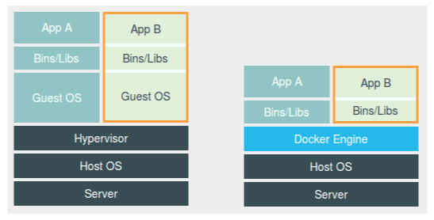
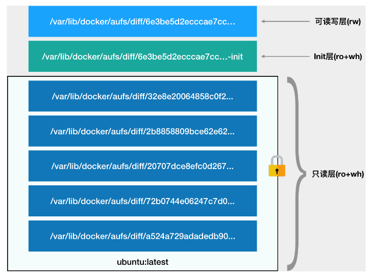
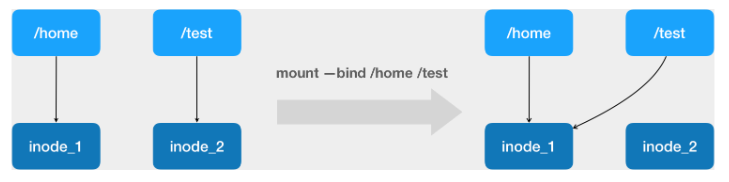

# docker概述

## 背景

在产品开发的过程中，开发团队开发好的应用需要在运维环境中运行，即使开发团队告诉运维团队应用运行的整体环境，但因为运行环境情况复杂，有时也会出现应用在一台服务器上运行正常，在另一台服务器上部署失败的现象，docker的出现解决了这个问题：docker可以从环境到应用整体打包，实现在不同平台上快速高效部署。

docker是基于Go语言实现的云开源项目，可以做到用户的应用及运行环境能做到“一次封装，到处运行”。

其实docker和虚拟机有一些相似之处，在虚拟机上我们可以运行一整套软件，运行在虚拟机上的软件对此毫无感知，就像运行在真实系统一样，虚拟机的缺点主要有：资源占用多、冗余步骤多、启动速度慢。

由于以上这些缺点，Linux发展出另一种虚拟化技术：Linux容器（Linux Containers，LXC），它基于进程的隔离，可以将软件所需的所有资源打包到一个隔离的容器中，容器不需要捆绑一整套操作系统，也没有硬件虚拟，只需要软件运行所需的库资源和设置，因此LXC比虚拟机要轻量很多。

## docker的特点

docker的4大优点：

1、更快速的应用交付和部署：传统的应用开发完成后，需要提供一堆安装程序和配置说明文档，安装部署后需根据配置文档进行繁杂的配置才能正常运行。Docker化之后只需要交付少量容器镜像文件，在正式生产环境加载镜像并运行即可，应用安装配置在镜像里已经内置好，大大节省部署配置和测试验证时间。

2、更便捷的升级和扩缩容：随着微服务架构和Docker的发展，大量的应用会通过微服务方式架构，应用的开发构建将变成搭乐高积木一样，每个Docker容器将变成一块“积木”，应用的升级将变得非常容易。当现有的容器不足以支撑业务处理时，可通过镜像运行新的容器进行快速扩容，使应用系统的扩容从原先的天级变成分钟级甚至秒级。

3、更简单的系统运维：应用容器化运行后，生产环境运行的应用可与开发、测试环境的应用高度一致，容器会将应用程序相关的环境和状态完全封装起来，不会因为底层基础架构和操作系统的不一致性给应用带来影响，产生新的BUG。当出现程序异常时，也可以通过测试环境的相同容器进行快速定位和修复。

4、更高效的计算资源利用：Docker是内核级虚拟化，其不像传统的虚拟化技术一样需要额外的Hypervisor支持，所以在一台物理机上可以运行很多个容器实例，可大大提升物理服务器的CPU和内存的利用率。

## docker和虚拟机的对比

Docker是一个Client-Server结构的系统，Docker守护进程运行在主机上， 然后通过Socket连接从客户端访问，守护进程从客户端接受命令并管理运行在主机上的容器。 容器，是一个运行时环境，就是“集装箱”。

(1)docker有着比虚拟机更少的抽象层。由亍docker不需要Hypervisor实现硬件资源虚拟化，运行在docker容器上的程序直接使用的都是实际物理机的硬件资源。因此在CPU、内存利用率上docker将会在效率上有明显优势。

(2)docker利用的是宿主机的内核,而不需要Guest OS。因此,当新建一个容器时,docker不需要和虚拟机一样重新加载一个操作系统内核，避免引寻、加载操作系统内核返个比较费时费资源的过程,当新建一个虚拟机时,虚拟机软件需要加载Guest OS，返个新建过程是分钟级别的。而docker由于直接利用宿主机的操作系统，则省略了返个过程，因此新建一个docker容器只需要几秒钟。


docker容器和虚拟机的特点对比如下：


## docker的三要素

docker的三要素：镜像、容器和仓库


Docker 镜像（Image）就是一个只读的模板，镜像可以用来创建 Docker 容器，一个镜像可以创建很多容器。

Docker 利用容器（Container）独立运行的一个或一组应用。容器是用镜像创建的运行实例。它可以被启动、开始、停止、删除。每个容器都是相互隔离的、保证安全的平台。可以把容器看做是一个简易版的 Linux 环境（包括root用户权限、进程空间、用户空间和网络空间等）和运行在其中的应用程序。容器的定义和镜像几乎一模一样，也是一堆层的统一视角，唯一区别在于容器的最上面那一层是可读可写的。

仓库（Repository）是集中存放镜像文件的场所。仓库(Repository)和仓库注册服务器（Registry）是有区别的。仓库注册服务器上往往存放着多个仓库，每个仓库中又包含了多个镜像，每个镜像有不同的标签（tag）。仓库分为公开仓库（Public）和私有仓库（Private）两种形式。最大的公开仓库是 Docker Hub(https://hub.docker.com/)，存放了数量庞大的镜像供用户下载。国内的公开仓库包括阿里云 、网易云等。

docker客户端通过命令访问服务端，服务端存有从远程仓库中拉下来的镜像，通过镜像创建一个个的容器，使用简单运行方便。

# docker安装

## 前提

Docker支持以下的CentOS版本：

CentOS 7 (64-bit)、CentOS 6.5 (64-bit) 或更高的版本。

Docker 运行在 CentOS 7 上，要求系统为64位、系统内核版本为 3.10 以上。

Docker 运行在 CentOS-6.5 或更高的版本的 CentOS 上，要求系统为64位、系统内核版本为 2.6.32-431 或者更高版本。

查看自己的内核版本：

~~~
uname -r
~~~

查看已安装的CentOS版本信息：

~~~
cat /etc/redhat-release
~~~

## 安装

CentOS6.8安装docker：

1、Docker使用EPEL发布，RHEL系的OS首先要确保已经持有EPEL仓库，否则先检查OS的版本，然后安装相应的EPEL包：

~~~
yum install -y epel-release
~~~

2、用yum安装docker：

~~~
yum install docker-io
~~~

3、启动docker后台服务：

~~~
service docker start
~~~

这里显示无法识别服务，直接下载源安装：

~~~
yum install https://get.docker.com/rpm/1.7.1/centos-6/RPMS/x86_64/docker-engine-1.7.1-1.el6.x86_64.rpm
~~~

如果有冲突的话要先卸载之前的docker：

~~~
yum remove docker
~~~

4、验证版本：

~~~
docker version
~~~

## 配置镜像加速器

配置运行镜像加速器（阿里云容器镜像服务专属地址），在配置文件/etc/sysconfig/docker：

~~~
other_args="--registry-mirror=https://iyqz584t.mirror.aliyuncs.com"
~~~

重新启动docker服务：

~~~
service docker restart
~~~

运行以下命令如果能看见相关配置就算配置成功：

~~~
ps -ef | grep docker
~~~

如果是CentOS7.0或更高版本的操作系统，修改配置时需要手动创建一个文件/etc/docker/daemon.json，然后在该文件下写入：

~~~
{
  "registry-mirrors":["https://iyqz584t.mirror.aliyuncs.com"]
}
~~~

然后重新加载配置文件并重启服务：

~~~
systemctl daemon-reload
systemctl restart docker
~~~

## 测试

测试运行hello-world：

```
docker run hello-world
```

# docker基本命令

## 帮助命令

查看版本信息、相关信息、帮助信息：

~~~
docker version
docker info
docker --help
~~~

## 镜像命令

### 列出本机镜像

列出本地主机上的镜像：

~~~
docker images [options]
~~~

运行结果：


REPOSITORY：表示镜像的仓库源

TAG：镜像的标签，同一仓库源可以有多个 TAG，代表这个仓库源的不同个版本，我们使用 REPOSITORY:TAG 来定义不同的镜像。

如果你不指定一个镜像的版本标签，例如你只使用 ubuntu，docker 将默认使用 ubuntu:latest 镜像。

IMAGE ID：镜像ID

CREATED：镜像创建时间

SIZE：镜像大小

命令选项说明：-a代表列出本地所有的镜像（含中间映像层）、-q代表只显示镜像ID，批处理镜像的时候经常使用-qa，--digest代表显示镜像的摘要信息，--no-trunc表示显示完整的镜像信息（其中的镜像ID会列出完整的，完整的镜像ID很长）。

### 查找镜像

查找某个镜像，可以直接去官网https://hub.docker.com/查到（或其他的镜像源网站），也可以执行：

~~~
docker search [options] 镜像名
~~~

命令选项说明：-s后加数字代表列出收藏数不小于指定值的镜像，--no-trunc代表显示完整的镜像描述，--automated代表只列出automated build类型的镜像。

注意这个命令的查询还是去官网查询的，镜像加速器的配置只是在拉取镜像时去指定的网址拉取。

运行结果：


### 镜像拉取

镜像拉取命令可以在官网（或指定网站）找到，如拉取tomcat：

~~~
docker pull tomcat
~~~

也可以加上版本号：

~~~
docker pull tomcat:3.2
docker pull tomcat:latest
~~~

运行结果：


倒数第二行就是镜像ID，docker安装的镜像是一层一层的，这里最外层的镜像ID就是tomcat，中间多行都是中间映像层。

### 删除镜像

删除单个镜像，可以通过名字来删，也可以用镜像ID：

~~~
docker rmi -f 镜像名[:TAG]
docker rmi -f 镜像ID
~~~

-f代表强制删除，不加就不能删除在运行的容器对应的镜像。

删除多个镜像：

~~~
docker rmi -f 镜像名1[:TAG] 镜像名2[:TAG]
~~~

删除全部镜像：

~~~
docker rmi -f $(docker images -qa)
~~~

## 容器命令

### run命令

1、交互式容器

新建并启动交互式容器：

~~~
docker run -it 镜像名
~~~

此时会进入交互状态，如果我们在docker中启动centos，就会进入centos容器内部，然后就可以执行centos的命令：


run命令可以用--name="容器新名字": 为容器指定一个名称；

run命令执行的步骤：


2、守护式容器

启动守护式容器，不会与容器进行交互而是在后台运行：

~~~
docker run -d 容器名
~~~

仅仅执行上面这条命令，查看容器状态会发现容器已经自动退出，这里有一个很重要的docker机制：Docker容器后台运行，就必须有一个前台进程。容器运行的命令如果不是那些一直挂起的命令（比如运行top，tail），就是会自动退出的。最佳的解决方案是，将你要运行的程序以前台进程的形式运行：

~~~
docker run -d centos /bin/sh -c "while true;do echo hello;sleep 2;done"
~~~

这个命令代表后台启动centos，然后以2秒一次的频率打印hello，打印结果可以在查看容器命令中看到：

~~~
docker logs -f -t --tail 3 容器ID
~~~

-f代表跟随最新的日志打印，-t代表打印时间戳，--tail代表显示最后n条日志。

3、设置端口映射

启动容器时指定端口映射，如启动tomcat时指定宿主机外部端口8888映射到tomcat容器的8080端口：

~~~
docker run -it -p 8888:8080 tomcat
~~~

-p的形式有以下几种（这里用的就是第三种形式映射）：

ip:hostPort:containerPort、ip::containerPort、hostPort:containerPort、containerPort

也可以使用-P选项来随机指定外部端口：

~~~
docker run -it -P tomcat
~~~

tomcat开放的端口在容器内部指定，默认总是8080，但外部的端口是随机指定的，这个随机指定的端口可以通过ps命令来查看。

### 查看命令

1、查看容器内运行的进程：

~~~
docker top 容器ID
~~~

2、查看容器内部细节：

~~~
docker inspect 容器ID
~~~

3、列出当前所有正在运行的容器：

~~~
docker ps [options]
~~~


其中给容器分配的名字就是run时指定的，如果没有指定就是随机分配的。

命令选项说明：-a :列出当前所有正在运行的容器+历史上运行过的

-l :显示上一个创建运行的容器。

-n：显示最近n个创建运行的容器。

-q :静默模式，只显示容器编号。

--no-trunc :不截断输出。

### 其他命令

1、退出容器：

在容器交互界面执行exit可以关闭容器并退出，执行ctrl+p+q可以不停止容器只退出交互界面。

重新进入容器内部交互：

~~~
docker attach 容器ID
~~~

不进入容器直接在容器内执行相应命令并返回结果，比如进入centos容器中执行ls命令：

~~~
docker exec -it 容器ID ls -l
~~~

也可以用exec命令开启交互模式，此时会启动新的进程：

~~~
docker exec -it /bin/bash
~~~

2、启动容器：

~~~
docker start 容器ID或容器名
~~~

通常是关闭退出容器后要启动容器，可以用ps命令查看启动过的容器然后拿到ID再启动。

3、重启容器：

~~~
docker restart 容器ID或容器名
~~~

4、停止容器：

~~~
docker stop 容器ID或容器名
~~~

5、强制停止容器（比停止容器的速度更快）：

~~~
docker kill 容器ID或容器名
~~~

6、删除已经停止的容器（开启过的容器都会保存在缓存中，需要手动删除容器）：

~~~
docker rm 容器ID
~~~

7、一次性删除所有容器：

~~~
docker rm -f $(docker ps -a -q)      或
docker ps -a -q | xargs docker rm
~~~

8、将容器中的文件拷贝到主机：

~~~
docker cp 容器ID:容器内路径 目的主机存储路径
~~~

## commit操作

我们可以改变容器的设置，然后将修改后的容器以一个新的镜像上传到仓库，以tomcat为例，我们下载一个tomcat镜像并在本地启动容器：

```
docker run -it -p 8080:8080 tomcat
```

然后进入tomcat容器内部进行一些操作，比如删除一些文档或创建一些文档：

```
docker exec -it 容器ID /bin/bash
```

然后将该容器以一个新的镜像上传（1.2是版本号，yong/tomcat02是镜像名）：

```
docker commit -a="作者" -m="信息" 容器ID yong/tomcat02:1.2
```

上传后本地就生成了yong/tomcat02镜像，此时可以通过pull命令在其他服务器拉取镜像了。

## 命令总结

命令总结：


attach    Attach to a running container                 # 当前 shell 下 attach 连接指定运行镜像

build     Build an image from a Dockerfile              # 通过 Dockerfile 定制镜像

commit    Create a new image from a container changes   # 提交当前容器为新的镜像

cp        Copy files/folders from the containers filesystem to the host path   #从容器中拷贝指定文件或者目录到宿主机中

create    Create a new container                        # 创建一个新的容器，同 run，但不启动容器

diff      Inspect changes on a container's filesystem   # 查看 docker 容器变化

events    Get real time events from the server          # 从 docker 服务获取容器实时事件

exec      Run a command in an existing container        # 在已存在的容器上运行命令

export    Stream the contents of a container as a tar archive   # 导出容器的内容流作为一个 tar 归档文件[对应 import ]

history   Show the history of an image                  # 展示一个镜像形成历史

images    List images                                   # 列出系统当前镜像

import    Create a new filesystem image from the contents of a tarball # 从tar包中的内容创建一个新的文件系统映像[对应export]

info      Display system-wide information               # 显示系统相关信息

inspect   Return low-level information on a container   # 查看容器详细信息

kill      Kill a running container                      # kill 指定 docker 容器

load      Load an image from a tar archive              # 从一个 tar 包中加载一个镜像[对应 save]

login     Register or Login to the docker registry server    # 注册或者登陆一个 docker 源服务器

logout    Log out from a Docker registry server          # 从当前 Docker registry 退出

logs      Fetch the logs of a container                 # 输出当前容器日志信息

port      Lookup the public-facing port which is NAT-ed to PRIVATE_PORT    # 查看映射端口对应的容器内部源端口

pause     Pause all processes within a container        # 暂停容器

ps        List containers                               # 列出容器列表

pull      Pull an image or a repository from the docker registry server   # 从docker镜像源服务器拉取指定镜像或者库镜像

push      Push an image or a repository to the docker registry server    # 推送指定镜像或者库镜像至docker源服务器

restart   Restart a running container                   # 重启运行的容器

rm        Remove one or more containers                 # 移除一个或者多个容器

rmi       Remove one or more images             # 移除一个或多个镜像[无容器使用该镜像才可删除，否则需删除相关容器才可继续或 -f 强制删除]

run       Run a command in a new container              # 创建一个新的容器并运行一个命令

save      Save an image to a tar archive                # 保存一个镜像为一个 tar 包[对应 load]

search    Search for an image on the Docker Hub         # 在 docker hub 中搜索镜像

start     Start a stopped containers                    # 启动容器

stop      Stop a running containers                     # 停止容器

tag       Tag an image into a repository                # 给源中镜像打标签

top       Lookup the running processes of a container   # 查看容器中运行的进程信息

unpause   Unpause a paused container                    # 取消暂停容器

version   Show the docker version information           # 查看 docker 版本号

wait      Block until a container stops, then print its exit code   # 截取容器停止时的退出状态值

# docker容器数据卷

## 基本概念

先来看看Docker的理念：

1、将运用与运行的环境打包形成容器运行 ，运行可以伴随着容器，但是我们对数据的要求希望是持久化的

2、容器之间希望有可能共享数据

Docker容器产生的数据，如果不通过docker commit生成新的镜像，使得数据做为镜像的一部分保存下来，那么当容器删除后，数据自然也就没有了。为了能保存数据在docker中我们使用卷。

卷就是目录或文件，存在于一个或多个容器中，由docker挂载到容器，但不属于联合文件系统，因此能够绕过Union File System提供一些用于持续存储或共享数据的特性：

卷的设计目的就是数据的持久化，完全独立于容器的生存周期，因此Docker不会在容器删除时删除其挂载的数据卷。

特点：

1：数据卷可在容器之间共享或重用数据，容器和宿主机之间也可以共享

2：卷中的更改可以直接生效

3：数据卷中的更改不会包含在镜像的更新中

4：数据卷的生命周期一直持续到没有容器使用它为止

## 直接命令添加数据卷

命令添加数据卷：

~~~
docker run -it -v /宿主机绝对路径目录:/容器内目录 镜像名
~~~

如我们可以在centos镜像中添加数据卷（如果对应路径不存在会自动创建）：

~~~
docker run -it -v /myDataVolume:/dataVolumeContainer centos
~~~

通过inspect命令可以通过查看mounts字段数据卷是否挂载成功。挂载成功后容器和宿主机之间就可以共享这个文件的数据，即使容器停止退出后，宿主机更改文件数据，等容器启动后还是能接收到更改的数据。

以只读模式添加数据卷：

~~~
docker run -it -v /宿主机绝对路径目录:/容器内目录:ro 镜像名
~~~

此时容器内该文件的数据只允许主机修改，容器不可以修改，只可以读。

如果添加数据卷后发现写入时报错：cannot open directory .: Permission denied，需要在执行添加数据卷命令后加上一个选项：--privileged=true

## 用dockerFile添加数据卷

首先需要在根目录下新建mydocker文件夹，然后进入该文件夹下创建一个文件名为dockerfile，在该文件中写入：

~~~
# volume test
FROM centos
VOLUME ["/dataVolumeContainer1","/dataVolumeContainer2"]
CMD echo "finished, ------success1"
CMD /bin/bash
~~~

然后用build命令生成镜像：

~~~
docker build -f dockerfile的路径 -t yong/centos .
~~~

其中dockerfile的路径如果是/mydocker/dockerfile可以不用指定路径，yong代表镜像作者，centos是镜像名，这个命令要在mydocker目录中运行。

然后用run命令启动相应的容器，此时数据卷就添加完成了，在dockerfile中的VOLUME语句的作用就是添加数据卷，相当于执行：

~~~
docker run -it -v /host1:/dataVolumeContainer1 -v /host2:/dataVolumeContainer2 centos /bin/bash
~~~

在直接命令添加数据卷中显式指定了宿主机数据卷的路径，但是这种指定在不同的OS中不能很好的统一，用dockerFile添加数据卷后，宿主机数据卷的路径不是显式指定的，而需要通过inspect命令返回的mounts属性查看

## 数据容器卷

命名的容器挂载数据卷，其它容器通过挂载这个(父容器)实现数据共享，挂载数据卷的容器，称之为数据卷容器。

如果我们启动一个容器名为dc01，按照dockerFile的配置dc01已经添加了数据卷，然后我们启动容器dc02继承自dc01：

~~~
docker run -it --name dc02 --volumes-from dc01 镜像名
~~~

同时以同样方法启动dc03，现在dc02和dc03都继承自dc01，这三个容器之间就完成了数据共享，dc01在数据卷中的修改和dc02和dc03在数据卷中的修改都能同步到一起，这些修改之间互相可见，三个容器即使删除了两个，还剩下一个，那么在这最后一个容器中，之前所有的修改都还保存在数据卷中。即使最后删除dc01和dc02，启动dc04继承dc03，然后再删除dc03，那么dc04的数据卷中还能看见之前三个容器的修改操作，这就是数据容器卷的数据共享机制，它的特点可以用一句话表达：数据卷的生命周期一直持续到没有容器使用它为止。

# docker和联合文件系统

镜像是基于联合文件系统的：

UnionFS（联合文件系统）：Union文件系统（UnionFS）是一种分层、轻量级并且高性能的文件系统，它支持对文件系统的修改作为一次提交来一层层的叠加，同时可以将不同目录挂载到同一个虚拟文件系统下(unite several directories into a single virtual filesystem)。Union 文件系统是 Docker 镜像的基础。镜像可以通过分层来进行继承，基于基础镜像（没有父镜像），可以制作各种具体的应用镜像。

特性：一次同时加载多个文件系统，但从外面看起来，只能看到一个文件系统，联合加载会把各层文件系统叠加起来，这样最终的文件系统会包含所有底层的文件和目录。

镜像加载原理：

docker的镜像实际上由一层一层的文件系统组成，这种文件系统就是UnionFS：

.png)

bootfs(boot file system)主要包含bootloader和kernel，bootloader主要是引导加载kernel，Linux刚启动时会加载bootfs文件系统，在Docker镜像的最底层是bootfs。这一层与我们典型的Linux/Unix系统是一样的，包含boot加载器和内核。当boot加载完成之后整个内核就都在内存中了，此时内存的使用权已由bootfs转交给内核，此时系统也会卸载bootfs。

rootfs (root file system) ，在bootfs之上。包含的就是典型 Linux 系统中的 /dev， /proc， /bin，/etc 等标准目录和文件。rootfs就是各种不同的操作系统发行版，比如Ubuntu，Centos等等。对于一个精简的OS，rootfs可以很小，只需要包括最基本的命令、工具和程序库就可以了，因为底层直接用宿主机的kernel，自己只需要提供 rootfs 就行了。由此可见对于不同的linux发行版，bootfs基本是一致的，rootfs会有差别，因此不同的发行版可以公用bootfs。

docker的镜像是一种分层结构，在前面docker pull的时候就可以看出来，以tomcat镜像为例，想要加载tomcat镜像必须加载其中最重要的几层，最外层才是tomcat：


采用分层结构最大的一个好处就是共享资源。比如：有多个镜像都从相同的 base 镜像构建而来，那么宿主机只需在磁盘上保存一份base镜像，同时内存中也只需加载一份 base 镜像，就可以为所有容器服务了。而且镜像的每一层都可以被共享。

docker镜像都是只读的，当容器启动时，一个新的可写层被加载到镜像顶部，这一层通常被称为容器层，容器层之下的都叫镜像层。

# DockerFile解析

## 基本概念

dockerFile是用来构件Docker镜像的构建文件，是由一系列命令和参数构成的脚本。有了dockerFile文件就能据此建立镜像，然后启动容器执行。官方centos的DockerFile如下：

~~~
FROM scratch
MAINTAINER The CentOS Project <cloud-ops@centos.org>
ADD centos-7.2.1511-docker.tar.xz /

LABEL name="CentOS Base Image"
LABEL vendor="CentOS"
LABEL license=GPLv2

# Volumes for systemd
# VOLUME ["/run", "/tmp"]

# Environment for systemd
# ENV container=docker

# For systemd usage this changes to /usr/sbin/init
# Keeping it as /bin/bash for compatability with previous
CMD ["/bin/bash"]
~~~

在DockerFile中有以下基础规则：

1、每条保留字指令都必须为大写字母而且后面要跟随至少一个参数

2、指令按照从上到下，顺序执行

3、#表示注释

4、每条指令都会创建一个新的镜像层，并对镜像进行提交

Docker执行DockerFile的大致流程：

1、docker从文件中指定的基础镜像运行一个容器

2、执行一条指令并对容器作出修改，每条指令都会创建一个新的镜像层并对镜像进行提交

3、docker根据新镜像再运行一个新容器

4、执行DockerFile中的下一条指令直到所有指令都完成

从应用软件的角度来看，Dockerfile、Docker镜像与Docker容器分别代表软件的三个不同阶段，

1、Dockerfile是软件的原材料

2、Docker镜像是软件的交付品

3、Docker容器则可以认为是软件的运行态。

Dockerfile面向开发，Docker镜像成为交付标准，Docker容器则涉及部署与运维，三者缺一不可，合力充当Docker体系的基石。

.png)

## dockerFile的保留字指令

|    关键字     |                    作用                    |
| :--------: | :--------------------------------------: |
|    FROM    |          基础镜像，代表当前的新镜像是基于哪个镜像的           |
| MAINTAINER |              镜像维护者的姓名和邮箱地址               |
|    RUN     |               容器构建时需要运行的命令               |
|   EXPOSE   |               当前容器对外暴露出的端口               |
|  WORKDIR   |          指定在创建容器时终端默认登录后的工作目录位置          |
|    ENV     |     在构建镜像过程中设置环境变量，可以在其他指令中使用这些环境变量      |
|    ADD     | 将宿主机目录下的文件拷贝进镜像且ADD命令会自动处理URL和解压tar压缩包，ADD的作用是拷贝+解压 |
|    COPY    | 类似ADD，拷贝文件和目录到镜像中。将从构建上下文目录中的源路径的文件/目录复制到新一层镜像内的目标路径位置，形式有两种COPY src dest或COPY["src","dest"] |
|   VOLUME   |            容器数据卷，用于数据保存和持久化工作            |
|    CMD     | 指定一个容器启动时要执行的命令，但只有最后一个CMD指令生效，CMD会被docker run后的参数替换（docker run后跟命令CMD就会失效） |
| ENTRYPOINT | 和CMD一样，但是可以指定多个指令，且启动容器时可以在docker run后可以跟选项，选项会自动加到最后一个ENTRYPOINT指令中 |
|  ONBUILD   | 当构建一个被继承的DockerFile时运行命令，父镜像在被子继承后父镜像的onbuild被触发，例如在dockerFile1写入ONBUILD 命令a，构建dockerFile1生成镜像image，然后在dockerFile2中写入FROM image，在构建dockerFile2的过程中就会触发命令a |

## 例1：自定义镜像mycentos

明确需求：自定义一个centos镜像，可以执行vim命令、ifconfig命令，初次运行登录后位置在/tmp。

自定义dockerFile如下：

~~~
FROM centos
MAINTAINER zzyy<zzyy167@126.com>

ENV MYPATH /usr/local
WORKDIR $MYPATH

RUN yum -y install vim
RUN yum -y install net-tools

EXPOSE 80

CMD echo $MYPATH
CMD echo "success--------------ok"
CMD /bin/bash
~~~

在mydockerFile目录下新建Dockerfile文件，然后在目录下执行命令用build命令生成镜像：

~~~
docker build -t mycentos:1.3 .
~~~


可以看到dockerFile创建镜像都是一层一层执行并提交的。

可以执行下列命令查看镜像的变更历史：

~~~
docker history 镜像ID
~~~


可以看到最初的基础镜像大小只有215M，然后安装vim命令用了57M，安装net-tools用了14M。

## 例2：自定义镜像tomcat9

将压缩包拷贝进当前目录，然后建立dockerFile如下：

~~~
FROM         centos
MAINTAINER    zzyy<zzyybs@126.com>
#把宿主机当前上下文的c.txt拷贝到容器/usr/local/路径下
COPY c.txt /usr/local/cincontainer.txt
#把java与tomcat添加到容器中
ADD jdk-8u171-linux-x64.tar.gz /usr/local/
ADD apache-tomcat-9.0.8.tar.gz /usr/local/
#安装vim编辑器
RUN yum -y install vim
#设置工作访问时候的WORKDIR路径，登录落脚点
ENV MYPATH /usr/local
WORKDIR $MYPATH
#配置java与tomcat环境变量
ENV JAVA_HOME /usr/local/jdk1.8.0_171
ENV CLASSPATH $JAVA_HOME/lib/dt.jar:$JAVA_HOME/lib/tools.jar
ENV CATALINA_HOME /usr/local/apache-tomcat-9.0.8
ENV CATALINA_BASE /usr/local/apache-tomcat-9.0.8
ENV PATH $PATH:$JAVA_HOME/bin:$CATALINA_HOME/lib:$CATALINA_HOME/bin
#容器运行时监听的端口
EXPOSE  8080
#启动时运行tomcat
# ENTRYPOINT ["/usr/local/apache-tomcat-9.0.8/bin/startup.sh" ]
# CMD ["/usr/local/apache-tomcat-9.0.8/bin/catalina.sh","run"]
CMD /usr/local/apache-tomcat-9.0.8/bin/startup.sh && tail -F /usr/local/apache-tomcat-9.0.8/bin/logs/catalina.out
~~~

然后构建该镜像，启动命令如下：

~~~
docker run -d -p 9080:8080 --name myt9 -v /zzyyuse/mydockerfile/tomcat9/test:/usr/local/apache-tomcat-9.0.8/webapps/test -v /zzyyuse/mydockerfile/tomcat9/tomcat9logs/:/usr/local/apache-tomcat-9.0.8/logs --privileged=true zzyytomcat9
~~~

启动命令表示以后台运行模式启动该容器，设置端口映射9080到8080，设置容器名为myt9，设置两个数据卷，方便往tomcat中放置web应用，以及查看tomcat日志。

运行后就可以访问9080端口查看tomcat启动情况，还可以将web应用放在/zzyyuse/mydockerfile/tomcat9/test目录下，重启容器后就可以访问此web应用了。

自定义dockerFile的场景基本上都是从其他dockerFile入手，然后进行自定义修改的。

# Docker与K8S

## 云计算发展历史

最开始有一个叫dotCloud的公司，开源了自己的容器项目Docker，它改变了整个云计算领域的发展历程。

之前PaaS（Platform-As-A-Service）项目被大家接纳的一个主要原因，就是它提供了一种名叫“应用托管”的能力。 在当时，虚拟机和云计算已经是比较普遍的技术和服务了，那时主流用户的普遍用法，就是租一批AWS或者OpenStack的虚拟机，然后像以前管理物理服务器那样，用脚本或者手工的方式在这些机器上部署应用。 

像Cloud Foundry这样的PaaS项目，最核心的组件就是一套应用的打包和分发机制，Cloud Foundry为每种主流编程语言都定义了一种打包格式，用户把应用的可执行文件和启动脚本打进一个压缩包内，上传到云上Cloud Foundry的存储中。接着，Cloud Foundry会通过调度器选择一个可以运行这个应用的虚拟机，然后通知这个机器上的Agent把应用压缩包下载下来启动。

由于需要在一个虚拟机上启动很多个来自不同用户的应用，Cloud Foundry会调用操作系统的Cgroups和Namespace机制为每一个应用单独创建一个称作“沙盒”的隔离环境，然后在“沙盒”中启动这些应用进程。这样，就实现了把多个用户的应用互不干涉地在虚拟机里批量地、自动地运行起来的目的。 这个所谓的沙盒，就是容器的概念。

Docker项目确实与Cloud Foundry的容器在大部分功能和实现原理上都是一样的，但它的关键功能是Docker镜像。PaaS之所以能够帮助用户大规模部署应用到集群里，是因为它提供了一套应用打包的功能，一旦用上了PaaS，用户就必须为每种语言、每种框架，甚至每个版本的应用维护一个打好的包。这个打包过程，没有任何章法可循，更麻烦的是，明明在本地运行得好好的应用，却需要做很多修改和配置工作才能在PaaS里运行起来。而这些修改和配置，并没有什么经验可以借鉴，基本上得靠不断试错，直到你摸清楚了本地应用和远端PaaS匹配的“脾气”才能够搞定。 

而Docker镜像解决的，恰恰就是打包这个根本性的问题。大多数Docker镜像是直接由一个完整操作系统的所有文件和目录构成的，所以这个压缩包里的内容跟你本地开发和测试环境用的操作系统是完全一样的。 这个压缩包包含了完整的操作系统文件和目录，也就是包含了这个应用运行所需要的所有依赖，所以你可以先用这个压缩包在本地进行开发和测试，完成之后，再把这个压缩包上传到云端运行。在这个过程中，你完全不需要进行任何配置或者修改，因为这个压缩包赋予了你一种极其宝贵的能力：本地环境和云端环境的高度一致，这就是Docker镜像的精髓。

有了Docker镜像这个利器，PaaS里最核心的打包系统一下子就没了用武之地，最让用户抓狂的打包过程也随之消失了。 Docker项目给PaaS世界带来的“降维打击”，其实是提供了一种非常便利的打包机制。这种机制直接打包了应用运行所需要的整个操作系统，从而保证了本地环境和云端环境的高度一致，避免了用户通过“试错”来匹配两种不同运行环境之间差异的痛苦过程。

不过，Docker项目固然解决了应用打包的难题，但正如前面所介绍的那样，它并不能代替PaaS完成大规模部署应用的职责。 一些机敏的创业公司，纷纷在第一时间推出了Docker容器集群管理的开源项目（比如Deis和Flynn），它们一般称自己为CaaS，即Container-as-a-Service，用来跟“过时”的PaaS们划清界限。 

Docker公司也发布了Swarm，它是一个集群管理项目，最大亮点是完全使用Docker项目原本的容器管理API来完成集群管理。最终，谷歌的Kubernetes依靠设计理念、号召力、稳定和扩展性，战胜了Swarm

##容器技术

容器技术的核心功能，就是通过约束和修改进程的动态表现，从而为其创造出一个“边界”。应用与应用之间，就因为有了边界而不至于相互干扰。

容器的关键技术：Cgroups和Namespace

对于Docker等大多数Linux容器来说，Cgroups技术是用来制造约束的主要手段，而Namespace技术则是用来修改进程视图的主要方法。

下面会介绍Linux容器技术，之所以要强调Linux容器，是因为比如Docker on Mac，以及Windows Docker（Hyper-V实现），实际上是基于虚拟化技术实现的， 跟容器技术完全不同。

###Namespace

在容器中执行ps命令会发现，只能看到容器内部的进程，看不到宿主机和其他容器的进程。这种机制，其实就是对被隔离应用的进程空间做了手脚，使得这些进程只能看到重新计算过的进程编号，比如PID=1。可实际上，他们在宿主机的操作系统里，还是原来的第100号进程。 

这种技术，就是Linux里面的Namespace机制。它其实只是Linux创建新进程的一个可选参数。在Linux系统中创建进程的系统调用是clone()，比如： 

~~~c
int pid = clone(main_function, stack_size, SIGCHLD, NULL); 
~~~

这个系统调用就会为我们创建一个新的进程，并且返回它的进程号pid。

而当我们用clone()系统调用创建一个新进程时，就可以在参数中指定CLONE_NEWPID参数，比如：

~~~c
int pid = clone(main_function, stack_size, CLONE_NEWPID | SIGCHLD, NULL); 
~~~

这时，新创建的这个进程将会“看到”一个全新的进程空间，在这个进程空间里，它的PID是1。之所以说“看到”，是因为这只是一个“障眼法”，在宿主机真实的进程空间里，这个进程的PID还是真实的数值，比如100。 

我们还可以多次执行上面的clone()调用，这样就会创建多个PID Namespace，而每个Namespace里的应用进程，都会认为自己是当前容器里的第1号进程，它们既看不到宿主机里真正的进程空间，也看不到其他PID Namespace里的具体情况。 

除了我们刚刚用到的PID Namespace，Linux操作系统还提供了Mount、UTS、IPC、Network和User这些Namespace，用来对各种不同的进程上下文进行“障眼法”操作：

* Mount Namespace：用于让被隔离进程只看到当前Namespace里的挂载点信息 
* Network Namespace：用于让被隔离进程看到当前Namespace里的网络设备和配置。 

所以Docker容器实际上就是在创建容器进程的时候，指定了这个进程所需要启用的一组Namespace参数。这样，容器就只能“看”到当前Namespace所限定的资源、文件、设备、状态，或者配置。而对于宿主机以及其他不相关的程序，它就完全看不到了。 

容器本质上就是一个特殊的进程而已，所以对于下面这张虚拟机和容器的对比图来说，是不准确的：



这幅图的左边，画出了虚拟机的工作原理。其中，名为Hypervisor的软件是虚拟机最主要的部分。它通过硬件虚拟化功能，模拟出了运行一个操作系统需要的各种硬件，比如CPU、内存、I/O设备等等。然后，它在这些虚拟的硬件上安装了一个新的操作系统，即Guest OS。

这样，用户的应用进程就可以运行在这个虚拟的机器中，它能看到的自然也只有Guest OS的文件和目录，以及这个机器里的虚拟设备。这就是为什么虚拟机也能起到将不同的应用进程相互隔离的作用。

而这幅图的右边，则用一个名为Docker Engine的软件替换了Hypervisor。这也是为什么，很多人会把Docker项目称为“轻量级”虚拟化技术的原因，实际上就是把虚拟机的概念套在了容器上。

之所以说这个图的概念不准确，是因为在使用Docker的时候，并没有一个真正的“Docker容器”运行在宿主机里面。Docker项目帮助用户启动的，还是原来的应用进程，只不过在创建这些进程时，Docker为它们加上了各种各样的Namespace参数。这时，这些进程就会觉得自己是各自PID Namespace里的第1号进程，只能看到各自Mount Namespace里挂载的目录和文件，只能访问到各自Network Namespace里的网络设备，就仿佛运行在一个个“容器”里面，与世隔绝。  

所以，在这个对比图里，我们应该把Docker画在跟应用同级别并且靠边的位置。这意味着，用户运行在容器里的应用进程，跟宿主机上的其他进程一样，都由宿主机操作系统统一管理。

虚拟机的资源消耗和占用较大，而且用户应用运行在虚拟机里面，它对宿主机操作系统的调用就不可避免地要经过虚拟化软件的拦截和处理，这本身又是一层性能损耗。相比之下，容器化后的用户应用，却依然还是一个宿主机上的普通进程，这就意味着这些因为虚拟化而带来的性能损耗都是不存在的；而另一方面，使用Namespace作为隔离手段的容器并不需要单独的Guest OS，这就使得容器额外的资源占用几乎可以忽略不计， 这就是Docker高性能的根源。

Docker因容器技术得到了高性能，但对应的，也存在一些弊端，那就是隔离不彻底。既然容器只是运行在宿主机上的一种特殊的进程，那么多个容器之间使用的就还是同一个宿主机的操作系统内核。尽管你可以在容器里通过Mount Namespace单独挂载其他不同版本的操作系统文件，比如CentOS或者Ubuntu，但这并不能改变共享宿主机内核的事实。这意味着，如果你要在Windows宿主机上运行Linux容器，或者在低版本的Linux宿主机上运行高版本的Linux容器，都是行不通的。 

此外，在Linux内核中，有很多资源和对象是不能被Namespace化的，最典型的例子就是：时间。如果在容器中修改了时间，整个宿主机的时间都会被随之修改。因为这种隔离的不彻底，在安全方面也会有很多挑战，尤其是共享宿主机内核的事实，容器给应用暴露出来的攻击面是相当大的，应用“越狱”的难度自然也比虚拟机低得多。 

###Cgroups

虽然容器内的第1号进程在“障眼法”的干扰下只能看到容器里的情况，但是宿主机上，它作为第100号进程与其他所有进程之间依然是平等的竞争关系。这就意味着，虽然第100号进程表面上被隔离了起来，但是它所能够使用到的资源（比如CPU、内存），却是可以随时被宿主机上的其他进程（或者其他容器）占用的。当然，这个100号进程自己也可能把所有资源吃光。 

为了对进程设置资源限制，就要用到Linux内核提供的Cgroups功能。Linux Cgroups的全称是Linux Control Group。它最主要的作用，就是限制一个进程组能够使用的资源上限，包括CPU、内存、磁盘、网络带宽等等。此外，Cgroups还能够对进程进行优先级设置、审计，以及将进程挂起和恢复等操作。 

在Linux中，Cgroups给用户暴露出来的操作接口是文件系统，即它以文件和目录的方式组织在操作系统的/sys/fs/cgroup路径下。在Ubuntu 16.04机器里，我可以用mount指令把它们展示出来，这条命令是： 

~~~
$ mount -t cgroup 
cpuset on /sys/fs/cgroup/cpuset type cgroup (rw,nosuid,nodev,noexec,relatime,cpuset)
cpu on /sys/fs/cgroup/cpu type cgroup (rw,nosuid,nodev,noexec,relatime,cpu)
cpuacct on /sys/fs/cgroup/cpuacct type cgroup (rw,nosuid,nodev,noexec,relatime,cpuacct)
blkio on /sys/fs/cgroup/blkio type cgroup (rw,nosuid,nodev,noexec,relatime,blkio)
memory on /sys/fs/cgroup/memory type cgroup (rw,nosuid,nodev,noexec,relatime,memory)
...
~~~

它的输出结果，是一系列文件系统目录。如果你在自己的机器上没有看到这些目录，那你就需要自己去挂载Cgroups 。

可以看到，在/sys/fs/cgroup下面有很多诸如cpuset、cpu、 memory这样的子目录，也叫子系统。这些都是我这台机器当前可以被Cgroups进行限制的资源种类。而在子系统对应的资源种类下，你就可以看到该类资源具体可以被限制的方法。比如，对CPU子系统来说，我们就可以看到如下几个配置文件，这个指令是： 

~~~
$ ls /sys/fs/cgroup/cpu
cgroup.clone_children cpu.cfs_period_us cpu.rt_period_us  cpu.shares notify_on_release
cgroup.procs      cpu.cfs_quota_us  cpu.rt_runtime_us cpu.stat  tasks
~~~

这里面就包含对CPU限制的细节，例如cfs_period和cfs_quota，这两个参数需要组合使用，可以用来限制进程在长度为cfs_period的一段时间内，只能被分配到总量为cfs_quota的CPU时间。 

如果在/sys/fs/cgroup/cpu下创建一个目录container，系统会自动生成该子系统对应的资源限制文件，在初始状态下，这些配置文件中的值都是默认值：

~~~
$ cat /sys/fs/cgroup/cpu/container/cpu.cfs_quota_us 
-1
$ cat /sys/fs/cgroup/cpu/container/cpu.cfs_period_us 
100000
~~~

代表CPU quota还没有任何限制（即：-1），CPU period则是默认的100 ms（100000 us） 

如果要对进程进行限制，首先要将被限制的进程的PID写入container组里的tasks文件：

~~~
$ echo 226 > /sys/fs/cgroup/cpu/container/tasks 
~~~

然后修改各限制文件的初始值，如向container组里的cfs_quota文件写入20 ms（20000 us） ：

~~~
$ echo 20000 > /sys/fs/cgroup/cpu/container/cpu.cfs_quota_us
~~~

它意味着在每100 ms的时间里，被该控制组限制的进程只能使用20 ms的CPU时间，也就是说这个进程只能使用到20%的CPU带宽。 这样进程资源限制就完成了。

除CPU子系统外，Cgroups的每一个子系统都有其独有的资源限制能力，比如： 

- blkio，为块设备设定I/O限制，一般用于磁盘等设备；
- cpuset，为进程分配单独的CPU核和对应的内存节点；
- memory，为进程设定内存使用的限制。

Linux Cgroups就是一个子系统目录加上一组资源限制文件的组合，而对于Docker等Linux容器项目来说，它们只需要在每个子系统下面，为每个容器创建一个控制组（即创建一个新目录），然后在启动容器进程之后，把这个进程的PID填写到对应控制组的tasks文件中就可以了。 

容器的资源限制可以在运行docker镜像时指定：

~~~
$ docker run -it --cpu-period=100000 --cpu-quota=20000 ubuntu /bin/bash
~~~

在启动这个容器后，我们可以通过查看Cgroups文件系统下，CPU子系统中，“docker”这个控制组里的资源限制文件的内容来确认： 

~~~
$ cat /sys/fs/cgroup/cpu/docker/5d5c9f67d/cpu.cfs_period_us 
100000
$ cat /sys/fs/cgroup/cpu/docker/5d5c9f67d/cpu.cfs_quota_us 
20000
~~~

这就意味着这个Docker容器，只能使用到20%的CPU带宽。 

Cgroups对资源的限制能力也有很多不完善的地方，其中一个重要的问题是/proc文件系统的问题。Linux下的/proc目录存储的是记录当前内核运行状态的一系列特殊文件，用户可以通过访问这些文件，查看系统以及当前正在运行的进程的信息，比如CPU使用情况、内存占用率等，这些文件也是top指令查看系统信息的主要数据来源。 如果在容器里执行top指令，就会发现，它显示的信息居然是宿主机的CPU和内存数据，而不是当前容器的数据。

造成这个问题的原因就是，/proc文件系统并不知道用户通过Cgroups给这个容器做了什么样的资源限制，即：/proc文件系统不了解Cgroups限制的存在。

### 根文件系统rootfs

容器的文件系统也应该隔离起来，容器里的应用进程，理应看到一份完全独立的文件系统。这样，它就可以在自己的容器目录（比如/tmp）下进行操作，而完全不会受宿主机以及其他容器的影响。 

观察下列代码，它在创建子进程时开启指定的Namespace：

~~~c
#define _GNU_SOURCE
#include <sys/mount.h> 
#include <sys/types.h>
#include <sys/wait.h>
#include <stdio.h>
#include <sched.h>
#include <signal.h>
#include <unistd.h>
#define STACK_SIZE (1024 * 1024)
static char container_stack[STACK_SIZE];
char* const container_args[] = {
  "/bin/bash",
  NULL
};

int container_main(void* arg)
{  
  printf("Container - inside the container!\n");
  execv(container_args[0], container_args);
  printf("Something's wrong!\n");
  return 1;
}

int main()
{
  printf("Parent - start a container!\n");
  int container_pid = clone(container_main, container_stack+STACK_SIZE, CLONE_NEWNS | SIGCHLD , NULL);
  waitpid(container_pid, NULL, 0);
  printf("Parent - container stopped!\n");
  return 0;
}
~~~

在main函数里，我们通过clone()系统调用创建了一个新的子进程container_main，并且声明要为它启用Mount Namespace（即：CLONE_NEWNS标志）。

而这个子进程执行的，是一个“/bin/bash”程序，也就是一个shell。所以这个shell就运行在了Mount Namespace的隔离环境中。当编译执行这段程序后：

~~~
$ gcc -o ns ns.c
$ ./ns
Parent - start a container!
Container - inside the container!
~~~

这样，我们就进入了这个“容器”当中。可是，如果在“容器”里执行一下ls指令的话，还是会看到宿主机的文件。也就是，即使开启了Mount Namespace，容器进程看到的文件系统也跟宿主机完全一样。 这是因为Mount Namespace修改的，是容器进程对文件系统“挂载点”的认知。只有在“挂载”这个操作发生之后，进程的视图才会被改变。而在此之前，新创建的容器会直接继承宿主机的各个挂载点。 

如果在创建新进程时，增加一个挂载的步骤，告诉容器以tmpfs（内存盘）格式，重新挂载了/tmp目录 ：

~~~c
int container_main(void* arg)
{
  printf("Container - inside the container!\n");
  // 如果你的机器的根目录的挂载类型是shared，那必须先重新挂载根目录
  // mount("", "/", NULL, MS_PRIVATE, "");
  mount("none", "/tmp", "tmpfs", 0, "");
  execv(container_args[0], container_args);
  printf("Something's wrong!\n");
  return 1;
}
~~~

这样再次执行后，如果查看/tmp之后，可以看到该目录是空的，这意味着重新挂载生效了。我们可以用mount -l检查一下： 

~~~
$ mount -l | grep tmpfs
none on /tmp type tmpfs (rw,relatime)
~~~

更重要的是，因为我们创建的新进程启用了Mount Namespace，所以这次重新挂载的操作，只在容器进程的Mount Namespace中有效。如果在宿主机上用mount -l来检查一下这个挂载，你会发现它是不存在的： 

~~~
# 在宿主机上
$ mount -l | grep tmpfs
~~~

如果想要容器进程看到的文件系统就是一个独立的隔离环境，我们可以在容器进程启动之前重新挂载它的整个根目录“/”。而由于Mount Namespace的存在，这个挂载对宿主机不可见，所以容器进程就可以在里面随便折腾了。 

在Linux操作系统里，有一个名为chroot的命令可以帮助你在shell中方便地完成这个工作。顾名思义，它的作用就是帮你“change root file system”，即改变进程的根目录到你指定的位置。 chroot命令的用法：

假设，我们现在有一个$HOME/test目录，想要把它作为一个/bin/bash进程的根目录。

首先，创建一个test目录和几个lib文件夹：

~~~
$ mkdir -p $HOME/test
$ mkdir -p $HOME/test/{bin,lib64,lib}
$ cd $T
~~~

然后，把bash命令拷贝到test目录对应的bin路径下： 

~~~
$ cp -v /bin/{bash,ls} $HOME/test/bin
~~~

接下来，把bash命令需要的所有so文件，也拷贝到test目录对应的lib路径下。找到so文件可以用ldd 命令： 

~~~
$ T=$HOME/test
$ list="$(ldd /bin/ls | egrep -o '/lib.*\.[0-9]')"
$ for i in $list; do cp -v "$i" "${T}${i}"; done
~~~

最后，执行chroot命令，告诉操作系统，我们将使用$HOME/test目录作为/bin/bash进程的根目录： 

~~~
$ chroot $HOME/test /bin/bash
~~~

这时，你如果执行"ls /"，就会看到，它返回的都是$HOME/test目录下面的内容，而不是宿主机的内容。

更重要的是，对于被chroot的进程来说，它并不会感受到自己的根目录已经被“修改”成$HOME/test了。

它被修改的原理，和Linux Namespace很类似。实际上，Mount Namespace正是基于对chroot的不断改良才被发明出来的，它也是Linux操作系统里的第一个Namespace。

为了能够让容器的这个根目录看起来更“真实”，我们一般会在这个容器的根目录下挂载一个完整操作系统的文件系统，比如Ubuntu16.04的ISO。这样，在容器启动之后，我们在容器里通过执行"ls /"查看根目录下的内容，就是Ubuntu 16.04的所有目录和文件。 而这个挂载在容器根目录上、用来为容器进程提供隔离后执行环境的文件系统，就是所谓的“容器镜像”。它还有一个更为专业的名字，叫作：rootfs（根文件系统）

所以，一个最常见的rootfs，或者说容器镜像，会包括如下所示的一些目录和文件，比如/bin，/etc，/proc等等： 

~~~
$ ls /
bin dev etc home lib lib64 mnt opt proc root run sbin sys tmp usr var
~~~

综上，对Docker项目来说，它最核心的原理实际上就是为待创建的用户进程：

1. 启用Linux Namespace配置；
2. 设置指定的Cgroups参数；
3. 切换进程的根目录（Change Root）。

这样，一个完整的容器就诞生了。不过，Docker项目在最后一步的切换上会优先使用pivot_root系统调用，如果系统不支持，才会使用chroot。这两个系统调用虽然功能类似，但是也有细微的区别。

rootfs只是一个操作系统所包含的文件、配置和目录，并不包括操作系统内核。同一台机器上的所有容器，都共享宿主机操作系统的内核，这就意味着，容器进程对内核参数、模块的修改会直接影响其他容器，这也是容器相比于虚拟机的缺陷。毕竟虚拟机运行一个完整的Guest OS

由于rootfs里打包的不只是应用，而是整个操作系统的文件和目录，也就意味着，应用以及它运行所需要的所有依赖，都被封装在了一起。对一个应用来说，编程语言层面的依赖很重要，但操作系统本身才是它运行所需要的最完整的“依赖库”。有了容器镜像“打包操作系统”的能力，这个最基础的依赖环境也终于变成了应用沙盒的一部分，这就赋予了容器所谓的一致性：无论在本地、云端，还是在一台任何地方的机器上，用户只需要解压打包好的容器镜像，那么这个应用运行所需要的完整的执行环境就被重现出来了。

这种深入到操作系统级别的运行环境一致性，打通了应用在本地开发和远端执行环境之间难以逾越的鸿沟。

### 联合文件系统

构造roofs这个动作，应该是可以重复利用的。例如我现在用Ubuntu操作系统的ISO做了一个rootfs，然后又在里面安装了Java环境，用来部署我的Java应用。那么，我的另一个同事在发布他的Java应用时，显然希望能够直接使用我安装过Java环境的rootfs，而不是重复这个流程。 

而保存roofs这个动作，是需要基于增量修改的。如果修改了同一个roofs就会诞生两个完全不同的roofs需要保存，那最后要保存的数据总量是巨大的。如果能把修改增量化，所有人都只需要维护相对于base rootfs修改的增量内容，而不是每次修改都制造一个“fork”。 

基于这种思想，Docker在镜像的设计中，引入了层（layer）的概念。也就是说，用户制作镜像的每一步操作，都会生成一个层，也就是一个增量rootfs。 这利用了一种叫作联合文件系统（Union File System）的能力 

Union File System也叫UnionFS，最主要的功能是将多个不同位置的目录联合挂载（union mount）到同一个目录下。比如，我现在有两个目录A和B，它们分别有两个文件： 

~~~
$ tree
.
├── A
│  ├── a
│  └── x
└── B
  ├── b
  └── x
~~~

然后，我使用联合挂载的方式，将这两个目录挂载到一个公共的目录C上： 

~~~
$ mkdir C
$ mount -t aufs -o dirs=./A:./B none ./C
~~~

这时，我再查看目录C的内容，就能看到目录A和B下的文件被合并到了一起： 

~~~
$ tree ./C
./C
├── a
├── b
└── x
~~~

可以看到，在这个合并后的目录C里，有a、b、x三个文件，并且x文件只有一份。这，就是“合并”的含义。此外，如果你在目录C里对a、b、x文件做修改，这些修改也会在对应的目录A、B中生效。 

docker在不同的操作系统和不同的版本中有不同的联合文件系统的实现，以AuFS为例，如果我们启动一个容器：

~~~
$ docker run -d ubuntu:latest sleep 3600
~~~

这时候，Docker就会从Docker Hub上拉取一个Ubuntu镜像到本地。

这个所谓的“镜像”，实际上就是一个Ubuntu操作系统的rootfs，它的内容是Ubuntu操作系统的所有文件和目录。不过，与之前我们讲述的rootfs稍微不同的是，Docker镜像使用的rootfs，往往由多个“层”组成：

~~~
$ docker image inspect ubuntu:latest
...
     "RootFS": {
      "Type": "layers",
      "Layers": [
        "sha256:f49017d4d5ce9c0f544c...",
        "sha256:8f2b771487e9d6354080...",
        "sha256:ccd4d61916aaa2159429...",
        "sha256:c01d74f99de40e097c73...",
        "sha256:268a067217b5fe78e000..."
      ]
    }
~~~

可以看到，这个Ubuntu镜像，实际上由五个层组成。这五个层就是五个增量rootfs，每一层都是Ubuntu操作系统文件与目录的一部分；而在使用镜像时，Docker会把这些增量联合挂载在一个统一的挂载点上（等价于前面例子里的“/C”目录）。

这个挂载点就是/var/lib/docker/aufs/mnt/，比如：

~~~
$ ls /var/lib/docker/aufs/mnt/6e3be5d2ecccae7cc0fcfa2a2f5c89dc21ee30e166be823ceaeba15dce645b3e
bin boot dev etc home lib lib64 media mnt opt proc root run sbin srv sys tmp usr var
~~~

这个目录里面正是一个完整的Ubuntu操作系统。

通过查看AuFS的挂载信息，我们可以找到这个目录对应的AuFS的内部ID（也叫：si）： 

~~~
$ cat /proc/mounts| grep aufs
none /var/lib/docker/aufs/mnt/6e3be5d2ecccae7cc0fc... aufs rw,relatime,si=972c6d361e6b32ba,dio,dirperm1 0 0
~~~

即，si=972c6d361e6b32ba。

然后使用这个ID，你就可以在/sys/fs/aufs下查看被联合挂载在一起的各个层的信息：

~~~
$ cat /sys/fs/aufs/si_972c6d361e6b32ba/br[0-9]*
/var/lib/docker/aufs/diff/6e3be5d2ecccae7cc...=rw
/var/lib/docker/aufs/diff/6e3be5d2ecccae7cc...-init=ro+wh
/var/lib/docker/aufs/diff/32e8e20064858c0f2...=ro+wh
/var/lib/docker/aufs/diff/2b8858809bce62e62...=ro+wh
/var/lib/docker/aufs/diff/20707dce8efc0d267...=ro+wh
/var/lib/docker/aufs/diff/72b0744e06247c7d0...=ro+wh
/var/lib/docker/aufs/diff/a524a729adadedb90...=ro+wh
~~~

从这些信息里，我们可以看到，镜像的层都放置在/var/lib/docker/aufs/diff目录下，然后被联合挂载在/var/lib/docker/aufs/mnt里面。

而且，从这个结构可以看出来，这个容器的rootfs由如下图所示的三部分组成：



三个部分的解读：

* 第一部分：只读层。它是这个容器的rootfs最下面的五层，对应的正是ubuntu:latest镜像的五层。可以看到，它们的挂载方式都是只读的（ro+wh，即readonly+whiteout），这些层，都以增量的方式分别包含了Ubuntu操作系统的一部分 

* 第二部分：可读写层，它是这个容器的rootfs最上面的一层。它的挂载方式为：rw，即read write。在没有写入文件之前，这个目录是空的。而一旦在容器里做了写操作，你修改产生的内容就会以增量的方式出现在这个层中。 如果删除只读层的一个文件，AuFS会在可读写层创建一个whiteout文件，把只读层里的文件“遮挡”起来。

  比如，你要删除只读层里一个名叫foo的文件，那么这个删除操作实际上是在可读写层创建了一个名叫.wh.foo的文件。这样，当这两个层被联合挂载之后，foo文件就会被.wh.foo文件“遮挡”起来，“消失”了。这个功能，就是“ro+wh”的挂载方式，即只读+whiteout的含义。我喜欢把whiteout形象地翻译为：“白障”。 

  最上面这个可读写层的作用，就是专门用来存放你修改rootfs后产生的增量，无论是增、删、改，都发生在这里，不会涉及到下面几层。

* 第三部分：init层，它夹在只读层和读写层之间。Init层是Docker项目单独生成的一个内部层，专门用来存放/etc/hosts、/etc/resolv.conf等信息。需要这样一层的原因是，这些文件本来属于只读的Ubuntu镜像的一部分，但是用户往往需要在启动容器时写入一些指定的值比如hostname，所以就需要在可读写层对它们进行修改。  这些修改往往只对当前的容器有效，我们并不希望执行docker commit时，把这些信息连同可读写层一起提交掉，所以就以一个单独的层挂载出来。

最终，这7个层都被联合挂载到/var/lib/docker/aufs/mnt目录下，表现为一个完整的Ubuntu操作系统供容器使用。 

### Volume 

Volume机制，允许你将宿主机上指定的目录或者文件，挂载到容器里面进行读取和修改操作。

在Docker项目里，它支持两种Volume声明方式，可以把宿主机目录挂载进容器的/test目录当中： 

~~~
$ docker run -v /test ...
$ docker run -v /home:/test ...
~~~

而这两种声明方式的本质，实际上是相同的：都是把一个宿主机的目录挂载进了容器的/test目录。 区别是：

* 第一种情况下，由于你并没有显示声明宿主机目录，那么Docker就会默认在宿主机上创建一个临时目录 /var/lib/docker/volumes/[VOLUME_ID]/_data，然后把它挂载到容器的/test目录上。 
* 第二种情况下，Docker就直接把宿主机的/home目录挂载到容器的/test目录上。 

当容器进程被创建之后，尽管开启了Mount Namespace，但是在它执行chroot（或者pivot_root）之前，容器进程一直可以看到宿主机上的整个文件系统。 

只需要在rootfs准备好之后，在执行chroot之前，把Volume指定的宿主机目录（比如/home目录），挂载到指定的容器目录（比如/test目录）在宿主机上对应的目录（即/var/lib/docker/aufs/mnt/[可读写层ID]/test）上，这个Volume的挂载工作就完成了。 

更重要的是，由于执行这个挂载操作时，“容器进程”已经创建了，也就意味着此时Mount Namespace已经开启了。所以，这个挂载事件只在这个容器里可见。你在宿主机上，是看不见容器内部的这个挂载点的。这就保证了容器的隔离性不会被Volume打破。

这里提到的"容器进程"，是Docker创建的一个容器初始化进程(dockerinit)，而不是应用进程(ENTRYPOINT + CMD)。dockerinit会负责完成根目录的准备、挂载设备和目录、配置hostname等一系列需要在容器内进行的初始化操作。最后，它通过execv()系统调用，让应用进程取代自己，成为容器里的PID=1的进程。 

这里说的挂载技术，就是Linux的绑定挂载（bind mount）机制。它的主要作用就是，允许你将一个目录或者文件，而不是整个设备，挂载到一个指定的目录上。并且，这时你在该挂载点上进行的任何操作，只是发生在被挂载的目录或者文件上，而原挂载点的内容则会被隐藏起来且不受影响。

绑定挂载实际上是一个inode替换的过程。mount --bind /home /test，会将/home挂载到/test上。其实相当于将/test的dentry，重定向到了/home的inode。这样当我们修改/test目录时，实际修改的是/home目录的inode。这也就是为何，一旦执行umount命令，/test目录原先的内容就会恢复：因为修改真正发生在的，是/home目录里。 



绑定挂载可以让进程在容器里对这个/test目录进行的所有操作，都实际发生在宿主机的对应目录（比如，/home，或者/var/lib/docker/volumes/[VOLUME_ID]/_data）里，而不会影响容器镜像的内容。 

这个已经挂载到容器的目录，虽然挂载在容器rootfs的可读写层，但不会被docker commit提交，因为docker commit，都是发生在宿主机空间的。而由于Mount Namespace的隔离作用，宿主机并不知道这个绑定挂载的存在。所以，在宿主机看来，容器中可读写层的/test目录（/var/lib/docker/aufs/mnt/[可读写层ID]/test），始终是空的。不过，由于Docker一开始还是要创建/test这个目录作为挂载点，所以执行了docker commit之后，你会发现新产生的镜像里，会多出来一个空的/test目录，虽然内容是空的。

## 发布容器

### Dockerfile 

以用Docker部署一个用Python编写的Web应用为例。

这个应用的代码部分（app.py）非常简单：

~~~python
from flask import Flask
import socket
import os

app = Flask(__name__)

@app.route('/')
def hello():
    html = "<h3>Hello {name}!</h3>" \
           "<b>Hostname:</b> {hostname}<br/>"           
    return html.format(name=os.getenv("NAME", "world"), hostname=socket.gethostname())
    
if __name__ == "__main__":
    app.run(host='0.0.0.0', port=80)
~~~

在这段代码中，我使用Flask框架启动了一个Web服务器，而它唯一的功能是：如果当前环境中有“NAME”这个环境变量，就把它打印在“Hello”之后，否则就打印“Hello world”，最后再打印出当前环境的hostname。

这个应用的依赖，则被定义在了同目录下的requirements.txt文件里，内容如下所示：

~~~
$ cat requirements.txt
Flask
~~~

将应用容器化的第一步就是制作容器镜像，Docker提供了一种便捷的方式叫Dockerfile，如下图所示：

~~~dockerfile
# 使用官方提供的Python开发镜像作为基础镜像
FROM python:2.7-slim

# 将工作目录切换为/app
WORKDIR /app

# 将当前目录下的所有内容复制到/app下
ADD . /app

# 使用pip命令安装这个应用所需要的依赖
RUN pip install --trusted-host pypi.python.org -r requirements.txt

# 允许外界访问容器的80端口
EXPOSE 80

# 设置环境变量
ENV NAME World

# 设置容器进程为：python app.py，即：这个Python应用的启动命令
CMD ["python", "app.py"]
~~~

DockerFile使用一些标准的原语（即大写高亮的词语），描述我们所要构建的Docker镜像。并且这些原语，都是按顺序处理的。

比如FROM原语，指定了“python:2.7-slim”这个官方维护的基础镜像，从而免去了安装Python等语言环境的操作。否则，这一段我们就得这么写了： 

~~~
FROM ubuntu:latest
RUN apt-get update -yRUN apt-get install -y python-pip python-dev build-essential
...
~~~

其中，RUN原语就是在容器里执行shell命令的意思。 

WORKDIR的意思是，Dockerfile后面的操作都以这一句指定的/app目录作为当前目录 

最后的CMD，意思是Dockerfile指定python app.py为这个容器的进程。这里，app.py的实际路径是/app/app.py。所以，CMD ["python", "app.py"]等价于"docker run \<image\> python app.py"。

在使用Dockerfile时，还有一个重要的原语是ENTRYPOINT，它和CMD都是Docker容器进程启动所必需的参数，完整的命令执行格式是：“ENTRYPOINT CMD” 。默认情况下，Docker会为你提供一个隐含的ENTRYPOINT，即：/bin/sh -c ，所以运行在容器里的完整进程是这样的：

~~~
/bin/sh -c "python app.py"
~~~

ENTRYPOINT被称为Docker容器的启动进程。

需要注意的是，Dockerfile里的原语并不都是指对容器内部的操作。就比如ADD，它指的是把当前目录（即Dockerfile所在的目录）里的文件，复制到指定容器内的目录当中。 

### 启动容器

把DockerFile本身和用到的文件都放到一个目录：

~~~
$ ls
Dockerfile  app.py   requirements.txt
~~~

接下来就可以制作Docker镜像了：

~~~
$ docker build -t helloworld .
~~~

其中，-t的作用是给这个镜像加一个Tag。docker build会自动加载当前目录下的Dockerfile文件，然后按照顺序，执行文件中的原语。而这个过程，实际上可以等同于Docker使用基础镜像启动了一个容器，然后在容器中依次执行Dockerfile中的原语。 

Dockerfile中的每个原语执行后，都会生成一个对应的镜像层。即使原语本身并没有明显地修改文件的操作（比如，ENV原语），它对应的层也会存在。只不过在外界看来，这个层是空的。

docker build操作完成后，我可以通过docker images命令查看结果： 

~~~
$ docker image ls

REPOSITORY            TAG                 IMAGE ID
helloworld         latest              653287cdf998
~~~

通过这个镜像ID，就可以查看这些新增的层在AuFS路径下对应的文件和目录了。 

接下来使用这个镜像来启动容器：

~~~
$ docker run -p 4000:80 helloworld
~~~

在这一句命令中，镜像名helloworld后面，我什么都不用写，因为在Dockerfile中已经指定了CMD。否则，我就得把进程的启动命令加在后面： 

~~~
$ docker run -p 4000:80 helloworld python app.py
~~~

容器启动之后，我可以使用docker ps命令看到： 

~~~
$ docker ps
CONTAINER ID        IMAGE               COMMAND             CREATED
4ddf4638572d        helloworld       "python app.py"     10 seconds ago
~~~

通过-p 4000:80告诉了Docker，请把容器内的80端口映射在宿主机的4000端口上。 

这样做的目的是，只要访问宿主机的4000端口，我就可以看到容器里应用返回的结果： 

~~~
$ curl http://localhost:4000
<h3>Hello World!</h3><b>Hostname:</b> 4ddf4638572d<br/>
~~~

否则，我就得先用docker inspect命令查看容器的IP地址，然后访问“http://<容器IP地址>:80”才可以看到容器内应用的返回。 

### docker exec

使用docker exec命令可以进入容器然后完成一些操作：

~~~
$ docker exec -it 4ddf4638572d /bin/sh
~~~

之所以能完成这样的操作，也是基于Namespace的原理。

Linux Namespace创建的隔离空间虽然看不见摸不着，但一个进程的Namespace信息在宿主机上是确确实实存在的，并且是以一个文件的方式存在。比如，通过如下指令，你可以看到当前正在运行的Docker容器的进程号（PID）是25686： 

~~~
$ docker inspect --format '{{ .State.Pid }}'  4ddf4638572d
25686
~~~

这时，你可以通过查看宿主机的proc文件，看到这个25686进程的所有Namespace对应的文件： 

~~~bash
$ ls -l  /proc/25686/ns
total 0
lrwxrwxrwx 1 root root 0 Aug 13 14:05 cgroup -> cgroup:[4026531835]
lrwxrwxrwx 1 root root 0 Aug 13 14:05 ipc -> ipc:[4026532278]
lrwxrwxrwx 1 root root 0 Aug 13 14:05 mnt -> mnt:[4026532276]
lrwxrwxrwx 1 root root 0 Aug 13 14:05 net -> net:[4026532281]
lrwxrwxrwx 1 root root 0 Aug 13 14:05 pid -> pid:[4026532279]
lrwxrwxrwx 1 root root 0 Aug 13 14:05 pid_for_children -> pid:[4026532279]
lrwxrwxrwx 1 root root 0 Aug 13 14:05 user -> user:[4026531837]
lrwxrwxrwx 1 root root 0 Aug 13 14:05 uts -> uts:[4026532277]
~~~

可以看到，一个进程的每种Linux Namespace，都在它对应的/proc/[进程号]/ns下有一个对应的虚拟文件，并且链接到一个真实的Namespace文件上。 

这也就意味着：一个进程，可以选择加入到某个进程已有的Namespace当中，从而达到“进入”这个进程所在容器的目的，这正是docker exec的实现原理。

而这个操作所依赖的，乃是一个名叫setns()的Linux系统调用。它的调用方法，我可以用如下一段小程序为你说明： 

~~~c
#define _GNU_SOURCE
#include <fcntl.h>
#include <sched.h>
#include <unistd.h>
#include <stdlib.h>
#include <stdio.h>

#define errExit(msg) do { perror(msg); exit(EXIT_FAILURE);} while (0)

int main(int argc, char *argv[]) {
    int fd;
    
    fd = open(argv[1], O_RDONLY);
    if (setns(fd, 0) == -1) {
        errExit("setns");
    }
    execvp(argv[2], &argv[2]); 
    errExit("execvp");
}
~~~

这段代码功能非常简单：它一共接收两个参数，第一个参数是argv[1]，即当前进程要加入的Namespace文件的路径，比如/proc/25686/ns/net；而第二个参数，则是你要在这个Namespace里运行的进程，比如/bin/bash。

这段代码的核心操作，则是通过open()系统调用打开了指定的Namespace文件，并把这个文件的描述符fd交给setns()使用。在setns()执行后，当前进程就加入了这个文件对应的Linux Namespace当中了。

编译执行一下这个程序，加入到容器进程（PID=25686）的Network Namespace中： 

~~~bash
$ gcc -o set_ns set_ns.c 
$ ./set_ns /proc/25686/ns/net /bin/bash 
$ ifconfig
eth0      Link encap:Ethernet  HWaddr 02:42:ac:11:00:02  
          inet addr:172.17.0.2  Bcast:0.0.0.0  Mask:255.255.0.0
          inet6 addr: fe80::42:acff:fe11:2/64 Scope:Link
          UP BROADCAST RUNNING MULTICAST  MTU:1500  Metric:1
          RX packets:12 errors:0 dropped:0 overruns:0 frame:0
          TX packets:10 errors:0 dropped:0 overruns:0 carrier:0
	   collisions:0 txqueuelen:0 
          RX bytes:976 (976.0 B)  TX bytes:796 (796.0 B)

lo        Link encap:Local Loopback  
          inet addr:127.0.0.1  Mask:255.0.0.0
          inet6 addr: ::1/128 Scope:Host
          UP LOOPBACK RUNNING  MTU:65536  Metric:1
          RX packets:0 errors:0 dropped:0 overruns:0 frame:0
          TX packets:0 errors:0 dropped:0 overruns:0 carrier:0
	  collisions:0 txqueuelen:1000 
          RX bytes:0 (0.0 B)  TX bytes:0 (0.0 B)
~~~

正如上所示，当我们执行ifconfig命令查看网络设备时，看到的是前面启动的Docker容器里的网卡。也就是说，我新创建的这个/bin/bash进程，由于加入了该容器进程（PID=25686）的Network Namepace，它看到的网络设备与这个容器里是一样的，即：/bin/bash进程的网络设备视图，也被修改了。 

而一旦一个进程加入到了另一个Namespace当中，在宿主机的Namespace文件上，也会有所体现。 假如刚刚执行的bash进程号是28499，可以查看该进程的namespace信息：

~~~
$ ls -l /proc/28499/ns/net
lrwxrwxrwx 1 root root 0 Aug 13 14:18 /proc/28499/ns/net -> net:[4026532281]

$ ls -l  /proc/25686/ns/net
lrwxrwxrwx 1 root root 0 Aug 13 14:05 /proc/25686/ns/net -> net:[4026532281]
~~~

在/proc/[PID]/ns/net目录下，这个PID=28499进程，与我们前面的Docker容器进程（PID=25686）指向的Network Namespace文件完全一样。这说明这两个进程，共享了这个名叫net:[4026532281]的Network Namespace。 

Docker还专门提供了一个参数，可以让你启动一个容器并“加入”到另一个容器的Network Namespace里，这个参数就是-net，比如: 

~~~
$ docker run -it --net container:4ddf4638572d busybox ifconfig
~~~

这样，我们新启动的这个容器，就会直接加入到ID=4ddf4638572d的容器，也就是我们前面的创建的Python应用容器（PID=25686）的Network Namespace中。 而如果我指定–net=host，就意味着这个容器不会为进程启用Network Namespace。这就意味着，这个容器拆除了Network Namespace的“隔离墙”，所以，它会和宿主机上的其他普通进程一样，直接共享宿主机的网络栈。这就为容器直接操作和使用宿主机网络提供了一个渠道。 

### 上传镜像

为了能上传镜像，首先需要注册一个Docker Hub账号，然后使用docker login命令登录

接下来，我要用docker tag命令给容器镜像起一个完整的名字：

~~~
$ docker tag helloworld geektime/helloworld:v1
~~~

其中，geektime是我在Docker Hub上的用户名，它的“学名”叫镜像仓库（Repository）；“/”后面的helloworld是这个镜像的名字，而“v1”则是我给这个镜像分配的版本号。 

然后执行docker push上传镜像到Docker Hub：

~~~
$ docker push geektime/helloworld:v1
~~~

此外，我还可以使用docker commit指令，把一个正在运行的容器，直接提交为一个镜像。一般来说，需要这么操作原因是：这个容器运行起来后，我又在里面做了一些操作，并且要把操作结果保存到镜像里，比如： 

~~~bash
$ docker exec -it 4ddf4638572d /bin/sh
# 在容器内部新建了一个文件
root@4ddf4638572d:/app# touch test.txt
root@4ddf4638572d:/app# exit

#将这个新建的文件提交到镜像中保存
$ docker commit 4ddf4638572d geektime/helloworld:v2
~~~

docker commit，实际上就是在容器运行起来后，把最上层的“可读写层”，加上原先容器镜像的只读层，打包组成了一个新的镜像。当然，下面这些只读层在宿主机上是共享的，不会占用额外的空间。 

打包新的镜像之后，也可以将它推送到Docker Hub上：

~~~
$ docker push geektime/helloworld:v2
~~~

综上，这个容器就是由这些要素构成的：


这个容器进程“python app.py”，运行在由Linux Namespace和Cgroups构成的隔离环境里；而它运行所需要的各种文件，比如python，app.py，以及整个操作系统文件，则由多个联合挂载在一起的rootfs层提供。

这些rootfs层的最下层，是来自Docker镜像的只读层。

在只读层之上，是Docker自己添加的Init层，用来存放被临时修改过的/etc/hosts等文件。

而rootfs的最上层是一个可读写层，它以Copy-on-Write的方式存放任何对只读层的修改，容器声明的Volume的挂载点，也出现在这一层。

## Kubernetes架构


