# docker概述

## 背景

在产品开发的过程中，开发团队开发好的应用需要在运维环境中运行，即使开发团队告诉运维团队应用运行的整体环境，但因为运行环境情况复杂，有时也会出现应用在一台服务器上运行正常，在另一台服务器上部署失败的现象，docker的出现解决了这个问题：docker可以从环境到应用整体打包，实现在不同平台上快速高效部署。

docker是基于Go语言实现的云开源项目，可以做到用户的应用及运行环境能做到“一次封装，到处运行”。

其实docker和虚拟机有一些相似之处，在虚拟机上我们可以运行一整套软件，运行在虚拟机上的软件对此毫无感知，就像运行在真实系统一样，虚拟机的缺点主要有：资源占用多、冗余步骤多、启动速度慢。

由于以上这些缺点，Linux发展出另一种虚拟化技术：Linux容器（Linux Containers，LXC），它基于进程的隔离，可以将软件所需的所有资源打包到一个隔离的容器中，容器不需要捆绑一整套操作系统，也没有硬件虚拟，只需要软件运行所需的库资源和设置，因此LXC比虚拟机要轻量很多。

## docker的特点

docker的4大优点：

1、更快速的应用交付和部署：传统的应用开发完成后，需要提供一堆安装程序和配置说明文档，安装部署后需根据配置文档进行繁杂的配置才能正常运行。Docker化之后只需要交付少量容器镜像文件，在正式生产环境加载镜像并运行即可，应用安装配置在镜像里已经内置好，大大节省部署配置和测试验证时间。

2、更便捷的升级和扩缩容：随着微服务架构和Docker的发展，大量的应用会通过微服务方式架构，应用的开发构建将变成搭乐高积木一样，每个Docker容器将变成一块“积木”，应用的升级将变得非常容易。当现有的容器不足以支撑业务处理时，可通过镜像运行新的容器进行快速扩容，使应用系统的扩容从原先的天级变成分钟级甚至秒级。

3、更简单的系统运维：应用容器化运行后，生产环境运行的应用可与开发、测试环境的应用高度一致，容器会将应用程序相关的环境和状态完全封装起来，不会因为底层基础架构和操作系统的不一致性给应用带来影响，产生新的BUG。当出现程序异常时，也可以通过测试环境的相同容器进行快速定位和修复。

4、更高效的计算资源利用：Docker是内核级虚拟化，其不像传统的虚拟化技术一样需要额外的Hypervisor支持，所以在一台物理机上可以运行很多个容器实例，可大大提升物理服务器的CPU和内存的利用率。

## docker和虚拟机的对比

Docker是一个Client-Server结构的系统，Docker守护进程运行在主机上， 然后通过Socket连接从客户端访问，守护进程从客户端接受命令并管理运行在主机上的容器。 容器，是一个运行时环境，就是“集装箱”。

(1)docker有着比虚拟机更少的抽象层。由亍docker不需要Hypervisor实现硬件资源虚拟化，运行在docker容器上的程序直接使用的都是实际物理机的硬件资源。因此在CPU、内存利用率上docker将会在效率上有明显优势。

(2)docker利用的是宿主机的内核,而不需要Guest OS。因此,当新建一个容器时,docker不需要和虚拟机一样重新加载一个操作系统内核，避免引寻、加载操作系统内核返个比较费时费资源的过程,当新建一个虚拟机时,虚拟机软件需要加载Guest OS，返个新建过程是分钟级别的。而docker由于直接利用宿主机的操作系统，则省略了返个过程，因此新建一个docker容器只需要几秒钟。

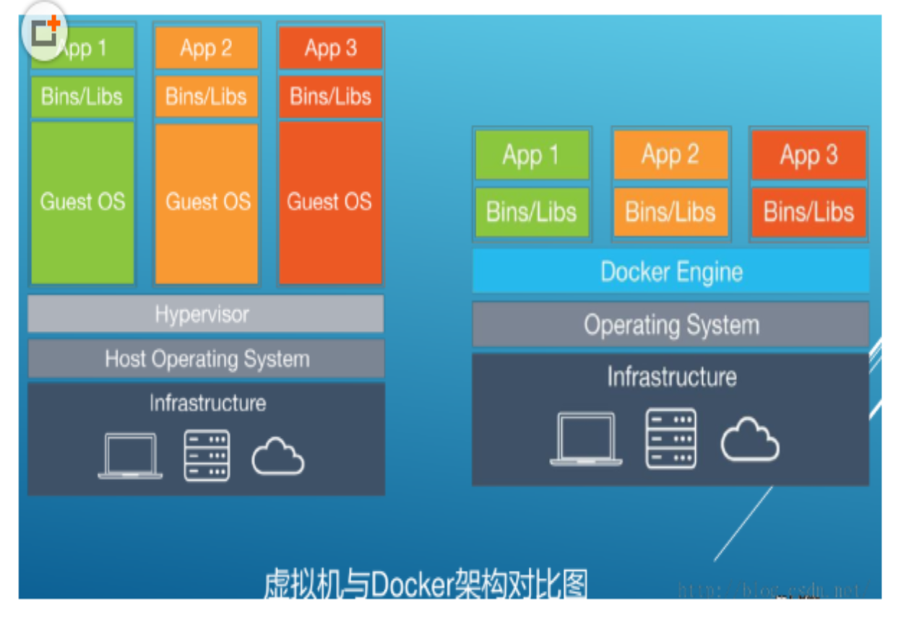

docker容器和虚拟机的特点对比如下：

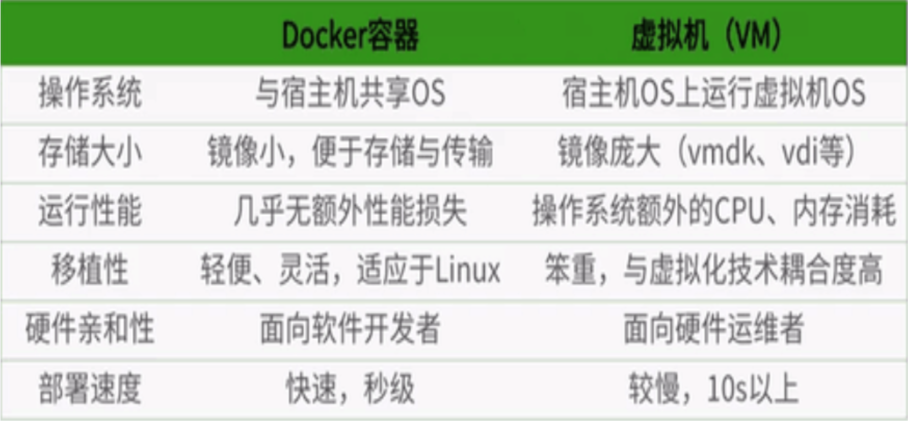

## docker的三要素

docker的三要素：镜像、容器和仓库

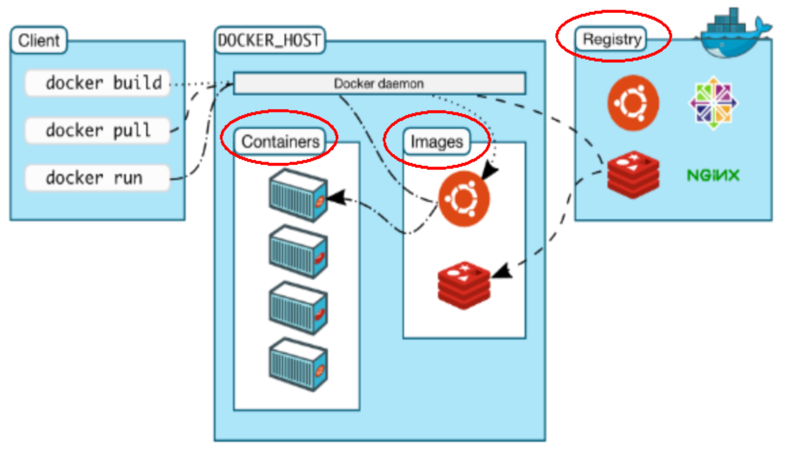

Docker 镜像（Image）就是一个只读的模板，镜像可以用来创建 Docker 容器，一个镜像可以创建很多容器。

Docker 利用容器（Container）独立运行的一个或一组应用。容器是用镜像创建的运行实例。它可以被启动、开始、停止、删除。每个容器都是相互隔离的、保证安全的平台。可以把容器看做是一个简易版的 Linux 环境（包括root用户权限、进程空间、用户空间和网络空间等）和运行在其中的应用程序。容器的定义和镜像几乎一模一样，也是一堆层的统一视角，唯一区别在于容器的最上面那一层是可读可写的。

仓库（Repository）是集中存放镜像文件的场所。仓库(Repository)和仓库注册服务器（Registry）是有区别的。仓库注册服务器上往往存放着多个仓库，每个仓库中又包含了多个镜像，每个镜像有不同的标签（tag）。仓库分为公开仓库（Public）和私有仓库（Private）两种形式。最大的公开仓库是 Docker Hub(https://hub.docker.com/)，存放了数量庞大的镜像供用户下载。国内的公开仓库包括阿里云 、网易云等。

docker客户端通过命令访问服务端，服务端存有从远程仓库中拉下来的镜像，通过镜像创建一个个的容器，使用简单运行方便。

# docker安装

## 前提

Docker支持以下的CentOS版本：

CentOS 7 (64-bit)、CentOS 6.5 (64-bit) 或更高的版本。

Docker 运行在 CentOS 7 上，要求系统为64位、系统内核版本为 3.10 以上。

Docker 运行在 CentOS-6.5 或更高的版本的 CentOS 上，要求系统为64位、系统内核版本为 2.6.32-431 或者更高版本。

查看自己的内核版本：

~~~
uname -r
~~~

查看已安装的CentOS版本信息：

~~~
cat /etc/redhat-release
~~~

## 安装

CentOS6.8安装docker：

1、Docker使用EPEL发布，RHEL系的OS首先要确保已经持有EPEL仓库，否则先检查OS的版本，然后安装相应的EPEL包：

~~~
yum install -y epel-release
~~~

2、用yum安装docker：

~~~
yum install docker-io
~~~

3、启动docker后台服务：

~~~
service docker start
~~~

这里显示无法识别服务，直接下载源安装：

~~~
yum install https://get.docker.com/rpm/1.7.1/centos-6/RPMS/x86_64/docker-engine-1.7.1-1.el6.x86_64.rpm
~~~

如果有冲突的话要先卸载之前的docker：

~~~
yum remove docker
~~~

4、验证版本：

~~~
docker version
~~~

## 配置镜像加速器

配置运行镜像加速器（阿里云容器镜像服务专属地址），在配置文件/etc/sysconfig/docker：

~~~
other_args="--registry-mirror=https://iyqz584t.mirror.aliyuncs.com"
~~~

重新启动docker服务：

~~~
service docker restart
~~~

运行以下命令如果能看见相关配置就算配置成功：

~~~
ps -ef | grep docker
~~~

如果是CentOS7.0或更高版本的操作系统，修改配置时需要手动创建一个文件/etc/docker/daemon.json，然后在该文件下写入：

~~~
{
  "registry-mirrors":["https://iyqz584t.mirror.aliyuncs.com"]
}
~~~

然后重新加载配置文件并重启服务：

~~~
systemctl daemon-reload
systemctl restart docker
~~~

## 测试

测试运行hello-world：

```
docker run hello-world
```

# docker基本命令

## 帮助命令

查看版本信息、相关信息、帮助信息：

~~~
docker version
docker info
docker --help
~~~

## 镜像命令

### 列出本机镜像

列出本地主机上的镜像：

~~~
docker images [options]
~~~

运行结果：

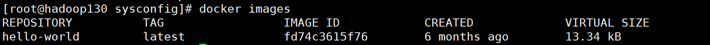

REPOSITORY：表示镜像的仓库源

TAG：镜像的标签，同一仓库源可以有多个 TAG，代表这个仓库源的不同个版本，我们使用 REPOSITORY:TAG 来定义不同的镜像。

如果你不指定一个镜像的版本标签，例如你只使用 ubuntu，docker 将默认使用 ubuntu:latest 镜像。

IMAGE ID：镜像ID

CREATED：镜像创建时间

SIZE：镜像大小

命令选项说明：-a代表列出本地所有的镜像（含中间映像层）、-q代表只显示镜像ID，批处理镜像的时候经常使用-qa，--digest代表显示镜像的摘要信息，--no-trunc表示显示完整的镜像信息（其中的镜像ID会列出完整的，完整的镜像ID很长）。

### 查找镜像

查找某个镜像，可以直接去官网https://hub.docker.com/查到（或其他的镜像源网站），也可以执行：

~~~
docker search [options] 镜像名
~~~

命令选项说明：-s后加数字代表列出收藏数不小于指定值的镜像，--no-trunc代表显示完整的镜像描述，--automated代表只列出automated build类型的镜像。

注意这个命令的查询还是去官网查询的，镜像加速器的配置只是在拉取镜像时去指定的网址拉取。

运行结果：

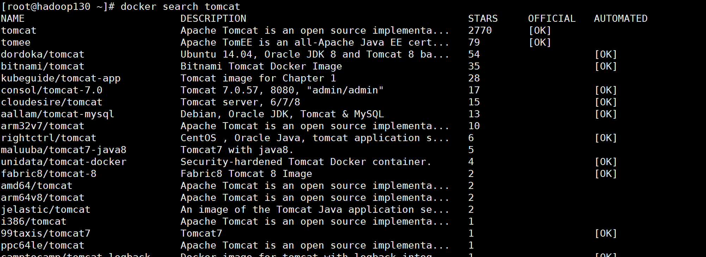

### 镜像拉取

镜像拉取命令可以在官网（或指定网站）找到，如拉取tomcat：

~~~
docker pull tomcat
~~~

也可以加上版本号：

~~~
docker pull tomcat:3.2
docker pull tomcat:latest
~~~

运行结果：

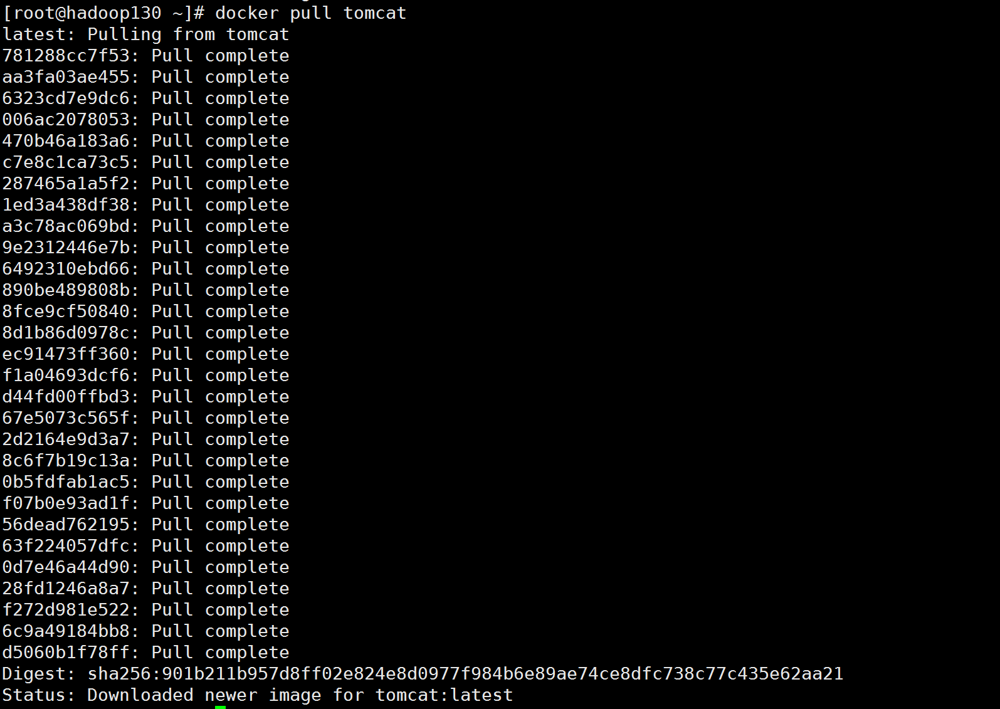

倒数第二行就是镜像ID，docker安装的镜像是一层一层的，这里最外层的镜像ID就是tomcat，中间多行都是中间映像层。

### 删除镜像

删除单个镜像，可以通过名字来删，也可以用镜像ID：

~~~
docker rmi -f 镜像名[:TAG]
docker rmi -f 镜像ID
~~~

-f代表强制删除，不加就不能删除在运行的容器对应的镜像。

删除多个镜像：

~~~
docker rmi -f 镜像名1[:TAG] 镜像名2[:TAG]
~~~

删除全部镜像：

~~~
docker rmi -f $(docker images -qa)
~~~

## 容器命令

### run命令

1、交互式容器

新建并启动交互式容器：

~~~
docker run -it 镜像名
~~~

此时会进入交互状态，如果我们在docker中启动centos，就会进入centos容器内部，然后就可以执行centos的命令：

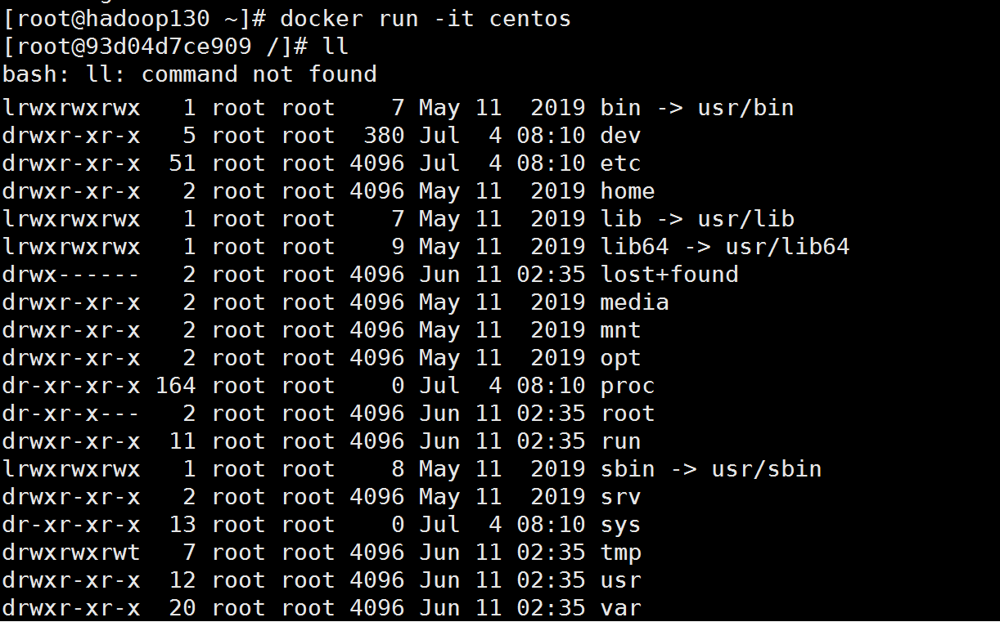

run命令可以用--name="容器新名字": 为容器指定一个名称；

run命令执行的步骤：

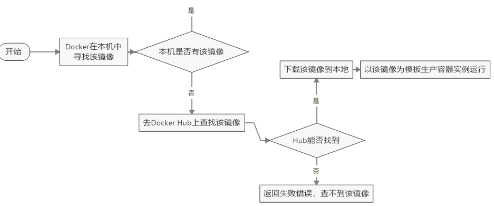

2、守护式容器

启动守护式容器，不会与容器进行交互而是在后台运行：

~~~
docker run -d 容器名
~~~

仅仅执行上面这条命令，查看容器状态会发现容器已经自动退出，这里有一个很重要的docker机制：Docker容器后台运行，就必须有一个前台进程。容器运行的命令如果不是那些一直挂起的命令（比如运行top，tail），就是会自动退出的。最佳的解决方案是，将你要运行的程序以前台进程的形式运行：

~~~
docker run -d centos /bin/sh -c "while true;do echo hello;sleep 2;done"
~~~

这个命令代表后台启动centos，然后以2秒一次的频率打印hello，打印结果可以在查看容器命令中看到：

~~~
docker logs -f -t --tail 3 容器ID
~~~

-f代表跟随最新的日志打印，-t代表打印时间戳，--tail代表显示最后n条日志。

3、设置端口映射

启动容器时指定端口映射，如启动tomcat时指定宿主机外部端口8888映射到tomcat容器的8080端口：

~~~
docker run -it -p 8888:8080 tomcat
~~~

-p的形式有以下几种（这里用的就是第三种形式映射）：

ip:hostPort:containerPort、ip::containerPort、hostPort:containerPort、containerPort

也可以使用-P选项来随机指定外部端口：

~~~
docker run -it -P tomcat
~~~

tomcat开放的端口在容器内部指定，默认总是8080，但外部的端口是随机指定的，这个随机指定的端口可以通过ps命令来查看。

### 查看命令

1、查看容器内运行的进程：

~~~
docker top 容器ID
~~~

2、查看容器内部细节：

~~~
docker inspect 容器ID
~~~

3、列出当前所有正在运行的容器：

~~~
docker ps [options]
~~~

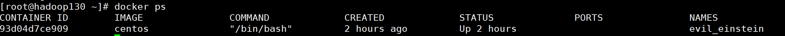

其中给容器分配的名字就是run时指定的，如果没有指定就是随机分配的。

命令选项说明：-a :列出当前所有正在运行的容器+历史上运行过的

-l :显示上一个创建运行的容器。

-n：显示最近n个创建运行的容器。

-q :静默模式，只显示容器编号。

--no-trunc :不截断输出。

### 其他命令

1、退出容器：

在容器交互界面执行exit可以关闭容器并退出，执行ctrl+p+q可以不停止容器只退出交互界面。

重新进入容器内部交互：

~~~
docker attach 容器ID
~~~

不进入容器直接在容器内执行相应命令并返回结果，比如进入centos容器中执行ls命令：

~~~
docker exec -it 容器ID ls -l
~~~

也可以用exec命令开启交互模式，此时会启动新的进程：

~~~
docker exec -it /bin/bash
~~~

2、启动容器：

~~~
docker start 容器ID或容器名
~~~

通常是关闭退出容器后要启动容器，可以用ps命令查看启动过的容器然后拿到ID再启动。

3、重启容器：

~~~
docker restart 容器ID或容器名
~~~

4、停止容器：

~~~
docker stop 容器ID或容器名
~~~

5、强制停止容器（比停止容器的速度更快）：

~~~
docker kill 容器ID或容器名
~~~

6、删除已经停止的容器（开启过的容器都会保存在缓存中，需要手动删除容器）：

~~~
docker rm 容器ID
~~~

7、一次性删除所有容器：

~~~
docker rm -f $(docker ps -a -q)      或
docker ps -a -q | xargs docker rm
~~~

8、将容器中的文件拷贝到主机：

~~~
docker cp 容器ID:容器内路径 目的主机存储路径
~~~

## commit操作

我们可以改变容器的设置，然后将修改后的容器以一个新的镜像上传到仓库，以tomcat为例，我们下载一个tomcat镜像并在本地启动容器：

```
docker run -it -p 8080:8080 tomcat
```

然后进入tomcat容器内部进行一些操作，比如删除一些文档或创建一些文档：

```
docker exec -it 容器ID /bin/bash
```

然后将该容器以一个新的镜像上传（1.2是版本号，yong/tomcat02是镜像名）：

```
docker commit -a="作者" -m="信息" 容器ID yong/tomcat02:1.2
```

上传后本地就生成了yong/tomcat02镜像，此时可以通过pull命令在其他服务器拉取镜像了。

## 命令总结

命令总结：


attach    Attach to a running container                 # 当前 shell 下 attach 连接指定运行镜像

build     Build an image from a Dockerfile              # 通过 Dockerfile 定制镜像

commit    Create a new image from a container changes   # 提交当前容器为新的镜像

cp        Copy files/folders from the containers filesystem to the host path   #从容器中拷贝指定文件或者目录到宿主机中

create    Create a new container                        # 创建一个新的容器，同 run，但不启动容器

diff      Inspect changes on a container's filesystem   # 查看 docker 容器变化

events    Get real time events from the server          # 从 docker 服务获取容器实时事件

exec      Run a command in an existing container        # 在已存在的容器上运行命令

export    Stream the contents of a container as a tar archive   # 导出容器的内容流作为一个 tar 归档文件[对应 import ]

history   Show the history of an image                  # 展示一个镜像形成历史

images    List images                                   # 列出系统当前镜像

import    Create a new filesystem image from the contents of a tarball # 从tar包中的内容创建一个新的文件系统映像[对应export]

info      Display system-wide information               # 显示系统相关信息

inspect   Return low-level information on a container   # 查看容器详细信息

kill      Kill a running container                      # kill 指定 docker 容器

load      Load an image from a tar archive              # 从一个 tar 包中加载一个镜像[对应 save]

login     Register or Login to the docker registry server    # 注册或者登陆一个 docker 源服务器

logout    Log out from a Docker registry server          # 从当前 Docker registry 退出

logs      Fetch the logs of a container                 # 输出当前容器日志信息

port      Lookup the public-facing port which is NAT-ed to PRIVATE_PORT    # 查看映射端口对应的容器内部源端口

pause     Pause all processes within a container        # 暂停容器

ps        List containers                               # 列出容器列表

pull      Pull an image or a repository from the docker registry server   # 从docker镜像源服务器拉取指定镜像或者库镜像

push      Push an image or a repository to the docker registry server    # 推送指定镜像或者库镜像至docker源服务器

restart   Restart a running container                   # 重启运行的容器

rm        Remove one or more containers                 # 移除一个或者多个容器

rmi       Remove one or more images             # 移除一个或多个镜像[无容器使用该镜像才可删除，否则需删除相关容器才可继续或 -f 强制删除]

run       Run a command in a new container              # 创建一个新的容器并运行一个命令

save      Save an image to a tar archive                # 保存一个镜像为一个 tar 包[对应 load]

search    Search for an image on the Docker Hub         # 在 docker hub 中搜索镜像

start     Start a stopped containers                    # 启动容器

stop      Stop a running containers                     # 停止容器

tag       Tag an image into a repository                # 给源中镜像打标签

top       Lookup the running processes of a container   # 查看容器中运行的进程信息

unpause   Unpause a paused container                    # 取消暂停容器

version   Show the docker version information           # 查看 docker 版本号

wait      Block until a container stops, then print its exit code   # 截取容器停止时的退出状态值

# docker容器数据卷

## 基本概念

先来看看Docker的理念：

1、将运用与运行的环境打包形成容器运行 ，运行可以伴随着容器，但是我们对数据的要求希望是持久化的

2、容器之间希望有可能共享数据

Docker容器产生的数据，如果不通过docker commit生成新的镜像，使得数据做为镜像的一部分保存下来，那么当容器删除后，数据自然也就没有了。为了能保存数据在docker中我们使用卷。

卷就是目录或文件，存在于一个或多个容器中，由docker挂载到容器，但不属于联合文件系统，因此能够绕过Union File System提供一些用于持续存储或共享数据的特性：

卷的设计目的就是数据的持久化，完全独立于容器的生存周期，因此Docker不会在容器删除时删除其挂载的数据卷。

特点：

1：数据卷可在容器之间共享或重用数据，容器和宿主机之间也可以共享

2：卷中的更改可以直接生效

3：数据卷中的更改不会包含在镜像的更新中

4：数据卷的生命周期一直持续到没有容器使用它为止

## 直接命令添加数据卷

命令添加数据卷：

~~~
docker run -it -v /宿主机绝对路径目录:/容器内目录 镜像名
~~~

如我们可以在centos镜像中添加数据卷（如果对应路径不存在会自动创建）：

~~~
docker run -it -v /myDataVolume:/dataVolumeContainer centos
~~~

通过inspect命令可以通过查看mounts字段数据卷是否挂载成功。挂载成功后容器和宿主机之间就可以共享这个文件的数据，即使容器停止退出后，宿主机更改文件数据，等容器启动后还是能接收到更改的数据。

以只读模式添加数据卷：

~~~
docker run -it -v /宿主机绝对路径目录:/容器内目录:ro 镜像名
~~~

此时容器内该文件的数据只允许主机修改，容器不可以修改，只可以读。

如果添加数据卷后发现写入时报错：cannot open directory .: Permission denied，需要在执行添加数据卷命令后加上一个选项：--privileged=true

## 用dockerFile添加数据卷

首先需要在根目录下新建mydocker文件夹，然后进入该文件夹下创建一个文件名为dockerfile，在该文件中写入：

~~~
# volume test
FROM centos
VOLUME ["/dataVolumeContainer1","/dataVolumeContainer2"]
CMD echo "finished, ------success1"
CMD /bin/bash
~~~

然后用build命令生成镜像：

~~~
docker build -f dockerfile的路径 -t yong/centos .
~~~

其中dockerfile的路径如果是/mydocker/dockerfile可以不用指定路径，yong代表镜像作者，centos是镜像名，这个命令要在mydocker目录中运行。

然后用run命令启动相应的容器，此时数据卷就添加完成了，在dockerfile中的VOLUME语句的作用就是添加数据卷，相当于执行：

~~~
docker run -it -v /host1:/dataVolumeContainer1 -v /host2:/dataVolumeContainer2 centos /bin/bash
~~~

在直接命令添加数据卷中显式指定了宿主机数据卷的路径，但是这种指定在不同的OS中不能很好的统一，用dockerFile添加数据卷后，宿主机数据卷的路径不是显式指定的，而需要通过inspect命令返回的mounts属性查看

## 数据容器卷

命名的容器挂载数据卷，其它容器通过挂载这个(父容器)实现数据共享，挂载数据卷的容器，称之为数据卷容器。

如果我们启动一个容器名为dc01，按照dockerFile的配置dc01已经添加了数据卷，然后我们启动容器dc02继承自dc01：

~~~
docker run -it --name dc02 --volumes-from dc01 镜像名
~~~

同时以同样方法启动dc03，现在dc02和dc03都继承自dc01，这三个容器之间就完成了数据共享，dc01在数据卷中的修改和dc02和dc03在数据卷中的修改都能同步到一起，这些修改之间互相可见，三个容器即使删除了两个，还剩下一个，那么在这最后一个容器中，之前所有的修改都还保存在数据卷中。即使最后删除dc01和dc02，启动dc04继承dc03，然后再删除dc03，那么dc04的数据卷中还能看见之前三个容器的修改操作，这就是数据容器卷的数据共享机制，它的特点可以用一句话表达：数据卷的生命周期一直持续到没有容器使用它为止。

# docker和联合文件系统

镜像是基于联合文件系统的：

UnionFS（联合文件系统）：Union文件系统（UnionFS）是一种分层、轻量级并且高性能的文件系统，它支持对文件系统的修改作为一次提交来一层层的叠加，同时可以将不同目录挂载到同一个虚拟文件系统下(unite several directories into a single virtual filesystem)。Union 文件系统是 Docker 镜像的基础。镜像可以通过分层来进行继承，基于基础镜像（没有父镜像），可以制作各种具体的应用镜像。

特性：一次同时加载多个文件系统，但从外面看起来，只能看到一个文件系统，联合加载会把各层文件系统叠加起来，这样最终的文件系统会包含所有底层的文件和目录。

镜像加载原理：

docker的镜像实际上由一层一层的文件系统组成，这种文件系统就是UnionFS：

.png)

bootfs(boot file system)主要包含bootloader和kernel，bootloader主要是引导加载kernel，Linux刚启动时会加载bootfs文件系统，在Docker镜像的最底层是bootfs。这一层与我们典型的Linux/Unix系统是一样的，包含boot加载器和内核。当boot加载完成之后整个内核就都在内存中了，此时内存的使用权已由bootfs转交给内核，此时系统也会卸载bootfs。

rootfs (root file system) ，在bootfs之上。包含的就是典型 Linux 系统中的 /dev， /proc， /bin，/etc 等标准目录和文件。rootfs就是各种不同的操作系统发行版，比如Ubuntu，Centos等等。对于一个精简的OS，rootfs可以很小，只需要包括最基本的命令、工具和程序库就可以了，因为底层直接用宿主机的kernel，自己只需要提供 rootfs 就行了。由此可见对于不同的linux发行版，bootfs基本是一致的，rootfs会有差别，因此不同的发行版可以公用bootfs。

docker的镜像是一种分层结构，在前面docker pull的时候就可以看出来，以tomcat镜像为例，想要加载tomcat镜像必须加载其中最重要的几层，最外层才是tomcat：

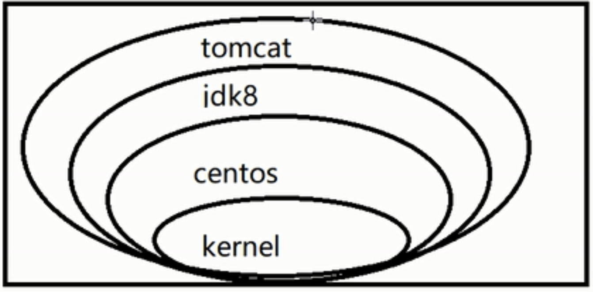

采用分层结构最大的一个好处就是共享资源。比如：有多个镜像都从相同的 base 镜像构建而来，那么宿主机只需在磁盘上保存一份base镜像，同时内存中也只需加载一份 base 镜像，就可以为所有容器服务了。而且镜像的每一层都可以被共享。

docker镜像都是只读的，当容器启动时，一个新的可写层被加载到镜像顶部，这一层通常被称为容器层，容器层之下的都叫镜像层。

# DockerFile解析

## 基本概念

dockerFile是用来构件Docker镜像的构建文件，是由一系列命令和参数构成的脚本。有了dockerFile文件就能据此建立镜像，然后启动容器执行。官方centos的DockerFile如下：

~~~
FROM scratch
MAINTAINER The CentOS Project <cloud-ops@centos.org>
ADD centos-7.2.1511-docker.tar.xz /

LABEL name="CentOS Base Image"
LABEL vendor="CentOS"
LABEL license=GPLv2

# Volumes for systemd
# VOLUME ["/run", "/tmp"]

# Environment for systemd
# ENV container=docker

# For systemd usage this changes to /usr/sbin/init
# Keeping it as /bin/bash for compatability with previous
CMD ["/bin/bash"]
~~~

在DockerFile中有以下基础规则：

1、每条保留字指令都必须为大写字母而且后面要跟随至少一个参数

2、指令按照从上到下，顺序执行

3、#表示注释

4、每条指令都会创建一个新的镜像层，并对镜像进行提交

Docker执行DockerFile的大致流程：

1、docker从文件中指定的基础镜像运行一个容器

2、执行一条指令并对容器作出修改，每条指令都会创建一个新的镜像层并对镜像进行提交

3、docker根据新镜像再运行一个新容器

4、执行DockerFile中的下一条指令直到所有指令都完成

从应用软件的角度来看，Dockerfile、Docker镜像与Docker容器分别代表软件的三个不同阶段，

1、Dockerfile是软件的原材料

2、Docker镜像是软件的交付品

3、Docker容器则可以认为是软件的运行态。

Dockerfile面向开发，Docker镜像成为交付标准，Docker容器则涉及部署与运维，三者缺一不可，合力充当Docker体系的基石。

.png)

## dockerFile的保留字指令

|    关键字     |                    作用                    |
| :--------: | :--------------------------------------: |
|    FROM    |          基础镜像，代表当前的新镜像是基于哪个镜像的           |
| MAINTAINER |              镜像维护者的姓名和邮箱地址               |
|    RUN     |               容器构建时需要运行的命令               |
|   EXPOSE   |               当前容器对外暴露出的端口               |
|  WORKDIR   |          指定在创建容器时终端默认登录后的工作目录位置          |
|    ENV     |     在构建镜像过程中设置环境变量，可以在其他指令中使用这些环境变量      |
|    ADD     | 将宿主机目录下的文件拷贝进镜像且ADD命令会自动处理URL和解压tar压缩包，ADD的作用是拷贝+解压 |
|    COPY    | 类似ADD，拷贝文件和目录到镜像中。将从构建上下文目录中的源路径的文件/目录复制到新一层镜像内的目标路径位置，形式有两种COPY src dest或COPY["src","dest"] |
|   VOLUME   |            容器数据卷，用于数据保存和持久化工作            |
|    CMD     | 指定一个容器启动时要执行的命令，但只有最后一个CMD指令生效，CMD会被docker run后的参数替换（docker run后跟命令CMD就会失效） |
| ENTRYPOINT | 和CMD一样，但是可以指定多个指令，且启动容器时可以在docker run后可以跟选项，选项会自动加到最后一个ENTRYPOINT指令中 |
|  ONBUILD   | 当构建一个被继承的DockerFile时运行命令，父镜像在被子继承后父镜像的onbuild被触发，例如在dockerFile1写入ONBUILD 命令a，构建dockerFile1生成镜像image，然后在dockerFile2中写入FROM image，在构建dockerFile2的过程中就会触发命令a |

## 例1：自定义镜像mycentos

明确需求：自定义一个centos镜像，可以执行vim命令、ifconfig命令，初次运行登录后位置在/tmp。

自定义dockerFile如下：

~~~
FROM centos
MAINTAINER zzyy<zzyy167@126.com>

ENV MYPATH /usr/local
WORKDIR $MYPATH

RUN yum -y install vim
RUN yum -y install net-tools

EXPOSE 80

CMD echo $MYPATH
CMD echo "success--------------ok"
CMD /bin/bash
~~~

在mydockerFile目录下新建Dockerfile文件，然后在目录下执行命令用build命令生成镜像：

~~~
docker build -t mycentos:1.3 .
~~~

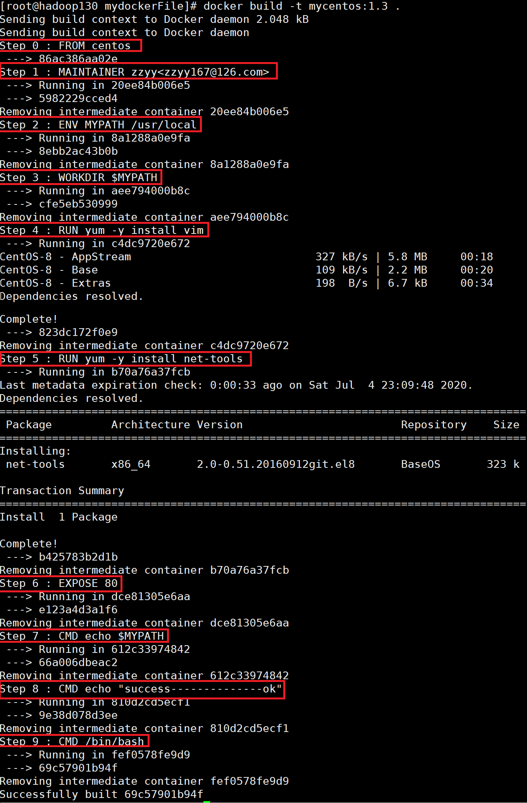

可以看到dockerFile创建镜像都是一层一层执行并提交的。

可以执行下列命令查看镜像的变更历史：

~~~
docker history 镜像ID
~~~

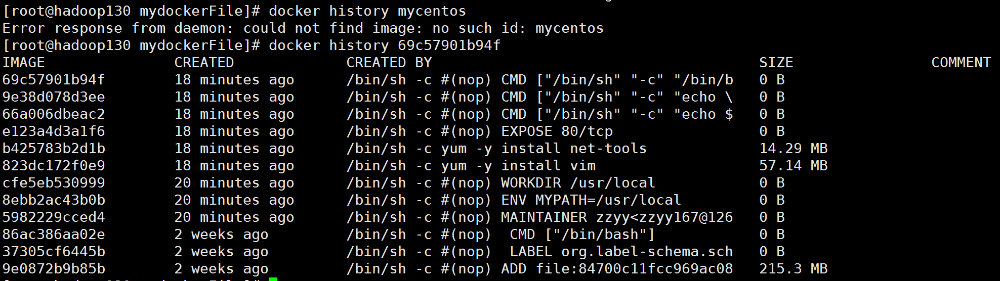

可以看到最初的基础镜像大小只有215M，然后安装vim命令用了57M，安装net-tools用了14M。

## 例2：自定义镜像tomcat9

将压缩包拷贝进当前目录，然后建立dockerFile如下：

~~~
FROM         centos
MAINTAINER    zzyy<zzyybs@126.com>
#把宿主机当前上下文的c.txt拷贝到容器/usr/local/路径下
COPY c.txt /usr/local/cincontainer.txt
#把java与tomcat添加到容器中
ADD jdk-8u171-linux-x64.tar.gz /usr/local/
ADD apache-tomcat-9.0.8.tar.gz /usr/local/
#安装vim编辑器
RUN yum -y install vim
#设置工作访问时候的WORKDIR路径，登录落脚点
ENV MYPATH /usr/local
WORKDIR $MYPATH
#配置java与tomcat环境变量
ENV JAVA_HOME /usr/local/jdk1.8.0_171
ENV CLASSPATH $JAVA_HOME/lib/dt.jar:$JAVA_HOME/lib/tools.jar
ENV CATALINA_HOME /usr/local/apache-tomcat-9.0.8
ENV CATALINA_BASE /usr/local/apache-tomcat-9.0.8
ENV PATH $PATH:$JAVA_HOME/bin:$CATALINA_HOME/lib:$CATALINA_HOME/bin
#容器运行时监听的端口
EXPOSE  8080
#启动时运行tomcat
# ENTRYPOINT ["/usr/local/apache-tomcat-9.0.8/bin/startup.sh" ]
# CMD ["/usr/local/apache-tomcat-9.0.8/bin/catalina.sh","run"]
CMD /usr/local/apache-tomcat-9.0.8/bin/startup.sh && tail -F /usr/local/apache-tomcat-9.0.8/bin/logs/catalina.out
~~~

然后构建该镜像，启动命令如下：

~~~
docker run -d -p 9080:8080 --name myt9 -v /zzyyuse/mydockerfile/tomcat9/test:/usr/local/apache-tomcat-9.0.8/webapps/test -v /zzyyuse/mydockerfile/tomcat9/tomcat9logs/:/usr/local/apache-tomcat-9.0.8/logs --privileged=true zzyytomcat9
~~~

启动命令表示以后台运行模式启动该容器，设置端口映射9080到8080，设置容器名为myt9，设置两个数据卷，方便往tomcat中放置web应用，以及查看tomcat日志。

运行后就可以访问9080端口查看tomcat启动情况，还可以将web应用放在/zzyyuse/mydockerfile/tomcat9/test目录下，重启容器后就可以访问此web应用了。

自定义dockerFile的场景基本上都是从其他dockerFile入手，然后进行自定义修改的。


