# 入门

## 简介

Elasticsearch的公司叫Elastic，Solr和Elasticsearch的功能类似，但Elasticsearch更流行，社区更活跃。相比关系型数据库，ES提供了如模糊查询、搜索条件算分等关系型数据库不擅长的部分，但ES没有完善的事务性支持。

Elasticsearch：一个开源分布式搜索分析引擎

Elasticsearch和Solr都是来源于一个开源项目Lucene，它是一个基于Java开发的搜索引擎类库。

Elasticsearch支持高可用、水平扩展，提供海量数据的分布式存储以及集群管理；它提供了多种语言的Rest接口，让不同语言都能够方便使用搜索引擎。性能很好，近实时搜索与分析

Elastic Stack生态圈：


Logstash：开源的服务器端数据处理管道，支持从不同来源采集日志，转换数据，并将数据发送到不同的存储库中。

Kibana：数据可视化工具

Beats：轻量的数据采集器，可以支持从各种不同数据源采集数据

在搜索场景：可以把ES当做存储使用，好处是架构比较简单，但如果考虑到事务性和数据更新频繁的问题，应该将应用数据先写入数据库，然后同步到Elasticsearch中

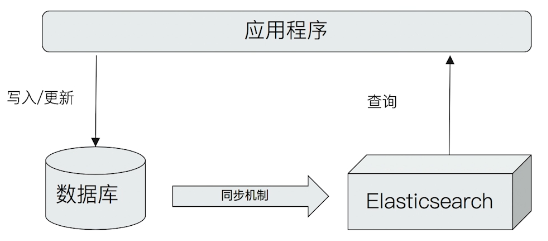

在日志分析场景：需要使用Redis、Kafka等作为一个数据缓冲层，然后通过logstash进行转化、聚合，发送到ES中进行分析

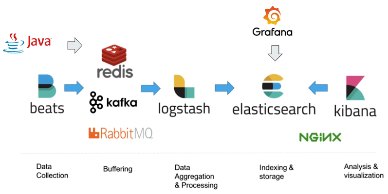

## 安装

### ES

安装ES 5需要先安装Java 8以上的版本，ES7开始，内置了Java环境。在官网下载，解压安装

文件目录结构：

* bin：脚本文件，包括启动ES，安装插件，运行统计数据等
* config：配置文件elasticsearch.yml，集群配置文件，user，role based相关配置
* JDK：Java运行环境
* data：path.data，数据文件
* lib：Java类库
* logs：path.log，日志文件
* modules：包含所有ES模块
* plugins：包含所有已安装插件

在config/jvm.options里面，内存设置默认是1GB，建议在生产环境Xmx和Xms设置的相同，不要超过机器内存的50%，不要超过30G

执行bin/elasticsearch，就启动起来了。在浏览器输入localhost:9200 就可以看到正常运行的返回值了：

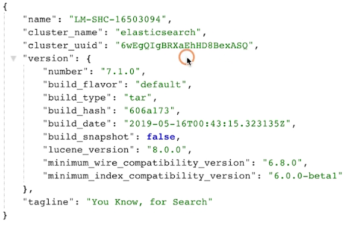

执行bin/elasticsearch-plugin list可以查看本机安装了哪些elasticsearch插件

执行bin/elasticsearch-plugin install analysis-icu可以安装插件，analysis-icu是一个处理国际化的插件。重启ES后访问localhost:9200/_cat/plugins就可以看到已经安装的插件列表了。ES有很多有用的插件，如安全策略、数据备份

运行多个ES实例时，要指定节点名称，集群名称，数据存放地址：

~~~
bin/elasticsearch -E node.name=node1 -E cluster.name=geektime -E path.data=node1_data -d
~~~

执行多个命令后就可以启动多个ES实例，此时访问localhost:9200/_cat/nodes就可以看到目前的集群实例：

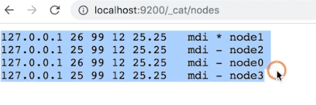

###Kibana

安装Kibana： 先开启ES，然后运行bin/kibana命令启动Kibana，启动后在浏览器输入localhost:5601，就可以看到Kibana的首页，点击Add sample data就可以进入数据导入页：

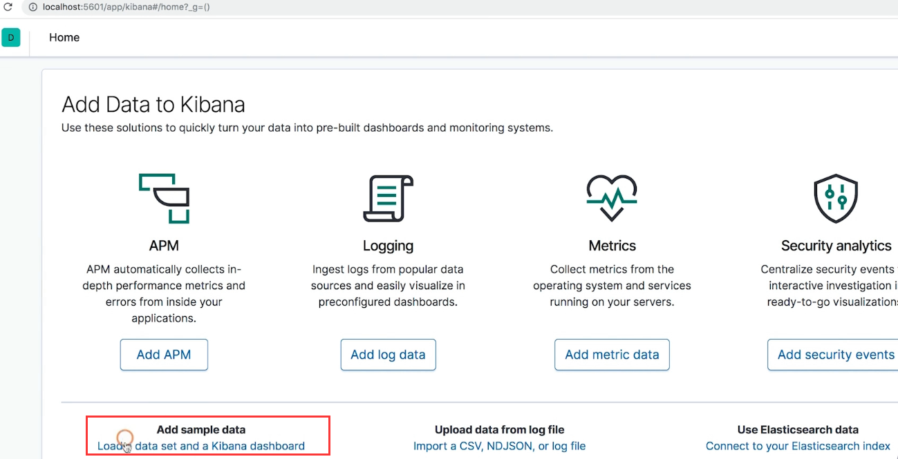

点击Add data，就可以导入样例数据：


然后再进入Dashboards界面，进入数据样例对应的Dashboard，就可以看到数据展示页了：

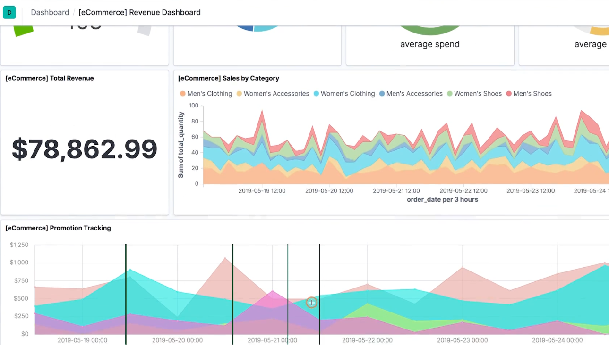


Kibana中有一个重要的工具：Dev Tools，它可以方便的执行ES的API，例如之前的查看集群实例：

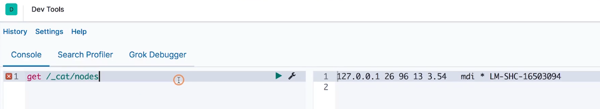

Kibana中也可以安装插件，增强展示的功能。Kibana中安装、查看、卸载插件的命令：

~~~
bin/kibana-plugin install plugin_location
bin/kibana-plugin list
bin/kibana remove
~~~

###cerebro

下载ES的Docker版本，它集成了ES、cerebro和Kibana。运行该镜像就能一次性将这些部署完成

~~~
docker-compose up
~~~

运行起来后，在浏览器输入localhost:9000就可以访问cerebro，连接到对应的ES集群，就进入到cerebro的管理界面：

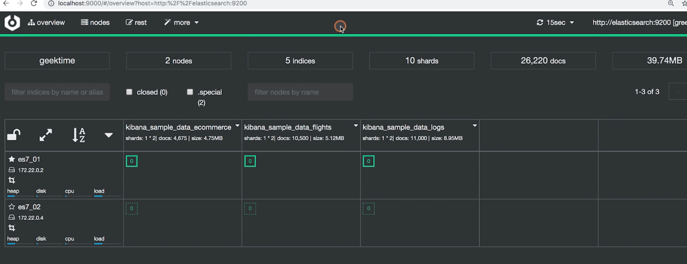

界面上可以看到ES集群的基本信息：节点、名称、索引、磁盘信息等

###Logstash

在官网下载Logstash时要确保它的版本和ES一致，然后在grouplens下载一个Movielens测试数据集。修改Logstash的配置文件logstash.conf，指定要导入的数据集，以及导入到哪个ES集群：

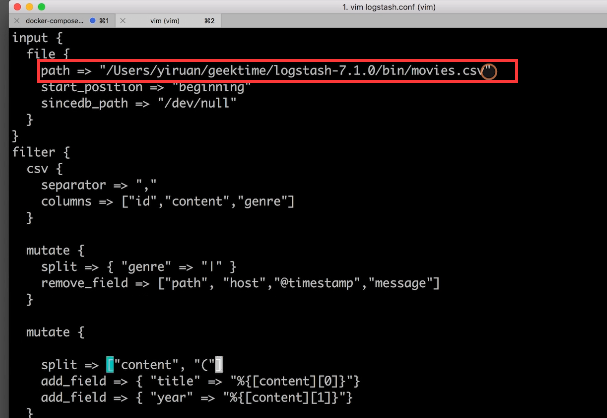

然后执行执行数据导入：

~~~
bin/logstash -f logstash.conf
~~~

## 基本概念

### 索引和文档

ES是面向文档的，文档是所有可搜索数据的最小单位，例如日志文件中的日志项、一个电影的介绍信息等，它类似关系型数据库的一条记录。

文档会被序列化成JSON格式，保存在ES中，JSON对象中的每个字段都有对应的字段类型（字符串/数值/布尔/日期/二进制/范围类型），字段类型可以指定，也可以由ES自动推算。支持数组、支持嵌套，例如上面导入的电影数据，存在ES中的格式就是这样：

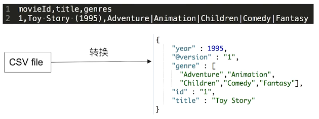

每个文档都有一个唯一的ID，这个ID可以自己指定，也可以由ES自动生成。

每个文档都有元数据，它用于标注文档的相关信息，包括索引名、类型名、id、原始Json数据、all字段、版本信息（改动数，当并发操作时，版本信息可以很好的解决冲突的问题）、相关性打分：

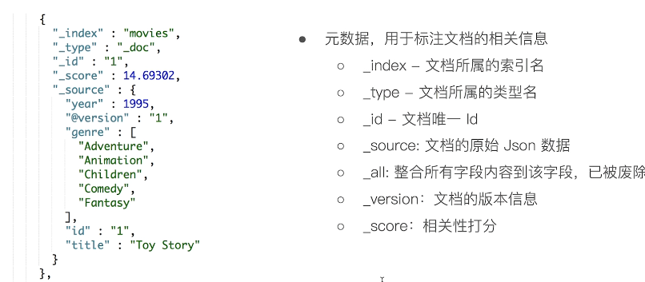

索引index是一类文档的结合，index是逻辑上的概念，Shard是物理空间的概念，索引的数据分散在Shard上。

索引有两个重要的概念：

* Mapping：定义文档字段的类型
* Setting：定义不同的数据分布

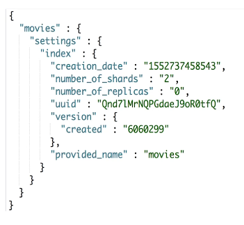

在ES中，索引可以作为名词出现，也可以作为动词出现，当索引是动词时，代表保存一个文档到ES的过程，这个过程也叫索引indexing

在7.0之前，一个index可以设置多个Types，7.0开始，一个索引只能创建一个Type，那就是_doc

ES与关系数据库的对比：

* 关系型数据库的Table，就对应ES中的index
* 关系型数据库的Row，就对应ES中的文档Document
* 关系型数据库的Column，就对应ES中文档的Filed
* 关系型数据库的Schema表定义，就对应ES中的Mapping
* 关系型数据库的查询语句是SQL，对应ES中的查询语句是DSL

ES比关系型数据库更适合全文检索，关系型数据库适合事务操作和Join

在Kibana-设置-索引管理中，可以看到每个索引的名字、运行情况、占用磁盘空间，查看详情后可以看到每个索引的setting和mapping：

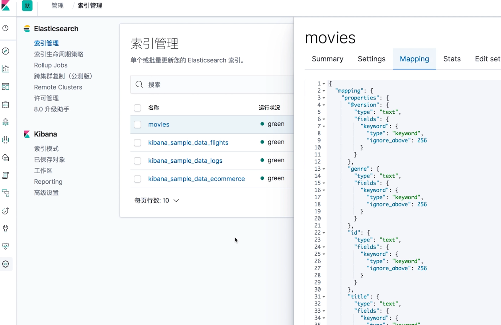

在Kibana的Dev Tools中可以方便的进行ES的查询，包括查询索引信息、文档总数、对索引进行模糊查询等：

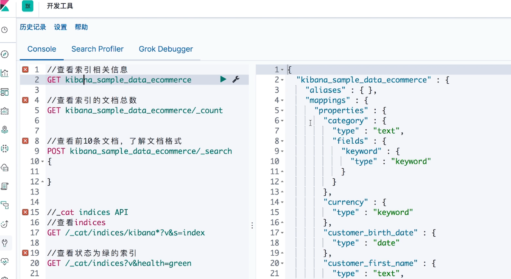

### 集群节点

ES集群作为分布式系统，需要具备高可用性和可扩展性：

* 高可用性：包括服务可用性（允许有节点停止服务）和数据可用性（丢失节点不丢数据）
* 可扩展性：应对数据的不断增长应该有扩展能力

ES集群有一个集群名，一个集群可以有一个或者多个节点。一个节点就是一个ES实例，本质上就是一个Java进程，一台机器上可以由多个ES实例，但一般在生产环境建议一个机器只运行一个ES实例。每个节点都有一个名字，通过配置文件配置或者启动时指定。每个节点启动后，会分配一个UID，保存在data目录下。

每个节点启动后，默认就是一个Master eligible节点，可以设置node.master: false禁止

Master eligible节点可以参加选主流程，成为Master节点。当第一个节点启动时候，它会将自己选举为Master节点。

每个节点上都保存了集群的状态，只有Master节点才能修改集群的状态信息（如果任意节点都能修改则会破坏一致性）。集群状态包括节点信息、所有索引和其相关的Mapping、Setting信息、分片的路由信息

节点根据是否保存数据分为两种：

* Data Node：可以保存数据的节点，它负责保存分片数据。不同硬件配置的Data Node，可以实现Hot&Warm架构（冷热数据存在不同节点）
* Coordinating Node：负责接受Client的请求，将请求分发到合适的节点，汇总结果。每个节点都默认起到了Coordinating Node的职责

还有一种节点叫Machine Learning Node，它是专门负责跑机器学习的Job，用来做异常检测

一个节点可以承担多种角色，建议生产环境一个节点只设置单一的角色，这样职责明确，可以根据职责配置不同的硬件：

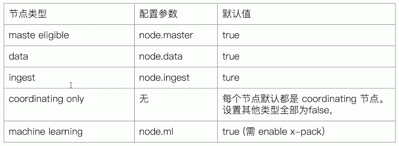

### 分片和副本

分片分为主分片和副分片，副分片又叫副本：

* 主分片：用以解决数据水平扩展的问题，通过主分片可以将数据分布到集群内的所有节点

  一个主分片就是一个运行的Lucene实例。主分片数在索引创建时指定，后续不允许修改，除非Reindex

* 副本：用以解决数据高可用的问题，分片是主分片的拷贝

  副本分片数可以动态调整，副本除了实现高可用，还可以增加读取的吞吐量

从物理角度看分片是一个Lucene的实例。

下面是一个三节点的集群，分片分布的情况：

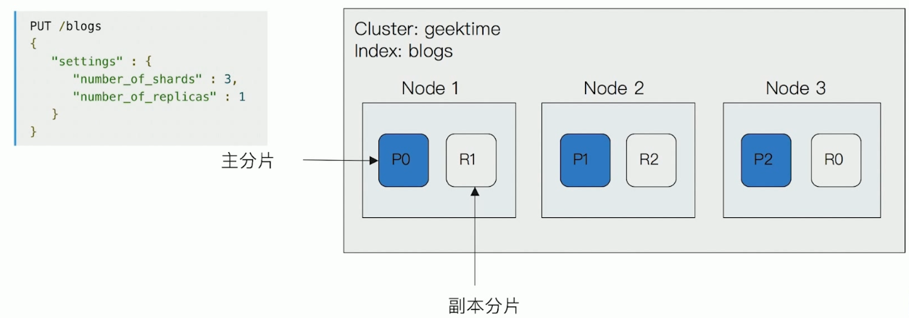

number_of_shards代表主分片个数为3；number_of_replicas代表副分片个数为1，主分片的副本一般会分散在其他节点上，保证节点故障时继续对外提供服务。对这个集群来说，即使再增加机器，也不能再提供水平扩展的能力了，因为主分片数已经是3了，增加机器也不可能再增加主分片数量了。

对生产环境中的分片设定要提前规划好：

* 如果分片数设置过小，则导致后续无法水平扩展，且单个分片的数据量太大，导致数据重新分配耗时
* 如果分片数设置过大，会影响搜索结果的相关性打分，影响统计结果的准确性。单个节点上过多的分片，也会影响性能，导致资源浪费

可以使用GET _cluster/health来查看集群的健康情况，根据状态来区分主分片和副本的创建情况：

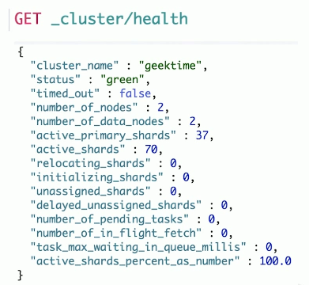

status的不同值：

* Green：主分片和副本都正常分配
* Yellow：主分片正常分配，有副本分片未能正常分配
* Red：有主分片未能分配

当磁盘容量不够时，就可能出现上述异常场景。

通过cerebro也可以查看分片信息：

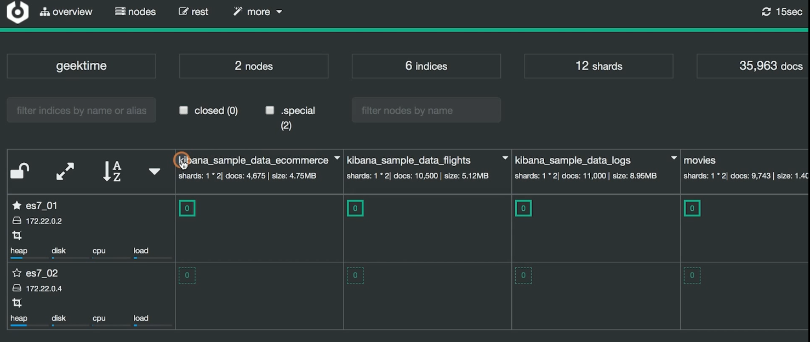

通过该界面可以看到geektime集群有2个节点，6个索引，12个分片，35963个文档。

2个节点：一个es7_01，实心五角心代表它是master；一个是es7_02.

表格的列是各索引，绿色方格代表分片，实线代表主分片，虚线代表副本。绿色的长条代表集群状态是green。如果在后台停止ES集群的实例，就会看到长条颜色的变化：

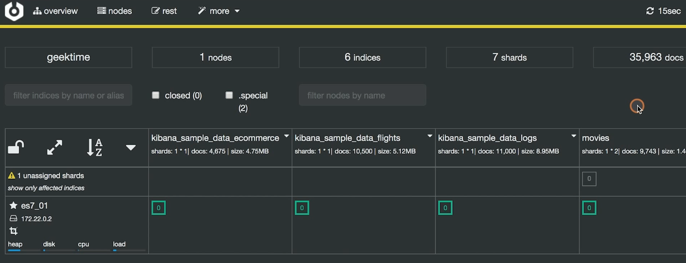

### 倒排索引

以一本书为例，根据目录可以通过章节名称找到对应页码，通过索引页，可以通过单词名称找到对应页码：

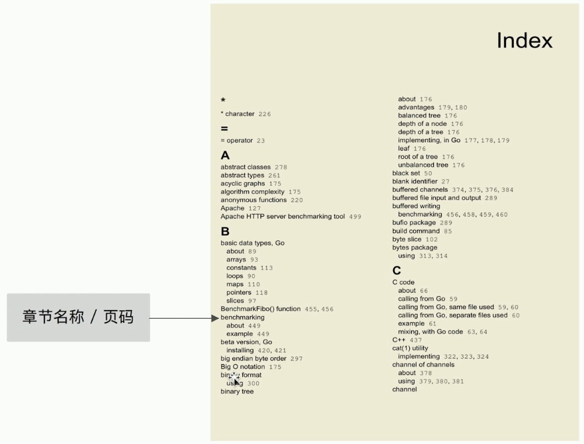

正排索引就对应书的目录页，它可以通过文档Id找到文档内容

倒排索引就对应书的索引页，它可以通过单词找到文档Id

下面是正排索引和倒排索引互相的转换：

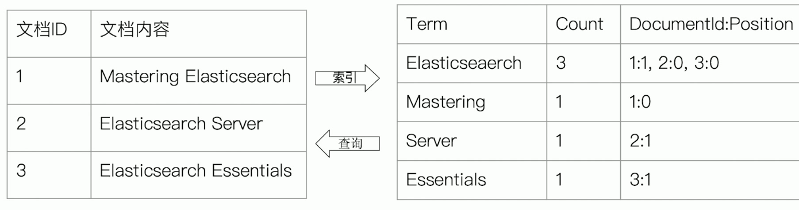

一个倒排索引由两部分组成：

- 单词词典（Term Dictionary）：记录所有文档的单次，记录单词到倒排列表的关系。通常用B+树或者哈希拉链法实现

- 倒排列表（Posting List）：记录了单词对应的文档结合，由倒排索引项组成。

  一个倒排索引项（Posting）的组成部分：

  - 文档Id
  - 词频TF：该单词在文档中出现的次数，用于相关性评分
  - 位置Position：单词在文档中分词的位置，用于语句搜索phrase query
  - 偏移offset：记录单词的开始结束位置，用于实现高亮显示

以Elasticsearch这个词为例，它的倒排列表就是这样的：

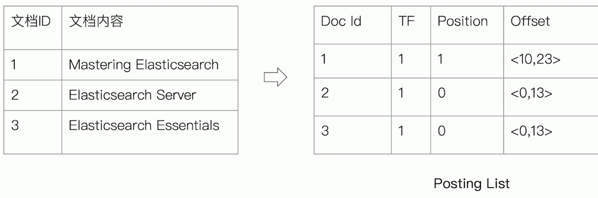

各倒排索引项描述了这个单词和对应文档的关系。

ES中，JSON文档的每个字段都有自己的倒排索引，也可以选择对某些字段不做索引，优点是节省存储空间，缺点是字段无法被搜索

## 基本操作

### 文档的CRUD

常见操作汇总：

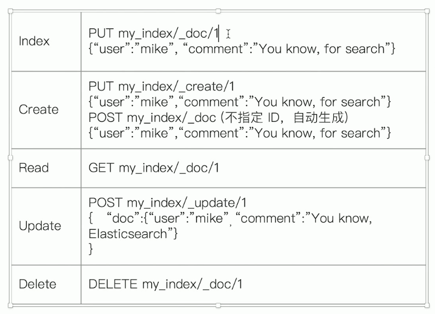

1、create文档

create支持两种方式：指定文档id和自动生成文档id

指定id方式：PUT 索引名/_create/id

自动生成id方式：POST 索引名/_doc

如果文档已经存在，则操作失败：

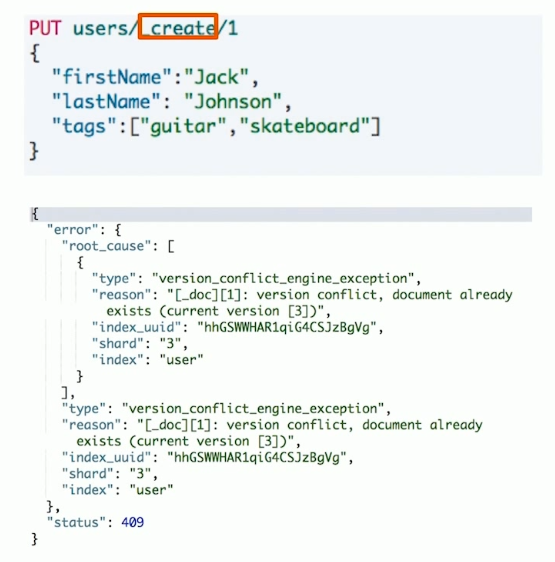

2、get文档

GET 索引名/_doc/id

如果找到返回HTTP 200，返回值中包含元数据与真正的数据，具体包含索引名_index、类型\_type、版本信息（修改次数，同一个id的文档，即使被删除，version号也会不断增加）、source包含文档的所有原始信息。

如果找不到文档则返回HTTP 404：

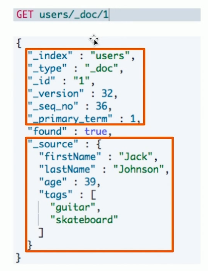

3、index文档：PUT 文档名/_doc/id

index和create的区别是：如果文档不存在，就建立新的文档；如果存在，现有文档会被删除，新的文档被索引，版本信息+1

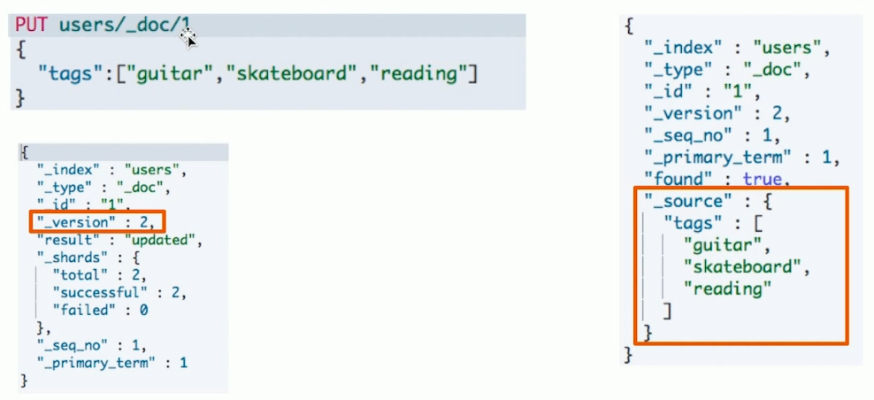

4、update文档：POST 文档名/_update/id

update文档不会删除原来的文档，而是实现真正的数据更新

更新时，Payload需要包含在doc中：

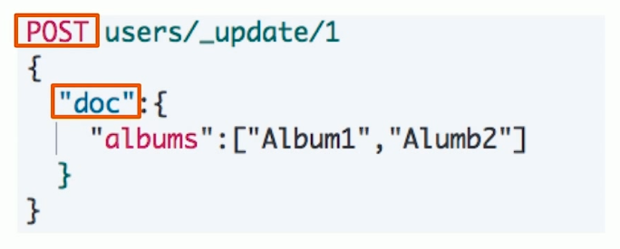

如果用index来更新数据，后续get则无法看到之前的数据，只能看到版本号是2，版本号是1的数据看不到：

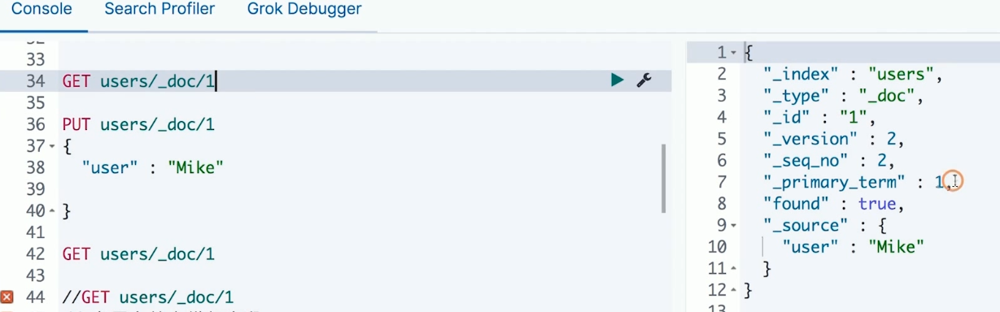

如果用update则不同，更新后再get可以看到多个版本的数据同时显示在source中：

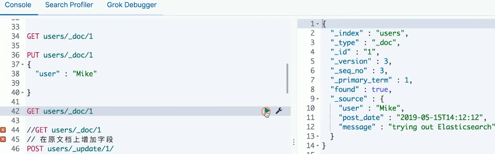

此外还有一些批量操作，批量操作可以减少网络连接所产生的开销，提高性能

5、Bulk API

POST _bulk  它支持在一次API调用中，对不同的索引进行操作，支持四种操作类型：Index/create/update/delete

它可以在URI中指定Index，也可以在请求的Payload中进行。如果多条操作中有一条失败，不会影响其他操作。返回结果包含每一条操作的结果：

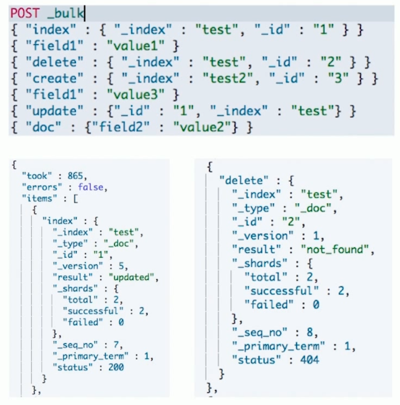

6、批量读取 mget

GET _mget  需要指定索引名和文档id：

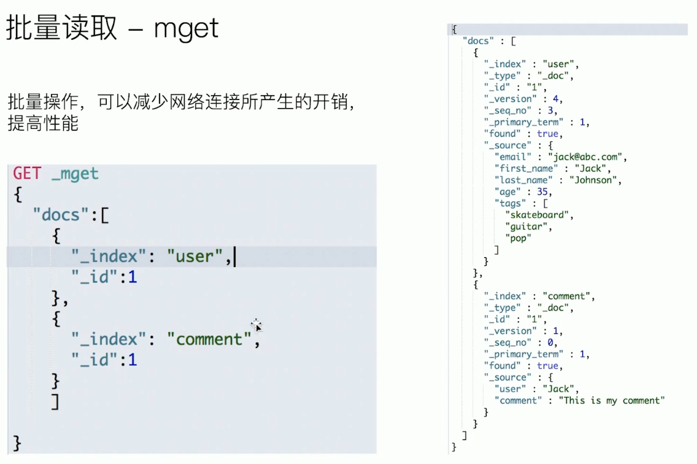

7、批量查询 msearch

POST 索引名/_msearch

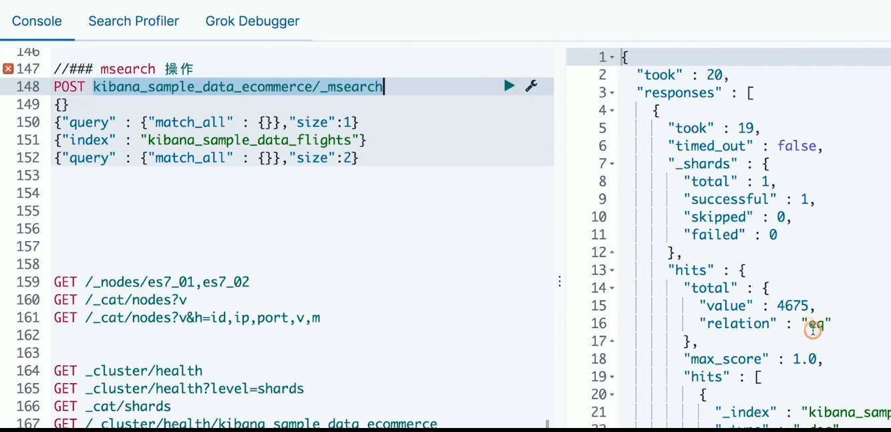

常见的请求错误返回值：

* 无法连接
* 连接无法关闭
* 429：集群过于繁忙
* 4xx：请求格式有错
* 500：集群内部错误

使用批量API时，不要一次发送过多的数据，可能会对ES集群产生过大压力

### 分词

Analysis：分词，就是经过文本分析，把全文本转换为一系列单词的过程

Analysis是通过Analyzer（分词器）来实现的，可以通过ES内置的分析器，或者按需定制化分析器

除了在数据写入的时候转换词条，匹配Query语句的时候也需要用相同的分析器对查询语句进行分析，下面就是一个分词的小例子：

~~~
Elasticsearch Server  ->  elasticsearch 、server
~~~

分词器是专门处理分词的组件，由三部分组成：

* Character Filters：针对原始文本处理，例如去除html
* Tokenizer：按照规则切分为单词，例如以空格为分隔符切分
* Token Filter：将切分的单词进行加工，例如转换为小写，删除stopwords、增加同义词

常用的分词器：

* Standard Analyzer：默认分词器，按词切分，小写处理
* Simple Analyzer：按照非字母切分，过滤掉符号，小写处理
* Stop Analyzer：小写处理，过滤掉一部分停用词，如the、a、is
* Whitespace Analyzer：按照空格切分
* Keyword Analyzer：不分词，直接将输入当做输出
* Patter Analyzer：正则表达式分词，默认是\W+（非字符分割）
* Language系列分词器：提供了常用语言的分词器，例如english

中文分词的难点：

* 切分成一个一个词，而不是一个一个字
* 英文中有空格作为分割，但中文中很难确定分割位置，切分位置不同，句意可能完全不一样

切分中文语句，可以使用ICU Analyzer，要使用它需要先安装名为analysis-icu的插件，它提供了Unicode的支持，更好的支持亚洲语言

此外还有一些常用的中文分词器：IK（支持自定义词库、支持热更新分词字典）、THULAC（人文计算实验室研究的中文分词器）

当ES自带的分词器无法满足要求时，可以自定义分词器，通过组合不同的组件来实现，这里的组件就是上面提到的三个组件Character Filters、Tokenizer、Token Filter：

* Character Filters：一些自带的Character Filters例如HTML strip（去除html标签）、Mapping（字符串替换）、Pattern replace（正则匹配替换）
* Tokenizer：一些自带的切分逻辑有很多，例如Whitespace、standard等，还可以用Java开发插件，实现自定义的Tokenizer
* Token Filter：一些自带的Token Filter有Lowercase（小写转换）、stop（过滤停用词）

检验分词结果很简单，只需要使用 GET _analyze，设置好分词器和text即可：

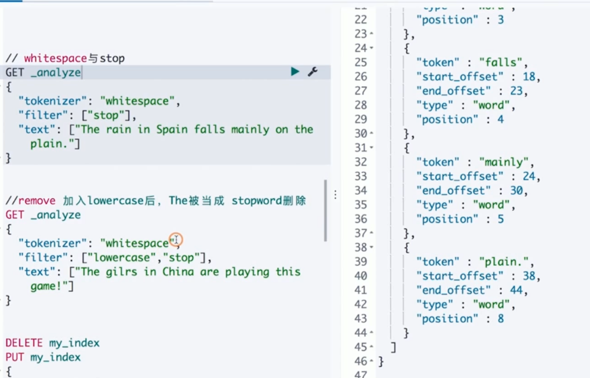

利用ES自带的组件，可以自由组合出强大的分词器。给目标索引设置一个自定义分词器：

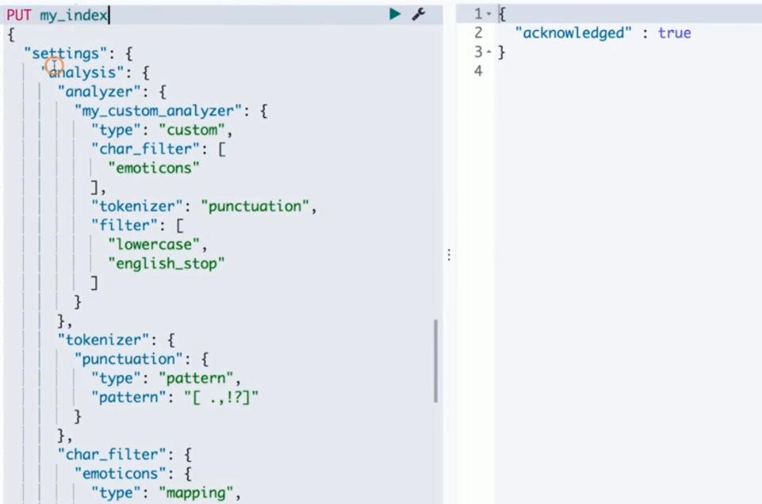

可以用 PUT 索引名/_analyze来检验分词结果：

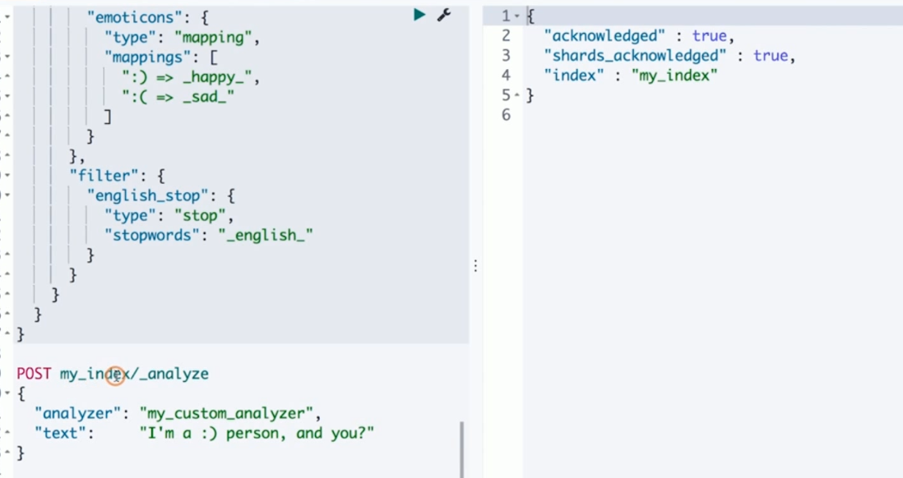

### 多语言和中文分词检索

当处理人类自然语言时，有些情况尽管搜索和原文不完全匹配，但是也希望搜到一些内容

一些可采取的优化：

* 归一化词元：清除变音符号
* 抽取词根：清除单复数和时态的差异
* 包含同义词
* 拼写错误的情况，或者同音异形词

在多语言场景下，会出现下列几种场景：

* 不同的索引使用不同的语言
* 同一个索引中，不同的字段使用不同的语言
* 一个文档的一个字段内混合不同的语言

混合多语言存在的一些挑战：

* 词干提取：如以色列文档，包含了多种语言：希伯来语、阿拉伯语、俄语和英语
* 不正确的文档频率：当英文为主的文章中，出现了德文，则匹配时分高（因为德文相对于英文更稀有）
* 需要判断用户搜索时使用的语言，进行语言识别。然后不同的语言，查询不同的索引

英文分词其实也面临一些挑战，如You're分成一个词还是多个词

在中文分词中情况就更复杂了，可能还要面对一些有歧义的句子

中文分词最初是采用最小词数的分词理论来进行分词的，它的原则是一句话应该分成数量最少的词串，但面对二义性的分割无能为力（例如上海大学城书店）；后续出现了统一语言模型，它解决了二义性的问题。后来又出现了基于统计的机器学习方法，它不仅考虑了词语出现的频率，而且还考虑上下文，具有较好的效果。

常见的分词器都是使用机器学习算法和词典相结合的，一方面能提高分词准确率，另一方面能够改善领域适应性。

一些常用的中文分词器：HanLP、IK分词器、pinyin分词器（它可以将汉字划分为一个一个的拼音序列，主要是针对搜索拼音的场景）


### 搜索的相关性

一次搜索的结果可能有很多条，这就存在一个对结果排序，然后展示给用户的问题。不同业务有不同的考虑：

* 搜索引擎考虑搜索结果排序时，不仅要考虑内容的相关性，还要考虑可信度，以及与业务模式相关的排序（比如竞价排名）
* 在电商的搜索功能中，结果排序要考虑销售业绩、去库存的商品优先等因素

衡量相关性的几个指标：

* Precision：查准率，它越高，则代表返回的无关文档越少。它等于  查询返回的相关结果/全部返回的结果
* Recall：查全率，它越高，代表返回的相关文档越多。它等于 查询返回的相关结果/所有应该返回的结果
* Ranking：是否能按照相关度进行排序

关于Precision和Recall的定义，下面这张图表达的很清楚：

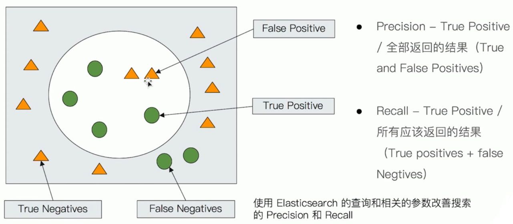

搜索的相关性很重要，一个搜索应用应该要监控搜索结果，在后台实现统计数据，监控用户点击最顶端结果的频次、搜索结果中有多少被点击了、有哪些搜索没有返回结果，有针对性的优化它

### 相关性算分

搜索的相关性算分，描述了一个文档和查询语句的匹配程度，ES会对每个匹配查询条件的结果进行算分

打分的本质是排序，也就是把最符合用户需求的文档排在最前面。

ES 5之前，默认的相关性算分采用TF-IDF，现在采用BM25

相关性算分的几个重要概念：

1、词频Term Frequency：检索词在一篇文档中出现的频率，它等于检索词的次数除以文档的总字数

度量一条查询和结果文档相关性的简单方法，简单将搜索中每一个词的TF进行相加

例如搜索的是"区块链的应用"，那相关性就可以简单的认为是：TF(区块链)+TF(的)+TF(应用)

计算TF时要考虑到Stop Word，例如，的这个词在文档中出现了很多次，但对共享相关度几乎没有用处，不应该考虑他们的TF

2、逆文档频率IDF：

DF就是检索词在所有文档中出现的频率，IDF就是Inverse Document Frequency，就是log(全部文档数/检索词出现过的文档总数)，例如下面这个表中：

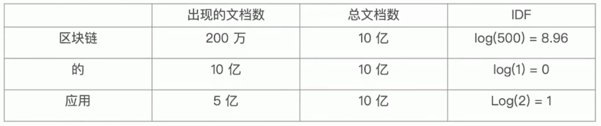

出现次数更少的词，代表在本次查询中会更重要。例如区块链只出现在200w个文档中，那它在搜索算分的比重就更高

TF-IDF本质上就是将TF求和变成了加权求和：

查询算分=TF(区块链)*IDF(区块链) + TF(的)\*IDF(的) + TF(应用)\*IDF(应用)

TF-IDF被公认为是信息检索领域最重要的发明。现代搜索引擎对TF-IDF做了大量的优化。

Luence中的TF-IDF评分公式：

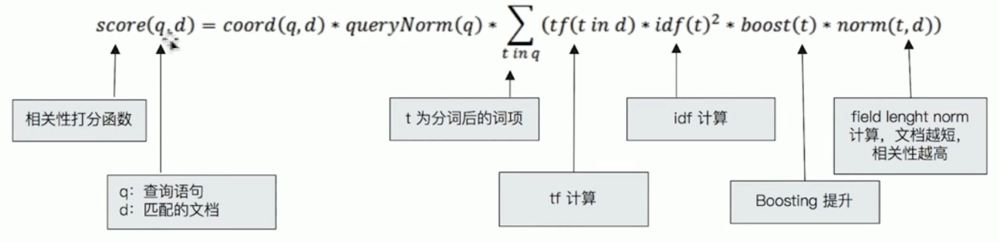

BM 25相比于TF-IDF，区别在于当TF无限增加时，BM 25的算分会趋近于一个数值：

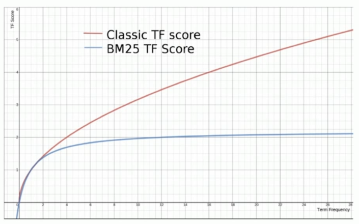

在ES中可以对算分规则做一定的定制，BM 25的算分公式中，k和b分别控制饱和度和Normalization，可以对索引进行设置，来调整它的算分规则：

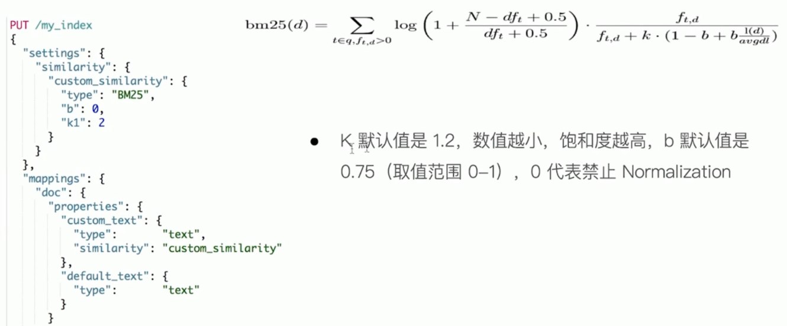

通过Explain API可以查看相关性算分的计算过程：

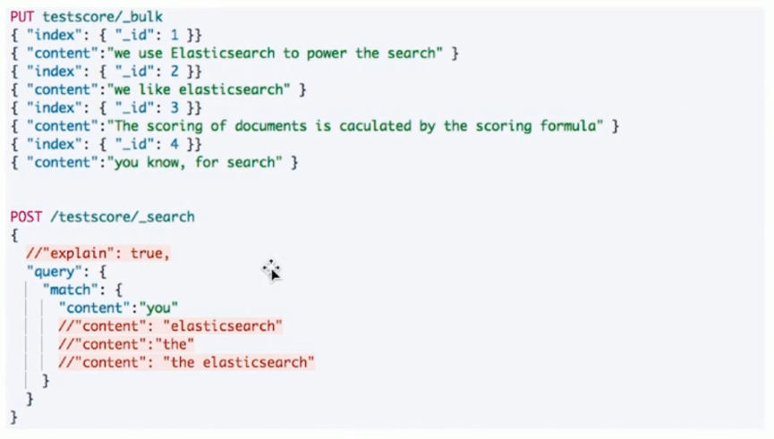

Boosting是控制相关度的一种手段，可以在TF-IDF公式中看到它可以控制总系数：

* 当boost>1时，打分的相关度相对性提升
* 当0<boost<1时，打分的权重相对性降低
* 当boost<0时，贡献负分

一次Boosting Query，代表结果中有apple是正向算分贡献，结果中有pie是负向贡献：

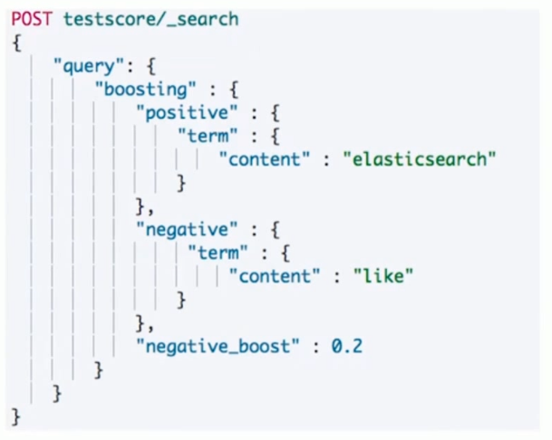

可以给不同的字段设置不同的boost，来调整字段在相关度算分中的权重：

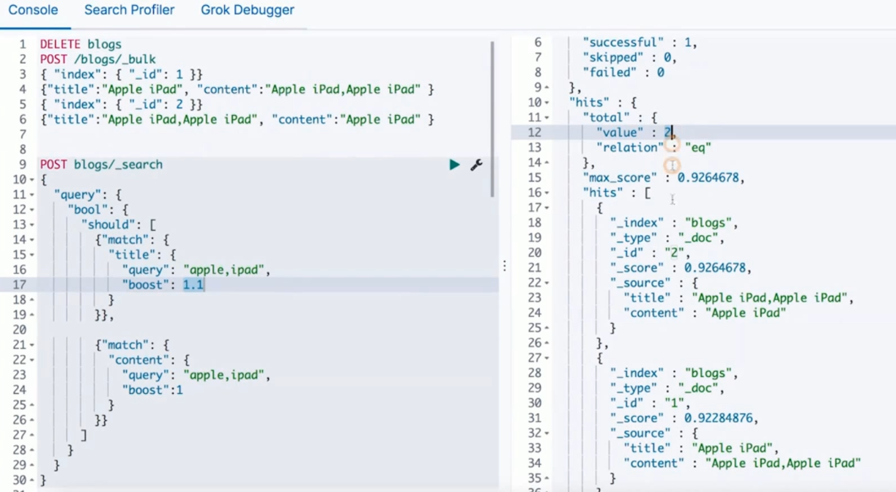

当某个字段不需要算分时，可以将其norms设置为false：

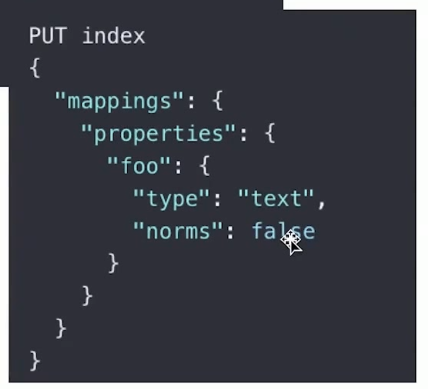

## Mapping

### 数据类型

Mapping类似数据库中的schema定义，它包含以下信息：

- 定义索引中字段的名称
- 定义索引中字段的数据类型
- 定义字段，倒排索引的相关配置（可以设置该字段不被索引）

Mapping会把JSON文档映射成Lucene所需要的扁平格式。

一个Mapping属于一个索引的Type：

- 每个文档都属于一个Type
- 一个Type有一个Mapping定义
- 7.0开始，不需要在Mapping定义中指定type信息

字段的数据类型有以下几种：

- Text/Keyword
- Date
- Integer/Floating
- Boolean 
- IPv4 & IPv6
- 复杂类型：对象/嵌套
- 特殊类型：geo_point/geo_shape/percolator

ES中不提供专门的数组类型，任何字段都可以放多个值，例如下面这个例子：


先往users索引里面插入一条数据，这条数据的interests字段值是reading。再插入一条文档，这次interests字段值变成一个数组，插入成功后，再查看索引的Mapping，可以看到interests字段类型还是text，字段类型始终没有发生变化

ES有多字段特性，例如text type下默认会有一个keyword子字段，它是为了实现精确匹配默认添加了，此外多字段还有一些好处：为字段指定单独的analyzer：

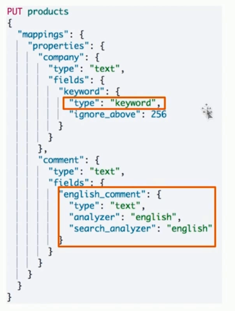

如果子字段的type是text，就代表全文本匹配；与之相对应的是type为keyword，它是精确匹配：

- Exact Value精确匹配：它不会将值分词，例如App Store就代表苹果商店，是有特殊含义的词，没有必要分词
- Full Text全文本：它会分词，一般是将一大段文本利用分词器将其分成多个部分

### Dynamic Mapping

在写入文档的时候，如果索引不存在，会自动创建索引

Dynamic Mapping使得我们无需手动定义Mappings，ES会自动根据文档信息，推算出字段的类型。但有时会推算的不对，比如地理位置信息。

如果类型推算错误的话，会导致一些功能无法正常运行，例如Range查询

查看一个索引的Mapping：GET 索引名/_mappings

类型的自动识别遵循下列的规则：

- 如果输入的是字符串，则会按照日期格式匹配，若匹配成功设置为Date；可以打开设置开关，让字符串转换为float或者long；如果匹配不上，则将其转换为Text格式，并增加keyword子字段
- 下列输入的类型和格式一一匹配转换：布尔值 -> boolean，浮点数->float，整数->long，对象->object
- 数组转换时，根据第一个非空数值的类型进行推断
- 空值忽略

下面就是一个例子，它会将firstName和lastName字段识别为Text类型，将loginDate识别为Date：


如果布尔值在JSON中是以字符串的形式出现的，ES会将其识别为字符串，如果是不加双引号的，ES就会将其识别为布尔值。

默认情况下，插入的数据新增了字段，也是可以支持动态新增的。

对于已有字段来说，一旦已经有数据写入，就不再支持修改字段定义（Lucence实现的倒排索引，一旦生成后就不允许修改，一旦修改就会导致已经被索引的数据无法被搜索），如果希望改变字段类型，就必须进行Reindex，重建索引

对于新增加的字段来说（新增的数据中存在从未有过的字段），分为几种情况讨论：

- Dynamic设置为true时，一旦有新增字段的文档写入，Mapping也同时被更新
- Dynamic设置为false时，Mapping不会被更新，新增字段的数据无法被索引，也无法被搜索（旧字段的数据可以被搜索），但信息会出现在_source中
- Dynamic设置为strict时，就不再允许写入文档

给一个索引设置dynamic的方法如下，下图中还有三种设置的对比：

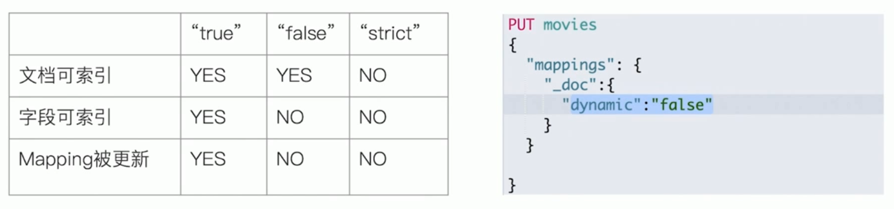

默认Dynamic是true，也就是被写入新字段是支持字段被索引，也就是该字段支持被搜索：

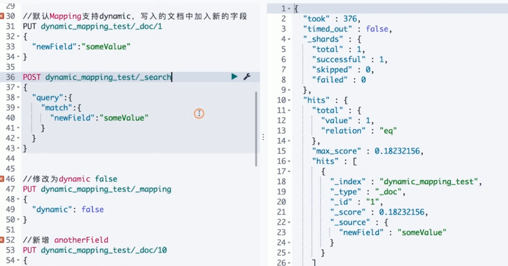

如果将Dynamic设置为false，那么新增的anotherField就不能被搜索到了：

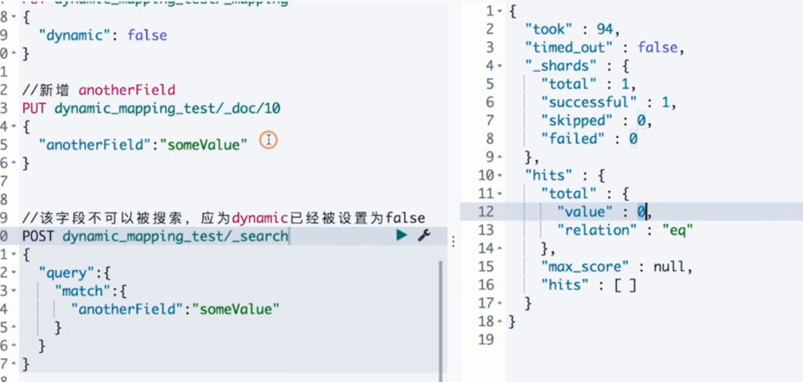

如果将Dynamic设置为strict，则该索引新增文档时会报错：

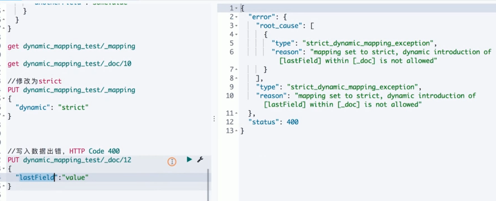

### 自定义Mapping

可以通过PUT 索引名来给一个索引指定mapping：


这里的设置可以参考API手册编写，也可以创建一个临时的index，然后导入一些样本数据，查看它自动生成的Mapping定义，然后修改后作为自己索引的mapping。

在设置Mapping时可以给一个字段设置index属性，它默认是true，如果设置false的话，就代表不会创建索引，代表该字段不可被索引：


此外，还可以控制一个字段的index_options：

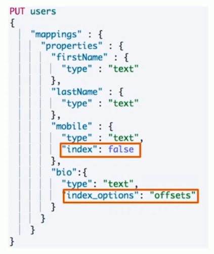

它可以控制倒排索引记录的内容，有以下几个可选值：

- docs：记录doc id
- freqs：记录doc id和term frequencies
- position：记录doc id、term frequencies和term position
- offsets：记录doc id、term frequencies和term position、character offects

Text类型默认记录position，其他类型默认记录docs。记录内容越多，占用存储空间越大

有时我们需要对null值实现搜索，创建文档的时候，不传这个字段就代表该值为null。设置Mapping时可以指定null_value属性为NULL，搜索时就能搜索到对应的空值null：


还有一个重要的属性是copy_to，它可以代替ES7之前的all字段，它代表将字段的数值拷贝到目标字段：

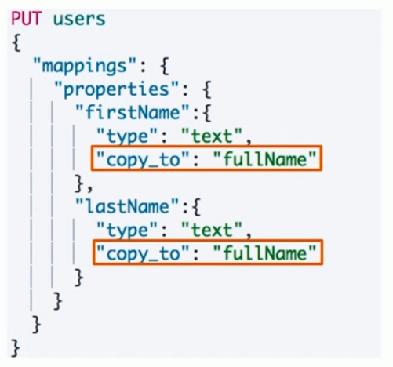

例如上图中就代表，将firstName和lastName的值拷贝到full_name字段中，这个full_name不出现在source中，只能在查询时查full_name这个字段

### Template

Template可以帮助你设置Mappings和Settings，有时如果导入数据时忘记设置副本，可能对数据稳定性有影响。所以对Mappings和Settings的控制是非常重要的。Template可以分为Index Template和Dynamic Template

Index Template是应用在所有索引上的（也可以通过index_pattern字段进行过滤筛选）。它只会在索引被新建时才会起作用，对已经存在的索引无效。设置多个Index Template的时候，这些设定会被merge在一起。可以指定不同Index Template的order值，来控制它们的优先级。

用PUT _template/模板名  的命令来创建一个Index Template，例如下面两个：

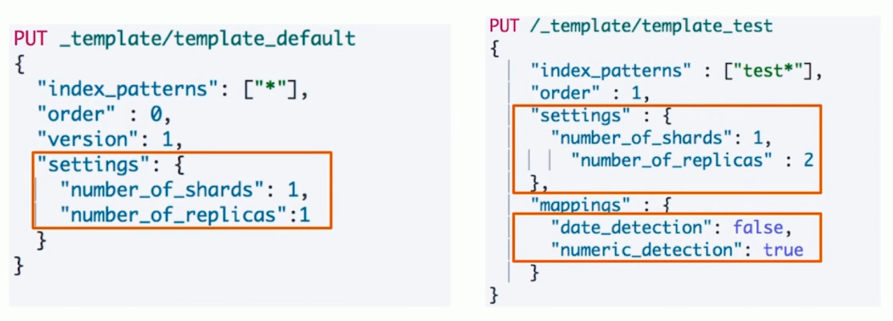

第一个Template代表将主分片和副本分片设置成1 

第二个Template代表禁止字符串自动转date，开启字符串自动转数字

索引中的Mappings和Settings优先级，生效的顺序是从上到下，优先级是从下到上：

- 应用ES中默认的Mappings和Settings
- 应用order更低的Index Template
- 应用order更高的Index Template
- 应用创建索引时，用户所指定的Mappings和Settings会覆盖前面的值

模板的基本操作：

- 创建： PUT _template/模板名
- 查看：GET _template/模板名    这里的模板名可以指定通配符

Dynamic Template是应用在特定索引中的，它可以根据不同的数据类型、结合字段名称，动态的进行设置，它可以完成下列功能：

- 所有的字符都设置为keyword，或者关闭keyword字段
- is开头的字段都设置为boolean
- long开头的字段都设置为long类型

给特定的index创建一个Dynamic Template：

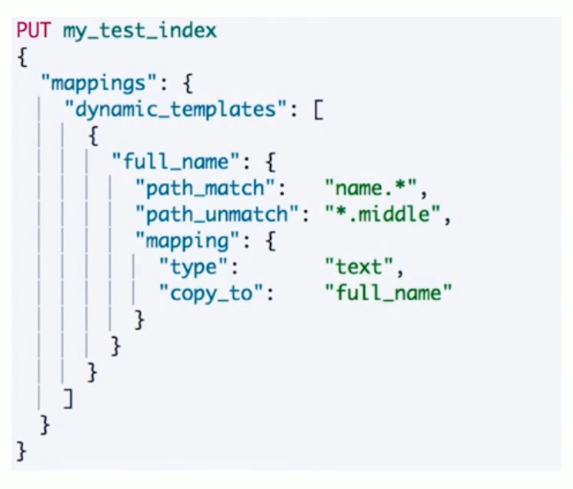

上图代表给my_test_index索引创建一个Dynamic Template，模板名是full_name，它对数据路径进行了筛选，规定文档path在name下的字段生效，文档path最后一段包含middle的不生效。规定mapping是copy_to到full_name字段

针对这样的Dynamic Template，如果我们插入一条这样的文档：

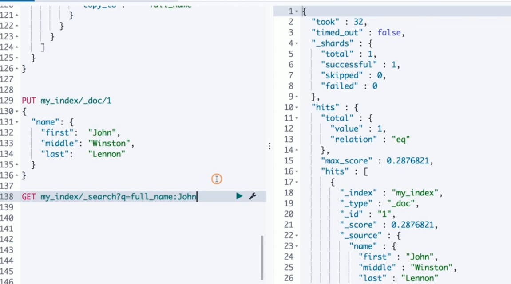

根据模板的规定，first和last字段生效，因为它们的path是在name下的；而middle字段不生效，因为它的path以middle结尾。

创建文档后再搜索John的full_name，发现可以搜索的到。

### Mapping版本管理

Mapping的设置非常重要，需要从两个维度进行考虑：

- 功能：搜索、聚合、排序
- 性能：存储的开销、内存的开销、搜索的性能

Mapping的设置是一个迭代的过程，建议加入Meta信息：

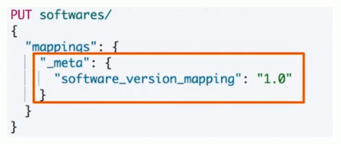

对Mapping来说加入新的字段很容易、更新删除字段则需要reindex。

给Mapping加入Meta信息后，能更好的进行版本管理。可以考虑将Mapping文件上传git进行管理

## 基于Java构建应用

ES客户端一般有两种：基于Springboot的spring-boot-starter-data-elasticsearch、ES原生的客户端（分为Low-level和High-level）

前者不支持ES的最新版本，后者可以支持最新版本

# Search API

Search API有两类：URI Search和Request Body Search

URI Search使用的是在URL中使用查询参数；Request Body Search使用ES提供的，基于JSON的更加完备的Query Domain Specific Language（DSL）

## URI Search

URI Search有以下几种查询范围：

- /_search：查询集群中所有的索引
- /index1/_search：代表查询名为index1的索引
- /index1,index2/_search：代表查询名为index1、index2的索引
- /index*/_search：代表查询以index开头的索引

URI Search使用q来查询字符串，q后面跟键值对，例如下面的查询：

```
curl -XGET "http://elasticsearch:9200/kibana_sample_data_ecommerce/_search?q=customer_first_name:Eddie"
```

代表查询范围是kibana_sample_data_ecommerce索引，对customer_first_name这个字段进行查询，查询内容是Eddle

在搜索结果中，会展示搜索花费的时间、结果总条数、结果集、文档id、相关度、原始信息：

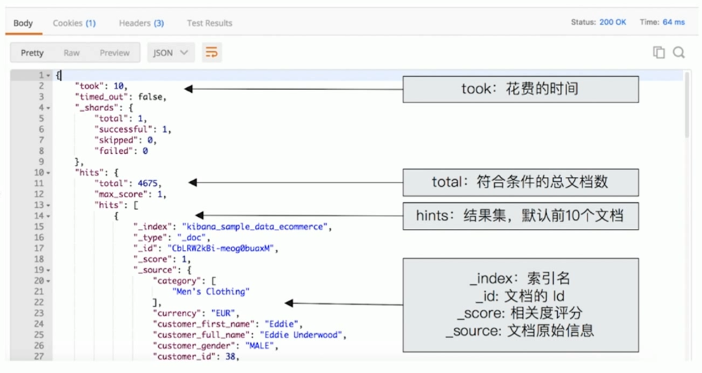

完整格式：

~~~
GET /movies/_search?q=2012&df=title&sort=year:desc&from=0&size=10&timeout=1s
{
  "profile": true
}
~~~

其中：

* q：指定查询语句，使用Query String Syntax
* df：查询哪个字段，不指定时会对所有字段进行查询
* sort：排序
* from和size用于分页
* profile true代表查看查询是如何被执行的

查询所有字段：GET /movies/_search?q=2012 代表查询所有字段包含2012的文档，它的query type是DisjunctionMaxQuery

指定查询某个字段有两种方式：一种是带df，一种是不带df：

* GET /movies/_search?q=2012&df=title 代表查询title字段包含2012的文档，它的query type是TermQuery
* GET /movies/_search?q=title:2012 和上面的含义一样，它的query type也是TermQuery

TermQuery和PhraseQuery：

PhraseQuery：GET /movies/_search?q=title:"Beautiful Mind"  它代表查询title里面带"Beautiful Mind"的文档，并且两者的顺序要一致，不能倒序

TermQuery，要用括号把查询条件括起来，代表它们是一组，例如：GET /movies/_search?q=title:(Beautiful Mind) 它代表查询title里面带Beautiful，或者带Mind的文档，它的query type是BooleanQuery

Query String Syntax支持布尔操作：AND、OR、NOT或者&&  || !    例如：

* GET /movies/_search?q=title:(Beautiful AND Mind)  代表查询title里面带Beautiful和Mind的文档，它的query type是BooleanQuery
* GET /movies/_search?q=title:(Beautiful NOT Mind)  代表查询title里面带Beautiful，但不带Mind的文档，它的query type是BooleanQuery

Query String Syntax支持分组功能，+代表must，-代表must_not，例如：

* GET /movies/_search?q=title:(Beautiful %2BMind)   其中%2B在URL里面代表加号，代表查询title里面带Beautiful和Mind的文档，它的query type是BooleanQuery

Query String Syntax支持范围查询：year:{2019 TO 2018}  year:[* TO 2018]，圆括号代表开区间，方括号代表闭区间

支持运算符：例如 year:?2020  year:(>2010&&<=2018)  year:(+>2010 +<=2018)，例如：

* GET /movies/_search?q=year:>=1980代表查询year大于等于1980的文档

Query String Syntax支持通配符查询（通配符查询效率低，占用内存大，不建议使用，尤其不建议放在最前面），问号代表单个字符，星号代表0或多个字符：title:mi?d、title:be*

支持正则表达式，如title:[bt]oy

支持模糊匹配与近似查询，例如：

* GET /movies/_search?q=title:beautifl~1   代表对beautifl进行模糊匹配，它可以找到tile为Beautiful的文档，这是为了防止用户输错的场景
* GET /movies/_search?q=title:"Lord Rings"~2   代表对这两个词进行模糊匹配，它可以找到Lord of the Rings这个文档

## Request Body Search

Request Body Search支持POST和GET，下面是一个查询对应索引所有文档的操作：

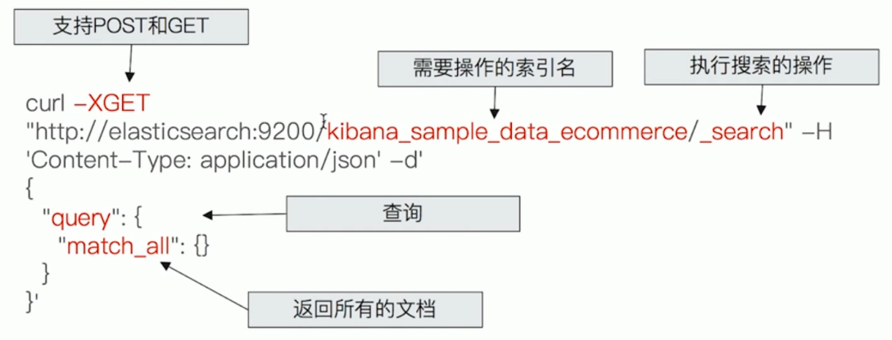

它也可以加profile代表查看查询过程：

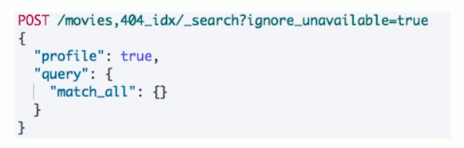

可以在请求体中加入"from":10,"size":20，来完成分页的功能，它代表从10页开始，返回20页的结果。获取靠后的翻页成本较高：

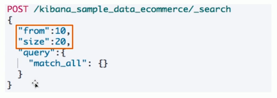

可以在请求体中加入"sort":[{"order_date":"desc"}]代表查询结果按照order_date逆序排序。最好在数字型和日期型字段上加排序逻辑。

可以在请求体中加入"_source":["order_date"] 代表查询结果不返回source的全部信息，只返回order_date字段的值，这就是source filtering的功能，它支持通配符。

它可以在查询结果中生成新字段，例如下面这段查询请求，代表利用painless脚本生成一个名为new_field的字段，它由文档的order_date加上hello字符串组成：

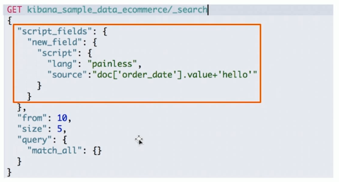

并且还可以针对新生成的字段进行排序，使用场景例如：订单中有不同的汇率，需要结合汇率对订单价格进行排序时

Request Body Search也有类似TermQuery和PhraseQuery的查询，如下图，上面的是TermQuery（查询字段名comment），下面的是PhraseQuery（查询字段名comment）：

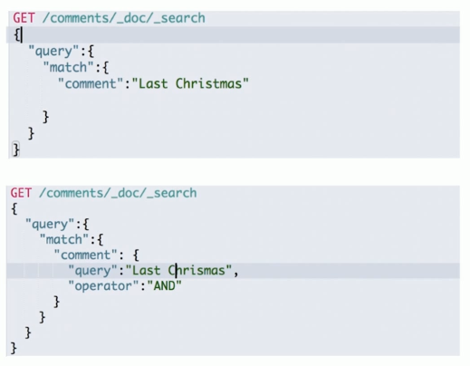

Request Body Search可以方便的进行短语查询，例如下面的查询条件，代表查询短语Song Last Chrismas，slop代表短语中间空格可以有1个单词进入，例如可以搜索到query为Song a Last day Chrismas的文档：

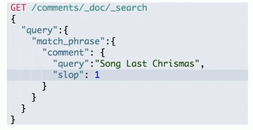

Request Body Search还有两种查询方式：query string和simple query string

在query string中可以实现一些比较复杂的逻辑操作，支持分组

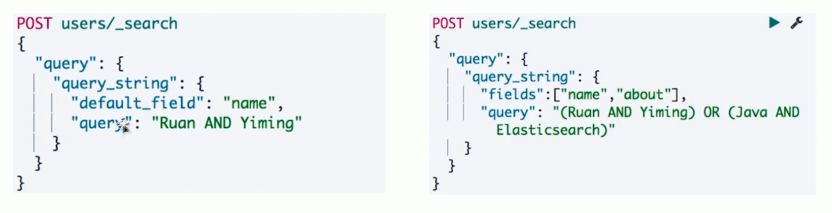

在simple query string中，它只能实现比较简单的语法，它会忽略错误的语法，不支持AND/OR/NOT（但三者可以分别用+、|、-替代），它们都会被当做默认字符串处理。Term之间默认的关系是OR，可以指定Operator

例如下面这个例子，就相当于AND没有起作用，查询的是name字段包括Ruan或者包括Yiming的结果：

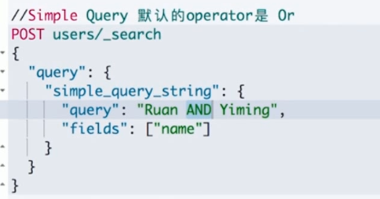

可以通过指定Operator将关系改为AND，就代表查询name包含"Ruan Yiming"的文档：

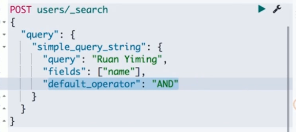

## Term查询和全文查询

Term是表达语意的最小单位，在ES中，Term Level Query有以下的查询分类：Term Query/Range Query/Exists Query/Prefix Query/Wildcard Query

在ES中，Term查询对输入不做分词（查询时不做分词），会将输入作为一个整体，在倒排索引中查找准确的词项，并使用相关度算分公式为每个包含该词项的文档进行相关度算分。

如果向products索引中插入三条数据：

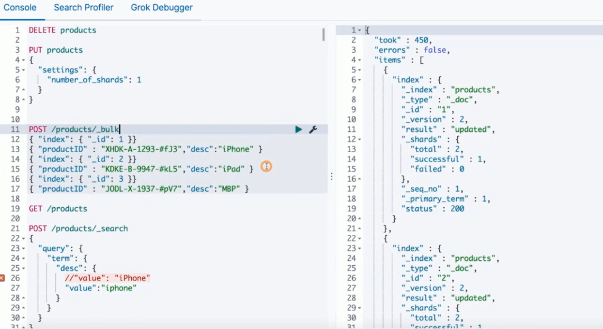

然后再用下列Term查询的方式去查：

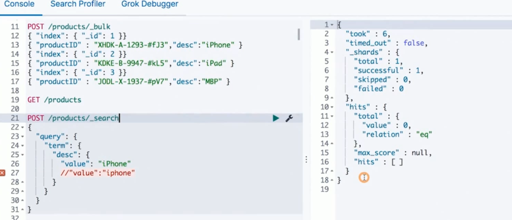

可以看到查iPhone是查不到的，这是因为导入数据分词时会自动将其转换为小写的，如果查询的是iphone就能查到了。

同样的道理受到分词影响，Term查询productID字段为XHDK-A-1293-#FJ3也是查不到的，因为导入数据将其按照分隔符拆分成了多个单词，如果查的是xhdk就能查询的到了：

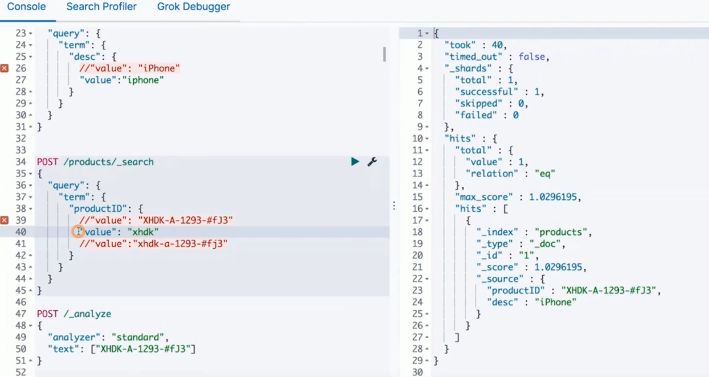

如果就想对productID字段做一个精确匹配，查对应字段为XHDK-A-1293-#FJ3的数据，应该查询对应productID字段的keyword子字段：

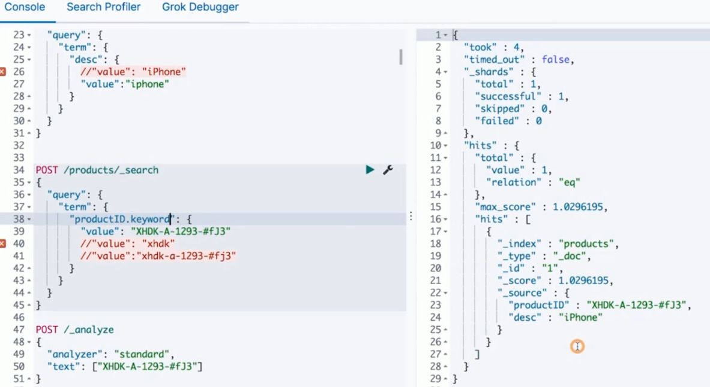

在Term查询中，经常是不需要相关性算分的，可以看到上面查询的返回值中有一个叫max_score字段，为了避免相关的开销，可以将Query转成Filter，忽略TF-IDF计算，避免相关性算分的开销，使用Filter时可以有效利用缓存：


对多值字段，Term查询是包含，而不是等于，例如对下面这样的数据：

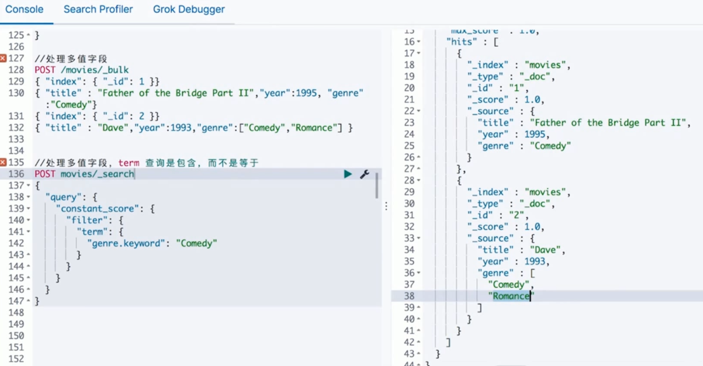

虽然对id为2的数据来说，genre字段有两个值：Comedy和Romance，对它进行keyword为Comedy的精确匹配时还是能搜到这一条数据。

如果想真正做到多值场景下相等而不是包含，应该增加一个genre_count字段进行计数，组合Query和Filtering来进行过滤

和Term查询不同，基于全文本的查找在索引和搜索时都会分词，查询字符串先传递到一个合适的分词器，然后生成一个供查询的词项列表，对每个词项进行底层的查询，最终将查询结果合并，为每个文档生成一个算分。

在ES中，基于全文本的查询有以下几种：Match Query/Match Phrase Query/Query String Query

例如，查"Matrix reloaded"，会查到包括Matrix或者reload的所有结果：

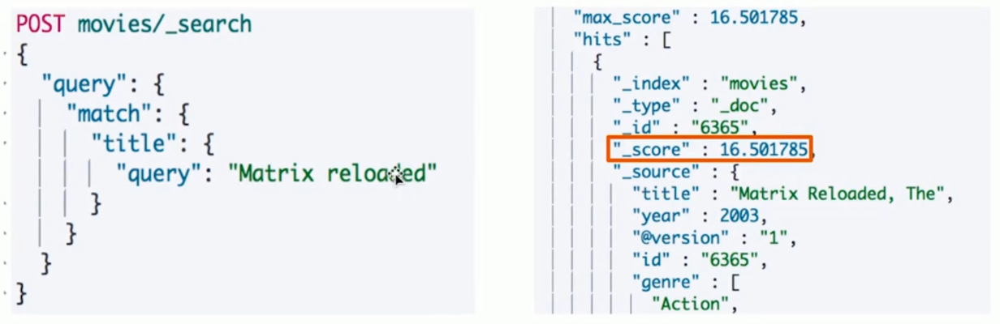

如果想对查询做精准控制，可以利用operator，这样查询结果中就一定包含Matrix和reload：

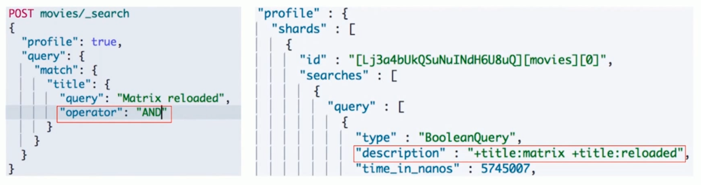

可以增加minumum_should_match字段来控制，至少匹配多少次：

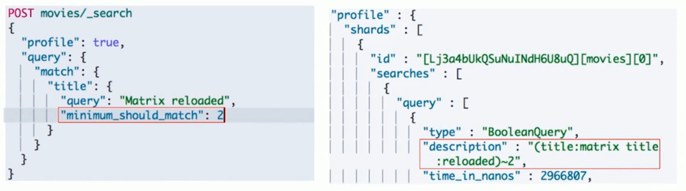

还可以使用之前说过的PhraseQuery的slop，来控制得更准确。

## 结构化搜索

结构化搜索（Structured search）是指对结构化数据的搜索。结构化数据就是类似日期、布尔类型、数字的数据。

文本也可以是结构化的，例如颜色集合（红、绿、蓝），商品的UPCs（通用产品码Universal Product Codes，它需要遵从严格规定的、结构化的格式）

结构化数据是可以进行逻辑操作的，包括比较数字或时间的范围，或判定两个值的大小

对结构化数据做精确匹配只需要用term查询即可。

下面是数字的范围查询，例如对price字段进行查询，大于等于20，小于等于30：

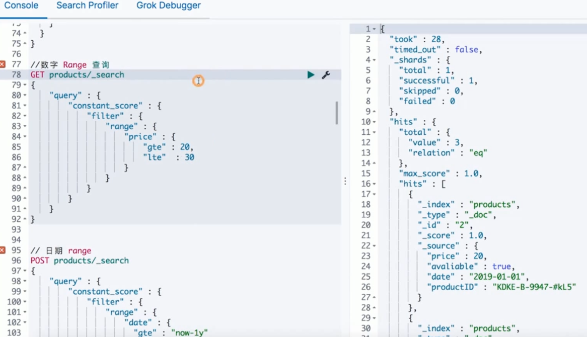

还可以对日期进行范围查询，如查询date字段最近一年的数据：

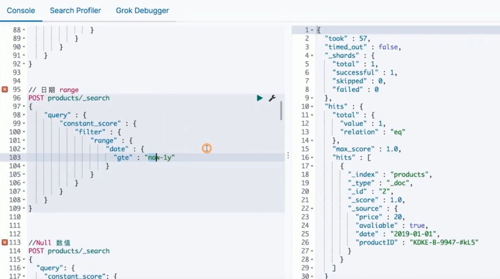

查看包含date字段的文档数据：


## bool 查询

在ES中，有Query和Filter两种不同的Context：

* Query Context：相关性算分
* Filter Context：不需要算分，可以利用Cache，获得更好的性能

现实场景中经常需要一些条件组合类的查询，例如搜索一个电影，评论字段中要包含Guitar，用户评分要大于3，上映日期需要在给定的范围内。

这种场景适合使用bool Query。一个bool查询是一个或者多个查询子句的组合，相关性算分时，每个查询子句计算得出的评分会被合并到总的相关性评分中

bool查询有4中子句，前两个影响算分，后两个不影响算分，这是一种精细化控制算分的方法，可以通过合理设置条件，让用户更希望展示的数据出现在前面

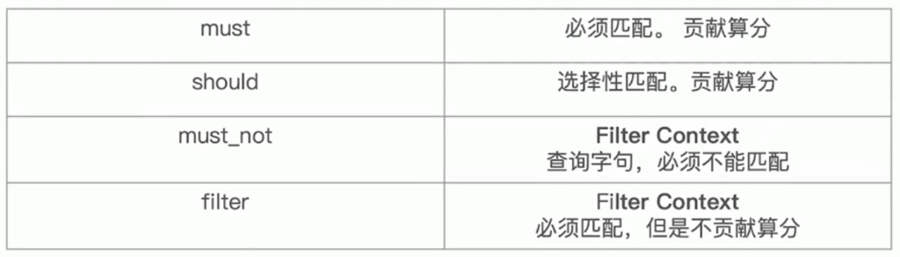

下面就是一个bool查询，它包含的子查询可以以任意顺序出现，而且支持嵌套。要注意，must和should至少要存在一个：

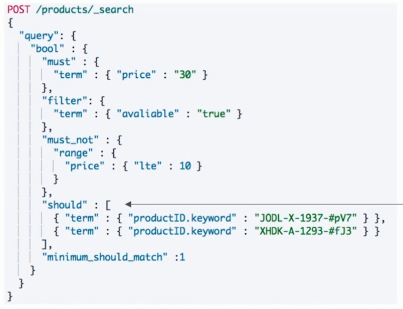

之前结构化查询中存在一个问题：对多值字段，Term查询是包含而不是相等，解决办法：增加一个genre_count字段进行计数，然后采用bool查询，同时控制多值字段和genre_count字段：

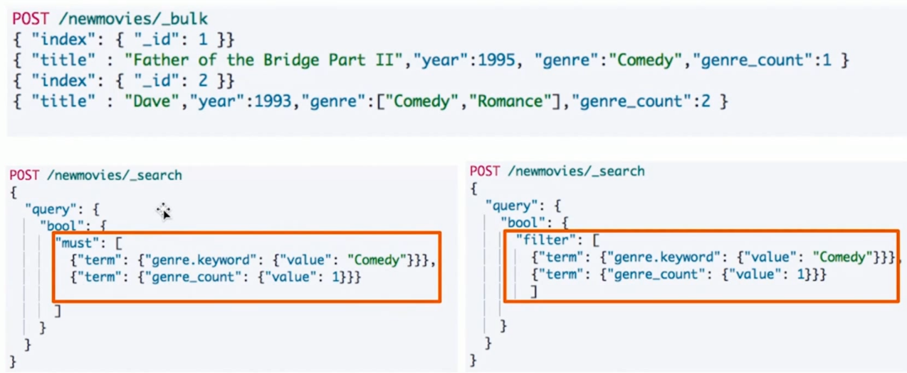

bool查询支持嵌套，可以实现should not的逻辑：

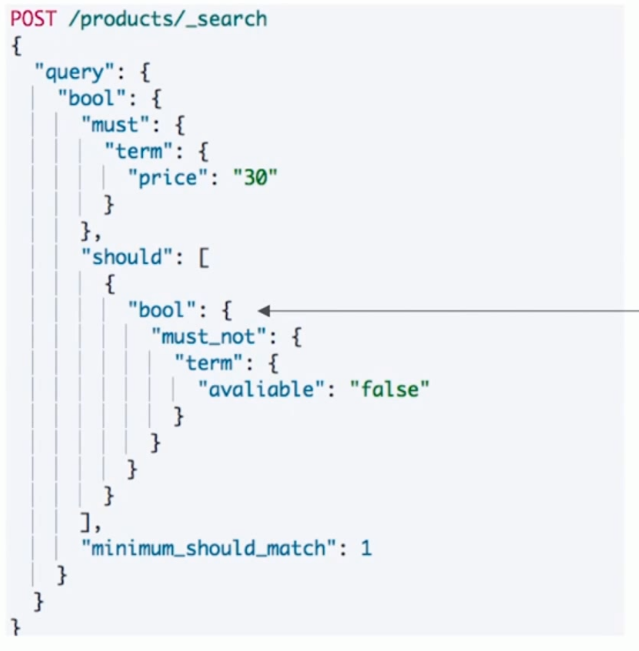

查询语句的结构，也会对相关度算分产生影响：同一个层级下的字段具有相同的权重，不同层级的字段权重也不同，可以通过改变层级来改变对算分的影响：

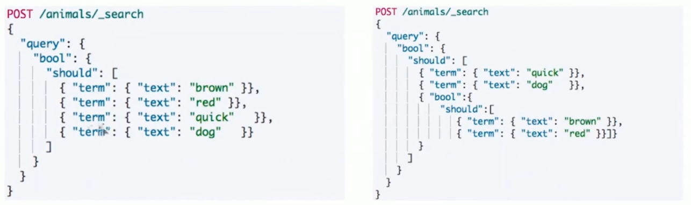

## Disjunction Max Query

在bool查询中，有时会出现查询结果和期望不一致的情况。例如下面这种情况，向blogs索引导入两条数据，然后进行搜索。id为2的文档的body字段包含brown fox这个字段，它理应是相关性最高的结果，但搜索结果正好相反，id为1的文档相关性算分更高。

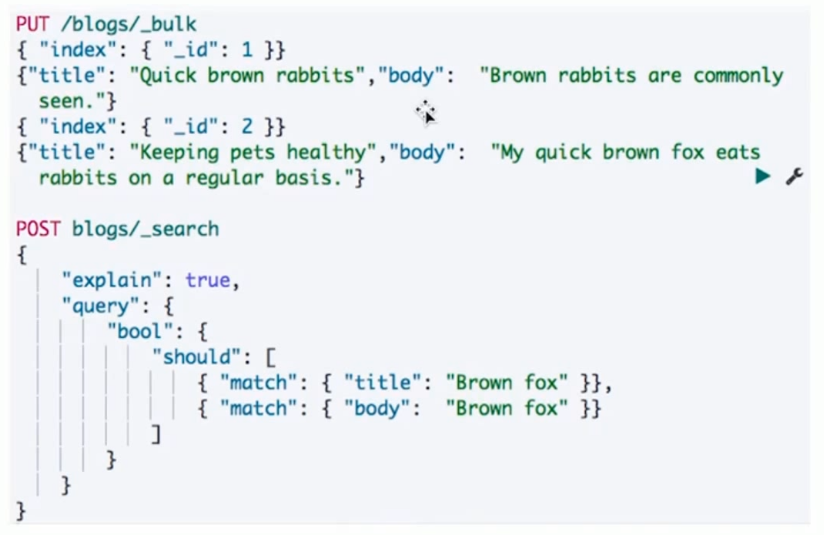

这是因为在bool查询中的算分过程：对两个子查询的should评分相加，再除以匹配语句的总数，除以所有语句的总数

虽然id为2的文档出现了更精确的词brown fox，但因为id为2的文档只有body匹配，而id为1的文档在title和body中都包含brown，相加后总的相关性算分更高了。

为了应对这种查询场景，可以使用Disjunction Max Query，它在计算算分时，会采用字段上最匹配的评分为最终评分返回，就不会出现上面的问题了：

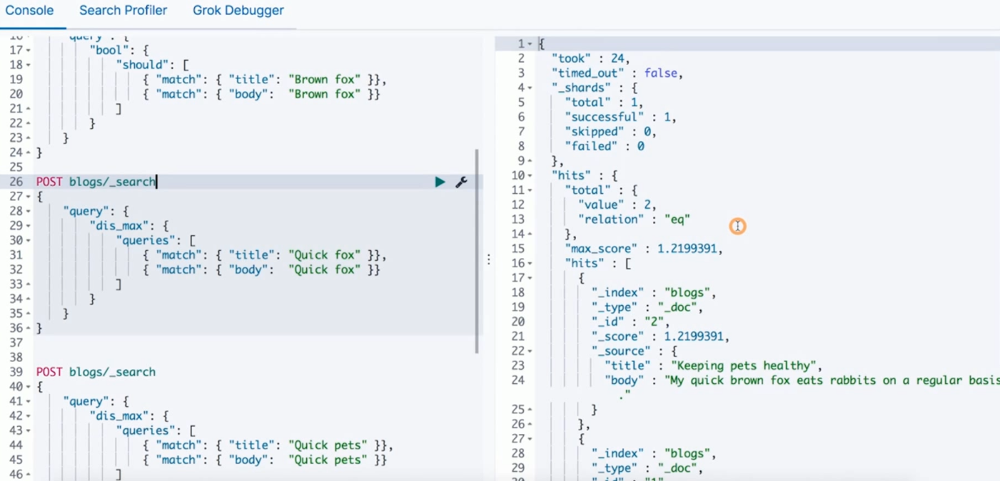

但Disjunction Max Query也有它自己的问题，例如查询Quick pets时，观察两条文档数据，id为1的只有title有Quick，而id为2的title有pets，body有quick。按照Disjunction Max Query的算法，这两条数据的算分是相同的，但id为2的文档算分理应更高。

也就是说我们需要一种机制，可以同时计算最佳匹配和其他匹配语句的贡献，可以使用tie_breaker参数进行调整，它是一个介于0-1之间的浮点数，0代表使用最佳匹配，1代表所有语句同等重要。最终的算分=最佳匹配语句的评分+其他匹配语句的评分*tie_breaker。这样就能在搜索Quick pets时，对上面两条数据做一个区分：

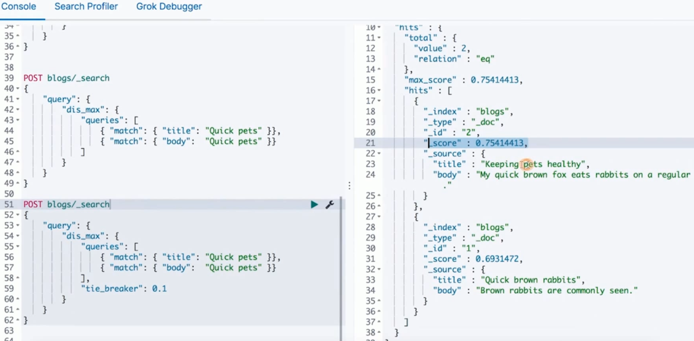

## MultiMatch

MultiMatch Query可以做到在多个字段上查询同样的值，一般分为三种不同的模式：

1、Best Fields：最佳字段

它的概念和之前讲过的Disjunction Max Query类似，它会取多个字段中匹配度最高的作为最终评分，它是MultiMatch Query的默认类型，不用特意指定。

下图就是一个MultiMatch Query，代表搜索Quick pets，在title和body两个字段上进行搜索，tie_breaker的值为0.2：

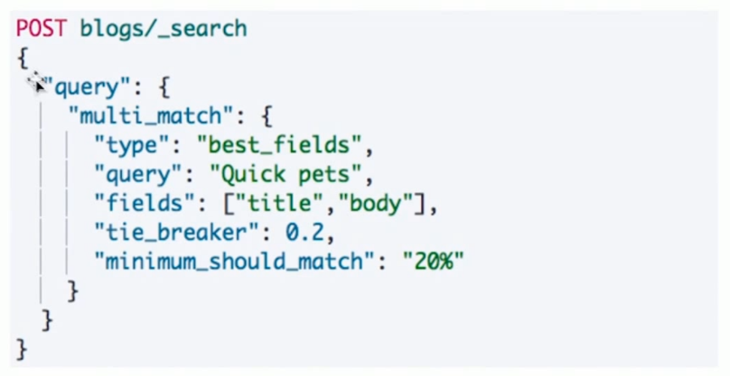

2、多数字段Most Fields

处理英文内容时，一种常见的手段是，在主字段提取词干（使用english分词器），加入同义词，以匹配更多的文档。相同的文本加入子字段（使用standard分词器），以提供更精确的匹配。其他字段作为匹配文档提高相关度的信号，匹配字段越多则越好

下面看一个用Most Fields解决英文分词器导致的精确度降低的问题。

一个索引采用的是english分词器，并导入两条数据，然后查询barking dogs：

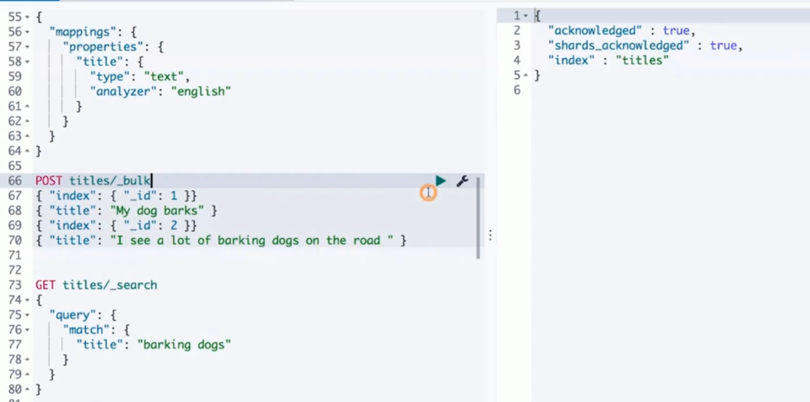

显然是id为2的文档更满足要求，但实际查询结果中，id为1的文档评分更高。这是因为english分词器会把barking处理为bark，这样就导致id为2的文档只有dogs一个词，id为1的文档有dog这个词，而id为1的文档更短，它的相关度评分就更高

为了解决这个问题，修改mapping，为title指定english分词器，并增加一个子字段std，它采用standard分词器，这个standard分词器就不会进行时态转换，不会将barking处理为bark：

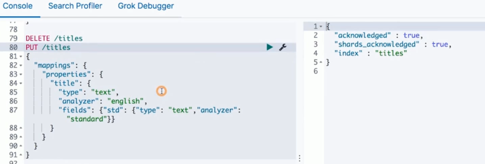

然后再进行Best Fields搜索，就可以看到id为2的文档相关性算分更高了：

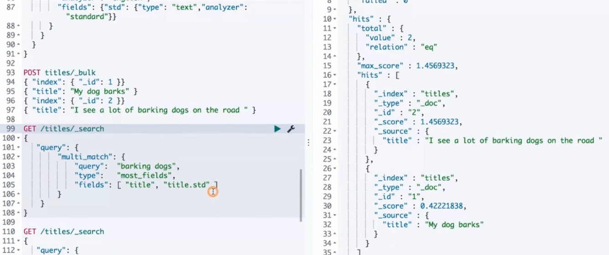

这样就通过使用不同的分词器，用title就能匹配更广的文档，而用std能匹配到相关度更高的文档。在MultiMatch中，可以对不同字段使用不同的boost，来控制字段间的优先级：

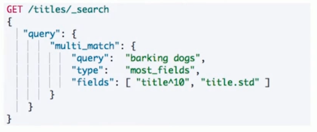

3、混合字段Cross Field

它希望在列出的字段中找到尽可能多的词。

例如对于下面的结构来说，想要搜索一个地名，同时在street、city、country、postcode字段来搜索

使用most fields有两个缺点：

* 无法使用operator，也就是说不能指定and条件，如果想让被搜索的信息在所有字段上都有，此时就没有办法了。一个方案是使用copy_to解决
* 无法指定多个字段的优先级

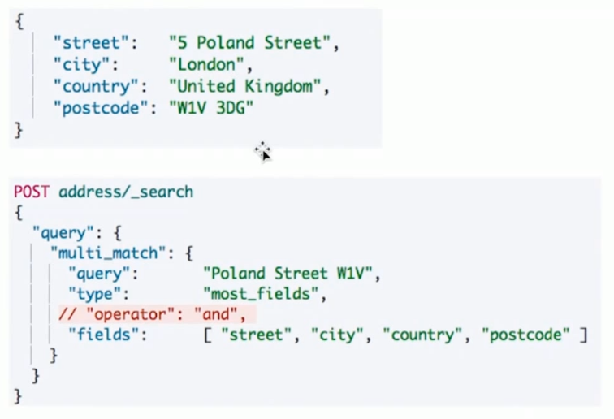

此时合理的方案是使用Cross Field，它可以方便的使用operator，而且支持搜索时为单个字段提升权重：

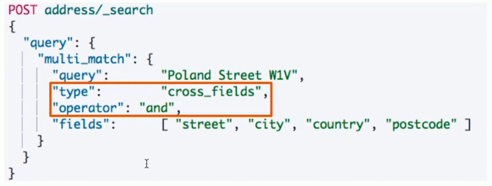

## Search Template

可以通过Search Template来定义一个查询模板，使用时直接使用模板查询

创建一个id为tmdb的模板，命令是POST _scripts/tmdb：

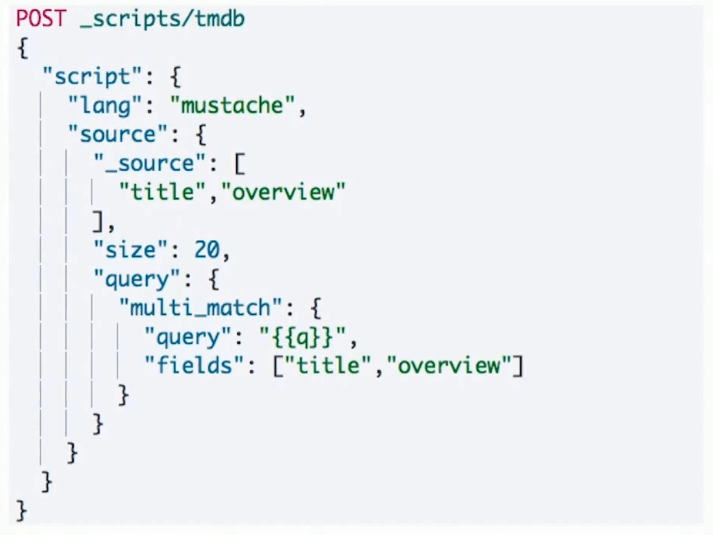

其中查询入参就是q

删除和查看Search Template：DELETE _scripts/tmdb 、 GET _scripts/tmdb

使用查询模板进行查询，需要指定模板id和入参：

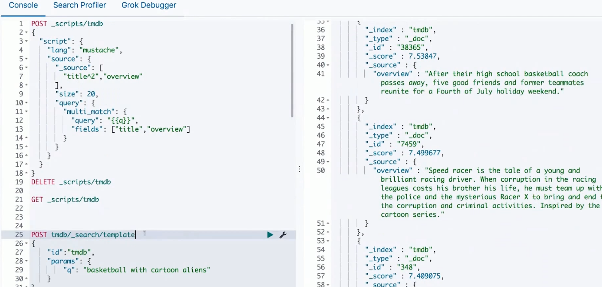

## Index Alias

有些场景经常创建索引，但是又不想修改程序，此时可以采用Index Alias。它其实就是给索引起一个别名，之后的查询都可以使用这个别名了：

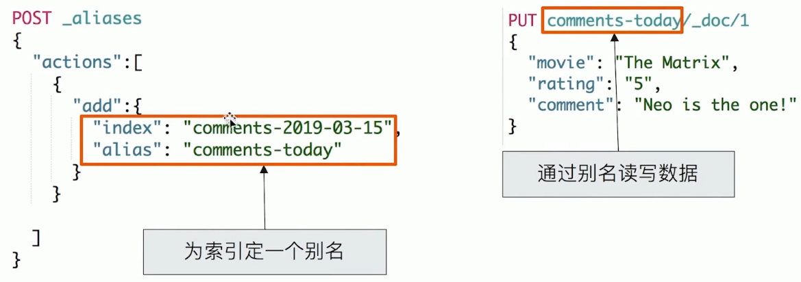

它在重建索引时很有用，可以实现不中断业务切换索引

## Function Score Query

为了对相关度排序做更多的控制，可以使用Function Score Query，它可以在查询结束后，对每一个匹配的文档进行一系列的重新算分，根据新生成的分数进行排序。它提供了几种默认的计算分值的函数：

* Weight：为每一个文档设置一个简单的权重
* Field Value Factor：使用该数值来修改_score，例如将热度和点赞数作为算分的参考因素
* Random Score：为每一个用户使用不同的随机算分结果
* 衰减函数：以某个字段的值为标准，距离某个值越近，得分越高
* Script Score：自定义脚本完全控制所需逻辑

一个Field Value Factor的例子，例如下面的Function Score Query，它额外使用votes字段来进行相关度排序。此时新的算分=老算分*votes

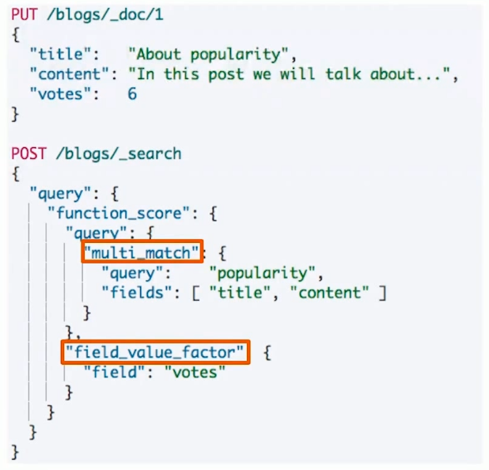

当votes很大的时候，算分的结果就会很大，为了在votes很大的时候算分趋近于稳定，可以增加一个modifier：log1p参数，此时新的算分=老算分*log(1+投票数)，此外ES还提供了很多modifier来 应对不同的场景：

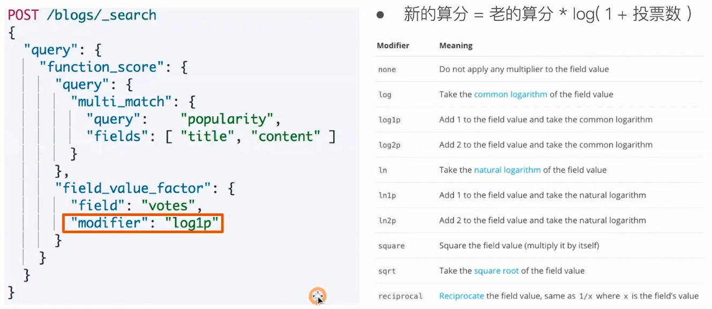

此外还可以引入factor，给算分公式增加权重，此时新算分=老算分*log(1+factor*投票数)。下面是factor是3和0.5：

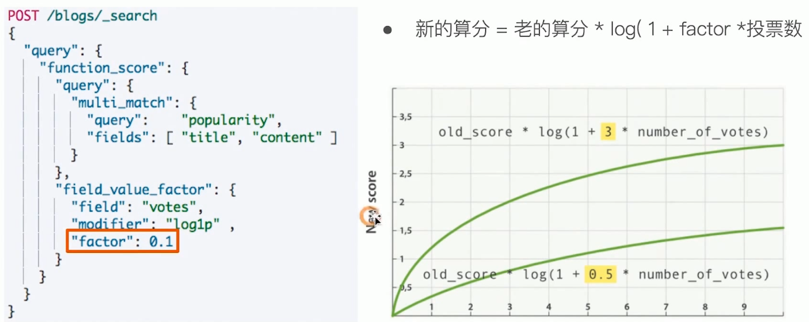

引入boost_mode可以控制函数和算分的计算逻辑，例如设置为sum，代表函数值和旧算分的和是新算分。

还可以引入max_boost让算分的结果控制在一个最大值：


引入一致性随机函数的例子，有时网站的广告需要提高展现率，需要让不同的用户看到不同的广告，但希望同一个用户访问时，结果的相对顺序保持一致：

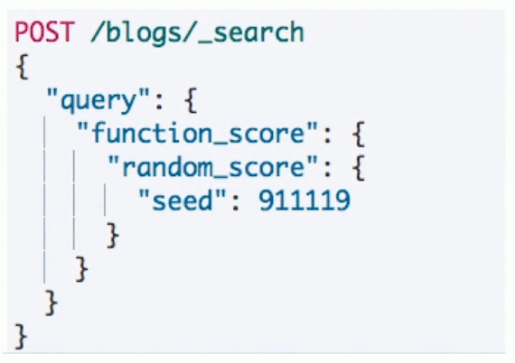

seed值保持一直，排序结果显示一致

## 排序

ES搜索中，默认是按照算分降序排序 

我们也可以指定排序规则，指定按照某个字段排序，比如下面的图就是按照order_date字段进行倒序排序，此时返回的结果中算分值是null：

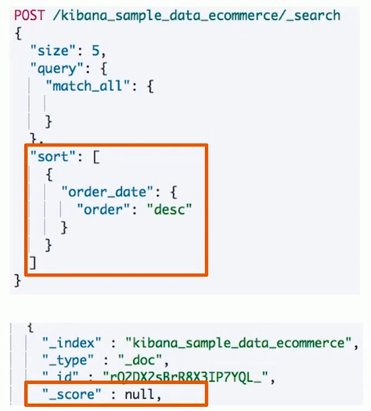

ES支持多字段排序，在多字段排序中也可以将算分加入排序规则中：


对文本值Text来说，默认是不支持排序的，如果我们要根据Text类型的字段进行排序，会查询报错：

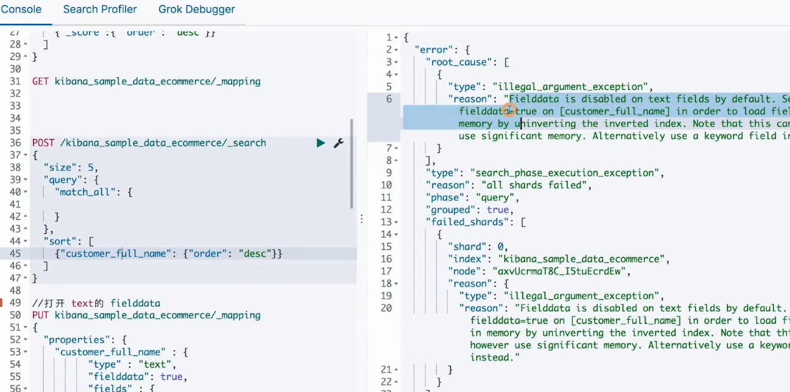

为了支持这种情况，需要调整mapping，打开对应字段的fielddata功能：


Text经过分词，排序和聚合效果不佳，建议不要轻易使用

排序是针对原始字段内容进行的，倒排索引无法发挥作用。必须使用正排索引来通过id和字段快速得到原始内容

ES对排序有两种实现方法：Fielddata和Doc Values（列式存储，对Text类型无效），在ES2.x之后，默认采用的是Doc Values（所以刚才不能对Text进行排序），在ES1.X及以前，采用的是Fielddata

两者的对比：

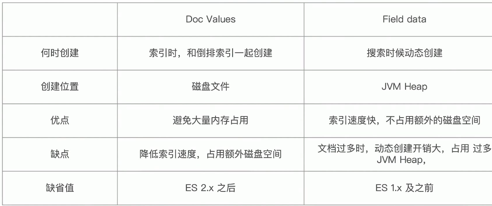

当确认字段不需要做排序和聚合分析的时候，可以通过mapping设置关闭doc_values，以增加索引的速度，减少磁盘空间的占用：

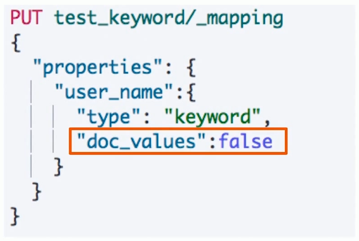

将值再改为true需要对索引进行重建。

## 遍历

当需要遍历所有数据，如导出数据时，如果采用简单分页会有严重的性能问题，此时可以使用Scroll API

首先执行第一次查询，创建一个快照，它会存在一定时间：

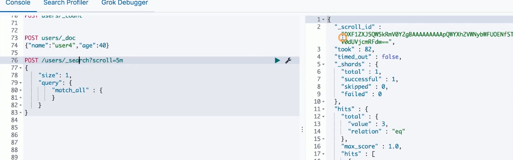

然后将查询结果中的scroll id放入下次查询的入参中，进行遍历，直到返回值没有scroll id：


# Suggester API

现代的搜索引擎，一般都会提供Suggest as you type的功能。帮助用户在输入搜索的过程中，进行自动补全或者纠错。通过协助用户输入更加精准的关键词，提高后续搜索阶段文档匹配的程度。

例如在google上搜索，一开始会自动补全，当输入到一定长度，就会开始提示相似的词或者句子。

搜索引擎中类似的功能，在ES中是通过Suggester API实现的。原理就是将输入的文本分解为Token，然后在索引的字典里查找相似的Term并返回。

根据不同的使用场景，ES设计了4种类别的Suggesters：Term&Phrase Suggester、Complete & Context Suggester

## Term&Phrase Suggester

Suggester就是一种特殊类型的搜索，例如下面的Term Suggester，下面的text就是调用的时候提供的文本，通常来自于用户界面上输入的内容。用户输入的lucen是一个错误的拼写，指定会去指定的字段body中搜索这个词，当无法搜索到的时候（missing），返回建议的词：

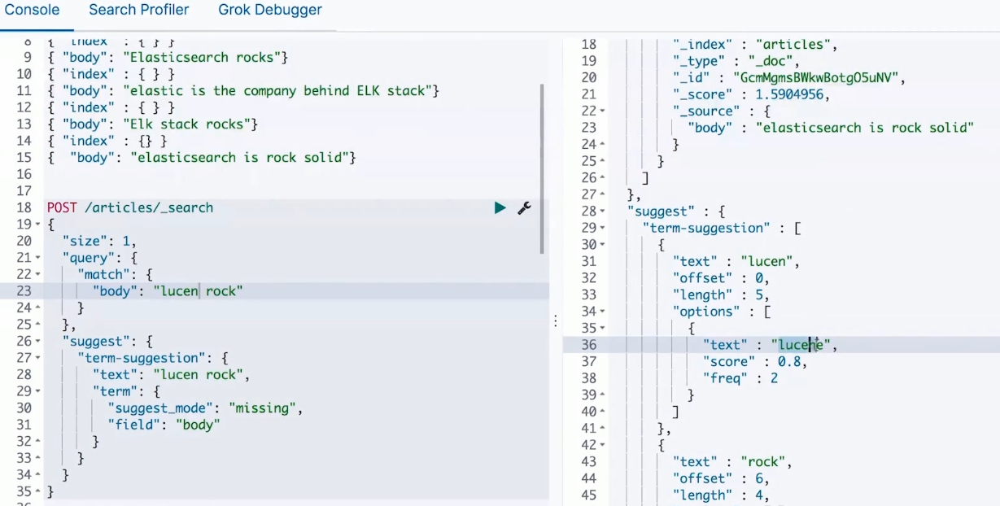

可以看到建议的返回值里面，每个返回都包含一个算分，相似性是通过Levenshtein Edit Distance的算法实现的，核心思想是一个词通过改动多少字符就可以和另一个词一致（编辑距离越小越好）。

几种Suggestion Mode：

* missing：当索引中不存在时，才提供建议
* popular：推荐出现频率更高的词
* always：无论是否存在，都提供建议

当指定prefix_length为0时，搜索lucen hocks，就会对lucen和hocks两个词进行推荐，否则就只推荐lucen：

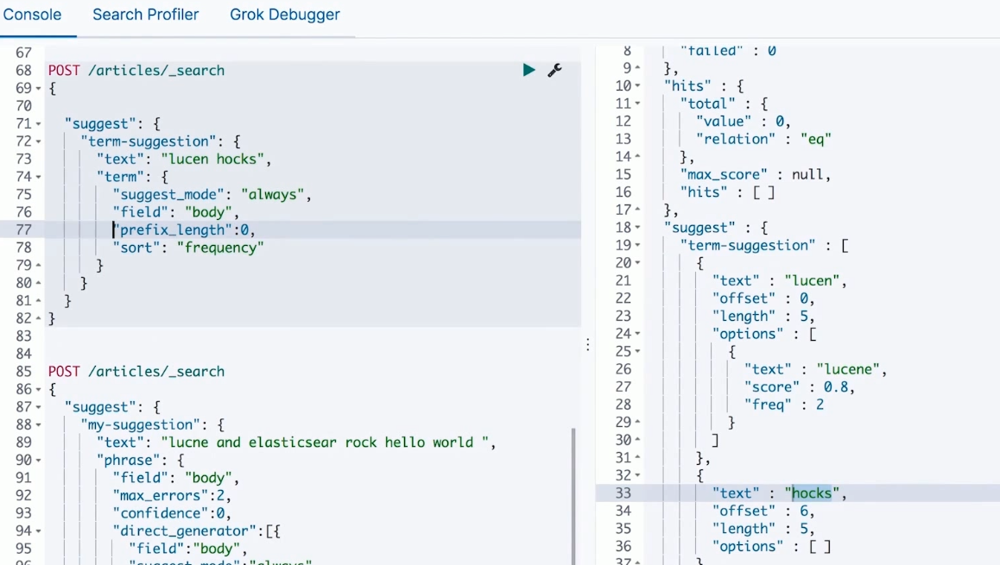

Phrase Suggester在Term Suggester的基础上增加了一些逻辑，例如max_errors代表最多可以拼错的Term数，confidence限制返回结果数

## Complete&Context Suggester

Complete Suggester提供了自动完成的功能，用户每输入一个字符，就需要即时发送一个查询请求到后端找匹配项

这种场景对性能要求比较苛刻，ES采用了不同的数据结构，并非通过倒排索引来完成，而是将Analyze的数据编码成FST和索引一起存放，FST被ES整个加载进内存，所以查找速度很快。但FST只能用于前缀查找。

要使用Complete Suggester，必须事先把对应索引的mapping中的对应字段type设置为completion：

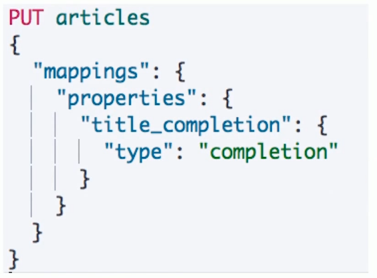

导入数据后就可以使用Suggester API了，在API中需要指定索引名、前缀和字段名：


Context Suggester是Complete Suggester的扩展，它可以在搜索中加入更多的上下文信息，例如输入star，如果搜索的是咖啡相关，可以返回Starbucks；如果搜索的是电影相关，可以返回star wars

Context的类型有两种：Category（任意的字符串）和Geo（地理位置信息）

实现Context Suggester需要首先设置索引的mapping，下面就是对comments索引设置，设置字段comment_autocomplete一个context，它的context类型是Category，context名是comment_category：

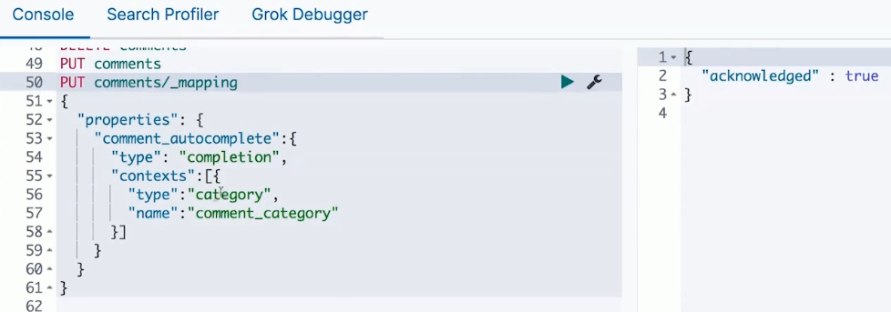

导入数据时，指定comment_autocomplete时就需要额外指定它的context值是什么：

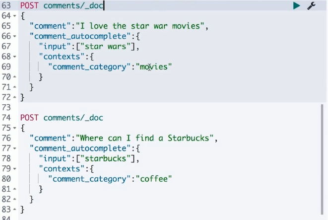

然后补齐数据时就可以根据context进行筛选补齐了，依然还是用前缀匹配的方式：


# 聚合分析

## 入门使用

ES除了搜索以外，还能针对数据进行统计分析。它统计分析的性能很好，不会像Hadoop一样。

通过聚合得到一个数据的统计结果，它是分析和总结多条数据，而不是寻找单个的文档。

聚合分析有下面几种：

* Bucket Aggregation：满足特定条件的文档的集合，就是分组
* Metric Aggregation：一些数学运算，可以对文档进行统计分析，例如求和、求平均值
* Pipeline Aggregation：对其他的聚合结果进行二次聚合
* Matrix Aggregation：支持对多个字段的操作，并提供一个结果矩阵

Bucket一个分组，可以将文档按照某种特征进行分组归类，例如按照档次将数据分类，或者是按照评价分类：

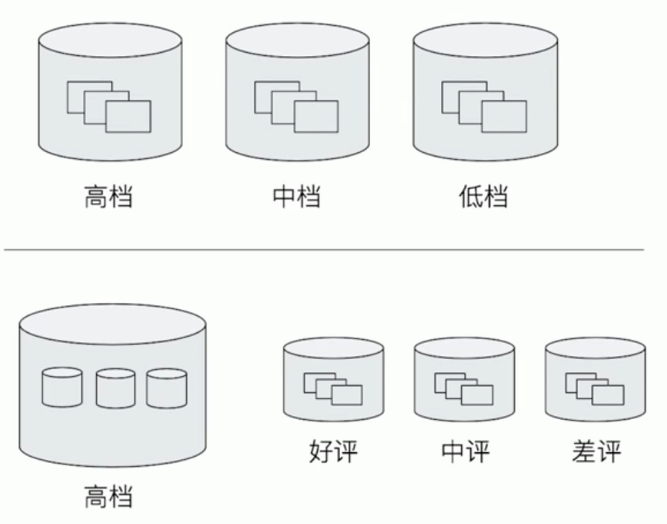

Metric会基于数据集计算结果，同样也支持在脚本产生的结果之上进行计算。大多数Metric是数学计算，仅输出一个值；部分Metric支持输出多个值

一个Bucket Aggregation的例子如下，对某个索引进行聚合分析，按照DestCountry字段进行分桶：

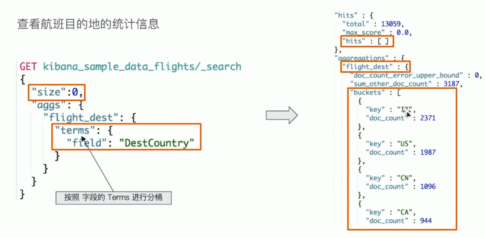

可以在分组的结果之上加入Metric聚合，先对数据按照DestCountry字段分组，然后再计算各组数据AvgTicketPrice字段的平均值、最大值和最小值：

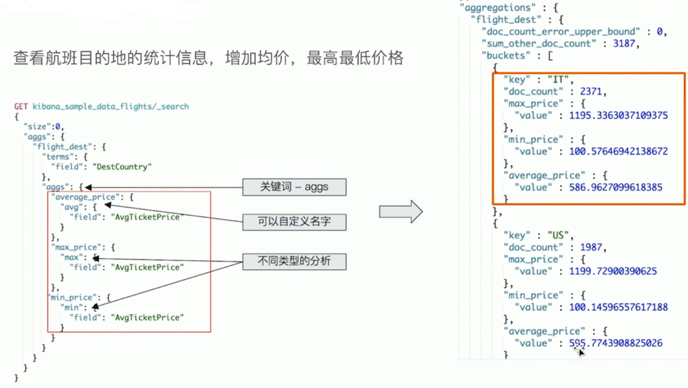

此外，还支持在分组的基础上再进行分组，例如在某个分组再按照DestWeather进行分组，相当于按照天气分组：

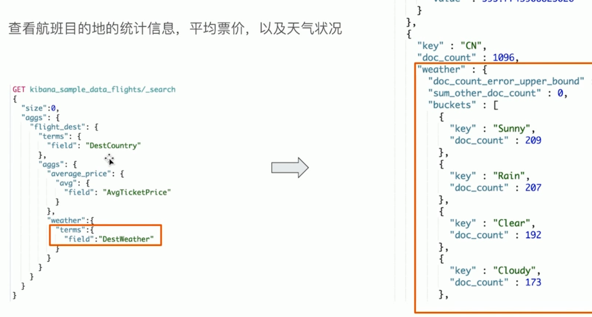

## Metric Aggregation

Aggregation属于Search的一部分，一般情况下，建议将其size设置为0，size如果指定是0，那就只能返回聚合结果，否则会返回很多结果。

Aggregation的语法：

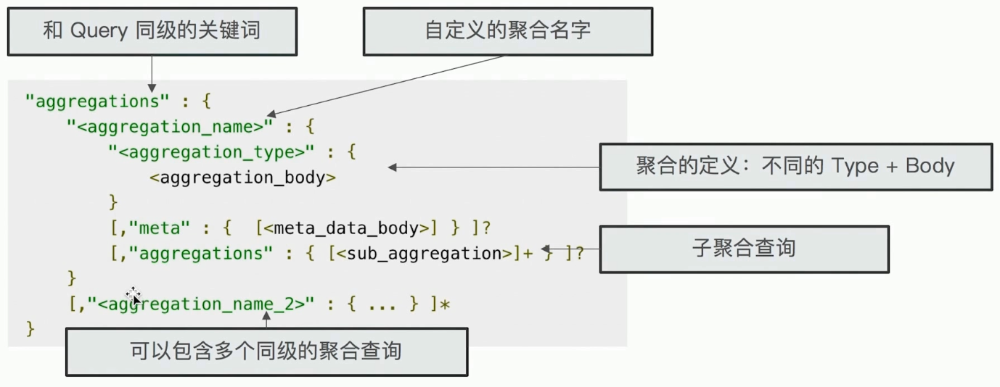

Metric Aggregation分为单值分析和多值分析：

* 单值分析：只输出一个分析结果，例如min、max、avg、sum、cardinality（类似distinct count）
* 多值分析：会输出多个分析结果，例如stats、percentile、top hits（排在前面的示例）

Metric Aggregation的案例：

1、找到最高、最低、平均工资

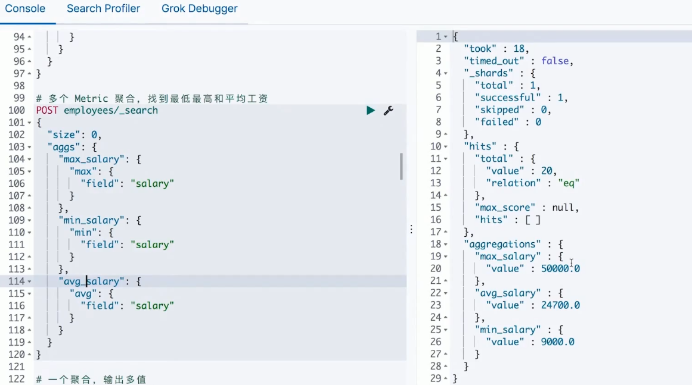

2、聚合类型是stats时，可以一次性返回多个统计结果：

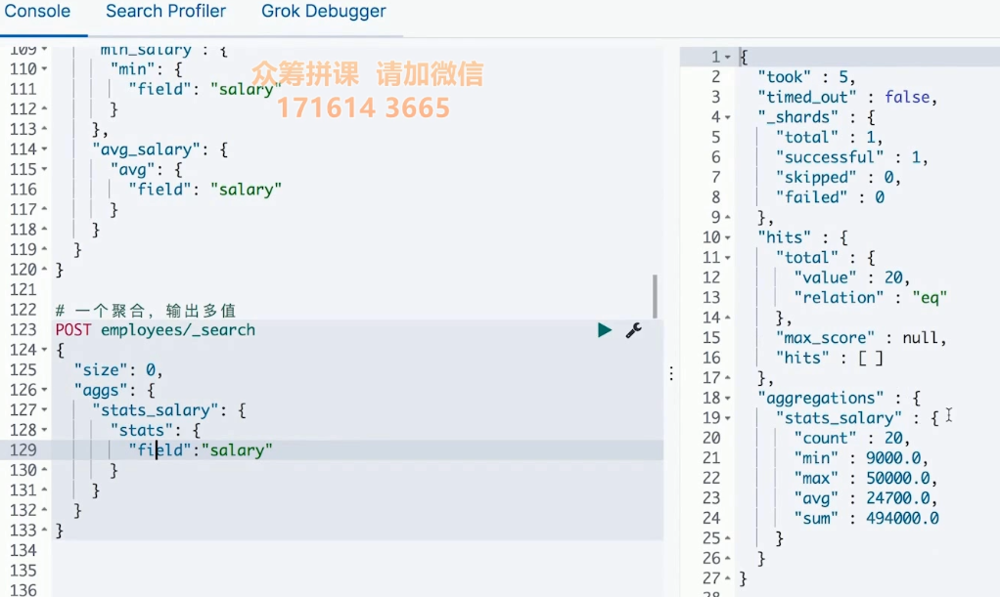

## Bucket Aggregation

Bucket Aggregation可以按照一定的规则，将文档分配到不同的桶中。

ES中一些常见的Bucket Aggregation：Terms Aggregation、Range/Data Range Aggregation、Histogram/Date Histogram Aggregation

1、Terms Aggregation

它的意思就是按照某个字段进行分组，类似关系型数据库中的group by field。但不是所有字段都可以进行Terms Aggregation：

* keyword默认支持fielddata，可以进行Terms Aggregation
* Text需要在Mapping中打开fielddata，才能进行Terms Aggregation

如果对keyword，可以直接进行Terms Aggregation进行分组：

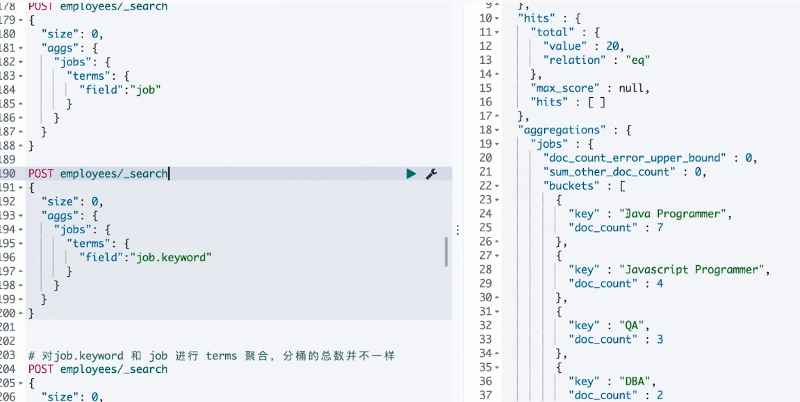

如果对Text字段直接进行Terms Aggregation则会报错：

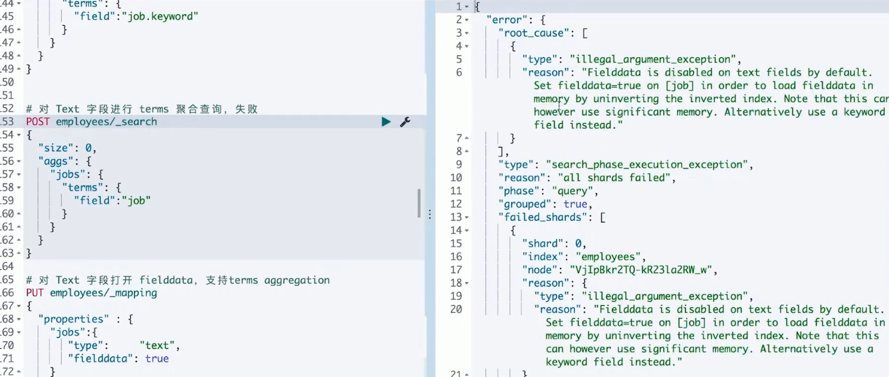

需要对这个字段设置fielddata为true才可以：

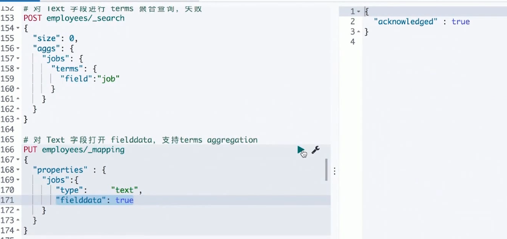

可以发现，直接对job字段进行Terms Aggregation和对job的keyword进行Terms Aggregation的结果是不同的：

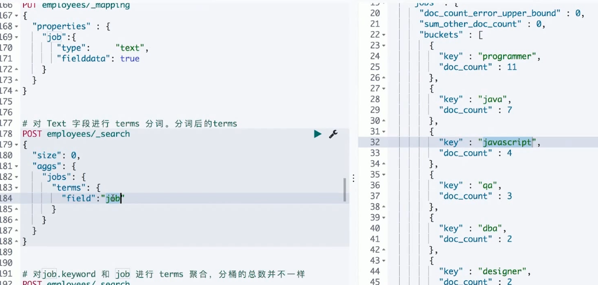

非keyword的情况下，会对数据进行分词处理，导致切分后的桶数不一样。可以使用cardinality分析来查看分组后的桶数：

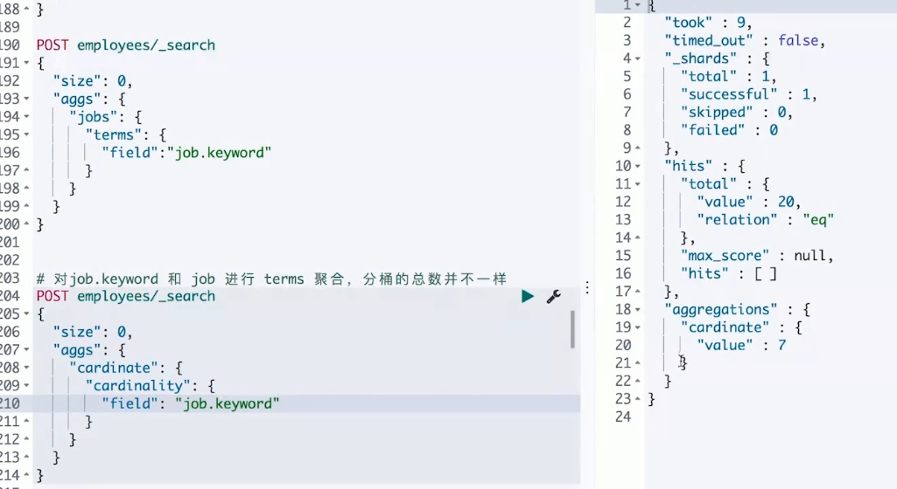

在分组的时候还可以指定size，表示显示数量前N的聚合结果：

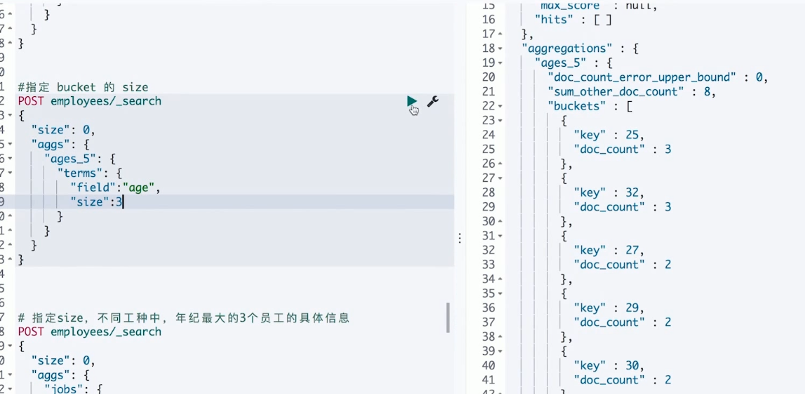

可以在分组后，对每个分组的信息再进行分析，例如查找不同工种中，年纪最大的3个员工的具体信息：

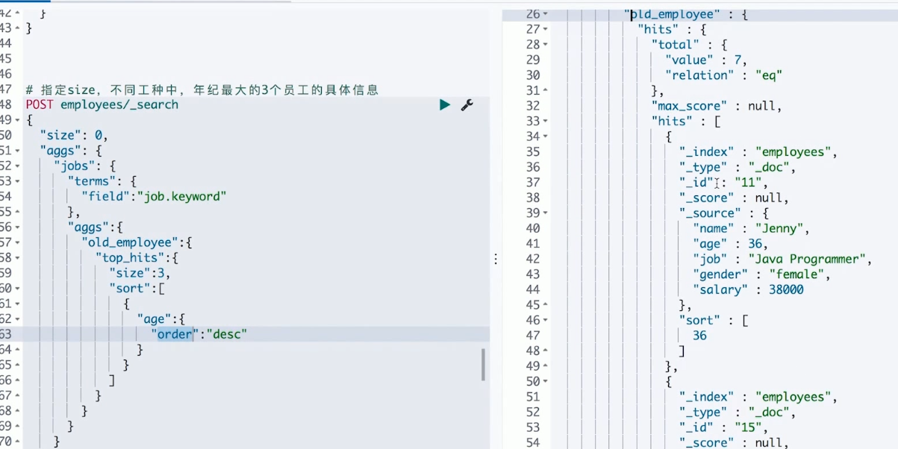

可以打开eager_global_ordinals开关，来优化Terms Aggregation的性能，它代表写入数据时，对应的term被加载到cache中。适用场合：经常有文档写入、经常做聚合分析：


2、Range Aggregation

它的意思是按照字段的值分为不同的区间，一个区间是一组。例如根据工资不同区间分组：

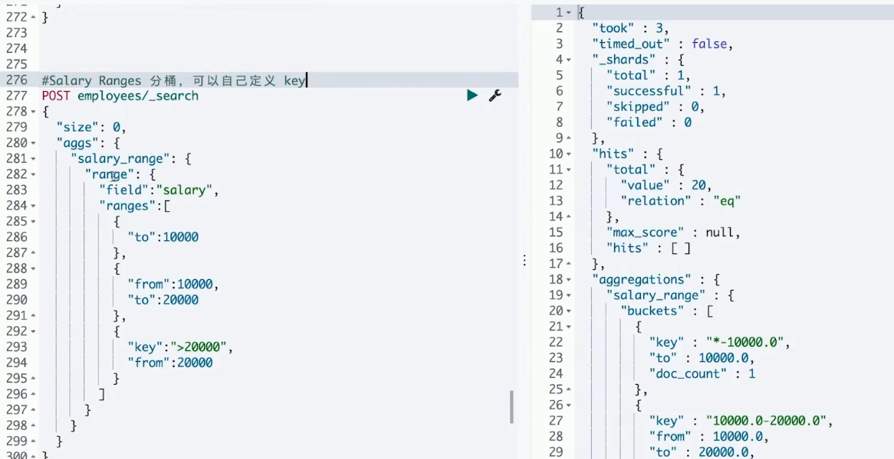

3、Histogram Aggregation

和前面的类似，也是按照区间分组。例如下面的例子，从0开始到100000结束，间隔5000一个分组：

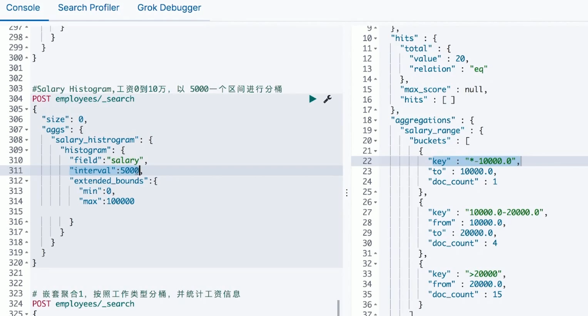

Bucket Aggregation允许添加子聚合来进一步分析，子聚合分析可以是Metric也可以是Bucket

案例1：按照工作类型分类，并统计工资信息：

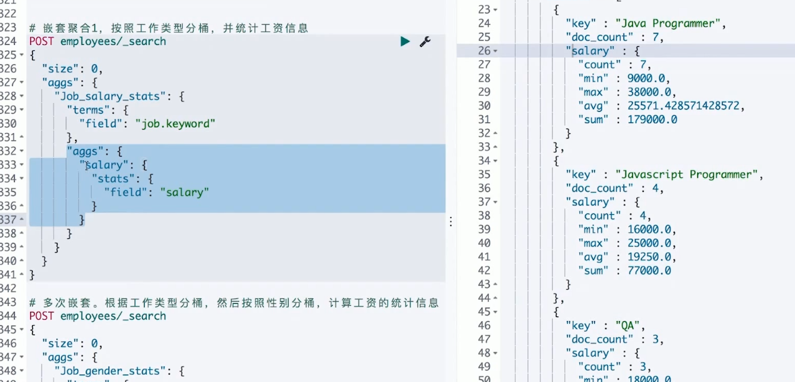

案例2：按照工作类型分桶，然后按照性别分桶，计算工资的统计信息：

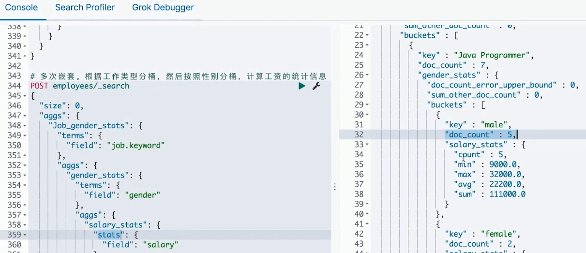

##  Pipeline Aggregation

Pipeline Aggregation：对其他的聚合结果进行二次聚合

Pipeline的分析结果会输出到原结果中，根据Pipeline设置位置的不同，分为两类：

* Sibling：结果和现有分析结果同级，例如：Max、min、Avg&Sum Bucket；Stats、Extended Status Bucket；Percentiles Bucket
* Parent：结果内嵌到现有的聚合分析结果之中，例如：Derivative（求导）、Cumulative Sum（累计求和）、Moving Function（滑动窗口）

下面是一个求平均工资最低的工作类型，需要先进行平均工资聚合，然后在这个基础上查找最小的值：

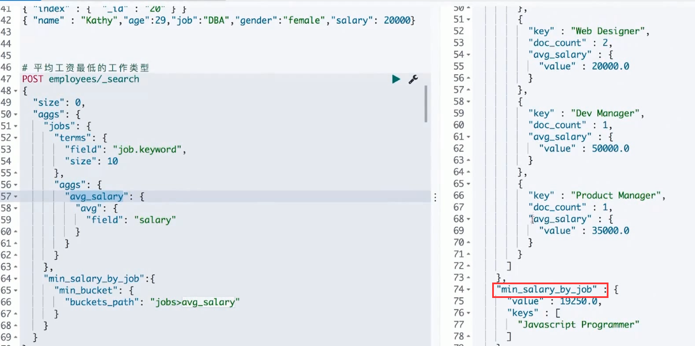

可以看到Pipeline Aggregation的结果和其他的聚合同级，它们会一起出现在结果中。通过buckets_path指定路径。

它的聚合类型是min_bucket，同样地还可以使用max_bucket来查看最高的结果、avg_bucket查看平均结果、stats_bucket查看统计结果、percentiles_bucket查看百分位数。上面的Pipeline都是Sibling类型的，因为Pipeline类型和其他聚合分析类型是同级的。

下面是几个Parent类型的例子：

按照年龄对平均工资求导：首先按照Histogram Aggregation将数据分为多组，然后每组求平均值，在这个基础上进行求导：

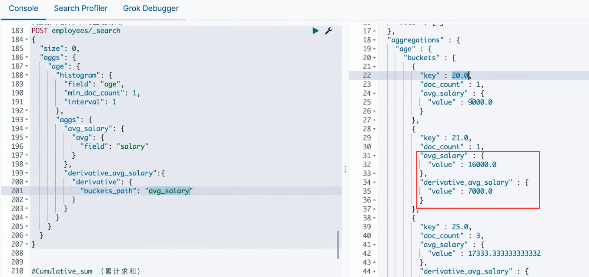

可以看到derivative_avg_salary聚合分析的结果和平均工资在相同的级别。

累计求和的案例：

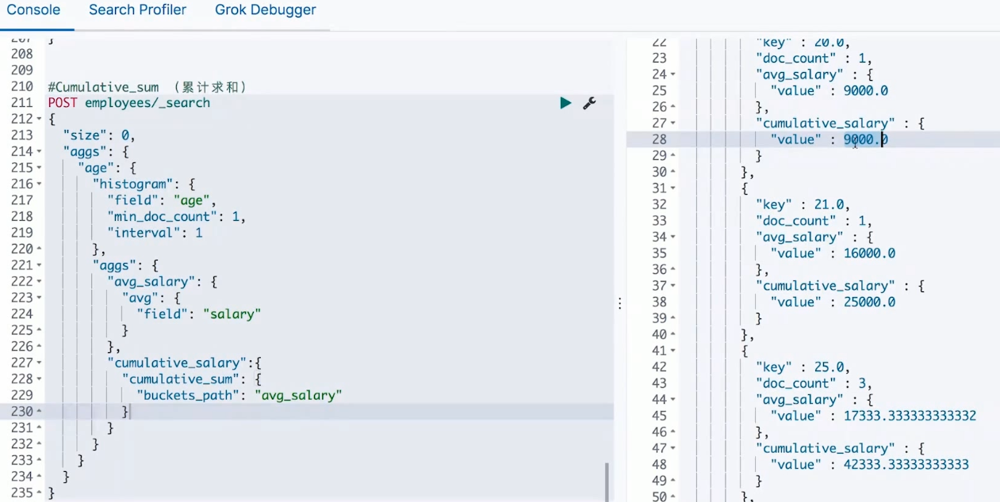

移动平均值的案例：


## 聚合的作用范围

ES中聚合分析的默认作用范围是query的查询结果集，例如下面的聚合分析是建立在上面的query查询结果之上的：


同时ES还支持以下方式改变聚合的作用范围：Filter、Post Filter、Global

在聚合中使用filter可以在过滤后进行聚合分析，例如下面的例子，jobs对年龄大于35岁的员工进行分组，而没有指定Filter的聚合就是对所有员工进行分组：

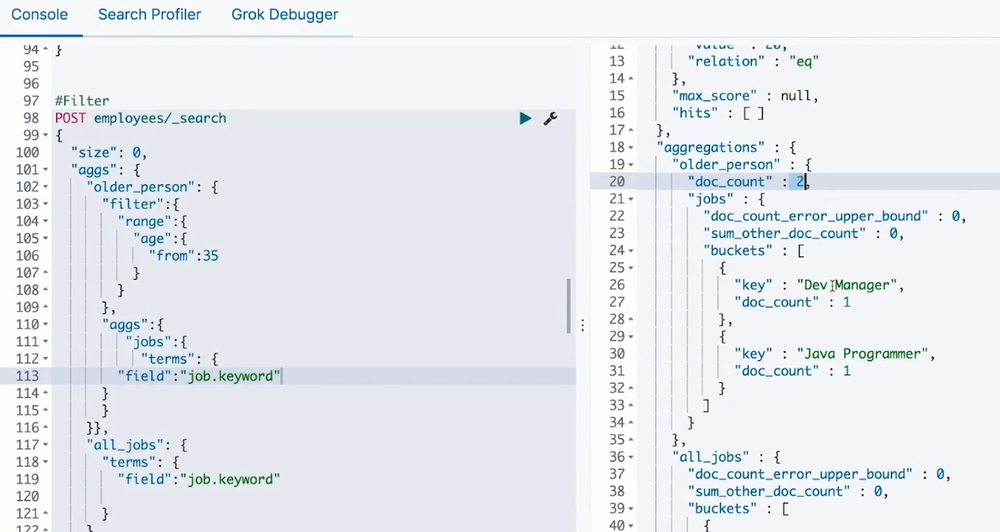

post field可以对聚合分析后的结果进行过滤，如显示聚合分析结果中job字段值是Dev Manager的结果：

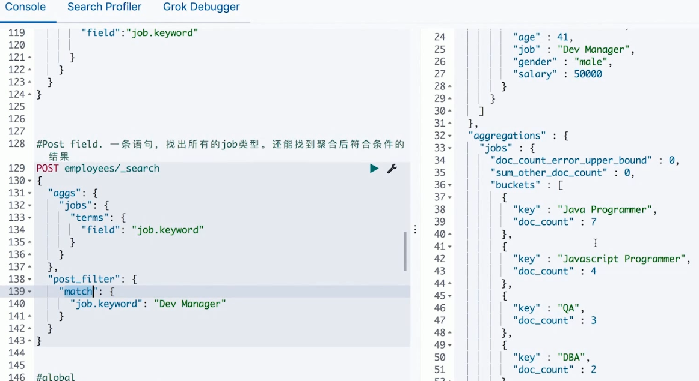

global可以让聚合分析作用范围不依赖查询结果，而是针对整个数据集的：

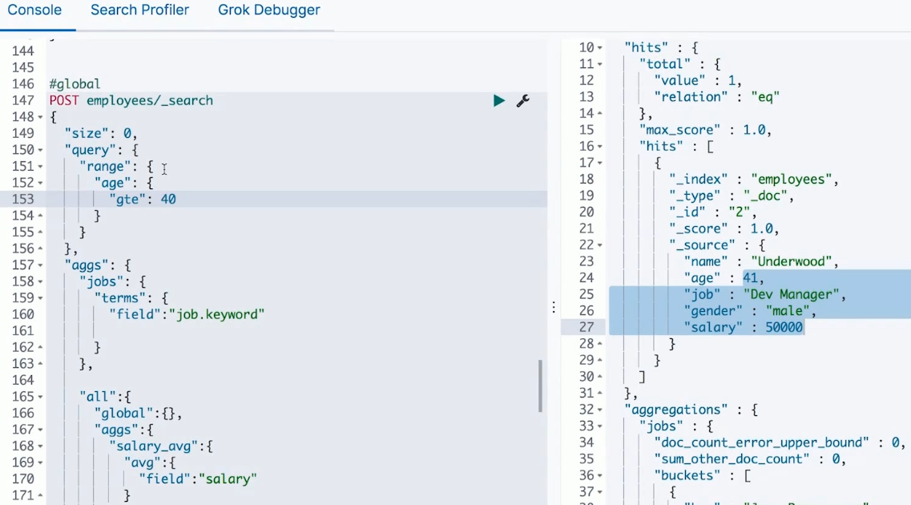

## 聚合的排序

聚合分组时，默认按照桶中结果的总数来降序排序。我们也可以调整聚合结果的顺序。

例如我们可以对job分桶，然后按照数量的升序、key值的降序排序：

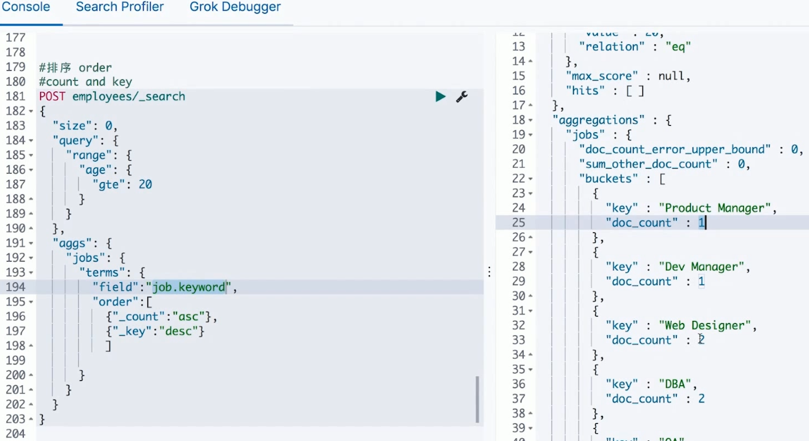

还可以按照聚合结果对原数据进行降序排序，例如下面的例子，先按照job分组，然后计算每组的平均值，再按照平均值对聚合结果进行排序：

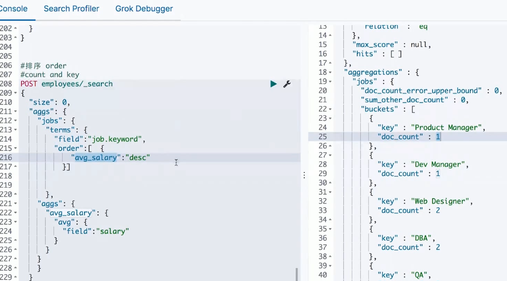

对聚合结果中有多个值的，也可以按照类似的方式，指定按照聚合结果中的子字段进行排序：

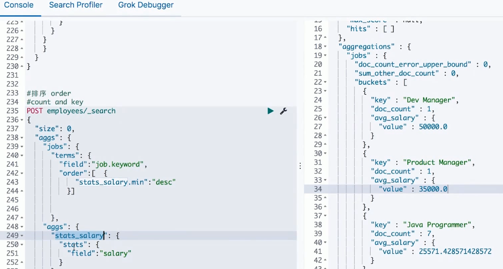

## 聚合分析的精准度

一个分布式计算系统，只能满足精确度、实时性、数据量三者中的两个，ES的聚合分析存在精准度问题

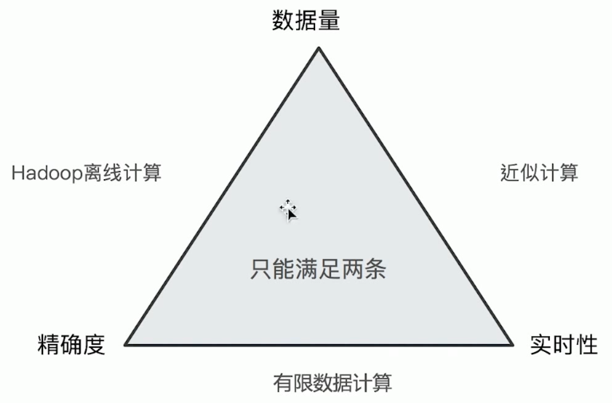

以min聚合分析的流程为例，说明聚合分析的流程：

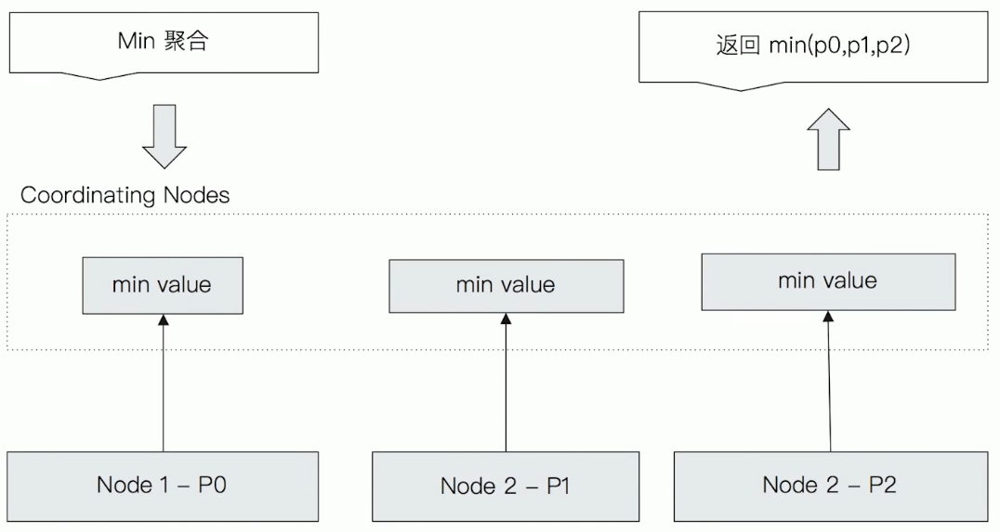

min聚合的命令发送到Coordinating Node后，会将命令发送到所有分片中，在每个分片找到最小值，然后返回给Coordinating Node，做最后的最小值聚合，然后返回结果。这个过程是不存在精度损失的。

但对于Terms Aggregation来说，是存在精确度问题的，在Terms Aggregation的返回值中有两个特殊的数值来描述不精确的程度：

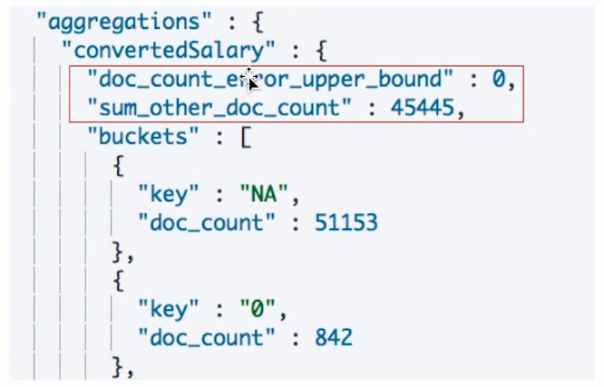

doc_count_error_upper_bound：被遗漏的term分桶中包含的文档，有可能的最大值

sum_other_doc_count：除了返回结果bucket的terms以外，还有多少terms没有被统计到

以一个实际的案例来说明这两个参数，例如有个Terms Aggregation要返回分组排名前三的结果，数据存在两个分片中，在分片1中和分片2中分别进行Terms Aggregation并取前三的结果，然后汇总返回：

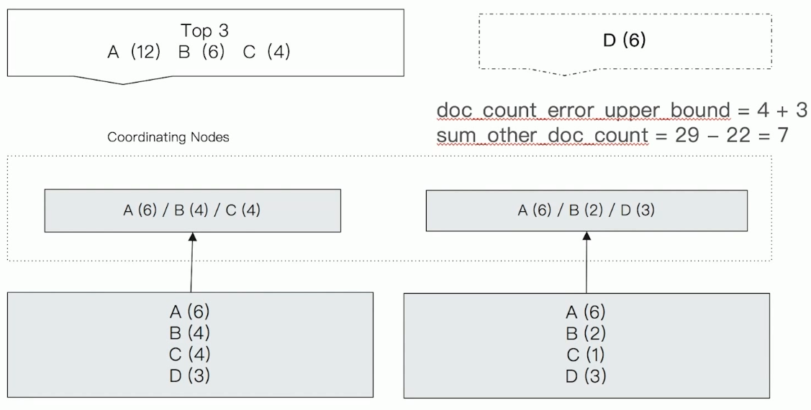

可以看到，D类型的数据总数是6，但是返回结果中却没有D，C类型的数据总数是4，却在返回值中。这都是因为在每个分片中只取了一部分数据结果进行分析汇总。

在分片1中，由于返回值的最小值是C，它的个数是4，那么有可能被遗漏的文档中，可能的最大值就是4；同样的道理，在分片2中有可能被遗漏文档的最大值是3，合起来doc_count_error_upper_bound就是7

在总的聚合返回值中有22条数据参与了统计，而总的被索引的文档数是29，它们的差值7，就是sum_other_doc_count

解决Terms Aggregation准确性的问题的方法：

* 当数据量不大的时候，只设置1个主分片
* 聚合分析时，使用shard_size参数来提高精确度，但要注意，调大它会影响聚合分析的性能

shard_size本质上就是在每个分片上额外的多获取数据，以提高总的分析的精确度。在下面的案例中进行说明

首先要在聚合分析时设置下面的参数，以显示聚合分析精确性的参数：

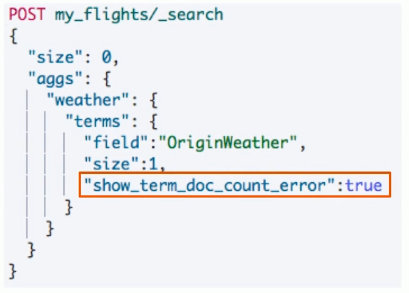

当shard_size是1的时候，可以看到doc_count_error_upper_bound是2512：

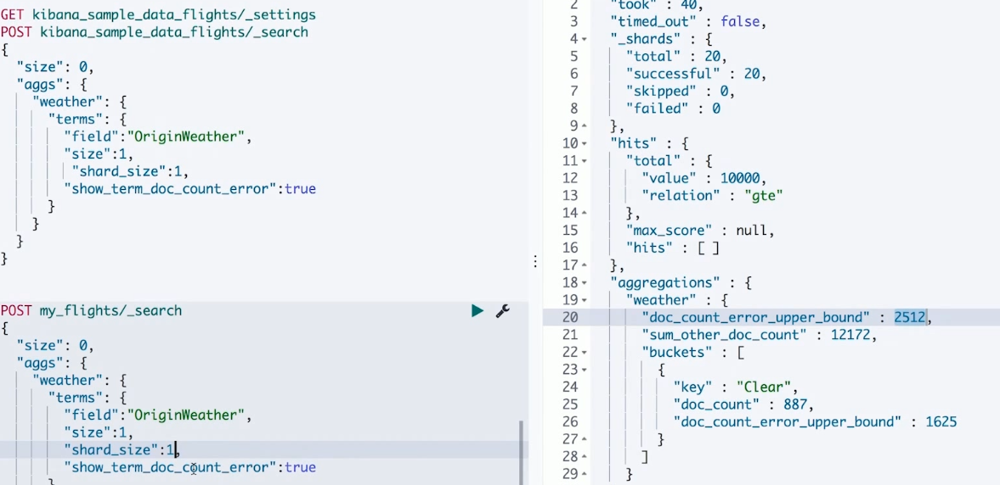

当shard_size设置为10的时候，doc_count_error_upper_bound值就是0了，这就代表本次聚合结果是准确的：

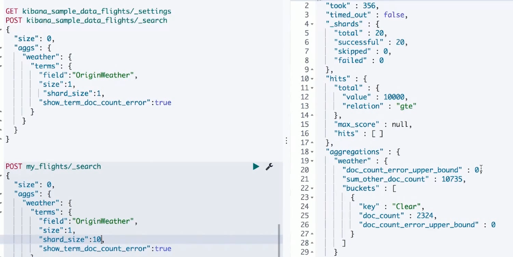

从这个角度看，ES也可以实现大数据量下的聚合，只要控制精度到合理的程度即可

# 数据处理和存储

## 分布式存储

文档会存储在具体的某个主分片和副本分片上，例如，文档1，会存储在P0和R0分片上。

ES需要确保文档能均匀的分布在所用分片上，充分利用硬件资源，避免部分机器空闲、部分机器繁忙

ES中文档到分片的映射算法如下，操作文档时，每次都会去计算文档对应的分片号，然后去对应分片获取文档：

shard = hash(_routing) % number_of_primary_shards

默认的_routing值是文档id，但也可以自行指定，例如创建文档时指定它的routing值是固定的bigdata，此时查询时就只针对该值对应的分片

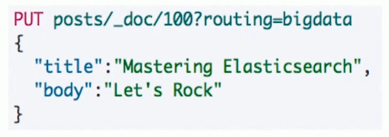

hash计算后要对主分片数取余，得到最后的分片号。这就是为什么主分片数是不能更改的，因为一旦更改，就会导致存储逻辑发生变化，一部分已经存储的文档按照新的规则无法找到

更新文档的过程如下：请求发送到Coordinating Node，然后由它计算分片号，然后将请求转发到主分片对应的datanode，然后对文档进行先删后增，然后将文档转发到副本分片（异步），等所有副本分片都返回成功就向客户端返回成功。

在主分片更新文档时，如果发现文档已经被另一个进程修改，它会重试直到超过retry_on_conflict次数

主分片把文档转发到副本分片的时候，转发的是文档的完整数据，而不是只转发增量数据，否则会有可能造成错误的更新顺序，得到损坏的文档

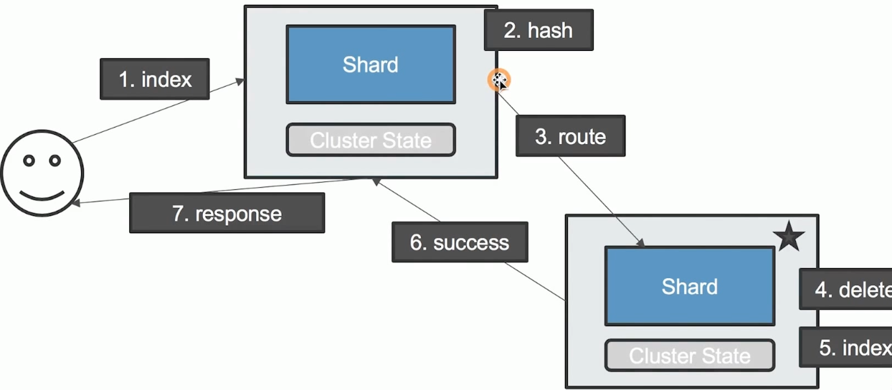

删除一个文档的过程：和上面类似，会由Coordinating Node计算主分片的位置，然后进行删除。删除后还需要删除对应副本分片的文档数据，等副本分片文档数据删除完毕后，再返回执行结果。副本节点的信息从集群状态中获取

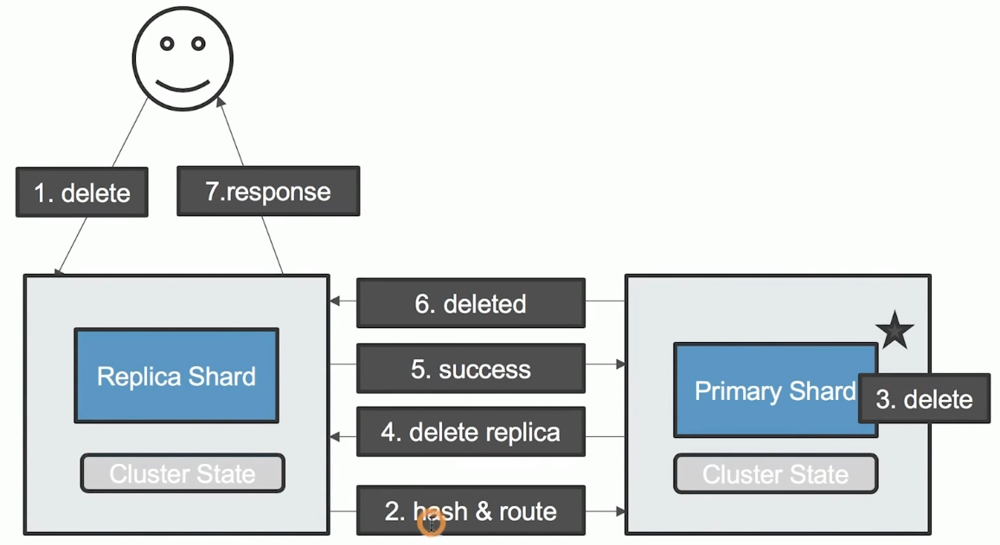

增删改都属于写操作，写操作的两个重要参数：

* consistency，默认是quorum，代表大多数的分片（包括主分片和副本分片）都处于活动状态，才允许写操作；可以改为one（只要主分片处于活动状态就可以写入）、all（必须所有分片都处于活动状态才可以写入）。活跃状态就是所在节点状态正常。
* timeout，当没有足够的副本分片时，ES会等待一段时间，希望更多分片出现。默认情况下最多等待1分钟。如果需要的话可以调小这个值，快速终止

mget的过程：它将多文档请求分解成每个分片的多文档请求，然后将请求并行转发到对应的节点，并汇总返回

bulk API的过程：和上面的过程类似

## 数据写入

### Refresh和Transaction log

ES中的分片，是它的最小工作单元，同时也是Lucene的一个Index

ES中的数据都存在倒排索引中，它采用的是Immutable Design，一旦生成就不可修改，不可变性带来了以下好处：

- 无需考虑并发写文件的问题，避免了锁机制带来的性能问题
- 可以方便的使用数据缓存，只要系统有足够的空间，大部分请求就会直接请求内存，而不会读磁盘，提升性能
- 数据压缩

不可变性的问题：如果想让一个新的文档可以被搜索，需要重建整个索引

如何在保持不变性的前提下实现对倒排索引的更新？答案是通过增加新的补充索引来反应最近的修改，而不是去更新某个存在的倒排索引，这就是按段的搜索的概念

在Lucene中，单个倒排索引文件被称为Segment，Segment是一个不可变的文件。多个Segment汇总在一起就是Lucene的Index，对应ES中的分片：

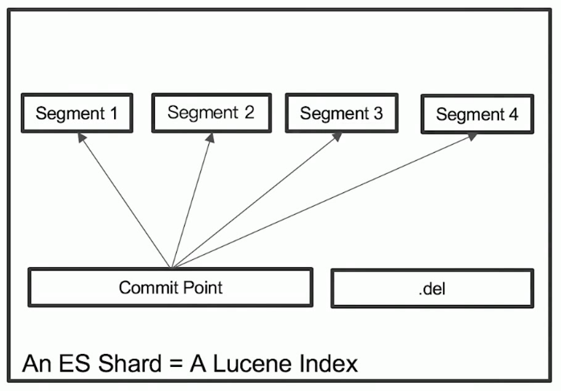

当由新文档写入时，就会生成新的Segment，查询时会同时查询所有的Segments，并对结果汇总。

Lucene中有一个文件，用来记录所有Segments信息，叫Commit Point，根据它可以找到所有的Segment。

删除的文档信息保存在del文件中，它代表对应的文档被标记删除。一个被标记删除的文档依然可以被搜索到，但它会在最终结果返回前从结果集中去除。文档更新也是类似的操作方式，当一个文档被更新时，旧版本文档被标记删除，新版本的文档被索引到一个新的段中，两个版本的文档可能被一个查询匹配到，但被删除的文档会在返回前被移除。

文档写入时，会被首先写入Index Buffer中。将Index Buffer写入Segment的过程叫Refresh，Refresh默认是不做fsync操作的。Refresh后，数据就可以搜索到了，ES默认1秒进行一次Refresh，这也就是为什么ES可以做到近实时搜索。

Refresh默认是不做fsync操作的，这一点是ES可以实现近实时搜索的关键，整个文档写入到可读的过程中，去除了最耗时的部分，Refresh写入段的过程其实是写入文件系统缓存，这一步速度是比较快的，写入缓存后就可以被外部读取了

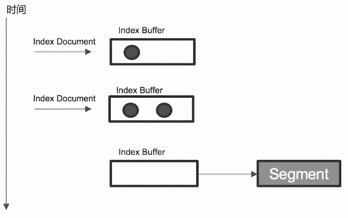

还有一个时刻会触发Refresh，那就是Index Buffer被占满的时候，它的默认值是JVM的10%

如果系统中有大量数据写入，就会产生很多的Segment。（因为Segment只能增加不能更新）

ES中数据持久性的保证：Transaction log

为了保证持久性，在写入文档时，写入Index buffer的同时，要同时写Transaction log，默认落盘（请求会被fsync到主分片和副本分片的translog，结束后才会返回成功）。每个分片有一个Transaction log。

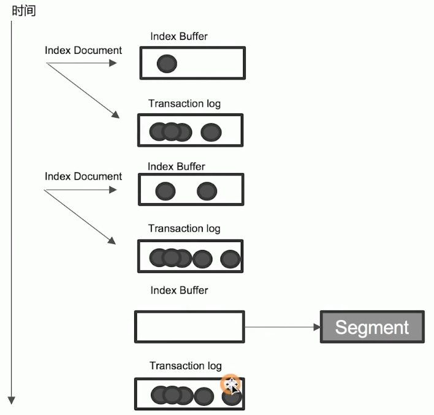

Refresh发生时，写入Segment时一开始是写入到Segment缓存，断电后会有数据丢失的风险。但由于Transaction log的存在，数据重新启动时可以从这里恢复。随着Transaction log越来越大，会触发Flush：

ES Flush的概念，ES Flush会做下面几个动作：

- 调用Refresh，将Index Buffer清空
- 调用fsync，将Segment缓存刷入磁盘
- 清空Transaction log
- 一个Commit Point被写入硬盘

ES Flush要完成的工作比较多，默认30分钟调用一次，当Transaction log满（默认512MB）时会调用

Transaction log不仅用来做持久化保证，还用来辅助实时操作，当对一个文档进行增删改查时，会检查Transaction log拿到最近文档的最新版本号

### 段合并优化

随着时间的流逝，ES中的Segment文件越来越多，ES和Lucene会自动触发Merge操作，将Segment合并起来，并删除已经标记删除的文档。需要手动触发Merge时，可以使用下列API：POST my_index/_forcemerge。

段数量过多的坏处：每一个段都会消耗文件句柄、内存和CPU，查询时搜索请求都会搜索多个段，段越多搜索越慢

合并段之后，可以提升查询速度，减少内存开销

Merge操作相对比较重，需要优化，降低对系统的影响

可以通过降低分段产生的数量和速度来减少Merge：

- 可以将Refresh Interval调大，调整到分钟级别，默认是1s一次refresh（必要时也可以手动进行Refresh）
- 增加indices.memory.index_buffer_size，默认是10%，代表Index Buffer占JVM的10%时，会触发refresh
- 尽量避免文档的更新操作

降低合并的频率：

- 增加数量阈值，出现更多的段的时候，才触发合并，修改index.merge.policy.segments_per_tier，默认是10
- 避免较大的分段参与Merge，修改index.merge.policy.max_merged_segment，默认5G。但最终可能留下多个较大的分段

force merge会占用大量的网络、IO和CPU。可以考虑增大最终分段数，可以加快merge完成的速度，保证在业务高峰期前做完；或者减少分片大小

### 并发写入

当两个程序同时更新某个文档，如果没有并发控制，可能会导致数据丢失。

ES采用的是乐观并发控制。

在ES中，文档是不可变更的。更新一个文档会先将文档标记为删除，同时增加一个全新的文档，并将版本号version+1

并发控制分为两种场景：内部版本控制和外部版本控制

1、内部版本控制：使用if_seq_no+if_primary_term

当更新数据时，在返回值中有seq_no和primary_term两个字段：

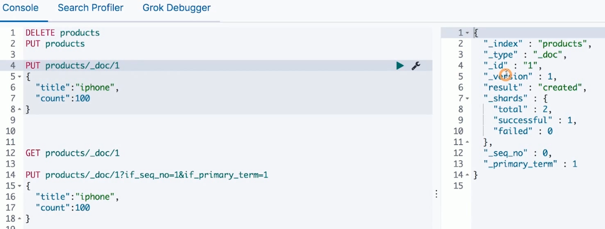

如果想对该文档进行并发更新时，应该在更新的URL后指定if_seq_no+if_primary_term分别问文档现在的值，如果此时存在并发更新将这两个值修改了，就会导致数据校验失败，报错：

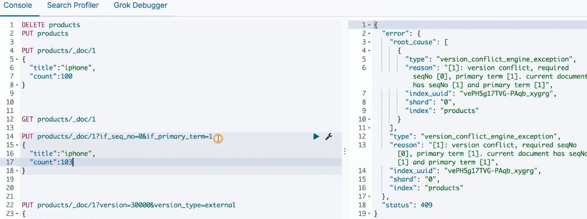

上层的应用程序可以选择再获取一次两个值，然后再次尝试更新。

2、外部版本控制，在这种场景下ES不作为数据库来使用，而是有其他的数据库作为主要数据存储，ES只是将数据同步过来起一个搜索的作用。此时就可以用version字段来并发写入：

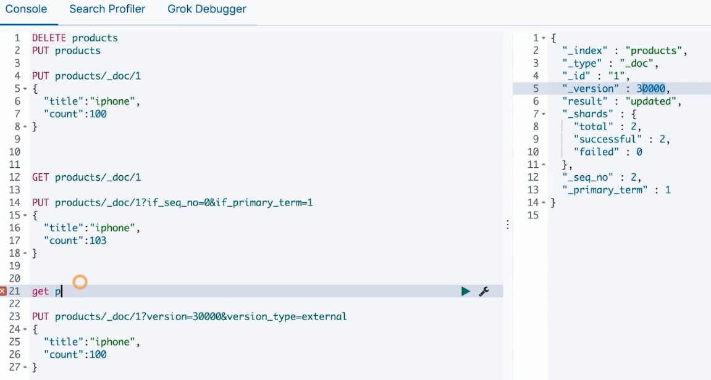

version=30000就代表要把文档更新version为30000，如果此时出现并发写入，version发生了变化，已经更新到了30000，则这个更新的动作也会报错：

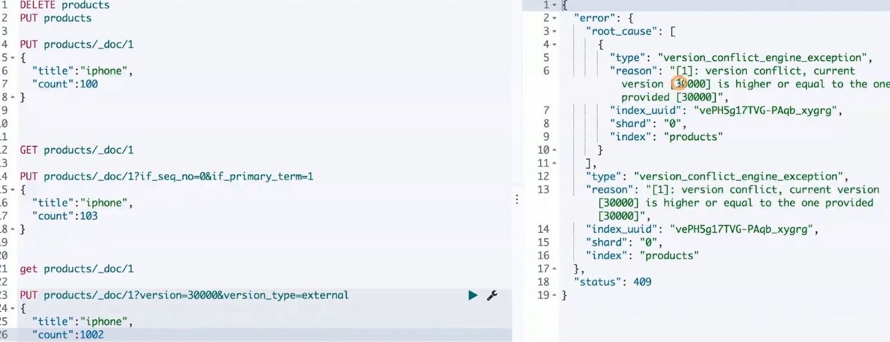

此时上层应用程序可以选择再读一次真正的version然后再次尝试更新。

## 搜索原理

### Query-then-Fetch

ES中的搜索会分为两个阶段进行：Query和Fetch

Query阶段：用户发出搜索的请求到ES节点，ES节点以Coordinating Node的身份，在主副分片中随机选择N个分片（N=主分片个数，replication默认是sync，代表操作在主分片和副本分片都完成后才返回，如果设置为async，可以通过设置搜索请求参数preference为primary来查询主分片，确保文档是最新版本），发送查询请求。被选中的分片执行查询，并进行排序。每个分片都会返回From+Size个排序后的文档Id和排序值给Coordinating Node：

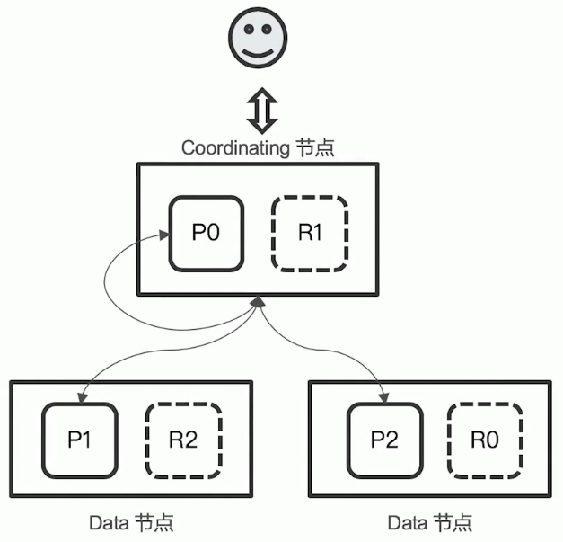

Fetch阶段：Coordinating Node收到各分片的结果后，对文档Id列表重新进行排序，选取从From到From+Size个文档的Id，然后以multi get请求的方式，到相应的分片获取详细的文档数据。

Query-then-Fetch存在的两个问题：

1、性能问题严重。当遇到排序分页场景时，最终协调节点需要处理这些文档：number_of_shard * (from + size)

2、相关性算分不准。每个分片都基于自己分片上的数据进行相关度计算，而不是整个集群的数据。这回造成打分偏离。特别是数据量很少的时候，此时主分片数越多，相关性算分会越不准。当文档数量较多而且均匀的分布在多个分片的时候，相关性算分较准确。

### 算分不准

如果向单节点集群中导入3条数据，然后搜索，可以看到结果中相关性算分是准确的：

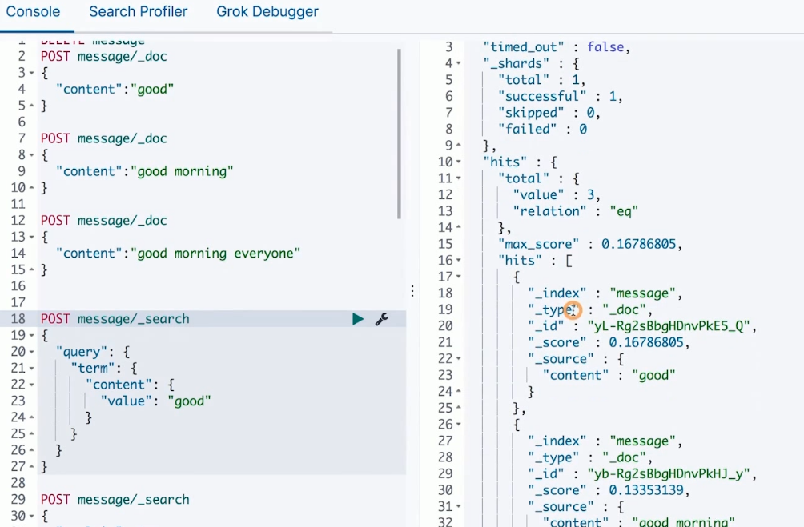

但如果设置了20个主分片后，再次导入三条数据，再次进行查询就可以看到，几条结果的相关性算分是相同的：


解决算分不准的方法：

- 数据量不大的时候，可以将主分片数设置为1
- 使用DFS Query Then Fetch，它会把各分片的词频和文档频率进行搜集，然后完整的进行一次相关性算分，它会耗费更多的CPU和内存，性能较差一般不建议使用：


使用DFS Query Then Fetch后，可以看到相关性评分恢复正常了。

### 深度分页问题

默认情况下，查询按照相关度算分排序，返回前10条记录。可以用from和size来对搜索进行分页：

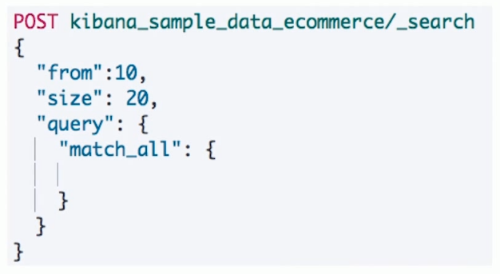

分布式系统中存在深度分页的问题，当一个查询from是990，size是10，那么在每个分片上都会获取1000个文档，然后通过Coordinating Node聚合所有结果，综合排序后再获取前1000个文档。当页数越深，占用内存越多。为了避免深度分页带来的内存开销，ES默认限定分页最大值是10000（from+size<=10000），超过后会直接搜索报错。

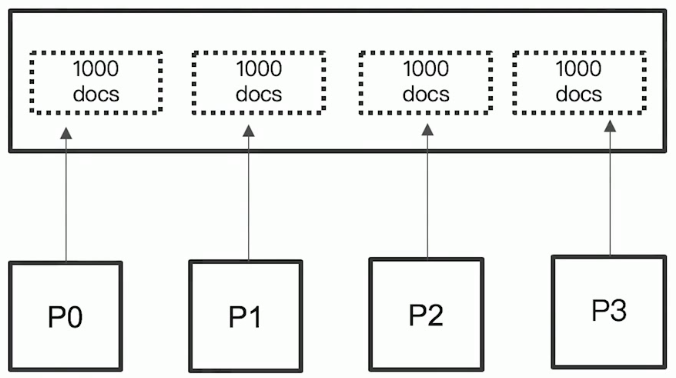

可以使用Search After来避免深度分页的问题，使用它的时候传入上次查询的结果，不需要指定页数，而且只能往下翻。

第一步搜索的时候，需要指定sort，而且要保证值是唯一的，可以通过对id排序保证唯一性：

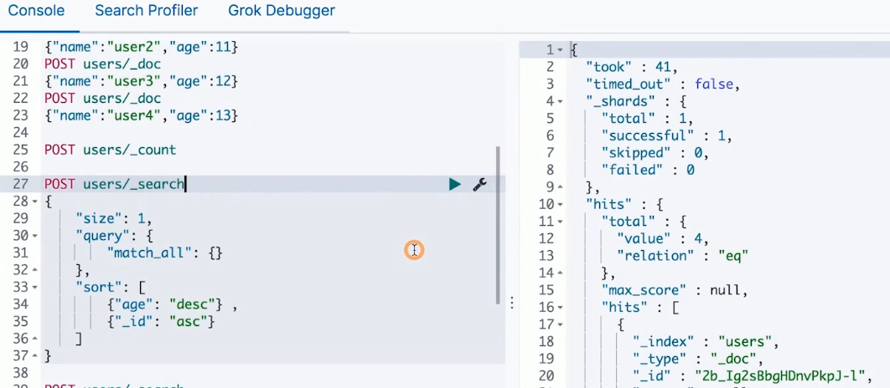

取返回结果中的sort值，填入search_after中，进行翻页：

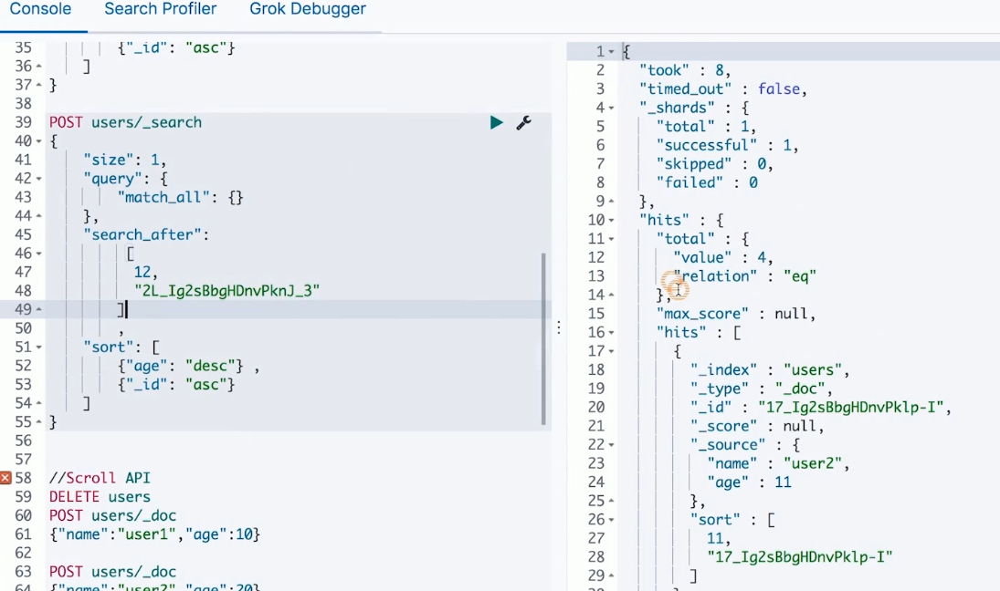

使用search after后，如果size是10，那每个分片只需要查询到大于该值的10条结果，然后汇总起来进行排序：

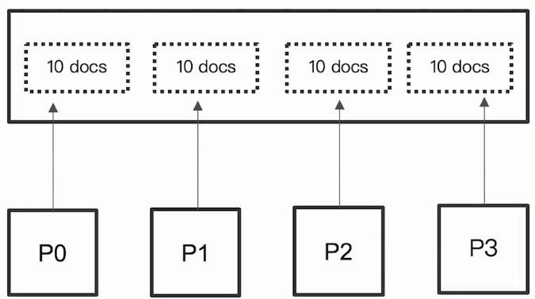

## 关联关系

### 反范式化设计

范式化设计Normalization的主要目标是减少不必要的更新，让各表存储独立概念的业务数据，但副作用是会导致查询性能降低。

数据库越范式化，就需要join越多的表。范式化节省了存储空间，简化了更新，但会导致查询速度变慢。

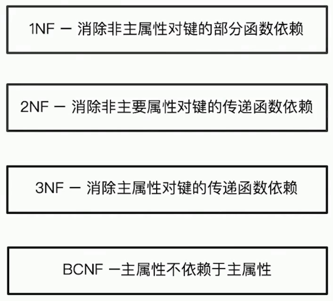

相对的，反范式化设计不使用关联关系，而是在文档中保存冗余的数据拷贝。此时读取性能好，但不适合数据频繁修改的场景，一条数据改动可能导致很多数据的更新。在ES中往往会考虑反范式化的设计，这样的设计读取速度快、无需join和行锁，因为ES不擅长处理关联关系。

ES中一般采用以下几种方式处理关联：对象类型、嵌套对象（Nested Object）、父子关联关系和应用端关联

### 对象类型

对象类型就是一种数据冗余的设计，例如在每一篇博客信息中，都保存作者的信息，作者信息是以对象类型存在的。修改作者信息就要关联修改博客文档的信息：

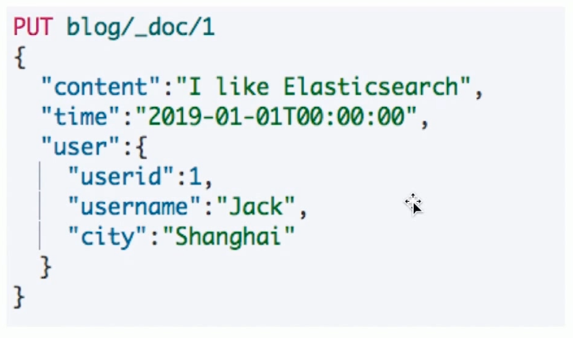

采用这样的设计，我们就可以在查询博客信息的时候，使用作者用户名的查询条件，对博客执行一个bool查询，完成关联查询：

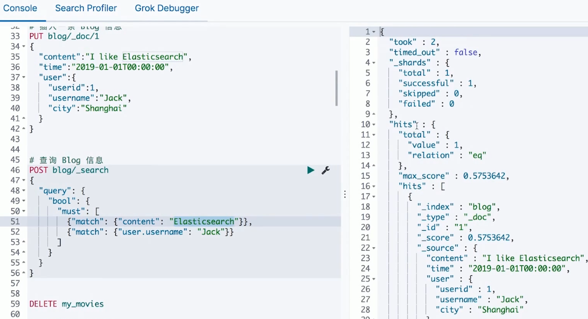

### 嵌套对象

有一种数据冗余设计，会以对象数组的方式存放在一个文档中。例如电影信息中包含演员的信息，演员有多个，每个演员以数组元素的方式保存着：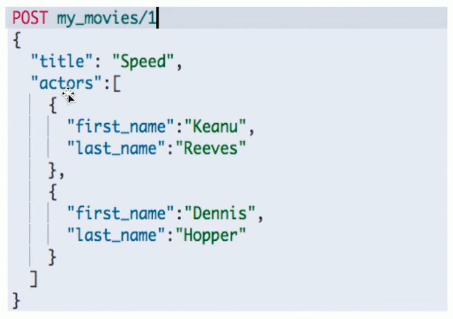

此时如果还是以之前的方式执行一个bool查询，会得到下面的结果（本来应该是查不出的），无法用这种查询起到过滤的作用：

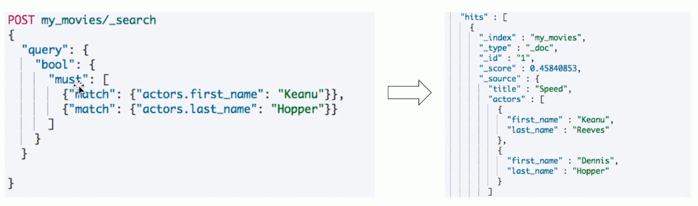

之所以会有这样的情况出现，是因为存储时内部对象的边界并没有考虑在内，JSON格式被处理成扁平式键值对结构。可以用Nested Data Type来解决这个问题，Nested Data Type就相当于要指明数组对象存储时有哪些字段，这些对象也能被独立索引，这样first_name和last_name保存在两个Lucene文档中，在查询时做join处理，具体方式是调整mapping：

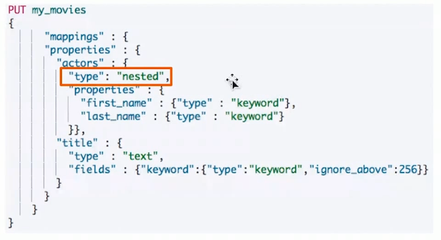

然后再执行Nested查询，指定查询的字段名，在字段内部设置bool查询的条件，就能完成嵌套对象的查询了：

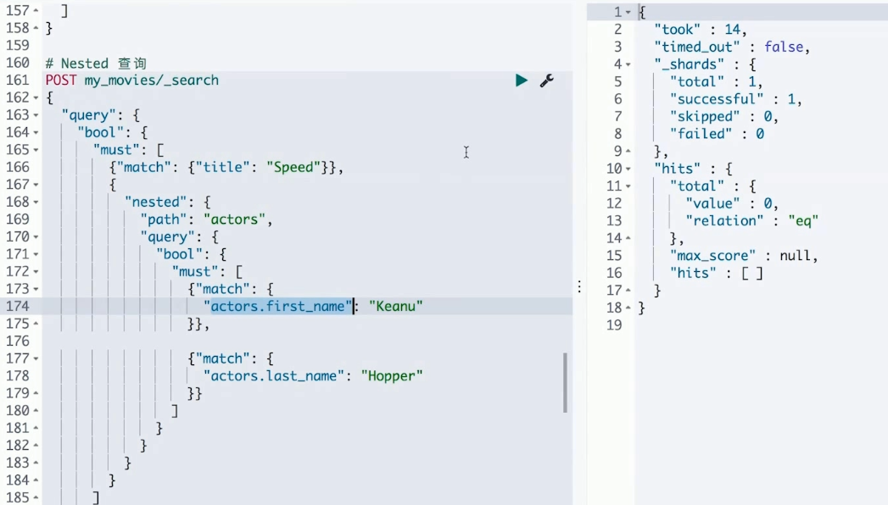

还可以完成Nested聚合，按照嵌套对象内部的first_name字段进行聚合：

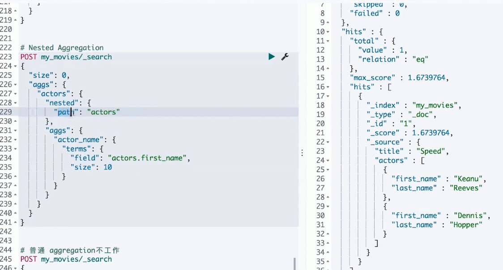

由于聚合分析的字段是嵌套对象的，普通的聚合API是不起作用的

### 父子关联关系

之前的对象和Nested对象的局限性：每次更新都需要重新索引整个对象，包括根对象和嵌套对象

ES中提供了类似关系型数据库中join的实现，使用join数据类型实现，可以通过维护父子关联关系，从而分离两个对象。父文档和子文档是两个独立的文档：

- 更新父文档无需重新索引子文档。
- 子文档被添加，更新或者删除也不会影响到父文档和其他的子文档

定义父子关系的步骤：设置索引Mapping、索引父文档、索引子文档、按需查询文档

设置索引Mapping时，要指明join关系，声明父子关系，指明parent名称和child名称：

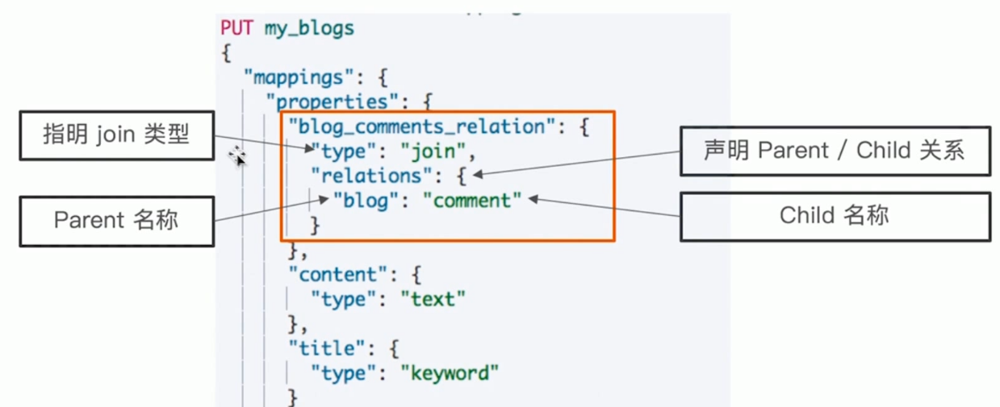

然后索引父文档，索引的时候指明父文档的id，并声明关系，name为blog代表自己是父文档：

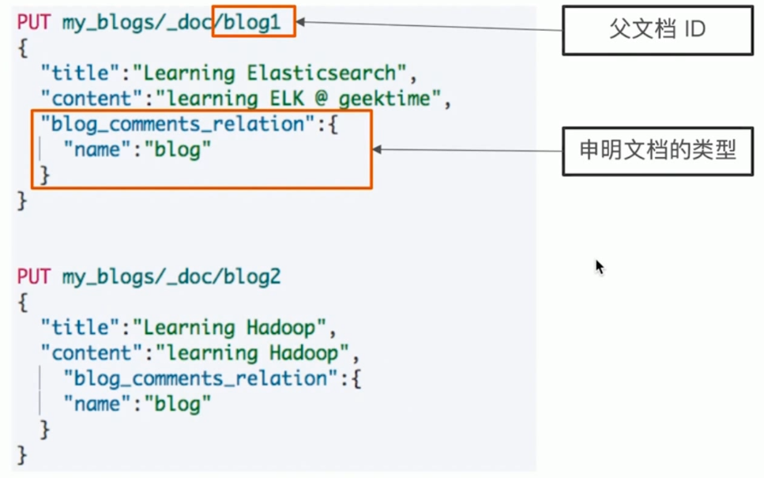

然后索引子文档时，需要指定子文档的ID、指定routing保证和父文档索引到相同的分片（父文档和子文档必须存在相同的分片上），声明关系，name是comment代表自己是子文档，同时设置父文档的ID：

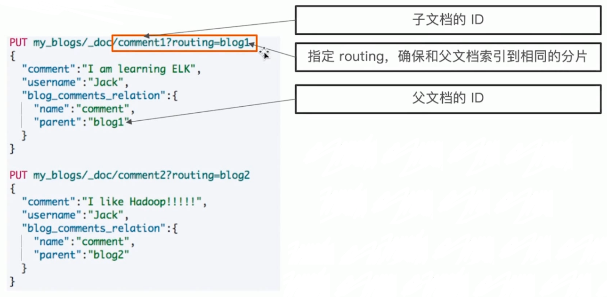

执行所有文档查询时，查my_blogs索引可以同时查询到该索引下的父文档和子文档，但父文档中不直接列出子文档的数据信息，而是和创建时相同，展示的是引用关系：

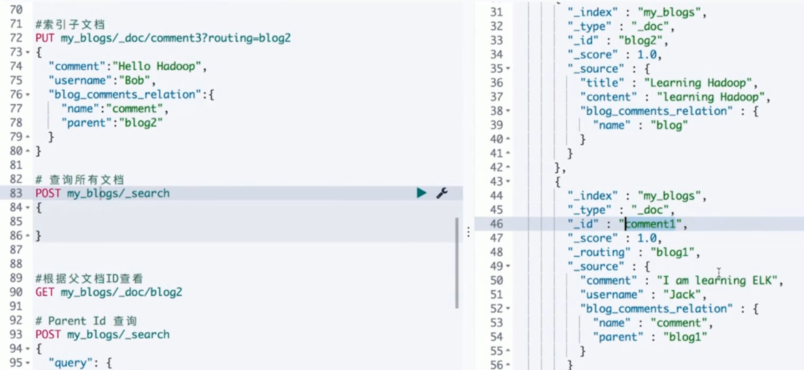

可以根据父文档ID查询对应父文档：GET my_blogs/_doc/blog2   这里只能查询到引用的信息

查询子文档的时候，需要指定父文档ID和子文档ID：GET my_blogs/_doc/comment3?routing=blog2

=Parent Id查询：查到指定父id下所有的子文档信息，需要指定父id，可以查询到关联的所有子文档信息：

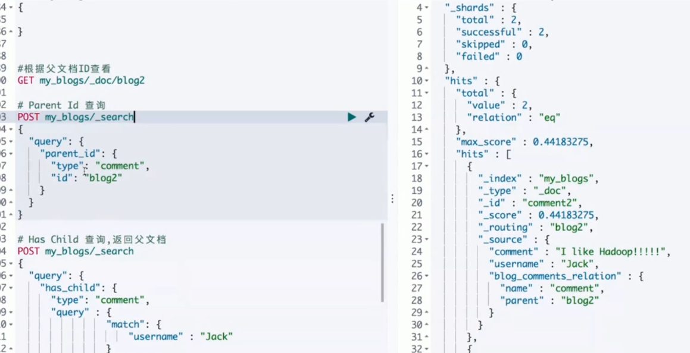

通过过滤子文档的条件，返回父文档，这就是Has Child查询：

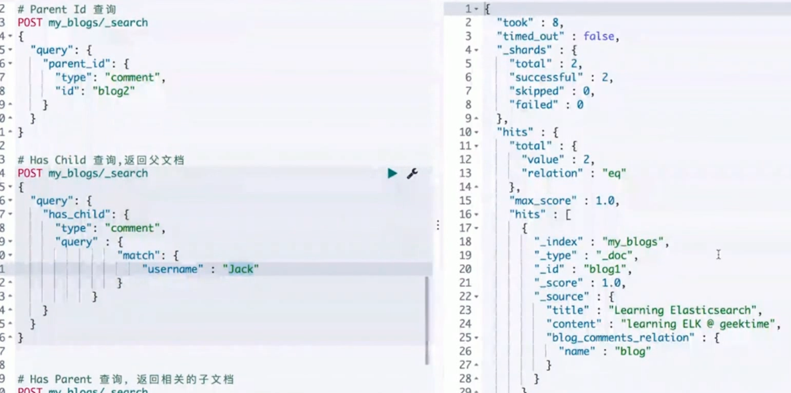

还可以通过过滤父文档的条件，来查询子文档，这就是Has Parent查询：

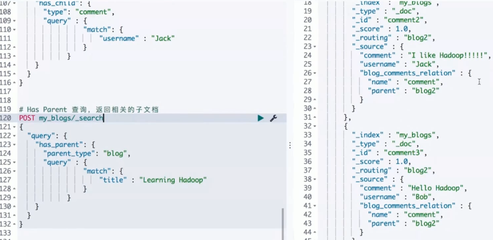

嵌套对象关联和父子文档关联的对比：

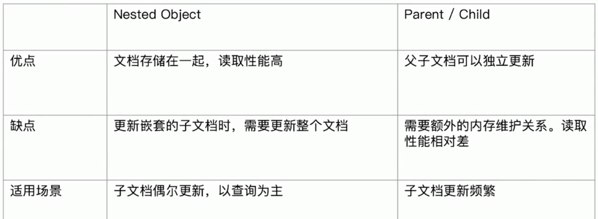

### 关联关系汇总

优先考虑Denormalization，做数据冗余处理。

当数据包含多个数值对象，同时又有查询需求时，可以考虑Nested对象

当关联文档更新非常频繁时，考虑父子关联关系

此外，Kibana目前暂不支持nested类型和parent/child类型，在未来有可能会支持。如果要使用Kibana做数据分析，要考虑到这一点。

## 数据预处理

有时我们需要修复或者增强输入的数据，例如下面的数据中，tags是一个完整的字符串，想将其用逗号分割成数组，以便后续进行聚合统计。

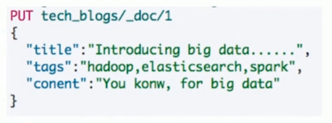

### Ingest Node

ES 5.0后，引入了一种新的节点类型，默认配置下，每个节点都是Ingest Node，它的能力：

- 可以预处理数据，拦截Index或者Bulk API的请求
- 可以对数据进行转换，并重新返回给Index或者Bulk API

Ingest Node可以做到无需Logstash，就能对数据进行预处理，例如为字段设置默认值、重命名字段、split字段。并支持设置Painless脚本，对数据进行更加复杂的加工。

Pipeline会对通过的数据文档按照顺序进行加工，Pipeline包含一组Processors，Processor对加工的行为进行了封装，ES内部有很多内置的Processor，也支持通过插件的方式实现自己的Processor：

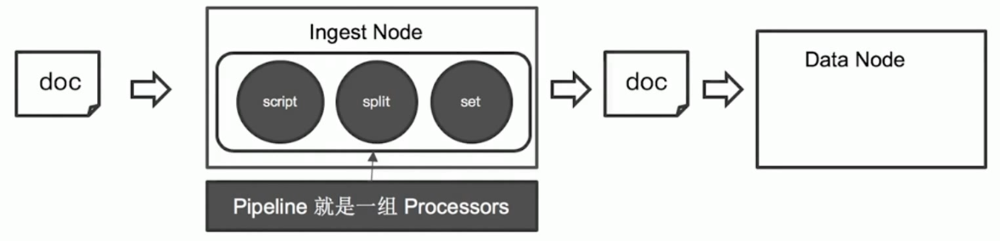

下面是一个Simulate API的例子，可以使用某个processor对tags字段进行切分，设定分隔符是逗号。下面还有测试文档，可以用这个API来查看预处理后的结果：

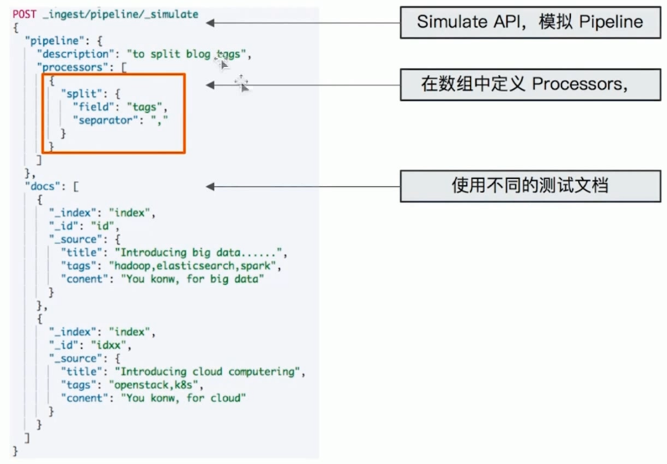

processor可以指定多个，除了分割字段内容，还可以设置新增一个views字段，设置它的默认值是0：

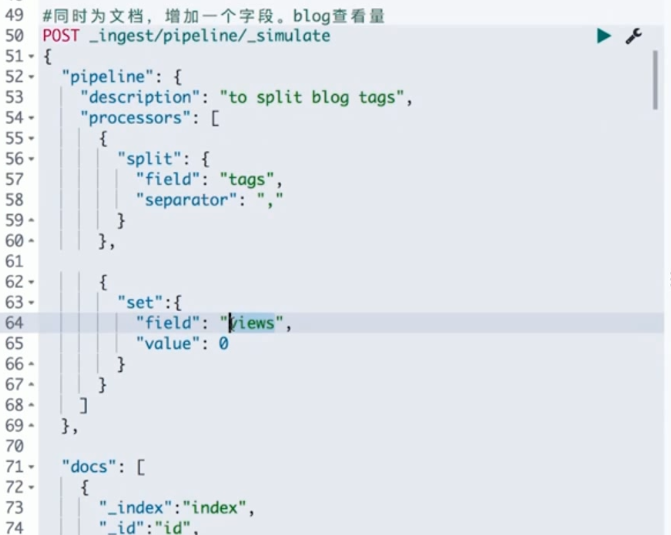

可以把pipeline添加到ES中，名为blog_pipeline

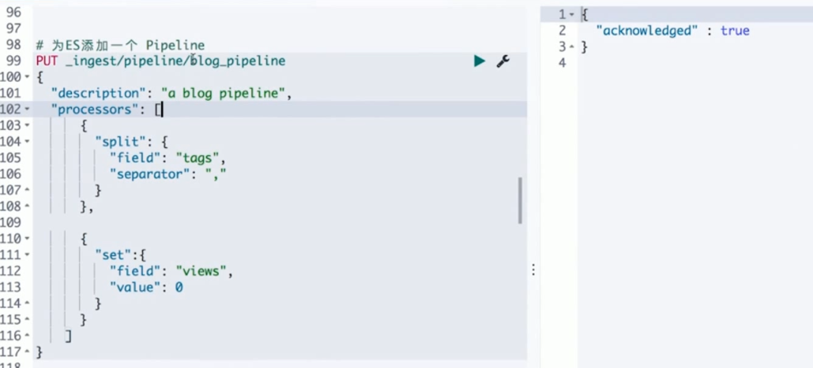

可以查看pipeline的定义：GET _ingest/pipeline/blog_pipeline

测试pipeline时就只需要指定文档了，和前面的效果相同，可以看到预处理的结果：

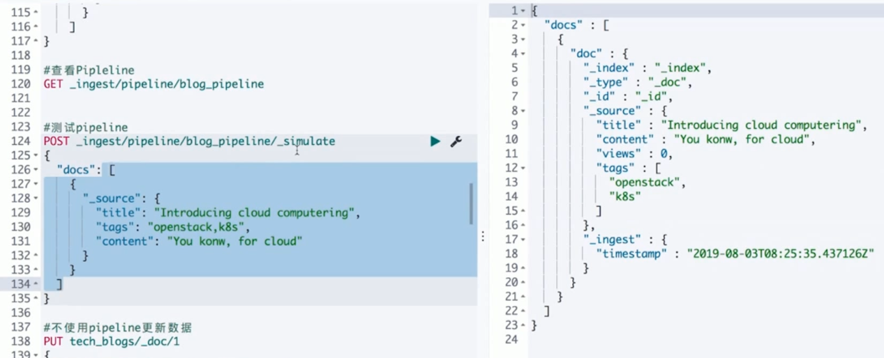

我们可以使用pipeline去更新数据，这样就能对数据做一个预处理了：


如果之前对这个索引创建数据时，没有经过pipeline的处理，索引中就存在还未经过分割的文档数据，例如下面的id为1的文档就没有被处理：


此时进行Update By Query会报错，因为已经被分割为数组的字段，不能再转换成字符串再切分了，会有类型转化错误。

为了让之前的数据也被pipeline处理，可以增加Update By Query的条件，让不存在views字段的进行预处理即可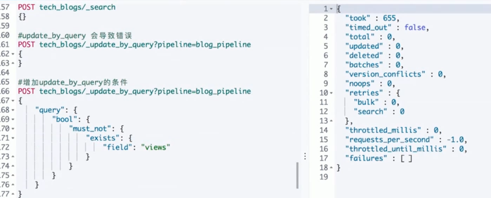

一些常见的内置processor：

- split：将给定字段值分割为一个数组
- remove/rename：移除或者重命名字段
- append：增加新的标签
- convert：类型转换
- date/json：日期格式转换、字符串转json

Ingest Node是一个简单的数据预处理机制，它和Logstash的对比：

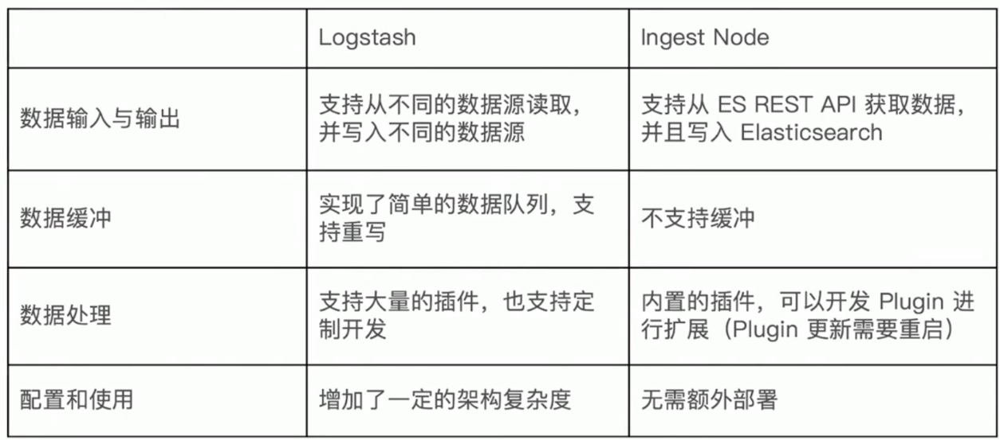

### Painless Script

Painless Script是一种脚本语言，从ES5.X后引入，专门为ES设计，扩展了java的语法

从ES6.0开始，只支持Painless。Groovy、JS和Python都不再支持。

Painless Script支持所有Java的数据类型和Java API子集

Painless Script的特点：高性能、安全、同时支持显示类型和动态类型定义

Painless Script可以对文档字段进行加工处理，在聚合、查询、算分处理、Ingest Pipeline、Reindex API、Update By Query中都可以使用。

在不同的场合，通过Painless Script访问字段的方式是不同的：

- 如果是Ingestion，需要用ctx.field_name来访问
- 如果是Update场景，需要用ctx._source.field_name来访问
- 如果是查询或者聚合场景，需要用doc["field_name"]来访问

1、在Ingest Pipeline中使用Painless Script：例如下面的案例，判断如果有content这个字段，则计算它的长度赋值给content_length字段：


可以看到处理结果中有的返回值会存在content_length字段：

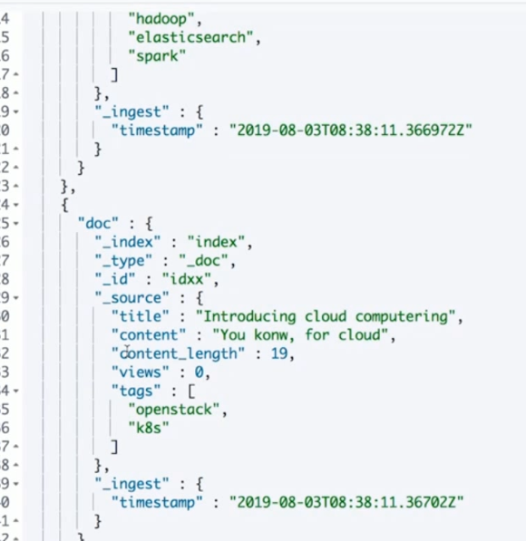

2、更新文档场景中使用Painless Script，例如下面的场景中，会给views字段相加一个值，这个值是params中的new_views字段，也就是固定100：

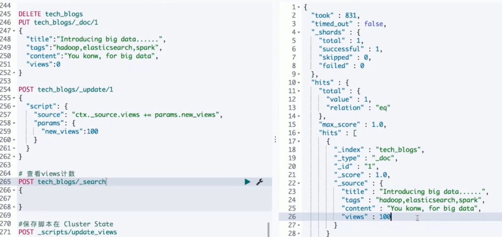

可以使用script API将脚本保存在cluster state中：

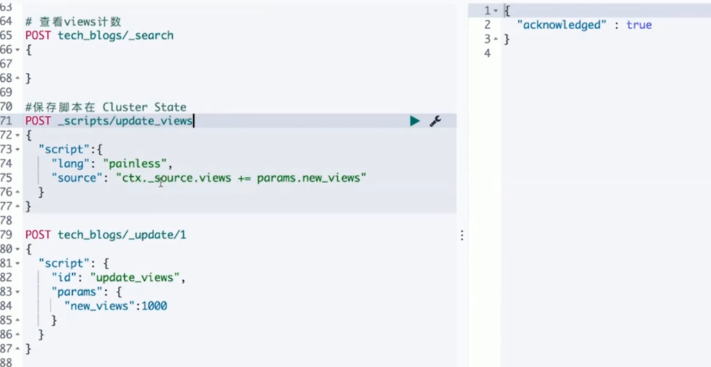

随后使用脚本时就可以直接引用脚本的id了。

3、搜索场景中使用Painless Script，例如下面的案例中，rnd_views的值是view字段的值加上0-1000随机数：


由于使用脚本时，编译的开销较大，ES会将脚本编译后缓存在cache中，无论是内联的脚本还是单独存储的脚本都会被缓存，默认缓存100个脚本的编译结果，可以通过这些参数来调整最大缓存数、缓存超时和编译频率：

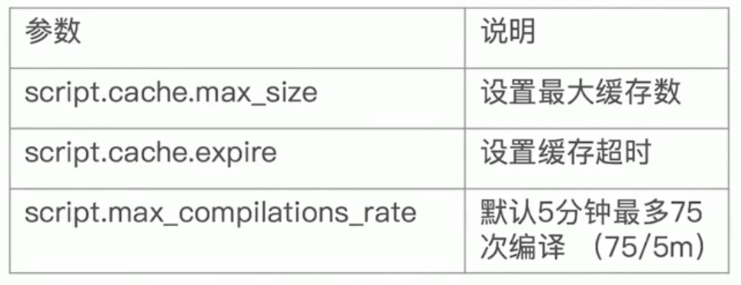

# 索引与性能

## 重建索引

一般在以下几种情况时，需要重建索引：

- 索引的Mappings发生变更：字段类型更改，分词器及字典更新
- 索引的Settings发生变更：索引的主分片数发生改变
- 集群内，集群间需要做数据迁移

ES提供两种方式重建索引：

- Update By Query：在现有索引上重建
- Reindex：在其他索引上重建索引

### Update By Query

如果我们要给一个索引增加子字段，并指定分词器，可以这样改变mapping：

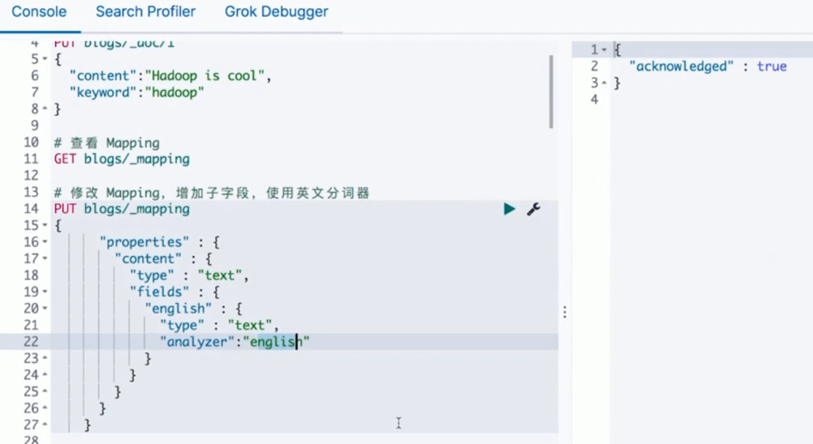

改变之后，再写入新文档，是可以通过新增加的子字段查到的，但mapping变更前写入的文档是查不到的：

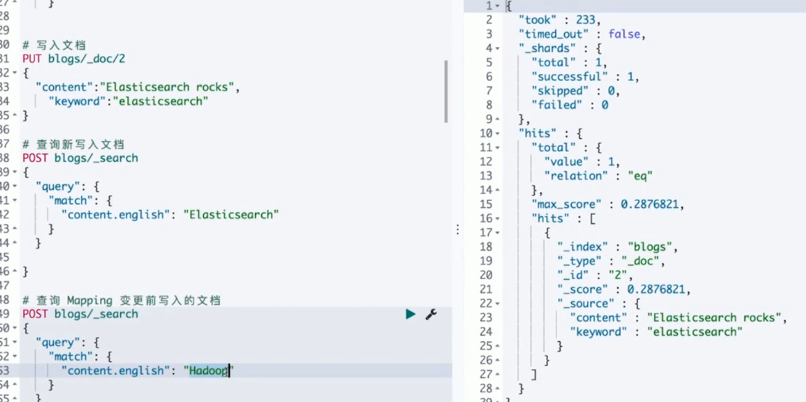

此时就可以使用Update By Query的方式，来更新已存在的所有文档，然后就可以查到之前的历史数据了：

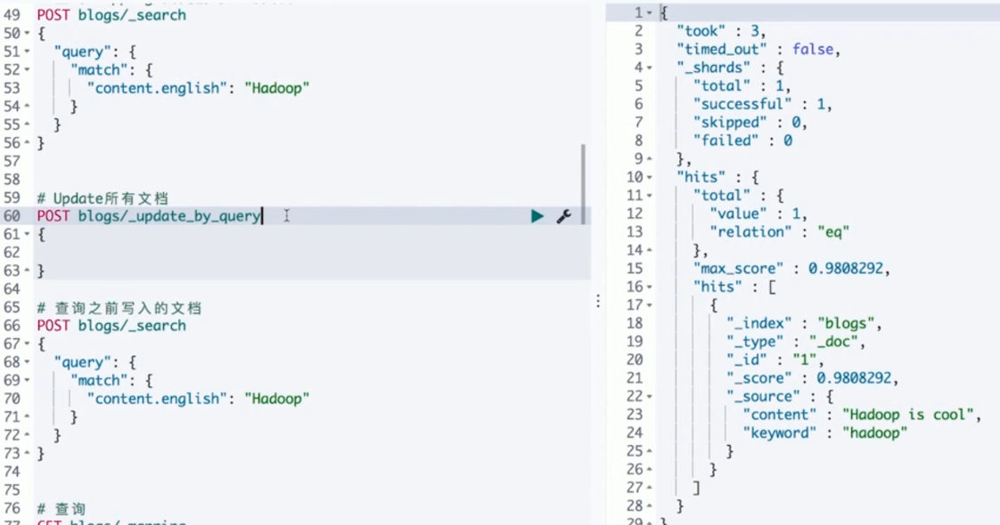

### Reindex

ES不允许在原有mapping上对字段类型进行修改。此时只能创建新的索引，并且设定好正确的字段类型，再重新导入数据。

例如我们想把keyword字段的类型从text改为keyword：

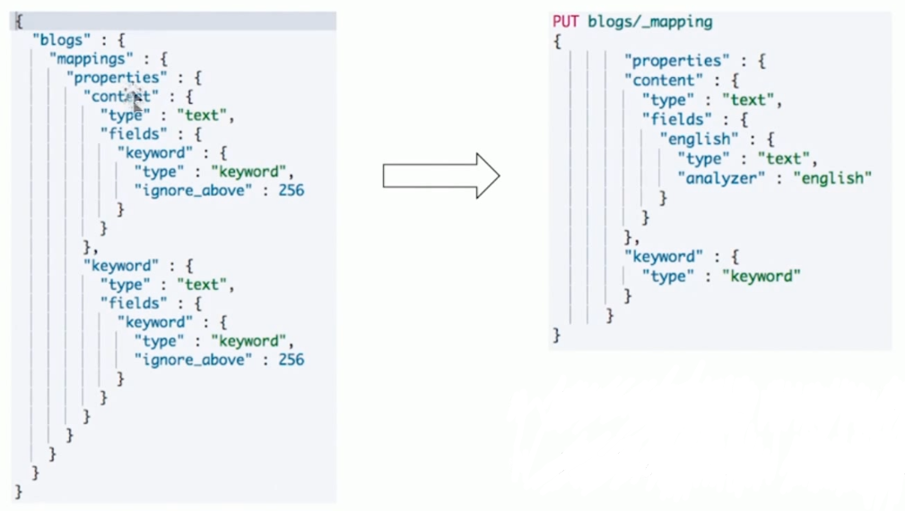

如果直接修改mapping的话，此时会报错：


新建索引blogs_fix，然后设置它的mapping：

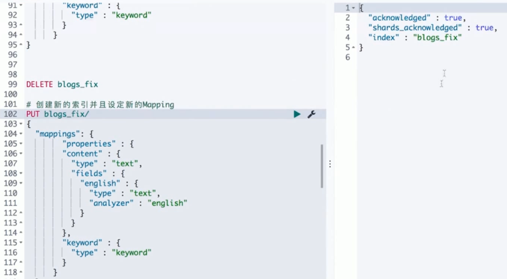

使用Reindex API将数据从blogs索引导入到blogs_fix索引：

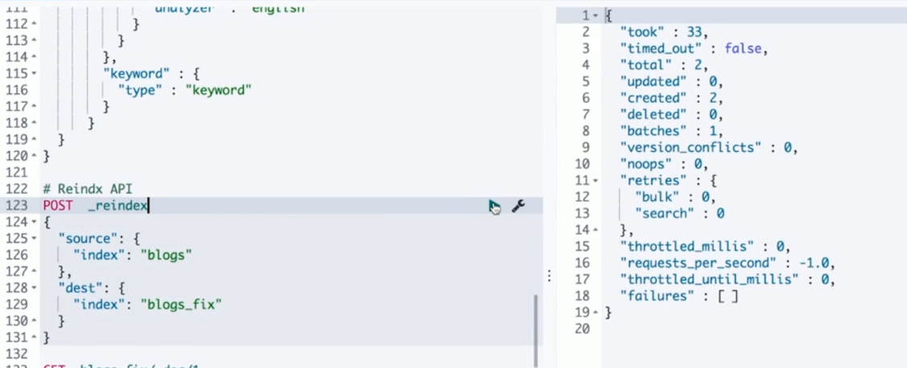

使用Reindex API时要注意：不能去激活source字段、重建前先设置好合理的mapping

Reindex API默认只会创建不存在的文档，文档如果已经存在会导致版本冲突，可以设置Reindex时不存在时才新建，存在时就不导入了：

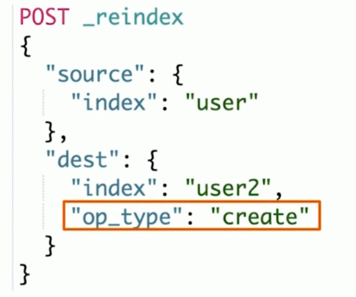

跨集群Reindex时需要先在elasticsearch.yml中配置reindex的白名单，设置集群信息，然后再执行Reindex。下面就是一个从otherhost集群导入数据到本集群的例子：


Reindex也可以异步进行：POST _reindex?wait_for_completion=false，执行后会返回一个taskId：

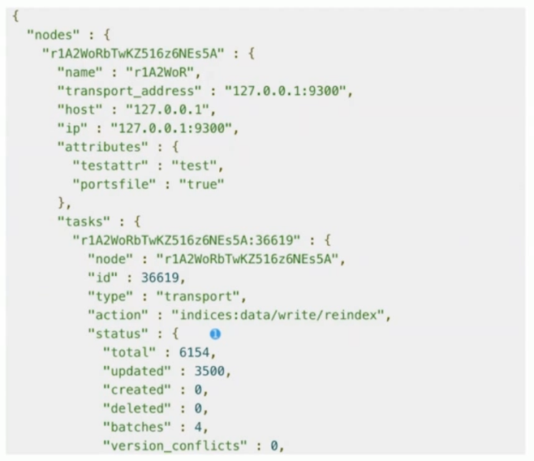

然后用TASK API来查询对应id的任务执行情况：GET _tasks?detailed=true&actions=*reindex

## 分片设计及管理

ES7.0开始，新创建一个索引，默认只有一个主分片

使用单个主分片的问题：无法实现水平扩展；好处：查询算分不准、聚合不准的问题都可以避免

集群增加一个节点后，ES会自动进行分片的移动，这个过程叫Shard Rebalancing：

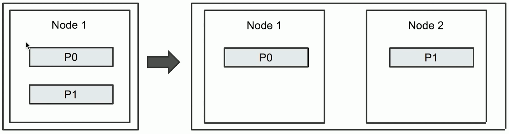

当分片数>节点数时，一旦集群中有新的数据节点加入，分片就可以自动进行分配

使用多个主分片的时候：

- 好处：查询可以并行执行；数据写入也可以分散到多个机器执行
- 坏处：每次查询都要让多个节点工作、需要从每个分片上获取数据；分片的Meta信息由Master节点维护，过多的Meta信息会增加管理的负担（经验值：分片总数控制在10W以内）

确定主分片数的方法：主要从存储的角度看，日志类应用单个分片不要大于50G，搜索类应用单个分片不要超过20G。通过控制分片的大小，控制merge时的资源，丢失节点后具备更快的恢复速度

副本分片的特点：

- 好处：提高系统可用性，防止数据丢失，增加查询吞吐量
- 坏处：降低索引速度，需要占用和主分片一样的资源

如果机器资源充分可以考虑提高副本数

主分片和副本分片的数量可以参考下列关系：节点数 <= 主分片数*（副本数+1）  这里的1主要是考虑负载波动、数据迁移、节点丢失的时候留出空余的空间

如果数据节点基本都写满了，此时加入新的节点就会导致新建索引都分布在新节点上，导致新数据分布的不均匀，可以通过调整下列参数避免这种情况：

total shards per node：单个节点可以分配的分片数量。或者在扩容前提前监控磁盘空间，提前清理数据或者增加节点

有时出现节点瞬时中断，默认情况下集群会等待1分钟来查看节点是否会重新加入。如果这个节点在此期间重新加入，那就会保持现有的分片数据；否则就会触发新的分片分配，可以延长等待时间，避免网络波动导致的分片分配带来的开销，调整index.unassigned.node.left.delayed.timeout，默认是5m

## 容量规划

容量规划时要保持一定的余量，当负载出现波动或者节点丢失的时候，保证集群还能正常运行

容量规划时要考虑的因素：机器配置、文档的大小、文档的数据量、索引的数据量、副本分片数、查询和聚合类型

性能要求：数据写入、查询的吞吐量、单条查询可接受的最大返回时间

硬件配置上：

- 选择合理的硬件，数据节点尽可能使用SSD
- 单节点数据建议控制在2TB以内，最大不建议超过5TB
- JVM配置机器内存的一半，JVM内存配置不建议超过32G（超过32G会使用内存对象压缩的机制，会对性能有影响）

ES中有两种典型的应用：搜索类应用和日志类应用：

- 搜索类应用：固定大小的数据集，数据集增长缓慢
- 日志类应用：基于时间序列的数据集，数据每天不断写入，增长较快，适合结合Warm Node做数据的老化处理。查询并发不高

搜索类应用更关心搜索和聚合的性能，数据的重要性和时间范围无关，更关注搜索的相关度。此时应该估算索引的数据量，确定分片的大小，保证单个分片的数据不要超过20GB。可以适当通过增加副本分片，来提高查询的吞吐量。必要时可以进行索引拆分，拆分后查询性能得以提高。

索引拆分的前提条件是：业务上的查询是基于一个字段进行Filter的，该字段是一个范围固定的枚举值。如果Filter的字段不固定，或者字段值范围不固定，可以采用routing，按照该字段的值将数据分布到不同的分片中，以避免单个节点的负载过高。

日志类应用每条数据都有时间戳，文档新增多，更新少，对写入性能要求高；用户更多的会查询近期的数据，对旧的数据查询较少。

日志类应用可以选择在索引的名字中增加时间信息，例如logs-2019.08.01，这样可以方便对索引进行老化处理，充分利用Hot和Warm，也算是一种数据拆分，备份和删除的效率提升。可以利用索引别名方便对最新数据写入：

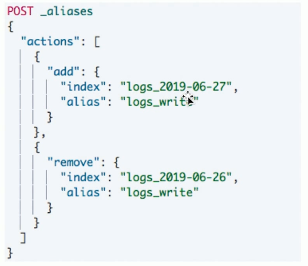

## 性能优化

### 写性能

写入的性能优化的目标：增大写吞吐量

ES的默认设置，已经综合考虑了数据可靠性、搜索的实时性和写入速度，一般不要盲目修改

一切优化都要基于高质量的数据建模

在客户端可以考虑多线程批量写入，通过性能测试确定最佳的文档数量。注意写入的返回值，如果状态码是429代表当前ES已经无法处理当前的请求量了，如果返回429代表需要retry并降低线程数量。

服务端优化写入性能：

- 尽量不使用ES自动生成的文档id（因为自动生成需要先get旧值，它是有一定的IO开销的）
- 降低IO操作，如降低refresh interval
- 减少不变要的分词、避免不需要的doc_values、写入文档的各字段尽量保证相同的顺序，可以提高文档的压缩率
- 分片的分配合理，注意保证负载均衡
- 调整Bulk线程池和队列

关闭无关的功能：

- 不需要索引，对应字段index可以设置为false
- 不需要算分，对应字段norms可以设置为false
- 不使用dynamic mapping，避免字段过多
- 优化index_options，按需控制倒排索引的存储内容
- 如果不需要可以考虑关闭source，减少IO操作

如果需要极致的写入速度，可以牺牲数据可靠性和搜索实时性来换取性能：

- 牺牲可靠性：将副本分片设置为0，写入完毕后再调整回去
- 牺牲搜索实时性：增加refresh interval的时间
- 牺牲可靠性：修改translog的设置

refresh interval的时间默认是1s，如果设置为-1，则代表禁止自动refresh，好处是避免频繁的refresh生成过多的segment文件，坏处是降低搜索的实时性。

调高refresh interval的时候，注意要调大indices.memory.index_buffer_size，它默认是10%，内存高于它也会触发refresh

translog默认每个请求都落盘，可以降低写磁盘的概率，但是有可能会丢失数据：

- index.translog.durability：默认是request，每个请求都落盘。可以设置为async，异步写入
- index.translog.sync_interval：设置为60s，代表60s执行一次translog
- index.translog.flush_threshod_size：默认512MB，可以适当调大。当translog超过该值会触发flush

合理设置主分片数，确保均匀分配在所有数据节点上，可以设置下列参数：

- index.routing.allocation.total_share_per_node：限定每个索引在每个节点上课分配的主分片数。在生产环境要适当调大这个数字，避免有节点下线时，分片无法正常迁移

使用Bulk时，在客户端要保证：

- 单个Bulk请求体的数据量不要太大，官方建议5-15MB
- 写入端的bulk请求超时需要足够长，建议60s以上
- 写入端尽量将请求数据轮询到不同节点（集群中的节点默认都能起到Coordinating node的作用，会对请求进行路由、处理、汇总，这个过程会有一定的性能开销，所以建议轮询到不同的节点）

在服务器端：索引创建属于计算密集型任务，线程数应该设置为CPU核心数+1，来不及处理的放入队列，可以适当增加队列大小，但也不要太大，太大会对内存造成负担

大批量导入数据时，可以考虑设置副本分片数为0，等导入成功再调整副本分片数

### 读性能

对读取性能造成影响很大的是Nested数据和父子关联关系，尽可能使用数据冗余。查询Nested型数据，查询速度会慢几倍；查询父子关联数据，查询速度有时会慢几百倍。

聚合查询很消耗内存，控制聚合的数量，推荐使用不同的Query Scope

几个建议：

- 尽量将数据先行计算然后再保存到ES中（例如用Ingest Pipeline预处理），避免在查询时进行脚本计算
- 尽量使用Filter Context，利用缓存机制，减少不必要的算分
- 严禁使用*开头通配符的Terms查询

查询时会访问多个分片，当分片过多时，会导致不必要的查询开销。结合应用场景控制单个分片的尺寸：

- 搜索类应用：单个分片最大值控制在20G
- 日志类应用：单个分片最大值控制在40G

对于基于时间序列索引，过期后的索引可以设置为只读，进行forcemerge减少segment数量，减少内存开销

### 性能测试

测试目标：

- 测试集群的读写性能、对集群做容量规划
- 对ES配置参数进行修改，评估优化效果
- 修改Mapping和Setting，对数据建模进行优化
- 测试ES新版本，评估是否升级

测试数据有两个维度：数据量和数据分布

ES本身提供了REST API，所以可以通过很多传统的性能测试工具来测试：Load Runner、JMeter、Gatling

专门为ES设计的工具：ES Pref、Elastic Rally

Elastic Rally是ES官方开源工具，基于Python 3的压力测试工具。它会自动创建、配置、运行测试，并且销毁ES集群

## 缓存

### 缓存种类

ES的缓存主要分为三大类：

- Node Query Cache（Filter Context）
- Shard Query Cache（Cache Query的结果）
- Fielddata Cache

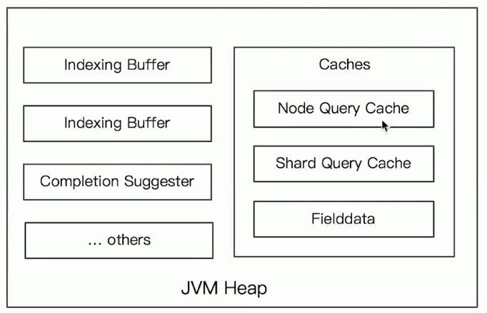

1、Node Query Cache

每个节点有一个Node Query缓存，由该节点的所有Shard共享，只缓存Filter Context相关内容。Cache采用LRU算法

它保存的是Segment级缓存命中的结果，Segment被合并后，缓存会失效

默认占总的cache size的10%

2、Shard Query Cache

缓存每个分片上的查询结果，只会缓存设置了size=0的查询对应的结果（而且要手动在搜索请求上加上request_cache=true才会缓存），不会缓存hits，会缓存聚合和建议

这里采用的也是LRU算法，会将整个JSON查询串作为key，所以JSON的字段最好是按照相同顺序的，可以更好的利用缓存

分配Refresh的时候，该缓存会失效（但只有对应分片的数据发生变化时，缓存才会失效）；如果对应分片的数据频繁发生变化，该缓存的效率会很差

默认占总的cache size的1%

3、Fielddata Cache

除了Text类型，其他默认都采用了doc_values，Text类型必须使用Fielddata才可以对其聚合和排序。

Aggregation的Global ordinals也保存在Fielddata cache中，它代表写入数据时，对应的term被加载到cache中

Segment被合并后，缓存会失效

默认这部分缓存是没有限制的，可以通过控制indices.fielddata.cache.size，避免产生GC

ES中还有一部分很重要的缓存，是不属于堆内存的页缓存：

* 当从文件中读取数据时，如果对应数据页缓存已经存在，那么直接把缓存返回；否则还要申请一个内存页，将文件数据读取到页缓存，再返回
* 当向文件写入数据时，如果对应的数据在页缓存中已经存在，直接把数据写入页缓存即可。否则还要申请一个内存页，再把新数据写入页缓存。对于被修改的页缓存，操作系统会负责将它们刷新到文件

与访问磁盘上的数据相比，通过页缓存可以更快的访问数据。这就是为什么ES建议堆内存不超过可用内存的一半，这样另一半就可以用于页缓存了。

由于Lucene的段是不变的文件，所以特别适合利用缓存

### 内存问题

ES高效运维依赖于内存的合理分配，将可用内存一般分配给JVM，一半分配给操作系统，缓存索引文件

常见的内存问题：

- 长时间GC，影响节点，导致集群响应变慢
- OOM，导致丢节点

查看各节点的内存状况API：

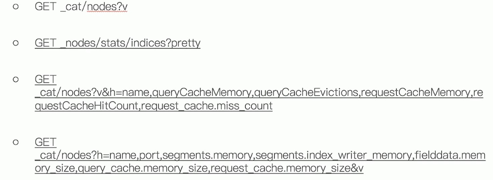

内存问题案例：

1、Segments个数过多，导致full GC

查看ES的内存使用可以发现segments.memory占用很大空间

解决办法：通过force merge，将segment合并成一个。force merge会清空两种缓存。

对于不再写入和更新的索引，可以将其设置为只读。同时进行force merge操作。如果问题依然存在，则需要考虑扩容

2、Fielddata cache过大，导致full GC

查看ES的内存使用可以发现fielddata.memory.size占用很大空间

这部分缓存没有上限限制，解决办法是将fielddata cache大小设置的小一点，然后重启节点。这个缓存大小应该设置的保守一点，如果业务上确实有需要，可以通过增加节点，扩容解决

3、复杂的嵌套聚合，导致full GC

dump分析可以看出内存中有大量bucket对象，查看日志发现复杂的嵌套聚合

解决办法是优化聚合。

一般来说在很大数据集上进行嵌套聚合查询，需要很大的堆内存才能完成，如果业务场景确实需要，可以通过增加硬件解决。为了避免这类查询影响整个集群，需要设置Circuit Break和search.max_buckets的数值

### Circuit Breaker

Circuit Breaker就是断路器，它为了避免不合理操作引起的OOM，断路器有多个种类，可以限定各种形式的内存：

- Parent Circuit Breaker：设置所有的熔断器可以使用的内存总量
- Fielddata Circuit Breaker：加载fielddata所需要的内存
- Request Circuit Breaker：防止每个请求级数据结构超过一定的内存，例如聚合计算的内存
- In flight Circuit Breaker：Request中的断路器
- Accounting request Circuit Breaker：请求结束后不能释放的对象所占用的内存

使用这个API可以查看熔断次数： GET /_nodes/stats/breaker

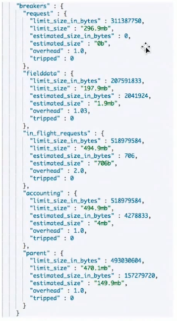

Tripped大于0就说明有过熔断。Limie size和estimated size越接近，说明越可能引发熔断

如果出现熔断就要仔细分析业务场景是否合理，谨慎评估

集群升级到7.x后，可以更加精准的分析内存状态

## 索引管理

### 管理API

1、Open/Close Index

索引关闭后无法进行读写，但是索引数据不会被删除

可以看到关闭索引后就不能读取它了：

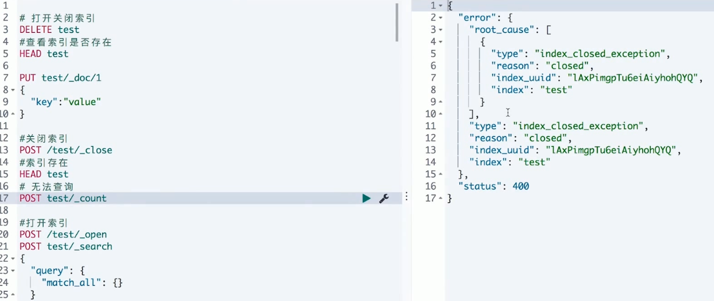

2、Shrink Index：将索引的主分片数收缩到较小的值

使用场景：

- 索引保存的数据量比较小，主分片数设置过多，需要调整它到一个较小的值
- 索引从Hot移动到Warm后，需要降低主分片数

Shrink会使用和源索引相同的配置创建一个新的索引，仅仅降低主分片数

一些限制：

- 要求源分片数必须是目标分片数的倍数，如果源分片数是素数，目标分片数只能是1
- 源分片必须设置为只读
- 所有分片必须在同一个节点上
- 集群健康状态为Green

如果文件系统支持硬链接，会将Segments硬链接到目标索引，所以Shrink性能好。完成后可以删除源索引

执行Shrink前的索引分布情况：

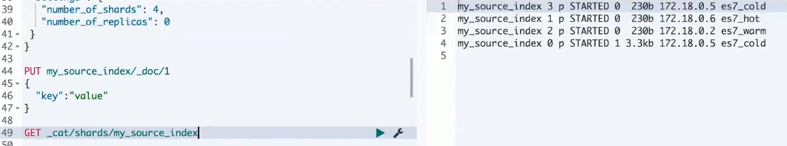

执行Shrink API：

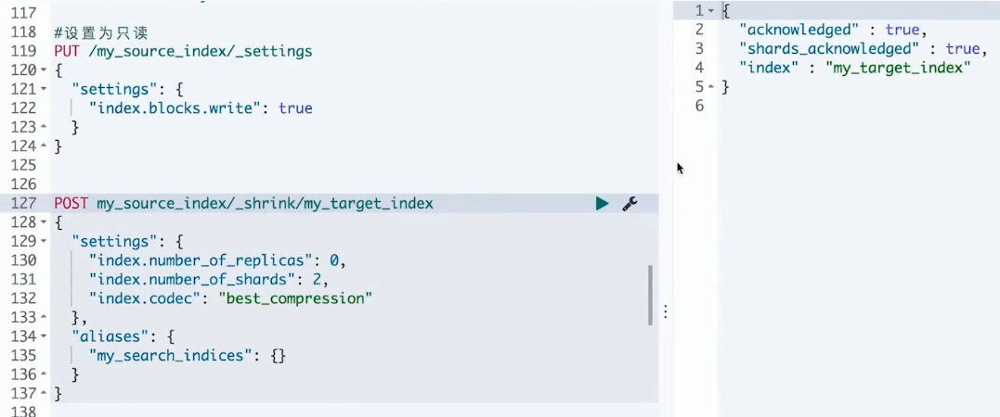

然后再查看分布情况，可以看到主分片数从4降为了2：

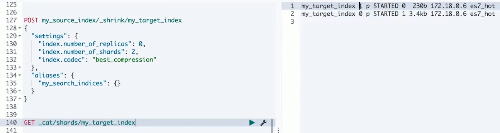

3、Split API

它是Shrink的逆操作，可以扩大主分片数。

它在执行前，也必须要求目标分片数是源分片数的倍数，而且源索引必须是只读的

执行Split，将主分片数改为8：

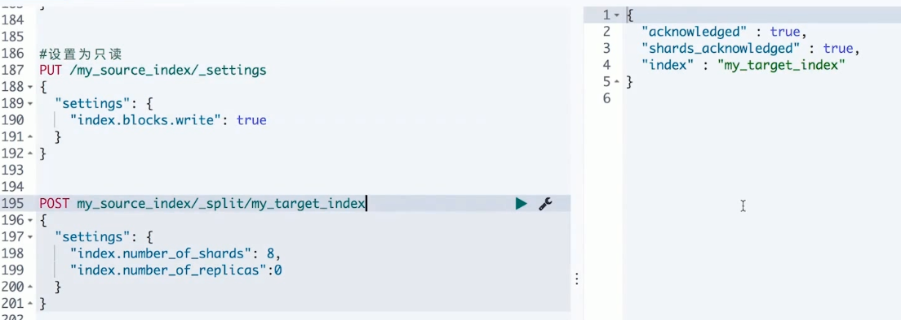

4、Rollover Index：用类似Log4J记录日志的方式，索引尺寸或时间超过一定值后，就创建新的索引

对于时间序列数据的索引，如果某一天的数据量暴增，就会导致单个分片所占用的空间大小暴增，超过了20G，难以维护。此时就可以使用Rollover Index，在存储超过20G时创建新的索引：

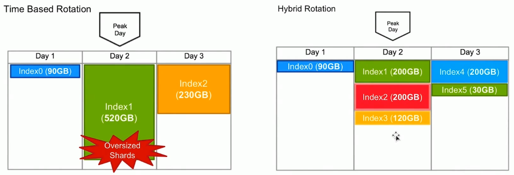

Rollover API支持将一个Alias指向一个新的索引，可以设置的条件包括：存活时间、最大文档数、最大文件尺寸

一般需要和索引生命周期管理工具结合使用，Rollover并不是一个自动的行为，只有在调用Rollover API的时候，才会去检查相应的条件，ES不会自动监控这些索引。

调用Rollover API：

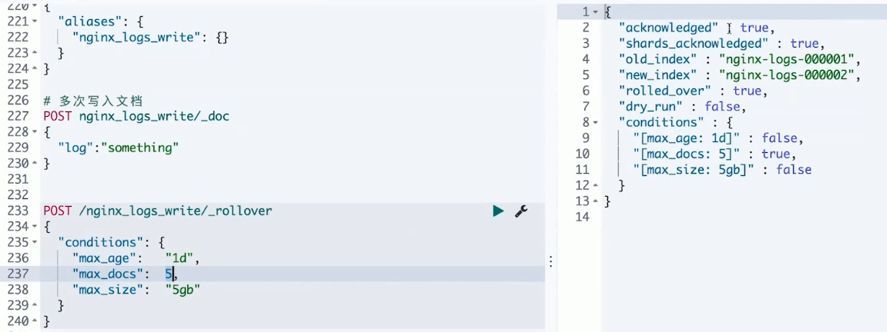

rolled_over是true就代表创建了新的索引，新索引名是nginx-logs-000002，触发创建新索引是因为max_docs这一项满足了条件

此时，nginx_logs_write的别名指向的就是新的索引nginx-logs-000002

Rollover API还可以指定新索引的名字：

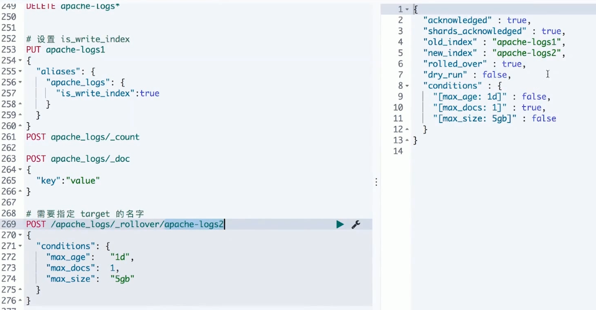

通过原索引还是能查到所有的新建索引信息

### 索引生命周期

时间序列的索引，生命周期分为几个常见阶段：

- Hot：索引还存在大量的读写
- Warm：索引不存在写操作，还有被查询的需要
- Cold：数据不存在写操作，读操作也不多
- Delete：索引不再需要，可以被安全删除

索引生命周期的管理需要很多操作：例如按时间划分、数据迁移、定期关闭或者删除索引

常见的索引生命周期管理工具：Elasticsearch Curator、Index Lifecycle Management（ES6.6提供）

ILM中集群支持定义多个policy，每个索引可以使用相同或者不同的policy，ILM中policy、Phase、Actions的概念：

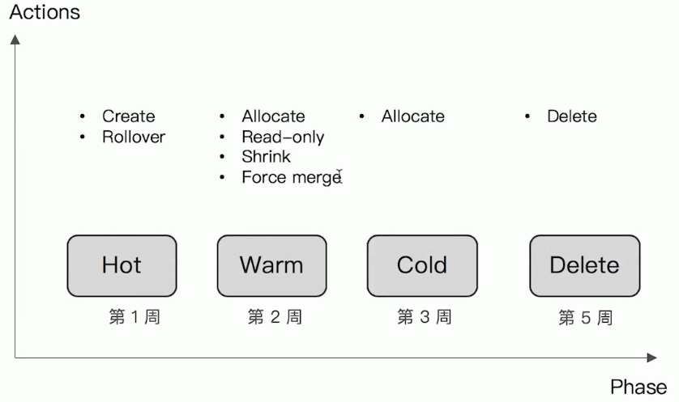

下面是一个设置Policy的例子：

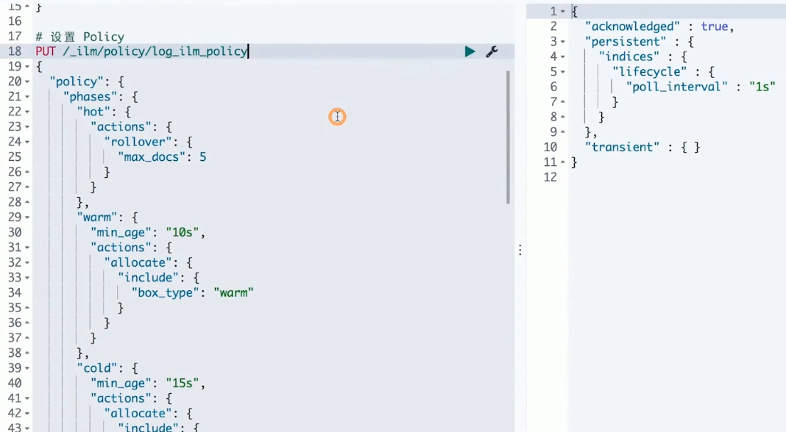

policy中定义了索引的多个阶段，每个阶段进入的条件不同：如果是hot阶段，触发rollover的最大文档数是5；触发rollover后则进入warm阶段，会自动将数据迁移到warm节点；过了10s后进入cold阶段。

# 集群配置与运维

## 跨集群搜索

单集群的节点数不能无限增加，当集群的meta信息（节点、索引、集群状态）过多，会导致更新压力变大，单个Active Master会成为性能瓶颈，导致整个集群无法正常工作。此时可以选择将数据分散在多个ES集群，搜索时同时跨多个集群。

早期版本，通过Tribe Node可以实现多集群访问的需求，但是还是存在一定的问题：

* Tribe Node会以Client Node的方式加入每个集群，集群中Master节点的任务变更需要Tribe Node的回应才能继续
* Tribe Node不保存Cluster State信息，一旦重启，初始化很慢
* 当多个集群存在索引重名的情况时，只能设置一种prefer规则

推荐使用ES的跨集群搜索功能（Cross Cluster Search），它是在ES5.3引入的。它允许任何节点扮演federated节点，以轻量的方式，将搜索请求进行代理。不需要以Client Node的形式加入其他集群。

首先启动三个集群：

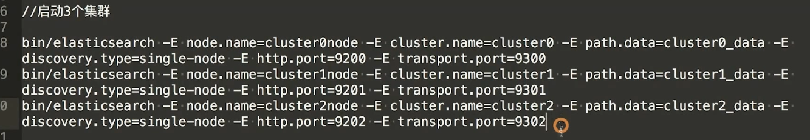

然后访问各集群的nodes，可以看到集群启动，例如访问localhost:9202/_cat/nodes

然后在每个集群上设置所有集群的信息：

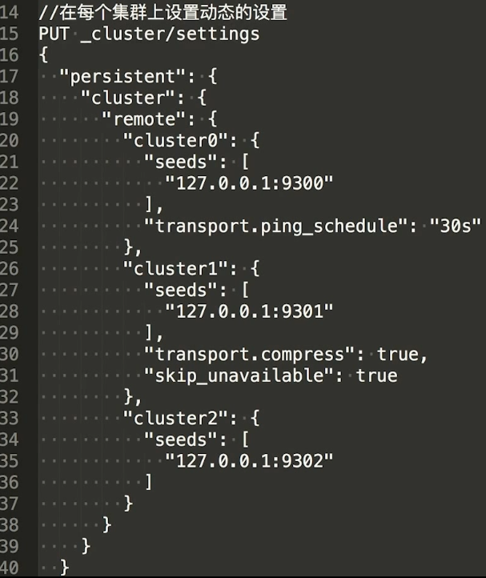

然后就可以进行跨集群搜索了，下图代表搜索本集群的users索引、cluster1的users索引、cluster2的users索引：

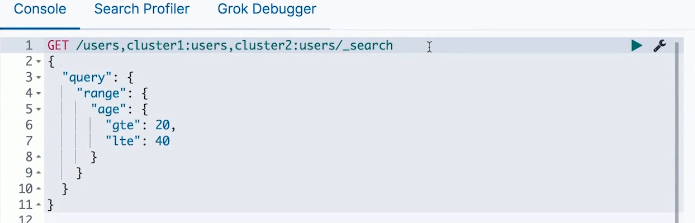

## 分布式模型

### 集群和节点类型

ES的分布式架构带来的好处：

* 方便水平扩容，支持PB级数据
* 提高系统的可用性，部分节点停止服务，整个集群的服务不受影响

ES中不同的集群通过不同的名字来区分，默认名字是elasticsearch。可以通过配置文件修改集群名，或者在命令行中指定-E cluster.name=geektime来设定。

一个ES实例本质上就是一个java进程，一台机器上可以运行多个ES进程，但生产环境上一般建议一台机器上就运行一个ES实例。

每个节点的名字可以通过配置文件配置，也可以启动的时候指定-E node.name=geektime来指定

每个节点在启动之后，会分配一个UID，保存在data目录下

几种节点类型：

1、Coordinating Node

它是处理请求的节点，负责路由请求到正确的节点，例如创建索引的请求需要路由到Master节点。默认所有节点都是Coordinating Node。此外它还负责汇总聚合结果、辅助查询执行

可以将其他类型设置为false，这样这个节点就只有Coordinating Node一个身份，成为Dedicated Coordinating Node

2、Data Node

Data Node是可以保存数据的节点，节点启动后默认就是数据节点，可以设置node.data=false禁止

Data Node用来保存分片数据，在数据扩展上起了至关重要的作用。可以通过增加数据节点来实现数据扩展和解决单点问题

3、Master Node

它的职责是：

* 处理创建、删除索引请求、决定分片被分配到哪个节点
* 维护并更新Cluster State

Master节点非常重要，在生产环境要保证Master节点挂掉后，其他节点可以起到Master节点的作用

4、Master eligible

一个集群可以配置多个Master eligible节点，这些节点可以在必要时参加选主流程，成为Master节点。

每个节点启动后默认是Master eligible节点，可以设置node.master:false 禁止

当集群内第一个Master eligible节点启动时，它会将自己选举为Master节点

下面是几个节点类型，一个节点默认是Master eligible、datanode、ingest node：

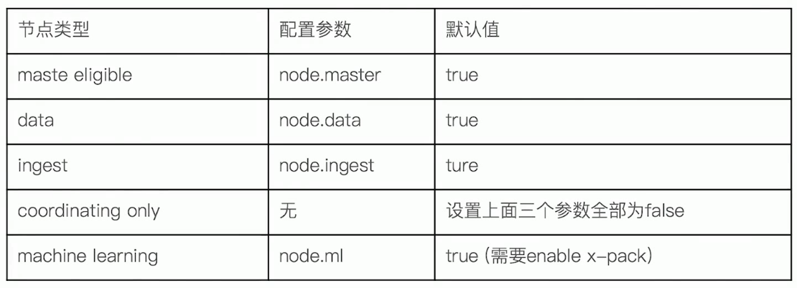

集群状态信息：Cluster State，它维护了一个集群中必要的信息，包括：

* 所有的节点信息
* 所有的索引和其相关的Mapping和Setting信息
* 分片的路由信息

每个节点上都保存了集群的状态信息，但只有Master节点才能修改集群状态信息，并负责同步给其他节点（任意节点都能修改会有数据不一致的问题）

### 集群部署方式

前面说过，ES中一个节点可以承担多种角色，在生产环境中，建议设置单一角色的节点（dedicated node），一个节点只承担一个角色：

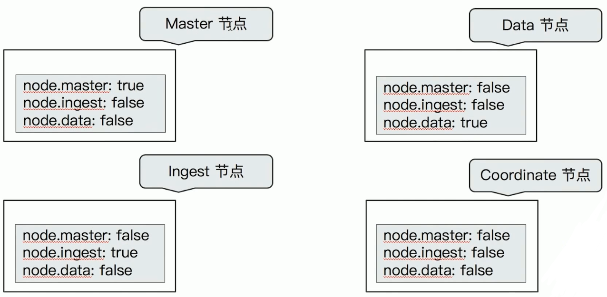

职责分离的好处，可以为不同类型的节点采用不同的硬件配置，比如master节点使用低配置的CPU、内存和磁盘；数据节点使用高配置的CPU、内存和磁盘；ingest节点使用高配置的CPU、中等配置内存和低配置的磁盘

在一些较大的集群中，建议设置一些专用的Coordinating Node，它可以扮演Load Balancers，降低Master和Data Nodes的负载。Coordinating Node还负责搜索结果的Gather/Reduce，如果是数据节点和Coordinating Node混合部署，数据节点会有相对较大的内存占用，Coordinating Node有时候也会有开销很高的查询，这些因素综合考虑会导致OOM，导致集群的不稳定。当系统中有大量的复杂查询及聚合的时候，应该增加Coordinating Node节点，增加查询的性能。

如果需要考虑可靠性高可用，可以部署dedicated Master节点

可以用软件或者硬件实现load balance，这样应用程序只需要和load balance交互，就可以完成ES功能了：

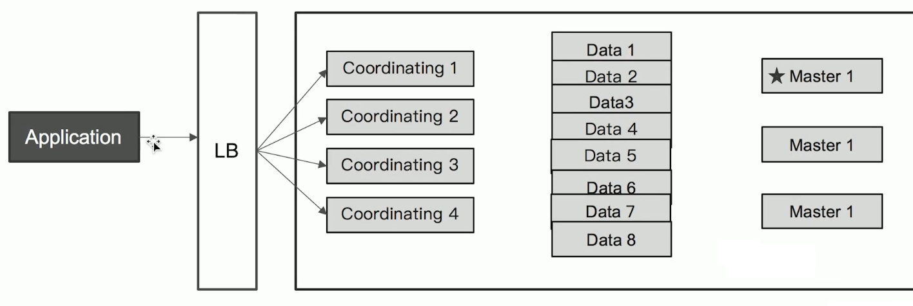

集群还可以实现读写分离，这样可以单独增加某种类型的节点以提高读能力或者写能力：

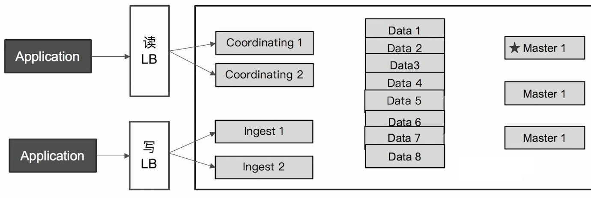

ES建议将Kibana部署在多个Coordinating Node上，然后在前端配置一个load balance，就可以实现Kibana集群的高可用：

为了实现异地多活，通过数据多写的方式，把相同的数据保存在不同的数据中心

## 选主和脑裂问题

多个Master eligible节点会互相ping对方，Node Id低的会成为被选举的节点。其他节点会加入集群，但是不承担Master节点的角色。

一旦主节点丢失，就会选举出新的Master节点

一个分布式系统的经典问题：Split-Brain，脑裂问题。当出现网络问题，一个节点和其他节点无法连接时，如下图

此时Node2和3会重新选举Master；Node1自己选自己为Master。此时就导致一个集群有两个Master节点，维护两份集群状态信息。等网络恢复后，集群也无法正确恢复。

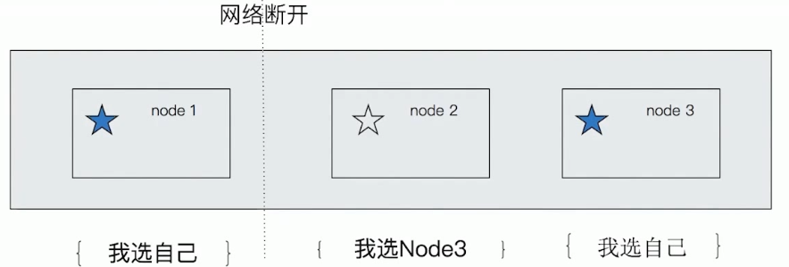

为了避免脑裂问题，设置一个参数名为quorum仲裁，只有在Master eligible节点数大于quorum时，才能进行选举。

quorum = (master eligible节点总数/2) + 1

这样当有3个master eligible节点时，设置该参数为2，即可避免脑裂

从ES7开始，无需配置该参数（选举发生时最小集群Master eligible节点数），集群可以自己保证不会有脑裂问题

此外还需要考虑误判的问题，适当调大discovery.zen.ping_timeout，默认master在3s内没有响应就认为已经挂掉。

合理部署集群，避免某个节点负载过高。

## 故障转移

分片是ES分布式存储的基石，分为主分片和副本分片

主分片Primary Shard，可以将一份索引的数据分散在多个datanode上。主分片数在索引创建的时候指定，后续默认不能修改，除非重建索引

副本分片Replica Shard，它的作用：

* 提高数据的可用性，一旦主分片丢失，副本分片可以Promote成主分片。
* 它与主分片同步，可以在一定程度上提高读取的吞吐量

副本分片数可以动态调整，如果不设置副本分片，一旦出现节点故障，就有可能造成数据丢失

主分片数的设置：

* 如果设置的太少，则如果该索引数据增长的很快，则无法通过集群增加节点来实现对这个索引的数据扩展
* 如果设置的太多，会导致单个分片数据容量小，导致一个节点上游过多分片，也会影响性能

副本分片数的设置：

* 如果设置的过多，会降低集群整体的写入性能

可以通过下面的命令来设置一个索引的分片数：

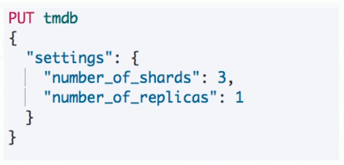

2节点，3个主分片，1个副本分片时，分片的分布情况：

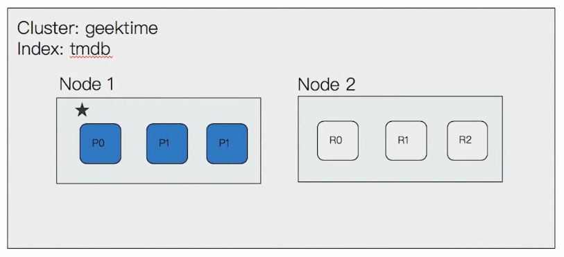

再增加一个节点，分布就会变成这样：


故障转移的过程：也是上面两张图的逆向过程。当节点1故障时，ES会重新选举Master节点，然后将挂掉节点上的分片都重新分配到其他节点。分配完成后，集群状态就会恢复绿色：

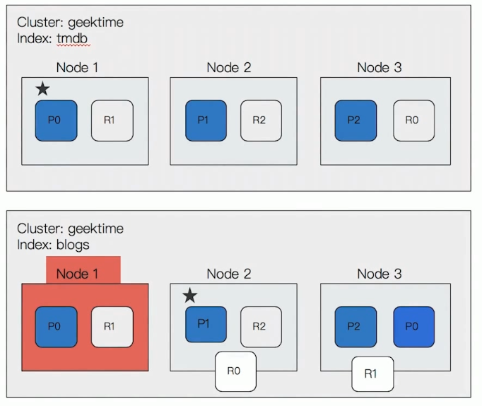

ES中，主分片和副本分片不能分配到一台机器上，所以如果设置了副本分片那至少需要两个节点，否则就会有副本分片不能正常分配

## 数据建模

数据建模Data modeling，是创建数据模型的过程。数据模型是对真实世界进行抽象描述的一种工具和方法，实现对现实世界的映射。

数据建模的三个过程：概念模型、逻辑模型、数据模型

数据模型需要结合具体的数据库，在满足业务读写性能等需求的前提下，确定最终的定义

数据建模需要考虑功能需求和性能需求。

### 字段建模建议

对字段建模的步骤：确定字段类型、是否要搜索及分词、是否要聚合及排序、是否要额外的存储

1、确定字段类型

对于文本字段，ES中分为Text和Keyword两种类型：

* Text用于全文本字段，文本会被分词器分词。默认不支持聚合和排序，需要设置fielddata为true
* Keyword用于id、枚举和其他不需要分词的文本。例如电话号码、email、手机号码等。适用于Filter精确匹配查询，不需要计算相关性算分，能充分利用缓存。可以排序和聚合

默认ES会设置多字段结果，会将文本类型设置为text，并设置一个keyword的子字段。可以针对子字段来单独设置一个分词器，覆盖更多的搜索场景。

对于数值类型：尽量选择贴近的类型，例如可以用byte就不要用long（对存储和性能都有好处）

对于枚举类型：应该设置成keyword，即使是数字也应该设置成keyword，以获取更好的性能

对于其他日期、布尔、地理信息，要根据数据含义设置合理的字段类型

2、从检索的方面考虑

如果不需要检索，可以将字段的index属性设置为false，它代表不会创建索引，该字段不可被索引

需要检索的字段，可以通过配置index_options来设置存储粒度，它可以控制倒排索引记录的内容

3、从聚合和排序的方面考虑

如果不需要检索、排序和聚合分析，可以将_source的enabled设置成false，它代表该字段仅做存储，不支持搜索和聚合（数据保存在source中）

如果不需要排序、聚合分析，可以设置关闭doc_values，或者将fielddata设置为false

对于更新频繁，聚合查询频繁的keyword字段，推荐将eager_global_ordinals设为true，它代表写入数据时，对应的term被加载到cache中，可以优化Terms Aggregation的性能。

如果字段用来做过滤和聚合分析，可以关闭norms，节约存储

4、额外的存储

如果需要专门存储当前字段数据，可以将store设置为true，代表存储该字段的原始内容。一般结合source的enabled为false时使用。（默认情况下原始的文本都是存储在source中的，查询的字段也是从source中提取出来的，单独存储某个字段解析时性能要好一点，但是也会占用更多的空间）

去激活source：节约磁盘，它可以不保存文档的原始数据，适用于指标型数据，这会导致无法看到source字段，无法做reindex，也不能被更新。建议为节省磁盘空间优先考虑增加压缩比。

###index/source enabled/store

以一个图书信息为例，来进行数据建模，如下图，图书的索引包含五个字段：书名、简介、作者、发行日期、url：


可以考虑将url的index设置为false，不支持搜索，因为一般不会有人通过url来找到一本图书：

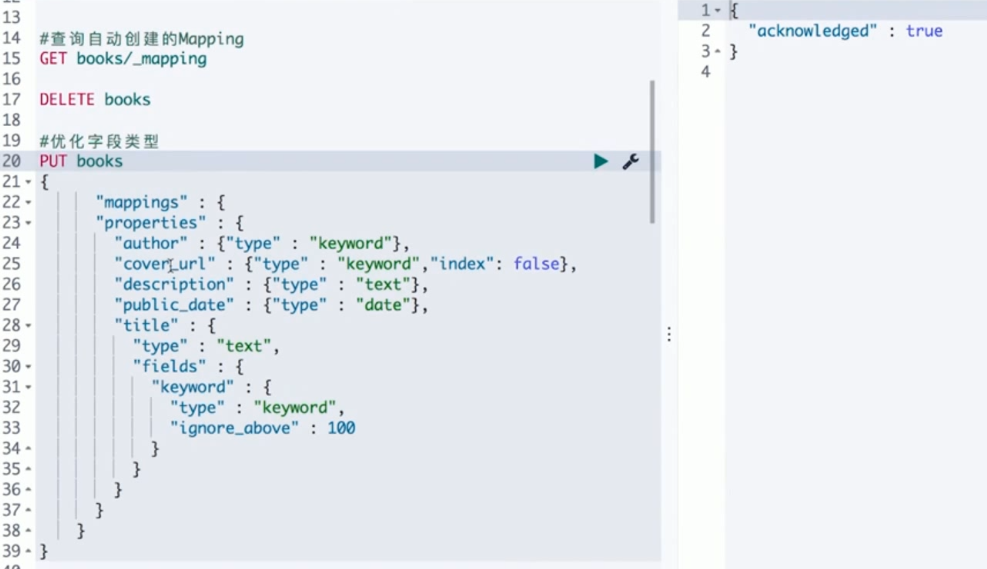

将其index设置为false时，再搜索该字段就会报错：


即使字段的index设置为false，还是可以支持聚合分析的：


如果后续出现了需求变更，增加了图书内容的字段，并要求能被搜索同时高亮。新增的字段会导致source内容过大，虽然可以使用source filtering进行过滤，但仅仅只是传输给客户端的时候进行过滤，fetch数据的时候ES节点还是会传输source中的数据，过大的source会带来性能损耗。

解决办法：将索引的source enabled设置为false，然后将每个字段的store属性设置为true：

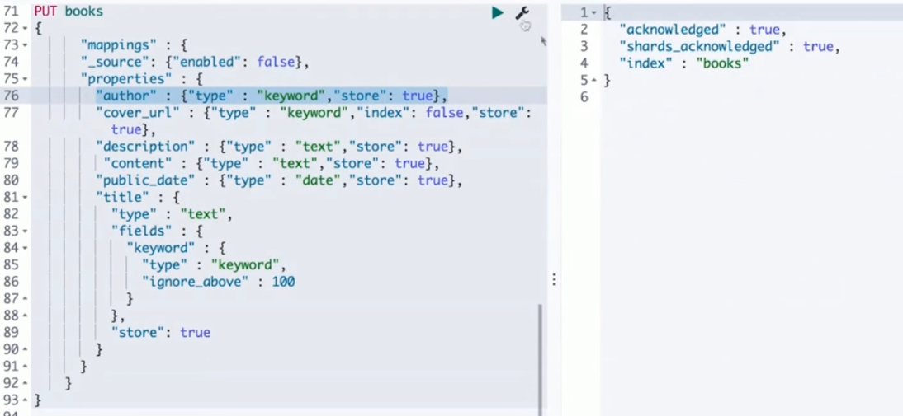

这样设置后，搜索返回的结果中不包含source字段了，为了显示想要的字段，可以在查询时指定stored_fields，这样设置也还是可以使用高亮API（代表content字段要高亮显示）：


### 字段过多问题

一个文档中最好要避免存在大量的字段，因为：

* 过多的字段数不容易维护
* Mapping信息保存在Cluster State中，数据量过大，对集群性能会有影响（Cluster State信息需要和所有的节点同步）
* 删除或者修改数据需要reindex

一个文档默认最大字段数是1000，可以设置index.mapping.total_fields.limit限定最大字段数

默认Dynamic是true，也就是被写入新字段是支持字段被索引，在生产环境不要设置成true，否则随着数据创建出现的新字段，mapping中包含的字段会越来越多。为了解决字段数过多的问题，可以考虑使用Nested对象，将新增的多个字段放到数组中：


写入数据时，使用key和合适类型的value字段：

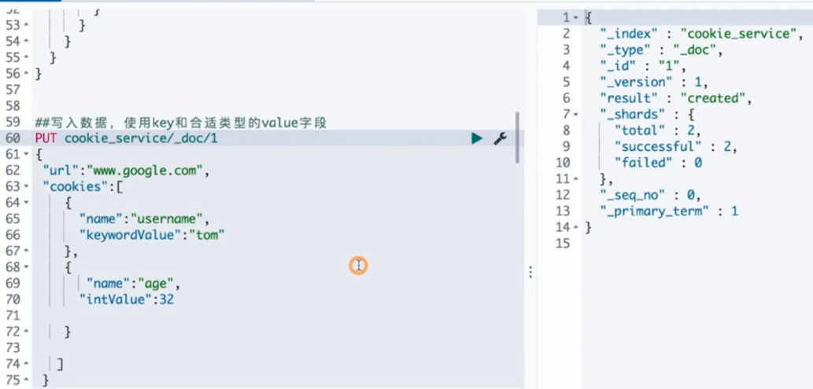

后续可以通过Nested查询完成正常业务逻辑：

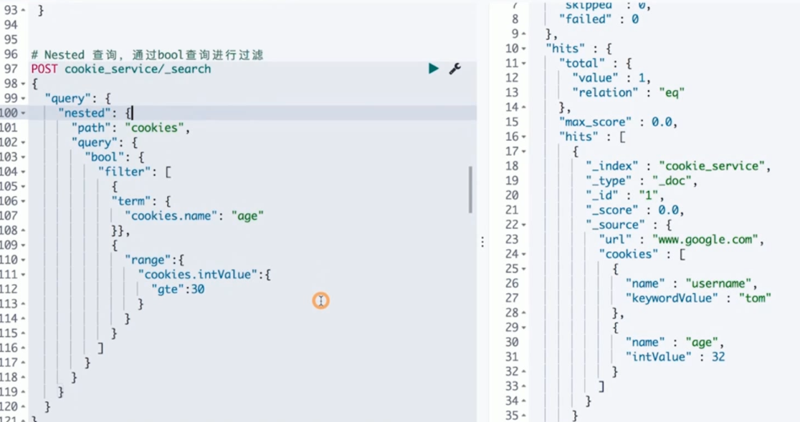

通过Nested对象保存键值对的一些不足：查询语句复杂度增加、Nested对象不利于在Kibana中实现可视化分析

### 避免正则查询

前缀查询属于Term查询，但是性能还是不好。特别是将通配符放在开头，会导致性能的灾难

例如文档中某个字段包含了ES的版本信息，例如7.1.0，如果想查询大版本为7的文档，就要使用通配符查询

为了避免通配符查询，可以将字符串转换为对象，用多个字段来描述它：

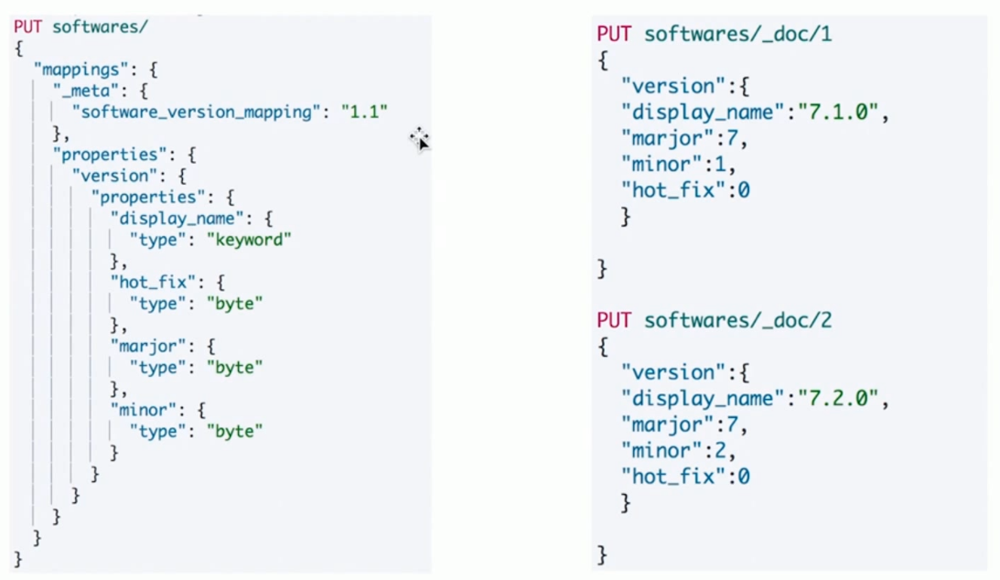

后续通过bool查询，可以很方便的进行筛选。

### 空值问题

空值会引发很多问题，例如之前提到的搜索不到空值，此外空值也会引发聚合不准的问题。

例如下面的例子，一个文档的值是5，一个是null，平均值聚合的结果是5：

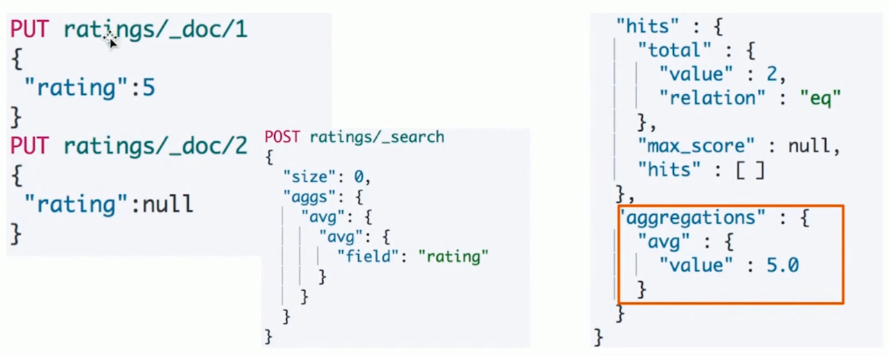

此时我们可以设置rating字段空值的对应值是1，这样再插入空值时就会按照对应的值来处理了：

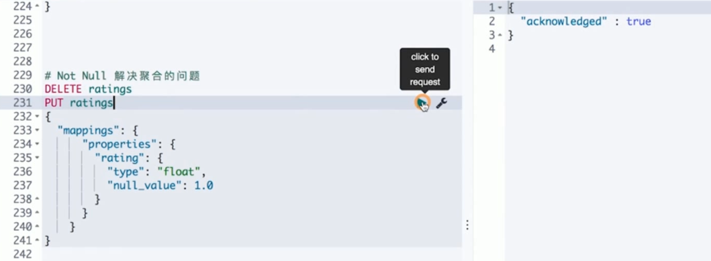

## 安全

ES在默认安装后，不提供任何形式的安全防护。

当在elasticsearch.yml文件中，如果server.host被错误的配置为0.0.0.0，就导致公网可以访问ES集群

安全方面的基本需求：身份认证、用户鉴权（指定哪个用户可以访问哪个索引）、传输加密、日志审计

一些方案：设置Nginx反向代理、安装ES中的Security插件、使用X-Pack

### 身份认证和用户鉴权

身份认证Authorization的几种类型：提供用户名和密码、提供密钥、提供kerberos票据

X-Pack中的认证服务名为Realms，ES中分为两种：

* 内置的Realms：它是免费的，用户名和密码保存在ES中
* 外部Realms：它是收费的，可以使用kerberos等

用户鉴权RBAC：Role Based Access Control，定义一个角色，并分配一组权限。权限包括索引级、字段级、集群级的不同操作。然后将角色分配给用户，使得用户拥有这些权限。在ES中，名为elastic的用户拥有超级权限，可以使用security API来创建用户：

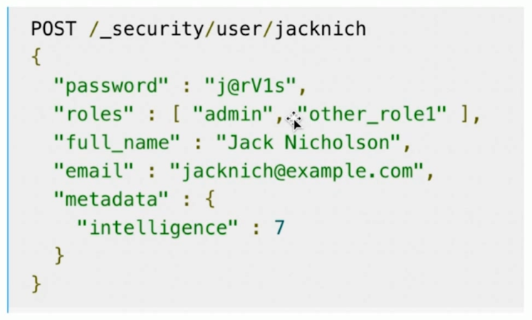

启动集群时开启安全选项：设置了集群的名字geektime，并通过-E的方式，开启了xpack安全选项：


运行bin/elasticsearch-setup-passwords interactive  设置默认用户的密码。设置好之后访问ES集群就需要输入密码了。

Kibana也可以设置身份认证，打开Kibana的配置文件 config/kibana.yml，然后打开kibana用户的设置，这个用户是专门用来连接Kibana和ES的，然后再启动Kibana：

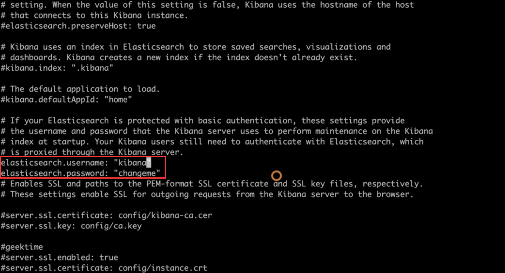

在Kibana的界面，可以创建角色，设置角色可以使用的索引名、权限类型和角色管理的用户名：

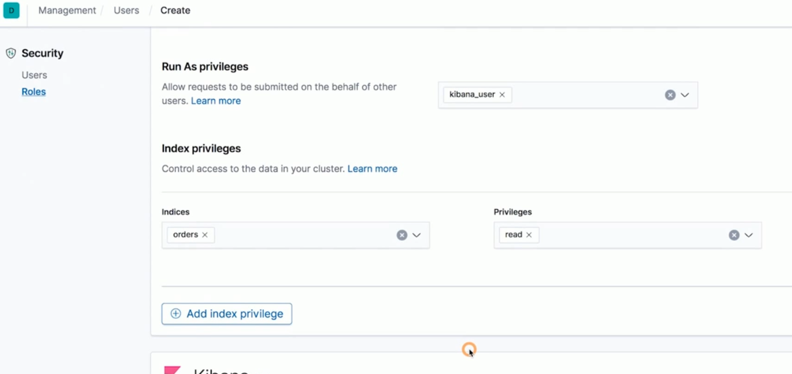

然后用该用户登录到Kibana，然后在Kibana使用删除索引命令，就可以看到报错没有权限：

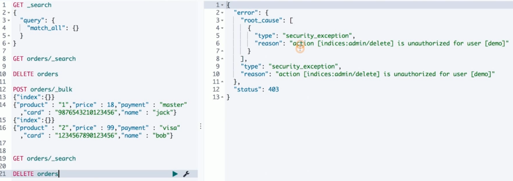

### 集群内部安全通信

加密通信的原因：避免数据抓包，敏感信息泄漏

避免出现Impostor Node，相当于建立一个ES节点加入集群，就可以获取一些敏感信息了

TLS协议要求使用CA签发的证书，证书认证的不同级别：

* Certificate：节点加入需要使用相同CA签发的证书
* Full Verification：节点加入需要使用相同CA签发的证书，而且还需要验证Host name或IP地址
* No Verification：任何节点都可以加入集群，通常用于开发环境的诊断

生成节点证书步骤：

1、创建一个CA证书：bin/elasticsearch-certutil ca

2、基于CA文件给节点签发一个证书：bin/elasticsearch-certutil cert --ca elastic-stack-ca.p12

3、将生成的证书放到config/certs目录下

启动集群前在配置文件中配置通信相关的设置，也可以启动时将这些参数加到命令行：

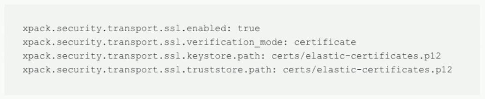

### 集群与外部的安全通信

集群与外部的通信包括浏览器访问Kibana、Kibana访问ES、Logstash访问ES

因此需要配置HTTPS访问ES、配置Kibana连接ES使用HTTPS、配置使用HTTPS访问Kibana

具体过程略

## Hot&Warm Architecture

Hot&Warm Architecture适用场景：数据更新频率低，数据量大的情况

将datanode分为两种：

* Hot节点：存放比较新的、查询比较频繁、不断有新数据写入；indexing对CPU和IO都有很高的要求，所以需要使用高配置的机器，建议使用SSD
* Warm节点：存放比较旧的，查询频率不高的数据。通常使用大容量的磁盘

配置Hot&Warm Architecture需要使用Shard Filtering，步骤分为以下几步：

* 标记节点（Tagging）
* 配置索引到Hot Node
* 配置索引到Warm Node

通过node.attr来标记一个节点，标记值可以是任意值，可以通过elasticsearch.yml或者通过-E命令来指定。

例如启动节点时，指定node.attr的my_node_type是warm节点：

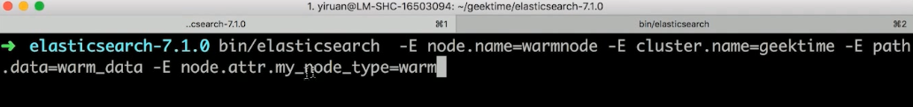

创建索引的时候，将对应的索引指定在对应节点上，例如将下面的索引创建在my_node_type为hot的节点上：


可以通过shards的API来查看索引存储在哪个节点上：

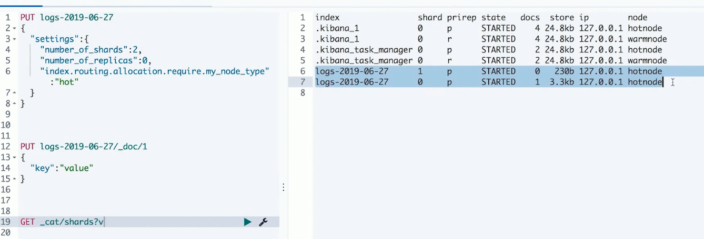

index.routing.allocation是一个索引级的dynamic setting，可以通过API在后期进行设定，例如将索引移动到warm节点上：

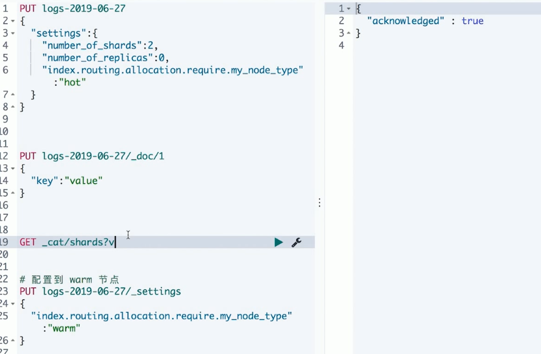

## Rack Awareness

ES的节点可能分布在不同的机架：

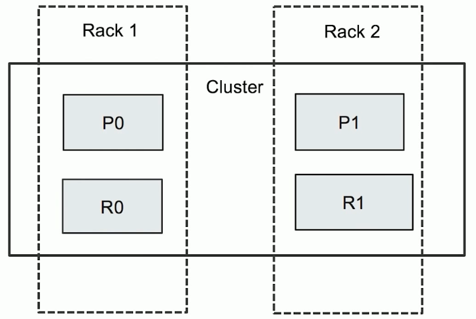

例如在rack1上存在0号主分片和副本分片，rack2上存在1号主分片和副本分片。这种一个索引的主分片和副本分片同时在一个机架上，当一个机架断电就会由数据丢失的风险。通过Rack Awareness的机制，就可以尽可能避免将同一个索引的主副分片同时分配在一个机架上。

设置Rack Awareness的步骤：

* 设置node.attr，不同机架上的rack_id不同
* 然后修改setting，设置按照rack_id来完成awareness

如下图：

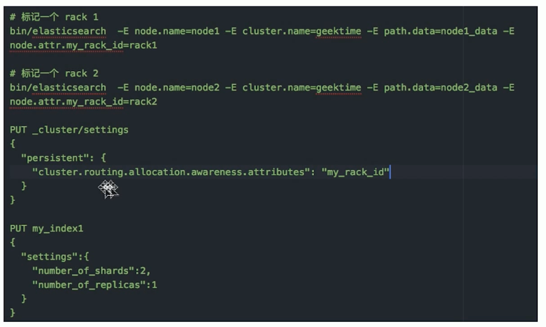

基于id做awareness，就会自动把主分片和副本分片发送到不同的id节点上：

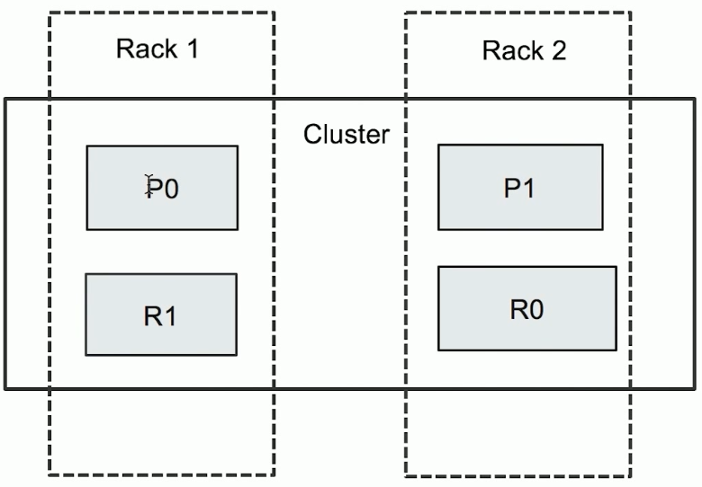

可以通过设置强制设置分片分布在rack1和rack2上，当只有一个rack节点时，副本分片无法分配：

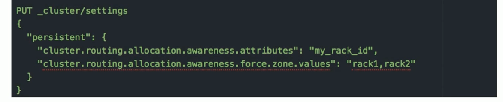

可以设置几种Shard Filtering，来根据节点attr来将索引分配到某些节点：

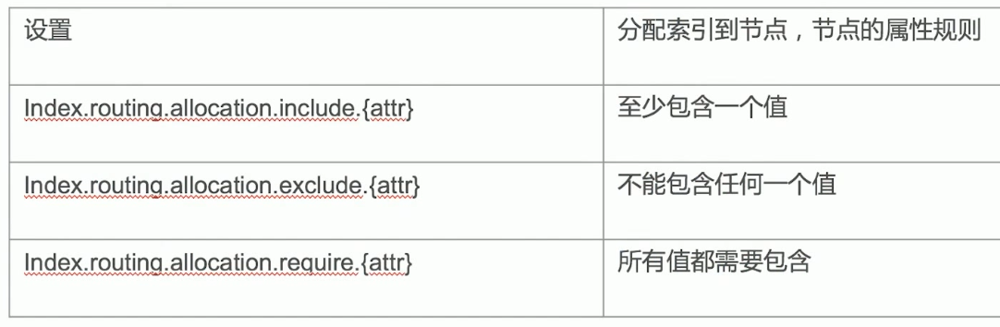

## 部署集群

管理集群时有一些运维的操作比较繁琐：

* 扩容、节点修复和更换
* 版本升级、数据备份、滚动升级

在私有云：

ES的ECE可以帮助管理ES集群，ECE：Elastic Cloud Enterprise，它可以通过单个控制台，管理多个集群，降低运维成本。只需要设置ES的版本号、节点数等基础配置，就可以将集群管理起来了

还可以将ES部署在K8S，基于Elastic Cloud on Kubernetes来管理

在公有云部署时：

可以选择直接购买Elastic Cloud服务，或者阿里云ES服务，将服务之间部署起来

## 常用配置

从ES5开始，支持Development和Production两种运行模式：

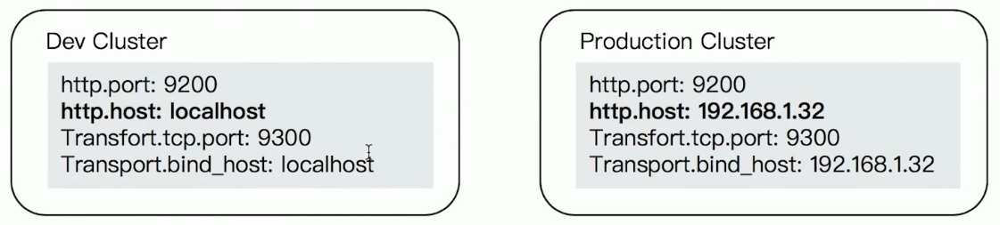

一个集群在生产环境模式时，启动时必须通过所有Bootstrap检测，否则会启动失败，检测分为两类：JVM检测和linux检测

1、JVM检测

从ES6开始，只支持64位的JVM，通过修改config/jvm.options来修改JVM配置，注意：

* 将内存Xms和Xmx设置成一样，否则heap resize时会引发停顿，减轻伸缩堆大小带来的压力
* Xmx设置不要超过物理内存的50%（给Lucene留一些缓存空间，主要是用于段文件的缓存，这些文件都是不变的，很利于缓存。这里说的缓存就是页缓存），单个节点该值最大值不要超过32G（否则用来存储地址的指针会变大，浪费内存）
* 生产环境JVM必须使用server模式
* 关闭JVM swapping

配置时要尽量保证配置文件简洁，只设置关键参数，其他的配置项可以通过API动态进行设定，通过API设置的配置会覆盖配置文件的配置，动态设置分为两种：

* transient配置：在集群重启后丢失
* persistent配置：在集群重启后依然还在

2、linux检测

针对linux系统，对系统配置进行检测：如进程最大数、禁止swap、线程数等，如果配置不符合要求就无法在生产环境启动集群

部署在生产环境时还需要注意以下几个方面：

* 网络：单个集群不要跨数据中心进行部署，尽量在一个集群中网络时延越小越好。如果有多块网卡，最好将transport和http绑定到不同的网卡，并设置不同的防火墙。可以按需为Coordinating Node或Ingest Node配置负载均衡
* 内存：搜索类内存和磁盘比例建议1:16，日志类应用1:48-1:96
* 存储：推荐使用SSD，ES本身提供了很好的HA机制，无需使用RAID。可以在Warm节点使用机械硬盘
* 硬件：硬件配置不建议过高，不建议在一台服务器运行多个节点

一些推荐的集群配置：

1、为Rolocation（Allocation，指将分片分配给某个节点的过程，包括分配主分片或者副本、主从分片复制的过程）和Recovery设置限流，避免过多任务对集群产生性能影响

2、可以考虑关闭动态索引创建的功能，关闭后，创建index时必须显示指定mapping设定：

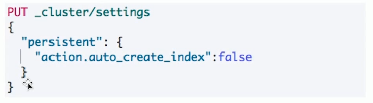

或者通过模板设置白名单，指定符合条件的索引才能创建：

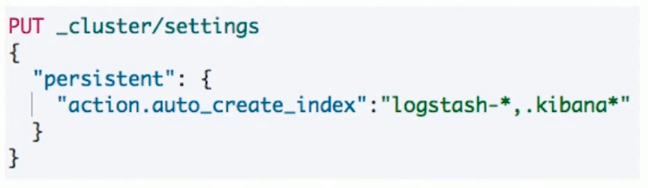

3、开启集群安全设置，为ES和Kibana配置安全功能

## 监控集群

### 监控API

ES提供了多个监控相关的API，可以从节点粒度、集群粒度、索引粒度来对目前情况进行监控：

* _nodes/stats
* _cluster/stats
* index_name/stats

查看Task 相关的API：

* 查看pending的Task：GET _cluster/pending_tasks
* 管理Task：GET _tasks

监控线程相关

ES还支持慢查询日志，支持将分片上Search和Fetch阶段的慢查询写入文件。支持分别为Query和fetch设置阈值：

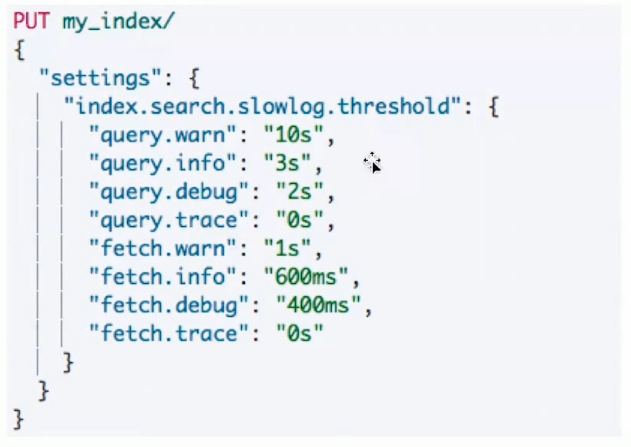

可以通过开发ES插件，通过监控API读取监控数据来分析。

### 诊断潜在问题

节点负载过高，可能导致节点失联

集群压力过大，数据写入失败

负载不均衡，导致某个节点负载过高

健康状态检查

索引合理性诊断：总数不能过大、索引字段总数、索引是否分配不均匀

资源使用合理性判断：CPU、内存、磁盘情况分析，是否存在节点负载不均衡，是否需要增加节点

## Red&Yellow问题

前面提到，可以使用GET _cluster/health来查看集群的健康情况。status的不同值代表不同的健康状况：

* 红：存在主分片没有分配
* 黄：存在副本分片没有分配
* 绿：主副分片全部正常分配

状态其实也分三种：分片健康、索引健康（最差的分片的状态）、集群健康（最差的索引的状态）

Health相关的API：

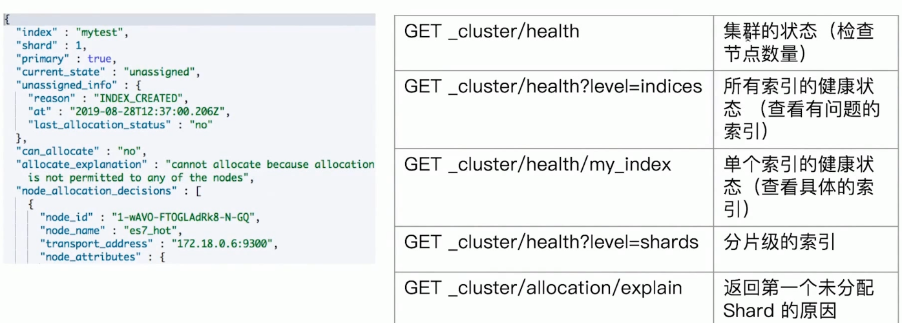

1、集群变红问题案例

创建一个index，然后发现它没有返回值：

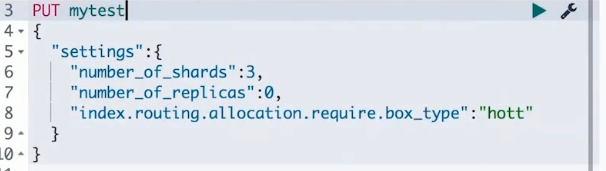

再查看集群状态发现状态已经变成红色 GET _cluster/health

然后查看索引的健康状态，找到有问题的索引名mytest

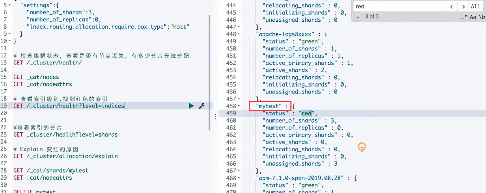

使用explain API来查看未分配的原因：

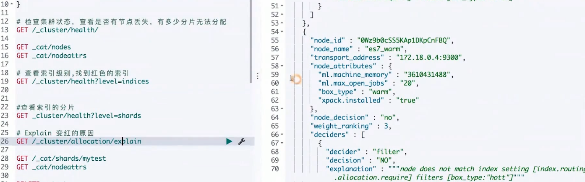

可以看到由于创建索引指定了错误的属性hott，所以创建失败。删除对应索引，然后以正确的方式重建即可。

2、集群变黄问题案例

集群变黄后，可以用上面的explain查看原因：

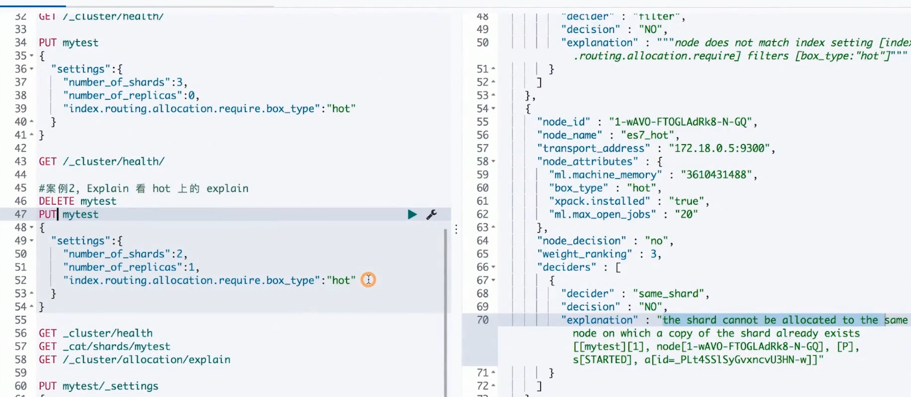

可以看到explanation中说：分片无法分配在同一个节点。

解决办法：增加一个hot节点，或者修改索引，让副本分片数为0

分片没有被分配的常见原因：

* 刚刚创建的时候会有短暂的Red（所以监控和报警要设置一定的延时）
* 集群重启阶段，或者有节点离线
* 关闭了索引之后
* 一个节点离开集群期间，有索引被删除，重新加入索引后就会报错，这就是Dangling问题，此时要将索引再删除一次
* 配置错误
* 因为磁盘空间限制或者分片规则（Shard Filtering）引发的，需要调整规则或者增加节点

一些特定情况下，可以通过使用Reallocate API，将一个索引从一个node移动到另一个node：

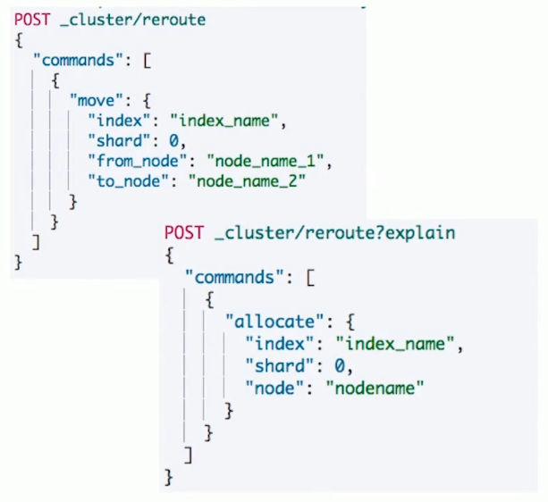

## 运维建议和操作

1、对重要的数据进行备份

2、定期更新到新版本，修复bug和安全隐患，优化性能。

ES可以使用上一个主版本的索引，例如7.x可以使用6.x的索引

3、重启升级的两种方式：Rolling Upgrade（没有down time）和Full Cluster Restart（期间功能不可用，但升级更快）

Full Restart的步骤：

* 停止索引数据，备份集群
* 去激活分片分配
* 执行Synced Flush（可以提升分片Recovery的时间，让重启更快）
* 关闭并更新所有节点
* 先运行所有Master节点，再运行其他节点
* 等集群变黄后打开分片分配

4、有时为了解决一个数据节点分片过多，或者hot shards过多的情况，可以手动将分片从一个节点移动到另一个节点：

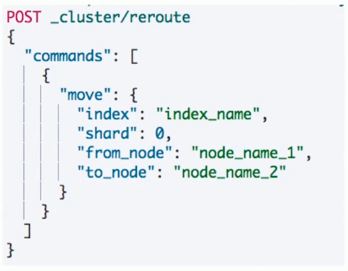

5、从集群移除一个节点，并自动将节点上的数据迁移到其他节点。这种移除方式不会导致集群变红或者变黄：

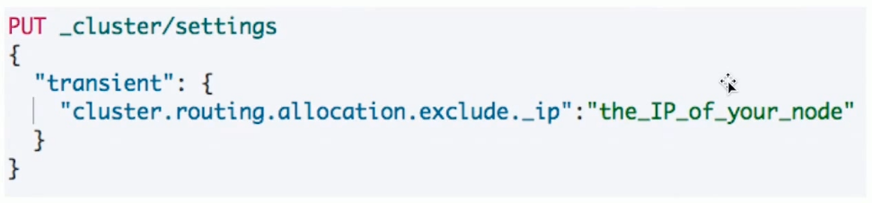

6、当节点上出现高内存占用，可以执行清除缓存的操作，临时避免集群出现OOM：POST _cache/clear

7、当搜索的响应时间过长，看到reject出现，可以适当增加搜索队列的大小：

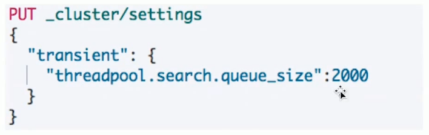

# 补充知识

ES中节点之间传输数据默认是不压缩的，如果带宽成为瓶颈，可以设置为压缩，对应参数是transport.tcp.compress

ES7.12版实现了计算与存储分离，引入了冻结层，它以超低成本长期存储大量可搜索的数据