# 音标

## 主要音标体系

目前现存多种不同的音标体系： 

* 国际音标IPA是用来给所有语言标注的音标
* DJ音标是从国际音标中取用并改良的音标给英语注音，也叫DJ音标（IPA63）
* 新版DJ音标是从上面的基础改良而来，也叫DJ音标（IPA88），它被国内的词典广泛使用，如牛津词典，剑桥词典，下面的讲解主要以DJ音标为主
* 美国语言学家在国际音标的基础上创建了KK音标，其中一些符号更方便美式英语的注音，在台湾地区被广泛使用
* 不同的词典出版商也会有自己的一套注音体系，如韦氏词典中使用的韦氏音标，美国传统英语词典中使用的AHD音标

大多数英美母语人士都不使用音标，他们会采取respelling的方法，即用常用词的音标注

## 发音过程

声门：喉咙处的两瓣声带

根据声带是否振动，可以给单个音节分为：

* 浊音（voiced sound）：由声带振动作为音源而发出的音
* 清音（voiceless sound）：在气流通过声门时不振动声带，直接给气流放行，这样发出的音

根据发音时气流通过口腔是否受到阻碍，可以分为：

* 元音（vowels）：发音过程中，气流通过口腔时不受阻碍而发出的音。虽不受阻碍但是可以通过舌头抬高或降低，参与发音，但舌头没有和口腔的任何部位接触，嘴唇也不能闭拢
* 辅音（consonants）发音过程中，气流在全部时间或一部分时间被阻碍，所发出的音

两者的组合图如下：

其中，清元音非常少见，绝大多数情况下，元音的发音都是带有声带振动的，所以一般认为元音都是浊音

## 元音三要素

发元音时可控的因素并不多，其实只有舌头和嘴唇，能够通过有限的调整发出不同的元音

影响元音的三个要素是：圆唇度、舌位高低、舌位前后

嘴唇在不闭合的情况下，可以圆唇（rounded），也可以不圆唇（unrounded），这个嘴唇圆的程度即位圆唇度（roundness），可以通过下面两个常见汉字的韵母来理解圆唇的发音，这两个音的区别仅仅在于圆唇度，而舌头的位置是一样的：

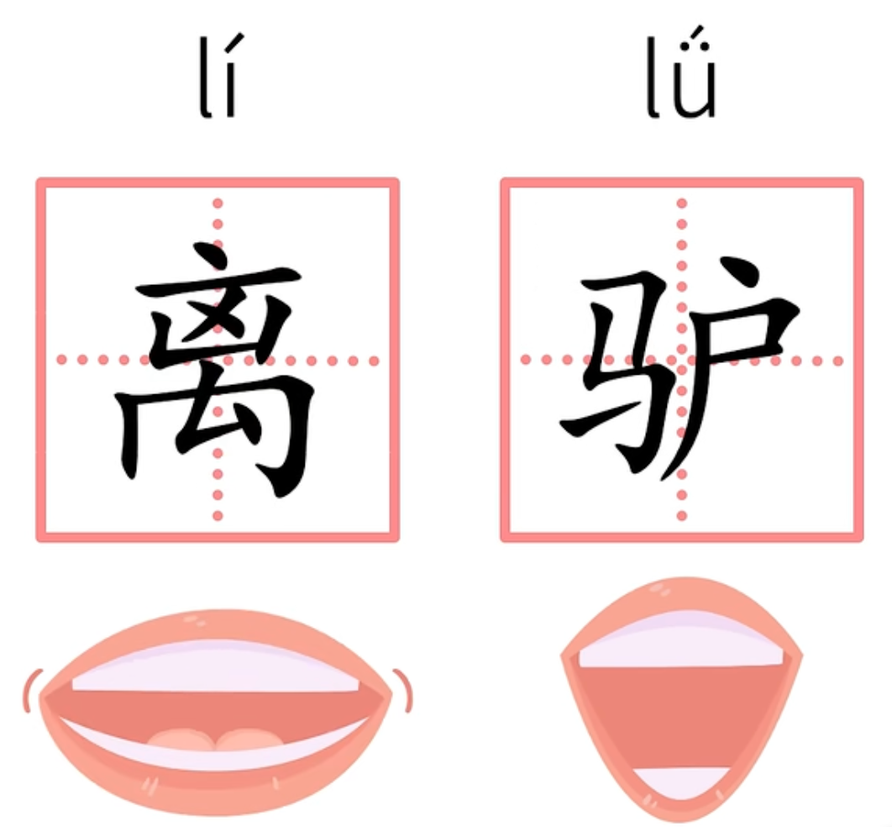

发音时舌头在口腔中的最高点为舌位：

纵向的舌位，即舌位的高低：舌头抬高舌位就高，舌头降低舌位就低。对比下上面那两个字的韵母，发音时舌头和上颚非常接近，所以舌位非常高

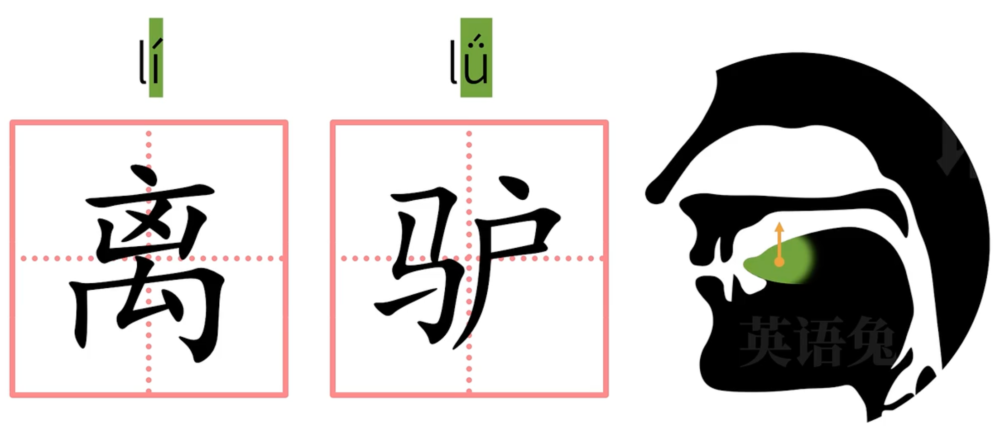

横向的舌位，即舌位的前后。比较下普通话驴的韵母和炉的韵母，它们同样都是圆唇，但是前者是舌位很前的元音，后者是舌位很厚的原因，在发后者的元音时舌头后缩了：

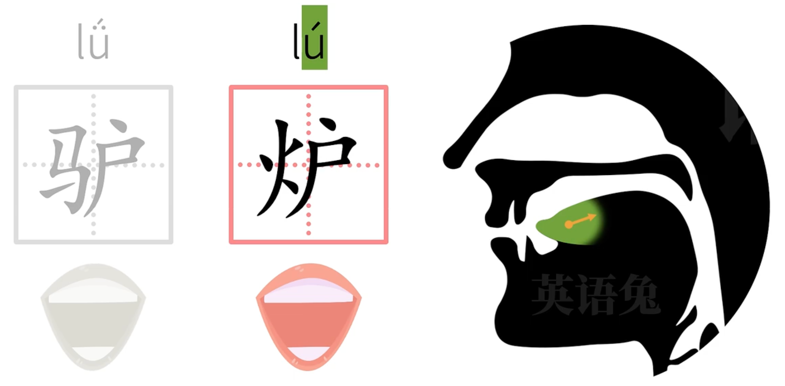

嘴巴张开的大小，归根结底是由舌位的前后高低决定的：

如果把舌位抬高，使其尽可能接近上颚但又不碰到，就需要把口腔容积变小，嘴唇的嘴角就会相应的往旁边拉伸，唇形变扁，嘴巴开口变小：

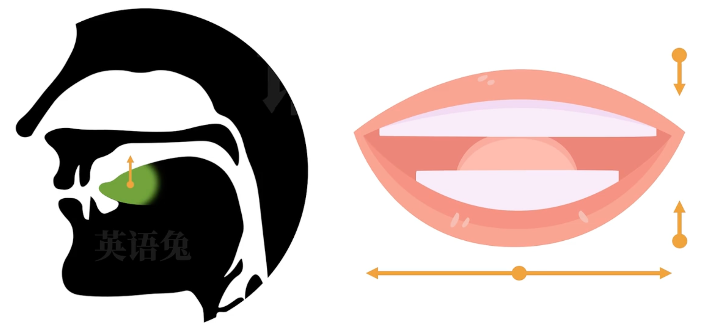

如果把舌位降低，使其尽可能远离上颚，那么就需要把口腔容积变大，嘴巴开口更大：

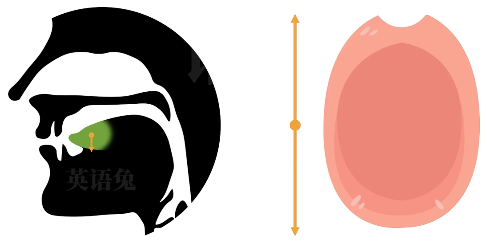

## 元音图

有一种图可以直观地用视觉的方式把元音三要素表现出来，从而能更好更精确的学习发音，这就是元音图（vowel diagram或vowel chart）

可以把元音发音时，感知到的舌位高低和前后，标注在一个上大下小的元音四边形内：

* 舌位高而前的元音，可以标注在四边形的左上方
* 舌位高而后的元音，可以标注在四边形的右上方
* 舌位低而前的元音，可以标注在四边形的左下方
* 舌位低而后的元音，可以标注在四边形的右下方

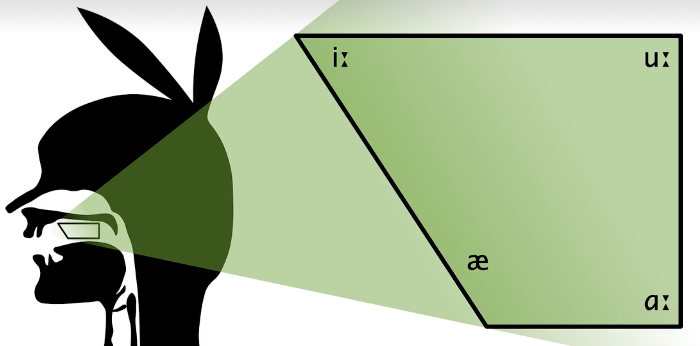

这个四边形之所以上大下小，是因为高元音舌位横向差别要大于低元音横向舌位差别。

圆唇度也可以体现在四边形中，规则是将同一个舌位上不圆唇的元音标注在前，把圆唇的元音标注在后

## i:和i

该音在这些单词中出现：bee、fee、pea、read、meat、lead

i:是DJ音标中的长元音，而且在DJ音标老版和新版中相同

它是一个舌位前、高的元音，开口很小，舌位需上抬，非常靠近硬腭，但是注意不能与硬腭接触，否则就成了辅音。发音时不圆唇，嘴角要向两侧拉伸，带点微笑的感觉（这也是为什么很多外国人拍照时要说cheese）

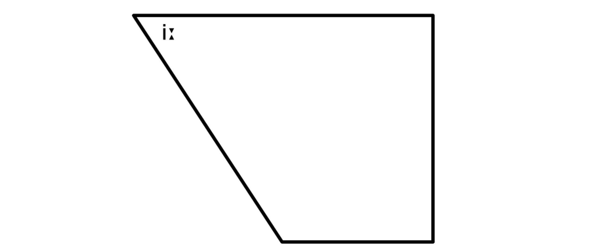

它的发音和普通话中币的韵母基本一致，但英语的i:要发音更长

DJ音标的i:对应KK音标的i，KK音标里面根本没有长音符号，KK音标中元音的时长视具体所在单词的情况而定

i是i:的短版本，如happy的末尾元音，舌位和i:基本一致，只是时长通常很短

英音的元音长短通常很明显，而美音则没那么明显，所以源于英音的DJ音标有长音符号:（实际上是两个三角形），而源于美音的KK音标没有长音符号

## ɪ

该音在这些单词中出现：lit、hit、fish、bit、fit、pit

在老版DJ音标中，它写作i，但是它和i:一点关系都没有

这是一个舌位前、高的元音，但相对i:来说更低更后，舌头上方的空间更大。它无需圆唇，嘴巴只需要放松微张。ɪ的发音要比i:更放松，即舌头和口腔肌肉不那么用力，嘴角不用像i:那样向两边拉伸

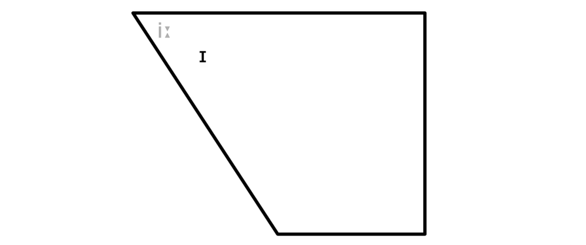

从i:到ɪ大概就像是脸上渐渐失去微笑的感觉：

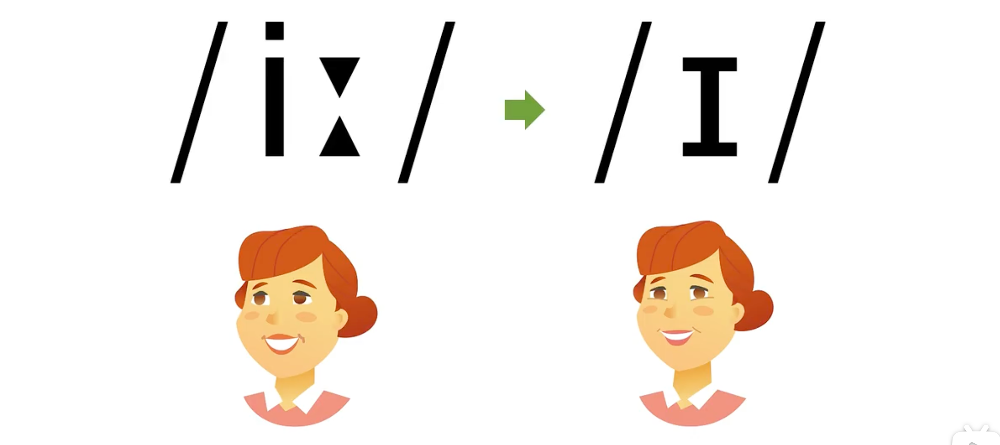

它和普通话中军训时教官喊的一,一,一二一中那个一发音一样

DJ音标的ɪ在KK音标中也写作ɪ

## u:和u

该音在这些单词中出现：too、food、loose

u:是DJ音标中的长元音，它在新版DJ音标和老版DJ音标是一样的

传统英音中的u:舌位后、高，开口很小，需圆唇，它和普通话中姑的韵母发音基本一致，只是拼音更加圆唇。但是现代英音中这个音舌位前移：

这一舌位前移也导致圆唇度的进一步丧失，即嘴型略扁

u:也会出现在这些单词中：music、news、student，这些发音听上去和too中的u:有点不同，是因为这三个词u:之前有个j，j是辅音，j和u:连在一起就是ju:。在美音中，某些单词中ju:的j是可以不读的，如news、student中的j就可以被省略

u:的常见错误发音是按照汉语中呜来读，按呜读嘴唇过于外凸，唇形太圆

DJ音标中的u:对应KK音标中的u

u:也有短音版本u，如influence，u和u:相同舌位，但缩短时长

## ʊ

该音在这些单词中出现：book、look、good、took、bush、would

ʊ是一个DJ音标中的短元音，俗称马蹄u。在老版DJ音标中写作u，新版DJ音标中写作ʊ

它是一个舌位后、高的元音，但相对传统英音中的u:来说，更低，更前，舌头上方空间更大，它也需要圆唇，只需微微圆唇，发音更为放松：

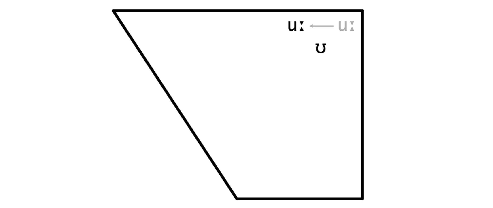

普通话中是没有这个音的，它不能读作汉语中的呜，它和u是不一样的，对比以下两组发音：

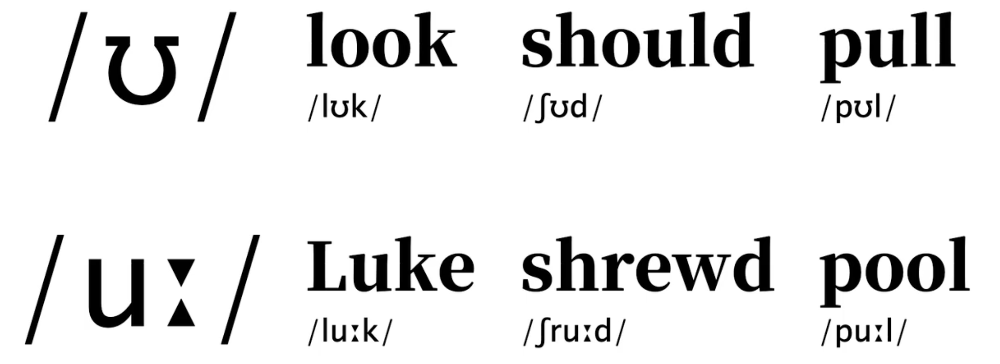

ʊ在KK音标中的对应音标是U

## e

该音在这些单词中出现：bed、get、pet

e是DJ音标中的短元音，它是一个舌位前、中高的元音，舌位比i:低，开口比i:大，舌头上方的空间更大：

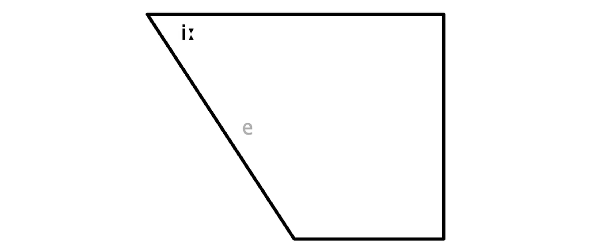

发e这个音，不需要圆唇。

它在普通话中出现在很多汉字的结尾，如也、月、列的尾音，不要读成汉字中的爱

DJ音标中的e对应KK音标的ɜ（左右反过来）：

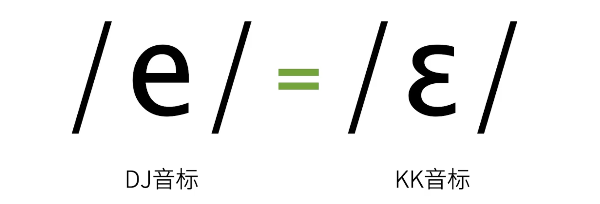

## ɜ:

该音在这些单词中出现：her、person、learn、bird、word、fur

该音在老版DJ音标中写作ə:，新版写作ɜ:

它是一个舌位前后高低都基本在中间的元音，发这个音不需要圆唇：

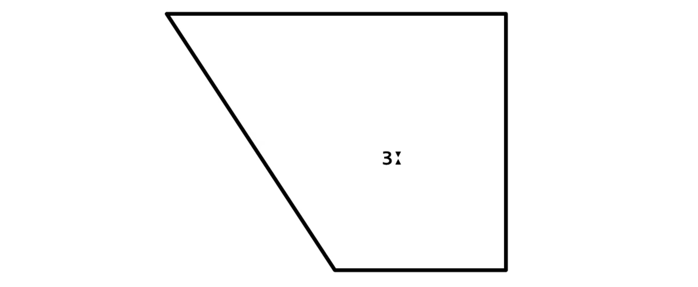

它听起来有点像中文的饿，但是拼音比ɜ:舌位高一些，后一些

英音中包含ɜ:的词基本都在这个音后有字母r：

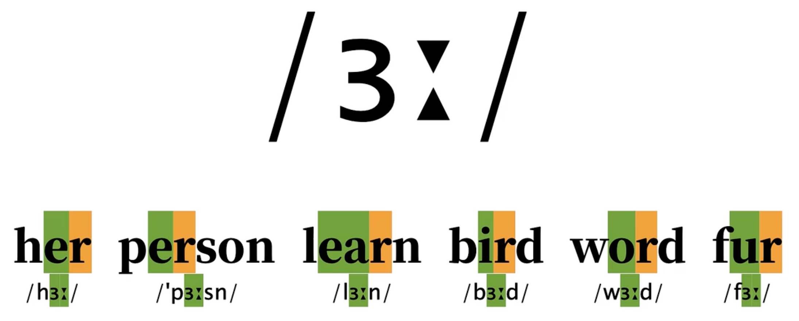

这个元音在美音中会变成r化元音，在KK音标中写作这样（也有写作3r的）：

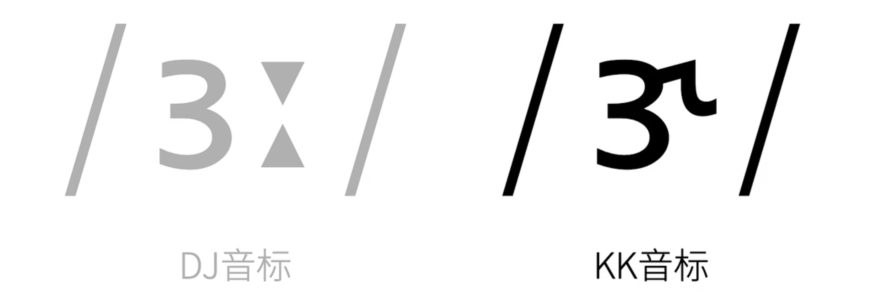

此时，用DJ音标给美音注音使用ɜ:r。

下面一系列词的DJ音标标注英音、DJ音标标注美音、KK音标标注美音的区别：

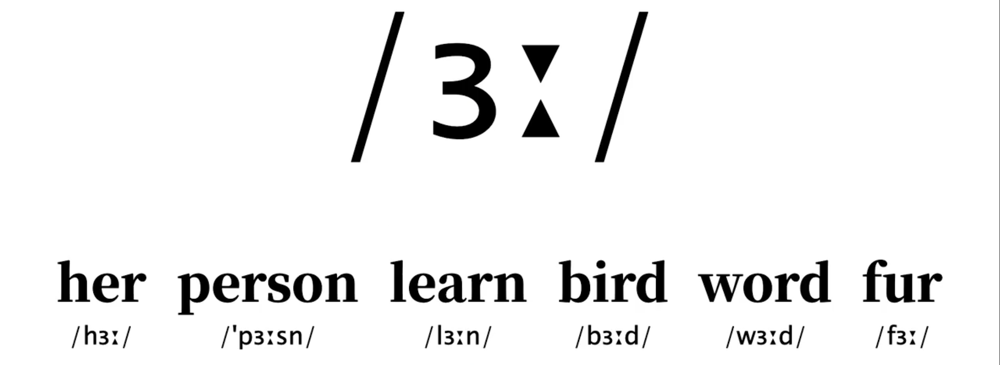

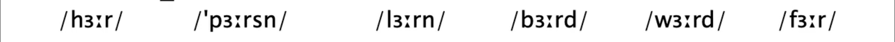

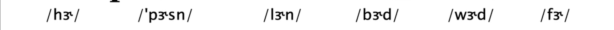

R化元音和普通话中的儿化音的区别：

* 儿化音是发出ə之后再卷舌
* R化元音ɜ:r是在发元音的同时卷舌

## ə

该音在这些单词中出现：about、problem、easily、memory、supply、analysis

ə在老版DJ音标和新版DJ音标中都是ə

它是一个舌位前后高低都在中间的元音，所以它被称为中央元音：

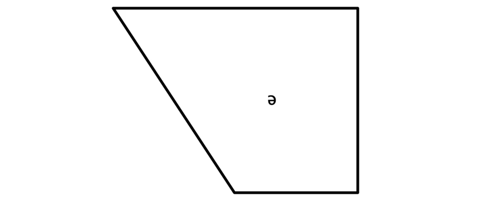

发这个音不需要圆唇，嘴自然张开，唇和舌都自然放松，轻吐一口气，让声带振动，这种最放松状态下发出来的音就是ə。如果将这个音重读（舌头和口腔肌肉紧张）并读足时长，它基本上就成了另一个元音ɜ:

英语中所有的元音字母（及半元音字母y）都可能发中央元音ə的音：

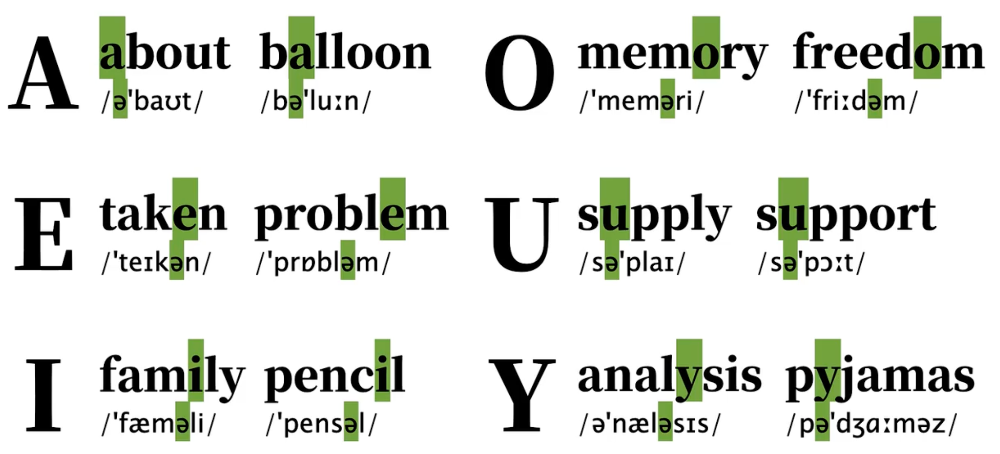

不要把对应元音字母读成元音字母本来的读音。

ə在KK音标中对应的音标也是ə

在美式英语中，如果中央元音后接字母r，两者就会合成一个r化元音，在KK音标中写作：

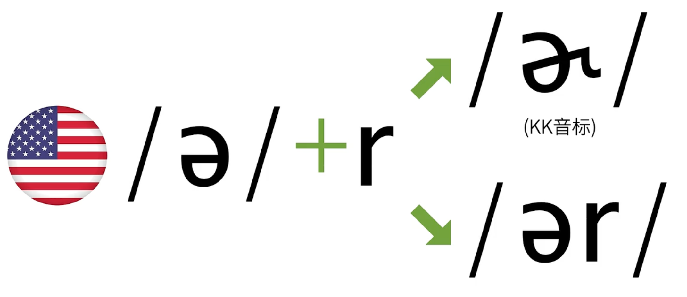

对比同样单词在英音和美音中的DJ音标：

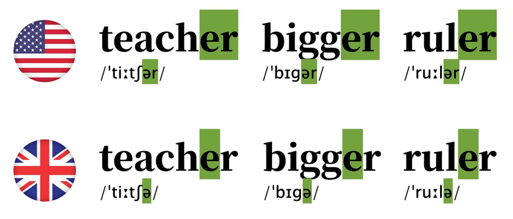

ə是英语中出现频率最高的音，是因为很多非重读音节里的元音都会弱化为中央元音。英语之所以会出现这种元音弱化的现象，或者说弱读，从根本上说是为了让说话者在不需要强调某个音时用它代替。在日常说话中，很多本来没有ə的单词，在句中元音都会变成ə，比如这句话中，can、to、it都不会读它们本来的音，而是将元音弱化为ə：

因为弱读的存在，英语形成了一种特殊的节奏：重音等时性语言，即句中重读音节之间的时长基本相等，所以它的出现频率极高，交谈中每几秒就会出现一次

## ʌ

该音在这些单词中出现：but、hut、must

ʌ在老版和新版的DJ音标里是一样的

这个音标的英美发音不同，英音舌位稍稍低于中央元音ə，而美音舌位和中央元音区别很小：

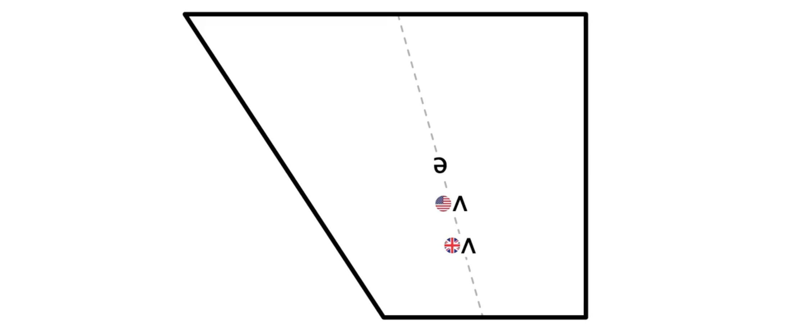

发这个音无需圆唇

它和拼音中啊的读音很像，ʌ的舌位要比拼音啊高一点，注意不要读成啊

ʌ在DJ音标和KK音标中注音符号相同

## ɔ:

该音在这些单词中出现：caught、bought、law

ɔ:在老版和新版DJ音标是相同的

它是一个舌位后、中高的元音，需圆唇

英音中的ɔ:和普通话中的哦基本一致，只是时长往往更长，注意不能读成奥

这个音的英美读法不同，而美音内也有两种读法，很容易混淆

DJ音标的ɔ:，对应KK音标的ɔ，也就是去掉长音符号。美音中的ɔ舌位要更低：

在美国很多地区，比如西海岸，会把很多单词中的ɔ变成ɑ：

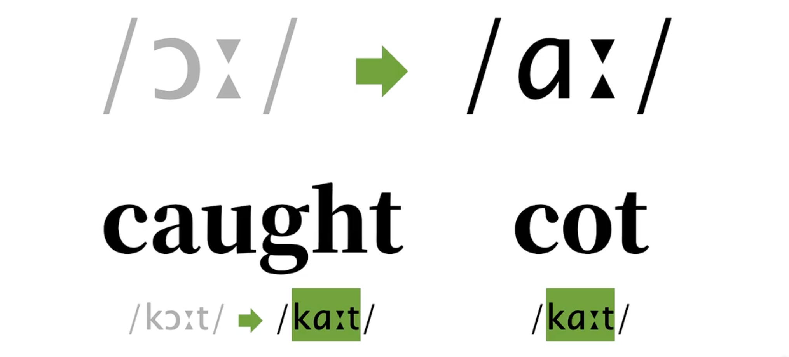

这种现象被称为Cot-Caught合并

## æ

该音在这些单词中出现：bad、fat、pat

æ在老版和新版DJ音标里是一样的

它是一个舌位前、较低的元音，比e更低：

很多英国人会把æ向a靠拢，也有的会向e靠拢：

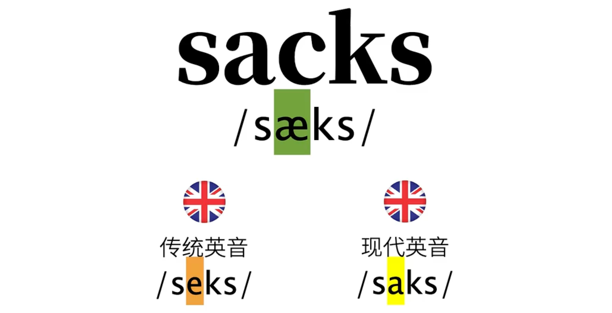

不能将它发为汉语中爱的读音，那样就变成了aɪ

æ在KK音标中也是这个符号，美音中æ舌位在某些辅音（尤其是鼻音）前，有舌位上升的趋势，所以嘴型更扁一些，嘴角向两侧伸展多一些：

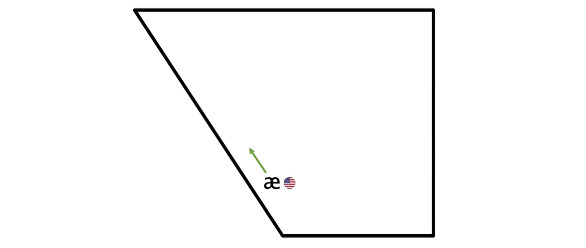

有的美国人会将æ读成eə。另外，很多单词在英音中包含ɑ:的音在美音中发æ：

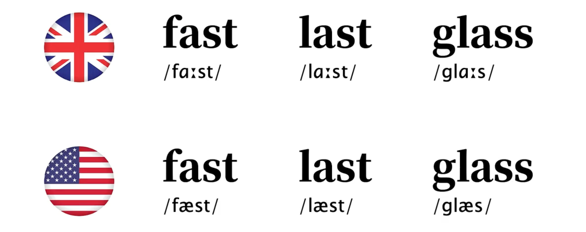

## ɑ:

该音在这些单词中出现：father、fast、glass

请注意不要把ɑ和a弄混，这两个是不同的音标：

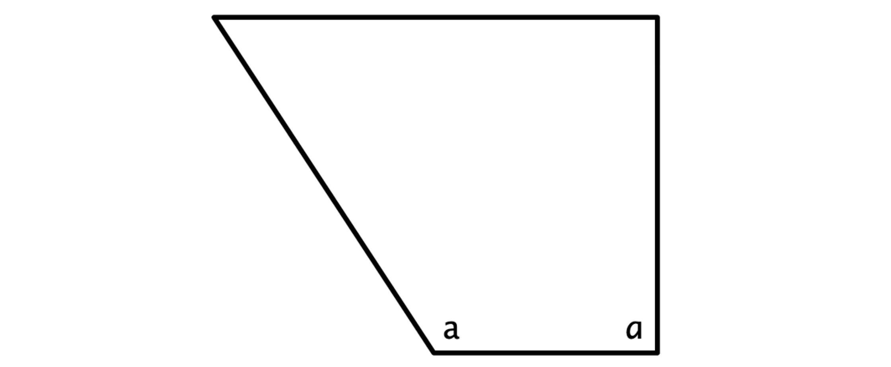

ɑ:在老版DJ音标和新版DJ音标中是一样的

它是一个舌位低、后的音，无需圆唇，开口较大（但不咧嘴）

这个音和普通话中的啊相似，但不完全相同，汉语拼音的啊的舌位更靠前，ɑ:发音更靠口腔后部舌根处，而且通常发音时长要足够长。

如果ɑ:这个音的舌位前移至口腔最前最低端，就成了a，它只在双元音中出现：

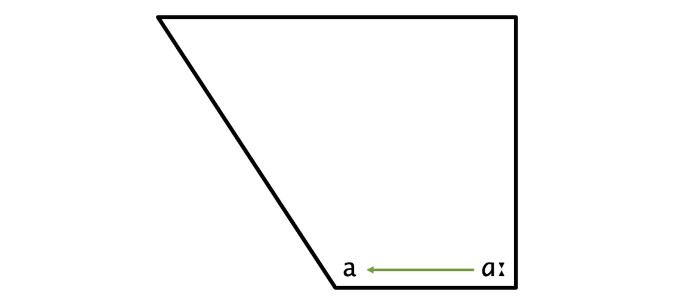

DJ音标ɑ:在KK音标中对应音标是ɑ

很多词在美音中的ɑ:，往往对应英音中的ɒ，这也是英美音最显著的区别之一，例如：

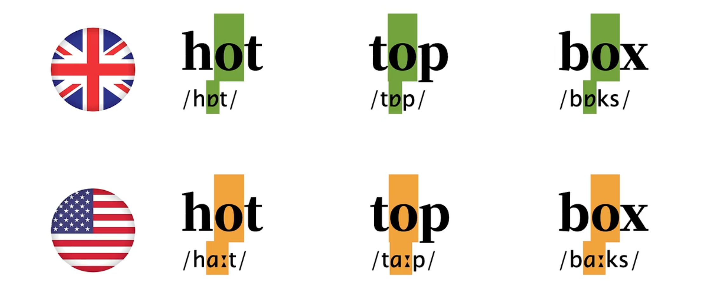

 如果这个元音后面跟字母r，在美音中会变成r化元音：

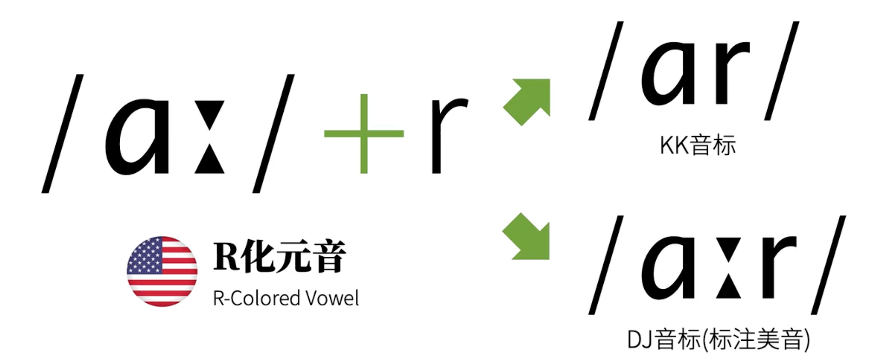

例如：

## ɒ

该音在这些单词中出现：top、hot、lot

ɒ在老版的DJ音标中写作c（水平翻转的c）

它是一个舌位低、后的元音。它是一个有显著英音特征的音：

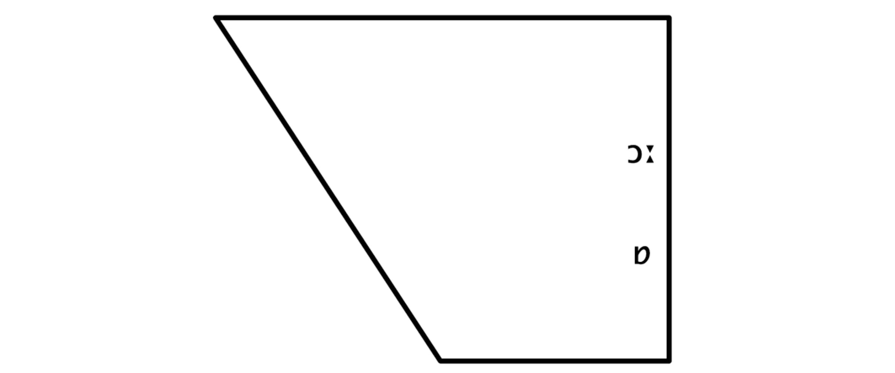

ɒ不能简单读成普通话中的奥，奥是一个双元音，而且也不能将其理解为短着读的ɔ:

这个音在KK音标中没有对应音标，因为在英音中含有ɒ的单词在美音中都不含这个音，英音中的ɒ对应在美音中读ɑ:

## eɪ

该音在这些单词中出现：make、date、cake

它是一个双元音，它在老版DJ音标中写作ei

双元音代表这个音有两个元音的特质，具体表现在发音过程中舌位的变化，即发音时从e的舌位（往往是更高一点的舌位）自然平滑的往ɪ的舌位方向移动，起始音更重：

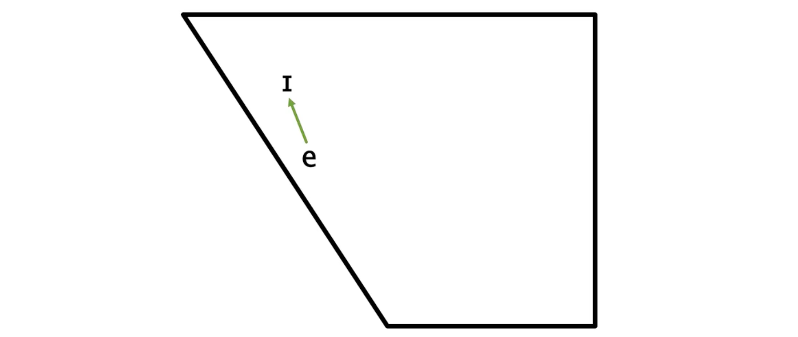

这里说的自然平滑的移动，是指在发音的过程中变换舌位，口型收缩，并不是先后发出两个独立的元音

它和普通话嘿中的复韵母很像，它们的区别较小，只是eɪ发音时起始音要更向两侧拉伸

有一个常见错误时：当鼻音n出现在eɪ后时，有人会省略掉ɪ这个音，直接读成en

ei在KK音标中对应音标是e，即KK音标的e是双元音

## ɔɪ

该音在这些单词中出现：boy、toy、soy

ɔɪ在老版DJ音标中写作ɔi

发音时，从ɔ:的舌位，自然平滑地往ɪ的舌位方向移动，起始音更重，往往还在不到ɪ的时候就结束：

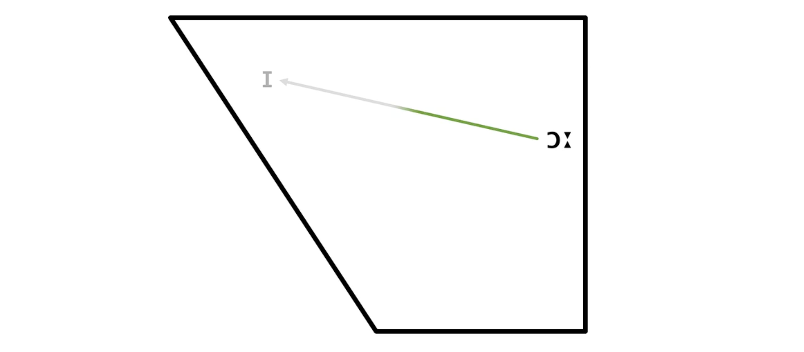

有一种常见错误发音是将ɔɪ中ɪ的音发成e

ɔɪ在KK音标中也写作ɔɪ，在美音中ɔɪ的起始舌位往往比美音ɔ:的舌位高一点点

## aɪ

该音在这些单词中出现：bike、nice、time

aɪ在老版的DJ音标中写作ai

发音时，从比a靠后一点点的舌位（和普通话的啊很接近），自然平滑地往ɪ的舌位方向移动（终止舌位往往也达不到ɪ），起始音更重：

a不以单元音的身份出现

aɪ和普通话中爱的发音很相似，但aɪ只是比爱的起始舌位稍微靠后一点，这表现在普通话爱的起始位嘴角更向两侧拉伸，而aɪ则听上去更饱满一些

aɪ在KK音标中的对应音标也写作aɪ

## aʊ

该音在这些单词中出现：how、cow、allow

aʊ在老版DJ音标中写作au

aʊ发音时，从比a靠后一点点的舌位，自然平滑地往ʊ的舌位方向移动，起始音更重：

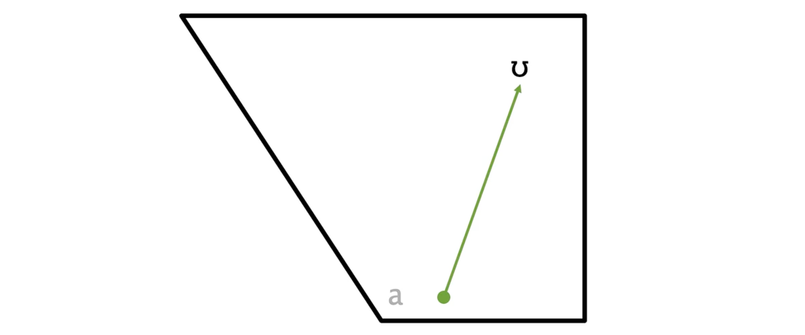

aʊ和普通话的奥很像，aʊ的起始舌位比拼音奥稍前一点，这往往表现在aʊ的起始位嘴角更向两侧拉伸。

注意不能用普通话的哦取代这个音

aʊ在KK音标中的对应符号也写作aʊ

## əʊ和oʊ

该音在这些单词中出现：open、hope、post

DJ音标为英音注音时写作əʊ，为对应的美音注音时写作oʊ，两者读音有差别

əʊ在老版DJ音标中写作əu

əʊ发音时从中央元音ə的舌位，自然平滑地往ʊ的舌位方向移动，起始音更重：

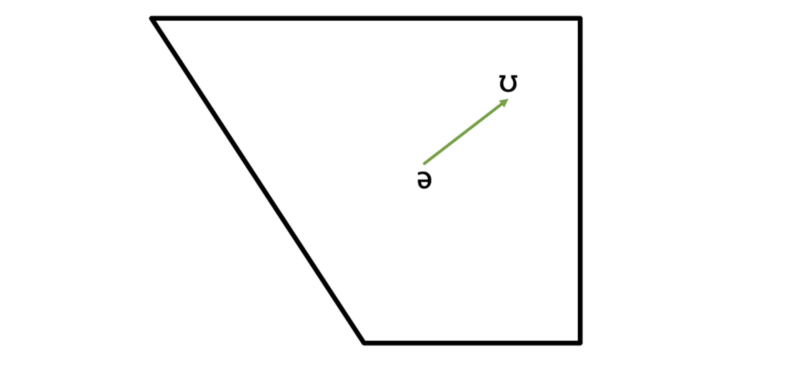

əʊ和普通话的欧很像

oʊ的发音起始舌位更高更后，且圆唇，和普通话的哦很像

注意读əʊ不要读成aʊ

KK音标中aʊ对应音标写作o，以下是DJ音标和KK音标标注英音美音时的区别：

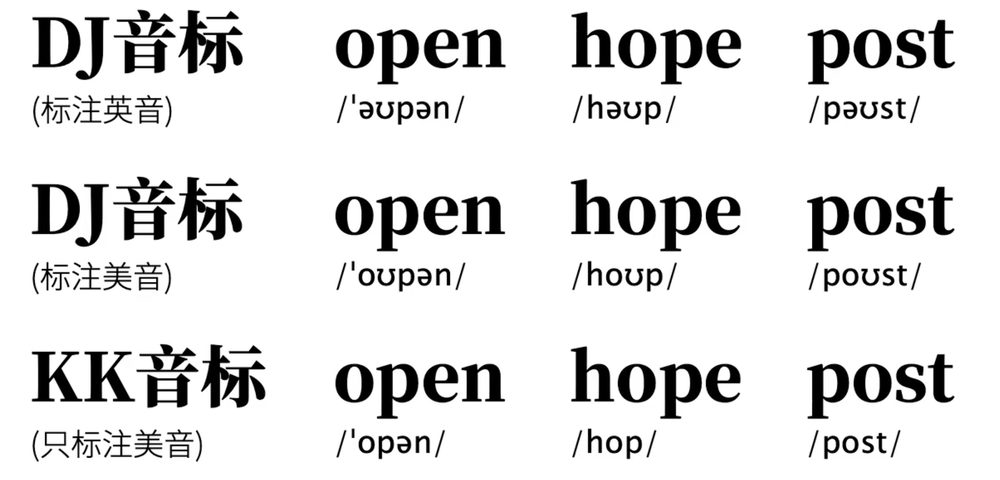

## ʊə

该音在这些单词中出现：tour、poor、moor

ʊə在老版DJ音标中写作uə

ʊə发音时从ʊ的舌位，自然平滑地往ə的舌位方向移动，起始音更重：

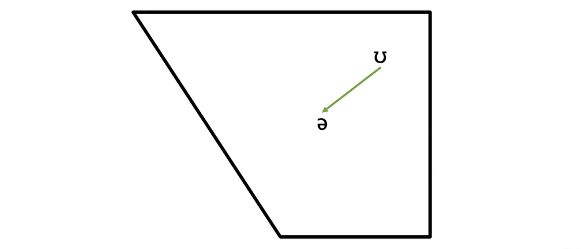

ʊə这个音也会在这几个单词中出现：pure、cure、lure，它们听上去和上面三个单词不太一样，是因为ʊə前面有个j，j是个辅音，因为有元音的特性，所以也被归类为半元音

ʊə不要读成普通话过的复韵母，此外ʊə这两个音读的不要太分开，要连贯

英音中包含ʊə的词，基本都在这个字母后有字母r，所以这个元音在美音中会变成r化元音，此时KK音标写作Ur，DJ音标给美音注音时用ʊr

英音中很多单词中的ʊə（但不是全部），往往也有第二种发音，可以直接读作ɔ:，例如以下两种发音都正确：

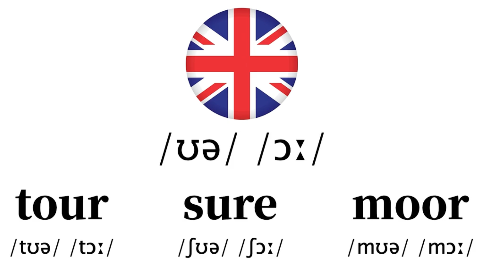

美音的情况相似：

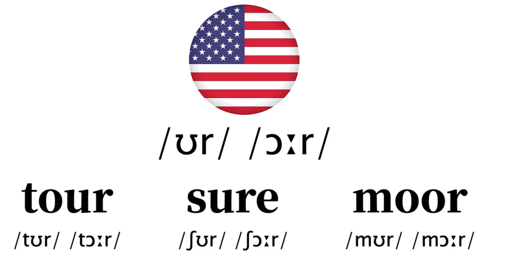

## eə

eə在这些单词中出现：hair、pair、chair

eə在老版DJ音标中写作ɜ（水平翻转后）ə

eə发音时从e的舌位，自然平滑地往ə的舌位方向移动，起始音更重：

注意不要把eə的起始音读作普通话的爱，不要把终止音读成尔

注意在读英音时，单词拼写即使出现字母r，前面的元音也不会变位r化元音（不要看到r就卷舌）

英音中包含eə的词基本上在这个音后都有字母r，所以这个元音在美音中会变成r化元音：

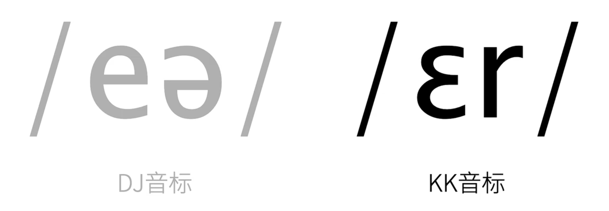

用DJ音标给美音注音会写作er或eər

## ɪə

ɪə在这些单词中出现：dear、fear、here

ɪə在老版DJ音标中写作iə

ɪə发音时从ɪ的舌位，自然平滑地往ə的舌位方向移动，起始音更重：

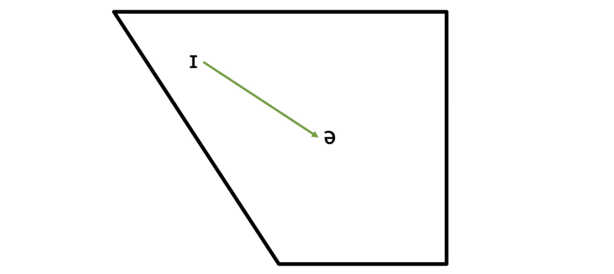

ɪə发音时注意，不要把它的起始音读作医，把终止音读作饿

英音中包含ɪə的词，大多后面都有字母r，所以这个音在美音中会变成r化元音，在KK音标中写作ɪr，而用DJ音标给美音注音使用ɪər或ɪr

也有的包含ɪə的词没有r，所以在美音中也不会变成r化元音，此时英美音没有区别，如idea：

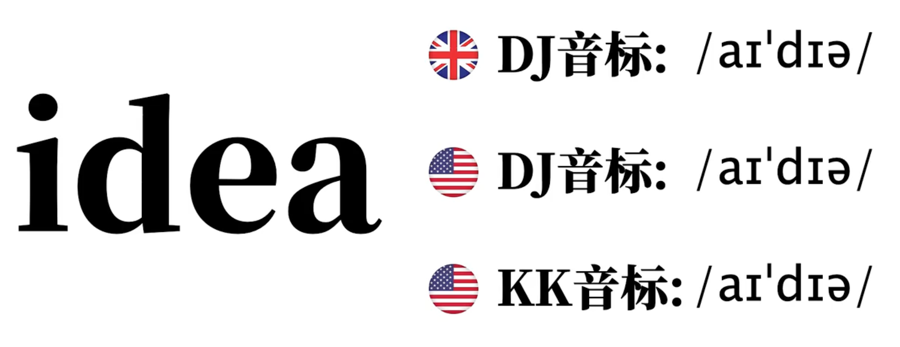

## 辅音三要素

辅音（consonants）：发音过程中，气流在全部时间或一部分时间被阻碍，所发出的音

从辅音阻碍气流的角度，可以把发辅音分为三个阶段：

* 成阻：气流被阻塞
* 持阻：气流持续向外冲，但仍被阻塞

* 除阻：阻塞被去除，气流冲出

以菠的声母拼音b举例：

* 成阻阶段就是把气流阻塞在闭拢的双唇后
* 持阻阶段就是维持双唇闭拢，但仍向外吐气
* 除阻阶段就是双唇张开，释放气流

影响辅音的三个基本要素是：清浊、调音部位、调音方式

1、清浊：发辅音时声带是否振动，不振动是清辅音，振动是浊辅音

根据声带是否振动，可以给单个音节分为：

* 浊音（voiced sound）：由声带振动作为音源而发出的音
* 清音（voiceless sound）：在气流通过声门时不振动声带，直接给气流放行，这样发出的音

汉语中是没有清浊的概念的，实际上清音更细致的定义是：先除阻，然后声带才振动，才是清音，反之是浊音。一个典型的例子是拼音b和英语b：

* 拼音b是一个清辅音，双唇闭拢阻塞气流，和声带振动几乎在同时
* 英语音标b是一个浊辅音，双唇闭拢阻塞气流时，声带就已经先开始振动了

因为汉语只发清辅音，所以很多英语发音都不太对；而外国人因为习惯发浊音，汉语发音也有问题

2、调音部位

即发辅音的时候，阻碍气流所用到的主要发音器官

例如b主要靠双唇阻碍气流，它的调音部位就是双唇

普通话夫这个音需要上牙齿咬住下唇，阻碍气流，它的调音部位是唇齿

下面是很多作为调音部位的发音器官：

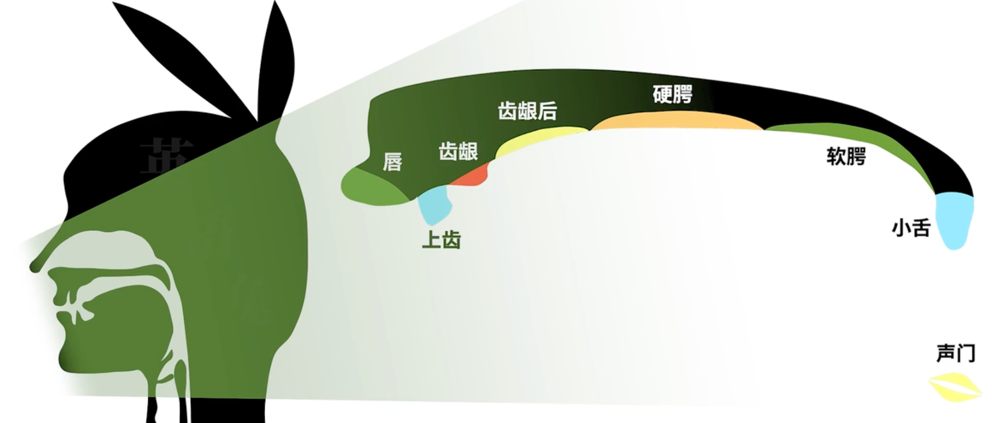

3、调音方式

即发音器官怎么阻挡气流、怎么释放气流

例如b发音时需要完全阻碍气流，通过这种方式提高气压，之后突然释放气流，发出响声。这种在成阻时完全阻塞气流再释放而发出的音，一般被称作塞音，或爆破音

有时也会出现，不完全阻碍气流，而是让气流持续通过一个发音器官形成的通道，如普通话斯的声母就是用舌尖和牙齿形成一个缝隙，让气流通过，从而发出响声。用这样的调音方式发出的音被称作擦音或摩擦音

而普通话呢的声母，需要把气流送入鼻腔中才能发出，这种调音方式发出的音称作鼻音

调音方式还有许多其他

除了辅音三要素，还有一些次要的因素可以把辅音区分开来，比如送气/不送气、辅音长度、气流机制等

## p&b

p在这些单词中出现：peak、pet、pig

p是个清辅音，调音方式属于塞音/爆破音，调音部位是双唇，它发音的三个阶段：

* 成阻：气流阻塞在闭拢的双唇后
* 持阻：维持双唇闭拢，但仍向外吐气
* 除阻：双唇张开，释放气流

p在英语中有三种主要情况：

1、送气：如果单词中字母p后有元音，比如peak，这样的p在除阻时会有较强的向外气流释放，像p这样的音叫送气辅音。它和普通话婆的声母就是同一个送气辅音

2、不送气：如果p前有字母s，那么这样的p通常是一个不送气辅音，如speak。这里面的所谓不送气，不是说真的没有气流释放，而是说没有像送气辅音那样，在除阻阶段有强烈的气流释放。speak中的不送气辅音p就是普通话中菠的声母，同样的例子还有on top of中的p听上去像是拼音b，其实也是不送气的清辅音。不要误以为这些例子中的p是浊辅音，其实只是不送气的清辅音

3、无声除阻：如果单词里的p后紧跟某些辅音时，字母p所对应的p在除阻时只有很微弱的气流释放，甚至不释放气流，以至于听不见，往往只做口型，却听不见声音，例如trapdoor、help me中的p。国内很多人也称之为不完全爆破，或失去爆破（失爆）

类似这种，p发音的不同情况，称之为同一个音位上有不同的音位变体，也叫同位异音。英语音标里有个别音标指代的音位有多个常见音位变体，主要出现在辅音中的爆发音（塞音）中，而元音的常见音位变体很少，只有元音延长、元音鼻音化等

b在这些词中出现：beak、bed、big

b是一个浊辅音，与之相对的，拼音b其实是一个不送气的清辅音，两者要区分开来

发音时的技巧：需要确保或者加强声带振动，可以先哼鸣，感受声带的振动，然后再加上双唇的动作

虽然理论上b是一个浊辅音，很多母语人士也会因为地区不同也会发成请辅音，清音和辅音其实不算一个严重的发音错误

注意发p或b结尾的单词时，不要在单词结尾加一个不存在的元音

p/b在DJ音标和KK音标中的符号一致

## t&d

t在这些单词中出现：tip、tea、test

t是个清辅音，从调音方式来说是塞音/爆破音，调音部位是舌和上齿龈

t的音位变体很多：

1、送气：如果单词中字母t后有元音，比如top，此时t和普通话兔的声母一样

2、不送气：如果t前有字母s，比如stop，此时t和普通话度的声母一样，拼音d就是一个清辅音，英语d是一个浊辅音

3、无声除阻：如果说话时t后紧跟某些辅音，t对应的是无声除阻，如setback、forget me

4、闪音：在美音中，元音之间的字母t在非重读音节中通常发闪音，如water、better、a lot of，发闪音时，让舌尖向上卷起，在上齿龈处轻轻一弹，即瞬间阻塞气流并立即释放

5、喉塞音：在英国的某些方言中，t常被读为喉塞音，喉塞音是用声门阻住气流，像是把声音卡在喉咙里一样，如water、better、a lot of，其实就是阻住发音，停顿一下，如普通话西安，也会在两个字中加一个喉塞音，以示界限，否则就成了仙

6、鼻音除阻：如果字母t后紧跟鼻音n，t的除阻可以直接和鼻音衔接上，即把气流释放入鼻腔，如eaten、button、certain，这些鼻除阻发音往往出现在口语中，读成正规的也是没问题的

7、边音除阻：如果字母t后紧跟边音，那么t的除阻可以直接和边音衔接上，即把气流通过舌两侧释放，如spotless、butler、little、kettle

8、省略：在美音中，鼻音n之后的字母t往往听不见，如winter、interview，如果读出这个音也没错

d在这些单词中出现：dip、deep、desk

d是个浊辅音，注意要和拼音d的清辅音区分开来，浊辅音需要提前一点振动声带

d也有几个主要的音位变体：

1、无声除阻：landmine

2、闪音：medal，读闪音时medal和metal往往听不出区别，所以不是美音中的t读d，而是两者都有可能读成闪音

3、鼻音除阻：sudden

4、边音除阻：badly

t/d在DJ音标和KK音标中的符号一致

## k&g

k在这些单词中出现：kit、kate、cup

k是个清辅音，从调音方式来说属于塞音/爆破音，但调音部位是软腭

k有以下音位变体：

1、送气：如果单词中字母k后有元音，如kite，此时k和普通话开的声母一样

2、不送气：如果k前有字母s，如sky，此时k和普通话该的声母g一样，拼音g就是一个清辅音

3、无声除阻：如果字母k后紧跟某些辅音时，此时k对应无声除阻，如doctor、make dinner

g在这些单词中出现：git、gate、gut

g是一个浊辅音，发音时需振动声带，不要把它和拼音g搞混，拼音g是一个清辅音

k/g在DJ音标和KK音标中的符号一致

## m&n&ŋ

这一组音标单独发音时区别不明显：

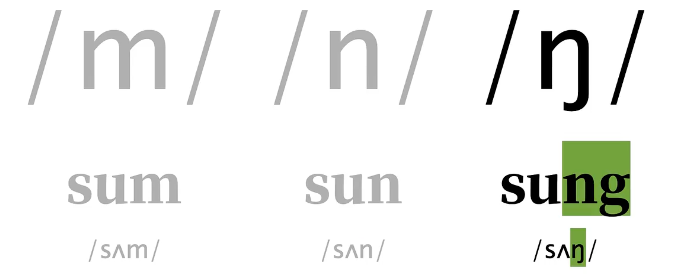

m是个浊辅音，从调音方式来说属于鼻音，即气流要从鼻腔中通过，调音部位是双唇：

* 如果m出现在元音之前，则和中文妈的声母一样，此时发音时双唇闭拢，舌头平放在口腔里，气流从鼻腔中通过，声带振动；

* 如果m出现在元音之后，和元音之前类似，区别是双唇闭拢，轻微通过鼻子出气，声带振动通常更弱

n是个浊辅音，从调音方式来说属于鼻音，调音部位是上齿龈，在发音时舌尖及舌前部边缘部位要抵住上齿龈，这一点和发t、d一样：

* 如果n出现在元音之前，则和中文拿的声母一样，此时双唇自然分开，舌端抵住上齿龈，气流从鼻腔中通过，声带振动；

* 如果n出现在元音之后，则和元音之前类似，但只是舌尖抵住上齿龈，轻微通过鼻子出气，声带振动通常更弱

ŋ是个浊辅音，从调音方式来说属于鼻音，调音部位是软腭，需要用舌后端抵住软腭，这是和n最大的区别。有时候，在发完ŋ后舌根下降离开软腭时有除阻的感觉，并伴随轻微的g声，这是因为ŋ和g的调音部位一样，如果有除阻动作的同时声带还未停止振动，那么除阻阶段两者听上去就很像，如sing

读ŋ的时候不能直接省略，要保证读到位

它们在DJ音标和KK音标中的符号一致

## f&v

f在这些单词中出现：fat、fit、ferry

f是个清辅音，从调音方式来说，f属于擦音（摩擦音），调音部位是上齿和下唇

f的发音和中文普通话夫的声母一样，发音时上齿轻轻接触下唇，气流向外通过唇齿之间，声带不振动

v在这些单词中出现：valley、visit、very

v和f的区别仅仅在于，v是浊辅音，f是清辅音，v发音时需要声带振动

它们在DJ音标和KK音标中的符号一致

## s&z

s在这些单词中出现：sip、soon、soup

s是个清辅音，从调音方式来说，s属于擦音（摩擦音），调音部位是上齿龈

它和中文斯的声母一样，发音时舌尖接近上齿背，舌面两侧接触上齿龈，让气流通过上下齿的齿缝，声带不振动

z在这些单词中出现：zip、zoom、zoo

z和s的区别仅仅在于，z是浊辅音，s是清辅音，z发音时需要声带振动。注意和拼音z要区分开，拼音z是一个塞擦音，即阻塞又摩擦气流

注意，英语中很多s字母其实是z读音，而不是s，包括大多数复数，如his、apples

它们在DJ音标和KK音标中的符号一致

## θ&ð

θ在这些单词中出现：three、thin、thank

θ是个清辅音，从调音方式来说，θ属于擦音（摩擦音），调音部位是牙齿

发θ这个音时，舌尖不在上下牙齿后方，而是在上下齿之间（即被轻轻咬住），让气流通过舌尖和牙齿的缝隙向外冲出，声带不振动

ð在这些单词中出现：there、that、those

θ和ð的区别在于，ð是浊辅音，θ是清辅音，ð发音时需要声带振动。注意这两个音不能读成s和z，它们是很有英语特色的音，这两个音是否准确也是口语是否标准的关键

它们在DJ音标和KK音标中的符号一致

## ʃ&ʒ

ʃ在这些单词中出现：mesh、fresh、leash

ʃ是个清辅音，从调音方式来说，ʃ属于擦音（摩擦音），调音部位是齿龈后

发ʃ这个音时，舌尖要接近上齿龈后，气流从舌头、硬腭和上齿龈的缝隙中通过，产生摩擦成音，声带不振动。

ʃ和普通话中史的声母非常像，区别在于拼音sh的调音部位更后一点，即更接近硬腭，更卷舌

ʒ在这些单词中出现：measure、pleasure、decision

ʒ和ʃ的区别在于，ʒ是浊辅音，ʃ是清辅音，ʒ发音时需声带振动。

ʒ和普通话中日的声母非常像，区别在于ʒ更贴近齿龈后，气流有摩擦的感觉；拼音r发音时舌头离开上齿龈和硬腭更远，气流更顺畅地通过，属于近音

它们在DJ音标和KK音标中的符号一致

## tʃ&dʒ

tʃ在这些单词中出现：chuck、chop、choke

tʃ可以理解为由t和ʃ构成，即t（塞音/爆破音）和ʃ（擦音）混合在一起，所以从调音方式来说，tʃ属于塞擦音（阻塞+摩擦），或者称破擦音（爆破+摩擦），调音部位是齿龈后

tʃ是清辅音，它和普通话吃的声母相似，拼音ch在发音时相对于tʃ，调音部位更后一点，即更卷舌

dʒ在这些单词中出现：jug、job、joke

dʒ和tʃ的区别仅仅在于：dʒ是浊辅音，发音时需声带振动，它和普通话知的声母相似，区别在于dʒ是浊辅音，而拼音zh是清辅音，zh更卷舌

它们在DJ音标和KK音标中的符号一致

## h

h在这些单词中出现：hat、hot、high

h是个清辅音，调音部位是声门，从调音方式来说，它虽然传统上被归入擦音，但它有点特殊，因为发这个音只需要让气流通过声门（两瓣声带的间隙），自然通过声带就好，不需要其他发音器官参与

h的发音和普通话哈的声母相似，但是是有区别的，拼音h的调音部位更靠前，不是声门，而是软腭，发拼音h时，舌后部和软腭形成缝隙，然后让气流通过，摩擦出声

它在DJ音标和KK音标中的符号一致

## w

w在这些单词中出现：was、why、wide

w是个浊辅音，它的调音部位有两处：唇和软腭，发w这个音时，双唇圈起，向外突出，发音时一般有动态的扩张，舌后端也要往软腭的方向抬，保持一定高度。

从调音方式来说，w属于近音，即调音部位只是彼此靠的较近，而不是非常近，形成通道，让气流通过。发w时气流并没有通过任何很窄的通道，不形成气流湍流。相比之下，擦音就需要调音器官靠的很近。

w和普通话我的声母基本一致。

w和元音u:很像，u:舌位高而后需圆唇，平时读w的时候基本也只是多了双唇的动态变化，因此w也被称作一个半元音，它虽然被归为辅音，但其实是有元音特征的

注意不要把w读成v，v是需要上牙齿接触下唇的

它在DJ音标和KK音标中的符号一致

## r

r在这些单词中出现：rat、red、read

r有以下音位变体：

* 齿龈近音：元音前的r，如right，此时r是个浊辅音，调音方式和w一样，属于近音，调音部位是上齿龈。发r时，舌头后卷抬向上齿龈，气流从舌头和上齿龈之间通过，但不至于近到形成气流湍流，不会产生强烈的摩擦感，发音时声带需振动。它和普通话日的声母相似，但拼音r的调音部位比上齿龈更靠后，但还不到硬腭，且英语r通常伴随圆唇动作
* r化：英音中元音后的r，一般不发音或读作中央元音；美音中元音后的r，会让之前的元音变成r化元音，这也是美音的最大特征之一

因为有音位变体的存在，所以不同的r发音可能不同，例如roar中两个r的发音不相同

它在DJ音标和KK音标中的符号一致

## j

j在这些单词中出现：yes、yard、yellow

j是个浊辅音，它的调音方式和w、r一样，属于近音，但调音部位是硬腭

发j这个音时，舌头往上抬向硬腭，气流从舌面和硬腭之间通过，但不至于近到形成气流湍流，不会产生强烈的摩擦感，发音时声带需振动

j和普通话牙的声母基本一致

j和i:也有相似之处，发j时舌头离上颚的距离和元音i:很像，平时读j的时候，基本也只是多了个舌头的动态变化（舌尖远离硬腭的动作），因此j也被称作半元音，它虽然被归为辅音，但其实是有元音特征的

某些地区和人群，尤其是美音，会省略某些字母，如音标t/d//n之后的j，如student

某些地区和人群，尤其是英音，不但不省略t/d后的j，反而把他们合在一起读：

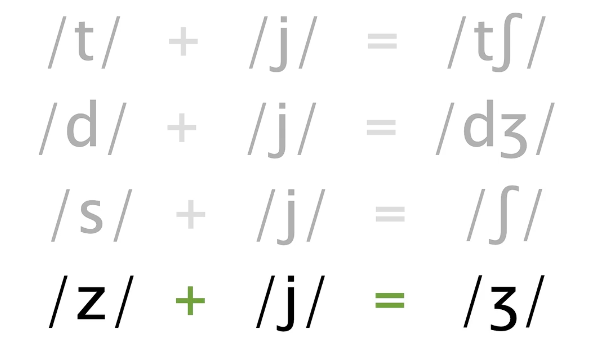

它在DJ音标和KK音标中的符号一致

## l

l在这些单词中出现：lack、lake、all

l有以下音位变体：

* 清晰L：齿龈边近音，l之后会有元音，如light，此时l是个浊辅音，它的调音方式属于边近音（边音），调音部位是上齿龈，发l时，气流主要不是从舌尖和上齿龈的交界处释放，而是从舌头的两侧释放，所以也叫舌边音或舌侧音，且两边的气流通道不窄，不形成湍流，发音时声带需振动。这个音和普通话了的声母一样
* 模糊L：软腭化齿龈边近音，l之后没有元音，尤其是在单词结尾时，和上面的区别是舌尖不会做离开上齿龈释放气流的动作，但是气流还是通过两边释放，可以理解为【清晰L发一半音】，而不是立即释放气流，同时舌后部也会朝软腭抬起。它对连读来说非常重要，在发模糊L时，舌尖一定要有一个抵在上齿龈的动作，如果没有这个动作，就会导致连读不顺畅，如all of it
* 不发音L：很多单词里的l不发音，如calm、salmon

它在DJ音标和KK音标中的符号一致

## ts&dz

ts在这些单词中出现：bats、dates、kites

ts是清辅音，ts和普通话词的声母一样

dz在这些单词中出现：bands、deeds、kids

dz和ts的区别仅仅在于，dz是浊辅音，声带需振动。dz和普通话资的声母相似，区别在于拼音z是一个不送气的清音，而英语的dz是一个浊音

它们只在DJ音标里面有，在KK音标中没有，而是被认为是两个音标的连读

## tr&dr

tr在这些单词中出现：trip、true、tree

dr在这些单词中出现：drip、drew、dream

tr是清辅音，dr和tr的区别仅仅在于，dr是浊辅音，声带需振动。

tr&dr最常见的错误就是把它们和tʃ&dʒ弄混：

可以把tr理解为比tʃ更卷舌，dr也比dʒ更卷舌

它们只在DJ音标里面有，在KK音标中没有，而是被认为是两个音标的连读

这就是为什么有的人说英语音标有48个，有的人说有44个

# 语法概述

## 基本句型

简单句：Simple Sentences，是英语中最简单的句子，它是不能被继续拆分的句子

句子成分：Clause Elements

两个最基本的句子成分是主语subject和谓语predicate，主语代表什么，谓语代表怎么样，这个怎么样其实就是一种动作，这两个组成了简单句。

英语中几种广义的动作如下：

1、可以独立完成的动作：主语+不及物动词，如：Papa Rabbit sleeps

没有承受者的动词叫不及物动词intransitive verbs，sleep就是不及物动词

2、有1个动作的承受者：主语+及物动词+宾语，如：Papa Rabbit likes you

有承受者的动词叫及物动词transitive verbs，like就是及物动词，you是动作的承受者

只有一个宾语的及物动词，叫单及物动词monotransitive verbs

3、有2个动作承受者：主语+双及物动词+间接宾语+直接宾语，如：Papa Rabbit teaches you English

此时句子里面就有直接宾语direct object和间接宾语indirect object，如果这个句子只有直接宾语，即Papa Rabbit teaches English，此时语义已经完整了；而句子只有间接宾语的话，句子就变成了Papa Rabbit teaches you，语义不完整，所以这里English是直接宾语，you是间接宾语

这里面的teaches叫双及物动词ditransitive verbs

4、只有1个动作承受者，但需补充信息：主语+复杂及物动词+宾语+补语，如 Papa Rabbit considers you smart

这个句子里面的smart并不是动作的承受者，如果句子里面没有smart则语义不完整，这种词叫补足语，或者补语complement，更明确一点，在这个例子里面是宾语补足语Object complement

这样需要补语才能表达完整语义的动词，叫复杂及物动词complex-transitive verbs

5、非“动作”：主语+系动词+表语，如：

* Papa Rabbit is tall，这里面的is其实仅仅只是把tall赋予给前面的主语，此时is并没有实际含义，它只是把前后两个词联系在一起
* Papa Rabbit is in the room
* Papa Rabbit looks tall，这里面的look和is类似，主要还是为了把tall赋予给前面的主语，只不过它比is多了一个看起来的概念
* Papa Rabbit smells nice
* The room remained empty. 房间一直是空的
* The sky grew dark.  天空渐渐变暗.

这种赋予主语某种性质状态，起画等号作用的动词，称之为连系动词linking verbs，即系动词

系动词后面的补充信息也是补语，这里是主语补语，也叫表语predicative

上面的五种广义的动作，对应了五种谓语动词类型，也是英语中的5种基本句型。英语的八大句型中，还有剩余的三种句型，它们都是在此基础上增加的：

6、there be句型：There is a rabbit，可以理解为第五种句式的倒装

7、主语+谓语动词+状语，如 I live in China，可以理解为第一种句式的延伸

8、主语+谓语动词+宾语+状语，如I put the carrot on the table，可以理解为第四种句式的延伸

## 句子成分

谓语和谓语动词是不同的概念：

* 谓语是句子中除了主语以外其他的动作
* 谓语动词只是谓语的一部分

在实际使用中，谓语动词经常被省略为谓语

句子成分：Clause Elements，句子成分除了上面提到的五种：

* 主语 subject
* 谓语动词 predicate verb
* 宾语 object
* 宾语补语 Object complement
* 主语补语 Subject complement / predicative

此外还有几种：

* 定语：Attributive，用来修饰主语或者宾语，如 The little white rabbit ate a large carrot，这个句子里面The little white是主语rabbit的定语，a large是宾语carrot的定语
* 状语：Adverbial，用来修饰谓语动词，如 The rabbit ate quickly，quickly就是ate的状语
* 同位语：Appositive，用来再把主语或者宾语说一遍，如 Papa Rabbit，an English teacher，eats carrots，这里的an English teacher其实就是把主语Papa Rabbit用不同方式再说一遍

句子成分和词性之间没有一一对应的关系。

## 句子类型

句子类型按句子复杂度分类，除了简单句以外，还有两种类型：

将简单句Simple Sentences进行组合可以组成Compound Sentences和Complex Sentences：

* Compound Sentences：句子简单地叠加，是并列关系，它叫复合句或者并列句。如The carrot is tasty and the rabbit ate it.  这就是用连词and连接起来的并列句
* Complex Sentences：将一个句子套到另一个句子里面，句子之间是从属关系，它叫复杂句或者主从复合句。如The rabbit ate the carrot that is tasty.  这里that is tasty就是一个从句，修饰the carrot，是一个定语从句

对于一个句子套另一个句子这种形式，在语法中称两个句子分别为主句main clause和从句subordinate clause，从句的本质就是将简单句作为主句的一个句子成分（特殊的：从句不能充当谓语动词），简单句充当不同的句子成分时，此时的从句名也各不相同：

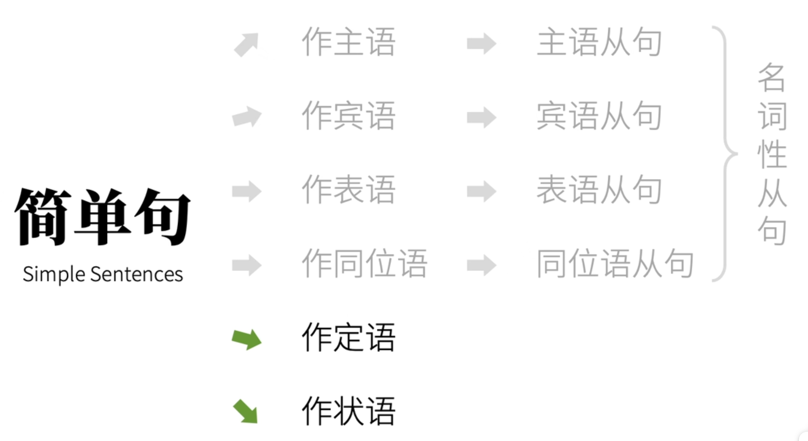

其中前四个都具有名词的性质，所以它们四个又叫名词性从句。

按句子的用途给句子分类可以分为：

* 陈述句
* 疑问句，还可以细分为以下几种：
  * 一般疑问句，只需要回答是或者否：Did the rabbit eat the carrot?
  * 特殊疑问句，要用具体信息回答的：What did the rabbit eat?
  * 选择疑问句，需要选择一个答案回答：Did the rabbit eat a carrot or an apple?
  * 反问句：The rabbit ate a carrot, didn't he?
* 祈使句：Eat the carrot!
* 感叹句：What a tasty carrot!

## 词性（词类）

相同的句子成分中可能有不同的词，这些词的词性又各不相同，这就是十大词类：

* 名词：nouns，表人和物
* 动词：verbs，表动作
* 冠词：articles，说明人和事物，如a
* 代词：pronouns，替代人和物，如I
* 形容词：adjectives，形容人和物
* 数词：numerals，表数量，如two
* 副词：abverbs，修饰动作或形容词，如quickly
* 介词：prepositions，表示和其他词关系的词，如with
* 叹词：interjections，表感叹，如Ah
* 连词：conjunctions，连接词和句，如because

句子成分和词性是完全不同的概念，除了谓语动词一定是动词以外，其他句子成分都可能包含不同的词性。

## 谓语动词的三大性质

动词是英语的核心。

谓语动词可以表示动作可能在过去或者未来，谓语动词还可以表示动作已经完成或者正在进行，这两个前者是表动作时间，后者表动作状态，结合起来称为时态tense，时态=时间+状态

英语表述动词时间有4种：现在、过去、将来、过去将来

英语表述动词状态也有4种：一般、完成、进行、完成进行

它们之间排列组合，就产生了16种可能的时态：

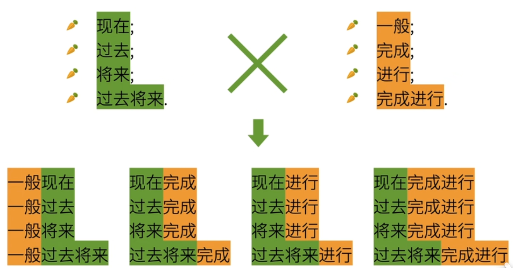

谓语动词还可以表示动作的假设和情感等，这就是语气：

* 虚拟语气：表示意愿，和事实相反的假设等，如 If I were a rabbit
* 陈述语气：I ate a carrot and xx
* 祈使语气：Eat this carrot and xx

## 助动词

谓语动词独自是无法完成表示否定、可能性、必须性等意思，必须用到另一类经常和动词一起用的词帮助表示语义，它们是助动词Auxiliary verbs，它们没有实义，只是帮助谓语动词而已。

例如对于eat这个动词而言，为了表达不同的语义，需要不同的助动词来协助完成：

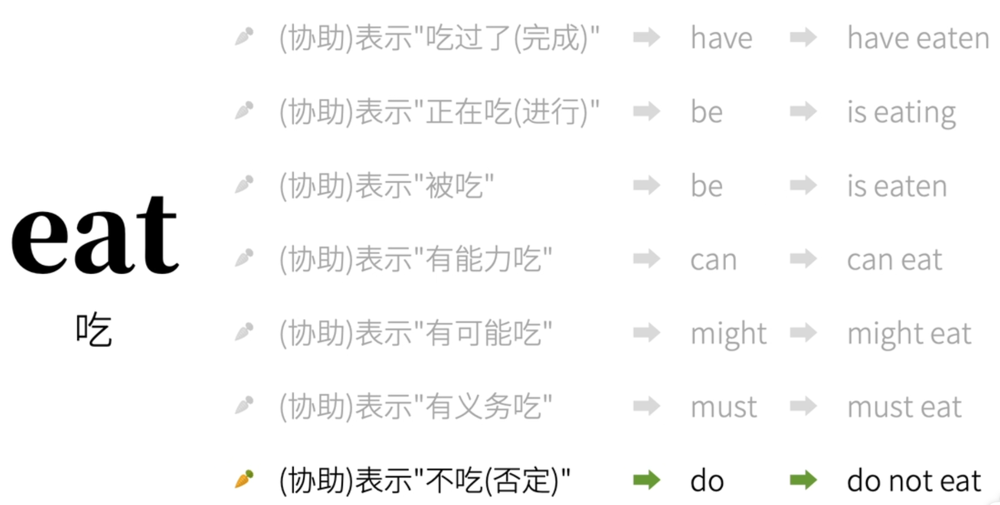

与助动词相对的概念就是实义动词，有时候同一个词，它在不同的语境中可以充当助动词，也可以充当实义动词，甚至是其他词性，这里是一个很容易弄混的点。

## 非谓语动词

动词除了充当谓语动词，还可以用作主语、宾语、宾语补语、主语补语、定语等等，此时的动词充当的就是非谓语动词，非谓语动词几乎可以替代所有的从句，从而简化句子。

非谓语动词就不再拥有谓语动词的三大特性，不再表示时间、状态、语气。

非谓语动词很容易和谓语动词弄混，如：

* 动词不定式的表示形式和谓语动词原型一样。

* 现在分词和动名词的表示形式和谓语动词进行状态一样。

* 过去分词的表示形式和谓语动词的完成状态一样。

谓语动词就对应前面提到的，对应五种基本句型，它们分别是不及物动词、单及物动词、双及物动词、复杂及物动词和系动词。

# 动词

## 分类

实义动词指具有实际意义的动词：

* 如果按照动作承受者划分，它包括及物动词和不及物动词（又包括单及物动词、双及物动词和复杂及物动词）
* 如果按照状态动作划分，它可以分为动作动词和状态动词。动作动词就是一个动起来的动作，如eat；状态动词如have、feel、own、believe，它们都没有真正的动起来，是相对静止的

系动词不属于实义动词，因为它没有实际意义，但它有时也被看做是不及物动词和状态动词。实义动词和系动词可以作为句子的谓语动词。

有一些动词不能直接作为谓语动词，必须其他动词辅助，它们是助动词和情态动词。

非谓语动词包括不定式、过去分词、现在分词、动名词，它们也叫非限定性动词。

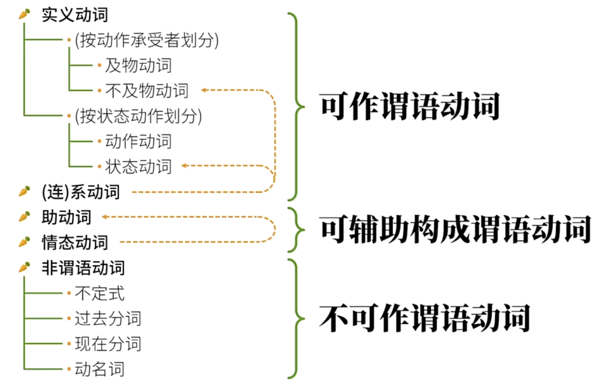

## 时态

动词时间有四种：现在、过去、将来、过去将来

过去将来指的是过去某一个时间点而言的将来，比如昨天是前天的将来，明天是昨天的将来，过去将来和现在是没有必然关系的，这个将来既可以是现在的过去，也可以是现在的将来：

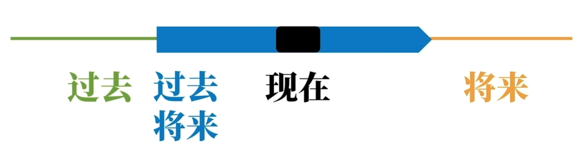

动词状态也有四种：一般、完成、进行、完成进行

完成进行指的是事情已经完成了许多，而且还没完呢，表示动作的一部分完成了，剩下的还在进行中。

### 一般现在时态

一般现在时态Simple Present Tense，使用时需要+动词圆形+s（第三人称单数）

它是最一般的状态，但是也很容易出错：

* 这里的现在指的是时间，而不是状态，所以一般现在时态并不是指事情正在发生
* 这里的一般指的是并没有特别指出的动作状态

一般现在时态常见的几种用法：

1、表达事实：

* I eat carrots，这句话中的carrots用了复数，而且前面没有冠词，代表泛指胡萝卜这类食物。所以这句话的意思其实是《我是吃胡萝卜这种食物的》，不能简单翻译为《我吃胡萝卜》
* The sun rises in the east

事实是没有状态和时间限制的，所以用一般现在时态正合适。

I go to lunch这句话是有些奇怪的，因为它是有歧义的，它缺少了时态，如果只是在句子后加now也是不对的，因为动词还是没有时态，而now一般是和现在进行时态一起使用的。

2、表达习惯/重复的动作：如 I play basketball，我有玩篮球的习惯，它其实也是事实的一种

3、表示预计发生的事：如 The bus leaves at 8PM tonight，它其实也可以被理解为事实

### 现在进行时态

现在进行时态Present Progressive Tense，使用时需要助动词be的变位+动词的现在分词

be有两种用法：

* 作系动词，用来赋予主语某种性质状态
* 作助动词，构成时态，以及被动态。

助动词be的变位即am、is、are

动词的现在分词通常在词尾+ing，有些要改变拼写，如：

* write -> writing
* hit -> hitting
* die -> dying

这种改变拼写的原因一般是发音问题，对于有些词直接+ing的发音容易造成误解

现在进行时态的例句：The rabbit is eating a carrot

### 现在完成时态

现在完成时态Present Perfect Tense，表示已经完成了，什么时候开始的不知道，强调的是已经完成，且往往还对现在造成影响，如说《我已经吃掉了胡萝卜》，言外之意现在已经没得吃了。它使用助动词have的变位+动词的过去分词。

have有两种用法：

* 实义动词，表示有，如 I have some coins for this video
* 助动词，构成时态

助动词have的变位，即have、has

动词的过去分词通常在词尾加ed，有些是不规则变化，如：

* eat -> eaten
* bring -> brought
* feel -> felt

现在完成时态例句：I have eaten a carrot，言外之意是我已经吃了所以不饿

### 现在完成进行时态

Present Perfect Progressive Tense，表示对于现在这个时间点，不但已经完成了一部分，而且还要继续进行的动作。它的构成=现在完成时态+现在进行时态

现在完成时态是have的变位+动词的过去分词

现在进行时态是be的变位+动词的现在分词

现在完成进行时态是两者相加，将动词的过去分词和be的变位合成一个，也就是been，即have的变位+been+动词的现在分词

现在完成进行时态例句：

* I have been eating carrots，代表我在吃胡萝卜，表示不但已经吃了些，还将继续
* You have been watching my video，表示现在你已经看了一段时间视频，还要再继续看

### 一般过去时态

过去时态有四种，它们其实就是现在时态往前推一个时间段而已

一般过去时态Simple Past Tense，用法是直接+动词过去式

动词过去式和动词的过去分词不是一回事，如eat的过去式是ate，过去分词是eaten。此外动词的过去式是指动词的一种变位，并不能和过去的时间划等号。

动词的过去式一般也是在结尾+ed，有很多词的过去式和过去分词是一样的，如looked，也有很多动词是不规则变化，比如：

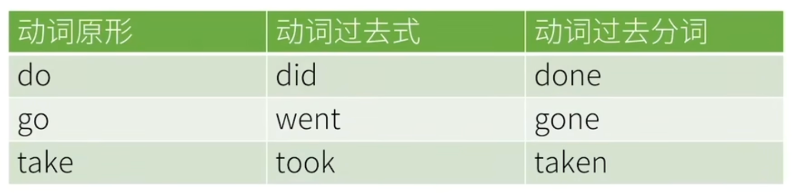

这种不规则变化，有很多还是有规律可循的：

如ing -> ought

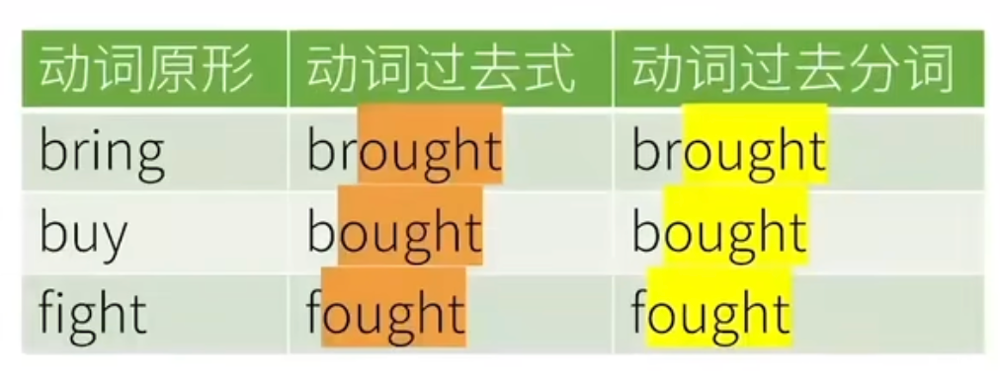

过去式o变e，过去分词结尾+n

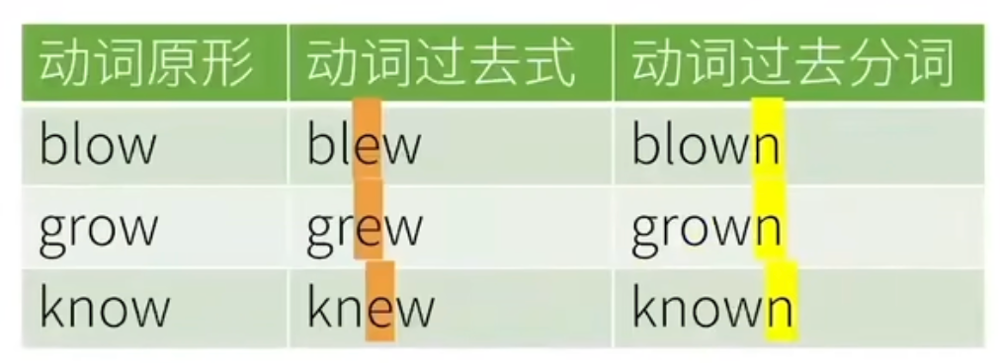

过去式i变a，过去分词i变u

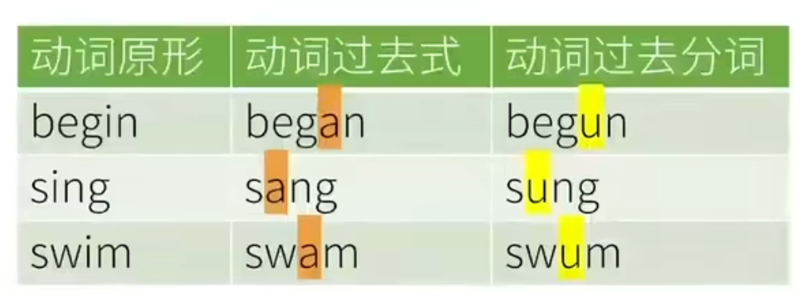

过去式简化为o，过去分词在此基础上+n

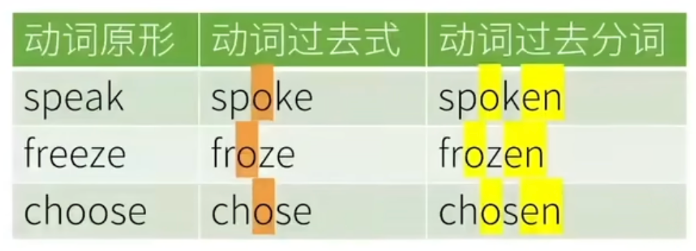

一般过去时态中的一般可以理解为单纯的代表有个动作发生了，至于它什么时候开始、什么时候结束，持续多久都是未知的。

例如You watched my video，代表你看了我的视频，可能得言下之意就是你之前看过了这是事实不要抵赖。

一般过去时态不能表示习惯动作，不像一般现在时一样，I played basketball代表我打了篮球，并不能表示打篮球的习惯，如果要说明过去的习惯，需要用I used to play basketball

### 过去进行时态

Past Progressive Tense，用于强调过去某个时间段，某个动作是当时进行中的。用法是be的变位+动词的现在分词。

此时be的变位是在过去时间里面的，即was和were，即be的过去式

如 I was thinking of you，代表我在过去的某个时间点处在想你的过程中

现在完成时态、一般过去时态、过去进行时态，它们都表示过去的动作，它们的区别是：

* 现在完成时态：某个动作已经在我说这句话之前完成了，往往考虑某个过去动作对现在的影响。如 I have seen a carrot，I know its color，代表胡萝卜我是见过的，我知道它的颜色
* 一般过去时态：某个动作在过去发生了，强调有没有发生，考虑的是过去的事实。如 I saw a carrot，I am not lying，代表过去某个时间点我看到了胡萝卜，我不是瞎编的
* 过去进行时态，强调过去某个时间段，动作正在进行中，就像一段已经拍摄好的视频一样，如The rabbit was eating a carrot

### 过去完成时态

Past Perfect Tense，是现在完成时态往前推一个时间段，主要用于表达过去某一点A的过去B对A的影响，用法是have的变位+动词的过去分词。

此时have的变位是在过去时间里面的，即had，即have的过去式

如I had eaten 5 carrots for lunch yesterday, so I wasn't hungry at all yesterday afternoon.

这里要表达的意思就是，对于昨天下午(时间点A)来说，因为昨天下午的过去(时间点B,也就是中饭时间)，我已经吃了一堆胡萝卜，所以B对A有影响--这个影响就是：我一点都不饿.

He tried to find me yesterday afternoon, but I had already gone to Shanghai.

对于他试图找我那个时间点A(昨天下午)来说，A的过去某一点B(可能是昨天上午，或前天，没说明，但是肯定是昨天下午之前)我已经离开了，去上海了，所以B对A有影响--这个影响就是：他找不到我

### 过去完成进行时态

Past Perfect Progressive Tense，是现在完成进行时态往前推一个时间段，描述对于过去某个时间点，不但已经完成了一部分，而且还要继续进行的动作。用法是have的变位+been+动词的现在分词。只不过have的变位这里就是had，即have的过去式。
The rabbit had been eating a carrot. (这兔子在过去某个时间点已经吃胡萝卜一段时间了，还要在过去那个时间点之后继续吃一段时间.)

### 将来时态

将来时态有四种，它们其实就是现在时态往后推一个时间段而已。

英语中要表达将来，必须借助助动词来帮忙，放在主动词（谓语动词）之前，这个助动词就是will/shall

英语的动词没有将来时态，有的只是将来时态的表达。

英语中表示将来有好几种方式：

* 一般现在时态表达将来的动作，如The bus leaves at 8PM，这里面是将将来用事实表述出来
* be+going+to+动词原型：I am going to eat a carrot
* be+to+动词圆形：You are to eat a carrot，有点命令的意味
* be+about+to+动词原型：I am about to eat a carrot

最普通的表达将来还是使用will/shall。

1、一般将来时态Simple Future Tense，用法是will/shall+动词原型，描述将来某个时间点发生的动作。将来时态一般是说话者十分确定会发生的事情。如The sun will rise again tomorrow

如果说话者不确定事情在将来是否发生，那就不能用将来时态了，需要借助动词的语气表达。

2、将来进行时态Future Progressive Tense，用法是will be+动词的现在分词，描述将来某个时间，某个动作是在进行的过程中，如I will be eating a carrot for lunch tomorrow from 1PM to 3PM .

将来进行时态比一般将来时态，说话者还要更确定将来这个动作一定会发生。

3、将来完成时态Future Perfect Tense，用法是will have+动词的过去分词，描述将来某一点A的过去B，对将来A的影响。

I will have finished making the video by 4PM tomorrow, so I can publish it after that.
这里要表达的意思就是，对于明天下午4点钟那个时间点来说，我在那之前就会完成做视频这个动作，所以对明天下午4点钟那时候是有影响的--影响：明天下午4点钟之后我就能够发视频啦.

将来完成时态进一步强化将来这个概念，说话者非常相信事情将来会发生，说的好像已经发生了似的

4、将来完成进行时态Future Perfect Progressive Tense，用法是will have been + 动词的现在分词，描述对于将来某个时间点，不但已经完成了一部分，而且还要继续进行的动作。
You will have been watching myvideo.(你在将来某个时间点之前已经看了我视频一段时间了，还要
在那个时间点之后继续看一段时间.)

这个时态平时很少用到，因为类似的意思使用将来进行时或者将来完成时就已经足够表达了。

### 过去将来时态

过去将来时态Past Future Tense也有四种，过去将来指的是过去某一个时间点而言的将来，起点A一定是过去的时间点，将来B不一定是现在的将来，也可能是现在的过去，比如：

* 我去年说过我上个月要开始做视频，上个月对于去年来说就是过去将来，但是上个月是现在的过去
* 我上个月说过我明年要出书，明年对于上个月来说就是过去将来，但是明年是现在的将来

这种时态经常出现在过去时态的从句中，也就是从主句朝后推的一个时态。

过去将来时态只不过是把将来时间的四种时态，往前推一个时间段，推到现在的过去。

1、一般过去将来时态Simple Past Future Tense，用法是would+动词原型，would是will的过去式

I said I would eat a carrot for lunch. 我(之前)说过我会午饭吃根胡萝卜(午饭时间对于之前我说那话的时间来说是在将来,但至于现在午饭时间有没有到,不得而知.)

I knew you would watch my video. 我(之前)就知道你会看我的视频.(你看我视频这件事多余我做出这个判断的时间来说是在将来.)

would可用在这里作为will的过去式，它也可以用做虚拟语气表达与事实相反、或者表示礼貌等

一般过去将来时也可以用was/were + going + to + 动词原型

2、过去将来进行时态Past Future Progressive Tense，用法是would be+动词的现在分词

I said I would be eating a carrot at 1PM tomorrow/yesterday. 我(之前)说我明天下午1点会在吃胡萝卜.(我之前说我明天/昨天下午1点会是在吃胡萝卜这个过程中.)

3、过去将来完成时态Past Future Perfect Tense，用法是would have+动词的过去分词

 I said I would have eaten a carrot by 1PM tomorrow/yesterday. 我(之前)说我明天/昨天下午1点会已经吃掉了根葫萝卜.(我之前说我明天/昨天下午1点会已经做完了吃胡萝卜这个动作.)

4、过去将来完成进行时态Past Future Perfect Progressive Tense，用法是would have been+动词的现在分词

I said I would have been eating lunch for 2 hours by 1PM tomorrow/yesterday.我(之前)说我明天/昨天下午1点前会已经吃了俩钟头中饭.(我之前说我会明天/昨天下午1点时在吃中饭这个过程中,之前吃了2钟头,之后还会继续吃)

### 汇总

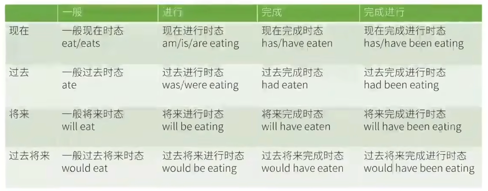

## 语气

英语动词的一个重要特性是语气Moods，它是一个语法数据，不代表说话时的语气。

语气中最主要的是三种：陈述语气、祈使语气和虚拟语气

### 陈述语气

陈述语气indicative mood用于描述现实，这是最常用的一种，也是默认的语气。如The rabbit ate the carrot.

我们可以对事实进行提问，如Did the rabbit eat the carrot? Was the rabbit hungry? 有些语法会认为这两句属于疑问语气interrogative mood，它主要是改变次序+助动词来实现

### 祈使语气

祈使语气imperative mood用于表达命令/请求，如：

* Rabbit, eat the carrot!，表命令
* Please, give me a thumbs-up! 表请求

祈使语气的组成一般是由省略了主语的，第二人称you的一般现在时态表达，谓语动词一般是动词原型，如下面几种转换：

* You eat the carrot!  去掉主语，保持动词原型，就变成了祈使句：Eat the carrot!  
* You don't eat it! 去掉主语，保持动词原型：Don't eat it!

### 虚拟语气

虚拟语气Subjunctive Mood，多用于从句中，用来描述与现实相悖的想象，或者主观意愿

中文中没有虚拟语气，但是英文中的虚拟语气是需要动词变位的。

虚拟语气可以存在于不同的从句中，如主语从句、表语从句、宾语从句、定语从句

#### 表不可能假设

这里先说第一类用法：表示和过去已经发生的事实相反，是不可能的情况

它按时间分又可以分为三种情况：对现在的假设、对将来的假设、对过去的假设

虚拟语气用法1：表示和现在事实相反

用法：条件句中使用动词的过去式，主句用would+动词原形

如果我看到那只兔子的话，我会咬它，一般翻译为：If I see the rabbit now, I will bite him.

上面的两个句子都是现在时间now或者将来时间，都是在描述事实，或者很确定的描述将来可能发生的事情。但如果说话者并不是描述事实（可能兔子已经找不到了），就需要用虚拟语气，将上面例句的动词改为动词的过去式：

If I saw the rabbit now, I would bite him.

这里的过去式saw和would但并不表示过去的时间，并不是描述过去发生的事实，而是在表述现在的，没发生，但是希望发生的事情，是一个主观意愿或者想象。所以句中出现过去式不一定就代表过去的时间。

如果动词是be，过去式只能用were：If I were you, I would give this video a thumbs-up.

虚拟语气用法2：表示和将来事实相反

用法：条件句中使用should+动词原型，主句中用would+动词原形

如果把最初的例句now改为tomorrow，句子就变成了：

If I see the rabbit tomorrow, I will bite him.

此时句子使用的是陈述语气，有些语法体系称之为条件语气conditional mood，它的构成和陈述语气没有区别。说话人如果这样说的话，就是代表明天完全有可能遇到那只兔子。

如果说话人知道接下来一段时间范围内，都不可能找到那只兔子了，上面的句子也不能再使用陈述语气了，此时需要改造成虚拟语气，表示将来时间可能性很小的动作：

If I should see the rabbit tomorrow, I would bite him.

这里面的should并不是应该的意思，它其实是shall的过去式。

主句中的would，在不同的语境下可以用should、could、might来替换。此外条件句中的should也可以用were to来取代

虚拟语气用法3：表示和过去事实相反

用法：条件句中使用had+动词过去分词，主句中使用would have+动词过去分词

说话人说：If I saw the rabbit a few days ago...  这句话其实是有问题的，因为它形式上是与现在事实相反的虚拟语气，时间上又表示过去，相互矛盾。此时要将动词改为过去完成式的形式（假设对过去某一时间点有影响，所以是完成态），即had+动词的过去分词：

If I had seen the rabbit a few days ago, I would have bitten him.

#### 表希望

虚拟语气的第二类用法：愿望/请求/建议/命令，它们都算作：希望某个动作发生

这种用法下虚拟语气一般和表达愿望的词一起使用，如wish、hope，其中wish是希望可能性小的事情发生，hope则比较中性，所以wish常和虚拟语气一起使用：

用法1：表对现在的愿望，用法是：wish+动词过去式（如果动词是be，则必须用were）

I wish that I were a rabbit.

I wish you were here!  这里面的过去式不代表过去时间，所以它的意思是我希望你现在就在这里

用法2：表对过去的愿望，用法是：wish+had/would have + 动词的过去分词

I wish (that) I had eaten the carrot.   代表我希望我吃了那根胡萝卜，言下之意就是我没吃很后悔

用法3：表示对将来的愿望，用法是：wish+would/should/could/might+动词原形

I wish (that) I could eat the carrot.

在虚拟语气中，表示希望不只wish一个词，还有很多词如：

* would rather宁愿：I would rather that you didn't eat the carrot.
* demand(要求)、suggest(建议)、insist(坚持)、order(命令)，使用这些词时虚拟语气一律是should+动词原形，如I demand that you should give me a carrot. 这里的should也可以省略掉，此时动词虚拟语气就没有时间含义了，一律用should，如果要代表之前，则用demand的过去式，即demanded
* 有时可以直接不使用代表希望的词，直接用虚拟语气，如It is (high) time that you ate a carrot.

在虚拟语气中，我们是可以根据动词的使用推断出更多的时间信息的，如：

* I would rather that you didn't eat the carrot. 因为这里用的是动词过去式，所以是对现在的希望，我希望你现在不要吃
* I would rather that you hadn't eaten the carrot. 因为这里用的是动词过去分词，所以是对过去的希望，言外之意胡萝卜已经被吃掉了

## 非谓语动词

在使用谓语动词时，有时态、语气的概念，此时谓语动词受到主语限制，出现了时间、状态和语气的变化，实际上是一种被限定了的动词：

如The rabbit eats a carrot. 此时eat限定为第三人称单数所用，如果主语修改为you，则eat要跟着改

所以谓语动词有另一个名字：限定性动词finite verbs

与之相对的概念是非限定动词non-finite verbs，它们也失去了表达时间、人称等的本领，它也叫非谓语动词。

谓语动词通常是句子的核心，承担时态、人称、语气的功能，剩下的动词，也就是非谓语动词只可能出现在剩下的非核心部分中。

一个简单句只能有一个谓语动词，所以下面的句子是错误的：I am a rabbit, I eat carrots. 不能同时拥有am和eat两个谓语动词，可以通过两种方式进行改造：

* 用连词相连，将它们改写成并列句：I am a rabbit, so I eat carrots.
* 变成主句+从句的形式：Because I am a rabbit, I eat carrots.

### 动词不定式

它的组成：to+动词原形

如：To be or not to be, that is the question.

有时to也会省略，如：You helped me cook the carrot. 这里cook是不定式，只不过省略了to

上面的第一种被称为完全不定式full infinitive，后一种为裸不定式bare infinitive

不定式可以充当不同的句子成分：

1、不定式作主语

To eat a carrot every day is good for the rabbit.  这里To eat a carrot every day这里用作主语，那么是谁吃胡萝卜，什么时候吃，这些都不确定，所以才称之为不定式

在英语中常用it作为形式主语，避免头重脚轻的情况，上面的句子也可以改写为：

It is good for the rabbit to eat a carrot every day.  这是一个非常常见的句式

2、不定式作宾语

The rabbit likes to eat carrots.  这里to eat作为谓语动词likes的宾语，有些动词后面是不能+不定式的（这部分和动名词有关）

it也可以用作形式宾语，如I consider the rabbit smart.  这句话中consider是谓语动词，the rabbit是宾语，smart是宾补，如果用it做形式宾语，类似的句式为：

I consider it important to eat a carrot every day.  这里的it代表的是不定式to eat a carrot every day

3、不定式作宾语补足语

The rabbit expected the wolf to eat a carrot.  这里面to eat a carrot就是宾补，对宾语 the wolf 起一个补充说明作用，补充狼的动作

使役动词see、find、watch、have、make、let等，后面用不定式作宾补需要省略to，如：

Carrots make the rabbit feel happy.

谓语动词后接不定式作宾补时，to省略还是不省略都是正确的表达，如：

The wolf helped the rabbit grow carrots.
The wolf helped the rabbit to grow carrots. 都代表狼帮兔子种胡萝卜

4、不定式作表语

The rabbit's dream is to eat every kind of carrot in the world.

这种句式可以直接转换为不定式作主语的情况，因为有时系动词前后可以互换：

To eat every kind of carrot in the world is the rabbit's dream

5、不定式作定语

The rabbit has a lot of carrots to eat.  这里to eat作后置定语修饰宾语carrots

6、不定式作状语

表原因：I was surprised to get a thumbs-up.

可以直接转换成原因状语从句：I was surprised because I got a thumbs-up.

表目的：I will do anything to get a thumbs-up.

可以直接转换为目的状语从句：I will do anything in order that I get a thumbs-up.

表结果：I got enough thumbs-up to make another video.

可以直接转换为结果状语从句：I got enough thumbs-up, so that I made another video.

所以不定式有简化从句的效果。

不定式也可以表示状态，此时就不是to+动词原型了，而是下面这几种形式：

"to be eating a carrot"
"to have eaten a carrot"
"to have been eating a carrot"

此时不定式表状态，但不定式依然没有表示时间的功能，表示时间还需要谓语动词的时态，如：

* The rabbit seemed to be eating a carrot.   这里seemed表示之前，to be eating表示正在吃
* The rabbit will appear to have eaten a carrot.  这里will表将来，to have eaten表示吃过了

### 动名词

它的组成：动词原型+ing，有时也会重复末尾字母，动名词就相当于名词

名词在句子中可以作的成分，动名词同样可以承担，如：

* Eating carrots is healthy for the rabbit.  里面Eating carrots动名词短语作主语

* The rabbit's hobby is growing carrots.  里面growing carrots动名词短语作表语
* a sleeping pill，动名词作定语，这里的sleeping作定语是说pill是睡眠用的，补充它的用途，相当于a pill for sleeping

动名词作宾语的情况和不定式作宾语的情况非常像：

* The rabbit likes to eat carrots.
* The rabbit likes eating carrots.

* The rabbit stopped to eat a carrot.
  兔子停下(手里的活)去吃一根胡萝卜. stop to do表示停下手中的事情，去做另一件事
* The rabbit stopped eating a carrot.
  兔子停止吃一根胡萝卜. stop doing表示停止正在做的事情
* The wolf forgot to invite the rabbit to her party.
  狼忘记邀请兔子去她的聚会.  forget后加不定式表示忘记去做，表明事情还没有做
* The rabbit forgot accepting the wolf's invitation.
  兔子忘记接受过狼的邀请. Forget doing表示忘记做过，表明事情已经做过了，已经接受过了但忘了

所以不定式作宾语常表示事情还没做，要去作；动名词作宾语则表示事情已经做过了

有些动词后面是不能+不定式的，如不能说The rabbit enjoys to eat carrots.  而是The rabbit enjoys eating carrots.  这样的动词还有avoid, advise, consider,escape,mind, practice等，词组有insist on
give up、feel like、put off等

宾语有时会在介词后出现，如：

* The rabbit is fond of eating carrots.
* The rabbit is looking forward to seeing the wolf again.  这里面的looking forward to是一个词组，to在这里面不是不定式

### 现在分词

现在进行时要用到现在分词，但是现在分词并不一定代表现在时间的属性

如 a talking rabbit 一只说话的兔子，这里只能判断出这只兔子是会说话的，但不知道是过去在说话，还是将来在说话，现在分词此时就不代表现在时间的属性。

现在分词在句中就相当于一个形容词，形容词在句子中可以作的成分，现在分词同样可以承担，如a talking rabbit就是现在分词做定语。

现在分词和动名词都可以充当定语，它们的区别就是一个作形容词，一个作名词：

* a sleeping pill，动名词作定语，这里的sleeping作定语是说pill是睡眠用的，补充它的用途，相当于a pill for sleeping，这里的sleeping是一个名词，所以它是动名词
* a sleeping rabbit，现在分词做定语，这里的句子不能转换为a rabbit for sleeping，sleeping是一个形容词，所以它是现在分词

现在分词作表语，如：

* The story is interesting.  这里的interesting就是由动词interest转化过来的现在分词，即从《产生兴趣》变为《让人产生兴趣的》，也就是《有趣的》
* The game is exciting.  

现在分词也可作宾语补足语，同时不定式也能做宾语补足语：

* The wolf saw the rabbit eating a carrot.   eating作为宾语rabbit的宾语补足语
  狼之前看到兔子正在吃一根胡萝卜.
* The wolf saw the rabbit eat a carrot.
  狼之前看到兔子吃了根胡萝卜.

动词不定式作宾语补足语时，表示动作自始至终的过程，动作已经发生了；现在分词做宾语补足语时表示动作正在进行中，强调动作进行的状态

现在分词也可以作状语，表示时间,原因,条件,结果,让步,目的,方式和伴随情况等：

* Hearing the news, the rabbit became excited.  它可以转换为时间状语从句：When he heard the news, the rabbit became excited.
* Not knowing what to eat, the rabbit skipped lunch.  它可以转换为原因状语从句：Because he didn't know what to eat, the rabbit skipped lunch.

现在分词很大程度上简化了从句，使句子言简意赅

### 过去分词

同样地，过去分词不一定代表过去的时间。

如：The rabbit will eat minced carrot next week.  兔子下周会吃搅碎的胡萝卜.  这里面minced代表搅碎的，不带有时间概念，只是代表被搅碎的状态。在这个句子中minced作定语，此时过去分词充当形容词。

一般来说形容词是要放在名词前修饰名词的，但过去分词短语作定语，则要放在被修饰的名词之后，即后置定语：

The carrot cake eaten by the rabbit is delicious.
被兔子吃了的胡萝卜很美味.

过去分词作表语：

The rabbit is interested in growing carrots.  interested就是一个过去分词，代表对xx感兴趣的
兔子对种胡萝卜感兴趣.

现在分词也可以作表语，它们的区别：

* The story is interesting.  现在分词作表语表示主动，即有趣的是故事，被描述的是做出动作的，即《故事让人感到有兴趣》
* The rabbit is interested.  过去分词作表语表示被动，即有趣的不是兔子，而是兔子对xx有兴趣，被描述的是动作的接受者，即《兔子被xx引起兴趣》

* The rabbit was frightened.  兔子感到害怕.
* The rabbit was frightening.  兔子令人感到害怕.

过去分词作宾语补语：The rabbit found his carrot stolen.  兔子发现他的胡萝卜被偷了.

过去分词作状语：

* 表地点：Seen from the hill, the carrot field looks beautiful.  从山上看,胡萝卜田看上去很美. 在这个句子里面主语carrot field是seen的逻辑主语，它们是被动关系，所以用过去分词
* 表原因：Born in a rabbit family, the rabbit has been growing carrots all his life. 由于出生在一个兔子家庭里,兔子种了一辈子胡萝卜.  
* 表条件：Given another chance, the rabbit would go to the wolf's party.  如果再给兔子一次机会,他会去参加狼的聚会.

过去分词和现在分词的区别就在于是主动还是被动：

* Seen from the hill, the carrot field looks beautiful.  因为胡萝卜田是被看，所以用过去分词seen
* Seeing the carrot field, the rabbit ran towards it.  因为兔子是主动看，所以用现在分词seeing

## 独立主格

有这样一个句子：

Because the wolf invited him, the rabbit decided to go to the party.
因为狼邀请了兔子,所以兔子决定去参加聚会了.

如果我们想简化这个句子，把两句话合并成一句，可以尝试这样做：

The wolf invited him, the rabbit decided to go to the party.

但是这样一个句子里面就有两个谓语动词invited和decided了，所以此时要把除真正谓语动词decided外的动词invited转换为非谓语动词，且wolf是邀请者，是主动，所以应该改成：

The wolf inviting him, the rabbit decided to go to the party.

在这个句子中，inviting这个动作是由The wolf发出的，而不是真正的主语，所以语法上把The wolf称作动词invite的逻辑主语，也就是主格。因为The wolf游离于真正主语the rabbit之外，独立了出来。所以这种用法叫独立主格。

一个简单句除去核心的谓语动词外，其余的动词转为过去分词或者现在分词：

* The work finished, the rabbit went home.  工作完成后,兔子回家了. 两个句子此时是并列关系，所以finished其实是在修饰work，而不是rabbit，这句话其实就是The work was finished, and/so the rabbit went home. 因为这句话唯一的谓语动词是went，所以另一个动词finish只能变成非谓语动词finished，以过去分词的形式出现
* 同样地：The weather permitting, the rabbit will go out.  天气允许的话,兔子就出门.  这句话中也是因为句子中已经有go这个谓语动词了，所以permit只能变成非谓语动词，又是主动关系，所以用动名词permitting，拆成两个句子就变成If the weather permits, the rabbit will go out.

因为现在分词/过去分词是在句中的状语里面，并不是在句子的主句里面，但是在状语本身里，分词修饰的对象（work/weather）隐含了主语的意味。

独立主格可以简化从句的表达：

* If the weather permits, the rabbit will go out. 用独立主格简化后：

  The weather permitting, the rabbit will go out.

* After the work was finished, the rabbit went home.  简化后：

  The work finished, the rabbit went home.

独立主格不仅包含名词+现在分词、名词+过去分词两种用法，还有许多其他的用法：

* 名词+不定式：The rabbit to come, the wolf is overjoyed.  兔子要来,狼乐翻天. 这里的不定式表示将要发生的动作
* 名词+名词：Many animals went to the party, some of them rabbits andI wolves.  许多动物去了聚会,它们中的一些是兔子和狼. (不定代词some+名词rabbits andI wolves)
* 名词+形容词：Many animals went to the party, some of them happy.  许多动物去了聚会,它们中的一些很开心. (不定代词some+形容词happy)
* 名词+副词：The rabbit sat on a chair, head down. （名词head+副词down）
* 名词+介词短语：The rabbit came in, carrot in hand.（名词carrot+介词短语in hand）

以上这些用法其实是名词/代词+be动词的现在分词being，然后再把being省略掉，如：

* Many animals went to the party, some of them being rabbits and wolves.  多了being
* Many animals went to the party, some of them being happy. 多了being
* The rabbit sat on a chair, head being down. 多了being
* The rabbit came in, carrot being in hand. 多了being

独立主格和非谓语动词联系紧密：

* 过去分词表逻辑主语时，代表逻辑主语和动作是被动、完成的关系
* 现在分词表逻辑主语时，代表逻辑主语和动作是主动、进行的关系
* 不定式表逻辑主语时，代表将要发生的动作

其余的形式其实都可以归类于省略being

## 助动词

助动词Auxiliary verbs，其中最关键的是情态动词modal verbs

谓语动词有时无法独立表达某些语法概念，需要其他词的辅助，这些辅助来构成谓语，但本身不能做谓语动词的词，就是助动词。

例如The rabbit will eat a carrot.  eat这个词单通过变位是不能表达将来时的，要想表达将来时必须通过will辅助表达，所以will就是构成将来时的助动词。而助动词是没有实义的，所以The rabbit will a carrot.这句话根本说不通。

The rabbit can kill a wolf.  中的can也是助动词，表达有这个能力。can这个情态动词也是助动词的一种，也叫情态助动词。

有些语法体系中，不认为情态动词是助动词，因为他们认为情态动词是表达了实际含义的，不能算助动词；但如果从满足两个要求就是助动词，即辅助主动词、不能单独作谓语动词，从这个角度说的话，情态动词就是助动词的一种。

### 分类

基本助动词只有三个：be、do、have，他们在做助动词时是没有实际含义的，但是它们也可用做实义动词，即：

* be存在：To be or not to be, that is the question.
* do做：Just do it
* have有：I have an apple

情态助动词包括：can/could、may/might、will/would、shall/should、must、ought to、dare/dared、need、used to，这些词作为情态助动词时也是有实际含义的，但不能单独作为谓语动词。它们中的一些也有实义动词的身份，如can表示把xx放进罐头。

半助动词包括：be able to、be going to、be about to将要、had better最好等，它们也是有实际含义的，可以充当情态动词，也可以充当谓语动词，介于两者之间。

### 基本助动词

基本助动词只有三个：be、do、have

be作为助动词：

* The rabbit is eating a carrot. be变位为is辅助构成现在进行时态
* The carrot was eaten by the rabbit.  be变位为was辅助构成被动语态

have作为助动词：

* The rabbit has eaten a carrot.  have变位为has辅助构成现在完成时态

do作为助动词：

* The rabbit does like coins! do变位为does构成强调
* The rabbit does not like freeloaders.  do变位为does辅助构成否定

### can/could

can/could表示有能力做、会xx、可以xx

表有能力：

* I can kill a wolf.
* I could kill a wolf last year.  我去年能够杀死一只狼，could这里是can的过去式

表请求或许可：

* Can/could I borrow your book?  这里的could没有时间上的含义，而是更礼貌，更委婉

表可能性：

* Anything can happen.
* Anything could happen.  这里的could可以表示对过去的推测，也可以表示对现在的可能性，只不过could表可能性比can更小一点
* The rabbit could have gone home earlier,  but he didn't finish work on time. 兔子本可以早回家的,但他没按时完成工作.  could have gone表示过去本可以做但是没做，是一种对过去的虚拟表达

### may/might

may/might也可以表示请求或许可：

* May/might I borrow your book?  May已经很礼貌了，might更礼貌

它们也能表示可能性，但可能程度要小于Can/could的可能性，所以翻译为也许大概可能：

* The rabbit isn't here. He may be at home. 如果这里用might则暗示可能性更小一些

表祝愿，通常放在句首：May you succeed! 祝你成功

### must

表示必须：You must finish your homework first!

表禁止：You must not (mustn't) smoke here.  禁止你在此吸烟.  must not的意思是必须不，绝对不能，与之相对的是need not不是必须、donot have to 不是必须

表推测，代表一定、肯定：The light is on. The rabbit must be at home. 灯亮着,兔子一定在家. 如果要否定这种可能性，需要用：

* The light isn't on. The rabbit can't be at home. 灯不亮,兔子不可能在家.
* 千万不是：The light isn't on. The rabbit mustn't be at home.  那就变成了灯不亮,禁止兔子待在家.

所以must表推测时，只能用在肯定句里面。推测否定只能用cannot

### will/would

表将来时：The rabbit will eat a carrot.

would表过去将来时：The rabbit would eat a carrot.

will/would还可以表示请求/建议：

* Will you lend me that book?  你愿意借给我那本书吗?
* Would you please lend me that book? 请你借给我那本书好吗? 用would更委婉的表达了礼貌

will/would还可以表示推测、假设：

* Ask him. He will/would know.  问他吧,他可能知道. would表推测比will的程度更弱
* The rabbit would eat a carrot. 这句话可能有歧义，它可能是表示过去将来时，也可能是推测可能

### shall

表将来时：I shall be there at 9AM.   和will语义一样

表征求意见：Shall we meet at 9AM?  我们早上9点见面如何?

表警告、命令：You shall not murder. You shall not steal. You shall not covet. 你不可杀人.你不可偷盗.你不可贪心.

### should

should虽然是shell的过去式，但是他们区别很大

表应当：We should treat the rabbit well.

表有一定根据的推测：It should rain tomorrow.  明天应该会下雨，这里的推测是根据具体情况做推测，可能性更大一些

表竟然：It's surprising that he should be late.  真的很奇怪,他竟然会迟到.

构成虚拟语气：

* If it should rain tomorrow, I wouldn't go.  如果明天万一下雨,我就不去了.  对将来的虚拟
* You should have eaten the carrot.  你应该吃掉那根胡萝卜(但你没吃). 对过去的模拟

### ought to

ought to表示应该，与should表示应该时用法大致相同，但往往语气更强一些：

We ought to treat the rabbit well.

### need

need作情态动词表示需要、有必要：The rabbit need wait.  这句话也可以改成The rabbit needs to wait. 这里面的need就是实义动词了，如果要表达否定意思：

* need作情态动词时可以直接加not：The rabbit need not wait.  兔子不必等待.
* need作实义动词时需要借助助动词do：The rabbit does not need to wait.

### dare

dare作情态动词表示敢，一般用于否定句和疑问句中：

* The rabbit dare not tell the truth to the wolf.  兔子不敢对狼说出真相.
* How dare you!  你好大的胆子!

### used to

used to表示过去的动作，尤其是重复的动作，表示过去常常，强调和现在的对比：

The rabbit used to eat apples. Now he only eats carrots. 兔子过去(习惯)吃苹果.现在他只吃胡萝卜.

used to不要和be used to习惯于相混淆

### 半助动词

be able to也表有能力作xx，但can的时态只有现在与过去时，所以一般表示的是现在和过去的能力：

* I can kill a wolf.
* I could kill a wolf last year.  我去年能够杀死一只狼，could这里是can的过去式

而be able to可以表达将来的能力：I'll be able to reach school on time if I leave right now.

be able to表过去的能力时，代表成功做成xx：I was able to reach school on time because I left home early. 因为我离家很早所以按时到学校.

be going to、be about to、be to和will一样都有将要作某事的含义，但有细微差别：

* be going to有更强的主观能动性，含有计划做某事的意思，而且通常是很快就要做某事，如I'm going to eat dinner at 6PM today.
* be about to是马上要做某事，时间更短了
* be to表示被命令做某事，如You are to finish home work first. 你要先做完作业. 和mush有点像；此外它也可以表示命中注定I think they're to fall in love with each other. 我想他们注定会相爱.

had better表示最好做，往往表示忠告、警告之意，暗含如果不这么做会有不好的后果：You had better follow my orders. 

had better的缩写是'd better

## 使役动词

在下面的句子中：

I make the wolf eat carrots from time to time.  我使(让)狼也偶尔吃些胡萝卜.

make的意思是使某人做某事，它后面必须跟着宾语+宾语补足语，如果只+宾语是不能表达完整语义的。

需要后接宾语以及宾语补语的动词有好几类，其中有一类表达的含义是使、让、令等，它们叫使役动词。

最常见的几个使役动词：make、let、have、get

使用make时，有几种情形：

* 裸不定式作宾补：I make the wolf eat carrots from time to time.  这里eat是不定式，只不过没有to，属于裸不定式
* 形容词作宾补：The carrot made the wolf full.

let的意思是允许某人做某事，它也可以分为几种情形：

* 裸不定式作宾补：I'll let the wolf eat some chocolate.
* 副词作宾补：Let me out!

have作使役动词时含义是给某人一个任务/责任做某事：

* 裸不定式作宾补：I'll have the wolf wash the dishes.  我会让狼洗盘子.(我把洗盘子的任务给了狼.)

  I had someone wash my car.  我让某人洗了我的车.

* 过去分词作宾补：I had my car washed.  我让某人洗了我的车. 它其实是上面那句把someone给省略了，此时宾语补语是过去分词，代表被动

get作使役动词使含义是说服/鼓励某人做某事：

* 不定式作宾补：I'll get the wolf to clean the kitchen after she washes thedishes.  我会让狼洗完盘子再把厨房清理了.  注意get作使役动词时后面要跟完整不定式
* 过去分词作宾补：I got my nails done.  这里的get和had用法几乎一样

# 词性

## 冠词

冠词：articles，说明人和事物，如a/an/the

### 不定冠词

不定冠词a/an，a用于辅音音素前，an用于元音音素前，注意这里是音素，而不是字母。如：

* a rabbit
* an apple
* a university 虽然u是原因字母，但第一个音是ju，所以是辅音用a
* an hour 虽然h是辅音字母，但第一个音是an，所以是元音用an

不定冠词用法1：泛指用法

如泛指某一个人或物：I saw a rabbit.  这里的a不仅仅要翻译成一只，它还有不定冠词赋予它的额外的含义，即兔子这一物种中的某一只，所以还可以把这句话翻译成我看到兔子了

如果要说我看见兔子了，必须说I saw a rabbit. 而不能说I saw rabbit. 这时就属于零冠词了

一般来说在对话时，第一次提到某物之前，说话者和听话者都不知道说的是具体的哪个物，所以是泛指，如：I saw a rabbit.  xxxx后面又说了这只兔子

也可以泛指某一类人或物：A rabbit is smarter than a wolf.  这里的A rabbit和a wolf是泛指某一类动物，指兔子类型和狼类型

用不定冠词泛指有时会有歧义，如 A rabbit is smart. 到底是指某一只兔子聪明还是兔子这类动物聪明呢？所以用不定冠词泛指在语法上没有错，但更好的方式是用零冠词，即：

Rabbits are smarter than wolves.

不定冠词用法2：表示数字1，如I gave you a hundred carrots.  此时a可以换成one

不定冠词用法3：表示每，如I eat 10 carrots a day.  我每天吃10个胡萝卜. 此时a可以换成every

不定冠词用法4：主谓一致，如：

* a teacher and video creator  泛指兼职老师和视频创作的一个人
* a teacher and a video creator  泛指一个老师和一个视频创作者，一共是两个人

不定冠词用法5：固定表达，如：

* have a good time  玩得开心
* as a result  因此;结果
* in a hurry  匆忙地
* all of a sudden  突然

### 定冠词

定冠词the，它有两种发音，这里的规则和不定冠词一致：

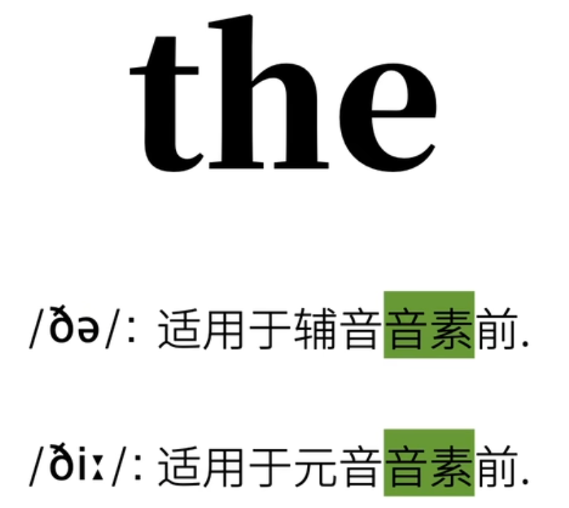

定冠词用法1：特指用法，表示某个或某些特定的人或物，也就是说话者和听话者都知道在讨论什么，或者再次提到的人或物，如：I saw a rabbit. The rabbit ran fast.

特指中有一类用法是：用在序数词或形容词的最高级前，如the biggest carrot、the first rabbit，因为first本身其实已经是特指含义了。

特指还有一类用法：用在独一无二的名词前，如the earth

定冠词用法2：泛指，有些句子中用the是泛指表达：

* I like playing the piano.  我喜欢弹钢琴，是指弹钢琴这件事，如果用a的话就不合适，a的泛指代表有很多钢琴，随意找了一架弹，此时讨论的不再是弹钢琴这个行为或爱好，而是单纯说弹一架钢琴这个动作。这个用法很特殊，只有西洋古典乐器才能这样用，如play the guitar、play the violin，如果换成中国乐器只能说play erhu
* The computer has changed our way of life. 指The computer作为整体一类工具改变了我们的生活，这句话很容易出现歧义

用定冠词做泛指很容易出现歧义，所以泛指时最好还是用零冠词

定冠词用法3：在形容词前表一类人，如the rich

定冠词用法4：固定表达，如：

* all the time  一直;总是
* by the way  顺便
* out of the question  不可能;没门

### 零冠词

零冠词是指名词前不用冠词的情况。

零冠词用法1：泛指

复数泛指，名词复数泛指一类，如：

* Rabbits are smart.  泛指兔子这类动物很聪明
* Computers have changed our way of life.

没有复数的就不用加复数了，也表示一类：Water is important.

泛指概念：

* Summer is hot. Winter is cold.  这里的夏季冬季是一种概念，当然也可以用复数泛指Summers are hot.
* I want to play football.  泛指足球运动这一抽象概念，而不是指具体的足球或者足球这一类器具
* I like geography  泛指地理学科这一抽象概念

零冠词用法2：专有名词

零冠词用法3：固定表达：

* from time to time  不时地
* face to face  面对面地
* out of question  毫无疑问

## 介词

### 概念和分类

介词preposition是放置在名词或者代词之前，用来添加附加信息的词，可以理解为一种前置词。这些附加信息包括时间信息、空间信息、方式信息、逻辑信息（原因、目的、对象等）等。

表时间信息：before 8 o'clock、after 8 o'clock、at 8 o'clock

表空间信息：in the room、on the roof、under the table

表逻辑信息：for health (reasons)、except (for) carrots

介词可以分为几类：

* 简单介词，如with、on、to

* 短语介词，和其他类的词共同构成短语介词，即一个短语充当介词的功能，如：

  * by way of 通过...方式
  * at the end of 在...的最后
  * along with 和...一起
  * because of 因为...
  * previous to ...之前

  短语介词相当于介词，不能单独表示完整的意思，它和介词短语是不同的，介词短语可以表示完整的意思，往往相当于副词

* 合成介词，有的介词可以互相合成，如：

  * into prep.到...之内
  * onto prep.到...之上
  * within prep.在...之内
  * notwithstanding prep.尽管

* 分词介词，由动词的分词充当介词，如：

  * including prep.包括...
  * regarding prep.关于...;至于...
  * considering prep.鉴于...;考虑到...
  * given prep.考虑到...;如果...

### 本义和引申义

英文中的介词经常没有对应的中文意思表达，在翻译时不要拼命地对号入座。

介词往往一个词有很多含义，学习和记忆的时候，要注意从介词的本义和引申义入手：

* 本义：根源意义，通常能表达明确的空间含义
* 引申义：在本义的基础上，引申出许多非空间的衍生含义

例如about的本义是on the outside of，即在...的外面，由此引申出以下关联的含义：

* 关于（xx的外围信息，有涉及非核心）：I know something about the rabbit.
* 大约（从外大致数数）：There are about 20 carrots.
* 针对（从外向内的解决问题）：Let's do something about the problem.
* 某人某事有某种特性（就像在外包装了一层，有某种气质）：There's something dangerous about the wolf.
* 到处（在xx的外面来来回回）：Stop running about!

on的本义是在..之上，在这个句中：Dinner is on me.  可以理解为付钱的重任在我身上，即The burden of paying for dinner is on me.

beyond的本义是在..之外，在这个句中：It's beyond me.  可以理解为某件事在我能理解的范围之外，即It is beyond the things that I can understand.

in的本义是在..之内，在下面的句中可以这样理解：

* in the sun：包裹在阳光里
* dressed in white：包裹在白衣服里
* in English：说的话写的字都在一堆英语话语和文字中

### 时间和空间

in、at、on都能前置于时间和空间，表达相关含义，非常容易混淆。

它们的本义表示的范围是从大到小的：

* in表示在一堆东西中间，上下左右前后都能移动，是在一个大范围内
* on表示在..之上，说明有一面确定了，只能在这个平面上移动，范围小一点
* at通常只在很明确的某一点上

理解了本义之后，就能很容易理解下面的短语：

* 在固定的一点，在这里不能大范围移动：at the corner, at the shop
* 在大范围内，可以在其中移动：in the city, in the country

介词后跟steet时，用哪个介词取决于要表达的意思是什么：

* 如果要明确表达某处，可以用at，如Right now I'm at Carrot Street and Apple Street.

* 如果要表达在街道的表面上，就用on，如There is some trash on the street.

* 如果要表达在某条街道的范围内移动，就用in，如I'm walking in the street.

on the street和in the steet其实都能说得通，后者是英国人习惯的说法，所以一般是用in

表示时间时，可以这样理解：

* 用in时表示”大范围的“：in a year、in the month、in the week
* 用on时通常表示天，介于in和at之间：on that day、on Monday、On April 1st
* 用at时表示某个时刻：at 8 o'clock、at that moment

hour前一般用on，但是当表达的范围相对更大时，就用in：There are 60 minutes in an hour.（小时和分钟比较就不是一个小范围，所以用in），同理There are 60 seconds in a minute.

in the morning和on the morning，区别：

* I eat carrots in the morning.  即使早上这个时间点很小，但是当表达一个时间范围时，就用in，这句话理解为我在早晨这个时间段吃胡萝卜
* I saw the wolf on the morning of April 1st.  这里表达的就是一个点，即相对明确的点，所以用on

noon相对来说就是一个点，相比上午和下午范围比较小，所以一般用at noon

### 表空间的介词

in表示在..里面，如in the house、in the park、in the country

on表示在..表面，如on the table、on the floor

on the tree和in the tree的区别：

* on有在表面的意思，表示和物体有接触，可以引申为长在树上的，是树本身所有的，如There are some apples on the tree.
* in只是在树里，表示外来的事物在树里，如There are some birds in the tree.

at表示在某处，一般是一个确定的点，如at the corner of the street

over作空间介词时，表示在..上方，有可能接触，也可能不接触：

* 如果接触的话一般表示覆盖、遮住，如The mother put a blanket over the child.
* 如果不接触的话表示在..的正上方，如the lamp over the table
* 表示动态的上方，即越过上空，如The plane flew over the mountain.飞机飞越过高山.；The rabbit climbed over the fence.  兔子爬过栅栏.

above表示高于某个平面之上：和over类似表示在xx上方，如the sky above us  在我们上方的天空，over一般指正上方，above一般指高出就行

on/over/above都有表示在..上面的含义，但是是有区别的：

* on表示物体与物体接触，如 There is a carrot on the table.
* over表示正上方，且可以描述动态，如 The rabbit jumped over the table. 但是不能说 The rabbit jumped above the table.  above不具有动态的含义，且只表示高出xx

under表示在..下面，与over相对，如There is a ball under the desk. 它表示物体之间可以接触，也可以留有一定空间，而且含有在某物正下方的意思

below表示在..下方，与above相对，如The rabbit dived below the surface of the water.  它表示低于某个平面

near表示在..附近，如near the hospital

by和beside作为空间介词时都表示在..旁边，通常两者可以互换，如There is a hotel by/beside the river.

next to表示靠近，紧挨着，如the building next to the school

near/by/beside/next to都表示在..旁边，它们的区别是：

* near表示附近的，往往有些距离，如There is a school near here.
* by/beside/next to都可以表示比较接近，可以互换：The rabbit sat by/beside/next to the wolf. 
* beside强调在xx的边上，可以引申为非空间含义的比较，如My carrot looks bigger beside yours. 我的胡萝卜和你的一起看着更大.
* next to强调下一个、紧接着的相邻

across表示从表面穿过，是在物体表面发生的行为：go across the street 穿过马路；swim across the river 游过河

through表示从内部穿过，go through the tunnel 穿过隧道；walk through the forest 穿过森林；look through the window 透过窗户看

past表示经过，路过，如The rabbit walked past the wolf without saying any words.  兔子从狼身边经过,没说一句话.

in front of表示在..前方，The rabbit is standing in front of the wolf.

before表示在..之前，它作为空间介词不常用，除非是表达在众人/观众前，如She played the violin before the crowd.  她在众人前拉小提琴.

behind表示在..之后，如The wolf is standing behind the rabbit.

between表示在..之间，侧重于在两者之间，如The carrot is between the rabbit and the wolf.  也可用于在三者及以上之间分别两两比较时：You shouldn't eat between meals.

among一般指三者及更多人和物之间，如 The rabbit is standing among the carrots.

round/around表示围绕，环绕，意思相近，如trees round/around the field、around the world

along表示沿着，顺着，如Walk along this road.

to表示向、朝，如go to school

toward/towards，表示朝着..的方向，walk toward home 朝家走

onto表示到..的上面，如 The rabbit jumped onto the table.  兔子跳到桌子上.

into表示到..的里面，如walk into the house

out of表示从里面出来，如get out of the car

opposite表示在..对面，如Our school is opposite my house.

against表示与..相反，如We were rowing against the current. 我们逆水行舟.；还有一个常用意思是倚，靠，如The rabbit was leaning against the tree. 兔子正倚着一颗树.

up表示沿..向上，如up the hill上山；up the river沿河流逆流而上

down表示沿..向下，如walk down the road沿着这条路走下去；roll down the hill从山上滚下去

off表示离..有些距离，如New Zealand lies off the eastern coast of Australia. 新西兰离澳大利亚东海岸有一些距离.

### 表时间的介词

2743
