# 流处理概述

## 传统数据处理架构

传统数据处理架构分为两种：事务型处理和分析型处理

### 事务型处理

事务型处理的应用场景：基于web的应用、企业系统软件等。这些系统由独立的数据处理层（应用程序）和数据存储层（事务型数据库系统）：

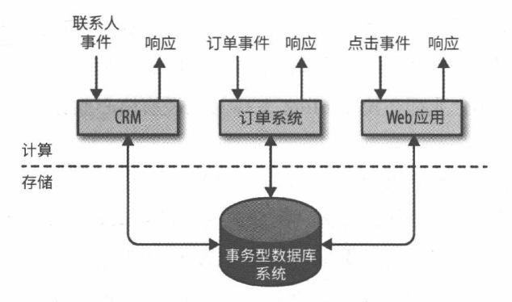

这些应用持续处理各种业务，每处理一条事件，应用都会通过执行数据库事务来读取或更新状态。有时多个应用会共享一个数据库系统，有时候还会访问相同的数据库或表。

该设计在应用需要更新或者扩缩容时容易出现问题，因为多个应用基于相同的数据表示或共享架构，更改表模式或对数据库进行扩容比较繁琐。微服务设计模式可以解决应用之间这种紧耦合的情况，微服务由很多微型、完备、独立的应用组成，每个应用都专注做好一件事。多个微服务之间通过标准化接口进行通信，它们可以选择不同的技术栈。通常微服务会和所有必需的软件及服务一起打包部署到独立的容器中，下图是一种微服务架构：

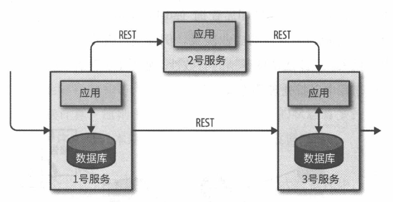

### 分析型处理

存储于不同事务型数据库系统中的数据，可以为企业提供业务运营相关的分析见解。对于分析类查询，我们通常不会直接在事务型数据库上执行，而是将数据复制到一个专门用于处理分析类的数据仓库。为了填充数据仓库，需要将事务型数据库系统中的数据拷贝过去，这个过程分为提取Extract、转换Transform、加载Load三步，这就是ETL。

ETL中的转换，意思是转换为通用表示形式，因为待分析的数据可能是不同格式的，来自于不同的事务型数据库的，它可能包含数据验证、数据归一化、编码、去重、表模式转换等工作。

为了保证数据仓库中的数据同步，ETL过程需要周期性地执行。

数据导入数据仓库后，我们就能对此进行查询分析，对数据仓库的查询分为两类：定期报告查询（统计输出报告）和即席查询，无论哪一类查询，都是在数据仓库中以批处理的方式执行：

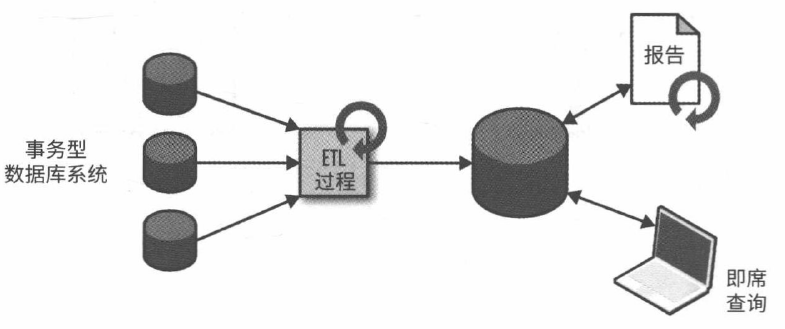

目前很多海量数据已经不再使用关系型数据库存储，而是写入HDFS或者HBase，然后用基于Hadoop的SQL引擎，如Hive进行查询和处理。

## 状态化流处理

有状态的意思是在流处理中，需要存储和访问中间结果，收到事件后可以执行包括读写状态在内的计算：

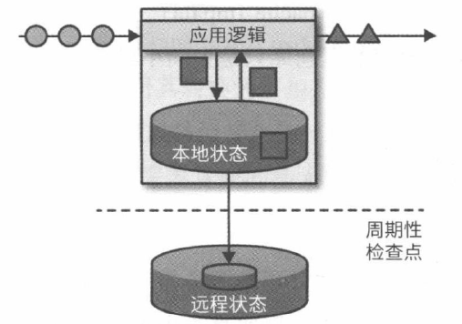

Flink会将应用状态保存在本地内存或嵌入式数据库中。为了保护这种状态不轻易丢失，flink会定期将应用状态的一致性检查点checkpoint写入远程持久化存储。

状态化流处理是一类用途广泛的设计模式，下面主要介绍三种有状态的流处理应用：

### 事件驱动型应用

事件驱动型应用是一类通过接受事件流，然后出发特定应用业务逻辑的有状态的流式应用，应用场景：模式识别、复杂事件处理、异常检测。

这种应用之间通过事件日志（如kafka）进行连接，每个应用需要管理号自身状态，并支持独立操作和扩缩容：

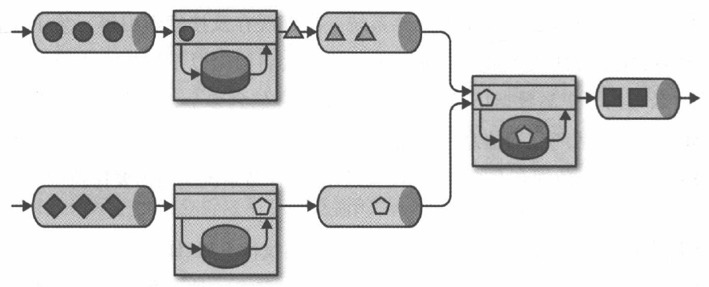

这其实跟传统事务处理本质上是一样的，区别在于基于有状态流处理的事件驱动应用，不再需要查询远程数据库，而是在本地访问它们的数据：

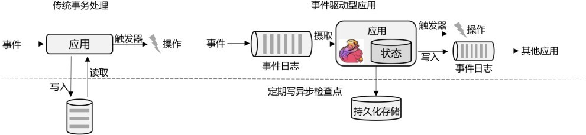

### 数据管道

在不同存储系统间同步数据的传统方式是定期执行ETL作业，但这种方式延迟较大。还有一种低延迟的方式是数据管道，以低延迟的方式获取、转换并插入数据的应用就是数据管道。

ETL 也就是数据的提取、转换、加载（Extract-Transform-Load），是在存储系统之间转换和移动数据的常用方法。在数据分析的应用中，通常会定期触发 ETL 任务，将数据从事务数据库系统复制到分析数据库或数据仓库。

所谓数据管道的作用与 ETL 类似。它们可以转换和扩展数据，也可以在存储系统之间移动数据。不过如果我们用流处理架构来搭建数据管道，这些工作就可以连续运行，而不需要再去周期性触发了。

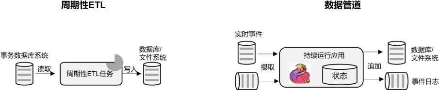

### 流式分析

数据存入数据仓库后需要进行分析，这种分析通常延迟较高，可能数小时或数天后才出现在报告中。流式分析就降低了存入数据仓库和处理完成间的延迟，它会持续获取事件流，以低延迟整合最新事件，从而不断更新结果：

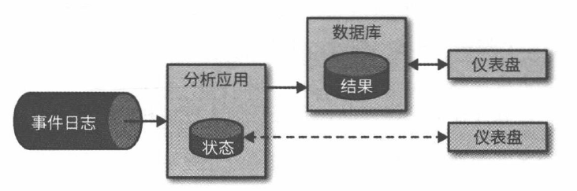

应用场合：仪表盘展示、监控系统、实时数据分析

数据分析就是从原始数据中提取信息和发掘规律，传统上，数据分析一般是先将数据复制到数据仓库Data Warehouse，然后进行批量查询。如果数据有了更新，必须将最新数据添加到要分析的数据集中，然后重新运行查询或应用程序。

如今，Apache Hadoop 生态系统的组件，已经是许多企业大数据架构中不可或缺的组成部分。现在的做法一般是将大量数据（如日志文件）写入Hadoop 的分布式文件系统（HDFS）、 S3 或HBase 等批量存储数据库，以较低的成本进行大容量存储。然后可以通过 SQL-on-Hadoop类的引擎查询和处理数据，比如大家熟悉的 Hive。这种处理方式，是典型的批处理，特点是可以处理海量数据，但实时性较差，所以也叫离线分析。

Flink同时支持流处理和批处理，与批处理分析相比，流处理分析最大的优势就是低延迟，真正实现了实时。另外，流处理不需要去单独考虑新数据的导入和处理，实时更新本来就是流处理的基本模式。

## 流处理的演变

第一代开源分布式流处理引擎专注以毫秒级延迟处理数据并保证事件不会丢失。数据在出错时不会丢失，但可能会被处理多次，它是通过牺牲结果准确度来换取的低延迟。

在当时的眼光看，计算快速和结果准确二者不可兼得，因此才有了Lambda架构：


lambda架构在传统批处理架构的基础上添加了一个由低延迟流处理引擎所驱动的提速层，在该架构中，到来的数据会同时发往流处理引擎和写入批量存储。流处理引擎会近乎实时的计算出近似结果，批处理引擎周期性的批量处理存储的数据，将精确的结果写入批处理表，随后将提速表中的非精确结果删除。最终结果是从两张表合并后的值。它的缺点是一套逻辑需要实现两遍，且不好维护。

第二代流处理引擎提供了更完善的故障处理机制，但是它是以增加处理延迟为代价的。其处理结果依然依赖于事件到来的时间和顺序。

第三代处理引擎解决了事件到来时间及顺序的依赖问题，使用精确一次的故障恢复，几乎实时的计算结果，无需在延迟和吞吐之间做抉择。

## 延迟和吞吐

对批处理应用而言，我们一般关心作业的总执行时间，对流式应用而言，我们用延迟和吞吐来代表性能好坏。

延迟指的是处理一个事件所需的时间，以时间片为单位测量的，衍生出来的指标包括平均延迟（多条数据的平均延迟）、第95百分位延迟（95%的事件延迟时间），低延迟是流处理应用应该具备的重要属性。

吞吐是衡量系统处理能力的指标，代表每单位时间可以处理多少事件，要注意吞吐低不代表性能差，因为事件到来速度也决定着吞吐，如果系统吞吐已经到达极限，提高事件到达速度会快速耗尽缓存区，这种情况称为背压（backpressure）

延迟和吞吐是两个可以相互影响的指标，要想做到低延迟和高吞吐，只有增加系统处理效率、增加并行度。

## flink和spark的不同

flink就是事件驱动型的，它是一种具有状态的应用，它从一个或多个事件流提取数据，并根据到来的事件触发计算、状态更新或其他外部动作。

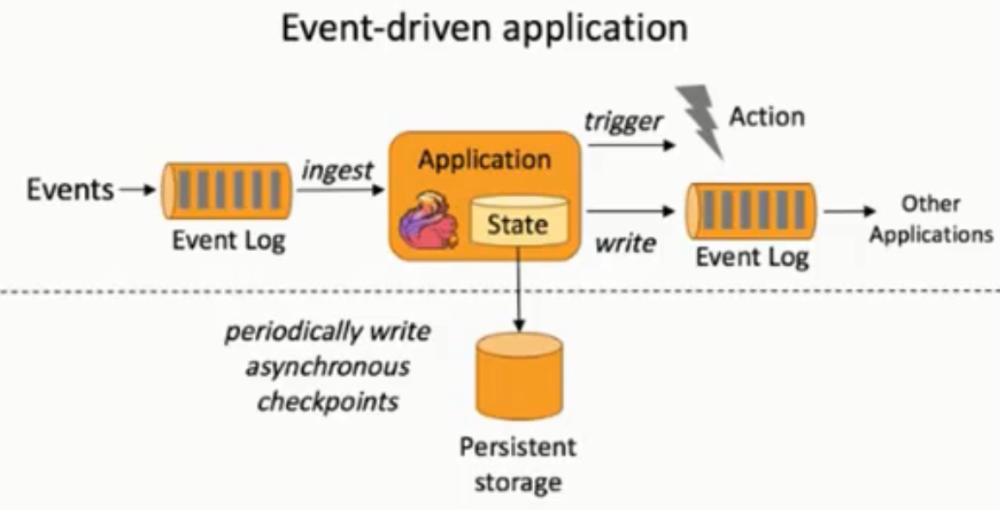

为什么flink被称为有状态的流处理，因为在流处理中如统计，需要每个数据都保存一个中间结果，然后在数据流中将这个结果不断变化，这个中间结果就是状态。

与之不同的就是 SparkStreaming 微批次，这就要提到流的概念。

Spark 以批处理为根本，并尝试在批处理之上支持流计算；在 Spark 的世界观中，万物皆批次，离线数据是一个大批次，而实时数据则是由一个一个无限的小批次组成的。所以对于流处理框架 Spark Streaming 而言，其实并不是真正意义上的“流”处理，而是“微批次”（micro-batching）处理：

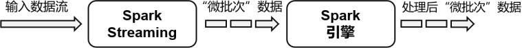

而 Flink 则认为，流处理才是最基本的操作，批处理也可以统一为流处理。在 Flink 的世界观中，万物皆流，实时数据是标准的、没有界限的流，而离线数据则是有界限的流。就是所谓的无界流和有界流：

* 无界数据流（Unbounded Data Stream）：数据的生成和传递会开始但永远不会结束。对于无界数据流，必须连续处理，也就是说必须在获取数据后立即处理。在处理无界流时，为了保证结果的正确性，我们必须能够做到按照顺序处理数据
* 有界数据流（Bounded Data Stream）：对应的，有界数据流有明确定义的开始和结束。我们可以通过获取所有数据来处理有界流。处理有界流就不需要严格保证数据的顺序了，因为总可以对有界数据集进行排序。有界流的处理也就是批处理。

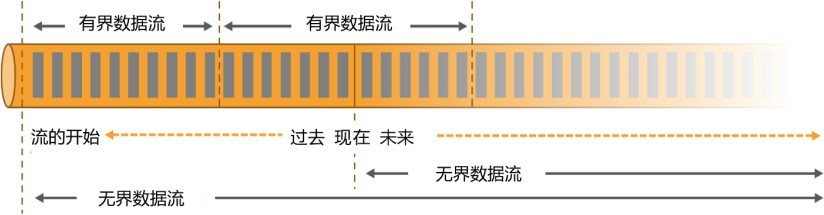

正因为这种架构上的不同，Spark 和 Flink 在不同的应用领域上表现会有差别。一般来说， Spark 基于微批处理的方式做同步总有一个“攒批”的过程，所以会有额外开销，因此无法在流处理的低延迟上做到极致。在低延迟流处理场景，Flink 已经有明显的优势。而在海量数据的批处理领域，Spark 能够处理的吞吐量更大，加上其完善的生态和成熟易用的 API，目前同样优势比较明显。

由于设计理念的差异，Spark 和 Flink 在底层实现最主要的差别就在于数据模型不同：

* Spark 底层数据模型是弹性分布式数据集（RDD），Spark Streaming 进行微批处理的底层接口DStream，实际上处理的也是一组组小批数据 RDD 的集合。可以看出，Spark 在设计上本身就是以批量的数据集作为基准的，更加适合批处理的场景。
* 而 Flink 的基本数据模型是数据流（DataFlow），以及事件（Event）序列。Flink 基本上是完全按照 Google 的 DataFlow 模型实现的，所以从底层数据模型上看，Flink 是以处理流式数据作为设计目标的，更加适合流处理的场景。

数据模型不同，对应在运行处理的流程上，自然也会有不同的架构。Spark 做批计算，需要将任务对应的 DAG 划分阶段（Stage），一个完成后经过 shuffle 再进行下一阶段的计算。而 Flink 是标准的流式执行模式，一个事件在一个节点处理完后可以直接发往下一个节点进行处理。

## flink的三层api

从上到下越来越底层：


## Flink的特性

同时支持事件时间和处理时间语义、提供精确一次的状态一致性保障、高吞吐低延迟毫秒级延迟、兼容性好、支持高可用配置。

# flink快速上手

## 在linux中运行

1、在官网下载flink-1.7.1-bin-scala_2.12

2、在linux中解压：

```
tar xvfz flink-1.7.1-bin-scala_2.12.tgz 
```

3、进入解压后的flink文件夹，启动本地flink集群：

```
./bin/start-cluster.sh Starting cluster
```

4、打开浏览器的8081端口即可看见flink web UI：

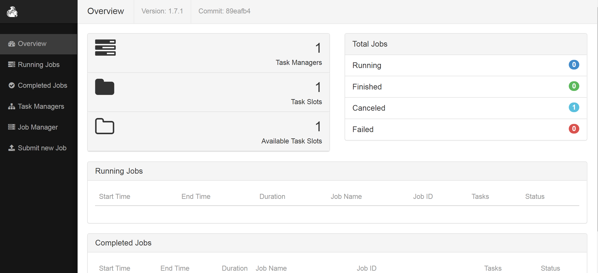

5、下载书中提供的jar包：

```
wget https://streaming-with-flink.github.io/examples/download/examples-scala.jar
```

6、指定应用的入口和jar包，运行任务：

```
./bin/flink run -c io.github.streamingwithflink.chapter1.AverageSensorReadings examples-scala.jar
```

7、在UI上可以看见运行的任务，在UI上也可以取消任务，任务执行过程中会自动向log目录的flink-root-taskexecutor-0-hadoop130.out文件写入记录：

```
SensorReading(sensor_5,1593940840000,26.009516590992735)
SensorReading(sensor_10,1593940840000,-10.914259259105572)
SensorReading(sensor_7,1593940840000,15.139069167110634)
SensorReading(sensor_6,1593940840000,34.00856633817606)
SensorReading(sensor_4,1593940840000,43.357403239924)
SensorReading(sensor_2,1593940840000,33.74805561675631)
SensorReading(sensor_3,1593940840000,53.43021157120927)
...
```

8、最后停止本地flink集群：

```
./bin/stop-cluster.sh
```

## 在本地IDE运行

在本地IDE直接运行AverageSensorReadings类的main方法，控制台会打印：

```
6> (sensor_37, 1595165667000, 37.5866715472707)
1> (sensor_27, 1595165667000, 35.680658921874176)
5> (sensor_70, 1595165667000, -8.15881621657143)
5> (sensor_34, 1595165667000, 1.5919229225534821)
4> (sensor_75, 1595165667000, 7.9518541521728325)
...
```

flink作为一个分布式系统，其JobManager和TaskManager一般会在不同的机器上作为独立的JVM进程运行，但在本地IDE中会在同一JVM种以独立线程的方式启动一个JobManager和一个TaskManager（默认槽数等于CPU的线程数）。

在构建flink项目的时候，必须指出依赖的Scala版本：

~~~xml
<dependency>
    <groupId>org.apache.flink</groupId>
    <artifactId>flink-streaming-java_${scala.binary.version}</artifactId>
    <version>${flink.version}</version>
</dependency>
~~~

这是因为 Flink的架构中使用了Akka 来实现底层的分布式通信，而 Akka 是用 Scala 开发的。

Flink 同时提供了 Java 和 Scala 两种语言的 API，有些类在两套 API 中名称是一样的。所以在引入包时，如果有 Java 和 Scala 两种选择，要注意选用 Java 的包。

Flink中，批处理使用DataSet API，流处理使用DataStream API，事实上 Flink 本身是流批统一的处理架构，批量的数据集本质上也是流，没有必要用两套不同的API 来实现。所以从 Flink 1.12 开始，官方推荐的做法是直接使用 DataStream API，在提交任务时通过将执行模式设为 BATCH 来进行批处理：

~~~
$ bin/flink run -Dexecution.runtime-mode=BATCH BatchWordCount.jar
~~~

这样，DataSet API 就已经处于“软弃用”（soft deprecated）的状态，在实际应用中我们只要维护一套 DataStream API 就可以了。

## 详细分析程序

运行的类AverageSensorReadings如下：

```java
public static void main(String[] args) throws Exception {

        //设置流式执行环境
        StreamExecutionEnvironment env = StreamExecutionEnvironment.getExecutionEnvironment();

        //在应用中使用事件时间
        env.setStreamTimeCharacteristic(TimeCharacteristic.EventTime);
        //configure watermark interval
        env.getConfig().setAutoWatermarkInterval(1000L);

        //从流式数据源中创建DataStream对象
        DataStream<SensorReading> sensorData = env
            // 利用SensorSource生成数据
            .addSource(new SensorSource())
            // 分配时间戳和水位线
            .assignTimestampsAndWatermarks(new SensorTimeAssigner());

        DataStream<SensorReading> avgTemp = sensorData
            // 把华氏温度转换成摄氏温度
            .map( r -> new SensorReading(r.id, r.timestamp, (r.temperature - 32) * (5.0 / 9.0)))
            // 利用id分组
            .keyBy(r -> r.id)
            // 设置1秒的滑动窗口
            .timeWindow(Time.seconds(1))
            // 使用用户自定义方法计算平均温度
            .apply(new TemperatureAverager());

        // 将结果打印
        avgTemp.print();

        // 执行应用
        env.execute("Compute average sensor temperature");
    }
```

执行一个典型flink流式应用需要以下几步：

1、设置执行环境

在程序中我们执行下列语句获取执行环境：

```java
StreamExecutionEnvironment env = StreamExecutionEnvironment.getExecutionEnvironment();
```

当连接远程集群的提交客户端调用了此方法会返回一个远程执行环境，否则会返回一个本地环境。

还可以用StreamExecutionEnvironment的createLocalEnvironment空参方法直接返回一个本地环境，或调用createRemoteEnvironment方法获取一个远程环境，此时需要传入三个参数：主机名、端口号和要提交给JobManager的jar包：

```java
StreamExecutionEnvironment env = StreamExecutionEnvironment.createRemoteEnvironment("host", 1234, "jar包路径");
```

接下来的语句可以指定程序采用事件时间语义：

```
env.setStreamTimeCharacteristic(TimeCharacteristic.EventTime);
```

执行环境还可以设置并行度、启用容错等。

2、从数据源中读取一条或多条流

在上例中，在addSource里传入了一个自定义对象SensorSource来生成数据，并通过assignTimestampsAndWatermarks方法设置水位线和时间戳。

3、通过一系列流式转换来实现应用逻辑

得到DataStream后就可以进行流的转换，上例中的转换操作包括map、keyBy、timeWindow、apply

4、选择性的将结果输出到一个或多个数据汇中

输出结果可以发送到一个外部系统如kafka，也可以直接打印。

5、执行程序

在flink中计算都是延迟的，只有在调用execute方法后才会执行。

## flink部署的三种模式

1、Standalone 模式：不依靠外加资源管理器

2、Yarn 模式 ：以 Yarn 模式部署 Flink 任务时，要求 Flink 是有 Hadoop 支持的版本，Hadoop环境需要保证版本在 2.2 以上，并且集群中安装有 HDFS 服务。

3、 k8s 部署模式

框架模式和库模式：

1、框架模式：将flink应用打包成一个jar包，通过客户端提交到运行的服务上，如Dispatcher、JobManager、或不同集群管理器的ResourceManager，提交到JobManager会立即开始执行，提交到其他位置会启动一个JobManager并执行。

2、库模式：将flink应用绑定到一个特定应用的容器镜像中，镜像中还包含JobManager及ResourceManager的代码，当容器从镜像启动后会自动加载JobManager和ResourceManager，并将绑定在容器中的作业提交执行。此时另一个镜像负责部署TaskManager容器，这个镜像可以连接ResourceManager并注册处理槽。这种模式下，外部资源管理框架会负责启动镜像和故障处理。

后者常用于微服务架构。

根据集群生命周期和资源分配方式的不同，可以分为以下几种部署方式：

* 会话模式Session Mode：先启动一个集群，保持一个会话，在这个会话中通过客户端提交作业。集群的生命周期是超越于作业之上的，作业结束了就释放资源，集群依然正常运行。缺点：因为资源是共享的，所以资源不够了，提交新的作业就会失败。另外，同一个 TaskManager 上可能运行了很多作业，如果其中一个发生故障导致 TaskManager 宕机，那么所有作业都会受到影响。在yarn场景，使用yarn-session.sh提交任务。

* 单作业模式Per-Job Mode：会话模式因为资源共享会导致很多问题，所以为了更好地隔离资源，我们可以考虑为每个提交的作业启动一个集群，这就是所谓的单作业（Per-Job）模式。此时集群只为这个作业而生。同样由客户端运行应用程序，然后启动集群，作业被提交给 JobManager，进而分发给 TaskManager 执行。作业作业完成后，集群就会关闭，所有资源也会释放。这样一来，每个作业都有它自己的 JobManager管理，占用独享的资源，即使发生故障，它的 TaskManager 宕机也不会影响其他作业。在yarn场景，使用flink  run提交任务

* 应用模式Application Mode：上面的方式，应用代码都是在客户端上执行，然后由客户端提交给 JobManager的。但是这种方式客户端需要占用大量网络带宽，去下载依赖和把二进制数据发送给 JobManager。应用模式就是不要客户端了，直接把应用提交到 JobManger 上运行。而这也就代表着，我们需要为每一个提交的应用单独启动一个 JobManager，也就是创建一个集群。这个 JobManager 只为执行这一个应用而存在，执行结束之后 JobManager 也就关闭了

  应用模式与单作业模式，都是提交作业之后才创建集群；单作业模式是通过客户端来提交的，客户端解析出的每一个作业对应一个集群；而应用模式下，是直接由 JobManager 执行应用程序的，并且即使应用包含了多个作业，也只创建一个集群。在yarn场景，用flink run-application提交任务。

## 高可用

Standalone 模式中, 同时启动多个 JobManager, 一个为“领导者”（leader），其他为“后备”（standby）, 当 leader 挂了, 其他的才会有一个成为 leader。
而 YARN 的高可用是只启动一个 Jobmanager, 当这个 Jobmanager 挂了之后, YARN 会再次启动一个, 所以其实是利用的 YARN 的重试次数来实现的高可用。

Flink是依靠 Apache ZooKeeper 来完成高可用

高可用配置：

在 yarn-site.xml 中配置：

~~~xml
<property>
	<name>yarn.resourcemanager.am.max-attempts</name>
	<value>4</value>
	<description>
	The maximum number of application master execution attempts.
	</description>
</property>

~~~

在 flink-conf.yaml 中配置：

~~~yaml
yarn.application-attempts: 3 
high-availability: zookeeper
high-availability.storageDir: hdfs://hadoop102:9820/flink/yarn/ha 
high-availability.zookeeper.quorum: hadoop102:2181,hadoop103:2181,hadoop104:2181
high-availability.zookeeper.path.root: /flink-yarn
~~~

yarn-site.xml 中配置的是 JobManager 重启次数的上限, flink-conf.xml 中的次数应该小于这个值

# flink运行架构

Flink是一个用于状态化并行流处理的分布式系统，它的搭建涉及多个进程，这些进程通常会分布在多台机器上。Flink可以和很多集群管理器如yarn很好的集成，利用如hdfs做分布式持久化存储。依赖zk来完成高可用性设置中的领导选举工作。

## 四个主要组件

Flink 是典型的 Master-Slave 架构的分布式数据处理框架，其中 Master 角色对应着JobManager，Slave 角色则对应TaskManager

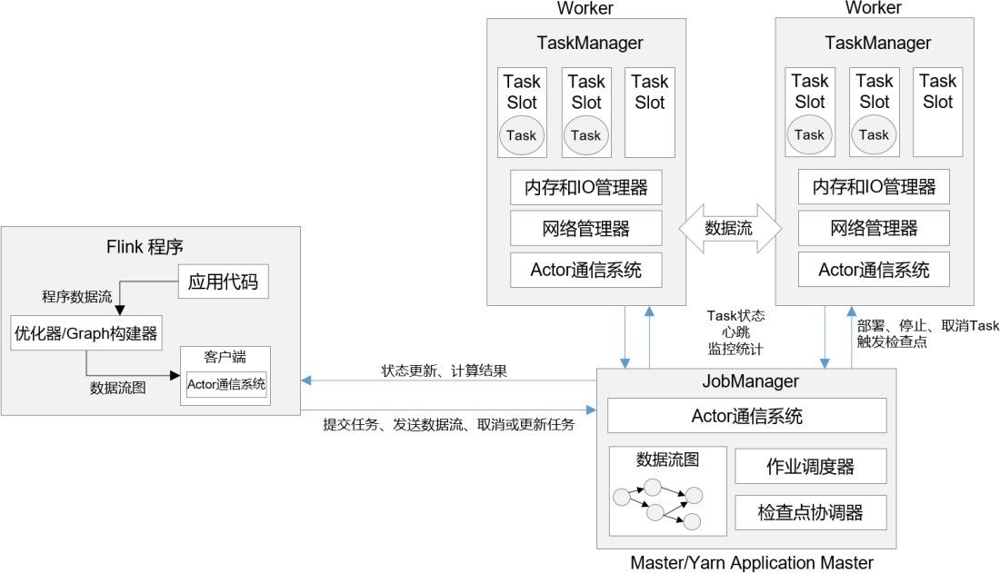

客户端并不是处理系统的一部分，它只负责作业的提交。具体来说，就是调用程序的 main 方法，将代码转换成“数据流图”（Dataflow Graph），并最终生成作业图（JobGraph），一并发送给 JobManager。提交之后，任务的执行其实就跟客户端没有关系了；我们可以在客户端选择断开与 JobManager 的连接, 也可以继续保持连接。之前我们在命令提交作业时，加上的-d 参数，就是表示分离模式（detached mode)，也就是断开连接。

flink架构主要组件：作业管理器（JobManager）、资源管理器（ResourceManager）、任务管理器（TaskManager），以及分发器（Dispatcher）。因为 Flink 是用 Java 和 Scala 实现的，所以所有组件都会运行在Java 虚拟机上。每个组件的职责如下： 

1、作业管理器（JobManager）

控制一个应用程序执行的主进程，也就是说，每个应用程序都会被一个不同的JobManager 所控制执行。JobManager 会先接收到要执行的应用程序，这个应用程序会包括：作业图（JobGraph）、逻辑数据流图（logical dataflow graph）和打包了所有的类、库和其它资源的JAR 包。JobManager 会把JobGraph 转换成一个物理层面的数据流图，这个图被叫做 “执行图”（ExecutionGraph），包含了所有可以并发执行的任务。JobManager 会向资源管理器（ResourceManager）请求执行任务必要的资源，也就是任务管理器（TaskManager）上的插槽（slot）。一旦它获取到了足够的资源，就会将执行图分发到真正运行它们的TaskManager 上。而在运行过程中，JobManager 会负责所有需要中央协调的操作，比如说检查点（checkpoints）的协调。 

每个应用都应该被唯一的 JobManager 所控制执行。当然，在高可用（HA）的场景下，可能会出现多个 JobManager；这时只有一个是正在运行的领导节点（leader），其他都是备用节点（standby）。

JobManger 又包含 3 个不同的组件：JobMaster、资源管理器（ResourceManager）、分发器（Dispatcher）

JobMaster：JobMaster 是 JobManager 中最核心的组件，负责处理单独的作业（Job）。所以 JobMaster和具体的 Job 是一一对应的，多个 Job 可以同时运行在一个 Flink 集群中, 每个 Job 都有一个自己的 JobMaster。需要注意在早期版本的 Flink 中，没有 JobMaster 的概念；而 JobManager的概念范围较小，实际指的就是现在所说的 JobMaster。

JobMaster  会把 JobGraph  转换成一个物理层面的数据流图，这个图被叫作“执行图”（ ExecutionGraph ）， 它包含了所有可以并发执行的任务。 JobMaster 会向资源管理器（ResourceManager）发出请求，申请执行任务必要的资源。一旦它获取到了足够的资源，就会将执行图分发到真正运行它们的 TaskManager 上。而在运行过程中，JobMaster 会负责所有需要中央协调的操作，比如说检查点（checkpoints）的协调。

2、资源管理器（ResourceManager）

主要负责管理任务管理器（TaskManager）的插槽（slot），TaskManger 插槽是 Flink 中定义的处理资源单元。Flink 为不同的环境和资源管理工具提供了不同资源管理器，比如YARN、Mesos、K8s，以及 standalone 部署。当JobManager 申请插槽资源时，ResourceManager会将有空闲插槽的TaskManager 分配给JobManager。如果 ResourceManager 没有足够的插槽来满足 JobManager 的请求，它还可以向资源提供平台发起会话，以提供启动 TaskManager进程的容器。另外，ResourceManager 还负责终止空闲的 TaskManager，释放计算资源。 

3、任务管理器（TaskManager）

Flink 中的工作进程。通常在 Flink 中会有多个 TaskManager 运行，每一个TaskManager都包含了一定数量的插槽（slots）。插槽的数量限制了 TaskManager 能够执行的任务数量。启动之后，TaskManager 会向资源管理器注册它的插槽；收到资源管理器的指令后，TaskManager 就会将一个或者多个插槽提供给 JobManager 调用。JobManager 就可以向插槽分配任务（tasks）来执行了。在执行过程中，一个TaskManager 可以跟其它运行同一应用程序的TaskManager 交换数据。 

TaskManager 是 Flink 中的工作进程，数据流的具体计算就是它来做的，所以也被称为 “Worker”。在执行过程中，TaskManager 可以缓冲数据，还可以跟其他运行同一应用的 TaskManager交换数据。

4、分发器（Dispatcher）

可以跨作业运行，它为应用提交提供了 REST 接口。当一个应用被提交执行时，分发器就会启动并将应用移交给一个 JobManager。由于是REST 接口，所以Dispatcher 可以作为集群的一个HTTP 接入点，这样就能够不受防火墙阻挡。Dispatcher 也会启动一个 Web UI，用来方便地展示和监控作业执行的信息。Dispatcher 在架构中可能并不是必需的，这取决于应用提交运行的方式。 

JobManager 和TaskManagers的不同启动方式，其实就对应上面的部署方式：

* 作为独立（Standalone）集群的进程，直接在机器上启动
* 在容器中启动
* 由资源管理平台调度启动，比如 YARN、K8S

## 运行过程

当一个应用提交执行时，Flink 的各个组件交互协作过程如下：

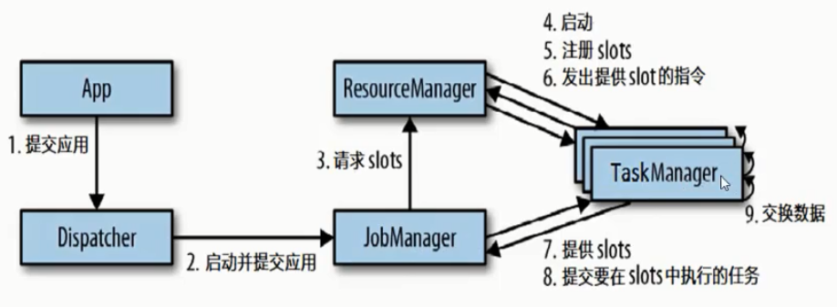

（注：第4步是ResourceManager启动TaskManager，第5步是TaskManager向ResourceManager申请注册slots，第6步是ResourceManager向TaskManager提供slot，同时告知TaskManager对应的JobManager，然后第7步TaskManager向JobManager提供slots，然后第8步JobManager提交任务）

如果我们将 Flink 集群部署到YARN 上，那么就会有如下的提交流程：

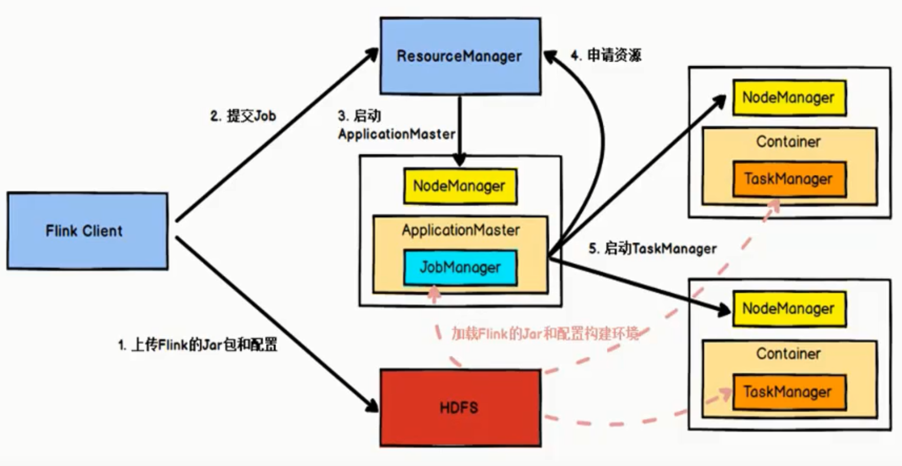

（注：NodeManager、Container、ApplicationMaster、ResourceManager都是yarn的组件，大致过程就是由ApplicationMaster向ResourceManager申请资源，然后启动TaskManager的过程）

Flink 任务提交后，Client 向 HDFS 上传 Flink 的 Jar 包和配置，之后向 Yarn ResourceManager 提交任务，ResourceManager 分配 Container 资源并通知对应的NodeManager 启动 ApplicationMaster，ApplicationMaster 启动后加载 Flink 的 Jar 包和配置构建环境，然后启动 JobManager，之后 ApplicationMaster 向 ResourceManager申请资源启动 TaskManager ， ResourceManager 分配 Container 资 源 后 ， 由ApplicationMaster 通 知 资 源 所 在 节 点 的 NodeManager 启动 TaskManager ， NodeManager 加载 Flink 的 Jar 包和配置构建环境并启动 TaskManager，TaskManager启动后向 JobManager 发送心跳包，并等待 JobManager 向其分配任务。 

任务调度过程图：

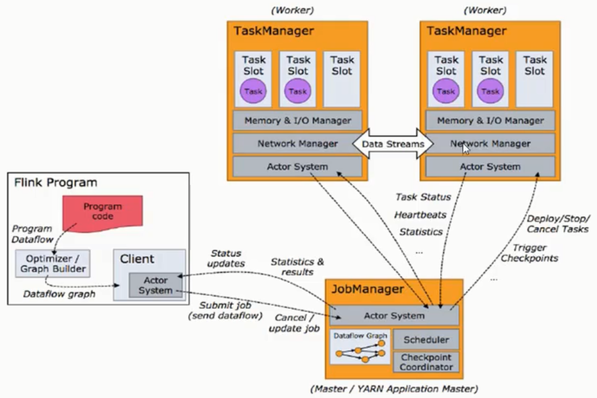

客户端不是运行时和程序执行的一部分，但它用于准备并发送dataflow(JobGraph)给 Master(JobManager)，然后，客户端断开连接或者维持连接以等待接收计算结果。 

当 Flink 集 群 启 动 后 ， 首 先 会 启 动 一 个 JobManger 和一个或多个的 TaskManager。由 Client 提交任务给 JobManager，JobManager 再调度任务到各个 TaskManager 去执行，然后 TaskManager 将心跳和统计信息汇报给 JobManager。 TaskManager 之间以流的形式进行数据的传输。上述三者均为独立的 JVM 进程。 

Client 为提交 Job 的客户端，可以是运行在任何机器上（与 JobManager 环境连通即可）。提交 Job 后，Client 可以结束进程（Streaming 的任务），也可以不结束并等待结果返回。 

JobManager 主要负责调度 Job 并协调 Task 做 checkpoint ，职责上很像 Storm 的 Nimbus。从 Client 处接收到 Job 和 JAR 包等资源后，会生成优化后的执行计划，并以 Task 的单元调度到各个 TaskManager 去执行。 

TaskManager 在启动的时候就设置好了槽位数（Slot），每个 slot 能启动一个 Task，Task 为线程。JobManager 处接收需要部署的 Task，部署启动后，与自己的上游建立 Netty 连接，接收数据并处理。

## TaskManger 与Slots

Flink 中每一个 worker(TaskManager)都是一个 JVM 进程，它可能会在独立的线程上执行一个或多个 subtask。为了控制一个 worker 能接收多少个 task，worker 通过 task slot 来进行控制（一个 worker 至少有一个 task slot）。 

每个 task slot 表示 TaskManager 拥有资源的一个固定大小的子集。假如一个TaskManager 有三个 slot，那么它会将其管理的内存分成三份给各个 slot。资源 slot化意味着一个 subtask 将不需要跟来自其他 job 的 subtask 竞争被管理的内存，取而代之的是它将拥有一定数量的内存储备。需要注意的是，这里不会涉及到 CPU 的隔离，slot 目前仅仅用来隔离 task 的受管理的内存。 

通过调整 task slot 的数量，允许用户定义 subtask 之间如何互相隔离。如果一个TaskManager 一个 slot，那将意味着每个 task group 运行在独立的 JVM 中（该 JVM可能是通过一个特定的容器启动的），而一个 TaskManager 多个 slot 意味着更多的subtask 可以共享同一个 JVM。而在同一个 JVM 进程中的 task 将共享 TCP 连接（基于多路复用）和心跳消息。它们也可能共享数据集和数据结构，因此这减少了每个task 的负载。 

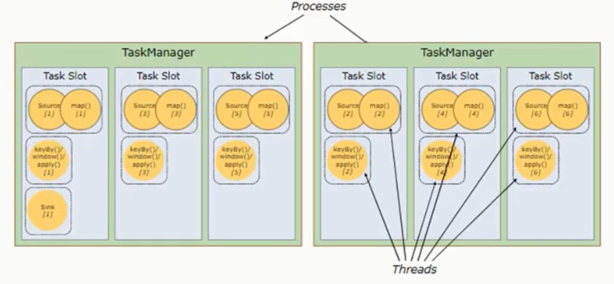

这里要注意一个问题：默认情况下，Flink 允许子任务共享 slot，即使它们是不同任务的子任务（前提是它们来自同一个 job）。 这样的结果是，一个 slot 可以保存作业的整个管道。这样做的好处有两点：

1、flink避免这种一个任务固定放在一个slot中执行的情况，是因为任务之间有的简单，有的复杂，如果一个任务只能在一个slot中执行那就会导致复杂的做的很慢占据slot时间很久，而简单的任务如keyby等做的很快导致slot空闲，这样所有任务共享slot就可以使任务的分配变得灵活，增加运算的效率

2、jobManager会估算任务需要多少个slot然后申请，因为子任务共享slot，所以只需要找出并行度最高的子任务，然后只要满足此子任务，其他的子任务就自然满足并行要求了。

通过设置sharing group可以改变默认设置，设置具体哪个子任务分配几个slot。

Task Slot 是静态的概念，是指 TaskManager 具有的并发执行能力，可以通过参数 taskmanager.numberOfTaskSlots 进行配置；而并行度 parallelism 是动态概念，即 TaskManager 运行程序时实际使用的并发能力，可以通过参数 parallelism.default进行配置。 

一般情况下，一个流程序的并行度，可以认为就是其所有算子中最大的并行度。一个程序中，不同的算子可能具有不同的并行度。

可以通过下面几个例子来理解：

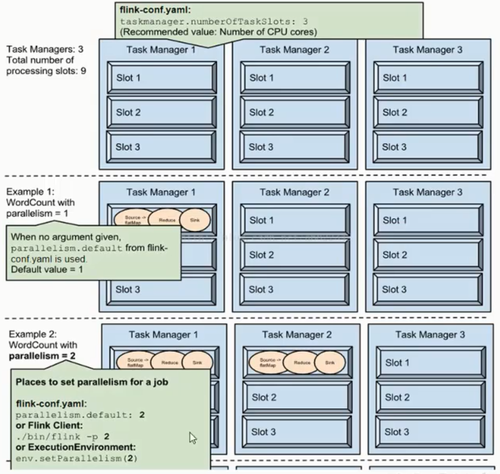

第一部分就是一共3个taskManger，设置每个taskManger的slot数为3（这个值通常要设置成CPU的核数）

第二部分是一个总的并行度设置为1的wordcount例子，此时9个slot只用了1个

第三部分是设置总的并行度为2（设置并行度的三个方法：配置文件、启动时指定、在代码里设置参数）

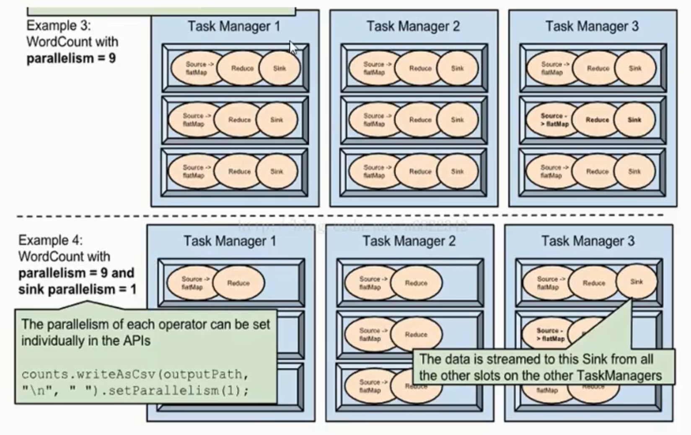

第四部分代表设置并行度为9，此时将slot全部占满了。

第五部分代表设置并行度为9，同时单独设置sink算子的并行度为1，这是因为有时当sink以文件为数据汇时并行可能会导致数据错误，所以要设置sink时非并行。

一个TaskManager允许同时执行多个任务，这些任务可以同属于一个算子，也可以是不同算子，甚至还可以是不同应用。TaskManager的处理槽数量就等于可以并行执行的任务数，每个处理槽可以执行一个并行任务。

将任务分在不同的处理槽有一个好处：TaskManager中的多个任务可以高效的执行数据交换而无需访问网络。

TaskManager会在同一个JVM进程内以多线程的方式执行任务，在一个TaskManager内布置多个处理槽会增加处理数据的效率，但是多线程无法严格地将任务彼此分离，一个线程的异常就可能导致整个TaskManager进程异常，所以可以在一个TaskManager只设置一个处理槽，这样就可以将应用在TaskManager级别进行隔离。

一个TaskManager允许同时执行多个任务，这些任务可以属于同一个算子（数据并行），也可以是不同算子（任务并行），甚至还可以来自不同的应用（作业并行）。TaskManager通过提供固定数量的处理槽来控制可以并行执行的任务数。

下图就是任务和TaskManager、处理槽之间的关系：

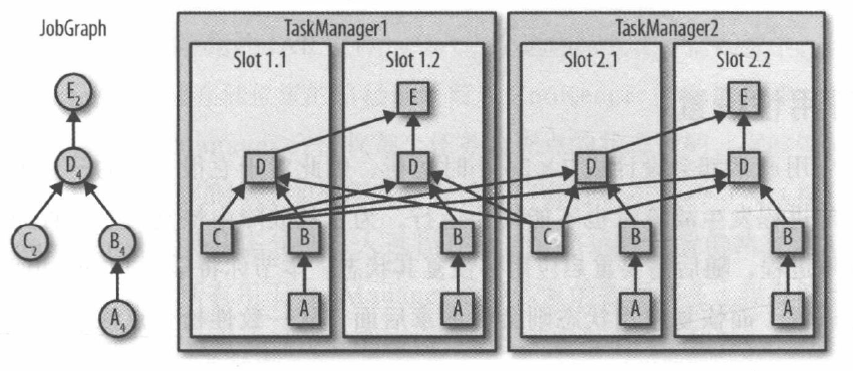

JobGraph展示了应用包含了5个算子，算子右下角的数字代表算子的并行度，这里算子最大并行度是4，所以至少需要4个处理槽。JobManager将其转化为执行图并把任务分配到4个空闲的处理槽。一个TaskManager就是一个进程，一个TaskManger下面的多个处理槽就是运行中的多个线程。

将任务放置在一个TaskManger有好处，那就是任务可以在同一个进程中高效执行而不用访问网络。单任务过于集中也让TaskManger负载变高，导致性能下降。

综上，flink可以在TaskManager内部采用线程并行以及在每个主机上部署多个TaskManager进程，这就为性能和资源隔离的取舍提供了很大的自由度。

## 基于信用值的流量控制

TaskManager是通过缓存区来进行数据交换的，这是有效利用网络资源、实现高吞吐的基础。每个TaskManager都有一个用于收发数据的网络缓冲池，如果发送端和接收端不在同一节点，还需要维护它们之间的TCP连接。每个TaskManager的缓冲区个数和并行度有关，通常需要多个缓冲区来接受或发送给多个TaskManager。默认的网络缓冲区配置足够应对中小型使用场景，对于大型使用场景可能需要手动调整缓冲区配置。

当发送任务和接收任务处于一个TaskManager时，发送任务会将要发送的记录序列化到一个字节缓冲区中，一旦缓冲区被占满就会放到一个队列中，接受任务会从这个队列中取数据并进行反序列化。

缓冲区会增加延迟，因为数据发送到缓冲区后不会立即发送。接收端在同时接受多个发送端发送来的数据时，需要有一种协调机制，首先接收端会给发送任务一个信用值，其实就是接收端用于接受它数据的网络缓冲，发送端会在信用值范围内尽可能多的传输数据，并附带上它的积压量（已经填满准备传输的网络缓冲数目）。接收端根据各发送端的积压量信息来计算下一轮信用值。这样的机制可以有效缓解数据积压，较平衡的分配网络资源。

在运行过程中，应用的任务会持续进行数据交换，TaskManager负责将数据从发送任务传输至接收任务。记录先被存入缓冲区，然后以批次的形式发送。

每个TaskManager都有一个用于收发数据的网络缓冲池，默认32KB，每对TaskManager之间都要维护一个或多个永久的TCP连接来执行数据交换。在Shuffle连接模式下，每个发送端任务都需要向任意一个接受任务传输数据。

例如下图：

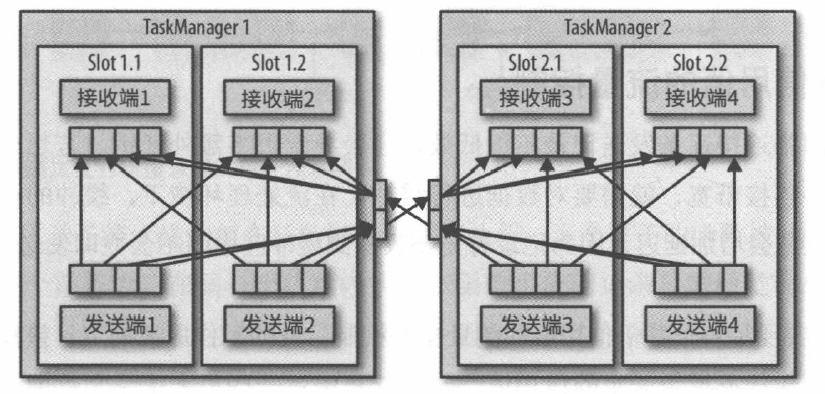

由于接收端的并行度为4，所以每个发送端至少需要4个网络缓冲区来向任一接受端发送任务，接收端也一样需要4个网络缓冲区，TaskManager会共享网络连接给每个槽，一个网络连接对应一个发送端TaskManager和一个接受端TaskManager。此时所需缓冲区数=算子任务数的平方。

当发送任务和接受任务处于同一个TaskManager进程时，此时数据传输不会涉及网络通信，信息会被序列化到缓冲区，然后接收任务会从该缓冲区中读取记录并反序列化。

Flink实现了一个基于信用值的流量控制机制，它是实现高性能的重要一环，接收任务会给发送任务授予一定的信用值，保留一些用来接收它数据的网络缓冲，发送端收到信用通知，会在信用值限定范围内尽可能多的传输缓冲数据，并会附带上积压量（已经填满准备传输的网络缓冲数据），接收端使用保留的缓冲来处理收到的数据，同时依据各发送端的积压量信息来计算所有相连的发送端在下一轮的信用优先级。

采用这种机制，发送端可以在接收端有足够资源时立即传输数据，在数据倾斜时有效分配网络资源。

## 执行图

所有的 Flink 程序都是由三部分组成的：  Source 、Transformation 和 Sink。 Source 负责读取数据源，Transformation 利用各种算子进行处理加工，Sink 负责输出，被称为数据汇。

由 Flink 程序直接映射成的数据流图是 StreamGraph，也被称为逻辑流图，因为它们表示的是计算逻辑的高级视图。为了执行一个流处理程序，Flink 需要将逻辑流图转换为物理数据流图（也叫执行图），详细说明程序的执行方式。 

Flink 中的执行图可以分成四层：StreamGraph -> JobGraph -> ExecutionGraph -> 物理执行图。 

StreamGraph：是根据用户通过 Stream API 编写的代码生成的最初的图。用来表示程序的拓扑结构。 
JobGraph：StreamGraph 经过优化后生成了 JobGraph，提交给 JobManager 的数据结构。主要的优化为，将多个符合条件的节点 chain 在一起作为一个节点，这样可以减少数据在节点之间流动所需要的序列化/反序列化/传输消耗。 

ExecutionGraph ： JobManager 根据 JobGraph 生成 ExecutionGraph 。 ExecutionGraph 是 JobGraph 的并行化版本，是调度层最核心的数据结构。 

物理执行图：JobManager 根据 ExecutionGraph 对 Job 进行调度后，在各个TaskManager 上部署 Task 后形成的“图”，并不是一个具体的数据结构。 

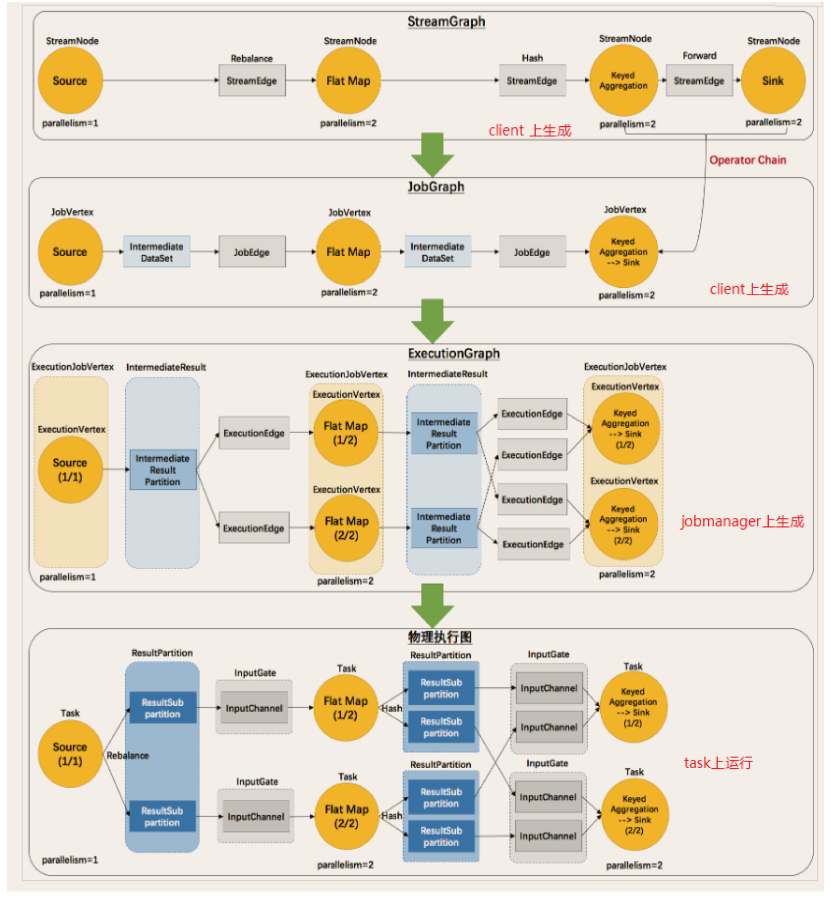

在flink的dashboard下可以看到一个任务的执行计划图。

图也被称为Dataflow程序，Dataflow程序描述了数据如何在不同操作之间流动。它通常表示为有向图，图中顶点称为算子，边表示数据依赖关系，没有输入端的算子称为数据源，没有输出端的算子称为数据汇。一个Dataflow图至少要有一个数据源和数据汇：


上图就是逻辑Dataflow图，也被称为逻辑图。为了执行Dataflow程序，需要将逻辑图转化为物理Dataflow图，此时每个算子可能会在不同物理机上运行多个并行任务。在物理Dataflow图中，顶点代表任务：

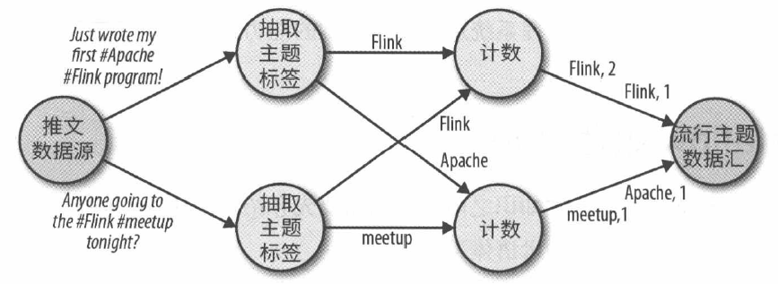

## 数据交换策略

数据流处理的并行性有两种，一种是数据并行，它指将数据分组，让同一操作的多个任务并行执行在不同数据子集上，从而将计算负载分配到多个节点上。另一种是任务并行，它指让不同算子的任务并行计算。

数据交换策略定义了数据如何分配到多个节点，策略包括转发（发送端和接收端一对一进行数据传输，如果两个节点能布置在同一物理机器上，就可以避免网络通信）、广播策略（将数据项发给全部下游算子）、基于键值的策略（根据某一个键值属性对数据分区，保证键值相同的数据交给同一任务去解决）、随机策略（将数据均匀分配至算子的所有任务，实现任务的负载均衡）

为了最大限度发挥并行带来的速度提升，通常会将数据分组在不同节点执行，这就是数据并行；或者让不同算子的任务并行计算，这就是任务并行。

数据交换策略定义了如何将数据分配给物理Dataflow图中的不同任务，这些策略通常由算子的语义自动选择，也可以手动设置：

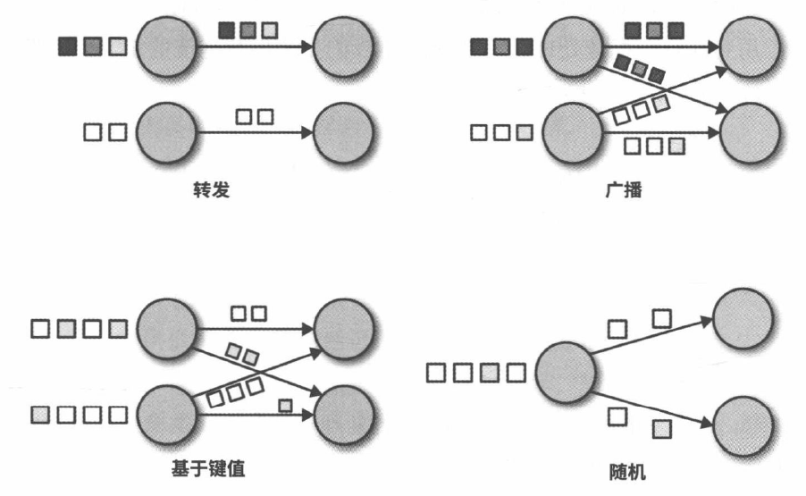

上图中涉及到的数据交换策略有以下几种：

1、转发策略：这种情况下可以让两端任务运行在同一物理机上，避免网络通信

2、广播策略：每个数据项会发往下游所有算子，它会将数据复制多份，网络通信代价较大

3、基于键值：根据键值分区

4、随机策略：将数据均匀分配至算子的所有任务，实现任务的负载均衡

## 并行度

在执行过程中，一个流（stream）包含一个或多个分区（stream partition），而每一个算子（operator）可以包含一个或多个子任务（operator subtask），这些子任务在不同的线程、不同的物理机或不同的容器中彼此互不依赖地执行。 
一个特定算子的子任务（subtask）的个数被称之为其并行度（parallelism）。一般情况下，一个流程序的并行度，可以认为就是其所有算子中最大的并行度。一个程序中，不同的算子可能具有不同的并行度。

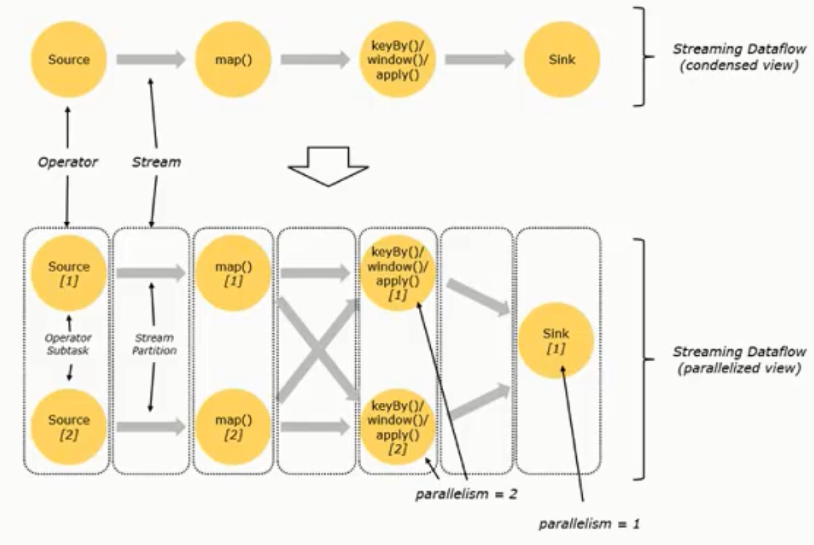

如上图所示，当前数据流中有 source、map、window、sink 四个算子，除最后 sink，其他算子的并行度都为 2。整个程序包含了 7 个子任务，至少需要 2 个分区来并行执行。我们可以说，这段流处理程序的并行度就是 2。

并行度如果小于等于集群中可用 slot 的总数，程序是可以正常执行的；而如果并行度大于可用 slot 总数，导致超出了并行能力上限，那么程序就只好等待资源管理器分配更多的资源了

Stream 在算子之间传输数据的形式可以是 one-to-one(forwarding)的模式也可以是 redistributing 的模式，具体是哪一种形式，取决于算子的种类。 

One-to-one：stream(比如在 source 和 map operator 之间)维护着分区以及元素的顺序。那意味着 map 算子的子任务看到的元素的个数以及顺序跟 source 算子的子任务生产的元素的个数、顺序相同，map、fliter、flatMap 等算子都是 one-to-one 的对应关系。 

Redistributing：stream(map()跟 keyBy/window 之间或者 keyBy/window 跟 sink之间)的分区会发生改变。每一个算子的子任务依据所选择的 transformation 发送数据到不同的目标任务。例如，keyBy() 基于 hashCode 重分区、broadcast 和 rebalance会随机重新分区，这些算子都会引起 redistribute 过程，而 redistribute 过程就类似于Spark 中的 shuffle 过程。 

## 任务链Operator Chains

相同并行度的 one to one 操作，Flink 这样相连的算子链接在一起形成一个 task，原来的算子成为里面的一部分。将算子链接成 task 是非常有效的优化：它能减少线程之间的切换和基于缓存区的数据交换，在减少时延的同时提升吞吐量。链接的行为可以在编程 API 中进行指定。 

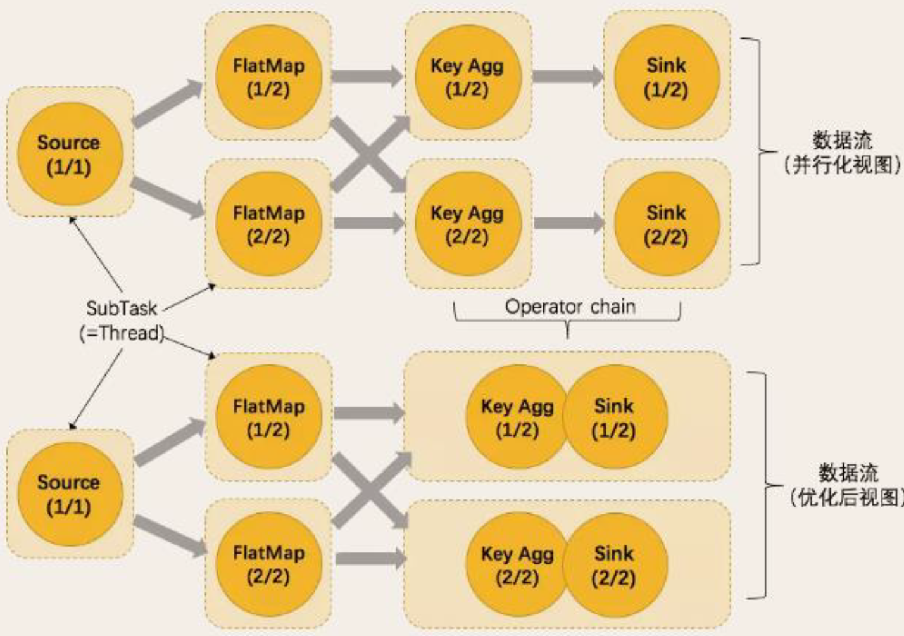

任务链接是一种降低本地通信开销的优化技术，当flink的算子之间本地通信时，通常要进行序列化和反序列化，当算子都在一个节点上，且任务并行度相同时，就可以采用任务链接技术，多个算子的函数被融合到一个任务中，只通过简单的方法调用就可以将记录发往下游的函数，不需要进行序列化。

有时会不希望使用任务链接，如函数计算量很大、任务链接过长，此时还是适合在非任务链接模式下执行，每个任务都交给单独的函数。flink默认开启任务链接，可以通过配置禁用某个应用的任务链接。

## 组件故障

故障恢复时，首先要重启故障进程，然后需要重启应用并恢复其状态。

当一个TaskManager故障时，可用的处理槽的数量就会下降，JobManager就会向ResourceManager申请更多的处理槽，若无法完成，则JobManager将无法重启应用，直到申请到足够的可用处理槽。

当JobManager出现故障时，Flink支持将作业的管理职责及元数据迁移到另一个JobManager。这个过程是通过zk实现的，当JobManager在高可用模式下工作时，会将JobGraph及其元数据（如jar包）写入一个远程持久化存储系统中，此外，JobManager还会将存储位置的路径地址写入zk中，包括检查点的状态也会写入zk。用于故障恢复的数据都在远程存储上，而zk记录着这些存储的位置。

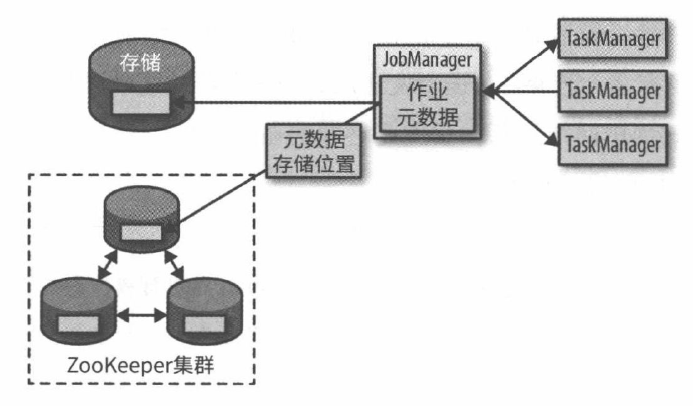

新接手工作的JobManager会执行下列步骤：

- 向zk请求存储位置，获取JobGraph、jar、检查点在远程存储的状态句柄
- 向ResourceManager申请槽继续执行应用
- 重启应用并利用最近一次检查点重置任务状态

# 流处理API

## Environment

创建一个执行环境，表示当前执行程序的上下文。 如果程序是独立调用的，则此方法返回本地执行环境；如果从命令行客户端调用程序以提交到集群，则此方法返回此集群的执行环境，也就是说，getExecutionEnvironment 会根据查询运行的方式决定返回什么样的运行环境，是最常用的一种创建执行环境的方式：

```
StreamExecutionEnvironment executionEnvironment = StreamExecutionEnvironment.getExecutionEnvironment();
```

此外还有createLocalEnvironment方法，这个方法会返回本地执行环境，需要在调用时指定默认的并行度。

createRemoteEnvironment方法返回集群执行环境，将 Jar 提交到远程服务器。需要在调用时指定 JobManager的 IP 和端口号，并指定要在集群中运行的 Jar 包。

## 执行模式

在之前的 Flink 版本中，批处理的执行环境与流处理执行环境的获取是不同的：

~~~java
// 批处理环境
ExecutionEnvironment batchEnv = ExecutionEnvironment.getExecutionEnvironment();
// 流处理环境
StreamExecutionEnvironment env = StreamExecutionEnvironment.getExecutionEnvironment();
~~~

而从 1.12.0 版本起，Flink 实现了 API 上的流批统一。DataStream API 新增了一个重要特性：可以支持不同的“执行模式”（execution mode），通过简单的设置就可以让一段 Flink 程序在流处理和批处理之间切换。这样一来，DataSet API 也就没有存在的必要了。

模式分为三种：

* 流执行模式（STREAMING）：这是 DataStream API 最经典的模式，一般用于需要持续实时处理的无界数据流。默认情况下，程序使用的就是STREAMING 执行模式。
* 批执行模式（BATCH）：专门用于批处理的执行模式, 这种模式下，Flink 处理作业的方式类似于 MapReduce 框架。对于不会持续计算的有界数据，我们用这种模式处理会更方便。
* 自动模式（AUTOMATIC）：在这种模式下，将由程序根据输入数据源是否有界，来自动选择执行模式。

BATCH 模式的配置方法一般有两种：

* 通过命令行配置：bin/flink run -Dexecution.runtime-mode=BATCH ...

* 通过代码配置：

  ~~~java
  StreamExecutionEnvironment env = StreamExecutionEnvironment.getExecutionEnvironment();
  env.setRuntimeMode(RuntimeExecutionMode.BATCH);
  ~~~

实际使用中，尽量用BATCH 模式处理批量数据，用 STREAMING模式处理流式数据。因为数据有界的时候，直接输出结果会更加高效。这是因为在 STREAMING模式下，每来一条数据，就会输出一次结果（即使输入数据是有界的），流处理模式会将更多的中间结果输出。


## Source

数据接入和输出是流处理和外部系统通信的桥梁。数据源支持从TCP套接字、文件、kafka等获取数据；数据汇可以将数据写入文件、数据库、消息队列或者某个接口。

从集合中读数据：

```
executionEnvironment.fromCollection(集合);
```

从文件中读数据：

```
executionEnvironment.readTextFile("YOUR_FILE_PATH")
```

从kafka中读数据：

```
env.addSource(new FlinkKafkaConsumer011[String]("sensor", new SimpleStringSchema(), properties));
```

自定义source：

```java
public class MySensorSource implements SourceFunction<Integer> {
    @Override
    public void run(SourceContext sourceContext) throws Exception {
        Random rand = new Random();
        while (running) {
            int num = rand.nextInt(100);
            Thread.sleep(500);
            sourceContext.collect(num);
        }
    }


    boolean running = true;
    @Override
    public void cancel() {
        running = false;
    }
}
```

```
executionEnvironment.addSource(new MySensorSource());
```

## Sink

sink是flink所有对外操作的承载，官方定义了一些sink，如kafka、redis、Elasticsearch，用户也可以自定义sink，实现RichSinkFunction接口，然后实现open、close、invoke方法，open内部主要实现创建外部系统连接，close方法中负责关闭连接，invoke中负责向外部系统写入数据。

## 数据流上的操作

### 转换操作

转换操作针对每一个事件进行一次操作。对转换结果产生一条新的输出流，它既可以产生多条输出流，也可以接收多个输入流。

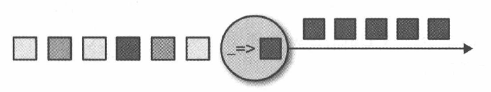

### 滚动聚合

滚动聚合会根据每个到来的事件持续更新结果，生成更新后的聚合值。聚合函数最好要满足可结合和可交换条件，否则算子就要存储整个流的历史记录。比如下图展示了一个求最小值的聚合操作：


### 窗口操作

窗口操作会持续创建一些被称为桶的有限事件集合，并允许基于这些有限集进行计算。

窗口类型有几种：滚动窗口、滑动窗口、会话窗口

1、滚动窗口

它将事件分配到长度固定且互不重叠的桶中。又可以分为基于数量的滚动窗口和基于时间的滚动窗口两种：

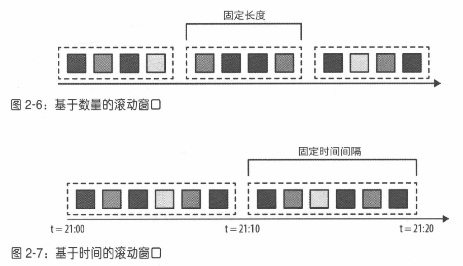

2、滑动窗口

它将事件分配到长度固定且互相重叠的桶中，每个事件可能会同时属于多个桶。通过窗口长度和滑动距离来定义一个滑动窗口，比如如下图中就是长度为4，滑动间隔为3的滑动窗口：

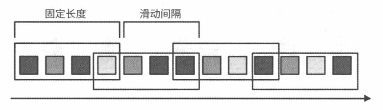

3、会话窗口

会话由发生在相邻时间内的一系列事件外加一段非活动时间组成。会话长度并非预先定义好，而是和实际数据有关。会话窗口会将属于同一个会话的事件分配到相同桶中，会话间隔将事件分为不同的会话，它也是非活动时间长度：

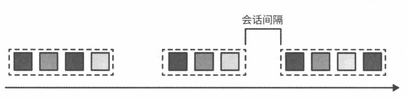

窗口也可以并行，例如根据ID对数据流进行划分，然后在每个ID形成的流中设置窗口，这就是并行窗口：

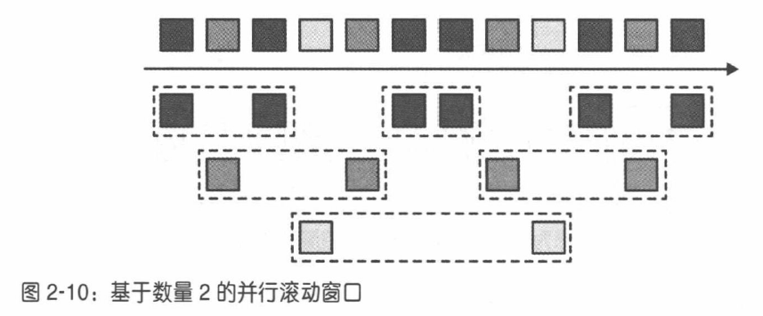


## 基本算子操作

1、作用于单个事件的基本转换

- map转换
- filter过滤
- flatmap转换：针对每个事件产生0个、一个或者多个输出事件

2、针对相同键值事件的KeyedStream转换

keyBy支持将一个DataStream转换为一个KeyedStream，有相同键值的事件一定会在后续算子的同一个任务上处理。

- 滚动聚合，每当有新事件到来，该算子都会更新聚合结果，并将其以事件的形式发送出去。如sum、min、max、minBy（返回最小值所在事件）、maxBy。注意在使用滚动聚合算子时，会为处理过的每条键值维持一个状态，这些状态不会自动清理，所以该算子不能用于键值域无限的流
- reduce，自定义逻辑的滚动聚合

其中的reduce是一个分组数据流的聚合操作，合并当前的元素和上次聚合的结果，产生一个新的值，返回的流中包含每一次聚合的结果，而不是只返回最后一次聚合的最终结果。 

reduce的使用案例：

```java
StreamExecutionEnvironment executionEnvironment = StreamExecutionEnvironment.getExecutionEnvironment();
        DataStreamSource<Integer> integerDataStreamSource = executionEnvironment.addSource(new MySensorSource());
        integerDataStreamSource.print("before");
        SingleOutputStreamOperator<Integer> reduce = integerDataStreamSource.keyBy(new KeySelector<Integer, Integer>() {
            @Override
            public Integer getKey(Integer integer) throws Exception {
                return 1;
            }
        }).reduce((a, b) -> a + b);
        reduce.print("afterReduce");
        executionEnvironment.execute();
```

流接入一个生成随机数的source，然后在reduce算子前后打印一次，结果如下：

```
before:8> 5
afterReduce:6> 5
before:1> 89
afterReduce:6> 94
before:2> 42
afterReduce:6> 136
before:3> 39
afterReduce:6> 175
before:4> 11
afterReduce:6> 186
before:5> 58
afterReduce:6> 244
```

当数据流中只有一个数的时候，第一次reduce结果就是那个数，然后每次reduce都会用之前计算结果和新数据计算。

3、将多条数据流合并为一条、将一条数据流拆分成多条

- union：合并两条或者多条类型相同的流，生成一个新的流。执行过程中，来自两条流的事件会以先进先出的方式合并，其顺序无法得到任何保证
- connect：合并两条流称为一个联结起来的流ConnectedStream，用于两条流的数据和状态互相影响的场景，比如温度和烟雾同时影响火灾报警。ConnectedStream可以使用map和flatMap方法，它们都有两条处理逻辑，比如flatMap的入参是CoFlatMapFunction：

```java
public interface CoFlatMapFunction<IN1, IN2, OUT> extends Function, Serializable {
    void flatMap1(IN1 var1, Collector<OUT> var2) throws Exception;

    void flatMap2(IN2 var1, Collector<OUT> var2) throws Exception;
}
```

方法内的调用顺序是无法控制的，一旦对应流有事件到来就开始执行。

connect不会让两条输入流的事件之间产生关联，因此所有事件都会随机分配给算子实例，该行为会产生不确定的结果。为了在ConnectedStream实现确定性的转换，connect可以和keyBy和broadcast结合使用：

```java
// 对联结后的数据按键值分区
// 两个数据流都以第一个属性作为键值，两个数据流中具有相同键值的事件发往同一个算子实例中
one.connect(two).keyBy(0,0);
    
// 联结两个已经分区的流
one.keyBy(0).connect(two.keyBy(0));

// 利用广播联结数据流
// 广播流的事件会发送到每个算子实例，方便联合处理两个输入流的元素
first.connect(second.broadcast());
```

- split：它将输入流分割成两条或者多条类型和输入流相同的输出流，每个事件都可以发往0个、1个或多个输出流，因此它也可以被过滤或者复制事件（在 Flink 1.13 版本中，已经弃用了.split()方法，取而代之的是直接用处理函数（process function）的侧输出流（side output））

在 Flink 中，分流操作可以通过处理函数的侧输出流（side output）很容易地实现；而合流则提供不同层级的各种API。

最基本的合流方式是联合（union）和连接（connect），两者的主要区别在于 union 可以对多条流进行合并，数据类型必须一致；而 connect 只能连接两条流，数据类型可以不同。事实上 connect 提供了最底层的处理函数（process function）接口，可以通过状态和定时器实现任意自定义的合流操作，所以是最为通用的合流方式。
除此之外，Flink 还提供了内置的几个联结（join）操作，它们都是基于某个时间段的双流合并，是需求特化之后的高层级 API。主要包括窗口联结（window join）、间隔联结（interval join）和窗口同组联结（window coGroup）。

4、对流中的事件进行重新组织的分发转换

数据交换策略控制了如何将事件分配给不同任务，我们可以手动调整数据交换策略，合理设置数据交换策略可以解决数据倾斜问题或者特殊业务要求。这些方法都是DataStream的方法：

- shuffle：随机，均匀分布随机将记录分配
- rebalance：轮流
- rescale：重调，它和轮流是一样的分片方式，不同之处在于rescale只会和下游算子的部分任务建立通道：

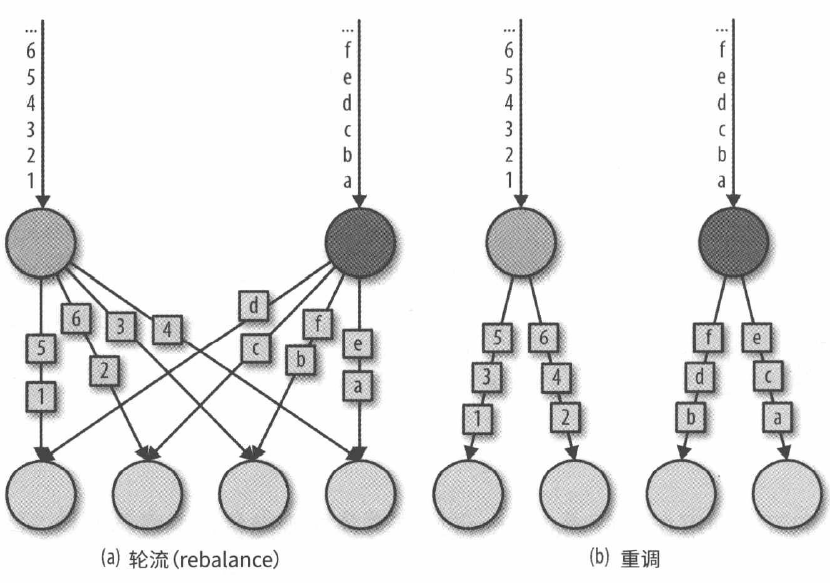

- broadcast：广播，将输入数据复制并发送到下游算子的所有并行任务中去
- global：会将所有事件发往下游算子的第一个并行任务
- partitionCustom：自定义

## 并行度

算子的并行度可以在环境级别或单个算子级别进行控制。默认环境的并行度是CPU的线程数目（本地执行环境）或者集群默认并行度（Flink集群运行）

在算子之后生成的数据流中调用setParallelism可以对算子设置并行度。

并行度设置方法，它们的优先级如下：
1、对于一个算子，首先看在代码中是否单独指定了它的并行度，这个特定的设置优先级最高，会覆盖后面所有的设置。
2、如果没有单独设置，那么采用当前代码中执行环境全局设置的并行度。
3、如果代码中完全没有设置，那么采用提交时-p 参数指定的并行度。
4、如果提交时也未指定-p 参数，那么采用集群配置文件中的默认并行度。

在开发环境中，没有配置文件，默认并行度就是当前机器的 CPU 核心数。

## 支持的数据类型

Flink支持的数据类型有以下几种：

- 原始类型
- Java和Scala元组：如java是Tuple1、Tuple2、Tuple3。。。
- Scala样例类
- POJO：
  * 类是公有（public）的
  * 有一个无参的构造方法
  * 所有属性都是公有（public）的
  * 所有属性的类型都是可以序列化的
- 一些特殊类型：数组、ArrayList、HashMap、Enum

为了方便地处理数据， Flink 有自己一整套类型系统。Flink 使用“ 类型信息”（TypeInformation）来统一表示数据类型。TypeInformation 类是 Flink 中所有类型描述符的基类。它涵盖了类型的一些基本属性，并为每个数据类型生成特定的序列化器、反序列化器和比较器。

如果不在这些类型中，Flink会将此类型当做泛型类型交给Kryo序列化框架进行处理，通常效率不高。为了提高效率可以提前将类在Kryo中注册好。

Flink中类型的核心类是TypeInformation，它封装了类型和对应的序列化器、比较器。Types类中的各静态变量可以生成各种类型。在提交应用执行时，Flink的类型系统会为将来所需处理的每种类型自动推断TypeInformation

可以显式指定信息，不用Flink的推断，有时java会擦除泛型信息导致找不到合适的序列化和反序列化器，此时就需要显示提供类型信息，在一个算子后调用returns可以显示指定类型

## UDF（用户自定义）函数

flink中的所有算子方法都有对应的UDF函数，如filter对应FilterFunction，还可以直接实现匿名类和匿名函数（lambda函数）。

此外flink中还有一种函数被称为富函数，所有 Flink 函数类都有其 Rich 版本，如FilterFunction的rich版RichFilterFunction。它与常规函数的不同在于，可以获取运行环境的上下文，并拥有一些生命周期方法，如open和close，此外还可以直接调用getRuntimeContext方法获取环境的上下文，可以获取函数执行的并行度，任务的名字，以及 state 状态等。

当自定义的函数中需要一个无法序列化的对象实例，可以选择使用富函数，在open方法中将其初始化或者覆盖java的序列化反序列化方法。

open是富函数中的初始化方法，它在每个任务首次调用转换方法前调用一次；close是函数的终止方法，会在每个任务最后一次调用转换方法后调用一次，通常用于清理和释放资源。此外还可以利用getRuntimeContext获取函数的RuntimeContext，获取一些信息，比如并行度、任务名称，而且提供了访问分区状态的方法。

## 导入外部依赖

Flink引入依赖的方式：

1、将全部依赖打进应用的JAR包，生成一个独立但通常很大的JAR文件

2、将依赖的jar放到设置Flink的lib目录中，这样在Flink进程启动时就会将依赖加载到Classpath中，这样加入的依赖会对同一Flink环境中所有运行的应用可见，可能会对某些应用造成干扰

# 时间语义与 Watermark

## 时间语义

对于流处理应用，如果每一分钟进行一次计算，那么一分钟的真正含义是什么？假设一个人玩一款手机游戏，刚开始的时候手机还能联网向分析应用发送事件，突然这个人所在的车辆进入了隧道，手机断网了，此时游戏还在继续，产生的事件会缓存在手机里，等车辆离开隧道后，这些事件就会重新发给应用，此时的一分钟要将这些离线的事件算在内吗？

在这个例子中，流式应用可以使用两种不同概念的时间，也就是处理时间和事件时间

处理时间指的是流处理算子所在机器上的本地时钟时间，此时的时间段是根据机器时间测量的，在上例中处理时间窗口会在手机离线后继续计时，离线的时间将不会算在其中。处理时间延迟会降到最低，无需考虑迟到和乱序的情况。

事件时间是指数据流中事件实际发生的时间，它以附加在数据流上的事件时间戳为依据。事件时间下基于时间的操作是可预测的，结果也是具有确定性的。依据事件时间，我们可以保证数据乱序的情况下结果依然正确，而且数据流也是可重放的，我们可以通过重放数据流来分析历史数据，就如同他们是实时产生的一样。

两种概念各有适用的场景，对于手机游戏的例子而言，使用处理时间可能会让人放弃玩游戏，但是处理时间却适用于一些更重视处理速度的场景、周期性报告、数据流真实的接入情况等。

flink流式处理中会涉及到多种时间概念：

Event Time：是事件创建的时间。它通常由事件中的时间戳描述，例如采集的日志数据中，每一条日志都会记录自己的生成时间，Flink 通过时间戳分配器访问事件时间戳。 
Ingestion Time：是数据进入 Flink 的时间。 
Processing Time：是每一个执行基于时间操作的算子的本地系统时间，与机器相关，是默认的时间属性。

这三个时间中，Event Time是最有意义的。

如果要使用Event Time需要通过配置对象引入该时间属性：

```
env.setStreamTimeCharacteristic(TimeCharacteristic.EventTime);
```

如果不指定默认使用 Processing Time。

## 水位线watermark

实际情况下，流中数据的顺序可以会因为网络、分布式等原因会产生一定的乱序，Flink 接收到的事件的先后顺序不是严格按照事件的 Event Time 顺序排列的：

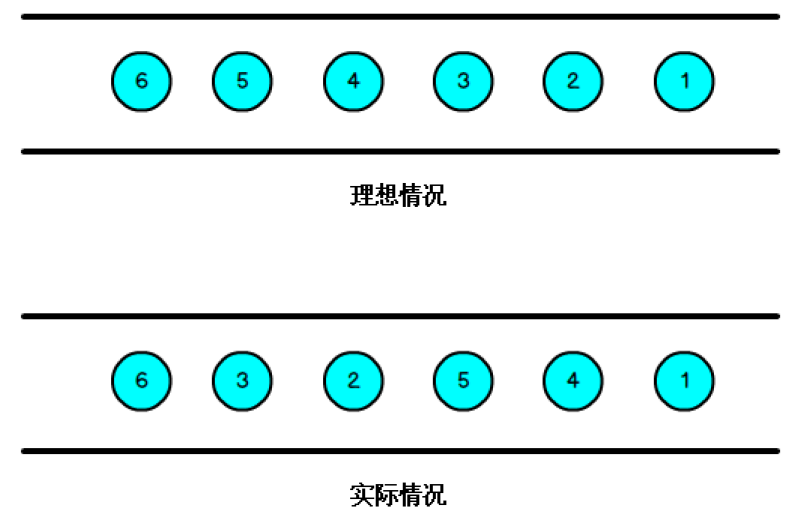

如果只根据 eventTime 决定 window 的运行，我们不能明确数据是否全部到位，但又不能无限期的等下去，此时必须要有个机制来保证一个特定的时间后，必须触发 window 去进行计算了，这个特别的机制，就是 Watermark。 

Watermark 是一种衡量 Event Time 进展的机制。Watermark 可以理解成一个延迟触发机制，我们可以设置 Watermark 的延时时长t，每次系统会校验已经到达的数据中最大的 maxEventTime，然后认定 eventTime小于 maxEventTime - t 的所有数据都已经到达，如果有窗口的停止时间等于maxEventTime – t，那么这个窗口被触发执行。下图是watermark设置为2的情况：

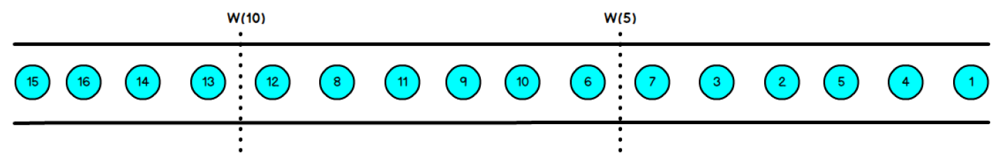

当 Flink 接收到数据时，会按照一定的规则去生成 Watermark，这条 Watermark就等于当前所有到达数据中的 maxEventTime - 延迟时长，也就是说，Watermark 是由数据携带的，一旦数据携带的 Watermark 比当前未触发的窗口的停止时间要晚，那么就会触发相应窗口的执行。由于 Watermark 是由数据携带的，因此，如果运行过程中无法获取新的数据，那么没有被触发的窗口将永远都不被触发。 

水位线是一个全局进度指标，它代表我们确信不会再有延迟事件到来的某个时间点。算子一旦收到某个水位线，相当于接到信号：某个特征时间区间的时间戳已经到齐，可以触发窗口计算或对接受的数据进行排序了。

水位线允许我们在结果的准确性和延迟之间做出取舍。激进的水位线策略保证了低延迟，但低可信度；保守的水位线可信度得到保证，但是会增加处理延迟。

流处理系统也会提供额外机制来处理晚于水位线的迟到时间，可以根据业务不同，来将这些事件再处理一次修正之前的结果，也可以记录错误日志。

### 水位线的传播

在Flink中，水位线是利用一些包含Long值时间戳的特殊记录，它们像带有额外时间戳的常规记录一样在数据流中移动：

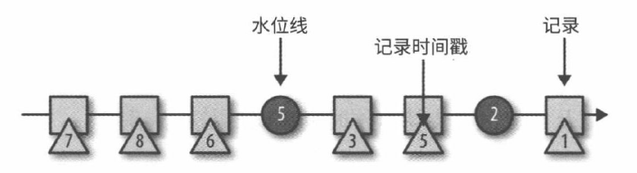

水位线的两个基本属性：

1、必须单调递增，流任务中的时间时钟一直在前进

2、和记录的时间戳存在联系，一个时间戳为T的水位线表示接下来所有记录的时间戳一定都大于T

当收到一个时间戳小于前一个水位线的记录时，这个记录就被称为迟到记录，针对迟到数据可以用专门的迟到数据处理机制处理。

当数据分区时，Flink会为一个任务的每个输入分区维护一个分区水位线，当某个分区传来水位线后，任务会把事件时间时钟调整为所有分区水位线中最小的那个值。如果事件时间时钟向前推动，任务会先处理因此而触发的所有计时器，然后把对应的水位线输出出去，实现事件时间到全部下游任务的广播。

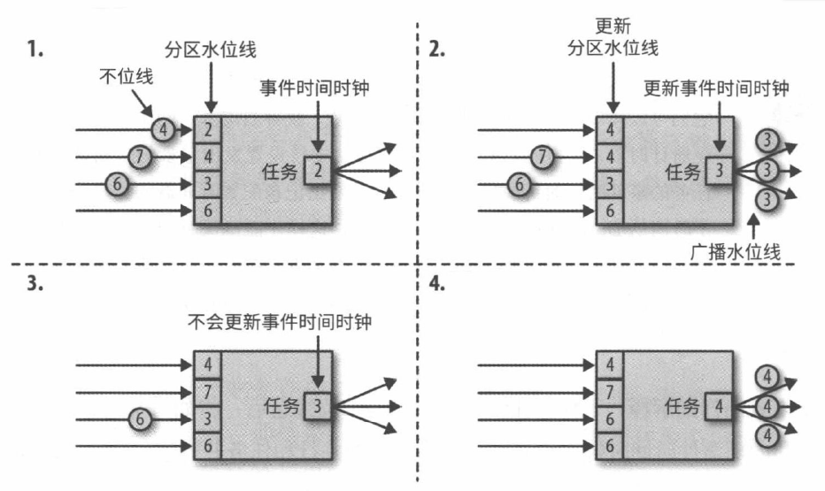

Flink对水位线的处理算法保证了算子任务的水位线最终会对齐，但是也有以下问题，当一个分区的水位线没有前进，就会导致任务的事件时间时钟不会前进，导致计时器无法触发。

用户自定义的时间戳分配函数通常都会尽可能的靠近数据源算子，因为在经过其他算子处理后，记录顺序和时间戳会变得难以推断，也不建议在流式应用中途覆盖已有的时间戳和水位线。

### watermark的引入

最简单的引入方式是：

```java
integerDataStreamSource.assignTimestampsAndWatermarks(new BoundedOutOfOrdernessTimestampExtractor<Integer>(Time.milliseconds(1000)) {
            @Override
            public long extractTimestamp(Integer integer) {
                return integer;
            }
        });
```

这里的Time.milliseconds(1000)代表watermark的延迟时间是1000ms，而extractTimestamp是对每个元素integer取时间戳（流中可能有更复杂的对象，此时要自定义它的时间戳属性，然后创建时赋值，流处理时取出）

我们还可以自定义更复杂的逻辑：

```java
dataStreamSource.assignTimestampsAndWatermarks(new MyAssigner()) 
```

MyAssigner有两种类型：AssignerWithPeriodicWatermarks、AssignerWithPunctuatedWatermarks，它们都继承TimestampAssigner。

### Assigner with periodic watermarks

下列的类PeriodicAssigner就实现了AssignerWithPeriodicWatermarks接口，其中有两个方法，一个是getCurrentWatermark方法，默认200毫秒就会调用一次该方法，然后发送一个水位线事件。extractTimestamp方法是每个元素抽取时间戳的方法。这个类的逻辑就是延迟1分钟生成时间戳，如100s的水位线事件到来后实际当前最大时间戳是160s，flink此时认为小于等于100s的事件均已到达，对应时间窗关闭。

```java
public class PeriodicAssigner implements AssignerWithPeriodicWatermarks<FlinkData> {

    // 延时时间为1分钟
    long bound = 60 * 1000;
    // 最大时间戳
    long maxTs = Long.MIN_VALUE;
    
    @Nullable
    @Override
    public Watermark getCurrentWatermark() {
        return new Watermark(maxTs - bound);
    }

    @Override
    public long extractTimestamp(FlinkData flinkData, long previousTS) {
        maxTs = Math.max(maxTs, flinkData.getTimestamp());
        return flinkData.getTimestamp();
    }
}
```

调用getCurrentWatermark方法的频率也可以手动改变，如调整成每隔5秒生成一次watermark：

```java
env.getConfig.setAutoWatermarkInterval(5000);
```

一种简单的特殊情况是，如果我们事先得知数据流的时间戳是单调递增的，也就是说没有乱序，那我们可以使用 assignAscendingTimestamps，这个方法会直接使用数据的时间戳生成 watermark：

```java
dataStreamSource.assignAscendingTimestamps(e => e.timestamp);
```

对于乱序数据流我们也可以直接像之前那样使用BoundedOutOfOrdernessTimestampExtractor类，前提是我们必须明确延迟时间。我们自定义实现的PeriodicAssigner目前的效果和BoundedOutOfOrdernessTimestampExtractor一样，但是如果想更灵活的控制逻辑，就必须采用自定义类了。

### Assigner with punctuated watermarks

这种方法间断式地生成 watermark，如下列类就只有当数据的值是0时才会生成水位线事件，否则就不生成。它可以根据流中数据的某些特征决定什么时候生成水位线。

```java
public class PunctuatedAssigner implements AssignerWithPunctuatedWatermarks<FlinkData> {

    // 延时时间为1分钟
    long bound = 60 * 1000;
    @Nullable
    @Override
    public Watermark checkAndGetNextWatermark(FlinkData flinkData, long extractedTS) {
        if (flinkData.getData() == 0) {
            return new Watermark(extractedTS - bound);
        } else {
            return null;
        }
    }

    @Override
    public long extractTimestamp(FlinkData flinkData, long previousTS) {
        return flinkData.getTimestamp();
    }
}
```

## EventTime 在 window 中的使用

### 滚动窗口（TumblingEventTimeWindows）

滚动窗口只需要在设置时间语义、水位线的情况下，调用window api时传入一个特殊的时间单位TumblingEventTimeWindows即可：

```
flinkDataSingleOutputStreamOperator.windowAll(TumblingEventTimeWindows.of(Time.seconds(2)));
```

以下面的程序为例：

```java
// 获取配置
StreamExecutionEnvironment executionEnvironment = StreamExecutionEnvironment.getExecutionEnvironment();
// 设置事件时间
executionEnvironment.setStreamTimeCharacteristic(TimeCharacteristic.EventTime);
// 设置并发度
executionEnvironment.setMaxParallelism(1);
// 设置source，产生随机生成的data
DataStreamSource<FlinkData> flinkDataDataStreamSource = executionEnvironment.addSource(new MyFlinkDataSource());
// 打印
flinkDataDataStreamSource.print("source:");
// 设置水位线，延迟时间为500ms
        SingleOutputStreamOperator<FlinkData> flinkDataSingleOutputStreamOperator = flinkDataDataStreamSource.assignTimestampsAndWatermarks(new BoundedOutOfOrdernessTimestampExtractor<FlinkData>(Time.milliseconds(500)) {
            @Override
            public long extractTimestamp(FlinkData flinkData) {
                return flinkData.getTimestamp();
            }
        });
// 滚动窗口时间窗大小为2s
        AllWindowedStream<FlinkData, TimeWindow> flinkDataTimeWindowAllWindowedStream = flinkDataSingleOutputStreamOperator.windowAll(TumblingEventTimeWindows.of(Time.seconds(2)));
// 对时间窗内数据进行累加reduce操作
        SingleOutputStreamOperator<FlinkData> reduce = flinkDataTimeWindowAllWindowedStream.reduce((a, b) -> new FlinkData(0, a.getData() + b.getData()));
// 打印
        reduce.print("window:").setParallelism(1);
// 执行
        executionEnvironment.execute();
```

上面的数据类FlinkData：

```java
public class FlinkData {
    int timestamp;
    int data;
    public FlinkData(int timestamp, int data) {
        this.timestamp = timestamp;
        this.data = data;
    }

    public int getTimestamp() {
        return timestamp;
    }

    public void setTimestamp(int timestamp) {
        this.timestamp = timestamp;
    }

    public int getData() {
        return data;
    }

    public void setData(int data) {
        this.data = data;
    }

    @Override
    public String toString() {
        return "FlinkData{" +
                "timestamp=" + timestamp +
                ", data=" + data +
                '}';
    }
}
```

随机产生数据的source：

```java
public class MyFlinkDataSource implements SourceFunction<FlinkData> {

    boolean running = true;
    int basic = 0;
    @Override
    public void run(SourceContext<FlinkData> sourceContext) throws Exception {
        Random rand = new Random();
        while (running) {
            basic += 500;
            int num = rand.nextInt(100);
            int num1 = rand.nextInt(250) - 500;
            FlinkData data = new FlinkData(basic + num1, num);
            Thread.sleep(500);
            sourceContext.collect(data);
        }
    }

    @Override
    public void cancel() {
        running = false;
    }
```

上述程序的运行结果如下：

```
source:> FlinkData{timestamp=22, data=11}
source:> FlinkData{timestamp=543, data=41}
source:> FlinkData{timestamp=1228, data=33}
source:> FlinkData{timestamp=1529, data=23}
source:> FlinkData{timestamp=2052, data=97}
source:> FlinkData{timestamp=2535, data=3}
window:> FlinkData{timestamp=0, data=108}
source:> FlinkData{timestamp=3004, data=70}
source:> FlinkData{timestamp=3604, data=60}
source:> FlinkData{timestamp=4199, data=61}
source:> FlinkData{timestamp=4563, data=19}
window:> FlinkData{timestamp=0, data=230}
source:> FlinkData{timestamp=5080, data=18}

```

分析上述结果，由于时间窗设置的是2，延迟时间是500ms，所以当时间戳为2535的数据来到时，第一个时间窗关闭，此时的时间窗只有前4个数字（时间戳<2000的），不含时间戳为2052和2535的数字，聚合结果和是108，然后输出时间窗聚合的结果。由此可见，水位线只是提供了一个时间窗关闭的时机，并不会因为延迟太久而导致时间窗内数据过多，时间戳大的数据仍然会进入下一个时间窗。

时间窗处理的时候要注意设置时间语义，如果设置处理时间的话而数据又少，很有可能在数据已经处理完的时间窗口还没关闭，从而导致时间窗无作用。

### 滑动窗口（SlidingEventTimeWindows）

滑动窗口应用时间语义也只需要改变window api的参数：

```java
AllWindowedStream<FlinkData, TimeWindow> flinkDataTimeWindowAllWindowedStream = flinkDataSingleOutputStreamOperator.windowAll(SlidingEventTimeWindows.of(Time.seconds(4), Time.seconds(1)));
```

运行结果如下：

```
source:> FlinkData{timestamp=115, data=6}
source:> FlinkData{timestamp=684, data=0}
source:> FlinkData{timestamp=1230, data=53}
source:> FlinkData{timestamp=1536, data=76}
window:> FlinkData{timestamp=0, data=6}
source:> FlinkData{timestamp=2063, data=60}
source:> FlinkData{timestamp=2561, data=25}
window:> FlinkData{timestamp=0, data=135}
source:> FlinkData{timestamp=3054, data=27}
source:> FlinkData{timestamp=3609, data=43}
window:> FlinkData{timestamp=0, data=220}
source:> FlinkData{timestamp=4126, data=18}
source:> FlinkData{timestamp=4599, data=72}
window:> FlinkData{timestamp=0, data=290}
source:> FlinkData{timestamp=5158, data=93}
source:> FlinkData{timestamp=5566, data=54}
window:> FlinkData{timestamp=0, data=374}

```

分析上述结果，因为时间窗大小为4，滑动距离为1，水位线延迟时间是500ms，所以第一个窗口关闭的时间应该是时间戳为1500的事件到来，所以第一个window输出的是1000ms内的和，是6。第二个窗口关闭的时间应该是时间戳为2500的事件到来，第二个window输出的是2000ms内的和，是135，以此类推。由此可见，滑动窗口的第一个关闭时机并不是第一个时间窗大小结束后关闭的，而是第一个滑动距离结束就会关闭。

时间窗开始的概念，在时间窗设置中有一个参数offset，它能控制时间的时区，当使用北京时间时，比标准时间慢了8个小时，可以在调用window方法时指定该参数：

```
window(SlidingEventTimeWindows.of(Time.seconds(15), Time.seconds(5), Time.hours(-8)));

```

### 会话窗口（EventTimeSessionWindows）

会话窗口在指定的时候，只需要给出一个参数即可：

```java
AllWindowedStream<FlinkData, TimeWindow> flinkDataTimeWindowAllWindowedStream = flinkDataSingleOutputStreamOperator.windowAll(EventTimeSessionWindows.withGap(Time.seconds(1)));
```

代表两次数据的 EventTime 的时间差超过1s就会触发执行，在水位线的影响下，超过1s不会立即关闭时间窗，而是延迟一段时间后关闭。

运行结果如下：

```
source:> FlinkData{timestamp=187, data=28}
source:> FlinkData{timestamp=1161, data=46}
source:> FlinkData{timestamp=2203, data=52}
source:> FlinkData{timestamp=3023, data=96}
window:> FlinkData{timestamp=0, data=74}
source:> FlinkData{timestamp=4115, data=4}
source:> FlinkData{timestamp=5158, data=12}
window:> FlinkData{timestamp=0, data=148}
source:> FlinkData{timestamp=6239, data=70}

```

分析上述结果，此时的会话窗口间隔时间为1s，水位线延迟为500ms，发现当时间戳从1161到2203时，此时已经触发了会话窗口条件，延迟到2203+500=2703时窗口关闭，所以当3023到来时，会话窗口关闭，生成一个前两条的聚合事件，和为28+46=74，以此类推。

# 时间窗

## window概述

时间窗可以将无限的流切分成大小有限的桶buckets，我们可以在桶上进行对应的计算操作。

window可以分成两类：CountWindow（根据指定的数据条数生成window，与时间无关）和TimeWindow（又分为滚动窗口（Tumbling Window）、滑动窗口（Sliding Window）和会话窗口（Session Window））

滚动窗口：时间对齐，窗口长度固定，没有重叠。 适合做每个时间段的聚合计算。

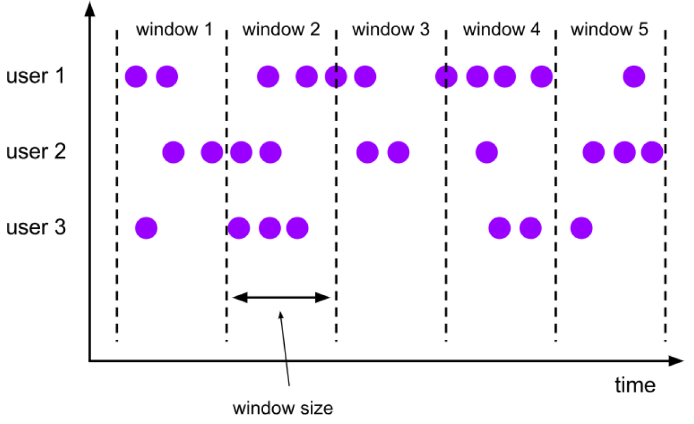

滑动窗口：时间对齐，窗口长度固定，可以有重叠。 适合做最近一个时间段内的统计。

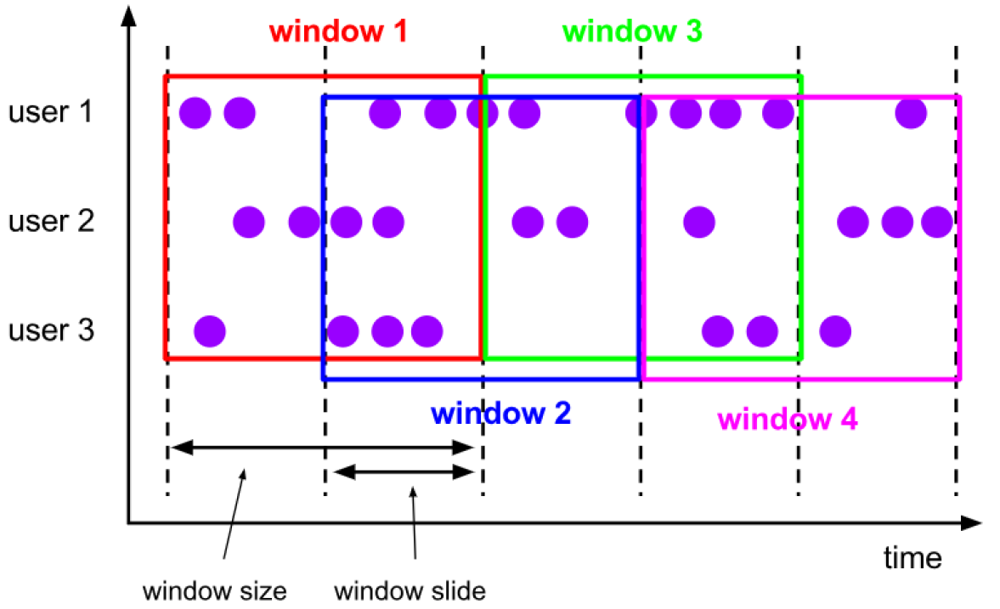

会话窗口：时间无对齐。如银行系统一段时间不操作就会失效，这种场景就对应会话窗口一段时间没有数据就会关闭窗口的特点。

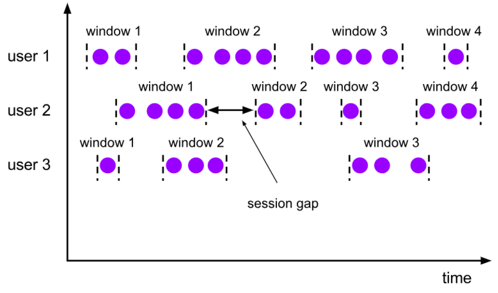

还有一类比较通用的窗口，就是“全局窗口”。这种窗口全局有效，会把相同 key 的所有数据都分配到同一个窗口中；说直白一点，就跟没分窗口一样。无界流的数据永无止尽，所以这种窗口也没有结束的时候，默认是不会做触发计算的。如果希望它能对数据进行计算处理，还需要自定义“触发器”（Trigger）。

全局窗口没有结束的时间点，所以一般在希望做更加灵活的窗口处理时自定义使用。Flink 中的计数窗口（Count Window），底层就是用全局窗口实现的。

## 窗口分配器

window方法是基于keyby后的，如果想不在keyby后窗口操作就用windowall（这时窗口逻辑只能在一个任务（task）上执行，就相当于并行度变成了 1。所以在实际应用中一般不推荐使用这种方式）。

窗口操作主要由两个部分组成：窗口分配器（Window Assigners）和窗口函数（Window Functions），例如：

```java
stream.keyBy(<key selector>)
	.window(<window assigner>)
	.aggregate(<window function>)
```

其中.window()方法需要传入一个窗口分配器，它指明了窗口的类型；而后面的.aggregate()方法传入一个窗口函数作为参数，它用来定义窗口具体的处理逻辑。

窗口按照驱动类型可以分成时间窗口和计数窗口，而按照具体的分配规则，又有滚动窗口、滑动窗口、会话窗口、全局窗口四种。除去需要自定义的全局窗口外，其他常用的类型 Flink中都给出了内置的分配器实现，我们可以方便地调用实现各种需求。

1、滚动窗口：timeWindow只有一个参数

```
val minTempPerWindow = 
dataStream.map(r=>(r.id, r.temperature))
.keyBy(_._1)
.timeWindow(Time.seconds(15))
.reduce((r1, r2)=>(r1._1, r1._2.min(r2._2)))
```

时间隔可以通过 Time.milliseconds(x)，Time.seconds(x)，Time.minutes(x)等其中的一个来指定。
2、滑动窗口：timeWindow两参数，分别是窗口大小和滑动距离

```
.timeWindow(Time.seconds(15), Time.seconds(5))
```

在较早的版本中，可以直接调用.timeWindow()来定义时间窗口；这种方式非常简洁，但使用事件时间语义时需要另外声明，程序员往往因为忘记这点而导致运行结果错误。所以在1.12 版本之后，这种方式已经被弃用了，标准的声明方式就是直接调用.window()，在里面传入对应时间语义下的窗口分配器。这样一来，我们不需要专门定义时间语义，默认就是事件时间；如果想用处理时间，那么在这里传入处理时间的窗口分配器就可以了。新API就分为6种：处理时间/事件时间的 滑动/滚动/会话窗口

3、countWindow的滚动窗口：countWindow只有一个参数，相同key数量达到5时触发：

```
val minTempPerWindow: DataStream[(String, Double)] = 
dataStream.map(r => (r.id, r.temperature))
.keyBy(_._1)
.countWindow(5)
.reduce((r1, r2) => (r1._1, r1._2.max(r2._2)))
```

4、countWindow的滑动窗口：countWindow两参数方法，一个指定窗口大小，一个指定滑动距离

5、全局窗口

它的定义同样是直接调用.window()，分配器由GlobalWindows类提供。

```java
stream.keyBy(...).window(GlobalWindows.create());
```

需要注意使用全局窗口，必须自行定义触发器才能实现窗口计算，否则起不到任何作用。

## 窗口函数

经窗口分配器处理之后，数据可以分配到对应的窗口中，而数据流经过转换得到的数据类型是 WindowedStream。这个类型并不是 DataStream，所以并不能直接进行其他转换，而必须进一步调用窗口函数，对收集到的数据进行处理计算之后，才能最终再次得到 DataStream。流之间的转换关系：

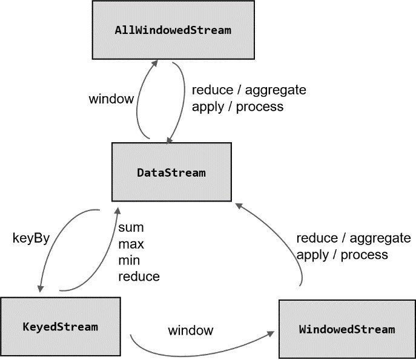

window function定义了要对窗口中的数据进行的计算操作，主要包括两种：

1、增量聚合函数，如reduce，每条数据到来都做一个计算，保持一个简单的状态

2、全窗口函数，先把窗口中所有数据都收集起来，然后再进行统一计算，排序时就要用这种计算模式，如ProcessWindowFunction（比前者效率低）

增量聚合函数：它不必等到所有数据都到齐再计算，而是每来一条数据就立即进行计算，中间只要保持一个简单的聚合状态就可以了，等到窗口结束时间。等到窗口到了结束时间需要输出计算结果的时候，我们只需要拿出之前聚合的状态直接输出

又可以分为ReduceFunction 和AggregateFunction：

- ReduceFunction：将窗口中收集到的数据两两进行归约，要求中间聚合的状态和输出的结果，都和输入的数据类型是一样的
- AggregateFunction：它也是增量式的聚合；而由于输入、中间状态、输出的类型可以不同，使得应用更加灵活方便。

另外，Flink 也为窗口的聚合提供了一系列预定义的简单聚合方法， 可以直接基于 WindowedStream 调用。主要包括.sum()/max()/maxBy()/min()/minBy()，与 KeyedStream 的简单聚合非常相似。它们的底层，其实都是通过AggregateFunction 来实现的。

全窗口函数与增量聚合函数不同，全窗口函数需要先收集窗口中的数据，并在内部缓存起来，等到窗口要输出结果的时候再取出数据进行计算。很明显，这就是典型的批处理思路了——先攒数据，等一批都到齐了再正式启动处理流程

全窗口函数也有两种：WindowFunction和 ProcessWindowFunction：

- WindowFunction：它其实是老版本的通用窗口函数接口，可以获取到包含窗口所有数据的可迭代集合（ Iterable），还可以拿到窗口（Window）本身的信息。
- ProcessWindowFunction：它是Window API 中最底层的通用窗口函数接口，除了可以拿到窗口中的所有数据之外，ProcessWindowFunction 还可以获取到一个“上下文对象”（Context）。这个上下文对象非常强大，不仅能够获取窗口信息，还可以访问当前的时间和状态信息。这里的时间就包括了处理时间（processing time）和事件时间水位线（event time watermark）。这就使得 ProcessWindowFunction 更加灵活、功能更加丰富。

增量聚合和全窗口函数的结合使用：

增量聚合函数处理计算会更高效；而全窗口函数的优势在于提供了更多的信息，可以认为是更加“通用”的窗口操作。它只负责收集数据、提供上下文相关信息，把所有的原材料都准备好，至于拿来做什么我们完全可以任意发挥。这就使得窗口计算更加灵活，功能更加强大。

所以在实际应用中，我们往往希望兼具这两者的优点，把它们结合在一起使用。Flink 的Window API 就给我们实现了这样的用法。

我们之前在调用 WindowedStream 的.reduce()和.aggregate()方法时，只是简单地直接传入了一个 ReduceFunction 或 AggregateFunction 进行增量聚合。除此之外，其实还可以传入第二个参数：一个全窗口函数，可以是WindowFunction 或者 ProcessWindowFunction。

这样调用的处理机制是：基于第一个参数（增量聚合函数）来处理窗口数据，每来一个数据就做一次聚合；等到窗口需要触发计算时，则调用第二个参数（全窗口函数）的处理逻辑输出结果。需要注意的是，这里的全窗口函数就不再缓存所有数据了，而是直接将增量聚合函数的结果拿来当作了Iterable 类型的输入。一般情况下，这时的可迭代集合中就只有一个元素了。例如此时可以根据context获取窗口的起始和结束时间，然后集合计算结果，共同封装结果返回。

窗口处理的主体还是增量聚合，而引入全窗口函数又可以获取到更多的信息包装输出，这样的结合兼具了两种窗口函数的优势，在保证处理性能和实时性的同时支持了更加丰富的应用场景。

window方法后还可以跟一些其他API：如trigger（触发器，定义window的关闭时机，以及什么时候触发计算）、evitor（移除器，定义移除某些元素的逻辑）、allowedLateness（允许处理迟到的数据，迟到的数据就是窗口关闭后的数据）、sideOutputLateData（将迟到的数据放入侧输入流）、getSideOutput（获取侧输出流）

迟到数据的处理：1、设置窗口延迟时间，允许一定范围内继续处理迟到数据；2、将迟到的数据放入侧输入流

## 窗口的生命周期

它的生命周期有以下几个阶段：

- 窗口的创建：窗口的类型和基本信息由窗口分配器（window assigners）指定，但窗口不会预先创建好，而是由数据驱动创建。当第一个应该属于这个窗口的数据元素到达时，就会创建对应的窗口。

- 窗口计算的触发：除了窗口分配器，每个窗口还会有自己的窗口函数（window functions）和触发器（trigger）。窗口函数可以分为增量聚合函数和全窗口函数，主要定义了窗口中计算的逻辑；而触发器则是指定调用窗口函数的条件。对于不同的窗口类型，触发计算的条件也会不同

- 窗口的销毁：一般情况下，当时间达到了结束点，就会直接触发计算输出结果、进而清除状态销毁窗口。这时窗口的销毁可以认为和触发计算是同一时刻。这里需要注意， Flink  中只对时间窗口（TimeWindow）有销毁机制；由于计数窗口（CountWindow）是基于全局窗口（GlobalWindw）实现的，而全局窗口不会清除状态，所以就不会被销毁。

  在特殊的场景下，窗口的销毁和触发计算会有所不同。事件时间语义下，如果设置了允许延迟，那么在水位线到达窗口结束时间时，仍然不会销毁窗口；窗口真正被完全删除的时间点，是窗口的结束时间加上用户指定的允许延迟时间。

# ProcessFunction API

flink提供的基本算子是无法访问时间戳和水位线信息的，ProcessFunction可以实现上述功能，而且还能注册定时事件，如超时事件。Flink SQL也是用ProcessFunction实现的。

处理函数（ProcessFunction）提供了一个“定时服务”（TimerService），我们可以通过它访问流中的事件（event）、时间戳（timestamp）、水位线（watermark），甚至可以注册“定时事件”。而且处理函数继承了 AbstractRichFunction 抽象类，所以拥有富函数类的所有特性，同样可以访问状态（state）和其他运行时信息。此外，处理函数还可以直接将数据输出到侧输出流（side output）中。所以，处理函数是最为灵活的处理方法，可以实现各种自定义的业务逻辑；同时也是整个 DataStream API 的底层基础。

Flink 提供了 8 个不同的处理函数：

* ProcessFunction

最基本的处理函数，基于DataStream 直接调用.process()时作为参数传入。

* KeyedProcessFunction

对流按键分区后的处理函数，基于 KeyedStream 调用.process()时作为参数传入。要想使用定时器，比如基于KeyedStream。

* ProcessWindowFunction

开窗之后的处理函数，也是全窗口函数的代表。基于WindowedStream 调用.process()时作为参数传入。

* ProcessAllWindowFunction

同样是开窗之后的处理函数，基于AllWindowedStream 调用.process()时作为参数传入。

* CoProcessFunction

合并（connect）两条流之后的处理函数，基于 ConnectedStreams 调用.process()时作为参数传入。关于流的连接合并操作，我们会在后续章节详细介绍。

* ProcessJoinFunction

间隔连接（interval join）两条流之后的处理函数，基于 IntervalJoined 调用.process()时作为参数传入。

* BroadcastProcessFunction

广播连接流处理函数，基于 BroadcastConnectedStream 调用.process()时作为参数传入。这里的“广播连接流”BroadcastConnectedStream，是一个未 keyBy 的普通 DataStream 与一个广播流（BroadcastStream）做连接（conncet）之后的产物。关于广播流的相关操作，我们会在后续章节详细介绍。

* KeyedBroadcastProcessFunction

按键分区的广播连接流处理函数，同样是基于 BroadcastConnectedStream 调用.process()时作为参数传入。与 BroadcastProcessFunction 不同的是，这时的广播连接流，是一个 KeyedStream与广播流（BroadcastStream）做连接之后的产物。

## KeyedProcessFunction

KeyedProcessFunction是最常用的一个ProcessFunction，KeyedProcessFunction 用来操作 KeyedStream。KeyedProcessFunction 会处理流的每一个元素，输出为 0 个、1 个或者多个元素。所有的 Process Function 都继承自RichFunction 接口，所以都有 open()、close()和 getRuntimeContext()等方法。

此外KeyedProcessFunction还会提供两个方法：

1、processElement(v: IN, ctx: Context, out: Collector[OUT]), 流中的每一个元素都会调用这个方法，调用结果将会放在 Collector 数据类型中输出。各参数如下：

in是输入参数，也就是流中的每一个元素

Context可以访问元素的时间戳，元素的 key，以及 TimerService 时间服务。Context还可以将结果输出到别的流(side outputs)。

Collector 用于输出

2、onTimer(timestamp: Long, ctx: OnTimerContext, out: Collector[OUT])是一个回调函数。当之前注册的定时器触发时调用。各参数如下：

timestamp 为定时器所设定的触发的时间戳。

Collector 为输出结果的集合。

OnTimerContext 和processElement 的 Context 参数一样，提供了上下文的一些信息，例如定时器触发的时间信息(事件时间或者处理时间)。

## TimerService 和 定时器（Timers）

Context 和 OnTimerContext 所持有的 TimerService 对象拥有以下方法: 

1、currentProcessingTime(): Long 返回当前处理时间
2、currentWatermark(): Long 返回当前 watermark 的时间戳
3、registerProcessingTimeTimer(timestamp: Long): Unit 会注册当前 key 的processing time 的定时器。当 processing time 到达定时时间时，触发 timer。
4、registerEventTimeTimer(timestamp: Long): Unit 会注册当前 key 的 event time定时器。当水位线大于等于定时器注册的时间时，触发定时器执行回调函数。 
5、deleteProcessingTimeTimer(timestamp: Long): Unit 删除之前注册处理时间定时器。如果没有这个时间戳的定时器，则不执行。

6、deleteEventTimeTimer(timestamp: Long): Unit 删除之前注册的事件时间定时器，如果没有此时间戳的定时器，则不执行。

简言之，这两个context都可以拿到当前的处理时间和时间戳（事件时间），而且可以设置和删除两种时间的定时器，到时间就自动执行回调函数。

需要注意，尽管处理函数中都可以直接访问  TimerService，不过只有基于 KeyedStream 的处理函数，才能去调用注册和删除定时器的方法；未作按键分区的DataStream 不支持定时器操作，只能获取当前时间。

对于处理时间和事件时间这两种类型的定时器，TimerService 内部会用一个优先队列将它们的时间戳（timestamp）保存起来，排队等待执行。可以认为，定时器其实是 KeyedStream上处理算子的一个状态，它以时间戳作为区分。所以 TimerService 会以键（key）和时间戳为标准，对定时器进行去重；也就是说对于每个 key 和时间戳，最多只有一个定时器，如果注册了多次，onTimer()方法也将只被调用一次。这样一来，我们在代码中就方便了很多，可以肆无忌惮地对一个key 注册定时器，而不用担心重复定义——因为一个时间戳上的定时器只会触发一次。

另外 Flink 对.onTimer()和.processElement()方法是同步调用的（synchronous），所以也不会出现状态的并发修改。
Flink 的定时器同样具有容错性，它和状态一起都会被保存到一致性检查点（checkpoint）中。当发生故障时，Flink 会重启并读取检查点中的状态，恢复定时器。如果是处理时间的定时器，有可能会出现已经“过期”的情况，这时它们会在重启时被立刻触发。

定时器使用案例：

```java
static class TempIncreaseAlertFunction extends KeyedProcessFunction<Integer, FlinkData, String> {

    	// 上一次的数据
        ValueState<Integer> lastData;
		// 当前注册定时器的时间
        ValueState<Long> currentTime;

    	// 在open方法中初始化状态
        @Override
        public void open(Configuration parameters) throws Exception {
            lastData = getRuntimeContext().getState(
                    new ValueStateDescriptor<Integer>("lastData", Types.INT));
            currentTime = getRuntimeContext().getState(
                    new ValueStateDescriptor<Long>("currentTime", Types.LONG));
        }

        @Override
        public void processElement(FlinkData flinkData, Context context, Collector<String> collector) throws Exception {
            int preData = (lastData.value() == null ? 0 : lastData.value());
            lastData.update(flinkData.getData());

            long time = (currentTime.value() == null ? 0 : currentTime.value());
            // 如果是第一个数据，或者前一个数据大于当前数据，就删除定时任务
            if (preData == 0 || preData > flinkData.getData()) {
                context.timerService().deleteProcessingTimeTimer(time);
                currentTime.clear();
            } else if (preData <= flinkData.getData() && time == 0) {
                // 如果当前数据大于等于前一个数据，且还没注册过定时任务，就注册任务
                long curTime = context.timerService().currentProcessingTime() + 1500;
                context.timerService().registerProcessingTimeTimer(curTime);
                currentTime.update(curTime);
            }
        }

        @Override
        public void onTimer(long timestamp, OnTimerContext ctx, Collector<String> out) throws Exception {
            out.collect("data已经持续上升2s");
            currentTime.clear();
        }
    }
```

然后keyby后调用process方法，程序执行结果如下：

```
source::7> FlinkData{timestamp=904, data=33}
source::8> FlinkData{timestamp=1319, data=51}
source::1> FlinkData{timestamp=1388, data=84}
source::2> FlinkData{timestamp=102, data=96}
source::3> FlinkData{timestamp=1517, data=26}
source::4> FlinkData{timestamp=96, data=23}
source::5> FlinkData{timestamp=528, data=96}
source::6> FlinkData{timestamp=1594, data=1}
source::7> FlinkData{timestamp=1422, data=26}
source::8> FlinkData{timestamp=615, data=65}
source::1> FlinkData{timestamp=168, data=68}
source::2> FlinkData{timestamp=1700, data=72}
alarm::6> data已经持续上升2s

```

当data为1的事件到来时，清空了上一个定时器的任务，然后26到来开始设置定时器，定时器的执行时间在1500ms后，之后的65、68和72均没有取消定时器，最后定时器执行。

## 侧输出流（SideOutput）

process function 的 side outputs 功能可以产生多条流，并且这些流的数据类型可以不一样。一个 side output 可以定义为 OutputTag[X]对象，X 是输出流的数据类型。process function 可以通过 Context 对象发射一个事件到一个或者多个 side outputs。 

以下列程序为例：

```java
static class FreezingMonitor extends KeyedProcessFunction<Integer, FlinkData, FlinkData> {

        OutputTag<String> outputTag;

        @Override
        public void open(Configuration parameters) throws Exception {
            outputTag = new OutputTag<String>("moreThan500"){};
        }

        @Override
        public void processElement(FlinkData flinkData, Context context, Collector<FlinkData> collector) throws Exception {
            // 将时间戳大于500的发送到侧输出流
            if (flinkData.getTimestamp() > 500) {
                context.output(outputTag, "more than 500:" + flinkData.getTimestamp());
            }
            // 原来的流保持不变
            collector.collect(flinkData);
        }
    }
```

调用时：

```java
StreamExecutionEnvironment executionEnvironment = StreamExecutionEnvironment.getExecutionEnvironment();
        DataStreamSource<FlinkData> flinkDataDataStreamSource = executionEnvironment.addSource(new MyFlinkDataSource());
        flinkDataDataStreamSource.print("source:");
        SingleOutputStreamOperator<FlinkData> process = flinkDataDataStreamSource.keyBy(new KeySelector<FlinkData, Integer>() {
            @Override
            public Integer getKey(FlinkData flinkData) throws Exception {
                return 1;
            }
        }).process(new FreezingMonitor());
// process后获取侧输出流，这里注意new OutputTag时要加{}
        DataStream<String> moreThan500 = process.getSideOutput(new OutputTag<String>("moreThan500"){});
        moreThan500.print("sideOutput:");
        executionEnvironment.execute();
```

运行结果：

```
source::8> FlinkData{timestamp=179, data=96}
sideOutput::6> more than 500:1452
source::1> FlinkData{timestamp=1452, data=4}
sideOutput::6> more than 500:1905
source::2> FlinkData{timestamp=1905, data=15}
sideOutput::6> more than 500:908
source::3> FlinkData{timestamp=908, data=0}
sideOutput::6> more than 500:635
source::4> FlinkData{timestamp=635, data=84}
sideOutput::6> more than 500:898
source::5> FlinkData{timestamp=898, data=70}
source::6> FlinkData{timestamp=1721, data=58}
sideOutput::6> more than 500:1721
source::7> FlinkData{timestamp=267, data=21}
source::8> FlinkData{timestamp=892, data=76}
sideOutput::6> more than 500:892
source::1> FlinkData{timestamp=1306, data=47}

```

可以发现原流保持不变，同时侧输出流中都是timestamp大于500的值。

## CoProcessFunction

操作两条输入流时可以用CoProcessFunction ，对应流的connect，它提供了操作每一个输入流的方法: processElement1()和processElement2()。 
类似于 ProcessFunction，这两种方法都通过 Context 对象来调用。这个 Context对象可以访问事件数据，定时器时间戳，TimerService，以及 side outputs。 CoProcessFunction 也提供了 onTimer()回调函数。 

## 双流联结Join

对于两条流的合并，很多情况我们并不是简单地将所有数据放在一起，而是希望根据某个字段的值将它们联结起来，“配对”去做处理。例如用传感器监控火情时，我们需要将大量温度传感器和烟雾传感器采集到的信息，按照传感器 ID 分组、再将两条流中数据合并起来，如果同时超过设定阈值就要报警。

我们发现，这种需求与关系型数据库中表的 join 操作非常相近。

事实上，Flink 中两条流的 connect 操作，就可以通过 keyBy 指定键进行分组后合并，实现了类似于 SQL 中的 join 操作；另外 connect 支持处理函数，可以使用自定义状态和TimerService 灵活实现各种需求，其实已经能够处理双流合并的大多数场景。不过处理函数是底层接口，所以尽管connect 能做的事情多，但在一些具体应用场景下还是显得太过抽象了。

为了更方便地实现基于时间的合流操作，Flink 的 DataStrema API 提供了两种内置的 join 算子，以及 coGroup 算子。

### 窗口联结（Window Join）

之前的Window API 的用法，主要是针对单一数据流在某些时间段内的处理计算。如果我们希望将两条流的数据进行合并、且同样针对某段时间进行处理和统计，此时应该使用窗口联结（window join）算子，可以定义时间窗口，并将两条流中共享一个公共键（key）的数据放在窗口中进行配对处理。

窗口联结在代码中的实现，首先需要调用DataStream 的.join()方法来合并两条流，得到一个 JoinedStreams ；接着通过.where() 和.equalTo() 方法指定两条流中联结的 key； 然后通过.window()开窗口，并调用.apply()传入联结窗口函数进行处理计算。通用调用形式如下：

~~~java
stream1.join(stream2)
	.where(<KeySelector>)
	.equalTo(<KeySelector>)
	.window(<WindowAssigner>)
	.apply(<JoinFunction>)
~~~

上面代码中.where()的参数是键选择器（KeySelector），用来指定第一条流中的 key；而.equalTo()传入的 KeySelector 则指定了第二条流中的 key。两者相同的元素，如果在同一窗口中，就可以匹配起来，并通过一个“联结函数”（JoinFunction）进行处理了。

这里.window()传入的就是窗口分配器，之前讲到的三种时间窗口都可以用在这里：滚动窗口（tumbling window）、滑动窗口（sliding window）和会话窗口（session window）。

而后面调用.apply()可以看作实现了一个特殊的窗口函数。注意这里只能调用.apply()，没有其他替代的方法。

传入的 JoinFunction 也是一个函数类接口，使用时需要实现内部的.join()方法。这个方法有两个参数，分别表示两条流中成对匹配的数据。JoinFunction 在源码中的定义如下：

~~~java
public interface JoinFunction<IN1, IN2, OUT> extends Function, Serializable { 
  OUT join(IN1 first, IN2 second) throws Exception;
}
~~~

JoinFunction 中的两个参数，分别代表了两条流中的匹配的数据。JoinFunciton 并不是真正的“窗口函数”，它只是匹配数据的具体逻辑处理。

当然，既然是窗口计算，在.window()和.apply()之间也可以调用可选 API 去做一些自定义，比如用.trigger()定义触发器，用.allowedLateness()定义允许延迟时间，等等。

两条流的数据到来之后，首先会按照 key 分组、进入对应的窗口中存储；当到达窗口结束时间时，算子会先统计出窗口内两条流的数据的所有组合，也就是对两条流中的数据做一个笛卡尔积（相当于表的交叉连接，cross join），然后进行遍历，把每一对匹配的数据，作为参数 (first，second)传入 JoinFunction 的.join()方法进行计算处理，窗口中每有一对数据成功联结匹配，JoinFunction 的.join()方法就会被调用一次，并输出一个结果：

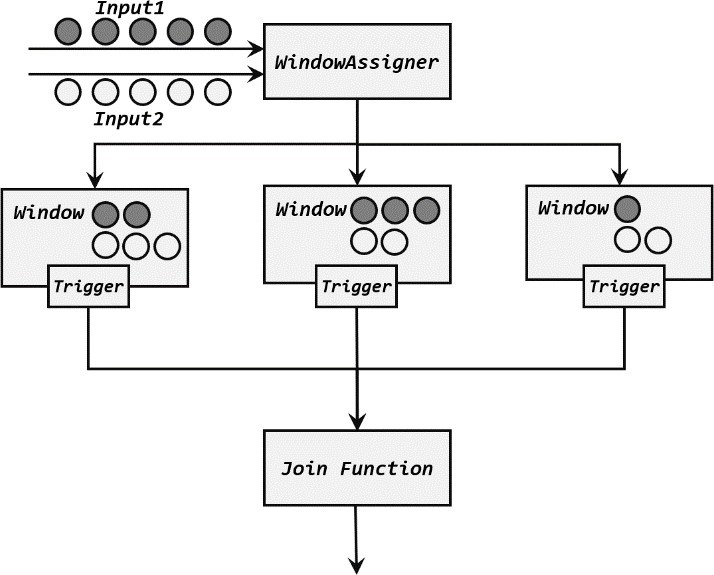

除了 JoinFunction，在.apply()方法中还可以传入 FlatJoinFunction，用法非常类似，只是内部需要实现的.join()方法没有返回值。结果的输出是通过收集器（Collector）来实现的，所以对于一对匹配数据可以输出任意条结果。

窗口 join 的调用语法和我们熟悉的 SQL 中表的 join 非常相似：

~~~sql
SELECT * FROM table1 t1, table2 t2 WHERE t1.id = t2.id;
~~~

Flink 中的 window join，类似于 inner join。也就是说，最后处理输出的，只有两条流中数据按 key 配对成功的那些；如果某个窗口中一条流的数据没有任何另一条流的数据匹配，那么就不会调用 JoinFunction 的.join()方法，也就没有任何输出了。

在电商网站中，往往需要统计用户不同行为之间的转化，这就需要对不同的行为数据流，按照用户 ID 进行分组后再合并，以分析它们之间的关联。如果这些是以固定时间周期（比如 1 小时）来统计的，那我们就可以使用窗口 join 来实现这样的需求。

### 间隔联结（Interval Join）

在有些场景下，我们要处理的时间间隔可能并不是固定的。比如，在交易系统中，需要实时地对每一笔交易进行核验，保证两个账户转入转出数额相等，也就是所谓的“实时对账”。两次转账的数据可能写入了不同的日志流，它们的时间戳应该相差不大，所以我们可以考虑只统计一段时间内是否有出账入账的数据匹配。这时显然不应该用滚动窗口或滑动窗口来处理，因为匹配的两个数据有可能刚好“卡在”窗口边缘两侧，于是窗口内就都没有匹配了；会话窗口虽然时间不固定，但也明显不适合这个场景。 基于时间的窗口联结已经无能为力了。

为了应对这样的需求，Flink 提供了一种叫作“间隔联结”（interval join）的合流操作。顾名思义，间隔联结的思路就是针对一条流的每个数据，开辟出其时间戳前后的一段时间间隔，看这期间是否有来自另一条流的数据匹配。

间隔联结具体的定义方式是，我们给定两个时间点，分别叫作间隔的“上界”（upperBound）和“下界”（lowerBound）；于是对于一条流（不妨叫作 A）中的任意一个数据元素 a，就可以开辟一段时间间隔：[a.timestamp + lowerBound, a.timestamp + upperBound],即以 a 的时间戳为中心，下至下界点、上至上界点的一个闭区间：我们就把这段时间作为可以匹配另一条流数据的“窗口”范围。所以对于另一条流（不妨叫B）中的数据元素 b，如果它的时间戳落在了这个区间范围内，a 和b 就可以成功配对，进而进行计算输出结果。所以匹配的条件为：

~~~
a.timestamp + lowerBound <= b.timestamp <= a.timestamp + upperBound
~~~

这里需要注意，做间隔联结的两条流 A 和 B，也必须基于相同的 key；下界 lowerBound应该小于等于上界upperBound，两者都可正可负；间隔联结目前只支持事件时间语义。

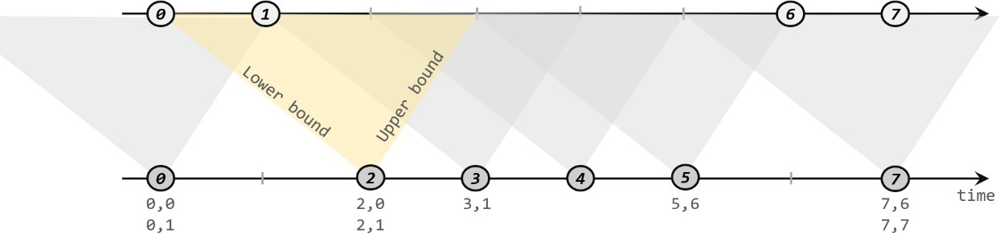

例如下方的流 A 去间隔联结上方的流 B，所以基于 A 的每个数据元素，都可以开辟一个间隔区间。我们这里设置下界为-2 毫秒，上界为 1 毫秒。于是对于时间戳为 2 的 A 中元素，它的可匹配区间就是[0, 3],流 B 中有时间戳为 0、1 的两个元素落在这个范围内，所以就可以得到匹配数据对(2, 0)和(2, 1)。

间隔联结同样是一种内连接（inner join）。与窗口联结不同的是，interval join 做匹配的时间段是基于流中数据的，所以并不确定；而且流 B 中的数据可以不只在一个区间内被匹配。

通用调用形式如下：

~~~java
stream1
	.keyBy(<KeySelector>)
	.intervalJoin(stream2.keyBy(<KeySelector>))
	.between(Time.milliseconds(-2), Time.milliseconds(1))
	.process (new ProcessJoinFunction<Integer, Integer, String(){ @Override
		public void processElement(Integer left, Integer right, Context ctx, Collector<String> out) {
			out.collect(left + "," + right);
		}
});
~~~

在电商网站中，某些用户行为往往会有短时间内的强关联。我们这里举一个例子，我们有两条流，一条是下订单的流，一条是浏览数据的流。我们可以针对同一个用户，来做这样一个联结。也就是使用一个用户的下订单的事件和这个用户的最近十分钟的浏览数据进行一个联结查询。

### 窗口同组联结（Window CoGroup）

它的用法跟window join 非常类似，也是将两条流合并之后开窗处理匹配的元素，调用时只需要将.join()换为.coGroup()就可以了：

~~~java
stream1.coGroup(stream2)
	.where(<KeySelector>)
	.equalTo(<KeySelector>)
	.window(TumblingEventTimeWindows.of(Time.hours(1)))
	.apply(<CoGroupFunction>)
~~~

与 window join 的区别在于， 调用.apply() 方法定义具体操作时， 传入的是一个CoGroupFunction。这也是一个函数类接口，源码中定义如下：

~~~java
public interface CoGroupFunction<IN1, IN2, O> extends Function, Serializable { void coGroup(Iterable<IN1> first, Iterable<IN2> second, Collector<O> out) throws Exception;
~~~

内部的.coGroup()方法，有些类似于 FlatJoinFunction 中.join()的形式，同样有三个参数，分别代表两条流中的数据以及用于输出的收集器（Collector）。不同的是，这里的前两个参数不再是单独的每一组“配对”数据了，而是传入了可遍历的数据集合。也就是说，现在不会再去计算窗口中两条流数据集的笛卡尔积，而是直接把收集到的所有数据一次性传入，至于要怎样配对完全是自定义的。这样.coGroup()方法只会被调用一次，而且即使一条流的数据没有任何另一条流的数据匹配，也可以出现在集合中、当然也可以定义输出结果了。

所以能够看出，coGroup 操作比窗口的 join 更加通用，不仅可以实现类似 SQL 中的“内连接”（inner join），也可以实现左外连接（left outer join）、右外连接（right outer join）和全外连接（full outer join）。事实上，窗口 join 的底层，也是通过 coGroup 来实现的。

# 状态编程

很多Flink内置的算子、数据源和数据汇都是有状态的，需要存储部分数据或中间结果。

基本转换算子，如 map、filter、flatMap，计算时不依赖其他数据，就都属于无状态的算子

有状态算子，例如做求和（sum）计算时，需要保存之前所有数据的和，这就是状态；窗口算子中会保存已经到达的所有数据，这些也都是它的状态。

在传统的事务型处理架构中，这种额外的状态数据是保存在数据库中的。而对于实时流处理来说，这样做需要频繁读写外部数据库，如果数据规模非常大肯定就达不到性能要求了。所以 Flink 的解决方案是，将状态直接保存在内存中来保证性能，并通过分布式扩展来提高吞吐量。

状态管理涉及的挑战：状态的访问权限（按key访问）、容错性、扩展性

## 状态类型

在流任务中，会对状态进行读取和更新，并根据状态和输入数据计算结果：


Flink 的状态有两种：托管状态（Managed State）和原始状态（Raw State）：

- 托管状态（Managed State）：由 Flink 统一管理的，状态的存储访问、故障恢复和重组等一系列问题都由 Flink 实现，我们只要调接口就可以
- 原始状态（Raw State）：它是自定义的，相当于就是开辟了一块内存，需要我们自己管理，实现状态的序列化和故障恢复

具体来讲，托管状态是由 Flink 的运行时（Runtime）来托管的；在配置容错机制后，状态会自动持久化保存，并在发生故障时自动恢复。当应用发生横向扩展时，状态也会自动地重组分配到所有的子任务实例上。对于具体的状态内容，Flink 也提供了值状态（ValueState）、列表状态（ListState）、映射状态（MapState）、聚合状态（AggregateState）等多种结构，内部支持各种数据类型。聚合、窗口等算子中内置的状态，就都是托管状态；我们也可以在富函数类（RichFunction）中通过上下文来自定义状态，这些也都是托管状态。

而对比之下，原始状态就全部需要自定义了。Flink 不会对状态进行任何自动操作，也不知道状态的具体数据类型，只会把它当作最原始的字节（Byte）数组来存储。我们需要花费大量的精力来处理状态的管理和维护。

所以只有在遇到托管状态无法实现的特殊需求时，我们才会考虑使用原始状态；一般情况下不推荐使用。绝大多数应用场景，我们都可以用 Flink 提供的算子或者自定义托管状态来实现需求。

托管状态可以分为两类：算子状态和键值分区状态。

算子状态的作用域是某个算子任务，同一个并行任务之内的记录都能访问到相同的状态，算子状态不能通过其他任务访问：

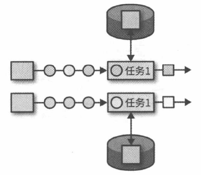

键值分区状态会按照算子输入记录所定义的键值来进行维护或访问。Flink为每个键值都维护了一个状态实例，相同键值的事件才能访问到相同的状态：

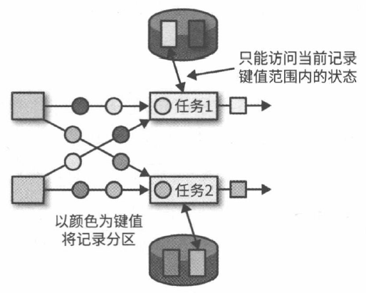

## 键值分区状态

Flink为每个键值维护一个状态实例，当任务处理一条数据时，它会自动将状态的访问范围限定为当前数据的key，具有相同key的所有数据会访问相同的状态，只能用于KeyedStream。

Keyed State支持以下数据类型：

- ValueState[T]，保存单个值，支持和update和value，相当于存和取
- ListState[T]，保存一个列表，支持add、addAll、get、update
- MapState[K,V]，保存键值对，支持get、put、contains、remove
- ReducingState[T]，它也是一个集合，和ListState类似，但是它内部有聚合逻辑，使用方法返回值是聚合计算后的结果
- AggregatingState[I,O]，和ReducingState类似，只不过有两个类型

所有状态都支持调用clear来进行清除。

状态通常都在富函数的open方法中进行初始化：

```java
// 初始化时需要借助StateDescriptor
MapState<String, byte[]> sliceDataState;

// open方法逻辑
MapStateDescriptor<String, byte[]> sliceDataStateDescriptor = new MapStateDescriptor<String, byte[]>(
                "sliceDataState", TypeInformation.of(String.class),
                PrimitiveArrayTypeInfo.BYTE_PRIMITIVE_ARRAY_TYPE_INFO);

sliceDataState = getRuntimeContext().getMapState(sliceDataStateDescriptor);
```

状态的注册，主要是通过“状态描述器”（StateDescriptor）来实现的。状态描述器中最重要的内容，就是状态的名称（name）和类型（type）。在一个算子中，我们也可以定义多个状态，只要它们的名称不同就可以了。另外，状态描述器中还可能需要传入一个用户自定义函数（user-defined-function，UDF），用来说明处理逻辑，比如前面提到的 ReduceFunction 和AggregateFunction。

状态不一定都存储在内存中，也可以放在磁盘或其他地方，具体的位置是由一个可配置的组件来管理的，这个组件叫作“状态后端”（State Backend）。

在实际应用中，很多状态会随着时间的推移逐渐增长，如果不加以限制，最终就会导致存储空间的耗尽。一个优化的思路是直接在代码中调用.clear()方法去清除状态，但是有时候我们的逻辑要求不能直接清除。这时就需要配置一个状态的“生存时间”（time-to-live，TTL），当状态在内存中存在的时间超出这个值时，就将它清除。配置状态的 TTL 时，需要创建一个 StateTtlConfig 配置对象，然后调用状态描述器的.enableTimeToLive()方法启动TTL 功能：

~~~java
StateTtlConfig ttlConfig = StateTtlConfig
	.newBuilder(Time.seconds(10))  //设定的状态生存时间
	.setUpdateType(StateTtlConfig.UpdateType.OnCreateAndWrite) //只有创建状态和更改状态（写操作）时更新失效时间
	.setStateVisibility(StateTtlConfig.StateVisibility.NeverReturnExpired)  //设置从不返回过期值，清除操作并不是实时的，所以当状态过期之后还有可能基于存在
	.build();
ValueStateDescriptor<String> stateDescriptor = new ValueStateDescriptor<>("my state", String.class);
stateDescriptor.enableTimeToLive(ttlConfig);
~~~

除此之外，TTL 配置还可以设置在保存检查点（checkpoint）时触发清除操作，或者配置增量的清理（incremental cleanup），还可以针对 RocksDB 状态后端使用压缩过滤器（compaction filter）进行后台清理。

这里需要注意，目前的 TTL 设置只支持处理时间。另外，所有集合类型的状态（例如 ListState、MapState）在设置 TTL 时，都是针对每一项（per-entry）元素的。也就是说，一个列表状态中的每一个元素，都会以自己的失效时间来进行清理，而不是整个列表一起清理。

## 算子状态

算子状态的作用范围限定为算子任务，同一并行任务所处理的所有数据都可以访问到相同的状态（也就是不同任务进程拥有不同的算子状态）。不同任务或者不同算子不能访问相同的算子状态。

算子状态是更底层的状态类型，因为它只针对当前算子并行任务有效，不需要考虑不同 key 的隔离。算子状态功能不如按键分区状态丰富，应用场景较少，它的调用方法也会有一些区别。

它一般用在 Source 或 Sink 等与外部系统连接的算子上，或者完全没有 key 定义的场景。比如 Flink 的 Kafka 连接器中，就用到了算子状态。在我们给 Source 算子设置并行度后，Kafka 消费者的每一个并行实例，都会为对应的主题（topic）分区维护一个偏移量， 作为算子状态保存起来。这在保证 Flink 应用“精确一次”（exactly-once）状态一致性时非常有用。

算子状态其实可以看作是子任务实例上的一个特殊本地变量，关键是要让Flink控制它的故障恢复。

对于Keyed State 这个问题很好解决：状态都是跟 key 相关的，而相同key 的数据不管发往哪个分区，总是会全部进入一个分区的；于是只要将状态也按照 key 的哈希值计算出对应的分区，进行重组分配就可以了。恢复状态后继续处理数据，就总能按照 key 找到对应之前的状态，就保证了结果的一致性。所以 Flink 对Keyed State 进行了非常完善的包装，我们不需实现任何接口就可以直接使用。

而对于 Operator State 来说就会有所不同。因为不存在 key，所有数据发往哪个分区是不可预测的；也就是说，当发生故障重启之后，我们不能保证某个数据跟之前一样，进入到同一个并行子任务、访问同一个状态。所以 Flink 无法直接判断该怎样保存和恢复状态，而是提供了接口，让我们根据业务需求自行设计状态的快照保存（snapshot）和恢复（restore）逻辑。

Flink支持的算子状态有三种：列表状态、联合列表状态和广播状态

### 列表状态和联合列表状态

与 Keyed State 中的 ListState 一样，将状态表示为一组数据的列表。

与 Keyed State 中的列表状态的区别是：在算子状态的上下文中，不会按键（key）分别处理状态，所以每一个并行子任务上只会保留一个“列表”（list），也就是当前并行子任务上所有状态项的集合。列表中的状态项就是可以重新分配的最细粒度，彼此之间完全独立。

当算子并行度进行缩放调整时，算子的列表状态中的所有元素项会被统一收集起来，相当于把多个分区的列表合并成了一个“大列表”，然后再均匀地分配给所有并行任务。这种“均匀分配”的具体方法就是“轮询”（round-robin），与之前介绍的 rebanlance 数据传输方式类似，是通过逐一“发牌”的方式将状态项平均分配的。这种方式也叫作“平均分割重组”（even-split redistribution）。

算子状态中不会存在“键组”（key group）这样的结构，所以为了方便重组分配，就把它直接定义成了“列表”（ list）。这也就解释了，为什么算子状态中没有最简单的值状态（ValueState）。

与 ListState 类似，联合列表状态也会将状态表示为一个列表。它与常规列表状态的区别在于，算子并行度进行缩放调整时对于状态的分配方式不同。

UnionListState 的重点就在于“联合”（union）。在并行度调整时，常规列表状态是轮询分配状态项，而联合列表状态的算子则会直接广播状态的完整列表。这样，并行度缩放之后的并行子任务就获取到了联合后完整的“大列表”，可以自行选择要使用的状态项和要丢弃的状态项。这种分配也叫作“联合重组”（union redistribution）。如果列表中状态项数量太多，为资源和效率考虑一般不建议使用联合重组的方式。

在 Flink 中，对状态进行持久化保存的快照机制叫作“检查点”（Checkpoint）。于是使用算子状态时，就需要对检查点的相关操作进行定义，实现一个 CheckpointedFunction 接口。CheckpointedFunction 接口在源码中定义如下：

~~~java
public interface CheckpointedFunction {
	// 保存状态快照到检查点时，调用这个方法
	void snapshotState(FunctionSnapshotContext context) throws Exception
	// 初始化状态时调用这个方法，也会在恢复状态时调用
	void initializeState(FunctionInitializationContext context) throws Exception;
}
~~~

每次应用保存检查点做快照时，都会调用.snapshotState()方法，将状态进行外部持久化。而在算子任务进行初始化时，会调用. initializeState()方法。这又有两种情况：一种是整个应用第一次运行，这时状态会被初始化为一个默认值（default value）；另一种是应用重启时，从检查点（checkpoint）或者保存点（savepoint）中读取之前状态的快照，并赋给本地状态。所以，接口中的.snapshotState()方法定义了检查点的快照保存逻辑，而.  initializeState()方法不仅定义了初始化逻辑，也定义了恢复逻辑。

这里需要注意，CheckpointedFunction 接口中的两个方法，分别传入了一个上下文（context）作为参数。

* snapshotState()方法拿到的是快照的上下文 FunctionSnapshotContext，它可以提供检查点的相关信息，不过无法获取状态句柄

* initializeState()方法拿到的是 FunctionInitializationContext，这是函数类进行初始化时的上下文，是真正的“运行时上下文”。 FunctionInitializationContext中提供了“算子状态存储”（OperatorStateStore）和“按键分区状态存储（” KeyedStateStore），在这两个存储对象中可以非常方便地获取当前任务实例中的 Operator State 和Keyed State。例如：

  ~~~java
  ListStateDescriptor<String> descriptor = new ListStateDescriptor<>("buffered-elements",Types.of(String));
  ListState<String> checkpointedState = context.getOperatorStateStore().getListState(descriptor);
  ~~~

  对于不同类型的算子状态，需要调用不同的获取状态对象的接口，对应地也就会使用不同的状态分配重组算法。比如获取列表状态时，调用.getListState() 会使用最简单的 平均分割重组（even-split redistribution）算法；而获取联合列表状态时，调用的是.getUnionListState() ，对应就会使用联合重组（union redistribution） 算法。

算子的并行度是可以修改的，这就是算子状态为什么设置成列表，设置成列表后，就可以自由定义拆分和合并状态对象的逻辑。当并行子任务的数量多于状态对象，此时有的任务在启动时restoreState方法的入参就是一个空列表。

### 广播状态

有时我们希望算子并行子任务都保持同一份“全局”状态，用来做统一的配置和规则设定。这时所有分区的所有数据都会访问到同一个状态，状态就像被“广播”到所有分区一样，这种特殊的算子状态，就叫作广播状态（BroadcastState）。

因为广播状态在每个并行子任务上的实例都一样，所以在并行度调整的时候就比较简单，只要复制一份到新的并行任务就可以实现扩展；而对于并行度缩小的情况，可以将多余的并行子任务连同状态直接砍掉——因为状态都是复制出来的，并不会丢失。

在底层，广播状态是以类似映射结构（map）的键值对（key-value）来保存的，必须基于一个“广播流”（BroadcastStream）来创建。

让所有并行子任务都持有同一份状态，也就意味着一旦状态有变化，所以子任务上的实例都要更新。

一个最为普遍的应用，就是“动态配置”或者“动态规则”。我们在处理流数据时，有时会基于一些配置（configuration）或者规则（rule）。简单的配置当然可以直接读取配置文件，一次加载，永久有效；但数据流是连续不断的，如果这配置随着时间推移还会动态变化，那又该怎么办呢？

一个简单的想法是，定期扫描配置文件，发现改变就立即更新。但这样就需要另外启动一个扫描进程，如果扫描周期太长，配置更新不及时就会导致结果错误；如果扫描周期太短，又会耗费大量资源做无用功。解决的办法，还是流处理的“事件驱动”思路——我们可以将这动态的配置数据看作一条流，将这条流和本身要处理的数据流进行连接（connect），就可以实时地更新配置进行计算了。

由于配置或者规则数据是全局有效的，我们需要把它广播给所有的并行子任务。而子任务需要把它作为一个算子状态保存起来，以保证故障恢复后处理结果是一致的。这时的状态，就是一个典型的广播状态。

广播状态与其他算子状态的列表（list）结构不同，底层是以键值对（key-value）形式描述的，所以其实就是一个映射状态（MapState）

广播流代码示例：

~~~java
MapStateDescriptor<String, Rule> ruleStateDescriptor = new MapStateDescriptor<>(...);
BroadcastStream<Rule> ruleBroadcastStream = ruleStream
	.broadcast(ruleStateDescriptor); DataStream<String> output = stream
	.connect(ruleBroadcastStream)
	.process( new BroadcastProcessFunction<>() {...} );
~~~

这里我们定义了一个“规则流”ruleStream，里面的数据表示了数据流 stream 处理的规则，规则的数据类型定义为Rule。于是需要先定义一个MapStateDescriptor 来描述广播状态，然后传入 ruleStream.broadcast()得到广播流，接着用 stream 和广播流进行连接。这里状态描述器中的 key 类型为 String，就是为了区分不同的状态值而给定的 key 的名称。

对 于 广 播 连 接 流 调 用 .process() 方 法 ， 可 以 传 入 “ 广 播 处 理 函 数 ” KeyedBroadcastProcessFunction 或者BroadcastProcessFunction 来进行处理计算。广播处理函数里面有两个方法.processElement()和.processBroadcastElement()，源码中定义如下：

~~~java
public abstract class BroadcastProcessFunction<IN1, IN2, OUT>	extends BaseBroadcastProcessFunction {
...

public abstract void processElement(IN1 value, ReadOnlyContext ctx, Collector<OUT> out) throws Exception;
public abstract void processBroadcastElement(IN2 value, Context ctx, Collector<OUT> out) throws Exception;
...

}
~~~

这里的.processElement()方法，处理的是正常数据流，第一个参数 value 就是当前到来的流数据；而.processBroadcastElement()方法就相当于是用来处理广播流的，它的第一个参数 value就是广播流中的规则或者配置数据。两个方法第二个参数都是一个上下文 ctx，都可以通过调用.getBroadcastState()方法获取到当前的广播状态；区别在于：

* processElement()方法里的上下文是“ 只读” 的（ ReadOnly ）， 因此获取到的广播状态也只能读取不能更改；
* processBroadcastElement()方法里的 Context 则没有限制，可以根据当前广播流中的数据更新状态。

通过调用 ctx.getBroadcastState()方法，传入一个 MapStateDescriptor，就可以得到当前的叫作“rules”的广播状态；调用它的.get()方法，就可以取出其中“my rule”对应的值进行计算处理：

~~~java
Rule rule = ctx.getBroadcastState( new MapStateDescriptor<>("rules", Types.String, Types.POJO(Rule.class))).get("my rule");
~~~

## 状态后端

### 基本概念

状态后端的作用：本地状态管理、将状态以检查点的形式写入远程存储（可能是某个分布式文件系统或者数据库）

Flink会将状态保存到本地，可以是在内存中或者把状态序列化然后存到RocksDB中，前者状态访问的速度快，但是会受到内存大小的限制；后者访问状态会慢一些，但是允许状态变得很大。

检查点checkpoint主要是用于状态恢复的。checkpoint的存储和状态的存储不同，后面会专门讲解checkpoint的存储。

### 选择状态后端

状态后端负责存储每个状态实例的本地状态，在生成检查点时将它们写入远程持久化存储。

目前Flink提供了三种状态后端：

- MemoryStateBackend：将状态以常规对象的方式存储在TaskManager进程的JVM堆里，其实就是java HashMap对象，读写延迟很低，但没有可靠性保证，且状态很大时会将JVM终止运行，而且容易引发垃圾回收停顿问题，建议仅将此用于开发和调试
- FsStateBackend：本地状态保存在JVM，创建检查点时将状态写入远程持久化文件系统。由于本地状态保存在JVM，它也会遇到上面的OOM和垃圾回收停顿问题
- RocksDBStateBackend：会将本地状态全部写入本地的RocksDB实例中，RocksDB是一个嵌入式KV存储，它可以将数据保存在本地磁盘上。为了从RocksDB中读写数据，系统需要将数据进行序列化和反序列化。它在生成检查点时，会将状态写入远程持久化文件系统，且支持增量检查点。由于对磁盘的读写和序列化反序列化对象的开销，它的读写性能会偏低

在新版本，可选择的状态后端：一种是“哈希表状态后端”（HashMapStateBackend），另一种是“内嵌 RocksDB 状态端”（EmbeddedRocksDBStateBackend）：

* HashMapStateBackend 是内存计算，读写速度非常快；但是，状态的大小会受到集群可用内存的限制，如果应用的状态随着时间不停地增长，就会耗尽内存资源。
* RocksDB 是硬盘存储，所以可以根据可用的磁盘空间进行扩展，而且是唯一支持增量检查点的状态后端，所以它非常适合于超级海量状态的存储。不过由于每个状态的读写都需要做序列化/反序列化，而且可能需要直接从磁盘读取数据，这就会导致性能的降低，平均读写性能要比HashMapStateBackend 慢一个数量级。EmbeddedRocksDBStateBackend 始终执行的是异步快照，也就是不会因为保存检查点而阻塞数据的处理；而且它还提供了增量式保存检查点的机制，这在很多情况下可以大大提升保存效率。

可以使用env.setStateBackend来指定状态后端，也可以自己实现一个状态后端。

环境对象可以直接设置状态后端：

```
env.setStateBackend(new 状态后端)
```

配置重启策略，表示重启次数最大为3次，每次隔500ms

```
env.setRestartStrategy(RestartStrategies.fixedDelayRestart(3, 500))
```

状态后端的选择和状态的性能也有关。比如当使用RocksDBStateBackend时，要尽可能少的进行状态交互的操作，使用MapState比使用ValueState[HashMap]更高效，因为MapState只会对操作的key进行序列化和反序列化，而使用ValueState时会对其中的对象全部序列化反序列化。

建议每次函数调用只更新一次状态，反复更新状态会带来额外的序列化开销。

由于 Flink 发行版中默认就包含了RocksDB，所以只要我们的代码中没有使用 RocksDB的相关内容，就不需要引入这个依赖。即使我们在 flink-conf.yaml 配置文件中设定了 state.backend 为 rocksdb，也可以直接正常运行，并且使用 RocksDB 作为状态后端。

# 容错机制

## 状态恢复

### 状态恢复算法

Flink用检查点checkpoint机制来进行故障恢复，完成精确一次的状态一致性保障。

这种检查点是基于应用状态的一致性检查点，有状态的流式应用的一致性检查点是在所有任务处理完成后，对全部任务状态的一个拷贝。可以用朴素算法来实现一致性检查点的建立，这个过程是：

1、暂停所有输入流

2、等待任务已经处理完所有输入数据

3、将所有任务的状态拷贝到远程持久化存储，生成检查点

4、恢复所有数据流的接收

下图就是一个一致性检查点，这是一个负责从递增数字流中读取数据，然后划分为奇数流和偶数流，然后分别求和，会将5/6/7的状态保存起来：

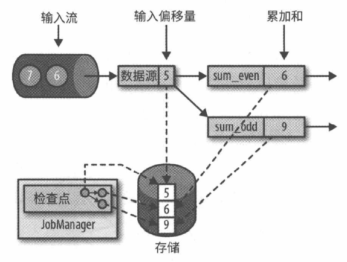

应用恢复要经过三个步骤：

1、重启整个应用

2、利用最新的检查点重置任务状态

3、恢复所有任务的处理

实际上就是一个状态的重置，和数据的重放过程，以下图为例：

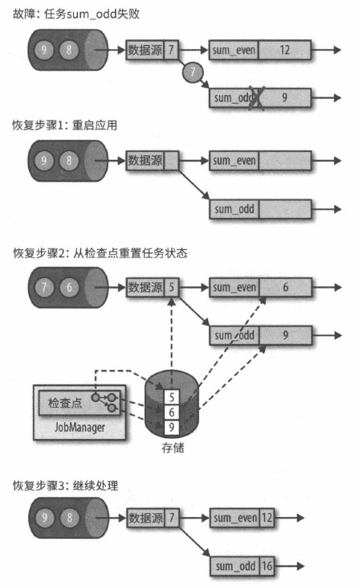

状态重置由flink的检查点来实现，而数据重放要求外部系统有相关的恢复能力，kafka允许从之前的某个偏移读取记录，而从套接字socket消费来则无法重置。

Flink的检查点和恢复机制只能重置流失应用内部的状态，已经流向下游的数据可能会在这个过程中发送多次。

Flink检查点机制能在整个应用不停止的情况下生成一致的分布式检查点，但它仍会增加应用处理延迟。Flink在生成检查点的时候，状态后端会为当前状态生成一个本地拷贝，这个过程是阻塞的，拷贝完成后任务就可以继续进行处理，然后后台进程会异步将本地状态快照拷贝到远程存储，这个异步操作会有效节省时间。此外，RocksDB状态后端还支持增量生成检查点，有效降低需要传输的数据量。

调整分隔符对齐的机制，可以降低延迟，比如分隔符对齐时不再缓存记录，而是直接处理它们，但是这种做法有记录被重复处理的风险。

### 检查点算法checkpoint

Flink没有采用上述的朴素算法来进行故障恢复，而是采用基于Chandy-Lamport分布式快照算法实现的，该算法不会暂停整个应用，而是会把生成检查点的过程和处理过程分离，在部分任务持久化状态的时候，其他任务还可以继续执行。

Flink的检查点算法中会用到一类名为检查点分割符（Checkpoint Barrier）的特殊记录。和水位线类似，它可以通过数据源算子注入到常规的记录流中。每个检查点分隔符都会携带一个检查点编号，这样就把一条数据流从逻辑上分成了两个部分，前半部分的修改会归于前一个检查点中，后半部分的修改归于后一个检查点中。

以一个简单流式应用为例来说明此问题，它包含了两个数据源任务，每个任务都会各自消费一条自增数字流，然后会被分成奇数流和偶数流两个部分，每个部分都各自求和：

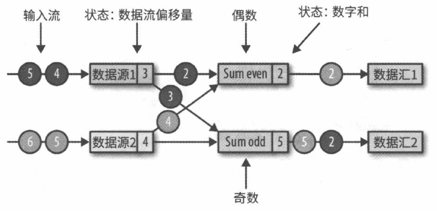

第一步：JobManager向每个数据源任务发送一个新的检查点编号，启动检查点生成流程：

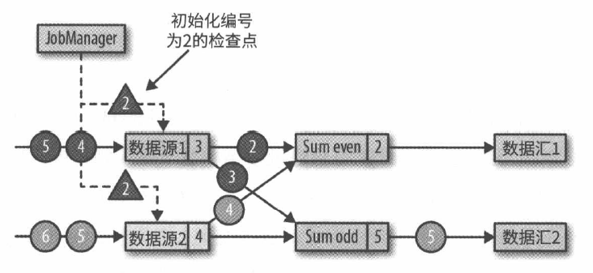

第二步：数据源任务收到消息后，会暂停发出记录，状态后端会将本地状态存入远程存储，然后将该检查点分隔符广播至所有下游数据分区。状态后端在检查点生成完成后通知任务，随后任务会向JobManager发送确认消息。所有分隔符发出后，数据源恢复正常工作：

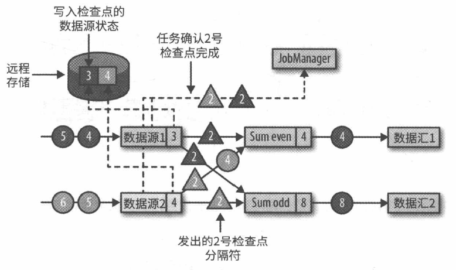

第三步：当任务收到一个新检查点的分隔符时，会继续等待所有其他输入分区也发来这个检查点的分隔符。在等待过程中，对于那些已经发来分隔符的分区的数据，它会缓存起来；对于还未发来分隔符的分区的数据，它会正常处理。这个等待所有分隔符到达的过程称为分隔符对齐：

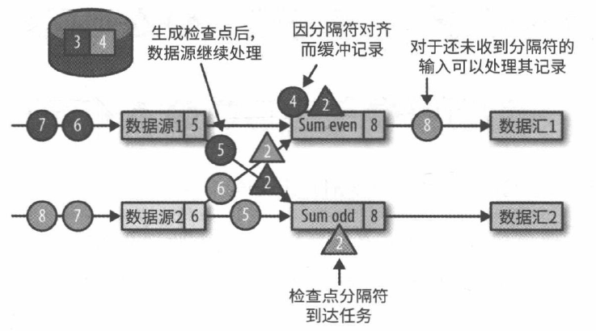

第四步：任务收齐全部输入分区发来的分隔符后，会通知状态后端开始生成检查点，同时吧检查点分隔符广播到下游相连的任务：

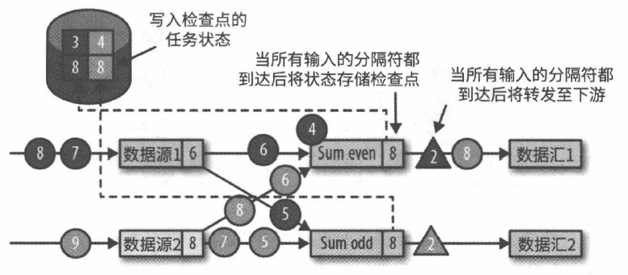

发出分隔符后，任务会处理那些缓存的记录，等缓存部分处理完之后，就会继续开始处理输入流：


第五步：数据汇任务收到分隔符后也会进行分隔符对齐，然后将自身状态写入检查点，向JobManager确认检查点已经生成完毕，然后JobManager就会将本次检查点标记为完成。故障恢复时，就会利用这个检查点进行恢复：

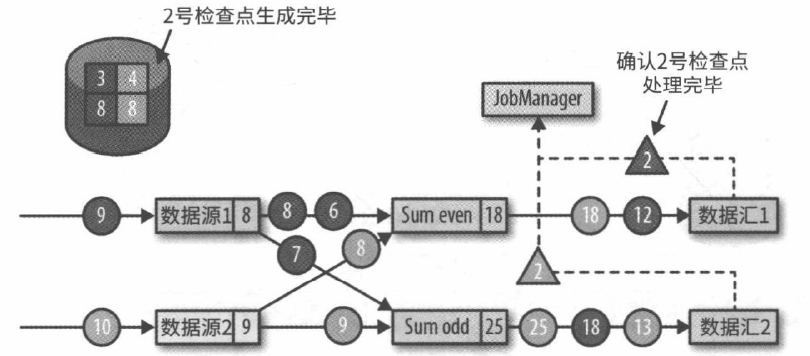

由于分界线对齐要求先到达的分区做缓存等待，一定程度上会影响处理的速度；当出现背压（backpressure）时，下游任务会堆积大量的缓冲数据，检查点可能需要很久才可以保存完毕。为了应对这种场景，Flink 1.11 之后提供了不对齐的检查点保存方式，可以将未处理的缓冲数据（in-flight data）也保存进检查点。这样，当我们遇到一个分区 barrier 时就不需等待对齐，而是可以直接启动状态的保存了。

开启checkpoint，间隔1s做一次快照：

```
env.enableCheckpointing(1000)
```

检查点的间隔时间是对处理性能和故障恢复速度的一个权衡。如果我们希望对性能的影响更小，可以调大间隔时间；而如果希望故障重启后迅速赶上实时的数据处理，就需要将间隔时间设小一些。

可以设置checkpoint的超时时间，有时会由于IO或外部系统的原因导致checkpoint一直不能完成，此时就可以考虑过一段时间还没有完成此次checkpoint就直接丢弃：

```
env.getCheckpointConfig.setCheckpointTimeout(1000000);
```

设置checkpointerror的处理策略，默认就是true，代表一旦checkpoint失败就关闭job，但是也可以选择不关闭。

```
env.getCheckpointConfig.setFailonCheckpointingErrors(true);
```

同时允许同时运行的checkpoint为1：

```
env.getCheckpointConfig.setMaxConcurrentCheckpoints(1);
```

两次checkpoint的最小时间间隔：

```
env.getCheckpointConfig.setMinPauseBetweenCheckpoints(100);
```

设置checkpoint策略，默认job失败后checkpoint会被清理，这里可以设置checkpoint一直存在，直到手动清除：

```
env.getCheckpointConfig.enableExternalizedcheckpoints(选项)
```

此外，还有检查点模式（CheckpointingMode），它用于设置检查点一致性的保证级别，有“精确一次”（exactly-once）和“至少一次”（at-least-once）两个选项。默认级别为exactly-once，而对于大多数低延迟的流处理程序，at-least-once 就够用了，而且处理效率会更高。该选项和一致性级别有关。

可以设置检查点异常时是否让整个任务失败、设置不对齐检查点（不再执行检查点的分界线对齐操作，启用之后可以大大减少产生背压时的检查点保存时间。这个设置要求检查点模式（CheckpointingMode）必须为 exctly-once，并且并发的检查点个数为 1）

### checkpoint存储

检查点的保存离不开 JobManager 和 TaskManager，以及外部存储系统的协调。在应用进行检查点保存时，首先会由 JobManager 向所有 TaskManager 发出触发检查点的命令； TaskManger 收到之后，将当前任务的所有状态进行快照保存，持久化到远程的存储介质中；完成之后向 JobManager 返回确认信息。这个过程是分布式的，当 JobManger 收到所有 TaskManager 的返回信息后，就会确认当前检查点成功保存：


检查点具体的持久化存储位置，取决于“检查点存储”（CheckpointStorage）的设置。默认情况下，检查点存储在 JobManager 的堆（heap）内存中。而对于大状态的持久化保存，Flink也提供了在其他存储位置进行保存的接口，这就是CheckpointStorage。

具体可以通过调用检查点配置的.setCheckpointStorage() 来配置， 需要传入一个CheckpointStorage 的实现类。Flink 主要提供了两种 CheckpointStorage：作业管理器的堆内存（JobManagerCheckpointStorage）和文件系统（FileSystemCheckpointStorage）：

~~~java
// 配置存储检查点到 JobManager 堆内存
env.getCheckpointConfig().setCheckpointStorage(new JobManagerCheckpointStorage());
// 配置存储检查点到文件系统
env.getCheckpointConfig().setCheckpointStorage(new FileSystemCheckpointStorage("hdfs://namenode:40010/flink/checkpoints"));
~~~

对于实际生产应用，我们一般会将 CheckpointStorage  配置为高可用的分布式文件系统（HDFS，S3 等）。

### 接受检查点完成通知

对一些算子而言，了解检查点的完成情况非常重要。比如只发出那些在检查点成功创建前收到的记录，否则出现故障就会重复发送数据。

为了实现这一目的可以对状态函数实现CheckpointListener接口，该接口提供的notifyCheckpointComplete方法，会在JobManager将检查点注册完成时（所有算子都成功将其状态复制到远程存储后）被调用。

但Flink不保证对每个完成检查点都会调用该方法，任务可能会错过一些通知。

## 保存点

Flink的检查点会周期的生成，会根据配置的策略自动丢弃。Flink还有一个机制是保存点，它和检查点生成的原理完全一样，也是应用的一致性快照，保存点需要用户显式触发，并不是Flink自动完成，Flink也不会自动清理保存点。

保存点可以让我们从该保存点启动应用，这个行为和故障恢复完全一致。保存点的用处有：

- 修复应用中的一些bug，然后重新输入事件，以修复结果
- 提高并行度，实现应用的扩缩容
- 从另一个集群中启动相同的应用，完成集群迁移
- 升级一个新的Flink版本
- 暂停应用，为更高优先级的应用腾出资源，然后再启动

很多用户都会周期性的创建保存点。

## 升级与维护

### 有状态算子的扩缩容

流式应用可以根据输入数据到达速率的变化调整算子并行度。对于无状态的算子，扩缩容很容易，但对于有状态算子，改变并行度就会复杂很多，需要把状态重新分组，分配到并行任务的节点上。

具体过程略。

### 确保有状态应用的可维护性

能将状态迁移到一个新版本的应用或重新分配到不同数量的算子任务上，是很重要的。Flink利用保存点机制来对应用及其状态进行维护，但需要在程序中指定好两个参数：算子唯一标识和最大并行度

这两个参数会被固化到保存点中，如果新应用中这两个参数发生了变化，则无法从之前生成的保存点启动。

- 指定算子唯一标识：当应用从保存点启动时，会利用这些标识将保存点中的状态映射到目标应用对应的算子，可以在设置算子后调用uid来指定每个算子的唯一标识。
- 指定最大并行度（只对键值分区状态的算子有效）：可以通过环境设置，也可以为每个算子单独设置；为算子单独设置的会覆盖应用级别的数值

### 防止状态泄露

随着流式应用长年累月的持续运行，应用状态不断增加，总有一天会变得过大并杀死应用。

导致状态增长的一个常见原因是键值状态的键值域不断发生变化，key只有一段时间的活跃期，此后就再也不会收到。具有键值分区状态的函数就会积累越来越多的键值。

一些内置的算子也有类似问题，比如max、min等算子，它会保存历史的状态。基于数量触发的窗口，也会因数量不满足要求而一直保存状态。基于时间触发的窗口则无此问题，他们会根据时间的不断前进自动清除状态。

如果应用涉及到键值域不断变化的情况，则需要对无用的状态进行清除，可以通过注册对未来某个时间点的计时器来完成。通过计时器触发回调方法，然后对state执行clear的操作。

### 升级应用的情况

- 正常更新的情况：

如果应用在更新时不会删除或改变已有状态，那么它一定是保存点兼容的，并且能够从旧版本的保存点启动。新版本中向应用添加的新的有状态算子在保存点启动时，这些状态都会被初始化为空。

注意修改内置有状态算子（如窗口聚合）的输入数据类型也会让状态类型发生变化，破坏保存点

- 删除状态的情况：

这种情况下保存点中部分状态将无法映射到重启的应用中，如果算子的唯一标识或者状态名称发生了改变，也会出现这种情况。为了避免保存点中的状态丢失，Flink默认不允许这种情况下从保存点恢复，但是可以禁用这一安全检查。

- 修改算子的状态

对状态的修改有两种：1、更改状态的数据类型，也就是里面的泛型；2、更改状态类型，如从ValueState改为ListState。

修改算子的状态很容易导致前后不兼容，Flink当前未提供工具来完成状态的转换。若状态的数据类型发生变化，前后的序列化方式不同，会直接出现错误，但如果数据类型都是Avro，就可用兼容这样的变化。

## 状态一致性

一致性实际上是" 正确性级别"的另一种说法，也就是说在成功处理故障并恢复之后得到的结果，与没有发生任何故障时得到的结果相比，前者到底有多正确？

在流处理中，一致性可以分为 3 个级别： 

1、at-most-once: 这其实是没有正确性保障的委婉说法——故障发生之后，计数结果可能丢失。同样的还有 udp。
2、at-least-once: 这表示计数结果可能大于正确值，但绝不会小于正确值。也就是说，计数程序在发生故障后可能多算，但是绝不会少算。在有些场景下，重复处理数据是不影响结果的正确性的，这种操作具有“幂等性”
3、exactly-once: 这指的是系统保证在发生故障后得到的计数结果与正确值一致。

曾经，at-least-once 非常流行。第一代流处理器(如 Storm 和 Samza)刚问世时只保证 at-least-once。最先保证 exactly-once 的系统(Storm Trident 和 Spark Streaming)在性能和表现力这两个方面付出了很大的代价。为了保证 exactly-once，这些系统无法单独地对每条记录运用应用逻辑，而是同时处理多条(一批)记录，保证对每一批的处理要么全部成功，要么全部失败。这就导致在得到结果前，必须等待一批记录处理结束。因此，用户经常不得不使用两个流处理框架(一个用来保证 exactly-once，另一个用来对每个元素做低延迟处理)，结果使基础设施更加复杂。曾经，用户不得不在保证exactly-once 与获得低延迟和效率之间权衡利弊。Flink 避免了这种权衡。 
Flink 的一个重大价值在于，它既保证了 exactly-once，也具有低延迟和高吞吐的处理能力。 要做到 exactly-once，首先必须能达到 at-least-once 的要求，就是数据不丢。所以同样需要有数据重放机制来保证这一点。另外，还需要有专门的设计保证每个数据只被处理一次。Flink 中使用的是一种轻量级快照机制——检查点（checkpoint）来保证 exactly-once 语义。

可以设置状态一致性：

```
env.enableCheckpointing(100, CheckpointingMode.AT_LEAST_ONCE);
```

还可以通过这种方式设置一致性：

```
env.getCheckpointConfig.setCheckpointMode(CheckpointingMode.AT_LEAST_ONCE);
```

## 端到端一致性

目前我们看到的一致性保证都是由流处理器实现的，也就是说都是在 Flink 流处理器内部保证的；而在真实应用中，流处理应用除了流处理器以外还包含了数据源（例如 Kafka）和输出到持久化系统。 

端到端的一致性保证，意味着结果的正确性贯穿了整个流处理应用的始终；每一个组件都保证了它自己的一致性，整个端到端的一致性级别取决于所有组件中一致性最弱的组件。具体可以划分如下： 

1、内部保证 —— 依赖 checkpoint
2、source 端 —— 需要外部源可重设数据的读取位置
3、sink 端 —— 需要保证从故障恢复时，数据不会重复写入外部系统

输入端主要指的就是 Flink 读取的外部数据源。对于一些数据源来说，并不提供数据的缓冲或是持久化保存，数据被消费之后就彻底不存在了。例如 socket 文本流就是这样， socket服务器是不负责存储数据的，发送一条数据之后，我们只能消费一次。对于这样的数据源，故障后我们即使通过检查点恢复之前的状态，可保存检查点之后到发生故障期间的数据已经不能重发了，这就会导致数据丢失。所以就只能保证 at-most-once 的一致性语义，相当于没有保证。

想要在故障恢复后不丢数据，外部数据源就必须拥有重放数据的能力。常见的做法就是对数据进行持久化保存，并且可以重设数据的读取位置。一个最经典的应用就是 Kafka。在 Flink的 Source 任务中将数据读取的偏移量保存为状态，这样就可以在故障恢复时从检查点中读取出来，对数据源重置偏移量，重新获取数据。

sink端保证不会重复写入的手段主要有两种：幂等写入和事务性写入。

幂等写入是指一个操作，可以重复执行很多次，但只导致一次结果更改，也就是说，后面再重复执行就不起作用了，如map的put操作。幂等写入有一点小问题，在发生故障数据重放的过程中会写入一部分处理过的数据，虽然最后会恢复原样，但是在故障恢复的过程中如果写入的值被读入就会发生错误。

在 Flink 流处理的结果写入外部系统时，如果能够构建一个事务，让写入操作可以随着检查点来提交和回滚，那么自然就可以解决重复写入的问题了。所以事务写入的基本思想就是：用一个事务来进行数据向外部系统的写入，这个事务是与检查点绑定在一起的。当 Sink 任务遇到 barrier 时，开始保存状态的同时就开启一个事务，接下来所有数据的写入都在这个事务中；待到当前检查点保存完毕时，将事务提交，所有写入的数据就真正可用了。如果中间过程出现故障，状态会回退到上一个检查点，而当前事务没有正常关闭（因为当前检查点没有保存完），所以也会回滚，写入到外部的数据就被撤销了。

事务写入是通过构建事务的方式，等待checkpoint完成后才将数据写入sink系统，如果失败则利用checkpoint回退。事务写入具体又有两种实现方式：预写日志（WAL）和两阶段提交（2PC）。

预写日志实际上是将未提交的数据缓存成日志，这些日志可能会丢失，且在checkpoint完成向sink发送信号要求写入日志的这个过程如果崩溃的话还会导致数据重放，所以只能保证最多一次。

两阶段提交是可以实现精确一次的方式。具体的实现步骤为：

* 当第一条数据到来时，或者收到检查点的分界线时，Sink 任务都会启动一个事务。
* 接下来接收到的所有数据，都通过这个事务写入外部系统；这时由于事务没有提交，所以数据尽管写入了外部系统，但是不可用，是“预提交”的状态。
* 当 Sink 任务收到 JobManager 发来检查点完成的通知时，正式提交事务，写入的结果就真正可用了。

当中间发生故障时，当前未提交的事务就会回滚，于是所有写入外部系统的数据也就实现了撤回。这种两阶段提交（2PC）的方式充分利用了 Flink 现有的检查点机制：分界线的到来，就标志着开始一个新事务；而收到来自 JobManager 的 checkpoint 成功的消息，就是提交事务的指令。每个结果数据的写入，依然是流式的，不再有预写日志时批处理的性能问题；最终提交时，也只需要额外发送一个确认信息。所以 2PC 协议不仅真正意义上实现了 exactly-once，而且通过搭载 Flink 的检查点机制来实现事务，只给系统增加了很少的开销。

Flink 提供了 TwoPhaseCommitSinkFunction 接口，方便我们自定义实现两阶段提交的SinkFunction 的实现，提供了真正端到端的 exactly-once 保证。

不过两阶段提交虽然精巧，却对外部系统有很高的要求。这里将 2PC 对外部系统的要求列举如下：

* 外部系统必须提供事务支持，或者 Sink 任务必须能够模拟外部系统上的事务。
* 在检查点的间隔期间里，必须能够开启一个事务并接受数据写入。
* 在收到检查点完成的通知之前，事务必须是“等待提交”的状态。在故障恢复的情况下，这可能需要一些时间。如果这个时候外部系统关闭事务（例如超时了），那么未提交的数据就会丢失。
* Sink 任务必须能够在进程失败后恢复事务。
* 提交事务必须是幂等操作。也就是说，事务的重复提交应该是无效的

DataStream API 提供了 GenericWriteAheadSink 模板类和TwoPhaseCommitSinkFunction 接口，可以方便地实现这两种方式的事务性写入。

不同 Source 和 Sink 的一致性保证可以用下表说明： 

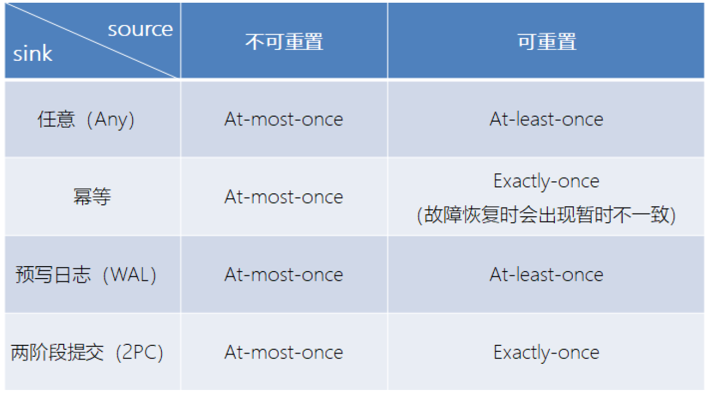

## flink+kafka实现exactly once

内部 —— 利用 checkpoint 机制，把状态存盘，发生故障的时候可以恢复，保证内部的状态一致性

source —— 输入数据源端的Kafka 可以对数据进行持久化保存，并可以重置偏移量（offset）。所以我们可以在 Source 任务（FlinkKafkaConsumer）中将当前读取的偏移量保存为算子状态，写入到检查点中；当发生故障时，从检查点中读取恢复状态，并由连接器 FlinkKafkaConsumer 向Kafka重新提交偏移量，就可以重新消费数据、保证结果的一致性了。

sink —— 输出端保证 exactly-once 的最佳实现，当然就是两阶段提交（2PC）。Flink 官方实现的Kafka 连接器中，提供了写入到Kafka 的FlinkKafkaProducer，它就实现了 TwoPhaseCommitSinkFunction 接口。也就是说，我们写入 Kafka 的过程实际上是一个两段式的提交：处理完毕得到结果，写入 Kafka 时是基于事务的“预提交”；等到检查点保存完毕，才会提交事务进行“正式提交”。如果中间出现故障，事务进行回滚，预提交就会被放弃；恢复状态之后，也只能恢复所有已经确认提交的操作。

具体过程如下：

1、第一条数据来了之后，开启一个 kafka 的事务（transaction），正常写入kafka 分区日志但标记为未提交，这就是“预提交”。sink 任务首先把数据写入外部 kafka，这些数据都属于预提交的事务（还不能被消费）
2、jobmanager 触发 checkpoint 操作，barrier 从 source 开始向下传递，遇到barrier 的算子将状态存入状态后端，并通知 jobmanager
3、sink 连接器收到 barrier，保存当前状态，存入 checkpoint，通知jobmanager，并开启下一阶段的事务，用于提交下个检查点的数据
4、jobmanager 收到所有任务的通知，发出确认信息，表示 checkpoint 完成
5、sink 任务收到 jobmanager 的确认信息，正式提交这段时间的数据
6、外部 kafka 关闭事务，提交的数据可以正常消费了。

分界线（barrier）终于传到了 Sink 任务，这时 Sink 任务会开启一个事务。接下来到来的所有数据，Sink 任务都会通过这个事务来写入Kafka。这里 barrier 是检查点的分界线，也是事务的分界线。由于之前的检查点可能尚未完成，因此上一个事务也可能尚未提交；此时 barrier 的到来开启了新的事务，上一个事务尽管可能没有被提交，但也不再接收新的数据了。

对于 Kafka 而言，提交的数据会被标记为“未确认”（uncommitted）。这个过程就是所谓的“预提交”（pre-commit）：

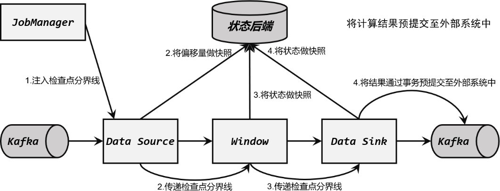

当所有算子的快照都完成，也就是这次的检查点保存最终完成时，JobManager 会向所有任务发确认通知，告诉大家当前检查点已成功保存。当 Sink 任务收到确认通知后，就会正式提交之前的事务，把之前“未确认”的数据标为 “已确认”，接下来就可以正常消费了。


在任务运行中的任何阶段失败，都会从上一次的状态恢复，所有没有正式提交的数据也会回滚。这样，Flink 和Kafka 连接构成的流处理系统，就实现了端到端的 exactly-once 状态一致性。

在具体应用中，实现真正的端到端 exactly-once，还需要有一些额外的配置：

* 必须启用检查点；

* 在 FlinkKafkaProducer 的构造函数中传入参数 Semantic.EXACTLY_ONCE；

* 配置Kafka 读取数据的消费者的隔离级别：

  这里所说的Kafka，是写入的外部系统。预提交阶段数据已经写入，只是被标记为“未提交”（uncommitted），而 Kafka 中默认的隔离级别 isolation.level 是 read_uncommitted，也就是可以读取未提交的数据。这样一来，外部应用就可以直接消费未提交的数据，对于事务性的保证就失效了。

  所以应该将隔离级别配置为 read_committed，表示消费者遇到未提交的消息时，会停止从分区中消费数据，直到消息被标记为已提交才会再次恢复消费。当然，这样做的话，外部应用消费数据就会有显著的延迟。

* 事务超时配置：

  Flink 的Kafka 连接器中配置的事务超时时间transaction.timeout.ms 默认是1 小时，而Kafka集群配置的事务最大超时时间 transaction.max.timeout.ms 默认是 15 分钟。所以在检查点保存时间很长时，有可能出现 Kafka 已经认为事务超时了，丢弃了预提交的数据；而 Sink 任务认为还可以继续等待。如果接下来检查点保存成功，发生故障后回滚到这个检查点的状态，这部分数据就被真正丢掉了。所以这两个超时时间，前者应该小于等于后者。

# 读写外部系统

## 应用的一致性保障

如果应用的数据源连接器无法存储和重置读取位置，那么在它出现故障的时候要丢失部分数据，从而只能提供最多一次保障。

如果仅仅提供可重置的数据源连接器，也无法达成精确一次的保证，因为它可能会重复发送数据，此时能提供至少一次保障。

为了提供精确一次性保障，连接器可以使用两种技术来保证：幂等性写和事务性写。

幂等性写的意思就是可以执行多次，但只会引起一次改变的操作，比如将相同的键值对插入一个哈希映射。但很多操作不属于这一类，比如追加写。

事务性写的基本思路是只有在上次成功的检查点之前计算的结果，才会被写入外部数据汇系统。Flink提供了两个构件来实现事务性的数据汇连接器：WAL数据汇和2PC数据汇：

* WAL数据汇（write-ahead log）：它会将所有结果记录写入应用状态，并在收到检查点完成通知后将它们发送到数据汇系统，也就是利用状态后端做一个记录的缓冲。但它无法提供精确一次保障，且还会导致应用状态增加、接受系统需要处理一次次的波峰式写入。
* 2PC数据汇（two-phase commit）：每次生成检查点，数据汇将结果写入接受系统但不提交，直到收到检查点完成通知后，才会提交事务。该机制需要数据汇系统支持事务。

不同数据源和数据汇组合能实现的一致性保障：

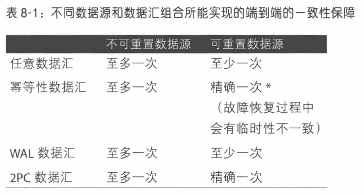

## Kafka数据源

每个并行数据源任务都可以从一个或多个分区读取数据，任务会跟踪每一个所负责分区的便宜，并将它们作为检查点数据的一部分，在进行故障恢复时，数据源实例将恢复那些写入检查点的偏移，并从指示的位置继续读取数据。

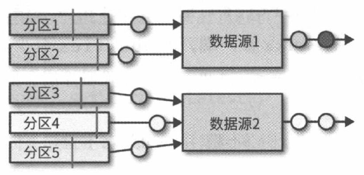

注意当某个分区不再提供消息，那么数据源实例的水位线将不再前进，单个非活跃的分区会导致整个应用停止运行。

建立一个kafka数据源连接器需要给出三个参数：topic名（指定多个时会将它们混合为一条数据流）、反序列化器（用于将原始字节反序列化为java或scala对象）、Properties对象（指定了连接kafka的各项参数，例如bootstrap.servers、group.id等）

Kafka0.10之后，应用运行在事件时间模式下，消费者会自动提取消息的时间戳作为事件时间的时间戳。

## Kafka数据汇

建立一个Kafka数据汇需要三个参数：Kafka Broker地址、目标topic、序列化器

满足下列条件时该数据汇才可以提供精确一次保障：

1、Flink的检查点功能处于开启状态，数据源是可重置的

2、数据汇写入不成功会抛出异常，引发应用失败进行故障恢复

3、Kafka数据提交确认记录写入完毕后，再开始确认生成检查点

这些条件都是默认的，但是可以手动调整配置关闭。

FlinkKafkaProducer中的构造方法可以调整三种一致性的选项，默认是至少一次AT_LEAST_ONCE

kafka能实现精确一次的原理在于它会把全部消息都追加到分区日志中，然后将未完成事务的消息标记为未提交。开启事务后，消费者不会对未提交的消息进行消费，这可能会对读取消息带来一些延迟，kafka可以通过在一定时间后关闭事务来防止过高的延迟。事务的超时时间应该结合Flink生成检查点的间隔一起综合考虑。

kafka数据汇可以选择写入目标topic的哪个分区，不指定的情况下，默认的分区器会将每个数据汇任务映射到一个单独的kafka分区。若任务数多于分区数，每个分区可能会包含多个任务发来的记录。

## 实现自定义数据源

SourceFunction可以用于定义非并行的数据源连接器；ParallSourceFunction可以用于定义能同时运行多个任务实例的数据源连接器。

它们的接口中定义了两个方法：run和cancel：

* run方法：用它传入的context调用collect就可以在流中生成一条数据，该方法只会在Flink中被调用一次，Flink会专门为其开启一个线程。
* cancel方法：应用被取消或者关闭时调用该方法

为了让数据源可重置，我们需要让该函数实现CheckPointedFunction，把读取偏移相关的信息都存入状态中。此外我们还需要保证检查点生成过程中，数据源不会向前推进偏移和发送数据，为此可以通过SourceContext.getCheckpointLock方法获取一个锁对象，让两者进行同步处理。

自定义数据源还可以控制分配时间戳和生成水位线的逻辑，例如kafka只能保证单个分区的消息顺序，当同时读取多个分区时，我们可以取多个分区消息中的时间最小值作为水位线发出，这样就能保证每个分区的顺序，避免发出不必要的迟到记录。

## 实现自定义数据汇

Flink提供了一个SinkFunction接口，可以对外输出数据（其实各算子的处理阶段都可以向外输出数据）

简单的SinkFunction接口已经足以实现幂等性数据汇，需要满足两个前提条件：

1、结果中的复合键是确定的

2、外部系统支持按照键更新

为了实现事务性数据汇连接器，Flink给我们提供了了两个模板，它们都实现了CheckpointListener接口，支持接收检查点完成的通知

### 实现WAL数据汇

需要通过GenericWriteAheadSink实现，它会收集每个检查点周期内所有需要写出的记录，然后将它们存储到数据汇的算子状态中，该状态能被写入检查点，并在故障时恢复。当一个任务接收到检查点完成通知时，会将此次检查点周期的所有记录写入外部系统。

此时数据汇算子每收到一个检查点分隔符就会生成一个新的记录章节，并将接下来的所有记录追加写入该章节。

GenericWriteAheadSink依赖一个名为CheckPointCommitter的组件来存储和查找已提交的检查点信息。

继承GenericWriteAheadSink的算子需要在构造时提供三个参数：CheckPointCommitter、序列化器、任务ID。此外还需要实现一个方法sendValues，GenericWriteAheadSink会调用该方法将已完成检查点对应的记录写入外部存储系统，方法入参有：针对该检查点的全部记录、检查点ID、检查点的生成时间

之所以WAL数据汇只能提供至少一次，是因为可能存在下列问题：

* 程序运行sendValues时出现问题，导致部分数据写入，部分没有写入，此时检查点还未提交，下次恢复时会重写全部记录
* 所有记录已经成功写入，但是写入后，在调用CheckPointCommitter提交检查点这一步出现问题，同样会导致全部记录被重写一次

### 实现2PC数据汇

实现2PC的代价是昂贵的，但具体到Flink环境下，因为检查点机制的存在，它只需针对每个检查点运行一次，没有带来很多额外开销。

它的流程如下：

1、数据汇任务在发出记录之前，会在外部数据汇系统中开启一个事务，接下来所有写出操作都会被纳入该事务中

2、数据汇算子接到分隔符，它会将内部状态持久化，为事务的提交做好准备，并向JobManager发送检查点确认消息，相当于2PC协议中的提交投票。此时还无法提交事务，同时它会为下一个检查点开启一个新的事务（外部系统需要支持事务开启时还能写入）。

3、JobManager收到所有任务实例返回的检查点成功的消息后，将检查点的完成通知发送给所有任务，数据汇任务收到该指令后，会提交与该检查点相关的事务，完成通知（该通知若丢失，后续可能一次性提交多个事务，所以外部系统必须清楚事务是否已经提交，让重复提交变得无效，即事务的幂等性）相当于2PC协议中的提交指令

为了实现这种特性，需要借助TwoPhaseCommitSinkFunction，Flink的Kafka生产者就继承了这个类。

当连接器因为事务超时进行回滚时，也会有丢失数据的情况，所以它也无法完美提供精确一次保障。

# Flink部署

## 高可用设置

故障恢复的时候，工作进程的故障可以由ResourceManager来解决，但JobManager组件的故障就需要额外的高可用配置。

Flink的JobManager中存放了应用以及和它执行有关的元数据，如jar、JobGraph以及检查点的路径信息，这些信息都需要在主进程发生故障的时候进行恢复。

Flink的HA模式需要依赖zk和某种持久化远程存储如HDFS，配置高可用后，JobManager就会将上述数据存入远程持久化存储，并把存储路径写入zk。一旦发生故障，新的JobManager就可以从zk中查找相关路径并从持久化存储中加载元数据。

需要在flink-conf.yaml中设置一些配置，如zk的服务器列表、保存元数据的远程存储位置、zk中存放flink配置的基础路径（为了和其他配置区分开）

当集群是独立部署的时候，需要配置后备Dispatcher和TaskManager进程，后备TaskManager可以随时接替无法工作的TaskManager；后备Dispatcher负责启动JobManager，并负责故障的时候启动一个新的JobManager，每个Dispatcher都会在zk中注册，并由zk做Dispatcher的领导者选举。当多个集群需要依赖zk进行故障恢复时，需要在flink-conf.yaml配置文件中填写相关的隔离信息

当集群是搭建在yarn上的时候，就无需后备进程了，yarn会自动重启发生故障的容器，可以在yarn-site.xml和flink-conf.yaml中配置最大重启次数

## 集成Hadoop

为Flink添加Hadoop依赖的几种方式：

* 使用针对特定Hadoop版本构建的Flink二进制发行版
* 针对特定Hadoop构建Flink，需要Flink的源代码
* 为Hadoop依赖手动配置Classpath，配置HADOOP_CLASSPATH等环境变量

## 文件系统配置

Flink通过检查路径URI的协议来识别目标文件系统，如file:///指向本地文件系统的文件；hdfs:///指向某HDFS集群中的文件。可以在flink-conf.yaml中进行相关配置，如连接数等

## 系统配置

* CPU：Flink通过处理槽的概念来控制工作进程TaskManager的任务数，每个TaskManager都能提供一定数量的处理槽，这些处理槽统一由ResourceManager统一注册和管理，每个处理槽可以处理应用程序中每个算子的一个并行任务。JobManager至少要获取和应用算子最大并行度等量的处理槽。任务在TaskManager以线程的方式执行，可以按需获取足够的CPU资源。可以由配置文件决定处理槽的数量。
* 内存和网络缓冲：Flink主进程（ResourceManager和JobManager）对内存的要求并不高，如果需要管理多个应用或者很多算子可以增加一些，默认是1GB；Flink工作进程，也就是TaskManager，要谨慎配置JVM堆内存大小，堆内存大小除了供所有对象使用，还有运行中的各种状态、网络缓冲区（其大小主要取决于算子任务之间的网络连接总数）和RocksDB，可以配置用于这些内存占JVM的比例
* 磁盘存储：设置Flink保存应用jar包、写日志、状态维护的保存路径。注意要保证这些目录不会被操作系统定时删除


# Table API和SQL

Flink 同样提供了对于“表”处理的支持，这就是更高层级的应用API，在 Flink 中被称为 Table API 和 SQL。Table API 顾名思义，就是基于“表”（Table）的一套 API，它是内嵌在 Java、 Scala 等语言中的一种声明式领域特定语言（DSL），也就是专门为处理表而设计的；在此基础上，Flink 还基于Apache Calcite 实现了对 SQL 的支持。这样一来，我们就可以在 Flink 程序中直接写 SQL 来实现处理需求了。

Flink 是批流统一的处理框架，无论是批处理（DataSet API）还是流处理（DataStream API），在上层应用中都可以直接使用 Table API 或者 SQL 来实现；这两种 API 对于一张表执行相同的查询操作，得到的结果是完全一样的。这里主要还是以流处理应用为例进行讲解。

需要说明的是，Table API 和 SQL 最初并不完善，在 Flink 1.9 版本合并阿里巴巴内部版本 Blink 之后发生了非常大的改变，此后也一直处在快速开发和完善的过程中，直到 Flink 1.12版本才基本上做到了功能上的完善。而即使是在目前最新的 1.13 版本中，Table API 和 SQL 也依然不算稳定，接口用法还在不停调整和更新。所以这部分希望大家重在理解原理和基本用法，具体的 API 调用可以随时关注官网的更新变化。

## 快速上手

Table API 和SQL 的使用其实非常简单：只要得到一个“表”（Table），然后对它调用 Table API，或者直接写 SQL 就可以了

想要在代码中使用Table API，必须引入相关的依赖：

~~~xml
<dependency>
	<groupId>org.apache.flink</groupId>
	<artifactId>flink-table-api-java-bridge_${scala.binary.version}</artifactId>
	<version>${flink.version}</version>
</dependency>
~~~

这里的依赖是一个 Java 的“桥接器”（bridge），主要就是负责 Table API 和下层 DataStream API 的连接支持，按照不同的语言分为 Java 版和 Scala 版。
如果我们希望在本地的集成开发环境（IDE）里运行 Table API 和 SQL，还需要引入以下依赖：

~~~xml
<dependency>
	<groupId>org.apache.flink</groupId>
	<artifactId>flink-table-planner-blink_${scala.binary.version}</artifactId>
	<version>${flink.version}</version>
</dependency>
<dependency>
	<groupId>org.apache.flink</groupId>
	<artifactId>flink-streaming-scala_${scala.binary.version}</artifactId>
	<version>${flink.version}</version>
</dependency>
~~~

这里主要添加的依赖是一个“计划器”（planner），它是 Table API 的核心组件，负责提供运行时环境，并生成程序的执行计划。这里我们用到的是新版的 blink planner。由于 Flink 安装包的 lib 目录下会自带planner，所以在生产集群环境中提交的作业不需要打包这个依赖。而在Table API 的内部实现上，部分相关的代码是用 Scala 实现的，所以还需要额外添加一个 Scala 版流处理的相关依赖。

另外，如果想实现自定义的数据格式来做序列化，可以引入下面的依赖：

~~~xml
<dependency>
	<groupId>org.apache.flink</groupId>
	<artifactId>flink-table-common</artifactId>
	<version>${flink.version}</version>
</dependency>
~~~

一个简单的例子：

~~~java
public class TableExample {
	public static void main(String[] args) throws Exception {
          // 获取流执行环境
          StreamExecutionEnvironment env = StreamExecutionEnvironment.getExecutionEnvironment();
          env.setParallelism(1);

          // 读取数据源
          SingleOutputStreamOperator<Event> eventStream = env
          .fromElements(
          new Event("Alice", "./home", 1000L),
          new Event("Bob", "./cart", 1000L),
          new Event("Alice", "./prod?id=1", 5 * 1000L), new Event("Cary", "./home", 60 * 1000L),
          new Event("Bob", "./prod?id=3", 90 * 1000L), new Event("Alice", "./prod?id=7", 105 * 1000L)
          );

          // 获取表环境
          StreamTableEnvironment tableEnv = StreamTableEnvironment.create(env);

          // 将数据流转换成表
          Table eventTable = tableEnv.fromDataStream(eventStream);

          // 用执行 SQL 的方式提取数据
          Table visitTable = tableEnv.sqlQuery("select url, user from " + eventTable);

          // 将表转换成数据流，打印输出
          tableEnv.toDataStream(visitTable).print();

          // 执行程序
          env.execute();
	}
}
~~~

Event类的定义，它是一个POJO：

~~~java
public class Event { 
    public String user; 
    public String url; 
    public Long timestamp;

    public Event() {
    }

    public Event(String user, String url, Long timestamp) { this.user = user;
    	this.url = url; this.timestamp = timestamp;
    }

    @Override
    public String toString() { 
          return "Event{" +
        "user='" + user + '\'' +
        ", url='" + url + '\'' +
        ", timestamp=" + new Timestamp(timestamp) + '}';
    }
}
~~~

代码执行的结果如下：

~~~java
+I[./home, Alice]
+I[./cart, Bob]
+I[./prod?id=1, Alice]
+I[./home, Cary]
+I[./prod?id=3, Bob]
+I[./prod?id=7, Alice]
~~~

这里首先创建一个“表环境”（TableEnvironment），然后将数据流（DataStream）转换成一个表（Table）；之后就可以执行 SQL 在这个表中查询数据了。查询得到的结果依然是一个表，把它重新转换成流就可以打印输出了。

可以看到，我们将原始的 Event 数据转换成了(url，user)这样类似二元组的类型。每行输出前面有一个“+I”标志，这是表示每条数据都是“插入”（Insert）到表中的新增数据。

同样的查询还可以用 Table API 方式查询：

~~~java
Table clickTable2 = eventTable.select($("url"), $("user"));
~~~

这里的$符号是Table API 中定义的“表达式”类Expressions 中的一个方法，传入一个字段名称，就可以指代数据中对应字段。将得到的表转换成流打印输出，会发现结果与直接执行 SQL 完全一样。

## 基本API

### 程序架构

程序的整体处理流程与 DataStream API 非常相似，也可以分为读取数据源（Source）、转换（Transform）、输出数据（Sink）三部分；只不过这里的输入输出操作不需要额外定义，只需要将用于输入和输出的表定义出来，然后进行转换查询就可以了。

程序基本架构如下：

~~~java
// 创建表环境
TableEnvironment tableEnv = ...;
// 创建输入表，连接外部系统读取数据
tableEnv.executeSql("CREATE TEMPORARY TABLE inputTable ... WITH ( 'connector'= ... )");
// 注册一个表，连接到外部系统，用于输出
tableEnv.executeSql("CREATE TEMPORARY TABLE outputTable ... WITH ( 'connector'= ... )");
// 执行 SQL 对表进行查询转换，得到一个新的表
Table table1 = tableEnv.sqlQuery("SELECT ... FROM inputTable... ");
// 使用 Table API 对表进行查询转换，得到一个新的表
Table table2 = tableEnv.from("inputTable").select(...);
// 将得到的结果写入输出表
TableResult tableResult = table1.executeInsert("outputTable");
~~~

与上一节中不同，这里不是从一个 DataStream 转换成 Table，而是通过执行 DDL 来直接创建一个表。这里执行的 CREATE 语句中用 WITH 指定了外部系统的连接器，于是就可以连接外部系统读取数据了。这其实是更加一般化的程序架构，因为这样我们就可以完全抛开 DataStream API，直接用 SQL 语句实现全部的流处理过程。

在创建表的过程中，其实并不区分“输入”还是“输出”，只需要将这个表“注册”进来、连接到外部系统就可以了；这里的 inputTable、 outputTable 只是注册的表名，并不代表处理逻辑，可以随意更换。

至于表的具体作用，则要等到执行后面的查询转换操作时才能明确。我们直接从 inputTable 中查询数据，那么 inputTable就是输入表；而 outputTable 会接收另外表的结果进行写入，那么就是输出表。

在 期的版本中，有专门的用于输入输出的 TableSource 和TableSink，这与流处理里的概念是一一对应的；不过这种方式与关系型表和 SQL 的使用习惯不符，所以已被弃用，不再区分 Source 和 Sink。

### 创建表环境

对于 Flink 这样的流处理框架来说，数据流和表在结构上还是有所区别的。所以使用 Table API 和 SQL 需要一个特别的运行时环境，这就是所谓的“表环境”（TableEnvironment）。它主要负责：

* 注册Catalog 和表；
* 执行 SQL 查询；
* 注册用户自定义函数（UDF）；
* DataStream 和表之间的转换。

这里的 Catalog 就是“目录”，与标准 SQL 中的概念是一致的，主要用来管理所有数据库（database）和表（table）的元数据（metadata）。通过 Catalog 可以方便地对数据库和表进行查询的管理，所以可以认为我们所定义的表都会“挂靠”在某个目录下，这样就可以快速检索。在表环境中可以由用户自定义Catalog，并在其中注册表和自定义函数（UDF）。默认的 Catalog就叫作 default_catalog。

每个表和 SQL 的执行，都必须绑定在一个表环境（TableEnvironment）中。TableEnvironment是 Table API 中提供的基本接口类，可以通过调用静态的 create()方法来创建一个表环境实例。方法需要传入一个环境的配置参数EnvironmentSettings，它可以指定当前表环境的执行模式和计划器（planner）。执行模式有批处理和流处理两种选择，默认是流处理模式；计划器默认使用 blink planner。

~~~java
EnvironmentSettings settings = EnvironmentSettings
.newInstance()
.inStreamingMode()	// 使用流处理模式
.build();

TableEnvironment tableEnv = TableEnvironment.create(settings);
~~~

对于流处理场景，其实默认配置就完全够用了。所以我们也可以用另一种更加简单的方式来创建表环境：

~~~java
StreamExecutionEnvironment env = StreamExecutionEnvironment.getExecutionEnvironment(); 
StreamTableEnvironment tableEnv = StreamTableEnvironment.create(env);
~~~

这里我们引入了一个“ 流式表环境 ”（ StreamTableEnvironment ）， 它是继承自TableEnvironment 的子接口。调用它的 create() 方法， 只需要直接将当前的流执行环境（StreamExecutionEnvironment）传入，就可以创建出对应的流式表环境了。

### 创建表

Flink 中的表概念也并不特殊，是由多个“行”数据构成的，每个行（Row）又可以有定义好的多个列（Column）字段；整体来看，表就是固定类型的数据组成的二维矩阵。

表在环境中有一个唯一的 ID，由三部分组成：目录（catalog）名，数据库（database）名，以及表名。在默认情况下，目录名为 default_catalog，数据库名为 default_database。所以如果我们直接创建一个叫作 MyTable 的表，它的 ID 就是：

~~~
default_catalog.default_database.MyTable
~~~

具体创建表的方式，有通过连接器（connector）和虚拟表（virtual tables）两种：

* 连接器表（Connector Tables）：

  通过连接器（connector）连接到一个外部系统，然后定义出 对应的表结构。例如我们可以连接到 Kafka 或者文件系统，将存储在这些外部系统的数据以“表”的形式定义出来，这样对表的读写就可以通过连接器转换成对外部系统的读写了。当我们在表 环境中读取这张表，连接器就会从外部系统读取数据并进行转换；而当我们向这张表写入数据，连接器就会将数据输出（Sink）到外部系统中。

  在代码中，我们可以调用表环境的 executeSql()方法，可以传入一个 DDL 作为参数执行 SQL 操作。这里我们传入一个CREATE 语句进行表的创建，并通过 WITH 关键字指定连接到外部系统的连接器：

  ~~~java
  tableEnv.executeSql("CREATE [TEMPORARY] TABLE MyTable ... WITH ( 'connector'= ... )");
  ~~~

  这里的 TEMPORARY 关键字可以省略。

  这里没有定义 Catalog 和 Database ， 所以都是默认的 ， 表的完整ID就是 default_catalog.default_database.MyTable。如果希望使用自定义的目录名和库名，可以在环境中进行设置：

  ~~~java
  tEnv.useCatalog("custom_catalog");
  tEnv.useDatabase("custom_database");
  ~~~

* 虚拟表（Virtual Tables）：

  在环境中注册表之后，我们就可以在 SQL 中直接使用这张表进行查询转换了：

  ~~~java
  Table newTable = tableEnv.sqlQuery("SELECT ... FROM MyTable... ");
  ~~~

  这里调用了表环境的 sqlQuery()方法，直接传入一条 SQL 语句作为参数执行查询，得到的结果是一个 Table 对象。

  得到的 newTable 是一个中间转换结果，如果之后又希望直接使用这个表执行 SQL，又该怎么做呢？由于 newTable 是一个 Table 对象，并没有在表环境中注册；所以我们还需要将这个中间结果表注册到环境中，才能在 SQL 中使用：

  ~~~java
  tableEnv.createTemporaryView("NewTable", newTable);
  ~~~

  注意：这里的第一个参数"MyTable"是注册的表名，而第二个参数 myTable 是 Java 中的Table 对象。

  这里的注册其实是创建了一个“虚拟表”（Virtual Table）。这个概念与 SQL 语法中的视图（View）非常类似，所以调用的方法也叫作创建“虚拟视图”（createTemporaryView）。视图之所以是“虚拟”的，是因为我们并不会直接保存这个表的内容，并没有“实体”；只是在用到这张表的时候，会将它对应的查询语句嵌入到 SQL 中。虚拟表可以非常方便地让 SQL 分步骤执行得到中间结果，这为代码编写提供了很大的便利

  虚拟表也可以让我们在Table API 和 SQL 之间进行自由切换。一个 Java 中的Table对象可以直接调用Table API 中定义好的查询转换方法，得到一个中间结果表；这跟对注册好的表直接执行 SQL 结果是一样的。

### 表的查询

对一个表的查询（Query）操作，就对应着流数据的转换（Transform）处理。Flink 为我们提供了两种查询方式：SQL 和Table API。

* 执行 SQL 进行查询：

  基于表执行SQL 语句，是我们最为熟悉的查询方式。Flink 基于 Apache Calcite 来提供对 SQL 的支持，Calcite 是一个为不同的计算平台提供标准 SQL 查询的底层工具，很多大数据框架比如 Apache Hive、Apache Kylin 中的SQL 支持都是通过集成 Calcite 来实现的。

  在代码中，我们只要调用表环境的 sqlQuery()方法，传入一个字符串形式的 SQL 查询语句就可以了。执行得到的结果，是一个 Table 对象。

  ~~~java
  // 创建表环境
  TableEnvironment tableEnv = ...;

  // 创建表
  tableEnv.executeSql("CREATE TABLE EventTable ... WITH ( 'connector' = ... )");

  // 查询用户 Alice 的点击事件，并提取表中前两个字段
  Table aliceVisitTable = tableEnv.sqlQuery( "SELECT user, url " +
  "FROM EventTable " + "WHERE user = 'Alice' "
  );
  ~~~

  目前 Flink 支持标准 SQL 中的绝大部分用法，并提供了丰富的计算函数。

  例如，我们也可以通过GROUP BY 关键字定义分组聚合，调用COUNT()、SUM()这样的函数来进行统计计算：

  ~~~java
  Table urlCountTable = tableEnv.sqlQuery( "SELECT user, COUNT(url) " +
  "FROM EventTable " + "GROUP BY user ");
  ~~~

  上面的例子得到的是一个新的 Table 对象，我们可以再次将它注册为虚拟表继续在 SQL中调用。另外，我们也可以直接将查询的结果写入到已经注册的表中，这需要调用表环境的 executeSql()方法来执行DDL，传入的是一个INSERT 语句：

  ~~~java
  // 注册表
  tableEnv.executeSql("CREATE TABLE EventTable ... WITH ( 'connector' = ... )"); 
  tableEnv.executeSql("CREATE TABLE OutputTable ... WITH ( 'connector' = ... )");
  // 将查询结果输出到 OutputTable 中
  tableEnv.executeSql ( "INSERT INTO OutputTable " +
  "SELECT user, url " + "FROM EventTable " + "WHERE user = 'Alice' ");
  ~~~

* 调用 Table API 进行查询：

  这是嵌入在 Java 和 Scala 语言内的查询 API，核心就是 Table 接口类，通过一步步链式调用 Table 的方法，就可以定义出所有的查询转换操作。每一步方法调用的返回结果，都是一个Table。

  由于Table API 是基于Table 的Java 实例进行调用的，因此我们首先要得到表的Java 对象。基于环境中已注册的表，可以通过表环境的 from()方法非常容易地得到一个Table 对象：

  ~~~java
  Table eventTable = tableEnv.from("EventTable");
  ~~~

  得到 Table 对象之后，就可以调用 API 进行各种转换操作了，得到的是一个新的Table 对象：

  ~~~java
  Table maryClickTable = eventTable
  	.where($("user").isEqual("Alice"))
  	.select($("url"), $("user"));
  ~~~

  这里每个方法的参数都是一个“表达式”（Expression），用方法调用的形式直观地说明了想要表达的内容；“$”符号用来指定表中的一个字段。

  上面的代码和直接执行 SQL 是等效的。 Table API 是嵌入编程语言中的DSL，SQL 中的很多特性和功能必须要有对应的实现才可以使用，因此跟直接写 SQL 比起来肯定就要麻烦一些。

  目前Table API 支持的功能相对更少，可以预见未来 Flink 社区也会以扩展 SQL 为主，为大家提供更加通用的接口方式

两种API还可以结合起来使用，例如：

~~~java
Table clickTable = tableEnvironment.sqlQuery("select url, user from " +eventTable);
~~~

这其实是一种简略的写法，我们将Table 对象名 eventTable 直接以字符串拼接的形式添加到 SQL 语句中，在解析时会自动注册一个同名的虚拟表到环境中，这样就省略了创建虚拟视图的步骤。

### 输出表

表的创建和查询，就对应着流处理中的读取数据源（Source）和转换（Transform）；而最后一个步骤 Sink，也就是将结果数据输出到外部系统，就对应着表的输出操作。

在代码上，输出一张表最直接的方法，就是调用 Table 的方法 executeInsert()方法将一个 Table 写入到注册过的表中，方法传入的参数就是注册的表名：

~~~java
// 注册表，用于输出数据到外部系统
tableEnv.executeSql("CREATE TABLE OutputTable ... WITH ( 'connector' = ... )");

// 经过查询转换，得到结果表
Table result = ...

// 将结果表写入已注册的输出表中
result.executeInsert("OutputTable");
~~~

在底层，表的输出是通过将数据写入到TableSink 来实现的。TableSink 是Table API 中提供的一个向外部系统写入数据的通用接口，可以支持不同的文件格式（比如 CSV、Parquet）、存储数据库（比如 JDBC、HBase、Elasticsearch）和消息队列（比如 Kafka）。它有些类似于 DataStream API 中调用addSink()方法时传入的 SinkFunction，有不同的连接器对它进行了实现。

### 表与流的转换

在应用的开发过程中，我们测试业务逻辑一般不会直接将结果直接写入到外部系统，而是在本地控制台打印输出。对于 DataStream 这非常容易，直接调用 print()方法就可以看到结果数据流的内容了；但对于 Table 就比较悲剧——它没有提供 print()方法。

在 Flink 中我们可以将 Table 再转换成 DataStream，然后进行打印输出。这就涉及了表和流的转换。

将表（Table）转换成流（DataStream）：

* 调用 toDataStream()方法：

  需要将要转换的Table 对象作为参数传入：

  ~~~java
  Table aliceVisitTable = tableEnv.sqlQuery( "SELECT user, url " +
  "FROM EventTable " + "WHERE user = 'Alice' "
  );

  // 将表转换成数据流
  tableEnv.toDataStream(aliceVisitTable).print();
  ~~~

* 调用 toChangelogStream()方法：

  如果我们同样希望将“用户点击次数统计”表 urlCountTable 进行打印输出，就会抛出一个TableException 异常

  这是因为当前的TableSink 并不支持表的更新（update）操作。因为 print 本身也可以看作一个 Sink 操作，所以这个异常就是说打印输出的 Sink 操作不支持对数据进行更新。聚合和普通查询不同，普通查询结果是不会随着新数据的加入而改变的，但聚合结果不同，新数据的加入可能对原有的结果表产生修改。

  解决的思路是，对于这样有更新操作的表，我们不要试图直接把它转换成 DataStream 打印输出，而是记录一下它的“更新日志”（change log）。这样一来，对于表的所有更新操作，就变成了一条更新日志的流，我们就可以转换成流打印输出了。代码中调用的就是toChangelogStream方法。

  与“更新日志流”（Changelog Streams）对应的，是那些只做了简单转换、没有进行聚合统计的表，例如前面提到的 maryClickTable。它们的特点是数据只会插入、不会更新，所以也被叫作“仅插入流”（Insert-Only Streams）。

  将表urlCountTable 转换成更新日志流（changelog stream）打印是这样：

  ~~~java
  count> +I[Alice, 1]
  count> +I[Bob, 1]
  count> -U[Alice, 1]
  count> +U[Alice, 2]
  count> +I[Cary, 1]
  count> -U[Bob, 1]
  count> +U[Bob, 2]
  count> -U[Alice, 2]
  count> +U[Alice, 3]
  ~~~

  这里数据的前缀出现了+I、-U 和+U 三种 RowKind，分别表示 INSERT（插入）、 UPDATE_BEFORE（更新前）和 UPDATE_AFTER（更新后）。当收到每个用户的第一次点击事件时，会在表中插入一条数据，例如+I[Alice, 1]、+I[Bob, 1]。而之后每当用户增加一次点击事件，就会带来一次更新操作，更新日志流（changelog stream）中对应会出现两条数据，分别表示之前数据的失效和新数据的生效；例如当Alice 的第二条点击数据到来时，会出现一个-U[Alice, 1]和一个+U[Alice, 2]，表示Alice 的点击个数从 1 变成了 2。

  这种表示更新日志的方式，有点像是声明“撤回”了之前的一条数据、再插入一条更新后的数据，所以也叫作“撤回流”（Retract Stream）。

将流（DataStream）转换成表（Table）：

* 调用 fromDataStream()方法：

  可以直接将事件流 eventStream 转换成一个表：

  ~~~java
  StreamExecutionEnvironment env = StreamExecutionEnvironment.getExecutionEnvironment();
  // 获取表环境
  StreamTableEnvironment tableEnv = StreamTableEnvironment.create(env);
  // 读取数据源
  SingleOutputStreamOperator<Event> eventStream = env.addSource(...)
  // 将数据流转换成表
  Table eventTable = tableEnv.fromDataStream(eventStream);
  ~~~

  由于流中的数据本身就是定义好的 POJO 类型 Event，所以我们将流转换成表之后，每一行数据就对应着一个Event，而表中的列名就对应着Event 中的属性。

  另外，我们还可以在 fromDataStream()方法中增加参数，用来指定提取哪些属性作为表中的字段名，并可以任意指定位置：

  ~~~java
  // 提取 Event 中的 timestamp 和 url 作为表中的列
  Table eventTable2 = tableEnv.fromDataStream(eventStream, $("timestamp"),$("url"));
  ~~~

  需要注意的是，timestamp 本身是 SQL 中的关键字，所以我们在定义表名、列名时要尽量避免。这时可以通过表达式的 as()方法对字段进行重命名：

  ~~~java
  // 将 timestamp 字段重命名为 ts
  Table eventTable2 = tableEnv.fromDataStream(eventStream, $("timestamp").as("ts"),$("url"));
  ~~~

* 调用createTemporaryView()方法：

  调用 fromDataStream()方法简单直观，可以直接实现DataStream 到 Table 的转换；不过如果我们希望直接在 SQL 中引用这张表，就还需要调用表环境的 createTemporaryView()方法来创建虚拟视图了。

  对于这种场景，也有一种更简洁的调用方式。我们可以直接调用 createTemporaryView()方法创建虚拟表，传入的两个参数，第一个依然是注册的表名，而第二个可以直接就是 DataStream。之后仍旧可以传入多个参数，用来指定表中的字段：

  ~~~java
  tableEnv.createTemporaryView("EventTable", eventStream,$("timestamp").as("ts"),$("url"));
  ~~~

  这样，我们接下来就可以直接在 SQL 中引用表 EventTable 了。

* 调用 fromChangelogStream ()方法：

  表环境还提供了一个方法 fromChangelogStream()，可以将一个更新日志流转换成表。这个方法要求流中的数据类型只能是  Row，而且每一个数据都需要指定当前行的更新类型（RowKind）

### 数据类型

前面示例中的 DataStream，流中的数据类型都是定义好的 POJO 类。流中的类型必须是Table 中支持的数据类型，才可以直接转换成表

支持的数据类型如下：

* 原子类型

  在 Flink 中，基础数据类型（Integer、Double、String）和通用数据类型（也就是不可再拆分的数据类型）统一称作“原子类型”。原子类型的 DataStream，转换之后就成了只有一列的 Table，列字段（field）的数据类型可以由原子类型推断出。

  可以在 fromDataStream()方法里增加参数，用来重新命名列字段：

  ~~~java
  StreamTableEnvironment tableEnv = ...; DataStream<Long> stream = ...;
  // 将数据流转换成动态表，动态表只有一个字段，重命名为 myLong
  Table table = tableEnv.fromDataStream(stream, $("myLong"));
  ~~~

* Tuple 类型

  当原子类型不做重命名时，默认的字段名就是“f0”，容易想到，这其实就是将原子类型看作了一元组Tuple1 的处理结果。

  Table 支持 Flink 中定义的元组类型Tuple，对应在表中字段名默认就是元组中元素的属性名 f0、f1、f2...。所有字段都可以被重新排序，也可以提取其中的一部分字段。字段还可以通过调用表达式的 as()方法来进行重命名。

  ~~~java
  StreamTableEnvironment tableEnv = ...; DataStream<Tuple2<Long, Integer>> stream = ...;
  // 将数据流转换成只包含 f1 字段的表
  Table table = tableEnv.fromDataStream(stream, $("f1"));
  // 将数据流转换成包含 f0 和 f1 字段的表，在表中 f0 和 f1 位置交换
  Table table = tableEnv.fromDataStream(stream, $("f1"), $("f0"));
  // 将 f1 字段命名为 myInt，f0 命名为 myLong
  Table table = tableEnv.fromDataStream(stream, $("f1").as("myInt"),$("f0").as("myLong"));
  ~~~

* POJO 类型

  将 POJO 类型的DataStream 转换成 Table，如果不指定字段名称，就会直接使用原始 POJO类型中的字段名称。POJO 中的字段同样可以被重新排序、提却和重命名：

  ~~~java
  StreamTableEnvironment tableEnv = ...; DataStream<Event> stream = ...;
  Table table = tableEnv.fromDataStream(stream);
  Table table = tableEnv.fromDataStream(stream, $("user"));
  Table table = tableEnv.fromDataStream(stream, $("user").as("myUser"),$("url").as("myUrl"));
  ~~~

* Row类型

  它是 Table 中数据的基本组织形式。Row 类型也是一种复合类型，它的长度固定，而且无法直接推断出每个字段的类型，所以在使用时必须指明具体的类型信息；我们在创建 Table 时调用的 CREATE语句就会将所有的字段名称和类型指定，这在 Flink 中被称为表的“模式结构”（Schema）。除此之外，Row 类型还附加了一个属性 RowKind，用来表示当前行在更新操作中的类型。这样， Row 就可以用来表示更新日志流（changelog stream）中的数据，从而架起了 Flink 中流和表的转换桥梁。

  所以在更新日志流中，元素的类型必须是 Row，而且需要调用 ofKind()方法来指定更新类型。下面是一个具体的例子：

  ~~~java
  DataStream<Row> dataStream = env.fromElements(
  	Row.ofKind(RowKind.INSERT, "Alice", 12),
  	Row.ofKind(RowKind.INSERT, "Bob", 5),
  	Row.ofKind(RowKind.UPDATE_BEFORE, "Alice", 12),
  	Row.ofKind(RowKind.UPDATE_AFTER, "Alice", 100));

  // 将更新日志流转换为表
  Table table = tableEnv.fromChangelogStream(dataStream);
  ~~~

## 流处理中的表

### 动态表和持续查询

在 Flink 中使用表和SQL基本上跟其它场景是一样的；不过对于表和流的转换，却稍显复杂。当我们将一个 Table 转换成 DataStream 时，有“仅插入流”（Insert-Only Streams）和“更新日志流”（Changelog Streams）两种不同的方式，具体使用哪种方式取决于表中是否存在更新（update）操作。

Table API 和 SQL 本质上都是基于关系型表的操作方式；而关系型表（Table）本身是有界的，更适合批处理的场景。所以在 MySQL、Hive这样的固定数据集中进行查询，使用 SQL 就会显得得心应手。而对于 Flink 这样的流处理框架来说，要处理的是源源不断到来的无界数据流，我们无法等到数据都到齐再做查询，每来一条数据就应该更新一次结果；这时如果一定要使用表和 SQL 进行处理，就会显得有些别扭了，需要引入一些特殊的概念。

我们可以将关系型表/SQL 与流处理做一个对比：

|           |   关系型表/SQL    |          流处理           |
| :-------: | :-----------: | :--------------------: |
|  处理的数据对象  |   字段元组的有界集合   |       字段元组的无限序列        |
| 查询（Query） | 可以访问到完整的数据输入  | 无法访问到所有数据，必须“持续”等待流式输入 |
|  查询终止条件   | 生成固定大小的结果集后终止 | 永不停止，根据持续收到的数据不断更新查询结果 |

如果我们希望把流数据转换成表的形式，那么这表中的数据就会不断增长；如果进一步基于表执行 SQL 查询，那么得到的结果就不是一成不变的，而是会随着新数据的到来持续更新。

当流中有新数据到来，初始的表中会插入一行；而基于这个表定义的 SQL 查询，就应该在之前的基础上更新结果。这样得到的表就会不断地动态变化，被称为“动态表”（Dynamic Tables）。

动态表可以像静态的批处理表一样进行查询操作。由于数据在不断变化，因此基于它定义的 SQL 查询也不可能执行一次就得到最终结果。这样一来，我们对动态表的查询也就永远不会停止，一直在随着新数据的到来而继续执行。这样的查询就被称作“持续查询”（Continuous Query）。对动态表定义的查询操作，都是持续查询；而持续查询的结果也会是一个动态表。

下图描述了持续查询的过程：

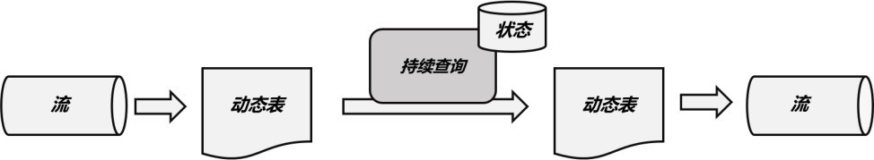

持续查询的步骤如下：

* 流（stream）被转换为动态表（dynamic table）；
* 对动态表进行持续查询（continuous query），生成新的动态表；
* 生成的动态表被转换成流。

### 持续查询案例

如果把流看作一张表，那么流中每个数据的到来，都应该看作是对表的一次插入（Insert）操作，会在表的末尾添加一行数据。因为流是连续不断的，而且之前的输出结果无法改变、只能在后面追加；所以我们其实是通过一个只有插入操作（insert-only）的更新日志（changelog）流，来构建一个表。

对于下面的程序：

~~~java
// 获取流环境
StreamExecutionEnvironment env = StreamExecutionEnvironment.getExecutionEnvironment(); env.setParallelism(1);
// 读取数据源
SingleOutputStreamOperator<Event> eventStream = env
.fromElements(
    new Event("Alice", "./home", 1000L),
    new Event("Bob", "./cart", 1000L),
    new Event("Alice", "./prod?id=1", 5 * 1000L), new Event("Cary", "./home", 60 * 1000L),
    new Event("Bob", "./prod?id=3", 90 * 1000L),
    new Event("Alice", "./prod?id=7", 105 * 1000L)
);

// 获取表环境
StreamTableEnvironment tableEnv = StreamTableEnvironment.create(env);

// 将数据流转换成表
tableEnv.createTemporaryView("EventTable", eventStream, $("user"), $("url"),$("timestamp").as("ts"));

// 统计每个用户的点击次数
Table urlCountTable = tableEnv.sqlQuery("SELECT user, COUNT(url) as cnt FROM EventTable GROUP BY user");
// 将表转换成数据流，在控制台打印输出
tableEnv.toChangelogStream(urlCountTable).print("count");

// 执行程序
env.execute();
~~~

当用户点击事件到来时，就对应着动态表中的一次插入（Insert）操作，每条数据就是表中的一行；随着插入更多的点击事件，得到的动态表将不断增长：

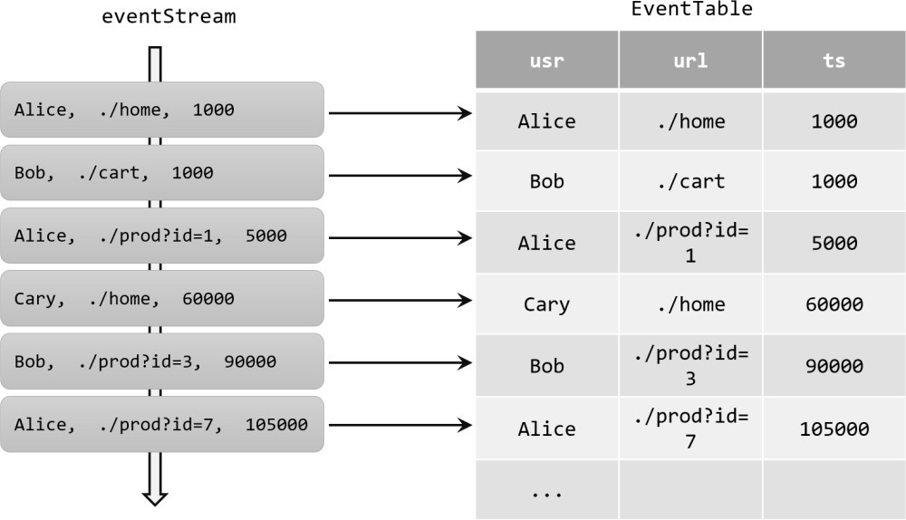

发起了查询后，urlCountTable这个结果动态表中包含两个字段user和cnt。当原始动态表不停地插入新的数据时，查询得到的 urlCountTable 会持续地进行更改。由于 count 数量可能会叠加增长，因此这里的更改操作可以是简单的插入（Insert），也可以是对之前数据的更新（Update）。换句话说，用来定义结果表的更新日志（changelog）流中，包含了 INSERT 和UPDATE 两种操作。这种持续查询被称为更新查询（Update Query），更新查询得到的结果表如果想要转换成DataStream，必须调用 toChangelogStream()方法：

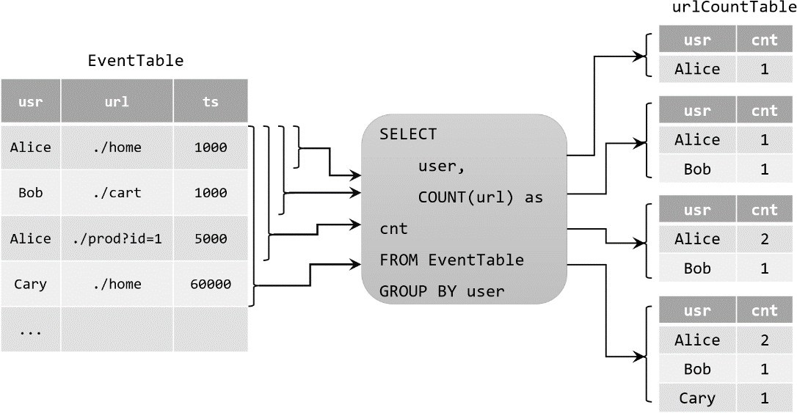

上面的例子中，查询过程用到了分组聚合，结果表中就会产生更新操作。如果我们执行一个简单的条件查询，结果表中就会像原始表EventTable 一样，只有插入（Insert）操作了：

~~~java
Table aliceVisitTable = tableEnv.sqlQuery("SELECT url, user FROM EventTable WHERE user = 'Cary'");
~~~

这样的持续查询，就被称为追加查询（Append  Query），它定义的结果表的更新日志（changelog）流中只有 INSERT 操作。追加查询得到的结果表，转换成 DataStream 调用方法没有限制，可以直接用 toDataStream()，也可以像更新查询一样调用 toChangelogStream()。

一个特殊的例子：当窗口聚合时，聚合的结果也不会改变。

我们考虑开一个滚动窗口，统计每一小时内所有用户的点击次数，并在结果表中增加一个endT 字段，表示当前统计窗口的结束时间。这时结果表的字段定义如下：

~~~
[
  user: VARCHAR,	// 用户名
  endT: TIMESTAMP, // 窗口结束时间
  cnt:	BIGINT	// 用户访问 url 的次数
]
~~~

与之前的分组聚合一样，当原始动态表不停地插入新的数据时，查询得到的结果 result 会持续地进行更改。比如时间戳在 12:00:00 到 12:59:59 之间的有四条数据，其中 Alice 三次点击、Bob 一次点击；所以当水位线达到 13:00:00 时窗口关闭，输出到结果表中的就是新增两条数据[Alice, 13:00:00, 3]和[Bob, 13:00:00, 1]。同理，当下一小时的窗口关闭时，也会将统计结果追加到 result 表后面，而不会更新之前的数据：

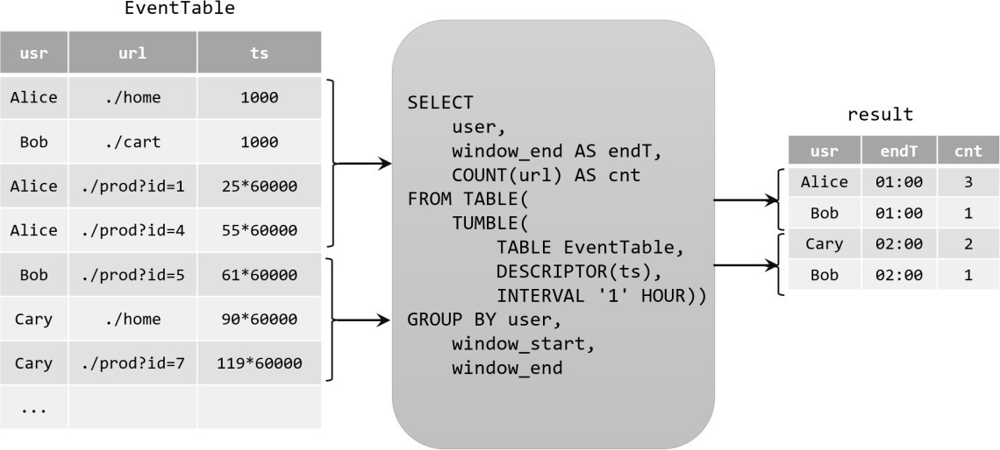

所以我们发现，由于窗口的统计结果是一次性写入结果表的，所以结果表的更新日志流中只会包含插入 INSERT 操作，而没有更新 UPDATE 操作。所以这里的持续查询，依然是一个追加（Append）查询。结果表 result 如果转换成 DataStream，可以直接调用 toDataStream()方法。

需要注意的是，由于涉及时间窗口，我们还需要为事件时间提取时间戳和生成水位线。完整代码如下：

~~~java
import org.apache.flink.api.common.eventtime.SerializableTimestampAssigner; 
import org.apache.flink.api.common.eventtime.WatermarkStrategy;
import org.apache.flink.streaming.api.datastream.SingleOutputStreamOperator; 
import org.apache.flink.streaming.api.environment.StreamExecutionEnvironment; 
import org.apache.flink.table.api.Table;
import org.apache.flink.table.api.bridge.java.StreamTableEnvironment; 
import static org.apache.flink.table.api.Expressions.$;

public class AppendQueryExample {
    public static void main(String[] args) throws Exception { StreamExecutionEnvironment env =
        StreamExecutionEnvironment.getExecutionEnvironment(); env.setParallelism(1);
        // 读取数据源，并分配时间戳、生成水位线
        SingleOutputStreamOperator<Event> eventStream = env
        .fromElements(
            new Event("Alice", "./home", 1000L),
            new Event("Bob", "./cart", 1000L),
            new Event("Alice", "./prod?id=1", 25 * 60 * 1000L),
            new Event("Alice", "./prod?id=4", 55 * 60 * 1000L),
            new Event("Bob", "./prod?id=5", 3600 * 1000L + 60 * 1000L), new Event("Cary", "./home", 3600 * 1000L + 30 * 60 * 1000L), 
          	new Event("Cary", "./prod?id=7", 3600 * 1000L + 59 * 60 * 1000L)
        )
        .assignTimestampsAndWatermarks( WatermarkStrategy.<Event>forMonotonousTimestamps()
        .withTimestampAssigner(new SerializableTimestampAssigner<Event>() {
            @Override
            public long extractTimestamp(Event element, long recordTimestamp) {
                return element.timestamp;
            }
        });

        // 创建表环境
        StreamTableEnvironment tableEnv = StreamTableEnvironment.create(env);

        // 将数据流转换成表，并指定时间属性
        Table eventTable = tableEnv.fromDataStream(eventStream,
            $("user"),
            $("url"),
            $("timestamp").rowtime().as("ts")
            // 将 timestamp 指定为事件时间，并命名为 ts
        );

        // 为方便在 SQL 中引用，在环境中注册表 EventTable tableEnv.createTemporaryView("EventTable", eventTable);
        // 设置 1 小时滚动窗口，执行 SQL 统计查询
        Table result = tableEnv
        .sqlQuery(
            "SELECT " +
            "user, " +
            "window_end AS endT, " +	// 窗口结束时间
            "COUNT(url) AS cnt " +	// 统计 url 访问次数
            "FROM TABLE( " +
            "TUMBLE( TABLE EventTable, " +	// 1 小时滚动窗口
            "DESCRIPTOR(ts), " + "INTERVAL '1' HOUR)) " +
            "GROUP BY user, window_start, window_end "
        );

        tableEnv.toDataStream(result).print();
        env.execute();
    }
}
~~~

运行结果如下：

~~~
+I[Alice, 1970-01-01T01:00, 3]
+I[Bob, 1970-01-01T01:00, 1]
+I[Cary, 1970-01-01T02:00, 2]
+I[Bob, 1970-01-01T02:00, 1]
~~~

在实际应用中，有些持续查询会因为计算代价太高而受到限制：

* 需要维护的状态持续增长，最终可能会耗尽存储空间导致查询失败
* 更新计算：对于有些查询来说，更新计算的复杂度可能很高。每来一条新的数据，更新结果的时候可能需要全部重新计算，并且对很多已经输出的行进行更新。一个典型的例子就是 RANK()函数，它会基于一组数据计算当前值的排名。当一个用户的排名发生改变时，被他超过的那些用户的排名也会改变；这样的更新操作无疑代价巨大，而且还会随着用户的增多越来越严重。这样的查询操作，就不太适合作为连续查询在流处理中执行。这里 RANK()的使用要配合一个OVER 子句，这是所谓的“开窗聚合”

### 将动态表转换为流

与关系型数据库中的表一样，动态表也可以通过插入（Insert）、更新（Update）和删除（Delete）操作，进行持续的更改。将动态表转换为流或将其写入外部系统时，就需要对这些更改操作进 行编码，通过发送编码消息的方式告诉外部系统要执行的操作。

在 Flink 中，Table API 和 SQL支持三种编码方式：

* 仅追加（Append-only）流：

  仅通过插入（Insert）更改来修改的动态表，可以直接转换为“仅追加”流。这个流中发出的数据，其实就是动态表中新增的每一行。

* 撤回（Retract）流：

  撤回流是包含两类消息的流，添加（add）消息和撤回（retract）消息。

  具体的编码规则是：INSERT 插入操作编码为 add 消息；DELETE 删除操作编码为 retract消息；而 UPDATE 更新操作则编码为被更改行的 retract 消息，和更新后行（新行）的 add 消息。

  下图显示了将动态表转换为撤回流的过程：

  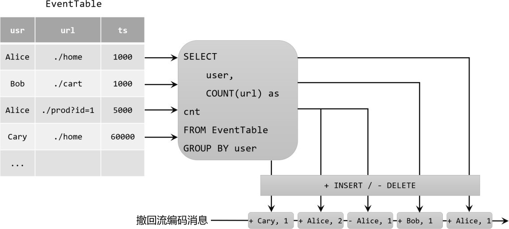

* 更新插入（Upsert）流：

  更新插入流中只包含两种类型的消息：更新插入（upsert）消息和删除（delete）消息。所谓的“upsert”其实是“update”和“insert”的合成词，所以对于更新插入流来说，INSERT 插入操作和UPDATE 更新操作，统一被编码为upsert 消息；而DELETE 删除操作则被编码为delete消息。

  更新插入流需要动态表中必须有唯一的键（key）。通过这个 key 进行查询，如果存在对应的数据就做更新（update），如果不存在就直接插入（insert）。这是一个动态表可以转换为更新插入流的必要条件。

  下图显示了将动态表转换为更新插入流的过程：

  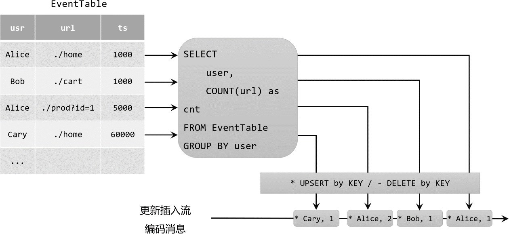

  可以看到，更新插入流跟撤回流的主要区别在于，更新（update）操作由于有 key 的存在，只需要用单条消息编码就可以，因此效率更高。

  需要注意的是，在代码里将动态表转换为 DataStream 时，只支持仅追加（append-only）和撤回（retract）流，我们调用 toChangelogStream()得到的其实就是撤回流；这也很好理解， DataStream 中并没有 key 的定义，所以只能通过两条消息一减一增来表示更新操作。而连接到外部系统时，则可以支持不同的编码方法，这取决于外部系统本身的特性。

## 时间属性和窗口

时间属性（time attributes），其实就是每个表模式结构（schema）的一部分。它可以在创建表的DDL 里直接定义为一个字段，也可以在 DataStream 转换成表时定义。一旦定义了时间属性，它就可以作为一个普通字段引用，并且可以在基于时间的操作中使用。

时间属性的数据类型为TIMESTAMP，它的行为类似于常规时间戳，可以直接访问并且进行计算。

按照时间语义的不同，我们可以把时间属性的定义分成事件时间（event time）和处理时间（processing time）两种情况

### 事件时间

事件时间属性可以在创建表 DDL 中定义，也可以在数据流和表的转换中定义

1、在创建表的DDL 中定义

在创建表的 DDL（CREATE TABLE 语句）中，可以增加一个字段，通过 WATERMARK语句来定义事件时间属性。WATERMARK 语句主要用来定义水位线（watermark）的生成表达式，这个表达式会将带有事件时间戳的字段标记为事件时间属性，并在它基础上给出水位线的延迟时间。具体定义方式如下：

~~~
CREATE TABLE EventTable( user STRING,
url STRING,
ts TIMESTAMP(3),
WATERMARK FOR ts AS ts - INTERVAL '5' SECOND
) WITH (
...
~~~

这里我们把 ts 字段定义为事件时间属性，而且基于 ts 设置了 5 秒的水位线延迟。这里的“5 秒”是以“时间间隔”的形式定义的，格式是INTERVAL <数值> <时间单位>，这里的数值必须用单引号引起来，而单位用 SECOND 和 SECONDS 是等效的。

Flink 中支持的事件时间属性数据类型必须为TIMESTAMP 或者TIMESTAMP_LTZ。这里 TIMESTAMP_LTZ 是指带有本地时区信息的时间戳（TIMESTAMP WITH LOCAL TIME ZONE）

如果原始的时间戳就是一个长整型的毫秒数，这时就需要另外定义一个字段来表示事件时间属性，类型定义为TIMESTAMP_LTZ 会更方便：

~~~
CREATE TABLE events ( user STRING,
	url STRING, ts BIGINT,
	ts_ltz AS TO_TIMESTAMP_LTZ(ts, 3),
	WATERMARK FOR ts_ltz AS time_ltz - INTERVAL '5' SECOND
) WITH (
...
);
~~~

这里我们另外定义了一个字段ts_ltz，是把长整型的 ts 转换为TIMESTAMP_LTZ 得到的；进而使用 WATERMARK 语句将它设为事件时间属性，并设置 5 秒的水位线延迟。

2、在数据流转换为表时定义

事件时间属性也可以在将DataStream 转换为表的时候来定义。我们调用 fromDataStream()方法创建表时，可以追加参数来定义表中的字段结构；这时可以给某个字段加上.rowtime() 后缀，就表示将当前字段指定为事件时间属性。这个字段可以是数据中本不存在、额外追加上去的“逻辑字段”，就像之前 DDL 中定义的第二种情况；也可以是本身固有的字段，那么这个字段就会被事件时间属性所覆盖，类型也会被转换为 TIMESTAMP。不论那种方式，时间属性字段中保存的都是事件的时间戳（TIMESTAMP 类型）。

需要注意的是，这种方式只负责指定时间属性，而时间戳的提取和水位线的生成应该之前就在 DataStream 上定义好了。由于 DataStream 中没有时区概念，因此 Flink 会将事件时间属性解析成不带时区的TIMESTAMP 类型，所有的时间值都被当作 UTC 标准时间。

~~~java
// 方法一:
// 流中数据类型为二元组 Tuple2，包含两个字段；需要自定义提取时间戳并生成水位线
DataStream<Tuple2<String, String>> stream = inputStream.assignTimestampsAndWatermarks(...);
// 声明一个额外的逻辑字段作为事件时间属性
Table table = tEnv.fromDataStream(stream, $("user"), $("url"),$("ts").rowtime());
// 方法二:
// 流中数据类型为三元组 Tuple3，最后一个字段就是事件时间戳
DataStream<Tuple3<String, String, Long>> stream = inputStream.assignTimestampsAndWatermarks(...);
// 不再声明额外字段，直接用最后一个字段作为事件时间属性
Table table = tEnv.fromDataStream(stream, $("user"), $("url"),$("ts").rowtime());
~~~

### 处理时间

相比之下处理时间就比较简单了，它就是我们的系统时间，使用时不需要提取时间戳（timestamp）和生成水位线（watermark）。因此在定义处理时间属性时，必须要额外声明一个字段，专门用来保存当前的处理时间。

1、在创建表的DDL 中定义

在创建表的 DDL（CREATE TABLE 语句）中，可以增加一个额外的字段，通过调用系统内置的 PROCTIME()函数来指定当前的处理时间属性，返回的类型是TIMESTAMP_LTZ。

~~~
CREATE TABLE EventTable( user STRING,
	url STRING,
	ts AS PROCTIME()
) WITH (
...
~~~

这里的时间属性，其实是以“计算列”（computed column）的形式定义出来的。所谓的计算列是 Flink SQL中引入的特殊概念，可以用一个AS 语句来在表中产生数据中不存在的列，并且可以利用原有的列、各种运算符及内置函数。在前面事件时间属性的定义中，将 ts 字段转换成 TIMESTAMP_LTZ 类型的 ts_ltz，也是计算列的定义方式。

2、在数据流转换为表时定义

调用 fromDataStream()方法创建表时，可以用.proctime()后缀来指定处理时间属性字段。由于处理时间是系统时间，原始数据中并没有这个字段，所以处理时间属性一定不能定义在一个已有字段上，只能定义在表结构所有字段的最后，作为额外的逻辑字段出现：

~~~java
DataStream<Tuple2<String, String>> stream = ...;
// 声明一个额外的字段作为处理时间属性字段
Table table = tEnv.fromDataStream(stream, $("user"), $("url"),$("ts").proctime());
~~~

### 窗口

窗口可以将无界流切割成大小有限的“桶”（bucket）来做计算，通过截取有限数据集来处理无限的流数据

在 Flink 1.12 之前的版本中，Table API 和 SQL 提供了一组“分组窗口”（Group Window）函数，常用的时间窗口如滚动窗口、滑动窗口、会话窗口都有对应的实现；具体在SQL 中就是调用 TUMBLE()、HOP()、SESSION()，传入时间属性字段、窗口大小等参数就可以了。

在进行窗口计算时，分组窗口是将窗口本身当作一个字段对数据进行分组的，可以对组内的数据进行聚合。基本使用方式如下：

~~~java
Table result = tableEnv.sqlQuery(
	"SELECT " +
    "user, " +
    "TUMBLE_END(ts, INTERVAL '1' HOUR) as endT, " +
    "COUNT(url) AS cnt " + "FROM EventTable " +
    "GROUP BY " +	// 使用窗口和用户名进行分组
    "user, " +
    "TUMBLE(ts, INTERVAL '1' HOUR)" // 定义 1 小时滚动窗口
);
~~~

分组窗口的功能比较有限，只支持窗口聚合，所以目前已经处于弃用（deprecated）的状态。

从 1.13 版本开始，Flink 开始使用窗口表值函数（Windowing table-valued functions， Windowing TVFs）来定义窗口。窗口表值函数是 Flink 定义的多态表函数（PTF），可以将表进行扩展后返回。表函数（table function）可以看作是返回一个表的函数，目前 Flink 提供了以下几个窗口TVF：

* 滚动窗口（Tumbling Windows）；
* 滑动窗口（Hop Windows，跳跃窗口）；


* 累积窗口（Cumulate Windows）；
* 会话窗口（Session Windows，目前尚未完全支持）。

在窗口 TVF 的返回值中，除去原始表中的所有列，还增加了用来描述窗口的额外3 个列： “窗口起始点”（window_start）、“窗口结束点”（window_end）、“窗口时间”（window_time）。起始点和结束点比较好理解，这里的“窗口时间”指的是窗口中的时间属性，它的值等于window_end - 1ms，所以相当于是窗口中能够包含数据的最大时间戳。

* 滚动窗口（TUMBLE）：

基于时间字段 ts，对表 EventTable 中的数据开了大小为 1 小时的滚动窗口。窗口会将表中的每一行数据，按照它们 ts 的值分配到一个指定的窗口中：

~~~
TUMBLE(TABLE EventTable, DESCRIPTOR(ts), INTERVAL '1' HOUR)
~~~

* 滑动窗口（HOP）：

基于时间属性 ts，在表 EventTable 上创建了大小为 1 小时的滑动窗口，每 5 分钟滑动一次。需要注意的是，紧跟在时间属性字段后面的第三个参数是步长（slide），第四个参数才是窗口大小（size）。

~~~
HOP(TABLE EventTable, DESCRIPTOR(ts), INTERVAL '5' MINUTES, INTERVAL '1' HOURS));
~~~

* 累积窗口（CUMULATE）：

滚动窗口和滑动窗口，可以用来计算大多数周期性的统计指标。不过在实际应用中还会遇到这样一类需求：我们的统计周期可能较长，因此希望中间每隔一段时间就输出一次当前的统计值；与滑动窗口不同的是，在一个统计周期内，我们会多次输出统计值，它们应该是不断叠加累积的。

例如，我们按天来统计网站的 PV（Page View，页面浏览量），如果用 1 天的滚动窗口，那需要到每天 24 点才会计算一次，输出频率太低；如果用滑动窗口，计算频率可以更高，但统计的就变成了“过去 24 小时的 PV”。所以我们真正希望的是，还是按照自然日统计每天的 PV，不过需要每隔 1 小时就输出一次当天到目前为止的 PV 值。这种特殊的窗口就叫作“累积窗口”（Cumulate Window）。

基于时间属性 ts，在表 EventTable 上定义了一个统计周期为 1 天、累积步长为 1

小时的累积窗口。注意第三个参数为步长 step，第四个参数则是最大窗口长度：

~~~
CUMULATE(TABLE EventTable, DESCRIPTOR(ts), INTERVAL '1' HOURS, INTERVAL '1' DAYS))
~~~

## 聚合（Aggregation）查询

Flink 中的 SQL是流处理与标准 SQL 结合的产物，所以聚合查询也可以分成两种：流处理中特有的聚合（主要指窗口聚合），以及 SQL原生的聚合查询方式。

### 分组聚合

groupby使用聚合函数就是分组聚合

SQL 中的分组聚合可以对应 DataStream API 中 keyBy 之后的聚合转换，它们都是按照某个 key 对数据进行了划分，各自维护状态来进行聚合统计的。在流处理中，分组聚合同样是一个持续查询，而且是一个更新查询，得到的是一个动态表；每当流中有一个新的数据到来时，都会导致结果表的更新操作。因此，想要将结果表转换成流或输出到外部系统，必须采用撤回流（retract stream）或更新插入流（upsert stream）的编码方式；如果在代码中直接转换成
DataStream 打印输出，需要调用 toChangelogStream()。

另外，在持续查询的过程中，由于用于分组的 key 可能会不断增加，因此计算结果所需要维护的状态也会持续增长。为了防止状态无限增长耗尽资源，Flink Table API 和 SQL 可以在表环境中配置状态的生存时间（TTL）：

~~~java
TableEnvironment tableEnv = ...

// 获取表环境的配置
TableConfig tableConfig = tableEnv.getConfig();
// 配置状态保持时间
tableConfig.setIdleStateRetention(Duration.ofMinutes(60));
~~~

或者也可以直接设置配置项 table.exec.state.ttl：

~~~java
TableEnvironment tableEnv = ...
Configuration configuration = tableEnv.getConfig().getConfiguration(); configuration.setString("table.exec.state.ttl", "60 min");
~~~

这两种方式是等效的。需要注意，配置 TTL 有可能会导致统计结果不准确，这其实是以牺牲正确性为代价换取了资源的释放。

此外，在 Flink SQL 的分组聚合中同样可以使用DISTINCT 进行去重的聚合处理；可以使用 HAVING 对聚合结果进行条件筛选；还可以使用GROUPING SETS（分组集）设置多个分组情况分别统计。这些语法跟标准 SQL 中的用法一致，这里就不再详细展开了。

### 窗口聚合

窗口分配器（window assigner），只是明确了窗口的形式以及数据如何分配；而窗口具体的计算处理操作，在 DataStream API 中还需要窗口函数（window function）来进行定义。

下面是一个窗口聚合的例子：

~~~java
Table result = tableEnv.sqlQuery(
    "SELECT " +
    "user, " +
    "window_end AS endT, " + "COUNT(url) AS cnt " +
    "FROM TABLE( " +
    "TUMBLE( TABLE EventTable, " + "DESCRIPTOR(ts), " + "INTERVAL '1' HOUR)) " +
    "GROUP BY user, window_start, window_end "
);
~~~

这里我们以 ts 作为时间属性字段、基于 EventTable 定义了 1 小时的滚动窗口，希望统计出每小时每个用户点击url 的次数。用来分组的字段是用户名 user， 以及表示窗口的window_start 和window_end；而 TUMBLE()是表值函数，所以得到的是一个表（Table），我们的聚合查询就是在这个Table 中进行的。

与分组聚合不同，窗口聚合不会将中间聚合的状态输出，只会最后输出一个结果。所有数据都是以 INSERT 操作追加到结果动态表中的，因此输出每行前面都有+I 的前缀。所以窗口聚合查询都属于追加查询，没有更新操作，代码中可以直接用toDataStream()将结果表转换成流。

### 开窗（Over）聚合

在标准 SQL 中还有另外一类比较特殊的聚合方式，可以针对每一行计算一个聚合值。比如说，我们可以以每一行数据为基准，计算它之前 1 小时内所有数据的平均值；也可以计算它之前 10 个数的平均值。就好像是在每一行上打开了一扇窗户、收集数据进行统计一样，这就是所谓的“开窗函数”。开窗函数的聚合与之前两种聚合有本质的不同：分组聚合、窗口 TVF聚合都是“多对一”的关系，将数据分组之后每组只会得到一个聚合结果；而开窗函数是对每行都要做一次开窗聚合，因此聚合之后表中的行数不会有任何减少，是一个“多对多”的关系。与标准 SQL 中一致，Flink SQL 中的开窗函数也是通过 OVER 子句来实现的，所以有时
开窗聚合也叫作“OVER 聚合”（Over Aggregation）。基本语法如下：

~~~
SELECT
  <聚合函数> OVER (
      [PARTITION BY <字段 1>[, <字段 2>, ...]]
      ORDER BY <时间属性字段>
  <开窗范围>),
  ...
FROM ...
~~~

这里OVER 关键字前面是一个聚合函数，它会应用在后面 OVER 定义的窗口上。在 OVER子句中主要有以下几个部分：

* PARTITION BY（可选）：用来指定分区的键（key），类似于 GROUP BY 的分组，这部分是可选的

* ORDER BY：OVER 窗口是基于当前行扩展出的一段数据范围，选择的标准可以基于时间也可以基于数量。不论那种定义，数据都应该是以某种顺序排列好的；而表中的数据本身是无序的。所以在 OVER 子句中必须用 ORDER BY 明确地指出数据基于那个字段排序。在 Flink 的流处理中，目前只支持按照时间属性的升序排列，所以这里 ORDER BY 后面的字段必须是定义好的时间属性

* 开窗范围：对于开窗函数而言，还有一个必须要指定的就是开窗的范围，也就是到底要扩展多少行来做聚合。这个范围是由BETWEEN <下界> AND <上界> 来定义的，也就是“从下界到上界”的范围。目前支持的上界只能是 CURRENT ROW，也就是定义一个“从之前某一行到当前行”的范围

  ~~~
  BETWEEN ... PRECEDING AND CURRENT ROW
  ~~~

  开窗选择的范围可以基于时间，也可以基于数据的数量。所以开窗范围还应该在两种模式之间做出选择：范围间隔（RANGE intervals）和行间隔（ROW intervals）

* 范围间隔：范围间隔以RANGE 为前缀，就是基于ORDER BY 指定的时间字段去选取一个范围，一般就是当前行时间戳之前的一段时间。例如开窗范围选择当前行之前 1 小时的数据：

  ~~~
  RANGE BETWEEN INTERVAL '1' HOUR PRECEDING AND CURRENT ROW
  ~~~

* 行间隔：行间隔以 ROWS 为前缀，就是直接确定要选多少行，由当前行出发向前选取就可以了。例如开窗范围选择当前行之前的 5 行数据（最终聚合会包括当前行，所以一共 6 条数据）：

  ~~~
  ROWS BETWEEN 5 PRECEDING AND CURRENT ROW
  ~~~

下面是一个具体示例：

~~~
SELECT user, ts,
    COUNT(url) OVER ( PARTITION BY user ORDER BY ts
    RANGE BETWEEN INTERVAL '1' HOUR PRECEDING AND CURRENT ROW
) AS cnt
FROM EventTable
~~~

这里我们以 ts 作为时间属性字段，对EventTable 中的每行数据都选取它之前 1 小时的所有数据进行聚合，统计每个用户访问 url 的总次数，并重命名为 cnt。最终将表中每行的 user， ts 以及扩展出cnt 提取出来。

可以看到，整个开窗聚合的结果，是对每一行数据都有一个对应的聚合值，因此就像将表中扩展出了一个新的列一样。由于聚合范围上界只能到当前行，新到的数据一般不会影响之前数据的聚合结果，所以结果表只需要不断插入（INSERT）就可以了。执行上面 SQL 得到的结果表，可以用toDataStream()直接转换成流打印输出。

在 SQL 中，也可以用 WINDOW 子句来在 SELECT 外部单独定义一个OVER 窗口：

~~~sql
SELECT 
    user, ts,
    COUNT(url) OVER w AS cnt,
    MAX(CHAR_LENGTH(url)) OVER w AS max_url 
FROM EventTable
WINDOW w AS ( PARTITION BY user ORDER BY ts ROWS BETWEEN 2 PRECEDING AND CURRENT ROW)
~~~

上面的 SQL 中定义了一个选取之前 2 行数据的 OVER 窗口，并重命名为w；接下来就可以基于它调用多个聚合函数，扩展出更多的列提取出来。比如这里除统计url 的个数外，还统计了url 的最大长度：首先用 CHAR_LENGTH()函数计算出url 的长度，再调用聚合函数 MAX()进行聚合统计。这样，我们就可以方便重复引用定义好的 OVER 窗口了，大大增强了代码的可读性。

### TopN

理想的状态下，我们应该有一个 TOPN()聚合函数，调用它对表进行聚合就可以得到想要选取的前 N 个值了。不过仔细一想就会发现，这个聚合函数并不容易实现：对于每一次聚合计算，都应该都有多行数据输入，并得到 N 行结果输出，这是一个真正意义上的“多对多”转换。这种函数相当于把一个表聚合成了另一个表，所以叫作“表聚合函数”（Table Aggregate Function）。表聚合函数的抽象比较困难，目前只有窗口 TVF 有能力提供直接的Top N 聚合，不过也尚未实现。

在 Flink SQL 中，是通过 OVER 聚合和一个条件筛选来实现 Top N 的。具体来说，是通过将一个特殊的聚合函数ROW_NUMBER()应用到OVER 窗口上，统计出每一行排序后的行号，作为一个字段提取出来；然后再用WHERE 子句筛选行号小于等于N 的那些行返回：

~~~sql
SELECT ... FROM (
    SELECT ...,
    ROW_NUMBER() OVER (
        [PARTITION BY <字段 1>[, <字段 1>...]]
        ORDER BY <排序字段 1> [asc|desc][, <排序字段 2> [asc|desc]...]
) AS row_num FROM ...)
WHERE row_num <= N [AND <其它条件>]
~~~

这里的 OVER 窗口定义与之前的介绍基本一致，目的就是利用 ROW_NUMBER()函数为每一行数据聚合得到一个排序之后的行号。行号重命名为 row_num，并在外层的查询中以 row_num <= N 作为条件进行筛选，就可以得到根据排序字段统计的 Top N 结果了。

对关键字额外做一些说明：

* WHERE：用来指定Top N 选取的条件，这里必须通过row_num <= N 或者 row_num < N + 1 指定一个“排名结束点”（rank end），以保证结果有界。
* PARTITION BY：是可选的，用来指定分区的字段，这样我们就可以针对不同的分组分别统计Top N 了。
* ORDER BY：指定了排序的字段，因为只有排序之后，才能进行前N 个最大/最小的选取。每个排序字段后可以用asc 或者 desc 来指定排序规则：asc 为升序排列，取出的就是最小的N 个值；desc为降序排序，对应的就是最大的N 个值。默认情况下为升序，asc可以省略。（只有在 Top N 的应用场景中，OVER 窗口ORDER BY后才可以指定其它排序字段）

这里的 Top N 聚合是一个更新查询。新数据到来后，可能会改变之前数据的排名，所以会有更新（UPDATE）操作。这是 ROW_NUMBER()聚合函数的特性决定的。因此，如果执行上面的 SQL 得到结果表，需要调用 toChangelogStream()才能转换成流打印输出。

除了直接对数据进行Top N 的选取，我们也可以针对窗口来做Top N。例如电商行业，实际应用中往往有这样的需求：统计一段时间内的热门商品。这就需要先开窗口，在窗口中统计每个商品的点击量；然后将统计数据收集起来，按窗口进行分组，并按点击量大小降序排序，选取前N 个作为结果返回。

具体来说，可以先做一个窗口聚合，将窗口信息 window_start、window_end 连同每个商品的点击量一并返回，这样就得到了聚合的结果表，包含了窗口信息、商品和统计的点击量。接下来就可以像一般的 Top N 那样定义 OVER 窗口了，按窗口分组，按点击量排序，用 ROW_NUMBER()统计行号并筛选前 N 行就可以得到结果。所以窗口 Top N 的实现就是窗口聚合与 OVER 聚合的结合使用。

下面是一个具体案例的代码实现。由于用户访问事件 Event 中没有商品相关信息，因此我们统计的是每小时内有最多访问行为的用户，取前两名，相当于是一个每小时活跃用户的查询：

~~~java
import org.apache.flink.api.common.eventtime.SerializableTimestampAssigner; import org.apache.flink.api.common.eventtime.WatermarkStrategy;
import org.apache.flink.streaming.api.datastream.SingleOutputStreamOperator; import org.apache.flink.streaming.api.environment.StreamExecutionEnvironment; import org.apache.flink.table.api.Table;
import org.apache.flink.table.api.bridge.java.StreamTableEnvironment; import static org.apache.flink.table.api.Expressions.$;

public class WindowTopNExample {
public static void main(String[] args) throws Exception { 
      	StreamExecutionEnvironment env = StreamExecutionEnvironment.getExecutionEnvironment(); env.setParallelism(1);
        // 读取数据源，并分配时间戳、生成水位线
        SingleOutputStreamOperator<Event> eventStream = env
          .fromElements(
            new Event("Alice", "./home", 1000L),
            new Event("Bob", "./cart", 1000L),
            new Event("Alice", "./prod?id=1", 25 * 60 * 1000L), new Event("Alice", "./prod?id=4", 55 * 60 * 1000L),
            new Event("Bob", "./prod?id=5", 3600 * 1000L + 60 * 1000L), new Event("Cary", "./home", 3600 * 1000L + 30 * 60 * 1000L), 
            new Event("Cary", "./prod?id=7", 3600 * 1000L + 59 * 60 * 1000L)
          )
        .assignTimestampsAndWatermarks( WatermarkStrategy.<Event>forMonotonousTimestamps()
        .withTimestampAssigner(new SerializableTimestampAssigner<Event>() {
          @Override
          public long extractTimestamp(Event element, long recordTimestamp) {
              return element.timestamp;
          }
        });

        // 创建表环境
        StreamTableEnvironment tableEnv = StreamTableEnvironment.create(env);

        // 将数据流转换成表，并指定时间属性
        Table eventTable = tableEnv.fromDataStream( eventStream,
            $("user"),
            $("url"),
            $("timestamp").rowtime().as("ts")
            // 将 timestamp 指定为事件时间，并命名为 ts
        );

        // 为方便在 SQL 中引用，在环境中注册表 EventTable tableEnv.createTemporaryView("EventTable", eventTable);
        // 定义子查询，进行窗口聚合，得到包含窗口信息、用户以及访问次数的结果表
        String subQuery =
        "SELECT window_start, window_end, user, COUNT(url) as cnt " + "FROM TABLE ( " +
        "TUMBLE( TABLE EventTable, DESCRIPTOR(ts), INTERVAL '1' HOUR ))
        " +
        "GROUP BY window_start, window_end, user ";

        // 定义 Top N 的外层查询
        String topNQuery =
          "SELECT * " + "FROM (" +
          "SELECT *, " +
          "ROW_NUMBER() OVER ( " +
          "PARTITION BY window_start, window_end " + "ORDER BY cnt desc " +
          ") AS row_num " +
          "FROM (" + subQuery + ")) " + "WHERE row_num <= 2";
        // 执行 SQL 得到结果表
        Table result = tableEnv.sqlQuery(topNQuery); tableEnv.toDataStream(result).print();
        env.execute();
    }
}
~~~

## 联结（Join）查询

Flink SQL 中的联结查询大体上也可以分为两类：SQL 原生的联结查询方式，和流处理中特有的联结查询。

### 常规联结查询

常规联结（Regular Join）是 SQL 中原生定义的 Join 方式，是最通用的一类联结操作。它的具体语法与标准SQL 的联结完全相同，通过关键字 JOIN 来联结两个表，后面用关键字 ON来指明联结条件。按照习惯，我们一般以“左侧”和“右侧”来区分联结操作的两个表。

在两个动态表的联结中，任何一侧表的插入（INSERT）或更改（UPDATE）操作都会让联结的结果表发生改变。例如，如果左侧有新数据到来，那么它会与右侧表中所有之前的数据进行联结合并，右侧表之后到来的新数据也会与这条数据连接合并。所以，常规联结查询一般是更新（Update）查询。

与标准 SQL 一致，Flink SQL 的常规联结也可以分为内联结（INNER JOIN）和外联结（OUTER JOIN），区别在于结果中是否包含不符合联结条件的行。目前仅支持“等值条件”作为联结条件，也就是关键字 ON 后面必须是判断两表中字段相等的逻辑表达式。

1、等值内联结（INNER Equi-JOIN）

内联结用 INNER JOIN 来定义，会返回两表中符合联接条件的所有行的组合，也就是所谓的笛卡尔积（Cartesian product）。目前仅支持等值联结条件。

例如之前提到的“订单表”（定义为 Order）和“商品表”（定义为 Product）的联结查询，就可以用以下SQL 实现：

~~~sql
SELECT *
FROM Order
INNER JOIN Product
ON Order.product_id = Product.id
~~~

这里是一个内联结，联结条件是订单数据的 product_id 和商品数据的 id 相等。由于订单表中出现的商品id 一定会在商品表中出现，因此这样得到的联结结果表，就包含了订单表Order中所有订单数据对应的详细信息。

2、等值外联结（OUTER Equi-JOIN）

与内联结类似，外联结也会返回符合联结条件的所有行的笛卡尔积；另外，还可以将某一 侧表中找不到任何匹配的行也单独返回。Flink SQL 支持左外（LEFT JOIN）、右外（RIGHT JOIN）和全外（FULL OUTER JOIN），分别表示会将左侧表、右侧表以及双侧表中没有任何匹配的行 返回。例如，订单表中未必包含了商品表中的所有 ID，为了将哪些没有任何订单的商品信息

也查询出来，我们就可以使用右外联结（RIGHT JOIN）。当然，外联结查询目前也仅支持等值联结条件。具体用法如下：

~~~sql
SELECT *
FROM Order
LEFT JOIN Product
ON Order.product_id = Product.id

SELECT *
FROM Order
RIGHT JOIN Product
ON Order.product_id = Product.id

SELECT *
FROM Order
FULL OUTER JOIN Product
ON Order.product_id = Product.id
~~~

### 间隔联结查询

之前曾经学习过 DataStream API 中的双流 Join，包括窗口联结（window join）和间隔联结（interval join）。两条流的 Join 就对应着 SQL 中两个表的 Join，这是流处理中特有的联结方式。目前 Flink SQL 还不支持窗口联结，而间隔联结则已经实现。

间隔联结（Interval Join）返回的，同样是符合约束条件的两条中数据的笛卡尔积。只不过这里的“约束条件”除了常规的联结条件外，还多了一个时间间隔的限制。具体语法有以下要点：

* 两表的联结：

  间隔联结不需要用 JOIN 关键字，直接在 FROM 后将要联结的两表列出来就可以，用逗号分隔。这与标准 SQL 中的语法一致，表示一个“交叉联结”（Cross Join），会返回两表中所有行的笛卡尔积。

* 联结条件：

  联结条件用WHERE 子句来定义，用一个等值表达式描述。交叉联结之后再用 WHERE进行条件筛选，效果跟内联结 INNER JOIN ... ON ...非常类似。

* 时间间隔限制：

  我们可以在WHERE 子句中，联结条件后用 AND 追加一个时间间隔的限制条件；做法是提取左右两侧表中的时间字段，然后用一个表达式来指明两者需要满足的间隔限制。具体定义方式有下面三种，这里分别用 ltime 和 rtime 表示左右表中的时间字段：
  （1）ltime = rtime
  （2）ltime >= rtime AND ltime < rtime + INTERVAL '10' MINUTE

  （3）ltime BETWEEN rtime - INTERVAL '10' SECOND AND rtime + INTERVAL '5' SECOND

  判断两者相等，这是最强的时间约束，要求两表中数据的时间必须完全一致才能匹配；一般情况下，我们还是会放宽一些，给出一个间隔。间隔的定义可以用<，<=，>=，>这一类的关系不等式，也可以用BETWEEN ... AND ...这样的表达式。

例如，我们现在除了订单表 Order 外，还有一个“发货表”Shipment，要求在收到订单后四个小时内发货。那么我们就可以用一个间隔联结查询，把所有订单与它对应的发货信息连接合并在一起返回。

~~~sql
SELECT *
FROM Order o, Shipment s WHERE o.id = s.order_id
AND o.order_time BETWEEN s.ship_time - INTERVAL '4' HOUR AND s.ship_time
~~~

在流处理中，间隔联结查询只支持具有时间属性的“仅追加”（Append-only）表。那对于有更新操作的表，又怎么办呢？

除了间隔联结之外，Flink SQL 还支持时间联结（Temporal Join），这主要是针对“版本表”（versioned table）而言的。所谓版本表，就是记录了数据随着时间推移版本变化的表，可以理解成一个“更新日志”（change log），它就是具有时间属性、还会进行更新操作的表。当我们联结某个版本表时，并不是把当前的数据连接合并起来就行了，而是希望能够根据数据发生的时间，找到当时的“版本”；这种根据更新时间提取当时的值进行联结的操作，就叫作“时间联结”（Temporal Join）

## 函数

Flink SQL 中的函数可以分为两类：一类是 SQL 中内置的系统函数，直接通过函数名调用就可以，能够实现一些常用的转换操作，比如之前我们用到的 COUNT()、CHAR_LENGTH()、UPPER()等等；而另一类函数则是用户自定义的函数（UDF），需要在表环境中注册才能使用

Flink SQL 中的系统函数又主要可以分为两大类：标量函数（Scalar Functions）和聚合函数（Aggregate Functions）：

* 标量函数指的就是只对输入数据做转换操作、返回一个值的函数。对于一些没有输入参数、直接可以得到唯一结果的函数，也属于标量函数。如UPPER、CHAR_LENGTH、CURRENT_TIME等
* 聚合函数是以表中多个行作为输入，提取字段进行聚合操作的函数，会将唯一的聚合值作为结果返回。如COUNT、SUM、RANK

自定义函数（User Defined Functions，UDF）分为几类：

* 标量函数（Scalar Functions）：将输入的标量值转换成一个新的标量值；
* 表函数（Table Functions）：将标量值转换成一个或多个新的行数据，也就是扩展成一个表；
* 聚合函数（Aggregate Functions）：将多行数据里的标量值转换成一个新的标量值；
* 表聚合函数（Table Aggregate Functions）：将多行数据里的标量值转换成一个或多个新的行数据。

注册函数时需要调用表环境的 createTemporarySystemFunction()方法，传入注册的函数名以及UDF 类的Class 对象：

~~~
// 注册函数
tableEnv.createTemporarySystemFunction("MyFunction", MyFunction.class);
~~~

我们自定义的 UDF 类叫作 MyFunction，它应该是上面四种 UDF 抽象类中某一个的具体实现；在环境中将它注册为名叫 MyFunction 的函数。

## SQL客户端

为了方便写SQL，Flink 为我们提供了一个工具来进行 Flink 程序的编写、测试和提交，这工具叫作“SQL 客户端”。SQL 客户端提供了一个命令行交互界面（CLI），我们可以在里面非常容易地编写SQL 进行查询，就像使用 MySQL 一样；整个 Flink 应用编写、提交的过程全变成了写 SQL，不需要写一行 Java/Scala 代码。

## 连接到外部系统

在 Table API 和 SQL 编写的 Flink 程序中，可以在创建表的时候用 WITH 子句指定连接器（connector），这样就可以连接到外部系统进行数据交互了。

架构中的TableSource 负责从外部系统中读取数据并转换成表，TableSink 则负责将结果表写入外部系统。在 Flink 1.13 的API 调用中，已经不去区分TableSource 和TableSink，我们只要建立到外部系统的连接并创建表就可以，Flink 自动会从程序的处理逻辑中解析出它们的用途。

Flink 的Table API 和 SQL 支持了各种不同的连接器。当然，最简单的其实就是上一节中提到的连接到控制台打印输出：

~~~java
CREATE TABLE ResultTable ( 
  user STRING,
  cnt BIGINT 
WITH (
	'connector' = 'print'
);
~~~

这里只需要在WITH 中定义 connector 为print 就可以了。而对于其它的外部系统，则需要增加一些配置项。

### Kafka

Kafka 的 SQL 连接器可以从 Kafka 的主题（topic）读取数据转换成表，也可以将表数据写入Kafka 的主题。换句话说，创建表的时候指定连接器为Kafka，则这个表既可以作为输入表，也可以作为输出表。

想要在 Flink 程序中使用 Kafka 连接器，需要引入如下依赖：

~~~xml
<dependency>
    <groupId>org.apache.flink</groupId>
    <artifactId>flink-connector-kafka_${scala.binary.version}</artifactId>
    <version>${flink.version}</version>
</dependency>
~~~

这里我们引入的 Flink 和 Kafka 的连接器，与之前DataStream API 中引入的连接器是一样的。如果想在 SQL 客户端里使用 Kafka 连接器，还需要下载对应的 jar 包放到 lib 目录下。

另外，Flink 为各种连接器提供了一系列的“表格式”（table formats），比如 CSV、JSON、 Avro、Parquet 等等。这些表格式定义了底层存储的二进制数据和表的列之间的转换方式，相当于表的序列化工具。对于 Kafka 而言，CSV、JSON、Avro 等主要格式都是支持的，根据Kafka 连接器中配置的格式，我们可能需要引入对应的依赖支持。以CSV 为例：

~~~xml
<dependency>
    <groupId>org.apache.flink</groupId>
    <artifactId>flink-csv</artifactId>
    <version>${flink.version}</version>
</dependency>
~~~

由于 SQL 客户端中已经内置了 CSV、JSON 的支持，因此使用时无需专门引入；而对于没有内置支持的格式（比如 Avro），则仍然要下载相应的 jar 包。

创建一个连接到Kafka 表，需要在CREATE TABLE 的 DDL 中在 WITH 子句里指定连接器为Kafka，并定义必要的配置参数：

~~~sql
CREATE TABLE KafkaTable (
    `user` STRING,
    `url` STRING,
    `ts` TIMESTAMP(3) METADATA FROM 'timestamp'
) WITH (
    'connector' = 'kafka', 'topic' = 'events',
    'properties.bootstrap.servers' = 'localhost:9092', 
  	'properties.group.id' = 'testGroup', 
  	'scan.startup.mode' = 'earliest-offset',
    'format' = 'csv'
)
~~~

这里定义了 Kafka 连接器对应的主题（topic），Kafka 服务器，消费者组 ID，消费者起始模式以及表格式。需要特别说明的是，在 KafkaTable 的字段中有一个 ts，它的声明中用到了 METADATA FROM，这是表示一个“元数据列”（metadata column），它是由 Kafka 连接器的元数据“timestamp”生成的。这里的 timestamp 其实就是Kafka 中数据自带的时间戳，我们把它直接作为元数据提取出来，转换成一个新的字段 ts

正常情况下，Kafka 作为保持数据顺序的消息队列，读取和写入都应该是流式的数据，对应在表中就是仅追加（append-only）模式。如果我们想要将有更新操作（比如分组聚合）的结果表写入Kafka，就会因为 Kafka 无法识别撤回（retract）或更新插入（upsert）消息而导致异常。

为了解决这个问题，Flink 专门增加了一个“更新插入Kafka”（Upsert Kafka）连接器。这个连接器支持以更新插入（UPSERT）的方式向 Kafka 的 topic 中读写数据。具体来说，Upsert Kafka 连接器处理的是更新日志（changlog）流。如果作为 TableSource：

* 连接器会将读取到的topic 中的数据（key, value），解释为对当前key 的数据值的更新（UPDATE），也就是查找动态表中key 对应的一行数据，将 value 更新为最新的值；
* 因为是Upsert 操作，所以如果没有 key 对应的行，那么也会执行插入（INSERT）操作。
* 如果遇到 value 为空（null），连接器就把这条数据理解为对相应 key 那一行的删除（DELETE）操作。

如果作为 TableSink，Upsert Kafka 连接器会将有更新操作的结果表，转换成更新日志（changelog）流：

* 如果遇到插入（INSERT）或者更新后（UPDATE_AFTER）的数据，对应的是一个添加（add）消息，那么就直接正常写入 Kafka 主题；
* 如果是删除（DELETE）或者更新前的数据，对应是一个撤回（retract）消息，那么就把 value 为空（null）的数据写入 Kafka。

由于 Flink 是根据键（key）的值对数据进行分区的，这样就可以保证同一个 key 上的更新和删除消息都会落到同一个分区中。下面是一个创建和使用Upsert Kafka 表的例子：

~~~sql
CREATE TABLE pageviews_per_region ( 
  user_region STRING,
  pv BIGINT, 
  uv BIGINT,
  PRIMARY KEY (user_region) NOT ENFORCED
) WITH (
  'connector' = 'upsert-kafka', 'topic' = 'pageviews_per_region',
  'properties.bootstrap.servers' = '...', 'key.format' = 'avro',
  'value.format' = 'avro'
);

CREATE TABLE pageviews ( 
  user_id BIGINT, 
  page_id BIGINT, 
  viewtime TIMESTAMP, 
  user_region STRING,
  WATERMARK FOR viewtime AS viewtime - INTERVAL '2' SECOND
) WITH (
  'connector' = 'kafka',
  'topic' = 'pageviews',
  'properties.bootstrap.servers' = '...', 'format' = 'json'
);

-- 计算 pv、uv 并插入到 upsert-kafka 表中
INSERT INTO pageviews_per_region 
SELECT user_region, COUNT(*), COUNT(DISTINCT user_id) 
FROM pageviews
GROUP BY user_region;
~~~

这里我们从Kafka 表 pageviews 中读取数据，统计每个区域的 PV（全部浏览量）和 UV（对用户去重），这是一个分组聚合的更新查询，得到的结果表会不停地更新数据。为了将结果表写入Kafka 的 pageviews_per_region 主题，我们定义了一个 Upsert Kafka 表，它的字段中需要用PRIMARY KEY 来指定主键，并且在WITH 子句中分别指定key和value的序列化格式。

### 文件系统

Flink 提供了文件系统的连接器，支持从本地或者分布式的文件系统中读写数据。这个连接器是内置在Flink 中的，所以使用它并不需要额外引入依赖

下面是一个连接到文件系统的示例：

~~~sql
CREATE TABLE MyTable (
    column_name1 INT, column_name2 STRING,
    ...
    part_name1 INT, part_name2 STRING
) PARTITIONED BY (part_name1, part_name2) WITH 
('connector' = 'filesystem', 
 'path' = '...', 
 -- 文件路径 'format' = '...')
~~~

这里在 WITH 前使用了 PARTITIONED BY 对数据进行了分区操作。文件系统连接器支持对分区文件的访问。

# Flink CEP

在实际应用中，还有一类需求是要检测以特定顺序先后发生的一组事件，进行统计或做报警提示，这就比较麻烦了。例如，网站做用户管理，可能需要检测“连续登录失败”事件的发生，这是个组合事件，其实就是“登录失败”和“登录失败”的组合；电商网站可能需要检测用户“下单支付”行为，这也是组合事件，“下单”事件之后一段时间内又会有“支付”事件到来，还包括了时间上的限制。

类似的多个事件的组合，我们把它叫作“复杂事件”。对于复杂时间的处理，由于涉及到事件的严格顺序，有时还有时间约束，我们很难直接用 SQL 或者 DataStream API 来完成。如果用process function来完成，对于非常复杂的组合事件，我们可能需要设置很多状态、定时器，并在代码中定义各种条件分支（if-else）逻辑来处理，复杂度会非常高，很可能会使代码失去可读性。

Flink为我们提供了专门用于处理复杂事件的库——CEP，可以让我们更加轻松地解决这类棘手的问题。这在企业的实时风险控制中有非常重要的作用。

## 基本概念

CEP，其实就是“复杂事件处理（Complex Event Processing）”的缩写；而 Flink CEP，就是 Flink 实现的一个用于复杂事件处理的库（library）。

复杂事件处理，就是可以在事件流里，检测到特定的事件组合并进行处理，比如说“连续登录失败”，或者“订单支付超时”等等。

具体的处理过程是，把事件流中的一个个简单事件，通过一定的规则匹配组合起来，这就是“复杂事件”；然后基于这些满足规则的一组组复杂事件进行转换处理，得到想要的结果进行输出。

总结起来，复杂事件处理（CEP）的流程可以分成三个步骤：

* 定义一个匹配规则
* 将匹配规则应用到事件流上，检测满足规则的复杂事件
* 对检测到的复杂事件进行处理，得到结果进行输出

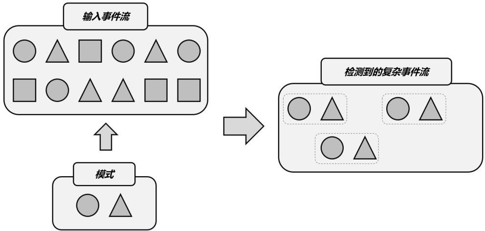

在上图中，输入是不同形状的事件流，我们可以定义一个匹配规则：在圆形后面紧跟着三角形。那么将这个规则应用到输入流上，就可以检测到三组匹配的复杂事件。它们构成了一个新的“复杂事件流”，流中的数据就变成了一组一组的复杂事件，每个数据都包含了一个圆形和一个三角形。接下来，我们就可以针对检测到的复杂事件，处理之后输出一个提示或报警信息了。

CEP 是针对流处理而言的，分析的是低延迟、频繁产生的事件流。它的主要目的，就是在无界流中检测出特定的数据组合，让我们有机会掌握数据中重要的高阶特征。

CEP 的第一步所定义的匹配规则，我们可以把它叫作“模式”（Pattern）。模式的定义主要就是两部分内容：

* 每个简单事件的特征
* 简单事件之间的组合关系

当然，我们也可以进一步扩展模式的功能。比如，匹配检测的时间限制；每个简单事件是否可以重复出现；对于事件可重复出现的模式，遇到一个匹配后是否跳过后面的匹配；等等。

所谓“事件之间的组合关系”，一般就是定义“谁后面接着是谁”，也就是事件发生的顺序。我们把它叫作“近邻关系”。可以定义严格的近邻关系，也就是两个事件之前不能有任何其他事件；也可以定义宽松的近邻关系，即只要前后顺序正确即可，中间可以有其他事件。另外，还可以反向定义，也就是“谁后面不能跟着谁”。

CEP 做的事其实就是在流上进行模式匹配。根据模式的近邻关系条件不同，可以检测连续的事件或不连续但先后发生的事件；模式还可能有时间的限制，如果在设定时间范围内没有满足匹配条件，就会导致模式匹配超时（timeout）。

Flink CEP 为我们提供了丰富的API，可以实现上面关于模式的所有功能，这套 API 就叫作“模式API”（Pattern API）。

CEP 主要用于实时流数据的分析处理。CEP 可以帮助在复杂的、看似不相关的事件流中找出那些有意义的事件组合，进而可以接近实时地进行分析判断、输出通知信息或报警。主要应用有：

* 风险控制：设定一些行为模式，可以对用户的异常行为进行实时检测。当一个用户行为符合了异常行为模式，比如短时间内频繁登录并失败、大量下单却不支付（刷单），就可以向用户发送通知信息，或是进行报警提示、由人工进一步判定用户是否有违规操作的嫌疑。这样就可以有效地控制用户个人和平台的风险。
* 用户画像：利用 CEP 可以用预先定义好的规则，对用户的行为轨迹进行实时跟踪，从而检测出具有特定行为习惯的一些用户，做出相应的用户画像。基于用户画像可以进行精准营销，即对行为匹配预定义规则的用户实时发送相应的营销推广；这与目前很多企业所做的精准推荐原理是一样的。
* 运维监控：对于企业服务的运维管理，可以利用CEP 灵活配置多指标、多依赖来实现更复杂的监控模式

CEP 的应用场景非常丰富。很多大数据框架，如 Spark、Samza、Beam 等都提供了不同的 CEP 解决方案，但没有专门的库（library）。而 Flink 提供了专门的CEP 库用于复杂事件处理，可以说是目前CEP 的最佳解决方案。

## 快速上手

考虑一个具体的需求：检测用户行为，如果连续三次登录失败，就输出报警信息。很显然，这是一个复杂事件的检测处理，我们可以使用 Flink CEP 来实现。
我们首先定义数据的类型。这里的用户行为不再是之前的访问事件 Event 了，所以应该单独定义一个登录事件POJO 类。具体实现如下：

~~~java
public class LoginEvent { 
  public String userId; 
  public String ipAddress; 
  public String eventType; 
  public Long timestamp;

  public LoginEvent(String userId, String ipAddress, String eventType, Long timestamp) {
    this.userId = userId; 
    this.ipAddress = ipAddress; 
    this.eventType = eventType;
    this.timestamp = timestamp;
  }
	public LoginEvent() {} 
  
  @Override
  public String toString() { 
    return "LoginEvent{" +
    "userId='" + userId + '\'' +
    ", ipAddress='" + ipAddress + '\'' + ", eventType='" + eventType + '\'' + ", timestamp=" + timestamp +
    '}';
  }
~~~

接下来就是业务逻辑的编写。Flink CEP 在代码中主要通过 Pattern API 来实现。之前我们已经介绍过，CEP 的主要处理流程分为三步，对应到 Pattern API 中就是：

* 定义一个模式（Pattern）；
* 将Pattern 应用到DataStream 上，检测满足规则的复杂事件，得到一个PatternStream；
* 对 PatternStream 进行转换处理，将检测到的复杂事件提取出来，包装成报警信息输出。

具体代码实现如下：

~~~java
import org.apache.flink.api.common.eventtime.SerializableTimestampAssigner; import org.apache.flink.api.common.eventtime.WatermarkStrategy;
import org.apache.flink.cep.CEP;
import org.apache.flink.cep.PatternSelectFunction; import org.apache.flink.cep.PatternStream;
import org.apache.flink.cep.pattern.Pattern;
import org.apache.flink.cep.pattern.conditions.SimpleCondition; import org.apache.flink.streaming.api.datastream.KeyedStream;
import org.apache.flink.streaming.api.environment.StreamExecutionEnvironment;

import java.util.List; import java.util.Map;

public class LoginFailDetect {
    public static void main(String[] args) throws Exception {
        StreamExecutionEnvironment env =
        StreamExecutionEnvironment.getExecutionEnvironment(); env.setParallelism(1);

        // 获取登录事件流，并提取时间戳、生成水位线
        KeyedStream<LoginEvent, String> stream = env
        .fromElements(
        new LoginEvent("user_1", "192.168.0.1", "fail", 2000L), 
          new LoginEvent("user_1", "192.168.0.2", "fail", 3000L),
        new LoginEvent("user_2", "192.168.1.29", "fail", 4000L), 
          new LoginEvent("user_1", "171.56.23.10", "fail", 5000L),
          new LoginEvent("user_2", "192.168.1.29", "success", 6000L), 
          new LoginEvent("user_2", "192.168.1.29", "fail", 7000L), 
          new LoginEvent("user_2", "192.168.1.29", "fail", 8000L)
        )
        .assignTimestampsAndWatermarks( WatermarkStrategy.<LoginEvent>forMonotonousTimestamps()
        .withTimestampAssigner(
        new SerializableTimestampAssigner<LoginEvent>() { 
          @Override
            public long extractTimestamp(LoginEvent loginEvent, long l)
            {
            return loginEvent.timestamp;
            }
        }
        )
        )
        .keyBy(r -> r.userId);

        // 1. 定义 Pattern，连续的三个登录失败事件 Pattern<LoginEvent, LoginEvent> pattern = Pattern
        .<LoginEvent>begin("first")	// 以第一个登录失败事件开始
        .where(new SimpleCondition<LoginEvent>() { 
          @Override
        public boolean filter(LoginEvent loginEvent) throws Exception 
        { 
          return loginEvent.eventType.equals("fail");
        }
        })
        .next("second")	// 接着是第二个登录失败事件
        .where(new SimpleCondition<LoginEvent>() { 
          @Override
        public boolean filter(LoginEvent loginEvent) throws Exception 
        { 
          return loginEvent.eventType.equals("fail");
        }
        })
        .next("third")	// 接着是第三个登录失败事件
        .where(new SimpleCondition<LoginEvent>() { 
          @Override
        public boolean filter(LoginEvent loginEvent) throws Exception 
        { 
          return loginEvent.eventType.equals("fail");
        }
        });

        // 2. 将 Pattern 应用到流上，检测匹配的复杂事件，得到一个 PatternStream PatternStream<LoginEvent> patternStream = CEP.pattern(stream, pattern);
        // 3. 将匹配到的复杂事件选择出来，然后包装成字符串报警信息输出
        patternStream
        .select(new PatternSelectFunction<LoginEvent, String>() { 
          @Override
        public String select(Map<String, List<LoginEvent>> map) throws Exception {
            LoginEvent first = map.get("first").get(0); 
              LoginEvent second = map.get("second").get(0); 
              LoginEvent third = map.get("third").get(0);
            return first.userId + " 连续三次登录失败！登录时间：" +
            first.timestamp + ", " + second.timestamp + ", " + third.timestamp;
        }
        })
        .print("warning");

        env.execute();
        }
    }
~~~

在上面的程序中，模式中的每个简单事件，会用一个.where()方法来指定一个约束条件，指明每个事件的特征，这里就是 eventType 为“fail”。

而模式里表示事件之间的关系时，使用了 .next() 方法。next 是“下一个”的意思，表示紧挨着、中间不能有其他事件（比如登录成功），这是一个严格近邻关系。第一个事件用.begin()方法表示开始。所有这些“连接词”都可以有一个字符串作为参数，这个字符串就可以认为是当前简单事件的名称。所以我们如果检测到一组匹配的复杂事件，里面就会有连续的三个登录失败事件，它们的名称分别叫作“first”“second”和“third”。

在第三步处理复杂事件时， 调用了 PatternStream 的.select() 方法， 传入一个 PatternSelectFunction 对检测到的复杂事件进行处理。而检测到的复杂事件，会放在一个 Map中；PatternSelectFunction 内.select()方法有一个类型为 Map\<String, List\<LoginEvent>>的参数 map，里面就保存了检测到的匹配事件。这里的 key 是一个字符串，对应着事件的名称，而 value是 LoginEvent 的一个列表，匹配到的登录失败事件就保存在这个列表里。最终我们提取 userId和三次登录的时间戳，包装成字符串输出一个报警信息。

运行代码可以得到结果如下：

~~~
warning> user_1 连续三次登录失败！登录时间：2000, 3000, 5000
~~~

## 模式API（Pattern API）

Flink CEP 的核心是复杂事件的模式匹配。Flink CEP 库中提供了 Pattern 类，基于它可以调用一系列方法来定义匹配模式，这就是所谓的模式 API（Pattern API）。Pattern API 可以让我们定义各种复杂的事件组合规则，用于从事件流中提取复杂事件。

### 个体模式

模式（Pattern）其实就是将一组简单事件组合成复杂事件的“匹配规则”。由于流中事件的匹配是有先后顺序的，因此一个匹配规则就可以表达成先后发生的一个个简单事件，按顺序串联组合在一起。

这里的每一个简单事件并不是任意选取的，也需要有一定的条件规则；所以我们就把每个简单事件的匹配规则，叫作“个体模式”（Individual Pattern）

在上面的例子中，每一个登录失败事件的选取规则就是一个个体模式。个体模式一般都会匹配接收一个事件。

每个个体模式都以一个“连接词”开始定义的，比如 begin、next 等等，这是 Pattern 对象的一个方法（begin 是 Pattern 类的静态方法），返回的还是一个 Pattern。这些“连接词”方法有一个 String 类型参数，这就是当前个体模式唯一的名字，比如这里的“first”、“second”。在之后检测到匹配事件时，就会以这个名字来指代匹配事件。

个体模式需要一个“过滤条件”，用来指定具体的匹配规则。这个条件一般是通过调用.where()方法来实现的，具体的过滤逻辑则通过传入的 SimpleCondition 内的.filter()方法来定义。

个体模式可以匹配接收一个事件，也可以接收多个事件。我们可以给个体模式增加一个“量词”（quantifier），就能够让它进行循环匹配，接收多个事件。

个体模式后面可以跟一个“量词”，用来指定循环的次数。从这个角度分类，个体模式可以包括“单例（singleton）模式”和“循环（looping）模式”。默认情况下，个体模式是单例模式，匹配接收一个事件；当定义了量词之后，就变成了循环模式，可以匹配接收多个事件。

在循环模式中，对同样特征的事件可以匹配多次。比如我们定义个体模式为“匹配形状为三角形的事件”，再让它循环多次，就变成了“匹配连续多个三角形的事件”。注意这里的“连续”，只要保证前后顺序即可，中间可以有其他事件，所以是“宽松近邻”关系。例如：

~~~java
// 匹配事件出现 4 次
pattern.times(4);
// 匹配事件出现 4 次，或者不出现
pattern.times(4).optional();
// 匹配事件出现 2, 3 或者 4 次
pattern.times(2, 4);
// 匹配事件出现 2, 3 或者 4 次，并且尽可能多地匹配
pattern.times(2, 4).greedy();
// 匹配事件出现 2, 3, 4 次，或者不出现
pattern.times(2, 4).optional();
// 匹配事件出现 2, 3, 4 次，或者不出现；并且尽可能多地匹配
pattern.times(2, 4).optional().greedy();
// 匹配事件出现 1 次或多次
pattern.oneOrMore();
// 匹配事件出现 1 次或多次，并且尽可能多地匹配
pattern.oneOrMore().greedy();
// 匹配事件出现 1 次或多次，或者不出现
pattern.oneOrMore().optional();
// 匹配事件出现 1 次或多次，或者不出现；并且尽可能多地匹配
pattern.oneOrMore().optional().greedy();
// 匹配事件出现 2 次或多次
pattern.timesOrMore(2);
// 匹配事件出现 2 次或多次，并且尽可能多地匹配
pattern.timesOrMore(2).greedy();
// 匹配事件出现 2 次或多次，或者不出现
pattern.timesOrMore(2).optional()
// 匹配事件出现 2 次或多次，或者不出现；并且尽可能多地匹配
pattern.timesOrMore(2).optional().greedy();
~~~

正是因为个体模式可以通过量词定义为循环模式，一个模式能够匹配到多个事件，所以之前代码中事件的检测接收才会用 Map 中的一个列表（List）来保存。而之前代码中没有定义量词，都是单例模式，所以只会匹配一个事件，每个List 中也只有一个元素：

~~~java
LoginEvent first = map.get("first").get(0);
~~~

对于每个个体模式，匹配事件的核心在于定义匹配条件，也就是选取事件的规则。

Flink CEP 会按照这个规则对流中的事件进行筛选，判断是否接受当前的事件。

对于条件的定义，主要是通过调用 Pattern 对象的.where()方法来实现的，主要可以分为简单条件、迭代条件、复合条件、终止条件几种类型。此外，也可以调用 Pattern 对象的.subtype()方法来限定匹配事件的子类型：

* 限定子类型：只有流中数据满足特定事件类型时，才满足匹配
* 简单条件（Simple Conditions）：就是之前用过的SimpleCondition，它的filter方法可以过滤条件，可以基于当前事件进行判断
* 迭代条件（Iterative Conditions）：IterativeCondition的filter方法，它的入参Context可以拿到这个模式中已匹配到的所有数据。基于此我们可以实现需要依靠之前事件来做判断的条件
* 组合条件（Combining Conditions）：.where()后面再接一个.where()相当于与，接or相当于逻辑或
* 终止条件（Stop Conditions）：表示遇到某个特定事件时当前模式就不再继续循环匹配了。

### 组合模式

有了定义好的个体模式，就可以尝试按一定的顺序把它们连接起来，定义一个完整的复杂事件匹配规则了。这种将多个个体模式组合起来的完整模式，就叫作“组合模式”（Combining Pattern），为了跟个体模式区分有时也叫作“模式序列”（Pattern Sequence）。

一个组合模式有以下形式：

~~~
Pattern<Event, ?> pattern = Pattern
	.<Event>begin("start").where(...)
	.next("next").where(...)
	.followedBy("follow").where(...)
...
~~~

组合模式确实就是一个“模式序列”，是用诸如 begin、next、followedBy 等表示先后顺序的“连接词”将个体模式串连起来得到的。在这样的语法调用中，每个事件匹配的条件是什么、各个事件之间谁先谁后、近邻关系如何都定义得一目了然。每一个“连接词”方法调用之后，得到的都仍然是一个 Pattern 的对象；所以从 Java对象的角度看，组合模式与个体模式是一样的，都是 Pattern。

组合模式必须以一个“初始模式”开头；而初始模式必须通过调用 Pattern 的静态方法.begin()来创建：

~~~java
Pattern<Event, ?> start = Pattern.<Event>begin("start");
~~~

在初始模式之后，我们就可以按照复杂事件的顺序追加模式，组合成模式序列了。模式之间的组合是通过一些“连接词”方法实现的，这些连接词指明了先后事件之间有着怎样的近邻关系，这就是所谓的“近邻条件”（Contiguity Conditions，也叫“连续性条件”）。

Flink CEP 中提供了三种近邻关系：

* 严格近邻（Strict Contiguity）：匹配的事件严格地按顺序一个接一个出现，中间不会有任何其他事件，代码对应next

* 宽松近邻（Relaxed Contiguity）：宽松近邻只关心事件发生的顺序，而放宽了对匹配事件的“距离”要求，也就是说两个匹配的事件之间可以有其他不匹配的事件出现。代码对应followedBy

  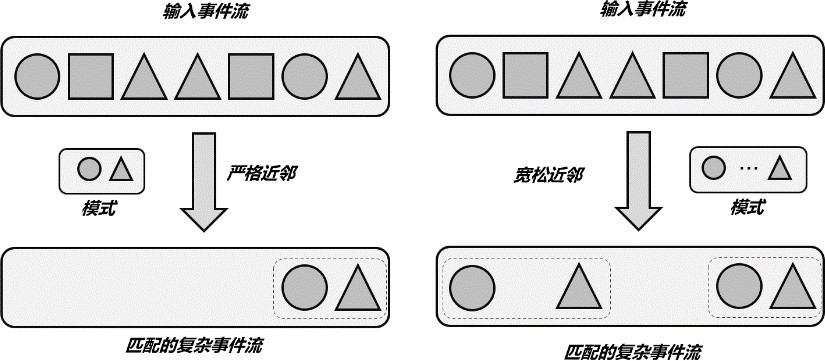

* 非确定性宽松近邻（Non-Deterministic Relaxed Contiguity）：这种近邻关系更加宽松。所谓“非确定性”是指可以重复使用之前已经匹配过的事件；这种近邻条件下匹配到的不同复杂事件，可以以同一个事件作为开始，所以匹配结果一般会比宽松近邻更多

  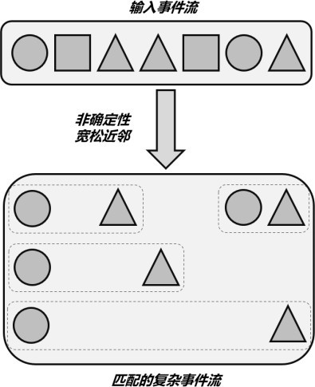

从图中可以看到，我们定义的模式序列中有两个个体模式：一是“选择圆形事件”，一是“选择三角形事件”；这时它们之间的近邻条件就会导致匹配出的复杂事件有所不同。很明显，严格近邻由于条件苛刻，匹配的事件最少；宽松近邻可以匹配不紧邻的事件，匹配结果会多一些；而非确定性宽松近邻条件最为宽松，可以匹配到最多的复杂事件。

除了上面提到的 next()、followedBy()、followedByAny()可以分别表示三种近邻条件，我们还可以用否定的“连接词”来组合个体模式。主要包括：

* notNext()：表示前一个模式匹配到的事件后面，不能紧跟着某种事件
* notFollowedBy()：表示前一个模式匹配到的事件后面， 不会出现某种事件。这里需要注意， 由于 notFollowedBy()是没有严格限定的；流数据不停地到来，我们永远不能保证之后“不会出现某种事件”。所以一个模式序列不能以 notFollowedBy()结尾，这个限定条件主要用来表示“两个事件中间不会出现某种事件”。

另外，Flink CEP 中还可以为模式指定一个时间限制，这是通过调用.within()方法实现的。方法传入一个时间参数，这是模式序列中第一个事件到最后一个事件之间的最大时间间隔，只有在这期间成功匹配的复杂事件才是有效的。一个模式序列中只能有一个时间限制，调用.within()的位置不限；如果多次调用则会以最小的那个时间间隔为准：

~~~java
// 严格近邻条件
Pattern<Event, ?> strict = start.next("middle").where(...);
// 宽松近邻条件
Pattern<Event, ?> relaxed = start.followedBy("middle").where(...);
// 非确定性宽松近邻条件
Pattern<Event, ?> nonDetermin = start.followedByAny("middle").where(...);
// 不能严格近邻条件
Pattern<Event, ?> strictNot = start.notNext("not").where(...);
// 不能宽松近邻条件
Pattern<Event, ?> relaxedNot = start.notFollowedBy("not").where(...);
// 时间限制条件
middle.within(Time.seconds(10));
~~~

之前我们讨论的都是模式序列中限制条件，主要用来指定前后发生的事件之间的近邻关系。而循环模式虽说是个体模式，却也可以匹配多个事件；那这些事件之间自然也会有近邻关系的 讨论。

在循环模式中，近邻关系同样有三种：严格近邻、宽松近邻以及非确定性宽松近邻。对于定义了量词（如 oneOrMore()、times()）的循环模式，默认内部采用的是宽松近邻。也就是说，当循环匹配多个事件时，它们中间是可以有其他不匹配事件的；相当于用单例模式分别定义、再用 followedBy()连接起来。

这就是之前的示例中，为什么我们检测连续三次登录失败用了三个单例模式来分别定义，而没有直接指定 times(3)：因为我们需要三次登录失败必须是严格连续的，中间不能有登录成功的事件，而 times()默认是宽松近邻关系：

* consecutive：循环模式中的匹配事件增加严格的近邻条件，保证所有匹配事件是严格连续的

  之前检测连续三次登录失败的代码可以改成：

  ~~~java
  // 1. 定义 Pattern，登录失败事件，循环检测 3 次
  Pattern<LoginEvent, LoginEvent> pattern = Pattern
  .<LoginEvent>begin("fails")
  .where(new SimpleCondition<LoginEvent>() { 
    @Override
  public boolean filter(LoginEvent loginEvent) throws Exception { 
    return loginEvent.eventType.equals("fail");
  }
  }).times(3).consecutive();
  ~~~

  这样显得更加简洁；而且即使要扩展到连续 100 次登录失败，也只需要改动一个参数而已。不过这样一来，后续提取匹配事件的方式也会有所不同

* allowCombinations：循环模式中的事件指定非确定性宽松近邻条件，表示可以重复使用已经匹配的事 件

### 模式组

一般来说，代码中定义的模式序列，就是我们在业务逻辑中匹配复杂事件的规则。不过在有些非常复杂的场景中，可能需要划分多个“阶段”，每个“阶段”又有一连串的匹配规则。为了应对这样的需求，Flink CEP 允许我们以“嵌套”的方式来定义模式。

之前在模式序列中，我们用 begin()、next()、followedBy()、followedByAny()这样的“连接词”来组合个体模式，这些方法的参数就是一个个体模式的名称；而现在它们可以直接以一个模式序列作为参数，就将模式序列又一次连接组合起来了。这样得到的就是一个“模式组”（Groups of Patterns）。

在模式组中，每一个模式序列就被当作了某一阶段的匹配条件，返回的类型是一个 GroupPattern。而 GroupPattern 本身是 Pattern 的子类；所以个体模式和组合模式能调用的方法，比如 times()、oneOrMore()、optional()之类的量词，模式组一般也是可以用的

~~~java
// 以模式序列作为初始模式
Pattern<Event, ?> start = Pattern.begin( Pattern.<Event>begin("start_start").where(...)
.followedBy("start_middle").where(...)
);

// 在 start 后定义严格近邻的模式序列，并重复匹配两次
Pattern<Event, ?> strict = start.next( Pattern.<Event>begin("next_start").where(...)
.followedBy("next_middle").where(...)
).times(2);

// 在 start 后定义宽松近邻的模式序列，并重复匹配一次或多次
Pattern<Event, ?> relaxed = start.followedBy( Pattern.<Event>begin("followedby_start").where(...)
.followedBy("followedby_middle").where(...)
).oneOrMore();

//在 start 后定义非确定性宽松近邻的模式序列，可以匹配一次，也可以不匹配
Pattern<Event, ?> nonDeterminRelaxed = start.followedByAny( Pattern.<Event>begin("followedbyany_start").where(...)
.followedBy("followedbyany_middle").where(...)
).optional();
~~~

### 匹配后跳过策略

在 Flink CEP 中，提供了模式的“匹配后跳过策略”（After Match Skip Strategy），专门用来精准控制循环模式的匹配结果。这个策略可以在Pattern 的初始模式定义中，作为 begin()的第二个参数传入：

~~~java
Pattern.begin("start", AfterMatchSkipStrategy.noSkip())
.where(...)
...
~~~

匹配后跳过策略 AfterMatchSkipStrategy 是一个抽象类，它有多个具体的实现，可以通过调用对应的静态方法来返回对应的策略实例。这里我们配置的是不做跳过处理，这也是默认策略。

## 模式的检测处理

利用 Pattern API 定义好模式还只是整个复杂事件处理的第一步，接下来还需要将模式应用到事件流上、检测提取匹配的复杂事件并定义处理转换的方法，最终得到想要的输出信息。

### 将模式应用到流上

将模式应用到事件流上的代码非常简单，只要调用 CEP 类的静态方法.pattern()，将数据 流（DataStream）和模式（Pattern）作为两个参数传入就可以了。最终得到的是一个 PatternStream：

~~~java
DataStream<Event> inputStream = ... 
Pattern<Event, ?> pattern = ...

PatternStream<Event> patternStream = CEP.pattern(inputStream, pattern);
~~~

这里的 DataStream，也可以通过 keyBy 进行按键分区得到 KeyedStream，接下来对复杂事件的检测就会针对不同的key 单独进行了。

模式中定义的复杂事件，发生是有先后顺序的，这里“先后”的判断标准取决于具体的时间语义。默认情况下采用事件时间语义，那么事件会以各自的时间戳进行排序；如果是处理时间语义，那么所谓先后就是数据到达的顺序。对于时间戳相同或是同时到达的事件，我们还可以在CEP.pattern()中传入一个比较器作为第三个参数，用来进行更精确的排序：

~~~java
// 可选的事件比较器
EventComparator<Event> comparator = ...
PatternStream<Event> patternStream = CEP.pattern(input, pattern, comparator);
~~~

得到 PatternStream 后，接下来要做的就是对匹配事件的检测处理了。

### 处理匹配事件

基于 PatternStream 可以调用一些转换方法，对匹配的复杂事件进行检测和处理，并最终得到一个正常的 DataStream。这个转换的过程与窗口的处理类似：将模式应用到流上得到 PatternStream，就像在流上添加窗口分配器得到 WindowedStream；而之后的转换操作，就像定义具体处理操作的窗口函数，对收集到的数据进行分析计算，得到结果进行输出，最后回到 DataStream 的类型来。

PatternStream 的转换操作主要可以分成两种：简单便捷的选择提取（select）操作，和更加通用、更加强大的处理（process）操作。与 DataStream 的转换类似，具体实现也是在调用 API 时传入一个函数类：选择操作传入的是一个 PatternSelectFunction，处理操作传入的则是一个 PatternProcessFunction。

1、匹配事件的选择提取（select）

处理匹配事件最简单的方式，就是从 PatternStream 中直接把匹配的复杂事件提取出来，包装成想要的信息输出，这个操作就是“选择”（select）

代码中基于 PatternStream 直接调用.select()方法，传入一个 PatternSelectFunction 作为参数：

~~~java
PatternStream<Event> patternStream = CEP.pattern(inputStream, pattern);
DataStream<String> result = patternStream.select(new MyPatternSelectFunction());
~~~

这里的 MyPatternSelectFunction 是 PatternSelectFunction 的 一 个 具 体 实 现 。 PatternSelectFunction 是 Flink CEP 提供的一个函数类接口，它会将检测到的匹配事件保存在一个 Map 里，对应的 key 就是这些事件的名称。这里的“事件名称”就对应着在模式中定义的每个个体模式的名称；而个体模式可以是循环模式，一个名称会对应多个事件，所以最终保存在 Map 里的value 就是一个事件的列表（List）。

MyPatternSelectFunction 的一个具体实现：

~~~java
class MyPatternSelectFunction implements PatternSelectFunction<Event, String>{ 
    @Override
    public String select(Map<String, List<Event>> pattern) throws Exception { 
      Event startEvent = pattern.get("start").get(0);
      Event middleEvent = pattern.get("middle").get(0);
      return startEvent.toString() + " " + middleEvent.toString();
    }
}
~~~

PatternSelectFunction 里需要实现一个 select()方法，这个方法每当检测到一组匹配的复杂事件时都会调用一次。它以保存了匹配复杂事件的 Map 作为输入，经自定义转换后得到输出信息返回。这里我们假设之前定义的模式序列中，有名为“start”和“middle”的两个个体模式，于是可以通过这个名称从 Map 中选择提取出对应的事件。注意调用 Map 的.get(key)方法后得到的是一个事件的List；如果个体模式是单例的，那么List 中只有一个元素，直接调用.get(0)就可以把它取出。如果个体模式是循环的，List 中就有可能有多个元素了。

除此之外， PatternStream 还有一个类似的方法是.flatSelect() ， 传入的参数是一个 PatternFlatSelectFunction。从名字上就能看出，这是 PatternSelectFunction 的“扁平化”版本；内部需要实现一个 flatSelect()方法，它与之前 select()的不同就在于没有返回值，而是多了一个收集器（Collector）参数out，通过调用 out.collet()方法就可以实现多次发送输出数据了。

2、匹配事件的通用处理（process）

自 1.8 版本之后，Flink CEP 引入了对于匹配事件的通用检测处理方式，那就是直接调用 PatternStream 的.process()方法，传入一个 PatternProcessFunction。这看起来就像是我们熟悉的处理函数（process function），它也可以访问一个上下文（Context），进行更多的操作。

所以 PatternProcessFunction 功能更加丰富、调用更加灵活，可以完全覆盖其他接口，也就成为了目前官方推荐的处理方式。事实上，PatternSelectFunction 和 PatternFlatSelectFunction在 CEP 内部执行时也会被转换成 PatternProcessFunction。

我们可以使用PatternProcessFunction 将之前的代码重写如下：

~~~java
// 3. 将匹配到的复杂事件选择出来，然后包装成报警信息输出
patternStream.process(new PatternProcessFunction<LoginEvent, String>() { 
      @Override
    public void processMatch(Map<String, List<LoginEvent>> map, Context ctx, Collector<String> out) throws Exception {
        LoginEvent first = map.get("fails").get(0); 
          LoginEvent second = map.get("fails").get(1); 
          LoginEvent third = map.get("fails").get(2);
        out.collect(first.userId + " 连续三次登录失败！登录时间：" + first.timestamp +
        ", " + second.timestamp + ", " + third.timestamp);
    }
}).print("warning");
~~~

可以看到，PatternProcessFunction 中必须实现一个 processMatch()方法；这个方法与之前的 flatSelect()类似，只是多了一个上下文 Context 参数。利用这个上下文可以获取当前的时间信息，比如事件的时间戳（timestamp）或者处理时间（processing time）；还可以调用.output()方法将数据输出到侧输出流。在 CEP 中，侧输出流一般被用来处理超时事件。

### 处理超时事件

复杂事件的检测结果一般只有两种：要么匹配，要么不匹配。检测处理的过程具体如下：

* 如果当前事件符合模式匹配的条件，就接受该事件，保存到对应的 Map 中；
* 如果在模式序列定义中，当前事件后面还应该有其他事件，就继续读取事件流进行检测；如果模式序列的定义已经全部满足，那么就成功检测到了一组匹配的复杂事件，调用 PatternProcessFunction 的processMatch()方法进行处理；
* 如果当前事件不符合模式匹配的条件，就丢弃该事件；
* 如果当前事件破坏了模式序列中定义的限制条件，比如不满足严格近邻要求，那么当前已检测的一组部分匹配事件都被丢弃，重新开始检测。

不过在有时间限制的情况下，需要考虑的问题会有一点特别。比如我们用.within()指定了模式检测的时间间隔，超出这个时间当前这组检测就应该失败了。然而这种“超时失败”跟真正的“匹配失败”不同，它其实是一种“部分成功匹配”；因为只有在开头能够正常匹配的前提下，没有等到后续的匹配事件才会超时。所以往往不应该直接丢弃，而是要输出一个提示或报警信息。这就要求我们有能力捕获并处理超时事件。

在 Flink CEP 中， 提供了一个专门捕捉超时的部分匹配事件的接口， 叫作 TimedOutPartialMatchHandler。这个接口需要实现一个 processTimedOutMatch()方法，可以将超时的、已检测到的部分匹配事件放在一个 Map 中，作为方法的第一个参数；方法的第二个参数则是 PatternProcessFunction 的上下文Context。所以这个接口必须与 PatternProcessFunction结合使用，对处理结果的输出则需要利用侧输出流来进行：

~~~java
class MyPatternProcessFunction extends PatternProcessFunction<Event, String> implements TimedOutPartialMatchHandler<Event> {
    // 正常匹配事件的处理
    @Override
    public void processMatch(Map<String, List<Event>> match, Context ctx, Collector<String> out) throws Exception{
    ...
    }

    // 超时部分匹配事件的处理
    @Override
    public void processTimedOutMatch(Map<String, List<Event>> match, Context ctx) throws Exception{
        Event startEvent = match.get("start").get(0);
        OutputTag<Event> outputTag = new OutputTag<Event>("time-out"){}; 
          ctx.output(outputTag, startEvent);
    }
}
~~~

我们在 processTimedOutMatch()方法中定义了一个输出标签（OutputTag）。调用 ctx.output()方法，就可以将超时的部分匹配事件输出到标签所标识的侧输出流了。

### 处理迟到数据

CEP 主要处理的是先后发生的一组复杂事件，所以事件的顺序非常关键。前面已经说过，事件先后顺序的具体定义与时间语义有关。如果是处理时间语义，那比较简单，只要按照数据处理的系统时间算就可以了；而如果是事件时间语义，需要按照事件自身的时间戳来排序。这就有可能出现时间戳大的事件先到、时间戳小的事件后到的现象，也就是所谓的“乱序数据”或“迟到数据”。

在 Flink CEP 中沿用了通过设置水位线（watermark）延迟来处理乱序数据的做法。当一个事件到来时，并不会立即做检测匹配处理，而是先放入一个缓冲区（buffer）。缓冲区内的数据，会按照时间戳由小到大排序；当一个水位线到来时，就会将缓冲区中所有时间戳小于水位线的事件依次取出，进行检测匹配。这样就保证了匹配事件的顺序和事件时间的进展一致，处理的顺序就一定是正确的。这里水位线的延迟时间，也就是事件在缓冲区等待的最大时间。

这样又会带来另一个问题：水位线延迟时间不可能保证将所有乱序数据完美包括进来，总会有一些事件延迟比较大，以至于等它到来的时候水位线 已超过了它的时间戳。这时之前的数据都已处理完毕，这样的“迟到数据”就只能被直接丢弃了——这与窗口对迟到数据的默认处理一致。

我们自然想到，如果不希望迟到数据丢掉，应该也可以借鉴窗口的做法。Flink CEP 同样提供了将迟到事件输出到侧输出流的方式： 我们可以基于 PatternStream 直接调 用.sideOutputLateData()方法，传入一个 OutputTag，将迟到数据放入侧输出流另行处理。代码中调用方式如下：

~~~java
PatternStream<Event> patternStream = CEP.pattern(input, pattern);

// 定义一个侧输出流的标签
OutputTag<String> lateDataOutputTag = new OutputTag<String>("late-data"){};

SingleOutputStreamOperator<ComplexEvent> result = patternStream.sideOutputLateData(lateDataOutputTag)	// 将迟到数据输出到侧输出流
.select(
    // 处理正常匹配数据
    new PatternSelectFunction<Event, ComplexEvent>() {...}
);

// 从结果中提取侧输出流
DataStream<String> lateData = result.getSideOutput(lateDataOutputTag);
~~~

可以看到，整个处理流程与窗口非常相似。经处理匹配数据得到结果数据流之后，可以调用.getSideOutput()方法来提取侧输出流，捕获迟到数据进行额外处理

## CEP的状态机实现

Flink CEP 中对复杂事件的检测，关键在模式的定义。我们会发现 CEP 中模式的定义方式比较复杂，而且与正则表达式非常相似：正则表达式在字符串上匹配符合模板的字符序列，而 Flink CEP 则是在事件流上匹配符合模式定义的复杂事件。

前面我们分析过 CEP 检测处理的流程，可以认为检测匹配事件的过程中会有“初始（没有任何匹配）”“检测中（部分匹配成功）”“匹配成功”“匹配失败”等不同的“状态”。随着每个事件的到来，都会改变当前检测的“状态”；而这种改变跟当前事件的特性有关、也跟当前所处的状态有关。这样的系统，其实就是一个“状态机”（state machine）。这也正是正则表达式底层引擎的实现原理。

所以 Flink CEP 的底层工作原理其实与正则表达式是一致的，是一个“非确定有限状态自动机”（Nondeterministic Finite Automaton，NFA）

如果之前的检测用户连续三次登录失败的复杂事件。用 Flink CEP 中的 Pattern API 可以很方便地把它定义出来；如果我们现在不用 CEP，而是用 DataStream API 和处理函数来实现，则需要设置状态，并根据输入的事件不断更新状态，更好的方式，就是实现一个状态机。

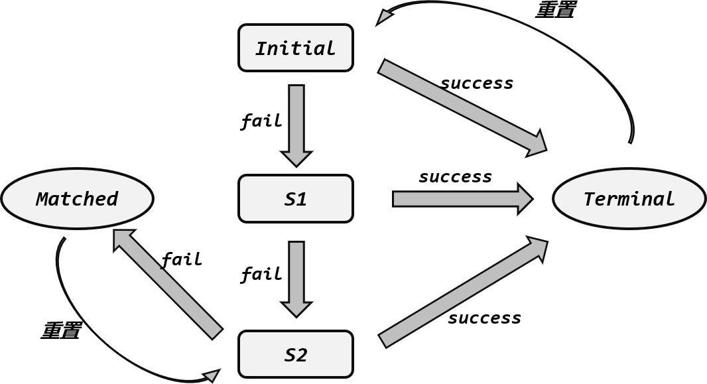

如上图所示，即为状态转移的过程，从初始状态（INITIAL）出发，遇到一个类型为 fail 的登录失败事件，就开始进入部分匹配的状态；目前只有一个 fail 事件，我们把当前状态记作 S1。基于 S1 状态，如果继续遇到 fail 事件，那么就有两个 fail 事件，记作 S2。基于 S2状态如果再次遇到 fail 事件，那么就找到了一组匹配的复杂事件，把当前状态记作 Matched，就可以输出报警信息了。需要注意的是，报警完毕，需要立即重置状态回 S2；因为如果接下来再遇到 fail 事件，就又满足了新的连续三次登录失败，需要再次报警。

而不论是初始状态，还是 S1、S2 状态，只要遇到类型为 success 的登录成功事件，就会跳转到结束状态，记作 Terminal。此时当前检测完毕，之前的部分匹配应该全部清空，所以需要立即重置状态到 Initial，重新开始下一轮检测。所以这里我们真正参与状态转移的，其实只有 Initial、S1、S2 三个状态，Matched 和Terminal 是为了方便我们做其他操作（比如输出报警、清空状态）的“临时标记状态”，不等新事件到来马上就会跳转。

如果所有的复杂事件处理都自己设计状态机来实现是非常繁琐的，而且中间逻辑非常容易出错；所以 Flink CEP 将底层NFA 全部实现好并封装起来，这样我们处理复杂事件时只要调上层的 Pattern API 就可以，无疑大大降低了代码的复杂度，提高了编程的效率。