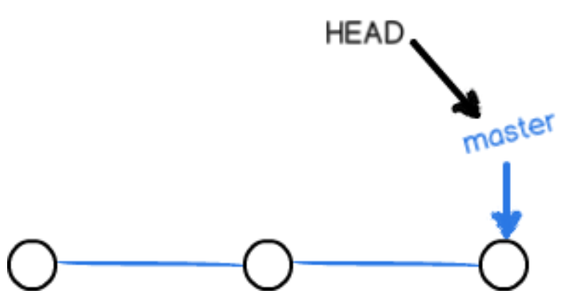
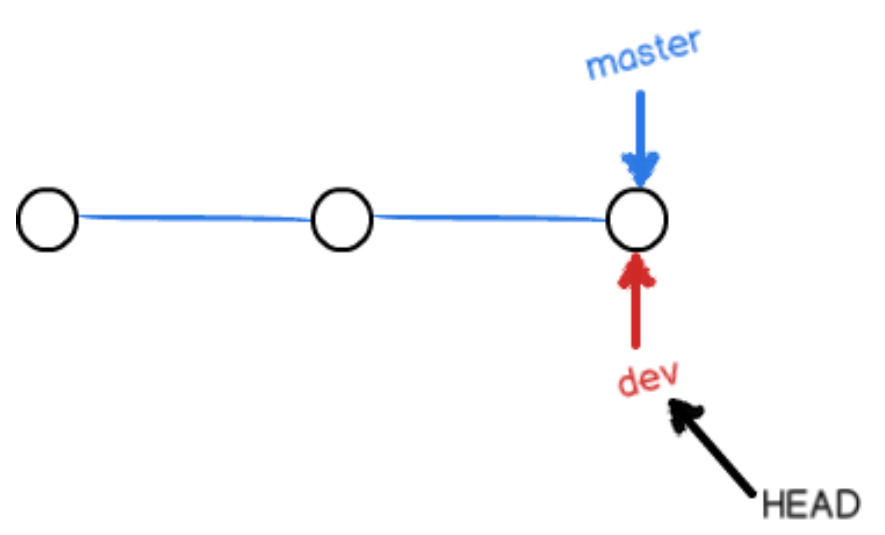
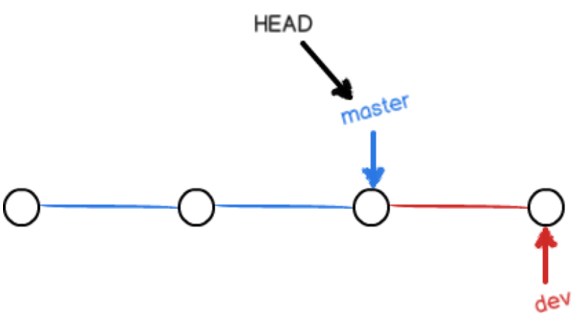
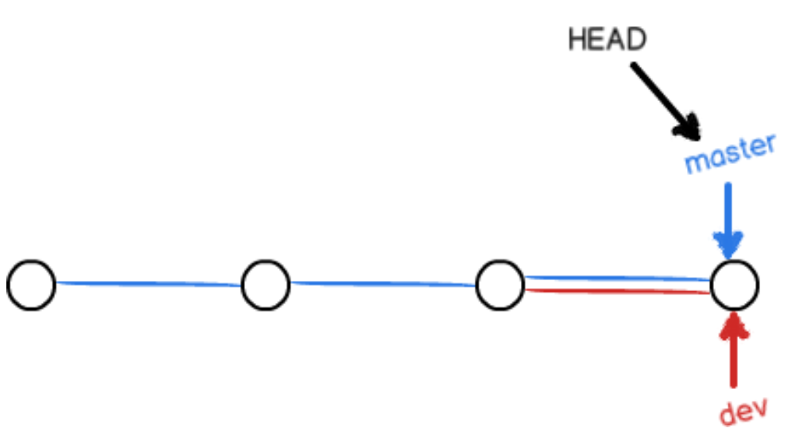
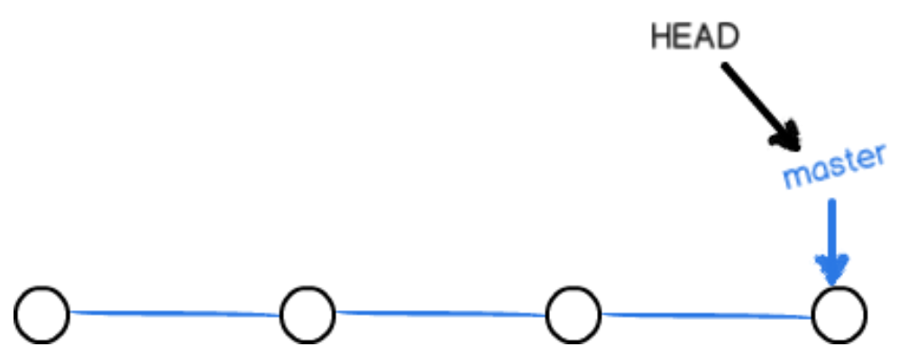
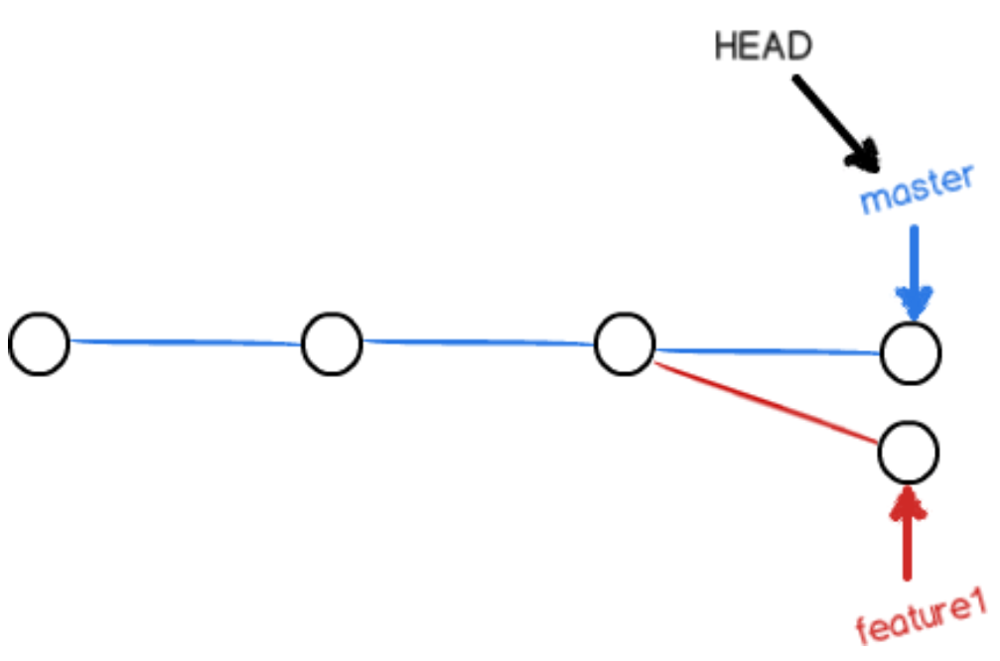
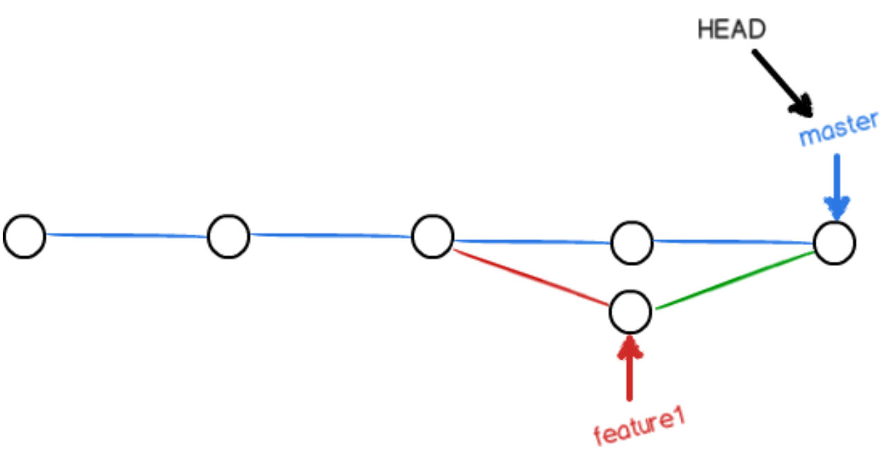
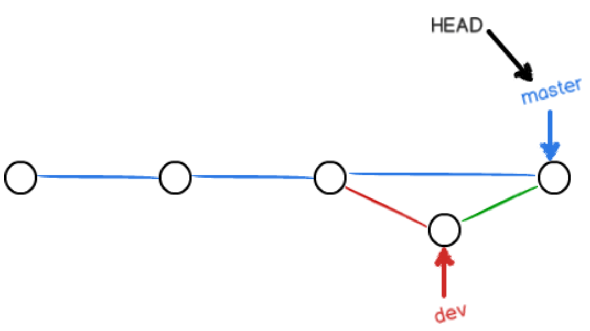
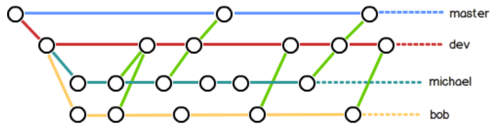

# git概述

## git的特点

git是分布式版本控制系统。它主要有以下几个特点：

1、git没有明显的中央服务器，每台电脑都是一个完整的版本库，工作时无需联网，分布式使代码很安全，因为即使一台电脑坏掉，从其他人那里也可以复制（git中的中央服务器只是为了方便大家交换代码）

2、强大的分支管理、稳定性强，不会出现代码损坏的情况

3、一个版本控制系统共有的特点：只能监控文本文件的变化，二进制文件虽然也能进行版本控制，但是无法得知每次改动内容

## git安装和运行

下载windows版本，即可傻瓜式安装，安装好了之后点击开始菜单中的git bash即可输入命令。

在命令行中设置用户名和邮箱：

~~~
git config --global user.name "Your Name"
git config --global user.email "email@example.com"
~~~

# git基本操作

## 创建版本库

在想要建立版本库的文件目录内右键-git bash，然后输入：

~~~
git init
~~~

然后就建立完成了一个空的仓库，此时该目录下会出现.git目录，这里面装了git相关的设置和运行文件。

## 将文件放入版本库

首先将文件放入该目录下，然后执行：

~~~
git add 文件名
~~~

然后提交到仓库：

~~~
git commit -m "引号引起来的提交说明"
~~~

git有两个重要的概念：工作区和暂存区。工作区就是电脑中实际看到的目录，暂存区是仓库中的一个概念，实际上执行add命令会将文件从工作区存到暂存区，执行commit后所有文件会从暂存区提交到对应分支，默认是master分支，同时更新HEAD指针。

git传递的其实是修改，而不是整个文件。如果我们执行以下过程：

第一次修改 -> `git add` -> 第二次修改 -> `git commit`

会发现第二次修改是没有被提交到仓库中去的，此时可以再执行一次add，最后再commit。当然更好的方法是不要提交，而是add多次修改，最后再提交。

## 查看仓库状态

执行命令：

~~~
git status
~~~

此时就可以观察到哪些文件没有被提交到仓库，哪些被改变了。

查看提交的差异：

~~~
git diff
~~~

## 版本回退

查看提交的历史记录：

~~~
git log
~~~

此时会从上到下显示最近的一次提交到最初的提交，其中每一次有一个长长的字符串是版本号。

退回上一个版本：

~~~
git reset --hard HEAD^
~~~

退回上上个版本：

~~~
git reset --hard HEAD^^
~~~

此时仓库内的文件会恢复到之前的版本，再查看历史记录会发现最新的版本已经看不到了，因为已经被回退了，但是并没有将那个版本删除，git实际上是通过把HEAD指针指向版本链中的某个节点来完成回退的，在查看历史记录的时候也能看到当前的HEAD指针指向哪个版本。

恢复某个版本：

~~~
git reset --hard 1094a
~~~

这个恢复可以恢复到未来，也可以恢复到过去，最后是版本号的前几位，一般来说输入前几位git就能自动找到那个版本。但是回退后是无法通过历史记录命令查看失去的版本号的，此时要执行：

~~~
git reflog
~~~

这个命令会记录下所有HEAD变动的情况，以及每一个版本号，这样就能恢复版本了。

## 撤销修改

1、丢弃工作区的修改：

~~~
git checkout -- 文件名
~~~

这里有两种情况：

一种是文件自修改后还没有被放到暂存区，现在，撤销修改就回到和版本库一模一样的状态；

一种是文件已经添加到暂存区后，又作了修改，现在，撤销修改就回到添加到暂存区后的状态。

2、如果做了一些不想要的修改，然后提交到了暂存区，此时应该执行：

~~~
git reset HEAD 文件名
~~~

然后该文件就会被放回工作区，但是此时文件虽然放回了工作区，但是属于已修改状态，再用之前的丢弃工作区的修改来完成撤销即可。

3、如果commit了，可以通过版本回退来撤销

## 删除文件

如果在工作区中删除了文件，执行status命令可以看到删除信息，因为删除也是一种变化。

此时我们可以选择从库中删除该文件，执行：

~~~
git rm 文件名
~~~

然后再将修改commit即可。

我们也可以将该文件恢复到工作区，只要执行：

~~~
git checkout -- 文件名
~~~

使用这个命令时要小心，你只能将该文件恢复到最新版本，之前还未提交的修改丢失了。

可以看出checkout命令其实是用版本库里的版本替换工作区的版本。

# 远程仓库

## 设置key

首先创建SSH key（在git bash下）：

~~~
ssh-keygen -t rsa -C "youremail@example.com"
~~~

然后在用户主目录中就可以找到.ssh目录，其中有里面有`id_rsa`和`id_rsa.pub`两个文件，这两个就是SSH Key的秘钥对，`id_rsa`是私钥，不能泄露出去，`id_rsa.pub`是公钥，可以放心地告诉任何人。

在github的设置中可以添加key，把公钥的内容添加进去，标题随意。

## 把本地库推送到远程库

首先在github要有对应的库，然后在本地的仓库下运行命令关联到远程库：

~~~
git remote add origin git@github.com:用户名/仓库名.git
~~~

添加后你的远程库名就叫origin。

然后就可以把本地库中的内容推送到远程库：

~~~
git push -u origin master
~~~

表示把master分支推送到远程。-u代表Git不但会把本地的master分支内容推送的远程新的master分支，还会把本地的master分支和远程的master分支关联起来，在以后的推送或者拉取时就可以简化命令。

此时就可以看到远程库已经修改了。

之后的提交就可以用：

~~~
git push origin master
~~~

## 把远程库克隆到本地

将远程库克隆到本地只需要在本地想要保存仓库的位置执行：

~~~
git clone git@github.com:用户名/仓库名.git
~~~

## 参与项目

参与一个项目首先要将项目fork到自己的仓库，然后在自己的账号克隆该项目：

~~~
git clone git@github.com:用户名/仓库名.git
~~~

注意这里一定要是从自己的账号下克隆，这样你才能推送修改。如果从原仓库地址克隆，因为没有权限，你将不能推送修改。

然后就可以进行开发工作，add、commit然后再push到自己的仓库。

如果希望官方库接受自己的修改，应该在GitHub上发起一个pull request。

## 查看远程库信息

克隆到本地后，git就会自动把本地的master分支和远程master分支关联起来，默认远程仓库名是origin。

查看远程库信息：

~~~
git remote
~~~

查看详细信息：

~~~
git remote -v
~~~

此时显示了可以抓取和推送的origin的地址。如果没有推送权限，就看不到push的地址。

## 更换远程库

除了国外的github，国内的码云也能提供远程仓库功能。

我们如果想用码云来脱管代码，基本的步骤和github差不多，也是创建项目，添加秘钥。

然后就可以关联远程库：

~~~
git remote add origin git@gitee.com:用户名/仓库名.git
~~~

然后就可以使用push和pull了。但是如果之前关联了github的某个库，这里会报错，查看远程库信息会发现已经关联了一个origin，此时我们可以删掉已有的远程库：

~~~
git remote rm origin
~~~

然后再执行上述关联命令即可。

也可以同时添加多个远程库，此时关联的时候要用不同的远程库的名字：

~~~
git remote add gitee git@gitee.com:用户名/仓库名.git
git remote add github git@github.com:用户名/仓库名.git
~~~

这样一个远程库就叫gitee，一个叫github了。

推送的时候就要指定正确的远程库名：

~~~
git push github master
~~~

# 分支管理

在版本管理中，有了不同的分支，每个人都可以在不同的分支中工作，每天提交代码，这样既能看到每个人的进度，又不至于会让不同人在一个分支中互相受到影响。

## 创建与合并分支

在git中有两个重要的指针，一个是master，代表一个分支，指向该分支的最新提交点；一个是HEAD，它指向当前的节点。初始状态下，只有master分支，所以HEAD其实是指向master的：

创建新分支dev：

~~~
git checkout -b dev
~~~

-b代表表示创建并切换，相当于以下两条命令：

~~~
创建：git branch dev
切换：git checkout dev
~~~

查看当前分支的状态：

~~~
git branch
~~~

这个命令会列出所有分支，当前分支前面会标一个*号。

此时的状态：

我们此时可以在dev分支下做add和commit，然后切回master分支：

~~~
git checkout master
~~~

切回后发现之前在dev下做的修改都消失了，此时的状态：

把dev的工作成果合并到master上：

~~~
git merge dev
~~~

这个命令用于合并指定分支到当前分支，此时我们可以发现所有修改都回来了。合并时会提示是Fast-forward快进模式，也就是直接把master指向dev的当前提交，所以合并速度非常快。

此时的状态：

合并完成后就可以删掉dev分支了：

~~~
git branch -d dev
~~~

因为创建、合并和删除分支非常快，所以Git鼓励你使用分支完成某个任务，合并后再删掉分支，这和直接在master分支上工作效果是一样的，但过程更安全。此时的状态：

切换命令也可以使用switch命令：

创建并切换到新的dev分支：

~~~
git switch -c dev
~~~

切换到已有的master分支：

~~~
git switch master
~~~

## 本地解决冲突

如果我们创建了一个新分支feature1，并且切换到新分支，而且提交了内容A。

此时切换到master分支，然后在该分支上提交了内容B，此时两个分支都各自有了新的提交：

此时我们合并分支：

~~~
git merge feature1
~~~

此时会提示我们无法合并，因为有冲突，必须解决冲突后再提交，此时用status命令可以查看冲突的文件是哪个：

~~~
git status
~~~

如果直接在git bash中查看该冲突文件可以看到两个分支冲突的地方。

此时我们再将冲突的地方改好后，再add该文件，并commit，此时就会自动合并成功了：

log命令可以查看分支合并情况：

~~~
git log --graph --pretty=oneline --abbrev-commit
~~~

最后再删除feature1分支即可。

## --no-ff模式的合并

git有时会在合并时自动使用Fast-forward快进模式，但这种模式下，删除分支后，会丢掉分支信息。

如果想保留分支信息就可以禁用Fast-forward快进模式。

如果我们创建了一个分支dev并完成切换，在该分支上提交了修改，此时切换回master，用非快进模式合并：

~~~
git merge --no-ff -m "merge with no-ff" dev
~~~

此时因为本次合并要创建一个新的commit，所以加上-m参数，把commit描述写进去。

此时合并后的情况：

它会保存分支信息，而不是：

## 团队合作的分支示意图

实际开发中，master分支应该是非常稳定的，仅用来发布新版本，不能在上面干活。

团队成员应该在dev分支上干活，每个人都有自己的分支，时不时往dev分支上合并，团队合作的分支示意图大致如下：

## 保存现场、修改合并和bug分支

如果在开发过程中测试发现一个bug需要你紧急处理，应该创建一个bug分支然后处理并提交，但是你现在在dev分支上干活，此时做的修改还没有提交，此时只工作了一半，还没办法提交，此时我们可以把现场保存起来：

~~~
git stash
~~~

此时再用status查看会发现工作区中没有需要提交的文件。（千万记得所有修改都要commit或者stash了再切换分支，否则就会丢失）

此时就可以安心处理bug了，首先切换到有bug的分支master：

~~~
git checkout master
~~~

然后专门创建一个分支issue-101来处理bug，并完成切换：

~~~
git checkout -b issue-101
~~~

在该分支上进行修改，add并commit，然后切换到master分支完成合并：

~~~
git switch master
git merge --no-ff -m "merged bug fix 101" issue-101
~~~

此时bug处理完了就可以恢复现场了，要先切换回dev分支：

~~~
git switch dev
~~~

查看工作现场的保存：

~~~
git stash list
~~~

此时屏幕会显示之前的保存：

~~~
stash@{0}: WIP on dev: f52c633 add merge
~~~

然后就可以完成恢复了，恢复有两个方法，一种是用：

~~~
git stash apply				恢复命令，恢复后stash不会删除
git stash drop				手动删除stash
~~~

还有一种方法是：

~~~
git stash pop				恢复命令，恢复后stash会自动删除
~~~

stash也可以多次，在恢复时需要指定恢复的stash：

~~~
git stash apply stash@{0}
~~~

此时还有一个小问题，那就是master中修复的bug其实在dev分支中也存在，要想在dev中也修复这个bug只需要把刚才的修改也添加到dev分支即可，这个修改信息在issue-101分支commit时就会显示：

~~~
[issue-101 4c805e2] fix bug 101
 1 file changed, 1 insertion(+), 1 deletion(-)
~~~

我们可以执行下列命令把这个修改合并到当前分支：

~~~
git cherry-pick 4c805e2
~~~

## 丢弃分支

如果我们在开发一个新功能的过程中创建了一个新分支feature，然后add，并提交，切换回原来的分支准备合并修改再删除feature分支，此时突然接到领导命令放弃开发该功能，此时我们需要删除feature分支：

~~~
git branch -D feature
~~~

D表示强制删除，因为该分支还没有合并，删除后修改会丢失，如果用d会提示无法删除。

## 将分支推送到远程

当我们把远程库克隆到本地后，实际上只能看到master分支，看不到其他分支，此时如果要在dev分支上进行开发需要创建远程的分支到本地：

~~~
git checkout -b dev origin/dev
~~~

然后切换到该分支就可以进行开发工作了，先add，然后commit，最后push到远程分支：

~~~
git push origin dev
~~~

加入团队中有成员在你之前将一些改变push到了远程的dev分支，推送会失败，提示你的提交和对方的提交有冲突，此时应该先把远程dev分支拉下来然后在本地合并并解决冲突。

把最新的提交抓下来：

~~~
git pull
~~~

有时这个命令会报错，那是因为本地dev分支和远程dev分支没有建立联系，此时应该执行：

~~~
git branch --set-upstream-to=origin/dev dev
~~~

然后再执行pull指令，此时系统会提示合并有冲突需要手动解决，此时你需要找到冲突的文件，并手动修改文件，然后add再commit，最后再完成push：

~~~
git push origin dev
~~~

## rebase分支

多人在同一个分支上协作时，很容易出现冲突。即使没有冲突，后push的童鞋不得不先pull，在本地合并，然后才能push成功。

此时执行查看分支命令：

~~~
git log --graph --pretty=oneline --abbrev-commit
~~~

会发现提交分支很混乱。

如果在开发时我们对一个文件commit了两次，然后用查看分支命令查看结果如下：

~~~
$ git log --graph --pretty=oneline --abbrev-commit
* 582d922 (HEAD -> master) add author
* 8875536 add comment
* d1be385 (origin/master) init hello
*   e5e69f1 Merge branch 'dev'
|\  
| *   57c53ab (origin/dev, dev) fix env conflict
| |\  
| | * 7a5e5dd add env
| * | 7bd91f1 add new env
...
~~~

此时发现HEAD -> master在origin/master前面，本地分支比远程快两个提交。

然后我们尝试推送本地分支，失败了，然后执行pull，再执行status命令结果如下：

~~~
$ git status
On branch master
Your branch is ahead of 'origin/master' by 3 commits.
  (use "git push" to publish your local commits)

nothing to commit, working tree clean
~~~

加上刚才合并的提交，现在我们本地分支比远程分支超前3个提交。

用log命令查看分支结果：

~~~
$ git log --graph --pretty=oneline --abbrev-commit
*   e0ea545 (HEAD -> master) Merge branch 'master' of github.com:michaelliao/learngit
|\  
| * f005ed4 (origin/master) set exit=1
* | 582d922 add author
* | 8875536 add comment
|/  
* d1be385 init hello
...
~~~

此时我们可以看到我们最初的两次commit在582d922和8875536，接下来是从远程pull是f005ed4，最后合并到e0ea545。但是这个分支比较混乱，rebase可以把提交记录变成一条线，此时执行：

~~~
git rebase
~~~

此时再用log命令：

~~~
$ git log --graph --pretty=oneline --abbrev-commit
* 7e61ed4 (HEAD -> master) add author
* 3611cfe add comment
* f005ed4 (origin/master) set exit=1
* d1be385 init hello
...
~~~

可以发现提交历史被重新整理了，从远程pull变成了f005ed4，然后最初的两次commit是在这个基础上进行的。

最后我们可以再用push操作推送到远程。

# 标签

发布一个版本时，我们通常先在版本库中打一个标签，这个标签是版本库的一个快照。它实际上是指向某个commit的指针，类似于分支，但是分支是可以移动的，标签是固定的。

## 创建标签

要想打标签需要先切换到需要打标签的分支上：

~~~
git checkout master
~~~

然后就可以执行创建标签命令：（v1.0是标签名）

~~~
git tag v1.0
~~~

默认标签是打在最新提交的commit上的。

查看所有标签：

~~~
git tag
~~~

如果标签要打在之前某个提交上，就必须先找到对应提交的commit id，然后执行：

~~~
git tag v0.9 f52c633
~~~

查看标签信息：

~~~
git show 标签名
~~~

创建标签时指定说明：

~~~
git tag -a v0.1 -m "version 0.1 released" 1094adb
~~~

## 其他标签操作

删除某个标签：

~~~
git tag -d 标签名
~~~

因为创建的标签都只存储在本地，不会自动推送到远程。所以，打错的标签可以在本地安全删除。

如果要推送某个标签到远程，要执行以下命令：

~~~
git push origin v1.0
~~~

也可以一次性推送全部尚未推送到远程的本地标签：

~~~
git push origin --tags
~~~

如果要删除一个已经推送到远程的标签，应该先执行本地删除命令，然后从远程删除：

~~~
git push origin :refs/tags/v0.9
~~~

# 配置

## 忽略特殊文件

有些时候，你必须把某些文件放到Git工作目录中，但又不能提交它们，比如保存了数据库密码的配置文件。每次操作git的时候都会提示这些文件处于未管理状态。我们可以设置忽略这些文件。

在git工作区中创建一个名为.gitignore的文件，然后把要忽略的文件名装进去即可。github为我们准备了这些配置文件，组合一下就可以使用：

https://github.com/github/gitignore

如其中的Java.gitignore

~~~
# Compiled class file
*.class

# Log file
*.log

# BlueJ files
*.ctxt

# Mobile Tools for Java (J2ME)
.mtj.tmp/

# Package Files #
*.jar
*.war
*.nar
*.ear
*.zip
*.tar.gz
*.rar

# virtual machine crash logs, see http://www.java.com/en/download/help/error_hotspot.xml
hs_err_pid*
~~~

忽略文件的原则是：

1. 忽略操作系统自动生成的文件，比如缩略图等；
2. 忽略编译生成的中间文件、可执行文件等，也就是如果一个文件是通过另一个文件自动生成的，那自动生成的文件就没必要放进版本库，比如Java编译产生的.class文件；
3. 忽略你自己的带有敏感信息的配置文件，比如存放口令的配置文件。

然后把该文件提交到git，再执行status命令就可以发现没有提示了。

有时执行add会报错，就是因为提交的文件被忽略了，此时可以强制提交：

~~~
git add -f App.class
~~~

还可以查看到底是哪行设置忽略了该文件：

~~~
git check-ignore -v App.class
~~~

然后我们就可以修订规则让该文件通过。

## 别名

用st替代status：

~~~
git config --global alias.st status
~~~

然后git st就相当于git status了。global参数是全局参数，也就是这些命令在这台电脑的所有Git仓库下都有用。如果不加，那只针对当前的仓库起作用。

我们知道，命令`git reset HEAD file`可以把暂存区的修改撤销掉（unstage），重新放回工作区。既然是一个unstage操作，就可以配置一个unstage别名：

~~~
git config --global alias.unstage 'reset HEAD'
~~~

然后就可以执行该命令替代原有命令了：

~~~
git unstage test.py
~~~

自定义git lg命令，让该命令可以查看分支信息、时间、作者和说明，而且以不同颜色显示：

~~~
git config --global alias.lg "log --color --graph --pretty=format:'%Cred%h%Creset -%C(yellow)%d%Creset %s %Cgreen(%cr) %C(bold blue)<%an>%Creset' --abbrev-commit"
~~~

然后就可以执行：

~~~
git lg
~~~

每个仓库的别名配置都在.git/config中，当前用户的Git配置文件放在用户主目录下的一个隐藏文件.gitconfig中。配置别名也可以直接修改这个文件。

建议大家平常开发的时候一定要注意以下几点：

1)每次修改代码前一定要pull一遍保证此时本地的代码是最新版本;

2)每写一个新需求最好创建一个新分支，不要一直在一个分支上修改；

3)每一次需求写完代码提交完毕后最好删除本地和远程的分支。

4)push的代码一定要是对的，不然容易被人打。

5)不明白的指令一定不要瞎点。