# 线程

## 线程定义

进程是系统进行资源分配和调度的独立单位，线程是一个轻量级进程，它是程序执行的最小单元。线程自己不拥有系统资源，它和同属一个进程的其他线程共享进程所拥有的全部资源。具体来说，在Java中，多个线程共享进程的堆和方法区资源，但每个线程有自己的程序计数器、虚拟机栈和本地方法栈

线程运行时开销小，但不利于资源的管理和保护；而进程正相反

main方法是Java程序的入口，系统还会为我们创建一些辅助线程来帮助main线程的执行，一个 Java 程序的运行是 main 线程和多个其他线程同时运行，可以运行下面的代码查看所有线程信息：

~~~java
public class MultiThread {
    public static void main(String[] args) {
        // 获取 Java 线程管理 MXBean
    ThreadMXBean threadMXBean = ManagementFactory.getThreadMXBean();
        // 不需要获取同步的 monitor 和 synchronizer 信息，仅获取线程和线程堆栈信息
        ThreadInfo[] threadInfos = threadMXBean.dumpAllThreads(false, false);
        // 遍历线程信息，仅打印线程 ID 和线程名称信息
        for (ThreadInfo threadInfo : threadInfos) {
            System.out.println("[" + threadInfo.getThreadId() + "] " + threadInfo.getThreadName());
        }
    }
}
~~~

上述程序输出如下：

~~~
[5] Attach Listener //添加事件
[4] Signal Dispatcher // 分发处理给 JVM 信号的线程
[3] Finalizer //调用对象 finalize 方法的线程
[2] Reference Handler //清除 reference 线程
[1] main //main 线程,程序入口
~~~

## 线程模型

线程的实现依赖操作系统支持的线程模型。在主流的操作系统上，hotspot、classic、art等虚拟机默认是 1:1的线程模型。在Solaris平台上，hotspot支持1:1、N：M两种线程模型。

## 线程私有的内存区域

 Java 内存区域中可以看到：线程有自己私有的区域，也有多个线程可以共享的区域：

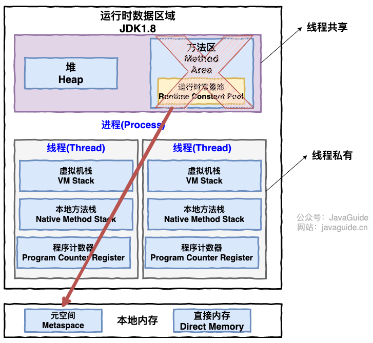

线程私有的区域：程序计数器、虚拟机栈和本地方法栈

1、程序计数器主要有下面两个作用：

1. 字节码解释器通过改变程序计数器来依次读取指令，从而实现代码的流程控制，如：顺序执行、选择、循环、异常处理。
2. 在多线程的情况下，程序计数器用于记录当前线程执行的位置，从而当线程被切换回来的时候能够知道该线程上次运行到哪儿了

需要注意的是，如果执行的是 native 方法，那么程序计数器记录的是 undefined 地址，只有执行的是 Java 代码时程序计数器记录的才是下一条指令的地址

2、虚拟机栈：每个 Java 方法在执行的同时会创建一个栈帧用于存储局部变量表、操作数栈、常量池引用等信息。从方法调用直至执行完成的过程，就对应着一个栈帧在 Java 虚拟机栈中入栈和出栈的过程

本地方法栈： 和虚拟机栈所发挥的作用非常相似，区别是： 虚拟机栈为虚拟机执行 Java 方法 （也就是字节码）服务，而本地方法栈则为虚拟机使用到的 Native 方法服务。 在 HotSpot 虚拟机中和 Java 虚拟机栈合二为一

为了保证线程中的局部变量不被别的线程访问到，虚拟机栈和本地方法栈是线程私有的

多个线程共享的区域：堆和方法区

堆：堆是进程中最大的一块内存，主要用于存放新创建的对象 (几乎所有对象都在这里分配内存)

方法区：主要用于存放已被加载的类信息、常量、静态变量、即时编译器编译后的代码等数据

JVM 内存只是Java进程空间的一部分，除此之外进程空间内还有代码段、数据段、内存映射区、内核空间等。从 JVM 的角度看，JVM 内存之外的部分叫作本地内存。

## 线程执行的方式

1、new Thread的时候传入一个Runnable对象，调用它的start方法：

~~~java
public class PrintTask implements Runnable {

    @Override
    public void run() {
        System.out.println("输出一行字");
    }
}
~~~

~~~java
public class Test {

    public static void main(String[] args) {
        new Thread(new PrintTask()).start();
    }
}
~~~

2、继承Thread类并覆盖run方法，构造出这个类的实例后调用它的start方法：

~~~java
public class PrintThread extends Thread {

    @Override
    public void run() {
        System.out.println("输出一行字");
    }
}
~~~

~~~java
public class Test {

    public static void main(String[] args) {
        new PrintThread().start();
    }
}
~~~

Thread类本身就代表了一个Runnable任务，我们看Thread类的定义：

~~~java
public class Thread implements Runnable {

    private Runnable target;

    @Override
    public void run() {
        if (target != null) {
            target.run();
        }
    }

    // ... 为省略篇幅，省略其他方法和字段
}
~~~

其中的target就是在构造方法里传入的，如果构造方法不传这个字段的话，很显然run方法就是一个空实现

这种方式会导致业务类直接继承Thread类，造成了强耦合，所以并不好

## 线程状态

 Java 线程的状态：

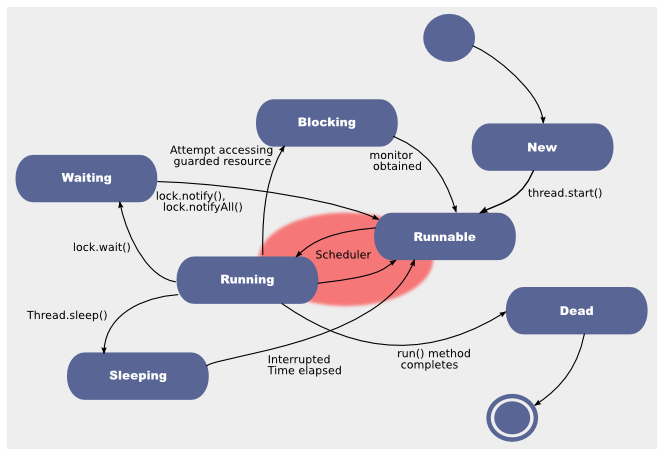

其中特别需要注意的是“Blocking”和“Waiting”是两个不同的状态：

* Blocking 指的是一个线程因为等待临界区的锁（Lock 或者 synchronized 关键字）而被阻塞的状态，请你注意的是处于这个状态的线程还没有拿到锁
* Waiting 指的是一个线程拿到了锁，但是需要等待其他线程执行某些操作。比如调用了 Object.wait、Thread.join 或者 LockSupport.park 方法时，进入 Waiting 状态。也就是拿到了锁但是临时释放了，当等待条件满足，外部调用了 Object.notify 或者 LockSupport.unpark 方法，线程会重新竞争锁，成功获得锁后才能进入到 Runnable 状态继续执行


线程的6种状态：

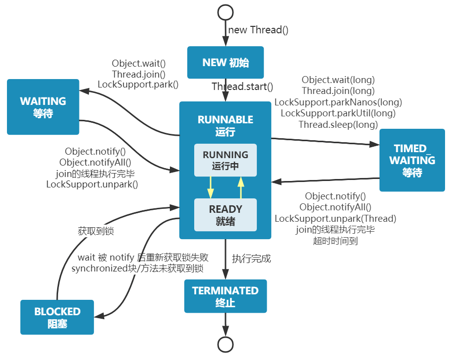

TIME_WAITING：超时等待状态，可以在指定的时间后自行返回而不是像 WAITING 那样一直等待，而WAITING 必须等待其他线程做出一些特定动作（通知或中断）

READY 和 RUNNING 状态的区别就在于：RUNNING 是可运行状态的线程获得了 CPU 时间片（timeslice）。在操作系统层面，线程有 READY 和 RUNNING 状态；而在 JVM 层面，只能看到 RUNNABLE 状态，所以 Java 系统一般将这两个状态统称为 RUNNABLE（运行中） 状态 

现在的时分（time-sharing）多任务（multi-task）操作系统架构通常都是用所谓的“时间分片（time quantum or time slice）”方式进行抢占式（preemptive）轮转调度（round-robin 式）。这个时间分片通常是很小的，一个线程一次最多只能在 CPU 上运行比如 10-20ms 的时间（此时处于 running 状态），也即大概只有 0.01 秒这一量级，时间片用后就要被切换下来放入调度队列的末尾等待再次调度。（也即回到 ready 状态）。线程切换的如此之快，所以JVM区分这两种状态就没什么意义了。

## 线程常用方法

Thread的构造方法：

* Thread(Runnable target, String name)：传入任务和线程名
* Thread(Runnable target)：传入任务
* Thread(String name)：只传入线程名
* Thread()：空参构造

成员方法：

* long getId()：获取线程ID
* setName和getName：设置和获取线程名
* void setPriority(int newPriority)：设置线程优先级，共1-10个等级，常用的有：
  - Thread.MIN_PRIORITY = 1
  - Thread.NORM_PRIORITY = 5;
  - Thread.MAX_PRIORITY = 10;
* int getPriority()：获取线程优先级
* isDaemon、setDaemon(boolean on)：判断线程是否是守护线程、将该线程设置为守护线程或普通线程。如果所有普通线程都停止了，守护线程也会停止，常见的守护线程是垃圾收集器。只有在线程未启动的时候才能设置该线程是否为守护线程，否则的话会抛出异常的。还有一点：从普通线程中生成的线程默认是普通线程，从守护线程中生成的线程默认是守护线程
* join、join(long millis)、join(long millis, int nanos)：等待该线程执行完成后，再向下执行。超时代表执行完成，或者超时后也可以继续执行

静态方法：

* 睡眠：sleep(long millis)、sleep(long millis, int nanos)，休眠其实就是将线程阻塞一段时间，放到阻塞队列里，等指定的时间一到，再从阻塞队列里出来
* 获取当前执行的线程：currentThread()
* 放弃本次时间片执行，等下次执行：yield。

## 异常处理器

一个线程中抛出的异常是不能被别的线程catch并处理的，比如说main线程中的异常最多能被抛到main方法，其他线程中的异常最多能被抛到run方法，再往上抛就是虚拟机了。如果没有对线程中的异常进行处理，线程就只能停止。

Thread类内部有一个异常处理器接口：

~~~java
public class Thread implements Runnable {
    // ... 为节省篇幅，省略其他字段和方法

    public interface UncaughtExceptionHandler {
        void uncaughtException(Thread t, Throwable e);
    }
}
~~~

自定义一个异常处理器，方法入参就是异常和抛出异常的线程：

~~~java
public class MyUncaughtExceptionHandler implements Thread.UncaughtExceptionHandler {

    @Override
    public void uncaughtException(Thread t, Throwable e) {
        System.out.println("抛出异常的线程名： " + t.getName());
        System.out.println("抛出的异常是： " + e);
    }
}
~~~

然后用void setUncaughtExceptionHandler(Thread.UncaughtExceptionHandler eh)可以为线程设置一个异常处理器。还可以用getUncaughtExceptionHandler()方法获取线程的异常处理器。

可以用Thread的静态方法setDefaultUncaughtExceptionHandler为所有线程设置一个默认的异常处理器，用getDefaultUncaughtExceptionHandler获取这个默认异常处理器。如果一个线程既设置了自己的异常处理器，而Thread类也设置了默认的异常处理器，则以线程自己的为准

# 多线程基本概念

## 重要概念

并发与并行的区别：

* 并发：两个及两个以上的作业在同一 时间段 内执行。
* 并行：两个及两个以上的作业在同一 时刻 执行。

使用多线程的理由：

* 从计算机底层来说： 线程可以比作是轻量级的进程，是程序执行的最小单位,线程间的切换和调度的成本远远小于进程。另外，多核 CPU 时代意味着多个线程可以同时运行，这减少了线程上下文切换的开销。
* 从当代互联网发展趋势来说： 现在的系统动不动就要求百万级甚至千万级的并发量，而多线程并发编程正是开发高并发系统的基础，利用好多线程机制可以大大提高系统整体的并发能力以及性能。

多线程无论是在单核机器还是在多核机器上，都能提高性能：

* 在单核机器上：此时多线程主要是为了提高单进程利用 CPU 和 IO 系统的效率。假设只运行了一个 Java 进程的情况，当我们请求 IO 的时候，如果 Java 进程中只有一个线程，此线程被 IO 阻塞则整个进程被阻塞。CPU 和 IO 设备只有一个在运行，那么可以简单地说系统整体效率只有 50%。当使用多线程的时候，一个线程被 IO 阻塞，其他线程还可以继续使用 CPU。从而提高了 Java 进程利用系统资源的整体效率。
* 在多核机器上：此时多线程主要是为了提高进程利用多核 CPU 的能力。例如计算一个复杂的任务，我们只用一个线程的话，不论系统有几个 CPU 核心，都只会有一个 CPU 核心被利用到。而创建多个线程，这些线程可以被映射到底层多个 CPU 上执行，在任务中的多个线程没有资源竞争的情况下，任务执行的效率会有显著性的提高

多线程面临的问题：安全性（原子性操作、内存可见性、指令重排序，锁都可以解决上面三个问题）、活跃性（死锁、饥饿、活锁）

再看并发编程三个重要特性：

* 原子性
* 可见性：当一个线程对共享变量进行了修改，那么另外的线程都是立即可以看到修改后的最新值。在 Java 中，可以借助synchronized 、volatile 以及各种 Lock 实现可见性。
* 有序性：由于指令重排序问题，代码的执行顺序未必就是编写代码时候的顺序。在 Java 中，volatile 关键字可以禁止指令进行重排序优化。


线程安全的概念：当多个线程同时访问一个对象时，不用考虑额外的同步和协调，调用这个对象的行为都可以获得正确的结果，那就称这个对象是线程安全的


## 原子性和同步方法

并发的风险就是，在多个线程间共享的变量会被多个线程同时访问、修改。可共享的包括对象、成员变量、静态变量；不可共享的包括栈，如方法参数、局部变量。

原子性操作：不可分割的操作。其中i++不是原子性操作，它相当于i=i+1，是三个原子性操作：

1. 读取变量i的值
2. 将变量i的值加1
3. 将结果写入i变量中

由于线程是基于处理器分配的时间片执行的，在这个过程中，这三个步骤可能让多个线程交叉执行，以两个线程交叉执行为例：

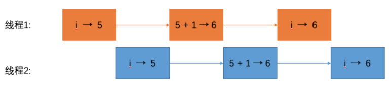

若两个线程以这样的顺序前进执行，那么两个线程执行i++的后果就是i只增加了1

为了解决原子性的问题，可以从下面几个方面解决：

1、使用局部变量

2、使用ThreadLocal

3、给变量加final

4、加锁解决，其中最基本的是同步代码块：

~~~java
    private int i;

    private Object lock = new Object();

    public void increase() {
        synchronized (lock) {
            i++;
        }
    }
~~~

lock就是一个锁，也称为内置锁。在获取锁的时候线程处于阻塞状态，线程获取锁的方式是同步执行，这种方法就被称为同步代码块。对象可以作为锁，因为每个对象都占用独一无二的内存，真实的对象在内存中的表示其实有对象头和数据区组成的，数据区就是我们声明的各种字段占用的内存部分，而对象头里存储了一系列的有用信息，其中就有几个位代表锁信息，也就是这个对象有没有作为某个线程的锁的信息

锁是可以重入的，一个线程持有一把锁的时候，它可以再次进入被这把锁保护的代码块。

同步方法就是以this或者类对象作为锁的同步代码块：

~~~java
public class Increment {

    private int i;

    public synchronized increase() {   //使用this作为锁
        i++;
    }

    public synchronized static void anotherStaticMethod() {   //使用Class对象作为锁
        // 此处填写需要同步的代码块
    }
}
~~~

构造方法不能使用 synchronized 关键字修饰，构造方法本身就属于线程安全的，不存在同步的构造方法一说（两个线程同时调用构造方法，不存在并发问题，会创建不同的对象）

## synchronized关键字

synchronized 翻译成中文是同步的的意思，主要解决的是多个线程之间访问资源的同步性，可以保证被它修饰的方法或者代码块在任意时刻只能有一个线程执行。

在 Java 早期版本中，synchronized 属于 重量级锁，效率低下。 因为监视器锁（monitor）是依赖于底层的操作系统的 Mutex Lock 来实现的，Java 的线程是映射到操作系统的原生线程之上的。如果要挂起或者唤醒一个线程，都需要操作系统帮忙完成，而操作系统实现线程之间的切换时需要从用户态转换到内核态，这个状态之间的转换需要相对比较长的时间，时间成本相对较高。

不过，在 Java 6 之后，Java 官方对从 JVM 层面对 synchronized 较大优化，所以现在的 synchronized 锁效率也优化得很不错了。JDK1.6 对锁的实现引入了大量的优化，如自旋锁、适应性自旋锁、锁消除、锁粗化、偏向锁、轻量级锁等技术来减少锁操作的开销。所以，你会发现目前的话，不论是各种开源框架还是 JDK 源码都大量使用了 synchronized 关键字。

### synchronized 同步语句块

例如下面的这段代码：

~~~java
public class SynchronizedDemo {
    public void method() {
        synchronized (this) {
            System.out.println("synchronized 代码块");
        }
    }
}
~~~

通过 JDK 自带的 javap 命令查看 SynchronizedDemo 类的相关字节码信息：首先切换到类的对应目录执行 javac SynchronizedDemo.java 命令生成编译后的 .class 文件，然后执行javap -c -s -v -l SynchronizedDemo.class：

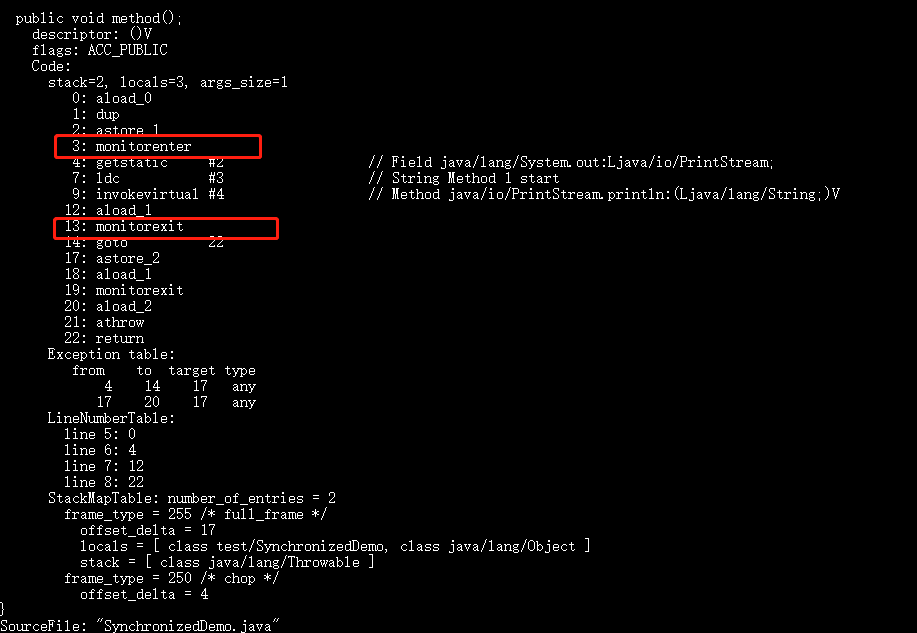

从上面我们可以看出：synchronized 同步语句块的实现使用的是 monitorenter 和 monitorexit 指令，其中 monitorenter 指令指向同步代码块的开始位置，monitorexit 指令则指明同步代码块的结束位置（第二个 monitorexit 是保证同步代码块抛出异常时锁能得到正确的释放而存在的）

当执行 monitorenter 指令时，线程试图获取锁也就是获取 对象监视器 monitor 的持有权

在 Java 虚拟机(HotSpot)中，Monitor 是基于 C++实现的，由ObjectMonitor实现的。每个对象中都内置了一个 ObjectMonitor对象。另外，wait/notify等方法也依赖于monitor对象，这就是为什么只有在同步的块或者方法中才能调用wait/notify等方法，否则会抛出java.lang.IllegalMonitorStateException的异常的原因。

在执行monitorenter时，会尝试获取对象的锁，如果锁的计数器为 0 则表示锁可以被获取，获取后将锁计数器设为 1 也就是加 1：

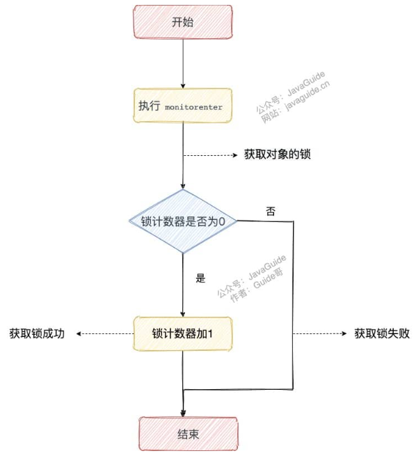

对象锁的的拥有者线程才可以执行 monitorexit 指令来释放锁。在执行 monitorexit 指令后，将锁计数器设为 0，表明锁被释放，其他线程可以尝试获取锁：

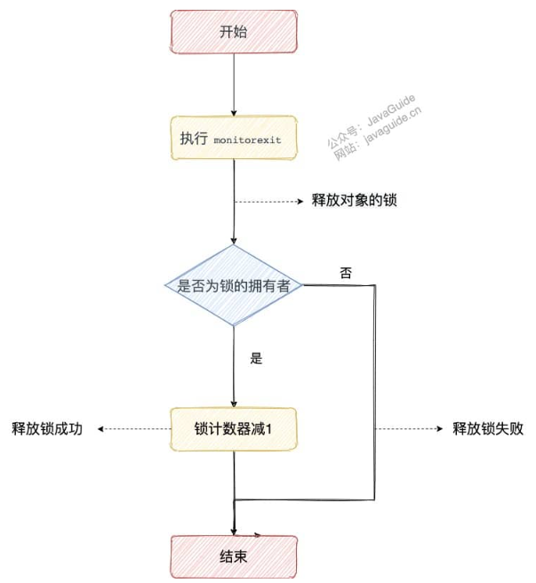

如果获取对象锁失败，那当前线程就要阻塞等待，直到锁被另外一个线程释放为止。

同步代码中：通过moniterenter、moniterexit 关联到到一个monitor对象，进入时设置Owner为当前线程，计数+1、退出-1。除了正常出口的 monitorexit，还在异常处理代码里插入了 monitorexit。

### synchronized方法

例如下面这段代码：

~~~java
public class SynchronizedDemo2 {
    public synchronized void method() {
        System.out.println("synchronized 方法");
    }
}
~~~

依然是用javap 命令分析字节码信息：


synchronized 修饰的方法并没有 monitorenter 指令和 monitorexit 指令，取得代之的确实是 ACC_SYNCHRONIZED 标识，该标识指明了该方法是一个同步方法。JVM 通过该 ACC_SYNCHRONIZED 访问标志来辨别一个方法是否声明为同步方法，从而执行相应的同步调用。它本质上也是对对象监视器 monitor 的获取，其实也是隐式调用moniterenter、moniterexit

如果是实例方法，JVM 会尝试获取实例对象的锁。如果是静态方法，JVM 会尝试获取当前 class 的锁。

JVM 基于进入和退出 Monitor 对象来实现方法同步和代码块同步，但是两者的实现细节不一样：

* 代码块同步：通过使用 monitorenter 和 monitorexit 指令实现的
* 同步方法：ACC_SYNCHRONIZED 修饰

### Moniterenter、Moniterexit

monitorenter和monitorexit这两个jvm指令，主要是基于 Mark Word和Object monitor来实现的

在 JVM 中，对象在内存中分为三块区域：

1、对象头

由Mark Word和Klass Point构成：

Mark Word（标记字段）：用于存储对象自身的运行时数据，例如存储对象的HashCode，分代年龄、锁标志位等信息，是synchronized实现轻量级锁和偏向锁的关键。 64位JVM的Mark Word组成如下：


占用内存大小与虚拟机位长一致（32位JVM -> MarkWord是32位，64位JVM -> MarkWord是64位）

Klass Point（类型指针）：对象指向它的类元数据的指针，虚拟机通过这个指针来确定这个对象是哪个类的实例。

2、实例数据：这部分主要是存放类的数据信息，父类的信息。

3、字节对齐：为了内存的IO性能，JVM要求对象起始地址必须是8字节的整数倍。对于不对齐的对象，需要填充数据进行对齐。

在JDK 1.6之前,synchronized只有传统的锁机制，直接关联到monitor对象，存在性能上的瓶颈。在JDK 1.6后，为了提高锁的获取与释放效率，JVM引入了两种锁机制：偏向锁和轻量级锁。它们的引入是为了解决在没有多线程竞争或基本没有竞争的场景下因使用传统锁机制带来的性能开销问题。这几种锁的实现和转换正是依靠对象头中的Mark Word。

## JDK1.6后对synchronized的优化

JDK1.6 对锁的实现引入了大量的优化，如偏向锁、轻量级锁、自旋锁、适应性自旋锁、锁消除、锁粗化等技术来减少锁操作的开销。

锁主要存在四种状态，依次是：无锁状态、偏向锁状态、轻量级锁状态、重量级锁状态，他们会随着竞争的激烈而逐渐升级。注意锁可以升级不可降级，这种策略是为了提高获得锁和释放锁的效率。

引入这些锁是为了提高获取锁的效率, 要明白每种锁的使用场景, 比如偏向锁适合一个线程对一个锁的多次获取的情况; 轻量级锁适合锁执行体比较简单(即减少锁粒度或时间), 自旋一会儿就可以成功获取锁的情况.

从上面的表格可以看到，每一个锁状态都对应不同的对象头中的 MarkWord：

* 无锁状态：此时对象头Mark Word主要记录了对象的hashcode，这里的 hashCode 是 Object#hashCode 或者 System#identityHashCode 计算出来的值，不是用户覆盖产生的 hashCode。

* 偏向锁状态：此时对象头Mark Word主要记录了线程ID 和 epoch，所以，如果对象如果计算过 identityHashCode 后，便无法进入偏向锁状态，反过来，如果对象处于偏向锁状态，并且需要计算其 identityHashCode 的话，则偏向锁会被撤销，升级为重量级锁。

  对于偏向锁，如果 线程ID = 0 表示未加锁。

  什么时候会计算 HashCode 呢？比如：将对象作为 Map 的 Key 时会自动触发计算，List 就不会计算，日常创建一个对象，持久化到库里，进行 json 序列化，或者作为临时对象等，这些情况下，并不会触发计算 hashCode，所以大部分情况不会触发计算 hashCode。

* 轻量级锁状态：此时对象头Mark Word主要是指向栈帧中的 Lock Record 记录的指针，Lock Record里面保存了对象的 identityHashCode

* 重量级锁状态：此时对象头Mark Word主要是指向内存中对象的 ObjectMonitor 对象，而 ObectMontitor 对象可以存储对象的 identityHashCode 的值。

### 偏向锁

偏向锁是针对于一个线程而言的，线程获得锁之后就不会再有解锁等操作了，这样可以省略很多开销。假如有两个线程来竞争该锁话，那么偏向锁就失效了，进而升级成轻量级锁了。

偏向锁会偏向于第一个访问锁的线程，如果在接下来的运行过程中，该锁没有被其他的线程访问，则持有偏向锁的线程将永远不需要触发同步。也就是说，偏向锁在资源无竞争情况下消除了同步语句，连CAS操作都不做了，提高了程序的运行性能。

之所以出现这种优化，是因为经验表明，其实大部分情况下，都会是同一个线程进入同一块同步代码块的。

如果支持偏向锁（没有计算 hashCode），那么在分配对象时，分配一个可偏向而未偏向的对象（MarkWord的最后 3 位为 101，并且 Thread Id 字段的值为 0）。

1、偏向锁的加锁

* 偏向锁标志是未偏向状态，使用 CAS 将 MarkWord 中的线程ID设置为自己的线程ID。如果成功，则获取偏向锁成功；如果失败，则进行锁升级。
* 偏向锁标志是已偏向状态，MarkWord 中的线程 ID 是自己的线程 ID，成功获取锁；MarkWord 中的线程 ID 不是自己的线程 ID，需要进行锁升级

偏向锁的锁升级需要进行偏向锁的撤销。

2、偏向锁的撤销

对象是不可偏向状态，则此时不需要撤销。如果对象是可偏向状态，分为多种情况讨论：

* MarkWord 中指向的线程不存活。若此时允许重偏向则退回到可偏向但未偏向的状态；若不允许重偏向，则变为无锁状态

* MarkWord 中的线程存活：

  如果此时线程ID指向的线程仍然拥有锁，则升级为轻量级锁，将 mark word 复制到线程栈中

  如果此时线程ID不再拥有锁，若此时允许重偏向：退回到可偏向但未偏向的状态；不允许重偏向：变为无锁状态

撤销偏向的操作需要在全局检查点执行。我们假设线程A曾经拥有锁（不确定是否释放锁）， 线程B来竞争锁对象，如果当线程A不在拥有锁时或者死亡时，线程B直接去尝试获得锁（根据是否 允许重偏向（rebiasing），获得偏向锁或者轻量级锁）；如果线程A仍然拥有锁，那么锁 升级为轻量级锁，线程B自旋请求获得锁。

偏向锁的撤销流程：

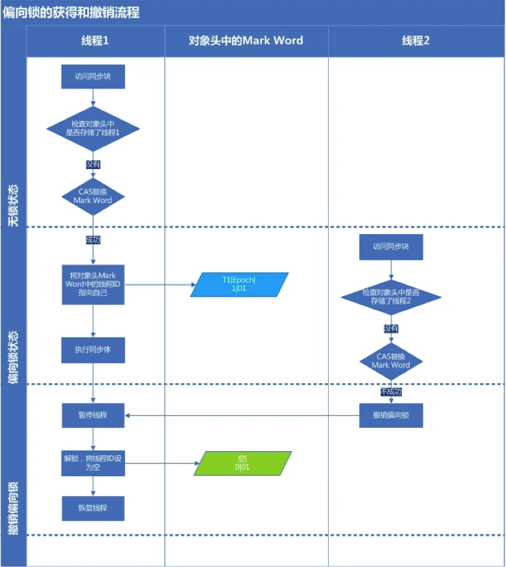

### 轻量级锁

多个线程在不同时段获取同一把锁，即不存在锁竞争的情况，也就没有线程阻塞。针对这种情况，JVM采用轻量级锁来避免线程的阻塞与唤醒。

之所以是轻量级，是因为它仅仅使用 CAS 进行操作，实现获取锁。

JVM会为每个线程在当前线程的栈帧中创建用于存储锁记录的空间，我们称为Displaced Mark Word。如果一个线程获得锁的时候发现是轻量级锁，会把锁的Mark Word复制到自己的Displaced Mark Word里面。

然后线程尝试用CAS将锁的Mark Word替换为指向锁记录的指针。如果成功，当前线程获得锁，如果失败，表示Mark Word已经被替换成了其他线程的锁记录，说明在与其它线程竞争锁，当前线程就尝试使用自旋来获取锁。

自旋是需要消耗CPU的，如果一直获取不到锁的话，那该线程就一直处在自旋状态，白白浪费CPU资源。解决这个问题最简单的办法就是指定自旋的次数，例如让其循环10次，如果还没获取到锁就进入阻塞状态。

但是JDK采用了更聪明的方式——适应性自旋，简单来说就是线程如果自旋成功了，则下次自旋的次数会更多，如果自旋失败了，则自旋的次数就会减少。

自旋也不是一直进行下去的，如果自旋到一定程度（和JVM、操作系统相关），依然没有获取到锁，称为自旋失败，那么这个线程会阻塞。同时这个锁就会升级成重量级锁。

1、加锁流程

轻量级锁的Mark Word是指向线程栈帧的指针，加轻量级锁的过程其实就是将对象头中的 Mark Word 替换为指向锁记录（Lock Record）的指针的过程。

加锁前：

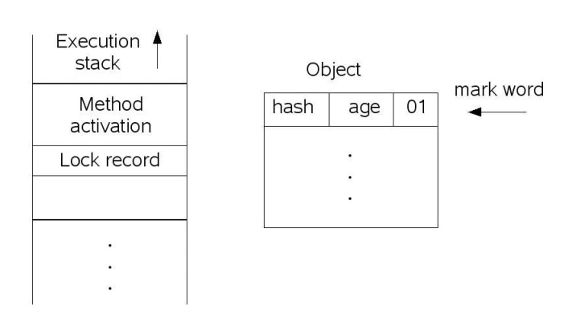

加锁后：

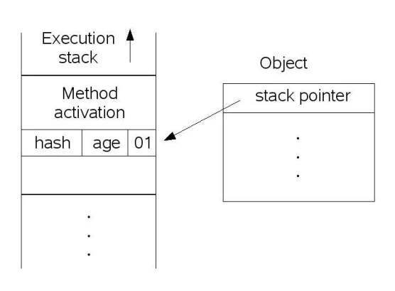

如上图所示。如果成功，当前线程获得轻量级锁，如果失败，虚拟机先检查当前对象头的 Mark Word 是否指向当前线程的栈帧，如果指向，则说明当前线程已经拥有这个对象的锁，则可以直接进入同步块 执行操作，否则表示其他线程竞争锁，当前线程便尝试使用自旋来获取锁。当竞争线程的自旋次数 达到界限值（threshold），轻量级锁将会膨胀为重量级锁。

如果线程发现对象头中Mark Word已经存在指向自己栈帧的指针，即线程已经获得轻量级锁，那么只需要将0存储在自己的栈帧中（此过程称为递归加锁）；在解锁的时候，如果发现锁记录的内容为0， 那么只需要移除栈帧中的锁记录即可，而不需要更新Mark Word。

2、撤销流程

轻量级锁解锁时，如果对象的Mark Word仍然指向着线程的锁记录，会使用CAS操作， 将Dispalced Mark Word替换到对象头，如果成功，则表示没有竞争发生。如果失败， 表示当前锁存在锁竞争，锁就会膨胀为重量级锁。


### 重量级锁

重量级锁（heavy weight lock），是使用操作系统互斥量（mutex）来实现的传统锁。 当所有对锁的优化都失效时，将退回到重量级锁。它与轻量级锁不同竞争的线程不再通过自旋来竞争线程， 而是直接进入堵塞状态，此时不消耗CPU，然后等拥有锁的线程释放锁后，唤醒堵塞的线程， 然后线程再次竞争锁。但是注意，当锁膨胀（inflate）为重量锁时，就不能再退回到轻量级锁。


前面说到，每一个对象都可以当做一个锁，当多个线程同时请求某个对象锁时，对象锁会设置几种状态用来区分请求的线程：

~~~
Contention List：所有请求锁的线程将被首先放置到该竞争队列
Entry List：Contention List中那些有资格成为候选人的线程被移到Entry List
Wait Set：那些调用wait方法被阻塞的线程被放置到Wait Set
OnDeck：任何时刻最多只能有一个线程正在竞争锁，该线程称为OnDeck
Owner：获得锁的线程称为Owner
!Owner：释放锁的线程
~~~

当一个线程尝试获得锁时，如果该锁已经被占用，则会将该线程封装成一个ObjectWaiter对象插入到Contention List的队列的队首，然后调用park函数挂起当前线程。

当线程释放锁时，会从Contention List或EntryList中挑选一个线程唤醒，被选中的线程叫做Heir presumptive即假定继承人，假定继承人被唤醒后会尝试获得锁，但synchronized是非公平的，所以假定继承人不一定能获得锁。这是因为对于重量级锁，线程先自旋尝试获得锁，这样做的目的是为了减少执行操作系统同步操作带来的开销。如果自旋不成功再进入等待队列。这对那些已经在等待队列中的线程来说，稍微显得不公平，还有一个不公平的地方是自旋线程可能会抢占了Ready线程的锁。

如果线程获得锁后调用Object.wait方法，则会将线程加入到WaitSet中，当被Object.notify唤醒后，会将线程从WaitSet移动到Contention List或EntryList中去。需要注意的是，当调用一个锁对象的wait或notify方法时，如当前锁的状态是偏向锁或轻量级锁则会先膨胀成重量级锁。

### 总结

总结锁的升级流程：

每一个线程在准备获取共享资源时： 第一步，检查MarkWord里面是不是放的自己的ThreadId ,如果是，表示当前线程是处于 “偏向锁” 。

第二步，如果MarkWord不是自己的ThreadId，锁升级，这时候，用CAS来执行切换，新的线程根据MarkWord里面现有的ThreadId，通知之前线程暂停，之前线程将Markword的内容置为空。

第三步，两个线程都把锁对象的HashCode复制到自己新建的用于存储锁的记录空间，接着开始通过CAS操作， 把锁对象的MarKword的内容修改为自己新建的记录空间的地址的方式竞争MarkWord。

第四步，第三步中成功执行CAS的获得资源，失败的则进入自旋 。

第五步，自旋的线程在自旋过程中，成功获得资源(即之前获的资源的线程执行完成并释放了共享资源)，则整个状态依然处于 轻量级锁的状态，如果自旋失败 。

第六步，进入重量级锁的状态，这个时候，自旋的线程进行阻塞，等待之前线程执行完成并唤醒自己。

各种锁的优缺点对比：

|  锁   |                优点                 |            缺点            |        适用场景        |
| :--: | :-------------------------------: | :----------------------: | :----------------: |
| 偏向锁  | 加锁和解锁不需要额外的消耗，和执行非同步方法比仅存在纳秒级的差距。 | 如果线程间存在锁竞争，会带来额外的锁撤销的消耗。 | 适用于只有一个线程访问同步块场景。  |
| 轻量级锁 |       竞争的线程不会阻塞，提高了程序的响应速度。       | 如果始终得不到锁竞争的线程使用自旋会消耗CPU。 | 追求响应时间。同步块执行速度非常快。 |
| 重量级锁 |        线程竞争不使用自旋，不会消耗CPU。         |       线程阻塞，响应时间缓慢。       |  追求吞吐量。同步块执行时间较长。  |

### 锁消除和锁粗化

锁消除是指虚拟机即时编译器在运行时，对一些代码上要求同步，但是被检测到不可能存在共享数据竞争的锁进行消除。锁消除的主要判定依据来源于逃逸分析的数据，如果判断在一段代码中，堆上的所有数据都不会逃逸出去从而被其它线程访问到，那就可以把它们当做栈上数据对待，认为它们是线程私有的，同步加锁自然就无法进行。

例如使用StringBuilder对象的append方法时，其实就会进入一个同步块，如果虚拟机可以分析出该变量不会有其他线程访问到它，就可以撤销掉互斥的逻辑。

在编写代码的时候，总是推荐将同步块的作用范围限制得尽量小——只在共享数据的实际作用域中才进行同步，这样是为了使得需要同步的操作数量尽可能变小，如果存在锁竞争，那 等待锁的线程也能尽可能快拿到锁。

大部分情况下，上面的原则都是正确的，但是如果一系列的连续操作都对同一个对象反复加锁和解锁，甚至加锁操作是出现在循环体中的，那即使么有线程竞争，频繁地进行互斥同步操作也会导致不必要的性能损耗。

还是拿append举例子，若每个append对应的都是同一把锁，连续的加锁和释放，那虚拟机就会将锁合并为一个，提升性能。

# ThreadLocal

## 基本使用

ThreadLocal类主要解决的就是让每个线程绑定自己的值，可以将ThreadLocal类形象的比喻成存放数据的盒子，盒子中可以存储每个线程的私有数据。

如果你创建了一个ThreadLocal变量，那么访问这个变量的每个线程都会有这个变量的本地副本，这也是ThreadLocal变量名的由来。他们可以使用 get（） 和 set（） 方法来获取默认值或将其值更改为当前线程所存的副本的值，从而避免了线程安全问题。

分析下面这段代码：

~~~java
import java.text.SimpleDateFormat;
import java.util.Random;

public class ThreadLocalExample implements Runnable{

     // SimpleDateFormat 不是线程安全的，所以每个线程都要有自己独立的副本
    private static final ThreadLocal<SimpleDateFormat> formatter = ThreadLocal.withInitial(() -> new SimpleDateFormat("yyyyMMdd HHmm"));

    public static void main(String[] args) throws InterruptedException {
        ThreadLocalExample obj = new ThreadLocalExample();
        for(int i=0 ; i<10; i++){
            Thread t = new Thread(obj, ""+i);
            Thread.sleep(new Random().nextInt(1000));
            t.start();
        }
    }

    @Override
    public void run() {
        System.out.println("Thread Name= "+Thread.currentThread().getName()+" default Formatter = "+formatter.get().toPattern());
        try {
            Thread.sleep(new Random().nextInt(1000));
        } catch (InterruptedException e) {
            e.printStackTrace();
        }
        //formatter pattern is changed here by thread, but it won't reflect to other threads
        formatter.set(new SimpleDateFormat());

        System.out.println("Thread Name= "+Thread.currentThread().getName()+" formatter = "+formatter.get().toPattern());
    }

}
~~~

输出结果 :

~~~
Thread Name= 0 default Formatter = yyyyMMdd HHmm
Thread Name= 0 formatter = yy-M-d ah:mm
Thread Name= 1 default Formatter = yyyyMMdd HHmm
Thread Name= 2 default Formatter = yyyyMMdd HHmm
Thread Name= 1 formatter = yy-M-d ah:mm
Thread Name= 3 default Formatter = yyyyMMdd HHmm
Thread Name= 2 formatter = yy-M-d ah:mm
Thread Name= 4 default Formatter = yyyyMMdd HHmm
Thread Name= 3 formatter = yy-M-d ah:mm
Thread Name= 4 formatter = yy-M-d ah:mm
Thread Name= 5 default Formatter = yyyyMMdd HHmm
...
~~~

从输出中可以看出，虽然 Thread-0 已经改变了 formatter 的值，但 Thread-1 默认格式化值与初始化值相同，其他线程也一样。

使用场景：一些线程共享数据的数据，如服务调用中的traceId，用户标识等。

## 原理

从Thread类 源代码可以看出Thread 类中有一个 threadLocals 和 一个 inheritableThreadLocals 变量：

~~~java
public class Thread implements Runnable {
    //......
    //与此线程有关的ThreadLocal值。由ThreadLocal类维护
    ThreadLocal.ThreadLocalMap threadLocals = null;

    //与此线程有关的InheritableThreadLocal值。由InheritableThreadLocal类维护
    ThreadLocal.ThreadLocalMap inheritableThreadLocals = null;
    //......
}
~~~

它们都是 ThreadLocalMap 类型的变量,我们可以把 ThreadLocalMap 理解为ThreadLocal 类实现的定制化的 HashMap（ThreadLocalMap有点类似HashMap的结构，只是HashMap是由数组+链表实现的，而ThreadLocalMap中并没有链表结构）。默认情况下这两个变量都是 null，只有当前线程调用 ThreadLocal 类的 set或get方法时才创建它们，实际上调用这两个方法的时候，我们调用的是ThreadLocalMap类对应的 get()、set()方法。

最终的变量是放在了当前线程的 ThreadLocalMap 中，并不是存在 ThreadLocal 上，ThreadLocal 可以理解为只是ThreadLocalMap的封装，传递了变量值

每个Thread中都具备一个ThreadLocalMap，而ThreadLocalMap可以存储以ThreadLocal为 key ，Object 对象为 value 的键值对：

~~~java
public class Thread implements Runnable {
  ThreadLocal.ThreadLocalMap threadLocals = null;
  ...
}
~~~

ThrealLocal 类中可以通过Thread.currentThread()获取到当前线程对象后，直接通过getMap(Thread t)可以访问到该线程的ThreadLocalMap对象：

~~~java
public class ThreadLocal<T> {
  ThreadLocalMap getMap(Thread t) {
    return t.threadLocals;
  }
}
~~~

ThreadLocal 数据结构如下图所示：

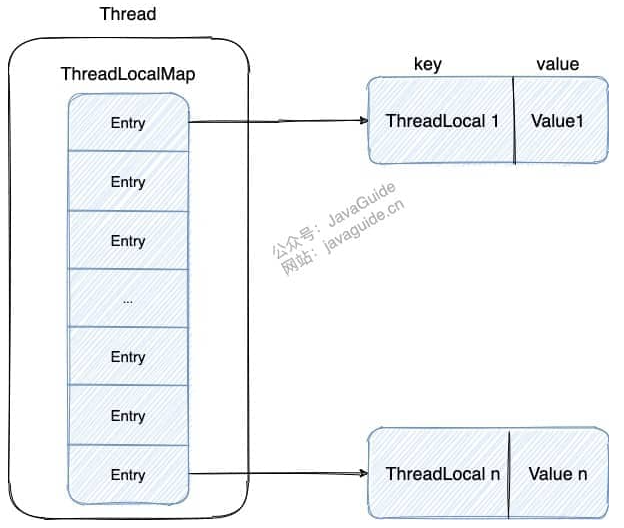

ThreadLocalMap是ThreadLocal的静态内部类:


## 内存泄漏问题

ThreadLocalMap 中使用的 key 为 ThreadLocal 的弱引用（key并不是ThreadLocal本身，而是它的一个弱引用），而 value 是强引用。所以，如果 ThreadLocal 没有被外部强引用的情况下，在垃圾回收的时候，key 会被清理掉，而 value 不会被清理掉。

这样一来，ThreadLocalMap 中就会出现 key 为 null 的 Entry。假如我们不做任何措施的话，value 永远无法被 GC 回收，这个时候就可能会产生内存泄露。ThreadLocalMap 实现中已经考虑了这种情况，在调用 set()、get()、remove() 方法的时候，会清理掉 key 为 null 的记录。使用完 ThreadLocal方法后 最好手动调用remove()方法：

~~~java
static class Entry extends WeakReference<ThreadLocal<?>> {
    /** The value associated with this ThreadLocal. */
    Object value;

    Entry(ThreadLocal<?> k, Object v) {
        super(k);
        value = v;
    }
}
~~~

如果一个对象只具有弱引用，那就类似于可有可无的生活用品。弱引用与软引用的区别在于：只具有弱引用的对象拥有更短暂的生命周期。在垃圾回收器线程扫描它 所管辖的内存区域的过程中，一旦发现了只具有弱引用的对象，不管当前内存空间足够与否，都会回收它的内存。不过，由于垃圾回收器是一个优先级很低的线程， 因此不一定会很快发现那些只具有弱引用的对象。

弱引用可以和一个引用队列（ReferenceQueue）联合使用，如果弱引用所引用的对象被垃圾回收，Java 虚拟机就会把这个弱引用加入到与之关联的引用队列中。

注意：只要ThreadLocal存在强引用，ThreadLocalMap中对应的key就不会被回收：

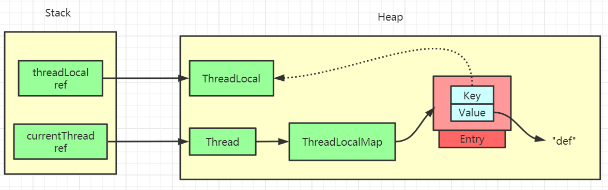

如果我们的强引用不存在的话，那么 key 就会被回收，也就是会出现我们 value 没被回收，key 被回收，导致 value 永远存在，出现内存泄漏

## ThreadLocal.set()

set方法原理：主要是判断ThreadLocalMap是否存在，然后使用ThreadLocal中的set方法进行数据处理

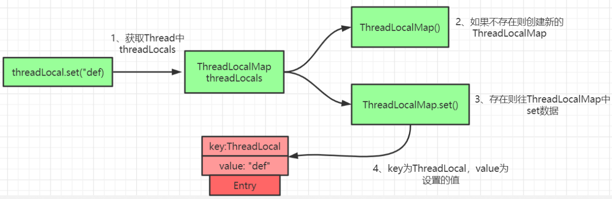

代码如下：

~~~java
public void set(T value) {
    Thread t = Thread.currentThread();
    ThreadLocalMap map = getMap(t);
    if (map != null)
        map.set(this, value);
    else
        createMap(t, value);
}

void createMap(Thread t, T firstValue) {
    t.threadLocals = new ThreadLocalMap(this, firstValue);
}
~~~

### ThreadLocalMap Hash 算法

ThreadLocalMap也是Map结构，也要实现自己的hash算法来解决散列表数组冲突问题：

~~~java
int i = key.threadLocalHashCode & (len-1);
~~~

这里最关键的就是threadLocalHashCode值的计算，ThreadLocal中有一个属性为HASH_INCREMENT = 0x61c88647：

~~~java
public class ThreadLocal<T> {
    private final int threadLocalHashCode = nextHashCode();

    private static AtomicInteger nextHashCode = new AtomicInteger();

    private static final int HASH_INCREMENT = 0x61c88647;

    private static int nextHashCode() {
        return nextHashCode.getAndAdd(HASH_INCREMENT);
    }

    static class ThreadLocalMap {
        ThreadLocalMap(ThreadLocal<?> firstKey, Object firstValue) {
            table = new Entry[INITIAL_CAPACITY];
            int i = firstKey.threadLocalHashCode & (INITIAL_CAPACITY - 1);

            table[i] = new Entry(firstKey, firstValue);
            size = 1;
            setThreshold(INITIAL_CAPACITY);
        }
    }
}
~~~

每当创建一个ThreadLocal对象，这个ThreadLocal.nextHashCode 这个值就会增长 0x61c88647，然后以增长后的值作为hashcode计算。

这个值很特殊，它是斐波那契数 也叫 黄金分割数。hash增量为 这个数字，带来的好处就是 hash 分布非常均匀

### ThreadLocalMap Hash 冲突

虽然ThreadLocalMap中使用了黄金分割数来作为hash计算因子，大大减少了Hash冲突的概率，但是仍然会存在冲突。

HashMap中解决冲突的方法是在数组上构造一个链表结构，冲突的数据挂载到链表上，如果链表长度超过一定数量则会转化成红黑树。

而 ThreadLocalMap 中并没有链表结构，所以这里不能使用 HashMap 解决冲突的方式了。

下面所有示例图中，绿色块Entry代表正常数据，灰色块代表Entry的key值为null，已被垃圾回收。白色块表示Entry为null

如上图所示，如果我们插入一个value=27的数据，通过 hash 计算后应该落入槽位 4 中，而槽位 4 已经有了 Entry 数据：


此时就会线性向后查找，一直找到 Entry 为 null 的槽位才会停止查找，将当前元素放入此槽位中。当然迭代过程中还有其他的情况，比如遇到了 Entry 不为 null 且 key 值相等的情况，还有 Entry 中的 key 值为 null 的情况等等都会有不同的处理，后面会一一讲解。

图中还有一个Entry中的key为null的数据（Entry=2 的灰色块数据），因为key值是弱引用类型，所以会有这种数据存在。在set过程中，如果遇到了key过期的Entry数据，实际上是会进行一轮探测式清理操作的。

### set原理

set方法的源码：

~~~java
private void set(ThreadLocal<?> key, Object value) {
    Entry[] tab = table;
    int len = tab.length;
    int i = key.threadLocalHashCode & (len-1);

    for (Entry e = tab[i];
         e != null;
         e = tab[i = nextIndex(i, len)]) {
        ThreadLocal<?> k = e.get();

        if (k == key) {
            e.value = value;
            return;
        }

        if (k == null) {
            replaceStaleEntry(key, value, i);
            return;
        }
    }

    tab[i] = new Entry(key, value);
    int sz = ++size;
    if (!cleanSomeSlots(i, sz) && sz >= threshold)
        rehash();
}
~~~

for循环向后遍历的过程中，nextIndex()、prevIndex()方法实现：

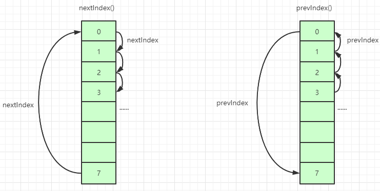

for循环中的逻辑：

* 遍历当前key值对应的桶中Entry数据为空，这说明散列数组这里没有数据冲突，跳出for循环，直接set数据到对应的桶中
* 如果key值对应的桶中Entry数据不为空
  * 如果k = key，说明当前set操作是一个替换操作，做替换逻辑，直接返回
  * 如果key = null，说明当前桶位置的Entry是过期数据，执行replaceStaleEntry()方法(核心方法)，然后返回
* for循环执行完毕，继续往下执行说明向后迭代的过程中遇到了entry为null的情况
  * 在Entry为null的桶中创建一个新的Entry对象
  * 执行++size操作
* 调用cleanSomeSlots()做一次启发式清理工作，清理散列数组中Entry的key过期的数据
  * 如果清理工作完成后，未清理到任何数据，且size超过了阈值(数组长度的 2/3)，进行rehash()操作
  * rehash()中会先进行一轮探测式清理，清理过期key，清理完成后如果size >= threshold - threshold / 4，就会执行真正的扩容逻辑

replaceStaleEntry()方法提供替换过期数据的功能，具体代码如下：

~~~java
private void replaceStaleEntry(ThreadLocal<?> key, Object value,
                                       int staleSlot) {
    Entry[] tab = table;
    int len = tab.length;
    Entry e;

    int slotToExpunge = staleSlot;
    for (int i = prevIndex(staleSlot, len);
         (e = tab[i]) != null;
         i = prevIndex(i, len))

        if (e.get() == null)
            slotToExpunge = i;

    for (int i = nextIndex(staleSlot, len);
         (e = tab[i]) != null;
         i = nextIndex(i, len)) {

        ThreadLocal<?> k = e.get();

        if (k == key) {
            e.value = value;

            tab[i] = tab[staleSlot];
            tab[staleSlot] = e;

            if (slotToExpunge == staleSlot)
                slotToExpunge = i;
            cleanSomeSlots(expungeStaleEntry(slotToExpunge), len);
            return;
        }

        if (k == null && slotToExpunge == staleSlot)
            slotToExpunge = i;
    }

    tab[staleSlot].value = null;
    tab[staleSlot] = new Entry(key, value);

    if (slotToExpunge != staleSlot)
        cleanSomeSlots(expungeStaleEntry(slotToExpunge), len);
}
~~~

首先会向前遍历，找有没有entry为null的，entry为null说明是过期的值，如果有就给slotToExpunge赋值

暗黑向后遍历，有没有entry和要更新的key相同的，如果有，则就更新那个entry，并把它挪到staleSlot位置上。如set value是27的时候，计算得到下标是4，但是4已经有值了，于是就往后遍历，遍历到7发现key为null，则触发replaceStaleEntry，向后遍历的时候如果找到key值相同的，例如索引8的key和入参相同：

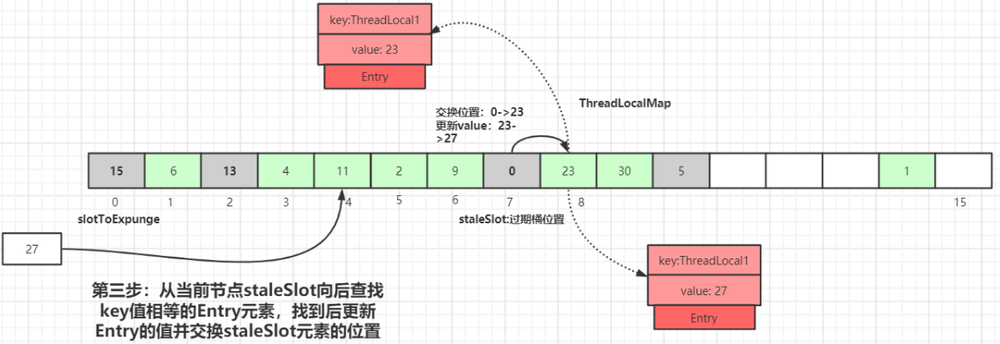

就会将8的值挪到7位置，并更新它的value：

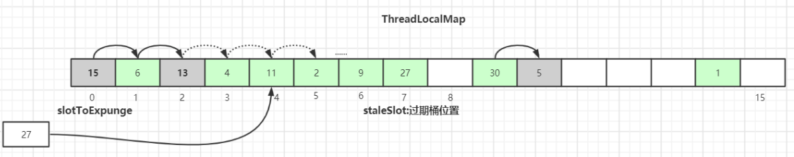

然后调用cleanSomeSlots(expungeStaleEntry(slotToExpunge), len)，触发过期key的清理动作

如果向后找的时候，没有找到key相同的，就直接创建数据，放到staleSlot中：

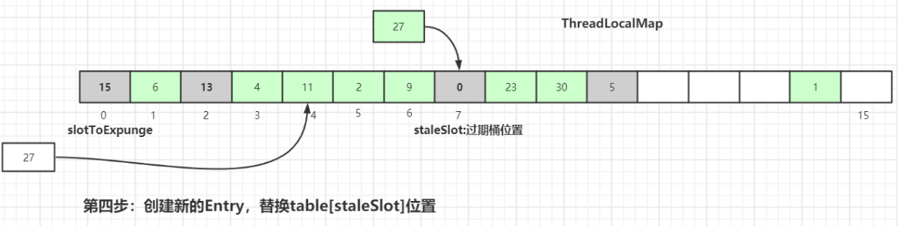

如果slotToExpunge == staleSlot，这说明replaceStaleEntry()一开始向前查找过期数据时并未找到过期的Entry数据，接着向后查找过程中也未发现过期数据，修改开始探测式清理过期数据的下标为当前循环的 index，即slotToExpunge = i。最后调用cleanSomeSlots(expungeStaleEntry(slotToExpunge), len);进行启发式过期数据清理。

最后的if意思是：判断除了staleSlot以外，还发现了其他过期的slot数据，就要开启清理数据的逻辑

## 探测式清理流程

探测式清理，也就是expungeStaleEntry方法，遍历散列数组，从开始位置向后探测清理过期数据，将过期数据的Entry设置为null，沿途中碰到未过期的数据则将此数据rehash后重新在table数组中定位，如果定位的位置已经有了数据，则会将未过期的数据放到最靠近此位置的Entry=null的桶中，使rehash后的Entry数据距离正确的桶的位置更近一些。具体源代码：

~~~java
private int expungeStaleEntry(int staleSlot) {
    Entry[] tab = table;
    int len = tab.length;

    tab[staleSlot].value = null;
    tab[staleSlot] = null;
    size--;

    Entry e;
    int i;
    for (i = nextIndex(staleSlot, len);
         (e = tab[i]) != null;
         i = nextIndex(i, len)) {
        ThreadLocal<?> k = e.get();
        if (k == null) {
            e.value = null;
            tab[i] = null;
            size--;
        } else {
            int h = k.threadLocalHashCode & (len - 1);
            if (h != i) {
                tab[i] = null;

                while (tab[h] != null)
                    h = nextIndex(h, len);
                tab[h] = e;
            }
        }
    }
    return i;
}
~~~

## 启发式清理流程

探测式清理是以当前Entry 往后清理，遇到值为null则结束清理，属于线性探测清理。

启发式清理是cleanSomeSlots方法，初始值n是数组长度，每次循环>>>1，直到其变为0为之。每次如果发现对应位置有key为null的，以对应位置为起点再触发一次探测式清理：

~~~java
private boolean cleanSomeSlots(int i, int n) {
    boolean removed = false;
    Entry[] tab = table;
    int len = tab.length;
    do {
        i = nextIndex(i, len);
        Entry e = tab[i];
        if (e != null && e.get() == null) {
            n = len;
            removed = true;
            i = expungeStaleEntry(i);
        }
    } while ( (n >>>= 1) != 0);
    return removed;
}
~~~

## 扩容机制

在ThreadLocalMap.set()方法的最后，如果执行完启发式清理工作后，未清理到任何数据，且当前散列数组中Entry的数量已经达到了列表的扩容阈值(len*2/3)，就开始执行rehash()逻辑：

~~~java
if (!cleanSomeSlots(i, sz) && sz >= threshold)
    rehash();
~~~

具体实现：

~~~java
private void rehash() {
    expungeStaleEntries();

    if (size >= threshold - threshold / 4)
        resize();
}

private void expungeStaleEntries() {
    Entry[] tab = table;
    int len = tab.length;
    for (int j = 0; j < len; j++) {
        Entry e = tab[j];
        if (e != null && e.get() == null)
            expungeStaleEntry(j);
    }
}
~~~

这里首先是会进行探测式清理工作，从table的起始位置往后清理。清理完成之后，table中可能有一些key为null的Entry数据被清理掉，所以此时通过判断size >= threshold - threshold / 4 也就是size >= threshold * 3/4 来决定是否扩容。

resize方法中会进行具体的扩容，扩容后的tab的大小为oldLen * 2，然后遍历老的散列表，重新计算hash位置，然后放到新的tab数组中，如果出现hash冲突则往后寻找最近的entry为null的槽位，遍历完成之后，oldTab中所有的entry数据都已经放入到新的tab中了。重新计算tab下次扩容的阈值，具体代码如下：

~~~java
private void resize() {
    Entry[] oldTab = table;
    int oldLen = oldTab.length;
    int newLen = oldLen * 2;
    Entry[] newTab = new Entry[newLen];
    int count = 0;

    for (int j = 0; j < oldLen; ++j) {
        Entry e = oldTab[j];
        if (e != null) {
            ThreadLocal<?> k = e.get();
            if (k == null) {
                e.value = null;
            } else {
                int h = k.threadLocalHashCode & (newLen - 1);
                while (newTab[h] != null)
                    h = nextIndex(h, newLen);
                newTab[h] = e;
                count++;
            }
        }
    }

    setThreshold(newLen);
    size = count;
    table = newTab;
}
~~~

## ThreadLocalMap.get()

分两种情况讨论：

* 通过查找key值计算出散列表中slot位置，然后该slot位置中的Entry.key和查找的key一致，则直接返回
* slot位置中的Entry.key和要查找的key不一致，向后遍历，遍历过程中遇到key为null的值就触发探测式清理，直到遍历到为之

~~~java
private Entry getEntry(ThreadLocal<?> key) {
    int i = key.threadLocalHashCode & (table.length - 1);
    Entry e = table[i];
    if (e != null && e.get() == key)
        return e;
    else
        return getEntryAfterMiss(key, i, e);
}

private Entry getEntryAfterMiss(ThreadLocal<?> key, int i, Entry e) {
    Entry[] tab = table;
    int len = tab.length;

    while (e != null) {
        ThreadLocal<?> k = e.get();
        if (k == key)
            return e;
        if (k == null)
            expungeStaleEntry(i);
        else
            i = nextIndex(i, len);
        e = tab[i];
    }
    return null;
}
~~~

## InheritableThreadLocal

使用ThreadLocal的时候，在异步场景下是无法给子线程共享父线程中创建的线程副本数据的。

可以使用InheritableThreadLocal类：

~~~java
public class InheritableThreadLocalDemo {
    public static void main(String[] args) {
        ThreadLocal<String> ThreadLocal = new ThreadLocal<>();
        ThreadLocal<String> inheritableThreadLocal = new InheritableThreadLocal<>();
        ThreadLocal.set("父类数据:threadLocal");
        inheritableThreadLocal.set("父类数据:inheritableThreadLocal");

        new Thread(new Runnable() {
            @Override
            public void run() {
                System.out.println("子线程获取父类ThreadLocal数据：" + ThreadLocal.get());
                System.out.println("子线程获取父类inheritableThreadLocal数据：" + inheritableThreadLocal.get());
            }
        }).start();
    }
}
~~~

打印结果：

~~~
子线程获取父类ThreadLocal数据：null
子线程获取父类inheritableThreadLocal数据：父类数据:inheritableThreadLocal
~~~

原理是创建线程的时候，init方法中，拷贝父线程inheritableThreadLocals数据到子线程inheritableThreadLocals中：

~~~java
private void init(ThreadGroup g, Runnable target, String name,
                      long stackSize, AccessControlContext acc,
                      boolean inheritThreadLocals) {
    if (name == null) {
        throw new NullPointerException("name cannot be null");
    }

    if (inheritThreadLocals && parent.inheritableThreadLocals != null)
        this.inheritableThreadLocals =
            ThreadLocal.createInheritedMap(parent.inheritableThreadLocals);
    this.stackSize = stackSize;
    tid = nextThreadID();
}
~~~

但InheritableThreadLocal仍然有缺陷，一般我们做异步化处理都是使用的线程池，而InheritableThreadLocal是在new Thread中的init()方法给赋值的，而线程池是线程复用的逻辑，所以这里会存在问题。

当然，有问题出现就会有解决问题的方案，阿里巴巴开源了一个TransmittableThreadLocal组件就可以解决这个问题

# 指令重排序

## 概念

分析下列代码：

~~~java
public class Reordering {

    private static boolean flag;
    private static int num;

    public static void main(String[] args) {
        Thread t1 = new Thread(new Runnable() {

            @Override
            public void run() {
                while (!flag) {
                    Thread.yield();
                }

                System.out.println(num);
            }
        }, "t1");
        t1.start();
        num = 5;
        flag = true;
    }
}
~~~

这段代码正常应该打印num值为5，但有可能运行结果是打印了0，这就说明最后两行的运行顺序并不是代码顺序，而是反过来的，这些代码最后都会变成机器能识别的二进制指令，我们把这种指令不按书写顺序执行的情况称为指令重排序。大多数现代处理器都会采用将指令乱序执行的方法，在条件允许的情况下，直接运行当前有能力立即执行的后续指令，避开获取下一条指令所需数据时造成的等待。通过乱序执行的技术，处理器可以大大提高执行效率

除了处理器，常见的Java运行时环境的JIT编译器也会做指令重排序操作，即生成的机器指令与字节码指令顺序不一致。输出了乱序结果，并不代表一定发生了指令重排序，内存可见性问题有时也会导致这样的输出

指令重排序不是随便排，它是需要遵循代码依赖情况的，比如下面几行代码：

~~~java
int i = 0, b = 0;
i = i + 5;  //指令1
i = i*2;  //指令2
b = b + 3;  //指令3
~~~

其中指令2不可能先于指令1执行，因为它们操作的都是同一个变量。而指令3和2和1都无关，因为它们操作的是不同的变量，所以指令3可能被排在指令1之前，也有可能排在其它任何位置，所以在单线程中执行这段代码的时候，最终结果和没有重排序的执行结果是一样的，所以这种重排序有Within-Thread As-If-Serial Semantics的含义，线程内表现为串行的语义，但多线程的时候就会有问题。

这就是As-if-serial语义：所有的动作(Action)都可以为了优化而被重排序，但是必须保证它们重排序后的结果和程序代码本身的应有结果是一致的。Java编译器、运行时和处理器都会保证单线程下的as-if-serial语义。 比如，为了保证这一语义，重排序不会发生在有数据依赖的操作之中。

为保证as-if-serial语义，Java异常处理机制也会为重排序做一些特殊处理。例如在下面的代码中，y = 0 / 0可能会被重排序在x = 2之前执行，为了保证最终不致于输出x = 1的错误结果，JIT在重排序时会在catch语句中插入错误代偿代码，将x赋值为2，将程序恢复到发生异常时应有的状态。这种做法的确将异常捕捉的逻辑变得复杂了，但是JIT的优化的原则是，尽力优化正常运行下的代码逻辑，哪怕以catch块逻辑变得复杂为代价，毕竟，进入catch块内是一种“异常”情况的表现：

~~~java
public class Reordering {
    public static void main(String[] args) {
        int x, y;
        x = 1;
        try {
            x = 2;
            y = 0 / 0;    
        } catch (Exception e) {
        } finally {
            System.out.println("x = " + x);
        }
    }
}
~~~

指令重排序本质上是JVM的优化机制。在 Java 中，Unsafe 类提供了三个开箱即用的内存屏障相关的方法，屏蔽了操作系统底层的差异：

~~~java
public native void loadFence();
public native void storeFence();
public native void fullFence();
~~~

理论上来说，你通过这个三个方法也可以实现和volatile禁止重排序一样的效果

常见的指令重排序有下面 2 种情况：

* 编译器优化重排 ：编译器（包括 JVM、JIT 编译器等）在不改变单线程程序语义的前提下，重新安排语句的执行顺序。
* 指令并行重排 ：现代处理器采用了指令级并行技术(Instruction-Level Parallelism，ILP)来将多条指令重叠执行。如果不存在数据依赖性，处理器可以改变语句对应机器指令的执行顺序。

Java 源代码会经历 编译器优化重排 —> 指令并行重排 —> 内存系统重排 的过程，最终才变成操作系统可执行的指令序列。（内存系统重排实际上就是指JMM 里表现为主存和本地内存的内容可能不一致）

指令重排序可以保证串行语义一致，但是没有义务保证多线程间的语义也一致 ，所以在多线程下，指令重排序可能会导致一些问题。

编译器和处理器的指令重排序的处理方式不一样：

* 对于编译器，通过禁止特定类型的编译器的当时来禁止重排序。
* 对于处理器，通过插入内存屏障（Memory Barrier，或有时叫做内存栅栏，Memory Fence）的方式来禁止特定类型的处理器重排序。指令并行重排和内存系统重排都属于是处理器级别的指令重排序。

内存屏障（Memory Barrier，或有时叫做内存栅栏，Memory Fence）是一种 CPU 指令，用来禁止处理器指令发生重排序（像屏障一样），从而保障指令执行的有序性。另外，为了达到屏障的效果，它也会使处理器写入、读取值之前，将主内存的值写入高速缓存，清空无效队列，从而保障变量的可见性。Java编译器也会根据内存屏障的规则禁止重排序。

内存屏障可以被分为以下几种类型：

- LoadLoad屏障：对于这样的语句Load1; LoadLoad; Load2，在Load2及后续读取操作要读取的数据被访问前，保证Load1要读取的数据被读取完毕。
- StoreStore屏障：对于这样的语句Store1; StoreStore; Store2，在Store2及后续写入操作执行前，保证Store1的写入操作对其它处理器可见。
- LoadStore屏障：对于这样的语句Load1; LoadStore; Store2，在Store2及后续写入操作被刷出前，保证Load1要读取的数据被读取完毕。
- StoreLoad屏障：对于这样的语句Store1; StoreLoad; Load2，在Load2及后续所有读取操作执行前，保证Store1的写入对所有处理器可见。它的开销是四种屏障中最大的。在大多数处理器的实现中，这个屏障是个万能屏障，兼具其它三种内存屏障的功能。

内存屏障示意表：


对于Java编译器而言，Intel 64/IA-32架构下处理器不需要LoadLoad、LoadStore、StoreStore屏障，因为不会发生需要这三种屏障的重排序。

编译器在生成字节码时，会在指令序列中插入内存屏障来禁止特定类型的处理器重排序。编译器选择了一个比较保守的JMM内存屏障插入策略，这样可以保证在任何处理器平台，任何程序中都能得到正确的volatile内存语义。这个策略是：

* 在每个volatile写操作前插入一个StoreStore屏障；
* 在每个volatile写操作后插入一个StoreLoad屏障；
* 在每个volatile读操作后插入一个LoadLoad屏障；
* 在每个volatile读操作后再插入一个LoadStore屏障。

大概示意图是这个样子：


## 同步代码抑制指令重排序

同步代码块可以抑制指令重排序：

~~~java
public class Reordering {

    private static boolean flag;
    private static int num;

    public static void main(String[] args) {
        Thread t1 = new Thread(new Runnable() {

            @Override
            public void run() {
                while (!getFlag()) {
                    Thread.yield();
                }

                System.out.println(num);
            }
        }, "t1");
        t1.start();
        num = 5;
        setFlag(true);
    }

    public synchronized static void setFlag(boolean flag) {
        Reordering.flag = flag;
    }

    public synchronized static boolean getFlag() {
        return flag;
    }
}
~~~

锁的性质可以抑制指令重排序：

* 在获取锁的时候，它前面的操作必须已经执行完成
* 在释放锁的时候，同步代码块中的代码必须全部执行完成

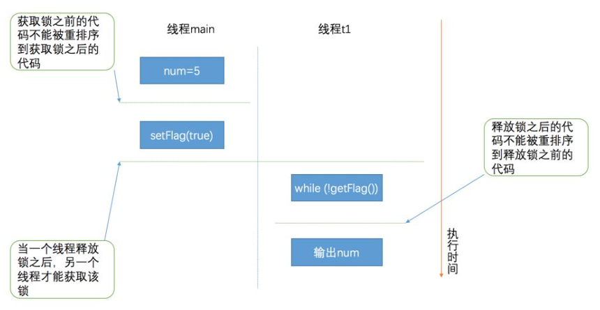

加锁只能保证一部分代码顺序，在同步代码块之前的代码、之后的代码、之中的代码都可以进行重排序。它抑制了处理器对指令执行的优化，原来能并行执行的指令现在只能串行执行，会导致一定程度的性能下降。

## volatile关键字

### 变量抑制重排序

上面的程序可以改成这样：

~~~java
public class Reordering {

    private static volatile boolean flag;
    private static int num;

    public static void main(String[] args) {
        Thread t1 = new Thread(new Runnable() {

            @Override
            public void run() {
                while (!flag) {
                    Thread.yield();
                }

                System.out.println(num);
            }
        });
        t1.start();
        num = 5;
        flag = true;
    }
}
~~~

volatile变量拥有内存可见性，一个线程写入的数据对另一个线程立即可见。具体的volatile抑制重排序的作用：

1. volatile写之前的操作不会被重排序到volatile写之后。
2. volatile读之后的操作不会被重排序到volatile读之前。
3. 前边是volatile写，后边是volatile读，这两个操作不能重排序。

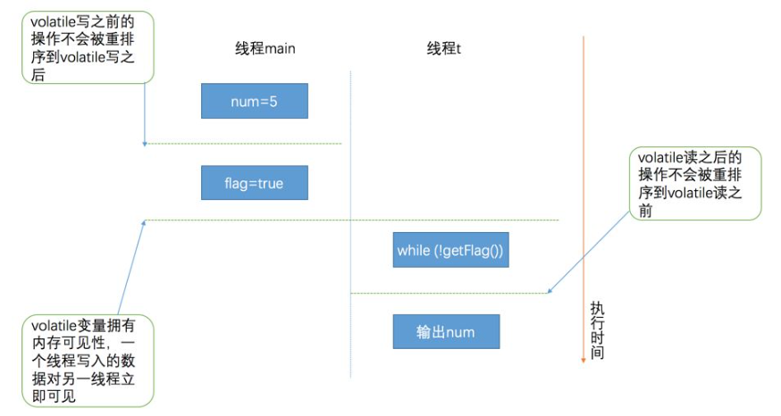


### 保证变量可见性

volatile 关键字可以保证变量的可见性

内存可见性的来源：计算机系统中，为了尽可能地避免处理器访问主内存的时间开销，处理器大多会利用缓存(cache)以提高性能。其模型如下图所示：


在这种模型下会存在一个现象，即缓存中的数据与主内存的数据并不是实时同步的，各CPU（或CPU核心）间缓存的数据也不是实时同步的。这导致在同一个时间点，各CPU所看到同一内存地址的数据的值可能是不一致的。从程序的视角来看，就是在同一个时间点，各个线程所看到的共享变量的值可能是不一致的。

有的观点会将这种现象也视为重排序的一种，命名为“内存系统重排序”。因为这种内存可见性问题造成的结果就好像是内存访问指令发生了重排序一样。

如果我们将变量声明为 volatile ，这就指示 JVM，这个变量是共享且不稳定的，每次使用它都到主存中进行读取：

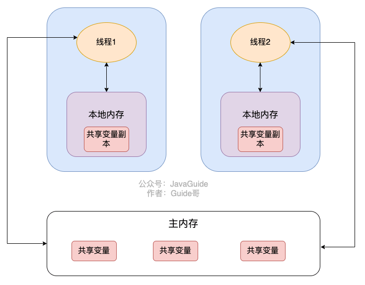

它最原始的意义就是禁用 CPU 缓存。

volatile 关键字能保证数据的可见性，但不能保证数据的原子性。synchronized 关键字两者都能保证

synchronized 和 volatile 的区别：

* volatile 关键字是线程同步的轻量级实现，所以 volatile性能肯定比synchronized关键字要好 。但是 volatile 关键字只能用于变量而 synchronized 关键字可以修饰方法以及代码块 。
* volatile 关键字能保证数据的可见性，但不能保证数据的原子性。synchronized 关键字两者都能保证。
* volatile关键字主要用于解决变量在多个线程之间的可见性，而 synchronized 关键字解决的是多个线程之间访问资源的同步性。

## final变量抑制重排序

final可以保证一旦变量被赋值成功，它的值在之后程序执行过程中都不会改变。

final字段被赋予了一些特殊的语义，它可以阻止某些重排序，具体的规则就这两条：

1. 在构造方法内对一个final字段的写入，与随后把这个被构造对象的引用赋值给一个引用变量，这两个操作之间不能重排序。
2. 初次读一个包含final字段对象的引用，与随后初次读这个final字段，这两个操作不能重排序。

具体看下面的代码示例：

~~~java
public class FinalReordering {

    int i;
    final int j;

    static FinalReordering obj;

    public FinalReordering() {
        i = 1;
        j = 2;
    }

    public static void write() {
        obj = new FinalReordering();
    }

    public static void read() {
        FinalReordering finalReordering = FinalReordering.obj;
        int a = finalReordering.i;
        int b = finalReordering.j;
    }
}
~~~

我们假设有一个线程执行write方法，另一个线程执行read方法。

1、执行write方法时，因为构造方法中要对final的成员变量进行赋值，所以此时用前面的第一个原则，一定会先对final字段j写入，然后再将FinalReordering对象赋值给obj，但对于普通变量可没有这种限制，普通的字段可能在构造方法完成之后才被真正的写入值，所以另一个线程在访问这个普通变量的时候可能读到了0：

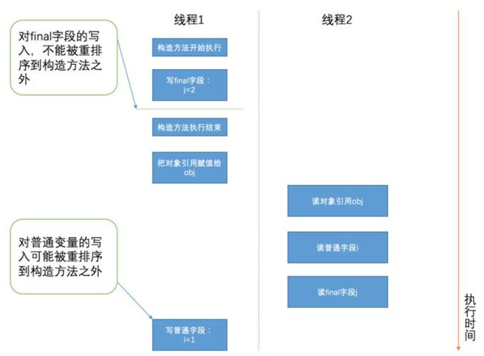

2、执行read方法时，根据第二个原则，一定是先读obj对象，再读j，这两个指令不能重排序，但对于读取普通成员变量i来说，它有可能被指令重排序到构造对象赋值之前，导致出现空指针异常：


读取对象引用和读取该对象的字段是存在间接依赖关系的，一般来说一定是先读引用，再读取对象字段，但对于一些特殊的偏向性能的处理器，如alpha处理器，是有可能将这两个指令重排序的，所以这个规则就是为这种处理器设计的。

# JMM

## 内存模型

JMM（Java 内存模型，Java Memory Model）

一般来说，编程语言也可以直接复用操作系统层面的内存模型。不过，不同的操作系统内存模型不同。如果直接复用操作系统层面的内存模型，就可能会导致同样一套代码换了一个操作系统就无法执行了。例如，x86下运行正常的Java程序在IA64下就可能得到非预期的运行结果，为此出现了JMM。

Java 语言是跨平台的，它需要自己提供一套内存模型以屏蔽系统差异。

这只是 JMM 存在的其中一个原因。实际上，对于 Java 来说，你可以把 JMM 看作是 Java 定义的并发编程相关的一组规范，除了抽象了线程和主内存之间的关系之外，其还规定了从 Java 源代码到 CPU 可执行指令的这个转化过程要遵守哪些和并发相关的原则和规范，其主要目的是为了简化多线程编程，增强程序可移植性的。

并发编程下，像 CPU 多级缓存和指令重排这类设计可能会导致程序运行出现一些问题。就比如说我们上面提到的指令重排序就可能会让多线程程序的执行出现问题，为此，JMM 抽象了 happens-before 原则（后文会详细介绍到）来解决这个指令重排序问题。

Java 内存模型（JMM） 抽象了线程和主内存之间的关系，就比如说线程之间的共享变量必须存储在主内存中。

在 JDK1.2 之前，Java 的内存模型实现总是从 主存 （即共享内存）读取变量，是不需要进行特别的注意的。而在当前的 Java 内存模型下，线程可以把变量保存 本地内存 （比如机器的寄存器）中，而不是直接在主存中进行读写。这就可能造成一个线程在主存中修改了一个变量的值，而另外一个线程还继续使用它在寄存器中的变量值的拷贝，造成数据的不一致。

主内存和本地内存的概念：

什么是主内存？什么是本地内存？

* 主内存 ：所有线程创建的实例对象都存放在主内存中，不管该实例对象是成员变量还是方法中的本地变量(也称局部变量)
* 本地内存 ：每个线程都有一个私有的本地内存来存储共享变量的副本，并且，每个线程只能访问自己的本地内存，无法访问其他线程的本地内存。本地内存是 JMM 抽象出来的一个概念，存储了主内存中的共享变量副本。

Java 内存模型的抽象示意图如下：

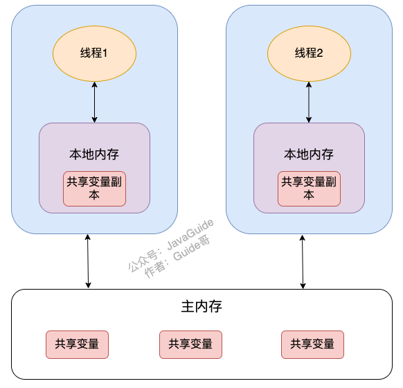

线程 1 与线程 2 之间如果要进行通信的话，必须要经历下面 2 个步骤：

1. 线程 1 把本地内存中修改过的共享变量副本的值同步到主内存中去。
2. 线程 2 到主存中读取对应的共享变量的值。

不过，多线程下，对主内存中的一个共享变量进行操作有可能诱发线程安全问题。举个例子：

1. 线程 1 和线程 2 分别对同一个共享变量进行操作，一个执行修改，一个执行读取。
2. 线程 2 读取到的是线程 1 修改之前的值还是修改后的值并不确定，都有可能，因为线程 1 和线程 2 都是先将共享变量从主内存拷贝到对应线程的工作内存中。

关于主内存与工作内存直接的具体交互协议，即一个变量如何从主内存拷贝到工作内存，如何从工作内存同步到主内存之间的实现细节，Java 内存模型定义来以下八种同步操作：

* 锁定（lock）: 作用于主内存中的变量，将他标记为一个线程独享变量。
* 解锁（unlock）: 作用于主内存中的变量，解除变量的锁定状态，被解除锁定状态的变量才能被其他线程锁定。
* read（读取）：作用于主内存的变量，它把一个变量的值从主内存传输到线程的工作内存中，以便随后的 load 动作使用。
* load(载入)：把 read 操作从主内存中得到的变量值放入工作内存的变量的副本中。
* use(使用)：把工作内存中的一个变量的值传给执行引擎，每当虚拟机遇到一个使用到变量的指令时都会使用该指令。
* assign（赋值）：作用于工作内存的变量，它把一个从执行引擎接收到的值赋给工作内存的变量，每当虚拟机遇到一个给变量赋值的字节码指令时执行这个操作。
* store（存储）：作用于工作内存的变量，它把工作内存中一个变量的值传送到主内存中，以便随后的 write 操作使用。
* write（写入）：作用于主内存的变量，它把 store 操作从工作内存中得到的变量的值放入主内存的变量中。

除了这 8 种同步操作之外，还规定了下面这些同步规则来保证这些同步操作的正确执行：

* 不允许一个线程无原因地（没有发生过任何 assign 操作）把数据从线程的工作内存同步回主内存中。
* 一个新的变量只能在主内存中 “诞生”，不允许在工作内存中直接使用一个未被初始化（load 或 assign）的变量，换句话说就是对一个变量实施 use 和 store 操作之前，必须先执行过了 assign 和 load 操作。
* 一个变量在同一个时刻只允许一条线程对其进行 lock 操作，但 lock 操作可以被同一条线程重复执行多次，多次执行 lock 后，只有执行相同次数的 unlock 操作，变量才会被解锁。
* 如果对一个变量执行 lock 操作，将会清空工作内存中此变量的值，在执行引擎使用这个变量前，需要重新执行 load 或 assign 操作初始化变量的值。
* 如果一个变量事先没有被 lock 操作锁定，则不允许对它执行 unlock 操作，也不允许去 unlock 一个被其他线程锁定住的变量。
* ......

Java 内存区域和内存模型是完全不一样的两个东西 ：

* JVM 内存结构和 Java 虚拟机的运行时区域相关，定义了 JVM 在运行时如何分区存储程序数据，就比如说堆主要用于存放对象实例。
* Java 内存模型和 Java 的并发编程相关，抽象了线程和主内存之间的关系就比如说线程之间的共享变量必须存储在主内存中，规定了从 Java 源代码到 CPU 可执行指令的这个转化过程要遵守哪些和并发相关的原则和规范，其主要目的是为了简化多线程编程，增强程序可移植性的。

## happens-before

JSR 133 引入了 happens-before 这个概念来描述两个操作之间的内存可见性。Happens-before的前后两个操作不会被重排序且后者对前者的内存可见。

happens-before 原则是对Java内存模型的一种近似性的描述，它并不够严谨，但便于日常程序开发参考使用，关于更严谨的Java内存模型的定义和描述，请阅读JSR-133原文或Java语言规范

Java内存模型对volatile和final的语义做了扩展。对volatile语义的扩展保证了volatile变量在一些情况下不会重排序，volatile的64位变量double和long的读取和赋值操作都是原子的。对final语义的扩展保证一个对象的构建方法结束前，所有final成员变量都必须完成初始化（的前提是没有this引用溢出）。

happens-before 原则的诞生是为了程序员和编译器、处理器之间的平衡:

* 程序员追求的是易于理解和编程的强内存模型，遵守既定规则编码即可
* 编译器和处理器追求的是较少约束的弱内存模型，让它们尽己所能地去优化性能，让性能最大化

happens-before 原则的设计思想：

- 为了对编译器和处理器的约束尽可能少，只要不改变程序的执行结果（单线程程序和正确执行的多线程程序），编译器和处理器怎么进行重排序优化都行。
- 对于会改变程序执行结果的重排序，JMM 要求编译器和处理器必须禁止这种重排序。

JSR-133 对 happens-before 原则的定义：

- 如果一个操作 happens-before 另一个操作，那么第一个操作的执行结果将对第二个操作可见，并且第一个操作的执行顺序排在第二个操作之前。
- 两个操作之间存在 happens-before 关系，并不意味着 Java 平台的具体实现必须要按照 happens-before 关系指定的顺序来执行。如果重排序之后的执行结果，与按 happens-before 关系来执行的结果一致，那么 JMM 也允许这样的重排序。

为了解释第二点，观察下面的代码：

~~~java
int userNum = getUserNum();     // 1
int teacherNum = getTeacherNum();     // 2
int totalNum = userNum + teacherNum;    // 3
~~~

其中，1 happens-before 2、2 happens-before 3、1 happens-before 3

虽然 1 happens-before 2，但对 1 和 2 进行重排序不会影响代码的执行结果，所以 JMM 是允许编译器和处理器执行这种重排序的。但 1 和 2 必须是在 3 执行之前，也就是说 1,2 happens-before 3

happens-before 原则表达的意义其实并不是一个操作发生在另外一个操作的前面，虽然这从程序员的角度上来说也并无大碍。更准确地来说，它更想表达的意义是前一个操作的结果对于后一个操作是可见的，无论这两个操作是否在同一个线程里。

举个例子：操作 1 happens-before 操作 2，即使操作 1 和操作 2 不在同一个线程内，JMM 也会保证操作 1 的结果对操作 2 是可见的。

happens-before 的规则总共有8条，重点了解下面列举的 5 条即可：

* 程序顺序规则 ：一个线程内，按照代码顺序，书写在前面的操作 happens-before 于书写在后面的操作；
* 解锁规则 ：解锁 happens-before 于加锁；
* volatile 变量规则 ：对一个 volatile 变量的写操作 happens-before 于后面对这个 volatile 变量的读操作。说白了就是对 volatile 变量的写操作的结果对于发生于其后的任何操作都是可见的。
* 传递规则 ：如果 A happens-before B，且 B happens-before C，那么 A happens-before C；
* 线程启动规则 ：Thread 对象的 start（）方法 happens-before 于此线程的每一个动作。

如果两个操作不满足上述任意一个 happens-before 规则，那么这两个操作就没有顺序的保障，JVM 可以对这两个操作进行重排序。

Java内存模型关于重排序的规定，总结后如下表所示：


JMM也规定了上述volatile和同步块的规则尽适用于存在多线程访问的情景。例如，若编译器（这里的编译器也包括JIT，下同）证明了一个volatile变量只能被单线程访问，那么就可能会把它做为普通变量来处理。

留白的单元格代表允许在不违反Java基本语义的情况下重排序。例如，编译器不会对对同一内存地址的读和写操作重排序，但是允许对不同地址的读和写操作重排序。

## 一致性协议

解决 JMM 中的本地内存变量的缓存不一致问题有两种解决方案，分别是总线加锁和MESI缓存一致性协议

总线加锁是 CPU 从主内存读取数据到本地内存时，会先在总线对这个数据加锁，这样其它 CPU 就没法去读或者去写这个数据，直到这个 CPU 使用完数据释放锁后，其它的 CPU 才能读取该数据。

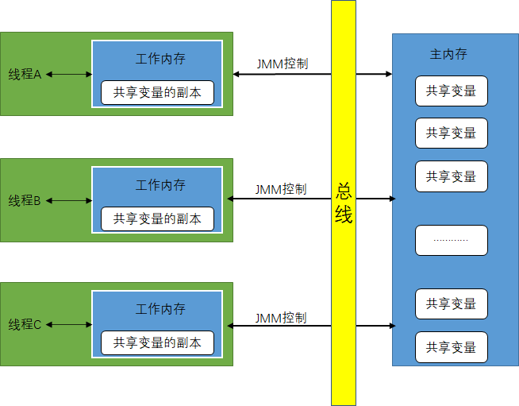

总线加锁虽然能保证数据一致，但是它却严重降低了系统性能，因为当一个线程多总线加锁后，其它线程都只能等待，将原有的并行操作转成了串行操作。

通常情况下，我们不采用这种方法，而是使用性能较高的缓存一致性协议。

MESI 缓存一致性协议是多个 CPU 从主内存读取同一个数据到各自的高速缓存中，当其中的某个 CPU 修改了缓存里的数据，该数据会马上同步回主内存，其它 CPU 通过总线嗅探机制可以感知到数据的变化从而将自己缓存里的数据失效。事实上，volatile的工作原理就是依赖于 MESI 缓存一致性协议实现的。

## 设计原则

Java 内存模型的本质是围绕着 Java 并发过程中的如何处理原子性、可见性和顺序性这三个特征来设计的

1、原子性

JMM 保证的原子性变量操作包括 read、load、assign、use、store、write

对于非原子操作的基本类型，可以使用 synchronized 来保证方法和代码块内的操作是原子性的。基本类型数据的访问大都是原子操作（有一个是存疑的：long 和 double 类型的变量是 64 位，但是在 32 位 JVM 中，32 位的 JVM 会将 64 位数据的读写操作分为 2 次 32 位的读写操作来进行，这就导致了 long、double 类型的变量在 32 位虚拟机中是非原子操作，数据有可能会被破坏，也就意味着多个线程在并发访问的时候是线程非安全的。）

2、可见性

Java 中的 volatile 关键字，可以让被其修饰的变量在被修改后可以立即同步到主内存，被其修饰的变量在每次是用之前都从主内存刷新。因此，可以使用 volatile 来保证多线程操作时变量的可见性。

除了 volatile，Java 中的 synchronized 和 final 两个关键字也可以实现可见性。

3、有序性

在 Java 中，可以使用 synchronized 和 volatile 来保证多线程之间操作的有序性。实现方式有所区别：

volatile 关键字会禁止指令重排。synchronized 关键字保证同一时刻只允许一条线程操作。

综上，synchronized 关键字同时满足以上三个特性，但是 synchronized 是比较影响性能的，虽然编译器提供了很多锁优化技术，但是也不建议过度使用。


# 线程安全的类

让客户端程序员们不需要使用额外的同步操作就可以放心的在多线程环境下使用，这种类就是线程安全的类。如果类是线程不安全的，那么操作它的时候就必须额外考虑到同步的问题

## 找出共享可变的字段

如果一个字段是可以通过对外暴露的方法访问到，那这个字段就是共享的。

如果一个字段的类型是基本数据类型，且对外方法中可以对它操作，它就是可变的；

如果一个字段的类型是非基本数据类型的，那么字段可变就有两层意思：引用可变以及对象中的属性可变

尽量降低字段的共享性，或者让其不可变，就能减少安全性问题（原子性操作、内存可见性、指令重排序）的引入。将字段声明成final类型可以让基本类型的字段不可变，但对于非基本数据类型来说，它所有的属性都是final，才能让它不可变

## 用锁来保护访问

确定了共享可变的字段之后，需要在操作它们的对外方法中，对访问进行同步处理，保证访问共享可变字段是串行访问的。

不仅仅是对共享可变字段的写需要加锁，对共享可变字段的读也需要加锁，这是因为存在内存可见性的问题，读的时候有可能读到旧的值。

加锁时要注意：对于同一个字段来说，在多个访问位置需要使用同一个锁

## 不变性条件

有些时候，类的字段之间是由联系的，比如下面的类：

~~~java
public class SquareGetter {
    private int numberCache;    //数字缓存
    private int squareCache;    //平方值缓存

    public int getSquare(int i) {
        if (i == numberCache) {
            return squareCache;
        }
        int result = i*i;
        numberCache = i;
        squareCache = result;
        return result;
    }

    public int[] getCache() {
        return new int[] {numberCache, squareCache};
    }
}
~~~

当调用getSquare获取平方值时，会将计算结果缓存起来，下次有一样的入参时，直接返回。对于这个类来说，squareCache不论在任何情况下都是numberCache平方值，这就是SquareGetter类的一个不变性条件，如果违背了这个不变性条件的话，就可能会获得错误的结果。

在单线程下这个类的运行不会出现问题，但多线程就会有问题。此时就需要为了保持不变性条件，我们需要把保持不变性条件的多个操作定义为一个原子操作，即用锁给保护起来，我们可以这样修改getSquare方法，直接将它变成同步方法：

~~~java
public synchronized int getSquare(int i) {
    if (i == numberCache) {
        return squareCache;
    }
    int result = i*i;
    numberCache = i;
    squareCache = result;
    return result;
}
~~~

加锁时注意要遵守一个原则：尽可能减少同步代码的范围，减少不必要的阻塞，所以我们可以再优化以下上面的代码，把成员变量result的计算除外，将其余部分加上同步：

~~~java
public int getSquare(int i) {

    synchronized(this) {
        if (i == numberCache) {  // numberCache字段的读取需要进行同步
            return squareCache;
        }
    }

    int result = i*i;   //计算过程不需要同步

    synchronized(this) {   // numberCache和squareCache字段的写入需要进行同步
        numberCache = i;
        squareCache = result;
    }
    return result;
}
~~~

然后还需要确保访问不变性条件的相关字段加锁保护（同一把锁）：

~~~java
public synchronized int[] getCache() {
    return new int[] {numberCache, squareCache};
}
~~~

## volatile修饰状态

使用volatile来替换锁是一种改善性能的考虑方法，但是一定要记住volatile是不能保证一系列操作的原子性的，所以只有我们的业务场景符合下边这两个情况的话，才可以考虑：

- 对变量的写入操作不依赖当前值，或者保证只有单个线程进行更新。
- 该变量不需要和其他共享变量组成不变性条件

## 避免this引用溢出

在构造方法中就把this引用给赋值到了静态变量INSTANCE中，而别的线程是可以随时访问INSTANCE的，我们把这种在对象创建完成之前就把this引用赋值给别的线程可以访问的变量的这种情况称为 this引用逸出，这种方式是极其危险的：

~~~java
public class ExplicitThisEscape {

    private final int i;

    public static ThisEscape INSTANCE;

    public ThisEscape() {
        INSTANCE = this;
        i = 1;
    }
}
~~~

其他线程获取到一个没有初始化完成的对象，可能会出现意想不到的后果，比如读到一个还未初始化的final值i，读到0而不是1

this引用溢出还可以是隐式的，比如下面这个例子：

~~~java
public class ImplicitThisEscape {

    private final int i;

    private Thread t;

    public ThisEscape() {
        t = new Thread(new Runnable() {
            @Override
            public void run() {
                // ... 具体的任务
            }
        });
        i = 1;
    }
}
~~~

虽然在ImplicitThisEscape的构造方法中并没有显式的将this引用赋值，但是由于Runnable内部类的存在，作为外部类的ImplicitThisEscape，内部类对象可以轻松的获取到外部类的引用，这种情况下也算this引用逸出

# wait/notify

wait和notify都是Object类的方法

wait方法：在线程获取到锁后，调用锁对象的本方法，线程释放锁并且把该线程放置到与锁对象关联的等待队列。wait方法是可以待超时参数的，等待一段指定时间后，自动把该线程从等待队列中移出

notify方法：通知一个在与该锁对象关联的等待队列的线程，使它从wait()方法中返回继续往下执行

notifyAll方法：和上面的类似，只不过通知该等待队列中的所有线程

等待线程的用法：

~~~java
synchronized (对象) {
    处理逻辑（可选）
    while(条件不满足) {
        对象.wait();
    }
    处理逻辑（可选）
}
~~~

通知线程的用法：

~~~java
synchronized (对象) {
    完成条件
    对象.notifyAll();、
}
~~~

## wait是会释放锁的

因为wait会释放锁，所以可能会有多段代码同时在同步方法中执行，只不过必然有多个处于阻塞状态

例如下面的类：

~~~java
public class ShitTask implements Runnable {

    // ... 为节省篇幅，省略相关字段和构造方法

    @Override
    public void run() {
        synchronized (washroom.getLock()) {
            System.out.println(name + " 获取了厕所的锁");
            while (!washroom.isAvailable()) {
                try {
                    washroom.getLock().wait();  //调用锁对象的wait()方法，让出锁，并把当前线程放到与锁关联的等待队列
                } catch (InterruptedException e) {
                    throw new RuntimeException(e);
                }
            }
            System.out.println(name + " 上完了厕所");
        }
    }
}
~~~

当构造了多个ShitTask然后开始执行时，肯定会有多个方法先后进入synchronized代码块，这是因为一个线程调用wait后，就会将锁释放，此时就会有后面的线程获取锁然后继续运行，直到大家都进入阻塞状态，等待唤醒

## 必须在同步代码块中调用

必须在同步代码块中调用wait、 notify或者notifyAll方法。

这是因为执行wait方法前需要判断一下某个条件是否满足，如果不满足才会执行wait方法，这是一个先检查后执行的操作，不是一个原子性操作，所以如果不加锁的话，在多线程环境下等待线程和通知线程的执行顺序可能不符合预期，会出现先notify后wait的情况：

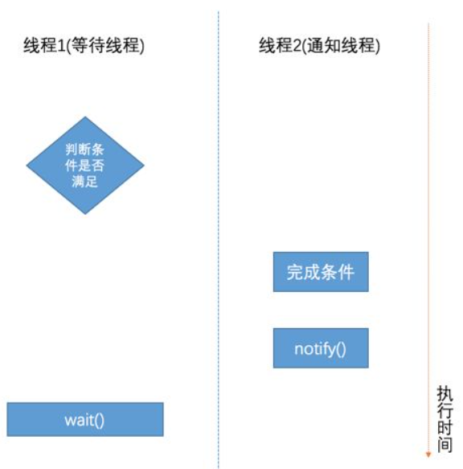

也就是说当等待线程已经判断条件不满足，正要执行wait方法，此时通知线程抢先把条件完成并且调用了notify方法，之后等待线程才执行到wait方法，这会导致等待线程永远停留在等待队列而没有人再去notify它

所以等待线程中的判断条件是否满足、调用wait方法和通知线程中完成条件、调用notify方法都应该是原子性操作，彼此之间是互斥的，所以用同一个锁来对这两个原子性操作进行同步，从而避免出现等待线程永久等待的尴尬局面

一个常见的问题是：如果通知线程先执行，等待线程后执行，为什么不会出现线程永久等待的局面？这是因为存在条件，当notify在同步代码块中执行完毕时，对应的条件状态一定是true，就算等待线程后执行，也会直接满足条件导致不会执行wait

如果不在同步代码块中调用wait、notify或者notifyAll方法，也就是说没有获取锁就调用wait方法，是会抛出IllegalMonitorStateException异常的

而且同步代码的锁，和调用wait或者notify的对象必须是一致的，否则也会抛出IllegalMonitorStateException异常

## while和if

在通常的模式中，我们一般用while来检查状态，而不是if，因为在多线程条件下，可能在一个线程调用notify之后立即又有一个线程把条件改成了不满足的状态，此时就会导致没有满足状态而继续运行出现错误。当仅有两个线程时，一般来说可以用if

## notify不会立即释放锁

在调用完锁对象的notify或者notifyAll方法后，等待线程并不会立即从wait()方法返回，需要调用notify()或者notifyAll()的线程释放锁之后，等待线程才从wait()返回继续执行。也就是说必须要执行完通知后的处理逻辑，才会让其他线程从wait处继续执行：

~~~
synchronized (对象) {
    完成条件
    对象.notifyAll();
    ... 通知后的处理逻辑
}
~~~

需要把通知后的处理逻辑执行完成后，把锁释放掉，其他线程才可以从wait状态恢复过来，重新竞争锁来执行代码（注意这里，还是需要竞争锁的，也就是说不会在同步代码块里有两个线程在同时执行，未破坏锁的语义）

## wait和sleep的区别

它们都能让线程暂停执行，区别如下：

* wait是Object的成员方法，而sleep是Thread的静态方法。wait() 是让获得对象锁的线程实现等待，会自动释放当前线程占有的对象锁，操作对象是作为锁的对象，所以定义在Object中
* 调用wait方法需要先获得锁，而调用sleep方法是不需要的
* 调用wait方法的线程需要用notify来唤醒，而sleep必须设置超时值
* 线程在调用wait方法之后会先释放锁，而sleep不会释放锁
* wait() 通常被用于线程间交互/通信，sleep()通常被用于暂停执行

## 生产者-消费者模式

用wait/notify实现简单的生产者-消费者模式：厨师生产菜，服务员取菜，窗口中最多能同时有5个菜

首先实现生产元素菜

~~~java
public class Food {
    private static int counter = 0;

    private int i;  //代表生产的第几个菜

    public Food() {
        i = ++counter;
    }

    @Override
    public String toString() {
        return "第" + i + "个菜";
    }
}
~~~

定义生产者，也就是厨师：

~~~java
public class Cook extends Thread {

    private Queue<Food> queue;

    public Cook(Queue<Food> queue, String name) {
        super(name);
        this.queue = queue;
    }

    @Override
    public void run() {
        while (true) {
            SleepUtil.randomSleep();    //模拟厨师炒菜时间
            Food food = new Food();
            System.out.println(getName() + " 生产了" + food);
            synchronized (queue) {
                while (queue.size() > 4) {
                    try {
                        System.out.println("队列元素超过5个，为：" + queue.size() + " " + getName() + "抽根烟等待中");
                        queue.wait();
                    } catch (InterruptedException e) {
                        throw new RuntimeException(e);
                    }
                }
                queue.add(food);
                queue.notifyAll();
            }
        }
    }
}
~~~

当队列中元素大于4时，进入等待状态

定义消费者，也就是服务员：

~~~java
class Waiter extends Thread {

    private Queue<Food> queue;

    public Waiter(Queue<Food> queue, String name) {
        super(name);
        this.queue = queue;
    }

    @Override
    public void run() {
        while (true) {
            Food food;
            synchronized (queue) {
                while (queue.size() < 1) {
                    try {
                        System.out.println("队列元素个数为：" + queue.size() + "，" + getName() + "抽根烟等待中");
                        queue.wait();
                    } catch (InterruptedException e) {
                        throw new RuntimeException(e);
                    }
                }
                food = queue.remove();
                System.out.println(getName() + " 获取到：" + food);
                queue.notifyAll();
            }

            SleepUtil.randomSleep();    //模拟服务员端菜时间
        }
    }
}
~~~

当队列中没有菜的时候，进入等待状态。这两个线程互为等待线程和通知线程。

注意以下的点：

* 我们这里的厨师和服务员使用同一个锁queue，确保从队列取和放入队列是原子操作，是一个等待队列。队列虽然是一个，但同一时刻队列中只可能有厨师，或者只可能有服务员
* SleepUtil.randomSleep()是模拟真正的工作时间，它最好不要放在同步代码块中，否则就意味着一个厨师炒菜的同时不允许别的厨师炒菜，在一个服务员端菜的同时不允许别的服务员端菜

# 死锁

## 锁顺序死锁

因为多个线程试图以不同的顺序来获得相同的锁而造成的死锁也被称为锁顺序死锁，例如：

~~~java
public class DeadLockDemo {

    public static void main(String[] args) {
        Object lock1 = new Object();
        Object lock2 = new Object();

        new Thread(new Runnable() {

            @Override
            public void run() {

                while (true) {
                    synchronized (lock1) {
                        System.out.println("线程t1获取了 lock1锁");
                        LockUtil.sleep(1000L);

                        synchronized (lock2) {
                            System.out.println("线程t1获取了 lock2锁");
                        }
                    }
                }
            }
        }, "t1").start();

        new Thread(new Runnable() {
            @Override
            public void run() {

                while (true) {
                    synchronized (lock2) {
                        System.out.println("线程t2获取了 lock2锁");
                        LockUtil.sleep(1000L);

                        synchronized (lock1) {
                            System.out.println("线程t2获取了 lock1锁");
                        }
                    }
                }
            }
        }, "t2").start();
    }
}
~~~

不仅仅是同步代码块，只要有可能获取锁的地方，按照不正确的顺序获取都有可能产生死锁，例如使用同步方法时，看下面的例子，有一个学生类和一个老师类：

~~~java
public class Student {

    private Teacher teacher;

    private int process;    //答题进度

    public void setTeacher(Teacher teacher) {
        this.teacher = teacher;
    }

    public synchronized int getProcess() {
        return process;
    }

    public synchronized void setProcess(int process) {
        this.process = process;
        if (process == 100) {
            teacher.studentNotify(this);    //学生答完题，通知老师
        }
    }
}
~~~

~~~java
import java.util.List;

public class Teacher {

    List<Student> students;

    public void setStudents(List<Student> students) {
        this.students = students;
    }

    public synchronized void studentNotify(Student student) {
        students.remove(student);   //将已完成考试的学生从列表中移除
    }

    public synchronized void getAllStudentStatus() {
        for (Student student : students) {
            System.out.println(student.getProcess());
        }
    }
}
~~~

有两个方法的并发调用可能产生死锁，这就是Student的setProcess方法和Teacher的getAllStudentProcess方法：

* setProcess方法的线程需要先获得Student对象的锁，再获得Teacher对象的锁
* getAllStudentProcess方法的线程需要先获得Teacher对象的锁，再获得Student对象的锁

这样最终就有可能造成死锁，如果在持有锁的情况下调用了某个外部方法，那么就需要警惕死锁

## 预防死锁的建议

产生死锁的几个必要条件：

1. 互斥条件：一个资源每次只能被一个线程使用。
2. 请求与保持条件：一个线程因请求资源而阻塞时，对已获得的资源保持不放。
3. 不剥夺条件：线程已获得的资源，在未使用完之前，不能强行剥夺。
4. 循环等待条件：若干线程之间形成一种头尾相接的循环等待资源关系。

只有这4个条件全部成立，死锁的情况才有可能发生。一般情况下，一个线程持有资源的时间并不会太长，所以一般并不会发生死锁情况，但是如果并发程度很大，也就是非常多的线程在同时竞争资源，如果这四个条件都成立，那么发生死锁的概率将会很大，重要并且可怕的是：一旦系统进入死锁状态，将无法恢复，只能重新启动系统

预防死锁的建议：

1、线程在执行任务的过程中，最好进行开放调用。也就是尽量减少锁的作用范围，破坏循环等待条件

如果在调用某个方法的时候不需要持有锁，那么这种调用就称为开放调用。像上边Student类调用外部方法studentNotify的时候就已经持有锁了，我们可以让它对外部调用时不持有锁，锁只用来保护共享变量：

~~~java
public void setProcess(int process) {
    synchronized (this) {
        this.process = process;
    }
        if (process == 100) {
            teacher.studentNotify(this);    //学生答完题，通知老师
        }
}  
~~~

同样地，也可以这样改写getAllStudentProcess方法：

~~~java
public void getAllStudentStatus() {
    List<Student> copyOfStudents;
    synchronized (this) {
        copyOfStudents = new ArrayList(students);
    }
    for (Student student : copyOfStudents) {
        System.out.println(student.getProcess());
    }
}
~~~

2、各线程用固定的顺序来获取资源，破坏循环等待条件，如下面的例子，两个线程都是先请求lock1，后请求lock2：

~~~java
synchronized (lock1) {
    System.out.println("线程t1获取了 lock1锁");
    LockUtil.sleep(1000L);
    synchronized (lock2) {
        System.out.println("线程t1获取了 lock2锁");
    }
}
~~~

~~~java
synchronized (lock1) {
    System.out.println("线程t2获取了 lock1锁");
    LockUtil.sleep(1000L);
    synchronized (lock2) {
        System.out.println("线程t2获取了 lock2锁");
    }
}
~~~

3、破坏不剥夺条件：可以让持有资源的时间有限

在死锁的情况下，一个线程是不会主动去释放锁的，如果我们让锁有了超时时间，就可以打破不剥夺条件

4、破坏请求与保持条件 ：一次性申请所有的资源

# 饥饿和活锁

如果一个线程因为处理器时间全部被其他线程抢走而得不到处理器运行时间，这种状态被称之为饥饿，一般是由高优先级线程吞噬所有的低优先级线程的处理器时间引起的。setPriority可以修改优先级，但依赖具体的操作系统实现，我们尽量不要修改线程的优先级，具体效果取决于具体的操作系统，并且可能导致某些线程饿死

活锁是不同线程相互谦让资源导致的，各自都无法获取到资源，无法向下执行的情况。为了解决这个问题，需要在遇到冲突重试时引入一定的随机性，如失败重试的等待时间随机到n秒，让两个线程减少冲突。

# 并发性能

一个程序受I/O读写速度的限制而不能更快的执行，就称为I/O密集型的程序，如果受处理器速度限制而不能更快的执行，就称为CPU密集型的程序

线程的提出主要是为了提高处理器的利用率。这主要是从两个方面考虑的：

* 处理器都是多核的，如果只有单线程程序在跑，会浪费处理器资源
* 处理器的速度远远超过内存、硬盘、网络的速度，对于非CPU密集型的程序来说，程序的大部分时间其实都是在与内存、硬盘、网络什么的通信，所以在它们通信的时候处理器可以转向执行其他线程，从而起到提高处理器利用率的目的

一个程序的性能可以从两个方面考虑：运行时间和吞吐量（运行时间和吞吐量不是简单的相乘为1的关系，因为有并发的存在，同时启动多个线程运行可以提高系统的吞吐量，但因为线程本身的开销增大，可能会提升单个线程的运行时间）

线程本身会存在着一些开销，如果引入线程的开销大于提升处理器利用率的开销，程序的性能是会降低的，所以我们需要分析一下线程有哪些开销，并且针对这些开销来做一些工作来提升并发程序的性能

## 线程开销

线程开销的组成：

1、上下文切换

操作系统在进行线程调度时，会为每个线程分配一个时间片，每当时间片用光了之后，就切换到下一个线程去执行。在切换过程中需要发生一些事情：

* 保存并恢复线程的某些运行信息(上下文信息)：如线程状态、线程的代码在内存中的位置、线程执行到了什么位置等
* 加载缓存数据：一个线程在首次被分配时间片的时候，需要从内存中加载它需要的数据到高速缓存中，高速缓存是处理器和内存之间的一层缓存

上下文切换出现的时机：

* 时间片用完，因为操作系统要防止一个线程或者进程长时间占用 CPU 导致其他线程或者进程饿死


* 主动让出 CPU，比如调用了 sleep(), wait() 等
* 调用了阻塞类型的系统中断，比如请求 IO，线程被阻塞
* 被终止或结束运行

这其中前三种都会发生线程切换，线程切换都会伴随着上下文切换。

因其每次需要保存信息恢复信息，这将会占用 CPU，内存等系统资源进行处理，也就意味着效率会有一定损耗，如果频繁切换就会造成整体效率低下

2、内存同步

同步机制影响性能的因素主要有两个：

* 强制刷新缓存到主内存中：意味着我们无法利用高速缓存快速的优点了
* 抑制编译器和处理器的优化，主要是抑制重排序，可能在底层硬件上并发执行的某些质量现在只能被迫的串行执行

竞争同步和非竞争同步：

* 竞争同步：如果在程序运行过程中对某个共享可变变量进行了并发操作，那么这些因为同步而牺牲的性能也就不那么可惜了，我们把这种情况叫做竞争同步
* 非竞争同步：如果程序运行过程中并没有进行对某个共享可变变量的并发操作，那这些同步机制的存在就没有了意义，只会引起性能的降低，我们把这种情况叫做非竞争同步

3、阻塞

线程的执行过程中有阻塞操作，如获取不到锁，sleep，或者I/O操作，可能会有下列影响性能的地方：

* 放弃剩余的时间片，造成上下文切换。如果各线程都经常阻塞，那么这种切换将变得非常频繁，从而降低性能
* 挂起线程会被临时的放到硬盘里：如果一个线程长时间被阻塞，那么操作系统可能选择把它放到硬盘里以节省内存，等阻塞事件完成之后再从硬盘加载到内存中来。这样加上了硬盘读写的操作，会更加的降低程序的性能
* 锁会造成竞争，导致其他获取不到锁的线程无法继续执行，使程序的整体执行效率降低

## 提高性能

在编写并发代码的时候就可以针对性的对于性能做一些调优处理。但是需要注意的是，大部分的并发问题都是在调整并发程序性能的时候发生的，所以除非程序的实际测试数据说明真的到了必须提高性能的时候，不然不要轻易的尝试性能调优的手段

如果多个线程对同一个锁的竞争非常激烈的话，那么会有很多线程因此而发生阻塞，从而使更多的线程挂起和导致更多的上下文切换，这都是对性能的损耗。而衡量一个锁竞争的激烈程度可以有两方面的考量：

1. 每次持有锁的时间
2. 锁的请求频率

所以对应的优化方法是：

1. 如何减少线程持有锁的时间
2. 如何降低锁的请求频率

可以尽量缩小锁的范围，例如上面优化setProcess方法的时候：

~~~java
public void setProcess(int process) {
    synchronized (this) {
        this.process = process;
    }

    if (process == 100) {
        teacher.studentNotify(this);    //学生答完题，通知老师
    }
}
~~~

把锁的保护范围缩小到只保护字段的赋值操作，从而减小锁之间的竞争程度，提升程序的性能

还可以减小锁的粒度，例如当我们保护的多个独立变量互相独立时，就应该用不同的锁；当我们保护的是一组独立的对象，还可以采用锁分段的方式，来保护每个独立的对象，例如对map中数据的一个简单保护：

~~~java
public class StripedMap<K, V> {

    private static class Node<K, V> {
        K key;
        V value;
        Node<K, V> next;
    }

    @SuppressWarnings("unchecked")
    private Node<K, V>[] nodes = new Node[16];

    private Object[] locks = new Object[nodes.length];  //将原来的1个锁拆分成16个锁

    public V get(K key) {
        int index = key.hashCode() / nodes.length;
        Node<K, V> node = nodes[index];
        synchronized (locks[index]) {   //使用分段锁来保护变量
            while (node != null) {
                if (node.equals(key)) {
                    return node.value;
                }
            }
        }
        return null;
    }

    // ... 省略其他方法
}
~~~

分段锁虽然提升了并发程序的性能，但是加大了编程复杂度，尤其是当数组扩容的时候，需要重新散列各个元素。

volatile虽然会抑制重排序以及刷新高速缓存，但是不会使线程切换，也就是不会发生线程的上下文切换，从而可以省掉这部分的性能损耗

使用synchronized的同步语句虽然有各种性能问题，但是语法简单，使用方便，而且java正在努力提升synchronized的性能

# 显式锁

synchronized被称为内置锁，它语法简单，语义明确，但它获取锁的方式比较死板。如果多个线程竞争一个锁的话，只有一个线程可以获取到锁，只要它不释放锁，其他线程就需要一直等待下去，无法停止等待锁的行为，所以造成死锁的时候系统将无法恢复，只能重启

## ReentrantLock基本用法

Lock接口的常用方法：

* lock()：获取锁
* tryLock()：尝试获取锁，获取成功返回true，失败返回false
* lockInterruptibly()：获取锁，若其他线程中断该线程，则立即中断获取锁并抛出InterruptedException
* tryLock(time)：尝试在指定的时间获取锁，若其他线程中断该线程，则立即中断获取锁并抛出InterruptedException
* unlock()：释放锁
* newCondition()：返回绑定到此Lock对象的新Condition对象

Lock接口的实现类就是显式锁，它加锁和释放锁的操作都需要显式的调用方法，而不像内置锁那样进入同步代码块就算是加锁，从同步代码块出来就算是释放锁

最常用的Lock实现类是ReentrantLock，它的基本用法：

~~~java
Lock lock = new ReentrantLock();
lock.lock();    //获取锁
try {
    // ... 具体代码
} finally {
    lock.unlock();  //释放锁
}
~~~

如果多个线程同时调用lock方法的时候，只有一个线程可以获得锁，其余线程都会在lock方法上阻塞，直到获取锁线程释放了锁

## 轮询锁

利用tryLock立即返回的特性，可以在获取锁失败的时候尝试重试，自己指定重试的策略，提升了编程的灵活性：

~~~java
Lock lock = new ReentrantLock();
Random random = new Random();

while (true) {
    boolean result = lock.tryLock(); //尝试获取锁的操作
    if (result) {
        try {
            // ... 具体代码
        } finally {
            lock.unlock();
        }
    }

    // 获取锁失败后随即休息一段时间后重试
    try {
        Thread.sleep(random.nextInt(1000)); //随机休眠1秒内的时间
    } catch (InterruptedException e) {
        throw new RuntimeException(e);
    }
}
~~~

这种tryLock的方式不会因为获取不到锁而一直阻塞，从而避免发生死锁的危险

## 可中断锁

每个线程都有一个中断状态，最初的时候线程的中断状态都是false，一个线程可以给另一个线程发送一个中断信号，接受到中断信号的线程中断状态就被设置为true，java中Thread类提供了下列方法来获取和修改线程的中断状态：

* void interrupt()：将线程的中断状态设置为true
* boolean isInterrupted()：返回该线程的中断状态，并不修改该中断状态
* static boolean interrupted()：静态方法，返回当前线程的中断状态，如果中断状态是true的话，调用该方法会清除当前线程的中断状态，也就是将中断状态设置为false

如调用t1.interrupt()就相当于给t1线程发送了一个中断信号，如果t1在检查自己的中断状态的话，就可以针对不同的状态做处理（也可以置之不理）。当t1处于阻塞状态时，如sleep、join或者wait时，一个线程在调用这些方法之前或者阻塞过程中都会监测自己的中断状态是否为true，如果为true，立即返回并且抛出一个InterruptedException的异常，而且还会清除该线程的中断状态，也就是把中断状态再次修改为false

可中断锁主要是依赖Lock接口的lockInterruptibly方法：

~~~java
Lock lock = new ReentrantLock();
try {   //第1个try块

    lock.lockInterruptibly();   //可中断的锁

    try {   //第2个try块
        // ... 具体代码
    } finally {
        lock.unlock();  //释放锁
    }

} catch (InterruptedException e) {
    // ... 在被中断的时候的处理代码
}
~~~

如果一个线程因为调用lockInterruptibly方法在等待获取锁的过程中发生阻塞，此时另一个线程向该线程发送中断信号的话，则lockInterruptibly方法会立即返回，并且抛出一个InterruptedException异常。这样通过可中断锁的机制，我们就可以随时在别的线程里让另一个线程从等待获取锁的阻塞状态中出来了。

## 定时锁

我们可以在指定时间内获取一个锁，如果在指定时间内获取到了锁，那么该方法就返回true，如果超过了这个指定的时间，那么就返回false，这主要是通过Lock接口的tryLock(time)方法实现的，与lockInterruptibly一样，这个定时获取锁的方法也可能因为别的线程发送中断信号而从阻塞状态中返回并且抛出InterruptedException异常，我们需要做好异常处理工作

## 公平锁

公平锁：不论此时有没有线程持有该锁，新来获取这个锁的线程都会被放到等待队列中统一排队等待

非公平锁：没有线程持有锁的情况下新来的线程可能会先于等待队列中的线程获取到锁。当线程要获取锁时，先通过两次 CAS 操作去抢锁，如果没抢到，当前线程再加入到队列中等待唤醒。

非公平锁在性能上的优势：如果一个线程因为获取不到锁而阻塞的话，它可能被操作系统给挂起，也就是从内存中踢出去放到硬盘上，如果要重新恢复这个线程的话需要从硬盘中重新读取进来，这样就造成了性能的损耗，而如果直接把锁分配给新来的线程，在新来的线程执行的过程中再叫醒等待队列的线程，那么可能新来的线程已经执行完它的任务把锁都释放了，正好把锁交给刚醒来的线程

因为非公平锁有性能上的优势，所以一般情况下，java的内置锁都是非公平锁，如果我们使用显式锁的话，比如ReentrantLock默认是非公平锁，但是如果我们非要把它定义成公平锁的话，我们可以通过它的构造方法来指定：

~~~java
public ReentrantLock(boolean fair)  // fair是true的话就是公平锁
~~~

## 读写锁

无论是内置锁还是ReentrantLock，在一个线程持有锁的时候别的线程是不能持有锁的，所以这种锁也叫做互斥锁。

有时我们想让多个线程并发读，而阻塞读的同时操作，即一个变量可以被多个读线程同时访问，或者被一个写线程访问，但是两者不能同时访问

对应的功能实现就是ReadWriteLock接口：

~~~java
public interface ReadWriteLock {
    Lock readLock();
    Lock writeLock();
}
~~~

一个实现类是ReentrantReadWriteLock，可以通过它来获得读锁和写锁，其实读锁和写锁都是一个Lock对象：

~~~java
public class ReadWriteLockDemo {
    private ReadWriteLock readWriteLock = new ReentrantReadWriteLock();

    private Lock readLock = readWriteLock.readLock();   //读锁

    private Lock writeLock = readWriteLock.writeLock(); //写锁

    private int i;

    public int getI() {
        readLock.lock();
        try {
            return i;
        } finally {
            readLock.unlock();
        }
    }

    public void setI(int i) {
        writeLock.lock();
        try {
            this.i = i;
        } finally {
            writeLock.unlock();
        }
    }
}
~~~

它同样是内部维护了两个同步器。且维护了两个Lock的实现类ReadLock和WriteLock。从源码可以发现，这两个内部类用的是外部类的同步器。

ReentrantReadWriteLock实现了读写锁，但它有一个小弊端，就是在“写”操作的时候，其它线程不能写也不能读。我们称这种现象为“写饥饿”

在实际情况中，只有某些变量的读取频率特别高，并且我们实际测试证明了使用读/写锁可以明显提升系统的性能，我们才考虑使用读/写锁来替代互斥锁

## StampedLock

StampedLock类是在Java 8 才发布的，也是Doug Lea大神所写，有人号称它为锁的性能之王。它没有实现Lock接口和ReadWriteLock接口，但它其实是实现了“读写锁”的功能，并且性能比ReentrantReadWriteLock更高。StampedLock还把读锁分为了“乐观读锁”和“悲观读锁”两种。

前面提到了ReentrantReadWriteLock会发生“写饥饿”的现象，但StampedLock不会。它是怎么做到的呢？它的核心思想在于，在读的时候如果发生了写，应该通过重试的方式来获取新的值，而不应该阻塞写操作。这种模式也就是典型的无锁编程思想，和CAS自旋的思想一样。这种操作方式决定了StampedLock在读线程非常多而写线程非常少的场景下非常适用，同时还避免了写饥饿情况的发生。

使用方法：

~~~java
class Point {
   private double x, y;
   private final StampedLock sl = new StampedLock();

   // 写锁的使用
   void move(double deltaX, double deltaY) {
     long stamp = sl.writeLock(); // 获取写锁
     try {
       x += deltaX;
       y += deltaY;
     } finally {
       sl.unlockWrite(stamp); // 释放写锁
     }
   }

   // 乐观读锁的使用
   double distanceFromOrigin() {
     long stamp = sl.tryOptimisticRead(); // 获取乐观读锁
     double currentX = x, currentY = y;
     if (!sl.validate(stamp)) { // //检查乐观读锁后是否有其他写锁发生，有则返回false
        stamp = sl.readLock(); // 获取一个悲观读锁
        try {
          currentX = x;
          currentY = y;
        } finally {
           sl.unlockRead(stamp); // 释放悲观读锁
        }
     }
     return Math.sqrt(currentX * currentX + currentY * currentY);
   }

   // 悲观读锁以及读锁升级写锁的使用
   void moveIfAtOrigin(double newX, double newY) {
     long stamp = sl.readLock(); // 悲观读锁
     try {
       while (x == 0.0 && y == 0.0) {
         // 读锁尝试转换为写锁：转换成功后相当于获取了写锁，转换失败相当于有写锁被占用
         long ws = sl.tryConvertToWriteLock(stamp); 

         if (ws != 0L) { // 如果转换成功
           stamp = ws; // 读锁的票据更新为写锁的
           x = newX;
           y = newY;
           break;
         }
         else { // 如果转换失败
           sl.unlockRead(stamp); // 释放读锁
           stamp = sl.writeLock(); // 强制获取写锁
         }
       }
     } finally {
       sl.unlock(stamp); // 释放所有锁
     }
   }
}
~~~

乐观读锁的意思就是先假定在这个锁获取期间，共享变量不会被改变，既然假定不会被改变，那就不需要上锁。在获取乐观读锁之后进行了一些操作，然后又调用了validate方法，这个方法就是用来验证tryOptimisticRead之后，是否有写操作执行过，如果有，则获取一个悲观读锁，这里的悲观读锁和ReentrantReadWriteLock中的读锁类似，也是个共享锁。

可以看到，StampedLock获取锁会返回一个long类型的变量，释放锁的时候再把这个变量传进去。简单看看源码：

~~~java
// 用于操作state后获取stamp的值
private static final int LG_READERS = 7;
private static final long RUNIT = 1L;               //0000 0000 0001
private static final long WBIT  = 1L << LG_READERS; //0000 1000 0000
private static final long RBITS = WBIT - 1L;        //0000 0111 1111
private static final long RFULL = RBITS - 1L;       //0000 0111 1110
private static final long ABITS = RBITS | WBIT;     //0000 1111 1111
private static final long SBITS = ~RBITS;           //1111 1000 0000

// 初始化时state的值
private static final long ORIGIN = WBIT << 1;       //0001 0000 0000

// 锁共享变量state
private transient volatile long state;
// 读锁溢出时用来存储多出的读锁
private transient int readerOverflow;
~~~

StampedLock用这个long类型的变量的前7位（LG_READERS）来表示读锁，每获取一个悲观读锁，就加1（RUNIT），每释放一个悲观读锁，就减1。而悲观读锁最多只能装128个（7位限制），很容易溢出，所以用一个int类型的变量来存储溢出的悲观读锁。

写锁用state变量剩下的位来表示，每次获取一个写锁，就加0000 1000 0000（WBIT）。需要注意的是，写锁在释放的时候，并不是减WBIT，而是再加WBIT。这是为了让每次写锁都留下痕迹，解决CAS中的ABA问题，也为乐观锁检查变化validate方法提供基础。

乐观读锁就比较简单了，并没有真正改变state的值，而是在获取锁的时候记录state的写状态，在操作完成后去检查state的写状态部分是否发生变化，上文提到了，每次写锁都会留下痕迹，也是为了这里乐观锁检查变化提供方便。

总的来说，StampedLock的性能是非常优异的，基本上可以取代ReentrantReadWriteLock的作用。

## 对比

synchronized 和 ReentrantLock 的区别：

1、两者都是可重入锁

“可重入锁” 指的是自己可以再次获取自己的内部锁。比如一个线程获得了某个对象的锁，此时这个对象锁还没有释放，当其再次想要获取这个对象的锁的时候还是可以获取的，如果是不可重入锁的话，就会造成死锁。同一个线程每次获取锁，锁的计数器都自增 1，所以要等到锁的计数器下降为 0 时才能释放锁。

2、synchronized 依赖于 JVM 而 ReentrantLock 依赖于 API

* synchronized 是依赖于 JVM 实现的，前面我们也讲到了 虚拟机团队在 JDK1.6 为 synchronized 关键字进行了很多优化，但是这些优化都是在虚拟机层面实现的，并没有直接暴露给我们。
* ReentrantLock 是 JDK 层面实现的（也就是 API 层面，需要 lock() 和 unlock() 方法配合 try/finally 语句块来完成），所以我们可以通过查看它的源代码，来看它是如何实现的。

3、ReentrantLock 比 synchronized 增加了一些高级功能

这些高级功能有：

* 等待可中断 : ReentrantLock提供了一种能够中断等待锁的线程的机制，通过 lock.lockInterruptibly() 来实现这个机制。也就是说正在等待的线程可以选择放弃等待，改为处理其他事情。

* 可实现公平锁 : ReentrantLock可以指定是公平锁还是非公平锁。而synchronized只能是非公平锁。所谓的公平锁就是先等待的线程先获得锁。ReentrantLock默认情况是非公平的，可以通过 ReentrantLock类的ReentrantLock(boolean fair)构造方法来制定是否是公平的。

* 可实现选择性通知（锁可以绑定多个条件）: synchronized关键字与wait()和notify()/notifyAll()方法相结合可以实现等待/通知机制。ReentrantLock类当然也可以实现，但是需要借助于Condition接口与newCondition()方法。

  Condition具有很强的灵活性，一个Lock对象中可以创建多个Condition实例（即对象监视器）有选择性的进行线程通知。synchronized关键字就相当于整个 Lock 对象中只有一个Condition实例，所有的线程都注册在它一个身上。如果执行notifyAll()方法的话就会通知所有处于等待状态的线程这样会造成很大的效率问题，而Condition实例的signalAll()方法 只会唤醒注册在该Condition实例中的所有等待线程。

性能已不是选择标准，两个方式的性能已经相差不大

# 非阻塞操作

## 锁的劣势

锁的劣势：

* 没有获取到锁的时候，会发生阻塞从而发生线程的上下文切换，并且被阻塞的线程可能被操作系统挂起，也就是从内存中放到硬盘里。重新恢复执行的性能会变差
* 如果多个线程竞争一个锁的程度很激烈，而且每个线程持有锁的时间又很短，这很可能导致线程在因为阻塞导致的上下文切换和挂起浪费的时间已经大大超过了执行操作的时间
* 锁让多个线程相互依赖，如果持有锁的线程因为一些问题比如资源，延迟执行时，其他等待这个锁的线程同样需要延迟执行
* 优先级反转问题：如果一个低优先级的线程持有锁，高优先级的线程因为获取不到锁而长时间阻塞

所以有时会希望有一种机制即可以保证某些操作的原子性，其他线程又可以不用发生阻塞

## CompareAndSwap

内置锁和ReentrantLock都属于一种悲观的技术，也就是说使用锁来保护操作的话总是认为竞争一定会发生。而一种乐观的技术就觉得在同一时刻很可能多个线程并不会同时执行该操作，所以可以直接上去就执行操作，然后利用冲突检查机制来判断操作过程中是否收到了其他线程的干扰，如果没有干扰，则执行完操作返回true，否则就什么都不做直接返回false。

以i++来解释乐观锁的执行逻辑，两个线程同时执行i++操作，同时读到i的值为5：

* 乐观锁顺利执行的情况：先执行更新操作，这样i的值就为6了，这个过程中没有收到别的线程干扰
* 乐观锁执行失败的情况：执行更新操作，发现i的值已经不是之前读到的5了，所以放弃本次操作，等待下次重试

冲突检查机制在底层帮我们实现了更新一个值的时候比较一下实际值和给定值是否一致，如果一致则更新并返回true，不一致则不更新并返回false的操作。比较和更新两个操作的原子性是由底层硬件保证的

先比较再更新的英文原话是CompareAndSwap，简称是CAS，这个操作需要3个参数：

1、你要更新的变量V

2、原来的值A

3、即将更新的新值B

操作过程就是当V的值等于A时，将新值B赋值给V并且返回true，否则什么都不做，返回false。所以当多个线程使用CAS同时更新一个变量时，只有一个线程可以成功的更新，其他线程都将失败，但是失败的线程并不会被阻塞甚至挂起，而是被立即告知失败了，然后可以再次尝试更新

CAS 底层实现：调用 Sun 的 UnSafe 的 compareAndSwapInt 方法等，在JAVA中,CAS通过调用C++库实现，由C++库再去调用CPU指令集。不同体系结构中，cpu指令还存在着明显不同。比如，x86 CPU 提供 cmpxchg 指令；而在精简指令集的体系架构中，（如“load and reserve”和“store conditional”）实现的，在大多数处理器上 CAS 都是个非常轻量级的操作，是CPU 原语

## 原子类型

### 基本类型原子类

根据CAS的原理，java中定义了很多原子变量类，这些类提供一些方法，可以用原子的方式去更新某种类型的变量

可以用原子的方式更新基本数据类型数据，定义了下边这么3个类：AtomicBoolean、AtomicInteger、AtomicLong

这些类内部都维护了一个volatile的变量，比如AtomicBoolean内部维护一个boolean类型的volatile变量，底层都是用CAS实现的。

以AtomicInteger为例查看这些类提供的构造方法：

构造方法：

* AtomicInteger(int initialValue)：指定对象代表的int值
* AtomicInteger()：默认的初始值为0

常用方法：

~~~java
public final int get() //获取当前的值
public final int getAndSet(int newValue)//获取当前的值，并设置新的值
public final int getAndIncrement()//获取当前的值，并自增
public final int getAndDecrement() //获取当前的值，并自减
public final int getAndAdd(int delta) //获取当前的值，并加上预期的值
boolean compareAndSet(int expect, int update) //如果输入的数值等于预期值，则以原子方式将该值设置为输入值（update）
public final void lazySet(int newValue)//最终设置为newValue,使用 lazySet 设置之后可能导致其他线程在之后的一小段时间内还是可以读到旧的值。
~~~

其中compareAndSet是直接调用的native方法实现的，而getAndIncrement是基于compareAndSet实现的：

~~~java
public final int getAndIncrement() {
    for (;;) {
        int current = get();
        int next = current + 1;
        if (compareAndSet(current, next)) {
            return current;
        }
    }
}
~~~

基本思路就是失败了不断重试，直到成功了为止

它底层源码是依赖Unsafe的：

~~~java
    // setup to use Unsafe.compareAndSwapInt for updates（更新操作时提供“比较并替换”的作用）
    private static final Unsafe unsafe = Unsafe.getUnsafe();
    private static final long valueOffset;

    static {
        try {
            valueOffset = unsafe.objectFieldOffset
                (AtomicInteger.class.getDeclaredField("value"));
        } catch (Exception ex) { throw new Error(ex); }
    }

    private volatile int value;
~~~

AtomicInteger 类主要利用 CAS (compare and swap) + volatile 和 native 方法来保证原子操作，从而避免 synchronized 的高开销，执行效率大为提升。

CAS 的原理是拿期望的值和原本的一个值作比较，如果相同则更新成新的值。UnSafe 类的 objectFieldOffset() 方法是一个本地方法，这个方法是用来拿到“原来的值”的内存地址。另外 value 是一个 volatile 变量，在内存中可见，因此 JVM 可以保证任何时刻任何线程总能拿到该变量的最新值。CAS也是依赖Unsafe的compareAndSwap方法。

除了原子基本类型以外，还有：

* 原子更新数组：可以通过原子的方式更新某个数组里的某个元素，包括AtomicIntegerArray、AtomicLongArray、AtomicReferenceArray 
* 原子更新引用类型：可以通过原子的方式更新某个引用类型的变量，例如atomicReference.compareAndSet(myObj, new MyObj(6))
* 原子更新字段类：可以通过原子的方式更新某个对象中的字段，如int型字段、long字段等，都有对应的类


### 数组类型原子类

使用原子的方式更新数组里的某个元素：

* AtomicIntegerArray：整形数组原子类
* AtomicLongArray：长整形数组原子类
* AtomicReferenceArray ：引用类型数组原子类

以 AtomicIntegerArray 为例子来介绍，它的常用方法有：

~~~java
public final int get(int i) //获取 index=i 位置元素的值
public final int getAndSet(int i, int newValue)//返回 index=i 位置的当前的值，并将其设置为新值：newValue
public final int getAndIncrement(int i)//获取 index=i 位置元素的值，并让该位置的元素自增
public final int getAndDecrement(int i) //获取 index=i 位置元素的值，并让该位置的元素自减
public final int getAndAdd(int i, int delta) //获取 index=i 位置元素的值，并加上预期的值
boolean compareAndSet(int i, int expect, int update) //如果输入的数值等于预期值，则以原子方式将 index=i 位置的元素值设置为输入值（update）
public final void lazySet(int i, int newValue)//最终 将index=i 位置的元素设置为newValue,使用 lazySet 设置之后可能导致其他线程在之后的一小段时间内还是可以读到旧的值。
~~~

使用样例：

~~~java
public class AtomicIntegerArrayTest {
    public static void main(String[] args) {
        // TODO Auto-generated method stub
        int temvalue = 0;
        int[] nums = { 1, 2, 3, 4, 5, 6 };
        AtomicIntegerArray i = new AtomicIntegerArray(nums);
        for (int j = 0; j < nums.length; j++) {
            System.out.println(i.get(j));
        }
        temvalue = i.getAndSet(0, 2);
        System.out.println("temvalue:" + temvalue + ";  i:" + i);
        temvalue = i.getAndIncrement(0);
        System.out.println("temvalue:" + temvalue + ";  i:" + i);
        temvalue = i.getAndAdd(0, 5);
        System.out.println("temvalue:" + temvalue + ";  i:" + i);
    }
}
~~~

### 引用类型原子类

分为

- AtomicReference：引用类型原子类
- AtomicMarkableReference：原子更新带有标记的引用类型。该类将 boolean 标记与引用关联起来，也可以降低出现 ABA 问题的概率。（它的版本号只有两个，true和false）
- AtomicStampedReference ：原子更新带有版本号的引用类型。该类将整数值与引用关联起来，可用于解决原子的更新数据和数据的版本号，可以解决使用 CAS 进行原子更新时可能出现的 ABA 问题。以下几种：

AtomicReference使用示例：

~~~java
public static void main(String[] args) {
    AtomicReference<Person> ar = new AtomicReference<Person>();
    Person person = new Person("SnailClimb", 22);
    ar.set(person);
    Person updatePerson = new Person("Daisy", 20);
    ar.compareAndSet(person, updatePerson);

    System.out.println(ar.get().getName());
    System.out.println(ar.get().getAge());
}
~~~

AtomicStampedReference 类使用示例：

~~~java
public static void main(String[] args) {
        // 实例化、取当前值和 stamp 值
        final Integer initialRef = 0, initialStamp = 0;
        final AtomicStampedReference<Integer> asr = new AtomicStampedReference<>(initialRef, initialStamp);
        System.out.println("currentValue=" + asr.getReference() + ", currentStamp=" + asr.getStamp());

        // compare and set
        final Integer newReference = 666, newStamp = 999;
        final boolean casResult = asr.compareAndSet(initialRef, newReference, initialStamp, newStamp);
        System.out.println("currentValue=" + asr.getReference()
                + ", currentStamp=" + asr.getStamp()
                + ", casResult=" + casResult);

        // 获取当前的值和当前的 stamp 值
        int[] arr = new int[1];
        final Integer currentValue = asr.get(arr);
        final int currentStamp = arr[0];
        System.out.println("currentValue=" + currentValue + ", currentStamp=" + currentStamp);

        // 单独设置 stamp 值
        final boolean attemptStampResult = asr.attemptStamp(newReference, 88);
        System.out.println("currentValue=" + asr.getReference()
                + ", currentStamp=" + asr.getStamp()
                + ", attemptStampResult=" + attemptStampResult);

        // 重新设置当前值和 stamp 值
        asr.set(initialRef, initialStamp);
        System.out.println("currentValue=" + asr.getReference() + ", currentStamp=" + asr.getStamp());

        // [不推荐使用，除非搞清楚注释的意思了] weak compare and set
        // 困惑！weakCompareAndSet 这个方法最终还是调用 compareAndSet 方法。[版本: jdk-8u191]
        // 但是注释上写着 "May fail spuriously and does not provide ordering guarantees,
        // so is only rarely an appropriate alternative to compareAndSet."
        // todo 感觉有可能是 jvm 通过方法名在 native 方法里面做了转发
        final boolean wCasResult = asr.weakCompareAndSet(initialRef, newReference, initialStamp, newStamp);
        System.out.println("currentValue=" + asr.getReference()
                + ", currentStamp=" + asr.getStamp()
                + ", wCasResult=" + wCasResult);
    }
~~~

AtomicMarkableReference 类使用示例：

~~~java
    public static void main(String[] args) {
        // 实例化、取当前值和 mark 值
        final Boolean initialRef = null, initialMark = false;
        final AtomicMarkableReference<Boolean> amr = new AtomicMarkableReference<>(initialRef, initialMark);
        System.out.println("currentValue=" + amr.getReference() + ", currentMark=" + amr.isMarked());

        // compare and set
        final Boolean newReference1 = true, newMark1 = true;
        final boolean casResult = amr.compareAndSet(initialRef, newReference1, initialMark, newMark1);
        System.out.println("currentValue=" + amr.getReference()
                + ", currentMark=" + amr.isMarked()
                + ", casResult=" + casResult);

        // 获取当前的值和当前的 mark 值
        boolean[] arr = new boolean[1];
        final Boolean currentValue = amr.get(arr);
        final boolean currentMark = arr[0];
        System.out.println("currentValue=" + currentValue + ", currentMark=" + currentMark);

        // 单独设置 mark 值
        final boolean attemptMarkResult = amr.attemptMark(newReference1, false);
        System.out.println("currentValue=" + amr.getReference()
                + ", currentMark=" + amr.isMarked()
                + ", attemptMarkResult=" + attemptMarkResult);

        // 重新设置当前值和 mark 值
        amr.set(initialRef, initialMark);
        System.out.println("currentValue=" + amr.getReference() + ", currentMark=" + amr.isMarked());

        // [不推荐使用，除非搞清楚注释的意思了] weak compare and set
        // 困惑！weakCompareAndSet 这个方法最终还是调用 compareAndSet 方法。[版本: jdk-8u191]
        // 但是注释上写着 "May fail spuriously and does not provide ordering guarantees,
        // so is only rarely an appropriate alternative to compareAndSet."
        // todo 感觉有可能是 jvm 通过方法名在 native 方法里面做了转发
        final boolean wCasResult = amr.weakCompareAndSet(initialRef, newReference1, initialMark, newMark1);
        System.out.println("currentValue=" + amr.getReference()
                + ", currentMark=" + amr.isMarked()
                + ", wCasResult=" + wCasResult);
    }
~~~

### 对象的属性修改类型原子类

如果需要原子更新某个类里的某个字段时，需要用到对象的属性修改类型原子类。

- AtomicIntegerFieldUpdater:原子更新整形字段的更新器
- AtomicLongFieldUpdater：原子更新长整形字段的更新器
- AtomicReferenceFieldUpdater ：原子更新引用类型里的字段的更新器

要想原子地更新对象的属性需要两步。第一步，因为对象的属性修改类型原子类都是抽象类，所以每次使用都必须使用静态方法 newUpdater()创建一个更新器，并且需要设置想要更新的类和属性。第二步，更新的对象属性必须使用 public volatile 修饰符。

以AtomicIntegerFieldUpdater为例：

~~~java
    public static void main(String[] args) {
        AtomicIntegerFieldUpdater<User> a = AtomicIntegerFieldUpdater.newUpdater(User.class, "age");

        User user = new User("Java", 22);
        System.out.println(a.getAndIncrement(user));// 22
        System.out.println(a.get(user));// 23
    }
~~~


## CAS实非阻塞链表

如果一个原子性操作中要更新多个变量的值，CAS就会显得不那么方便，但有的时候我们还可以用一些小技巧来保证更新多个变量的过程是原子性的

一个由链表组成的队列的add方法实现：

~~~java
public class PlainQueue<E> {

    private Node<E> head;   //头节点引用
    private Node<E> tail;   //尾节点引用

    public boolean add(E e) {
        Node<E> node = new Node<>(e, null); //创建一个新的节点
        if (tail == null) {  //如果队列为空
            head = node;
        } else {    //队列不为空
            tail.next = node;
        }
        tail = node;
        return true;
    }
~~~

可以看到，这里面还需要对尾节点是否为空进行分类讨论，如果我们默认让尾结点和头节点指向一个没有业务意义的默认节点，就可以不进行判断了：

~~~java
public class PlainQueue<E> {

    private Node<E> sentinel = new Node<>(null, null); //哨兵节点

    private Node<E> head = sentinel;   //头节点引用
    private Node<E> tail = sentinel;   //尾节点引用

    public boolean add(E e) {
        Node<E> node = new Node<>(e, null); //创建一个新的节点
        tail.next = node;
        tail = node;
        return true;
    }
}    
~~~

这个节点就是哨兵节点，或者又叫哑节点。

在多线程下，add方法是由问题的，可能有多个线程执行到了tail = node;这一句，导致有的节点直接被跳过，尾节点指向了一个错误的位置。这个问题的难点在于如何处理中间状态：已经修改了最后一个节点的next字段，但是还没有修改tail的值

可以使用乐观锁的思想，找到一个条件，可以判断是否有其他线程正在插入，如果当前处于中间状态的话，tail.next 是不为null的，如果处于稳定状态，tail.next 是等于 null的。这样插入时首先检查是否在稳定状态，如果在稳定状态则执行插入；若处于中间状态，则帮助上一个线程设置tail的值，然后再继续重试：

~~~java
public class UnBlockedQueue<E> {

    private Node<E> sentinel = new Node<>(null, null);  //哨兵节点

    private AtomicReference<Node<E>> head = new AtomicReference<>(sentinel);    //头节点引用
    private AtomicReference<Node<E>> tail = new AtomicReference<>(sentinel);    //尾节点引用

    public boolean add(E e) {
        Node<E> node = new Node<>(e, null); //即将插入的节点

        while (true) {
            Node<E> tailNode = tail.get();  //当前的尾节点
            Node<E> tailNext = tailNode.next.get(); //尾节点的下一个节点

            if (tailNext == null) {     //处于稳定状态，尝试插入新节点
                if (tailNode.next.compareAndSet(tailNext, node)) {
                    tail.compareAndSet(tailNode, node);
                    return true;
                }

            } else {    //处于中间状态，帮助上一个线程设置tail的值
                tail.compareAndSet(tailNode, tailNext);
            }
        }
    }
}    
~~~

还需要把Node的next改为原子类型，以便使用原子类方便的更新它：

~~~java
public class Node<E> {
    E e;
    AtomicReference<Node<E>> next;

    public Node(E e, Node<E> next) {
        this.e = e;
        this.next = new AtomicReference<>(next);
    }
}
~~~

## CAS的缺点

1、ABA问题：

在一些使用场景下需要的是检测给定的变量的值是否发生变化，如果变量值变化情况是A-B-A的这种，虽然实际变化了，但是无法检测到。解决ABA问题的方案就是使用版本号，每一次操作都会记录一次操作的版本号，比如第一次将变量设置成A，则把操记录成A1，第二次操作记录成B2，第三次操作记录成A3，这样原来的A-B-A问题就转换成A1-B2-A3的问题，所以就避免了ABA问题的发生。

java给我们提供了AtomicStampedReference这个原子变量来解决ABA问题，这个类的compareAndSet方法的作用是首先检查当前引用是否等于预期引用，并且检查当前标志是否等于预期标志，如果二者都相等，才使用CAS设置为新的值和标志。

2、循环时间长开销大

如果在竞争非常激烈的多线程环境下使用CAS操作，会导致有的线程长时间的进行空循环，占用处理机的资源。此时就还不如用锁来隔离，至少会释放处理机资源。所以到底是CAS效率高，还是锁效率高，是取决于具体应用场景的

解决思路是让JVM支持处理器提供的pause指令。

pause指令能让自旋失败时cpu睡眠一小段时间再继续自旋，从而使得读操作的频率低很多,为解决内存顺序冲突而导致的CPU流水线重排的代价也会小很多。

3、只能保证一个共享变量的原子操作

一个CAS操作只针对一个变量，如果需要保证更新多个共享变量过程的原子性，有得时候可以像处理链表add方法那样，多线程根据中间状态来协助完成最后的目标，不过复杂度显然远高于使用锁来保护这些操作。或者把这些变量都放在一个对象里，比如我们同时想更新i，j两个变量，那么可以新创建一个类，包含i，j两个字段，再使用AtomicReference来原子更新这个新对象，就达到了原子更新的目的了；此外还可以使用锁

# AQS

## 同步状态

AbstractQueuedSynchronizer是一个抽象类，简称AQS，抽象队列同步器。用它可以方便的实现自定义的同步工具，ReentrantLock的底层就是AQS。

Semaphore，其他的诸如 ReentrantReadWriteLock，SynchronousQueue，FutureTask(jdk1.7) 等等皆是基于 AQS 的

在AQS中维护了一个名叫state的字段，是由volatile修饰的，它就是所谓的同步状态：

~~~java
private volatile int state;
~~~

并且提供了几个访问字段的方法：

* protected final int getState() ：获取state的值
* protected final void setState(int newState)：设置state的值
* protected final boolean compareAndSetState(int expect, int update)：使用CAS方式更新state的值

我们可以通过修改state字段代表的同步状态来实现多线程的独占模式或者共享模式：

* 独占模式：一个线程在进行某些操作的时候其他的线程都不能执行该操作，比如持有锁时的操作，在同一时刻只能有一个线程持有锁。如 ReentrantLock
* 共享模式：可以同时允许多个线程同时进行某种操作。如 CountDownLatch、Semaphore、 CyclicBarrier、ReadWriteLock

ReentrantReadWriteLock 可以看成是组合式，因为 ReentrantReadWriteLock 也就是读写锁允许多个线程同时对某一资源进行读

1、独占模式用state来实现：可以把state的初始值设置为0。当线程要进行独占操作前，都要判断state的值是否是0：

* 如果不是0的话意味着别的线程已经进入该操作，则本线程需要阻塞等待；
* 如果是0的话就把state的值设置成1，自己进入该操作，操作结束后释放同步状态，也就是把state的值设置为0，通知等待的线程

这里面涉及判断与设置的操作都通过CAS来保证原子性，等待和通知是由队列实现的

2、共享模式由state来实现：比如某项操作允许10个线程同时进行，超过这个数量的线程就需要阻塞等待，可以把state的值设置为10，当线程要进行操作前，需要判断state的值：

* 如果state<=0，说明当前已经有10个线程在同时操作，本线程需要阻塞等待
* 如果state>0，就将state减1然后进入该操作，完成后释放同步状态，将state的值再加1，通知等待的线程

需要继承AQS的子类实现的几个方法：

* boolean tryAcquire(int arg)：独占式的获取同步状态
* boolean tryRelease(int arg)：独占式的释放同步状态
* int tryAcquireShared(int arg)：共享式的获取同步状态
* boolean tryReleaseShared(int arg)：共享式的释放同步状态
* boolean isHeldExclusively()：在独占模式下，如果当前线程已经获取到同步状态，则返回true，否则返回false

如果我们自定义的同步工具需要在独占模式下工作，那么我们就重写tryAcquire、tryRelease和isHeldExclusively方法，如果是在共享模式下工作，那么我们就重写tryAcquireShared和tryReleaseShared方法。比如在独占模式下我们可以这样定义一个AQS子类：

~~~java
public class Sync extends AbstractQueuedSynchronizer {

    @Override
    protected boolean tryAcquire(int arg) {
        return compareAndSetState(0, 1);
    }

    @Override
    protected boolean tryRelease(int arg) {
        setState(0);
        return true;
    }

    @Override
    protected boolean isHeldExclusively() {
        return getState() == 1;
    }
}
~~~

尝试获取同步状态，这里就是尝试用CAS的方式将state设置为1；尝试释放同步状态，就是将state设置为0；判断当前线程是否获取到同步状态就是判断state是否为1。不同的自定义同步器争用共享资源的方式也不同。自定义同步器在实现时只需要实现共享资源 state 的获取与释放方式即可，至于具体线程等待队列的维护（如获取资源失败入队/唤醒出队等），AQS 已经在顶层实现好了。

## 同步队列

AQS 核心思想是，如果被请求的共享资源空闲，则将当前请求资源的线程设置为有效的工作线程，并且将共享资源设置为锁定状态。如果被请求的共享资源被占用，那么就需要一套线程阻塞等待以及被唤醒时锁分配的机制，这个机制 AQS 是用 CLH 队列锁实现的，即将暂时获取不到锁的线程加入到队列中。

CLH(Craig,Landin and Hagersten)队列是一个虚拟的双向队列（虚拟的双向队列即不存在队列实例，仅存在结点之间的关联关系）。AQS 是将每条请求共享资源的线程封装成一个 CLH 锁队列的一个结点（Node）来实现锁的分配。

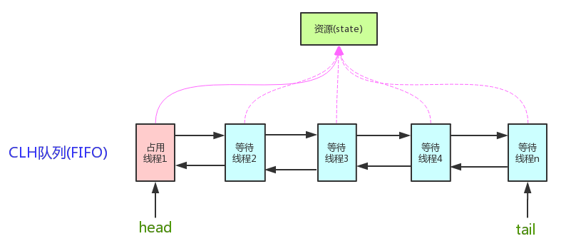

AQS中维护了这个同步队列，这个队列的节点类被定义成了一个静态内部类，它的主要字段如下：

~~~java
static final class Node {
    volatile int waitStatus;
    volatile Node prev;
    volatile Node next;
    volatile Thread thread;
    Node nextWaiter;

    static final int CANCELLED =  1;
    static final int SIGNAL    = -1;
    static final int CONDITION = -2;
    static final int PROPAGATE = -3;
}
~~~

Node类中有一个Thread类型的字段，这表明每一个节点都代表一个线程

AQS中定义一个头节点引用，一个尾节点引用：

~~~java
private transient volatile Node head;
private transient volatile Node tail;
~~~

通过这两个节点就可以控制到这个队列，也就是说可以在队列上进行诸如插入和移除操作。

AQS的线程等待和释放操作都是基于这个队列来完成的：

* 当一个线程获取同步状态失败之后，就把这个线程阻塞并包装成Node节点插入到这个同步队列中
* 当获取同步状态成功的线程释放同步状态的时候，同时通知在队列中下一个未获取到同步状态的节点，让该节点的线程再次去获取同步状态

## 独占模式下状态获取与释放

在独占模式下，同一个时刻只能有一个线程获取到同步状态，其他同时去获取同步状态的线程会被包装成一个Node节点放到同步队列中，直到获取到同步状态的线程释放掉同步状态才能继续执行，初始状态的同步队列是一个空队列

在独占模式需要自定义AQS的子类并重写下面这些方法：

~~~java
protected boolean tryAcquire(int arg)
protected boolean tryRelease(int arg)
protected boolean isHeldExclusively()
~~~

这些方法都由AQS的一些public方法来调用：

* void acquire(int arg)：独占式获取同步状态，如果获取成功则返回，如果失败则将当前线程包装成Node节点插入同步队列中
* void acquireInterruptibly(int arg)：与acquire相同，只不过它可以被其他线程中断，然后抛出异常
* boolean tryAcquireNanos(int arg, long nanos)：在acquireInterruptibly的基础上加了超时限制，给定时间内没有获取到同步状态，则返回false
* boolean release(int arg)：独占式的释放同步状态

1、分析acquire的源代码：

~~~java
public final void acquire(int arg) {

    if (!tryAcquire(arg) &&
        acquireQueued(addWaiter(Node.EXCLUSIVE), arg))
        selfInterrupt();
}
~~~

（1）调用tryAcquire方法来获取同步状态，如果获取成功则返回true，acquire方法执行结束，如果返回false则继续执行后续方法

（2）addWaiter方法：

~~~java
private Node addWaiter(Node mode) {

    Node node = new Node(Thread.currentThread(), mode);  //构造一个新节点
    Node pred = tail;
    if (pred != null) { //尾节点不为空，插入到队列最后
        node.prev = pred;
        if (compareAndSetTail(pred, node)) {       //更新tail，并且把新节点插入到列表最后
            pred.next = node;
            return node;
        }
    }
    enq(node);
    return node;
}

private Node enq(final Node node) {
    for (;;) {
        Node t = tail;
        if (t == null) {    //tail节点为空，初始化队列
            if (compareAndSetHead(new Node()))  //设置head节点
                tail = head;
        } else {    //tail节点不为空，开始真正插入节点
            node.prev = t;
            if (compareAndSetTail(t, node)) {
                t.next = node;
                return t;
            }
        }
    }
}
~~~

首先创建要插入的节点Node，它的thread字段就是当前的线程。如果tail节点不为空，直接把新节点插入到队列后边就返回了，如果tail节点为空，调用enq方法先初始化一下head和tail节点之后再把新节点插入到队列后边。

在enq方法中，初始化队列时，其实就是将head和tail引用指向同一个Node节点，这个节点是简单的空参构造。

当执行完addWaiter方法后，队列中的元素是这样的：

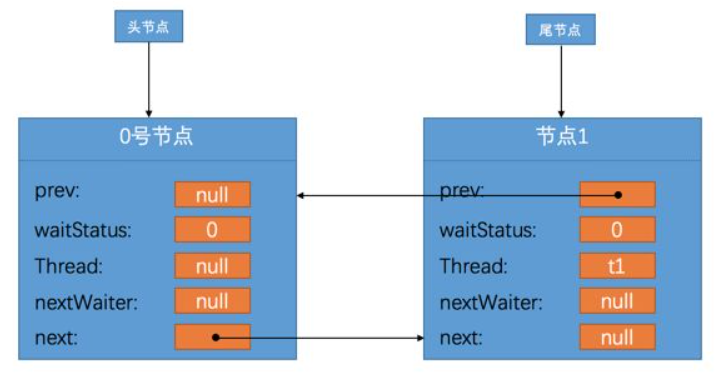

 节点1包含真正的线程信息，它是刚插入的代表本线程的节点，节点0是初始化队列时创建的节点，队列刚初始化完毕时，就只有0节点

（3）acquireQueued方法：

~~~java
final boolean acquireQueued(final Node node, int arg) {

    boolean failed = true;
    try {
        boolean interrupted = false;
        for (;;) {
            final Node p = node.predecessor();  //获取前一个节点
            if (p == head && tryAcquire(arg)) { 前一个节点是头节点再次尝试获取同步状态
                setHead(node);  //拿到资源后，将head指向该结点。
                p.next = null; // help GC
                failed = false;
                return interrupted;
            }
            if (shouldParkAfterFailedAcquire(p, node) &&
                parkAndCheckInterrupt())
                interrupted = true;
        }
    } finally {
        if (failed)
            cancelAcquire(node);
    }
}
~~~

它的入参就是那个刚刚加入同步队列的节点1。如果新插入的节点的前一个节点是头节点的话，会再次调用tryAcquire尝试获取同步状态，这个主要是怕获取同步状态的线程很快就把同步状态给释放了，所以在当前线程阻塞之前抱着侥幸的心理再试试能不能成功获取到同步状态，如果侥幸可以获取，那就调用setHead方法把头节点换成自己：

~~~java
private void setHead(Node node) {
    head = node;
    node.thread = null;
    node.prev = null;
}
~~~

同时把本Node节点的thread字段设置为null，意味着自己成为了0号节点。此时成功获取到同步状态，且同步队列中有一个0号节点。

如果当前Node节点不是头节点或者已经获取到同步状态的线程并没有释放同步状态，那就乖乖的往下执行shouldParkAfterFailedAcquire方法：

这个方法用于检查本线程是不是真的可以休息了，还是之前的线程都放弃了排队，可以执行：

~~~java
private static boolean shouldParkAfterFailedAcquire(Node pred, Node node) {
    int ws = pred.waitStatus;   //前一个节点的状态
    if (ws == Node.SIGNAL)  //Node.SIGNAL的值是-1
        return true;
    if (ws > 0) {   //当前线程已被取消操作，把处于取消状态的节点都移除掉
        do {
            node.prev = pred = pred.prev;
        } while (pred.waitStatus > 0);
        pred.next = node;
    } else {    //设置前一个节点的状态为-1
        compareAndSetWaitStatus(pred, ws, Node.SIGNAL);
    }
    return false;
}
~~~

这个方法和节点的状态有关，Node类里面有一些静态变量代表它的状态，其中这里面涉及的状态：

* Node.SIGNAL：-1，代表后面的节点对应的线程处于等待状态
* 0：代表初始状态

根据当前节点前一个节点的状态，区分不同的逻辑：

* 如果当前节点的前一个节点的waitStatus是Node.SIGNAL，也就是-1，那么意味着当前节点可以被阻塞
* 如果前一个节点的waitStatus大于0，意味着该节点代表的线程已经被取消操作了，需要把所有waitStatus大于0的节点都移除掉
* 如果前一个节点的waitStatus既不是-1，也不大于0，就把如果前一个节点的waitStatus设置成Node.SIGNAL

整个流程中，如果前驱结点的状态不是SIGNAL，那么自己就不能安心去休息，需要去找个安心的休息点，同时可以再尝试下看有没有机会轮到自己拿号。

这里由于是初次获取状态并阻塞，前一个节点就是空的Node节点，所以会先将它的状态设置为-1，然后返回false，此时队列中节点的状态：

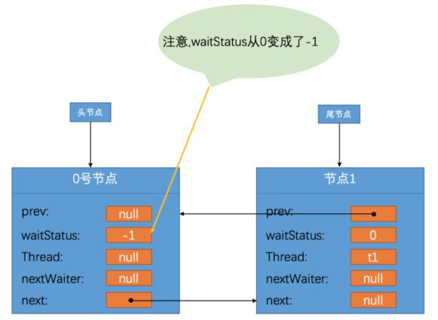

由于acquireQueued方法是个循环，等第二次执行到shouldParkAfterFailedAcquire方法时，由于0号节点的waitStatus已经为Node.SIGNAL了，所以shouldParkAfterFailedAcquire方法会返回true，然后继续执行parkAndCheckInterrupt方法：

~~~java
private final boolean parkAndCheckInterrupt() {
    LockSupport.park(this);
    return Thread.interrupted(); //如果被唤醒，查看自己是不是被中断的。
}

public static void park(Object blocker) {
    Thread t = Thread.currentThread();
    setBlocker(t, blocker);
    UNSAFE.park(false, 0L);     //调用底层方法阻塞线程
    setBlocker(t, null);
}
~~~

在UNSAFE.park方法中，将线程阻塞。park()会让当前线程进入waiting状态。在此状态下，有两种途径可以唤醒该线程：1）被unpark()；2）被interrupt()。

最后的selfInterrupt方法意思是：如果线程在等待过程中被中断过，它是不响应的（不会抛出异常）。只是获取资源后才再进行自我中断selfInterrupt()，将中断补上。

至此，获取同步状态失败的线程就这样被插入到同步队列中，且线程被阻塞了。如果此时再新来一个线程t2调用acquire方法要求获取同步状态的话，它同样会被包装成Node插入同步队列的队尾，效果就像下图一样：

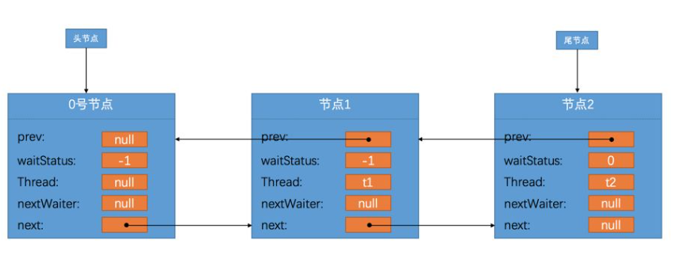

此时节点1的waitStauts已经变成-1了，别忘了waitStauts值为-1的时候，也就是Node.SIGNAL意味着它的下一个节点处于等待状态，因为0号节点和节点1的waitStauts值都为-1，也就意味着它们两个的后继节点，也就是节点1和节点2都处于等待状态。

acquire方法的流程：


1. 调用自定义同步器的tryAcquire()尝试直接去获取资源，如果成功则直接返回；
2. 没成功，则addWaiter()将该线程加入等待队列的尾部，并标记为独占模式；
3. acquireQueued()使线程在等待队列中休息，有机会时（轮到自己，会被unpark()）会去尝试获取资源。获取到资源后才返回。如果在整个等待过程中被中断过，则返回true，否则返回false。
4. 如果线程在等待过程中被中断过，它是不响应的。只是获取资源后才再进行自我中断selfInterrupt()，将中断补上。

2、分析release方法的源代码

当一个线程完成了独占操作，需要释放同步状态时，就要调用release了：

~~~java
public final boolean release(int arg) {
    if (tryRelease(arg)) {
        Node h = head;
        if (h != null && h.waitStatus != 0)
            unparkSuccessor(h);
        return true;
    }
    return false;
}
~~~

这里面会调用子类重写的tryRelease方法，如果成功的释放了同步状态，那就继续向下执行。如果头节点head不为null并且head的waitStatus不为0，就执行unparkSuccessor方法：

~~~java
private void unparkSuccessor(Node node) {
        int ws = node.waitStatus;   //节点的等待状态
        if (ws < 0)
            compareAndSetWaitStatus(node, ws, 0);
        Node s = node.next; 
        if (s == null || s.waitStatus > 0) {    //如果node为最后一个节点或者node的后继节点被取消了
            s = null;
            for (Node t = tail; t != null && t != node; t = t.prev)   // 从后向前找。
                if (t.waitStatus <= 0)  //找到离头节点最近的waitStatus为负数的节点
                    s = t;
        }
        if (s != null)
            LockSupport.unpark(s.thread);   //唤醒该节点对应的线程
    }
~~~

这里的入参node就是头节点，因为头节点处于等待状态，所以将它的状态改为0，然后找到不为空的后继节点，唤醒它对应的线程，把节点1的thread设置为null并把它设置为头节点。一句话概括：用unpark()唤醒等待队列中最前边的那个未放弃线程

可以发现这里是从后向前找线程，为什么从后向前找，而不是从前往后找？原因：由于并发问题，addWaiter()入队操作和cancelAcquire()取消排队操作都会造成next链的不一致，而prev链是强一致的，所以这时从后往前找是最安全的

为什么prev链是强一致的？因为addWaiter()里每次compareAndSetTail(pred, node)之前都有node.prev = pred，即使compareAndSetTail失败，enq()会反复尝试，直到成功。一旦compareAndSetTail成功，该node.prev就成功挂在之前的tail结点上了，而且是唯一的，这时其他新结点的prev只能尝试往新tail结点上挂。这里的组合用法非常巧妙，能保证CAS之前的prev链强一致，但不能保证CAS后的next链强一致。

整个过程中Node结点的等待状态，一共有5种：

* CANCELLED(1)：表示当前结点已取消调度。当timeout或被中断（响应中断的情况下），会触发变更为此状态，进入该状态后的结点将不会再变化。
* SIGNAL(-1)：表示后继结点在等待当前结点唤醒。后继结点入队时，会将前继结点的状态更新为SIGNAL。
* CONDITION(-2)：表示结点等待在Condition上，当其他线程调用了Condition的signal()方法后，CONDITION状态的结点将从等待队列转移到同步队列中，等待获取同步锁。
* PROPAGATE(-3)：共享模式下，前继结点不仅会唤醒其后继结点，同时也可能会唤醒后继的后继结点。
* 0：新结点入队时的默认状态。

注意，负值表示结点处于有效等待状态，而正值表示结点已被取消。所以源码中很多地方用>0、<0来判断结点的状态是否正常。

## 独占式工具实例

自定义一个简单的独占式同步工具：

~~~java
import java.util.concurrent.locks.AbstractQueuedSynchronizer;

public class PlainLock {

    private static class Sync extends AbstractQueuedSynchronizer {

        @Override
        protected boolean tryAcquire(int arg) {
            return compareAndSetState(0, 1);
        }

        @Override
        protected boolean tryRelease(int arg) {
            setState(0);
            return true;
        }

        @Override
        protected boolean isHeldExclusively() {
            return getState() == 1;
        }
    }

    private Sync sync = new Sync();


    public void lock() {
        sync.acquire(1);
    }

    public void unlock() {
        sync.release(1);
    }
}
~~~

我们在PlainLock中定义了一个AQS子类Sync，重写了一些方法来自定义了在独占模式下获取和释放同步状态的方式，静态内部类就是AQS子类在我们自定义同步工具中最常见的定义方式，它的使用，通过调用lock和unlock来加锁和释放锁：

~~~java
public class Increment {

    private int i;

    private PlainLock lock = new PlainLock();

    public void increase() {
        lock.lock();
        i++;
        lock.unlock();
    }

    public int getI() {
        return i;
    }

    public static void test(int threadNum, int loopTimes) {
        Increment increment = new Increment();

        Thread[] threads = new Thread[threadNum];

        for (int i = 0; i < threads.length; i++) {
            Thread t = new Thread(new Runnable() {
                @Override
                public void run() {
                    for (int i = 0; i < loopTimes; i++) {
                        increment.increase();
                    }
                }
            });
            threads[i] = t;
            t.start();
        }

        for (Thread t : threads) {  //main线程等待其他线程都执行完成
            try {
                t.join();
            } catch (InterruptedException e) {
                throw new RuntimeException(e);
            }
        }

        System.out.println(threadNum + "个线程，循环" + loopTimes + "次结果：" + increment.getI());
    }

    public static void main(String[] args) {
        test(20, 1);
        test(20, 10);
        test(20, 100);
        test(20, 1000);
        test(20, 10000);
        test(20, 100000);
        test(20, 1000000);
    }
}
~~~

## 共享模型下状态获取与释放

共享式获取与独占式获取的最大不同就是在同一时刻是否有多个线程可以同时获取到同步状态。获取不到同步状态的线程也需要被包装成Node节点后阻塞的，而可以访问同步队列的方法就是下边这些，和独占模式类似，只不过多加了一个Shared：

* void acquireShared(int arg)
* void acquireSharedInterruptibly(int arg)
* boolean tryAcquireSharedNanos(int arg, long nanos)
* boolean releaseShared(int arg)

1、分析acquireShared方法：

~~~java
public final void acquireShared(int arg) {
    if (tryAcquireShared(arg) < 0)
        doAcquireShared(arg);
}
~~~

这个里面会调用自定义的tryAcquireShared方法，它的返回值是一个int，该值不小于0的时候表示获取同步状态成功，则acquireShared方法直接返回，什么都不做；如果该返回值大于0的时候，表示获取同步状态失败，则会把该线程包装成Node节点插入同步队列，插入过程和独占模式下的过程差不多

doAcquireShared方法：

~~~java
private void doAcquireShared(int arg) {
    final Node node = addWaiter(Node.SHARED);//加入队列尾部
    boolean failed = true;//是否成功标志
    try {
        boolean interrupted = false;//等待过程中是否被中断过的标志
        for (;;) {
            final Node p = node.predecessor();//前驱
            if (p == head) {//如果到head的下一个，因为head是拿到资源的线程，此时node被唤醒，很可能是head用完资源来唤醒自己的
                int r = tryAcquireShared(arg);//尝试获取资源
                if (r >= 0) {//成功
                    setHeadAndPropagate(node, r);//将head指向自己，还有剩余资源可以再唤醒之后的线程
                    p.next = null; // help GC
                    if (interrupted)//如果等待过程中被打断过，此时将中断补上。
                        selfInterrupt();
                    failed = false;
                    return;
                }
            }

            //判断状态，寻找安全点，进入waiting状态，等着被unpark()或interrupt()
            if (shouldParkAfterFailedAcquire(p, node) &&
                parkAndCheckInterrupt())
                interrupted = true;
        }
    } finally {
        if (failed)
            cancelAcquire(node);
    }
}
~~~

此方法用于将当前线程加入等待队列尾部休息，直到其他线程释放资源唤醒自己，自己成功拿到相应量的资源后才返回。和acquireQueued流程没有太大区别，只不过这里将补中断的selfInterrupt()放到doAcquireShared()里了，而独占模式是放到acquireQueued()之外，本质上是一样的。

跟独占模式比，还有一点需要注意的是，这里只有线程是head.next时（“老二”），才会去尝试获取资源，有剩余的话还会唤醒之后的队友。那么问题就来了，假如老大用完后释放了5个资源，而老二需要6个，老三需要1个，老四需要2个。老大先唤醒老二，老二一看资源不够，他是把资源让给老三呢，还是不让？答案是否定的！老二会继续park()等待其他线程释放资源，也更不会去唤醒老三和老四了。独占模式，同一时刻只有一个线程去执行，这样做未尝不可；但共享模式下，多个线程是可以同时执行的，现在因为老二的资源需求量大，而把后面量小的老三和老四也都卡住了。当然，这并不是问题，只是AQS保证严格按照入队顺序唤醒罢了（保证公平，但降低了并发）。

setHeadAndPropagate方法：

~~~java
private void setHeadAndPropagate(Node node, int propagate) {
    Node h = head;
    setHead(node);//head指向自己
     //如果还有剩余量，继续唤醒下一个邻居线程
    if (propagate > 0 || h == null || h.waitStatus < 0) {
        Node s = node.next;
        if (s == null || s.isShared())
            doReleaseShared();
    }
}
~~~

此方法在setHead()的基础上多了一步，就是自己苏醒的同时，如果条件符合（比如还有剩余资源），还会去唤醒后继结点，毕竟是共享模式

acquireShared的流程：

1. tryAcquireShared()尝试获取资源，成功则直接返回；
2. 失败则通过doAcquireShared()进入等待队列park()，直到被unpark()/interrupt()并成功获取到资源才返回。整个等待过程也是忽略中断的。

其实跟acquire()的流程大同小异，只不过多了个自己拿到资源后，还会去唤醒后继队友的操作

2、分析releaseShared方法：

~~~java
public final boolean releaseShared(int arg) {
    if (tryReleaseShared(arg)) {//尝试释放资源
        doReleaseShared();//唤醒后继结点
        return true;
    }
    return false;
}
~~~

里面会调用自定义的tryReleaseShared去释放同步状态，如果释放成功的话会移除同步队列中的一个阻塞节点。与独占模式不同的一点是，可能同时会有多个线程释释放同步状态，也就是可能多个线程会同时移除同步队列中的阻塞节点

doReleaseShared方法主要用于唤醒后继：

~~~java
private void doReleaseShared() {
    for (;;) {
        Node h = head;
        if (h != null && h != tail) {
            int ws = h.waitStatus;
            if (ws == Node.SIGNAL) {
                if (!compareAndSetWaitStatus(h, Node.SIGNAL, 0))
                    continue;
                unparkSuccessor(h);//唤醒后继
            }
            else if (ws == 0 &&
                     !compareAndSetWaitStatus(h, 0, Node.PROPAGATE))
                continue;
        }
        if (h == head)// head发生变化
            break;
    }
}
~~~

## 共享式工具实例

假设某个操作只能同时有两个线程操作，其他的线程需要处于等待状态，我们可以这么定义这个锁：

~~~java
import java.util.concurrent.locks.AbstractQueuedSynchronizer;

public class DoubleLock {


    private static class Sync extends AbstractQueuedSynchronizer {

        public Sync() {
            super();
            setState(2);    //设置同步状态的值
        }

        @Override
        protected int tryAcquireShared(int arg) {
            while (true) {
                int cur = getState();
                int next = getState() - arg;
                if (compareAndSetState(cur, next)) {
                    return next;
                }
            }
        }

        @Override
        protected boolean tryReleaseShared(int arg) {
            while (true) {
                int cur = getState();
                int next = cur + arg;
                if (compareAndSetState(cur, next)) {
                    return true;
                }
            }
        }
    }

    private Sync sync = new Sync();

    public void lock() {
        sync.acquireShared(1);     
    }

    public void unlock() {
        sync.releaseShared(1);
    }
}
~~~

## 自定义同步器的一般步骤

同步器的设计是基于模板方法模式的，如果需要自定义同步器一般的方式是这样（模板方法模式很经典的一个应用）：

* 使用者继承 AbstractQueuedSynchronizer 并重写指定的方法。（这些重写方法很简单，无非是对于共享资源 state 的获取和释放）
* 将 AQS 组合在自定义同步组件的实现中，并调用其模板方法，而这些模板方法会调用使用者重写的方法。

AQS 使用了模板方法模式，自定义同步器时需要重写下面几个 AQS 提供的钩子方法：

~~~java
protected boolean tryAcquire(int)//独占方式。尝试获取资源，成功则返回true，失败则返回false。
protected boolean tryRelease(int)//独占方式。尝试释放资源，成功则返回true，失败则返回false。
protected int tryAcquireShared(int)//共享方式。尝试获取资源。负数表示失败；0表示成功，但没有剩余可用资源；正数表示成功，且有剩余资源。
protected boolean tryReleaseShared(int)//共享方式。尝试释放资源，成功则返回true，失败则返回false。
protected boolean isHeldExclusively()//该线程是否正在独占资源。只有用到condition才需要去实现它。
~~~

举几个例子，来介绍自定义同步器的实现：

1、以 ReentrantLock 为例，state 初始化为 0，表示未锁定状态。A 线程 lock() 时，会调用 tryAcquire() 独占该锁并将 state+1 。此后，其他线程再 tryAcquire() 时就会失败，直到 A 线程 unlock() 到 state=0（即释放锁）为止，其它线程才有机会获取该锁。当然，释放锁之前，A 线程自己是可以重复获取此锁的（state 会累加），这就是可重入的概念。但要注意，获取多少次就要释放多少次，这样才能保证 state 是能回到零态的。

2、再以 CountDownLatch 以例，任务分为 N 个子线程去执行，state 也初始化为 N（注意 N 要与线程个数一致）。这 N 个子线程是并行执行的，每个子线程执行完后 countDown() 一次，state 会 CAS(Compare and Swap) 减 1。等到所有子线程都执行完后(即 state=0 )，会 unpark() 主调用线程，然后主调用线程就会从 await() 函数返回，继续后余动作。

一般来说，自定义同步器要么是独占方法，要么是共享方式，他们也只需实现tryAcquire-tryRelease、tryAcquireShared-tryReleaseShared中的一种即可。但 AQS 也支持自定义同步器同时实现独占和共享两种方式，如ReentrantReadWriteLock。


## 其他方法

除了一系列acquire和release方法，AQS还提供了许多直接访问这个队列的方法，它们由都是public final修饰的：


## ReentrantLock的实现

显式锁的本质其实是通过AQS对象获取和释放同步状态，而内置锁的实现是被封装在java虚拟机里的

ReentrantLock内部定义了一个AQS的子类来辅助它实现锁的功能，ReentrantLock是工作在独占模式下的，所以它的lock方法其实是调用AQS对象的aquire方法去获取同步状态，unlock方法其实是调用AQS对象的release方法去释放同步状态：

~~~java
public class ReentrantLock implements Lock {

    private final Sync sync;    //AQS子类对象

    abstract static class Sync extends AbstractQueuedSynchronizer { 
        // ... 为节省篇幅，省略其他内容
    }

    // ... 为节省篇幅，省略其他内容
}
~~~

ReentrantLock初始化时，它内部的AQS对象就维护了同步队列的head节点和tail节点。

显式锁比起内置锁的一大好处就是，一个显式锁可以拥有很多个等待队列，这借助于Condition。在AQS中，有一个名为ConditionObject的成员内部类：

~~~java
public abstract class AbstractQueuedSynchronizer {

    public class ConditionObject implements Condition, java.io.Serializable {
        private transient Node firstWaiter;
        private transient Node lastWaiter;

        // ... 为省略篇幅，省略其他方法
    }
}
~~~

ConditionObject维护了一个队列，它的节点Node就是前面分析的AQS的静态内部类Node，AQS中的同步队列和自定义的等待队列使用的节点类是同一个。

因为显式锁需要持有多个等待队列，所以Lock接口提供了一个获取等待队列的方法：

~~~java
Condition newCondition();
~~~

ReentrantLock中newCondition的实现：

~~~java
public class ReentrantLock implements Lock {

    private final Sync sync;

    abstract static class Sync extends AbstractQueuedSynchronizer {
        final ConditionObject newCondition() {
            return new ConditionObject();
        }
        // ... 为节省篇幅，省略其他方法
    }

    public Condition newCondition() {
        return sync.newCondition();
    }

    // ... 为节省篇幅，省略其他方法
}
~~~

因为ConditionObject是AQS的内部成员类，所以它可以拿到AQS的引用，也就是说，通过ConditionObject可以访问到AQS中的同步队列。Condition接口的定义：

~~~java
public interface Condition {
    void await() throws InterruptedException;

    long awaitNanos(long nanosTimeout) throws InterruptedException;

    boolean await(long time, TimeUnit unit) throws InterruptedException;

    boolean awaitUntil(Date deadline) throws InterruptedException;

    void awaitUninterruptibly();

    void signal();

    void signalAll();
}
~~~

这些方法的含义：

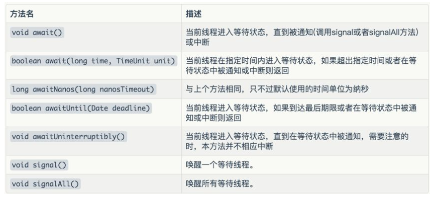

由此可见，Condition中的await方法和内置锁对象的wait方法的作用是一样的，都会使当前线程进入等待状态，signal方法和内置锁对象的notify方法的作用是一样的，都会唤醒在等待队列中的线程。它的基本使用方式是：通过显式锁的 newCondition 方法产生Condition对象，线程在持有该显式锁的情况下可以调用生成的Condition对象的 await/signal 方法：

~~~java
Lock lock = new ReentrantLock();

Condition condition = lock.newCondition();

//等待线程的典型模式
public void conditionAWait() throws InterruptedException {
    lock.lock();    //获取锁
    try {
        while (条件不满足) {
            condition.await();  //使线程处于等待状态
        }
        条件满足后执行的代码;
    } finally {
        lock.unlock();    //释放锁
    }
}

//通知线程的典型模式
public void conditionSignal() throws InterruptedException {
    lock.lock();    //获取锁
    try {
        完成条件;
        condition.signalAll();  //唤醒处于等待状态的线程
    } finally {
        lock.unlock();    //释放锁
    }
}
~~~

假设现在有一个锁和两个等待队列：

~~~java
Lock lock = new ReentrantLock();
Condition condition1 = lock.newCondition();
Condition condition2 = lock.newCondition();
~~~

画图表示出来就是这样：

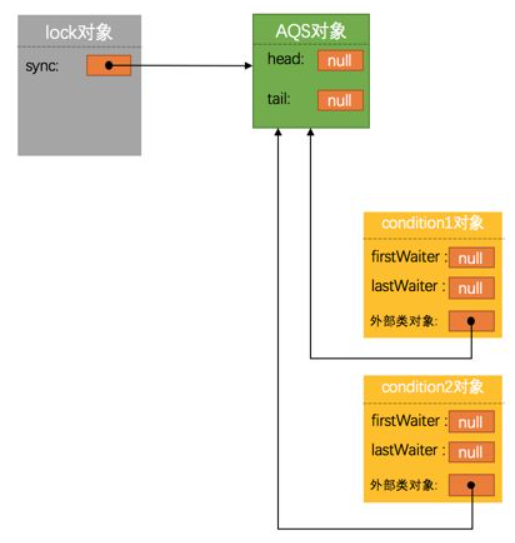

假设现在有3个线程main、t1、t2同时调用ReentrantLock对象的lock方法去竞争锁的话，只有线程main获取到了锁，所以会把线程t1、t2包装成Node节点插入同步队列，所以ReentrantLock对象、AQS对象和同步队列的示意图就是这样的：

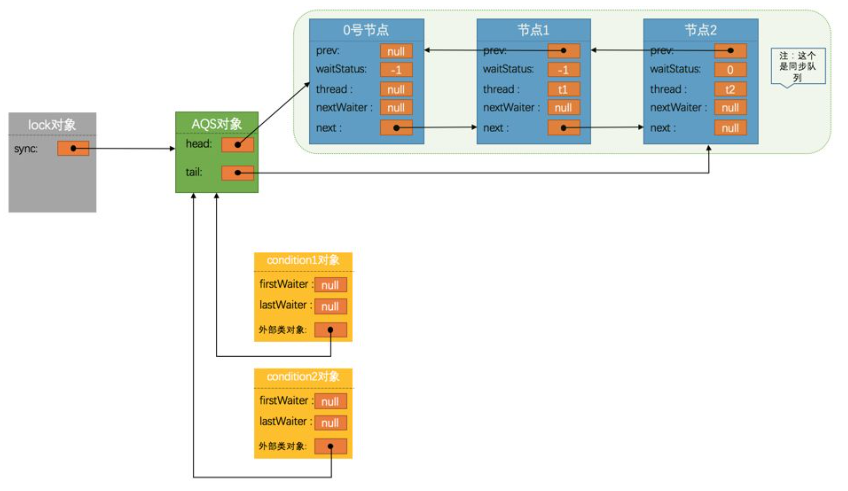

如果main线程后续执行下列代码，该线程就会进入condition1等待队列：

~~~java
lock.lock();
try {
    contition1.await();
} finally {
    lock.unlock();
}
~~~

await方法做的事情：

1、在condition1等待队列中创建一个Node节点，这个节点的thread值就是main线程，而且waitStatus为-2，也就是静态变量Node.CONDITION，表示表示节点在等待队列中：

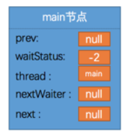

2、将该节点插入condition1等待队列中：

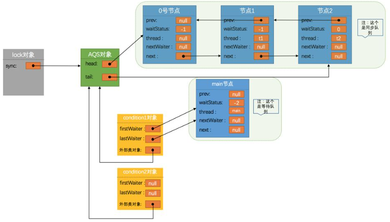

3、因为main线程还持有者锁，所以需要释放锁之后通知后边等待获取锁的线程t，所以同步队列里的0号节点被删除，线程t获取锁，节点1成为head节点，并且把thread字段设置为null：


如果，此时获得锁的t1线程也执行下面的代码：

~~~java
lock.lock();
try {
    contition1.await();
} finally {
    lock.unlock();
}
~~~

还是会执行上边的过程，把t1线程包装成Node节点插入到condition1等待队列中去，由于原来在等待队列中的节点1会被删除：

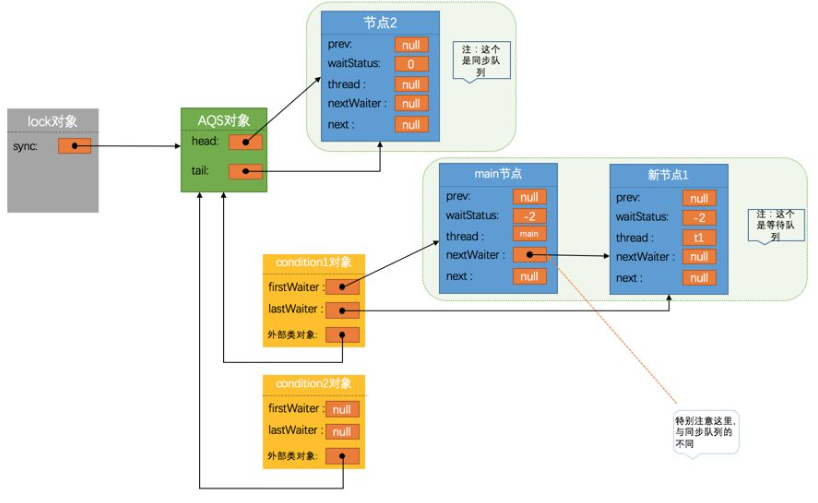

这里需要特别注意的是：同步队列是一个双向链表，prev表示前一个节点，next表示后一个节点，而等待队列是一个单向链表，使用nextWaiter表示下一个节点，这是它们不同的地方

如果t2线程要加入condition2队列中去：

~~~java
lock.lock();
try {
    contition2.await();
} finally {
    lock.unlock();
}
~~~

效果就是：

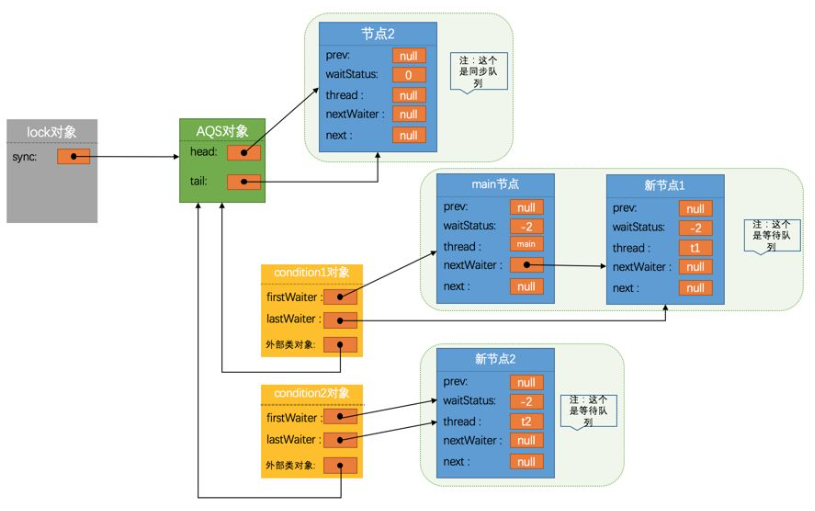

此时虽然现在没有线程获取锁，也没有线程在锁上等待，但是同步队列里仍旧有一个节点，同步队列只有初始时无任何线程因为锁而阻塞的时候才为空，只要曾经有线程因为获取不到锁而阻塞，这个队列就不为空了

如果线程t3调用condition2条件队列的线程唤醒：

~~~java
lock.lock();
try {
    contition2.signal();
} finally {
    lock.unlock();
}
~~~

因为在condition2等待队列的线程只有t2，所以t2会被唤醒，这个过程分两步进行：

1、将在condition2等待队列的代表线程t2的新节点2，从等待队列中移出。

2、将移出的节点2放在同步队列中等待获取锁，同时更改该节点的waitStauts为0。

这个过程的图示如下：

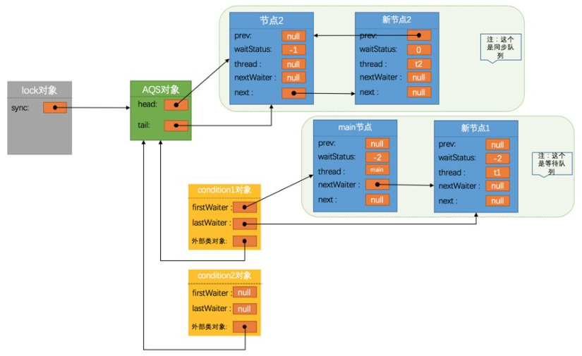

如果线程t3继续调用signalAll把condition1等待队列中的线程给唤醒也是差不多的意思，只不过会把condition1上的两个节点同时都移动到同步队列里：

~~~java
lock.lock();
try {
    contition1.signalAll();
} finally {
    lock.unlock();
}
~~~

此时的效果：

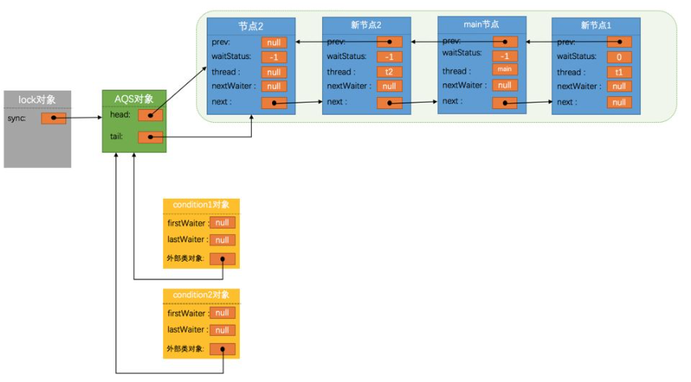

这样全部线程都从等待状态中恢复了过来，可以重新竞争锁进行下一步操作了。

## 公平锁和非公平锁的实现

ReentrantLock 默认采用非公平锁，因为考虑获得更好的性能，通过 boolean 来决定是否用公平锁（传入 true 用公平锁）：

~~~java
/** Synchronizer providing all implementation mechanics */
private final Sync sync;
public ReentrantLock() {
    // 默认非公平锁
    sync = new NonfairSync();
}
public ReentrantLock(boolean fair) {
    sync = fair ? new FairSync() : new NonfairSync();
}
~~~

ReentrantLock 中公平锁的 lock 方法：

~~~java
static final class FairSync extends Sync {
    final void lock() {
        acquire(1);
    }
    // AbstractQueuedSynchronizer.acquire(int arg)
    public final void acquire(int arg) {
        if (!tryAcquire(arg) &&
            acquireQueued(addWaiter(Node.EXCLUSIVE), arg))
            selfInterrupt();
    }
    protected final boolean tryAcquire(int acquires) {
        final Thread current = Thread.currentThread();
        int c = getState();
        if (c == 0) {
            // 1. 和非公平锁相比，这里多了一个判断：是否有线程在等待
            if (!hasQueuedPredecessors() &&
                compareAndSetState(0, acquires)) {
                setExclusiveOwnerThread(current);
                return true;
            }
        }
        else if (current == getExclusiveOwnerThread()) {
            int nextc = c + acquires;
            if (nextc < 0)
                throw new Error("Maximum lock count exceeded");
            setState(nextc);
            return true;
        }
        return false;
    }
}
~~~

非公平锁的 lock 方法：

~~~java
static final class NonfairSync extends Sync {
    final void lock() {
        // 2. 和公平锁相比，这里会直接先进行一次CAS，成功就返回了
        if (compareAndSetState(0, 1))
            setExclusiveOwnerThread(Thread.currentThread());
        else
            acquire(1);
    }
    // AbstractQueuedSynchronizer.acquire(int arg)
    public final void acquire(int arg) {
        if (!tryAcquire(arg) &&
            acquireQueued(addWaiter(Node.EXCLUSIVE), arg))
            selfInterrupt();
    }
    protected final boolean tryAcquire(int acquires) {
        return nonfairTryAcquire(acquires);
    }
}
/**
 * Performs non-fair tryLock.  tryAcquire is implemented in
 * subclasses, but both need nonfair try for trylock method.
 */
final boolean nonfairTryAcquire(int acquires) {
    final Thread current = Thread.currentThread();
    int c = getState();
    if (c == 0) {
        // 这里没有对阻塞队列进行判断
        if (compareAndSetState(0, acquires)) {
            setExclusiveOwnerThread(current);
            return true;
        }
    }
    else if (current == getExclusiveOwnerThread()) {
        int nextc = c + acquires;
        if (nextc < 0) // overflow
            throw new Error("Maximum lock count exceeded");
        setState(nextc);
        return true;
    }
    return false;
}
~~~

总结：公平锁和非公平锁只有两处不同：

* 非公平锁在调用 lock 后，首先就会调用 CAS 进行一次抢锁，如果这个时候恰巧锁没有被占用，那么直接就获取到锁返回了。
* 非公平锁在 CAS 失败后，和公平锁一样都会进入到 tryAcquire 方法，在 tryAcquire 方法中，如果发现锁这个时候被释放了（state == 0），非公平锁会直接 CAS 抢锁，但是公平锁会判断等待队列是否有线程处于等待状态，如果有则不去抢锁，乖乖排到后面。

如果这两次 CAS 都不成功，那么后面非公平锁和公平锁是一样的，都要进入到阻塞队列等待唤醒

ReentrantLock是一个”可重入“锁，从源码上看，它内部有一个抽象类Sync，是继承了AQS，自己实现的一个同步器。同时，ReentrantLock内部有两个非抽象类NonfairSync和FairSync，它们都继承了Sync。

通过看这两个同步器的源码可以发现，它们的实现都是”独占“的。都调用了AOS的setExclusiveOwnerThread方法，所以ReentrantLock的锁是”独占“的，也就是说，它的锁都是”排他锁“，不能共享。

想支持共享锁可以使用ReentrantReadWriteLock

## 使用ReentrantLock编写阻塞队列

把之前用内置锁编写的阻塞队列用显式锁实现：

~~~java
public class ConditionBlockedQueue<E> {

    private Lock lock = new ReentrantLock();

    private Condition notEmptyCondition = lock.newCondition();

    private Condition notFullCondition = lock.newCondition();

    private Queue<E> queue = new LinkedList<>();

    private int limit;

    public ConditionBlockedQueue(int limit) {
        this.limit = limit;
    }

    public int size() {
        lock.lock();
        try {
            return queue.size();
        } finally {
            lock.unlock();
        }
    }

    public boolean add(E e) throws InterruptedException {
        lock.lock();
        try {
            while (size() >= limit) {
                notFullCondition.await();
            }

            boolean result = queue.add(e);
            notEmptyCondition.signal();
            return result;
        } finally {
            lock.unlock();
        }
    }

    public E remove() throws InterruptedException{
        lock.lock();
        try {
            while (size() == 0) {
                notEmptyCondition.await();
            }
            E e = queue.remove();
            notFullCondition.signalAll();
            return e;
        } finally {
            lock.unlock();
        }
    }
}
~~~

注：经过实验，用一个Condition也是可以的。

每个显式锁对象又可以产生若干个Condition对象，每个Condition对象都会对应一个等待队列，所以就起到了一个显式锁对应多个等待队列的效果

## 其他Condition相关的方法

那为什么既然有Object的监视器方法了，还要用Condition呢？这里有一个二者简单的对比：

|           对比项           |       Object监视器        |                Condition                 |
| :---------------------: | :--------------------: | :--------------------------------------: |
|          前置条件           |         获取对象的锁         | 调用Lock.lock获取锁，调用Lock.newCondition获取Condition对象 |
|          调用方式           | 直接调用，比如object.notify() |         直接调用，比如condition.await()         |
|         等待队列的个数         |           一个           |                    多个                    |
|      当前线程释放锁进入等待状态      |           支持           |                    支持                    |
| 当前线程释放锁进入等待状态，在等待状态中不中断 |          不支持           |                    支持                    |
|    当前线程释放锁并进入超时等待状态     |           支持           |                    支持                    |
| 当前线程释放锁并进入等待状态直到将来的某个时间 |          不支持           |                    支持                    |
|      唤醒等待队列中的一个线程       |           支持           |                    支持                    |
|      唤醒等待队列中的全部线程       |           支持           |                    支持                    |

除了Condition对象的await和signal方法，AQS还提供了许多直接访问这个等待队列的方法，它们由都是public final修饰的：

~~~java
public abstract class AbstractQueuedSynchronizer {
    public final boolean owns(ConditionObject condition) { ... }
     public final boolean hasWaiters(ConditionObject condition) { ... }
     public final int getWaitQueueLength(ConditionObject condition) { ... }
     public final Collection<Thread> getWaitingThreads(ConditionObject condition) {}
}
~~~

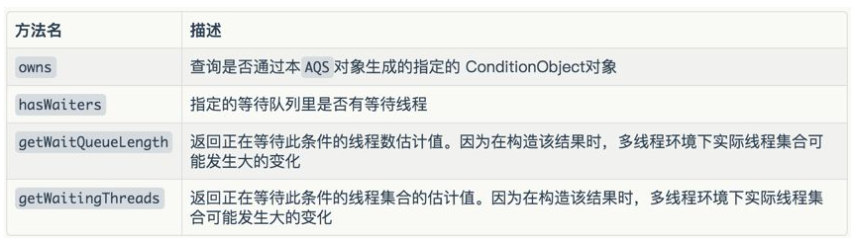

## CountDownLatch

现实中我们常常将一个大任务拆成好多小任务，让每个线程都去执行一个小任务，待到所有小任务都执行完成之后，汇总个个小任务的执行结果。所以汇总线程就需要等待所有执行小任务的线程完成之后才能继续执行，我们可以用join来实现这一功能，调用所有线程的join方法，然后等小线程都执行完之后，再执行主线程：

~~~java
public class CountDownLatchDemo {

    public static void main(String[] args) {
        Thread[] threads = new Thread[5];
        for (int i = 0; i < threads.length; i++) {

            int num = i;
            Thread t = new Thread(new Runnable() {
                @Override
                public void run() {
                    try {
                        Thread.sleep(1000L);    //模拟耗时操作
                    } catch (InterruptedException e) {
                        throw new RuntimeException(e);
                    }

                    System.out.println("第" + num + "个小任务执行完成");
                }
            });
            threads[i] = t;
            t.start();
        }

        for (int i = 0; i < threads.length; i++) {  //等待所有线程执行完才可以执行main线程
            try {
                threads[i].join();
            } catch (InterruptedException e) {
                throw new RuntimeException(e);
            }
        }

        System.out.println("等待所有线程执行完成之后才执行");
    }
}
~~~

CountDownLatch类可以实现类似的功能，在构造对象时传入一个数字N，代表调用了N次的countDown之后，await方法才会继续执行，await还可以带超时参数，代表一定时间之后即使没有满足计数条件，也从阻塞状态恢复执行。N是计数器，countDown代表将计数器的数字减1：

~~~java
public class CountDownLatchDemo {

    public static void main(String[] args) {
        Thread[] threads = new Thread[5];
        CountDownLatch countDownLatch = new CountDownLatch(threads.length); //创建CountDownLatch对象

        for (int i = 0; i < threads.length; i++) {

            int num = i;
            Thread t = new Thread(new Runnable() {
                @Override
                public void run() {
                    try {
                        Thread.sleep(1000L);    //模拟耗时操作
                    } catch (InterruptedException e) {
                        throw new RuntimeException(e);
                    }

                    System.out.println("第" + num + "个小任务执行完成");
                    countDownLatch.countDown(); //每个线程在执行完任务后，都调用这个方法
                }
            });
            threads[i] = t;
            t.start();
        }

        try {
            countDownLatch.await(); //在threads中线程都执行完成之前，此方法将阻塞
        } catch (InterruptedException e) {
            throw new RuntimeException(e);
        }

        System.out.println("等待所有线程执行完成之后才执行");
    }
}
~~~

CountDownLatch和join相比有两个优点：

* Thread的成员方法join只能在一个线程中对另一个线程对象调用，而同一个CountDownLatch对象可以在多个线程中调用
* join方法返回的前提是线程执行结束，CountDownLatch可以控制调用countDown的时机

注意：

* CountDownLatch对象不能被重复利用，也就是不能修改计数器的值。
* CountDownLatch代表的计数器的大小可以为0，意味着在一个线程调用await方法时会立即返回。
* 如果某些线程中有阻塞操作的话，最好使用带有超时时间的await方法，以免该线程调用await方法之后永远得不到执行。

CountDownLatch 是共享锁的一种实现,它默认构造 AQS 的 state 值为 count。当线程使用 countDown() 方法时,其实使用了tryReleaseShared方法以 CAS 的操作来减少 state,直至 state 为 0 。当调用 await() 方法的时候，如果 state 不为 0，那就证明任务还没有执行完毕，await() 方法就会一直阻塞，也就是说 await() 方法之后的语句不会被执行。然后，CountDownLatch 会自旋 CAS 判断 state == 0，如果 state == 0 的话，就会释放所有等待的线程，await() 方法之后的语句得到执行。

CountDownLatch 的两种典型用法：

* 某一线程在开始运行前等待 n 个线程执行完毕。
* 实现多个线程开始执行任务的最大并行性。例如将其计数器初始化为 1 ，多个线程await，主线程调用countDown后，多个线程同时被唤醒。

CompletableFuture可以代替CountDownLatch，例如一个使用多线程读取多个文件处理的场景，要读取处理 6 个文件，这 6 个任务都是没有执行顺序依赖的任务，但是我们需要返回给用户的时候将这几个文件的处理的结果进行统计整理，如果用CountDownLatch实现：

~~~java
public class CountDownLatchExample1 {
    // 处理文件的数量
    private static final int threadCount = 6;

    public static void main(String[] args) throws InterruptedException {
        // 创建一个具有固定线程数量的线程池对象（推荐使用构造方法创建）
        ExecutorService threadPool = Executors.newFixedThreadPool(10);
        final CountDownLatch countDownLatch = new CountDownLatch(threadCount);
        for (int i = 0; i < threadCount; i++) {
            final int threadnum = i;
            threadPool.execute(() -> {
                try {
                    //处理文件的业务操作
                    //......
                } catch (InterruptedException e) {
                    e.printStackTrace();
                } finally {
                    //表示一个文件已经被完成
                    countDownLatch.countDown();
                }

            });
        }
        countDownLatch.await();
        threadPool.shutdown();
        System.out.println("finish");
    }
}
~~~

Java8 的 CompletableFuture 提供了很多对多线程友好的方法，使用它可以很方便地为我们编写多线程程序，使用它来实现上面的功能：

~~~java
//文件夹位置
List<String> filePaths = Arrays.asList(...)
// 异步处理所有文件
List<CompletableFuture<String>> fileFutures = filePaths.stream()
    .map(filePath -> doSomeThing(filePath))
    .collect(Collectors.toList());
// 将他们合并起来
CompletableFuture<Void> allFutures = CompletableFuture.allOf(
    fileFutures.toArray(new CompletableFuture[fileFutures.size()])
);
try {
    allFutures.join();
} catch (Exception ex) {
    //......
}
System.out.println("all done. ");
~~~

## CyclicBarrier

CyclicBarrier类来解决多个线程在某个地方相互等待，直到有规定数量的线程都执行到这个地方才能同时继续往下执行的场景

CyclicBarrier的意思就是循环利用的栅栏，CyclicBarrier对象内部也维护了一个计数器，我们可以通过它的构造方法把计数器的值给传进去。每个线程在调用CyclicBarrier对象的await方法的时候，就相当于到达了多个线程共享的一个栅栏，该线程会在这个栅栏前等待，直到调用await方法的线程数量和计数器的值一样，该栅栏将被移除，因为await方法而等待的线程都恢复执行：

~~~java
class Fighter extends Thread{

    private CyclicBarrier cyclicBarrier;

    public Fighter(CyclicBarrier cyclicBarrier, String name) {
        super(name);
        this.cyclicBarrier = cyclicBarrier;
    }

    @Override
    public void run() {
        try {
            Thread.sleep(1000L);    //模拟上学中过程
            System.out.println(getName() + "放学了，向学校门跑去");

            cyclicBarrier.await();  //到达校门后等待，直到5个线程都执行到了这里

            System.out.println("人聚齐了，一起打架去喽～");
        } catch (InterruptedException e) {
            throw new RuntimeException(e);
        } catch (BrokenBarrierException e) {
            throw new RuntimeException(e);
        }
    }
}

public class CyclicBarrierDemo {

    public static void main(String[] args) {

        CyclicBarrier cyclicBarrier = new CyclicBarrier(5);

        new Fighter(cyclicBarrier, "狗哥").start();
        new Fighter(cyclicBarrier, "猫爷").start();
        new Fighter(cyclicBarrier, "王尼妹").start();
        new Fighter(cyclicBarrier, "狗剩").start();
        new Fighter(cyclicBarrier, "张大嘴巴").start();
    }
}
~~~

上面的代码模拟了人聚齐去打架的场景。CyclicBarrier还有一个构造方法：CyclicBarrier(int parties, Runnable barrierAction)，它代表初始化指定计数器初始值的同时，指定一个线程，该线程在所有线程都运行到栅栏的时候优先开始执行。

CyclicBarrier中其他几个重要的成员方法：

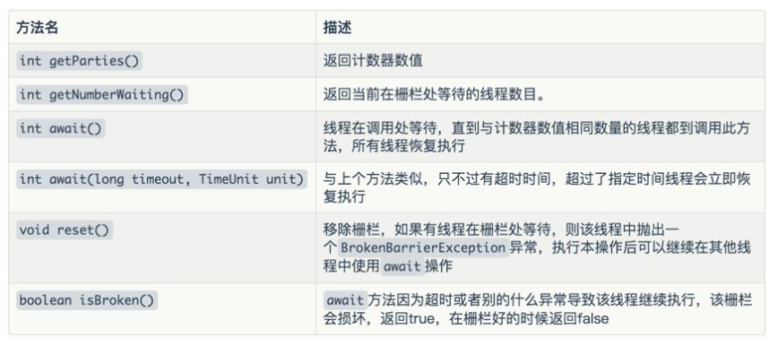

其中一个比较重要的是reset方法，它是CyclicBarrier能重复利用的关键，调用reset会让等待在栅栏处的所有线程都抛出一个BrokenBarrierException，然后计数器清零，可以重新使用：

~~~java
public class CyclicBarrierDemo {

    public static void main(String[] args) {

        CyclicBarrier cyclicBarrier = new CyclicBarrier(2);

        Thread t = new Thread(new Runnable() {
            @Override
            public void run() {
                try {
                    cyclicBarrier.await();
                } catch (InterruptedException e) {
                    throw new RuntimeException(e);
                } catch (BrokenBarrierException e) {
                    System.out.println("原来的栅栏遭到了破坏，抛出了BrokenBarrierException异常");
                    return;
                }
                System.out.println("在线程t中输出一句话");
            }
        }, "t");
        t.start();


        try {
            Thread.sleep(1000L);    //确保线程t已经运行了await方法，实际操作中不鼓励使用sleep方法来控制执行顺序
        } catch (InterruptedException e) {
            throw new RuntimeException(e);
        }

        cyclicBarrier.reset();  //重置cyclicBarrier，弃用原来的栅栏

        new Thread(new Runnable() {
            @Override
            public void run() {
                try {
                    cyclicBarrier.await();  //线程t2调用重置后的cyclicBarrier的await方法
                } catch (Exception e) {
                    throw new RuntimeException(e);
                }
                System.out.println("在线程t2中输出一句话");
            }
        }, "t2").start();

        try {
            cyclicBarrier.await();  //线程main调用重置后的cyclicBarrier的await方法
        } catch (Exception e) {
            throw new RuntimeException(e);
        }
        System.out.println("在线程main中输出一句话");
    }
}
~~~

CyclicBarrier和CountDownLatch的区别：

* 它们内部都有一个计数器，CountDownLatch的countDown会使计数器递减直到0后触发恢复，CyclicBarrier的await会增加该计数器，直到给定值时触发所有线程的恢复
* CountDownLatch等待的是countDown，CyclicBarrier等待的是await
* CountDownLatch不能循环利用，CyclicBarrier依靠reset方法可以达到循环利用

CountDownLatch 的实现是基于 AQS 的，而 CycliBarrier 是基于 ReentrantLock的

当调用 CyclicBarrier 对象调用 await() 方法时，实际上调用的是 dowait(false, 0L)方法。 await() 方法就像树立起一个栅栏的行为一样，将线程挡住了，当拦住的线程数量达到 parties 的值时，栅栏才会打开，线程才得以通过执行。

~~~java
public int await() throws InterruptedException, BrokenBarrierException {
  try {
        return dowait(false, 0L);
  } catch (TimeoutException toe) {
        throw new Error(toe); // cannot happen
  }
}
~~~

dowait方法：

~~~java
    // 当线程数量或者请求数量达到 count 时 await 之后的方法才会被执行。上面的示例中 count 的值就为 5。
    private int count;
    /**
     * Main barrier code, covering the various policies.
     */
    private int dowait(boolean timed, long nanos)
        throws InterruptedException, BrokenBarrierException,
               TimeoutException {
        final ReentrantLock lock = this.lock;
        // 锁住
        lock.lock();
        try {
            final Generation g = generation;

            if (g.broken)
                throw new BrokenBarrierException();

            // 如果线程中断了，抛出异常
            if (Thread.interrupted()) {
                breakBarrier();
                throw new InterruptedException();
            }
            // cout减1
            int index = --count;
            // 当 count 数量减为 0 之后说明最后一个线程已经到达栅栏了，也就是达到了可以执行await 方法之后的条件
            if (index == 0) {  // tripped
                boolean ranAction = false;
                try {
                    final Runnable command = barrierCommand;
                    if (command != null)
                        command.run();
                    ranAction = true;
                    // 将 count 重置为 parties 属性的初始化值
                    // 唤醒之前等待的线程
                    // 下一波执行开始
                    nextGeneration();
                    return 0;
                } finally {
                    if (!ranAction)
                        breakBarrier();
                }
            }

            // loop until tripped, broken, interrupted, or timed out
            for (;;) {
                try {
                    if (!timed)
                        trip.await();
                    else if (nanos > 0L)
                        nanos = trip.awaitNanos(nanos);
                } catch (InterruptedException ie) {
                    if (g == generation && ! g.broken) {
                        breakBarrier();
                        throw ie;
                    } else {
                        // We're about to finish waiting even if we had not
                        // been interrupted, so this interrupt is deemed to
                        // "belong" to subsequent execution.
                        Thread.currentThread().interrupt();
                    }
                }

                if (g.broken)
                    throw new BrokenBarrierException();

                if (g != generation)
                    return index;

                if (timed && nanos <= 0L) {
                    breakBarrier();
                    throw new TimeoutException();
                }
            }
        } finally {
            lock.unlock();
        }
    }
~~~

CyclicBarrier 内部通过一个 count 变量作为计数器，count 的初始值为 parties 属性的初始化值，每当一个线程到了栅栏这里了，那么就将计数器减一。如果 count 值为 0 了，表示这是这一代最后一个线程到达栅栏，就尝试执行我们构造方法中输入的任务。

## Semaphore

Semaphore用于限制并发执行线程的数量，多用于获取有限资源的场景，它的构造方法可以传入一个数字，代表允许并发执行的线程数量，第二个参数可以选择传入一个布尔值，该布尔值代表是否是公平的选取排队线程。

尝试进入的方法是acquire，释放退出的方法是release：

~~~java
public class SemaphoreDemo {

    public static void main(String[] args) {
        Semaphore semaphore = new Semaphore(5);
        for (int i = 0; i < 20; i++) {
            int num = i;
            new Thread(new Runnable() {
                @Override
                public void run() {
                    try {
                        semaphore.acquire();
                        System.out.println("第" + num + "个线程执行任务");
                        Thread.sleep(5000L);    //休眠5秒钟
                        semaphore.release();
                    } catch (InterruptedException e) {
                        throw new RuntimeException(e);
                    }

                }
            }).start();
        }
    }
}
~~~

Semaphore 与 CountDownLatch 一样，也是共享锁的一种实现。它默认构造 AQS 的 state 为 permits。当执行任务的线程数量超出 permits，那么多余的线程将会被放入阻塞队列 Park,并自旋判断 state 是否大于 0。只有当 state 大于 0 的时候，阻塞的线程才能继续执行,此时先前执行任务的线程继续执行 release() 方法，release() 方法使得 state 的变量会加 1，那么自旋的线程便会判断成功。 如此，每次只有最多不超过 permits 数量的线程能自旋成功，便限制了执行任务线程的数量。

## Exchanger

Exchanger用于两个线程间的数据交换。它的关键方法是exchange方法，它可以传入一个对象，代表要传递给另一个线程的数据是该对象，返回值是另一个线程交换过来的数据，在调用该方法后会进入阻塞状态，直到另一个线程也调用了该方法，才算完成了一次数据交换。exchange方法还可以带超时参数，代表超过一定时间后另一个线程还未调用exchange则立即返回不再等待。

~~~java
public class ExchangerDemo {

    public static void main(String[] args) {
        Exchanger<String> exchanger = new Exchanger<>();
        new Thread(new Runnable() {

            @Override
            public void run() {
                String manWords = "我爱你，si八婆";
                try {
                    String womanWords = exchanger.exchange(manWords);   //男方的誓言
                    System.out.println("在男方线程中获取到的女方誓言：" + womanWords);
                } catch (InterruptedException e) {
                    throw new RuntimeException(e);
                }
            }
        }, "男方").start();

        new Thread(new Runnable() {

            @Override
            public void run() {
                try {
                    Thread.sleep(5000L);    //女生先墨迹5秒中
                    String womanWords = "去吃屎吧";
                    String manWords = exchanger.exchange(womanWords);   //女方的誓言
                    System.out.println("在女方线程中获取到的男方誓言：" + manWords);
                } catch (InterruptedException e) {
                    throw new RuntimeException(e);
                }
            }
        }, "女方").start();

    }
}
~~~

# 线程池和任务

使用线程池的好处：

* 降低资源消耗。通过重复利用已创建的线程降低线程创建和销毁造成的消耗。
* 提高响应速度。当任务到达时，任务可以不需要等到线程创建就能立即执行。
* 提高线程的可管理性。线程是稀缺资源，如果无限制的创建，不仅会消耗系统资源，还会降低系统的稳定性，使用线程池可以进行统一的分配，调优和监控。

## Executor和Executors

Executor执行器可以方便的执行一个Runnable任务。它的定义和使用：

~~~java
public interface Executor {
    void execute(Runnable command);
}

public void process(List<Runnable> runnables) {
    Executor executor = Executors.newFixedThreadPool(10);      //创建包含10个线程的执行器

    for (Runnable r : runnables) {
        executor.execute(r);    //提交任务
    }
}
~~~

我们也可以自定义自己的执行策略，例如对串行执行的策略，可以定义这样一个子类：

~~~java
public class SerialExecutor implements Executor {
    @Override
    public void execute(Runnbale r) {
        r.run();
    }
}
~~~

对为每一个任务创建一个线程的策略，可以定义这样一个子类：

~~~java
public class ThreadPerRunnalbeExecutor implements Executor {
    @Override
    public void executor(Runnbale r) {
        new Thread(r).start();
    }
}
~~~

Executor的子类负责执行任务，所以它内部一般都包含一些线程，因此它的子类也被称为线程池。

Executors类里提供了创建适用于各种场景线程池的工具方法(静态方法)，常用的几个：

1、newFixedThreadPool(int nThreads)：固定线程数量的线程池。最开始该线程池中的线程数为0，之后每提交一个任务就会创建一个线程，直到线程数等于指定的nThreads参数，此后线程数量将不再变化。当有一个新的任务提交时，线程池中若有空闲线程，则立即执行。若没有，则新的任务会被暂存在一个任务队列中，待有线程空闲时，便处理在任务队列中的任务。

观察它的源码：

~~~java
    public static ExecutorService newFixedThreadPool(int nThreads) {
        return new ThreadPoolExecutor(nThreads, nThreads,
                                      0L, TimeUnit.MILLISECONDS,
                                      new LinkedBlockingQueue<Runnable>());
    }
~~~

FixedThreadPool 使用无界队列 LinkedBlockingQueue（队列的容量为 Integer.MAX_VALUE）作为线程池的工作队列。因为不可能存在任务队列满的情况所以corePoolSize 和 maximumPoolSize 被设置为同一个值，keepAliveTime也是一个无效参数。多个任务执行时，都会进入排队状态，可能导致OMM

2、newCachedThreadPool()：创建一个可缓存的线程池。会为每个任务都分配一个线程，但是如果一个线程执行完任务后长时间(60秒)没有新的任务可执行，该线程将被回收

它的源码：

~~~java
    public static ExecutorService newCachedThreadPool() {
        return new ThreadPoolExecutor(0, Integer.MAX_VALUE,
                                      60L, TimeUnit.SECONDS,
                                      new SynchronousQueue<Runnable>());
    }
~~~

CachedThreadPool 的corePoolSize 被设置为空（0），maximumPoolSize被设置为 Integer.MAX.VALUE，即它是无界的，这也就意味着如果主线程提交任务的速度高于 maximumPool 中线程处理任务的速度时，CachedThreadPool 会不断创建新的线程。极端情况下，这样会导致耗尽 cpu 和内存资源。

CachedThreadPool允许创建的线程数量为 Integer.MAX_VALUE ，可能会创建大量线程，从而导致 OOM。

3、newSingleThreadExecutor()：创建单线程的线程池。被提交到该线程的任务将在一个线程中串行执行，并且能确保任务可以按照队列中的顺序串行执行。若多余一个任务被提交到该线程池，任务会被保存在一个任务队列中，待线程空闲，按先入先出的顺序执行队列中的任务。

观察它的源码，和newFixedThreadPool非常类似：

~~~java
   public static ExecutorService newSingleThreadExecutor() {
        return new FinalizableDelegatedExecutorService
            (new ThreadPoolExecutor(1, 1,
                                    0L, TimeUnit.MILLISECONDS,
                                    new LinkedBlockingQueue<Runnable>()));
    }
~~~

SingleThreadExecutor 使用无界队列作为线程池的工作队列会对线程池带来的影响与 FixedThreadPool 相同。说简单点就是可能会导致 OOM

上面的三个方法返回值都是ExecutorService

4、newScheduledThreadPool(int corePoolSize)：创建固定线程数量的线程池，而且以延迟或定时的方式来执行任务，它的返回类型是ScheduledExecutorService，它是ExecutorService的子类，它提供的几个方法：

~~~java
public interface ScheduledExecutorService extends ExecutorService { 

    public ScheduledFuture<?> schedule(Runnable command, long delay, TimeUnit unit);

    public <V> ScheduledFuture<V> schedule(Callable<V> callable, long delay, TimeUnit unit);

    public ScheduledFuture<?> scheduleAtFixedRate(Runnable command, long initialDelay, long period, TimeUnit unit);

    public ScheduledFuture<?> scheduleWithFixedDelay(Runnable command, long initialDelay, long delay, TimeUnit unit);
}
~~~

其中的几个方法：

* schedule：延迟指定时间后开始执行任务
* scheduleAtFixedRate：在指定时间后开始执行一次任务，之后每隔一个时间周期都开启一次新任务，如果上次任务没有执行完，下一个任务会推迟执行
* scheduleWithFixedDelay：和上一个差不多，区别是任务必须结束之后，等待固定的时间后，才能开始执行新任务

Runnable接口 或 Callable 接口 的实现类是提交给 ThreadPoolExecutor 或 ScheduledThreadPoolExecutor 执行的：

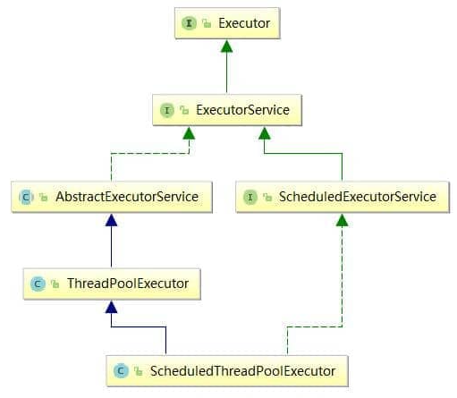

ScheduledThreadPoolExecutor 主要用来在给定的延迟后运行任务，或者定期执行任务。

ScheduledThreadPoolExecutor 使用的任务队列 DelayQueue 封装了一个 PriorityQueue，PriorityQueue 会对队列中的任务进行排序，执行所需时间短的放在前面先被执行(ScheduledFutureTask 的 time 变量小的先执行)，如果执行所需时间相同则先提交的任务将被先执行(ScheduledFutureTask 的 squenceNumber 变量小的先执行)。

ScheduledThreadPoolExecutor 和 Timer 的比较：

* Timer 对系统时钟的变化敏感，ScheduledThreadPoolExecutor不是；
* Timer 只有一个执行线程，因此长时间运行的任务可以延迟其他任务。 ScheduledThreadPoolExecutor 可以配置任意数量的线程。 此外，如果你想（通过提供 ThreadFactory），你可以完全控制创建的线程;
* 在TimerTask 中抛出的运行时异常会杀死一个线程，从而导致 Timer 死机:-( ...即计划任务将不再运行。ScheduledThreadExecutor 不仅捕获运行时异常，还允许您在需要时处理它们（通过重写 afterExecute 方法ThreadPoolExecutor）。抛出异常的任务将被取消，但其他任务将继续运行。

所以有需要时优先使用ScheduledThreadPoolExecutor ，而不是Timer 

ScheduledThreadPoolExecutor 的执行主要分为两大部分：

* 当调用 ScheduledThreadPoolExecutor 的 scheduleAtFixedRate() 方法或者 scheduleWithFixedDelay() 方法时，会向 ScheduledThreadPoolExecutor 的 DelayQueue 添加一个实现了 RunnableScheduledFuture 接口的 ScheduledFutureTask 。
* 线程池中的线程从 DelayQueue 中获取 ScheduledFutureTask，然后执行任务。

执行周期任务的步骤：

从线程池中取出一个可用线程，例如其名为线程1：

* 线程 1 从 DelayQueue 中获取已到期的 ScheduledFutureTask（DelayQueue.take()）。到期任务是指 ScheduledFutureTask的 time 大于等于当前系统的时间；
* 线程 1 执行这个 ScheduledFutureTask；
* 线程 1 修改 ScheduledFutureTask 的 time 变量为下次将要被执行的时间；
* 线程 1 把这个修改 time 之后的 ScheduledFutureTask 放回 DelayQueue 中（DelayQueue.add())。

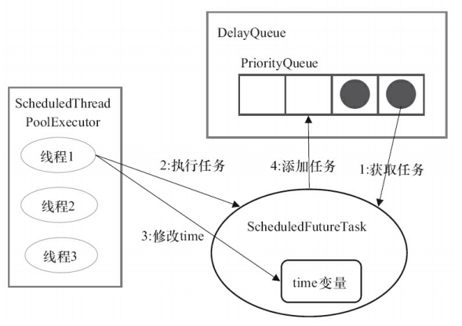

## Callable与Future

Callable是一个接口，它代表一个任务，与Runnable不同的是，这个任务是有返回值的：

~~~java
public interface Callable<V> {
    V call() throws Exception;
}
~~~

使用Callable时，主线程可以知道线程的执行情况，是否运行完毕，能拿到线程的运行结果，可以把自定义的任务类继承Callable，重写call方法：

~~~java
public class AddTask implements Callable<Integer> {

    private int i;

    private int j;

    public AddTask(int i, int j) {
        this.i = i;
        this.j = j;
    }

    @Override
    public Integer call() throws Exception {
        int sum =  i + j;
        System.out.println("线程main的运算结果：" + sum);
        return sum;
    }
}
~~~

Executor的子接口ExecutorService可以使用submit提交Callable任务：

~~~java
public interface ExecutorService extends Executor {

    // 任务提交操作
    <T> Future<T> submit(Callable<T> task);
    Future<?> submit(Runnable task);
    <T> Future<T> submit(Runnable task, T result);

    // 生命周期管理
    void shutdown();
    List<Runnable> shutdownNow();
    boolean isShutdown();
    boolean isTerminated();
    boolean awaitTermination(long timeout, TimeUnit unit) throws InterruptedException;

    // ... 省略了各种方便提交任务的方法
}
~~~

提交示例：

~~~java
public class Test {
    public static void main(String[] args) {
        ExecutorService service = Executors.newCachedThreadPool();

        service.submit(new AddTask(1, 2));
    }
}
~~~

这里提交可以返回一个Future对象，它表示一个任务的实时执行状态，并提供了判断是否已经完成或取消的方法，也提供了取消任务和获取任务的运行结果的方法：

~~~java
public interface Future<V> { 
    V get() throws InterruptedException, ExecutionException;
    V get(long timeout, TimeUnit unit) throws InterruptedException, ExecutionException, TimeoutException;
    boolean isDone();
    boolean cancel(boolean mayInterruptIfRunning);
    boolean isCancelled();
}
~~~

其中：

* isDone：由于正常终止、异常或取消而完成，这个方法都会返回true，否则返回false
* cancel：视图取消该任务
* isCancelled：任务如果在正常完成前被取消了，就返回true

需要注意的是，如果该任务已经完成，那么get方法将会立即返回，如果任务正常完成的话，会返回执行结果，若是抛出异常完成的话，将会将该异常包装成ExecutionException后重新抛出，如果任务被取消，则调用get方法会抛出CancellationExection异常

ExecutorService接口在提交Runnable的时候也会返回Future：

~~~java
Future<?> submit(Runnable task);    //第1个重载方法
<T> Future<T> submit(Runnable task, T result);  //第2个重载方法
~~~

由于Runnable的run方法没有返回值（Runnable不仅没有返回值，而且也不会抛出异常），所以对Future执行get的结果总是null，虽然不能获得返回值，但是我们还是可以调用Future的其他方法，比如isDone表示任务是否已经完成，isCancelled表示任务是否已经被取消，cancel表示尝试取消一个任务

第二个重载方法可以指定Runnable的返回值。

工具类 Executors 可以实现将 Runnable 对象转换成 Callable 对象：Executors.callable(Runnable task) 或 Executors.callable(Runnable task, Object result)

execute方法和submit方法的区别：

* execute方法提交任务没有返回值，submit方法提交任务有返回值
* execute不能判断任务是否被执行成功；submit提交后会返回一个Future，通过这个 Future 对象可以判断任务是否执行成功


## ThreadPoolExecutor

### 关键参数

《阿里巴巴 Java 开发手册》中强制线程池不允许使用 Executors 去创建，而是通过 ThreadPoolExecutor 的方式，这样的处理方式让写的同学更加明确线程池的运行规则，规避资源耗尽的风险

Executors 返回线程池对象的弊端如下：

* FixedThreadPool 和 SingleThreadExecutor ： 允许请求的队列长度为 Integer.MAX_VALUE ，可能堆积大量的请求，从而导致 OOM。
* CachedThreadPool 和 ScheduledThreadPool ： 允许创建的线程数量为 Integer.MAX_VALUE ，可能会创建大量线程，从而导致 OOM。

ThreadPoolExecutor类实现了ExecutorService接口，它可以通过不同的构造方法参数来自定义的配置我们需要的执行策略，它的构造方法：

~~~java
public ThreadPoolExecutor(int corePoolSize,
                          int maximumPoolSize,
                          long keepAliveTime,
                          TimeUnit unit,
                          BlockingQueue<Runnable> workQueue,
                          ThreadFactory threadFactory,
                          RejectedExecutionHandler handler) {
    // ... 省略具体实现                      
}     
~~~

参数的解释：

1、corePoolSize：核心线程数，初始状态线线程池里并没有线程，之后每提交一个任务就会分配一个线程，直到线程数到达corePoolSize指定的值。之后即使没有新任务到达，这些线程也不会被销毁（还有一种说法是：核心线程数定义了最小可以同时运行的线程数量）

2、maximumPoolSize：最大线程数

~~如果任务添加的速度超过了处理速度的话，线程池里的线程数量可以继续增加到该值，之后便不再增加。如果线程数量已经到达最大值，但是任务的提交速度还是超过了处理速度，那么这些任务将会被暂时放到任务队列中，等待线程个执行完任务之后从任务队列中取走~~

当队列中存放的任务达到队列容量的时候，当前可以同时运行的线程数量变为最大线程数

线程数是非常重要的参数，最优的线程数量会使得各种资源的利用率处于最高水平。对于CPU密集型程序来说，一般将线程设置为处理器数量+1（这个1是为了防止某个线程因为某些原因而暂停，例如缺页中断，这个线程立即替换调被暂停的线程，从而最大限度的提升处理器利用率），在java中，我们可以通过Runtime对象来获取当前计算机的处理器数量：

~~~java
int numberOfCPUs = Runtime.getRuntime().availableProcessors(); //获取当前计算机处理器数量
~~~

对于别的密集型程序，我们通常能通过更多的线程来提升处理器利用率。例如如果是I/O 密集型任务，可以将线程数设置为2N，N是处理器数量

线程数一般不能太多又不能太少：

* 线程太多，会在线程切换上浪费过多时间，且容易导致内存溢出
* 线程太少，会导致整体执行效率降低。如果线程数太少，例如在单线程的线程池中，无法在线程1中再次向线程池提交任务，此时会永久阻塞下去。所以在有任务依赖的情况下最好不要使用线程池来执行这些任务，应该显式的去创建线程或者分散在不同的线程池中执行任务

3、keepAliveTime和unit：如果线程在该时间范围内都处于空闲状态，那这个线程将被标记为可回收的，但是此时并没有被终止，仅当当前线程池的线程数量超过了corePoolSize值时，该线程将被终止

之前用到的Executors.newCachedThreadPool方法创建的线程池基本大小为0，最大大小为最大的int值，空闲存活时间为1分钟；Executors.newFixedThreadPool方法创建的线程池基本大小和最大大小都是指定的参数值，空闲存活时间为0，表示线程不会因为长期空闲而终止

4、workQueue：管理任务队列

当新任务来的时候会先判断当前运行的线程数量是否达到核心线程数，如果达到的话，新任务就会被存放在队列中

线程池内部维护了一个阻塞队列，这个队列是用来存储任务的，线程池的基本运行过程就是：线程调用阻塞队列的take方法，如果当前阻塞队列中没有任务的话，线程将一直阻塞，如果有任务提交到线程池的话，会调用该阻塞队列的put方法，并且唤醒阻塞的线程来执行任务

任务缓冲模块是线程池能够管理任务的核心部分。线程池的本质是对任务和线程的管理，而做到这一点最关键的思想就是将任务和线程两者解耦，不让两者直接关联，才可以做后续的分配工作。线程池中是以生产者消费者模式，通过一个阻塞队列来实现的。阻塞队列缓存任务，工作线程从阻塞队列中获取任务。

各种阻塞队列其实大致可以分为3类：

* 无界队列：队列容量很大很大，比如有界队列LinkedBlockingQueue的默认容量就是最大的int值，也就是2147483647，这个大小已经超级大了，所以也可以被看作是无界的。如果在线程池中使用无界队列，而且任务的提交速度大于处理速度时，将不断的往队列里塞任务，但是内存是有限的，在队列大到一定层度的时候，内存将被用光，抛出OutOfMemoryError的错误。

  只有确保任务的执行速度和提交速度的情况下，才能使用这种队列策略

* 有界队列：有界队列不会有内存溢出的问题，但要指定响应的拒绝策略。普通使用的LinkedBlockingQueue或者ArrayBlockingQueue这样的队列都是先到达的任务会先被执行，如果你的任务有优先级的话，可以考虑使用PriorityBlockingQueue作为阻塞队列

* 同步移交队列：SynchronousQueue，它名义上是一个队列，但底层并不维护链表也没有维护数组，执行它的put方法时会立即将传入的对象转交给调用take的线程，如果没有调用take的线程则put方法会阻塞。使用这种队列的线程池在提交任务后必须立即被一个线程执行，否则的话，后续的任务提交将失败。

  它适用于非常大或者说无界的线程池，因为任务会被直接移交给执行它的线程，而不用先放到底层的数组或链表中，线程再从底层数组或链表中获取，所以这种阻塞队列性能更好。Executors.newCachedThreadPool()就是采用SynchronousQueue作为底层的阻塞队列的

注意到workQueue的类型是BlockingQueue\<Runnable\>，对Callable任务来说，在底层也会将其转换为一个Runnable来交给线程执行。

5、threadFactory：线程工厂

它的定义是这样的：

~~~java
public interface ThreadFactory {
    Thread newThread(Runnable r);
}
~~~

如果我们指定了自己定义的ThreadFactory，线程池会调用我们自定义的ThreadFactory的newThread方法来创建线程。当希望给线程指定名字、或者为线程指定异常处理器的时候，会用到它。如果不指定该参数的话，线程池将为我们创建新的非守护线程

可以自定义一个线程工厂：

~~~java
public class MyThreadFactory implements ThreadFactory {

    private static int COUNTER = 0;

    private static String THREAD_PREFIX = "myThread";

    @Override
    public Thread newThread(Runnable r) {
        int i = COUNTER++;
        return new Thread(r, THREAD_PREFIX + i);
    }
}
~~~

6、RejectedExecutionHandler：拒绝策略。这个参数规定了当有界队列被任务填满之后，应该采取的措施。

在ThreadPoolExecutor里定义了四个实现了RejectedExecutionHandler接口的静态内部类以表示不同的应对措施：

* AbortPolicy：默认的策略，拒绝新提交的任务，并在提交任务的线程中抛出RejectedExecutionException
* CallerRunsPolicy：直接在提交任务的线程中运行该任务
* DiscardPolicy：把新提交的任务丢弃
* DiscardOldestPolicy：丢弃最旧的未处理任务

注意，因为线程池中的线程可能被重复利用，所以线程独立的ThreadLocal需要特殊处理，如果在一个线程某个任务中使用了ThreadLocal变量，那当该任务执行完之后，这个线程又开始执行别的任务，上一个任务遗留下的ThreadLocal变量对这个任务是没有意义的。一般会让该 ThreadLocal 变量的生命周期受限于任务的生命周期，也就是在任务执行过程中创建，在任务执行完成前销毁

应该使用多个线程池的情况：

* 有任务的相互依赖关系
* 任务运行处理时间差异较大，会导致需要时间短的任务很快被执行完，最后所有线程都运行着时间长的任务，阻塞短任务的执行。此时可以把需要时间长的任务和需要时间短的任务分开来处理

### 总览

ThreadPoolExecutor的顶层接口是Executor，它只有一个无状态的执行方法：

~~~java
public interface Executor {
	void execute(Runnable command);
}    
~~~

ThreadPoolExecutor里面使用到JUC同步器框架AbstractQueuedSynchronizer（俗称AQS）、大量的位操作、CAS操作。ThreadPoolExecutor提供了固定活跃线程（核心线程）、额外的线程（线程池容量 - 核心线程数这部分额外创建的线程，下面称为非核心线程）、任务队列以及拒绝策略这几个重要的功能。

ThreadPoolExecutor里面使用到JUC同步器框架，主要用于四个方面：

* 全局锁mainLock成员属性，是可重入锁ReentrantLock类型，主要是用于访问工作线程Worker集合和进行数据统计记录时候的加锁操作。
* 条件变量termination，Condition类型，主要用于线程进行等待终结awaitTermination()方法时的带期限阻塞。
* 任务队列workQueue，BlockingQueue\<Runnable>类型，任务队列，用于存放待执行的任务。
* 工作线程，内部类Worker类型，是线程池中真正的工作线程对象。

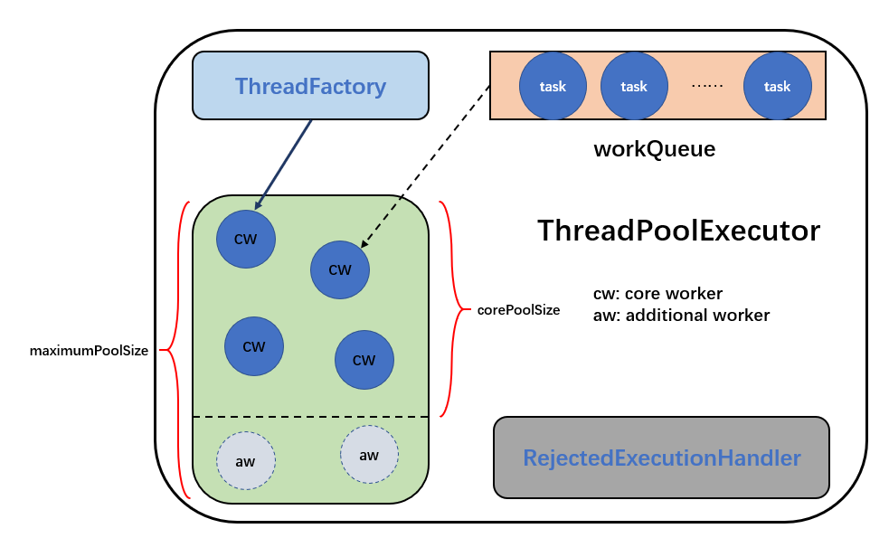

### 线程池状态

线程池中的状态控制主要围绕原子整型成员变量ctl：

~~~java
private final AtomicInteger ctl = new AtomicInteger(ctlOf(RUNNING, 0));
private static final int COUNT_BITS = Integer.SIZE - 3;
private static final int COUNT_MASK = (1 << COUNT_BITS) - 1;

private static final int RUNNING    = -1 << COUNT_BITS;
private static final int SHUTDOWN   =  0 << COUNT_BITS;
private static final int STOP       =  1 << COUNT_BITS;
private static final int TIDYING    =  2 << COUNT_BITS;
private static final int TERMINATED =  3 << COUNT_BITS;

// 通过ctl值获取运行状态
private static int runStateOf(int c)     { return c & ~COUNT_MASK; }
// 通过ctl值获取工作线程数
private static int workerCountOf(int c)  { return c & COUNT_MASK; }

// 通过运行状态和工作线程数计算ctl的值，或运算
private static int ctlOf(int rs, int wc) { return rs | wc; }

private static boolean runStateLessThan(int c, int s) {
    return c < s;
}

private static boolean runStateAtLeast(int c, int s) {
    return c >= s;
}

private static boolean isRunning(int c) {
    return c < SHUTDOWN;
}

// CAS操作线程数增加1
private boolean compareAndIncrementWorkerCount(int expect) {
    return ctl.compareAndSet(expect, expect + 1);
}

// CAS操作线程数减少1
private boolean compareAndDecrementWorkerCount(int expect) {
    return ctl.compareAndSet(expect, expect - 1);
}

// 线程数直接减少1
private void decrementWorkerCount() {
    ctl.addAndGet(-1);
}
~~~

ctl低29位用于存放工作线程数，而高3位用于存放线程池状态，控制变量ctl的组成就是通过线程池运行状态rs和工作线程数wc通过或运算得到的：

~~~java
// rs=RUNNING值为：111-00000000000000000000000000000
// wc的值为0：000-00000000000000000000000000000
// rs | wc的结果为：111-00000000000000000000000000000
private final AtomicInteger ctl = new AtomicInteger(ctlOf(RUNNING, 0));
private static int ctlOf(int rs, int wc) { 
    return rs | wc; 
}
~~~

提取运行状态就是获取它的高三位：

~~~java
// 先把COUNT_MASK取反(~COUNT_MASK)，得到：111-00000000000000000000000000000
// ctl位图特点是：xxx-yyyyyyyyyyyyyyyyyyyyyyyyyyyyyy
// 两者做一次与运算即可得到高3位xxx
private static int runStateOf(int c){ 
    return c & ~COUNT_MASK; 
}
~~~

工作线程上限数量掩码COUNT_MASK，它的值是(1 < COUNT_BITS) - l，也就是1左移29位，再减去1，如果补全32位，它的位视图如下：

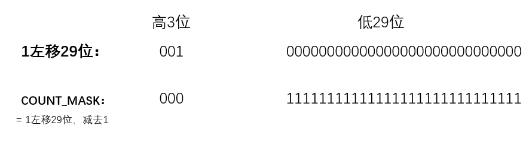

线程池的几种运行状态：

|     状态     |                    描述                    |
| :--------: | :--------------------------------------: |
|  RUNNING   |         能接受新提交的任务，并且也能处理阻塞队列中的任务         |
|  SHUTDOWN  | 关闭状态，不再接受新提交的任务，但却可以继续处理阻塞队列中已保存的任务。在线程池处于 RUNNING 状态时，调用 shutdown()方法会使线程池进入到该状态。（finalize() 方法在执行过程中也会调用shutdown()方法进入该状态） |
|    STOP    | 不能接受新任务，也不处理队列中的任务，会中断正在处理任务的线程。在线程池处于 RUNNING 或 SHUTDOWN 状态时，调用 shutdownNow() 方法会使线程池进入到该状态 |
|  TIDYING   | 如果所有的任务都已终止了，workerCount (有效线程数) 为0，线程池进入该状态后会调用 terminated() 方法进入TERMINATED 状态 |
| TERMINATED | 在terminated() 方法执行完后进入该状态，默认terminated()方法中什么也没有做 |

线程池状态的跃迁图：

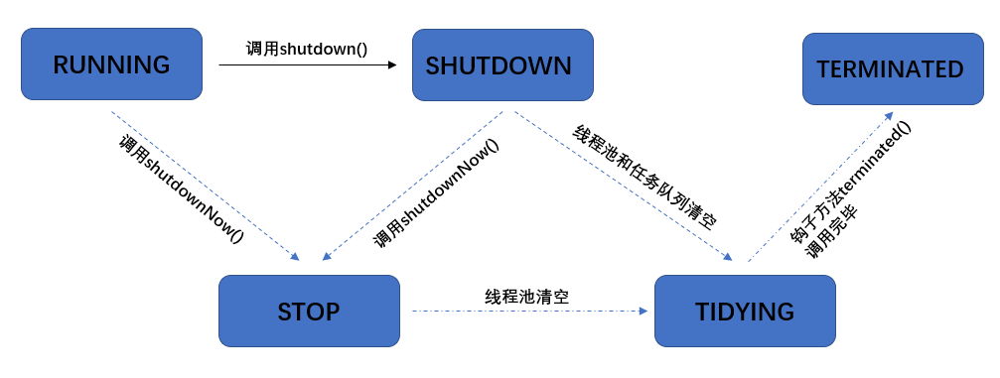

ExecutorService下列方法涉及到生命周期的管理：

```java
public interface ExecutorService extends Executor {
    // 生命周期管理

    void shutdown();

    List<Runnable> shutdownNow();

    boolean isShutdown();

    boolean isTerminated();

    boolean awaitTermination(long timeout, TimeUnit unit) throws InterruptedException;
}
```

方法的具体描述：

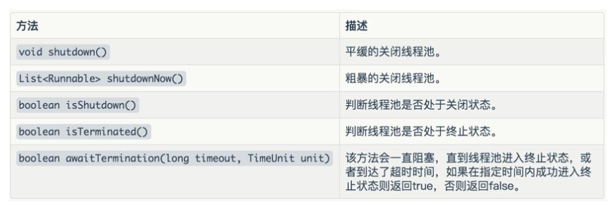

shutdown方法：平缓的关闭线程池，线程池的状态变为 SHUTDOWN，不再接受新的任务，同时等待已经提交的任务，也就是在阻塞队列中和正在执行的任务执行完成

shutdownNow方法：粗暴的关闭线程池，线程的状态变为 STOP，不再接受新的任务，尝试取消（设置线程中断状态）所有正在运行中的任务，不再执行还在任务队列中的方法，而是把它们放在一个List中返回给调用者

isTerminated()和isShutdown()方法的区别：

- isShutDown 当调用 shutdown() 方法后返回为 true。
- isTerminated 当调用 shutdown() 方法后，并且所有提交的任务完成后返回为 true

### execute方法

execute方法：

~~~java
// 存放线程池的运行状态 (runState) 和线程池内有效线程的数量 (workerCount)
private final AtomicInteger ctl = new AtomicInteger(ctlOf(RUNNING, 0));

private static int workerCountOf(int c) {
    return c & CAPACITY;
}

private final BlockingQueue<Runnable> workQueue;

public void execute(Runnable command) {
    // 如果任务为null，则抛出异常。
    if (command == null)
        throw new NullPointerException();
    // ctl 中保存的线程池当前的一些状态信息
    int c = ctl.get();

    //  下面会涉及到 3 步 操作
    // 1.首先判断当前线程池中执行的任务数量是否小于 corePoolSize
    // 如果小于的话，通过addWorker(command, true)新建一个线程，并将任务(command)添加到该线程中；然后，启动该线程从而执行任务。
    if (workerCountOf(c) < corePoolSize) {
        if (addWorker(command, true))
            return;
        c = ctl.get();
    }
    // 2.如果当前执行的任务数量大于等于 corePoolSize 的时候就会走到这里
    // 通过 isRunning 方法判断线程池状态，线程池处于 RUNNING 状态并且队列可以加入任务，该任务才会被加入进去
    if (isRunning(c) && workQueue.offer(command)) {
        int recheck = ctl.get();
        // 再次获取线程池状态，如果线程池状态不是 RUNNING 状态就需要从任务队列中移除任务，并尝试判断线程是否全部执行完毕。同时执行拒绝策略。
        if (!isRunning(recheck) && remove(command))
            reject(command);
            // 如果当前线程池为空就新创建一个线程并执行。
        else if (workerCountOf(recheck) == 0)
            addWorker(null, false);
    }
    //3. 通过addWorker(command, false)新建一个线程，并将任务(command)添加到该线程中；然后，启动该线程从而执行任务。
    //如果addWorker(command, false)执行失败，则通过reject()执行相应的拒绝策略的内容。
    else if (!addWorker(command, false))
        reject(command);
}
~~~

简单分析一下整个流程：

* 如果当前工作线程总数小于corePoolSize，则直接创建核心线程执行任务（任务实例会传入直接用于构造工作线程实例）。
* 如果当前工作线程总数大于等于corePoolSize，判断线程池是否处于运行中状态，同时尝试用非阻塞方法向任务队列放入任务，这里会二次检查线程池运行状态，如果当前工作线程数量为0，则创建一个非核心线程并且传入的任务对象为null。
* 如果向任务队列投放任务失败（任务队列已经满了），则会尝试创建非核心线程传入任务实例执行。
* 如果创建非核心线程失败，此时需要拒绝执行任务，调用拒绝策略处理任务。

提交任务的过程：

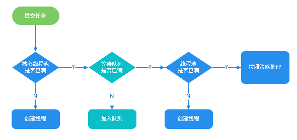

这里要注意一下 addWorker(null, false) ，也就是创建一个线程，但并没有传入任务，因为任务已经被添加到workQueue中了，所以worker在执行的时候，会直接从workQueue中获取任务。所以，在 workerCountOf(recheck) == 0 时执行 addWorker(null, false) 也是为了保证线程池在RUNNING状态下必须要有一个线程来执行任务。

### addWorker方法

boolean addWorker(Runnable firstTask, boolean core)方法的第一的参数可以用于直接传入任务实例，第二个参数用于标识将要创建的工作线程是否核心线程。方法源码如下：

~~~java
// 添加工作线程，如果返回false说明没有新创建工作线程，如果返回true说明创建和启动工作线程成功
private boolean addWorker(Runnable firstTask, boolean core) {
    retry:  
    // 注意这是一个死循环 - 最外层循环
    for (int c = ctl.get();;) {
        // 这个是十分复杂的条件，这里先拆分多个与（&&）条件：
        // 1. 线程池状态至少为SHUTDOWN状态，也就是rs >= SHUTDOWN(0)
        // 2. 线程池状态至少为STOP状态，也就是rs >= STOP(1)，或者传入的任务实例firstTask不为null，或者任务队列为空
        // 其实这个判断的边界是线程池状态为shutdown状态下，不会再接受新的任务，在此前提下如果状态已经到了STOP、或者传入任务不为空、或者任务队列为空（已经没有积压任务）都不需要添加新的线程
        if (runStateAtLeast(c, SHUTDOWN)
            && (runStateAtLeast(c, STOP)
                || firstTask != null
                || workQueue.isEmpty()))
            return false;
        // 注意这也是一个死循环 - 二层循环
        for (;;) {
            // 这里每一轮循环都会重新获取工作线程数wc
            // 1. 如果传入的core为true，表示将要创建核心线程，通过wc和corePoolSize判断，如果wc >= corePoolSize，则返回false表示创建核心线程失败
            // 1. 如果传入的core为false，表示将要创非建核心线程，通过wc和maximumPoolSize判断，如果wc >= maximumPoolSize，则返回false表示创建非核心线程失败
            if (workerCountOf(c)
                >= ((core ? corePoolSize : maximumPoolSize) & COUNT_MASK))
                return false;
            // 成功通过CAS更新工作线程数wc，则break到最外层的循环
            if (compareAndIncrementWorkerCount(c))
                break retry;
            // 走到这里说明了通过CAS更新工作线程数wc失败，这个时候需要重新判断线程池的状态是否由RUNNING已经变为SHUTDOWN
            c = ctl.get();  // Re-read ctl
            // 如果线程池状态已经由RUNNING已经变为SHUTDOWN，则重新跳出到外层循环继续执行
            if (runStateAtLeast(c, SHUTDOWN))
                continue retry;
            // 如果线程池状态依然是RUNNING，CAS更新工作线程数wc失败说明有可能是并发更新导致的失败，则在内层循环重试即可 
            // else CAS failed due to workerCount change; retry inner loop 
        }
    }
    // 标记工作线程是否启动成功
    boolean workerStarted = false;
    // 标记工作线程是否创建成功
    boolean workerAdded = false;
    Worker w = null;
    try {
        // 传入任务实例firstTask创建Worker实例，Worker构造里面会通过线程工厂创建新的Thread对象，所以下面可以直接操作Thread t = w.thread
        // 这一步Worker实例已经创建，但是没有加入工作线程集合或者启动它持有的线程Thread实例
        w = new Worker(firstTask);
        final Thread t = w.thread;
        if (t != null) {
            // 这里需要全局加锁，因为会改变一些指标值和非线程安全的集合
            final ReentrantLock mainLock = this.mainLock;
            mainLock.lock();
            try {
                // Recheck while holding lock.
                // Back out on ThreadFactory failure or if
                // shut down before lock acquired.
                int c = ctl.get();
                // 这里主要在加锁的前提下判断ThreadFactory创建的线程是否存活或者判断获取锁成功之后线程池状态是否已经更变为SHUTDOWN
                // 1. 如果线程池状态依然为RUNNING，则只需要判断线程实例是否存活，需要添加到工作线程集合和启动新的Worker
                // 2. 如果线程池状态小于STOP，也就是RUNNING或者SHUTDOWN状态下，同时传入的任务实例firstTask为null，则需要添加到工作线程集合和启动新的Worker
                // 对于2，换言之，如果线程池处于SHUTDOWN状态下，同时传入的任务实例firstTask不为null，则不会添加到工作线程集合和启动新的Worker
                // 这一步其实有可能创建了新的Worker实例但是并不启动（临时对象，没有任何强引用），这种Worker有可能成功下一轮GC被收集的垃圾对象
                if (isRunning(c) ||
                    (runStateLessThan(c, STOP) && firstTask == null)) {
                    if (t.isAlive()) // precheck that t is startable
                        throw new IllegalThreadStateException();
                    // 把创建的工作线程实例添加到工作线程集合
                    workers.add(w);
                    int s = workers.size();
                    // 尝试更新历史峰值工作线程数，也就是线程池峰值容量
                    if (s > largestPoolSize)
                        largestPoolSize = s;
                    // 这里更新工作线程是否启动成功标识为true，后面才会调用Thread#start()方法启动真实的线程实例
                    workerAdded = true;
                }
            } finally {
                mainLock.unlock();
            }
            // 如果成功添加工作线程，则调用Worker内部的线程实例t的Thread#start()方法启动真实的线程实例
            if (workerAdded) {
                t.start();
                // 标记线程启动成功
                workerStarted = true;
            }
        }
    } finally {
        // 线程启动失败，需要从工作线程集合移除对应的Worker
        if (! workerStarted)
            addWorkerFailed(w);
    }
    return workerStarted;
}

// 添加Worker失败
private void addWorkerFailed(Worker w) {
    final ReentrantLock mainLock = this.mainLock;
    mainLock.lock();
    try {
        // 从工作线程集合移除之
        if (w != null)
            workers.remove(w);
        // wc数量减1    
        decrementWorkerCount();
        // 基于状态判断尝试终结线程池
        tryTerminate();
    } finally {
        mainLock.unlock();
    }
}
~~~

上面的分析逻辑中需要注意一点，Worker实例创建的同时，在其构造函数中会通过ThreadFactory创建一个Java线程Thread实例，后面会加锁后二次检查是否需要把Worker实例添加到工作线程集合workers中和是否需要启动Worker中持有的Thread实例，只有启动了Thread实例实例，Worker才真正开始运作，否则只是一个无用的临时对象。Worker本身也实现了Runnable接口，它可以看成是一个Runnable的适配器。


增加线程是通过线程池中的addWorker方法，该方法的功能就是增加一个线程，该方法不考虑线程池是在哪个阶段增加的该线程，这个分配线程的策略是在上个步骤完成的，该步骤仅仅完成增加线程，并使它运行，最后返回是否成功这个结果。addWorker方法有两个参数：firstTask、core。firstTask参数用于指定新增的线程执行的第一个任务，该参数可以为空；core参数为true表示在新增线程时会判断当前活动线程数是否少于corePoolSize，false表示新增线程前需要判断当前活动线程数是否少于maximumPoolSize，其执行流程如下图所示：


### Worker对象

线程池中的每一个具体的工作线程被包装为内部类Worker实例，Worker继承于AbstractQueuedSynchronizer(AQS)，实现了Runnable接口：

~~~java
private final class Worker extends AbstractQueuedSynchronizer implements Runnable{
    /**
        * This class will never be serialized, but we provide a
        * serialVersionUID to suppress a javac warning.
        */
    private static final long serialVersionUID = 6138294804551838833L;

    // 保存ThreadFactory创建的线程实例，如果ThreadFactory创建线程失败则为null
    final Thread thread;
    // 保存传入的Runnable任务实例
    Runnable firstTask;
    // 记录每个线程完成的任务总数
    volatile long completedTasks;
    
    // 唯一的构造函数，传入任务实例firstTask，注意可以为null
    Worker(Runnable firstTask) {
        // 禁止线程中断，直到runWorker()方法执行
        setState(-1); // inhibit interrupts until runWorker
        this.firstTask = firstTask;
        // 通过ThreadFactory创建线程实例，注意一下Worker实例自身作为Runnable用于创建新的线程实例
        this.thread = getThreadFactory().newThread(this);
    }

    // 委托到外部的runWorker()方法，注意runWorker()方法是线程池的方法，而不是Worker的方法
    public void run() {
        runWorker(this);
    }

    // Lock methods
    //
    // The value 0 represents the unlocked state.
    // The value 1 represents the locked state.
    //  是否持有独占锁，state值为1的时候表示持有锁，state值为0的时候表示已经释放锁
    protected boolean isHeldExclusively() {
        return getState() != 0;
    }

    // 独占模式下尝试获取资源，这里没有判断传入的变量，直接CAS判断0更新为1是否成功，成功则设置独占线程为当前线程
    protected boolean tryAcquire(int unused) {
        if (compareAndSetState(0, 1)) {
            setExclusiveOwnerThread(Thread.currentThread());
            return true;
        }
        return false;
    }
    
    // 独占模式下尝试是否资源，这里没有判断传入的变量，直接把state设置为0
    protected boolean tryRelease(int unused) {
        setExclusiveOwnerThread(null);
        setState(0);
        return true;
    }
    
    // 加锁
    public void lock()        { acquire(1); }

    // 尝试加锁
    public boolean tryLock()  { return tryAcquire(1); }

    // 解锁
    public void unlock()      { release(1); }

    // 是否锁定
    public boolean isLocked() { return isHeldExclusively(); }
    
    // 启动后进行线程中断，注意这里会判断线程实例的中断标志位是否为false，只有中断标志位为false才会中断
    void interruptIfStarted() {
        Thread t;
        if (getState() >= 0 && (t = thread) != null && !t.isInterrupted()) {
            try {
                t.interrupt();
            } catch (SecurityException ignore) {
            }
        }
    }
}
~~~

真正执行的线程是Worker内部的thread字段，整个线程运行的逻辑是，线程在Worker构造方法中初始化，在外部的addWorker中启动：

~~~java
// addWorker()方法中构造
Worker worker = createWorker();
// 通过线程池构造时候传入
ThreadFactory threadFactory = getThreadFactory();
// Worker构造函数中
Thread thread = threadFactory.newThread(worker);
// addWorker()方法中启动
thread.start();
~~~

这个被启动的线程类型就是Worker，在它的run方法中，会调用外部的runWorker方法

Worker继承自AQS，这里使用了AQS的独占模式，这里有个技巧是构造Worker的时候，把AQS的资源（状态）通过setState(-1)设置为-1，这是因为Worker实例刚创建时AQS中state的默认值为0，此时线程尚未启动，不能在这个时候进行线程中断，见Worker#interruptIfStarted()方法。

Worker中两个覆盖AQS的方法tryAcquire()和tryRelease()都没有判断外部传入的变量，前者直接CAS(0,1)，后者直接setState(0)。

Worker继承了AQS，使用AQS来实现独占锁的功能。为什么不使用ReentrantLock来实现呢？可以看到tryAcquire方法，它是不允许重入的，而ReentrantLock是允许重入的：

1. lock方法一旦获取了独占锁，表示当前线程正在执行任务中；
2. 如果正在执行任务，则不应该中断线程；
3. 如果该线程现在不是独占锁的状态，也就是空闲的状态，说明它没有在处理任务，这时可以对该线程进行中断；
4. 线程池在执行shutdown方法或tryTerminate方法时会调用interruptIdleWorkers方法来中断空闲的线程，interruptIdleWorkers方法会使用tryLock方法来判断线程池中的线程是否是空闲状态；
5. 之所以设置为不可重入，是因为我们不希望任务在调用像setCorePoolSize这样的线程池控制方法时重新获取锁。如果使用ReentrantLock，它是可重入的，这样如果在任务中调用了如setCorePoolSize这类线程池控制的方法，会中断正在运行的线程。

线程池需要管理线程的生命周期，需要在线程长时间不运行的时候进行回收。线程池使用一张Hash表去持有线程的引用，这样可以通过添加引用、移除引用这样的操作来控制线程的生命周期。这个时候重要的就是如何判断线程是否在运行。

Worker没有使用可重入锁ReentrantLock，而是使用AQS，为的就是实现不可重入的特性去反应线程现在的执行状态。

1.lock方法一旦获取了独占锁，表示当前线程正在执行任务中。 

2.如果正在执行任务，则不应该中断线程。 

3.如果该线程现在不是独占锁的状态，也就是空闲的状态，说明它没有在处理任务，这时可以对该线程进行中断。

 4.线程池在执行shutdown方法或tryTerminate方法时会调用interruptIdleWorkers方法来中断空闲的线程，interruptIdleWorkers方法会使用tryLock方法来判断线程池中的线程是否是空闲状态；如果线程是空闲状态则可以安全回收。

在线程回收过程中就使用到了这种特性，回收过程如下图所示：


### runWorker方法

~~~java
final void runWorker(Worker w) {
    // 获取当前线程，实际上和Worker持有的线程实例是相同的
    Thread wt = Thread.currentThread();
    // 获取Worker中持有的初始化时传入的任务对象，这里注意存放在临时变量task中
    Runnable task = w.firstTask;
    // 设置Worker中持有的初始化时传入的任务对象为null
    w.firstTask = null;
    // 由于Worker初始化时AQS中state设置为-1，这里要先做一次解锁把state更新为0，允许线程中断
    w.unlock(); // allow interrupts
    // 记录线程是否因为用户异常终结，默认是true
    boolean completedAbruptly = true;
    try {
        // 初始化任务对象不为null，或者从任务队列获取任务不为空（从任务队列获取到的任务会更新到临时变量task中）
        // getTask()由于使用了阻塞队列，这个while循环如果命中后半段会处于阻塞或者超时阻塞状态，getTask()返回为null会导致线程跳出死循环使线程终结
        while (task != null || (task = getTask()) != null) {
            // Worker加锁，本质是AQS获取资源并且尝试CAS更新state由0更变为1
            w.lock();
            // If pool is stopping, ensure thread is interrupted;
            // if not, ensure thread is not interrupted.  This
            // requires a recheck in second case to deal with
            // shutdownNow race while clearing interrupt
            // 如果线程池正在停止（也就是由RUNNING或者SHUTDOWN状态向STOP状态变更），那么要确保当前工作线程是中断状态
            // 否则，要保证当前线程不是中断状态
            if ((runStateAtLeast(ctl.get(), STOP) ||
                    (Thread.interrupted() &&
                    runStateAtLeast(ctl.get(), STOP))) &&
                !wt.isInterrupted())
                wt.interrupt();
            try {
                // 钩子方法，任务执行前
                beforeExecute(wt, task);
                try {
                    task.run();
                    // 钩子方法，任务执行后 - 正常情况
                    afterExecute(task, null);
                } catch (Throwable ex) {
                    // 钩子方法，任务执行后 - 异常情况
                    afterExecute(task, ex);
                    throw ex;
                }
            } finally {
                // 清空task临时变量，这个很重要，否则while会死循环执行同一个task
                task = null;
                // 累加Worker完成的任务数
                w.completedTasks++;
                // Worker解锁，本质是AQS释放资源，设置state为0
                w.unlock();
            }
        }
        // 走到这里说明某一次getTask()返回为null，线程正常退出
        completedAbruptly = false;
    } finally {
        // 处理线程退出，completedAbruptly为true说明由于用户异常导致线程非正常退出
        processWorkerExit(w, completedAbruptly);
    }
}
~~~

runWorker()方法的核心流程：

* Worker先执行一次解锁操作，用于解除不可中断状态。
* 通过while循环调用getTask()方法从任务队列中获取任务（当然，首轮循环也有可能是外部传入的firstTask任务实例）。
* 如果线程池更变为STOP状态，则需要确保工作线程是中断状态并且进行中断处理，否则要保证工作线程必须不是中断状态。
* 执行任务实例Runnale#run()方法，任务实例执行之前和之后（包括正常执行完毕和异常执行情况）分别会调用钩子方法beforeExecute()和afterExecute()。
* while循环跳出意味着runWorker()方法结束和工作线程生命周期结束（Worker#run()生命周期完结），会调用processWorkerExit()处理工作线程退出的后续工作。

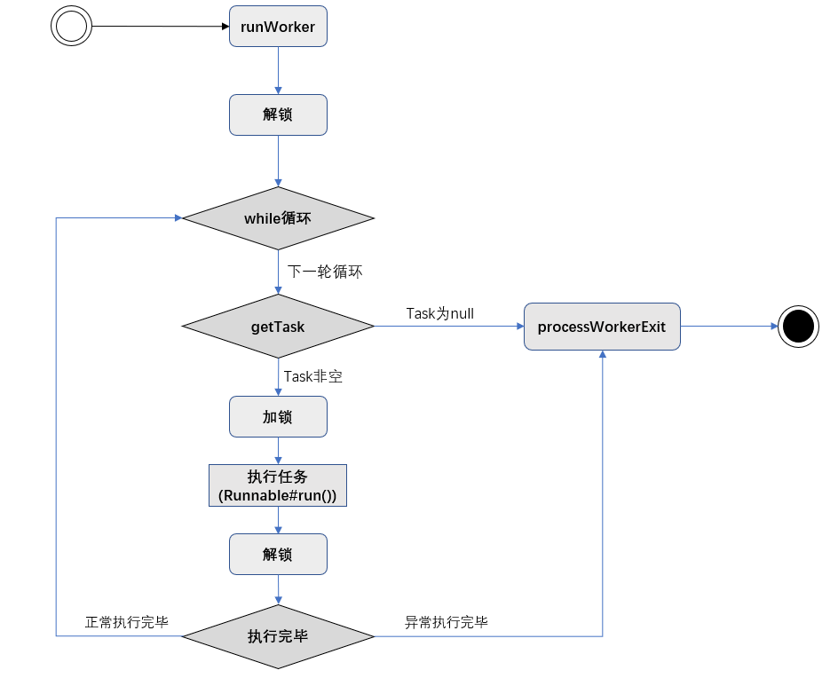

这里的beforeExecute方法和afterExecute方法在ThreadPoolExecutor类中是空的，留给子类来实现。

在runWorker方法中，执行任务时对Worker对象w进行了lock操作，代表当前任务正在运行中。


### getTask方法

getTask()方法是工作线程在while死循环中获取任务队列中的任务对象的方法：

~~~java
private Runnable getTask() {
    // 记录上一次从队列中拉取的时候是否超时
    boolean timedOut = false; // Did the last poll() time out?
    // 注意这是死循环
    for (;;) {
        int c = ctl.get();

        // Check if queue empty only if necessary.
        // 第一个if：如果线程池状态至少为SHUTDOWN，也就是rs >= SHUTDOWN(0)，则需要判断两种情况（或逻辑）：
        // 1. 线程池状态至少为STOP(1)，也就是线程池正在停止，一般是调用了shutdownNow()方法
        // 2. 任务队列为空
        // 如果在线程池至少为SHUTDOWN状态并且满足上面两个条件之一，则工作线程数wc减去1，然后直接返回null
        if (runStateAtLeast(c, SHUTDOWN)
            && (runStateAtLeast(c, STOP) || workQueue.isEmpty())) {
            decrementWorkerCount();
            return null;
        }
        // 跑到这里说明线程池还处于RUNNING状态，重新获取一次工作线程数
        int wc = workerCountOf(c);

        // Are workers subject to culling?
        // timed临时变量勇于线程超时控制，决定是否需要通过poll()此带超时的非阻塞方法进行任务队列的任务拉取
        // 1.allowCoreThreadTimeOut默认值为false，如果设置为true，则允许核心线程也能通过poll()方法从任务队列中拉取任务
        // 2.工作线程数大于核心线程数的时候，说明线程池中创建了额外的非核心线程，这些非核心线程一定是通过poll()方法从任务队列中拉取任务
        boolean timed = allowCoreThreadTimeOut || wc > corePoolSize;
        // 第二个if：
        // 1.wc > maximumPoolSize说明当前的工作线程总数大于maximumPoolSize，说明了通过setMaximumPoolSize()方法减少了线程池容量
        // 或者 2.timed && timedOut说明了线程命中了超时控制并且上一轮循环通过poll()方法从任务队列中拉取任务为null
        // 并且 3. 工作线程总数大于1或者任务队列为空，则通过CAS把线程数减去1，同时返回null，
        // CAS把线程数减去1失败会进入下一轮循环做重试
        if ((wc > maximumPoolSize || (timed && timedOut))
            && (wc > 1 || workQueue.isEmpty())) {
            if (compareAndDecrementWorkerCount(c))
                return null;
            continue;
        }

        try {
            // 如果timed为true，通过poll()方法做超时拉取，keepAliveTime时间内没有等待到有效的任务，则返回null
            // 如果timed为false，通过take()做阻塞拉取，会阻塞到有下一个有效的任务时候再返回（一般不会是null）
            Runnable r = timed ?
                workQueue.poll(keepAliveTime, TimeUnit.NANOSECONDS) :
                workQueue.take();
            // 这里很重要，只有非null时候才返回，null的情况下会进入下一轮循环
            if (r != null)
                return r;
            // 跑到这里说明上一次从任务队列中获取到的任务为null，一般是workQueue.poll()方法超时返回null
            timedOut = true;
        } catch (InterruptedException retry) {
            timedOut = false;
        }
    }
}
~~~

这个方法中，有两处十分庞大的if逻辑，对于第一处if可能导致工作线程数减去1直接返回null的场景有：

* 线程池状态为SHUTDOWN，一般是调用了shutdown()方法，并且任务队列为空。
* 线程池状态为STOP。

对于第二处if，逻辑有点复杂，先拆解一下：

~~~java
// 工作线程总数大于maximumPoolSize，说明了通过setMaximumPoolSize()方法减少了线程池容量
boolean b1 = wc > maximumPoolSize;
// 允许线程超时同时上一轮通过poll()方法从任务队列中拉取任务为null
boolean b2 = timed && timedOut;
// 工作线程总数大于1
boolean b3 = wc > 1;
// 任务队列为空
boolean b4 = workQueue.isEmpty();
boolean r = (b1 || b2) && (b3 || b4);
if (r) {
    if (compareAndDecrementWorkerCount(c)){
        return null;
    }else{
        continue;
    }
}
~~~

这段逻辑大多数情况下是针对非核心线程。在execute()方法中，当线程池总数已经超过了corePoolSize并且还小于maximumPoolSize时，当任务队列已经满了的时候，会通过addWorker(task,false)添加非核心线程。而这里的逻辑恰好类似于addWorker(task,false)的反向操作，用于减少非核心线程，使得工作线程总数趋向于corePoolSize。如果对于非核心线程，上一轮循环获取任务对象为null，这一轮循环很容易满足timed && timedOut为true，这个时候getTask()返回null会导致Worker#runWorker()方法跳出死循环，之后执行processWorkerExit()方法处理后续工作，而该非核心线程对应的Worker则变成“游离对象”，等待被JVM回收。

其实第二个if就是控制线程池的有效线程数量。在执行execute方法时，如果当前线程池的线程数量超过了corePoolSize且小于maximumPoolSize，并且workQueue已满时，则可以增加工作线程，但这时如果超时没有获取到任务，也就是timedOut为true的情况，说明workQueue已经为空了，也就说明了当前线程池中不需要那么多线程来执行任务了，可以把多于corePoolSize数量的线程销毁掉，保持线程数量在corePoolSize即可。

线程销毁的时机：runWorker方法执行完之后，也就是Worker中的run方法执行完，由JVM自动回收。

keepAliveTime参数：

* 当允许核心线程超时，也就是allowCoreThreadTimeOut设置为true的时候，此时keepAliveTime表示空闲的工作线程的存活周期。
* 默认情况下不允许核心线程超时，此时keepAliveTime表示空闲的非核心线程的存活周期。

综上：在execute()方法中创建一个线程时，会让这个线程执行当前任务。这个线程执行完上图中1的任务后，会反复从BlockingQueue获取任务来执行。


### processWorkerExit方法

processWorkerExit()方法是为将要终结的Worker做一次清理和数据记录工作（因为processWorkerExit()方法也包裹在runWorker()方法finally代码块中，其实工作线程在执行完processWorkerExit()方法才算真正的终结）

~~~java
private void processWorkerExit(Worker w, boolean completedAbruptly) {
    // 因为抛出用户异常导致线程终结，直接使工作线程数减1即可
    // 如果没有任何异常抛出的情况下是通过getTask()返回null引导线程正常跳出runWorker()方法的while死循环从而正常终结，这种情况下，在getTask()中已经把线程数减1
    if (completedAbruptly) // If abrupt, then workerCount wasn't adjusted
        decrementWorkerCount();

    final ReentrantLock mainLock = this.mainLock;
    mainLock.lock();
    try {
        // 全局的已完成任务记录数加上此将要终结的Worker中的已完成任务数
        completedTaskCount += w.completedTasks;
        // 工作线程集合中移除此将要终结的Worker
        workers.remove(w);
    } finally {
        mainLock.unlock();
    }
     
    // 见下一小节分析，用于根据当前线程池的状态判断是否需要进行线程池terminate处理
    tryTerminate();

    int c = ctl.get();
    // 如果线程池的状态小于STOP，也就是处于RUNNING或者SHUTDOWN状态的前提下：
    // 1.如果线程不是由于抛出用户异常终结，如果允许核心线程超时，则保持线程池中至少存在一个工作线程
    // 2.如果线程由于抛出用户异常终结，或者当前工作线程数，那么直接添加一个新的非核心线程
    if (runStateLessThan(c, STOP)) {
        if (!completedAbruptly) {
            // 如果允许核心线程超时，最小值为0，否则为corePoolSize
            int min = allowCoreThreadTimeOut ? 0 : corePoolSize;
            // 如果最小值为0，同时任务队列不空，则更新最小值为1
            if (min == 0 && ! workQueue.isEmpty())
                min = 1;
            // 工作线程数大于等于最小值，直接返回不新增非核心线程
            if (workerCountOf(c) >= min)
                return; // replacement not needed
        }
        addWorker(null, false);
    }
}
~~~

代码的后面部分区域，会判断线程池的状态，如果线程池是RUNNING或者SHUTDOWN状态的前提下，如果当前的工作线程由于抛出用户异常被终结，那么会新创建一个非核心线程。如果当前的工作线程并不是抛出用户异常被终结（正常情况下的终结），那么会这样处理：

* allowCoreThreadTimeOut为true，也就是允许核心线程超时的前提下，如果任务队列空，则会通过创建一个非核心线程保持线程池中至少有一个工作线程。
* allowCoreThreadTimeOut为false，如果工作线程总数大于corePoolSize则直接返回，否则创建一个非核心线程，也就是会趋向于保持线程池中的工作线程数量趋向于corePoolSize

processWorkerExit()执行完毕之后，工作线程被销毁，意味着该工作线程的生命周期已经完结。

从execute方法开始，Worker使用ThreadFactory创建新的工作线程，runWorker通过getTask获取任务，然后执行任务，如果getTask返回null，进入processWorkerExit方法，整个线程结束，如图所示：

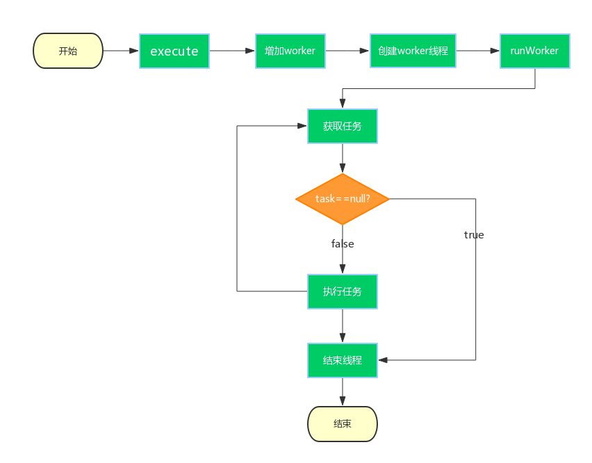

线程池中线程的销毁依赖JVM自动的回收，线程池做的工作是根据当前线程池的状态维护一定数量的线程引用，防止这部分线程被JVM回收，当线程池决定哪些线程需要回收时，只需要将其引用消除即可。Worker被创建出来后，就会不断地进行轮询，然后获取任务去执行，核心线程可以无限等待获取任务，非核心线程要限时获取任务。当Worker无法获取到任务，也就是获取的任务为空时，循环会结束，Worker会主动消除自身在线程池内的引用

线程回收的工作是在processWorkerExit方法完成的。

~~~java
try {
  while (task != null || (task = getTask()) != null) {
    //执行任务
  }
} finally {
  processWorkerExit(w, completedAbruptly);//获取不到任务时，主动回收自己
}
~~~


事实上，在这个方法中，将线程引用移出线程池就已经结束了线程销毁的部分。但由于引起线程销毁的可能性有很多，线程池还要判断是什么引发了这次销毁，是否要改变线程池的现阶段状态，是否要根据新状态，重新分配线程。

### tryTerminate方法

每个工作线程终结的时候都会调用tryTerminate()方法，根据线程池状态进行判断是否结束线程池：

~~~java
final void tryTerminate() {
    for (;;) {
        int c = ctl.get();
        // 判断线程池的状态，如果是下面三种情况下的任意一种则直接返回：
        // 1.线程池处于RUNNING状态
        // 2.线程池至少为TIDYING状态，也就是TIDYING或者TERMINATED状态，意味着已经走到了下面的步骤，线程池即将终结
        // 3.线程池至少为STOP状态并且任务队列不为空
        if (isRunning(c) ||
            runStateAtLeast(c, TIDYING) ||
            (runStateLessThan(c, STOP) && ! workQueue.isEmpty()))
            return;
        // 工作线程数不为0，则中断工作线程集合中的第一个空闲的工作线程
        if (workerCountOf(c) != 0) { // Eligible to terminate
            interruptIdleWorkers(ONLY_ONE);
            return;
        }

        final ReentrantLock mainLock = this.mainLock;
        mainLock.lock();
        try {
            // CAS设置线程池状态为TIDYING，如果设置成功则执行钩子方法terminated()
            if (ctl.compareAndSet(c, ctlOf(TIDYING, 0))) {
                try {
                    terminated();
                } finally {
                    // 最后更新线程池状态为TERMINATED
                    ctl.set(ctlOf(TERMINATED, 0));
                    // 唤醒阻塞在termination条件的所有线程，这个变量的await()方法在awaitTermination()中调用
                    termination.signalAll();
                }
                return;
            }
        } finally {
            mainLock.unlock();
        }
        // else retry on failed CAS
    }
}

// 中断空闲的工作线程，onlyOne为true的时候，只会中断工作线程集合中的某一个线程
private void interruptIdleWorkers(boolean onlyOne) {
    final ReentrantLock mainLock = this.mainLock;
    mainLock.lock();
    try {
        for (Worker w : workers) {
            Thread t = w.thread;
            // 这里判断线程不是中断状态并且尝试获取锁成功的时候才进行线程中断
            if (!t.isInterrupted() && w.tryLock()) {
                try {
                    t.interrupt();
                } catch (SecurityException ignore) {
                } finally {
                    w.unlock();
                }
            }
            // 这里跳出循环，也就是只中断集合中第一个工作线程
            if (onlyOne)
                break;
        }
    } finally {
        mainLock.unlock();
    }
}
~~~

 interruptIdleWorkers(ONLY_ONE); 的作用是因为在getTask方法中执行 workQueue.take() 时，如果不执行中断会一直阻塞。在下面介绍的shutdown方法中，会中断所有空闲的工作线程，如果在执行shutdown时工作线程没有空闲，然后又去调用了getTask方法，这时如果workQueue中没有任务了，调用 workQueue.take() 时就会一直阻塞。所以每次在工作线程结束时调用tryTerminate方法来尝试中断一个空闲工作线程，避免在队列为空时取任务一直阻塞的情况。

### 关闭线程池

shutdown方法：

~~~java
public void shutdown() {
    final ReentrantLock mainLock = this.mainLock;
    mainLock.lock();
    try {
        // 权限校验，安全策略相关判断
        checkShutdownAccess();
        // 设置SHUTDOWN状态
        advanceRunState(SHUTDOWN);
        // 中断所有的空闲的工作线程
        interruptIdleWorkers();
        // 钩子方法
        onShutdown(); // hook for ScheduledThreadPoolExecutor
    } finally {
        mainLock.unlock();
    }
    // 调用上面分析果敢的尝试terminate方法，使状态更变为TIDYING，执行钩子方法terminated()后，最终状态更新为TERMINATED
    tryTerminate();
}

// 升提状态
private void advanceRunState(int targetState) {
    // assert targetState == SHUTDOWN || targetState == STOP;
    for (;;) {
        int c = ctl.get();
        // 线程池状态至少为targetState或者CAS设置状态为targetState则跳出循环
        if (runStateAtLeast(c, targetState) ||
            ctl.compareAndSet(c, ctlOf(targetState, workerCountOf(c))))
            break;
    }
}

// 中断所有的空闲的工作线程
private void interruptIdleWorkers() {
    interruptIdleWorkers(false);
}
~~~

接着看shutdownNow()方法：

~~~java
public List<Runnable> shutdownNow() {
    List<Runnable> tasks;
    final ReentrantLock mainLock = this.mainLock;
    mainLock.lock();
    try {
        // 权限校验，安全策略相关判断
        checkShutdownAccess();
        // 设置STOP状态
        advanceRunState(STOP);
        // 中断所有的工作线程
        interruptWorkers();
        // 清空工作队列并且取出所有的未执行的任务
        tasks = drainQueue();
    } finally {
        mainLock.unlock();
    }
     // 调用上面分析果敢的尝试terminate方法，使状态更变为TIDYING，执行钩子方法terminated()后，最终状态更新为TERMINATED
    tryTerminate();
    return tasks;
}

// 遍历所有的工作线程，如果state > 0（启动状态）则进行中断
private void interruptWorkers() {
    // assert mainLock.isHeldByCurrentThread();
    for (Worker w : workers)
        w.interruptIfStarted();
}
~~~

shutdownNow()方法会把线程池状态先更变为STOP，中断所有的工作线程（AbstractQueuedSynchronizer的state值大于0的Worker实例，也就是包括正在执行任务的Worker和空闲的Worker），然后遍历任务队列，取出（移除）所有任务存放在一个列表中返回。

awaitTermination()方法：

~~~java
public boolean awaitTermination(long timeout, TimeUnit unit)
    throws InterruptedException {
    // 转换timeout的单位为纳秒
    long nanos = unit.toNanos(timeout);
    final ReentrantLock mainLock = this.mainLock;
    mainLock.lock();
    try {
        // 循环等待直到线程池状态更变为TERMINATED，每轮循环等待nanos纳秒
        while (runStateLessThan(ctl.get(), TERMINATED)) {
            if (nanos <= 0L)
                return false;
            nanos = termination.awaitNanos(nanos);
        }
        return true;
    } finally {
        mainLock.unlock();
    }
}
~~~

awaitTermination()虽然不是shutdown()方法体系，但是它的处理逻辑就是确保调用此方法的线程会阻塞到tryTerminate()方法成功把线程池状态更新为TERMINATED后再返回，可以使用在某些需要感知线程池终结时刻的场景。

有一点值得关注的是：shutdown()方法只会中断空闲的工作线程，如果工作线程正在执行任务对象Runnable#run()，这种情况下的工作线程不会中断，而是等待下一轮执行getTask()方法的时候通过线程池状态判断正常终结该工作线程。

### mainLock成员变量

在线程池中大量使用了这个锁来控制各种逻辑：

~~~java
private final ReentrantLock mainLock = new ReentrantLock();
private final Condition termination = mainLock.newCondition();
~~~

归结一下mainLock的使用场景：

|                    方法                    |                   主要作用                   |
| :--------------------------------------: | :--------------------------------------: |
|               tryTerminate               | 保证状态TIDYING -> TERMINATED，钩子方法terminated()回调和条件变量唤醒 |
|           interruptIdleWorkers           |          保护工作线程中断的串行化，避免”中断风暴”           |
|                addWorker                 | 保护工作线程集合避免并发增加工作线程、保护度量统计数据变更，workers是HashSet类型的，不能保证线程安全 |
|            processWorkerExit             |                保护度量统计数据变更                |
|  shutdown、shutdownNow和awaitTermination   |                  见下文分析                   |
| getPoolSize、getActiveCount、getLargestPoolSize、getTaskCount和getCompletedTaskCount |   保护度量统计数据读取，这些统计数据来一般源于Worker集合的属性统计    |

单独来分析下shutdown、shutdownNow和awaitTermination中锁的使用。

先看shutdown()方法：

~~~java
public void shutdown() {
    final ReentrantLock mainLock = this.mainLock;
    mainLock.lock();
    try {
        checkShutdownAccess();
        advanceRunState(SHUTDOWN);
        interruptIdleWorkers();
        onShutdown(); // hook for ScheduledThreadPoolExecutor
    } finally {
        mainLock.unlock();
    }
    tryTerminate();
}
~~~

这里shutdown()中除了tryTerminate()，其他它方法都是包裹在锁里面执行，确保工作线程集合稳定性以及关闭权限、确保状态变更串行化，中断所有工作线程并且避免工作线程”中断风暴”（多次并发调用shutdown()如果不加锁，会反复中断工作线程）

shutdownNow方法：

~~~java
public List<Runnable> shutdownNow() {
    List<Runnable> tasks;
    final ReentrantLock mainLock = this.mainLock;
    mainLock.lock();
    try {
        checkShutdownAccess();
        advanceRunState(STOP);
        interruptWorkers();
        tasks = drainQueue();  # <---  多了这一步
    } finally {
        mainLock.unlock();
    }
    tryTerminate();
    return tasks;
}
~~~

shutdownNow()方法其实加锁的目的和shutdown()差不多，不过多了一步：导出任务队列中的剩余的任务实例列表。

awaitTermination()方法中使用到前面提到过的条件变量termination：

~~~java
// 条件变量必须在锁代码块中执行，和synchronized关键字用法差不多
public boolean awaitTermination(long timeout, TimeUnit unit)
    throws InterruptedException {
    long nanos = unit.toNanos(timeout);
    final ReentrantLock mainLock = this.mainLock;
    mainLock.lock();
    try {
        // 死循环确保等待执行和状态变更为TERMINATED
        while (runStateLessThan(ctl.get(), TERMINATED)) {
            if (nanos <= 0L)
                return false;
            nanos = termination.awaitNanos(nanos);   # <-- 确保当前调用线程阻塞等待对应的时间或者线程池状态变更为TERMINATED，再退出等待
        }
        return true;
    } finally {
        mainLock.unlock();
    }
}
~~~

awaitTermination()方法的核心功能是：确保当前调用awaitTermination()方法的线程阻塞等待对应的时间或者线程池状态变更为TERMINATED，再退出等待返回结果，这样能够让使用者输入一个可以接受的等待时间进行阻塞等待，或者线程池在其他线程中被调用了shutdown()方法状态变更为TERMINATED就能正常解除阻塞。awaitTermination()方法的返回值为布尔值，true代表线程池状态变更为TERMINATED或者等待了输入时间范围内的时间周期被唤醒，意味则线程池正常退出，结果为false代表等待了超过输入时间范围内的时间周期，线程池的状态依然没有更变为TERMINATED。

### reject方法

reject(Runnable command)方法：

~~~java
final void reject(Runnable command) {
    handler.rejectedExecution(command, this);
}
~~~

其实就是调用线程池持有的成员RejectedExecutionHandler实例回调任务实例和当前线程池实例。

### 钩子方法

到JDK11为止，ThreadPoolExecutor提供的钩子方法没有增加，有以下几个：

* beforeExecute(Thread t, Runnable r)：任务对象Runnable#run()执行之前触发回调。
* afterExecute(Runnable r, Throwable t)：任务对象Runnable#run()执行之后（包括异常完成情况和正常完成情况）触发回调。
* terminated()：线程池关闭的时候，状态更变为TIDYING成功之后会回调此方法，执行此方法完毕后，线程池状态会更新为TERMINATED。
* onShutdown()：shutdown()方法执行时候会回调此方法，API注释中提到此方法主要提供给ScheduledThreadPoolExecutor使用。

其中onShutdown()的方法修饰符为default，其他三个方法的修饰符为protected，必要时候可以自行扩展这些方法，可以实现监控、基于特定时机触发具体操作等等。

### 其他方法

线程池本身提供了大量数据统计相关的方法、扩容方法、预创建方法等等，这些方法的源码并不复杂，这里不做展开分析。

核心线程相关：

* getCorePoolSize()：获取核心线程数。
* setCorePoolSize()：重新设置线程池的核心线程数。
* prestartCoreThread()：预启动一个核心线程，当且仅当工作线程数量小于核心线程数量。
* prestartAllCoreThreads()：预启动所有核心线程。

线程池容量相关：

* getMaximumPoolSize()：获取线程池容量。
* setMaximumPoolSize()：重新设置线程池的最大容量。

线程存活周期相关：

* setKeepAliveTime()：设置空闲工作线程的存活周期。
* getKeepAliveTime()：获取空闲工作线程的存活周期。

其他监控统计相关方法：

* getTaskCount()：获取所有已经被执行的任务总数的近似值。
* getCompletedTaskCount()：获取所有已经执行完成的任务总数的近似值。
* getLargestPoolSize()：获取线程池的峰值线程数（最大池容量）。
* getActiveCount()：获取所有活跃线程总数（正在执行任务的工作线程）的近似值。
* getPoolSize()：获取工作线程集合的容量（当前线程池中的总工作线程数）。

任务队列操作相关方法：

* purge()：移除任务队列中所有是Future类型并且已经处于Cancelled状态的任务。
* remove()：从任务队列中移除指定的任务。
* BlockingQueue\<Runnable> getQueue()：获取任务队列的引用。

有部分属性值的设置有可能影响到线程池中的状态或者工作线程的增减等，例如核心线程数改变，有可能会直接增减Worker


## 线程停止

可以使用线程Thread的stop方法直接终止这个线程，执行stop方法后，在该线程中会抛出ThreadDeath错误，它是一个Error：

~~~java
public class ThreadDeath extends Error {}
~~~

它会被抛到更底层的虚拟机，虚拟机收到该错误后会进行线程的销毁。在线程中任何一点都有可能抛出ThreadDeath，无法控制代码在哪一行停止

此外，调用stop方法会释放该线程持有的锁，会破坏正在执行的原子性操作。

所以不建议stop方法使用，综上所述，原因有：

* stop是从外部终止一个线程，正在运行的线程本身无法控制
* stop执行后无法控制代码在哪一行停止
* 破坏原子性操作，造成安全性问题

停止线程的正确方法是，在线程内部增加消息检测和处理的机制，当其他线程建议本线程停止运行时，完成必要的操作(可能是某些原子操作，也可能是关闭某些资源)后结束执行。例如下面的例子，通过一个volatile变量完成线程之间的通信，在线程中要一直去检查这个变量的值：

~~~java
public class VolatileStopDemo {

    private static class Task implements Runnable {

        private volatile boolean flag = false;

        public void cancel() {
            flag = false;
        }

        @Override
        public void run() {

            System.out.println("开始执行任务");
            int i = 0;
            while (!flag) {  //检查标识
                if (i % 10000 == 0) {
                    System.out.println(i);
                }
                i++;
            }
            System.out.println("任务执行完成");
        }
    }

    public static void main(String[] args)  throws InterruptedException {
        Runnable task = new Task();     //创建一个任务
        Thread t = new Thread(task, "t");  //创建一个线程

        t.start();  //开始运行线程t
        Thread.sleep(10L);

        task.cancel();   //建议执行task的任务停止执行
    }
}
~~~

之所以用volatile是因为它能保证内存可见性。

当线程处于阻塞状态时，就无法去检查这种终止标识了，此时就要使用线程的中断机制。中断不仅可以让阻塞状态的线程抛出InterruptedException，它也提供了主动检查中断状态的机制。

并不是所有阻塞都能抛出InterruptedException，如因为获取不到锁而发生的阻塞或者因为数据源或者接收端没准备好而造成很多I/O操作发生阻塞，这两种情况的解决方案：

* 对于因为获取不到锁而发生阻塞的情况，可以使用Lock接口提供的lockInterruptibly方法，该获取锁的方法是支持响应中断的
* 对于可能发生阻塞的I/O方法来说，虽然它们不会检查中断，但可以在另一个线程中关闭流或者链接，这样阻塞的方法就返回了，也起到了终止线程的作用

## 任务取消

任务通过调用线程池的submit方法提交之后都会得到一个Future对象，通过这个对象我们可以看到这个任务实时的执行状态，并且调用get方法还可以获得任务的执行结果。这个Future对象里还提供了两个关于取消任务的方法：

* boolean cancel(boolean mayInterruptIfRunning)：试图取消任务
* boolean isCancelled()：如果在任务正常完成前将其取消，则返回true

一个任务在线程池中执行有四种状态：创建、提交、执行中、完成。

如果任务在提交状态，也就是还停留在线程池的任务队列中，此时调用cancel会直接把任务从队列中移除

如果任务在执行中，就和传入的入参有关了，入参代表是否能在该任务运行的时候中断该任务所在的线程，如果传入的是false且在运行中，那就什么都做不了；如果传入的是true且在运行中，会将线程中断状态设置为true。如果我们的任务里定义了响应中断的策略，那就用true，否则用false就行了

为了防止线程重用的时候，之前设置的中断状态还会沿用到下一个任务，每次开始执行任务的时候都会把中断状态给设置成false的

## 给线程命名

初始化线程池的时候需要显示命名（设置线程池名称前缀），有利于定位问题。

默认情况下创建的线程名字类似 pool-1-thread-n 这样的，没有业务含义，不利于我们定位问题。

给线程池里的线程命名通常有下面两种方式：

1、利用 guava 的 ThreadFactoryBuilder

~~~java
ThreadFactory threadFactory = new ThreadFactoryBuilder()
                        .setNameFormat(threadNamePrefix + "-%d")
                        .setDaemon(true).build();
ExecutorService threadPool = new ThreadPoolExecutor(corePoolSize, maximumPoolSize, keepAliveTime, TimeUnit.MINUTES, workQueue, threadFactory)
~~~

2、自定义的ThreadFactory：

~~~java
import java.util.concurrent.Executors;
import java.util.concurrent.ThreadFactory;
import java.util.concurrent.atomic.AtomicInteger;
/**
 * 线程工厂，它设置线程名称，有利于我们定位问题。
 */
public final class NamingThreadFactory implements ThreadFactory {

    private final AtomicInteger threadNum = new AtomicInteger();
    private final ThreadFactory delegate;
    private final String name;

    /**
     * 创建一个带名字的线程池生产工厂
     */
    public NamingThreadFactory(ThreadFactory delegate, String name) {
        this.delegate = delegate;
        this.name = name; // TODO consider uniquifying this
    }

    @Override
    public Thread newThread(Runnable r) {
        Thread t = delegate.newThread(r);
        t.setName(name + " [#" + threadNum.incrementAndGet() + "]");
        return t;
    }

}
~~~

## 正确配置线程池参数

实际场景中，线程池参数配置不恰当，可能会引发严重事故：

- 最大核心数设置偏小，导致并发量大的时候，大量抛出RejectedExecutionException，触发接口降级条件
- 队列设置过长，最大线程数设置失效，并发量大的时候，大量任务堆积在队列中，导致服务整体超时

配置线程数通用的方法是：

* CPU 密集型任务(N+1)： 这种任务消耗的主要是 CPU 资源，可以将线程数设置为 N（CPU 核心数）+1。比 CPU 核心数多出来的一个线程是为了防止线程偶发的缺页中断，或者其它原因导致的任务暂停而带来的影响。一旦任务暂停，CPU 就会处于空闲状态，而在这种情况下多出来的一个线程就可以充分利用 CPU 的空闲时间。
* I/O 密集型任务(2N)： 这种任务应用起来，系统会用大部分的时间来处理 I/O 交互，而线程在处理 I/O 的时间段内不会占用 CPU 来处理，这时就可以将 CPU 交出给其它线程使用。因此在 I/O 密集型任务的应用中，我们可以多配置一些线程，具体的计算方法是 2N。

线程数更严谨的计算的方法应该是：最佳线程数 = N（CPU 核心数）∗（1+WT（线程等待时间）/ST（线程计算时间）），其中 WT（线程等待时间）=线程运行总时间 - ST（线程计算时间）。

线程等待时间所占比例越高，需要越多线程。线程计算时间所占比例越高，需要越少线程。

我们可以通过 JDK 自带的工具 VisualVM 来查看 WT/ST 比例。

CPU 密集型任务的 WT/ST 接近或者等于 0，因此， 线程数可以设置为 N（CPU 核心数）∗（1+0）= N，和我们上面说的 N（CPU 核心数）+1 差不多。

IO 密集型任务下，几乎全是线程等待时间，从理论上来说，你就可以将线程数设置为 2N（按道理来说，WT/ST 的结果应该比较大，这里选择 2N 的原因应该是为了避免创建过多线程吧）。

还有一种算法：

* 核心线程数=tps * time
* 最大线程数=tps * time * (1.7 - 2)


具体情况要按实际场景来调整，结合性能测试的结果来调整。

### 动态化线程池

简化线程池配置，仅动态考虑几个核心配置参数：corePoolSize、maximumPoolSize，workQueue

考虑到在实际应用中我们获取并发性的场景主要是两种：

（1）并行执行子任务，提高响应速度。这种情况下，应该使用同步队列，没有什么任务应该被缓存下来，而是应该立即执行。

（2）并行执行大批次任务，提升吞吐量。这种情况下，应该使用有界队列，使用队列去缓冲大批量的任务，队列容量必须声明，防止任务无限制堆积。

参数动态可配置：在Java线程池留有高扩展性的基础上，封装线程池，允许线程池监听同步外部的消息，根据消息进行修改配置。将线程池的配置放置在平台侧，允许开发同学简单的查看、修改线程池配置，参数修改后及时生效。

增加线程池监控：在线程池执行任务的生命周期添加监控能力，以便更好的调优。

还可以设置告警，达到一定值的时候通知开发者，事先线程池定义了“活跃度”这个概念，线程池活跃度计算公式为：线程池活跃度 = activeCount/maximumPoolSize。这个公式代表当活跃线程数趋向于maximumPoolSize的时候，代表线程负载趋高。此外，发生Reject异常也会触发告警。

其他功能：操作监控、操作日志和权限校验


参数动态化主要原理就是使用ThreadPoolExecutor提供了如下几个public的setter方法：


JDK允许线程池使用方通过ThreadPoolExecutor的实例来动态设置线程池的核心策略，以setCorePoolSize为方法例，在运行期线程池使用方调用此方法设置corePoolSize之后，线程池会直接覆盖原来的corePoolSize值，并且基于当前值和原始值的比较结果采取不同的处理策略。

* 对于当前值小于当前工作线程数的情况，说明有多余的worker线程，此时会向当前idle的worker线程发起中断请求以实现回收，多余的worker在下次idel的时候也会被回收；
* 对于当前值大于原始值且当前队列中有待执行任务，则线程池会创建新的worker线程来执行队列任务

setCorePoolSize具体流程如下：


当前线程池的运行状态以及参数主要依靠各类get方法：


任务级精细化监控：

在传统的线程池应用场景中，线程池中的任务执行情况对于用户来说是透明的。比如在一个具体的业务场景中，业务开发申请了一个线程池同时用于执行两种任务，一个是发消息任务、一个是发短信任务，这两类任务实际执行的频率和时长对于用户来说没有一个直观的感受，很可能这两类任务不适合共享一个线程池，但是由于用户无法感知，因此也无从优化。动态化线程池内部实现了任务级别的埋点，且允许为不同的业务任务指定具有业务含义的名称，线程池内部基于这个名称做Transaction打点，基于这个功能，用户可以看到线程池内部任务级别的执行情况，且区分业务，任务监控示意图如下图所示：


## 获取并发性的其他方案

一些替代线程池的方案，如Disruptor、Actor、协程框架。但一般都没有可靠的管理能力和易用性：


# 多线程下的集合

## LinkedList

LinkedList是线程不安全的，并发调用add方法，最后集合中的数据可能会丢失很多。

分析它的源码：

~~~java
public class LinkedList<E> {
    int size = 0;     //List中元素数量
    Node<E> first;    //表示头节点
    Node<E> last;     //表示尾节点

    private static class Node<E> {  //双向链表的节点
        E item;
        Node<E> next;
        Node<E> prev;

        Node(Node<E> prev, E element, Node<E> next) {
            this.item = element;
            this.next = next;
            this.prev = prev;
        }
    }

    public boolean add(E e) {
        final Node<E> tmp = last;     //操作1
        final Node<E> newNode = new Node<>(tmp, e, null);     //操作2
        last = newNode;     //操作3
        if (tmp == null)  //链表为空时的插入
            first = newNode;
        else  //链表不为空时的插入
            tmp.next = newNode;     //操作4
        size++;     //操作5
        return true;
    }
}
~~~

LinkedList内部其实是维护了一个双向链表，每次的add操作就是向链表尾部插入一个节点。假设有两个线程同时执行到操作4这一句，那么最后留在链表尾部的节点只会有一个，另一个就丢失了，而且size++并非原子操作，它也并不能反应链表中真实的节点数量。

## Vector

如果想将集合操作变成线程安全的，最简单的办法就是让它直接变成同步方法：

~~~java
synchronized (list) {
    list.add(increament.increaseAndGet());
}
~~~

Vector类就是将所有方法都变为同步方法，这样来实现了线程安全：

~~~java
public class Vector<E> extends AbstractList<E> implements List<E>, RandomAccess, Cloneable, java.io.Serializable {

    public synchronized int size() { ... 省略具体实现 }

    public synchronized boolean isEmpty() { ... 省略具体实现 }

    public synchronized boolean add(E e) { ... 省略具体实现 }

    public synchronized int indexOf(Object o, int index) { ... 省略具体实现 }

    ... 还有好多同步方法
}
~~~

类似的设计还有Map的同步容器Hashtable，它的各种方法也都是synchronized的。

Collections工具类里提供了一系列方法，用于将普通容器转为同步容器，相当于给容器的各种操作都加锁保护：

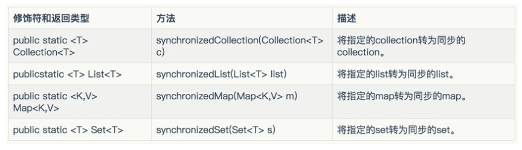

## ConcurrentHashMap

Hashtable一锁到底，性能不太好。为了解决这个问题，设计了ConcurrentHashMap。

一个ConcurrentHashMap对象里维护了一个Segment[]数组，每个Segment对象里又维护了一个HashEntry[]数组，每个HashEntry对象都是链表的一个节点：

~~~java
public class ConcurrentHashMap<K, V> {

    final Segment<K,V>[] segments;

    static final class HashEntry<K,V> {
        final K key;
        volatile V value;
        volatile HashEntry<K,V> next;
    }

    static final class Segment<K,V> extends ReentrantLock {
        transient volatile HashEntry<K,V>[] entrys;
    }
}
~~~

每个Segment对象其实都相当于是一个小的HashMap，都是由数组和链表组成的，相当于整个ConcurrentHashMap对象由若干个小的HashMap组成：

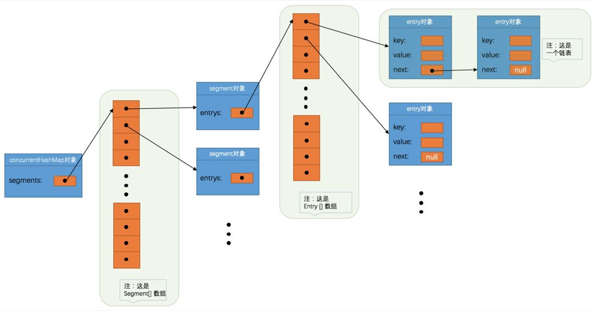

### 初始化

它的构造方法：

~~~java
public ConcurrentHashMap(int initialCapacity, float loadFactor, int concurrencyLevel)
~~~

几个参数：

* initialCapacity：容器初始容量，默认16
* loadFactor：加载因子，默认0.75，当某个Segment中存储的元素数量与对应的数组大小的比值大于该值时，Segment会扩大它的数组大小
* concurrencyLevel：并发更新的线程估计数，默认16，这个参数会决定建多少Segment

确定segments数组大小的代码：

~~~java
int sshift = 0;     //代表左移的次数

int ssize = 1;      //segments数组的大小

while (ssize < concurrencyLevel) {  //当segments数组的大小小于concurrencyLevel时，ssize左移翻倍

    ++sshift;   //左移次数加1
    ssize <<= 1;    //ssize左移一位，值扩大一倍
}

this.segmentShift = 32 - sshif;
this.segmentMask = ssize - 1;
~~~

当segments数组的大小小于concurrencyLevel时，ssize左移翻倍。由此可见，segments数组大小是比指定的concurrencyLevel大的最近的2的倍数

确定entry数组大小的代码：

~~~java
int c = initialCapacity / ssize;    //期望初始容量和segments数组大小比值
if (c * ssize < initialCapacity)
    ++c;
int cap = 2;    //cap代表entrys数组大小，最小为2
while (cap < c)     //保证entrys数组大小必须为2的倍数
    cap <<= 1;
~~~

如果我们初始时指定initialCapacity的值为33，segments计算结果为16，则最后c的值是3，代表每个segment对象里放3个键值对满足初始容量条件。cap是对c的值再处理一遍，取比c大的最小的2的倍数。

segmengs数组从创建ConcurrentHashMap对象后就不会再改变，扩容只涉及到Segment对象的entrys数组，扩容过程中不会影响其他Segment对象

### 定位元素

由此可见，entry数组大小和segments数组大小都是2的倍数，这是因为在定位一个哈希表的元素时：

* 首先通过hashCode/table.size()确定在数组中的位置
* 遍历在该数组元素处的链表，依次调用equals方法

当table的大小是2的倍数时，可以将除法改为移位运算，效率更高。

定位元素大致分为几步：定位到具体的segment、定位到具体的entrys数组，然后开始遍历链表

### put操作

put操作首先会根据指定的key定位到对应的Segment对象，因为segments数组在创建ConcurrentHashMap对象之后就不会再改动了，所以每个key对应的Segment对象是不会变的，所以这个过程是不需要加锁的。然后再在该Segment对应的entrys数组里进行插入或更新操作，这个过程需要加锁，不同的Segment的数据由不同的锁来保护

也就是说整个ConcurrentHashMap的数据被拆成若干个Segment，不同的Segment的数据由不同的锁来保护，这个就是所谓的分段锁，这样就减小了锁的粒度，从而减弱了锁的竞争，达到了提高性能的目的

### get操作

与 HashMap 不同的是，ConcurrentHashMap 的键和值都不允许为null，因为这会造成下边的get方法的歧义

get也需要首先根据指定的key定位到对应的Segment对象，然后再在该Segment对象对应的entrys数组里进行哈希查找操作。ConcurrentHashMap 的 get 操作并不需要加锁，只有在获取的 HashEntry 对象的 value 字段为 null 的情况下才会加锁重新读

在一个Segment中根据key查找节点大致是这么两步：

* 查找对应的entrys数组元素位置。
* 从该位置开始遍历链表，使用equals方法查看指定key是否与该节点匹配

如果不加锁的话，在一个线程执行get操作的时候，另一个线程可能对该Segment进行修改、扩容、插入、移除等操作，一个一个分析一下这些场景：

1、修改场景

观察HashEntry的源码：

~~~java
static final class HashEntry<K,V> {
    final K key;
    volatile V value;
    volatile HashEntry<K,V> next;
}
~~~

看到value是被volatile修饰的，所以任何线程的修改对其他线程是立即可见的，所以get操作会把修改后的值获取到，而不会拿到一个过期的值

2、扩容场景

假设某个Segment对象对应的entrys数组大小为2，然后只有一个节点，key是整数值1，value是字符串"a"，假设这个节点叫entry1，这个节点在0号元素所在的链表处：


当线程t1刚刚计算出，要找的值就在entrys数组的第一个位置的时候，另一个线程添加第二个元素的时候需要进行扩容了，扩容会将entrys数组的大小扩大一倍，并将所有节点重新散列：

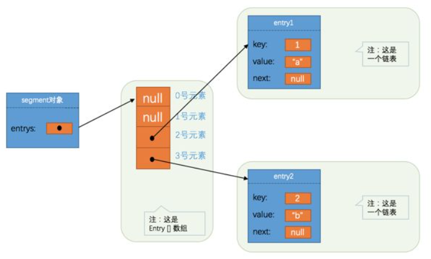

此时线程t1继续去entrys[0]寻找元素，结果是没找到，所以在这种情况下，虽然节点在链表中，并不能立马能对get可见。

3、插入场景

当线程t1调用get获取对应元素时，刚找到entrys数组，并找到了链表的头结点entry1，正在此时，另一个线程t2视图在相同的位置插入一个entry3节点。由于HashEntry的next字段是被final修饰的，所以一旦创建对象后，next值就不能改了，所以不能直接插到链表尾节点后边，只能从头部替换，这个过程的图示是这样的：

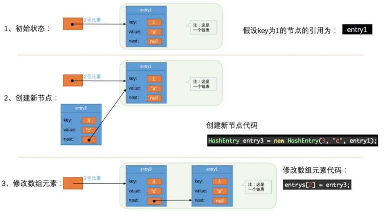

如果线程t2执行完了插入操作，t1才开始继续执行链表遍历，虽然此时entry3节点已经插入到了链表，但是由于线程t1是从entry1开始遍历的，所以最后也每匹配不到entry3。所以插入过程中也可能产生往entrys数组中加入一个元素后，并不能立马能对get可见

另外，由于指令重排序的原因，在插入一个新节点的时候，有可能对该新节点已经插入到链表中了，可是该节点的value字段的赋值还没完成，所以如果调用get方法获取到了节点，还需要判断一下节点的value值是不是为null，如果为null的话，需要加锁重新获取。这也是为什么在添加键值对的时候，值不许为null的原因

4、移除操作

跟插入操作类似，移除操作也可能造成get方法获取的值不是最新的值，具体过程就不写了

综上所述，在调用get方法时，找到链表后进行遍历的时候，其他线程可能对链表结构做了调整，因此get方法返回的可能是过时的数据，由于这一点，ConcurrentHashMap也被称为具有弱一致性。如果要求强一致性，那么必须使用Collections.synchronizedMap()方法或者直接使用Hashtable

在Collections.synchronizedMap()方法中，会通过使用一个全局的锁来同步不同线程间的并发访问

### size操作

由于整个ConcurrentHashMap的数据被划分到多个Segment中，不同的Segment用不同的锁来保护，所以size方法需要获取所有Segment的size数据。最简单的方法是执行size操作前把所有的Segment锁都获取到，把各个Segment中的Entry节点数量加起来返回之后再释放掉锁，但这样效率太低

设计者为了解决这个问题，在Segment中定义了一个叫modCount的字段，每当这个Segment中有增删操作进行的时候，都把这个字段加1。然后在进行size操作时，先以不获取锁的方式计算所有Segment中的Entry节点数量的和，并且计算所有modCount字段的和，之后再重复进行计算一次，如果两次的modCount字段的和一致，则认为在执行方法的过程中没有发生其他线程修改ConcurrentHashMap的情况，返回获得的值。如果不一致，加锁后进行操作

所以我们最好避免在多线程环境下使用size方法，因为它可能获取所有Segment的锁

## 写入时复制容器

如果多线程环境下遍历某个Collection容器的次数远比修改这个容器的次数多，可以尝试使用CopyOnWriteArrayList或者CopyOnWriteArraySet，它采用了一种所谓的写入时复制的技术。

对于普通的ArrayList，它底层是一个数组，add元素就是填充这个数组元素的过程。但对于CopyOnWriteArrayList则不同，每一次添加元素时，都会复制一个新的底层数组，然后添加操作在新数组中进行，添加结束后再将引用指向新数组：

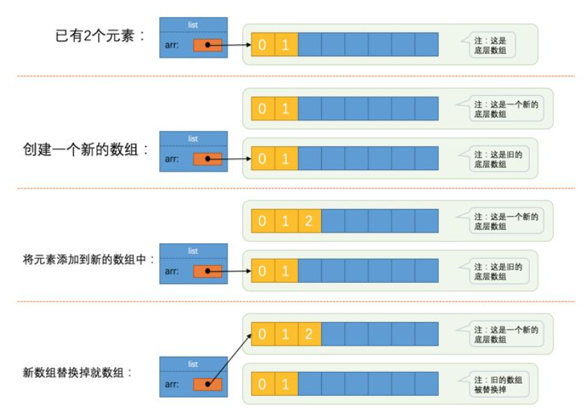

它的优势就是即使在遍历过程中有新的元素插入，它会被插入的新数组中，对遍历不会影响产生影响，也就不会抛出ConcurrentModificationException异常。调用get方法也是针对当前的底层数组调用的，如果在调用期间有别的线程写入，get方法时不能获取到最新值的，因此get方法是完全不加锁的。

CopyOnWriteArrayList 写入操作 add()方法在添加集合的时候加了锁，保证了同步，避免了多线程写的时候会 copy 出多个副本出来：

~~~java
    /**
     * Appends the specified element to the end of this list.
     *
     * @param e element to be appended to this list
     * @return {@code true} (as specified by {@link Collection#add})
     */
    public boolean add(E e) {
        final ReentrantLock lock = this.lock;
        lock.lock();//加锁
        try {
            Object[] elements = getArray();
            int len = elements.length;
            Object[] newElements = Arrays.copyOf(elements, len + 1);//拷贝新数组
            newElements[len] = e;
            setArray(newElements);
            return true;
        } finally {
            lock.unlock();//释放锁
        }
    }
~~~

## ConcurrentLinkedQueue

这种队列内部使用CAS操作实现入队和出队操作，可以保证安全性。

高效的并发队列，使用链表实现。可以看做一个线程安全的 LinkedList，这是一个非阻塞队列

## 阻塞队列

### 常用方法

阻塞队列的接口是BlockingQueue，它的各个方法：

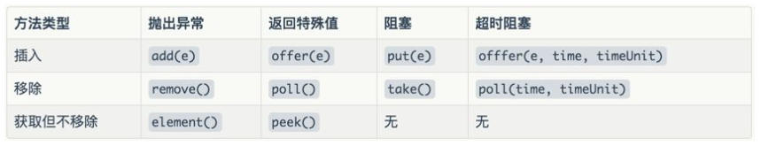

几种类型的方法解释：

* 抛出异常：当队列已满时调用add方法插入元素会抛出IllegalStateException异常，当队列为空时调用remove方法移出元素会抛出NoSuchElementException异常
* 返回特殊值：调用offer方法插入元素如果成功返回true，队列已满时返回false；调用poll方法移出元素如果成功返回该元素，队列为空时返回null

BlockingQueue 不接受 null 值的插入，相应的方法在碰到 null 的插入时会抛出 NullPointerException 异常。null 值在这里通常用于作为特殊值返回（表格中的第三列），代表 poll 失败。所以，如果允许插入 null 值的话，那获取的时候，就不能很好地用 null 来判断到底是代表失败，还是获取的值就是 null 值。

BlockingQueue 的实现都是线程安全的，但是批量的集合操作如 addAll, containsAll, retainAll 和 removeAll  不一定是原子操作。如 addAll(c) 有可能在添加了一些元素后中途抛出异常，此时 BlockingQueue 中已经添加了部分元素，这个是允许的，取决于具体的实现。

如果队列是无界的（通常，在这里我们说的无界队列也不是说真正的无界，而是它的容量是 Integer.MAX_VALUE（21亿多）），就是有多少元素就插多少元素的那种，则调用put和offer方法永远不会被阻塞。

下面是它的实现类：

* ArrayBlockingQueue：底层是数组结构的有界阻塞队列。一旦创建，容量不能改变。其并发控制采用可重入锁 ReentrantLock ，不管是插入操作还是读取操作，都需要获取到锁才能进行操作。 默认情况下不能保证线程访问队列的公平性，可以传入true创建一个公平队列

* LinkedBlockingQueue：底层是链表结构的有界阻塞队列，如果不指定容量那它的大小就是最大的int值

* PriorityBlockingQueue：支持优先级排序的无界阻塞队列。默认情况下元素采用自然顺序进行排序，也可以通过自定义类实现 compareTo() 方法来指定元素排序规则，或者初始化时通过构造器参数 Comparator 来指定排序规则。插入队列的对象必须是可比较大小的（comparable），否则报 ClassCastException 异常

  它就是 PriorityQueue 的线程安全版本，它不可以插入 null 值

  PriorityBlockingQueue 并发控制采用的是可重入锁 ReentrantLock

  队列为无界队列（ArrayBlockingQueue 是有界队列，LinkedBlockingQueue 也可以通过在构造函数中传入 capacity 指定队列最大的容量，但是 PriorityBlockingQueue 只能指定初始的队列大小，后面插入元素的时候，如果空间不够的话会自动扩容），它的插入操作 put 方法不会 block，因为它是无界队列（take 方法在队列为空的时候会阻塞）。

* DelayQueue：支持延时获取的无界阻塞队列

* SynchronousQueue：不存储元素的阻塞队列，这种队列内部并没有维护链表也没有维护数组，在一个线程调用put方法之后就会进入阻塞状态，直到另一个线程调用take方法把元素拿走或者响应中断才继续恢复执行

* LinkedTransferQueue：底层是链表结构的无界阻塞队列，它实现了普通阻塞队列方法的同时，提供了transfer方法，它可以直接将元素传递给因为取元素而阻塞的线程，如果没有线程阻塞等待，则将其插入队列中并阻塞，直到有别的线程取走元素，相当于实现了部分SynchronousQueue的功能

* LinkedBlockingDeque：底层是链表结构的双向阻塞队列，这个阻塞队列的两端都可以进行插入和阻塞操作，在原来队列的基础上增加了addFirst、addLast、offerFirst、offerLast、peekFirst、peekLast等方法


LinkedTransferQueue 是一个由链表数据结构构成的无界阻塞队列，由于该队列实现了 TransferQueue 接口，与其他阻塞队列相比主要有以下不同的方法：

* transfer(E e)

  如果当前有线程（消费者）正在调用 take()方法或者可延时的 poll()方法进行消费数据时，生产者线程可以调用 transfer 方法将数据传递给消费者线程。如果当前没有消费者线程的话，生产者线程就会将数据插入到队尾，直到有消费者能够进行消费才能退出；

* tryTransfer(E e)

  tryTransfer 方法如果当前有消费者线程（调用 take 方法或者具有超时特性的 poll 方法）正在消费数据的话，该方法可以将数据立即传送给消费者线程，如果当前没有消费者线程消费数据的话，就立即返回false。因此，与 transfer 方法相比，transfer 方法是必须等到有消费者线程消费数据时，生产者线程才能够返回。而 tryTransfer 方法能够立即返回结果退出。

* tryTransfer(E e,long timeout,imeUnit unit)

  与 transfer 基本功能一样，只是增加了超时特性，如果数据才规定的超时时间内没有消费者进行消费的话，就返回false。

LinkedBlockingDeque 是基于链表数据结构的有界阻塞双端队列，如果在创建对象时为指定大小时，其默认大小为 Integer.MAX_VALUE。与 LinkedBlockingQueue 相比，主要的不同点在于，LinkedBlockingDeque 具有双端队列的特性。

###DelayQueue

下面重点介绍DelayQueue，它是支持延时获取的无界阻塞队列

只有当数据对象的延时时间达到时才能插入到队列进行存储。如果当前所有的数据都还没有达到创建时所指定的延时期，则队列没有队头，并且线程通过 poll 等方法获取数据元素则返回 null。所谓数据延时期满时，则是通过 Delayed 接口的getDelay(TimeUnit.NANOSECONDS)来进行判定，如果该方法返回的是小于等于 0 则说明该数据元素的延时期已满

假如这个队列里有3个元素，第1个元素需要在8:10才能获取，第2个元素需要8:20才能获取，第3个元素需要在8:30才能获取。假设当前的时间是8:00，虽然此刻队列里有元素，但是现在调用take方法仍然会阻塞，直到10分钟后第1个元素获取时间到才可以恢复执行，获取完第1个元素后又开始阻塞，直到再过10分钟第2个元素获取时间到才恢复执行，获取第3个元素的过程也是这样。

DelayQueue中保存的元素需要实现Delayed接口，它实现了Comparable接口：

~~~java
public interface Delayed extends Comparable<Delayed> {
    long getDelay(TimeUnit unit);
}
~~~

在DelayQueue的take方法中，如果调用该对象的getDelay方法返回结果不大于0，说明这个节点可以获取，如果返回结果大于0，说明还没到获取该对象的时机，这个线程将处于限时等待状态：

~~~java
public E take() throws InterruptedException {
    // ... 为突出重点，省略其他代码

    E first = q.peek();  //获取但不移除
    long delay = first.getDelay(TimeUnit.NANOSECONDS);
    if (delay <= 0) //如果不大于0则移除
        return q.poll();
    // ... 为突出重点，省略其他代码    
}    
~~~

定义一个延迟队列的元素类，time代表节点可以获取的时间，单位：纳秒

~~~java
public class DelayedObject implements Delayed {

    private int time;   //节点可以获取的时间，单位：纳秒

    public DelayedObject(int time) {
        this.time = time;
    }

    @Override
    public long getDelay(TimeUnit unit) {
        long curNaos = System.nanoTime();   //获取以纳秒表示的当前时间
        return time - curNaos;
    }

    @Override
    public int compareTo(Delayed o) {
        if (this == o) {
            return 0;
        }

        if (o instanceof DelayedObject) {   //如果该对象是DelayedObject，直接比较获取时间
            int d = this.time - ((DelayedObject) o).time;
            return (d == 0) ? 0 : ((d < 0) ? -1 : 1);
        }

        //该对象不是DelayedObject，比较getDelay方法
        long d = getDelay(TimeUnit.NANOSECONDS) - o.getDelay(TimeUnit.NANOSECONDS);
        return (d == 0) ? 0 : ((d < 0) ? -1 : 1);
    }
}
~~~

阻塞队列的实现原理都是加锁

### ArrayBlockingQueue

ArrayBlockingQueue 是 BlockingQueue 接口的有界队列实现类，底层采用数组来实现。

其并发控制采用可重入锁来控制，不管是插入操作还是读取操作，都需要获取到锁才能进行操作。它采用一个 ReentrantLock 和相应的两个 Condition 来实现。

ArrayBlockingQueue 共有以下几个属性：

~~~java
// 用于存放元素的数组
final Object[] items;
// 下一次读取操作的位置
int takeIndex;
// 下一次写入操作的位置
int putIndex;
// 队列中的元素数量
int count;

// 以下几个就是控制并发用的同步器
final ReentrantLock lock;
private final Condition notEmpty;
private final Condition notFull;
~~~

用个示意图来描述其同步机制：


ArrayBlockingQueue 实现并发同步的原理就是，读操作和写操作都需要获取到 AQS 独占锁才能进行操作。如果队列为空，这个时候读操作的线程进入到读线程队列排队，等待写线程写入新的元素，然后唤醒读线程队列的第一个等待线程。如果队列已满，这个时候写操作的线程进入到写线程队列排队，等待读线程将队列元素移除腾出空间，然后唤醒写线程队列的第一个等待线程。

对于 ArrayBlockingQueue，我们可以在构造的时候指定以下三个参数：

1. 队列容量，其限制了队列中最多允许的元素个数；
2. 指定独占锁是公平锁还是非公平锁。非公平锁的吞吐量比较高，公平锁可以保证每次都是等待最久的线程获取到锁；
3. 可以指定用一个集合来初始化，将此集合中的元素在构造方法期间就先添加到队列中。

### LinkedBlockingQueue

它是基于单向链表实现的阻塞队列，可以当做无界队列也可以当做有界队列来使用。默认队列最大容量实际上是Integer.MAX_VALUE

这个类的属性：

~~~java
// 队列容量
private final int capacity;

// 队列中的元素数量
private final AtomicInteger count = new AtomicInteger(0);

// 队头
private transient Node<E> head;

// 队尾
private transient Node<E> last;

// take, poll, peek 等读操作的方法需要获取到这个锁
private final ReentrantLock takeLock = new ReentrantLock();

// 如果读操作的时候队列是空的，那么等待 notEmpty 条件
private final Condition notEmpty = takeLock.newCondition();

// put, offer 等写操作的方法需要获取到这个锁
private final ReentrantLock putLock = new ReentrantLock();

// 如果写操作的时候队列是满的，那么等待 notFull 条件
private final Condition notFull = putLock.newCondition();
~~~

这里用了两个锁，两个 Condition，简单介绍如下：

* takeLock 和 notEmpty 怎么搭配：如果要获取（take）一个元素，需要获取 takeLock 锁，但是获取了锁还不够，如果队列此时为空，还需要队列不为空（notEmpty）这个条件（Condition）。
* putLock 需要和 notFull 搭配：如果要插入（put）一个元素，需要获取 putLock 锁，但是获取了锁还不够，如果队列此时已满，还需要队列不是满的（notFull）这个条件（Condition）。

LinkedBlockingQueue 的并发读写控制示意图：


读操作是排好队的，写操作也是排好队的，唯一的并发问题在于一个写操作和一个读操作同时进行，只要控制好这个就可以了。

构造方法中会初始化一个空的头结点，那么第一个元素入队的时候，队列中就会有两个元素。读取元素时，也总是获取头节点后面的一个节点。count 的计数值不包括这个头节点：

~~~java
public LinkedBlockingQueue(int capacity) {
    if (capacity <= 0) throw new IllegalArgumentException();
    this.capacity = capacity;
    last = head = new Node<E>(null);
}
~~~

put 方法源码，首先获取到putLock，然后等待notFull 的条件满足，修改链表，执行入队操作：

~~~java
public void put(E e) throws InterruptedException {
    if (e == null) throw new NullPointerException();
    // 如果你纠结这里为什么是 -1，可以看看 offer 方法。这就是个标识成功、失败的标志而已。
    int c = -1;
    Node<E> node = new Node(e);
    final ReentrantLock putLock = this.putLock;
    final AtomicInteger count = this.count;
    // 必须要获取到 putLock 才可以进行插入操作
    putLock.lockInterruptibly();
    try {
        // 如果队列满，等待 notFull 的条件满足。
        while (count.get() == capacity) {
            notFull.await();
        }
        // 入队
        enqueue(node);
        // count 原子加 1，c 还是加 1 前的值
        c = count.getAndIncrement();
        // 如果这个元素入队后，还有至少一个槽可以使用，调用 notFull.signal() 唤醒等待线程。
        // 哪些线程会等待在 notFull 这个 Condition 上呢？
        if (c + 1 < capacity)
            notFull.signal();
    } finally {
        // 入队后，释放掉 putLock
        putLock.unlock();
    }
    // 如果 c == 0，那么代表队列在这个元素入队前是空的（不包括head空节点），
    // 那么所有的读线程都在等待 notEmpty 这个条件，等待唤醒，这里做一次唤醒操作
    if (c == 0)
        signalNotEmpty();
}

// 入队的代码非常简单，就是将 last 属性指向这个新元素，并且让原队尾的 next 指向这个元素
// 这里入队没有并发问题，因为只有获取到 putLock 独占锁以后，才可以进行此操作
private void enqueue(Node<E> node) {
    // assert putLock.isHeldByCurrentThread();
    // assert last.next == null;
    last = last.next = node;
}

// 元素入队后，如果需要，调用这个方法唤醒读线程来读
private void signalNotEmpty() {
    final ReentrantLock takeLock = this.takeLock;
    takeLock.lock();
    try {
        notEmpty.signal();
    } finally {
        takeLock.unlock();
    }
}
~~~

take 方法类似，先获取到takeLock，然后等待 notEmpty 这个条件满足再继续执行，取队头，出队：

~~~java
public E take() throws InterruptedException {
    E x;
    int c = -1;
    final AtomicInteger count = this.count;
    final ReentrantLock takeLock = this.takeLock;
    // 首先，需要获取到 takeLock 才能进行出队操作
    takeLock.lockInterruptibly();
    try {
        // 如果队列为空，等待 notEmpty 这个条件满足再继续执行
        while (count.get() == 0) {
            notEmpty.await();
        }
        // 出队
        x = dequeue();
        // count 进行原子减 1
        c = count.getAndDecrement();
        // 如果这次出队后，队列中至少还有一个元素，那么调用 notEmpty.signal() 唤醒其他的读线程
        if (c > 1)
            notEmpty.signal();
    } finally {
        // 出队后释放掉 takeLock
        takeLock.unlock();
    }
    // 如果 c == capacity，那么说明在这个 take 方法发生的时候，队列是满的
    // 既然出队了一个，那么意味着队列不满了，唤醒写线程去写
    if (c == capacity)
        signalNotFull();
    return x;
}
// 取队头，出队
private E dequeue() {
    // assert takeLock.isHeldByCurrentThread();
    // assert head.item == null;
    // 之前说了，头结点是空的
    Node<E> h = head;
    Node<E> first = h.next;
    h.next = h; // help GC
    // 设置这个为新的头结点
    head = first;
    E x = first.item;
    first.item = null;
    return x;
}
// 元素出队后，如果需要，调用这个方法唤醒写线程来写
private void signalNotFull() {
    final ReentrantLock putLock = this.putLock;
    putLock.lock();
    try {
        notFull.signal();
    } finally {
        putLock.unlock();
    }
}
~~~

### SynchronousQueue

它的特点是：当一个线程往队列中写入一个元素时，写入操作不会立即返回，需要等待另一个线程来将这个元素拿走；同理，当一个读线程做读操作的时候，同样需要一个相匹配的写线程的写操作。这里的 Synchronous 指的就是读线程和写线程需要同步，一个读线程匹配一个写线程。

虽然上面我说了队列，但是 SynchronousQueue 的队列其实是虚的，其不提供任何空间（一个都没有）来存储元素。数据必须从某个写线程交给某个读线程，而不是写到某个队列中等待被消费。

你不能在 SynchronousQueue 中使用 peek 方法（在这里这个方法直接返回 null），peek 方法的语义是只读取不移除，显然，这个方法的语义是不符合 SynchronousQueue 的特征的。SynchronousQueue 也不能被迭代，因为根本就没有元素可以拿来迭代的。虽然 SynchronousQueue 间接地实现了 Collection 接口，但是如果你将其当做 Collection 来用的话，那么集合是空的。当然，这个类也是不允许传递 null 值的（并发包中的容器类好像都不支持插入 null 值，因为 null 值往往用作其他用途，比如用于方法的返回值代表操作失败）。

构造时，我们可以指定公平模式还是非公平模式，对应底层的两种实现方式：

~~~java
// 构造时，我们可以指定公平模式还是非公平模式，区别之后再说
public SynchronousQueue(boolean fair) {
    transferer = fair ? new TransferQueue() : new TransferStack();
}
abstract static class Transferer {
    // 从方法名上大概就知道，这个方法用于转移元素，从生产者手上转到消费者手上
    // 也可以被动地，消费者调用这个方法来从生产者手上取元素
    // 第一个参数 e 如果不是 null，代表场景为：将元素从生产者转移给消费者
    // 如果是 null，代表消费者等待生产者提供元素，然后返回值就是相应的生产者提供的元素
    // 第二个参数代表是否设置超时，如果设置超时，超时时间是第三个参数的值
    // 返回值如果是 null，代表超时，或者中断。具体是哪个，可以通过检测中断状态得到。
    abstract Object transfer(Object e, boolean timed, long nanos);
}
~~~

Transferer 有两个内部实现类，公平模式意味着，所有的读写线程都遵守先来后到，对应 TransferQueue。而非公平模式则对应 TransferStack。

put 方法和 take 方法：

~~~java
// 写入值
public void put(E o) throws InterruptedException {
    if (o == null) throw new NullPointerException();
    if (transferer.transfer(o, false, 0) == null) { // 1
        Thread.interrupted();
        throw new InterruptedException();
    }
}
// 读取值并移除
public E take() throws InterruptedException {
    Object e = transferer.transfer(null, false, 0); // 2
    if (e != null)
        return (E)e;
    Thread.interrupted();
    throw new InterruptedException();
}
~~~

我们看到，写操作 put(E o) 和读操作 take() 都是调用 Transferer.transfer(…) 方法，区别在于第一个参数是否为 null 值。

transfer 的设计思路：

1. 当调用这个方法时，如果队列是空的，或者队列中的节点和当前的线程操作类型一致（如当前操作是 put 操作，而队列中的元素也都是写线程）。这种情况下，将当前线程加入到等待队列即可。
2. 如果队列中有等待节点，而且与当前操作可以匹配（如队列中都是读操作线程，当前线程是写操作线程，反之亦然）。这种情况下，匹配等待队列的队头，出队，返回相应数据。

其实这里有个隐含的条件被满足了，队列如果不为空，肯定都是同种类型的节点，要么都是读操作，要么都是写操作。这个就要看到底是读线程积压了，还是写线程积压了。

TransferQueue中等待队列是用QNode实现的：

~~~java
static final class QNode {
    volatile QNode next;          // 可以看出来，等待队列是单向链表
    volatile Object item;         // CAS'ed to or from null
    volatile Thread waiter;       // 将线程对象保存在这里，用于挂起和唤醒
    final boolean isData;         // 用于判断是写线程节点(isData == true)，还是读线程节点

    QNode(Object item, boolean isData) {
        this.item = item;
        this.isData = isData;
    }
  ......
~~~

每次入队时将请求封装起来放到等待队列中，然后进行自旋，等待写请求的到来。写请求也是一样，也会在等待队列中等待。

TransferStack的逻辑：

1. 当调用这个方法时，如果队列是空的，或者队列中的节点和当前的线程操作类型一致（如当前操作是 put 操作，而栈中的元素也都是写线程）。这种情况下，将当前线程加入到等待栈中，等待配对。然后返回相应的元素，或者如果被取消了的话，返回 null。
2. 如果栈中有等待节点，而且与当前操作可以匹配（如栈里面都是读操作线程，当前线程是写操作线程，反之亦然）。将当前节点压入栈顶，和栈中的节点进行匹配，然后将这两个节点出栈。配对和出栈的动作其实也不是必须的，因为下面的一条会执行同样的事情。
3. 如果栈顶是进行匹配而入栈的节点，帮助其进行匹配并出栈，然后再继续操作。

### PriorityBlockingQueue

带排序的 BlockingQueue 实现，其并发控制采用的是 ReentrantLock，队列为无界队列（ArrayBlockingQueue 是有界队列，LinkedBlockingQueue 也可以通过在构造函数中传入 capacity 指定队列最大的容量，但是 PriorityBlockingQueue 只能指定初始的队列大小，后面插入元素的时候，如果空间不够的话会自动扩容）。

简单地说，它就是 PriorityQueue 的线程安全版本。不可以插入 null 值，同时，插入队列的对象必须是可比较大小的（comparable），否则报 ClassCastException 异常。它的插入操作 put 方法不会 block，因为它是无界队列（take 方法在队列为空的时候会阻塞）。

它的属性：

~~~java
// 构造方法中，如果不指定大小的话，默认大小为 11
private static final int DEFAULT_INITIAL_CAPACITY = 11;
// 数组的最大容量
private static final int MAX_ARRAY_SIZE = Integer.MAX_VALUE - 8;

// 这个就是存放数据的数组
private transient Object[] queue;

// 队列当前大小
private transient int size;

// 大小比较器，如果按照自然序排序，那么此属性可设置为 null
private transient Comparator<? super E> comparator;

// 并发控制所用的锁，所有的 public 且涉及到线程安全的方法，都必须先获取到这个锁
private final ReentrantLock lock;

// 这个很好理解，其实例由上面的 lock 属性创建
private final Condition notEmpty;

// 这个也是用于锁，用于数组扩容的时候，需要先获取到这个锁，才能进行扩容操作
// 其使用 CAS 操作
private transient volatile int allocationSpinLock;

// 用于序列化和反序列化的时候用，对于 PriorityBlockingQueue 我们应该比较少使用到序列化
private PriorityQueue q;
~~~

此类实现了 Collection 和 Iterator 接口中的所有接口方法，对其对象进行迭代并遍历时，不能保证有序性。如果你想要实现有序遍历，建议采用 Arrays.sort(queue.toArray()) 进行处理。PriorityBlockingQueue 提供了 drainTo 方法用于将部分或全部元素有序地填充（准确说是转移，会删除原队列中的元素）到另一个集合中。还有一个需要说明的是，如果两个对象的优先级相同（compare 方法返回 0），此队列并不保证它们之间的顺序。

PriorityBlockingQueue 使用了基于数组的二叉堆来存放元素，所有的 public 方法采用同一个 lock 进行并发控制。

二叉堆：一颗完全二叉树，它非常适合用数组进行存储，对于数组中的元素 a[i]，其左子节点为 a[2\*i+1]，其右子节点为 a[2*i + 2]，其父节点为 a[(i-1)/2]，其堆序性质为，每个节点的值都小于其左右子节点的值。二叉堆中最小的值就是根节点，但是删除根节点是比较麻烦的，因为需要调整树。


## ConcurrentSkipListMap

对于一个单链表，即使链表是有序的，如果我们想要在其中查找某个数据，也只能从头到尾遍历链表，这样效率自然就会很低，跳表就不一样了。跳表是一种可以用来快速查找的数据结构，有点类似于平衡树。它们都可以对元素进行快速的查找。但一个重要的区别是：对平衡树的插入和删除往往很可能导致平衡树进行一次全局的调整。而对跳表的插入和删除只需要对整个数据结构的局部进行操作即可。这样带来的好处是：在高并发的情况下，你会需要一个全局锁来保证整个平衡树的线程安全。而对于跳表，你只需要部分锁即可。这样，在高并发环境下，你就可以拥有更好的性能。而就查询的性能而言，跳表的时间复杂度也是 O(logn)

所以在并发数据结构中，JDK 使用跳表来实现一个有顺序的 Map。

跳表的本质是同时维护了多个链表，并且链表是分层的：

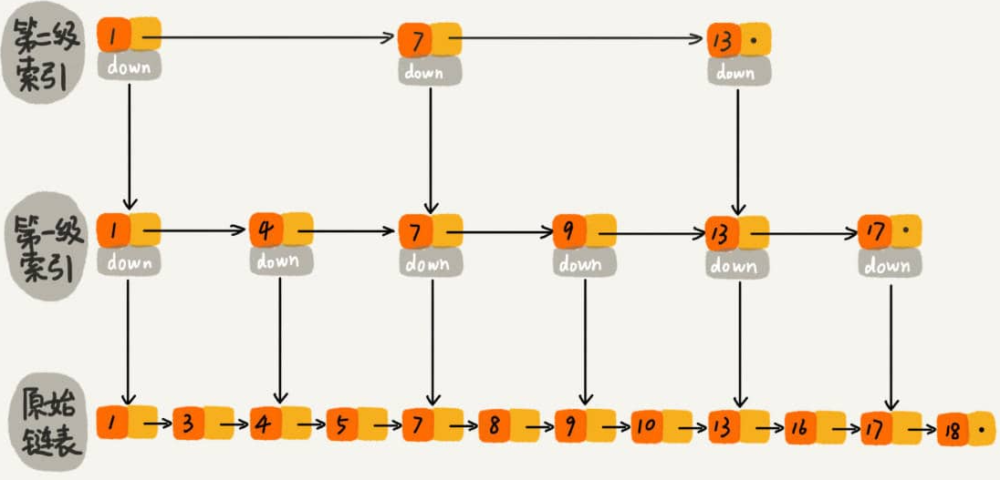

最低层的链表维护了跳表内所有的元素，每上面一层链表都是下面一层的子集。

跳表内的所有链表的元素都是排序的。查找时，可以从顶级链表开始找。一旦发现被查找的元素大于当前链表中的取值，就会转入下一层链表继续找。这也就是说在查找过程中，搜索是跳跃式的。如下图所示，在跳表中查找元素 18：


查找 18 的时候原来需要遍历 18 次，现在只需要 7 次即可。针对链表长度比较大的时候，构建索引查找效率的提升就会非常明显。

从上面很容易看出，跳表是一种利用空间换时间的算法

# CompletableFuture

它是才被引入的一个用于异步编程的类，它可以看作是异步运算和结果的载体，它同时实现了 Future 和 CompletionStage 接口：

~~~java
public class CompletableFuture<T> implements Future<T>, CompletionStage<T> {
}
~~~

Future接口提供了cancel、get、isDone等方法，用于异步任务；而CompletionStage 接口提供了thenRun、thenAccept等函数式编程能力。

## 创建对象

可以通过new来创建对象，假设在未来的某个时刻，我们得到了最终的结果。这时，我们可以调用 complete() 方法为其传入结果，这表示 resultFuture 已经被完成了：

~~~java
CompletableFuture<RpcResponse<Object>> resultFuture = new CompletableFuture<>();
// complete() 方法只能调用一次，后续调用将被忽略。
resultFuture.complete(rpcResponse);
rpcResponse = completableFuture.get();
~~~

如果你已经知道计算的结果的话，可以使用静态方法 completedFuture() 来创建 CompletableFuture：

~~~java
CompletableFuture<String> future = CompletableFuture.completedFuture("hello!");
assertEquals("hello!", future.get());
~~~

completedFuture() 方法底层调用的是带参数的 new 方法，只不过，这个方法不对外暴露。

更普遍的做法是创建对象时封装计算逻辑：

~~~java
static <U> CompletableFuture<U> supplyAsync(Supplier<U> supplier);
// 使用自定义线程池(推荐)
static <U> CompletableFuture<U> supplyAsync(Supplier<U> supplier, Executor executor);
static CompletableFuture<Void> runAsync(Runnable runnable);
// 使用自定义线程池(推荐)
static CompletableFuture<Void> runAsync(Runnable runnable, Executor executor);
~~~

示例：

~~~java
CompletableFuture<Void> future = CompletableFuture.runAsync(() -> System.out.println("hello!"));
future.get();// 输出 "hello!"
CompletableFuture<String> future2 = CompletableFuture.supplyAsync(() -> "hello!");
assertEquals("hello!", future2.get());
~~~

## 处理异步计算结果

当我们获取到异步计算的结果之后，还可以对其进行进一步的处理，比较常用的方法有下面几个：

* thenApply()
* thenAccept()
* thenRun()
* whenComplete()

1、thenApply

thenApply() 方法接受一个 Function 实例，用它来处理结果：

~~~java
// 沿用上一个任务的线程池
public <U> CompletableFuture<U> thenApply(
    Function<? super T,? extends U> fn) {
    return uniApplyStage(null, fn);
}

//使用默认的 ForkJoinPool 线程池（不推荐）
public <U> CompletableFuture<U> thenApplyAsync(
    Function<? super T,? extends U> fn) {
    return uniApplyStage(defaultExecutor(), fn);
}
// 使用自定义线程池(推荐)
public <U> CompletableFuture<U> thenApplyAsync(
    Function<? super T,? extends U> fn, Executor executor) {
    return uniApplyStage(screenExecutor(executor), fn);
}
~~~

使用示例：

~~~java
CompletableFuture<String> future = CompletableFuture.completedFuture("hello!")
        .thenApply(s -> s + "world!");
assertEquals("hello!world!", future.get());
// 这次调用将被忽略。
future.thenApply(s -> s + "nice!");
assertEquals("hello!world!", future.get());
~~~

还可以进行流式调用：

~~~java
CompletableFuture<String> future = CompletableFuture.completedFuture("hello!")
        .thenApply(s -> s + "world!").thenApply(s -> s + "nice!");
assertEquals("hello!world!nice!", future.get());
~~~

2、thenAccept和thenRun

如果你不需要从回调函数中获取返回结果，可以使用 thenAccept() 或者 thenRun()。这两个方法的区别在于 thenRun() 不能访问异步计算的结果。

thenAccept() 方法的参数是 Consumer<? super T>，Consumer 属于消费型接口，它可以接收 1 个输入对象然后进行“消费”：

~~~java
public CompletableFuture<Void> thenAccept(Consumer<? super T> action) {
    return uniAcceptStage(null, action);
}

public CompletableFuture<Void> thenAcceptAsync(Consumer<? super T> action) {
    return uniAcceptStage(defaultExecutor(), action);
}

public CompletableFuture<Void> thenAcceptAsync(Consumer<? super T> action,
                                               Executor executor) {
    return uniAcceptStage(screenExecutor(executor), action);
}
~~~

thenRun() 的方法是的参数是 Runnable：

~~~java
public CompletableFuture<Void> thenRun(Runnable action) {
    return uniRunStage(null, action);
}

public CompletableFuture<Void> thenRunAsync(Runnable action) {
    return uniRunStage(defaultExecutor(), action);
}

public CompletableFuture<Void> thenRunAsync(Runnable action,
                                            Executor executor) {
    return uniRunStage(screenExecutor(executor), action);
}
~~~

thenAccept() 和 thenRun() 使用示例如下：

~~~java
CompletableFuture.completedFuture("hello!")
        .thenApply(s -> s + "world!").thenApply(s -> s + "nice!").thenAccept(System.out::println);//hello!world!nice!

CompletableFuture.completedFuture("hello!")
        .thenApply(s -> s + "world!").thenApply(s -> s + "nice!").thenRun(() -> System.out.println("hello!"));//hello!
~~~

3、whenComplete

whenComplete() 的方法的参数是 BiConsumer<? super T, ? super Throwable>：

~~~java
public CompletableFuture<T> whenComplete(
    BiConsumer<? super T, ? super Throwable> action) {
    return uniWhenCompleteStage(null, action);
}


public CompletableFuture<T> whenCompleteAsync(
    BiConsumer<? super T, ? super Throwable> action) {
    return uniWhenCompleteStage(defaultExecutor(), action);
}
// 使用自定义线程池(推荐)
public CompletableFuture<T> whenCompleteAsync(
    BiConsumer<? super T, ? super Throwable> action, Executor executor) {
    return uniWhenCompleteStage(screenExecutor(executor), action);
}
~~~

相对于 Consumer ， BiConsumer 可以接收 2 个输入对象然后进行“消费”。使用示例：

~~~java
CompletableFuture<String> future = CompletableFuture.supplyAsync(() -> "hello!")
        .whenComplete((res, ex) -> {
            // res 代表返回的结果
            // ex 的类型为 Throwable ，代表抛出的异常
            System.out.println(res);
            // 这里没有抛出异常所有为 null
            assertNull(ex);
        });
assertEquals("hello!", future.get());
~~~

## 异常处理

你可以通过 handle() 方法来处理任务执行过程中可能出现的抛出异常的情况：

~~~java
public <U> CompletableFuture<U> handle(
    BiFunction<? super T, Throwable, ? extends U> fn) {
    return uniHandleStage(null, fn);
}

public <U> CompletableFuture<U> handleAsync(
    BiFunction<? super T, Throwable, ? extends U> fn) {
    return uniHandleStage(defaultExecutor(), fn);
}

public <U> CompletableFuture<U> handleAsync(
    BiFunction<? super T, Throwable, ? extends U> fn, Executor executor) {
    return uniHandleStage(screenExecutor(executor), fn);
}
~~~

示例代码如下：

~~~java
CompletableFuture<String> future
        = CompletableFuture.supplyAsync(() -> {
    if (true) {
        throw new RuntimeException("Computation error!");
    }
    return "hello!";
}).handle((res, ex) -> {
    // res 代表返回的结果
    // ex 的类型为 Throwable ，代表抛出的异常
    return res != null ? res : "world!";
});
assertEquals("world!", future.get());
~~~

还可以通过 exceptionally() 方法来处理异常情况：

~~~java
CompletableFuture<String> future
        = CompletableFuture.supplyAsync(() -> {
    if (true) {
        throw new RuntimeException("Computation error!");
    }
    return "hello!";
}).exceptionally(ex -> {
    System.out.println(ex.toString());// CompletionException
    return "world!";
});
assertEquals("world!", future.get());
~~~

如果你想让 CompletableFuture 的结果就是异常的话，可以使用 completeExceptionally() 方法为其赋值：

~~~java
CompletableFuture<String> completableFuture = new CompletableFuture<>();
// ...
completableFuture.completeExceptionally(
  new RuntimeException("Calculation failed!"));
// ...
completableFuture.get(); // ExecutionException
~~~

## 组合 CompletableFuture

可以使用 thenCompose() 按顺序链接两个 CompletableFuture 对象：

~~~java
public <U> CompletableFuture<U> thenCompose(
    Function<? super T, ? extends CompletionStage<U>> fn) {
    return uniComposeStage(null, fn);
}

public <U> CompletableFuture<U> thenComposeAsync(
    Function<? super T, ? extends CompletionStage<U>> fn) {
    return uniComposeStage(defaultExecutor(), fn);
}

public <U> CompletableFuture<U> thenComposeAsync(
    Function<? super T, ? extends CompletionStage<U>> fn,
    Executor executor) {
    return uniComposeStage(screenExecutor(executor), fn);
}
~~~

thenCompose() 方法使用示例如下：

~~~java
CompletableFuture<String> future
        = CompletableFuture.supplyAsync(() -> "hello!")
        .thenCompose(s -> CompletableFuture.supplyAsync(() -> s + "world!"));
assertEquals("hello!world!", future.get());
~~~

在实际开发中，这个方法还是非常有用的。比如说，我们先要获取用户信息然后再用用户信息去做其他事情

和 thenCompose() 方法类似的还有 thenCombine() 方法， thenCombine() 同样可以组合两个 CompletableFuture 对象：

~~~java
CompletableFuture<String> completableFuture
        = CompletableFuture.supplyAsync(() -> "hello!")
        .thenCombine(CompletableFuture.supplyAsync(
                () -> "world!"), (s1, s2) -> s1 + s2)
        .thenCompose(s -> CompletableFuture.supplyAsync(() -> s + "nice!"));
assertEquals("hello!world!nice!", completableFuture.get());
~~~

thenCompose() 和 thenCombine() 区别：

* thenCompose() 可以两个 CompletableFuture 对象，并将前一个任务的返回结果作为下一个任务的参数，它们之间存在着先后顺序。
* thenCombine() 会在两个任务都执行完成后，把两个任务的结果合并。两个任务是并行执行的，它们之间并没有先后依赖顺序。

## 并行运行多个 CompletableFuture

可以通过 CompletableFuture 的 allOf()这个静态方法来并行运行多个 CompletableFuture

实际项目中，我们经常需要并行运行多个互不相关的任务，这些任务之间没有依赖关系，可以互相独立地运行。

比说我们要读取处理 6 个文件，这 6 个任务都是没有执行顺序依赖的任务，但是我们需要返回给用户的时候将这几个文件的处理的结果进行统计整理。像这种情况我们就可以使用并行运行多个 CompletableFuture 来处理：

~~~java
CompletableFuture<Void> task1 =
  CompletableFuture.supplyAsync(()->{
    //自定义业务操作
  });
......
CompletableFuture<Void> task6 =
  CompletableFuture.supplyAsync(()->{
    //自定义业务操作
  });
......
 CompletableFuture<Void> headerFuture=CompletableFuture.allOf(task1,.....,task6);

  try {
    headerFuture.join();
  } catch (Exception ex) {
    ......
  }
System.out.println("all done. ");
~~~

allOf() 方法会等到所有的 CompletableFuture 都运行完成之后再返回，而anyOf() 方法不会等待所有的 CompletableFuture 都运行完成之后再返回，只要有一个执行完成即可。

调用 join() 可以让程序等future1 和 future2 都运行完了之后再继续执行，可以实现类似CountDownLatch的效果

# Fork/Join框架

## 工作窃取算法

Fork/Join框架是一个实现了ExecutorService接口的多线程处理器，它专为那些可以通过递归分解成更细小的任务而设计，最大化的利用多核处理器来提高应用程序的性能。与其他ExecutorService相关的实现相同的是，Fork/Join框架会将任务分配给线程池中的线程。而与之不同的是，Fork/Join框架在执行任务时使用了工作窃取算法。

fork在英文里有分叉的意思，join在英文里连接、结合的意思。顾名思义，fork就是要使一个大任务分解成若干个小任务，而join就是最后将各个小任务的结果结合起来得到大任务的结果。

Fork/Join的运行流程大致如下所示：


需要注意的是，图里的次级子任务可以一直分下去，一直分到子任务足够小为止。用伪代码来表示如下：

~~~
solve(任务):
    if(任务已经划分到足够小):
        顺序执行任务
    else:
        for(划分任务得到子任务)
            solve(子任务)
        结合所有子任务的结果到上一层循环
        return 最终结合的结果
~~~

通过上面伪代码可以看出，我们通过递归嵌套的计算得到最终结果，这里有体现分而治之(divide and conquer) 的算法思想。

工作窃取算法指的是在多线程执行不同任务队列的过程中，某个线程执行完自己队列的任务后从其他线程的任务队列里窃取任务来执行。流程如下图所示：


值得注意的是，当一个线程窃取另一个线程的时候，为了减少两个任务线程之间的竞争，我们通常使用双端队列来存储任务。被窃取的任务线程都从双端队列的头部拿任务执行，而窃取其他任务的线程从双端队列的尾部执行任务。

另外，当一个线程在窃取任务时要是没有其他可用的任务了，这个线程会进入阻塞状态以等待再次“工作”。

## ForkJoinTask

Fork/Join框架简单来讲就是对任务的分割与子任务的合并，所以要实现这个框架，先得有任务。在Fork/Join框架里提供了抽象类ForkJoinTask来实现任务。

ForkJoinTask是一个类似普通线程的实体，但是比普通线程轻量得多。ForkJoinPool是用于执行ForkJoinTask任务的执行（线程）池。

ForkJoinPool的fork方法使用线程池中的空闲线程异步提交任务：

~~~java
// 本节所有代码都引自Java 8
public final ForkJoinTask<V> fork() {
    Thread t;
    // ForkJoinWorkerThread是执行ForkJoinTask的专有线程，由ForkJoinPool管理
    // 先判断当前线程是否是ForkJoin专有线程，如果是，则将任务push到当前线程所负责的队列里去
    if ((t = Thread.currentThread()) instanceof ForkJoinWorkerThread)
        ((ForkJoinWorkerThread)t).workQueue.push(this);
    else
         // 如果不是则将线程加入队列
        // 没有显式创建ForkJoinPool的时候走这里，提交任务到默认的common线程池中
        ForkJoinPool.common.externalPush(this);
    return this;
}
~~~

其实fork()只做了一件事，那就是把任务推入当前工作线程的工作队列里。

join()方法：等待处理任务的线程处理完毕，获得返回值。

~~~java
public final V join() {
    int s;
    // doJoin()方法来获取当前任务的执行状态
    if ((s = doJoin() & DONE_MASK) != NORMAL)
        // 任务异常，抛出异常
        reportException(s);
    // 任务正常完成，获取返回值
    return getRawResult();
}

/**
 * doJoin()方法用来返回当前任务的执行状态
 **/
private int doJoin() {
    int s; Thread t; ForkJoinWorkerThread wt; ForkJoinPool.WorkQueue w;
    // 先判断任务是否执行完毕，执行完毕直接返回结果（执行状态）
    return (s = status) < 0 ? s :
    // 如果没有执行完毕，先判断是否是ForkJoinWorkThread线程
    ((t = Thread.currentThread()) instanceof ForkJoinWorkerThread) ?
        // 如果是，先判断任务是否处于工作队列顶端（意味着下一个就执行它）
        // tryUnpush()方法判断任务是否处于当前工作队列顶端，是返回true
        // doExec()方法执行任务
        (w = (wt = (ForkJoinWorkerThread)t).workQueue).
        // 如果是处于顶端并且任务执行完毕，返回结果
        tryUnpush(this) && (s = doExec()) < 0 ? s :
        // 如果不在顶端或者在顶端却没未执行完毕，那就调用awitJoin()执行任务
        // awaitJoin()：使用自旋使任务执行完成，返回结果
        wt.pool.awaitJoin(w, this, 0L) :
    // 如果不是ForkJoinWorkThread线程，执行externalAwaitDone()返回任务结果
    externalAwaitDone();
}
~~~

我们在之前介绍过说Thread.join()会使线程阻塞，而ForkJoinPool.join()会使线程免于阻塞，下面是ForkJoinPool.join()的流程图：


通常情况下，在创建任务的时候我们一般不直接继承ForkJoinTask，而是继承它的子类RecursiveAction和RecursiveTask。

两个都是ForkJoinTask的子类，RecursiveAction可以看做是无返回值的ForkJoinTask，RecursiveTask是有返回值的ForkJoinTask。

此外，两个子类都有执行主要计算的方法compute()，当然，RecursiveAction的compute()返回void，RecursiveTask的compute()有具体的返回值。

## ForkJoinPool

ForkJoinPool是用于执行ForkJoinTask任务的执行（线程）池。

ForkJoinPool管理着执行池中的线程和任务队列，此外，执行池是否还接受任务，显示线程的运行状态也是在这里处理。

我们来大致看下ForkJoinPool的源码：

~~~java
@sun.misc.Contended
public class ForkJoinPool extends AbstractExecutorService {
    // 任务队列
    volatile WorkQueue[] workQueues;   

    // 线程的运行状态
    volatile int runState;  

    // 创建ForkJoinWorkerThread的默认工厂，可以通过构造函数重写
    public static final ForkJoinWorkerThreadFactory defaultForkJoinWorkerThreadFactory;

    // 公用的线程池，其运行状态不受shutdown()和shutdownNow()的影响
    static final ForkJoinPool common;

    // 私有构造方法，没有任何安全检查和参数校验，由makeCommonPool直接调用
    // 其他构造方法都是源自于此方法
    // parallelism: 并行度，
    // 默认调用java.lang.Runtime.availableProcessors() 方法返回可用处理器的数量
    private ForkJoinPool(int parallelism,
                         ForkJoinWorkerThreadFactory factory, // 工作线程工厂
                         UncaughtExceptionHandler handler, // 拒绝任务的handler
                         int mode, // 同步模式
                         String workerNamePrefix) { // 线程名prefix
        this.workerNamePrefix = workerNamePrefix;
        this.factory = factory;
        this.ueh = handler;
        this.config = (parallelism & SMASK) | mode;
        long np = (long)(-parallelism); // offset ctl counts
        this.ctl = ((np << AC_SHIFT) & AC_MASK) | ((np << TC_SHIFT) & TC_MASK);
    }
}
~~~

WorkQueue是一个双端队列，ForkJoinTask存放在这里。

当工作线程在处理自己的工作队列时，会从队列首取任务来执行（FIFO）；如果是窃取其他队列的任务时，窃取的任务位于所属任务队列的队尾（LIFO）。

ForkJoinPool与传统线程池最显著的区别就是它维护了一个工作队列数组（volatile WorkQueue[] workQueues，ForkJoinPool中的每个工作线程都维护着一个工作队列）。

runState是ForkJoinPool的运行状态。SHUTDOWN状态用负数表示，其他用2的幂次表示。

## 使用案例

ForkJoinPool负责管理线程和任务，ForkJoinTask实现fork和join操作，所以要使用Fork/Join框架就离不开这两个类了，只是在实际开发中我们常用ForkJoinTask的子类RecursiveTask 和RecursiveAction来替代ForkJoinTask。

下面我们用一个计算斐波那契数列第n项的例子来看一下Fork/Join的使用：

~~~java
public class FibonacciTest {

    class Fibonacci extends RecursiveTask<Integer> {

        int n;

        public Fibonacci(int n) {
            this.n = n;
        }

        // 主要的实现逻辑都在compute()里
        @Override
        protected Integer compute() {
            // 这里先假设 n >= 0
            if (n <= 1) {
                return n;
            } else {
                // f(n-1)
                Fibonacci f1 = new Fibonacci(n - 1);
                f1.fork();
                // f(n-2)
                Fibonacci f2 = new Fibonacci(n - 2);
                f2.fork();
                // f(n) = f(n-1) + f(n-2)
                return f1.join() + f2.join();
            }
        }
    }

    @Test
    public void testFib() throws ExecutionException, InterruptedException {
        ForkJoinPool forkJoinPool = new ForkJoinPool();
        System.out.println("CPU核数：" + Runtime.getRuntime().availableProcessors());
        long start = System.currentTimeMillis();
        Fibonacci fibonacci = new Fibonacci(40);
        Future<Integer> future = forkJoinPool.submit(fibonacci);
        System.out.println(future.get());
        long end = System.currentTimeMillis();
        System.out.println(String.format("耗时：%d millis", end - start));
    }
}
~~~

需要注意的是，上述计算时间复杂度为O(2^n)，随着n的增长计算效率会越来越低，这也是上面的例子中n不敢取太大的原因。

此外，也并不是所有的任务都适合Fork/Join框架，比如上面的例子任务划分过于细小反而体现不出效率，因为Fork/Join是使用多个线程协作来计算的，所以会有线程通信和线程切换的开销。如果要计算的东西比较复杂，计算机又是多核的情况下，就可以充分利用多核CPU来提高计算速度。

Java 8 Stream的并行操作底层就是用到了Fork/Join框架

## Stream并行

一个Stream多线程并行计算的例子：

~~~java
public class StreamParallelDemo {
    public static void main(String[] args) {
        Stream.of(1, 2, 3, 4, 5, 6, 7, 8, 9)
                .parallel()
                .reduce((a, b) -> {
                    System.out.println(String.format("%s: %d + %d = %d",
                            Thread.currentThread().getName(), a, b, a + b));
                    return a + b;
                })
                .ifPresent(System.out::println);
    }
}
~~~

它其实是先计算两个元素的结果，然后将结果合并起来，这就是ForkJoin框架的思想。

通过输出结果可以看到它使用的线程是ForkJoinPool里面的commonPool里面的worker线程。并且它们是并行计算的，并不是串行计算的。但由于Fork/Join框架的作用，它最终能很好的协调计算结果，使得计算结果完全正确。

~~~
ForkJoinPool.commonPool-worker-1: 3 + 4 = 7
ForkJoinPool.commonPool-worker-4: 8 + 9 = 17
ForkJoinPool.commonPool-worker-2: 5 + 6 = 11
ForkJoinPool.commonPool-worker-3: 1 + 2 = 3
ForkJoinPool.commonPool-worker-4: 7 + 17 = 24
ForkJoinPool.commonPool-worker-4: 11 + 24 = 35
ForkJoinPool.commonPool-worker-3: 3 + 7 = 10
ForkJoinPool.commonPool-worker-3: 10 + 35 = 45
45
~~~

如果是串行流的话，计算线程也是main。

如果我们用Fork/Join代码去实现这样一个功能，那无疑是非常复杂的。但Java8提供了并行式的流式计算，大大简化了我们的代码量，使得我们只需要写很少很简单的代码就可以利用计算机底层的多核资源。

需要注意的是，一个Java进程的Stream并行计算任务默认共享同一个线程池，如果随意的使用并行特性可能会导致方法的吞吐量下降。我们可以通过下面这种方式来让你的某个并行Stream使用自定义的ForkJoin线程池：

~~~java
ForkJoinPool customThreadPool = new ForkJoinPool(4);
long actualTotal = customThreadPool
  .submit(() -> roster.parallelStream().reduce(0, Integer::sum)).get();
~~~

## Phaser

Phaser这个单词是“移相器，相位器”的意思

前面我们介绍了CyclicBarrier，可以发现它在构造方法里传入“任务总量”parties之后，就不能修改这个值了，并且每次调用await()方法也只能消耗一个parties计数。但Phaser可以动态地调整任务总量

名词解释：

* party：对应一个线程，数量可以通过register或者构造参数传入;
* arrive：对应一个party的状态，初始时是unarrived，当调用arriveAndAwaitAdvance()或者 arriveAndDeregister()进入arrive状态，可以通过getUnarrivedParties()获取当前未到达的数量;
* register：注册一个party，每一阶段必须所有注册的party都到达才能进入下一阶段;
* deRegister：减少一个party。
* phase：阶段，当所有注册的party都arrive之后，将会调用Phaser的onAdvance()方法来判断是否要进入下一阶段。

Phaser终止的两种途径，Phaser维护的线程执行完毕或者onAdvance()返回true 此外Phaser还能维护一个树状的层级关系，构造的时候new Phaser(parentPhaser)，对于Task执行时间短的场景（竞争激烈），也就是说有大量的party, 那可以把每个Phaser的任务量设置较小，多个Phaser共同继承一个父Phaser。

Phaser的使用案例，假设我们游戏有三个关卡，但只有第一个关卡有新手教程，需要加载新手教程模块。但后面的第二个关卡和第三个关卡都不需要。我们可以用Phaser来做这个需求。

~~~java
public class PhaserDemo {
    static class PreTaskThread implements Runnable {

        private String task;
        private Phaser phaser;

        public PreTaskThread(String task, Phaser phaser) {
            this.task = task;
            this.phaser = phaser;
        }

        @Override
        public void run() {
            for (int i = 1; i < 4; i++) {
                try {
                    // 第二次关卡起不加载NPC，跳过
                    if (i >= 2 && "加载新手教程".equals(task)) {
                        continue;
                    }
                    Random random = new Random();
                    Thread.sleep(random.nextInt(1000));
                    System.out.println(String.format("关卡%d，需要加载%d个模块，当前模块【%s】",
                            i, phaser.getRegisteredParties(), task));

                    // 从第二个关卡起，不加载NPC
                    if (i == 1 && "加载新手教程".equals(task)) {
                        System.out.println("下次关卡移除加载【新手教程】模块");
                        phaser.arriveAndDeregister(); // 移除一个模块
                    } else {
                        phaser.arriveAndAwaitAdvance();
                    }
                } catch (InterruptedException e) {
                    e.printStackTrace();
                }
            }
        }
    }

    public static void main(String[] args) {
        Phaser phaser = new Phaser(4) {
            @Override
            protected boolean onAdvance(int phase, int registeredParties) {
                System.out.println(String.format("第%d次关卡准备完成", phase + 1));
                return phase == 3 || registeredParties == 0;
            }
        };

        new Thread(new PreTaskThread("加载地图数据", phaser)).start();
        new Thread(new PreTaskThread("加载人物模型", phaser)).start();
        new Thread(new PreTaskThread("加载背景音乐", phaser)).start();
        new Thread(new PreTaskThread("加载新手教程", phaser)).start();
    }
}
~~~

输出：

~~~
关卡1，需要加载4个模块，当前模块【加载背景音乐】
关卡1，需要加载4个模块，当前模块【加载新手教程】
下次关卡移除加载【新手教程】模块
关卡1，需要加载3个模块，当前模块【加载地图数据】
关卡1，需要加载3个模块，当前模块【加载人物模型】
第1次关卡准备完成
关卡2，需要加载3个模块，当前模块【加载地图数据】
关卡2，需要加载3个模块，当前模块【加载背景音乐】
关卡2，需要加载3个模块，当前模块【加载人物模型】
第2次关卡准备完成
关卡3，需要加载3个模块，当前模块【加载人物模型】
关卡3，需要加载3个模块，当前模块【加载地图数据】
关卡3，需要加载3个模块，当前模块【加载背景音乐】
第3次关卡准备完成
~~~

这里要注意关卡1的输出，在“加载新手教程”线程中调用了arriveAndDeregister()减少一个party之后，后面的线程使用getRegisteredParties()得到的是已经被修改后的parties了。但是当前这个阶段(phase)，仍然是需要4个parties都arrive才触发屏障的。从下一个阶段开始，才需要3个parties都arrive就触发屏障。

另外Phaser类用来控制某个阶段的线程数量很有用，但它并在意这个阶段具体有哪些线程arrive，只要达到它当前阶段的parties值，就触发屏障。所以我这里的案例虽然制定了特定的线程（加载新手教程）来更直观地表述Phaser的功能，但是其实Phaser是没有分辨具体是哪个线程的功能的，它在意的只是数量，这一点需要读者注意。

Phaser内部使用了两个基于Fork-Join框架的原子类辅助实现：

~~~java
private final AtomicReference<QNode> evenQ;
private final AtomicReference<QNode> oddQ;

static final class QNode implements ForkJoinPool.ManagedBlocker {
    // 实现代码
}
~~~

# 补充

1、volatile的两个语义：保证多线程下的可见性、禁止进行指令重排序（保证有序性，不能将在对volatile变量访问的语句放在其后面执行，也不能把volatile变量后面的语句放到其前面执行）。它们的原理都是内存屏障

内存屏障，它是一组CPU指令，用来实现对内存操作的顺序限制。

两个重要指令：

- Store：将处理器缓存的数据刷新到内存中。
- Load：将内存存储的数据拷贝到处理器的缓存中。

四种屏障：

- LoadLoad Barriers：它放在两个load之间，保证两个load的顺序不会被重排序
- StoreStore Barriers：它放在两个store之间，保证两个store的顺序不会被重排序
- LoadStore Barriers：它放在load和store之间，保证两个操作不会被重排序
- StoreLoad Barriers：它放在store和load之间，保证两个操作不会被重排序，它同时具备其他三个屏障的效果，也叫全能屏障

对x86来说，JVM对volatile变量的处理如下：

- 在写volatile变量v之后，插入一个StoreStore Barriers，这样前后的store不会被重排序，且屏障之前修改的值都会被写回内存，并标记其他CPU中的缓存失效
- 在读volatile变量v之前，插入一个LoadLoad Barriers，这样前后的load不会被重排序，且屏障之后会刷新无效缓存，从而得到最新的修改值，保证内存可见性

具体来说，当volatile修饰的变量进行写操作的时候，JVM就会向CPU发送指令，此时会把当前线程私有的数据写回到主存中，并且使用缓存一致性协议，声明该数据已经被更新，每一个处理器通过嗅探在总线上传播的数据来检查自己缓存的值是不是过期了，当处理器发现数据过期就将本地缓存设置为无效，下一次就会去主存读取数据了。

2、synchronized原理解析

同步代码块是使用moniterenter、moniterexit指令，而实例方法和静态方法是隐式调用moniterenter、moniterexit

对象头由Mark Word和类元指针构成。Mark Word是一些对象运行时信息，它在不同的状态下存储不同的内容，分为5种状态：无锁、偏向锁、轻量级锁、重量级锁、即将被回收。几种状态下的Mark Word：

- 无锁时Mark Word记录hashcode、分代年龄、是否是偏向锁0，锁标志01
- 偏向锁Mark Word记录线程ID、偏向时间戳、分代年龄、是否是偏向锁1，锁标志01
- 轻量级锁Mark Word记录一个指针和锁标志00，这个指针指向持有锁线程的lockRecord
- 重量级锁Mark Word记录一个指针和锁标志10，这个指针指向monitor
- 即将被回收时只有锁标志位11是有值的，代表当前的状态，其他都为空

Mark Word里面的hashcode是java底层的identityHashCode，而不是我们自己定义的那个hashcode，如果某个对象覆写了hashcode，那它就不会被回填到Mark Word里面，只有某个对象没有重写hashcode，而且还计算了hashcode，此时才会将这个值填入Mark Word。

一旦在对象头中设置过hashcode（例如hashmap.put(k,v)）， 那么进入同步块时就不会进入偏向锁状态，会直接跳到轻量级锁，因为偏向锁里没有存放hashcode的地方，而轻量级锁和重量级锁则有存储的地方

一、偏向锁：它适用于有同步方法调用，但是无竞争的状态。

最初的时候没有进入同步块，但是最后3位却是101，JVM为每一个对象预置了一个可偏向状态，也叫匿名偏向状态，此时虽然锁标志位是01，但是markword中高位是不存在线程id的，都是0，此时也代表无锁状态。这样设计方便后续加锁时直接修改线程id即可（synchronized支持可重入）。

写入线程id的时候采用的是CAS的方式，分为两种情况：

- 如果写入成功则代表获取锁成功，后续每次访问同步代码块的时候，检查线程id是否一致，若一致就直接进入同步代码块即可。离开同步代码块的时候，也不会修改线程id，以便下一次直接进入
- 否则代表存在竞争，线程id不是自己，开始进入撤销偏向锁的流程，线程会一直等待对象到达JVM安全点，然后再次检查对应线程id的线程是否存活，是否正处于同步代码块内，若处于则直接升级成轻量级锁，否则线程会将偏向锁改为无锁状态（若不允许重偏向了，也就是计算过hashcode了，那就变成无锁状态，若允许重偏向，则还原为可偏向状态），然后再用CAS的方式重新竞争

升级成轻量级锁的原因：目前的偏向锁机制已经无法获取到锁了，只能借助轻量级锁

先改为无锁/可偏向，再重新偏向的原因：因为原来的线程随时都有可能进入同步代码块，所以要先改成无锁/可偏向

安全点和安全区域的概念：

- 程序执行时并不是所有地方都能停下来GC，而是只有在特定位置才能停顿，这些位置就是安全点。安全点不能取的太密集，否则会影响性能；也不能太少，否则会导致GC等待时间较长，一般来说取一些运行时间较长的指令作为安全点，例如方法调用、异常跳转、循环跳转等。每次要发起GC的时候，线程运行到安全点就会停下来，等待其他线程到达安全点，所有线程都到达后开始GC
- 安全区域是安全点的扩展，一般指的是程序处于不执行的状态，例如sleep或者block，此时它无法走到安全点，但是程序在这个状态下，对象的引用关系也是不会发生变化的，在安全区域的任何位置都可以开始GC

偏向时间戳是为了支持两个优化机制：批量重偏向和批量撤销，通过偏向时间戳，JVM可以知道这个对象的偏向锁是否过期了，过期的情况下允许直接试图抢占，而不进行撤销偏向锁的操作。

偏向锁也是有Lock Record的概念的，在偏向锁中，Lock Record 仅仅用做重入计数，而在轻量锁中，Lock Record 还要负责保存锁对象原本的 Mark Word；

二、轻量级锁

在轻量级锁中，原先markword中的那些运行时信息都被存入对应线程栈帧的lockRecord中了。

轻量级锁解决线程重入问题：线程的lockRecord并非单一成员，他其实是一个lockRecord集合，可以存储多个lockRecord。第一次进入同步代码块的时候，对应的lockRecord其中记录了markword的信息，而再次进入后，虽然会新增lockRecord，但是其中的markword就是空了。每当线程离开同步块，lockRecord就减少1个，直到最后一个lockRecord，它里面保存了markword的信息，可以利用它完成解锁。

加锁过程：

- 检查markword是否已经保存了指向本线程栈帧的指针，若一致说明正处于重入操作，新增一个lockRecord进入代码块中
- 如果未重入，检查lockRecord是否被其他线程占用，如果被其他线程占用，则自旋等待，自旋超限后升级重量级锁
- 如果未重入，且也没被其他线程占用，则将markword的值CAS替换到栈帧的lockRecord，如果替换失败则说明存在竞争，需要重新CAS自旋，超限后升级重量级锁；如果成功则将对象头替换为指向lockRecord的地址

解锁过程：

- 获取当前栈帧中lockRecord，检查它的markword是否为空，为空说明是从重入锁中退出，删除其markword
- 否则就将lockRecord中的值还原为锁对象的引用，若失败则依然进行自旋，若成功则将对象头的markword替换为lockRecord中的值

这里的自旋锁是自适应的，会根据上一次自旋时间来进行估算自旋的次数，默认是10次

三、重量级锁

升级为重量级锁之后，原来对象头中的运行时信息都被存入objectMonitor对象的header字段中了

3、synchronized如何保证可见性？

monitorenter 指令之后会有一个 Load 屏障，表示强制从主存读取最新的值

monitorexit 指令之后会有一个 Store 屏障，表示把自己的修改刷新到主存中

4、如何排查死锁？如何解决死锁？

排查死锁有很多种方式，例如jstack、jConsole、visualvm、arthas，能清晰地看到死锁分析结果

临时解决死锁：满足等待的资源、打断线程、强行停止线程，或者重启服务

5、ThreadLocal原理

一、ThreadLocal为什么不会有线程安全问题？

原因在于Thread类有一个ThreadLocalMap类型的实例变量，ThreadLocalMap是ThreadLocal的一个内部类，每个线程都有自己的ThreadLocalMap，调用ThreadLocal的get和set方法实际上就是操作每个线程自己的ThreadLocalMap，所以不存在线程安全问题

二、ThreadLocal底层数组为什么是ThreadLocal为key的，为什么不设计为thread为key的：

- 如果设计为thread为key，那么数组大小就至少等于thread的数量，这太大了
- 如果设计为ThreadLocal为key，那么thread销毁时，ThreadLocalMap也会随之销毁

三、ThreadLocalMap的key为什么是ThreadLocal的弱引用？

因为ThreadLocal天生就存在内存泄漏的问题，例如新建了一个ThreadLocal，往里面放了一个值之后，这个对象不用了，被垃圾回收器销毁之后。如果ThreadLocalMap的key是强引用，那么这个key和value始终是可达的，可以通过当前线程找到ThreadLocalMap，它就永远都不会回收。所以解决ThreadLocal内存泄漏的思路：第一是调用remove，第二是如果用完ThreadLocal，当前线程销毁，也是不会有内存泄漏的

四、ThreadLocal的hashcode

会调用方法去计算这个hashcode，会去调用ThreadLocal的一个AtomicInteger静态变量的getAndAdd方法，给它加上一个固定值来实现的，这个值和黄金分割数有关，主要目的就是为了让hashcode均匀地分布在2的n次方大小的数组里面，尽量避免hash冲突

五、源码解析

set方法逻辑：

- 获取当前线程，取当前线程的ThreadLocalMap，如果为空就新建ThreadLocalMap，在构造方法传入ThreadLocal和对应的value，初始化entry数组，初始大小16，负载因子是2/3，计算ThreadLocal的hashcode并且与n-1相与，得到index，将对应位置设置为ThreadLocal和value的键值对；如果不为空，就取到ThreadLocalMap，调用它的set方法
- set方法中，先计算key的hash值，然后找到对应index之后，如果发现该位置的entry为空，则直接新建entry放入即可；若不为空，则使用线性探查法继续向后遍历，遍历期间若找到key相同的，则直接更新其value并返回；如果遍历期间找到key为null的，则开始替换过期数据的逻辑；如果遍历期间直到entry为空，也没有找到key为null的，直接新建entry放入空位置即可。循环完毕后，做一次启发式清理操作，若清理完没有清理到过期数据且size超过了阈值，进入rehash方法
- 进入替换过期数据的方法，先从过期起始位置向前找，找到key为null的结束，这里是检查有没有其他key为null的；再从过期起始位置向后找，如果找到了key相同的entry数据则将其赋值到过期起始位置，并更新它的value，如果没有找到则到entry为空时停止遍历，然后新建entry，将其放入过期起始位置（即对待过期数据，要先找有没有和传入key相同的entry，优先把它放到过期的位置复用，如果没有再新建）。在遍历期间，若存在其他key为null的数据，则启动元素清理工作，先进行探测式清理，后进行启发式清理
- rehash()中会先进行一轮探测式清理，清理过期key，清理完成后如果size >= threshold - threshold / 4，也就是3/4阈值，就会执行真正的扩容逻辑。扩容时新建一个2倍的新数组，遍历老的散列表，重新计算hash位置，然后放到新的tab数组中，如果出现hash冲突则往后寻找最近的entry为null的槽位

探测式清理的原理：遍历散列数组，从开始位置向后探测清理过期数据，将过期数据的Entry设置为null，若遇到entry为空则停止遍历，沿途中碰到未过期的数据则将此数据rehash后重新在table数组中定位，如果定位的位置已经有了数据，则会将未过期的数据放到最靠近此位置的Entry=null的桶中，使rehash后的Entry数据距离正确的桶的位置更近一些

启发式清理的原理：它也是向后遍历数组，总共遍历logn次，n是数组的大小。每次遍历到一个entry的时候，如果它的key是null，就会再次触发探测式清理，清理完毕后返回一个为null的entry的位置，然后继续从该位置出发向后遍历

get方法逻辑：

- 获取当前线程，取当前线程的ThreadLocalMap，若为空则新建ThreadLocalMap，和set时逻辑一样，只不过初始值value是null；取到map后调用它的get方法取值
- 计算key的hashcode，找到对应的index，检查key是否一致，若一致直接返回；若不一致则继续向后遍历，如果中间遍历到key为null的，则触发探测式清理，清理完毕后，遍历过的元素都会被rehash，继续从原位置出发向后遍历，直到找到和key相等的entry，则返回。若直到遍历到entry为null都没有找到，则返回null

六、使用场景

服务调用时不同服务之间用来关联的id：traceId，它就是被放入ThreadLocal中的，还有一些重要的上下文信息，如当前租户等

6、Tomcat的线程池和普通Java线程池的区别：它使用的虽然是无长度限制的队列，但是当还没运行完的任务数超过核心线程，但小于最大线程时，是优先创建线程的，而不是等到任务队列满了之后再去扩展线程。

7、如果在ThreadPoolExecutor中线程抛出异常了呢？

会终止本次任务的执行，但是不会影响到其他任务。如果返回的是Future，只有在调用get的时候才会抛异常。也可以在任务内部用try catch抓住异常。

还可以继承ThreadPoolExecutor，重写afterExecute方法，如果传入的是Future，入参Throwable就会传入null，需要调用get获取到异常；如果传入的是Runnable，那么入参Throwable就会传入工作线程抛的异常

8、ForkJoin线程池默认线程数：和机器CPU个数保持一致

9、completablefuture和future的区别

区别：

- Future在执行结束后没法回调，调用get方法会被阻塞；CompletableFuture可以设置回调，不会阻塞线程
- CompletableFuture可以使用whenComplete方法在结束后执行其他逻辑、可以级联的执行任务等功能

10、多线程三大问题：可见性、有序性、原子性

可见性：当一个线程对共享变量进行了修改，那么另外的线程都是立即可以看到修改后的最新值。在 Java 中，可以借助synchronized 、volatile 以及各种 Lock 实现可见性。

有序性：由于指令重排序问题，代码的执行顺序未必就是编写代码时候的顺序。在 Java 中，volatile 关键字可以禁止指令进行重排序优化。

原子性：乐观锁和悲观锁

11、LongAdder

LongAdder是JDK8新增的一个类，用于高效地实现多线程环境下的加法操作

LongAdder内部维护了一个或多个变量，这些变量被称为"cell"。每个线程都可以独立地访问这些变量进行加法操作，而不会发生竞争。当多个线程同时对同一个变量进行加法操作时，LongAdder会将这些加法操作分摊到不同的"cell"上，从而减少竞争条件的出现。需要获取最终的加法结果时，会将所有的cell进行求和得到最终的结果

它解决了AtomicLong在高并发的时候多个线程都在CAS的弊端，但是它只是提供了简单的自增和加法，没有提供CAS方法，不能完全替代AtomicLong

12、CLH锁

CLH 锁是对自旋锁的一种改良

自旋锁的两个缺点：

- 锁饥饿问题。在锁竞争激烈的情况下，可能存在一个线程一直被其他线程”插队“而一直获取不到锁的情况。
- 自旋锁在锁竞争激烈时性能较差，在竞争激烈的情况下，锁状态变更会导致多个 CPU 的高速缓存的频繁同步，从而拖慢 CPU 效率

所以自旋锁适用于锁竞争不激烈、锁持有时间短的场景

CLH锁类似一个链表队列，所有请求获取锁的线程会排列在链表队列中。每一个 CLH 节点有两个属性：所代表的线程和标识是否持有锁的状态变量。

当一个线程要获取锁时，它会对 Tail 进行一个 getAndSet 的原子操作，让线程入队，入队成功后，线程会轮询上一个队尾节点的状态变量，当上一个节点释放锁后，它将得到这个锁。

CLH锁有效的解决了以上的两个缺点：

- 它将线程组织成一个队列，保证先请求的线程先获得锁，避免了饥饿问题。
- 锁状态去中心化，让每个线程在不同的状态变量中自旋，这样当一个线程释放它的锁时，只能使其后续线程的高速缓存失效，缩小了影响范围，从而减少了 CPU 的开销

CLH锁的两个缺点：

- 当锁持有时间长时会带来较大的 CPU 开销
- 基本的 CLH 锁功能单一，不改造不能支持复杂的功能

AQS 对 CLH 队列锁进行了一定的改造：

- 针对第一个缺点，AQS 将自旋操作改为阻塞线程操作
- 针对第二个缺点，AQS 对 CLH 锁进行改造和扩展

这些改造和扩展主要有：

- 扩展每个节点的状态，AQS中每个节点的状态有多个：SIGNAL（表示该节点正常等待）、PROPAGATE（应将 releaseShared 传播到其他节点）、CONDITION（该节点位于条件队列，不能用于同步队列节点）、CANCELLED（由于超时、中断或其他原因，该节点被取消），并提供了该状态变量的原子读写操作
- 在原始版本的 CLH 锁中，每个节点只需要持有前一个节点的引用即可。在AQS中则显式的维护了一个队列，这样需要释放锁的节点会显式通知下一个节点解除阻塞

13、AQS acquire过程

- tryAcquire：尝试获取同步状态
- addWaiter：把对应的线程以 Node 的数据结构形式加入到双端队列里，返回的是一个包含该线程的 Node
- acquireQueued：一个线程获取锁失败了，被放入等待队列，acquireQueued 会把放入队列中的线程不断去获取锁，直到获取成功或者不再需要获取（中断）。当前置节点是头结点，且当前线程获取锁成功，就会跳出循环。在循环中会检测前置节点的状态来决定是否要将当前线程挂起

14、Semaphore

它是AQS共享锁的一种实现，它默认构造 AQS 的 state 值为 permits。它有两个内部类，一个是公平模式，一个是非公平模式

acquire方法的逻辑：

- 会直接调用acquireSharedInterruptibly方法，它是AQS中的一个方法，会获取许可证，获取成功则返回，失败则加入等待队列，挂起线程。在该方法里面会调用tryAcquireShared方法，这个方法由Semaphore自己实现
- tryAcquireShared方法中，会进入一个死循环，调用getState获取许可证的数量，然后用数量减去要获取的许可证，得到剩余许可证，若剩余许可证小于0，则方法返回，由AQS将当前线程加入等待队列，挂起线程；否则就使用CAS将许可证数量更新为剩余许可证数量，若成功则返回剩余许可证数量，获取锁成功

release方法的逻辑：

- 会直接调用AQS的releaseShared方法，它会唤醒等待队列中的一个或多个线程，内部会调用tryReleaseShared方法，这个方法由Semaphore自己实现
- tryReleaseShared方法中，会进入一个死循环，会将许可证加1，然后CAS更新它，若更新成功则返回，若不成功则继续循环，直到成功为止

15、CountDownLatch

它是AQS共享锁的一种实现，它默认构造 AQS 的 state 值为count

await方法的逻辑：

- 会直接调用acquireSharedInterruptibly方法，它是AQS中的一个方法，会尝试获取锁，成功则返回，获取失败则加入等待队列，挂起线程。在该方法里面会调用tryAcquireShared方法，这个方法由CountDownLatch自己实现
- tryAcquireShared方法中，会直接判断state的值是否是0，若是0则返回，代表获取锁成功；若不等于0则返回负数，代表获取失败

countDown方法的逻辑：

- 会直接调用releaseShared方法，它是AQS中的一个方法，它会唤醒等待队列中的一个或多个线程，内部会调用tryReleaseShared方法，这个方法由CountDownLatch自己实现
- tryReleaseShared方法中，会进入一个死循环，如果 state 已经是 0 了，直接返回false，AQS就不会唤醒线程；如果不为0则递减，然后CAS 操作更新 state 的值，更新后如果state是0则返回true，AQS会唤醒等待队列中的线程，否则就不会唤醒

16、CyclicBarrier

CyclicBarrier的构造方法就是初始化内部的计数器count，表示屏障要拦截的线程数量

调用await方法逻辑：

- 调用显式锁的lock方法加锁
- count减少1，如果count不为0，则调用Condition的await方法，将当前线程挂起到condition queue
- 如果count已经等于0了，就说明所有线程都已经调用await了，此时如果有最终的command就执行它，执行完毕后调用Condition的signalAll唤醒所有在等待的线程

17、轻量级锁膨胀为重量级锁的过程？偏向锁升级为轻量级锁的过程？

轻量级锁：

- 加锁时，如果其他线程竞争锁，则尝试自旋获取锁，当超限时膨胀为重量级锁，此时会直接将mark word修改为指向ObjectMonitor的指针，然后将自己置为阻塞状态等待
- 解锁时，如果mark word已经修改为指向ObjectMonitor的指针，说明其他线程已经在竞争中升级为重量级锁了，此时线程会释放锁，然后唤醒等待的线程

偏向锁：加锁时，如果发现偏向线程不是自己，而且还存活，还持有锁，则会升级为轻量级锁，通知之前的线程暂停，开始新一轮的轻量级锁的竞争

18、AQS共享模式和独占模式在源码层面的区别

AQS共享模式和独占模式在源码层面的区别：

- acquire方法：独占模式和共享模式新建Node的状态不同，一个是独占状态，一个是共享状态；独占模式下tryAcquire返回true且前一个节点是头节点即可获取锁成功，共享模式下tryAcquireShared返回大于等于0且前一个节点是头节点即可获取锁成功
- release方法：独占模式下最多只能唤醒一个Node，共享模式下只要资源充足可以唤醒多个Node

