# 基本概念

## Java特点

Java特点：

1. 简单易学；
2. 面向对象（封装，继承，多态）；
3. 平台无关性（ Java 虚拟机实现平台无关性，一次编写，随处运行，Write Once, Run Anywhere）；
4. 支持多线程（ C++ 语言没有内置的多线程机制，因此必须调用操作系统的多线程功能来进行多线程程序设计，而 Java 语言却提供了多线程支持）；
5. 可靠性；
6. 安全性；
7. 支持网络编程并且很方便（ Java 语言诞生本身就是为简化网络编程设计的，因此 Java 语言不仅支持网络编程而且很方便）；
8. 编译与解释并存；

Java流行的原因：强大的生态

Java 和 C++ 的区别：

Java 和 C++ 都是面向对象的语言，都支持封装、继承和多态，但是，它们还是有挺多不相同的地方： 

- Java 不提供指针来直接访问内存，程序内存更加安全
- Java 的类是单继承的，C++ 支持多重继承；虽然 Java 的类不可以多继承，但是接口可以多继承。
- Java 有自动内存管理垃圾回收机制(GC)，不需要程序员手动释放无用内存。
- C ++同时支持方法重载和操作符重载，但是 Java 只支持方法重载（操作符重载增加了复杂性，这与 Java 最初的设计思想不符）。

## 几个重要概念

JVM：Java 虚拟机（JVM）是运行 Java 字节码的虚拟机。JVM 有针对不同系统的特定实现（Windows，Linux，macOS），目的是使用相同的字节码，它们都会给出相同的结果 。JVM 并不是只有一种！只要满足 JVM 规范，每个公司、组织或者个人都可以开发自己的专属 JVM。 也就是说我们平时接触到的 HotSpot VM 仅仅是是 JVM 规范的一种实现而已。各版本的JDK都有对应的JVM规范

JDK：JDK 是 Java Development Kit 缩写，它是功能齐全的 Java SDK。它拥有 JRE 所拥有的一切，还有编译器（javac）和工具（如 javadoc 和 jdb）。它能够创建和编译程序。 

JRE：JRE 是 Java 运行时环境。它是运行已编译 Java 程序所需的所有内容的集合，包括 Java 虚拟机（JVM），Java 类库，java 命令和其他的一些基础构件。但是，它不能用于创建新程序。 

选择安装JDK还是安装JRE：

* 如果你只是为了运行一下 Java 程序的话，那么你只需要安装 JRE 就可以了 
* 如果你需要进行一些 Java 编程方面的工作，那么你就需要安装 JDK 了 

但是，这不是绝对的。有时，即使不打算在计算机上进行任何 Java 开发，仍然需要安装 JDK。例如，如果要使用 JSP 部署 Web 应用程序，应用程序服务器会将 JSP 转换为 Java servlet，并且需要使用 JDK 来编译 servlet。 

## Java程序运行过程

### 运行过程

字节码：JVM 可以理解的代码就叫做字节码（即扩展名为 .class 的文件），它不面向任何特定的处理器，只面向虚拟机。由于字节码并不针对一种特定的机器，因此，Java 程序无须重新编译便可在多种不同操作系统的计算机上运行（class文件的出现就是为了可移植）。 

Java 程序从源代码到运行的过程如下图所示：

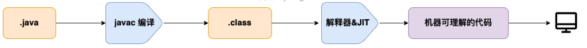

在class文件到机器码这一步，在这一步 JVM 类加载器首先加载字节码文件，然后通过解释器逐行解释执行，这种方式的执行速度会相对比较慢。 

为了改善执行效率，尤其是那些被经常调用的方法和代码块，所以后面引进了 JIT（just-in-time compilation，即时编译器） ，而 JIT 属于运行时编译。当 JIT 编译器完成第一次编译后，其会将字节码对应的机器码保存下来，下次可以直接使用。机器码的运行效率肯定是高于 Java 解释器的。

当程序运行时，解释器首先发挥作用，代码可以直接执行。随着时间推移，即时编译器逐渐发挥作用，把越来越多的代码编译优化成本地代码，来获取更高的执行效率。解释器这时可以作为编译运行的降级手段，在一些不可靠的编译优化出现问题时，再切换回解释执行，保证程序可以正常运行。

即时编译器极大地提高了Java程序的运行速度，而且跟静态编译相比，即时编译器可以选择性地编译热点代码，省去了很多编译时间，也节省很多的空间。目前，即时编译器已经非常成熟了，在性能层面甚至可以和编译型语言相比。 

Java的执行过程整体可以分为两个部分：

* 由javac将源码编译成字节码，在这个过程中会进行词法分析、语法分析、语义分析，编译原理中这部分的编译称为前端编译 
* 直接逐条将字节码解释执行。在解释执行的过程中，虚拟机同时对程序运行的信息进行收集，在这些信息的基础上，编译器会逐渐发挥作用，它会进行后端编译——把字节码编译成机器码，但不是所有的代码都会被编译，只有被JVM认定为的热点代码，才可能被编译。 

怎么样才会被认为是热点代码呢？JVM中会设置一个阈值，当方法或者代码块的在一定时间内的调用次数超过这个阈值时就会被编译，存入codeCache中。当下次执行时，再遇到这段代码，就会从codeCache中读取机器码，直接执行，以此来提升程序运行的性能。 

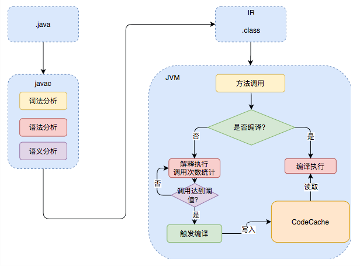

HotSpot 采用了惰性评估(Lazy Evaluation)的做法，根据二八定律，消耗大部分系统资源的只有那一小部分的代码（热点代码），而这也就是 JIT 所需要编译的部分。JVM 会根据代码每次被执行的情况收集信息并相应地做出一些优化，因此执行的次数越多，它的速度就越快。 

JDK 9 引入了一种新的编译模式 AOT(Ahead of Time Compilation)，它是直接将字节码编译成机器码，这样就避免了 JIT 预热等各方面的开销。JDK 支持分层编译和 AOT 协作使用。 AOT 可以提前编译节省启动时间，但并不能所有代码都采用这种编译方式，这和Java语言的动态特性有关。举个例子，CGLIB 动态代理使用的是 ASM 技术，而这种技术大致原理是运行时直接在内存中生成并加载修改后的字节码文件也就是 .class 文件，如果全部使用 AOT 提前编译，也就不能使用 ASM 技术了。为了支持类似的动态特性，所以选择使用 JIT 即时编译器。

### 编译型与解释型语言

我们可以将高级编程语言按照程序的执行方式分为两种： 

* 编译型 ：编译型语言 会通过编译器将源代码一次性翻译成可被该平台执行的机器码。一般情况下，编译语言的执行速度比较快，开发效率比较低。常见的编译性语言有 C、C++、Go、Rust 等等。
* 解释型 ：解释型语言会通过解释器一句一句的将代码解释（interpret）为机器代码后再执行。解释型语言开发效率比较快，执行速度比较慢。常见的解释性语言有 Python、JavaScript、PHP 等等。

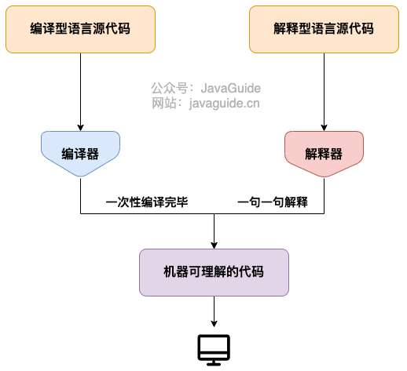

为了改善编译语言的效率而发展出的即时编译技术，已经缩小了这两种语言间的差距。这种技术混合了编译语言与解释型语言的优点，它像编译语言一样，先把程序源代码编译成字节码。到执行期时，再将字节码直译，之后执行。Java与LLVM是这种技术的代表产物。

Java 语言通过字节码的方式，在一定程度上解决了传统解释型语言执行效率低的问题，同时又保留了解释型语言可移植的特点。所以， Java 程序运行时相对来说还是高效的（不过，和 C++，Rust，Go 等语言还是有一定差距的） 

Java是编译与解释并存的语言，因为 Java 程序要经过先编译，后解释两个步骤

### JVM中的编译器

JVM中集成了两种编译器，Client Compiler和Server Compiler，它们的作用也不同：

* Client Compiler注重启动速度和局部的优化 
* Server Compiler则更加关注全局的优化，性能会更好，但由于会进行更多的全局分析，所以启动速度会变慢，适用于长时间运行的后台程序 

目前，HotSpot VM使用的Client Compiler是Client Compiler C1编译器；使用的Server Compiler有两种：C2和Graal

在Java 7以前，需要研发人员根据服务的性质去选择编译器：

* 对于需要快速启动的，或者一些不会长期运行的服务，可以采用编译效率较高的C1，对应参数-client 
* 长期运行的服务，或者对峰值性能有要求的后台服务，可以采用峰值性能更好的C2，对应参数-server 

Java 7开始引入了分层编译的概念，它结合了C1和C2的优势，追求启动速度和峰值性能的一个平衡。分层编译将JVM的执行状态分为了五个层次，分层编译的不同编译路径，也就是JVM根据当前服务的运行情况来寻找当前服务的最佳平衡点的一个过程。从JDK 8开始，JVM默认开启分层编译 

Java虚拟机根据方法的调用次数以及循环回边的执行次数来触发即时编译

### 编译优化

即时编译器会对正在运行的服务进行一系列的优化，包括字节码解析过程中的分析，根据编译过程中代码的一些中间形式来做局部优化，还会根据程序依赖图进行全局优化，最后才会生成机器码。 下面几种常用的编译优化：

1、中间表达形式（Intermediate Representation）

在编译原理中，通常把编译器分为前端和后端，前端编译经过词法分析、语法分析、语义分析生成中间表达形式（Intermediate Representation，以下称为IR），后端会对IR进行优化，生成目标代码。 

Java字节码就是一种IR，但是字节码的结构复杂，字节码这样代码形式的IR也不适合做全局的分析优化。现代编译器一般采用图结构的IR，静态单赋值（Static Single Assignment，SSA）IR是目前比较常用的一种。 

通过中间表达式优化，可以去除代码中的冗余代码、死代码删除（Dead Code Elimination） 、运算合并等

2、方法内联

方法内联，是指在编译过程中遇到方法调用时，将目标方法的方法体纳入编译范围之中，并取代原方法调用的优化手段。JIT大部分的优化都是在内联的基础上进行的，方法内联是即时编译器中非常重要的一环。 

Java服务中存在大量getter/setter方法，如果没有方法内联，在调用getter/setter时，程序执行时需要保存当前方法的执行位置，创建并压入用于getter/setter的栈帧、访问字段、弹出栈帧，最后再恢复当前方法的执行。内联了对 getter/setter的方法调用后，上述操作仅剩字段访问。 

编译器的大部分优化都是在方法内联的基础上。所以一般来说，内联的方法越多，生成代码的执行效率越高。但是对于即时编译器来说，内联的方法越多，编译时间也就越长，程序达到峰值性能的时刻也就比较晚。

可以通过虚拟机参数-XX:MaxInlineLevel调整内联的层数，以及1层的直接递归调用（可以通过虚拟机参数-XX:MaxRecursiveInlineLevel调整）。一些常见的内联相关的参数如下表所示：

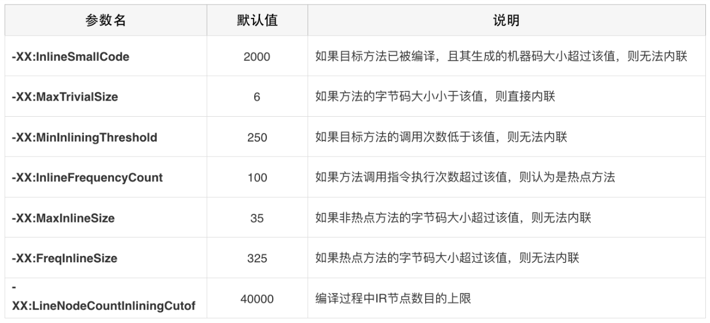

对于虚函数的情况，进行内联是很难的，因为在内联阶段并不知道他们会调用哪个方法。例如，我们有一个数据处理的接口，这个接口中的一个方法有三种实现add、sub和multi，JVM是通过保存虚函数表Virtual Method Table（以下称为VMT）存储class对象中所有的虚函数，class的实例对象保存着一个VMT的指针，程序运行时首先加载实例对象，然后通过实例对象找到VMT，通过VMT找到对应方法的地址，所以虚函数的调用比直接指向方法地址的classic call性能上会差一些。 

当只有一个方法实现时，C2编译器已经可以检测到并对虚调用进行优化，直接执行唯一的方法实现，但对于多个实现方法的虚调用就“无能为力”了 。

Graal编译器针对这种情况，会去收集这部分执行的信息，比如在一段时间，发现前面的接口方法的调用add和sub是各占50%的几率，那么JVM就会在每次运行时，遇到add就把add内联进来，遇到sub的情况再把sub函数内联进来，这样这两个路径的执行效率就会提升。在后续如果遇到其他不常见的情况，JVM就会进行去优化的操作，在那个位置做标记，再遇到这种情况时切换回解释执行。 

3、逃逸分析

逃逸分析是“一种确定指针动态范围的静态分析，它可以分析在程序的哪些地方可以访问到指针”。Java虚拟机的即时编译器会对新建的对象进行逃逸分析，判断对象是否逃逸出线程或者方法。即时编译器判断对象是否逃逸的依据有两种： 

1. 对象是否被存入堆中（静态字段或者堆中对象的实例字段），一旦对象被存入堆中，其他线程便能获得该对象的引用，即时编译器就无法追踪所有使用该对象的代码位置。
2. 对象是否被传入未知代码中，即时编译器会将未被内联的代码当成未知代码，因为它无法确认该方法调用会不会将调用者或所传入的参数存储至堆中，这种情况，可以直接认为方法调用的调用者以及参数是逃逸的。

逃逸分析通常是在方法内联的基础上进行的，即时编译器可以根据逃逸分析的结果进行诸如锁消除、栈上分配以及标量替换的优化 

下面这段代码的就是对象未逃逸的例子： 

~~~java
pulbic class Example{
    public static void main(String[] args) {
      example();
    }
    public static void example() {
      Foo foo = new Foo();
      Bar bar = new Bar();
      bar.setFoo(foo);
    }
  }

  class Foo {}

  class Bar {
    private Foo foo;
    public void setFoo(Foo foo) {
      this.foo = foo;
    }
  }
}
~~~

在这个例子中，创建了两个对象foo和bar，其中一个作为另一个方法的参数提供。该方法setFoo()存储对收到的Foo对象的引用。如果Bar对象在堆上，则对Foo的引用将逃逸。但是在这种情况下，编译器可以通过逃逸分析确定Bar对象本身不会对逃逸出example()的调用。这意味着对Foo的引用也不能逃逸。因此，编译器可以安全地在栈上分配两个对象。 

（1）锁消除

锁消除就是在逃逸分析的基础上进行的，如果即时编译器能够证明锁对象不逃逸，那么对该锁对象的加锁、解锁操作没就有意义。因为线程并不能获得该锁对象。在这种情况下，即时编译器会消除对该不逃逸锁对象的加锁、解锁操作。 

（2）栈上分配

我们都知道Java的对象是在堆上分配的，而堆是对所有对象可见的。同时，JVM需要对所分配的堆内存进行管理，并且在对象不再被引用时回收其所占据的内存。 

如果逃逸分析能够证明某些新建的对象不逃逸，那么JVM完全可以将其分配至栈上，并且在new语句所在的方法退出时，通过弹出当前方法的栈桢来自动回收所分配的内存空间。这样一来，我们便无须借助垃圾回收器来处理不再被引用的对象。 

不过Hotspot虚拟机，并没有进行实际的栈上分配，而是使用了标量替换这一技术。所谓的标量，就是仅能存储一个值的变量，比如Java代码中的基本类型。与之相反，聚合量则可能同时存储多个值，其中一个典型的例子便是Java的对象。编译器会在方法内将未逃逸的聚合量分解成多个标量，以此来减少堆上分配。下面是一个标量替换的例子： 

~~~java
public class Example{
  @AllArgsConstructor
  class Cat{
    int age;
    int weight;
  }
  public static void example(){
    Cat cat = new Cat(1,10);
    addAgeAndWeight(cat.age,Cat.weight);
  }
}
~~~

经过逃逸分析，cat对象未逃逸出example()的调用，因此可以对聚合量cat进行分解，得到两个标量age和weight，进行标量替换后的伪代码： 

~~~java
public class Example{
  @AllArgsConstructor
  class Cat{
    int age;
    int weight;
  }
  public static void example(){
    int age = 1;
    int weight = 10;
    addAgeAndWeight(age,weight);
  }
}
~~~

（3）部分逃逸分析 

部分逃逸分析也是Graal对于概率预测的应用。通常来说，如果发现一个对象逃逸出了方法或者线程，JVM就不会去进行优化，但是Graal编译器依然会去分析当前程序的执行路径，它会在逃逸分析基础上收集、判断哪些路径上对象会逃逸，哪些不会。然后根据这些信息，在不会逃逸的路径上进行锁消除、栈上分配这些优化手段。 

4、Loop Transformations

C2编译器在构建Ideal Graph后会进行很多的全局优化，其中就包括对循环的转换，最重要的两种转换就是循环展开和循环分离。 

* 循环展开

循环展开是一种循环转换技术，它试图以牺牲程序二进制码大小为代价来优化程序的执行速度，是一种用空间换时间的优化手段。

循环展开通过减少或消除控制程序循环的指令，来减少计算开销，这种开销包括增加指向数组中下一个索引或者指令的指针算数等。如果编译器可以提前计算这些索引，并且构建到机器代码指令中，那么程序运行时就可以不必进行这种计算。也就是说有些循环可以写成一些重复独立的代码。比如下面这个循环：

~~~java
public void loopRolling(){
  for(int i = 0;i<200;i++){
    delete(i);  
  }
}
~~~

上面的代码需要循环删除200次，通过循环展开可以得到下面这段代码： 

~~~java
public void loopRolling(){
  for(int i = 0;i<200;i+=5){
    delete(i);
    delete(i+1);
    delete(i+2);
    delete(i+3);
    delete(i+4);
  }
}
~~~

这样展开就可以减少循环的次数，每次循环内的计算也可以利用CPU的流水线提升效率。 当然这只是一个示例，实际进行展开时，JVM会去评估展开带来的收益，再决定是否进行展开。 

* 循环分离

循环分离也是循环转换的一种手段。它把循环中一次或多次的特殊迭代分离出来，在循环外执行。举个例子，下面这段代码： 

~~~java
int a = 10;
for(int i = 0;i<10;i++){
  b[i] = x[i] + x[a];
  a = i;
}
~~~

可以看出这段代码除了第一次循环a = 10以外，其他的情况a都等于i-1。所以可以把特殊情况分离出去，变成下面这段代码： 

~~~java
b[0] = x[0] + 10;
for(int i = 1;i<10;i++){
  b[i] = x[i] + x[i-1];
}
~~~

这种等效的转换消除了在循环中对a变量的需求，从而减少了开销。 

5、窥孔优化与寄存器分配

窥孔优化就是将编译器所生成的中间代码（或目标代码）中相邻指令，将其中的某些组合替换为效率更高的指令组，常见的比如强度削减、常数合并等，看下面这个例子就是一个强度削减的例子： 

~~~
y1=x1*3  经过强度削减后得到  y1=(x1<<1)+x1
~~~

这就是编译器使用移位和加法削减乘法的强度，使用更高效率的指令组。 

寄存器分配也是一种编译的优化手段，在C2编译器中普遍的使用。它是通过把频繁使用的变量保存在寄存器中，CPU访问寄存器的速度比内存快得多，可以提升程序的运行速度。 

寄存器分配和窥孔优化是程序优化的最后一步。经过寄存器分配和窥孔优化之后，程序就会被转换成机器码保存在codeCache中。 

### 编译日志

通过增加-XX:+UnlockDiagnosticVMOptions -XX:+PrintCompilation -XX:+PrintInlining -XX:+PrintCodeCache -XX:+PrintCodeCacheOnCompilation -XX:+TraceClassLoading -XX:+LogCompilation -XX:LogFile=LogPath参数可以输出编译、内联、codeCache信息到文件。但是打印的编译日志多且复杂很难直接从其中得到信息，可以使用JITwatch的工具来分析编译日志。JITwatch首页的Open Log选中日志文件，点击Start就可以开始分析日志。 

## Oracle JDK vs OpenJDK

最初的时候为了开源Java，将Java核心代码开源出来，形成了OpenJDK，Oracle收购的JDK继续发展，成了Oracle JDK。两者非常接近，OpenJDK 的代码是从 Oracle JDK 代码派生出来的。

区别是：

1、OpenJDK 版本更新更频繁，也因此Oracle JDK 比 OpenJDK 更稳定、性能更佳

2、OpenJDK 是一个参考模型并且是完全开源的，而 Oracle JDK 是 OpenJDK 的一个实现，并不是完全开源的。

3、Oracle JDK 不会为即将发布的版本提供长期支持（如果是 LTS 长期支持版本的话也会，比如 JDK 8，但并不是每个版本都是 LTS 版本），用户每次都必须通过更新到最新版本获得支持来获取最新版本；

4、Oracle JDK 使用 BCL/OTN 协议获得许可，而 OpenJDK 根据 GPL v2 许可获得许可。两种许可的区别：

- BCL 协议（Oracle Binary Code License Agreement）： 可以使用 JDK（支持商用），但是不能进行修改。
- OTN 协议（Oracle Technology Network License Agreement）： 11 及之后新发布的 JDK 用的都是这个协议，可以自己私下用，但是商用需要付费。

需要OpenJDK的原因：

* OpenJDK 是开源的，开源意味着你可以对它根据你自己的需要进行修改、优化，比如 Alibaba 基于 OpenJDK 开发了 Dragonwell8；
* OpenJDK 是商业免费的（这也是为什么通过 yum 包管理器上默认安装的 JDK 是 OpenJDK 而不是 Oracle JDK）。虽然 Oracle JDK 也是商业免费（比如 JDK 8），但并不是所有版本都是免费的。
* OpenJDK 更新频率更快。Oracle JDK 一般是每 6 个月发布一个新版本，而 OpenJDK 一般是每 3 个月发布一个新版本。 

## 形参和实参

方法的定义可能会用到 参数（有参的方法），参数在程序语言中分为：

* 实参（实际参数） ：用于传递给函数/方法的参数，必须有确定的值。
* 形参（形式参数） ：用于定义函数/方法，接收实参，不需要有确定的值。

~~~java
String hello = "Hello!";
// hello 为实参
sayHello(hello);
// str 为形参
void sayHello(String str) {
    System.out.println(str);
}
~~~

程序设计语言将实参传递给方法（或函数）的方式分为两种：

* 值传递 ：方法接收的是实参值的拷贝，会创建副本。
* 引用传递 ：方法接收的直接是实参所引用的对象在堆中的地址，不会创建副本，对形参的修改将影响到实参。

很多程序设计语言（比如 C++、 Pascal )提供了两种参数传递的方式，不过，在 Java 中只有值传递。

如果参数是基本类型，形参会拷贝实参的副本；如果参数是引用类型，形参会拷贝实参对象的地址

Java值传递的体现：

* 在方法中对基本变量类型的形参赋值，改变不了方法外的实参的值。因为方法入参是从实参复制来的

* 在方法中可以对传入的对象进行修改，是因为传入的是实参的地址，入参是拷贝的实参对象的地址，所以方法内部可以对对象进行修改

* 在方法中交换对象引用，只影响方法内部，不影响方法外的参数，这就是因为值传递的是对象地址：

  ~~~java
  public class Person {
      private String name;
     // 省略构造函数、Getter&Setter方法
  }

  public static void main(String[] args) {
      Person xiaoZhang = new Person("小张");
      Person xiaoLi = new Person("小李");
      swap(xiaoZhang, xiaoLi);
      System.out.println("xiaoZhang:" + xiaoZhang.getName());
      System.out.println("xiaoLi:" + xiaoLi.getName());
  }

  public static void swap(Person person1, Person person2) {
      Person temp = person1;
      person1 = person2;
      person2 = temp;
      System.out.println("person1:" + person1.getName());
      System.out.println("person2:" + person2.getName());
  }
  ~~~

  输出：

  ~~~
  person1:小李
  person2:小张
  xiaoZhang:小张
  xiaoLi:小李
  ~~~

Java中有显式参数和隐式参数的说法：

当一个对象调用下列方法时：

```java
obj.function(args)
```

function方法有两个参数，第一个参数被称为隐式参数，是出现在方法前的obj对象，第二个参数就是出现在方法名括号中的显式参数。


# 基本语法

## 杂项

1、注释

Java 中的注释有三种： 单行注释//、多行注释、文档注释（后两个都是/* */）

代码的注释不是越详细越好。实际上好的代码本身就是注释，我们要尽量规范和美化自己的代码来减少不必要的注释。

2、关键字

Java语言的关键字：

| 分类         | 关键字      |            |          |              |            |           |        |
| ---------- | -------- | ---------- | -------- | ------------ | ---------- | --------- | ------ |
| 访问控制       | private  | protected  | public   |              |            |           |        |
| 类，方法和变量修饰符 | abstract | class      | extends  | final        | implements | interface | native |
|            | new      | static     | strictfp | synchronized | transient  | volatile  | enum   |
| 程序控制       | break    | continue   | return   | do           | while      | if        | else   |
|            | for      | instanceof | switch   | case         | default    | assert    |        |
| 错误处理       | try      | catch      | throw    | throws       | finally    |           |        |
| 包相关        | import   | package    |          |              |            |           |        |
| 基本类型       | boolean  | byte       | char     | double       | float      | int       | long   |
|            | short    |            |          |              |            |           |        |
| 变量引用       | super    | this       | void     |              |            |           |        |
| 保留字        | goto     | const      |          |              |            |           |        |

default 这个关键字很特殊，既属于程序控制，也属于类，方法和变量修饰符，还属于访问控制：

* 在程序控制中，当在 switch 中匹配不到任何情况时，可以使用 default 来编写默认匹配的情况。
* 在类，方法和变量修饰符中，从 JDK8 开始引入了默认方法，可以使用 default 关键字来定义一个方法的默认实现。
* 在访问控制中，如果一个方法前没有任何修饰符，则默认会有一个修饰符 default，但是这个修饰符加上了就会报错。

strictfp关键字和Strict系列：

strictfp是用来标记在方法上，代表该方法将使用严格的浮点计算。

对于java来说，要保证可移植性，就要同一个浮点数的算术计算结果在不同机器上一样，但是实际上这很难做到，因为浮点数的中间计算结果通常会存入寄存器，而不同的机器有不一样的寄存器，如果在中间计算的每一步都截断，这会导致计算缓慢且精度差，所以java最后没有采用这种方案，默认情况下不会采取截断，但是标记strictfp之后，就代表采用严格的浮点计算，这种计算是可再生可移植的结果。

同样地，StrictMath就是Math类的严格实现，它确保在所有平台上得到相同的计算结果。

3、成员变量与局部变量的区别？

* 从归属上看：成员变量分为静态的和非静态的，是属于类或者实例的，而局部变量是在代码块或方法中定义的变量或是方法的参数
* 语法形式：成员变量可以被 public,private,static 等修饰符所修饰，而局部变量不能被访问控制修饰符及 static 所修饰；但是，成员变量和局部变量都能被 final 所修饰。
* 存储方式：对象存在于堆内存，局部变量则存在于栈内存
* 生命周期 ：从变量在内存中的生存时间上看，成员变量是对象的一部分，它随着对象的创建而存在，而局部变量随着方法的调用而自动生成，随着方法的调用结束而消亡。
* 默认值 ：从变量是否有默认值来看，成员变量如果没有被赋初始值，则会自动以类型的默认值而赋值（一种情况例外:被 final 修饰的成员变量也必须显式地赋值），而局部变量则不会自动赋值。

4、静态变量

静态变量可以被类的所有实例共享。无论一个类创建了多少个对象，它们都共享同一份静态变量。 

5、静态方法为什么不能调用非静态成员?

静态方法是属于类的， 可以通过类名直接访问；而非静态成员属于实例对象，只有在对象实例化之后才存在，需要通过类的实例对象去访问。 调用静态方法时，实例可能还未初始化，此时内存中没有非静态成员，而且还会因为归属的原因产生歧义

6、静态方法和实例方法区别

从调用方式上看，在外部调用静态方法时，可以使用 类名.方法名 的方式，也可以使用 对象.方法名 的方式，而实例方法只有后面这种方式。（一般不建议使用 对象.方法名 的方式来调用静态方法。这种方式非常容易造成混淆，静态方法不属于类的某个对象而是属于这个类。）

从限制上看，静态方法在访问本类的成员时，只允许访问静态成员（即静态成员变量和静态方法），不允许访问实例成员（即实例成员变量和实例方法），而实例方法不存在这个限制。 

7、重载和重写

重载就是同一个类中多个同名方法根据不同的传参来执行不同的逻辑处理 。重载发生在同一个类中（或者父类和子类之间） ，如果多个方法(比如 StringBuilder 的构造方法)有相同的名字、不同的参数， 便产生了重载。

编译器必须挑选出具体执行哪个方法，它通过用各个方法给出的参数类型与特定方法调用所使用的值类型进行匹配来挑选出相应的方法。 如果编译器找不到匹配的参数， 就会产生编译时错误， 因为根本不存在匹配， 或者没有一个比其他的更好(这个过程被称为重载解析(overloading resolution))。 

重写发生在运行期，是子类对父类的允许访问的方法的实现过程进行重新编写。 

方法的重写要遵循“两同两小一大”：

- “两同”即方法名相同、形参列表相同；
- “两小”指的是子类方法返回值类型应比父类方法返回值类型更小或相等，子类方法声明抛出的异常类应比父类方法声明抛出的异常类更小或相等；
- “一大”指的是子类方法的访问权限应比父类方法的访问权限更大或相等。

如果父类方法访问修饰符为 private/final/static 则子类就不能重写该方法，但是被 static 修饰的方法能够被再次声明。构造方法无法被重写

8、可变长参数

从 Java5 开始，Java 支持定义可变长参数，所谓可变长参数就是允许在调用方法时传入不定长度的参数。就比如下面的这个 printVariable 方法就可以接受 0 个或者多个参数：

~~~java
public static void method1(String... args) {
   //......
}
~~~

另外，可变参数只能作为函数的最后一个参数，但其前面可以有也可以没有任何其他参数。 

~~~java
public static void method2(String arg1, String... args) {
   //......
}
~~~

当可变参数遇到方法重载，会优先匹配固定参数的方法，因为固定参数的方法匹配度更高 

Java 的可变参数编译后实际会被转换成一个数组，我们看编译后生成的 class文件就可以看出来了：

~~~java
public class VariableLengthArgument {

    public static void printVariable(String... args) {
        String[] var1 = args;
        int var2 = args.length;

        for(int var3 = 0; var3 < var2; ++var3) {
            String s = var1[var3];
            System.out.println(s);
        }

    }
    // ......
}
~~~

9、面向对象和面向过程的区别

两者的主要区别在于解决问题的方式不同：

- 面向过程把解决问题的过程拆成一个个方法，通过一个个方法的执行解决问题。
- 面向对象会先抽象出对象，然后用对象执行方法的方式解决问题。

另外，面向对象开发的程序一般更易维护、易复用、易扩展。

面向过程的性能并不是更好，因为面向过程语言大多都是解释型语言，性能较差

10、对象实体与对象引用

当创建一个对象，并赋值给一个引用时，对象实例保存在堆内存中，引用指向对象实例，引用存在栈内存中

对象相等和引用相等：

- 对象的相等一般比较的是内存中存放的内容是否相等。
- 引用相等一般比较的是他们指向的内存地址是否相等。

11、构造方法

构造方法不能被 override（重写）,但是可以 overload（重载） 

12、面向对象三大特征

* 封装：指把一个对象的状态信息（也就是属性）隐藏在对象内部，不允许外部对象直接访问对象的内部信息。但是可以提供一些可以被外界访问的方法来操作属性。 
* 继承：继承是使用已存在的类的定义作为基础建立新类的技术。通过使用继承，可以快速地创建新的类，可以提高代码的重用，程序的可维护性，节省大量创建新类的时间 ，提高我们的开发效率。坏处：类的耦合性增强了
* 多态：表示一个对象具有多种的状态，具体表现为父类的引用指向子类的实例 

继承的特点：

* 只支持单继承
* 子类只能继承父类所有非私有的成员
* 子类不能继承父类的构造方法
* 子类可以对父类进行扩展，可以拥有自己的方法和属性，可以用自己的方式实现父类的方法

super关键字的作用：

* super的第一个作用是用来调用父类的方法，尤其是当子类覆盖了父类的同名方法，而子类中的方法又想调用父类的同名方法时，此时就可以用super.method来调用父类方法。一个典型的应用是子类equals可能需要借助父类equals的结果。

  super还可以调用父类的成员变量（this既可以调用本类，也可以调用父类的成员变量）

* super的第二个作用是用来调用父类的构造方法。如果子类的构造器没有显示调用父类的构造器，则自动调用超类默认的无参构造器（每个构造方法的第一条语句默认是super），如果显式调用则必须把super放在构造器第一行。如果父类没有无参构造，则需要把super调整为多参数的，调用父类的有参构造。

  在构造方法中第一行要么是this，要么是super

多态的特点：

* 前提条件：要有继承或者实现的关系，父类引用指向子类对象
* 运行方法是子类特有的方法，如果子类重写了父类的方法，真正执行的是子类覆盖的方法，如果子类没有覆盖父类的方法，执行的是父类的方法。成员变量依然是看父类的成员变量

编译看左边：无论任何情况下，声明为A类的对象，调用的方法必须在A类中存在，否则编译不过，实际调用方法时，按照它实际的类型来决定。

动态绑定和静态绑定：

* 在运行时能够自动选择调用哪个方法的现象称为动态绑定，动态绑定最后调用的方法依赖隐式参数的实际类型。当调用方法时会搜索本类和父类的方法，如果本类有优先执行本类的，找到一个方法签名相同的方法，这其中可能涉及入参的类型转换和虚拟机方法表的查找，最后执行该方法。
* 如果是private、static、final方法或构造器，编译器可以准确知道应该调用哪个方法，这种调用方式被称为静态绑定。

13、接口和抽象类的共同点和区别

共同点 ：

* 都不能被实例化。（抽象类可以实例化具体的子类）
* 都可以包含抽象方法。
* 都可以有默认实现的方法（Java 8 可以用 default 关键字在接口中定义默认方法）。

区别：

* 含义不同：实现一个接口，代表拥有一种能力，接口代表继承体系中的扩展功能；继承一个抽象类，代表类属于抽象类的概念，抽象类代表继承体系中的共性功能
* 一个类只能继承一个类，但是可以实现多个接口。
* 接口不能有构造方法，抽象类可以有构造方法，但是不能被实例化
* 接口中的成员变量只能是常量，而且是public static final的，抽象类中可以有常量也可以有变量
* 接口中的方法只能是抽象方法（默认是public abstract的），而抽象类中可以有抽象方法也可以有具体的方法

14、深拷贝、浅拷贝和引用拷贝

* 浅拷贝：浅拷贝会在堆上创建一个新的对象（区别于引用拷贝的一点），不过，如果原对象内部的属性是引用类型的话，浅拷贝会直接复制内部对象的引用地址，也就是说拷贝对象和原对象共用同一个内部对象。 
* 深拷贝：深拷贝会完全复制整个对象，包括这个对象所包含的内部对象。 
* 引用拷贝：两个不同的引用指向同一个对象 

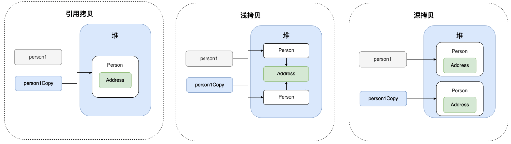

要实现clone方法需要先实现Cloneable，然后重写clone方法，可以直接调用Object类的clone方法来实现一个浅拷贝，深拷贝则还需逐个clone每个成员变量

15、类型转换

java中的合法数值转换如下：

char -> int -> long -> float -> double

byte -> short -> int -> long -> float -> double

这中间既有从char到int这种无精度损失的转换，又有long到float这种有精度损失的转换。当两种不同的类型进行某种计算时，java会自动将他们转换为同一种类型，通常是两种种比较大的一种，然后再进行计算。

类型转换也可以强制进行，这时就要承担一定的精度损失

一些类型转换导致报错的例子：

~~~java
byte b = 1;
byte a = 2;
byte c = a + b;  // 会报错，byte在计算时自动提升为int，int赋值给byte要进行强制类型转换
~~~

16、位运算符&和|

位运算符&和|也可以用在布尔值中，它们合与、或的意思一样，只不过&&和||是会短路计算的，而这两个不会。

17、带标签的break和continue

java中带标签的break语句可用于跳出多重嵌套的循环语句，用法是在希望跳出的循环之前加一个标签，然后在break语句后加上这个标签：

```java
read_data:
while () {
    for () {
        break read_data;
    }
}
```

这种用法也可以用于if语句或者块语句中，但并不提倡这种方式。

continue也有一种带标签的形式，用于跳跃直接执行下一次大循环。

18、数组杂项

（1）、数组拷贝通常用Arrays的copyOf方法：

```java
int[] newArr = Arrays.copyOf(oldArr, newArrLength)
```

如果第二个参数设置的比较大，则相当于增加新数组的大小；若第二个参数设置的小，则只拷贝旧数组前面的元素。

（2）、如果想打印一个二维数组，可以用Arrays.deepToString(arr)把它转换成字符串。

（3）、可以创建一个不规则的二维数组，方法是定义时只定义行数：int[\][\] odd = new int[6\][\]，然后针对每一行单独赋值，可以赋值成大小不同的数组。

19、命令行、源文件和包密封

（1）、命令行参数

每个java应用程序都有一个带String arg[]参数的main方法，如对带main方法的类Message来说，如果以下面的形式执行这个程序：

```java
java Message -g cruel world
```

则此时获取的args数组的内容如下：

args[0]:  -g

args[1]: cruel

args[2]: world

（2）、使用多个源文件

当编译一个java类的时候，不仅会编译这个类，还会将它引用的其他类都自动编译，如果已有的class文件版本比较旧，会自动编译java文件生成更新的class文件。

（3）、包密封

把一个java文件的包声明修改，然后把它放入对应的路径，然后它就可以访问该包中其他的类了，有的人可以利用这种方式修改一个完整的包，为了解决这个问题，java引入了包密封机制，它可以将一个包封闭起来，然后就不能向这个包添加类了，这就是JAR文件。

（4）、类路径

可以用-classpath来指定类路径：

```java
java -classpath path1:.:path2
```

其中点代表当前目录，编译器会负责从这些路径中寻找引用的类，同时查看java文件和class文件哪个更新，然后决定是否重新编译。

还可以通过设置环境变量CLASSPATH来设置类路径，设置完毕后在shell期间一直生效。

20、访问修饰符

从上到下，权限依次下降：

* public 对所有类可见
* protected 本包和所有子类可见
* 默认  对本包可见
* private 只对本类可见

21、默认方法，接口和超类冲突

在java8中，允许对接口方法提供一个默认实现，这种的设计使得子类没必要实现接口所有的方法，且不会出现现有代码不能编译的情况，如A实现B接口，B接口中若增加了一个方法，那么A必须提供对应的实现，但是若增加的是一个默认方法，则不用非要做对应的改造。

当一个类实现的接口中，和父类中有同样的方法名时，java调用方法实际调用的是哪一个，对应原则如下：

（1）、超类优先，同名同参的方法优先调用超类的

（2）、当冲突的方法不在超类中，而是在两个实现了默认方法的接口中时，此时就必须解决这种冲突，用显式方法指定，如Person.super.getName();

22、Comparator键提取器

Comparator有一个键提取器功能，可以很方便的对对象方法返回的键进行比较，如按Person的name进行排序：

```java
Arrays.sort(people, Comparator.comparing(Person::getName));
```

键提取器不仅可以对一种键进行比较，还可以串联多个，代表先用第一个属性进行比较，如果第一个相同再比较第二个：

```java
Arrays.sort(people, Comparator.comparing(Person::getLastName).thenComparing(Person::getFirstName));
```
23、几种内部类

（1）、普通内部类

内部类可以访问该类定义所在的作用域中的数据，包括私有的数据。

内部类的对象总有一个隐式引用，指向了创建它的外部类对象，如果在内部类想使用外部类的引用，应该这样表示：

```java
OuterClass.this.method;
OuterClass.this.field;
```

如果是一个公有内部类，那么在任何地方，都可以通过外部对象创建一个内部类对象：

```java
OuterClassObj.new InnerClass();
```

对于公有内部类，也可以在任何地方直接引用它，就像使用普通类一样：

```java
OuterClass.InnerClass
```

（2）、局部内部类

局部内部类是定义在块中的，它没有访问说明符，它的作用域被限定在这个局部类的块中，它可以对外部世界完全隐藏起来，即使类内部的代码也不能访问它。

适用于那种只在某个方法内部调用一次的情况，局部内部类不仅可以访问外部类，还可以访问局部变量，但是这个局部变量必须是final的，如果不显式添加final，编译器会隐式添加

（3）、匿名内部类

当只需要创建这个类的一个对象，此时可以选择使用匿名内部类

（4）、静态内部类

静态内部类只是隐藏在某个类的内部，它没有引用外围类的对象。当要在静态方法中使用内部类时，只能使用静态内部类。当要使用某个类，但是这个类名又很大众化时，可以把它放在某个密切关联的类中，使用时加上外部类的类名：

```java
OuterClass.InnerClass
```

24、几种代码块

局部代码块：在方法中出现，大括号结束后释放内存

构造代码块：类中方法外，每创建一次对象就会执行一次，优先于构造函数执行

静态代码块：类中方法外，前面加static修饰，随着类加载而执行，而且只执行一次

25、final关键字

final修饰方法时：代表方法不能被重写

final修饰类的时候：代表类不能被继承

final修饰变量时：代表变量之后不能被修改

final修饰函数入参时：代表入参变量之后不能被修改

成员变量的默认初始化对final无效，final成员变量必须在类实例化时指定好初始值

## 集合杂项

1、迭代器

迭代器的next方法和数据流的read方法很像，它们都用一种类似于消耗的方式读取内容，读取结束后它就会被消耗掉。

迭代器的remove方法的作用是删除上次调用next方法时返回的元素，如果没有调用next就调用remove则会抛出异常。

2、标记接口RandomAccess

java中有一个标记接口RandomAccess用来描述有序集合的访问算法，实现它的集合可以高效的随机访问，所以可以用它结合instanceof来判断集合的类型，以确定对应的查找算法。

3、装填因子

装填因子默认是0.75，超过该值集合会增大一倍，自动再散列

4、几种特殊的集合

弱散列映射WeakHashMap：为了解决键不再被人引用时回收值的情况，正常来说如果键没有被引用时，也不会被回收，因为map对象被引用，所以其中的键值都不会被回收，WeakHashMap适用于一些长期存活的大映射表，当对键的唯一引用来自map时，此时就会被回收（它使用弱引用保存键，周期性检查并回收弱引用）

枚举集EnumSet、枚举类型映射EnumMap（键类型是枚举类型）

标识散列映射IdentityHashMap，其中的键的散列值是用System.identityHashCode实现的，它是根据内存地址直接计算hashcode的，而且其中的键也不用equals比较，而是用==

5、视图

（1）、视图

Arrays.asList()方法可以直接将数组转换为一个视图，它还可以接受多个参数；此外，Collections的nCopies方法、singleton方法、emptySet方法等返回的结果都是视图，视图底层存的不是真实的集合，它们的存储代价很小，这些返回的视图是不可变的，否则会抛出异常。

（2）、子范围视图

子范围视图可以直接通过集合建立出来，如集合的subList(start, end)可以返回一定范围内的元素视图，如果原集合被改变，这个视图也会随之改变；此外，对于有序集还可以用subSet(from, to)等方法构造一个根据元素大小确定范围的子范围视图。

（3）、不可修改视图

可以直接根据一个集合建立不可变视图，这就是Collections类的unmodifiable系列方法，可以直接包装一个集合返回其视图，此时所有更改器方法都被重新定义为抛出异常。

（4）、可修改的同步视图

Collections类的synchronizedMap系列方法可以包装一个普通集合变成一个线程安全的集合，这个集合是可变的。

（5）、受查视图

对于一个确定类型的集合，可以赋值给一个没有泛型的原始类型集合，然后再往改集合中放入其他乱七八糟的类型，这个操作是可行的，这就意味着只有在运行状态才能察觉到这样的错误。

针对这样的问题，可以编写一个安全列表：

```java
List<String> safeStrings = Collections.checkedList(strings, String.class)
```

这样即使无论怎么改变它的索引指向，一旦往集合中插入不同的类型就会立即抛出类型转换异常。（虽然可以阻止Date类型放入List\<String\>中，但是不能阻止Pair\<Date\>放入List\<Pair\<String\>\>中，虚拟机只能察觉到其原始类型）

## 并发杂项

1、被弃用的方法

stop方法可以强制结束一个线程，结束线程带来的后果是不可控的，如果线程对数据库有持久化的作用，那用stop方法强制结束线程后，就不知道这个持久化进程进展到什么程度。stop结束线程会立即释放持有的所有锁，锁不释放并不是stop被弃用的理由。

suspend方法会将线程挂起，同时线程持有的锁并不释放；而resume方法会将挂起的线程恢复，这两个方法被弃用的理由是容易产生死锁。

2、线程安全的集合

几个常用的线程安全的集合：ConcurrentHashMap、ConcurrentSkipListSet（线程安全的有序集合）、ConcurrentLinkedQueue（线程安全的无边界非阻塞队列）

这些集合的共同点是size方法是非常数时间的，需要遍历集合给出答案。返回的迭代器是弱一致性的，返回的结果不一定就是修改后的结果，在迭代过程中修改不会抛出异常。

如果想获得一个线程安全的不重复集合可以用：ConcurrentHashMap.newKeySet()，它实际上是一个原映射集合的封装，只不过这个时候不关心它的值。

CopyOnWriteArrayList和CopyOnWriteArraySet也是线程安全的集合，所有的修改逻辑都是复制原来的底层数组。

任何类都可以通过Collections类的同步包装器包装成一个线程安全的集合，如synchronizedList方法，底层实现是对方法加锁保护。使用时应该优先使用非同步包装器的方法，它们是被精心设计过的。

## 数据类型

### 基本数据类型

Java 中有 8 种基本数据类型，分别为：

* 6 种数字类型：
* 4 种整数型：byte、short、int、long
* 2 种浮点型：float、double
* 1 种字符类型：char
* 1 种布尔型：boolean。

这 8 种基本数据类型的默认值以及所占空间的大小如下： 

| 基本类型      | 位数   | 字节   | 默认值     | 取值范围                                     |
| --------- | ---- | ---- | ------- | ---------------------------------------- |
| `byte`    | 8    | 1    | 0       | -128 ~ 127                               |
| `short`   | 16   | 2    | 0       | -32768 ~ 32767                           |
| `int`     | 32   | 4    | 0       | -2147483648 ~ 2147483647                 |
| `long`    | 64   | 8    | 0L      | -9223372036854775808 ~ 9223372036854775807 |
| `char`    | 16   | 2    | 'u0000' | 0 ~ 65535                                |
| `float`   | 32   | 4    | 0f      | 1.4E-45 ~ 3.4028235E38                   |
| `double`  | 64   | 8    | 0d      | 4.9E-324 ~ 1.7976931348623157E308        |
| `boolean` | 1    |      | false   | true、false                               |

对于 boolean，官方文档未明确定义，它依赖于 JVM 厂商的具体实现。逻辑上理解是占用 1 位，但是实际中会考虑计算机高效存储因素。

另外，Java 的每种基本类型所占存储空间的大小不会像其他大多数语言那样随机器硬件架构的变化而变化。这种所占存储空间大小的不变性是 Java 程序比用其他大多数语言编写的程序更具可移植性的原因之一

注意：

* Java 里使用 long 类型的数据一定要在数值后面加上 L，否则将作为整型解析。

### 包装类型

八种基本类型都有对应的包装类分别为：Byte、Short、Integer、Long、Float、Double、Character、Boolean

基本类型和包装类型的区别：

* 成员变量包装类型不赋值就是 null ，而基本类型有默认值且不是 null。
* 包装类型可用于泛型，而基本类型不可以。
* 基本数据类型的局部变量存放在 Java 虚拟机栈中的局部变量表中，基本数据类型的成员变量（未被 static 修饰 ）存放在 Java 虚拟机的堆中。包装类型属于对象类型，我们知道几乎所有对象实例都存在于堆中。
* 相比于对象类型， 基本数据类型占用的空间非常小。

需要注意：

* 不是所有对象实例都存在堆中，这是因为 HotSpot 虚拟机引入了 JIT 优化之后，会对对象进行逃逸分析，如果发现某一个对象并没有逃逸到方法外部，那么就可能通过标量替换来实现栈上分配，而避免堆上分配内存
* 基本数据类型的成员变量如果没有被 static 修饰的话（不建议这么使用，应该要使用基本数据类型对应的包装类型），就存放在堆中。

Java 基本数据类型的包装类型的大部分都用到了缓存机制来提升性能：

* Byte,Short,Integer,Long 这 4 种包装类默认创建了数值 [-128，127] 的相应类型的缓存数据
* Character 创建了数值在 [0,127] 范围的缓存数据
* Boolean 直接返回 True or False。

两种浮点数类型的包装类 Float,Double 并没有实现缓存机制。

如果超出对应范围仍然会去创建新的对象，缓存的范围区间的大小只是在性能和资源之间的权衡。 

基本数据类型和包装类型可以互相转换，这个过程就是自动拆装箱：

~~~java
Integer i = 10;  //装箱
int n = i;   //拆箱
~~~

从字节码中，我们发现装箱其实就是调用了 包装类的valueOf()方法，拆箱其实就是调用了 xxxValue()方法：

* Integer i = 10 等价于 Integer i = Integer.valueOf(10)
* int n = i 等价于 int n = i.intValue();

注意：如果频繁拆装箱的话，也会严重影响系统的性能。我们应该尽量避免不必要的拆装箱操作

### 浮点数

浮点数一般用科学计数法表示。

在浮点数提出的早期，各个计算机厂商各自制定自己的浮点数规则，导致不同厂商对于同一个数字的浮点数表示各不相同，在计算时还需要先进行转换才能进行计算。直到1985年，IEEE 组织推出了浮点数标准，就是我们经常听到的 IEEE754 浮点数标准，这个标准统一了浮点数的表示形式，并提供了 2 种浮点格式：

* 单精度浮点数 float：32 位，符号位 S 占 1 bit，指数 E 占 8 bit，尾数 M 占 23 bit
* 双精度浮点数 float：64 位，符号位 S 占 1 bit，指数 E 占 11 bit，尾数 M 占 52 bit

浮点数精度丢失的原因：浮点数在表示小数时，由于十进制小数在转换为二进制时，存在无法精确转换的情况，无限循环的小数存储在计算机时，只能被截断 ，所以浮点数表示小数可能存在精度损失。

BigDecimal 可以实现对浮点数的运算，不会造成精度丢失。

###BigDecimal

创建BigDecimal对象时，推荐使用它的BigDecimal(String val)构造方法或者 BigDecimal.valueOf(double val) 静态方法来创建对象。不建议使用构造方法BigDecimal(double)进行创建，存在精度损失风险。

加减乘除：add 方法用于将两个 BigDecimal 对象相加，subtract 方法用于将两个 BigDecimal 对象相减。multiply 方法用于将两个 BigDecimal 对象相乘，divide 方法用于将两个 BigDecimal 对象相除。

~~~java
BigDecimal a = new BigDecimal("1.0");
BigDecimal b = new BigDecimal("0.9");
System.out.println(a.add(b));// 1.9
System.out.println(a.subtract(b));// 0.1
System.out.println(a.multiply(b));// 0.90
System.out.println(a.divide(b));// 无法除尽，抛出 ArithmeticException 异常
System.out.println(a.divide(b, 2, RoundingMode.HALF_UP));// 1.11
~~~

这里需要注意的是，在我们使用 divide 方法的时候尽量使用 3 个参数版本，并且RoundingMode 不要选择 UNNECESSARY，否则很可能会遇到 ArithmeticException（无法除尽出现无限循环小数的时候），其中 scale 表示要保留几位小数，roundingMode 代表保留规则：

~~~java
public BigDecimal divide(BigDecimal divisor, int scale, RoundingMode roundingMode) {
    return divide(divisor, scale, roundingMode.oldMode);
}
~~~

大小比较时，要使用compareTo，等值比较时也要使用compareTo，而不是equals方法，equals方法会比较值和精度（1.0和1.00返回false），而compareTo会忽略精度。compareTo() 方法可以比较两个 BigDecimal 的值，如果相等就返回 0，如果第 1 个数比第 2 个数大则返回 1，反之返回-1。

setScale方法设置保留几位小数以及保留规则：

~~~java
BigDecimal m = new BigDecimal("1.255433");
BigDecimal n = m.setScale(3,RoundingMode.HALF_DOWN);
System.out.println(n);// 1.255
~~~

BigDecimal 的实现利用到了 BigInteger （用来操作大整数）, 所不同的是 BigDecimal 加入了小数位的概念。

### BigInteger

基本数值类型都有一个表达范围，如果超过这个范围就会有数值溢出的风险。

在 Java 中，64 位 long 整型是最大的整数类型，long的最大值加上1就等于long能表达的最小值，这就是溢出：

~~~java
long l = Long.MAX_VALUE;
System.out.println(l + 1); // -9223372036854775808
System.out.println(l + 1 == Long.MIN_VALUE); // true
~~~

超过long类型的数据应该用BigInteger表示，BigInteger 内部使用 int[] 数组来存储任意大小的整形数据。

相对于常规整数类型的运算来说，BigInteger 运算的效率会相对较低。

## Object

Object 类是所有类的父类，它主要提供了以下 11 个方法： 

~~~java
/**
 * native 方法，用于返回当前运行时对象的 Class 对象，使用了 final 关键字修饰，故不允许子类重写。
 */
public final native Class<?> getClass()
/**
 * native 方法，用于返回对象的哈希码，主要使用在哈希表中，比如 JDK 中的HashMap。
 */
public native int hashCode()
/**
 * 用于比较 2 个对象的内存地址是否相等，String 类对该方法进行了重写以用于比较字符串的值是否相等。
 */
public boolean equals(Object obj)
/**
 * naitive 方法，用于创建并返回当前对象的一份拷贝。
 */
protected native Object clone() throws CloneNotSupportedException
/**
 * 返回类的名字实例的哈希码的 16 进制的字符串。建议 Object 所有的子类都重写这个方法。
 */
public String toString()
/**
 * native 方法，并且不能重写。唤醒一个在此对象监视器上等待的线程(监视器相当于就是锁的概念)。如果有多个线程在等待只会任意唤醒一个。
 */
public final native void notify()
/**
 * native 方法，并且不能重写。跟 notify 一样，唯一的区别就是会唤醒在此对象监视器上等待的所有线程，而不是一个线程。
 */
public final native void notifyAll()
/**
 * native方法，并且不能重写。暂停线程的执行。注意：sleep 方法没有释放锁，而 wait 方法释放了锁 ，timeout 是等待时间。
 */
public final native void wait(long timeout) throws InterruptedException
/**
 * 多了 nanos 参数，这个参数表示额外时间（以毫微秒为单位，范围是 0-999999）。 所以超时的时间还需要加上 nanos 毫秒。。
 */
public final void wait(long timeout, int nanos) throws InterruptedException
/**
 * 跟之前的2个wait方法一样，只不过该方法一直等待，没有超时时间这个概念
 */
public final void wait() throws InterruptedException
/**
 * 实例被垃圾回收器回收的时候触发的操作
 */
protected void finalize() throws Throwable { }
~~~

### equals

1、== 和 equals() 的区别

== 对于基本类型和引用类型的作用效果是不同的：

* 对于基本数据类型来说，== 比较的是值。
* 对于引用数据类型来说，== 比较的是对象的内存地址。

因为 Java 只有值传递，所以，对于 == 来说，不管是比较基本数据类型，还是引用数据类型的变量，其本质比较的都是值，只是引用类型变量存的值是对象的地址。 

2、Object类的equals方法就是地址的比较

~~~java
public boolean equals(Object obj) {
     return (this == obj);
}
~~~

如果类重写了equals方法，则可以实现自己的相等逻辑，比如String，它就可以用于比较字符串的值。String类equals()方法：

~~~java
public boolean equals(Object anObject) {
    if (this == anObject) {
        return true;
    }
    if (anObject instanceof String) {
        String anotherString = (String)anObject;
        int n = value.length;
        if (n == anotherString.value.length) {
            char v1[] = value;
            char v2[] = anotherString.value;
            int i = 0;
            while (n-- != 0) {
                if (v1[i] != v2[i])
                    return false;
                i++;
            }
            return true;
        }
    }
    return false;
}
~~~

3、java对equals()的要求 ：

1. 对称性：如果x.equals(y)返回是"true"，那么y.equals(x)也应该返回是"true"。
2. 反射性：x.equals(x)必须返回是"true"。
3. 类推性：如果x.equals(y)返回是"true"，而且y.equals(z)返回是"true"，那么z.equals(x)也应该返回是"true"。
4. 一致性：如果x.equals(y)返回是"true"，只要x和y内容一直不变，不管你重复x.equals(y)多少次，返回都是"true"。
5. 非空性，x.equals(null)，永远返回是"false"；x.equals(和x不同类型的对象)永远返回是"false"。

### hashCode

hashCode() 的作用是获取哈希码（int 整数），也称为散列码。这个哈希码的作用是确定该对象在哈希表中的索引位置。

Object 的 hashCode() 方法是本地方法，也就是用 C 语言或 C++ 实现的，该方法通常用来将对象的内存地址转换为整数之后返回。

hashCode方法和散列表类的集合有很大关系：

当你把对象加入 HashSet 时，HashSet 会先计算对象的 hashCode 值来判断对象加入的位置，同时也会与其他已经加入的对象的 hashCode 值作比较，如果没有相符的 hashCode，HashSet 会假设对象没有重复出现。但是如果发现有相同 hashCode 值的对象，这时会调用 equals() 方法来检查 hashCode 相等的对象是否真的相同。如果两者相同，HashSet 就不会让其加入操作成功。如果不同的话，就会重新散列到其他位置。这样我们就大大减少了 equals 的次数，相应就大大提高了执行速度。

hashCode存在的必要性：判断元素是否在对应容器中的效率会更高 

equals存在的必要性：两个对象的hashCode 值相等并不代表两个对象就相等，还需要使用equals来判断是否真的相等

重写 equals() 时必须重写 hashCode() 方法：

* 如果只定义hashCode没有定义equals，则最后可能集合中可能存入相同的元素，因为默认的equals只能根据地址判断
* 如果只定义equals没有定义hashCode，则最后集合中会存在重复元素，因为大概率两个重复元素的hashCode值并不相同，被认为是不同元素

关于散列表的一些基础知识：

哈希碰撞：不同的对象得到相同的 hashCode

解决哈希碰撞的办法：

* 链接法：将重复元素链接成一个链表
* 开放寻址法：出现冲突，则再找一个空的位置。寻找位置的序列就是探查序列，如果每个元素使用完全不同的探查序列（使用m！个探查序列中的任意一个的可能性是相同的），那每个元素就能最大限度的分散在不同的位置，这就是一致散列。真正的一致散列是难以实现的，实践中，常常采用它的一些近似方法。常用的产生探查序列的方法有：线性探查，二次探查，以及双重探查。这些方法都不能实现一致散列，因为它们能产生的不同探查序列数都不超过 m2 个（一致散列要求有 m! 个探查序列）。在这三种方法中，双重散列能产生的探查序列数最多，因而能给出最好的结果 

常用的探查方法：

* 线性探查：如果发现n已经被占用了，则找n+1、n+2以此类推，它的实现简单，但是会造成大量连续占用的位置（一次群集），导致后续加入元素的探查次数增多，它的初始位置决定了探查序列，它只有m种不同的探查序列

* 二次探查：二次探查的偏移量依赖i的平方：h(k, i) = (h'(k) + c1i + c2i2) mod m，其中，c1 和 c2 是不为0的常数。由于初始位置决定了探查序列，所以它也只有m种不同的探查序列，但是它不会让连续占用的位置连成一片，但是会连成一小片、一小片的，这一性质导致一种程度较轻的群集现象，称为二次群集

* 双重散列：让偏移量和次数解耦，h(k, i) = (h1(k) + i*h2(k)) mod m ，其中 h1(k) 和 h2(k) 是两个不同的散列函数 ，例如可以让：
  h1(k) = k mod 13
  h2(k) = k mod 11
  h(k, i) = (h1(k) + i*h2(k)) mod 10
  这样，h(7, i) 产生的探查序列是 7、4、1、8、5……
  h(20, i) 产生的探查序列是 7、6、5、4、3……

  这样的效果是初始探查位置相同，但是后续探查位置不同的目标

常用的散列法：除法散列法：position = hash % size，它的优点是不会越界，分散均匀

装载因子=元素数/数组大小，当装载因子超过阈值时，要进行扩张容器和重散列rehash

## String

### String、StringBuffer、StringBuilder

String底层用char数组来保存信息，StringBuffer、StringBuilder也是一样的，只不过不过没有使用 final 和 private 关键字修饰，所以String是不可变的，后两者是可变的。String不可变的真正原因并不是final，因为final修饰的数组本身是可变的，真正不可变的原因：

* 保存字符串的数组被 final 修饰且为私有的，并且String 类没有提供/暴露修改这个字符串的方法。
* String 类被 final 修饰导致其不能被继承，进而避免了子类破坏 String 不可变。（这也是String是final类的原因）

StringBuilder 与 StringBuffer 都继承自 AbstractStringBuilder 类，AbstractStringBuilder 类还提供了很多修改字符串的方法比如 append 方法

关于线程安全：

* String 中的对象是不可变的，也就可以理解为常量，线程安全
* AbstractStringBuilder 是 StringBuilder 与 StringBuffer 的公共父类，定义了一些字符串的基本操作，如 expandCapacity、append、insert、indexOf 等公共方法。StringBuffer 对方法加了同步锁或者对调用的方法加了同步锁，所以是线程安全的。StringBuilder 并没有对方法进行加同步锁，所以是非线程安全的。

性能对比：

* 每次对 String 类型进行改变的时候，都会生成一个新的 String 对象，然后将指针指向新的 String 对象。
* StringBuffer和StringBuilder都是对自身的字符进行操作，不是生成新的对象引用，相同情况下使用 StringBuilder 相比使用 StringBuffer 仅能获得 10%~15% 左右的性能提升，但却要冒多线程不安全的风险。

使用场景：

* 操作少量的数据: 适用 String
* 单线程操作字符串缓冲区下操作大量数据: 适用 StringBuilder
* 多线程操作字符串缓冲区下操作大量数据: 适用 StringBuffer

在 Java 9 之后，String 、StringBuilder 与 StringBuffer 的实现改用 byte 数组存储字符串：

~~~java
public final class String implements java.io.Serializable,Comparable<String>, CharSequence {
    // @Stable 注解表示变量最多被修改一次，称为“稳定的”。
    @Stable
    private final byte[] value;
}

abstract class AbstractStringBuilder implements Appendable, CharSequence {
    byte[] value;
}
~~~

新版的 String 其实支持两个编码方案： Latin-1 和 UTF-16。Latin-1 编码方案下，byte 占一个字节(8 位)，char 占用 2 个字节（16），byte 相较 char 节省一半的内存空间。绝大部分字符串对象只包含 Latin-1 可表示的字符，除非遇到一些不能表示的汉字，此时才会使用UTF-16，此时byte 和 char 所占用的空间是一样的

### 拼接场景

Java 语言本身并不支持运算符重载，“+”和“+=”是专门为 String 类重载过的运算符，也是 Java 中仅有的两个重载过的运算符：

~~~java
String str1 = "he";
String str2 = "llo";
String str3 = "world";
String str4 = str1 + str2 + str3;
~~~

+号拼接字符串时，其实就是创建StringBuilder，然后调用它的append方法，最后再调用toString转换为字符串。

因此不建议在循环中使用字符串的拼接，此时每一个循环都会创建StringBuilder，这些StringBuilder不能复用。

建议直接使用StringBuilder进行字符串拼接，就没有上面的问题了：

~~~java
String[] arr = {"he", "llo", "world"};
StringBuilder s = new StringBuilder();
for (String value : arr) {
    s.append(value);
}
System.out.println(s);
~~~

### 字符串常量池

字符串常量池 是 JVM 为了提升性能和减少内存消耗针对字符串（String 类）专门开辟的一块区域，主要目的是为了避免字符串的重复创建。常量池就类似一个JAVA系统级别提供的缓存。 

直接定义的字符串会被放入常量池中，后续引用相同的字符串都会直接从常量池中查找：

~~~java
String a = new String("ab"); // a 为一个引用
String b = new String("ab"); // b为另一个引用,对象的内容一样
String aa = "ab"; // 放在常量池中
String bb = "ab"; // 从常量池中查找
System.out.println(aa == bb);// true
System.out.println(a == b);// false
System.out.println(a.equals(b));// true
System.out.println(42 == 42.0);// true
~~~

要注意的是，String的String Pool是一个固定大小的Hashtable，默认值大小长度是1009，如果放进String Pool的String非常多，就会造成Hash冲突严重，从而导致链表会很长，而链表长了后直接会造成的影响就是当调用String.intern时性能会大幅下降（因为要一个一个找）。

在 jdk6中StringTable是固定的，就是1009的长度，所以如果常量池中的字符串过多就会导致效率下降很快。在jdk7中，StringTable的长度可以通过一个参数指定：-XX:StringTableSize=99991

典型问题：String s1 = new String("abc");这句话创建了几个字符串对象？

分情况讨论，会创建 1 或 2 个字符串对象 ：

* 如果字符串常量池中不存在字符串对象“abc”的引用，那么会在堆中创建 2 个字符串对象“abc” 

  第一个创建入参的abc字符串，并在字符串常量池保存对应的引用

  第二个调用构造方法创建String对象

* 如果字符串常量池中已存在字符串对象“abc”的引用，则只会在堆中创建 1 个字符串对象“abc”

  第一个入参的abc字符串可以直接在字符串常量池找到，直接返回常量池中字符串对象abc的引用

  第二个调用构造方法创建String对象

  ~~~java
  // 字符串常量池中已存在字符串对象“abc”的引用
  String s1 = "abc";
  // 下面这段代码只会在堆中创建 1 个字符串对象“abc”
  String s2 = new String("abc");
  ~~~

拼接场景的内存占用分析：

不加final的场景：

```java
String str1 = "str";
String str2 = "ing";
String str3 = "str" + "ing";  // 常量池中的对象
String str4 = str1 + str2;  // 在堆上创建的新的对象
String str5 = "string";
System.out.println(str3 == str4);//false
System.out.println(str3 == str5);//true
System.out.println(str4 == str5);//false
```

在上面的案例中，编译器使用了一种叫常量折叠(Constant Folding) 的代码优化，对于编译期可以确定值的字符串，也就是常量字符串 ，jvm 会将其存入字符串常量池。并且，字符串常量拼接得到的字符串常量在编译阶段就已经被存放字符串常量池

对于 String str3 = "str" + "ing"; 编译器会给你优化成 String str3 = "string";

并不是所有的常量都会进行折叠，只有编译器在程序编译期就可以确定值的常量才可以： 

* 基本数据类型( byte、boolean、short、char、int、float、long、double)以及字符串常量。
* final 修饰的基本数据类型和字符串变量
* 字符串通过 “+”拼接得到的字符串、基本数据类型之间算数运算（加减乘除）、基本数据类型的位运算（<<、>>、>>> ）

引用的值在程序编译期是无法确定的，编译器无法对其进行优化。因此str3 == str4是false

不过，字符串使用 final 关键字声明之后，可以让编译器当做常量来处理：

~~~java
final String str1 = "str";
final String str2 = "ing";
// 下面两个表达式其实是等价的
String c = "str" + "ing";// 常量池中的对象
String d = str1 + str2; // 常量池中的对象
System.out.println(c == d);// true
~~~

被 final 关键字修改之后的 String 会被编译器当做常量来处理，编译器在程序编译期就可以确定它的值，其效果就相当于访问常量。

### intern的概念

String.intern() 是一个 native（本地）方法，其作用是将指定的字符串对象的引用保存在字符串常量池中，可以简单分为两种情况：

* 如果字符串常量池中保存了对应的字符串对象的引用，就直接返回该引用。
* 如果字符串常量池中没有保存了对应的字符串对象的引用，那就在常量池中创建一个指向该字符串对象的引用并返回。

示例代码（JDK 1.8） : 

~~~java
// 直接使用双引号声明出来的String对象会直接存储在常量池中，如果常量池中有会直接用
String s1 = "Java";
// 直接返回字符串常量池中字符串对象”Java“对应的引用
String s2 = s1.intern();
// 会在堆中在单独创建一个字符串对象
String s3 = new String("Java");
// 直接返回字符串常量池中字符串对象”Java“对应的引用
String s4 = s3.intern();
// s1 和 s2 指向的是堆中的同一个对象
System.out.println(s1 == s2); // true
// s3 和 s4 指向的是堆中不同的对象
System.out.println(s3 == s4); // false
// s1 和 s4 指向的是堆中的同一个对象
System.out.println(s1 == s4); //true
~~~

intern方法的行为在jdk6到jdk7的过程中出现了一个变动，变动主要有两点：

1、将String常量池 从 Perm 区移动到了 Java Heap区。在 Jdk6 以及以前的版本中，字符串的常量池是放在堆的 Perm 区的，Perm 区是一个类静态的区域，主要存储一些加载类的信息，常量池，方法片段等内容，默认大小只有4m，一旦常量池中大量使用 intern 是会直接产生java.lang.OutOfMemoryError: PermGen space错误的。

2、String#intern 方法时，如果常量池中存在则返回常量池中的对象，这一点在两个版本中是相同表现的；若常量池中不存在，jdk6中则会将当前字符串放入常量池中（？）再返回引用；jdk7中，常量池会直接存储堆中的引用，再返回引用，常量池中不需要再存储一份对象了 

分析下面这段代码：

~~~java
public static void main(String[] args) {
    String s = new String("1");
    s.intern();
    String s2 = "1";
    System.out.println(s == s2);

    String s3 = new String("1") + new String("1");
    s3.intern();
    String s4 = "11";
    System.out.println(s3 == s4);
}
~~~

jdk6 下false false
jdk7 下false true

jdk6的解释：一个 JAVA Heap 区域的对象地址和字符串常量池的对象地址进行比较是不相同的

jdk7的解释：

~~~java
    String s = new String("1");   // 在常量池中创建了1，在堆中创建了1
    s.intern();                   // 常量池中已经有了1
    String s2 = "1";              // s2直接引用常量池中的字符串
    System.out.println(s == s2);  // 常量池和堆中对象比较，是false

    String s3 = new String("1") + new String("1");    // 在常量池中创建了1，在堆中创建了11
    s3.intern();                                      // 尝试将11放入常量池，因为堆中已经存在11，所以存入常量池的是11的引用
    String s4 = "11";							   // 引用常量池中的11，发现11已经存在，则直接引用，实际上引用的是堆里面的11对象
    System.out.println(s3 == s4);                    // 两个堆中的对象比较，是true
~~~

下面这段代码详细说明了常量池中已经存在的场景：

~~~java
public static void main(String[] args) {
    String s = new String("1");
    String s2 = "1";
    s.intern();
    System.out.println(s == s2);

    String s3 = new String("1") + new String("1");
    String s4 = "11";
    s3.intern();
    System.out.println(s3 == s4);
}
~~~

jdk6 下false false
jdk7 下false false

之所以都是false，因为先在常量池和堆中创建了不同的对象，然后再执行intern就没有作用了，因为常量池中已经有对应的值了。

### intern的使用

在频繁创建字符串的场景使用intern，可以适当提升性能：

~~~java
static final int MAX = 1000 * 10000;
static final String[] arr = new String[MAX];

public static void main(String[] args) throws Exception {
    Integer[] DB_DATA = new Integer[10];
    Random random = new Random(10 * 10000);
    for (int i = 0; i < DB_DATA.length; i++) {
        DB_DATA[i] = random.nextInt();
    }
	long t = System.currentTimeMillis();
    for (int i = 0; i < MAX; i++) {
        //arr[i] = new String(String.valueOf(DB_DATA[i % DB_DATA.length]));
         arr[i] = new String(String.valueOf(DB_DATA[i % DB_DATA.length])).intern();
    }

	System.out.println((System.currentTimeMillis() - t) + "ms");
    System.gc();
}
~~~

上述代码是一个演示代码，其中有两条语句不一样，一条是使用 intern，一条是未使用 intern。两种代码的运行速度：

* 不使用intern，耗时2160ms
* 使用intern，耗时826ms

使用intern可以省下创建重复字符串的时间，但要注意StringPool的大小是有限制的，当接近上限后性能就会极差。如果要使用intern要注意内存限制的问题，当超过缓存限制时，不再往字符串常量池中放入字符串

## 异常

### 异常体系

Java 异常类层次结构图概览 ：

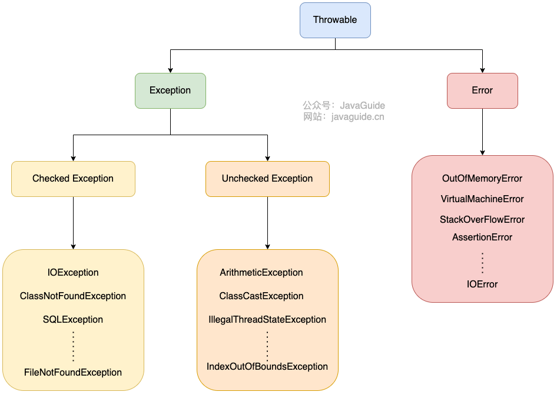

在 Java 中，所有的异常都有一个共同的祖先 java.lang 包中的 Throwable 类。Throwable 类有两个重要的子类：Exception 和 Error

Exception 和 Error区别：

* Exception :程序本身可以处理的异常，可以通过 catch 来进行捕获。Exception 又可以分为 Checked Exception (受检查异常，必须处理) 和 Unchecked Exception (不受检查异常，可以不处理)。
* Error ：Error 属于程序无法处理的错误 ，不建议通过catch捕获 。例如 Java 虚拟机运行错误（Virtual MachineError）、虚拟机内存不够错误(OutOfMemoryError)、类定义错误（NoClassDefFoundError）等 。这些异常发生时，Java 虚拟机（JVM）一般会选择线程终止。

Checked Exception 即 受检查异常 ，Java 代码在编译过程中，如果受检查异常没有被 catch或者throws 关键字处理的话，就没办法通过编译。

除了RuntimeException及其子类以外，其他的Exception类及其子类都属于受检查异常 。常见的受检查异常有： IO 相关的异常、ClassNotFoundException 、SQLException...。

Unchecked Exception 即 不受检查异常 ，Java 代码在编译过程中 ，我们即使不处理不受检查异常也可以正常通过编译。

RuntimeException 及其子类都统称为非受检查异常，常见的有：

* NullPointerException(空指针错误)
* IllegalArgumentException(参数错误比如方法入参类型错误)
* NumberFormatException（字符串转换为数字格式错误，IllegalArgumentException的子类）
* ArrayIndexOutOfBoundsException（数组越界错误）
* ClassCastException（类型转换错误）
* ArithmeticException（算术错误）
* SecurityException （安全错误比如权限不够）
* UnsupportedOperationException(不支持的操作错误比如重复创建同一用户)

Throwable 类常用方法：

* String getMessage(): 返回异常发生时的简要描述
* String toString(): 返回异常发生时的详细信息
* String getLocalizedMessage(): 返回异常对象的本地化信息。使用 Throwable 的子类覆盖这个方法，可以生成本地化信息。如果子类没有覆盖该方法，则该方法返回的信息与 getMessage()返回的结果相同
* void printStackTrace(): 在控制台上打印 Throwable 对象封装的异常信息

设置异常的根因：

我们有时想捕获一个异常，然后抛出一个新异常，此时可以将原始异常设置为新异常的原因，然后抛出：

```java
Exception se = new MyException("xxx");
se.initCase(oldException);
throw se;
```

如果在某个方法中发生了一个受查异常，但是却不允许抛出它，此时就可以用这种方法将受查异常封装成一个运行时异常，然后抛出。

### finally

try-catch-finally结构：

* try块 ： 用于捕获异常。其后可接零个或多个 catch 块，如果没有 catch 块，则必须跟一个 finally 块。
* catch块 ： 用于处理 try 捕获到的异常。
* finally 块 ： 无论是否捕获或处理异常，finally 块里的语句都会被执行。当在 try 块或 catch 块中遇到 return 语句时，finally 语句块将在方法返回之前被执行。

不要在 finally 语句块中使用 return：当 try 语句和 finally 语句中都有 return 语句时，try 语句块中的 return 语句会被忽略。这是因为 try 语句中的 return 返回值会先被暂存在一个本地变量中，当执行到 finally 语句中的 return 之后，这个本地变量的值就变为了 finally 语句中的 return 返回值。 

在某些情况下，finally 中的代码不会被执行：

例如finally 之前虚拟机被终止运行：

~~~java
try {
    System.out.println("Try to do something");
    throw new RuntimeException("RuntimeException");
} catch (Exception e) {
    System.out.println("Catch Exception -> " + e.getMessage());
    // 终止当前正在运行的Java虚拟机
    System.exit(1);
} finally {
    System.out.println("Finally");
}
~~~

还有一些特殊情况：程序所在的线程死亡、关闭CPU

### try-with-resources

可以使用 try-with-resources 代替try-catch-finally，比较适合用的资源：任何实现 java.lang.AutoCloseable或者 java.io.Closeable 的对象

在try-with-resources中各部分的执行顺序：任何 catch 或 finally 块在声明的资源关闭后运行 

面对必须要关闭的资源，我们总是应该优先使用 try-with-resources 而不是try-finally。随之产生的代码更简短，更清晰，产生的异常对我们也更有用。

Java 中类似于InputStream、OutputStream 、Scanner 、PrintWriter等的资源都需要我们调用close()方法来手动关闭，一般情况下我们都是通过try-catch-finally语句来实现这个需求，如下：

~~~java
//读取文本文件的内容
Scanner scanner = null;
try {
    scanner = new Scanner(new File("D://read.txt"));
    while (scanner.hasNext()) {
        System.out.println(scanner.nextLine());
    }
} catch (FileNotFoundException e) {
    e.printStackTrace();
} finally {
    if (scanner != null) {
        scanner.close();
    }
}
~~~

使用 Java 7 之后的 try-with-resources 语句改造上面的代码:

~~~java
try (Scanner scanner = new Scanner(new File("test.txt"))) {
    while (scanner.hasNext()) {
        System.out.println(scanner.nextLine());
    }
} catch (FileNotFoundException fnfe) {
    fnfe.printStackTrace();
}
~~~

当多个资源需要关闭的时候，可以通过使用分号分隔，可以在try-with-resources块中声明多个资源：

~~~java
try (BufferedInputStream bin = new BufferedInputStream(new FileInputStream(new File("test.txt")));
     BufferedOutputStream bout = new BufferedOutputStream(new FileOutputStream(new File("out.txt")))) {
    int b;
    while ((b = bin.read()) != -1) {
        bout.write(b);
    }
}
catch (IOException e) {
    e.printStackTrace();
}
~~~

## 泛型

### 基本使用

Java 泛型（Generics） 是 JDK 5 中引入的一个新特性。使用泛型参数，可以增强代码的可读性以及稳定性。编译器可以对泛型参数进行检测，并且通过泛型参数可以指定传入的对象类型。 

泛型一般有三种使用方式:泛型类、泛型接口、泛型方法。

1、泛型类

~~~java
//此处T可以随便写为任意标识，常见的如T、E、K、V等形式的参数常用于表示泛型
//在实例化泛型类时，必须指定T的具体类型
public class Generic<T>{

    private T key;

    public Generic(T key) {
        this.key = key;
    }

    public T getKey(){
        return key;
    }
}
~~~

实例化泛型类：

~~~java
Generic<Integer> genericInteger = new Generic<Integer>(123456);
~~~

2、泛型接口

~~~java
public interface Generator<T> {
    public T method();
}
~~~

实现泛型接口，不指定类型： 

~~~java
class GeneratorImpl<T> implements Generator<T>{
    @Override
    public T method() {
        return null;
    }
}
~~~

实现泛型接口，指定类型： 

~~~java
class GeneratorImpl<T> implements Generator<String>{
    @Override
    public String method() {
        return "hello";
    }
}
~~~

3、泛型方法

~~~java
   public static < E > void printArray( E[] inputArray )
   {
         for ( E element : inputArray ){
            System.out.printf( "%s ", element );
         }
         System.out.println();
    }
~~~

上面这个方法可以遍历不同类型的数组，使用时：

~~~java
// 创建不同类型数组： Integer, Double 和 Character
Integer[] intArray = { 1, 2, 3 };
String[] stringArray = { "Hello", "World" };
printArray( intArray  );
printArray( stringArray  );
~~~

泛型方法可以放在泛型类中，也可以放在普通类中。在执行一个泛型方法时，可以显式指定它的类型：

```java
obj.<String>getMiddle("abc", "def", "z");
```

也可以不指定类型，由编译器推导类型，编译器会寻找它们共同的超类，但是如果找到两个以上就会报错。

静态泛型方法是没有办法使用类上声明的泛型的。只能使用自己声明的泛型类型，这是因为在 java 中泛型只是一个占位符，必须在传递类型后才能使用。类在实例化时才能真正的传递类型参数，由于静态方法的加载先于类的实例化，也就是说类中的泛型还没有传递真正的类型参数，静态的方法的加载就已经完成了

### 类型限定

有时我们要写一个泛型方法，它可以找到传入某类型数组中的最小值，需要调用该类型的compareTo方法进行比较，但是问题是无法确定类型T是否有compareTo方法，此时就要求类型T不能是所有类型，而是必须实现了Comparable接口的类型，此时泛型方法应该这样声明：

```java
public static <T extends Comparable> T min(T[] a)
```

虽然类型限定的关键字是extends，但是它后面可以跟接口，此时我们称T是Comparable的子类型，甚至可以跟多个接口和类，此时类型限定的范围被限定在一个限定表中，如：

```java
T extends Comparable & Serializable
```

限定表的限定类型用&分隔，它可以设置多个接口超类型，但是至多有一个类，且如果有类，它必须在限定表的首位。

### 泛型擦除和桥方法

类型擦除的主要过程如下： 1.将所有的泛型参数用其最左边界（最顶级的父类型）类型替换。 2.移除所有的类型参数。 

在语法糖一节有对类型擦除更详细的讲解。

泛型类型都有对应的原始类型，如Pair\<T\>在经过擦除（类型变量替换为原始类型的过程）后，所有的T都将被替换为Object。对于Pair\<T extends Comparable & Serializable\>，在经过擦除后，所有的T都会被替换为Comparable，这里谁放在前面就替换成谁，如Serializable放在前面类型擦除后就会被替换为Serializable，编译器会在必要时强制类型转换为Comparable，所以，为了提高效率，通常吧标签接口放在类型限定表的最后。

擦除伴随着替换和强制类型转换，这意味着所有带泛型的调用都涉及到原始方法的调用和强制类型转换。

当泛型类涉及子类父类时，类型擦除和多态会冲突。

如有个父类Pair：

```java
public class Pair<T>{  
    private T first=null;  
    private T second=null;  

    public Pair(T fir,T sec){  
        this.first=fir;  
        this.second=sec;  
    }  
    public T getFirst(){  
        return this.first;  
    }  
    public T getSecond(){  
        return this.second;  
    }  
    public void setFirst(T fir){  
        this.first=fir;  
    }
}
```

类型擦除后：

```java
public class Pair{  
    private Object first=null;  
    private Object second=null;  

    public Pair(Object fir,Object sec){  
        this.first=fir;  
        this.second=sec;  
    }  
    public Object getFirst(){  
        return this.first;  
    }  
    public void setFirst(Object fir){  
        this.first=fir;  
    }  
}  
```

如果有个子类继承Pair类：

```java
public class SonPair extends Pair<String>{  
    public void setFirst(String fir){....}  
}  
```

这个setFirst方法的愿意是覆盖父类中的setFirst方法，但是在编译阶段，父类的setFirst方法的参数已经被改变成了Object类型的，此时子父类的参数不一致，导致多态失效。

为了解决这个麻烦，编译器在子类中自动生成一个桥方法：

```java
public void setFirst(Object fir){
    setFirst((String) fir)
} 
```

这样一来，调用子类的setFirst(Object fir)方法就相当于调用子类的setFirst(String fir)，满足原意（setFirst方法的愿意是覆盖父类中的setFirst方法）。

同样的道理，想要覆盖父类的getFirst方法，编译器会自动在子类生成一个返回值为Object的getFirst方法，此时子类同时存在空入参，但是返回值不同的getFirst方法，JVM允许这种方法存在，因为它是根据参数类型和返回类型来唯一确定一个方法的（我们自己编写代码时不能创造这种方法）

### 泛型的限制

泛型的限制有很多都是来源于类型擦除

（1）、运行时类型查询只适用于原始类型

在使用instanceof的时候，只能判断基本类型，不能带泛型。在进行强制类型转换时也是如此，包括getClass方法，也是只涉及原始类型。

（2）、泛型用于数组的限制

声明类型为Pair\<String\>[]的变量是合法的，但是创建这种类型的变量是非法的，所以想要使用的话尽量用集合。这个原因是java中数组只能放入声明时的类型，如果放入类型不匹配的元素会报错，但是泛型擦除很容易打破这个限制。

虽然参数化的泛型数组不能创建，但是可以创建通配符的泛型数组 ：

```java
Pair<?>[] table = new Pair<?>[10];
```

（3）、不能实例化类型变量

不能new T，但是可以用函数式接口避免直接new，还可以通过反射来新建这种对象。

（4）、不能创建泛型数组

不能new T[]，但是可以通过反射绕过

（5）、不能在静态域或方法中引入泛型变量

（6）、不能抛出或者捕获泛型类的实例，泛型类实现Throwable都是不合法的

（7）、利用泛型和异常体系，可以欺骗编译器，将一个受查异常伪装成非受查的

（8）、类型擦除引起的冲突，如一个类不可能拥有一个equals(T t)，因为类型擦除后和从Object继承来的方法冲突。

### 泛型类型的继承规则

如果有个父类是Employee，子类是Manager，此时有个规则是List\<Manager\>不是List\<Employee\>的子类型，这样的赋值是不合法的，因为赋值后可以用set方法自由的修改集合中的值，这样就有可能使运行状态集合中的类型不一致。

但是数组就没有这个问题，Manager[]可以赋值到Employee[]，因为数组在创建的时候就已经把它的类型固定了，此时如果试图向数组中放入其他类型就会报错。

类似的问题也发生在原始类型的集合中，不带泛型的原始集合可以存储各种元素，它不会在编译器报错，却给运行状态带来不稳定因素。

### 泛型通配符

对于Pair<? extends Employee> ，它可以将对象get出来，然后赋值给Employee，因为所有的值都是Employee的子类型；但是它不能set，因为一个集合中不允许放入不同类型的对象，不同的子类会使集合中的对象混乱。

对于Pair<? super Manager>，它可以set任何Manager对象进入，因为所有的Employee e = new Manager()都是合法的，超类的引用可以指向子类；但是它不能在get时确定类型，get到的对象只能赋值给object，因为不知道它的具体类型。

## 反射

### 基本概念

反射拥有运行时分析类以及执行类中方法的能力。通过反射你可以获取任意一个类的所有属性和方法，你还可以调用这些方法和属性。 

反射可以让我们的代码更加灵活、为各种框架提供开箱即用的功能提供了便利。 反射的劣势：

* 增加了安全问题，比如可以无视泛型参数的安全检查（泛型参数的安全检查发生在编译时） 
* 性能较差，反射导致编译器无法进行任何优化，它无法预测程序的行为，只有在真正执行时才能开始解释。虽然反射性能较差，但和访问数据库、服务请求比，还是要快的多

JDK动态代理就通过了反射来调用指定的方法，Spring也大量使用了反射，注解的实现也利用了反射

获取Class对象的四种方式：

* 知道具体类的情况下可以使用：类.class的方式，通过此方式获取 Class 对象不会进行初始化 

  ~~~java
  Class alunbarClass = TargetObject.class;
  ~~~

* 通过 Class.forName()传入类的全路径获取：

  ~~~java
  Class alunbarClass1 = Class.forName("cn.javaguide.TargetObject");
  ~~~

* 通过对象实例instance.getClass()获取：

  ~~~java
  TargetObject o = new TargetObject();
  Class alunbarClass2 = o.getClass();
  ~~~

* 通过类加载器xxxClassLoader.loadClass()传入类路径获取:

  ~~~java
  ClassLoader.getSystemClassLoader().loadClass("cn.javaguide.TargetObject");
  ~~~

  通过类加载器获取 Class 对象不会进行初始化，意味着不进行包括初始化等一系列步骤，静态代码块和静态对象不会得到执行 

### 注解

Annotation （注解） 是 Java5 开始引入的新特性，可以看作是一种特殊的注释，主要用于修饰类、方法或者变量，提供某些信息供程序在编译或者运行时使用。

注解本质是一个继承了Annotation 的特殊接口：

~~~java
@Target(ElementType.METHOD)
@Retention(RetentionPolicy.SOURCE)
public @interface Override {

}

public interface Override extends Annotation{

}
~~~

JDK 提供了很多内置的注解（比如 @Override 、@Deprecated），同时，我们还可以自定义注解。

注解的解析时机：

* 编译期扫描解析：编译器在编译 Java 代码的时候扫描对应的注解并处理，比如某个方法使用@Override 注解，编译器在编译的时候就会检测当前的方法是否重写了父类对应的方法。
* 运行期通过反射处理 ：像框架中自带的注解(比如 Spring 框架的 @Value 、@Component)都是通过反射来进行处理的。

## SPI

### 基本概念

SPI 即 Service Provider Interface ，字面意思就是：“服务提供者的接口”，我的理解是：专门提供给服务提供者或者扩展框架功能的开发者去使用的一个接口。 

SPI 将服务接口和具体的服务实现分离开来，将服务调用方和服务实现者解耦，能够提升程序的扩展性、可维护性。修改或者替换服务实现并不需要修改调用方。

很多框架都使用了 Java 的 SPI 机制，比如：Spring 框架、数据库加载驱动、日志接口、以及 Dubbo 的扩展实现等等。

SPI和API的区别：

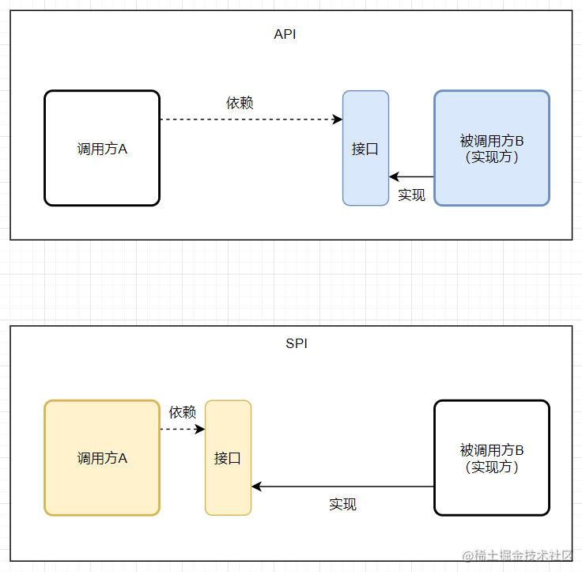

一般模块之间都是通过通过接口进行通讯，通常情况下调用方模块是不会感知到被调用方模块的内部具体实现。一旦代码里面涉及具体实现类，就违反了开闭原则。如果需要替换一种实现，就需要修改代码。 两者的区别是：

* 当实现方提供了接口和实现，我们可以通过调用实现方的接口从而拥有实现方给我们提供的能力，这就是 API ，这种接口和实现都是放在实现方的。
* 当接口存在于调用方这边时，就是 SPI ，由接口调用方确定接口规则，然后由不同的厂商去根绝这个规则对这个接口进行实现，从而提供服务。

SPI有点类似于一种服务发现机制，它就是为某个接口寻找服务实现的机制。这有点类似 IoC 的思想，将装配的控制权移交到了程序之外。

SPI的优点：大大地提高接口设计的灵活性

SPI的缺点：

* 需要遍历加载所有的实现类，不能做到按需加载，这样效率还是相对较低的。
* 当多个 ServiceLoader 同时 load 时，会有并发问题。

### 案例

Spring 框架提供的日志服务 SLF4J 其实只是一个日志门面（接口），但是 SLF4J 的具体实现可以有几种，比如：Logback、Log4j、Log4j2 等等，而且还可以切换，在切换日志具体实现的时候我们是不需要更改项目代码的，只需要在 Maven 依赖里面修改一些 pom 依赖就好了。 

这个功能就是依赖 SPI 机制实现的：

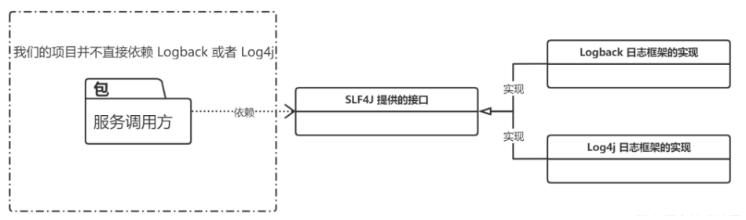

首先在项目中新建接口Logger，这个就是 SPI ， 服务提供者接口，后面的服务提供者就要针对这个接口进行实现。 

~~~java
public interface Logger {
    void info(String msg);
    void debug(String msg);
}
~~~

接下来就是 LoggerService 类，它是实现日志功能的类，会去寻找Logger的实现类并使用：

~~~java
import java.util.ArrayList;
import java.util.List;
import java.util.ServiceLoader;

public class LoggerService {
    private static final LoggerService SERVICE = new LoggerService();

    private final Logger logger;

    private final List<Logger> loggerList;

    private LoggerService() {
        ServiceLoader<Logger> loader = ServiceLoader.load(Logger.class);
        List<Logger> list = new ArrayList<>();
        for (Logger log : loader) {
            list.add(log);
        }
        // LoggerList 是所有 ServiceProvider
        loggerList = list;
        if (!list.isEmpty()) {
            // Logger 只取一个
            logger = list.get(0);
        } else {
            logger = null;
        }
    }

    public static LoggerService getService() {
        return SERVICE;
    }

    public void info(String msg) {
        if (logger == null) {
            System.out.println("info 中没有发现 Logger 服务提供者");
        } else {
            logger.info(msg);
        }
    }

    public void debug(String msg) {
        if (loggerList.isEmpty()) {
            System.out.println("debug 中没有发现 Logger 服务提供者");
        }
        loggerList.forEach(log -> log.debug(msg));
    }
}
~~~

然后使用日志打印功能：

~~~java
public class Main {
    public static void main(String[] args) {
        LoggerService service = LoggerService.getService();

        service.info("Hello SPI");
        service.debug("Hello SPI");
    }
}
~~~

此时如果项目没有引入Logger的实现类，那就不能正常打印日志。

接下来新建一个项目用来实现 Logger 接口，新建项目中新建一个类来实现Logger：

~~~java
public class Logback implements Logger {
    @Override
    public void info(String s) {
        System.out.println("Logback info 打印日志：" + s);
    }

    @Override
    public void debug(String s) {
        System.out.println("Logback debug 打印日志：" + s);
    }
}
~~~

在 src 目录下新建 META-INF/services 文件夹，然后新建文件 edu.jiangxuan.up.spi.Logger （SPI 的全类名），文件里面的内容是：edu.jiangxuan.up.spi.service.Logback （Logback 的全类名，即 SPI 的实现类的包名 + 类名），整个目录结构是：

~~~
│  service-provider.iml
│
├─.idea
│  │  .gitignore
│  │  misc.xml
│  │  modules.xml
│  └─ workspace.xml
│
├─lib
│      service-provider-interface.jar
|
└─src
    ├─edu
    │  └─jiangxuan
    │      └─up
    │          └─spi
    │              └─service
    │                      Logback.java
    │
    └─META-INF
        └─services
                edu.jiangxuan.up.spi.Logger
~~~

这是 JDK SPI 机制 ServiceLoader 约定好的标准。

Java 中的 SPI 机制就是在每次类加载的时候会先去找到 class 相对目录下的 META-INF 文件夹下的 services 文件夹下的文件，将这个文件夹下面的所有文件先加载到内存中，然后根据这些文件的文件名和里面的文件内容找到相应接口的具体实现类，找到实现类后就可以通过反射去生成对应的对象，保存在一个 list 列表里面，所以可以通过迭代或者遍历的方式拿到对应的实例对象，生成不同的实现。

所以会提出一些规范要求：文件名一定要是接口的全类名，然后里面的内容一定要是实现类的全类名，实现类可以有过个，直接换行就好了，多个实现类的时候，会一个一个的迭代加载。 

将这个项目引入后，日志就能正常打印了。通过使用 SPI 机制，可以看出服务（LoggerService）和 服务提供者两者之间的耦合度非常低，如果说我们想要换一种实现，那么其实只需要修改 service-provider 项目中针对 Logger 接口的具体实现就可以了，只需要换一个 jar 包即可，也可以有在一个项目里面有多个实现，这就是 SLF4J 的原理

如果某一天需求变更了，此时需要将日志输出到消息队列，或者做一些别的操作，这个时候完全不需要更改 Logback 的实现，只需要新增一个服务实现（service-provider）可以通过在本项目里面新增实现也可以从外部引入新的服务实现 jar 包。我们可以在服务(LoggerService)中选择一个具体的 服务实现(service-provider) 来完成我们需要的操作。

SPI机制是依赖ServiceLoader来实现的，它是一种加载服务实现的工具。下面是自己实现的一个建议ServiceLoader，它和真正的ServiceLoader原理差不多：

~~~java
import java.io.BufferedReader;
import java.io.InputStream;
import java.io.InputStreamReader;
import java.lang.reflect.Constructor;
import java.net.URL;
import java.net.URLConnection;
import java.util.ArrayList;
import java.util.Enumeration;
import java.util.List;

public class MyServiceLoader<S> {

    // 对应的接口 Class 模板
    private final Class<S> service;

    // 对应实现类的 可以有多个，用 List 进行封装
    private final List<S> providers = new ArrayList<>();

    // 类加载器
    private final ClassLoader classLoader;

    // 暴露给外部使用的方法，通过调用这个方法可以开始加载自己定制的实现流程。
    public static <S> MyServiceLoader<S> load(Class<S> service) {
        return new MyServiceLoader<>(service);
    }

    // 构造方法私有化
    private MyServiceLoader(Class<S> service) {
        this.service = service;
        this.classLoader = Thread.currentThread().getContextClassLoader();
        doLoad();
    }

    // 关键方法，加载具体实现类的逻辑
    private void doLoad() {
        try {
            // 读取所有 jar 包里面 META-INF/services 包下面的文件，这个文件名就是接口名，然后文件里面的内容就是具体的实现类的路径加全类名
            Enumeration<URL> urls = classLoader.getResources("META-INF/services/" + service.getName());
            // 挨个遍历取到的文件
            while (urls.hasMoreElements()) {
                // 取出当前的文件
                URL url = urls.nextElement();
                System.out.println("File = " + url.getPath());
                // 建立链接
                URLConnection urlConnection = url.openConnection();
                urlConnection.setUseCaches(false);
                // 获取文件输入流
                InputStream inputStream = urlConnection.getInputStream();
                // 从文件输入流获取缓存
                BufferedReader bufferedReader = new BufferedReader(new InputStreamReader(inputStream));
                // 从文件内容里面得到实现类的全类名
                String className = bufferedReader.readLine();

                while (className != null) {
                    // 通过反射拿到实现类的实例
                    Class<?> clazz = Class.forName(className, false, classLoader);
                    // 如果声明的接口跟这个具体的实现类是属于同一类型，（可以理解为Java的一种多态，接口跟实现类、父类和子类等等这种关系。）则构造实例
                    if (service.isAssignableFrom(clazz)) {
                        Constructor<? extends S> constructor = (Constructor<? extends S>) clazz.getConstructor();
                        S instance = constructor.newInstance();
                        // 把当前构造的实例对象添加到 Provider的列表里面
                        providers.add(instance);
                    }
                    // 继续读取下一行的实现类，可以有多个实现类，只需要换行就可以了。
                    className = bufferedReader.readLine();
                }
            }
        } catch (Exception e) {
            System.out.println("读取文件异常。。。");
        }
    }

    // 返回spi接口对应的具体实现类列表
    public List<S> getProviders() {
        return providers;
    }
}
~~~

主要的流程就是：

* 通过 URL 工具类从 jar 包的 /META-INF/services 目录下面找到对应的文件，
* 读取这个文件的名称找到对应的 spi 接口，
* 通过 InputStream 流将文件里面的具体实现类的全类名读取出来，
* 根据获取到的全类名，先判断跟 spi 接口是否为同一类型，如果是的，那么就通过反射的机制构造对应的实例对象，
* 将构造出来的实例对象添加到 Providers 的列表中。

SPI机制的本质还是通过反射来完成的。

## 语法糖

语法糖（Syntactic sugar） 代指的是编程语言为了方便程序员开发程序而设计的一种特殊语法，这种语法对编程语言的功能并没有影响。实现相同的功能，基于语法糖写出来的代码往往更简单简洁且更易阅读。

举个例子，Java 中的 for-each 就是一个常用的语法糖，其原理其实就是基于普通的 for 循环和迭代器。

JVM 其实并不能识别语法糖，Java 语法糖要想被正确执行，需要先通过编译器进行解糖，也就是在程序编译阶段将其转换成 JVM 认识的基本语法。这也侧面说明，Java 中真正支持语法糖的是 Java 编译器而不是 JVM。（也就是变成class文件的时候，其实就已经进行了解糖）

在com.sun.tools.javac.main.JavaCompiler的源码中，你会发现在compile()中有一个步骤就是调用desugar()，这个方法就是负责解语法糖的实现的。

下面是一些常用的语法糖：

### switch 支持 String 与枚举

从 Java 7 开始，Java 语言中的语法糖在逐渐丰富，其中一个比较重要的就是 Java 7 中switch开始支持String。

Java 中的switch自身原本就支持基本类型。比如int、char等。对于int类型，直接进行数值的比较。对于char类型则是比较其 ascii 码。所以，对于编译器来说，switch中其实只能使用整型，任何类型的比较都要转换成整型。比如byte。short，char(ackii 码是整型)以及int。

switch使用String后：

~~~java
public class switchDemoString {
    public static void main(String[] args) {
        String str = "world";
        switch (str) {
        case "hello":
            System.out.println("hello");
            break;
        case "world":
            System.out.println("world");
            break;
        default:
            break;
        }
    }
}
~~~

反编译后内容如下： 

~~~java
public class switchDemoString
{
    public switchDemoString()
    {
    }
    public static void main(String args[])
    {
        String str = "world";
        String s;
        switch((s = str).hashCode())
        {
        default:
            break;
        case 99162322:
            if(s.equals("hello"))
                System.out.println("hello");
            break;
        case 113318802:
            if(s.equals("world"))
                System.out.println("world");
            break;
        }
    }
}
~~~

字符串的 switch 是通过equals()和hashCode()方法（返回int）来实现的，进行switch的实际是哈希值，然后通过使用equals方法比较进行安全检查，这个检查是必要的，因为哈希可能会发生碰撞。

### 类型擦除

编译器处理泛型有两种方式：Code specialization和Code sharing。C++和 C#是使用Code specialization的处理机制，而 Java 使用的是Code sharing的机制。

Code sharing 方式为所有泛型类型创建唯一的字节码表示，并且将泛型类型的实例都映射到这个唯一的字节码表示上。将多种泛型类形实例映射到唯一的字节码表示是通过类型擦除（type erasue）实现的。

对于 Java 虚拟机来说，他根本不认识Map<String, String> map这样的语法。需要在编译阶段通过类型擦除的方式进行解语法糖

类型擦除的主要过程如下： 1.将所有的泛型参数用其最左边界（最顶级的父类型）类型替换。 2.移除所有的类型参数。 

代码案例1：

~~~java
Map<String, String> map = new HashMap<String, String>();
map.put("name", "hollis");
map.put("wechat", "Hollis");
map.put("blog", "www.hollischuang.com");
~~~

解糖后：

~~~java
Map map = new HashMap();
map.put("name", "hollis");
map.put("wechat", "Hollis");
map.put("blog", "www.hollischuang.com");
~~~

代码案例2：

~~~java
public static <A extends Comparable<A>> A max(Collection<A> xs) {
    Iterator<A> xi = xs.iterator();
    A w = xi.next();
    while (xi.hasNext()) {
        A x = xi.next();
        if (w.compareTo(x) < 0)
            w = x;
    }
    return w;
}
~~~

类型擦除后会变成： 

~~~java
 public static Comparable max(Collection xs){
    Iterator xi = xs.iterator();
    Comparable w = (Comparable)xi.next();
    while(xi.hasNext())
    {
        Comparable x = (Comparable)xi.next();
        if(w.compareTo(x) < 0)
            w = x;
    }
    return w;
}
~~~

虚拟机中没有泛型，只有普通类和普通方法，所有泛型类的类型参数在编译时都会被擦除，泛型类并没有自己独有的Class类对象。比如并不存在List\<String>.class或是List\<Integer>.class，而只有List.class。因为这个原因，两个方法的入参分别为List<String\>和 List<Integer\> list时，方法是不能重载的，编译期就会报错。同样的道理，catch异常的时候也无法区分MyException\<String>和MyException\<Integer>

### 自动装拆箱

自动装箱就是 Java 自动将原始类型值转换成对应的对象，比如将 int 的变量转换成 Integer 对象，这个过程叫做装箱，反之将 Integer 对象转换成 int 类型值，这个过程叫做拆箱。 

从反编译得到内容可以看出，在装箱的时候自动调用的是Integer的valueOf(int)方法。而在拆箱的时候自动调用的是Integer的intValue方法。

### 可变长参数

可变参数(variable arguments)是在 Java 1.5 中引入的一个特性。它允许一个方法把任意数量的值作为参数。

看下以下可变参数代码，其中 print 方法接收可变参数：

~~~java
public static void main(String[] args)
    {
        print("Holis", "公众号:Hollis", "博客：www.hollischuang.com", "QQ：907607222");
    }

public static void print(String... strs)
{
    for (int i = 0; i < strs.length; i++)
    {
        System.out.println(strs[i]);
    }
}
~~~

反编译后代码： 

~~~java
 public static void main(String args[])
{
    print(new String[] {
        "Holis", "\u516C\u4F17\u53F7:Hollis", "\u535A\u5BA2\uFF1Awww.hollischuang.com", "QQ\uFF1A907607222"
    });
}

public static transient void print(String strs[])
{
    for(int i = 0; i < strs.length; i++)
        System.out.println(strs[i]);
}
~~~

从反编译后代码可以看出，调用可变参数方法时会创建一个数组，可变参数方法的入参其实就是一个数组，这个数组作为参数传递到被调用的方法中。

### 枚举

Java SE5 提供了一种新的类型-Java 的枚举类型，关键字enum可以将一组具名的值的有限集合创建为一种新的类型，而这些具名的值可以作为常规的程序组件使用，这是一种非常有用的功能。对于下面的枚举类：

~~~java
public enum t {
    SPRING,SUMMER;
}
~~~

反编译后代码内容如下： 

~~~java
public final class T extends Enum
{
    private T(String s, int i)
    {
        super(s, i);
    }
    public static T[] values()
    {
        T at[];
        int i;
        T at1[];
        System.arraycopy(at = ENUM$VALUES, 0, at1 = new T[i = at.length], 0, i);
        return at1;
    }

    public static T valueOf(String s)
    {
        return (T)Enum.valueOf(demo/T, s);
    }

    public static final T SPRING;
    public static final T SUMMER;
    private static final T ENUM$VALUES[];
    static
    {
        SPRING = new T("SPRING", 0);
        SUMMER = new T("SUMMER", 1);
        ENUM$VALUES = (new T[] {
            SPRING, SUMMER
        });
    }
}
~~~

当我们使用enum来定义一个枚举类型的时候，编译器会自动帮我们创建一个final类型的类继承Enum类，所以枚举类型不能被继承。

### 内部类

内部类之所以也是语法糖，是因为它仅仅是一个编译时的概念，outer.java里面定义了一个内部类inner，一旦编译成功，就会生成两个完全不同的.class文件了，分别是outer.class和outer$inner.class。所以内部类的名字完全可以和它的外部类名字相同。

~~~java
public class OutterClass {
    private String userName;

    public String getUserName() {
        return userName;
    }

    public void setUserName(String userName) {
        this.userName = userName;
    }

    public static void main(String[] args) {

    }

    class InnerClass{
        private String name;

        public String getName() {
            return name;
        }

        public void setName(String name) {
            this.name = name;
        }
    }
}
~~~

以上代码编译后会生成两个 class 文件：OutterClass$InnerClass.class 、OutterClass.class 。当我们尝试对OutterClass.class文件进行反编译的时候，命令行会打印以下内容：Parsing OutterClass.class...Parsing inner class OutterClass$InnerClass.class... Generating OutterClass.jad 。他会把两个文件全部进行反编译，然后一起生成一个OutterClass.jad文件。文件内容如下：

~~~java
public class OutterClass
{
    class InnerClass
    {
        public String getName()
        {
            return name;
        }
        public void setName(String name)
        {
            this.name = name;
        }
        private String name;
        final OutterClass this$0;

        InnerClass()
        {
            this.this$0 = OutterClass.this;
            super();
        }
    }

    public OutterClass()
    {
    }
    public String getUserName()
    {
        return userName;
    }
    public void setUserName(String userName){
        this.userName = userName;
    }
    public static void main(String args1[])
    {
    }
    private String userName;
}
~~~

### 条件编译

—般情况下，程序中的每一行代码都要参加编译。但有时候出于对程序代码优化的考虑，希望只对其中一部分内容进行编译，此时就需要在程序中加上条件，让编译器只对满足条件的代码进行编译，将不满足条件的代码舍弃，这就是条件编译。

例如下面这段代码：

~~~java
public class ConditionalCompilation {
    public static void main(String[] args) {
        final boolean DEBUG = true;
        if(DEBUG) {
            System.out.println("Hello, DEBUG!");
        }

        final boolean ONLINE = false;

        if(ONLINE){
            System.out.println("Hello, ONLINE!");
        }
    }
}
~~~

反编译后代码如下： 

~~~java
public class ConditionalCompilation
{

    public ConditionalCompilation()
    {
    }

    public static void main(String args[])
    {
        boolean DEBUG = true;
        System.out.println("Hello, DEBUG!");
        boolean ONLINE = false;
    }
}
~~~

在反编译后的代码中没有System.out.println("Hello, ONLINE!");，这其实就是条件编译。当if(ONLINE)为 false 的时候，编译器就没有对其内的代码进行编译。

但是Java的条件编译有它的局限性，它是基于常量判断的，而且必须在方法体内实现，而无法在正整个 Java 类的结构或者类的属性上进行条件编译。这与 C/C++的条件编译相比，确实更有局限性，在 C 或 CPP 中，可以通过预处理语句来实现条件编译 

### 断言

在 Java 中，assert关键字是从 JAVA SE 1.4 引入的，为了避免和老版本的 Java 代码中使用了assert关键字导致错误，Java 在执行的时候默认是不启动断言检查的（这个时候，所有的断言语句都将忽略！），如果要开启断言检查，则需要用开关-enableassertions或-ea来开启。

看一段包含断言的代码：

~~~java
public class AssertTest {
    public static void main(String args[]) {
        int a = 1;
        int b = 1;
        assert a == b;
        System.out.println("公众号：Hollis");
        assert a != b : "Hollis";
        System.out.println("博客：www.hollischuang.com");
    }
}
~~~

反编译后代码如下： 

~~~java
public class AssertTest {
   public AssertTest()
    {
    }
    public static void main(String args[])
{
    int a = 1;
    int b = 1;
    if(!$assertionsDisabled && a != b)
        throw new AssertionError();
    System.out.println("\u516C\u4F17\u53F7\uFF1AHollis");
    if(!$assertionsDisabled && a == b)
    {
        throw new AssertionError("Hollis");
    } else
    {
        System.out.println("\u535A\u5BA2\uFF1Awww.hollischuang.com");
        return;
    }
}

static final boolean $assertionsDisabled = !com/hollis/suguar/AssertTest.desiredAssertionStatus();

}
~~~

断言的底层实现就是 if 语言，如果断言结果为 true，则什么都不做，程序继续执行，如果断言结果为 false，则程序抛出 AssertError 来打断程序的执行。-enableassertions会设置$assertionsDisabled 字段的值，如果没有设置开启断言，则不会执行Error

### 数字字面量

在 java 7 中，数值字面量，不管是整数还是浮点数，都允许在数字之间插入任意多个下划线。这些下划线不会对字面量的数值产生影响，目的就是方便阅读。 

例如int i = 10_000;

反编译后就是把\_删除了。也就是说 编译器并不认识在数字字面量中的_，需要在编译阶段把他去掉。

### 增强 for 循环 

增强for循环可以用在数组，也可以用在集合：

~~~java
public static void main(String... args) {
    String[] strs = {"Hollis", "公众号：Hollis", "博客：www.hollischuang.com"};
    for (String s : strs) {
        System.out.println(s);
    }
    List<String> strList = ImmutableList.of("Hollis", "公众号：Hollis", "博客：www.hollischuang.com");
    for (String s : strList) {
        System.out.println(s);
    }
}
~~~

反编译后：

~~~java
public static transient void main(String args[])
{
    String strs[] = {
        "Hollis", "\u516C\u4F17\u53F7\uFF1AHollis", "\u535A\u5BA2\uFF1Awww.hollischuang.com"
    };
    String args1[] = strs;
    int i = args1.length;
    for(int j = 0; j < i; j++)
    {
        String s = args1[j];
        System.out.println(s);
    }

    List strList = ImmutableList.of("Hollis", "\u516C\u4F17\u53F7\uFF1AHollis", "\u535A\u5BA2\uFF1Awww.hollischuang.com");
    String s;
    for(Iterator iterator = strList.iterator(); iterator.hasNext(); System.out.println(s))
        s = (String)iterator.next();

}
~~~

代码很简单，for-each 的实现原理其实就是使用了普通的 for 循环和迭代器（使用增强for的集合必须实现了Iterator）

在增强for循环中，不能调用集合的remove方法，会抛出ConcurrentModificationException异常。

Iterator 是工作在一个独立的线程中，并且拥有一个 mutex 锁。 Iterator 被创建之后会建立一个指向原来对象的单链索引表，当原来的对象数量发生变化时，这个索引表的内容不会同步改变，所以当索引指针往后移动的时候就找不到要迭代的对象，所以按照 fail-fast 原则 Iterator 会马上抛出java.util.ConcurrentModificationException异常。

所以 Iterator 在工作的时候是不允许被迭代的对象被改变的。但你可以使用 Iterator 本身的方法remove()来删除对象，Iterator.remove() 方法会在删除当前迭代对象的同时维护索引的一致性。

### try-with-resource

Java 里，对于文件操作 IO 流、数据库连接等开销非常昂贵的资源，用完之后必须及时通过 close 方法将其关闭，否则资源会一直处于打开状态，可能会导致内存泄露等问题。

关闭资源的常用方式就是在finally块里是释放，即调用close方法。下面是一段try-with-resource代码：

~~~java
public static void main(String... args) {
    try (BufferedReader br = new BufferedReader(new FileReader("d:\\ hollischuang.xml"))) {
        String line;
        while ((line = br.readLine()) != null) {
            System.out.println(line);
        }
    } catch (IOException e) {
        // handle exception
    }
}
~~~

这样的操作比之前用finally优雅很多，反编译后：

~~~java
public static transient void main(String args[])
    {
        BufferedReader br;
        Throwable throwable;
        br = new BufferedReader(new FileReader("d:\\ hollischuang.xml"));
        throwable = null;
        String line;
        try
        {
            while((line = br.readLine()) != null)
                System.out.println(line);
        }
        catch(Throwable throwable2)
        {
            throwable = throwable2;
            throw throwable2;
        }
        if(br != null)
            if(throwable != null)
                try
                {
                    br.close();
                }
                catch(Throwable throwable1)
                {
                    throwable.addSuppressed(throwable1);
                }
            else
                br.close();
            break MISSING_BLOCK_LABEL_113;
            Exception exception;
            exception;
            if(br != null)
                if(throwable != null)
                    try
                    {
                        br.close();
                    }
                    catch(Throwable throwable3)
                      {
                        throwable.addSuppressed(throwable3);
                    }
                else
                    br.close();
        throw exception;
        IOException ioexception;
        ioexception;
    }
}
~~~

它可以帮助我们关闭资源，而且考虑了资源关闭失败的情况，会把关闭失败的错误也保留下来，最后抛出

### Lambda 表达式

Labmda 表达式不是匿名内部类的语法糖，但是他也是一个语法糖。实现方式其实是依赖了几个 JVM 底层提供的 lambda 相关 api。

先来看一个简单的 lambda 表达式。遍历一个 list： 

~~~java
public static void main(String... args) {
    List<String> strList = ImmutableList.of("Hollis", "公众号：Hollis", "博客：www.hollischuang.com");

    strList.forEach( s -> { System.out.println(s); } );
}
~~~

之所以说它不是内部类的语法糖，是因为内部类在编译之后会有两个 class 文件，但是，包含 lambda 表达式的类编译后只有一个文件。 反编译后如下：

~~~java
public static /* varargs */ void main(String ... args) {
    ImmutableList strList = ImmutableList.of((Object)"Hollis", (Object)"\u516c\u4f17\u53f7\uff1aHollis", (Object)"\u535a\u5ba2\uff1awww.hollischuang.com");
    strList.forEach((Consumer<String>)LambdaMetafactory.metafactory(null, null, null, (Ljava/lang/Object;)V, lambda$main$0(java.lang.String ), (Ljava/lang/String;)V)());
}

private static /* synthetic */ void lambda$main$0(String s) {
    System.out.println(s);
}
~~~

可以看到，在forEach方法中，其实是调用了java.lang.invoke.LambdaMetafactory#metafactory方法，该方法的第四个参数 implMethod 指定了方法实现。可以看到这里其实是调用了一个lambda$main$0方法进行了输出。

如果涉及到多个逻辑，就会在编译后生成多个方法，比如下面的例子：

~~~java
public static void main(String... args) {
    List<String> strList = ImmutableList.of("Hollis", "公众号：Hollis", "博客：www.hollischuang.com");

    List HollisList = strList.stream().filter(string -> string.contains("Hollis")).collect(Collectors.toList());

    HollisList.forEach( s -> { System.out.println(s); } );
}
~~~

反编译后代码如下： 

~~~java
public static /* varargs */ void main(String ... args) {
    ImmutableList strList = ImmutableList.of((Object)"Hollis", (Object)"\u516c\u4f17\u53f7\uff1aHollis", (Object)"\u535a\u5ba2\uff1awww.hollischuang.com");
    List<Object> HollisList = strList.stream().filter((Predicate<String>)LambdaMetafactory.metafactory(null, null, null, (Ljava/lang/Object;)Z, lambda$main$0(java.lang.String ), (Ljava/lang/String;)Z)()).collect(Collectors.toList());
    HollisList.forEach((Consumer<Object>)LambdaMetafactory.metafactory(null, null, null, (Ljava/lang/Object;)V, lambda$main$1(java.lang.Object ), (Ljava/lang/Object;)V)());
}

private static /* synthetic */ void lambda$main$1(Object s) {
    System.out.println(s);
}

private static /* synthetic */ boolean lambda$main$0(String string) {
    return string.contains("Hollis");
}
~~~

lambda 表达式的实现其实是依赖了一些底层的 api，在编译阶段，编译器会把 lambda 表达式进行解糖，转换成调用内部 api 的方式

# I/O

## 序列化

如果我们需要持久化 Java 对象比如将 Java 对象保存在文件中，或者在网络传输 Java 对象，这些场景都需要用到序列化。

简单来说：

* 序列化： 将数据结构或对象转换成二进制字节流的过程
* 反序列化：将在序列化过程中所生成的二进制字节流转换成数据结构或者对象的过程

序列化的主要目的是通过网络传输对象或者说是将对象存储到文件系统、数据库、内存中。

对于不想进行序列化的变量，使用 transient 关键字修饰。

transient 关键字的作用是：阻止实例中那些用此关键字修饰的的变量序列化；当对象被反序列化时，被 transient 修饰的变量值不会被持久化和恢复。

它只能修饰变量，不能修饰类和方法。transient 修饰的变量，在反序列化后变量值将会被置成类型的默认值。例如，如果是修饰 int 类型，那么反序列后结果就是 0。static 变量因为不属于任何对象(Object)，所以无论有没有 transient 关键字修饰，均不会被序列化

开发中用到序列化的场景：网络传输、将对象存在文件中/从文件中取出

反序列化在网络协议的位置：在OSI七层模型的表示层（编解码、加密解密、压缩解压缩），在TCP/IP四层模型的应用层

### 序列化协议的特性

序列化的方法有多种，比较常用的序列化协议有 hessian、kryo、protostuff 。像 JSON 和 XML 这种属于文本类序列化方式。虽然 JSON 和 XML 可读性比较好，但是性能较差，一般不会选择。 

选择序列化协议时，要考虑它的以下特性：

* 通用性：包括技术通用性（序列化协议是否支持跨平台、跨语言 ）和流行程度（很少人使用的协议往往意味着昂贵的学习成本）

* 强健性：经过长稳测试的序列化协议更可靠

* 可调试性：如果序列化后的数据人眼可读，这将大大提高调试效率 

* 性能：包括空间开销和时间开销

* 可扩展性/兼容性：如果序列化协议具有良好的可扩展性，支持自动增加新的业务字段，而不影响老的服务，这将大大提供系统的灵活度 

* 安全性：在序列化选型的过程中，安全性的考虑往往发生在跨局域网访问的场景。当通讯发生在公司之间或者跨机房的时候，出于安全的考虑，对于跨局域网的访问往往被限制为基于HTTP/HTTPS的80和443端口。如果使用的序列化协议没有兼容而成熟的HTTP传输层框架支持，可能会导致以下三种结果之一：

  第一、因为访问限制而降低服务可用性。 第二、被迫重新实现安全协议而导致实施成本大大提高。 第三、开放更多的防火墙端口和协议访问，而牺牲安全性。

### JDK序列化

JDK 自带的序列化，只需实现 java.io.Serializable接口即可。

JDK 自带的序列化方式一般不会用 ，因为序列化效率低并且部分版本有安全漏洞。 

~~~java
@AllArgsConstructor
@NoArgsConstructor
@Getter
@Builder
@ToString
public class RpcRequest implements Serializable {
    private static final long serialVersionUID = 1905122041950251207L;
    private String requestId;
    private String interfaceName;
    private String methodName;
    private Object[] parameters;
    private Class<?>[] paramTypes;
    private RpcMessageTypeEnum rpcMessageTypeEnum;
}
~~~

序列化号 serialVersionUID 属于版本控制的作用。序列化的时候 serialVersionUID 也会被写入二进制序列，当反序列化时会检查 serialVersionUID 是否和当前类的 serialVersionUID 一致。如果 serialVersionUID 不一致则会抛出 InvalidClassException 异常。强烈推荐每个序列化类都手动指定其 serialVersionUID，如果不手动指定，那么编译器会动态生成默认的序列化号

几乎不会使用JDK自带的序列化，主要原因有两个：

* 不支持跨语言调用 : 如果调用的是其他语言开发的服务的时候就不支持了。
* 性能差 ：相比于其他序列化框架性能更低，主要原因是序列化之后的字节数组体积较大，导致传输成本加大。

### Kryo

Kryo 是一个高性能的序列化/反序列化工具，由于其变长存储特性并使用了字节码生成机制，拥有较高的运行速度和较小的字节码体积。

另外，Kryo 已经是一种非常成熟的序列化实现了，已经在 Twitter、Groupon、Yahoo 以及多个著名开源项目（如 Hive、Storm）中广泛的使用。

Kryo 是专门针对 Java 语言序列化方式并且性能非常好，如果你的应用是专门针对 Java 语言的话可以考虑使用 

序列化和反序列化相关的代码如下： 

~~~java
@Slf4j
public class KryoSerializer implements Serializer {

    /**
     * Because Kryo is not thread safe. So, use ThreadLocal to store Kryo objects
     */
    private final ThreadLocal<Kryo> kryoThreadLocal = ThreadLocal.withInitial(() -> {
        Kryo kryo = new Kryo();
        kryo.register(RpcResponse.class);
        kryo.register(RpcRequest.class);
        return kryo;
    });

    @Override
    public byte[] serialize(Object obj) {
        try (ByteArrayOutputStream byteArrayOutputStream = new ByteArrayOutputStream();
             Output output = new Output(byteArrayOutputStream)) {
            Kryo kryo = kryoThreadLocal.get();
            // Object->byte:将对象序列化为byte数组
            kryo.writeObject(output, obj);
            kryoThreadLocal.remove();
            return output.toBytes();
        } catch (Exception e) {
            throw new SerializeException("Serialization failed");
        }
    }

    @Override
    public <T> T deserialize(byte[] bytes, Class<T> clazz) {
        try (ByteArrayInputStream byteArrayInputStream = new ByteArrayInputStream(bytes);
             Input input = new Input(byteArrayInputStream)) {
            Kryo kryo = kryoThreadLocal.get();
            // byte->Object:从byte数组中反序列化出对象
            Object o = kryo.readObject(input, clazz);
            kryoThreadLocal.remove();
            return clazz.cast(o);
        } catch (Exception e) {
            throw new SerializeException("Deserialization failed");
        }
    }

}
~~~

### Protobuf和Protostuff 

Protobuf 出自于 Google，性能还比较优秀，也支持多种语言，同时还是跨平台的。就是在使用中过于繁琐，因为你需要自己定义 IDL 文件和生成对应的序列化代码。这样虽然不灵活，但是，另一方面导致 protobuf 没有序列化漏洞的风险。 

Protobuf 包含序列化格式的定义、各种语言的库以及一个 IDL 编译器。正常情况下你需要定义 proto 文件，然后使用 IDL 编译器编译成你需要的语言 

一个简单的 proto 文件如下： 

~~~protobuf
// protobuf的版本
syntax = "proto3";
// SearchRequest会被编译成不同的编程语言的相应对象，比如Java中的class、Go中的struct
message Person {
  //string类型字段
  string name = 1;
  // int 类型字段
  int32 age = 2;
}
~~~

protostuff 基于 Google protobuf，但是提供了更多的功能和更简易的用法 

### hessian

hessian 是一个轻量级的，自定义描述的二进制 RPC 协议。hessian 是一个比较老的序列化实现了，并且同样也是跨语言的。 

dubbo RPC 默认启用的序列化方式是 hessian2 ,但是，Dubbo 对 hessian2 进行了修改，不过大体结构还是差不多。 

### Thrift

Thrift是Facebook开源提供的一个高性能，轻量级RPC服务框架，其产生正是为了满足当前大数据量、分布式、跨语言、跨平台数据通讯的需求。 但是，Thrift并不仅仅是序列化协议，而是一个RPC框架。相对于JSON和XML而言，Thrift在空间开销和解析性能上有了比较大的提升，对于对性能要求比较高的分布式系统，它是一个优秀的RPC解决方案；但是由于Thrift的序列化被嵌入到Thrift框架里面，Thrift框架本身并没有透出序列化和反序列化接口，这导致其很难和其他传输层协议共同使用（例如HTTP）。 

### Avro

Avro的产生解决了JSON的冗长和没有IDL的问题，Avro属于Apache Hadoop的一个子项目。 Avro提供两种序列化格式：JSON格式或者Binary格式。Binary格式在空间开销和解析性能方面可以和Protobuf媲美，JSON格式方便测试阶段的调试。 

Avro解析性能高并且序列化之后的数据非常简洁，比较适合于高性能的序列化服务。 

### XML&SOAP

XML是一种常用的序列化和反序列化协议，具有跨机器，跨语言等优点。 XML历史悠久，其1.0版本早在1998年就形成标准，并被广泛使用至今。XML的最初产生目标是对互联网文档（Document）进行标记，所以它的设计理念中就包含了对于人和机器都具备可读性。 但是，当这种标记文档的设计被用来序列化对象的时候，就显得冗长而复杂（Verbose and Complex）。 它被广泛应用在配置文件中

SOAP（Simple Object Access protocol） 是一种被广泛应用的，基于XML为序列化和反序列化协议的结构化消息传递协议。SOAP在互联网影响如此大，以至于我们给基于SOAP的解决方案一个特定的名称–Web service。SOAP虽然可以支持多种传输层协议，不过SOAP最常见的使用方式还是XML+HTTP。 SOAP具有安全、可扩展、跨语言、跨平台并支持多种传输层协议。

SOAP协议具有广泛的群众基础，基于HTTP的传输协议使得其在穿越防火墙时具有良好安全特性，XML所具有的人眼可读（Human-readable）特性使得其具有出众的可调试性，互联网带宽的日益剧增也大大弥补了其空间开销大（Verbose）的缺点。对于在公司之间传输数据量相对小或者实时性要求相对低（例如秒级别）的服务是一个好的选择。 

由于XML的额外空间开销大，序列化之后的数据量剧增，对于数据量巨大序列持久化应用常景，这意味着巨大的内存和磁盘开销，不太适合XML。另外，XML的序列化和反序列化的空间和时间开销都比较大，对于对性能要求在ms级别的服务，不推荐使用。 

### 序列化协议选型

序列化方式的选择：

- 像 Protobuf、 ProtoStuff、hessian 这类都是跨语言的序列化方式，如果有跨语言需求的话可以考虑使用。 
- Kryo 是专门针对 Java 语言序列化方式并且性能非常好，如果你的应用是专门针对 Java 语言的话可以考虑使用 

各协议的特点：

1、XML序列化（Xstream）无论在性能和简洁性上比较差。

2、Thrift与Protobuf相比在时空开销方面都有一定的劣势。

3、Protobuf和Avro在两方面表现都非常优越。

选型建议：

1、对于公司间的系统调用，如果性能要求在100ms以上的服务，基于XML的SOAP协议是一个值得考虑的方案。

2、基于Web browser的Ajax，以及Mobile app与服务端之间的通讯，JSON协议是首选。对于性能要求不太高，或者以动态类型语言为主，或者传输数据载荷很小的的运用场景，JSON也是非常不错的选择。

3、对于调试环境比较恶劣的场景，采用JSON或XML能够极大的提高调试效率，降低系统开发成本。

4、当对性能和简洁性有极高要求的场景，Protobuf，Thrift，Avro之间具有一定的竞争关系。

5、对于T级别的数据的持久化应用场景，Protobuf和Avro是首要选择。如果持久化后的数据存储在Hadoop子项目里，Avro会是更好的选择。

6、由于Avro的设计理念偏向于动态类型语言，对于动态语言为主的应用场景，Avro是更好的选择。

7、对于持久层非Hadoop项目，以静态类型语言为主的应用场景，Protobuf会更符合静态类型语言工程师的开发习惯。

8、如果需要提供一个完整的RPC解决方案，Thrift是一个好的选择。

9、如果序列化之后需要支持不同的传输层协议，或者需要跨防火墙访问的高性能场景，Protobuf可以优先考虑。

## I/O流

IO 即 Input/Output，输入和输出。数据输入到计算机内存的过程即输入，反之输出到外部存储（比如数据库，文件，远程主机）的过程即输出。数据传输过程类似于水流，因此称为 IO 流。IO 流在 Java 中分为输入流和输出流，而根据数据的处理方式又分为字节流和字符流。

Java IO 流的 40 多个类都是从如下 4 个抽象类基类中派生出来的：

* InputStream/Reader: 所有的输入流的基类，前者是字节输入流，后者是字符输入流。
* OutputStream/Writer: 所有输出流的基类，前者是字节输出流，后者是字符输出流。

不管是文件读写还是网络发送接收，信息的最小存储单元都是字节，之所以产生了字符流，是因为字符流操作比较方便，字节流必须结合编码类型才能正常操作。

### 字节输入流

InputStream用于从源头（通常是文件）读取数据（字节信息）到内存中，java.io.InputStream抽象类是所有字节输入流的父类。

InputStream 常用方法 ：

* read() ：返回输入流中下一个字节的数据。返回的值介于 0 到 255 之间。如果未读取任何字节，则代码返回 -1 ，表示文件结束。
* read(byte b[ ]) : 从输入流中读取一些字节存储到数组 b 中。如果数组 b 的长度为零，则不读取。如果没有可用字节读取，返回 -1。如果有可用字节读取，则最多读取的字节数最多等于 b.length ， 返回读取的字节数。这个方法等价于 read(b, 0, b.length)。
* read(byte b[], int off, int len) ：在read(byte b[ ]) 方法的基础上增加了 off 参数（偏移量）和 len 参数（要读取的最大字节数）。
* skip(long n) ：忽略输入流中的 n 个字节 ,返回实际忽略的字节数。
* available() ：返回输入流中可以读取的字节数。
* close() ：关闭输入流释放相关的系统资源。

从 Java 9 开始，InputStream 新增加了多个实用的方法：

* readAllBytes() ：读取输入流中的所有字节，返回字节数组。
* readNBytes(byte[] b, int off, int len) ：阻塞直到读取 len 个字节。
* transferTo(OutputStream out) ： 将所有字节从一个输入流传递到一个输出流。

FileInputStream 是一个比较常用的字节输入流对象，可直接指定文件路径，可以直接读取单字节数据，也可以读取至字节数组中。

逐个字节读取文件示例：

~~~java
try (InputStream fis = new FileInputStream("input.txt")) {
    System.out.println("Number of remaining bytes:"
            + fis.available());
    int content;
    long skip = fis.skip(2);
    System.out.println("The actual number of bytes skipped:" + skip);
    System.out.print("The content read from file:");
    while ((content = fis.read()) != -1) {
        System.out.print((char) content);
    }
} catch (IOException e) {
    e.printStackTrace();
}
~~~

不过，一般我们是不会直接单独使用 FileInputStream ，通常会配合 BufferedInputStream（字节缓冲输入流，后文会讲到）来使用。

通过 readAllBytes() 读取输入流所有字节并将其直接赋值给一个 String 对象：

~~~java
// 新建一个 BufferedInputStream 对象
BufferedInputStream bufferedInputStream = new BufferedInputStream(new FileInputStream("input.txt"));
// 读取文件的内容并复制到 String 对象中
String result = new String(bufferedInputStream.readAllBytes());
System.out.println(result);
~~~

DataInputStream 用于读取指定类型数据，不能单独使用，必须结合 FileInputStream：

~~~java
FileInputStream fileInputStream = new FileInputStream("input.txt");
//必须将fileInputStream作为构造参数才能使用
DataInputStream dataInputStream = new DataInputStream(fileInputStream);
//可以读取任意具体的类型数据
dataInputStream.readBoolean();
dataInputStream.readInt();
dataInputStream.readUTF();
~~~

ObjectInputStream 用于从输入流中读取 Java 对象（反序列化），ObjectOutputStream 用于将对象写入到输出流(序列化)：

~~~java
ObjectInputStream input = new ObjectInputStream(new FileInputStream("object.data"));
MyClass object = (MyClass) input.readObject();
input.close();
~~~

另外，用于序列化和反序列化的类必须实现 Serializable 接口，对象中如果有属性不想被序列化，使用 transient 修饰

### 字节输出流

OutputStream用于将数据（字节信息）写入到目的地（通常是文件），java.io.OutputStream抽象类是所有字节输出流的父类。

OutputStream 常用方法 ：

* write(int b) ：将特定字节写入输出流。
* write(byte b[ ]) : 将数组b 写入到输出流，等价于 write(b, 0, b.length) 。
* write(byte[] b, int off, int len) : 在write(byte b[ ]) 方法的基础上增加了 off 参数（偏移量）和 len 参数（要读取的最大字节数）。
* flush() ：刷新此输出流并强制写出所有缓冲的输出字节。
* close() ：关闭输出流释放相关的系统资源。

FileOutputStream 是最常用的字节输出流对象，可直接指定文件路径，可以直接输出单字节数据，也可以输出指定的字节数组。

向文件写入字节数组：

~~~java
try (FileOutputStream output = new FileOutputStream("output.txt")) {
    byte[] array = "JavaGuide".getBytes();
    output.write(array);
} catch (IOException e) {
    e.printStackTrace();
}
~~~

类似于 FileInputStream，FileOutputStream 通常也会配合 BufferedOutputStream（字节缓冲输出流，后文会讲到）来使用：

~~~java
FileOutputStream fileOutputStream = new FileOutputStream("output.txt");
BufferedOutputStream bos = new BufferedOutputStream(fileOutputStream)
~~~

DataOutputStream 用于写入指定类型数据，不能单独使用，必须结合 FileOutputStream：

~~~java
// 输出流
FileOutputStream fileOutputStream = new FileOutputStream("out.txt");
DataOutputStream dataOutputStream = new DataOutputStream(fileOutputStream);
// 输出任意数据类型
dataOutputStream.writeBoolean(true);
dataOutputStream.writeByte(1);
~~~

ObjectInputStream 用于从输入流中读取 Java 对象（ObjectInputStream,反序列化），ObjectOutputStream将对象写入到输出流(ObjectOutputStream，序列化)：

~~~java
ObjectOutputStream output = new ObjectOutputStream(new FileOutputStream("file.txt")
Person person = new Person("Guide哥", "JavaGuide作者");
output.writeObject(person);
~~~

### 字符输入流

Reader用于从源头（通常是文件）读取数据（字符信息）到内存中，java.io.Reader抽象类是所有字符输入流的父类。

Reader 用于读取文本， InputStream 用于读取原始字节。

Reader 常用方法 ：

* read() : 从输入流读取一个字符。
* read(char[] cbuf) : 从输入流中读取一些字符，并将它们存储到字符数组 cbuf中，等价于 read(cbuf, 0, cbuf.length) 。
* read(char[] cbuf, int off, int len) ：在read(char[] cbuf) 方法的基础上增加了 off 参数（偏移量）和 len 参数（要读取的最大字节数）。
* skip(long n) ：忽略输入流中的 n 个字符 ,返回实际忽略的字符数。
* close() : 关闭输入流并释放相关的系统资源。

InputStreamReader 是字节流转换为字符流的桥梁，其子类 FileReader 是基于该基础上的封装，可以直接操作字符文件。

逐个读取字符：

~~~java
try (FileReader fileReader = new FileReader("input.txt");) {
    int content;
    long skip = fileReader.skip(3);
    System.out.println("The actual number of bytes skipped:" + skip);
    System.out.print("The content read from file:");
    while ((content = fileReader.read()) != -1) {
        System.out.print((char) content);
    }
} catch (IOException e) {
    e.printStackTrace();
}
~~~

### 字符输出流

Writer用于将数据（字符信息）写入到目的地（通常是文件），java.io.Writer抽象类是所有字节输出流的父类。

Writer 常用方法 ：

* write(int c) : 写入单个字符。
* write(char[] cbuf) ：写入字符数组 cbuf，等价于write(cbuf, 0, cbuf.length)。
* write(char[] cbuf, int off, int len) ：在write(char[] cbuf) 方法的基础上增加了 off 参数（偏移量）和 len 参数（要读取的最大字节数）。
* write(String str) ：写入字符串，等价于 write(str, 0, str.length()) 。
* write(String str, int off, int len) ：在write(String str) 方法的基础上增加了 off 参数（偏移量）和 len 参数（要读取的最大字节数）。
* append(CharSequence csq) ：将指定的字符序列附加到指定的 Writer 对象并返回该 Writer 对象。
* append(char c) ：将指定的字符附加到指定的 Writer 对象并返回该 Writer 对象。
* flush() ：刷新此输出流并强制写出所有缓冲的输出字符。
* close():关闭输出流释放相关的系统资源。

OutputStreamWriter 是字符流转换为字节流的桥梁，其子类 FileWriter 是基于该基础上的封装，可以直接将字符写入到文件。

直接向文件写入一个字符串：

~~~java
try (Writer output = new FileWriter("output.txt")) {
    output.write("你好，我是Guide。");
} catch (IOException e) {
    e.printStackTrace();
}
~~~

### 缓冲流

IO 操作是很消耗性能的，缓冲流将数据加载至缓冲区，一次性读取/写入多个字节，从而避免频繁的 IO 操作，提高流的传输效率。

字节缓冲流这里采用了装饰器模式来增强 InputStream 和OutputStream子类对象的功能：

~~~java
// 新建一个 BufferedInputStream 对象
BufferedInputStream bufferedInputStream = new BufferedInputStream(new FileInputStream("input.txt"));
~~~

原生的字节流和字符流每次调用write(int b) 和 read()都会触发一次I/O，而字节缓冲流内部有缓冲区（字节数组） ，读或者写的时候都会先放到缓冲区，攒到8192个字节再触发I/O，提高效率。

使用write(int b) 和 read() 方法，分别通过字节流和字节缓冲流复制一个 524.9 mb 的 PDF 文件耗时对比如下：

~~~
使用缓冲流复制PDF文件总耗时:15428 毫秒
使用普通字节流复制PDF文件总耗时:2555062 毫秒
~~~

两者耗时差别非常大，缓冲流耗费的时间是字节流的 1/165。

测试代码如下:

~~~java
@Test
void copy_pdf_to_another_pdf_buffer_stream() {
    // 记录开始时间
    long start = System.currentTimeMillis();
    try (BufferedInputStream bis = new BufferedInputStream(new FileInputStream("深入理解计算机操作系统.pdf"));
         BufferedOutputStream bos = new BufferedOutputStream(new FileOutputStream("深入理解计算机操作系统-副本.pdf"))) {
        int content;
        while ((content = bis.read()) != -1) {
            bos.write(content);
        }
    } catch (IOException e) {
        e.printStackTrace();
    }
    // 记录结束时间
    long end = System.currentTimeMillis();
    System.out.println("使用缓冲流复制PDF文件总耗时:" + (end - start) + " 毫秒");
}

@Test
void copy_pdf_to_another_pdf_stream() {
    // 记录开始时间
    long start = System.currentTimeMillis();
    try (FileInputStream fis = new FileInputStream("深入理解计算机操作系统.pdf");
         FileOutputStream fos = new FileOutputStream("深入理解计算机操作系统-副本.pdf")) {
        int content;
        while ((content = fis.read()) != -1) {
            fos.write(content);
        }
    } catch (IOException e) {
        e.printStackTrace();
    }
    // 记录结束时间
    long end = System.currentTimeMillis();
    System.out.println("使用普通流复制PDF文件总耗时:" + (end - start) + " 毫秒");
}
~~~

如果字节流和字符流是调用 read(byte b[]) 和 write(byte b[], int off, int len) 这两个写入一个字节数组的方法的话，只要字节数组的大小合适，两者的性能差距其实不大，基本可以忽略。

BufferedInputStream 内部维护了一个缓冲区，这个缓冲区实际就是一个字节数组：

~~~java
public class BufferedInputStream extends FilterInputStream {
    // 内部缓冲区数组
    protected volatile byte buf[];
    // 缓冲区的默认大小
    private static int DEFAULT_BUFFER_SIZE = 8192;
    // 使用默认的缓冲区大小
    public BufferedInputStream(InputStream in) {
        this(in, DEFAULT_BUFFER_SIZE);
    }
    // 自定义缓冲区大小
    public BufferedInputStream(InputStream in, int size) {
        super(in);
        if (size <= 0) {
            throw new IllegalArgumentException("Buffer size <= 0");
        }
        buf = new byte[size];
    }
}
~~~

缓冲区的大小默认为 8192 字节，也可以通过 BufferedInputStream(InputStream in, int size) 这个构造方法来指定缓冲区的大小。

字节缓冲输出流也是类似的，先将要写入的内容写到缓冲区，然后再进行I/O，内部缓冲区的默认大小也是8192字节

BufferedReader （字符缓冲输入流）和 BufferedWriter（字符缓冲输出流）类似于 BufferedInputStream（字节缓冲输入流）和BufferedOutputStream（字节缓冲输入流），内部都维护了一个字节数组作为缓冲区。不过，前者主要是用来操作字符信息。

### 打印流

System.out 实际是用于获取一个 PrintStream 对象，print方法实际调用的是 PrintStream 对象的 write 方法。

PrintStream 属于字节打印流，与之对应的是 PrintWriter （字符打印流）。PrintStream 是 OutputStream 的子类，PrintWriter 是 Writer 的子类：

~~~java
public class PrintStream extends FilterOutputStream
    implements Appendable, Closeable {
}
public class PrintWriter extends Writer {
}
~~~

### RandomAccessFile 

这里要介绍的随机访问流指的是支持随意跳转到文件的任意位置进行读写的 RandomAccessFile 。

RandomAccessFile 的构造方法如下，我们可以指定 mode（读写模式）：

~~~java
// openAndDelete 参数默认为 false 表示打开文件并且这个文件不会被删除
public RandomAccessFile(File file, String mode)
    throws FileNotFoundException {
    this(file, mode, false);
}
// 私有方法
private RandomAccessFile(File file, String mode, boolean openAndDelete)  throws FileNotFoundException{
  // 省略大部分代码
}
~~~

读写模式主要有下面四种：

* r : 只读模式。
* rw: 读写模式
* rws: 相对于 rw，rws 同步更新对“文件的内容”或“元数据”的修改到外部存储设备。
* rwd : 相对于 rw，rwd 同步更新对“文件的内容”的修改到外部存储设备。

文件内容指的是文件中实际保存的数据，元数据则是用来描述文件属性比如文件的大小信息、创建和修改时间。

RandomAccessFile 中有一个文件指针用来表示下一个将要被写入或者读取的字节所处的位置。我们可以通过 RandomAccessFile 的 seek(long pos) 方法来设置文件指针的偏移量（距文件开头 pos 个字节处）。如果想要获取文件指针当前的位置的话，可以使用 getFilePointer() 方法。

RandomAccessFile 代码示例：

~~~java
RandomAccessFile randomAccessFile = new RandomAccessFile(new File("input.txt"), "rw");
System.out.println("读取之前的偏移量：" + randomAccessFile.getFilePointer() + ",当前读取到的字符" + (char) randomAccessFile.read() + "，读取之后的偏移量：" + randomAccessFile.getFilePointer());
// 指针当前偏移量为 6
randomAccessFile.seek(6);
System.out.println("读取之前的偏移量：" + randomAccessFile.getFilePointer() + ",当前读取到的字符" + (char) randomAccessFile.read() + "，读取之后的偏移量：" + randomAccessFile.getFilePointer());
// 从偏移量 7 的位置开始往后写入字节数据
randomAccessFile.write(new byte[]{'H', 'I', 'J', 'K'});
// 指针当前偏移量为 0，回到起始位置
randomAccessFile.seek(0);
System.out.println("读取之前的偏移量：" + randomAccessFile.getFilePointer() + ",当前读取到的字符" + (char) randomAccessFile.read() + "，读取之后的偏移量：" + randomAccessFile.getFilePointer());
~~~

input.txt 文件内容：ABCDEFG

代码运行后的输出，运行完input.txt 文件内容变为 ABCDEFGHIJK

~~~
读取之前的偏移量：0,当前读取到的字符A，读取之后的偏移量：1
读取之前的偏移量：6,当前读取到的字符G，读取之后的偏移量：7
读取之前的偏移量：0,当前读取到的字符A，读取之后的偏移量：1
~~~

RandomAccessFile 的 write 方法在写入对象的时候如果对应的位置已经有数据的话，会将其覆盖掉，例如下面这段代码：

~~~java
RandomAccessFile randomAccessFile = new RandomAccessFile(new File("input.txt"), "rw");
randomAccessFile.write(new byte[]{'H', 'I', 'J', 'K'});
~~~

假设运行上面这段程序之前 input.txt 文件内容变为 ABCD ，运行之后则变为 HIJK

RandomAccessFile 比较常见的一个应用就是实现大文件的 断点续传 。何谓断点续传？简单来说就是上传文件中途暂停或失败（比如遇到网络问题）之后，不需要重新上传，只需要上传那些未成功上传的文件分片即可。分片（先将文件切分成多个文件分片）上传是断点续传的基础。

分片上传的优点：可以断点续传；可以多线程上传提高性能

利用RandomAccessFile 来合并文件分片：

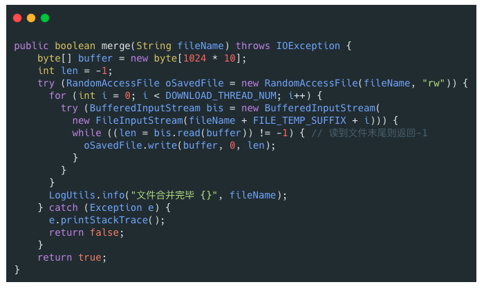

RandomAccessFile 的实现依赖于 FileDescriptor (文件描述符) 和 FileChannel （内存映射文件）

## I/O中的设计模式

### 装饰器模式

装饰器（Decorator）模式 可以在不改变原有对象的情况下拓展其功能。

装饰器模式通过组合替代继承来扩展原始类的功能，在一些继承关系比较复杂的场景（IO 这一场景各种类的继承关系就比较复杂）更加实用。

例如：通过 BufferedInputStream（字节缓冲输入流）来增强 FileInputStream 的功能，就是在BufferedInputStream的构造方法中传入FileInputStream：

~~~java
public BufferedInputStream(InputStream in) {
    this(in, DEFAULT_BUFFER_SIZE);
}

public BufferedInputStream(InputStream in, int size) {
    super(in);
    if (size <= 0) {
        throw new IllegalArgumentException("Buffer size <= 0");
    }
    buf = new byte[size];
}
~~~

之所以不构造一个新的子类，是为了简化继承体系。

装饰器模式很重要的一个特征，那就是可以对原始类嵌套使用多个装饰器，例如：

~~~java
BufferedWriter bw = new BufferedWriter(new OutputStreamWriter(new FileOutputStream(fileName), "UTF-8"));
~~~

### 适配器模式

适配器（Adapter Pattern）模式 主要用于接口互不兼容的类的协调工作，你可以将其联想到我们日常经常使用的电源适配器。

适配器模式中存在被适配的对象或者类称为 适配者(Adaptee) ，作用于适配者的对象或者类称为适配器(Adapter) 。适配器分为对象适配器和类适配器。类适配器使用继承关系来实现，对象适配器使用组合关系来实现。

IO 流中的字符流和字节流的接口不同，它们之间可以协调工作就是基于适配器模式来做的，更准确点来说是对象适配器。通过适配器，我们可以将字节流对象适配成一个字符流对象，这样我们可以直接通过字节流对象来读取或者写入字符数据。

InputStreamReader 和 OutputStreamWriter 就是两个适配器(Adapter)， 同时，它们两个也是字节流和字符流之间的桥梁。InputStreamReader 使用 StreamDecoder （流解码器）对字节进行解码，实现字节流到字符流的转换， OutputStreamWriter 使用StreamEncoder（流编码器）对字符进行编码，实现字符流到字节流的转换。

InputStream 和 OutputStream 的子类是被适配者， InputStreamReader 和 OutputStreamWriter是适配器：

~~~java
// InputStreamReader 是适配器，FileInputStream 是被适配的类
InputStreamReader isr = new InputStreamReader(new FileInputStream(fileName), "UTF-8");
// BufferedReader 增强 InputStreamReader 的功能（装饰器模式）
BufferedReader bufferedReader = new BufferedReader(isr);
~~~

java.io.InputStreamReader 部分源码如下：

~~~java
public class InputStreamReader extends Reader {
	//用于解码的对象
	private final StreamDecoder sd;
    public InputStreamReader(InputStream in) {
        super(in);
        try {
            // 获取 StreamDecoder 对象
            sd = StreamDecoder.forInputStreamReader(in, this, (String)null);
        } catch (UnsupportedEncodingException e) {
            throw new Error(e);
        }
    }
    // 使用 StreamDecoder 对象做具体的读取工作
	public int read() throws IOException {
        return sd.read();
    }
}
~~~

StreamDecoder （流解码器）和StreamEncoder（流编码器）就是分别基于 InputStream 和 OutputStream 来获取 FileChannel对象并调用对应的 read 方法和 write 方法进行字节数据的读取和写入。

StreamDecoder内部是使用FileChannel的：

~~~java
StreamDecoder(InputStream in, Object lock, CharsetDecoder dec) {
    // 省略大部分代码
    // 根据 InputStream 对象获取 FileChannel 对象
    ch = getChannel((FileInputStream)in);
}
~~~

FutrueTask 类也使用了适配器模式，Executors 的内部类 RunnableAdapter 实现属于适配器，用于将 Runnable 适配成 Callable。

FutureTask参数包含 Runnable 的一个构造方法：

~~~java
public FutureTask(Runnable runnable, V result) {
    // 调用 Executors 类的 callable 方法
    this.callable = Executors.callable(runnable, result);
    this.state = NEW;
}
~~~

Executors中对应的方法和适配器：

~~~java
// 实际调用的是 Executors 的内部类 RunnableAdapter 的构造方法
public static <T> Callable<T> callable(Runnable task, T result) {
    if (task == null)
        throw new NullPointerException();
    return new RunnableAdapter<T>(task, result);
}
// 适配器
static final class RunnableAdapter<T> implements Callable<T> {
    final Runnable task;
    final T result;
    RunnableAdapter(Runnable task, T result) {
        this.task = task;
        this.result = result;
    }
    public T call() {
        task.run();
        return result;
    }
}
~~~

### 工厂模式

工厂模式用于创建对象，NIO 中大量用到了工厂模式：

* Files 类的 newInputStream 方法用于创建 InputStream 对象（静态工厂）
* Paths 类的 get 方法创建 Path 对象（静态工厂）
* ZipFileSystem 类（sun.nio包下的类，属于 java.nio 相关的一些内部实现）的 getPath 的方法创建 Path 对象（简单工厂）。

### 观察者模式

NIO 中的文件目录监听服务使用到了观察者模式。

NIO 中的文件目录监听服务基于 WatchService 接口和 Watchable 接口。WatchService 属于观察者，Watchable 属于被观察者

Path接口实现了Watchable接口，Watchable接口提供了register方法，用于将对象注册到 WatchService（监控服务） 并绑定监听事件：

~~~java
public interface Path
    extends Comparable<Path>, Iterable<Path>, Watchable{
}

public interface Watchable {
    WatchKey register(WatchService watcher,
                      WatchEvent.Kind<?>[] events,
                      WatchEvent.Modifier... modifiers)
        throws IOException;
}
~~~

WatchService 用于监听文件目录的变化，同一个 WatchService 对象能够监听多个文件目录：

~~~java
// 创建 WatchService 对象
WatchService watchService = FileSystems.getDefault().newWatchService();

// 初始化一个被监控文件夹的 Path 类:
Path path = Paths.get("workingDirectory");
// 将这个 path 对象注册到 WatchService（监控服务） 中去
WatchKey watchKey = path.register(
watchService, StandardWatchEventKinds...);
~~~

Path 类 register 方法的第二个参数 events （需要监听的事件）为可变长参数，也就是说我们可以同时监听多种事件。常用的监听事件有 3 种： 

* StandardWatchEventKinds.ENTRY_CREATE ：文件创建。
* StandardWatchEventKinds.ENTRY_DELETE : 文件删除。
* StandardWatchEventKinds.ENTRY_MODIFY : 文件修改。

register 方法返回 WatchKey 对象，通过WatchKey 对象可以获取事件的具体信息比如文件目录下是创建、删除还是修改了文件、创建、删除或者修改的文件的具体名称是什么：

~~~java
WatchKey key;
while ((key = watchService.take()) != null) {
    for (WatchEvent<?> event : key.pollEvents()) {
      // 可以调用 WatchEvent 对象的方法做一些事情比如输出事件的具体上下文信息
    }
    key.reset();
}
~~~

WatchService 内部是通过一个 daemon thread（守护线程）采用定期轮询的方式来检测文件的变化，简化后的源码如下所示：

~~~java
class PollingWatchService
    extends AbstractWatchService
{
    // 定义一个 daemon thread（守护线程）轮询检测文件变化
    private final ScheduledExecutorService scheduledExecutor;

    PollingWatchService() {
        scheduledExecutor = Executors
            .newSingleThreadScheduledExecutor(new ThreadFactory() {
                 @Override
                 public Thread newThread(Runnable r) {
                     Thread t = new Thread(r);
                     t.setDaemon(true);
                     return t;
                 }});
    }

  void enable(Set<? extends WatchEvent.Kind<?>> events, long period) {
    synchronized (this) {
      // 更新监听事件
      this.events = events;

        // 开启定期轮询
      Runnable thunk = new Runnable() { public void run() { poll(); }};
      this.poller = scheduledExecutor
        .scheduleAtFixedRate(thunk, period, period, TimeUnit.SECONDS);
    }
  }
}
~~~

# 代理

## 代理模式

代理模式：

使用代理对象来代替对真实对象(real object)的访问，这样就可以在不修改原目标对象的前提下，提供额外的功能操作，扩展目标对象的功能。

代理模式的主要作用是扩展目标对象的功能，比如说在目标对象的某个方法执行前后你可以增加一些自定义的操作。

代理模式有静态代理和动态代理两种实现方式：

1、静态代理

静态代理中，我们对目标对象的每个方法的增强都是手动完成的（后面会具体演示代码），非常不灵活（比如接口一旦新增加方法，目标对象和代理对象都要进行修改）且麻烦(需要对每个目标类都单独写一个代理类）。 实际应用场景非常非常少，日常开发几乎看不到使用静态代理的场景。

上面我们是从实现和应用角度来说的静态代理，从 JVM 层面来说， 静态代理在编译时就将接口、实现类、代理类这些都变成了一个个实际的 class 文件。

静态代理实现步骤:

1. 定义一个接口及其实现类；
2. 创建一个代理类同样实现这个接口
3. 将目标对象注入进代理类，然后在代理类的对应方法调用目标类中的对应方法。这样的话，我们就可以通过代理类屏蔽对目标对象的访问，并且可以在目标方法执行前后做一些自己想做的事情。

2、动态代理

相比于静态代理来说，动态代理更加灵活。我们不需要针对每个目标类都单独创建一个代理类，并且也不需要我们必须实现接口，我们可以直接代理实现类( CGLIB 动态代理机制)。

从 JVM 角度来说，动态代理是在运行时动态生成类字节码，并加载到 JVM 中的。

Java动态代理的实现方式有很多种，比如 JDK 动态代理、CGLIB 动态代理等等。

## JDK动态代理

假设要在发短信的过程中，增加自己的逻辑，首先准备短信发送的接口和实现：

~~~java
public interface SmsService {
    String send(String message);
}

public class SmsServiceImpl implements SmsService {
    public String send(String message) {
        System.out.println("send message:" + message);
        return message;
    }
}
~~~

定义一个动态代理类：

~~~java
import java.lang.reflect.InvocationHandler;
import java.lang.reflect.InvocationTargetException;
import java.lang.reflect.Method;

/**
 * @author shuang.kou
 * @createTime 2020年05月11日 11:23:00
 */
public class DebugInvocationHandler implements InvocationHandler {
    /**
     * 代理类中的真实对象
     */
    private final Object target;

    public DebugInvocationHandler(Object target) {
        this.target = target;
    }


    public Object invoke(Object proxy, Method method, Object[] args) throws InvocationTargetException, IllegalAccessException {
        //调用方法之前，我们可以添加自己的操作
        System.out.println("before method " + method.getName());
        Object result = method.invoke(target, args);
        //调用方法之后，我们同样可以添加自己的操作
        System.out.println("after method " + method.getName());
        return result;
    }
}
~~~

构造一个工厂类：

~~~java
public class JdkProxyFactory {
    public static Object getProxy(Object target) {
        return Proxy.newProxyInstance(
                target.getClass().getClassLoader(), // 目标类的类加载
                target.getClass().getInterfaces(),  // 代理需要实现的接口，可指定多个
                new DebugInvocationHandler(target)   // 代理对象对应的自定义 InvocationHandler
        );
    }
}
~~~

实际使用时：

~~~java
SmsService smsService = (SmsService) JdkProxyFactory.getProxy(new SmsServiceImpl());
smsService.send("java");
~~~

在 Java 动态代理机制中 InvocationHandler 接口和 Proxy 类是核心：

* Proxy 类中使用频率最高的方法是：newProxyInstance() ，这个方法主要用来生成一个代理对象

  这个方法一共有 3 个参数： 

  * loader :类加载器，用于加载代理对象。
  * interfaces : 被代理类实现的一些接口；
  * h : 实现了 InvocationHandler 接口的对象；

* 自定义一个类实现InvocationHandler，在代理对象调用方法的实际上调用的是InvocationHandler的invoke方法，可以在 invoke() 方法中自定义处理逻辑，比如在方法执行前后做什么事情。

  invoke() 方法有下面三个参数：

  * proxy :动态生成的代理类
  * method : 与代理类对象调用的方法相对应
  * args : 当前 method 方法的参数

JDK动态代理使用步骤：

* 定义一个接口及其实现类；
* 自定义 InvocationHandler 并重写invoke方法，在 invoke 方法中我们会调用原生方法（被代理类的方法）并自定义一些处理逻辑；
* 通过 Proxy.newProxyInstance(ClassLoader loader,Class<?>[] interfaces,InvocationHandler h) 方法创建代理对象；

## CGLIB动态代理机制

JDK 动态代理有一个最致命的问题是其只能代理实现了接口的类。

为了解决这个问题，我们可以用 CGLIB 动态代理机制来避免。

CGLIB(Code Generation Library)是一个基于ASM的字节码生成库，它允许我们在运行时对字节码进行修改和动态生成。CGLIB 通过继承方式实现代理。很多知名的开源框架都使用到了CGLIB， 例如 Spring 中的 AOP 模块中：如果目标对象实现了接口，则默认采用 JDK 动态代理，否则采用 CGLIB 动态代理。

如果要使用cglib需要引入相关依赖：

~~~xml
<dependency>
  <groupId>cglib</groupId>
  <artifactId>cglib</artifactId>
  <version>3.3.0</version>
</dependency>
~~~

依然实现一个在发送短信时加入逻辑的程序。首先实现一个发送短信的类：

~~~java
package github.javaguide.dynamicProxy.cglibDynamicProxy;

public class AliSmsService {
    public String send(String message) {
        System.out.println("send message:" + message);
        return message;
    }
}
~~~

自定义 MethodInterceptor（方法拦截器）：

~~~java
/**
 * 自定义MethodInterceptor
 */
public class DebugMethodInterceptor implements MethodInterceptor {


    /**
     * @param o           代理对象（增强的对象）
     * @param method      被拦截的方法（需要增强的方法）
     * @param args        方法入参
     * @param methodProxy 用于调用原始方法
     */
    @Override
    public Object intercept(Object o, Method method, Object[] args, MethodProxy methodProxy) throws Throwable {
        //调用方法之前，我们可以添加自己的操作
        System.out.println("before method " + method.getName());
        Object object = methodProxy.invokeSuper(o, args);
        //调用方法之后，我们同样可以添加自己的操作
        System.out.println("after method " + method.getName());
        return object;
    }

}
~~~

工厂类：

~~~java
public class CglibProxyFactory {

    public static Object getProxy(Class<?> clazz) {
        // 创建动态代理增强类
        Enhancer enhancer = new Enhancer();
        // 设置类加载器
        enhancer.setClassLoader(clazz.getClassLoader());
        // 设置被代理类
        enhancer.setSuperclass(clazz);
        // 设置方法拦截器
        enhancer.setCallback(new DebugMethodInterceptor());
        // 创建代理类
        return enhancer.create();
    }
}
~~~

使用：

~~~java
AliSmsService aliSmsService = (AliSmsService) CglibProxyFactory.getProxy(AliSmsService.class);
aliSmsService.send("java");
~~~

在 CGLIB 动态代理机制中 MethodInterceptor 接口和 Enhancer 类是核心。

你需要自定义 MethodInterceptor 并重写 intercept 方法，intercept 用于拦截增强被代理类的方法

intercept方法的入参：

* obj : 动态生成的代理对象
* method : 被拦截的方法（需要增强的方法）
* args : 方法入参
* proxy : 用于调用原始方法

你可以通过 Enhancer类来动态获取被代理类，当代理类调用方法的时候，实际调用的是 MethodInterceptor 中的 intercept 方法

CGLIB 动态代理类使用步骤：

* 定义一个业务类；
* 自定义 MethodInterceptor 并重写 intercept 方法，intercept 用于拦截增强被代理类的方法，和 JDK 动态代理中的 invoke 方法类似；
* 通过 Enhancer 类的 create()创建代理类；

JDK 动态代理和 CGLIB 动态代理对比：

* JDK 动态代理只能代理实现了接口的类或者直接代理接口，而 CGLIB 可以代理未实现任何接口的类。 另外， CGLIB 动态代理是通过生成一个被代理类的子类来拦截被代理类的方法调用，因此不能代理声明为 final 类型的类和方法。
* 就二者的效率来说，大部分情况都是 JDK 动态代理更优秀，随着 JDK 版本的升级，这个优势更加明显。

# Unsafe

## 概念和创建

很多并发工具类都调用了一个叫做 Unsafe 的类

Unsafe 是位于 sun.misc 包下的一个类，主要提供一些用于执行低级别、不安全操作的方法，如直接访问系统内存资源、自主管理内存资源等，这些方法在提升 Java 运行效率、增强 Java 语言底层资源操作能力方面起到了很大的作用。但由于 Unsafe 类使 Java 语言拥有了类似 C 语言指针一样操作内存空间的能力，这无疑也增加了程序发生相关指针问题的风险。在程序中过度、不正确使用 Unsafe 类会使得程序出错的概率变大，使得 Java 这种安全的语言变得不再“安全”，因此对 Unsafe 的使用一定要慎重。

Unsafe 提供的这些功能的实现需要依赖本地方法（Native Method）。你可以将本地方法看作是 Java 中使用其他编程语言编写的方法。本地方法使用 native 关键字修饰，Java 代码中只是声明方法头，具体的实现则交给 本地代码。

使用本地方法的原因：

* 需要用到 Java 中不具备的依赖于操作系统的特性，Java 在实现跨平台的同时要实现对底层的控制，需要借助其他语言发挥作用 
* Java调用其他语言完成的现成功能
* 对性能要求高时，有必要使用更加底层的语言 

对于同一本地方法，不同的操作系统可能会通过不同的方式来实现，但是对于使用者来说是透明的，最终都会得到相同的结果。 

sun.misc.Unsafe 部分源码如下：

~~~java
public final class Unsafe {
  // 单例对象
  private static final Unsafe theUnsafe;
  ......
  private Unsafe() {
  }
  @CallerSensitive
  public static Unsafe getUnsafe() {
    Class var0 = Reflection.getCallerClass();
    // 仅在引导类加载器`BootstrapClassLoader`加载时才合法
    if(!VM.isSystemDomainLoader(var0.getClassLoader())) {
      throw new SecurityException("Unsafe");
    } else {
      return theUnsafe;
    }
  }
}
~~~

Unsafe 类为一单例实现，提供静态方法 getUnsafe 获取 Unsafe实例。这个看上去貌似可以用来获取 Unsafe 实例。但是，当我们直接调用这个静态方法的时候，会抛出 SecurityException 异常。

无法直接调用静态方法获取Unsafe 对象的原因是：在getUnsafe方法中，会对调用者的classLoader进行检查，判断当前类是否由Bootstrap classLoader加载，如果不是的话那么就会抛出一个SecurityException异常。也就是说，只有启动类加载器加载的类才能够调用 Unsafe 类中的方法，来防止这些方法在不可信的代码中被调用。这是因为Unsafe 提供的功能过于底层（如直接访问系统内存资源、自主管理内存资源等），安全隐患也比较大，使用不当的话，很容易出现很严重的问题

若想使用 Unsafe 这个类的话，提供两种方式来获取实例：

1、利用反射获得 Unsafe 类中已经实例化完成的单例对象 theUnsafe

~~~java
private static Unsafe reflectGetUnsafe() {
    try {
      Field field = Unsafe.class.getDeclaredField("theUnsafe");
      field.setAccessible(true);
      return (Unsafe) field.get(null);
    } catch (Exception e) {
      log.error(e.getMessage(), e);
      return null;
    }
}
~~~

2、从getUnsafe方法的使用限制条件出发，通过 Java 命令行命令-Xbootclasspath/a把调用 Unsafe 相关方法的类 A 所在 jar 包路径追加到默认的 bootstrap 路径中，使得 A 被引导类加载器加载，从而通过Unsafe.getUnsafe方法安全的获取 Unsafe 实例：

~~~
java -Xbootclasspath/a: ${path}   // 其中path为调用Unsafe相关方法的类所在jar包路径
~~~

## Unsafe功能

概括的来说，Unsafe 类实现功能可以被分为下面 8 类：

内存操作、内存屏障、对象操作、数据操作、CAS 操作、线程调度、Class 操作、系统信息

### 内存操作

在 Java 中是不允许直接对内存进行操作的，对象内存的分配和回收都是由 JVM 自己实现的。但是在 Unsafe 中，提供的下列接口可以直接进行内存操作：

~~~java
//分配新的本地空间
public native long allocateMemory(long bytes);
//重新调整内存空间的大小
public native long reallocateMemory(long address, long bytes);
//将内存设置为指定值
public native void setMemory(Object o, long offset, long bytes, byte value);
//内存拷贝
public native void copyMemory(Object srcBase, long srcOffset,Object destBase, long destOffset,long bytes);
//清除内存
public native void freeMemory(long address);
~~~

下面就是使用这些API的例子：

~~~java
private void memoryTest() {
    int size = 4;
    long addr = unsafe.allocateMemory(size);
    long addr3 = unsafe.reallocateMemory(addr, size * 2);
    System.out.println("addr: "+addr);
    System.out.println("addr3: "+addr3);
    try {
        unsafe.setMemory(null,addr ,size,(byte)1);
        for (int i = 0; i < 2; i++) {
            unsafe.copyMemory(null,addr,null,addr3+size*i,4);
        }
        System.out.println(unsafe.getInt(addr));
        System.out.println(unsafe.getLong(addr3));
    }finally {
        unsafe.freeMemory(addr);
        unsafe.freeMemory(addr3);
    }
}

结果：
addr: 2433733895744
addr3: 2433733894944
16843009
72340172838076673
~~~

setMemory方法可以向每个字节写入内容为byte类型的 1

当使用 Unsafe 调用getInt方法时，因为一个int型变量占 4 个字节，会一次性读取 4 个字节，组成一个int的值，使用getLong方法则一次性读取 8 个字节

通过这种方式分配的内存属于 堆外内存 ，是无法进行垃圾回收的，需要我们把这些内存当做一种资源去手动调用freeMemory方法进行释放，否则会产生内存泄漏。通用的操作内存方式是在try中执行对内存的操作，最终在finally块中进行内存的释放。

使用堆外内存的原因：

* 由于堆外内存是直接受操作系统管理而不是 JVM，所以当我们使用堆外内存时，即可保持较小的堆内内存规模，在 GC 时减少回收停顿对于应用的影响 
* 使用堆外内存会提升程序 I/O 操作的性能，减少数据拷贝

典型应用：NIO中的DirectByteBuffer，它对于堆外内存的创建、使用、销毁等逻辑均由 Unsafe 提供的堆外内存 API 来实现。 它会构建 Cleaner 对象用于跟踪 DirectByteBuffer 对象的垃圾回收，以实现当 DirectByteBuffer 被垃圾回收时，分配的堆外内存一起被释放。

Cleaner继承自Java四大引用类型之一的虚引用PhantomReference（无法通过虚引用获取与之关联的对象实例，且当对象仅被虚引用引用时，在任何发生GC的时候，其均可被回收），通常PhantomReference与引用队列ReferenceQueue结合使用，可以实现虚引用关联对象被垃圾回收时能够进行系统通知、资源清理等功能。如下图所示，当某个被Cleaner引用的对象将被回收时，JVM垃圾收集器会将此对象的引用放入到对象引用中的pending链表中，等待Reference-Handler进行相关处理。其中，Reference-Handler为一个拥有最高优先级的守护线程，会循环不断的处理pending链表中的对象引用，执行Cleaner的clean方法进行相关清理工作。 

所以当DirectByteBuffer仅被Cleaner引用（即为虚引用）时，其可以在任意GC时段被回收。当DirectByteBuffer实例对象被回收时，在Reference-Handler线程操作中，会调用Cleaner的clean方法根据创建Cleaner时传入的Deallocator来进行堆外内存的释放 ：

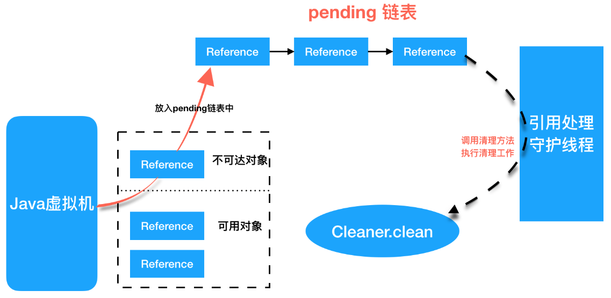

### 内存屏障

编译器和 CPU 会在保证程序输出结果一致的情况下，会对代码进行重排序，从指令优化角度提升性能。而指令重排序可能会带来一个不好的结果，导致 CPU 的高速缓存和内存中数据的不一致，而内存屏障（Memory Barrier）就是通过组织屏障两边的指令重排序从而避免编译器和硬件的不正确优化情况

在硬件层面上，内存屏障是 CPU 为了防止代码进行重排序而提供的指令，不同的硬件平台上实现内存屏障的方法可能并不相同。在 Java8 中，引入了 3 个内存屏障的函数，它屏蔽了操作系统底层的差异，允许在代码中定义、并统一由 JVM 来生成内存屏障指令，来实现内存屏障的功能

Unsafe 中提供了下面三个内存屏障相关方法：

~~~java
//内存屏障，禁止load操作重排序。屏障前的load操作不能被重排序到屏障后，屏障后的load操作不能被重排序到屏障前
public native void loadFence();
//内存屏障，禁止store操作重排序。屏障前的store操作不能被重排序到屏障后，屏障后的store操作不能被重排序到屏障前
public native void storeFence();
//内存屏障，禁止load、store操作重排序
public native void fullFence();
~~~

上面涉及的两个指令的概念：

* Load：将主内存中的数据拷贝到处理器的缓存中
* Store：将处理器缓存的数据刷新到主内存中

内存屏障可以看做对内存随机访问的操作中的一个同步点，使得此点之前的所有读写操作都执行后才可以开始执行此点之后的操作。以loadFence方法为例，它会禁止读操作重排序，保证在这个屏障之前的所有读操作都已经完成，并且将缓存数据设为无效，重新从主存中进行加载。

基于读内存屏障，我们也能实现volatile的功能。

下面定义一个线程方法，在线程中去修改flag标志位，注意这里的flag是没有被volatile修饰的：

~~~java
@Getter
class ChangeThread implements Runnable{
    /**volatile**/ boolean flag=false;
    @Override
    public void run() {
        try {
            Thread.sleep(3000);
        } catch (InterruptedException e) {
            e.printStackTrace();
        }
        System.out.println("subThread change flag to:" + flag);
        flag = true;
    }
}
~~~

在主线程的while循环中，加入内存屏障，测试是否能够感知到flag的修改变化：

~~~java
public static void main(String[] args){
    ChangeThread changeThread = new ChangeThread();
    new Thread(changeThread).start();
    while (true) {
        boolean flag = changeThread.isFlag();
        unsafe.loadFence(); //加入读内存屏障
        if (flag){
            System.out.println("detected flag changed");
            break;
        }
    }
    System.out.println("main thread end");
}
~~~

而如果删掉上面代码中的loadFence方法，那么主线程将无法感知到flag发生的变化，会一直在while中循环。可以用图来表示上面的过程：

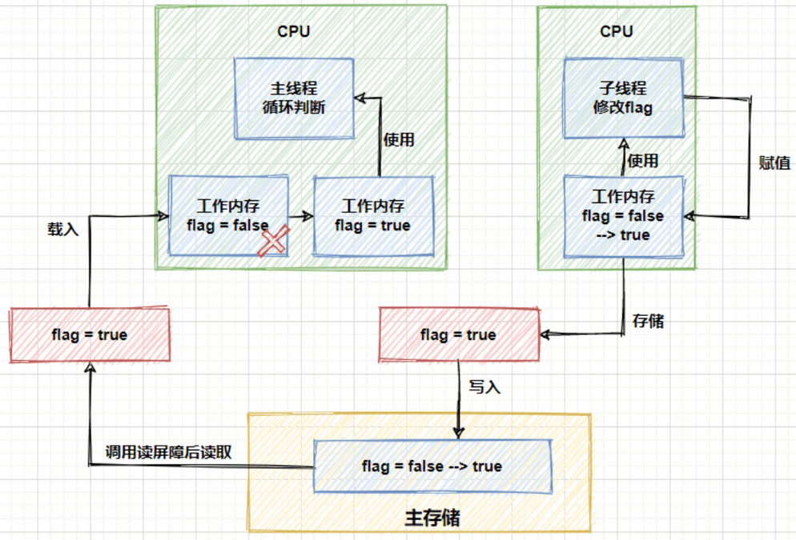

上面的图中的流程就是子线程借助于主内存，将修改后的结果同步给了主线程，进而修改主线程中的工作空间，跳出循环。 

在 Java 8 中引入了一种锁的新机制——StampedLock，它可以看成是读写锁的一个改进版本。它内部就使用了Unsafe 的 loadFence 方法加入一个 load 内存屏障，保证数据一致性。

### 对象操作

除了前面的putInt、getInt方法外，Unsafe 提供了全部 8 种基础数据类型以及Object的put和get方法，并且所有的put方法都可以越过访问权限，直接修改内存中的数据。阅读 openJDK 源码中的注释发现，基础数据类型和Object的读写稍有不同，基础数据类型是直接操作的属性值（value），而Object的操作则是基于引用值（reference value）。下面是Object的读写方法：

~~~java
//在对象的指定偏移地址获取一个对象引用
public native Object getObject(Object o, long offset);
//在对象指定偏移地址写入一个对象引用
public native void putObject(Object o, long offset, Object x);
~~~

除了对象属性的普通读写外，Unsafe 还提供了 volatile 读写和有序写入方法。volatile读写方法的覆盖范围与普通读写相同，包含了全部基础数据类型和Object类型，以int类型为例：

~~~java
//在对象的指定偏移地址处读取一个int值，支持volatile load语义
public native int getIntVolatile(Object o, long offset);
//在对象指定偏移地址处写入一个int，支持volatile store语义
public native void putIntVolatile(Object o, long offset, int x);
~~~

相对于普通读写来说，volatile读写具有更高的成本，因为它需要保证可见性和有序性。在执行get操作时，会强制从主存中获取属性值，在使用put方法设置属性值时，会强制将值更新到主存中，从而保证这些变更对其他线程是可见的。

有序写入的方法有以下三个： 

~~~java
public native void putOrderedObject(Object o, long offset, Object x);
public native void putOrderedInt(Object o, long offset, int x);
public native void putOrderedLong(Object o, long offset, long x);
~~~

有序写入的成本相对volatile较低，因为它只保证写入时的有序性，而不保证可见性。

顺序写入与volatile写入的差别在于，在顺序写时加入的内存屏障类型为StoreStore类型，而在volatile写入时加入的内存屏障是StoreLoad类型，如下图所示：

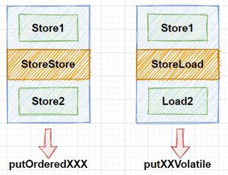

在有序写入方法中，使用的是StoreStore屏障，该屏障确保Store1立刻刷新数据到内存，这一操作先于Store2以及后续的存储指令操作。（有序刷新到主内存）

而volatile写入中，使用的是StoreLoad屏障，该屏障确保Store1立刻刷新数据到内存，这一操作先于Load2及后续的装载指令，并且，StoreLoad屏障会使该屏障之前的所有内存访问指令，包括存储指令和访问指令全部完成之后，才执行该屏障之后的内存访问指令。

综上所述，在上面的三类写入方法中，在写入效率方面，按照put、putOrder、putVolatile的顺序效率逐渐降低。

Unsafe还可以实例化一个类，它会跳过对象的初始化阶段（不执行任何构造方法和代码块）或者跳过构造器的安全检查：

~~~java
A a3= (A) unsafe.allocateInstance(A.class);
System.out.println(a3.getB());
~~~

由于这种特性，allocateInstance 在 java.lang.invoke、Objenesis（提供绕过类构造器的对象生成方式）、Gson（反序列化时用到）中都有相应的应用。 

### 数组操作

arrayBaseOffset 与 arrayIndexScale 这两个方法配合起来使用，即可定位数组中每个元素在内存中的位置：

~~~java
//返回数组中第一个元素的偏移地址
public native int arrayBaseOffset(Class<?> arrayClass);
//返回数组中一个元素占用的大小
public native int arrayIndexScale(Class<?> arrayClass);
~~~

AtomicIntegerArray 中有相关的使用，通过上面两个方法获取数组元素的偏移地址，而后通过 CAS 实现原子性操作。 

### CAS操作

这部分主要为 CAS 相关操作的方法：

~~~java
/**
    *  CAS
  * @param o         包含要修改field的对象
  * @param offset    对象中某field的偏移量
  * @param expected  期望值
  * @param update    更新值
  * @return          true | false
  */
public final native boolean compareAndSwapObject(Object o, long offset,  Object expected, Object update);

public final native boolean compareAndSwapInt(Object o, long offset, int expected,int update);

public final native boolean compareAndSwapLong(Object o, long offset, long expected, long update);
~~~

CAS 即比较并替换（Compare And Swap)，是实现并发算法时常用到的一种技术。CAS 操作包含三个操作数——内存位置、预期原值及新值。执行 CAS 操作的时候，将内存位置的值与预期原值比较，如果相匹配，那么处理器会自动将该位置值更新为新值，否则，处理器不做任何操作。我们都知道，CAS 是一条 CPU 的原子指令（cmpxchg 指令），不会造成所谓的数据不一致问题，Unsafe 提供的 CAS 方法（如 compareAndSwapXXX）底层实现即为 CPU 指令 cmpxchg 。

在 JUC 包的并发工具类中大量地使用了 CAS 操作 

调用上面的方法会返回操作成功还是失败，因此需要我们在代码中手动添加自旋的逻辑。 

### 线程调度

Unsafe 类中提供了park、unpark、monitorEnter、monitorExit、tryMonitorEnter方法进行线程调度：

~~~java
//取消阻塞线程
public native void unpark(Object thread);
//阻塞线程
public native void park(boolean isAbsolute, long time);
//获得对象锁（可重入锁）
@Deprecated
public native void monitorEnter(Object o);
//释放对象锁
@Deprecated
public native void monitorExit(Object o);
//尝试获取对象锁
@Deprecated
public native boolean tryMonitorEnter(Object o);
~~~

方法 park、unpark 即可实现线程的挂起与恢复，将一个线程进行挂起是通过 park 方法实现的，调用 park 方法后，线程将一直阻塞直到超时或者中断等条件出现；unpark 可以终止一个挂起的线程，使其恢复正常。

monitorEnter方法用于获得对象锁，monitorExit用于释放对象锁，如果对一个没有被monitorEnter加锁的对象执行此方法，会抛出IllegalMonitorStateException异常。tryMonitorEnter方法尝试获取对象锁，如果成功则返回true，反之返回false。

Java 锁和同步器框架的核心类 AQS就是使用park和unpark进行线程的阻塞和唤醒的

### Class操作

几个和类相关的操作：

~~~java
//获取静态属性的偏移量
public native long staticFieldOffset(Field f);
//获取静态属性的对象指针
public native Object staticFieldBase(Field f);
//判断类是否需要实例化（用于获取类的静态属性前进行检测）
public native boolean shouldBeInitialized(Class<?> c);
~~~

读取一个类的静态属性：

~~~java
@Data
public class User {
    public static String name="Hydra";
    int age;
}
private void staticTest() throws Exception {
    User user=new User();
    System.out.println(unsafe.shouldBeInitialized(User.class));
    Field sexField = User.class.getDeclaredField("name");
    long fieldOffset = unsafe.staticFieldOffset(sexField);
    Object fieldBase = unsafe.staticFieldBase(sexField);
    Object object = unsafe.getObject(fieldBase, fieldOffset);
    System.out.println(object);
}

运行结果：falseHydra
~~~

在 Unsafe 的对象操作中，我们学习了通过objectFieldOffset方法获取对象属性偏移量并基于它对变量的值进行存取，但是它不适用于类中的静态属性，这时候就需要使用staticFieldOffset方法。在上面的代码中，只有在获取Field对象的过程中依赖到了Class，而获取静态变量的属性时不再依赖于Class。

在上面的代码中首先创建一个User对象，这是因为如果一个类没有被实例化，那么它的静态属性也不会被初始化，最后获取的字段属性将是null。所以在获取静态属性前，需要调用shouldBeInitialized方法，判断在获取前是否需要初始化这个类。如果删除创建 User 对象的语句，运行结果会变为：truenull

使用defineClass方法允许程序在运行时动态地创建一个类：

~~~java
public native Class<?> defineClass(String name, byte[] b, int off, int len, ClassLoader loader,ProtectionDomain protectionDomain);
~~~

面的例子中实现了反编译生成后的 class 文件的功能： 

~~~java
private static void defineTest() {
    String fileName="F:\\workspace\\unsafe-test\\target\\classes\\com\\cn\\model\\User.class";
    File file = new File(fileName);
    try(FileInputStream fis = new FileInputStream(file)) {
        byte[] content=new byte[(int)file.length()];
        fis.read(content);
        Class clazz = unsafe.defineClass(null, content, 0, content.length, null, null);
        Object o = clazz.newInstance();
        Object age = clazz.getMethod("getAge").invoke(o, null);
        System.out.println(age);
    } catch (Exception e) {
        e.printStackTrace();
    }
}
~~~

在上面的代码中，首先读取了一个class文件并通过文件流将它转化为字节数组，之后使用defineClass方法动态的创建了一个类，并在后续完成了它的实例化工作，流程如下图所示，并且通过这种方式创建的类，会跳过 JVM 的所有安全检查。

除了defineClass方法外，Unsafe 还提供了一个defineAnonymousClass方法：

~~~java
public native Class<?> defineAnonymousClass(Class<?> hostClass, byte[] data, Object[] cpPatches);
~~~

使用该方法可以用来动态的创建一个匿名类，在Lambda表达式中就是使用 ASM 动态生成字节码，然后利用该方法定义实现相应的函数式接口的匿名类。

Lambda 表达式实现需要依赖 Unsafe 的 defineAnonymousClass 方法定义实现相应的函数式接口的匿名类。

### 系统信息

这部分包含两个获取系统相关信息的方法 ：

~~~java
//返回系统指针的大小。返回值为4（32位系统）或 8（64位系统）。
public native int addressSize();
//内存页的大小，此值为2的幂次方。
public native int pageSize();
~~~

这两个方法的应用场景比较少，在java.nio.Bits类中，在使用pageCount计算所需的内存页的数量时，调用了pageSize方法获取内存页的大小。另外，在使用copySwapMemory方法拷贝内存时，调用了addressSize方法，检测 32 位系统的情况。