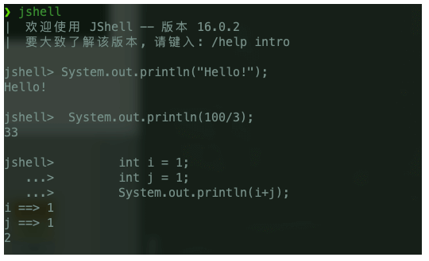

# Java8

## lambda表达式

### 函数式接口

lambda表达式是一段可以传递的代码，对于只包含一个抽象方法的接口（但是可以有多个非抽象方法，也就是default方法），可以通过lambda表达式来创建该接口的对象，这种接口被称为函数式接口

Java 8增加了一种特殊的注解@FunctionalInterface，标注在函数式接口上，编译器会强制检查判断该接口为函数式接口，不是的话会报错。

只要符合函数式接口的定义就是函数式接口，与是否有@FunctionalInterface注解无关，注解只是在编译时起到强制规范定义的作用。

大部分函数式接口都不用我们自己写，Java8都给我们实现好了，这些接口都在java.util.function包里。

lambda表达式可以直接赋值在对应的函数式接口上：

~~~java
BiFunction<String, String, Integer> biFunction = (first, second) -> Integer.compare(first.length(), second.length());
~~~

但是却不能赋值到Object类型的变量，因为它不是函数式接口。

### 表达式写法

lambda表达式不合法的情况：

1、代码不完整，如只有一个if，另一个分支没有返回值

2、代码中抛出异常，但是对应接口却没有声明该异常

lambda表达式的简化写法：

1、当lambda表达式没有参数时，参数位置替换为一个空的小括号

2、当lambda表达式的参数类型是可以被推导的，则可以省略参数类型

3、当方法只含有一个参数且参数类型可推导，此时可以省略小括号

4、当代码块只有一句时，可以省略代码块的大括号

5、方法引用，lambda表达式此时退化成一个方法：

|                简化前                 |             简化后             |
| :--------------------------------: | :-------------------------: |
| event -> System.out.println(event) |     System.out::println     |
| (x, y) -> x.compareToIgnoreCase(y) | String::compareToIgnoreCase |

6、构造器引用，如Button::new，相当于用传入的参数直接调用构造方法

### 访问限制

lambda表达式引用外部局部变量时不应该改变它的值，原理和内部类只允许访问final的局部变量一样，lambda表达式的执行时机可能会在局部变量被回收后执行，所以它拿到的实际上是拷贝的副本，是不允许修改的。

在lambda表达式中使用this和在局部方法中使用this的含义是一样的，它代表外部对象的this，而不是代表那个函数式接口实例化的结果。

无法从 lambda 表达式中访问默认方法，例如对应的函数式接口中有一个默认方法sqrt，但是以下代码却无法编译：

~~~java
Formula formula = (a) -> sqrt(a * 100);
~~~

### 内置函数式接口

JDK 1.8 API包含许多内置函数式接口。 其中一些接口在老版本的 Java 中是比较常见的比如： Comparator 或Runnable，这些接口都增加了@FunctionalInterface注解以便能用在 lambda 表达式上。

Java 8 API 同样还提供了很多全新的函数式接口来让你的编程工作更加方便，有一些接口是来自 Google Guava 库里的：

#### Predicate

Predicate 接口是只有一个参数，返回布尔类型值的 断言型 接口。该接口包含多种默认方法来将 Predicate 组合成其他复杂的逻辑（比如：与，或，非）：

部分源码：

~~~java
package java.util.function;
import java.util.Objects;

@FunctionalInterface
public interface Predicate<T> {
    
    // 该方法是接受一个传入类型,返回一个布尔值.此方法应用于判断.
    boolean test(T t);

    //and方法与关系型运算符"&&"相似，两边都成立才返回true
    default Predicate<T> and(Predicate<? super T> other) {
        Objects.requireNonNull(other);
        return (t) -> test(t) && other.test(t);
    }
    // 与关系运算符"!"相似，对判断进行取反
    default Predicate<T> negate() {
        return (t) -> !test(t);
    }
    //or方法与关系型运算符"||"相似，两边只要有一个成立就返回true
    default Predicate<T> or(Predicate<? super T> other) {
        Objects.requireNonNull(other);
        return (t) -> test(t) || other.test(t);
    }
   // 该方法接收一个Object对象,返回一个Predicate类型.此方法用于判断第一个test的方法与第二个test方法相同(equal).
    static <T> Predicate<T> isEqual(Object targetRef) {
        return (null == targetRef)
                ? Objects::isNull
                : object -> targetRef.equals(object);
    }
~~~

示例：

~~~java
Predicate<String> predicate = (s) -> s.length() > 0;

predicate.test("foo");              // true
predicate.negate().test("foo");     // false

Predicate<Boolean> nonNull = Objects::nonNull;
Predicate<Boolean> isNull = Objects::isNull;

Predicate<String> isEmpty = String::isEmpty;
Predicate<String> isNotEmpty = isEmpty.negate();
~~~

#### Function

Function接口接受一个参数，返回一个结果。默认方法可用于将多个函数链接在一起（compose, andThen）： 

~~~java
@FunctionalInterface
public interface Function<T, R> {
    
    //将Function对象应用到输入的参数上，然后返回计算结果。
    R apply(T t);
    //将两个Function整合，并返回一个能够执行两个Function对象功能的Function对象。
    default <V> Function<V, R> compose(Function<? super V, ? extends T> before) {
        Objects.requireNonNull(before);
        return (V v) -> apply(before.apply(v));
    }
    // 
    default <V> Function<T, V> andThen(Function<? super R, ? extends V> after) {
        Objects.requireNonNull(after);
        return (T t) -> after.apply(apply(t));
    }
 
    static <T> Function<T, T> identity() {
        return t -> t;
    }
}
~~~

示例：

~~~java
Function<String, Integer> toInteger = Integer::valueOf;
Function<String, String> backToString = toInteger.andThen(String::valueOf);
backToString.apply("123");     // "123"
~~~

#### Supplier

Supplier提供一个无参方法，有确定返回值：

~~~java
@FunctionalInterface
public interface Supplier<T> {

    T get();
}
~~~

示例：

~~~java
Supplier<Person> personSupplier = Person::new;
personSupplier.get();   // new Person
~~~

#### Consumer 

Consumer提供有一个参数，无返回值的方法。表示要对单个输入参数执行的操作：

~~~java
@FunctionalInterface
public interface Consumer<T> {

    void accept(T t);

    default Consumer<T> andThen(Consumer<? super T> after) {
        Objects.requireNonNull(after);
        return (T t) -> { accept(t); after.accept(t); };
    }
}
~~~

示例：

~~~java
Consumer<Person> greeter = (p) -> System.out.println("Hello, " + p.firstName);
greeter.accept(new Person("Luke", "Skywalker"));
~~~

#### Comparator

Comparator 是老Java中的经典接口， Java 8在此之上添加了多种默认方法： 

~~~java
Comparator<Person> comparator = (p1, p2) -> p1.firstName.compareTo(p2.firstName);

Person p1 = new Person("John", "Doe");
Person p2 = new Person("Alice", "Wonderland");

comparator.compare(p1, p2);             // > 0
comparator.reversed().compare(p1, p2);  // < 0
~~~

## 默认方法和静态方法

为了解决接口的修改与现有的实现不兼容的问题。新 interface 的方法可以用default 或 static修饰，这样就可以有方法体，实现类也不必重写此方法。

一、默认方法允许接口带有具体实现的方法：

~~~java
interface Person {
    long getId();
    default String getName() {return "Name";}
}
~~~

实现该接口的类可以选择保留这个默认方法的实现，或者重写它。

当接口中定义了一个默认方法，而另外一个父类或接口中又定义了同名方法时：

1、执行时优先选择父类中的同名方法，这就是类优先，这样的规则决定了你永远不可能为List接口增加一个默认的toString方法，因为无论怎样都会优先执行Object中的toString方法

2、两个父接口都提供了相同的默认方法时，执行时必须显式指定，如Interface1.super.method()/

为接口添加默认方法必须

二、为接口添加静态方法

Collections.shuffle(list)方法可以作为List接口的一个默认方法重新出现，如list.shuffle，这样就可以省掉一部分工具类的功能（虽然java并没有这么做）

接口中的静态方法和默认方法一样，必须添加完整的方法体。

## Optional

### 常用方法

Optional的优势在于可以优雅的处理一个正确值、或者返回另一个替代值的方法。

当值存在时将它添加到集合：

```java
optionalValue.ifPresent(v -> results.add(v));
```

对处理结果进行处理：

```java
Optional<Boolean> result = optionalValue.map(v -> process(v));
```

不存在时取默认值：

```java
String result = optionalString.orElse("");
```

不存在时计算默认值：

```java
String result = optionalString.orElseGet(() -> property.get("user"));
```

不存在时抛出异常：

```java
String result = optionalString.orElseThrow(NoSuchElementException::new);
```

还可以用之前的处理思路来处理，先检查是否存在，后取出调用：

```java
if (optionalValue.isPresent()) {
    optionalValue.get().someMethod();
}
```

如果不检查就直接调用get，如果其中包装的值不存在就会抛出NoSuchElementException

创建可选值的方式也很简单：

```java
 return x == 0 ? Optional.empty() : Optional.of (1 / x);
```

或者直接使用ofNullable，在传入参数为null时创建空的可选值，不为null时则创建真正的可选值：

```java
return Optional.ofNullable(obj);
```

ofNullable 方法和of方法唯一区别就是当 value 为 null 时，ofNullable 返回的是EMPTY，of 会抛出 NullPointerException 异常。如果需要把 NullPointerException 暴漏出来就用 of，否则就用 ofNullable。

### map和flatMap

它的flatMap方法和Stream的flatMap方法类似，只不过它是打开可选值然后合并。

如果f方法会返回一个Optional\<T>，而T有一个方法g返回Optional\<U>，此时你不能这样调用：

```java
s.f().g()
```

因为f返回的是可选值，不是指本身。

但是可以这样调用：

```java
s.f().flatMap(T::g)
```

如果f的返回值存在，则继续调用g，否则就返回一个空的Optional\<U>

map的入参是一个数据对象，flatMap的入参是一个Optional：

~~~java
class ZooFlat {
        private DogFlat dog = new DogFlat();

        public DogFlat getDog() {
            return dog;
        }
    }

class DogFlat {
        private int age = 1;
        public Optional<Integer> getAge() {
            return Optional.ofNullable(age);
        }
}

ZooFlat zooFlat = new ZooFlat();
Optional.ofNullable(zooFlat).map(o -> o.getDog()).flatMap(d -> d.getAge()).ifPresent(age ->
    System.out.println(age)
);
~~~

### 使用示例

传统解决 NPE 的办法如下： 

~~~java
Zoo zoo = getZoo();
if(zoo != null){
   Dog dog = zoo.getDog();
   if(dog != null){
      int age = dog.getAge();
      System.out.println(age);
   }
}
~~~

Optional 是这样的实现的：

~~~java
Optional.ofNullable(zoo).map(o -> o.getDog()).map(d -> d.getAge()).ifPresent(age ->
    System.out.println(age)
);
~~~

## StreamAPI

### Stream的概念和创建

它和集合概念差别很大，它不会自己存储元素、不会改变源对象、它可能是延迟执行的，只是需要结果时才执行。

生成Stream的方法：

集合转换为Stream：list.stream()

数组转换为Stream：Stream.of(arr)

直接构造Stream：Stream.of(“aa”,"bb")

将数组的一部分转换为Stream：Arrays.stream(array, from, to)

创建空的Stream：Stream.empty()

用generate生成Stream：Stream.generate(() -> "Echo")

生成无限序列0,1,2,3.。。Stream.iterate(BigInteger.ZERO, n -> n.add(BigInteger.ONE))

按照正则对字符串分割成Stream：Pattern.compile(regex).splitAsStream(str)

生成包含文件所有行的Stream：Files.lines(file)

Stream接口是实现了AutoCloseable的，所以调用close会关闭底层的文件。

由流生成其他类型：toArray()

### 无状态转换

过滤filter：

~~~java
Stream<String> longWords = words.filter(w -> (w.length() > 12));
~~~

转换map：

~~~java
Stream<String> lowercaseWords = words.map(String::toLowerCase);
~~~

组合转换flatMap：characterStream可以将字符串转换为字符的Stream

~~~java
Stream<Stream<Character>> result = words.map(w -> characterStream(w));
Stream<Character> letters = words.flatMap(w -> characterStream(w))
~~~

遍历流：

~~~java
stream.peek(e -> sout(e))
~~~

### 裁剪与拼接

截取前100：

~~~java
Stream.generate(Math:random).limit(100);
~~~

跳过第1个：

~~~java
Stream.of(contents.split(regex)).skip(1);
~~~

拼接流：

~~~java
Stream.concat(stream1, stream2);
~~~

### 排序和去重

去重：

~~~java
Stream.of("aa", "bb", "bb").distinct();
~~~

排序：字符串数组最长的排在第一位

~~~java
words.sorted(Compatator.comparing(String::length).reversed());
~~~

流的sorted方法不会改变集合本身

这两个方法都要求流不能是无限的。

### 聚合

聚合是一个终止操作，当一个流执行了终止操作后，就不能再进行其他操作了。

返回流中元素总数：count()

返回流中的最大值或最小值：max/min，这两个方法会返回一个Optional：

~~~java
words.max(String::compareToIgnoreCase).map(v -> process(v));
~~~

返回非空集合中的第一个值：findFirst

~~~java
words.filter(s -> s.startsWith("Q")).findFirst();
~~~

找到任意一个匹配的元素：findAny

~~~java
words.parallel().filter(s -> s.startsWith("Q")).findAny();
~~~

检查流是否有匹配的元素：anyMatch

~~~java
boolean result = words.parallel().anyMatch(s -> s.startsWith("Q"));
~~~

同样的，allMatch和noneMatch分别在所有匹配和没有匹配时返回true

聚合reduce，求和：（之所以返回的是Optional，是因为流可能没有足够的元素执行reduce）

~~~java
Optional<Integer> sum = values.reduce((x, y) -> x + y);
~~~

这种操作要进行的前提是该操作是联合的，它的结果不应该和元素之间聚合的顺序相关，reduce还可以设置计算的起点，这样当流为空时就会直接返回默认值：

~~~java
Integer sum = values.reduce(0, (x, y) -> x + y);
~~~

求一个流中字符串的总长度时，每次聚合的计算结果类型是int，而每次累加的类型却是字符串，所以你需要指定一个累加器，期望从字符串和int聚合出结果，同时当多个汇聚结果出现时，你又需要指定一个并行计算的累加器：

~~~java
int result = words.reduce(0, 
                          (total, word) -> total + word.length(), 
                         (total1, total2) -> total1 + total2);
~~~

### 收集结果

有时流处理完之后只是想收集结果，而不是将他们聚合成一个值，流的iterator方法可以生成一个迭代器，toArray方法可以生成一个数组，默认返回值是Object数组，如果想得到一个正确类型的数组，可以：

~~~java
String[] result = stream.toArray(String[]::new);
~~~

collect方法可以将结果整理到一个自定义的集合中，它需要提供三个参数：集合的构造、将元素添加进集合的方式、合并两个集合的方法：

~~~java
HashSet<String> result = stream.collect(HashSet::new, HashSet::add, HashSet::addAll);
~~~

实际上我们可以利用更简单的方法将流收集到集合：

~~~java
List<String> result = stream.collect(Collectors.toList());
Set<String> result = stream.collect(Collectors.toSet());
TreeSet<String> result = stream.collect(Collectors.toCollection(TreeSet::new));
~~~

拼接字符串、拼接时添加一个分隔符：

~~~java
stream.collect(Collectors.joining());
stream.map(Object::toString).collect(Collectors.joining(","));
~~~

聚合成一个数字的结果summary：

~~~java
IntSummaryStatistics summary = words.collect(Collectors.summarizingInt(String::length));
double length = summary.getAverage();
double max = summary.getMax();
~~~

直接遍历流可以用forEach或者forEachOrdered，这两个都是终止操作，非终止的遍历可以用peek

### 收集结果到map

用collect方法可以生成一个map，toMap的两个参数第一个是键，第二个是值：

~~~java
people.collect(Collectors.toMap(Person::getId, Function.identity()));
~~~

一个容易出错的点：当多个元素有相同的键时，上面的方法会抛出异常。此时我们可以指定根据已有的值和新值来决定键的值：

~~~java
people.collect(Collectors.toMap(Person::getId, Function.identity(), (existingValue, newValue) -> existingValue));
~~~

可以用第四个参数来指定map的类型：

~~~java
people.collect(Collectors.toMap(Person::getId, Function.identity(), (existingValue, newValue) -> existingValue, TreeMap::new));
~~~

toMap可以被替换为toConcurrentMap来生成一个并发的map

### 分组和分片

分组生成map：

~~~java
Map<String, List<Locale>> countryToLocales = locales.collect(Collectors.groupingBy(Locale::getCountry));
~~~

根据每个元素调用getCountry方法的结果来进行分组，结果相同的被归入一个List。

分组还可以控制生成的集合类型：

~~~java
Map<String, Set<Locale>> countryToLocales = locales.collect(Collectors.groupingBy(Locale::getCountry, Collectors.toSet()));
~~~

把groupingBy替换为groupingByConcurrent可以获得一个并发的map

如果分组的结果只有true和false，此时可以简单的把结果分为两类：

~~~java
Map<Boolean, List<Locale>> result = locales.collect(Collectors.partitioningBy(l -> l.getLanguage().equals("en")));
~~~

分组后的流可以使用一些downstream收集器，如计数：

~~~java
Map<String, Long> result = locales.collect(Collectors.groupingBy(Locale::getCountry, Collectors.counting()))
~~~

类似的还有求和summingInt、最大最小maxBy、minBy、mapping生成集合、统计summarizingInt、聚合reducing

### 原始类型流

StreamAPI提供了几种原始类型的流：IntStream（可以替代Stream\<Integer>）、LongStream、DoubleStream

IntStream和LongStream提供了range和rangeClosed，用于生成一定范围内步进为1的流。

对象流调用mapToInt/mapToLong/mapToDouble可以转换为一个原始类型流，原始类型转换为对象流如Stream\<Integer>需要调用boxed方法。

原始类型流提供了更易于使用的max、min等方法。

Random类可以调用ints、longs、doubles用来返回包含随机数字的原始类型流

### 并行流

parallel方法可以将串行流变成并行的，但是要使用在终止方法之前。

并行流使用的前提是操作应该是无状态的，并行状态下不能引入无确定结果的并发问题。

### Stream API中使用的函数式接口


## Date API

Java 8在 java.time 包下包含一个全新的日期和时间API

这是对java.util.Date强有力的补充，解决了 Date 类的大部分痛点：

* 非线程安全
* 时区处理麻烦
* 各种格式化、和时间计算繁琐
* 设计有缺陷，Date 类同时包含日期和时间；还有一个 java.sql.Date，容易混淆。

java.util.Date 既包含日期又包含时间，而 java.time 把它们进行了分离：

~~~
LocalDateTime.class //日期+时间 format: yyyy-MM-ddTHH:mm:ss.SSS
LocalDate.class //日期 format: yyyy-MM-dd
LocalTime.class //时间 format: HH:mm:ss
~~~

### Clock 类

Clock 类提供了访问当前日期和时间的方法，Clock 是时区敏感的，可以用来取代 System.currentTimeMillis() 来获取当前的微秒数。某一个特定的时间点也可以使用 Instant 类来表示，Instant 类也可以用来创建旧版本的java.util.Date 对象:

~~~java
Clock clock = Clock.systemDefaultZone();
long millis = clock.millis();
System.out.println(millis);//1552379579043
Instant instant = clock.instant();
System.out.println(instant);
Date legacyDate = Date.from(instant); //2019-03-12T08:46:42.588Z
System.out.println(legacyDate);//Tue Mar 12 16:32:59 CST 2019
~~~

### Timezones(时区)

在新API中时区使用 ZoneId 来表示。时区可以很方便的使用静态方法of来获取到。 抽象类ZoneId（在java.time包中）表示一个区域标识符。 它有一个名为getAvailableZoneIds的静态方法，它返回所有区域标识符：

~~~java
//输出所有区域标识符
System.out.println(ZoneId.getAvailableZoneIds());

ZoneId zone1 = ZoneId.of("Europe/Berlin");
ZoneId zone2 = ZoneId.of("Brazil/East");
System.out.println(zone1.getRules());// ZoneRules[currentStandardOffset=+01:00]
System.out.println(zone2.getRules());// ZoneRules[currentStandardOffset=-03:00]
~~~

### LocalTime(本地时间)

LocalTime 定义了一个没有时区信息的时间，例如 晚上10点或者 17:30:15。下面的例子使用前面代码创建的时区创建了两个本地时间。之后比较时间并以小时和分钟为单位计算两个时间的时间差：

~~~java
LocalTime now1 = LocalTime.now(zone1);
LocalTime now2 = LocalTime.now(zone2);
System.out.println(now1.isBefore(now2));  // false

long hoursBetween = ChronoUnit.HOURS.between(now1, now2);
long minutesBetween = ChronoUnit.MINUTES.between(now1, now2);

System.out.println(hoursBetween);       // -3
System.out.println(minutesBetween);     // -239
~~~

LocalTime 提供了多种工厂方法来简化对象的创建，包括解析时间字符串.

~~~java
LocalTime late = LocalTime.of(23, 59, 59);
System.out.println(late);       // 23:59:59
DateTimeFormatter germanFormatter =
    DateTimeFormatter
        .ofLocalizedTime(FormatStyle.SHORT)
        .withLocale(Locale.GERMAN);

LocalTime leetTime = LocalTime.parse("13:37", germanFormatter);
System.out.println(leetTime);   // 13:37
~~~

### LocalDate(本地日期)

LocalDate 表示了一个确切的日期，比如 2014-03-11。该对象值是不可变的，用起来和LocalTime基本一致。下面的例子展示了如何给Date对象加减天/月/年。另外要注意的是这些对象是不可变的，操作返回的总是一个新实例。

~~~java
LocalDate today = LocalDate.now();//获取现在的日期
System.out.println("今天的日期: "+today);//2019-03-12
LocalDate tomorrow = today.plus(1, ChronoUnit.DAYS);
System.out.println("明天的日期: "+tomorrow);//2019-03-13
LocalDate yesterday = tomorrow.minusDays(2);
System.out.println("昨天的日期: "+yesterday);//2019-03-11
LocalDate independenceDay = LocalDate.of(2019, Month.MARCH, 12);
DayOfWeek dayOfWeek = independenceDay.getDayOfWeek();
System.out.println("今天是周几:"+dayOfWeek);//TUESDAY
~~~

从字符串解析一个 LocalDate 类型和解析 LocalTime 一样简单,下面是使用 DateTimeFormatter 解析字符串的例子：

~~~java
String str1 = "2014==04==12 01时06分09秒";
        // 根据需要解析的日期、时间字符串定义解析所用的格式器
        DateTimeFormatter fomatter1 = DateTimeFormatter
                .ofPattern("yyyy==MM==dd HH时mm分ss秒");

        LocalDateTime dt1 = LocalDateTime.parse(str1, fomatter1);
        System.out.println(dt1); // 输出 2014-04-12T01:06:09

        String str2 = "2014$$$四月$$$13 20小时";
        DateTimeFormatter fomatter2 = DateTimeFormatter
                .ofPattern("yyy$$$MMM$$$dd HH小时");
        LocalDateTime dt2 = LocalDateTime.parse(str2, fomatter2);
        System.out.println(dt2); // 输出 2014-04-13T20:00
~~~

再来看一个使用 DateTimeFormatter 格式化日期的示例：

~~~java
LocalDateTime rightNow=LocalDateTime.now();
String date=DateTimeFormatter.ISO_LOCAL_DATE_TIME.format(rightNow);
System.out.println(date);//2019-03-12T16:26:48.29
DateTimeFormatter formatter=DateTimeFormatter.ofPattern("YYYY-MM-dd HH:mm:ss");
System.out.println(formatter.format(rightNow));//2019-03-12 16:26:48
~~~

使用 YYYY 显示年份时，会显示当前时间所在周的年份，在跨年周会有问题。一般情况下都使用 yyyy，来显示准确的年份。跨年导致日期显示错误示例： 

~~~java
LocalDateTime rightNow = LocalDateTime.of(2020, 12, 31, 12, 0, 0);
String date= DateTimeFormatter.ISO_LOCAL_DATE_TIME.format(rightNow);
// 2020-12-31T12:00:00
System.out.println(date);
DateTimeFormatter formatterOfYYYY = DateTimeFormatter.ofPattern("YYYY-MM-dd HH:mm:ss");
// 2021-12-31 12:00:00
System.out.println(formatterOfYYYY.format(rightNow));

DateTimeFormatter formatterOfYyyy = DateTimeFormatter.ofPattern("yyyy-MM-dd HH:mm:ss");
// 2020-12-31 12:00:00
System.out.println(formatterOfYyyy.format(rightNow));
~~~

### LocalDateTime(本地日期时间)

LocalDateTime 同时表示了时间和日期，相当于前两节内容合并到一个对象上了。LocalDateTime 和 LocalTime还有 LocalDate 一样，都是不可变的。LocalDateTime 提供了一些能访问具体字段的方法。 

~~~java
LocalDateTime sylvester = LocalDateTime.of(2014, Month.DECEMBER, 31, 23, 59, 59);

DayOfWeek dayOfWeek = sylvester.getDayOfWeek();
System.out.println(dayOfWeek);      // WEDNESDAY

Month month = sylvester.getMonth();
System.out.println(month);          // DECEMBER

long minuteOfDay = sylvester.getLong(ChronoField.MINUTE_OF_DAY);
System.out.println(minuteOfDay);    // 1439
~~~

只要附加上时区信息，就可以将其转换为一个时间点Instant对象，Instant时间点对象可以很容易的转换为老式的java.util.Date：

~~~java
Instant instant = sylvester
        .atZone(ZoneId.systemDefault())
        .toInstant();

Date legacyDate = Date.from(instant);
System.out.println(legacyDate);     // Wed Dec 31 23:59:59 CET 2014
~~~

格式化LocalDateTime和格式化时间和日期一样的，除了使用预定义好的格式外，我们也可以自己定义格式：

~~~java
DateTimeFormatter formatter =
    DateTimeFormatter
        .ofPattern("MMM dd, yyyy - HH:mm");
LocalDateTime parsed = LocalDateTime.parse("Nov 03, 2014 - 07:13", formatter);
String string = formatter.format(parsed);
System.out.println(string);     // Nov 03, 2014 - 07:13
~~~

和java.text.NumberFormat不一样的是新版的DateTimeFormatter是不可变的，所以它是线程安全的。

### 日期转字符串

java8之前：

~~~java
public void oldFormat(){
        Date now = new Date();
    //format yyyy-MM-dd HH:mm:ss
    SimpleDateFormat sdf = new SimpleDateFormat("yyyy-MM-dd");
    String date  = sdf.format(now);
    System.out.println(String.format("date format : %s", date));

    //format HH:mm:ss
    SimpleDateFormat sdft = new SimpleDateFormat("HH:mm:ss");
    String time = sdft.format(now);
    System.out.println(String.format("time format : %s", time));

    //format yyyy-MM-dd HH:mm:ss
    SimpleDateFormat sdfdt = new SimpleDateFormat("yyyy-MM-dd HH:mm:ss");
    String datetime = sdfdt.format(now);
    System.out.println(String.format("dateTime format : %s", datetime));
}
~~~

java8之后：

~~~java
public void newFormat(){
    //format yyyy-MM-dd
    LocalDate date = LocalDate.now();
    System.out.println(String.format("date format : %s", date));

    //format HH:mm:ss
    LocalTime time = LocalTime.now().withNano(0);
    System.out.println(String.format("time format : %s", time));

    //format yyyy-MM-dd HH:mm:ss
    LocalDateTime dateTime = LocalDateTime.now();
    DateTimeFormatter dateTimeFormatter = DateTimeFormatter.ofPattern("yyyy-MM-dd HH:mm:ss");
    String dateTimeStr = dateTime.format(dateTimeFormatter);
    System.out.println(String.format("dateTime format : %s", dateTimeStr));
}
~~~

### 字符串转时间

Java 8 之前 转换都需要借助 SimpleDateFormat 类，而Java 8 之后只需要 LocalDate、LocalTime、LocalDateTime的 of 或 parse 方法。

Java8之前：

~~~java
//已弃用
Date date = new Date("2021-01-26");
//替换为
SimpleDateFormat sdf = new SimpleDateFormat("yyyy-MM-dd");
Date date1 = sdf.parse("2021-01-26");
~~~

Java8之后：

~~~java
LocalDate date = LocalDate.of(2021, 1, 26);
LocalDate.parse("2021-01-26");

LocalDateTime dateTime = LocalDateTime.of(2021, 1, 26, 12, 12, 22);
LocalDateTime.parse("2021-01-26 12:12:22");

LocalTime time = LocalTime.of(12, 12, 22);
LocalTime.parse("12:12:22");
~~~

### 日期计算

Java8之前：

~~~java
public void afterDay(){
     //一周后的日期
     SimpleDateFormat formatDate = new SimpleDateFormat("yyyy-MM-dd");
     Calendar ca = Calendar.getInstance();
     ca.add(Calendar.DATE, 7);
     Date d = ca.getTime();
     String after = formatDate.format(d);
     System.out.println("一周后日期：" + after);

   //算两个日期间隔多少天，计算间隔多少年，多少月方法类似
     String dates1 = "2021-12-23";
   String dates2 = "2021-02-26";
     SimpleDateFormat format = new SimpleDateFormat("yyyy-MM-dd");
     Date date1 = format.parse(dates1);
     Date date2 = format.parse(dates2);
     int day = (int) ((date1.getTime() - date2.getTime()) / (1000 * 3600 * 24));
     System.out.println(dates2 + "和" + dates2 + "相差" + day + "天");
     //结果：2021-12-23和2021-12-23相差300天
}
~~~

Java8之后：

~~~java
public void pushWeek(){
     //一周后的日期
     LocalDate localDate = LocalDate.now();
     //方法1
     LocalDate after = localDate.plus(1, ChronoUnit.WEEKS);
     //方法2
     LocalDate after2 = localDate.plusWeeks(1);
     System.out.println("一周后日期：" + after);

     //算两个日期间隔多少天，计算间隔多少年，多少月
     LocalDate date1 = LocalDate.parse("2021-02-26");
     LocalDate date2 = LocalDate.parse("2021-12-23");
     Period period = Period.between(date1, date2);
     System.out.println("date1 到 date2 相隔："
                + period.getYears() + "年"
                + period.getMonths() + "月"
                + period.getDays() + "天");
         //打印结果是 “date1 到 date2 相隔：0年9月27天”
     //这里period.getDays()得到的天是抛去年月以外的天数，并不是总天数
     //如果要获取纯粹的总天数应该用下面的方法
     long day = date2.toEpochDay() - date1.toEpochDay();
     System.out.println(date2 + "和" + date2 + "相差" + day + "天");
     //打印结果：2021-12-23和2021-12-23相差300天
}
~~~

### 获取指定日期

除了日期计算繁琐，获取特定一个日期也很麻烦，比如获取本月最后一天，第一天。 

Java8之前：

~~~java
public void getDay() {

        SimpleDateFormat format = new SimpleDateFormat("yyyy-MM-dd");
        //获取当前月第一天：
        Calendar c = Calendar.getInstance();
        c.set(Calendar.DAY_OF_MONTH, 1);
        String first = format.format(c.getTime());
        System.out.println("first day:" + first);

        //获取当前月最后一天
        Calendar ca = Calendar.getInstance();
        ca.set(Calendar.DAY_OF_MONTH, ca.getActualMaximum(Calendar.DAY_OF_MONTH));
        String last = format.format(ca.getTime());
        System.out.println("last day:" + last);

        //当年最后一天
        Calendar currCal = Calendar.getInstance();
        Calendar calendar = Calendar.getInstance();
        calendar.clear();
        calendar.set(Calendar.YEAR, currCal.get(Calendar.YEAR));
        calendar.roll(Calendar.DAY_OF_YEAR, -1);
        Date time = calendar.getTime();
        System.out.println("last day:" + format.format(time));
}
~~~

Java8之后：

~~~java
public void getDayNew() {
    LocalDate today = LocalDate.now();
    //获取当前月第一天：
    LocalDate firstDayOfThisMonth = today.with(TemporalAdjusters.firstDayOfMonth());
    // 取本月最后一天
    LocalDate lastDayOfThisMonth = today.with(TemporalAdjusters.lastDayOfMonth());
    //取下一天：
    LocalDate nextDay = lastDayOfThisMonth.plusDays(1);
    //当年最后一天
    LocalDate lastday = today.with(TemporalAdjusters.lastDayOfYear());
    //2021年最后一个周日，如果用Calendar是不得烦死。
    LocalDate lastMondayOf2021 = LocalDate.parse("2021-12-31").with(TemporalAdjusters.lastInMonth(DayOfWeek.SUNDAY));
}
~~~

### 时区

java.util.Date 对象实质上存的是 1970 年 1 月 1 日 0 点（ GMT）至 Date 对象所表示时刻所经过的毫秒数。也就是说不管在哪个时区 new Date，它记录的毫秒数都一样，和时区无关。但在使用上应该把它转换成当地时间，这就涉及到了时间的国际化。java.util.Date 本身并不支持国际化，需要借助 TimeZone：

~~~java
//北京时间：Wed Jan 27 14:05:29 CST 2021
Date date = new Date();

SimpleDateFormat bjSdf = new SimpleDateFormat("yyyy-MM-dd HH:mm:ss");
//北京时区
bjSdf.setTimeZone(TimeZone.getTimeZone("Asia/Shanghai"));
System.out.println("毫秒数:" + date.getTime() + ", 北京时间:" + bjSdf.format(date));

//东京时区
SimpleDateFormat tokyoSdf = new SimpleDateFormat("yyyy-MM-dd HH:mm:ss");
tokyoSdf.setTimeZone(TimeZone.getTimeZone("Asia/Tokyo"));  // 设置东京时区
System.out.println("毫秒数:" + date.getTime() + ", 东京时间:" + tokyoSdf.format(date));

//如果直接print会自动转成当前时区的时间
System.out.println(date);
//Wed Jan 27 14:05:29 CST 2021
~~~

在新特性中引入了 java.time.ZonedDateTime  来表示带时区的时间。它可以看成是 LocalDateTime + ZoneId：

~~~java
//当前时区时间
ZonedDateTime zonedDateTime = ZonedDateTime.now();
System.out.println("当前时区时间: " + zonedDateTime);

//东京时间
ZoneId zoneId = ZoneId.of(ZoneId.SHORT_IDS.get("JST"));
ZonedDateTime tokyoTime = zonedDateTime.withZoneSameInstant(zoneId);
System.out.println("东京时间: " + tokyoTime);

// ZonedDateTime 转 LocalDateTime
LocalDateTime localDateTime = tokyoTime.toLocalDateTime();
System.out.println("东京时间转当地时间: " + localDateTime);

//LocalDateTime 转 ZonedDateTime
ZonedDateTime localZoned = localDateTime.atZone(ZoneId.systemDefault());
System.out.println("本地时区时间: " + localZoned);

//打印结果
当前时区时间: 2021-01-27T14:43:58.735+08:00[Asia/Shanghai]
东京时间: 2021-01-27T15:43:58.735+09:00[Asia/Tokyo]
东京时间转当地时间: 2021-01-27T15:43:58.735
当地时区时间: 2021-01-27T15:53:35.618+08:00[Asia/Shanghai]
~~~

## 多重注解

Java 8允许我们把同一个类型的注解使用多次，只需要给该注解标注一下@Repeatable即可：

~~~java
@Retention(RetentionPolicy.RUNTIME)
@interface Hints {
    Hint[] value();
}

@Repeatable(Hints.class)
@interface Hint {
    String value();
}

@Hint("hint1")
@Hint("hint2")
class Person {}
~~~

使用包装类当容器来存多个注解（老方法） ：

~~~java
@Hints({@Hint("hint1"), @Hint("hint2")})
class Person {}
~~~

在多重注解中，java编译器会隐性的帮你定义好@Hints注解：

~~~java
Hint hint = Person.class.getAnnotation(Hint.class);
System.out.println(hint);                   // null
Hints hints1 = Person.class.getAnnotation(Hints.class);
System.out.println(hints1.value().length);  // 2

Hint[] hints2 = Person.class.getAnnotationsByType(Hint.class);
System.out.println(hints2.length);          // 2
~~~

即便我们没有在 Person类上定义 @Hints注解，我们还是可以通过 getAnnotation(Hints.class) 来获取 @Hints注解，更加方便的方法是使用 getAnnotationsByType 可以直接获取到所有的@Hint注解。 

Java 8的注解还增加到两种新的target上了：

~~~java
@Target({ElementType.TYPE_PARAMETER, ElementType.TYPE_USE})
@interface MyAnnotation {}
~~~

## 并发增强

### 原子值

原子类如AtomicLong可以使用api在多线程的条件下安全的改变值，java8中原子类增加了更多的api，同时我们还可以用LongAdder、LongAccumulator来替代原来的原子类，这些类中为不同的线程保存了一个中间值，这样不同线程更新值的时候性能很好，当取值时再进行求和操作。

java8中提供了乐观锁StampedLock，开发人员可以使用它实现乐观锁。

### ConcurrentHashMap改进

java8中可以使用mappingCount方法代替size，这样size返回的值就不会溢出了。

java8中的哈希集合都引入了树，这样即使哈希映射效率很低，也能保证同一个位置会组装成一棵树，这样至少能保证logn的效率

当使用ConcurrentHashMap统计频次时，我们想要吧某个key对应的值+1，此时用正常的方法会有并发问题，我们此时把值设置为原子值，或者用compute方法，传入一个键值，以及对该kv的处理：

~~~java
map.compute(key, (k,v) -> (v == null ? 1 : v + 1));
~~~

类似的方法有computeIfPresent、computeIfAbsent。

还可以用merge方法，表示向map中插入键为key，如果不存在则插入1的值，如果存在则对存在值和新值进行合并，和compute不同，它不会处理键值

~~~java
map.merge(key, 1L, (existingValue, newValue) -> existingValue + newValue);
~~~

ConcurrentHashMap是不允许有null值的，如果compute或者merge的函数返回null，则会把已有的key给删除。这两个方法虽然线程安全，但是却可能阻塞其他的操作。

ConcurrentHashMap提供了一些批量数据操作，如查找search、聚合reduce、遍历forEach等，它在执行时不会冻结映射快照，这意味着计算结果应该被看做一个近似值。

可以用如下方法创建一个线程安全的Set对象：

~~~java
Set<String> words = ConcurrentHashMap.<String>newKeySet();
~~~

它实际上在底层帮忙维护了一个concurrentHashMap，所有的键值都是true

### 并行数组操作

并行排序方法parallelSort

并行处理并赋值数组中每一个值：

~~~java
Arrays.parallelSetAll(values, i -> i % 10);
// i就是索引，数组的值会变成0 1 2 3 4 5 6 7 8 9 0 1 2
~~~

并行处理前面计算的结果，并赋值：

~~~java
Arrays.parallelPrefix(values, (x , y) -> x * y)
// 数组的值变成1 1*2 1*2*3 。。。
~~~

### 可完成的Future

在java中提交一个异步任务可以拿到Future对象，然后对该对象使用get方法可以取到结果，但是如果调用get时还没计算完毕，线程就会进入阻塞状态，虽然这时我们可以手动构造另一个线程异步完成一些其他任务，但是代码上总归不算优雅。java8提供了一种优雅的方式来使用Future，它就是CompletableFuture类：

~~~java
CompeltableFuture.supplyAsync(() -> blockingReadPage(url))
    .thenApply(Parser::getLinks)
    .thenAccept(System.out::println);
// 第一行生成一个可完成的Future，第二行代表计算有结果后调用getLinks方法，第三行代表对计算结果的处理
~~~

## 杂项改进

### 字符串

拼接字符串：

~~~java
String.join("/", "usr", "local", "bin") 	// "usr/local/bin"
~~~

### 文件

Files的lines方法可以返回一个Stream\<String>，但注意它会默认用UTF-8字符编码打开文件，注意用Charset显式指定编码。这个方法会打开一个文件，你需要手动调用close方法（Stream实现了AutoClosable类），也可以使用try-with-resources自动关闭资源。还可以调用onClose方法，在关闭流后会执行方法中的函数，这样来进行一些后处理。

Files的list方法传入一个文件夹的path，可以返回一个Stream<Path\>，然后高效的处理每一个path，这个也要使用close方法。

Files的walk方法传入一个文件夹的path，然后按照深度优先的顺序返回一个Stream<Path\>，还可以通过指定第二个参数来限制要访问的目录树的深度，记得使用close方法

## java7改进

### 异常处理改进

java7中引入了try-with-resources语句，这样在try中打开的资源无论以何种方式退出，最后都会调用close方法。原来的设计中，finally分支中抛出的异常会覆盖掉原来的异常，但是在try-with-resources中，如果调用close抛出异常时原来的异常会被重新抛出，如果想要手动实现这样的机制，可以用：

~~~java
ex.addSuppressed(secondaryException);

// 获取时
Throwable[] secondaryExceptions = ex.getSuppressed();
~~~

### 文件改进

java7引入了Path接口：

~~~java
Path absolute = Paths.get("/", "home", "cay");		// 读绝对路径/home/cay
Path relative = Paths.get("myprog", "conf", "user.properties"); // 读相对路径myprog/conf/user.properties
~~~

组合路径，对于两个path，调用path1.resolve(path2)，如果path2是一个绝对路径，那么直接返回path2，如果path2是相对路径，那就会返回一个拼接后的结果。

path的resolveSibling会产生一个兄弟路径，toAbsolutePath方法会返回绝对路径，getParent可以获取路径名、getFileName可以获取文件名。

Files类配合Path可以使读取文件很简单：

~~~java
byte[] bytes = Files.readAllBytes(path); // 读取文件的全部内容
String content = new String(bytes, StandardCharsets.UTF_8); // 文件内容读取为一个字符串
List<String> lines = Files.readAllLines(path);  // 按照行读取文件
Files.write(path, content.getBytes(StandardCharsets.UTF_8));  // 将字符串写入文件
Files.write(path, lines);  // 按行写入文件
Files.write(path, lines, StandardOpenOption.APPEND);   // 内容追加到指定文件
~~~

用Files类创建原来的stream和reader、writer类：

~~~java
InputStream in = Files.newInputStream(path);
~~~

将输入流写入文件中，把文件复制到输出流：

~~~java
Files.copy(in, path);
Files.copy(path, out);
~~~

其他基本操作：

~~~java
Files.createDirectory(path)；  // 除了最后一部分其余必须都存在
Files.createDirectories(path);  // 可以创建那些中间目录
Files.createFile(path);  // 创建一个空文件，存在会报错
Files.exists(path);  // 检查文件或目录是否存在
~~~

Files的createTempFile和createTempDirectory创建临时文件或临时目录，copy和move方法可以完成文件拷贝和文件剪切，还可以指定是否覆盖、剪切原子操作，delete方法可以删除文件，但是前提是文件必须存在，deleteIfExists可以要求文件不存在

### 其他改进

Objects.equals(a, b)可以用来代替a.equals(b)，当a和b都是空时会返回true，只有一个为空则返回false

Objects.toString(obj, "")可以安全的处理null，此时会返回空字符串

Integer.compare(x, y)可以安全的比较x和y，没有溢出的风险

BitSet表示一个bit序列的整数集合

集合生成的迭代器可以直接调用forEachRemaining(element -> {})来代替循环，使用lambda表达式完成逻辑

# Java9

## JShell

JShell 是 Java 9 新增的一个实用工具。为 Java 提供了类似于 Python 的实时命令行交互工具。

在 JShell 中可以直接输入表达式并查看其执行结果。

JShell的好处：在处理简单的小逻辑，验证简单的小问题时，比 IDE 更有效率 



JShell 的代码和普通的可编译代码不同：

* 一旦语句输入完成，JShell 立即就能返回执行的结果，而不再需要编辑器、编译器、解释器。
* JShell 支持变量的重复声明，后面声明的会覆盖前面声明的。
* JShell 支持独立的表达式比如普通的加法运算 1 + 1。

## 模块化系统

可以将一个模块看作是一组唯一命名、可重用的包、资源和模块描述文件 

任意一个 jar 文件，只要加上一个模块描述文件（module-info.java），就可以升级为一个模块。

在引入了模块系统之后，JDK 被重新组织成 94 个模块。Java 应用可以通过新增的 jlink 工具 (Jlink 是随 Java 9 一起发布的新命令行工具。它允许开发人员为基于模块的 Java 应用程序创建自己的轻量级、定制的 JRE)，创建出只包含所依赖的 JDK 模块的自定义运行时镜像。这样可以极大的减少 Java 运行时环境的大小。

我们可以通过 exports 关键词精准控制哪些类可以对外开放使用，哪些类只能内部使用：

~~~java
module my.module {
    //exports 公开指定包的所有公共成员
    exports com.my.package.name;
}

module my.module {
     //exports…to 限制访问的成员范围
    export com.·my.package.name to com.specific.package;
}
~~~

在Java中存在一些固有的问题：

* 一个包只是一个类型的容器，而不强制执行任何可访问性边界。包中的公共类型可以在所有其他包中访问；没有办法阻止在一个包中公开类型的全局可见性。
* Java运行时会发现许多和包相关的问题：同名包、缺少jar引起的缺少类型、jar未及时更新导致的缺少类型
* 运行Java程序可能用不到JRE的全部类，但运行时却必须引入全部的类

模块化系统解决了上面的问题：模块必须声明对其他模块的显式依赖，模块必须明确声明其中哪些公共类型可以被其他模块访问。模块系统增加了更精细的可访问性控制。 这样在启动时就可以发现类型相关的问题，而不是运行时

## 垃圾回收器改进

在 Java 8 的时候，默认垃圾回收器是 Parallel Scavenge（新生代）+Parallel Old（老年代）。到了 Java 9, CMS 垃圾回收器被废弃了，G1（Garbage-First Garbage Collector） 成为了默认垃圾回收器。

G1 还是在 Java 7 中被引入的，经过两个版本优异的表现成为成为默认垃圾回收器。

## 快速创建不可变集合

增加了List.of()、Set.of()、Map.of() 和 Map.ofEntries()等工厂方法来创建不可变集合（有点参考 Guava 的味道）：

~~~java
List.of("Java", "C++");
Set.of("Java", "C++");
Map.of("Java", 1, "C++", 2);
~~~

使用 of() 创建的集合为不可变集合，不能进行添加、删除、替换、 排序等操作，不然会报 java.lang.UnsupportedOperationException 异常。

## String 存储结构优化

Java 8 及之前的版本，String 一直是用 char[] 存储。在 Java 9 之后，String 的实现改用 byte[] 数组存储字符串，节省了空间

~~~java
public final class String implements java.io.Serializable,Comparable<String>, CharSequence {
    // @Stable 注解表示变量最多被修改一次，称为“稳定的”。
    @Stable
    private final byte[] value;
}
~~~

## 接口私有方法

Java 9 允许在接口中使用私有方法。这样的话，接口的使用就更加灵活了，有点像是一个简化版的抽象类：

~~~java
public interface MyInterface {
    private void methodPrivate(){
    }
}
~~~

## try-with-resources 增强

在 Java 9 之前，我们只能在 try-with-resources 块中声明变量：

~~~java
try (Scanner scanner = new Scanner(new File("testRead.txt"));
    PrintWriter writer = new PrintWriter(new File("testWrite.txt"))) {
    // omitted
}
~~~

在 Java 9 之后，在 try-with-resources 语句中可以使用 effectively-final 变量：

~~~java
final Scanner scanner = new Scanner(new File("testRead.txt"));
PrintWriter writer = new PrintWriter(new File("testWrite.txt"))
try (scanner;writer) {
    // omitted
}
~~~

没有被 final 修饰但是值在初始化后从未更改的变量，就叫做effectively-final 变量 

## Stream & Optional 增强

Stream 中增加了新的方法 ofNullable()、dropWhile()、takeWhile() 以及 iterate() 方法的重载方法。

Java 9 中的 ofNullable() 方 法允许我们创建一个单元素的 Stream，可以包含一个非空元素，也可以创建一个空 Stream。 而在 Java 8 中则不可以创建空的 Stream：

~~~java
Stream<String> stringStream = Stream.ofNullable("Java");
System.out.println(stringStream.count());// 1
Stream<String> nullStream = Stream.ofNullable(null);
System.out.println(nullStream.count());//0
~~~

takeWhile() 方法可以从 Stream 中依次获取满足条件的元素，直到不满足条件为止结束获取。

~~~java
List<Integer> integerList = List.of(11, 33, 66, 8, 9, 13);
integerList.stream().takeWhile(x -> x < 50).forEach(System.out::println);// 11 33
~~~

dropWhile() 方法的效果和 takeWhile() 相反：

~~~java
List<Integer> integerList2 = List.of(11, 33, 66, 8, 9, 13);
integerList2.stream().dropWhile(x -> x < 50).forEach(System.out::println);// 66 8 9 13
~~~

iterate() 方法的新重载方法提供了一个 Predicate 参数 (判断条件)来决定什么时候结束迭代：

~~~java
public static<T> Stream<T> iterate(final T seed, final UnaryOperator<T> f) {
}
// 新增加的重载方法
public static<T> Stream<T> iterate(T seed, Predicate<? super T> hasNext, UnaryOperator<T> next) {

}
~~~

两者的使用对比如下，新的 iterate() 重载方法更加灵活一些：

~~~java
// 使用原始 iterate() 方法输出数字 1~10
Stream.iterate(1, i -> i + 1).limit(10).forEach(System.out::println);
// 使用新的 iterate() 重载方法输出数字 1~10
Stream.iterate(1, i -> i <= 10, i -> i + 1).forEach(System.out::println);
~~~

Optional 类中新增了 ifPresentOrElse()、or() 和 stream() 等方法

ifPresentOrElse() 方法接受两个参数 Consumer 和 Runnable ，如果 Optional 不为空调用 Consumer 参数，为空则调用 Runnable 参数。

~~~java
public void ifPresentOrElse(Consumer<? super T> action, Runnable emptyAction)

Optional<Object> objectOptional = Optional.empty();
objectOptional.ifPresentOrElse(System.out::println, () -> System.out.println("Empty!!!"));// Empty!!!
~~~

or() 方法接受一个 Supplier 参数 ，如果 Optional 为空则返回 Supplier 参数指定的 Optional 值。

~~~java
public Optional<T> or(Supplier<? extends Optional<? extends T>> supplier)

Optional<Object> objectOptional = Optional.empty();
objectOptional.or(() -> Optional.of("java")).ifPresent(System.out::println);//java
~~~

## 进程API

Java 9 增加了 java.lang.ProcessHandle 接口来实现对原生进程进行管理，尤其适合于管理长时间运行的进程：

~~~java
// 获取当前正在运行的 JVM 的进程
ProcessHandle currentProcess = ProcessHandle.current();
// 输出进程的 id
System.out.println(currentProcess.pid());
// 输出进程的信息
System.out.println(currentProcess.info());
~~~

## 响应式流 （ Reactive Streams ）

在 Java 9 中的 java.util.concurrent.Flow 类中新增了反应式流规范的核心接口 。

流是生产者生产并由一个或多个消费者消费的元素序列。 这种生产者——消费者模型也被称为source/sink模型或发行者——订阅者模型。 

有几种流处理机制，pull模型和push模型是最常见的：

* 在push模型中，发布者将数据流推送到订阅者 
* 在pull模型中，订阅者这从发布者拉出数据 

如果他们不按同样的速率工作，就会出现一些问题。常见的解决方法是有一个无边界缓冲区来保存快速传入的元素，或者它必须丢弃它无法处理的元素。

另一个解决方案是使用一种称为背压（backpressure ）的策略，其中订阅者告诉发布者减慢速率并保持元素，直到订阅者准备好处理更多的元素。 

响应式流从2013年开始，作为提供非阻塞背压的异步流处理标准的倡议。 它旨在解决处理元素流的问题——如何将元素流从发布者传递到订阅者，而不需要发布者阻塞，或订阅者有无限制的缓冲区或丢弃。 响应式流模型在pull模型和push模型流处理机制之间动态切换。 当订阅者处理较慢时，它使用pull模型，当订阅者处理更快时使用push模型。 

## 变量句柄

变量句柄是一个变量或一组变量的引用，包括静态域，非静态域，数组元素和堆外数据结构中的组成部分等。

变量句柄的含义类似于已有的方法句柄 MethodHandle ，由 Java 类 java.lang.invoke.VarHandle 来表示，可以使用类 java.lang.invoke.MethodHandles.Lookup 中的静态工厂方法来创建 VarHandle 对象。

VarHandle 的出现替代了 java.util.concurrent.atomic 和 sun.misc.Unsafe 的部分操作。并且提供了一系列标准的内存屏障操作，用于更加细粒度的控制内存排序。在安全性、可用性、性能上都要优于现有的 API。

## 其他改进

CompletableFuture类增强 ：新增了几个新的方法（completeAsync ，orTimeout 等）

I/O 流的新特性 ：增加了新的方法来读取和复制 InputStream 中包含的数据。

等

# Java10

## 局部变量类型推断(var)

Java 10 提供了 var 关键字声明局部变量：

~~~java
var id = 0;
var codefx = new URL("https://mp.weixin.qq.com/");
var list = new ArrayList<>();
var list = List.of(1, 2, 3);
var map = new HashMap<String, String>();
var p = Paths.of("src/test/java/Java9FeaturesTest.java");
var numbers = List.of("a", "b", "c");
for (var n : list)
    System.out.print(n+ " ");
~~~

var 关键字只能用于带有构造器的局部变量和 for 循环中 ：

~~~java
var count=null; //编译不通过，不能声明为 null
var r = () -> Math.random();//编译不通过,不能声明为 Lambda表达式
var array = {1,2,3};//编译不通过,不能声明数组
~~~

var 并不会改变 Java 是一门静态类型语言的事实，编译器负责推断出类型。 

var在一些特殊的场合可以简化代码：

1、捕获可变参数：

~~~java
var context = new Object() {
  int count = 0;
}
List.of("ice1000", "Glavo")
    .forEach(e -> context.count += 1);
System.out.println(context.count);
~~~

2、简化操作链：

~~~java
int[] parseAndLogInts(List<String> list, int radix) {
  var context = new Object() {
    int parseAndLogInt(String str) {
      System.out.println(str);
      return Integer.parseInt(str, radix);
    }
  };
  return list.stream().mapToInt(context::parseAndLogInt).toArray();
}
~~~

3、实现自定义close

在 Java 9 里我们可能会想着用这样的方法来实现类似 Golang 中的 defer 语句：

~~~java
AutoCloseable context = () -> { /* ... *. };
try (context) {
    // ...
}
~~~

不过这样写是无法通过编译的。因为 AutoCloseable 接口的 close 方法声明为可能抛出任何异常，所以你必须要用 catch 捕获全部异常，这可不是我们想要的。不过在 Java 10 里，我们能用匿名类型来重写掉 AutoCloseable 中的异常声明，从而避免被要求强制捕获异常。我们把 parseAndLogInts 方法来改写一下，让它在返回后打印出字符串 "exit"：

~~~java
int[] parseAndLogInts(List<String> list, int radix) {
  var context = new AutoCloseable() {
    int parseAndLogInt(String str) {
      System.out.println(str);
      return Integer.parseInt(str, radix);
    }
    public void close() {
      System.out.println("exit");
    }
  };
  try(context) {
    return list.stream().mapToInt(context::parseAndLogInt).toArray();
  }
}
~~~

var在简单代码中也能提高一定的可读性

## 垃圾回收期优化

在早期的 JDK 结构中，组成垃圾收集器 (GC) 实现的组件分散在代码库的各个部分。 Java 10 通过引入一套纯净的垃圾收集器接口来将不同垃圾收集器的源代码分隔开。 

从 Java9 开始 G1 就了默认的垃圾回收器，G1 是以一种低延时的垃圾回收器来设计的，旨在避免进行 Full GC,但是 Java9 的 G1 的 FullGC 依然是使用单线程去完成标记清除算法,这可能会导致垃圾回收期在无法回收内存的时候触发 Full GC。

为了最大限度地减少 Full GC 造成的应用停顿的影响，从 Java10 开始，G1 的 FullGC 改为并行的标记清除算法，同时会使用与年轻代回收和混合回收相同的并行工作线程数量，从而减少了 Full GC 的发生，以带来更好的性能提升、更大的吞吐量。

## 集合增强

List，Set，Map 提供了静态方法copyOf()返回入参集合的一个不可变拷贝：

~~~java
static <E> List<E> copyOf(Collection<? extends E> coll) {
    return ImmutableCollections.listCopy(coll);
}
~~~

使用 copyOf() 创建的集合为不可变集合，不能进行添加、删除、替换、 排序等操作，不然会报 java.lang.UnsupportedOperationException 异常

并且，java.util.stream.Collectors 中新增了静态方法，用于将流中的元素收集为不可变的集合：

~~~java
var list = new ArrayList<>();
list.stream().collect(Collectors.toUnmodifiableList());
list.stream().collect(Collectors.toUnmodifiableSet());
~~~

## 应用程序类数据共享(扩展 CDS 功能)

在 Java 5 中就已经引入了类数据共享机制 (Class Data Sharing，简称 CDS)，允许将一组类预处理为共享归档文件，以便在运行时能够进行内存映射以减少 Java 程序的启动时间，当多个 Java 虚拟机（JVM）共享相同的归档文件时，还可以减少动态内存的占用量，同时减少多个虚拟机在同一个物理或虚拟的机器上运行时的资源占用。CDS 在当时还是 Oracle JDK 的商业特性。

Java 10 在现有的 CDS 功能基础上再次拓展，以允许应用类放置在共享存档中。CDS 特性在原来的 bootstrap 类基础之上，扩展加入了应用类的 CDS 为 (Application Class-Data Sharing，AppCDS) 支持，大大加大了 CDS 的适用范围。其原理为：在启动时记录加载类的过程，写入到文本文件中，再次启动时直接读取此启动文本并加载。设想如果应用环境没有大的变化，启动速度就会得到提升。

## 实验性的基于 Java 的 JIT 编译器

Graal 是一个基于 Java 语言编写的 JIT 编译器，是 JDK 9 中引入的实验性 Ahead-of-Time (AOT) 编译器的基础。

Oracle 的 HotSpot VM 便附带两个用 C++ 实现的 JIT compiler：C1 及 C2。在Java 10 (Linux/x64, macOS/x64) 中，默认情况下HotSpot 仍使用C2，但通过向java 命令添加 -XX:+UnlockExperimentalVMOptions -XX:+UseJVMCICompiler 参数便可将 C2 替换成 Graal。

## 其他改进

线程-局部管控：Java 10 中线程管控引入 JVM 安全点的概念，将允许在不运行全局 JVM 安全点的情况下实现线程回调，由线程本身或者 JVM 线程来执行，同时保持线程处于阻塞状态，这种方式使得停止单个线程变成可能，而不是只能启用或停止所有线程

备用存储装置上的堆分配：Java 10 中将使得 JVM 能够使用适用于不同类型的存储机制的堆，在可选内存设备上进行堆内存分配

# Java11

Java8后支持的首个长期版本

## HTTP Client 标准化

Java 11 对 Java 9 中引入并在 Java 10 中进行了更新的 Http Client API 进行了标准化，在前两个版本中进行孵化的同时，Http Client 几乎被完全重写，并且现在完全支持异步非阻塞。

并且，Java 11 中，Http Client 的包名由 jdk.incubator.http 改为java.net.http，该 API 通过 CompleteableFuture 提供非阻塞请求和响应语义。使用起来也很简单，如下：

~~~java
var request = HttpRequest.newBuilder()
    .uri(URI.create("https://javastack.cn"))
    .GET()
    .build();
var client = HttpClient.newHttpClient();

// 同步
HttpResponse<String> response = client.send(request, HttpResponse.BodyHandlers.ofString());
System.out.println(response.body());

// 异步
client.sendAsync(request, HttpResponse.BodyHandlers.ofString())
    .thenApply(HttpResponse::body)
    .thenAccept(System.out::println);
~~~

## String增强

Java 11 增加了一系列的字符串处理方法： 

~~~java
//判断字符串是否为空
" ".isBlank();//true
//去除字符串首尾空格
" Java ".strip();// "Java"
//去除字符串首部空格
" Java ".stripLeading();   // "Java "
//去除字符串尾部空格
" Java ".stripTrailing();  // " Java"
//重复字符串多少次
"Java".repeat(3);             // "JavaJavaJava"
//返回由行终止符分隔的字符串集合。
"A\nB\nC".lines().count();    // 3
"A\nB\nC".lines().collect(Collectors.toList());
~~~

## Optional增强

新增了empty()方法来判断指定的 Optional 对象是否为空：

~~~java
var op = Optional.empty();
System.out.println(op.isEmpty());//判断指定的 Optional 对象是否为空
~~~

## ZGC(可伸缩低延迟垃圾收集器)

ZGC 即 Z Garbage Collector，是一个可伸缩的、低延迟的垃圾收集器。

ZGC 主要为了满足如下目标进行设计：

* GC 停顿时间不超过 10ms
* 即能处理几百 MB 的小堆，也能处理几个 TB 的大堆
* 应用吞吐能力不会下降超过 15%（与 G1 回收算法相比）
* 方便在此基础上引入新的 GC 特性和利用 colored 针以及 Load barriers 优化奠定基础

ZGC 目前 处在实验阶段，只支持 Linux/x64 平台。

与 CMS 中的 ParNew 和 G1 类似，ZGC 也采用标记-复制算法，不过 ZGC 对该算法做了重大改进。

在 ZGC 中出现 Stop The World 的情况会更少

## Lambda 参数的局部变量语法

从 Java 10 开始，便引入了局部变量类型推断这一关键特性。类型推断允许使用关键字 var 作为局部变量的类型而不是实际类型，编译器根据分配给变量的值推断出类型。

Java 10 中对 var 关键字存在几个限制

- 只能用于局部变量上
- 声明时必须初始化
- 不能用作方法参数
- 不能在 Lambda 表达式中使用

Java11 开始允许开发者在 Lambda 表达式中使用 var 进行参数声明。

~~~java
// 下面两者是等价的
Consumer<String> consumer = (var i) -> System.out.println(i);
Consumer<String> consumer = (String i) -> System.out.println(i);
~~~

## 启动单文件源代码程序

这意味着我们可以运行单一文件的 Java 源代码。此功能允许使用 Java 解释器直接执行 Java 源代码。源代码在内存中编译，然后由解释器执行，不需要在磁盘上生成 .class 文件了。唯一的约束在于所有相关的类必须定义在同一个 Java 文件中。

对于 Java 初学者并希望尝试简单程序的人特别有用，并且能和 jshell 一起使用。一定能程度上增强了使用 Java 来写脚本程序的能力。

## 其他改进

新的垃圾回收器 Epsilon ：一个完全消极的 GC 实现，分配有限的内存资源，最大限度的降低内存占用和内存吞吐延迟时间

低开销的 Heap Profiling ：Java 11 中提供一种低开销的 Java 堆分配采样方法，能够得到堆分配的 Java 对象信息，并且能够通过 JVMTI 访问堆信息

TLS1.3 协议 ：Java 11 中包含了传输层安全性（TLS）1.3 规范（RFC 8446）的实现，替换了之前版本中包含的 TLS，包括 TLS 1.2，同时还改进了其他 TLS 功能，例如 OCSP 装订扩展（RFC 6066，RFC 6961），以及会话散列和扩展主密钥扩展（RFC 7627），在安全性和性能方面也做了很多提升

飞行记录器(Java Flight Recorder) ：飞行记录器之前是商业版 JDK 的一项分析工具，但在 Java 11 中，其代码被包含到公开代码库中，这样所有人都能使用该功能了。

# Java12

## String增强

Java 11 增加了两个的字符串处理方法 

indent() 方法可以实现字符串缩进：

~~~java
String text = "Java";
// 缩进 4 格
text = text.indent(4);
System.out.println(text);
text = text.indent(-10);
System.out.println(text);
~~~

输出：

~~~
     Java
Java
~~~

transform() 方法可以用来转变指定字符串：

~~~java
String result = "foo".transform(input -> input + " bar");
System.out.println(result); // foo bar
~~~

## Files增强

Java 12 添加了以下方法来比较两个文件： 

~~~java
public static long mismatch(Path path, Path path2) throws IOException
~~~

mismatch() 方法用于比较两个文件，并返回第一个不匹配字符的位置，如果文件相同则返回 -1L。

代码示例（两个文件内容相同的情况）： 

~~~java
Path filePath1 = Files.createTempFile("file1", ".txt");
Path filePath2 = Files.createTempFile("file2", ".txt");
Files.writeString(filePath1, "Java 12 Article");
Files.writeString(filePath2, "Java 12 Article");

long mismatch = Files.mismatch(filePath1, filePath2);
assertEquals(-1, mismatch);
~~~

代码示例（两个文件内容不相同的情况）： 

~~~java
Path filePath3 = Files.createTempFile("file3", ".txt");
Path filePath4 = Files.createTempFile("file4", ".txt");
Files.writeString(filePath3, "Java 12 Article");
Files.writeString(filePath4, "Java 12 Tutorial");

long mismatch = Files.mismatch(filePath3, filePath4);
assertEquals(8, mismatch);
~~~

## 数字格式化工具类

NumberFormat 新增了对复杂的数字进行格式化的支持：

~~~java
NumberFormat fmt = NumberFormat.getCompactNumberInstance(Locale.US, NumberFormat.Style.SHORT);
String result = fmt.format(1000);
 System.out.println(result); 
~~~

输出: 

~~~
1K
~~~

## Shenandoah GC

Redhat 主导开发的 Pauseless GC 实现，主要目标是 99.9% 的暂停小于 10ms，暂停与堆大小无关等

和 Java11 开源的 ZGC 相比（需要升级到 JDK11 才能使用），Shenandoah GC 有稳定的 JDK8u 版本，在 Java8 占据主要市场份额的今天有更大的可落地性。

## G1 收集器优化

Java12 为默认的垃圾收集器 G1 带来了两项更新:

- **可中止的混合收集集合** ：JEP344 的实现，为了达到用户提供的停顿时间目标，JEP 344 通过把要被回收的区域集（混合收集集合）拆分为强制和可选部分，使 G1 垃圾回收器能中止垃圾回收过程。 G1 可以中止可选部分的回收以达到停顿时间目标
- **及时返回未使用的已分配内存** ：JEP346 的实现，增强 G1 GC，以便在空闲时自动将 Java 堆内存返回给操作系统

## 预览新特性

作为预览特性加入，需要在javac编译和java运行时增加参数--enable-preview

预览功能是完整的，但是不是永久性的，该功能可能以其他形式存在或在将来的 JDK 版本中根本不存在 

### 增强switch

传统的 switch 语法存在容易漏写 break 的问题，而且从代码整洁性层面来看，多个 break 本质也是一种重复

Java12 增强了 swtich 表达式，使用类似 lambda 语法条件匹配成功后的执行块，不需要多写 break：

~~~java
switch (day) {
    case MONDAY, FRIDAY, SUNDAY -> System.out.println(6);
    case TUESDAY                -> System.out.println(7);
    case THURSDAY, SATURDAY     -> System.out.println(8);
    case WEDNESDAY              -> System.out.println(9);
}
~~~

### instanceof 模式匹配

instanceof 主要在类型强转前探测对象的具体类型。

之前的版本中，我们需要显示地对对象进行类型转换：

~~~java
Object obj = "我是字符串";
if(obj instanceof String){
   String str = (String) obj;
    System.out.println(str);
}
~~~

新版的 instanceof 可以在判断是否属于具体的类型同时完成转换：

~~~java
Object obj = "我是字符串";
if(obj instanceof String str){
    System.out.println(str);
}
~~~

# Java13

## 增强 ZGC

在 Java 11 中是实验性的引入的 ZGC 在实际的使用中存在未能主动将未使用的内存释放给操作系统的问题。

ZGC 堆由一组称为 ZPages 的堆区域组成。在 GC 周期中清空 ZPages 区域时，它们将被释放并返回到页面缓存 ZPageCache 中，此缓存中的 ZPages 按最近最少使用（LRU）的顺序，并按照大小进行组织。

在 Java 13 中，ZGC 将向操作系统返回被标识为长时间未使用的页面，这样它们将可以被其他进程重用。

## SocketAPI 重构

Java 13 将 Socket API 的底层进行了重写， NioSocketImpl 是对 PlainSocketImpl 的直接替代，它使用 java.util.concurrent 包下的锁而不是同步方法。如果要使用旧实现，请使用 -Djdk.net.usePlainSocketImpl=true

在 Java 13 中是默认使用新的 Socket 实现 ：

~~~java
public final class NioSocketImpl extends SocketImpl implements PlatformSocketImpl {
}
~~~

## FileSystem增强

FileSystems 类中添加了以下三种新方法：

* newFileSystem(Path)
* newFileSystem(Path, Map<String, ?>)
* newFileSystem(Path, Map<String, ?>, ClassLoader)

## 动态 CDS 存档

Java 13 中对 Java 10 中引入的应用程序类数据共享(AppCDS)进行了进一步的简化、改进和扩展，即：允许在 Java 应用程序执行结束时动态进行类归档，具体能够被归档的类包括所有已被加载，但不属于默认基层 CDS 的应用程序类和引用类库中的类。

这提高了应用程序类数据共享（AppCDS）的可用性。无需用户进行试运行来为每个应用程序创建类列表。

## 预览新特性

### 文本块

解决 Java 定义多行字符串时只能通过换行转义或者换行连接符来变通支持的问题，引入三重双引号来定义多行文本。

Java 13 支持两个 """ 符号中间的任何内容都会被解释为字符串的一部分，包括换行符。

未支持文本块之前的 HTML 写法：

~~~java
String json ="{\n" +
              "   \"name\":\"mkyong\",\n" +
              "   \"age\":38\n" +
              "}\n";
~~~

支持文本块之后的 HTML 写法： 

~~~java
 String json = """
                {
                    "name":"mkyong",
                    "age":38
                }
                """;
~~~

未支持文本块之前的 SQL 写法： 

~~~java
String query = "SELECT `EMP_ID`, `LAST_NAME` FROM `EMPLOYEE_TB`\n" +
               "WHERE `CITY` = 'INDIANAPOLIS'\n" +
               "ORDER BY `EMP_ID`, `LAST_NAME`;\n";
~~~

支持文本块之后的 SQL 写法： 

~~~java
String query = """
               SELECT `EMP_ID`, `LAST_NAME` FROM `EMPLOYEE_TB`
               WHERE `CITY` = 'INDIANAPOLIS'
               ORDER BY `EMP_ID`, `LAST_NAME`;
               """;

~~~

另外，String 类新增加了 3 个新的方法来操作文本块：

* formatted(Object... args) ：它类似于 String 的format()方法。添加它是为了支持文本块的格式设置。
* stripIndent() ：用于去除文本块中每一行开头和结尾的空格。
* translateEscapes() ：转义序列如 “\\\t” 转换为 “\t”

### 增强switch

Switch 表达式中就多了一个关键字用于跳出 Switch 块的关键字 yield，主要用于返回一个值

yield和 return 的区别在于：return 会直接跳出当前循环或者方法，而 yield 只会跳出当前 Switch 块，同时在使用 yield 时，需要有 default 条件：

~~~java
 private static String descLanguage(String name) {
        return switch (name) {
            case "Java": yield "object-oriented, platform independent and secured";
            case "Ruby": yield "a programmer's best friend";
            default: yield name +" is a good language";
        };
 }
~~~

# Java14

## 空指针异常精准提示

通过 JVM 参数中添加-XX:+ShowCodeDetailsInExceptionMessages，可以在空指针异常中获取更为详细的调用信息，更快的定位和解决问题。

如下面的例子：

~~~java
a.b.c.i = 99; // 假设这段代码会发生空指针
~~~

Java 14 之前： 

~~~java
Exception in thread "main" java.lang.NullPointerException
    at NullPointerExample.main(NullPointerExample.java:5)
~~~

Java 14 之后： 

~~~java
 // 增加参数后提示的异常中很明确的告知了哪里为空导致
Exception in thread "main" java.lang.NullPointerException:
        Cannot read field 'c' because 'a.b' is null.
    at Prog.main(Prog.java:5)
~~~

## switch 的增强(转正)

Java12 引入的 switch（预览特性）在 Java14 变为正式版本，不需要增加参数来启用，直接在 JDK14 中就能使用。

Java12 为 switch 表达式引入了类似 lambda 语法条件匹配成功后的执行块，不需要多写 break ，Java13 提供了 yield 来在 block 中返回值。

~~~java
String result = switch (day) {
            case "M", "W", "F" -> "MWF";
            case "T", "TH", "S" -> "TTS";
            default -> {
                if(day.isEmpty())
                    yield "Please insert a valid day.";
                else
                    yield "Looks like a Sunday.";
            }

        };
System.out.println(result);
~~~

## 预览新特性

### record关键字

record 关键字可以简化 数据类（一个 Java 类一旦实例化就不能再修改）的定义方式，使用 record 代替 class 定义的类，只需要声明属性，就可以在获得属性的访问方法，以及 toString()，hashCode(), equals()方法：

~~~java
/**
 * 这个类具有两个特征
 * 1. 所有成员属性都是final
 * 2. 全部方法由构造方法，和两个成员属性访问器组成（共三个）
 * 那么这种类就很适合使用record来声明
 */
final class Rectangle implements Shape {
    final double length;
    final double width;

    public Rectangle(double length, double width) {
        this.length = length;
        this.width = width;
    }

    double length() { return length; }
    double width() { return width; }
}
/**
 * 1. 使用record声明的类会自动拥有上面类中的三个方法
 * 2. 在这基础上还附赠了equals()，hashCode()方法以及toString()方法
 * 3. toString方法中包括所有成员属性的字符串表示形式及其名称
 */
record Rectangle(float length, float width) { }
~~~

相当于在定义数据类时可以共用一部分定义

### 文本块

Java14 中，文本块依然是预览特性，不过，其引入了两个新的转义字符：

* \ : 表示行尾，不引入换行符
* \s ：表示单个空格

~~~java
String str = "凡心所向，素履所往，生如逆旅，一苇以航。";

String str2 = """
        凡心所向，素履所往， \
        生如逆旅，一苇以航。""";
System.out.println(str2);// 凡心所向，素履所往， 生如逆旅，一苇以航。
String text = """
        java
        c++\sphp
        """;
System.out.println(text);
//输出：
java
c++ php
~~~

### instanceof增强

依然是预览特性 ，Java 12 新特性中介绍过。

## 其他优化

从 Java11 引入的 ZGC 作为继 G1 过后的下一代 GC 算法，从支持 Linux 平台到 Java14 开始支持 MacOS 和 Window 

移除了 CMS(Concurrent Mark Sweep) 垃圾收集器

新增了 jpackage 工具，标配将应用打成 jar 包外，还支持不同平台的特性包，比如 linux 下的deb和rpm，window 平台下的msi和exe

# Java15

## CharSequence增强

CharSequence 接口添加了一个默认方法 isEmpty() 来判断字符序列为空，如果是则返回 true：

~~~java
public interface CharSequence {
  default boolean isEmpty() {
      return this.length() == 0;
  }
}
~~~

## TreeMap增强

TreeMap 新引入了下面这些方法：

* putIfAbsent()
* computeIfAbsent()
* computeIfPresent()
* compute()
* merge()

## ZGC(转正)

经过多个版本的迭代，不断的完善和修复问题，ZGC 在 Java 15 已经可以正式使用了 

不过，默认的垃圾回收器依然是 G1。你可以通过下面的参数启动 ZGC： 

~~~
$ java -XX:+UseZGC className
~~~

## EdDSA(数字签名算法)

新加入了一个安全性和性能都更强的基于 Edwards-Curve Digital Signature Algorithm （EdDSA）实现的数字签名算法。

虽然其性能优于现有的 ECDSA 实现，不过，它并不会完全取代 JDK 中现有的椭圆曲线数字签名算法( ECDSA)。

```
KeyPairGenerator kpg = KeyPairGenerator.getInstance("Ed25519");
KeyPair kp = kpg.generateKeyPair();

byte[] msg = "test_string".getBytes(StandardCharsets.UTF_8);

Signature sig = Signature.getInstance("Ed25519");
sig.initSign(kp.getPrivate());
sig.update(msg);
byte[] s = sig.sign();

String encodedString = Base64.getEncoder().encodeToString(s);
System.out.println(encodedString);Copy to clipboardErrorCopied
```

输出：

```
0Hc0lxxASZNvS52WsvnncJOH/mlFhnA8Tc6D/k5DtAX5BSsNVjtPF4R4+yMWXVjrvB2mxVXmChIbki6goFBgAg==
```

## 文本块(转正)

在 Java 15 ，文本块是正式的功能特性了。 

## 隐藏类(Hidden Classes)

隐藏类是为框架（frameworks）所设计的，隐藏类不能直接被其他类的字节码使用，只能在运行时生成类并通过反射间接使用它们。 

## 预览新特性

### 密封类

Java15引入了一个新的概念，密封类Sealed Classes

密封类可以对继承或者实现它们的类进行限制。

比如抽象类 Person 只允许 Employee 和 Manager 继承：

~~~java
public abstract sealed class Person
    permits Employee, Manager {

    //...
}
~~~

另外，任何扩展密封类的类本身都必须声明为 sealed、non-sealed 或 final：

~~~java
public final class Employee extends Person {
}

public non-sealed class Manager extends Person {
}
~~~

如果允许扩展的子类和封闭类在同一个源代码文件里，封闭类可以不使用 permits 语句，Java 编译器将检索源文件，在编译期为封闭类添加上许可的子类。 

### instanceof

Java 15 并没有对此特性进行调整，继续预览特性 

## 其他优化

Nashorn JavaScript 引擎彻底移除 ：Nashorn 从 Java8 开始引入的 JavaScript 引擎，Java9 对 Nashorn 做了些增强，实现了一些 ES6 的新特性。在 Java 11 中就已经被弃用，到了 Java 15 就彻底被删除了。

DatagramSocket API 重构

禁用和废弃偏向锁（Biased Locking） ： 偏向锁的引入增加了 JVM 的复杂性大于其带来的性能提升。不过，你仍然可以使用 -XX:+UseBiasedLocking 启用偏向锁定，但它会提示 这是一个已弃用的 API。

# Java16

## 记录类型（转正）

在Java14中，引入 record 关键字，record 提供一种紧凑的语法来定义类中的不可变数据。

在Java15中，支持在局部方法和接口中使用 record

在Java16中，非静态内部类可以定义非常量的静态成员：

~~~java
public class Outer {
    class Inner {
        static int age;
    }
}
~~~

## instanceof 模式匹配（转正）

从 Java SE 16 开始，你可以对 instanceof 中的变量值进行修改，不再隐式为final：

~~~java
    public void learn(Object obj) {
        if (obj instanceof String s) {
            System.out.println(s);
            s = "JavaGuide";
            System.out.println(s);
        }
    }
~~~

## 其他优化

略