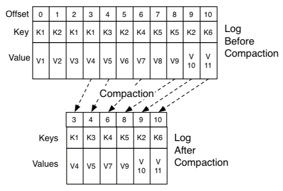
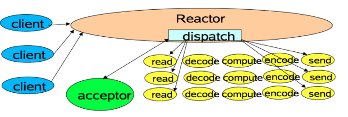
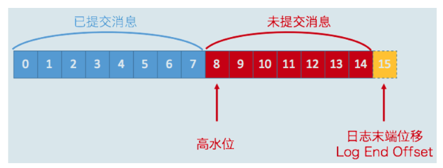
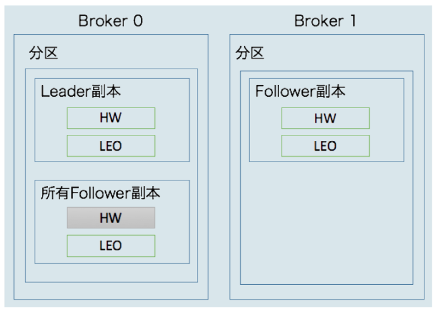
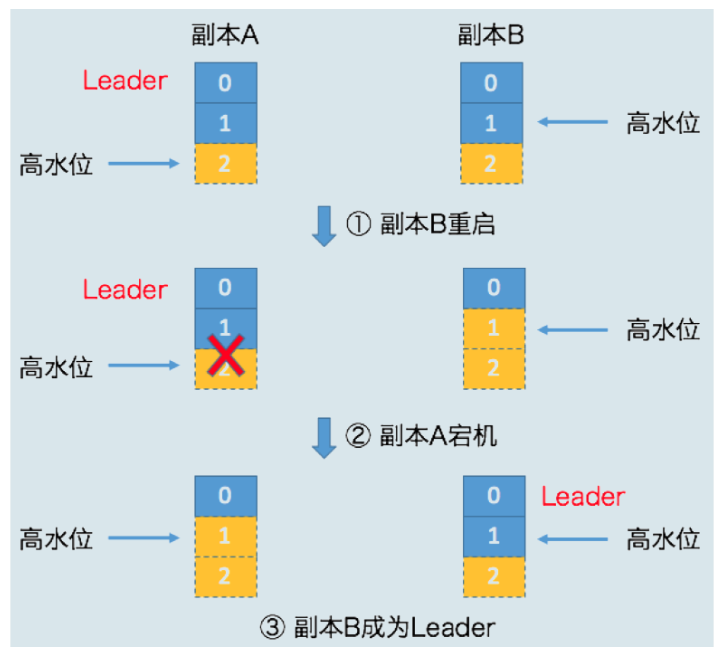
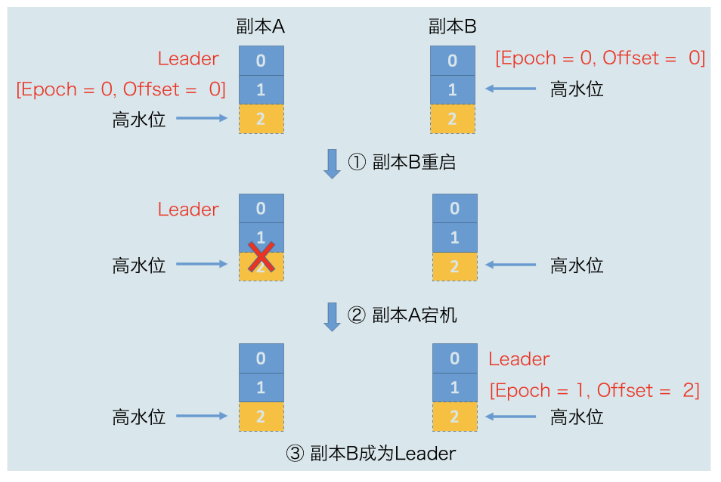
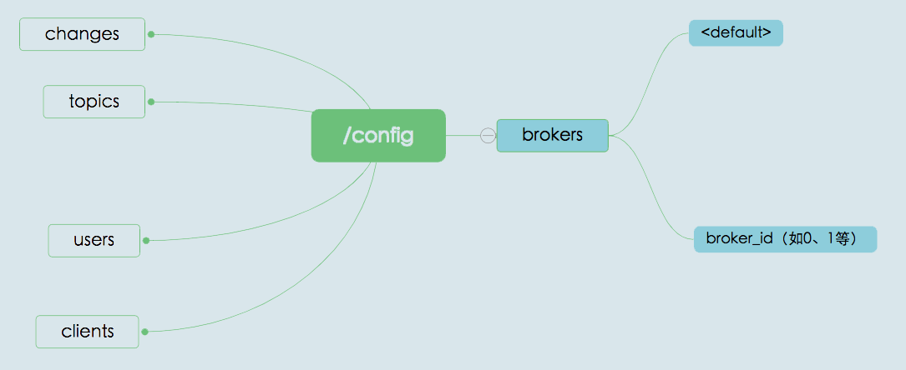
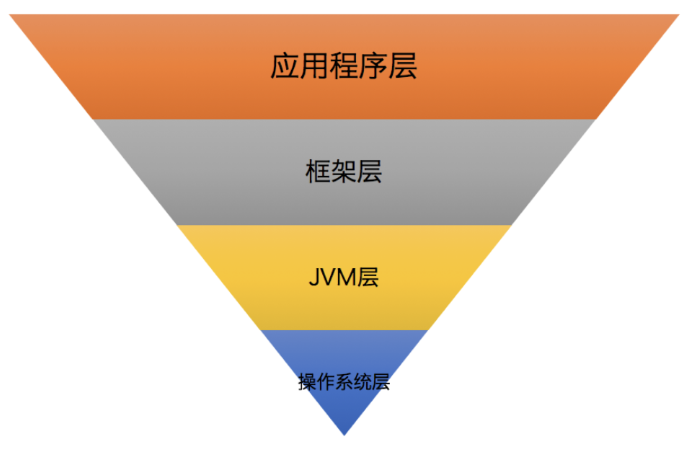

# Kafka入门

Apache Kafka是一款开源消息引擎系统。它的好处主要是：削峰填谷、发送方和接收方的松耦合。

消息发送的模式主要分为两种（Kafka同时支持这两种消息引擎模型）

* 点对点模型：发送方只有一个，接受方也只有一个，系统A发送的消息只能被系统B接收 
* 发布/订阅模型：它有一个主题Topic的概念，发送方也称为发布者（Publisher），接收方称为订阅者（Subscriber） ，可能存在多个发布者向相同的主题发送消息，而订阅者也可能存在多个，它们都能接收到相同主题的消息

Kafka吞吐量高，适合每条消息处理时间较短的场景，且能在单分区内保证顺序。

## 常用术语

我们把生产者和消费者统称为客户端（Clients）。你可以同时运行多个生产者和消费者实例，这些实例会不断地向Kafka集群中的多个主题生产和消费消息。 

Kafka的服务器端由被称为Broker的服务进程构成，即一个Kafka集群由多个Broker组成，Broker负责接收和处理客户端发送过来的请求，以及对消息进行持久化。 常见的做法是将不同的Broker分散运行在不同的机器上，如果集群中某一台机器宕机，其他机器上的Broker也依然能够对外提供服务。

Kafka实现高可用的重要手段是备份机制（Replication），备份就是把相同的数据拷贝到多台机器上，Kafka定义了两类副本：领导者副本（Leader Replica）和追随者副本（Follower Replica）。前者对外提供服务，这里的对外指的是与客户端程序进行交互（生产者总是向领导者副本写消息；而消费者总是从领导者副本读消息 ）；而后者只是被动地追随领导者副本而已，不能与外界进行交互。 （追随者副本向领导者副本发送请求，请求领导者把最新生产的消息发给它，时刻保持与领导者的同步）

Kafka拥有很好的伸缩性，当数据很多时，可以将其拆成几分存在不同的Broker中，这就是分区（Partitioning） ，每个分区是一组有序的消息日志。生产者生产的每条消息只会被发送到一个分区中。分区除了可以方便的容纳更多数据，还提供比较好的并发能力。

Kafka的三层消息架构： 

1. 第一层是主题层，每个主题可以配置M个分区。
2. 第二层是分区层， 每个分区又可以配置N个副本，这些副本中只有一个是leader副本，其余是Follower副本
3. 第三层是消息层，分区中包含若干条消息，每条消息的位移从0开始，依次递增

例如下图就是一个2 Broker、每个Broker 3个分区、每个分区2副本的示意图：

Kafka Broker持久化数据的方式：Kafka使用消息日志（Log）来保存数据，一个日志就是磁盘上一个只能追加写（Append-only）消息的物理文件 ，追加写就意味着是性能较好的顺序IO写操作，这也是实现Kafka高吞吐量特性的一个重要手段。消息日志会细分为多个日志段，消息被追加到最新的日志段中，Kafka在后台还有定时任务会定期地检查老的日志段是否能够被删除，从而实现回收磁盘空间的目的。 

Kafka同时支持两种消息模型：点对点模型（Peer to Peer，P2P）和发布订阅模型 。在Kafka中实现这种P2P模型的方法就是引入了消费者组（Consumer Group） ，多个消费者实例共同组成一个组来消费一组主题，这组主题中的每个分区都只会被组内的一个消费者实例消费，其他消费者实例不能消费它。 

消费者组里面的所有消费者实例不仅会瓜分topic的数据，还能增强整体的稳定性，当组内某个实例挂掉了，Kafka会自动将其负责的分区转移给其他活着的消费者，这就是重平衡（Rebalance） 

每个消费者在消费消息的过程中需要有个字段记录它当前消费到了分区的哪个位置上，这个字段就是消费者位移（Consumer Offset） 。生产者向分区写入消息， 最新消息的位置用一个叫位移（Offset）的数据来表征 ，它是一个单调递增且不变的值。

## Kafka不同版本特性

官网下载Kafka时，会看到这样的版本号：

kafka_2.11-2.2.1.tgz，其中2.11是编译Kafka源代码的Scala编译器版本，Kafka服务器端的代码完全由Scala编写。后面的2.2.1才是Kafka的版本，其中前面的2表示大版本号，即Major Version；中间的1表示小版本号或次版本号，即Minor Version；最后的1表示修订版本号，也就是Patch号。 

大版本之间的特性变化：

* 0.7：只提供了最基础的消息队列功能
* 0.8：引入了副本机制，成为了真正意义上的分布式高可靠消息队列，此时新版本Producer API还不稳定
* 0.9：增加了基础的安全认证/权限功能，同时使用Java重写了新版本消费者API，另外还引入了Kafka Connect组件用于实现高性能的数据抽取 ，新版本Producer API趋于稳定，新的Consumer API 还不稳定
* 0.10：该版本引入了Kafka Streams，Kafka正式升级成分布式流处理平台，0.10.2.2以后Consumer API趋于稳定
* 0.11：提供幂等性Producer API以及事务（Transaction） API；另一个是对Kafka消息格式做了重构，目前最主流的版本之一 ，各个大功能组件都变得非常稳定了 
* 1.0和2.0：主要还是Kafka Streams的各种改进，在消息引擎方面并未引入太多的重大功能特性 

# 线上部署方案

## 操作系统的选择

Kafka最好部署在linux上，因为它在以下三个方面有优势：

* I/O模型的使用

  Kafka客户端底层使用了Java的selector，selector在Linux上的实现机制是epoll，而在Windows平台上的实现机制是select，故将Kafka部署在linux上是有优势的。

  主流的I/O模型通常有5种类型： 阻塞式I/O > 非阻塞式I/O > I/O多路复用 > 信号驱动I/O > 异步I/O 

  epoll系统调用则介于第三种和第四种模型之间，select函数就属于I/O多路复用模型

* 网络传输效率

  Kafka生产和消费的消息都是通过网络传输的，而消息保存在磁盘，故Kafka需要在磁盘和网络间进行大量数据传输。linux平台可以通过零拷贝技术实现快速传输，而Windows平台上必须要等到Java 8的60更新版本才可以。

  零拷贝技术：当数据在磁盘和网络进行传输时避免昂贵的内核态数据拷贝从而实现快速的数据传输

* 社区支持度

  Windows平台上发现的Kafka Bug基本不会被解决

综上，Windows平台上部署Kafka只适合于个人测试或用于功能验证，千万不要应用于生产环境

## 磁盘的选择

使用机械磁盘完全能够胜任Kafka线上环境，原因如下：

* 因为Kafka虽然大量使用磁盘，但是它使用的方式多是顺序读写操作，一定程度上规避了机械磁盘最大的劣势，SSD没有太大的性能优势。
* 机械磁盘虽然易损坏，但是Kafka可以软件层面提供机制来保证数据安全

追求性价比的公司可以不搭建RAID，RAID虽然可以提供冗余的磁盘存储空间、提供负载均衡，但是：

* Kafka自己实现了冗余机制（副本）来提供高可靠性 
* Kafka也能在软件层面自行实现负载均衡（分区）

所以RAID也并不明显

## 磁盘容量估算

在规划磁盘容量时需要考虑以下因素：

- 新增消息数
- 消息留存时间
- 平均消息大小
- 备份数
- 是否启用压缩

比如每天需要向Kafka集群发送1亿条消息，每条消息保存两份以防止数据丢失，另外消息默认保存两周时间，现在假设消息的平均大小是1KB，那么总的空间大小就是：

~~~
1亿 * 1KB * 2 / 1000 / 1000 = 200GB
~~~

Kafka除了消息数据还有其他数据，比如索引，预留 10% 的磁盘空间， 每天需要总的存储容量需要220GB。保存两周的消息，总体需要存储：

~~~
220GB * 14 = 3TB
~~~

Kafka支持数据的压缩，假设压缩比是0.75，那么最后你需要规划的存储空间就是：

~~~
0.75 * 3 = 2.25TB 
~~~

## 带宽估算服务器数量

Kafka通过网络大量进行数据传输，带宽很容易称为瓶颈，以千兆网络1Gbps 举例，假设有个业务，需要在1小时内处理1TB的业务数据，如何以带宽估算服务器数量？

带宽1Gbps相当于每秒处理1Gb的数据，每台机器假设Kafka最高用到70%的带宽资源（给其他服务预留），再乘以1/3的折减系数（这部分是从最大到常规的预留，比较保守），那么单台服务器kafka常规情况下使用的带宽是：

~~~
1Gbps * 70% / 3 = 240Mbps
~~~

相当于单台服务器1s能处理240M的数据。

1小时内处理1TB的业务数据，换算成秒是每秒需要处理2336Mb的数据，所以需要这些机器：

~~~
2336 / 240 = 10
~~~

若是3副本，相当于总的需要处理的数据量要乘以3，那么需要这些机器：

~~~
3 * 2336 / 240 = 30
~~~

## Broker相关参数

1、针对存储信息的参数：

* log.dirs ：/home/kafka1,/home/kafka2,/home/kafka3

  指定了Broker需要使用的若干个文件目录路径。最好保证这些目录挂载到不同的物理磁盘，这样可以提高读写性能、实现故障转移Failover（Kafka Broker使用的任何一块磁盘挂掉了，坏掉的磁盘上的数据会自动地转移到其他正常的磁盘上，而且Broker还能正常工作。没有这种Failover的话，我们只能依靠RAID来提供保障）

* log.dir：对上一个参数的补充，一般如果设置了上一个就不用设置这个

2、和zk相关的设置：

* zookeeper.connect ：zk1:2181,zk2:2181,zk3:2181

  指定了zk集群，当多个Kafka集群使用同一套zk集群时，就要使用zk的别名，两套Kafka可以这样配置：

  zookeeper.connect ：zk1:2181,zk2:2181,zk3:2181/kafka1

  zookeeper.connect ：zk1:2181,zk2:2181,zk3:2181/kafka2

3、连接相关的设置：

* listeners：监听器，包含协议名称、主机名、端口号三种信息。是外部连接者通过什么协议访问主机名（最好用主机名不要用IP地址）和端口开放的Kafka服务。这里若设置了自定义的协议，还需要指定协议底层使用哪种安全协议。
* advertised.listeners ：这组监听器是Broker用于对外发布的。 

4、Topic管理的设置：

* auto.create.topics.enable：是否允许自动创建Topic。建议设置为false，否则发错topic后会自动创建。
* unclean.leader.election.enable：是否允许Unclean Leader选举。建议设置为false。所谓Unclean Leader，就是指在主副本挂掉的情况下，是否允许那些数据比较落后的副本竞争Leader，若允许则可能出现数据丢失，若不允许则可能分区不可用（这里说可能，是因为数据不大的情况下，多数时间的各副本数据是一致的）
* auto.leader.rebalance.enable ：是否允许定期进行Leader选举 。建议设置为false，若设置为true时，可能在满足一些条件后会更换现有的leader，换一次leader的代价是很大的，有性能损耗

5、数据保存

* log.retention.{hours|minutes|ms} ：控制一条消息数据被保存多长时间 。其中ms优先级最高、minutes次之、hours最低。大多数时候都是用hours比较方便
* log.retention.bytes：指定Broker为消息保存的总磁盘容量大小，默认是-1，代表Broker上保存多少数据都可以，在没有分用户的磁盘限制时，建议设置为-1
* message.max.bytes ：控制Broker能够接收的最大消息大小 。默认是1000012，不到1MB，太少了，实际情况下超过这个值的消息大小比较常见，建议设置大一点

## Topic级别参数

当同时设置了Topic级别和Broker级别的参数时，Topic级别参数会覆盖全局Broker参数的值。比如消息数据的留存时间数，实际上有些topic无需保存那么长时间，此时就可用调整topic的留存时间。

* retention.ms： 规定了该Topic消息被保存的时长。默认是7天。
* retention.bytes： 规定了要为该Topic预留多大的磁盘空间 ，默认是-1
* max.message.bytes ：它决定了Kafka Broker能够正常接收该Topic的最大消息大小

Topic级别参数可以用两种方式设置：

* 创建Topic时设置：

  ~~~bash
  bin/kafka-topics.sh --bootstrap-server localhost:9092 --create --topic transaction --partitions 1 --replication-factor 1 --config retention.ms=15552000000 --config max.message.bytes=5242880
  ~~~

* 修改Topic时设置：

  ~~~bash
  bin/kafka-configs.sh --zookeeper localhost:2181 --entity-type topics --entity-name transaction --alter --add-config max.message.bytes=10485760
  ~~~

建议采用第二种，未来可能统一使用kafka-configs脚本来调整Topic级别参数

## JVM参数

Kafka服务器端代码是用Scala语言编写的，但终归还是编译成Class文件在JVM上运行

* KAFKA_HEAP_OPTS： 指定堆大小， 默认是1G，一般来说不够用，推荐调整为6G
* KAFKA_JVM_PERFORMANCE_OPTS ：指定GC参数，若如果Broker所在机器的CPU资源非常充裕，建议使用CMS收集器。启用方法是指定-XX:+UseCurrentMarkSweepGC。否则，使用吞吐量收集器。开启方法是指定-XX:+UseParallelGC

## 操作系统参数

几个值的关注的操作系统参数：

* 文件描述符限制：ulimit -n 。文件描述符系统资源并不像我们想象的那样昂贵，可以调大一点，若太小则很快就容易报错
* 文件系统类型：XFS的性能要强于ext4
* Swappiness：不建议将swap 设置为0，建议设置一个较小值，若设置为0则内存溢出时会直接kill掉一个进程，没有诊断问题的时间
* Flush落盘时间：Kafka只要数据被写入到操作系统的页缓存（Page Cache）上 就被认为成功了。随后操作系统根据LRU算法将页缓存上的脏数据落盘在磁盘上，默认是5秒。可以适当的增加这个时间，免得太过频繁。

# 关键特性

## 分区和分区策略

主题下的每条消息只会保存在某一个分区中，而不会在多个分区中被保存多份。 分区的优点：高伸缩性（Scalability ），不同的分区能被放置在不同节点的机器上，每个节点都能独立的执行各自分区的读写请求，性能很好，且我们还可以通过添加新的节点机器来增加整体系统的吞吐量。（分区为1和分区为3，吞吐量差异非常大）

分区策略就是决定生产者将消息发送到哪个分区的算法。

如果要自定义分区，需要显式配置partitioner.class参数 ，编写一个具体的类实现Partitioner接口人，然后重写partition方法：

~~~java
int partition(String topic, Object key, byte[] keyBytes, Object value, byte[] valueBytes, Cluster cluster);
~~~

几种常见的分区策略：

* 轮询策略：第一条消息被发送到分区0，第二条被发送到分区1，第三条被发送到分区2，以此类推。它有非常优秀的负载均衡表现。

* 随机策略：消息任意放置在某个分区，一个简单的实现：

  ~~~java
  List<PartitionInfo> partitions = cluster.partitionsForTopic(topic);
  return ThreadLocalRandom.current().nextInt(partitions.size());
  ~~~

* 按消息键保序逻辑，即同一个Key的所有消息都进入到相同的分区里面， 每个分区下的消息处理都是有顺序的。而具体进入哪个分区，是随机决定的，一个简单的实现：

  ~~~java
  List<PartitionInfo> partitions = cluster.partitionsForTopic(topic);
  return Math.abs(key.hashCode()) % partitions.size();
  ~~~

  合理设计key是非常重要的，尤其是要求消息有序的场景下。

* 基于地理位置的分区。有时候需要将消息发送到特定地理位置上，此时就要获取Broker所在的IP地址，然后再决定发送到哪里，比如将消息发送在Broker在南方的分区：

  ~~~java
  List<PartitionInfo> partitions = cluster.partitionsForTopic(topic);
  return partitions.stream().filter(p -> isSouth(p.leader().host())).map(PartitionInfo::partition).findAny().get();
  ~~~

Kafka默认分区策略实际上同时实现了两种策略：如果指定了Key，那么默认实现按消息键保序策略；如果没有指定Key，则使用轮询策略。 

## 消息压缩

压缩的本质就是用CPU时间去换磁盘空间或者网络I/O传输量。

Kafka有两个消息格式版本，分别称之为V1和V2，V2版本是Kafka 0.11.0.0中正式引入的。

V2相比V1主要做了两大优化：

* 消息的公共部分（如CRC校验）放到外层消息集合里面，不用每条消息都保存这些信息
* 对整个消息集合进行压缩，而不用对每条消息都压缩一遍然后放在一起

压缩主要发生在生产者端，如建立一个压缩算法为GZIP的生产者对象：

~~~java
 Properties props = new Properties();
 props.put("bootstrap.servers", "localhost:9092");
 props.put("acks", "all");
 props.put("key.serializer", "org.apache.kafka.common.serialization.StringSerializer");
 props.put("value.serializer", "org.apache.kafka.common.serialization.StringSerializer");
 // 开启GZIP压缩
 props.put("compression.type", "gzip");
 
 Producer<String, String> producer = new KafkaProducer<>(props);
~~~

这样Produce启动后生产的每个消息集合都是经GZIP压缩过的。

压缩也可能发生在Broker端，大多数情况下Broker不会对消息进行压缩，但在下面两种情况下：

* Broker端指定了和Producer端不同的压缩算法，此时就会将消息先解压后压缩。Broker端也有一个参数叫compression.type，它的默认值是producer，表示压缩算法和生产者一致，但如果设置了不同的值，就会出现这种现象
* Broker端发生了消息格式转换：主要是为了兼容老版本的消费者程序，一个集群中存在消息版本不匹配（V1和V2）的情况时，会对新版本消息执行向老版本格式的转换。这种情况下除了解压缩和压缩带来的性能损耗，还丧失了零拷贝带来的性能优势

Broker端会对消息进行解压，目的是对消息执行各种验证。

Consumer程序也会解压缩之前压缩的消息进行消费处理。

一句话总结：Producer端压缩、Broker端保持、Consumer端解压缩

一个压缩算法的优劣主要看两个方面：压缩比，越高越好；吞吐量，每秒能压缩或解压缩的数据，越高越好

在实际使用中，GZIP、Snappy、LZ4甚至是zstd的表现各有千秋。但对于Kafka而言，它们的性能测试结果却出奇得一致，即在吞吐量方面：LZ4 > Snappy > zstd和GZIP；而在压缩比方面，zstd > LZ4 > GZIP > Snappy。 

当Producer CPU资源紧张时，不建议开启压缩；当环境中带宽有限时，建议开启压缩；避免Broker端出现压缩的情况。

## 无消息丢失配置

Kafka只对已提交的消息做有限度的持久化保证，关于这句话的理解，关键在于：

* 确保消息是已提交的，是所有Broker都成功保存该消息才算是已提交，还是只要有一个Broker成功保存该消息就算是已提交，这个已提交的概念是可定义的
* 有限度的持久化保证意思是用副本的机制来保证消息存在多个Broker，但是最后要是保存消息的节点全部宕机，也无法保证消息不丢失

在代码层面，要用正确的方式生产和消费消息：

* 用正确的方式生产消息，Producer永远要使用带有回调通知的发送API，也就是说不要使用producer.send(msg)，而要使用producer.send(msg, callback)，否则消息发送失败对于生产者程序无任何响应。生产消息失败的原因可能有：网络抖动、消息不合格被Broker拒绝接受（如消息太大）、Broker宕机了。可以在回调逻辑中针对各种错误进行及时的处理。
* 用正确的方式消费消息，简单来说就是先消费消息，后更新offset，不要出现盲目更新offset的情况。如果出现多线程异步处理消息，消费者自动更新offset的情况，就可能会有消息没有处理成功，但是offset已经更新的情况，此时一定要手动提交位移

在配置方面保证无消息丢失：

* 设置acks = all，acks是Producer的一个参数，代表所有副本Broker都要接收到消息，该消息才算是“已提交”。这是最高等级的“已提交”定义
* 设置retries 为一个较大的值，它是一个Producer参数，代表消息发送失败时自动重试的次数，可以应对网络抖动导致的消息发送失败
* 设置unclean.leader.election.enable = false，它是Broker端的参数，防止消息落后的Broker称为新的Leader导致消息丢失
* 设置replication.factor >= 3，它是Broker端的参数，代表副本数（副本数包含了Leader副本），若太少则稳定性差
* 设置min.insync.replicas > 1 ，它是Broker端的参数，代表消息至少要被写入到多少个副本才算是“已提交” ，它是ISR 列表中最小同步副本数
* 确保replication.factor > min.insync.replicas ，若两者相等，那么只要有一个副本挂机，整个分区就无法工作了，可用性就会受到影响
* 确保消息消费完成再提交，enable.auto.commit = false，它是Consumer端参数，不要设置自动提交。

有一个场景可能出现消息丢失，就是增加Topic后，Producer先于Consumer感知到新增加的分区，Producer先生产了几个消息，然后等Consumer感知到时，因为它是从最新位移处消费消息，那么之前Producer生产的消息就丢失了。一种简单的思路是在consumer端记录订阅的分区，如果消费时碰到了新的分区，那就从最早处开始消费即可。

## 拦截器

类似Spring MVC的拦截器，Kafka也有拦截器设计，分为两种：生产者拦截器和消费者拦截器：

* 生产者拦截器允许你在发送消息前以及消息提交成功后植入你的拦截器逻辑 
* 消费者拦截器支持在消费消息前以及提交位移后编写特定逻辑

而且这些拦截器支持链的方式，可以将一组拦截器串联成一个大的拦截器，Kafka会按照添加顺序依次执行拦截器逻辑。

Kafka拦截器可以应用于包括客户端监控、端到端系统性能检测、消息审计等多种功能在内的场景。

## 生产者管理TCP连接

Apache Kafka的所有通信都是基于TCP的，之所以选择TCP，是因为它能提供一些高级功能，比如多路复用请求以及同时轮询多个连接的能力（TCP并不能多路复用，它只是提供可靠的消息交付语义保证），而且HTTP库在很多编程语言中都比较简陋。

生产者生产消息的步骤大概如下：

~~~java
Properties props = new Properties ();
props.put(“参数1”, “参数1的值”)；
props.put(“参数2”, “参数2的值”)；
……
try (Producer<String, String> producer = new KafkaProducer<>(props)) {
            producer.send(new ProducerRecord<String, String>(……), callback);
	……
}
~~~

创建TCP连接的时机：

1、在创建KafkaProducer时，生产者应用会在后台创建并启动一个名为Sender的线程，该线程会创建与Broker的连接（从java的角度来说，不建议在构造方法中开启线程，新线程可以通过this拿到未创建完成的对象），它会与bootstrap.servers参数指定的所有Broker建立TCP连接，而且还向某一台Broker发送了METADATA请求，尝试获取集群的元数据信息。（所以不建议在bootstrap.servers中配置所有节点，尤其是当节点多的时候，配置三四个就足够了，它可以拿到整个集群的Broker信息）

2、在元数据更新后，或者消息发送前，如果发现与某些Broker没有连接，Kafka也会建立TCP连接

更新元数据的场景：给不存在的Topic发送消息，Broker会返回Topic不存在，此时会尝试更新元数据；Producer通过metadata.max.age.ms参数定期地去更新元数据信息。该参数的默认值是300000，即5分钟，Producer每5分钟都会强制刷新一次元数据以保证它是最及时的数据 

关闭TCP连接的时机：

1、主动关闭：producer.close() 

2、被动关闭：Producer端参数connections.max.idle.ms，默认值是9分钟，9分钟内没有任何请求使用该TCP连接，Kafka会在Broker端将其关闭，会在生产者端产生CLOSE_WAIT连接。可以将这个参数调整为-1，代表永久长连接，TCP会根据keepalive进行探活。

## 实现精确一次

Kafka默认提供的交付可靠性保障是至少一次，也就是消息不会丢，但有可能重复发送。比如网络抖动时，Broker的应答没有返回给Producer端，此时Producer会选择重试，造成消息重复发送，可以调整参数让Producer不重试，但是对于大多数业务而言，偶发的消息重复发送是被允许的。

Kafka要想做到精确一次，主要通过两种机制：幂等性和事务

幂等性就是多次执行也不会造成系统状态的改变，Kafka中可以创建幂等性Producer，需要将enable.idempotence参数设置为true，设置为true后，Broker就会在收到重复消息后将其丢弃。但幂等性有一些限制：

* 只能保证单分区上的幂等性，不能保证多个分区的幂等性
* 只能保证单会话的幂等性，重启Producer进程后，这种幂等性就会丧失

想要解决这两个问题，可以使用Kafka中的事务，Kafka事务可以保证多条消息原子的写入目标分区，实现事务首先要在Producer参数进行调整，将enable.idempotence参数设置为true并指定transactional. id，起一个有意义的名字，然后调整生产消息的代码：

~~~java
producer.initTransactions();
try {
            producer.beginTransaction();
            producer.send(record1);
            producer.send(record2);
            producer.commitTransaction();
} catch (KafkaException e) {
            producer.abortTransaction();
}
~~~

Consumer端要设置隔离级别isolation.level参数的值为read_committed （默认是read_uncommitted）

这两个措施都会影响kafka的性能，尤其是事务，在实际使用中，要仔细评估引入事务的开销。

## 消费者组

Consumer Group是Kafka提供的可扩展且具有容错性的消费者机制，Topic中的每个分区都只会被组内的一个消费者实例消费。

之前说过两种消息引擎模型：点对点模型和发布/订阅模型。前者的劣势在于消息一旦被消费，它就会从队列中被删除，不能再被消费，伸缩性差；后者的劣势在于，每个订阅者要订阅主题的所有分区，分区的变化要通知所有订阅者。

Kafka的Consumer Group 中的每个消费者实例要瓜分所有分区，它并不需要消费所有分区的消息，Consumer Group之间彼此独立，互不影响，它们能够订阅相同的一组主题而互不干涉。它结合了两者的优点，避开两种模型的缺陷。如果所有实例都属于同一个Group，那么它实现的就是消息队列模型；如果所有实例分别属于不同的Group，那么它实现的就是发布/订阅模型。

比较重要的问题是，消费者组中应该有多少消费者实例，理想情况下，Consumer实例的数量应该等于该Group订阅主题的分区总数，这样平均1个消费者实例负责1个分区，当Consumer实例的数量大于分区总数时，会有一些消费者实例不负责任何分区，造成资源浪费的问题。

消费者在消费的过程中需要记录自己消费了多少数据，这就是Offset，对于消费者组而言，Offset应该是一个KV对，K是分区，V是对应Consumer消费该分区的最新位移。在老版本的消费者中，位移是保存在zk中的，主要是考虑到Kafka节点保持无状态，方便扩展集群，但是zk并不适合频繁的写操作，在新版本的消费者中，位移是保存在Broker端的内部Topic中。

Rebalance是一个协议，它规定了一个Consumer Group下的所有Consumer如何达成一致，来分配订阅Topic的每个分区，Rebalance的触发条件有3个：

* 组成员数发生变更。比如有新的Consumer实例加入组或者离开组
* 订阅主题数发生变更，比如订阅了多个主题，如consumer.subscribe(Pattern.compile("t.*c")) ，当新建Topic时，组内要消费的Topic就增加了
* 分区数发生变更，可以通过命令调整

当Rebalance发生时，所有消费者对应的分区都会进行调整，直到达到一个平衡的状态，避免消费者之间出现分配倾斜的情况。但Rebalance过程对Consumer Group消费过程有极大的影响，在Rebalance过程中，所有Consumer实例都会停止消费（而不是尽量减少影响范围），等待它完成，当消费者很多的时候，Rebalance速度非常慢。因此要尽量避免Rebalance的发生。

## 位移主题

Kafka管理消费分区的最新位移的方式是，将位移数据作为一条普通的kafka消息，提交到一个Topic名为

\_\_consumer_offsets的主题中，这种处理方式既有高持久性，又能满足高频写的要求。__consumer_offsets被称为位移主题。

位移主题就是一个普通的Topic，但消息格式却是固定的，如果随意向这个Topic发送消息可能造成Broker的崩溃。消息包含键和值，键包含描述位移的三要素：GroupId、Topic名、分区号，值包含位移值、时间戳等，除了这种位移消息，还有两种格式：

* 用来注册保存消费者组信息的消息
* 用于删除过期位移的消息、删除消费者组的消息。它被称为墓碑消息，当组内所有消费者都停止，位移数据被删除后，会发送该消息表示彻底删除组的消息

位移主题的创建时机：当Kafka集群中的第一个Consumer启动时，Kafka会自动创建位移主题。默认分区数是50，副本数是3，可以通过offsets.topic.num.partitions 、offsets.topic.replication.factor 两个参数调整。

目前Kafka提交位移的方式有两种：

* 自动提交位移，当enable.auto.commit为true时，它是Consumer端参数，提交间隔由一个专属的参数auto.commit.interval.ms来控制，自动提交时，只要Consumer一直启动着，它就会无限期地向位移主题写入消息，比如一直发出位移是100的消息
* 手动提交位移，即enable.auto.commit为false，需要调用consumer.commitSync才会确认消费完毕

随着Kafka长时间运行，位移主题的消息也越来越多，删除位移主题中的消息的机制叫Compact策略，简单来说，Compact会保留相同key中最晚的消息，将其他消息删除：

Kafka提供了专门的后台线程定期地巡检待Compact的主题，看看是否存在满足条件的可删除数据。这个后台线程叫Log Cleaner

## Coordinator组件

Coordinator是Kafka中很重要的一个组件，它的功能有很多：

* 在Rebalance过程中，完成订阅主题分区的分配
* 位移管理，Consumer提交位移实际上是向Coordinator所在的Broker提交位移
* 组成员管理，Consumer应用启动时，要通知Coordinator
* 消费者组的注册
* 成员管理记录等元数据管理

所有Broker在启动时，都会创建和开启相应的Coordinator组件，所有Broker都有Coordinator组件，它驻留在Broker的内存中。

当定位问题时，需要根据某个具体的消费者组确定为它服务的Coordinator在哪个Broker上，此时要先确定分区，分区id=Math.abs(groupId.hashCode() % 位移主题分区总数)，确定分区后再找对应分区Leader副本所在的Broker，该Broker所在的 Coordinator就是该消费者组对应的Coordinator

## 避免重平衡Rebalance 

之前说过Rebalance的触发条件有3个，其中除去运维必要的操作以外，实际场景中最容易出现意外Rebalance的场景是组成员数量发生变化，添加Consumer一般发生在扩容的时候（或者消费者组中的消费者实例依次启动，每次消费者组启动，必引发Rebalance），一般不考虑。而Consumer出于某种原因意外下线的情况而导致的Rebalance是要避免的。

正常情况下，每个Consumer实例都会定期地向Coordinator发送心跳请求，表明它还存活着，如果不能及时发送心跳，Coordinator就会将Consumer移除，开始Rebalance。有一个Consumer端参数名为session.timeout.ms，默认是10，代表10秒内Coordinator没有收到某Consumer实例的心跳就会认为它已经挂了。

Consumer端参数heartbeat.interval.ms控制了发送心跳的频率，设置的越小频率就越高。Consumer端参数max.poll.interval.ms限定了Consumer端应用程序两次调用poll方法的最大时间间隔，默认是5分钟，代表Consumer程序如果5分钟内无法消费完消息，Consumer就会主动离开消费者组，也会引发Rebalance。

综上，常见的意外Rebalance的场景：

* 因为未能及时发送心跳导致的Rebalance，一般设置session.timeout.ms = 6s ，heartbeat.interval.ms = 2s ，这样Consumer在被判定掉线之前，至少能发送3轮的心跳。session.timeout.ms设置的不要太大，否则不能及时感知到Consumer的下限，也会影响消费的效率
* 因为Consumer消费时间过长引起的，如消费过程中需要将大量数据写入HDFS，若判定极限场景下写入需要消耗10分钟，那么就需要配置max.poll.interval.ms大于10分钟，以保证因为消费时间不充足导致的Rebalance。Consumer长时间卡顿也有可能是因为Full GC导致的，GC也是一个需要关注的点

## 位移提交

Consumer向Kafka提交汇报自己的位移数据，这个过程被称为提交位移。因为Consumer能够同时消费多个分区的数据，所以位移的提交实际上是在分区粒度上进行的，即Consumer需要为分配给它的每个分区提交各自的位移数据。

提交位移可以让Consumer发生故障重启后，仍然能保持从相应的位移处继续消费。

从理论上来说，你可以提交一个任意的位移，让消息跳过，或者重复消费。

位移提交，从用户的角度分为自动提交和手动提交，从Consumer的角度分为同步提交和异步提交。

1、自动提交：需要消费的时候开启enable.auto.commit = true，它默认值也是true，还有一个参数指定了自动提交位移的时间间隔，auto.commit.interval.ms，默认值是5秒

下面就是自动提交位移的样例：

~~~java
Properties props = new Properties();
     props.put("bootstrap.servers", "localhost:9092");
     props.put("group.id", "test");
     props.put("enable.auto.commit", "true");
     props.put("auto.commit.interval.ms", "2000");
     props.put("key.deserializer", "org.apache.kafka.common.serialization.StringDeserializer");
     props.put("value.deserializer", "org.apache.kafka.common.serialization.StringDeserializer");
     KafkaConsumer<String, String> consumer = new KafkaConsumer<>(props);
     consumer.subscribe(Arrays.asList("foo", "bar"));
     while (true) {
         ConsumerRecords<String, String> records = consumer.poll(100);
         for (ConsumerRecord<String, String> record : records)
             System.out.printf("offset = %d, key = %s, value = %s%n", record.offset(), record.key(), record.value());
     }
~~~

Kafka会保证在开始调用poll方法时，提交上次poll返回的所有消息（前提是到达提交时间）。 poll会先提交上一次的位移，再处理下一批消息，一般不会出现消费丢失的情况，但是可能出现重复消费。比如Consumer每5秒自动提交一次位移，结果在它即将提交位移的时候，发生了Rebalance，Rebalance后所有Consumer统一会从上次提交位移处继续消费，这就导致5秒内消费的数据要重新被消费。

2、手动提交：需要消费的时候设置enable.auto.commit = false，然后在处理完消息后手动调用commitSync：

~~~java
while (true) {
            ConsumerRecords<String, String> records =
                        consumer.poll(Duration.ofSeconds(1));
            process(records); // 处理消息
            try {
                        consumer.commitSync();
            } catch (CommitFailedException e) {
                        handle(e); // 处理提交失败异常
            }
}
~~~

Kafka会在调用commitSync时提交poll返回的最新位移，它是一个同步操作，会一直等待，直到提交成功才返回，如果提交过程中出现异常，则会直接抛出。这种方法可以避免重复消费，但是调用commitSync会让程序阻塞一段时间。Kafka提供了另一个API：commitAsync，它会立即返回，不会阻塞，还提供了回调函数：

~~~java
while (true) {
            ConsumerRecords<String, String> records = 
	consumer.poll(Duration.ofSeconds(1));
            process(records); // 处理消息
            consumer.commitAsync((offsets, exception) -> {
	if (exception != null)
	handle(exception);
	});
}
~~~

commitAsync的问题在于，出现问题时它不会自动重试。

有时我们会同步和异步两种结合在一起，这样可以利用commitSync的自动重试来规避那些瞬时错误，而且又不会效率太低，方法就是平时采用异步提交，在Consumer关闭前用同步提交：

~~~java
 try {
           while(true) {
                        ConsumerRecords<String, String> records = 
                                    consumer.poll(Duration.ofSeconds(1));
                        process(records); // 处理消息
                        commitAysnc(); // 使用异步提交规避阻塞
            }
} catch(Exception e) {
            handle(e); // 处理异常
} finally {
            try {
                        consumer.commitSync(); // 最后一次提交使用同步阻塞式提交
	} finally {
	     consumer.close();
}
}
~~~

Kafka还提供了更精细化的提交，可以自主控制提交的offset。有时拉回来的消息太多，一次处理不完容易发生异常，位移没有及时提交，导致部分消息被重复消费，我们可以控制每100条消息提交一次位移：

~~~java
private Map<TopicPartition, OffsetAndMetadata> offsets = new HashMap<>();
int count = 0;
……
while (true) {
            ConsumerRecords<String, String> records = 
	consumer.poll(Duration.ofSeconds(1));
            for (ConsumerRecord<String, String> record: records) {
                        process(record);  // 处理消息
                        offsets.put(new TopicPartition(record.topic(), record.partition()),
                                   new OffsetAndMetadata(record.offset() + 1)；
                       if（count % 100 == 0）
                                    consumer.commitAsync(offsets, null); // 回调处理逻辑是null
                        count++;
	}
}
~~~

## 位移提交失败

位移提交失败通常发生在手动提交位移时，产生CommitFailedException异常。

产生CommitFailedException异常的最常见的场景是消息处理的总时间超过max.poll.interval.ms参数，为了避免该问题，有几种解决办法：

* 缩短单条消息处理的时间
* 增加max.poll.interval.ms
* 减少下游一次性消费的消息总数，调整Consumer端参数max.poll.records的值，默认是500，代表调用一次KafkaConsumer.poll方法，最多返回500条消息
* 下游系统使用多线程来加速消费，Flink就是这样做的

还有一种场景也会位移提交失败，那就是集群中同时出现了设置相同group.id值的消费者组程序和独立消费者程序 （Standalone Consumer，它没有消费者组的概念，每个消费者实例都是独立工作的，彼此之间毫无联系）

## 多线程消费设计方案

从Kafka 0.10.1.0版本开始，KafkaConsumer就是双线程的设计：用户线程和心跳线程，其中用户线程用于消费消息，心跳线程负责定期给对应的Broker发送心跳，以标识Consumer的存活。因此可以认为在消息消费这个层面上，依然可以认为KafkaConsumer是单线程的设计。

在老版本的Consumer中消费是多线程的架构，在新版本中改为单线程的，原因是单线程设计的Consumer更容易移植到其他语言上，可以把多线程管理策略从Consumer端分离。

KafkaConsumer类不是线程安全的，不能在多个线程中共享同一个KafkaConsumer对象，除了wakeup方法，它唤醒Consumer的操作是线程安全的。

对于多线程消费方案，主要有两种：

* 程序启动多个线程，每个线程有一个KafkaConsumer对象，负责完成的消息获取、消息处理
* 启动多个消费线程，每个线程有一个KafkaConsumer对象，负责完成消息获取；另外还有多个消息处理线程，负责执行消息处理逻辑。这样可以实现消息处理和消息获取解耦

第一种方案实际上是一种粗粒度的工作划分，即每个线程单独完成所有工作；第二种方案更细粒度划，将工作分为两类，两类工作分别由两种线程来实现，各自可以用单线程或者多线程来完成。

下面介绍两个方案的优缺点：

方案1的优点：实现简单、线程间无交互、能保证消费顺序，缺点：能使用的线程数受限于Consumer订阅主题的总分区数，比如一共100个分区，设置超过100个线程则无效，多余的线程无法分配到任何分区；容易引发消息的处理速度慢

方案1的代码示例，拿一个线程举例，每个线程都有一个KafkaConsumer：

~~~java
public class KafkaConsumerRunner implements Runnable {
     private final AtomicBoolean closed = new AtomicBoolean(false);
     private final KafkaConsumer consumer;

     public void run() {
         try {
             consumer.subscribe(Arrays.asList("topic"));
             while (!closed.get()) {
			ConsumerRecords records = 
				consumer.poll(Duration.ofMillis(10000));
                 //  执行消息处理逻辑
             }
         } catch (WakeupException e) {
             // Ignore exception if closing
             if (!closed.get()) throw e;
         } finally {
             consumer.close();
         }
     }

     // Shutdown hook which can be called from a separate thread
     public void shutdown() {
         closed.set(true);
         consumer.wakeup();
     }
~~~

方案2的优点：高伸缩性（可以独立的调节两个模块的线程数）、缺点：实现难度高、消费顺序不保证、处理链路拉长不容易实现位移提交管理

方案2的代码举例，取到消息后，给消息处理模块处理消息：

~~~java
private final KafkaConsumer<String, String> consumer;
private ExecutorService executors;
...

private int workerNum = ...;
executors = new ThreadPoolExecutor(
	workerNum, workerNum, 0L, TimeUnit.MILLISECONDS,
	new ArrayBlockingQueue<>(1000), 
	new ThreadPoolExecutor.CallerRunsPolicy());

...
while (true)  {
	ConsumerRecords<String, String> records = 
		consumer.poll(Duration.ofSeconds(1));
	for (final ConsumerRecord record : records) {
		executors.submit(new Worker(record));
	}
}
..
~~~

## 消费者管理TCP连接

消费者创建TCP连接的时机：在调用KafkaConsumer.poll方法时被创建的，poll方法内部有3个时机可以创建TCP连接：

* 发起FindCoordinator请求时：

  当消费者程序首次调用poll时，它需要向Kafka集群发送一个名为FindCoordinator的请求，希望Kafka集群告诉它哪个Broker是管理它的协调者，此时会创建一个Socket连接。Kafka会选择消费者所有连接的Broker中，谁的待发送请求最少，就认为谁负载最小（尽管是消费者端的单向评估），就会选择它作为目标Broker

* 连接协调者时：

  收到FindCoordinator请求的响应后，会创建向该Broker的Socket连接，然后协调者开始正常的组协调操作

* 消费数据时：

  为所有分区创建TCP，这些分区的领导者副本在哪个Broker，就会向哪些Broker创建分区

注意，第三类TCP连接创建成功后，第一类TCP连接就会被废弃，后面请求元数据的职责就交给第三类TCP连接了，长时间运行的消费者程序一般只有后两类TCP连接

消费者关闭TCP连接的时机：

* 手动调用KafkaConsumer.close()，这是手动关闭方式
* Socket连接一段时间没有请求通过，则消费者会自动断开，这个参数是消费者端参数connection.max.idle.ms，默认值是9分钟（若设置为-1，则永远不会清除消费者的连接）

消费者一般都通过调用poll方法消费消息，上面提到的请求都会被定期发送到Broker，一般不会出现长时间没有请求通过的情况，这就实现了类似长连接的效果。

##消费进度监控

描述滞后程度的指标是Lag，Lag的单位是消息数，描述了一个分区消费的落后情况，若要计算Topic级的需要将所有分区的Lag累加起来。如果Lag很大或者缓慢增加，就说明出现了积压。而且一旦消费者的速度跟不上生产者，就可能导致消费的数据已经不在操作系统的页缓存中了，消费者不得不从磁盘读取，这就导致消费进一步变慢。

监控进度的方式有几种：用命令行（kafka-consumer-groups.sh ）、用java API、用JMX监控指标（监控Lag和Lead两个值，Lead是消费者最新消费位移和分区当前第一条位移的差值，当Lead接近0的时候表示消费者端要丢消息了，因为保存消息的时间是有限的）

用java API监控：

~~~java
public static Map<TopicPartition, Long> lagOf(String groupID, String bootstrapServers) throws TimeoutException {
        Properties props = new Properties();
        props.put(CommonClientConfigs.BOOTSTRAP_SERVERS_CONFIG, bootstrapServers);
        try (AdminClient client = AdminClient.create(props)) {
            ListConsumerGroupOffsetsResult result = client.listConsumerGroupOffsets(groupID);
            try {
                Map<TopicPartition, OffsetAndMetadata> consumedOffsets = result.partitionsToOffsetAndMetadata().get(10, TimeUnit.SECONDS);
                props.put(ConsumerConfig.ENABLE_AUTO_COMMIT_CONFIG, false); // 禁止自动提交位移
                props.put(ConsumerConfig.GROUP_ID_CONFIG, groupID);
                props.put(ConsumerConfig.KEY_DESERIALIZER_CLASS_CONFIG, StringDeserializer.class.getName());
                props.put(ConsumerConfig.VALUE_DESERIALIZER_CLASS_CONFIG, StringDeserializer.class.getName());
                try (final KafkaConsumer<String, String> consumer = new KafkaConsumer<>(props)) {
                    Map<TopicPartition, Long> endOffsets = consumer.endOffsets(consumedOffsets.keySet());
                    return endOffsets.entrySet().stream().collect(Collectors.toMap(entry -> entry.getKey(),
                            entry -> entry.getValue() - consumedOffsets.get(entry.getKey()).offset()));
                }
            } catch (InterruptedException e) {
                Thread.currentThread().interrupt();
                // 处理中断异常
                // ...
                return Collections.emptyMap();
            } catch (ExecutionException e) {
                // 处理ExecutionException
                // ...
                return Collections.emptyMap();
            } catch (TimeoutException e) {
                throw new TimeoutException("Timed out when getting lag for consumer group " + groupID);
            }
        }
    }
~~~

## 副本机制

副本的好处：提供数据冗余。副本不能带来提高性能、改善数据局限性（数据放入与用户地理位置接近的地方，降低系统延时）的问题，因为副本中的Follower副本是不对外提供服务的，它只会异步拉取Leader副本。

副本的本质就是一个只能追加写消息的提交日志，同一个分区下的所有副本保存有相同的消息序列，这些副本分散保存在不同的Broker上，从而能够对抗部分Broker宕机带来的数据不可用。 

当领导者副本挂掉后（所在Broker宕机），Kafka依托于ZooKeeper提供的监控功能能够实时感知到，并立即开启新一轮的领导者选举，从追随者副本中选一个作为新的领导者。老Leader副本重启回来后，只能作为追随者副本加入到集群中。 

之所以副本不能对外提供功能，主要是为了实现：

* 读其所写：也就是线性一致性读
* 单调读：也就是顺序一致性读

ISR副本集合：In-sync Replicas，其中的副本都是与Leader同步的副本，其中包括Leader副本，Kafka判断Follower是否与Leader同步的标准，不是看相差的消息数，而是落后的时间数，取决于Broker端参数replica.lag.time.max.ms，默认是10秒，只要一个Follower副本落后Leader副本的时间不连续超过10秒，那么Kafka就认为该Follower副本与Leader是同步的，即使此时Follower副本中保存的消息明显少于Leader副本中的消息，当超过该时间后，Kafka就认为该副本与Leader副本是不同步的，就会将其踢出ISR，如果后续同步追上了Leader的进度，它还会重新被加入ISR，ISR是一个动态调整的集合。

当ISR只有Leader副本一个时，恰巧同时Leader副本挂掉，此时ISR为空，所有副本都是非同步副本，此时若进行领导者选举，这种选举就被称为Unclean Leader Election，Broker端参数unclean.leader.election.enable控制是否允许Unclean领导者选举，建议设置为false，以免丢失数据。若设置为true，则是倾向于可用性，若设置为false，则倾向于一致性。

## 请求的处理

无论是Kafka客户端还是Broker端，它们之间的交互都是通过“请求/响应”的方式完成的。

Kafka自己定义了一组请求协议，用于实现各种各样的交互操作。 常见的有：

* PRODUCE请求：用于生产消息的
* FETCH请求：用于消费消息的
* METADATA请求：用于请求Kafka集群元数据信息的 

这些请求都是通过TCP网络以Socket的方式进行通讯的。

请求处理的方式既不是完全的单线程串行，也是完全的异步运行，而是采用了Reactor模式。Reactor模式是事件驱动架构的一种实现方式，特别适合应用于处理多个客户端并发向服务器端发送请求的场景，Reactor模式的架构如下：

多个客户端发送请求给Reactor，Reactor有个请求分发线程Dispatcher，即Acceptor，它会将不同的请求下发到多个工作线程中处理，具体的逻辑由其余线程处理。

Kafka也应用了类似的处理架构：

Kafka的Broker端有个SocketServer组件，类似于Reactor模式中的Dispatcher，它也有对应的Acceptor线程和一个工作线程池，工作线程池在Kafka中有一个特殊的名字，叫网络线程池，Broker端参数num.network.threads，用于调整该网络线程池的线程数，默认是3

多个网络线程有相同的几率被分配到待处理请求，采用了简单的轮询策略。当网络线程接受到请求后还会进行下一步处理：

当网络线程拿到请求后，会将请求放入一个共享队列，由IO线程池从该队列中取出请求，然后执行处理，如果是PRODUCE生产请求，则将消息写入到底层的磁盘日志中；如果是FETCH请求，则从磁盘或页缓存中读取消息。 

IO线程池是真正执行请求逻辑的线程，Broker端参数num.io.threads控制了这个线程池中的线程数，默认是8，若机器的资源充足，可以将该值设置大一点，允许更多的并发请求被处理。

当IO线程处理完请求后，会将生成的响应发送到网络线程池的响应队列中，然后各自发送到各客户端。

有一个叫Purgatory（炼狱）的组件，它用来缓存延时请求，比如设置了acks=all的PRODUCE请求，需要等待ISR中所有副本都接受了消息后才能返回，此时结果不能立即返回，必须等待一段时间，此时请求会暂存在Purgatory中，满足条件后IO线程会继续处理该请求。

请求分两类：数据类请求，比如PRODUCE和FETCH，还有控制类请求，比如负责勒令副本下线的StopReplica请求，控制类请求可以直接令处理中的数据类请求失效，一个自然的想法是赋予两类请求优先级，但是设置优先级无法应对队列已满的情况，当队列满了的时候，就无法接受新的控制类请求了，所以Kafka当前的设计是，将两类请求分为两个队列，实现两类请求的分离处理，同时有两套网络线程池和IO线程池的组合，使用的Socket端口也不同。

## 重平衡流程解析

重平衡的通知机制是通过心跳线程来完成的，Kafka Java消费者需要定期地发送心跳请求（Heartbeat Request）到Broker端的协调者，以表明它还存活着，当协调者决定开启新一轮重平衡后，它会将REBALANCE_IN_PROGRESS封装进心跳请求的响应中，返还给消费者实例，当消费者实例收到这个标记时，就马上知道重平衡开始了。

消费者端参数heartbeat.interval.ms，设置了心跳的间隔时间，但它真正的作用是控制重平衡通知的频率，调小它可以让消费者更快的感知到重平衡的开启。

一旦开启重平衡，协调者就会和各消费者开始通信，主要涉及到控制消费者组的状态流转，Kafka为消费者组定义了5种状态，它们分别是：Empty、Dead、PreparingRebalance、CompletingRebalance和Stable：

* Empty：组内没有任何成员，但存在已提交的位移数据，且没有过期
* Dead：组内没有任何成员，但组的元数据信息已经在协调者端被移除
* PreparingRebalance：准备开启重平衡，此时所有成员都要重新请求加入消费者组
* CompletingRebalance：消费者组下所有成员已经加入，各组员正在等待分配方案
* Stable：重平衡已经完成，组内各成员已经能正常消费数据了

一个消费者组最开始是Empty状态，当重平衡过程开启后，它会被置于PreparingRebalance状态等待成员加入，之后变更到CompletingRebalance状态等待分配方案，最后流转到Stable状态完成重平衡。 

当有新成员加入或已有成员退出时，消费者组的状态从Stable直接跳到PreparingRebalance状态，此时，所有现存成员就必须重新申请加入组。当所有成员都退出组后，消费者组状态变更为Empty。 长期处于Empty的组，Kafka会定期删除它的过期位移。

整个重平衡过程都是协调者就会和各消费者开始通信完成的，同时完成状态的流转。

## 控制器组件

控制器组件Controller是kafka的核心组件，它的主要作用是在Apache ZooKeeper的帮助下管理和协调整个Kafka集群。集群中任意一台Broker都能充当控制器的角色，但是，在运行过程中，只能有一个Broker成为控制器。

控制器是重度依赖zk的，控制器利用zk的watch功能来监控znode节点的变化，实现对集群的协调管理。

当集群启动时，Broker启动后会尝试去zk中创建/controller节点，第一个成功创建的Broker就会被指定为控制器。

控制器的职责：

* 主题管理，Topic的创建、删除及分区增加的操作，也就是执行kafka-topics脚本时，大部分工作都由控制器完成
* 分区重分配，kafka-reassign-partitions脚本
* Preferred领导者选举
* 集群成员管理：新增Broker、Broker主动关闭、Broker宕机。都是通过watch功能和zk临时节点组合实现的
* 数据服务：控制器保存了集群元数据信息，其他所有Broker会定期接收控制器发来的元数据更新请求，各自更新元数据

控制器中保存了很多 元数据，包括Topic信息、Broker信息、分区列表等。这些数据同时也保存在zk中，每次控制器初始化时，都会从zk中读取数据。

集群只有一台Broker充当控制器的角色，这就存在单点失效的风险，Kafka为控制器提供了故障转移功能，也就是Failover，当控制器宕机后，zk会通过watch机制及时检测到，并删除了/controller临时节点，之后所有存活的Broker开始竞选新的控制器身份，最先创建成功的Broker称为新的控制器，控制器从zk中读取集群元数据信息，初始化到自己的缓存中，然后正常开始控制器的职责

早期控制器内部的逻辑是多线程的，在0.11版本吧多线程的方案改为单线程，将控制器执行的操作封装成一个个独立的事件，发送到专属的事件队列中，不用担心多线程并发访问的问题，减少了很多bug，而且将同步操作zk变为异步操作，性能得到极大提升。同时针对不同的请求有优先级的考虑，比如对一些重要的请求赋予高优先级，如StopReplica（若删除了某个主题，那么控制器就会给该主题所有副本所在的Broker发送该请求）

## 高水位和副本同步机制

Kafka中的高水位是用消息位移来表征的，也就是HW（High Watermark），Kafka中也有低水位的概念，它与Kafka删除消息相关。

高水位的作用：1、区分哪些消息是可以被消费的 2、帮助Kafka完成副本同步

如下图，每个副本都有高水位的概念，高水位是已提交消息和未提交消息的分水岭，高水位上的消息是不能被消费者消费的：

图中还有一个概念是日志末端位移Log End Offset，简称LEO，它表示副本下一条消息的位移值。介于高水位和LEO之间的消息就属于未提交消息，同一个副本消息，总有高水位<LEO

Leader副本比较特殊，它的高水位就是所在分区的高水位。Leader副本所在的Broker上，不仅保存了Leader副本自己的HW和LEO，还保存了其他Follower副本的LEO值（灰色代表不存储）：

Kafka把这些保存在Broker 0上的这些Follower副本（只有LEO值）称为远程副本，这些远程副本的作用是帮助Leader副本确定其高水位，也就是分区高水位。

上面这5个值的更新时机总结：

* Leader副本收到生产者发送的消息，写入本地磁盘后，会更新其LEO值
* Follower副本从Leader副本拉取消息，写入本地磁盘后，会更新其LEO值
* Follower副本更新完LEO值后，会取自身的LEO值和Leader副本发来的HW值，用两者较小值更新自己的HW值
* Follower副本从Leader副本拉取消息时，会告诉Leader副本从哪个位移处开始取，Leader副本会使用这个位移值来更新远程副本的LEO
* 无论是Leader副本更新自己的LEO还是更新远程副本的LEO，都会触发Leader副本取这些值（Leader副本的LEO和所有与Leader同步的远程副本LEO值）中的最小值，来更新自己的HW

Follower副本和Leader副本保持同步的判断标准有两个（满足任意一个）：

1、该远程Follower副本在ISR中

2、该远程Follower副本LEO值落后于Leader副本LEO值的时间，不超过Broker端参数replica.lag.time.max.ms的值。如果使用默认值的话，就是不超过10秒。

是否进入ISR就是第二个条件判断的，有时还没来的及判断，但是是满足第二个条件的，此时也会判定保持同步，比如刚刚重启回来的副本。

Kafka副本同步的全流程：

1、初始状态下，所有值包括HW和LEO都是0

2、当生产者给Topic分区发送了一条消息，写入磁盘成功，Leader副本的LEO更新为1

3、Follower尝试从Leader拉取消息，拉取到了消息，Follower写入磁盘成功，Follower副本的LEO更新为1

4、Follower尝试拉取位移值=1的消息（注意这是下一轮的拉取了），Leader副本收到该消息后，将远程副本的LEO更新为1，然后更新Leader的HW为1，Leader将自己的HW值发给Follower副本，Follower接到后将自己的HW更新为1

这就是副本同步借助高水位实现的全过程

## Leader Epoch

上面分析了副本同步的过程，副本同步目前有一个问题，就是Follower副本的高水位更新需要一轮额外的拉取请求才能实现，尤其是副本数更多的时候，Leader副本高水位更新和Follower副本高水位更新在时间上是存在错配的，这种错配可能导致数据丢失的问题。

举一个数据丢失的例子，假设Leader和Follower都写入了两条消息，两个副本称为A和B，在副本同步的过程中，Leader副本的高水位也已经更新了，但Follower副本高水位还未更新，若此时Follower所在Broken宕机，当它重启后，副本B会执行日志截断操作，将LEO值调整为之前的高水位值，也就是1，那么第二条消息在B副本中就会被删除。当副本B开始从A拉取消息时，若能正常同步，消息也不会丢失，但若此时副本A所在Broken宕机，那Kafka就只能让B成为新的Leader，当A恢复后它也会执行日志截断，这样第二条消息就永远被删除了。这个场景的前提是min.insync.replicas=1，此时消息一旦写入Leader副本就会被认为是已提交的，在接连发生Broker宕机的情况下就会造成数据丢失。

若引入Leader Epoch机制后，则可以避免这种情况。Leader Epoch可以大致被认为是Leader的版本，它由两部分组成：

* Epoch。一个单调增加的版本号。每当副本领导权发生变更时，都会增加该版本号。小版本号的Leader被认为是过期Leader，不能再行使Leader权力。
* 起始位移（Start Offset）。Leader副本在该Epoch值上写入的首条消息的位移。

若Leader Epoch的两个数据从0,0变更到1,120，就说明Leader发生了变更，且变更时已经写入了120条消息。Kafka Broker会为每个分区维护Leader Epoch，它存在缓存中，也被定期持久化到checkpoint文件，每次Leader副本写入消息到磁盘，都会更新这部分缓存。每次有Leader变更时，新的Leader副本会查询这部分缓存，取出起始位移。

回到数据丢失的场景，若引入Leader Epoch后，副本B所在Broken重启后，会向A请求获取Leader的LEO值，当获知到Leader LEO=2后，B发现该LEO值不比它自己的LEO值小，而且缓存中也没有保存任何起始位移值 > 2的Epoch条目 ，此时B不会执行日志截断。

若副本A宕机，B称为Leader，A重启回来后也会执行先请求LEO再查看Leader Epoch，判断是否进行截断。

总之，副本是否执行截断不再依赖于高水位，也会查看Leader Epoch中的起始位移值，防止数据丢失。

# 监控与运维

## 主题管理

创建主题的命令：

~~~bash
bin/kafka-topics.sh --bootstrap-server broker_host:port --create --topic my_topic_name  --partitions 1 --replication-factor 1
~~~

创建Topic，指定分区数和每个分区下的副本数。

在Kafka的命令行中，有些命令从--zookeeper替换为--bootstrap-server 了，原因是使用zk会绕过Kafka的安全体系，使用bootstrap-server会受到安全体系的约束，后续不推荐使用了。

查看所有主题的列表：

~~~bash
bin/kafka-topics.sh --bootstrap-server broker_host:port --list
~~~

查询单个主题的详细信息：

~~~bash
bin/kafka-topics.sh --bootstrap-server broker_host:port --describe --topic <topic_name>
~~~

修改主题分区需要结合--alter参数：

~~~bash
bin/kafka-topics.sh --bootstrap-server broker_host:port --alter --topic <topic_name> --partitions <新分区数>
~~~

修改主题级别的参数要使用kafka-configs脚本：

~~~bash
bin/kafka-configs.sh --zookeeper zookeeper_host:port --entity-type topics --entity-name <topic_name> --alter --add-config max.message.bytes=10485760
~~~

这里使用了--zookeeper，其实也可以使用--bootstrap-server，只不过使用--bootstrap-server可以修改动态参数。

若想修改Leader副本和Follower副本使用的带宽，让执行副本同步时，不要消耗过多的带宽，比如Topic名为test，我想让该主题各个分区的Leader副本和Follower副本在处理副本同步时，不得占用超过100MBps的带宽，要达到这个目的，就要修改Broker端参数leader.replication.throttled.rate和follower.replication.throttled.rate：

~~~bash
bin/kafka-configs.sh --zookeeper zookeeper_host:port --alter --add-config 'leader.replication.throttled.rate=104857600,follower.replication.throttled.rate=104857600' --entity-type brokers --entity-name 0
~~~

这条命令结尾处的 --entity-name就是Broker ID。倘若该主题的副本分别在0、1、2、3多个Broker上，那么你还要依次为Broker 1、2、3执行这条命令。

设置好这个参数之后，我们还需要为该主题设置要限速的副本。在这个例子中，我们想要为所有副本都设置限速，因此统一使用通配符*来表示，命令如下：

~~~bash
bin/kafka-configs.sh --zookeeper zookeeper_host:port --alter --add-config 'leader.replication.throttled.replicas=*,follower.replication.throttled.replicas=*' --entity-type topics --entity-name test
~~~

删除主题：

~~~bash
bin/kafka-topics.sh --bootstrap-server broker_host:port --delete  --topic <topic_name>
~~~

删除的动作是异步的，仅是标记为已删除，通常还需要等待一段时间。

变更副本数和主题分区迁移（把某些分区批量迁移到其他Broker上 ）都要使用kafka-reassign-partitions脚本，后续会说明。

特殊主题\_\_consumer_offsets 和__transaction_state （为了支持事务的内部主题）想要修改副本数，需要借助kafka-reassign-partitions脚本。

\_\_consumer_offsets保存了消费者组的位移数据，查看消费者组提交的位移数据：

~~~bash
bin/kafka-console-consumer.sh --bootstrap-server kafka_host:port --topic __consumer_offsets --formatter "kafka.coordinator.group.GroupMetadataManager\$OffsetsMessageFormatter" --from-beginning
~~~

查看消费者组的状态信息：

~~~bash
bin/kafka-console-consumer.sh --bootstrap-server kafka_host:port --topic __consumer_offsets --formatter "kafka.coordinator.group.GroupMetadataManager\$GroupMetadataMessageFormatter" --from-beginning
~~~

常见的主题错误有两种：

1、主题删除失败，执行了删除命令无效。若是因为Broker宕机，则需要重启Broker；若是因为待删除主题部分分区在执行迁移，此时需要删除磁盘上的分区目录、删掉zk中的/admin/delete_topics下以待删除主题为名的znode 

2、__consumer_offsets占用太多的磁盘。一般是由于kafka-log-cleaner-thread前缀的线程挂掉了，无法及时清理内部主题，此时需要重启相应的Broker

## 动态配置

server.properties和Broker 启动相关，如果要设置Broker端的任何参数，我们必须在这个文件中显式地增加一行对应的配置，之后启动Broker进程，令参数生效。 当后面需要变更任何参数时，我们必须重启Broker，但对于生产环境的服务器来说，不能随便重启。

1.1.0版本中正式引入了动态Broker参数，修改动态参数后，无需重启Broker就能立即生效。不是所有参数都是动态参数，只有一部分是动态参数。参数的类型有以下几种：

* read-only ：只有重启Broker，才能令修改生效 
* per-broker ：属于动态参数，修改它之后，只会在对应的Broker上生效 
* cluster-wide ：属于动态参数，修改它之后，在整个集群范围内生效。也可以为具体的Broker修改cluster-wide参数 

动态配置的使用场景包括：

- 动态调整Broker端各种线程池大小，实时应对突发流量。
- 动态调整Broker端连接信息或安全配置信息。
- 动态更新SSL Keystore有效期。
- 动态调整Broker端Compact操作性能。
- 实时变更JMX指标收集器(JMX Metrics Reporter)。

Kafka将动态Broker参数保存在zk中，zk的配置路径如下图：

几个路径的解释：

* changes用来监控动态参数变更，本身不会保存参数
* topics是用来保存Kafka主题级别参数的，它们的修改也会实时感知
* users和clients则是用于动态调整客户端配额（Quota）的znode节点，如限定客户端的吞吐量等
* brokers的default保存cluster-wide参数
* 以broker.id命名的路径保存的是特定Broker的per-broker范围参数

保存配置的节点都是持久化节点，即使zk重启也不会丢失。

参数的优先级：per-broker参数 > cluster-wide参数 > static参数 > Kafka默认值 

以unclean.leader.election.enable参数为例，设置全局动态参数：

~~~bash
bin/kafka-configs.sh --bootstrap-server kafka-host:port --entity-type brokers --entity-default --alter --add-config unclean.leader.election.enable=true
~~~

设置per-broker范围参数，给ID为1的Broker设置一个不同的值 ：

~~~bash
bin/kafka-configs.sh --bootstrap-server kafka-host:port --entity-type brokers --entity-name 1 --alter --add-config unclean.leader.election.enable=false
~~~

删除全局动态参数：

~~~bash
bin/kafka-configs.sh --bootstrap-server kafka-host:port --entity-type brokers --entity-default --alter --delete-config unclean.leader.election.enable
~~~

删除per-broker范围参数：

~~~bash
bin/kafka-configs.sh --bootstrap-server kafka-host:port --entity-type brokers --entity-name 1 --alter --delete-config unclean.leader.election.enable
~~~

查看全局参数：

~~~bash
bin/kafka-configs.sh --bootstrap-server kafka-host:port --entity-type brokers --entity-default --describe
~~~

查看per-broker范围参数：

~~~bash
bin/kafka-configs.sh --bootstrap-server kafka-host:port --entity-type brokers --entity-name 1 --describe
~~~

常见的几种需要调整的动态参数：

* log.retention.ms：有时需要修改日志留存时间，有时某业务的数据量会超出预期
* num.io.threads和num.network.threads：两组线程池，按需扩容时需要增加
* 与SSL相关的参数，主要是4个参数（ssl.keystore.type、ssl.keystore.location、ssl.keystore.password和ssl.key.password） ，阶段性调整它们可以增加安全性
* num.replica.fetchers：可以增加Follower副本向Leader副本的拉取的线程数，解决Follower副本拉取速度慢的问题

## 重设消费者位移

Kafka的一个亮点在于可以重新读取消息，消费者在消费消息时，仅仅是从磁盘文件上读取数据而已，而不会删除消息数据。

重设位移大致可以从两个维度进行：

* 位移维度：比如直接把消费者的位移值重设成我们给定的位移值 
* 时间维度：比如调回x分钟前的位移值

7种重设策略：

* Earliest：将位移调整到主题当前最早位移处，这个最早位移不一定是0，因为在生产环境中，很久远的消息会被Kafka自动删除，所以当前最早位移很可能是一个大于0的值。它用于重新消费主题的所有消息
* Latest：把位移重设成最新末端位移，它用于从最新的消息处消费消息
* Current：将位移调整成消费者当前提交的最新位移，对消费但未提交位移的消息重新消费
* Specified-Offset：把位移值调整到你指定的位移处，可以用它来跳过某个错误的消息
* Shift-By-N ：和上面的类似，只不过是使用位移的相对数值，可以是正数也可以是负数
* DateTime：将位移重置到该时间之后的最早位移处，比如想重新消费昨天的数据，就可以重设位移到昨天0点
* Duration：和上面类似，只不过使用时间的相对值，需要指定一个符合ISO-8601规范的Duration格式，以字母P开头，后面由4部分组成，即D、H、M和S，分别表示天、小时、分钟和秒。 如回到15分钟前，可以指定PT0H15M0S

用消费者API重设位移主要是通过KafkaConsumer的seek方法、或者seekToBeginning和seekToEnd方法，他们需要指定分区和偏移量：

~~~java
void seek(TopicPartition partition, long offset);
void seek(TopicPartition partition, OffsetAndMetadata offsetAndMetadata);
void seekToBeginning(Collection<TopicPartition> partitions);
void seekToEnd(Collection<TopicPartition> partitions);
~~~

Earliest实现：

~~~java
Properties consumerProperties = new Properties();
consumerProperties.put(ConsumerConfig.ENABLE_AUTO_COMMIT_CONFIG, false);
consumerProperties.put(ConsumerConfig.GROUP_ID_CONFIG, groupID);
consumerProperties.put(ConsumerConfig.AUTO_OFFSET_RESET_CONFIG, "earliest");
consumerProperties.put(ConsumerConfig.KEY_DESERIALIZER_CLASS_CONFIG, StringDeserializer.class.getName());
consumerProperties.put(ConsumerConfig.VALUE_DESERIALIZER_CLASS_CONFIG, StringDeserializer.class.getName());
consumerProperties.put(ConsumerConfig.BOOTSTRAP_SERVERS_CONFIG, brokerList);

String topic = "test";  // 要重设位移的Kafka主题 
try (final KafkaConsumer<String, String> consumer = 
	new KafkaConsumer<>(consumerProperties)) {
         consumer.subscribe(Collections.singleton(topic));
         consumer.poll(0);
         consumer.seekToBeginning(
	consumer.partitionsFor(topic).stream().map(partitionInfo ->          
	new TopicPartition(topic, partitionInfo.partition()))
	.collect(Collectors.toList()));
} 
~~~

其中关键的点：

1. 你要创建的消费者程序，要禁止自动提交位移。
2. 组ID要设置成你要重设的消费者组的组ID。
3. 调用seekToBeginning方法时，需要一次性构造主题的所有分区对象。
4. 最重要的是，一定要调用带长整型的poll方法

Latest实现：改成使用seekToEnd方法：

~~~java
consumer.seekToEnd(
	consumer.partitionsFor(topic).stream().map(partitionInfo ->          
	new TopicPartition(topic, partitionInfo.partition()))
	.collect(Collectors.toList()));
~~~

Current实现：使用committed方法获取当前提交的最新位移：

~~~java
consumer.partitionsFor(topic).stream().map(info -> 
	new TopicPartition(topic, info.partition()))
	.forEach(tp -> {
	long committedOffset = consumer.committed(tp).offset();
	consumer.seek(tp, committedOffset);
});
~~~

Specified-Offset实现：直接调用seek方法：

~~~java
long targetOffset = 1234L;
for (PartitionInfo info : consumer.partitionsFor(topic)) {
	TopicPartition tp = new TopicPartition(topic, info.partition());
	consumer.seek(tp, targetOffset);
}
~~~

Shift-By-N实现：也一样是调用seek方法

~~~java
for (PartitionInfo info : consumer.partitionsFor(topic)) {
         TopicPartition tp = new TopicPartition(topic, info.partition());
	// 假设向前跳123条消息
         long targetOffset = consumer.committed(tp).offset() + 123L; 
         consumer.seek(tp, targetOffset);
}
~~~

DateTime实现：使用offsetsForTimes方法，例如重设位移到2019年6月20日晚上8点：

~~~java
long ts = LocalDateTime.of(
	2019, 6, 20, 20, 0).toInstant(ZoneOffset.ofHours(8)).toEpochMilli();
Map<TopicPartition, Long> timeToSearch = 
         consumer.partitionsFor(topic).stream().map(info -> 
	new TopicPartition(topic, info.partition()))
	.collect(Collectors.toMap(Function.identity(), tp -> ts));

for (Map.Entry<TopicPartition, OffsetAndTimestamp> entry : 
	consumer.offsetsForTimes(timeToSearch).entrySet()) {
consumer.seek(entry.getKey(), entry.getValue().offset());
}
~~~

Duration实现，将位移调回30分钟前：

~~~java
Map<TopicPartition, Long> timeToSearch = consumer.partitionsFor(topic).stream()
         .map(info -> new TopicPartition(topic, info.partition()))
         .collect(Collectors.toMap(Function.identity(), tp -> System.currentTimeMillis() - 30 * 1000  * 60));

for (Map.Entry<TopicPartition, OffsetAndTimestamp> entry : 
         consumer.offsetsForTimes(timeToSearch).entrySet()) {
         consumer.seek(entry.getKey(), entry.getValue().offset());
}
~~~

命令行方式实现重设位移：

* Earliest策略：

  ~~~bash
  bin/kafka-consumer-groups.sh --bootstrap-server kafka-host:port --group test-group --reset-offsets --all-topics --to-earliest –execute
  ~~~

* Latest策略：

  ~~~bash
  bin/kafka-consumer-groups.sh --bootstrap-server kafka-host:port --group test-group --reset-offsets --all-topics --to-latest --execute
  ~~~

* Current策略：

  ~~~bash
  bin/kafka-consumer-groups.sh --bootstrap-server kafka-host:port --group test-group --reset-offsets --all-topics --to-current --execute
  ~~~

* Specified-Offset策略：

  ~~~bash
  bin/kafka-consumer-groups.sh --bootstrap-server kafka-host:port --group test-group --reset-offsets --all-topics --to-offset <offset> --execute
  ~~~

* Shift-By-N策略：

  ~~~bash
  bin/kafka-consumer-groups.sh --bootstrap-server kafka-host:port --group test-group --reset-offsets --shift-by <offset_N> --execute
  ~~~

* DateTime策略：

  ~~~bash
  bin/kafka-consumer-groups.sh --bootstrap-server kafka-host:port --group test-group --reset-offsets --to-datetime 2019-06-20T20:00:00.000 --execute
  ~~~

* Duration策略：

  ~~~bash
  bin/kafka-consumer-groups.sh --bootstrap-server kafka-host:port --group test-group --reset-offsets --by-duration PT0H30M0S --execute
  ~~~

## 常见脚本使用

不带任何参数或者携带--help运行shell文件，会得到该脚本的使用方法说明。

简单概括下脚本的用处：

* connect-standalone和connect-distributed：Kafka Connect组件的启动脚本
* kafka-acls ：用于设置Kafka权限
* kafka-broker-api-versions：验证不同Kafka版本客户端和服务端的适配性，可以检查两者相差了多少个版本号（在0.10.2.0之前，Kafka是单向兼容的，即高版本的Broker能够处理低版本Client发送的请求，反过来则不行。自0.10.2.0版本开始，Kafka正式支持双向兼容，也就是说，低版本的Broker也能处理高版本Client的请求了）
* kafka-configs：调整参数
* kafka-console-consumer和kafka-console-producer：消费和生产消息
* kafka-producer-perf-test和kafka-consumer-perf-test：生产者和消费者的性能测试工具
* kafka-consumer-groups：重设消费者组位移、查询消费者组位移
* kafka-delegation-tokens：管理Delegation Token，基于Delegation Token的认证是一种轻量级的认证机制，补充了现有的SASL认证机制 
* kafka-delete-records ：用于删除Kafka的分区消息
* kafka-dump-log ：查看Kafka消息文件的内容
* kafka-log-dirs ：查询各个Broker上的各个日志路径的磁盘占用情况 
* kafka-mirror-maker ：帮助实现Kafka集群间的消息同步的 
* kafka-preferred-replica-election ：执行Preferred Leader选举，它可以为指定的主题执行“换Leader”的操作
* kafka-reassign-partitions ：执行分区副本迁移以及副本文件路径迁移 
* kafka-topics ：主题管理操作
* kafka-run-class ：执行任何带main方法的Kafka类 
* kafka-server-start和kafka-server-stop：用于启动和停止Kafka Broker进程 
* kafka-streams-application-reset：给Kafka Streams应用程序重设位移 
* kafka-verifiable-producer和kafka-verifiable-consumer：测试生产者和消费者功能

常用的功能：

* 生产消息：

~~~bash
bin/kafka-console-producer.sh --broker-list kafka-host:port --topic test-topic --request-required-acks -1 --producer-property compression.type=lz4
~~~

* 消费消息：

~~~bash
bin/kafka-console-consumer.sh --bootstrap-server kafka-host:port --topic test-topic --group test-group --from-beginning --consumer-property enable.auto.commit=false 
~~~

如果没有指定group信息，每次运行都会生成一个新的消费者组。from-beginning等同于将Consumer端参数auto.offset.reset设置成earliest，表名从头消费主题，若不指定它会从最新位移处读取消息。同时禁止自动提交位移，脚本提交位移没有什么太大用处

* 测试生产者的性能：

~~~bash
$ bin/kafka-producer-perf-test.sh --topic test-topic --num-records 10000000 --throughput -1 --record-size 1024 --producer-props bootstrap.servers=kafka-host:port acks=-1 linger.ms=2000 compression.type=lz4

2175479 records sent, 435095.8 records/sec (424.90 MB/sec), 131.1 ms avg latency, 681.0 ms max latency.
4190124 records sent, 838024.8 records/sec (818.38 MB/sec), 4.4 ms avg latency, 73.0 ms max latency.
10000000 records sent, 737463.126844 records/sec (720.18 MB/sec), 31.81 ms avg latency, 681.00 ms max latency, 4 ms 50th, 126 ms 95th, 604 ms 99th, 672 ms 99.9th.
~~~

上述命令向指定主题发送了1千万条消息，每条消息大小是1KB，2s发送延迟（这样生产者就可以收集更多的消息批量发送） ，可以观察到吞吐量，比较有价值的数字是99th，也就是99%的消息延时都在604ms以内

* 测试消费者性能

~~~bash
$ bin/kafka-consumer-perf-test.sh --broker-list kafka-host:port --messages 10000000 --topic test-topic
start.time, end.time, data.consumed.in.MB, MB.sec, data.consumed.in.nMsg, nMsg.sec, rebalance.time.ms, fetch.time.ms, fetch.MB.sec, fetch.nMsg.sec
2019-06-26 15:24:18:138, 2019-06-26 15:24:23:805, 9765.6202, 1723.2434, 10000000, 1764602.0822, 16, 5651, 1728.1225, 1769598.3012
~~~

可以观察到吞吐量是1723MB/s 

* 查看主题消息总数，需要执行下列命令：

~~~bash
$ bin/kafka-run-class.sh kafka.tools.GetOffsetShell --broker-list kafka-host:port --time -2 --topic test-topic

test-topic:0:0
test-topic:1:0

$ bin/kafka-run-class.sh kafka.tools.GetOffsetShell --broker-list kafka-host:port --time -1 --topic test-topic

test-topic:0:5500000
test-topic:1:5500000
~~~

对于本例来说，test-topic总的消息数为5500000 + 5500000，等于1100万条。 

* 查看消息文件数据

直接查看消息文件的元数据信息：

~~~bash
$ bin/kafka-dump-log.sh --files ../data_dir/kafka_1/test-topic-1/00000000000000000000.log 
Dumping ../data_dir/kafka_1/test-topic-1/00000000000000000000.log
Starting offset: 0
baseOffset: 0 lastOffset: 14 count: 15 baseSequence: -1 lastSequence: -1 producerId: -1 producerEpoch: -1 partitionLeaderEpoch: 0 isTransactional: false isControl: false position: 0 CreateTime: 1561597044933 size: 1237 magic: 2 compresscodec: LZ4 crc: 646766737 isvalid: true
baseOffset: 15 lastOffset: 29 count: 15 baseSequence: -1 lastSequence: -1 producerId: -1 producerEpoch: -1 partitionLeaderEpoch: 0 isTransactional: false isControl: false position: 1237 CreateTime: 1561597044934 size: 1237 magic: 2 compresscodec: LZ4 crc: 3751986433 isvalid: true
......
~~~

显示详细信息：

~~~bash
bin/kafka-dump-log.sh --files ../data_dir/kafka_1/test-topic-1/00000000000000000000.log --deep-iteration
~~~

查看实际消息数据：

~~~bash
bin/kafka-dump-log.sh --files ../data_dir/kafka_1/test-topic-1/00000000000000000000.log --deep-iteration --print-data-log
~~~

* 查询消费者组位移

~~~bash
bin/kafka-consumer-group.sh --bootstrap-server localhost:9092 --describe --greoup test-group
~~~

* 查看所有消费者组：

~~~bash
bin/kafka-consumer-groups.sh --bootstrap-server :9092 --list
~~~

## 性能调优

Kafka性能调优的目的一般是提升吞吐量、降低消息延时。

优化漏斗是一个调优过程中的分层漏斗， 总体来说，层级越靠上，其调优的效果越明显，整体优化效果是自上而下衰减的：

分别介绍四个分层的调优：

* 操作系统层调优：
  * 挂载（Mount）文件系统时禁掉atime更新，atime就是access time，记录文件最后被访问的时间，记录atime需要操作系统访问inode资源，禁止更新它可以获得更快的写入速度，可以执行mount -o noatime命令进行设置
  * 文件系统：优先选择XFS，至少也要是ext4
  * swap空间建议设置一个较小的值，防止OOM直接杀掉进程
  * ulimit -n，增加文件描述符限制
  * 增加vm.max_map_count（进程可以具有的最大内存映射区域数）
  * 增加给Kafka预留的页缓存大小，最小值至少要容纳一个日志段的大小，也就是Broker端参数log.segment.bytes的值，默认值是1GB，它能保证Kafka可以将整个日志段全部放入页缓存，这样在消费时能直接命中页缓存，从而避免昂贵的物理磁盘I/O操作
* JVM层调优：
  * 使用G1收集器比较方便，在CPU资源非常充裕的情况下适合用CMS收集器。
  * 极力避免Full GC，若Kafka环境中的消息体特别大，建议设置-XX:+G1HeapRegionSize=N，给N一个合理的值，如果一个对象超过了N/2，就会被视为大对象，从而直接被分配在大对象区
* Broker端调优
  * 合理的设置各种Kafka配置参数，后面会提到
  * 尽力保持客户端版本和Broker端版本一致，版本不一致会非常影响性能
* 应用层调优
  * 不要频繁地创建Producer和Consumer对象实例。构造这些对象的开销很大，尽量复用它们
  * 用完及时关闭资源
  * 合理利用多线程来改善性能

下面记录了如何合理设置各种Kafka配置参数，优化目标分为吞吐量和延时两种，这两个目标有时是比较矛盾的。吞吐量和延时的关系绝不是简单的相乘为1，因为并发的原因，可以让发送端统一发送一批消息，而不是一个一个地发送，这样可以以小部分延时的代价，大大提升吞吐量，这也是批次化的思想，大部分情况下，我们会选择牺牲部分延时，来增加吞吐量的性能。

优化吞吐量TPS要关注的参数：

* Broker端参数num.replica.fetchers表示的是Follower副本用多少个线程来拉取消息，默认是1，如果Broker端CPU资源很充足，可以调大该值，但不应该超过CPU核数
* 增加副本同步性能，acks不要设置为all，要设置为0或1
* Producer端的batch.size和linger.ms，前者是批次消息的大小，默认16KB，结合实际消息体的大小来分析，若一个消息体是1KB，那么批次发送的消息个数就是16，这个值就太小了，需要调大；后者是发送延迟时间，如果延迟时间为0，那就发挥不出批次处理的优势了
* 压缩：compression.type=lz4或zstd，减少网络I/O传输量，从而间接提升吞吐量 
* 禁止发送端发送消息重试，retries=0
* 如果在多个线程中共享一个Producer实例，就可能会碰到缓冲区不够用的情形，需要增加buffer.memory
* 消费端采用多线程提升消费效率
* 消费端提升fetch.min.bytes参数值。默认是1字节 ，表示只要Kafka Broker端积攒了1字节的数据，就可以返回给Consumer端，这实在是太小了，影响批次处理的效率

调优延时要关注的参数：

* 增加Broker端参数num.replica.fetchers，提升效率
* Producer端设置linger.ms为0，代表消息不等待直接发送
* 设置compression.type=none，不启用压缩，降低CPU时间
* 增加副本同步性能，acks不要设置为all，要设置为0或1
* 设置消费端fetch.min.bytes=1，代表只要Broker端有能返回的数据，立即令其返回给Consumer，缩短Consumer消费延时

# 补充

1、零拷贝的方式：消费的时候sendfile，索引文件mmap

2、broker有个参数可以设置机架，broker.rack，如果设置了这个参数，kafka规划分区的时候会尽可能分散在各个rack中，将各分区副本分散到不同的机架中，实现高可用

3、重平衡方案制定为什么由客户端来制定

在哪里做都一样，无论是客户端还是服务器端都是Kafka自己的代码，个人认为，在重平衡期间Consumer本身不能消费，是闲置的，所以把这部分逻辑挪到这边来

4、Leader Epoch补充

没有Leader Epoch前：无论是Follower副本重启，还是Leader副本重启，都会用高水位值去截断自己的日志，将LEO值调整为之前的高水位值，日志发生截断

有Leader Epoch后：Leader Epoch=任期号+该任期写入的首条消息的位移。

Follower副本重启会去向Leader副本询问Leader的LEO值，不会用分区高水位值去截断日志；

Leader副本重启后，Follower副本会晋升为新Leader，然后生成新的Leader Epoch值，旧的Leader重启回来后，会去请求新的Leader Epoch，依据里面的位移来判断自己是否要截断

5、Topic数量为什么越多，Kafka速度越慢

当Topic数量成千上万的时候，一个broker里面就有成千上万的分区，还有分区对应的log文件，虽然写入消息都是顺序写，但是吞吐量很高的时候，要写入的文件数会特别多，对于磁盘来讲，需要不断地切换磁头到不同的文件，此时顺序写就会退化为随机写。解决办法：

- 使用SSD，提高随机写性能
- 将多个Topic合并为一个，然后在消费端使用过滤器过滤掉不想接受的消息

6、Kafka消费是Consumer去Broker拉取，拉取模型可以让每个消费者根据自己的消费状况来决定消费速度

7、Kafka为什么高性能？

- 采用顺序写的方式记录消息文件
- 生产者生成消息写入Broker磁盘，再从磁盘通过网络传输给消费者，这个过程使用了sendfile的方式实现零拷贝。消费时要读取索引文件，索引文件会通过mmap的方式将文件映射到内存，这样对索引文件的操作就不用操作磁盘IO
- 写入消息文件时，是先写入页缓存的，这样消费时就能直接从页缓存中读取数据，leader与follower之间的同步也采用了这种性能优化，前提是生产速度和消费速度平衡
- 使用了Reactor模型处理网络数据
- 批量传输与压缩消息，减少网络传输的消耗
- 多分区设计，每个分区都有唯一的消费者负责消费，提升了消费的并发度
- 消费指定offset的消息时，会读取索引文件，通过二分法找到对应消息的位置

8、消息队列与选型

使用消息队列会带来的新问题：系统复杂度增高，需要考虑MQ挂掉的情况，可能会导致数据不一致

JMS（JAVA Message Service,java 消息服务）是 Java 的消息服务，JMS 的客户端之间可以通过 JMS 服务进行异步的消息传输，允许应用程序组件基于 JavaEE 平台创建、发送、接收和读取消息，ActiveMQ（已被淘汰） 就是基于 JMS 规范实现的

AMQP，即 Advanced Message Queuing Protocol，一个提供统一消息服务的应用层标准 高级消息队列协议，兼容JMS，基于此协议的客户端与消息中间件可传递消息，并不受客户端/中间件同产品，不同的开发语言等条件的限制。RabbitMQ 就是基于 AMQP 协议实现的。

分布式消息队列技术选型：

- RabbitMQ的延时最低，但是吞吐量较差，如果业务场景对并发量要求不高可以选择它
- RocketMQ吞吐量高，支持强一致性，是阿里开源的，文档较详细；如果对消息一致性要求比较高的场景可以使用
- Kafka吞吐量高，可用性强，扩展性好，广泛应用于大数据领域的实时计算和日志采集等场景，与大数据组件兼容性好，如Flink

在 Kafka 2.8 之前，Kafka 最被大家诟病的就是其重度依赖于 Zookeeper。在 Kafka 2.8 之后，引入了基于 Raft 协议的 KRaft 模式，不再依赖 Zookeeper，大大简化了 Kafka 的架构，让你可以以一种轻量级的方式来使用 Kafka。

9、当Broker发生故障后，Controller会通过zk感知到，Kafka会尝试为该分区选举新的Leader副本，具体过程是：获取宕机Broker上的所有分区，然后获取分区的ISR，从ISR中选择幸存的Broker作为分区的新Leader

10、Kafka的分区过多的坏处：

- Kafka每个分区的日志数据段都对应一个索引文件和一个数据文件，分区增多就会导致同一时刻打开的文件句柄数增多
- 生产者端会为每个分区都缓存一部分消息，以便批量发出，分区越多内存占用就越多
- 每个Broker上分配的分区越多，当其中一个宕机，那么恢复时间就越长