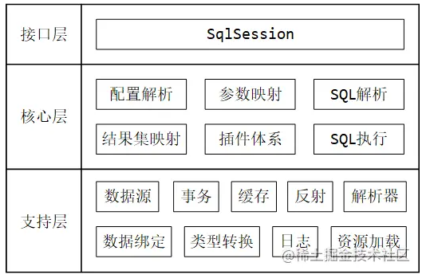

# 基本使用

## Mybatis架构

从整体上讲，MyBatis 的整体架构可以分为三层：



- 接口层：SqlSession 是我们平时与 MyBatis 完成交互的核心接口（包括后续整合 SpringFramework 后用到的 SqlSessionTemplate ）；
- 核心层：SqlSession 执行的方法，底层需要经过配置文件的解析、SQL 解析，以及执行 SQL 时的参数映射、SQL 执行、结果集映射，另外还有穿插其中的扩展插件；
- 支持层：核心层的功能实现，是基于底层的各个模块，共同协调完成的。

## Mybatis和Hibernate对比

MyBatis 是一款优秀的持久层框架，它支持自定义 SQL、存储过程以及高级映射。MyBatis 免除了几乎所有的 JDBC 代码以及设置参数和获取结果集的工作。MyBatis 可以通过简单的 XML 或注解来配置和映射原始类型、接口和 Java POJO（Plain Old Java Objects，普通老式 Java 对象）为数据库中的记录。

|   对比指标   |         MyBatis         |                Hibernate                 |
| :------: | :---------------------: | :--------------------------------------: |
|    类型    |   半自动，半ORM （允许用 Map ）   |             全自动 ORM （只能用实体类）             |
|    中心    | SQL（一切 Mapper 里都是 SQL ） |            对象关系（一切操作都围绕对象关系）             |
|  SQL 优化  |     容易（直接修改 SQL 即可）     | 困难（修改 SQL 后还需要转换为 HQL ，如果直接上 SQL 则会破坏封装） |
|   缓存机制   |     一般（管理不慎会出现脏数据）      |      完善（基于 ORM 的对象管理机制，出现脏数据会给出提示）       |
| 数据库可移植性  |   不好（切换数据库需要重新写 SQL ）   |         好（可配置数据库类型自动切换生成的 SQL ）          |
|  日志打印体系  |    很有限（只能打印基本日志及交互）     |    完善（ SQL 记录、关系异常、优化警告、缓存提示、脏数据警告等）     |
| 开发效率、工作量 |       效率相对低，工作量多        |               开发效率相对高，工作量少               |
|   学习成本   |     较低（需要学习的内容相对少）      |      高（需要额外学习 JPA 、HQL 、QBC 、抓取策略等）      |
|   适用场景   |    比较容易出现复杂 SQL 的项目     |                复杂查询很少的项目                 |

## 基于原始Dao的开发方式

先引入相关依赖：

~~~xml
<dependencies>
    <dependency>
        <groupId>org.mybatis</groupId>
        <artifactId>mybatis</artifactId>
        <version>3.5.5</version>
    </dependency>
    <dependency>
        <groupId>mysql</groupId>
        <artifactId>mysql-connector-java</artifactId>
        <version>5.1.47</version>
    </dependency>
    
    <dependency>
        <groupId>log4j</groupId>
        <artifactId>log4j</artifactId>
        <version>1.2.17</version>
    </dependency>
</dependencies>
~~~

在resources下面新建日志配置文件log4j.properties：

~~~properties
log4j.rootCategory=debug, CONSOLE

# Set the enterprise logger category to FATAL and its only appender to CONSOLE.
log4j.logger.org.apache.axis.enterprise=FATAL, CONSOLE

# CONSOLE is set to be a ConsoleAppender using a PatternLayout.
log4j.appender.CONSOLE=org.apache.log4j.ConsoleAppender
log4j.appender.CONSOLE.Encoding=UTF-8
log4j.appender.CONSOLE.layout=org.apache.log4j.PatternLayout
log4j.appender.CONSOLE.layout.ConversionPattern=%d{ISO8601} %-6r [%15.15t] %-5p %30.30c %x - %m \n
~~~

创建MyBatis的核心配置文件，也是在resources下面，一般叫mybatis-config.xml：

~~~xml
<?xml version="1.0" encoding="UTF-8" ?>
<!DOCTYPE configuration
        PUBLIC "-//mybatis.org//DTD Config 3.0//EN"
        "http://mybatis.org/dtd/mybatis-3-config.dtd">
<configuration>
    <settings>
        <setting name="logImpl" value="LOG4J"/>
    </settings>
    <environments default="development">
        <environment id="development">
          <!--
	transactionManager：设置事务管理方式：type="JDBC"：设置当前环境的事务管理都必须手动处理
-->
            <transactionManager type="JDBC"/>
            <dataSource type="POOLED">
                <property name="driver" value="com.mysql.jdbc.Driver"/>
                <property name="url" value="jdbc:mysql://localhost:3306/mybatis?characterEncoding=utf-8"/>
                <property name="username" value="root"/>
                <property name="password" value="123456"/>
            </dataSource>
        </environment>
    </environments>
    <mappers>
        <mapper resource="mapper/DepartmentMapper.xml"/>
    </mappers>
</configuration>
~~~

建立SQL映射文件：

~~~xml
<?xml version="1.0" encoding="UTF-8" ?>
<!DOCTYPE mapper
        PUBLIC "-//mybatis.org//DTD Mapper 3.0//EN"
        "http://mybatis.org/dtd/mybatis-3-mapper.dtd">
<mapper namespace="departmentMapper">

    <select id="findAll" resultType="com.linkedbear.mybatis.entity.Department">
        select * from tbl_department
    </select>
</mapper>
~~~

Department就是用来接收查询结果的实体类。执行查询动作：

~~~java
public class MyBatisApplication1 {
    
    public static void main(String[] args) throws Exception {
        InputStream xml = Resources.getResourceAsStream("mybatis-config.xml");
        SqlSessionFactory sqlSessionFactory = new SqlSessionFactoryBuilder().build(xml);
        SqlSession sqlSession = sqlSessionFactory.openSession();
        List<Department> departmentList = sqlSession.selectList("departmentMapper.findAll");
        departmentList.forEach(System.out::println);
    }
}
~~~

原始Dao的开发方式需要手动建立SqlSessionFactory，并手动开启SqlSession，执行方法执行sql：

~~~java
try (SqlSession sqlSession = sqlSessionFactory.openSession()) {
  	return sqlSession.selectList("departmentMapper.findAll");
}
~~~

一般这种开发方式不会重复创建SqlSessionFactory，只会创建一个，然后各dao公用，而且会有上面这段生成SqlSession的重复代码。

## 基于Mapper动态代理的开发方式

使用 Mapper 动态代理的方式开发，需要满足以下几个规范：

- mapper.xml 中的 namespace 与 Mapper 接口的全限定名完全相同
- mapper.xml 中定义的 statement ，其 id 与 Mapper 接口的方法名一致
- Mapper 接口方法的方法参数类型，与 mapper.xml 中定义的 statement 的 parameterType 类型一致
- Mapper 接口方法的返回值类型，与 mapper.xml 中定义的 statement 的 resultType 类型相同

映射文件：

~~~java
<?xml version="1.0" encoding="UTF-8" ?>  
<!DOCTYPE mapper  
PUBLIC "-//mybatis.org//DTD Mapper 3.0//EN"  
"http://mybatis.org/dtd/mybatis-3-mapper.dtd">  
<mapper namespace="com.atguigu.mybatis.mapper.UserMapper">  
	<!--int insertUser();-->  
	<insert id="insertUser">  
		insert into t_user values(null,'张三','123',23,'女')  
	</insert>  
</mapper>
~~~

准备接口，无需准备实现类：

~~~java
package com.atguigu.mybatis.mapper;  
  
public interface UserMapper {  
	/**  
	* 添加用户信息  
	*/  
	int insertUser();  
}
~~~

开发时获取动态代理对象，然后调用对应的方法，根据方法就会找到映射文件中的sql语句来执行：

~~~java
public class UserMapperTest {
    @Test
    public void testInsertUser() throws IOException {
        //读取MyBatis的核心配置文件
        InputStream is = Resources.getResourceAsStream("mybatis-config.xml");
        //获取SqlSessionFactoryBuilder对象
        SqlSessionFactoryBuilder sqlSessionFactoryBuilder = new SqlSessionFactoryBuilder();
        //通过核心配置文件所对应的字节输入流创建工厂类SqlSessionFactory，生产SqlSession对象
        SqlSessionFactory sqlSessionFactory = sqlSessionFactoryBuilder.build(is);
        //获取sqlSession，此时通过SqlSession对象所操作的sql都必须手动提交或回滚事务
        //SqlSession sqlSession = sqlSessionFactory.openSession();
	    //创建SqlSession对象，此时通过SqlSession对象所操作的sql都会自动提交  
		SqlSession sqlSession = sqlSessionFactory.openSession(true);
        //通过代理模式创建UserMapper接口的代理实现类对象
        UserMapper userMapper = sqlSession.getMapper(UserMapper.class);
        //调用UserMapper接口中的方法，就可以根据UserMapper的全类名匹配元素文件，通过调用的方法名匹配映射文件中的SQL标签，并执行标签中的SQL语句
        int result = userMapper.insertUser();
        //提交事务
        //sqlSession.commit();
        System.out.println("result:" + result);
    }
}
~~~

注意这里要手动提交事务，若设置了自动提交则无需提交事务

## 简单增删改查

按照上面的规范，将映射文件中的方法，都集中到接口的定义中：

~~~xml
public interface DepartmentMapper {
    
    List<Department> findAll();
    
    int insert(Department department);
    
    int update(Department department);
    
    int deleteById(String id);
    
    Department findById(String id);
}
~~~

映射文件：

~~~xml
<?xml version="1.0" encoding="UTF-8" ?>
<!DOCTYPE mapper
        PUBLIC "-//mybatis.org//DTD Mapper 3.0//EN"
        "http://mybatis.org/dtd/mybatis-3-mapper.dtd">
<mapper namespace="com.linkedbear.mybatis.mapper.DepartmentMapper">
    <!-- 上面的namespace改掉 -->

    <insert id="insert" parameterType="com.linkedbear.mybatis.entity.Department">
        insert into tbl_department (id, name, tel) values (#{id}, #{name}, #{tel})
    </insert>

    <update id="update" parameterType="com.linkedbear.mybatis.entity.Department">
        update tbl_department set name = #{name}, tel = #{tel} where id = #{id}
    </update>

    <delete id="deleteById" parameterType="string">
        delete from tbl_department where id = #{id}
    </delete>

    <select id="findAll" resultType="com.linkedbear.mybatis.entity.Department">
        select * from tbl_department
    </select>

    <select id="findById" parameterType="string" resultType="com.linkedbear.mybatis.entity.Department">
        select * from tbl_department where id = #{id}
    </select>
</mapper>
~~~

注意：

1. 查询的标签select必须设置属性resultType或resultMap，用于设置实体类和数据库表的映射关系  
   - resultType：自动映射，用于属性名和表中字段名一致的情况  
   - resultMap：自定义映射，用于一对多或多对一或字段名和属性名不一致的情况  
2. 当查询的数据为多条时，不能使用实体类作为返回值，只能使用集合，否则会抛出异常TooManyResultsException；但是若查询的数据只有一条，可以使用实体类或集合作为返回值

## 核心配置文件

引入properties文件，配置文件中就可以访问其中的属性：

~~~xml
<configuration>
    <!--引入properties文件，此时就可以${属性名}的方式访问属性值-->
    <properties resource="jdbc.properties"></properties>
  	<!--
    environments：设置多个连接数据库的环境
    属性：
	    default：设置默认使用的环境的id
    -->
    <environments default="mysql_test">
        <!--
        environment：设置具体的连接数据库的环境信息
        属性：
	        id：设置环境的唯一标识，可通过environments标签中的default设置某一个环境的id，表示默认使用的环境
        -->
        <environment id="mysql_test">
            <!--
            transactionManager：设置事务管理方式
            属性：
	            type：设置事务管理方式，type="JDBC|MANAGED"
	            type="JDBC"：设置当前环境的事务管理都必须手动处理
	            type="MANAGED"：设置事务被管理，例如spring中的AOP
            -->
            <transactionManager type="JDBC"/>
            <!--
            dataSource：设置数据源
            属性：
	            type：设置数据源的类型，type="POOLED|UNPOOLED|JNDI"
	            type="POOLED"：使用数据库连接池，即会将创建的连接进行缓存，下次使用可以从缓存中直接获取，不需要重新创建
	            type="UNPOOLED"：不使用数据库连接池，即每次使用连接都需要重新创建
	            type="JNDI"：调用上下文中的数据源
            -->
            <dataSource type="POOLED">
                <!--设置驱动类的全类名-->
                <property name="driver" value="${jdbc.driver}"/>
                <!--设置连接数据库的连接地址-->
                <property name="url" value="${jdbc.url}"/>
                <!--设置连接数据库的用户名-->
                <property name="username" value="${jdbc.username}"/>
                <!--设置连接数据库的密码-->
                <property name="password" value="${jdbc.password}"/>
            </dataSource>
        </environment>
    </environments>
</configuration>
~~~

environments用来设置多个数据库的环境，方便切换。transactionManager设置事务管理方式、dataSource type设置数据源的类型，这里使用的是POOLED，若和Spring整合则无需单独引入。

### properties 

properties属性作用是定义全局配置变量，并且它可以加载外部化的 properties 配置文件

properties的几种用法：

* 直接引入属性

  引入属性后可以在配置文件的其他地方直接引用：

  ~~~xml
      <properties>
          <property name="jdbc.driverClassName" value="com.mysql.jdbc.Driver"/>
          <property name="jdbc.url" value="jdbc:mysql://localhost:3306/mybatis?characterEncoding=utf-8"/>
          <property name="jdbc.username" value="root"/>
          <property name="jdbc.password" value="123456"/>
      </properties>
  ~~~

* 引入外部配置文件

  声明resource 或者 url 来加载外部化配置文件的 

  ~~~xml
  <properties resource="jdbc.properties" />
  ~~~

  然后将配置放入该文件中：

  ~~~properties
  jdbc.driverClassName=com.mysql.jdbc.Driver
  jdbc.url=jdbc:mysql://localhost:3306/mybatis?characterEncoding=utf-8
  jdbc.username=root
  jdbc.password=123456
  ~~~

  resource 跟 url 是互斥的，二者只能取其一，如果两个都定义，MyBatis 都没办法初始化，会抛出异常

* 加载多个配置文件

  加载多个配置文件，使用 xml 配置的方式是无法实现的，需要使用编程式的方式，在构建SqlSessionFactory 时实现：

  ~~~java
  public class LoadPropertiesApplication {
      
      public static void main(String[] args) throws Exception {
          InputStream xml = Resources.getResourceAsStream("mybatis-config.xml");
          // 使用Properties的API加载这些properties文件
          Properties properties = new Properties();
          properties.load(Resources.getResourceAsStream("jdbc1.properties"));
          properties.load(Resources.getResourceAsStream("jdbc2.properties"));
          
          SqlSessionFactory sqlSessionFactory = new SqlSessionFactoryBuilder().build(xml, properties);
          SqlSession sqlSession = sqlSessionFactory.openSession();
          
          DepartmentMapper departmentMapper = sqlSession.getMapper(DepartmentMapper.class);
          Department department = departmentMapper.findById("18ec781fbefd727923b0d35740b177ab");
          System.out.println(department);
          System.out.println(department.getUsers());
      }
  }
  ~~~

MyBatis 会按照下面所述的顺序读取配置属性：

* 直接在 \<properties> 中定义配置属性
* 借助 \<properties> 的 resource / url 属性加载外部化配置文件
* 编程式加载外部化配置文件

后读取的配置会覆盖前面的，优先级是倒着来的。

### setting

setting 配置，这里面提供了 MyBatis 中可供调整的所有内部配置项的全局设置，其中几个重要的：

|           配置项            |     描述     |                   可选值                    |  默认值  |
| :----------------------: | :--------: | :--------------------------------------: | :---: |
|       cacheEnabled       |  全局开启二级缓存  |               true / false               | true  |
|    lazyLoadingEnabled    |  全局开启延迟加载  |               true / false               | false |
| mapUnderscoreToCamelCase | 驼峰命名转下划线命名 |               true / false               | false |
|         logImpl          |   日志提供商    | SLF4J / LOG4J / LOG4J2 /COMMONS_LOGGING / ... |   无   |

### typeAliases

~~~xml
<?xml version="1.0" encoding="UTF-8" ?>
<!DOCTYPE configuration
        PUBLIC "-//MyBatis.org//DTD Config 3.0//EN"
        "http://MyBatis.org/dtd/MyBatis-3-config.dtd">
<configuration>
    ...
    <typeAliases>
        <!--
        typeAlias：设置某个具体的类型的别名
        属性：
        type：需要设置别名的类型的全类名
        alias：设置此类型的别名，且别名不区分大小写。若不设置此属性，该类型拥有默认的别名，即类名
        -->
        <!--<typeAlias type="com.atguigu.mybatis.bean.User"></typeAlias>-->
        <!--<typeAlias type="com.atguigu.mybatis.bean.User" alias="user">
        </typeAlias>-->
        <!--以包为单位，设置改包下所有的类型都拥有默认的别名，即类名且不区分大小写-->
        <package name="com.atguigu.mybatis.bean"/>
    </typeAliases>
    ...
</configuration>
~~~

有时候在映射文件中的全类名太长，无论是namespace还是parameterType、resultType都非常麻烦，此时就可以用别名的方式，别名可以单独指定类型和对应的别名，若不指定alias只设置type则生成默认的alias，如type是com.atguigu.mybatis.bean.User，对应的alias就是user或者User。还可以以包为单位指定别名。

### mappers

~~~xml
<?xml version="1.0" encoding="UTF-8" ?>
<!DOCTYPE configuration
        PUBLIC "-//MyBatis.org//DTD Config 3.0//EN"
        "http://MyBatis.org/dtd/MyBatis-3-config.dtd">
<configuration>
    。。。
    <!--引入映射文件-->
    <mappers>
        <!-- <mapper resource="UserMapper.xml"/> -->
        <!--
        以包为单位，将包下所有的映射文件引入核心配置文件
        注意：
			1. 此方式必须保证mapper接口和mapper映射文件必须在相同的包下
			2. mapper接口要和mapper映射文件的名字一致
        -->
        <package name="com.atguigu.mybatis.mapper"/>
    </mappers>
</configuration>
~~~

映入映射文件可以选择一个一个引入，也可以以包的方式，若以包为单位引入，则必须满足规范：包路径一致、接口名和映射文件名相同：


### typeHandlers

typeHandlers 类型处理器，它的意义是针对一个特定的 Java 类型，或者 jdbc 类型，采用特定的处理器来处理这个类型的字段。 MyBatis内部存在很多类型处理器，比如IntegerTypeHandler 用于处理java类型中的Integer和int和jdbc中的int类型和numeric。针对特定的类型，可以用自定义的类型处理器来处理。

自定义类型处理器需要定义一个类实现TypeHandler接口，泛型的类型就是要处理的目标类型：

~~~java
public class DepartmentTypeHandler implements TypeHandler<Department> {
    
    @Override
    public void setParameter(PreparedStatement ps, int i, Department department, JdbcType jdbcType) throws SQLException {
        ps.setString(i, department.getId());
    }
    
    @Override
    public Department getResult(ResultSet rs, String columnName) throws SQLException {
        Department department = new Department();
        department.setId(rs.getString(columnName));
        return department;
    }
    
    @Override
    public Department getResult(ResultSet rs, int columnIndex) throws SQLException {
        Department department = new Department();
        department.setId(rs.getString(columnIndex));
        return department;
    }
    
    @Override
    public Department getResult(CallableStatement cs, int columnIndex) throws SQLException {
        Department department = new Department();
        department.setId(cs.getString(columnIndex));
        return department;
    }
}
~~~

自定义的逻辑包含两类：

1、查询结果转化到实体类时，如果出现Department类型的属性，如何从ResultSet中取数据并转换为Department类型

2、sql入参中出现Department类型时，应该如何对PreparedStatement操作

然后将类型转换器配置到核心配置文件中：

~~~xml
    <typeHandlers>
        <typeHandler handler="com.linkedbear.mybatis.handler.DepartmentTypeHandler"
                     javaType="com.linkedbear.mybatis.entity.Department" jdbcType="VARCHAR"/>
    </typeHandlers>
~~~

然后还需要定义对应的resultMap：

~~~xml
<resultMap id="userHandlerMap" type="com.linkedbear.mybatis.entity.User">
        <id property="id" column="id"/>
        <result property="name" column="name"/>
        <result property="age" column="age"/>
        <result property="birthday" column="birthday"/>
        <association property="department" javaType="com.linkedbear.mybatis.entity.Department"/>
    </resultMap>

    <select id="findAllUseTypeHandler" resultMap="userHandlerMap">
        select * from tbl_user
    </select>
~~~

这样查询结果中就会使用类型转换器的逻辑，将id放入实体类Department中：

~~~
User{id='09ec5fcea620c168936deee53a9cdcfb', name='阿熊', department=Department{id='09ec5fcea620c168936deee53a9cdcfb', name='null', tel='null'}}
User{id='5d0eebc4f370f3bd959a4f7bc2456d89', name='老狗', department=Department{id='5d0eebc4f370f3bd959a4f7bc2456d89', name='null', tel='null'}}
~~~

如果实体类User中有一个名为department_id 的Department 字段，同时tbl_user表中有一列名为department_id，那么此时就不用配置resultMap，直接就按照Department的类型转换器自动处理，将该列放入Department类的id中。

插入数据库表时也可以应用类型转换器，不用类型转换器时，插入数据必须使用#{department.id}：

~~~xml
    <insert id="saveUser" parameterType="com.linkedbear.mybatis.entity.User">
        insert into tbl_user (id, name, department_id) VALUES (#{id}, #{name}, #{department.id})
    </insert>
~~~

应用了类型转换器后，可以直接传入#{department}，MyBatis可以帮我们自动处理：

~~~xml
    <insert id="saveUser" parameterType="com.linkedbear.mybatis.entity.User">
        insert into tbl_user (id, name, department_id) VALUES (#{id}, #{name}, #{department})
    </insert>
~~~

这样插入数据的数据就自动变成了department的id。

### objectFactory

objectFactory在MyBatis流程中起创建对象的作用。每次查询动作中，数据库返回 ResultSet 时，MyBatis 会根据 statemet 的定义，创建对应的结果对象（跟表对应的实体类对象），负责创建对象的就是ObjectFactory，平时默认使用的是DefaultObjectFactory来实现对象的创建，针对那些无参的实体类，它就可以很好的完成对象创建。

当我们需要定制这部分创建逻辑，就可以用自定义的ObjectFactory替代默认的DefaultObjectFactory 。需要继承默认的DefaultObjectFactory ，实现自己定制逻辑：

~~~java
public class ExtendsObjectFactory extends DefaultObjectFactory {
    
    @Override
    public <T> T create(Class<T> type) {
        T t = super.create(type);
        // 判断是否为User类型，如果是，则预初始化值
        if (User.class.equals(type)) {
            User user = (User) t;
            user.setAge(0);
        }
        return t;
    }
}
~~~

上面这段代码就是当创建的类型是User时，给age设置默认值。

然后需要将其引入全局配置文件：

~~~xml
    <objectFactory type="com.linkedbear.mybatis.factory.ExtendsObjectFactory"/>
~~~

这样当返回的类型是User时，就可以拥有age的默认值了。

### plugins 

插件其实就是MyBatis的拦截器，在特定的位置提供扩展，可供扩展的地方有4个：

- Executor (update, query, flushStatements, commit, rollback, getTransaction, close, isClosed)
- ParameterHandler (getParameterObject, setParameters)
- ResultSetHandler (handleResultSets, handleOutputParameters)
- StatementHandler (prepare, parameterize, batch, update, query)

分页插件PageHelper就是基于MyBatis的插件机制来实现的。

### environments

类似Spring的profiles，它允许定义多个环节，分别定义不同的数据库连接配置，但最后激活生效的环境只有一个。

### databaseIdProvider

databaseIdProvider 数据库厂商标识，它为我们提供了数据库可移植性的支持。 

Hibernate 的数据库可移植性是天然的，MyBatis 虽然不像 Hibernate 那样全自动，但它也提供了支持的方案：我们在编写 mapper.xml 时，针对不同的 statement ，声明不同的数据库厂商标识，MyBatis 即会动态的根据数据库厂商标识，使用不同的 statement ，从而达到不同的数据库发送不同 SQL 的效果。 

先在配置文件中将厂商标识都定义好：

~~~xml
    <databaseIdProvider type="DB_VENDOR"> <!-- DB_VENDOR是固定的 -->
        <property name="MySQL" value="mysql"/>
        <property name="Oracle" value="oracle"/>
        <property name="PostgreSQL" value="postgresql"/>
    </databaseIdProvider>
~~~

然后在映射文件中，要定义多个sql，与上面的数据库对应：

~~~xml
    <select id="findAllByDepartmentId" parameterType="string" 
            resultType="com.linkedbear.mybatis.entity.User" databaseId="mysql">
        select * from tbl_user where department_id = #{departmentId}
    </select>

    <select id="findAllByDepartmentId" parameterType="string" 
            resultType="com.linkedbear.mybatis.entity.User" databaseId="postgresql">
        <!-- 注意这里查的表不一样 -->
        select * from users where department_id = #{departmentId}
    </select>
~~~

这样只需要修改数据库连接参数，就能完成数据库的切换了。

## 获取参数值的方式

MyBatis获取参数值的两种方式：${}和#{}  ：

* ${}的本质就是字符串拼接，#{}的本质就是占位符赋值（#{}可以有效避免SQL注入的问题）
* 使用字符串拼接的方式拼接sql，若为字符串类型或日期类型的字段进行赋值时，$需要手动添加引号，#则不用

### 单个字面量类型的参数

- 若mapper接口中的方法参数为单个的字面量类型，此时可以使用\${}和#{}以任意的名称（最好见名识意）获取参数的值，注意${}需要手动加单引号

```xml
<!--User getUserByUsername(String username);-->
<select id="getUserByUsername" resultType="User">
	select * from t_user where username = #{username}
</select>
```

```xml
<!--User getUserByUsername(String username);-->
<select id="getUserByUsername" resultType="User">  
	select * from t_user where username = '${username}'  
</select>
```

### 多个字面量类型的参数

- 若mapper接口中的方法参数为多个时，此时MyBatis会自动将这些参数放在一个map集合中
  1. 以arg0,arg1...为键，以参数为值；
  2. 以param1,param2...为键，以参数为值；
- 因此只需要通过\${}和#{}访问map集合的键就可以获取相对应的值，注意${}需要手动加单引号。
- 使用arg或者param都行，要注意的是，arg是从arg0开始的，param是从param1开始的

```xml
<!--User checkLogin(String username,String password);-->
<select id="checkLogin" resultType="User">  
	select * from t_user where username = #{arg0} and password = #{arg1}  
</select>
```

```xml
<!--User checkLogin(String username,String password);-->
<select id="checkLogin" resultType="User">
	select * from t_user where username = '${param1}' and password = '${param2}'
</select>
```

### map集合类型的参数

- 若mapper接口中的方法需要的参数为多个时，此时可以手动创建map集合，将这些数据放在map中只需要通过\${}和#{}访问map集合的键就可以获取相对应的值，注意${}需要手动加单引号

```xml
<!--User checkLoginByMap(Map<String,Object> map);-->
<select id="checkLoginByMap" resultType="User">
	select * from t_user where username = #{username} and password = #{password}
</select>
```

```java
@Test
public void checkLoginByMap() {
	SqlSession sqlSession = SqlSessionUtils.getSqlSession();
	ParameterMapper mapper = sqlSession.getMapper(ParameterMapper.class);
	Map<String,Object> map = new HashMap<>();
	map.put("usermane","admin");
	map.put("password","123456");
	User user = mapper.checkLoginByMap(map);
	System.out.println(user);
}
```

### 实体类类型的参数

- 若mapper接口中的方法参数为实体类对象时此时可以使用\${}和#{}，通过访问实体类对象中的属性名获取属性值，注意${}需要手动加单引号

```xml
<!--int insertUser(User user);-->
<insert id="insertUser">
	insert into t_user values(null,#{username},#{password},#{age},#{sex},#{email})
</insert>
```

```java
@Test
public void insertUser() {
	SqlSession sqlSession = SqlSessionUtils.getSqlSession();
	ParameterMapper mapper = sqlSession.getMapper(ParameterMapper.class);
	User user = new User(null,"Tom","123456",12,"男","123@321.com");
	mapper.insertUser(user);
}
```

### 使用@Param标识参数

- 可以通过@Param注解标识mapper接口中的方法参数，此时，会将这些参数放在map集合中 
  1. 以@Param注解的value属性值为键，以参数为值；
  2. 以param1,param2...为键，以参数为值；

@Param注解的方式本质上也是传入的Map

- 只需要通过\${}和#{}访问map集合的键就可以获取相对应的值，注意${}需要手动加单引号

```xml
<!--User CheckLoginByParam(@Param("username") String username, @Param("password") String password);-->
    <select id="CheckLoginByParam" resultType="User">
        select * from t_user where username = #{username} and password = #{password}
    </select>
	或者
	<select id="CheckLoginByParam" resultType="User">
        select * from t_user where username = #{param1} and password = #{param2}
    </select>
```

```java
@Test
public void checkLoginByParam() {
	SqlSession sqlSession = SqlSessionUtils.getSqlSession();
	ParameterMapper mapper = sqlSession.getMapper(ParameterMapper.class);
	mapper.CheckLoginByParam("admin","123456");
}
```

### 总结

- 建议分成两种情况进行处理

  1. 实体类类型的参数
  2. 使用@Param标识参数

  不用特意构造Map

## 类型别名

查询返回单个数据时：

~~~xml
<!--int getCount();-->
<select id="getCount" resultType="_integer">
	select count(id) from t_user
</select>
~~~

此时的resultType要和方法返回值中的int对应上，在MyBatis中，对于Java中常用的类型都设置了类型别名，这些别名的设置如下：


## 各种查询功能

1. 如果查询出的数据只有一条，可以通过
   1. 实体类对象接收
   2. List集合接收
   3. Map集合接收，结果：{password=123456, sex=男, id=1, age=23, username=admin}
2. 如果查询出的数据有多条，一定不能用实体类对象接收，会抛异常TooManyResultsException，可以通过
   1. 实体类类型的LIst集合接收
   2. Map类型的LIst集合接收
   3. 在mapper接口的方法上添加@MapKey注解

### 查询一个实体类对象

```java
/**
 * 根据用户id查询用户信息
 * @param id
 * @return
 */
User getUserById(@Param("id") int id);
```

```xml
<!--User getUserById(@Param("id") int id);-->
<select id="getUserById" resultType="User">
	select * from t_user where id = #{id}
</select>
```

### 查询一个List集合

```java
/**
 * 查询所有用户信息
 * @return
 */
List<User> getUserList();
```

```xml
<!--List<User> getUserList();-->
<select id="getUserList" resultType="User">
	select * from t_user
</select>
```

### 查询单个数据

```java
/**  
 * 查询用户的总记录数  
 * @return  
 * 在MyBatis中，对于Java中常用的类型都设置了类型别名  
 * 例如：java.lang.Integer-->int|integer  
 * 例如：int-->_int|_integer  
 * 例如：Map-->map,List-->list  
 */  
int getCount();
```

```xml
<!--int getCount();-->
<select id="getCount" resultType="_integer">
	select count(id) from t_user
</select>
```

### 查询一条数据为map集合

```java
/**  
 * 根据用户id查询用户信息为map集合  
 * @param id  
 * @return  
 */  
Map<String, Object> getUserToMap(@Param("id") int id);
```

```xml
<!--Map<String, Object> getUserToMap(@Param("id") int id);-->
<select id="getUserToMap" resultType="map">
	select * from t_user where id = #{id}
</select>
<!--结果：{password=123456, sex=男, id=1, age=23, username=admin}-->
```

### 查询多条数据为map集合

* 方法1：

```java
/**  
 * 查询所有用户信息为map集合  
 * @return  
 * 将表中的数据以map集合的方式查询，一条数据对应一个map；若有多条数据，就会产生多个map集合，此时可以将这些map放在一个list集合中获取  
 */  
List<Map<String, Object>> getAllUserToMap();
```

```xml
<!--Map<String, Object> getAllUserToMap();-->  
<select id="getAllUserToMap" resultType="map">  
	select * from t_user  
</select>
<!--
	结果：
	[{password=123456, sex=男, id=1, age=23, username=admin},
	{password=123456, sex=男, id=2, age=23, username=张三},
	{password=123456, sex=男, id=3, age=23, username=张三}]
-->
```

* 方法2：

```java
/**
 * 查询所有用户信息为map集合
 * @return
 * 将表中的数据以map集合的方式查询，一条数据对应一个map；若有多条数据，就会产生多个map集合，并且最终要以一个map的方式返回数据，此时需要通过@MapKey注解设置map集合的键，值是每条数据所对应的map集合
 */
@MapKey("id")
Map<String, Object> getAllUserToMap();
```

```xml
<!--Map<String, Object> getAllUserToMap();-->
<select id="getAllUserToMap" resultType="map">
	select * from t_user
</select>
<!--
	结果：
	{
	1={password=123456, sex=男, id=1, age=23, username=admin},
	2={password=123456, sex=男, id=2, age=23, username=张三},
	3={password=123456, sex=男, id=3, age=23, username=张三}
	}
-->
```

### 模糊查询

映射文件：

~~~xml
<!--List<User> getUserByLike(@Param("username") String username);-->
<select id="getUserByLike" resultType="User">
    <!--select * from t_user where username like '%${username}%'-->  <<//-这个会有SQL注入问题
	<!--select * from t_user where username like concat('%',#{username},'%')-->  
	select * from t_user where username like "%"#{username}"%"
</select>
~~~

因为$是字符串的拼接，所以可以直接放在单引号里面；而#会自动添加引号，所以和外面的%拼接时，外面的%需要加引号。

## select标签

### 标签属性汇总

标签汇总：

* id： 一个 namespace 下的 statement 的唯一标识 
* parameterType ：入参类型
* resultType ：结果集类型，如果返回的是集合，代表集合包含的类型，和resultMap 之间只能选择一个
* resultMap ：结果集类型。如果引用的 resultMap 是在其他 mapper.xml 中，则引用的 id 为 [命名空间 + '.' + id] ，和resultType 之间只能选择一个
* useCache ：查询结果是否保存至二级缓存 ，默认是true
* flushCache ：执行sql后是否执行清空缓存的动作，默认是false，后面详解
* timeout ： SQL 请求的最大等待时间（单位: 秒） 
* fetchSize ：底层数据库驱动一次查询返回的结果行数 ，后面详解
* statementType ：底层使用的 Statement 的类型 ，可选值：STATEMENT , PREPARED , CALLABLE ，默认 PREPARED ，底层使用 PreparedStatement
* resultSetType ：控制 jdbc 中 ResultSet 对象的行为 ，后面详解
* databaseId ： 用于部分不同数据库厂商下使用的 SQL ，和数据库切换有关

### flushCache 

执行 SQL 后会清空一级缓存（本地缓存，全局一级缓存）和二级缓存（本 namespace 下的二级缓存），默认是false。

这个属性不仅insert标签会有，在insert 、update 、delete标签中也会有，不同之处在于在DML时默认值是true。

### fetchSize

它是针对jdbc的参数，如下例操作jdbc的代码，设置了fetchSize为2：

~~~java
public static void main(String[] args) throws Exception {
        Class.forName("com.mysql.jdbc.Driver");
        Connection connection = DriverManager.getConnection("jdbc:mysql://localhost:3306/mybatis", "root", "123456");
        PreparedStatement ps = connection.prepareStatement("select * from tbl_department");
        // 在PreparedStatement上设置一次性抓取的结果行数
        ps.setFetchSize(2);
        ResultSet resultSet = ps.executeQuery();
        while (resultSet.next()) {
            System.out.println(resultSet.getString("name"));
        }
        resultSet.close();
        ps.close();
        connection.close();
    }
~~~

默认情况下，数据库驱动在发送 DQL 查询时，会一次性拉取整个查询结果到内存中，当数据过大时会造成OOM。设置fetchSize可以解决这个问题，每次只从数据库拉取 fetchSize 指定量的数据，当这批数据都 next 完成后，再继续拉取下一批数据，以此来避免 OOM 现象的发生。

支持fetchSize需要满足的条件：

- 数据库环境支持（ Oracle 可以，高版本的 PostgreSQL (7.4+) 也可以，但 MySQL 不行）
- 执行 DQL 时，Connection 的 autoCommit 必须为 false （即开启事务）
- 查询结果的 ResultSet ，类型必须为 TYPE_FORWARD_ONLY （无法向相反的迭代方向滚动）（下面马上会提到）
- 只有一次发送一条 DQL 时才有用，如果用分号隔开一次性发送多条 DQL ，也不好使（ 如 `select * from tbl_department; select * from tbl_user;`）

fetchSize 使用的目的，是为了及时读取和处理数据，而不是把这些数据都读取并封装结果集，单纯的封装无法降低内存占用。

### resultSetType

它是针对jdbc的参数，如果是TYPE_FORWARD_ONLY，仅支持结果集向下迭代，比如这样：

~~~java
ResultSet resultSet = ps.executeQuery();
// 遍历游标向下迭代
while (resultSet.next()) {
    System.out.println(resultSet.getString("name"));
}
~~~

改为TYPE_SCROLL_INSENSITIVE后，就可以向上、向下迭代了：

~~~java
PreparedStatement ps = connection.prepareStatement("select * from tbl_department",
            ResultSet.TYPE_SCROLL_INSENSITIVE, ResultSet.CONCUR_READ_ONLY);
ResultSet resultSet = ps.executeQuery();
    // 遍历游标向下迭代
    while (resultSet.next()) {
        System.out.println(resultSet.getString("name"));
    }

    // 遍历游标向上迭代
    while (resultSet.previous()) {
        System.out.println("倒序 --- " + resultSet.getString("name"));
    }
~~~

还有一个取值是TYPE_SCROLL_SENSITIVE，它也可以滚动迭代，区别是如果在读取数据集时，数据库内的数据发生了改变，ResultSet 内的数据也会跟着变。

Mybatis中的resultSetType和jdbc的参数一一对应，它由数据库驱动决定，也可以指定：

* FORWARD_ONLY → TYPE_FORWARD_ONLY
* SCROLL_INSENSITIVE → TYPE_SCROLL_INSENSITIVE
* SCROLL_SENSITIVE → TYPE_SCROLL_SENSITIVE

## 批量删除

假设我们要删除id为1/3/4/8的记录，此时的程序：

~~~java
//测试类
@Test
public void deleteMore() {
	SqlSession sqlSession = SqlSessionUtils.getSqlSession();
	SQLMapper mapper = sqlSession.getMapper(SQLMapper.class);
	int result = mapper.deleteMore("1,2,3,8");
	System.out.println(result);
}
~~~

接口和配置文件应该这样写：

~~~java
/**
 * 根据id批量删除
 * @param ids 
 * @return int
 * @date 2022/2/26 22:06
 */
int deleteMore(@Param("ids") String ids);
~~~

~~~xml
<delete id="deleteMore">
	delete from t_user where id in (${ids})
</delete>
~~~

这种场景下就只能使用$了，因为#会默认添加引号，导致删除的其实是id为1,2,3,8这个拼接字符串的id记录。此时的sql：delete from t_user where id in (1,2,3)

## 动态设置表名

如果我们想把表名以入参的形式传入sql中，此时只能用$，因为表名在sql中不能加引号：

~~~xml
<!--List<User> getUserByTable(@Param("tableName") String tableName);-->
<select id="getUserByTable" resultType="User">
	select * from ${tableName}
</select>
~~~

## 自增主键

插入记录时，如果记录的id由数据库生成，此时我们需要取到该id然后后续进行其他业务处理，此时就需要设置自增主键：

~~~xml
<!--void insertUser(User user);-->
<insert id="insertUser" useGeneratedKeys="true" keyProperty="id">
	insert into t_user values (null,#{username},#{password},#{age},#{sex},#{email})
</insert>
~~~

这里面就代表设置了自增主键，且主键属性是id。最后插入记录的id以User的属性的形式返回给程序：

~~~java
//测试类
@Test
public void insertUser() {
	SqlSession sqlSession = SqlSessionUtils.getSqlSession();
	SQLMapper mapper = sqlSession.getMapper(SQLMapper.class);
	User user = new User(null, "ton", "123", 23, "男", "123@321.com");
	mapper.insertUser(user);
	System.out.println(user);
	//输出：user{id=10, username='ton', password='123', age=23, sex='男', email='123@321.com'}，自增主键存放到了user的id属性中
}
~~~

当数据库表t_user的第一列不是主键id时，这里还需要手动指定数据库表主键列是id：

~~~xml
    <insert id="save" useGeneratedKeys="true" keyProperty="id" keyColumn="id">
        insert into tbl_dept2 (name, tel) VALUES (#{name}, #{tel})
    </insert>
~~~

## 自定义映射resultMap

### 基本使用

resultMap：设置自定义映射  

- 属性：  
  - id：表示自定义映射的唯一标识，不能重复
  - type：查询的数据要映射的实体类的类型  
- 子标签：  
  - id：设置主键的映射关系  
  - result：设置普通字段的映射关系  
  - 子标签属性：  
    - property：设置映射关系中实体类中的属性名  
    - column：设置映射关系中表中的字段名

若字段名和实体类中的属性名不一致，则可以通过resultMap设置自定义映射，即使字段名和属性名一致的属性也要映射，也就是全部属性都要列出来：

~~~xml
<resultMap id="empResultMap" type="Emp">
	<id property="eid" column="eid"></id>
	<result property="empName" column="emp_name"></result>
	<result property="age" column="age"></result>
	<result property="sex" column="sex"></result>
	<result property="email" column="email"></result>
</resultMap>
<!--List<Emp> getAllEmp();-->
<select id="getAllEmp" resultMap="empResultMap">
	select * from t_emp
</select>
~~~

### 驼峰转换

当字段名和实体类中的属性名不一致，同时属性名满足小驼峰的命名规则，数据库中表的字段名满足下划线的命名规则，此时就可以不设置其他映射关系，直接用sql查询，用对应的实体类进行接收：

~~~xml
<!--List<Emp> getAllEmp();-->
<select id="getAllEmp" resultType="Emp">
	select eid,emp_name empName,age,sex,email from t_emp
</select>
~~~

此时需要在核心配置文件中开启自动转换，可以在查询表中数据时，自动将_类型的字段名转换为驼峰，如user_name -> userName:

~~~xml
<settings>
    <setting name="mapUnderscoreToCamelCase" value="true"/>
</settings>
~~~

### constructor 

当需要创建的类型需要一个有参构造创建时，就需要用constructor标签：

~~~xml
    public Department(String id) {
        this.id = id;
    }    

	<resultMap id="departmentWithConstructor" type="Department">
        <constructor>
            <idArg column="id" javaType="String"/>
        </constructor>
        <result property="name" column="name"/>
        <result property="tel" column="tel"/>
    </resultMap>

    <select id="findAll" resultMap="departmentWithConstructor">
        select * from tbl_department
    </select>
~~~

这就代表列为id的返回结果作为构造方法的入参来创建Department，当入参有多个时，还可以用name来标识，name需要配合@Param来使用：

~~~xml
<resultMap id="departmentWithConstructor" type="com.linkedbear.mybatis.entity.Department">
    <constructor>
        <!-- 注意name要与上面的@Param注解的value一致 -->
        <idArg column="id" javaType="String" name="idd"/>
    </constructor>
    <result property="name" column="name"/>
    <result property="tel" column="tel"/>
</resultMap>

    public Department(@Param("idd") String id) {
        this.id = id;
    }
~~~

### 引用：association 

association代表引用，可以指定实体类中的对象属性：

~~~xml
<resultMap id="userMap" type="com.linkedbear.mybatis.entity.User">
    <id property="id" column="id"/>
    <result property="name" column="name"/>
    <result property="age" column="age"/>
    <result property="birthday" column="birthday"/>
    <association property="department" javaType="com.linkedbear.mybatis.entity.Department">
        <id property="id" column="department_id"/>
        <result property="name" column="department_name"/>
    </association>
</resultMap>
~~~

也可以直接引用其他的resultMap，引用resultMap的 id 为 [命名空间 + '.' + id] ：

~~~xml
<resultMap id="userWithPrefix" type="com.linkedbear.mybatis.entity.User">
    <id property="id" column="id"/>
    <result property="name" column="name"/>
    <result property="age" column="age"/>
    <result property="birthday" column="birthday"/>
    <association property="department" javaType="com.linkedbear.mybatis.entity.Department"
               resultMap="com.linkedbear.mybatis.mapper.DepartmentMapper.departmentWithPrefix"/>
</resultMap>

<resultMap id="departmentWithPrefix" type="com.linkedbear.mybatis.entity.Department">
    <id property="id" column="department_id"/>
    <result property="name" column="department_name"/>
    <result property="tel" column="tel"/>
</resultMap>
~~~

association有一个重要的属性columnPrefix ，比如：

~~~xml
<resultMap id="userWithPrefix" type="com.linkedbear.mybatis.entity.User">
    <id property="id" column="id"/>
    <result property="name" column="name"/>
    <result property="age" column="age"/>
    <result property="birthday" column="birthday"/>
    <association property="department" javaType="com.linkedbear.mybatis.entity.Department"
                 resultMap="com.linkedbear.mybatis.mapper.DepartmentMapper.department" columnPrefix="department_"/>
</resultMap>

<select id="findAll" resultMap="userWithPrefix"> <!-- 注意这里的resultMap是上面新定义的 -->
    select usr.*, dep.name as department_name, dep.tel as department_tel
    from tbl_user usr
    left join tbl_department dep on usr.department_id = dep.id
</select>
~~~

代表封装结果集时，取出department_前缀的列，将其封装到department resultMap中。例如表中的department_id会作为id封装到Department中的id。这需要在定义表格时就规划好相应的前缀。

### 继承：extends 

继承可以让一个resultMap直接继承另一个的全部属性，例如：

~~~xml
<resultMap id="department" type="com.linkedbear.mybatis.entity.Department">
    <id property="id" column="id"/>
    <result property="name" column="name"/>
    <result property="tel" column="tel"/>
</resultMap>

<resultMap id="departmentWithUsers" type="Department" extends="department">
    <collection property="users" ofType="com.linkedbear.mybatis.entity.User"
                select="com.linkedbear.mybatis.mapper.UserMapper.findAllByDepartmentId" column="id"/>
</resultMap>

<select id="findAll" resultMap="departmentWithUsers">
    select * from tbl_department
</select>
~~~

这就代表departmentWithUsers继承了department的全部属性，相当于这样写：

~~~xml
<resultMap id="department" type="com.linkedbear.mybatis.entity.Department">
    <id property="id" column="id"/>
    <result property="name" column="name"/>
    <result property="tel" column="tel"/>
</resultMap>

<resultMap id="departmentWithUsers" type="com.linkedbear.mybatis.entity.Department">
    <id property="id" column="id"/>
    <result property="name" column="name"/>
    <result property="tel" column="tel"/>
    <collection property="users" ofType="com.linkedbear.mybatis.entity.User"
                select="com.linkedbear.mybatis.mapper.UserMapper.findAllByDepartmentId" column="id"/>
</resultMap>
~~~

它的好处就是可以共用一部分属性映射定义。

### 鉴别器：discriminator 

鉴别器标签可以根据某些条件，决定使用那些属性映射。例如：

~~~xml
<resultMap id="userWithDiscriminator" type="com.linkedbear.mybatis.entity.User">
    <discriminator column="deleted" javaType="boolean">
        <case value="false" resultMap="userlazy"/>
        <case value="true" resultType="com.linkedbear.mybatis.entity.User"/>
    </discriminator>
</resultMap>

<select id="findAllUseDiscriminator" resultMap="userWithDiscriminator">
    select * from tbl_user
</select>
~~~

这样写的意思是查询结果的deleted列，若是0代表false，则使用userlazy的resultMap；若是1代表true，则使用User的resultMap，这样就能灵活的根据返回值来决定封装的逻辑。意思是当该记录被删除时，关联的表数据就不用返回了。

## 多对一映射处理

现在有员工表，多个员工对应一个部门：

```java
public class Emp {  
	private Integer eid;  
	private String empName;  
	private Integer age;  
	private String sex;  
	private String email;  
	private Dept dept;
	//...构造器、get、set方法等
}
```

现在要实现根据id查一个员工，并且连带着查出对应的部门信息dept。员工表和部门表是两张表。

### 级联方式

使用级联方式时只需要将部门信息中要映射的字段填入resultMap中：

~~~xml
<resultMap id="empAndDeptResultMapOne" type="Emp">
	<id property="eid" column="eid"></id>
	<result property="empName" column="emp_name"></result>
	<result property="age" column="age"></result>
	<result property="sex" column="sex"></result>
	<result property="email" column="email"></result>
	<result property="dept.did" column="did"></result>
	<result property="dept.deptName" column="dept_name"></result>
</resultMap>
<!--Emp getEmpAndDept(@Param("eid")Integer eid);-->
<select id="getEmpAndDept" resultMap="empAndDeptResultMapOne">
	select * from t_emp left join t_dept on t_emp.eid = t_dept.did where t_emp.eid = #{eid}
</select>
~~~

### 使用association

resultMap中的association标签可以处理多对一的映射关系：

- property：需要处理多对的映射关系的属性名
- javaType：该属性的类型

~~~xml
<resultMap id="empAndDeptResultMapTwo" type="Emp">
	<id property="eid" column="eid"></id>
	<result property="empName" column="emp_name"></result>
	<result property="age" column="age"></result>
	<result property="sex" column="sex"></result>
	<result property="email" column="email"></result>
	<association property="dept" javaType="Dept">
		<id property="did" column="did"></id>
		<result property="deptName" column="dept_name"></result>
	</association>
</resultMap>
<!--Emp getEmpAndDept(@Param("eid")Integer eid);-->
<select id="getEmpAndDept" resultMap="empAndDeptResultMapTwo">
	select * from t_emp left join t_dept on t_emp.eid = t_dept.did where t_emp.eid = #{eid}
</select>
~~~

### 分步查询

不使用连表查询，而是改为两次sql查询，第一次查询查员工表，将员工的基本信息查出，其中包括部门id：did

~~~xml
<resultMap id="empAndDeptByStepResultMap" type="Emp">
	<id property="eid" column="eid"></id>
	<result property="empName" column="emp_name"></result>
	<result property="age" column="age"></result>
	<result property="sex" column="sex"></result>
	<result property="email" column="email"></result>
	<association property="dept"
				 select="com.atguigu.mybatis.mapper.DeptMapper.getEmpAndDeptByStepTwo"
				 column="did"></association>
</resultMap>
<!--Emp getEmpAndDeptByStepOne(@Param("eid") Integer eid);-->
<select id="getEmpAndDeptByStepOne" resultMap="empAndDeptByStepResultMap">
	select * from t_emp where eid = #{eid}
</select>
~~~

然后设置分布查询：部门的信息是根据第一次查询结果的did进行再次查询的，select指定了第二次查询用的方法：

~~~xml
<!--此处的resultMap仅是处理字段和属性的映射关系-->
<resultMap id="EmpAndDeptByStepTwoResultMap" type="Dept">
	<id property="did" column="did"></id>
	<result property="deptName" column="dept_name"></result>
</resultMap>
<!--Dept getEmpAndDeptByStepTwo(@Param("did") Integer did);-->
<select id="getEmpAndDeptByStepTwo" resultMap="EmpAndDeptByStepTwoResultMap">
	select * from t_dept where did = #{did}
</select>
~~~

用这种方法，底层就是执行了两次sql，先查员工表，再查部门表

## 一对多映射处理

现在有部门表，一个部门对应多个员工：

~~~java
public class Dept {
    private Integer did;
    private String deptName;
    private List<Emp> emps;
	//...构造器、get、set方法等
}
~~~

现在要实现根据部门id查出部门信息和部门内所有员工的信息，员工表和部门表是两张表。

### 使用collection

resultMap中的collection用来处理一对多的映射关系，其中：

ofType：表示该属性对应的集合中存储的数据的类型

~~~xml
<resultMap id="DeptAndEmpResultMap" type="Dept">
	<id property="did" column="did"></id>
	<result property="deptName" column="dept_name"></result>
	<collection property="emps" ofType="Emp">
		<id property="eid" column="eid"></id>
		<result property="empName" column="emp_name"></result>
		<result property="age" column="age"></result>
		<result property="sex" column="sex"></result>
		<result property="email" column="email"></result>
	</collection>
</resultMap>
<!--Dept getDeptAndEmp(@Param("did") Integer did);-->
<select id="getDeptAndEmp" resultMap="DeptAndEmpResultMap">
	select * from t_dept left join t_emp on t_dept.did = t_emp.did where t_dept.did = #{did}
</select>
~~~

### 分步查询

跟上面一样，分为两个sql查询，第一个先查部门信息，后一个根据部门id查员工信息：

~~~xml
<resultMap id="DeptAndEmpByStepOneResultMap" type="Dept">
	<id property="did" column="did"></id>
	<result property="deptName" column="dept_name"></result>
	<collection property="emps"
				select="com.atguigu.mybatis.mapper.EmpMapper.getDeptAndEmpByStepTwo"
				column="did"></collection>
</resultMap>
<!--Dept getDeptAndEmpByStepOne(@Param("did") Integer did);-->
<select id="getDeptAndEmpByStepOne" resultMap="DeptAndEmpByStepOneResultMap">
	select * from t_dept where did = #{did}
</select>

<!--List<Emp> getDeptAndEmpByStepTwo(@Param("did") Integer did);-->
<select id="getDeptAndEmpByStepTwo" resultType="Emp">
	select * from t_emp where did = #{did}
</select>
~~~

## 延迟加载

分步查询可以实现延迟加载，要想实现延迟加载首先要在核心配置文件中开启延迟加载的开关：

~~~xml
<settings>
	<!--开启延迟加载-->
	<setting name="lazyLoadingEnabled" value="true"/>
</settings>
~~~

同时还要将aggressiveLazyLoading设置为false，它默认是false，若设置为true则代表任何方法的调用都会加载该对象的所有属性。

开启延迟加载后运行下列代码，其中Emp中包含了部门的信息：

~~~java
@Test
public void getEmpAndDeptByStepOne() {
	SqlSession sqlSession = SqlSessionUtils.getSqlSession();
	EmpMapper mapper = sqlSession.getMapper(EmpMapper.class);
	Emp emp = mapper.getEmpAndDeptByStepOne(1);
	System.out.println(emp.getEmpName());
}
~~~

若关闭延迟加载，可以在控制台看到执行了两条sql：


若开启延迟加载，在不使用第二步或以后查询的结果时，只执行一条sql：


开启延迟加载，并执行下列代码时：

~~~java
@Test
public void getEmpAndDeptByStepOne() {
	SqlSession sqlSession = SqlSessionUtils.getSqlSession();
	EmpMapper mapper = sqlSession.getMapper(EmpMapper.class);
	Emp emp = mapper.getEmpAndDeptByStepOne(1);
	System.out.println(emp.getEmpName());
	System.out.println("----------------");
	System.out.println(emp.getDept());
}
~~~

则可以观察到执行了两条sql，因为在最后一行用到了部门信息，这里就会去查部门的sql：


在分布查询的resultMap中，可以用属性fetchType来控制某个具体的分步查询是否使用延迟加载，fetchType="lazy(延迟加载)|eager(立即加载)"

~~~xml
<resultMap id="empAndDeptByStepResultMap" type="Emp">
	<id property="eid" column="eid"></id>
	<result property="empName" column="emp_name"></result>
	<result property="age" column="age"></result>
	<result property="sex" column="sex"></result>
	<result property="email" column="email"></result>
	<association property="dept"
				 select="com.atguigu.mybatis.mapper.DeptMapper.getEmpAndDeptByStepTwo"
				 column="did"
				 fetchType="lazy"></association>
</resultMap>
~~~

## 动态SQL

Mybatis框架的动态SQL技术是一种根据特定条件动态拼装SQL语句的功能，它存在的意义是为了解决拼接SQL语句字符串时的痛点问题

### if

if标签可通过test属性（即传递过来的数据）的表达式进行判断，若表达式的结果为true，则标签中的内容会执行；反之标签中的内容不会执行：

~~~xml
<!--List<Emp> getEmpByCondition(Emp emp);-->
<select id="getEmpByCondition" resultType="Emp">
	select * from t_emp where 1=1
	<if test="empName != null and empName !=''">
		and emp_name = #{empName}
	</if>
	<if test="age != null and age !=''">
		and age = #{age}
	</if>
	<if test="sex != null and sex !=''">
		and sex = #{sex}
	</if>
	<if test="email != null and email !=''">
		and email = #{email}
	</if>
</select>
~~~

### where

where和if一般结合使用：

- 若where标签中的if条件都不满足，则where标签没有任何功能，即不会添加where关键字 

例如下面的例子中，几个if标签都不满足，sql就不会添加where，最后的sql仅仅就是select * from t_emp

- 若where标签中的if条件满足，则where标签会自动添加where关键字，并将条件最前方多余的and/or去掉 

例如下面的例子中，若第一个if满足，剩下的都不满足，此时sql：select * from t_emp where emp_name = #{empName}，此时最前面没有多余的and/or；若只有第二个if满足，此时sql：select * from t_emp where age = #{age}，此时拼接时，where标签就会让age前面的and直接去掉。但where标签不能将后面的and/or去掉。

~~~xml
<!--List<Emp> getEmpByCondition(Emp emp);-->
<select id="getEmpByCondition" resultType="Emp">
	select * from t_emp
	<where>
		<if test="empName != null and empName !=''">
			emp_name = #{empName}
		</if>
		<if test="age != null and age !=''">
			and age = #{age}
		</if>
		<if test="sex != null and sex !=''">
			and sex = #{sex}
		</if>
		<if test="email != null and email !=''">
			and email = #{email}
		</if>
	</where>
</select>
~~~

### trim

trim用于去掉或添加标签中的内容 ：

- prefix：在trim标签中的内容的前面添加某些内容  
- suffix：在trim标签中的内容的后面添加某些内容 
- prefixOverrides：在trim标签中的内容的前面去掉某些内容  
- suffixOverrides：在trim标签中的内容的后面去掉某些内容

例如，上面例子的功能可以用trim标签来实现，就是下面这样：

~~~xml
<!--List<Emp> getEmpByCondition(Emp emp);-->
<select id="getEmpByCondition" resultType="Emp">
	select * from t_emp
	<trim prefix="where" suffixOverrides="and|or">
		<if test="empName != null and empName !=''">
			emp_name = #{empName} and
		</if>
		<if test="age != null and age !=''">
			age = #{age} and
		</if>
		<if test="sex != null and sex !=''">
			sex = #{sex} or
		</if>
		<if test="email != null and email !=''">
			email = #{email}
		</if>
	</trim>
</select>
~~~

prefix表示在标签前加入where，且当所有if都不成立时，prefix也不再添加，此时sql就是单纯的select * from t_emp；

suffixOverrides表示将标签后面的and或者or去掉，比如只有第一个if满足条件时，此时的sql：select * from t_emp where emp_name = #{empName}，此时就是把#{empName}后面的and给去掉了。

用trim完全可以替代where，而且更灵活和强大。

### set

set可以在update、insert和delete标签中使用，它和where标签类似，作用是去掉后面多余的逗号：

~~~xml
<update id="updateDepartment" parameterType="Department">
    update tbl_department
    <set>
        <if test="name != null and name != ''">
            name = #{name},
        </if>
        <if test="tel != null and tel != ''">
            tel = #{tel},
        </if>
    </set>
    where id = #{id}
</update>
~~~

set也可以由trim代替：

~~~xml
<trim prefix="SET" suffixOverrides=",">
	...
</trim>
~~~

### choose、when、otherwise

choose、when、otherwise相当于if...else if..else，注意：

- when至少要有一个，otherwise至多只有一个

~~~xml
<select id="getEmpByChoose" resultType="Emp">
	select * from t_emp
	<where>
		<choose>
			<when test="empName != null and empName != ''">
				emp_name = #{empName}
			</when>
			<when test="age != null and age != ''">
				age = #{age}
			</when>
			<when test="sex != null and sex != ''">
				sex = #{sex}
			</when>
			<when test="email != null and email != ''">
				email = #{email}
			</when>
			<otherwise>
				did = 1
			</otherwise>
		</choose>
	</where>
</select>
~~~

用这种形式的标签时，只会执行其中一个when或者otherwise

### foreach

属性：  

- collection：设置要循环的数组或集合  
- item：表示集合或数组中的每一个数据  
- separator：设置循环体之间的分隔符，分隔符前后默认有一个空格，如` , `
- open：设置foreach标签中的内容的开始符  
- close：设置foreach标签中的内容的结束符

用foreach实现批量删除：

~~~xml
<!--int deleteMoreByArray(Integer[] eids);-->
<delete id="deleteMoreByArray">
	delete from t_emp where eid in
	<foreach collection="eids" item="eid" separator="," open="(" close=")">
		#{eid}
	</foreach>
</delete>
~~~

java程序：

~~~java
@Test
public void deleteMoreByArray() {
	SqlSession sqlSession = SqlSessionUtils.getSqlSession();
	DynamicSQLMapper mapper = sqlSession.getMapper(DynamicSQLMapper.class);
	int result = mapper.deleteMoreByArray(new Integer[]{6, 7, 8, 9});
	System.out.println(result);
}
~~~

最后执行的sql语句：


用foreach实现批量添加：

~~~xml
<!--int insertMoreByList(@Param("emps") List<Emp> emps);-->
<insert id="insertMoreByList">
	insert into t_emp values
	<foreach collection="emps" item="emp" separator=",">
		(null,#{emp.empName},#{emp.age},#{emp.sex},#{emp.email},null)
	</foreach>
</insert>
~~~

java程序：

~~~java
@Test
public void insertMoreByList() {
	SqlSession sqlSession = SqlSessionUtils.getSqlSession();
	DynamicSQLMapper mapper = sqlSession.getMapper(DynamicSQLMapper.class);
	Emp emp1 = new Emp(null,"a",1,"男","123@321.com",null);
	Emp emp2 = new Emp(null,"b",1,"男","123@321.com",null);
	Emp emp3 = new Emp(null,"c",1,"男","123@321.com",null);
	List<Emp> emps = Arrays.asList(emp1, emp2, emp3);
	int result = mapper.insertMoreByList(emps);
	System.out.println(result);
}
~~~

最后执行的sql语句：


用foreach也可以遍历map，比如借助cglib将对象转化为map（BeanMap是Map的子类），然后更新时传入：

~~~java
    Department department = new Department();
    department.setName("测试部");
    BeanMap beanMap = BeanMap.create(department);

    Map<String, Object> departmentMap = new HashMap<>(2);
    departmentMap.put("id", "53e3803ebbf4f97968e0253e5ad4cc83");
    departmentMap.put("beanMap", beanMap);
    sqlSession.update("dynamic.updateDepartmentByMap", departmentMap);
~~~

映射文件：

~~~xml
<update id="updateDepartmentByMap" parameterType="map">
    update tbl_department
    <foreach collection="beanMap" index="key" item="value" open="set " separator=",">
        <if test="value != null">
            ${key} = #{value}
        </if>
    </foreach>
    where id = #{id}
</update>
~~~

用这种方式可以做到不为空的更新，为空的不更新。foreach 在循环 Map 时，键值对的 key 是 index ，value 是 item。

### bind

bind可以为当前 statement 的上下文中绑定一个新的变量，类似于我们在方法体中声明一个新的变量。 

它用于模糊查询时：

~~~xml
<select id="findAllDepartmentUseBind" parameterType="Department" resultType="Department">
    <bind name="namelike" value="'%' + _parameter.getName() + '%'"/>
    select * from tbl_department
    where name like #{namelike}
</select>
~~~

相当于声明了一个名为namelike的变量，配合 OGNL 表达式获取入参属性

### SQL片段

sql片段，可以记录一段公共sql片段，在使用的地方通过include标签进行引入，下面是抽取了公共列：

~~~xml
<sql id="empColumns">eid,emp_name,age,sex,email</sql>
<!--List<Emp> getEmpByCondition(Emp emp);-->
<select id="getEmpByCondition" resultType="Emp">
	select <include refid="empColumns"></include> from t_emp
</select>
~~~

还可以抽取判断条件：

~~~sql
<select id="findAllUseSql" resultType="map">
    select <include refid="columns"/> from tbl_department 
    <where>
        <include refid="whereconditions"/>
    </where>
</select>

<sql id="whereconditions">
    <if test="id != null and id != ''">
        and id = #{id}
    </if>
    <if test="name != null">
        and name like concat('%', #{name}, '%')
    </if>
</sql>
~~~

SQL片段中也可以使用判断条件，比如：

~~~xml
<sql id="columns">
    name, tel
    <if test="${includeId} != null and ${includeId} == true">
        , id
    </if>
</sql>
~~~

代表当includeId为true时，列就包含id，否则就不包含，在引用的时候标识includeId的值：

~~~xml
<select id="findAllUseSql" resultType="map">
    select
    <include refid="columns">
        <property name="includeId" value="true"/>
    </include>
    from tbl_department
</select>
~~~

这样就可以实现SQL片段中的判断逻辑

## 基本CRUD注解

### @Select

@Select注解是用来替代映射文件中的select标签的，只需要在要执行的接口方法上标注即可：

~~~java
public interface DepartmentAnnotationMapper {
    
    @Select("select * from tbl_department")
    List<Department> findAll();
}
~~~

就相当于在映射文件中增加了一个statement，statement构成的要素如下：

- findAll → select 的 id
- List\<Department\> → resultType
- DepartmentAnnotationMapper 的全限定类名 → namespace
- SQL

然后就可以像往常一样用代理对象执行sql了：

~~~java
InputStream xml = Resources.getResourceAsStream("mybatis-config.xml");
SqlSessionFactory sqlSessionFactory = new SqlSessionFactoryBuilder().build(xml);
SqlSession sqlSession = sqlSessionFactory.openSession();

DepartmentAnnotationMapper departmentMapper = sqlSession.getMapper(DepartmentAnnotationMapper.class);
List<Department> departmentList = departmentMapper.findAll();
departmentList.forEach(System.out::println);
~~~

还可以附带入参：

~~~java
    @Select("select * from tbl_department where id = #{id}")
    Department findById(String id);
~~~

可以内涵if和where逻辑：

~~~java
    @Select("<script>select * from tbl_department "
                    + "<where>"
                    + "<if test='id != null'>and id = #{id} </if>"
                    + "<if test='name != null'>and name like concat('%', #{name}, '%') </if>"
                    + "<if test='tel != null'>and tel = #{id} </if>"
                    + "</where>"
                    + "</script>")
    List<Department> findAllByExample(Department example);
~~~

可以设置resultMap：

~~~java
    @Select("select * from tbl_department")
    @Results({
        @Result(id = true, property = "id", column = "id"),
        @Result(property = "name", column = "tel"),
        @Result(property = "tel", column = "name")
    })
    List<Department> findAllByResults();
~~~

用上面这种方式，每个方法都要定义一遍resultMap，resultMap之间也可以互相引用：

~~~java
    @Select("select * from tbl_department")
    @Results(id = "departmentUseResultsId", value = {
        @Result(id = true, property = "id", column = "id"),
        @Result(property = "name", column = "tel"),
        @Result(property = "tel", column = "name")
    })
    List<Department> findAllByResults();

    @Select("select * from tbl_department")
    @ResultMap("departmentUseResultsId")
    List<Department> findAll();
~~~

### @Insert

@Insert可以用来替代映射文件的insert标签：

~~~java
    @Insert("insert into tbl_department (id, name, tel) values (#{id}, #{name}, #{tel})")
    int save(Department department);
~~~

测试执行：

~~~java
    Department department = new Department();
    department.setId(UUID.randomUUID().toString().replaceAll("-", ""));
    department.setName("测试部门~");
    department.setTel("123456789");
    departmentMapper.save(department);
    // 提交事务才会生效
    sqlSession.commit();
    sqlSession.close();
~~~

设置返回主键，需要借助@Options注解

~~~java
    @Insert("insert into tbl_dept2 (name, tel) values (#{name}, #{tel})")
    @Options(useGeneratedKeys = true, keyProperty = "id")
    int saveUseGeneratedKeys(Department department);
~~~

@Options可以控制映射文件各类标签上的属性，一般都是增删改查注解的公有属性：

~~~java
boolean useCache() default true;
FlushCachePolicy flushCache() default FlushCachePolicy.DEFAULT;
ResultSetType resultSetType() default ResultSetType.DEFAULT;
StatementType statementType() default StatementType.PREPARED;
int fetchSize() default -1;
int timeout() default -1;
boolean useGeneratedKeys() default false;
String keyProperty() default "";
String keyColumn() default "";
String resultSets() default "";
String databaseId() default "";
~~~

### @Update和@Delete

使用方法：

~~~java
    @Update("update tbl_department set name = #{name} where id = #{id}")
    int updateById(Department department);
    
    @Delete("delete from tbl_department where id = #{id}")
    int deleteById(String id);
~~~

## Provider系列注解

### @SelectProvider 

Provider 型注解都有两个属性：type和method，两者共同组成代表了另一个类的方法，意思是真正的逻辑在这个方法中：

~~~java
public interface UserAnnotationMapper {
    
    @SelectProvider(type = UserMapperProvider.class, method = "findAll")
    List<User> findAll();
}
~~~

真正的查询逻辑：

~~~java
public class UserMapperProvider {
    
    public String findAll() {
        SQL sql = new SQL();
        sql.SELECT("*").FROM("tbl_user");
        return sql.toString();
    }
}
~~~

相当于执行：select * from tbl_user

也可以用复杂SQL的拼接，比配置文件更灵活：

~~~java
    public String findAllByExample(User example) {
        SQL sql = new SQL();
        sql.SELECT("*").FROM("tbl_user");
        if (example.getId() != null) {
            sql.AND().WHERE("id = #{id}");
        }
        if (example.getName() != null && example.getName().trim().length() > 0) {
            sql.AND().WHERE("name like concat('%', #{name}, '%')");
        }
        sql.ORDER_BY("id asc");
        return sql.toString();
    }
~~~

Provider系列注解可以方便的实现动态SQL的拼接，但使用时需要注意：

- 必须有无参构造器（不存在则会报构造器找不到的异常）
- Mapper 接口中的参数列表跟 Provider 类中的方法参数列表原则上一致

底层是使用反射来创建Provider 类的，且也是通过反射调用方法的，所以要保持上述两个原则。

### DML类注解

@InsertProvider的基本使用：

~~~java
    @InsertProvider(type = UserMapperProvider.class, method = "save")
    void save(User user);

    public String save(User user) {
        SQL sql = new SQL();
        sql.INSERT_INTO("tbl_user");
        sql.VALUES("id", "'" + UUID.randomUUID().toString().replaceAll("-", "") + "'");
        sql.VALUES("name", "#{name}");
        sql.VALUES("age", "#{age}");
        sql.VALUES("department_id", "#{department.id}");
        return sql.toString();
    }
~~~

等同于执行：

~~~sql
INSERT INTO tbl_user (id, name, age, department_id) VALUES ('32位的uuid', ?, ?, ?);
~~~

也可以用INTO_COLUMNS和INTO_VALUES方法，一口气吧所有要一一对应的值都传入，但要保证两次调用方法时的入参个数相同：

~~~java
public String save(User user) {
        SQL sql = new SQL();
        sql.INSERT_INTO("tbl_user");
        sql.INTO_COLUMNS("id", "name", "age", "department_id")
                .INTO_VALUES("'" + UUID.randomUUID().toString().replaceAll("-", "") + "'", 
                        "#{name}", "#{age}", "#{department.id}");
        return sql.toString();
    }
~~~

@UpdateProvider 的基本使用：

~~~java
    @UpdateProvider(type = UserMapperProvider.class, method = "updateByExample")
    int updateByExample(User user);

    public String updateByExample(User user) {
        SQL sql = new SQL();
        sql.UPDATE("tbl_user");
        if (user.getName() != null && user.getName().trim().length() > 0) {
            sql.SET("name = #{name}");
        }
        if (user.getAge() != null) {
            sql.SET("age = #{age}");
        }
        sql.WHERE("id = #{id}");
        return sql.toString();
    }
~~~

@DeleteProvider 的基本使用：

~~~java
    @DeleteProvider(type = UserMapperProvider.class, method = "deleteById")
    int deleteById(String id);

    public String deleteById(String id) {
        SQL sql = new SQL();
        sql.DELETE_FROM("tbl_user");
        sql.WHERE("id = #{id}");
        return sql.toString();
    }
~~~

## 一级缓存

一级缓存是SqlSession级别的，通过同一个SqlSession查询的数据会被缓存，下次查询相同的数据，就会从缓存中直接获取，不会从数据库重新访问。一级缓存是默认开启的。

一级缓存失效的几种情况：

1. 不同的SqlSession对应不同的一级缓存：在程序中使用了多个SqlSession
2. 同一个SqlSession但是查询条件不同
3. 同一个SqlSession两次查询期间执行了任何一次增删改操作，无论什么增删改都会清空一级缓存
4. 同一个SqlSession两次查询期间手动清空了缓存，调用了SqlSession的clearCache方法

关闭一级缓存的方法：

* 全局关闭：设置 `local-cache-scope=statement`，该配置值默认是session，意思是缓存一个会话中执行的所有查询，若设置为statement，则对相同的SqlSession中的不同查询将不会缓存

* 指定 mapper 关闭：在 `mapper.xml` 的指定 statement 上标注 `flushCache="true"`

* 另类的办法：在 statement 的 SQL 上添加一串随机数：

  ~~~sql
  select * from sys_department where #{random} = #{random}
  ~~~

当与Spring整合，且没有开启事务时，一级缓存是失效的，即使查询相同的sql，也会多次发送到数据库，这是因为没有开启事务时每次查询数据底层都会创建一个新的SqlSession去查数据库。

使用一级缓存时要注意，对于查询返回的结果，若修改其属性，等到第二次从缓存中查询时，还会返回同一个对象。所以不要随便将缓存查询结果修改，这会影响缓存中的对象数据。

## 二级缓存

二级缓存是SqlSessionFactory级别（也可以理解为namespace 范围的缓存 ，一个 namespace 对应一块二级缓存 ），通过同一个SqlSessionFactory创建的SqlSession查询的结果会被缓存；此后若再次执行相同的查询语句，结果就会从缓存中获取

二级缓存开启的条件：

1. 在核心配置文件中，设置全局配置属性cacheEnabled="true"，默认为true，不需要设置

2. 在映射文件中设置标签\<cache />，可以只设置这个标签，不用设置任何属性，代表这个namespace启动二级缓存：

   ~~~xml
   <mapper namespace="com.linkedbear.mybatis.mapper.DepartmentMapper">
       <cache />
       
       <!-- ... statement ... -->
   </mapper>
   ~~~

3. 二级缓存必须在SqlSession关闭或提交之后有效（只有在SqlSession执行commit或者close后，结果才会被保存到二级缓存，在执行前只能被保存到一级缓存。）

4. 查询的数据所转换的实体类类型必须实现序列化的接口（承载查询结果的类必须是可序列化的）

mapper配置文件中cache标签的一些属性：

- eviction属性：缓存回收策略，可以配置当缓存容量即将溢出时如何回收空间 
  - LRU（Least Recently Used） – 最近最少使用的：移除最长时间不被使用的对象。  
  - FIFO（First in First out） – 先进先出：按对象进入缓存的顺序来移除它们。  
  - SOFT – 软引用：移除基于垃圾回收器状态和软引用规则的对象。  
  - WEAK – 弱引用：更积极地移除基于垃圾收集器状态和弱引用规则的对象。
  - 默认的是 LRU
- flushInterval属性：刷新间隔，单位毫秒
  - 默认情况是不设置，也就是没有刷新间隔，缓存仅仅调用语句（增删改）时刷新
- size属性：引用数目，正整数
  - 代表缓存最多可以存储多少个对象，太大容易导致内存溢出
- readOnly属性：只读，true/false
  - true：只读缓存；会给所有调用者返回缓存对象的相同实例，修改这些对象可能会引发问题。它并不安全，但处理速度快，提供了很重要的性能优势。  
  - false：读写缓存；会返回缓存对象的拷贝（通过序列化和对象深拷贝），可以对结果进行修改，且不会影响到原二级缓存。这会慢一些，但是安全，因此默认是false
- type属性：用于使用外置第三方缓存件，如整合ehcache

MyBatis缓存查询的顺序：

- 先查询二级缓存，因为二级缓存中可能会有其他程序已经查出来的数据，可以拿来直接使用（二级缓存中的内容更多，因为它可能存在多个SqlSession的缓存数据，先查二级缓存更容易查到）
- 如果二级缓存没有命中，再查询一级缓存 （二级缓存中没有的，一级缓存中可能存在，因为查询数据都是先存在一级缓存中，然后等到commit或者close后才会存入二级缓存）
- 如果一级缓存也没有命中，则查询数据库

## 整合EhCache

EhCache是外置第三方缓存，还有其他的第三方缓存，如Redis。整合它需要导入新的依赖：

~~~xml
    <dependency>
        <groupId>org.mybatis.caches</groupId>
        <artifactId>mybatis-ehcache</artifactId>
        <version>1.2.1</version>
    </dependency>
~~~

在src/main/resources 中放入EhCache的配置文件：

~~~xml
<?xml version="1.0" encoding="UTF-8" ?>
<ehcache xmlns:xsi="http://www.w3.org/2001/XMLSchema-instance"
         xsi:noNamespaceSchemaLocation="http://ehcache.org/ehcache.xsd">
    <!--
        磁盘存储:将缓存中暂时不使用的对象,转移到硬盘,类似于Windows系统的虚拟内存
        path:指定在硬盘上存储对象的路径
     -->
    <diskStore path="C:\ehcache"/>

    <!--
        defaultCache:默认的缓存配置信息,如果不加特殊说明,则所有对象按照此配置项处理
        maxElementsInMemory:设置内存缓存的上限，最多存储多少个记录对象
        maxElementsOnDisk:设置硬盘缓存的上限，内存放不下时会向硬盘中缓存(0表示无上限)
        eternal:代表对象是否永不过期
        timeToIdleSeconds:最大的空闲时间(秒)(对象在多长时间没有被访问就会失效)
        timeToLiveSeconds:最大的存活时间(秒)(对象从创建到失效所需要的时间)
        overflowToDisk:是否允许对象被写入到磁盘
        memoryStoreEvictionPolicy:缓存清空策略
            * FIFO:先进先出
            * LFU:最少使用的清空
            * LRU:最近最少使用(即未被使用的时间最长)
     -->
    <defaultCache
            maxElementsInMemory="100"
            maxElementsOnDisk="10000"
            eternal="false"
            timeToIdleSeconds="120"
            timeToLiveSeconds="120"
            overflowToDisk="true"
            diskExpiryThreadIntervalSeconds="120"
            memoryStoreEvictionPolicy="LRU"
    />
</ehcache>
~~~

然后在映射文件中开启二级缓存时，使用EhCache 的缓存实现： 

~~~xml
<mapper namespace="com.linkedbear.mybatis.mapper.DepartmentMapper">
    <cache type="org.mybatis.caches.ehcache.EhcacheCache"/>
    <!-- ...... -->
</mapper>
~~~

这样，EhCache就会用它自定义的保存逻辑，将结果缓存到磁盘上了。

## 拦截器

拦截器就是MyBatis的插件体系，它能拦截某些MyBatis核心组件方法，对功能进行增强。

官方文档中列出了四种可供增强的切入点： 

- `Executor` ( update, query, flushStatements, commit, rollback, getTransaction, close, isClosed )：

  Executor是执行statement的核心组件，它负责整体的把控，拦截Executor就意味着要干扰/增强底层执行的CRUD等动作。

- `ParameterHandler` ( getParameterObject, setParameters )：

  ParameterHandler是处理 SQL 注入参数的处理器，拦截ParameterHandler就意味着要干扰 / 增强 SQL 参数注入 / 读取的动作 

- `ResultSetHandler` ( handleResultSets, handleOutputParameters )：

  它是处理原生 jdbc 的 ResultSet 的处理器，拦截它就意味着要干扰 / 增强封装结果集的动作 

- `StatementHandler` ( prepare, parameterize, batch, update, query )：

  它是处理原生 jdbc 的 Statement 的处理器，拦截它就意味着要干扰 / 增强 Statement 的创建和执行的动作

### 拦截执行

实现拦截器需要自定义一个类实现org.apache.ibatis.plugin.Interceptor接口：

~~~java
@Intercepts(@Signature(type = Executor.class, method = "update", args = {MappedStatement.class, Object.class}))
public class CustomInterceptor implements Interceptor {
    
    @Override
    public Object intercept(Invocation invocation) throws Throwable {
        System.out.println("CustomInterceptor intercept run ......");
        // 顺便，把这个Invocation中的东西也打印出来吧
        System.out.println(invocation.getTarget());
        System.out.println(invocation.getMethod().getName());
        System.out.println(Arrays.toString(invocation.getArgs()));
        return invocation.proceed();
    }
}
~~~

注解就代表要在Executor的update方法执行之前进行拦截。将其引入到全局配置文件中：

~~~xml
 <plugins>
       <plugin interceptor="com.linkedbear.mybatis.plugin.CustomInterceptor"/>
 </plugins>
~~~

执行更新方法测试拦截功能：

~~~java
        InputStream xml = Resources.getResourceAsStream("mybatis-config.xml");
        SqlSessionFactory sqlSessionFactory = new SqlSessionFactoryBuilder().build(xml);
        SqlSession sqlSession = sqlSessionFactory.openSession();
    
        DepartmentMapper departmentMapper = sqlSession.getMapper(DepartmentMapper.class);
        Department department = departmentMapper.findById("18ec781fbefd727923b0d35740b177ab");
        System.out.println(department);
        department.setName("技术开发部");
        departmentMapper.update(department);
        
        sqlSession.commit();
        sqlSession.close();
~~~

在departmentMapper.update这一行就会触发拦截器，在控制台中可以看到拦截信息的打印：

~~~
Department{id='18ec781fbefd727923b0d35740b177ab', name='开发部', tel='123'}]
CustomInterceptor intercept run ......
org.apache.ibatis.executor.CachingExecutor@418e7838
update
[org.apache.ibatis.mapping.MappedStatement@61230f6a, Department{id='18ec781fbefd727923b0d35740b177ab', name='技术开发部', tel='123'}]
~~~

### 慢sql提示插件实现

我们要自定义一个插件实现这个功能：把执行较慢的 SQL 都筛出来 

这里选择拦截StatementHandler 的 update 和 query 方法，这两个方法是纯执行sql，比较纯粹，不会混入框架本身的耗时：

~~~java
@Intercepts({
    @Signature(type = StatementHandler.class, method = "query", args = {Statement.class, ResultHandler.class}),
    @Signature(type = StatementHandler.class, method = "update", args = {Statement.class})
})
public class PerformanceInterceptor implements Interceptor { ... }
~~~

计算耗时的逻辑大概就是计算invocation.proceed() 这一行的调用时间，前后获取时间即可，难点在于如何获取sql，在经过断点分析后，我们选择取代理对象内部的target，这样处理及时切换数据库驱动也可以兼容运行：

~~~java
@Override
    public Object intercept(Invocation invocation) throws Throwable {
        System.out.println("PerformanceInterceptor intercept run ......");
        long startTime = System.currentTimeMillis();
        Object retVal = invocation.proceed();
        long endTime = System.currentTimeMillis();
        if (endTime - startTime > 1000) {
            Statement statement = (Statement) invocation.getArgs()[0];
            // statement被MyBatis代理了一层，需要取到target
            Field targetField = statement.getClass().getSuperclass().getDeclaredField("h");
            targetField.setAccessible(true);
            PreparedStatementLogger target = (PreparedStatementLogger) targetField.get(statement);
            PreparedStatement preparedStatement = target.getPreparedStatement();
            String statementToString = preparedStatement.toString();
            System.out.println("发现慢SQL：" + statementToString);
            System.out.println("执行时间：" + (endTime - startTime) + "ms");
        }
        return retVal;
    }
~~~

然后将插件对应的类引入核心配置文件中：

~~~xml
    <plugins>
        <plugin interceptor="com.linkedbear.mybatis.plugin.PerformanceInterceptor"/>
    </plugins>
~~~

测试后就可以完成拦截了。这里面慢sql的标准是1000ms，我们可以通过外置配置文件的方式控制这个参数，具体方法是在配置插件时设置一个参数：

~~~xml
    <plugin interceptor="com.linkedbear.mybatis.plugin.PerformanceInterceptor">
        <!-- 最大容忍时间 -->
        <property name="maxTolerate" value="10"/>
    </plugin>
~~~

这个10可以用${}来替换，前提是配置中引入了相应的配置。

然后在拦截器中需要实现默认方法setProperties，将其作为成员变量注入：

~~~java
	private long maxTolerate;

    @Override
    public void setProperties(Properties properties) {
        this.maxTolerate = Long.parseLong(properties.getProperty("maxTolerate"));
    }
~~~

然后在程序中使用它，就可以完成外部配置了。

# 源码解析

## 配置文件的解析

从这两行出发研究Mybatis配置文件的加载：

~~~java
InputStream xml = Resources.getResourceAsStream("mybatis-config.xml");
SqlSessionFactory sqlSessionFactory = new SqlSessionFactoryBuilder().build(xml);
~~~

1、读取配置文件转换为流

主要分析这句：

~~~java
InputStream xml = Resources.getResourceAsStream("mybatis-config.xml");
~~~

其实底层还是使用类加载器去加载配置文件：

~~~java
// try to find the resource as passed
InputStream returnValue = cl.getResourceAsStream(resource);
// now, some class loaders want this leading "/", so we'll add it and try again if we didn't find the resource
if (null == returnValue) {
  returnValue = cl.getResourceAsStream("/" + resource);
}
~~~

只不过它会把所有类加载器都尝试一遍，哪个能解析出流就使用哪个作为返回值：

~~~java
ClassLoader[] getClassLoaders(ClassLoader classLoader) {
    return new ClassLoader[]{
        classLoader,
        defaultClassLoader,
        Thread.currentThread().getContextClassLoader(),
        getClass().getClassLoader(),
        systemClassLoader
    };
}
~~~

2、构造SqlSessionFactory

其中重要的是build方法，其实就是生成了一个Configuration，底层构造了一个DefaultSqlSessionFactory：

~~~java
public class DefaultSqlSessionFactory implements SqlSessionFactory {
    private final Configuration configuration;

    public DefaultSqlSessionFactory(Configuration configuration) {
        this.configuration = configuration;
    }
~~~

整个过程：

~~~mermaid
sequenceDiagram
	participant SqlSessionFactoryBuilder
	participant XMLConfigBuilder
	participant XPathParser
	participant XMLMapperBuilder

	SqlSessionFactoryBuilder->>XMLConfigBuilder: 初始化XMLConfigBuilder
	XMLConfigBuilder->>XMLConfigBuilder: 初始化空参Configuration，作为成员变量
	XMLConfigBuilder->>XPathParser: 初始化空参XPathParser，作为成员变量
	SqlSessionFactoryBuilder->>XMLConfigBuilder: 调用parse方法，填充Configuration的信息
	XPathParser->>XPathParser: 使用javax的XPath解析xml，解析出configuration标签
	XPathParser->>XPathParser: 解析出的Node进一步封装为XNode，形成root节点
	XMLConfigBuilder->>XMLConfigBuilder: 从这里开始，对配置文件中configuration标签的子标签进行解析，然后set进Configuration对象
	XMLConfigBuilder->>XMLConfigBuilder: 解析properties标签，按照各优先级解析
	XMLConfigBuilder->>XMLConfigBuilder: 解析settings标签
	XMLConfigBuilder->>XMLConfigBuilder: 解析typeAliases标签，分为逐个定义和包扫描两种
	XMLConfigBuilder->>XMLConfigBuilder: 解析plugins标签，构造拦截器对象
	XMLConfigBuilder->>XMLConfigBuilder: 解析Factory标签，通过反射空参构造对象
	XMLConfigBuilder->>XMLConfigBuilder: 解析其他标签
	XMLConfigBuilder->>XMLMapperBuilder: 解析mapper标签，解析mapper.xml
	XMLConfigBuilder->>XMLConfigBuilder: 初始化Configuration完成
~~~

1、XMLConfigBuilder 

XMLConfigBuilder继承了BaseBuilder，它构造时需要传入MyBatis 的全局配置对象 Configuration：

~~~java
public class XMLConfigBuilder extends BaseBuilder {
  
  
public abstract class BaseBuilder {
    protected final Configuration configuration;
    protected final TypeAliasRegistry typeAliasRegistry;
    protected final TypeHandlerRegistry typeHandlerRegistry;

    public BaseBuilder(Configuration configuration) {
        this.configuration = configuration;
        this.typeAliasRegistry = this.configuration.getTypeAliasRegistry();
        this.typeHandlerRegistry = this.configuration.getTypeHandlerRegistry();
    }
~~~

2、Node进一步封装为XNode的意图

观察XNode的构造方法，它额外传入了一个 variables 对象：

~~~java
public XNode evalNode(Object root, String expression) {
  Node node = (Node)this.evaluate(expression, root, XPathConstants.NODE);
  return node == null ? null : new XNode(this, node, this.variables);
}
~~~

而这个 variables 实际上就是我们在全局配置文件中，定义的那些 \<properties> 标签，以及引入的 .properties 文件

这样设计是为了方便后续动态替换配置属性的值，例如占位符${jdbc.driverClassName}，但是 javax 原生的 Node无法实现这个功能，所以 MyBatis 就基于 javax 的 Node 封装了一个 XNode ，并组合 XPathParser ，就可以实现动态解析配置属性值的效果了

3、解析settings标签时，解析出配置值，然后将其解析为对应的类，关键字和类的映射关系早就由MyBatis定义好了，在初始化Configuration时完成

~~~java
public Configuration() {
    typeAliasRegistry.registerAlias("JDBC", JdbcTransactionFactory.class);
    typeAliasRegistry.registerAlias("MANAGED", ManagedTransactionFactory.class);

    // ......

    typeAliasRegistry.registerAlias("SLF4J", Slf4jImpl.class);
    typeAliasRegistry.registerAlias("COMMONS_LOGGING", JakartaCommonsLoggingImpl.class);
    typeAliasRegistry.registerAlias("LOG4J", Log4jImpl.class);
    typeAliasRegistry.registerAlias("LOG4J2", Log4j2Impl.class);
    typeAliasRegistry.registerAlias("JDK_LOGGING", Jdk14LoggingImpl.class);
    typeAliasRegistry.registerAlias("STDOUT_LOGGING", StdOutImpl.class);
    typeAliasRegistry.registerAlias("NO_LOGGING", NoLoggingImpl.class);

    // ......
}
~~~

4、解析plugins标签时，只是简单的将拦截器构造出来，注册进全局 Configuration 中。在这个过程中没有扩展点，拦截器是 MyBatis 自行创建的，如果我们要用 Spring 整合 MyBatis ，并且想让 Spring 管理 MyBatis 的拦截器，似乎不太现实

## mapper的解析

上面读配置文件最后一步就是mapper的解析，它是通过XMLMapperBuilder完成的。

XMLMapperBuilder也是BaseBuilder的一个子类，它内部有一些字段，它们都是解析完mapper的结果：

~~~java
public class XMLMapperBuilder extends BaseBuilder {

  private final XPathParser parser;
  private final MapperBuilderAssistant builderAssistant;
  private final Map<String, XNode> sqlFragments;
  private final String resource;
~~~

这几个成员变量的含义：

* XPathParser：解析 xml 文件的解析器，此处也用来解析 mapper.xml
* MapperBuilderAssistant：构造 Mapper 的建造器助手，后面可以看到，它会帮帮助构造 ResultMap和MappedStatement
* sqlFragments：封装了可重用的 SQL 片段
* resource：mapper.xml 的文件路径

XMLMapperBuilder解析mapper的核心代码：

~~~java
// 处理resource加载的mapper.xml
if (resource != null && url == null && mapperClass == null) {
  ErrorContext.instance().resource(resource);
  InputStream inputStream = Resources.getResourceAsStream(resource);
  XMLMapperBuilder mapperParser = new XMLMapperBuilder(inputStream, configuration, resource, configuration.getSqlFragments());
  mapperParser.parse();
} else if (resource == null && url != null && mapperClass == null) {
  // 处理url加载的mapper.xml
  ErrorContext.instance().resource(url);
  InputStream inputStream = Resources.getUrlAsStream(url);
  XMLMapperBuilder mapperParser = new XMLMapperBuilder(inputStream, configuration, url, configuration.getSqlFragments());
  mapperParser.parse();
~~~

在构造XMLMapperBuilder的时候，会创建MapperBuilderAssistant赋值给成员变量。

parse方法是解析mapper的关键


未完待续...


当与Spring整合，且没有开启事务时，一级缓存失效 【14章】