* [杂项](#杂项)
  * [大小写](#大小写)
  * [空的处理](#空的处理)
  * [模糊匹配](#模糊匹配)
  * [单引号和双引号](#单引号和双引号)
  * [去重distinct](#去重distinct)
  * [groupby和having](#groupby和having)
  * [排序](#排序)
  * [DDL杂项](#ddl杂项)
  * [几种删除命令](#几种删除命令)
  * [子查询](#子查询)
  * [集合操作](#集合操作)
  * [连接](#连接)
  * [case表达式](#case表达式)
  * [窗口函数](#窗口函数)
  * [视图](#视图)
  * [函数](#函数)
    * [聚合函数](#聚合函数)
  * [事务](#事务)
    * [事务的ACID属性](#事务的acid属性)
    * [并发事务带来的问题](#并发事务带来的问题)
    * [事务隔离级别](#事务隔离级别)
  * [存储过程和函数](#存储过程和函数)
    * [变量](#变量)
    * [delimiter命令](#delimiter命令)
    * [存储过程定义与调用](#存储过程定义与调用)
    * [存储过程案例](#存储过程案例)
    * [函数](#函数-1)
    * [函数案例](#函数案例)
    * [if和case结构](#if和case结构)
    * [循环结构](#循环结构)
    * [循环结构案例](#循环结构案例)
* [mysql初识](#mysql初识)
  * [安装](#安装)
  * [使用前的准备](#使用前的准备)
    * [字符集](#字符集)
    * [大小写设置](#大小写设置)
    * [sql\_mode的合理设置](#sql_mode的合理设置)
  * [文件结构](#文件结构)
  * [用户与权限](#用户与权限)
  * [逻辑架构介绍](#逻辑架构介绍)
  * [存储引擎](#存储引擎)
* [索引优化分析](#索引优化分析)
  * [B\+树和B树](#b树和b树)
  * [索引分类](#索引分类)
  * [索引适用的场景和不适用的场景](#索引适用的场景和不适用的场景)
  * [explain的使用](#explain的使用)
    * [id：表的读取顺序](#id表的读取顺序)
    * [select\_type：查询类型](#select_type查询类型)
    * [type：访问类型，哪些索引可以使用](#type访问类型哪些索引可以使用)
    * [possible\_keys：可能使用的索引](#possible_keys可能使用的索引)
    * [key：实际使用的索引](#key实际使用的索引)
    * [key\_len：使用索引的充分程度](#key_len使用索引的充分程度)
    * [ref：索引的查询条件](#ref索引的查询条件)
    * [rows：需要扫描的行数](#rows需要扫描的行数)
    * [Extra：其他重要信息](#extra其他重要信息)
  * [查询优化](#查询优化)
    * [索引命中技巧](#索引命中技巧)
    * [联合索引适用技巧](#联合索引适用技巧)
    * [关联查询优化](#关联查询优化)
    * [in和exists](#in和exists)
    * [order优化](#order优化)
    * [带排序的分页查询优化](#带排序的分页查询优化)
    * [groupby优化](#groupby优化)
    * [慎用distinct](#慎用distinct)
    * [综合建议](#综合建议)
* [查询日志分析](#查询日志分析)
  * [慢查询日志](#慢查询日志)
  * [mysqldumpslow工具](#mysqldumpslow工具)
  * [批量数据脚本](#批量数据脚本)
  * [profile诊断sql](#profile诊断sql)
  * [全局查询配置](#全局查询配置)
* [锁](#锁)
  * [概述](#概述)
  * [表锁](#表锁)
    * [读锁（共享锁）](#读锁共享锁)
    * [写锁（独占锁）](#写锁独占锁)
  * [行锁](#行锁)
    * [更新自动加行锁](#更新自动加行锁)
    * [查询时加锁](#查询时加锁)
    * [间隙锁GAP Lock](#间隙锁gap-lock)
    * [行锁分析和优化](#行锁分析和优化)
  * [页锁](#页锁)
* [主从复制](#主从复制)
  * [复制的原理和原则](#复制的原理和原则)
  * [主从复制的配置](#主从复制的配置)
    * [前提条件](#前提条件)
    * [主节点配置](#主节点配置)
    * [从节点配置](#从节点配置)
    * [重启和防火墙](#重启和防火墙)
    * [授权并启用复制](#授权并启用复制)
* [Mycat分库分表](#mycat分库分表)
  * [概述](#概述-1)
  * [安装](#安装-1)
  * [读写分离](#读写分离)
  * [垂直分库](#垂直分库)
  * [水平分表](#水平分表)
  * [全局序列](#全局序列)

# 杂项

## 大小写

sql大小写不敏感

## 空的处理

sql的四则运算表达式中如果某项为null，则计算结果一定为null，但是聚合函数除外

sql中是有三值逻辑的，当null参与逻辑运算时，结果既不是真也不是假，而是不确定

## 模糊匹配

模糊匹配中下划线代表匹配一个字符，*代表匹配多个字符

## 单引号和双引号

别名要用双引号，以便于在其中放入特殊字符；单引号可以出现在select中，表示字符串，日期和字符只能在单引号中出现。

## 去重distinct

distinct可以放在select的第一列之前，代表查询时去重，它不会忽略null值（带distinct的查询也可以同时查多列）

聚合函数可以配合distinct使用，如count（distinct col1）

## groupby和having

where和groupby同时出现时，where要放在前面，意思是对结果先过滤，后分组

一旦使用groupby，那么select的内容只能是常数、聚合函数、聚合键，否则执行会报错。

having子句放在groupby后面，having字句的过滤条件只能使用聚合函数、聚合健和常数，否则会执行报错。having字句的作用可以看做执行分组后的过滤。

针对聚合健的条件一般即可以使用在where后，也可以使用在having后，建议放在where后，因为where是指定行的条件，having是指定组的条件，where更适合。还有一个原因是分组的执行时间较长，如果能事先过滤是最好的，而且用where还可以制定索引，加快查询时间

sql中可以用grouping运算符来对聚合结果做进一步的处理，生成类似小计和合计的结果

## 排序

orderby col1 desc代表降序排序，asc默认是升序，每一列都可以使用不同的排序规则

## DDL杂项

insert ..select..语句可以把一张表的数据导入另一张表

create..as select..可以复制现有的表格，可以通过子查询创建表

alter语句可以向表中添加列、修改现有表中的列、删除列、重命名列、修改表名或者视图名、增加/取消约束、

## 几种删除命令

* delete：删除表中的数据，是DML
* drop table xx：删除表，包括数据和结构。执行后所有相关事务都被提交，索引都被删除，且不能回滚，是DDL
* truncate table xx：删除表，包括数据和结构，释放表的存储空间，不能回滚

## 子查询

子查询：出现在sql语句内部的select语句

子查询本质上就是一个一次性的视图，from后再跟一个查询语句，其中特别的子查询是标量子查询，标量子查询是只返回一个数值的子查询，它可以用在sql语句的任何地方，包括where的条件和select等

较为复杂的子查询是关联子查询，关联子查询是指在子查询语句中通过where等关联主表和子查询表的条件，进行数据过滤并查询的

not in和in可以使用子查询结果作为参数

exist和not exist是只有一个参数的谓词，它只需要在右边加一个参数，如where exist （子查询），在子查询中一般都是select * from xxx，这是因为它不需要知道子查询真正查询的列是什么，它只关心记录存在与否

在mysql中，还有几种特殊的用法：any/some、all

它们都是跟在子查询前面的，如：

~~~
where salary > all(select salary from employees);
~~~

mysql中可以通过子查询创建表，起到复制现有表格的作用：

~~~
create table emp1 as select * from employess;
~~~

## 集合操作

sql中的集合操作包括union，union运算符可以连接两个独立的select语句，然后将查询结果合并起来并返回（相当于并集），union有自动去重的功能，如果不想去重就用union all。这种集合运算符要求两个sql语句的查询列数量必须相同，每个列的类型必须相同，否则会报错。而且集合操作只能在最后加一个orderby

交集要用intersect，它会返回两张表的公共记录；减法是except，它会返回a减b的结果，也就是a减去和b重合的部分，它的结果和两个sql先后位置有关；

## 连接

联结和集合操作的区别在于它能把其他的表的列作为返回结果，它合并的是列，不是行；
最频繁使用的链接是内联结inner join：
select from table1 inner join table2 on table1.f1=table2.f2，内联结时on是必不可少的，它必须在from和where之间

内连接还可以用where来写，如select * from a,b where a.id = b.id，这其实就是隐式内连接，用where的内连接效率更低一些

外联结right outer join和left outer join分别代表右边或左边为主表，为主表的记录会全部保留，链接成功的则会显示附表的结果

交叉联结cross join笛卡尔积，它会返回a表记录乘以b表记录这么多条结果

## case表达式

case表达式也是函数的一种，它有简单的逻辑判断和判断通过后的处理表达式，这里的表达式或者判断式就可以涉及到表的列，任何case表达式都返回一个值结果，他可以用在sql语句中可以使用单个值的地方（类似于代码中的if..else逻辑）

## 窗口函数

sql中有一部分高级功能是窗口函数，它可以根据查询数据的情况对数据进行实时分析处理，一些聚合函数可以作为窗口函数，而还有专门用于窗口函数的专用窗口函数
比较常用的有分组后按某列排名的函数rank，和类似的排序函数（相同不跳过或者连续名次）的dense_rank，row_number函数。
用于计算累加值的sum，用于计算累加平均值的avg，结合其他符号可以实现移动平均值（总是相邻几个求平均），
窗口函数的使用位置只能在select项中。使用窗口函数时select子句中的orderby代表窗口函数的计算顺序，不会影响查询的返回值，如果想要查询时按照窗口函数列排列可以在查询语句最后用orderby（使用窗口函数经常需要两个orderby）

## 视图

视图的优点：节省存储设备的容量、频繁使用的大sql保存为视图执行会提升性能

因为性能问题，最好不要使用多重视图

对于有些数据库来说是可以向视图插入数据的，向视图插入数据等同于向原表插入，但这对视图的定义有要求，若视图定义时带groupby分组则不能插入数据（因为此时无法分辨怎样插入原表）

## 函数

* 处理字符串的：

大小写控制函数可以将字符串变为小写或者大写：LOWER、UPPER

拼接concat、子串substr、长度length、获取字符位置instr、向左向右填充LPAD、RPAD，截断trim、替代replace

* 处理数字的：

四舍五入round、截断trunc、取余mod

* 日期函数：

now获取当前日期、str_to_date字符转指定格式的日期、date_format将日期转化为指定格式的字符

### 聚合函数

在使用聚合函数count时，count某个具体的列的意思是选该列值不为null的数据条数，在聚合函数中，count是唯一一个可以使用*的

## 事务

对于不同的数据库，事务开始的语句各不相同，特别的是oracle，它没有事务开始的语句，所有的dml都需要执行commit后才能生效，而其他多数数据库都是默认一条语句一个事务，除非手动开启事务才会需要commit

数据库的四种特性acid中，c一致性是特别的，因为它是我们使用数据库最终的目的：从一个合法的状态移动到另一个合法的状态，当事务中的某条语句违反约束时，当在执行事务过程中发现数据非法进行回滚时，这本质上都是对一致性的一种保证，但是这种保证取决于应用层的逻辑，而不取决于数据库本身，数据库的其他三种特性可以帮助我们维护一致性

mysql中innodb存储引擎支持存储索引，而myisam和memory不支持。

如果需要回滚控制，则需要在执行DDL前执行：

~~~
set autocommit = false;
~~~

Oracle支持两种事务隔离级别：read commited和serializable，默认是read commited；mysql支持4种事务隔离级别，默认是repeatable read

在mysql中，每启动一个单独的数据库连接，就会获得一种事务隔离级别，它存储在变量@@tx_isolation中，可以直接查看：

~~~~
select @@tx_isolation
~~~~

设置当前mysql连接的隔离级别：

~~~
set transaction isolation level read committed;
~~~

设置数据库系统的全局隔离级别：

~~~
set global transaction isolation level read committed;
~~~

### 事务的ACID属性

* 原子性（Atomicity）：事务是一个原子操作单元，其对数据的修改，要么全都执行，要么全都不执行。 
* 一致性（Consistent）：在事务开始和完成时，数据都必须保持一致状态。这意味着所有相关的数据规则都必须应用于事务的修改，以保持数据的完整性；事务结束时，所有的内部数据结构（如B树索引或双向链表）也都必须是正确的。 
* 隔离性（Isolation）：数据库系统提供一定的隔离机制，保证事务在不受外部并发操作影响的“独立”环境执行。这意味着事务处理过程中的中间状态对外部是不可见的，反之亦然。 
* 持久性（Durable）：事务完成之后，它对于数据的修改是永久性的，即使出现系统故障也能够保持。

###  并发事务带来的问题

1、更新丢失(Lost Update)：当两个或多个事务选择同一行，然后基于最初选定的值更新该行时，由于每个事务都不知道其他事务的存在，就会发生丢失更新问题－－最后的更新覆盖了由其他事务所做的更新。

2、脏读(Dirty Reads)：事务A读取到了事务B已修改但尚未提交的的数据，还在这个数据基础上做了操作。此时，如果B事务回滚，A读取的数据无效，不符合一致性要求

3、不可重复读(Non-Repeatable Reads)：在一个事务内，多次读同一个数据。在这个事务还没有结束时，另一个事务也访问该同一数据。那么，在第一个事务的两次读数据之间。由于第二个事务的修改，那么第一个事务读到的数据可能不一样，这样就发生了在一个事务内两次读到的数据是不一样的，因此称为不可重复读，即原始读取不可重复。简单来说就是：一个事务范围内两个相同的查询却返回了不同数据

4、幻读(Phantom Reads)：一个事务按相同的查询条件重新读取以前检索过的数据，却发现其他事务插入了满足其查询条件的新数据，这种现象就称为“幻读”。简单来说：事务A 读取到了事务B提交的新增数据，不符合隔离性。 

### 事务隔离级别

数据库的事务隔离越严格，并发副作用越小，但付出的代价也就越大，因为事务隔离实质上就是使事务在一定程度上 “串行化”进行，这显然与“并发”是矛盾的。不同的应用对读一致性和事务隔离程度的要求也是不同的，比如许多应用对“不可重复读”和“幻读”并不敏感，可能更关心数据并发访问的能力。

mysql支持的四种隔离级别：


常看当前数据库的事务隔离级别：show variables like 'tx_isolation';

## 存储过程和函数

存储过程和函数是事先编译并存储在数据库中的一段sql语句，它可以简化开发、减少数据传递、提升性能

### 变量

一、全局变量

作用域：针对于所有会话（连接）有效，但不能跨重启

```
查看所有全局变量
SHOW GLOBAL VARIABLES;
查看满足条件的部分系统变量
SHOW GLOBAL VARIABLES LIKE '%char%';
查看指定的系统变量的值
SELECT @@global.autocommit;
为某个系统变量赋值
SET @@global.autocommit=0;
SET GLOBAL autocommit=0;
```

二、会话变量

作用域：针对于当前会话（连接）有效

```
查看所有会话变量
SHOW SESSION VARIABLES;
查看满足条件的部分会话变量
SHOW SESSION VARIABLES LIKE '%char%';
查看指定的会话变量的值
SELECT @@autocommit;
SELECT @@session.tx_isolation;
为某个会话变量赋值
SET @@session.tx_isolation='read-uncommitted';
SET SESSION tx_isolation='read-committed';
```

三、用户变量：

作用域和会话变量一样，只不过是用户自定义的

声明并初始化：

```
SET @变量名=值;
SET @变量名:=值;
SELECT @变量名:=值;
```

赋值：

```
方式一：一般用于赋简单的值
SET 变量名=值;
SET 变量名:=值;
SELECT 变量名:=值;
```

```
方式二：一般用于赋表 中的字段值
SELECT 字段名或表达式 INTO 变量
FROM 表;
```

使用：

```
select @变量名;
```

四、局部变量

作用域只在定义它的BEGIN END中，定义位置一般在BEGIN END的第一句话，使用时一般不用加@,需要指定类型

声明：

```
declare 变量名 类型 【default 值】;
```

赋值：

```
方式一：一般用于赋简单的值
SET 变量名=值;
SET 变量名:=值;
SELECT 变量名:=值;
```

```
方式二：一般用于赋表 中的字段值
SELECT 字段名或表达式 INTO 变量
FROM 表;
```

使用：

```
select 变量名
```

### delimiter命令

delimiter命令可以设置结束标记。一般来说想在mysql客户端创建存储过程有两种方法，第一种就是直接执行以文件形式存在的存储过程：

~~~
source d:/pr_stat_agent.sql
或
\. d:/pr_stat_agent.sql
~~~

如果想直接在客户端一行一行输入是不能执行的，因为默认在遇到分号时就会执行，导致执行错误，此时就应该先用该命令替换结束标记：

~~~
delimiter //
~~~

然后就可以顺利执行存储过程了：

~~~
多行存储过程 //
~~~

注意在执行delimiter命令时不需要输入结束标记，将分号替换回来：

~~~
delimiter ;
~~~

### 存储过程定义与调用

创建存储过程：

~~~
create procedure 存储过程名(in|out|inout 参数名  参数类型,...)
begin
	存储过程体

end
~~~

存储过程体中可以有多条sql语句，如果仅仅一条sql语句，则可以省略begin end。

几种参数类型：

in:该参数只能作为输入 （该参数不能做返回值）
out：该参数只能作为输出（该参数只能做返回值）
inout：既能做输入又能做输出


调用存储过程：

~~~
call 存储过程名(实参列表)
~~~

存储过程的返回值的意思并不是call调用后有两个返回值打印，而是传入用户变量可以在存储过程中被修改然后返回出来。

删除存储过程：

~~~
drop procedure 存储过程名
~~~

查看存储过程：

~~~
SHOW CREATE PROCEDURE  myp2;
~~~

### 存储过程案例

* 向表插入一条记录（入参和列重名时的处理）

~~~sql
CREATE PROCEDURE test_pro1(IN username VARCHAR(20),IN loginPwd VARCHAR(20))
BEGIN
	INSERT INTO admin(admin.username,PASSWORD)
	VALUES(username,loginpwd);
END $
~~~

* 查询并返回（赋值、出参）

~~~sql
CREATE PROCEDURE test_pro2(IN id INT,OUT NAME VARCHAR(20),OUT phone VARCHAR(20))

BEGIN
	SELECT b.name ,b.phone INTO NAME,phone
	FROM beauty b
	WHERE b.id = id;

END $
~~~

* 日期相减

~~~sql
CREATE PROCEDURE test_pro3(IN birth1 DATETIME,IN birth2 DATETIME,OUT result INT)
BEGIN
	SELECT DATEDIFF(birth1,birth2) INTO result;
END $
~~~

* 在存储过程中改变用户变量的值（ifnull函数的应用）

~~~sql
DROP PROCEDURE test_pro5 $
CREATE PROCEDURE test_pro5(IN beautyName VARCHAR(20),OUT str VARCHAR(50))
BEGIN
	SELECT CONCAT(beautyName,' and ',IFNULL(boyName,'null')) INTO str
	FROM boys bo
	RIGHT JOIN beauty b ON b.boyfriend_id = bo.id
	WHERE b.name=beautyName;
END $

CALL test_pro5('柳岩',@str)$
SELECT @str $
~~~

### 函数

函数和存储过程的区别：

存储过程：可以有0个返回，也可以有多个返回，适合做批量插入、批量更新
函数：有且仅有1 个返回，适合做处理数据后返回一个结果

创建函数语法：

~~~sql
CREATE FUNCTION 函数名(参数列表) RETURNS 返回类型
BEGIN
	函数体
END
~~~

参数列表包含两部分：参数名 参数类型

函数体中肯定会有return语句，如果没有会报错

调用函数：

~~~
SELECT 函数名(参数列表)
~~~

查看函数：

~~~
SHOW CREATE FUNCTION myf3;
~~~

删除函数：

~~~
DROP FUNCTION myf3;
~~~

### 函数案例

* 返回某表的总条数

~~~sql
CREATE FUNCTION myf1() RETURNS INT
BEGIN

	DECLARE c INT DEFAULT 0;#定义局部变量
	SELECT COUNT(*) INTO c#赋值
	FROM employees;
	RETURN c;
	
END $

SELECT myf1()$
~~~

* 返回表的某条记录

~~~sql
CREATE FUNCTION myf2(empName VARCHAR(20)) RETURNS DOUBLE
BEGIN
	SET @sal=0;#定义用户变量 
	SELECT salary INTO @sal   #赋值
	FROM employees
	WHERE last_name = empName;
	
	RETURN @sal;
END $

SELECT myf2('k_ing') $
~~~

* 返回表中列的平均值

~~~sql
CREATE FUNCTION myf3(deptName VARCHAR(20)) RETURNS DOUBLE
BEGIN
	DECLARE sal DOUBLE ;
	SELECT AVG(salary) INTO sal
	FROM employees e
	JOIN departments d ON e.department_id = d.department_id
	WHERE d.department_name=deptName;
	RETURN sal;
END $

SELECT myf3('IT')$
~~~

* 自定义的求和函数

~~~sql
CREATE FUNCTION test_fun1(num1 FLOAT,num2 FLOAT) RETURNS FLOAT
BEGIN
	DECLARE SUM FLOAT DEFAULT 0;
	SET SUM=num1+num2;
	RETURN SUM;
END $

SELECT test_fun1(1,2)$
~~~

### if和case结构

1、if函数

用法：

~~~
if(条件,值1,值2)
~~~

2、if结构

语法：

~~~
if 情况1 then 语句1;
elseif 情况2 then 语句2;
...
else 语句n;
end if;
~~~

只能应用在begin end 中

案例：

~~~sql
CREATE FUNCTION test_if(score FLOAT) RETURNS CHAR
BEGIN
	DECLARE ch CHAR DEFAULT 'A';
	IF score>90 THEN SET ch='A';
	ELSEIF score>80 THEN SET ch='B';
	ELSEIF score>60 THEN SET ch='C';
	ELSE SET ch='D';
	END IF;
	RETURN ch;
	
	
END $

SELECT test_if(87)$
~~~

if后面跟sql语句：

~~~sql
CREATE PROCEDURE test_if_pro(IN sal DOUBLE)
BEGIN
	IF sal<2000 THEN DELETE FROM employees WHERE employees.salary=sal;
	ELSEIF sal>=2000 AND sal<5000 THEN UPDATE employees SET salary=salary+1000 WHERE employees.`salary`=sal;
	ELSE UPDATE employees SET salary=salary+500 WHERE employees.`salary`=sal;
	END IF;
	
END $

CALL test_if_pro(2100)$
~~~

3、case结构

~~~
情况一：类似于switch
case 表达式
when 值1 then 结果1或语句1(如果是语句，需要加分号) 
when 值2 then 结果2或语句2(如果是语句，需要加分号)
...
else 结果n或语句n(如果是语句，需要加分号)
end 【case】（如果是放在begin end中需要加上case，如果放在select后面不需要）

情况二：类似于多重if
case 
when 条件1 then 结果1或语句1(如果是语句，需要加分号) 
when 条件2 then 结果2或语句2(如果是语句，需要加分号)
...
else 结果n或语句n(如果是语句，需要加分号)
end 【case】（如果是放在begin end中需要加上case，如果放在select后面不需要）
~~~

案例：

~~~sql
CREATE FUNCTION test_case(score FLOAT) RETURNS CHAR
BEGIN 
	DECLARE ch CHAR DEFAULT 'A';
	
	CASE 
	WHEN score>90 THEN SET ch='A';
	WHEN score>80 THEN SET ch='B';
	WHEN score>60 THEN SET ch='C';
	ELSE SET ch='D';
	END CASE;
	
	RETURN ch;
END $

SELECT test_case(56)$
~~~

### 循环结构

循环主要分为以下几种结构：while、loop、repeat

循环控制的关键字：

iterate类似于 continue，继续，结束本次循环，继续下一次
leave 类似于  break，跳出，结束当前所在的循环

while语法：

~~~
【标签:】while 循环条件 do
	循环体;
end while【 标签】;
~~~

repeat语法（先执行后判断）：

~~~
【标签:】repeat
	循环体;
Until 循环条件
end repeat 【 标签】;
~~~

loop语法：

~~~
【标签:】loop
	循环体;
End loop label;
~~~

### 循环结构案例

* 无循环控制关键字，可以不加标签：

~~~sql
DROP PROCEDURE pro_while1$
CREATE PROCEDURE pro_while1(IN insertCount INT)
BEGIN
	DECLARE i INT DEFAULT 1;
	WHILE i<=insertCount DO
		INSERT INTO admin(username,`password`) VALUES(CONCAT('Rose',i),'666');
		SET i=i+1;
	END WHILE;
	
END $

CALL pro_while1(100)$
~~~

* LEAVE关键字：相当于break

~~~sql
TRUNCATE TABLE admin$
DROP PROCEDURE test_while1$
CREATE PROCEDURE test_while1(IN insertCount INT)
BEGIN
	DECLARE i INT DEFAULT 1;
	a:WHILE i<=insertCount DO
		INSERT INTO admin(username,`password`) VALUES(CONCAT('xiaohua',i),'0000');
		IF i>=20 THEN LEAVE a;
		END IF;
		SET i=i+1;
	END WHILE a;
END $


CALL test_while1(100)$
~~~

* iterate关键字：相当于continue：

~~~sql
TRUNCATE TABLE admin$
DROP PROCEDURE test_while1$
CREATE PROCEDURE test_while1(IN insertCount INT)
BEGIN
	DECLARE i INT DEFAULT 0;
	a:WHILE i<=insertCount DO
		SET i=i+1;
		IF MOD(i,2)!=0 THEN ITERATE a;
		END IF;
		
		INSERT INTO admin(username,`password`) VALUES(CONCAT('xiaohua',i),'0000');
		
	END WHILE a;
END $

CALL test_while1(100)$
~~~

* 向表插入指定个数的，随机的字符串：

~~~sql
DROP TABLE IF EXISTS stringcontent;
CREATE TABLE stringcontent(
	id INT PRIMARY KEY AUTO_INCREMENT,
	content VARCHAR(20)
	
);
DELIMITER $
CREATE PROCEDURE test_randstr_insert(IN insertCount INT)
BEGIN
	DECLARE i INT DEFAULT 1;
	DECLARE str VARCHAR(26) DEFAULT 'abcdefghijklmnopqrstuvwxyz';
	DECLARE startIndex INT;#代表初始索引
	DECLARE len INT;#代表截取的字符长度
	WHILE i<=insertcount DO
		SET startIndex=FLOOR(RAND()*26+1);#代表初始索引，随机范围1-26
		SET len=FLOOR(RAND()*(20-startIndex+1)+1);#代表截取长度，随机范围1-（20-startIndex+1）
		INSERT INTO stringcontent(content) VALUES(SUBSTR(str,startIndex,len));
		SET i=i+1;
	END WHILE;

END $

CALL test_randstr_insert(10)$
~~~

# mysql初识

## 安装

安装前先检查是否安装过mysql：

~~~
rpm -qa|grep mysql
~~~

若装过则卸载：

~~~
rpm -e --nodeps  mysql-libs
~~~

然后在安装目录执行安装命令：

~~~
rpm -ivh MySQL-server-5.5.54-1.linux2.6.x86_64.rpm
rpm -ivh MySQL-client-5.5.54-1.linux2.6.x86_64.rpm
~~~

安装后查看版本号：

~~~
mysqladmin --version
~~~

安装mysql成功后就会发现系统自动创建了相关的mysql用户和用户组，通过以下命令可以观察到：

~~~
cat /etc/passwd | grep mysql
cat /etc/group | grep mysql
~~~

启动/关闭服务：

~~~
service mysql start
service mysql stop
~~~

## 使用前的准备

给root设置密码：

~~~
/usr/bin/mysqladmin -u root password 123456
~~~

连接mysql：

~~~
mysql -u root -p
~~~

启动mysql后可以观察到mysql相关的线程：

~~~
ps -ef|grep mysql
~~~

设置mysql自启动：略

### 字符集

用mysql插入汉字会乱码，需要提前调整数据集，查看字符集：

~~~
show variables like '%char%';
~~~

可以发现客户端和服务器都默认使用了latin1字符集。

需要在配置文件/usr/share/mysql/my.cnf中修改：

~~~
[client]
default-character-set=utf8
[mysqld]
character_set_server=utf8
character_set_client=utf8
collation-server=utf8_general_ci
[mysql]
default-character-set=utf8
~~~

然后重启数据库，新的字符集就会对新建的数据库生效了，如果想让老的数据库生效，则需要手动调整数据库和表的字符集：

~~~
alter database mytest character set 'utf8';
alter table user convert to  character set 'utf8';
~~~

### 大小写设置

变量lower_case_table_names的值代表mysql对于大小写的设置：（此变量是只读权限，所以需要在配置文件中改）

* 默认为0，大小写敏感。
* 设置1，大小写不敏感。创建的表，数据库都是以小写形式存放在磁盘上，对于sql语句都是转换为小写对表和DB进行查找。
* 设置2，创建的表和DB依据语句上格式存放，凡是查找都是转换为小写进行。

一般都会设置为1，但是注意修改完重启数据库前，需要将原来的数据库和表转换为小写，否则更改后将找不到数据库名

### sql_mode的合理设置

sql_mode是个很容易被忽视的变量，默认值是空值，在这种设置下是可以允许一些非法操作的，比如允许一些非法数据的插入、非法的groupby查询语句执行

如可以设置：

~~~
set sql_mode=ONLY_FULL_GROUP_BY
~~~

来保证执行合法的groupby，这时执行非法的就会报错。

也可以同时设置多个：

~~~
set sql_mode='ONLY_FULL_GROUP_BY,NO_AUTO_VALUE_ON_ZERO';
~~~

sql_mode常用值如下： 

* ONLY_FULL_GROUP_BY：

对于GROUP BY聚合操作，如果在SELECT中的列，没有在GROUP BY中出现，那么这个SQL是不合法的，因为列不在GROUP BY从句中

* NO_AUTO_VALUE_ON_ZERO：

该值影响自增长列的插入。默认设置下，插入0或NULL代表生成下一个自增长值。如果用户 希望插入的值为0，而该列又是自增长的，那么这个选项就有用了。

* STRICT_TRANS_TABLES：

在该模式下，如果一个值不能插入到一个事务表中，则中断当前的操作，对非事务表不做限制

* NO_ZERO_IN_DATE：

在严格模式下，不允许日期和月份为零

* NO_ZERO_DATE：

设置该值，mysql数据库不允许插入零日期，插入零日期会抛出错误而不是警告。

* ERROR_FOR_DIVISION_BY_ZERO：

在INSERT或UPDATE过程中，如果数据被零除，则产生错误而非警告。如 果未给出该模式，那么数据被零除时MySQL返回NULL

* NO_AUTO_CREATE_USER：

禁止GRANT创建密码为空的用户

* NO_ENGINE_SUBSTITUTION：

如果需要的存储引擎被禁用或未编译，那么抛出错误。不设置此值时，用默认的存储引擎替代，并抛出一个异常

* PIPES_AS_CONCAT：

将"||"视为字符串的连接操作符而非或运算符，这和Oracle数据库是一样的，也和字符串的拼接函数Concat相类似

* ANSI_QUOTES：

启用ANSI_QUOTES后，不能用双引号来引用字符串，因为它被解释为识别符

* ORACLE：

  设置等同：PIPES_AS_CONCAT, ANSI_QUOTES, IGNORE_SPACE, NO_KEY_OPTIONS, NO_TABLE_OPTIONS, NO_FIELD_OPTIONS, NO_AUTO_CREATE_USER.

## 文件结构

在mysql中几个重要的文件：

1、配置文件：/etc/my.cnf

2、二进制日志log-bin，它在配置文件中有一项：

~~~
log-bin=mysql-bin
~~~

log-bin 中存放了所有的操作记录，可以用于恢复和主从复制

3、错误日志log-error：默认是关闭的,记录严重的警告和错误信息，每次启动和关闭的详细信息等。

4、慢查询日志log：默认关闭，记录查询的sql语句，如果开启会减低mysql的整体性能，因为记录日志也是需要消耗系统资源的（慢的程度需要用户自己定义，比如超过10秒算慢sql）

5、数据文件：/var/lib/mysql

Myisam存放方式：分开存放三种文件：（自带的库 mysql 库中所有的表都是以 MyIsam 引擎存的。通过 myisam 引擎存的表都是 一式三份，放在库同名的文件夹下 /var/lib/mysql）

* frm文件(framework)：存放表结构
* myd文件(data)：存放表数据
* myi文件(index)：存放表索引

innodb存放方式：Innodb引擎将所有表的的数据都存在这里面 /usr/share/mysql/ibdata1  而frm文件存放在库同名的包下，也可以将变量innodb_file_per_table的值改为ON，这样数据文件就会单独存储为：表名.ibd

## 用户与权限

mysql中的用户都记录在user表中，可以定义用户、设置密码、修改用户、授予权限（分为查询、插入、删除权限、连接数据库的权限，如到底是远程连接还是只能连接某个IP）、收回权限

## 逻辑架构介绍

逻辑架构：

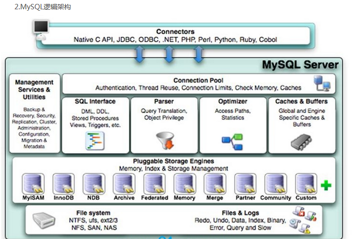


mysql的特点：插件式的存储引擎架构将查询处理和其它的系统任务以及数据的存储提取相分离。这种架构可以根据业务的需求和实际需要选择合适的存储引擎。

1.连接层
 最上层是一些客户端和连接服务，包含本地sock通信和大多数基于客户端/服务端工具实现的类似于tcp/ip的通信。主要完成一些类似于连接处理、授权认证、及相关的安全方案。在该层上引入了线程池的概念，为通过认证安全接入的客户端提供线程。同样在该层上可以实现基于SSL的安全链接。服务器也会为安全接入的每个客户端验证它所具有的操作权限。

2.服务层

2.1  Management Serveices & Utilities： 系统管理和控制工具  
2.2  SQL Interface: SQL接口
      接受用户的SQL命令，并且返回用户需要查询的结果。比如select from就是调用SQL Interface
2.3 Parser: 解析器
       SQL命令传递到解析器的时候会被解析器验证和解析。 
2.4 Optimizer: 查询优化器。
     SQL语句在查询之前会使用查询优化器对查询进行优化。 
     用一个例子就可以理解： select uid,name from user where  gender= 1;
     优化器来决定先投影还是先过滤。

2.5 Cache和Buffer： 查询缓存。
      如果查询缓存有命中的查询结果，查询语句就可以直接去查询缓存中取数据。
      这个缓存机制是由一系列小缓存组成的。比如表缓存，记录缓存，key缓存，权限缓存等
       缓存是负责读，缓冲负责写。


3.引擎层
  存储引擎层，存储引擎真正的负责了MySQL中数据的存储和提取，服务器通过API与存储引擎进行通信。不同的存储引擎具有的功能不同，这样我们可以根据自己的实际需要进行选取。后面介绍MyISAM和InnoDB

4.存储层
  数据存储层，主要是将数据存储在运行于裸设备的文件系统之上，并完成与存储引擎的交互。

## 存储引擎

查看mysql可以提供的存储引擎：

~~~
show engines;
~~~

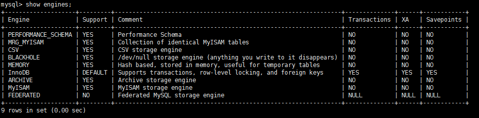

查看目前使用的存储引擎：

~~~
show variables like '%storage_engine%';
~~~


各个引擎简介：

1、InnoDB存储引擎
InnoDB是MySQL的默认事务型引擎，它被设计用来处理大量的短期(short-lived)事务。除非有非常特别的原因需要使用其他的存储引擎，否则应该优先考虑InnoDB引擎。行级锁，适合高并发情况

2、MyISAM存储引擎
MyISAM提供了大量的特性，包括全文索引、压缩、空间函数(GIS)等，但MyISAM不支持事务和行级锁(myisam改表时会将整个表全锁住)，有一个毫无疑问的缺陷就是崩溃后无法安全恢复。

3、Archive引擎
Archive存储引擎只支持INSERT和SELECT操作，在MySQL5.1之前不支持索引。
Archive表适合日志和数据采集类应用。适合低访问量大数据等情况。
根据英文的测试结论来看，Archive表比MyISAM表要小大约75%，比支持事务处理的InnoDB表小大约83%。

4、Blackhole引擎
Blackhole引擎没有实现任何存储机制，它会丢弃所有插入的数据，不做任何保存。但服务器会记录Blackhole表的日志，所以可以用于复制数据到备库，或者简单地记录到日志。但这种应用方式会碰到很多问题，因此并不推荐。

5、CSV引擎
CSV引擎可以将普通的CSV文件作为MySQL的表来处理，但不支持索引。
CSV引擎可以作为一种数据交换的机制，非常有用。
CSV存储的数据直接可以在操作系统里，用文本编辑器，或者excel读取。

6、Memory引擎
如果需要快速地访问数据，并且这些数据不会被修改，重启以后丢失也没有关系，那么使用Memory表是非常有用。Memory表至少比MyISAM表要快一个数量级。(使用专业的内存数据库更快，如redis)

7、Federated引擎
Federated引擎是访问其他MySQL服务器的一个代理，尽管该引擎看起来提供了一种很好的跨服务器的灵活性，但也经常带来问题，因此默认是禁用的。

 InnoDB和MyISAM对比：

|   对比项   |            MyISAM            |                 InnoDB                  |
| :-----: | :--------------------------: | :-------------------------------------: |
|   主外键   |             不支持              |                   支持                    |
|   事务    |             不支持              |                   支持                    |
|   行表锁   | 表锁，即使操作一条记录也会锁住整个表，不适合高并发的操作 |      行锁,操作时只锁某一行，不对其它行有影响，适合高并发的操作      |
|   缓存    |        只缓存索引，不缓存真实数据         | 不仅缓存索引还要缓存真实数据，对内存要求较高，而且内存大小对性能有决定性的影响 |
|   表空间   |              小               |                    大                    |
|   关注点   |              性能              |                   事务                    |
|  默认安装   |              Y               |                    Y                    |
| 用户表默认使用 |              N               |                    Y                    |
| 自带系统表使用 |              Y               |                    N                    |

 innodb 索引 使用 B+TREE myisam 索引使用 b-tree
innodb 主键为聚簇索引，基于聚簇索引的增删改查效率非常高。

# 索引优化分析

## B+树和B树

Myisam普通索引是B树（B-）索引，innodb的普通索引是B+树索引。

两者的区别主要在：B树在非叶子节点上也存放指向数据记录的指针，这就导致了B+树的内部节点可以存放更多指向下层节点的指针，平均IO次数比B树更低；此外，B+树叶子节点使用指针连接在一起

B+树比B-树更适合实际应用中操作系统的文件索引和数据库索引，原因在于：B+树的磁盘读写代价更低 、B+树的查询效率更加稳定 

## 索引分类

BTree索引、B+Tree索引

聚簇索引与非聚簇索引：聚簇索引是一种数据排列形式，innodb的主键索引生成的树称为聚簇索引，叶子节点记录着完整的数据信息。

Myisam是非聚簇索引，数据都存在一个文件里，按照插入顺序排列，索引另外存在其他文件，主键索引文件叶子节点保存的是数据的主键值和行号，然后根据行号再去数据文件里寻找对应的记录，相当于所有的索引都需要回表，所有的索引都是二级索引

聚簇索引能降低IO次数（命中主键索引时）

full-text全文索引：为了解决like%这种效率低的查询方式提出的查询优化

Hash索引：只有Memory, NDB两种引擎支持，Memory引擎默认支持Hash索引，如果多个hash值相同，出现哈希碰撞，那么索引以链表方式存储

R-Tree索引：在mysql很少使用，仅支持geometry数据类型，支持该类型的存储引擎只有myisam、bdb、innodb、ndb、archive几种。相对于b-tree，r-tree的优势在于范围查找

## 索引适用的场景和不适用的场景

适用的场景：为where条件、连表条件、groupby、orderby的字段创建索引可以提高效率

不适用的场景：经常增删改的表、数据重复且分布平均的表字段（数据重复会让建立索引没有意义）

## explain的使用

使用EXPLAIN关键字可以模拟优化器执行SQL查询语句，从而知道MySQL是如何处理你的SQL语句的。分析你的查询语句或是表结构的性能瓶颈

执行计划包含的信息解读：

### id：表的读取顺序

select查询的序列号,包含一组数字，表示查询中执行select子句或操作表的顺序

分为三种情况：

* id相同的情况：执行顺序由上到下

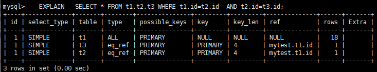

上图sql来说，会从上到下依次扫描t1、t3、t2

* id不同的情况：id值越大优先级越高，越先被执行，如果是子查询，id的序号会递增

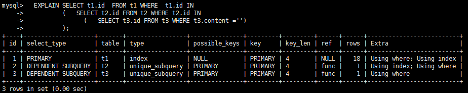

上图sql来说，会从序号大的依次执行到序号小的，会依次扫描t3、t2、t1

* id相同、不同，同时存在

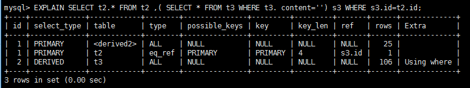

上图sql来说，先扫描t3，然后再依次扫描第一行和第二行，其中第一行的derived2的意思是由 id =2 的查询衍生出来的表，衍生表的type 肯定是 all ，因为衍生的表没有建立索引

### select_type：查询类型

查询类型有以下几种：

* SIMPLE：简单的 select 查询,查询中不包含子查询或者UNION：

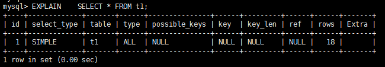

* PRIMARY：查询中若包含任何复杂的子部分，最外层查询则被标记为Primary

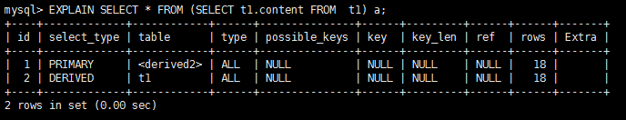

* DERIVED：在FROM列表中包含的子查询被标记为DERIVED(衍生)，MySQL会递归执行这些子查询, 把结果放在临时表里：

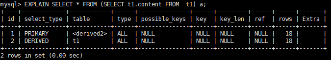

derived2就代表id为2的操作产生的临时表

* SUBQUERY：在SELECT或WHERE列表中包含了子查询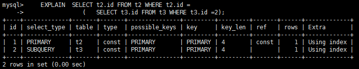
* DEPENDENT SUBQUERY：在SELECT或WHERE列表中包含了子查询,子查询基于外层

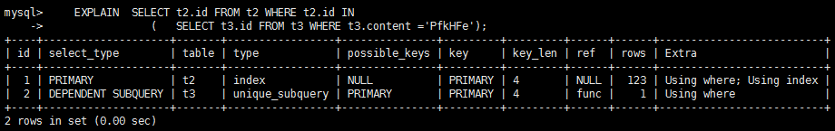

上面两种类型中，子查询结果为单值，依赖子查询结果为多值

* UNCACHEABLE SUBQUREY：无法被缓存的子查询

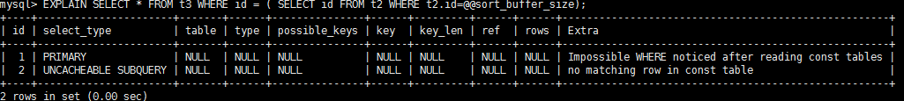

 @@ 表示查的环境参数 。没办法缓存

* UNION：若第二个SELECT出现在UNION之后，则被标记为UNION；若UNION包含在FROM子句的子查询中,外层SELECT将被标记为：DERIVED

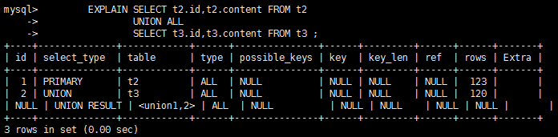

UNION RESULT 是两个语句执行完后的结果

### type：访问类型，哪些索引可以使用

从最好到最差依次是：system>const>eq_ref>ref>range>index>ALL

几种访问类型的解释：

* system：表只有一行记录（等于系统表），这是const类型的特列，平时不会出现，这个也可以忽略不计
* const：表示通过索引一次就找到了,const用于比较primary key或者unique索引。因为只匹配一行数据，所以很快，如将主键置于where列表中，MySQL就能将该查询转换为一个常量

例如：where id = xx

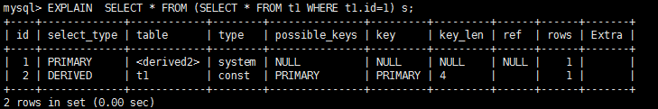

* eq_ref：唯一性索引扫描

例如：where t1.id = t2.id

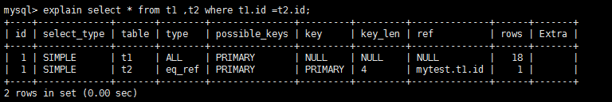

* ref：非唯一性索引扫描，返回匹配某个单独值的所有行。本质上也是一种索引访问，它返回所有匹配某个单独值的行，然而，它可能会找到多个符合条件的行，所以他应该属于查找和扫描的混合体

例如：where t1.content = t2.content，content是t2表的索引

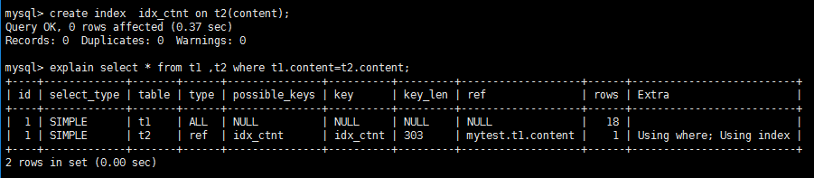

* range：只检索给定范围的行,使用一个索引来选择行，一般就是在你的where语句中出现了between、<、>、in等的查询，这种范围扫描索引扫描比全表扫描要好，因为它只需要开始于索引的某一点，而结束语另一点，不用扫描全部索引

例如：where t1.id < 10

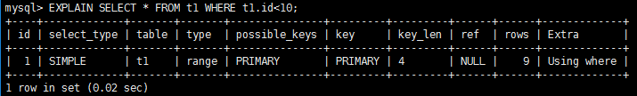

* index：Full Index Scan，index与ALL区别为index类型只遍历索引树。这通常比ALL快，因为索引文件通常比数据文件小。（也就是说虽然all和Index都是读全表，但index是从索引中读取的，而all是从硬盘中读的）

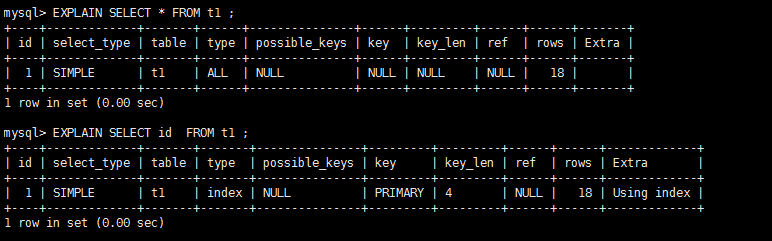

* all：Full Table Scan，将遍历全表以找到匹配的行

不太常用的几种：

* index_merge：在查询过程中需要多个索引组合使用，通常出现在有 or 的关键字的sql中：


* ref_or_null：对于某个字段既需要关联条件，也需要null值得情况下。查询优化器会选择用ref_or_null连接查询。

  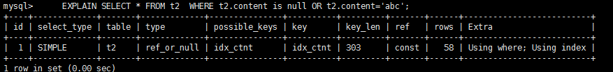

* index_subquery：利用索引来关联子查询，不再全表扫描。


上面的sql中，content是t3表的索引

* unique_subquery ：该联接类型类似于index_subquery。 子查询中的唯一索引

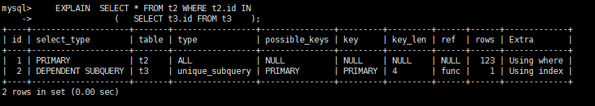

备注：一般来说，得保证查询至少达到range级别，最好能达到ref。

### possible_keys：可能使用的索引

显示可能应用在这张表中的索引，一个或多个。
查询涉及到的字段上若存在索引，则该索引将被列出，但不一定被查询实际使用

### key：实际使用的索引

如果为NULL，则没有使用索引

查询中若使用了覆盖索引，则该索引和查询的select字段重叠

覆盖索引的意思就是select的所有项都可以从某一个索引中取到，而不用去查数据项，后面会详细解释

### key_len：使用索引的充分程度

表示索引中使用的字节数，可通过该列计算查询中使用的索引的长度，key_len字段能够帮你检查是否充分的利用上了索引。


上图例子中，对于表emp来说有联合索引idx_deptno_ename，当单独使用deptno时可以命中索引，而同时用deptno和ename也可以命中索引，但是后者比前者利用索引更充分，查索引时筛选的字段更多。

### ref：索引的查询条件

哪些列或常量被用于查找索引列上的值

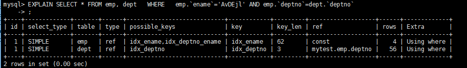

上图例子中，首先扫描emp表，命中ename索引，此时起作用的筛选条件是emp.ename=AvDEjl，这个值是一个常量，所以此时ref列的值是const；

然后扫描dept表，命中deptno索引，此时起作用的筛选条件是dept.deptno=emp.deptno，此时这个值是emp.deptno，所以此时ref列的值是mytest.emp.deptno

### rows：需要扫描的行数

rows列显示MySQL认为它执行查询时必须检查的行数。它越少越好，它是判断性能的重要指标

### Extra：其他重要信息

它的值有以下几种：

* Using filesort：对数据使用一个外部的索引排序，MySQL中无法利用索引完成的排序操作称为“文件排序”

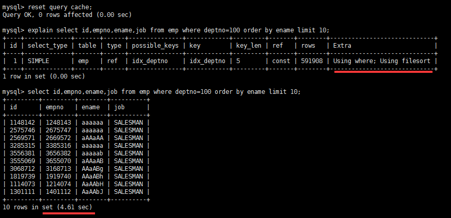

对于上图的例子来说，此时表的索引只有deptno字段，当where条件命中deptno索引后，无法再利用索引对ename进行排序，此时就会出现Using filesort，造成大量的性能损耗。解决办法就是建立deptno和ename的联合索引，再执行就不会有问题了。

不过有时它的影响也不大：当通过前面的查询语句 筛选大部分条件后，只剩下很少的数据。using filesort 性能影响不大。

* Using temporary：使了用临时表保存中间结果,MySQL在对查询结果排序时使用临时表。常见于排序 order by 和分组查询 group by，且没有命中结果时。

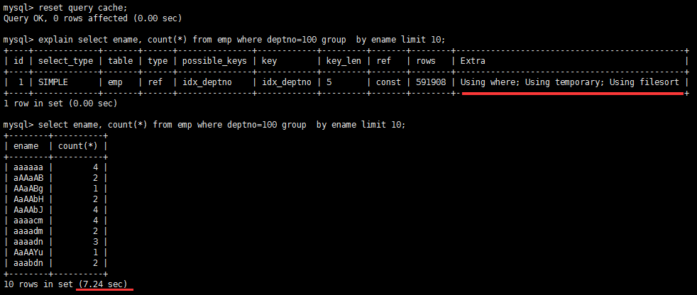

对于上图的例子来说，此时表的索引只有deptno字段，当where条件命中deptno索引后，无法再利用索引对ename进行分组，此时就需要利用临时表进行分组，导致很大的性能损耗。解决办法就是建立deptno和ename的联合索引，再执行就不会有问题了。

* USING index：相应的select操作中使用了覆盖索引(Covering Index)，避免访问了表的数据行，效率不错

如果同时出现using where，表明索引被用来执行索引键值的查找;
如果没有同时出现using where，表明索引只是用来读取数据而非利用索引执行查找。

覆盖索引就是通过过读取索引就可以得到想要的数据（索引叶子节点存储了它们索引的数据），它不必读取整个行，如select或者where字段所有的列都包含在索引中，例如：

select id , name from t_xxx where age=18;

有一个组合索引  idx_id_name_age_xxx 包含了(覆盖了)，id,name,age三个字段。查询时直接将建立了索引的列读取出来了，而不需要去查找所在行的其他数据。所以很高效。

命中覆盖索引的前提是不能用select *

* Using where：表明使用了where过滤
* using join buffer：使用了连接缓存：出现在当两个连接时
  驱动表(被连接的表,left join 左边的表。inner join 中数据少的表) 没有索引的情况下。
* impossible where：不可能起作用的where条件
* select tables optimized away：

一些优化：在没有GROUPBY子句的情况下，基于索引优化MIN/MAX操作或者
对于MyISAM存储引擎优化COUNT(*)操作，不必等到执行阶段再进行计算。

如在Myisam中，会自动维护总行数，故查询行数时就可以直接走优化逻辑，不用全表扫描：

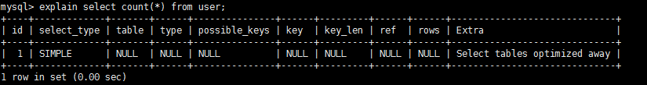

## 查询优化

### 索引命中技巧

1. 全值匹配

例如建立索引时 以 name ， age ，pos 的顺序建立的，查询时也要同时使用这三个条件：

~~~
EXPLAIN SELECT * FROM staffs WHERE NAME = 'July' AND age = 25 AND pos = 'dev';
~~~

2. 最左前缀

一个很重要的命中索引的技巧：查询从索引的最左前列开始并且不跳过索引中的列

例如建立索引时 以 name ， age ，pos 的顺序建立的，查询条件单where过滤age或者pos不会命中索引，单独用where过滤name则会命中索引（ and 忽略左右关系。既即使没有没有按顺序 由于优化器的存在，会自动优化）

还有一种情况可以命中索引，那就是覆盖索引的情况，例如：

~~~
select name/age/id from staffs where age=10
~~~

此时即使不是name开头，也可以命中索引

3. 在索引列上做任何操作（计算、函数、(自动or手动)类型转换），会导致索引失效而转向全表扫描

如name虽然是索引，但是使用函数就会导致索引无法命中：

~~~
EXPLAIN SELECT * FROM staffs WHERE left(NAME,4) = 'July';
~~~

4. 不完全的最左前缀

如建立索引时 以 name ， age ，pos 的顺序建立的，此时可以用where条件同时加三列的限制过滤，可以命中索引，但是当以下语句执行时，却会让语句只能覆盖一部分索引：

~~~
EXPLAIN SELECT * FROM staffs WHERE NAME = 'July' AND age > 25 AND pos = 'dev';
~~~

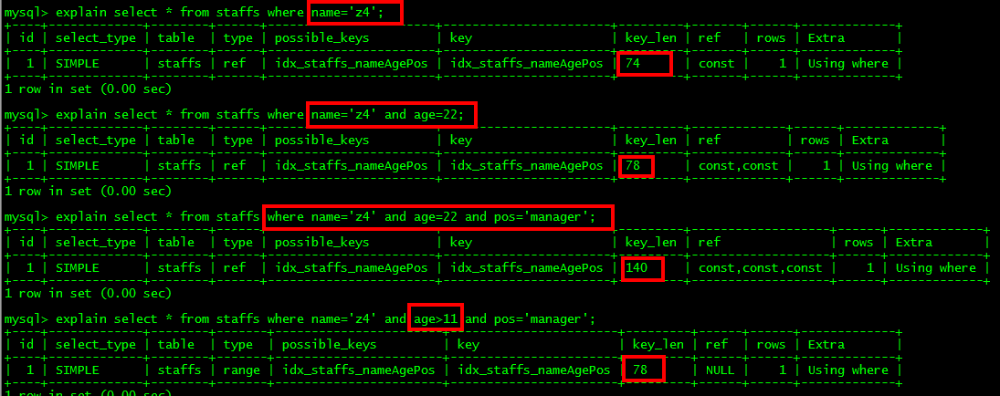

当过滤条件的某一环是范围过滤时，后面的索引就会失效

5. 尽量使用覆盖索引(只访问索引的查询(索引列和查询列一致))，减少select *
6. 使用不等于(!= 或者<>)的时候无法使用索引会导致全表扫描
7. is not null 也无法使用索引,但是is null是可以使用索引的（原因是自动搜索列中最小的位置寻找null）
8. 慎用模糊匹配：like ‘%abc%’  type 类型会变成 all；like ‘abc%’ type 类型为 range ，算是范围，可以使用索引
9. 字符串不加单引号也会索引失效，原因是底层用函数自动进行转换，导致索引失效
10. 少用or,用它来连接时会索引失效

### 联合索引适用技巧

在选择组合索引的时候，当前Query中过滤性最好的字段在索引字段顺序中，位置越靠前越好。(避免索引过滤性好的索引失效)

有时调整联合索引的顺序也会得到优化，案例：

查询 category_id 为1 且  comments 大于 1 的情况下,views 最多的 article_id：

~~~
EXPLAIN SELECT id,author_id FROM article WHERE category_id = 1 AND comments > 1 ORDER BY views DESC LIMIT 1;
~~~

设置联合索引：

~~~
ALTER TABLE `article` ADD INDEX idx_article_ccv ( `category_id` , `comments`, `views` );
~~~

此时发现执行计划中的type 变成了 range,这是可以忍受的。但是 extra 里使用 Using filesort 仍是无法接受的

原因在于 comments > 1 会令views部分的索引无法命中

解决办法就是调整联合索引：

~~~
ALTER TABLE `article` ADD INDEX idx_article_cv ( `category_id` , `views` ) ;
~~~

结果是type 变为了 ref,Extra 中的 Using filesort 也消失了

### 关联查询优化

关联查询分为驱动表(要查询的表，left join 左边的表。inner join 中数据少的表) 和被驱动表：

~~~
EXPLAIN SELECT * FROM class LEFT JOIN book ON class.card = book.card;
~~~

对以上的sql来说，class是驱动表，book是被驱动表。

几个关联查询的建议：

1、保证被驱动表的join字段已经被索引

2、选择小表作为驱动表，大表作为被驱动表。

3、若必须用到子查询，可将子查询设置为驱动表，，因为驱动表的type 肯定是 all

例如这个例子：

~~~
select a.name ,bc.name from t_emp a left join
         (select b.id , c.name from t_dept b
         inner join t_emp c on b.ceo = c.id) bc 
         on bc.id = a.deptid.
~~~

bc作为被驱动表，因为用了子查询，type肯定是all，无法命中索引。一个常见的优化是把子查询拆分出来，或者把子查询放在驱动表侧：

~~~
select a.name , c.name from t_emp a
    left outer join t_dept b on a.deptid = b.id
    left outer join t_emp c on b.ceo=c.id
~~~

### in和exists

以下三种sql是相同的语义：

~~~sql
select sql_no_cache sum(sal) from emp where deptno in (select deptno from dept);
select sql_no_cache sum(sal) from emp where exists (select 1 from dept where emp.deptno=dept.deptno);  ##用 exists 是否存在，存在返回一条记录，exists 是作为一个查询判断用，所以 select 后返回什么不重要。
select sql_no_cache sum(sal) from emp inner join dept on  emp.deptno=dept.deptno;
~~~

经过实际分析：有索引的情况下 用  inner join 是最好的  其次是 in  ，exists最糟糕；无索引的情况下用 小表驱动大表 因为join 方式需要distinct ，没有索引distinct消耗性能较大 ，所以  exists性能最佳 in其次  join性能最差

详细讨论in和exists两种方式的使用，它们两个的使用也要遵循小表驱动大表的方式。

当使用in时，子查询的表dept是驱动表，外层的表emp是被驱动表，驱动表越小，连接查询的次数越少，也就是用in的时候适合的场景是dept表较小的情况。

当使用exists，情况刚好相反，外层的emp是驱动表，dept是被驱动表，适合emp表较小的情况。

### order优化

MySQL支持二种方式的排序，FileSort和Index，Index效率高。它指MySQL扫描索引本身完成排序。FileSort方式效率较低。

order使用index方式的几种情况：

1、ORDER BY 语句使用索引最左前列

2、使用Where子句与Order BY子句条件列组合满足索引最左前列

3、where子句中如果出现索引的范围查询(即explain中出现range)会导致order by 索引失效。

有些情况下FileSort是不可避免的，mysqlfilesort有两种算法：双路排序和单路排序

双路排序：MySQL 4.1之前是使用双路排序,字面意思就是两次扫描磁盘，从磁盘取排序字段（第1次IO），在buffer进行排序，再从磁盘取其他字段（第2次IO）。

单路排序：从磁盘读取查询需要的所有列，按照order by列在buffer对它们进行排序，只需要扫描一次磁盘。但是在buffer不足的时候，无法容纳下磁盘中的排序数据，会导致多次IO才能排序完毕，此时性能比双路排序更差。

针对优化fileSort的几个建议：

1、增大sort_buffer_size参数的设置，防止内存不够用导致单路排序性能劣化。

2、增大max_length_for_sort_data参数的设置，单次排序字段大小，提高可以提升排序性能，但是使用的内存也更多（该值过小会自动选择双路排序算法，当Query的字段大小总和小于max_length_for_sort_data 而且排序字段不是 TEXT|BLOB 类型时，会用改进后的算法——单路排序， 否则用老算法——多路排序）

3、排序时不要用select *，select 后的多了，排序的时候也会带着一起，很占内存，所以去掉没有用的

### 带排序的分页查询优化

分析下列sql语句：

~~~sql
EXPLAIN    SELECT  SQL_NO_CACHE * FROM emp  ORDER  BY  deptno   LIMIT 10000,40
~~~

即使给deptno字段加了索引，这条语句的执行仍然是Using filesort，原因是deptno索引中没有覆盖select项中的所有字段，导致索引失效。

优化方案是使用覆盖索引先完成排序的功能，保证索引命中，然后再和数据表做关联：

~~~sql
EXPLAIN  SELECT  SQL_NO_CACHE * FROM emp INNER JOIN (SELECT id FROM emp e ORDER BY deptno LIMIT 10000,40) a ON a.id=emp.id
~~~

### groupby优化

group by实质是先排序后进行分组，遵照索引建的最佳左前缀

当无法使用索引列，增大max_length_for_sort_data参数的设置+增大sort_buffer_size参数的设置

还有一个重要的建议：where高于having，能写在where限定的条件就不要去having限定了。

### 慎用distinct

使用distinct可以对查询结果去重：

~~~sql
select distinct kcdz form t_mall_sku where id in( 3,4,5,6,8 ) 
~~~

但是这样去重将无法命中索引kcdz，一个优化方案是用分组代替distinct：

~~~sql
select  kcdz form t_mall_sku where id in( 3,4,5,6,8 )  group by kcdz 
~~~

### 综合建议

有时建立索引要顾此失彼，需要经过实践综合分析，给出最优方案。

执行时间是评价sql语句的唯一标准，上面的各种只是辅助工具，比如有时where和order用的是不同的字段，往where加索引可能会过滤掉大部分数据，即使产生了Using filesort，也不会太影响查询性能；但有时实际场景，无论怎样过滤orderby都是针对大数据量的，此时就要把索引建在orderby的字段上。

# 查询日志分析

## 慢查询日志

MySQL的慢查询日志是MySQL提供的一种日志记录，它用来记录在MySQL中响应时间超过阀值的语句，具体指运行时间超过long_query_time值的SQL，则会被记录到慢查询日志中。long_query_time的默认值为10，意思是运行10秒以上的语句。

默认情况下，MySQL数据库没有开启慢查询日志，需要我们手动来设置这个参数。如果不是调优需要的话，一般不建议启动该参数，因为开启慢查询日志会或多或少带来一定的性能影响

查询是否开启慢查询日志：

~~~sql
SHOW VARIABLES LIKE '%slow_query_log%';
~~~

开启慢查询日志：

对当前数据库立即生效，重启失效：

~~~
set global slow_query_log=1
~~~

想要永久生效，需要修改配置文件my.cnf：

~~~
slow_query_log =1
slow_query_log_file=/var/lib/mysql/atguigu-slow.log
~~~

第二项是指定慢查询的日志，若不指定系统默认会给一个缺省的文件host_name-slow.log

查看慢查询日志的筛选参数：

~~~
SHOW VARIABLES LIKE 'long_query_time%';
~~~

调整阈值时间为1s：（也可以修改配置文件）

~~~sql
set global long_query_time=1
~~~

修改后需要重新连接或新开一个会话才能看到修改值，或者改变当前的session变量：

~~~
set session long_query_time=1
~~~

查看有多少条慢sql：

~~~
show global status like '%Slow_queries%';
~~~

## mysqldumpslow工具

在生产环境，还可以直接用mysql自带的工具mysqldumpslow来查询曾经执行过的sql语句，它的简单使用：

~~~
得到返回记录集最多的10个SQL
mysqldumpslow -s r -t 10 /var/lib/mysql/atguigu-slow.log
 
得到访问次数最多的10个SQL
mysqldumpslow -s c -t 10 /var/lib/mysql/atguigu-slow.log
 
得到按照时间排序的前10条里面含有左连接的查询语句
mysqldumpslow -s t -t 10 -g "left join" /var/lib/mysql/atguigu-slow.log
 
另外建议在使用这些命令时结合 | 和more 使用 ，否则有可能出现爆屏情况
mysqldumpslow -s r -t 10 /var/lib/mysql/atguigu-slow.log | more
~~~

## 批量数据脚本

首先要将log_bin_trust_function_creators变量设置为1，普通用户才能创建函数。

创建随机生成字符串的函数：

~~~sql
DELIMITER $$
CREATE FUNCTION rand_string(n INT) RETURNS VARCHAR(255)
BEGIN    ##方法开始
 DECLARE chars_str VARCHAR(100) DEFAULT   'abcdefghijklmnopqrstuvwxyzABCDEFJHIJKLMNOPQRSTUVWXYZ'; 
 ##声明一个 字符窜长度为 100 的变量 chars_str ,默认值 
 DECLARE return_str VARCHAR(255) DEFAULT '';
 DECLARE i INT DEFAULT 0;
##循环开始
 WHILE i < n DO  
 SET return_str =CONCAT(return_str,SUBSTRING(chars_str,FLOOR(1+RAND()*52),1));
##concat 连接函数  ，substring(a,index,length) 从index处开始截取
 SET i = i + 1;
 END WHILE;
 RETURN return_str;
END $$
 
#假如要删除
#drop function rand_string;
~~~

创建随机生成数字的函数：

~~~sql
#用于随机产生部门编号
DELIMITER $$
CREATE FUNCTION rand_num( ) 
RETURNS INT(5)  
BEGIN   
 DECLARE i INT DEFAULT 0;  
 SET i = FLOOR(100+RAND()*10);  
RETURN i;  
 END $$
 
 
#假如要删除
#drop function rand_num;
~~~

创建往员工表插入数据的存储过程：

~~~sql
 
 
DELIMITER $$
CREATE PROCEDURE insert_emp10000(IN START INT(10),IN max_num INT(10))  
BEGIN  
DECLARE i INT DEFAULT 0;   
#set autocommit =0 把autocommit设置成0  ；提高执行效率
 SET autocommit = 0;    
 REPEAT  ##重复
 SET i = i + 1;  
 INSERT INTO emp10000 (empno, ename ,job ,mgr ,hiredate ,sal ,comm ,deptno ) VALUES ((START+i) ,rand_string(6),'SALESMAN',0001,CURDATE(),FLOOR(1+RAND()*20000),FLOOR(1+RAND()*1000),rand_num());  
 UNTIL i = max_num   ##直到  上面也是一个循环
 END REPEAT;  ##满足条件后结束循环
 COMMIT;   ##执行完成后一起提交
 END $$
 
#删除
# DELIMITER ;
# drop PROCEDURE insert_emp;
~~~

创建往部门表插入数据的存储过程：

~~~sql
#执行存储过程，往dept表添加随机数据
DELIMITER $$
CREATE PROCEDURE insert_dept(IN START INT(10),IN max_num INT(10))  
BEGIN  
DECLARE i INT DEFAULT 0;   
 SET autocommit = 0;    
 REPEAT  
 SET i = i + 1;  
 INSERT INTO dept (deptno ,dname,loc ) VALUES (START +i ,rand_string(10),rand_string(8));  
 UNTIL i = max_num  
 END REPEAT;  
 COMMIT;  
 END $$ 
 
#删除
# DELIMITER ;
# drop PROCEDURE insert_dept;
~~~

然后调用存储过程：

~~~
DELIMITER ;
CALL insert_dept(100,10); 
#执行存储过程，往emp表添加50万条数据
DELIMITER ;    #将 结束标志换回 ;
CALL insert_emp(100001,500000); 
~~~

## profile诊断sql

mysql提供可以用来分析当前会话中语句执行的资源消耗情况（如分析一条sql执行消耗的CPU或者IO等）。可以用于SQL的调优的测量。

默认情况下，参数处于关闭状态，并保存最近15次的运行结果

查看profile是否开启：

~~~
Show  variables like 'profiling';
~~~

开启profile：

~~~
set profiling=1;
~~~

查看最近执行的sql语句：

~~~
show profiles;
~~~

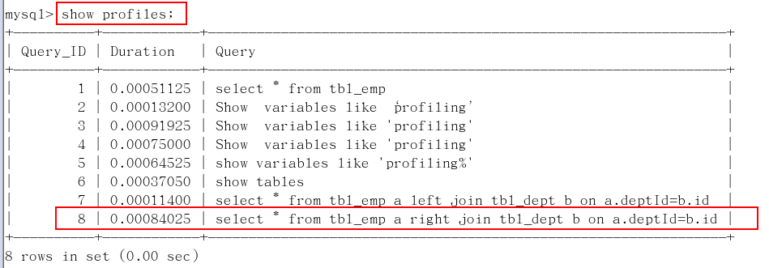

诊断某条sql：（这里面的9就代表上面查询出来的id编号，这里面诊断的有两项，CPU和IO）

~~~
show profile cpu,block io for query 9
~~~

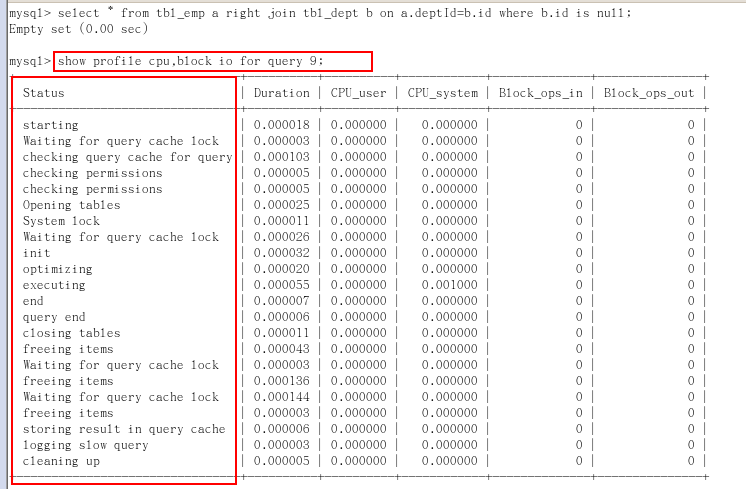

其他可以诊断的项：

type:  
 | ALL                        --显示所有的开销信息  
 | BLOCK IO                --显示块IO相关开销  
 | CONTEXT SWITCHES --上下文切换相关开销  
 | CPU              --显示CPU相关开销信息  
 | IPC              --显示发送和接收相关开销信息  
 | MEMORY           --显示内存相关开销信息  
 | PAGE FAULTS      --显示页面错误相关开销信息  
 | SOURCE           --显示和Source_function，Source_file，Source_line相关的开销信息  
 | SWAPS            --显示交换次数相关开销的信息

诊断结果中会显示执行sql各步骤的开销，当出现以下的项时就需要注意，关注这些sql是否需要优化：

converting HEAP to MyISAM ：查询结果太大，内存都不够用了往磁盘上搬了

Creating tmp table ：创建临时表

Copying to tmp table on disk ：把内存中临时表复制到磁盘

locked：锁表

## 全局查询配置

全局查询日志会记录每一条sql执行，尽量不要在生产环境开启这个功能。

在mysql的my.cnf中，设置如下：

开启配置：general_log=1   

记录日志文件的路径：general_log_file=/path/logfile

输出格式：log_output=FILE

全局日志可以存放到日志文件中，也可以存放到Mysql系统表中。存放到日志中性能更好一些，也可以存储到表中：

~~~
set global log_output='TABLE';
~~~

你所编写的sql语句，将会记录到mysql库里的general_log表：

~~~
select * from mysql.general_log;
~~~

# 锁

## 概述

锁按对数据操作的类型分为读锁和写锁：

读锁(共享锁)：针对同一份数据，多个读操作可以同时进行而不会互相影响。

写锁（排它锁）：当前写操作没有完成前，它会阻断其他写锁和读锁。

从对数据操作的粒度分为表锁和行锁。

## 表锁

表锁特点：偏向MyISAM存储引擎，开销小，加锁快；无死锁；锁定粒度大，发生锁冲突的概率最高,并发度最低。

建表时要使用MyISAM引擎：

~~~sql
create table mylock(
 id int not null primary key auto_increment,
 name varchar(20)
) engine myisam;
~~~

加锁命令：

~~~
lock table 表名字1 read, 表名字2 write
~~~

释放表锁：

~~~
unlock tables;
~~~

### 读锁（共享锁）

在给表A加了一个读锁之后，本session和其他session都可以继续对表A读取（这里面一个细微的差别是本session只能读表A，读其他的表会报错），但是本session和其他session都不能对表A进行更新或者插入（本session操作锁定的表会直接报错，而其他session操作会进入阻塞状态，直到锁解除）

综合起来：对MyISAM表的读操作（加读锁），不会阻塞其他进程对同一表的读请求，但会阻塞对同一表的写请求。只有当读锁释放后，才会执行其它进程的写操作。 

### 写锁（独占锁）

在给表A加了一个读锁后，本session可以对该表进行增改查，而其他session则对该表不能增改查，执行命令会进入阻塞状态，直到锁被释放（在锁表前，如果session2有数据缓存，锁表以后，在锁住的表不发生改变的情况下session2可以读出缓存数据，一旦数据发生改变，缓存将失效，操作将被阻塞住。）

综合起来：对MyISAM表的写操作（加写锁），会阻塞其他进程对同一表的读和写操作，只有当写锁释放后，才会执行其它进程的读写操作。

## 行锁

特点：偏向InnoDB存储引擎，开销大，加锁慢；会出现死锁；锁定粒度最小，发生锁冲突的概率最低,并发度也最高。InnoDB与MyISAM的最大不同有两点：一是支持事务（TRANSACTION）；二是采用了行级锁

### 更新自动加行锁

InnoDB默认在执行更新时自动加行锁，在一个session更新记录A时（包括在一个事务中，事务结束时取消行锁），另外一个session则不能更新记录A，会进入阻塞状态，直到行锁解除。

一般来说，不同的记录之间互不影响，但是若没有正常使用索引，则会导致行锁变成表锁，原因是行锁的本质是加在索引上的。

### 查询时加锁

查询时加读锁（共享锁）：

~~~
select ..lock in share mode
~~~

其他用户可以并发读取数据，但任何事务都不能对查询范围内的数据进行修改（获取数据上的排他锁），直到已释放所有共享锁。

查询时加写锁（独占锁）：

~~~
select... for update 
~~~

Mysql会对查询结果中的每行都加排他锁，本session可以对这些数据增删改查，而其他session必须等锁释放。

### 间隙锁GAP Lock

当sessionA更新/查询表A中一个范围内的数据时（如b>0），所有这个范围内的数据都被加上了行锁，即使数据不存在，其他session也不能再向这个数据范围插入数据了，这一部分就是间隙。

可能会在某种场景下对性能造成很大危害。

### 行锁分析和优化

可以通过检查InnoDB_row_lock状态变量来分析系统上的行锁的争夺情况：

~~~
show status like 'innodb_row_lock%';
~~~

对各个状态量的说明如下：

Innodb_row_lock_current_waits：当前正在等待锁定的数量；
Innodb_row_lock_time：从系统启动到现在锁定总时间长度；
Innodb_row_lock_time_avg：每次等待所花平均时间；
Innodb_row_lock_time_max：从系统启动到现在等待最常的一次所花的时间；
Innodb_row_lock_waits：系统启动后到现在总共等待的次数；

若等待次数很高，而且每次等待时长也不小的时候，我们就需要分析系统中为什么会有如此多的等待，然后根据分析结果着手指定优化计划。

可以通过：
SELECT * FROM information_schema.INNODB_TRX\G;
来查询正在被锁阻塞的sql语句。

几个优化建议：

1、尽可能让所有数据检索都通过索引来完成，避免无索引行锁升级为表锁。

2、尽量控制事务大小，减少锁定资源量和时间长度

3、尽可能较少检索条件，避免间隙锁

4、涉及相同表的事务，对于调用表的顺序尽量保持一致。（减少锁等待的时间）

## 页锁

开销和加锁时间界于表锁和行锁之间；会出现死锁；锁定粒度界于表锁和行锁之间，并发度一般。

# 主从复制

## 复制的原理和原则

slave会从master读取binlog来进行数据同步。

流程图：

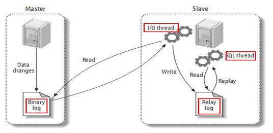

MySQL复制过程分成三步：
1 master将改变记录到二进制日志（binary log）。这些记录过程叫做二进制日志事件，binary log events；
2 slave将master的binary log events拷贝到它的中继日志（relay log）；
3 slave重做中继日志中的事件，将改变应用到自己的数据库中。 MySQL复制是异步的且串行化的

复制的基本原则：

1、每个slave只有一个master

2、每个slave只能有一个唯一的服务器ID

3、每个master可以有多个salve

复制可能出现的问题：复制延时，同步不及时

## 主从复制的配置

### 前提条件

两个mysql版本一致且后台以服务运行，主从都配置在[mysqld]结点（配置文件中的子标题）下，都是小写

### 主节点配置

1、[必须]主服务器唯一ID配置：

~~~
server-id=1
~~~

2、[必须]启用二进制日志：

~~~
log-bin=D:/devSoft/MySQLServer5.5/data/mysqlbin
~~~

3、[可选]启用错误日志：

~~~
log-err=D:/devSoft/MySQLServer5.5/data/mysqlerr
~~~

4、[可选]根目录：

~~~
basedir="D:/devSoft/MySQLServer5.5/"
~~~

5、[可选]临时目录：

~~~
tmpdir="D:/devSoft/MySQLServer5.5/"
~~~

6、[可选]数据目录：

~~~
datadir="D:/devSoft/MySQLServer5.5/Data/"
~~~

7、设置主节点可读可写：

~~~
主机，读写都可以
~~~

8、[可选]设置不要复制的数据库，一般都是mysql自带的数据库

~~~
binlog-ignore-db=mysql
~~~

9、[可选]设置需要复制的数据库：

~~~
binlog-do-db=需要复制的主数据库名字
~~~

### 从节点配置

从节点只需要进行服务器唯一id配置和启用二进制日志

### 重启和防火墙

修改完配置文件后要对mysql服务进行重启：

~~~
service mysql start
service mysql stop
~~~

并关闭防火墙：

~~~
service iptables stop
~~~

### 授权并启用复制

在主节点登录mysql并执行：

~~~
GRANT REPLICATION SLAVE ON *.* TO 'zhangsan'@'从机器数据库IP' IDENTIFIED BY '123456';
~~~

意思是授权从服务器以zhangsan用户，123456密码进行主从复制，并指定从节点ip

然后刷新权限：

~~~
flush privileges;
~~~

查询master的状态：

~~~
show master status;
~~~

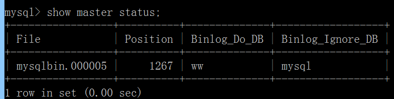

记录下File和Position的值，后续有用。执行完此步骤后不要再操作主服务器MYSQL，防止主服务器状态值变化

在从节点登录mysql并执行：

~~~
CHANGE MASTER TO MASTER_HOST='主机IP',MASTER_USER='zhangsan',MASTER_PASSWORD='123456',MASTER_LOG_FILE='File名字',MASTER_LOG_POS=Position数字;
~~~

指定主节点的IP，授权用户和密码，以及二进制文件名以及position，就是上个命令的执行结果。（这个命令有时候会执行失败，此时就先执行取消同步：stop slave，然后去主机获取最新的file和position，再执行一遍）

然后开启同步：

~~~
start slave;
~~~

执行命令来检查同步是否开启成功：

~~~
show slave status\G
~~~

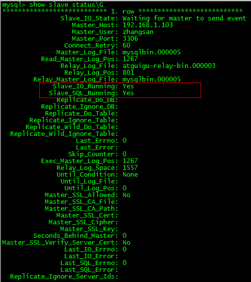

若Slave_IO_Running和Slave_SQL_Running都是Yes说明开启成功。

启用主从复制之后，所有在主节点进行的新建库、新建表、insert记录，都会自动同步到从节点。

# Mycat分库分表

## 概述

Mycat是数据库中间件，前身是阿里的cobar。

Mycat的功能：

1、读写分离

2、数据分片：包括垂直拆分和水平拆分

3、多数据源整合

Mycat 的原理中最重要的一个动词是“拦截”，它拦截了用户发送过来的 SQL 语句，首先对 SQL 语句做了
一些特定的分析：如分片分析、路由分析、读写分离分析、缓存分析等，然后将此 SQL 发往后端的真实数据库，
并将返回的结果做适当的处理，最终再返回给用户：

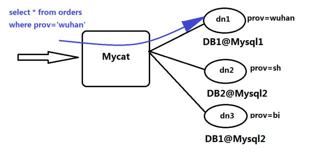

这种方式把数据库的分布式从代码中解耦出来，程序员察觉不出来后台使用mycat还是mysql。

## 安装

Mycat有三个重要的配置文件：schema.xml（定义逻辑库，表、分片节点等内容）、rule.xml（定义分片规则）、server.xml（定义用户以及系统相关变量，如端口等）

先修改server.xml，添加登录Mycat的用户名和密码：

~~~xml
<user name="root">
  <property name="password">654321</property>
  <property name="schemas">TESTDB</property>
</user>
~~~

然后配置schema.xml：

~~~xml
<?xml version="1.0"?>
<!DOCTYPE mycat:schema SYSTEM "schema.dtd">
<mycat:schema xmlns:mycat="http://io.mycat/">
           <!--逻辑库 sqlMaxLimit 末尾是否要加 limit xxx-->
        <schema name="TESTDB" checkSQLschema="false" sqlMaxLimit="100" dataNode="dn1"> </schema>
            <!--database:对应mysql的database-->
        <dataNode name="dn1" dataHost="localhost1" database="db1" />
        <dataHost name="localhost1" maxCon="1000" minCon="10" balance="0"
                          writeType="0" dbType="mysql" dbDriver="native" switchType="1"  slaveThreshold="100">
                <heartbeat>select user()</heartbeat>
                <!-- can have multi write hosts -->
                <writeHost host="hostm1" url="192.168.67.1:3306" user="root"
                                   password="123123">
<!--读库（从库）的配置 -->
                       <readHost host="hosts1" url="192.168.67.131:3306" user="root"
                                   password="123123">
                       </readHost>
                </writeHost>
        </dataHost>
</mycat:schema>
~~~

schema标签是逻辑库的定义，逻辑库名为TESTDB，它对应的dataNode是dn1.

后面的dataNode则指定了其关联的dataHost，以及mysql中真正对应的数据库名db1

dataHost中定义了测试心跳的语句，以及writeHost标签指定了写库，host是一个唯一标识，url、user和password都是需要远程登录写库必须的信息。readHost是写库对应的读库。

然后要验证数据库的访问情况，在安装Mycat的节点执行远程连接数据库的命令：

~~~
mysql -uroot -p123123 -h 192.168.67.1 -P 3306
mysql -uroot -p123123 -h 192.168.67.131 -P 3306
~~~

如果不能远程登录则要登录对应节点的数据库执行授权命令：

~~~
grant all privileges on *.* to root@'缺少的host'  identified by '123123';
~~~

然后启动Mycat，进入bin目录执行：

~~~
./mycat console
~~~

如果在启动过程中出现域名解析失败的错误，则需要把域名添加到/etc/hosts 文件中，然后重启网络服务：

~~~
service network restart
~~~

然后登录Mycat，IP地址就是mysql的IP地址：

~~~
mysql -uroot -p654321 -P8066 -h192.168.67.131
~~~

登录后界面和mysql完全一致，执行show databases命令，可以看到逻辑库就在Mycat中：

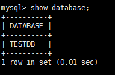

## 读写分离

配置读写分离只需要修改schema.xml，在dataHost节点中改变balance的值即可：

~~~xml
<?xml version="1.0"?>
<!DOCTYPE mycat:schema SYSTEM "schema.dtd">
<mycat:schema xmlns:mycat="http://io.mycat/">
 
<schema name="TESTDB" checkSQLschema="false" sqlMaxLimit="100" dataNode="dn1">
        </schema>
        <dataNode name="dn1" dataHost="host1" database="atguigu_mc" />
        <dataHost name="host1" maxCon="1000" minCon="10" balance="2"
                          writeType="0" dbType="mysql" dbDriver="native" switchType="1" slaveThreshold="100">
                <heartbeat>select user()</heartbeat>
                <writeHost host="hostm1" url="192.168.67.1:3306" user="root"
                                   password="123123">
<!--读库（从库）的配置 -->
                       <readHost host="hosts1" url="192.168.67.131:3306" user="root"
                                   password="123123">
                       </readHost>
                </writeHost>
        </dataHost>
</mycat:schema>
~~~

这里设置balance的值是2（一般生产环境是1或者3），balance的值的含义：

负载均衡类型，目前的取值有4 种：

1. balance="0", 不开启读写分离机制，所有读操作都发送到当前可用的 writeHost 上。
2. balance="1"，全部的 readHost 与 stand by writeHost （写节点中的从节点）参与 select 语句的负载均衡，简单的说，当双主双从模式(M1->S1，M2->S2，并且 M1 与 M2 互为主备)，正常情况下，M2,S1,S2 都参与 select 语句的负载均衡。
3. balance="2"，所有读操作都随机的在 writeHost、readhost 上分发。
4. balance="3"，所有读请求随机的分发到 readhost 执行，writerHost 不负担读压力（真正的读写分离）

控制balance的值，Mycat就会帮我们把不同类型的sql语句分发到不同的mysql节点执行。

## 垂直分库

垂直分库的意思是，有一些表在一个mysql节点，有一些表在另外的mysql节点，数据分散在不同的节点，以此来提高瓶颈。

垂直分库的原则是：分库后，同一个库中的表不会join查询另外一个库中的表。在本案例中，我们选择用户表来做垂直分库，原因是用户表比较独立，当登录时只会单独查询用户表一张表，等到登录后，登录信息都存在session中，可以拿登录信息中的customer_id去订单表中查询，不存在join表的情况，所以将用户表和订单表分开存放较为合适。

修改配置文件schema.xml：

~~~xml
<mycat:schema xmlns:mycat="http://io.mycat/">
 
        <schema name="TESTDB" checkSQLschema="false" sqlMaxLimit="100" dataNode="dn1">
                <table name="customer" dataNode="dn2" ></table>
        </schema>
        <dataNode name="dn1" dataHost="host1" database="atguigu_mc" />
        <dataNode name="dn2" dataHost="host2" database="atguigu_sm" />
        <dataHost name="host1" maxCon="1000" minCon="10" balance="2"
                          writeType="0" dbType="mysql" dbDriver="native" switchType="1"  slaveThreshold="100">
                <heartbeat>select user()</heartbeat>
                <writeHost host="hostm1" url="192.168.67.131:3306" user="root"
                                   password="123123">
                </writeHost>
        </dataHost>
        <dataHost name="host2" maxCon="1000" minCon="10" balance="0"
                          writeType="0" dbType="mysql" dbDriver="native" switchType="1"  slaveThreshold="100">
                <heartbeat>select user()</heartbeat>
                <writeHost host="hostm2" url="192.168.67.1:3306" user="root"
                                   password="123123">
                </writeHost>
        </dataHost>
 
</mycat:schema>
~~~

在schema中增加一个table的子标签，配置table对应的dataNode和dataHost，指定相应的数据库信息，同时关闭读写分离，balance设置为0。

配置好之后，就相当于customer表只会存在192.168.67.1节点的数据库中。前提是必须是在Mycat中执行的创建表语句，才会自动拦截并处理。schema下没有配置的table，如订单表，则会被写入192.168.67.131节点。这就实现了垂直分库

## 水平分表

水平分表的意思是，同一张表内，有一部分数据在节点1，有一部分数据在节点2.

水平分表的原则除了少join，还要注意数据平衡，不能出现一个节点数据多，一个节点数据很少的情况。在本案例中，我们选择订单表做水平分表，用订单表中的customer_id来拆分数据，不同的customer_id可能被分到不同的数据库中，由于customer_id比较随机，且方便后续同一个用户的相关数据都存入一个数据库中，减少不同数据库间的连表查询（用时间戳来分数据在这里不太合理，因为对于网站来说，在高峰期如双十一，此时若按天划分则容易出现数据集中的情况）

修改schema.xml：

~~~xml
<?xml version="1.0"?>
<!DOCTYPE mycat:schema SYSTEM "schema.dtd">
<mycat:schema xmlns:mycat="http://io.mycat/">
 
        <schema name="TESTDB" checkSQLschema="false" sqlMaxLimit="100" dataNode="dn1">
                <table name="customer" dataNode="dn2" ></table>
                <table name="orders" dataNode="dn1,dn2"  rule="mod_rule" ></table>
        </schema>
        <dataNode name="dn1" dataHost="host1" database="atguigu_mc" />
        <dataNode name="dn2" dataHost="host2" database="atguigu_sm" />
        <dataHost name="host1" maxCon="1000" minCon="10" balance="2"
                          writeType="0" dbType="mysql" dbDriver="native" switchType="1"  slaveThreshold="100">
                <heartbeat>select user()</heartbeat>
                <writeHost host="hostm1" url="192.168.67.131:3306" user="root"
                                   password="123123">
                </writeHost>
        </dataHost>
        <dataHost name="host2" maxCon="1000" minCon="10" balance="0"
                          writeType="0" dbType="mysql" dbDriver="native" switchType="1"  slaveThreshold="100">
                <heartbeat>select user()</heartbeat>
                <writeHost host="hostm2" url="192.168.67.1:3306" user="root"
                                   password="123123">
                </writeHost>
        </dataHost>
~~~

在schema中指定orders表，它的dataNode同时指定两个，rule就是分片规则。

在rule.xml中指定mod_rule的分片规则：

~~~xml
 
<tableRule name="mod_rule">
             <rule>
                 <columns>customer_id</columns>
                 <algorithm>mod-long</algorithm>
               </rule>
       </tableRule>
<function name="mod-long" class="io.mycat.route.function.PartitionByMod">
                <!-- how many data nodes -->
                <property name="count">2</property>
        </function>
~~~

在该文件中会指定mod_rule对应的算法是mod-long，用来分片的字段名是customer_id，mod-long对应的class也会标出，可以通过反编译来阅读其中的源码，还要指定分片数量，和mysql数据库的节点数量一致，是2

订单详情表中的order_id和订单表orders的主键关联起来，同一个订单的详情数据应该存在一个数据库中，此时就要向Mycat中增加ER表（基于E-R关系进行分片，子表的记录与其关联的父表的记录保存在同一个分片上，这样关联查询就不需要跨库进行查询），修改schema.xml：

~~~xml
<?xml version="1.0"?>
<!DOCTYPE mycat:schema SYSTEM "schema.dtd">
<mycat:schema xmlns:mycat="http://io.mycat/">
 
        <schema name="TESTDB" checkSQLschema="false" sqlMaxLimit="100" dataNode="dn1">
                <table name="customer" dataNode="dn2" ></table>
                <table name="orders" dataNode="dn1,dn2"  rule="mod_rule" >
                    <childTable name="orders_detail" primaryKey="id" joinKey="order_id" parentKey="id" />
                </table>
                <table name="dict_status" dataNode="dn1,dn2" type="global" ></table>
        </schema>
        <dataNode name="dn1" dataHost="host1" database="atguigu_mc" />
        <dataNode name="dn2" dataHost="host2" database="atguigu_sm" />
        <dataHost name="host1" maxCon="1000" minCon="10" balance="2"
                          writeType="0" dbType="mysql" dbDriver="native" switchType="1"  slaveThreshold="100">
                <heartbeat>select user()</heartbeat>
                <writeHost host="hostm1" url="192.168.67.1:3306" user="root"
                                   password="123123">
                <!--       <readHost host="hosts1" url="192.168.67.131:3306" user="root"
                                   password="123123">
                       </readHost>-->
                </writeHost>
        </dataHost>
        <dataHost name="host2" maxCon="1000" minCon="10" balance="0"
                          writeType="0" dbType="mysql" dbDriver="native" switchType="1"  slaveThreshold="100">
                <heartbeat>select user()</heartbeat>
                <writeHost host="hostm2" url="192.168.67.1:3306" user="root"
                                   password="123123">
                </writeHost>
        </dataHost>
 
</mycat:schema>
~~~

table标签下新增childTable标签，指定订单详情表orders_detail，并指定它的字段order_id和父表id字段关联，这样就可以把订单详情表中的关联数据和订单存在一个数据库中。

在Mycat中还有一类重要的表是全局表，全局表是设定为全局的表，会直接复制给每个数据库一份，所有写操作也会同步给多个库。所以全局表一般不能是大数据表或者更新频繁的表，一般是字典表或者系统表为宜。当各不同节点的数据库都需要连表查询时，该表最好就应该设置为全局表，减少跨库的join，修改schema.xml：

~~~xml
<?xml version="1.0"?>
<!DOCTYPE mycat:schema SYSTEM "schema.dtd">
<mycat:schema xmlns:mycat="http://io.mycat/">
 
        <schema name="TESTDB" checkSQLschema="false" sqlMaxLimit="100" dataNode="dn1">
                <table name="customer" dataNode="dn2" ></table>
                <table name="orders" dataNode="dn1,dn2"  rule="mod_rule" ></table>
                 <table name="dict_order_type" dataNode="dn1,dn2" type="global" ></table>
        </schema>
        <dataNode name="dn1" dataHost="host1" database="atguigu_mc" />
        <dataNode name="dn2" dataHost="host2" database="atguigu_sm" />
        <dataHost name="host1" maxCon="1000" minCon="10" balance="2"
                          writeType="0" dbType="mysql" dbDriver="native" switchType="1"  slaveThreshold="100">
                <heartbeat>select user()</heartbeat>
                <writeHost host="hostm1" url="192.168.67.1:3306" user="root"
                                   password="123123">
                <!--       <readHost host="hosts1" url="192.168.67.131:3306" user="root"
                                   password="123123">
                       </readHost>-->
                </writeHost>
        </dataHost>
        <dataHost name="host2" maxCon="1000" minCon="10" balance="0"
                          writeType="0" dbType="mysql" dbDriver="native" switchType="1"  slaveThreshold="100">
                <heartbeat>select user()</heartbeat>
                <writeHost host="hostm2" url="192.168.67.1:3306" user="root"
                                   password="123123">
                </writeHost>
        </dataHost>
~~~

增加全局表dict_order_type，它的type指定为global

## 全局序列

有时我们要生成一个唯一的id，还要保证这个id是对多个数据库节点都唯一的。

Mycat给我们提供了三种方式：

1、本地文件方式：所有经过Mycat的sql，如果要生成全局序列，都会在Mycat中生成一个全局序列存入本地文件，不同的sql都会操作这个全局序列。但是可靠性较差，当Mycat节点挂掉的时候，写在节点中的本地文件中的数据也丢失了，后续的备用节点可能会生成重复的id

2、时间戳方式：较长，18位，不推荐

3、数据库方式（推荐）

利用数据库一个表 来进行计数累加。

但是并不是每次生成序列都读写数据库，这样效率太低

mycat会预加载一部分号段到mycat的内存中，这样大部分读写序列都是在内存中完成的。
如果内存中的号段用完了 mycat会再向数据库要一次。


即使mycat崩溃了 ，内存中的序列都没了，那么mycat启动后会向数据库申请新的号段，原有号段会弃用。
也就是说如果mycat重启，那么损失是当前的号段没用完的号码，但是不会因此出现主键重复。

首先在要生成全局序列的节点执行下列语句：

~~~
CREATE TABLE MYCAT_SEQUENCE (NAME VARCHAR(50) NOT NULL,current_value INT NOT
NULL,increment INT NOT NULL DEFAULT 100, PRIMARY KEY(NAME)) ENGINE=INNODB;

DELIMITER $$
 
CREATE FUNCTION mycat_seq_currval(seq_name VARCHAR(50)) RETURNS VARCHAR(64)
DETERMINISTIC  
BEGIN
DECLARE retval VARCHAR(64);
SET retval="-999999999,null";
SELECT CONCAT(CAST(current_value AS CHAR),",",CAST(increment AS CHAR)) INTO retval FROM
MYCAT_SEQUENCE WHERE NAME = seq_name;
RETURN retval;
END $$
DELIMITER;
 
DELIMITER $$
CREATE FUNCTION mycat_seq_setval(seq_name VARCHAR(50),VALUE INTEGER) RETURNS VARCHAR(64)
DETERMINISTIC
BEGIN
UPDATE MYCAT_SEQUENCE
SET current_value = VALUE
WHERE NAME = seq_name;
RETURN mycat_seq_currval(seq_name);
END $$
DELIMITER ;
 
DELIMITER $$
CREATE FUNCTION mycat_seq_nextval(seq_name VARCHAR(50)) RETURNS VARCHAR(64) 
DETERMINISTIC
BEGIN
UPDATE MYCAT_SEQUENCE
SET current_value = current_value + increment WHERE NAME = seq_name;
RETURN mycat_seq_currval(seq_name);
END $$
DELIMITER;
 
SELECT * FROM MYCAT_SEQUENCE
 
TRUNCATE TABLE MYCAT_SEQUENCE
 
##增加要用的序列
INSERT INTO MYCAT_SEQUENCE(NAME,current_value,increment) VALUES ('ORDERS', 400000,
100);
~~~

然后修改sequence_db_conf.properties ：

~~~
ORDERS=dn1
~~~

意思是 ORDERS这个序列在dn1这个节点上，具体dn1节点是哪台机子，请参考schema.xml

然后修改server.xml：将sequenceHandlerType改为1，意思是数据库方式生成全局序列。然后重启。

这样，向表orders中就可以直接插入全局序列了：

~~~
insert into `orders`(id,amount,customer_id,order_type) values(next value for MYCATSEQ_ORDERS,1000,101,102);
~~~

生成全局序列还可以不借助Mycat，在业务层进行自定义，或者利用 redis的单线程原子性 incr来生成序列等方式。


