# 整体架构

MySQL 的基本架构示意图 ：

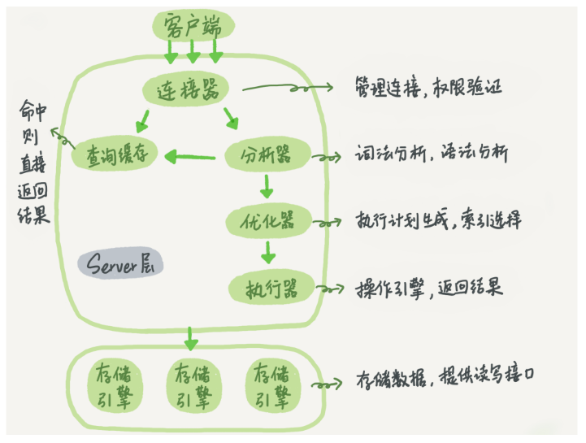

MySQL 整体来看，其实就有两块：一块是 Server 层，它主要做的是 MySQL 功能层面的事情；还有一块是引擎层，负责存储相关的具体事宜 

连接完成后，如果你没有后续的动作，这个连接就处于空闲状态，你可以在 show processlist 命令中看到它，Command 列显示为“Sleep”的这一行，就表示现在系统里面有一个空闲连接 ：


客户端如果太长时间没动静，连接器就会自动将它断开。这个时间是由参数 wait_timeout 控制的，默认值是 8 小时。

建立连接的过程通常比较复杂，所以使用中应该尽量将连接复用，使用长连接，但是全部使用长连接后，你可能会发现，有些时候 MySQL 占用内存涨得特别快，这是因为 MySQL 在执行过程中临时使用的内存是管理在连接对象里面的。这些资源会在连接断开的时候才释放。所以如果长连接累积下来，可能导致内存占用太大，被系统强行杀掉（OOM），从现象看就是 MySQL 异常重启了。

解决这个问题的方案：

1. 定期断开长连接。使用一段时间，或者程序里面判断执行过一个占用内存的大查询后，断开连接，之后要查询再重连。
2. 如果你用的是 MySQL 5.7 或更新版本，可以在每次执行一个比较大的操作后，通过执行 mysql_reset_connection 来重新初始化连接资源。这个过程不需要重连和重新做权限验证，但是会将连接恢复到刚刚创建完时的状态

查询缓存，弊大于利，因为查询缓存的命中率会非常低，缓存失效的情况比较普遍，除非是配置表这种不经常更新的。

## 短连接风暴

正常的短连接模式就是连接到数据库后，执行很少的 SQL 语句就断开，下次需要的时候再重连，业务中要尽量避免大量使用短连接。如果使用的是短连接，在业务高峰期的时候，就可能出现连接数突然暴涨的情况。 

MySQL 建立连接的过程，成本是很高的。除了正常的网络连接三次握手外，还需要做登录权限判断和获得这个连接的数据读写权限 。在数据库压力比较小的时候，这些额外的成本并不明显。 

短连接模型存在一个风险：一旦数据库处理得慢一些，连接数就会暴涨，每个连接保持的时间更长的情况下，再有新建连接，可能就会超过最大连接数。当超过max_connections 时，系统就会拒绝接下来的连接请求，并报错提示“Too many connections” 

这种情况下，一般不要调高max_connections，因为更多连接进来后系统的负载可能会进一步加大，大量的资源耗费在权限验证等逻辑上。结果可能是适得其反，已经连接的线程拿不到 CPU 资源去执行业务的 SQL 请求 

正确的临时处理办法是：

1、处理掉那些占着连接但不工作的线程

对于那些不需要保持的连接，我们可以通过 kill connection 主动踢掉。这个行为跟事先设置 wait_timeout 的效果是一样的 

执行show processlist ，查看那些正在sleep状态的线程。然后查information_schema 库的 innodb_trx 表，查看具体的事务状态。如果对应的trx_mysql_thread_id 不为空，说明该线程还在事务中。

优先断开那些事务外空闲太久的连接，如查询；如果这样还不够，再考虑断开事务内空闲太久的连接 

从数据库端主动断开连接可能是有损的，尤其是有的应用端收到这个错误后，不重新连接，而是直接用这个已经不能用的句柄重试查询。这会导致从应用端看上去，“MySQL 一直没恢复” 

连接异常断开是常有的事，业务侧代码中要做好正常重连并重试的机制

2、减少连接过程的消耗

有的业务代码会在短时间内先大量申请数据库连接做备用，如果现在数据库确认是被连接行为打挂了，那么一种可能的做法，是让数据库跳过权限验证阶段。

跳过权限验证的方法是：重启数据库，并使用–skip-grant-tables 参数启动。这样，整个 MySQL 会跳过所有的权限验证阶段，包括连接过程和语句执行过程在内。

在 MySQL 8.0 版本里，如果你启用–skip-grant-tables 参数，MySQL 会默认把 --skip-networking 参数打开，表示这时候数据库只能被本地的客户端连接。可见，MySQL 官方对 skip-grant-tables 这个参数的安全问题也很重视。 

使用这种方式就有被外网访问的风险。

## QPS突增问题

有时候由于业务突然出现高峰，或者应用程序 bug，导致某个语句的 QPS 突然暴涨，也可能导致 MySQL 压力过大，影响服务 

此时最理想的情况是让业务把这个功能下掉，服务自然就会恢复 

在数据库端的处理方法有以下几种：

1、在数据库端把对应业务的白名单去掉

2、如果这个新功能使用的是单独的数据库用户，可以用管理员账号把这个用户删掉，然后断开现有连接 

3、如果这个新增的功能跟主体功能是部署在一起的，那么我们只能通过处理语句来限制。这时，我们可以使用上面提到的查询重写功能，把压力最大的 SQL 语句直接重写成"select 1"返回 。要注意避免误伤其他业务，还要考虑对这条SQL后续业务逻辑的影响程度

## 权限

在 MySQL 里面，grant 语句是用来给用户赋权的。 flush privileges 命令的意思是让赋权语句生效，接下来就讨论这两个语句的执行

### 创建用户

创建用户的命令：

~~~sql
create user 'ua'@'%' identified by 'pa';
~~~

代表创建一个用户名为ua的用户，密码是pa，在 MySQL 里面，用户名 (user)+ 地址 (host) 才表示一个用户，因此 ua@ip1 和 ua@ip2 代表的是两个不同的用户。 

这条命令做了两个动作：

1. 磁盘上，往 mysql.user 表里插入一行，由于没有指定权限，所以这行数据上所有表示权限的字段的值都是 N；
2. 内存里，往数组 acl_users 里插入一个 acl_user 对象，这个对象的 access 字段值为 0。

相当于此时该用户是没有任何权限的，此时查询mysql.user表：

~~~sql
select * from mysql.user where user = 'ua'
~~~

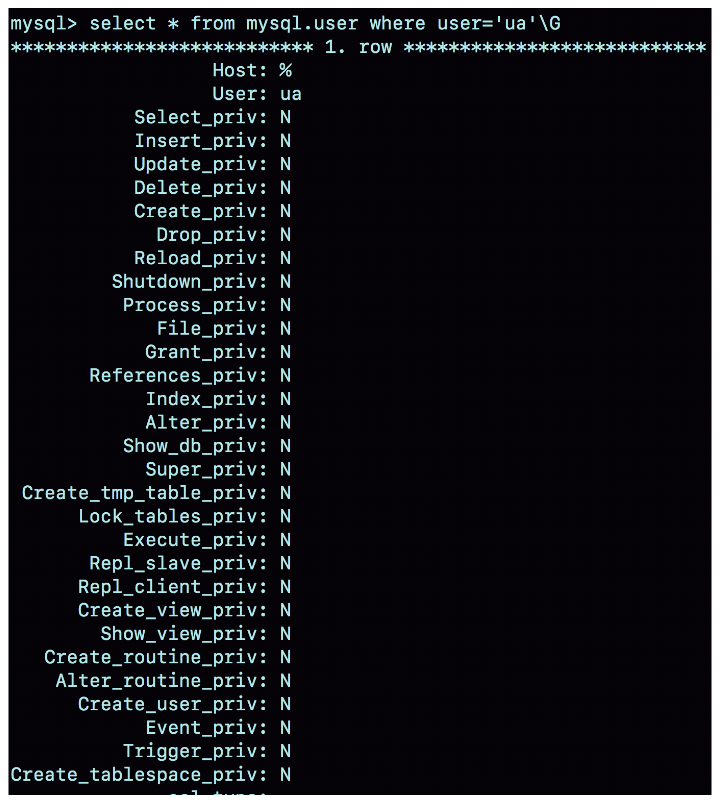

在 MySQL 中，用户权限是有不同的范围的，有以下几种范围的权限：

### 全局权限

全局权限，作用于整个 MySQL 实例，这些权限信息保存在 mysql 库的 user 表里。例如要给用户 ua 赋一个最高权限的话，语句是这么写的： 

~~~sql
grant all privileges on *.* to 'ua'@'%' with grant option;
~~~

这个 grant 命令做了两个动作：

1. 磁盘上，将 mysql.user 表里，用户’ua’@’%'这一行的所有表示权限的字段的值都修改为‘Y’；
2. 内存里，从数组 acl_users 中找到这个用户对应的对象，将 access 值（权限位）修改为二进制的“全 1”。

在这个 grant 命令执行完成后，如果有新的客户端使用用户名 ua 登录成功，MySQL 会为新连接维护一个线程对象，然后从 acl_users 数组里查到这个用户的权限，并将权限值拷贝到这个线程对象中。之后在这个连接中执行的语句，所有关于全局权限的判断，都直接使用线程对象内部保存的权限位。

基于上面的分析我们可以知道：

1. grant 命令对于全局权限，同时更新了磁盘和内存。命令完成后即时生效，接下来新创建的连接会使用新的权限。
2. 对于一个已经存在的连接，它的全局权限不受 grant 命令的影响。

在生产环境一般不会给用户设置这种权限，如果一个用户有所有权限，一般就不应该设置为所有 IP 地址都可以访问。

如果要回收上面的 grant 语句赋予的权限，你可以使用下面这条命令：

~~~sql
revoke all privileges on *.* from 'ua'@'%';
~~~

这条 revoke 命令的用法与 grant 类似，做了如下两个动作：

1. 磁盘上，将 mysql.user 表里，用户’ua’@’%'这一行的所有表示权限的字段的值都修改为“N”；
2. 内存里，从数组 acl_users 中找到这个用户对应的对象，将 access 的值修改为 0。

grant命令可以创建用户并赋予权限的，例如下面这条命令：

```sql
grant super on *.* to 'ua'@'%' identified by 'pa';
```

这条命令加了 identified by ‘密码’， 语句的逻辑里面除了赋权外，还包含了：

1. 如果用户’ua’@’%'不存在，就创建这个用户，密码是 pa；
2. 如果用户 ua 已经存在，就将密码修改成 pa。

这也是一种不建议的写法，因为这种写法很容易就会不慎把密码给改了。 

### db权限

除了全局权限，MySQL 也支持库级别的权限定义。如果要让用户 ua 拥有库 db1 的所有权限，可以执行下面这条命令： 

~~~sql
grant all privileges on db1.* to 'ua'@'%' with grant option;
~~~

基于库的权限记录保存在 mysql.db 表中，在内存里则保存在数组 acl_dbs 中。这条 grant 命令做了如下两个动作：

1. 磁盘上，往 mysql.db 表中插入了一行记录，所有权限位字段设置为“Y”；
2. 内存里，增加一个对象到数组 acl_dbs 中，这个对象的权限位为“全 1”。

下图就是此刻用户在db表中的状态：

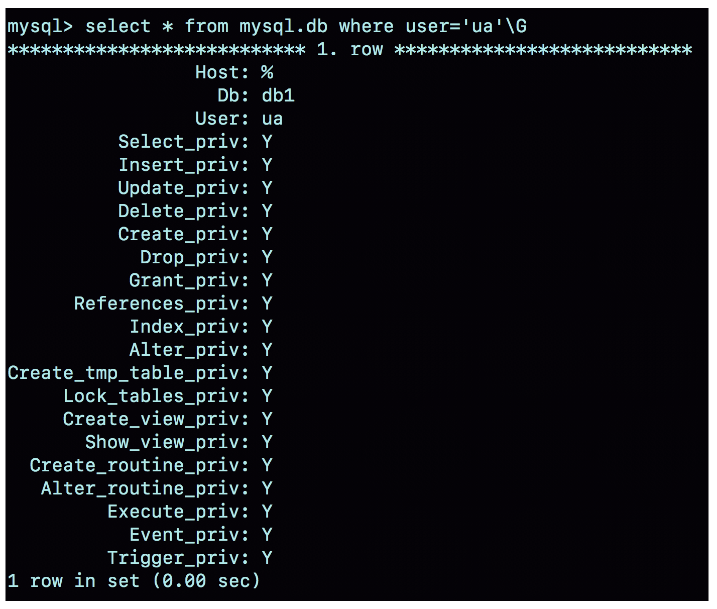

每次需要判断一个用户对一个数据库读写权限的时候，都需要遍历一次 acl_dbs 数组，根据 user、host 和 db 找到匹配的对象，然后根据对象的权限位来判断。

也就是说，grant 修改 db 权限的时候，是同时对磁盘和内存生效的。

### 表权限和列权限

除了 db 级别的权限外，MySQL 支持更细粒度的表权限和列权限。其中，表权限定义存放在表 mysql.tables_priv 中，列权限定义存放在表 mysql.columns_priv 中。这两类权限，组合起来存放在内存的 hash 结构 column_priv_hash 中。 

这两类权限的赋权命令如下： 

~~~sql
create table db1.t1(id int, a int);
 
grant all privileges on db1.t1 to 'ua'@'%' with grant option;
GRANT SELECT(id), INSERT (id,a) ON mydb.mytbl TO 'ua'@'%' with grant option;
~~~

跟 db 权限类似，这两个权限每次 grant 的时候都会修改数据表，也会同步修改内存中的 hash 结构。因此，对这两类权限的操作，也会马上影响到已经存在的连接。 

### flush privileges 

除了全局权限， grant 语句都是即时生效的 ，一般不用在授予权限后执行flush privileges语句

flush privileges语句执行时：清空 acl_users 数组，然后从 mysql.user 表中读取数据重新加载，重新构造一个 acl_users 数组。也就是说，以数据表中的数据为准，会将全局权限内存数组重新加载一遍。 同样地，对于 db 权限、表权限和列权限，MySQL 也做了这样的处理。 

也就是说：如果内存的权限数据和磁盘数据表相同的话，不需要执行 flush privileges。而如果我们都是用 grant/revoke 语句来执行的话，内存和数据表本来就是保持同步更新的 

使用flush privileges的场景：当数据表中的权限数据跟内存中的权限数据不一致的时候，这一般是由不规范的操作引起，例如直接用DML语句操作系统权限表，就会引起一些问题，例如：

* 删除mysql.user表中的记录后，其他session依然可以用该用户登录，直到flush privileges后，其他session才无法用此用户登录。这是因为仅仅只是删除mysql.user表中的记录，但不修改内存中的 acl_users 数组，系统还会判断该用户存在
* 删除mysql.user表中的记录后，后续如果不使用刷新命令，既无法给该用户赋予权限，也无法创建该用户，这也是数据不一致引起的问题

## 分区表

### 分区表的定义

创建一个分区表 t：

~~~sql
CREATE TABLE `t` (
  `ftime` datetime NOT NULL,
  `c` int(11) DEFAULT NULL,
  KEY (`ftime`)
) ENGINE=InnoDB DEFAULT CHARSET=latin1
PARTITION BY RANGE (YEAR(ftime))
(PARTITION p_2017 VALUES LESS THAN (2017) ENGINE = InnoDB,
 PARTITION p_2018 VALUES LESS THAN (2018) ENGINE = InnoDB,
 PARTITION p_2019 VALUES LESS THAN (2019) ENGINE = InnoDB,
PARTITION p_others VALUES LESS THAN MAXVALUE ENGINE = InnoDB);
insert into t values('2017-4-1',1),('2018-4-1',1);
~~~

这里面使用的是range分区，还可以使用hash 分区、list 分区等分区方法 

创建这个表之后，MySQL生成了四个文件：


我在表 t 中初始化插入了两行记录，按照定义的分区规则，这两行记录分别落在 p_2018 和 p_2019 这两个分区上。

可以看到，这个表包含了一个.frm 文件和 4 个.ibd 文件，每个分区对应一个.ibd 文件。也就是说：

- 对于引擎层来说，这是 4 个表；
- 对于 Server 层来说，这是 1 个表。

### 引擎层行为

观察下面这个例子：

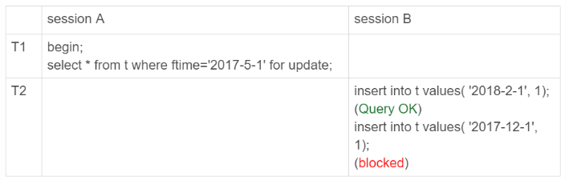

我们初始化表 t 的时候，只插入了两行数据， ftime 的值分别是，‘2017-4-1’ 和’2018-4-1’ 。session A 的 select 语句对索引 ftime 上这两个记录之间的间隙加了锁。如果是一个普通表的话，那么 T1 时刻，在表 t 的 ftime 索引上，间隙和加锁状态应该是下图这样的：

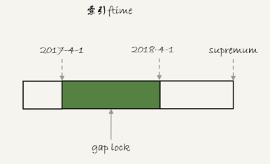

也就是说，‘2017-4-1’ 和’2018-4-1’ 这两个记录之间的间隙是会被锁住的。那么，sesion B 的两条插入语句应该都要进入锁等待状态。

但是，从上面的实验效果可以看出，session B 的第一个 insert 语句是可以执行成功的。这是因为，对于引擎来说，p_2018 和 p_2019 是两个不同的表，也就是说 2017-4-1 的下一个记录并不是 2018-4-1，而是 p_2018 分区的 supremum。所以 T1 时刻，在表 t 的 ftime 索引上，间隙和加锁的状态其实是下图这样的：

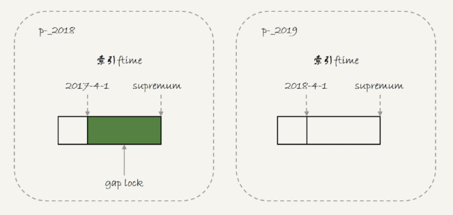

由于分区表的规则，session A 的 select 语句其实只操作了分区 p_2018，因此加锁范围就是图中深绿色的部分。 所以，session B 要写入一行 ftime 是 2018-2-1 的时候是可以成功的，而要写入 2017-12-1 这个记录，就要等 session A 的间隙锁。 

这个现象对于MyISAM引擎来说也是相同的，例如下面这个例子：

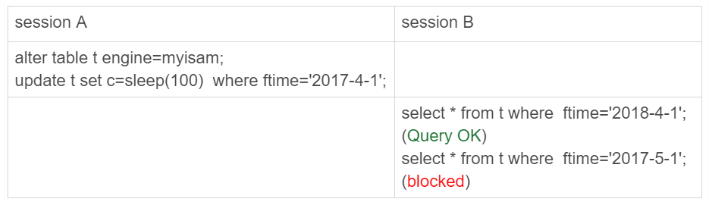

在 session A 里面，我用 sleep(100) 将这条语句的执行时间设置为 100 秒。由于 MyISAM 引擎只支持表锁，所以这条 update 语句会锁住整个表 t 上的读。

但我们看到的结果是，session B 的第一条查询语句是可以正常执行的，第二条语句才进入锁等待状态。

这正是因为 MyISAM 的表锁是在引擎层实现的，session A 加的表锁，其实是锁在分区 p_2018 上。因此，只会堵住在这个分区上执行的查询，落到其他分区的查询是不受影响的。

手工分表和分区表对于引擎层是相同的，手工分表的逻辑，也是找到需要更新的所有分表，然后依次执行更新。在性能上，这和分区表并没有实质的差别。分区表和手工分表，一个是由 server 层来决定使用哪个分区，一个是由应用层代码来决定使用哪个分表。两种方式的关键差别在于：打开表的行为

### server层行为

每当第一次访问一个分区表的时候，MySQL 需要把所有的分区都访问一遍。一个典型的报错情况是这样的：如果一个分区表的分区很多，比如超过了 1000 个，而 MySQL 启动的时候，open_files_limit 参数使用的是默认值 1024，那么就会在访问这个表的时候，由于需要打开所有的文件，导致打开表文件的个数超过了上限而报错。 

例如在MyISAM 引擎表中，该表分区数很多，插入一条语句的报错：


可以看到，这条 insert 语句，明显只需要访问一个分区，但语句却无法执行。 使用 InnoDB 引擎的话，并不会出现这个问题。 

MyISAM 分区表使用的分区策略，我们称为通用分区策略（generic partitioning），每次访问分区都由 server 层控制。不推荐使用

从 MySQL 5.7.9 开始，InnoDB 引擎引入了本地分区策略（native partitioning）。这个策略是在 InnoDB 内部自己管理打开分区的行为。（在InnoDB引擎打开文件超过 innodb_open_files这个值的时候，就会关掉一些之前打开的文件。 InnoDB分区表使用了本地分区策略以后，即使分区个数大于open_files_limit ，打开InnoDB分区表也不会报“打开文件过多”这个错误）

在server层来看，分区表就是一张表，例如下面这个场景：

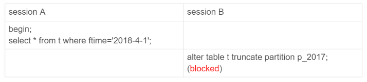

可以看到，虽然 session B 只需要操作 p_2107 这个分区，但是由于 session A 持有整个表 t 的 MDL 锁，就导致了 session B 的 alter 语句被堵住。 

所以分区表做DDL的时候，影响会更大，如果你使用的是普通分表，那么当你在 truncate 一个分表的时候，肯定不会跟另外一个分表上的查询语句，出现 MDL 锁冲突。 

总结来说：

1. MySQL 在第一次打开分区表的时候，需要访问所有的分区；
2. 在 server 层，认为这是同一张表，因此所有分区共用同一个 MDL 锁；
3. 在引擎层，认为这是不同的表，因此 MDL 锁之后的执行过程，会根据分区表规则，只访问必要的分区，例如where条件中存在分区的key

分区表的应用场景：

* 分区表的一个显而易见的优势是对业务透明，相对于用户分表来说，使用分区表的业务代码更简洁，如果使用业务分表，还需要维护分库分表中间件
* 分区表可以很方便的清理历史数据。 如果一项业务跑的时间足够长，往往就会有根据时间删除历史数据的需求。这时候，按照时间分区的分区表，就可以直接通过 alter table t drop partition …这个语法删掉分区，从而删掉过期的历史数据。 这个语句效果和drop普通表类似，相比delete语句更快，对系统影响小

分区表的使用建议：

* 分区并不是越细越好，太细的分区表会导致硬件能力无法发挥，而且造成访问时打开过多的分区，影响性能
* 分区也不要提前预留太多，在使用之前预先创建即可。 否则还是会影响性能， 因为MySQL 在第一次打开分区表的时候，需要访问所有的分区

## 自增id

MySQL 里有很多自增的 id，每个自增 id 都是定义了初始值，然后不停地往上加步长 。自增id是有上限值的，用完了就会出现各种状况，下面分析下MySQL的几种自增id：

1、自增字段

表定义的自增值达到上限后的逻辑是：再申请下一个 id 时，得到的值保持不变。 

因此在达到上限后再连续插入，就会不断报冲突错误，这种自增id对于一个频繁插入删除数据的表来说，是可能会被用完的。因此在建表的时候你需要考察你的表是否有可能达到这个上限，如果有可能，就应该创建成 8 个字节的 bigint unsigned。 

2、InnoDB 系统自增 row_id

如果你创建的 InnoDB 表没有指定主键，那么 InnoDB 会给你创建一个不可见的，长度为 6 个字节的 row_id。InnoDB 维护了一个全局的 dict_sys.row_id 值，所有无主键的 InnoDB 表，每插入一行数据，都将当前的 dict_sys.row_id 值作为要插入数据的 row_id，然后把 dict_sys.row_id 的值加 1。 

实际上，在代码实现时 row_id 是一个长度为 8 字节的无符号长整型 (bigint unsigned)。但是，InnoDB 在设计时，给 row_id 留的只是 6 个字节的长度，这样写到数据表中时只放了最后 6 个字节，所以 row_id 能写到数据表中的值范围是0到2的48次方-1，当达到上限值再申请就会申请到0然后进入下一个循环

当MySQL表频繁插入且运行足够久，还是有可能达到上限值的，而且达到上限值后出现重复row_id并不会报错，而是直接更新相同row_id的记录，这比出现主键冲突错误还糟糕，因为它是在没有感知的情况下造成数据丢失的，数据可靠性受到了威胁。

因此尽量不要不指定主键，应该在 InnoDB 表中主动创建自增主键 

3、Xid

在redo log 和 binlog 相配合的时候，提到了它们有一个共同的字段叫作 Xid。它在 MySQL 中是用来对应事务的。 

MySQL 内部维护了一个全局变量 global_query_id，每次执行语句的时候将它赋值给 Query_id，然后给这个变量加 1。如果当前语句是这个事务执行的第一条语句，那么 MySQL 还会同时把 Query_id 赋值给这个事务的 Xid。

而 global_query_id 是一个纯内存变量，重启之后就清零了。所以你就知道了，在同一个数据库实例中，不同事务的 Xid 也是有可能相同的。

但是 MySQL 重启之后会重新生成新的 binlog 文件，这就保证了，同一个 binlog 文件里，Xid 一定是惟一的。

虽然 MySQL 重启不会导致同一个 binlog 里面出现两个相同的 Xid，但是如果 global_query_id 达到上限后，就会继续从 0 开始计数。从理论上讲，还是就会出现同一个 binlog 里面出现相同 Xid 的场景。但这个一般不可能，因为不会有那么大的事务，能不断消耗Xid的生成。

4、Innodb trx_id

Xid 和 InnoDB 的 trx_id 是两个容易混淆的概念 ：

* Xid 是由 server 层维护的。InnoDB 内部使用 Xid，就是为了能够在 InnoDB 事务和 server 之间做关联 
* trx_id 就是事务id，它是数据可见性的关键，每一行数据都记录了更新它的 trx_id，当一个事务读到一行数据的时候，判断这个数据是否可见的方法，就是通过事务的一致性视图与这行数据的 trx_id 做对比。 

InnoDB 内部维护了一个 max_trx_id 全局变量，每次需要申请一个新的 trx_id 时，就获得 max_trx_id 的当前值，然后并将 max_trx_id 加 1。 对于正在执行的事务，你可以从 information_schema.innodb_trx 表中看到事务的 trx_id。 

有时可以发现innodb_trx表中的trx_id有非常大的值，有时候也会出现较小的值：

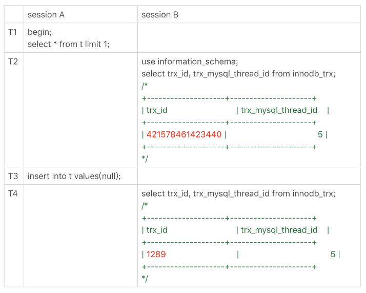

之所以会出现超大的事务id，是因为对应的session还没有涉及到更新，是一个只读事务，对于只读事务，InnoDB 并不会分配 trx_id，此时它真正的事务id就是0，直到执行了插入动作，才真正分配了事务id。（修改类语句都算非只读事务，包括select for update）

一个事务中，事务id并不会一定增长1，例如update 和 delete 语句除了事务本身，还涉及到标记删除旧数据，也就是要把数据放到 purge 队列里等待后续物理删除，这个操作也会把 max_trx_id+1， 因此在一个事务中至少加 2 ；而且表的索引信息统计这类操作，也是会启动内部事务的，事务id并不是按照1递增的

只读事务的临时事务id是由当前的trx变量计算得到的：当前事务的 trx 变量的指针地址转成整数，再加上 2的48次方，根据这个算法：

* 这个临时的事务id在事务执行过程中是不变的，因为trx变量的指针地址不变
* 多个并行的只读事务的临时事务id不同，因为每个事务的trx变量地址不一样
* 区别于其他非只读事务，加上了一个非常大的数值

只读事务不分配事务id的好处：

* 减小事务视图里面活跃事务数组的大小，简化数据可见性判断流程
* 减少事务id的申请次数

理论上说，事务id是可以达到上限的，然后会从0继续开始，导致事务重复，出现数据可见性问题，但需要很长很长时间的高压力运行，一般不会出现。

5、thread_id

线程 id 才是 MySQL 中最常见的一种自增 id。平时我们在查各种现场的时候，show processlist 里面的第一列，就是 thread_id 

系统保存了一个全局变量 thread_id_counter，每新建一个连接，就将 thread_id_counter 赋值给这个新连接的线程变量 

thread_id_counter 定义的大小是 4 个字节，因此达到 2的32次方-1时，它就会重置为0，但不会同时在 show processlist 里看到两个相同的 thread_id ，每次分配时，MySQL会检查当前活跃的线程中，是否存在重复的线程id，如果重复则继续加1

# 维护

## 两阶段提交

MySQL 的WAL技术：Write-Ahead Logging，先写日志，再写磁盘。

有了 redo log，InnoDB 就可以保证即使数据库发生异常重启，之前提交的记录都不会丢失，这个能力称为crash-safe（innodb_flush_log_at_trx_commit 这个参数设置成 1 的时候，表示每次事务的 redo log 都直接持久化到磁盘，建议设置为1）

redo log 是 InnoDB 引擎特有的日志，而 Server 层也有自己的日志，称为 binlog（归档日志） ，两种日志的区别：

1. redo log 是 InnoDB 引擎特有的；binlog 是 MySQL 的 Server 层实现的，所有引擎都可以使用。
2. redo log 是物理日志，记录的是“在某个数据页上做了什么修改”；binlog 是逻辑日志，记录的是这个语句的原始逻辑，比如“给 ID=2 这一行的 c 字段加 1 ”。
3. redo log 是循环写的，空间固定会用完；binlog 是可以追加写入的。“追加写”是指 binlog 文件写到一定大小后会切换到下一个，并不会覆盖以前的日志。

执行器和 InnoDB 引擎在执行 update语句时的内部流程：

1. 执行器先找引擎取 ID=2 这一行。ID 是主键，引擎直接用树搜索找到这一行。如果 ID=2 这一行所在的数据页本来就在内存中，就直接返回给执行器；否则，需要先从磁盘读入内存，然后再返回。
2. 执行器拿到引擎给的行数据，把这个值加上 1，比如原来是 N，现在就是 N+1，得到新的一行数据，再调用引擎接口写入这行新数据。
3. 引擎将这行新数据更新到内存中，同时将这个更新操作记录到 redo log 里面，此时 redo log 处于 prepare 状态。然后告知执行器执行完成了，随时可以提交事务。
4. 执行器生成这个操作的 binlog，并把 binlog 写入磁盘。
5. 执行器调用引擎的提交事务接口，引擎把刚刚写入的 redo log 改成提交（commit）状态，更新完成。

可以看到上面将redo log 的写入拆成了两个步骤：prepare 和 commit，这就是"两阶段提交" 

有时出现表误操作、扩容时，就需要恢复数据库的数据，基于binlog的数据恢复过程：因为binlog会记录所有的逻辑操作，如果要恢复数据库到某个时间点，首先找到该时间点前最近的一次全量备份，将该备份恢复到临时库，然后在该备份的时间点开始将binlog取出重放到恢复的时间点。（sync_binlog 这个参数设置成 1 的时候，表示每次事务的 binlog 都持久化到磁盘，建议设置成 1 ，这样可以保证 MySQL 异常重启之后 binlog 不丢失 ）

上面的数据恢复是基于全量备份的，全量备份可以分为一天一备跟一周一备：

* 一天一备份：需要存储的binlog多，最坏情况下需要重放一天的binlog，RTO（恢复目标时间） 少
* 一周一备份：需要存储的binlog少，最坏情况下需要重放一周的binlog，RTO（恢复目标时间） 多

为什么要两阶段提交？这是为了保持redo log和binlog的一致，如果没有两阶段提交，因为两个日志是串行写的，总会出现一个写完，系统宕机后，另一个没有写的情况，因此出现了prepare状态的redo log

在两阶段提交的过程中，如果发生了异常重启，数据的恢复过程：

1、redo log 处于 prepare 状态之后，写 binlog 之前，发生了崩溃（crash） 。此时redo log未提交，崩溃恢复的时候事务会回滚；binlog也还没写，数据更新也不会被传递到备库

2、binlog 写完 ，redo log 还没 commit 前 ，此时发生了崩溃。由于redo log中的事务是不完整的，此时会进一步判断对应事务的binlog是否完整，如果是完整的，则提交事务，否则就回滚。所以此时崩溃恢复时会提交事务，由于binlog是完整的，此时从库也会执行这个更新，主备一致。

上面的过程中，有一个前提是，redo log和binlog有一个共同的字段，叫XID，因此从redo log才能找到对应的binlog

崩溃恢复为什么要涉及两种日志？有一部分历史原因，最初是没有redo log的，MySQL 的原生引擎是 MyISAM，设计之初就有没有支持崩溃恢复 ，后续InnoDB 在作为 MySQL 的插件加入后，带来了redo log

如果只用binlog来做崩溃恢复可以吗？答案是不行，因为崩溃恢复时，紧靠binlog的完整性无法确定哪个事务应该应用，因为数据是先写到内存中，记到日志里，后写到磁盘上的，如果写入内存后异常重启了，binlog是完整的，它并不能将这部分数据找回，而redo log可以根据脏页刷新确定checkpoint开始恢复

如果只用redo log来做崩溃恢复可以吗？原则上是可以的，但binlog有它不可替代的优势，如追加写，主从复制。

## binlog的写入

binlog 的写入逻辑：事务执行过程中，先把日志写到 binlog cache，事务提交的时候，再把 binlog cache 写到 binlog 文件中 

一个事务的 binlog 是不能被拆开的，因此不论这个事务多大，也要确保一次性写入。在写入之前，binlog就保存在binlog cache中。

系统给 binlog cache 分配了一片内存，每个线程一个，参数 binlog_cache_size 用于控制单个线程内 binlog cache 所占内存的大小。如果超过了这个参数规定的大小，就要暂存到磁盘。 

从binlog cache 写入binlog文件的动作是分为两步进行的：

1、write：指把日志写入到文件系统的 page cache，并没有把数据持久化到磁盘，所以速度比较快（write也可以立刻观察到文件做了修改）

2、fsync：将数据持久化到磁盘的操作 

write 和 fsync 的时机，是由参数 sync_binlog 控制的：

1. sync_binlog=0 的时候，表示每次提交事务都只 write，不 fsync；
2. sync_binlog=1 的时候，表示每次提交事务都会执行 fsync；
3. sync_binlog=N(N>1) 的时候，表示每次提交事务都 write，但累积 N 个事务后才 fsync。

因此，在出现 IO 瓶颈的场景里，将 sync_binlog 设置成一个比较大的值，可以提升性能，风险就是崩溃时可能丢失日志，一般设置为100-1000

## redo log的写入

事务在执行过程中，生成的 redo log 是要先写到 redo log buffer 的 。

在写redo log时存在几个状态：

* redo log存在 redo log buffer中，它是MySQL进程内存的一部分
* redo log被写入磁盘，但没有持久化，存到了文件系统的page cache中
* redo log被真正持久化到磁盘

为了控制 redo log 的写入策略，InnoDB 提供了 innodb_flush_log_at_trx_commit 参数，它有三种可能取值：

1. 设置为 0 的时候，表示每次事务提交时都只是把 redo log 留在 redo log buffer 中 ;
2. 设置为 1 的时候，表示每次事务提交时都将 redo log 直接持久化到磁盘；
3. 设置为 2 的时候，表示每次事务提交时都只是把 redo log 写到 page cache。

写入redo log的几个时机：

1、当上面的参数设置为1时，每次事务提交都将redo log直接持久化到磁盘

2、InnoDB 有一个后台线程，每隔 1 秒，就会把 redo log buffer 中的日志，调用 write 写到文件系统的 page cache，然后调用 fsync 持久化到磁盘。 也就是说一个未提交事务的redo log，也有可能被持久化到磁盘

3、redo log buffer 占用的空间即将达到 innodb_log_buffer_size 一半的时候，后台线程会主动写盘。由于这个事务并没有提交，所以这个写盘动作只是 write，而没有调用 fsync，也就是只留在了文件系统的 page cache 

4、并行的事务提交的时候，顺带将这个事务的 redo log buffer 持久化到磁盘

如果把 innodb_flush_log_at_trx_commit 设置成 1，那么 redo log 在 prepare 阶段就要持久化一次 。通常我们说 MySQL 的“双 1”配置，指的就是 sync_binlog 和 innodb_flush_log_at_trx_commit 都设置成 1。也就是说，一个事务完整提交前，需要等待两次刷盘，一次是 redo log（prepare 阶段），一次是 binlog （InnoDB 就认为 redo log 在 commit 的时候就不需要 fsync 了，只会 write 到文件系统的 page cache 中就够了，因为commit后，redo log未刷到磁盘时系统崩溃，检查到binlog是完整的，就会让处于prepare阶段的redo log执行事务commit）

如果每次事务commit都写两次磁盘，性能损耗就会很严重，为了解决这个问题，MySQL使用了组提交（group commit） 机制，也就是redo log和binlog都可以批量刷新到磁盘，一次组提交里面，组员越多，节约磁盘 IOPS 的效果越好 。在两阶段提交中加入write和flush的时机：

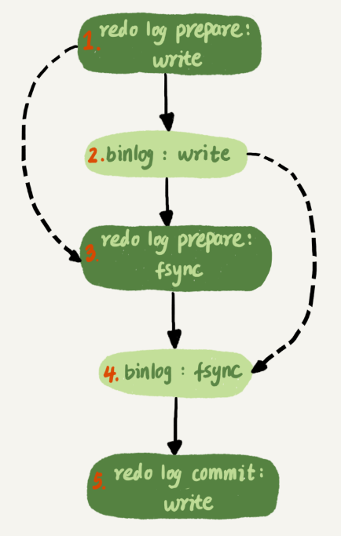

这样让write和flush隔一段时间执行，就可以让一段时间内积攒的日志一起fsync到磁盘。

不过通常情况下第 3 步执行得会很快，所以 binlog 的 write 和 fsync 间的间隔时间短，binlog 的组提交的效果通常不如 redo log 的效果那么好 

如果你想提升 binlog 组提交的效果，可以通过设置 binlog_group_commit_sync_delay 和 binlog_group_commit_sync_no_delay_count 来实现。

1. binlog_group_commit_sync_delay 参数，表示延迟多少微秒后才调用 fsync;
2. binlog_group_commit_sync_no_delay_count 参数，表示累积多少次以后才调用 fsync。

这两个条件是或的关系，也就是说只要有一个满足条件就会调用 fsync。

WAL 机制主要得益于两个方面：

1. redo log 和 binlog 都是顺序写，磁盘的顺序写比随机写速度要快；
2. 组提交机制，可以大幅度降低磁盘的 IOPS 消耗。

如果 MySQL 现在出现了性能瓶颈，而且瓶颈在 IO 上，可以通过下列方法来提升性能：

1. 设置 binlog_group_commit_sync_delay 和 binlog_group_commit_sync_no_delay_count 参数，减少 binlog 的写盘次数。这个方法是基于“额外的故意等待”来实现的，因此可能会增加语句的响应时间，但没有丢失数据的风险。
2. 将 sync_binlog 设置为大于 1 的值（比较常见是 100~1000）。这样做的风险是，主机掉电时会丢 binlog 日志。
3. 将 innodb_flush_log_at_trx_commit 设置为 2。这样做的风险是，主机掉电的时候会丢数据。（不建议这个值设置成0，表示 redo log 只保存在内存中，这样的话 MySQL 本身异常重启也会丢数据，风险太大。而 redo log 写到文件系统的 page cache 的速度也是很快的，所以将这个参数设置成 2 跟设置成 0 其实性能差不多，但这样做 MySQL 异常重启时就不会丢数据了，只有主机掉电会丢，相比之下风险会更小）

设置非双1配置的场景，一般会设置 innodb_flush_logs_at_trx_commit=2、sync_binlog=1000 

* 有预知的业务高峰期
* 备库延迟，为了让备库尽快赶上主库 
* 批量导入数据时

## 主备同步

数据库部署在多个节点时，建议把备库设置为已读模式，原因是：

1. 有时候一些运营类的查询语句会被放到备库上去查，设置为只读可以防止误操作；
2. 防止切换逻辑有 bug，比如切换过程中出现双写，造成主备不一致；
3. 可以用 readonly 状态，来判断节点的角色。

备库的只读模式对超级权限用户是无效的，也就是它依然能获取主库的更新。

备库 B 跟主库 A 之间维持了一个长连接。主库 A 内部有一个线程，专门用于服务备库 B 的这个长连接。一个事务日志同步的完整过程是这样的： 

* 在备库 B 上通过 change master 命令，设置主库 A 的 IP、端口、用户名、密码，以及要从哪个位置开始请求 binlog，这个位置包含文件名和日志偏移量。
* 在备库 B 上执行 start slave 命令，这时候备库会启动两个线程 ：io_thread 和 sql_thread ，其中 io_thread 负责与主库建立连接 
* 连接建立后，主库A校验完用户名、密码后，开始按照备库 B 传过来的位置，从本地读取 binlog，发给 B 
* 备库 B 拿到 binlog 后，写到本地文件，称为中转日志（relay log） 
* sql_thread 线程读取中转日志，解析出日志里的命令，并执行 

实际生产上使用比较多的是双 M 结构 ，也就是两个节点互为主备，主备切换时无需修改主备关系。

双M结构有一个问题，那就是可能一条命令执行完毕之后，它被从库执行，后续又被从库的从库执行，造成循环复制的问题。

为了解决这个问题，MySQL 在 binlog 中记录了这个命令第一次执行时所在实例的 server id ，不同的数据库有不同的server id，一个备库接到 binlog 并在重放的过程中，生成与原 binlog 的 server id 相同的新的 binlog 。每个库在收到从自己的主库发过来的日志后，先判断binlog的 server id，如果跟自己的相同，表示这个日志是自己生成的，就直接丢弃这个日志 

出现循环复制的场景：

1、修改了server id，导致日志传回来的时候发现server_id 跟自己的 server_id 不同，就只能执行了

2、三节点的时候，数据库迁移场景，B和C互为主备，A执行的一条事务就可能在B和C之间循环复制，因为B和C判断时发现日志的server_id 和自己的一直不同，此时可以这样临时处理：

在B和C任何一个节点执行这个命令，指示节点不执行从A传来的binlog：

~~~sql
stop slave；
CHANGE MASTER TO IGNORE_SERVER_IDS=(server_id_of_B);
start slave;
~~~

等数据迁移完毕，再把这个值改回来：

~~~sql
stop slave；
CHANGE MASTER TO IGNORE_SERVER_IDS=();
start slave;
~~~

## binlog的三种格式

binlog有三种格式：statement、row和mixed，用变量binlog_format控制：

* statement：它记录的是执行的sql语句、XID，某些sql语句可能是unsafe的，可以执行完用show warnings查看，例如下面的sql：

  ~~~sql
  delete from t /*comment*/  where a>=4 and t_modified<='2018-11-10' limit 1;
  ~~~

  对于这条语句来说，很有可能出现主备数据不一致的情况：

  1. 如果 delete 语句使用的是索引 a，那么会根据索引 a 找到第一个满足条件的行，也就是说删除的是 a=4 这一行；
  2. 但如果使用的是索引 t_modified，那么删除的就是 t_modified='2018-11-09’也就是 a=5 这一行。

* row：它记录的是删除的行为，还有删掉的这一行数据内容、XID。需要借助mysqlbinlog 查看详细信息。不存在数据不一致的问题了，binlog传到备库的时候，肯定会删除确定的一行。设置为row格式，binlog还可用于数据回滚，MariaDB 的Flashback工具就可以借助binlog回滚数据。

* mixed：它是上面两种格式的结合。statement记录信息少，不占空间，但容易出现数据不一致。row格式记录比较占空间。mixed格式会先判断SQL是否有可能会产生数据不一致的情况，如果有可能就使用row格式，如果不可能就用statement

## 主备延迟

主备延迟的衡量标准：在备库执行完成的时间和主库执行完成的时间之间的差值。

binlog中会有时间字段，记录主库上写入的时间，备库执行日志时会取出这个时间，计算它与当前系统时间的差值，得到seconds_behind_master，它就是主备延迟的值。如果主备库机器的系统时间设置不一致，也不会导致主备延迟的值不准，因为，备库连接到主库的时候，会通过执行 SELECT UNIX_TIMESTAMP() 函数来获得当前主库的系统时间。如果这时候发现主库的系统时间与自己不一致，备库在执行 seconds_behind_master 计算的时候会自动扣掉这个差值 

可以在备库上执行 show slave status 命令，它的返回结果里面会显示 seconds_behind_master，用于表示当前备库延迟了多少秒。

主备延迟的表现：备库消费中转日志（relay log）的速度，比主库生产 binlog 的速度要慢 

主备延迟的可能原因与应对方式：

1、备库所在机器的性能比主库要差

更新请求对 IOPS 的压力，在主库和备库上是无差别的 ，且不利于主备切换，推荐采用对称部署

2、备库的压力大

主库提供了读写能力，直接影响业务，有时就会让备库提供读能力，或一些分析语句，导致从库的CPU过高。

解决办法是除了备库，可以多接几个从库，让从库来分担读的压力（从库就是主备切换中不会被选为主库的数据库），且方便全量备份。还可以通过binlog输出到外部系统，如Hadoop，让外部系统提供统计类查询的能力

3、主库执行了大事务

主库上必须等事务执行完成才会写入 binlog，再传给备库。所以，如果一个主库上的语句执行 10 分钟，那这个事务很可能就会导致从库延迟 10 分钟 

典型场景就是：delete语句未分页删除、大表DDL

4、备库的并行复制能力不足

完全阻塞备库复制的场景：

* 主库执行大事务
* 从库启动了一个大事务，则主库任何对同一个表的DDL也会被阻塞（MDL锁阻塞）

## 一主一备主备切换

主备切换一般是由专门的 HA 系统来完成的，主备切换可能是一个主动运维动作，比如软件升级、主库所在机器按计划下线等，也可能是被动操作，比如主库所在机器掉电

由于主备延迟的存在，所以在主备切换的时候，就相应的有不同的策略，主要就分为可靠性优先和可用性优先

1、可靠性优先

此时主备切换的步骤：

1. 判断备库 B 现在的 seconds_behind_master，如果小于某个值（比如 5 秒）继续下一步，否则持续重试这一步；
2. 把主库 A 改成只读状态，即把 readonly 设置为 true；
3. 判断备库 B 的 seconds_behind_master 的值，直到这个值变成 0 为止；
4. 把备库 B 改成可读写状态，也就是把 readonly 设置为 false；
5. 把业务请求切到备库 B。

这个切换流程中是有不可用时间的。因为在步骤 2 之后，主库 A 和备库 B 都处于 readonly 状态，也就是说这时系统处于不可写状态，直到步骤 5 完成后才能恢复。主要不可用时间就是在步骤3，这也是为什么需要在步骤 1 先做判断，确保 seconds_behind_master 的值足够小，如果一开始主备延迟就长达 30 分钟，而不先做判断直接切换的话，系统的不可用时间就会长达 30 分钟，这种情况一般业务都是不可接受的

2、可用性优先

如果强行把步骤 4、5 调整到最开始执行，也就是说不等主备数据同步，直接把连接切到备库 B，并且让备库 B 可以读写，那么系统几乎就没有不可用时间了 。这个切换流程的代价，就是可能出现数据不一致的情况 。

例如一个表存在一个列是自增字段，最初的时候自增字段a=3，主库A上其他的数据表有大量的更新，导致主备延迟达到 5 秒。在插入一条 c=4 的语句后，发起了主备切换，同一时刻因为主备切换开始，从库B接收到了客户端插入一条c=5的语句，就导致两条数据插入主备库的顺序不一致：

* 在主库是先插入c=4，后接收到新的主库的语句，插入c=5。主库中两条数据ac=44，ac=55
* 在从库是先插入c=5，后变成主库后收到同步的语句，插入c=4。从库中两条数据ac=45，ac=54

这就导致自增字段表现不同，最后表现出的结果是数据不一致。

如果binlog的格式是mixed，则上述数据不一致的情况不会被感知到；如果是row，则会记录新插入的行的所有字段值 ，导致两边的主备同步的应用线程会报错 duplicate key error 并停止 ，主备同步来的指令都不会被执行。

一般来说，数据服务中的数据的可靠性一般还是要优于可用性的，除非一些数据不重要，但中断会导致业务不可用的场景，要优先考虑可用性。

当异常切换时，就无法再保证数据的可靠性了，因为无法人为控制，无法等到seconds_behind_master很小的时刻，必须立即提供对外的可用性，但这样因为刚刚切换，中转日志没有应用完成，会导致客户端查询看不到之前完成的事务，出现暂时的数据丢失。

综上，MySQL 高可用系统的可用性，是依赖于主备延迟的。延迟的时间越小，在主库故障的时候，服务恢复需要的时间就越短，可用性就越高 

## 并行复制策略

前面提到过，主备延迟的一个重要因素是备库的并行复制能力不足。在官方的 5.6 版本之前，MySQL备库只支持单线程复制，由此在主库并发高、TPS 高时就会出现严重的主备延迟问题。从单线程复制到最新版本的多线程复制，中间的演化经历了好几个版本

多线程复制机制就是把只有一个线程的sql_thread，拆成多个线程：

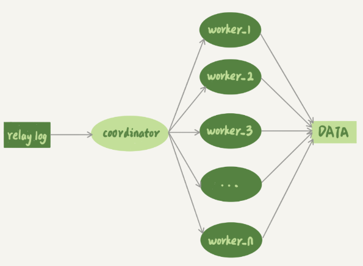

coordinator 就是原来的 sql_thread, 不过现在它不再直接更新数据了，只负责读取中转日志和分发事务。真正更新日志的，变成了 worker 线程。而 work 线程的个数，就是由参数 slave_parallel_workers 决定的。 这个值一般不要太大，要给备库留一些查询线程的空间。

并行复制需要满足以下这两个基本要求： 

* 不能造成更新覆盖。这就要求更新同一行的两个事务，必须被分发到同一个 worker 中。否则两个事务的执行顺序可能会和主库不一致
* 同一个事务不能被拆开，必须放到同一个 worker 中。否则会存在数据的中间状态，也就是在某个时刻，可以看到事务执行了一半的结果

几种基本的并行复制策略：

1、按表分发策略

按表分发事务的基本思路是，如果两个事务更新不同的表，它们就可以并行。因为数据是存储在表里的，所以按表分发，可以保证两个 worker 不会更新同一行。 每个事务在分发的时候，跟所有 worker 的冲突关系包括以下三种情况：

1. 如果跟所有 worker 都不冲突，coordinator 线程就会把这个事务分配给最空闲的 woker;
2. 如果跟多于一个 worker 冲突，coordinator 线程就进入等待状态，直到和这个事务存在冲突关系的 worker 只剩下 1 个；
3. 如果只跟一个 worker 冲突，coordinator 线程就会把这个事务分配给这个存在冲突关系的 worker。

这个按表分发的方案，在多个表负载均匀的场景里应用效果很好。但是，如果碰到热点表，比如所有的更新事务都会涉及到某一个表的时候，所有事务都会被分配到同一个 worker 中，就变成单线程复制了。 

2、按行分发策略

按行复制的核心思路是：如果两个事务没有更新相同的行，它们在备库上可以并行执行。显然，这个模式要求 binlog 格式必须是 row。 

为了方便检查是否是更新同一行，为每个worker分配一个hash表，这时候的 key，就必须是“库名 + 表名 + 唯一键的值” 

相比于按表并行分发策略，按行并行策略在决定线程分发的时候，需要消耗更多的计算资源

使用按行分发策略的前提条件：

1. 要能够从 binlog 里面解析出表名、主键值和唯一索引的值。也就是说，主库的 binlog 格式必须是 row；
2. 表必须有主键；
3. 不能有外键。表上如果有外键，级联更新的行不会记录在 binlog 中，这样冲突检测就不准确。

对比按表分发和按行分发这两个方案的话，按行分发策略的并行度更高。不过，如果是要操作很多行的大事务的话，按行分发的策略有两个问题： 

1. 耗费内存。比如一个语句要删除 100 万行数据，这时候 hash 表就要记录 100 万个项。
2. 耗费 CPU。解析 binlog，然后计算 hash 值，对于大事务，这个成本还是很高的。

使用这个策略的时候会设置一个阈值，单个事务如果超过设置的行数阈值（比如，如果单个事务更新的行数超过 10 万行），就暂时退化为单线程模式 

并行复制策略在版本迭代过程中的变化：

1、MySQL5.6 版本 

官方 MySQL5.6 版本，支持了并行复制，只是支持的粒度是按库并行 

相比于按表和按行分发，这个策略有两个优势：

1. 构造 hash 值的时候很快，只需要库名；而且一个实例上 DB 数也不会很多，不会出现需要构造 100 万个项这种情况。
2. 不要求 binlog 的格式。因为 statement 格式的 binlog 也可以很容易拿到库名。

但是，如果你的主库上的表都放在同一个 DB 里面，这个策略就没有效果了；或者如果不同 DB 的热点不同，比如一个是业务逻辑库，一个是系统配置库，那也起不到并行的效果。

2、MariaDB

根据redo log 组提交 (group commit) 优化 ，MariaDB 利用了以下几点：

1. 能够在同一组里提交的事务，一定不会修改同一行；
2. 主库上可以并行执行的事务，备库上也一定是可以并行执行的。

并行策略的步骤：

1. 在一组里面一起提交的事务，有一个相同的 commit_id，下一组就是 commit_id+1；
2. commit_id 直接写到 binlog 里面；
3. 传到备库应用的时候，相同 commit_id 的事务分发到多个 worker 执行；
4. 这一组全部执行完成后，coordinator 再去取下一批。

这个策略的问题是，它并没有真正模拟主库的并发度，在主库上，第一个事务组在提交的时候，第二个事务组已经在执行了；但在这个策略中，两个事务组是串行的关系，这导致备库的吞吐量始终比主库要小，而且很容易被大事务拖累

3、MySQL5.7 版本

在 MariaDB 并行复制实现之后，官方的 MySQL5.7 版本也提供了类似的功能，由参数 slave-parallel-type 来控制并行复制策略：

1. 配置为 DATABASE，表示使用 MySQL 5.6 版本的按库并行策略；
2. 配置为 LOGICAL_CLOCK，表示的就是类似 MariaDB 的策略。不过，MySQL 5.7 这个策略，针对并行度做了优化。

具体的优化思路是，将所有处于commit状态的事务并行化，之前提到过，commit后要经过一系列redo log和binlog的处理，具体来说：

1. 同时处于 prepare 状态的事务，在备库执行时是可以并行的；
2. 处于 prepare 状态的事务，与处于 commit 状态的事务之间，在备库执行时也是可以并行的。

在介绍binlog 的组提交的时候，介绍过两个参数：

1. binlog_group_commit_sync_delay 参数，表示延迟多少微秒后才调用 fsync;
2. binlog_group_commit_sync_no_delay_count 参数，表示累积多少次以后才调用 fsync

这两个参数是用于故意拉长 binlog 从 write 到 fsync 的时间，以此减少 binlog 的写盘次数。在 MySQL 5.7 的并行复制策略里，它们可以用来制造更多的“同时处于 prepare 阶段的事务”。这样就增加了备库复制的并行度 ，让主库提交的慢一点，备库执行的快一点

4、MySQL 5.7.22 版本

在这个版本，MySQL 增加了一个新的并行复制策略，基于 WRITESET 的并行复制。

相应地，新增了一个参数 binlog-transaction-dependency-tracking，用来控制是否启用这个新策略。这个参数的可选值有以下三种。

1. COMMIT_ORDER，表示的就是前面介绍的，根据同时进入 prepare 和 commit 来判断是否可以并行的策略。
2. WRITESET，表示的是对于事务涉及更新的每一行，计算出这一行的 hash 值，组成集合 writeset。如果两个事务没有操作相同的行，也就是说它们的 writeset 没有交集，就可以并行。
3. WRITESET_SESSION，是在 WRITESET 的基础上多了一个约束，即在主库上同一个线程先后执行的两个事务，在备库执行的时候，要保证相同的先后顺序。

WRITESET这个策略和前面介绍的按行分发的策略差不多，但它在这个基础上做了优化：

1. writeset 是在主库生成后直接写入到 binlog 里面的，这样在备库执行的时候，不需要解析 binlog 内容（event 里的行数据），节省了很多计算量；（也是在这个版本，MySQL修改了binlog的内容，也就是说binlog 协议并不是向上兼容的，在主备切换、版本升级的时候需要注意）
2. 不需要把整个事务的 binlog 都扫一遍才能决定分发到哪个 worker，更省内存；
3. 由于备库的分发策略不依赖于 binlog 内容，所以 binlog 是 statement 格式也是可以的。

对于“表上没主键”和“外键约束”的场景，WRITESET 策略也是没法并行的，也会暂时退化为单线程模型 

综上，大事务不仅影响主库，还是造成备库复制延迟的主要原因之一 

## 一主多从主备切换

一个基本的一主多从结构 ：

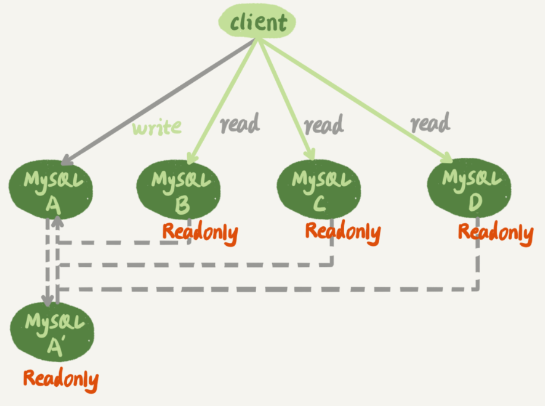

图中，虚线箭头表示的是主备关系，也就是 A 和 A’互为主备， 从库 B、C、D 指向的是主库 A。一主多从的设置，一般用于读写分离，主库负责所有的写入和一部分读，其他的读请求则由从库分担。 

主库发生故障，主备切换后结构就变成了：

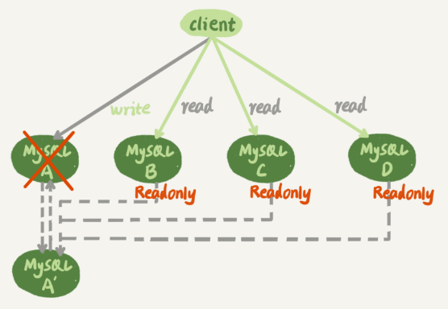

相比于一主一备的切换流程，一主多从结构在切换完成后，A’会成为新的主库，从库 B、C、D 也要改接到 A’ 

把节点 B 设置成节点 A’的从库的时候，需要执行一条 change master 命令，在该命令中需要指定MASTER_LOG_FILE 和 MASTER_LOG_POS ，它们表示同步位点 ，也就是主库对应的文件名和日志偏移量

节点 B 要设置成 A’的从库，需要执行change master 命令，也就需要找同步位点，这个过程一般是这样：

1. 等待新主库 A’把中转日志（relay log）全部同步完成；
2. 在 A’上执行 show master status 命令，得到当前 A’上最新的 File 和 Position；
3. 取原主库 A 故障的时刻 T；
4. 用 mysqlbinlog 工具解析 A’的 File，得到 T 时刻的位点。

但这个结果并不精确，假设在 T 这个时刻，主库 A 已经执行完成了一个 insert 语句插入了一行数据 R，并且已经将 binlog 传给了 A’和 B，然后在传完的瞬间主库 A 的主机就掉电了。那么，这时候系统的状态是这样的：

1. 在从库 B 上，由于同步了 binlog， R 这一行已经存在；
2. 在新主库 A’上， R 这一行也已经存在，日志是写在 123 这个位置之后的；
3. 我们在从库 B 上执行 change master 命令，指向 A’的 File 文件的 123 位置，就会把插入 R 这一行数据的 binlog 又同步到从库 B 去执行。

这时候，从库 B 的同步线程就会报告主键冲突，然后停止同步。

通常情况下，我们在切换任务的时候，要先主动跳过这些错误，有两种常用的方法：

* 当报错时，主动跳过一个事务：

  ~~~
  set global sql_slave_skip_counter=1;
  start slave;
  ~~~

  这就要求同步过程中一直观察，观察到报错就跳过，直到同步结束

* 通过设置 slave_skip_errors 参数，直接设置跳过指定的错误 ，如跳过唯一键冲突、删除找不到行

这两种操作都很复杂，而且容易出错。所以，MySQL 5.6 版本引入了 GTID，彻底解决了这个困难。

GTID 的全称是 Global Transaction Identifier，也就是全局事务 ID，使用时，需要MySQL在GTID 模式 下启动，在同步的过程中，每个MySQL实例都维护了一个 GTID 集合，用来对应“这个实例执行过的所有事务” ，有了这个GTID，在同步时就能跳过一些已经执行过的重复事务了，基于 GTID 进行主备复制 时就无需制定同步位点了

## 读写分离设计

之前提到的一主多从的结构，其实就是读写分离的一种基本结构：由客户端来选择后端数据库进行查询 

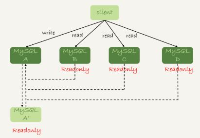

还有一种架构是，在 MySQL 和客户端之间有一个中间代理层 proxy，客户端只连接 proxy， 由 proxy 根据请求类型和上下文决定请求的分发路由 ：

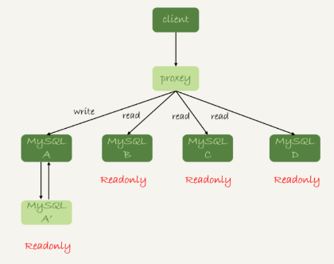

对比两类架构的特点：

1、客户端直连方案，因为少了一层 proxy 转发，所以查询性能稍微好一点儿，并且整体架构简单，排查问题更方便。但是这种方案，由于要了解后端部署细节，所以在出现主备切换、库迁移等操作的时候，客户端都会感知到，并且需要调整数据库连接信息。 一般会伴随一个负责管理后端的组件，比如 Zookeeper，尽量让业务端只专注于业务逻辑开发 

2、带 proxy 的架构，对客户端比较友好。客户端不需要关注后端细节，连接维护、后端信息维护等工作，都是由 proxy 完成的。但这样的话，对后端维护团队的要求会更高。而且，proxy 也需要有高可用架构。因此，带 proxy 架构的整体就相对比较复杂 

在读写分离的场景，一个重要的问题是如何解决过期读的问题：由于主从可能存在延迟，客户端执行完一个更新事务后马上发起查询，如果查询选择的是从库的话，就有可能读到刚刚的事务更新之前的状态 

## 处理过期读

解决过期读问题的几种常见处理方案：

1、强制走主库方案 

将查询请求做分类，一般可以分为两类：

* 对于必须要拿到最新结果的请求，强制将其发到主库上，例如为了满足会话一致性
* 对于可以读到旧数据的请求，才将其发到从库上 

这个方案的问题在于，有时候可能会碰到所有查询请求都不能是过期读的，例如一些金融类的业务，这样的话，你就要放弃读写分离，所有读写压力都在主库，等同于放弃了扩展性。

2、sleep方案

主库更新后，读从库之前先 sleep 一下。具体的方案就是，类似于执行一条 select sleep(1) 命令 ，这个方案的假设是，大多数情况下主备延迟在 1 秒之内，做一个 sleep 可以有很大概率拿到最新的数据 ，在某些场景，用户是需要刷新时才去数据库真正查询的，此时就和更新相差了一段时间，此时用这种方法比较合适。

但这个方案的问题是不精确：

1. 如果这个查询请求本来 0.5 秒就可以在从库上拿到正确结果，也会等 1 秒；
2. 如果延迟超过 1 秒，还是会出现过期读。

3、判断主备无延迟方案

这个方案的思想是：每次读都要判断一下是否存在主备延迟，若存在则等待一会

判断是否存在主备延迟，通常有三种做法：

* 查询seconds_behind_master 是否为0，但它的单位是秒，精度不够
* 对比位点确保主备无延迟
* 对比 GTID 集合确保主备无延迟 

后两种方案比较精确。但这样先判断后执行的方法还是存在不准确的问题，存在这样一种场景，一部分binlog处于客户端已经收到提交确认，而备库还没收到日志的状态，此时用这几种判断方法的结果都是无延迟，但收到数据提交成功的那个命令再次执行，则无法查到，可能出现过期读

4、判断配合 semi-sync

要解决上面这个问题，就要引入半同步复制，也就是 semi-sync replication 

semi-sync 做了这样的设计：

1. 事务提交的时候，主库把 binlog 发给从库；
2. 从库收到 binlog 以后，发回给主库一个 ack，表示收到了；
3. 主库收到这个 ack 以后，才能给客户端返回“事务完成”的确认。

也就是说，如果启用了 semi-sync，就表示所有给客户端发送过确认的事务，都确保了备库已经收到了这个日志。 

如果使用普通的异步复制模式，可能出现一个问题：主库掉电的时候，有些 binlog 还来不及发给从库，会导致系统数据丢失 。但如果使用的是半同步复制就不会出现这种问题。

semi-sync+ 位点判断的方案，只对一主一备的场景是成立的。在一主多从场景中，主库只要等到一个从库的 ack，就开始给客户端返回确认，并不能保证所有从库都能读到最新数据。

此外，这个方案还有一个问题：如果在业务更新的高峰期，主库的位点或者 GTID 集合更新很快，那么上面的两个位点等值判断就会一直不成立，很可能出现从库上迟迟无法响应查询请求的情况，导致过度等待

5、等主库位点方案

这个方案主要基于这样一个命令：

~~~sql
select master_pos_wait(file, pos[, timeout]);
~~~

这条命令的逻辑如下：

1. 它是在从库执行的；
2. 参数 file 和 pos 指的是主库上的文件名和位置；
3. timeout 可选，设置为正整数 N 表示这个函数最多等待 N 秒。

这个命令正常返回的结果是一个正整数 M，表示从命令开始执行，到应用完 file 和 pos 表示的 binlog 位置，执行了多少事务。

当然，除了正常返回一个正整数 M 外，这条命令还会返回一些其他结果，包括：

1. 如果执行期间，备库同步线程发生异常，则返回 NULL；
2. 如果等待超过 N 秒，就返回 -1；
3. 如果刚开始执行的时候，就发现已经执行过这个位置了，则返回 0。

基于这个命令，保证能够查到正确的数据的逻辑是：

1. trx1 事务更新完成后，马上执行 show master status 得到当前主库执行到的 File 和 Position；
2. 选定一个从库执行查询语句；
3. 在从库上执行 select master_pos_wait(File, Position, 1)；
4. 如果返回值是 >=0 的正整数，则在这个从库执行查询语句；
5. 否则，到主库执行查询语句。

因为从库的延迟时间不可控，不能无限等待，所以命令一般会有超时参数，超时后可以直接失败，也可以直接去主库查询。

6、GTID方案

这个方案和上面的类似，MySQL 中同样提供了一个类似的命令： 

~~~sql
select wait_for_executed_gtid_set(gtid_set, 1);
~~~

这条命令的逻辑是：

1. 等待，直到这个库执行的事务中包含传入的 gtid_set，返回 0；
2. 超时返回 1。

在前面等位点的方案中，我们执行完事务后，还要主动去主库执行 show master status。而 MySQL 5.7.6 版本开始，允许在执行完更新类事务后，把这个事务的 GTID 返回给客户端，这样等 GTID 的方案就可以减少一次查询。

这时，等 GTID 的执行流程就变成了：

1. trx1 事务更新完成后，从返回包直接获取这个事务的 GTID，记为 gtid1；
2. 选定一个从库执行查询语句；
3. 在从库上执行 select wait_for_executed_gtid_set(gtid1, 1)；
4. 如果返回值是 0，则在这个从库执行查询语句；
5. 否则，到主库执行查询语句。

为了让MySQL 在执行事务后，返回包中带上 GTID  ，需要将参数 session_track_gtids 设置为 OWN_GTID，然后通过 API 接口 mysql_session_track_get_first （可以修改Mysql客户端代码，也可以使用同名函数）从返回包解析出 GTID 的值即可。

大事务对等位点方案的影响很大，例如一条SQL在主库执行要10分钟，那么在主库执行完，在备库也要等待10分钟左右，这就必然会导致查询逻辑超时。所以涉及大的DDL语句执行一定要慎重，可以在业务低峰期进行，期间所有读请求都在主库上进行，等备库延迟追上之后，再将读请求切换到备库。或者先在备库执行DDL然后进行主备切换，也是可以的。

## 检查数据库健康状态

1、select 1判断

select 1 成功返回，只能说明这个库的进程还在，并不能说明主库没问题。

例如当并发查询的数量超过 innodb_thread_concurrency 时，对任何一个表的查询都会阻塞，但不会阻塞select 1

innodb_thread_concurrency默认值是0，代表不限制并发查询的数量，但不限制并发线程数肯定是不行的。因为，一个机器的 CPU 核数有限，线程全冲进来，上下文切换的成本就会太高，建议把 innodb_thread_concurrency 设置为 64~128 之间的值 

注意不要搞混并发连接和并发查询之间的区别，在 show processlist 的结果里，看到的几千个连接，指的就是并发连接。而“当前正在执行”的语句，才是并发查询。并发连接数达到几千个影响并不大，就是多占一些内存而已。我们应该关注的是并发查询，因为并发查询太高才是 CPU 杀手 

线程在等待锁的时候，是不计入并发查询线程的数量的。

综上所述，select 1不能检测系统并发查询数过高的问题

2、查表判断

定时去查询一个具体的表，就可以解决上面的问题。但仅仅是查询无法覆盖磁盘满了的情况，当磁盘满了的时候，更新动作都会失败，因为更新是需要记录binlog的，但系统还是可以正常查询的

3、更新判断

首先创建一个表，插入两条数据，然后定时的执行更新动作：

~~~sql
mysql> CREATE TABLE `health_check` (
  `id` int(11) NOT NULL,
  `t_modified` timestamp NOT NULL DEFAULT CURRENT_TIMESTAMP,
  PRIMARY KEY (`id`)
) ENGINE=InnoDB;
 
/* 检测命令 */
insert into mysql.health_check(id, t_modified) values (@@server_id, now()) on duplicate key update t_modified=now();
~~~

插入的两条数据中要包含server_id，这是为了保证主、备库各自的检测命令不会发生冲突（否则会出现更新同一行的情况）

这种检测方法存在偶然正常的问题，即使是在业务系统上正常的 SQL 语句已经执行得很慢了，也不代表更新命令一定会失败，外部检测方法存在一定的随机性。而且外部检测存一般都是定时轮询的，也就是说最差的情况必须要等一个周期才能发现异常情况。

4、内部统计

如果通过查数据库的内部表，每一次IO请求的时间都可以查的到，判断依据就可靠的多

MySQL 5.6 版本以后提供的 performance_schema 库，就在 file_summary_by_event_name 表里统计了每次 IO 请求的时间 ：

~~~sql
select * from performance_schema.file_summary_by_event_name where event_name = 'wait/io/file/innodb/innodb_log_file'\G
~~~

可以根据返回值中的MAX_TIMER_WAIT来作为判断依据，比如，你可以设定阈值，单次 IO 请求时间超过 200 毫秒属于异常，然后使用类似下面这条语句作为检测逻辑 ：

~~~sql
mysql> select event_name,MAX_TIMER_WAIT  FROM performance_schema.file_summary_by_event_name where event_name in ('wait/io/file/innodb/innodb_log_file','wait/io/file/sql/binlog') and MAX_TIMER_WAIT>200*1000000000;
~~~

发现异常后，取到你需要的信息，再通过下面这条语句： 

~~~sql
mysql> truncate table performance_schema.file_summary_by_event_name;
~~~

把之前的统计信息清空。这样如果后面的监控中，再次出现这个异常，就可以加入监控累积值了.

如果所有的performance_schema都打开的话，性能大概会下降10%左右，因此可以只打开自己需要的项，比如要打开 redo log 的时间监控，你可以执行这个语句： 

~~~sql
mysql> update setup_instruments set ENABLED='YES', Timed='YES' where name like '%wait/io/file/innodb/innodb_log_file%';
~~~

综上，推荐使用update表+检测performance_schema的方式，来监控数据库的健康状态

## 误删恢复

删除数据的几类操作：

1. 使用 delete 语句误删数据行；
2. 使用 drop table 或者 truncate table 语句误删数据表；
3. 使用 drop database 语句误删数据库；
4. 使用 rm 命令误删整个 MySQL 实例。

接下来逐个分析：

1、误删行

如果是使用 delete 语句误删了数据行，可以用 Flashback 工具通过闪回把数据恢复回来。 Flashback 恢复数据的原理，是修改 binlog 的内容，拿回原库重放。而能够使用这个方案的前提是，需要确保 binlog_format=row 和 binlog_row_image=FULL。 

恢复数据时要注意：如果误删数据涉及到了多个事务的话，需要将事务的顺序调过来再执行 

恢复数据不建议在主库进行，因为主库已经在误删除的基础上进行了一些数据的变化，此时单独恢复几行数据可能会对数据进行二次破坏，所以建议恢复出一个备份，或者找一个从库作为临时库，在这个临时库上执行这些操作，然后再将确认过的临时库的数据，恢复回主库 

提前预防的措施：把 sql_safe_updates 参数设置为 on ，代表delete和update语句必须写where条件，且条件中必须包含索引字段，才允许执行

delete 全表是很慢的，需要生成回滚日志、写 redo、写 binlog。所以，从性能角度考虑，删除全表时，应该优先考虑使用 truncate table 或者 drop table 命令。 

使用 delete 命令删除的数据，你还可以用 Flashback 来恢复。而使用 truncate /drop table 和 drop database 命令删除的数据，就没办法通过 Flashback 来恢复了，因为此时binlog里面就只有一个 truncate/drop 语句，这些信息是恢复不出数据的 

2、误删库/表

这种情况下，要想恢复数据，就需要使用全量备份，加增量日志的方式了。这个方案要求线上有定期的全量备份，并且实时备份 binlog。

在这两个条件都具备的情况下，假如有人中午 12 点误删了一个库，恢复数据的流程如下：

1. 取最近一次全量备份，假设这个库是一天一备，上次备份是当天 0 点；
2. 用备份恢复出一个临时库；
3. 从日志备份里面，取出凌晨 0 点之后的日志；
4. 把这些日志，除了误删除数据的语句外，全部应用到临时库。

还可以使用搭建延迟复制的备库来缩短恢复时间，这个功能是 MySQL 5.6 版本引入的 。

一般的主备复制结构存在的问题是，如果主库上有个表被误删了，这个命令很快也会被发给所有从库，进而导致所有从库的数据表也都一起被误删了。

延迟复制的备库是一种特殊的备库，通过 CHANGE MASTER TO MASTER_DELAY = N 命令，可以指定这个备库持续保持跟主库有 N 秒的延迟。若N被设置成3600，这就代表如果主库上有数据被误删了，并且在 1 小时内发现了这个误操作命令，这个命令就还没有在这个延迟复制的备库执行。这时候到这个备库上执行 stop slave，再跳过误操作命令，就可以恢复出需要的数据 

预防误删比事后恢复更重要，预防的措施主要有：

第一条建议是，账号分离。这样做的目的是，避免写错命令。比如：

- 只给业务开发同学 DML 权限，而不给 truncate/drop 权限。而如果业务开发人员有 DDL 需求的话，也可以通过开发管理系统得到支持。
- 即使是 DBA 团队成员，日常也都规定只使用只读账号，必要的时候才使用有更新权限的账号。

第二条建议是，制定操作规范。这样做的目的，是避免写错要删除的表名。比如：

- 在删除数据表之前，必须先对表做改名操作。然后，观察一段时间，确保对业务无影响以后再删除这张表。
- 改表名的时候，要求给表名加固定的后缀（比如加 _to_be_deleted)，然后删除表的动作必须通过管理系统执行。并且，管理系删除表的时候，只能删除固定后缀的表。

3、rm删除数据

如果只是删除了其中一个节点的数据的话，HA 系统就会开始工作，选出一个新的主库，从而保证整个集群的正常工作。 只需要在这个节点上把数据恢复回来，再接入整个集群 

如果是整个集群都掉电，挽救措施就只有备份跨机房，或者最好是跨城市保存 

## kill命令

在 MySQL 中有两个 kill 命令： 

* 一个是 kill query + 线程 id，表示终止这个线程中正在执行的语句 
* 一个是 kill connection + 线程 id，这里 connection 可缺省，表示断开这个线程的连接，当然如果这个线程有语句正在执行，也是要先停止正在执行的语句的 

有时使用了 kill 命令，却没能断开这个连接。再执行 show processlist 命令，看到这条语句的 Command 列显示的是 Killed 

其实大多数情况下，kill query/connection 命令是有效的，例如：

* 执行一个执行太久的查询时，用kill query可以干掉
* 当一个语句处于锁等待时，用kill  query可以干掉

但kill命令也不一定就会立即生效，因为终止线程并不是立刻就能终止，至少需要释放MDL锁，当执行kill命令时，其实做了两件事：

1、把对应session的线程状态改为kill态

2、给对应session的执行线程发送一个信号

在一个语句执行过程中有多个埋点，只有在这些埋点判断线程状态，才进入语句终止逻辑，当没有机会执行埋点时，也就处于无法kill的状态

例如下面这个例子，执行 set global innodb_thread_concurrency=2，将 InnoDB 的并发线程上限数设置为 2；然后，执行下面的序列： 

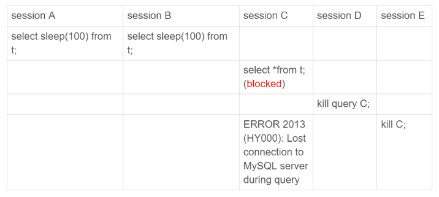

可以看到：

1. sesssion C 执行的时候被堵住了；
2. 但是 session D 执行的 kill query C 命令却没什么效果，
3. 直到 session E 执行了 kill connection 命令，才断开了 session C 的连接，提示“Lost connection to MySQL server during query”，
4. 但是这时候，如果在 session E 中执行 show processlist，你就能看到下面这个图。

kill后执行show processlist可以看到对应语句显示的状态是Killed，实际上它还在执行中

之所以出现这种情况就是因为并发数限制了同时使用InnoDB的线程数，在定时检查能否进入的逻辑中并没有判断线程状态，所以也就不会进入终止逻辑。关闭网络连接后，对应Session会报错，但内部线程却还处于等待执行的状态，只有等到满足进入 InnoDB 的条件后，session C 的查询语句继续执行，才会判断线程状态，进而终止线程执行。

综上，kill未生效的状况有两种：

1、线程没有执行到判断线程状态的逻辑，如并发线程数限制、读写IO的函数一直无法返回

2、从线程得到终止信号，到线程终止这段逻辑耗时比较长，例如超大事务被kill、大查询回滚、DDL被kill，可能会在这个过程中对事务产生的版本数据进行回滚、临时文件要删除。

在客户端直接使用 Ctrl+C 命令 ，其实就是开启一个线程然后发送一个kill query命令

## 客户端连接慢

有些线上的库，会包含很多表（我见过最多的一个库里有 6 万个表）。这时候，你就会发现，每次用客户端连接都会卡在下面这个界面上 ：


而如果 db1 这个库里表很少的话，连接起来就会很快，可以很快进入输入命令的状态。因此 ，产生了一种观点就是表的数目影响了连接性能

其实连接完成的工作是 TCP 握手、用户校验、获取权限 ，这几个操作是和表的数目无关的

之所以会连接慢是因为使用默认参数连接的时候，MySQL 客户端会提供一个本地库名和表名补全的功能。为了实现这个功能，客户端在连接成功后，需要多做一些操作：

1. 执行 show databases；
2. 切到 db1 库，执行 show tables；
3. 把这两个命令的结果用于构建一个本地的哈希表。

因为表很多，所以最后一步会比较耗时，如果在连接命令中加上-A，就可以关掉这个自动补全的功能，然后客户端就可以快速返回了 

加-quick 或者-q也可以使连接变快，但这个参数可能会降低服务端的性能：

MySQL 客户端发送请求后，接收服务端返回结果的方式有两种：

1. 一种是本地缓存，也就是在本地开一片内存，先把结果存起来。如果你用 API 开发，对应的就是 mysql_store_result 方法。
2. 另一种是不缓存，读一个处理一个。如果你用 API 开发，对应的就是 mysql_use_result 方法。

MySQL 客户端默认采用第一种方式，而如果加上–quick 参数，就会使用第二种不缓存的方式。

采用不缓存的方式时，如果本地处理得慢，就会导致服务端发送结果被阻塞，因此会让服务端变慢。

## 表空间回收

一个 InnoDB 表包含两部分，即：表结构定义和数据。在 MySQL 8.0 版本以前，表结构是存在以.frm 为后缀的文件里。而 MySQL 8.0 版本，则已经允许把表结构定义放在系统数据表中了。因为表结构定义占用的空间很小 

表数据既可以存在共享表空间里，也可以是单独的文件。这个行为是由参数 innodb_file_per_table 控制的：

1. 这个参数设置为 OFF 表示的是，表的数据放在系统共享表空间，也就是跟数据字典放在一起；
2. 这个参数设置为 ON 表示的是，每个 InnoDB 表数据存储在一个以 .ibd 为后缀的文件中。

从 MySQL 5.6.6 版本开始，它的默认值就是 ON 了。建议将这个值设置为 ON。因为，一个表单独存储为一个文件更容易管理，而且在你不需要这个表的时候，通过 drop table 命令，系统就会直接删除这个文件。而如果是放在共享表空间中，即使表删掉了，空间也是不会回收的 

 drop table 命令会回收表空间，但开发过程中更多的是删除表中的某些行，此时就会出现表中数据被删除，但表空间没有回收的情况

之所以表空间没有回收，是因为delete删除时仅仅是将数据页标记为可复用：

* 数据记录被删除时，会被标记为可复用，后续可以再次往这个位置插入数据，但磁盘文件不会缩小
* 删除数据页中所有记录，数据页会被标记为可复用，它可以复用到任何位置，但磁盘文件不会变小

这些可以复用，但并没有被使用的空间，就是数据空洞，数据空洞不仅仅会由删除引发，插入数据也会引发，比如往一个页中插入数据，导致页分裂，一部分较大的记录被放在一个新的页中，较小的记录留在原地，这样原数据页的末尾就留下了空洞。更新数据也会引发，对于那些先删后增的更新动作，依然会引发数据空洞。

综上，增删改都会引发数据空洞，重建表可以达到将空洞去掉，回收表空间的目的。

重建表的命令：alter table A engine=InnoDB （recreate）

在MySQL 5.5 版本之前 ，这个命令的执行过程就是数据拷贝、交换表名、删除旧表的动作：

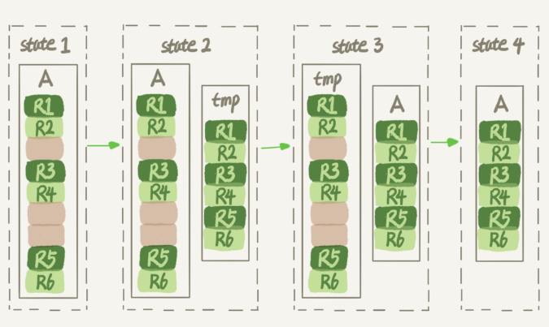

其中花时间最多的步骤是往临时表插入数据的过程，在整个 DDL 过程中，表 A 中不能有更新（防止数据丢失）。也就是说，这个 DDL 不是 Online 的，这个命令会一直加DML写锁

而在MySQL 5.6 版本开始引入的 Online DDL，对这个操作流程做了优化，重建表的过程中，允许对表A做修改，优化后的流程：

1、建立一个临时文件，扫描表 A 主键的所有数据页 ，用数据页中表 A 的记录生成 B+ 树，存储到临时文件中 

2、生成临时文件的过程中，将所有对 A 的操作记录在一个日志文件（row log）中 

3、临时文件生成后，将日志文件中的操作应用到临时文件，得到一个逻辑数据上与表 A 相同的数据文件 

4、用临时文件替换表 A 的数据文件 

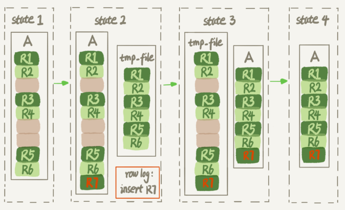

alter 语句在启动的时候需要获取 MDL 写锁 ，后面开始拷贝数据前就会退化为MDL读锁，在读锁过程中，保证其他线程没有对这个表的结构做改变。因为读锁的时间很短，只占整个重建很小的部分，所以可以说他对业务来说是Online的

重建表根据表导出的数据放在临时表还是放在临时文件中又分为两种：

* 重建表的时候将导出的数据放在临时表中，在server层创建的：alter table t engine=innodb,ALGORITHM=copy;
* 重建表的时候将导出的数据放在临时文件中，对server层没有感知，是一个原地操作，全程由InnoDB内部完成：alter table t engine=innodb,ALGORITHM=inplace;

DDL 过程如果是 Online 的 ，就一定是 inplace 的 ，此时重建表的方式一定是inplace

optimize table t 命令等于 recreate+analyze 

表空间回收这个动作不会吧整张页占满，而是会留一部分空间给后续的更新用。如果在重建表的时候更新表，有可能会让重建后文件大小更大

# 事务

Oracle 数据库的默认隔离级别其实就是“读提交” 

可重复读的适用场景：要保证多个顺序操作的数据一致性的场景，如数据校验、报表等

undo日志的删除：系统判定当没有事务用到这些日志时，也就是当系统里没有比这个回滚日志更早的 read-view 的时候 

## 长事务的避免

不要使用长事务的理由：系统里面会存在很老的事务视图 ，会影响其他事务的读取效率，而且占用空间，长期占用锁资源，造成其他事务的执行阻塞。

实际开发中，每个事务用begin和commit比较麻烦，可以用commit work and chain 代替，当执行这个命令时，代表提交事务的同时开启下一个事务。

你可以在 information_schema 库的 innodb_trx 这个表中查询长事务，比如下面这个语句，用于查找持续时间超过 60s 的事务 ：

~~~
select * from information_schema.innodb_trx where TIME_TO_SEC(timediff(now(),trx_started))>60
~~~

如何避免长事务对业务的影响？ 

首先从客户端来看：

1、设置自动提交事务，set autocommit = 1

2、确认是否有不必要的只读事务，有些框架会不管什么语句都开启事务，这是没必要的

3、通过SET MAX_EXECUTION_TIME 命令，来控制每个语句执行的最长时间 

从数据库端看：

1、监控 information_schema.Innodb_trx 表，设置长事务阈值，超过就报警 / 或者 kill 

2、应用数据库监控工具

3、测试阶段分析所有的general_log，分析日志行为提前发现问题 

4、设置innodb_undo_tablespaces 为2或者更大的值，设立undo表空间的一个好处就是在undo表空间中的文件大到一定程度时，可以自动的将该undo表空间截断（truncate）成一个小文件，方便大事务出现时undo log方便清理

## 当前读和一致性读

事务启动时，begin/start transaction 命令并不是一个事务的起点，在执行到它们之后的第一个操作 InnoDB 表的语句，事务才真正启动。如果你想要马上启动一个事务，可以使用 start transaction with consistent snapshot 这个命令 （这个命令代表开启事务，同时创建一致性视图，之后的查询都用这个视图，只能在可重复读隔离级别起作用，如果在读提交隔离级别，这句就等价于start transaction）

一致性读：一个事务开启后，不论在什么时候查询，看到这行数据的结果都是一致的。

可重复读和读提交：

- 对于可重复读，查询只承认在事务启动前就已经提交完成的数据；
- 对于读提交，查询只承认在语句启动前就已经提交完成的数据；

对于下面的查询场景：

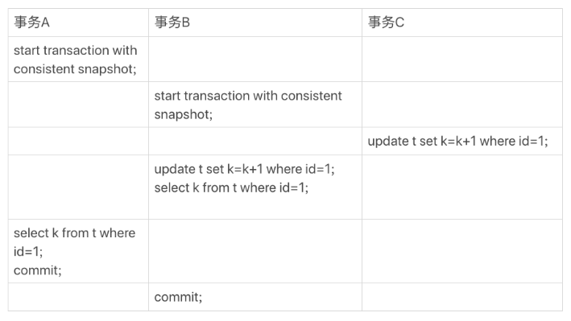

在可重复读的隔离级别下，因为事务A开启时，会按照该时间的一致性视图来读，而不会与其他事务的更新产生关系，所以事务A读到的值是1，但关键的是事务B读到的值是3，按照MVCC的思路，事务B应该会直接忽略事务C的更新，但它却返回了3，这就是幻读，这也就是MySQL的可重复读没有完全解决幻读问题。

之所以出现这种情况，是因为事务B在查询前执行了一个更新操作，所有的更新都是读当前的值（为了不丢失其他事务的更新，更新必须在最新的记录上进行），称为当前读current read，而普通的读是一致性读（加锁的读，无论是读锁还是写锁都是当前读）。因为事务B执行了一个当前读，更新后最新记录的事务id就是事务B的事务ID，所以紧接着的读取就可以读到事务C的更新了。

如果事务C在事务B查询后commit：

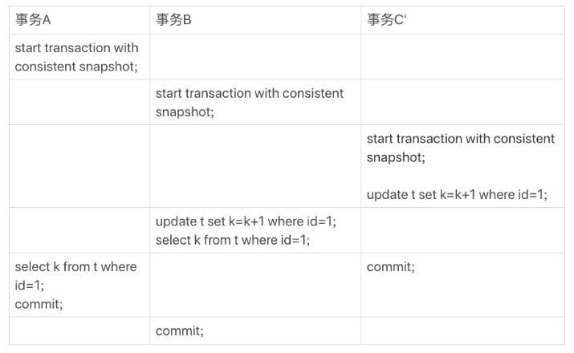

此时由于行锁的存在，事务B必须要等C提交后释放写锁，才能继续更新。

综上：可重复读的核心就是一致性读（consistent read）；而事务更新数据的时候，只能用当前读。如果当前的记录的行锁被其他事务占用的话，就需要进入锁等待 

更新数据失败的问题

有下面这种场景：

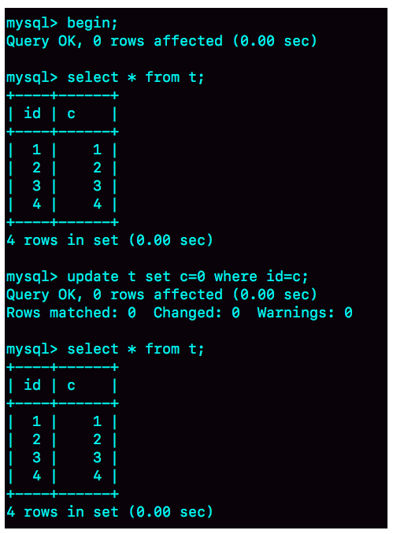

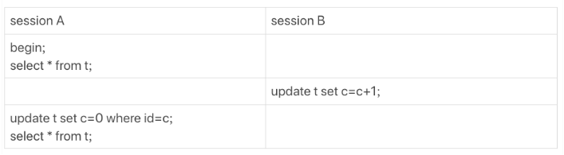

因为其他的事务更新，导致本事务的更新失败，此时记录中的事务id并没有改变，后续select时读到的还是未更新的数据，体现出来的结果就是数据未更新。

# 索引

索引的出现是为了提高查询效率 ，索引的实现方式有很多种：一般有哈希表、有序数组和搜索树 ：

* 哈希表在出现同一个值的时候，会形成一个链表，它的好处是存取快，坏处是不支持区间查询，只适用于等值查询的场景，用于NoSQL
* 有序数组存取快，且数据是有序的，但更新时很麻烦，往中间插入一个记录就必须得挪动后面所有的记录，成本太高。只适用于静态存储引擎，一些很多的不会修改的数据
* 搜索树：这是数据库的核心

数据库的索引用的是N叉树，以 InnoDB 的一个整数字段索引为例，这个 N 差不多是 1200。这棵树高是 4 的时候，就可以存 1200 的 3 次方个值，这已经 17 亿了。考虑到树根的数据块总是在内存中的，一个 10 亿行的表上一个整数字段的索引，查找一个值最多只需要访问 3 次磁盘。其实，树的第二层也有很大概率在内存中，那么访问磁盘的平均次数就更少了 

页分裂和页合并：

* 当往索引树插入数据时，为了维护其顺序必须要做一些维护操作，插入新值时需要挪动后面的数据，空出位置，如果恰好数据页已满，就会申请一个新的数据页，将部分数据挪动过去，这就是页分裂，页分裂还可能会将本节点升级为存储目录项记录的页，对性能影响较大
* 删除数据时，会将数据页做合并，提升存储空间利用率，这就是页合并

自增主键的插入数据模式，正符合了我们前面提到的递增插入的场景。每次插入一条新记录，都是追加操作，都不涉及到挪动其他记录，也不会触发叶子节点的分裂，性能较好；

主键长度越小，普通索引的叶子节点就越小，一个数据页也能放下更多的记录，减少页分裂

有时会采用没有业务含义的自增主键，此时会减少页分裂，但如果有场景的业务字段天然唯一，并且经常做条件匹配，那也可以将其设置为主键，避免回表


执行计划中的扫描行数，不代表真正返回的行数，而是server层认为它找引擎拿到了多少行，如下面的语句：

~~~sql
select * from T where k between 3 and 5
~~~

此时rows是2，就是因为

## 联合索引

在建立联合索引的时候，如何安排索引内的字段顺序？

* 优先考虑索引的复用能力，当已经有了 (a,b) 这个联合索引后，一般就不需要单独在 a 上建立索引了 。优先考虑通过调整顺序少维护一个索引
* 如果既有联合查询，又有基于 a、b 各自的查询，此时就不得不维护两个索引了，此时一般是选字段小的单独建一个索引，剩下的建立一个联合索引


重建索引的语句：

~~~
alter table T drop index k;  或者
alter table T add index(k);
~~~

索引可能因为删除，或者页分裂等原因，导致数据页有空洞，重建索引的过程会创建一个新的索引，把数据按顺序插入，这样页面的利用率最高 

也可以重建主键索引，相当于重建整张表，不建议使用：

~~~
alter table T drop primary key;
alter table T add primary key(id);
~~~


对于下面的表来说，有一个联合主键a、b，还有对c的索引、对ca、cb的联合索引：

~~~
CREATE TABLE `geek` (
  `a` int(11) NOT NULL,
  `b` int(11) NOT NULL,
  `c` int(11) NOT NULL,
  `d` int(11) NOT NULL,
  PRIMARY KEY (`a`,`b`),
  KEY `c` (`c`),
  KEY `ca` (`c`,`a`),
  KEY `cb` (`c`,`b`)
) ENGINE=InnoDB;
~~~

ca和cb是面对下面这种查询条件的：

~~~
select * from geek where c=N order by a limit 1;
select * from geek where c=N order by b limit 1;
~~~

问题：ca和cb是有必要的吗？

答：因为每个二级索引都保存着主键的信息，所以ca联合索引中只额外包含了b列的信息，ca联合索引和c索引是等价的，并不需要存在

## 索引误判

MySQL的查询优化器有时会得出非最优的执行计划，导致查询性能受到影响。

查询优化器得到最优的执行计划，需要考虑以下这些因素：扫描行数、是否回表、是否排序、是否使用临时表等

其中比较重要的因素是扫描行数，扫描行数是基于索引的基数判断出来的，基数就是一个索引中不同值的个数，一个索引的基数越大，索引的区分度最好，查询效率最高。采用下列语句可以查看表索引的信息，其中有基数信息：

~~~
show index from t;
~~~

为了得到索引的基数，InnoDB 默认会选择 N 个数据页，统计这些页面上的不同值，得到一个平均值，然后乘以这个索引的页面数，就得到了这个索引的基数，当变更的数据行数超过一定值时，会自动触发一次索引统计。

为了避免影响性能，MySQL不会做精确的统计，有时会得到错误的结果，导致查询效果不好，此时的解决方案：

* 采用force index强行选择一个索引，使用它之后就不会再评估其他索引的代价：

  ~~~
  select * from t force index(a) where a between 1 and 1000;
  ~~~

  主要用于临时规避的场景

* 修改语句，引导MySQL使用我们期望的索引，例如人为增加排序、加limit限制等，但不同场景不同考虑，没有通用性

* 新建更合适的索引，删除不合适的索引

* 查询前使用analyze table  t命令，重新统计索引信息，该过程会加MDL读锁

## 字符串字段索引

业务场景要求要把一个较长的字符串作为索引，如邮箱，为节省空间考虑，可以将索引的一部分前缀保存在索引的数据记录中，这就是前缀索引：

~~~
mysql> alter table SUser add index index1(email);
或
mysql> alter table SUser add index index2(email(6));
~~~

前者是将完整的字段存到数据记录中，后者是将字段的前6个字节存到数据记录中。

使用前缀索引的优缺点：

* 索引占用的空间更小
* 如果设置不好前缀长度，会导致增加额外的记录扫描次数（等值匹配到多个记录）
* 不能再使用覆盖索引了

为了定义好前缀长度，可以用下面的语句来查询共有多少个不同的值，取不同的前缀来统计不同的值：

~~~
mysql> select count(distinct email) as L from SUser;

mysql> select 
  count(distinct left(email,4)）as L4,
  count(distinct left(email,5)）as L5,
  count(distinct left(email,6)）as L6,
  count(distinct left(email,7)）as L7,
from SUser;
~~~

对于前缀区分度不够好的情况，就不能使用前缀索引了，如身份证，此时常用的解决方案有两种：

1、使用倒序存储。存储身份证的时候倒过来存，每次查询的时候再将其按照顺序查出：

~~~sql
mysql> select field_list from t where id_card = reverse('input_id_card_string');
~~~

倒序存储和前缀索引可以共同起作用

2、使用hash字段。在表上额外创建一个整数字段，用来保存身份证的hash码，然后在这个字段上创建索引：

~~~sql
mysql> alter table t add id_card_crc int unsigned, add index(id_card_crc);
~~~

每次插入新记录时，都hash一遍再存入，查询时为了防止冲突，要匹配身份证的值是否相同：

~~~sql
mysql> select field_list from t where id_card_crc=crc32('input_id_card_string') and id_card='input_id_card_string'
~~~

这样索引的长度就能大幅度降低了

这两种方式的优缺点对比：

* 两者都不支持范围查询，只能支持等值查询
* 从存储空间上看，倒序存储使用字段的一部分，hash字段一般更短，但需要新增一个字段
* 从CPU消耗方面来看，倒序存储查询时需要额外调用一次reverse，hash字段查询时需要额外调用一次crc32，一般前者更省时间
* 从查询效率看，hash字段查询效率更稳定，倒序存储还是有增加扫描行数危险更大

对某种业务场景如何建索引的问题分析：

* 先确定不变的因素，将这些不变的因素剔除出字段
* 变化的因素是否一定是数字？优先使用数字类型存储索引，会节省很大空间，但要注意是否有超出最大值的可能
* 使用前缀索引、倒序索引、hash字段等技巧

对于数据量特别大的情况，可以针对索引字段做针对性的优化，让它占用的空间更小。业务上一般会限制每个字符的范围(如字母数字下划线)，确定字段组成的可能性共有多少种，然后将其直接映射为对应进制的数字（ascii可看做是128进制 ），保存二进制数据，减少索引字段的长度，同时还能兼顾前缀匹配

## count的优化

在不同的 MySQL 引擎中，count(*) 有不同的实现方式：

* MyISAM 引擎把一个表的总行数存在了磁盘上，因此执行 count(*) 的时候会直接返回这个数，效率很高 （前提是没有过滤条件）
* 而 InnoDB 引擎就麻烦了，它执行 count(*) 的时候，需要把数据一行一行地从引擎里面读出来，然后累积计数 

InnoDB 由于MVCC的原因，必须扫描才能知道哪些记录是可见的。

执行count(*)时，由于一张表的所有索引都有同样的总记录值，所以它会找最小的那颗索引树来扫描，以加快速度

show table status命令中的记录数不是准确的值，而是估算值，它是根据采样来估算的，不能直接在业务中使用

为了解决InnoDB 中count(*)慢的问题，我们可以将表的总数自己存放起来。

首先用Redis保存表的总记录数的问题在于：

* 缓存可能丢失，异常重启后需要去数据库查询，根据查询结果刷新一遍缓存
* redis读取到的总记录数不准，更新总记录有两步构成：更新redis计数、在数据库插入数据，无论哪个先哪个后，在中间状态查询的结果都是不对的

为了解决第二个问题，可以将记录数存在数据库的另一张表中，此时就可以将更新计数和插入数据两个步骤放到一个事务中，不存在中间状态的问题了

几种不同的count的执行速度：

count(字段)<count(主键 id)<count(1)≈count(*) 

影响速度的因素主要有两方面：

* 优化器是否会选择最小的索引来读取，针对特定字段的count就无法在这点上优化了
* 取回的记录要判断是否为null的代价，对count(*) 和count(1)不存在这种代价，而前两种必须取回后判断是否为null再加入计数（主键虽然肯定不会是null，但MySQL并没有针对它的优化）

## 状态字段解决业务问题

业务上有这样的需求，A、B 两个用户，如果互相关注，则成为好友。有两张表，一张是like表，一张是friend表，like 表有 user_id、liker_id 两个字段，而且这两个字段是复合唯一索引。

当A关注B时，首先先查询对方有没有关注自己：

~~~sql
select * from like where user_id = B and liker_id = A;
~~~

如果有则成为好友，往friend表插入数据。如果没有则只是单向关系，往like表插入一条数据。

问题是如果 A、B 同时关注对方，会出现不会成为好友的情况，会往like表里插入两条数据，而不是往friend表插入一条：

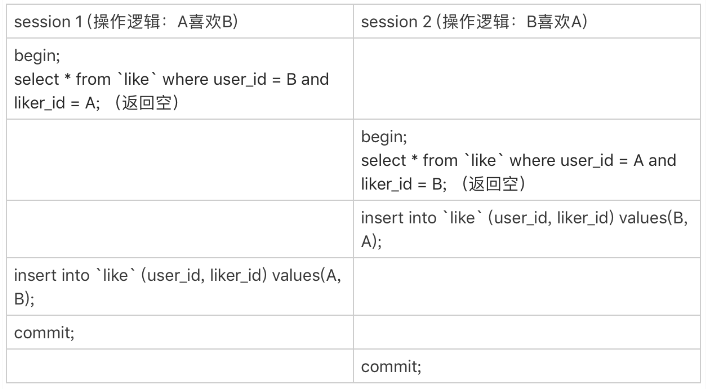

这个问题不能用锁来解决，因为刚开始like表中记录并不存在，行锁无法生效。

可以使用给表增加状态字段的方法，like表中增加一个relation_ship字段，并设为整型，取值 1、2、3 ：

* 值是 1 的时候，表示 user_id 关注 liker_id 
* 值是 2 的时候，表示 liker_id 关注 user_id 
* 值是 3 的时候，表示互相关注 

当A关注B的时候，启动一个事务，比较 A 和 B  id的大小 ，如果 A<B，就执行下面的逻辑 ：

~~~sql
mysql> begin; /* 启动事务 */
insert into `like`(user_id, liker_id, relation_ship) values(A, B, 1) on duplicate key update relation_ship=relation_ship | 1;
select relation_ship from `like` where user_id=A and liker_id=B;
/* 代码中判断返回的 relation_ship，
  如果是 1，事务结束，执行 commit
  如果是 3，则执行下面这两个语句：
  */
insert ignore into friend(friend_1_id, friend_2_id) values(A,B);
commit;
~~~

如果 A>B，则执行下面的逻辑 ：

~~~sql
mysql> begin; /* 启动事务 */
insert into `like`(user_id, liker_id, relation_ship) values(B, A, 2) on duplicate key update relation_ship=relation_ship | 2;
select relation_ship from `like` where user_id=B and liker_id=A;
/* 代码中判断返回的 relation_ship，
  如果是 2，事务结束，执行 commit
  如果是 3，则执行下面这两个语句：
*/
insert ignore into friend(friend_1_id, friend_2_id) values(B,A);
commit;
~~~

在这个设计里面，like表中的user_id和liker_id并不一定是喜欢和被喜欢的逻辑关系，而是根据id大小区分的，保证user_id < liker_id，这样如果再出现上面的场景，就会两个事务同时操作同一条数据，出现行锁冲突

用插入或更新语句，保证同时关注后relation_ship的结果是3，0连续和1、2按位与的结果就是3，而单独按位与则能拿到1或2的结果

最后面的插入失败ignore保证了不会在并发事务中，friend表出现重复数据，保证了幂等性

## orderby

使用orderby时，如果没有命中索引，则执行计划的Extra中会显示Using filesort ，此时会借助一块sort_buffer 完成排序：

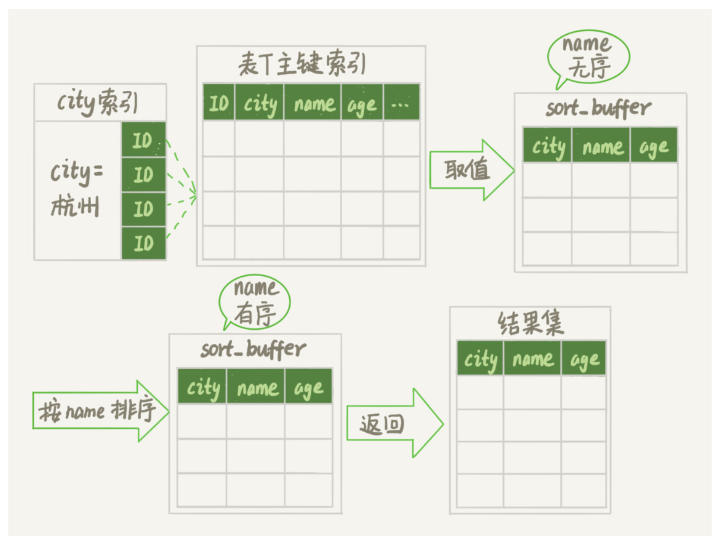

其中按name 排序这个动作，可能在内存中完成，也可能需要使用外部排序，这取决于排序所需的内存和参数 sort_buffer_size 。如果要排序的数据量小于 sort_buffer_size，排序就在内存中完成。但如果排序数据量太大，内存放不下，则不得不利用磁盘临时文件辅助排序 。

使用OPTIMIZER_TRACE命令分析SQL，其中number_of_tmp_files可以看到是否使用了临时文件。若该值为12，代表当使用外部排序时，MySQL 将需要排序的数据分成 12 份，每一份单独排序后存在这些临时文件中。然后把这 12 个有序文件再合并成一个有序的大文件。若该值为0，代表没有使用外部排序，排序可以直接在内存中完成。

上面的排序方式可以称为全字段排序，因为它是把表中记录的所有字段都存入sort_buffer的，当记录长度太长时，MySQL 会采用另一个算法，当单行的长度超过参数max_length_for_sort_data，就会采用新算法，新算法被称为row_id排序（row_id是mysql中的默认主键名），它只会将表中记录的要排序的列（即 name 字段）和主键 id加入sort_buffer中排序，然后排序完之后，还需要访问主键索引，取到记录的完整值：

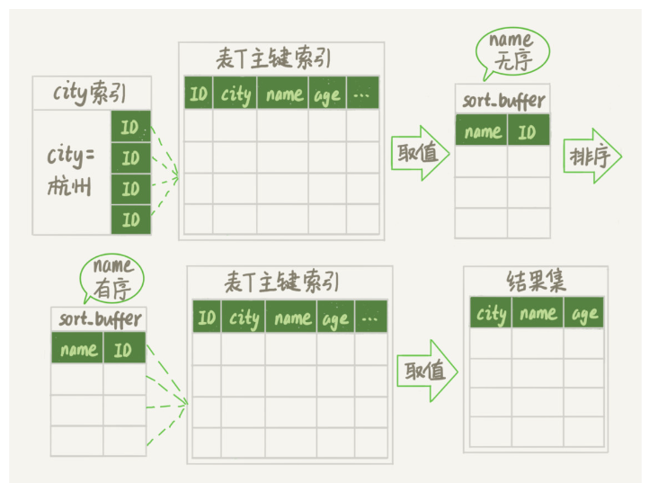

当命中索引时，就无需在内存中排序了，直接读取索引树遍历即可，此时Extra 字段中没有 Using filesort 了 。

当遇到orderby无法命中索引的情况，可以将数据查出，然后进行排序，在服务器端内存中处理。更复杂的情况可以分批查询回来，在服务器端用归并排序处理。这种方式也可以借鉴MySQL对于大数据量的处理方式，当记录很长时，也可以采用先排序id，再用id取值。

## 随机取几条记录

业务要求在10000条记录中随机选择3条记录，可以用随机数排序实现这个功能：

~~~sql
mysql> select word from words order by rand() limit 3;
~~~

此时执行计划的Extra中会显示Using temporary 和Using filesort 。

这个排序和上面的不同，排序时要操作的表是临时表，排序的过程：

1、创建一个临时表，使用的是memory引擎，将words表中的记录中的word值和一个随机数存入临时表中，共10000条

2、初始化sort_buffer，从内存临时表中将随机数和位置信息取出放入sort_buffer中，这个过程中需要对临时表进行全表扫描，扫描行数到达了20000行（这里面用的是row_id排序，并不会吧表的所有字段都加载到临时表，这是因为表本身就是存在内存中的，回表代价很小）

3、对sort_buffer进行排序，排序完成后取出前三条，依次到内存临时表中找到记录值，返回结果。扫描行数达到了20003

并不是所有的临时表都是内存表，当临时表大小超过tmp_table_size ，那么内存临时表就会转成磁盘临时表 。磁盘临时表使用的引擎默认是 InnoDB，是由参数 internal_tmp_disk_storage_engine 控制的 。

当一个排序的SQL语句中limit的行数很少时，意味着排序完再取前几条记录很浪费，因为后面的记录也被排序完成了。此时就会优先采用优先队列排序算法，这是MySQL 5.6 版本引入的一个新的排序算法 ，这个过程不需要临时文件 。当limit的行数太多，超过了sort_buffer_size 大小 ，就只能使用归并排序算法了。

一个正确的取随机数的方法：

* 可以先去表的主键最大值和最小值，然后在其中随机取一个主键值X，然后取不小于 X 的第一个 ID 的行 ：

  ~~~sql
  mysql> select max(id),min(id) into @M,@N from t ;
  set @X= floor((@M-@N+1)*rand() + @N);
  select * from t where id >= @X limit 1;
  ~~~

  只需要扫描3行即可，这个算法要求主键是平均分布的，如果不均匀分布则会对随机效果有很大影响

* 为了严格随机，可以先取整个表的行数，然后随机取一行Y，再用 limit Y,1 取得一行 ：

  ~~~sql
  mysql> select count(*) into @C from t;
  set @Y = floor(@C * rand());
  set @sql = concat("select * from t limit ", @Y, ",1");
  prepare stmt from @sql;
  execute stmt;
  DEALLOCATE prepare stmt;
  ~~~

  （由于 limit 后面的参数不能直接跟变量，所以上面的代码中使用了 prepare+execute 的方法 ）

  解决了概率不均匀的问题，需要先扫描全表拿到行数，然后再遍历Y+1行，共扫描C+Y+1 

针对之前提出的取三个随机记录的问题，可以应用上面的思想，取三次随机记录：

~~~sql
mysql> select count(*) into @C from t;
set @Y1 = floor(@C * rand());
set @Y2 = floor(@C * rand());
set @Y3 = floor(@C * rand());
select * from t limit @Y1，1； // 在应用代码里面取 Y1、Y2、Y3 值，拼出 SQL 后执行
select * from t limit @Y2，1；
select * from t limit @Y3，1；
~~~

总扫描行数是 C+(Y1+1)+(Y2+1)+(Y3+1) ，扫描行数还可以继续优化，可以取 Y1、Y2 和 Y3 里面最大的一个数，记为 M，最小的一个数记为 N ，然后扫描这其中的记录：

~~~sql
mysql> select * from t limit N, M-N+1;
~~~

这个方案的扫描行数总共只需要 C+M+1 行 。

在表设计时，为了随机取数的业务场景，可以事先增加一个列，保存递增值，然后生成一个随机数与该列匹配，就能很方便的取出随机数了。

## 慢查询问题临时处理

在 MySQL 中，会引发性能问题的慢查询，大体有以下三种可能：

1. 索引没有设计好；
2. SQL 语句没写好；
3. MySQL 选错了索引。

下面逐一分析这些情况的临时应对方案

1、索引没有设计好

这种场景一般就是通过紧急创建索引来解决。MySQL 5.6 版本以后，创建索引都支持 Online DDL 了，对于那种高峰期数据库已经被这个语句打挂了的情况，最高效的做法就是直接执行 alter table 语句。 

比较理想的是能够在备库先执行。假设你现在的服务是一主一备，主库 A、备库 B，这个方案的大致流程是这样的：

1. 在备库 B 上执行 set sql_log_bin=off，也就是不写 binlog，然后执行 alter table 语句加上索引；
2. 执行主备切换；
3. 这时候主库是 B，备库是 A。在 A 上执行 set sql_log_bin=off，然后执行 alter table 语句加上索引。

这是一个“古老”的 DDL 方案。平时在做变更的时候，你应该考虑类似 gh-ost 这样的方案，更加稳妥。但是在需要紧急处理时，上面这个方案的效率是最高的。

2、SQL 语句没写好

这时，我们可以通过改写 SQL 语句来处理。MySQL 5.7 提供了 query_rewrite 功能，可以把输入的一种语句改写成另外一种模式。

比如，语句被错误地写成了 select * from t where id + 1 = 10000，你可以通过下面的方式，增加一个语句改写规则：

~~~sql
mysql> insert into query_rewrite.rewrite_rules(pattern, replacement, pattern_database) values ("select * from t where id + 1 = ?", "select * from t where id = ? - 1", "db1");
 
call query_rewrite.flush_rewrite_rules();
~~~

这里，call query_rewrite.flush_rewrite_rules() 这个存储过程，是让插入的新规则生效，也就是我们说的“查询重写” 

可以重新查询一次来观察重写是否生效了。

3、MySQL 选错了索引

这时候，应急方案就是给这个语句加上 force index。

同样地，使用查询重写功能，给原来的语句加上 force index，也可以解决这个问题

这些问题在前期都是可以避免的，具体方式是在测试环境，把慢查询日志（slow log）打开，并且把 long_query_time 设置成 0，确保每个语句都会被记录入慢查询日志 ，然后开始测试，测试过程中观察慢查询日志里每类语句的输出，特别留意 Rows_examined 字段是否与预期一致 

如果SQL语句太多，可以使用开源工具 pt-query-digest ，来帮忙检查所有的SQL语句的返回结果

## 全表扫描

当一个表数据量很大时，对它做全表扫描并不会导致数据库内存溢出，主要是MySQL在server层和InnoDB层对这个操作进行了优化

1、在server层

假设，我们现在要对一个 200G 的 InnoDB 表 db1. t，执行一个全表扫描 ：

~~~sql
mysql -h$host -P$port -u$user -p$pwd -e "select * from db1.t" > $target_file
~~~

在这个过程中关键的问题是结果集到底保存在哪里，实际上，在server层采取的是边查边发的过程：

1. 获取一行，写到 net_buffer 中。这块内存的大小是由参数 net_buffer_length 定义的，默认是 16k。
2. 重复获取行，直到 net_buffer 写满，调用网络接口发出去。
3. 如果发送成功，就清空 net_buffer，然后继续取下一行，并写入 net_buffer。
4. 如果发送函数返回 EAGAIN 或 WSAEWOULDBLOCK，就表示本地网络栈（socket send buffer）写满了，进入等待。直到网络栈重新可写，再继续发送。

在这个过程中，占用内存的两部分：net_buffer_length 、socket send buffer都是有限大小的，不会有内存溢出的问题。因为采用的是边读边发的方式，所以如果客户端接收得慢，会导致 MySQL 服务端由于结果发不出去，这个事务的执行时间变长，很容易造成长事务：

- 如果前面的语句有更新，意味着它们在占用着行锁，会导致别的语句更新被锁住；
- 当然读的事务也有问题，就是会导致 undo log 不能被回收，导致回滚段空间膨胀。

例如下面这个状态，如果故意让客户端不去读 socket receive buffer 中的内容，然后在服务端 show processlist 就会看到Sending to client的结果：

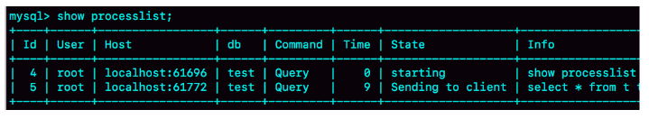

这就表示服务器端的网络栈写满了 

之前提到过，如果客户端使用–quick 参数，会使用 mysql_use_result 方法。这个方法是读一行处理一行，此时就很容易造成服务端查询慢的现象。所以正常来说，客户端应该使用mysql_store_result 这个接口，直接把查询结果保存到本地内存，除非本地内存不够用，才考虑使用mysql_use_result 

如果服务端存在处于Sending to client的线程，可以考虑增加net_buffer_length 的大小。

与“Sending to client”长相很类似的一个状态是“Sending data”，但Sending data”并不一定是指“正在发送数据”，而可能是处于执行器过程中的任意阶段，包括锁等待，它详细的过程是：

- MySQL 查询语句进入执行阶段后，首先把状态设置成“Sending data”；
- 然后，发送执行结果的列相关的信息（meta data) 给客户端；
- 再继续执行语句的流程；
- 执行完成后，把状态设置成空字符串。

2、在InnoDB层

内存的数据页是在 Buffer Pool (BP) 中管理的，它不仅起到了加速更新，还起到了加速查询的效果。查询时，如果内存数据页的结果是最新的，直接读内存页就可以了，此时查询速度是很快的。而 Buffer Pool 对查询的加速效果，依赖于一个重要的指标，即：内存命中率

你可以在 show engine innodb status 结果中，查看一个系统当前的 BP 命中率 ，执行 show engine innodb status ，可以看到“Buffer pool hit rate”字样，显示的就是当前的命中率 ，InnoDB Buffer Pool 的大小是由参数 innodb_buffer_pool_size 确定的，一般建议设置成可用物理内存的 60%~80% 

如果一个 Buffer Pool 满了，而又要从磁盘读入一个数据页，那肯定是要淘汰一个旧数据页的 ，如果用原生的LRU算法来管理Buffer Pool 中的页，在面对全表扫描这种场景时，就会将缓存的页全部淘汰掉，为此InnoDB 采用了改进的LRU算法：把整个 LRU 链表分成了 young 区域和 old 区域 ，采取这种算法后，在扫描这个大表的过程中，虽然也用到了 Buffer Pool，但是对 young 区域完全没有影响，从而保证了 Buffer Pool 响应正常业务的查询命中率。

## 回表优化算法

回表是指，InnoDB 在普通索引 a 上查到主键 id 的值后，再根据一个个主键 id 的值到主键索引上去查整行数据的过程 

虽然按行查的机制不能改变，但如果调整查询的顺序，还是能加速的

一个优化的思路是：因为大多数的数据都是按照主键递增顺序插入得到的，所以我们可以认为，如果按照主键的递增顺序查询的话，对磁盘的读比较接近顺序读，能够提升读性能。

这个优化算法就是Multi-Range Read 优化 (MRR)。这个优化的主要目的是尽量使用顺序读盘 ，把回表时的多次等值查询转化为多值查询

使用MRR优化来执行回表时：

1. 根据索引 a，定位到满足条件的记录，将 id 值放入 read_rnd_buffer 中 ;
2. 将 read_rnd_buffer 中的 id 进行递增排序；
3. 排序后的 id 数组，依次到主键 id 索引中查记录，并作为结果返回。

这里read_rnd_buffer 的大小是由 read_rnd_buffer_size 参数控制的，如果read_rnd_buffer 放满了就先执行步骤2和3，然后清空read_rnd_buffer，再执行下个循环。

如果需要稳定的使用 MRR 优化的话，需要设置set optimizer_switch="mrr_cost_based=off"。（官方文档的说法，是现在的优化器策略，判断消耗的时候，会更倾向于不使用 MRR，把 mrr_cost_based 设置为 off，就是固定使用 MRR 了。）

## join的执行

###Index Nested-Loop Join(NLJ)

执行join语句时，为了避免优化器的选择，可以用straight_join 让 MySQL 使用固定的连接方式执行查询 （left join不能用来固定驱动表，后面会提），例如：

~~~sql
select * from t1 straight_join t2 on (t1.a=t2.a);
~~~

在这个语句里，t1 是驱动表，t2 是被驱动表 。如果被驱动表t2的字段a上有索引，则join过程就能利用这个索引，此时语句的执行流程是这样的：

1. 从表 t1 中读入一行数据 R；
2. 从数据行 R 中，取出 a 字段到表 t2 里去查找；
3. 取出表 t2 中满足条件的行，跟 R 组成一行，作为结果集的一部分；
4. 重复执行步骤 1 到 3，直到表 t1 的末尾循环结束。

这个过程是先遍历表 t1，然后根据从表 t1 中取出的每行数据中的 a 值，去表 t2 中查找满足条件的记录。在形式上，这个过程就跟我们写程序时的嵌套查询类似，并且可以用上被驱动表的索引，所以我们称之为“Index Nested-Loop Join”，简称 NLJ 

执行流程图是这样的：


分析下这个语句执行过程中的扫描行数，驱动表是走全表扫描，而被驱动表是走树搜索 

假设被驱动表的行数是 M。每次在被驱动表查一行数据，要先搜索索引 a，再搜索主键索引。每次搜索一棵树近似复杂度是以 2 为底的 M 的对数，记为 log2M，所以在被驱动表上查一行的时间复杂度是 2*log2M。

假设驱动表的行数是 N，执行过程就要扫描驱动表 N 行，然后对于每一行，到被驱动表上匹配一次。

因此整个执行过程，近似复杂度是 N + N*2*log2M。显然，N 对扫描行数的影响更大，因此应该让小表来做驱动表。 

### Simple Nested-Loop Join 

当被驱动表没有索引时，每次联表就必须全表扫描，这种每次都全表扫描的算法就是Simple Nested-Loop Join，它是各类算法优化的基础场景

一个常见的疑惑是：为什么Simple Nested-Loop Join和BNL都是把数据读到内存，然后一条一条与被驱动表进行对比判断，为什么前者的性能会比后者慢很多？

原因在于：

1、对被驱动表做全表扫描时，如果数据没有在 Buffer Pool 中，就需要等待这部分数据从磁盘读入，反复扫描会导致缓存命中率变得很低，影响正常业务

2、在Simple Nested-Loop Join中，即使被驱动表数据都在内存中，每次查找“下一个记录的操作”，都是类似指针操作 ；而BNL中，因为在内存中保存的形式是数组，遍历的成本更低

### Block Nested-Loop Join(BNL)

这个算法的流程是这样的：

1. 把表 t1 的数据读入线程内存 join_buffer 中，由于我们这个语句中写的是 select *，因此是把整个表 t1 放入了内存；
2. 扫描表 t2，把表 t2 中的每一行取出来，跟 join_buffer 中的数据做对比，满足 join 条件的，作为结果集的一部分返回。

在这个过程中，对表 t1 和 t2 都做了一次全表扫描 ，由于 join_buffer 是以无序数组的方式组织的，因此对表中的每一行都要做判断，总的判断次数是t1记录数*t2记录数，整个判断过程都在内存中进行。

join_buffer的大小由参数join_buffer_size决定，默认是256k，如果放不下驱动表的话，就会采用分段放入的策略：

1. 扫描表 t1，顺序读取数据行放入 join_buffer 中，放完第 88 行 join_buffer 满了，继续第 2 步；
2. 扫描表 t2，把 t2 中的每一行取出来，跟 join_buffer 中的数据做对比，满足 join 条件的，作为结果集的一部分返回；
3. 清空 join_buffer；
4. 继续扫描表 t1，顺序读取最后的 12 行数据放入 join_buffer 中，继续执行第 2 步。

这个流程才体现出了这个算法名字中“Block”的由来，表示“分块去 join” 

在这个算法中，驱动表被分为多少块，就要全表扫描多少次被驱动表。

假设，驱动表的数据行数是 N，需要分 K 段才能完成算法流程，被驱动表的数据行数是 M。

注意，这里的 K 不是常数，N 越大 K 就会越大，因此把 K 表示为λ*N，显然λ的取值范围是 (0,1)。

所以，在这个算法的执行过程中：

1. 扫描行数是 N+λ\*N\*M；
2. 内存判断 N*M 次。

主要考虑扫描行数对性能的影响，依然是驱动表的行数对扫描行数影响更大，所以在这种情况下驱动表依然要选择小表

注意：是否是小表取决于表的行数，也取决于select的字段数量，如果select的字段太多，放入join_buffer需要的空间也越多

### Batched Key Access(BKA)

这个算法是对NLJ算法的优化，NLJ算法是每次从驱动表取出一个记录，然后去被驱动表进行匹配

BKA算法对这个过程进行了优化，每次吧驱动表的记录取出一部分，先放到临时内存 join_buffer ，再去一次性将这些值与被驱动表进行匹配，在被驱动表利用索引回表时，就能利用MRR算法

启用BKA算法时，需要打开MRR，BKA 算法的优化要依赖于 MRR ：

~~~sql
set optimizer_switch='mrr=on,mrr_cost_based=off,batched_key_access=on';
~~~

### BNL算法的性能问题

使用 Block Nested-Loop Join(BNL) 算法时，可能会对被驱动表做多次扫描 ，这对系统产生了很多不利影响，主要包括：

1. 可能会多次扫描被驱动表，占用磁盘 IO 资源；
2. 判断 join 条件需要执行 M*N 次对比（M、N 分别是两张表的行数），如果是大表就会占用非常多的 CPU 资源；
3. 可能会导致 Buffer Pool 的热数据被淘汰，影响内存命中率。

对于第三点，因为MySQL采用的是优化的LRU算法，第一次从磁盘读入内存的数据页，会先放在 old 区域。如果 1 秒之后这个数据页不再被访问了，就不会被移动到 LRU 链表头部 。按照这个规则，BNL会反复扫描被驱动表，导致被驱动表的页进入了young区，而且频繁淘汰页面，导致正常的数据页都无法进入young区，尤其是被驱动表是冷表的时候，会导致内存命中率下降，执行join语句后命中率才会缓慢上升

所以尽量不要使用BNL算法，要给被驱动表加索引，将其转换为BKA算法

### 临时表优化方案

如果给驱动表加索引的收益很低，例如这是一个低频的SQL语句，且要参与join的行数较少。此时可以考虑临时表方案

在BNL算法中还有另外一个弊端：每次驱动表的数据，和被驱动表匹配的时候都要额外进行一次on条件的判断：

1. 把表 t1 的所有字段取出来，存入 join_buffer 中。这个表只有 1000 行，join_buffer_size 默认值是 256k，可以完全存入。
2. 扫描表 t2，取出每一行数据跟 join_buffer 中的数据进行对比，
   - 如果不满足 t1.b=t2.b，则跳过；
   - 如果满足 t1.b=t2.b, 再判断其他条件，也就是是否满足 t2.b 处于 [1,2000] 的条件，如果是，就作为结果集的一部分返回，否则跳过。

也就是对于被驱动表的每一行，判断join是否满足的时候，都要遍历join_buffer中的所有行，这个判断工作量很大，被驱动表大小有100W，驱动表大小有1000，则这个判断就要做10亿次

使用临时表的大致思路是：

1. 把表 t2（被驱动表） 中满足条件的数据放在临时表 tmp_t 中；
2. 为了让 join 使用 BKA 算法，给临时表 tmp_t 的字段 b 加上索引；
3. 让表 t1（驱动表） 和 tmp_t 做 join 操作。

对应的SQL：

~~~sql
create temporary table temp_t(id int primary key, a int, b int, index(b))engine=innodb;
insert into temp_t select * from t2 where b>=1 and b<=2000;
select * from t1 join temp_t on (t1.b=temp_t.b);
~~~

在这个执行逻辑中：

1. 执行 insert 语句构造 temp_t 表并插入数据的过程中，对表 t2 做了全表扫描，这里扫描行数是 100 万。
2. 之后的 join 语句，扫描表 t1，这里的扫描行数是 1000；join 比较过程中，做了 1000 次带索引的查询。相比于优化前的 join 语句需要做 10 亿次条件判断来说，这个优化效果还是很明显的。

从这里可以看出MySQL如果在join_buffer中保存的是hash表，而不是无序数组，就会对join操作的性能有提升，但这个点并没有被优化，所以我们只能借助临时表来操作。这个优化过程也可以在业务端来实现：

1、select * from t1;取得表 t1 的全部 1000 行数据，在业务端存入一个 hash 结构，比如 C++ 里的 set、PHP 的数组这样的数据结构。

2、select * from t2 where b>=1 and b<=2000; 获取表 t2 中满足条件的 2000 行数据。

3、把这 2000 行数据，一行一行地取到业务端，到 hash 结构的数据表中寻找匹配的数据。满足匹配的条件的这行数据，就作为结果集的一行。

这个方案应该比临时表的速度还要快

### 三表join案例

三个表的结构如下：

~~~sql
CREATE TABLE `t1` (
 `id` int(11) NOT NULL,
 `a` int(11) DEFAULT NULL,
 `b` int(11) DEFAULT NULL,
 `c` int(11) DEFAULT NULL,
  PRIMARY KEY (`id`)
) ENGINE=InnoDB;
 
create table t2 like t1;
create table t3 like t2;
insert into ... // 初始化三张表的数据
~~~

语句的需求实现如下的 join 逻辑： 

~~~sql
select * from t1 join t2 on(t1.a=t2.a) join t3 on (t2.b=t3.b) where t1.c>=X and t2.c>=Y and t3.c>=Z;
~~~

第一原则是要尽量使用 BKA 算法。需要注意的是，使用 BKA 算法的时候，并不是“先计算两个表 join 的结果，再跟第三个表 join”，而是直接嵌套查询的。

具体实现是：在 t1.c>=X、t2.c>=Y、t3.c>=Z 这三个条件里，选择一个经过过滤以后，数据最少的那个表，作为第一个驱动表。此时，可能会出现如下两种情况。

第一种情况，如果选出来是表 t1 或者 t3，那剩下的部分就固定了。

1. 如果驱动表是 t1，则连接顺序是 t1->t2->t3，要在被驱动表字段创建上索引，也就是 t2.a 和 t3.b 上创建索引；
2. 如果驱动表是 t3，则连接顺序是 t3->t2->t1，需要在 t2.b 和 t1.a 上创建索引。

同时，我们还需要在第一个驱动表的字段 c 上创建索引。

第二种情况是，如果选出来的第一个驱动表是表 t2 的话，则需要评估另外两个条件的过滤效果。

join语句优化的原则：尽量让每一次参与 join 的驱动表的数据集，越小越好，因为这样我们的驱动表就会越小；给被驱动表加索引。必要时使用straight_join 来重写这个语句，配合建立的索引

### left join的驱动表

这里要讲解一个被误解已久的观点：left join 左边的表一定是驱动表。答案是否定的

为了说明这个问题，先创建两个表：

~~~sql
create table a(f1 int, f2 int, index(f1))engine=innodb;
create table b(f1 int, f2 int)engine=innodb;
insert into a values(1,1),(2,2),(3,3),(4,4),(5,5),(6,6);
insert into b values(3,3),(4,4),(5,5),(6,6),(7,7),(8,8);
~~~

观察这个sql的执行：

~~~sql
select * from a left join b on(a.f1=b.f1) and (a.f2=b.f2); /*Q1*/
select * from a left join b on(a.f1=b.f1) where (a.f2=b.f2);/*Q2*/
~~~

Q1的执行计划如下，驱动表是表 a，被驱动表是表 b ：


Q1的执行就是采用BNL算法：

1. 把表 a 的内容读入 join_buffer 中。因为是 select * ，所以字段 f1 和 f2 都被放入 join_buffer 了。
2. 顺序扫描表 b，对于每一行数据，判断 join 条件（也就是 a.f1=b.f1 and a.f2=b.f2) 是否满足，满足条件的记录, 作为结果集的一行返回。如果语句中有 where 子句，需要先判断 where 部分满足条件后，再返回。
3. 表 b 扫描完成后，对于没有被匹配的表 a 的行（在这个例子中就是 (1,1)、(2,2) 这两行），把剩余字段补上 NULL，再放入结果集中。

Q2的执行计划如下，可以看到这条语句是以表 b 为驱动表的 ：


如果一条 join 语句的 Extra 字段什么都没写的话，就表示使用的是 Index Nested-Loop Join（简称 NLJ）算法 

因此，语句 Q2 的执行流程是这样的：顺序扫描表 b，每一行用 b.f1 到表 a 中去查，匹配到记录后判断 a.f2=b.f2 是否满足，满足条件的话就作为结果集的一部分返回。 

这两条语句执行的差距在于：优化器基于 Q2 这个查询的语义做了优化 

因为在 MySQL 里，NULL 跟任何值执行等值判断和不等值判断的结果，都是 NULL。这里包括， select NULL = NULL 的结果，也是返回 NULL。 因此，语句 Q2 里面 where a.f2=b.f2 就表示，查询结果里面不会包含 b.f2 是 NULL 的行，这样这个 left join 的语义就是“找到这两个表里面，f1、f2 对应相同的行。对于表 a 中存在，而表 b 中匹配不到的行，就放弃”。 这样，这条语句虽然用的是 left join，但是语义跟 join 是一致的。 

因此，优化器就把这条语句的 left join 改写成了 join，然后因为表 a 的 f1 上有索引，就把表 b 作为驱动表，这样就可以用上 NLJ 算法。 

这个例子说明，即使我们在 SQL 语句中写成 left join，执行过程还是有可能不是从左到右连接的。也就是说，使用 left join 时，左边的表不一定是驱动表。

因此，如果需要 left join 的语义，就不能把被驱动表的字段放在 where 条件里面做等值判断或不等值判断，必须都写在 on 里面。对于inner join来说，where和on是等价的，优化器都会将它们改写为where再执行

## 临时表

临时表和内存表是两个概念：

* 内存表，指的是使用 Memory 引擎的表，建表语法是 create table … engine=memory。这种表的数据都保存在内存里，系统重启的时候会被清空，但是表结构还在 
* 临时表，可以使用各种引擎类型 。如果是使用 InnoDB 引擎或者 MyISAM 引擎的临时表，写数据的时候是写到磁盘上的。当然，临时表也可以使用 Memory 引擎。 

建临时表的语法：create temporary table … 

临时表的特点：

1. 一个临时表只能被创建它的 session 访问，对其他线程不可见。session A 创建的临时表 t，对于 session B 就是不可见的。不同session的临时表是可以重名的
2. 临时表可以与普通表同名。
3. session A 内有同名的临时表和普通表的时候，show create 语句，以及增删改查语句访问的是临时表。
4. show tables 命令不显示临时表。
5. 当执行过程中客户端断开，数据库会自动回收创建的临时表

### 分库分表中应用临时表

由于不用担心线程之间的重名冲突，临时表经常会被用在复杂查询的优化过程中。其中，分库分表系统的跨库查询就是一个典型的使用场景。 

一般分库分表的场景，就是要把一个逻辑上的大表分散到不同的数据库实例上。比如。将一个大表 ht，按照字段 f，拆分成 1024 个分表，然后分布到 32 个数据库实例上。 

一般情况下，这种分库分表系统都有一个中间层 proxy。不过，也有一些方案会让客户端直接连接数据库，也就是没有 proxy 这一层。

在这个架构中，分区 key 的选择是以“减少跨库和跨表查询”为依据的。如果大部分的语句都会包含 f 的等值条件，那么就要用 f 做分区键。这样，在 proxy 这一层解析完 SQL 语句以后，就能确定将这条语句路由到哪个分表做查询。

如果查询的语句比较简单，例如以f为条件，做等值匹配时，就可以精确的算出到底去哪个数据库查，否则就属于复杂的语句，需要去所有数据库查，然后再汇总：

~~~sql
select v from ht where k >= M order by t_modified desc limit 100;
~~~

这种情况下一般有两种思路：

1、在proxy层的代码中实现语句功能

这种方式的优势是处理速度快，拿到分库的数据以后，直接在内存中参与计算。不过，这个方案的缺点也比较明显： 开发工作量大，需要对多种场景定制开发，容易出现内存和CPU瓶颈

2、使用临时表来保存数据

执行流程：

* 在汇总库上创建一个临时表 temp_ht，表里包含三个字段 v、k、t_modified；
* 在各分库执行上面的语句，将结果插入临时表temp_ht中
* 再对临时表进行排序

### 临时表可以重名的原因

创建临时表时：

~~~sql
create temporary table temp_t(id int primary key)engine=innodb;
~~~

MySQL 要给这个 InnoDB 表创建一个 frm 文件保存表结构定义，这个 frm 文件放在临时文件目录下，文件名的后缀是.frm，前缀是“#sql{进程 id}_{线程 id}_ 序列号”。你可以使用 select @@tmpdir 命令，来显示实例的临时文件目录。

而临时表的数据，不同版本有不同的处理方式：

- 在 5.6 以及之前的版本里，MySQL 会在临时文件目录下创建一个相同前缀、以.ibd 为后缀的文件，用来存放数据文件；
- 而从 5.7 版本开始，MySQL 引入了一个临时文件表空间，专门用来存放临时文件的数据。因此，我们就不需要再创建 ibd 文件了。

MySQL 维护数据表，除了物理上要有文件外，内存里面也有一套机制区别不同的表，每个表都对应一个 table_def_key 

- 一个普通表的 table_def_key 的值是由“库名 + 表名”得到的，所以如果你要在同一个库下创建两个同名的普通表，创建第二个表的过程中就会发现 table_def_key 已经存在了。
- 而对于临时表，table_def_key 在“库名 + 表名”基础上，又加入了“server_id+thread_id”。所以不同的session创建同名临时表是可以的

每个线程都维护了自己的临时表链表。这样每次 session 内操作表的时候，先遍历链表，检查是否有这个名字的临时表，如果有就优先操作临时表，如果没有再操作普通表；在 session 结束的时候，对链表里的每个临时表，执行 “DROP TEMPORARY TABLE + 表名”操作。 

### 临时表主备同步

临时表的binlog在备库执行时，需要在末尾加上DROP TEMPORARY TABLE + 表名，以便和主库执行的状态一致，主库就是会自动删除临时表的

删除临时表操作的binlog，有可能会被主库修改过，再传递给备库执行，这是因为备库不一定存在对应的临时表

如果主库中不同Session先后创建了同名的临时表，binlog传递到备库时，就有可能出现下面的情况：

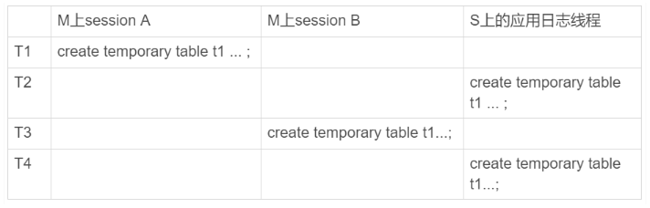

备库线程在执行的时候，要把这两个 t1 表当做两个不同的临时表来处理，MySQL 在记录 binlog 的时候，会把主库执行这个语句的线程 id 写到 binlog 中。这样，在备库的应用线程就能够知道执行每个语句的主库线程 id，并利用这个线程 id 来构造临时表的 table_def_key：

1. session A 的临时表 t1，在备库的 table_def_key 就是：库名 +t1+“M 的 serverid”+“session A 的 thread_id”;
2. session B 的临时表 t1，在备库的 table_def_key 就是 ：库名 +t1+“M 的 serverid”+“session B 的 thread_id”。

由于 table_def_key 不同，所以这两个表在备库的应用线程里面是不会冲突的。 

在 binlog_format='row’的时候，临时表的操作不记录到 binlog 中，只会记录插入的数据

### 内部临时表

在sql中创建临时表可以叫用户临时表，辅助SQL执行的，在执行过程中创建的临时表叫内部临时表

内部临时表的应用：

* 排序的时候用到了 sort buffer 
* 使用 join 语句的时候用到了 join buffer 
* union执行时，为了去重使用了临时表
* groupby执行时，会用临时表保存中间结果，然后再返回

join_buffer 是无序数组，sort_buffer 是有序数组，临时表是二维表结构 

## union执行

首先创建表：

~~~sql
create table t1(id int primary key, a int, b int, index(a));
delimiter ;;
create procedure idata()
begin
  declare i int;
 
  set i=1;
  while(i<=1000)do
    insert into t1 values(i, i, i);
    set i=i+1;
  end while;
end;;
delimiter ;
call idata();
~~~

然后执行下面的语句：

~~~sql
(select 1000 as f) union (select id from t1 order by id desc limit 2);
~~~

union执行的过程：

1. 创建一个内存临时表，这个临时表只有一个整型字段 f，并且 f 是主键字段。
2. 执行第一个子查询，得到 1000 这个值，并存入临时表中。
3. 执行第二个子查询：
   - 拿到第一行 id=1000，试图插入临时表中。但由于 1000 这个值已经存在于临时表了，违反了唯一性约束，所以插入失败，然后继续执行；
   - 取到第二行 id=999，插入临时表成功。
4. 从临时表中按行取出数据，返回结果，并删除临时表，结果中包含两行数据分别是 1000 和 999。

可以看到，这里的内存临时表起到了暂存数据的作用，而且计算过程还用上了临时表主键 id 的唯一性约束，实现了 union 的语义。 

如果是union all的话，就没有去重的语义了，此时就依次执行查询，然后将结果作为结果集的一部分发送到客户端，此时不需要临时表了

## groupby执行

不需要执行聚合函数时，distinct 和 group by 这两条语句的语义和执行流程是相同的，因此执行性能也相同。两者都会借助临时表来辅助查询。

### 内存临时表

执行下面这个sql语句：

~~~sql
select id%10 as m, count(*) as c from t1 group by m;
~~~

它的explain结果如下：


在 Extra 字段里面，我们可以看到三个信息：

- Using index，表示这个语句使用了覆盖索引，选择了索引 a，不需要回表；
- Using temporary，表示使用了临时表；
- Using filesort，表示需要排序。

这个语句的执行流程是这样的：

1. 创建内存临时表，表里有两个字段 m 和 c，主键是 m；
2. 扫描表 t1 的索引 a，依次取出叶子节点上的 id 值，计算 id%10 的结果，记为 x；
   - 如果临时表中没有主键为 x 的行，就插入一个记录 (x,1);
   - 如果表中有主键为 x 的行，就将 x 这一行的 c 值加 1；
3. 遍历完成后，再根据字段 m 做排序（排序时需要将内存临时表的值读入sort_buffer，然后再按照m排序再写入临时表），得到结果集返回给客户端。

如果不想在groupby中排序，可以在语句末尾加order by null ：

~~~sql
select id%10 as m, count(*) as c from t1 group by m order by null;
~~~

这样就跳过了排序结果，直接从临时表中取数据然后返回

在这个过程中，内存临时表的大小是有限制的，参数 tmp_table_size 就是控制这个内存大小的，默认是 16M 。如果内存临时表装不下那么多数据，此时就会把内存临时表转成磁盘临时表，磁盘临时表默认使用的引擎是 InnoDB ，可能占用较大的磁盘空间

### 索引加速

对上面的sql来说，group by 的语义逻辑，是统计不同的值出现的个数。但是，由于每一行的 id%100 的结果是无序的，所以我们就需要有一个临时表，来记录并统计结果。 如果在索引树的叶子节点上，记录都是按照 id%100 进行升序排列的，那分组就简单了，只需要顺序扫描，扫描到一个新的id%100 就代表一个组筛选完毕了，顺序扫描索引就可以完成分组，无需再创建临时表了

在 MySQL 5.7 版本支持了 generated column 机制，用来实现列数据的关联更新。你可以用下面的方法创建一个列 z，然后在 z 列上创建一个索引 ：

~~~sql
alter table t1 add column z int generated always as(id % 100), add index(z);
~~~

这样，索引 z 上的数据就是按照 id%100 有序的了，此时再进行groupby：

~~~sql
select z, count(*) as c from t1 group by z;
~~~

此时执行计划：


从 Extra 字段可以看到，这个语句的执行不再需要临时表，也不需要排序了。 

### 排序算法

如果遇到不适合建索引的场景，且数据量又大，此时groupby还是需要 “先放到内存临时表，插入一部分数据后，发现内存临时表不够用了再转成磁盘临时表” 

此时可以直接让MySQL走磁盘临时表：

~~~sql
select SQL_BIG_RESULT id%100 as m, count(*) as c from t1 group by m;
~~~

SQL_BIG_RESULT就是告知优化器：这个语句涉及的数据量很大，请直接用磁盘临时表，这种临时表存储时采用的还是数组的形式，而不是B+树

此时语句的执行过程：

1. 初始化 sort_buffer，确定放入一个整型字段，记为 m；
2. 扫描表 t1 的索引 a，依次取出里面的 id 值, 将 id%100 的值存入 sort_buffer 中；
3. 扫描完成后，对 sort_buffer 的字段 m 做排序（如果 sort_buffer 内存不够用，就会利用磁盘临时文件辅助排序）；
4. 排序完成后，就得到了一个有序数组。

## 内存表

### 哈希索引

内存表就是采用Memory 引擎 创建的表

假设有这样两个表：

~~~sql
create table t1(id int primary key, c int) engine=Memory;
create table t2(id int primary key, c int) engine=innodb;
insert into t1 values(1,1),(2,2),(3,3),(4,4),(5,5),(6,6),(7,7),(8,8),(9,9),(0,0);
insert into t2 values(1,1),(2,2),(3,3),(4,4),(5,5),(6,6),(7,7),(8,8),(9,9),(0,0);
~~~

表 t2 用的是 InnoDB 引擎 ，它的数据就放在主键索引树上，主键索引是 B+ 树，这种存储方式被称为索引组织表（Index Organizied Table）

表t1的数据和索引是分开的，它的结构是这样的：

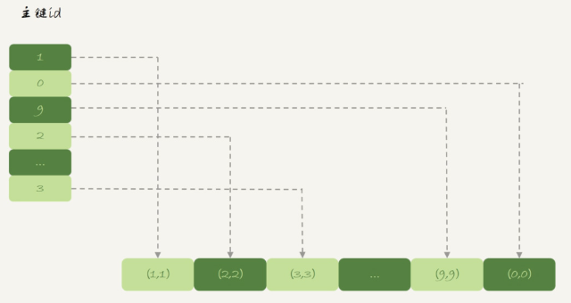

可以看到，内存表的数据部分以数组的方式单独存放，而主键 id 索引里，存的是每个数据的位置，这种存储方式被称为堆组织表（Heap Organizied Table）。主键 id 是 hash 索引，可以看到索引上的 key 并不是有序的。 

两个引擎的差别：

1. InnoDB 表的数据总是有序存放的，而内存表的数据就是按照写入顺序存放的；
2. 当数据文件有空洞的时候，InnoDB 表在插入新数据的时候，为了保证数据有序性，只能在固定的位置写入新值，而内存表找到空位就可以插入新值；因此刚刚删除内存表的数据后再插入，数据就可以直接占用之前的位置
3. 数据位置发生变化的时候，InnoDB 表只需要修改主键索引，而内存表需要修改所有索引；
4. InnoDB 表用主键索引查询时需要走一次索引查找，用普通索引查询的时候，需要走两次索引查找。而内存表没有这个区别，所有索引的“地位”都是相同的。
5. InnoDB 支持变长数据类型，不同记录的长度可能不同；内存表不支持 Blob 和 Text 字段，并且即使定义了 varchar(N)，实际也当作 char(N)，也就是固定长度字符串来存储，因此内存表的每行数据长度相同。

由于内存表的主键索引是哈希索引，所以它的范围查询性能并不好：

~~~sql
select * from t1 where id<5;
~~~

如果想内存表很好的支持范围索引，可以在列上手动加上一个B-Tree索引：

~~~sql
alter table t1 add index a_btree_index using btree (id);
~~~

### 内存表的弊端

不建议在生产环境上使用内存表，原因主要包括：

1. 锁粒度问题；
2. 数据持久化问题。 

内存表不支持行锁，只支持表锁。因此，一张表只要有更新，就会堵住其他所有在这个表上的读写操作。 因此内存表的并发性能并不好。

数据持久化问题主要是在多实例场合出现问题：

当备库重启后，内存表就不存在了，客户端发送的更新语句都会报错，而且由于表被删除，主备同步会停止，如果此时发生主备切换，客户端就会永远找不到这个表了。对于客户端来说，就是“网络断开，重连之后，发现内存表数据丢失了” 

由于重启后内存表中的数据会丢失，为了主备一致，MySQL 在数据库重启之后，往 binlog 里面写入一行 DELETE FROM t1 ，这就会导致一种现象：在备库重启的时候，备库 binlog 里的 delete 语句就会传到主库，然后把主库内存表的内容删除。这样你在使用的时候就会发现，主库的内存表数据突然被清空了。 

内存表的适用场合是作为内存临时表，辅助查询逻辑，原因是：

1. 临时表不会被其他线程访问，没有并发性的问题；
2. 临时表重启后也是需要删除的，清空数据这个问题不存在；
3. 备库的临时表也不会影响主库的用户线程。

如果发现正常的业务表是内存表，备库重启之后肯定是会导致备库的内存表数据被清空，进而导致主备同步停止 ，最好的做法是将它修改成 InnoDB 引擎表 

## 复制表的方法

如果需求是在两张表之间拷贝数据，如果可以控制对源表的扫描行数和加锁范围很小的话，我们简单地使用 insert … select 语句即可实现。 当然，为了避免对源表加读锁，更稳妥的方案是先将数据写到外部文本文件，然后再写回目标表。 

以下表为例，创建一个表 db1.t，并插入 1000 行数据，同时创建一个相同结构的表 db2.t ：

~~~sql
create database db1;
use db1;
 
create table t(id int primary key, a int, b int, index(a))engine=innodb;
delimiter ;;
  create procedure idata()
  begin
    declare i int;
    set i=1;
    while(i<=1000)do
      insert into t values(i,i,i);
      set i=i+1;
    end while;
  end;;
delimiter ;
call idata();
 
create database db2;
create table db2.t like db1.t
~~~

假设，我们要把 db1.t 里面 a>900 的数据行导出来，插入到 db2.t 中。 

### mysqldump方法

种方法是，使用 mysqldump 命令将数据导出成一组 INSERT 语句。可以使用下面的命令： 

~~~sql
mysqldump -h$host -P$port -u$user --add-locks=0 --no-create-info --single-transaction  --set-gtid-purged=OFF db1 t --where="a>900" --result-file=/client_tmp/t.sql
~~~

这条命令中，主要参数含义如下：

1. –single-transaction 的作用是，在导出数据的时候不需要对表 db1.t 加表锁，而是使用 START TRANSACTION WITH CONSISTENT SNAPSHOT 的方法；
2. –add-locks 设置为 0，表示在输出的文件结果里，不增加" LOCK TABLES t WRITE;" ；
3. –no-create-info 的意思是，不需要导出表结构；
4. –set-gtid-purged=off 表示的是，不输出跟 GTID 相关的信息；
5. –result-file 指定了输出文件的路径，其中 client 表示生成的文件是在客户端机器上的。

通过这条 mysqldump 命令生成的 t.sql 文件中就包含了创建表时用到的全部语句


可以看到，一条 INSERT 语句里面会包含多个 value 对，这是为了后续用这个文件来写入数据的时候，执行速度可以更快。

如果你希望生成的文件中一条 INSERT 语句只插入一行数据的话，可以在执行 mysqldump 命令时，加上参数–skip-extended-insert。

然后，你可以通过下面这条命令，将这些 INSERT 语句放到 db2 库里去执行：

~~~sql
mysql -h127.0.0.1 -P13000  -uroot db2 -e "source /client_tmp/t.sql"
~~~

需要说明的是，source 并不是一条 SQL 语句，而是一个客户端命令。mysql 客户端执行这个命令的流程是这样的：

1. 打开文件，默认以分号为结尾读取一条条的 SQL 语句；
2. 将 SQL 语句发送到服务端执行。

也就是说，服务端执行的并不是这个“source t.sql"语句，而是 INSERT 语句。所以，不论是在慢查询日志（slow log），还是在 binlog，记录的都是这些要被真正执行的 INSERT 语句。

mysqlbinlog工具还能解析binlog文件，并应用到目标库：

~~~sql
mysqlbinlog $binlog_file | mysql -h$host -P$port -u$user -p$pwd
~~~

### 导出CSV文件

另一种方法是直接将结果导出成.csv 文件。MySQL 提供了下面的语法，用来将查询结果导出到服务端本地目录： 

~~~sql
select * from db1.t where a>900 into outfile '/server_tmp/t.csv';
~~~

1. 这条语句会将结果保存在服务端。如果你执行命令的客户端和 MySQL 服务端不在同一个机器上，客户端机器的临时目录下是不会生成 t.csv 文件的。
2. into outfile 指定了文件的生成位置（/server_tmp/），这个位置必须受参数 secure_file_priv 的限制。参数 secure_file_priv 的可选值和作用分别是：
   - 如果设置为 empty，表示不限制文件生成的位置，这是不安全的设置；
   - 如果设置为一个表示路径的字符串，就要求生成的文件只能放在这个指定的目录，或者它的子目录；
   - 如果设置为 NULL，就表示禁止在这个 MySQL 实例上执行 select … into outfile 操作。
3. 这条命令不会帮你覆盖文件，因此你需要确保 /server_tmp/t.csv 这个文件不存在，否则执行语句时就会因为有同名文件的存在而报错。
4. 这条命令生成的文本文件中，原则上一个数据行对应文本文件的一行。但是，如果字段中包含换行符，在生成的文本中也会有换行符。不过类似换行符、制表符这类符号，前面都会跟上“\”这个转义符，这样就可以跟字段之间、数据行之间的分隔符区分开。

得到.csv 导出文件后，你就可以用下面的 load data 命令将数据导入到目标表 db2.t 中：

~~~sql
load data infile '/server_tmp/t.csv' into table db2.t;
~~~

这条语句的执行流程如下所示：

1. 打开文件 /server_tmp/t.csv，以制表符 (\t) 作为字段间的分隔符，以换行符（\n）作为记录之间的分隔符，进行数据读取；
2. 启动事务。
3. 判断每一行的字段数与表 db2.t 是否相同：
   - 若不相同，则直接报错，事务回滚；
   - 若相同，则构造成一行，调用 InnoDB 引擎接口，写入到表中。
4. 重复步骤 3，直到 /server_tmp/t.csv 整个文件读入完成，提交事务。

如果CSV文件只保存在主库本地，在备库的机器上没有这个文件，主备同步就会有问题，所以执行load data时，MySQL将CSV文件的内容直接写到binlog中，然后再追加load data语句，备库收到binlog后，先从binlog中将CSV文件的内容读取出来，然后写入本地文件，再以本地文件为数据源，执行load data语句，这里备库执行的 load data 语句里面，多了一个“local” ，它的意思是将本地文件的内存加载到目标表：

~~~sql
load data local infile ‘/tmp/SQL_LOAD_MB-1-0’ INTO TABLE `db2`.`t`
~~~

也就是说，load data 命令有两种用法：

* 不加“local”，是读取服务端的文件，这个文件必须在 secure_file_priv 指定的目录或子目录下；
* 加上“local”，读取的是客户端的文件，只要 mysql 客户端有访问这个文件的权限即可。这时候，MySQL 客户端会先把本地文件传给服务端，然后执行上述的 load data 流程。

另外需要注意的是，select …into outfile 方法不会生成表结构文件, 所以我们导数据时还需要单独的命令得到表结构定义。mysqldump 提供了一个–tab 参数，可以同时导出表结构定义文件和 csv 数据文件。这条命令的使用方法如下：

~~~sql
mysqldump -h$host -P$port -u$user ---single-transaction  --set-gtid-purged=OFF db1 t --where="a>900" --tab=$secure_file_priv
~~~

这条命令会在 $secure_file_priv 定义的目录下，创建一个 t.sql 文件保存建表语句，同时创建一个 t.txt 文件保存 CSV 数据。 

### 物理拷贝方法

前面提到的 mysqldump 方法和导出 CSV 文件的方法，都是逻辑导数据的方法，也就是将数据从表 db1.t 中读出来，生成文本，然后再写入目标表 db2.t 中。 其实还存在一种物理拷贝的方法，但并不是直接拷贝frm和idb文件，因为一个 InnoDB 表，除了包含这两个物理文件外，还需要在数据字典中注册。直接拷贝这两个文件的话，因为数据字典中没有 db2.t 这个表，系统是不会识别和接受它们的

MySQL 5.6 版本引入了可传输表空间(transportable tablespace) 的方法，可以通过导出 + 导入表空间的方式，实现物理拷贝表的功能

假设我们现在的目标是在 db1 库下，复制一个跟表 t 相同的表 r，具体的执行步骤如下：

* 执行 create table r like t，创建一个相同表结构的空表；
* 执行 alter table r discard tablespace，这时候 r.ibd 文件会被删除；
* 执行 flush table t for export，这时候 db1 目录下会生成一个 t.cfg 文件；
* 在 db1 目录下执行 cp t.cfg r.cfg; cp t.ibd r.ibd；这两个命令（这里需要注意的是，拷贝得到的两个文件，MySQL 进程要有读写权限）；
* 执行 unlock tables，这时候 t.cfg 文件会被删除；
* 执行 alter table r import tablespace，将这个 r.ibd 文件作为表 r 的新的表空间，由于这个文件的数据内容和 t.ibd 是相同的，所以表 r 中就有了和表 t 相同的数据。

关于拷贝表的这个流程，有以下几个注意点：

1. 在第 3 步执行完 flsuh table 命令之后，db1.t 整个表处于只读状态，直到执行 unlock tables 命令后才释放读锁；
2. 在执行 import tablespace 的时候，为了让文件里的表空间 id 和数据字典中的一致，会修改 r.ibd 的表空间 id。而这个表空间 id 存在于每一个数据页中。因此，如果是一个很大的文件（比如 TB 级别），每个数据页都需要修改，所以你会看到这个 import 语句的执行是需要一些时间的。当然，如果是相比于逻辑导入的方法，import 语句的耗时是非常短的。

### 复制方法对比

三种拷贝方法的 优缺点：

1. 物理拷贝的方式速度最快，尤其对于大表拷贝来说是最快的方法。如果出现误删表的情况，用备份恢复出误删之前的临时库，然后再把临时库中的表拷贝到生产库上，是恢复数据最快的方法。但是，这种方法的使用也有一定的局限性：
   - 必须是全表拷贝，不能只拷贝部分数据；
   - 需要到服务器上拷贝数据，在用户无法登录数据库主机的场景下无法使用；
   - 由于是通过拷贝物理文件实现的，源表和目标表都是使用 InnoDB 引擎时才能使用。
2. 用 mysqldump 生成包含 INSERT 语句文件的方法，可以在 where 参数增加过滤条件，来实现只导出部分数据。这个方式的不足之一是，不能使用 join 这种比较复杂的 where 条件写法。
3. 用 select … into outfile 的方法是最灵活的，支持所有的 SQL 写法。但，这个方法的缺点之一就是，每次只能导出一张表的数据，而且表结构也需要另外的语句单独备份。

后两种方式都是逻辑备份方式，是可以跨引擎使用的。 

# 缓存

## change buffer与更新性能

change buffer ：buffer pool 的一部分。

当需要更新一个数据页时，如果数据页在内存中就直接更新，而如果这个数据页还没有在内存中的话，在不影响数据一致性的前提下，InooDB 会将这些更新操作缓存在 change buffer 中，这样就不需要从磁盘中读入这个数据页了。在下次查询需要访问这个数据页的时候，将数据页读入内存，然后执行 change buffer 中与这个页有关的操作。通过这种方式就能保证这个数据逻辑的正确性。

change buffer 在内存中有拷贝，也会被写入到磁盘上，写入磁盘中就是一种数据页

将 change buffer 中的操作应用到原数据页，得到最新结果的过程称为 merge（merge是吧磁盘数据页读到内存，然后在内存中应用change buffer中的更新，得到新版数据页，此时磁盘中的数据好还未修改，对应的数据页是脏页），merge的时机：

* 访问对应数据页会触发merge
* 后台线程定期merge
* 在数据库正常关闭（shutdown）的过程中会执行merge

change buffer 的好处：减少读磁盘，语句的执行速度明显提升，还能减少数据页读入内存，提高内存利用率

使用change buffer的前提条件：

对于唯一索引来说，所有的更新操作都要先判断这个操作是否违反唯一性约束，例如要插入 (4,400) 这个记录，就要先判断现在表中是否已经存在 k=4 的记录，而这必须要将数据页读入内存才能判断。如果都已经读入到内存了，那直接更新内存会更快，就没必要使用 change buffer 了 

（注意：这里面的更新操作不是指语句是update，而是指更新数据页，SQL操作可以是多种，包括插入）

唯一索引的更新不能使用 change buffer，当然也包括主键索引的更新，只有普通索引更新时才可以使用change buffer提高速度

change buffer的配置：change buffer 用的是 buffer pool 里的内存，因此不能无限增大。change buffer 的大小，可以通过参数 innodb_change_buffer_max_size 来动态设置。这个参数设置为 50 的时候，表示 change buffer 的大小最多只能占用 buffer pool 的 50% 

在表中插入一条新记录的步骤：

* 如果要更新的数据页在内存中，唯一索引会读内存中的数据页判断有没有冲突，然后将数据插入内存；普通索引会直接将数据插入内存
* 如果要更新的数据页不在内存中，对于唯一索引来说，需要将数据页读入内存，判断到没有冲突，插入这个值；普通索引会直接将更新动作写入change buffer

注意在这个过程中，无论是写入内存还是写入change buffer等，这些动作都会记录在redo日志中，redo日志和change buffer在性能优化上的侧重不同：

* redo日志将多次随机写磁盘转化为顺序写磁盘
* change buffer减少了随机读磁盘的次数（将数据页从磁盘加载到内存）

change buffer减少了数据从磁盘读入内存的数量，减少了随机IO访问，但change buffer并不是任何普通索引的场景都能起到加速的作用：

* 对写多读少的业务，页面在写完以后马上被访问到的概率比较小，在一个数据页做 merge 之前，change buffer 记载的记录很多，性能优化明显，此时应该利用change buffer的优势，让它的容量尽量大
* 对读取频繁的业务，页面在写完之后马上就会被访问到，更新动作写入change buffer后会立即触发merge，随机访问 IO 的次数不会减少，反而增加了 change buffer 的维护代价，这种情况建议禁用change buffer

综上，普通索引和唯一索引在查询上没有性能差别，但考虑到对更新性能的影响，在不影响业务目的的前提下建议使用普通索引

## 脏页刷新

当内存数据页跟磁盘数据页内容不一致的时候，我们称这个内存页为“脏页”。内存数据写入到磁盘后，内存和磁盘上的数据页的内容就一致了，称为“干净页”

刷脏页flush的触发时机：

* InnoDB 的 redo log 写满了，此时系统会停止所有的更新操作，执行checkpoint（将redo log对应的脏页刷新到磁盘），如果redo log对应的脏页已经刷新到了磁盘，那么该日志也没有存在的必要了
* 系统内存不足，无法分配新的内存页了，需要淘汰一些数据页，空出内存给别的数据页用，如果淘汰的页是脏页，就要先将脏页写入磁盘
* 空闲时后台线程刷脏页到磁盘
* MySQL 正常关闭时，会把内存的脏页都 flush 到磁盘上

影响性能的主要是前两种情况。

为了发挥后台线程刷新脏页的能力，需要合理配置innodb_io_capacity 这个参数，一般要设置成磁盘的IOPS，磁盘的 IOPS 可以通过 fio 这个工具来测试：

~~~
fio -filename=$filename -direct=1 -iodepth 1 -thread -rw=randrw -ioengine=psync -bs=16k -size=500M -numjobs=10 -runtime=10 -group_reporting -name=mytest 
~~~

如果设置的太小，就会导致刷新脏页的速度很慢，当比脏页生成的速度还慢时，就造成了脏页累积，内存不足，引发上面的第二个问题，影响查询和更新性能。

InnoDB实际刷脏页的速度不仅和innodb_io_capacity有关，还与脏页比例上限、redo日志积压程度有关。

脏页比例上限是参数innodb_max_dirty_pages_pct，默认是75%

InnoDB 每次写入redo日志都有一个序号，当前写入的序号跟 checkpoint 对应的序号之间的差值，我们假设为 N ，根据它计算出redo日志积压程度。取两个值的最大值再乘以innodb_io_capacity作为最后刷新脏页的速度：

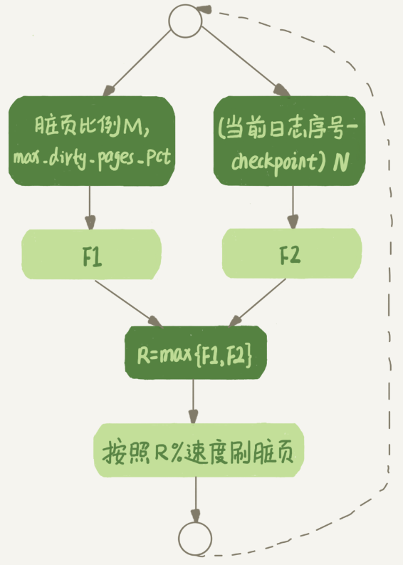

平时要多关注脏页比例，如果太高的话，肯定会影响数据库性能。脏页比例的查看：

~~~
mysql> select VARIABLE_VALUE into @a from global_status where VARIABLE_NAME = 'Innodb_buffer_pool_pages_dirty';
select VARIABLE_VALUE into @b from global_status where VARIABLE_NAME = 'Innodb_buffer_pool_pages_total';
select @a/@b;
~~~

脏页刷新会有连续刷新的机制，当一个查询请求需要在执行过程中先 flush 掉一个脏页时，如果链表下一个页也恰好是脏页，也会一起刷新，这个特性可以减少很多随机IO，但如果使用的是SSD，此时IOPS并不是瓶颈了，建议就禁止这种连续刷新，减少SQL语句响应时间，将innodb_flush_neighbors设置为0。在 MySQL 8.0 中，innodb_flush_neighbors 参数的默认值已经是 0 了。 

综上因为脏页刷新机制的存在，MySQL有时会发生性能抖动，偶尔会变慢

# 锁

MySQL 里面的锁大致可以分成全局锁、表级锁和行锁三类

## 全局锁

全局锁就是对整个数据库实例加锁 ，全局加读锁的方法：

~~~
Flush tables with read lock
~~~

执行完毕之后，整个库就处于只读状态了，更新语句、定义局域会阻塞，如果在主库上执行，业务会中断；如果在从库上执行，那么备份期间从库不能执行主库同步过来的 binlog，会导致主从延迟 。它用于做全库逻辑备份时，保持数据的一致性。

官方自带的逻辑备份工具mysqldump，当使用参数–single-transaction 的时候，导数据之前就会启动一个事务，来确保拿到一致性视图，这样备份期间也不会阻塞数据的更新，但是这样做的前提是引擎支持这个隔离级别，支持事务，如MyISAM就无法采用该方法

还有一种方式是直接让数据库进入只读状态：

~~~
set global readonly=true
~~~

但如果是为了备份，最好不用这种方式，原因是：

* 在有些系统中，readonly 的值会被用来做其他逻辑，比如用来判断一个库是主库还是备库 
* 在异常处理机制上有差异。如果执行 FTWRL 命令之后由于客户端发生异常断开，那么 MySQL 会自动释放这个全局锁，整个库回到可以正常更新的状态。而将整个库设置为 readonly 之后，如果客户端发生异常，则数据库就会一直保持 readonly 状态，这样会导致整个库长时间处于不可写状态，风险较高 

## 表级锁

MySQL 里面表级别的锁有两种：一种是表锁，一种是元数据锁（meta data lock，MDL) 

加表锁的语法：lock tables … read/write。与 FTWRL 类似，可以用 unlock tables 主动释放锁，也可以在客户端断开的时候自动释放。加表锁后，不仅其他线程会被限制读写，本线程也会被限制。

MDL锁不需要显式使用，在访问一个表的时候会被自动加上 。它是为了解决这个问题：一个查询正在遍历一个表中的数据，而执行期间另一个线程对这个表结构做变更，删了一列，那么查询线程拿到的结果跟表结构对不上，肯定是不行的 。因此，在 MySQL 5.5 版本中引入了 MDL，当对一个表做增删改查操作的时候，加 MDL 读锁；当要对表做结构变更操作的时候，加 MDL 写锁 。

MDL锁在语句执行开始时申请，但是语句结束后并不会马上释放，而会等到整个事务提交后再释放 。由于这个性质，给表加字段或者修改字段、加索引时要特别小心，它需要加MDL写锁，而且执行时间长，需要扫描全表的数据，例如下面的例子：

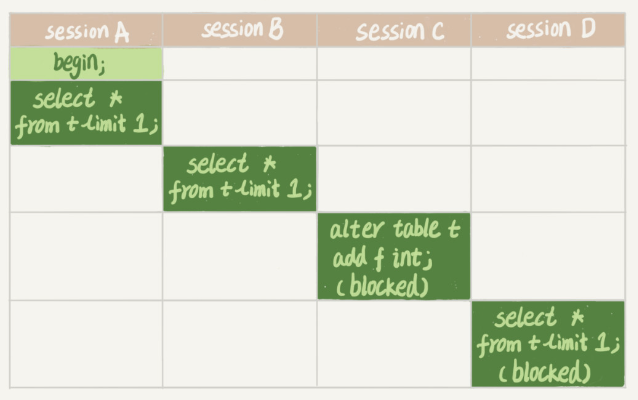

sessionA和sessionB都是给表加MDL读锁，sessionC给表加MDL写锁，它被阻塞，由于sessionC的动作，之后要在同一张表上申请锁的请求也会被阻塞，所以sessionD也会被阻塞，表就会进入不可读写的状态。如果某个表上的查询语句频繁，而且客户端有重试机制，也就是说超时后会再起一个新 session 再请求的话，这个库的线程很快就会爆满，如果处理不好这种修改语句，会拖垮整个数据库

安全的给表加字段的方法：

在 alter table 语句里面设定等待时间，如果在这个指定的等待时间里面能够拿到 MDL 写锁最好，拿不到也不要阻塞后面的业务语句，先放弃。之后开发人员或者 DBA 再通过重试命令重复这个过程 ：

~~~
ALTER TABLE tbl_name NOWAIT add column ...
ALTER TABLE tbl_name WAIT N add column ... 
~~~

如果在备份的时候执行了一个DDL语句会怎样？（备份在备库，DDL执行在主库，由主从同步来执行备库的DDL）

备份过程中会执行下面的语句：

~~~
Q1:SET SESSION TRANSACTION ISOLATION LEVEL REPEATABLE READ; // 设置隔离级别
Q2:START TRANSACTION  WITH CONSISTENT SNAPSHOT；          // 开启事务，同时创建一致性视图，之后的查询都用这个视图，只能在可重复读隔离级别起作用，如果在读提交隔离级别，这句就等价于start transaction
/* other tables */
Q3:SAVEPOINT sp;                  // 设置一个保存点
/* 时刻 1 */
Q4:show create table `t1`;          // 拿掉表结构
/* 时刻 2 */
Q5:SELECT * FROM `t1`;            // 查询数据
/* 时刻 3 */
Q6:ROLLBACK TO SAVEPOINT sp;         // 回滚到保存点
/* 时刻 4 */
/* other tables */
~~~

如果是在Q4前执行DDL，则备份期间不会受到影响；

如果是在Q4执行后，Q5执行前执行DDL，则查到的表结构被更新，破坏了一致性视图，此时会报错，备份失败

Q5是一个重要的分水岭，如果是Q5先执行，那就会先一步拿到表的MDL锁，然后DDL会被阻塞，主从延迟；如果是DDL先执行，则报错

从“时刻 4”开始，mysqldump 释放了 MDL 读锁，此时没有影响，备份拿到的是 DDL 前的表结构 

## 行锁

在下面的操作序列中：


执行结果是：事务 B 的 update 语句会被阻塞，直到事务 A 执行 commit 之后，事务 B 才能继续执行 

在 InnoDB 事务中，行锁是在需要的时候才加上的，但并不是不需要了就立刻释放，而是要等到事务结束时才释放。这个就是两阶段锁协议

两阶段协议带来的优化思路：如果你的事务中需要锁多个行，要把最可能造成锁冲突、最可能影响并发度的锁尽量往后放 （更新要往后放，因为更新时要获取行锁，插入时无需获取行锁。注意：即使更新一条已经存在更新效果的行，也会加锁，然后更新，只是影响行数是0）

例如在一个事务中要操作A/B/C三张表，其中B表在业务中被操作的最频繁，那么就应该把B放在事务的最后一个语句，减少锁的等待时间。

由于锁的存在，就会有对应死锁的情况，当出现死锁以后，有两种策略： 

- 一种策略是，直接进入等待，直到超时。这个超时时间可以通过参数 innodb_lock_wait_timeout 来设置（默认值是50s，相当于第一个被锁住的线程要过 50s 才会超时退出 ）。
- 另一种策略是，发起死锁检测，发现死锁后，主动回滚死锁链条中的某一个事务，让其他事务得以继续执行。将参数 innodb_deadlock_detect 设置为 on（默认是on），表示开启这个逻辑

死锁检测：每当一个事务被锁的时候，就要看看它所依赖的线程有没有被别人锁住，如此循环，最后判断是否出现了循环等待。这种算法思路会导致整个算法的复杂度是ON方，假设有 1000 个并发线程要同时更新同一行，那么死锁检测操作就是 100 万这个量级的，因为每个线程都会检测到其他所有等待线程的状态，期间要消耗大量的 CPU 资源 ，因此有时会出现CPU 利用率很高，但是每秒却执行不了几个事务的情况。

为了解决死锁检测导致CPU过高的问题，可以有几种思路：

* 关闭死锁检测，但这种操作本身带有一定的风险，因为业务设计一般不会感知到死锁问题，出现死锁就回滚并重试，一般对业务侧不会有很大影响，但若关闭了死锁检测，业务侧就会出现大量超时
* 控制并发度，可以在客户端控制，如果有多个客户端，可以设置一个中间层，在中间层控制，最后的方案就是修改MySQL源码，对于相同行的更新，在进入引擎之前排队，减少死锁检测工作
* 减少锁冲突，如频繁更新账户余额导致冲突增加，可以设置10条记录的和等于账户余额，这样增加余额就随机选择10条记录里面的一条更新，这样每次冲突概率变成原来的 1/10 ，但缺点是业务侧需要做详细设计，应对各种特殊场景

## 查一行慢的例子

查询一行慢的原因主要有等锁、等待其他语句、查询慢，具体场景有：

1、等MDL锁

语句卡住时执行show processlist 命令 ，就能看到正在执行的sql的State列是Waiting for table metadata lock 。说明此时有个线程正在相同的表上持有MDL写锁，就将select语句阻塞了。

MySQL 5.6 版本执行修改表结构的语句就会占用表的MDL写锁，MySQL 5.7 版本修改了 MDL 的加锁策略，执行lock tables t write就会让表持有MDL写锁

解决办法是找到持有MDL写锁的线程然后使用kill命令断开，需要MySQL 启动时需要设置 performance_schema=on，相比于设置为 off 会有 10% 左右的性能损失 ，通过查询 sys.schema_table_lock_waits 这张表，我们就可以直接找出造成阻塞的 process id ，把这个连接用 kill 命令断开即可 

2、等flush

这种场景下show processlist 命令的State列是Waiting for table flush，当执行flush操作时会阻塞表其他语句的执行，flush一般有两种形式：

~~~sql
flush tables t with read lock;
flush tables with read lock;
~~~

前者是针对一个表的，后者是针对所有表的。它的作用是关闭所有的表，清空查询缓存。关闭表之前需要针对该表的语句全部执行结束，所以当某个语句阻塞了flush的执行，flush又阻塞了我们语句的执行时，此时就是Waiting for table flush。

解决办法就是找到show processlist 命令中阻塞flush的语句，然后kill掉它

3、等行锁

当执行的查询语句要获取读锁时，就会被其他更新这一行的语句阻塞：

~~~sql
mysql> select * from t where id=1 lock in share mode; 
~~~

可以通过sys.innodb_lock_waits 查到占有写锁的语句：

~~~sql
mysql> select * from t sys.innodb_lock_waits where locked_table=`'test'.'t'`\G
~~~

然后使用KILL pid来停止该连接，让该更新语句回滚，释放行锁

4、查询慢

未命中索引，导致虽然只查询一行，但是却要扫描很多行：

~~~sql
mysql> select * from t where c=50000 limit 1;
~~~

5、并发更新次数多

例如更新一条记录的时候，同时存在并发事务更新了这一行很多次。那么在索引中该记录的版本链会很长很长，导致查询的时候需要遍历这一条链表直到读到可见的版本，当并发更新次数多的时候也影响性能

## 解决幻读

幻读指的是一个事务在前后两次查询同一个范围的时候，后一次查询看到了前一次查询没有看到的行 。

在可重复读隔离级别下，普通的查询是快照读，是不会看到别的事务插入的数据的。因此，幻读在“当前读”下才会出现。幻读专门指的是新插入的行。

在当前读（读最新记录，且加写锁）下出现幻读会有下列问题：

1、加锁的语义被破坏

执行当前读的时候，会对记录加写锁，例如给id=5 这一行加了行锁 ，但没有给其他记录上锁，此时是可以插入一条id为5的记录的，这就破坏了要锁住所有 id=5 的行的加锁声明 

2、数据一致性问题

因为更新操作是要在最新的记录上进行的，所以如果不处理幻读的问题，数据库内记录的最终结果是和并发事务更新执行的先后顺序有关的。

例如有两个事务A和B，A首先开启事务，执行了一条语句，将id为5的记录改为id为100，B后开启事务，执行了一条语句，将id为0的记录更新为id为5，由于更新在最新记录上进行，这两条语句各自产生了一条记录。但由于事务提交的顺序是反过来的，也就是B事务先提交，A事务后提交，此时在binlog中，会先写入B事务的修改，然后再写入A事务的修改，当这份修改提交到从库的时候，执行结果就发生了变化：先将id为0的记录更新为id为5，后将id为5的记录改为id为100，就导致从库在执行这两个事务的时候，更新的是同一条记录，导致了数据不一致的问题

幻读的困难在于，即使吧所有记录都加锁，也无法阻止不存在的记录新插入，而新插入的记录总是能破坏数据的一致性。

间隙锁是解决幻读问题引入的机制，间隙锁锁的就是两个值之间的空隙。如果一个表初始化插入了 6 个记录，这就产生了 7 个间隙。间隙锁不会和其他锁产生冲突的，产生冲突的只是往该区间插入这个行为，引入间隙锁后，对下面这个当前读的语句：

```sql
select * from t for update
```

不仅会对表里的所有数据加行锁，还会对所有空隙加间隙锁，间隙锁+行锁就是next-key lock ，每个 next-key lock 是前开后闭区间 ，若共7个间隙，就形成了7个被锁住的区间： (-∞,0]、(0,5]、(5,10]、(10,15]、(15,20]、(20, 25]、(25, +supremum] 

间隙锁锁住的范围很大，很容易产生死锁，如下面这个场景：

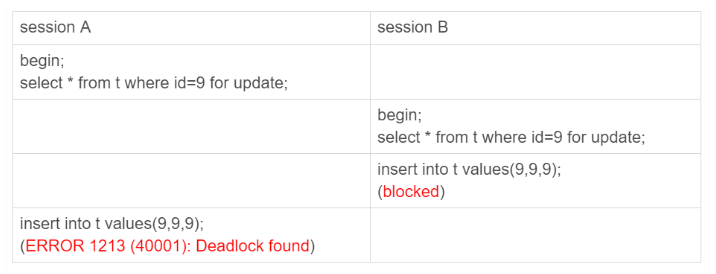

两个语句先后对同一个间隙加了间隙锁，后续更新时各自被对方的间隙锁阻塞。

间隙锁只在重复读的提交级别下存在，在读提交级别就不存在了。在读提交下，存在幻读的问题，需要解决数据和日志不一致的问题，需要把 binlog 格式设置为 row 。

对于下面的sql语句：

```sql
begin;
select * from t where c=5 for update;
commit;
```

由于c列没有索引，所以无法直接定位到c这一行，它会给聚簇索引上的所有记录都加行锁；在重复读级别下，为了防止幻读，还会锁住聚簇索引的所有GAP

实际业务中，若读提交满足要求则用读提交，若不满足业务场景才考虑使用重复读，这样的级别下操作数据的锁范围更小

## 加锁场景分析

MySQL 后面的版本可能会改变加锁策略，所以这个规则只限于截止到现在的最新版本，即 5.x 系列 <=5.7.24，8.0 系列 <=8.0.13 

下面的例子都是在可重复读级别，只有该级别下才有间隙锁。

加锁原则汇总：

1. 原则 1：加锁的基本单位是 next-key lock。希望你还记得，next-key lock 是前开后闭区间。
2. 原则 2：查找过程中访问到的对象才会加锁。
3. 优化 1：索引上的等值查询，给唯一索引加锁的时候，next-key lock 退化为行锁。
4. 优化 2：索引上的等值查询，向右遍历时且最后一个值不满足等值条件的时候，next-key lock 退化为间隙锁。
5. 一个 bug：唯一索引上的范围查询会访问到不满足条件的第一个值为止。

以下面的表和数据为例：

~~~sql
CREATE TABLE `t` (
  `id` int(11) NOT NULL,
  `c` int(11) DEFAULT NULL,
  `d` int(11) DEFAULT NULL,
  PRIMARY KEY (`id`),
  KEY `c` (`c`)
) ENGINE=InnoDB;
 
insert into t values(0,0,0),(5,5,5),
(10,10,10),(15,15,15),(20,20,20),(25,25,25);
~~~

1、主键等值间隙锁

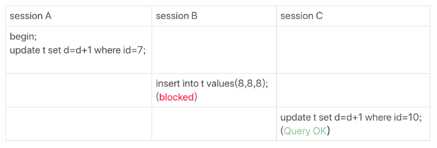

由于表 t 中没有 id=7 的记录 ，根据原则推导Session A加next-key lock ，范围是(5,10] 

这是等值查询，同时区间右端点id=10不满足查询条件，next-key lock 退化成间隙锁，因此最终加锁的范围是 (5,10) 

所以，session B 要往这个间隙里面插入 id=8 的记录会被锁住，但是 session C 修改 id=10 这行是可以的 

2、非唯一索引间隙锁

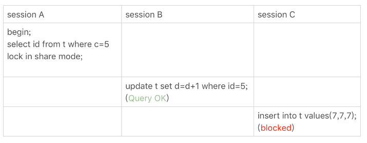

SessionA根据原则，会给(0,5] 加上 next-key lock，因为c 是普通索引，因此仅访问 c=5 这一条记录是不能马上停下来的，需要向右遍历，查到 c=10 才放弃 。根据原则 2，访问到的都要加锁，因此要给 (5,10] 加 next-key lock。 

根据优化2，等值判断，向右遍历，最后一个值不满足 c=5 这个等值条件，因此退化成间隙锁 (5,10) 

因为只有访问到的对象才会加锁，这个查询使用覆盖索引，并不需要访问主键索引，所以主键索引上没有加任何锁，这就是为什么 session B 的 update 语句可以执行完成 。但 session C 要插入一个 (7,7,7) 的记录，就会被 session A 的间隙锁 (5,10) 锁住 

需要注意，在这个例子中，lock in share mode 只锁覆盖索引，但是如果是 for update 就不一样了。 执行 for update 时，系统会认为你接下来要更新数据，因此会顺便给主键索引上满足条件的行加上行锁。 

如果你要用 lock in share mode 来给行加读锁避免数据被更新的话，就必须得绕过覆盖索引的优化，在查询字段中加入索引中不存在的字段。比如，将 session A 的查询语句改成 select d from t where c=5 lock in share mode，这样就可以给主键索引加锁了

看下面这个例子，就给主键索引加锁了：

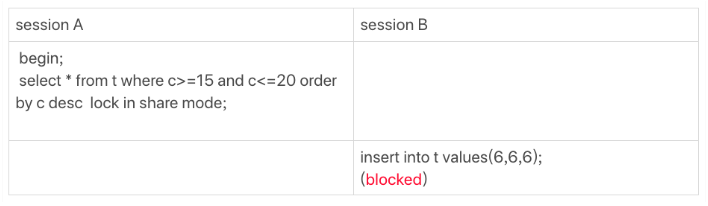

1. 由于是 order by c desc，第一个要定位的是索引 c 上“最右边的”c=20 的行，所以会加上间隙锁 (20,25) 和 next-key lock (15,20]。
2. 在索引 c 上向左遍历，要扫描到 c=10 才停下来，所以 next-key lock 会加到 (5,10]，这正是阻塞 session B 的 insert 语句的原因。
3. 在扫描过程中，c=20、c=15、c=10 这三行都存在值，由于是 select *，所以会在主键 id 上加三个行锁。

因此，session A 的 select 语句锁的范围就是：

1. 索引 c 上 (5, 25)；
2. 主键索引上 id=15、20 两个行锁

3、主键范围查询

下面两种 语句的加锁范围是不同的：

~~~sql
mysql> select * from t where id=10 for update;
mysql> select * from t where id>=10 and id<11 for update;
~~~

分析下面使用第二条查询语句的场景：

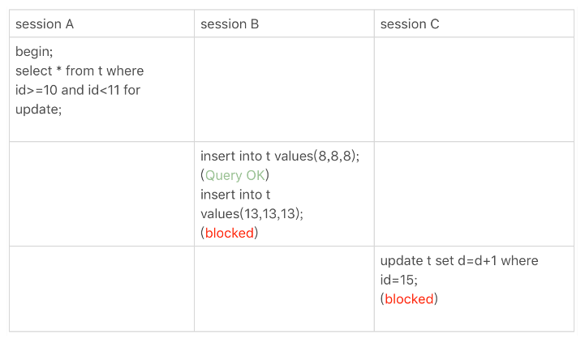

1. 开始执行的时候，要找到第一个 id=10 的行，因此本该是 next-key lock(5,10]。 根据优化 1， 主键 id 上的等值条件，退化成行锁，只加了 id=10 这一行的行锁。
2. 范围查找就往后继续找，找到 id=15 这一行停下来，因此需要加 next-key lock(10,15]。

所以在这个范围内插入的语句都会被阻塞。

第一条查询语句就仅仅只是行锁了

4、非唯一索引范围锁


这次 session A 用字段 c 来判断，加锁规则跟案例三唯一的不同是：在第一次用 c=10 定位记录的时候，索引 c 上加了 (5,10] 这个 next-key lock 后，由于索引 c 是非唯一索引，没有优化规则，也就是说不会蜕变为行锁，因此最终 sesion A 加的锁是，索引 c 上的 (5,10] 和 (10,15] 这两个 next-key lock。

所以从结果上来看，sesson B 要插入（8,8,8) 的这个 insert 语句时就被堵住了。

这里需要扫描到 c=15 才停止扫描，是合理的，因为 InnoDB 要扫到 c=15，才知道不需要继续往后找了

5、唯一索引范围锁

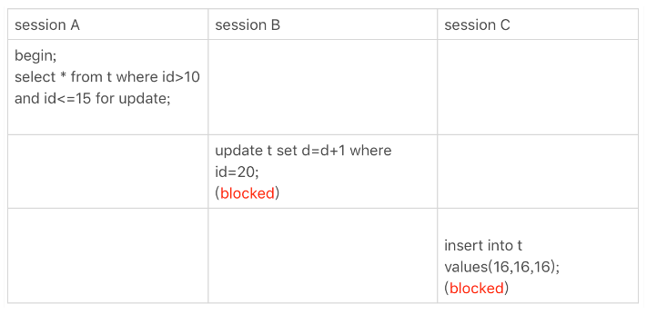

session A 是一个范围查询，按照原则 1 的话，应该是索引 id 上只加 (10,15] 这个 next-key lock，并且因为 id 是唯一键，所以循环判断到 id=15 这一行就应该停止了。

但是实现上，InnoDB 会往前扫描到第一个不满足条件的行为止，也就是 id=20。而且由于这是个范围扫描，因此索引 id 上的 (15,20] 这个 next-key lock 也会被锁上。

所以你看到了，session B 要更新 id=20 这一行，是会被锁住的。同样地，session C 要插入 id=16 的一行，也会被锁住。

6、非唯一索引上存在"等值"的例子

给表 t 插入一条新记录 ：

~~~sql
mysql> insert into t values(30,10,30);
~~~

新插入的这一行 c=10，也就是说现在表里有两个 c=10 的行。那么，这时候索引 c 上的间隙 是这样的，因为二级索引上包含主键的值，所以即使索引列值相同，记录也是不同的：


虽然有两个 c=10，但是它们的主键值 id 是不同的（分别是 10 和 30），因此这两个 c=10 的记录之间，也是有间隙的 

对下面的案例：

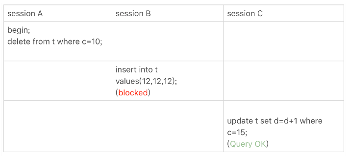

delete 语句加锁的逻辑，其实跟 select ... for update 是类似的 

这时，session A 在遍历的时候，先访问第一个 c=10 的记录。同样地，根据原则 1，这里加的是 (c=5,id=5) 到 (c=10,id=10) 这个 next-key lock。

然后，session A 向右查找，直到碰到 (c=15,id=15) 这一行，循环才结束。根据优化 2，这是一个等值查询，向右查找到了不满足条件的行，所以会退化成 (c=10,id=10) 到 (c=15,id=15) 的间隙锁。

也就是说，这个 delete 语句在索引 c 上的加锁范围，就是下图中蓝色区域覆盖的部分：

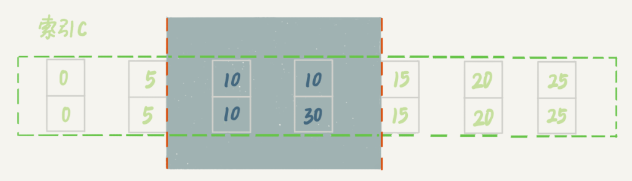

7、limit语句加锁

对上面例子的删除语句加一个limit：

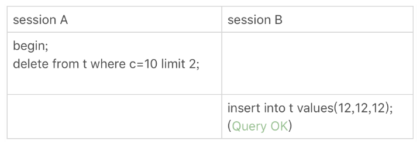

这个例子里，session A 的 delete 语句加了 limit 2。表 t 里 c=10 的记录其实只有两条，因此加不加 limit 2，删除的效果都是一样的，但是加锁的效果却不同。可以看到，session B 的 insert 语句执行通过了，跟案例六的结果不同。 

这是因为，案例七里的 delete 语句明确加了 limit 2 的限制，因此在遍历到 (c=10, id=30) 这一行之后，满足条件的语句已经有两条，循环就结束了。

因此，索引 c 上的加锁范围就变成了从（c=5,id=5) 到（c=10,id=30) 这个前开后闭区间，如下图所示：

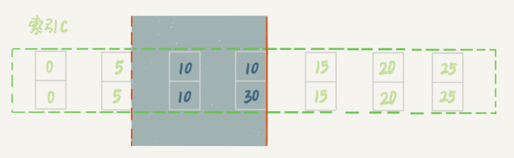

可以看到，(c=10,id=30）之后的这个间隙并没有在加锁范围里，因此 insert 语句插入 c=12 是可以执行成功的。

这个例子对我们实践的指导意义就是，在删除数据的时候尽量加 limit。这样不仅可以控制删除数据的条数，让操作更安全，还可以减小加锁的范围

8、一个死锁的例子

这个案例是想说明：next-key lock 实际上是间隙锁和行锁加起来的结果，实际上也是先加间隙锁后加行锁的。

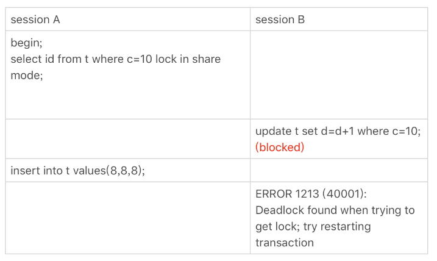

1. session A 启动事务后执行查询语句加 lock in share mode，在索引 c 上加了 next-key lock(5,10] 和间隙锁 (10,15)；
2. session B 的 update 语句也要在索引 c 上加 next-key lock(5,10] ，进入锁等待；
3. 然后 session A 要再插入 (8,8,8) 这一行，被 session B 的间隙锁锁住。由于出现了死锁，InnoDB 让 session B 回滚。

这里面session B虽然被阻塞，但它的加锁是成功了一部分的，也就是先是加 (5,10) 的间隙锁，加锁成功；然后加 c=10 的行锁，这时候才被锁住的。 所以才反过来阻塞了Session A

我们在分析加锁规则的时候可以用 next-key lock 来分析。但是要知道，具体执行的时候，是要分成间隙锁和行锁两段来执行的 

在读提交和重复读的隔离级别中，有几种不同：

* 读提交只加行锁，没有间隙锁的概念
* 读提交中，语句执行过程中加上的行锁，在语句执行完成后，就要把“不满足条件的行”上的行锁直接释放了，不需要等到事务提交 。也就是说，读提交隔离级别下，锁的范围更小，锁的时间更短，这也是不少业务都默认使用读提交隔离级别的原因 

## 加锁规则的动态性

所谓的加锁规则，并不是一个完整的操作，而是一个动态的过程，从下面几个案例就能体会到动态性，下面的分析都基于这个表：

~~~sql
CREATE TABLE `t` (
  `id` int(11) NOT NULL,
  `c` int(11) DEFAULT NULL,
  `d` int(11) DEFAULT NULL,
  PRIMARY KEY (`id`),
  KEY `c` (`c`)
) ENGINE=InnoDB;
 
insert into t values(0,0,0),(5,5,5),
(10,10,10),(15,15,15),(20,20,20),(25,25,25);
~~~

1、等值查询的概念

之前提到的加锁规则中，有一个等值查询的概念，等值查询很容易和遍历搞混

例如这个例子：

~~~sql
begin;
select * from t where id>9 and id<12 order by id desc for update;
~~~

利用上面的加锁规则，我们知道这个语句的加锁范围是主键索引上的 (0,5]、(5,10] 和 (10, 15)。也就是说，id=15 这一行，并没有被加上行锁 。虽然过滤条件中没有等号，但在加锁过程中存在等值查询的概念。

要知道，加锁动作是发生在语句执行过程中的，所以你在分析加锁行为的时候，要从索引上的数据结构开始，加锁的过程：

1. 首先这个查询语句的语义是 order by id desc，要拿到满足条件的所有行，优化器必须先找到“第一个 id<12 的值”。
2. 这个过程是通过索引树的搜索过程得到的，在引擎内部，其实是要找到 id=12 的这个值，只是最终没找到，但找到了 (10,15) 这个间隙。
3. 然后向左遍历，在遍历过程中，就不是等值查询了，会扫描到 id=5 这一行，所以会加一个 next-key lock (0,5]。

也就是说，在执行过程中，通过树搜索的方式定位记录的时候，用的是“等值查询”的方法 

2、加锁的动态过程

分析下面这个加锁语句：

~~~sql
begin;
select id from t where c in(5,20,10) lock in share mode;
~~~

根据explain 结果可以知道，执行时会分三次查询索引：

在查找 c=5 的时候，先锁住了 (0,5]。但是因为 c 不是唯一索引，为了确认还有没有别的记录 c=5，就要向右遍历，找到 c=10 才确认没有了，这个过程满足优化 2，所以加了间隙锁 (5,10)。

同样的，执行 c=10 这个逻辑的时候，加锁的范围是 (5,10] 和 (10,15)；执行 c=20 这个逻辑的时候，加锁的范围是 (15,20] 和 (20,25)。

综上分析：这条语句在索引 c 上加的三个记录锁的顺序是：先加 c=5 的记录锁，再加 c=10 的记录锁，最后加 c=20 的记录锁 

然后再来分析下面这个语句：

~~~sql
select id from t where c in(5,20,10) order by c desc for update;
~~~

 和上面的语句的差别就是多了一个order，因为间隙锁是不互锁的，但是这两条语句都会在索引 c 上的 c=5、10、20 这三行记录上加记录锁 ，关键在于由于orderby的存在，这三个记录锁的加锁顺序，是先锁 c=20，然后 c=10，最后是 c=5 

也就是说，这两条语句要加锁相同的资源，但是加锁顺序相反。当这两条语句并发执行的时候，就可能出现死锁 。

通过这个例子说明，每个语句的加锁是一个动态的过程，可能分成很多个小步骤，这些小步骤互相冲突时，就有可能出现死锁的情况

3、加锁范围的动态变化过程

下面这个案例：

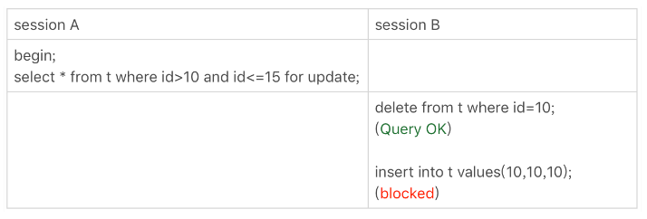

由于 session A 并没有锁住 c=10 这个记录，所以 session B 删除 id=10 这一行是可以的。但是之后，session B 再想 insert id=10 这一行回去就不行了。 

原因在于delete 操作把 id=10 这一行删掉了，原来的两个间隙 (5,10)、(10,15）变成了一个 (5,15) ，外在看起来的结果就是session A 执行完 select 语句后，什么都没做，但它加锁的范围突然“变大”了 

所以其实所谓“间隙”，其实根本就是由“这个间隙右边的那个记录”定义的 ，当右边记录不存在了，间隙也就出现了变化

4、更新=删除+插入 对锁的影响

观察下面这个案例：

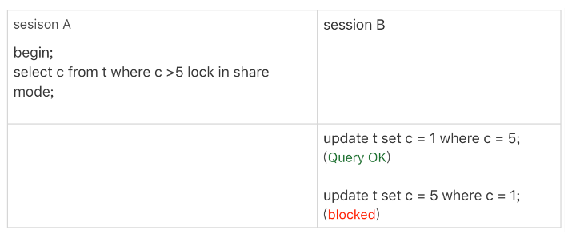

session A 的加锁范围是索引 c 上的 (5,10]、(10,15]、(15,20]、(20,25] 和 (25,supremum]。 注意：根据 c>5 查到的第一个记录是 c=10，因此不会加 (0,5] 这个 next-key lock。 之后 session B 的第一个 update 语句，要把 c=5 改成 c=1，你可以理解为两步： 

1. 插入 (c=1, id=5) 这个记录；
2. 删除 (c=5, id=5) 这个记录。

按照我们上一节说的，索引 c 上 (5,10) 间隙是由这个间隙右边的记录，也就是 c=10 定义的 ，此时session A 的加锁范围 就变成了：

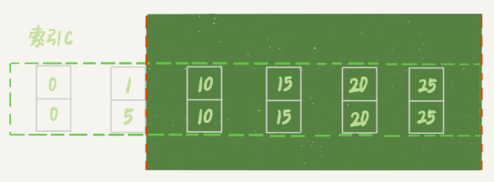

好，接下来 session B 要执行 update t set c = 5 where c = 1 这个语句了，一样地可以拆成两步：

1. 插入 (c=5, id=5) 这个记录；
2. 删除 (c=1, id=5) 这个记录。

第一步试图在已经加了间隙锁的 (1,10) 中插入数据，所以就被堵住了。

5、空表的间隙

一个空表就只有一个间隙。比如，在空表上执行： 

~~~sql
begin;
select * from t where id>1 for update;
~~~

这个查询语句加锁的范围就是 next-key lock (-∞, supremum]。 所以它会阻塞所有更新的操作：


## 查看死锁

以上面的用例来分析死锁，下面这两个语句会因为加锁顺序不同导致死锁

~~~
select id from t where c in(5,20,10) lock in share mode;

select id from t where c in(5,20,10) order by c desc for update;
~~~

出现死锁后，可以通过show engine innodb status 命令得到的部分输出 查看死锁信息，其中的LATESTDETECTED DEADLOCK 记录的就是死锁的信息


图中的几个关键信息 ：

1. 这个结果分成三部分：
   - (1) TRANSACTION，是第一个事务的信息；
   - (2) TRANSACTION，是第二个事务的信息；
   - WE ROLL BACK TRANSACTION (1)，是最终的处理结果，表示回滚了第一个事务。
2. 第一个事务的信息中：
   - WAITING FOR THIS LOCK TO BE GRANTED，表示的是这个事务在等待的锁信息；
   - index c of table \`test\`.\`t\`，说明在等的是表 t 的索引 c 上面的锁；
   - lock mode S waiting 表示这个语句要自己加一个读锁，当前的状态是等待中；
   - Record lock 说明这是一个记录锁；
   - n_fields 2 表示这个记录是两列，也就是字段 c 和主键字段 id；
   - 0: len 4; hex 0000000a; asc ;; 是第一个字段，也就是 c。值是十六进制 a，也就是 10；
   - 1: len 4; hex 0000000a; asc ;; 是第二个字段，也就是主键 id，值也是 10；
   - 这两行里面的 asc 表示的是，接下来要打印出值里面的“可打印字符”，但 10 不是可打印字符，因此就显示空格。
   - 第一个事务信息就只显示出了等锁的状态，在等待 (c=10,id=10) 这一行的锁。
   - 当然你是知道的，既然出现死锁了，就表示这个事务也占有别的锁，但是没有显示出来。别着急，我们从第二个事务的信息中推导出来。
3. 第二个事务显示的信息要多一些：
   - “ HOLDS THE LOCK(S)”用来显示这个事务持有哪些锁；
   - index c of table \`test\`.\`t\` 表示锁是在表 t 的索引 c 上；
   - hex 0000000a 和 hex 00000014 表示这个事务持有 c=10 和 c=20 这两个记录锁；
   - WAITING FOR THIS LOCK TO BE GRANTED，表示在等 (c=5,id=5) 这个记录锁。

从上面这些信息中，我们就知道：

1. “lock in share mode”的这条语句，持有 c=5 的记录锁，在等 c=10 的锁；
2. “for update”这个语句，持有 c=20 和 c=10 的记录锁，在等 c=5 的记录锁。

在发生死锁的时刻，语句占有的资源更多，回滚成本就更大， InnoDB 会选择回滚成本更小的语句来回滚 

## 自增锁

### 自增值的保存

之前提过使用自增主键，由于自增主键可以让主键索引尽量地保持递增顺序插入，避免了页分裂，因此索引更紧凑

自增主键并不能保证主键是连续的，如果有业务设计依赖连续性就会造成错误

不同的引擎对于自增值的保存策略不同：

* MyISAM 引擎的自增值保存在数据文件中。

* InnoDB 引擎的自增值，其实是保存在了内存里，并且到了 MySQL 8.0 版本后，才有了“自增值持久化”的能力，也就是才实现了“如果发生重启，表的自增值可以恢复为 MySQL 重启前的值”，具体情况是： 

  * 在 MySQL 5.7 及之前的版本，自增值保存在内存里，并没有持久化。每次重启后，第一次打开表的时候，都会去找自增值的最大值 max(id)，然后将 max(id)+1 作为这个表当前的自增值。 

    举例来说，如果一个表当前数据行里最大的 id 是 10，AUTO_INCREMENT=11。这时候，我们删除 id=10 的行，AUTO_INCREMENT 还是 11。但如果马上重启实例，重启后这个表的 AUTO_INCREMENT 就会变成 10。 也就是说，MySQL 重启可能会修改一个表的 AUTO_INCREMENT 的值。 

  * 在 MySQL 8.0 版本，将自增值的变更记录在了 redo log 中，重启的时候依靠 redo log 恢复重启之前的值。

### 自增值生成机制

在 MySQL 里面，如果字段 id 被定义为 AUTO_INCREMENT，在插入一行数据的时候，自增值的行为如下：

1. 如果插入数据时 id 字段指定为 0、null 或未指定值，那么就把这个表当前的 AUTO_INCREMENT 值填到自增字段；
2. 如果插入数据时 id 字段指定了具体的值，就直接使用语句里指定的值。

根据要插入的值和当前自增值的大小关系，自增值的变更结果也会有所不同。假设，某次要插入的值是 X，当前的自增值是 Y。

1. 如果 X<Y，那么这个表的自增值不变；
2. 如果 X≥Y，就需要把当前自增值修改为新的自增值。

自增值生成算法是：从 auto_increment_offset 开始，以 auto_increment_increment 为步长，持续叠加，直到找到第一个大于 X 的值，作为新的自增值 

其中，auto_increment_offset 和 auto_increment_increment 是两个系统参数，分别用来表示自增的初始值和步长，默认值都是 1。 

在一些场景下，使用的就不全是默认值。比如，双 M 的主备结构里要求双写的时候，我们就可能会设置成 auto_increment_increment=2，让一个库的自增 id 都是奇数，另一个库的自增 id 都是偶数，避免两个库生成的主键发生冲突。 

当 auto_increment_offset 和 auto_increment_increment 都是 1 的时候，新的自增值生成逻辑很简单，就是：

1. 如果准备插入的值 >= 当前自增值，新的自增值就是“准备插入的值 +1”；
2. 否则，自增值不变。

### 自增值不连续的场景

1、唯一键冲突导致自增值增长。在插入数据时，生成自增值在插入动作之前，有可能插入时遇到唯一键冲突，没有插入成功，但自增值已经被修改了，此时就会出现自增值突然增长，但并没有插入对应数据的情况

2、事务回滚导致自增值增长。这种情况和第一种情况类似。

之所以回滚后为什么不能将自增值恢复，是因为存在并发事务的情况，假设一开始自增值是5，并发事务同时在生成自增值，其中一个事务回滚了，可能自增值已经生成到10了，但插入自增值6的记录插入失败了，自增值如果回滚到5，则后续的插入有可能会出现自增值与表中存在的数据产生了冲突。

在 MySQL 5.0 版本的时候，自增锁的范围是语句级别。也就是说，如果一个语句申请了一个表自增锁，这个锁会等语句执行结束以后才释放。显然，这样设计会影响并发度。

MySQL 5.1.22 版本引入了一个新策略，新增参数 innodb_autoinc_lock_mode，默认值是 1。

1. 这个参数的值被设置为 0 时，表示采用之前 MySQL 5.0 版本的策略，即语句执行结束后才释放锁；
2. 这个参数的值被设置为 1 时：
   - 普通 insert 语句，自增锁在申请之后就马上释放；
   - 类似 insert … select 这样的批量插入数据的语句，自增锁还是要等语句结束后才被释放；
3. 这个参数的值被设置为 2 时，所有的申请自增主键的动作都是申请后就释放锁。

批量插入语句是为了防止出现数据不一致的情况，例如下面的场景：

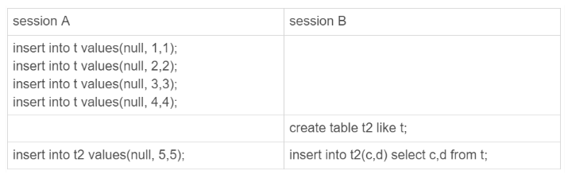

在这个例子里，我往表 t1 中插入了 4 行数据，然后创建了一个相同结构的表 t2，然后两个 session 同时执行向表 t2 中插入数据的操作。 

可以设想一下，如果 session B 是申请了自增值以后马上就释放自增锁，那么就可能出现这样的情况：

- session B 先插入了两个记录，(1,1,1)、(2,2,2)；
- 然后，session A 来申请自增 id 得到 id=3，插入了（3,5,5)；
- 之后，session B 继续执行，插入两条记录 (4,3,3)、 (5,4,4)。

此时binlog如果是statement格式的，此时binlog去主备同步或者恢复数据时，就会出现数据不一致。

为了解决这个问题，可以采用两种方式：

1. 一种思路是，让原库的批量插入数据语句，固定生成连续的 id 值。所以，自增锁直到语句执行结束才释放，就是为了达到这个目的。
2. 另一种思路是，在 binlog 里面把插入数据的操作都如实记录进来，到备库执行的时候，不再依赖于自增主键去生成。这种情况，其实就是 innodb_autoinc_lock_mode 设置为 2，同时 binlog_format 设置为 row。这是推荐的设置，这种设置既能提升并发性，又不会出现数据一致性问题 

（批量插入数据，包含的语句类型是 insert … select、replace … select 和 load data 语句）

之所以会出现：“普通 insert 语句，自增锁在申请之后就马上释放”，是因为普通的insert语句是可以精确计算出需要多少id的，然后一次性申请，申请完成后锁就可以释放了 

批量插入数据的语句，之所以需要特别设置，是因为“不知道要预先申请多少个 id”。 

既然预先不知道要申请多少个自增 id，那么一种直接的想法就是需要一个时申请一个。但如果一个 select … insert 语句要插入 10 万行数据，按照这个逻辑的话就要申请 10 万次。显然，这种申请自增 id 的策略，在大批量插入数据的情况下，不但速度慢，还会影响并发插入的性能。

因此，对于批量插入数据的语句，MySQL 有一个批量申请自增 id 的策略：

1. 语句执行过程中，第一次申请自增 id，会分配 1 个；
2. 1 个用完以后，这个语句第二次申请自增 id，会分配 2 个；
3. 2 个用完以后，还是这个语句，第三次申请自增 id，会分配 4 个；
4. 依此类推，同一个语句去申请自增 id，每次申请到的自增 id 个数都是上一次的两倍。

因为有这样的优化机制，在批量插入语句中，很容易出现自增id不连续的问题

## insert语句

普通的insert语句是一个轻量级操作，尽量在申请到自增 id 以后，就释放自增锁，但这仅限于普通的insert语句，对于特殊的insert语句来说，在执行过程中需要给其他资源加锁，或者无法在申请到自增 id 以后就立马释放自增锁 

### insert … select 语句

假设有下面这两个表：

~~~sql
CREATE TABLE `t` (
  `id` int(11) NOT NULL AUTO_INCREMENT,
  `c` int(11) DEFAULT NULL,
  `d` int(11) DEFAULT NULL,
  PRIMARY KEY (`id`),
  UNIQUE KEY `c` (`c`)
) ENGINE=InnoDB;
 
insert into t values(null, 1,1);
insert into t values(null, 2,2);
insert into t values(null, 3,3);
insert into t values(null, 4,4);
 
create table t2 like t
~~~

此时，在可重复读隔离级别下，binlog_format=statement 时执行下列insert...select语句，会对表的所有行和间隙加锁：

~~~sql
insert into t2(c,d) select c,d from t;
~~~

这里说明insert也满足之前的加锁原则，会锁住需要访问的资源

这个规则主要是为了解决日志和数据不一致的问题，例如下面这个执行序列：


实际的执行效果是，如果 session B 先执行，由于这个语句对表 t 主键索引加了 (-∞,1] 这个 next-key lock，会在语句执行完成后，才允许 session A 的 insert 语句执行。

但如果没有锁的话，就可能出现 session B 的 insert 语句先执行，但是后写入 binlog 的情况。于是，在 binlog_format=statement 的情况下，binlog 里面就记录了这样的语句序列：

~~~
insert into t values(-1,-1,-1);
insert into t2(c,d) select c,d from t;
~~~

这个语句到了备库执行，就会把 id=-1 这一行也写到表 t2 中，出现主备不一致。 

### insert循环写入

如果现在有这么一个需求：要往表 t2 中插入一行数据，这一行的 c 值是表 t 中 c 值的最大值加 1 ，此时的SQL语句：

~~~sql
insert into t2(c,d)  (select c+1, d from t force index(c) order by c desc limit 1);
~~~

这个语句的加锁范围，就是表 t 索引 c 上的 (3,4] 和 (4,supremum] 这两个 next-key lock，以及主键索引上 id=4 这一行。 因此整条语句的扫描行数是 1。 

但对于insert循环写入的场景，扫描行数就不会这么简单了，循环写入就是select和insert的表是一张：

~~~sql
insert into t(c,d)  (select c+1, d from t force index(c) order by c desc limit 1);
~~~

此时的执行过程：

1. 创建临时表，表里有两个字段 c 和 d。
2. 按照索引 c 扫描表 t，依次取 c=4、3、2、1，然后回表，读到 c 和 d 的值写入临时表。这时，Rows_examined=4。
3. 由于语义里面有 limit 1，所以只取了临时表的第一行，再插入到表 t 中。这时，Rows_examined 的值加 1，变成了 5。

也就是说，这个语句会导致在表 t 上做全表扫描，并且会给索引 c 上的所有间隙都加上共享的 next-key lock。所以，这个语句执行期间，其他事务不能在这个表上插入数据。 

至于这个语句的执行为什么需要临时表，原因是这类一边遍历数据，一边更新数据的情况，如果读出来的数据直接写回原表，就可能在遍历过程中，读到刚刚插入的记录，新插入的记录如果参与计算逻辑，就跟语义不符。 

如果想优化这类语句，建议采用内存临时表的方案：

~~~sql
create temporary table temp_t(c int,d int) engine=memory;
insert into temp_t  (select c+1, d from t force index(c) order by c desc limit 1);
insert into t select * from temp_t;
drop table temp_t;
~~~

在 MySQL 8.0 版本中，已经能够用临时表处理 insert … select 写入原表的语句了。 

### 唯一键冲突导致死锁

唯一键冲突后也会对记录加锁，例如看下面这个例子：

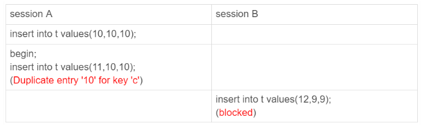

这个例子也是在可重复读（repeatable read）隔离级别下执行的。可以看到，session B 要执行的 insert 语句进入了锁等待状态。

也就是说，session A 执行的 insert 语句，发生唯一键冲突的时候，并不只是简单地报错返回，还在冲突的索引上加了锁。我们前面说过，一个 next-key lock 就是由它右边界的值定义的。这时候，session A 持有索引 c 上的 (5,10] 共享 next-key lock（读锁）。

加读锁的合理原因目前尚未发现，从作用上来看，这样做可以避免这一行被别的事务删掉。 

下面这个例子，就是多个唯一索引的表中并发插入数据时，会出现死锁 ：

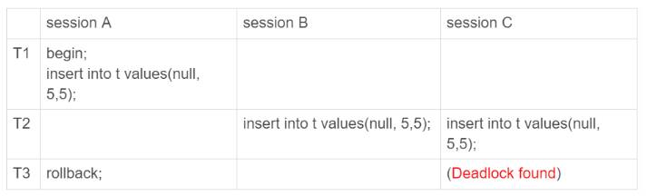

在 session A 执行 rollback 语句回滚的时候，session C 几乎同时发现死锁并返回。

这个死锁产生的逻辑是这样的：

* 在 T1 时刻，启动 session A，并执行 insert 语句，此时在索引 c 的 c=5 上加了记录锁。注意，这个索引是唯一索引，因此退化为记录锁
* 在 T2 时刻，session B 要执行相同的 insert 语句，发现了唯一键冲突，加上读锁（先加间隙锁，再加记录锁，因为记录锁已经有写锁，所以等待锁）；同样地，session C 也在索引 c 上，c=5 这一个记录上，加了读锁（先加间隙锁，再加记录锁，因为记录锁已经有写锁，所以等待锁）。
* T3 时刻，session A 回滚。这时候，session B 和 session C 都试图继续执行插入操作，都要加上写锁。两个 session 都要等待对方的行锁，所以就出现了死锁。

insert 语句如果出现唯一键冲突，会在冲突的唯一值上加共享的 next-key lock(S 锁)。因此，碰到由于唯一键约束导致报错后，要尽快提交或回滚事务，避免加锁时间过长。 

### insert into … on duplicate key update

insert into … on duplicate key update 这个语义的逻辑是，插入一行数据，如果碰到唯一键约束，就执行后面的更新语句。例如这个语句：

~~~sql
insert into t values(11,10,10) on duplicate key update d=100; 
~~~

此时就会给索引 c 上 (5,10] 加一个排他的 next-key lock（写锁） 

注意，如果有多个列违反了唯一性约束，就会按照索引的顺序，修改跟第一个索引冲突的行。

现在表 t 里面已经有了 (1,1,1) 和 (2,2,2) 这两行，下面这个语句执行的效果：

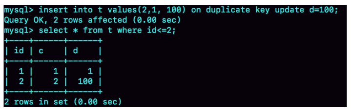

可以看到，主键 id 是先判断的，MySQL 认为这个语句跟 id=2 这一行冲突，所以修改的是 id=2 的行。

需要注意的是，执行这条语句的 affected rows 返回的是 2，很容易造成误解。实际上，真正更新的只有一行，只是在代码实现上，insert 和 update 都认为自己成功了，update 计数加了 1， insert 计数也加了 1。

# 杂项

redo log恢复时，首先会将要操作的页加载到内存，然后应用redo log将其变成脏页，等待它后续刷入磁盘

redo log buffer是一块内存，当一个事务中执行多条语句时，此时会将修改先计入buffer中，然后等事务提交再将其写入redo log文件中

对索引字段做函数操作会让索引失效，包括类型转换和字符编码转换。后两个的解决方法：

* 对于类型转换，可以查看列真正的类型，然后写出正确的sql，不要弄混数字和字符串

* 对于字符编码转换，可以让两个表的字符集一致，或者用CONVERT在sql上实现编码转换：

  ~~~sql
  mysql> select d.* from tradelog l , trade_detail d where d.tradeid=CONVERT(l.tradeid USING utf8) and l.id=2; 
  ~~~

  不显式加编码转换，可能自动转换时CONVERT会出现在条件的左边，导致索引失效：

  ~~~sql
  select * from trade_detail  where CONVERT(traideid USING utf8mb4)=$L2.tradeid.value; 
  ~~~

与截断列类型做等值匹配时，也会导致索引失效，如下面这张表和sql语句：

~~~sql
mysql> CREATE TABLE `table_a` (
  `id` int(11) NOT NULL,
  `b` varchar(10) DEFAULT NULL,
  PRIMARY KEY (`id`),
  KEY `b` (`b`)
) ENGINE=InnoDB;

mysql> select * from table_a where b='1234567890abcd';
~~~

此时MySQL执行时的流程：

1. 在传给引擎执行的时候，做了字符截断。因为引擎里面这个行只定义了长度是 10，所以只截了前 10 个字节，就是’1234567890’进去做匹配；
2. 这样满足条件的数据有 10 万行；
3. 因为是 select *， 所以要做 10 万次回表；
4. 但是每次回表以后查出整行，到 server 层一判断，b 的值都不是’1234567890abcd’;
5. 返回结果是空。

索引合并算法的效率并不好，尽量将其中的一个索引改成联合索引的方式

show grants 命令查看账户的权限 