# 入门

## 可执行程序

在bin目录下有很多可执行文件：

* mysqld：直接执行相当于启动服务器程序

* mysqld_safe：间接调用mysqld，启动服务器程序的同时，启动了一个监控进程，该监控进程可以在服务器进程挂掉时，帮助重启它，还可以将服务器的报错信息和其他诊断信息重定向到某个文件中，产生错误日志，方便定位问题

* mysql.server：间接调用mysqld_safe，它是一个链接文件，可以用来开启或者关闭服务器程序：

  ~~~
  mysql.server start
  mysql.server stop
  ~~~

* mysql_multi：涉及到一台计算机上启动多个服务器进程，并对这些进程进行管理和监控

## 登录

启动服务器程序后，可以启动客户端程序来连接，bin目录下有很多客户端程序：mysqladmin、mysqldump、mysqlcheck等。我们主要关注的是mysql：

~~~
mysql -h主机名  -u用户名 -p密码
mysql -hlocalhost -uroot -p123456
~~~

各参数的意义：

* -h：域名或IP地址，如果服务器进程就运行在本机可以省略这个参数，或者填localhost，也可以写为--host=主机名
* -u：用户名，也可以写作--user=用户名，对类UNIX系统来说，如果省略该参数，会把登录操作系统的用户名当做MySQL的用户名来处理
* -p：密码，也可以写作--password=密码 

不在一行输入密码：

~~~
mysql -hlocalhost -uroot -p
~~~

退出登录：quit、exit、\q

## 客户端与服务器连接

客户端进程向服务器进程发送请求并得到回复的过程，是一个进程通信的过程。

MySQL支持下列三种客户端进程与服务器进程通信的方式：

* TCP/IP：通过网络通讯是最常见的方式，MySQL服务器进程会默认监控3306端口，也可以在启动服务器时加上监控指定端口的参数：-P3307，客户端连接时也可以加上该参数，代表连接到指定端口
* 命名管道和共享内存：客户端和服务器同一台计算机时，且是windows时可以用这种方式
* Unix域套接字文件：客户端和服务器同一台类Unix计算机时，可以在服务器和客户端启动时加入socket参数，指定通过哪一个Unix域套接字文件来进行进程间通信

## 服务器处理请求

客户端进程向服务器进程发送一段文本，服务器进程处理后再返回，服务器在这个过程中处理的大概过程：

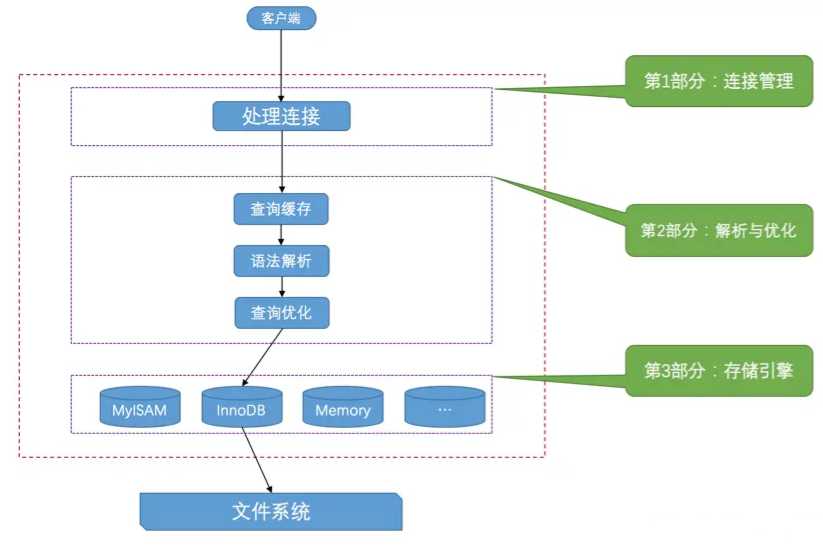

服务器处理来自客户端的请求大致分为三个部分：连接管理、解析与优化、存储引擎

* 连接管理：当客户端进程连接到服务器进程时，服务器进程都会创建一个线程来专门处理，等该客户端退出后，服务器会将线程缓存起来，以节省开销。

  在进行连接时，一般需要通过SSL的网络连接进行通信，底层是TCP连接，要经过三次握手和自定义的握手消息，还需要进行认证（用户名和密码等），设置字符集和事务等，故一次连接的成本是很昂贵的

* 解析与优化，又可以细分为：

  * 查询缓存：MySQL会将同样的查询请求及对应结果缓存起来，如果有同样的请求直接返回，但存在很多缓存失效条件，比如查询系统表（如对函数NOW，每次调用结果都不一样）、对表使用了修改的语句（如update）、查询语句有轻微的不同（空格、注释等）。MySQL使用缓存虽然有时可以提升性能，但也必须承担维护和检索缓存的代价，因此，从MySQL 5.7.20开始，不推荐使用查询缓存，并在MySQL 8.0中删除。 
  * 语法解析：是一个编译过程，将各种条件真正对应到内部的数据结构
  * 查询优化：MySQL的优化程序会对我们的语句做一些优化，包括外连接转换为内连接、表达式简化、子查询转为连接等优化手段。优化的结果是生成一个执行计划，这个执行计划表明了应该使用哪些索引进行查询，表之间的连接顺序等

* 存储引擎：负责数据的存储和提取，各种不同的存储引擎向上边的MySQL server层提供统一的调用接口（也就是存储引擎API），包含了几十个底层函数，像"读取索引第一条内容"、"读取索引下一条内容"、"插入记录"等等。完成查询优化后，会按照执行计划调用底层存储引擎提供的API，获取到数据后返回给客户端。

## 存储引擎

MySQL存储引擎最常用的是InnoDB和MyISAM，有时会提一下Memory。

InnoDB 支持事务、分布式事务XA、支持部分事务回滚（savepoints）

创建时指定表的存储引擎：

~~~
CREATE TABLE 表名(
    建表语句;
) ENGINE = 存储引擎名称;

mysql> CREATE TABLE engine_demo_table(
    ->     i int
    -> ) ENGINE = MyISAM;
~~~

修改表的存储引擎：

~~~
ALTER TABLE 表名 ENGINE = 存储引擎名称;
~~~

查看表结构：

~~~
mysql> SHOW CREATE TABLE engine_demo_table\G
*************************** 1. row ***************************
       Table: engine_demo_table
Create Table: CREATE TABLE `engine_demo_table` (
  `i` int(11) DEFAULT NULL
) ENGINE=InnoDB DEFAULT CHARSET=utf8
1 row in set (0.01 sec)

mysql>
~~~

## 启动选项

MySQL中的启动选项一般都有默认值，如服务器允许同时连入的客户端的默认数量是151，表的默认存储引擎是InnoDB。启动选项可以在启动的命令行中指定，也可以放在配置文件中指定。

### 启动时指定

启动时指定启动选项时的命令：

~~~
--启动选项1[=值1] --启动选项2[=值2] ... --启动选项n[=值n]
mysqld --default-storage-engine=MyISAM  // 也可以用--default_storage_engine=MyISAM
mysql --help
mysqld --verbose --help
~~~

选项有长选项和短选项的分别，像default-storage-engine就是长选项，有一些常用的选项有短选项，如-h，也可以写作--host。长选项有两个-，短选项只需要一个-，有些短选项是可以用空格隔开的，如：

~~~
mysqld -P3307
mysqld -P 3307
~~~

但-p和密码之间就不能有空格。选项名是区分大小写的，比如-p和-P选项拥有完全不同的含义

### 配置文件指定

MySQL的配置文件是my.cnf，它会搜索一些路径以寻找配置文件（配置文件是有优先级的，后加载的会生效），配置文件中的启动选项被划分为若干组，每个组有一个组名，组名用括号括起来：

~~~
[server]
(具体的启动选项...)

[mysqld]
(具体的启动选项...)

[mysqld_safe]
(具体的启动选项...)

[client]
(具体的启动选项...)

[mysql]
(具体的启动选项...)

[mysqladmin]
(具体的启动选项...)
~~~

增加配置文件中的启动选项：

~~~
[server]
option1     #这是option1，该选项不需要选项值
option2 = value2      #这是option2，该选项需要选项值
...
~~~

每个组是给不同的启动命令使用的，如：

* [mysqld]和[mysql]组分别应用于mysqld服务器程序和mysql客户端程序
* [server]组下边的启动选项将作用于所有的服务器程序
* [client]组下边的启动选项将作用于所有的客户端程序

举个例子：mysql.server命令只能让[mysqld]、[server]、[mysql.server]生效，不能让[client]组配置生效

可以定义一个[mysqld-5.7]的选项组，它的含义和[mysqld]一样，只不过只有版本号为5.7的mysqld程序才能使用这个选项组中的选项

同一个配置文件中若多个组出现了相同配置项，后出现的生效

指定从目录读取，而不是按照默认顺序加载配置文件：

~~~
mysqld --defaults-file=/tmp/myconfig.txt
~~~

当同时在命令行和配置文件设置了同样的启动选项，则命令行中的选项优先级更高

## 系统变量

MySQL服务器程序运行过程中会用到许多影响程序行为的变量，它们被称为MySQL系统变量，比如：

* max_connections：允许同时连入的客户端数量 
* default_storage_engine ：表的默认存储引擎 
* query_cache_size ：查询缓存的大小 

每个系统变量都有一个默认值，我们可以使用命令行或者配置文件中的选项在启动服务器时改变一些系统变量的值 。大多数的系统变量的值也可以在程序运行过程中修改，而无需停止并重新启动它。

系统变量和启动选项的区别和关系：

* 启动选项是在程序启动时我们程序员传递的一些参数，而系统变量是影响服务器程序运行行为的变量（可以运行时修改）
* 大部分的系统变量都可以被当作启动选项传入 
* 有些系统变量是在程序运行过程中自动生成的，是不可以当作启动选项来设置，比如auto_increment_offset、character_set_client；有些启动选项也不是系统变量，比如defaults-file

### 查看和设置

查询系统变量：

~~~
SHOW VARIABLES [LIKE 匹配的模式];
SHOW VARIABLES LIKE 'default_storage_engine';
SHOW VARIABLES like 'max_connections';
SHOW VARIABLES LIKE 'default%';
SHOW VARIABLES;
~~~

设置系统变量，可以用前面说的命令行的方式，或者配置文件的方式来设置系统变量。（启动选项对应的系统变量不能再用下划线，而必须用-）

系统变量按照作用范围不同分为两种：全局变量和会话变量（只影响某个客户端连接）

通过启动选项设置的系统变量的作用范围都是GLOBAL的，客户端连接到服务器后会为该客户端分配一个作用范围为SESSION的系统变量，它的值和服务器的全局变量是相同的。

设置全局变量：

~~~
语句一：SET GLOBAL default_storage_engine = MyISAM;
语句二：SET @@GLOBAL.default_storage_engine = MyISAM;
~~~

设置会话变量：

~~~
语句一：SET SESSION default_storage_engine = MyISAM;
语句二：SET @@SESSION.default_storage_engine = MyISAM;
语句三：SET default_storage_engine = MyISAM;
~~~

查看系统变量时默认查的是SESSION的，也可以查看全局变量：

~~~
SHOW GLOBAL VARIABLES LIKE 'default_storage_engine';
~~~

并不是所有系统变量都有GLOBAL和SESSION的作用范围：

* 有一些系统变量只具有GLOBAL作用范围，比方说max_connections
* 有一些系统变量只具有SESSION作用范围，比如insert_id，表示在对某个包含AUTO_INCREMENT列的表进行插入时，该列初始的值
* 大多数变量两者都有

有些系统变量是只读的，比如version

## 状态变量

MySQL服务器程序中维护了好多关于程序运行状态的变量，它们被称为状态变量，比如：

* Threads_connected表示当前有多少客户端与服务器建立了连接
* Handler_update表示已经更新了多少行记录

由于状态变量是用来显示服务器程序运行状况的，所以它们的值只能由服务器程序自己来设置，我们程序员是不能设置的。

状态变量也有GLOBAL和SESSION两个作用范围，查看时默认查看的是SESSION的状态变量：

~~~
SHOW STATUS LIKE 'thread%';
SHOW [GLOBAL|SESSION] STATUS [LIKE 匹配的模式];
~~~

## 编码

### 字符集和比较规则

将一个字符映射成一个二进制数据的过程也叫做编码，将一个二进制数据映射到一个字符的过程叫做解码。

字符集用来描述某个字符范围的编码规则。MySQL中有两种常用的指标集：

* utfmb3（utf8）：阉割过的utf8字符集，只使用1～3个字节表示字符，存储不了emoji表情 
* utf8mb4：正宗的utf8字符集，使用1～4个字节表示字符

查看支持的字符集：

~~~
SHOW (CHARACTER SET|CHARSET) [LIKE 匹配的模式];
SHOW CHARSET;
~~~

一种字符集可能对应多个比较规则，比较规则决定了底层数据的排列顺序，查看支持的比较规则：

~~~
SHOW COLLATION [LIKE 匹配的模式];
SHOW COLLATION LIKE 'utf8\_%';
~~~

比较规则的命名是有规律的，如utf8_polish_ci ，前缀代表其关联的字符集是utf8，polish代表波兰语的比较规则，ci代表不区分大小写。每种字符集对应若干种比较规则，每种字符集都有一种默认的比较规则，SHOW COLLATION的返回结果中的Default列的值为YES的就是该字符集的默认比较规则，比方说utf8字符集默认的比较规则就是utf8_general_ci

### 作用范围

MySQL有4个级别的字符集和比较规则，分别是服务器级别、数据库级别、表级别、列级别

1、服务器级别

MySQL提供了两个系统变量来表示服务器级别的字符集和比较规则：

* character_set_server：服务器级别的字符集 
* collation_server ：服务器级别的比较规则 

一般来说，默认的字符集是utf8，默认的比较规则是utf8_general_ci

2、数据库级别

创建或者修改数据库的时候可以指定：

~~~
CREATE DATABASE 数据库名
    [[DEFAULT] CHARACTER SET 字符集名称]
    [[DEFAULT] COLLATE 比较规则名称];

ALTER DATABASE 数据库名
    [[DEFAULT] CHARACTER SET 字符集名称]
    [[DEFAULT] COLLATE 比较规则名称];
~~~

如果想查看当前数据库使用的字符集和比较规则，可以查看下面两个系统变量的值（前提是使用USE语句选择当前默认数据库，如果没有默认数据库，则变量与相应的服务器级系统变量具有相同的值）：

* character_set_database ：当前数据库的字符集 
* collation_database ：当前数据库的比较规则 

这两个变量是只读的，不能通过命令行修改，只能在创建或者修改中指定。

若在创建语句中没有指定字符集和比较规则，则采用服务器级别的字符集和比较规则 

3、表级别

创建或者修改表的时候也可以指定字符集和比较规则：

~~~
CREATE TABLE 表名 (列的信息)
    [[DEFAULT] CHARACTER SET 字符集名称]
    [COLLATE 比较规则名称]]

ALTER TABLE 表名
    [[DEFAULT] CHARACTER SET 字符集名称]
    [COLLATE 比较规则名称]
~~~

如果创建表的时候没有指定，那就采用所在数据库的字符集和比较规则

4、列级别

创建或者修改表的时候可以指定某个列的字符集和比较规则：

~~~
CREATE TABLE 表名(
    列名 字符串类型 [CHARACTER SET 字符集名称] [COLLATE 比较规则名称],
    其他列...
);

ALTER TABLE 表名 MODIFY 列名 字符串类型 [CHARACTER SET 字符集名称] [COLLATE 比较规则名称];
~~~

如果没有指定，则采用表的字符集和比较规则

修改字符集时，若转换前列中存储的数据不能用转换后的字符集进行表示会发生错误。

字符集和比较规则是相互联系的，修改其中一个则会影响另一个：

* 只修改字符集，则比较规则将变为修改后的字符集默认的比较规则 
* 只修改比较规则，则字符集将变为修改后的比较规则对应的字符集 

### 字符集转换

如果接收0xE68891这个字节串的程序按照utf8字符集进行解码，然后又把它按照gbk字符集进行编码，最后编码后的字节串就是0xCED2，我们把这个过程称为字符集的转换，也就是字符串'我'从utf8字符集转换为gbk字符集

在客户端向服务器发送请求，服务器返回的过程中，经理了多次字符集的转换，这个过程中会用到三个系统变量：character_set_client 、character_set_connection、character_set_results 

请求从发送到结果返回过程中 字符串编码和解码的处理：

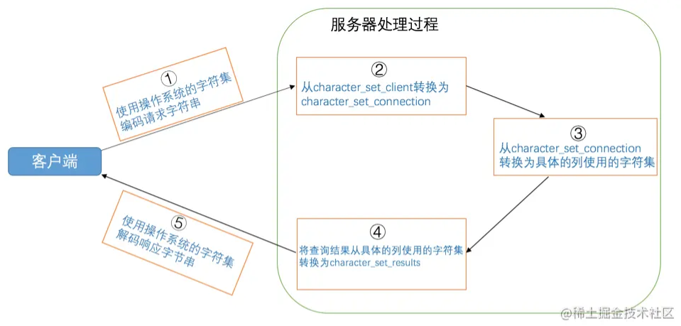

1、首先客户端会将内容编码，然后发送到服务器，不同操作系统字符集不一样，类Unix系统使用的是utf8，Windows使用的是gbk，当使用了不同的客户端工具也可能有不同的默认字符集编码

2、服务器收到一串二进制的字节，然后用character_set_client 字符集解码成字符串

3、拿解码后的字符串，再用character_set_connection 进行编码，得到编码后的二进制字节，然后用它去做查询等处理，拿到处理后的结果，结果也是用二进制字节表示的，如0xCED2，此时会找到该列对应的字符集，对此进行解码，得到解码后的字符串

4、把字符串用character_set_results 字符集进行编码，得到一串字节然后返回给客户端

5、客户端收到后，用它自定义的字符集进行解码得到响应

在这个过程中经历了三次的字符集转换：

* 如果character_set_client 和客户端的字符集对不上，则服务器无法理解和处理请求
* 如果character_set_results 和客户端的字符集对不上，则客户端接受到的是乱码
* character_set_connection 只是在服务器内部处理，但要注意它应该覆盖请求中的字符，否则将出现无法编码的警告

可以通过命令一次设置三种字符集：

~~~
SET NAMES 字符集名;

相当于：
SET character_set_client = 字符集名;
SET character_set_connection = 字符集名;
SET character_set_results = 字符集名;
~~~

还可以在启动时设置一个名为default-character-set 的启动选项，来设置三种字符集

## 系统数据库

几个重要的系统数据库：

* mysql：存储了MySQL的用户账户和权限信息，一些存储过程、事件的定义信息，一些运行过程中产生的日志信息，一些帮助信息以及时区信息 
* information_schema ：保存着MySQL服务器维护的所有其他数据库的信息，比如有哪些表、哪些视图、哪些触发器、哪些列、哪些索引 ，也就是元数据
* performance_schema ：主要保存MySQL服务器运行过程中的一些状态信息 ，比如统计最近执行了哪些语句，在执行过程的每个阶段都花费了多长时间，内存的使用情况等等信息 
* sys：通过视图的形式把information_schema 和performance_schema结合起来，让使用更方便

# 存储

## 行格式

InnoDB存储引擎下，从表中读取数据时，会将数据划分为若干个页，以页作为磁盘和内存之间交互的基本单位，InnoDB中页的大小一般为 16 KB。也就是在一般情况下，一次最少从磁盘中读取16KB的内容到内存中，一次最少把内存中的16KB内容刷新到磁盘中

MySQL中记录在磁盘上的存储方式被称为行格式或者记录格式，迄今为止行格式有4种：分别是Compact、Redundant、Dynamic和Compressed行格式

可以在创建或修改表的语句中指定行格式：

~~~
CREATE TABLE 表名 (列的信息) ROW_FORMAT=行格式名称
    
ALTER TABLE 表名 ROW_FORMAT=行格式名称
~~~

##Compact行格式

Compact行格式示意图：


一条记录可以分为记录的额外信息、记录的真实数据

### 变长字段长度列表

在Compact行格式中，把所有变长字段的真实数据占用的字节长度都存放在记录的开头部位，这就是变长字段长度列表，各变长字段数据占用的字节数按照列的顺序逆序存放 。

变长字段长度列表可能占1个字节，也可能占2个字节，它根据实际存储的数据长度有关。

变长字段长度列表只存储值为非NULL的列内容占用的长度，且当所有列都没有变长的数据类型，此时就没有变长字段长度列表。

创建一个表并插入两条数据：

~~~
mysql> CREATE TABLE record_format_demo (
    ->     c1 VARCHAR(10),
    ->     c2 VARCHAR(10) NOT NULL,
    ->     c3 CHAR(10),
    ->     c4 VARCHAR(10)
    -> ) CHARSET=ascii ROW_FORMAT=COMPACT;
    
mysql> INSERT INTO record_format_demo(c1, c2, c3, c4) VALUES('aaaa', 'bbb', 'cc', 'd'), ('eeee', 'fff', NULL, NULL);
~~~

那么这两条记录的变长字段长度列表就是这样的：

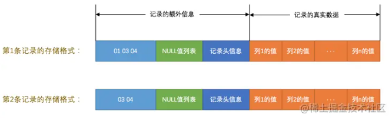

010304就代表第一条记录的d、bbb和aaaa；0304代表第二条记录的fff和eeee

### NULL值列表

表中的某些列可能存储NULL值，如果把这些NULL值都放到记录的真实数据中存储会很占地方，所以Compact行格式把这些值为NULL的列统一管理起来，存储到NULL值列表中

若表中没有允许存储NULL的列，那么就没有NULL值列表。

NULL值列表中，每个列对应一个二进制位，二进制位按照列的顺序逆序排列，1代表该列为NULL，0代表该列不为NULL。NULL值列表必须用整数个字节的位表示，不够的时候在高位补0

比如上面的这一条数据：('eeee', 'fff', NULL, NULL)

按照前面的原则，它的NULL值列表应该是00000110，第一个1代表第4列，第二个1代表第3列，最后一个0代表第1列，而第2列是不允许为NULL的，所以此时两条记录的行格式是这样的：

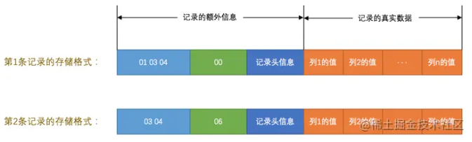

### 记录头信息

记录头信息由固定的5个字节组成，不同的位代表不同的意思：

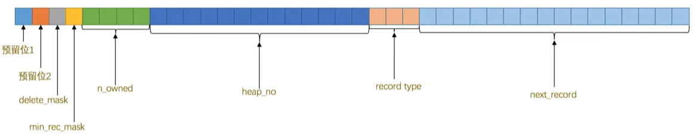

各部分的含义：

* delete_mask ：标记该记录是否被删除 
* min_rec_mask ：B+树的每层非叶子节点中的最小记录都会添加该标记 
* n_owned ：表示当前记录拥有的记录数 
* heap_no ：表示当前记录在记录堆的位置信息 
* record_type ：表示当前记录的类型，0表示普通记录，1表示B+树非叶子节点记录，2表示最小记录，3表示最大记录
* next_record ：表示下一条记录的相对位置 

### 记录的真实数据

对于上面的例子来说，记录的真实数据除了c1、c2、c3、c4这几个我们自己定义的列的数据以外，MySQL会为每个记录默认的添加一些列（也称为隐藏列），具体的列如下：

* row_id，不必须，占用6字节空间，它是行ID，唯一标识一条记录 
* transaction_id ，必须，占用6字节空间，它是事务ID
* roll_pointer ，必须，占用7字节空间，它是回滚指针

row_id只有在没有自定义主键以及Unique键的情况下才会添加该列，这涉及到InnoDB表对主键的生成策略：

* 优先使用用户自定义主键作为主键 
* 若没有定义，则选取一个Unique键作为主键
* 若没有Unique键，则会为表默认添加一个名为row_id的隐藏列作为主键

记录的真实数据在存储时，固定大小的就按照固定大小来存，变长字段则按照真实存储数据的大小来存

上面两条数据存储的示意图为：

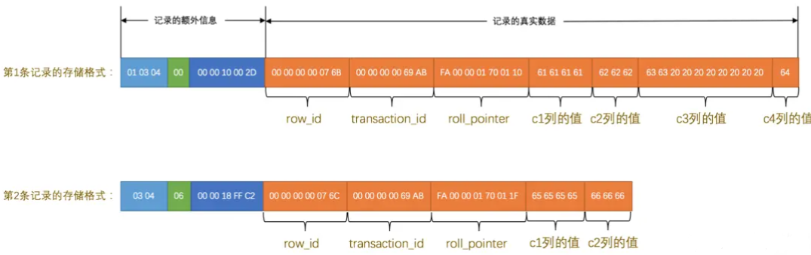

### 固定大小和变长

之前说过，变长字段长度列表中会存储那些变长类型的列占用的字节数。

当字符集是定长字符集时，变长字段长度列表中会存储那些变长类型的列；当字符集是变长的字符集（一个字符不一定代表多少个字节，如gbk表示一个字符要1～2个字节、utf8表示一个字符要1~3个字节等）时，固定长度类型的列（如CHAR(10) ）也会被存入变长字段长度列表

如果我们修改表的字符集，将定长改为变长，则就有可能有新的列加入变长字段长度列表：

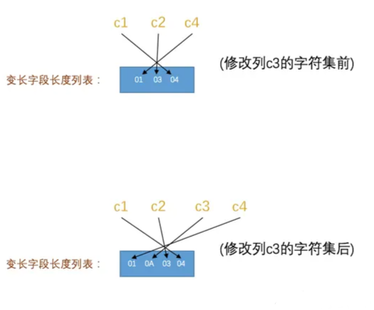

对于固定长度的类型，如CHAR(M) 列要求至少占用M个字节，当更新后的内容小于M字节时，可以原地更新不用分配新的存储空间，否则就需要分配新空间，原来的位置就成为一个空间碎片。

## Redundant行格式

Redundant行格式是老版本的行格式，现在已经基本不用，Redundant行格式的示意图：

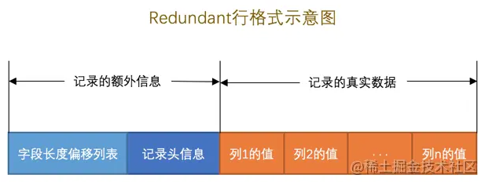

### 字段长度偏移列表

Compact行格式的开头是变长字段长度列表，而Redundant行格式的开头是字段长度偏移列表，与变长字段长度列表有两处不同：

* 没有了变长两个字，意味着Redundant行格式会把该条记录中所有列（包括隐藏列）的长度信息都按照逆序存储到字段长度偏移列表
* 多了个偏移两个字，这意味着它不会直接记录列的长度，而是通过相邻偏移值来间接求出列的长度的

比如第一条记录的字段长度偏移列表就是：

~~~
25 24 1A 17 13 0C 06
~~~

因为它是逆序排放的，所以按照列的顺序排列就是： 

~~~
06 0C 13 17 1A 24 25
~~~

按照两个相邻数值的差值来计算各个列值的长度的意思就是： 

~~~
第一列(`row_id`)的长度就是 0x06个字节，也就是6个字节。

第二列(`transaction_id`)的长度就是 (0x0C - 0x06)个字节，也就是6个字节。

第三列(`roll_pointer`)的长度就是 (0x13 - 0x0C)个字节，也就是7个字节。

第四列(`c1`)的长度就是 (0x17 - 0x13)个字节，也就是4个字节。

第五列(`c2`)的长度就是 (0x1A - 0x17)个字节，也就是3个字节。

第六列(`c3`)的长度就是 (0x24 - 0x1A)个字节，也就是10个字节。

第七列(`c4`)的长度就是 (0x25 - 0x24)个字节，也就是1个字节。
~~~

### 记录头信息

和Compact行格式有一些不同，其中重要的是有一个属性是1byte_offs_flag ，它代表标记字段长度偏移列表中每个列对应的偏移量是使用1字节还是2字节表示的 。

1byte_offs_flag 的值和记录的真实数据占用大小有关，当真实数据大时，就用2字节表示；当真实数据小时，就用1字节表示；当两个字节也表示不下时，此时多余的内容会被放入溢出页，此时字段长度偏移列表只会记录每个列在本页面的偏移。

这样的设计有一个弊端：如果记录的真实数据超过限值，则全部列都统一用2字节表示，即使1字节就能放得下，比较简单粗暴

### NULL的处理

Redundant行格式并没有NULL值列表，而是在字段长度偏移列表中，在各个列的偏移量值的第一个比特位作为示范为NULL的依据，该比特位称为NULL位，因此在解析某个列时，根据对应的字段长度偏移列表就能知道这个列值是否是NULL

相当于字段长度偏移列表，既包含了偏移信息，也包含了NULL的信息。

接下来讨论NULL值在真实数据部分的占用，分为两种情况：

* NULL值的字段类型是定长字段的，则采用定长来占用空间
* NULL值的字段类型是变长数据类型的，则不在真实数据部分占用空间

### 固定大小和变长

Compact行格式在CHAR(M)类型的列中存储数据的情况分为变长字符集和定长字符集两种。

而Redundant行格式并不区分，当使用CHAR(M)类型时，它真实占用的数据空间=M*该字符集一个字符需要最多多少个字节，如使用utf8字符集的CHAR(10)类型的列占用的真实数据空间始终为30个字节。

因此使用Redundant行格式的CHAR(M)类型的列是不会产生碎片的

## 行溢出数据

VARCHAR(M)类型的列在存储时最多可以占用65535个字节，能真正存业务数据的字节数和实际情况有关（一般是65532），因为一个列在存储时要分为以下几个部分：真实数据、真实数据占用的字节（偏移量、变长长度列表）和NULL值标识

所以NOT NULL的列可以占用更多的真实数据

MySQL对一条记录占用的最大存储空间是有限制的，除了BLOB或者TEXT类型的列之外，其他所有的列（不包括隐藏列和记录头信息）占用的字节长度加起来不能超过65535个字节。所以MySQL服务器建议我们把存储类型改为TEXT或者BLOB的类型

一个页的大小一般是16KB，也就是16384字节，而一个VARCHAR(M)类型的列就最多可以存储65532个字节，这样就可能造成一个页存放不了一条记录的尴尬情况

在Compact和Redundant行格式中，对于占用存储空间非常大的列，在记录的真实数据处只会存储该列的一部分数据，把剩余的数据分散存储在几个其他的页中，然后记录的真实数据处用20个字节存储指向这些页的地址（当然这20个字节中还包括这些分散在其他页面中的数据的占用的字节数），从而可以找到剩余数据所在的页，如图所示：

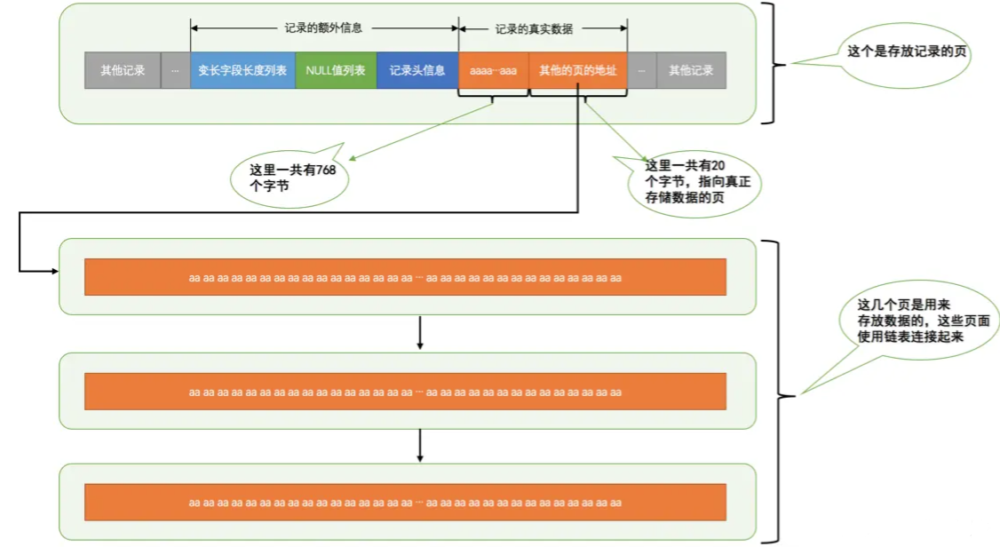

这种列的一部分数据在一页中，其他部分在其他页中的情况就是行溢出，其他那些单独存储的页就是溢出页：


不只是 VARCHAR(M) 类型的列，其他的 TEXT、BLOB 类型的列在存储数据非常多的时候也会发生行溢出

## Dynamic和Compressed行格式

这两种行格式和Compact 类似，不同之处在于处理行溢出数据时，会把列的所有字节都存储到其他页面中，只在记录的真实数据处存储其他页面的地址 ：


Compressed行格式和Dynamic不同的一点是，Compressed行格式会采用压缩算法对页面进行压缩，以节省空间

## 数据页结构

页是InnoDB管理存储空间的基本单位，一个页的大小一般是16KB

InnoDB为了不同的目的而设计了许多种不同类型的页，其中最重要的就是存储表记录的数据页，也就是索引页

数据页的结构示意图：

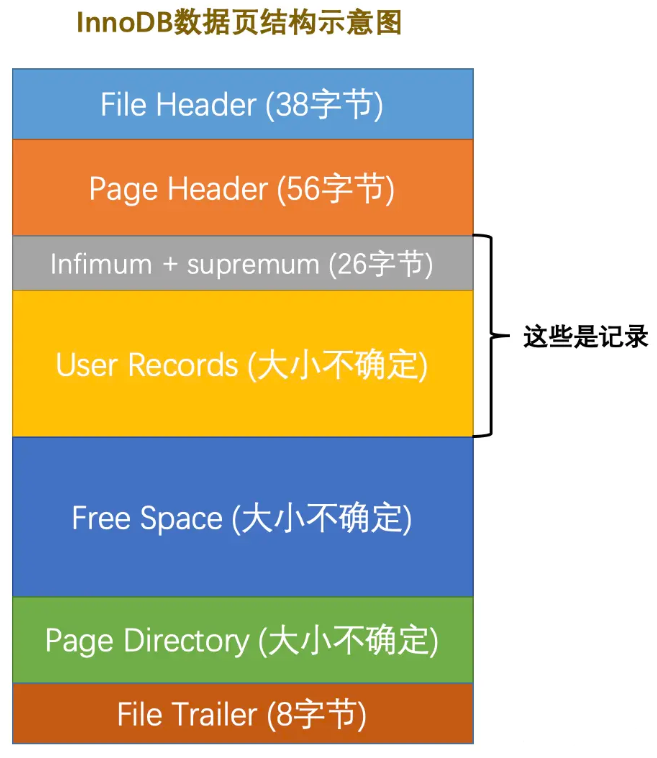

从图中可以看出，一个InnoDB数据页的存储空间大致被划分成了7个部分：

* File Header ：页的一些通用信息 
* Page Header ：数据页专有的一些信息 
* Infimum + Supremum ：两个虚拟的行记录 ，最大记录和最小记录
* User Records ：实际存储的行记录内容 
* Free Space ：页中尚未使用的空间 
* Page Directory ：页中的某些记录的相对位置 
* File Trailer ：校验页是否完整 

数据记录会按照我们指定的行格式存储到User Records 部分，一开始的时候是没有User Records 部分的，随着记录的插入，会在Free Space中申请一个空间划分给User Records 部分，直到Free Space用完就会申请新的页：

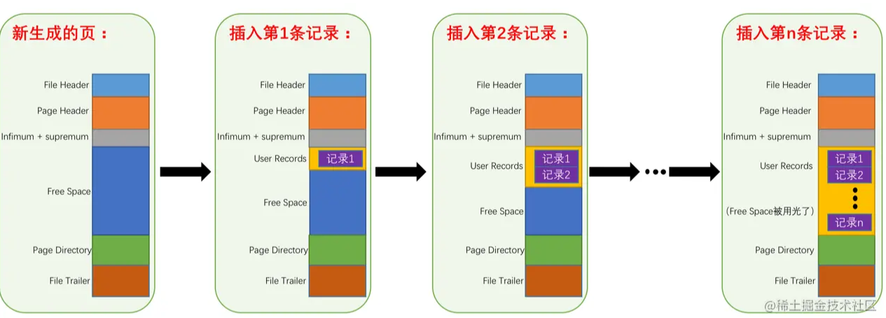

### User Records：页中的记录

向表中插入4条数据，四条行记录就会被放入User Records中，它们之间没有空隙：


每个记录行的记录头信息非常重要，这里说明一下它们的含义：

* delete_mask ：它标记着当前记录是否被删除，值为0代表没有被删除，1代表被删除了。删除的记录还会存在页中，这是因为对记录进行重新排列需要性能消耗，所以只是打一个删除标记而已，所有被删除掉的记录都会组成一个所谓的垃圾链表，在这个链表中的记录占用的空间称之为所谓的可重用空间，之后如果有新记录插入到表中的话，可能把这些被删除的记录占用的存储空间覆盖掉

* min_rec_mask ：B+树的每层非叶子节点中的最小记录都会添加该标记 ，普通记录该值为0

* n_owned ：表示当前组记录拥有的记录数，它是加快查询速度的关键

* heap_no ：它代表记录在本页中的位置，4条数据的位置分别为2/3/4/5，heap_no为0的记录是最小记录，heap_no为1的记录是最大记录。这里面说的最小最大其实就是比较主键的大小。

  最大记录和最小记录是固定的，都是由5字节大小的记录头信息和8字节大小的一个固定的部分组成的：

  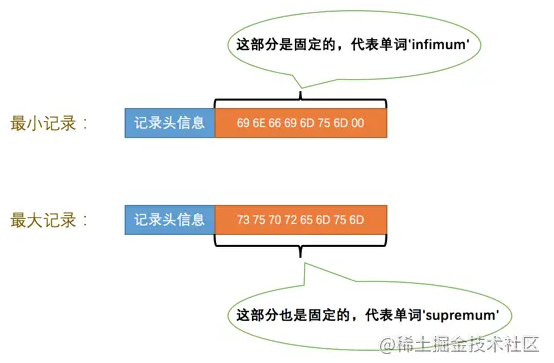

  它们被单独放在页结构中的Infimum + Supremum区域

* record_type ：这个属性表示当前记录的类型 ，对插入的普通记录，该值都是0，最小记录和最大记录的record_type值分别为2和3

* next_record ：它表示从当前记录的真实数据到下一条记录的真实数据的地址偏移量 

  这里面说的下一条记录不是按照插入顺序的下一条，而是主键从小到大排序的下一条，Infimum记录（也就是最小记录） 的下一条记录就是本页中主键值最小的用户记录，而本页中主键值最大的用户记录的下一条记录就是 Supremum记录（也就是最大记录），这个属性将页中的记录组织为一个单链表：

  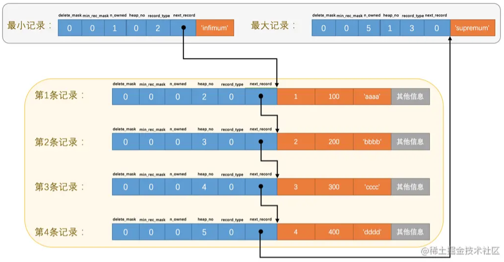

  如果在表中删除一条记录，那么它前后记录的next_record 值也会改变，单链表中就会去除掉被删除的记录，同时该条记录的delete_mask值设置为1，同时最大记录的n_owned值从5变成了4，意味着它所在的组记录数减少了1

  无论怎么对页中的记录做增删改操作，InnoDB始终会维护一条记录的单链表，链表中的各个节点是按照主键值由小到大的顺序连接起来的

### Page Directory：页目录

Page Directory这个区域是加快查询速度的关键。

例如我们要查询这样一条数据：

~~~
SELECT * FROM page_demo WHERE c1 = 3;
~~~

不能直接从最小记录开始，然后扫描到最大记录结束，这样的算法效率太低。

InnoDB 将将所有正常的记录（包括最大和最小记录，不包括标记为已删除的记录）划分为几个组 ，每个组的最后一条记录（也就是组内最大的那条记录）的头信息中的n_owned属性表示该记录拥有多少条记录，也就是该组内共有几条记录。

将每个组的最后一条记录的地址偏移量单独提取出来按顺序存储到靠近页的尾部的地方，这个地方就是所谓的Page Directory，也就是页目录，页面目录中的这些地址偏移量被称为槽Slot

这样有4条记录的表的页结构示意图应该是这样：

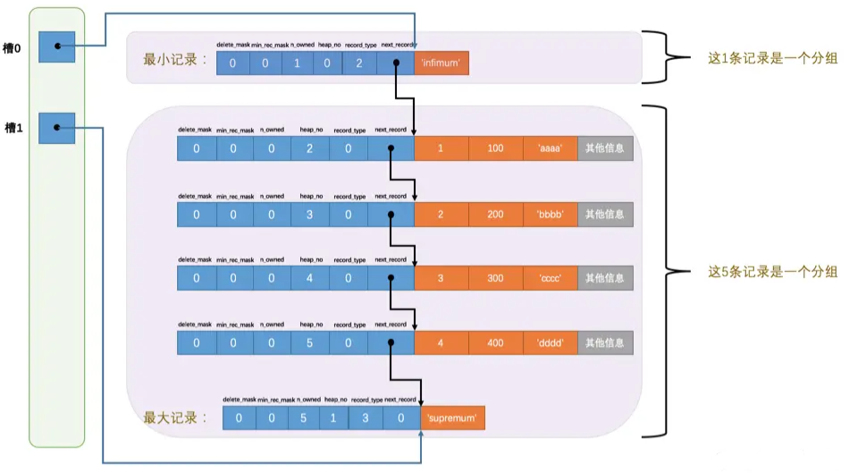

可以看出，一共有两组，第一组只包含最小记录，第二组包含了剩余5条记录，组内的数量在每个组的最后一条记录的n_owned中标识。

每个分组中的记录条数是有规定的：对于最小记录所在的分组只能有 1 条记录，最大记录所在的分组拥有的记录条数只能在 1~8 条之间，剩下的分组中记录的条数范围只能在是 4~8 条之间

插入数据的分组逻辑：

* 初始情况下一个数据页里只有最小记录和最大记录两条记录，它们分属于两个分组 
* 之后每插入一条记录，都会从页目录中找到主键值比本记录的主键值大并且差值最小的槽，然后把该槽对应的记录的n_owned值加1，表示本组内又添加了一条记录，直到该组中的记录数等于8个
* 在一个组中的记录数等于8个后再插入一条记录时，会将组中的记录拆分成两个组，一个组中4条记录，另一个5条记录。这个过程会在页目录中新增一个槽来记录这个新增分组中最大的那条记录的偏移量

如果再往表中添加12条记录，整个的页结构示意图：

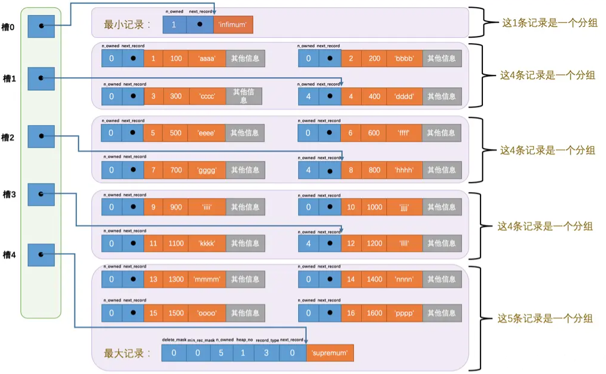

有了这样的槽就可以加快查询记录的速度了，比如要找主键为6的记录，应该计算中间槽的位置，然后查看对应槽的主键值，然后缩小范围继续计算中间槽，当范围只有一个槽时，通过next_record 遍历组内的各条记录

### Page Header：页面头部

Page Header是数据页中存储的记录的状态信息 ，它是专门针对数据页的，其中有三个属性和之前的槽息息相关：

* PAGE_N_DIR_SLOTS ：在页目录中的槽数量 
* PAGE_LAST_INSERT ：最后插入记录的位置
* PAGE_N_RECS ：该页中记录的数量（不包括最小和最大记录以及被标记为删除的记录） 

还有几个和插入方向有关的属性：

* PAGE_DIRECTION ：假如新插入的一条记录的主键值比上一条记录的主键值大，我们说这条记录的插入方向是右边，反之则是左边 ，它就是用来标识最后一条记录插入方向的
* PAGE_N_DIRECTION ：假设连续几次插入新记录的方向都是一致的，InnoDB会把沿着同一个方向插入记录的条数记下来，这个条数就用PAGE_N_DIRECTION这个状态表示。当然，如果最后一条记录的插入方向改变了的话，这个状态的值会被清零重新统计

其他属性之后详述，和该页所属的段有关

### File Header：文件头部

它是所有页类型的通用头部，描述了页的一些通用信息，几个重要的属性：

* FIL_PAGE_SPACE_OR_CHKSUM ：当前页面校验和

* FIL_PAGE_OFFSET ：页号

* FIL_PAGE_TYPE ：当前页的类型，目前只介绍了数据页

* FIL_PAGE_PREV和FIL_PAGE_NEXT：分别代表本页的上一个和下一个页的页号 

  通过这两个属性，建立了一个双向链表将许多页相连，它们不一定是物理存储上的相邻位置（并不是所有类型的页都有上一个和下一个页的属性 ，数据页是有的）：

  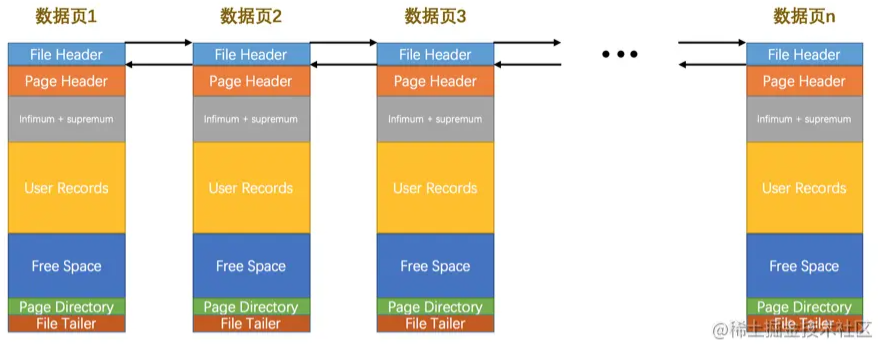

### File Trailer

它是页中用来校验数据完整性的部分，共有8字节组成，可以分为2个部分：

* 前4个字节代表页的校验和 ：和File Header中的校验和相对应的。每次页面在内存中修改之后，会在同步到磁盘前将校验和算出，File Header中的校验和会首先被同步到磁盘，当完全写完时，该校验和也会被写到页的尾部，如果完成同步成功，则页的首部和尾部的校验和应该是一致的 ；如果同步有问题，则意味着中间出了错
* 后4个字节代表页面被最后修改时对应的日志序列位置（LSN） 

## 索引的存储

### 目录项记录页

前面已经说过，各个数据页可以组成一个双向链表，而每个数据页中的记录会按照主键值从小到大的顺序组成一个单向链表。

在每个页中查找某条记录的方法：每个数据页都会为存储在它里边儿的记录生成一个页目录，在通过主键查找某条记录的时候可以在页目录中使用二分法快速定位到对应的槽，然后再遍历该槽对应分组中的记录即可快速找到指定的记录

但如果页仅仅只是组织成一条双向链表，还是无法快速找到记录到底在哪个页中。

假如往表中插入3条记录，那么页的示意图如下：

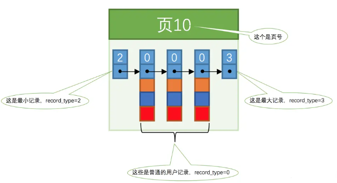

为了加快查询速度，可以给所有页建一个目录项，每个目录项记录包括页的最小主键值和对应的页号：

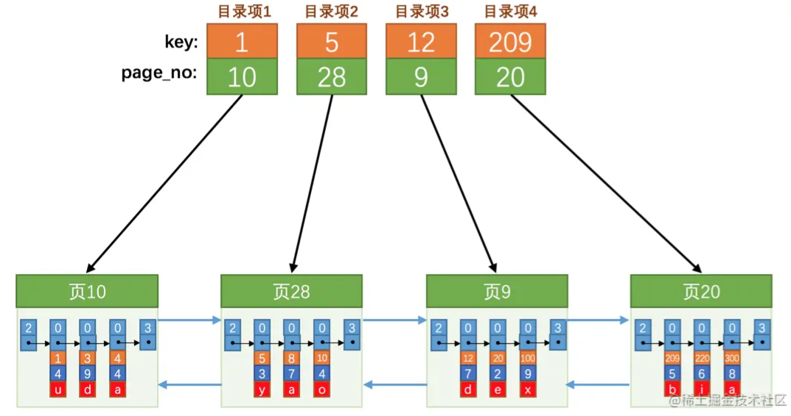

这样有了这些目录项，就能先用二分法确定记录在哪个页，找到具体的页后，继续用二分法定位到对应的槽，最终遍历槽对应分组的记录就能找到指定的记录了。

这些目录项被组织在一种页结构中（这个页的类型也是索引页，和存放数据的页是同一种类型，不同之处在于记录），每条记录中记录头的record_type 都是1，以区别普通的数据记录：

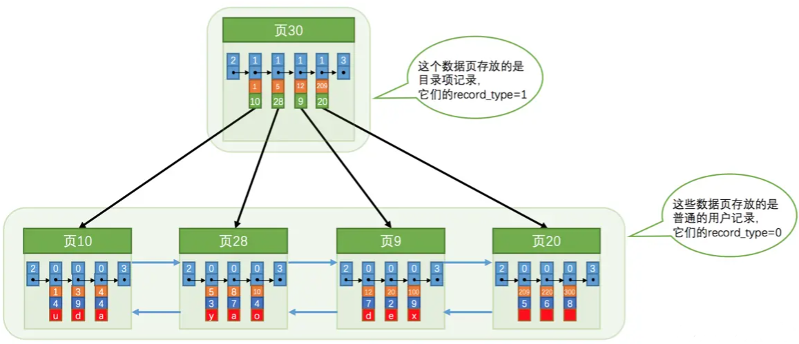

目录项记录和普通的用户数据记录的区别：

* 目录项记录的record_type 都是1，而普通用户记录是0
* 目录项记录只有两个列：页的最小主键值和页号，而普通用户记录有多个列，还包括隐藏列
* 目录项记录的min_rec_mask 值是1，而普通用户记录是0

### B+树

一个页只有16KB大小，页能存放的目录项记录也是有限的，当一个数据页不足以存放所有的目录项记录，就会再分配一个新的目录项记录页：

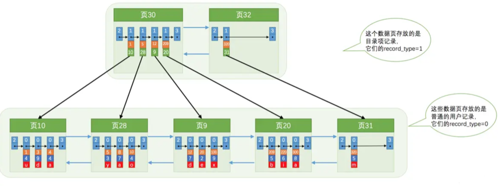

当目录项记录页非常多的时候，会再生成一个更高级的目录，它里面的目录项记录记录着对应目录页的最小主键值，最终所有的页形成了一颗B+树：

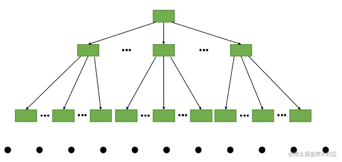

实际用户记录其实都存放在B+树的最底层的节点上，这些节点也被称为叶子节点或叶节点，其余用来存放目录项的节点称为非叶子节点或者内节点，其中B+树最上边的那个节点也称为根节点

4层的B+树就能存储相当多的记录，一般不会有4层（InnoDB 规定：一个数据页至少要有两条记录，这是为了防止多层B+树查询效率降低的）

### 聚簇索引

B+树本身就是一个索引，它有两个特点：

* 使用记录主键值的大小进行记录和页的排序 ：
  * 页内的记录是按照主键的大小顺序排成一个单向链表 
  * 各个存放用户记录的页也是根据页中用户记录的主键大小顺序排成一个双向链表 
  * 存放目录项记录的页分为不同的层次，在同一层次中的页也是根据页中目录项记录的主键大小顺序排成一个双向链表 
* B+树的叶子节点存储的是完整的用户记录

拥有这两个特点的索引就是聚簇索引，这种聚簇索引并不需要我们在MySQL语句中显式的使用INDEX语句去创建，InnoDB存储引擎会自动的为我们创建聚簇索引

### 二级索引

聚簇索引只能在搜索条件是主键值时才能发挥作用，因为B+树中的数据都是按照主键进行排序的

当想以其他列作为搜索条件时，可以在该列建立一个索引：

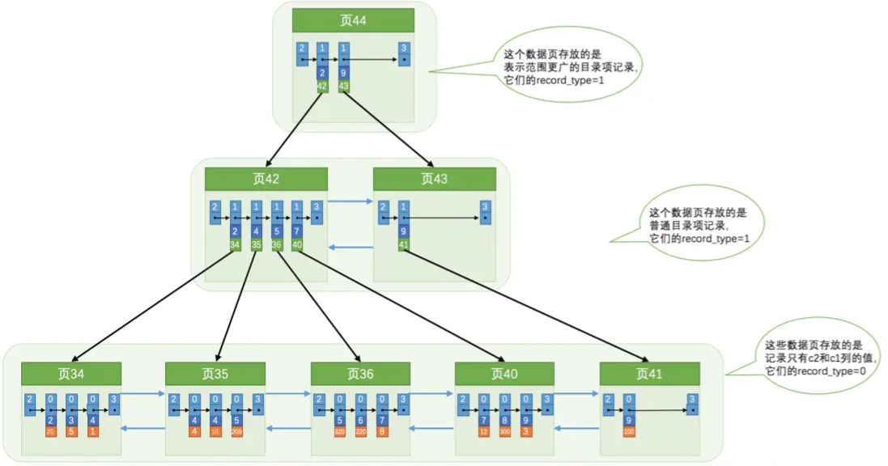

这种索引和聚簇索引的区别：

1、使用记录c2列的大小进行记录和页的排序，而不是使用主键

2、B+树的叶子节点存储的并不是完整的用户记录，而只是c2列+主键这两个列的值

3、目录项纪录中不再是主键+页号的搭配，而变成了c2列+页号+主键的搭配（这里为什么要加上主键，这是因为c2列并不是唯一的，插入新的目录项时会出现歧义，不知道新的记录被分到哪个目录项记录页中）

如果以c2列为条件进行查询的话，需要先根据c2列对应的B+树来查到记录的主键值，再根据这个主键去聚簇索引中查找完整的记录。这种再回聚簇索引查一遍的动作就是回表，这种B+树也被称为二级索引，或者辅助索引

### 联合索引

如果想同时以两个列为搜索条件，例如按照c2和c3列，此时就需要建立一个联合索引

联合索引的B+树的排序条件就是：先把各个记录和页按照c2列进行排序，在记录的c2列相同的情况下，采用c3列进行排序：

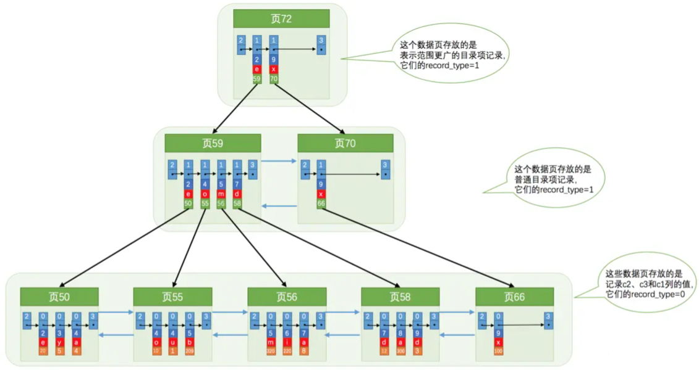

此时每条目录记录项都由c2、c3、页号、主键组成，每条叶子节点目录都由c2、c3、主键构成

这种B+树就是联合索引，本质上也是一个二级索引。

### 形成过程

B+树的形成过程：

1、每当为某个表创建一个B+树索引（聚簇索引不是人为创建的，默认就有）的时候，都会为这个索引创建一个根节点页面。最开始表中没有数据的时候，每个B+树索引对应的根节点中既没有用户记录，也没有目录项记录

2、随后向表中插入用户记录时，先把用户记录存储到这个根节点中

3、当根节点中的可用空间用完时继续插入记录，此时会将根节点中的所有记录复制到一个新分配的页，比如页a中，然后对这个新页进行页分裂的操作，得到另一个新页，比如页b。这时新插入的记录根据键值的大小就会被分配到页a或者页b中，而根节点便升级为存储目录项记录的页

（在对页中的记录进行增删改操作的过程中，我们必须通过一些诸如记录移动的操作来始终保证这个状态一直成立：下一个数据页中用户记录的主键值必须大于上一个页中用户记录的主键值。这个过程我们也可以称为页分裂）

一个B+树索引根节点自创建后，便不会再移动，InnoDB存储引擎需要用到这个索引的时候，都会从那个固定的地方取出根节点的页号，从而来访问这个索引

### MyISAM中的索引

MyISAM中是索引和数据分开的，分为数据文件和索引文件：

* 数据文件：将表中的记录按照记录的插入顺序单独存储在该文件中，记录也需要记录头来存储一些额外信息，不分页，也不会按照主键排序，所以无法通过二分法来查找数据文件
* 索引文件：MyISAM也会为表的主键创建一个索引，索引也是树的形式，但索引的叶子节点中存储的不是完整的用户记录，而是主键值 + 行号的组合（也可以针对某个列建立索引，此时叶子节点存储的就是相应的列+行号）

查询数据时，先查询索引文件，然后查到对应记录的行号，然后根据行号再去数据文件查找，所以MyISAM至少需要进行一次回表操作，MyISAM中建立的索引相当于全部都是二级索引

## 数据目录

### 数据库和表

MySQL 的数据会存储到数据目录中，数据目录和安装目录不同，可以通过查看系统变量datadir来看数据目录：

```
SHOW VARIABLES LIKE 'datadir';
```

数据目录不仅会保存数据，还会保存服务器进程文件、日志文件、SSL和RSA证书和密钥文件 等

当在MySQL中创建一个数据库时，就会在数据目录下创建一个和数据库同名的子目录，并在该目录下创建一个名为db.opt的文件，这个文件中包含了该数据库的各种属性，如比较规则和字符集。

在MySQL创建一个表时，会在对应数据库的目录下创建一个frm文件：

```
表名.frm
```

frm是一个二进制文件，它用来描述表结构，如表的列数、数据类型等。因为创建表实际上是创建文件，所以创建表会受到操作系统的限制，比如表名不能过长，不能带特殊字符，文件也就是表不能太大

表由两部分组成：1、表结构文件  2、表数据

表数据的存储和具体的存储引擎有关，接下来分别讨论

### InnoDB表数据

从MySQL5.5.7到MySQL5.6.6之间的各个版本中，我们表中的数据都会被默认存储到系统表空间，系统表空间只有一个，它会对应文件系统中一个或多个实际的文件，默认情况下，InnoDB会在数据目录下创建一个名为ibdata1（在你的数据目录下找找看有木有）、大小为12M的文件（后面不够用会自动扩展）

可以修改innodb_data_file_path的值来改变系统表空间的位置，也可以选择将系统表空间配置在数据目录外，或者单独配置到一个磁盘分区上，涉及到的启动参数就是innodb_data_file_path和innodb_data_home_dir

在MySQL5.6.6以及之后的版本中，InnoDB并不会默认的把各个表的数据存储到系统表空间中，而是为每一个表建立一个独立表空间，也就是说我们创建了多少个表，就有多少个独立表空间，独立表空间是一个ibd文件：

~~~
表名.ibd
~~~

在独立表空间中会存储表的数据和索引

我们也可以修改启动参数innodb_file_per_table 来决定到底是使用系统表空间还是使用独立表空间，0代表使用系统表空间，1代表使用独立表空间，但修改启动参数不会对已经分配了表空间的表起作用。

如果我们想把已经存在系统表空间中的表转移到独立表空间，可以使用下边的语法： 

~~~
ALTER TABLE 表名 TABLESPACE [=] innodb_file_per_table;
~~~

或者吧已经存在独立表空间的表转移到系统表空间 ：

~~~
ALTER TABLE 表名 TABLESPACE [=] innodb_system;
~~~

### MyISAM表数据

MyISAM并没有什么所谓的表空间一说，表数据都存放到对应的数据库子目录下

假如test表使用MyISAM存储引擎的话，那么在它所在数据库对应的xiaohaizi目录下会为test表创建这三个文件：

~~~
test.frm
test.MYD
test.MYI
~~~

其中test.MYD代表表的数据文件，也就是我们插入的用户记录；test.MYI代表表的索引文件

## 表空间

### 区：extent

用B+树加快查询速度有一个问题，前面说过，链表中相邻的两个页物理位置可能离得非常远， 此时遍历链表就会产生很多随机I/O，所以我们应该尽量让链表中相邻页的物理位置也相邻，所以才引入了区的概念。

数据页又分为叶子节点页和非叶子节点页，这两种页即使相邻也没有太大用处，为了方便管理不同类型的页，就产生了段segment的概念，一个索引会生成两个段，一个叶子节点段，一个非叶子节点段 ，段是一个逻辑上的概念，它就等于一些零散的页面（存在碎片区的）以及一些完整的区的集合 ，它的组成和空间分配策略有关，后面会详述

区是在物理位置上连续的64个页 ，区大体上可以分为4种类型： 

* 空闲的区，FREE：区中没有任何可用页面
* 有剩余空间的碎片区，FREE_FRAG ：还有可用页面的碎片区
* 没有剩余空间的碎片区，FULL_FRAG ：没有空闲存储的碎片区
* 附属于某个段的区，FSEG ：整个区都属于某个段，当一个表数据量很大时，就会以区为单位分配存储空间，此时一个完整的区就归属于某个段

每一个区都对应一个XDES Entry 结构（Extent Descriptor Entry ），这个结构记录了对应区的一些属性：

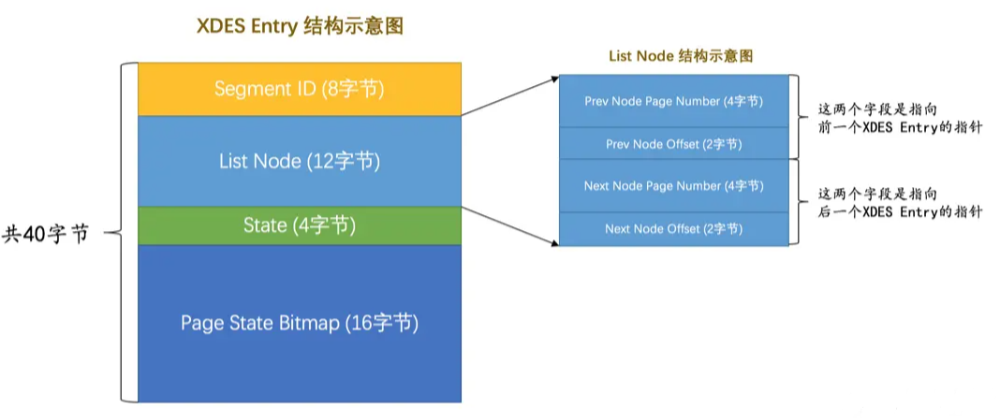

几个重要的部分：

* Segment ID ：段编号，只有属于某个段的区才有
* List Node ：它包含指向前一个XDES Entry的指针和指向后一个XDES Entry的指针
* State ：区的状态，就是前面说的4种
* Page State Bitmap ：一个区默认有64个页，它占用16字节，128bit，2个bit对应一个页，其中一个比特代表该页是不是空闲的，另一个还没有投入使用

为了快速找到某个状态的区，MySQL帮助我们将不同状态的区组成一个链表（通过区XDES Entry的List Node部分），总共有这样三种链表：FREE 链表、FREE_FRAG 链表和FULL_FRAG 链表（这其实都是碎片区）

链表的基节点在表空间中固定的位置，每次要找到某个链表，只需要找对应链表的基节点即可，基节点List Base Node 的结构：

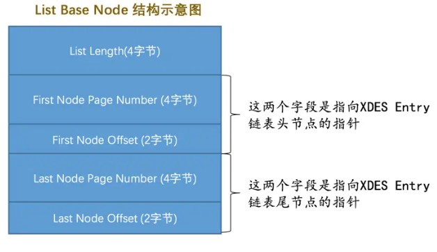

几个部分的解释：

* List Length ：表明该链表一共有多少节点 
* First Node Page Number和First Node Offset：该链表的头节点在表空间中的位置 （页号+页内偏移量）
* Last Node Page Number和Last Node Offset：该链表的尾节点在表空间中的位置 

### 段：segment

段是一个逻辑上的概念，它就等于一些零散的页面（存在碎片区的）以及一些完整的区的集合 。

一个索引会生成两个段，一个叶子节点段，一个非叶子节点段。（相当于一个表至少会有两个段）

如果每次插入数据，都给它分配一个完整的区，可能会造成严重的空间浪费。所以在一开始数据量小的时候，插入数据会被优先放到一个叫碎片区的地方，在碎片区中，并不是所有的页都是为了存储同一个段的数据而存在的，而是碎片区中的页可以用于不同的目的，比如有些页用于段A，有些页用于段B，有些页甚至哪个段都不属于。 碎片区直属于表空间，并不属于任何一个段 

为某个段分配存储空间的策略：

- 在刚开始向表中插入数据的时候，段是从某个碎片区以单个页面为单位来分配存储空间的。
- 当某个段已经占用了32个碎片区页面之后，就会以完整的区为单位来分配存储空间。

之前已经介绍了三种状态的区XDES Entry 链表，用于快速找到某个状态的区，这些区其实都是碎片区，它们直属于表空间，当刚开始向表中插入数据时，就需要优先查找这些碎片区的区。然后将页插入这些区中，随着页面数据放到区，区的状态可能会改变，链表之间可能会有节点移动的情况

当开始用完整的区为单位分配空间时，就开始存在属于某个段的区了，需要知道哪些区属于哪个段，InnoDB 会为每个段维护三个链表：

* 所有页面都是空闲的区：FREE链表
* 仍有空闲空间的区：NOT_FULL链表
* 已经没有空闲空间的区：FULL链表

这样就能很快速的找到属于某个段的区，然后向区中插入页面了，新分配的区也会被加入这个链表中。

段由一个INODE Entry 结构来记录，它的示意图：

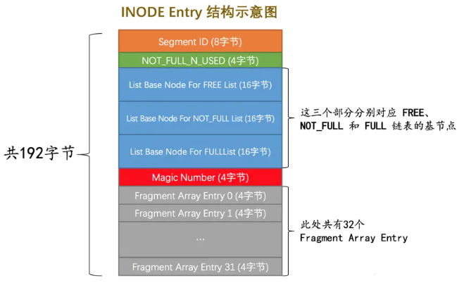

各部分的解释：

* Segment ID ：段号
* NOT_FULL_N_USED ：该段的NOT_FULL链表中已经使用了多少个页面
* 3个List Base Node：分别为段的FREE链表、NOT_FULL链表、FULL链表的基节点
* Magic Number ：用来标记该INODE Entry是否已经被初始化了
* Fragment Array Entry ：属于段的零散的页面对应的页号，共32个，如果满32个后，就会以完整的区为单位来分配存储空间

段和INODE Entry的对应关系，是通过INDEX 类型页的Page Header 部分记录的，Page Header 部分有两种信息：

* PAGE_BTR_SEG_LEAF ：叶子段的头部信息，仅在B+树的根页定义 
* PAGE_BTR_SEG_TOP ：非叶子段的头部信息 ，仅在B+树的根页定义 

它们每一个都代表一个指向INODE Entry的指针：表空间Id+页号+INODE Entry的页内偏移量，这样，我们就能根据索引找到段的信息了

### 独立表空间

表空间由多个区extent组成，对于16KB的页来说，连续的64个页就是一个区，也就是说一个区默认占用1MB空间大小。不论是系统表空间还是独立表空间，都可以看成是由若干个区组成的，每256个区被划分成一组 ：

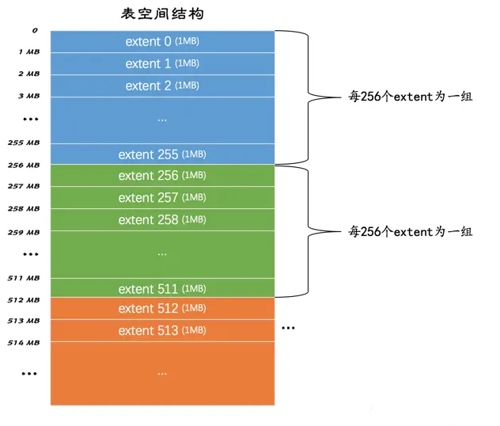

每个组的前几个页面有几个特殊类型的页面：

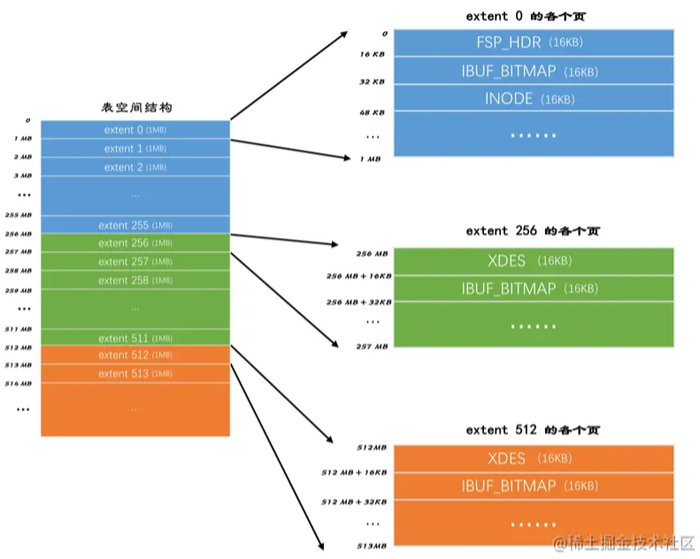

除了前面说过的数据页，也就是INDEX页以外，其他所有的页都拥有File Header 和File Trailer 两个部分：

- File Header：记录页面的一些通用信息 
- File Trailer：校验页是否完整，保证从内存到磁盘刷新时内容的一致性 

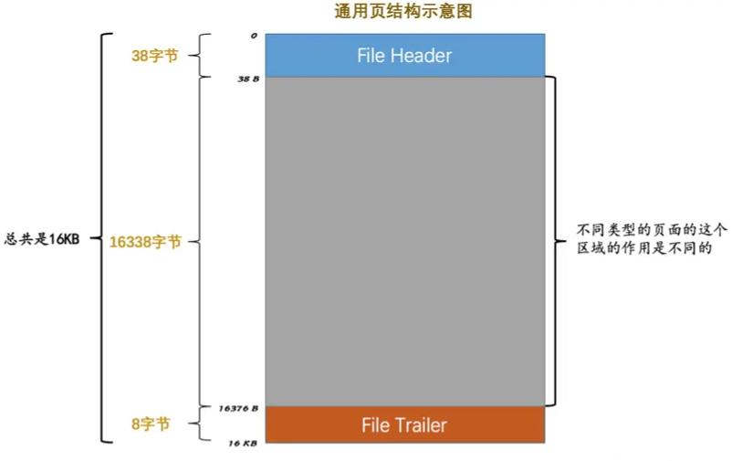

1、组的第一个页面：FSP_HDR

它是表空间的第一个页面，页号为0，它存储了表空间的一些整体属性以及第一个组内256个区的对应的XDES Entry结构：

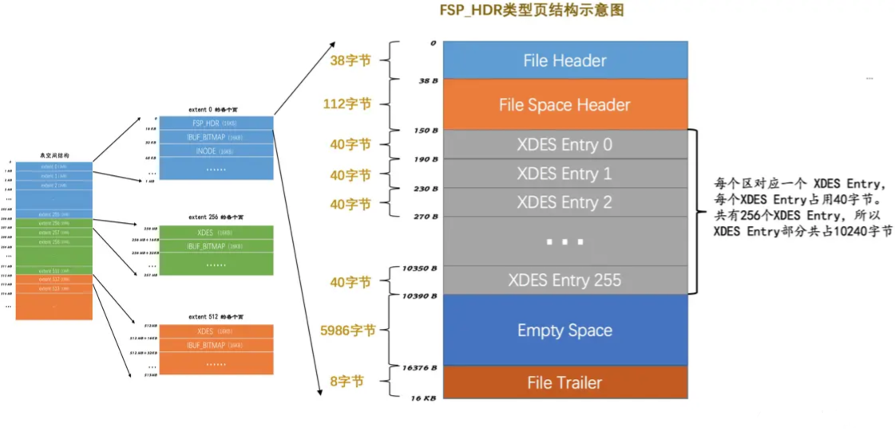

除了File Header和File Trailer以外，重要的有两部分

先看File Space Header ，它记录了表空间的一些整体属性，这是它的示意图：


* Space ID ：表空间ID
* Not Used ：没有起作用
* Size ：表空间占用的页面数
* List Base Node for FREE List、List Base Node for FREE_FRAG List、List Base Node for FULL_FRAG List：分别是直属于表空间的FREE链表的基节点、FREE_FRAG链表的基节点、FULL_FRAG链表的基节点，这三个链表的基节点在表空间的位置是固定的
* FRAG_N_USED ：FREE_FRAG链表中已经使用的页面数量
* FREE Limit ：该字段表示的页号之前的区都被初始化了，之后的区尚未被初始化 。InnoDB不会把所有存储空间都初始化到FREE链表，而是等到空闲链表中的XDES Entry 结构对应的区不够用了，再进行初始化，把新的XDES Entry加入到FREE链表
* Next Unused Segment ID ：当前表空间中最大的段ID的下一个ID ，创建新段的时候使用
* Space Flags ：一些布尔类型的属性，包括了好多表空间的重要属性
* List Base Node for SEG_INODES_FULL List和List Base Node for SEG_INODES_FREE List：两个链表，用来保存段的INODE Entry 的，INODE Entry 结构会被集中放到类型为INODE的页中：
  * SEG_INODES_FULL链表：该链表中的INODE类型的页面都已经被INODE Entry结构填充满了，没空闲空间存放额外的INODE Entry了
  * SEG_INODES_FREE 链表：该链表中的INODE类型的页面仍有空闲空间来存放INODE Entry结构

FSP_HDR还有一部分是XDES Entry 部分，共256个XDES Entry ，它们的位置是固定的

2、其他组的第一个页面：XDES ，它只记录了本组的XDES Entry 结构，由于它不是表空间的第一个页面，所以没有File Space Header，其余的和FSP_HDR页面一样了

3、所有组的第二个页面：IBUF_BITMAP ，记录了Change Buffer 相关的内容

4、第一个组的第三个页面：INODE ，它是为了保存INODE Entry 结构的，它的结构：

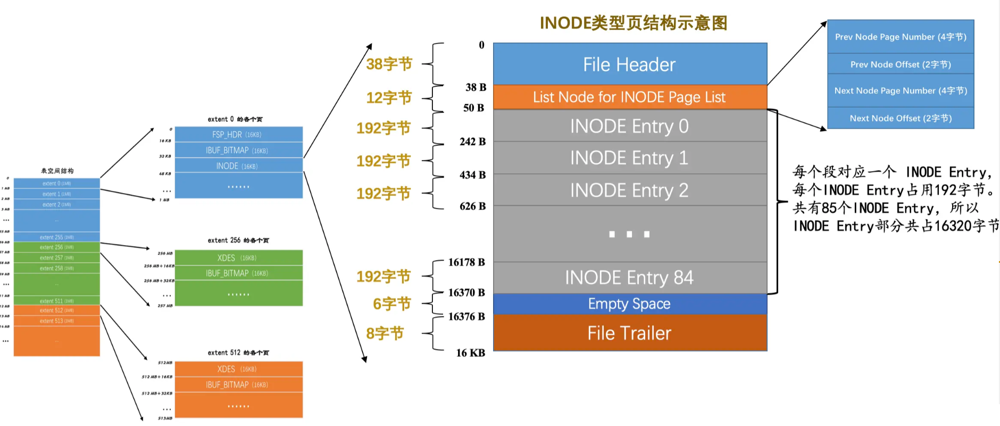

除了File Header 和File Trailer 、Empty Space 以外，还有下面的部分

* INODE Entry 部分：一个页面可以保存85个INODE Entry 
* List Node for INODE Page List 部分：存储上一个INODE页面和下一个INODE页面的指针 ，最终将INODE页面形成一个链表，链表有两种，基节点就在上面的FSP_HDR中

创建一个段，相当于创建一个INODE Entry 结构，存储它的过程：

* 先看看SEG_INODES_FREE链表是否为空，如果不为空，直接从该链表中获取一个节点，将INODE Entry 结构放入该页中，如果该页无剩余空间，则就把该页放到SEG_INODES_FULL链表中
* 如果SEG_INODES_FREE链表为空，则需要从表空间的FREE_FRAG链表中申请一个页面，修改该页面的类型为INODE，把该页面放到SEG_INODES_FREE链表中，与此同时把该INODE Entry结构放入该页面

### 系统表空间

系统表空间的结构和独立表空间基本类似，只不过由于整个MySQL进程只有一个系统表空间，在系统表空间中会额外记录一些有关整个系统信息的页面，所以会比独立表空间多出一些记录这些信息的页面 

系统表空间与独立表空间的一个非常明显的不同之处就是在表空间开头有许多记录整个系统属性的页面 ：

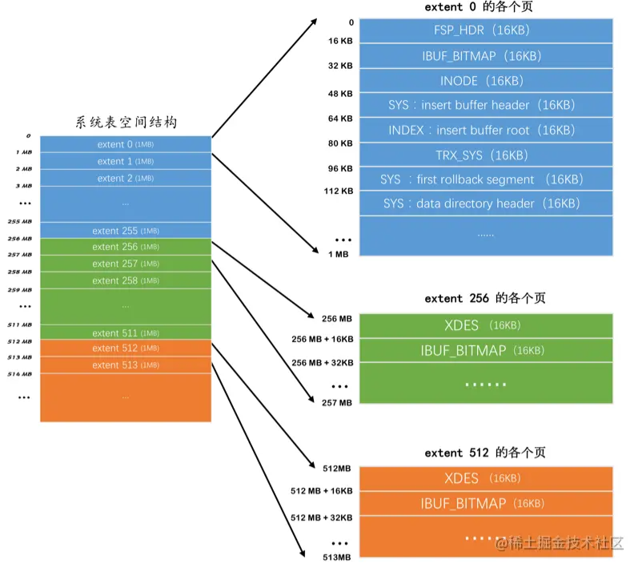

系统表空间和独立表空间的前三个页面 类型是一致的，分别是FSP_HDR 、IBUF_BITMAP 、INODE ，页号为3～7的页面是系统表空间特有的，其中比较重要的是页号为7的SYS页，它是Data Dictionary Header ，代表数据字典头信息

数据字典是一些非常重要的系统表，它们在数据库中必不可少，它们存储的数据被称为元数据，列举了一部分：

* SYS_TABLES ：整个InnoDB存储引擎中所有的表的信息 
* SYS_COLUMNS ：整个InnoDB存储引擎中所有的列的信息 
* SYS_INDEXES ：整个InnoDB存储引擎中所有的索引的信息 （非常重要的是，它记录了索引所在的表空间和页号）
* SYS_FIELDS ：整个InnoDB存储引擎中所有的索引对应的列的信息 

在SYS页面中就包含了数据字典相关的信息：


* Max Row ID ：默认主键row_id的最大值，每次生成row_id时都从这里取，后续还会对它进行详细解释
* Max Table ID ：表ID的最大值，生成表Id的时候从这里取
* Max Space ID ：表空间ID的最大值
* xx index：各系统表的索引根页面页号

这些系统表是用户不能查询的，但是可以查询它们的副本，如SYS_COLUMNS可以查询INNODB_SYS_COLUMNS 

# 查询优化

## 创建和删除索引

创建表时可以创建索引：

~~~
CREATE TALBE 表名 (
    各种列的信息 ··· , 
    [KEY|INDEX] 索引名 (需要被索引的单个列或多个列)
)
~~~

修改表时创建索引：

~~~
ALTER TABLE 表名 ADD [INDEX|KEY] 索引名 (需要被索引的单个列或多个列);
~~~

修改表时删除索引：

~~~
ALTER TABLE 表名 DROP [INDEX|KEY] 索引名;
~~~

## 索引的代价

使用索引的代价：

* 空间上的代价：每个索引都要建立一颗B+树，每一棵B+树的叶子节点都是一个数据页，建立索引要占用很多存储空间
* 时间上的代价：每次增删改都会触发所有索引的修改，不仅要更新记录，还要维护索引中记录的顺序，可能造成页面分裂、页面回收的情况，操作耗时变长

## 匹配索引的情况

排序不能命中索引的情况：联合索引+ASC和DESC混用（如果只用某个，比如只用ASC就从索引的最左边开始读，只用DESC就是从索引的最右边开始读）

## 回表的代价

每次使用二级索引查询时，都要分为两步：1、查询二级索引拿到多个主键  2、根据主键去聚簇索引查询结果

第一步都是顺序IO。第二步都是随机IO，当使用二级索引查询到的记录特别多的时候，需要回表的次数就特别多，性能就越差，甚至还不如全表扫描。

查询优化器会事先对表中的记录计算一些统计数据，然后再利用这些统计数据根据查询的条件来计算一下需要回表的记录数，需要回表的记录数越多，就越倾向于使用全表扫描，反之倾向于使用二级索引 + 回表的方式

所以一种常见的优化方式是减少回表次数，就是加limit，让回表次数降低

回表的代价也使得orderby命中索引时，最好select项覆盖索引，如果覆盖不了，则需要进行回表去查多余的列，导致性能劣化。

正因为有覆盖索引这种优化方式，所以不推荐使用select *

二级索引列值为NULL值的记录都被放在二级索引树的最左边，也就是说MySQL认为NULL值是最小的。NULL值也是可以应用索引的，下面这些例子其实都是扫描二级索引的区间，然后估计回表数，根据回表数确定到底是二级索引回表还是直接全表扫描：

* IN操作符的扫描区间：和多个or连起来等效，扫描范围是多个单点
* !=的扫描区间：单点 以外的所有范围，如(-∞, 'a')和('a', +∞)
* like 'a%'的扫描区间：在索引中定位到第一条前缀为a的记录，顺序扫描到前缀不为a为止

成本决定执行计划，跟使用什么查询条件并没有什么关系 

## 索引字符串值的前缀

如果为一个列创建索引，同时这个列又要占用很大的存储空间，因为二级索引的记录要保存这个字符串，所以会导致性能降低，我们可以只在该索引的B+树叶子节点中存储字符串的前几个字符的编码，这样既能解决排序的问题，又能降低空间，在建立索引时需要特殊设置“

~~~
CREATE TABLE person_info(
    name VARCHAR(100) NOT NULL,
    birthday DATE NOT NULL,
    phone_number CHAR(11) NOT NULL,
    country varchar(100) NOT NULL,
    KEY idx_name_birthday_phone_number (name(10), birthday, phone_number)
);   
~~~

name(10)就代表在索引中只保留前10个字符的编码值。

这种方式适合前缀匹配的方式，但对于其他的查询方式，如单纯使用orderby，因为只有前10个字符不足以支撑排序，所以会导致索引失效

## 访问方法

MySQL执行查询语句的方式成为访问方法或者访问类型，访问类型有下面几种

### const

通过主键列来定位一条记录：

~~~
SELECT * FROM single_table WHERE id = 1438;
~~~

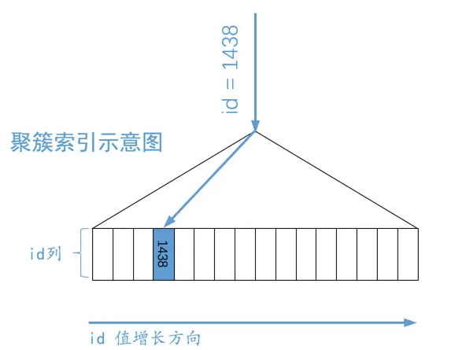

或者通过唯一二级索引列来定位一条记录：

~~~
SELECT * FROM single_table WHERE key2 = 3841;
~~~

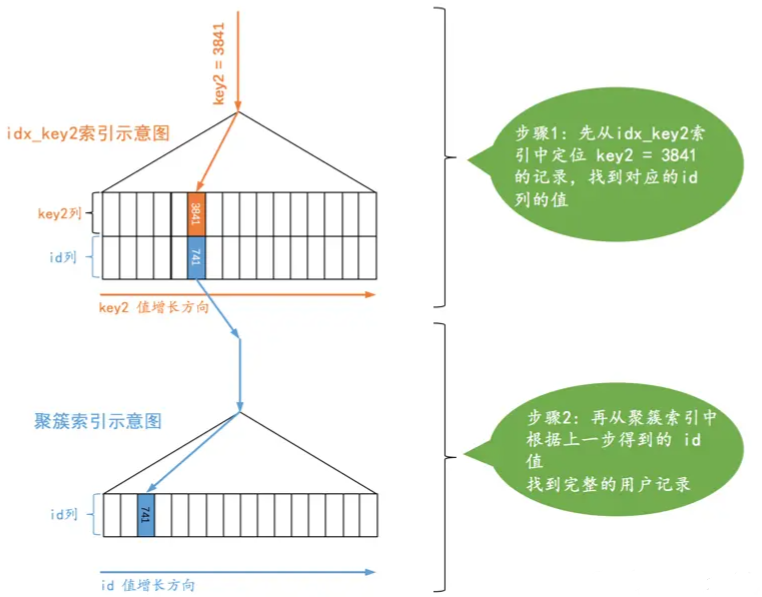

这种访问方式就是const，意思是常数级别的。

用唯一二级索引为NULL来定位，不属于const，因为唯一二级索引列不限制NULL的数量：

~~~
SELECT * FROM single_table WHERE key2 IS NULL;
~~~

### ref

用普通的二级索引列与常数进行比较：

~~~
SELECT * FROM single_table WHERE key1 = 'abc';
~~~

此时可以选择全表扫描来逐一对比搜索条件是否满足要求，我们也可以先使用二级索引找到对应记录的id值，然后再回表到聚簇索引中查找完整的用户记录 ：

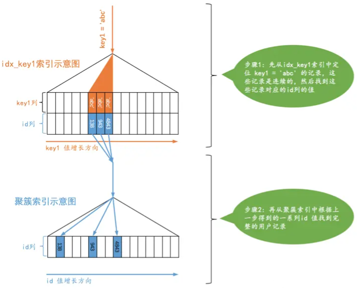

它可能匹配到多条记录，需要多次回表。上面的用唯一二级索引为NULL来定位也属于ref

对于包含多个二级索引列的查询语句来说，如果最左边的连续索引列是与常数的等值比较 就有可能是ref的访问类型：

~~~
SELECT * FROM single_table WHERE key_part1 = 'god like' AND key_part2 = 'legendary';
~~~

### eq_ref

对被驱动表使用主键值或者唯一二级索引列的值进行等值查找的查询执行方式称之为 eq_ref

### ref_or_null

不仅想找出某个二级索引列的值等于某个常数的记录，还想把该列的值为NULL的记录也找出来：

~~~
SELECT * FROM single_table WHERE key1 = 'abc' OR key1 IS NULL;
~~~

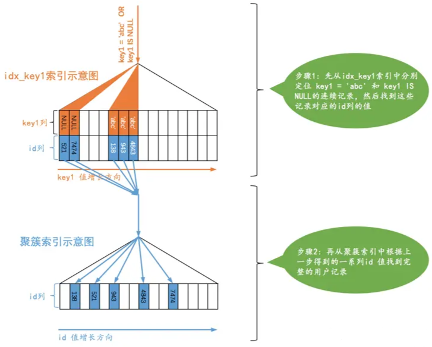

此时就是ref_or_null

### range

对索引进行范围访问：

~~~
SELECT * FROM single_table WHERE key2 IN (1438, 6328) OR (key2 >= 38 AND key2 <= 79);
~~~

即使range和ref要扫描的二级索引记录是相同的，查询优化器对ref也会优先使用，对range可能会更倾向于全表扫描。这是因为ref过滤的二级索引记录中，索引列是相同的，按照主键的值从小到大排序，回表时，对聚簇索引的扫描也是顺序的读；而range则不同，它不能保证二级索引扫描出的记录中主键的值是顺序的，回表时对聚簇索引的访问是随机IO。所以对于查询优化器来说，即使扫描到相同的记录数，这两种查询方式的代价也是不同的

### index

遍历索引，比如：

~~~
SELECT key_part1, key_part2, key_part3 FROM single_table WHERE key_part2 = 'abc';
~~~

此时这个表没有key_part2的索引，但是有key_part1, key_part2, key_part3的联合索引，所以有一种查询方式就是直接遍历这个联合索引，然后用where条件过滤，这就是index，而且这个过程也不用进行回表操作 。因为二级索引记录比聚簇索记录小的多，所以直接遍历二级索引比直接遍历聚簇索引的成本要小很多

### index merge 

一般情况下，一次查询只会用到一个索引，但特殊情况下可能会用到多个索引，这种访问方法统称为index merge，具体和索引合并算法有下面三种：

1、Intersection 合并

某个查询可以使用多个二级索引，将从多个二级索引中查询到的结果取交集 ，比如：

~~~
SELECT * FROM single_table WHERE key1 = 'a' AND key3 = 'b';
~~~

这个查询语句就可以先查key1对应的索引，然后查key3对应的索引，然后将结果取交集，再回表即可。

只查一个索引，然后回表的时候使用另一个过滤条件也是可以的，但是一般来说，查询索引是顺序IO，回表是随机IO，所以查询两个索引的代价一般较小

会使用Intersection 合并的情况：

* 二级索引列是等值匹配的情况，对于联合索引来说，在联合索引中的每个列都必须等值匹配，不能出现只匹配部分列的情况 

  比如：

  ~~~
  SELECT * FROM single_table WHERE key1 = 'a' AND key_part1 = 'a' AND key_part2 = 'b' AND key_part3 = 'c';
  ~~~

  此时就可以用到key1的索引，和联合索引key_part，但如果只有一部分联合索引，比如：

  ~~~
  SELECT * FROM single_table WHERE key1 = 'a' AND key_part1 = 'a';
  ~~~

  或者没有使用等值匹配：

  ~~~
  SELECT * FROM single_table WHERE key1 > 'a' AND key_part1 = 'a' AND key_part2 = 'b' AND key_part3 = 'c';
  ~~~

  就不会进行Intersection 合并。这两个原则的本质都是一样的，从索引中查到的结果需要是有序的主键值，这样合并的时候只需要ON就可以合并完成了，如果索引中查到的是无序的主键值集合，那合并就比较麻烦了。

  按照有序的主键值去回表取记录 被称为ROR ：Rowid Ordered Retrieval 

* 也正因为这个原则，主键列可以范围匹配，也能产生Intersection 合并：

  ~~~
  SELECT * FROM single_table WHERE id > 100 AND key1 = 'a';
  ~~~

最终是否会使用Intersection 合并，还需要看查询优化器优化的结果

2、Union合并

某个查询可以使用多个二级索引，将从多个二级索引中查询到的结果取并集，如：

~~~
SELECT * FROM single_table WHERE key1 = 'a' OR key3 = 'b'
~~~

它在一定情况下才会使用：

* 二级索引列是等值匹配的情况，对于联合索引来说，在联合索引中的每个列都必须等值匹配，不能出现只出现匹配部分列的情况 

* 主键列可以是范围匹配 

* 使用Intersection索引合并的搜索条件，比如：

  ~~~
  SELECT * FROM single_table WHERE key_part1 = 'a' AND key_part2 = 'b' AND key_part3 = 'c' OR (key1 = 'a' AND key3 = 'b');
  ~~~

  可以将or前后的部分分别查询不同索引，取出主键集合，然后使用并集

3、Sort-Union合并

有一些使用不了上面Union合并方式的场景，可以用另一种方法来优化，比如：

~~~
SELECT * FROM single_table WHERE key1 < 'a' OR key3 > 'z'
~~~

通过key1和key3两个索引查询出来的主键集合都不是排好序的，我们此时可以分别将它们的结果集排序，然后进行处理，这种先按照二级索引记录的主键值进行排序，之后按照Union索引合并方式执行的方式称之为Sort-Union索引合并

值的注意的是，没有Sort-Intersection 这种场景，因为Intersection索引合并的适用场景是单独根据搜索条件从某个二级索引中获取的记录数太多，导致回表开销太大 ，如果对这些大集合采用排序，就比直接回表成本还高了

## 使用技巧

1、索引列的类型尽量小

定义表结构的时候要显式的指定列的类型 ，建立索引的列的类型要尽量小（主键更是如此），数据类型越小，操作页的速度越快，一个数据页也能放下更多的记录，减少页分裂，也可以把更多的数据页缓存在内存中，从而加快读写效率 

2、插入顺序的影响

聚簇索引的记录是按照主键排序的，如果数据的插入顺序不是依次增大的，而是忽大忽小，则会触发频繁的页分裂，也会影响性能，所以好的方式是抽取一个抽象的主键，然后设置主键自增：

~~~
CREATE TABLE person_info(
    id INT UNSIGNED NOT NULL AUTO_INCREMENT,
    name VARCHAR(100) NOT NULL,
    birthday DATE NOT NULL,
    phone_number CHAR(11) NOT NULL,
    country varchar(100) NOT NULL,
    PRIMARY KEY (id),
    KEY idx_name_birthday_phone_number (name(10), birthday, phone_number)
);    
~~~

## 连接的概念

连接的类型：

* 内连接

  ~~~
  隐式内连接：SELECT * FROM student, score WHERE student.number = score.number;
  		SELECT * FROM student join score on student.number = score.number;
  		SELECT * FROM student cross join score on student.number = score.number;
  显示内连接：SELECT * FROM student inner join score on student.number = score.number;
  ~~~

* 外连接

  ~~~
  左外连接：SELECT s1.number, s1.name, s2.subject, s2.score FROM student AS s1 LEFT JOIN score AS s2 ON s1.number = s2.number;
  右外连接：SELECT * FROM t1 RIGHT [OUTER] JOIN t2 ON 连接条件 [WHERE 普通过滤条件];
  ~~~

* 自然连接（不知道MySQL支持不支持）：

  自然连接是用同名字段作为连接条件的，结果中会合并同名字段

  ~~~
  自然内连接：左表 natural 右表
  自然外连接：左表 natural left/right 右表
  用外连接实现自然连接：左表 left/right/inner join 右表 using field
  ~~~

* 交叉连接

  ~~~
  SELECT * FROM student cross join score;
  SELECT * FROM student, score
  ~~~

on和where的区别：

* 不满足where的不会加入最后的结果集，不满足on的可能会被加入（内连接的on和where是等价的，对于内连接来说，驱动表和被驱动表的位置是可以互换的，不会影响最后的查询结果）

一些术语：

* 驱动表：连接查询中第一个去查询的表
* 被驱动表：连接查询中第二个去查询的表。在两表连接查询中，驱动表只需要访问一次，被驱动表可能访问多次

## 连接的原理

### 嵌套循环连接Nested-Loop Join

当进行两表连接时，驱动表只会被访问一遍，但被驱动表却要被访问到好多遍，具体访问几遍取决于对驱动表执行单表查询后的结果集中的记录条数 。

对于内连接来说，选取哪个表为驱动表都没关系 ，查询优化器会选择最优的方案。

对于左外连接来说，左边的表就是驱动表；对于右外连接来说，右边的表就是驱动表

连接查询执行的过程：

* 选取驱动表，使用与驱动表相关的过滤条件，选取代价最低的单表访问方法来执行对驱动表的单表查询 
* 对上一步骤中查询驱动表得到的结果集中每一条记录，都分别到被驱动表中查找匹配的记录 

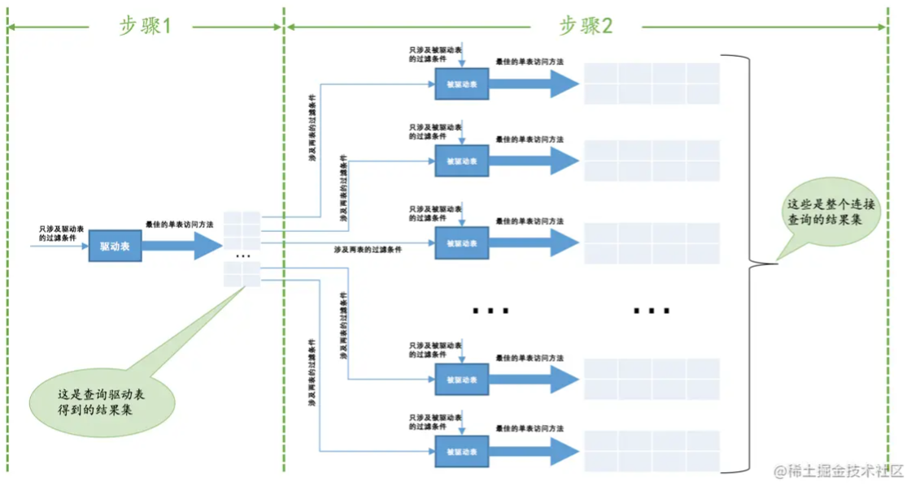

用伪代码展示查询的过程：

~~~
for each row in t1 {   #此处表示遍历满足对t1单表查询结果集中的每一条记录
    
    for each row in t2 {   #此处表示对于某条t1表的记录来说，遍历满足对t2单表查询结果集中的每一条记录
    
        for each row in t3 {   #此处表示对于某条t1和t2表的记录组合来说，对t3表进行单表查询
            if row satisfies join conditions, send to client
        }
    }
}
~~~

这个过程就像是一个嵌套的循环，这是最基本的连接查询算法：嵌套循环连接（Nested-Loop Join）

### 连接中的索引

前面说过，连接查询的关键是被驱动表的查询，因为被驱动表要查询多次，可以用索引加快被驱动表的查询。可以让对被驱动表的查询到达eq_ref 或者range

### join buffer 

当扫描被驱动表时，是从磁盘读取到内存中的过程，如果表中数据特别大，读到后面的时候前面的内存已经被清理了，当需要扫描多次驱动表时，就要从磁盘上读好几次驱动表，代价非常大

join buffer就是执行连接查询前申请的一块固定大小的内存，先把若干条驱动表结果集中的记录装在这个join buffer中，然后开始扫描被驱动表，每一条被驱动表的记录一次性和join buffer中的多条驱动表记录做匹配，因为匹配的过程都是在内存中完成的，所以这样可以显著减少被驱动表的I/O代价：

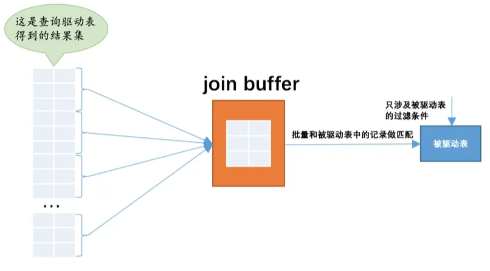

最好的情况是join buffer足够大，能容纳驱动表结果集中的所有记录，这样只需要访问一次被驱动表就可以完成连接操作了

优化索引查询最好的方式是通过给被驱动表加索引，方式对被驱动表全表扫描，但如果不可避免，也可以通过增加join buffer的大小来优化，可以通过启动参数或者系统变量join_buffer_size进行配置

驱动表的记录并不是所有列都会被放到join buffer中，只有查询列表中的列和过滤条件中的列才会被放到join buffer中，所以这也是不能用select *的一个原因，这样可以尽可能多的往join buffer放入记录

## 子查询的概念

在一个查询语句里的某个位置也可以有另一个查询语句 ，这个在里层的查询就是子查询，在外层的就是外层查询

### 按子查询的位置分类

子查询可以在一个外层查询的各种位置出现：

* 出现在select子句中：

  ~~~
  SELECT (SELECT m1 FROM t1 LIMIT 1);
  ~~~

* 出现在from子句中：

  ~~~
  SELECT m, n FROM (SELECT m2 + 1 AS m, n2 AS n FROM t2 WHERE m2 > 2) AS t;
  ~~~

  由子查询的结果集组成的表被称为派生表

* 出现在where或on子句中：

  ~~~
  SELECT * FROM t1 WHERE m1 IN (SELECT m2 FROM t2);
  ~~~

### 按返回的结果集分类

分为以下几类：

* 标量子查询：只返回一个单一值的子查询 

  ~~~
  SELECT (SELECT m1 FROM t1 LIMIT 1);
  SELECT * FROM t1 WHERE m1 = (SELECT MIN(m2) FROM t2);
  ~~~

* 行子查询：返回一条记录的子查询

  ~~~
  SELECT * FROM t1 WHERE (m1, n1) = (SELECT m2, n2 FROM t2 LIMIT 1);
  ~~~

* 列子查询：返回一个列，多行的子查询

  ~~~
  SELECT * FROM t1 WHERE m1 IN (SELECT m2 FROM t2);
  ~~~

* 表子查询：返回多行多列的子查询，这里面用了limit1来限制，否则就会变成行子查询

  ~~~
  SELECT * FROM t1 WHERE (m1, n1) IN (SELECT m2, n2 FROM t2);
  ~~~

### 按与外层查询的关系分类

可以分为：

* 不相关子查询：子查询可以单独运行出结果，而不依赖于外层查询的值 

* 相关子查询：子查询的执行需要依赖于外层查询的值 

  ~~~
  SELECT * FROM t1 WHERE m1 IN (SELECT m2 FROM t2 WHERE n1 = n2);
  ~~~

### 子查询和布尔表达式

子查询在布尔表达式中的使用场景 ：

* 使用比较操作符的子查询，只能是行子查询或者标量子查询，也就是说只能有一条记录：

  ~~~
  SELECT * FROM t1 WHERE m1 < (SELECT MIN(m2) FROM t2);
  SELECT * FROM t1 WHERE (m1, n1) = (SELECT m2, n2 FROM t2 LIMIT 1);
  ~~~

* IN或者NOT IN：

  ~~~
  SELECT * FROM t1 WHERE (m1, n1) IN (SELECT m2, n2 FROM t2);
  ~~~

* ANY/SOME  （这两个是同义词）

  ~~~
  SELECT * FROM t1 WHERE m1 > ANY(SELECT m2 FROM t2);
  ~~~

  相当于只要子查询结果集中存在某个值满足条件，那么整个表达式的结果就是true

  它等价于下面这个查询：

  ~~~
  SELECT * FROM t1 WHERE m1 > (SELECT MIN(m2) FROM t2);
  ~~~

  此外，=ANY的含义和IN是相同的，也可以实现简化

* ALL

  ~~~
  SELECT * FROM t1 WHERE m1 > ALL(SELECT m2 FROM t2);
  ~~~

  相当于必须子查询结果集中的所有记录都满足条件，整个表达式的结果才是true

  它等价于下面这个查询：

  ~~~
  SELECT * FROM t1 WHERE m1 > (SELECT MAX(m2) FROM t2);
  ~~~

* EXISTS

  ~~~
  SELECT * FROM t1 WHERE EXISTS (SELECT 1 FROM t2);
  ~~~

  对于上面这个子查询来说，我们不关心子查询的结果，所以查询列表查什么是无所谓的，只要存在记录，exists表达式的结果就是true

### 其他注意事项

1、子查询必须用小括号扩起来 

2、在SELECT子句中的子查询必须是标量子查询

3、对于[NOT] IN/ANY/SOME/ALL子查询来说，子查询中不允许有LIMIT语句，这是不支持的特性

4、会被查询优化器优化掉的部分：子查询中的order by、distinct

5、子查询只能使用在查询中，不能放到delete语句中

## 子查询原理

### 标量子查询、行子查询

最简单的子查询场景就是标量子查询、行子查询

对于不相关的标量子查询、行子查询查询步骤：

* 先单独执行子查询
* 然后将子查询的结果当做外层查询的参数，再执行外层查询

此时就是两个独立的单表查询

对于相关的标量子查询、行子查询查询步骤，以下面这个语句为例：

~~~
SELECT * FROM s1 WHERE 
    key1 = (SELECT common_field FROM s2 WHERE s1.key3 = s2.key3 LIMIT 1);
~~~

* 先从外层查询中获取一条记录 
* 从上一步骤中获取的那条记录中找出子查询中涉及到的值 ，然后执行子查询
* 最后根据子查询的查询结果来检测外层查询WHERE子句的条件是否成立，如果成立，就把外层查询的那条记录加入到结果集，否则就丢弃
* 重复执行第一步，继续循环

### 物化表

对于不相关的IN子查询：

~~~
SELECT * FROM s1 WHERE key1 IN (SELECT common_field FROM s2 WHERE key3 = 'a');
~~~

它并不是按照上面的查询逻辑来做的，因为当子查询的结果集很大时，会有很多问题：

* 结果集太多，内存中放不下
* 无法有效的使用索引，只能对外层查询用全表扫描
* 在进行条件匹配时，每条记录都要取结果集中的每一条来判断，性能很差

所以MySQL可能会将子查询的结果直接写入一个临时表，临时表的列就是子查询结果中的列，并且会做去重，该临时表是存在内存中的，而且会为表建立哈希索引，方便后续外层查询进行记录匹配。如果子查询的结果集非常大，超过了系统变量tmp_table_size或者max_heap_table_size，临时表会转而使用基于磁盘的存储引擎来保存结果集中的记录，索引类型也对应转变为B+树索引

这个将子查询结果保存到临时表的过程称为物化，临时表就称为物化表，因为物化表有哈希索引，所以能有效提高IN子查询的速度

### 物化表转连接

当我们把子查询进行物化之后，其实IN子查询就有可能转换为连接查询，例如下面的子查询：

~~~
SELECT * FROM s1 WHERE key1 IN (SELECT common_field FROM s2 WHERE key3 = 'a');
~~~

子查询的物化表如果被称为materialized_table ，它的列名称为m_val ，此时上面的查询就相当于扫描s1的记录，逐条与materialized_table 匹配，或者扫描materialized_table 的记录，逐条与s1匹配，其实就相当于内连接：

~~~
SELECT s1.* FROM s1 INNER JOIN materialized_table ON key1 = m_val;
~~~

转换为内连接后，查询优化器可以评估不同连接顺序需要的成本是多少，选取成本最低的那种查询方式执行查询 

### semi-join

物化后既然可以进行连接，我们也可以尝试直接把IN子查询转换为连接查询

对于IN子查询：

~~~
SELECT * FROM s1 WHERE key1 IN (SELECT common_field FROM s2 WHERE key3 = 'a');
~~~

我们可以理解成：对于s1表中的某条记录，如果我们能在s2表（准确的说是执行完WHERE s2.key3 = 'a'之后的结果集）中找到一条或多条记录，这些记录的common_field的值等于s1表记录的key1列的值，那么该条s1表的记录就会被加入到最终的结果集，它和两个表连接起来的效果类似：

~~~
SELECT s1.* FROM s1 INNER JOIN s2 
    ON s1.key1 = s2.common_field 
    WHERE s2.key3 = 'a';
~~~

这两个查询，第一步都是用s2.key3 = 'a'来过滤掉s2中的部分记录，只不过和连接的不同之处在于，当s1的某条记录，s2有多条记录满足s1.key1 = s2.common_field时，连接查询的结果中会出现s1+多条s2的记录，而IN子查询只会保留一条s1，所以IN子查询和两表连接之间并不完全等价。

这种特殊的连接就被称为半连接semi-join：将s1表和s2表进行半连接的意思就是：对于s1表的某条记录来说，我们只关心在s2表中是否存在与之匹配的记录，而不关心具体有多少条记录与之匹配，最终的结果集中只保留s1表的记录。半连接没有提供给用户的使用语法，只是MySQL内部使用的查询方式。

针对semi-join的优化查询方式：

1、Table pullout （子查询中的表上拉） 

当子查询的查询列表处只有主键或者唯一索引列时，可以实现IN子查询和连接查询等价转换：

~~~
SELECT * FROM s1 WHERE key2 IN (SELECT key2 FROM s2 WHERE key3 = 'a');  // key2是s2表的唯一索引
转换后
SELECT s1.* FROM s1 INNER JOIN s2 
    ON s1.key2 = s2.key2 
    WHERE s2.key3 = 'a';
~~~

因为此时对于同一条s1表的记录，不可能找到两条符合s1.key2 = s2.key2 的记录，所以两者是等价的转换

2、DuplicateWeedout execution strategy （重复值消除） 

之前说过，semi-join的痛点就在于s1表中的某条记录可能在s2表中有多条匹配的记录，所以该条记录可能多次被添加到最后的结果集中，用创建临时表的方式，逐步将结果加入该临时表中，在这个过程中去重，这种利用临时表消除重复值的方式就是DuplicateWeedout execution strategy

3、LooseScan execution strategy （松散扫描） 

对于这种IN子查询：

~~~
SELECT * FROM s1 WHERE key3 IN (SELECT key1 FROM s2 WHERE key1 > 'a' AND key1 < 'b');
~~~

在子查询中，对于s2表的访问可以使用到key1列的索引，而恰好子查询的查询列表处就是key1列。查询转换为半连接后，查询过程是这样的：

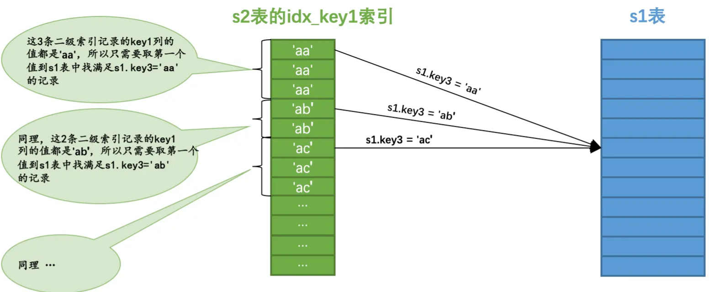

因为子查询是直接扫描索引，当扫描到aa时，可以用aa去s1表匹配，而后面的相同记录aa都可以跳过了，这样只取值相同的记录的第一条去做匹配操作的方式称之为松散扫描

4、Semi-join Materialization execution strategy 

这种方式就是前面说过的，用物化表，转换为连接查询的，它也属于一种semi-join

5、FirstMatch execution strategy （首次匹配） 

它是最原始的半连接查询方式，先取一条外层查询的中的记录，然后到子查询的表中寻找符合匹配条件的记录，如果能找到一条，则将该外层查询的记录放入最终的结果集并且停止查找更多匹配的记录，如果找不到则把该外层查询的记录丢弃掉；然后再开始取下一条外层查询中的记录，重复上边这个过程 

### IN相关子查询

因为IN子查询的相关子查询，子查询不是一个独立的查询语句，所以它不能用物化表来加速查询过程，但对于有些相关子查询，也是可以转换为semi-join：

~~~
SELECT * FROM s1 WHERE key1 IN (SELECT common_field FROM s2 WHERE s1.key3 = s2.key3);
转换后
SELECT s1.* FROM s1 SEMI JOIN s2 ON s1.key1 = s2.common_field AND s1.key3 = s2.key3;
~~~

然后就可以使用semi-join优化查询的逻辑来优化这个查询语句

如果子查询的查询列表处只有主键或者唯一二级索引列，还可以直接使用table pullout的策略来执行查询

###semi-join转换的条件

不是所有IN子查询都可以转换为semi-join，只有形如这样的查询：

~~~
SELECT ... FROM outer_tables 
    WHERE expr IN (SELECT ... FROM inner_tables ...) AND ...
~~~

或者这种查询：

~~~
SELECT ... FROM outer_tables 
    WHERE (oe1, oe2, ...) IN (SELECT ie1, ie2, ... FROM inner_tables ...) AND ...
~~~

才能转换

简单来说：

* 该子查询必须是和IN语句组成的布尔表达式，并且在外层查询的WHERE或者ON子句中出现
* 外层查询也可以有其他的搜索条件，只不过和IN子查询的搜索条件必须使用AND连接起来
* 该子查询必须是一个单一的查询，不能是由若干查询由UNION连接起来的形式
* 该子查询不能包含GROUP BY或者HAVING语句或者聚集函数

### 不能使用semi-join的场景

几种场景如下：

* 外层查询的WHERE条件中有其他搜索条件与IN子查询组成的布尔表达式使用OR连接起来：

  ~~~
  SELECT * FROM s1 
      WHERE key1 IN (SELECT common_field FROM s2 WHERE key3 = 'a')
          OR key2 > 100;
  ~~~

* 使用NOT IN而不是IN的情况

* 在SELECT子句中的IN子查询的情况

如果IN子查询不符合转换为semi-join的条件，那么查询优化器会从下边两种策略中找出一种成本更低的方式执行子查询：

* 先将子查询物化之后再执行查询
* 执行IN to EXISTS转换。

### IN子查询转EXISTS子查询

对于任意一个IN子查询来说，都可以被转为EXISTS子查询，如：

~~~
outer_expr IN (SELECT inner_expr FROM ... WHERE subquery_where)
~~~

可以转换为：

~~~
EXISTS (SELECT inner_expr FROM ... WHERE subquery_where AND outer_expr=inner_expr)
~~~

但要小心outer_expr或者inner_expr值为NULL的情况，有NULL的表达式结果通常也是NULL，这样，第一个表达式的值就是NULL，第二个是TRUE或者FALSE。

对于where或者on子句中使用子查询的情况，上面的场景是不会有影响的，因为where true还是 where null都是一样的，所以：

对于IN子查询是放在WHERE或者ON子句中的情况，IN子查询和EXISTS子查询是等价的。

转换为EXISTS子查询的好处：可能能用到索引

比如下面的情况：

~~~
SELECT * FROM s1
    WHERE key1 IN (SELECT key3 FROM s2 where s1.common_field = s2.common_field) 
        OR key2 > 1000;
~~~

这个IN子查询是用不到s2表的idx_key3索引的，但转换后就可以用到了：

~~~
SELECT * FROM s1
    WHERE EXISTS (SELECT 1 FROM s2 where s1.common_field = s2.common_field AND s2.key3 = s1.key1) 
        OR key2 > 1000;
~~~

如果IN子查询不满足转换为semi-join的条件，又不能转换为物化表或者转换为物化表的成本太大，那么它就会被转换为EXISTS查询

###EXISTS子查询

对于子查询是不相关子查询，此时会先执行子查询，然后把子查询的结果转换为条件，再执行外层查询

对于子查询是相关子查询，此时就不会简化了，按照子查询最基本的方式来执行：

- 先从外层查询中获取一条记录 
- 从上一步骤中获取的那条记录中找出子查询中涉及到的值 ，然后执行子查询
- 最后根据子查询的查询结果来检测外层查询WHERE子句的条件是否成立，如果成立，就把外层查询的那条记录加入到结果集，否则就丢弃
- 重复执行第一步，继续循环

如果子查询有索引，可以加速第二步的速度

### 派生表的优化

如果子查询在外层查询的from子句后，此时子查询的结果就相当于一个派生表，对于派生表的查询，MySQL一般有两种优化查询的方式：先尝试派生表和外层查询合并，如果不行就将派生表物化

1、派生表物化

可以将派生表的结果集写到一个内部的临时表中，然后就把这个物化表当作普通表一样参与查询 。MySQL采用的是延迟物化的逻辑，在查询中真正使用到派生表时才回去尝试物化派生表 

比如下面这个例子：

~~~
SELECT * FROM (
        SELECT * FROM s1 WHERE key1 = 'a'
    ) AS derived_s1 INNER JOIN s2
    ON derived_s1.key1 = s2.key1
    WHERE s2.key2 = 1;
~~~

如果采用物化派生表的方式来执行这个查询的话，那么执行时首先会到s2表中找出满足s2.key2 = 1的记录，如果压根儿找不到，说明参与连接的s2表记录就是空的，所以整个查询的结果集就是空的，所以也就没有必要去物化查询中的派生表了

2、将派生表和外层的表合并，将查询重写为没有派生表的形式

例如下面的语句：

~~~
SELECT * FROM (SELECT * FROM s1 WHERE key1 = 'a') AS derived_s1;
~~~

和下面的语句是等价的：

~~~
SELECT * FROM s1 WHERE key1 = 'a';
~~~

还可以将派生表的搜索条件放到外层表去：

~~~
SELECT * FROM (
        SELECT * FROM s1 WHERE key1 = 'a'
    ) AS derived_s1 INNER JOIN s2
    ON derived_s1.key1 = s2.key1
    WHERE s2.key2 = 1;
~~~

转换后：

~~~
SELECT * FROM s1 INNER JOIN s2 
    ON s1.key1 = s2.key1
    WHERE s1.key1 = 'a' AND s2.key2 = 1;
~~~

并不是所有带有派生表的查询都能被成功的和外层查询合并 ，当派生表中有下面语句就不能合并：聚合函数、DISTINCT、GROUP BY、HAVING、LIMIT、UNION、嵌套子查询等

## 成本估算

MySQL执行一个查询可以有不同的执行方案，它会选择其中成本最低的那种方案去真正的执行查询

执行成本分为两部分：I/O成本、CPU成本

最基本的两个成本常数：

* 读取一个页面花费的成本 ：1.0
* 读取以及检测一条记录是否符合搜索条件的成本 ：0.2

生成执行计划的过程：

1. 根据搜索条件，找出所有可能使用的索引
2. 计算全表扫描的代价
3. 计算使用不同索引执行查询的代价
4. 对比各种执行方案的代价，找出成本最低的那一个

生成执行计划的时候，需要参考各种存储引擎收集的统计信息，InnoDB以表为单位来收集统计数据，这些统计数据可以是基于磁盘的永久性统计数据，也可以是基于内存的非永久性统计数据

一个名为innodb_stats_method 的系统变量，它的几个候选值，它影响统计索引列不重复的值的数量的结果：

* nulls_equal ：认为所有NULL值都是相等的。这个值也是innodb_stats_method的默认值。如果某个索引列中NULL值特别多的话，这种统计方式会让优化器认为某个列中平均一个值重复次数特别多，所以倾向于不使用索引进行访问
* nulls_unequal ：认为所有NULL值都是不相等的
* nulls_ignored ：直接把NULL值忽略掉

## 查询重写

MySQL可以将某个糟糕的语句转换成某种可以比较高效执行的形式，这个过程就是查询重写，查询重写有很多比较重要的规则：

### 条件简化

包括移除不必要的括号、常量传递（a = 5 AND b > a  变为 a = 5 AND b > 5 ）、等值传递、移除没用的条件、表达式计算

### HAVING和WHERE的合并

如果查询语句中没有出现诸如SUM、MAX等等的聚集函数以及GROUP BY子句，优化器就把HAVING子句和WHERE子句合并起来

### 常量表替换

通过这两种查询方式查询的表被称为常量表：const或者表中只有一条记录或者没有记录（基于统计信息的判断）

此时就会在分析查询语句时，把常量表的部分先查询一次，然后替换成常数，如：

~~~
SELECT * FROM table1 INNER JOIN table2
    ON table1.column1 = table2.column2 
    WHERE table1.primary_key = 1;
~~~

可以先进行一次常量表table1的查询，然后替换掉涉及table1的信息：

~~~
SELECT table1表记录的各个字段的常量值, table2.* FROM table1 INNER JOIN table2 
    ON table1表column1列的常量值 = table2.column2;
~~~

### 外连接消除

一般来说，能用内连接就用内连接，因为内连接可能通过优化表的连接顺序来降低整体的查询成本，而外连接却无法优化表的连接顺序。不满足on条件时，被驱动表的列会被置为null然后放入结果中，如果我们同时在where条件中指定了被驱动表的列不能为null，这种情况下，外连接和内连接就没有区别了：

~~~
SELECT * FROM t1 LEFT JOIN t2 ON t1.m1 = t2.m2 WHERE t2.n2 IS NOT NULL;
SELECT * FROM t1 LEFT JOIN t2 ON t1.m1 = t2.m2 WHERE t2.m2 = 2;
~~~

这种情况较空值拒绝reject-NULL ，内外连接可以相互转化，外连接也可能通过优化表的连接顺序来降低整体的查询成本

### 子查询优化

1、如果ANY/ALL子查询是不相关子查询的话 ，可以转换成聚合函数的执行：

~~~
ANY (SELECT inner_expr ...) -> (SELECT MAX(inner_expr) ...)
ALL (SELECT inner_expr ...) -> ALL (SELECT inner_expr ...)
~~~

更多的优化见各章节

## 执行计划

其实除了以SELECT开头的查询语句，其余的DELETE、INSERT、REPLACE以及UPDATE语句前边都可以加上EXPLAIN，不过通常对SELECT语句更感兴趣

下面详细解析执行计划中的各列：

1、table

不论查询语句有多复杂，最后分解开，就是针对每个表进行单表访问，执行计划的每一条记录都记载了对应某个表的单表访问方法，table就是该表的表名

2、id

查询语句中每出现一个select关键字，执行计划就会为它分配一个唯一的id值。

对于连接查询，因为只有一个select，所以id值都是相同的，先出现的记录是驱动表，后出现的是被驱动表

对于子查询和UNION，因为有多个select，所以会出现不同的id值，外层查询的id小，里层查询的id大

UNION查询时，执行计划会有第三行，table对应的是<union1,2> ，id是NULL，这个就是内部用于UNION去重的临时表：

~~~
mysql> EXPLAIN SELECT * FROM s1  UNION SELECT * FROM s2;
+----+--------------+------------+------------+------+---------------+------+---------+------+------+----------+-----------------+
| id | select_type  | table      | partitions | type | possible_keys | key  | key_len | ref  | rows | filtered | Extra           |
+----+--------------+------------+------------+------+---------------+------+---------+------+------+----------+-----------------+
|  1 | PRIMARY      | s1         | NULL       | ALL  | NULL          | NULL | NULL    | NULL | 9688 |   100.00 | NULL            |
|  2 | UNION        | s2         | NULL       | ALL  | NULL          | NULL | NULL    | NULL | 9954 |   100.00 | NULL            |
| NULL | UNION RESULT | <union1,2> | NULL       | ALL  | NULL          | NULL | NULL    | NULL | NULL |     NULL | Using temporary |
+----+--------------+------------+------------+------+---------------+------+---------+------+------+----------+-----------------+
3 rows in set, 1 warning (0.00 sec)
~~~

相比之下，UNION ALL不用去重，所以就没有第三项了

3、select_type

每一个查询都有它的select_type，它代表这个查询动作在大的查询中起了什么作用

补充：

PRIMARY：查询中若包含任何复杂的子部分（包含UNION或者子查询），最外层查询则被标记为Primary

4、type

unique_subquery ：针对在一些包含IN子查询的查询语句中，如果查询优化器决定将IN子查询转换为EXISTS子查询，而且子查询可以使用到主键进行等值匹配

index_subquery：index_subquery与unique_subquery类似，只不过访问子查询中的表时使用的是普通的索引

5、possible_keys 是可能用到的索引，key表示实际用到的索引。应该尽可能减少可能的索引，可能的索引越多，查询优化器计算查询成本的耗时越长

6、key_len：使用的索引记录的最大长度，主要用于使用联合索引时，看这个字段可以看出具体命中了几个索引列，命中越多的，说明联合索引使用越充分

7、partitions ：分区，一般都是NULL

8、filtered：某个表经过搜索条件过滤后剩余记录条数的百分比 

比如下面这个查询：

~~~
mysql> EXPLAIN SELECT * FROM s1 WHERE key1 > 'z' AND common_field = 'a';
+----+-------------+-------+------------+-------+---------------+----------+---------+------+------+----------+------------------------------------+
| id | select_type | table | partitions | type  | possible_keys | key      | key_len | ref  | rows | filtered | Extra                              |
+----+-------------+-------+------------+-------+---------------+----------+---------+------+------+----------+------------------------------------+
|  1 | SIMPLE      | s1    | NULL       | range | idx_key1      | idx_key1 | 303     | NULL |  266 |    10.00 | Using index condition; Using where |
+----+-------------+-------+------------+-------+---------------+----------+---------+------+------+----------+------------------------------------+
1 row in set, 1 warning (0.00 sec)
~~~

rows为266，说明满足key1 > 'z'的记录有266条，filtered为10，就代表查询优化器预测在266条里面，有10%的记录满足剩余的查询条件，也就是26条满足common_field = 'a'

它常用于检查连接查询的效率，这个值越大，说明对被驱动表的查询次数越多，比如：

~~~
mysql> EXPLAIN SELECT * FROM s1 INNER JOIN s2 ON s1.key1 = s2.key1 WHERE s1.common_field = 'a';
+----+-------------+-------+------------+------+---------------+----------+---------+-------------------+------+----------+-------------+
| id | select_type | table | partitions | type | possible_keys | key      | key_len | ref               | rows | filtered | Extra       |
+----+-------------+-------+------------+------+---------------+----------+---------+-------------------+------+----------+-------------+
|  1 | SIMPLE      | s1    | NULL       | ALL  | idx_key1      | NULL     | NULL    | NULL              | 9688 |    10.00 | Using where |
|  1 | SIMPLE      | s2    | NULL       | ref  | idx_key1      | idx_key1 | 303     | xiaohaizi.s1.key1 |    1 |   100.00 | NULL        |
+----+-------------+-------+------------+------+---------------+----------+---------+-------------------+------+----------+-------------+
2 rows in set, 1 warning (0.00 sec)
~~~

第一行rows是9688，filtered是10，说明查询优化器认为要扫描9688行，对被驱动表还要查询9688 * 10% = 968次

9、Extra：说明一些额外信息

（1）Using index condition：意思是虽然搜索条件中出现了索引列，但却不能用来形成范围区间，有一部分索引没有起作用，比如：

~~~
SELECT * FROM s1 WHERE key1 > 'z' AND key1 LIKE '%a';
~~~

其中的key1 > 'z'可以用来形成范围区间，但是key1 LIKE '%a'却不能

在没有索引条件下推这个特性之前，这个sql是这样执行的：

* server层首先调用存储引擎的接口定位到满足key1 > 'z'的第一条记录
* 存储引擎查询索引，然后根据二级索引记录的主键进行回表，将完整的用户记录返回给server层
* server层再判断其他搜索条件是否成立，如果成立则返回给客户端
* 根据已经取到记录的next_record ，再定位到下一条记录，再进行回表，重复判断，直到key1 > 'z'所有区间都覆盖

这个执行过程有一个问题，就是回表次数太多，每次执行回表操作，都需要将一个聚簇索引页面加载到内存里，比较耗时 ，而且回表后数据还有可能是不符合要求的，因此就有了索引下推这个特性（索引条件下推特性是在MySQL 5.6中引入的，默认是开启的 ），改进了上面的过程：

* server层首先调用存储引擎的接口定位到满足key1 > 'z'的第一条记录
* 存储引擎查询索引，先不回表，而是判断关于索引的其他条件，如key1 LIKE '%a'是否成立，如果成立，则回表，将完整的用户记录返回给server层
* 循环上面的过程

如果查询语句要使用索引条件下推这个属性，则Extra就会显示Using index condition，它用于二级索引可以直接用二级索引记录能判断索引相关的条件时

（2）Using where：当某个搜索条件需要在server层进行判断时，在Extra列中会提示Using where

比如对于聚簇索引的where条件判断，用到二级索引的同时过滤了其他的普通列

（3）using join buffer：使用了连接缓存：出现在连接查询时，当被驱动表不能有效的利用索引加快访问速度，就会通过申请join buffer内存来加快查询速度

（4）Using intersect(...) ：正在使用索引合并，...表示索引名称

（5）Using union(...) ：正在使用Union索引合并

（6）Using sort_union(...) ：正在使用Sort-Union 索引合并

（7）Using filesort：排序无法用到索引，只能在内存中（记录较少的时候）或者磁盘中（记录较多的时候）进行排序 

（8）Using temporary ：用到临时表。常见于去重、排序，且无法有效利用到索引

比如单纯的去重时：

~~~
mysql> EXPLAIN SELECT DISTINCT common_field FROM s1;
+----+-------------+-------+------------+------+---------------+------+---------+------+------+----------+-----------------+
| id | select_type | table | partitions | type | possible_keys | key  | key_len | ref  | rows | filtered | Extra           |
+----+-------------+-------+------------+------+---------------+------+---------+------+------+----------+-----------------+
|  1 | SIMPLE      | s1    | NULL       | ALL  | NULL          | NULL | NULL    | NULL | 9688 |   100.00 | Using temporary |
+----+-------------+-------+------------+------+---------------+------+---------+------+------+----------+-----------------+
1 row in set, 1 warning (0.00 sec)
~~~

分组时：

~~~
mysql> EXPLAIN SELECT common_field, COUNT(*) AS amount FROM s1 GROUP BY common_field;
+----+-------------+-------+------------+------+---------------+------+---------+------+------+----------+---------------------------------+
| id | select_type | table | partitions | type | possible_keys | key  | key_len | ref  | rows | filtered | Extra                           |
+----+-------------+-------+------------+------+---------------+------+---------+------+------+----------+---------------------------------+
|  1 | SIMPLE      | s1    | NULL       | ALL  | NULL          | NULL | NULL    | NULL | 9688 |   100.00 | Using temporary; Using filesort |
+----+-------------+-------+------------+------+---------------+------+---------+------+------+----------+---------------------------------+
1 row in set, 1 warning (0.00 sec)
~~~

此时Extra列不仅仅包含Using temporary提示，还包含Using filesort提示，这是因为MySQL会在包含GROUP BY子句的查询中默认添加上ORDER BY子句，上面的查询和这个等价：

~~~
EXPLAIN SELECT common_field, COUNT(*) AS amount FROM s1 GROUP BY common_field ORDER BY common_field;
~~~

如果我们并不想为包含GROUP BY子句的查询进行排序，需要我们显式的写上ORDER BY NULL，就像这样：

~~~
mysql> EXPLAIN SELECT common_field, COUNT(*) AS amount FROM s1 GROUP BY common_field ORDER BY NULL;
+----+-------------+-------+------------+------+---------------+------+---------+------+------+----------+-----------------+
| id | select_type | table | partitions | type | possible_keys | key  | key_len | ref  | rows | filtered | Extra           |
+----+-------------+-------+------------+------+---------------+------+---------+------+------+----------+-----------------+
|  1 | SIMPLE      | s1    | NULL       | ALL  | NULL          | NULL | NULL    | NULL | 9688 |   100.00 | Using temporary |
+----+-------------+-------+------------+------+---------------+------+---------+------+------+----------+-----------------+
1 row in set, 1 warning (0.00 sec)
~~~

Using temporary意味着性能很差，要尽量通过建立索引来避免临时表

（9）IN子查询转为semi-join方式：

* 使用的是DuplicateWeedout 策略时，会通过建立临时表来实现为外层查询中的记录进行去重操作，此时驱动表的Extra显示Start temporary ，被驱动表显示End temporary 
* 使用的是LooseScan 策略时，驱动表的Extra显示LooseScan 
* 使用的是FirstMatch 策略时，被驱动表的Extra显示FirstMatch(tbl_name) 

想要看执行计划中各项的计算成本，可以使用EXPLAIN FORMAT=JSON SQL：

~~~
EXPLAIN FORMAT=JSON SELECT * FROM s1 INNER JOIN s2 ON s1.key1 = s2.key2 WHERE s1.common_field = 'a'
~~~

如果用explain查看了某个sql的执行计划，紧接着还可以用show warnings查看这个执行计划相关的扩展信息：

~~~
SHOW WARNINGS\G
~~~

\G表示将查询结果进行按列打印，可以使每个字段打印到单独的行 

如果想知道执行计划是怎么生成的，可以使用optimizer trace 功能

## server层和存储引擎层

一次查询涉及到server层和存储引擎层，存储引擎负责数据的存储和提取，向上边的MySQL server层提供统一的调用接口。

以一个sql为例来演示两者在查询过程中的交互：

~~~
mysql> EXPLAIN SELECT * FROM hero WHERE name < 's孙权' AND country = '蜀';
+----+-------------+-------+------------+-------+---------------+----------+---------+------+------+----------+------------------------------------+
| id | select_type | table | partitions | type  | possible_keys | key      | key_len | ref  | rows | filtered | Extra                              |
+----+-------------+-------+------------+-------+---------------+----------+---------+------+------+----------+------------------------------------+
|  1 | SIMPLE      | hero  | NULL       | range | idx_name      | idx_name | 303     | NULL |    2 |    20.00 | Using index condition; Using where |
+----+-------------+-------+------------+-------+---------------+----------+---------+------+------+----------+------------------------------------+
1 row in set, 1 warning (0.03 sec)
~~~

这里面type的值是range，key列值为idx_name，说明会对二级索引进行范围扫描，然后进行回表查询。server层和存储引擎层的交互是以记录为单位的 ，执行过程如下：

* server层第一次开始执行查询，把第一个条件 name < 's孙权'  交给存储引擎，让存储引擎定位符合条件的第一条记录
* Extra 列：Using index condition;，此时会进行索引下推，在存储引擎层定位到记录后，会对索引的其他查询条件进行匹配，发现所选择的记录是符合name < 's孙权'的，然后存储引擎会拿着该二级索引记录中的主键值去回表，把完整的用户记录都取到之后返回给server层（也就是说得到一条二级索引记录后立即去回表，而不是把所有的二级索引记录都拿到后统一去回表）
* Extra 列：Using where，说明server层会使用其他where条件，如country = '蜀'来对返回值进行进一步判断，如果成立，则返回给客户端（此处将记录发送给客户端其实是发送到本地的网络缓冲区，缓冲区大小由net_buffer_length控制，默认是16KB大小。等缓冲区满了才真正发送网络包到客户端 ），如果不成立则跳过，这里面可以看出，筛选出一条满足条件的就返回给客户端，而客户端是接收完了全部记录后再显示出来的
* server层向存储引擎层要求继续读刚才那条记录的下一条记录 ，因为记录是有next_record 的，可以快速定位到下一条记录，然后进行回表操作。直到存储引擎层遇到了不符合name < 's孙权'的记录，然后向server层返回了读取完毕的信息

上述过程的伪代码：

~~~
first_read = true;  //是否是第一次读取
while (true) {

    if (first_read) {
        first_read = false;
        err = index_read(...);  //调用存储引擎接口，定位到第一条符合条件的记录;
    } else {
        err = index_next(...); //调用存储引擎接口，读取下一条记录
    }
    
    if (err = 存储引擎的查询完毕信息) {
        break;  //结束查询
    }
    
    if (是否符合WHERE条件) {
        send_data();    //将该记录发送给客户端;
    } else {
        //跳过本记录
    }
}
~~~

## 常见查询执行过程

### 使用索引执行IN子句

B+树查找一个键值在某一个范围区间的记录的过程：

想查询key1列的值在['b', 'c']这个区间中的记录，那么就需要：

1、先通过idx_key1索引对应的B+树快速定位到key1列值为'b'、并且最靠左的那条二级索引记录，该二级索引记录中包含着对应的主键值，根据这个主键值再到聚簇索引中定位到完整的记录（这个过程称之为回表），将其返回给server层，server层再发送给客户端。

2、记录按照键值由小到大的顺序排列成一个单链表的形式，所以我们可以沿着这个单链表接着定位到下一条二级索引记录，并且执行回表操作，将完整的记录交给server层之后发送给客户端。

3、继续沿着记录的单向链表查找，重复上述过程，直到找到的二级索引记录的key1列的值不满足key1 <= 'c'的这个条件，如图所示，也就是当我们在idx_key1二级索引中找到了key1='ca'的那条记录后，发现它不符合key1 <= 'c'的条件，所以就停止查找。

IN子句的执行过程，如下面这个SQL：

~~~sql
SELECT * FROM t WHERE key1 IN ('b', 'c');
~~~

优化器会将IN子句中的条件看成是2个范围区间（虽然这两个区间中都仅仅包含一个值）： ['b', 'b']和['c', 'c']

那么在语句执行过程中就需要通过B+树去定位两次记录所在的位置：

1、先定位键值在范围区间['b', 'b']的记录：

* 先通过idx_key1索引对应的B+树快速定位到key1列值为'b'、并且最靠左的那条二级索引记录，之后回表将其发送给server 层后再发送给客户端。
* 再沿着记录组成的单链表把符合key1=b的二级索引记录找到，并且回表后发送给server层，之后再发送给客户端。
* 重复上述过程，直到找到的二级索引记录的key1列的值不满足key1 = 'b'的这个条件为止。

2、再定位键值在范围区间['c', 'c']的记录：

在IN子句查询时，查询优化器会将其进行下面几项处理后再执行：

1、重复参数值合并，如 key1 IN ('b', 'b', 'b', 'b', 'b', 'b', 'b', 'b', 'b');  只会生成一个范围区间那就是['b', 'b']

2、参数顺序调整，如key1 IN ('c', 'b'); 调整为key1 IN ('b', 'c'); ，也就是说在生成范围区间时，会将范围区间排序，保证不同顺序查询区间的sql同时执行不会发生死锁

如果用了IN子句，但实际上却没有用到索引，可能是由于优化器的判断逻辑所致。对于包含IN子句条件的查询来说，需要依次分析一下每一个范围区间中的记录数量是多少。MySQL优化器针对IN子句对应的范围区间的多少而指定了不同的策略：

* 如果IN子句对应的范围区间比较少，那么将率先去访问一下存储引擎，看一下每个范围区间中的记录有多少条 。这种在查询真正执行前优化器就率先访问索引来计算需要扫描的索引记录数量的方式称之为index dive 
* 如果IN子句对应的范围区间比较多，这样就不能采用index dive的方式去真正的访问二级索引idx_key1（因为那将耗费大量的时间） ，而是用之前的其他统计数据来进行估计，精确性差了很多

这个范围区间的分水岭就是系统变量eq_range_index_dive_limit的值，如该值是200，就意味着当范围区间个数小于200时，将采用index dive的统计方式，否则将采用index statistic的统计方式 

### COUNT语句的执行

count的几种用法：

1、统计某个列，如key1：

~~~
SELECT COUNT(key1) FROM t;
~~~

代表统计在single_table表的所有记录中，key1列不为NULL的行数是多少 

特别的可以指定id，代表主键列

2、入参是常量时，如abc：

~~~
SELECT COUNT('abc') FROM t;
~~~

因为abc永远不为NULL，所以它的意思就是统计single_table表里有多少条记录 

3、入参是*，代表统计single_table表里有多少条记录

count的执行过程，也是以server层到存储引擎层的交互为主要内容的，以SELECT COUNT(*) FROM t; 为例，它的执行计划：

~~~
mysql> EXPLAIN SELECT COUNT(*) FROM t;
+----+-------------+-------+------------+-------+---------------+----------+---------+------+------+----------+-------------+
| id | select_type | table | partitions | type  | possible_keys | key      | key_len | ref  | rows | filtered | Extra       |
+----+-------------+-------+------------+-------+---------------+----------+---------+------+------+----------+-------------+
|  1 | SIMPLE      | t     | NULL       | index | NULL          | idx_key1 | 5       | NULL |   16 |   100.00 | Using index |
+----+-------------+-------+------------+-------+---------------+----------+---------+------+------+----------+-------------+
1 row in set, 1 warning (0.02 sec)
~~~

可以看到这里选择了idx_key1作为索引，这是因为语句是要去查询表t中共包含多少条记录 ，选择一个记录更小的比聚簇索引记录要占用更少的存储空间，所以会选择二级索引记录中比较小的idx_key1作为索引，读取二级索引记录来统计行数。

查询过程：

* server层向InnoDB要第一条记录 
* InnoDB找到idx_key1的第一条二级索引记录，并返回给server层 （注意此时只是统计行数，所以没有回表动作）
* 由于COUNT函数的参数是\*，MySQL会将\*当作常数0处理。由于0并不是NULL，server层给count变量加1
* server层向InnoDB要下一条记录。
* InnoDB通过二级索引记录的next_record属性找到下一条二级索引记录，并返回给server层 
* 继续上面的循环，直到存储引擎没有可返回的记录

不同count的查询速度：

* 对于COUNT(*)、COUNT(1)或者任意的COUNT(常数)来说，读取哪个索引的记录其实并不重要，因为server层只关心存储引擎是否读到了记录，而并不需要从记录中提取指定的字段来判断是否为NULL。所以优化器会使用占用存储空间最小的那个索引来执行查询
* 对于COUNT(id)来说，由于id是主键，不论是聚簇索引记录，还是任意一个二级索引记录中都会包含主键字段，所以其实读取任意一个索引中的记录都可以获取到id字段，此时优化器也会选择占用存储空间最小的那个索引来执行查询
* 而对于COUNT(非主键列)来说，我们指定的列可能并不会包含在每一个索引中。这样优化器只能选择包含我们指定的列的索引去执行查询，这就可能导致优化器选择的索引并不是最小的那个

为什么统计时不能根据每个页的统计信息直接返回呢？这是因为读取的过程需要加入以下处理：

* 每次查询都要从记录的版本链上找到可见的版本才算是读到了记录
* 对于加了FOR UPDATE或LOCK IN SHARE MODE后缀的SELECT语句来说，每次查询都要给记录添加合适的锁

所以在查询层面只能一条一条读取来获取总数，如果业务要求快速查询，可以在业务层缓存

### LIMIT子句的执行

MySQL在执行limit时有很大的弊端，例如下面的语句：

~~~
mysql>  EXPLAIN SELECT * FROM t ORDER BY key1 LIMIT 5000, 1;
+----+-------------+-------+------------+------+---------------+------+---------+------+------+----------+----------------+
| id | select_type | table | partitions | type | possible_keys | key  | key_len | ref  | rows | filtered | Extra          |
+----+-------------+-------+------------+------+---------------+------+---------+------+------+----------+----------------+
|  1 | SIMPLE      | t     | NULL       | ALL  | NULL          | NULL | NULL    | NULL | 9966 |   100.00 | Using filesort |
+----+-------------+-------+------------+------+---------------+------+---------+------+------+----------+----------------+
1 row in set, 1 warning (0.00 sec)
~~~

当使用limt 5000,1的时候，并不是像预想的那样，先扫描到第5001条二级索引记录，对第5001条二级索引记录进行回表操作 。而是直接进行全表扫描，这是因为MySQL是在server层准备向客户端发送记录的时候才会去处理LIMIT子句中的内容 

执行的过程：

* server层向InnoDB要第1条记录，InnoDB从idx_key1中获取到第一条二级索引记录，然后进行回表操作得到完整的聚簇索引记录，然后返回给server层。server层准备将其发送给客户端，此时发现还有个LIMIT 5000, 1的要求，意味着符合条件的记录中的第5001条才可以真正发送给客户端。所以这里先做一个记录，将1保存在limit_count 变量中，代表已经跳过了多少条记录
* 继续读下一条，将limit_count 改为2
* 重复上述操作，直到limit_count等于5000的时候，server层才会真正的将InnoDB返回的完整聚簇索引记录发送给客户端 

针对这样的执行过程，要至少进行5001次回表，还不如直接进行全表扫描快，这是MySQL的局限性。要实现上述功能应该这样执行：

~~~
SELECT * FROM t, (SELECT id FROM t ORDER BY key1 LIMIT 5000, 1) AS d
    WHERE t.id = d.id;
~~~

在子查询里面仅扫描二级索引查到id，然后再连表查询，这样就省去了前5000条记录的回表操作

### ONLY_FULL_GROUP_BY

一般来说，groupby子句在查询时，select项只能放分组列以及聚合函数：

~~~
mysql> SELECT subject, AVG(score) FROM student_score GROUP BY subject;
~~~

如果在select里面加了其他的普通列，就会直接查询报错：

~~~
mysql> SELECT subject, name, AVG(score) FROM student_score GROUP BY subject;

ERROR 1055 (42000): Expression #2 of SELECT list is not in GROUP BY clause and contains nonaggregated column 'dahaizi.student_score.name' which is not functionally dependent on columns in GROUP BY clause; this is incompatible with sql_mode=only_full_group_by
~~~

此时就会产生冲突，在各个分组中的记录中取一个记录的name值，此时数据库不知道它应该取哪个name值，所以就会报错

但数据库给我们提供了一个选项，当分组后的某个分组的某个非分组列的值都一样，也可以将它加到最后的结果中，此时需要修改名为sql_mode的系统变量，我们需要将ONLY_FULL_GROUP_BY 从其中移除：

~~~
mysql> SHOW VARIABLES LIKE 'sql_mode';
+---------------+-------------------------------------------------------------------------------------------------------------------------------------------+
| Variable_name | Value                                                                                                                                     |
+---------------+-------------------------------------------------------------------------------------------------------------------------------------------+
| sql_mode      | ONLY_FULL_GROUP_BY,STRICT_TRANS_TABLES,NO_ZERO_IN_DATE,NO_ZERO_DATE,ERROR_FOR_DIVISION_BY_ZERO,NO_AUTO_CREATE_USER,NO_ENGINE_SUBSTITUTION |
+---------------+-------------------------------------------------------------------------------------------------------------------------------------------+
1 row in set (0.02 sec)

mysql> set sql_mode='STRICT_TRANS_TABLES,NO_ZERO_IN_DATE,NO_ZERO_DATE,ERROR_FOR_DIVISION_BY_ZERO,NO_AUTO_CREATE_USER,NO_ENGINE_SUBSTITUTION';
~~~

然后这样就不会报错了，但数据库不能保证结果集中的name列是哪条记录的

### 特殊的过滤条件

把三个表中id列相同的记录都取出，可能是这样写的：

~~~sql
SELECT t1.id AS t1_id, t2.id AS t2_id, t3.id AS t3_id 
    FROM t1, t2, t3 
    WHERE t1.id = t2.id = t3.id;
~~~

但结果并非按照预期的发展，这是因为条件t1.id = t2.id = t3.id 的真实含义是：

~~~
(t1.id = t2.id) = t3.id
~~~

而t1.id = t2.id这个布尔表达式得到的结果是0或者1

正确的写法是这样：

~~~sql
SELECT t1.id AS t1_id, t2.id AS t2_id, t3.id AS t3_id 
    FROM t1, t2, t3 
    WHERE t1.id = t2.id AND t1.id = t3.id;
~~~
# 缓存

## Buffer Pool的概念

数据库中的数据都是存在页中，本质上还是保存在磁盘上。当需要访问某个页的数据时，就会把完整的页的数据全部加载到内存中，然后在内存中读写进行访问，在进行完读写访问之后并不着急把该页对应的内存空间释放掉，而是将其缓存起来，这样将来有请求再次访问该页面时，就可以省去磁盘IO的开销了

MySQL服务器启动时向操作系统申请了一片连续的内存，这块内存就是用于缓存磁盘中的页的，被称为Buffer Pool，默认情况下Buffer Pool只有128M大小，可以在服务器启动时修改innodb_buffer_pool_size 的值，来调整Buffer Pool的大小。Buffer Pool也不能太小，最小值为5M(当小于该值时会自动设置成5M)

Buffer Pool中默认的缓存页大小和在磁盘上默认的页大小是一样的，都是16KB。每个缓存页都创建了一个控制信息，这些控制信息包括该页所属的表空间编号、页号、缓存页在Buffer Pool中的地址、链表节点信息、一些锁信息以及LSN信息。

每个页的控制信息占用的内存大小是相同的，我们吧控制信息页称为控制块，控制块和缓存页是一一对应的，控制块被存放到 Buffer Pool 的前边，缓存页被存放到 Buffer Pool 后边：

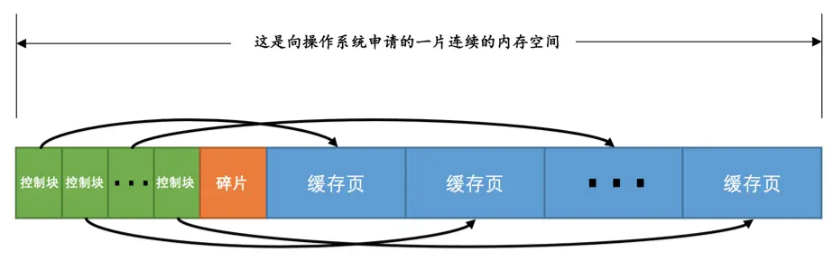

当控制块和缓存页充满了Buffer Pool的时候，有一部分占不满的空间就是碎片

当内存充足时，可以配置多个Buffer Pool，会提升系统的并发处理能力（单个Buffer Pool中的各种操作都需要加锁）

Buffer Pool的缓存页除了用来缓存磁盘上的页面以外，还可以存储锁信息、自适应哈希索引等信息

可以使用下列语句来查看Buffer Pool的状态信息：

~~~
SHOW ENGINE INNODB STATUS\G
~~~

## 页面分配

当磁盘页被缓存到Buffer Pool中，需要找到一个空闲的缓存页，然后将磁盘页保存到该缓存页中，为了方面的进行页面分配，把所有空闲的缓存页对应的控制块作为一个节点放到一个链表中，多个控制块就构成了一条链表，这个链表就是free链表：

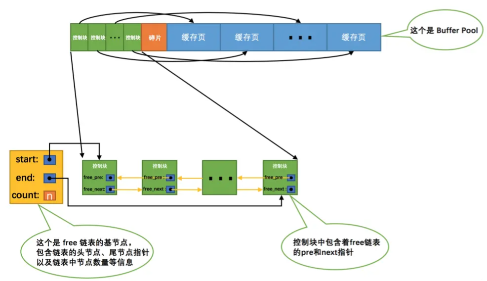

刚刚完成初始化时的Buffer Pool中，所有页面都是空闲的，此时free链表就包含了所有的缓存页

为了方便的找到free链表，为链表定义了一个基节点，它包含了链表的头节点、尾节点和链表的节点数。

每次进行缓存页分配时，就从free链表中取一个空闲的缓存页，然后初始化对应的控制块，将缓存页从free链表中移除，代表该页已经被使用了

## 页面查找

如果页面已经在Buffer Pool中了，需要访问该页时就不会从磁盘加载了，而是直接读内存。

为了快速找到缓存页，为页信息和缓存页地址之间维护了一个哈希表，表空间号 + 页号作为key，缓存页地址作为value

在需要访问某个页的数据时，先从哈希表中根据表空间号 + 页号看看有没有对应的缓存页，如果有，直接使用该缓存页就好，如果没有，那就从free链表中选一个空闲的缓存页，然后把磁盘中对应的页加载到该缓存页的位置。

## 页面置换

当需要缓存的页占用的内存大小超过Buffer Pool时，就需要将一些页从Buffer Pool中移除，然后再将新的页加载进来。

评价页面置换算法的维度是，尽可能大的缓存命中率。为此，MySQL维护了一个由控制块组成的LRU链表，每次新加载到内存时，或者访问该页时，就将该页移动到LRU链表的头部。每次需要淘汰时，就优先淘汰那些在LRU尾部的页面。

但使用这种原生的LRU算法，并不能达到最大的缓存命中率，因为MySQL存在下面两种场景：

* 预读取（InnoDB）：存储引擎会把它认为即将访问的页面预先加载进Buffer Pool 中。又可以细分为线性预读和随机预读：
  * 线性预读：顺序访问了某个区的页面超过了阈值，就会触发异步将下一个区的页面全部加载到Buffer Pool，这个值通过系统变量innodb_read_ahead_threshold 来控制，默认是56
  * 随机预读：如果Buffer Pool中已经缓存了某个区的13个连续的页面（同时要求页处于young区），不论这些页面是不是顺序读取的，都会触发一次异步读取本区中所有其的页面到Buffer Pool，如果系统变量innodb_random_read_ahead 是OFF就不会触发随机预读，默认是OFF
* 全表扫描：一次全表扫描就会加载该表所有的页到内存中

在这种一次大量加载的动作下，如果LRU使用的是简单算法，则整个Buffer Pool中那些常用的页面都会被淘汰，所以设计者把LRU链表按照一定比例分为两个部分：

* 一部分存储使用频率非常高的缓存页，所以这一部分链表也叫做热数据，或者称young区域
* 另一部分存储使用频率不是很高的缓存页，所以这一部分链表也叫做冷数据，或者称old区域

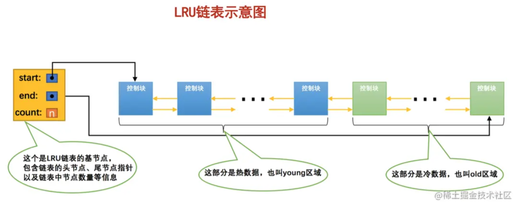

系统变量innodb_old_blocks_pct 的值决定了这个比例，默认是old区域占37%

改造后的LRU链表：

* 初次加载该页时，将页面放到old区域的头部，这样只加载一次却不会进行后续访问的页只会影响old区
* 在old区的页面，需要记录它的访问时间，如果访问时间间隔大于某个值时，才将其从old区移动到young区，这个时间间隔由系统变量innodb_old_blocks_time 控制，默认是1000，也就是1s。全表扫描时，不仅会加载要读取的页，还会预读把下一个区的页也加载进来，等待访问到下一个区的记录时，就有可能将其从old移动到young，为了避免预读后第一次使用就移动到young，才设计了这个时间间隔的机制

为了减少操作young区域链表的次数，还设计了一个机制：只有被访问的缓存页位于young区域的后1/4时，才会被移动到LRU链表的头部

## 刷新脏页

如果我们修改了Buffer Pool中某个缓存页的数据，那它就和磁盘上的页不一致了，这样的缓存页也被称为脏页。如果每次产生脏页都要立即同步到磁盘，会影响程序的性能，所以每次修改脏页后，不会立即同步到磁盘，而是在未来某个时间点进行同步

为了标记脏页，就引入了一个存储脏页页面控制块的链表，被称为flush链表：


刷新脏页到磁盘的方式：

* BUF_FLUSH_LRU：后台线程定时从LRU链表的尾部扫描一定数量的页面，如果发现脏页则刷新到磁盘
* BUF_FLUSH_LIST ：后台线程定时从flush链表中刷新一部分页面到磁盘，刷新的速率取决于当时系统是不是很繁忙 
* BUF_FLUSH_SINGLE_PAGE ：当后台线程刷新脏页的速度比较慢，有可能新加载磁盘页的时候，就发现没有可用的缓存页，准备释放一个页面时，又会发现没有可释放的未修改页面，此时会从LRU链表尾部的一个脏页同步刷新到磁盘，然后再分配页面
* 系统特别繁忙时，有时用户线程也会批量从flush链表刷新脏页

## 运行中调整

在MySQL 5.7.5之前，Buffer Pool的大小只能在服务器启动时通过配置innodb_buffer_pool_size启动参数来调整大小，在服务器运行过程中是不允许调整该值的。在5.7.5之后支持服务器运行过程中调整Buffer Pool的大小。

这是因为Buffer Pool的设计不再是一个pool对应一片连续的存储空间，而是以chunk为单位申请空间，一个Buffer Pool实例其实是由若干个chunk组成的，一个chunk就代表一片连续的内存空间，里边儿包含了若干缓存页与其对应的控制块：

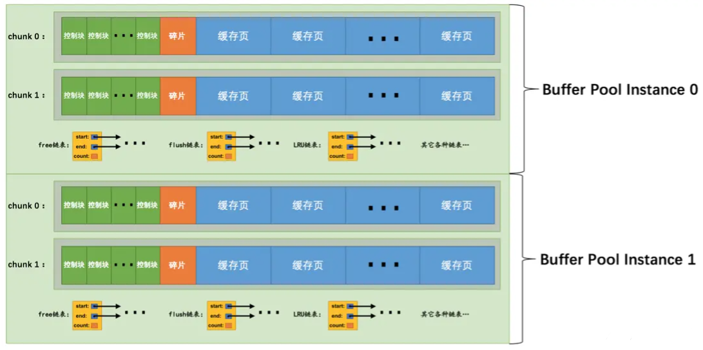

上图代表的Buffer Pool就是由2个实例组成的，每个实例中又包含2个chunk

正是因为发明了这个chunk的概念，我们在服务器运行期间调整Buffer Pool的大小时就是以chunk为单位增加或者删除内存空间，而不需要重新向操作系统申请一片大的内存，然后进行缓存页的复制

# 事务

## 事务的状态

事务根据操作的不同阶段将事务分成了下列状态：

* 活动的（active） ：事务正在执行过程中
* 部分提交的（partially committed） ：当事务中的最后一个操作执行完成，但由于操作都在内存中执行，所造成的影响并没有刷新到磁盘时 
* 失败的（failed） ：当事务在上面两种状态下，可能遇到某种错误，如自身的错误，系统错误或者断电，造成事务无法执行
* 中止的（aborted） ：事务失败后，通过回滚恢复到了执行事务前的状态，这就是中止状态
* 提交的（committed） ：事务的修改数据都从内存同步到了磁盘上

事务的状态转换：

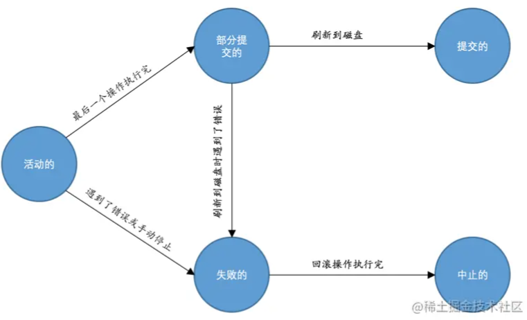

只有当事务处于提交的或者中止的状态时，一个事务的生命周期才算是结束了 

## 事务的使用

目前只有InnoDB和NDB存储引擎支持事务，如果在同一个事务中操作了其他存储引擎的表，那么该表是不能回滚的，其他支持事务的表可以回滚

### 开启事务

开启事务的命令：

~~~
BEGIN;
或
START TRANSACTION;
~~~

START TRANSACTION 后面可以跟着修饰符，几种修饰符：

* READ ONLY ：标识当前事务是一个只读事务 （只读事务不能修改数据，但是可以对临时表增删改）
* READ WRITE ：标识当前事务是一个读写事务 
* WITH CONSISTENT SNAPSHOT ：启动一致性读 

如开启一个读写事务和一致性读 ：

~~~
START TRANSACTION READ WRITE, WITH CONSISTENT SNAPSHOT
~~~

### 提交和中止

提交事务：

~~~
COMMIT;
~~~

手动中止事务：

~~~
ROLLBACK;
~~~

ROLLBACK语句是我们程序员手动的去回滚事务时才去使用的，如果事务在执行过程中遇到了某些错误而无法继续执行的话，事务自身会自动的回滚

MySQL中的系统变量autocommit 默认值是ON，也就是说默认情况下每条事务都算一个独立的事务，这就是事务的自动提交。

想禁止自动提交，要么手动开启事务，要么将该变量设置为OFF，这样写入的多条语句就算是属于同一个事务了 ，直到显式提交或回滚才会起作用

除了显式提交以外，还可以隐式提交，输入某些特殊的语句可以直接触发事务提交，会导致事务隐式提交的语句包括 ：DDL、alter、create、drop、开启另一个事务、复制的语句（如START SLAVE）、表分析等

### 保存点

事务对应的数据库语句中打几个点 ，指定回滚时就可以指定回滚到哪个位置，而不必回滚到最初：

~~~
BEGIN;
SAVEPOINT s1;
...
ROLLBACK TO s1;
~~~

## redo日志

### 概念

对数据库数据的更改其实就是对页的更改，对页的修改动作一开始是在内存中的，如果只是在内存中的Buffer Pool 中更改了页面，假设在事务提交后突然发生了某个故障，导致内存中的数据都失效了，那么这个已经提交了的事务对数据库中所做的更改也就跟着丢失了

为了保证持久性，一个简单的做法是在事务提交完成之前把该事务所修改的所有页面都刷新到磁盘，但这样有两个弊端：

* 有时仅修改了页的一个字节，也需要以页为单位刷新到磁盘
* 一个事务可能修改很多不连续的页，把这些页刷新到磁盘会造成很多随机IO

所以就出现了redo日志，它记录了对页面的修改动作，每次事务提交时，都会将redo日志刷新到磁盘，即使之后系统崩溃了，后续重启后也可以按照日志内容恢复已经更新的数据，相比刷新脏页到磁盘，只刷新redo日志的好处有：占用空间很小、顺序写入（在执行事务的过程中，每执行一条语句，就可能产生若干条redo日志，这些日志是按照产生的顺序写入磁盘的）

###redo日志格式

redo日志本质上只是记录了一下事务对数据库做了哪些修改，redo日志的通用格式：


各部分的含义：

* type：redo日志的类型
* space ID 和page number ：表空间ID和页号
* data：该条日志的具体内容

在SYS页面中，有一个部分是Max Row ID ，它是默认主键row_id的最大值，每次生成row_id时都从这里取。其实这里它一开始是存在内存中的，服务器会在内存中维护一个全局变量 ，每次向包含row_id列的表中插入一条记录时，该变量就会自增1。每当这个变量的值为256的倍数时，就会将该变量的值刷新到系统表空间的SYS页面中。当系统启动时，会将上边提到的Max Row ID属性加载到内存中，将该值加上256之后赋值给我们前边提到的全局变量（因为在上次关机时该全局变量的值可能大于Max Row ID属性值）。通过这样的设计，既能保证高性能，又能保证高可靠性。

上面这个流程中，当变量的值为256的倍数时，一个插入动作可能触发SYS页面的更新，这个更新SYS的动作就是一种最简单的redo日志，因为它只修改了一个页面中一个位置的几个字节，这种及其简单的redo日志又被称为物理日志

更多的redo日志是比较复杂的，通常来说一个插入动作可能触发多个页的更新，比如多个索引树、页分裂、增加目录项纪录、更新槽信息、更新Page Header中的各种页面统计信息等等，这些每个小的操作是不可分割的，一个更新动作可能出现几十条redo日志，这些日志类型各异，有涉及操作类型的，如创建型日志、删除型日志，还可以根据行格式来细分

一条redo日志既包含物理层面，又包含逻辑层面：

* 物理层面看，这些日志都指明了对哪个表空间的哪个页进行了修改 
* 逻辑层面看 ，redo日志中并没有直接记载着这些页应该改成什么样的数据，而是记录了操作的过程，一系列函数，执行完这些函数后才可以将页面恢复成系统崩溃前的样子 

### Mini-Transaction 

一个更新动作可能出现几十条redo日志，恢复时，不可能恢复其中几个，而其余的不恢复，比如页分裂、页新增、更新槽信息、更新Page Header中的各种页面统计信息这几个应该一起进行，不能只操作一部分，否则恢复时会损害数据的一致性。所以需要这些redo日志以组的形式来记录，崩溃恢复时，也需要以组的形式来恢复。

为了恢复redo日志时按组的形式恢复，特别设计了一种特殊的redo日志，它类型名称为MLOG_MULTI_REC_END，它日志格式只有一个type字段，所以某个需要保证原子性的操作产生的一系列redo日志必须要以一个类型为MLOG_MULTI_REC_END结尾，就像这样：

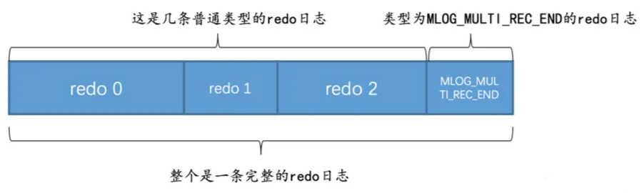

这样在系统崩溃重启进行恢复时，只有当解析到类型为MLOG_MULTI_REC_END的redo日志，才认为解析到了一组完整的redo日志，才会进行恢复。否则的话直接放弃前边解析到的redo日志

有时，一条redo日志就是一个最小的原子操作，为了防止空间浪费，这条日志也被设计为特殊的类型，它自己就代表一个最小原子操作

这种对底层页面中的一次原子访问的过程称之为一个Mini-Transaction，简称mtr。一个所谓的mtr可以包含一组redo日志，在进行崩溃恢复时这一组redo日志作为一个不可分割的整体。一个事务可以包含若干条语句，每一条语句其实是由若干个mtr组成，每一个mtr又可以包含若干条redo日志：

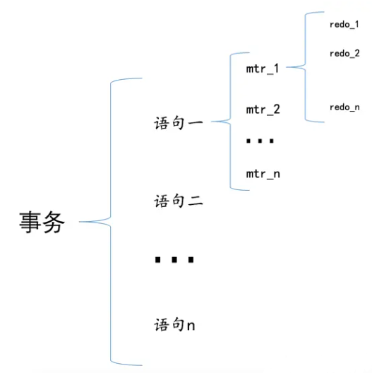

### block和缓冲区

用来存储redo日志的页被称为block，一个redo log block的示意图：

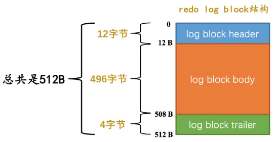

log block header 包含一些管理信息，比如block号、已经使用的字节、第一个mtr生成的redo日志记录组的偏移量、checkpoint的序号

log block trailer 用于校验正确性，真正的redo日志都是存储到log block body中的

写入redo日志同样要遵循先写到缓冲区，后写到磁盘上的规律，这个缓冲区就被称为redo log buffer，它由内存中多个连续的block组成，可以通过启动参数调整它的大小。一个全局变量buf_free代表redo日志已经写入的位置。

向log buffer中写入数据的单位是mtr，且是顺序写入的，因为一个事务可以包含多个mtr，所以相邻的mtr可能属于不同事务：

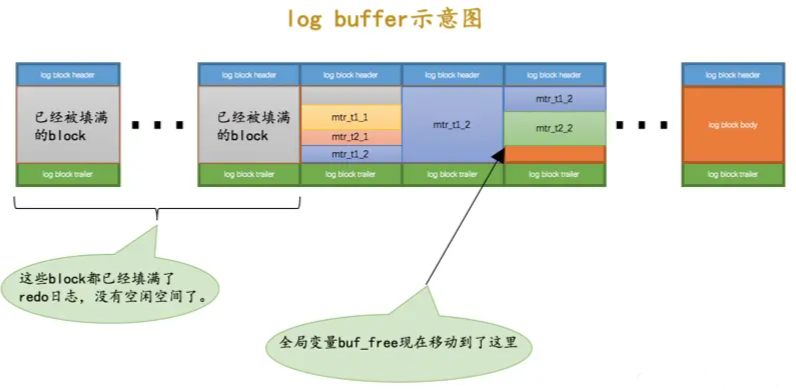

### redo日志刷盘时机

redo日志首先被写入缓冲区，然后再刷新到磁盘上，刷新磁盘的时机：

* log buffer空间不足时：当写入量已经占满了大约一半时，就会吧日志刷新到磁盘
* 事务提交时，会将修改页面对应的redo日志刷新到磁盘，这是数据库持久性的重要保证
* 将某个脏页刷新到磁盘前，会保证先将该脏页对应的 redo 日志刷新到磁盘中 
* 后台线程以几秒一次的频率刷新
* 正常关闭服务器时
* checkpoint时

因为redo日志是顺序保存的，所以如果要把某个日志刷新到磁盘，该日志前的所有日志也会被刷新

### 日志文件

MySQL的数据目录（使用SHOW VARIABLES LIKE 'datadir'查看）下默认有两个名为ib_logfile0和ib_logfile1的文件，log buffer中的日志默认情况下就是刷新到这两个磁盘文件中，可以修改日志目录、日志文件大小、日志文件个数

磁盘上的redo日志文件不只一个，而是以一个日志文件组的形式出现的，写入日志时以顺序的方式写入，写满了再从头开始：

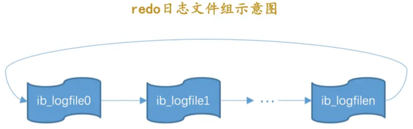

redo日志文件其实也是由若干个512字节大小的block组成。

redo日志文件组中的每个文件大小都一样，格式也一样，都是由两部分组成：

* 前2048个字节，也就是前4个block是用来存储一些管理信息的。
* 从第2048字节往后是用来存储log buffer中的block镜像的。

所以前面的循环记录redo文件，其实是从真正存储redo日志的位置循环记录的：

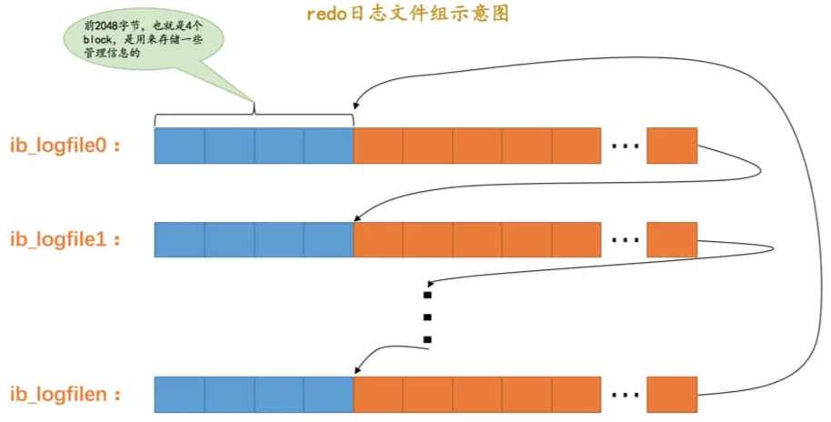

### LSN

自系统开始运行，就不断的在修改页面，也就意味着会不断的生成redo日志。redo日志的量在不断的递增，为描述已经写入的redo日志量，设计了一个名为Log Sequence Number的全局变量，也叫日志序列号，LSN

向log buffer写入redo日志的过程中，LSN会不断增长。每一组由mtr生成的redo日志都有一个唯一的LSN值与其对应，LSN值越小，说明redo日志产生的越早 。

在一个block中时，LSN的增长就是写入redo日志的长度，当涉及到其他block时，LSN的增长还需要算上log block header和log block trailer的字节数：

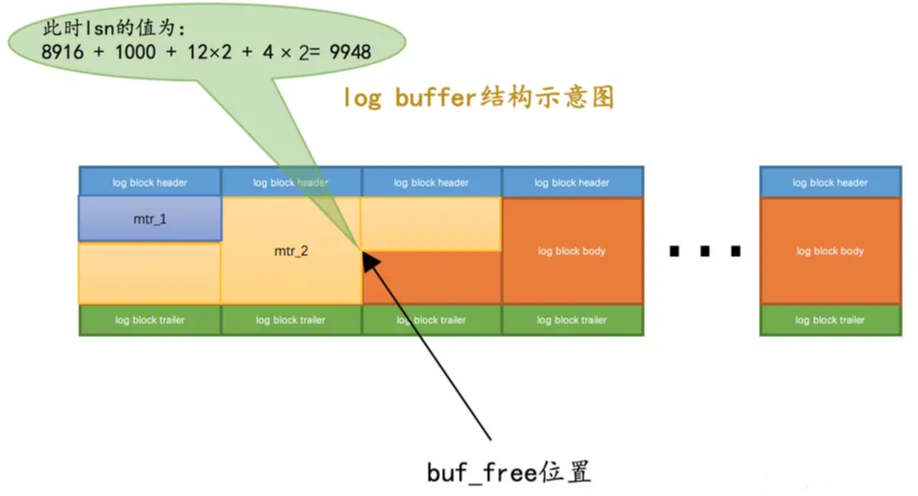

为了描述有多少log buffer 中的数据刷到磁盘上，还有一个名为buf_next_to_write 的全局变量，它标记log buffer中哪些日志被刷到磁盘了：

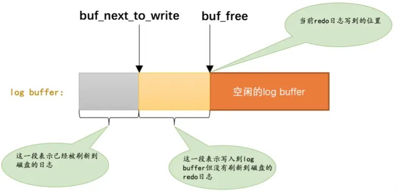

与它相对的还有一个全局变量，代表总的刷新到磁盘上的redo日志量，叫flushed_to_disk_lsn 。系统第一次启动时，该变量的值和初始的lsn值是相同的，都是8704。随着系统的运行，redo日志被不断写入log buffer，但是并不会立即刷新到磁盘，lsn的值就和flushed_to_disk_lsn的值拉开了差距。随后不断有redo日志写入磁盘，flushed_to_disk_lsn的值也跟着增长。如果两者的值相同时，说明log buffer中的所有redo日志都已经刷新到磁盘中了

刷到磁盘一般分为两步，第一步写入操作系统的缓冲区，第二步才是写入磁盘，第一个写入的进度被称为write_lsn ，第二个才是flushed_to_disk_lsn

可以用下面的语句来查看引擎中各种LSN的情况：

~~~
SHOW ENGINE INNODB STATUS\G
~~~

### flush链表中的LSN

mtr除了会产生一组redo日志，还会在结束的时候把mtr修改过的页面加入到Buffer Pool的flush链表。

当第一次修改某个缓存在Buffer Pool中的页面时，就会把这个页面对应的控制块插入到flush链表的头部，之后再修改该页面时由于它已经在flush链表中了，就不再次插入了。也就是说flush链表中的脏页是按照页面的第一次修改时间从大到小进行排序的。

控制块中有两个信息和LSN相关：

* oldest_modification：如果某个页面被加载到Buffer Pool后进行第一次修改，那么就将修改该页面的mtr开始时对应的lsn值写入这个属性。
* newest_modification：每修改一次页面，都会将修改该页面的mtr结束时对应的lsn值写入这个属性。也就是说该属性表示页面最近一次修改后对应的系统lsn值


### checkpoint

redo日志文件组容量是有限的，我们不得不选择循环使用redo日志文件组中的文件，但是这会造成最后写的redo日志与最开始写的redo日志追尾

当发生这种场景时，就需要考虑哪些redo日志是没用的，可以被覆盖的。因为redo日志是为了系统崩溃后恢复脏页用的，如果对应的脏页已经刷新到了磁盘，该日志也就没有存在的必要了，占用的磁盘空间就可以被后续的redo日志重用。

一个名为checkpoint_lsn 的全局变量代表当前系统中可以被覆盖的redo日志总量是多少。当页a被刷新到了磁盘，mtr_1生成的redo日志就可以被覆盖了，所以我们可以进行一个增加checkpoint_lsn的操作，我们把这个过程称之为做一次checkpoint，主要分为两步：

* 计算checkpoint_lsn的值，checkpoint_lsn的值就等于flush链表中最早的那个oldest_modification 值，凡是redo日志的LSN小于该值的日志都是可以被覆盖掉的，以flush链表的头部为分水岭
* 将checkpoint_lsn和对应的redo日志文件组偏移量以及此次checkpint的编号写到redo日志文件的管理信息（就是checkpoint1或者checkpoint2）中，包括checkpoint_no （系统做了多少次checkpoint）、checkpoint_offset 等

当系统修改页面的操作非常频繁时，后台刷新脏页的速度跟不上，系统无法及时做checkpoint，此时用户线程会同步的从flush链表中把那些最早修改的脏页（oldest_modification最小的脏页）刷新到磁盘，然后再做checkpoint

### 持久性的级别

为了保证事务的持久性，用户线程在事务提交时需要将该事务执行过程中产生的所有redo日志都刷新到磁盘上。如果对性能要求较高，而对持久性要求不强的话，可以修改一个名为innodb_flush_log_at_trx_commit 的系统变量，调整持久性的级别，可选的值：

* 0：表示在事务提交时不立即向磁盘中同步redo日志，这个任务是交给后台线程做的。这样会明显加快处理速度，但持久性很低
* 1：表示事务提交时需要将redo日志同步到磁盘，它可以保证持久性，也是默认值
* 2：表示在事务提交时需要将redo日志写到操作系统的缓冲区中，但并不需要保证将日志真正的刷新到磁盘。它可以应对数据库挂了的情况，因为此时数据还存在操作系统的缓冲区，但应对不了操作系统也挂了的情况

### 崩溃恢复

当崩溃时，可以在重启时根据redo日志来将数据恢复到崩溃前的状态。

首先先确定恢复的起点，是从checkpoint_lsn开始读取redo日志来恢复页面。redo日志文件组的每个文件都管理了checkpoint的信息，为了确定谁存的是最新的checkpoint信息，会取每个文件中checkpoint_no 的最大的，再取到它的checkpoint_lsn，计算对应的checkpoint_offset 

然后确定恢复的终点，因为redo日志是连续存储的，所以只需要找到block中那个没有被填满的block即可作为终点

恢复redo日志时，虽然它们是连续存储的，但它们修改的页面并不是连续的，所以在恢复前会将redo日志的space ID和page number属性计算出散列值，把space ID和page number相同的redo日志放到哈希表的同一个槽里，如果有多个space ID和page number都相同的redo日志，那么它们之间使用链表连接起来，按照生成的先后顺序链接起来的：

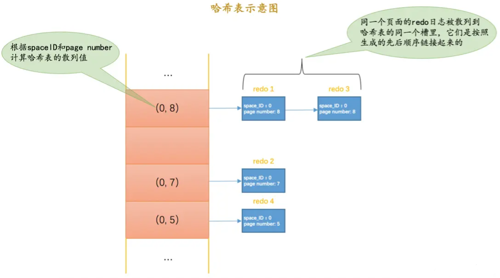

然后遍历哈希表来恢复，这样就能对页面进行顺序IO的修改了。

虽然checkpoint_lsn之前的redo日志对应的脏页确定都已经刷到磁盘了，但是checkpoint_lsn之后的redo日志我们不能确定是否已经刷到磁盘，主要是因为在最近做的一次checkpoint后，可能后台线程又不断的从LRU链表和flush链表中将一些脏页刷出Buffer Pool。为了确定到底页有没有被刷新到磁盘，每个页的File Header里有一个称之为FIL_PAGE_LSN的属性，该属性记载了最近一次修改页面时对应的lsn值（其实就是页面控制块中的newest_modification值），如果在做了某次checkpoint之后有脏页被刷新到磁盘中，那么该页对应的FIL_PAGE_LSN代表的lsn值肯定大于checkpoint_lsn的值，凡是符合这种情况的页面就不需要重复执行lsn值小于FIL_PAGE_LSN的redo日志了

## undo日志

### 概念

undo日志是为了回滚准备的日志，它记录了对数据库的修改情况，以便回滚时能回退到事务开始前的状态。查询不会生成undo日志。不同的undo日志格式不同。

和undo日志紧密相关的是行格式中的trx_id和roll_pointer两个字段：


trx_id是事务ID，就是某个对这个聚簇索引记录做改动的语句所在的事务对应的ID。并不是开启事务时就会给事务分配ID，而是当事务对表中记录做出改动时才会生成一个事务ID。事务ID本质上是一个数字，它的分配策略和我们前边提到的对隐藏列row_id的分配策略大抵相同，随着系统运行，最新的事务ID不断增长。

roll_pointer本质上就是指向记录对应的undo日志的一个指针，当有一条记录有改动时，它对应的改动就记录在roll_pointer指向的undo日志中，回滚时就可以方便的找到undo日志：

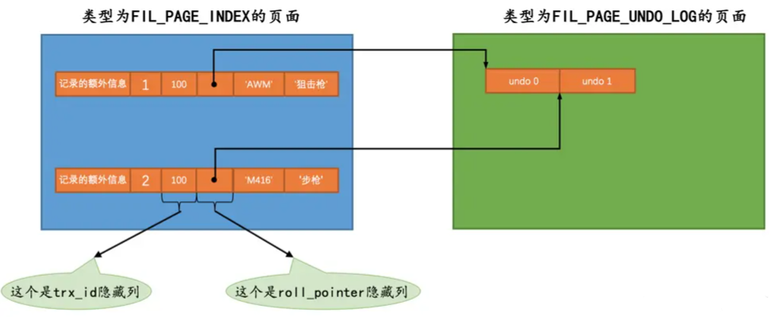

### INSERT对应的undo日志

当插入后进行回滚时，只需要吧对应记录给删除就好了，所以INSERT操作对应的undo日志主要就需要记录主键信息即可（具体是主键每个列大小和真实值），这种类型的日志叫TRX_UNDO_INSERT_REC：

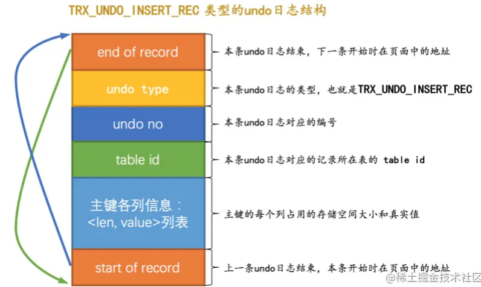

undo日志都会被保存到类型为FIL_PAGE_UNDO_LOG 的页面，每条undo日志都由行记录中的roll_pointer指向

### DELETE对应的undo日志

插入到页面中的记录会根据记录头信息中的next_record属性组成一个单向链表，我们把这个链表称之为正常记录链表。而被删除的记录，会根据记录头信息中的next_record 也组成一个链表，这个链表被称为垃圾链表。Page Header部分有一个称之为PAGE_FREE的属性，它指向由被删除记录组成的垃圾链表中的头节点：

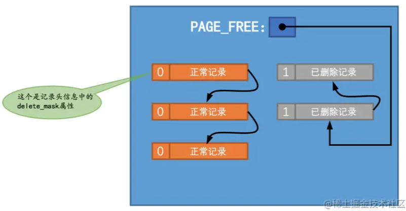

正常记录和被删除记录的区别就在于记录头信息中的delete_mask 标志位是0，被删后变成1.

用delete语句将一条记录删除的过程：

1、delete mark阶段：将记录的delete_mask标识位设置为1，其他的不做修改（其实会修改记录的trx_id、roll_pointer这些隐藏列的值）：

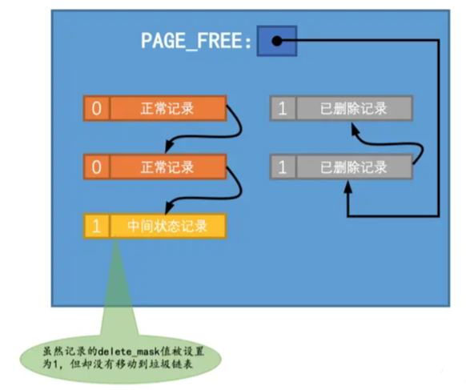

此时，正常记录链表中的记录delete_mask标志位被修改，但它并没有在垃圾链表中，此时记录处于一种中间状态，在删除事务提交之前，被删除的记录就会一直处于这种状态

2、purge阶段：删除事务提交后，会有专门的线程来吧真正的记录删除掉，删除就是把该记录从正常记录链表中移除，并且加入到垃圾链表中，然后还要调整一些页面的其他信息。该阶段结束后，这条记录就算是真正的被删除掉了。这条已删除记录占用的存储空间也可以被重新利用了 ：

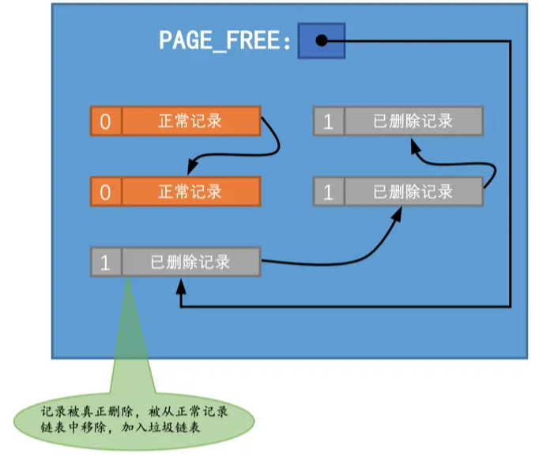

从上面的描述可以看出，删除语句所在的事务提交前，只会经历阶段1，所以只需考虑对删除操作的阶段1的影响进行回滚，删除操作对应的undo日志被称为TRX_UNDO_DEL_MARK_REC类型的undo日志：

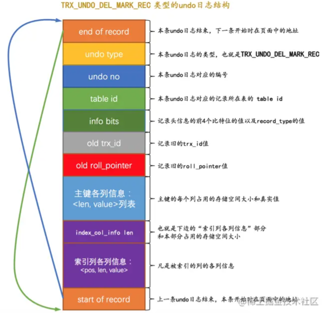

这种undo日志里面记录了旧的trx_id值和旧的roll_pointer值，这样可以通过undo日志找到删除前的undo日志。比如对于先插入后删除的场景，undo日志就形成了一条链表，这就是版本链：

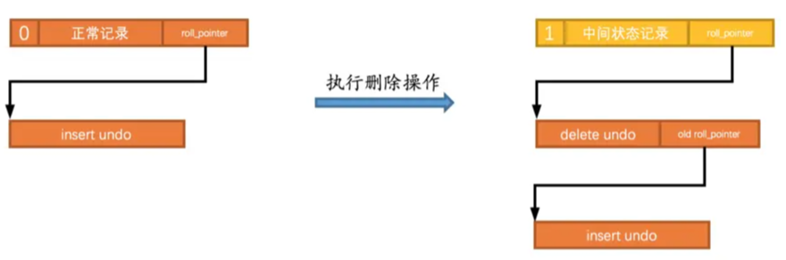

TRX_UNDO_DEL_MARK_REC的undo日志还多了一个索引列各列信息的内容，这部分信息主要是用在事务提交后，对该中间状态记录做真正删除的阶段二，也就是purge阶段中使用的

先插入后删除，对应的undo日志结构：

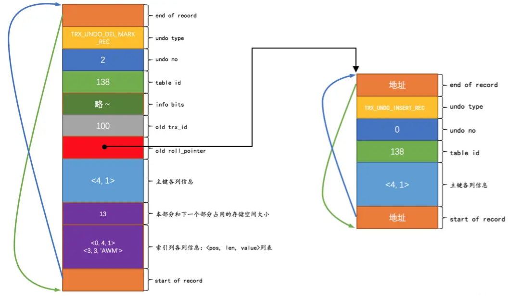

### UPDATE对应的undo日志

更新一条记录时，可以分为更新主键和不更新主键的情况：

其中不更新主键的情况，又可以分为被更新的列占用的存储空间不发生变化和发生变化的情况 ：

1、被更新的列占用的存储空间不发生变化 的情况，又叫原地更新in-place update ，它是直接在原记录的基础上修改对应列的值 

2、被更新的列占用的存储空间变化的情况，这种情况下，会先删掉旧记录，再插入新记录（这里面的删除就是真正的删除，不是delete mark，最终会将记录移动到垃圾链表中）

针对UPDATE不更新主键的情况（包括上面的原地更新和先删后增），设计了一种类型为TRX_UNDO_UPD_EXIST_REC的undo日志：

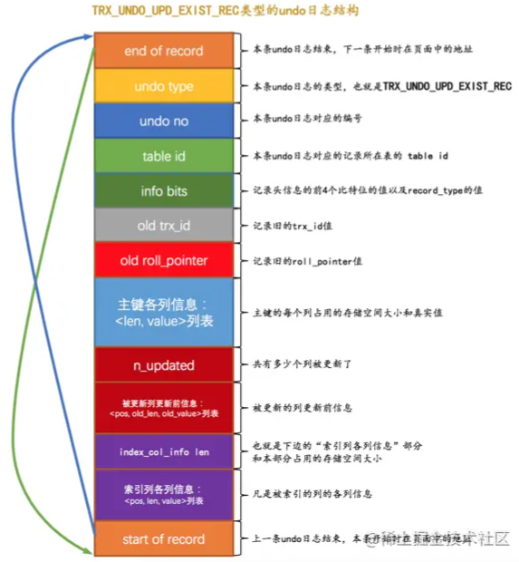

它也有旧的trx_id值和旧的roll_pointer值。被更新的数据主要是用下面几个部分体现的：

* n_updated ：表示本条UPDATE语句执行后将有几个列被更新
* 被更新列更新前信息
* 索引列各信息：当更新的列是索引列时会有这部分

针对UPDATE更新主键的情况，此时就不仅仅要更新记录的值了，还要调整记录在索引中的位置，此时的更新分为两步处理：

1、将旧记录进行delete mark。只有更新事务提交才会真正删除

2、根据更新后各列的值创建一条新记录，并将其插入到聚簇索引中 

此时会生成两条undo日志，先记录一条更新的TRX_UNDO_DEL_MARK_REC 的undo日志，后记录一条新增的TRX_UNDO_INSERT_REC 的undo日志

## FIL_PAGE_UNDO_LOG 页

有一种名为FIL_PAGE_UNDO_LOG 的页面，默认16KB，专门用于存放undo日志，它除了有File Header和File Trailer两种通用结构以外，还有很多部分：

### Undo Page Header 

Undo Page Header是FIL_PAGE_UNDO_LOG 页面的一个区域，它的结构：

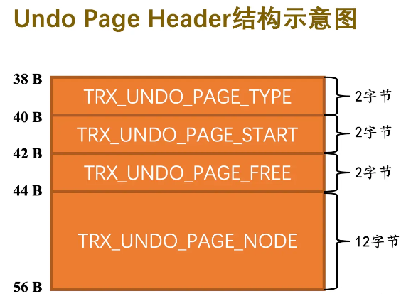

各属性的含义：

* TRX_UNDO_PAGE_TYPE ：代表本页面undo日志的类型。undo日志的类型可以分为两大类：

  * TRX_UNDO_INSERT ：类型为TRX_UNDO_INSERT_REC 的undo日志，一般由insert语句或者update更新主键时产生
  * TRX_UNDO_UPDATE ：其余类型的undo日志，一般由delete和update组成

  不同类型的undo日志是不能放到一个页面的。之所以页面要分为两大类，是因为插入类型的undo日志在事务提交后可以直接删掉，其他类型的undo日志还需要为MVCC服务，不能直接删除掉

* TRX_UNDO_PAGE_START ：页面第一条undo日志的位置

* TRX_UNDO_PAGE_FREE ：页面最后一条undo日志的位置

  两个字段的图示：

  

* TRX_UNDO_PAGE_NODE ：代表一个链表的节点，通过这个字段可以将多个undo页面连成链表

### undo页链表

一个事务可能包含多条语句，每条语句又会产生1条或2条undo日志，所以在一个事务中可能产生多个undo日志，这些日志一个页面可能放不下，此时就会放入多个undo页面，多个undo页面之间形成一个链表：

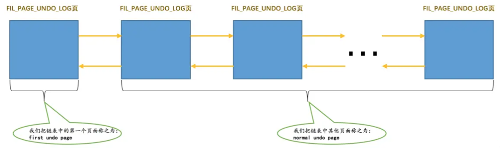

链表的第一个undo页面被称为first undo page ，其余的页面称为normal undo page 

在一个事务执行过程中，可能混着执行INSERT、DELETE、UPDATE语句，也就意味着会产生不同类型的undo日志，而不同的undo页面，只能存储不同的undo日志，所以可能在一个事务中需要2个undo页面的链表：


此外，InnoDB规定对普通表和临时表的记录改动时产生的undo日志要分别记录，所以一个事务中最多有4个以undo页面为节点的链表：

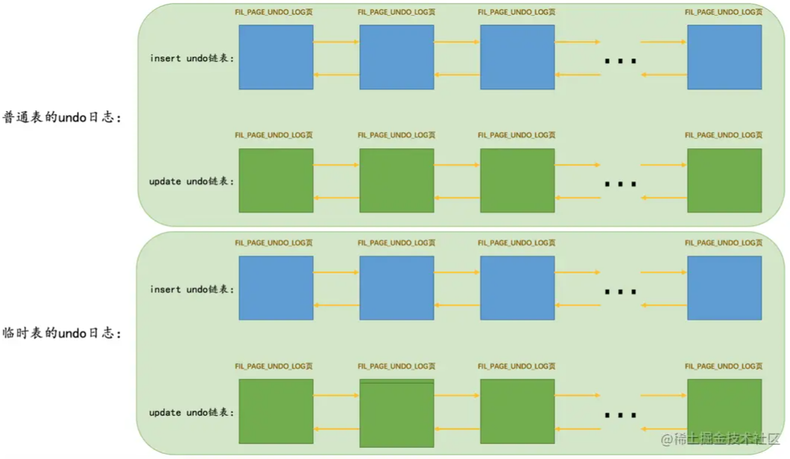

这些链表和页面在事务的执行过程中是动态按需分配的。

### Undo Log Segment Header 

每一个undo页面链表都对应一个段，称为Undo Log Segment ，链表中的页面都是从这个段里边申请的 ，为了在undo页记录段的信息，在undo链表中的第一个页面，也就是first undo page中设计了一个Undo Log Segment Header区域，该区域中包含了该链表对应的段的segment header信息（指向段的指针，即表空间Id+页号+INODE Entry的页内偏移量）以及其他的一些关于这个段的信息

它的结构：

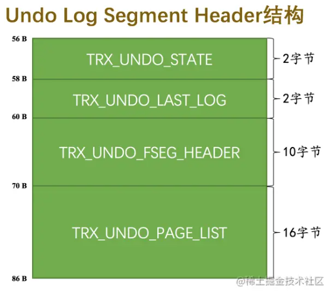

各属性：

* TRX_UNDO_ACTIVE ：本undo页链表的状态，状态一般有以下几种：
  * TRX_UNDO_ACTIVE ：活跃状态，一个活跃的事务正在往这个段里边写入undo日志
  * TRX_UNDO_CACHED ：被缓存的状态。处在该状态的Undo页面链表等待着之后被其他事务重用。
  * TRX_UNDO_TO_FREE ：对于insert undo链表来说，如果在它对应的事务提交之后，该链表不能被重用，那么就会处于这种状态
  * TRX_UNDO_TO_PURGE ：对于update undo链表来说，如果在它对应的事务提交之后，该链表不能被重用，那么就会处于这种状态
* TRX_UNDO_LAST_LOG ：本Undo页面链表中最后一个Undo Log Header的位置
* TRX_UNDO_FSEG_HEADER ：本Undo页面链表对应的段的Segment Header信息
* TRX_UNDO_PAGE_LIST ：Undo页面链表的基节点，这个基节点只存在于Undo页面链表的第一个页面

### Undo Log Header 

同一个事务向链表中写入的undo日志算一个组，每写入一组undo日志时，都会在这组日志前记录一下关于这个组的属性，记录这些属性的区域被称为Undo Log Header 。在first undo page写入undo日志前，会初始化这三个区域：Undo Page Header、Undo Log Segment Header、Undo Log Header。然后才会正式写入undo日志。在normal undo page 写入undo日志前，只会初始化Undo Page Header，用以组成undo链表：

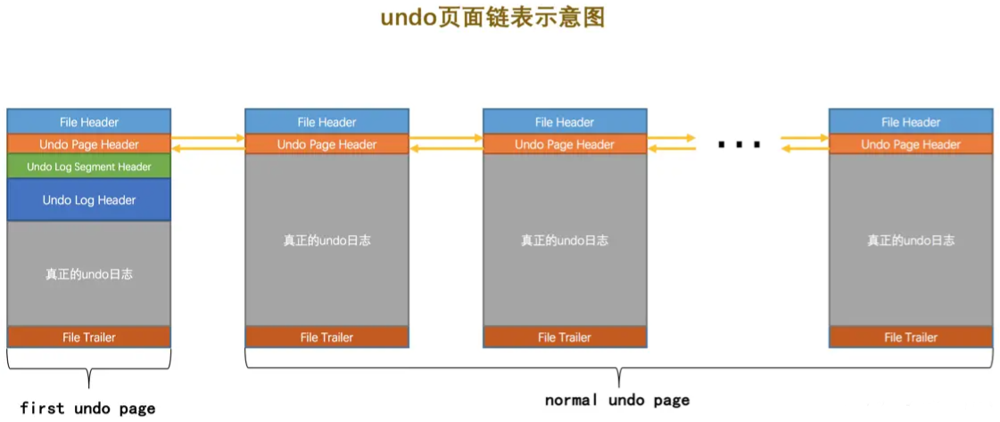

Undo Log Header的结构：


各属性：

* TRX_UNDO_TRX_ID ：生成本组undo日志的事务id
* TRX_UNDO_TRX_NO ：事务提交后生成的一个需要序号，使用此序号来标记事务的提交顺序（先提交的此序号小，后提交的此序号大）
* TRX_UNDO_DEL_MARKS ：标记本组undo日志中是否包含由于Delete mark操作产生的undo日志。
* TRX_UNDO_LOG_START ：表示本组undo日志中第一条undo日志的在页面中的偏移量
* TRX_UNDO_XID_EXISTS ：本组undo日志是否包含XID信息
* TRX_UNDO_DICT_TRANS ：标记本组undo日志是不是由DDL语句产生的
* TRX_UNDO_TABLE_ID ：如果TRX_UNDO_DICT_TRANS为真，那么本属性表示DDL语句操作的表的table id
* TRX_UNDO_NEXT_LOG 和TRX_UNDO_PREV_LOG ：下一组undo日志的偏移量、上一组undo日志的偏移量。一般来说一个Undo页面链表只存储一个事务执行过程中产生的一组undo日志 ，但在undo页重用时，就有可能存多组undo日志
* TRX_UNDO_HISTORY_NODE ：一个12字节的List Node结构，代表一个称之为History链表的节点

### 重用undo页面

为每个事物分配响应的undo页面链表是比较浪费的，大部分事务执行过程中可能只修改了一条或几条记录 ，针对某个Undo页面链表只产生了非常少的undo日志，这些undo日志可能只占用一丢丢存储空间，但却要占用一个页面。为了节省空间，减少页的分配，决定在事务提交后在某些情况下重用该事务的Undo页面链表。一个Undo页面链表是否可以被重用的条件：

* 该链表中只包含一个undo页面

  如果一个事务中产生了很多undo日志，申请了很多页加入了undo链表中，如果整个链表的页面都重用，那么新事务如果只产生几条undo日志，也必须维护这个链表，那些用不到的页面也不能被别的事务所使用，这样就造成了另一种浪费 

* 该Undo页面已经使用的空间小于整个页面空间的3/4

之前说过，Undo页面链表按照存储的undo日志所属的大类可以被分为insert undo链表和update undo链表两种，这两种链表在被重用时的策略也是不同的：

* insert undo链表 ：这种类型的undo日志在事务提交后就没用了，可以被清除掉。所以重用时可以直接把之前事务写入的一组undo日志覆盖掉，从头开始写入新事务的一组undo日志：

  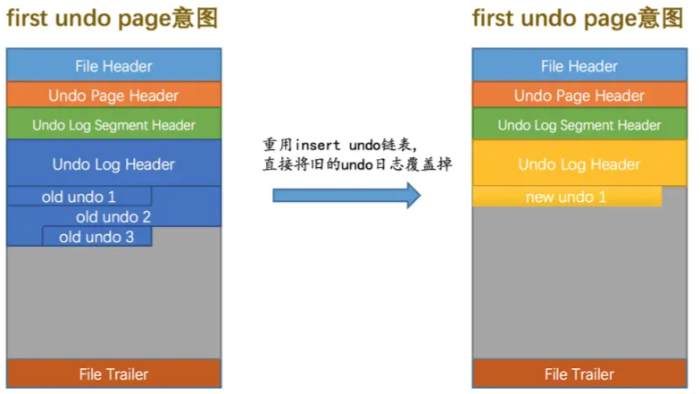

  日志覆盖的前提是此刻该页面已使用的空间小于整个页面大小的3/4 

* update undo链表 ：在一个事务提交后，它的update undo链表中的undo日志也不能立即删除掉（这些日志用于MVCC）。所以如果之后的事务想重用update undo链表时，就不能覆盖之前事务写入的undo日志。这样就相当于在同一个Undo页面中写入了多组的undo日志

  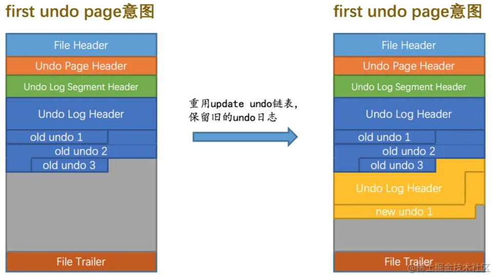

## 回滚段

### Rollback Segment Header 

为了管理多个undo页面链表，设计了一种Rollback Segment Header页面，在这个页面中存放了各个Undo页面链表的frist undo page的页号，他们把这些页号称之为undo slot。通过这个页就能找到它包含的多个undo页面链表了，这种页的结构：

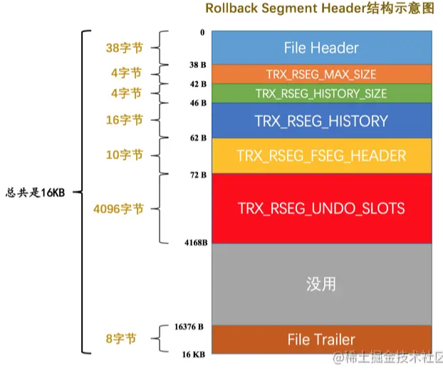

每一个Rollback Segment Header页面都对应着一个段，这个段就是Rollback Segment ，也就是回滚段。它也是段的一种，但和其他段不同的是，这个段里面只有一个页面。

各种属性含义：

* TRX_RSEG_MAX_SIZE ：本Rollback Segment中所有Undo页面链表中的Undo页面数量之和限制
* TRX_RSEG_HISTORY_SIZE ：History链表占用的页面数量
* TRX_RSEG_HISTORY ：History链表的基节点
* TRX_RSEG_FSEG_HEADER ：一个Segment Header 结构，可以通过它找到段对应的INODE Entry 
* TRX_RSEG_UNDO_SLOTS ：各个Undo页面链表的first undo page的页号集合，也就是undo slot集合

### 从回滚段中申请undo页链表

初始情况下，由于未向任何事务分配任何Undo页面链表，所以对于一个Rollback Segment Header页面来说，它的各个undo slot都被设置成了一个特殊的值：FIL_NULL（对应的十六进制就是0xFFFFFFFF），表示该undo slot不指向任何页面

随着时间的流逝，开始有事务需要分配Undo页面链表了，就从回滚段的第一个undo slot开始，看看该undo slot的值是不是FIL_NULL：

* 如果是FIL_NULL，则在表空间中创建一个段，也就是Undo Log Segment ，然后从段里申请一个页面作为undo页链表的first undo page ，然后把undo slot 的值设置为first undo page的页号，这就代表该undo slot 被分配给了这个事务
* 如果不是FIL_NULL，说明该undo slot已经指向了一个undo链表，也就是说这个undo slot已经被别的事务占用了，那就跳到下一个undo slot，判断该undo slot的值是不是FIL_NULL，重复上边的步骤

一个Rollback Segment Header页面中包含1024个undo slot，如果这1024个undo slot的值都不为FIL_NULL，这就意味着该页无法再分配新的事务了，可能会回滚该事务并给用户报错：（后面会讲到扩展）

~~~
Too many active concurrent transactions
~~~

当一个事务被提交时，它占用的undo slot 会进行以下判断处理：

* 如果该undo slot指向的Undo页面链表符合被重用的条件，那此时修改该slot和对应页面的状态为被缓存，被缓存的undo slot 会被加入一个链表，根据undo页面链表的类型不同分为insert undo cached链表和update undo cached链表

  后续当有新事物要分配undo slot时，会先从cached链表中寻找被缓存的slot，找不到才去回滚段进行寻找

* 如果该undo slot指向的Undo页面链表不符合被重用的条件，此时也会根据undo页面链表类型不同进行分别处理：

  * 如果是insert undo链表，则该链表状态更新为TRX_UNDO_TO_FREE ，之后链表对应的段被释放，将undo slot的值设置为FIL_NULL
  * 如果是update undo链表，则该链表状态TRX_UNDO_STATE 属性更新为TRX_UNDO_TO_PRUGE ，将undo slot的值设置为FIL_NULL，然后将本次事务写入的一组undo日志放到History链表中

### 多个回滚段

一个回滚段只有1024个undo slot，也就是说同时支持1024个事务并行，这个数量太小了，所以在InnoDB的系统表空间里面的第5号页面中的某个区域包含了指向128个Rollback Segment Header 的指针。总共可支持128 × 1024 = 131072 个undo slot：

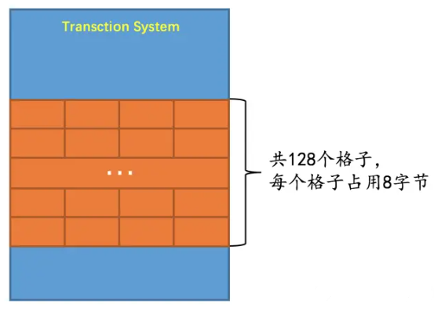

根据系统表的第5号页面，就可以找到128个Rollback Segment Header 页面地址，每个页面又包含1024个undo slot，每个undo slot都对应一个undo页面链表：

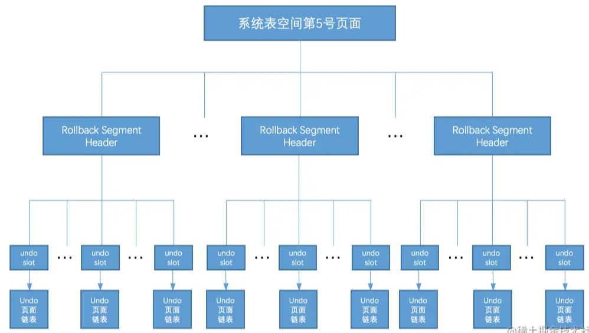

### 回滚段的分类

给这128个回滚段进行编号，最初的回滚段可被称为第0号回滚段，之后依次递增，直到第127号回滚段，这些回滚段被分为两大类：

* 第0号、第33～127号回滚段属于一类，这类属于普通表的记录做了改动需要分配undo页面时，对应的回滚段。其中第0号在系统表空间中，后面的既可以在系统表空间，又可以在自己配置的undo表空间中
* 第1～32号回滚段属于一类。这些回滚段必须在临时表空间（对应着数据目录中的ibtmp1文件）中。是事务过程中对临时表做了修改需要分配undo页面时，对应的回滚段

也就是说如果一个事务在执行过程中既对普通表的记录做了改动，又对临时表的记录做了改动，那么需要为这个记录分配2个回滚段，再分别到这两个回滚段中分配对应的undo slot

之所以区分两个回滚段，是因为undo页本身也是一种页，只要是页想写入磁盘之前，必须先记录对应的redo日志，而临时表的修改在系统重启时不需要恢复，也就不需要记录redo日志，所以临时表在事务中修改对应的undo页面所属的回滚段是特别的。

### 分配undo页汇总

事务执行过程中分配undo页面链表时的完整过程：

* 事务在执行过程中对普通表的记录首次做改动之前，首先会到系统表空间的第5号页面中分配一个回滚段（其实就是获取一个Rollback Segment Header页面的地址）。一旦某个回滚段被分配给了这个事务，那么之后该事务中再对普通表的记录做改动时，就不会重复分配了
* 在分配到回滚段后，首先看一下这个回滚段的两个cached链表有没有已经缓存了的undo slot，比如如果事务做的是INSERT操作，就去回滚段对应的insert undo cached链表中看看有没有缓存的undo slot；如果事务做的是DELETE操作，就去回滚段对应的update undo cached链表中看看有没有缓存的undo slot。如果有缓存的undo slot，那么就把这个缓存的undo slot分配给该事务
* 如果没有缓存的undo slot可供分配，那么就要到Rollback Segment Header页面中找一个可用的undo slot分配给当前事务。也就是顺序查找第一个未分配的undo slot，找到后就将undo slot分配给当前事务
* 找到可用的undo slot后，如果该undo slot是从cached链表中获取的，那么它对应的Undo Log Segment已经分配了，否则的话需要重新分配一个Undo Log Segment，然后从该Undo Log Segment中申请一个页面作为Undo页面链表的first undo page
* 把新生成的undo日志加入到undo页链表

### 配置回滚段数量

我们前边说系统中一共有128个回滚段，其实这只是默认值，我们可以通过启动参数innodb_rollback_segments来配置回滚段的数量，可配置的范围是1~128。但是这个参数并不会影响针对临时表的回滚段数量，针对临时表的回滚段数量一直是32。而分配给普通表的回滚段数量是该值减去32，最小是1

### 配置undo表空间

之前说过，针对第33~127号回滚段可以通过配置放到自定义的undo表空间中（但是这种配置只能在系统初始化（创建数据目录时）的时候使用，一旦初始化完成，之后就不能再次更改了 ）

设立undo表空间的一个好处就是在undo表空间中的文件大到一定程度时，可以自动的将该undo表空间截断（truncate）成一个小文件。而系统表空间的大小只能不断的增大，却不能截断

innodb_undo_directory 可以指定undo表空间锁在的目录，默认是数据目录

innodb_undo_tablespaces 可以定义undo表空间的数量，默认为0，代表不创建任何undo表空间

## 事务隔离级别

### 并发问题

1、脏写：一个事务修改了另一个未提交事务修改过的数据 

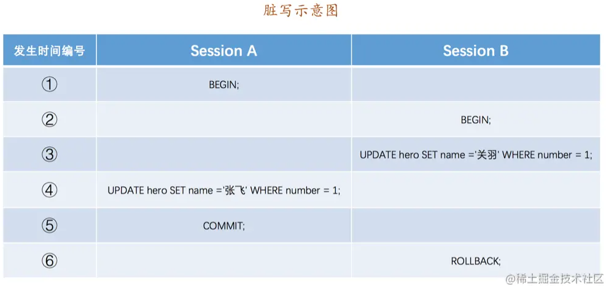

session B将内容修改后回滚了，回滚连带着把session A的修改也回滚掉了，这就导致session A提交了事务，但结果是什么也没有更新成功。

2、脏读：一个事务读到了另一个未提交事务修改过的数据 

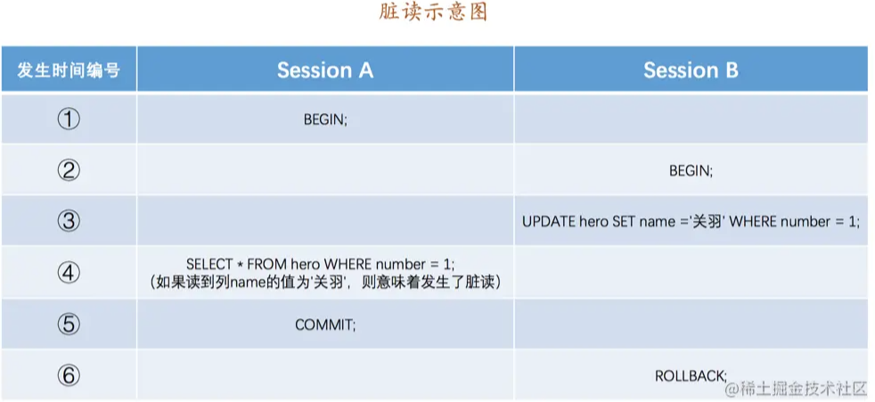

3、不可重复读：

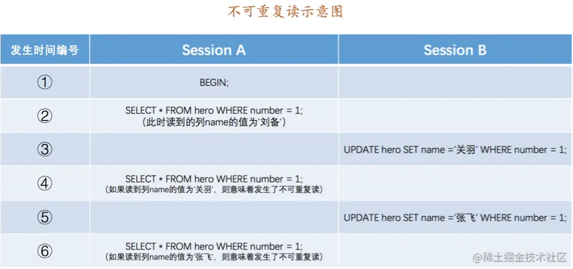

4、幻读

如果一个事务先根据某些条件查询出一些记录，之后另一个事务又向表中插入了符合这些条件的记录，原先的事务再次按照该条件查询时，能把另一个事务插入的记录也读出来（如果另一个事务是删除一部分记录呢？此时不叫幻读，幻读强调的是读到了之前没有读取到的记录，这应该是对每一条记录都发生了不可重复读的现象 ）

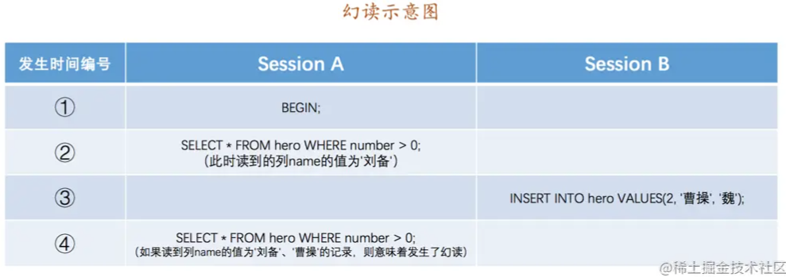

问题的严重程度：脏写 > 脏读 > 不可重复读 > 幻读 

### 四种隔离级别

隔离性：多个事务并发访问数据库时，应该互不影响，相互隔离

MySQL的默认隔离级别为REPEATABLE READ。

MySQL在REPEATABLE READ隔离级别下，是可以禁止幻读问题的发生的 

### 设置隔离级别

用下面的语句可以设置隔离级别：

~~~
SET [GLOBAL|SESSION] TRANSACTION ISOLATION LEVEL level;
~~~

level的可选值：

~~~
level: {
     REPEATABLE READ
   | READ COMMITTED
   | READ UNCOMMITTED
   | SERIALIZABLE
}
~~~

当使用GLOBAL关键字时，相当于在全局范围内影响，此时只对执行完该语句之后产生的会话起作用 ，对已经存在的会话无效

当使用SESSION关键字，相当于在会话范围内起作用，对当前会话有效，对之后的事务有效，不影响正在执行的事务

如果两个关键字都不用，则只会对下一个事务生效，且不能在事务执行中执行

如果想修改默认隔离级别，可以修改启动参数transaction-isolation 

查看会话默认的隔离级别：

~~~
mysql> SHOW VARIABLES LIKE 'transaction_isolation';
或者
mysql> SELECT @@transaction_isolation;
~~~

也可以通过设置系统变量transaction_isolation 的方式设置隔离级别

## MVCC原理

MVCC ：Multi-Version Concurrency Control ，多版本并发控制 

指的就是在使用READ COMMITTD、REPEATABLE READ这两种隔离级别的事务在执行普通的SELECT操作时访问记录的版本链的过程，这样子可以使不同事务的读-写、写-读操作并发执行，从而提升系统性能

### 版本链

在InnoDB 中，每个行数据中都有两个隐藏列：trx_id 和roll_pointer ：

* trx_id：每次一个事务对某条聚簇索引记录进行改动时，都会把该事务的事务id赋值给trx_id隐藏列。
* roll_pointer：每次对某条聚簇索引记录进行改动时，都会把旧的版本写入到undo日志中，然后这个隐藏列就相当于一个指针，可以通过它来找到该记录修改前的信息。

当多个事务并发对一条数据进行更新时，都会记录一条undo日志，每条undo日志也都有一个roll_pointer属性（INSERT操作对应的undo日志没有该属性，因为该记录并没有更早的版本），可以将这些undo日志都连起来，串成一个链：

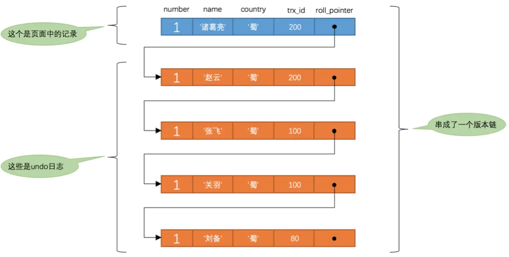

对该记录每次更新后，都会将旧值放到一条undo日志中，就算是该记录的一个旧版本，随着更新次数的增多，所有的版本都会被roll_pointer属性连接成一个链表，我们把这个链表称之为版本链，版本链的头节点就是当前记录最新的值。另外，每个版本中还包含生成该版本时对应的事务id

实际上insert undo只在事务回滚时起作用，当事务提交后，该类型的undo日志就没用了，它占用的Undo Log Segment也会被系统回收 ，后面画版本链的时候都不会画insert undo日志

### ReadView

不同并发问题的解决方案：

* 对于使用READ UNCOMMITTED隔离级别的事务来说，由于可以读到未提交事务修改过的记录，所以直接读取记录的最新版本就好了；
* 对于使用SERIALIZABLE隔离级别的事务来说，设计InnoDB的大叔规定使用加锁的方式来访问记录
* 在两个事务中交叉更新同一条记录就是脏写，InnoDB使用锁来保证不会有脏写情况的发生，也就是在第一个事务更新了某条记录后，就会给这条记录加锁，另一个事务再次更新时就需要等待第一个事务提交了，把锁释放之后才可以继续更新 
* 对于使用READ COMMITTED和REPEATABLE READ隔离级别的事务来说，关键就是使用ReadView结构来判断版本链中哪个版本是当前事务可见的

ReadView结构包含的几个重要的id：

* m_ids ：表示在生成ReadView时当前系统中活跃的读写事务的事务id列表
* min_trx_id ：表示在生成ReadView时当前系统中活跃的读写事务中最小的事务id，也就是m_ids中的最小值
* max_trx_id ：表示生成ReadView时系统中应该分配给下一个事务的id值（注意，它并不是m_ids中的最大值，因为有可能存在事务提交，导致最大的事务id增长，超越了目前活跃的事务id列表）
* creator_trx_id ：表示生成该ReadView的事务的事务id（只有在对表中记录做改动时才会分配事务id，只是查询的话不会分配，如果一个事务只是做了查询，那么它的事务id默认为0）

每次访问一条记录时，都会有对应当前状态的ReadView结构，读取记录时按版本链的顺序从新到旧访问，按照这样的原则进行：

* 如果被访问版本的trx_id属性值与ReadView中的creator_trx_id值相同，意味着当前事务在访问它自己修改过的记录，所以该版本可以被当前事务访问
* 如果被访问版本的trx_id属性值小于ReadView中的min_trx_id值，表明生成该版本的事务在当前事务生成ReadView前已经提交，所以该版本可以被当前事务访问。
* 如果被访问版本的trx_id属性值大于或等于ReadView中的max_trx_id值，表明生成该版本的事务在当前事务生成ReadView后才开启，所以该版本不可以被当前事务访问。
* 如果被访问版本的trx_id属性值在ReadView的min_trx_id和max_trx_id之间，那就需要判断一下trx_id属性值是不是在m_ids列表中，如果在，说明创建ReadView时生成该版本的事务还是活跃的，该版本不可以被访问；如果不在，说明创建ReadView时生成该版本的事务已经被提交，该版本可以被访问

如果某个版本的数据对当前事务不可见的话，那就顺着版本链找到下一个版本的数据，继续按照上边的步骤判断可见性，依此类推，直到版本链中的最后一个版本。如果最后一个版本也不可见的话，那么就意味着该条记录对该事务完全不可见，查询结果就不包含该记录 

### 生成时机

在MySQL中，READ COMMITTED和REPEATABLE READ隔离级别的的一个非常大的区别就是它们生成ReadView的时机不同：

* 对于READ COMMITTED级别：每次读取数据前都生成一个ReadView。这样因为每次ReadView都是最新的，它能获取到最新的事务活跃列表，保证能读到已经被其他事务提交的记录
* 对于REPEATABLE READ 级别：在事务第一次读取数据时生成一个ReadView，这样ReadView的活跃列表只会记录事务开始时的，即使在执行期间它们产生了事务提交，由于活跃事务列表不更新，读取的时候也就读取不到它们的值，在事务执行期间多次重复读取一条记录只能读到唯一的结果，实现了可重复读

前面提到过，删除记录时并不会立即将它删除加入垃圾链表，而是只打上一个删除标记，后续有专门的purge线程来将它删除。这就是为了MVCC服务的，可以让记录被删除后，可重复读的事务仍然可以短暂的读到这条记录。

purge线程的执行时机：确定系统中最早的事务不会访问被删除的记录后，才会真正将记录删除掉

# 锁

## 锁的概念

1、为了解决多事务并发修改同一条记录的问题（脏写），未提交事务相继对一条记录做改动时，需要让它们排队执行，这个排队的过程就是用锁实现的。

在事务开始时，会为记录在内存中生成一个锁结构：


在锁结构中两个重要的信息：

* trx信息 ：代表这个锁结构是哪个事务生成的。 
* is_waiting ：代表当前事务是否在等待 

如图所示，当事务T1改动了这条记录后，就生成了一个锁结构与该记录关联，因为之前没有别的事务为这条记录加锁，所以is_waiting属性就是false，我们把这个场景就称之为获取锁成功，或者加锁成功，然后就可以继续执行操作了

在事务T1提交之前，另一个事务T2也想对该记录做改动，那么先去看看有没有锁结构与这条记录关联，发现有一个锁结构与之关联后，然后也生成了一个锁结构与这条记录关联，不过锁结构的is_waiting属性值为true，表示当前事务需要等待，我们把这个场景就称之为获取锁失败，或者加锁失败：


在事务T1提交之后，就会把该事务生成的锁结构释放掉，然后看看还有没有别的事务在等待获取锁，发现了事务T2还在等待获取锁，所以把事务T2对应的锁结构的is_waiting属性设置为false，然后把该事务对应的线程唤醒，让它继续执行

2、为了应对多事务同时读写一条记录的情况，也就是一个事务进行读取操作，另一个进行改动操作 。为了解决脏读等问题，我们可以用下列方案：

* 读操作利用多版本并发控制（MVCC），写操作进行加锁
* 读、写操作都采用加锁的方式：这种是为了解决特殊业务场景的，如在银行存款的事务中，你需要先把账户的余额读出来，然后将其加上本次存款的数额，最后再写到数据库中。在将账户余额读取出来后，就不想让别的事务再访问该余额，直到本次存款事务执行完成，其他事务才可以访问账户的余额。这样在读取记录的时候也就需要对其进行加锁操作，这样也就意味着读操作也需要排队执行

一般情况下我们当然愿意采用MVCC来解决读-写操作并发执行的问题，但是业务在某些特殊情况下，要求必须采用加锁的方式执行

## 写操作中的锁

锁又分为共享锁（Shared Locks，简称S锁）和独占锁（Exclusive Locks ，简称X锁）：

- 读取一条记录时，要先获取该记录的S锁
- 改动一条记录时，要先获取该记录的X锁

S锁是可以和S锁兼容的，X锁和任何锁都不兼容

写操作分为插入、更新和删除这几种：

1、删除：删除一条记录本质上就是先获取这条记录的X锁，然后再执行delete mark操作

2、更新，更新可以分为三种情况讨论：

* 主键未修改，且原地更新，此时更新就是先获取记录的X锁，然后执行更新操作
* 主键未修改，但存储空间发生变化，此时更新就是先获取记录的X锁，然后将记录彻底删除，然后再插入一条新纪录，新插入的记录由INSERT操作提供的隐式锁进行保护
* 主键已修改，此时更新就是在原记录上做DELETE操作之后再来一次INSERT操作

3、插入：一般情况下，新插入一条记录的操作并不加锁 ，InnoDB使用隐式锁来保护这条新插入的记录在本事务提交前不被别的事务访问

## 表锁

### 意向锁

一个事务也可以在表级别加锁，这种锁称之为表锁，粒度比行锁要粗很多

表锁也分为S锁和X锁，表的S锁和其他表S锁、行S锁兼容，表的X锁和任何表、行锁都不兼容

如果要加表锁，必须确认整个表的所有行都没有与其冲突的锁，如果要在加表锁时逐行判断，代价是很大的，所以设计出了一个叫意向锁Intention Locks 的锁，意向锁也分为X锁和S锁：

* 意向共享锁：Intention Shared Lock ，简称IS锁，当事务准备在某条记录上加S锁时，需要先在表级别加一个IS锁
* 意向独占锁：Intention Exclusive Lock ，简称IX锁，当事务准备在某条记录上加X锁时，需要先在表级别加一个IX锁

这样在试图加表锁时，要事先检查下表有没有对应的不可兼容的意向锁，如果没有则可以加表锁，否则就需要等待：

* 加表S锁时，要检查表是否有IX锁，若没有则可以加锁
* 加表X锁时，要检查表是否有IS锁或者IX锁，若没有则可以加锁

IX锁和IS锁只是为了加表锁而服务的，它类似于一种状态，并不会与其他锁出现锁冲突

### 其他存储引擎中的锁

InnoDB 既支持表锁，也支持行锁。表锁实现简单，占用资源较少，不过粒度很粗，有时候你仅仅需要锁住几条记录，但使用表锁的话相当于为表中的所有记录都加锁，所以性能比较差。行锁粒度更细，可以实现更精准的并发控制。 

对于MyISAM、MEMORY、MERGE这些存储引擎来说，它们只支持表级锁，而且这些引擎并不支持事务，所以使用这些存储引擎的锁一般都是针对当前会话来说的。

比方说在Session 1中对一个表执行SELECT操作，就相当于为这个表加了一个表级别的S锁，如果在SELECT操作未完成时，Session 2中对这个表执行UPDATE操作，相当于要获取表的X锁，此操作会被阻塞，直到Session 1中的SELECT操作完成，释放掉表级别的S锁后，Session 2中对这个表执行UPDATE操作才能继续获取X锁，然后执行具体的更新语句。

因为使用MyISAM、MEMORY、MERGE这些存储引擎的表在同一时刻只允许一个会话对表进行写操作，所以这些存储引擎实际上最好用在只读，或者大部分都是读操作，或者单用户的情景下。

在MyISAM存储引擎中有一个称之为Concurrent Inserts的特性，支持在对MyISAM表读取时同时插入记录，这样可以提升一些插入速度 

### InnoDB表级锁

InnoDB表级锁一般用不到，它们只会降低并发能力，在系统变量autocommit=0，innodb_table_locks = 1 时，可以这样加锁：

~~~
LOCK TABLES t READ  // InnoDB存储引擎会对表t加表级别的S锁
LOCK TABLES t WRITE  // InnoDB存储引擎会对表t加表级别的X锁
~~~

在对表增删改查时，是不会对表加表锁的。

在对表执行一些诸如ALTER TABLE、DROP TABLE这类的DDL语句时，其他事务的增删改查语句会被阻塞；同理，增删改查也会阻塞其他事务的DDL语句。这个过程其实是通过在server层使用一种称之为元数据锁（英文名：Metadata Locks，简称MDL）的锁来实现的，一般情况下也不会使用InnoDB存储引擎自己提供的表级别的S锁和X锁

InnoDB是有IS锁和IX锁的，它们就是用于在加表锁时判断表中是否有加锁的记录

### AUTO-INC锁 

InnoDB有一种特殊的表级锁：AUTO-INC锁，它是为了AUTO_INCREMENT 列使用的。

当表中有列是AUTO_INCREMENT 的时候，插入数据时它就会自动赋值递增，不需要为它显式赋值，系统实现这种自增的原理如下，分为两种情况讨论：

* 插入记录数量不确定时 ：例如用INSERT ... SELECT、REPLACE ... SELECT或者LOAD DATA这种插入语句，此时就要在执行插入语句前在表级别加一个AUTO-INC锁，然后为AUTO_INCREMENT列分配值，在语句执行结束后，将AUTO-INC锁释放。当一个事务持有AUTO-INC锁时，其他事务的插入语句都要被阻塞，可以保证一个语句中分配的递增值是连续的（注意，AUTO-INC锁的作用范围是单个插入语句，并不是某个事务，在插入结束后它就释放了）
* 当插入记录数量确定时：例如普通的插入语句，此时就会在生成递增值时获取一下轻量级锁，生成之后再将轻量级锁释放，并不需要等到整个插入语句执行完才释放锁 ，这种方式可以避免锁定表，可以提升插入性能 

可以用系统变量innodb_autoinc_lock_mode 来控制到底使用哪种方式来为AUTO_INCREMENT 列赋值，如果一律使用轻量级锁，可能会造成不同事务中的插入语句为AUTO_INCREMENT修饰的列生成的值是交叉的，在有主从复制的场景中是不安全的 

## 行锁

### Record Locks 

普通的行记录锁就是这种类型，官方的类型名称为LOCK_REC_NOT_GAP ，它分为X锁和S锁。读取记录时要获得S锁，更新记录时要获得X锁。

### Gap Locks 

MySQL在REPEATABLE READ隔离级别下是可以解决幻读问题的，解决方案有两种，可以使用MVCC方案解决，也可以采用加锁方案解决。但事务在第一次执行读取操作时，那些幻影记录尚不存在，我们无法给这些幻影记录加上锁。所以设计了一种Gap Locks，gap锁

例如如果给下面number为8的列加了gap锁，那就意味着不允许别的事务在number值为8的记录前边的间隙插入新记录，其实就是number列的值(3, 8)这个区间的新记录是不允许立即插入的，必须等gap锁所在的事务提交了之后，才可以被插入：

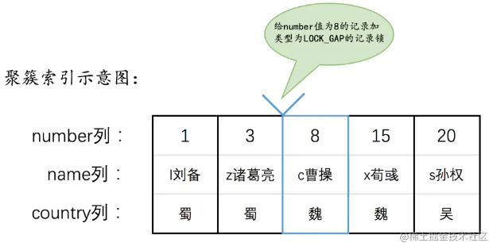

这个gap锁的提出仅仅是为了防止插入幻影记录而提出的，对一条记录加了gap锁（不论是共享gap锁还是独占gap锁），并不会限制其他事务对这条记录加普通记录锁或者继续加gap锁。

对于最后一条记录之后的间隙，也一样可以通过加gap锁来解决，只需要在最后一条记录所在页的Supremum 记录（最大记录）加gap锁即可：

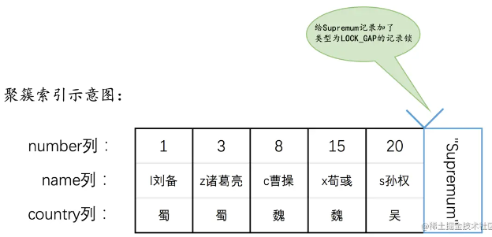

### Next-Key Locks 

有时候我们既想锁住某条记录，又想阻止其他事务在该记录前边的间隙插入新记录，所以就设计出Next-Key Locks，它是一个普通锁和gap锁和合体

### Insert Intention Locks 

Insert Intention Locks 又叫插入意向锁。说一个事务在插入一条记录时需要判断一下插入位置是不是被别的事务加了所谓的gap锁，或者Next-Key Locks，如果有的话，插入操作需要等待，在等待的过程中，内存中会生成一个锁结构，表明有事务想在某个间隙中插入新记录，但是现在在等待，这就是插入意向锁。

直到gap锁，或者Next-Key Locks锁释放后，意向锁会将自己的状态设置为true，然后进行插入动作。

插入意向锁并不会阻止别的事务继续获取该记录上任何类型的锁，它就像一种状态

### 隐式锁

一个事务对新插入的记录可以不显式的加锁（生成一个锁结构） ，但为了解决脏写和脏读的问题，更新时又必须加X锁

innoDB是这样处理的：

* 对于聚簇索引记录来说，它有一个trx_id 隐藏列，代表最后改动该记录的事务id。当某个事务想对该记录添加S锁或者X锁时，会看一下该记录的trx_id隐藏列代表的事务是否是当前的活跃事务，如果是的话，那么就帮助当前事务创建一个X锁（也就是为当前事务创建一个锁结构，is_waiting属性是false），然后自己进入等待状态（也就是为自己也创建一个锁结构，is_waiting属性是true）
* 对于二级索引记录来说，它本身没有trx_id 隐藏列，但是在二级索引页面的Page Header部分有一个PAGE_MAX_TRX_ID属性，该属性代表对该页面做改动的最大的事务id，如果PAGE_MAX_TRX_ID属性值小于当前最小的活跃事务id，那么说明对该页面做修改的事务都已经提交了，否则就需要在页面中定位到对应的二级索引记录，然后回表找到它对应的聚簇索引记录，然后再重复上面的做法

由于有事务id的存在，相当于加了一个隐式锁，别的事务在对这条记录加S锁或者X锁时，由于隐式锁的存在，会先帮助当前事务生成一个锁结构，然后自己再生成一个锁结构后进入等待状态

## 锁的结构

锁的结构是保存在内存中的。

在InnoDB的实现中，InnoDB的行锁是与记录一一对应的。即使是对于gap锁来说，也是加在记录上的，每当有别的事务插入记录时，会检查一下待插入记录的下一条记录上是否已经有一个gap锁的锁结构，如果有的话就进入阻塞状态。

为了节省空间，同一个事务，同一个页面上加的相同类型的锁都放在同一个锁结构中。

具体结构略

## 加锁步骤

server层和存储引擎层是以记录为单位进行通信的 ，InnoDB每当读取一条记录时，都会调用一次row_search_mvcc函数，在该函数中会对一条记录进行诸如多版本的可见性判断，要不要对记录进行加锁的判断，要是加锁的话加什么锁的选择，完成记录从InnoDB的存储格式到server层存储格式的转换等等等等十分繁杂的工作。其中加锁的相关逻辑：

* 读取记录时，默认会给记录添加gap锁。如果当前执行的是SELECT ... LOCK IN SHARE MODE或者SELECT ... FOR UPDATE这样的加锁读语句（非DELETE或UPDATE语句），并且隔离级别不大于READ COMMITTED 时 ，不会加gap锁
* 在查询开启前需要生成ReadView 
* 在首次读取记录前，需要添加表级别的意向锁（IS或IX锁） ，它在扫描区间的第一条记录时进行
* 查询时默认是从左到右扫描的（按照键值从小到大的方式，这也是B+树的排序），但对于特殊的查询语句也会从右到左扫描，如ORDER BY name DESC for update这种排序且加锁读（独占锁）的情况下，同时如果隔离级别不小于REPEATABLE READ并且也没有开启innodb_locks_unsafe_for_binlog系统变量的情况下，会对扫描区间中最右边的那条记录的下一条记录加一个gap锁，它针对每个扫描区间最多1次

针对每条记录读取时：

* 针对Supremum记录 ：则在下边这些条件成立的时候就会为记录添加一个类型为LOCK_ORDINARY的锁，其实也就是next-key锁：

  * set_also_gap_locks是TRUE（这个变量只在前边设置过，当隔离级别不大于READ COMMITTED的SELECT语句的加锁读会设置为FALSE，否则为TRUE）
  * 未开启innodb_locks_unsafe_for_binlog系统变量并且事务的隔离级别不小于REPEATABLE READ。
  * 本次读取属于加锁读
  * 所使用的不是空间索引。

* 对精确匹配（等值匹配的条件）的特殊处理：如果执行本次row_search_mvcc获取到的记录不在扫描区间中，则需要进行一些特殊处理，即：对于加锁读来说，如果事务的隔离级别不小于Repeatable Read并且未开启innodb_locks_unsafe_for_binlog系统变量，那么就对该记录加一个gap锁，并且直接返回，就不进行后续的加锁操作了

  例如，对于下面的sql语句：SELECT * FROM hero WHERE name = 's孙权' FOR UPDATE;

  当读取完s孙权这一条记录后，InnoDB会根据记录的next_record属性找到下一条二级索引记录x荀彧 ，这一条记录不在扫描区间中，那就执行上面的加锁流程，也就是对name值为'x荀彧'的二级索引记录加一个gap锁。另外还要向server层报告当前扫描区间的记录都已经扫描完了 

* 读取每一条记录时，默认会给记录添加gap锁。除非至少满足下列条件之一，就会加普通锁：

  * set_also_gap_locks是FALSE（这个变量只在前边设置过，当隔离级别不大于READ COMMITTED的SELECT语句的加锁读会设置为FALSE，否则为TRUE）
  * 开启innodb_locks_unsafe_for_binlog系统变量
  * 事务的隔离级别不大于READ COMMITTED
  * 唯一性搜索并且该记录的delete_flag不为1
  * 该索引是空间索引

  还要一种不加gap锁的情况：对于>= 主键的这种边界条件来说，如果当前记录恰好是开始边界，就仅需对该记录加正经记录锁，而不需添加gap锁

  例如这种sql：SELCT * FROM hero WHERE number >= 8 FOR UPDATE; 

  如果隔离级别是REPEATABLE READ 的话，想要保证隔离级别，一般来说要给扫描的左边界加next-key锁，但由于条件是由主键组成的，不可能插入主键为8的记录，所以无需用next-key锁

  如果不属于上面讨论的情况，就一律加next-key锁

* 如果是使用二级索引执行查询，并且有索引条件下推（Index Condition Pushdown，简称ICP）的条件的话，还需要判断下推的条件是否成立，如果不满足则向server层返回可结束本扫描区间的信息

* 回表加锁：如果row_search_mvcc读取的是二级索引记录，则还需进行回表，找到相应的聚簇索引记录后需对该聚簇索引记录加一个普通锁。即使是对于覆盖索引的场景下，如果我们想对记录加X型锁（也就是使用SELECT ... FOR UPDATE、DELETE、UPDATE语句时）时，也需要对二级索引记录执行回表操作，并给相应的聚簇索引记录添加正经记录锁

* 如果读取的这一条记录不在扫描区间中，就给server层返回一个HA_ERR_END_OF_FILE信息，表示当前扫描区间的记录都已经扫描完了，server层在收到这个信息后就会停止向Innodb索要下一条记录的请求，即结束本扫描区间的查询。判断是否在扫描区间的同时，还会执行一个unlock_row的函数，这个函数主要是用于在隔离级别不大于READ COMMITTED时释放当前记录上的锁（如果是二级索引记录还要释放相应的聚簇索引记录上的锁）

一个典型的错误观点：在使用加锁读的方式读取使用InnoDB存储引擎的表时，当在执行查询时没有使用到索引时，行锁会被转换为表锁。 原因是对于任何INSERT、DELETE、UPDATE、SELECT ... LOCK IN SHARE MODE、SELECT ... FOR UPDATE语句来说，InnoDB存储引擎都不会加表级别的S锁或者X锁（我们这里不讨论表级意向锁的添加），只会加行级锁。所以即使对于全表扫描的加锁读语句来说，也只会对表中的记录进行加锁，而不是直接加一个表锁。

如果没有使用到索引就是采用的全表扫描，也就是扫描主键值在(-∞, +∞)这个扫描区间中的聚簇索引记录，针对每一条聚簇索引记录，都需要执行一次row_search_mvcc函数，都需要进行如上所述的各种判断，最后决定给扫描的记录加什么锁

汇总：

步骤1. 定位扫描区间的第一条记录。

步骤2. 如果扫描区间是从右到左扫描，那么需要给扫描区间最右边的记录的下一条记录添加一个gap锁（在隔离级别不小于REPEATABLE READ并且也没有开启innodb_locks_unsafe_for_binlog系统变量的情况下）。

步骤3. 对于Infimum记录是不加锁的，对于Supremum记录加next-key锁（在隔离级别不小于REPEATABLE READ并且也没有开启innodb_locks_unsafe_for_binlog系统变量的情况下）。

步骤4. 对于精确匹配的扫描区间来说，当扫描区间中的记录都被读完后，需对扫描区间后的第一条记录加一个gap锁即可，并且向server层返回可结束本扫描区间的查询的信息（在隔离级别不小于REPEATABLE READ并且也没有开启innodb_locks_unsafe_for_binlog系统变量的情况下）。

步骤5. 事务的隔离级别不大于READ COMMITTED，开启innodb_locks_unsafe_for_binlog系统变量，唯一性搜索并且该记录的delete_flag不为1，对于>= 主键的这种边界条件来说，当前记录恰好是开始边界记录，则对记录加正经记录锁，否则添加next-key锁。

步骤6. 判断ICP条件是否成立。如果当前记录是二级索引记录，并且已经不在扫描区间中，则向server层返回可结束本扫描区间的查询的信息。

步骤7. 如果对二级索引记录进行加锁，还需要对相应的聚簇索引记录加正经记录锁（使用覆盖索引，并且加S型锁的记录可跳过此步骤）。

步骤8. 判断当前记录是否已不在扫描区间中，如果不在的话，则向server返回可结束本扫描区间的查询的信息。

步骤9. 如果server层收到可结束本扫描区间的查询的信息，则结束本扫描区间的查询，否则继续向InnoDB要下一条记录，InnoDB根据记录所在的链表获取到下一条记录后，从步骤3开始新一轮的轮回。

## 加锁语句分析

加锁只是解决并发事务执行过程中引起的脏写、脏读、不可重复读、幻读这些问题的一种解决方案（MVCC算是一种解决脏读、不可重复读、幻读这些问题的一种解决方案）

## 普通SELECT语句


# 补充

UNION 操作符用于合并两个或多个 SELECT 语句的结果集 ，例如一条产生3个结果，另一条产生4个结果，那么UNION后就产生7条结果，所以这就要求SELECT 语句必须拥有相同数量的列。列也必须拥有相似的数据类型 ，且要求顺序相同。UNION 结果集中的列名总是等于 UNION 中第一个 SELECT 语句中的列名 。

UNION 命令只会选取不同的值 ，如果两行结果完全相同，会做去重。如果不想去重，可以用UNION ALL