# I/O模型对比

I/O 模型简单的理解：就是用什么样的通道进行数据的发送和接收，很大程度上决定了程序通信的性能。

I/O 就是计算机内存与外部设备之间拷贝数据的过程。CPU访问内存的速度远高于外部设备，如何优化这种速度不平衡就是I/O模型的关键。

当用户线程发起 I/O 操作后，网络（或者磁盘）数据读取操作会经历两个步骤：

- 用户线程等待内核将数据从网卡拷贝到内核空间。
- 内核将数据从内核空间拷贝到用户空间。

Java 共支持 3 种网络编程模型 I/O 模式：BIO、NIO、AIO：

* BIO：同步并阻塞（传统阻塞型），服务器实现模式为一个连接一个线程，即客户端有连接请求时服务器端就需要启动一个线程进行处理，如果这个连接不做任何事情会造成不必要的线程开销。

  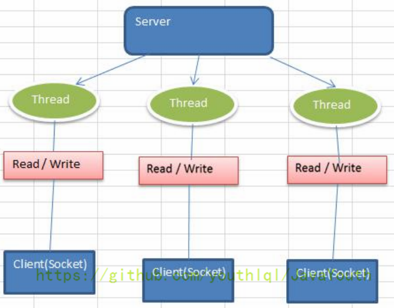

  用户线程发起 read 调用后就阻塞了，让出 CPU。内核等待网卡数据到来，把数据从网卡拷贝到内核空间，接着把数据拷贝到用户空间，再把用户线程叫醒：

  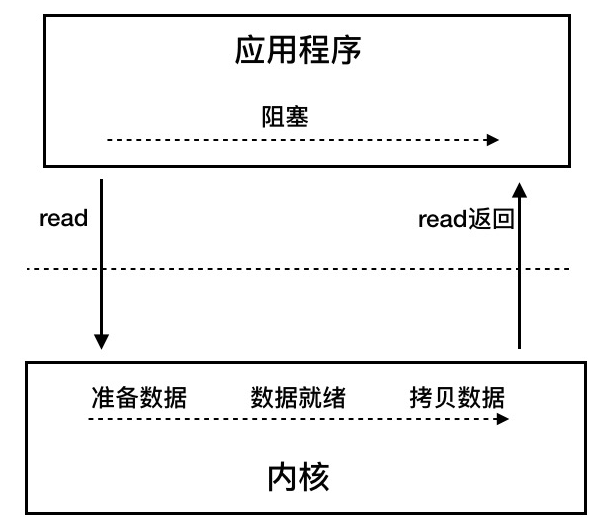

* NIO：同步非阻塞，服务器实现模式为一个线程处理多个请求（连接），即客户端发送的连接请求都会注册到多路复用器上，多路复用器轮询到连接有 I/O 请求就进行处理。基于Reactor模式的工作方式。

  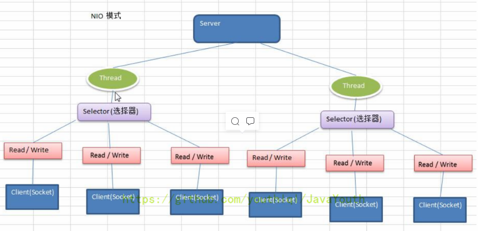

  同步非阻塞I/O模型：用户线程不断的发起 read 调用，数据没到内核空间时，每次都返回失败，直到数据到了内核空间，这一次 read 调用后，在等待数据从内核空间拷贝到用户空间这段时间里，线程还是阻塞的，等数据到了用户空间再把线程叫醒：

  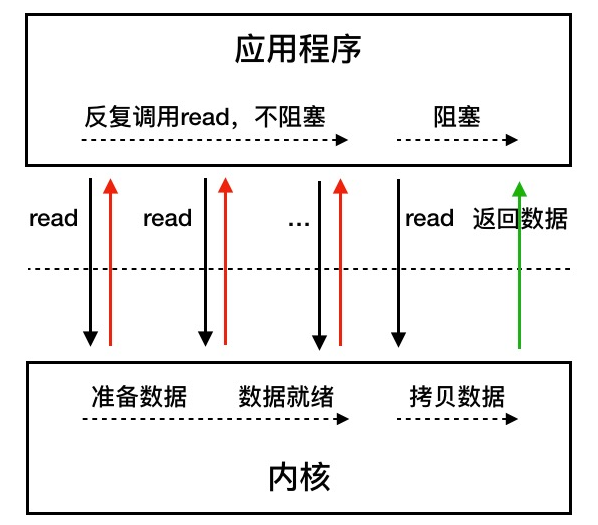

  多路复用是同步非阻塞的一种情况，用户线程的读取操作分成两步了，线程先发起 select 调用，目的是问内核数据准备好了吗？等内核把数据准备好了，用户线程再发起 read 调用。之所以叫多路复用，是因为一次 select 调用可以向内核查多个数据通道（Channel）的状态，所以叫多路复用

* AIO（NIO2）：异步非阻塞，AIO 引入异步通道的概念，采用了 Proactor 模式，简化了程序编写，有效的请求才启动线程，它的特点是先由操作系统完成后才通知服务端程序启动线程去处理（当客户端发送数据后，会主动通知服务器，接着服务器再进行读写操作），一般适用于连接数较多且连接时间较长的应用。

  Java的AIO API是Proactor模式的应用。Reactor和Proactor模式的区别在于真正的读取和写入操作是由谁来完成的，Reactor中需要应用程序自己读取或者写入数据，而Proactor模式中应用程序不需要进行实际的读写过程，它只需要从缓存区读取或者写入即可，而操作系统会帮忙操作缓存区和IO设备之间的数据。

  用户线程发起 read 调用的同时注册一个回调函数，read 立即返回，等内核将数据准备好后，再调用指定的回调函数完成处理。在这个过程中，用户线程一直没有阻塞：

  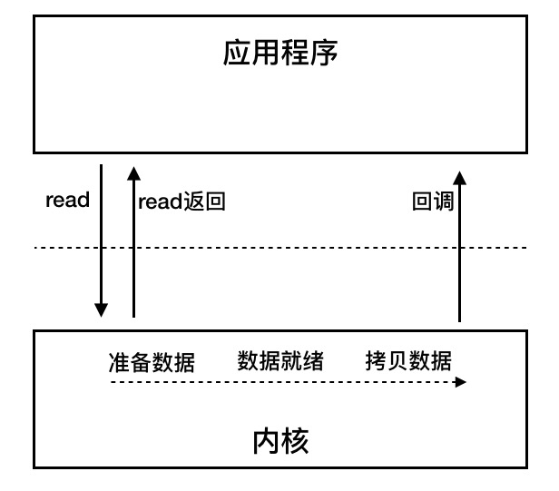

BIO、NIO、AIO 使用场景分析：

* BIO 方式适用于连接数目比较小且固定的架构，这种方式对服务器资源要求比较高，并发局限于应用中，JDK1.4 以前的唯一选择，但程序简单易理解。
* NIO 方式适用于连接数目多且连接比较短（轻操作）的架构，比如聊天服务器，弹幕系统，服务器间通讯等。编程比较复杂，JDK1.4 开始支持。
* AIO 方式使用于连接数目多且连接比较长（重操作）的架构，比如相册服务器，充分调用 OS 参与并发操作，编程比较复杂，JDK7 开始支持。

# Java BIO

Java BIO 就是传统的 Java I/O 编程，其相关的类和接口在 java.io。

BIO的过程：

* 服务器端启动一个 ServerSocket。
* 客户端启动 Socket 对服务器进行通信，默认情况下服务器端需要对每个客户建立一个线程与之通讯。
* 客户端发出请求后，先咨询服务器是否有线程响应，如果没有则会等待，或者被拒绝。
* 如果有响应，客户端线程会等待请求结束后，再继续执行。

下面是一个BIO实现的服务器端，客户端通过telnet向服务器发送数据（window 命令行执行 telnet 127.0.0.1 6666，然后在弹出的窗口输入数据）：

~~~java
	public static void main(String[] args) throws Exception {
        //线程池机制
        //思路
        //1. 创建一个线程池
        //2. 如果有客户端连接，就创建一个线程，与之通讯(单独写一个方法)
        ExecutorService newCachedThreadPool = Executors.newCachedThreadPool();
        //创建ServerSocket
        ServerSocket serverSocket = new ServerSocket(6666);
        System.out.println("服务器启动了");
        while (true) {
            System.out.println("线程信息id = " + Thread.currentThread().getId() + "名字 = " + Thread.currentThread().getName());
            //监听，等待客户端连接
            System.out.println("等待连接....");
            //会阻塞在accept()
            final Socket socket = serverSocket.accept();
            System.out.println("连接到一个客户端");
            //就创建一个线程，与之通讯(单独写一个方法)
            newCachedThreadPool.execute(new Runnable() {
                public void run() {//我们重写
                    //可以和客户端通讯
                    handler(socket);
                }
            });
        }
    }

    //编写一个handler方法，和客户端通讯
    public static void handler(Socket socket) {
        try {
            System.out.println("线程信息id = " + Thread.currentThread().getId() + "名字 = " + Thread.currentThread().getName());
            byte[] bytes = new byte[1024];
            //通过socket获取输入流
            InputStream inputStream = socket.getInputStream();
            //循环的读取客户端发送的数据
            while (true) {
                System.out.println("线程信息id = " + Thread.currentThread().getId() + "名字 = " + Thread.currentThread().getName());
                System.out.println("read....");
                int read = inputStream.read(bytes);
                if (read != -1) {
                    System.out.println(new String(bytes, 0, read));//输出客户端发送的数据
                } else {
                    break;
                }
            }
        } catch (Exception e) {
            e.printStackTrace();
        } finally {
            System.out.println("关闭和client的连接");
            try {
                socket.close();
            } catch (Exception e) {
                e.printStackTrace();
            }
        }
    }
~~~

通信的过程：

1、首先创建ServerSocket：ServerSocket serverSocket = new ServerSocket(6666);

2、然后等待客户端连接：Socket socket = serverSocket.accept();如果一直没有客户端连接，代码就会阻塞在accept方法。

3、获取到连接，开启一个新线程，获取socket中的输入流，并读取客户端发来的内容：

InputStream inputStream = socket.getInputStream();

int read = inputStream.read(bytes);

如果这里客户端一直没有发送数据，则一直阻塞在read方法

BIO存在的问题：

* 每个请求都需要创建独立的线程，与对应的客户端进行数据 Read，业务处理，数据 Write。
* 当并发数较大时，需要创建大量线程来处理连接，系统资源占用较大。
* 连接建立后，如果当前线程暂时没有数据可读，则线程就阻塞在 Read 操作上，造成线程资源浪费

# Java NIO

## 概述

Java NIO 全称 Java non-blocking IO，是指 JDK 提供的新 API。从 JDK1.4 开始，Java 提供了一系列改进的输入/输出的新特性，被统称为 NIO（即 NewIO），是同步非阻塞的。

NIO 相关类都被放在 java.nio 包及子包下，并且对原 java.io 包中的很多类进行改写

NIO 是面向缓冲区，或者面向块编程的。数据读取到一个它稍后处理的缓冲区，需要时可在缓冲区中前后移动，这就增加了处理过程中的灵活性，使用它可以提供非阻塞式的高伸缩性网络

Java NIO 的非阻塞模式，使一个线程从某通道发送请求或者读取数据，但是它仅能得到目前可用的数据，如果目前没有数据可用时，就什么都不会获取，而不是保持线程阻塞，所以直至数据变的可以读取之前，该线程可以继续做其他的事情。非阻塞写也是如此，一个线程请求写入一些数据到某通道，但不需要等待它完全写入，这个线程同时可以去做别的事情。

NIO 是可以做到用一个线程来处理多个操作的。假设有 10000 个请求过来,根据实际情况，可以分配 50 或者 100 个线程来处理。不像之前的阻塞 IO 那样，非得分配 10000 个。NIO提高了线程的利用率（因为不是每个连接都一直在交换数据的，有空闲的时候，此时就可以将线程给别的连接使用）

NIO创建连接后，连接会被注册到多路复用器上，一个选择器线程可以同时处理成千上万个连接，系统不用再创建或者维护大量的线程了。

和BIO的对比：

* BIO 以流的方式处理数据，而 NIO 以块的方式处理数据，块 I/O 的效率比流 I/O 高很多。
* BIO 是阻塞的，NIO 则是非阻塞的。
* BIO 基于字节流和字符流进行操作，而 NIO 基于 Channel（通道）和 Buffer（缓冲区）进行操作，数据总是从通道读取到缓冲区中，或者从缓冲区写入到通道中。Selector（选择器）用于监听多个通道的事件（比如：连接请求，数据到达等），因此使用单个线程就可以监听多个客户端通道。Buffer和Channel之间的数据流向是双向的

NIO 中非阻塞 I/O 采用了基于 Reactor 模式的工作方式，I/O 调用不会被阻塞，相反是注册感兴趣的特定 I/O 事件，如可读数据到达，新的套接字连接等等，在发生特定事件时，系统再通知我们。NIO 中实现非阻塞 I/O 的核心对象就是 Selector，Selector 就是注册各种 I/O 事件地方，而且当我们感兴趣的事件发生时，就是这个对象告诉我们所发生的事件，如下图所示：

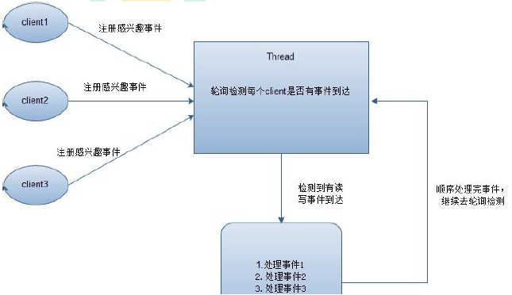

这个注册各种I/O事件的地方就是Selector

## 三大核心

NIO 有三大核心部分：Channel（通道）、Buffer（缓冲区）、Selector（选择器）

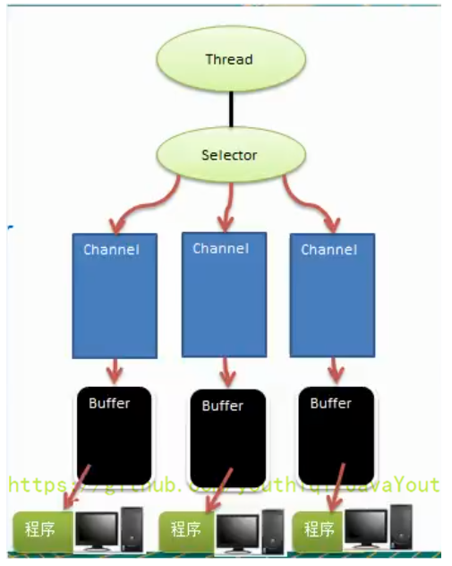

* 每个 Channel 都会对应一个 Buffer。
* Selector 对应一个线程，一个线程对应多个 Channel（连接）。
* 该图反应了有三个 Channel 注册到该 Selector //程序
* 程序切换到哪个 Channel 是由事件决定的，Event 就是一个重要的概念。
* Selector 会根据不同的事件，在各个通道上切换。
* Buffer 就是一个内存块，底层是有一个数组。
* 数据的读取写入是通过 Buffer，这个和 BIO是不同的，BIO 中要么是输入流，或者是输出流，不能双向，但是 NIO 的 Buffer 是可以读也可以写，需要 flip 方法切换 Channel 是双向的，可以返回底层操作系统的情况，比如 Linux，底层的操作系统通道就是双向的。

## Buffer

### 用Buffer读写数据

在 NIO 中，Buffer 是一个顶层父类，它是一个抽象类。所有的缓冲区类型都继承于抽象类Buffer，最常用的是ByteBuffer，对于java中的基本类型，基本都有一个具体Buffer类型与之对应。

它用于和NIO通道进行交互，数据都是从通道读入缓冲区，从缓冲区写入到通道中的。它就像BIO中的Stream对象，是NIO所有数据的容器。

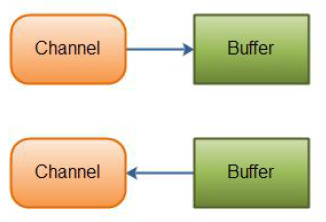

缓冲区本质上是一块可以写入数据，然后可以从中读取数据的内存，底层是数组。这块内存被包装成NIO Buffer对象，并提供了一组方法，用来方便的访问该块内存。

用Buffer读写数据的案例：

~~~java
    //举例说明 Buffer 的使用(简单说明)
    //创建一个 Buffer，大小为 5，即可以存放 5 个 int
    IntBuffer intBuffer = IntBuffer.allocate(5);

    //向buffer存放数据
    //intBuffer.put(10);
    //intBuffer.put(11);
    //intBuffer.put(12);
    //intBuffer.put(13);
    //intBuffer.put(14);
    for (int i = 0; i < intBuffer.capacity(); i++) {
      intBuffer.put(i * 2);
    }
    //如何从 buffer 读取数据
    //将 buffer 转换，读写切换(!!!)
    intBuffer.flip();
    while (intBuffer.hasRemaining()) {
      System.out.println(intBuffer.get());
    }
~~~

使用 Buffer 读写数据，一般遵循以下四个步骤：

（1）写入数据到 Buffer
（2）调用 flip()方法
（3）从 Buffer 中读取数据
（4）调用 clear()方法或者 compact()方法

当向 buffer 写入数据时，buffer 会记录下写了多少数据。一旦要读取数据，需要通过flip()方法将 Buffer 从写模式切换到读模式。

在读模式下，可以读取之前写入到 buffer的所有数据。一旦读完了所有的数据，就需要清空缓冲区，让它可以再次被写入。有两种方式能清空缓冲区：调用 clear()或 compact()方法：

* clear()方法会清空整个缓冲区。
* compact()方法只会清除已经读过的数据。

任何未读的数据都被移到缓冲区的起始处，新写入的数据将放到缓冲区未读数据的后面

使用ByteBuffer读取文件：

~~~java
	RandomAccessFile aFile = new RandomAccessFile("d:\\achang/01.txt","rw");
    FileChannel inChannel = aFile.getChannel();
    
    //创建buffer，并指定大小（字节）
    ByteBuffer buf = ByteBuffer.allocate (1024);
    int bytesRead = inChannel.read(buf); //读取buffer
    
    while (bytesRead != -1) {
        buf.flip(); //读写转换，为读模式
        while(buf.hasRemaining()){
            System.out.print((char) buf.get()); // read 1 byte at a time
        }
        buf.clear(); //清空buffer
        //读操作
        bytesRead = inChannel.read(buf);
    }
    aFile.close();
~~~

### Buffer的三个属性

Buffer的三个属性：capacity、Position、limit

position 和 limit 的含义取决于 Buffer 处在读模式还是写模式。不管 Buffer 处在什么模式，capacity 的含义总是一样的。

* capacity：Buffer的固定大小值，一旦 Buffer 满了，需要将其清空（通过读数据或者清除数据）才能继续写数据往里写数据
* position：当写入数据时，position表示写入数据的当前位置，初始值为0。随着数据写入，position会向下移动到下一个单元，最大可为Capacity-1；读数据到 Buffer 中时，position 表示读入数据的当前位置，如 position=2 时表示已开始读入了 3 个 byte，或从第 3 个 byte 开始读取。
  通过 ByteBuffer.flip()切换到读模式时 position 会被重置为 0，当 Buffer 从 position 读入数据后，position 会下移到下一个可读入的数据 Buffer 单元
* limit：写数据时，limit 表示可对Buffer 最多写入多少个数据。写模式下，limit 等于Buffer 的 capacity。
  读数据时，limit 表示 Buffer 里有多少可读数据（not null 的数据）

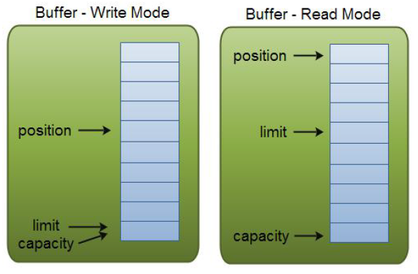

### Buffer常用方法

1、分配空间：

~~~java
ByteBuffer buf = ByteBuffer.allocate(48);
~~~

2、向Buffer中写数据：有两种方式

从 Channel 写到 Buffer：

~~~java
int bytesRead = inChannel.read(buf); //read into buffer.
~~~

通过 put 方法写 Buffer 的例子：

~~~java
buf.put(127);
~~~

put 方法有很多版本，允许你以不同的方式把数据写入到 Buffer 中。例如， 写到一个指定的位置，或者把一个字节数组写入到 Buffer

3、flip方法

flip 方法将 Buffer 从写模式切换到读模式。调用 flip()方法会将 position 设回 0，并将 limit 设置成之前 position 的值。
换句话说，position 现在用于标记读的位置，limit 表示之前写进了多少个 byte、char 等 （现在能读取多少个 byte、char 等）。

4、从Buffer中读取数据，有两种方式：

从 Buffer 读取数据到 Channel：

~~~java
//read from buffer into channel.
int bytesWritten = inChannel.write(buf);
~~~

使用 get()方法从 Buffer 中读取数据：

~~~java
byte aByte = buf.get();
~~~

get 方法有很多版本，允许你以不同的方式从 Buffer 中读取数据。例如，从指定position 读取，或者从 Buffer 中读取数据到字节数组。

5、rewind方法

Buffer.rewind()将 position 设回 0，所以你可以重读 Buffer 中的所有数据。limit 保持不变

6、clear与 compact方法

一旦读完 Buffer 中的数据，需要让 Buffer 准备好再次被写入。可以通过 clear()或compact()方法来完成。两者的区别是clear会清空所有数据，compact只会清空已经读过的数据。

如果调用的是 clear()方法，position 将被设回 0，limit 被设置成 capacity 的值。换句话说，Buffer 被清空了。Buffer中的数据并未清除，只是这些标记告诉我们可以从哪里开始往 Buffer 里写数据。

如果 Buffer 中仍有未读的数据，且后续还需要这些数据，但是此时想要先写些数据，那么使用 compact()方法，compact()方法将所有未读的数据拷贝到 Buffer 起始处。然后将 position 设到最后一个未读元素正后面。limit 属性依然像 clear()方法一样，设置成 capacity。现在Buffer 准备好写数据了，但是不会覆盖未读的数据

7、mark与 reset方法

通过调用 Buffer.mark()方法，可以标记 Buffer 中的一个特定 position。

之后可以通过调用Buffer.reset()方法恢复到这个 position。例如：

~~~java
buffer.mark();
//call buffer.get() a couple of times, e.g. during parsing.
buffer.reset(); //set position back to mark.
~~~

### 缓冲区切片

在 NIO 中，除了可以分配或者包装一个缓冲区对象外，还可以根据现有的缓冲区对象来创建一个子缓冲区，即在现有缓冲区上切出一片来作为一个新的缓冲区，但现有的缓冲区与创建的子缓冲区在底层数组层面上是数据共享的，也就是说，子缓冲区相当于是现有缓冲区的一个视图窗口。调用 slice()方法可以创建一个子缓冲区：

~~~java
@Test
public void testConect3() throws IOException {
    ByteBuffer buffer = ByteBuffer.allocate (10);
    // 缓冲区中的数据 0-9
    for (int i = 0; i < buffer.capacity(); ++i) {
        buffer.put((byte) i);
    }
    
    // 创建子缓冲区
    buffer.position(3);
    buffer.limit(7);
    ByteBuffer slice = buffer.slice();
    
    // 改变子缓冲区的内容
    for (int i = 0; i < slice.capacity(); ++i) {
        byte b = slice.get(i);
        b *= 10;
        slice.put(i, b);//指定索引值，修改内容
    }
    
    //重新指定之前的位置
    buffer.position(0);
    buffer.limit(buffer.capacity());
    
    while (buffer.remaining() > 0) {
        System. out .println(buffer.get());
    }
}
~~~

buffer.slice()代表当前缓冲区的position到limit这一段切片，生成一个子缓冲区。修改子缓冲区的值，原buffer的数据也被修改了。

### 只读缓冲区

可以通过调用缓冲区的 asReadOnlyBuffer()方法，将任何常规缓冲区转 换为只读缓冲区，这个方法返回一个与原缓冲区完全相同的缓冲区，并与原缓冲区共享数据，只不过它是只读的。

如果原缓冲区的内容发生了变化，只读缓冲区的内容也随之发生变化：

~~~java
@Test
public void testConect4() throws IOException {
    ByteBuffer buffer = ByteBuffer. allocate (10);
    // 缓冲区中的数据 0-9
    for (int i = 0; i < buffer.capacity(); ++i) {
        buffer.put((byte) i);
    }
    
    // 创建只读缓冲区
    ByteBuffer readonly = buffer.asReadOnlyBuffer();
    
    // 改变原缓冲区的内容
    for (int i = 0; i < buffer.capacity(); ++i) {
        byte b = buffer.get(i);
        b *= 10;
        buffer.put(i, b);
    }
    
    readonly.position(0);
    readonly.limit(buffer.capacity());
    
    // 读取只读缓冲区的内容也随之改变
    while (readonly.remaining() > 0) {
        System. out .println(readonly.get());
    }
}
~~~

如果尝试修改只读缓冲区的内容，则会报 ReadOnlyBufferException 异常。

只读缓冲区对于保护数据很有用。在将缓冲区传递给某个 对象的方法时，无法知道这个方法是否会修改缓冲区中的数据。创建一个只读的缓冲区可以保证该缓冲区不会被修改。

只可以把常规缓冲区转换为只读缓冲区，而不能将只读的缓冲区转换为可写的缓冲区。

### 直接缓冲区

直接缓冲区是为加快 I/O 速度，使用一种特殊方式为其分配内存的缓冲区，它会在每一次调用底层操作系统的本机 I/O 操作之前(或之后)，尝试避免将缓冲区的内容拷贝到一个中间缓冲区中 或者从一个中间缓冲区中拷贝数据。要分配直接缓冲区，需要调用 allocateDirect()方法，而不是 allocate()方法，使用方式与普通缓冲区并无区别：

~~~java
// 使用 allocateDirect，而不是 allocate
ByteBuffer buffer = ByteBuffer.allocateDirect(1024);
...
~~~

### 内存映射文件I/O

内存映射文件 I/O 是一种读和写文件数据的方法，它可以比常规的基于流或者基于通道的 I/O 快的多。

原理是将文件中实际读取或者写入的部分映射到内存，通过直接操作内存修改文件：

~~~java
RandomAccessFile raf = new RandomAccessFile("d:\\achang\\01.txt","rw");
FileChannel fc = raf.getChannel();

MappedByteBuffer mbb = fc.map(FileChannel.MapMode.READ_WRITE,start,limit);

mbb.put(0,(byte) 97);
mbb.put(1023, (byte) 122);

raf.close();
~~~

## Channel

### 概述

Channel可以翻译成“通道”。Channel 和 IO 中的 Stream(流)是差不多一个等级的，它就像水管一样，网络数据通过Channel 读取和写入。

只不过 Stream 是单向的，譬如：InputStream, OutputStream. 而Channel 是双向的，既可以用来进行读操作，又可以用来进行写操作，通道可以用于读、写或者同时用于读写。

和流的另外一个区别是：通道可以异步的读写。

NIO 中的 Channel 的主要实现有：

* FileChannel：从文件中读取数据
* DatagramChannel：通过UDP读写网络中的数据
* SocketChannel：通过TCP读写网络中的数据
* ServerSocketChannel：它也是基于TCP的，它像Web服务器那样，对每一个新进来的连接都会创建一个SocketChannel

这里看名字就可以猜出个所以然来：分别可以对应文件 IO、UDP 和 TCP（Server 和 Client）。

因为 Channel 是全双工的，所以它可以比流更好地映射底层操作系统的 API。

NIO 中通过 channel 封装了对数据源的操作，通过 channel 我们可以操作数据源，但又不必关心数据源的具体物理结构。这个数据源可能是多种的。比如，可以是文件，也可以是网络 socket。在大多数应用中，channel 与文件描述符或者 socket 是一一对应的。

Channel 用于在字节缓冲区和位于通道另一侧的实体（通常是一个文件或套接字）之间有效地传输数据。

###FileChannel的使用

下面是一个使用 FileChannel 读取数据到 Buffer 中的示例：

~~~java
//创建FileChannel
RandomAccessFile raf = new RandomAccessFile("C:\\Users\\PePe\\Desktop\\achang.txt","rw");
FileChannel channel = raf.getChannel();
//创建Buffer
ByteBuffer buffer = ByteBuffer.allocate(1024);
//读取数据到Buffer中
int readNum = channel.read(buffer);
//有内容
while (readNum != -1){
  System.out.println("读取数据。。。");
  buffer.flip();//读写模式的转换
  while (buffer.hasRemaining()){//判断是否有剩余的内容 
    System.out.println((char)buffer.get());
  }
  buffer.clear();//清空
  readNum = channel.read(buffer);
}
raf.close();
System. out .println("操作结束");
~~~

### FileChannel常用方法

1、打开FileChannel

在使用 FileChannel 之前，必须先打开它。但是，我们无法直接打开一个FileChannel，需要通过使用一个 InputStream、OutputStream 或RandomAccessFile 来获取一个 FileChannel 实例。下面是通过 RandomAccessFile

打开 FileChannel 的示例：

~~~java
RandomAccessFile raf = new RandomAccessFile("C:\\Users\\PePe\\Desktop\\achang.txt","rw");
FileChannel channel = raf.getChannel();
~~~

2、从FileChannel读取数据

分配一个 Buffer，调用 FileChannel.read()方法。该方法将数据从 FileChannel 读取到 Buffer 中。read()方法返回的 int 值表示了有多少字节被读到了 Buffer 中。如果返回-1，表示到了文件末尾：

~~~java
//创建Buffer
ByteBuffer buffer = ByteBuffer.allocate(1024);
//读取数据到Buffer中
int readNum = channel.read(buffer);
~~~

3、向FileChannel写数据

用write向FileChannel写数据，FileChannel.write()是在 while 循环中调用的。因为无法保证 write()方法一次能向 FileChannel 写入多少字节，因此需要重复调用 write()方法，直到 Buffer 中已经没有尚未写入通道的字节：

~~~java
//读入指定文件内容
RandomAccessFile aFile = new RandomAccessFile("C:\\Users\\PePe\\Desktop\\achang.txt", "rw");
//获取channel
FileChannel inChannel = aFile.getChannel();

//封装数据
String newData = "New String to write to file..." + System.currentTimeMillis();

//创建Buffer
ByteBuffer buf1 = ByteBuffer.allocate (1024);
buf1.clear();

//写入数据，以字节形式
buf1.put(newData.getBytes());

buf1.flip();//读写转换，变为读

while(buf1.hasRemaining()) {
  inChannel.write(buf1);
}

inChannel.close();
~~~

4、关闭FileChannel：

用完 FileChannel 后必须将其关闭。如：

~~~java
inChannel.close();
~~~

5、在某个特定位置进行数据的读/写操作

有时可能需要在 FileChannel 的某个特定位置进行数据的读/写操作。可以通过调用position()方法获取 FileChannel 的当前位置。也可以通过调用 position(long pos)方法设置 FileChannel 的当前位置：

~~~java
long pos = channel.position();//获取当前位置
channel.position(pos +123);//设置当前位置
~~~

如果将位置设置在文件结束符之后，然后试图从文件通道中读取数据，读方法将返回-1 （文件结束标志）

如果将位置设置在文件结束符之后，然后向通道中写数据，可能导致“文件空洞”，磁盘上物理文件中写入的数据间有空隙。

6、size

FileChannel 实例的 size()方法将返回该实例所关联文件的大小。如:

~~~java
long fileSize = channel.size();
~~~

7、截取文件

可以使用 FileChannel.truncate()方法截取一个文件。截取文件时，文件将中指定长度后面的部分将被删除。如：

~~~java
channel.truncate(1024);
//这个例子截取文件的前 1024 个字节。
~~~

8、force

出于性能方面的考虑，操作系统会将数据缓存在内存中，所以无法保证写入到 FileChannel 里的数据一定会即时写到磁盘上。要保证这一点，需要调用 force()方法。

FileChannel.force()方法将通道里尚未写入磁盘的数据强制写到磁盘上。force()方法有一个 boolean 类型的参数，指明是否同时将文件元数据（权限信息等）写到磁盘上。

9、transferFrom和transferTo

如果两个通道中有一个是 FileChannel，那你可以直接将数据从一个 channel 传输到另外一个 channel。

FileChannel 的 transferFrom()方法可以将数据从源通道传输到 FileChannel 中：

~~~java
        //创建两个FileChannel通道
        RandomAccessFile aFile = new RandomAccessFile("d:\\achang\\01.txt", "rw");
        FileChannel fromChannel = aFile.getChannel();
        RandomAccessFile bFile = new RandomAccessFile("d:\\achang\\02.txt", "rw");
        FileChannel toChannel = bFile.getChannel();
        
        //设置起始/结束位置
        long position = 0;
        long count = fromChannel.size();
        
        //将fromChannel中全部的数据传到toChannel中
        toChannel.transferFrom(fromChannel, position, count);
        
        //关闭channel通道
        aFile.close();
        bFile.close();
        System. out .println("over!");
~~~

方法的输入参数 position 表示从 position 处开始向目标文件写入数据，count 表示最多传输的字节数。

注意在 SoketChannel 的transferFrom实现中，SocketChannel 只会传输此刻准备好的数据（可能不足 count 字节）

类似的，transferTo()方法将数据从 FileChannel 传输到其他的 channel 中：

~~~java
        RandomAccessFile aFile = new RandomAccessFile("d:\\achang\\02.txt", "rw");
        FileChannel fromChannel = aFile.getChannel();
        RandomAccessFile bFile = new RandomAccessFile("d:\\achang\\03.txt", "rw");
        FileChannel toChannel = bFile.getChannel();
        
        long position = 0;
        long count = fromChannel.size();
        
        //将fromChannel传到toChannel中
        fromChannel.transferTo(position, count, toChannel);
        
        aFile.close();
        bFile.close();
        System. out .println("over!");
~~~

10、scatter/gather

分散（scatter）从 Channel 中读取是指在读操作时将读取的数据写入多个 buffer中。因此，Channel 将从 Channel中读取的数据“分散（scatter）”到多个 Buffer中。

聚集（gather）写入 Channel 是指在写操作时将多个 buffer 的数据写入同一个Channel，因此，Channel 将多个Buffer 中的数据“聚集（gather）”后发送到Channel。

scatter / gather 经常用于需要将传输的数据分开处理的场合，例如传输一个由消息头和消息体组成的消息，你可能会将消息体和消息头分散到不同的 buffer 中，这样你可以方便的处理消息头和消息体。

Scattering Reads的例子：

~~~java
ByteBuffer header = ByteBuffer.allocate (128);
ByteBuffer body = ByteBuffer.allocate (1024);

ByteBuffer[] bufferArray = {header,body};

channel.read(bufferArray);
~~~

read()方法按照 buffer 在数组中的顺序将从 channel 中读取的数据写入到 buffer，当一个 buffer 被写满后，channel 紧接着向另一个 buffer 中写。

Scattering Reads 在移动下一个 buffer 前，必须填满当前的 buffer，这也意味着它不适用于动态消息(译者注：消息大小不固定)。换句话说，如果存在消息头和消息体，消息头必须完成填充（例如 128byte），Scattering Reads 才能正常工作

Gathering Writes的例子：

~~~java
ByteBuffer header = ByteBuffer.allocate (128);
ByteBuffer body = ByteBuffer.allocate (1024);

//write data into buffers
ByteBuffer[] bufferArray = {header,body};

channel.write(bufferArray);
~~~

write()方法会按照 buffer 在数组中的顺序，将数据写入到 channel，注意只有 position 和 limit 之间的数据才会被写入。因此，如果一个 buffer 的容量为 128byte，但是仅仅包含 58byte 的数据，那么这 58byte 的数据将被写入到 channel 中。因此与 Scattering Reads 相反，Gathering Writes 能较好的处理动态消息

### ServerSocketChannel的使用

ServerSocketChannel 是一个基于通道的 socket 监听器(本身不传数据，而是一个监听器)

它同我们所熟悉的java.net.ServerSocket 执行相同的任务，不过它增加了通道语义，因此能够在非阻塞模式下运行。

BIO的ServerSocket调用accept方法时，会阻塞并返回一个Socket对象。

NIO的ServerSocketChannel在非阻塞模式下调用accept方法时，如果没有连接，会立即返回null，不会阻塞。它调用accept方法时，会返回一个SocketChannel 类型对象，SocketChannel 可以在非阻塞模式下运行。后续我们可以使用一个选择器实例来注册 ServerSocketChannel 对象以实现新连接到达时自动通知的功能。

使用示例：

~~~java
public static final String GREETING = "Hello java nio.\r\n";
public static void main(String[] argv) throws Exception {
  //端口号
  int port = 1234; // default
  if (argv.length > 0) {
    port = Integer.parseInt(argv[0]);
  }
  //Buffer
  ByteBuffer buffer = ByteBuffer.wrap(GREETING.getBytes());
  //ServerSocketChannel
  ServerSocketChannel ssc = ServerSocketChannel.open();
  //绑定，监听端口
  ssc.socket().bind(new InetSocketAddress(port));
  //设置非阻塞模式
  ssc.configureBlocking(false);

  //监听循环，是否有新连接传入
  while (true) {
    System.out.println("Waiting for connections");
    SocketChannel sc = ssc.accept();
    //没有连接传入的情况
    if (sc == null) {
      System.out.println("null");
      Thread.sleep (2000);
    } else {
      //有连接传入的情况
      System.out.println("Incoming connection from: "+sc.socket().getRemoteSocketAddress());//获取连接ip
      buffer.rewind();//指针指向0，就是位置制到0

      //向Buffer中写入数据
      sc.write(buffer);
      sc.close();
    }
  }
}
~~~

###ServerSocketChannel常用方法

1、开启通道

~~~java
ServerSocketChannel serverSocketChannel = ServerSocketChannel.open();
~~~

2、关闭通道

~~~java
serverSocketChannel.close();
~~~

3、阻塞模式

在阻塞模式下，ServerSocketChannel的accept方法会等待连接一直阻塞，直到返回一个新进来的连接的 SocketChannel。

4、非阻塞模式

非阻塞模式下，ServerSocketChannel的accept方法会立即返回，如果没有新进来的连接，会返回null：

~~~java
//ServerSocketChannel
ServerSocketChannel ssc = ServerSocketChannel.open();
//绑定，监听端口
ssc.socket().bind(new InetSocketAddress(port));
//设置非阻塞模式
ssc.configureBlocking(false);
~~~

### SocketChannel的使用

SocketChannel 是一个连接到 TCP 网络套接字的通道。操作面向Buffer缓冲区，它实现了可选择通道，可以被多路复用的。

1、创建SocketChannel：

方式一：

~~~java
SocketChannel socketChannel = SocketChannel.open(new InetSocketAddress("www.baidu.com", 80));
~~~

方式二：

~~~java
SocketChannel socketChanne2 = SocketChannel.open();
socketChanne2.connect(new InetSocketAddress("www.baidu.com",80));
~~~

方式二刚刚使用open时并没有进行实质性的tcp连接。对于已经存在的 socket 不能创建 SocketChannel

2、连接校验

~~~java
socketChannel.isOpen(); // 测试 SocketChannel 是否为 open 状态
socketChannel.isConnected(); //测试 SocketChannel 是否已经被连接
socketChannel.isConnectionPending(); //测试 SocketChannel 是否正在进行连接
socketChannel.finishConnect(); //校验正在进行套接字连接的 SocketChannel是否已经完成连接
~~~

3、设置非阻塞模式

~~~java
socketChannel.configureBlocking(false);//非阻塞
~~~

4、读取数据：

~~~java
SocketChannel socketChannel = SocketChannel.open (new InetSocketAddress("www.baidu.com", 80));
ByteBuffer byteBuffer = ByteBuffer.allocate (16);
socketChannel.read(byteBuffer);
socketChannel.close();
System.out.println("read over");
~~~

读写都是面向缓冲区，这个读写方式与前文中的 FileChannel 相同

在阻塞模式下，这段代码会阻塞在read方法处等待连接，而非阻塞模式会直接打印read over不会等待。

未进行连接的 SocketChannle 执行 I/O 操作时，会抛出NotYetConnectedException。

SocketChannel 支持异步关闭。如果 SocketChannel 在一个线程上 read 阻塞，另一个线程对该 SocketChannel 调用 shutdownInput，则读阻塞的线程将返回-1 表示没有读取任何数据；如果 SocketChannel 在一个线程上 write 阻塞，另一个线程对该SocketChannel 调用 shutdownWrite，则写阻塞的线程将抛出AsynchronousCloseException

5、设置和获取参数

设置连接参数：

~~~java
socketChannel.setOption(StandardSocketOptions.SO_KEEPALIVE,Boolean.TRUE).setOption(StandardSocketOptions.TCP_NODELAY,Boolean.TRUE);
~~~

获取参数：

~~~java
socketChannel.getOption(StandardSocketOptions.SO_KEEPALIVE);
socketChannel.getOption(StandardSocketOptions.SO_RCVBUF);
~~~

可以通过 getOption 获取相关参数的值。如默认的接收缓冲区大小是 8192byte。其他常用的参数：

~~~
SO_SNDBUF 套接字发送缓冲区大小
SO_RCVBUF 套接字接收缓冲区大小
SO_KEEPALIVE 保活连接
O_REUSEADDR 复用地址
SO_LINGER 有数据传输时延缓关闭 Channel (只有在非阻塞模式下有用)
TCP_NODELAY 禁用 Nagle 算法
~~~

###DatagramChannel的使用

DatagramChannel是基于包导向的无连接协议，即UDP，每个数据报都有它自己的目标地址或者源地址。

DatagramChannel可以接受/发送，任意地址的数据包。

正如 SocketChannel 对应 Socket，ServerSocketChannel 对应 ServerSocket，每一个 DatagramChannel 对象也有一个关联的 DatagramSocket 对象。

1、向指定地址和端口号发送数据：

~~~java
DatagramChannel sendChannel= DatagramChannel.open();
//发送地址端口号
InetSocketAddress sendAddress= new InetSocketAddress("127.0.0.1",9999);

while (true) {
  sendChannel.send(ByteBuffer.wrap ("发包".getBytes("UTF-8")),sendAddress);
  System.out.println("发包端发包");
  Thread.sleep (1000);
}
~~~

2、用指定的端口接受数据：

~~~java
DatagramChannel receiveChannel= DatagramChannel.open();
//接受端口
InetSocketAddress receiveAddress= new InetSocketAddress(9999);
//绑定
receiveChannel.bind(receiveAddress);
ByteBuffer receiveBuffer= ByteBuffer.allocate(512);

while (true) {
  receiveBuffer.clear();
  SocketAddress sendAddress= receiveChannel.receive(receiveBuffer);
  receiveBuffer.flip();//读写反转，转换为写操作
  System.out.print(sendAddress.toString() + " ");//输出发来信息的ip地址
  System.out.println(Charset.forName ("UTF-8").decode(receiveBuffer));//输出内容
}
~~~

3、向指定ip端口发送和接受数据

~~~java
DatagramChannel connChannel= DatagramChannel.open();
connChannel.bind(new InetSocketAddress(9998));//绑定DatagramChannel自身端口

connChannel.connect(new InetSocketAddress("127.0.0.1",9999));//指定连接ip端口

//发送
connChannel.write(ByteBuffer.wrap("发包".getBytes("UTF-8")));
ByteBuffer readBuffer= ByteBuffer.allocate (512);

while (true) {
  try {
    readBuffer.clear();
    //接收
    connChannel.read(readBuffer);
    readBuffer.flip();
    System.out.println(Charset.forName("UTF-8").decode(readBuffer));
  }catch(Exception e) {
  }
}
~~~

### DatagramChannel的常用方法

1、打开通道，开启10086端口接受UDP数据

~~~java
DatagramChannel server = DatagramChannel.open();
server.socket().bind(new InetSocketAddress(10086));
~~~

2、receive和send方法：

通过 receive()接收 UDP 包：

~~~java
ByteBuffer receiveBuffer = ByteBuffer.allocate(64);
receiveBuffer.clear();
SocketAddress receiveAddr = server.receive(receiveBuffer);
~~~

SocketAddress 可以获得发包的 ip、端口等信息，用 toString 查看，格式如下：/127.0.0.1:57126

通过 send()发送 UDP 包：

~~~java
DatagramChannel server = DatagramChannel.open();
ByteBuffer sendBuffer = ByteBuffer. wrap ("client send".getBytes());//发送的内容
server.send(sendBuffer, new InetSocketAddress("127.0.0.1",10086));
~~~

3、read和write

向特定服务地址可以用 read 和 write 接收发送数据包：

~~~java
client.connect(new InetSocketAddress("127.0.0.1",10086));
int readSize= client.read(sendBuffer);
server.write(sendBuffer);
~~~

read()和 write()只有在 connect()后才能使用，不然会抛NotYetConnectedException 异常，UDP 不存在真正意义上的连接，这里只是指定了一个特定地址。用 read()接收时，如果没有接收到包，会抛PortUnreachableException 异常

## Selector

### 概述

一个Selector可以监听多个channel，如果channel中有他关心的事件发生，就可以通过SelectionKey获取到内容，最终完成操作

Selector 运行单线程处理多个 Channel，如果你的应用打开了多个通道，但每个连接的流量都很低，使用 Selector 就会很方便。例如在一个聊天服务器中。要使用Selector, 得向 Selector 注册 Channel，然后调用它的 select()方法。这个方法会一直阻塞到某个注册的通道有事件就绪。一旦这个方法返回，线程就可以处理这些事件，事件的例子有如新的连接进来、数据接收等。

Selector 一般称 为选择器 ，也可以翻译为 多路复用器。它是 Java NIO 核心组件中的一个，用于检查一个或多个 NIO Channel（通道）的状态是否处于可读、可写。

如此可以实现单线程管理多个 channels,也就是可以管理多个网络链接：

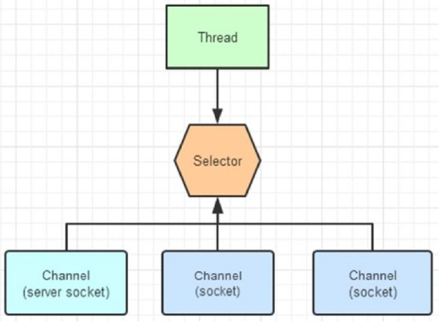

使用 Selector 的好处在于：

使用更少的线程来就可以来处理通道了， 相比使用多个线程，避免了线程上下文切换带来的开销。

### 可选择通道

socket通道类主要分为DatagramChannel、SocketChannel和ServerSocketChannel，它们在被实例化时都会创建一个对等socket对象。

不是所有的 Channel 都可以被 Selector 复用的。比方说，FileChannel 就不能被选择器复用。判断一个 Channel 能被 Selector 复用，有一个前提：判断他是否继承了一个抽象类 SelectableChannel。如果继承了 SelectableChannel，则可以被复用，否则不能。

SelectableChannel 类提供了实现通道的可选择性所需要的公共方法。它是所有支持就绪检查的通道类的父类。所有 socket 通道，都继承了 SelectableChannel 类都是可选择的，包括从管道(Pipe)对象的中获得的通道。而FileChannel 类，没有继承 SelectableChannel，因此是不是可选通道。

### Channel 注册到 Selector

通道和选择器之间的关系，使用注册的方式完成，一个通道可以被注册到多个选择器上。

SelectableChannel 可以被注册到Selector 对象上，在注册的时候，需要指定通道的哪些操作，是 Selector 感兴趣的，感兴趣操作分为四种：

- 可读 : SelectionKey.OP_READ
- 可写 : SelectionKey.OP_WRITE
- 连接 : SelectionKey.OP_CONNECT
- 接收 : SelectionKey.OP_ACCEPT

如果 Selector 对通道的多操作类型感兴趣，可以用“位或”操作符来实现：

比如：int key = SelectionKey.OP_READ | SelectionKey.OP_WRITE ;

这就是选择键，NIO 的编程，就是根据对应的选择键，进行不同的业务逻辑处理。选择键的概念，和事件的概念比较相似。一个选择键类似监听器模式里边的一个事件。由于 Selector 不是事件触发的模式，而是主动去查询的模式，所以不叫事件Event，而是叫 SelectionKey 选择键

###Selector的使用

1、Selector的创建：

~~~java
//获取 Selector 选择器
Selector selector = Selector.open();
~~~

2、注册Channel 到Selector：

~~~java
// 1、获取 Selector 选择器
Selector selector = Selector.open();
// 2、获取通道
ServerSocketChannel serverSocketChannel = ServerSocketChannel.open();
// 3.设置为非阻塞
serverSocketChannel.configureBlocking(false);
// 4、绑定连接
serverSocketChannel.bind(new InetSocketAddress(9999));
// 5、将通道注册到选择器上,并制定监听事件为：“接收”事件
serverSocketChannel.register(selector,SelectionKey.OP_ACCEPT);
~~~

需要注意的是：

* 与 Selector 一起使用时，Channel 必须处于非阻塞模式下，否则将抛出异常IllegalBlockingModeException。这意味着，FileChannel 不能与 Selector 一起使用，因为 FileChannel 不能切换到非阻塞模式，而套接字相关的所有的通道都可以
* 一个通道，并没有一定要支持所有的四种操作。比如服务器通道ServerSocketChannel 支持 Accept 接受操作，而 SocketChannel 客户端通道则不支持。可以通过通道上的 validOps()方法，来获取特定通道下所有支持的操作集合

3、查询就绪操作

下面是 Selector 几个重载的查询 select()方法：

- select():阻塞到至少有一个通道在你注册的事件上就绪了。
- select(long timeout)：和 select()一样，但最长阻塞事件为 timeout 毫秒。
- selectNow():非阻塞，只要有通道就绪就立刻返回。

select()方法返回的 int 值，表示有多少通道已经就绪，更准确的说，是自前一次 select方法以来到这一次 select 方法之间的时间段上，有多少通道变成就绪状态。

一旦调用 select()方法，并且返回值不为 0 时，在 Selector 中有一个 selectedKeys()方法，用来访问已选择键集合，迭代集合的每一个选择键元素，根据就绪操作的类型，完成对应的操作：

~~~java
//获取已经就绪的通道操作
Set selectedKeys = selector.selectedKeys();
Iterator keyIterator = selectedKeys.iterator();
while(keyIterator.hasNext()) {
    SelectionKey key = keyIterator.next();
    //判断key就绪状态是什么
    if(key.isAcceptable()) {
        // a connection was accepted by a ServerSocketChannel.
    } else if (key.isConnectable()) {
        // a connection was established with a remote server.
    } else if (key.isReadable()) {
        // a channel is ready for reading
    } else if (key.isWritable()) {
        // a channel is ready for writing
    }
    keyIterator.remove();
}
~~~

4、停止select

选择器执行选择的过程，系统底层会依次询问每个通道是否已经就绪，这个过程可能会造成调用线程进入阻塞状态，此时可以：

* wakeup：通过调用 Selector 对象的 wakeup（）方法让处在阻塞状态的select()方法立刻返回(唤醒操作)
* close：通过 close（）方法关闭 Selector，该方法使得任何一个在选择操作中阻塞的线程都被唤醒（类似 wakeup（）），同时使得注册到该 Selector 的所有 Channel 被注销，所有的键将被取消，但是 Channel本身并不会关闭

### 使用示例

1、服务端代码：

~~~java
@Test
public void ServerDemo() {
    try {
        //获取服务端通道
        ServerSocketChannel ssc = ServerSocketChannel.open();
        //绑定服务端ip端口号
        ssc.socket().bind(new InetSocketAddress("127.0.0.1",8000));
        //切换非阻塞模式
        ssc.configureBlocking(false);
        
        //获取selector选择器
        Selector selector = Selector.open();
        // 将服务端channel注册到选择器上，并且指定感兴趣的事件是 Accept
        ssc.register(selector, SelectionKey.OP_ACCEPT);
        
        //创建读/写缓冲区
        ByteBuffer readBuff = ByteBuffer.allocate (1024);
        ByteBuffer writeBuff = ByteBuffer.allocate (128);
        
        //写入数据
        writeBuff.put("received".getBytes());
        //切换读写模式
        writeBuff.flip();
        
        while (true) {
            int nReady = selector.select();
            //获取就绪状态集合
            Set<SelectionKey> keys = selector.selectedKeys();
            Iterator<SelectionKey> it = keys.iterator();
            while (it.hasNext()) {
                //获取到就绪状态
                SelectionKey key = it.next();
                it.remove();
                
                //判断是什么状态，对对应操作进行对应处理
                if (key.isAcceptable()) {
                    // 创建新的连接，并且把连接注册到 selector 上，而且，声明这个 channel 只对读操作感兴趣。
                    SocketChannel socketChannel = ssc.accept();
                    socketChannel.configureBlocking(false);
                    socketChannel.register(selector, SelectionKey.OP_READ);
                }
                else if (key.isReadable()) {
                    SocketChannel socketChannel = (SocketChannel) key.channel();
                    readBuff.clear();
                    socketChannel.read(readBuff);
                    readBuff.flip();
                    System.out.println("received : " + new String(readBuff.array()));
                    key.interestOps(SelectionKey.OP_WRITE);
                }
                else if (key.isWritable()) {
                    writeBuff.rewind();
                    SocketChannel socketChannel = (SocketChannel) key.channel();
                    socketChannel.write(writeBuff);
                    key.interestOps(SelectionKey. OP_READ );
                }
                
            }
        }
    } catch (IOException e) {
        e.printStackTrace();
    }
}
~~~

2、客户端代码：

~~~java
@Test
public void ClientDemo() {
    try {
        //获取通道
        SocketChannel socketChannel = SocketChannel.open();
        //绑定主机的ip端口号
        socketChannel.connect(new InetSocketAddress("127.0.0.1",8000));
        //设置非阻塞模式
        socketChannel.configureBlocking(false);
        //创建buffer
        ByteBuffer writeBuffer = ByteBuffer.allocate(32);
        ByteBuffer readBuffer = ByteBuffer.allocate(32);
        //给buffer写入数据
        writeBuffer.put("hello".getBytes());
        //模式切换
        writeBuffer.flip();
        while (true) {
            writeBuffer.rewind();
            //写入通道数据
            socketChannel.write(writeBuffer);
            //关闭
            readBuffer.clear();
            socketChannel.read(readBuffer);
        }
    } catch (IOException e) {

    }
}
~~~

NIO编程步骤总结：

第一步：创建 Selector 选择器
第二步：创建 ServerSocketChannel 通道，并绑定监听端口
第三步：设置 Channel 通道是非阻塞模式
第四步：把 Channel 注册到 Socketor 选择器上，监听连接事件
第五步：调用 Selector 的 select 方法（循环调用），监测通道的就绪状况
第六步：调用 selectKeys 方法获取就绪 channel 集合
第七步：遍历就绪 channel 集合，判断就绪事件类型，实现具体的业务操作
第八步：根据业务，决定是否需要再次注册监听事件，重复执行第三步操作

## Pipe

Java NIO 管道是 2 个线程之间的单向数据连接。Pipe 有一个 source 通道和一个sink 通道。数据会被写到 sink 通道，从 source 通道读取。

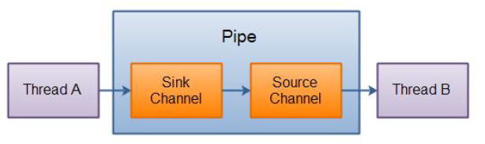

如果想要向管道写数据，就要访问sink通道，然后向该通道写入；如果想要向管道读数据，就要访问source通道，然后向该通道读：

~~~java
    // 1、获取通道
    Pipe pipe = Pipe.open();
    // 2、获取 sink 管道，用来传送数据,写管道
    Pipe.SinkChannel sinkChannel = pipe.sink();
    // 3、申请一定大小的缓冲区
    ByteBuffer byteBuffer = ByteBuffer.allocate(1024);
    byteBuffer.put("achang".getBytes());
    byteBuffer.flip();
        
    // 4、sink 发送数据,写入操作
    sinkChannel.write(byteBuffer);
        
    // 5、创建接收 pipe 数据的 source 管道，读管道
    Pipe.SourceChannel sourceChannel = pipe.source();
        
    // 6、接收数据，并保存到缓冲区中
    ByteBuffer byteBuffer2 = ByteBuffer.allocate(1024);
    int length = sourceChannel.read(byteBuffer2);
    System.out.println(new String(byteBuffer2.array(), 0, length));
        
    // 7、关闭
    sourceChannel.close();
    sinkChannel.close();
~~~

## FileLock

文件锁在 OS 中很常见，如果多个程序同时访问、修改同一个文件，很容易因为文件数据不同步而出现问题。给文件加一个锁，同一时间，只能有一个程序修改此文件，或者程序都只能读此文件，这就解决了同步问题。

文件锁是进程级别的，不是线程级别的。文件锁可以解决多个进程并发访问、修改同一个文件的问题，但不能解决多线程并发访问、修改同一文件的问题。使用文件锁时，同一进程内的多个线程，可以同时访问、修改此文件。

文件锁是当前程序所属的 JVM 实例持有的，一旦获取到文件锁（对文件加锁），要调用 release()，或者关闭对应的 FileChannel 对象，或者当前 JVM 退出，才会释放这个锁。

一旦某个进程（比如说 JVM 实例）对某个文件加锁，则在释放这个锁之前，此进程不能再对此文件加锁，就是说 JVM 实例在同一文件上的文件锁是不重叠的（进程级别不能重复在同一文件上获取锁）

文件锁也分为排它锁和共享锁两种。如对1.txt上锁：

~~~java
//创建 FileChannel 对象，文件锁只能通过 FileChannel 对象来使用
FileChannel fileChannel=new FileOutputStream("./1.txt").getChannel();
//对文件加锁
FileLock lock=fileChannel.lock();
//对此文件进行一些读写操作。
//.......
//释放锁
lock.release();
~~~

几个常用的方法：

1、lock()：对整个文件加锁，默认是排它锁

2、lock(long position, long size, booean shared) ，自定义加锁方式。前 2 个参数指定要加锁的部分（可以只对此文件的部分内容加锁），第三个参数值指定是否是共享锁

3、tryLock()：对整个文件加锁，默认是排它锁，和lock的区别是它是非阻塞的，若成功就返回锁对象，若失败则返回null

4、tryLock(long position, long size, booean shared)，同2

5、isShared()，判断此文件锁是否是共享锁

6、isValid()，判断此文件锁是否还有效

在某些 OS 上，对某个文件加锁后，不能对此文件使用通道映射。

使用案例：

~~~java
        String input = "achang";
        System.out.println("输入 :" + input);
        
        ByteBuffer buf = ByteBuffer.wrap(input.getBytes());
        String filePath = "D:\\achang\\01.txt";
        Path pt = Paths.get(filePath);
        FileChannel channel = FileChannel.open(pt,
                                                 StandardOpenOption.WRITE,
                                                 StandardOpenOption.APPEND);
        
        channel.position(channel.size() - 1); // position of a cursor at the end offile
        
        //文件获取锁
        // 获得锁方法一：lock()，阻塞方法，当文件锁不可用时，当前进程会被挂起
        //lock = channel.lock();// 无参 lock()为独占锁
        // lock = channel.lock(0L, Long.MAX_VALUE, true);有参 lock()为共享锁，有写操作会报异常
        // 获得锁方法二：trylock()，非阻塞的方法，当文件锁不可用时，tryLock()会得到 null 值
        FileLock lock = channel.tryLock(0,Long. MAX_VALUE ,false);
        System.out.println("共享锁 shared: " + lock.isShared());
        channel.write(buf);
        
        channel.close(); // Releases the Lock
        System.out.println("写操作完成.");
        
        //读取数据
        readPrint (fp);
~~~

~~~java
//读取数据
public static void readPrint(String path) throws IOException {
    //通过字符流读取
    FileReader filereader = new FileReader(path);
    //包装缓存流
    BufferedReader bufferedreader = new BufferedReader(filereader);
    
    String tr = bufferedreader.readLine();
    System.out.println("读取内容: ");
    while (tr != null) {
        System.out.println(" " + tr);
        tr = bufferedreader.readLine();
    }
    
    //关闭
    filereader.close();
    bufferedreader.close();
}
~~~

## Path&Files

### Path

Path 接口位于java.nio.file 包中，一个路径可以指向一个文件或一个目录。

路径可以是绝对路径，也可以是相对路径，在许多情况下，可以使用 Path 接口来替换 File 类的使用

1、创建绝对路径：

~~~java
Path path = Paths.get("d:\\achang\\001.txt"); // windows
Path path = Paths.get("/home/jakobjenkov/myfile.txt"); // linux
~~~

2、创建相对路径：

可以使用 Paths.get(basePath,relativePath)方法创建一个相对路径：

~~~java
//d:\achang\projects
Path projects = Paths.get("d:\\achang", "projects");
//d:\achang\projects\002.txt
Path file = Paths.get("d:\\achang", "projects\\002.txt");
~~~

3、normalize方法

Path 接口的 normalize()方法可以使路径标准化。标准化意味着它将移除所有在路径字符串的中间的.和…代码，并解析路径字符串所引用的路径。

~~~java
String originalPath ="d:\\achang\\projects\\..\\yygh-project";

Path path1 = Paths. get (originalPath);
System. out .println("path1 = " + path1);  // d:\achang\projects\..\yygh-project

Path path2 = path1.normalize();//标准化处理
System. out .println("path2 = " + path2);  // d:\achang\yygh-project，相当于向上找了一层
~~~

###Files

Java NIO Files 类(java.nio.file.Files)提供了几种操作文件系统中的文件的方法。以下内容介绍 Java NIO Files 最常用的一些方法。java.nio.file.Files 类与java.nio.file.Path 实例一起工作

1、创建新目录

Files.createDirectory()方法，用于根据 Path 实例创建一个新目录：

~~~java
Path path = Paths.get("d:\\sgg");
try {
    //创建一个新目录
    Path newDir = Files.createDirectory(path);
} catch(FileAlreadyExistsException e){
    // 目录已经存在
} catch (IOException e) {
    // 其他发生的异常
    e.printStackTrace();
}
~~~

如果创建目录成功，将返回一个 Path 实例，该实例指向新创建的路径。

如果该目录已经存在，则是抛出一个 java.nio.file.FileAlreadyExistsException。

如果出现其他错误，可能会抛出 IOException。

例如，如果想要的新目录的父目录不存在，则可能会抛出 IOException。

2、拷贝文件

Files.copy()方法从一个路径拷贝一个文件到另外一个目录

~~~java
Path sourcePath = Paths.get("d:\\achang\\01.txt");
Path destinationPath = Paths.get("d:\\achang\\002.txt");

try {
    //文件复制操作
    Files.copy(sourcePath, destinationPath);
} catch(FileAlreadyExistsException e) {
    // 目录已经存在
} catch (IOException e) {
    // 其他发生的异常
    e.printStackTrace();
}
~~~

可以让源路径引用的文件被复制到目标路径引用的文件中。

如果目标文件已经存在，则抛出一个java.nio.file.FileAlreadyExistsException 异常。

如果有其他错误，则会抛出一个 IOException。

例如，如果将该文件复制到不存在的目录，则会抛出 IOException

可以指定覆盖已存在的文件：

~~~java
Files.copy(sourcePath, destinationPath, StandardCopyOption.REPLACE_EXISTING);
~~~

3、剪切文件：

Files.move()用于将文件从一个路径移动到另一个路径。

移动文件与重命名相同，但是移动文件既可以移动到不同的目录，也可以在相同的操作中更改它的名称。

~~~java
Path sourcePath = Paths.get("d:\\achang\\01.txt");
Path destinationPath = Paths.get("d:\\achang\\001.txt");

try {
    Files. move (sourcePath, destinationPath,StandardCopyOption. REPLACE_EXISTING );
} catch (IOException e) {
    //移动文件失败
    e.printStackTrace();
}
~~~

Files.move()的第三个参数。这个参数告诉 Files.move()方法来覆盖目标路径上的任何现有文件。

4、删除文件或目录

~~~java
Path path = Paths. get ("d:\\achang\\001.txt");
try {
    Files.delete(path);
} catch (IOException e) {
    // 删除文件失败
    e.printStackTrace();
}
~~~

创建指向要删除的文件的 Path。然后调用 Files.delete()方法。

如果 Files.delete()不能删除文件(例如，文件或目录不存在)，会抛出一个IOException。

5、遍历目录树

Files.walkFileTree()方法包含递归遍历目录树功能，将 Path 实例和 FileVisitor作为参数。Path 实例指向要遍历的目录，FileVisitor 在遍历期间被调用。在目录遍历过程中，您的 FileVisitor 实现的每个方法都将被调用。如果不需要实现所有这些方法，那么可以扩展 SimpleFileVisitor 类，它包含FileVisitor 接口中所有方法的默认实现。

下面是在目录下寻找一个名为 001.txt 的文件示例：

~~~java
Path rootPath = Paths.get("d:\\achang");
String fileToFind = File.separator + "001.txt";

try {
    Files.walkFileTree(rootPath, new SimpleFileVisitor<Path>() {
        @Override
        public FileVisitResult visitFile(Path file, BasicFileAttributes attrs) throws IOException {
            String fileString = file.toAbsolutePath().toString();
            //System.out.println("pathString = " + fileString);
            //查这个文件是否存在
            if(fileString.endsWith(fileToFind)){
                System.out.println("file found at path: " + file.toAbsolutePath());
                //终止操作
                return FileVisitResult.TERMINATE ;
            }
            //继续操作
            return FileVisitResult.CONTINUE ;
        }
    });
} catch(IOException e){
    e.printStackTrace();
}
~~~

每次调用visitFile时可以返回一个FileVisitResult来指示遍历行为的下一步行动：

~~~java
CONTINUE 继续
TERMINATE 终止
SKIP_SIBLING 跳过同级
SKIP_SUBTREE 跳过子级
~~~

## AsynchronousFileChannel

在 Java 7 中，Java NIO 中添加了 AsynchronousFileChannel，也就是是异步地将数据写入文件

1、通过Future读数据

~~~java
Path path = Paths.get("d:\\achang\\001.txt");

AsynchronousFileChannel fileChannel = null;
try {
    //创建了一个 AsynchronousFileChannel异步通道，指定读操作StandardOpenOption.READ
    fileChannel = AsynchronousFileChannel.open(path,StandardOpenOption.READ);
} catch (IOException e) {
    e.printStackTrace();
}
//创建一个 ByteBuffer，它被传递给 read()方法作为参数，以及一个 0 的位置
ByteBuffer buffer = ByteBuffer.allocate(1024);

//在调用 read()之后，循环
long position = 0;
Future<Integer> operation = fileChannel.read(buffer, position);

//直到返回的 isDone()方法返回 true
while(!operation.isDone());

//读取操作完成后，数据读取到 ByteBuffer 中，然后打印到 System.out 中
buffer.flip();
byte[] data = new byte[buffer.limit()];
buffer.get(data);
System.out.println(new String(data));//以字符串的形式输出
buffer.clear();
~~~

read的动作返回后不会立即读取完毕，而是返回了一个异步任务，等到任务执行完，文件中的内容才被写入缓冲区。

2、通过CompletionHandler读数据

~~~java
Path path = Paths.get("d:\\achang\\001.txt");
AsynchronousFileChannel fileChannel = null;
try {
    //获取异步通道，指定读操作StandardOpenOption.READ
    fileChannel = AsynchronousFileChannel.open(path,StandardOpenOption.READ);
} catch (IOException e) {
    e.printStackTrace();
}
ByteBuffer buffer = ByteBuffer.allocate(1024);

long position = 0;
fileChannel.read(buffer, position, buffer, new CompletionHandler<Integer,
                 ByteBuffer>() {
                     //读取完成之后会调用
                     @Override
                     public void completed(Integer result,ByteBuffer attachment) {
                         System.out.println("result = " + result);
                         
                         attachment.flip();
                         byte[] data = new byte[attachment.limit()];
                         attachment.get(data);
                         System.out.println(new String(data));
                         attachment.clear();
                     }
                     
                     //读取失败后调用
                     @Override
                     public void failed(Throwable exc, ByteBuffer attachment) {
                     }
                 });
~~~

等读取完成后会回调对应的方法，实现异步的操作

3、通过Future读数据

~~~java
Path path = Paths. get ("d:\\achang\\001.txt");
AsynchronousFileChannel fileChannel = null;
try {
    //获取异步通道，指定写操作StandardOpenOption.WRITE
    fileChannel = AsynchronousFileChannel.open(path,StandardOpenOption.WRITE);
} catch (IOException e) {
    e.printStackTrace();
}
//创建buffer，并写入数据
ByteBuffer buffer = ByteBuffer.allocate(1024);
long position = 0;
buffer.put("achang data".getBytes());
buffer.flip();//切换写模式

//写操作
Future<Integer> operation = fileChannel.write(buffer, position);
buffer.clear();

//判断是否写入完成
while(!operation.isDone());
System.out println("Write over");
~~~

写入数据也是返回一个异步任务Future，需要通过它判断是否写入完成。

注意，文件必须已经存在。如果该文件不存在，那么 write()方法将抛出一个java.nio.file.NoSuchFileException

4、通过CompletionHandler写数据

~~~java
Path path = Paths.get("d:\\achang\\001.txt");

//文件不存在就创建
if(!Files.exists(path)){
    try {
        Files.createFile(path);
    } catch (IOException e) {
        e.printStackTrace();
    }
}

AsynchronousFileChannel fileChannel = null;
try {
    //获取异步通道，指定写操作StandardOpenOption.WRITE
    fileChannel = AsynchronousFileChannel.open(path,StandardOpenOption.WRITE);
} catch (IOException e) {
    e.printStackTrace();
}

//创建buffer，并写入数据
ByteBuffer buffer = ByteBuffer.allocate 1024);
long position = 0;
buffer.put("achang data".getBytes());
buffer.flip();//切换为写操作

//写操作
fileChannel.write(buffer, position, buffer, new CompletionHandler<Integer,
                  ByteBuffer>() {
                      //写入完成后会调用
                      @Override
                      public void completed(Integer result, ByteBuffer attachment) {
                          System.out.println("bytes written: " + result);
                      }
                      
                      //写入失败后调用
                      @Override
                      public void failed(Throwable exc, ByteBuffer attachment) {
                          System.out.println("Write failed");
                          exc.printStackTrace();
                      }
                  });
~~~

## Charset

常用静态方法：

~~~java
public static Charset forName(String charsetName)//通过编码类型获得 Charset 对象
public static SortedMap<String,Charset> availableCharsets()//获得系统支持的所有编码方式
public static Charset defaultCharset()//获得虚拟机默认的编码方式
public static boolean isSupported(String charsetName)//判断是否支持该编码类型
~~~

常用普通方法：

~~~java
public final String name()//获得 Charset 对象的编码类型(String)
public abstract CharsetEncoder newEncoder()//获得编码器对象
public abstract CharsetDecoder newDecoder()//获得解码器对象
~~~

样例：

~~~java
@Test
public void charSetEncoderAndDecoder() throws
    CharacterCodingException {
    //0.获取Charset对象
    Charset charset=Charset.forName("UTF-8");
    
    //1.获取编码器对象
    CharsetEncoder charsetEncoder=charset.newEncoder();
    
    //2.获取解码器对象
    CharsetDecoder charsetDecoder=charset.newDecoder();
    
    //3.创建buffer缓冲区对象，并写入数据
    CharBuffer charBuffer=CharBuffer.allocate(1024);
    charBuffer.put("achang数据");
    charBuffer.flip();//转换读写模式
    
    //4.通过编码器对象，进行编码
    ByteBuffer byteBuffer=charsetEncoder.encode(charBuffer);
    System.out.println("编码后：");
    for (int i=0;i<byteBuffer.limit();i++) {
        System.out.println(byteBuffer.get());
    }
    
    //5.解码
    byteBuffer.flip();//读写切换
    //通过解码器对象，进行解码
    CharBuffer charBuffer1=charsetDecoder.decode(byteBuffer);
    System.out.println("解码后：");
    System.out.println(charBuffer1.toString());
    
    System.out.println("指定其他格式解码:");
    Charset charset1=Charset.forName("GBK");
    byteBuffer.flip//读写切换
    CharBuffer charBuffer2 =charset1.decode(byteBuffer);
    System.out.println(charBuffer2.toString());
    
    //6.获取 Charset 所支持的字符编码
    Map<String ,Charset> map= Charset.availableCharsets();
    Set<Map.Entry<String,Charset>> set=map.entrySet();
    for (ap.Entry<String,Charset> entry: set) {
        System. out .println(entry.getKey()+"="+entry.getValue().toString());
    }
}
~~~

## 简易多人聊天室实例

服务端代码：

~~~java
public class ChatServer {

    //服务端启动的方法
    public void startServer() throws IOException {
        //1、创建Selector选择器
        Selector selector = Selector.open();

        //2、创建ServerSocketChannel通道
        ServerSocketChannel serverSocketChannel = ServerSocketChannel.open();

        //3、为channel通道绑定端口号
        serverSocketChannel.bind(new InetSocketAddress(9090));
        serverSocketChannel.configureBlocking(false);//设置非阻塞模式

        //4、把serverSocketChannel绑定到selector上
        serverSocketChannel.register(selector, SelectionKey.OP_ACCEPT);
        System.out.println("服务器启动.......");

        //5、循环监听是否有连接连入
        while (true) {
            int select = selector.select();

            //如果为0，则为没连接，没有获取到，就跳出循环
            if (select == 0) {
                continue;
            }

            //获取可用channel
            Set<SelectionKey> selectionKeys = selector.selectedKeys();
            //遍历
            Iterator<SelectionKey> iterator = selectionKeys.iterator();
            while (iterator.hasNext()) {
                SelectionKey selectionKey = iterator.next();

                //移除 set 集合当前 selectionKey
                iterator.remove();

                //6、根据就绪状态，调用对应方法实现具体业务操作
                if (selectionKey.isAcceptable()) {
                    //6.1 如果 accept 状态
                    acceptOperator(serverSocketChannel, selector);
                }
                if (selectionKey.isReadable()) {
                    //6.2 如果可读状态
                    readOperator(selector, selectionKey);
                }
            }
        }
    }

    //处理可读状态操作
    private void readOperator(Selector selector, SelectionKey selectionKey) throws IOException {
        //1 从 SelectionKey 获取到已经就绪的通道
        SocketChannel channel = (SocketChannel) selectionKey.channel();

        //2 创建 buffer
        ByteBuffer byteBuffer = ByteBuffer.allocate(1024);

        //3 循环读取客户端消息
        int readLength = channel.read(byteBuffer);
        String message = "";//用于接收解码后的信息

        //表示里面有数据
        if (readLength > 0) {
            //切换读模式
            byteBuffer.flip();
            //读取内容
            message += Charset.forName("UTF-8").decode(byteBuffer);
        }

        //4 将 channel 再次注册到选择器上，监听可读状态
        channel.register(selector, SelectionKey.OP_READ);

        //5 把客户端发送消息，广播到其他客户端
        if (message.length() > 0) {
            //广播给其他客户端
            System.out.println(message);
            castOtherClient(message, selector, channel);
        }
    }

    //广播到其他客户端
    private void castOtherClient(String message, Selector selector, SocketChannel channel) throws IOException {
        //1 获取所有已经接入 channel
        Set<SelectionKey> selectionKeySet = selector.keys();
        //2 循环想所有 channel 广播消息
        for (SelectionKey selectionKey : selectionKeySet) {
            //获取每个 channel
            Channel tarChannel = selectionKey.channel();
            //不需要给自己发送
            if (tarChannel instanceof SocketChannel && tarChannel != channel) {//不向自己广播
                ((SocketChannel) tarChannel).write(Charset.forName("UTF-8").encode(message));
            }
        }
    }

    //处理接入状态操作
    private void acceptOperator(ServerSocketChannel serverSocketChannel, Selector selector) throws IOException {
        //1 接入状态，创建 socketChannel
        SocketChannel accept = serverSocketChannel.accept();
        //2 把 socketChannel 设置非阻塞模式
        accept.configureBlocking(false);
        //3 把 channel 注册到 selector 选择器上，监听可读状态
        accept.register(selector, SelectionKey.OP_READ);
        //4 客户端回复信息
        accept.write(Charset.forName("UTF-8").encode("欢迎进入聊天室，请注意隐私安全"));
    }

    public static void main(String[] args) throws IOException {
        new ChatServer().startServer();
    }

}
~~~

客户端代码：

~~~java
public class ChatClient {

    //启动方法
    public void startClient(String name) throws IOException {
        //连接服务端
        SocketChannel socketChannel = SocketChannel.open(new InetSocketAddress("127.0.0.1",9090));
        //接收服务端响应数据
        Selector selector = Selector.open();
        socketChannel.configureBlocking(false);//设置非阻塞连接
        socketChannel.register(selector, SelectionKey.OP_READ);//将通道注册到selector上
        //创建线程，来接收服务端的响应信息
        new Thread(new ClientThread(selector)).start();

        //向服务端发送信息
        Scanner scanner = new Scanner(System.in);
        while (scanner.hasNextLine()){
            String msg = scanner.nextLine();
            if (msg.length()>0){
                //写入通道消息，让他发送给服务端
                socketChannel.write(Charset.forName("UTF-8").encode(name+": "+msg));
            }
        }
    }

}
~~~

客户端监听服务器响应的类：

~~~java
public class ClientThread implements Runnable {

    private Selector selector;

    public ClientThread(Selector selector) {
        this.selector = selector;
    }

    @Override
    public void run() {
        try {
            while (true) {
                //获取 channel 数量
                int readChannels = selector.select();
                if (readChannels == 0) {
                    continue;
                }
                //获取可用的 channel
                Set<SelectionKey> selectionKeys = selector.selectedKeys();
                //遍历集合
                Iterator<SelectionKey> iterator = selectionKeys.iterator();
                while (iterator.hasNext()) {
                    SelectionKey selectionKey = iterator.next();
                    //移除 set 集合当前 selectionKey
                    iterator.remove();
                    //如果可读状态
                    if (selectionKey.isReadable()) {
                        //处理可读状态操作
                        readOperator(selector, selectionKey);
                    }
                }
            }
        } catch (IOException e) {
            e.printStackTrace();
        }
    }

    //处理可读状态操作
    private void readOperator(Selector selector, SelectionKey selectionKey) throws IOException {
        //1 从 SelectionKey 获取到已经就绪的通道
        SocketChannel socketChannel =(SocketChannel) selectionKey.channel();
        //2 创建 buffer
        ByteBuffer byteBuffer = ByteBuffer.allocate(1024);
        //3 循环读取客户端消息
        int readLength = socketChannel.read(byteBuffer);
        String message = "";//用于存储解码后的消息
        if (readLength > 0) {
            //切换读模式
            byteBuffer.flip();
            //读取内容
            message += Charset.forName("UTF-8").decode(byteBuffer);
        }
        //4 将 channel 再次注册到选择器上，监听可读状态
        socketChannel.register(selector, SelectionKey.OP_READ);
        //5 把客户端发送消息，广播到其他客户端
        if (message.length() > 0) {
            //广播给其他客户端
            System.out.println(message);
        }
    }
    
}
~~~

然后启动服务器的main方法，再分别启动客户端：

~~~java
public class AClient {
    public static void main(String[] args) {
        try {
            new ChatClient().startClient("阿昌一号");
        } catch (IOException e) {
            e.printStackTrace();
        }
    }
}

public class BClient {
    public static void main(String[] args) {
        try {
            new ChatClient().startClient("阿昌二号");
        } catch (IOException e) {
            e.printStackTrace();
        }
    }
}
~~~

然后在客户端发送消息，服务器和所有连接服务器的客户端都能看到消息了。

# 零拷贝

零拷贝是网络编程性能优化的关键。Java中常用的零拷贝有mmap（memory map，内存映射）和sendFile

## 传统I/O读写场景分析

分析下面这段代码：

~~~java
File file = new File("test.txt");
RandomAccessFile raf = new RandomAccessFile(file, "rw");

// 读取数据
byte[] arr = new byte[(int)file.length()];
raf.read(arr);

// 写入数据
Socket socket = new ServerSocket(8080).accept();
socket.getOutputStream().write(arr);
~~~

1、首先代码一开始运行在用户态

2、开始read，切换到内核态，将磁盘中的文件用DMA（Direct Memory Access，直接内存拷贝）的方式拷贝到内核空间缓冲区

3、将数据从内核空间拷贝（通过CPU拷贝）到用户空间缓冲区，同时切换到用户态，读取结束

4、开始write，切换到内核态，将数据从用户空间通过CPU拷贝到内核空间的socket缓冲区

5、将数据从内核空间DMA拷贝到协议栈上

6、切换到用户态

整个经历了4次状态切换+4次拷贝

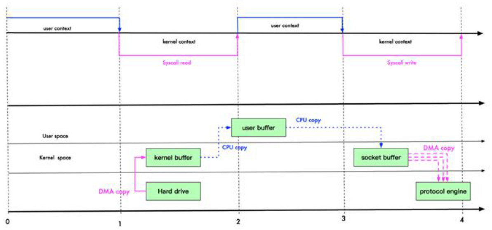

## mmap优化

mmap 通过内存映射，将文件映射到内核缓冲区，同时，用户空间可以共享内核空间的数据。这样，在进行网络传输时，就可以减少内核空间到用户空间的拷贝次数。如下图：

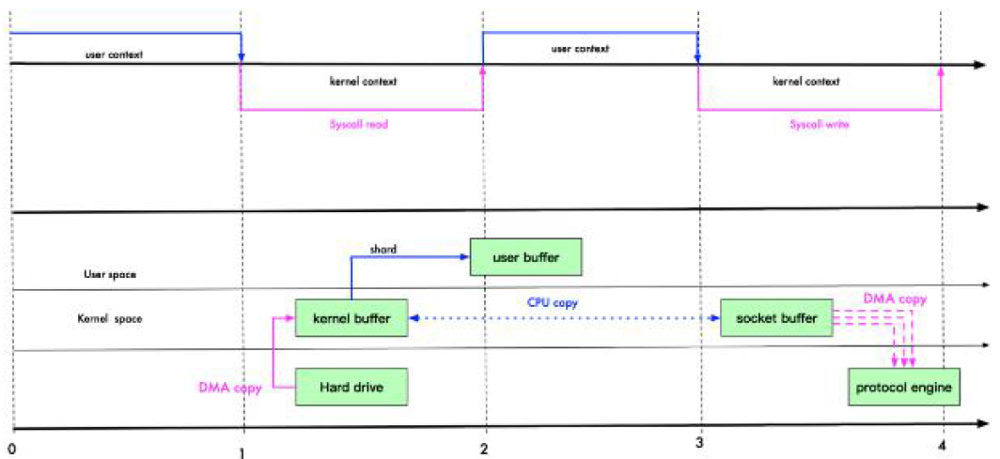

区别在于减少一次拷贝次数，读或者写的时候不用从内核缓冲区拷贝到用户缓冲区了，也不用再从用户缓冲区拷贝到socket缓冲区了，而是直接从内核缓冲区CPU拷贝到socket缓冲区

整个经历了4次状态切换+3次拷贝

## sendFile优化

Linux2.1 版本提供了 sendFile 函数，其基本原理如下：数据根本不经过用户态，直接从内核缓冲区进入到 SocketBuffer，同时，由于和用户态完全无关，就减少了一次上下文切换：

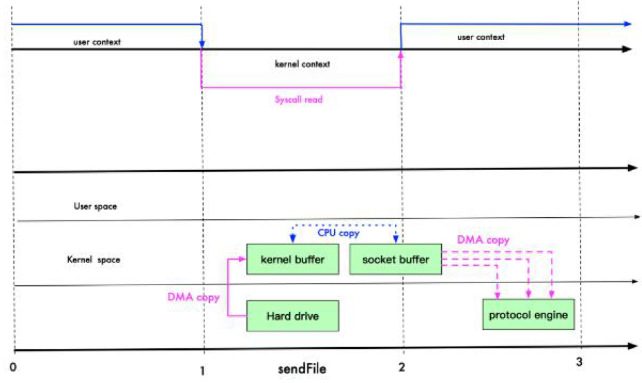

不经过用户态，就可以减少一次状态切换：

整个经历了3次状态切换+3次拷贝

零拷贝从操作系统角度，是没有 cpu 拷贝，后续经过优化，Linux在2.4 版本中，做了一些修改，避免了从内核缓冲区拷贝到 Socketbuffer 的操作，直接拷贝到协议栈，从而再一次减少了数据拷贝：

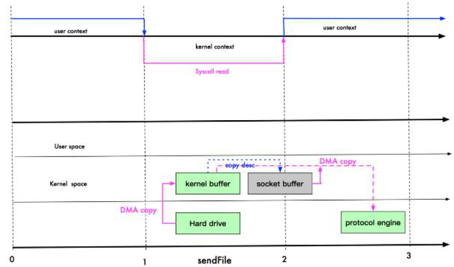

这里其实有一次 cpu 拷贝 kernel buffer -> socket buffer 但是，拷贝的信息很少，比如 lenght、offset 消耗低，可以忽略，基本可以满足零拷贝的要求

整个经历了3次状态切换+2次拷贝

两种优化方式相比之下：

* mmap 适合小数据量读写（此时CPU copy不慢），sendFile 适合大文件传输
* mmap 需要 4 次上下文切换，3 次数据拷贝；sendFile 需要 3 次上下文切换，最少 2 次数据拷贝
* sendFile 可以利用 DMA 方式，减少 CPU 拷贝，mmap 则不能（必须从内核拷贝到 Socket缓冲区）

## 零拷贝的概念

零拷贝：

* I/O过程没有 cpu 拷贝
* 内核缓冲区之间，没有数据是重复的（只有 kernel buffer 有一份数据）

零拷贝不仅仅带来更少的数据复制，还能带来其他的性能优势，例如更少的上下文切换，更少的 CPU 缓存伪共享以及无 CPU 校验和计算

## 零拷贝案例

### 传统I/O传输文件

服务器端：

~~~java
//java IO 的服务器
public class OldIOServer {

    public static void main(String[] args) throws Exception {
        ServerSocket serverSocket = new ServerSocket(7001);

        while (true) {
            Socket socket = serverSocket.accept();
            DataInputStream dataInputStream = new DataInputStream(socket.getInputStream());

            try {
                byte[] byteArray = new byte[4096];

                while (true) {
                    int readCount = dataInputStream.read(byteArray, 0, byteArray.length);

                    if (-1 == readCount) {
                        break;
                    }
                }
            } catch (Exception ex) {
                ex.printStackTrace();
            }
        }
    }
}
~~~

客户端：

~~~java
public class OldIOClient {

    public static void main(String[] args) throws Exception {
        Socket socket = new Socket("localhost", 7001);

        String fileName = "protoc-3.6.1-win32.zip";
        InputStream inputStream = new FileInputStream(fileName);

        DataOutputStream dataOutputStream = new DataOutputStream(socket.getOutputStream());

        byte[] buffer = new byte[4096];
        long readCount;
        long total = 0;

        long startTime = System.currentTimeMillis();

        while ((readCount = inputStream.read(buffer)) >= 0) {
            total += readCount;
            dataOutputStream.write(buffer);
        }

        System.out.println("发送总字节数： " + total + ", 耗时： " + (System.currentTimeMillis() - startTime));

        dataOutputStream.close();
        socket.close();
        inputStream.close();
    }
}
~~~

### NIO零拷贝传输文件

主要是应用fileChannel.transferTo这个方法

服务器端：

~~~java
//服务器
public class NewIOServer {
    public static void main(String[] args) throws Exception {

        InetSocketAddress address = new InetSocketAddress(7001);

        ServerSocketChannel serverSocketChannel = ServerSocketChannel.open();

        ServerSocket serverSocket = serverSocketChannel.socket();

        serverSocket.bind(address);

        //创建buffer
        ByteBuffer byteBuffer = ByteBuffer.allocate(4096);

        while (true) {
            SocketChannel socketChannel = serverSocketChannel.accept();

            int readcount = 0;
            while (-1 != readcount) {
                try {

                    readcount = socketChannel.read(byteBuffer);

                }catch (Exception ex) {
                   // ex.printStackTrace();
                    break;
                }
                //
                byteBuffer.rewind(); //倒带 position = 0 mark 作废
            }
        }
    }
}
~~~

客户端：

~~~java
public class NewIOClient {
    public static void main(String[] args) throws Exception {

        SocketChannel socketChannel = SocketChannel.open();
        socketChannel.connect(new InetSocketAddress("localhost", 7001));
        String filename = "protoc-3.6.1-win32.zip";

        //得到一个文件channel
        FileChannel fileChannel = new FileInputStream(filename).getChannel();

        //准备发送
        long startTime = System.currentTimeMillis();

        //在linux下一个transferTo 方法就可以完成传输
        //在windows 下 一次调用 transferTo 只能发送8m , 就需要分段传输文件, 而且要主要
        //传输时的位置 =》 课后思考...
        //transferTo 底层使用到零拷贝
        long transferCount = fileChannel.transferTo(0, fileChannel.size(), socketChannel);

        System.out.println("发送的总的字节数 =" + transferCount + " 耗时:" + (System.currentTimeMillis() - startTime));

        //关闭
        fileChannel.close();

    }
}
~~~

这里如果是linux则调用一次transferTo即可，但对windows，一次调用 transferTo 只能发送8m , 就需要分段传输文件，这里就应该循环调用transferTo

# Java AIO

JDK7 引入了 AsynchronousI/O，即 AIO。在进行 I/O 编程中，常用到两种模式：Reactor 和 Proactor。Java 的 NIO 就是 Reactor，当有事件触发时，服务器端得到通知，进行相应的处理

AIO 即 NIO2.0，叫做异步不阻塞的 IO。AIO 引入异步通道的概念，采用了 Proactor 模式，简化了程序编写，有效的请求才启动线程，它的特点是先由操作系统完成后才通知服务端程序启动线程去处理，一般适用于连接数较多且连接时间较长的应用

目前 AIO 还没有广泛应用，暂不讨论

BIO/NIO/AIO对比：

|       | BIO  | NIO   | AIO   |
| ----- | ---- | ----- | ----- |
| I/O模型 | 同步阻塞 | 同步非阻塞 | 异步非阻塞 |
| 编程难度  | 简单   | 复杂    | 复杂    |
| 可靠性   | 差    | 好     | 好     |
| 吞吐量   | 低    | 高     | 高     |

# Netty

## 概述

原生NIO存在的问题：

* NIO 的类库和 API 繁杂，使用麻烦：需要熟练掌握 Selector、ServerSocketChannel、SocketChannel、ByteBuffer等
* 要熟悉 Java 多线程编程和网络编程，才能编写高质量的NIO程序
* 一些场景开发难度高：例如客户端面临断连重连、网络闪断、半包读写、失败缓存、网络拥塞和异常流的处理等等
* JDK NIO 的 Bug：例如臭名昭著的 Epoll Bug，它会导致 Selector 空轮询，最终导致 CPU100%。直到 JDK1.7 版本该问题仍旧存在，没有被根本解决

Netty 对 JDK 自带的 NIO 的 API 进行了封装，解决了上述问题：

* 设计优雅：适用于各种传输类型的统一 API 阻塞和非阻塞 Socket；基于灵活且可扩展的事件模型，可以清晰地分离关注点；高度可定制的线程模型-单线程，一个或多个线程池。
* 使用方便：详细记录的 Javadoc，用户指南和示例；没有其他依赖项，JDK5（Netty3.x）或 6（Netty4.x）就足够了。
* 高性能、吞吐量更高：延迟更低；减少资源消耗；最小化不必要的内存复制。
* 安全：完整的 SSL/TLS 和 StartTLS 支持。
* 社区活跃、不断更新：社区活跃，版本迭代周期短，发现的 Bug 可以被及时修复，同时，更多的新功能会被加入

Netty 是由 JBOSS 提供的一个 Java 开源框架，现为 Github 上的独立项目。

Netty 是一个异步的、基于事件驱动的网络应用框架，用以快速开发高性能、高可靠性的网络 IO 程序。Netty经常作为基础通信组件被 RPC 框架使用（如Dubbo）、在大数据领域也有广泛应用（Hadoop、Flink、Spark）
Netty 主要针对在 TCP 协议下，面向 Client 端的高并发应用，或者 Peer-to-Peer 场景下的大量数据持续传输的应用。
Netty 本质是一个 NIO 框架，适用于服务器通讯相关的多种应用场景。

Netty 版本分为 Netty 3.x 和 Netty 4.x、Netty 5.x
因为 Netty 5 出现重大 bug，已经被官网废弃了，目前推荐使用的是 Netty 4.x的稳定版本，这里使用的是Netty4.1.x

## I/O线程模型介绍

目前存在的线程模型有：传统阻塞 I/O 服务模型 和Reactor 模式

根据 Reactor 的数量和处理资源池线程的数量不同，有 3 种典型的实现：

* 单 Reactor 单线程；
* 单 Reactor多线程；
* 主从 Reactor多线程

Netty 主要基于主从 Reactor 多线程模型做了一定的改进

举例说明三种模式的区别：

* 单 Reactor 单线程，前台接待员和服务员是同一个人，全程为顾客服
* 单 Reactor 多线程，1 个前台接待员，多个服务员，接待员只负责接待
* 主从 Reactor 多线程，多个前台接待员，多个服务生

### 传统阻塞 I/O 服务

它采用阻塞 IO 模式获取输入的数据，每个连接都需要独立的线程完成数据的输入，业务处理，数据返回：

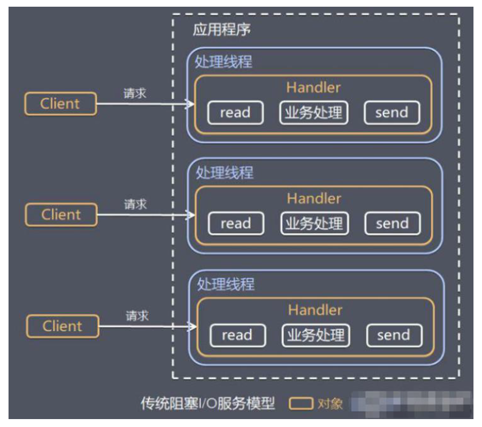

该模型存在的问题：

* 当并发数很大，就会创建大量的线程，占用很大系统资源
* 连接创建后，如果当前线程暂时没有数据可读，该线程会阻塞在 Handler对象中的read 操作，导致上面的处理线程资源浪费

### Reactor模式

它解决了传统阻塞I/O模型的问题，基于 I/O 复用模型：多个连接共用一个阻塞对象ServiceHandler，应用程序只需要在一个阻塞对象等待，无需阻塞等待所有连接。当某个连接有新的数据可以处理时，操作系统通知应用程序，线程从阻塞状态返回，开始进行业务处理

Reactor 在不同书中的叫法：反应器模式、分发者模式（Dispatcher）、通知者模式（notifier）

它不必再为每个连接创建线程，将连接完成后的业务处理任务分配给线程进行处理，一个线程可以处理多个连接的业务。（解决了当并发数很大时，会创建大量线程，占用很大系统资源）

多个客户端进行连接，先把连接请求给ServiceHandler。多个连接共用一个阻塞对象ServiceHandler。假设，当C1连接没有数据要处理时，C1客户端只需要阻塞于ServiceHandler，C1之前的处理线程便可以处理其他有数据的连接，不会造成线程资源的浪费。当C1连接再次有数据时，ServiceHandler根据线程池的空闲状态，将请求分发给空闲的线程来处理C1连接的任务。（解决了线程资源浪费的那个问题）

基本设计如下图：

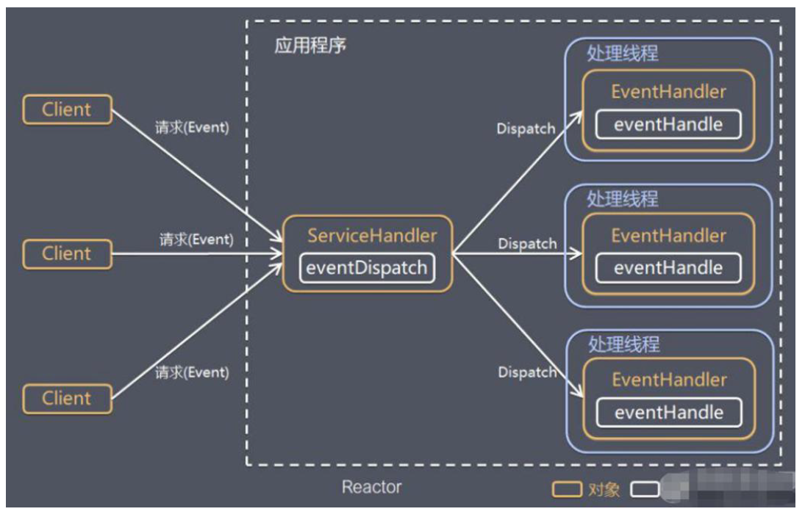

对上图说明：

1、Reactor 模式，通过一个或多个输入同时传递给服务处理器（ServiceHandler）的模式（基于事件驱动）

2、服务器端程序处理传入的多个请求,并将它们同步分派到相应的处理线程，因此 Reactor 模式也叫 Dispatcher 模式
3、Reactor 模式使用 IO 复用监听事件，收到事件后，分发给某个线程（进程），这点就是网络服务器高并发处理关键

在传统阻塞IO模型，各Handler都阻塞，而Reactor模式中只有一个ServiceHandler在阻塞分发请求。

Reactor模式中的组成模块：

* Reactor（也就是那个ServiceHandler）：Reactor 在一个单独的线程中运行，负责监听和分发事件，分发给适当的处理线程来对 IO 事件做出反应。它就像公司的电话接线员，它接听来自客户的电话并将线路转移到适当的联系人；
* Handlers（处理线程EventHandler）：处理线程执行 I/O 事件要完成的实际事件，类似于客户想要与之交谈的公司中的实际官员。Reactor 通过调度适当的处理线程来响应 I/O 事件，处理程序执行非阻塞操作

根据 Reactor 的数量和处理资源池线程的数量不同，有 3 种典型的实现：

* 单 Reactor 单线程
* 单 Reactor 多线程
* 主从 Reactor 多线程

### 单 Reactor 单线程

之前的NIO群聊系统就是这种模型：

1、Select 是前面 I/O 复用模型介绍的标准网络编程 API，可以实现应用程序通过一个阻塞对象监听多路连接请求

2、Reactor 对象通过 Select 监控客户端请求事件，收到事件后通过 Dispatch 进行分发
3、如果是建立连接请求事件，则由 Acceptor 通过 Accept 处理连接请求，然后创建一个 Handler 对象处理连接完成后的后续业务处理

4、如果不是建立连接事件，则 Reactor 会分发调用连接对应的 Handler 来响应
5、Handler 会完成 Read → 业务处理 → Send 的完整业务流程

服务器端用一个线程通过多路复用搞定所有的 IO 操作（包括连接，读、写等），编码简单，清晰明了

优点：模型简单，没有多线程、进程通信、竞争的问题，全部都在一个线程中完成

缺点：

* 性能问题，只有一个线程，无法完全发挥多核 CPU 的性能。Handler在处理某个连接上的业务时，整个进程无法处理其他连接事件，很容易导致性能瓶颈
* 可靠性问题，线程意外终止，或者进入死循环，会导致整个系统通信模块不可用，不能接收和处理外部消息，造成节点故障

适用场景：客户端的数量有限，业务处理非常快速，比如 Redis 在业务处理的时间复杂度 O(1) 的情况

### 单 Reactor 多线程

设计方案：

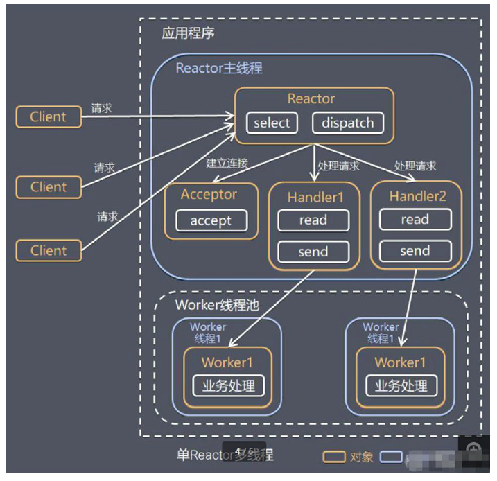

和之前的不同之处：

1、数据请求会从多个handler 取一个来处理

2、handler 只负责响应事件，不做具体的业务处理（这样不会使handler阻塞太久），通过 read 读取数据后，会分发给后面的 worker 线程池的某个线程处理业务。【业务处理是最费时的，所以将业务处理交给线程池去执行】

3、worker 线程池会分配独立线程完成真正的业务，并将结果返回给 handler

4、handler 收到响应后，通过 send 将结果返回给 client

优点：可以充分的利用多核 cpu 的处理能力

缺点：多线程数据共享和访问比较复杂。Reactor 承担所有的事件的监听和响应，它是单线程运行，在高并发场景容易出现性能瓶颈。也就是说Reactor主线程承担了过多的事

### 主从 Reactor 多线程

Reactor 在单线程中运行，高并发场景下容易成为性能瓶颈，可以让 Reactor 在多线程中运行：

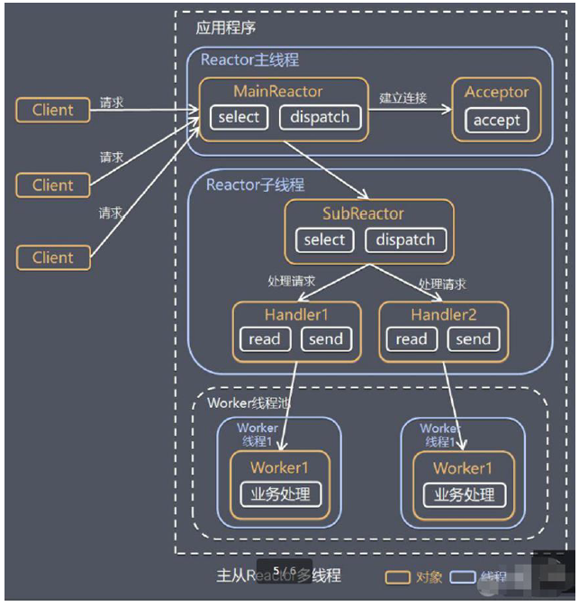

这里SubReactor是可以有多个的，如果只有一个SubReactor的话那和单 Reactor 多线程就没什么区别了。

不同之处在于处理完了连接事件，MainReactor 将连接分配给 SubReactor，subreactor 将连接加入到连接队列进行监听，并创建 handler 进行各种事件处理

优点：

* 响应快，无论是分发还是处理都不会阻塞，因为有多个SubReactor和handler 处理
* 扩展性好，可以方便的通过增加 Reactor 实例个数来充分利用 CPU 资源

* 父线程与子线程的数据交互简单职责明确，父线程只需要接收新连接，子线程完成后续的业务处理。
* 父线程与子线程的数据交互简单，Reactor 主线程只需要把新连接传给子线程，子线程无需返回数据。

缺点：编程复杂度较高

这种模型在许多项目中广泛使用，包括 Nginx 主从 Reactor 多进程模型，Memcached 主从多线程，Netty 主从多线程模型的支持

## Netty线程模型

Netty 主要基于主从 Reactors 多线程模型（如图）做了一定的改进，其中主从 Reactor 多线程模型有多个 Reactor：

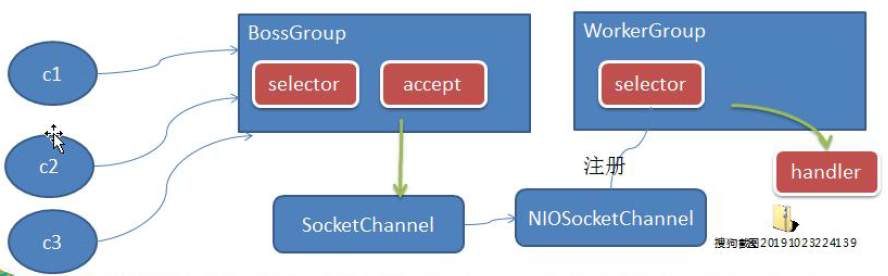

1、BossGroup 线程维护 Selector，只关注 Accecpt

2、当接收到 Accept 事件，获取到对应的 SocketChannel，封装成 NIOScoketChannel 并注册到 Worker 线程（事件循环），并进行维护
3、当 Worker 线程监听到 Selector 中通道发生自己感兴趣的事件后，就进行处理（就由 handler），注意 handler 已经加入到通道

工作架构图：

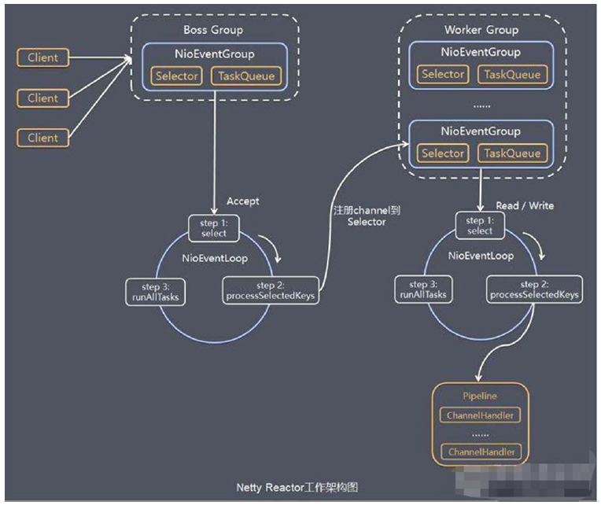

Netty 抽象出两组线程池 ，BossGroup 专门负责接收客户端的连接，WorkerGroup 专门负责网络的读写：

* BossGroup 和 WorkerGroup 类型都是 NioEventLoopGroup

* NioEventLoopGroup 相当于一个事件循环组，这个组中含有多个事件循环，每一个事件循环是 NioEventLoop，NioEventLoop 表示一个不断循环的执行处理任务的线程，每个 NioEventLoop 都有一个 Selector，用于监听绑定在其上的 socket 的网络通讯，该Selector 上可以注册监听多个 NioChannel。一个taskQueue，用于异步执行任务

* 每个 NioChannel 只会绑定在唯一的 NioEventLoop 上

  每个 NioChannel 都绑定有一个自己的 ChannelPipeline

* NioEventLoopGroup 可以有多个线程，即可以含有多个 NioEventLoop

每个 BossGroup下面的NioEventLoop 循环执行的步骤有 3 步：

* 轮询 accept 事件
* 处理 accept 事件，与 client 建立连接，生成 NioScocketChannel，并将其注册到某个 workerGroup NIOEventLoop 上的 Selector
* 继续处理任务队列的任务，即 runAllTasks

每个 WorkerGroup NIOEventLoop 循环执行的步骤：

* 轮询 read，write 事件
* 处理 I/O 事件，即 read，write 事件，在对应 NioScocketChannel 处理
* 处理任务队列的任务，即 runAllTasks

每个 Worker NIOEventLoop 处理业务时，会使用 pipeline（管道），pipeline 中包含了 channel（通道），即通过 pipeline 可以获取到对应通道，管道中维护了很多的处理器。

## Netty案例：TCP服务

要求：Netty 服务器在 6668 端口监听，客户端能发送消息给服务器"hello,服务器~"
服务器可以回复消息给客户端"hello,客户端~"

NettyServer：

~~~java
public class NettyServer {
    public static void main(String[] args) throws Exception {

        //创建BossGroup 和 WorkerGroup
        //说明
        //1. 创建两个线程组 bossGroup 和 workerGroup
        //2. bossGroup 只是处理连接请求 , 真正的和客户端业务处理，会交给 workerGroup完成
        //3. 两个都是无限循环
        //4. bossGroup 和 workerGroup 含有的子线程(NioEventLoop)的个数
        //   默认实际 cpu核数 * 2
        EventLoopGroup bossGroup = new NioEventLoopGroup(1);
        EventLoopGroup workerGroup = new NioEventLoopGroup(); //8

        try {
            //创建服务器端的启动对象，配置参数
            ServerBootstrap bootstrap = new ServerBootstrap();

            //使用链式编程来进行设置
            bootstrap.group(bossGroup, workerGroup) //设置两个线程组
                    .channel(NioServerSocketChannel.class) //使用NioSocketChannel 作为服务器的通道实现
                    .option(ChannelOption.SO_BACKLOG, 128) // 设置线程队列等待连接个数
                    .childOption(ChannelOption.SO_KEEPALIVE, true) //设置保持活动连接状态
//                    .handler(null) // 该 handler对应 bossGroup , childHandler 对应 workerGroup
                    .childHandler(new ChannelInitializer<SocketChannel>() {//创建一个通道初始化对象(匿名对象)
                        //给pipeline 设置处理器
                        @Override
                        protected void initChannel(SocketChannel ch) throws Exception {
                            System.out.println("客户socketchannel hashcode=" + ch.hashCode()); //可以使用一个集合管理 SocketChannel， 再推送消息时，可以将业务加入到各个channel 对应的 NIOEventLoop 的 taskQueue 或者 scheduleTaskQueue
                            ch.pipeline().addLast(new NettyServerHandler());
                        }
                    }); // 给我们的workerGroup 的 EventLoop 对应的管道设置处理器

            System.out.println(".....服务器 is ready...");

            //绑定一个端口并且同步生成了一个 ChannelFuture 对象（也就是立马返回这样一个对象）
            //启动服务器(并绑定端口)
            ChannelFuture cf = bootstrap.bind(6668).sync();

            //给cf 注册监听器，监控我们关心的事件

            cf.addListener(new ChannelFutureListener() {
                @Override
                public void operationComplete(ChannelFuture future) throws Exception {
                    if (cf.isSuccess()) {
                        System.out.println("监听端口 6668 成功");
                    } else {
                        System.out.println("监听端口 6668 失败");
                    }
                }
            });

            //对关闭通道事件  进行监听
            cf.channel().closeFuture().sync();
        }finally {
            bossGroup.shutdownGracefully();
            workerGroup.shutdownGracefully();
        }

    }

}
~~~

NettyServerHandler：

~~~java
/*
说明
1. 我们自定义一个Handler 需要继承netty 规定好的某个HandlerAdapter(规范)
2. 这时我们自定义一个Handler , 才能称为一个handler
 */
public class NettyServerHandler extends ChannelInboundHandlerAdapter {

    //读取数据事件(这里我们可以读取客户端发送的消息)
    /*
    1. ChannelHandlerContext ctx:上下文对象, 含有 管道pipeline , 通道channel, 地址
    2. Object msg: 就是客户端发送的数据 默认Object
     */
    @Override
    public void channelRead(ChannelHandlerContext ctx, Object msg) throws Exception {
        System.out.println("服务器读取线程 " + Thread.currentThread().getName() + " channle =" + ctx.channel());
        System.out.println("server ctx =" + ctx);
        System.out.println("看看channel 和 pipeline的关系");
        Channel channel = ctx.channel();
        ChannelPipeline pipeline = ctx.pipeline(); //本质是一个双向链表

        //将 msg 转成一个 ByteBuf
        //ByteBuf 是 Netty 提供的，不是 NIO 的 ByteBuffer.
        ByteBuf buf = (ByteBuf) msg;
        System.out.println("客户端发送消息是:" + buf.toString(CharsetUtil.UTF_8));
        System.out.println("客户端地址:" + channel.remoteAddress());
    }

    //数据读取完毕
    @Override
    public void channelReadComplete(ChannelHandlerContext ctx) throws Exception {

        //writeAndFlush 是 write + flush
        //将数据写入到缓存，并刷新
        //一般讲，我们对这个发送的数据进行编码
        ctx.writeAndFlush(Unpooled.copiedBuffer("hello, 客户端~(>^ω^<)喵1", CharsetUtil.UTF_8));
    }

    //发生异常后, 一般是需要关闭通道

    @Override
    public void exceptionCaught(ChannelHandlerContext ctx, Throwable cause) throws Exception {
        ctx.close();
    }
}
~~~

NettyClient：

~~~java
public class NettyClient {
    public static void main(String[] args) throws Exception {

        //客户端需要一个事件循环组
        EventLoopGroup group = new NioEventLoopGroup();

        try {
            //创建客户端启动对象
            //注意客户端使用的不是 ServerBootstrap 而是 Bootstrap
            Bootstrap bootstrap = new Bootstrap();

            //设置相关参数
            bootstrap.group(group) //设置线程组
                    .channel(NioSocketChannel.class) // 设置客户端通道的实现类(反射)
                    .handler(new ChannelInitializer<SocketChannel>() {
                        @Override
                        protected void initChannel(SocketChannel ch) throws Exception {
                            ch.pipeline().addLast(new NettyClientHandler()); //加入自己的处理器
                        }
                    });

            System.out.println("客户端 ok..");

            //启动客户端去连接服务器端
            //关于 ChannelFuture 要分析，涉及到netty的异步模型
            ChannelFuture channelFuture = bootstrap.connect("127.0.0.1", 6668).sync();
            //对关闭通道事件  进行监听
            channelFuture.channel().closeFuture().sync();
        }finally {

            group.shutdownGracefully();

        }
    }
}
~~~

NettyClientHandler：

~~~java
public class NettyClientHandler extends ChannelInboundHandlerAdapter {

    //当通道就绪就会触发该方法
    @Override
    public void channelActive(ChannelHandlerContext ctx) throws Exception {
        System.out.println("client " + ctx);
        ctx.writeAndFlush(Unpooled.copiedBuffer("hello, server: (>^ω^<)喵", CharsetUtil.UTF_8));
    }

    //当通道有读取事件时，会触发
    @Override
    public void channelRead(ChannelHandlerContext ctx, Object msg) throws Exception {

        ByteBuf buf = (ByteBuf) msg;
        System.out.println("服务器回复的消息:" + buf.toString(CharsetUtil.UTF_8));
        System.out.println("服务器的地址： "+ ctx.channel().remoteAddress());
    }

    @Override
    public void exceptionCaught(ChannelHandlerContext ctx, Throwable cause) throws Exception {
        cause.printStackTrace();
        ctx.close();
    }
}
~~~

我们吧网络相关的部分和业务处理部分分离开来，在handler里面做真正的业务读写处理。

BossGroup 和 WorkerGroup是两个线程组，bossGroup 只是处理连接请求 , 真正的和客户端业务处理，会交给 workerGroup完成，两个内部都是无限循环处理。创建对象时可以设置入参，代表bossGroup 和 workerGroup 含有的子线程(NioEventLoop)的个数，若空参构造，则是实际 cpu核数 * 2个线程数

bootstrap的handler和childHandler 方法可以设置处理器，handler对应 bossGroup , childHandler 对应 workerGroup

## taskQueue

在Handler中的自定义业务逻辑中，有些操作比较耗时，可以考虑放入EventLoopGroup中的队列taskQueue中来执行：

~~~java
public class NettyServerHandler extends ChannelInboundHandlerAdapter {

    //读取数据实际(这里我们可以读取客户端发送的消息)

    /**
     * 1. ChannelHandlerContext ctx:上下文对象, 含有 管道pipeline , 通道channel, 地址
     * 2. Object msg: 就是客户端发送的数据 默认Object
     */
    @Override
    public void channelRead(ChannelHandlerContext ctx, Object msg) throws Exception {

        // 比如这里我们有一个非常耗时长的业务-> 异步执行 -> 提交该channel 对应的
        // NIOEventLoop 的 taskQueue中,

        // 解决方案1 用户程序自定义的普通任务

        ctx.channel().eventLoop().execute(new Runnable() {
            @Override
            public void run() {

                try {
                    Thread.sleep(5 * 1000);
                    ctx.writeAndFlush(Unpooled.copiedBuffer("hello, 客户端~(>^ω^<)喵2", CharsetUtil.UTF_8));
                    System.out.println("channel code=" + ctx.channel().hashCode());
                } catch (Exception ex) {
                    System.out.println("发生异常" + ex.getMessage());
                }
            }
        });

        ctx.channel().eventLoop().execute(new Runnable() {
            @Override
            public void run() {

                try {
                    Thread.sleep(5 * 1000);
                    ctx.writeAndFlush(Unpooled.copiedBuffer("hello, 客户端~(>^ω^<)喵3", CharsetUtil.UTF_8));
                    System.out.println("channel code=" + ctx.channel().hashCode());
                } catch (Exception ex) {
                    System.out.println("发生异常" + ex.getMessage());
                }
            }
        });

        System.out.println("go on ...");
    }
  	...
}
~~~

taskQueue默认只有1个线程，所以这里提交了两个任务，会先后执行

还可以将其提交到EventLoopGroup中的队列scheduleTaskQueue中，延迟一段时间执行：

~~~java
public class NettyServerHandler extends ChannelInboundHandlerAdapter {

    //读取数据实际(这里我们可以读取客户端发送的消息)

    /**
     * 1. ChannelHandlerContext ctx:上下文对象, 含有 管道pipeline , 通道channel, 地址
     * 2. Object msg: 就是客户端发送的数据 默认Object
     */
    @Override
    public void channelRead(ChannelHandlerContext ctx, Object msg) throws Exception {

        // 比如这里我们有一个非常耗时长的业务-> 异步执行 -> 提交该channel 对应的
        // NIOEventLoop 的 scheduleTaskQueue中,

        //解决方案2 : 用户自定义定时任务 -》 该任务是提交到 scheduleTaskQueue中

        ctx.channel().eventLoop().schedule(new Runnable() {
            @Override
            public void run() {

                try {
                    Thread.sleep(5 * 1000);
                    ctx.writeAndFlush(Unpooled.copiedBuffer("hello, 客户端~(>^ω^<)喵4", CharsetUtil.UTF_8));
                    System.out.println("channel code=" + ctx.channel().hashCode());
                } catch (Exception ex) {
                    System.out.println("发生异常" + ex.getMessage());
                }
            }
        }, 5, TimeUnit.SECONDS);

        System.out.println("go on ...");
    }
  	...
}
~~~

## 异步模型

Netty 中的 I/O 操作是异步的，包括 Bind、Write、Connect 等操作会首先简单的返回一个 ChannelFuture。调用者并不能立刻获得结果，而是通过 Future-Listener 机制，用户可以方便的主动获取或者通过通知机制获得 IO 操作结果

当 Future 对象刚刚创建时，处于非完成状态，调用者可以通过返回的 ChannelFuture 来获取操作执行的状态，注册监听函数来执行完成后的操作，可以给Future绑定一个监听器来监听对应的行为：

~~~java
//绑定一个端口并且同步生成了一个 ChannelFuture 对象（也就是立马返回这样一个对象）
//启动服务器(并绑定端口)
ChannelFuture cf = bootstrap.bind(6668).sync();

//给cf 注册监听器，监控我们关心的事件

cf.addListener(new ChannelFutureListener() {
  @Override
  public void operationComplete(ChannelFuture future) throws Exception {
    if (cf.isSuccess()) {
      System.out.println("监听端口 6668 成功");
    } else {
      System.out.println("监听端口 6668 失败");
    }
  }
});
~~~

除了监听器回调，还可以主动调用方法：

* 通过 isDone 方法来判断当前操作是否完成；
* 通过 isSuccess 方法来判断已完成的当前操作是否成功；
* 通过 getCause 方法来获取已完成的当前操作失败的原因；
* 通过 isCancelled 方法来判断已完成的当前操作是否被取消；
* 通过 addListener 方法来注册监听器，当操作已完成（isDone方法返回完成），将会通知指定的监听器；如果 Future 对象已完成，则通知指定的监听器

## Netty案例：Http服务

目标：

* Netty 服务器在 6668 端口监听，浏览器发出请求 http://localhost:6668/
* 服务器可以回复消息给客户端"Hello!我是服务器5",并对特定请求资源进行过滤。

这一次把Initializer提取出来了，以便更清晰的调用initChannel：

TestServer：

~~~java
public class TestServer {
    public static void main(String[] args) throws Exception {

        EventLoopGroup bossGroup = new NioEventLoopGroup(1);
        EventLoopGroup workerGroup = new NioEventLoopGroup();

        try {
            ServerBootstrap serverBootstrap = new ServerBootstrap();

            serverBootstrap.group(bossGroup, workerGroup).channel(NioServerSocketChannel.class).childHandler(new TestServerInitializer());

            ChannelFuture channelFuture = serverBootstrap.bind(6668).sync();
            
            channelFuture.channel().closeFuture().sync();

        }finally {
            bossGroup.shutdownGracefully();
            workerGroup.shutdownGracefully();
        }
    }
}
~~~

TestServerInitializer：

~~~java
public class TestServerInitializer extends ChannelInitializer<SocketChannel> {

    @Override
    protected void initChannel(SocketChannel ch) throws Exception {

        //向管道加入处理器

        //得到管道
        ChannelPipeline pipeline = ch.pipeline();

        //加入一个netty 提供的httpServerCodec codec =>[coder - decoder]
        //HttpServerCodec 说明
        //1. HttpServerCodec 是netty 提供的处理http的 编-解码器
        pipeline.addLast("MyHttpServerCodec",new HttpServerCodec());
        //2. 增加一个自定义的handler
        pipeline.addLast("MyTestHttpServerHandler", new TestHttpServerHandler());

        System.out.println("ok~~~~");

    }
}
~~~

TestHttpServerHandler：

~~~java
/*
说明
1. SimpleChannelInboundHandler 是 ChannelInboundHandlerAdapter
2. HttpObject 客户端和服务器端相互通讯的数据被封装成 HttpObject
 */
public class TestHttpServerHandler extends SimpleChannelInboundHandler<HttpObject> {

    //channelRead0 读取客户端数据
    @Override
    protected void channelRead0(ChannelHandlerContext ctx, HttpObject msg) throws Exception {

        System.out.println("对应的channel=" + ctx.channel() + " pipeline=" + ctx
        .pipeline() + " 通过pipeline获取channel" + ctx.pipeline().channel());

        System.out.println("当前ctx的handler=" + ctx.handler());

        //判断 msg 是不是 httprequest请求
        if(msg instanceof HttpRequest) {

            System.out.println("ctx 类型="+ctx.getClass());

            System.out.println("pipeline hashcode" + ctx.pipeline().hashCode() + " TestHttpServerHandler hash=" + this.hashCode());

            System.out.println("msg 类型=" + msg.getClass());
            System.out.println("客户端地址" + ctx.channel().remoteAddress());

            //获取到
            HttpRequest httpRequest = (HttpRequest) msg;
            //获取uri, 过滤指定的资源
            URI uri = new URI(httpRequest.uri());
            if("/favicon.ico".equals(uri.getPath())) {
                System.out.println("请求了 favicon.ico, 不做响应");
                return;
            }
            //回复信息给浏览器 [http协议]

            ByteBuf content = Unpooled.copiedBuffer("hello, 我是服务器", CharsetUtil.UTF_8);

            //构造一个http的相应，即 httpresponse
            FullHttpResponse response = new DefaultFullHttpResponse(HttpVersion.HTTP_1_1, HttpResponseStatus.OK, content);

            response.headers().set(HttpHeaderNames.CONTENT_TYPE, "text/plain");
            response.headers().set(HttpHeaderNames.CONTENT_LENGTH, content.readableBytes());

            //将构建好 response返回
            ctx.writeAndFlush(response);
        }
    }
}
~~~

该案例中：

* pipeline中加入了两个handler，一个是HttpServerCodec，是netty 提供的处理http的 编-解码器，一个是用户自定义的handler
* handler继承自SimpleChannelInboundHandler\<HttpObject>，读取数据时，入参就会自动封装为HttpObject
* 根据http请求中的uri，来实现拒绝部分请求的效果
* 最后构造一个FullHttpResponse，并返回

## 核心组件用法

### Bootstrap、ServerBootstrap

Bootstrap 意思是引导，一个 Netty 应用通常由一个 Bootstrap 开始，主要作用是配置整个 Netty 程序，串联各个组件，Netty 中 Bootstrap 类是客户端程序的启动引导类，ServerBootstrap 是服务端启动引导类

使用空惨构造即可，然后用调用链模式来设置各种组件：

常用方法：

1、ServerBootstrap group(EventLoopGroup parentGroup, EventLoopGroup childGroup)和B group(EventLoopGroup group)：

用来设置EventLoopGroup，前者用于服务器端，后者用于客户端

2、B channel(Class<? extends C> channelClass)：该方法用来设置通道实现

3、\<T> B option(ChannelOption\<T> option, T value)和\<T> ServerBootstrap childOption(ChannelOption\<T> childOption, T value)：用来给 Channel 添加配置，前者用于服务器端，后者用于客户端

4、ServerBootstrap childHandler(ChannelHandler childHandler)和B handler(ChannelHandler handler)：用来设置handler，在服务器端，handler对应 bossGroup , childHandler 对应 workerGroup；在客户端，应该用handler

5、ChannelFuture bind(int inetPort)：该方法用于服务器端，用来设置监听的端口号

6、ChannelFuture connect(String inetHost, int inetPort)：该方法用于客户端，用来连接服务器端

### Future、ChannelFuture

Netty 中所有的 IO 操作都是异步的，不能立刻得知消息是否被正确处理。但是可以过一会等它执行完成或者直接注册一个监听，具体的实现就是通过 Future 和 ChannelFutures，他们可以注册一个监听，当操作执行成功或失败时监听会自动触发注册的监听事件

bootstrap进行connect或者bind时会返回它。

常见的方法有：

* Channel channel()，返回当前正在进行 IO 操作的通道
* ChannelFuture sync()，等待异步操作执行完毕

### Channel

Netty 网络通信的组件，能够用于执行网络 I/O 操作：

它是ChannelInitializer中initChannel的入参，在handler中的ChannelHandlerContext中也可以通过channel方法获取到它

用法：

* 通过 Channel 可获得当前网络连接的通道的状态，如isActive、isOpen
* 通过 Channel 可获得网络连接的配置参数（例如接收缓冲区大小），通过config方法获取
* Channel 提供异步的网络 I/O 操作(如建立连接，读写，绑定端口)，主要通过eventLoop方法实现，或者直接调用writeAndFlush方法
* 调用立即返回一个 ChannelFuture 实例，通过注册监听器到 ChannelFuture 上，可以 I/O 操作成功、失败或取消时回调通知调用方，如调用closeFuture，关闭通道时
* 支持关联 I/O 操作与对应的处理程序

不同协议、不同的阻塞类型的连接都有不同的 Channel 类型与之对应，常用的 Channel 类型：

* NioSocketChannel，异步的客户端 TCP Socket 连接。
* NioServerSocketChannel，异步的服务器端 TCP Socket 连接。
* NioDatagramChannel，异步的 UDP 连接。
* NioSctpChannel，异步的客户端 Sctp 连接。
* NioSctpServerChannel，异步的 Sctp 服务器端连接，这些通道涵盖了 UDP 和 TCP 网络 IO 以及文件 IO

### Selector

netty中也有Selector的概念，基于NIO，用 Selector 对象实现 I/O 多路复用，通过 Selector 一个线程可以监听多个连接的 Channel 事件

### ChannelHandler

之前的自定义业务就主要写在ChannelHandler中，ChannelHandler是一个接口，SimpleChannelInboundHandler、ChannelInboundHandlerAdapter都是它的子类。

它处理 I/O 事件或拦截 I/O 操作，并将其转发到其 ChannelPipeline（业务处理链）中的下一个处理程序，它是业务处理链中的一环。

它的实现类们：

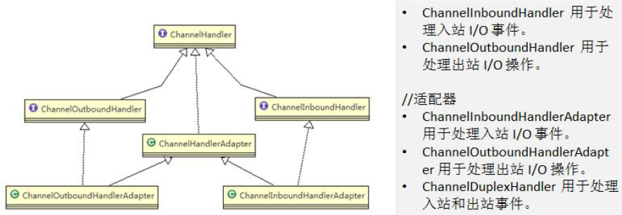

经常需要自定义一个 Handler 类去继承 ChannelInboundHandlerAdapter，然后通过重写相应方法实现业务逻辑，需要重新的方法有很多，大概作用就几类：通道就绪、通道读取、通道读取完毕、通道异常等

ChannelInitializer本身也是Handler

### Pipeline 和 ChannelPipeline

ChannelPipeline 是一个 Handler 的集合，它负责处理和拦截 inbound 或者 outbound 的事件和操作，相当于一个贯穿 Netty 的链。

ChannelPipeline 实现了一种高级形式的拦截过滤器模式，使用户可以完全控制事件的处理方式，以及 Channel 中各个的 ChannelHandler 如何相互交互

在 Netty 中每个 Channel 都有且仅有一个 ChannelPipeline 与之对应，它们的组成关系如下：

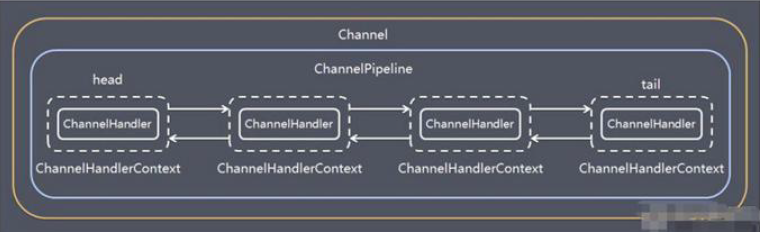

ChannelPipeline 中维护了一个由ChannelHandlerContext组成的双向链表，每个context中又关联着一个ChannelHandler。

入站事件和出站事件在一个双向链表中，入站事件会从链表的head传递到tail，出站事件则从tail传递到head，两种类型的handler互不干扰

常用方法：

* ChannelPipeline addFirst(ChannelHandler... handlers)，把一个业务处理类（handler）添加到链中的第一个位置
* ChannelPipeline addLast(ChannelHandler... handlers)，把一个业务处理类（handler）添加到链中的最后一个位置

### ChannelHandlerContext

保存 Channel 相关的所有上下文信息，同时关联一个 ChannelHandler 对象，同时 ChannelHandlerContext 中也绑定了对应的 pipeline 和 Channel 的信息，方便对 ChannelHandler 进行调用

常用方法：

* ChannelFuture close()，关闭通道
* ChannelOutboundInvoker flush()，刷新
* ChannelFuture writeAndFlush(Object msg)，将数据写到ChannelPipeline 中当前 ChannelHandler 的下一个 ChannelHandler 开始处理（出站），相当于把数据继续传递流动下去

### ChannelOption

Netty 在创建 Channel 实例后，一般都需要设置 ChannelOption 参数：

~~~java
bootstrap.option(ChannelOption.SO_BACKLOG, 128) // 设置线程队列得到连接个数
                    .childOption(ChannelOption.SO_KEEPALIVE, true) //设置保持活动连接状态
~~~

ChannelOption.SO_BACKLOG：对应TCP/IP协议中listen函数的backlog参数，用来初始化服务器可连接队列大小，服务器处理客户端连接请求是顺序处理的，多个服务器来连接的时候需要设置一个队列来等待处理

### EventLoopGroup、NioEventLoopGroup

EventLoopGroup 是一组 EventLoop 的抽象，Netty 为了更好的利用多核 CPU 资源，一般会有多个 EventLoop 同时工作，每个 EventLoop 维护着一个 Selector 实例

EventLoopGroup 提供 next 接口，可以从组里面按照一定规则获取其中一个 EventLoop 来处理任务

一个 ServerSocketChannel 对应一个 Selector 和一个 EventLoop 线程

运行过程：

* BossEventLoop 负责接收客户端的连接，它通常是一个单线程的EventLoop，它维护了一个注册了ServerSocketChannel的Selector实例，并不断轮询，直到Selector将连接事件分离出来
* 将连接事件和对应的SocketChannel 交给 WorkerEventLoopGroup ，WorkerEventLoopGroup 会通过next选择一个EventLoop来将这个SocketChannel 注册到其维护的Selector并对后续的I/O事件进行处理

常用方法：

* public NioEventLoopGroup()，构造方法
* public Future<?> shutdownGracefully()，断开连接，关闭线程

### Unpooled

Netty 提供一个专门用来操作缓冲区（即 Netty 的数据容器）的工具类Unpooled，常用方法：

* 通过给定的数据和编码返回一个ByteBuf对象：Unpooled.copiedBuffer(str, charset)

ByteBuf的用法：

* 封装一个ByteBuf，包含一个byte数组：Unpooled.buffer(10);
* ByteBuf按顺序写入：buffer.writeByte(data)
* ByteBuf按顺序读取：buffer.readByte()
* 获取内容：byteBuf.getByte(0)
* 获取大小、读写位置：buffer.capacity()、byteBuf.readerIndex()、byteBuf.writerIndex()
* 有封装数据判断：byteBuf.hasArray()
* 获取底层的byte数组：byteBuf.array()
* 获取可读的字节数：byteBuf.readableBytes()
* 按范围获取：byteBuf.getCharSequence(0, 4, Charset.forName("utf-8"))

ByteBuf在读取和写入之间无需通过flip 进行反转，它底层维护了 readerindex 和 writerIndex，每次读或者写，这两个index都会增长，通过这两个index、capacity将ByteBuf分为三个区域：

* 0---readerindex 已经读取的区域
* readerindex---writerIndex ， 可读的区域
* writerIndex -- capacity, 可写的区域

## Netty案例：群聊系统

目标：编写一个 Netty 群聊系统，实现服务器端和客户端之间的数据简单通讯（非阻塞）

服务器端：可以监测用户上线，离线，并实现消息转发功能
客户端：可以发送消息给其它所有用户，同时可以接受其它用户发送的消息（有服务器转发得到）

服务器端：

~~~java
public class GroupChatServer {

    private int port; //监听端口

    public GroupChatServer(int port) {
        this.port = port;
    }

    //编写run方法，处理客户端的请求
    public void run() throws  Exception{

        //创建两个线程组
        EventLoopGroup bossGroup = new NioEventLoopGroup(1);
        EventLoopGroup workerGroup = new NioEventLoopGroup(); //8个NioEventLoop

        try {
            ServerBootstrap b = new ServerBootstrap();

            b.group(bossGroup, workerGroup)
                    .channel(NioServerSocketChannel.class)
                    .option(ChannelOption.SO_BACKLOG, 128)
                    .childOption(ChannelOption.SO_KEEPALIVE, true)
                    .childHandler(new ChannelInitializer<SocketChannel>() {

                        @Override
                        protected void initChannel(SocketChannel ch) throws Exception {

                            //获取到pipeline
                            ChannelPipeline pipeline = ch.pipeline();
                            //向pipeline加入解码器
                            pipeline.addLast("decoder", new StringDecoder());
                            //向pipeline加入编码器
                            pipeline.addLast("encoder", new StringEncoder());
                            //加入自己的业务处理handler
                            pipeline.addLast(new GroupChatServerHandler());

                        }
                    });

            System.out.println("netty 服务器启动");
            ChannelFuture channelFuture = b.bind(port).sync();

            //监听关闭
            channelFuture.channel().closeFuture().sync();
        }finally {
            bossGroup.shutdownGracefully();
            workerGroup.shutdownGracefully();
        }
    }

    public static void main(String[] args) throws Exception {

        new GroupChatServer(7000).run();
    }
}
~~~

服务器handler：

~~~java
public class GroupChatServerHandler extends SimpleChannelInboundHandler<String> {

    //这样写还要自己遍历Channel
    //public static List<Channel> channels = new ArrayList<Channel>();

    //使用一个hashmap 管理私聊（私聊本案例并未实现，只是提供个思路）
    //public static Map<String, Channel> channels = new HashMap<String,Channel>();

    //定义一个channle 组，管理所有的channel
    //GlobalEventExecutor.INSTANCE) 是全局的事件执行器，是一个单例
    private static ChannelGroup  channelGroup = new DefaultChannelGroup(GlobalEventExecutor.INSTANCE);
    SimpleDateFormat sdf = new SimpleDateFormat("yyyy-MM-dd HH:mm:ss");

    //handlerAdded 表示连接建立，一旦连接，第一个被执行
    //将当前channel 加入到  channelGroup
    @Override
    public void handlerAdded(ChannelHandlerContext ctx) throws Exception {
        Channel channel = ctx.channel();
        //将该客户加入聊天的信息推送给其它在线的客户端

        //该方法会将 channelGroup 中所有的channel 遍历，并发送消息，我们不需要自己遍历

        channelGroup.writeAndFlush("[客户端]" + channel.remoteAddress() + " 加入聊天" + sdf.format(new java.util.Date()) + " \n");
        channelGroup.add(channel);

		//私聊如何实现
//         channels.put（"userid100",channel）;
    }

    //断开连接, 将xx客户离开信息推送给当前在线的客户
    @Override
    public void handlerRemoved(ChannelHandlerContext ctx) throws Exception {

        Channel channel = ctx.channel();
        channelGroup.writeAndFlush("[客户端]" + channel.remoteAddress() + " 离开了\n");
        System.out.println("channelGroup size" + channelGroup.size());

    }

    //表示channel 处于活动状态, 提示 xx上线
    @Override
    public void channelActive(ChannelHandlerContext ctx) throws Exception {
        //这个是给服务端看的，客户端上面已经提示xxx加入群聊了
        System.out.println(ctx.channel().remoteAddress() + " 上线了~");
    }

    //表示channel 处于不活动状态, 提示 xx离线了
    @Override
    public void channelInactive(ChannelHandlerContext ctx) throws Exception {

        System.out.println(ctx.channel().remoteAddress() + " 离线了~");
    }

    //读取数据，转发给在线的每一个客户端
    @Override
    protected void channelRead0(ChannelHandlerContext ctx, String msg) throws Exception {

        //获取到当前channel
        Channel channel = ctx.channel();
        //这时我们遍历channelGroup, 根据不同的情况，回送不同的消息

        channelGroup.forEach(ch -> {
            if(channel != ch) { //不是当前的channel,转发消息
                ch.writeAndFlush("[客户]" + channel.remoteAddress() + " 发送了消息" + msg + "\n");
            }else {//回显自己发送的消息给自己
                ch.writeAndFlush("[自己]发送了消息" + msg + "\n");
            }
        });
    }

    @Override
    public void exceptionCaught(ChannelHandlerContext ctx, Throwable cause) throws Exception {
        //关闭通道
        ctx.close();
    }
}
~~~

客户端：

~~~java
public class GroupChatClient {

    //属性
    private final String host;
    private final int port;

    public GroupChatClient(String host, int port) {
        this.host = host;
        this.port = port;
    }

    public void run() throws Exception{
        EventLoopGroup group = new NioEventLoopGroup();

        try {

        Bootstrap bootstrap = new Bootstrap()
                .group(group)
                .channel(NioSocketChannel.class)
                .handler(new ChannelInitializer<SocketChannel>() {

                    @Override
                    protected void initChannel(SocketChannel ch) throws Exception {

                        //得到pipeline
                        ChannelPipeline pipeline = ch.pipeline();
                        //加入相关handler
                        pipeline.addLast("decoder", new StringDecoder());
                        pipeline.addLast("encoder", new StringEncoder());
                        //加入自定义的handler
                        pipeline.addLast(new GroupChatClientHandler());
                    }
                });

        ChannelFuture channelFuture = bootstrap.connect(host, port).sync();
        //得到channel
            Channel channel = channelFuture.channel();
            System.out.println("-------" + channel.localAddress()+ "--------");
            //客户端需要输入信息，创建一个扫描器
            Scanner scanner = new Scanner(System.in);
            while (scanner.hasNextLine()) {
                String msg = scanner.nextLine();
                //通过channel 发送到服务器端
                channel.writeAndFlush(msg + "\r\n");
            }
        }finally {
            group.shutdownGracefully();
        }
    }

    public static void main(String[] args) throws Exception {
        new GroupChatClient("127.0.0.1", 7000).run();
    }
}
~~~

客户端handler：

~~~java
public class GroupChatClientHandler extends SimpleChannelInboundHandler<String> {

    //从服务器拿到的数据
    @Override
    protected void channelRead0(ChannelHandlerContext ctx, String msg) throws Exception {
        System.out.println(msg.trim());
    }
}
~~~

1、客户端和服务器的pipeline都加入了字符串的编码器和解码器，StringDecoder和StringEncoder，然后才是自定义的handler

2、服务器的handler重写了handlerAdded方法（连接建立），然后将channel加入到ChannelGroup中，ChannelGroup是一个channel的集合。在handlerRemoved（断开连接）和channelRead0（读取数据）时，调用channelGroup.writeAndFlush向所有channel发送对应消息。channelRead0中处理时要特意过滤掉本channel，意思就是不能将本人发送的消息再发回本人，而是发给聊天室中的其他人；handlerRemoved中处理则无需特殊过滤channel，因为断开连接后会自动去除channelGroup中的channel；此外还重写了channelActive、channelInactive，表示channel处于活动或者不活动状态

私聊实现思路：

私聊时由于是将消息发给某人，而不是所有人，所以不能用ChannelGroup，而是用一个map来存储Channel，在建立连接时，将用户id和channel放入map中，然后私聊发送消息时，根据对方的id找到channel，然后调用writeAndFlush发送消息：

~~~
Map<String, Channel> channels = new HashMap<String,Channel>()

channels.put("id", channel);
~~~

## Netty案例：心跳检测机制

服务器可以检测到连接没有读、写操作，然后进行对应的业务处理，比如断开连接等。

服务器端：

~~~java
public class MyServer {
    public static void main(String[] args) throws Exception{

        //创建两个线程组
        EventLoopGroup bossGroup = new NioEventLoopGroup(1);
        EventLoopGroup workerGroup = new NioEventLoopGroup(); //8个NioEventLoop
        try {

            ServerBootstrap serverBootstrap = new ServerBootstrap();

            serverBootstrap.group(bossGroup, workerGroup);
            serverBootstrap.channel(NioServerSocketChannel.class);
            //在bossGroup增加一个日志处理器
            serverBootstrap.handler(new LoggingHandler(LogLevel.INFO));
            serverBootstrap.childHandler(new ChannelInitializer<SocketChannel>() {

                @Override
                protected void initChannel(SocketChannel ch) throws Exception {
                    ChannelPipeline pipeline = ch.pipeline();
                    //加入一个netty 提供 IdleStateHandler
                    /*
                    说明
                    1. IdleStateHandler 是netty 提供的处理空闲状态的处理器
                    2. long readerIdleTime : 表示多长时间没有读, 就会发送一个心跳检测包检测是否连接
                    3. long writerIdleTime : 表示多长时间没有写, 就会发送一个心跳检测包检测是否连接
                    4. long allIdleTime : 表示多长时间没有读写, 就会发送一个心跳检测包检测是否连接

                    5. 文档说明
                    triggers an {@link IdleStateEvent} when a {@link Channel} has not performed
                   read, write, or both operation for a while.
                    6. 当 IdleStateEvent 触发后 , 就会传递给管道 的下一个handler去处理，通过调用(触发)
                   下一个handler 的 userEventTiggered , 在该方法中去处理 IdleStateEvent(读空闲，写空闲，读写空闲)
                    7.handlerRemoved有时候是无法感知连接断掉，所以还是需要心跳包的检测来判断连接是否还有效
                     */
                    pipeline.addLast(new IdleStateHandler(3,5,7, TimeUnit.SECONDS));
                    //加入一个对空闲检测进一步处理的handler(自定义)
                    pipeline.addLast(new MyServerHandler());
                }
            });

            //启动服务器
            ChannelFuture channelFuture = serverBootstrap.bind(7000).sync();
            channelFuture.channel().closeFuture().sync();

        }finally {
            bossGroup.shutdownGracefully();
            workerGroup.shutdownGracefully();
        }
    }
}
~~~

服务器的handler：

~~~java
public class MyServerHandler extends ChannelInboundHandlerAdapter {

    /**
     *
     * @param ctx 上下文
     * @param evt 事件
     * @throws Exception
     */
    @Override
    public void userEventTriggered(ChannelHandlerContext ctx, Object evt) throws Exception {

        if(evt instanceof IdleStateEvent) {

            //将  evt 向下转型 IdleStateEvent
            IdleStateEvent event = (IdleStateEvent) evt;
            String eventType = null;
            switch (event.state()) {
                case READER_IDLE:
                  eventType = "读空闲";
                  break;
                case WRITER_IDLE:
                    eventType = "写空闲";
                    break;
                case ALL_IDLE:
                    eventType = "读写空闲";
                    break;
            }
            System.out.println(ctx.channel().remoteAddress() + "--超时时间--" + eventType);
            System.out.println("服务器做相应处理..");

            //如果发生空闲，我们关闭通道
           // ctx.channel().close();
        }
    }
}
~~~

1、服务器向pipeline中添加了一个日志处理器LoggingHandler，还添加了IdleStateHandler，它是netty 提供的处理空闲状态的处理器：pipeline.addLast(new IdleStateHandler(3,5,7, TimeUnit.SECONDS));

这几个入参的含义：

* long readerIdleTime : 表示多长时间没有读, 就会发送一个心跳检测包检测是否连接
* long writerIdleTime : 表示多长时间没有写, 就会发送一个心跳检测包检测是否连接
* long allIdleTime : 表示多长时间没有读写, 就会发送一个心跳检测包检测是否连接

当 IdleStateEvent 触发后（上面的三个事件，读、写、读写） , 就会传递给管道 的下一个handler去处理，通过调用(触发)下一个handler 的 userEventTiggered , 在该方法中去处理 IdleStateEvent(读空闲，写空闲，读写空闲)

之前handler的handlerRemoved方法也能感知到连接断开，但在异常场景下，如直接断电，是无法感知连接断掉，所以还是需要心跳包的检测来判断连接是否还有效

2、handler的userEventTriggered，因为上游IdleStateHandler触发的事件而被触发，可以通过入参直接获取IdleStateEvent事件，然后根据事件状态来判断具体是因为哪个事件，然后作出对应的业务处理。如果这里触发了之后就调用ctx.channel().close();来关闭通道，则后续不会再触发事件了，否则会隔几秒一直触发下去

## Netty案例：长连接

Http 协议是无状态的，浏览器和服务器间的请求响应一次，下一次会重新创建连接。
要求：实现基于 WebSocket 的长连接的全双工的交互，实现后客户端浏览器和服务器端会相互感知，比如服务器关闭了，浏览器会感知，同样浏览器关闭了，服务器会感知

服务器端：

~~~java
public class MyServer {
    public static void main(String[] args) throws Exception{

        //创建两个线程组
        EventLoopGroup bossGroup = new NioEventLoopGroup(1);
        EventLoopGroup workerGroup = new NioEventLoopGroup(); //8个NioEventLoop
        try {

            ServerBootstrap serverBootstrap = new ServerBootstrap();

            serverBootstrap.group(bossGroup, workerGroup);
            serverBootstrap.channel(NioServerSocketChannel.class);
            serverBootstrap.handler(new LoggingHandler(LogLevel.INFO));
            serverBootstrap.childHandler(new ChannelInitializer<SocketChannel>() {

                @Override
                protected void initChannel(SocketChannel ch) throws Exception {
                    ChannelPipeline pipeline = ch.pipeline();

                    //因为基于http协议，使用http的编码和解码器
                    pipeline.addLast(new HttpServerCodec());
                    //http是以块方式写，添加ChunkedWriteHandler处理器
                    pipeline.addLast(new ChunkedWriteHandler());

                    /*
                    说明
                    1. http数据在传输过程中是分段, HttpObjectAggregator ，就是可以将多个段聚合
                    2. 这就就是为什么，当浏览器发送大量数据时，就会发出多次http请求
                     */
                    pipeline.addLast(new HttpObjectAggregator(8192));
                    /*
                    说明
                    1. 对应websocket ，它的数据是以 帧(frame) 形式传递
                    2. 可以看到WebSocketFrame 下面有六个子类
                    3. 浏览器请求时 ws://localhost:7000/hello 表示请求的uri
                    4. WebSocketServerProtocolHandler 核心功能是将 http协议升级为 ws协议 , 保持长连接
                    5. 是通过一个 状态码 101
                     */
                    pipeline.addLast(new WebSocketServerProtocolHandler("/hello"));

                    //自定义的handler ，处理业务逻辑
                    pipeline.addLast(new MyTextWebSocketFrameHandler());
                }
            });

            //启动服务器
            ChannelFuture channelFuture = serverBootstrap.bind(7000).sync();
            channelFuture.channel().closeFuture().sync();

        }finally {
            bossGroup.shutdownGracefully();
            workerGroup.shutdownGracefully();
        }
    }
}
~~~

handler：

~~~java
//这里 TextWebSocketFrame 类型，表示一个文本帧(frame)
public class MyTextWebSocketFrameHandler extends SimpleChannelInboundHandler<TextWebSocketFrame>{
    @Override
    protected void channelRead0(ChannelHandlerContext ctx, TextWebSocketFrame msg) throws Exception {

        System.out.println("服务器收到消息 " + msg.text());

        //回复消息
        ctx.channel().writeAndFlush(new TextWebSocketFrame("服务器时间" + LocalDateTime.now() + " " + msg.text()));
    }

    //当web客户端连接后， 触发方法
    @Override
    public void handlerAdded(ChannelHandlerContext ctx) throws Exception {
        //id 表示唯一的值，LongText 是唯一的 ShortText 不是唯一
        System.out.println("handlerAdded 被调用" + ctx.channel().id().asLongText());
        System.out.println("handlerAdded 被调用" + ctx.channel().id().asShortText());
    }

    @Override
    public void handlerRemoved(ChannelHandlerContext ctx) throws Exception {

        System.out.println("handlerRemoved 被调用" + ctx.channel().id().asLongText());
    }

    @Override
    public void exceptionCaught(ChannelHandlerContext ctx, Throwable cause) throws Exception {
        System.out.println("异常发生 " + cause.getMessage());
        ctx.close(); //关闭连接
    }
}
~~~

html页面，这里使用了WebSocket的API：

~~~html
<!DOCTYPE html>
<html lang="en">
<head>
    <meta charset="UTF-8">
    <title>Title</title>
</head>
<body>

    <form onsubmit="return false">
        <textarea name="message" style="height: 300px; width: 300px"></textarea>
        <input type="button" value="发生消息" onclick="send(this.form.message.value)">
        <textarea id="responseText" style="height: 300px; width: 300px"></textarea>
        <input type="button" value="清空内容" onclick="document.getElementById('responseText').value=''">
    </form>
</body>
</html>
~~~

实现后在页面上可以多次发消息给服务器，连接不会断开：

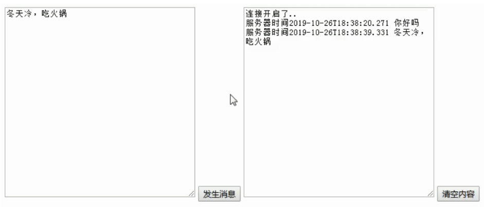

关键点：

1、服务器端向pipeline中添加了：

* http的编码和解码器：HttpServerCodec
* ChunkedWriteHandler处理器：处理以块为格式的HTTP数据
* HttpObjectAggregator处理器：当发送大数据量的HTTP请求时，会分段发送，它可以将多个段聚合
* WebSocketServerProtocolHandler：WebSocket的关键处理器，它的数据是以 帧(frame) 形式传递，创建时需要指定url，比如new WebSocketServerProtocolHandler("/hello")就要求访问服务器时要访问localhost:7000/hello。它的核心功能是将 http协议升级为 ws协议 , 保持长连接，浏览器访问成功后会返回101状态码
* 自定义的handler，它继承了SimpleChannelInboundHandler\<TextWebSocketFrame>，TextWebSocketFrame 类型表示一个文本帧(frame)，获取数据和写出数据的时候都要使用帧的格式

2、html中使用了WebSocket的API，实现了对服务器消息的发送和接受，感知连接建立和断开

## Google Protobuf

###  概述

编写网络应用程序时，因为数据在网络中传输的都是二进制字节码数据，在发送数据时就需要编码，接收数据时就需要解码，codec（编解码器）的组成部分有两个：decoder（解码器）和 encoder（编码器）。encoder 负责把业务数据转换成字节码数据，decoder 负责把字节码数据转换成业务数据：

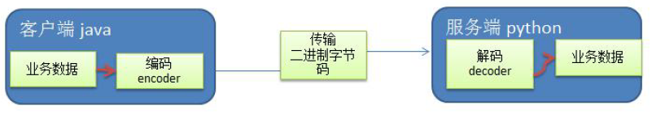

Netty 自身提供了一些 codec(编解码器)：

* 对字符串数据进行编码和解码：StringEncoder和StringDecoder
* 对Java对象进行编码和解码：ObjectEncoder和ObjectDecoder

Netty 本身自带的 ObjectDecoder 和 ObjectEncoder 可以用来实现 POJO 对象或各种业务对象的编码和解码，底层使用的仍是Java序列化技术,而Java序列化技术本身效率就不高，存在如下问题：

- 无法跨语言
- 序列化后的体积太大，是二进制编码的5倍多。
- 序列化性能太低

Protobuf 是 Google 发布的开源项目，全称 Google Protocol Buffers，是一种轻便高效的结构化数据存储格式，可以用于结构化数据串行化，或者说序列化。它很适合做数据存储或 RPC [远程过程调用 remote procedure call ]数据交换格式。目前很多公司 从http + json 转向tcp + protobuf，效率会更高

Protobuf 是以 message 的方式来管理数据的，它的优点：

* 支持跨平台、跨语言，即[客户端和服务器端可以是不同的语言编写的]
* 高性能，高可靠性

### Protobuf入门案例

目标：

* 客户端可以发送一个 StudentPoJo 对象到服务器(通过 Protobuf 编码)
* 服务端能接收 StudentPoJo 对象，并显示信息(通过 Protobuf 解码)

首先引入pom：

~~~xml
	    <dependency>
            <groupId>com.google.protobuf</groupId>
            <artifactId>protobuf-java</artifactId>
            <version>3.6.1</version>
        </dependency>
~~~

编写Student.proto：

~~~proto
syntax = "proto3"; //版本
option java_outer_classname = "StudentPOJO";//生成的外部类名，同时也是文件名
//protobuf 使用message 管理数据
message Student { //会在 StudentPOJO 外部类生成一个内部类 Student， 他是真正发送的POJO对象
    int32 id = 1; // Student 类中有 一个属性 名字为 id 类型为int32(protobuf类型) 1表示属性序号，不是值
    string name = 2;
}
~~~

执行protoc.exe编译proto文件：

~~~
protoc.exe --java_out=.Student.proto
~~~

然后将生成的StudentPOJO.java放入项目中使用。

在服务器端的pipeline中指定对象的解码器：

~~~java
ChannelPipeline pipeline = ch.pipeline();
                            //在pipeline加入ProtoBufDecoder
                            //指定对哪种对象进行解码
                            pipeline.addLast("decoder", new ProtobufDecoder(StudentPOJO.Student.getDefaultInstance()));
                            pipeline.addLast(new NettyServerHandler());
~~~

然后在服务器的handler中可以直接读取到该对象，并调用方法获取属性：

~~~java
public class NettyServerHandler extends SimpleChannelInboundHandler<StudentPOJO.Student> {

    //读取数据实际(这里我们可以读取客户端发送的消息)
    /*
    1. ChannelHandlerContext ctx:上下文对象, 含有 管道pipeline , 通道channel, 地址
    2. Object msg: 就是客户端发送的数据 默认Object
     */
    @Override
    public void channelRead0(ChannelHandlerContext ctx, StudentPOJO.Student msg) throws Exception {

        //读取从客户端发送的StudentPojo.Student

        System.out.println("客户端发送的数据 id=" + msg.getId() + " 名字=" + msg.getName());
    }
~~~

在客户端也就是发送端的pipeline中加入Proto的编码器：

~~~java
ChannelPipeline pipeline = ch.pipeline();
                            //在pipeline中加入 ProtoBufEncoder
                            pipeline.addLast("encoder", new ProtobufEncoder());
                            pipeline.addLast(new NettyClientHandler()); //加入自己的处理器
~~~

客户端的handler中用链式调用构造Student对象并发送：

~~~java
public class NettyClientHandler extends ChannelInboundHandlerAdapter {

    //当通道就绪就会触发该方法
    @Override
    public void channelActive(ChannelHandlerContext ctx) throws Exception {

        //发生一个Student 对象到服务器

        StudentPOJO.Student student = StudentPOJO.Student.newBuilder().setId(4).setName("智多星 吴用").build();
        //Teacher , Member ,Message
        ctx.writeAndFlush(student);
    }
~~~

###Protobuf发送多种对象

前面的案例中我们用Student作为两端交互的对象，但有时一个对象并不够，可能还需要交互其他对象。

protobuf 可以使用message 管理其他的message。最终决定使用哪一个message作为传输对象（最后传输的还是确定的一个种类的对象，也可以传多个对象但比较复杂）。

首先定义proto文件：

~~~
syntax = "proto3";
option optimize_for = SPEED; // 加快解析
option java_package="com.atguigu.netty.codec2";   //指定生成到哪个包下
option java_outer_classname="MyDataInfo"; // 外部类名, 文件名

/*
1.protobuf 可以使用message 管理其他的message。最终决定使用哪一个message作为传输对象
2.假设你某个项目需要传输20个对象，你不可能新建20个proto文件吧。此时你就可以
在一个文件里定义20个message，最后再用一个总的message（比方说这里的MyMessage）
来决定在实际传输时真正需要传输哪一个对象
3.因为你实际传输的时候大部分情况传输的都是一个对象，所以下面用oneof进行了限制
4.是否可以传多个对象呢？我个人认为是可以的，比如可以通过map(目前我也不太了解proto的语法)
 */
message MyMessage {

    //定义一个枚举类型,DataType如果是0则表示一个Student对象实例，DataType这个名称自定义
    enum DataType {
        StudentType = 0; //在proto3 要求enum的编号从0开始
        WorkerType = 1;
    }

    //用data_type 来标识传的是哪一个枚举类型，这里才真正开始定义MyMessage的数据类型
    DataType data_type = 1;  //所有后面的数字都只是编号而已

    /*
    1.oneof关键字 表示每次枚举类型进行传输时，限制最多只能传输一个对象。
    dataBody名称也是自定义的
    2.为什么这里的序号是2呢？因为上面DataType data_type = 1  占了第一个序号了
    3.MyMessage里真正出现的类型只有两个
      ①DataType类型
      ②Student类型或者Worker类型（这两个在真正传输的时候只会有一个出现）
    */
    oneof dataBody {
        Student student = 2;  //注意这后面的数字也都只是编号而已
        Worker worker = 3;
    }
}

message Student {
    int32 id = 1;//Student类的属性
    string name = 2; //
}
message Worker {
    string name=1;
    int32 age=2;
}
~~~

proto文件中指定生成在哪个包中，需要把文件放在项目路径下然后执行exe

服务器端在pipeline中加入MyMessage的解码器：

~~~java
ChannelPipeline pipeline = ch.pipeline();
                            //在pipeline加入ProtoBufDecoder
                            //指定对哪种对象进行解码
                            pipeline.addLast("decoder", new ProtobufDecoder(MyDataInfo.MyMessage.getDefaultInstance()));
                            pipeline.addLast(new NettyServerHandler());
~~~

服务器的handler中，可以根据dataType来判断真正的对象类型：

~~~java
public class NettyServerHandler extends SimpleChannelInboundHandler<MyDataInfo.MyMessage> {

    //读取数据实际(这里我们可以读取客户端发送的消息)
    /*
    1. ChannelHandlerContext ctx:上下文对象, 含有 管道pipeline , 通道channel, 地址
    2. Object msg: 就是客户端发送的数据 默认Object
     */
    @Override
    public void channelRead0(ChannelHandlerContext ctx, MyDataInfo.MyMessage msg) throws Exception {

        //根据dataType 来显示不同的信息

        MyDataInfo.MyMessage.DataType dataType = msg.getDataType();
        if(dataType == MyDataInfo.MyMessage.DataType.StudentType) {

            MyDataInfo.Student student = msg.getStudent();
            System.out.println("学生id=" + student.getId() + " 学生名字=" + student.getName());

        } else if(dataType == MyDataInfo.MyMessage.DataType.WorkerType) {
            MyDataInfo.Worker worker = msg.getWorker();
            System.out.println("工人的名字=" + worker.getName() + " 年龄=" + worker.getAge());
        } else {
            System.out.println("传输的类型不正确");
        }
    }
~~~

客户端中一样加入proto的解码器：

~~~java
ChannelPipeline pipeline = ch.pipeline();
                            //在pipeline中加入 ProtoBufEncoder
                            pipeline.addLast("encoder", new ProtobufEncoder());
                            pipeline.addLast(new NettyClientHandler()); //加入自己的处理器
~~~

客户端的handler中随机发送某个类型的对象：

~~~java
public class NettyClientHandler extends ChannelInboundHandlerAdapter {

    //当通道就绪就会触发该方法
    @Override
    public void channelActive(ChannelHandlerContext ctx) throws Exception {

        //随机的发送Student 或者 Workder 对象
        int random = new Random().nextInt(3);
        MyDataInfo.MyMessage myMessage = null;

        if(0 == random) { //发送Student 对象

            myMessage = MyDataInfo.MyMessage.newBuilder().setDataType(MyDataInfo.MyMessage.DataType.StudentType).setStudent(MyDataInfo.Student.newBuilder().setId(5).setName("玉麒麟 卢俊义").build()).build();
        } else { // 发送一个Worker 对象

            myMessage = MyDataInfo.MyMessage.newBuilder().setDataType(MyDataInfo.MyMessage.DataType.WorkerType).setWorker(MyDataInfo.Worker.newBuilder().setAge(20).setName("老李").build()).build();
        }

        ctx.writeAndFlush(myMessage);
    }
~~~

## 出站和入站

ChannelPipeline 提供了 ChannelHandler 链的容器。以客户端应用程序为例，如果事件的运动方向是从客户端到服务端的，那么我们称这些事件为出站的，即客户端发送给服务端的数据会通过 pipeline 中的一系列 ChannelOutboundHandler，并被这些 Handler 处理，反之则称为入站的：

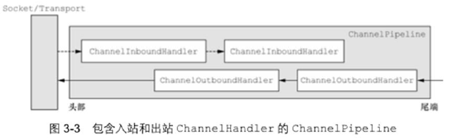

Netty 提供一系列实用的编解码器，他们都实现了 ChannelInboundHadnler 或者 ChannelOutboundHandler 接口。在这些类中，channelRead 方法已经被重写了。以入站为例，对于每个从入站 Channel 读取的消息，这个方法会被调用。随后，它将调用由解码器所提供的 decode() 方法进行解码，并将已经解码的字节转发给 ChannelPipeline 中的下一个 ChannelInboundHandler

以一个关于 ByteToMessageDecoder 实例分析：

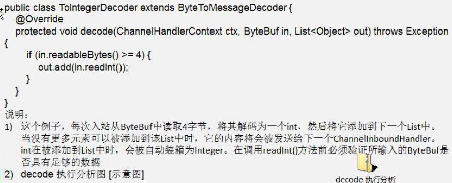

## 编解码器

### 自定义编解码器

实现客户端和服务器互发long数据，用编码器和解码器来接受和编码long数据

服务器端：

~~~java
public class MyServer {
    public static void main(String[] args) throws Exception{

        EventLoopGroup bossGroup = new NioEventLoopGroup(1);
        EventLoopGroup workerGroup = new NioEventLoopGroup();

        try {

            ServerBootstrap serverBootstrap = new ServerBootstrap();
            serverBootstrap.group(bossGroup,workerGroup).channel(NioServerSocketChannel.class).childHandler(new MyServerInitializer()); //自定义一个初始化类

            ChannelFuture channelFuture = serverBootstrap.bind(7000).sync();
            channelFuture.channel().closeFuture().sync();

        }finally {
            bossGroup.shutdownGracefully();
            workerGroup.shutdownGracefully();
        }
    }
}
~~~

服务器初始化类：

~~~java
public class MyServerInitializer extends ChannelInitializer<SocketChannel> {

    @Override
    protected void initChannel(SocketChannel ch) throws Exception {
        ChannelPipeline pipeline = ch.pipeline();//一会下断点

        //入站的handler进行解码 MyByteToLongDecoder
        pipeline.addLast(new MyByteToLongDecoder());
        //出站的handler进行编码
        pipeline.addLast(new MyLongToByteEncoder());
        //自定义的handler 处理业务逻辑
        pipeline.addLast(new MyServerHandler());
        System.out.println("xx");
    }
}
~~~

服务器端的handler：

~~~java
public class MyServerHandler extends SimpleChannelInboundHandler<Long> {
    @Override
    protected void channelRead0(ChannelHandlerContext ctx, Long msg) throws Exception {

        System.out.println("从客户端" + ctx.channel().remoteAddress() + " 读取到long " + msg);

        //给客户端发送一个long
        ctx.writeAndFlush(98765L);
    }

    @Override
    public void exceptionCaught(ChannelHandlerContext ctx, Throwable cause) throws Exception {
        cause.printStackTrace();
        ctx.close();
    }
}
~~~

客户端：

~~~java
public class MyClient {
    public static void main(String[] args)  throws  Exception{

        EventLoopGroup group = new NioEventLoopGroup();
        try {

            Bootstrap bootstrap = new Bootstrap();
            bootstrap.group(group).channel(NioSocketChannel.class)
                    .handler(new MyClientInitializer()); //自定义一个初始化类

            ChannelFuture channelFuture = bootstrap.connect("localhost", 7000).sync();
            channelFuture.channel().closeFuture().sync();
        }finally {
            group.shutdownGracefully();
        }
    }
}
~~~

客户端初始化类：

~~~java
public class MyClientInitializer extends ChannelInitializer<SocketChannel> {
    @Override
    protected void initChannel(SocketChannel ch) throws Exception {

        ChannelPipeline pipeline = ch.pipeline();

        //加入一个出站的handler 对数据进行一个编码
        pipeline.addLast(new MyLongToByteEncoder());

        //这时一个入站的解码器(入站handler )
        pipeline.addLast(new MyByteToLongDecoder());
        //加入一个自定义的handler ， 处理业务
        pipeline.addLast(new MyClientHandler());
    }
}
~~~

客户端的handler：

~~~java
public class MyClientHandler  extends SimpleChannelInboundHandler<Long> {
    @Override
    protected void channelRead0(ChannelHandlerContext ctx, Long msg) throws Exception {

        System.out.println("服务器的ip=" + ctx.channel().remoteAddress());
        System.out.println("收到服务器消息=" + msg);

    }

    //重写channelActive 发送数据
    @Override
    public void channelActive(ChannelHandlerContext ctx) throws Exception {
        System.out.println("MyClientHandler 发送数据");
        //ctx.writeAndFlush(Unpooled.copiedBuffer(""))
        ctx.writeAndFlush(123456L); //发送的是一个long
    }
}
~~~

Long的解码器：

~~~java
public class MyByteToLongDecoder extends ByteToMessageDecoder {
    /**
     *
     * decode 会根据接收的数据，被调用多次, 直到确定没有新的元素被添加到list
     * , 或者是ByteBuf 没有更多的可读字节为止
     * 如果list out 不为空，就会将list的内容传递给下一个 channelinboundhandler处理,
     * 该处理器的方法也会被调用多次
     *
     * @param ctx 上下文对象
     * @param in 入站的 ByteBuf
     * @param out List 集合，将解码后的数据传给下一个handler
     * @throws Exception
     */
    @Override
    protected void decode(ChannelHandlerContext ctx, ByteBuf in, List<Object> out) throws Exception {

        System.out.println("MyByteToLongDecoder 被调用");
        //因为 long 8个字节, 需要判断有8个字节，才能读取一个long
        if(in.readableBytes() >= 8) {
            out.add(in.readLong());
        }
    }
}
~~~

Long的编码器：

~~~java
public class MyLongToByteEncoder extends MessageToByteEncoder<Long> {
    //编码方法
    @Override
    protected void encode(ChannelHandlerContext ctx, Long msg, ByteBuf out) throws Exception {

        System.out.println("MyLongToByteEncoder encode 被调用");
        System.out.println("msg=" + msg);
        out.writeLong(msg);
    }
}
~~~

下图描述了数据流动的过程：

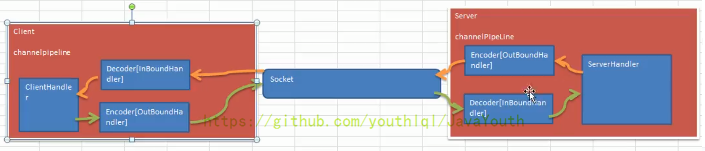

所有的编码器都是出站，所有的解码器都是入站。

服务端和客户端的Serverhandler都是继承SimpleChannelInboundHandler，它本身不是出站的handler，当在handler中调用ctx.writeAndFlush()方法后，就会将数据交给ChannelOutboundHandler进行出站处理

### 解码逻辑

分析上面的代码，解码时要先判断是否数据够用，然后再按照固定大小取用：

~~~java
@Override
    protected void decode(ChannelHandlerContext ctx, ByteBuf in, List<Object> out) throws Exception {

        System.out.println("MyByteToLongDecoder 被调用");
        //因为 long 8个字节, 需要判断有8个字节，才能读取一个long
        if(in.readableBytes() >= 8) {
            out.add(in.readLong());
        }
    }
~~~

decode 会根据接收的数据，被调用多次, 直到确定没有新的元素被添加到list，或者是ByteBuf 没有更多的可读字节为止，如果list out 不为空，就会将list的内容传递给下一个 channelinboundhandler处理

对于客户端发16个字节时，这个decode方法就会在一次接受中被调用两次：

~~~java
ctx.writeAndFlush(Unpooled.copiedBuffer("abcdabcdabcdabcd",CharsetUtil.UTF_8));
~~~

在解码器进行数据解码时，需要判断缓存区（ByteBuf）的数据是否足够，否则接收到的结果会期望结果可能不一致

### 类型一致

注意观察MyByteToLongDecoder类，若客户端发送的数据是一个Long类型的数据：

~~~java
ctx.writeAndFlush(123456L);
~~~

则服务器端就会调用Long类型的解码器来解析，但客户端如果发送的是buffer之类的其他类型：

~~~java
ctx.writeAndFlush(Unpooled.copiedBuffer("abcdabcdabcdabcd",CharsetUtil.UTF_8));
~~~

此时服务器端不会调用Long类型的解码器，这就要求编解码器的类型泛型必须和发送或者接受的数据类型一致，否则就不会调用响应的编码器或者解码器。

分析源码，在MyLongToByteEncoder的父类MessageToByteEncoder的write方法中，如果类型一致则调用encode方法编码，否则就直接调用write：

~~~java
@Override
    public void write(ChannelHandlerContext ctx, Object msg, ChannelPromise promise) throws Exception {
        ByteBuf buf = null;
        try {
            //这里会判断当前msg 是不是应该处理的类型，如果是就处理，不是就跳过encode
            if (acceptOutboundMessage(msg)) {
                @SuppressWarnings("unchecked")
                I cast = (I) msg;
                buf = allocateBuffer(ctx, cast, preferDirect);
                try {
                    encode(ctx, cast, buf);
                } finally {
                    ReferenceCountUtil.release(cast);
                }

                if (buf.isReadable()) {
                    ctx.write(buf, promise);
                } else {
                    buf.release();
                    ctx.write(Unpooled.EMPTY_BUFFER, promise);
                }
                buf = null;
            } else {
                ctx.write(msg, promise);
            }
        } catch (EncoderException e) {
            throw e;
        } catch (Throwable e) {
            throw new EncoderException(e);
        } finally {
            if (buf != null) {
                buf.release();
            }
        }
    }
~~~

### ReplayingDecoder解码器

ReplayingDecoder 扩展了 ByteToMessageDecoder 类，使用这个类，我们不必调用 readableBytes() 方法，也就不用判断还有没有足够的数据来读取。参数 S 指定了用户状态管理的类型，其中 Void 代表不需要状态管理

使用 ReplayingDecoder 编写解码器，对前面的案例进行简化：

~~~java
public class MyByteToLongDecoder2 extends ReplayingDecoder<Void> {
    
    @Override
    protected void decode(ChannelHandlerContext ctx, ByteBuf in, List<Object> out) throws Exception {
        System.out.println("MyByteToLongDecoder2 被调用");
        //在 ReplayingDecoder 不需要判断数据是否足够读取，内部会进行处理判断
        out.add(in.readLong());
    }
}
~~~

相比前面的少了readableBytes判断，比较方便，但它也有缺点：

* 并不是所有的 ByteBuf 操作都被支持，如果调用了一个不被支持的方法，将会抛出一个 UnsupportedOperationException。
* ReplayingDecoder 在某些情况下可能稍慢于 ByteToMessageDecoder，例如网络缓慢并且消息格式复杂时，消息会被拆成了多个碎片，速度变慢

### 其他编解码器

LineBasedFrameDecoder：这个类在 Netty 内部也有使用，它使用行尾控制字符（\n或者\r\n）作为分隔符来解析数据。
DelimiterBasedFrameDecoder：使用自定义的特殊字符作为消息的分隔符。
HttpObjectDecoder：一个 HTTP 数据的解码器
LengthFieldBasedFrameDecoder：通过指定长度来标识整包消息，这样就可以自动的处理黏包和半包消息

## TCP粘包和拆包

TCP 是面向连接的，面向流的，提供高可靠性服务。收发两端（客户端和服务器端）都要有一一成对的 socket，因此，发送端为了将多个发给接收端的包，更有效的发给对方，使用了优化方法（Nagle 算法），将多次间隔较小且数据量小的数据，合并成一个大的数据块，然后进行封包。这样做虽然提高了效率，但是接收端就难于分辨出完整的数据包了，因为面向流的通信是无消息保护边界的

由于 TCP 无消息保护边界,需要在接收端处理消息边界问题，也就是我们所说的粘包、拆包问题：

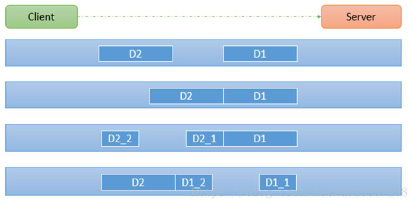

假设客户端分别发送了两个数据包 D1 和 D2 给服务端，由于服务端一次读取到字节数是不确定的，故可能存在以下四种情况：

* 服务端分两次读取到了两个独立的数据包，分别是 D1 和 D2，没有粘包和拆包
* 服务端一次接受到了两个数据包，D1 和 D2 粘合在一起，称之为 TCP 粘包
* 服务端分两次读取到了数据包，第一次读取到了完整的 D1 包和 D2 包的部分内容，第二次读取到了 D2 包的剩余内容，这称之为 TCP 拆包
* 服务端分两次读取到了数据包，第一次读取到了 D1 包的部分内容 D1_1，第二次读取到了 D1 包的剩余部分内容 D1_2 和完整的 D2 包。

### 问题实例

分析一个由TCP粘包问题的案例：

服务器端：

~~~java
public class MyServer {
    public static void main(String[] args) throws Exception{

        EventLoopGroup bossGroup = new NioEventLoopGroup(1);
        EventLoopGroup workerGroup = new NioEventLoopGroup();

        try {

            ServerBootstrap serverBootstrap = new ServerBootstrap();
            serverBootstrap.group(bossGroup,workerGroup).channel(NioServerSocketChannel.class).childHandler(new MyServerInitializer()); //自定义一个初始化类

            ChannelFuture channelFuture = serverBootstrap.bind(7000).sync();
            channelFuture.channel().closeFuture().sync();

        }finally {
            bossGroup.shutdownGracefully();
            workerGroup.shutdownGracefully();
        }

    }
}
~~~

服务器端初始化类：

~~~java
public class MyServerInitializer extends ChannelInitializer<SocketChannel> {

    @Override
    protected void initChannel(SocketChannel ch) throws Exception {
        ChannelPipeline pipeline = ch.pipeline();

        pipeline.addLast(new MyServerHandler());
    }
}
~~~

服务器handler：

~~~java
public class MyServerHandler extends SimpleChannelInboundHandler<ByteBuf>{
    private int count;

    @Override
    public void exceptionCaught(ChannelHandlerContext ctx, Throwable cause) throws Exception {
        //cause.printStackTrace();
        ctx.close();
    }

    @Override
    protected void channelRead0(ChannelHandlerContext ctx, ByteBuf msg) throws Exception {

        byte[] buffer = new byte[msg.readableBytes()];
        msg.readBytes(buffer);

        //将buffer转成字符串
        String message = new String(buffer, Charset.forName("utf-8"));

        System.out.println("服务器接收到数据 " + message);
        System.out.println("服务器接收到消息量=" + (++this.count));

        //服务器回送数据给客户端, 回送一个随机id ,
        ByteBuf responseByteBuf = Unpooled.copiedBuffer(UUID.randomUUID().toString() + " ", Charset.forName("utf-8"));
        ctx.writeAndFlush(responseByteBuf);

    }
}
~~~

客户端：

~~~java
public class MyClient {
    public static void main(String[] args)  throws  Exception{

        EventLoopGroup group = new NioEventLoopGroup();

        try {

            Bootstrap bootstrap = new Bootstrap();
            bootstrap.group(group).channel(NioSocketChannel.class)
                    .handler(new MyClientInitializer()); //自定义一个初始化类

            ChannelFuture channelFuture = bootstrap.connect("localhost", 7000).sync();

            channelFuture.channel().closeFuture().sync();

        }finally {
            group.shutdownGracefully();
        }
    }
}
~~~

客户端初始化器：

~~~java
public class MyClientInitializer extends ChannelInitializer<SocketChannel> {
    @Override
    protected void initChannel(SocketChannel ch) throws Exception {

        ChannelPipeline pipeline = ch.pipeline();
        pipeline.addLast(new MyClientHandler());
    }
}
~~~

客户端handler：

~~~java
public class MyClientHandler extends SimpleChannelInboundHandler<ByteBuf> {

    private int count;
    @Override
    public void channelActive(ChannelHandlerContext ctx) throws Exception {
        //使用客户端发送10条数据 hello,server 编号
        for(int i= 0; i< 10; ++i) {
            ByteBuf buffer = Unpooled.copiedBuffer("hello,server " + i, Charset.forName("utf-8"));
            ctx.writeAndFlush(buffer);
        }
    }

    @Override
    protected void channelRead0(ChannelHandlerContext ctx, ByteBuf msg) throws Exception {
        byte[] buffer = new byte[msg.readableBytes()];
        msg.readBytes(buffer);

        String message = new String(buffer, Charset.forName("utf-8"));
        System.out.println("客户端接收到消息=" + message);
        System.out.println("客户端接收消息数量=" + (++this.count));

    }

    @Override
    public void exceptionCaught(ChannelHandlerContext ctx, Throwable cause) throws Exception {
        cause.printStackTrace();
        ctx.close();
    }
}
~~~

该案例中，客户端向服务器端发送了10条消息，服务器端收到消息的处理情况是不确定的，服务器channelRead0方法的入参msg可能包含1条消息，也可能包含2条、3条等，这样解析出的message就是一个连续的值，如：

~~~
hello,server 1hello,server 2 hello,server3
~~~

无法正确的拆分出原始数据，影响后续的业务逻辑。

### 问题解决

常用方案：使用自定义协议+编解码器来解决
关键就是要解决服务器端每次读取数据长度的问题，这个问题解决，就不会出现服务器多读或少读数据的问题，从而避免的 TCP 粘包、拆包。

要求：客户端逐条发送5条消息，服务器逐条接收并回复

首先要定义消息体：

~~~java
//协议包
public class MessageProtocol {
    private int len; //关键
    private byte[] content;

    public int getLen() {
        return len;
    }

    public void setLen(int len) {
        this.len = len;
    }

    public byte[] getContent() {
        return content;
    }

    public void setContent(byte[] content) {
        this.content = content;
    }
}
~~~

服务器端：

~~~java
public class MyServer {
    public static void main(String[] args) throws Exception{

        EventLoopGroup bossGroup = new NioEventLoopGroup(1);
        EventLoopGroup workerGroup = new NioEventLoopGroup();

        try {

            ServerBootstrap serverBootstrap = new ServerBootstrap();
            serverBootstrap.group(bossGroup,workerGroup).channel(NioServerSocketChannel.class).childHandler(new MyServerInitializer()); //自定义一个初始化类

            ChannelFuture channelFuture = serverBootstrap.bind(7000).sync();
            channelFuture.channel().closeFuture().sync();

        }finally {
            bossGroup.shutdownGracefully();
            workerGroup.shutdownGracefully();
        }

    }
}
~~~

服务器端初始化类：

~~~java
public class MyServerInitializer extends ChannelInitializer<SocketChannel> {

    @Override
    protected void initChannel(SocketChannel ch) throws Exception {
        ChannelPipeline pipeline = ch.pipeline();

        pipeline.addLast(new MyMessageDecoder());//解码器
        pipeline.addLast(new MyMessageEncoder());//编码器
        pipeline.addLast(new MyServerHandler());
    }
}
~~~

服务器的handler：

~~~java
//处理业务的handler
public class MyServerHandler extends SimpleChannelInboundHandler<MessageProtocol>{
    private int count;

    @Override
    public void exceptionCaught(ChannelHandlerContext ctx, Throwable cause) throws Exception {
        //cause.printStackTrace();
        ctx.close();
    }

    @Override
    protected void channelRead0(ChannelHandlerContext ctx, MessageProtocol msg) throws Exception {

        //接收到数据，并处理
        int len = msg.getLen();
        byte[] content = msg.getContent();

        System.out.println("服务器接收到信息如下");
        System.out.println("长度=" + len);
        System.out.println("内容=" + new String(content, Charset.forName("utf-8")));

        System.out.println("服务器接收到消息包数量=" + (++this.count));

        //回复消息
        System.out.println("服务端开始回复消息------");
        String responseContent = UUID.randomUUID().toString();
        int responseLen = responseContent.getBytes("utf-8").length;
        byte[]  responseContent2 = responseContent.getBytes("utf-8");
        //构建一个协议包
        MessageProtocol messageProtocol = new MessageProtocol();
        messageProtocol.setLen(responseLen);
        messageProtocol.setContent(responseContent2);

        ctx.writeAndFlush(messageProtocol);
    }
}
~~~

客户端：

~~~java
public class MyClient {
    public static void main(String[] args)  throws  Exception{

        EventLoopGroup group = new NioEventLoopGroup();

        try {

            Bootstrap bootstrap = new Bootstrap();
            bootstrap.group(group).channel(NioSocketChannel.class)
                    .handler(new MyClientInitializer()); //自定义一个初始化类

            ChannelFuture channelFuture = bootstrap.connect("localhost", 7000).sync();

            channelFuture.channel().closeFuture().sync();

        }finally {
            group.shutdownGracefully();
        }
    }
}
~~~

客户端的初始化类：

~~~java
public class MyClientInitializer extends ChannelInitializer<SocketChannel> {
    @Override
    protected void initChannel(SocketChannel ch) throws Exception {

        ChannelPipeline pipeline = ch.pipeline();
        pipeline.addLast(new MyMessageEncoder()); //加入编码器
        pipeline.addLast(new MyMessageDecoder()); //加入解码器
        pipeline.addLast(new MyClientHandler());
    }
}
~~~

客户端handler：

~~~java
public class MyClientHandler extends SimpleChannelInboundHandler<MessageProtocol> {

    private int count;
    @Override
    public void channelActive(ChannelHandlerContext ctx) throws Exception {
        //使用客户端发送10条数据 "今天天气冷，吃火锅" 编号

        for(int i = 0; i< 5; i++) {
            String mes = "今天天气冷，吃火锅";
            byte[] content = mes.getBytes(Charset.forName("utf-8"));
            int length = mes.getBytes(Charset.forName("utf-8")).length;

            //创建协议包对象
            MessageProtocol messageProtocol = new MessageProtocol();
            messageProtocol.setLen(length);
            messageProtocol.setContent(content);
            ctx.writeAndFlush(messageProtocol);
        }

    }

//    @Override
    protected void channelRead0(ChannelHandlerContext ctx, MessageProtocol msg) throws Exception {

        int len = msg.getLen();
        byte[] content = msg.getContent();

        System.out.println("客户端接收到消息如下");
        System.out.println("长度=" + len);
        System.out.println("内容=" + new String(content, Charset.forName("utf-8")));
        System.out.println("客户端接收消息数量=" + (++this.count));
    }

    @Override
    public void exceptionCaught(ChannelHandlerContext ctx, Throwable cause) throws Exception {
        System.out.println("异常消息=" + cause.getMessage());
        ctx.close();
    }
}
~~~

解码器：

~~~java
public class MyMessageDecoder extends ReplayingDecoder<Void> {
    @Override
    protected void decode(ChannelHandlerContext ctx, ByteBuf in, List<Object> out) throws Exception {
        System.out.println();
        System.out.println();
        System.out.println("MyMessageDecoder decode 被调用");
        //需要将得到二进制字节码-> MessageProtocol 数据包(对象)
        int length = in.readInt();

        byte[] content = new byte[length];
        in.readBytes(content);

        //封装成 MessageProtocol 对象，放入 out， 传递下一个handler业务处理
        MessageProtocol messageProtocol = new MessageProtocol();
        messageProtocol.setLen(length);
        messageProtocol.setContent(content);

        //放入out传给下一个hanlder进行处理
        out.add(messageProtocol);

    }
}
~~~

编码器：

~~~java
public class MyMessageEncoder extends MessageToByteEncoder<MessageProtocol> {
    @Override
    protected void encode(ChannelHandlerContext ctx, MessageProtocol msg, ByteBuf out) throws Exception {
        System.out.println("MyMessageEncoder encode 方法被调用");
        out.writeInt(msg.getLen());
        out.writeBytes(msg.getContent());
    }
}
~~~

这里主要是借助ReplayingDecoder解码器来一个一个解析消息体

## 自定义RPC

RPC（Remote Procedure Call）—远程过程调用，是一个计算机通信协议。该协议允许运行于一台计算机的程序调用另一台计算机的子程序，而程序员无需额外地为这个交互作用编程
两个或多个应用程序都分布在不同的服务器上，它们之间的调用都像是本地方法调用一样

常见的 RPC 框架有：比较知名的如阿里的 Dubbo、Google 的 gRPC、Go 语言的 rpcx、Apache 的 thrift，Spring 旗下的 SpringCloud

RPC调用流程图：

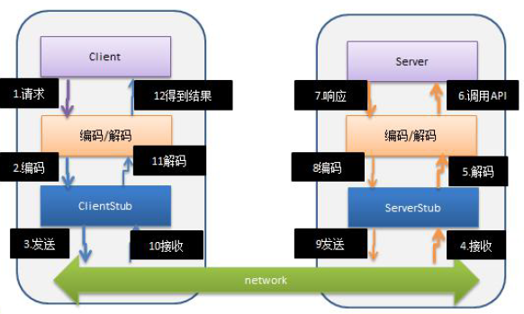

RPC的目标就是屏蔽这些底层细节，用户无需关心这些细节，可以像调用本地方法一样即可完成远程服务调用

自定义RPC案例要求：

1、创建一个接口，定义抽象方法。用于消费者和提供者之间的约定。

2、创建一个提供者，该类需要监听消费者的请求，并按照约定返回数据。

3、创建一个消费者，该类需要透明的调用自己不存在的方法，内部需要使用 Netty 请求提供者返回数据

服务器端：

~~~java
public class NettyServer {

    public static void startServer(String hostName, int port) {
        startServer0(hostName,port);
    }

    //编写一个方法，完成对NettyServer的初始化和启动
    private static void startServer0(String hostname, int port) {

        EventLoopGroup bossGroup = new NioEventLoopGroup(1);
        EventLoopGroup workerGroup = new NioEventLoopGroup();

        try {

            ServerBootstrap serverBootstrap = new ServerBootstrap();

            serverBootstrap.group(bossGroup,workerGroup)
                    .channel(NioServerSocketChannel.class)
                    .childHandler(new ChannelInitializer<SocketChannel>() {
                                      @Override
                                      protected void initChannel(SocketChannel ch) throws Exception {
                                          ChannelPipeline pipeline = ch.pipeline();
                                          pipeline.addLast(new StringDecoder());
                                          pipeline.addLast(new StringEncoder());
                                          pipeline.addLast(new NettyServerHandler()); //业务处理器

                                      }
                                  }

                    );
            ChannelFuture channelFuture = serverBootstrap.bind(hostname, port).sync();
            System.out.println("服务提供方开始提供服务~~");
            channelFuture.channel().closeFuture().sync();
        }catch (Exception e) {
            e.printStackTrace();
        }
        finally {
            bossGroup.shutdownGracefully();
            workerGroup.shutdownGracefully();
        }
    }
}
~~~

服务器handler：

~~~java
//服务器这边handler比较简单
public class NettyServerHandler extends ChannelInboundHandlerAdapter {

    @Override
    public void channelRead(ChannelHandlerContext ctx, Object msg) throws Exception {
        System.out.println("---服务端开始收到来自客户单的消息---");
        //获取客户端发送的消息，并调用服务
        System.out.println("原始消息：" + msg);

        /*
         1.客户端在调用服务器的api 时，我们需要定义一个协议，比如我们要求 每次发消息是都
         必须以某个字符串开头 "HelloService#hello#你好"
         2.Dubbo注册在Zookeeper里时，这种就是类的全路径字符串，你用IDEA的zookeeper插件
         就可以清楚地看到
         */
        if(msg.toString().startsWith(ClientBootstrap.providerName)) {

            String result = new HelloServiceImpl().hello(msg.toString().substring(msg.toString().lastIndexOf("#") + 1));
            ctx.writeAndFlush(result);
        }
    }

    @Override
    public void exceptionCaught(ChannelHandlerContext ctx, Throwable cause) throws Exception {
        ctx.close();
    }
}
~~~

客户端：

~~~java
public class NettyClient {

    //创建线程池
    private static ExecutorService executor = Executors.newFixedThreadPool(Runtime.getRuntime().availableProcessors());

    private static NettyClientHandler client;
    private int count = 0;

    //编写方法使用代理模式，获取一个代理对象

    public Object getBean(final Class<?> serivceClass, final String providerName) {

        return Proxy.newProxyInstance(Thread.currentThread().getContextClassLoader(),
                new Class<?>[]{serivceClass}, (proxy, method, args) -> {

                    System.out.println("(proxy, method, args) 进入...." + (++count) + " 次");
                    //{}  部分的代码，客户端每调用一次 hello, 就会进入到该代码
                    if (client == null) {
                        initClient();
                    }

                    //设置要发给服务器端的信息
                    //providerName：协议头，args[0]：就是客户端要发送给服务端的数据
                    client.setPara(providerName + args[0]);

                    //
                    return executor.submit(client).get();

                });
    }

    //初始化客户端
    private static void initClient() {
        client = new NettyClientHandler();
        //创建EventLoopGroup
        NioEventLoopGroup group = new NioEventLoopGroup();
        Bootstrap bootstrap = new Bootstrap();
        bootstrap.group(group)
                .channel(NioSocketChannel.class)
                .option(ChannelOption.TCP_NODELAY, true)
                .handler(
                        new ChannelInitializer<SocketChannel>() {
                            @Override
                            protected void initChannel(SocketChannel ch) throws Exception {
                                ChannelPipeline pipeline = ch.pipeline();
                                pipeline.addLast(new StringDecoder());
                                pipeline.addLast(new StringEncoder());
                                pipeline.addLast(client);
                            }
                        }
                );

        try {
            bootstrap.connect("127.0.0.1", 7000).sync();
        } catch (Exception e) {
            e.printStackTrace();
        }
    }
}
~~~

客户端handler：

~~~java
public class NettyClientHandler extends ChannelInboundHandlerAdapter implements Callable {

    private ChannelHandlerContext context;//上下文
    private String result; //返回的结果
    private String para; //客户端调用方法时，传入的参数

    //与服务器的连接创建后，就会被调用, 这个方法是第一个被调用(1)
    @Override
    public void channelActive(ChannelHandlerContext ctx) throws Exception {
        System.out.println(" channelActive 被调用  ");
        context = ctx; //因为我们在其它方法会使用到 ctx
    }

    //收到服务器的数据后，调用方法 (4)
    //
    @Override
    public synchronized void channelRead(ChannelHandlerContext ctx, Object msg) throws Exception {
        System.out.println(" channelRead 被调用  ");
        result = msg.toString();
        notify(); //唤醒等待的线程
    }

    @Override
    public void exceptionCaught(ChannelHandlerContext ctx, Throwable cause) throws Exception {
        ctx.close();
    }

    //被代理对象调用, 发送数据给服务器，-> wait -> 等待被唤醒(channelRead) -> 返回结果 (3)-》5
    @Override
    public synchronized Object call() throws Exception {
        System.out.println(" call1 被调用  ");
        context.writeAndFlush(para);
        //进行wait
        wait(); //等待channelRead 方法获取到服务器的结果后，唤醒
        System.out.println(" call2 被调用  ");
        return  result; //服务方返回的结果

    }
    //(2)
    void setPara(String para) {
        System.out.println(" setPara  ");
        this.para = para;
    }
}
~~~

两方共用的接口：

~~~java
//这个是接口，是服务提供方和 服务消费方都需要
public interface HelloService {

    String hello(String mes);
}
~~~

在服务端的接口实现：

~~~java
public class HelloServiceImpl implements HelloService{

    private static int count = 0;
    //当有消费方调用该方法时， 就返回一个结果
    @Override
    public String hello(String mes) {
        System.out.println("收到客户端消息=" + mes);
        System.out.println();
        //根据mes 返回不同的结果
        if(mes != null) {
            return "你好客户端, 我已经收到你的消息。消息为：[" + mes + "] ，第" + (++count) + " 次 \n";
        } else {
            return "你好客户端, 我已经收到你的消息 ";
        }
    }
}
~~~

服务器启动类：

~~~java
//ServerBootstrap 会启动一个服务提供者，就是 NettyServer
public class ServerBootstrap {
    public static void main(String[] args) {

        //代码代填..
        NettyServer.startServer("127.0.0.1", 7000);
    }
}
~~~

远程调用的启动类：

~~~java
public class ClientBootstrap {

    //这里定义协议头
    public static final String providerName = "HelloService#hello#";

    public static void main(String[] args) throws  Exception{

        //创建一个消费者
        NettyClient customer = new NettyClient();

        //创建代理对象
        HelloService service = (HelloService) customer.getBean(HelloService.class, providerName);

        for (;; ) {
            Thread.sleep(2 * 1000);
            //通过代理对象调用服务提供者的方法(服务)
            String res = service.hello("你好 dubbo~");
            System.out.println("调用的结果 res= " + res);
        }
    }
}
~~~

远程调用的过程：

1、ClientBootstrap#main发起调用

2、在getBean获取代理对象，等到真正调用hello方法时，就会走到代理方法的逻辑，内部做了几个动作：

* initClient()：初始化客户端程序，对应的handler调用channelActive方法，保存context
* client.setPara：设置要发给服务器端的信息，传递的消息在方法入参前面加了一个固定的前缀，这个消息最后被传入handler的成员变量中
* executor.submit(client).get()：启动一个异步任务，代码走到handler的call方法，调用context的writeAndFlush，将消息发送给服务器端，发送后执行wait等待。等到服务器返回消息时，调用handler的channelRead方法，将返回的结果存入成员变量result中，并调用notify唤醒等待的线程，然后异步任务将结果返回，至此异步任务结束，RPC调用结束，客户端拿到返回值

在服务器端，收到客户端发来的消息后，将消息拆解，去掉固定前缀后，拿到方法入参，然后调用真正的方法，拿到方法调用结果后，再返回到客户端。

无论是解码器还是编码器handler，handler接受的消息类型必须与待处理消息类型一致，否则该handler不会被执行。

