# 虚拟机配置与系统安装

## 虚拟机

虚拟机的两个实用功能：快照（建立一个状态，之后在任意一个时间可以恢复这个状态）和克隆（创建一个完全相同的机器，以测试多个计算机的情况）

## linux系统的安装过程步骤

linux系统的安装过程有以下几步：硬盘分区、逻辑格式化、生成设备文件名、完成挂载。

### 磁盘分区

硬盘分区有一定的规则，这是硬盘的硬件组成结构决定的，分区就是以磁柱为单位的连续磁盘空间。硬盘主分区最多只能有4个，扩展分区最多只能有1个，主分区+扩展分区的总数不能超过4个，扩展分区不能格式化不能写入数据，唯一的作用就是包含逻辑分区，逻辑分区可以正常写入数据和格式化（C盘就是主分区，其他都是逻辑分区）。

分区表示有一个特殊的规则，逻辑分区永远都是从5开始的，如下图第一种分区，1、2、3为主分区，4是扩展分区，5、6是逻辑分区。第二种分区只有一个主分区1，扩展分区是2，而逻辑分区则是从5开始的。任何情况下1、2、3、4都不能是逻辑分区号。

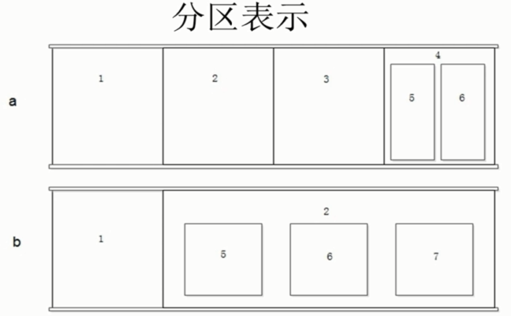

查看分区情况`df -h`:

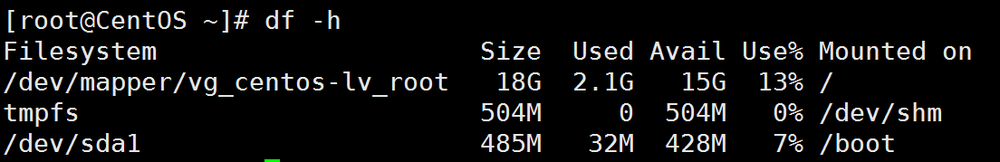

分区的理由主要有两点：

1、数据安全，分区之间的数据不会相互影响。

2、系统效能，数据放在连续的磁盘空间处理速度快。

分区时考虑到后续可能会规划新分区，故一般都设置扩展分区，在扩展分区中预留一部分空间备用。

### 逻辑格式化

硬盘在使用之前需要进行高级格式化（逻辑格式化）把硬盘分割成等大小的数据块，建立文件位置与数据库位置的索引，这种格式化是根据用户选定的文件系统决定的。

### 设备文件名

linux中所有硬件都是文件，不同分区设备文件直接在设备文件名后加分区号，如dev/hda1代表IDE硬盘的第一个分区，IDE、SCSI、SATA和USB都是硬盘的不同接口的硬盘，常用的是SATA，故硬盘文件一般都是sd开头的。

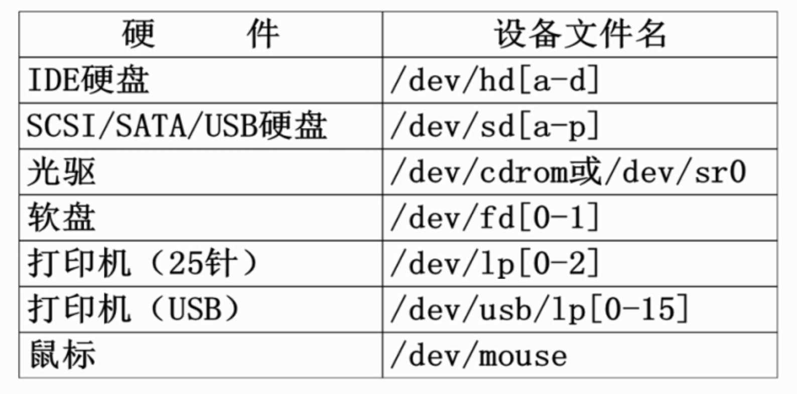

在虚拟机环境下，为了加速，VirtIO接口的磁盘在linux中显示的设备文件名可能是/dev/vd[a-p]。

设备文件命不是根据实际插槽区分的，而是根据系统侦测到磁盘的顺序决定的，一般来说SATA硬盘检测的要比USB早（USB是开机完成才被系统捕捉到），故如果当SATA和USB同时出现时，一般SATA会被命名为sda，而USB被命名为sdb。

### 挂载

挂载就是设置磁盘分区的一个进入点，这个进入点被称为挂载点。linux中必须分区的有根分区和swap分区两个，swap分区可以在内存不足时作为内存使用，最大不超过2GB（这个数字和内存使用效率有关），推荐应该分区的是/boot，因为这个目录下记录了启动相关的内容，比较重要。

文件的系统目录在硬盘上的分配与windows不同，windows的盘符是并列的，而linux中不是这样。如下图所示，根分区/下某一个子目录，如boot和home可以指定独立的硬盘空间。

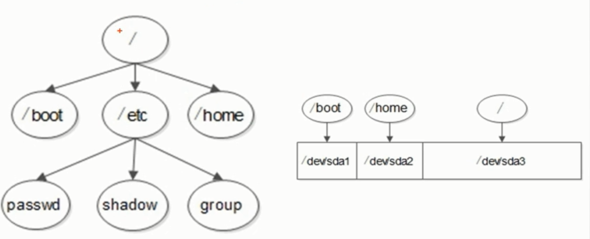

## 磁盘分区设置步骤

创建分区时选择自定义布局：

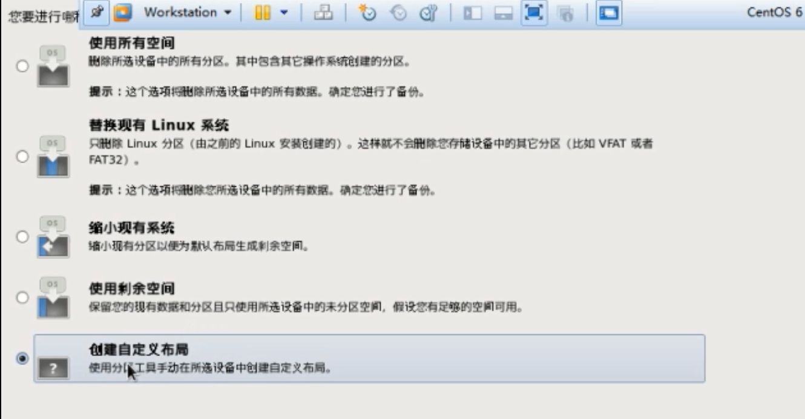

设置根目录分区：

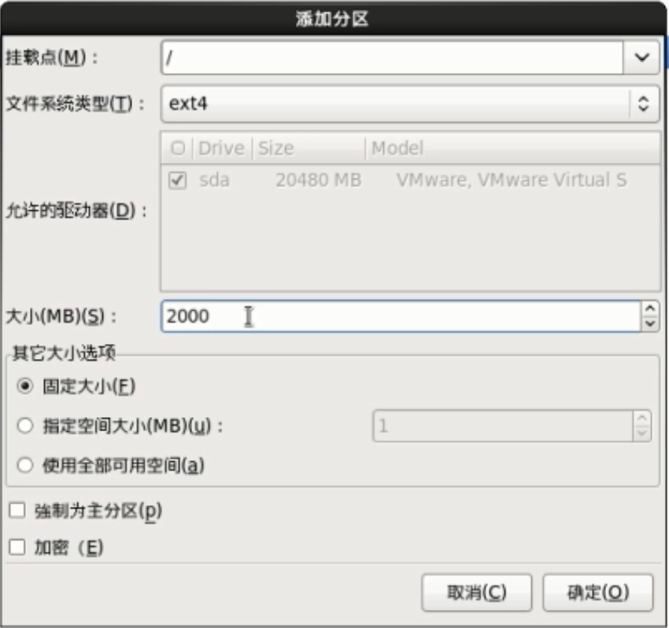

创建boot分区：

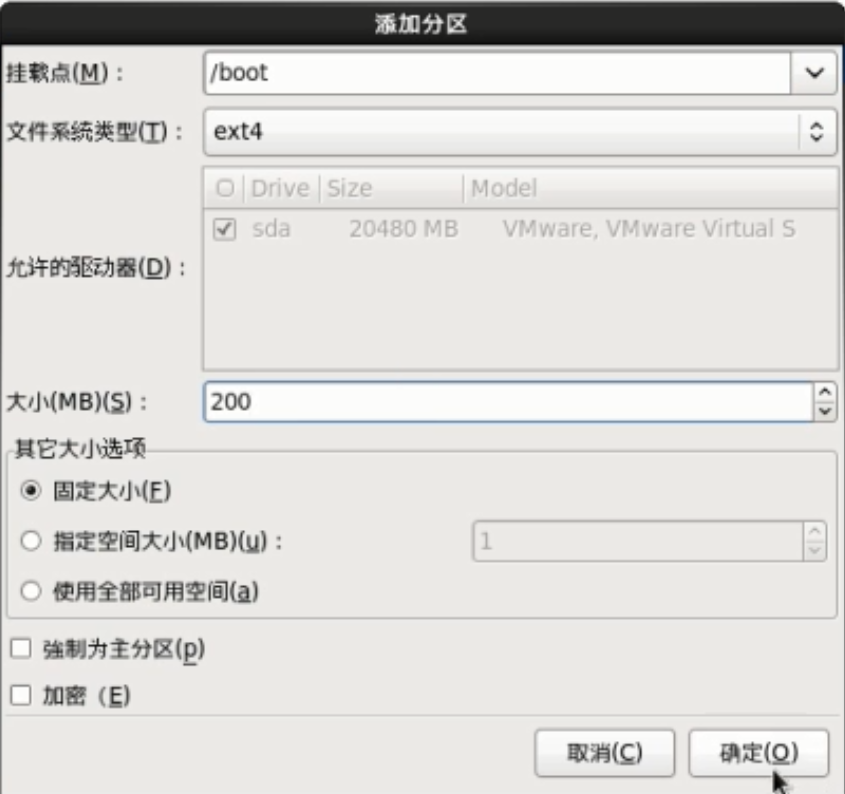

这里发现boot分区总是会作为第一个分区，这是因为boot分区涉及系统启动。

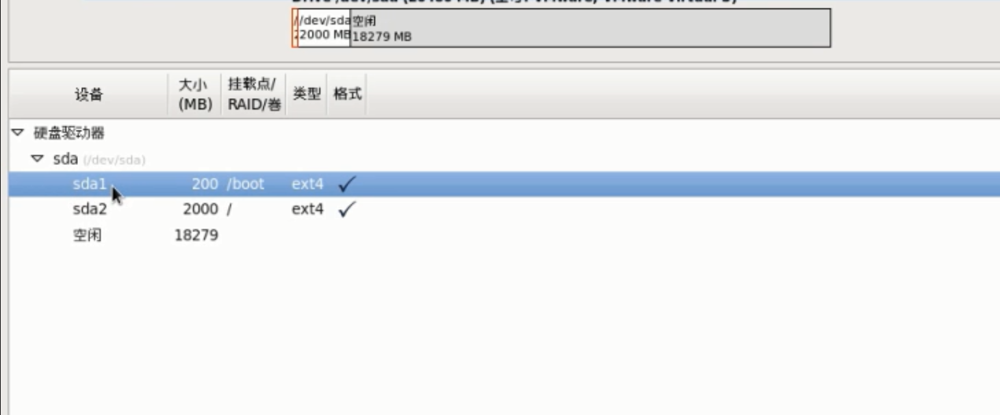

设置swap分区，注意swap不在挂载点处设置：

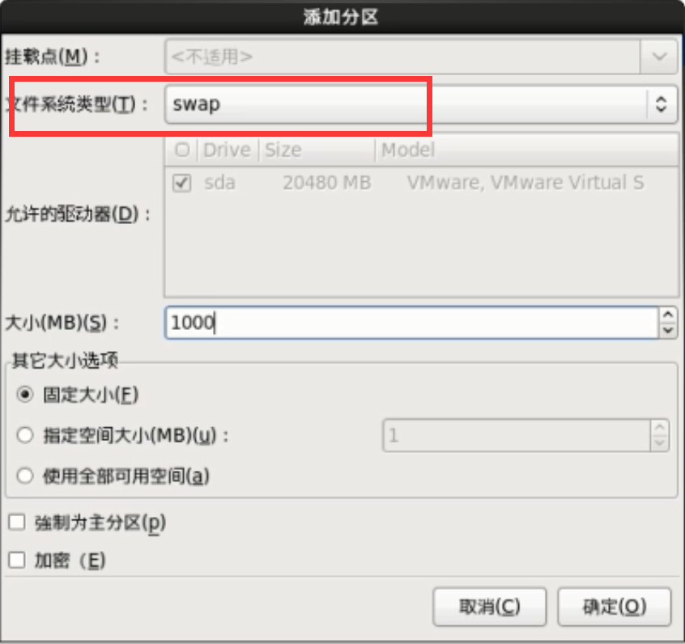

最后设置根目录分区，勾选使用全部可用空间。

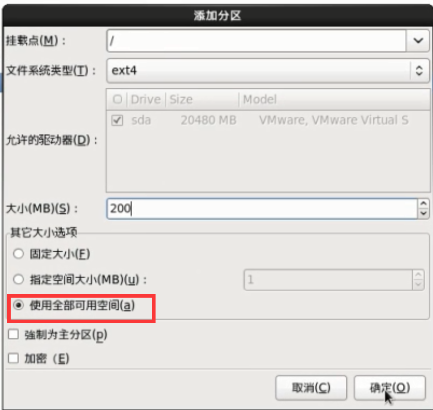

## root初始日志文件和家目录

root文件下初始有三个日志文件：


根用户root的初始家目录是root，其他用户的初始家目录是/home/用户名。

## 网络配置

用远程登录工具之前首先要完成网络配置。在虚拟机-设置内可以找到网络适配器设置：

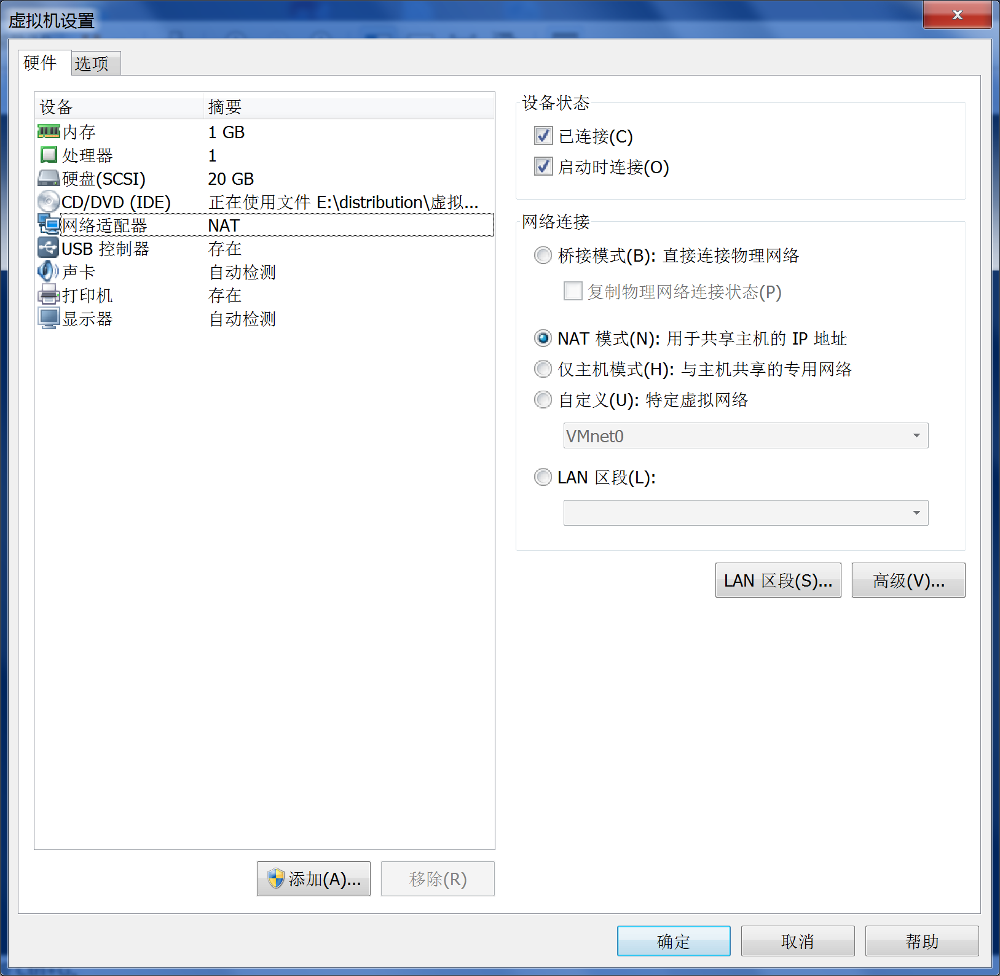

如果选择的是桥接，那么虚拟机就会用电脑的真实网卡（物理网卡或无线网卡）进行网络通信，只要虚拟机设置与windows同一网段的IP地址，就可以在虚拟机和真实机之间直接通信，也可以和局域网内同网段的其它计算机通信，缺点是它占用网段的IP，如果同一局域网内计算机很多就会出现重复IP的现象，而且没有联网的状态下不能和任何计算机通信。

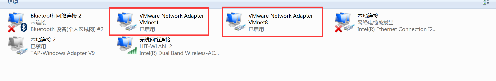

如果采用NAT模式，那么虚拟机就会和VMnet8这个虚拟网卡组成一个网络，通过这个可以完成windows和linux之间的通信，然后linux再通过真实网卡（物理网卡或无线网卡）连接网关，从而完成和互联网的连接。

如果采用仅主机模式，那么虚拟机就会和VMnet1这个虚拟网卡组成一个网络，从而完成windows和linux之间的通信，这种模式只能和windows本机通信，不能连接其他计算机。

在虚拟机的虚拟网络编辑器中可以看见VMnet8和VMnet1的网络地址，还可以修改该子网的网络号：

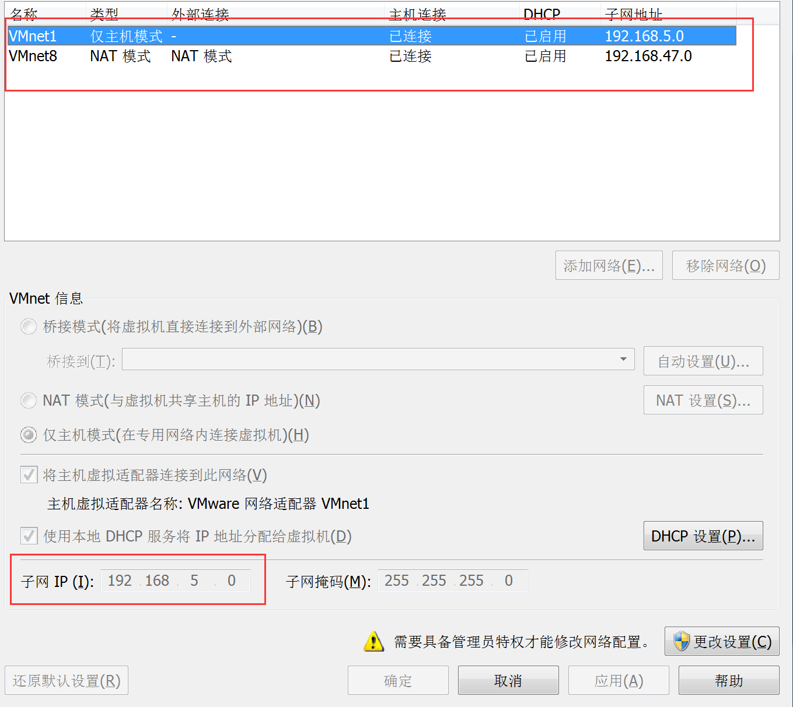

在上一个页面NET模式下点击NAT设置，就可以查看网关。

要查看windows中的网络配置可以用`ipconfig`，既可以查看虚拟网卡又能查看真实网卡的IP地址。

无论是哪种网络连接方式都需要先查看主机网卡的IP地址，然后将虚拟机中的IP地址设置和主机相同的网段。

查看虚拟机网卡的命令：`ifconfig`

更改IP地址的命令：`ifconfig eth0 ip地址`

这里修改IP地址的命令关机后设置就会丢失，只有修改配置文件才能永久生效。

如果选择了桥接模式，设置好虚拟机的IP地址，但是却连不上网，此时可能是因为虚拟机用了另外的不联网的网卡，此时通过编辑-虚拟网络编辑器，调整桥接设置，进一步选择具体的网卡。

## 自动获取IP和静态IP

在安装linux时设置网络自动连接这种方式不适合进行服务器开发，因为这种ip地址获得方式是动态的dhcp，在重新连接时ip地址可能会发生变化，故应该使用静态IP配置。

配置静态IP需要修改配置文件：` vim /etc/sysconfig/network-scripts/ifcfg-eth0`

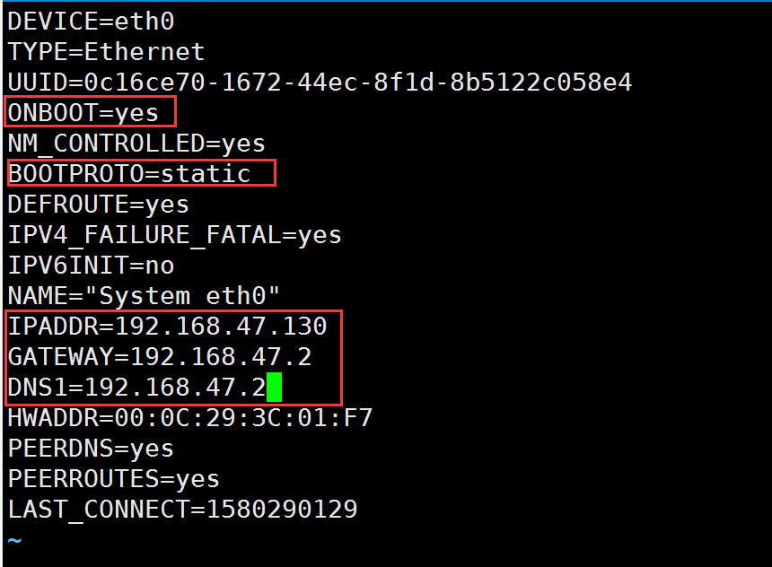

红色的部分是需要特别注意的：

ONBOOT=yes表示网卡随网络服务生效。

BOOTPROTO=static代表静态IP。

最后三个分别为IP地址、网关、DNS，后两个一般设置为一个即可。

修改完成后要重启网络服务：`service network restart`

## linux系统相对于windows的特点

linux是严格区分大小写的。

linux没有扩展名的概念，可以手动设置。

linux中的存储设备必须手动挂载才能使用，如硬盘、U盘等。

linux不像windows，linux中除了/都可以作为文件名。

# 基本命令、查看文件、链接命令

linux中的命令基本格式：`命令 [-选项] [参数]`

## 目录显示命令ls

ls（是list的简写），表示显示所有文件

显示根目录的文件：`ls -a /`

-a代表显示所有文件，包括隐藏文件（a代表all，隐藏文件一般是.开头的）；

-l代表显示文件的详细信息（l代表long），执行`ls -l /`命令后：

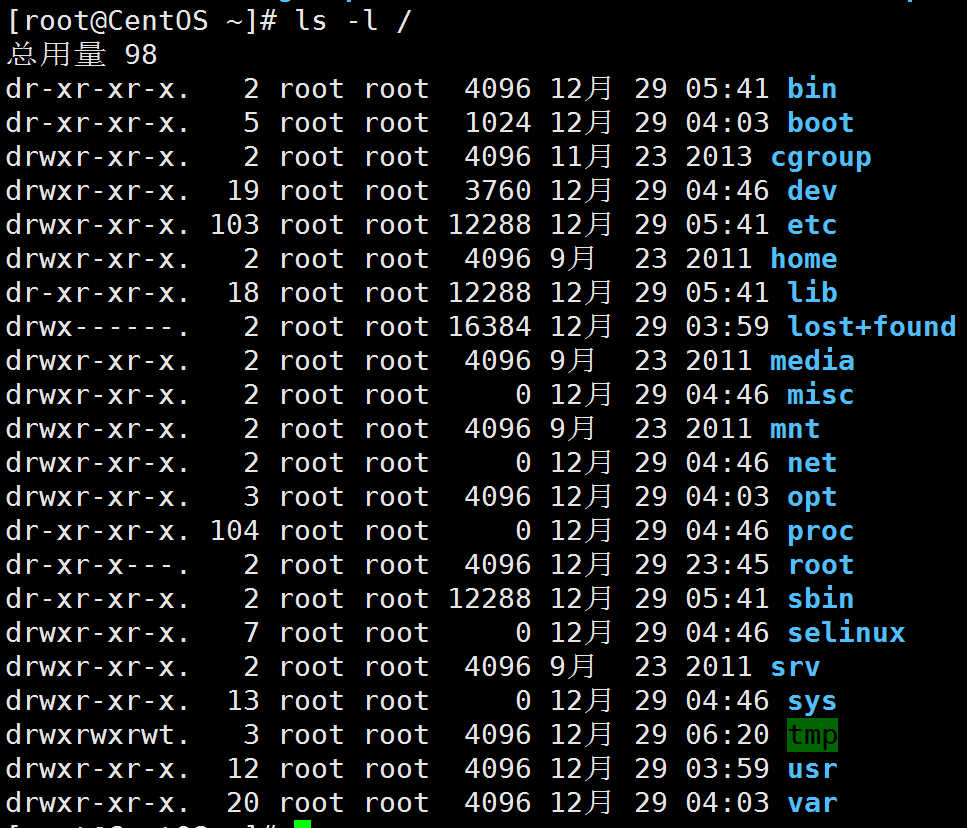

从左到右代表：

文件类型（d代表目录directory、-代表二进制文件、l代表软链接文件link、b为装置文件中可供存储的接口设备、c为装置文件中的串行端口设备，如鼠标键盘）

权限（主组其他，r代表read，w代表write，x代表execute）、

引用计数（这个数字和目录下的文件或目录情况有关，同时与硬链接数有关，如果在目录A中建立一个目录B，那么B的引用计数就是2，因为默认B下有.和..两个目录，而目录A中的引用计数+1，同时如果多一个硬链接，该文件的引用计数也加1）、

所有者（只有一个）、所属组、文件大小单位字节、修改时间、文件名；

-lh（h代表human）代表显示文件的详细信息，与-l不同之处在于文件大小显示更人性化；

-d表示仅列出目录。

-i代表查询文件唯一标志（i代表inode）。

-sh可以查看每个文件占用的block总容量，可以发现ll命令结果的第一行total是总文件使用block的数量*每个block的大小，这个数大于总文件大小，但是剩余的磁盘空间已经不能利用了，因为每个文件再小也要占用一个block，这就是磁盘空间浪费：

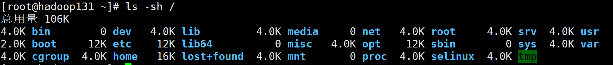

## 创建目录mkdir

mkdir（make directories）是创建新目录的命令。

创建tmp下的新目录i1：`mkdir -p /tmp/i1`，-p意思是递归创建，如果要在一个不存在的目录下创建目录就必须用这个选项。mkdir支持创建多个目录，只需要用空格将多个目录隔开即可，目录名要写完全。

创建时直接分配权限：`mkdir -m 711 test2`

## 切换目录cd

cd（change directory） 切换目录。cd后加具体目录可以完成切换，加两个点可以回到上一级目录。

## 显示当前目录pwd

pwd（print working directory）显示当前目录。如果当前目录是链接文件，加选项-P会显示到链接到的具体位置。

## 删除rmdir和rm

rmdir（remove empty directory）删除目录（必须是空目录，否则执行失败），-p代表删除多层空目录。

rm（remove）删除文件或目录。-r表示删除目录；-f表示不需要再次确认；-rf表示删除目录且不需要确认。

## 拷贝cp与剪切mv

cp（copy）拷贝文件或目录，一般格式是cp \[要复制的文件][目标位置]，不加选项可以复制文件，且可以复制多个文件到一个位置；-r表示复制目录；-p表示保留文件属性，因为文件拷贝过去后修改时间为拷贝时间，相当于新创建的时间，如果想保留文件的修改时间就要用这个选项。cp命令在拷贝时还可以修改名称，只要把目标位置改为一个新的具体文件（如/root表示复制到root下，/root/c表示复制到root下，并将其改名为c）

除此之外，cp还可以建立硬链接和软链接文件，格式为`cp 选项 源文件 链接文件`-l代表建立硬链接，-s代表建立软连接。

-a是-d和-r的结合，-d代表如果要复制的文件是软链接文件，则复制后还是软链接文件，它也可用做完整复制文件权限，可以代替-p。

mv（move）剪切文件及改名，一般格式是mv \[要剪切的文件或目录][目标位置]，这个和cp一样有改名的功能，也可以同时剪切多个文件。如果要剪切的文件或目录在当前目录下，直接写文件名即可，无需写全路径。如果两个位置都不写全路径只写文件名代表在当前目录位置下改名。

注意把文件拷贝或剪切给别人使用时经常需要改变文件的所有者和所属组。

## 创建文件touch

touch创建文件，后加文件名就能创建，如果不在当前目录下创建需要写全路径。如果要创建文件名带空格的文件，必须用双引号将文件名包括进去，这样很不方便，后续处理也有麻烦，故在linux中不建议文件名中加空格。

执行touch命令除了可以创建文件外，还能将已有的文件的三种时间都统一成现在，有时因为开机程序问题，文件的时间可能会出现重大偏差，此时就需要执行此命令，加一些选项touch可以随意修改这三种时间（分别是modification time内容更新时间，status time状态更新时间，access time读取时间）。

## 查看文件命令

### cat、tac和nl命令

cat查看文件内容，后加要查看的文件名。-n表示查看时显示行号。查看文件内容，包括特殊字符：`cat -A 文件`，在linux中编辑的文件回车符是\$，而在windows中编辑完的文件在linux中打开后，回车符是ctrl+M \$(^M)\$，此时脚本是不能正常运行的，此时只要用dos2unix加文件名就能将其转换为linux可执行的文件，这个命令如果没有可以手动安装：`yum -y install dos2unix`类似作用的命令还有unix2dos。

tac表示按行倒序排列查看，这两个命令不适用于查看很多内容的文件。

nl命令可以添加行号打印文件内容。这三个命令都是直接查看文件内容（不能翻页的）。

### more和less命令

more也可以查看文件内容，它以百分比的形式显示查看文件内容多少，按f或空格可以翻页，回车可以看下一行，q或Q表示看完退出，但more不能向上翻页。还有搜索功能，在浏览状态下输入/要查找内容回车，就可以跳到那个位置，但是只能向下搜寻。

less和more类似，但加了向上翻的功能，pageup可以向上翻一页，上箭头可以向上看一行，less还可以查找内容，在浏览状态下输入/要查找内容回车，就可以跳到那个位置，按n跳到下一个搜索词，它可以向上搜寻，用？代替/即可。

### head和tail命令

head可以指定看前几行，`head -n 20 文件`表示看前20行，如果不加选项代表看前10行。

tail和head类似，是看文件末尾行的，也可以使用-n来指定行数，-f代表动态查看，文件出现变化时tail命令的显示也会变化，常用来查看日志。按ctrl+c来退出查看状态。`tail -n +100 文件`表示查看文件100行后的数据。

显示文件的第11到第20行：`head -n 20 文件 | tail -n 10`

显示文件的第11到第20行且有行号：`cat -n 文件 | head -n 20 | tail -n 10`

### od命令

od命令用来查看非文本文件：`od -t c 文件`代表用ascii方式展示内容，c就代表ascii方式，d、f、o、x分别代表十进制输出、浮点数输出、八进制输出和十六进制输出，a代表利用默认的字符来输出。

## 链接命令ln

ln（link）创建链接，`ln 原文件 链接文件`表示生成一个硬链接文件，-s表示生成软链接文件。

|       |      软链接       |          硬链接           |
| :---: | :------------: | :--------------------: |
| 修改源文件 |     可以访问到      |          同步修改          |
| 删除源文件 |      无法访问      |          可以访问          |
| 文件类型  |     文件类型为l     | 需要查看inode，和源文件用同一inode |
|  大小   |       很小       |        和源文件一样大         |
| 修改时间  |      新建时间      |         与源文件相同         |
| 访问权限  | 全开，但能否访问取决于源文件 |         和源文件相同         |
|  限制   |                |    不能跨分区建立、不能针对目录使用    |
| 箭头标识  |   详细信息中有箭头标识   |                        |

所谓硬链接，其实就是多个文件公用一个inode，此时两个文件除了文件名以外所有信息都一样，读取文件时无论通过哪个文件名都能链接到唯一的inode，进而找到唯一的datablock，因此修改哪个文件最终都会影响两个文件，而如果删除任意一个文件，也不会导致数据不能访问，因为inode和block依然存在，所以硬链接比较安全。

硬链接实质上就是多了一个目录的block而已，不会对磁盘和inode数产生很大的影响。

因为要链接到同一个inode，所以硬链接不能跨文件系统（分区），至于为何硬链接不能针对目录，这主要是因为目录下的文件是经常变动的，这会导致这种链接关系难以维护。

软链接仅仅是建立一个到源文件的快捷方式，它是一个独立的文件，故和源文件的inode不同，这种文件的大小就是源文件的文件名占用的空间，删除源文件会导致无法打开软链接。

用cp命令也可以建立硬链接和软链接。

# 基本权限与初始权限

## 修改文件权限chmod

只有所有者和root能修改对应文件的权限。

chmod（change mode）修改文件权限，`chmod g+w,o-r 文件`代表给所属组增加写权限，给other减少读权限，g代表group所属组，o代表other，u代表所有者，a代表all。也可以用等号，`chmod g=rwx 文件`表示将所属组权限全开。也可以用数字来修改权限，rwx分别对应421，如`chmod 777 文件`。-R表示递归修改，改变目录权限的同时修改其下的所有权限。

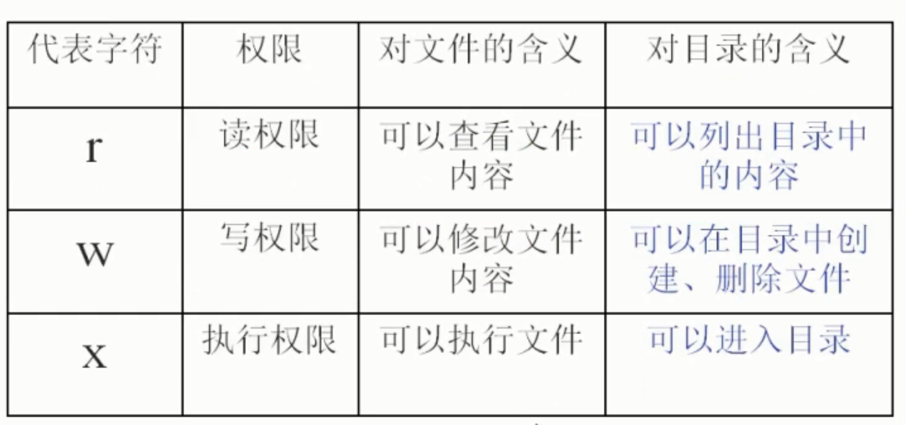

目录的写权限除了可以在目录中创建、删除文件外，还能对其中的文件和目录更名、挪动位置。

目录的执行权限意味着可以进入该目录，如果目录不具备x权限，那么就无法切换到目录下，也就无法执行该目录下的任何命令。

此时注意目录的写权限意味着可以删除目录下的文件，而不是有文件的写权限才能删除文件（只拥有对文件的写权限是无权删除该文件的）。反过来，即使用户拥有对某一文件的全部权限，但没有目录的权限，也什么都做不了。通常开放的目录r和x权限通常是同时存在的，这两个无法脱离开。

## 常用情况下的文件权限


## 修改文件所有者和所属组

chown（change file ownership）`chown 用户 文件或目录`表示将文件或目录的所有者更改为对应用户，只有root才能做这种操作。

chfrp（change group）改变文件的所属组。

## 文件初始权限查看与设置umask

umask -S代表查看文件初始权限设置。文件的初始权限是u=rwx g=rx o=rx，这个权限实际上是目录创建时的初始权限，文件的初始权限在这个基础上去掉了三个x，这是为了安全考虑。umask不加-S会出现四个数字0022，第一个0是特殊权限，后三位数字022转换为权限的9个字母与777对应权限的9个字母进行异或才能得到真正的权限，也就是755，目录的初始权限。用umask命令也可以修改默认权限值，修改时也是用数字，只不过这个数字不直接对应权限，而是需要进行上述的转换。

除了用异或来推断权限值外，还可以用减法，如计算对应022的文件权限，首先将022转换为权限-----w--w-，然后：

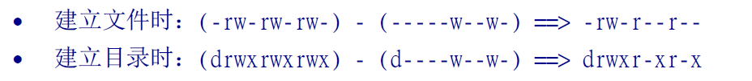

## 常用权限

常见的文件权限有三种：

不能执行类文件：-rw-rw-r--，对应644。

可执行但其他人不可修改脚本：-rwx-r-xr-x，对应755，默认权限。

其他人不可见文件：-rwxr-----，对应740。

# 压缩与解压

压缩是一种很重要的提高磁盘利用空间的手段，数据在网络中传输时也是按照一定的压缩格式传输的，这样就能让带宽的使用率上升。关于压缩有一个很重要的参数被称为**压缩比**，它是压缩后文件/源文件大小。

常见的压缩文件扩展名：（这里的扩展名仅仅是为了区分），第一个compress已经很少使用了。

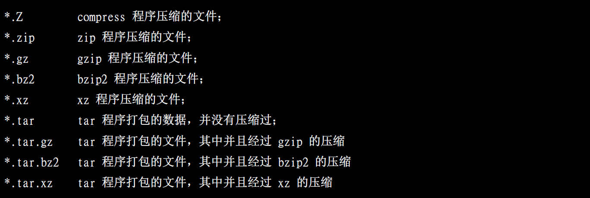

rar在linux中必须下载特定的工具才能解压压缩，zip在linux中可以直接使用，windows的压缩文件除了zip一般不能在linux中打开，但linux中的压缩包一般都能在windows中打开。

## gzip、zcat/zmore/zless/zgrep

以gzip形式压缩的文件在windows中用winRAR可以直接解压。

以gzip压缩文件：`gzip 文件名`，选项-v可以显示压缩比信息，执行完压缩命令后，源文件就被删除了。

还可以调整压缩比，只需要加-数字选项，代表压缩等级，默认为6，1最快压缩比最高，9最慢压缩比最低。

用重定向方式压缩文件：`gzip -c services > services.gz`，这种方式可以自由指定压缩文件名，而且还可以保留源文件。

解压gzip压缩文件：`gzip -d 压缩文件名`，解压后压缩文件就会被删除。

用zcat/zmore/zless命令可以读取纯文本档被压缩后的压缩文件。

zgrep可以纯文本档压缩文件中直接查找内容，而不用解压，以下内容是查找http关键词：

`zgrep -n 'http' services.gz`

## bzip2、bzcat/bzmore/bzless/bzgrep

bzip2的压缩比要比gzip更好，但用时要长一些。bzip2的用法和gzip几乎完全相同，连选项都一样。

zip也可以压缩文件，但是压缩比不太理想，`zip 压缩后文件名 要压缩的文件`来压缩文件，-r可以压缩目录，保留源文件，对应unzip可以解压文件。

## xz、xzcat/xzmore/xzless/xzgrep

xz的压缩比更高，但是用时更长。

以xz压缩文件：`xz -v 文件名`，-k可以保留源文件建立压缩文件。

列出压缩文件的信息：`xz -l 文件名`

解压缩：`xz -d 文件名`

xzcat/xzmore/xzless/xzgrep也可以直接读、查找文本压缩文档。

## tar

tar也可以压缩文件，且它能对目录执行，`tar -zcvf File.tar.gz dir`就能把目录dir打包成File.tar.gz，z代表打包时压缩，就相当于执行了tar命令再将打包后的文件执行.gz命令，c代表打包，f表示指定文件名，v代表显示打包的信息。相对应的解压命令是`tar -zxvf 压缩文件 -C 解压位置`如果不加后两个就代表解压到当前位置。

tar命令的选项有几种：c为建立压缩文档，v为过程中显示文件名，f表示后面跟文件名。

-zcvf对于gzip格式压缩，用于档名为*.tar.gz；-jcvf用于bzip2解压缩，用于档名为\*.tar.bz2；-Jcvf用于xz解压缩，用于档名为\*.tar.xz。

把上述命令中的c变成x就是解压的命令，用-C后跟目录来指定解压后位置。

p选项的意思是保留备份数据的原本权限和属性，备份/etc目录：

`tar -zpcv -f /root/etc.tar.gz /etc`

查看tar文件的数据内容：`tar -jtv -f 打包文件名`，此时打包文档内部各文件的权限和属性都会被列出，可以发现其中的文件路径都不带根路径，这是为了解压时能够将文件直接放到对应目录而不是覆盖对应目录。

只解压单一文件的方法，首先查找含有关键字的对应文件：

`tar -jtv -f 压缩文件 | grep '关键字'`，找到该文件名后再执行解压：

`tar -jxv -f 压缩文件 待解开档名`，这个待解开档名开头一般是不含根目录的。

打包目录时将某些文件排除在外，如要打包/etc和/root，但是不想打包/root/etc*文件，且新的打包文件要放置在/root/system.tar.bz2，此时可以执行：

`tar -jcvf /root/system.tar.bz2 --exclude=/root/etc* --exclude=/root/system.tar.bz2 /etc /root`，这里也把新的打包文件除外了，因为压缩文件不能打包自己。

备份比某个时刻新的文件，此时就需要用到--newer-mtime选项，如备份etc目录下所有mtime内容更新时间比2015/06/17靠后的文件：

`tar -jcvf /root/etc.newer.then.tar.bz2 --newer-mtime="2015/06/17" /etc/*`，还有一个选项是--newer，这个选项支持mtime和ctime读取时间。

tar如果仅仅打包文件没有压缩，那么处理后的文件被称为tarfile，如果既打包又压缩，就被称为tarball。

tar可以将文件直接打包到特别的装置中，如磁带机，只需要在打包时将新位置指定到对应地方即可。

# vim编辑器

## 基本模式与命令

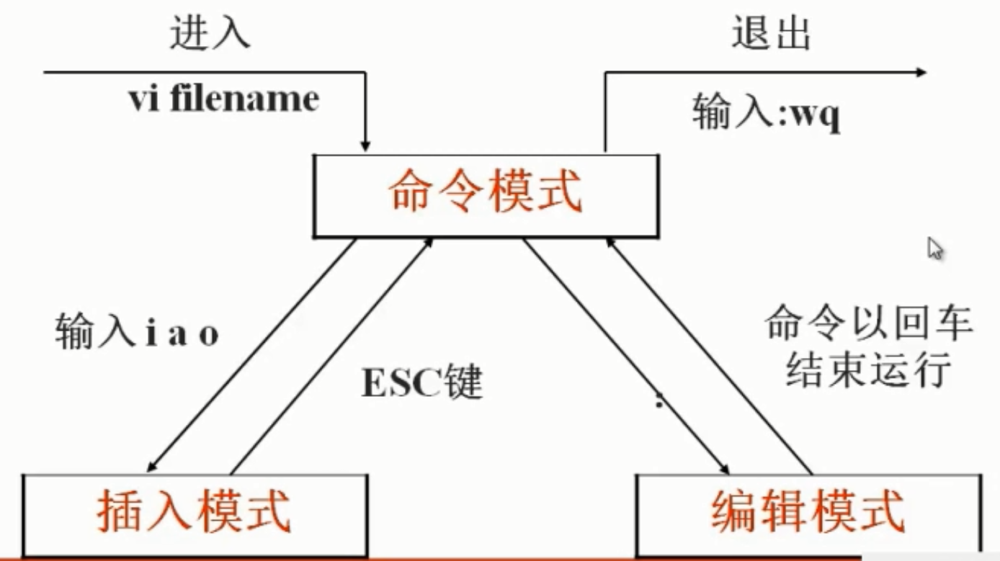

vi后加文件名就进入文件的命令模式，此时输入的信息都会被当做命令处理，按i/a/o就会进入插入模式，可以插入内容，按esc就会回到命令模式。在命令模式中按冒号加命令就能执行编辑模式的指令，如输入`:set nu`就能让内容出现行号，执行编辑模式的命令后就再次回到命令模式，最后执行:wq退出编辑。

下表说明了进入插入模式的几个命令，注意切换时必须先按esc回到命令模式：

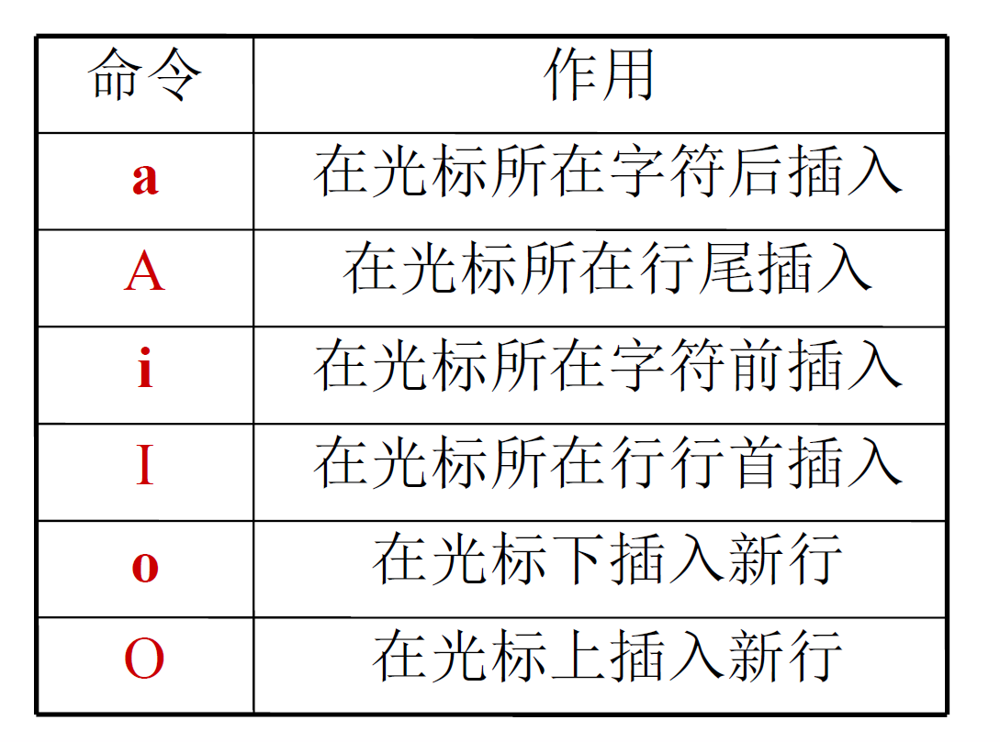


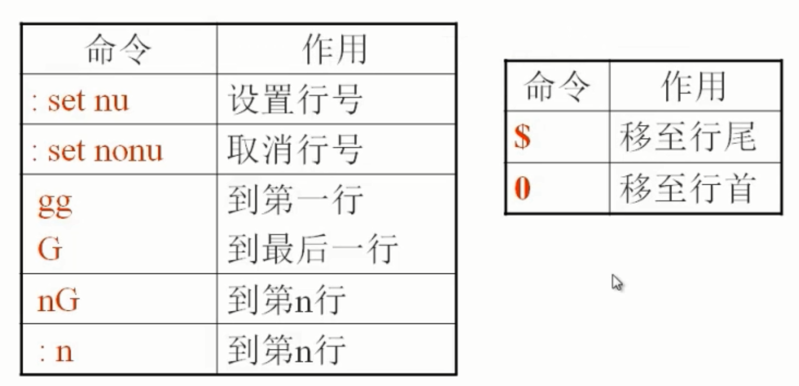

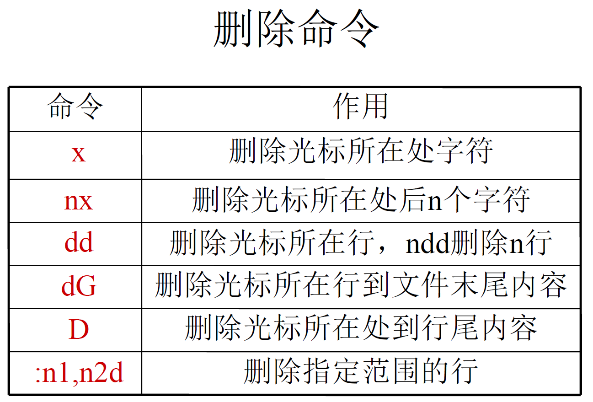

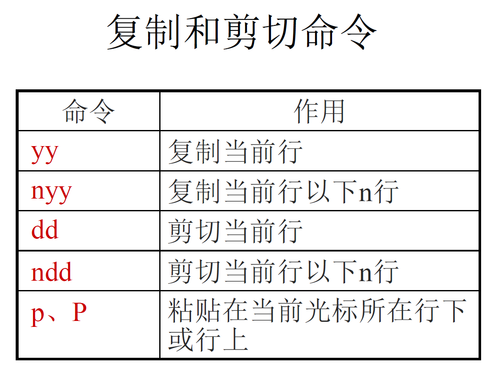

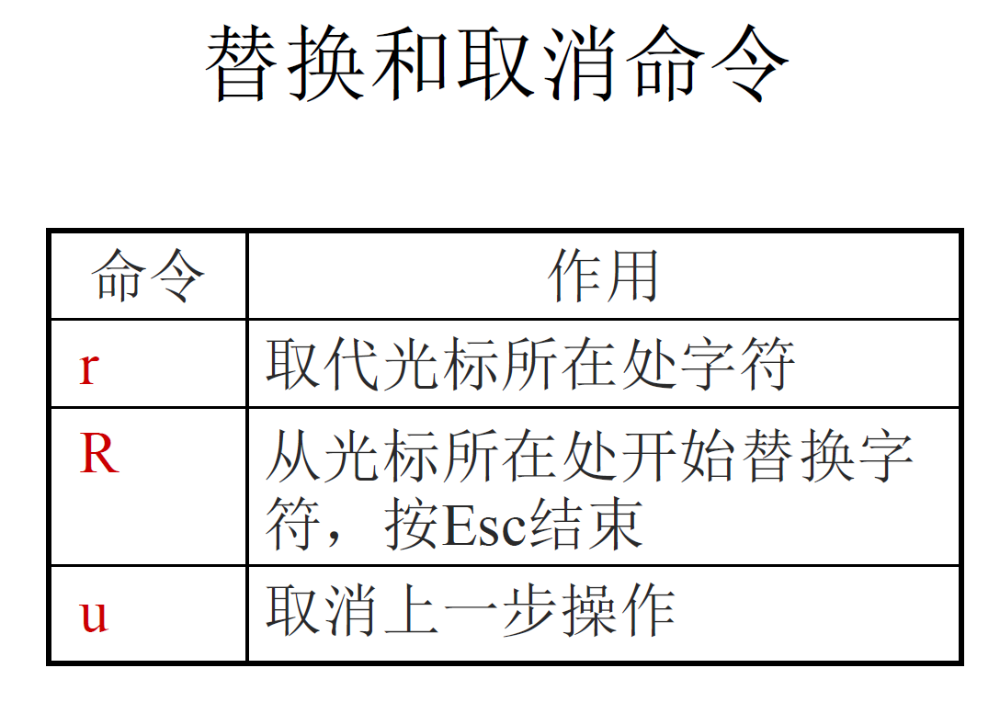

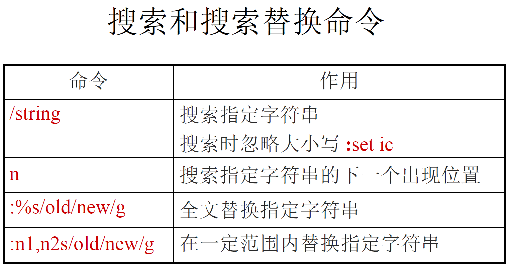

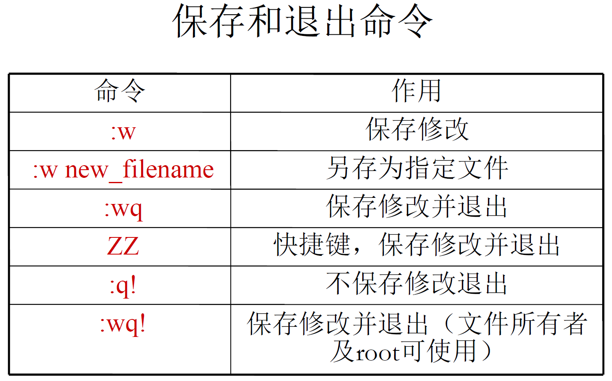

:wq!可以强行保存，有的文件root没有使用权限时，root编辑该文件就可以使用这个进行保存并退出。

## 常用功能

1、将指定文件内容导入光标处`:r 导入文件名`

2、在编辑模式下执行`:! 系统命令`可以执行其他系统命令，不干扰编辑，按回车重新进入编辑状态。

3、将命令执行结果导入文件光标处，如`:r !date`

4、自定义快捷键map：编辑文件时还可以自定义命令，如`:map ^P I#<ESC>`定义好了之后按ctrl+p就会在行首插入一个#，注意这里的^P不是数字6对应的尖角号，而是先按ctrl+v然后按ctrl+p，看到变色后表示输入成功，而I代表将光标移动到行首，#是插入内容，后面的ESC意思是插入完成后重新进入命令状态。而`map ^B 0x`代表吧行首第一个字符删掉，定义好了之后按ctrl+b就可以执行了。`map ^H i925722935@qq.com<ESC>`代表插入邮箱地址，可以用来定义插入一个常用信息的快捷键。

5、插入连续行注释：

`:1,4s/^/#/g`代表从1到4行在行首插入#，^代表在行首插入，#是插入内容

`:1,4s/#//g`代表将1到4行的#替换为空

`:1,4s/^#//g`代表1到4行的行首#替换为空

`:1,4s/^/\/\//g`代表从1到4行在行首插入//，插入的两个//linux无法识别是分隔符还是插入的内容，所以必须加反斜杠来声明。

6、自定义自动替换：

`:ab mymail 925722935@qq.com`执行后，文件中输入mymail后按空格或者回车就会自动变成邮箱。但是这种替换命令在关机后不会保存设置，需要在家目录下添加配置，如果是root用户就在/root下，如果是普通用户就在/home/用户名下，创建一个名为.vimrc的文件，输入：

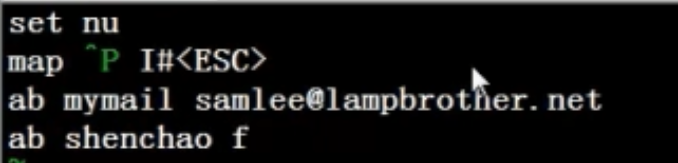

保存后，打开任何一个文件都会有行号，且所有的自定义快捷键和替换都有效。

## 生成的文件

当某个用户使用过vim时，他的家目录就会自动生成一个文件~/.viminfo，这就是每次打开总停留在上次的位置的原因，所有用户的设定值存在/etc/vimrc，但是对于单一用户来讲，想要修改配置文件使设定生效一般就要修改~/.vimrc文件，这个文件预设不存在，需要手动建立，下面是一些常用设置：

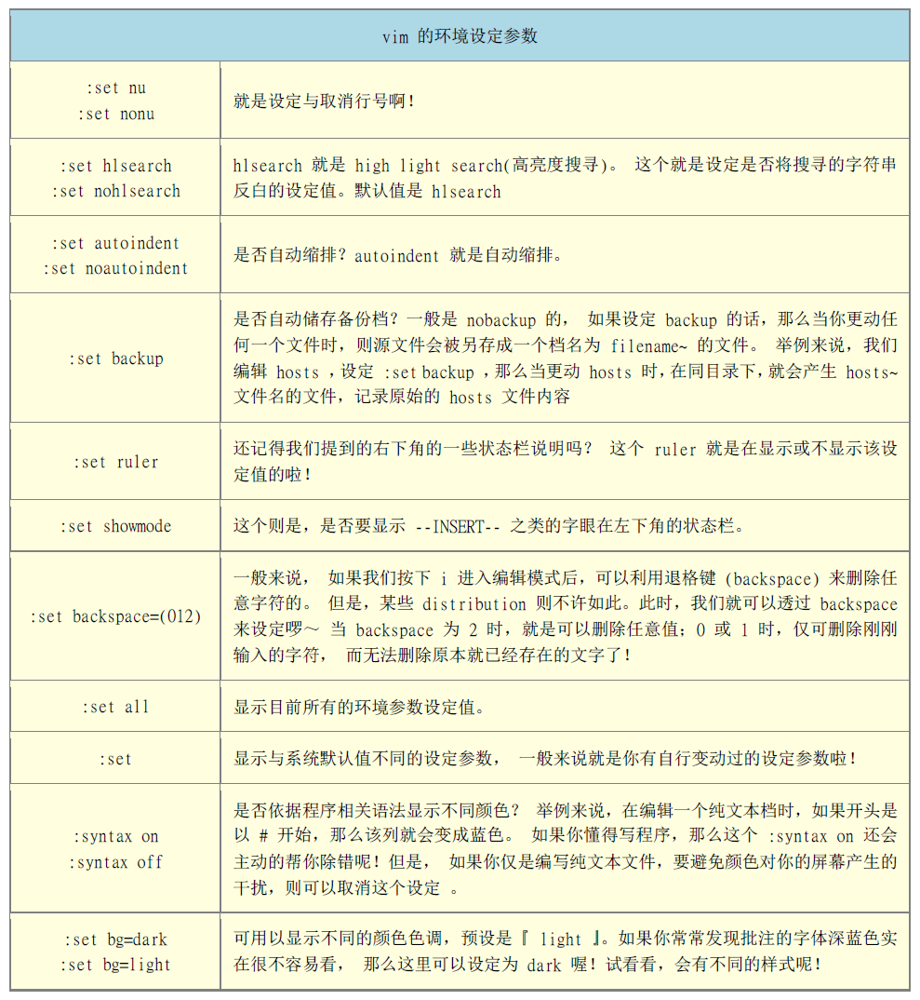

## vim的暂存档与救援

当用户使用vim编辑时，在vim编辑文件的目录下会建立一个名为.filename.swp的文件，该文件内记录了对源文件的编辑动作，如果系统因为某些原因崩溃导致新编辑的文件没有保存，此时就可以利用swp文件进行救援。

如果在编辑某文件时突然宕机，再次打开该文件时会有警告信息显示存在swp暂存档文件，这种情况出现的原因可能有两个：

第一、其他用户在编辑这个文件，此时用户应该通知此人结束vim然后再进入编辑，或者直接按o进入只读状态。

第二、本用户编辑文件时突然发生意外导致结束，此时可以按R就能载入swp文件进行修复，然后再决定是否存储，注意这种情况下该swp文件不会在退出vim后自动删除，要手动删除否则还会有警告信息出现。也可以按D直接放弃该暂存档，此时就会删除旧的swp文件建立一个新的swp文件继续编辑。

在打开文件产生警告页面后也可以按Q退出，不执行任何动作。

## 区块选择

进入命令模式后按ctrl+v就进入字符选择状态，此时光标经过的地方会反白选择，选择区域是区块状的矩形，然后选择好内容后按y复制，最后移动到想粘贴的地方按p即可粘贴。

更多的选择功能如下：

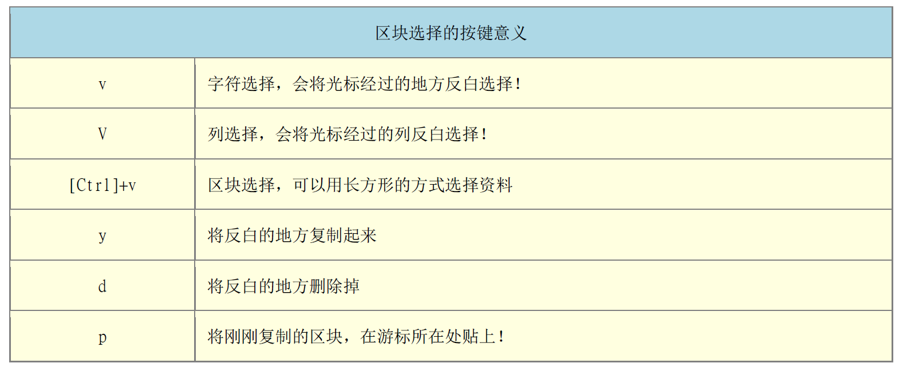

## 多文件编辑

如果想把一个文件内的内容复制到别的文件中，就可以用vim的多文件编辑功能。

首先先同时编辑两个文件：`vim 文件1 文件2`

多文件编辑状态下可以通过以下按键来切换：

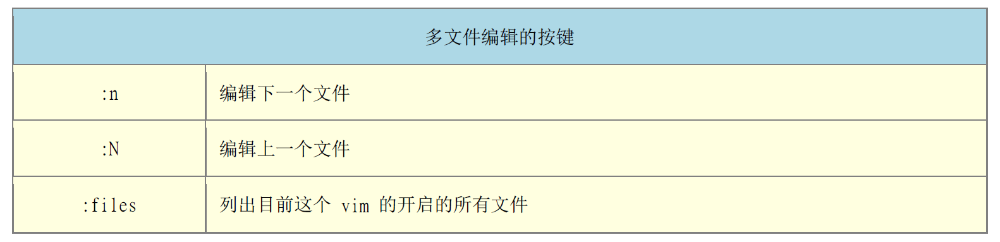

这样就能粘贴到其他文件了。

## 多窗口功能

有时编辑一个大文件时需要前后对照着看，在进入vim后执行`:sp`就能开启该文件的第二个窗口，这样就可以轻松对照了。多窗口也可以开启其他文件，此时只需要执行`:sp 文件名`就能开启。

下图是在多窗口模式下的一些命令，可以来回切换：

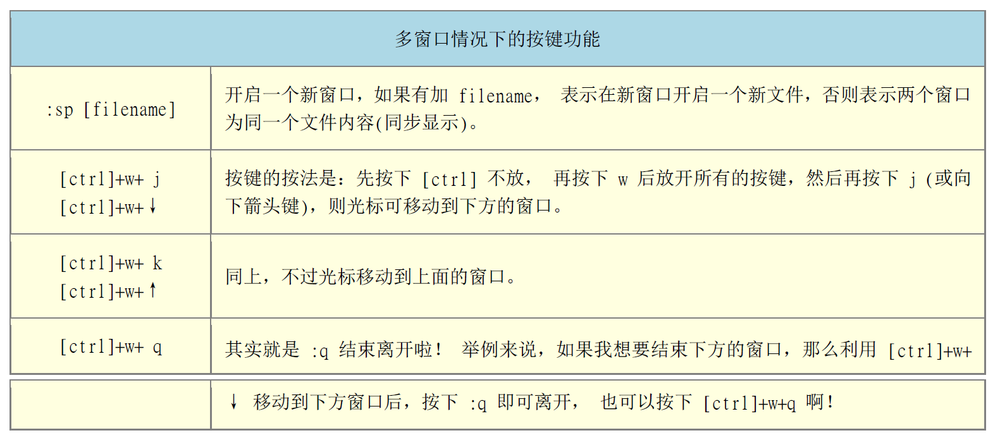

# 文件搜索、查找与对比

## 文件搜索命令find

find文件搜索命令。基本模式是find \[搜索范围][筛选条件]，如`find /etc -name *init*`代表查找etc目录下文件名含init的文件，?代表单个字符，*代表任意字符，如果匹配条件不带通配符，那么搜索结果中文件名就只能是init。-iname代表不区分大小写；

-size可以在筛选条件里加入大小，`find /etc -size +204800`表示在etc目录下查找大于100MB的文件，+表示大于，-表示小于，数字前不加符号表示等于，这个数字的单位是数据块，等于0.5K；

-user 后加用户名，可以查找所有者为该用户的文件，-uid可以用账号id查找该账号的文件，-gid查找对应组ID的文件。

搜寻系统中不属于任何人的文件：`find / -nouser`，当一个用户创建了一些文件，后来该用户被删除后系统就会残留一部分这样的文件。-nogroup可以找无群组的文件。

-amin表示查找访问时间（access）、-cmin表示查找文件属性修改时间（change）、-mmin表示查找文件内容修改时间（modify），如`find /etc -cmin -5`表示查找etc目录下修改属性时间在5分钟以内的文件，时间前也可以有加号或者减号。

-a提供并列筛选，-o表示满足一个筛选条件即可，这两个都是放在筛选条件之间的，如`find /etc -size +163840 -a -size -204800`表示查找大小在两者之间的文件；

-type可以根据文件类型查找，文件类型有f、d、l等；

-inum可以根据inode查找，可以用这个命令查找一个文件的所有硬链接文件。

-perm后接数字可以查找权限为该数字的文件，此时数字前加-代表查找任何权限囊括该数字对应权限的文件（如搜-rwxr--r--，当文件为-rwxr-xr-x也会被搜出来），数字前加/表示当任何一部分数字权限能对的上时，就会被找出（如搜-rwxr-xr-x，当文件为-rw-------也会被搜出）

-exec或者-ok可以对查找结果执行命令，如：

```
find . -name *init* -exec ls -l {} /;
```

表示对当前目录下查找复合要求的文件名，然后显示结果文件详细信息，后三个字符是固定的。-ok和-exec区别在于-ok会进一步询问。

```
find . -inum 31531 -exec rm {} /;
```

表示对查找结果进行删除。

上述执行格式中大括号代表find命令执行的结果，而/;或\;代表分号，是命令的终止符，而大括号到-exec这段就是find后要执行的命令。

查看24小时内更新过的文件：`find / mtime 0`

找到比后一个文件更新的文件：`find /etc -newer /etc/passwd`

## 文件搜索命令locate

locate也是文件搜索命令，后面直接加文件名，表示查找含有该名的文件，这个命令查找速度非常快，这是因为linux预先建立了一个数据库记录了文件信息，locate就是通过查找该库来寻找文件的，这个数据库在/var/lib/mlocate/mlocate.db。缺点是新建的文件没有被收录进这个数据库，此时用locate命令是查不到的，但是可以用updatedb来手动刷新资料库，但是如果把文件放在tmp（临时目录）下，即使刷新过该命令也无法找到。locate可以加-i选项，此时查找不区分大小写。

找到与passwd相关的文件，只列出5个：`locate -l 5 passwd`

## 查找文件内容grep

grep可以用来查找文件内容，如`grep winner /etc/inittab`表示查找文件中是否有winner字符串，并显示有该字符串的行。-i可以不区分大小写查找。-v可以过滤掉某些结果，如：

```
grep -v ^# /etc/inittab
```

表示过滤掉以#开头的行，只显示其他行。

取出所有没有root的行：`last | grep -v 'root'`

grep命令其实是分析每一行，将符合要求的行取出。

## 文件对比命令

比较两个目录内的文件差异：`diff -r 目录1 目录2`

diff和cmp命令是对比两个文件之间的差异的，前者以行为单位对比，后者以字节为单位对比。

patch命令可以配合diff使用，diff命令制作旧文档到新文档的补丁，patch命令可以给旧文档升级到新文档，也可以恢复原来的文档版本。

# 文件属性与目录配置

## 文件类型

一般的文件分为三类，一是纯文本文件，二是二进制文件，三是数据格式文件，数据格式文件是特定程序产生的特定格式的文件，如/var/log/wtmp，它能用last读出，但cat会读出乱码。

文件类型：一般文件-、目录d、链接文件l、区块设备档（硬盘与软盘，符号为b）、字符设备文件（键盘、鼠标，符号为c）、资料接口文件（用于网上的数据承接，符号为s）、数据输送文件（FIFO队列，pipe，符号为p）。

## FHS

FHS（filesystem hierarchy standard）是一个目录配置的标准，很多开发商都应该遵循这个标准，以达到使用者清楚各目录的作用的效果。FHS根据文件系统使用的频繁与否、是否允许使用者随意变动，将目录定义为四种交互作用的形态：

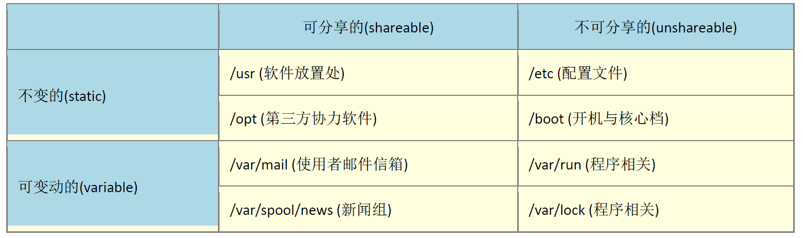

这四种类型的解释：


## 常用目录

1、根目录/：

FHS要求，根目录不要放在非常大的分区槽内，安装软件尽量不要与根目录放在一个分区槽内，因为根目录与开机、还原、系统修复等动作有关，分区内容越多出错的可能越大。

2、/usr目录：

usr（unix software resource），它其中的数据属于可分享不可变动的，FHS建议所有开发者将他们的数据合理的放在该目录的各次目录下，该目录一般是安装时会占用较大磁盘容量的目录。


3、/var目录：

它主要针对经常变动的文件，包括缓存、运行文件、数据库文件等，随着系统运行，该目录会逐渐占据较大的硬盘空间：

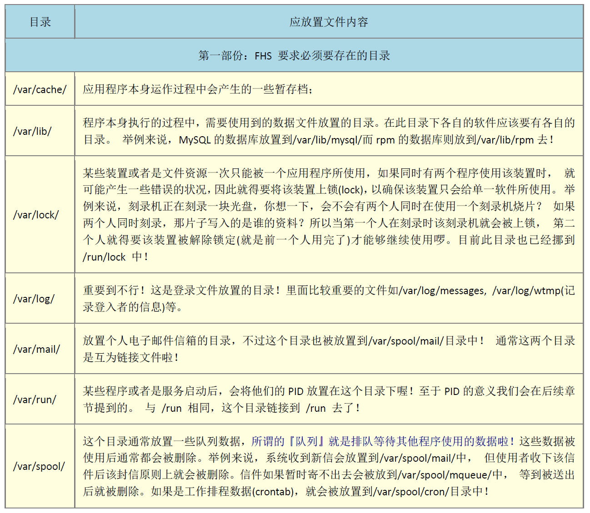

CentOS7在目录设置上与之前有了较大的不同，将许多在根目录下的目录中的数据转移到了/usr中，然后进行廉洁设定：

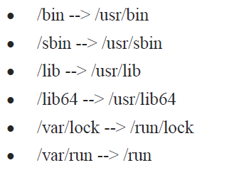

## 路径与目录

相对路径的表示方法，一个点.代表当前目录，如：./command；两个点..代表上一层目录，如：../var/log。一般进行shell编程时要使用绝对路径，因为文件的执行位置是不确定的。

特殊的目录：


文档名和目录名：

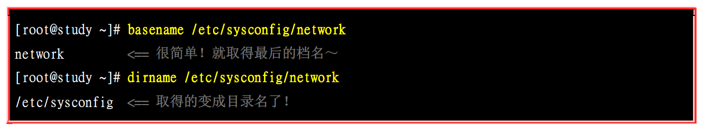

## 文件时间参数

文件的三种时间参数，分别是modification time内容更新时间，status time状态更新时间，access time读取时间，分别使用ll、`ls -l --time=atime 文件`、`ls -l -time=ctime 文件`查看，其中最常用的就是mtime内容更新时间。执行touch命令除了可以创建文件外，还能将已有的文件的三种时间都统一成现在，有时因为开机程序问题，文件的时间可能会出现重大偏差，此时就需要执行此命令，加一些选项touch可以随意修改这三种时间。值得注意的是，复制一个文件时，ctime不能被复制，因为它记录最近状态改变的时间，总是记录复制的时刻。

## 各目录作用

linux各目录的作用：

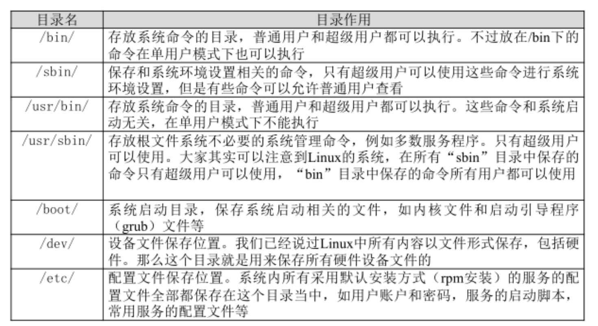

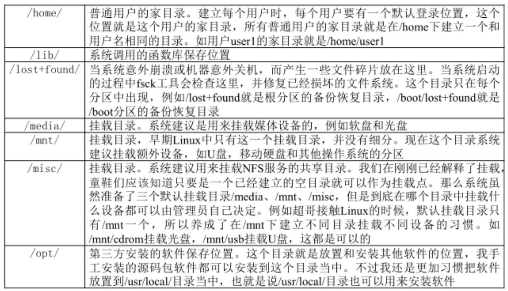

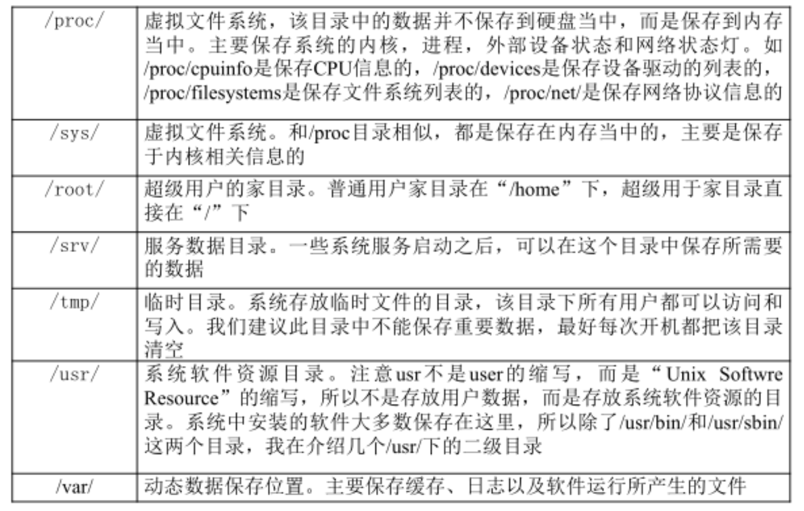

## 编码问题

有时打开文件中文会出现乱码，这是由于文件本身的编码方式和开启终端机的软件的编码方式不同导致的，如果文件编码方式是big5，而终端采用utf8就会不能兼容，此时一般要调整终端的编码方式来解决。

在dos中的文件可能在linux中无法正确读取和执行，这是对于两个系统而言，一些特殊格式的字符表达方式不同的原因，此时要用dos2unix和unix2dos来转换即可。

一个文件的编码也可以进行转换，如将/tmp/vi.big5转成utf8编码：

`iconv -f big5 -t utf8 vi.big5 -o vi.utf8`，-o选项意味着保留原来的文件，后跟新文件。

将正体中文utf8转换成简体中文utf8：

`iconv -f utf8 -t big5 vi.utf8 | iconv -f big5 -t gb2312 | iconv -f gb2312 -t utf8 -o vi.gb.utf8`

# 帮助与常用快捷键

## 查找命令位置which和whereis

which用来查找命令，后加命令可以看到该命令的位置，如果在bin下就说明任何人都可以执行，如果在/usr/sbin下就说明只有root能用该命令。这个命令还会显示该命令是否有别名，如rm的别名就是rm -i，也就是默认会询问是否删除。

which命令是根据PATH指定的位置查找命令的，有时会找到错误的文件，此时应该加上-a选项列出所有。且此命令无法查bash内置命令。

whereis也可以用来查找命令，它不仅会显示命令的路径，还能显示该命令帮助文档的位置。whereis只查找/bin/sbin下的执行文件和man相关的文件，所以速度较快，但是不一定能查到，用-l来查看所有搜索的位置，其他用法如下：

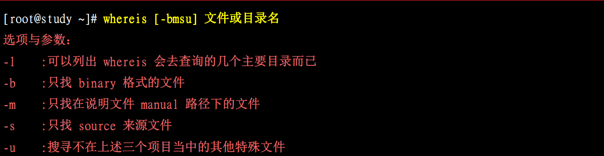

## 查看命令用法和配置文件信息man、whatis、apropos、help

man（manual）可以查看命令的使用方法。按空格翻页，回车换行，如果想查看说明中的某个关键词还可以输入该关键词，如`man ls`可以查看ls的使用方式，在浏览时输入`/-l`查看-l的相关内容，此时按n就会跳到下一个与-l有关的内容。man还可以用来查看配置文件作用，查询配置文件时不要加完整路径，而是直接跟文件名即可，如：

```
man services
```

执行后可以看到关于该文件的解释，和它的格式：

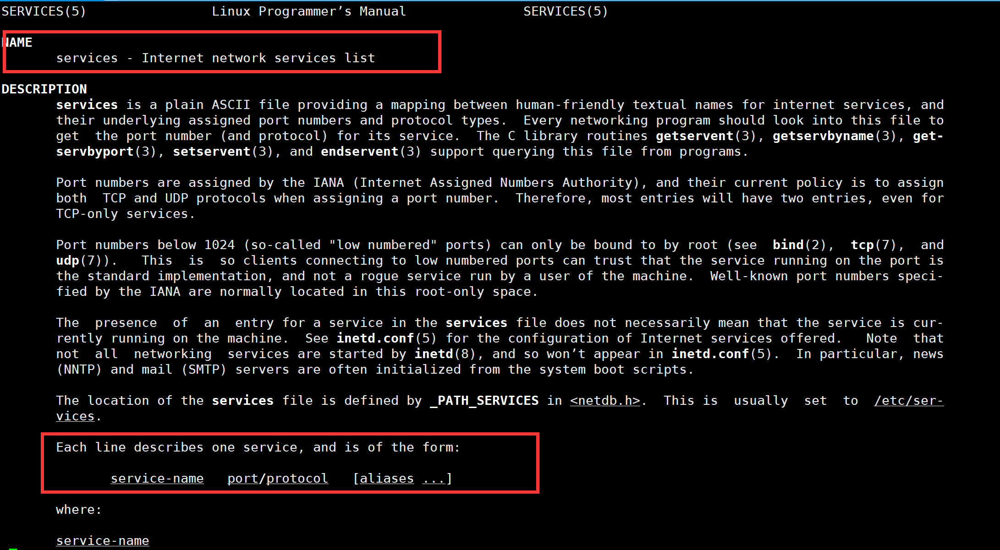

首行第一个词括号中有个数字，这个数字的意义如下：


man命令产生的内容按段落大致分为以下几个部分：

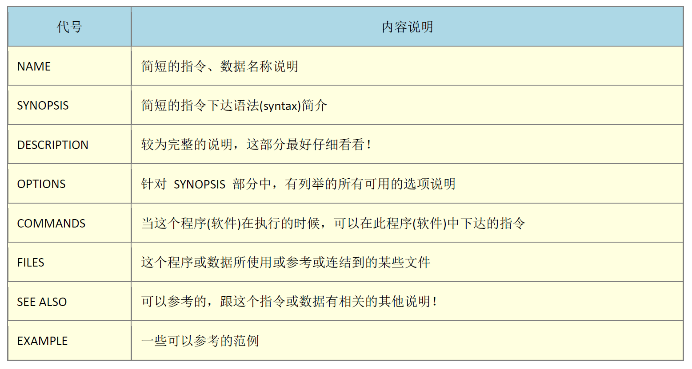

在man帮助中输入`/date`就能快速定位到date字符串。

man状态下的命令：

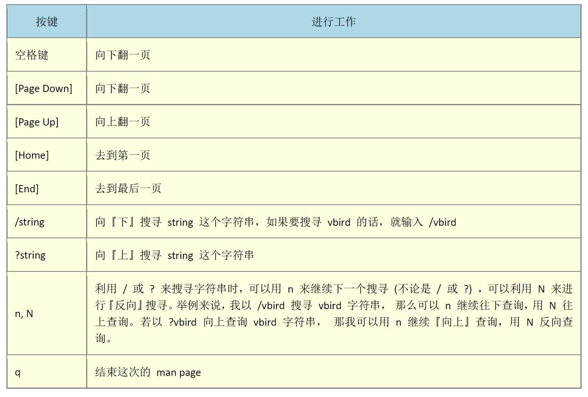

man可以读出对应命令的帮助，这些帮助实际上是以文件形式存在/usr/share/man这个目录中，可以通过修改配置文件/etc/man_db.conf来修改man的搜寻路径，从而修改man读取帮助文件的位置。

linux中的帮助文件有两种，一种是命令的帮助，一种是配置文件的帮助，前者代号是1，后者是5，当有一个名称同时是命令又是配置文件名时，代号就会在它的文件名中加以区别，如passwd既是命令又是配置文件，它的命令的帮助文件名为passwd.1.gz，配置文件名为passwd.5.gz。此时当用man来查看时默认看的是命令的帮助，如果要看配置文件的帮助必须写成`man 5 passwd`

whatis也可以查看命令，但是它只能得到命令的简短介绍信息。apropos和它类似，它是查看配置文件信息的。

--help可以查看命令有哪些选项，如：`touch --help`

命令中有很特殊的一类是内置命令，它找不到命令所在位置，是shell内置命令，如cd，运行`which cd`得到：

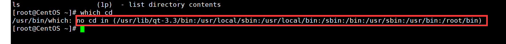

内置命令是不能用man来查询的，需要用help命令。help放在命令前可以查使用方法，放在命令后可以看选项。

## 常用快捷键

查看所有按键内容：`stty -a`，常用的按键指令：

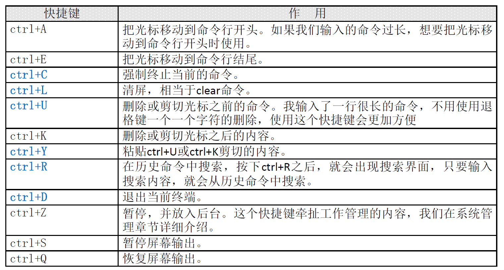

其他快捷键：

1、反斜杠\后接回车可以时命令写在多行，这样可以解决一行写不下的情况。（如果反斜杠后跟空格再敲回车就不行了）

2、shift+[pageup]/[pagedown]可以在输出内容很多时调整前后的内容。

## info命令

info后加命令也可以查看命令的使用方法，info的查看方式比较特别，它每次只展示一部分内容，所有的提示信息按照树状组织起来，通过按n、p、u来到下一个节点、上一个节点、上一层的节点，按h可以看使用info基本命令的介绍，通过按方向键将光标放到对应层按回车就能进入，按tab也能在node间移动，说明文件内容如下图：


info状态下的按键：

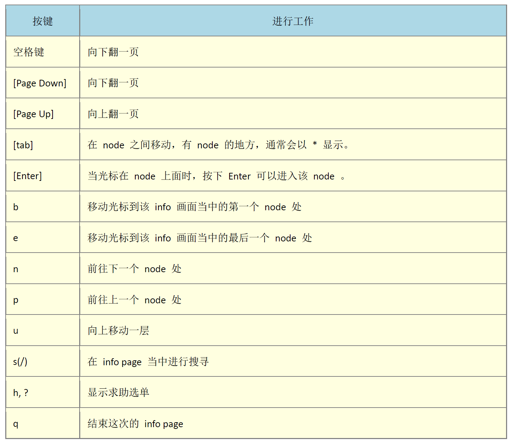

info命令要想执行，要求对应的命令必须具有info功能，在CentOS7中，如果命令没有该功能还要执行info，就直接显示man的结果。

# 用户管理

## 用户信息文件/etc/passwd

用户信息文件/etc/passwd：

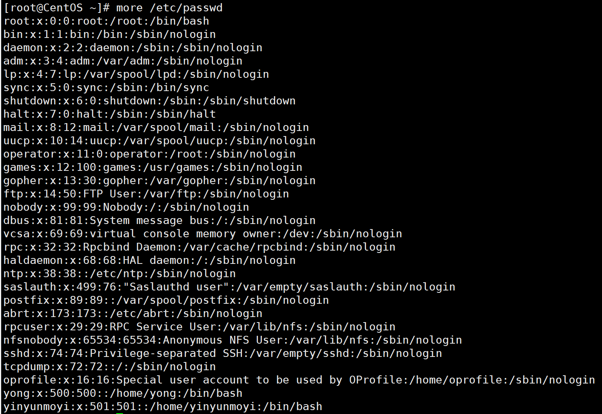

文件中一行代表一个用户：

第一个字段代表用户名；

第二个字段是密码标识x，代表有密码，但密码本身不存在文件中；

第三个字段是UID，0代表超级用户（超级用户可以不只有一个，但是一般不建议设置多个），1-499是系统用户，500-65535是普通用户（CentOS7中系统用户是1-999，而普通用户是1000-60000）；

第四个字段是GID（用户初始组ID），初始组在用户创建时就自动创建，初始组名一般和用户名相同（一个用户可以有一个初始组，同时可以有多个附加组，一旦用户加入一个附加组，他就拥有附加组的权限）；

第五个字段是用户说明；

第六个字段是用户家目录；

第七个字段是登录后的Shell解释器，不同种类的用户不同。

## 影子文件/etc/shadow

影子文件/etc/shadow，这个文件的所有权限都是空，也就是该文件只能root用户来操作。

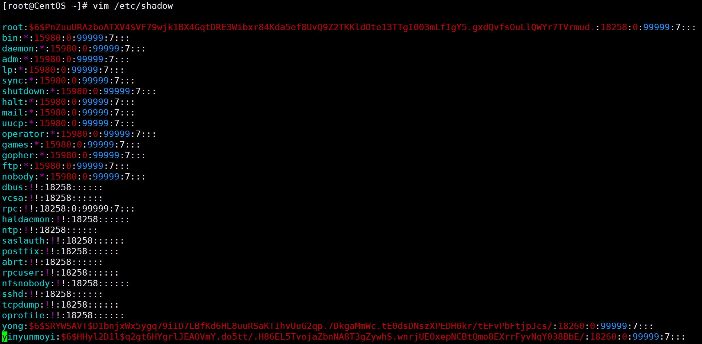

文件中一行代表一个用户：

第一个字段是用户名；

第二个字段是加密密码，若密码是！！或*代表没有密码，不能登录（如果想让密码不能登录可以修改这里的字符串，给字符串加上星号或者感叹号）；

第三个字段是修改密码的时间，从1970年1月1日后开始的天数（linux中的时间戳）；

第四个字段是两次密码的修改间隔时间，如果是10代表10天后才能再次修改密码；

第五个字段是密码有效期；

第六个字段是密码修改到期前的警告天数，如果有效期是50，警告天数是5，那么第45天后没修改密码就会出现警告信息；

第七个字段是0代表到期立即失效，-1代表永不失效，10代表过期后10天依然有效；

第八个字段是时间戳表示的账号失效时间天数，一旦到达这个时间无论密码是否过期都将无法使用；

第九个字段是保留位置。

查看shadow的加密机制：`authconfig --test | grep hashing`

时间戳和日期之间的转换：

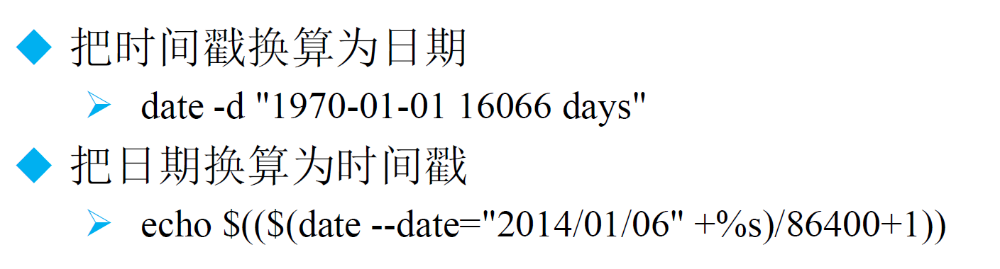

## 组信息文件/etc/group和组密码文件/etc/gshadow

组信息文件/etc/group：

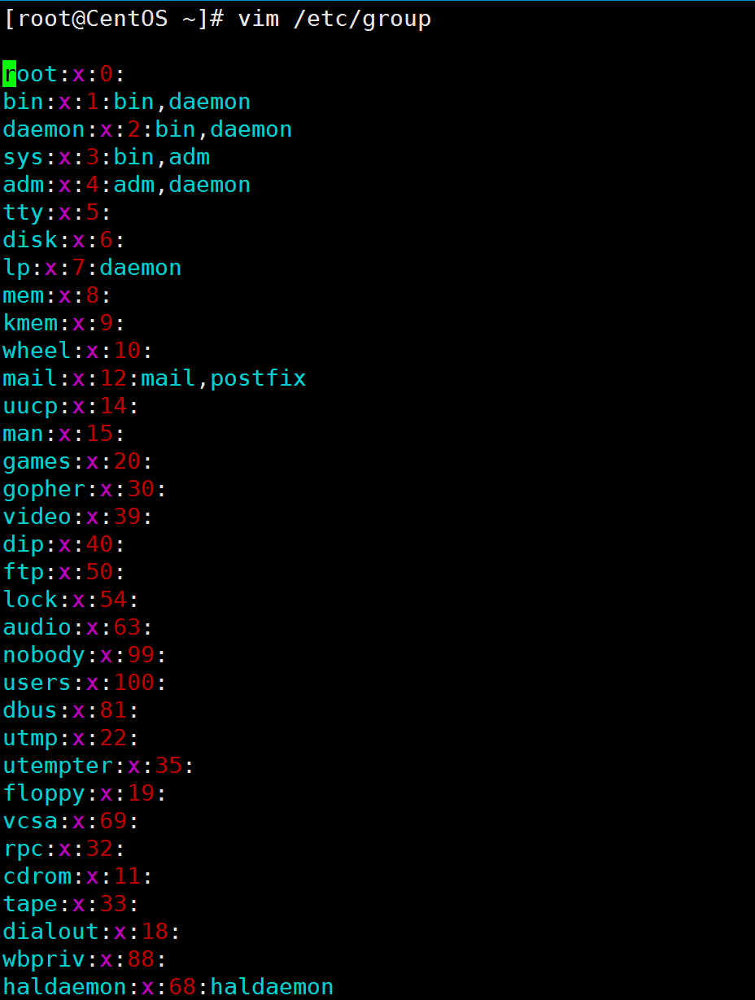

每个用户占一行，每个字段的意思是组名、组密码标志、GID、组中附加用户（初始用户不会加）。

组密码文件/etc/gshadow，内部保存了组名、组密码文件、组管理员用户名、组中附加用户。

用户邮箱文件：/var/spool/mail/用户名

用户模板目录：/etc/skel，当在这个目录下建立警告文件时，所有用户登录后都会在家目录出现对应文件。

## 添加用户useradd

useradd用来添加用户，后加用户名，只有root可以执行该命令。

useradd的其他选项：

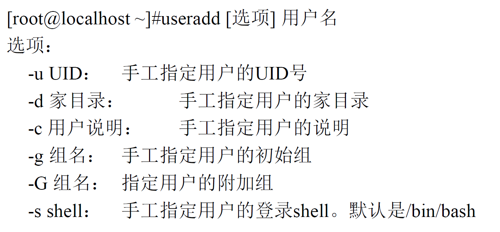

设置UID为1500，且设置users为初始群组：`useradd -u 1500 -g users 用户名`

创建系统账户：`useradd -r 用户名`，创建系统用户是不会生成家目录的。

添加用户的默认设置记录在两个文件中：/etc/default/useradd和/etc/login.defs。

## 密码命令passwd

设置密码`passwd 用户名`只有超级用户才能接用户名，普通用户只能执行`passwd`来修改自己的密码。选项-l可以锁定用户，-u可以解锁用户。加-S可以查询密码的状态（只能超级用户才能使用）：

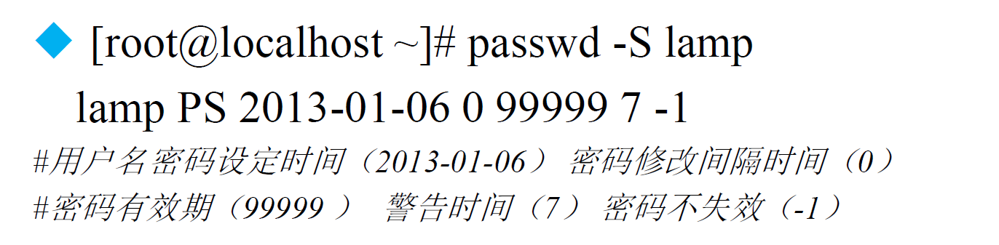

使某个用户无法登陆，密码失效：`passwd -l 用户名`，恢复：`passwd -u 用户名`

显示密码参数：`passwd -S`，或更详细的：`chage -l 用户名`

接受字符串作为密码，shell编程时可以用到：`echo "123" | passwd --stdin 用户名`管道符的作用就是将第一个命令输出值作为第二个命令输入值。

## chage命令

chage命令可以查看密码的详细信息：`chage -l 用户名`

还可以设置使用者首次登陆必须更改密码：`chage -d 0 用户名`

## 其他用户管理命令

修改已经存在用户的信息usermod命令：

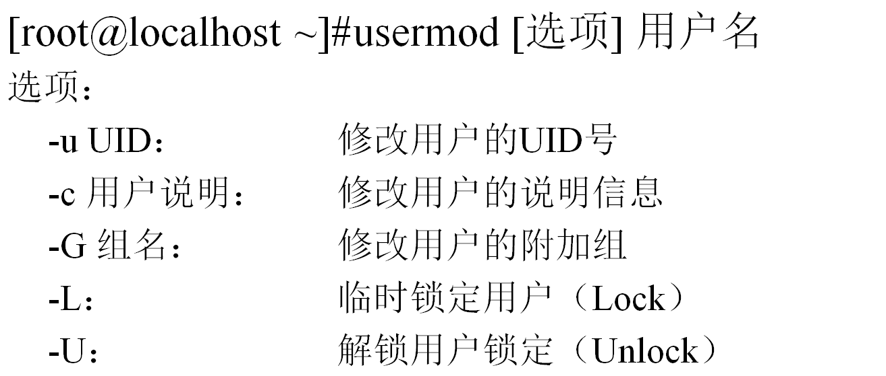

修改密码状态chage（shadow文件中的几个时间）：

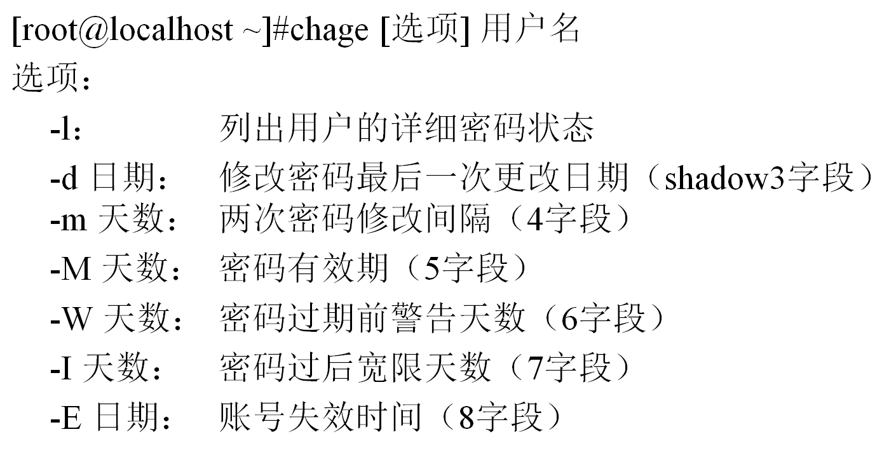

要求普通用户登录就必须修改密码：`chage -d 0 用户名`这实际上就是通过修改shadow中的密码修改时间生效的。

删除用户：`userdel -r 用户名`-r的意思是删除用户时把家目录删掉。如果在所有配置文件删掉一个用户的所有信息，也可以删除一个用户。（这个命令会彻底删除用户数据，如果想暂时使账号失效的话只需要修改shadow文件即可）

查看用户id：`id 用户`会显示uid和gid、初始组和附加组。

## 用户组管理命令

新增一个组`groupadd 组名`加-g后加GID可以自定义组的ID。

修改组的GID和修改组名`groupmod [选项] 组名`-g加GID意思是修改组ID，-n加新组名意思是修改组名。

删除用户组：`groupdel 组名`。初始组是不能删除的，因为用户依存该组，附加组可以删除。

查看使用者的所有群组：`groups`，输出的信息中第一个就是有效群组，也就是此时新建文件群组就是该群组。用newgrp后加群组名可以将该群组切换到有效群组。newgrp这个命令是开启一个子shell来切换有效群组的，执行exit命令可以退出这个子shell。

将用户添加到某个组`gpasswd -a 用户名 组名`-d后加用户名代表从组中删除该用户，这个命令必须是群组管理员才能执行的，将某个用户设置为群组管理员：`gpasswd -A 用户名 组名`，给群组设置密码：`gpasswd 组名`

## PAM模块简介

PAM（pluggable Authentication modules）嵌入式模块是一套API，提供一连串的验证机制，只要使用者将验证阶段的需求告知PAM，PAM就能够返回使用者验证的结果。常用的包括使用者验证程序等，这种程序就会调用PAM来进行验证，让各种验证方式具有一致的结果。

# 用户通信、登录、限制

## 写write和广播wall

write命令：可以给用户发信息，后加用户名，按回车提示输入要发送的消息，按ctrl+d保存结束。必须是两者都处于登录状态信息才会成功发送，接受者会立即中断工作接受消息。在信息的编辑状态用ctrl+退格键才能删除已经输入的消息。

mesg命令有两种，执行`mesg n`命令后，可以拒绝接受除了root外所有信息，执行`mesg y`后复原。

wall（write all）给所有用户发信息。wall后直接加要发的信息就可以发送出去，此时包括发送者在内的所有人都会收到信息，还会显示发消息的用户名和发消息的时间。


## 邮件mail

mail可以完成用户之间的通信，且无需双方同时在线，mail命令可以给用户发邮件，其后加用户名，回车就可以输入内容。建立一个标题为hello的邮件，发送给vbird用户：

```
mail -s "hello" vbird
输入内容
.
```

最后一行要以小数点结束。

查看邮件也用mail，执行后可以看到有未读邮件，输入未读邮件的标号再回车就能查看对应邮件。

## 登录记录查询last、lastlog

last可以查看计算机登录、重启的历史记录：

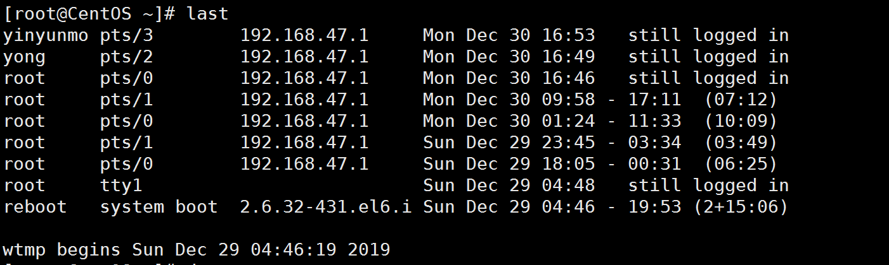

lastlog会查看每个用户最后一次登录的时间。-u加用户的uid就能查看对应用户最后一次登录的信息。

## 关机、退出登录及系统运行级别

shutdown关机或重启，-h代表关机，-r代表重启，选项后还可以加时间，如果是now就代表立即，还可以加20：30表示定时执行任务。-c可以取消前一个关机命令，单纯执行shutdown后系统会在一分钟后关机。shutdown还可以显示一些提示信息：

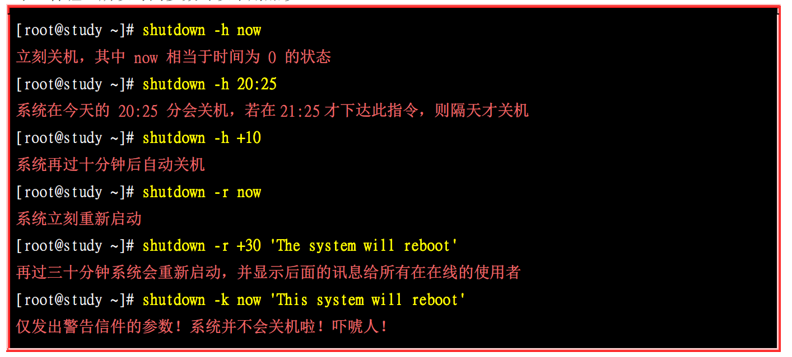

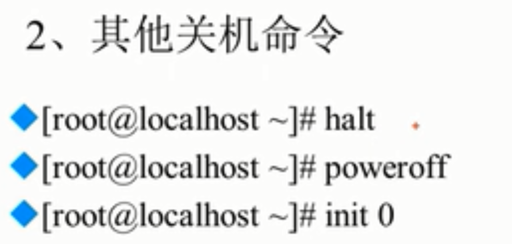

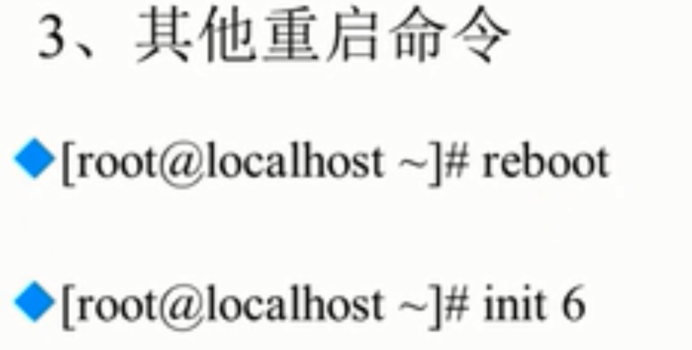


init后的数字代表运行级别：


`init 0`代表关机命令，但是它不会保存正在运行的服务，并不安全。`init 6`代表重启。

可以执行runlevel命令查看当前运行等级，运行结果有两个数，一个代表之前的运行级别，一个代表目前的级别。

单用户意味着root登录系统以最小资源运行，不加载附加程序，被用来做修复，类似于windows中的安全模式。计算机的系统运行级别默认是3，这个设置在配置文件/etc/inittab中。runlevel可以查询当前运行级别。在CentOS7中已经没有运行级别的概念，但是还是可以通过init命令来关机或者重启。

关机和重启本质上都是在调用systemctl指令，它管理系统所有的服务：

`systemctl reboot`代表重启，`systemctl poweroff`代表关机。

logout退出登录命令。为保证安全做完操作一定要退出登录。

## 踢出用户

pkill命令和killall类似：`pkill [选项] [信号] 进程名`，选项有-t后加终端号，可以按照终端号踢出用户。首先执行w命令查看正在登录用户的终端号：

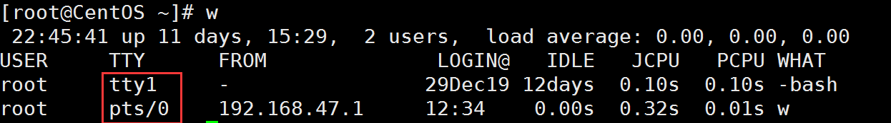

然后执行命令：`pkill -t -9 pts/1`

## 限制用户资源ulimit

当登入用户很多，每个用户开启的文件也很多时，此时容易发生内存不够用的情况，这时就需要限制每个用户可用的资源。

限制用户仅能建立10MB以下的文件：`ulimit -f 10240`

查看当前限制数据：`ulimit -a`，其中filesize是用户可以建立单一文件的大小、openfiles是用户可同时开启的文件数量，还有很多其他限制。

## 服务器登录状态查询who、w、uptime

who可以查看有谁登录，执行who后：

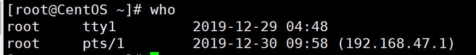

发现root用户正在登录，且登录了2次，一次是本地登录（在虚拟机中），tty表示本地登录，pts表示远程登录，数字代表终端号，表示不同终端，还可以看到登录时间、登录主机的IP地址。

w和who类似，结果比who更详细：

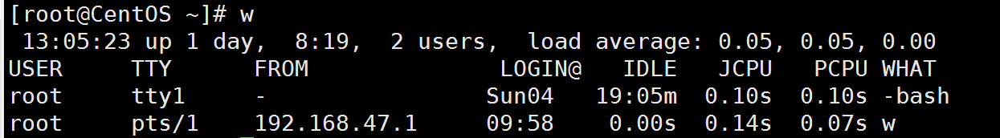

第一行依次是当前系统时间、系统连续运行时间、登录人数、近1分钟、5分钟、15分钟系统负载情况。第二行依次是登录用户，登录方式，IP地址、登录时间、该命令占用的CPU时间、累计占用的CPU时间、上一个执行了什么命令。

uptime执行结果和w首行一样。

# bash特性

Shell是一种脚本语言，在linux中通过shell控制系统内核，完成内核和硬件的交互。

linux支持的shell在/etc/shells中有描述：

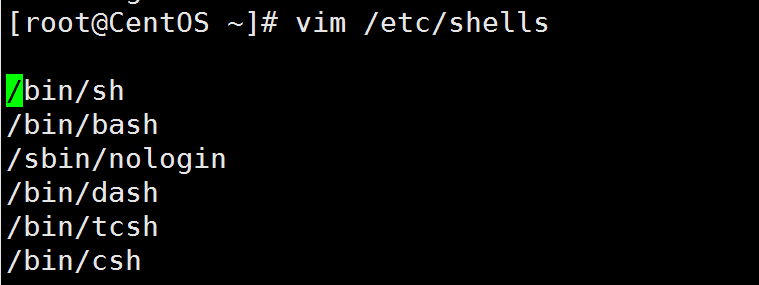

一般常用的shell就是bash，它也是linux预设的shell。bash具有很强大的特性，如历史命令、补全功能、设置命令别名、通配符等。

在用户登录时系统就会分配给用户一个shell，这个信息记录在/etc/passwd中：

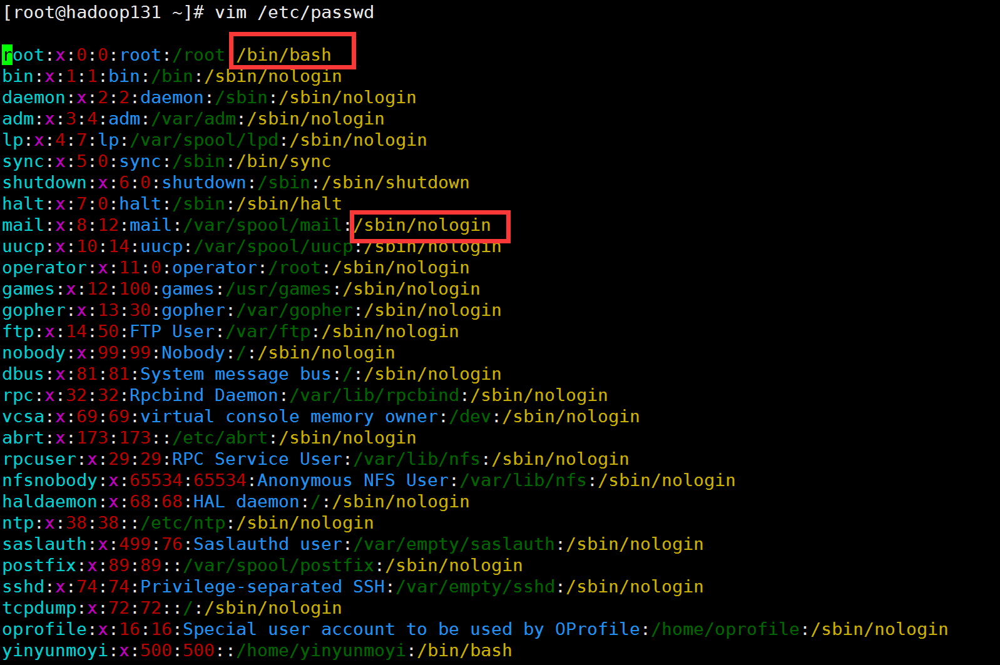

如果系统不想让使用者登入，就可以给该用户分配一个奇怪的shell，这就是/sbin/nologin。

查看指令是否是bash内置命令：`type 命令名`

## 历史命令与命令补全

执行history命令就会查看当前计算机执行过的命令。

列出最近的3个命令：`history 3`

这些历史记录也会被记录在家目录下的.bash_history中，但是只有当关机时才会将命令同步写入文件中（如果同时有多个用户登入，那么最后一个退出的命令会被记录在最后），如果想立即刷新到文件需要执行`history -w`，如果想清空历史命令记录就执行`history -c`，但是一般不建议清空历史命令，查看历史命令可以使不同开发成员间熟悉维护的操作。

历史命令默认最多保存1000条，连续重复的命令只会保存一次，这个设置可以在文件/etc/profile中修改。将HISTSIZE=1000修改即可。

使用上箭头或下箭头能直接调出历史命令，执行`!数字`可以执行对应的历史命令，执行history后每行的数字与命令一一对应，执行`!!`可以执行上一条命令，执行`!ser`可以执行最近执行的以ser开头的命令，频繁执行某条命令时很有用。

tab可以补全命令，如果开头的命令不止一个则不会补全，此时按两下tab可以显示开头全部命令，然后再选择即可。

## 别名与指令搜寻顺序

可以给命令创建别名`alias 别名='原命令'`然后执行别名就相当于执行原命令。直接执行alias可以查看所有别名的设置。在linux中执行命令的优先级如下：

1 第一顺位执行用绝对路径或相对路径执行的命令。
2 第二顺位执行别名。
3 第三顺位执行Bash的内部命令。
4 第四顺位执行按照$PATH环境变量定义的目录查找顺序找到的第一个命令。（linux中的很多命令都是通过环境变量定位到绝对路径然后执行的）

用alias命令设置别名只会暂时生效，想要永久生效需要修改家目录下的.bashrc文件，该文件还存储了变量设置相关内容。删除别名需要执行`unalias 别名`

别名的主要用途就是把很麻烦的常用命令简单化，还可以设置`alias rm = 'rm -i'`，这样所有的删除操作都必须确认一遍，增加了一定的安全性。

## 输出重定向与输入重定向、双向重导向

输出重定向就是将本来应该输出在屏幕上的内容输出到文件中，在日志记录中很有用。

输出重定向命令，覆盖模式`命令 > 文件`，追加模式`命令 >> 文件`

错误输出重定向，覆盖模式`命令 2> 文件`，追加模式`命令 2>> 文件`

这两种命令需要事先确定命令是否正确执行，下一条命令可以直接将正确或错误结果直接写入文件：

覆盖模式`命令 &> 文件`，追加模式`命令 &>> 文件`

还可以将输出结果直接输出到dev/null文件，相当于取消输出，在不想显示输出结果时可以用到，如执行命令时在命令后加上空格2>/dev/null，那么错误信息就不会显示在屏幕上了

可以将正确输出和错误输出分别分开输出追加到两个文件中：

`命令>>文件1 2>>文件2`

输入重定向可以取代键盘的标准输入，如将~/.bashrc的内容重定向到catfile中：

`cat > catfile < ~/.bashrc`，这样就生成了一个和~/.bashrc相同的文件。

输入重定向一般用来进行统计，`wc 文件名`就可以统计文件的字节数、单词数、行数。直接执行wc回车再输入内容，最后按ctrl+d，可以统计当前输入内容的字节数、单词数和行数。

双向重导向说的是数据流可以同时输入到文件和屏幕上，将执行结果保留在文件一份，同时输出到屏幕：

`ls -l /home | tee ~/homefile | more`，tee后跟选项-a可以向文件追加，默认是覆盖。

## 多命令顺序执行

两条命令用；分隔代表顺序执行两条命令，两条命令是独立状态不会相互影响。用`date;命令;date`可以测试命令的执行时间。

用&&分隔代表第一条命令顺利执行第二条命令还执行，常用于一系列有顺序需求的命令执行时。$((1&&1))的结果是1，如果有一个不为1结果就是0。

用||分隔代表第一条命令执行失败第二条命令执行，第一条命令执行成功第二条命令不执行，$((0||0))的结果是0，如果有一个不是0结果就是1。

如果/tmp/abc存在就创建/tmp/abc/hehe：`ls /tmp/abc && touch /tmp/abc/hehe`

如果/tmp/abc不存在就创建该目录：`ls /tmp/abc || mkdir /tmp/abc`

不清楚/tmp/abc是否存在，但是就是要建立/tmp/abc/hehe：

`ls /tmp/abc || mkdir /tmp/abc && touch /tmp/abc/hehe`

创造类似三元运算符的指令：`命令 && echo yes || echo no`表示命令正确执行输出yes，否则输出no。

## 管道符|

基本格式为`命令1 | 命令2`，表示命令1正确执行的结果作为命令2的输入。

`ll -a /etc/ | more`表示用more来查看ll命令输出的结果。

`netstat -an | grep "ESTABLISHED"`表示在网络信息中提取已连接状态的信息并显示出来，相当于查看有多少远程工具连接到服务器。-an可以显示全部连接，此时tcp连接除了listen状态还有established状态（表示正在连接，打游戏时游戏服务器一定与本机连接，此时查找状态为established的连接就可以找到服务器的ip地址）。

## 通配符和特殊字符

通配符主要用来匹配文件名。

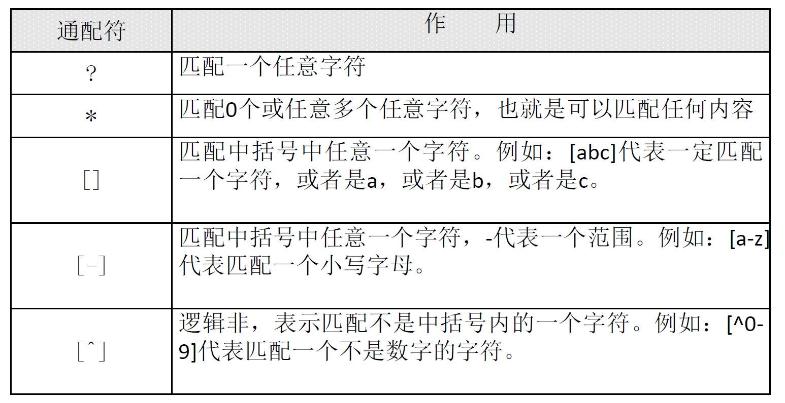

bash中的特殊字符：

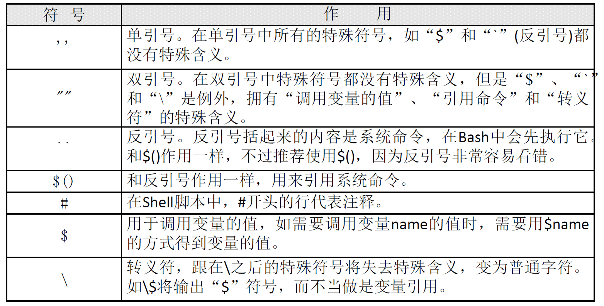

当内容中有空格时，必须要用引号括起来，单引号会使括起来的内容原封不动的保存，而双引号中有些特殊字符由特殊含义，如$表示调用变量的值，`echo "$name"`和`echo '$name'`两者的区别是后者会直接打印$name，而前者则会打印name变量真正的值。

转义符也可以让空格变成一般字符：`a1=aliba\ ba`，这样设置也可以不用加单引号或双引号

反引号\`\`括起来的内容会被识别为系统命令，bash会先执行他，如abc=\`date\`会把date命令的结果赋值给abc，反括号很容易被看成单引号，所以$()用的更多一些，这两个符号用法相同。示例：

`cd /lib/modules/$(uname -r)/kernel`

一般把一个常用目录路径定义成变量，每次登入时就可以轻松进入该目录：`cd $workdir`，变量相关设置在家目录下的.bashrc文件中可以设置。

## 欢迎提示信息

登录后的欢迎/提示信息文件：/etc/issue（本地登录）、/etc/issue.net（远程登录）、/etc/motd（两种登录都生效）。一般会把大家都关注的信息放到里面，如维护时间等。

想要编辑自己的欢迎信息必须明确该文件中各代码的含义：

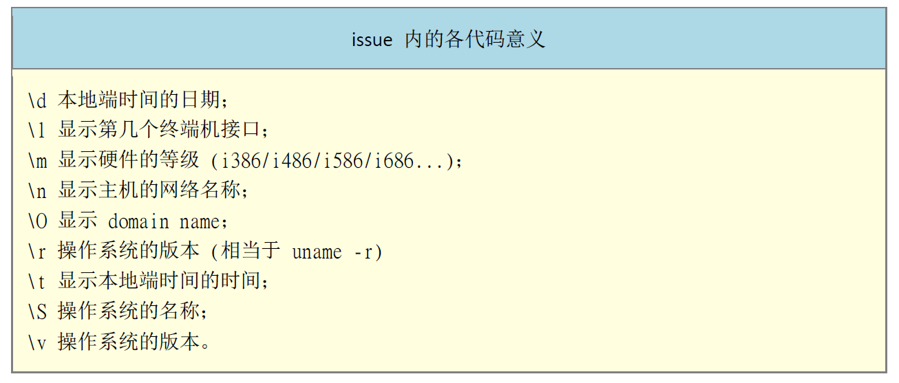

登录后提示字符root为#，一般用户未$。退出登录为exit。

# 变量

变量名可以由字母、数字、下划线组成，但是不能以数字开头。在bash中所有的变量默认都是字符串类型，如果要进行数值运算必须先转换类型。定义变量用等号连接，如`abc=de`等号两边不能有空格。定义时值有空格必须用引号括起来。

变量有几种：

|      名称       |     用途      |    使用限制     |
| :-----------: | :---------: | :---------: |
| 用户自定义变量（本地变量） |     自定义     | 可以增加、可以修改定义 |
|  环境变量（一般大写）   |  操作系统环境相关   | 可以增加、可以修改定义 |
|    位置参数变量     |  向脚本中传递数据   | 不能增加、只能修改定义 |
|     预定义变量     | bash中定义好的变量 | 不能增加、只能修改定义 |

位置参数变量本质上属于预定义变量。

查看变量的值可以执行set命令（对当前的shell的所有变量）。unset后加变量名可以删除变量。

执行`echo $-`可以列出所有set的设定值。

## 变量值的叠加

如果定义变量aa：`aa=123`然后再修改aa的值：`aa="$aa"456`，或`aa=${aa}`那么aa的值就会变成123456

叠加也可以用另一种形式`aa=${aa}789`，这样aa的值也会变成123789

## 变量的删除和替代

以path为例说明（将该值定义为PATH的值：`path=${PATH}`）：

```
/usr/lib64/qt3.3/bin:/usr/local/sbin:/usr/local/bin:/sbin:/bin:/usr/sbin:/usr/bin:/opt/module/jdk1.8.0_144/bin:/root/bin
```

1、删除第一个目录：`echo ${path#/*/bin:}`，执行后结果：

```
/usr/local/sbin:/usr/local/bin:/sbin:/bin:/usr/sbin:/usr/bin:/opt/module/jdk1.8.0_144/bin:/root/bin
```

这里的#意思是从变量最前面开始向右删除，且仅删除匹配的内容最短的那个，/*/bin:是要删除的匹配内容，\*代表任意多个字符的通配符。

2、只保留最后一个目录：`echo ${path##/*:}`，执行后结果：

```
/root/bin
```

这里的##的意思是从变量最前面开始向右删除，且仅删除匹配内容最长的那个，/*:是要删除的匹配内容。

3、删除最后一个目录：`echo ${path%:*/bin}`，这里的%代表从右向左删除，且删最短的内容。

4、仅保留第一个目录：`echo ${path%%:*bin}`，这里%%代表从右向左删除，且删最长的内容。

对于一个变量road为/var/spool/mail/dmtsai，那么\${road##/*/}为文件名dmtsai，而${road%/\*}为路径/var/spool/mail，利用这些手段可以轻松取到路径的文件名和目录名。

5、将变量内容中的第一个sbin取代成SBIN：`echo ${path/sbin/SBIN}`

6、将变量内容中的全部sbin取代成SBIN：`echo ${path//sbin/SBIN}`

## 变量的测试和内容替换

用于变量的赋值情况依赖于另一个变量的值这种情况，或者一个变量需要测试是否为空字符串或不存在时：

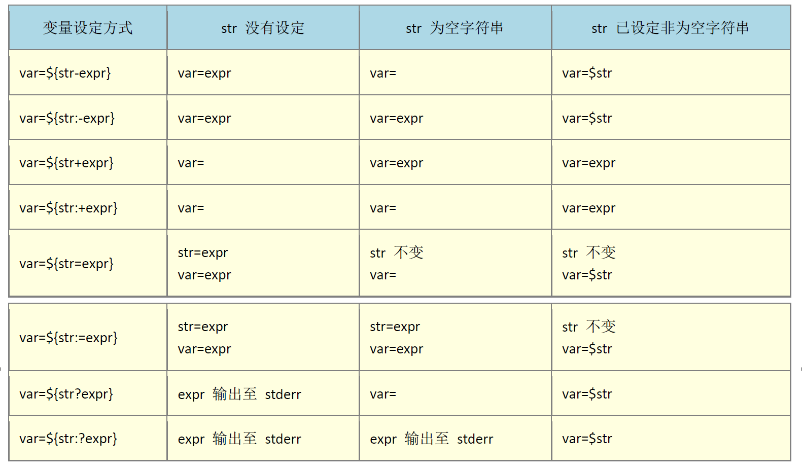

上表中最左边为变量的设置方式，根据str的情况，决定变量var的值，expr是一个普通字符串，不用加引号。

等号=的作用是不仅能根据str改变var的值，还能改变str本身。

而？的作用是直接给出提示信息，如果str不存在或空字符串会直接打印错误信息。

这个功能其实可以用ifthen处理，但是它更简单快捷。

## 环境变量

环境变量不仅在当前shell生效，在其子shell中也生效，而本地变量只在当前shell中生效。如果把环境变量的定义写入配置文件，那么环境变量就会在所有shell中生效。所谓子shell就是在当前shell的情况下启用的另一个新shell，一般的变量无法在父shell中定义在子shell中使用，除非是环境变量。

如果执行csh就说明进入了csh，同理执行bash也是一样，都相当于默认bash开启了子shell（可以执行exit退出子shell）。可以通过查看进程树pstree命令来观察子shell和父shell：

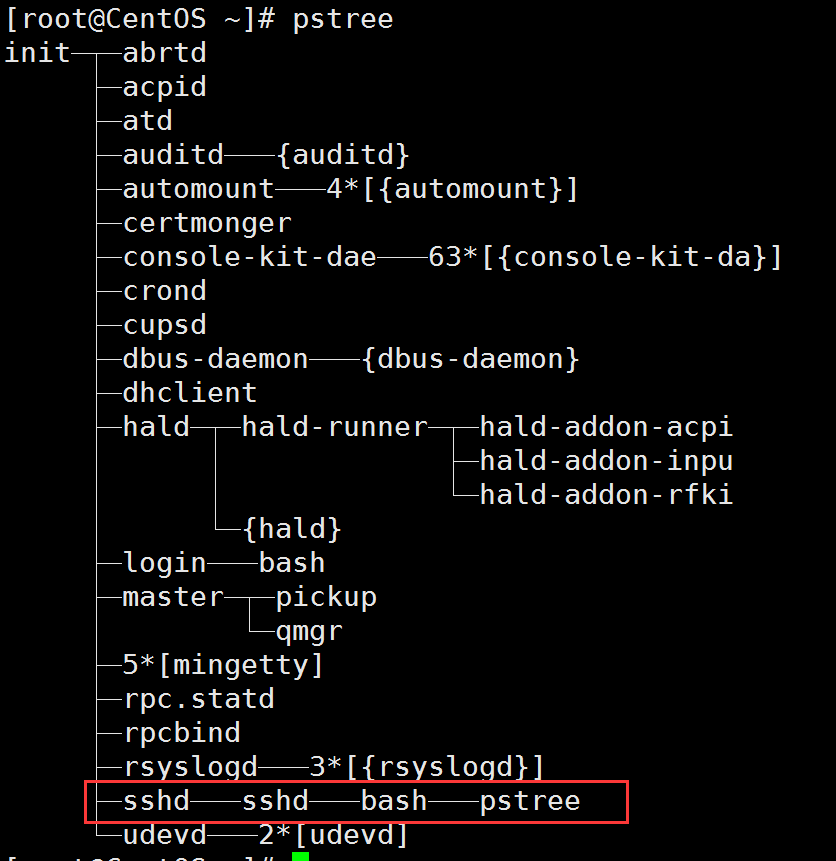

环境变量定义格式`export 变量名=变量值`，还可以直接export后跟变量名直接把变量变为环境变量。查看所有环境变量的命令env，或者直接执行export也可以查看环境变量。删除变量还是用unset命令。环境变量中有几个很重要：

1、PATH，它是用冒号分割的一个一个的路径，执行系统命令时linux会自动寻找命令在不在这些路径下，然后执行，对于同名指令，先找到的就执行，如果没有找到就会报错，用户可以在PATH中添加自己的路径，操作命令是`PATH="$PATH":/root`相当于把root路径加入了PATH中，但是这种修改是临时的，想要永久修改必须修改文件。

`PATH=${PATH}:/home/bin`和上一个命令的作用相同。

2、PS1，他是定义系统提示符的变量。

3、HOME，代表用户的家目录，这就是为什么`cd ~`或cd可以回到家目录的原因

4、SHELL，当前环境使用的shell

5、HISTSIZE，历史命令记录的最大笔数

6、LANG（主语言的环境）和LC_ALL（整体语系的环境）

7、RANDOM，随机数生成器，可以直接取$RANDOM来获得随机0-32767之间的数，如果想要取0-9的数值，就先用declare定义整形变量再取用：

`declare -i number=$RANDOM*10/32768`、`echo $number`

## 环境变量配置文件

source命令的作用是使修改后的配置文件立即生效：`source 配置文件`或`. 配置文件`，后者是source的简化。

环境变量配置文件在登录时会按照一定的顺序加载：

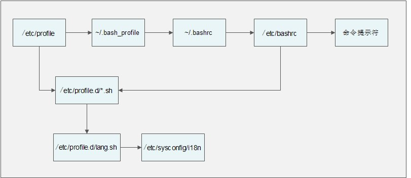

如果是正常输入账号密码登录，就会按/etc/profile、/etc/profile.d/*.sh、/etc/profile.d/lang.sh、/etc/sysc.config/i18n、~/.bash_profile、~/.bashrc、/etc/bashrc来加载配置文件，如果是非正常登录(bash切换子shell)，就会按照/etc/bashrc、。。。/etc/sysc.config/i18n来加载配置文件。这些配置文件都可以写入环境变量的定义，越靠后优先级最大，目录以~为首的配置文件只会在特定用户生效，其他文件中的环境变量定义对所有用户都生效。

在CentOS7中，用户登录时会加载系统整体设定文件/etc/profie以及使用者个人设定文件~/.bash_profile。

/etc/profie文件定义了一些重要的环境变量，它还会呼叫外部的设定数据，如/etc/profile.d/*.sh（定义各种别名、bash操作结口的颜色）、/etc/locale.conf（语系配置文件）、/usr/share/bash-completion/completions/\*（命令补齐和文档补齐相关设置）。

当读完了整体设定文件后会加载使用者的个人配置文件~/.bash_profile，如果该文件不存在就加载~/.bash_login文件，如果还不存在就加载~/.profile，之所以PATH路径中有家目录下的bin目录，就是因为~/.bash_profile做了用户个性化处理。

在CentOS7的non-login shell（su切换用户、子shell等）情况下只会加载~/.bashrc，它会呼叫/etc/bashrc（设置umask和PS1）和/etc/profile.d/*.sh。

注销时生效的环境变量配置文件，记录了注销后系统的动作：~/.bash_logout

记录历史命令的配置文件：~/bash_history

记录man命令的查看数据路径：/etc/man_db.conf

## 位置变量参数

基本格式是\$n，\$0代表命令本身，\$1-\$9代表第1-9个参数，十以上的参数需要用大括号包含，如${10}

```bash
#!/bin/bash

num1=$0
num2=$1
num3=$2
sum1=$(($num2+$num3))  
sum2=$(($3+$4))

echo $num1
echo $sum1
echo $sum2
```

脚本中如果涉及运算那么必须用双括号括起来。

运行脚本时后面加参数，运行结果：

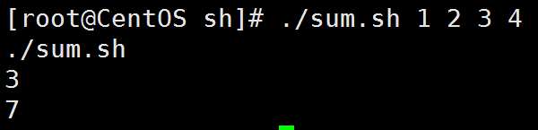

\$*代表所有参数，它把所有参数看成一个整体。$@也代表所有参数，它把每个参数区别对待。

两者的区别可以通过运行以下脚本得出：

```bash
#!/bin/bash

for i in "$*"
	do
		echo $i
	done
	
for j in "$@"
	do
		echo $j
	done
```

其中for i in "$*"的意思是获取所有参数然后进行循环，每次循环前将参数赋值给i，循环次数取决于参数个数。

运行结果：

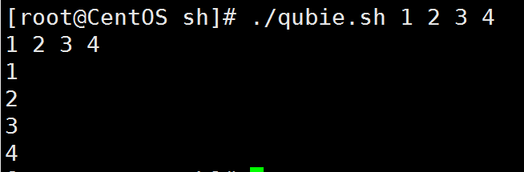

$#代表命令行执行时的参数个数。

## 预定义变量

几个重要的预定义变量：

1、\$，它代表当前shell的线程号，查看当前shell线程号：`echo $$`

2、？，它代表上一个执行的指令所回传的值

\$?代表上一次命令的执行状态，0代表执行成功，非0代表执行不成功，具体的值由命令的制作者来决定。查看上一个命令的执行情况：`echo $?`，&&和||都是通过检查$?的值来确定多命令怎样执行。

3、！，$!表示后台运行的最后一个进程的PID。

## 接受键盘输入

接受键盘输入的基本格式是`read [选项] [变量名]`，-t后跟数字代表等待用户输入的时间，单位是秒；-s是隐藏输入的数据，数据输入后在屏幕上没有显示；-p是显示提示信息，后接提示信息；-n是read命令接受的字符数，接受够了就会执行该命令。

```bash
#!/bin/bash

read -t 30 -p "Please input your name: " name
echo "Name is $name "

read -s -t 30 -p "Please enter your age: " age
echo -e "\n"
echo "Age is $age "

read -n 1 -t 30 -p "Please select your gender[M/F]: " gender
echo -e "\n"
echo "Sex is $gender"
```

执行上述脚本：

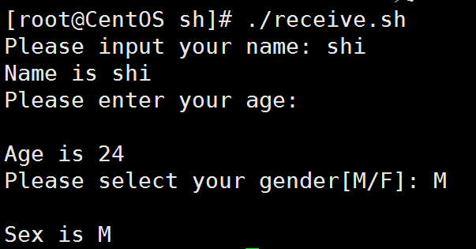

## 数值运算与运算符

如果执行`aa=11`、`bb=22`、`cc=$aa+$bb`则cc的值不是33，而是11+22。

声明变量类型命令`declare [+/-] [选项] 变量名`，+代表取消变量的类型属性，-代表设置变量的类型属性，-i代表将变量声明为整数型，-x代表将变量声明为环境变量，-p表示显示指定变量的声明类型，-a代表声明变量为数组类型，-r代表声明变量为只读类型。如果在bash中不指定变量类型，那么就默认为字符串。

如果直接用declare查看aa的声明类型，结果显示没有类型，如果声明为环境变量再查看，则可以看到类型为x：

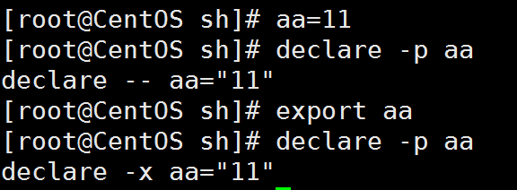

取消sum的环境变量属性：`declare +x sum`

不要轻易设置变量为只读，一旦设置了就必须再次登入才能恢复。

如果声明了var为数组变量，那么用这样的方式填入数据：`var[1]=ali`，读取时直接表示为${var}（注意数组的第一个值索引值是1）

实现数值运算的方法有三种：

1、声明变量为整形：`declare -i cc=$aa+$bb`

2、expr数值运算工具：`dd=$(expr $aa + $bb)`（注意加号两边都要有空格）

3、\$((运算式))或\$[运算式]，如ff=\$(( \$aa+\$bb ))或gg=\$[ \$aa+\$bb ]（\$()代表调用系统命令，$(())代表运算）

bash环境中的数值运算，预设最多仅能到达整数形态，如果想计算含有小数点的数据的话，可以通过bc命令的协助，如执行：`echo "123.123*55.9" | bc`，bc命令还可以用来计算π，如：

`echo "scale=${num};4*a(1)" | bc -lq`，4*a(1)就是计算π的函数，而scale是计算的小数点下位数，scale设置的越高计算时间越长，大于5000就会很长，这个命令常常用来使CPU处于忙碌状态。

## 变量测试和内容替换

不同的变量置换方式如下表，前4行表达式的含义是当y的情况不同，x的赋值情况也不同，相当于根据y的各种情况决定x的值。后4行表达式根据y的各种情况不仅改变x的值，也改变y的值。

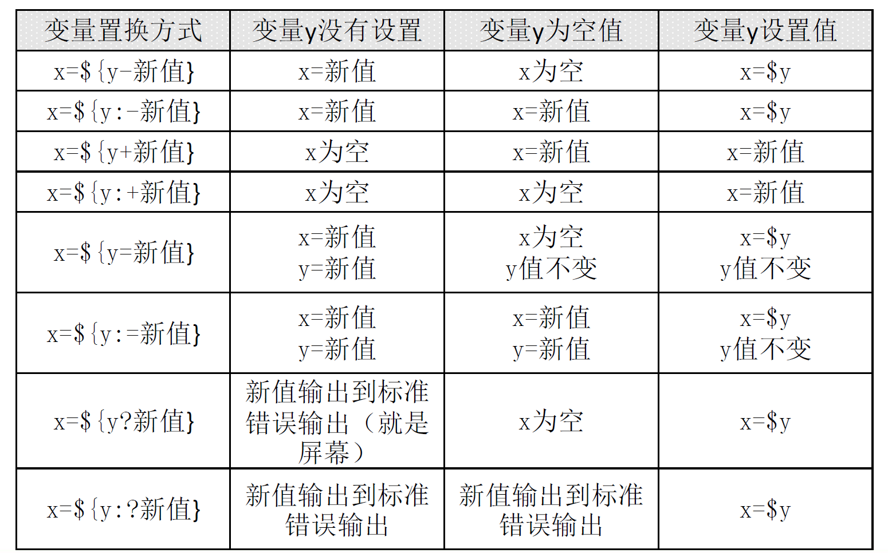

# shell脚本基本命令

## 输出命令echo

输出命令echo，基本模式就是`echo [选项] [输出内容]`输出内容如果包含空格，则必须将内容用双引号括起来。选项-e可以使输出语句支持反斜线转义。

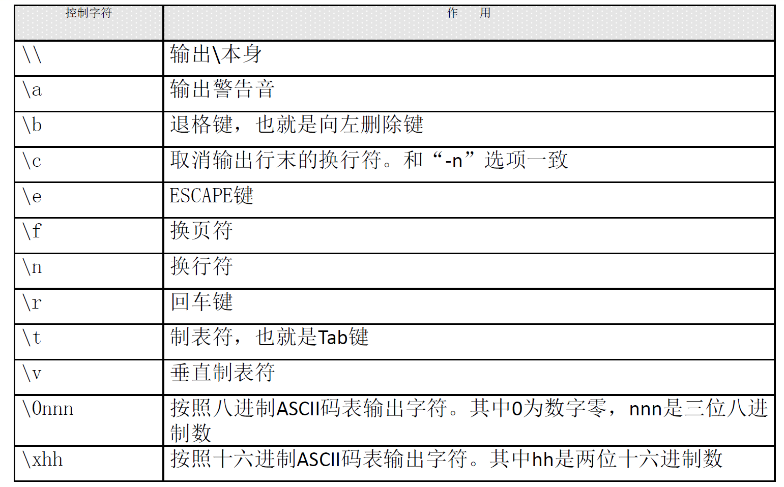

加入退格后就不会显示退格符左边的一个字符。ascii码表中有对应的八进制和十六进制表示法，所以可以表示对应的字符。

显示环境变量的值：`echo ${PATH}`或`echo $PATH`，如果一个变量没有被设定，那么就什么都不返回。

颜色输出如将abcd用红色打印：`echo -e "\e[1;31m abcd \e[0m"`其中\e[1的意思是开启颜色输出，而\e[0m是结束颜色输出，31m代表红色，abcd是输出内容，其他颜色如下：


## 第一个脚本与脚本执行方式

新建一个脚本hello.sh:

```
#!/bin/bash
#the first program

echo "hello world"
exit 0
```

其中第一行是声明，不是注释，不能省略，这是在指定使用哪个shell，如果没有这行有的程序可能无法执行。

第二行#开头的是注释，第四行是命令。

最后一行在设置回传值，在执行完该脚本后，执行`echo $?`就能查看这个值，可以通过这个自定义错误信息。

在脚本中有需要时要重新定义一下PATH环境变量，以便直接使用一些外部命令而不是写绝对路径：

```bash
PATH=/usr/lib64/qt-3.3/bin:/usr/local/sbin:/usr/local/bin:/sbin:/bin:/usr/sbin:/usr/bin:/opt/module/jdk1.8.0_144/bin:/opt/module/hadoop-2.7.2/bin:/opt/module/hadoop-2.7.2/sbin:/root/bin
export PATH
```

执行shell脚本要先赋予其可rx权限：`chomd 755 hello.sh`然后再执行`./hello.sh`这里也可以用绝对路径执行。或者用bash命令执行（这种执行方法只要对脚本有r权限就可以执行）：`bash hello.sh`，此时屏幕上就会打印hello world，`sh hello.sh`也一样。也可以将文件放入PATH指定的路径中，直接执行文件名就能运行了。（直接执行一串指令：`sh -c "指令1;指令2"`）

上述几种脚本执行方式都属于直接执行，这些执行方式本质上会使用一个新的bash环境来运行指令，这个子shell不会继承父shell的普通变量，只能继承环境变量，而子shell中定义的变量也不会在父shell中查到，在脚本运行完毕后，子shell中所有的数据都会移除。

另外一种脚本执行方式是source指令，该指令后跟脚本路径就能执行，source执行脚本时不会开启子shell，所以各指令的运行结果都会在原shell中生效，脚本中定义了变量，运行完毕后依然可以查到，所以该命令常常用在修改配置文件后。

写脚本要养成一些良好的习惯，在开头记录一些关键的注释：功能、版本信息、作者及联络方式、历史记录。重要的代码也需要注释。

## 条件判断

判断文件类型：

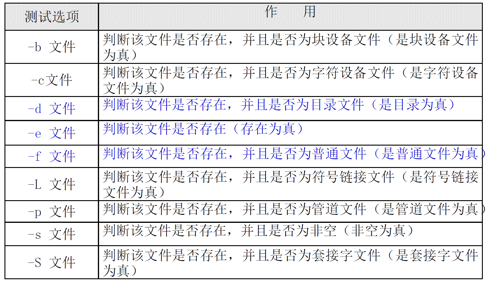

基本判断格式有两种：`test -e /root/install.log`或`[ -e /root/install.log ]`注意后者方括号内两边都必须有空格（这样处理主要是为了规避正则表达式）。这种判断语句直接执行不会显示正确还是错误，需要执行$?来查看该条命令执行结果。或者可以使用`[ -e /root/install.log ] && echo "yes" || echo "no"`根据打印结果来查看是否执行正确。

判断文件权限：

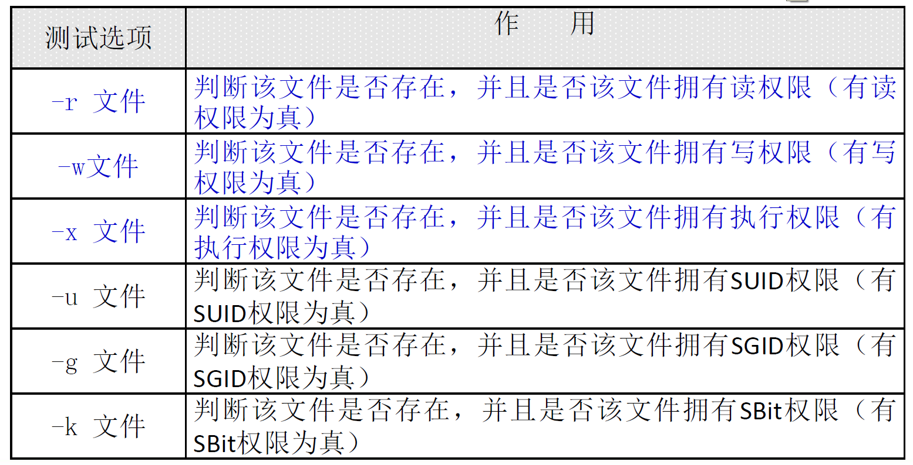

这种方式只能判断有没有这种权限，而不会区分具体是属主、属组或者other拥有这种权限，想要细分权限需要自定义脚本提取ll命令的打印结果。

两个文件比较：

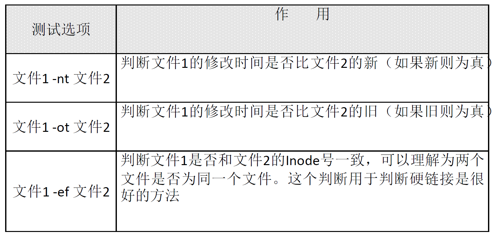

两个整数之间进行比较：

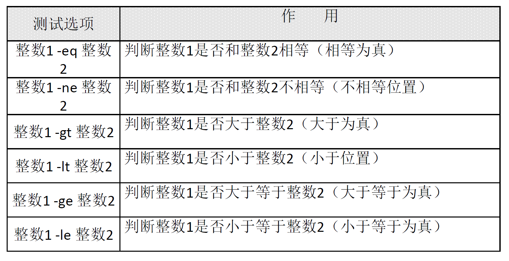

字符串或变量的判断：


如果先执行`name=sc`再执行`[ -z "$name" ] && echo "yes" || echo "no"`则会输出no，因为此时变量name不为空。如果将\$name替换为$不存在的变量，那么结果就为yes。

如果执行`aa=abc`、`bb=abc`，然后再执行[ "\$aa" == "\$bb" ]结果就为真，[ "\$aa" == abc ]结果也为真，但是[ "$aa" == "bb" ]结果为假。

在条件判断式方括号中有一些需要经常遵循的原则：

1、每个组件之间都要用空格隔开（为了防止两边没有空格格式错误）

2、变量都要用双引号括起来，常量用单引号或双引号括起来

第二点原则其实和命令中的量用双引号括起来的原因是一样的，一旦出现空格就会发生一些错误，如执行：

`[ a b=="$c" ]`，其实不是a b整体和c比较，而是b在和c比较，这个命令会直接报错，应该这样执行：

`[ "a b"=="$c" ]`

（在bash的判断中使用一个等号和使用两个结构是一样的，但是推荐用两个等号）

多重条件判断：

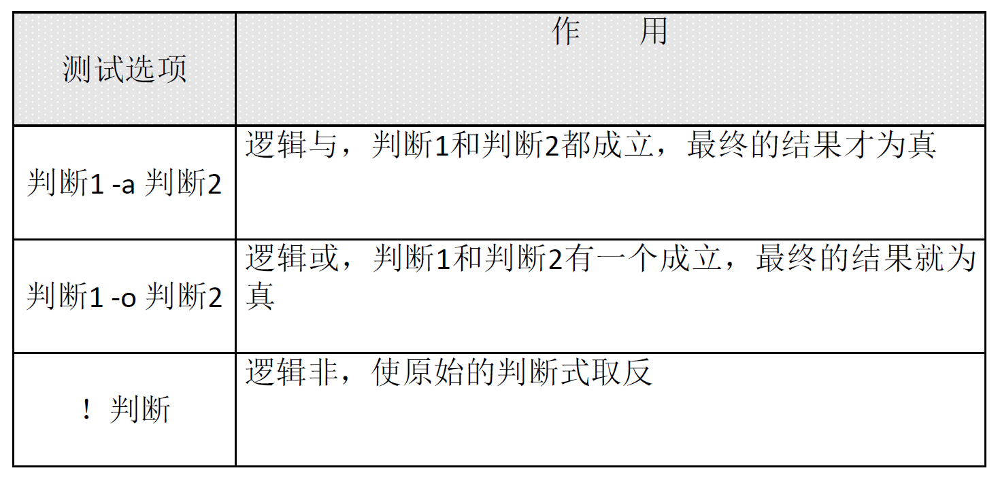

## if语句

单分支if条件语句：

```bash
if [ 条件判断式 ];then
程序
fi
```

或

```bash
if [ 条件判断式 ]
then
程序
fi
```

注意if中的条件判断式方括号两边还是要有空格。

在if语句中，方括号和方括号之间也可以加逻辑运算符&&和||，下面两行是等价的：

```
[ 判断1 -o 判断2 ]
[ 判断1 ] || [ 判断2 ]
```

双分支if条件语句：

```bash
if [ 条件判断式 ]
then
条件成立时，执行的程序
else
条件不成立时，执行的另一个程序
fi
```

多分支if条件语句：

```bash
if [ 条件判断式1 ] 
	then 
		当条件判断式1成立时，执行程序1 
elif [ 条件判断式2 ] 
	then 
		当条件判断式2成立时，执行程序2 
else 
	当所有条件都不成立时，最后执行此程序
fi
```

### 例1：判断分区使用率

```bash
#!/bin/bash
#统计根分区使用率
rate=$(df -h | grep "/dev/sda3" | awk '{print $5}' | cut -d "%" -f1)
#把根分区使用率作为变量值赋予变量rate
if [ $rate -ge 80 ]
	then
		echo "Warning! /dev/sda3 is full!!"
fi
```

这个脚本是基于查看分区情况命令`df -h`的，从输出内容中提取对应分区的对应列，然后去掉%，将值赋值给rate，然后用if语句判断rate的值是否大于80，如果大于就打印警告信息，实际应用中这里应该给管理员发送邮件。

### 例2：备份mysql数据库

```bash
#!/bin/bash
#备份mysql数据库。
ntpdate asia.pool.ntp.org &>/dev/null
#同步系统时间
date=$(date +%y%m%d)
#把当前系统时间按照“年月日”格式赋予变量date
size=$(du -sh /var/lib/mysql)
#统计mysql数据库的大小，并把大小赋予size变量
if [ -d /tmp/dbbak ]
	then
		echo "Date : $date!" > /tmp/dbbak/dbinfo.txt
		echo "Data size : $size" >> /tmp/dbbak/dbinfo.txt
		cd /tmp/dbbak
		tar -zcf mysql-lib-$date.tar.gz /var/lib/mysql dbinfo.txt &>/dev/null
		rm -rf /tmp/dbbak/dbinfo.txt
else
	mkdir /tmp/dbbak
	echo "Date : $date!" > /tmp/dbbak/dbinfo.txt
	echo "Data size : $size" >> /tmp/dbbak/dbinfo.txt
	cd /tmp/dbbak
	tar -zcf mysql-lib-$date.tar.gz /var/lib/mysql dbinfo.txt &>/dev/null
	rm -rf /tmp/dbbak/dbinfo.txt
fi
```

首先用if语句判断日志目录/tmp/dbbak是否存在，如果不存在就新建该目录。

将date和size变量都输出到dbinfo.txt文件中，然后将数据库/var/lib/mysql和dbinfo.txt都打包到mysql-lib-$date.tar.gz文件中，这个文件的命名有一部分调用了date的值，这是为了保持压缩文件文件名的唯一性，在打包过程中将命令执行过程中的打印内容全部输出到/dev/null中，相当于删除，&>表示无论语句执行正确与否都将打印内容重定向。打包完成后删掉dbinfo.txt文件。

如果想获取前两天的日期：

```bash
date2=$(date --date='2 days ago' +%Y%m%d)
```

文件名也可以单独拿出来拼接，这样可读性更强：

```bash
filename=${filename2}${date2}
```

### 例3：判断apache是否启动

```bash
#!/bin/bash
port=$(nmap -sT 192.168.1.156 | grep tcp | grep http | awk '{print $2}')
#使用nmap命令扫描服务器，并截取apache服务的状态，赋予变量port
if [ "$port" == "open" ]
	then
		echo “$(date) httpd is ok!” >> /tmp/autostart-acc.log
else
	/etc/rc.d/init.d/httpd start &>/dev/null
	echo "$(date) restart httpd !!" >> /tmp/autostart-err.log
fi
```

nmap命令是判断进程执行的重要命令，提取此命令的打印结果，得到占用状态：

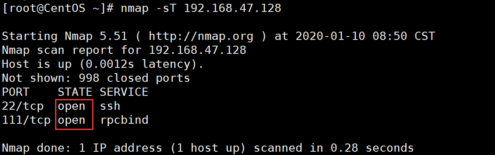

然后根据状态进行if判断，如果已经启动就将已启动输出到日志，如果没有启动就开启该服务，然后将已启动命令输出到日志。

### 例4：判断用户输入的文件类型

```bash
#!/bin/bash
#判断用户输入的是什么文件
read -p "Please input a filename: " file
#接收键盘的输入，并赋予变量file
if [ -z "$file" ]
#判断file变量是否为空
	then
		echo "Error,please input a filename"
		exit 1
elif [ ! -e "$file" ]
#判断file的值是否存在
	then
		echo "Your input is not a file!"
		exit 2
elif [ -f "$file" ]
#判断file的值是否为普通文件
	then
		echo "$file is a regulare file!"
elif [ -d "$file" ]
#判断file的值是否为目录文件
	then
		echo "$file is a directory!"
else
		echo "$file is an other file!"
fi
```

先用read命令接受键盘输入，然后将输入赋值给file，用if判断file的类型，这里用exit来跳出多条件if语句，否则如果文件名为空的话还会继续执行下一个条件。

## case语句

case语句和多分支if语句类似，不同之处在于case语句判断的条件关系只有一个。使用格式：

```bash
case $变量名 in
	"值1"）
		如果变量的值等于值1，则执行程序1
		;;
	"值2"）
		如果变量的值等于值2，则执行程序2
		;;
	*）
		如果变量的值都不是以上的值，则执行此程序
		;;
esac
```

## function函数

基本格式：

```bash
function fname(){
	程序
}
```

fname就是函数名，也是调用时要执行的命令名。

注意在bash中调用函数一定要在定义函数之后，否则会报错。定义好函数后就可以在后续程序中直接调用fname命令，此时就相当于执行代码块。调用该命令时也可以跟后续的参数，第一个参数是$1、第二个参数是$2..，在function中$0代表函数名称，注意在函数内和函数外内建变量的值是不同的。

## for循环

for格式1：

```bash
for 变量 in 值1 值2 值3
	do
		程序
	done
```

这种循环的循环次数和in后的值个数相等。in后面可以放：

1、特殊符号，如$(seq 1 100)代表从1-100这中间的一百个值。

2、多行结果，如cut命令执行的结果

```bash
users=$(cut -d ':' -f1 /etc/passwd)
for username in ${users}
	do
		id ${username}
	done
```

for格式2：

```bash
for((初始值;循环控制条件;变量变化))
	do
		程序
	done
```

### 例1：批量解压缩脚本

```bash
#!/bin/bash

cd /lamp
ls *.tar.gz > ls.log
for i in $(cat ls.log)
	do
		tar -zxf $i &> /dev/null
	done
rm -rf /lamp/ls.log
```

将文件中的压缩包都重定向到日志文件中，然后把日志文件的内容放在in后，逐个执行解压，最后删除日志文件。

### 例2：for版1到100求和

```bash
#!/bin/bash
s=0
for((i=1;i<=100;i=i+1))
	do
		s=$(($s+$i))
	done
echo s
```

### 例3：批量添加用户

```bash
#!/bin/bash

read -p "input username :" -t 30 name
read -p "input the number of users: " -t 30 num
read -p "input the password of users: " -t 30 pass
if[ ! -z "$name" -a ! -z "$num" -a ! -z "$pass" ]
	then
		y=$(echo $num | sed 's/[0-9]//g')
			if[ -z "$y" ]
				then
					for((i=1;i<=$num;i=i+1))
						do
							useradd $name$i &> /dev/null
							echo $pass | passwd --stdin $name&i &> /dev/null
						done
			fi
fi
```

首先用户输入用户名name和要添加的用户数量num，还有用户密码pass，然后判断这三个变量是否为空，如果不为空那么就判断num是否为数字，这里用的方法是把num中的数字全部替换为空，然后再检查是否为空。最后开始循环，循环次数就是num，添加用户名时为了保持每个用户名不同设置名字时要加上循环次数，每个用户名为$name&i，设置密码也同理。

## while和until循环

while循环，条件为假时退出循环。

```bash
while [ 条件判断式 ] 
	do 
		程序 
	done
```

until循环和while类似，不同之处在于条件为真时退出循环。

```bash
until [ 条件判断式 ]
	do
		程序
	done
```

### 例1：while版1到100求和

```bash
#!/bin/bash
#从1加到100
i=1
s=0
while [ $i -le 100 ]
#如果变量i的值小于等于100，则执行循环
do
s=$(( $s+$i ))
i=$(( $i+1 ))
done
echo "The sum is: $s"
```

## 脚本的debug

测试脚本是否有语法问题：`sh -n 脚本路径`，如果没有问题则不会显示任何信息。

列出脚本的执行过程：`sh -x 脚本路径`，输出的结果中加号开头的行是指令的执行过程，没有加号的代表打印内容。

# 网络设置

## IP地址设置

查看网卡信息：`ifconfig`

修改ip地址和子网掩码：`ifconfig eth0 ip地址 netmask 子网掩码`或只修改ip地址：``ifconfig eth0 ip`

创建虚拟网卡：`ifconfig eth0:0 ip地址`，如果想创建多块还可以建立eth0:1、eth0:2..，但是注意多块网卡同时存在时只能有一个可以被使用，这就和windows有线网卡和无线网卡的关系一样。

取消虚拟网卡：`ifconfig eth0:0 down`

## 网络配置文件

网络配置文件/etc/sysconfig/network-scripts/ifcfg-eth0，如果有两块网卡，那就应该是eth1，如果有虚拟网卡应该是eth0:0，文件内容如下：

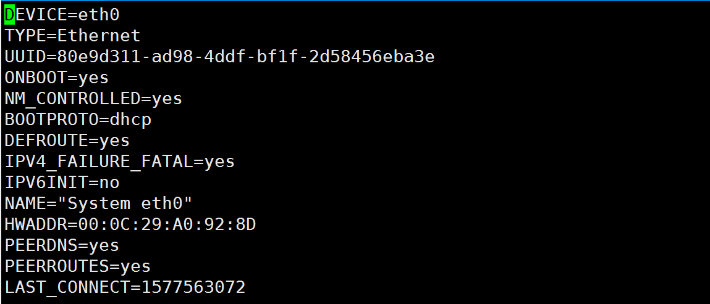

DEVICE=eth0的意思是网卡设备名。TYPE=Ethernet的意思是现在使用以太网。UUID是linux的唯一识别码（如果两个机器用一个UUID，那么联网就会出现问题）。ONBOOT=yes表示网卡随网络服务生效。NM_CONTROLLED=yes代表可以由network manager图形管理工具脱管。BOOTPROTO=dhcp代表自动获取IP地址，还可以改成no、static（这两个都代表手动分配）。DEFROUTE=yes代表default route，是否把这个eth设置为默认路由。IPV4_FAILURE_FATAL=yes代表如果ipv4配置失败禁用设备。IPV6INIT=no代表禁止IPV6。NAME="System eth0"代表       网络连接名字。HWADDR代表mac地址。PEERDNS代表是否允许DHCP获得的DNS覆盖本地的DNS。PEERROUTES是否从DHCP服务器获取用于定义接口的默认网关的信息的路由表条目。

主机名文件/etc/sysconfig/network：

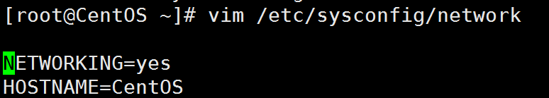

第一行代表网络服务是否工作，第二行代表主机名。修改配置文件后，提示符处的主机名不会立刻改变，此时必须重启主机名才会出现变化。如果用`hostname 主机名`修改主机名，这种修改是临时生效，一重启就会恢复配置文件中的主机名。

DNS配置文件/etc/resolv.conf：


nameserver就是DNS，search是域名补全相关配置。

## ping和traceroute

ping命令，后加IP地址，可以查看网络连接情况，和windows不同的是linux如果不按ctrl+c就会一直执行该命令。如果要制定执行次数，应该执行`ping -c 3 IP地址`表示执行3次。

traceroute后加IP或域名可以查看到某个网站的距离，-n代表使用IP地址，速度更快，会显示节点到另一个节点的时间和节点的IP地址，可以用来故障分析。

## 网卡信息ifconfig

ifconfig可以查看自己的网卡信息，也可以给服务器临时设置IP地址。

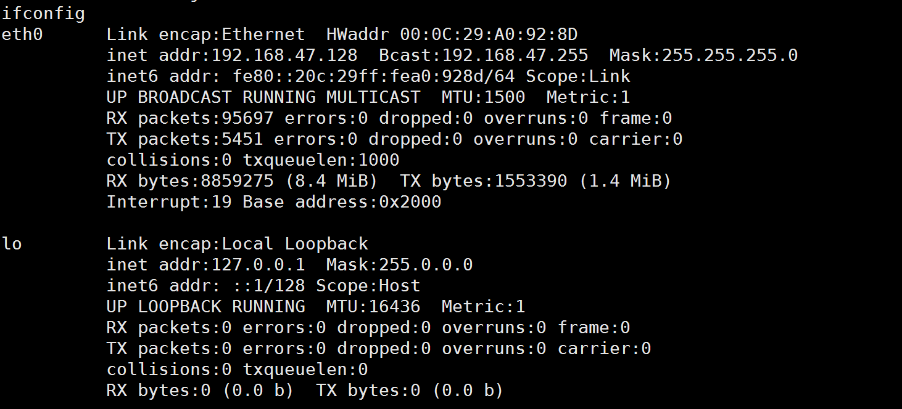

第一行分别是网络类型是以太网、硬件地址（mac地址）。第二行是IP地址、广播地址、子网掩码。第三行是ipv6的地址信息。第五行是接受数据包的数量，以及其中错误的情况。第六行是发送数据包的数量，以及错误的情况。第八行是接受和发送数据包的总大小。最后一个是网卡在内存中的地址。

## 常用网络命令

启用网卡：`ifup 网卡名`关闭网卡：`ifdown 网卡名`

查看网关：`netstat -rn`或`route -n`：

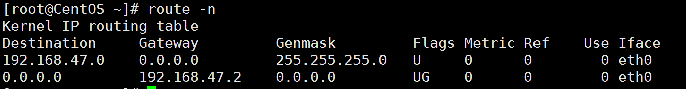

表示除了发给192.168.47.0的消息以外，所有的消息都经过192.168.47.2这个网关。

域名解析命令：`nslookup [主机名或IP]`：

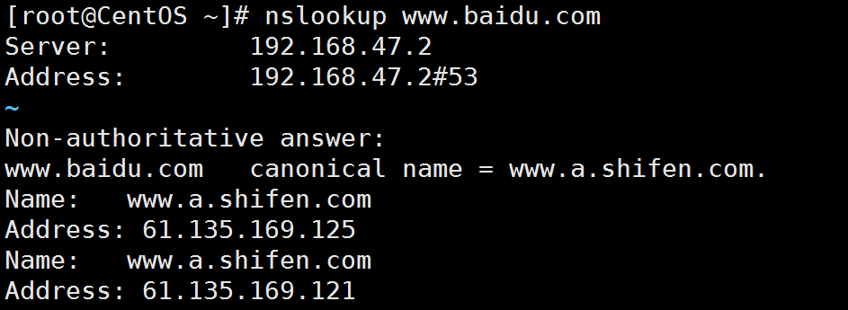

server和address显示的是DNS服务器，下方是对应域名的IP地址。

telnet命令是远程管理和端口探测命令，`telnet IP 端口`，该命令是明文传输数据包，不安全，不建议开启。

wget命令加网址上要下载的文件名，就可以开始下载。

如果使用虚拟机的克隆功能，新虚拟机必须进行以下操作来进行网络配置：首先打开/etc/sysconfig/network-scripts/ifcfg-eth0文件删除mac地址行，然后删除网卡和MAC地址绑定文件/etc/udev/rules.d/70-persistent-net.rules，然后重启系统这样就会重新分配UUID，网络就会恢复正常。

## 端口及网络信息netstat

netstat可以查看网络相关信息。-tlun可以查看本机开启的端口情况：

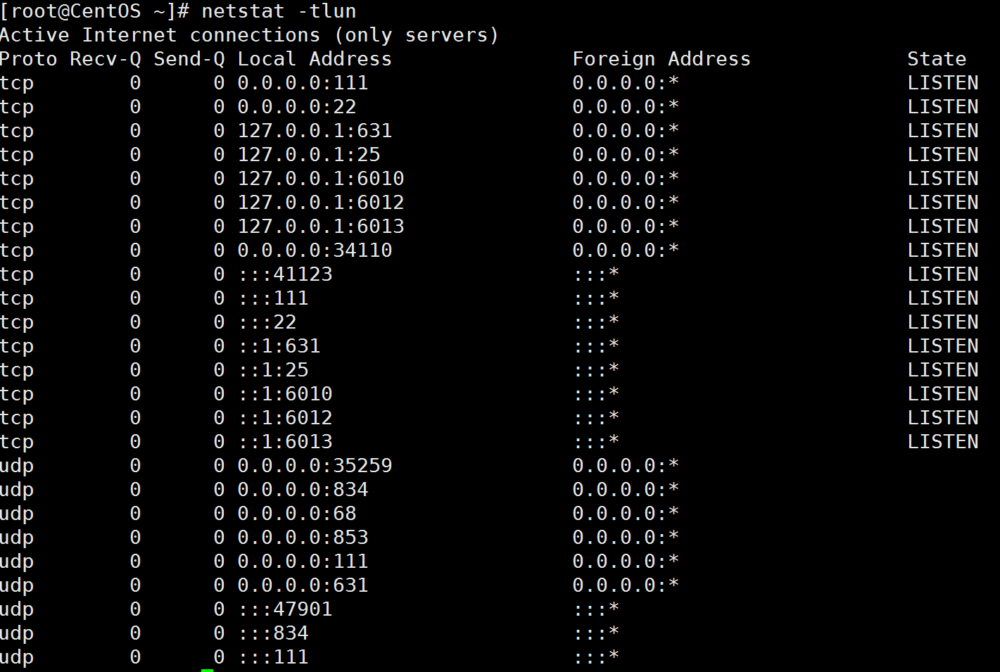

从左到右分别是协议名、接受数据包队列大小、发送数据包队列大小、本地地址加端口、远程主机地址和端口、联机状态（一般有建立ESTABLISED和监听LISTEN）。可以观察到只有tcp连接能处于监听状态，udp没有监听状态。

-an可以查看全部网络连接，既可以看见网络服务，还能看见程序占用的网络协议和端口，且不仅能查看到监听状态的连接，还能查看其他状态（如已建立）。

-rn可以查看本机路由表。

仅执行netstat命令会输出两部分信息，一种是和网络相关的部分，就是上图，一种是与本机进程相关的信息：

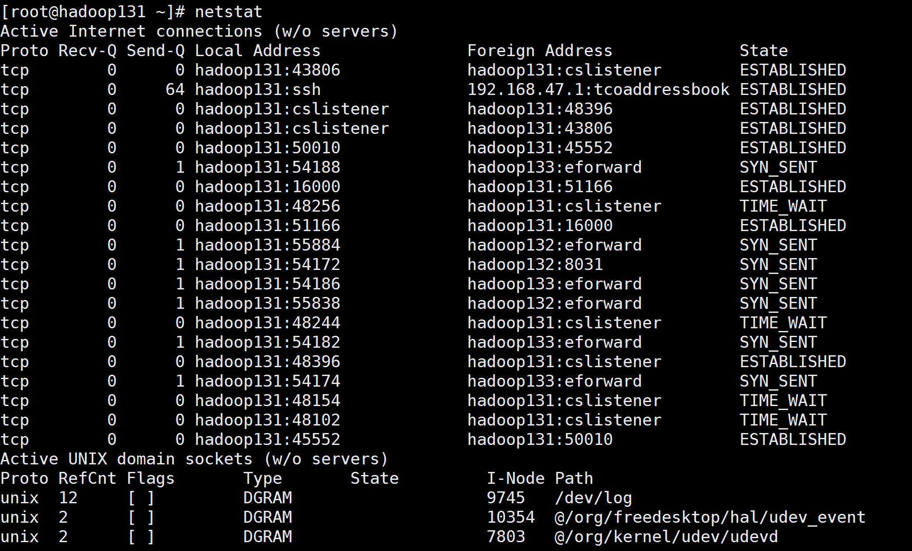

下方那部分就是本机相关进程，linux中进程可以接收不同进程发来的消息，socket file可以沟通两个进程之间的信息，上图中从左到右分别是协议（一般是unix）、连接到此socket的进程数量、联机旗标、socket存取的类型（主要有确认联机的STREAM和不需确认的DGRAM）、State（若为CONNECTED表示多个进程已经连接）、连接到此socket的相关程序路径。

查看服务与端口号的对应情况：`cat /etc/services`：

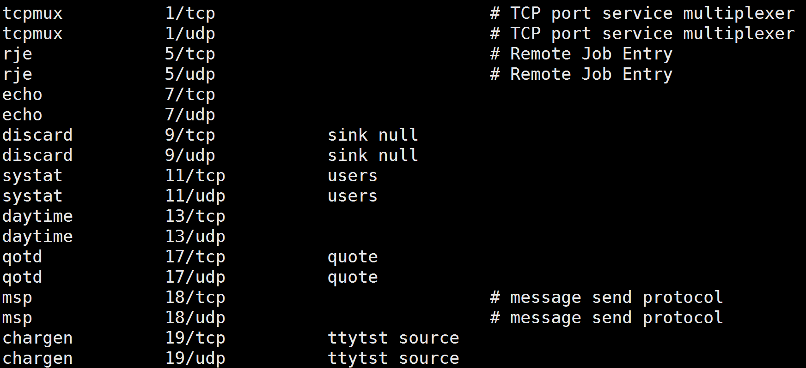

查看启动了网络的进程：`netstat -tulnp`

## 网络设置setup

setup命令执行后可以进行网络设置，redcat系列才能使用此命令：

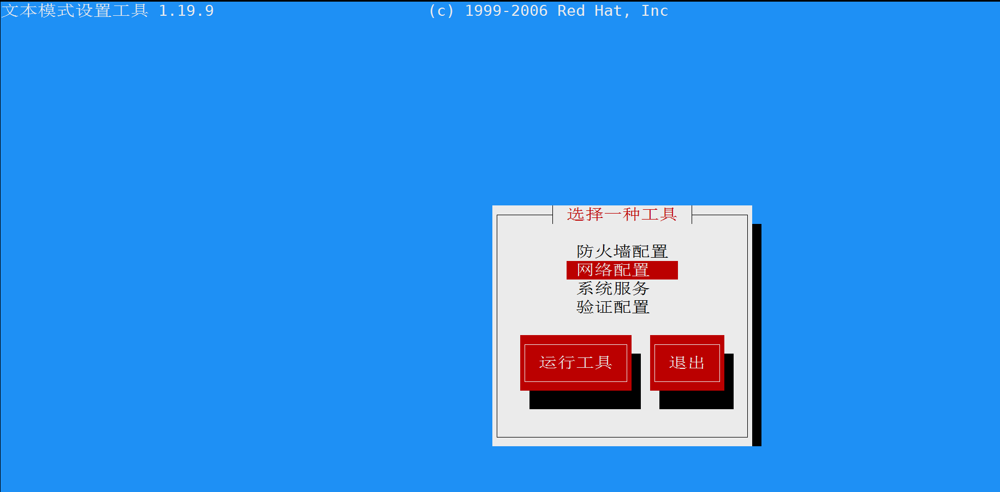

网络设置完之后需要修改一个配置文件：/etc/sysconfig/network-scripts/ifcfg-eth0把ONBOOT="NO"中的NO改为YES。

然后执行`service network restart`重启网络服务。setup设置网络是永久生效的。

# 正则表达式与字符处理

## 正则表达式

正则表达式和通配符的区别是，正则表达式的作用是在文件中搜索符合条件的字符串（常用命令有grep、awk、sed），而通配符用来匹配符合条件的文件名（ls、find、cp这些命令只能用通配符，不能用正则表达式）。且通配符是完全匹配，而正则表达式是包含匹配，如当用grep命令查找时，只要包含该字符串的行就会显示。

正则表达式：

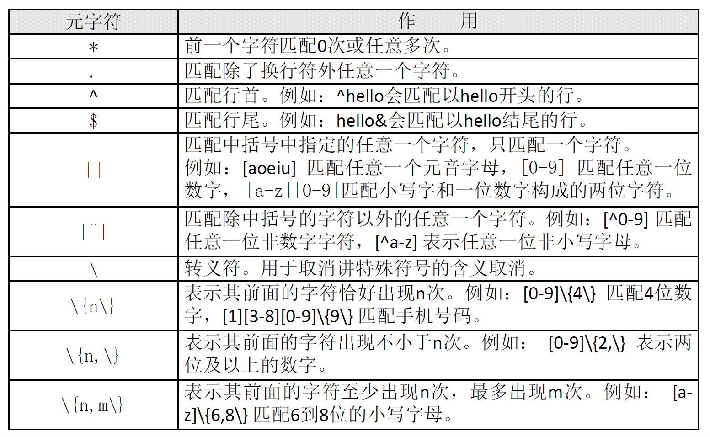

通配符：

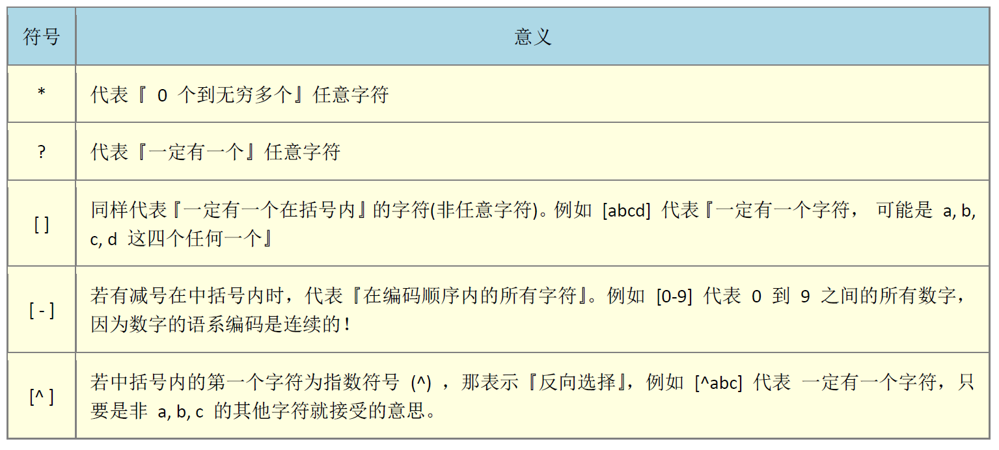

\*表示前一个字符匹配0次或任意多次（和通配符中的\*不同），故`grep "a*" test_rule.txt`表示匹配所有内容，包括空白行，而`grep "aa*" test_rule.txt`表示匹配至少包含有一个a的行。

.表示匹配除了换行符外的任意一个字符，`grep "s.*d" test_rule.txt`表示匹配在s和d字母之间有任意字符的行，`grep ".*" test_rule.txt` 表示匹配所有内容。

^和\$表示能匹配行首和行尾，^M表示行首是M，d\$表示行尾是d，而`grep -n "^$" test_rule.txt` 表示会匹配空白行。

常见的匹配：

`grep "^[^a-z\]" test_rule.txt` 表示匹配不用小写字母开头的行

`grep "^[^a-zA-Z\]" test_rule.txt` 表示匹配不用字母开头的行

`grep "\.$" test_rule.txt` 表示匹配使用“.”结尾的行

## 字符截取命令

截取命令有grep、cut、awk和sed四个。

### cut命令

grep是将符合条件的行提取出来，而cut是提取列。

使用的基本格式：`cut [选项] 文件名`-f后跟列号代表提取第几列，-d后跟分隔符表示设置提取时的分隔符。对于文件(每行中的分隔符是tab)

```
ID Name gender Mark
1 Liming M 86
2 Sc M 90
3 Gao M 83
```

执行`cut -f 2,3 student.txt`结果就是提取第2、3列（中间分隔符还保留）：

```
Name gender
Liming M
Sc M
Gao M
```

cut命令会一行一行进行切分，取返回结果中每行第12个字符以后的所有字符串：`export | cut -c 12`

cut命令常和grep命令配合使用，如对/etc/passwd，该文件中每一行代表一个用户，如果想提取这个文件中的普通用户名，应该执行：

`cat /etc/passwd | grep /bin/bash | grep -v root | cut -d ":" -f 1` 

就会将普通用户名提取出来。这里第一部分代表用cat命令查看该文件，然后选取行内带/bin/bash的行（相当于除掉系统用户），然后去除root用户（-v代表过滤掉某个结果），最后用cut命令提取第一列，分割符是冒号（不设置的话默认分隔符是制表符），中间用管道符连接。

但如果要读取的文件分隔符是多个空格，则cut无法正确提取内容，cut的分隔符只支持一个字符，awk命令可以解决这个问题。

### printf命令

printf的基本用法是`printf '输出格式' 输出内容`

输出格式主要有三种，%ns表示输出字符串，n代表输出字符的个数；%ni代表输出整数，n指输出数字的个数；%m.nf表示输出小数，m指输出数字的个数，n值其中小数的位数。

输出格式中有一些特殊字符，常用的有\n换行，\r回车，\t制表符。

`printf %s 1 2 3 4 5 6`会输出123456

`printf %s %s %s 1 2 3 4 5 6`会输出%s%s123456

必须将输出格式用单引号括起来：`printf '%s %s %s' 1 2 3 4 5 6`会输出1 2 34 5 6

`printf '%s %s %s\n' 1 2 3 4 5 6`会输出1 2 3换行4 5 6

也就是说当后面内容多于输出格式时，会反复使用输出格式。

想要按照一定的格式输出文件时，要这样处理：`printf '%s' $(cat student.txt)`，注意这里不能用管道符，这样会将文件所有内容在一行输出，如果想按照文件格式输出必须按照文件的格式来写输出命令：`printf '%s\t %s\t %s\t %s\t %s\t %s\t \n' $(cat student.txt)`这样就能完整的输出文件了student.txt：

```
ID Name PHP Linux MySQL Average
1 Liming 82 95 86 87.66
2 Sc 74 96 87 85.66
3 Gao 99 83 93 91.66
```

`printf '%10s %5i %8.2f \n' $(cat file)`，输出格式依次是长度为10的字符串、长度为5的数字、长度为8其中可以留两位小数点。

print和printf的区别在于print命令会自动加换行，linux中默认没有print命令，但在awk中可以使用print命令。

### awk命令

awk使用格式：`awk ‘条件1{动作1} 条件2{动作2}…’ 文件名`条件通常是关系表达式，当使用awk处理文件时，文件是按行读取的，然后判断条件，确定是否执行动作。

整个awk的处理流程是：

1、读取第一行，然后初始化\$0/\$1/$2...。

2、根据条件值判断是否进行后面的动作。

3、执行所有的条件和动作，如果后面还有后续的行则重复上述步骤，直到所有行都读完。

对student.txt来说，`awk '{printf $2 "\t" $6 "\n"}' student.txt`能将第2列和第6列提取出来，这里的printf不是系统命令，可以用\$n代表第几列，$0代表整行，printf中的特殊字符要用双引号括起来，因为外层已经使用了单引号，所以这里用双引号，特殊字符控制的都是输出格式。

awk默认的字段分隔符是空格或tab，所以对于用多个空格作为分隔符的文件或输出，awk也能处理，如`df -h | awk '{print $1 "\t" $3}'`这里用的是print命令，和printf手动加换行符效果相同。

如果想提取df -h中的百分数，如下图：

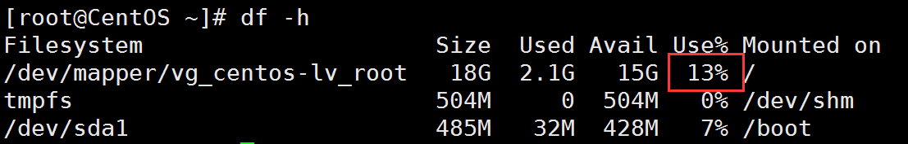

此时应该执行`df -h | grep root | awk '{printf $5}' | cut -d "%" -f 1`这条语句就是用grep命令提取对应行，然后用awk来提取对应列，最后用cut命令来以%为分隔符切割，相当于去掉%，最后得到数字。

BEGIN是一种条件，表示读取前优先处理。

`awk 'BEGIN{printf "This is a transcript \n" } {printf \$2 "\t" $6 "\n"}' student.txt`此时打印内容第一行就是This is a transcript，第二行开始读取文件。

设置分隔符`awk 'BEGIN {FS=":"} {printf $1 "\t" $3 "\n"}'`FS就代表设置分隔符为冒号，这里前面必须加BEGIN ，如果不加那么文件第一行会原封不动打印，因为在读取第一个大括号时就已经读取第一行了，如果不加BEGIN程序会直接读取第二行然后开始处理。

END也是一种条件，表示最后执行。`awk 'END{printf "The End \n" }
{printf \$2 "\t" $6 "\n"}' student.txt`此时就会最后打印一行The End。

awk的强大之处在于可以插入逻辑表达式，`cat student.txt | grep -v Name | \
awk '$6 >= 87 {printf $2 "\n" }'`，同样是对student文件，如果想输出平均分大于87分的Name就可以执行这条命令，首先读取该文件，然后除掉第一行，如果第六列的元素大于等于87就打印第二列。

awk有几个内建变量：NF（每一行拥有的字段总数）、NR（目前处理的是第几行的数据）、FS（分隔符默认为空格），这些变量都可以直接放在大括号里打印出来，或者放在括号外作为条件判断都可以，不需要加$。

### sed命令

sed命令是一种轻量级流编辑器，主要是用来将数据选取、替换、删除和新增。vim也可以修改文件，但是vim难以修改命令输出内容，只能将输出内容写入文件然后修改，而sed在这方面优于vim。

sed命令的执行格式是`sed [选项] ‘[动作]’ 文件名`

提取文件第2行并输出：`sed -n '2p' student.txt`，动作中p代表输出指定的行，而-n代表仅输出sed处理过的行，如果不加-n那么会输出全部文件内容，第二行会输出两次。sed不仅可以用在文件中，还能用在命令输出的内容中：`df -h | sed -n '2p'`

删除第2行到第4行的数据（相当于输出其他行，它不会修改文件本身）：`sed '2,4d' student.txt`

在第二行后插入一行（不修改文件本身）：`sed '2a hello' student.txt`，a代表某行后插入。

在第二行前插入两行（不修改文件本身）：`sed '2i hello \ world' student.txt`，反斜杠代表输入第二行，插入时除了最后一行，当想插入多行时必须在行末处加反斜杠，i代表某行前插入。

将第二行替换（不修改文件本身）：`sed '2c No such person‘ student.txt`

数据替换可以精确到字符串，格式是`sed ‘s/旧字串/新字串/g’ 文件名`

把第三行中的74换成99：`sed '3s/74/99/g' student.txt`

同时把“Liming”和“Gao”替换为空：`sed -e 's/Liming//g ; s/Gao//g' student.txt`，注意当有多个动作时用分号隔开，-e代表允许多条编辑，当s前没有数字时代表针对所有行。

总结：sed命令的常用选项有三个，-n、-e和-i‘；常用动作有6种，a、c、i、d、p、s。

## 字符处理命令

1、排序命令sort，使用方法：`sort [选项] 文件名`选项有几种：

-f： 忽略大小写
-n： 以数值型进行排序，默认使用字符串型排序
-r： 反向排序
-t： 指定分隔符，默认是分隔符是制表符
-k n[,m]： 按照指定的字段范围排序。从第n字段开始， m字段结束（默认到行尾）

排序用户信息文件：`sort /etc/passwd`此时会输出按照文件每行首字母排序的结果：

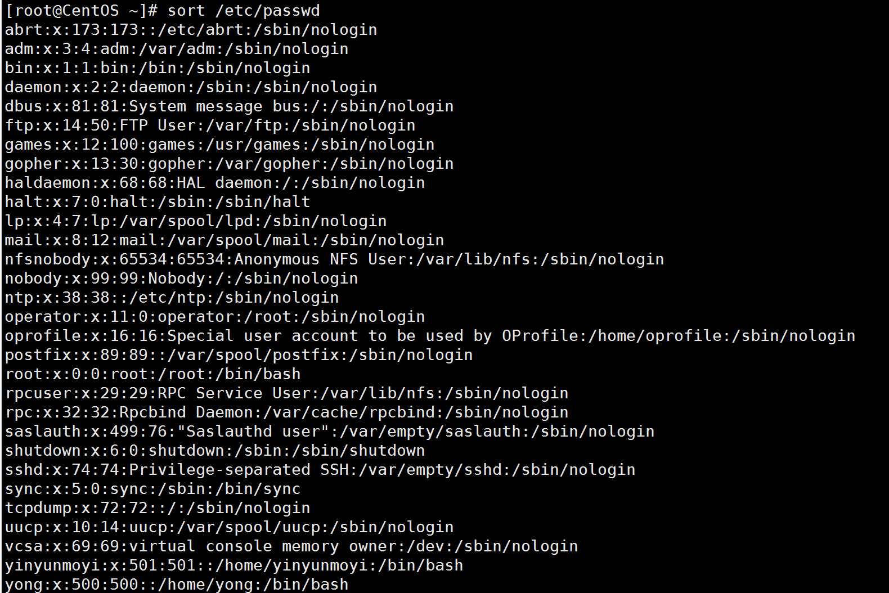

如果想按照每行第三个字段排序，必须先指定冒号为分隔符：`sort -t ":" -k 3,3 /etc/passwd`

-k 3,3的意思是从第三个字段开始到第三个字段结束，也就是按照第3个字段排序。但是排序结果会把10排在3前，这是因为默认只识别第一个字符，如果想按数字排序应该加上-n选项：

`sort -n -t ":" -k 3,3 /etc/passwd`。

2、去重命令uniq：经常结合排序使用，仅取出账号栏，然后排序后去重：

`last | cut -d ' ' -f 1 | sort | uniq`

3、统计命令wc：`wc [选项] 文件名`。选项有以下几种：-l： 只统计行数、-w： 只统计单词数、-m： 只统计字符数。如果不加选项那么上述三种都会输出。

## 字符转换命令

1、tr命令可以用来删除一段讯息中的文字或进行替换

将last输出信息中的所有小写字母换成大写的：`last | tr '[a-z]' '[A-Z]'`

将输出信息中的冒号全部删除：`cat /etc/passwd | tr -d ':'`

2、col命令可以将tab转成对等的空格键，命令是`col -x`

3、join命令用来通过两个文件数据相同的部分，来把两个文件的数据整合到一起，如/etc/passwd和/etc/shadow两个文件每行的第一个字段都是相同的账号名：

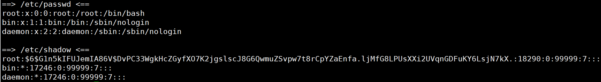

此时就可以用join方法：

`join -t ':' /etc/passwd /etc/shadow`

这样整合后，两个文件的数据都会整合到一起，查看上面输出的内容：


可以发现最后每一行输出的内容就是文件1+文件2没有连接字段的那部分。join的字段也可以不采用首个字段。

join常常在sort之后，防止出现对应行不匹配的现象。

4、paste命令用来将两行粘在一起，中间用tab键分开：`paste 文件1 文件2`，如果加-d后面跟分隔符的话就可以重新设置分隔符。

5、expand和unexpand分别是将tab转成空格，和把空格转成tab，expand后跟文件名会自动将文件内的tab转成8个空格，也可以用-t加数字来自定义转换数字。

6、分区命令split，它可以将一个大文件分成多个小文件，以便于复制。

切割成300k一个的小文件：`split -b 300k 文件名`，此时原文件会被删除，假设原文件名为1，那么结果就会多出1aa、1ab、1ac文件，将这三个文件合并：`cat 1* >> 1`，这样就可以复原。

将ls输出信息每十行记录一个文件：`ls -al / | split -l 10 - lsroot`，这里新生成的文件名开头就是lsroot，-的意思是输入流，但是为空所以就用-来表示。

7、xargs命令可以创造标准输入，令不支持用管道符的命令能够接受其他命令的返回结果并执行。

# 高级权限与切换用户su

## ACL权限

linux的文件有所有者、所属组和其他人的概念，但是仅仅拥有这些意味着权限不同的用户只分三类，这有时是不够用的，ACL权限（access control list）就可以解决这个问题。

查看当前分区是否支持ACL权限：`dumpe2fs -h /dev/sda1`


若其中有acl就说明支持acl。一般默认都是支持的，如果不支持要打开acl选项，需要修改/etc/fstab，该文件是系统开机自动挂载的文件，如果某个分区没有打开acl，就需要在对应分区行defaults后加逗号acl，然后再重启或重新挂载文件系统`mount -o remount 对应分区`。对应分区就是/、/boot等。


给用户设置文件ACL权限：`setfacl -m u:st:rx /project/`相当于给用户st，目录/project/设置rx权限。此时在查看文件详细信息时会在原来的9个权限后加上一个加号，代表它拥有ACL权限。（如果填用户名的位置设置为空，就相当于给文件的拥有者设置权限）

给用户组分配ACL权限`setfacl -m g:gro:rx /project/`相当于给用户组gro，目录/project/设置rx权限。

查看ACL权限`getfcal 文件`

设置mask权限：`setfacl -m m:rx`最大有效权限mask权限，它与各ACL权限相与得到的权限才是真正的权限。执行查看ACL权限时能直接查到每个文件的mask权限。（mask权限可以规范最大允许的权限，如果mask权限仅仅为r，即使其他的权限为rw，那么w也不会生效）

删除用户的ACL权限：`setfacl -x u:用户名 文件`g：组名可以删除组的ACL权限。删除文件的所有ACL权限：

`setfacl -b 文件`

递归ACL权限`setfacl -m u:用户名:权限 -R 目录`给目录设置ACL权限后，所有的子文件和子目录都会使用这个ACL权限，但是如果设置完之后再新建文件那么新文件没有该递归ACL权限，若想使未来新建的文件拥有ACL权限，则应该使用默认ACL权限：`setfacl -m d:u:用户名:权限 目录`

## 文件特殊权限SetUID

SUID权限的作用是命令执行者在执行程序时获得该程序文件属主的身份，在程序结束时属主的身份就会失去。要满足的条件首先是该文件必须是可执行文件，且命令执行者必须有执行权限x。s权限的一个典型应用就是命令passwd，查看/usr/bin/passwd的权限是：-rwsx-xr-x（属主权限的x换成了s），这是因为该命令允许用户自定义自己的密码，本质上是修改shadow文件，而shadow文件没有权限只能借助root的权限来进行修改。

设置SUID：`chmod 4755 文件名`或`chmod u+s 文件名`取消：`chmod 755 文件名`或`chmod u-s 文件名`

这个权限是非常危险的，普通用户因此可能会获得管理员权限，对拥有s权限的文件应该定期检查，取消不必要权限。

该权限只能用于二进制程序，只能暂时获得执行权限，而不能获得读权限，也就是不能用cat查看这种文件。

## 文件特殊权限SetGID

SGID可以用于二进制可执行文件，也可以用于目录。用于二进制可执行文件时，该权限的作用是命令执行者在执行该文件时（必须有对该文件的x权限），组身份升级为该文件的属组。该权限的典型应用是locate命令，该命令通过查询数据库文件来进行搜索，数据库文件/var/lib/mlocate/mlocate.db的属组是slocate，该组的权限是r，也就是slocate组可以读该文件，而locate命令文件/usr/bin/locate的属组是slocate，属组权限是--s，普通用户执行该命令时也就拥有了slocate的权限，也就能顺利的查询数据库。

SGID也可用于目录文件。如果用户对目录有rwx权限，那么他就可以查看该目录且可以在该目录创建文件，如果该目录有SGID，也就是属组权限的x替代成了s，那么用户在该目录下创建的文件属组是该目录的属组，而不是创建者初始组。

设置SGID`chmod 2755 文件名`或`chmod g+s 文件名`取消：`chmod 755 文件名`或`chmod g-s 文件名`

## 文件特殊权限Sticky BIT

SBIT粘着位目前只对目录有效，设置粘着位后目录的other权限中的x被替换为t，一旦某个目录设置成粘着位，那么对该目录原来拥有w和x权限的普通用户就不能删除该目录下的文件了，此时普通用户就算是拥有w权限，也只能删除自己创建的文件，对其他文件不能删除。

设置粘着位`chmod 1755 目录`或`chmod o+t 目录`取消：`chmod 777 目录`或`chmod o-t 目录`

## 特殊权限其他特性

要设置特殊权限只需要在原来三个权限数字的基础上在前面再加一个数字即可，三个特殊权限代表的数字：SUID为4，SGID为2，SBIT为1，如果执行下面的语句：

`chmod 7666 test`就会给test文件同时赋予三种特殊权限，但是它现在的权限是：

-rwSrwSrwT，注意到三个特殊权限都是大写字母，这种情况代表特殊权限为空，因为666代表三种群体都没有执行权限，此时即使赋予了特殊权限也无法获取对应权限，因为无权限可用。

## chattr权限

该权限限制包括root用户在内的所有用户。

添加chattr权限：`chattr [+-=] [选项] 目录或文件名`选项有两种-i和-a。

-i相当于上锁，对文件来说它不能被删除，不能修改文件内容、改名；对目录来说不能在该目录下删除和建立文件。-a相当于不允许删除已有的数据，对文件来说它不能被删除，也不能删除文件数据，但是可以在文件中添加新数据；对目录来说不能在该目录下删除文件，但是可以新建文件。

这种特殊权限用ls是查不出来的，必须使用lsattr命令：`lsattr 选项 文件名`-a代表显示全部，-d代表仅列出目录。

其他隐藏权限：

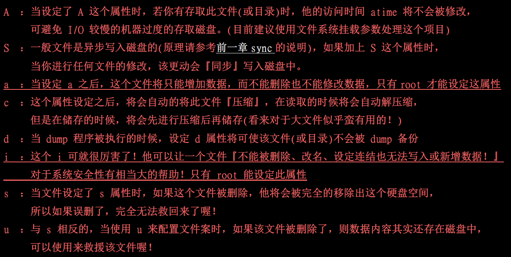

## 切换用户su命令

切换用户`su - 用户名`执行完这条命令后，输入密码。切换成另一个用户的同时切换用户的环境变量。还可以不切换用户身份直接执行root的权限：`su -root -c "useradd user3"`（不加用户名直接执行代表切换到root）

注意`su -`和`su`是不同的，前者是login-shell，后者是non-login shell，如果执行后一条命令环境变量不会切换成root的，还是原来用户的。su命令切换结束想要恢复执行exit命令即可。

su命令在切换的时候必须知道对方的密码（root使用时除外），这样会导致密码泄露，这个问题可以用sudo权限来解决。

## sudo权限

sudo权限的作用是root把本来超级用户能执行的命令赋予普通用户执行。sudo的操作对象是系统命令。

要设置sudo权限要执行命令`visudo`相当于`vi /etc/sudoers`，在这个文件中：

1、设置单一用户的sudo权限

root ALL=(ALL) ALL，其中root代表赋予权限的用户，第一个ALL代表主机地址，第二个ALL代表可使用的身份，第三个ALL代表授权的命令绝对地址。这一行代表用户可以在给定地址执行对应的命令。如：

sc ALL= /sbin/shutdown –r now代表用户sc可以在所有主机上执行重启命令，身份省略不写代表sc被当成root用户对待。sudo命令执行时必须输入当前用户的密码，而不是root密码（只有第一次执行sudo，或者两次执行sudo的时间间隔大于5分钟时才会要求输入密码）。

这个权限也是危险的，如果给普通用户赋予执行vim的权限，那么他就能获取root的权限编辑所有文件。

2、设置群组的sudo权限

%wheel ALL=(ALL) ALL，代表wheel群组中的用户可以使用所有root的命令。

3、设置免密码sudo：

将sudo配置信息中一行的最后一个ALL改为：`NOPASSWD:ALL`，如果要换成其他授权命令则修改ALL即可。

4、使用别名：

```
User_Alias ADMPW=pro1,pro2,pro3,pro4
Cmnd_Alias ADMPWCOM=!/usr/bin/passwd,/usr/bin/passwd [A-Za-z]*,!/usr/bin/passwd root
ADMPW ALL=(root) ADMPWCOM
```

上述最后一行是代表设置sudo权限，而前两行分别把用户名和可以执行的命令单独定义了。这里允许执行所有设置密码的命令，除了单独执行passwd以及passwd root，防止root密码被执行者修改。

5、sudo搭配su快速实现将身份转为root：

```
User_Alias ADMINS=pro1,pro2,pro3,pro4
ADMINS ALL=(root) /bin/su -
```

这样就相当于这4个用户可以直接用`sudo su -`来切换到root（用自己的密码）

查看本用户可用的所有sudo权限：`sudo -l`

用户执行sudo权限赋予的命令：`sudo 命令`，以用户sshd的身份在/tmp下创建一个mysshd的文件：

`sudo -u sshd touch /tmp/mysshd`

# 软件安装

## 源码包和RPM包

软件安装时可以有两种方式。一种是源码包，经过编译才能安装，速度较慢，脚本安装包是在源码包的基础上开发出来的有安装界面提示的安装包，应用不多。还有一种是二进制包（RPM包、系统默认包）


源码包卸载时只需要删除对应文件即可。

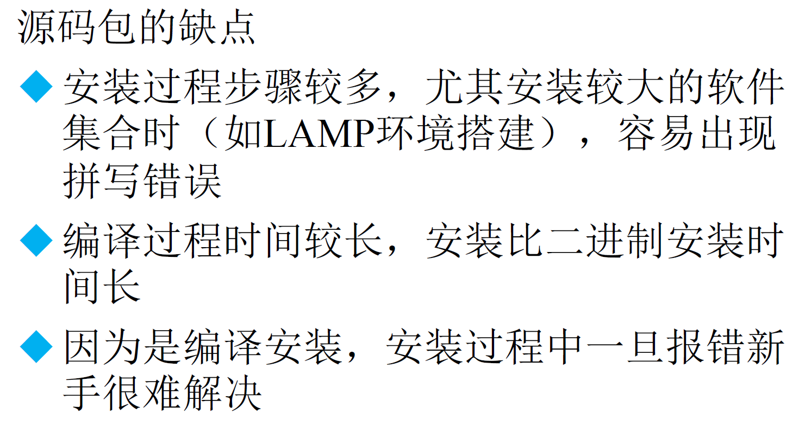


源码包和RPM包的安装位置不同，RPM包的安装位置一般是默认的：

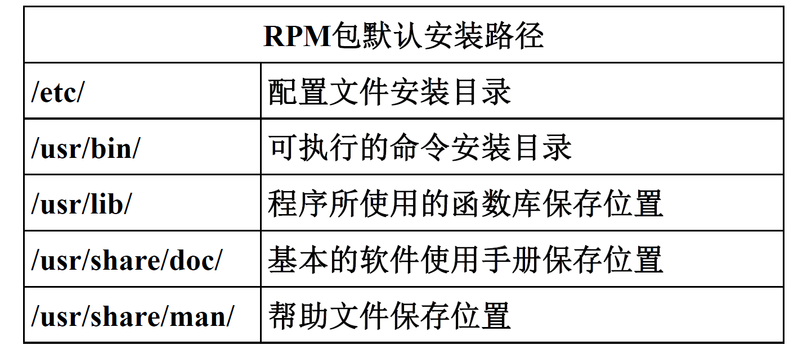

而源码包的安装位置可以指定，一般是usr/local/软件名。

因为安装位置不同导致开启服务时RPM包安装的软件既可以按照绝对路径执行，也可以用service开启服务：


而源码包不能用service，只能用绝对路径：


源码包安装更加稳定，效率更高，适合用于对外提供大量访问的关键软件安装。

## rpm命令管理和yum在线管理

rpm包安装时最严重的问题就是依赖性：分为树形依赖（如果a依赖b，b依赖c，那么安装顺序就是cba，卸载顺序就是abc）、环形依赖（需要一次性安装）、模块依赖（依赖某个包的一部分）

iso中有一个package文件，内部都是rpm包。如果要安装mysql的驱动：

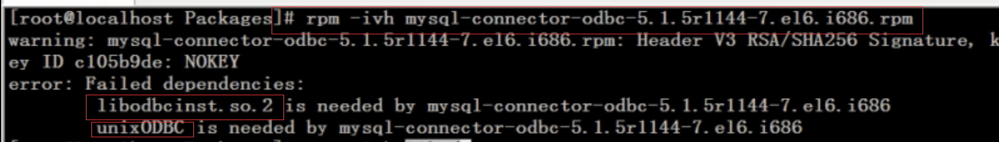

此时会提醒必须先安装依赖，这个依赖有时在package中有，有时没有，如libodbcinst.so.2并不在其中，它只是一个包中的一部分，这就是模块依赖，此时需要登录www.rpmfind.net查询libodbcinst.so.2属于哪个包。

yum在线管理没有依赖问题，但是需要联网或装yum源，这个操作可能是付费的。

### rpm命令管理

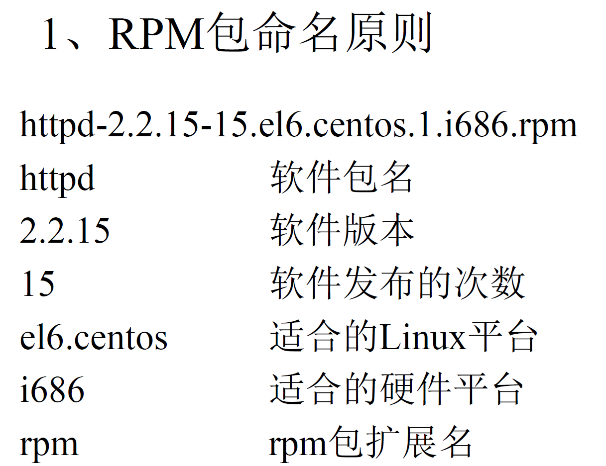

包全名就是rpm包完整的文件名，注意要加路径，包名只是其中头一个单词。当软件没有安装时需要操作包全名，当软件已经安装时就可以操作包名了，此时实际上是去/var/lib/rpm/中的数据库。

rpm安装命令`rpm -ivh 包全名`i（install）是安装，v（verbose）是显示详细信息，h（hash）是显示安装进度。rpm升级命令`rpm -Uvh 包全名`U（upgrade）代表升级。rpm卸载命令`rpm -e 包名`e（erase）代表卸载

查询软件包是否安装`rpm -q 包名`q（query）代表查询。查询所有已安装的rpm包`rpm -qa`a代表all。通过管道命令可以找到与httpd相关的已安装rpm包：`rpm -qa | grep httpd`

查询软件包详细信息`rpm -qi 包名`i代表information。查询未安装包信息`rpm -qip 包全名`

软件安装时位置都是固定的，修改会带来一些不必要的麻烦。查询软件安装位置`rpm -ql 包名`l代表list，-qlp可以查询未安装包将要安装的位置，同时要使用包全名。

查询系统文件属于哪个包`rpm -qf 文件名`f代表file。这个文件必须是包创建出来的，可以用该命令反向追查。

查询依赖性`rpm -qR 包名`R代表requires。加-qRp跟包全名可以查未安装包依赖信息。

RPM包校验：`rpm -V 已安装的包名`v代表verify，如果软件没有做任何修改，则命令执行后没有反应，如果做了修改会出现：

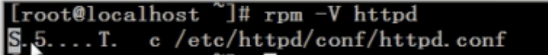

结果的第一部分代表修改信息，修改信息的内容如下。c是文件类型，最后是修改的文件。

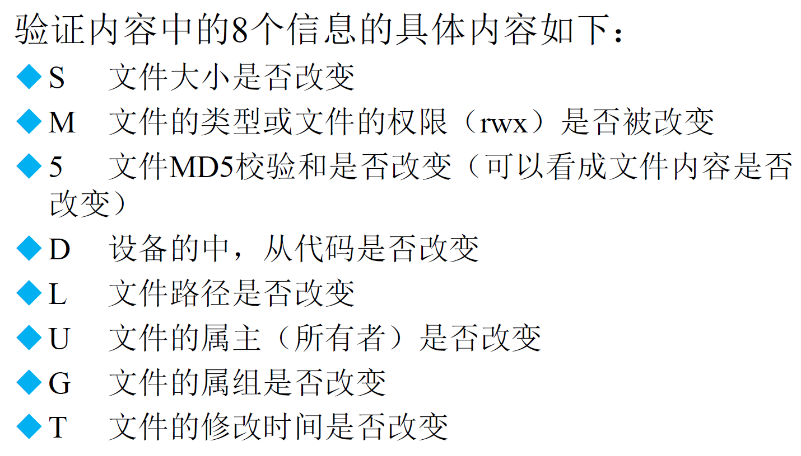

文件类型有以下几种：

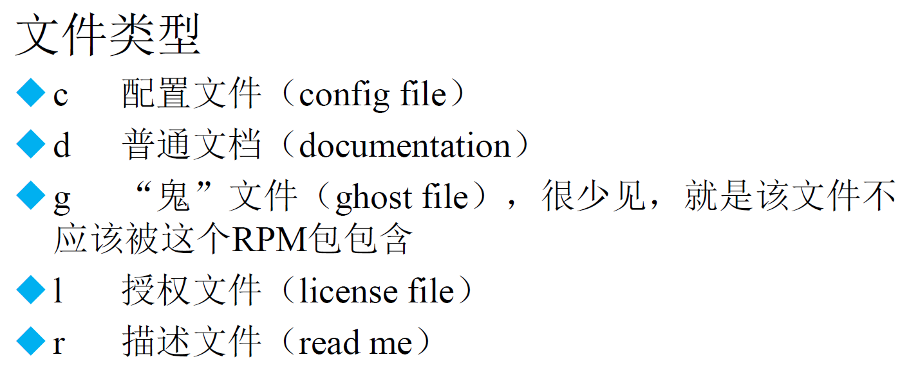

RPM包中文件抽取，误删命令或文件时用这个命令来提取对应包中的命令或文件：

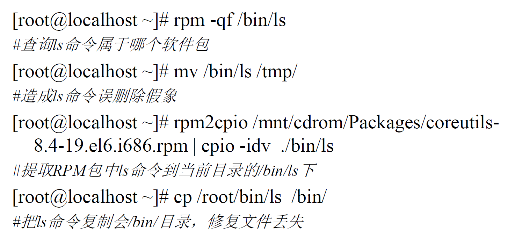

### yum在线管理

网络yum源需要联网，网络yum源的位置在/etc/yum.repos.d/CentOS-Base.repo，同一个目录下CentOS-Media.repo文件是本地光盘实现的yum源。打开基本yum源：

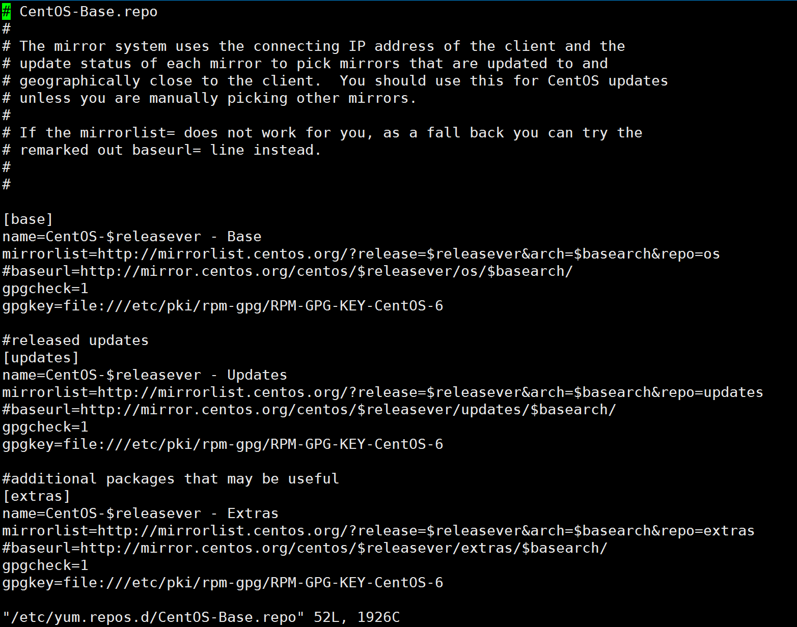

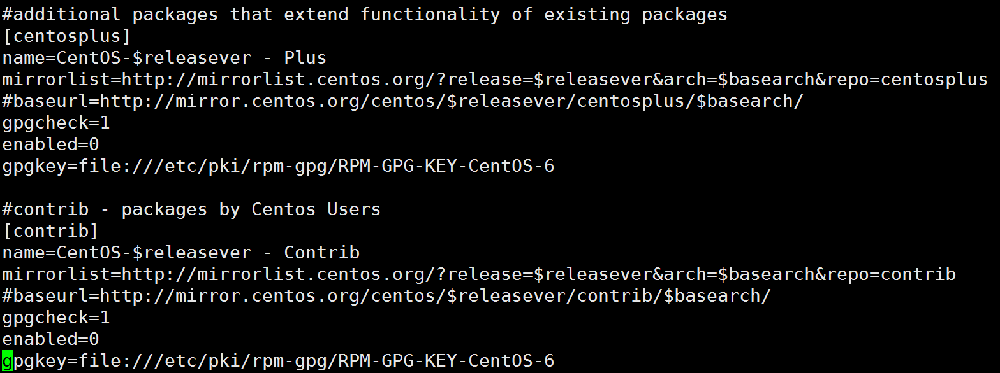

文件的解释：

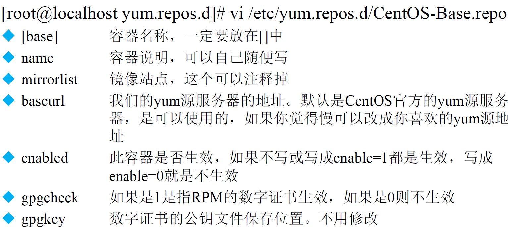

查询所有服务器中可用的软件包列表`yum list`

查询特定的软件包`yum search 关键字`

安装命令`yum -y install 包名`-y的意思是自动回答yes。

升级软件包`yum -y update 包名`如果不加包名意思是所有软件包都升级，包括linux内核，这大概率会导致服务器崩溃。

卸载命令`yum -y remove 包名`这个命令会导致包依赖的全部包被卸载，系统可能会因此出现问题。

列出可用的软件包组：`yum grouplist`

安装软件包组`yum groupinstall 软件组名`

卸载指定软件包租`yum groupremove 软件组名`

光盘yum源搭建，用光盘做无需联网，且光盘中的软件版本比较稳定的。

首先要挂载光盘，打开虚拟机设置将yum源所在光盘放入，然后将除光盘yum源的其他yum源后缀名都修改，yum源的后缀名是repo，改为repo.bak，改成其他文件名之后系统不再识别该yum源，此时就只有光盘yum源生效。最后需要修改光盘yum源的文件，需要将baseurl后的路径设置为挂载点，其他路径注释，然后将enable设置为1。

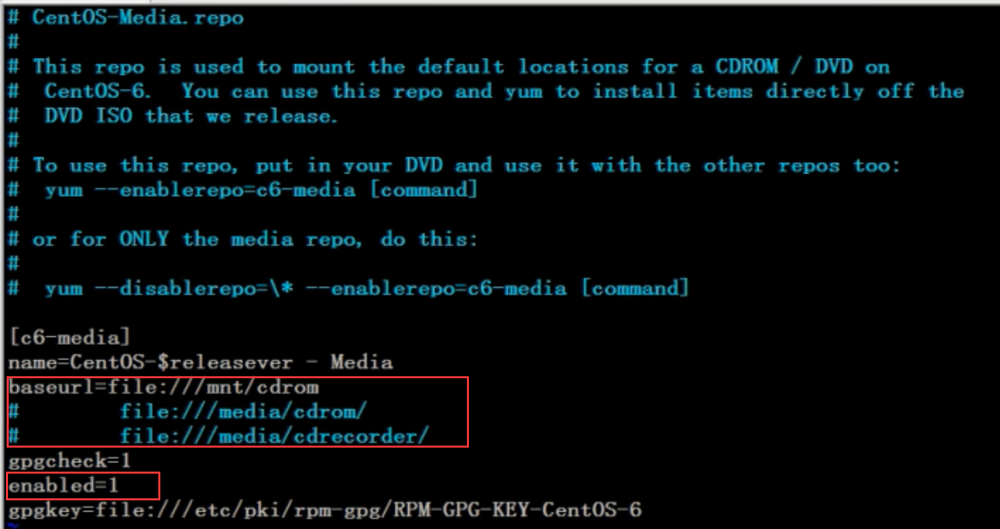

## 源码包安装

源码包和RPM包即使是同一个软件也可以同时安装，因为他们的安装位置不同。

要安装源码包首先要安装c语言编译器gcc，然后到对应官方网站下载：http://mirror.bit.edu.cn/apache/httpd/

源码包应该保存在usr/local/src，安装位置应该在usr/local。

源码包下载完成后，解压，进入解压目录，解压目录中有INSTALL和README，这两个文件一个是安装说明一个是使用说明。

按照安装说明，首先执行./configure --help查看可以定制的功能。其中有一项是定义安装目录：

```
./configure --prefix=/usr/local/apache2
```

然后执行make命令进行编译（注意要在解压目录下），如果这个过程报错需要执行make clean清空编译产生的临时文件。最后执行make install完成安装，向安装目录写文件。

删除源码包只需要删除安装目录即可。

## 脚本安装包

下载好后解压缩，进入压缩目录，直接执行setup.sh，询问安装位置、日志位置等。

# 进程

## 进程、父进程、fork and exec

程序是存放在存储媒体中以实体文件的形式存在的，程序被触发后会在内存中形成进程，进程记录了执行者的权限和属性、程序的程序代码和需要的数据，进程的唯一标识符是PID，对于同一个程序，执行者不同，PID也不同。

程序的执行是有关联性的，连续执行两个bash后，第二个bash的父进程就是第一个bash，一个线程的父进程可以用Parent PID（PPID）来查看，执行`ps -l`就可以查看一个进程的PPID。有一个特点是子进程可以取到父进程的环境变量。有时手动关闭一个进程会发现过段时间进程被重新打开，这是因为某些系统工作排程在运行父进程的过程中产生了子进程，此时就要手动杀掉父进程。

在linux中进程间的呼叫被称为fork and exec，进程都会由父进程以复制（fork）的方式产生一个一模一样的子进程，然后被复制出来的子进程再以exec的方式来执行程序，整个流程如下：

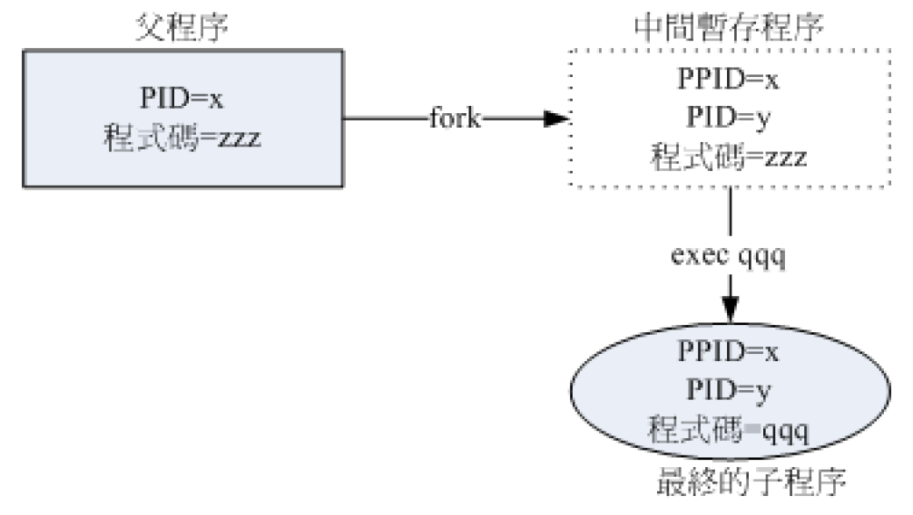

在进程中有一类比较特殊的进程，它们常驻内存，在系统中不停的运行，通常负责一些系统所提供的功能用来服务用户执行各项任务，这类程序或进程被称为服务（daemon）

## 查看进程

查阅自己bash相关的进程：`ps -l`

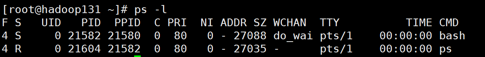

第一个字段F代表进程旗标，4代表此进程的权限是root，1代表此子进程仅进行复制（fork）而没有实际执行（exec）。

第二个字段S代表进程状态，R（running）代表运行中，S（sleep）代表正在睡眠状态，D代表不可唤醒的睡眠状态，如等待IO，T（stop）代表停止状态，如背景暂停或traced，Z（zombie）代表僵尸状态，代表已经终止但还没有移除内存。

C代表CPU使用率，单位为百分比。

PRI/NI代表进程被CPU执行的优先级，数字越小代表CPU越快被执行。

ADDR/SZ/WCHAN分别代表kernel function（进程在内存中的部分，-代表进程正在运行）、进程用掉的内存、进程是否正在运作（-代表进程正在运行）。

TTY是登入者的终端机位置，如果是远程登录则使用动态终端接口（pts/n）。

TIME是实际运行使用掉的CPU时间。

CMD是触发该进程的指令。

查看系统所有进程：`ps aux`或`ps -le`这两个命令是一样的，前者是unix格式，后者是linux格式。执行结果：

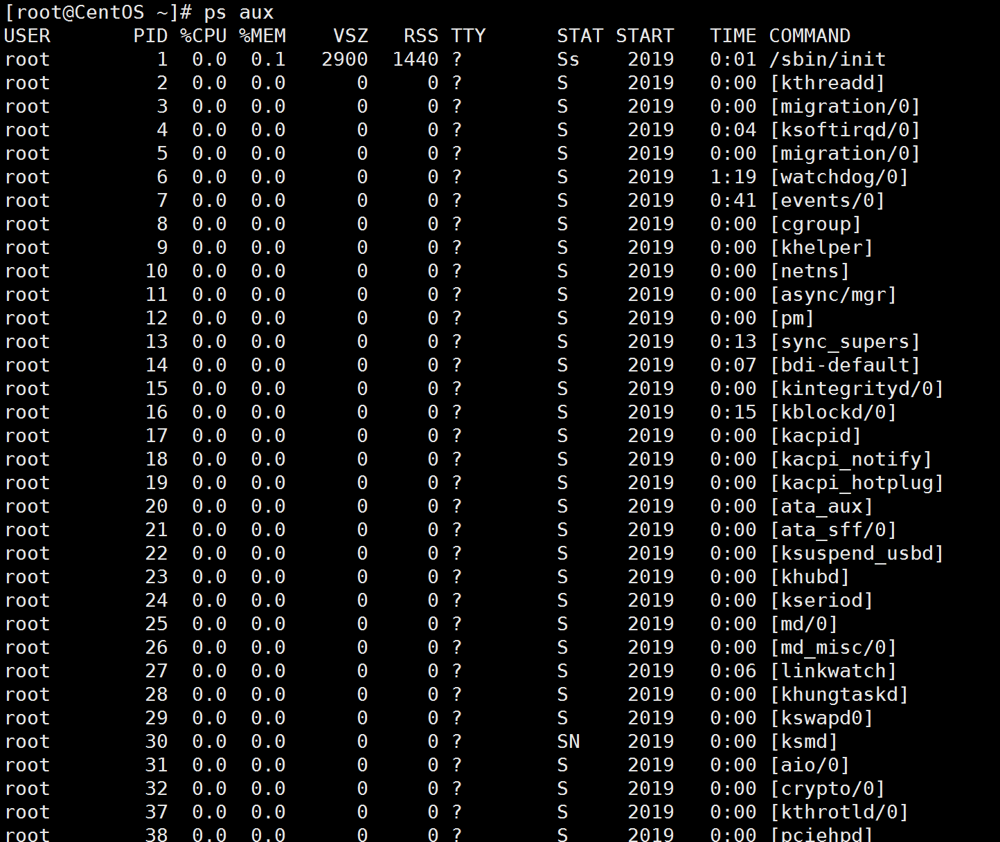

上述结果的解释：

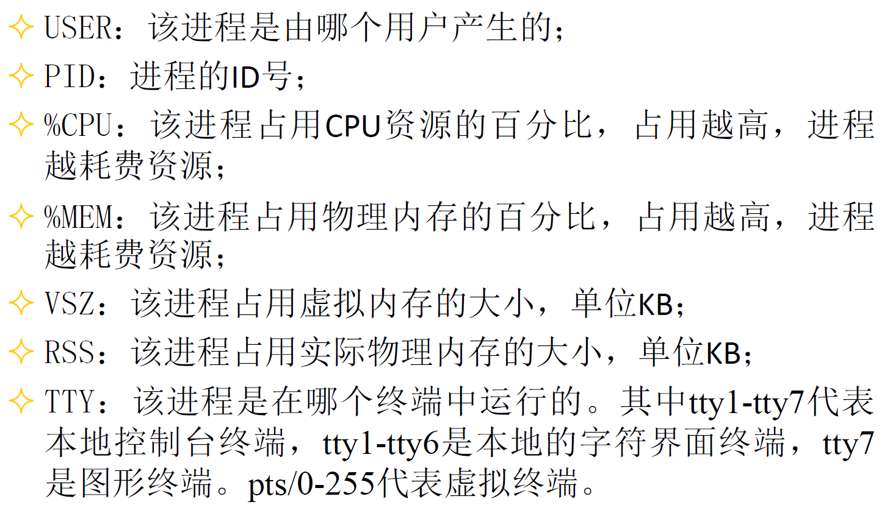

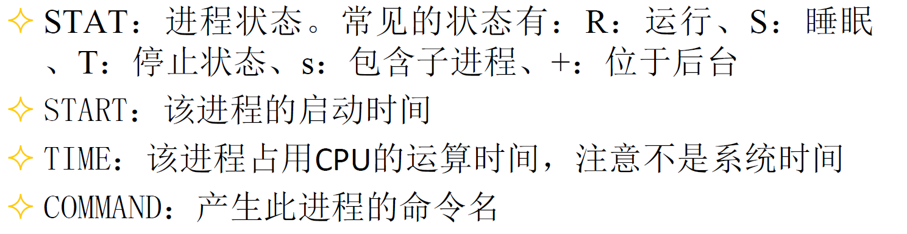

TTY如果是？说明是内核直接产生的。通过COMMAND可以查看具体是什么命令产生该进程，可以通过命令来判断到底是什么进程。

查看cron和rsyslog这两个服务相关的进程情况：`ps aux | egrep '(cron|rsyslog)'`

以`ps -l`的形式查看所有进程：`ps -lA`

列出类似进程树的进程显示：`ps axjf`

查看进程树：`pstree [选项]`，-p可以显示进程的PID，-u可以显示进程的所属用户，-A可以显示

## 终止进程

kill命令：`kill [信号代号] pid`，信号信息可以用`kill -l`查看，常用的如下：

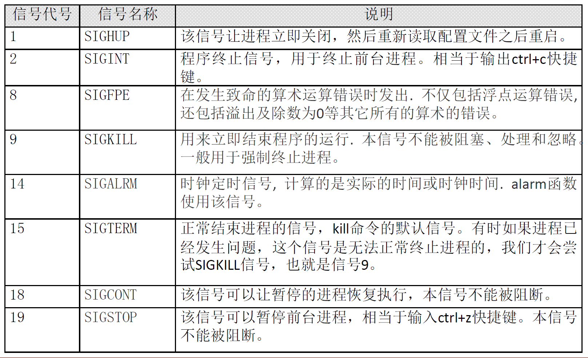

常用的有三个，正常终止15，强制终止9，重启1。不加信号代号默认是15。

killall命令可以根据进程名杀死进程：`killall [选项][信号] 进程名`，选项有-i表示交互式，询问是否要杀死某个进程；-I表示忽略进程名的大小写。此时要杀的进程可能有多个，用来杀死服务对应的多个进程比较方便，如：`killall -9 httpd`

可以杀死进程是linux稳定的主要原因之一，如果在文字界面遭遇卡死，可以直接用alt+f1-f7来切换终端机页面，然后在该页面手动杀死错误的进程，这样就能恢复正常了。

## 进程执行顺序

当所有进程被同时唤醒时，CPU要对唤醒的进程进行排序然后执行。

进程的优先执行序priority就是PRI，这个值越低进程就越优先，它是内核调整的，用户无法直接修改PRI，如果用户想要调整进程的优先执行序需要通过Nice值，也就是NI。两者的相关性如下：

PRI(new) = PRI(old) + NI

这个公式并不是绝对的，如果NI调整成5，原来的PRI是50，新PRI不会是55，因为它是系统动态决定的，NI只是一定程度上影响PRI的值，最终PRI是要经过系统分析才能决定的，如果要提升进程的优先级就可以把NI设置成负值，但是注意只有root可以设置成负值，一般使用者只能设置自己进程的NI值，只能设置成正数，且只能将NI越调越高（NI的值为-20到19）

NI值可以在开始执行程序的时候就设置：`nice -n -5 命令`，表示该命令的nice值设置为5，一般需要放在后台工作的，比较不重要的进程可以设置nice值较大一些，如备份命令。

NI值也可以对已存在的进程调整：`renice -5 14836`，这条命令会把指定PID的进程nice值设置为5。

子进程会继承父进程的nice值。

## 内存中的数据/proc/*

进程都是存在内存中，而内存中的数据都是存在/proc/*目录下，各个进程的PID都是以目录的形态存在于该目录下，进入对应PID目录可以发现一些进程的信息，如进入/proc/1中，目录下有两个文件比较重要，一个是cmdline，它记录了进程被启动的指令串；一个是environ，它记录了进程的环境变量内容。

proc目录下还有一些文件记录了整个linux系统相关参数：


## 查看进程相关的文件

### 从文件查进程fuser

找出对应目录的PID、所属账号和权限：`fuser -uv 目录`：

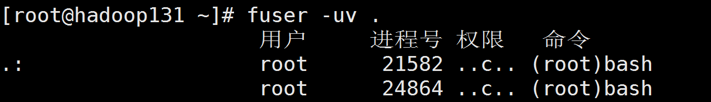

权限有几种：c代表此进程在当前的目录下、e代表可被触发为执行状态、f是一个被开启的文件、r代表顶层目录、F代表文件被开启但在等待回应中、m代表可能为分享的动态函式库。

查找有多少进程占用当前文件系统：`fuser -muv 目录`，这个m选项会直接向上找到文件系统的最高层。输出的格式和上面的一样。当无法取消挂载时，可以用这个命令查看进程然后一个一个清除。

查看存取单个文件的进程：`fuser -uv 文件`

### 从进程查文件lsof

列出某个进程打开或使用的文件信息`lsof [选项]`，选项：

-c 字符串： 只列出以字符串开头的进程打开 的文件
-u 用户名： 只列出某个用户的进程打开的文 件
-p pid： 列出某个PID进程打开的文件

查看系统中所有被开启的文件：`lsof`

列出关于root的进程开启的socket：`lsof -u root -a -U`，这里-U代表找出socket文件，-a代表同时满足多个限制。

列出所有被进程启动的装置：`lsof +d /dev`

# 服务

## 服务的分类

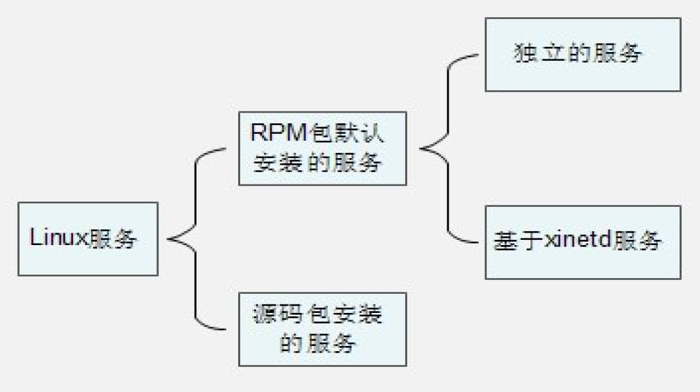

RPM包服务和源码包安装服务的区别很多，启动和设置都不同，这种差异主要在于安装时RPM包会选择默认位置，卸载时也有专门的命令；而源码包一般安装在/usr/local/，卸载时也只需要删除文件。

独立的服务是将服务直接注册在内存中，用户访问服务，服务响应，好处是响应较快，但需要占用内存。基于xinetd服务是由一个独立服务xinetd管理的，用户访问被管理的服务需要首先访问xinetd，再访问具体服务，好处是不需要太多内存，但响应速度慢。

查看RPM包服务的自启动状态（所有的服务都会列出，它也可以用来查询系统中所有安装的RPM服务）：

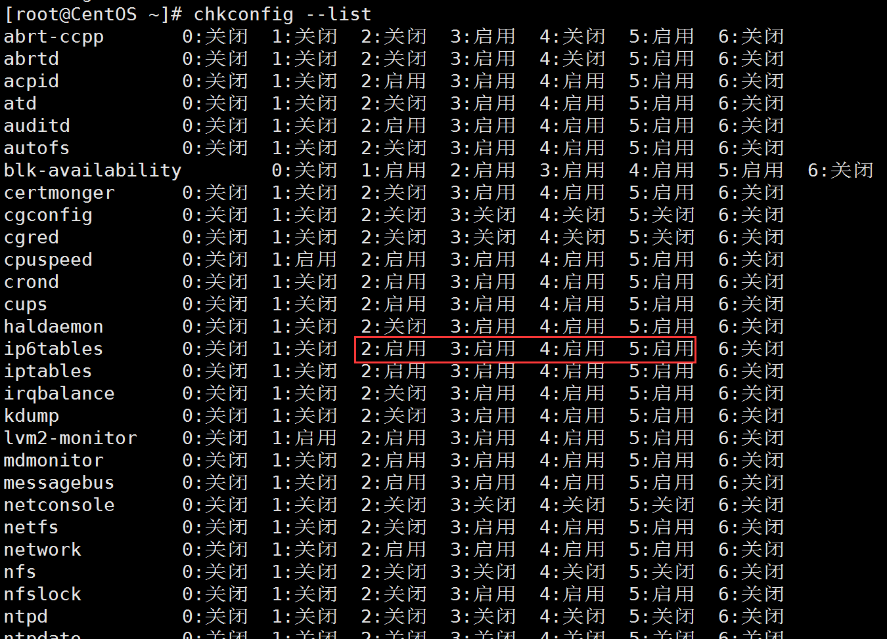

如果2 3 4 5任意一个是启用，说明该服务会随着服务器启动而启动，但是不代表现在该服务就是运行的。

查看服务是否运行：`ps aux`，列出的服务就是运行中的。

还可以查看`netstat -tlun`查看端口使用情况，如果该服务运行会开启端口，可以根据端口情况判断服务是否启动。

服务常用各文件（启动、配置文件、数据文件、日志等）位置：

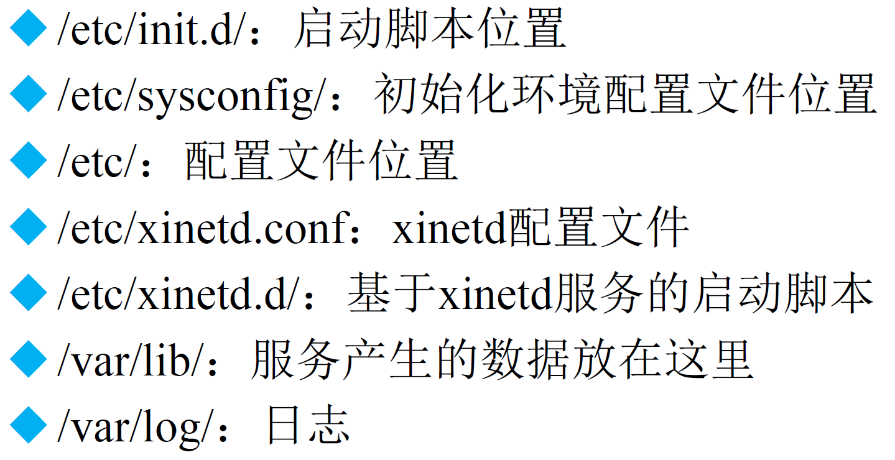

## 独立服务

独立服务的启动、关闭、重启、查看状态：

`/etc/init.d/独立服务名 start|stop|status|restart|`或

`service 独立服务名 start|stop|restart|status`（后者是redhat专有的命令，和第一个作用相同）

status代表查看服务的状态，同时查看占用的进程号。

查询所有独立服务的状态：`service --status-all`

独立服务设置自启动有三种方法：

1、`chkconfig --level 2345 [独立服务] [on|off]`可以关闭或开启自启动。

2、修改/etc/rc.d/rc.local文件，这个文件中的命令会在登录前执行，只要加上对应服务启动的命令，下次开机就会自动启动服务。（推荐该方法，如果所有自启动设置都总结在该文件中，查看较方便，可以避免不同安装方式的相同服务启动两次），这个文件还可以写入环境变量的修改，但是优先级较低。

3、执行ntsysv命令，会出现图形化界面，在想自启动的服务前加上*即可。（这个方法可以同时管理独立服务和xinetd服务）

## 基于xintd服务

想要使用基于xintd服务，必须先安装xintd，再安装基于此的服务。

启动方法，以telnet服务为例，修改文件/etc/xinetd.d/telnet，将disable=yes改为no，保存后重启xintd服务：

`service xinetd restart`，这样就能完成启动。

自启动方法有两个：

1、`chkconfig telnet on`

2、执行ntsysv命令

xintd服务的启动和自启动是相通的，开启服务会自动开启自启动，开启自启动服务会自动启动。

## 源码包服务

源码包服务启动时应该使用绝对路径启动脚本`/usr/local/apache2/bin/apachectl start|stop`，不同的服务脚本名也不同，此时需要查看安装说明查看启动脚本的方法。

源码包服务的自启动也需要在/etc/rc.d/rc.local文件中加入启动命令。

如果想让service命令也能管理源码包服务，需要在service命令扫描的目录下添加一个链接文件，以apache服务为例：

`ln -s /usr/local/apache2/bin/apachectl /etc/init.d/apache`但是这样做会弄混两种服务，因此不建议。

service服务也可以被chkconfig与ntsysv命令管理自启动，此时需要修改新建的链接文件/etc/init.d/apache，在首行下加入两句话：

```bash
# chkconfig: 35 86 76
# description: source package apache
```

三个数字分别是运行级别，启动顺序和关闭顺序。两个顺序数字不能和其他服务重合，查看/etc/rc.d/中有rc0.d、rc1.d。。。rc6.d文件，对应6个运行级别，应该查看rc3.d文件中的顺序，然后再进行设置。最后把源码包apache加入chkconfig命令：`chkconfig --add apache`

## 服务管理总结

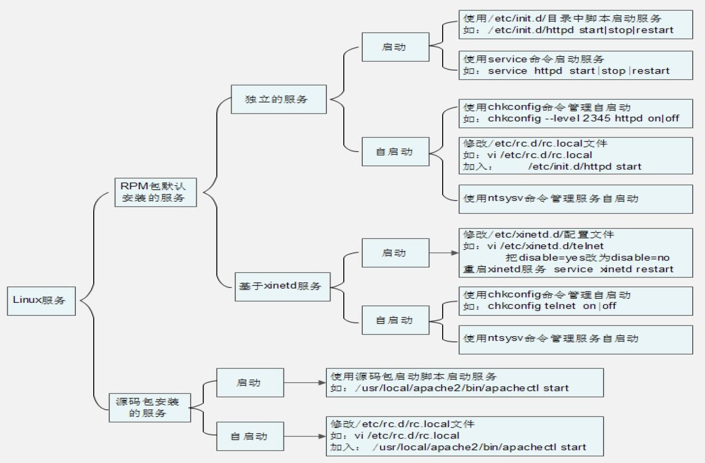

## systemd管理的特点

CentOS7的新的systemd弃用了原来的init启动脚本的方法，init的管理机制有如下几个特点：

1、服务启动脚本都放在/etc/init.d/下

2、服务被分成独立启动的服务和基于xinetd或inetd的服务两种

3、服务存在相依性问题，需要管理员手动解决

4、存在执行等级的分类，可以根据用户自定义的执行等级来唤醒不同的服务，直接执行`init 5`就能切换

5、用chkconfig命令来管理自启动

新的systemd管理机制的特点：

1、systemd可以让所有服务同时启动，系统启动的速度变快了

2、服务不再区分，统一由systemd指令来管理

3、服务相依性自动检测

4、systemd定义所有的服务为一个服务单位（unit），并将该unit归类到不同的服务类型（type）中，systemd将服务unit区分为多种type，包括service、socket、target等

5、systemd可以兼容旧的init脚本

6、systemd也有一个类似于runlevel的设计，systemd将许多功能集合整合成一个target项目，通过执行该target来执行好多个服务。

新的systemd也有一些弊端：

1、runlevel并没有做到完全对应

2、新的systemd全部用systemctl这个管理程序管理，systemctl不可自定义参数

3、没有用systemctl启动的服务，systemd无法监测到

4、systemd启动过程中无法与管理员进行交互，自行编写启动设定时应该取消互动机制

## systemd相关目录和unit类型

systemd将服务执行脚本称为一个服务单位unit，每种服务根据功能来划分成多种type，相关的配置文件主要放在：

1、/usr/lib/systemd/system/：每个服务最主要的启动脚本设定

2、/run/systemd/system/：系统执行过程中产生的服务脚本，优先序比上一个目录高

3、/etc/systemd/system/：管理员根据主机需求所建立的执行脚本，执行优先序比上一个高

4、/etc/sysconfig/*：服务初始化的一些设置会放在该目录

5、/var/lib/：一些产生数据的服务会将数据写入该目录中，如数据库文件

6、/run/：服务暂存档的位置

7、/usr/share/doc/：相关服务信息、软件配置和说明

系统开机到底会不会执行某些服务要看/etc/systemd/system/底下的设定，该目录下是一大堆连结档，实际执行的脚本都是放在/usr/lib/systemd/system/中。

unit类型可以通过看/usr/lib/systemd/system/下文件的扩展名来分辨：

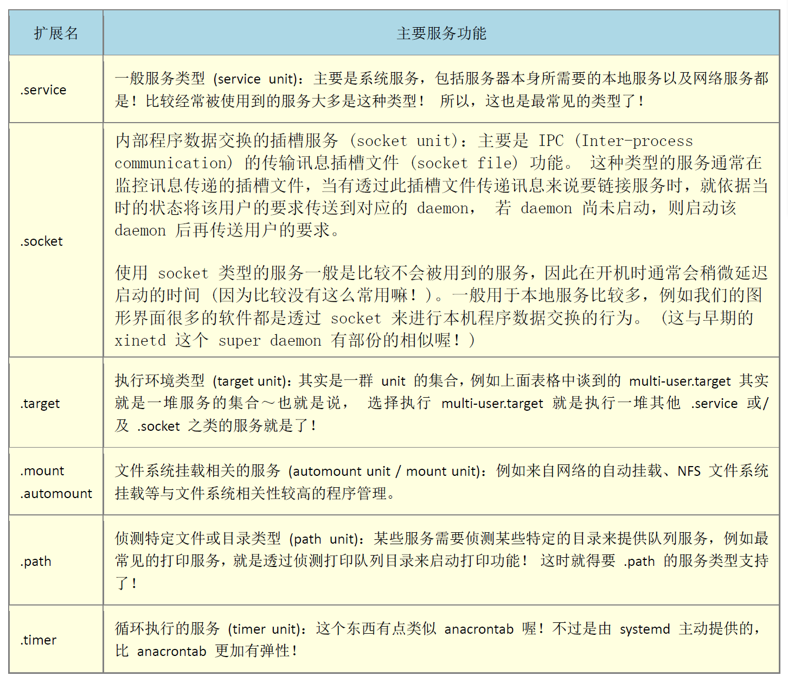

socket服务会产生一些socket file，查找所有的socket file：`systemctl list-sockets`

## systemd管理服务和查看服务

查看服务状态：`systemctl status atd.service`。
结果的第二行会显示服务的预设状态，enable为开始自动执行，disabled为开机时不会被执行，static为该服务不可以自启动，需要其他服务唤醒，mask为该服务已经被强制注销。

结果的第三行会显示服务目前的状态，active（running）为该服务的一只或多只程序正在运行，active（exited）为仅执行一次就正常结束的服务，如开机、挂载或自定义脚本，active（waiting）为正在执行中，但是需要等待其他事件，inactive为服务没有运作。

正常关闭服务：`systemctl stop atd.service`

开启/重启服务：`systemctl start/restart 服务`

重新加载服务配置文件：`systemctl daemon-reload`

设置开机启动/开机不启动：`systemctl enable/disable 服务`

注销服务/恢复正常：`systemctl mask/unmask 服务`

列出系统上所有启动的unit：`systemctl`

列出所有已经安装的unit：`systemctl list-unit-files`

只列出service这种类别的服务：`systemctl list-units --type=service --all`

## 不同的操作环境target unit

主要的操作环境相关的target unit主要有以下几个：

1、multi-user.target：纯文本模式

2、graphical.target：文字加图形界面

3、救援模式rescue.target和emergency.target

查看默认的模式：`systemctl get-default`

设置默认的模式：`systemctl set-default multi-user.target`

在不重新启动的情况下，将目前的操作环境改为纯文本模式：`systemctl isolate multi-user.target`

systemd提供了一些简单的切换命令：

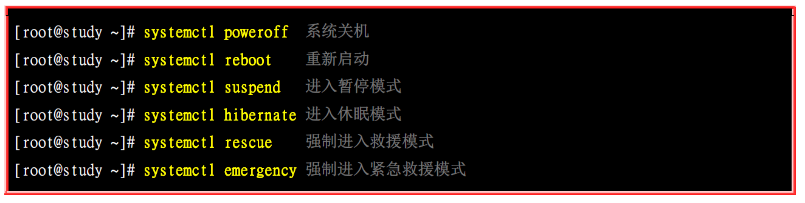

暂停模式和休眠模式的区别：暂停模式是将系统的数据保存在内存，然后不关机，唤醒后重新加载；休眠模式是将系统的数据保存在硬盘中，然后关机，重新启动后把数据从硬盘中读出。

## 各服务的依赖性检查

列出所有的服务依赖性：`systemctl list-dependencies`，一行稍靠前的部分是服务A，靠后是服务B，列出的信息表示服务A用到了一系列服务B，这类关系还可以反向查看，也就是哪些服务用到我：`systemctl list-dependencies --reverse`

查看单一服务的依赖性，如查看graphical.target用到了哪些服务：

`systemctl list-dependencies graphical.target`

# 工作排程

## 单一工作排程at

### atd服务

使用单一工作排程时必须先开启atd服务。

查看atd服务目前的状态：`systemctl status atd`

重新启动atd服务：`systemctl restart atd`

设置atd服务开机启动：`systemctl enable atd`

### 执行at的过程

当执行at指令时，会把工作以文本文件的形式写入/var/spool/at/目录下，该工作就会被atd服务调用并执行。

一般来说要对at的使用进行限制，因为黑客经常使用工作排程收集信息，为了限制at的使用，可以增加/etc/at.allow和/etc/at.deny两个文件，在执行at时会先找到/etc/at.allow文件，写在该文件中的使用者才能使用at，不在该文件中就不能使用at。如果/etc/at.allow文件不存在，则会查找/etc/at.deny文件，写在该文件的使用者不能使用at，否则就可以使用。如果两个文件都不存在，那么只有root才能使用at指令。

在一般的linux系统中，只会存在一个空的/etc/at.deny，意味着所有人都可以使用at指令。

### at的用法

五分钟后执行任务：`at now + 5 minutes`

设置具体时间：`at 23:00 2015-08-04`

执行at命令后会开启at shell环境，用户可以在其中下达指令，这种状态下回车不会结束，按ctrl+d会结束命令输入。注意输入命令时要用绝对路径来下达指令，避免环境变量更换带来的问题。此外在at中下达echo命令不会在规定时间打印到控制台，这是因为at此时的环境与终端无关，所有的输出都会送到执行者的mailbox中，此时应该检查终端机的装置，把echo替换成`echo "Hello" > /dev/tty1`

在设置完at任务后，可以看见job的号码，执行`at -c 2`可以查看第2个job在执行时的一些附加指令内容，包括环境变量的设置等。

查看主机上多少at工作排程：`atq`，此时每行的第一个数字为工作号码

移除at工作排程：`atrm 工作号码`

### 背景执行与batch命令

at有一个很大的优点是背景执行，当远程连接到linux执行at任务时，即使连接中断也不会影响at任务的执行，这是因为at工作独立于当前的bash环境，直接交给系统的atd程序接管。

batch命令效果和at相同，不能加时间参数，而是在CPU工作负载小于0.8时，才进行你所下达的工作任务。相当于自动在系统空闲时执行任务。（工作负载是CPU所负责的工作数量）

## 系统定时任务crontab

系统中的crontab（cron/crond）服务是定时相关的，它是自动开启的，要使用定时任务必须确保其开启。

### 执行crontab的过程

和at命令一样，crontab也可以建立两个配置文件：/etc/cron.allow和/etc/cron.deny，前者比后者优先级要大，系统会默认建立一个/etc/cron.deny，执行crontab命令时会先检查这两个文件是否有执行权限。

当用户执行crontab时，工作内容就会记录到/var/spool/cron/里去，根据用户名的不同被记录到不同的位置，如abc用户的工作被记录到/var/spool/cron/abc中，这些文件都无法直接用vi编辑。可以经常检查一些这些位置，如果有来源不明的文件可能是感染了木马。

### crontab的用法

crontab命令执行格式：`crontab [选项]`，-e代表编辑crontab定时任务，-l代表查询crontab任务，-r代表删除当前用户所有的crontab任务。

进入编辑状态后可以编辑定时任务，相当于使用的是vim编辑器，此时的格式是`* * * * * 执行的任务`，五个*代表指定任务执行的时机。

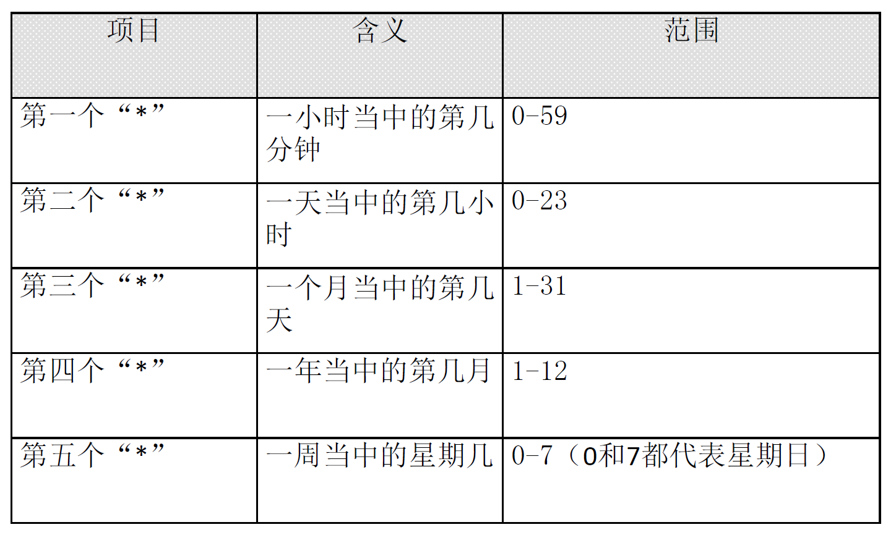

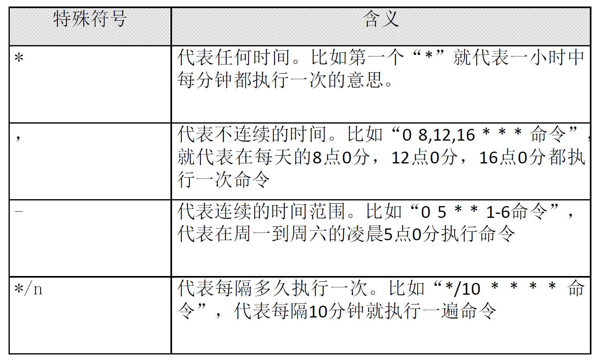

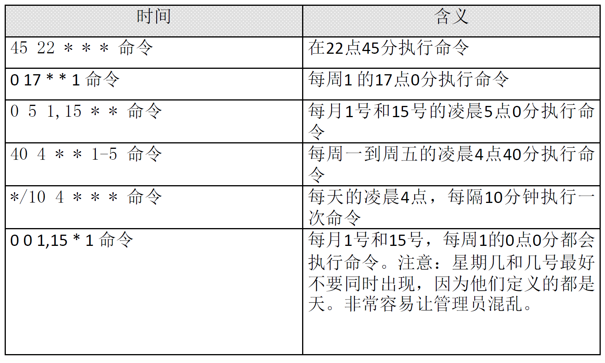

分钟数一般不能为*，否则代表每分钟都执行一次。

10 * * * *代表1点10分执行、2点10分执行。。。

星期几和几号同时出现时，只要一个满足要求就会执行。

常常用定时任务来执行脚本，但是注意当脚本中有date命令时：

`date=$(date +%y%m%d)`这个命令在定时执行时必须在%前加转义符：`date=$(date +\%y\%m\%d)`，因为对crontab命令来说%有特殊作用。

通过命令删除定时任务时只能删除全部，不能删某个，此时要编辑定时任务来删掉对应命令。

### 其他配置文件

之前的/var/spool/cron/内部记录的是各用户的定时任务，如果要执行系统的例行性任务可以直接修改文件/etc/crontab，cron服务每分钟会检查/var/spool/cron/和/etc/crontab中的内容并执行。（有时也会遇到不能执行的情况，此时可以重启crond服务：`systemctl restart crond`）

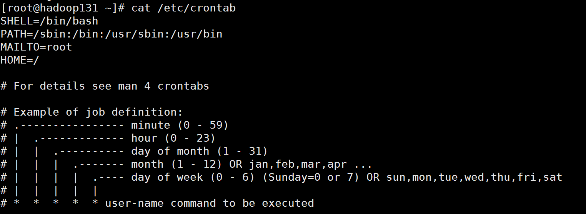

第一行指定了使用哪种shell；第二行重新定义了PATH；第三行的意思是例行性工作指令发送错误时，错误讯息会给root发一封邮件；重点的是设置例行任务的格式，在要执行的命令前多了一个用户名，代表执行命令的指令是以什么身份。

与例行任务有关的还有一个目录/etc/cron.d/*，开发软件时会把一些定时任务配置文件放入其中。

/etc/cron.hourly/、/etc/cron.daily/、/etc/cron.weekly/、/etc/cron.monthly/里面可以放一些脚本，系统会每小时、每天、每周、每个月自动执行。

### 资源不均问题

如果执行多个定时任务时可能会出现几个任务同时执行，使系统很繁忙，可以这样设置定时任务让多个任务错开执行：

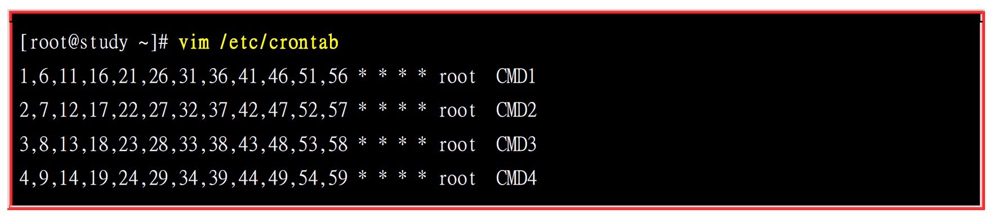

### anacron程序

假如有一个备份的定时任务要深夜执行，但是却遭遇停电，重新启动linux后，如果还想让该备份任务执行而不是直接跳过，就要用到anacron。它可以处理因某些原因超过时间而没有执行的排程工作。

anacron会定期执行，而且会读取时间记录文件，查看上次执行anacron是什么时候，如果发现中断了一段时间，系统就认为定时任务没有执行，anacron就会开始执行未开始的定时任务。

anacron本质上是一个程序，默认一小时执行一次，该脚本在/etc/cron.hourly/0anacron，这个脚本内部会执行：`/usr/sbin/anacron -s`这个命令，这个命令会根据配置文件的值执行一系列job。这个配置文件就是/etc/anacrontab：

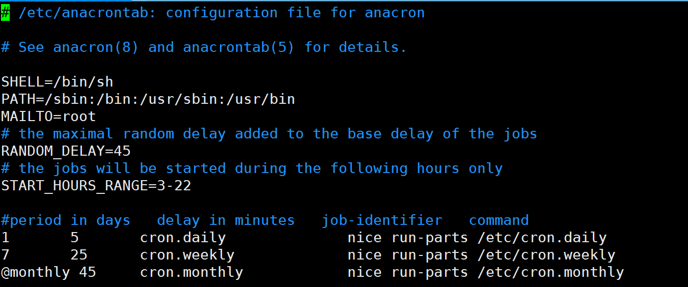

RANDOM_DELAY=45代表随机给予最大延迟时间是45分钟

START_HOURS_RANGE=3-22代表延迟3-22个小时执行任务

最下面三行代表每日、每周、每个月都要执行对应目录下的脚本，第一个数字是天数（超过1天就要执行每日任务，这代表每日定时任务因为某些原因被推迟了，超过7天就要执行每周任务。。）、第二个数字是延迟时间（决定执行定时任务后延迟5分钟后开始，避免刚刚开机任务密集）、第三个字段是任务名称、最后是实际执行的指令，代表执行对应文件夹下的全部指令。

以上述文件倒数第三行为例，anacron的大致执行流程如下：

1、从/var/spool/anacron/cron.daily中取出最近一次执行anacron的时间戳，与/etc/anacrontab中的天数对比，如果超过就决定执行指令。

2、根据/etc/anacrontab中的设置，要延迟3小时+5分钟执行每日任务

3、run-parts命令会在约5分钟内随机选一个时间执行/etc/cron.daily/中的全部任务

综上所述，如果仅仅是执行crontab命令则不会执行错过的任务，但是如果把脚本放置在/etc/cron.daily/、/etc/cron.weekly/、/etc/cron.monthly/下，就会在开机后主动执行，这也就是为什么开机一段时间后开始运行很多任务的原因，就是因为很多系统定时任务都是以anacron程序的方式执行。

# 工作管理

工作管理是在单一终端机接口处同时进行多个工作的行为管理，其实同时开启多个终端机一样能同时完成多个任务，但是由于某些情况下可能限制用户只能开启一个终端机接口，此时就要用工作管理。

在进行工作管理时，所有的工作都是当前bash的子进程，当前的工作管理无法从终端tty1管理tty2，进行工作管理有几个限制条件：

1、这些工作所触发的进程必须来源于当前shell的子进程

2、可以放入背景运行的工作不能等待系统交互，也不能用ctrl+c终止

## 丢到背景执行：&

在执行的命令后加&可以直接将任务放在后台执行，执行这条语句后前台会打印一个用中括号括起来的job号码和指令触发的PID，有时虽然任务被放到后台，但是输出信息还是会挤满前景，此时可以将输出信息重定向到一个文件中，然后放入后台执行，这样可以保证其他指令输入时不被打断：

`tar -zpcvf /tmp/etc.tar.gz /etc > /tmp/log.txt 2>&1 &`

## 丢到背景中暂停执行：ctrl+z

按ctrl+z可以将命令放在背景中，执行后会出现中括号括起来的job号码。

## 控制job的运行

显示后台运行的程序：`jobs -l`，-l的意思是显示pid。jobs命令会显示多行，一行代表一个后台工作，行首代表后台工作编号，后面会跟一个+或-，也可能没有符号标记，+代表最后放入后台的工作（也是恢复时首先恢复的），-代表倒数第二个放入后台的工作。每个job都会有对应的状态，Running代表后台运行，Stoppd代表暂停。

恢复后台运行的程序：`fg %工作号`不加%代表恢复+对应的后台工作。

让后台暂停的工作恢复到后台执行：`bg %工作号`（这个命令必须不能和前台有交互才能恢复到后台执行，如top）

强制移除后台任务：`kill -9 %job号`，正常结束后台任务：`kill -15 %job号`

## 脱机管理

之前的所有放入后台的程序仅仅是将任务放到当前bash的背景下运行，而不是放到系统的背景中运行，也就是说远程连接到linux将任务放到背景中执行，断开和linux的连接会导致这些任务中断，如果想断开连接后继续生效，可以用at指令，也可以用nohup指令：`nohup 命令 &`

这个指令的效果就相当于放入后台执行，只不过退出登录后依然在执行，但是注意nohup不支持bash内建的命令。

# 日志

## 系统日志

linux中的日志服务是rsyslogd，它取代了原来的的syslogd，rsyslogd服务是默认自启动的。

常见日志的作用：

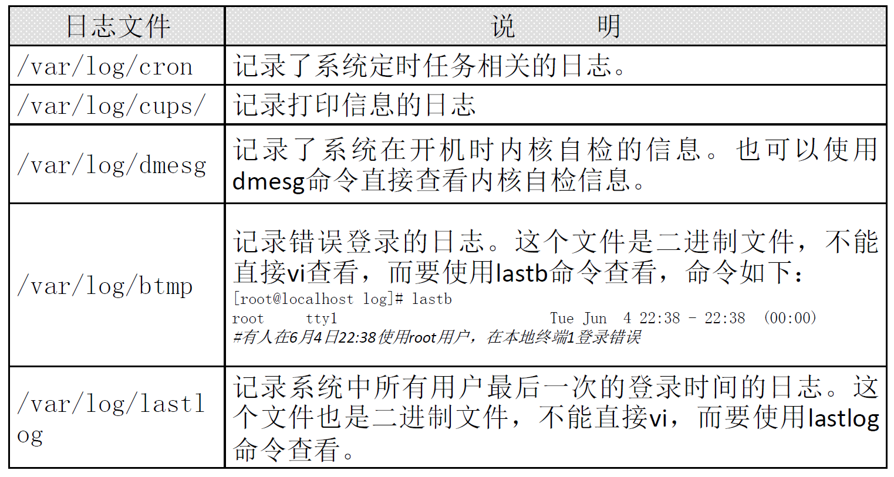

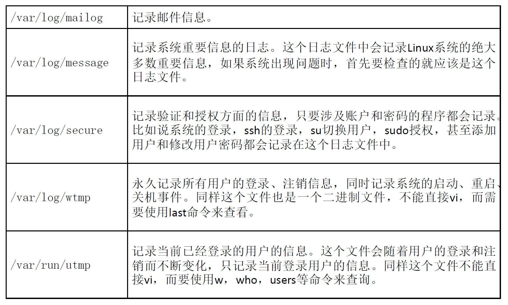

除了系统默认的日志之外，采用RPM方式安装的系统服务也会默认把日志记录在/var/log/目录中（源码包安装的服务日志是在源码包指定目录中）。不过这些日志不是由rsyslogd服务来记录和管理的，而是各个服务使用自己的日志管理文档来记录自身日志。

基本日志格式一般是事件发生的时间+主机名+服务名或程序名+事件的具体信息，如/var/log/secure：

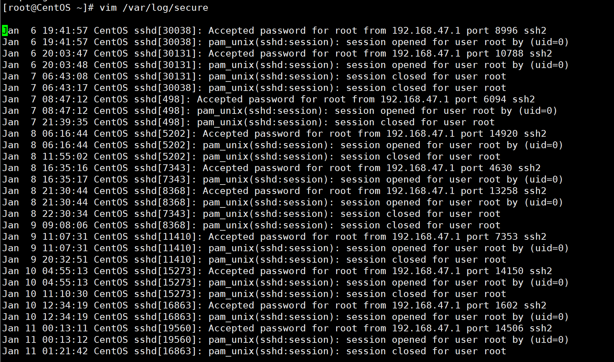

配置文件/etc/rsyslog.conf记录系统日志的作用和位置：

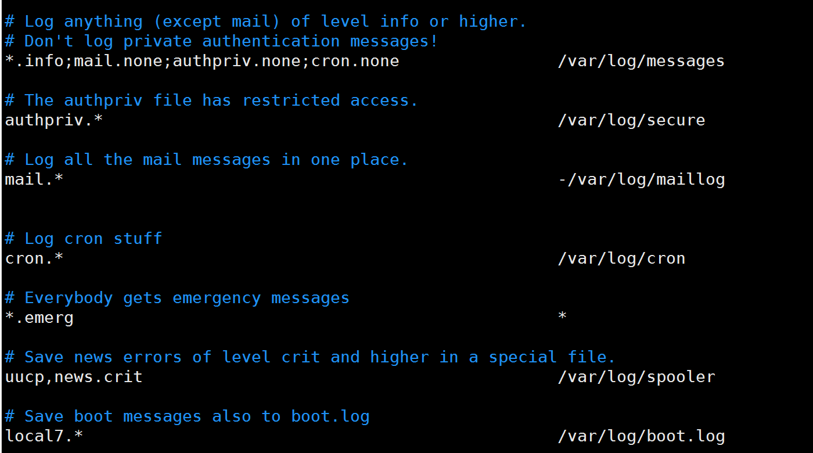

白字代表一种日志，如`authpriv.* /var/log/secure`，它是按照：`服务名称[连接符号]日志等级 日志记录位置`来记录的，authpriv代表这是认证相关服务，其他服务如下：

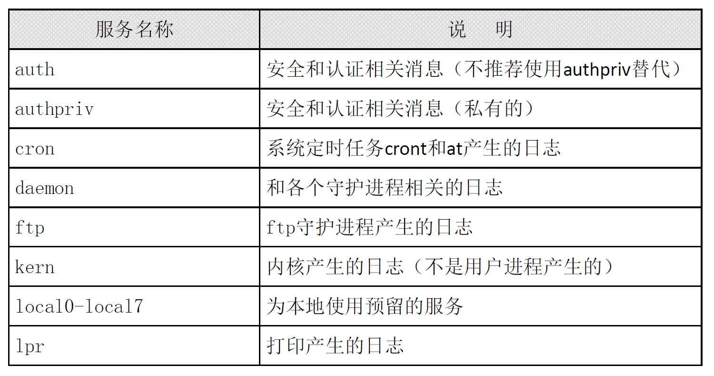

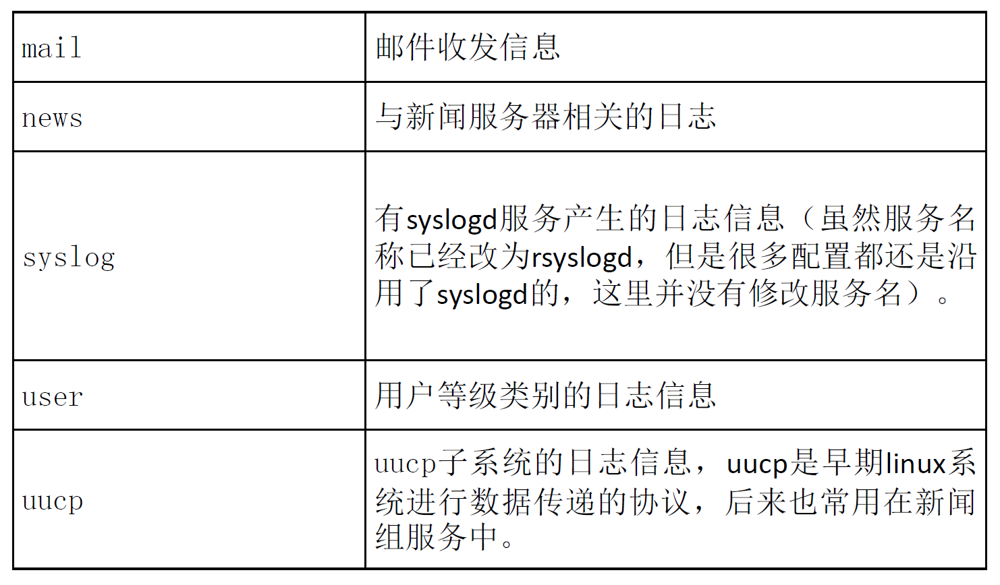

连接符：


.\*代表所有日志等级都记录，*实际上不是日志等级，而是通配符。

日志等级：

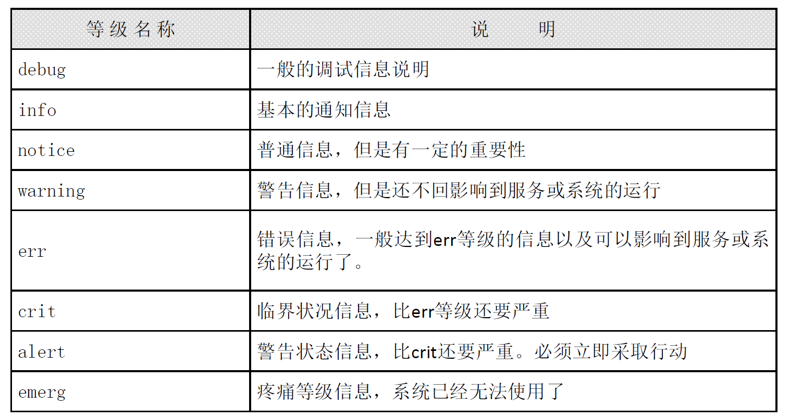

从debug到emerg日志等级越来越高，等级越高记录的内容越少，优先处理的级别越高，危害越大。

日志记录位置：

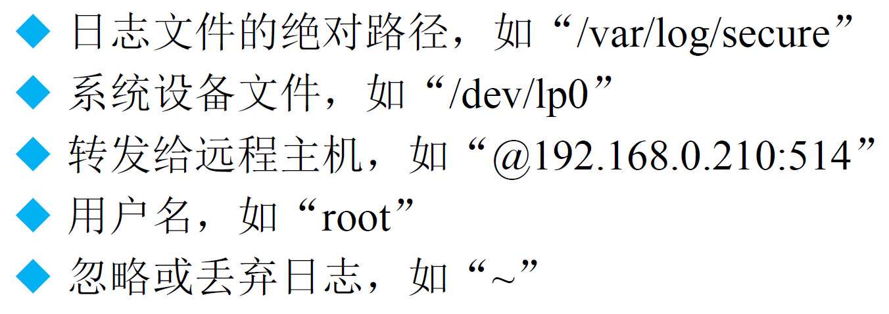

## 日志轮替

日志文件很大时打开可能会死机，保持日志可用一般要同时采用两项措施：

1、日志切割。把每天或每周的日志单独保存为一个文件，保证文件不过大。

2、日志删除。把多余的日志定期删除，防止占满磁盘。

如果配置文件中拥有“dateext”参数，那么日志会用日期来作为日志文件的后缀，例如“secure-20130605”，最新生成的日志文件名总是secure，当重复生成日志时，前一个日志会被命名，而新日志名依然是secure。

如果配置文件中没有“dateext”参数，那么日志会简单的加上数字来区分，如“secure.1”，新生成的日志名总是secure，每次新生成都会依次修改所有日志名，即secure改名为secure.1，secure.1改名为secure.2。

配置文件/etc/logrotate.conf中记载了日志轮替相关设置，其中关键字如下：

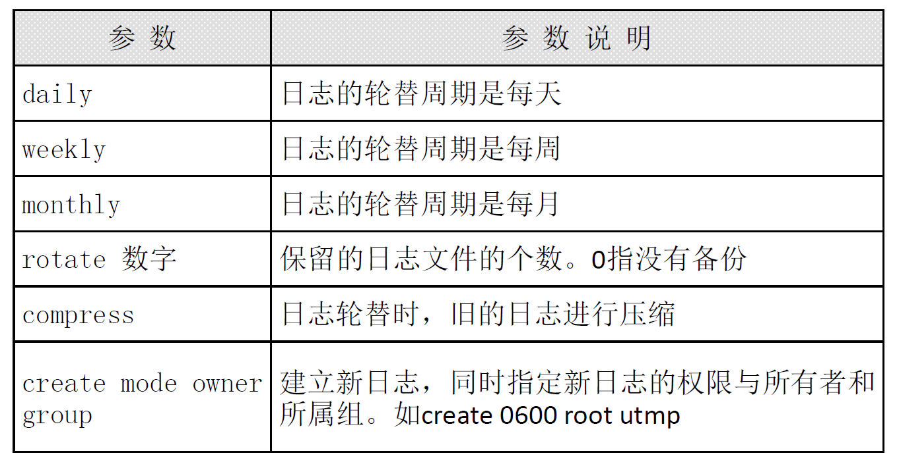

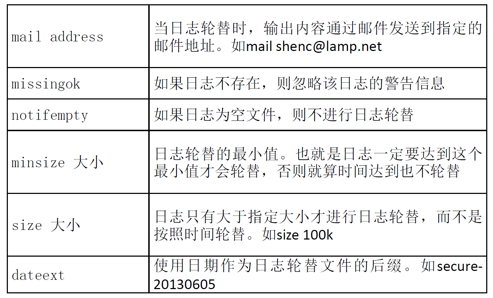

源码包的日志轮替需要手动设置，以apache为例，应该在上述配置文件中加入：

```bash
/usr/local/apache2/logs/access_log {
	daily
	create
	rotate 30
}
```

第一行是要备份的日志，一个应用可能存在多个需要备份的日志，大括号内的词代表每天备份一次，建立新日志，保留日志文件的个数为30。

# 挂载与swap空间

## 挂载

### 挂载与卸载

直接执行mount或加-l会显示当前挂载信息，每行都是一个挂载设置，第一个字段代表设备文件名，第二个字段是on，然后是挂载点位置、文件系统、权限。

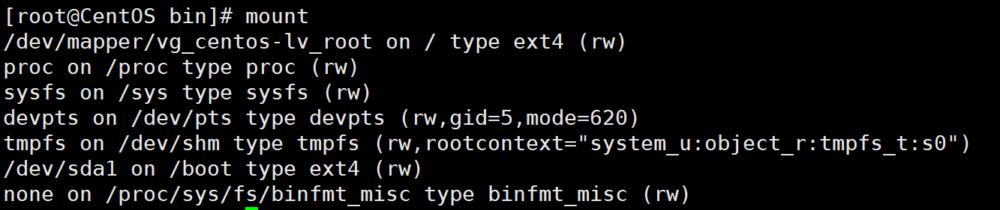

/proc和/sys都是挂载在内存。

挂载命令`mount [-t 文件系统] [-L 卷标名] [-o 特殊选项] 设备文件名 挂载点`文件系统是固定的，如果是硬盘就是iso9660，卷标名可以没有，特殊选项有两个要注意的，一个是remount表示重新挂载，修改特殊权限后需要进行该操作；还有一个是exec/noexec表示该文件系统中可执行文件可以执行或不能执行，默认是可以执行的。

挂载点就是一个空目录，这个空目录可以是根目录下的mnt（建议U盘和移动硬盘）或media（软盘或光盘），也可以在mnt下新建空目录进行挂载，因为早期只有mnt一个建议挂载目录。（这个目录下如果有文件那么在挂载完成后这些信息会被隐藏，直至卸载又重新出现）

挂载光盘命令：`mount -t iso9660 /dev/cdrom /mnt/cdrom/`设备文件名是固定的，就是/dev/cdrom，或者写/dev/sr0，cdrom是指向sr0的软链接文件，如果有两个光驱另一个就对应cdrom1和sr1。挂载光盘命令也可以省略文件系统：`mount /dev/cdrom /mnt/cdrom/`

linux真实机直接按光盘弹出按钮是无效的，必须先进行卸载。卸载时要先退出光盘文件，然后执行：

`umount 挂载点或设备文件名`

挂载U盘时首先要把U盘插入，注意如果此时是用虚拟机操控linux的话就必须鼠标点击到虚拟机内部，然后再插入U盘，否则是windows识别U盘。因为U盘的设备文件名和硬盘用同一个，所以要先执行`fdisk -l`来查询此时U盘的设备文件名，执行后显示sda为linux中的硬盘，而sdb是识别的U盘，设备文件名应该是sdb1。然后执行挂载U盘命令`mount -t vfat /dev/sdb1 /mnt/usb/`

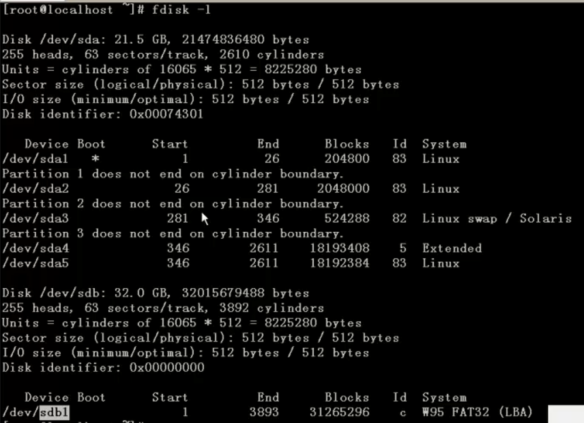

如果硬盘是NTFS系统，则linux不能识别，必须安装对应的驱动。

用mount挂载时也可以用`mount UUID=xx 挂载点`，这样该命令就会重复使用，而不会因为系统每次识别设备的装置名不同而修改挂载命令。mount也可以用LABEL来挂载。

在CentOS7中已经无需指定文件系统类型，直接mount命令后加设备文件名和挂载点即可，linux会自动分析最恰当的文件系统来挂载。

mount命令也可以把一个目录挂载到另一个目录下：`mount --bind 目录a 目录b`，这样进入目录a就相当于进入目录b，而且如果这样做的话两个目录的inode也会相同，这和硬链接非常像，但是对于某些不支持链接的程序而言，只能用mount命令挂载目录。

### 自动挂载

要进行自动挂载需要修改/etc/fdisk文件。

文件每一行的字段的意义：

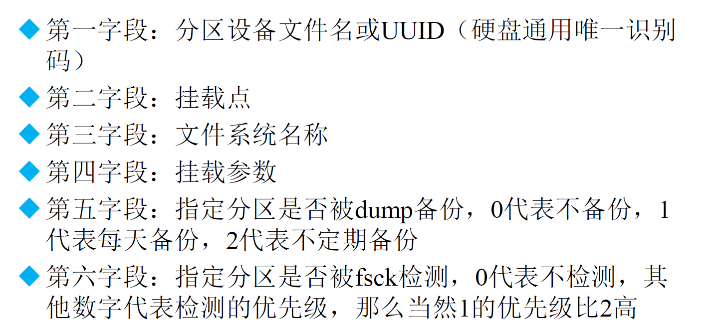

查看分区的UUID需要执行`dumpe2fs 设备文件名`，执行结果中的FilesystemUUID就是分区的UUID。

要进行自动挂载只需要把要挂载的写入该文件中即可，注意要遵循该文件格式：

`/dev/sdb5 /disk5 ext4 defaults 1 2`

然后执行重新挂载命令查看是否文件中有错误：`mount -a`如果没有错误就没有提示，如果文件错误且不修改那么开机时系统就会崩溃。如果开机时有错误，那么就输入root的密码，然后执行修复命令：

`mount -o remount,rw /`，最后修改/etc/fdisk文件即可。（不能直接修改的原因是挂载时该文件被设置为只能读，故要重挂载修改其权限）

### 设置开机挂载

设置开机挂载需要修改配置文件/etc/fstab：

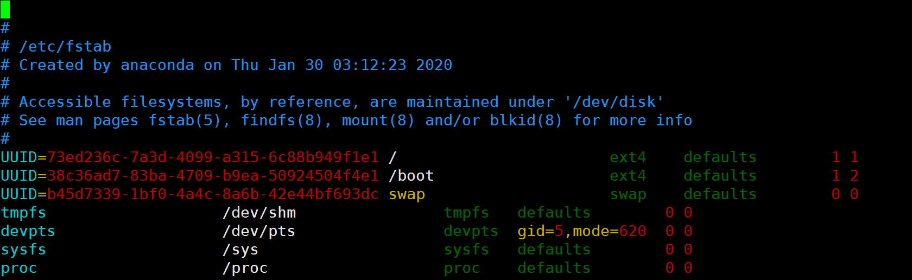

从左到右的字段分别是磁盘装置文件名/UUID/LABLE、挂载点、文件系统、文件系统参数（mount命令后的参数）、能否能被dump备份（一般设置为0即可，因为现在备份方案太多了）、是否以fsck检查扇区（在开机中检查文件系统是否完整，xfs系统并不适用这个命令，所以一般为0），每次要设置自动挂载时都要把挂载信息写到该文件中，开机之后就会自动挂载了，挂载完成后还会吧挂载信息写入/etc/mtab和/proc/mounts中。

如果该配置文件写入有误导致无法顺利挂载开机，就要进入单人模式，然后修改根目录挂载点的权限为读写，然后修改该配置文件即可：

`mount -n -o remount,rw /`

### 特殊装置loop挂载

挂载iso映像文件：`mount -o loop 映像文件路径 挂载点`

使用完iso映像文件记得卸除：`umount 挂载点`

不仅可以用loop挂载映像文件，还可以挂载大文件，相当于创造一个分区槽，下面是大文件挂载的步骤：

1、首先建立大型文件，可以用dd命令：

`dd if=/dev/zero of=/sev/loopdev bs=1M count=512`

if是输入文件，意思是一个一直输出0的装置；of是输出文件，也就是即将生成的大文件路径；bs是block的大小；count是block的数量。

执行完毕后就生成了一个512M的大文件。

2、然后格式化大文件：`mkfs.xfs -f 大文件路径`

可以用blkid加大文件路径来查看装置的UUID值

3、最后进行挂载：`mount -o loop UUID="xx" 挂载点`这里也可以用装置名来挂载。

## swap内存置换空间

当内存不足时，为了让后续的程序可以继续执行，就会将暂时不用的程序和数据移动到硬盘的内存置换空间中，一般来说，硬件资源充足时一般用不到swap，但是最好还是预留一部分用来应对特殊情况。

此外，休眠时也会将运行状态记录到swap中，而且有些程序在运行时，会利用swap来存放一些数据段。

如果安装系统时没设置swap，就需要设置一个swap分区，或者当分区不足时用大文件来充当swap。

执行命令查看swap空间的情况`free -m`：

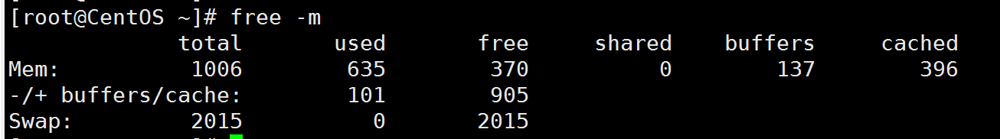

Mem是内存，buffers是缓冲区（指写入数据时先将数据写入内存中的缓冲区，然后再一次性写入磁盘中），cached是缓存区（指读取数据时将数据存在内存，下次读时就直接读取内存中的数据即可）。

分配swap空间就是在进行分区时修改分区ID（分区默认是83，应该改成82就是swap分区），在分区时输入t修改分区ID，然后指定分区编号即可。swap分区设置完成之后需要进行重启，或执行`partprobe`命令，然后再执行`mkswap /dev/sdb1`格式化，其中sdb1就是刚刚设置swap空间的那个分区。

然后将空间加入swap分区：`swapon /dev/sdb1`，将swap分区释放`swapoff /dev/sdb1`

但是这种设置只能维持到关机，想要永久生效还是要修改文件/etc/fstab，加入一行：

`/dev/sdb1 swap swap defaults 0 0`

# 文件系统概述和EXT2文件系统

## 文件系统概述

常用的文件系统有windows98前的FAT、windows2000后的NTFS、linux的Ext2/3/4、SGI的XFS文件系统等

对于传统的文件系统而言，一个分区槽只能格式化为一个文件系统，但是目前由于LVM与软件磁盘阵列技术的出现，使一个分区可以对应多个文件系统，故以下关于文件系统的讨论都不表示针对一个分区了，只是介绍文件系统的特性。

linux操作系统会将文件权限、文件属性存在inode中，一个文件对应一个inode，而文件的实际数据会被放入data block中，要读一个文件首先找到该文件的inode，就能迅速找到block，inode中记录了文件数据的实际放置block，这种读取方式就是索引式文件系统：

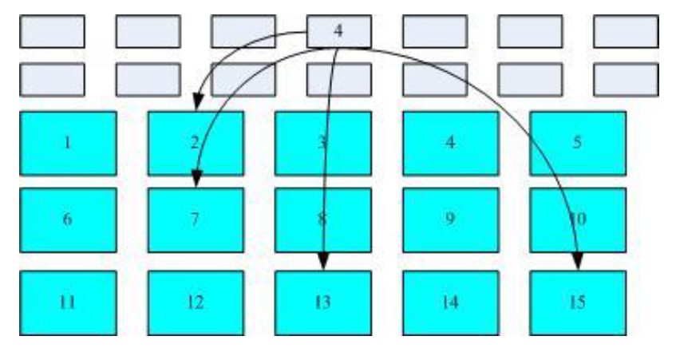

而光盘采用的FAT文件系统没有inode的存在，此时一个文件的存储依赖block之间的联系，读完一个block后才能找到下一个block，如果block很分散读取速度很慢：

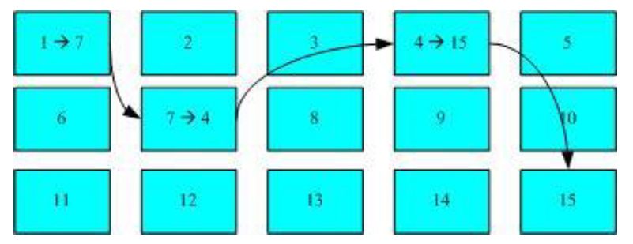

所谓的碎片整理就是因为文件写入的block太分散，导致系统效率不高采取的措施。如果文件太过离散就会降低读取性能，这也是每个分区不宜设置过大的原因。

## EXT2文件系统

ext2系统在格式化的时候分为多个区块群组（block group），然后每个区块群组都有独立的inode和block系统，这是为了处理大量inode和block而做出的应对措施。文件系统示意图如下：

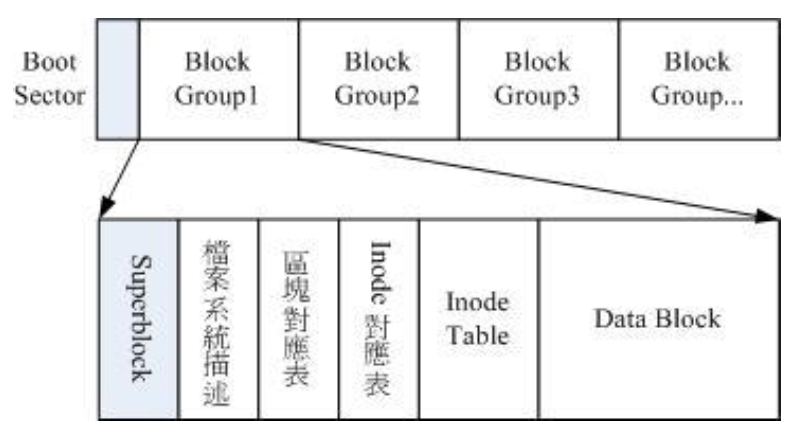

每个文件系统都有一个启动扇区（boot sector），一个block group对应一套独立系统。

### data block

这个区域是文件真正数据存放的位置，ext2所支持的block大小有1K/2K/4K，block本身也记录block编号，所以block越大可记录的编号越多，文件系统最大文件个数也就越多，同时一个文件可占用的block也越多，文件系统能容纳的最大文件限制也越大，因block大小产生的文件系统限制：


一个文件只能占用整数个block，若文件小于block，剩余容量也不能被使用了，因此如果linux平时处理的都是小于1K的文件的话，尽量设置block为1K，这样能最大程度利用磁盘空间，如果平时处理的文件较大，就适当提高block大小，以免block号码存储过多反而导致系统浪费。

用`ll`命令查看文件信息时可以发现文件大小总是1024的整数倍，这就是因为一个文件只能占用整数个block的缘故。

### inode table

每个文件都有一个inode，这里记录的是文件的权限、所有者和所属组、容量、ctime、atime、mtime和block编号。此外每个inode大小是固定为128bytes的（ext4中可以设置为256bytes），因为大小固定，所以一个inode记录的block就是有限的，linux巧妙的用多级索引的方式让一个inode存尽可能多的block：

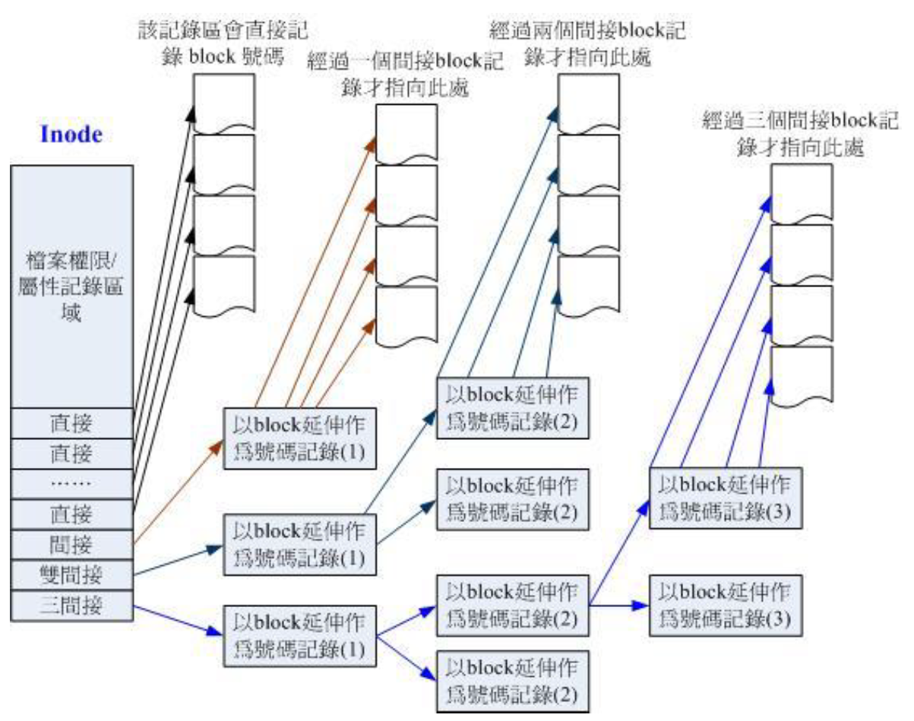

由上图所示，一个inode会有一部分直接指向block的区域，还存在间接、双间接和三间接，也就是inode指向的block不是存储文件数据的，而是存储其他block编号的，就这样极大的扩展了一个inode可指向的block数。

对ext2来说，一个inode最多可有12个直接指向block的区域，1个间接，1个双间接和1个三间接：

直接指向的数据块一共12K，1个间接可以指向的数据块共256\*1K（每个block号码大小为4bytes，相当于一个1K的block最多能存256个block号码），双间接指向的数据共256\*256\*1K，三间接为256\*256\*256\*1K，加起来一共16GB，也就是block大小为1K时文件系统能容纳的最大文件大小。

如果一个文件100K，block大小为4K，那么会分配100/4+1=26个block，因为inode只能有12个直接指向，需要多分配一个block来记录剩余的block号。

### superblock

它是存储文件系统相关信息的位置，它记录了block和inode的总量，使用情况，大小，挂载时间等。一个文件系统只有一个superblock，它一般都在第一个blockgroup中，其他的blockgroup中即使有superblock也仅仅是备份而已。

### filesystem description文件系统说明

它记录了该blockgroup的起始和结束的block号码，以及记录每个区段的superblock、datablock等具体在那些block之间。

### block bitmap区块对照表和inode bitmap（inode对照表）

block bitmap记录了哪些block是空的，inode bitmap记录了哪些inode是未使用的。当新增文件时要修改这两个区域，此外还需要修改superblock，所以这些经常变动的数据被称为metadata**中介数据**。

### dumpe2fs

这个命令可以查询文件系统相关信息，使用前先用blkid命令查看所有被格式化的装置，如/dev/vda1等，然后用dumpe2fs命令后加装置名即可查看该文件系统信息，主要包括superblock信息、每个block group的信息等。但是对于CentOS7来说，预置的文件系统是xfs，需要自己切换成ex4后才能查看。

## 目录树

目录是一种特殊的文件，目录会分配到一个inode和至少一块block，inode记录目录权限和属性，以及目录的block号，而block记录在这个目录下文件的名称和被该文件占用的inode号。

由上可知，目录的inode并不记录目录下的文件名，而是block在记录目录下的文件名，只有进入block中才能对目录下文件进行更名/新增/删除，所以目录的w权限可以对其中文件更名/新增/删除。

读取一个文件/etc/passwd的流程：

通过挂载点信息找到inode号码为128的根目录inode（对XFS文件系统来说，最顶层的挂载点一般inode号为128），进入其中读取根目录的block。然后找到etc/的inode，进而找到etc/的block，然后在该block中找到/etc/passwd的inode，通过inode找到他的block读取数据。这个过程中每次找到inode有相应的r和x权限才能进入目录进行下一步操作。

# 文件系统特点与XFS文件系统

## 支持的文件系统与VFS

通过查看下列目录可以知道linux支持的文件系统：

`ls -l /lib/modules/$(uname -r)/kernel/fs`

查看系统目前已加载到内存中支持的文件系统：

`cat /proc/filesystems`，这个命令有时在分区结束后信息并不更新，此时应该重启或执行partprobe命令，它可以更新核心的分区表信息。

整个linux的系统都是通过一个名为Virtual Filesystem Switch的功能去读取文件系统的，对于不同的文件系统，使用者无需指定读取方式，而VFS会自动做好读取的准备。

## 日志式文件系统

如果在写入文件系统时突然发生断电的情况，那么可能就会出现实际数据与中介数据不一致的情况。在早期的Ext2中，系统会在重新启动时根据文件系统的状态决定是否强制检查数据一致性，这种一致性的检查依赖一个叫e2fsck的程序，这个检查非常耗时。

日志式文件系统Journaling filesystem就可以轻松解决这个问题，它在文件系统中规划处一个区块，专门记录各类修改步骤，也就是**日志记录区块**，每次要修改数据时先在这个位置写入修改步骤，然后写入完成后又在该区块写入数据更新完成的日志，这样当数据发生问题时，就可以通过检查日志记录区块来修复。

在ext4系统中，执行dumpe2fs可以看到一个叫Journal inode的信息，这个区块就是日志记录区块。

## 异步处理asynchronously

所有的文件都需要加载进内存才能处理，当系统加载到一个文件到内存后，如果该文件没有被改动过，就称内存中的文件数据为clean的，如果内存中的文件数据被改动了，就称其为dirty的，此时修改过的文件数据可能还没有写入磁盘，系统会不定时的将脏数据写入磁盘，或者也可以手动执行`sync`命令强迫写入。

sync命令：数据同步写入磁盘

这个命令会把尚未写入磁盘的内存全部同步到磁盘，所以在重启和关机前执行该命令特别重要（目前的关机和重启已经自动执行该指令了，但是不正常关机就不会顺利执行该命令，可能会造成多余的磁盘检验，更严重可能导致文件系统的损毁。），root用户执行该命令会同步所有数据，普通用户使用只会同步自己的数据。

## XFS文件系统简介

CentOS7开始，预设的文件系统就由原本的EXT4变成XFS文件系统了，这主要是因为EXT文件系统家族对于文件格式化处理的方法，是采用预先规划出所有的inode/block/metadata，然后未来系统可以直接取用，这种方法在磁盘容量不大的时候还可以，但随着磁盘容量到达TB级，格式化将耗费大量时间，而XFS文件系统更适合高容量磁盘。

XFS是一个日志式文件系统，在资料的分布上主要分为三个部分：资料区（data section）、文件系统活动登录区（log section）和实时运作区（realtime section）

通过`xfs_info 挂载点`可以查看xfs文件系统的情况。

### 资料区（data section）

这部分包括inode/data block/super block等数据，和EXT家族高度一致，和EXT的block group类似，也是分为多个储存区群组（allocation groups）来分别放置文件系统的数据。且inode和block都是系统用到的时候动态分配的，所以格式化的速度很快。

XFS的block和inode有更多不同的容量可以设定，block容量可以设置为512bytes-64K，但是由于linux页面文件pagesize的原因，最高只能设置为4K，而inode可以设置256bytes-2M，一般256bytes就足够使用。

### 文件系统活动登录区（log section）

这个区域的作用类似日志区，该区块数据的读写是非常频繁的，xfs可以设置外部的磁盘作为日志区，如果将SSD磁盘作为日志区，那么记录的速度就会很快。

### 实时运作区（realtime section）

当有文件要建立时，xfs会在这个区块里找到一个或数个extent区块，将文件放在该区块内，等待存储分配完毕后，再写入inode和block中。这个extent区块的大小在格式化时就得指定，一般不会修改。

# 查询磁盘和监控系统资源

## 查询磁盘分区状态

lsblk（list block device）命令可以查看本系统下所有磁盘和磁盘内的分区信息：

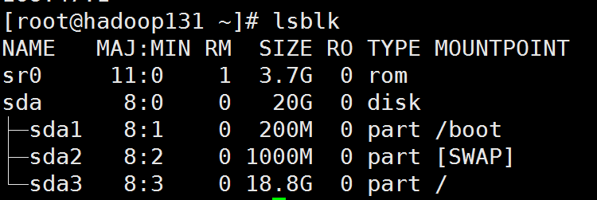

可以看到当前系统有sr0、sda装置，sda下有三个分区分别是123，输出信息的含义是：

NAME是装置的文件名，MAJ：MIN是主要和次要装置代码，RM代表是否为可卸除装置，SIZE是容量，RO代表是否为只读装置，TYPE是装置类型，rom是只读存储器，disk是磁盘，part是分区；MOUNTPOINT为挂载点。··

`lsblk -ip 完整路径的装置文件名`可以查看该装置内所有数据的完整文件名及相关信息。

blkid命令可以列出所有装置的文件名和UUID、设备类型，UUID就是linux给装置设置的独一无二的标识符。

parted命令可以列出磁盘分区表类型和分区信息：`parted /dev/sda print`：

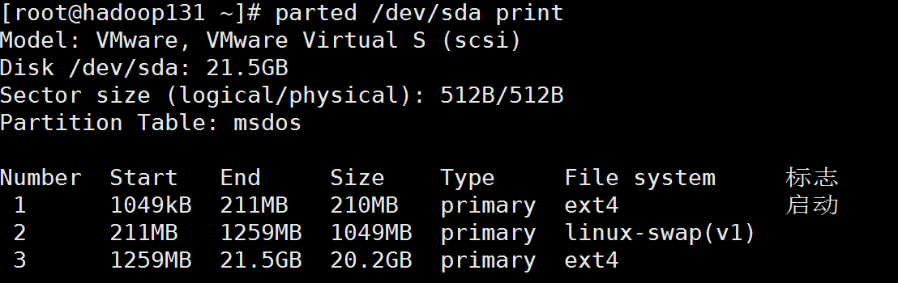

可以看到分区表类型就是msdos（MBR），接下来就打印了分区信息。

## 文件系统查询命令df、du、fsck、dumpe2fs

linux的文件系统是ext，CentOS的文件系统是ext4，它最大提供1EB的文件系统和最大16TB的单个文件。

文件系统查看命令df。-a表示显示所有文件系统，-h代表人性化显示使用习惯单位显示容量，-T代表列出文件系统类型，-i代表列出各区域可用的inode数。df后跟选项再跟目录或文件代表查看该目录或文件可用的容量。

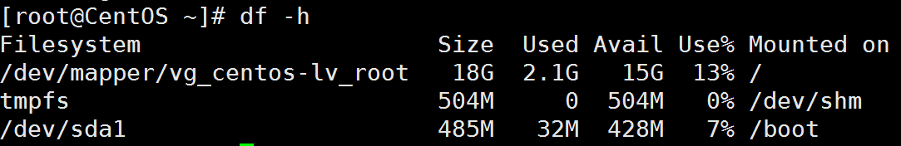

ls在统计目录大小时仅仅统计其中文件名占了多大空间，无法统计目录的真实占用空间。此时应该用du命令，-a代表显示文件占用量（默认执行du时只显示当前下的目录），-h代表人性化显示，-s代表统计当前总占用量而不列出细节：

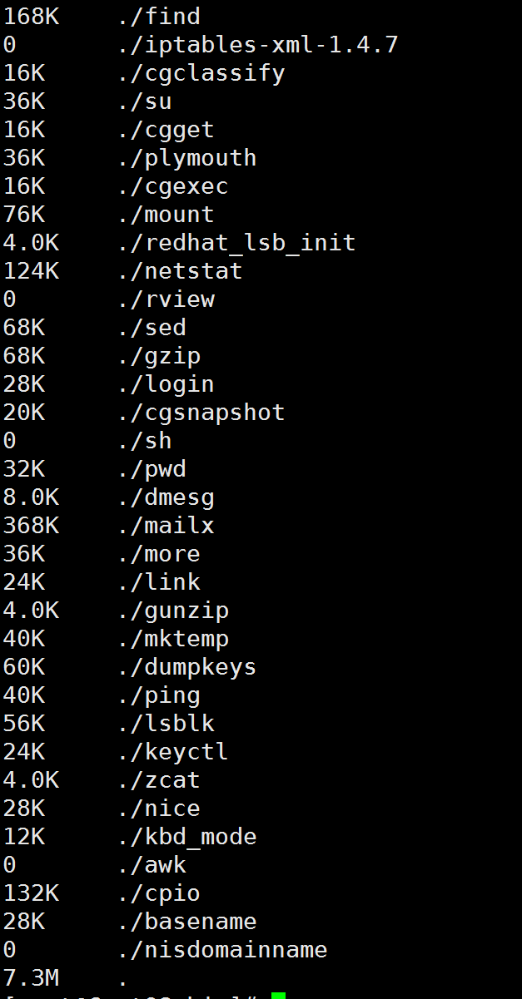

du和df命令有一些区别，df命令是从文件系统考虑的，不光要考虑文件占用的空间，还包括被命令或程序占用的空间，而du是纯粹的文件大小，所以要按时重启服务器，删除这些命令或程序占用的空间。

文件修复命令fsck：`fsck [选项] 分区设备文件名`，也就是sda1、sda2等。这个修复命令在系统启动时会自动执行，一般不需要手动执行，执行时有一定的风险。

显示磁盘状态命令dumpe2fs，后跟分区设备文件名，可以显示数据块的信息等。

查看文件系统中要注意挂载点/proc占用的存储都是0，它一般存系统数据，内部数据都存在内存中。

## 系统资源查看

vmstat命令监控系统资源：`vmstat [刷新延时 刷新次数]`，如`vmstat 1 3`代表一共监听3次，每次间隔1s。

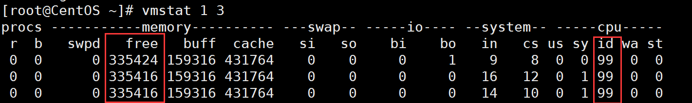

r代表等待运作中的进程数量，b代表不可被唤醒的进程数量，这两个数字越大代表系统越忙碌。内存分为虚拟内存、空闲内存、缓冲区、缓存区四个部分。swap的si是从磁盘中读的量，so是写入磁盘的量，如果这两个值过大代表系统效能很差；io的bi代表从磁盘读，bo是从磁盘写；system的in是每秒被中断的进程次数，cs是每秒进行的事件切换次数；cpu的us是非核心层CPU状态，sy是核心层的CPU状态，id是闲置的cpu，wa是等待IO消耗的cpu，st是虚拟机占用的cpu。

该命令的执行结果中最重要的两项是空闲内存和cpu空闲率。

查看所有磁盘的读写状态：`vmstat -d`

dmesg可以查看硬件信息，`dmesg | grep CPU`可以查看CPU相关信息。

free查看内存使用状态，后跟选项：

-b： 以字节为单位显示
-k： 以KB为单位显示，默认就是以 KB为单位显示
-m： 以MB为单位显示
-g： 以GB为单位显示

详细CPU信息：`cat /proc/cpuinfo`

uptime可以显示系统的启动时间和平均负载，也就是top命令的第一行。w命令也可以看到这个数据。

uname可以查看系统与内核相关信息，选项：
-a： 查看系统所有相关信息；
-r： 查看内核版本；
-s： 查看内核名称。

查看操作系统位数（通过查看系统外部命令显示该信息）：`file /bin/ls`，file这个命令也可以用来查看文件类型，针对ascii文件、执行文件、数据文件都会有不同的输出结果。

查看系统发行版本：`lsb_release -a`

## 查看系统健康状态

查看系统健康状态：`top [选项]`，默认3秒更新一次，可以用-d 秒数来指定更新时间。执行结果：

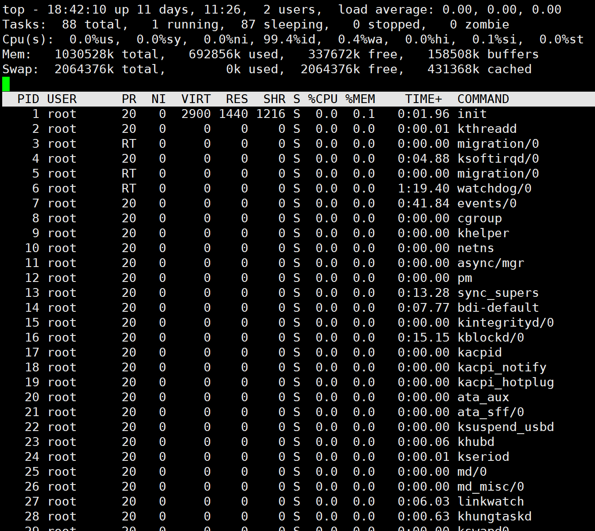

所有进程默认都是按照CPU使用率来排序的。在执行top命令时可以用P/M/N分别指定按照CPU使用率排序、按照内存使用率排序、按照PID排序。还可以执行？或h来查看帮助，按q退出top。

前五行的含义：


对于单核来说，平均负载值大于1就说明系统处于超出负荷状态，如果是8核大于8才说明超出负荷。

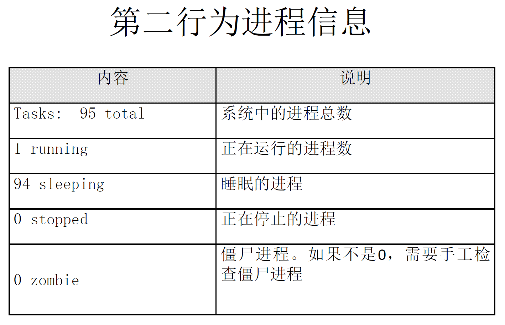

僵尸进程代表进程正在终止但还没有执行完全，如果长时间处于僵尸进程说明关闭时卡死，需要手动关闭。

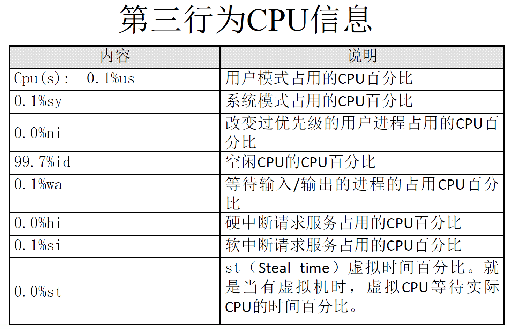

一个很重要的指标是空闲CPU百分比，它如果小于20说明服务器处在高压状态。（注意wa是IO等待）

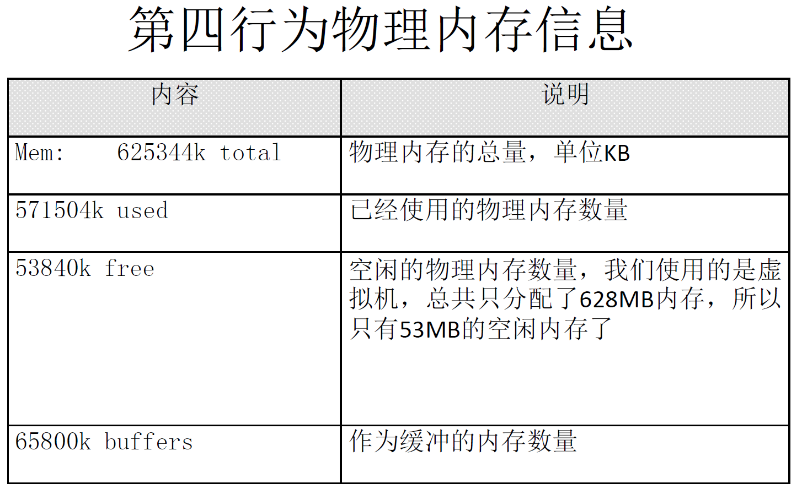

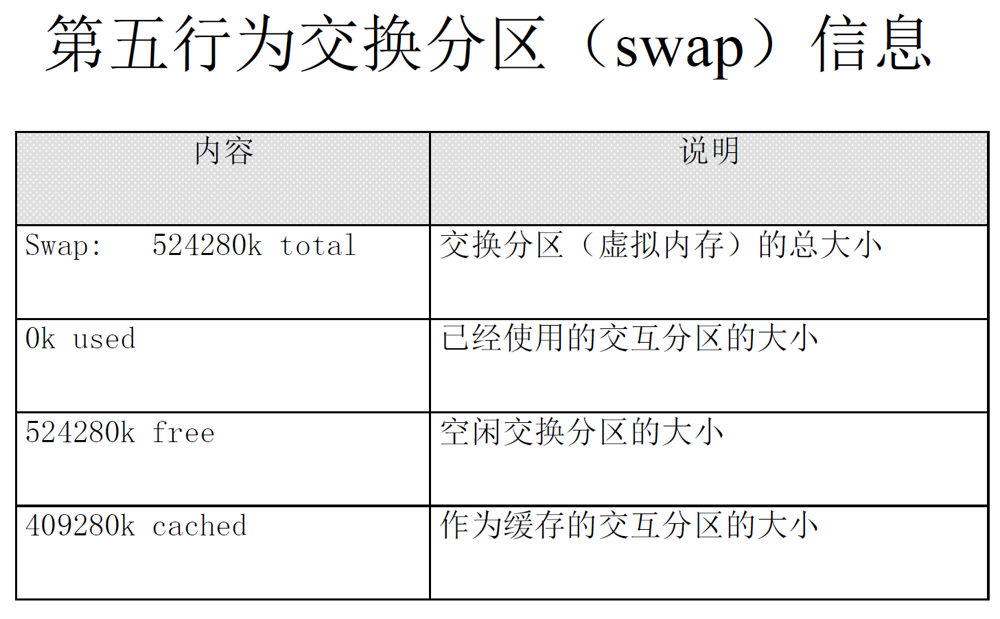

top命令是需要占用一定资源的，不能常开否则会影响其他服务。

将top的信息执行两次，将结果输出到文件中：`top -b -n 2 > /tmp/top.txt`

仅动态观察一个进程，加进程号即可：`top -d 2 -p 14836`

# 分区、格式化与修复

## 磁盘分区命令

不同的文件系统要用不同的命令来分区，在执行分区前应该执行lsblk和parted命令来查看相关信息，然后再执行分区。执行磁盘分区时主要用gdisk和fdisk命令，这两个命令分别适用于MBR分区和GPT分区，不能搞混。

gdisk后加装置命令就可以进入分区命令模式，然后会让用户输入指令，可以按？查看可输入的指令，注意该命令只能root使用，且装置名不能加数字，因为它不是针对某个分区的命令。

新增分区槽时会询问用户分区号和新分区空间，删除分区时会让用户指定要删除的分区号，删除和新增都需要执行partprobe命令更新linux核心分区表信息，注意不能删除正在活动的文件系统，应该先卸除（取消挂载）该分区然后再删除。

分区命令还有一个parted命令，它同时支持MBR和GPT，而且它还能修改分区表格式，这个parted的好处在于适合写入脚本中自动执行，它可以不和用户进行互动来完成分区。

以fdisk为例：

执行`fdisk /dev/sdb`其中sdb是设备文件名，不能后面加编号，如sdb1，因为此时还没有分区。执行分区后进入命令模式，按p会显示分区状态，l可以查看分区ID号，82是swap，83是linux分区，n是新建分区，然后按e表示建立扩展分区，按p表示创建主分区。然后输入分区号，开始柱面和结束柱面。

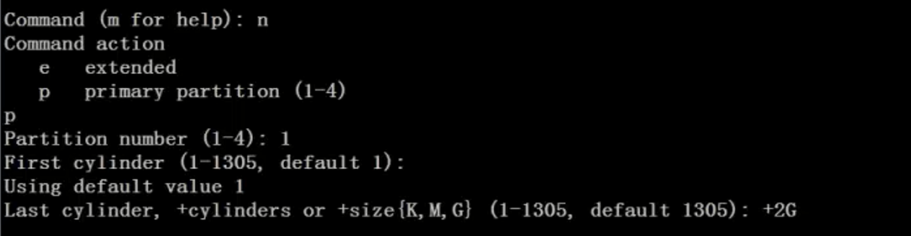

必须建立扩展分区后才能建立逻辑分区。

分区后按w保存退出，有时必须重启才能生效，此时可以重新读取分区表信息`partprobe`，如果该命令还是无效还是要重启。

分区结束后进行格式化`mkfs -t ext4 /dev/sdb1`注意此时扩展分区不能格式化。然后把设备挂载就可以使用了，但是使用mount命令再次开机时挂载就会失效，此时应该进行永久挂载。

## 磁盘格式化

当磁盘分区好后，应该执行磁盘格式化。格式化主要是使用mkfs（make filesystem）命令

把磁盘分区格式化为xfs文件系统：`mkfs.xfs 分区装置名`，这个命令可以设置格式化时的参数，包括block的大小、inode大小、CPU核心数、stripe大小等，一般默认即可。stripe和磁盘阵列（RAID）有关，磁盘阵列就是将多个磁盘组合成一个大磁盘，然后写文件时可以将文件分为多个小型的分区区块（stripe）后，同时写入多个磁盘中，这样不仅可以加快读写速度，还增加了容错能力。

把磁盘分区格式化为ext4文件系统：`mkfs.ext4 分区装置名`，格式化时也可以设置参数。

也可以把磁盘格式化为其他文件系统，输入mkfs按两下tab就可以显示可格式化的文件系统。

## 文件系统的修复

因为数据异步的原因，宕机可能会导致文件系统的混乱，对于XFS文件系统主要用xfs_repair加装置分区名来修复文件系统，对于EXT4系统应该用fsck.ext4命令加装置分区名来修复，被修复的文件系统不能被挂载，可以卸除再进行修复，但对于不可卸除的根目录来说，想要修复就必须进入单人模式然后通过加选项强制修复。这个命令只能root用户有执行权限，正常情况下使用这些指令可能会造成对系统的损坏。

## 文件系统参数修改

装置文件有两个参数分别是major和minor，执行lsblk就能看到相关的数字，系统就是通过这两个参数来识别各种装置的，参考linux核心官网就能找到很多的硬件装置代码major和minor。

mknod可以修改装置代码：`mknod 装置分区名 b 252 10`，后面两个数字分别代表major和minor。

还可以建立FIFO文件：`mknod 文件名 p`，用ll命令可以看到文件类型变成了p。

xfs_admin可以修改XFS文件系统的UUID和LABEL：

`xfs_admin -L 标签名 装置分区名`、`xfs_admin -U uuid值 装置分区名`，注意这里的uuid值必须是新的，可以用uuidgen命令来产生新的UUID。

tune2fs可以修改ext4文件系统的UUID和LABEL：

`tune2fs -L 标签名 装置分区名`

## 系统修复模式

进入修复模式步骤：首先在开机时按键盘，（如果已加密就先按p输入密码），按e，将光标移动到kernel再按e，改为b quiet 1，然后回车，再按b就能单用户模式启动。

该模式不需要输入用户名和密码，可以在该状态重新设置root密码：`passwd root`，还可以修改默认运行级别（如果修改为0就无法开机，但是可以通过这种方法来设置回去）

如果忘记grub密码可以通过光盘修复模式破解，光盘修复模式开机时加载的是光盘而不是硬盘，此时可以修改grub加密密码从而得到root用户密码。

# 备份

## CentOS7以前的备份dump和restore

要把重要文件备份，如/root/目录、/home/目录、/var/spool/mail/目录、/etc/目录、其他目录（如日志目录），对于特别重要的数据，还需要异地备份。

常用服务也有一些需要备份的文件，如日志文件、数据文件、配置文件等。

备份有几种：

1、完全备份，也就是需要的数据整体备份

2、增量备份，先进行一个完全备份，然后将新产生的数据依次备份，如第4天将新产生的数据备份，第5天将新产生的数据备份。。

3、差异备份，先进行一个完全备份，然后将总体差异的数据依次备份，如第4天将数据与备份数据对比，将差异数据备份，第5天将数据与备份数据对比，将差异数据备份。它不一定优于增量备份。

备份可以用dump命令，但是这个命令默认是没有安装的。

执行模式：`dump [选项] 备份之后的文件名 原文件或目录`

-数字： 就是我们说的0-9十个备份级别，0代表完全备份，1代表增量备份。
-f 文件名： 指定备份之后的文件名
-u： 备份成功之后，把备份时间记录在/etc/dumpdates文件
-v： 显示备份过程中更多的输出信息
-j： 调用bzlib库压缩备份文件，其实就是把备份文件压缩 为.bz2格式，默认压缩等级是2
-W： 显示允许被dump的分区的备份等级及备份时间

注意dump命令只有备份分区时可以采用增量备份，备份目录时只能采用完全备份。

对分区备份：`dump -0uj -f /root/boot.bak.bz2 /boot/`

再执行增量备份：`dump -1uj -f /root/boot.bak1.bz2 /boot/`

恢复备份可以用restore命令：`restore [模式选项] [选项]`

restore命令常用的模式有以下四种，这四个模式不能混用:
-C：比较备份数据和实际数据的变化
-i： 进入交互模式，手工选择需要恢复的文件。
-t： 查看模式，用于查看备份文件中拥有哪些数据。
-r： 还原模式，用于数据还原。
选项有：
-f： 指定备份文件的文件名

比较备份与实际的区别时要指定备份文件名，根据error数来判断。

增量备份恢复时要根据多个备份文件名恢复多次。恢复时最好新建目录然后进入，这样恢复的文件都在该目录下。

## XFS文件系统备份命令xfsdump

xfsdump命令可以进行文件系统的完整备份（full backup），还可以进行累积备份（incremental backup），在使用该命令备份文件系统时要注意，该命令只能root执行，且只能备份已挂载的文件系统，且必须是XFS文件系统。

将/boot挂载点处的文件系统备份到/srv/boot.dump：

`xfsdump -l 0 -L boot_all -M boot_all -f /srv/boot.dump /boot`

其中-l后数字是指定等级，0代表完整备份；-L后跟该文件系统的简单说明；-M后填写媒体的简单说明；-f后接备份产生的备份文件名。

查看备份文件系统的信息：`xfsdump -I`，如果之前用过xfsdump会产生备份文件系统的信息，其中有个关键信息是备份资料的level，如果是完整备份则level为0。

如果经过一段时间后/boot文件系统发生了改变，此时就可以进行差异备份：

`xfsdump -l 1 -L boot_2 -M boot_2 -f /srv/boot.dump1 /boot`

注意生成的备份文件名要改变。

## XFS文件系统还原命令xfsrestore

查看备份文件资料：`xfsrestore -I`，该命令可以找出所有用xfsdump备份的数据，这个命令的作用和`xfsdump -I`相同。

要复原文件系统首先要指定该文件，要用上述命令查看文件的session label name，如果要复原/boot文件系统，备份文件名是/srv/boot.dump，session label name是boot_all，那么还原命令就是：

`xfsrestore -f /srv/boot.dump -L boot_all /boot`

如果boot文件下还有别的文件，此时复员后同名的文件会被覆盖，其他的文件会被保留，如果想解压出来完全是该文件系统，那么就直接指定一个新目录即可。

如果要复原累积备份的资料，那么就在level0还原的基础上再还原level1：

`xfsrestore -f /srv/boot.dump1 /root`

用该命令还可以仅还原部分文件，如果备份文件是/srv/boot.dump，预计还原到/tmp/root3中，那么就可以执行命令：`xfsrestore -f /srv/boot.dump -i /tmp/root3`，在该命令状态下执行ls命令查看可以复原哪些文件，这些文件都是备份文件中的，然后使用`add 文件名`来一个个还原即可。

## 备份命令dd

之前用过dd命令来生成大文件：`dd if=/dev/zero of=/sev/loopdev bs=1M count=512`

if是输入文件，意思是一个一直输出0的装置；of是输出文件，也就是即将生成的大文件路径；bs是block的大小；count是block的数量。

执行完毕后就生成了一个512M的大文件。

将一个文件备份到另一个位置：`dd if=要备份的文件 of=新文件位置`，这类似于cp。

dd命令来备份是一个一个扇区去读写的，它会将没有用到的扇区也备份，故新备份文件和原来占用的磁盘空间完全相同，它不会因为文件系统的差异出现不同的响应，因此这个if和of可以跟文件系统，也可以跟设备名等等，这个命令也可以用来创造一个完全相同的磁盘分区，无需格式化，因为扇区内的MBR等都会被完整的复制。

## 备份命令cpio

cpio可以备份任何内容，包括装置设备文件，但是它必须配合find等命令来找到文件，将/boot下所有文件备份到/tmp/boot.cpio：

`find boot | cpio -ocvB > /tmp/boot.cpio`，这里一般要进入根目录，然后指定boot文件时用相对路径，这样在以后还原时就不会覆盖boot中的内容了。

还原：`cpio -idvc < /tmp/boot.cpio`

# SSH

ssh就是Secure Shell的缩写，为建立在应用层和传输层基础上的安全协议。用ssh截获数据包看到的是加密后的数据，不能破解其中内容。

SSH端口号为22，默认为开启状态，相关服务为sshd，如果没装就安装openSSH服务。

服务端主程序：/usr/sbin/sshd，服务器端配置文件/etc/ssh/sshd_config。

客户端主程序：/usr/bin/ssh，客户端配置文件/etc/ssh/ssh_config。

## SSH加密原理

通常对于银行账户或者压缩包加密都是用对称加密算法，即加密和解密用同一个秘钥。而SSH基于非对称加密原理，当客户端要访问服务器时，首先把服务器的公钥下载到客户端，然后发送的信息用公钥加密再传送给服务端，服务端用对应的私钥解密，即使传输过程中数据被截获，没有私钥也无法得到真实数据。

## SSH配置文件

服务器端配置文件/etc/ssh/sshd_config：

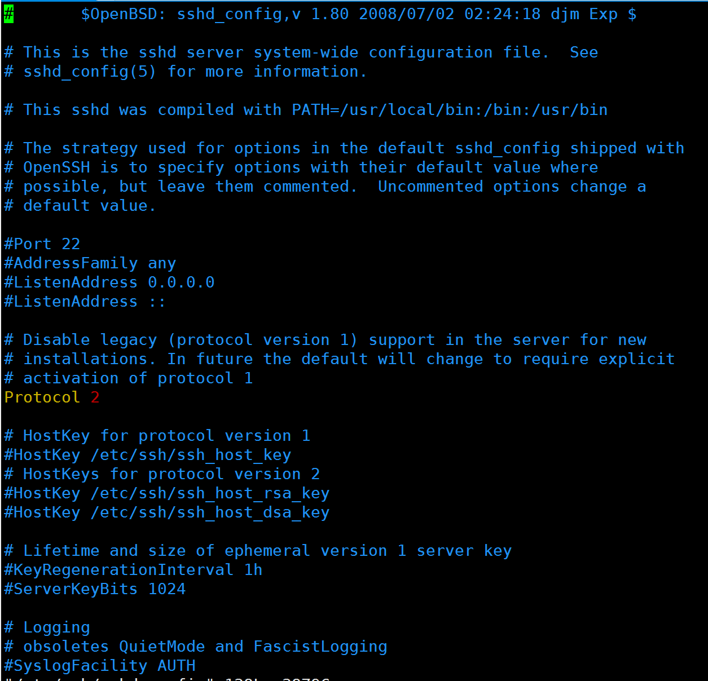

Port 22表示ssh端口默认是22，对服务器来说建议修改端口，避免遭受攻击。

ListenAddress表示监听的IP，这个是指接受哪个IP地址发来的数据，默认为0.0.0.0，意思是监听所有IP地址。

Protocol 2表示SSH版本为2。

HostKey为私钥保存位置。

ServerKeyBits为私钥位数。

SyslogFacility AUTH表示日志记录ssh登录情况，过程会被记录在/var/log/secure中。

LogLevel表示日志记录等级。

GSSAPIAuthentication表示GSSAPI认证，建议修改客户端的配置文件，将GSSAPI认证关闭，否则连接时会消耗大量时间去DNS服务器。

PermitRootLogin表示允许root的ssh登录，建议修改这里的配置，改成不允许root的ssh登录，这是因为一旦root的密码丢失会对服务器破坏很大，可以采用公钥登录方式，但是要先拿到公钥。

PubkeyAuthentication表示是否使用公钥验证。

AuthorizedKeysFile表示公钥位置。

PasswordAuthentication是否使用密码登录，拿到公钥后可以把允许密码登录改成no，禁止密码登录，此时就可以使用公钥登录服务器了，密码就不会在传输的过程中丢失。

PermitEmptyPasswords表示是否允许空密码登录。

## SSH命令

通过ssh远程管理：`ssh 用户名@IP`，可以通过这个在一台linux中登录另一台，登录后就和远程工具管理一样了。用exit命令退出。

在远程计算机中下载到当前目录：`scp 用户名@IP:路径 .`

将文件上传到远程计算机：`scp -r 文件路径 用户名@IP:上传到哪个位置`，这两个命令并没有登录到对方的计算机。

用sftp进行文件传输：`sftp 用户名@IP`，进入sftp状态后用ls来查看服务器端数据，用cd来切换服务器端目录，用lls查看本地数据，用lcd来切换本地目录。用`get 要下载的文件名 本地目录`来下载到本地，用put来上传文件到服务器。 

## SSH秘钥对登录

为了防止暴力破解密码进行远程登录，需要采用更安全的方式。

秘钥对登录首先需要在本机生成秘钥对，然后将公钥发到服务器的指定目录~/.ssh/authorized_keys，然后登录时用私钥登录即可，公钥保存在哪个家目录下登录后就是哪个用户。

1、生成秘钥对：`ssh-keygen -t rsa`，RSA是非对称秘钥算法，还可以用dsa。系统会提示key存在/root/.ssh/id_rsa中，然后会设置密码，这里密码设置为空即可，完成后会在/root/.ssh/中会生成id_rsa和id_rsa.pub文件，前者是私钥后者是公钥。

2、将公钥上传到服务器：`scp -r 公钥 用户名@IP:/root`，如果是其他用户就修改对应家目录。上传后将公钥追加到指定文件中：`cat id_rsa.pub >> /root/.ssh/authorized_keys`，如果服务器端没有.ssh目录要先新建一个，用重定向的方式主要是考虑到登录地点有多个，这样文件就能保存多个公钥。然后修改该文件的读权限，防止有人偷走：`chmod 600 /root/.ssh/authorized_keys`

（在产生秘钥对后执行`ssh-copy-id ip或域名`也能将公钥放入对应节点）

3、修改服务器端SSH配置文件：

RSAAuthentication yes 表示开启RSA验证。

PubkeyAuthentication yes 表示使用公钥验证。

AuthorizedKeysFile .ssh/authorized_keys 指定公钥的保存位置

PasswordAuthentication no 表示禁止密码登录

4、关闭SELinux服务：修改配置文件/etc/selinux/config改为SELINUX=disabled，然后重启系统。

5、服务器端重启服务：`service sshd restart`

此时就可以直接登录ssh无需输入密码了。使用这种方式要注意保护私钥。

如果要用windows远程工具进行秘钥对登录，只需将私钥拷到windows中，登录时登录方式选择publickey，选取私钥文件即可，如果当初没有设置ssh密码就无需输入密码。

## .ssh文件夹下（~/.ssh）的文件功能解释

| 文件名             | 功能                         |
| --------------- | -------------------------- |
| known_hosts     | 记录ssh访问过计算机的公钥(public key) |
| id_rsa          | 生成的私钥                      |
| id_rsa.pub      | 生成的公钥                      |
| authorized_keys | 存放授权过得无密登录服务器公钥            |

# LVM和SELinux简介

## 逻辑滚动条管理员Logical Volume Manager

如果出现磁盘空间不够用的情况，那就需要加入新的磁盘，一般情况下会重新分区、格式化，把原磁盘的数据完整的复制过来，卸载原挂载点进行重新挂载，这个过程过于繁琐，LVM就可以解决这个问题。

LVM（Logical Volume Manager）可以弹性调整文件系统的容量，通过软件将多个分区（或多个磁盘）整合在一起，看起来像是一个磁盘一样。

### 几个重要概念

1、Physical Volume，PV，实体滚动条

实际的分区或磁盘需要调整系统标识符（systemID）为8e，然后通过pvcreate命令将它转成LVM最底层的实体滚动条PV，这是使用LVM的准备工作，查看和修改系统标识符需要用gdisk或fdisk：

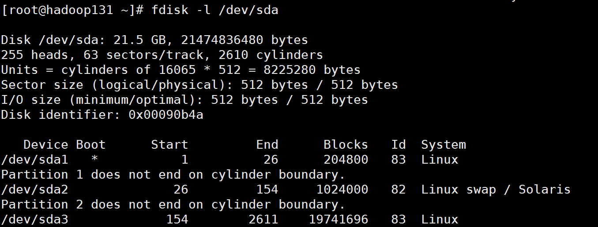

2、Volume Group，VG，滚动条群组

LVM就是将许多PV整合成VG，VG相当于整合起来的大磁盘。

3、Physical Extent，PE，实体范围区块

PE是LVM的最小储存区块，写入LVM实际上就是写入PE，调整PE会影响到LVM的最大容量。

4、Logical Volume，LV，逻辑滚动条

VG最终会被切成LV，这个LV就是可扩展的分区槽了，但是它并不是可以随意指定大小的，这个大小必须是PE的整数倍，因为PE才是LVM的最小储存单位。所谓弹性调整文件系统，其实本质上是LV之间交换PE的操作，PE可以自由的加入或退出某个LV，如下图所示：

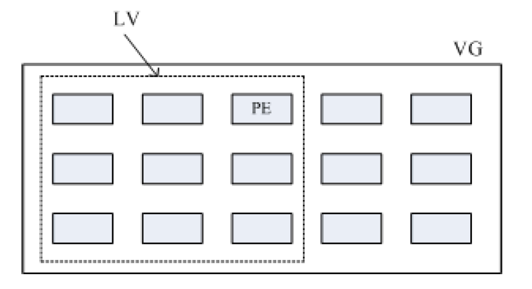

### 设置LVM的基本流程

建立LVM的基本流程就是，首先修改systemid建立PV、然后以PV建立VG，从VG分离出LV，最后格式化挂载使用，如下图：


### 数据写入方式

数据写入LV时有两种方式：

1、线性模式（linear）：两个分区或磁盘加入LVM时，文件写入会先写入其中一个，写满后再写入另外一个。

2、交错模式（triped）：两个分区或磁盘加入LVM时，文件会拆成两部分写入两个区域，类似RAID0，这样读写效率会提升。

LVM默认采用线性模式，因为后一个模式下一个分区出问题就会造成文件损坏，考虑到LVM的主要用处是弹性调整文件系统容量，而不是提高读写性能，故默认用第一种。

### 动态调整的机理

设置好LVM时要调整已有的LV，需要几个前提条件：

1、VG阶段必须要有剩余的容量，LV才能被放大。

2、XFS文件系统不支持文件系统的容量缩小，只能放大。

动态调整LV实质上就是在改变文件系统，LV的放大缩小通过的是增加或减少文件系统中的block group来完成的，放大文件系统后，会格式化新增的部分，然后将格式化后的数据信息写入文件系统的superblock。

### LVM thin volume

这是一个特殊的LV，由一个thin pool分配而来，这个thin pool可能只有1GB，但是可以分配一个10GB的LV装置，当这个LV的空间被占用时，会从thin pool中取得实际所需要的容量，但是实际使用容量不能超过thin pool的最大实际容量，突破该容量可能导致其中的文件损坏。

通过这种方式，一个小磁盘可以仿真出很多容量，本来磁盘使用率已经超过50%了，使用了LVM thin volume后磁盘占用率可以降低到5%甚至1%，但仅仅是名义上的数字，并没有实际多出存储空间。

### LV磁盘快照

LV磁盘快照就像照相记录一样记录当时的系统信息，是非常强大的备份工具。

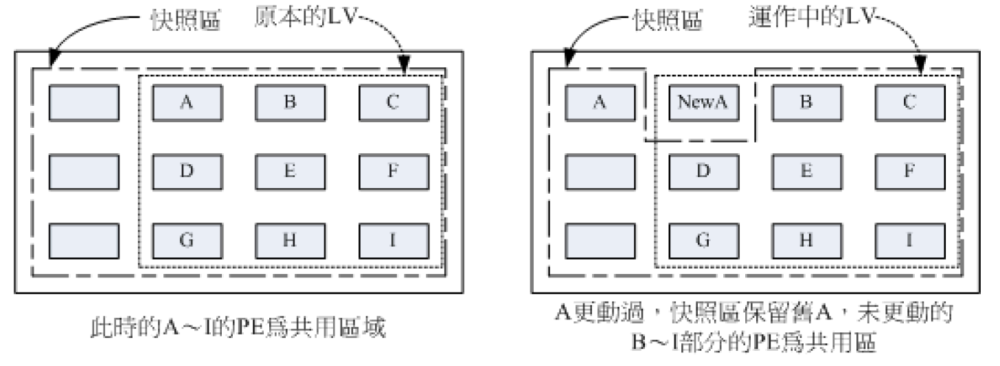

如上图所示，最初建立LV磁盘快照时，LVM会预留一个快照区（上图中为3个PE），此时快照区内没有数据，而快照区和系统区共享所有的PE数据，即A-I。等系统运作了一段时间后，假设A区域的数据被变动了，则数据变动前系统会将该区域的数据移动到快照区，快照区被占用了一块PE，而系统共享区变为了B-I。

综上所述，LVM磁盘快照只备份修改的数据，没有修改的数据还在原来的位置与快照区共享，这就使得快照占用的容量很小。

使用LV磁盘快照的前提条件是快照区和被快照的LV必须在同一个VG中。

为了保证快照区能正常恢复系统，要求快照区的大小必须大于被改动的数据量，否则就会造成快照区容纳不下原始数据，导致快照功能失效。

快照除了恢复以外，还可以进行对比前后数据的差异。

快照是测试非常重要的工具，即使出现重大错误也可以用快照恢复，非常方便快捷。

## SELinux简介

### DAC和MAC

SELinux（Security Enhanced Linux）是进行进程、文件等细部权限设定依据的一个核心模块。早期人们发现，由外部发动的攻击很少，系统经常出现问题的原因是内部员工的资源误用，而且主要是权限设计问题，因此开发了SELinux模块。

传统的文件权限与账号关系采用的是自主式访问控制DAC（Discretionary Access Control），此时各种权限设定是对root无效的，主要依据进程的拥有者和文件资源的rwx权限来决定有无存取能力，SELinux引入了委任式访问控制（Mandatory Access Control），root在使用不同的进程时不一定能取到所有的权限，而要看进程的设置，每个文件对不同进程也有不同的权限控制。下图是设置SELinux前后的差别：

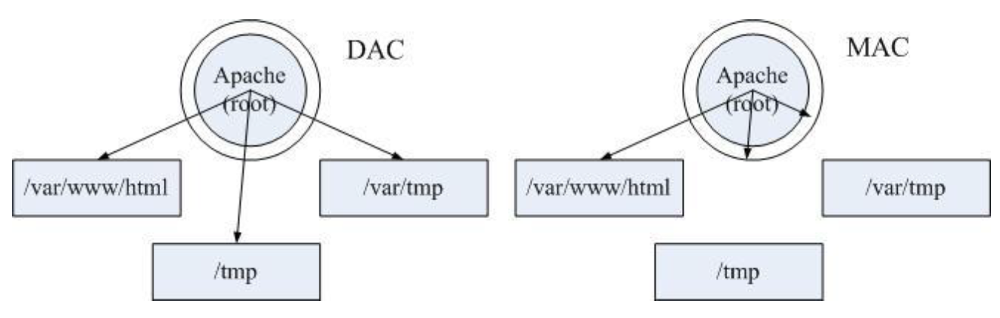

DAC存取时，只要root主导apache进程，它就能在这三个目录下做任何文件的修改和新增；MAC管理时，即使root控制apache进程运行，但是也只能针对部分目录修改和新增。

### 几个重要的概念

MAC控制的主体是进程，主体（Subject）就是进程，目标（Object）是文件系统，SElinux提供三个主要的政策：

1、targeted，针对网络服务限制较多，针对本机限制较少，这也是预设的政策

2、minimum，仅对选择的进程进行保护

3、mls，完整的SELinux限制，限制方面较为严格

主体能不能存取目标，取决于政策指定，此外还需要主体与目标的安全性本文必须一致，如果安全性本文对比失败则无法存取目标。文件的安全性本文一般存在inode中，进程的安全性本文存在内存中。

# 磁盘配额与磁盘阵列简介

## 磁盘配额（Quota）简介

### 定义和解决的问题

在linux中，因为多用户同时使用磁盘，如果少数几个使用者占用了大部分磁盘空间的话，其他用户就无法使用，所以要对每个用户的使用磁盘的权力进行限制，这就是磁盘配额。磁盘配额主要用来控制以下几点：

1、限制某个群组能使用的最大磁盘配额

2、限制某个用户的最大磁盘配额

3、限制某一个目录的最大磁盘配额

### 使用限制

1、在EXT文件系统使用quota限制时，仅能针对整个文件系统来设计，无法针对单一目录。在XFS中，可以使用project模式来设计不同目录的磁盘配额。

2、CentOS7核心是支持quota的，其他版本可能需要自行安装

3、quota不限制root，只针对普通用户

4、SELinux可能会对quota的功能有影响，使quota仅能针对/home目录。

### 设定项目

1、针对对象：群组、个人或单独目录

2、限制指标：限制inode用量（限制可以建立的文件数量）和block用量（限制使用的磁盘容量）

3、hard和soft限制：hard限制（硬性规定）表示使用者的用量绝对不超过这个限值，若超过就会锁住该用户的磁盘使用权，soft限制（柔性劝导）表示超过该值且低于hard值时用户登录会发出警告信息。

4、宽限时间：介于soft和hard之间时会出现宽限时间，如果在该时间范围内把使用值降到soft以下就没事，如果超过宽限时间使用值还是大于soft，那么最后hard值会变成soft值，磁盘使用权会被锁住。

## 磁盘阵列简介

### 定义

磁盘阵列的全名是Redundant Arrays of Inexpensive Disks，RAID，即容错式廉价磁盘阵列。它可以通过一种技术让多个较小的磁盘整合成一个较大的磁盘，用来提升性能、保护数据安全。RAID的等级不同，整合的磁盘性质也不同，主要有以下几种：

### RAID-0（等量模式，stripe）：效能最佳

这种模式的RAID会先将磁盘切成等量的区块chunk，当一个文件写入RAID时，该文件会按照chunk的大小切好，然后交错的放入各磁盘中，相当于将文件拆成n份等量的放在各磁盘中，这种模式如果用相同容量的磁盘组成时比较好，因为不会出现写入文件过多导致其中一个磁盘满了无法将文件碎片放入。这种模式下磁盘数量越多，读写性能就越好，但是如果其中一个磁盘损坏就会导致文件损毁。

### RAID-1（映像模式，mirror）：完整备份

当文件写入该RAID时，会将同一份数据完整的保存在多个磁盘中。任何一颗磁盘损毁也不会导致数据丢失，且读取性能很好，因为RAID会同时读取多个磁盘中文件的不同部分。

缺点主要有两点：

一是磁盘的总容量会大大降低，本来加起来500G的容量，如果磁盘数为2的话，只能写入最多总大小250G的文件，如果两个磁盘大小还不一样能写入的就更低。

二是这种模式下写入文件时可能会导致效率变低，如果是软件磁盘阵列效率就会变低，如果是硬件磁盘阵列，磁盘阵列卡会主动复制文件，性能还好。

### RAID 1+0 和 RAID 0+1

RAID-0性能好但数据不安全，RAID-1数据安全但性能较差，可以把这两种结合一下形成RAID 1+0 和 RAID 0+1，其中储存设备厂商最推荐的方案就是RAID 1+0，这种模式是先让Disk A+Disk B组成第一组RAID1，让Disk C+Disk D组成第二组RAID1，然后这两组再整合成一组RAID0，如下图：

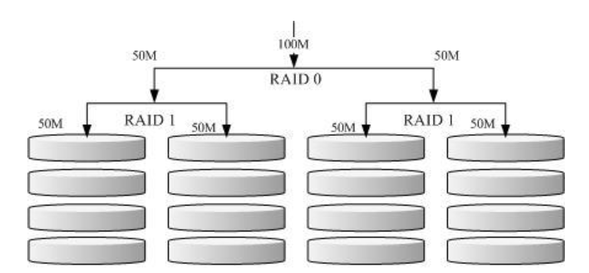

如果要向磁盘存入一个100M的文件，会先将文件拆成两个50M分别存入两个RAID1系统中，在这两个RAID1系统中再将50M的文件复制多份存在各磁盘。因为文件副本保存了两份，所以即使任何一个磁盘损毁也不会导致文件损坏，且因为文件被拆成了两份存储，读写效率近似变成了原来的两倍，同时具有之前的RAID所有优点。

### RAID-5和RAID-6：性能与数据备份的均衡考虑

RAID-5至少需要三颗以上的磁盘才能组成，这种模式的RAID在写入文件时类似RAID-0，文件被拆成n份写入各磁盘中，不过在写入的过程中还要额外在每颗磁盘写入一个同位检查数据，这个数据会记录其他磁盘的备份数据。当RAID-5中有一颗磁盘损毁时，可以凭借其他磁盘的同位检查数据来重建原本磁盘的数据，但如果磁盘损毁数量超过一颗，那整组RAID-5中的文件就无法恢复了，因此RAID-5可写入的总容量是整体磁盘数减去1颗。

RAID-5读取文件的效率较高，与RAID-0相当，但写入文件的速度不一定很快，因为要写入文件的同时要需要计算同位检查码，如果系统的硬件很好写入的速度就较快，但是如果用的是软件磁盘阵列，那就必然需要CPU去计算然后再写入，写入速度会受到一定的影响。

RAID-6和RAID-5类似，只不过允许损坏的磁盘数量最高可以达到两颗，整体磁盘容量也会减少两颗。

### 预备磁盘Spare Disk

当磁盘阵列的磁盘损毁时，就要将坏掉的磁盘拔除，然后换一颗新的磁盘，再次启动磁盘阵列后，磁盘阵列就会重建原本坏掉的数据，但是这样操作必须手动拔插磁盘然后关机，除非系统支持热拔插，为了解决这个弊端需要预备磁盘的帮助。

预备磁盘就是一颗或多颗没有包含在原本磁盘阵列中的磁盘，平时不会被磁盘阵列使用，当磁盘阵列中有磁盘损毁时，这颗磁盘会被主动拉进磁盘阵列中，然后立即重建数据系统。如果磁盘阵列支持热拔插就直接将坏掉的磁盘拔除，然后插入新的磁盘并将新磁盘设置为预备磁盘即可。这样可以保证磁盘中的数据永远安全。

### 磁盘阵列的优点

磁盘阵列具有以下优点：

1、数据安全和可靠性

2、提升读写性能

3、使单一文件系统具有相当大的容量

几种RAID的特点对比：

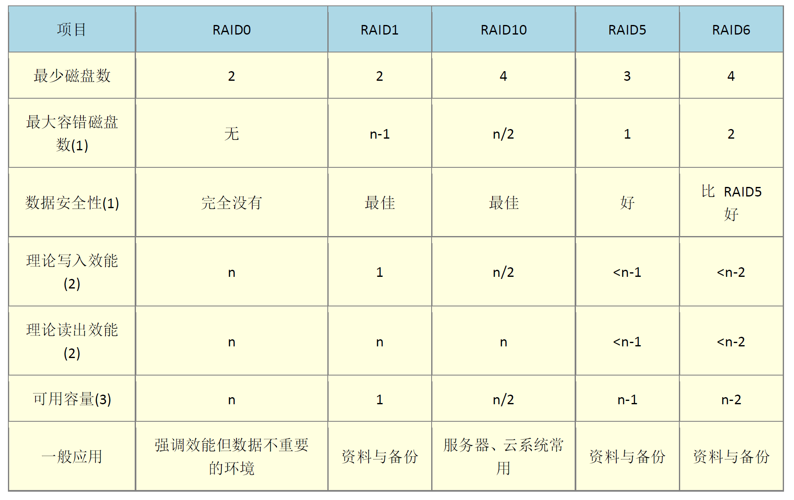

在选择磁盘阵列方案时要考虑到具体的使用场景，如果需要很大磁盘空间且对安全性有要求，则选择RAID5或6，如果高性能的同时要求数据必须快速恢复，那就得选择RAID10搭配SSD来使用。

### software RAID和hardware RAID

硬件磁盘阵列（hardware RAID）是通过磁盘阵列卡来完成的，磁盘阵列卡上有专门的芯片处理RAID的任务，此时RAID5计算同位检查码不消耗原系统的IO总线，效能较好，且中高级磁盘阵列卡都支持热拔插，可以在不关机的情况下更换硬盘。

但是磁盘阵列卡价格昂贵，且操作系统也必须拥有磁盘阵列卡的驱动程序才能正常使用，因此就有了软件磁盘阵列（software RAID），它通过软件来模拟多个磁盘，软件磁盘阵列不要求有2颗磁盘才能完成该模式的设置，只要有两个分区就可以设计磁盘阵列。

硬件磁盘阵列本质上还是一个个的实际磁盘，故装置文件名为/dev/sd[a-p]；软件磁盘阵列是系统仿真完成的，装置文件名为/dev/md0、/dev/md1..

# 分区表格式与启动过程

## 两类分区表格式

### MSDOS(MBR)分区表格式

早期的linux系统为了兼容windows的磁盘使用的是MBR，启动记录区（Master Boot Record，MBR）和分区表（partition table）都放在磁盘的第一个扇区，这个扇区通常是512bytes，两部分分别占446bytes和64bytes。由于分区表的区块只有64bytes，故最多能有4组记录区，分区表记录该区段开始和结束的磁柱号码，因此主分区+扩展分区的总数不能超过4个。扩展分区出现的原因是为了突破分区数只能为4个的限制，出现扩展分区后，实际的分区数上限大大提高。

因为分区表区块大小的限制这种分区格式很难支持大容量硬盘。

### GPT磁盘分区表

GPT分区没有主分区和扩展分区的概念，它把磁盘所有区块分成一个一个的逻辑区块地址（logical block address，LBA），一个LBA默认是512bytes，第一个LBA称为LBA0，它存储了开启启动程序，LBA1存储了分区表的位置和大小，LBA2-33每个LBA都可以记录4笔分区记录，每个记录提供了64bits记录开始和结束的扇区号码，磁盘的最后33个LBA被拿来当做数据备份。

GPT吧分区信息分散到了34个LBA区块中，与MBR不同，MBR将分区信息都集中在第一个区块中，如果第一个区块损坏对整个磁盘来说破坏很大，而GPT就不会出现这样的情况。GPT的最大容量限制为2的64次方乘512bytes=8ZB（扇区号码最大值*每个扇区的大小）。

GPT能否正常使用和识别，与硬件系统、操作系统、开机检测程序都有关。

## 启动过程

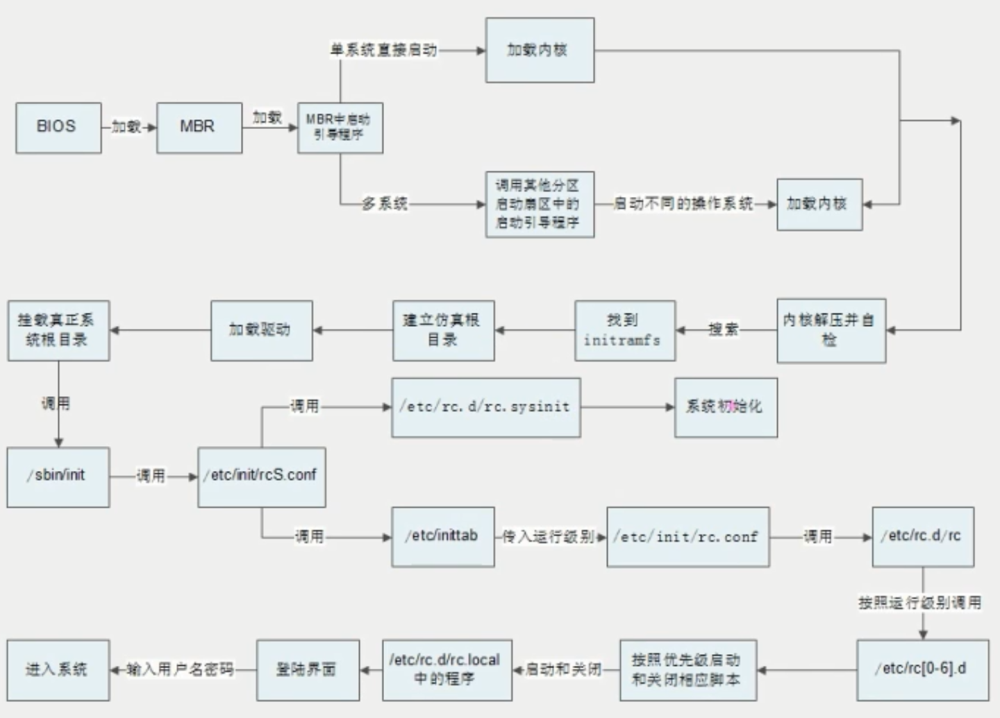

linux的启动从BIOS开始，BIOS是写入到主板上的一个韧体（写入硬件的软件程序），它是开机时执行的第一个程序，它会分析计算机中的储存设备，读取第一个扇区的MBR，MBR执行开机管理程序。

MBR会开启启动引导程序boot loader，它会加载内核程序，还会调用其他MBR（当多系统时会根据选择启动哪个MBR），值得注意的是，如果安装windows和linux双系统则必须先安装windows后安装linux，因为windows的安装会覆盖掉MBR和启动扇区。UEFI BIOS是一个取代BIOS的韧体，它能更好的识别GPT，且第三方厂商支持较好，就像一个小型的操作系统。

linux的常用驱动都无需手动安装，直接保存在内核中，开机时会根据硬件条件自动安装，其他驱动都安装在硬盘中，需要时自动安装。启动引导程序加载root分区，然后加载其中的initramfs服务，负责加载常用驱动，以便内核能读取硬盘。

init是系统启动的第一个进程，是所有进程的父进程。

/etc/init/rcS.conf配置文件主要作用有两个：

1、先调用/etc/rc.d/rc.sysinit，然后由/etc/rc.d/rc.sysinit配置文件进行Linux系统初始化。
2、然后再调用/etc/inittab，然后由/etc/inittab配置文件确定系统的默认运行级别。

/etc/rc.d/rc.sysinit初始化内容：

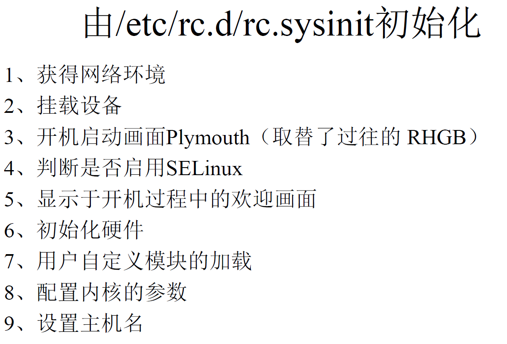

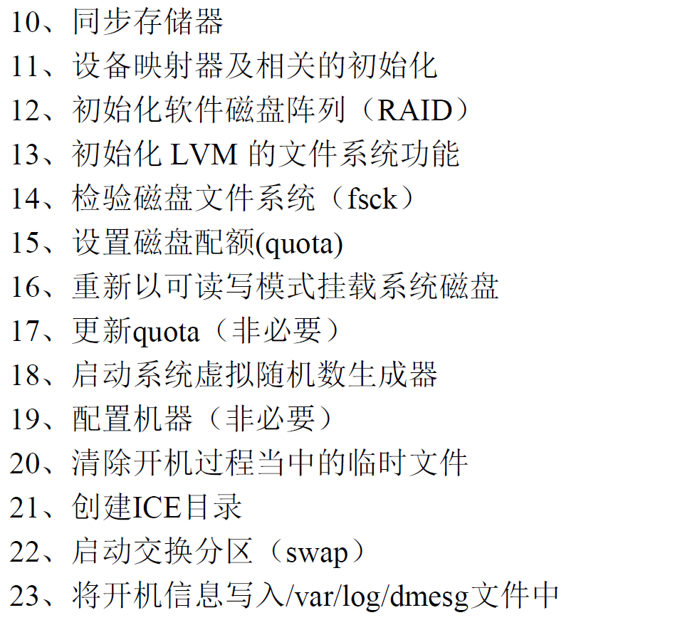

rc[0-6].d文件是被rc调用的，一般根据运行级别确定调用的文件，一般调用rc3.d/。

在/etc/rc3.d/目录中：

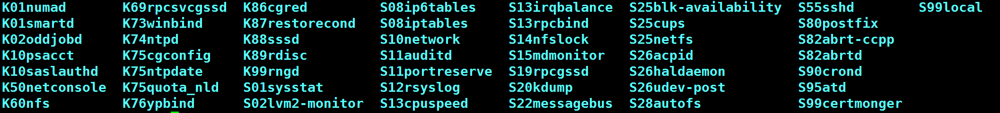

K开头代表关机时按照这个顺序执行关闭，S代表开机时按照顺序执行开启。

登录前会执行rc.local脚本。

## 启动引导程序grub

grub配置文件/boot/grub/grub.conf：


前四行是整体配置，后面是指当前linux操作系统，如果还有其他操作系统就还会再多出一部分。

default=0代表默认启动第一个系统，如果在有两个操作系统的情况下改成1那就是启动第二个操作系统。

timeout=5代表启动中的等待时间，默认是5秒。

splashimage=(hd0,0)/grub/splash.xpm.gz这里是指定grub启动时的背景图像文件的保存位置，(hd0,0)代表硬盘分区，grub中硬盘分区的表示方式如下：

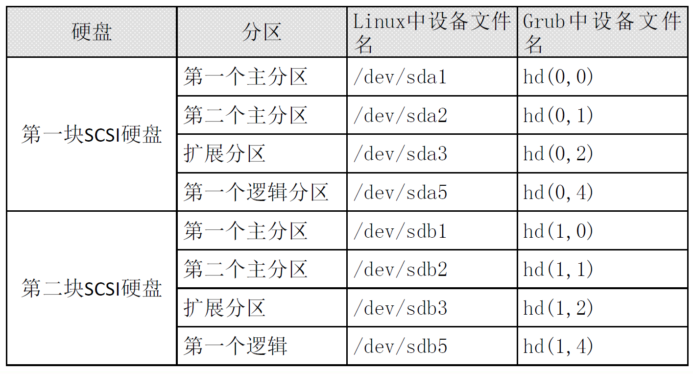

hiddenmenu代表隐藏菜单，只有敲键盘才能看到启动过程中的选项。

title CentOS (2.6.32-279.el6.i686)代表标题，启动时显示的内容。

root (hd0,0) 是指启动程序的保存分区。

kernel是定义内核加载时的选项。

initrd /initramfs-2.6.32-279.el6.i686.img是指定了initramfs内存文件系统镜像文件的所在位置。

### grub加密

为了防止普通用户进入grub编辑模式，应该给它设置一个密码，设置密码的步骤如下：

执行grub-md5-crypt命令，输入密码，得到一个字符串，将该字符串复制。

打开grub配置文件，在timeout下一行加入：

```
password --md5
复制的字符串
```

修改文件保存，再重启系统后想要进入编辑模式就必须输入密码了。

