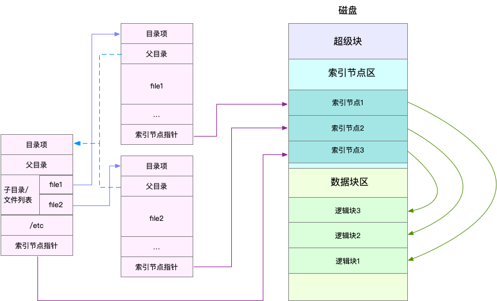

# IO问题定位

## 索引节点和目录项

在linux系统中，一切皆文件，包括普通的文件和目录、块设备、套接字、管道，都要通过统一的文件系统管理。

为了方便管理，linux系统为每个文件都分配两个数据结构，索引节点（index node，也就是inode）和目录项（directory entry，简称dentry）

索引节点用来记录文件的元数据，如inode编号、文件大小、权限、修改日期等。它和文件数据一样都会被持久化存储到磁盘中。而目录项用来记录文件名、指向inode指针、指向其他目录项的指针，多个目录项就构成了文件系统的目录结构，目录项是由内核维护的一个内存数据结构，所以也被称为目录项缓存。

目录项和索引节点的关系是多对一，例如通过硬链接创建文件，对应不同目录项，但是最后都是链接到同一个文件。（目录是一个文件，这个特殊文件保存了该目录的所有文件名与inode的对应关系）

磁盘读写的最小单位是扇区，只有512B，文件系统将连续的扇区组成逻辑块block，每次操作都是以逻辑块为最小单元来管理数据，常见的逻辑块大小为4KB。

目录项、索引节点和文件数据的关系如下：

虽然索引节点是被持久化到磁盘的，但是它还是可以通过缓存来加速访问。

上图中涉及到磁盘的三个区：超级块区（存储整个文件系统的状态，如索引节点和逻辑块block的使用情况）、索引节点区、数据块区

## 虚拟文件系统

为了支持各种不同的文件系统，linux内核在用户进程和文件系统中间，引入了一个抽象层，这就是虚拟文件系统VFS（Virtual File System）

VFS定义了一组所有文件系统都支持的数据结构和标准接口，这样用户进程和内核中的其他子系统只需要跟VFS提供的统一接口进行交互就可以了，不需要再关心底层各种文件系统的实现细节。

linux底层支持各种各样的文件系统，这些文件系统可以分为三类：

1、基于磁盘的文件系统，也就是数据直接存储在计算机本地挂载的磁盘中，如Ext4、XFS等

2、基于内存的文件系统，也就是虚拟文件系统，这类系统不需要任何磁盘分配存储空间，但是会占用内存，比如/proc文件系统，还有/sys

3、网络文件系统，用来访问其他计算机数据的文件系统，如NFS、SMB、iSCSI等

这些文件系统要先挂载到VFS目录树种的某个子目录（挂载点），然后才能访问其中的文件。（挂载点是设置磁盘分区的一个进入点，根分区/下某一个子目录，如boot和home可以指定独立的硬盘空间，磁盘分区是由磁盘的硬件组成结构决定的，以磁柱为单位的连续磁盘空间，分区的原因在于不同分区隔离数据安全、连续磁盘空间处理效率高）

## IO的分类

IO的分类有：

1、根据是否利用标准库缓存，可分为缓冲IO和非缓冲IO。

缓冲IO可以用标准库缓存来加速文件的访问，标准库内部再通过系统调度访问文件，而非缓冲IO是指直接通过系统调用来访问文件，不经过标准库缓存。

其实通过系统调用，也会使用页缓存来减少磁盘的IO操作。

2、根据是否利用操作系统的页缓存，分为直接IO和非直接IO

非直接IO进行文件读写时，要先经过系统的页缓存，然后再由内核或额外的系统调用，真正写入磁盘。而直接IO是跳过操作系统的页缓存，直接跟文件系统交互来访问文件。

如果是数据库场景还可以看到跳过文件系统读写磁盘的情况，这就是裸IO

3、根据应用程序是否阻塞自身运行，分为阻塞IO和非阻塞IO

4、根据是否等待响应结果，分为同步IO和异步IO

## 磁盘

常见磁盘可以分为机械磁盘和固态磁盘。

机械磁盘也被称为磁盘驱动器（Hard Disk Driver，HDD），主要由盘片和读写磁头组成，数据存储在盘片的环状磁道中，每次读写数据，需要移动读写磁头，定位到数据所在的磁道，然后才能访问数据。

固态磁盘（Solid State Disk，SSD）由固态电子元器件组成，它不需要磁道寻址，性能比机械硬盘要好。

无论是哪种磁盘，随机IO都比连续IO要慢的多，机械磁盘是因为随机IO需要更多的磁头寻道和盘片旋转，固态磁盘同样存在先擦除后写入的限制，随机读写会产生大量垃圾回收。此外，连续IO还可以通过预读的方式，来减少IO请求的次数。

此外，还有一个区别是机械磁盘的最小读写单位是扇区，一般大小为512字节，固态磁盘的最小读写单位是页，通常大小是4KB、8KB。（文件系统会以逻辑块作为最小单元管理数据）

在linux中，磁盘是作为一个块设备来管理的，以块为单位读写数据，并且支持随机读写，每个块设备都会被赋予两个设备号，分别是主、次设备号，主设备号用在驱动程序中，用来区分设备类型；次设备号则是用来给多个同类设备编号。

## 通用块层

为了减少不同块设备的差异带来的影响，linux通过一个统一的通用块层，来管理不同的块设备。通用块层是处在文件系统和磁盘驱动中间的一个块设备抽象层，它除了承上启下以外，还会给文件系统和应用程序发来的IO请求排队，并通过重新排序、请求合并等方式，提高磁盘读写的效率，这就是IO调度。

linux内核支持的四种IO调度算法：

1、NONE：不使用调度，常用在虚拟机中（此时磁盘IO调度完全由物理机负责）

2、NOOP：先入先出的队列，常用于SSD磁盘

3、CFQ：完全公平调度器，应用很广泛，它为每个进程维护了一个IO调度队列，并按照时间片来均匀分布每个进程的IO请求。CFQ还支持进程IO的优先级调度，适用于运行大量进程的系统。

4、DeadLine：它分别为读、写请求创建了不同的IO队列，可以提高机械磁盘的吞吐量，并确保达到deadline的请求优先被处理，它多用在IO压力比较重的场景，如数据库。

## I/O栈

linux存储系统的I/O栈，从上到下分为三个层次，分别是文件系统层、通用块层和设备层：

1、文件系统层：包括虚拟文件系统和各种文件系统的具体实现，它为上层的应用程序提供标准的文件访问接口，对下回通过通用块层来存储和管理磁盘数据

2、通用块层：包括块设备IO队列和IO调度器，它会对IO请求进行管理调度，然后发给设备层

3、设备层：包括存储设备和相应的驱动程序，负责最终物理设备的IO操作

## 磁盘性能指标

几种磁盘性能指标：

1、使用率：磁盘处理IO的时间百分比，过高的使用率如超过80%，意味着磁盘IO存在性能瓶颈

2、饱和度：磁盘处理IO的繁忙程序，过高的饱和度代表磁盘存在严重的性能瓶颈，当饱和度为100%时，磁盘无法接受新的IO请求

3、IOPS（Input/Output Per Second），指每秒的IO请求数

4、吞吐量：每秒的IO请求大小

5、响应时间：IO请求从发出到收到响应的间隔时间

注意使用率只考虑有没有IO，而不考虑IO的大小，当使用率是100%的时候，磁盘依然有可能接受新的IO请求。（使用率只是从时间角度衡量IO，只要用到IO就会被统计）

不要孤立的去比较某一指标，而是要结合读写比例、IO类型以及IO大小综合分析。

比如数据库、大量小文件这类随机读写较多的场景，IOPS更能反映系统的整体性能；在多媒体等顺序读写较多的场景中，吞吐量才更能反映系统的整体性能。

## 基本命令

###文件系统查看命令df

文件系统查看命令df，比较重要的两个命令是df -h和df -i，前者是查看磁盘空间使用情况，后者是查询inode使用情况（inode也要占用磁盘空间）

索引节点的容量也就是inode个数，是在格式化磁盘时设定好的，如果发现索引节点空间不足，但是磁盘空间充足时，很可能就是过多小文件导致的。

### 磁盘IO观测iostat

它来自于/proc/diskstats

~~~shell

# -d -x表示显示所有磁盘I/O的指标
$ iostat -d -x 1 
Device            r/s     w/s     rkB/s     wkB/s   rrqm/s   wrqm/s  %rrqm  %wrqm r_await w_await aqu-sz rareq-sz wareq-sz  svctm  %util 
loop0            0.00    0.00      0.00      0.00     0.00     0.00   0.00   0.00    0.00    0.00   0.00     0.00     0.00   0.00   0.00 
loop1            0.00    0.00      0.00      0.00     0.00     0.00   0.00   0.00    0.00    0.00   0.00     0.00     0.00   0.00   0.00 
sda              0.00    0.00      0.00      0.00     0.00     0.00   0.00   0.00    0.00    0.00   0.00     0.00     0.00   0.00   0.00 
sdb              0.00    0.00      0.00      0.00     0.00     0.00   0.00   0.00    0.00    0.00   0.00     0.00     0.00   0.00   0.00 
~~~

这些指标的解读：

%util就是磁盘IO使用率

r/s+w/s就是IOPS

rkB/s+wkB/s，就是吞吐量

r_await_w_await，就是响应时间

请求的大小：rareq-sz 和 wareq-sz

磁盘饱和度不能直接得到，需要根据平均请求队列长度或者读写请求完成的等待时间，对比fio基准测试的结果，进行估算

### 进程IO观测pidstat和iotop

pidstat：

~~~shell
$ pidstat -d 1 
13:39:51      UID       PID   kB_rd/s   kB_wr/s kB_ccwr/s iodelay  Command 
13:39:52      102       916      0.00      4.00      0.00       0  rsyslogd
~~~

从左至右指标代表用户ID、进程ID、每秒读取数据大小KB、每秒发出的写请求数据大小KB、每秒取消的写请求数据大小KB、块IO延迟（包括等待同步块IO和换入块IO结束的时间，单位是时钟周期）

iotop可以按照IO大小对进程排序：

~~~shell
$ iotop
Total DISK READ :       0.00 B/s | Total DISK WRITE :       7.85 K/s 
Actual DISK READ:       0.00 B/s | Actual DISK WRITE:       0.00 B/s 
  TID  PRIO  USER     DISK READ  DISK WRITE  SWAPIN     IO>    COMMAND 
15055 be/3 root        0.00 B/s    7.85 K/s  0.00 %  0.00 % systemd-journald 
~~~

前两行分别表示：进程的磁盘读写大小总数、磁盘真实读写大小总数。因为缓存、缓冲区、IO合并等因素的影响，它们可能并不相等。

剩下的部分从左到右：线程ID、IO优先级、用户、每秒读磁盘的大小、每秒写磁盘的大小、换入和等待IO的时钟百分比

IO 1 的缓存没看

