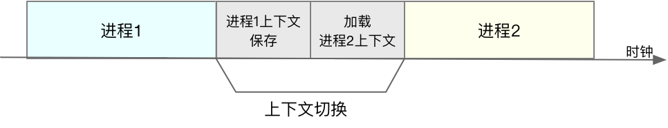

# Linux工具性能图谱


# CPU性能

## 平均负载的概念

定位系统问题时，常用的命令是top和uptime：

```bash
$ uptime
02:34:03 up 2 days, 20:14,  1 user,  load average: 0.63, 0.83, 0.88
```

从左至右分别是当前时间、系统运行时间、正在登录的用户个数、过去1分钟、5分钟、15分钟的平均负载。

平均负载的定义是：单位时间内，系统处于可运行状态和不可中断状态的平均进程数，也就是平均活跃进程数，它和CPU使用率没有直接关系。

可运行状态就是ps命令下状态为R，运行状态或者正在等待CPU的进程；不可中断状态是ps命令下状态为D，代表正处于内核态关键流程中的进程，如等待IO响应。（不可中断状态是为了保证数据的一致性，是系统对进程和硬件设备的一种保护机制）

若平均负载为2，对于有2各CPU的系统，意味着所有的CPU都被占用；对于有4各CPU的系统，意味着CPU有50%的空闲；对于只有1各CPU的系统，意味着有一半的进程竞争不到CPU。

对于系统到底有几个CPU这个问题，可以通过top命令查看有多少行cpu信息，或者直接从文件中获取：(wc -l代表统计行数)

```bash
# 关于grep和wc的用法请查询它们的手册或者网络搜索
$ grep 'model name' /proc/cpuinfo | wc -l
2
```

当平均负载高于CPU数量70%时，就应该分析排查负载高的原因了。但是这个值并不绝对，应该和历史值做比较，有明显升高趋势代表系统不正常。

## 平均负载与CPU使用率

CPU使用率和平均负载是不一样的概念，CPU利用率是指单位时间内CPU繁忙情况的统计，分为三种情况讨论：

1、CPU密集型进程：使用大量CPU的同时，导致平均负载升高

2、IO密集型进程：等待IO会导致平均负载升高，但是此时CPU使用率不一定很高

3、大量等待CPU的进程调度：平均负载升高，CPU使用率也会较高

要模拟上述场景，需要安装stress包和sysstat包。

mpstat是sysstat包下的，它是一个多核CPU性能分析工具（CPU的统计信息都存放在/proc/stat文件中）：

```bash
# -P ALL 表示监控所有CPU，后面数字5表示间隔5秒后输出一组数据
$ mpstat -P ALL 5
Linux 4.15.0 (ubuntu) 09/22/18 _x86_64_ (2 CPU)
13:30:06     CPU    %usr   %nice    %sys %iowait    %irq   %soft  %steal  %guest  %gnice   %idle
13:30:11     all   50.05    0.00    0.00    0.00    0.00    0.00    0.00    0.00    0.00   49.95
13:30:11       0    0.00    0.00    0.00    0.00    0.00    0.00    0.00    0.00    0.00  100.00
13:30:11       1  100.00    0.00    0.00    0.00    0.00    0.00    0.00    0.00    0.00    0.00
```

代表13:30:06开始取，至13:30:11的结果，第一行是所有CPU的平均值all，第二、三行是各个单独的CPU信息。（比较重要的信息是%usr代表CPU使用率、%iowait是磁盘IO等待时间）

pidstat也是sysstat包下的，它是一个常用的进程性能分析工具：

```bash
# 间隔5秒后输出一组数据
$ pidstat -u 5 1
13:37:07      UID       PID    %usr %system  %guest   %wait    %CPU   CPU  Command
13:37:12        0      2962  100.00    0.00    0.00    0.00  100.00     1  stress
```

比较重要的信息是%usr代表CPU使用率、%wait等待CPU的时间

（可以用top、ps、lsof来替代上述命令）

大致定位思路就是通过观察分析异常指标，然后通过查看进程信息定位到导致异常的进程。

（三种场景的指标特征，CPU密集型进程会导致CPU使用率升高、IO密集型进程会导致磁盘IO等待时间升高、大量等待CPU的进程会导致等待CPU的时间升高，分别从上面的两个命令可以检测出来）

## 多进程竞争CPU

多进程竞争CPU状态下会导致系统负载升高，原因是CPU上下文切换。

### CPU上下文切换

CPU执行时需要依赖CPU寄存器和程序计数器。

CPU寄存器是CPU内置的容量小，速度快的内存。程序计数器用来存储CPU正在执行的指令位置。它们是在CPU运行任务前必须依赖的环境，也被称为CPU上下文。

CPU上下文切换就是把前一个任务的CPU上下文保存起来，然后加载新任务的上下文，运行新任务。被保存下来的上下文，会存储在系统内核中，并在任务重新调度执行时再次加载进来。

CPU上下文切换分为几种场景：系统调用、进程上下文切换、线程上下文切换、中断上下文切换。

### 系统调用

Linux按照特权等级，将进程的运行空间分为内核空间和用户空间，分别对应下图中的Ring 0和Ring 3：


内核空间Ring 0具有最高权限，可以直接访问所有资源；用户空间Ring 3只能访问受限资源，不能直接访问内存等硬件设备，必须通过系统调用陷入到内核中，才能访问这些特权资源。

进程在用户空间运行时，被称为进程的用户态；进程在内核空间运行时，被称为进程的内核态。从用户态到内核态的转变，需要通过系统调用来完成，如open、read、close等。

在系统调用的过程中，需要执行内核态指令，会发生CPU上下文切换，执行完再切换到用户空间，共发生两次CPU上下文切换。

系统调用过程不涉及进程的切换，始终都在一个进程运行过程中，又被称为特权模式切换。

### 进程上下文切换

进程上下文是指从一个进程切换到另一个进程运行。进程是由内核管理和调度的，进程的切换只能发生在内核态，所以进程的上下文切换包括：虚拟内存、栈、全局变量等用户空间的资源，内核堆栈、寄存器等内核空间的状态。

所以，进程上下文切换比系统调用更复杂，除了进行CPU上下文切换以外，还必须切换上述资源和状态：



进程上下文一般都需要消耗很多的CPU时间，很容易将CPU大量时间耗费在寄存器、内核栈、虚拟内存等资源的保存和恢复上，缩短了正常进程运行的时间。

此外，Linux通过TLB（Translation Lookaside Buffer）来管理虚拟内存到物理内存的映射关系（TLB是一种缓存），当虚拟内存更新后，TLB也需要刷新，内存的访问也会随之变慢。特别是在多处理器系统中，缓存是被多个处理器共享的，刷新缓存不仅会影响当前处理器的进程，还会影响共享缓存的其他处理器的进程。

进程调度是发生进程上下文切换的原因：Linux为每个CPU都维护了一个就绪队列，将活跃进程（正在运行和正在等待CPU的进程）按照优先级和等待CPU的时间排序，然后选择最需要CPU的进程运行。

几个进程上下文切换的触发原因：

1、某个进程执行完毕，它使用的CPU释放，新的进程进入就绪队列，同时有一个进程进入执行状态

2、某个进程的时间片耗尽了就会被系统挂起，切换到其他等待CPU的进程运行

3、某个进程所需要的系统资源不足，此时进程会被挂起，调度其他进程运行

4、有更高优先级的进程运行，当前进程会被挂起

5、硬件中断会挂起正在执行的进程，转而执行内核中的中断服务程序

### 线程上下文切换

线程是调度的基本单位，而进程则是资源拥有的基本单位。在内核中的任务调度，实际上是以线程为单位的，只是进程提供了线程需要的虚拟内存、全局变量等资源。

当发生同一个进程的线程上下文切换时，不需要切换共享的虚拟内存和全局变量，只需要切换线程的私有数据、寄存器等进程不共享的数据。所以同进程内的线程切换，代价要比进程切换小得多，这是多线程替代多进程的优势。

### 中断上下文切换

为了快速响应硬件的事件，中断处理会打断进程的正常调度和执行。中断上下文不会涉及到进程的用户态，不需要保存被打断进程的虚拟内存、全局变量等用户态资源，只需要保存切换内核态中断服务程序执行所必须的状态，如CPU寄存器、内核堆栈、硬件中断参数等。

中断上下文切换也会导致CPU上下文的切换，大量的中断会导致严重的性能问题。

### 上下文切换的观察与定位

首先用vmstat先观察一下空闲系统的上下文切换次数：

```bash
# 间隔1秒后输出1组数据
$ vmstat 1 1
procs -----------memory---------- ---swap-- -----io---- -system-- ------cpu-----
 r  b   swpd   free   buff  cache   si   so    bi    bo   in   cs us sy id wa st
 0  0      0 6984064  92668 830896    0    0     2    19   19   35  1  0 99  0  0
```

几个重要的列：cs代表每秒上下文切换的次数、in是每秒中断的次数、r是就绪队列（正在运行和等待CPU的进程）的长度、b是处于不可中断睡眠状态的进程数，us和sy（系统CPU）是两种CPU使用率

在终端里运行sysbench，模拟系统多线程调度的瓶颈：

```bash
# 以10个线程运行5分钟的基准测试，模拟多线程切换的问题
$ sysbench --threads=10 --max-time=300 threads run
```

然后再用vmstat观察，如果发现就绪队列的长度超过系统CPU的个数，就说明有大量的CPU竞争；如果发现us和sy的和很大，说明CPU使用率很高，如果是sy很高，说明CPU主要是被内核占用了；in的升高也说明中断处理有潜在问题。

就绪队列过长就说明上下文切换严重，进而导致系统CPU的占用率升高。

为了寻找出问题的进程，需要用pidstat命令：

```bash
# 每隔1秒输出1组数据（需要 Ctrl+C 才结束）
# -w参数表示输出进程切换指标，而-u参数则表示输出CPU使用指标
$ pidstat -w -u 1
08:06:33      UID       PID    %usr %system  %guest   %wait    %CPU   CPU  Command
08:06:34        0     10488   30.00  100.00    0.00    0.00  100.00     0  sysbench
08:06:34        0     26326    0.00    1.00    0.00    0.00    1.00     0  kworker/u4:2

08:06:33      UID       PID   cswch/s nvcswch/s  Command
08:06:34        0         8     11.00      0.00  rcu_sched
08:06:34        0        16      1.00      0.00  ksoftirqd/1
08:06:34        0       471      1.00      0.00  hv_balloon
08:06:34        0      1230      1.00      0.00  iscsid
08:06:34        0      4089      1.00      0.00  kworker/1:5
08:06:34        0      4333      1.00      0.00  kworker/0:3
08:06:34        0     10499      1.00    224.00  pidstat
08:06:34        0     26326    236.00      0.00  kworker/u4:2
08:06:34     1000     26784    223.00      0.00  sshd
```

其中重要的指标是cswch，代表每秒自愿上下文切换的次数，nvcswch代表每秒非自愿上下文切换的次数。

自愿上下文切换指的是进程无法获取所需资源，导致的上下文切换，如IO、内存等系统资源不足；非自愿上下文切换代表进程由于时间片已到等原因，被系统强制调度发上的上下文切换，如大量进程争抢CPU时。

通过观察pidstat命令的结果，就可以看到CPU的升高主要是sysbench导致的，而竞争CPU最严重的进程是kworker和sshd（cswch最高的）

进程的上下文切换次数并不准确，如果要进一步查看线程的上下文切换，需要加上-t参数：

```bash
# 每隔1秒输出一组数据（需要 Ctrl+C 才结束）
# -wt 参数表示输出线程的上下文切换指标
$ pidstat -wt 1
08:14:05      UID      TGID       TID   cswch/s nvcswch/s  Command
...
08:14:05        0     10551         -      6.00      0.00  sysbench
08:14:05        0         -     10551      6.00      0.00  |__sysbench
08:14:05        0         -     10552  18911.00 103740.00  |__sysbench
08:14:05        0         -     10553  18915.00 100955.00  |__sysbench
08:14:05        0         -     10554  18827.00 103954.00  |__sysbench
...
```

可以看到sysbench的子线程上下文切换严重。

而要定位到中断次数飙高的原因，需要查看系统文件/proc/interrupts：

```bash
# -d 参数表示高亮显示变化的区域
$ watch -d cat /proc/interrupts
           CPU0       CPU1
...
RES:    2450431    5279697   Rescheduling interrupts
...
```

观察一段时间后可以发现，变化速度最快的是重调度中断RES，代表频繁唤醒空闲状态的CPU来调度新的任务运行，和之前的上下文切换次数多的分析吻合。

上下文切换的次数合理区间取决于CPU性能，一般在数百到一万以内都算正常，若和平时相比出现了异常的飙高代表可能出现了性能问题。

## CPU密集型进程

### CPU利用率的概念

linux会将每个CPU的时间划分为很短的时间片，再通过调度器轮流分配给各任务使用，因此造成多任务同时运行的错觉。

为了维护CPU时间，linux定义了节拍率HZ，触发时间中断，并记录节拍数，也就是中断次数。可以查询/boot/config内核选项来查看它的配置值：

```bash
$ grep 'CONFIG_HZ=' /boot/config-$(uname -r)
CONFIG_HZ=250
```

节拍率HZ是内核选项，用户空间程序并不能直接访问，为了方便用户空间程序，还有一个用户空间节拍率USER\_HZ，它总是固定为100.

查看关于CPU的信息，需要查看文件/proc/stat：

```bash
# 只保留各个CPU的数据
$ cat /proc/stat | grep ^cpu
cpu  280580 7407 286084 172900810 83602 0 583 0 0 0
cpu0 144745 4181 176701 86423902 52076 0 301 0 0 0
cpu1 135834 3226 109383 86476907 31525 0 282 0 0 0
```

第一列是CPU编号，第一行是总的和，第二行开始是各CPU的信息，其他列代表不同场景下的CPU累加节拍数，乘以0.01后代表以秒为单位的CPU时间。使用man proc可以查看具体列的含义，其中重要的有以下几个：

*   us代表user，代表用户态CPU时间，不包括nice时间，包括guest时间

*   ni代表nice，代表低优先级用户态CPU时间，也就是nice值为1-19的CPU时间（nice值取值范围是-20-19，数值越大，优先级越低）

*   sys代表system，代表内核态CPU时间

*   id，idle，代表空闲时间，不包括等待IO的时间

*   wa，iowait，代表等待IO的CPU时间

*   hi，irq，代表处理硬中断的CPU时间

*   si，softirq，代表处理软中断的CPU时间

*   st，steal，代表运行虚拟机的CPU时间

*   gnice，guest\_nice，代表以低优先级运行虚拟机的时间

根据观察以上指标分析问题：

*   用户CPU和Nice CPU高，说明用户态进程占用了较多的CPU，所以应该着重排查进程的性能问题

*   系统CPU高，说明内核态占用了较多的CPU，应该着重排查内核线程或者系统调用的性能问题

*   IO等待CPU高，说明IO等待时间长，应该注重排查IO问题

*   软中断和硬中断高，应该着重排查内核中的中断服务程序

通常所说的CPU利用率，就是除了空闲时间外的其他时间占总CPU时间的百分比：


根据公式加上proc中的数据，可以很容易算出CPU使用率，也可以根据每个场景的CPU时间，算出各场景的CPU使用率，但是这样计算出的结果，是开机以来的平均CPU使用率。

一般性能工具都会间隔固定时间取CPU利用率，此时就是这段时间内的平均CPU使用率：


当用不同命令对比CPU使用率时，注意要设置相同的间隔时间，否则起不到对比的作用。

进程的数据放在/proc/\[pid]/stat中，各种性能分析工具底层就是在分析这些文件中的数据，

### 基本命令

查看CPU使用率主要的命令是top、ps、pidstat。

top命令显示了系统总体的CPU和内存使用情况，以及各个进程的资源使用情况：

```bash
# 默认每3秒刷新一次
$ top
top - 11:58:59 up 9 days, 22:47,  1 user,  load average: 0.03, 0.02, 0.00
Tasks: 123 total,   1 running,  72 sleeping,   0 stopped,   0 zombie
%Cpu(s):  0.3 us,  0.3 sy,  0.0 ni, 99.3 id,  0.0 wa,  0.0 hi,  0.0 si,  0.0 st
KiB Mem :  8169348 total,  5606884 free,   334640 used,  2227824 buff/cache
KiB Swap:        0 total,        0 free,        0 used.  7497908 avail Mem

  PID USER      PR  NI    VIRT    RES    SHR S  %CPU %MEM     TIME+ COMMAND
    1 root      20   0   78088   9288   6696 S   0.0  0.1   0:16.83 systemd
    2 root      20   0       0      0      0 S   0.0  0.0   0:00.05 kthreadd
    4 root       0 -20       0      0      0 I   0.0  0.0   0:00.00 kworker/0:0H
...
```

第三行的%CPU就是系统的CPU使用率，各参数的含义在上一节已经说明过了。需要注意的是，top命令显示的是所有CPU的平均值，按1就可以切换到每个CPU的使用率了。

在进程的信息中，%CPU代表各进程的CPU使用率，它是用户态和内核态CPU的总和，相当于进程用户空间使用的CPU+通过系统调用执行的内核空间CPU+在就绪队列等待运行的CPU+运行虚拟机占用的CPU

pidstat可以查看各进程的CPU使用情况，而且可以区分各种更细致的CPU：

```bash
# 每隔1秒输出一组数据，共输出5组
$ pidstat 1 5
15:56:02      UID       PID    %usr %system  %guest   %wait    %CPU   CPU  Command
15:56:03        0     15006    0.00    0.99    0.00    0.00    0.99     1  dockerd

...

Average:      UID       PID    %usr %system  %guest   %wait    %CPU   CPU  Command
Average:        0     15006    0.00    0.99    0.00    0.00    0.99     -  dockerd
```

其中%usr代表用户态CPU使用率、%system代表内核态CPU使用率、%guest代表运行虚拟机CPU使用率、%wait代表等待CPU使用率、%CPU代表总的CPU使用率。

最后的Average代表平均值。

一般的CPU问题定位思路就是通过以上命令分析系统情况、找到出问题的进程，从而解决问题。

### perf命令

在定位到具体出问题的线程后，就需要具体分析此线程。perf是linux 2.6.31以后内置的性能分析工具，它以性能事件采样为基础，不仅可以分析系统的各种事件和内核性能，还可以用来分析指定应用程序的性能问题。

一种常见的用法是perf top，它能实时显示占用CPU时钟最多的函数或者指令，可以用来查找热点函数：

```bash
$ perf top
Samples: 833  of event 'cpu-clock', Event count (approx.): 97742399
Overhead  Shared Object       Symbol
   7.28%  perf                [.] 0x00000000001f78a4
   4.72%  [kernel]            [k] vsnprintf
   4.32%  [kernel]            [k] module_get_kallsym
   3.65%  [kernel]            [k] _raw_spin_unlock_irqrestore
...
```

第一行：Samples采样数、event 事件类型、Event count事件总数量。当采样数比较多的时候，分析结果才有参考价值。

下方表格列的含义分别是：

*   Overhead：该事件在所有采样中的比例

*   Shared：该函数或者指令所在的动态共享对象，如内核、进程名、动态链接库名、内核模块名等

*   Object：动态共享对象的类型，\[.]代表用户空间的可执行程序或者动态链接库，\[k]表示内核空间

*   Symbol：函数名，当函数名未知时，用十六进制的地址来表示

第二种常见的用法是perf record和perf report，它们可以保存数据并分析：

```bash
$ perf record # 按Ctrl+C终止采样
[ perf record: Woken up 1 times to write data ]
[ perf record: Captured and wrote 0.452 MB perf.data (6093 samples) ]

$ perf report # 展示类似于perf top的报告
```

top命令和record命令经常要加上-g参数，开启调用关系的采样，方便根据调用链来分析性能问题。加上-p还可以指定指定进程号，如：

```bash
# -g开启调用关系分析，-p指定php-fpm的进程号21515
$ perf top -g -p 21515
```

执行结果：


可以根据调用关系，直接定位到最终调用的函数sprt和add\_funciton，下面只需要找到对应函数的位置就可以具体分析到问题原因了。

### 存在时间很短的进程分析

有时分析CPU过高的问题时，会发现CPU使用率并不是在某个进程达到一个峰值，而是有多个进程CPU使用率很高，且想进一步分析时，进程就会快速消失，以至于找不到进一步的信息。

此时可能的原因有两个：

1、进程不停地崩溃重启，原因可能是配置错误等，被监控系统自动重启恢复

2、这些进程都是短时进程，是在其他应用内部通过exec调用的外部命令，一般只运行很短的时间就会结束。

此时就要查看进程关系来分析问题了。

首先先观察top命令，找到经常占用CPU使用率的进程stress：

```bash
$ top
top - 04:58:24 up 14 days, 15:47,  1 user,  load average: 3.39, 3.82, 2.74
Tasks: 149 total,   6 running,  93 sleeping,   0 stopped,   0 zombie
%Cpu(s): 77.7 us, 19.3 sy,  0.0 ni,  2.0 id,  0.0 wa,  0.0 hi,  1.0 si,  0.0 st
KiB Mem :  8169348 total,  2543916 free,   457976 used,  5167456 buff/cache
KiB Swap:        0 total,        0 free,        0 used.  7363908 avail Mem

  PID USER      PR  NI    VIRT    RES    SHR S  %CPU %MEM     TIME+ COMMAND
 6947 systemd+  20   0   33104   3764   2340 S   4.0  0.0   0:32.69 nginx
 6882 root      20   0   12108   8360   3884 S   2.0  0.1   0:31.40 docker-containe
15465 daemon    20   0  336696  15256   7576 S   2.0  0.2   0:00.62 php-fpm
15466 daemon    20   0  336696  15196   7516 S   2.0  0.2   0:00.62 php-fpm
15489 daemon    20   0  336696  16200   8520 S   2.0  0.2   0:00.62 php-fpm
 6948 systemd+  20   0   33104   3764   2340 S   1.0  0.0   0:00.95 nginx
15006 root      20   0 1168608  65632  37536 S   1.0  0.8   9:51.09 dockerd
15476 daemon    20   0  336696  16200   8520 S   1.0  0.2   0:00.61 php-fpm
15477 daemon    20   0  336696  16200   8520 S   1.0  0.2   0:00.61 php-fpm
24340 daemon    20   0    8184   1616    536 R   1.0  0.0   0:00.01 stress
24342 daemon    20   0    8196   1580    492 R   1.0  0.0   0:00.01 stress
24344 daemon    20   0    8188   1056    492 R   1.0  0.0   0:00.01 stress
24347 daemon    20   0    8184   1356    540 R   1.0  0.0   0:00.01 stress
...
```

为了确认stress是CPU使用率升高的罪魁祸首，用perf命令监控：

```bash
# 记录性能事件，等待大约15秒后按 Ctrl+C 退出
$ perf record -g

# 查看报告
$ perf report
```

结果：


根据结果可以看到stress占用了所有CPU时钟事件的77%

然后分析它的父进程：

```bash
$ pstree | grep stress
        |-docker-containe-+-php-fpm-+-php-fpm---sh---stress
        |         |-3*[php-fpm---sh---stress---stress]
```

这里可以看到，stress是被php-fpm调用的子进程，并且进程数量不止一个。找到父进程后，就要梳理父进程调用stress的逻辑，定位具体的问题。

针对这类问题，还可以使用execsnoop工具，它通过ftrace实时监控进程的exec行为，它是专门为短时进程设计的工具，可以快速发现大量的stress在不停启动：

```bash
# 按 Ctrl+C 结束
$ execsnoop
PCOMM            PID    PPID   RET ARGS
sh               30394  30393    0
stress           30396  30394    0 /usr/local/bin/stress -t 1 -d 1
sh               30398  30393    0
stress           30399  30398    0 /usr/local/bin/stress -t 1 -d 1
sh               30402  30400    0
stress           30403  30402    0 /usr/local/bin/stress -t 1 -d 1
sh               30405  30393    0
stress           30407  30405    0 /usr/local/bin/stress -t 1 -d 1
...
```

也可以快速找到其父进程，进而快速分析问题。

## IO等待导致CPU升高

# IO问题定位

## 索引节点和目录项

在linux系统中，一切皆文件，包括普通的文件和目录、块设备、套接字、管道，都要通过统一的文件系统管理。

为了方便管理，linux系统为每个文件都分配两个数据结构，索引节点（index node，也就是inode）和目录项（directory entry，简称dentry）

索引节点用来记录文件的元数据，如inode编号、文件大小、权限、修改日期等。它和文件数据一样都会被持久化存储到磁盘中。而目录项用来记录文件名、指向inode指针、指向其他目录项的指针，多个目录项就构成了文件系统的目录结构，目录项是由内核维护的一个内存数据结构，所以也被称为目录项缓存。

目录项和索引节点的关系是多对一，例如通过硬链接创建文件，对应不同目录项，但是最后都是链接到同一个文件。（目录是一个文件，这个特殊文件保存了该目录的所有文件名与inode的对应关系）

磁盘读写的最小单位是扇区，只有512B，文件系统将连续的扇区组成逻辑块block，每次操作都是以逻辑块为最小单元来管理数据，常见的逻辑块大小为4KB。

目录项、索引节点和文件数据的关系如下：


虽然索引节点是被持久化到磁盘的，但是它还是可以通过缓存来加速访问。

上图中涉及到磁盘的三个区：超级块区（存储整个文件系统的状态，如索引节点和逻辑块block的使用情况）、索引节点区、数据块区

## 虚拟文件系统

为了支持各种不同的文件系统，linux内核在用户进程和文件系统中间，引入了一个抽象层，这就是虚拟文件系统VFS（Virtual File System）

VFS定义了一组所有文件系统都支持的数据结构和标准接口，这样用户进程和内核中的其他子系统只需要跟VFS提供的统一接口进行交互就可以了，不需要再关心底层各种文件系统的实现细节。


linux底层支持各种各样的文件系统，这些文件系统可以分为三类：

1、基于磁盘的文件系统，也就是数据直接存储在计算机本地挂载的磁盘中，如Ext4、XFS等

2、基于内存的文件系统，也就是虚拟文件系统，这类系统不需要任何磁盘分配存储空间，但是会占用内存，比如/proc文件系统，还有/sys

3、网络文件系统，用来访问其他计算机数据的文件系统，如NFS、SMB、iSCSI等

这些文件系统要先挂载到VFS目录树种的某个子目录（挂载点），然后才能访问其中的文件。（挂载点是设置磁盘分区的一个进入点，根分区/下某一个子目录，如boot和home可以指定独立的硬盘空间，磁盘分区是由磁盘的硬件组成结构决定的，以磁柱为单位的连续磁盘空间，分区的原因在于不同分区隔离数据安全、连续磁盘空间处理效率高）

## IO的分类

IO的分类有：

1、根据是否利用标准库缓存，可分为缓冲IO和非缓冲IO。

缓冲IO可以用标准库缓存来加速文件的访问，标准库内部再通过系统调度访问文件，而非缓冲IO是指直接通过系统调用来访问文件，不经过标准库缓存。

其实通过系统调用，也会使用页缓存来减少磁盘的IO操作。

2、根据是否利用操作系统的页缓存，分为直接IO和非直接IO

非直接IO进行文件读写时，要先经过系统的页缓存，然后再由内核或额外的系统调用，真正写入磁盘。而直接IO是跳过操作系统的页缓存，直接跟文件系统交互来访问文件。

如果是数据库场景还可以看到跳过文件系统读写磁盘的情况，这就是裸IO

3、根据应用程序是否阻塞自身运行，分为阻塞IO和非阻塞IO

4、根据是否等待响应结果，分为同步IO和异步IO

## 磁盘

常见磁盘可以分为机械磁盘和固态磁盘。

机械磁盘也被称为磁盘驱动器（Hard Disk Driver，HDD），主要由盘片和读写磁头组成，数据存储在盘片的环状磁道中，每次读写数据，需要移动读写磁头，定位到数据所在的磁道，然后才能访问数据。

固态磁盘（Solid State Disk，SSD）由固态电子元器件组成，它不需要磁道寻址，性能比机械硬盘要好。

无论是哪种磁盘，随机IO都比连续IO要慢的多，机械磁盘是因为随机IO需要更多的磁头寻道和盘片旋转，固态磁盘同样存在先擦除后写入的限制，随机读写会产生大量垃圾回收。此外，连续IO还可以通过预读的方式，来减少IO请求的次数。

此外，还有一个区别是机械磁盘的最小读写单位是扇区，一般大小为512字节，固态磁盘的最小读写单位是页，通常大小是4KB、8KB。（文件系统会以逻辑块作为最小单元管理数据）

在linux中，磁盘是作为一个块设备来管理的，以块为单位读写数据，并且支持随机读写，每个块设备都会被赋予两个设备号，分别是主、次设备号，主设备号用在驱动程序中，用来区分设备类型；次设备号则是用来给多个同类设备编号。

## 通用块层

为了减少不同块设备的差异带来的影响，linux通过一个统一的通用块层，来管理不同的块设备。通用块层是处在文件系统和磁盘驱动中间的一个块设备抽象层，它除了承上启下以外，还会给文件系统和应用程序发来的IO请求排队，并通过重新排序、请求合并等方式，提高磁盘读写的效率，这就是IO调度。

linux内核支持的四种IO调度算法：

1、NONE：不使用调度，常用在虚拟机中（此时磁盘IO调度完全由物理机负责）

2、NOOP：先入先出的队列，常用于SSD磁盘

3、CFQ：完全公平调度器，应用很广泛，它为每个进程维护了一个IO调度队列，并按照时间片来均匀分布每个进程的IO请求。CFQ还支持进程IO的优先级调度，适用于运行大量进程的系统。

4、DeadLine：它分别为读、写请求创建了不同的IO队列，可以提高机械磁盘的吞吐量，并确保达到deadline的请求优先被处理，它多用在IO压力比较重的场景，如数据库。

## I/O栈

linux存储系统的I/O栈，从上到下分为三个层次，分别是文件系统层、通用块层和设备层：


1、文件系统层：包括虚拟文件系统和各种文件系统的具体实现，它为上层的应用程序提供标准的文件访问接口，对下回通过通用块层来存储和管理磁盘数据

2、通用块层：包括块设备IO队列和IO调度器，它会对IO请求进行管理调度，然后发给设备层

3、设备层：包括存储设备和相应的驱动程序，负责最终物理设备的IO操作

## 磁盘性能指标

几种磁盘性能指标：

1、使用率：磁盘处理IO的时间百分比，过高的使用率如超过80%，意味着磁盘IO存在性能瓶颈

2、饱和度：磁盘处理IO的繁忙程序，过高的饱和度代表磁盘存在严重的性能瓶颈，当饱和度为100%时，磁盘无法接受新的IO请求

3、IOPS（Input/Output Per Second），指每秒的IO请求数

4、吞吐量：每秒的IO请求大小

5、响应时间：IO请求从发出到收到响应的间隔时间

注意使用率只考虑有没有IO，而不考虑IO的大小，当使用率是100%的时候，磁盘依然有可能接受新的IO请求。（使用率只是从时间角度衡量IO，只要用到IO就会被统计）

不要孤立的去比较某一指标，而是要结合读写比例、IO类型以及IO大小综合分析。

比如数据库、大量小文件这类随机读写较多的场景，IOPS更能反映系统的整体性能；在多媒体等顺序读写较多的场景中，吞吐量才更能反映系统的整体性能。

## 基本命令

### 文件系统查看命令df

文件系统查看命令df，比较重要的两个命令是df -h和df -i，前者是查看磁盘空间使用情况，后者是查询inode使用情况（inode也要占用磁盘空间）

索引节点的容量也就是inode个数，是在格式化磁盘时设定好的，如果发现索引节点空间不足，但是磁盘空间充足时，很可能就是过多小文件导致的。

### 磁盘IO观测iostat

它来自于/proc/diskstats

```powershell

# -d -x表示显示所有磁盘I/O的指标
$ iostat -d -x 1 
Device            r/s     w/s     rkB/s     wkB/s   rrqm/s   wrqm/s  %rrqm  %wrqm r_await w_await aqu-sz rareq-sz wareq-sz  svctm  %util 
loop0            0.00    0.00      0.00      0.00     0.00     0.00   0.00   0.00    0.00    0.00   0.00     0.00     0.00   0.00   0.00 
loop1            0.00    0.00      0.00      0.00     0.00     0.00   0.00   0.00    0.00    0.00   0.00     0.00     0.00   0.00   0.00 
sda              0.00    0.00      0.00      0.00     0.00     0.00   0.00   0.00    0.00    0.00   0.00     0.00     0.00   0.00   0.00 
sdb              0.00    0.00      0.00      0.00     0.00     0.00   0.00   0.00    0.00    0.00   0.00     0.00     0.00   0.00   0.00 
```

这些指标的解读：


%util就是磁盘IO使用率

r/s+w/s就是IOPS

rkB/s+wkB/s，就是吞吐量

r\_await\_w\_await，就是响应时间

请求的大小：rareq-sz 和 wareq-sz

磁盘饱和度不能直接得到，需要根据平均请求队列长度或者读写请求完成的等待时间，对比fio基准测试的结果，进行估算

### 进程IO观测pidstat和iotop

pidstat：

```powershell
$ pidstat -d 1 
13:39:51      UID       PID   kB_rd/s   kB_wr/s kB_ccwr/s iodelay  Command 
13:39:52      102       916      0.00      4.00      0.00       0  rsyslogd
```

从左至右指标代表用户ID、进程ID、每秒读取数据大小KB、每秒发出的写请求数据大小KB、每秒取消的写请求数据大小KB、块IO延迟（包括等待同步块IO和换入块IO结束的时间，单位是时钟周期）

iotop可以按照IO大小对进程排序：

```powershell
$ iotop
Total DISK READ :       0.00 B/s | Total DISK WRITE :       7.85 K/s 
Actual DISK READ:       0.00 B/s | Actual DISK WRITE:       0.00 B/s 
  TID  PRIO  USER     DISK READ  DISK WRITE  SWAPIN     IO>    COMMAND 
15055 be/3 root        0.00 B/s    7.85 K/s  0.00 %  0.00 % systemd-journald 
```

前两行分别表示：进程的磁盘读写大小总数、磁盘真实读写大小总数。因为缓存、缓冲区、IO合并等因素的影响，它们可能并不相等。

剩下的部分从左到右：线程ID、IO优先级、用户、每秒读磁盘的大小、每秒写磁盘的大小、换入和等待IO的时钟百分比。

IO 1 的缓存没看

\$ uptime
02:34:03 up 2 days, 20:14,  1 user,  load average: 0.63, 0.83, 0.88
