# 计算机系统概述

## 概念和功能

计算机系统从下至上被分为4个部分：硬件、操作系统、应用程序和用户。

操作系统（Operating System，OS）是控制和管理整个计算机系统的硬件和软件资源，调度计算机的工作和分配，以提供给用户和其他软件方便的接口和环境的程序集合。它是计算机中最基本的软件。

它的功能：

1、作为计算机系统资源的管理者：管理软硬件资源、合理的组织、调度计算机的工作与资源的分配

* 管理处理器CPU：cpu的分配和运行都以进程（或线程）为基本单位，因此对cpu的管理可理解为对进程的管理。进程管理的主要功能包括进程控制、进程同步、进程通信、死锁处理、处理机调度等
* 存储器管理：内存分配与回收、地址映射、内存保护与共享和内存扩充
* 文件管理：文件存储空间的管理、目录管理及文件读写管理和保护
* 设备管理：设备管理的主要任务是完成用户的I/O请求，方便用户使用各种设备，并提高设备的利用率，主要包括缓存管理、设备分配、设备处理和虚拟设备等功能

2、作为用户与计算机硬件系统之间的接口，操作系统提供的接口分为两类：命令接口和程序接口

* 命令接口：用户可以直接使用的，利用这些操作命令来组织和控制作业的执行，它又细分为联机命令接口和脱机命令接口，前者是交互式命令接口，如cmd；后者是批处理接口，如bat文件执行
* 程序接口：用户通过程序间接使用的，编程人员可以使用它们来请求操作系统服务。它由一组系统调用（也称广义指令）组成

3、用作扩充机器（虚拟机）：实现对硬件机器的扩展

## 操作系统的特征

操作系统的特征：并发、共享、虚拟和异步。其中并发和共享是操作系统的两个最基本的特征

### 并发

并发：两个或多个事件在同一时间间隔内发生，这些事件在宏观上是同时发生的，在微观上是交替发生的， 操作系统的并发性指系统中同时存在着多个运行的程序
并行：两个或多个事件在同一时刻发生

一个单核(CPU)同一时刻只能执行一个程序，因此操作系统会协调多个程序使他们交替进行（这些程序在宏观上是同时发生的，在微观上是交替进行的），在如今的计算机中，一般都是多核cpu的，即在同一时刻可以并行执行多个程序。

操作系统是伴随着“多道程序技术出现的”，因此操作系统和并发是一同诞生的

### 共享

资源共享即共享，是指系统中的资源可以供内存中多个并发执行的进程共同使用，

共享分为两类：互斥共享和同时共享：

* 互斥共享：计算机中的某个资源在一段时间内只能允许一个进程访问，别的进程没有使用权。对应的概念是临界资源(独占资源)：在一段时间内只允许一个进程访问的资源，计算机中大多数物理设备及某些软件中的栈、变量和表格都属于临界资源，它们被要求互斥共享。如同一段时间内摄像头只能分配给其中一个进程
* 同时共享：该资源在在一段时间内可以同时允许多个进程访问，同时共享通常要求一个请求分为几个时间片段间隔的完成，即交替进行，“分时共享”，也有可能真的是同时进行资源访问的，如玩游戏时可以放音乐，游戏声音和音乐声音都能听见

并发和共享互为存在条件，失去任何一个，另外一个就没有意义了

### 虚拟

虚拟是把一个物理上的实体变为若干逻辑上的对应物。如虚拟处理器、虚拟存储、虚拟设备：

* 虚拟处理器：通过多道程序设计技术，采用让多道程序并发执行的方法，分时来使用一个CPU，实际物理上只有一个CPU，但是用户感觉到有多个CPU
* 虚拟存储：从逻辑上扩充存储器容量，用户感觉到的但实际不存在的存储器
* 虚拟设备：将一台物理设备虚拟为逻辑上的多台设备，使多个用户在同一时间段内访问同一台设备，即同时共享，用户宏观上感觉是同时的，但实际上是微观交替访问同一台设备的

实现虚拟的技术被称为虚拟技术，虚拟技术有：

* 时分复用技术：如处理器的分时共享
* 空间复用技术：如虚拟存储器

### 异步

多道程序环境允许多个程序并发执行，但由于资源有限，如cpu只有一个，进程的执行并不是一贯到底的，而是走走停停的，它以不可预知的速度向前推进。

之所以会出现这种异步，是因为每个进程占用资源的时间不固定

## 操作系统的发展和分类

1、手工操作阶段：此阶段还未发展出操作系统，用户在计算机上计算的所有工作都需要人工干预，如程序的装入、运行、结果的输出等。

缺点：用户独占计算机，资源利用率低（手工费时间）

2、批处理阶段：可以成批处理任务，但内存中始终只有一道作业。利用磁带，可以批量、顺序的输入到计算机中。

缺点：虽然一直在处理，但作业在运行期间发出I/O请求后，高速的CPU便处于等待低速的I/O完成状态，资源利用率还是很低

3、批处理阶段：多道批处理系统，它允许多个程序同时进入内存中运行，在CPU中交替执行（宏观并行，微观串行）。当一道程序因I/O请求而暂停运行时，CPU便转去运行另一道程序。

缺点：用户响应时间较长，不提供人机交互能力，用户不知道程序的运行情况

4、分时操作系统：计算机以时间片为单位轮流为各个用户提供服务，各用户通过终端与计算机进行交互。

缺点：对于一些突发紧急情况不能及时处理，如导弹制导系统（需要在比时间片还短的时间内作出处理）

5、实时操作系统：能够执行一些紧急的任务，不用等待时间片排队。及时性和可靠性强

又分为硬实时系统和软实时系统：

* 硬实时系统：对某个动作必须绝对的在规定时间内完成，如：导弹系统、股票交易
* 软实时系统：对某个动作可以偶尔违反时间规定，如：订票系统

6、网络操作系统：把计算机网络中的各台计算机有机的结合起来，实现通信、资源共享，在该系统中有主从关系

7、分布式操作系统：系统中各计算机相互协同并行完成同一任务，各计算机有同等地位，无主从关系。每台计算机上的资源为所有用户共享

8、嵌入式操作系统：固定在硬件里面的系统，如手机、路由器。它用来完成某一项特定的功能，不具有通用性

9、个人计算机操作系统

## 运行环境

### 运行机制

通常CPU要执行两种不同性质的程序：操作系统内核程序和用户用户自编或系统外层的应用程序：

* 操作系统内核程序：它是系统管理者，可以执行特权指令和非特权指令，运行在核心态
* 用户应用程序：它被内核程序管理，只能执行非特权指令，运行在用户态

以此区分了两种命令：特权指令和非特权指令：

* 特权指令：不允许用户直接使用的命令，如I/O指令、内存清零、置中断指令、修改程序状态寄存器
* 非特权指令：普通运算命令

操作系统在命令的具体实现又分为核心态和用户态：

* 核心态（管态）：特权指令和非特权指令都可以执行
* 用户态（目态）：只能执行非特权指令

这里是用程序状态寄存器PSW的某个标志位来标识处理器处于什么状态的，PSW是一种特殊的寄存器，它管理了程序运行过程中至关重要的标志位，如进位标志位、零标志位

### 内核

内核是计算机配置在底层的软件，是操作系统中最基本最核心的部分，实现内核功能的程序是内核程序。

它主要包含下面几方面的功能：

* 时钟管理：时钟是最关键的设备，用于计时，例如时间片轮转、实时操作系统中的截止时间控制执行、通过时间来衡量一个作业的运行程度等
* 中断机制：它提高了多道程序运行环境中CPU的利用率。涉及键盘输入、进程管理、系统调用、文件访问
* 原语：一种特殊的程序，运行具有原子性，涉及设备驱动、cpu切换、进程通信
* 对资源进行管理，包括进程管理、设备管理、存储器管理

根据内核的功能可将操作系统分为大内核系统和微内核系统：

* 大内核系统将操作系统的主要功能模块都作为一个整体运行在核心态，性能较高，但结构混乱，内核代码庞大，难以维护
* 微内核系统只将内核中最基本的功能保留在内核，将那些不需要运行在核心态的功能转移到用户态执行，结构清晰方便维护，但需要频繁在用户态和核心态之间切换，性能低（但有实验数据证明结构优化带来的性能提升足以抵消劣势）

### 中断和异常

中断机制最初是为了提高多道程序执行的资源利用率诞生的。中断一部分等待资源的程序，去执行另一部分不需要等待的程序。

发生中断后，CPU会进入核心态，中断是CPU从用户态进入核心态的唯一途径。

中断可以分为内中断和外中断：

* 内中断（也称异常、例外、陷入），指源自CPU执行指令内部的事件，如非法操作码、地址越界、算术溢出、虚存系统的缺页及专门的陷入指令。可以分为自愿中断（指令中断，如访管指令）和强迫中断（又分为硬件故障和软件中断）
* 外中断（狭义的中断）：指信号源自CPU外部，和当前执行的指令无关，如设备的I/O结束中断、时钟中断（时间片已到或者启动定时任务）

### 系统调用

系统调用是操作系统提供给应用程序的接口，应用程序可以通过系统调用获得操作系统的服务，包括以下几类功能：设备管理、文件管理、进程控制、进程通信、内存管理。

执行这些功能都需要操作系统执行某些特权指令，因此系统调用会使CPU从用户态切换到核心态。

系统调用的过程：

* 用户程序执行陷入指令（又称为访管指令/trap指令，它是唯一一个只能在用户态执行，不能在核心态执行的指令）产生内中断，请求操作系统服务
* 操作系统内核程序对系统调用进行处理
* 处理完成后，内核程序将CPU使用权还给用户

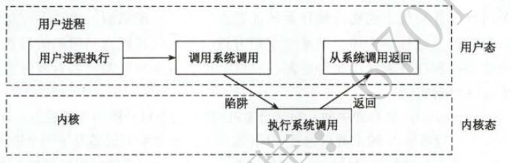

系统调用发生在用户态，对系统调用的处理发生在核心态。

系统调用和库函数的区别：

* 系统调用是操作系统向上提供的接口
* 库函数可以对系统调用进行进一步封装，目前的应用程序大多都是通过高级语言提供的库函数间接进行系统调用

# 进程管理

## 进程与线程

### 进程定义

在多道程序环境下，允许多个程序并发执行，为了更好的描述和控制程序的并发执行，引入了进程的概念

进程是进程实体的运行过程，是系统进行资源分配和调度的独立单位。

进程实体（又叫进程映像）包含三部分：程序段、数据段和PCB（进程控制块，Process Control Block）

进程的特征：

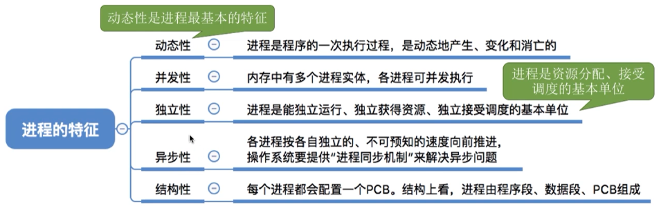

当进程创建时，操作系统就会在内存中新建一个PCB结构，它是进程存在的唯一标志，它主要包含进程描述信息、进程控制和管理信息、资源分配清单和处理机相关信息：

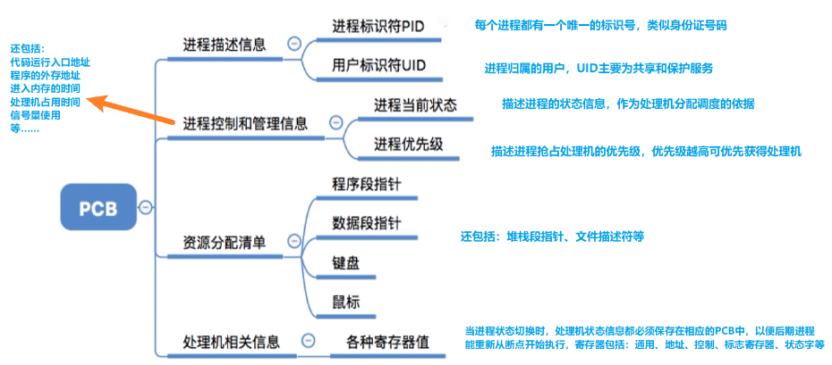

一个系统中通常有成百上千个PCB，为了有效的管理它们，应该用一些适当的方式将它们组织起来，进程的组织方式主要有两种：链接方式和索引方式

* 链接方式：按照进程状态将PCB分为多个队列

* 索引方式：根据进程状态的不同，建立几张索引表

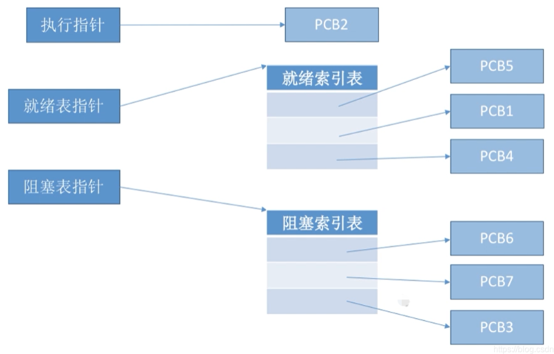

### 进程状态

进程的三种基本状态：

* 运行态：占有CPU并在CPU上运行，单核处理机环境下，同一时刻只有一个进程处于运行状态
* 就绪态：已经具备运行状态（进程拥有除了处理机外所有需要的资源），但没有空闲CPU，暂时不能运行
* 阻塞态：等待系统资源，如等待I/O，此时也没有处理机资源

此外还有两种：

* 创建态：进程正在被创建，操作系统为进程分配资源、初始化PCB
* 终止态：进程正在被终止，操作系统撤回进程拥有的资源、撤销PCB

进程状态间的切换：

* 就绪态 -> 运行态：进程被调度
* 运行态 -> 就绪态：时间片到，或CPU被其他更高优先级的进程抢占
* 运行态 -> 阻塞态：等待系统资源分配，或等待某事件发生，它是主动切换
* 阻塞态 -> 就绪态：资源分配到位，等待的事件发生，它是被动切换
* 创建态 -> 就绪态：系统完成进程创建的工作
* 运行态 -> 终止态：进程运行结束，或运行过程中遇到不可修复的错误

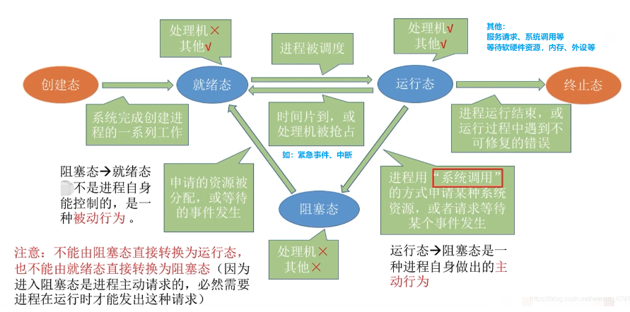

### 进程控制

进程控制就是对进程实施有效的管理，实际上就是完成进程在各种状态间的切换。

进程控制主要通过原语来实现，原语的特点是执行期间不允许中断，原语采用关中断指令和开中断指令实现，两个指令之间放入原语要执行的多段代码，开/关中断指令是只能在核心态执行的特权指令

1、进程的创建

允许一个进程创建另一个进程，此时创建者称为父进程，被创建的进程被称为子进程，子进程可以继承父进程所拥有的资源，当子进程被撤销时，资源还会归还给父进程。在撤销父进程的同时，也必须同时撤销其所有的子进程。

创建进程要依赖创建原语：

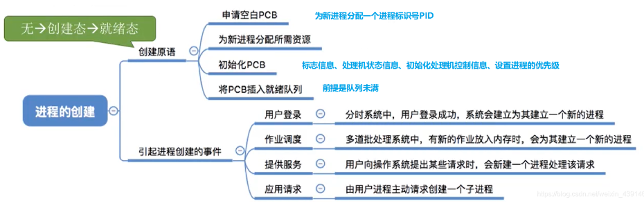

2、进程的终止

要依赖撤销原语：

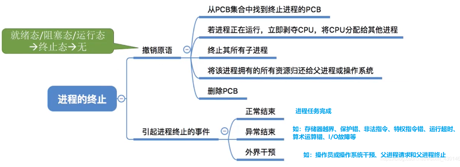

3、进程的唤醒和阻塞

要依赖进程的阻塞和唤醒原语，两者是成对出现的。阻塞原语是由被阻塞进程自我调用实现的，唤醒原语是由一个被唤醒进程合作或被其他相关的进程调用实现的：

4、进程的切换原语

进程切换是指处理机从一个进程的运行转到另一个进程上运行，这个过程中，进程的运行环境产生了实质性的变化，需要依赖进程的切换原语：

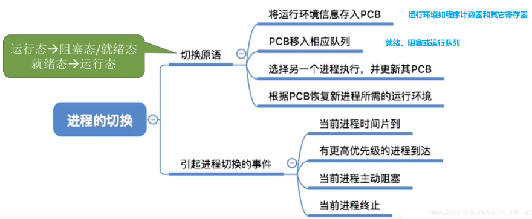

### 进程通信

进程拥有相互独立的内存地址空间，为了保证安全，一个进程不能直接访问另一个进程的地址空间。

进程通信指进程之间的信息交换，PV操作是低级通信方式，有以下几种高级通信方式，可以以较高效率传输大量数据：

* 共享存储：共享一块大家都可以访问的空间，一次只能有一个进程进行读或写操作。在对共享空间进行读/写操作时，需要用同步互斥工具（如PV操作）保证互斥。共享存储由分为基于数据结构的共享（低级通信方式）和基于存储区的共享（基于存储区的共享）：

  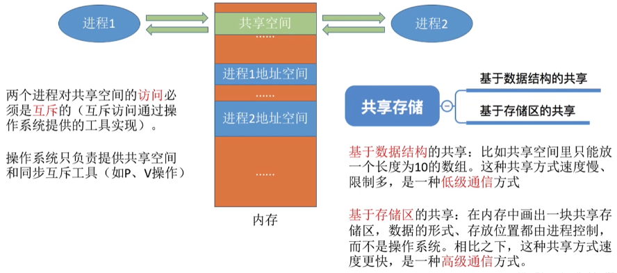

* 消息传递：进程间交换的信息以消息为单位，通过发送消息和接收消息两个原语进行数据交换。消息包含消息头和消息体，又可以细分为直接通信方式和间接通信方式：

  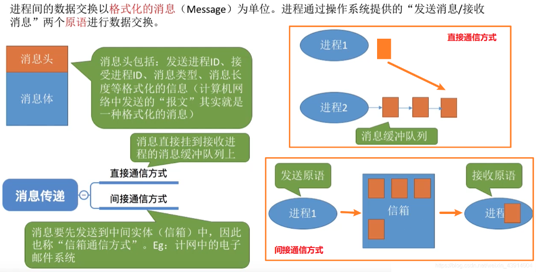

* 管道通信：管道是用于连接读写进程的一个共享文件，也就是pipe文件，本质是在内存中开辟的一个大小固定的缓冲区，管道的是共享存储的优化，因为它可以在写入数据时不阻塞数据的读取。

  管道采用半双工通信，某一个时间段内只能实现单向的传输，如果要实现双向同时通信，则需要设置两个管道

  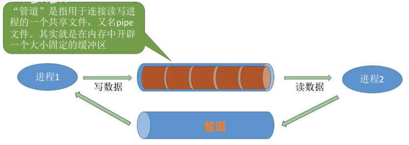

### 线程定义

线程是一个轻量级进程，它是程序执行的最小单元。线程自己不拥有系统资源，它和同属一个进程的其他线程共享进程所拥有的全部资源，线程也有就绪、阻塞和运行三种状态。

线程带来的变化：

* 资源和调度：进程是资源分配的基本单位，线程是调度的基本单位
* 并发性：引入线程后，一个进程也可以同时做很多事，增加了并发度
* 切换开销：切换进程的运行环境开销很大，而同一个进程内的线程切换，则不需要切换进程环境，系统开销小
* 通信：进程间通信复杂，而线程间通信，因为同一进程的各线程共享进程的资源，可以直接读/写进程数据段来进行通信

每个线程都有一个线程ID、线程控制块（TCB），TCB记录了线程执行的寄存器和栈等状态。

### 线程实现方式

线程的实现分为两类：用户级线程和内核级线程

* 用户级线程：它由应用程序通过线程库实现，所有的线程管理工作都由应用程序负责（包括线程切换），用户级线程的切换可以在用户态下完成，无需操作系统干预，操作系统只能感知到进程的存在，感知不到线程的存在：

  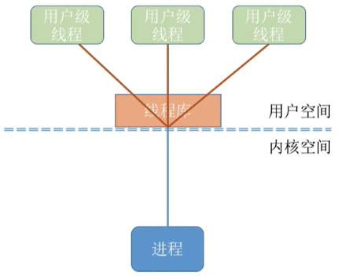

* 内核级线程：它的管理工作由操作系统内核完成，线程调度和切换都由内核负责，切换也必须在核心态下完成，此时操作系统能感知到进程对应的线程存在：

  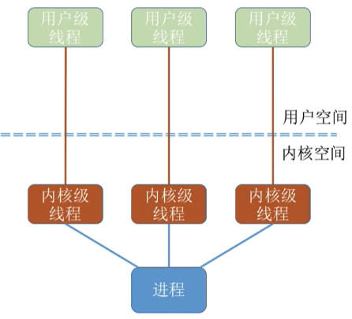

在同时支持用户级线程和内核级线程的系统中，可以采用二者组合的方式，将n个用户级线程映射到m个内核级线程上，如下图：

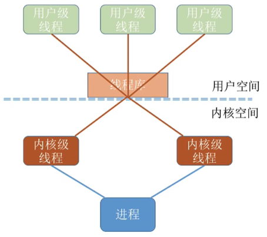

因为操作系统只能感知到内核级线程的存在，所以只会以内核级线程为单位分配处理机，因此对上图中的进程结构来说，最多只能同时有两个用户线程并行执行。

### 多线程模型

接着上一节的组合方式来讨论，根据不同的用户级线程和内核级线程的数量，产生了多种多线程模型：

* 多对一模型：

  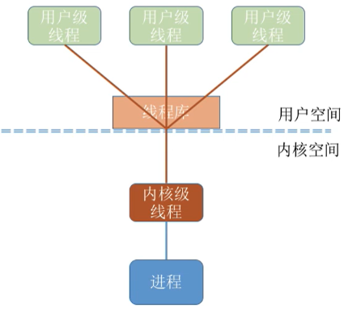

  多个用户级线程映射到一个内核级线程。

  优点：用户级线程的切换在用户空间即可完成，不需要切换到核心态

  缺点：因为内核级线程是分配处理机的基本单位，当一个用户级线程被阻塞后，整个进程都会被阻塞，并发度很低

* 一对一模型：

  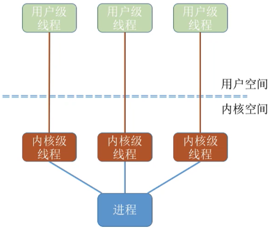

  一个用户级线程映射到一个内核级线程

  优点：并发能力强，当一个线程被阻塞后，其他线程还能继续执行

  缺点：线程切换由操作系统完成，需要切换到核心态，线程管理的成本高

* 多对多模型：

  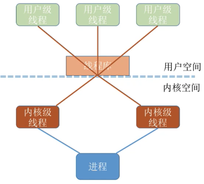

  n个用户级线程映射到m个内核级线程（n >= m），它是前面两种的中和，既有并发度，又不至于线程管理过于复杂。

## 处理机调度

### 调度的三个层次

处理机调度就是按照某种算法选择一个进程，将处理机分配给它。

调度的层次有三种：

* 作业调度，又称高级调度，按照一定的原则从外存上处于后备状态的作业中挑选一个或多个，给它们分配内存、I/O设备等必要的资源，建立相应进程，使他们获得竞争处理机的权力。当作业执行结束，就会将进程销毁。

  执行频率很低，对于每个作业只调入一次、调出一次。多道批处理系统中大多配有作业调度，而其他系统中通常不需要。

* 内存调度，又称中级调度，它会将那些暂时不能运行的进程，调至外存等待，此时进程处于挂起状态，当它们已具备运行条件且内存又稍有空闲时，中级调度又会将它重新调入内存，进入就绪状态。

  当进程被挂起时，PCB依然常驻内存，被挂起的进程PCB会被放到挂起队列中。

  引入挂起后，原来的进程五状态模型就会被扩充为七状态模型：

  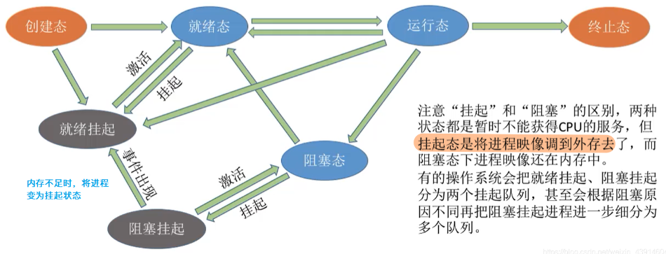

* 进程调度，又称低级调度，它会在就绪队列中选择一个进程，将处理机分配给它，它是最基本的一种调度，且出现频率很高

三层调度的联系和对比：

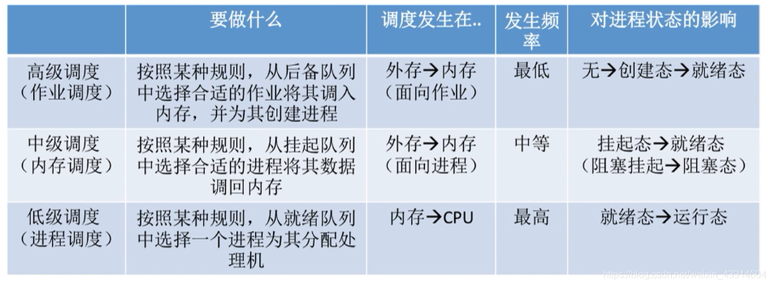

### 调度的时机和方式

不能进行进程调度与切换的几种情况：

1、在处理中断的过程中

2、进程在操作系统内核程序临界区中，进入临界区后，需要独占式地访问共享数据，所以必须加锁防止其他并行程序进入，在解锁前不应切换到其他进程进行

3、原子操作过程中（原语）

应该进行进程调度与切换的情况有：

1、进程主动放弃：如正常终止、异常终止，主动阻塞如等待I/O

2、进程被动放弃：如时间片用完、I/O中断、有更高优先级的进程进入队列

两种进程调度方式：

1、非剥夺调度方式（非抢占式）：只能由当前运行的进程主动放弃CPU，实现简单，但不适用于分时系统和实时系统
2、剥夺调度方式（抢占式）：可由操作系统剥夺当前进程的CPU使用权

### 调度的评价准则

为了比较处理机调度算法的性能，提出了下列评价准则：

1、CPU利用率：CPU忙碌的时间/总时间

2、系统吞吐量：单位时间内完成作业的数量，等于总完成作业数/总时间

3、周转时间：等于作业完成时间-作业提交时间，用户关心的是单个作业的周转时间

平均周转时间等于各作业周转时间之和/作业数，操作系统关系的是系统的整体表现

带权周转时间等于作业周转时间/作业实际运行的时间，它必然>=1，越小越好

平均带权周转时间等于各作业带权周转时间之和/作业数

4、等待时间：指进程/作业等待处理机状态时间之和

5、响应时间：提交请求到首次响应所用的时间

### 典型调度算法

1、先来先服务：FCFS，First come first sever，它按照作业/进程到达的先后顺序进行服务，它是非抢占式的算法。

优点：公平、算法实现简单

缺点：排在长作业后面的短作业需要等待很长时间，导致带权周转时间很大，对长作业有利，对短作业不利；有利于CPU繁忙型作业，不利于I/O繁忙型作业

2、短作业优先：SJF，Shortest Job First，最短的作业/进程优先得到服务，它是非抢占式的算法（但也有抢占式的版本：最短剩余时间优先算法 SRTN，Shortest Remaining Time Next）

优点：平均等待时间最短、平均周转时间最小

缺点：不公平，对短作业有利，对长作业不利，可能产生饥饿现象。作业的运行时间实际上是用户提供的，可能不准确，不一定能真正做到短作业优先

3、高响应比优先：HRRN，Highest Response Ratio Next，它是前面两者的结合，它会优先选择响应比高的作业为其服务。响应比=(等待时间+要求服务时间)/要求服务时间，它是非抢占式算法。

优点：综合考虑了等待时间和运行时间，等待时间相同的任务，短的优先；要求服务时间相同的任务，等待时间长的 优先，不会产生饥饿

4、时间片轮转算法：RR，Round-Robin，它会按照各进程到达就绪队列的顺序，轮流让各进程执行一个时间片，执行完之后剥夺处理机资源，然后将进程重新放到就绪队列，它是抢占式算法

优点：公平，响应快，适用于分时操作系统

缺点：高频率的进程切换带来一定的性能损耗，且没有区分任务的紧急程度

时间片的大小影响算法的实际效果：

* 时间片太大时，所有进程都可以在一个时间片内完成，退化为先来先服务算法
* 时间片太小时，进程切换非常频繁，导致实际用于进程执行的时间减少

5、优先级调度算法：它会优先选择优先级最高的作业/进程，它可以是抢占式的，也可以是非抢占式的：

* 非抢占式优先级调度算法：只能等待进程运行完或者主动退出，处理机资源才会分配给其他进程
* 抢占式优先级调度算法：当进程在处理机上运行时，如果有某个优先级更高的任务，则立即暂停，执行优先级更高的任务。

根据进程创建后是否优先级可以改变，又分为静态优先级和动态优先级。一般来说：

* 系统进程优先级高于用户进程
* 前台进程优先级高于后台进程
* I/O繁忙型进程优先级高于CPU繁忙型进程（资源利用率会更高）

动态优先级的调整时机：

* 等待时间长的任务可以适当提高优先级，占用处理机时间长的任务可以适当降低优先级

6、多级反馈队列调度算法

它是对其他调度算法的折中权衡。它会设置多级就绪队列，各级队列优先级从高到低，时间片从小到大。

新进程到达时先进入第1级队列，按先到先服务原则分配时间片，若时间片用完进程还未结束，则该进程进入下一级队列队尾，直到到最下级的队列，则重新放入队列队尾。

只有当第k级队列为空时，才会为第k+1级队头的进程分配时间片，所以它是抢占式算法，且有可能导致饥饿。

优点：综合了之前的，可以保证先到先服务，短的优先执行完，且无需估计服务时间，还可以调整优先级

## 同步与互斥

### 基本概念

进程同步是进程间协调它们的工作次序、传递信息产生的制约关系。

同步也称为直接制约关系，进程同步是为了解决进程的异步问题出现的，如果不加以制约异步，则会让程序计算出错误的结果，或者作出错误的作业调度。

互斥称为间接制约关系，进程互斥指当一个进程访问某临界资源时，另一个想要访问该临界资源的进程必须等待。当前访问临界资源的进程访问结束，释放该资源之后，另一个进程才能去访问临界资源。

临界资源：一个时间段内只允许一个进程使用的资源称为临界资源，如很多物理设备(比如摄像头、打印机)，一些变量、数据、内存缓冲区。对临界资源的访问，必须互斥地进行。

对临界资源的访问过程，可以在逻辑上分为四个部分：

* 进入区：检查是否可以进入临界区
* 临界区：访问临界资源的代码
* 退出区：将正在访问临界区的标志清除
* 剩余区：代码中的剩余部分

为了禁止两个进程同时进入临界区，同步机制应遵循以下准则：

* 空闲让进：临界区空闲时，可以允许一个请求进入临界区的进程立即进入临界区
* 忙则等待：临界区内已经有进程，则其他进程必须等待
* 有限等待：请求进入临界区的进程，应该保证能在有限时间内进入临界区
* 让权等待：当进程不能进入临界区，应该立即释放处理器，将资源分给其他进程

### 临界区互斥实现

实现进程互斥的软件方法：

* 单标志法：用一个标志记录允许进入临界区的进程号，在一个进程退出临界区的时候设置该标志，其他进程只能通过该进程设置标志，如果进入临界区的顺序不对，则无法运行，不满足空闲让进
* 双标志先检查法：用一个数组表示各进程想进入临界区的意愿，每次进入临界区前，先检查有没有其他进程想进入，若没有则自己进入，同时改变数组的值。它的问题在于检查和上锁不是同时的，可能出现两个进程在临界区的情况，不满足忙则等待
* 双标志后检查法：用一个数组表示各进程想进入临界区的意愿，每次进入临界区前，先设置数组的值，然后检查有没有其他进程想进入，若有则等待，若没有则访问临界区。它的问题在于可能同时有两个进程先设置，然后一直等待下去，没有进程能进入临界区，违反了空闲让进
* Peterson算法：两个进程都想进入临界区，可以让进程尝试先让对方进入，若恰好对方也想进入，且没有让，此时就可以进入。它是单标志法和双标志后检查法的结合，但它违反了让权等待。

实现进程互斥的硬件方法：

* 中断屏蔽方法：用开/关中断指令实现，与原语实现思想相同，开始访问临界区到结束访问为止都不允许被中断。

  优点：简单高效

  缺点：多个进程竞争时会导致CPU等待，不适用于多处理机；适用于操作系统内核，不适用于用户进程（开/关中断指令只能运行在内核态）

* TestAndSet指令：用一个变量代表临界区有进程使用，当进入临界区，修改该变量，整个操作由硬件实现，不可中断，它把检查和上锁合并到一起实现。

  优点：实现简单，适用于多处理机环境

  缺点：不满足让权等待，暂时无法进入临界区的进程会占用CPU循环执行TSL指令，导致忙等

* Swap指令：实现方式和TSL类似，只不过是采用交换变量的方式进行赋值。优点和缺点和TSL一样

### 信号量

信号量机制是对之前所有互斥实现的优化，它解决了让权等待的问题

它只能被两个标准的原语wait(S)和signal(S)来访问，也可以记为P操作和V操作，分别表示请求资源和释放资源

又可以细分为整型信号量和记录型信号量：

* 整型信号量

  信号量被定义为一个用于表示资源数目的整型S：

  ~~~
  wait(S) {
    while(S<=0);
    S=S-1;
  }
  signal(S) {
    S=S+1;
  }
  ~~~

  wait操作中，只要信号量S<=0，就会不断测试，没有满足让权等待

* 记录型信号量

  它除了需要一个整型变量value，还需要增加一个进程链表L，用于保存等待该资源的进程，记录型信号量的定义：

  ~~~c
  typedef struct {
    int value;
    struct process *L;
  } semaphore
  ~~~

  相应的wait和signal操作如下：

  ~~~c
  void wait(semaphore S) {
    S.value--;
    if(S.value<0) {
      add this process to S.L;
      block(S.L);
    }
  }

  void signal(semaphore S) {
    S.value++;
    if(S.value<=0) {
      remove a process P from S.L;
      wakeup(P);
    }
  }
  ~~~

  wait时表示请求一个资源，当资源分配完毕时，调用block原语进行自我阻塞，放弃处理机，同时插入到等待队列中，它真正解决了让权等待的问题。

  signal表示释放一个资源，同时唤醒等待队列中的进程

用信号量可以实现同步和互斥：

* 实现同步：想让两个进程先后执行，初始状态设置S为0，代表没有资源，那么就在第一个进程执行完之后释放资源，执行V；在第二个进程的开始处申请资源，执行P
* 实现互斥：想让两个进程中，只有一个能进入临界区，需要初始状态设置S为1，代表存在资源，两个进程在进入临界区前都执行P申请资源，在进入临界区后都执行V释放资源

### 管程

管程是一个软件模块，它是为了解决信号量机制编程麻烦、容易出错的问题诞生的。

使用时需要在管程中操作共享数据，通过特定的入口才能访问共享数据，每次只能开放一个入口，只能让一个进程或者线程进入，这种互斥特性由编译器负责实现，类似于java中的synchronized

### 经典同步问题

生产者-消费者问题、多生产者-消费者问题、读者-写者问题、吸烟者问题、哲学家进餐问题

## 死锁

### 基本概念

死锁：各进程互相等待对方手里的资源，导致各进程都阻塞，无法向前推进

和饥饿一样都是进程无法顺利推进，但饥饿是策略原因长期得不到资源导致进程无法推进，饥饿的进程可能只有一个，而死锁必须要多个进程参与。饥饿和死锁都是操作系统需要解决的问题

死锁产生的原因：对互斥资源的不合理分配

死锁产生的四个必要条件，任意一个不满足则不构成死锁：

* 互斥条件：对互斥资源进行抢夺

* 不剥夺条件：进程持有的资源只能主动释放，不能强行剥夺

* 请求和保持条件：保持着一些资源的同时，请求别的资源

* 循环等待条件：存在一个环形链条，链中每个进程持有的资源同时被链中下一个进程所请求

  满足循环等待条件不一定就构成死锁，比如下面的右图，如果PN请求P0资源的同时，还请求了PK资源，那么PK释放资源后即可打破死锁：

  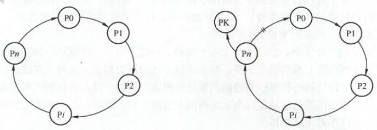

死锁的处理策略，从几个方面入手：

* 预防死锁：破坏死锁的几个必要条件之一或者几个
* 避免死锁：资源分配过程中，用某种方法防止系统进入不安全状态，从而避免死锁
* 死锁的检测及解除：允许发生死锁，但要及时检测并解除

### 预防死锁

1、破坏互斥条件：将互斥使用的资源改造为允许共享使用

缺点：并不是所有的资源都可以改造成可共享使用的资源，并且为了系统安全，很多地方还必须保护这种互斥性，因此很多时候都无法破坏互斥条件

2、破坏不可剥夺条件：

* 方案一：当某个进程请求新的资源得不到满足时，它必须立即释放保持的所有资源，待以后需要再重新申请
* 方案二：当某个进程需要的资源被其他进程所占用的时候，可以由操作系统协助，将想要的资源强行剥夺

方案一可能会使前一阶段工作失效，因此这种方法一般只适用于易保存和恢复状态的资源，如CPU，而且方案一有饥饿的危险。两个方案都可能增加系统开销，降低系统吞吐量

3、破坏请求和保持条件：

可以使用静态分配法：进程在运行前一次申请完它需要的全部资源，在它的资源未满足前，不让它投入运行；一旦投入运行后，这些资源就一直归它所有。

缺点：资源利用率低，可能导致某些进程饥饿

4、破坏循环等待条件：

可以使用顺序资源分配法：给系统中的资源编号，规定每个进程必须按编号递增的顺序请求资源，编号相同的资源一次申请完，不允许逆向申请编号小的资源。

这样在任何一个时刻，总有一个进程拥有的资源编号是最大的，这个进程申请之后的资源必然畅通无阻

缺点：不方便增加新的资源、可能造成资源浪费、用户编程麻烦

### 避免死锁

在系统进行资源分配之前，应先计算此次资源分配的安全性，若此次分配不会导致系统进入不安全状态，则将资源分配给进程，否则就让进程等待。

所谓安全状态就是系统能按照某种进程推进顺序，为每个进程分配资源，使每个进程都可以顺利完成，此时称这个顺序为安全序列，若系统无法找到安全序列，则称系统处于不安全状态（进入不安全状态，就有可能进入死锁状态）

寻找安全序列的算法：银行家算法

首先将每个进程申请资源的情况做一个汇总，比如进程A最多需要x个资源，已经占用了y个资源，最多还会再申请z=x-y个资源，然后再统计当前可用的资源数m，遍历所有申请资源的进程，如果确定了m>=z时，就说明可以将资源分配给这个进程，进程得到了资源满足之后就会释放该资源，总的可用资源数就会增加，就将这个进程加入安全序列，然后再次遍历进程以此类推

银行家算法可以把代表资源的单维数字扩展为多维向量，以表示多种资源的个数情况，然后也是类似的算法，遍历寻找可满足的进程，然后分配资源给它，继续寻找，直到所有的进程都可以满足，就说明此刻是处于安全状态的，如果找不到一个分配顺序以满足所有进程，则说明此时是不安全的

银行家算法在每次分配前都会检查是否满足该进程最大资源分配的要求，若满足则分配，若不满足则推迟分配。

### 死锁检测和解除

系统死锁可以利用资源分配图来描述，如下图所示：

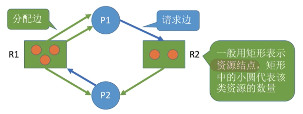

图中要素：

* 圆圈：代表一个进程
* 框：代表一类资源
* 从进程到资源的有向边：请求边
* 从资源到进程的有向边：分配边

在一个时刻下的资源分配图可以描述当前资源分配的情况，比如上面那个图中：

* R1资源有1个被P2占用（分配给P2），有2个被P1占用
* R2资源有1个被P2占用
* P1在请求一个R2资源
* P2在请求一个R1资源

死锁定理：S为死锁的条件是，当且仅当S状态的资源分配图是不可完全简化的

简化资源分配图的步骤：

1、找出既不阻塞又不是孤点的进程，消去它所有的请求边和分配边，使之成为孤立的节点

解释：看一个进程是否阻塞就看他请求的资源能不能得到满足，请求的资源数量若都已经分配出去了，则代表没有资源可用了；消去边的过程其实就是该进程满足要求之后，释放它所占用的资源

2、释放资源后，又可能唤醒因等待这些资源而阻塞的进程，原来的一些阻塞进程有可能变成非阻塞进程

若能用这些步骤将资源分配图的边完全消去，则称该图是可完全简化的

死锁解除的几种方法：

* 资源剥夺法：挂起某些死锁进程，抢占它的资源
* 撤销进程法：强制撤销死锁进程，剥夺它的资源
* 进程回退法：让一个或者多个进程回退到足以回避死锁的地步，这需要系统保持进程的历史信息

如何决定对哪个进程资源剥夺、撤销进程或者进程回退呢，可以按照下面这些标准进行：

* 进程优先级
* 已经执行的时间，和预估还要进行的时间
* 使用的资源
* 进程是交互式的还是批处理式的

# 内存管理

## 内存管理的概念

内存管理的功能：

* 内存空间的分配和回收
* 地址转换：让程序员写程序时只需要关注指令和数据的逻辑地址，而从逻辑地址到物理地址这个过程由操作系统负责
* 内存空间的扩充：虚拟存储技术
* 存储保护：让各道作业在各自的存储空间中运行互不干扰

### 内存的概念

内存是一种高速存储介质，程序执行前需要先放入内存中才能被CPU处理

内存中的数据被放到一个一个的存储单元中：

* 如果计算机是按字节编址，则每个存储单元大小为1字节，8个二进制位（1B=8bit，1KB=1024B=10的10次方bit）
* 如果计算机是按字编址（不同计算机字的单位不同，可能是16位），则每个存储单元大小是16个二进制位

当计算机执行一条指令时，指令会包含操作码和操作数据的地址信息，相当于告诉指令应该去内存的哪个地址存/取数据，这个地址就是内存的地址，内存地址分为两种：

* 逻辑地址：也就是相对地址，用户和程序员只知道逻辑地址，不同进程可以有相同的逻辑地址，这些相同的逻辑地址会映射到主存中的不同位置
* 物理地址：也就是绝对地址，进程在运行时执行指令和访问数据最终都是通过物理地址从主存中读取

在生成机器指令的时候，并不知道进程的数据存放在什么位置，所以编译生成的指令一般是逻辑地址

### 链接和装入

从写程序到程序运行，需要将程序装入内存，此时经历的几个过程：编译、链接、装入

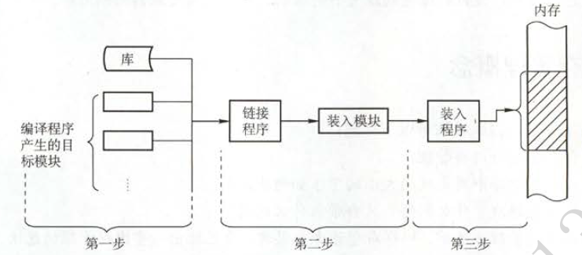

编译：把高级语言翻译成机器语言

链接：编译形成的一组目标模块和库函数链接在一起，形成装入模块（可执行文件）的过程

装入：将装入模块装入内存中运行

链接的三种方式：

1、静态链接：在程序运行之前，就将各目标模块和它们的库函数链接成一个完整的装入模块：

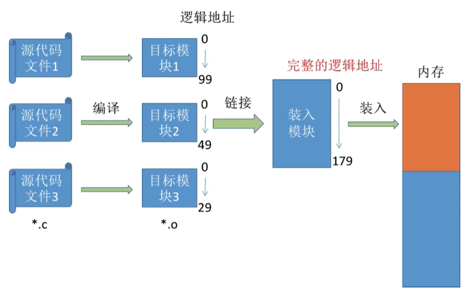

2、装入时动态链接：采取边装入边链接的方式

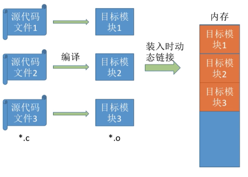

3、运行时动态链接：在程序执行中需要该目标模块时，才对它进行链接

装入的三种方式：

1、绝对装入：在编译、链接后得到的装入模块直接就使用了绝对地址，装入时按照绝对地址装入即可

这种方式只适用于单道程序环境，只有这种情况下才能在编译时将绝对地址给出

2、静态重定位（可重定位装入）：在编译、链接后得到的装入模块的地址都是从0开始的，指令中使用的地址都是相对于起始地址的逻辑地址。在装入时，根据当前内存的情况，装入时对地址进程一次重定位，将逻辑地址变换为物理地址

这种方式必须在装入时分配其要求的全部内存空间，一旦进入内存后，运行期间程序在内存中的位置也不能再移动了，它用于早期的多道批处理系统

3、动态重定位（动态运行时装入）：在编译、链接后得到的装入模块的地址都是从0开始的，装入程序将装入模块装入内存后，并不会立即把逻辑地址转换为物理地址，而是把地址转换推迟到程序真正开始运行时才进行。

这种方式下装入内存后的地址仍然是逻辑地址，需要一个重定位寄存器支持（它存放装入模块的起始地址，在装入时由起始地址+逻辑地址即得到绝对地址），这种方式可以将程序分配到不连续的存储区中，只装入部分代码就可以开始运行，它用于现代操作系统

### 存储保护

存储保护：让各道作业在各自的存储空间中运行互不干扰

内存保护的两种方法：

1、在CPU中设置上、下限两个寄存器，用于存放作业在主存中的上限和下限地址，每当CPU要访问一个地址时，分别和两个寄存器的值对比，判断有无越界

2、通过重定位寄存器（基址寄存器）和界地址寄存器（限长寄存器）来实现保护：

每当CPU要访问一个逻辑地址时，先将该逻辑地址和界地址寄存器进行比较，如果未发生地址越界，则加上重定位寄存器的值后映射成物理地址：

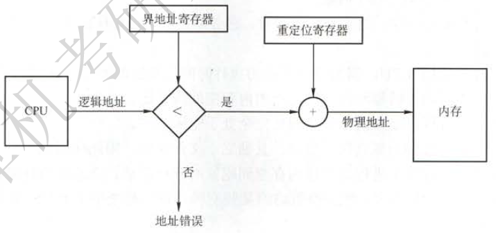

### 覆盖与交换

覆盖与交换是在多道程序环境下用来扩充内存的两种办法：

1、覆盖

早起计算机系统中，内存容量很小，用户程序放不下，此时可以：

* 将程序分为多个段，常用的段常驻内存，不常用的段在需要时调入内存
* 内存中分为一个固定区和若干个覆盖区，常用的段放入固定区，不常用的段放在覆盖区，需要时调入内存，用不到时调出内存

缺点：必须由程序员指定程序的哪个部分是不常用的覆盖结构

2、交换

把处于等待状态下的程序从内存移入辅存，这就是换出；把准备好竞争CPU运行的程序从辅存移到内存，这就是换入。之前说的中级调度技术就是涉及到换入和换出

这里面的辅存其实就是一块专门用于对换的磁盘空间，它采用连续分配方式，I/O要比不同的文件区磁盘更快

交换技术主要是在不同程序/进程间使用。

交换的时机：内存不够用的时候，比如进程运行时缺页

换出的进程：优先换出优先级低的进程

## 连续分配管理方式

连续分配管理方式：指为一个用户程序分配一个连续的内存空间

### 几种分配方式

几种分配方式：

* 单一连续分配

  内存被分为系统区和用户区，系统区通常位于内存的低地址部分，用于存放操作系统相关数据；用户区用于存放用户进程相关数据。内存中只能有一道用户程序，用户程序占了整个用户区的空间：

  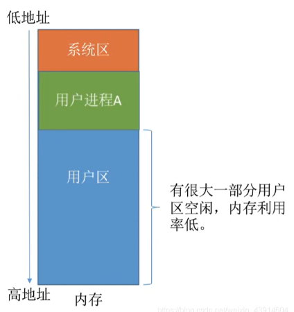

  优点：实现简单，无外部碎片，不需要内存保护

  缺点：只能用于单用户单任务的操作系统，有内部碎片，资源利用率极低

  外部碎片就是内存中那些不属于任何进程的内存；内部碎片就是一部分内存属于某个进程，但有些部分没有用上

* 固定分区分配：将用户空间划分为若干个固定大小的分区，每个分区中只能装入一道作业

  又可以分为分区大小相等和分区大小不等两种区分方式

  操作系统需要建立一个分区表，每条表记录包含下列信息：分区号、分区大小、起始地址、分配状态

  优点：实现简单，无外部碎片

  缺点：当程序太大时可能没有分区满足要求；会产生内部碎片，利用率低

* 动态分区分配（可变分区分配）：在进程装入内存时，根据进程的大小动态地建立分区，使分区的大小正好满足进程的需要：

  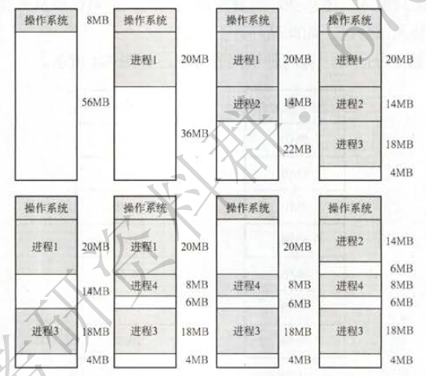

  随着进程的换入换出，内存中会出现很多小的内存块，这些就是外部碎片，清理外部碎片需要紧凑技术来解决，但紧凑会耗费很多时间。

  记录内存的使用的数据结构：空闲分区表（表中每条记录都记录了空闲分区的大小和起始地址）和空闲分区链（每个空闲分区的起始和末尾部分都用指针相连）

  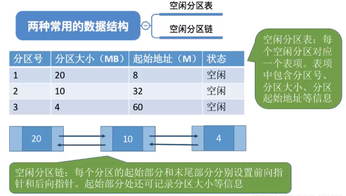

### 动态分区分配算法

在动态分区分配中，需要按照一定的策略，将进程装入某个最合适的空闲内存

1、首次适应算法

每次都从低地址开始查找，找到第一个能满足大小的空闲分区

2、最佳适应算法

空闲分区信息按照容量递增的方式组织起来，每次都从分区小的空闲分区开始查找，找到第一个满足条件的空闲分区

缺点：会留下越来越多的、很小的、难以利用的内存块，产生很多外部碎片

3、最坏适应算法

空闲分区信息按照容量递减的方式组织起来，每次都从分区大的空闲分区开始查找，找到第一个满足条件的空闲分区

缺点：较大的连续空闲区被迅速用完，等有大进程到达时就没有内存分区可用了

4、临近适应算法

和首次适应算法不同的是，每次都不是从低地址开始查找，而是每次从上次查找结束的位置开始查找，找到第一个满足大小的空闲分区，这样低地址部分就不会出现很多小的空闲分区了

缺点：高地址部分也有可能被使用，导致最后无大分区可用

综合考虑还是首次适应算法效果最好

## 非连续分配管理方式

非连续分配允许一个程序分散地装入到不相邻的内存分区中

根据分区的大小是否固定，分为分页存储管理方式和分段存储管理方式

分页存储管理方式中，又根据运行作业时是否要把作业的所有页面都装入内存才能运行，分为基本分页存储管理方式和请求分页存储管理方式

### 基本分页存储管理方式概念

之前学过的几种连续分配方式都有一定的缺点：

* 固定分区分配：产生大量内部碎片，内存的利用率很低
* 动态分区分配：会产生很多外部碎片，虽然可以用紧凑来处理，但紧凑的性能较差

基本分页存储管理方式的思想：把内存分为一个个相等的小分区，再按照分区大小把进程拆分为一个个小部分

内存分为一个个大小相等的分区，每个分区被称为页框（也称为页帧、内存块、物理块），每个页框有一个编号，也就是页框号（或者内存块号、页帧号、物理块号），页框号从0开始

将用户进程的地址空间分为和页框大小相等的一个个区域，称为页或页面，每个页面有一个页号，页号也是从0开始（进程的最后一个页面可能没有一个页框那么大，所以页框不能太大，否则会产生过大的内部碎片）：

操作系统以页框为单位为各进程分配内存空间，进程的每个页面分别放入一个页框中（可以是不连续的页框）：

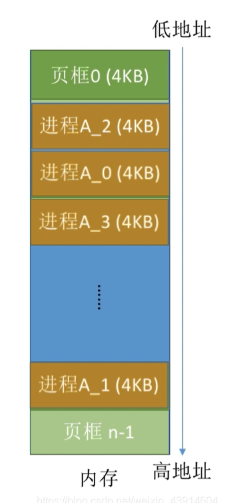

在基本分页存储管理方式中的地址转换步骤：

1、算出逻辑地址对应的页号：页号=逻辑地址/页面长度

2、要知道该页号对应页面在内存中的起始位置，这个需要通过页表来查询

3、算出逻辑地址在页面内的偏移量，页内偏移量=逻辑地址%页面长度

4、最后物理地址=页面起始地址+页内偏移量

页面大小一般设为2的整数次幂，根据二进制的特性，有下面这条规律可以很方便的计算页号和页内偏移量：

如果每个页面大小为2的k次方B，那么二进制末尾k位是页内偏移量，其余部分是页号。

例如，地址长度为32位，每个页面大小是4KB：

为了知道进程的每个页面在内存中的存放位置，操作系统要为每个进程建立一张页表。

进程的每一页对应一个页表项，每个页表项由页号和块号组成，页号是隐含的信息：

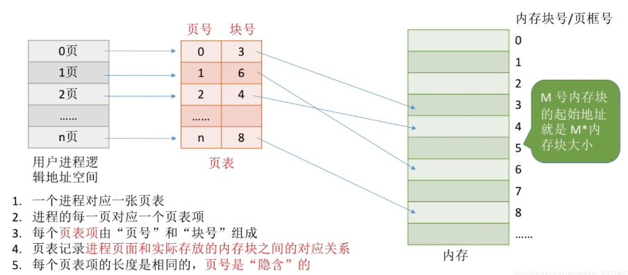

页号其实在页表中是隐含的信息，页表中实际存储的只有块号，因为每一项的大小是固定的，页表存储在一块连续的内存中，所以只需要知道页表存放的起始地址和页表项长度（每个页表项占用多大的空间，由总的内存块数决定，最大内存块数=内存大小/页面大小）就好了

### 基本地址变换结构

在基本分页存储管理方式中，基本地址变换结构可以将逻辑地址转换为物理地址

变换结构中一个很重要的概念是页表寄存器PTR，它存放页表在内存中的起始位置和页表长度（页表起始地址是为了快速找到页表的位置，页表长度可以知道进程总共有多少个页）

逻辑地址到物理地址转换的流程：

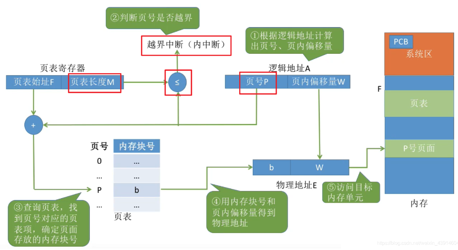

1、根据逻辑地址，将地址分为两部分，算出页号和页内偏移量

2、根据页表寄存器中的页表长度，和页号进行对比，判断要访问的页号是否越界，若越界则发出一个越界中断（内中断）

3、根据页表寄存器中的页表起始位置，找到页表，然后根据页号找到对应记录中的内存块号

4、内存块号+页内偏移量即得到物理地址，可以顺利访问对应内存单元

前面说过，页表中页号是隐藏信息，实际只保存了块号。如果对于内存大小4GB，页面大小4KB的，内存块最大个数是2的32次方/2的12次方=2的20次方，这些块号可以用3个字节，24个二进制位表示

在页表存储到内存中时，它是连续存储的，每个页表项之间相连，如果每个页表项占3个字节，每个页面大小是4KB的话，则页表项存入页面的过程中会因为除不尽，产生内部碎片，因此页表项多占一个字节，取4字节，这样一个页恰好装得下整数个页表项了

### 具有快表的地址变换结构

上面的基本地址变换结构，每次要访问一个逻辑地址，都需要查询内存中的页表，由于局部性原理，可能连续很多次查到的都是同一个页表项，所以我们可以引入快表来加快这个变换过程。

快表是一个高速缓冲存储器（比内存快），又称为联想寄存器TLB，用来存放当前访问的若干页表项，以加速地址变换的过程，与此对应的内存中的页表被称为慢表

具有快表的地址变换结构，进行地址转换的过程：

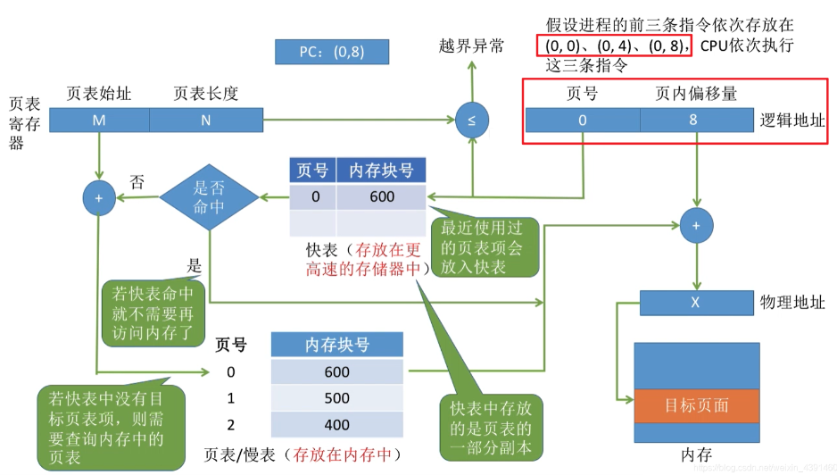
每次进行地址变换的时候，先进行越界异常的检验，然后去快表中去查询对应页号的内存块号，如果有的话就不用找页表了，直接就能得到物理地址。如果没有找到匹配的页号，则需要访问内存中的页表，然后继续上面的流程。找到页表项后，应该同时将其存入快表，以便后面再次访问，如果快表已满，则必须按照一定的算法对旧的页表项进行替换。

由于查询快表的速度比查询页表的速度快很多，只要快表命中就能节省很多时间。因为局部性原理，一般来说快表的命中率可以达到90%以上。

### 二级页表

单级页表的设计存在两个问题：

1、因为页表是在内存中连续存储的，一个进程的页表可能需要非常大的连续内存，才能存的下页表，但这与我们的非连续分配方式相悖

2、根据局部性原理，进程在一段时间内只需要访问某几个页面就可以正常运行了，因此没有必要让整个页表都常驻内存

第一个问题需要引入二级页表：

可以将长长的页表进行分组，让每个内存块刚好放入一个分组：

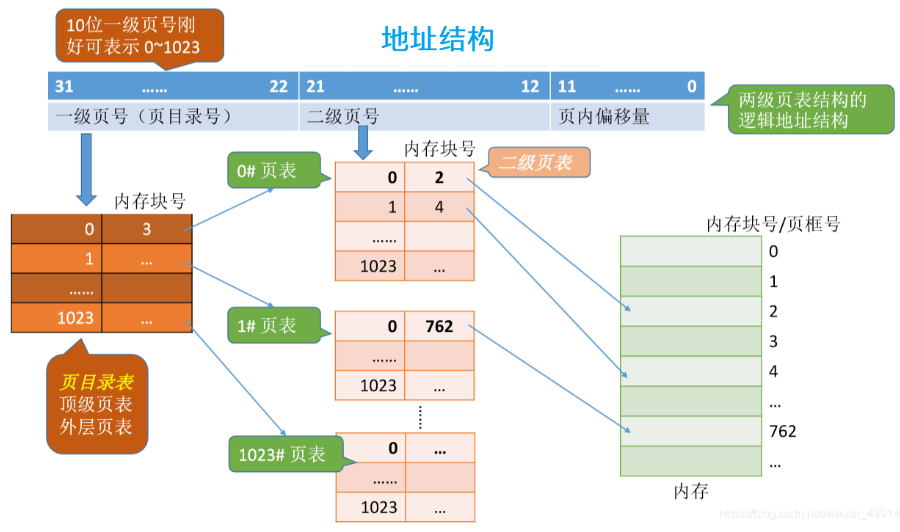

一个内存块4KB，一条页表项4B，一个内存块可以放下1024个页表项，也就是说1个二级页表应该有1024个页表项，二级页表记录着页号和内存块号的关系。为了找到二级页表，还需要为离散的二级页表再建一个页表，它就是页目录表，或者叫外层页表，顶层页表，用以记录一级页号到二级页表所在内存块之间的关系。

两级页表的逻辑地址结构就被分为三部分：一级页号+二级页号+页内偏移量，这样，根据一级页号去顶层页表找到二级页表所在的内存块，然后根据二级页号去二级页表找到对应物理地址的内存块，就能找到对应的物理地址了。

上图中，内存是32位的，页面大小为4KB，页表项长度为4B，因此页内地址要用12位（4KB）来表示，剩余的页号只能占20位，所以单级页表最多要2的20次方个页表项。扩展为二级页表后，只需要1个顶级页表和1024个二级页表即可满足要求了，而且二级页表是可以放在内存中不连续的块中的

第二个问题需要虚拟内存来解决，需要访问页面时才把页面调入内存，可以在页表项中增加一个标志位，用于表示该页面是否调入内存。若想访问的页面不在内存中，则产生缺页中断（内中断），然后将目标页面从外存调入内存。

### 基本分段存储管理

段式管理方式按照用户进程中的自然段划分逻辑空间，按功能将程序分为多段。内存分配时，以段为单位进行分配，每个段在内存中占据连续空间，但各段之间可以不相邻：

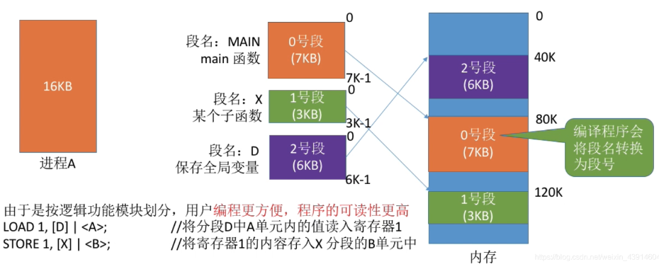

分段系统的逻辑地址结构由段号和段内地址（偏移量）组成：

如上面的例子，段号占16位，因此在该系统中每个进程最多有2的16次方个段，段内地址占16位，每个段的最大长度是2的16次方bit，即64KB

为了从物理内存中找到各逻辑段的存放位置，需要为每个进程建立一张段表，段表有多个段表项，每个段表项包含了三个信息：段号、段长、段基址，因为每个段表项的大小是固定的，因此段号是可以隐含的。

分段存储管理时的地址转换逻辑：

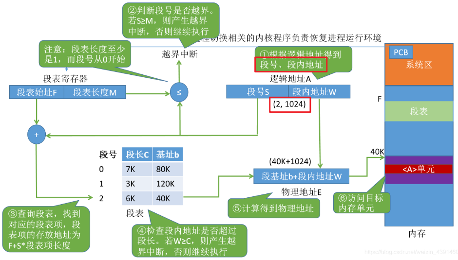

和分页存储类似，分段存储地址变换也需要借助段表寄存器，它存储了段表始址和段表长度。每次地址变换时要判断段号是否越界，查找段表，检查段内地址是否越界，然后查到段基址，最后由段基址+段内地址就得到目标内存单元的物理地址。

分段和分页的区别就是段的大小是不固定的，所以在地址变换时要增加一步段内地址校验。

分段和分页的对比：

* 页是信息的物理单位，分页是系统上的需要，对用户不可见；段是信息的逻辑单位，分段对用户是可见的，编程时要显式给出段名

* 页的大小固定，段的大小不固定

* 分页的用户进程地址空间是一维的，程序员只需要给出一个地址偏移量；分段的用户进程地址空间是二维的，程序员要给出段号和段内地址

* 分段比分页更容易实现信息的共享和保护，比如不同进程可以共享某个程序段，如消费者进程和生产者进程都要检查缓冲区此时是否可以访问，就可以共享一个程序段：

  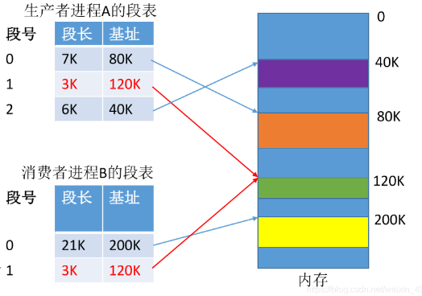

  如果是分页管理，想分享信息就比较麻烦，因为页的大小是固定的，没有按照逻辑划分，可能出现共享不同页的部分，难以管理：

  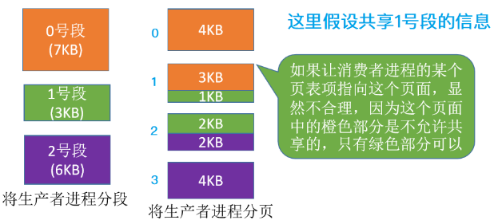

### 段页式管理方式

分页和分段都有它的优点和缺点：

* 分页管理优点是内存利用率高，不会产生外部碎片，只有少量内部碎片；缺点是不方便按照逻辑模块实现信息的共享和保护
* 分段管理的优点是方便按照逻辑模块实现信息的共享和保护；缺点是如果段长过大，为其分配很大的连续空间不方便，另外，段式管理会产生外部碎片（也可以通过紧凑来解决）

因此我们可以将两者结合，形成段页式管理，将进程按逻辑模块分段，再将各段分页：

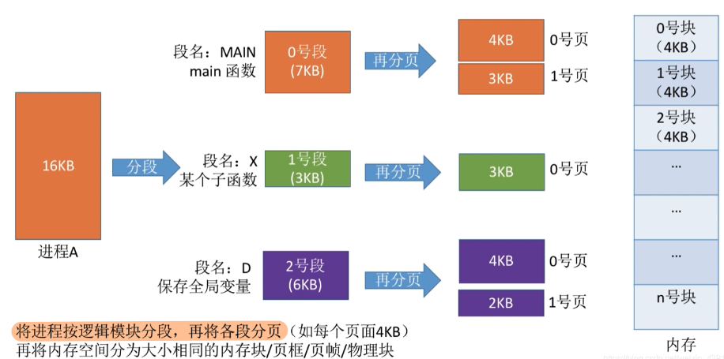

段页式系统的逻辑地址结构由三部分组成：段号、页号、页内偏移量。段号的位数决定了一个进程最多有多少个段，页号的位数决定了一个段最大能分多少页，页内偏移量决定了一个页占多少内存

段页式系统的地址结构是二维的，程序员只需要指定段号和页内偏移量即可，至于页号是多少，因为页的大小是固定的，可以推算得到。

段页式管理的地址转换过程：

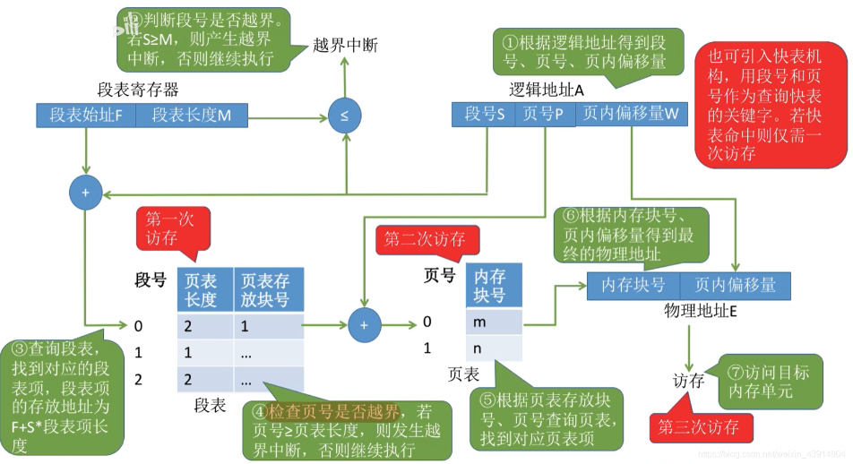

需要借助段表和页表：

* 段表的每个段表项存的是段号、页表长度、页表存放块号，它用来根据段号来找到页表
* 页表的每个页表项存的是页号、页面对应的内存块号，它用来根据页号找到对应页在内存中的位置

地址变换时需要借助段表寄存器，需要检查段号越界、页号越界。总共需要访问段表、页表、内存单元，共三次访存。

## 虚拟内存

### 基本概念

传统存储管理的缺点：

* 一次性：作业必须一次性全部装入内存后才开始运行，作业很大时无法全部装入，作业的并发度下降
* 驻留性：一旦作业被装入内存，就会一直驻留在内存中，直至作业结束，实际上在一个时间段内，只需要访问作业的一小部分数据即可正常运行；运行中的进程可能因为等待IO而被阻塞，导致长期占用内存

局部性原理：

* 时间局部性：如果执行了程序中的某条指令，那么不久后这条指令很有可能再次执行
* 空间局部性：如果访问了程序中某个存储单元，不久后其附近的存储单元也很有可能被访问

这都是因为程序中存在大量循环、很多数据、程序指令在内存中是连续存放的

局部性原理的应用：将近期会频繁访问的数据放到更高速的存储器中，暂时用不到的放到更低速的存储器中，这和计算机中存储器的层次结构有关：

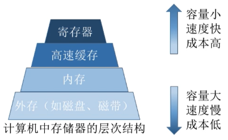

在程序装入内存时，可以将程序很快会用到的部分装入内存，暂时用不到的留在外存，这样就可以让程序开始执行。随着程序执行，不断将要访问的信息从外存调入内存，如果存储空间不够，还需要将暂时用不到的信息换出到外存。在操作系统的管理下，用户在使用一个比实际内存更大的内存，这就是虚拟内存，虚拟存储器。

虚拟内存的三个主要特征：

* 多次性：作业允许被分成多次调入内存
* 对换性：在作业运行期间无需一直常驻内存，而是允许在作业运行过程中，将作业换入换出
* 虚拟性：从逻辑上扩充了内存的容量

虚拟内存的实现，必须是基于非连续分配的内存管理方式的基础上的，连续分配无法实现信息的调入和调出，所以实现分为三种方法，和非连续分配的方式一一对应：请求分页存储管理、请求分段存储管理、请求段页式存储管理。

### 请求分页管理方式

请求分页存储管理和基本分页存储管理的区别：

* 当所访问的信息不在内存时，由操作系统负责从外存调入内存，然后继续执行程序，要求操作系统提供请求调页功能
* 当内存空间不够时，由操作系统负责将内存中暂时用不到的信息换出到外存，要求操作系统提供页面置换的功能

为了实现请求调页和页面置换的功能，需要在请求页表项中增加四个字段：状态位、访问字段、修改位、外存地址

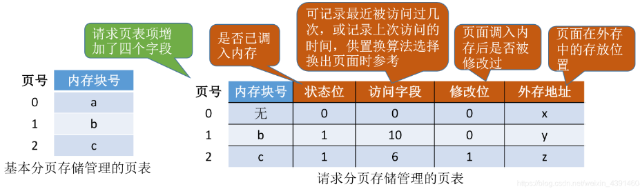

因为在虚拟内存中，并不是将进程所有信息都调入内存，所以这里面有外存的概念，需要知道内存中的页面和外存的映射关系。

在请求分页系统中，每当要访问的页面不在内存时，便产生一个缺页中断，然后由操作系统的缺页中断处理程序处理中断，此时缺页的进程阻塞，放入阻塞队列，调页完成后再将其唤醒，放回就绪队列，此时：

* 如果内存中有空闲块，则为进程分配一个空闲块，将所缺页面装入块中
* 如果内存中没有空闲块，则由页面置换算法选择一个页面淘汰，若该页面在内存期间被修改过，则要将其写会外存，未修改的页面不用写回外存

请求分页管理方式的地址变换机构：

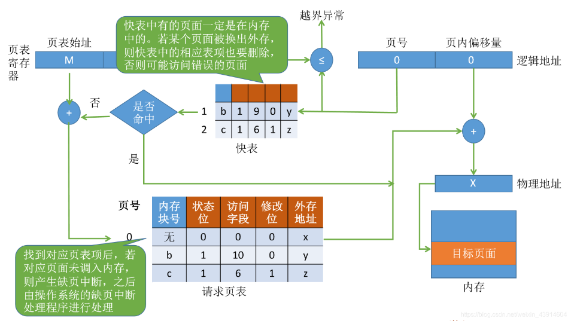

请求分页管理方式地址变换时也有快表，快表只会保存还在内存中的页面数据，若页面被换出，则要删除对应的快表页表项。如果命中快表，则需要修改快表汇中的访问位和修改位，然后形成物理地址；若没有命中快表，则查找请求页表，检查该页是否在内存中，若没有，则产生缺页中断，如果内存满了还需要页面置换，页面置换时，如果该页被修改过，则需要将该页写回外存，最终访问目标内存后，还需要修改请求页表项：

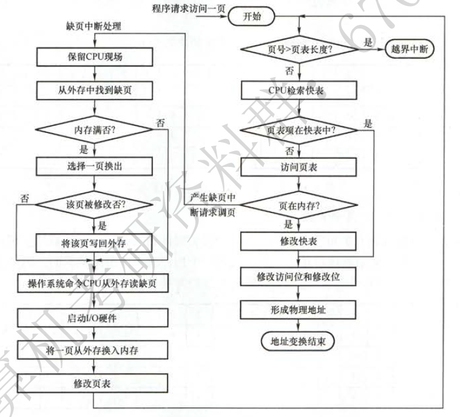

### 页面置换算法

在页面置换时，需要由算法决定应该换出哪个页面。页面置换算法的评价标准是最少的缺页率（发生换出的次数要少）

1、最佳置换算法OPT

它的思想是每次选择淘汰的页面是以后最长时间内不再被访问的页面，例如下图，共三个可用的内存块，第一行是访问页面的顺序：

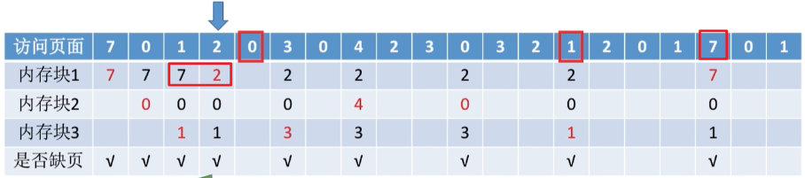

当第四列，要访问页面2的时候，此时三个内存块都占满了，所以需要往后找0/1/7三个页面中未来最久未使用的页面，然后将其换出，就是7号页

该算法性能最好，但无法实现，因为只有实际执行时才知道接下来会访问什么页面

2、先进先出置换算法FIFO

它的思想是每次选择淘汰最早进入内存的页面，如下面的例子，当第四列需要将页面0放到内存时，就将最早进入内存的3号页换出：

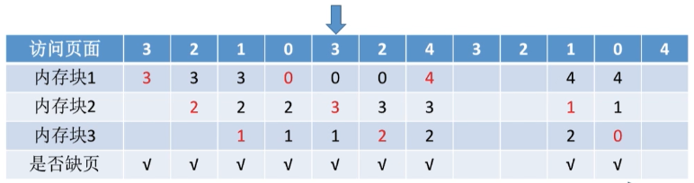

但该算法会出现Belady异常：当进程分配的内存块数增大时，缺页次数反而增长。该算法不符合局部性原理，效果不好，但实现简单

3、最近最久未使用置换算法LRU

每次淘汰的页面是最近最久未使用的页面，该算法需要在页表项中增加一列：该页面自上次访问以来所经历的时间t，每次要淘汰一个页面时，选择内存中现有页面中t最大的

例如，当要使用第3页时需要进行页面置换，此时7号页是最久未被使用的，所以将它置换出来：

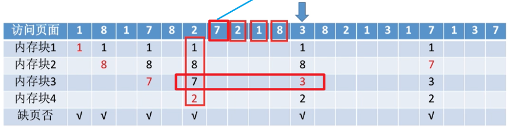

它性能较好，但实现比较复杂

4、时钟置换算法CLOCK

它是一种性能和开销比较均衡的算法，也被称为最近未用算法。它需要每个页表项增加一列访问位，1代表某个页最近被访问过，0代表某个页最近没有被访问过。每次访问一个页的时候，就将其访问位置为1

当需要页面置换时，将内存中的页面通过链接指针相连成一个循环队列，扫描第一个访问位为0的页面将其换出，第一轮扫描时，可能会有所有访问位都为0的情况，因此在扫描时，需要将访问位为1的记录置为0，这样第二轮扫描中 一定会有访问位为0的页面

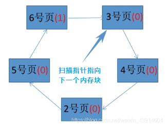

简单的CLOCK算法选择一个淘汰页最多会经过两轮扫描

5、改造型时钟置换算法

CLOCK算法仅考虑到一个页面最近是否被访问过，还有一个影响性能的重要因素是是否需要写回外存，内存中被修改的页才需要写回外存，这个操作是有IO耗时的，因此要优先将那些没有修改过的页面置换出去，这样就可以避免这部分IO操作。

因此需要在页表项中额外增加一列：修改位，代表页面是否被修改过。

每次选择一个页面置换出去时，将内存中的页面通过链接指针相连成一个循环队列，每个页面用（访问位，状态位）的形式来表示页面状态

第一轮：扫描第一个00状态的，也就是最近未访问，且未被修改的页面，这一轮不修改标志位

第二轮：扫描第一个01状态的，优先扫描未被修改的页面，这一轮扫描时将访问位设置为0

第三轮，扫描第一个00状态的，优先扫描最近访问过，但没被修改的页面，本轮扫描不修改标志位

第四轮：扫描第一个01状态的

因为已经在第二轮将访问位设置为0，所以最后一轮一定会命中一个页面，改进型CLOCK算法选择一个淘汰页面最多会进行四次扫描

### 页面置换策略

驻留集：一个进程分配的内存块的集合：

* 当驻留集大小等于进程的总页面数量时，进程可以全部放入内存，不会发生缺页
* 当驻留集大小很小，为1时，进程运行期间则会频繁的缺页

驻留集的大小影响了运行效率：

* 当驻留集过小时，会导致缺页频繁
* 当驻留集太大，又会导致整个程序都装入了进程，此时即使某部分处于阻塞状态也不会换出，在整体上降低了多道程序的并发度，资源利用率下降

页面置换策略的两个维度：

* 固定分配和可变分配，前者指的是为每个进程分配的内存块的数量是固定的，在运行期间不会改变，即驻留集大小不变；后者是在进程运行期间，可以调整驻留集大小的
* 局部置换和全局置换，局部置换的意思是发生缺页时只能选进程自己的内存块进行置换；全局置换的意思是缺页时可以将操作系统保留的空闲内存块分给缺页进程，也可以从别的进程那里换出页面进行置换

由此产生了三种页面置换策略：固定分配局部置换、可变分配局部置换、可变分配全局置换

* 固定分配局部置换：每个进程分配的内存块数量固定，缺页时只选择进程自己的内存块来置换。缺点是很难在一开始就指定一个合适的驻留集大小
* 可变分配局部置换：每个进程分配的内存块数量可变，缺页时只选择进程自己的内存块来置换。它可以根据缺页的频率动态的增加或减少进程的内存块
* 可变分配全局置换：每个进程分配的内存块数量可变，操作系统会维护一个空闲内存块队列，当缺页发生时，进程即获得一个新的内存块；若没有空闲内存块，则可以选择其他进程某个没有锁定的内存块进行置换。缺点是盲目的给进程增加内存块会让整体的并发能力下降

### 页面调入时机与位置

调入页面的时机可以采取两种策略：

* 预调页策略：根据局部性原理，一次调入若干个相邻页可能比一次调入一页更高效，但如果调入的页面都没有被访问，又会是低效的，这种提前调入的方式目前只用于进程的首次调入，由程序员指定应该先调入哪些部分
* 请求调页策略：运行期间发现缺页时才调入

前面提到过，外存磁盘有两个区域：对换区和文件区，前者的IO速度快，采用连续分配方式；后者的IO慢，采用离散分配方式。

页面调入的位置：

* 当系统拥有足够的对换区空间时，页面的调入和调出都是在内存和对换区之间进行，速度很快
* 当系统缺少足够对换区空间时，采用这样的策略：对于那些不会被修改的数据是从文件区调入的，因为它们不会被修改，也不会有回写的动作；对于那些可能被修改的部分，换出时要写回到对换区，下次再从对换区调入

UNIX页面调入位置的策略：运行前进程的数据都放在文件区，未使用过的页面都从文件区调入，换出时放入对换区，下次从对换区调入。

### 抖动和工作集

抖动，或者颠簸现象：刚刚换出的页面马上又要换入内存，刚刚换入的页面马上就要换出内存，频繁的进行页面调度。

产生抖动的主要原因：进行频繁访问的页面数目高于可用的内存块数

为了研究每个进程应该分配多少内存块，引入了工作集的概念

工作集：在某个时间窗口内，进程实际访问的页面集合

如果局部性很好，则工作集大小是小于窗口尺寸的（因为频繁访问一些重复的页面），通过检测某个进程的工作集，就可以知道给它分配多少内存块合适，一般来说，驻留集的大小不能小于工作集，否则就会产生频繁缺页

还可以根据工作集的概念，设置一个页面置换算法：优先置换那些不在工作集中的页面进行淘汰

# 文件管理

## 文件系统

### 概述

文件是以计算机硬盘为载体的，存储在计算机上的信息集合

大多数程序的输入都是通过文件来实现的，输出也都保存在文件中，以便信息的长期存储及将来的访问，它是输入输出的基本单位。

文件的组成，从小到大分别是数据项（一个数据）、记录（有意义的数据集合）、文件（有结构文件由记录组成，无结构文件由二进制或者字符组成）

文件一般都拥有下列属性：名称、标识符（文件的唯一标签）、类型、位置、大小、保护（文件的访问控制信息）、时间日期、用户标识

文件的基本操作：创建（create调用）、写（write调用）、读（read调用）、重定位（搜索寻址）、删除（delete调用）、截断（删除内容）、打开和关闭（分别涉及到open系统调用和close系统调用）

### 文件的逻辑结构

文件的逻辑结构是从用户观点出发看到的文件的组织形式，它讲的是数据在逻辑上如何被组织起来的（比如线性表是一种逻辑结构，它是一组有先后关系的元素序列，但它可以由不同的物理结构实现，如链表、数组）

按逻辑结构，文件分为无结构文件和有结构文件两种类型

* 无结构文件是最简单的文件组织形式，它以字节为单位，由于没有结构，访问只能通过穷举的方式，一般用于源程序文件等
* 有结构文件可以按记录的组织行为再次细分：
  * 顺序文件，记录可以是定长的，也可以是不定长的，如果是不定长的记录，则无法提供随机存取的功能
  * 索引文件，记录可以是定长的，也可以是不定长的，对于不定长记录，可以用索引表加快检索速度，给每个记录的位置都记录起来，但索引表可能会比较大
  * 索引顺序文件，和上面不同之处在于一组记录，对应一个索引表项，每次找到对应组之后，按照顺序文件来搜索，但相比索引文件，检索时间会增加
  * 多级索引顺序文件，为顺序文件建立多级索引表，以加快查找速度
  * 直接文件或散列文件：通过给定记录的键值或者通过Hash函数的转换直接决定记录的物理地址，它有很高的存取速度

### 目录结构

目录本身就是一种有结构文件，由一条条记录组成，每条记录对应一个在该目录下存放的文件。

目录文件中的一条记录就是文件控制块FCB，FCB最重要的功能就是根据文件名找到文件存放的物理位置。此外，FCB还可能包含文件的基本信息、存储控制信息、使用信息等。

每次从一个目录下进入其子目录，或者打开目录下文件，就是一个读取目录文件，通过FCB找到文件或子目录的物理位置，然后将其信息调入内存的过程

对目录的常用操作：

* 搜索：通过文件名搜索目录下的所有FCB
* 创建文件：目录文件下新增一个FCB
* 删除文件：目录文件下删除一个FCB
* 显示目录：展示目录文件下所有FCB的信息
* 修改目录：修改目录下的FCB

索引节点：它是FCB的改进。UNIX系统中采用了文件名和文件描述信息分开的方法，文件描述信息单独形成一种数据结构，名为索引节点，或者i节点。此时目录文件中的每个目录项仅由文件名和指向索引节点的指针组成，这样就能减少目录项的存储空间，能容纳更多的目录项，按文件名检索时，可以读入更多的目录项，提升文件检索速度：

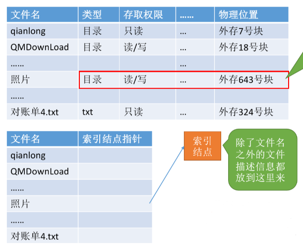

存放在外存中的索引节点被称为磁盘索引节点，放入内存后称为内存索引节点

目录结构：

* 单级目录结构：早期整个系统中只建立了一张目录表，它不允许文件重名

  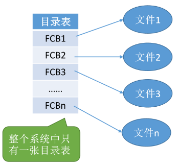

* 两级目录结构：它分为主文件目录和用户文件目录，实现了多用户操作，不同目录允许文件重名

* 多级目录结构：两级目录结构的推广，它层次结构更清晰，但不便于实现文件共享。此时访问某个文件可以使用绝对路径和相对路径，使用绝对路径需要一层一层将目录文件调入内存，使用相对目录则没有这个问题，因为此时当前目录已经调入内存了

* 无环图目录结构：在多级目录结构的基础上，增加了一些指向同一个节点的有向边，方便的实现多个用户间的文件共享：

  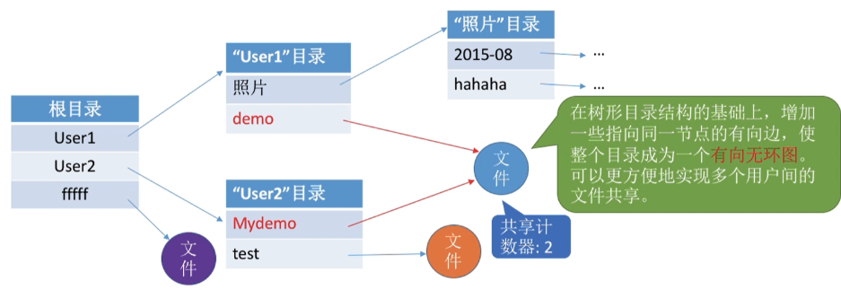

  可以用不同的文件名指向同一个文件，甚至可以指向同一个目录，此时删除文件不能简单的直接删除FCB，而是需要事先检查是否有其他用户共享，因此需要增加一个共享计数器，每次删除时将共享计数器减1，只有为0时才删除节点

### 文件的物理结构

磁盘中的存储单元会被分成一个个磁盘块，在很多操作系统中，磁盘块的大小与内存块、页面的大小相同

内存和磁盘之间的数据交换都是以块为单位进行的，即每次读出一块，或每次写入一块

文件的逻辑地址可以表示为（逻辑块号，块内地址）的形式，用户通过逻辑地址来操作文件，操作系统负责实现从逻辑地址到物理地址的映射

1、连续分配方式

连续分配方式要求每个文件在磁盘上占有一组连续的块，FCB中存储着文件及对应文件的起始块号和长度（文件总共占用几个块），这样地址转换时：物理块号=逻辑块号+起始块号，块内地址不用改变

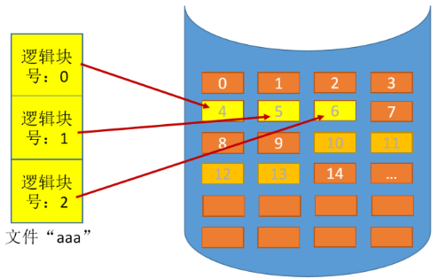

连续分配方式支持文件的顺序访问和随机访问

优点是读写速度快，缺点是难以扩展（没有连续的磁盘块时需要整体迁移磁盘块），存储空间利用率低，会产生磁盘碎片（可以使用紧凑来处理碎片，但需要花费时间）

2、链接分配

链接分配采用离散分配的方式，分为隐式链接和显式链接两种

隐式链接的FCB中记录着文件存放的起始块号和结束块号，每个磁盘块记录着指向下个磁盘块的指针，查找磁盘块时需要从起始块开始遍历，直到找到目标磁盘块结束。读入i号逻辑块，需要i+1次磁盘IO：

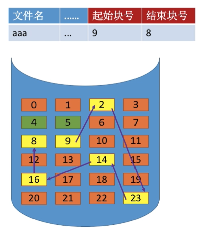

优点：扩展方便，不会有碎片问题，磁盘利用率高

缺点：只支持顺序访问，不支持随机访问，查找效率低

显式链接的FCB中记录着文件的起始块号，同时内存中有一张专门用于记录磁盘块指针信息的表：文件分配表FAT:File Allocation Table，文件分配表记录着每个磁盘块的下一个块号：

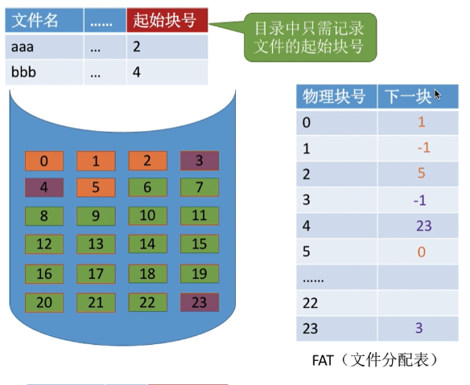

一个磁盘仅设置一张FAT，开机时将FAT读入内存，并常驻内存。FAT中各表项的长度相同，所以物理块号字段可以隐含。因为FAT是放在内存中的，所以地址转换时不需要读磁盘，访问速度快

优点：支持顺序访问和随机访问，不会产生外部碎片，文件扩展方便

缺点：文件分配表FAT需要占用空间

3、索引分配

索引分配允许文件离散的分布在各磁盘块中，系统会为每个文件建立一张索引表，索引表中记录了文件各逻辑块对应的物理块号，索引表存放的磁盘块称为索引块，文件数据存放的磁盘块称为数据块

此时文件的FCB中记录着文件对应的索引块号，通过索引块号找到索引表，再找到对应的物理块号：

索引表中每一项大小都是固定的，因此逻辑块号是可以隐含的。

每次找逻辑块号i时，先找到文件的目录项FCB，然后找到索引表的位置，将索引表读入内存，在内存中查找逻辑块i对应的物理块号，最后再读取目标物理块。

索引分配方式可以支持随机访问，扩展也容易，但索引表需要一定的存储空间，数据太大的时候，一个索引块也转不下索引表了，为了解决这些问题，引出了三种解决方案：

（1）链接方案

多个索引块链接起来存放，磁盘中的索引块都有指向下个索引块的指针：

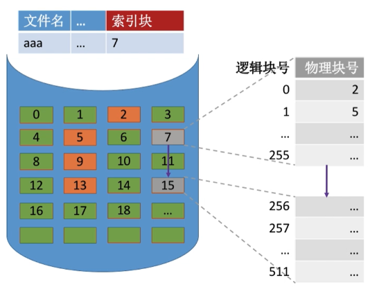

这种方式要想找到最后一个索引块，则必须遍历所有的索引块，效率较低

（2）多层索引：建立多级索引表，来管理索引块，降低索引表的总大小：

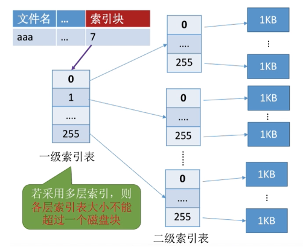

采用K层索引结构，且顶级索引表未调入内存，则访问一个数据块需要读K+1次磁盘，将索引表读入内存

缺点是：即使是小文件，也要读多次内存才能访问到对应的磁盘块

（3）混合索引：在多级索引的基础上，一些顶级索引表中，既包含直接地址索引（直接指向数据块），又包含一级间接索引（指向单层索引表），还包含两级间接索引（指向两层索引表）：

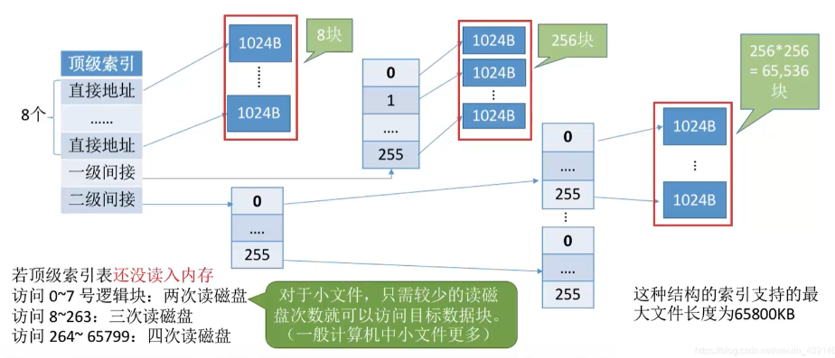

对于小文件，此时只需要2次磁盘读就能读取目标磁盘块了

### 空闲磁盘块管理

安装操作系统时，必须要为磁盘分区，分区就是将物理磁盘分成一个个文件卷。文件卷可以是物理盘的一部分，也可以是整个物理盘，支持超大型文件的文件卷也可以由多个物理盘组成。每个目录卷又分为目录区和文件区：

* 目录区：主要存放文件目录信息FCB、用于磁盘存储空间管理的信息
* 文件区：存放文件数据

管理空闲磁盘块的算法：

1、空闲表法

这种方式适用于文件的连续分配方式，系统为外存上的所有空闲区建立一张空闲盘块表，每个空闲区对应于一个空闲表项，空闲表项由以下几部分信息组成：序号、空闲区第一个盘块号、该区的空闲盘块数等信息：

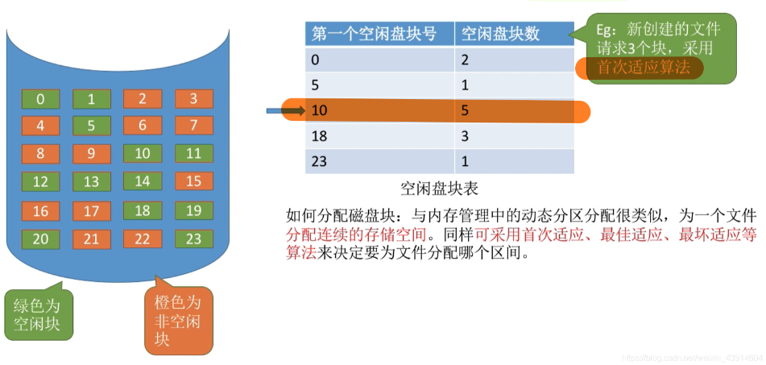

此时分配空闲磁盘块和内存管理中的动态分区分配算法类似，可以采用首次适应、最佳适应、最坏适应等算法，决定要为文件分配哪个空间

回收磁盘块时，涉及到表项的合并问题，要将空闲出来的部分合并到已经存在的表项中

2、空闲链表法

空闲链表法又能分为两种形式：空闲盘块法、空闲盘区法

（1）空闲盘块法：将所有空闲盘块组成一条链表，每个空闲盘块中存储着下一个空闲盘块的指针，操作系统保存着空闲盘块链的链头和链尾指针：

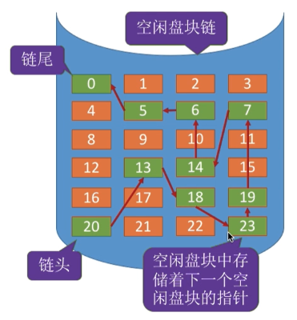

分配空闲盘块时，从链头开始遍历，依次取下N个盘块分配，同时修改空闲盘块链的指针

回收盘块时，将回收的盘块依次挂到空闲盘块链的链尾，并修改空闲盘块链的指针。

它适用于离散分配的物理结构。

（2）空闲盘区链：将连续的空闲盘块组成一个空闲盘区，多个空闲盘区首尾相连，组成一个空闲盘区链，每个空闲盘区的第一个盘块内记录了盘区的长度和指向下一个盘区的指针，操作系统保存着空闲盘区链的链头和链尾指针：

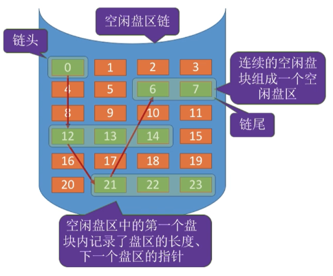

申请空间时，可以采用首次适应、最佳适应等算法，从链头开始检索，然后分配一个盘区或者盘块给一个文件

回收空间时，要维护周围的盘块信息，重新组织好一个空闲盘区链表

它既适用于离散分配，又适用于连续分配

3、位示图法：每个二进制位对应一个盘块，0代表对应盘块空闲，1代表盘块已经分配。位示图一般用连续的字来表示，如下图中的例子就是字长为16位的：

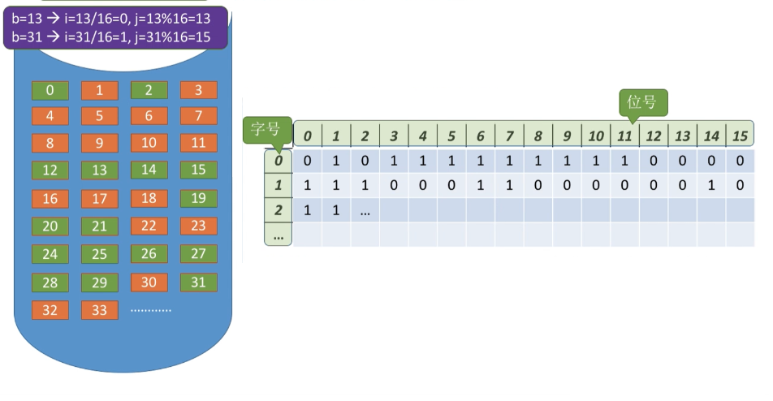

分配空间时，顺序扫描位示图，找到K个相邻或不相邻的0，找到对应的盘块然后分配，并更新对应位置为1

回收时，更新位示图对应位为0

4、成组链接法

空闲表法和空闲链表法不适用于大型系统，因为空闲表法和空闲链表可能太大，UNIX系统中使用了成组链表法对空闲块进行管理。

空闲扇区内不仅保存着指向空闲块的指针，也保存着指向其他空闲扇区的指针，操作系统只需要保存指向第一个空闲扇区的指针，就可以快速找到大批空闲块地址：

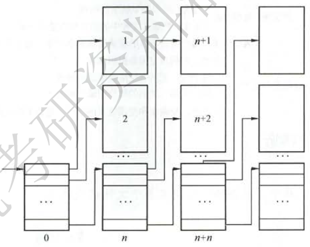

第一个成组链块的位置，还有目录区、文件区的划分信息都需要存放在辅存储器中，一般放在卷头位置，在UNIX系统中称为超级块，超级块需要预先读入空闲的内存，并且要保持存储器和内存中超级块的一致性：

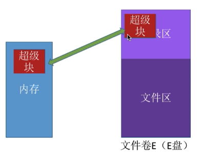

### 文件的基本操作

1、创建文件：Create系统调用，先找到空闲空间，然后在目录文件中创建对应的目录项FCB

2、删除文件：Delete系统调用，找到目录文件中的FCB，然后根据FCB的信息找到文件在外存中的存放位置，回收占用的磁盘块，并且删除FCB

3、打开文件：open系统调用，找到目录文件中的FCB，检查是否有打开权限，然后将FCB复制到内存中的打开文件表中。

此时打开文件表中就有文件的一条记录，当用户需要操作文件时，就直接通过这个表来找到文件，就省略了搜索环节，等到文件不再使用时，关闭文件，操作系统就会从打开文件表中删掉该记录

打开文件表有两种：进程的打开文件表和系统的打开文件表（只有一张）：

* 进程的打开文件表：代表进程打开了哪些文件，表项中包含文件名、读写指针（记录了读写的位置）、访问权限、系统表的索引号（指向系统的打开文件表中的一项）
* 系统的打开文件表：代表系统打开了哪些文件，表项中包括文件的外存地址，还有打开计数器。当进程打开一个文件时，对应记录的打开计数器就加1，删除时，若此时打开计数器不为0，则不能删除

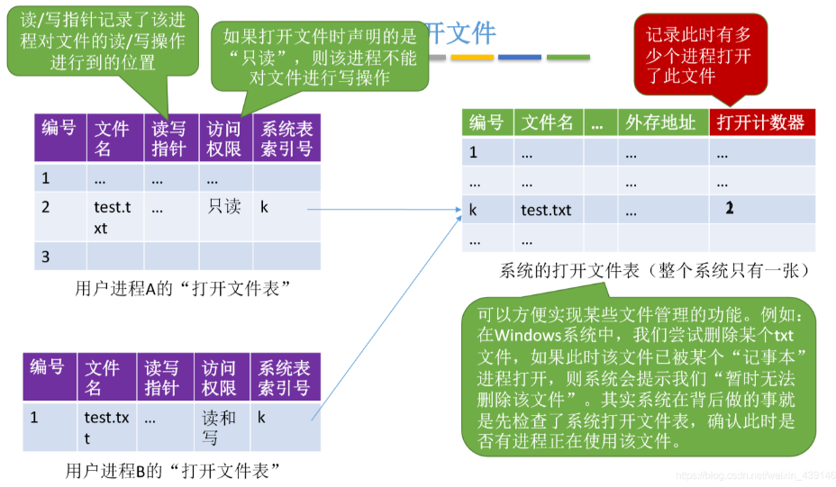

4、关闭文件：将进程的打开文件表中的表项删除，回收资源，将系统的打开文件表中的打开计数器减1，若为0则删除对应表项

5、读文件：read系统调用，需要指定文件，然后指定读取位置，以及读取的文件信息保存在内存的位置

6、写文件：write系统调用，需要指定文件，然后指定写的位置，以及要写的数据在内存中的位置

### 文件共享

操作系统为用户提供文件共享功能，可以让多个用户共享地使用同一个文件。共享文件意味着只有一份文件数据，一个用户修改后，其他用户也能看到。

文件共享的方式分为两种：

1、基于索引结点的共享方式：硬链接

索引结点包含了文件描述信息，在索引结点中设置一个变量count，表示链接到本索引结点上的用户目录项数，以此实现文件的共享：

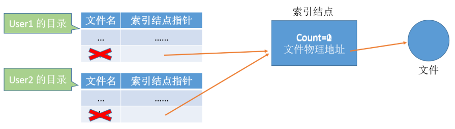

每次有新用户要共享文件时，count就加1，有用户删除该文件时，count就减1，当count为0时，系统负责删除该文件

2、基于符号链的共享方式：软链接

系统会创建一个LINK类型的文件，它保存着另一个文件的存放路径。每次打开LINK文件时，操作系统会根据它内容中的路径去寻找文件并读取：

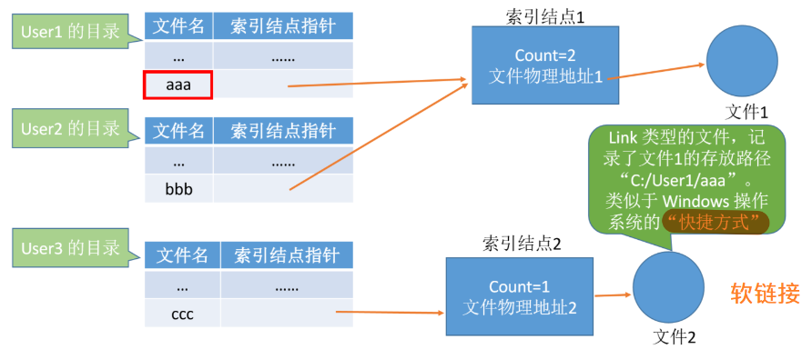

只有文件的拥有者才有指向其索引节点的指针，也就只有他才有删除文件的权限。文件被删除后，其他用户通过符号链会访问失败。

通过符号链访问会逐级的查找目录，多次的读取磁盘，会有一点性能损耗，但这种方式可以方便的实现网络共享，只需要提供文件所在机器的网络地址和机器中的文件路径即可

### 文件保护

文件保护的手段分为下列几种：

1、口令保护

为文件设置一个口令，用户请求访问该文件时必须提供口令。口令一般存放在文件对应的FCB或索引节点中，每次输入口令时和FCB中存储的口令进行对比，如果正确就允许该用户访问文件。

优点：机制简单；缺点：正确的口令放在系统内部，不够安全

2、加密保护

使用某个密码对文件进行加密，在访问文件时需要用正确的密码解密才能正常解析

一个简单的加密算法：异或加密

优点：系统中无需存储密码；缺点：加密解密需要一定的时间

3、访问控制

在每个文件的FCB（或索引结点）中增加一个访问控制表（Access-Control List，ACL），该表中记录了各用户可以对该文件执行哪些操作，包括读、写、执行、编辑、删除、列表清单（列出文件名和文件属性）：

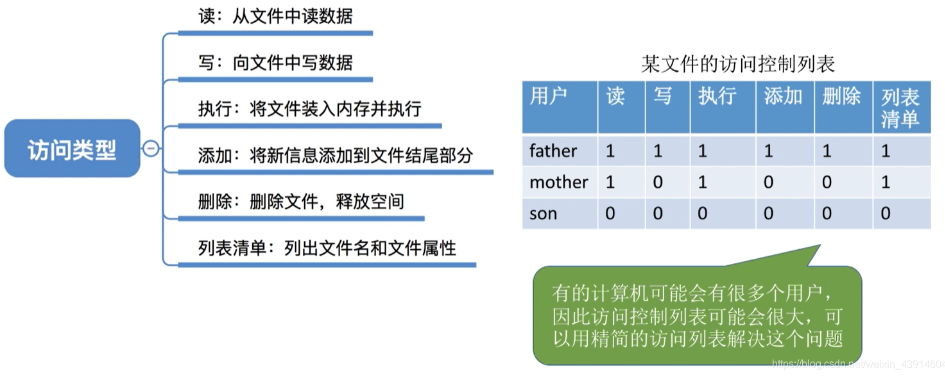

访问控制列表以用户为单位，也可以以组为单位，比如管理员组，当某用户想访问文件时，系统会检查该用户所属的分组是否拥有相应的访问权限。

### 文件系统层次结构

通用的文件系统层次结构：

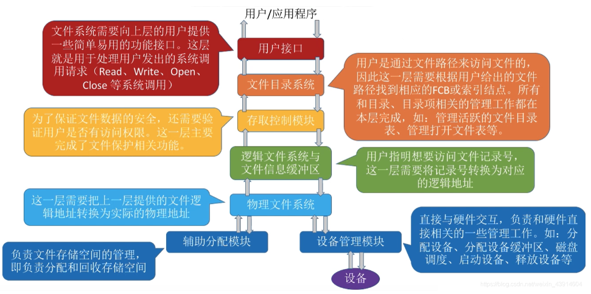

## 磁盘组织与管理

### 磁盘的结构

磁盘是表面涂有磁性物质的金属或塑料构成的圆形盘片，通过一个称为磁头的导体线圈从磁盘中存取数据，在读写期间，磁头固定，磁盘在下面高速旋转。

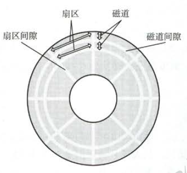

磁盘的盘面上的数据存储在一组同心圆中，称为磁道，每个磁道和磁头一样宽，一个盘面有上千个磁道，磁道又划分为几百个扇区，每个扇区固定存储大小（通常为512B），一个扇区称为一个盘块。相邻磁道及相邻扇区间通过一定的间隙分割开，以避免精度错误。

磁盘安装在一个磁盘驱动器中，它由磁头臂、用于旋转磁盘的主轴和用于数据输入输出的电子设备组成：

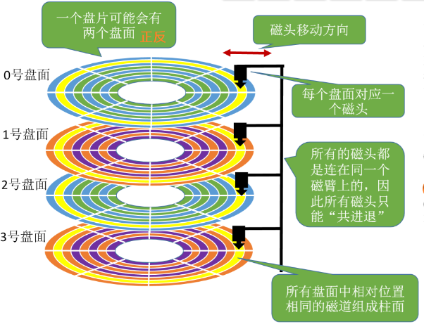

多个盘片相互堆叠，组成磁盘组，每个盘面对应一个磁头，所有磁头固定在一起，与磁盘中心的距离相同且一起移动。

扇区是磁盘可寻址的最小存储单位，磁盘地址用柱面号-盘面号-扇区号来表示：

* 为什么地址不用盘面号-柱面号-扇区号：如果这样表示地址的话，地址就会出现不连续的情况，相同盘面号的不同柱面号会产生磁头移动；而如果用柱面号-盘面号-扇区号，读取相同柱面号，不同盘面时只需要激活相邻盘面的磁头即可。这样连续地址的磁盘块，在访问时可以减少磁头移动消耗的时间

磁盘按照磁头是否可以移动分为：

* 固定头磁盘：每个磁道对应一个磁头，磁头相对于盘片的径向方向固定
* 活动头磁盘：磁头相对于盘片的径向方向可以活动，磁头臂可以来回伸缩定位磁道

磁盘按照磁盘是否固定分为：

* 固定盘磁盘：磁盘永久固定在磁盘驱动器内
* 可换盘磁盘：磁盘是可移动和替换的

### 磁盘调度算法

一次磁盘读写操作所需要的时间，由下面几部分组成：

* 寻道时间：磁头移动到指定磁道所花的时间，具体包括启动磁头臂和移动磁头
* 延迟时间：通过旋转磁盘，使磁头定位到目标扇区所需要的时间
* 传输时间：从磁盘读出或向磁盘写入数据所经历的时间

其中，延迟时间和传输时间都与磁盘转速相关，操作系统能优化的只有寻道时间，它也是占比最大的，磁盘调度算法的目的就是使平均寻道时间最少

几个磁盘调度算法：

1、先来先服务FCFS：根据进程请求访问磁盘的先后顺序进行调度

优点：公平，简单；缺点：如果有大量进程竞争使用磁盘，请求访问的磁道很分散，则FCFS性能很差，寻道时间长

2、最短寻找时间优先算法SSTF：它会优先处理和当前磁头最近的磁道，它可以保证本次的寻道时间最短

优点：性能较好，平均寻道时间短；缺点：可能产生饥饿现象

3、扫描算法SCAN：为了防止出现饥饿现象，磁头在一个小区域内来回移动，产生了该算法。该算法的思想是只有磁头移动到最外侧磁道的时候才能向内移动，移动到最内侧磁道的时候也才能往外移动，它也叫电梯算法

优点：性能较好，平均寻道时间短，不会产生饥饿现象；缺点：只有到达一边才能往回走，但有时候没有必要，算法对各位置磁道的响应频率不平均，响应同一个磁道需要的时间可能差别很大（磁头往一边移动，刚处理完90号磁道，那么下次处理90号磁道的请求需要等磁头移动很长一段距离）

4、LOOK算法：在扫描算法的基础上，如果在磁头移动方向上已经没有别的请求了，就可以立即改变磁头移动的方向（边移动边观察，因此叫LOOK）

优点：在SCAN的基础上，平均寻道时间进一步缩短

5、循环扫描算法 C-SCAN：为了解决对于各个位置磁道的响应频率不平均的问题，规定只有磁头朝某个特定方向移动时才处理磁道访问请求，而返回时直接快速移动至起始端而不处理任何请求

优点：对各位置磁道响应频率比较平均；缺点：和SCAN算法比，平均寻道时间有所增长

6、C-LOOK：在C-SCAN的基础上做了改进，如果一个方向上已经没有磁道访问请求了，就可以立即让磁头返回，而且磁头只需要返回到有磁道访问请求的位置即可

### 减少延迟时间

可以采用一些措施来减少延迟时间，加快磁盘平均读写时间。

1、交替编号

如果物理上连续存放的数据，在扇区上也是连续存放的，例如我们要读取橙色区域的2/3/4扇区：

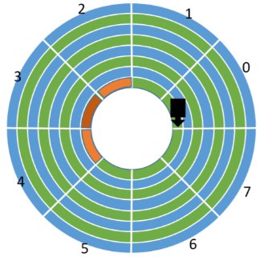

那么磁头每读入一个扇区数据就要一小段时间进行数据传输，此时磁头就处于等待中，为了避免这种等待，可以采用交替编号的策略，让逻辑上相邻的扇区在物理上有一定的间隔，这样读取连续数据时，等磁头转到扇区之前已经做好了准备，可以直接读取，省去了部分延迟时间：

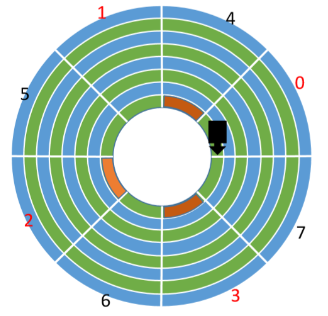

2、错位命名

为了减少读取相邻两个盘面的记录的延迟时间，可以对磁盘片组的不同盘面错位命名：

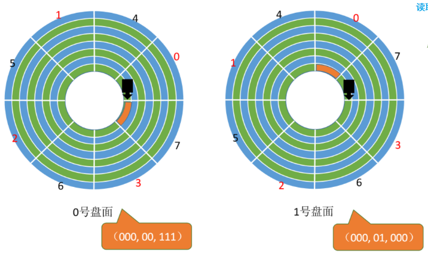

### 磁盘管理

磁盘初始化的过程：

* 物理格式化，物理分区，低级格式化：将磁盘划分为扇区，以便能够进行读写。一个扇区通常可分为头、数据区域、尾三个部分，管理扇区所需要的数据结构一般存放在头、尾两个部分
* 磁盘分区：一个分区由一个或者若干个柱面组成，也就是CDE盘
* 逻辑格式化：创建文件系统、初始化存储空间管理所需要的数据结构，如位示图、空闲分区表

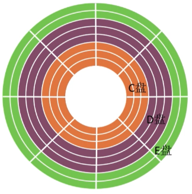

引导块：

计算机启动时需要运行一个初始化程序（自举程序），它初始化CPU、寄存器、设备控制器和内存等，接着启动操作系统。

自举程序通常保存在ROM中（只读存储器），出厂时就集成在主板上，但ROM中的程序难以更新，为此只在ROM中保留很小的自举装入程序，将完整功能的自举程序保存在磁盘的启动块上，启动块（引导块）位于磁盘的固定位置，拥有启动分区的磁盘称为启动磁盘或者系统磁盘（C盘）

坏块：无法正常使用的扇区。这属于硬件故障，操作系统是无法修复的，但需要将坏块标记出来，以免错误使用。常见的坏块处理方式：

* 简单的磁盘，可以在逻辑格式化时对磁盘进行坏块检查，在FAT表中标记
* 复杂的磁盘，可以在磁盘控制器（磁盘内部的一个硬件）中维护一个坏块链表，在磁盘出厂前进行物理格式化时就将坏块链初始化，并保留一些备用扇区，用于替换坏块，这种处理方式中，坏块对操作系统透明

# I/O管理

## I/O管理概述

### 定义与分类

I/O设备就是可以将数据输入到计算机，或者可以接受计算机输出的外部设备，是硬件部件，常见的I/O设备：

* 输入型设备：鼠标键盘
* 输出型设备：显示器
* 输入/输出型设备：移动硬盘

UNIX系统将外部设备抽象为一种特殊的文件，用户可以用write和read对外部设备进行写入或者读取。

I/O设备按照使用特性分类：

* 人机交互类外部设备：鼠标、键盘、打印机，它们传输速度一般较慢
* 存储设备：移动硬盘、光盘，传输速度快
* 网络通信设备：调制解调器，传输速度介于两者之间

I/O设备按照传输速度分类：低速设备、中速设备、高速设备

I/O设备按信息交换的单位分类：

* 块设备：如磁盘，数据传输的基本单位是块，可寻址，可随机读写
* 字符设备：如键盘、鼠标，数据传输的基本的单位是字符，不可寻址，通常在输入输出时采用中断驱动方式

### I/O控制器

I/O设备由机械部件和电子部件组成，机械部件用来执行具体的I/O操作，电子部件通常是一块插入主板扩充槽的印刷电路板

这个电子部件就是设备控制器，或者适配器，I/O控制器，它作为CPU和机械部件的中介，实现CPU对设备的控制，它的功能有：

* 接受和识别CPU发出的命令：需要I/O控制器中的控制寄存器存放命令和参数
* 向CPU报告设备的状态：需要I/O控制器中的状态寄存器
* 进行数据交换：需要I/O控制器中的数据寄存器
* 地址识别，判断CPU要读写的是哪个寄存器：需要给I/O控制器中的寄存器设置一个地址

一个I/O控制器可能会对应多个设备。

I/O控制器的组成：

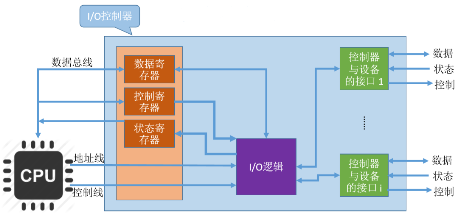

它对外的接口：

* 设备控制器与CPU的接口：CPU通过控制线发出命令，通过数据线来取出和存入数据，通过地址线来指明要操作的设备
* 控制器与设备的接口：向设备发出控制信息

自身的功能：I/O逻辑，负责识别CPU的命令，向设备发送命令

I/O控制器的两种寄存器编址方式：内存映像式（控制器中的寄存器和内存地址统一编址）和寄存器独立编址（控制器中的寄存器使用单独的地址）：

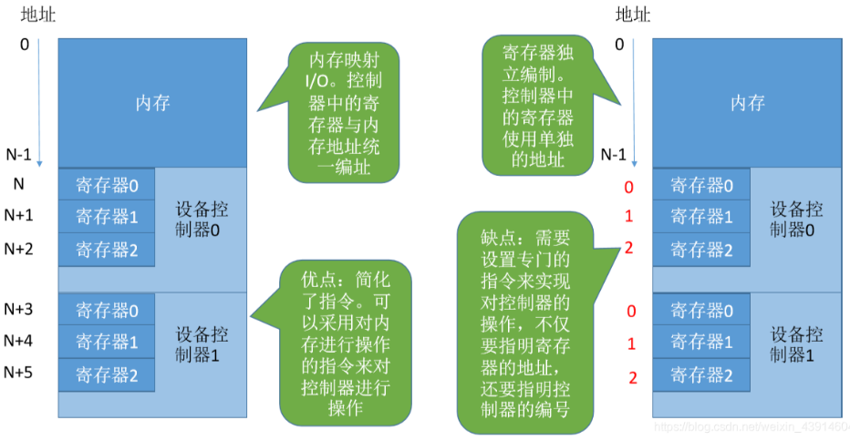

### I/O控制方式

设备和内存直接的I/O控制方式有下面几种：

1、程序直接控制方式

这种方式的关键就是轮询，通过轮询设备的状态，若设备准备完成则进行操作：

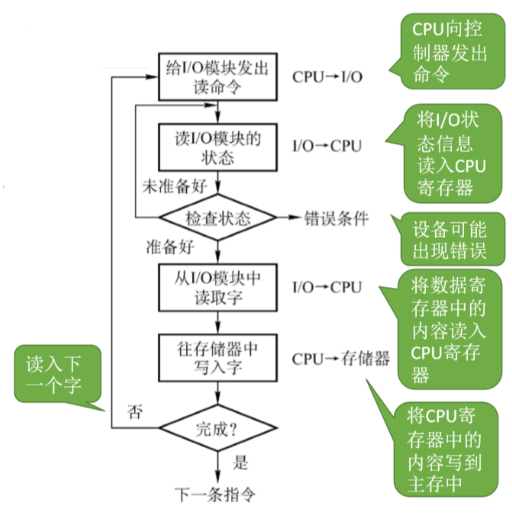

这种方式每次就读/写一个字，在等待I/O完成的过程中CPU需要不断的轮询，长期处于忙等状态，CPU利用率低

2、中断驱动方式

为了解决CPU利用率低的问题，引入了中断机制，CPU发出读/写命令后，可将等待I/O的进程阻塞，先切换到别的进程执行，等I/O完成后，控制器会向CPU发出一个中断信号，CPU检测到中断信号后，会转去执行中断处理程序处理该中断，然后完成IO再进行重复：

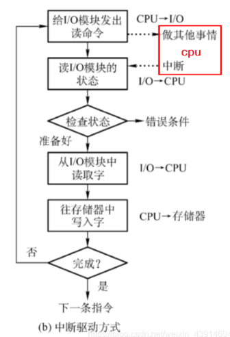

CPU会在每个指令周期的末尾检查中断，而且这种方式需要保存、恢复进程的运行环境，如果态频繁的话会降低系统性能。而且每次只能读/写一个字

3、DMA方式

DMA：Direct Memory Access，不再是以一个字为单位传送，而是以块为单位（读写的是连续的块，块读入内存后也是连续的），用于块设备的I/O控制。

数据流向是从设备直接放入内存，不再需要CPU寄存器作为中介，仅在传送一个或多个数据块的开始和结束时，才需要CPU干预：

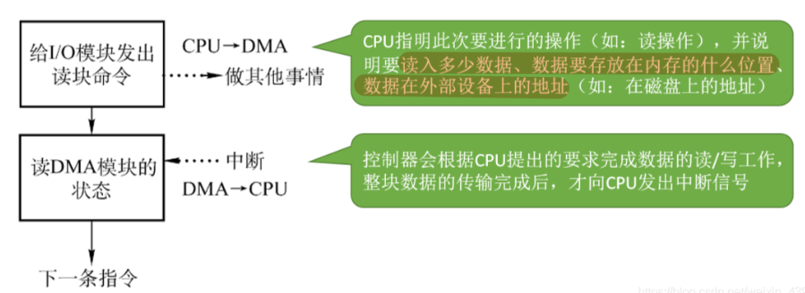

DMA控制器的组成：

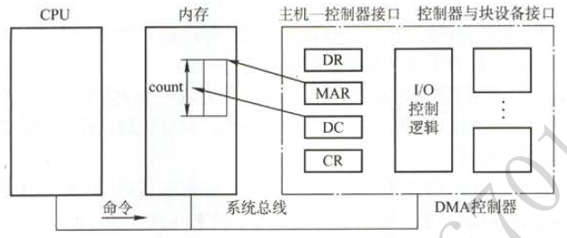

DMA控制器中重要的几类寄存器：

* DR：数据寄存器，暂存从设备到内存，从内存到设备的数据
* MAR：内存地址寄存器，用来指示数据存放的位置
* DC：数据计数器，表示剩余要读写的字节数
* CR：命令状态寄存器，用于存放CPU发来的命令，或设备的状态信息

DMA方式的工作过程：当CPU接收到I/O设备的DMA请求时，它给I/O控制器发出一条命令，启动DMA控制器，随后就把控制操作委托给DMA控制器了，又该控制器负责与存储器进行交互，不需要CPU来参与，当传送完成后，DMA控制器发送一个中断信号给处理器。

优点：数据传输以块为单位，性能高

缺点：如果要读/写多个离散存储的数据块，或者要将数据分别写到不同的内存区域时，CPU需要发出多条I/O指令，进行多次中断处理才能完成

4、通道控制方式

I/O通道是专门负责处理输入/输出的处理机，当CPU要完成一组相关的读写操作时，只需向I/O通道发送一条I/O指令，接到指令后，执行通道程序即可完成CPU指定的I/O任务，数据传送结束时向CPU发送中断请求

I/O通道和CPU的区别：它的指令单一，没有自己的内存，和CPU共享内存

I/O通道和DMA方式的区别：DMA方式需要CPU来控制传输的数据块大小、传输的内存位置，而通道方式中这些信息由通道控制；此外，每个DMA控制器对应一台设备与内存传递数据，而一个通道可以控制多台设备和内存的数据交换。

优点：CPU、通道和I/O设备可以并行工作，资源利用率很高；缺点：实现复杂，需要专门的通道硬件支持

### I/O系统的层次结构

为了使复杂的I/O软件具有清晰的的结构，良好的可移植性和适应性，在I/O软件中普遍采用了层次式结构。类似网络分层，每一层都利用其下层提供的服务，只要层次间的接口不变，某一层中软件的改变都不会影响相邻层。

1、用户层I/O软件：实现与用户交互的接口，用户可以直接调用在用户层提供的与I/O操作有关的库函数，对设备进行操作

2、设备独立性软件：用户程序与设备驱动器的统一接口，向上层提供统一的调用接口（如系统调用read），它包括设备命令、设备保护、设备分配与释放、设备管理和数据传送。使应用程序独立于具体使用的物理设备。它还会建立逻辑设备名到物理设备名的映射关系，在真正执行时，需要通过逻辑设备表LUT来根据逻辑设备找到对应的物理设备，并找到对应的驱动程序入口：

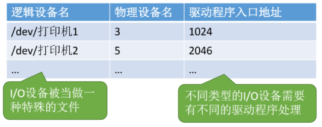

用这种映射关系的好处：增加灵活性，易于实现I/O重定向

3、设备驱动程序：与硬件直接相关，负责将上层发出的指令转换为特定设备能接收的指令。不同的I/O设备由不同的硬件特性，具体细节只有厂家知道，所以一般由厂家来提供驱动程序

4、中断处理程序：用于保存被中断进程的CPU环境，转入相应的中断处理程序进行处理，中断处理程序流程：

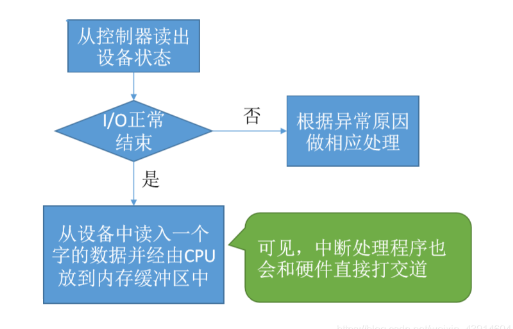

它与硬件紧密相关，在操作系统的底层。

##I/O核心子系统

在之前讲过的I/O软件的层次中，设备独立性软件、设备驱动程序和中断处理程序属于操作系统内核的核心I/O子系统。I/O子系统提供的服务主要有：I/O调度、缓冲与高速缓存、设备分配与回收、假脱机、设备保护和差错处理

### 假脱机技术

操作系统的手工操作阶段中：主机直接从I/O设备中获取数据，设备速度慢，主机速度快，主机要浪费很多时间来等待设备

因此出现了脱机技术：在外围控制机的控制下，慢速输入设备的数据先被输入到更快速的磁带上，然后主机就可以从更快速的磁带上读入数据，这样就缓解了速度矛盾。脱机技术在输入上，先输入到磁带，主机再读取磁带；在输出上，先输出到磁带，再从磁带提取信息。脱机的意思就是脱离主机。

在脱机技术的基础上，又发展出了假脱机技术，又称SPOOLing技术，用软件的方式模拟脱机技术，SPOOLing系统的组成：

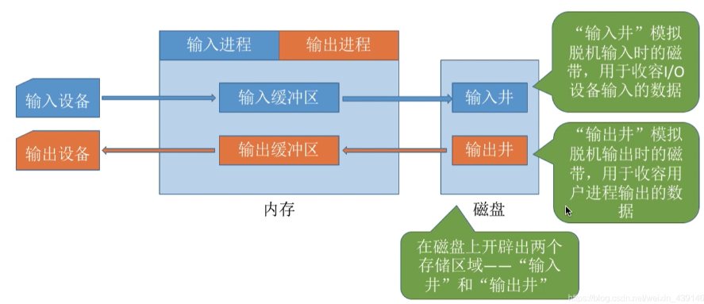

其中输入井和输出井是磁盘上的存储区域，输入井模拟脱机输入时的磁带，用于收容I/O设备输入的数据；输出井模拟脱机输出时的磁带，用于收容用户进程输出的数据。

而输入进程和输出进程分别模拟脱机输入和输出时的外围控制机。

输入缓冲区和输出缓冲区是内存中的缓冲区，它们分别用来暂存数据：

* 输入缓冲区用于暂存从输入设备输入的数据，之后再转存到输入井中
* 输出缓冲区用于暂存从输出井送来的数据，之后再传送到输出设备上

打印机是一种独占式设备，但可以用SPOOLing技术改造成“共享设备”。

共享打印机打印的原理：

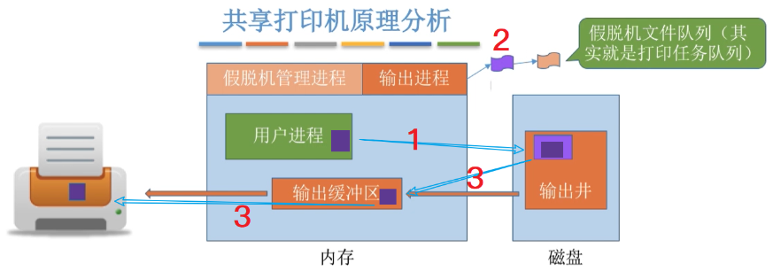

当多个用户进程提出输出打印的请求时，系统会接受请求，但并不是把真正的打印机分配给它们，而是由假脱机进程为每个进程进行处理：

1、在磁盘输出井中卫进程申请一个空闲缓冲区，并将要打印的数据送入其中

2、为打印请求生成一个打印请求表，将该表挂到假脱机文件队列中。

3、当打印机空闲时，会从文件队列中取出一张打印请求表，然后根据表中的要求将要打印的数据从输出井传送到输出缓冲区，再输出到打印机进行打印。打印完成后，请求表从打印队列中删除，执行后续的打印任务

虽然系统中只有一台打印机，但每个进程提出打印请求时，系统会在输出井中为其分配了一个存储区，相当于分配了一个逻辑设备，SPOOLing技术可以把一台物理设备虚拟成逻辑上的多台设备，原理就是以空间换时间，异步处理

### 设备的分配与回收

设备的分配算法：先来先服务、优先级高者优先、短任务优先等

从进程运行的安全性上考虑，设备分配有两种方式：

* 安全分配方式：为进程分配一个设备后就将进程阻塞，本次I/O完成后才将进程唤醒。这样一个时段内进程只能使用一种设备，破坏了请求与保持条件，不会产生死锁，但对于一个进程来说，CPU和I/O设备只能串行工作，效率较低
* 不安全分配方式：进程发出I/O请求后，系统为其分配I/O设备，进程可继续执行，之后还可以发出新的I/O请求，只有某个请求得不到满足时才将进程阻塞。优点是计算任务和I/O任务可以并行处理，但可能造成死锁

设备分配管理中的数据结构：

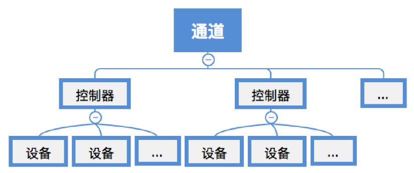

一个通道可控制多个设备控制器，每个设备控制器可控制多个设备

设备管理中用到的表：

* 设备控制表DCT：系统为每个设备配置一张DCT，用于记录设备情况，主要包括设备类型、设备标识符（物理设备名）、设备状态、指向控制器表的指针（每个设备由一个控制器控制）、重复执行I/O次数或时间（重复执行I/O多次仍不成功才会认为失败）、设备队列的队首指针（指向正在等待该设备的进程队列，由进程PCB组成队列，是某个阻塞队列）

* 控制器控制表COCT：每个设备控制器都会对应一张COCT，用于记录控制器的信息，主要包括控制器标识符、控制器状态、指向通道表的指针（每个控制器由一个通道控制）、控制器队列的首尾指针（指向正在等待该控制器的进程队列）

* 通道控制表CHCT：每个通道都会对应一张CHCT，用于记录通道的信息，主要包括通道标识符、通道状态、与通道连接的控制表地址、通道队列的首尾指针（指向正在等待该通道的进程队列）

* 系统设备表SDT：记录了系统中全部设备的情况，每个设备对应一个表目，每个表项包括设备类型、设备标识符、DCT、驱动程序入口：

  

设备分配的步骤：

1、根据进程请求的物理设备名查找SDT

2、根据SDT找到DCT，若设备忙碌就将进程PCB挂到设备等待队列，如果不忙碌则将设备分配给进程

3、根据DCT找到COCT，若控制器忙碌则进程PCB挂到控制器等待队列，如果不忙碌则将控制器分配给进程

4、根据COCT找到CHCT，若通道忙碌则进程PCB挂到通道等待队列，如果不忙碌则将通道分配给进程

只有设备、控制器、通道三者都分配成功时，这次设备分配才算成功

上面分配方式的缺点：以物理设备名请求，编程不方便，且更换后程序无法允许，若请求的物理设备正在忙碌，则同类型的设备也分配不到进程：

改进方法：建立逻辑设备名与物理设备名的映射机制，用户编程时只需要提供逻辑设备名：

* 增加一个逻辑设备表LUT，建立了逻辑设备名和物理设备名的映射关系。在SDT的表项中增加一项逻辑设备名

LUT的使用又可以分为整个系统只有一张LUT，各用户所用的逻辑设备名不允许重复，适用于单用户操作系统；还可以为每个用户分配一张LUT，不同用户的逻辑设备名可重复，适用于多用户操作系统

### 缓冲区管理

缓冲区是一个存储区域，可以由专门的硬件寄存器组成，也可利用内存作为缓冲区：

* 硬件作为缓冲区的成本较高，容量也较小，一般用于对速度要求非常高的场合，如联想寄存器，也就是快表
* 一般情况下更多的是利用内存作为缓冲区，设备独立性软件用的缓冲区一般是内存缓冲区

CPU可以把要输出的数据快速地放入缓冲区，之后就可以做别的事，慢速的I/O设备可以慢慢从缓冲区取走数据，不用一个字符一个字符读，还要频繁向CPU发送中断信号：

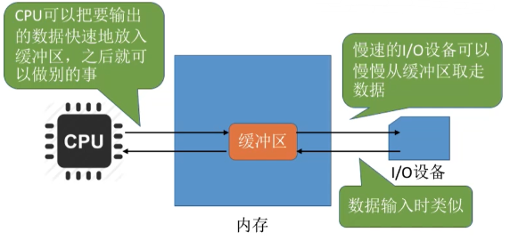

缓冲区的作用：缓解CPU和I/O设备之间速度不匹配的矛盾，减少对CPU的中断频率，解决数据粒度不匹配的问题（比如输出进程可以一次生成一块数据，而I/O设备每次只能输出一个字符），提高CPU与I/O设备之间的并行性

管道通信中的管道其实就是缓冲区，一个缓冲区只能实现单向传输，当缓冲区数据非空时，不能往缓冲区冲入数据，只能从缓冲区把数据传出；当缓冲区为空时，可以往缓冲区冲入数据，但必须把缓冲区充满后，才能从缓冲区把数据取出

根据系统设置缓冲器的个数，缓冲技术可以分为：

1、单缓冲：在设备和处理机之间设置一个缓冲区，设备和处理机交换数据时，先把被交换数据写入缓冲区，然后处理机从缓冲区中取走数据：

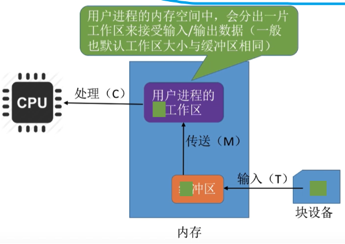

假定磁盘把一块数据输入到缓冲区的时间为T，操作系统将该缓冲区中数据传送刀用户区的时间是M，而CPU对这一块数据处理时间为C。如果初始状态工作区满，缓冲区空，且T>C，那么所用的时间分布：

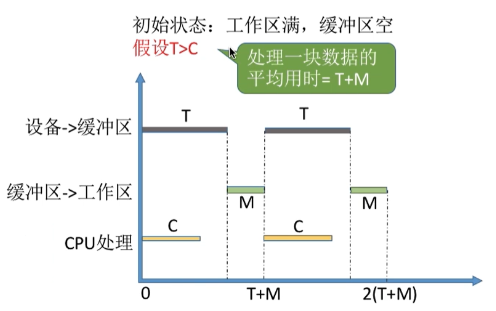

如果T<C，所用的时间分布：

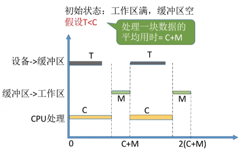

单缓冲区处理每块数据用时Max(C,T)+M

2、双缓冲。单缓冲的CPU利用率不高，CPU在传送时间M内处于空闲状态，由此引入双缓冲。每次设备输入数据先装填到缓冲区1，缓冲区1充满后再装填缓冲区2，与此同时处理机可以从缓冲区1中取出数据放入用户进程处理，当缓冲区1的数据处理完后，若缓冲区2已填满，则处理机又从缓冲区2中取出数据放入用户进程处理。双缓冲机制提高了处理机和输入设备的并行操作的程序：

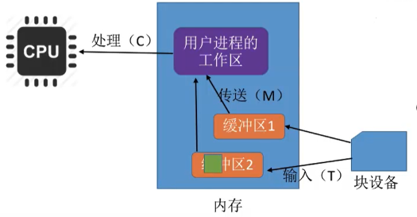

当T>M+C时，双缓冲的时间分布：

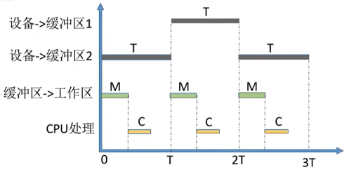

当T<M+C时，双缓冲的时间分布：

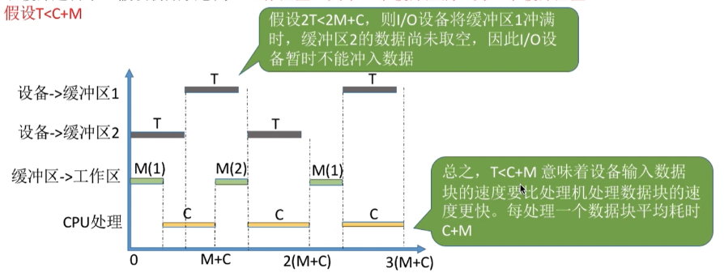

M(1)表示将缓冲区1的数据传送到工作区。采用双缓冲策略，处理一个数据块的平均耗时为Max(T,C+M)

两个相互通信的机器只设置单缓冲区，在任一时刻只能实现数据的单向传输，要想实现双向数据传输，需要两台机器都设置双缓冲区：

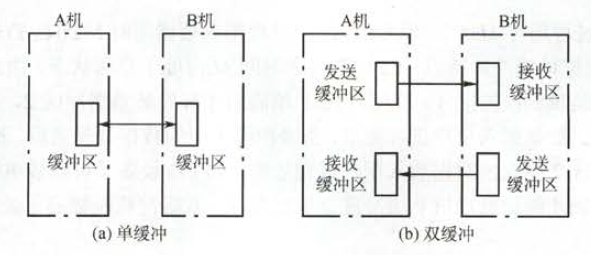

3、循环缓冲区：将多个大小相等的缓冲区链接成一个循环队列，设置一个in指针的out指针：

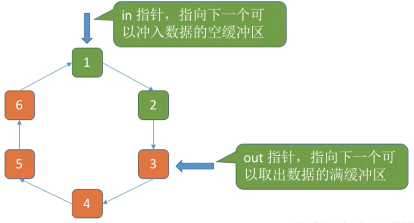

4、缓冲池：由系统中共用的缓冲区组成，三个队列：空缓冲队列、装满输入数据的缓冲队列、装满输出数据的缓冲队列；缓冲区按功能划分为：用于收容输入数据的工作缓冲区、用于提取输入数据的工作缓冲区、用于收容输出数据的工作缓冲区、用于提取输出数据的工作缓冲区

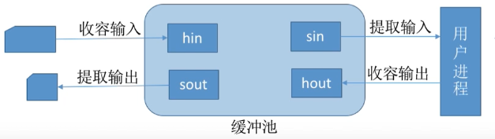

当输入进程需要输入数据时，从空缓冲队列中取出一个空缓冲区，把它作为收容输入工作缓冲区，将输入数据输入其中，装满后将其挂到输入队列队尾。当计算进程需要输入数据时，便从输入队列中取一个缓冲区作为提取输入工作缓冲区，计算进程从中提取数据，用完该缓冲区后将其再挂到空缓冲区队列中

当计算进程需要输出数据时，从空缓冲队列中取出一个空缓冲区，把它作为收容输出工作缓冲区，将数据输出到其中，装满后将其挂到输出队列队尾。当要输出时，由输出进程从输出队列中取得一个装满输出数据的缓冲区，作为提取输出工作缓冲区，提取完毕后将其再挂到空缓冲区队列中