* [基础知识](#基础知识)
  * [机器语言和汇编语言](#机器语言和汇编语言)
  * [总线](#总线)
  * [各类存储器芯片](#各类存储器芯片)
  * [内存地址空间](#内存地址空间)
* [寄存器](#寄存器)
  * [通用寄存器](#通用寄存器)
  * [物理地址](#物理地址)
  * [段](#段)
  * [CS和IP寄存器](#cs和ip寄存器)
  * [DS寄存器和[address]](#ds寄存器和address)
  * [mov、add、sub指令](#movaddsub指令)
  * [栈](#栈)
* [第一个程序](#第一个程序)
  * [源程序](#源程序)
  * [debug过程](#debug过程)
* [[BX]和loop指令](#bx和loop指令)
  * [[bx]](#bx)
  * [loop指令](#loop指令)
* [包含多个段的程序](#包含多个段的程序)
  * [分离数据和代码](#分离数据和代码)
  * [在代码段中使用栈](#在代码段中使用栈)
  * [设置不同的段](#设置不同的段)
* [定位内存地址的方法](#定位内存地址的方法)
  * [and和or指令](#and和or指令)
  * [以字符形式给出的数据](#以字符形式给出的数据)
  * [案例：大小写转换](#案例大小写转换)
  * [[bx\+idata]和idata[bx]](#bxidata和idatabx)
  * [si和di寄存器](#si和di寄存器)
  * [不同寻址方式的对比应用](#不同寻址方式的对比应用)
  * [案例：用双层循环的大小写转换](#案例用双层循环的大小写转换)
* [数据处理的两个基本问题](#数据处理的两个基本问题)
  * [bx、si、di和bp](#bxsidi和bp)
  * [要处理的数据位置](#要处理的数据位置)
  * [寻址方式小结](#寻址方式小结)
  * [要处理的数据长度](#要处理的数据长度)
  * [除法指令div](#除法指令div)
  * [定义数据指令](#定义数据指令)
* [转移指令的原理](#转移指令的原理)
  * [操作符offset](#操作符offset)
  * [jmp指令](#jmp指令)
    * [转到标号处执行指令](#转到标号处执行指令)
    * [使用内存地址和寄存器](#使用内存地址和寄存器)
  * [jcxz指令](#jcxz指令)
  * [loop指令](#loop指令-1)
  * [关于转移位移的讨论](#关于转移位移的讨论)
* [CALL和RET指令](#call和ret指令)
  * [ret和retf](#ret和retf)
  * [call指令](#call指令)
    * [转到标号处](#转到标号处)
    * [使用内存地址和寄存器](#使用内存地址和寄存器-1)
  * [实现子程序机制](#实现子程序机制)
  * [乘法指令mul](#乘法指令mul)
  * [模块化程序设计](#模块化程序设计)
    * [参数和结果传递的问题](#参数和结果传递的问题)
    * [多个参数和多个结果的传递](#多个参数和多个结果的传递)
    * [寄存器冲突问题](#寄存器冲突问题)
* [标志寄存器](#标志寄存器)
  * [ZF标志](#zf标志)
  * [PF标志](#pf标志)
  * [SF标志](#sf标志)
  * [CF标志](#cf标志)
  * [OF标志](#of标志)
  * [adc指令和sbb指令](#adc指令和sbb指令)
  * [cmp指令](#cmp指令)
  * [检测标志位的条件转移指令](#检测标志位的条件转移指令)
  * [DF标志和串传送指令](#df标志和串传送指令)
  * [pushf和popf](#pushf和popf)
  * [debug中的标志寄存器](#debug中的标志寄存器)
* [内中断](#内中断)
  * [内中断的产生](#内中断的产生)
  * [中断处理程序和中断向量表](#中断处理程序和中断向量表)
  * [中断过程](#中断过程)
  * [中断处理程序和iret指令](#中断处理程序和iret指令)
  * [编程处理0号中断](#编程处理0号中断)
  * [安装程序和设置中断向量](#安装程序和设置中断向量)
  * [do0程序](#do0程序)
  * [单步中断](#单步中断)
  * [不响应中断的特殊情况](#不响应中断的特殊情况)
* [int指令](#int指令)
  * [案例：以中断程序的方式实现计算式](#案例以中断程序的方式实现计算式)
  * [案例：以中断程序的方式完成loop指令循环](#案例以中断程序的方式完成loop指令循环)
  * [BIOS和DOS提供的中断机制](#bios和dos提供的中断机制)
  * [BIOS中断例程应用](#bios中断例程应用)
  * [DOS中断例程应用](#dos中断例程应用)
* [端口](#端口)
  * [端口的读写](#端口的读写)
  * [CMOS RAM芯片](#cmos-ram芯片)
  * [逻辑移位指令shl和shr](#逻辑移位指令shl和shr)
* [外中断](#外中断)
  * [可屏蔽中断与不可屏蔽中断](#可屏蔽中断与不可屏蔽中断)
  * [PC机键盘的处理过程](#pc机键盘的处理过程)
  * [案例：显示字母后按esc改变颜色](#案例显示字母后按esc改变颜色)
* [直接定址表](#直接定址表)
  * [数据标号](#数据标号)
  * [直接定址表](#直接定址表-1)
  * [程序入口地址的直接定址表](#程序入口地址的直接定址表)
* [使用BIOS进行键盘输入和磁盘读写](#使用bios进行键盘输入和磁盘读写)
  * [BIOS键盘缓冲区](#bios键盘缓冲区)
  * [读取键盘缓冲区](#读取键盘缓冲区)
  * [字符串的输入](#字符串的输入)
  * [用int13h中断例程对磁盘进行读写](#用int13h中断例程对磁盘进行读写)
* [补码](#补码)
  * [从补数标记方式讨论补码起源](#从补数标记方式讨论补码起源)
  * [从0重码问题的解决讨论补码起源](#从0重码问题的解决讨论补码起源)
  * [补码的意义](#补码的意义)

# 基础知识

## 机器语言和汇编语言

机器语言是机器指令的集合，是一列二进制数字，每一种微处理器都有自己的机器指令集。因为机器语言难以记忆，容易出错，故诞生了汇编语言。汇编语言由汇编指令组成，汇编指令是机器指令便于记忆的格式。汇编语言可以由编译器将其编译为机器码，由计算机最终执行。

汇编语言有以下3类指令组成：

1、汇编指令（汇编语言的核心）：机器码的助记符

2、伪指令：没有对应的机器码，由编译器执行，计算机并不执行。例如标识程序段的开始和结束的指令

3、其他符号：如+、-、*、/等，由编译器识别，没有对应的机器码

## 总线

CPU通过总线连接其他元件，总线从物理上讲，就是一根根导线的集合，根据传送信息的不同，总线从逻辑上有又分成三类：地址总线、控制总线和数据总线。

以CPU从3号单元读取数据的过程为例：

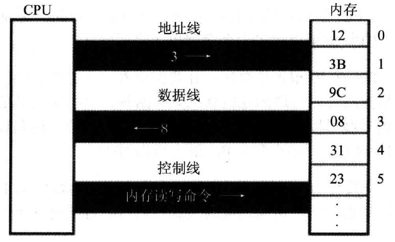

这个过程分为以下几个步骤：

1、CPU通过地址线将地址信息3发出

2、CPU通过控制线发出内存读命令，选中存储器芯片并通知它

3、存储器将3号单元中的数据8通过数据线送入CPU中

CPU从内存中读的操作也类似，都是通过总线来传递数据的。几种总线的特点如下：

1、地址总线

CPU是通过地址总线来指定存储器单元的，地址总线能传送多少个不同的信息，CPU就可以对多少存储单元进行寻址。CPU有N根地址线，又称CPU的总线宽度为N，这样的CPU最多可以寻找2的N次方个内存单元。如CPU的地址总线宽度为10，可以寻址1024个内存单元，这1024个内存单元就构成这个CPU的内存地址空间。

2、数据总线

数据总线的宽度决定了CPU和外界的数据传输速度。

3、控制总线

控制总线的宽度决定了CPU对外部器件的控制能力。一个控制指令通常要涉及多根控制线，控制线又分为读信号输出和写信号输出。

## 各类存储器芯片

计算机中装有多个存储器芯片，这些芯片从读写属性上看分为两类：随机存储器（RAM）和只读存储器（ROM），随机存储器可读可写，但必须带电存储，关机后存储丢失；只读存储器只能读不能写，关机后其中的内容不丢失，这些存储器具体分为以下几类：

1、随机存储器：用于存放供CPU使用的绝大部分程序和数据。主随机存储器一般分为装在主板上的RAM和插在扩展插槽上的RAM。

2、装有BIOS（基本输入输出系统）的ROM：

BIOS是装在硬件上的软件系统，可以通过它利用该硬件进行最基本的输入和输出（例如开机后自检程序和系统自启动程序）。包括主板上的ROM中存储着主板的BIOS、显卡上的ROM中存储着显卡的BIOS、网卡上的ROM中存储网卡的BIOS。

3、接口卡上的RAM：

某些接口卡需要对大批量输入、输出数据进行暂时存储，最典型的是显示卡上的RAM，一般称为显存，将要显示的内容写入显存，显示卡负责将显存中的数据在显示器上显示出来。

下图展示了PC系统中各类存储器的情况：

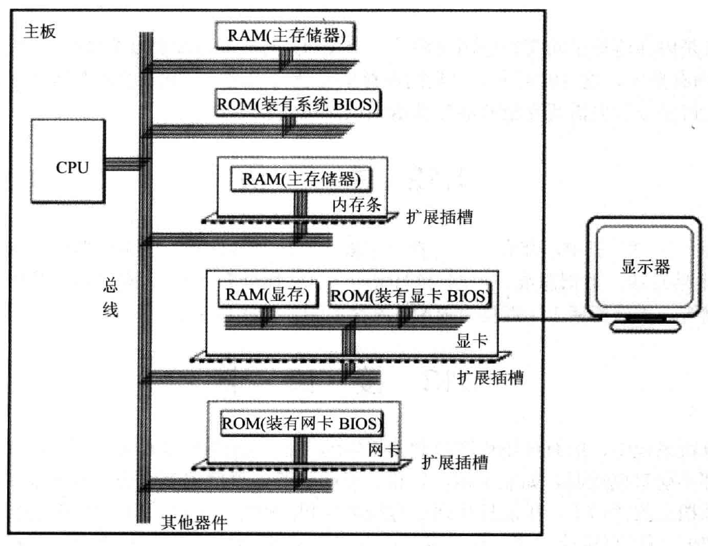

## 内存地址空间

虽然存储器类型很多，但是CPU在向它们发出指令的时候都是通过总线，把它们看做一个由若干存储单元组成的逻辑存储器，也就是内存地址空间。

示意图如下：

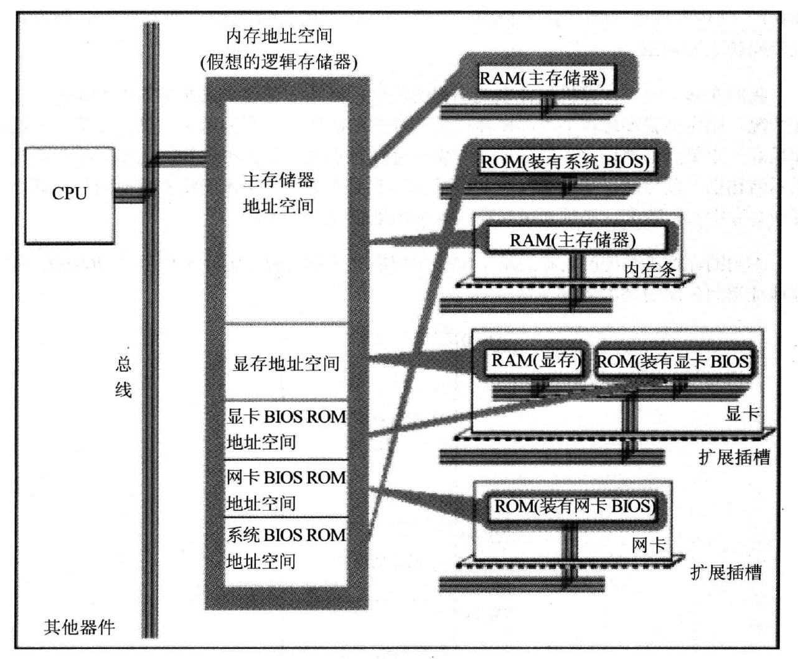

所有存储器都被看做是内存地址空间的一部分，它们各自对应一段地址空间。每一个内存单元在内存地址空间中都有唯一的地址，我们将这个唯一的地址称为物理地址。

我们想在某类存储器中读写数据时，必须知道它第一个单元的地址和最后一个单元的地址，才能保证读写操作是在预期的存储器中进行。不同的计算机系统的内存地址空间分配情况不同。

# 寄存器

一个CPU由以下几个部分组成：

1、运算器：负责信息处理

2、寄存器：进行信息储存

3、控制器：控制各种器件进行工作

4、内部总线：连接各种器件（外部总线实现CPU和主板其他部件的联系）

## 通用寄存器

8086CPU的所有寄存器都是16位的，可以存放两个字节，AX、BX、CX、DX这4个寄存器通常用来存放一般性的数据，被称为通用寄存器。它的上一代CPU中的寄存器都是8位的，为了保证兼容，使原来基于上代CPU编写的程序稍加修改就可以运行在8086之上，8086CPU的AX、BX、CX、DX这4个寄存器都可以分成2个可独立使用的8位寄存器使用：如AX可以分为AH和AL、BX可以分为BH和BL：

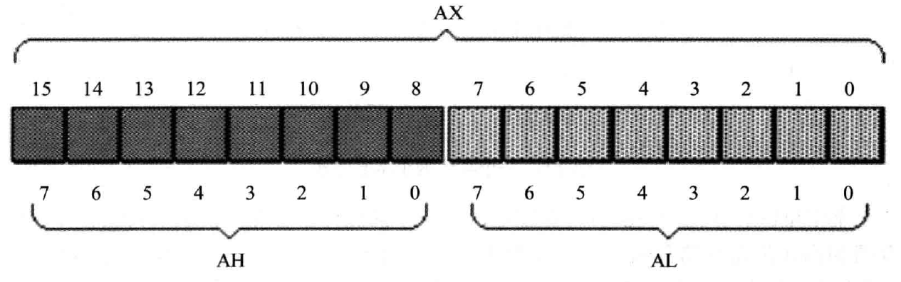

AX的低8位组成了AL寄存器、高8位组成了AH寄存器，它们分别都可以独立使用。当分别使用这两个寄存器时，这两种寄存器是独立的，一个寄存器的进位不会影响另一个寄存器。在汇编指令中，不能让操作对象的位数不一致，如果一个是8位，一个是16位（比如在16位寄存器和8位寄存器之间传递数据、将大于最大容量的数据直接存放在寄存器中等），就会出错。

8086CPU可以一次性处理以下两种尺寸的数据：字节byte（8bit）、字word（2byte）

”2地址字单元“表示该字单元（2bytes即2个内存单元）的起始地址为2。在存入一个字的时候，高字节在高地址位，低字节在低地址位。

## 物理地址

8086CPU是16位CPU，16位CPU意味着：

1、运算器一次最多可以处理16位的数据

2、寄存器的最大宽度为16位

3、寄存器和运算器之间的通路为16位

8086CPU有20位地址总线，如果只是将地址从内部简单的发出，它只能发出16位的地址，8086CPU采用一种在内部用两个16位地址合成的方法形成一个20位的物理地址：

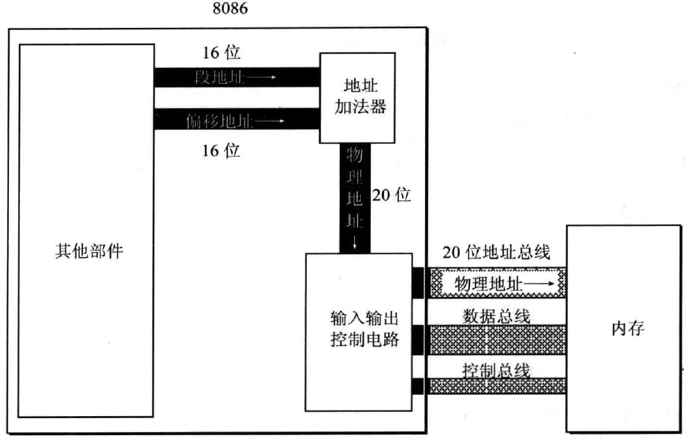

CPU内部提供两个16位的地址，一个称为段地址一个称为偏移地址，这两个地址通过内部总线送入一个称为地址加法器的部件，合成为一个20位的物理地址，然后通过输入输出电流将该物理地址送入地址总线，最后传送到存储器。

地址加法器中完成的计算是：物理地址=段地址*16+偏移地址。（乘16相当于段地址左移4位），这个公式其实是：物理地址=基础地址+偏移地址。

## 段

段并不是内存地址空间的基本划分，而是抽象出来的一个概念，在编程时根据具体情况，将若干地址连续的内存单元看成一个段，这个段有起始地址（起始地址=段地址*16），有大小。同一个内存地址空间，可以根据不同情况有多种划分：

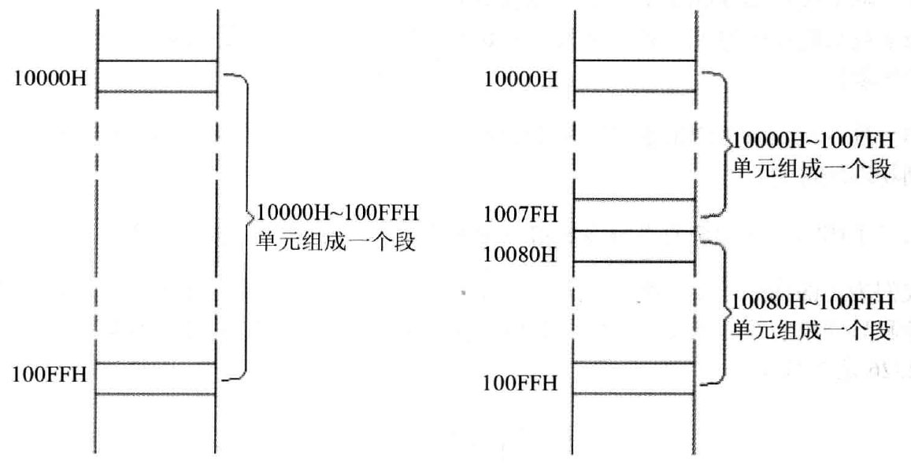

根据段地址和物理地址的转换规则，段的起始地址一定是16的倍数，因为偏移地址最大为16位，有64KB的寻址能力，所以一个段的最大长度为64KB。

“数据在内存21F60H单元中”等价于“数据存在内存的2000H段中的1F60H单元中”

在8086CPU中，段地址在段寄存器中存放，段寄存器有四种：CS、DS、SS、ES。

## CS和IP寄存器

这两个寄存器是8086CPU中最关键的两个寄存器，它们指示了CPU当前要读取指令的地址。CS为代码段寄存器，IP为指令指针寄存器。设CS中的内容为M，IP中的内容为N，8086CPU将从内存M*16+N开始，读取一条指令并执行。也可以表述为：CPU将CS:IP指向的内容当做指令执行。

当从对应物理地址取出一条指令执行时，IP中的值就要增加，如果指令长度为3字节，对应IP的值就要加3个字节的地址，然后继续取指令执行。指令从内存中取出，传送到CPU的指令缓冲器中，然后送到执行控制器中执行。一直重复这个过程。

在8086CPU加电启动或者复位后，CS和IP分别被置为FFFFH和0000H，然后开始执行上述过程，FFFF0H单元中的指令是8086PC机开机后执行的第一条指令。

CS和IP寄存器的另一个特殊之处在于mov指令无法修改它们两个的值，修改CS和IP寄存器的指令是jmp指令，它的基本格式是"jmp段地址:偏移地址"，如"jmp 2AE3:3"代表CPU将从2AE33H中读取指令，其中CS寄存器中的值被修改为2AE3H，IP寄存器中的值被修改为0003H。此外，还可以直接执行"jmp ax"指令来直接将ax寄存器中的值赋值给IP寄存器，这个指令可以直接修改IP寄存器的值。

## DS寄存器和[address]

DS寄存器是段寄存器的一种，经常用来存放要访问数据的段地址。

读取10000H的内容：

~~~~
mov bx,1000H			将1000H这个数放到寄存器bx中
mov ds,bx				将bx寄存器的值放入ds寄存器中
mov al,[0]				将段地址为1000H，偏移量为0的内存地址的值放入al寄存器中
~~~~

注意仅知道偏移量是无法唯一确定地址的，还需要知道段地址，指令执行的时候会自动从ds寄存器中读取段地址。而且不能直接将1000H数据放入ds寄存器中，8086CPU不支持这种操作，这与其硬件设计有关，所以只能先用一个寄存器进行中转了。

同理，将al寄存器中的数据放入内存单元中：

~~~~
mov bx,1000H			
mov ds,bx
mov [0],al				将al寄存器中的值放入段地址为1000H，偏移量为0的内存地址
~~~~

mov指令访问内存单元的时候，方括号只是标出了偏移地址，段地址默认存在DS寄存器中。

## mov、add、sub指令

mov可以用来在寄存器之间、寄存器和内存单元传递数据，还可以把数据直接赋值到寄存器中（注意在汇编源程序中，数据不能以字母开头，如A000h，必须写为0A000h）：

~~~
mov ax, 8				将数字8赋值给ax寄存器
mov ax, bx				将bx寄存器的值赋值给ax寄存器
mov ax, [0]				将偏移量为0的内存单元的值赋值给ax寄存器
~~~

mov可以传1个字，也可以传递1个字节，这取决于目标寄存器的容量。

add和sub也有两个操作对象，它们的用法和mov类似，也可以操作内存和寄存器：

~~~
add ax, 8				将寄存器ax中的值加8
sub ax, bx				将寄存器ax中的值减去bx寄存器中的值，然后存入ax中
~~~

## 栈

入栈和出栈指令：（8086CPU的入栈和出栈操作都是以字为单位进行的）

~~~
push ax				将ax寄存器中的值送入栈中
pop ax				将栈顶数据取出送入ax寄存器中
~~~

当然这些指令也可以使用内存地址和段寄存器作为操作对象。

有两个寄存器存放栈顶的地址，分别是段寄存器SS和寄存器SP，任意时刻下，SS:SP指向栈顶元素。

当执行push或pop指令的时候，都伴随着寄存器SP中值的修改，其中的地址要偏移两个字节（push时指针向低地址移动，pop时向高地址移动）。

8086CPU不保证对栈的操作正确，当栈满的时候push，或栈空的时候pop，都可能会影响栈以外的数据，引发一连串错误，所以在编程的时候要注意这个问题（或许我们可以设置两个寄存器装着栈空间的范围，每次操作的时候检查是否超出范围，但是8086CPU中没有这样的设计）

push和pop本质上是内存传送指令，只不过它要访问的内存单元的地址不是在指令中给出的，而是由两个寄存器给出的，而且这两个指令在操作时还要改变SP寄存器中的值。

# 第一个程序

一个汇编语言程序要执行要进行以下几步：

1、编写汇编源程序，这个过程可以用记事本来完成

2、对源程序进行编译产生目标文件，然后用连接程序对目标文件进行连接，最终生成可执行文件

可执行文件包含两部分：

1、程序（机器指令）和数据（源程序中定义的程序）

2、相关的描述信息（程序大小、占用的内存信息等）

## 源程序

我们分析一段简单汇编语言程序：

~~~~
assume cs:codesg

codesg segment
	mov ax,0123H
	mov bx,0456H
	add ax,bx
	add ax,ax
	
	mov ax,4c00H
	int 21H
codesg ends

end
~~~~

汇编语言源程序中，包含汇编指令、伪指令（编译器执行，而不是CPU执行的指令）。

先来介绍上述程序中的几个伪指令：

1、xxx segment  。。。xxx ends：

这个一对伪指令代表定义一个程序段，他们分别标识程序段的开始和结束，上述程序中的codesg就是段名。

2、end：它是汇编程序结束的标志，编译器在编译的过程中如果遇到end指令，就结束对源程序的编译。

3、assume指令：它将有特定用途的段和相关的段寄存器关联起来，上述程序中代表将段codesg和寄存器cs联系起来。

程序要想结束必须有返回的动作，如在执行P1程序的时候一定有P2程序在运行，这个P2程序可以是某种显示程序也可以是别的，当P1程序执行时，CPU的控制权交给P1，当P1运行完毕后，应该将控制权交还给P2，这种将CPU控制权还给那个使它得以运行的程序的过程称之为程序返回。（在windows中的dos执行程序时，是一个叫command的程序负责将输入的程序加载进内存并执行的，它就是DOS系统的shell，当程序结束后CPU的控制权又交给command）

上述程序中的：

~~~
mov ax,4c00H
int 21H
~~~

可以让汇编程序实现程序返回。

## debug过程

可以直接在命令行中用debug命令执行可执行文件，debug可以观察程序的运行过程，但是它不放弃对CPU的控制权，可以用相关命令单步执行程序。

对于上述程序生成的可执行文件而言，执行debug命令执行后可以用r命令查看各寄存器的设置情况，可以发现cx寄存器中存放着该程序的长度（机器码的字节数）。运行后，计算机找到一段容量足够的空闲内存区，然后加载程序的可执行文件，这个内存区的前一段部分是PSP，它专门用来进行DOS和程序的通信，它的大小在这里是256字节，PSP的段地址在DS寄存器中，且PSP的偏移量为0，所以从DS寄存器的值和该段程序的大小就能推算PSP结束的位置，也就是程序的开始。

CS和IP寄存器指向程序的第一条指令，这两个寄存器的值和对应的指令会显示在debug模式的最后一行，u命令可以查看程序中的其他指令。t命令可以单步执行程序中的指令，而且观察指令的执行结果（各寄存器的值），p命令可以快速结束loop循环直到cx中的数据为0，用"g 0016"代表跳转到偏移地址为16的位置开始执行。到了int 21，我们要用P命令执行，程序正常结束。结束后回到debug模式，q命令退出debug返回command中。

# [BX]和loop指令

## [bx]

下列命令可以用寄存器代表偏移地址：

~~~
mov al,[bx]				将内存中的数据传入al寄存器中，该地址的偏移地址为bx寄存器的值，段地址在ds中
mov [bx],al				将al寄存器中的值放入地址中，该地址的偏移地址为bx寄存器的值，段地址在ds中
~~~

之所以要采用这种方式，而不是直接将偏移地址写在括号中，是因为下列指令编译器是无法成功解释的：

~~~
mov al,[0]
~~~

上面这条语句会被编译器理解为：

~~~
mov al, 0
~~~

这种将常量放在括号中的方式只有在debug模式下输入才能成功解释。为了让编译器成功执行赋值操作，需要借助bx寄存器，先将偏移地址放入bx中，然后再使用下列语句：

~~~
mov al,[bx]
~~~

或者也可以在编译器中显式的指明段地址：

~~~
mov al,ds:[0]			将段地址为ds中的数值，偏移地址为0的数据赋值给al寄存器
~~~

这就是段前缀。

## loop指令

编写一个程序计算2的平方：

~~~
assume cs:code
code segment
	mov ax,2
	add ax,ax
	
	mov ax,4c00h
	int 21h
code ends
end
~~~

如果要计算2的11次方，用add指令来做是非常麻烦的，可以用loop指令来完成：

~~~
assume cs:code
code segment
	mov ax,2
	mov cx,11
s:  add ax,ax
	loop s
	mov ax,4c00h
	int 21h
code ends
end
~~~

在执行loop s指令时，首先把cx寄存器中的值自减1，然后判断cx中的值，如果不为0就跳转到s所标识的地址处执行，根据cx和loop配合来完成循环功能。在编程的时候注意，cx中的值就是循环次数，loop标识的地址要放在loop指令的前面。

# 包含多个段的程序

在执行汇编程序的时候，不要随便向某个寄存器中赋值，这可能会导致系统错误，虽然现在的操作系统已经完全把硬件保护起来了，但是在安全模式下还是可以执行导致系统崩溃的命令。所以我们在编写汇编程序的时候，要找到一段安全的空间供我们使用，在一般的PC机中，DOS方式下，DOS和其他合法的程序一般都不会使用0:200到0:2ff的256个字节的空间，这就是一段安全空间。

我们有时需要编写含有多个段的程序，程序取得所需空间的方法有两种：加载程序的时候为程序分配、在程序执行的过程中向系统申请。这里我们只讨论第一种分配方式。

## 分离数据和代码

如果我们要完成一个功能：计算8个数据的和，结果存在ax寄存器中。

这个功能涉及到一个数据定义的过程，代码如下：

~~~
assume cs:code

code segment
	dw 0123h,0456h,0789h,0abch,0defh,0fedh,0cbah,0987h
	
	start:	mov bx,0
			mov ax,0
		s:	add ax,cs:[bx]
			add bx,2
			loop s
			
			mov ax,4c00h
			int 21h
code ends
end start
~~~

其中dw命令就是define word的意思，代表定义了8个字型数据，它们一共占16个字节。这些数据的地址分别是CS:0、CS:2...CS:E。

start和end start构成了一对，表明程序是从start的位置开始执行指令的，它用来标记程序入口，当程序被加载进内存时，CS:IP就会指向start标记的位置，然后开始执行。

也就是说在这个程序中，start上面是数据部分，下面是代码部分。

## 在代码段中使用栈

现在我们要完成一个功能：在数据定义好后，把上述8个数据利用栈在原位置逆序存放。这里我们必须开辟一片空间当做栈，我们依然可以用定义数据的方式来取得一段空间：

~~~
assume cs:codesg

codesg segment
	dw 0123h,0456h,0789h,0abch,0defh,0fedh,0cbah,0987h
	dw 0,0,0,0,0,0,0,0,0,0,0,0,0,0,0,0
	
start:	mov ax,cs
		mov ss,ax
		mov sp,30h				设置栈顶ss：sp指向cs：30
		
		mov bx,0
		mov cx,8
	s:	push cs:[bx]
		add bx,2
		loop s					将8个数据依次入栈
		
		mov bx,0
		mov cx,8
	s0: pop cs:[bx]
		add bx,2
		loop s0					从栈中将数据取出放到最初的位置
		
		mov ax,4c00h
		int 21h					
codesg ends
end start
~~~

这里定义了16个0，其实根本用不了那么大的栈空间。栈顶指针ss:sp指向30，也就是指向已经定义了3个16字节的空间底部。

## 设置不同的段

前面的代码将所有内容都放到一个段中，这样做有两个主要的问题：

1、放到一个段中看起来很混乱

2、如果数据、栈和代码需要的空间超过64KB，就不能放在一个段中。

此时我们可以考虑设置多个段：

~~~
assume cs:code,ds:data,ss:stack		设置多个段
data segment
	dw 0123h,0456h,0789h,0abch,0defh,0fedh,0cbah,0987h
data ends
stack segment
	dw 0,0,0,0,0,0,0,0,0,0,0,0,0,0,0,0
stack ends
code segment
	start:	mov ax,stack			段名stack就代表段地址
			mov ss,ax				这里要让ss指向stack，因为不能直接对段寄存器赋值
									注意assume声明不代表寄存器就指向对应的段，还要手动设置
			mov sp,20h				设置栈顶ss：sp指向cs：20
		
			mov ax,data
			mov ds,ax				让ds指向data段地址
			mov bx,0
			mov cx,8
		s:	push [bx]
			add bx,2
			loop s					将8个数据依次入栈
		
			mov bx,0
			mov cx,8
		s0: pop [bx]
			add bx,2
			loop s0					从栈中将数据取出放到最初的位置
		
			mov ax,4c00h
			int 21h					
code ends
end start
~~~

# 定位内存地址的方法

## and和or指令

and指令是按位与运算：

~~~
and al,00111011B
~~~

代表al中的值和数值00111011B进行按位与运算，然后将结果赋值给寄存器al。and指令可将操作对象的相应位设置为0，其他位不变，如将al的第6位设置为0：

~~~
and al,10111111B
~~~

or指令是按位或运算，同样的它能将操作对象的对应位设置为1，如将al的第6位设置为1：

~~~
or al,01000000B
~~~

## 以字符形式给出的数据

在汇编程序中，我们可以用单引号括起来的字符序列来表达多个数据，如：

~~~
db 'unIX'						相当于db 75H,6EH,49H,58H,db是define byte定义一字节数据。
mov al,'a'						相当于mov al,61H
~~~

其中的转换规则就是ASCII码，注意同一个字母大小写ascii码不一样。

## 案例：大小写转换

如果我们的程序有两个段，一个数据段datasg中定义了两个字符串，一个代码段codesg中定义了代码，需要把datasg中第一个字符串转换成大写，第二个字符串转换成小写。

首先我们可以找到大小写字母的ascii码关系，可以发现小写字母的ascii码比大写字母大20H，所以我们应该将第一个字符串中所有小写字母的ascii码都减20H，将第二个字符串中的所有大写字母的ascii码加20H，但是这个思路有一个问题：现在我们还没办法区分大小写字母。

我们发现同一个字母的编码第6位决定了是否是大小写，如果第6位是1就是小写，第6位是0就是小写，根据这个规律我们可以很简单的用and和or指令来转换大小写，同时又不会改动正确的位。

完整的程序如下：

~~~
assume cs:codesg,ds:datasg
datasg segment
	db 'BaSiC'
	db 'iNfOrMaTiOn'
datasg ends
codesg segment
	start:	mov ax,datasg
			mov ds,ax						设置ds指向datasg段
			mov bx,0						设置bx为0，也就是指向第一个字符串的起始位置
			mov cx,5						设置循环次数为5，因为第一个字符串有5个字母
		s:	mov al,[bx]						
			and al,11011111B
			mov [bx],al						取出字母，处理后放回去
			inc bx							bx加1，即将处理下一个字母
			loop s
			
			mov bx,5						设置bx为5，指向第二个字符串的起始位置
			mov cx,11						设置循环次数为11
		s0:	mov al,[bx]
			or al,00100000B
			mov [bx],al						取出字母，处理后放回去
			inc bx
			loop s0
			mov ax,4c00h
			int 21h
codesg ends
end start
~~~

## [bx+idata]和idata[bx]

[bx]代表一个内存单元的偏移地址，[bx+idata]也表示一个内存单元的偏移地址，此时偏移地址为bx中的值加上数值idata。

下列指令：

~~~
mov ax,[bx+200]
~~~

代表将一个内存单元中的值放入寄存器ax中，这个内存地址的段地址在ds中，偏移地址为bx中的数值加200.

有了这种表示方式，我们可以表示一种类似数组的处理方式。

假如还是上个案例，我们要处理的字符串是等大的，长度都是5，此时我们就可以这样处理：

~~~
	mov ax,datasg
	mov ds,ax							让ds指向datasg段
	mov bx,0							设置bx指向字符串的起始位置
	mov cx,5							设置总的循环次数为5
s:	mov al,[bx]
	and al,11011111b
	mov [bx],al							处理第一个字符串，然后放回原来的位置
	mov al,[5+bx]
	or al,00100000b
	mov [5+bx],al						处理第二个字符串，然后放回原来的位置
	inc bx
	loop s
~~~

这样，就让之前的问题得到了简化，前提是要处理的数据很规整，就像处理数组一样。idata[bx]和[bx+idata]是等价的，程序也可以这样写：

~~~
	mov ax,datasg
	mov ds,ax							让ds指向datasg段
	mov bx,0							设置bx指向字符串的起始位置
	mov cx,5							设置总的循环次数为5
s:	mov al,0[bx]
	and al,11011111b
	mov 0[bx],al						处理第一个字符串，然后放回原来的位置
	mov al,5[bx]
	or al,00100000b
	mov 5[bx],al						处理第二个字符串，然后放回原来的位置
	inc bx
	loop s
~~~

## si和di寄存器

si和di寄存器的作用和bx一样，[si]和[di]一样可以表示内存单元的偏移地址：

~~~
mov ax,[si]
~~~

代表将内存单元中的数据放入ax寄存器中，该内存单元的偏移地址是si中的数据，段地址是ds中的数据。

同样的，[si+idata]也有效。

假如我们要把字符串复制到它后面的数据区中，可以用si寄存器来完成：

~~~
assume cs:codesg,ds:datasg
datasg segment
	db 'welcome to masm!'
	db '.....................'
datasg ends
codesg segment
	start:	mov ax,datasg
			mov ds,ax						令ds指向datasg段
			mov si,0
			mov cx,8						设置起始偏移量和循环次数
		s:	mov ax,0[si]
			mov 16[si],ax					将字母取出，放入ax寄存器中，再从ax寄存器放入新地址
			add si,2
			loop s
			
			mov ax,4c00h
			int 21h
codesg ends
end start
~~~

我们可以把两个寄存器相加的值作为偏移地址，如：[bx+si]和[bx+di]，同样也可以加上一个数值，即[bx+si+idata]和[bx+di+idata]。

## 不同寻址方式的对比应用

总结一下定位内存地址的几种方式：

1、[idata]用一个常量表示地址，可用于直接定位一个内存单元

2、[bx]用一个变量表示地址的偏移量，也就是间接定位一个内存单元

3、[bx+idata]用一个常量和变量间接表示地址，也可以表示为idata[bx]，或[bx].idata

4、[bx+si]是两个变量表示地址

5、[bx+si+idata]是两个变量和一个常量表示地址，也可以表示为[bx].idata[si]，一般用于处理类似结构体的数据，bx相当于结构体的地址，idata指明了数据项的地址，而用si进一步定位该数据项中的每一个字或字节。

由此可见，表示地址的方式越来越灵活，这些方式都可以用于不同的场合。

## 案例：用双层循环的大小写转换

要求将datasg段中的每个单词都改为大写字母：

~~~
assume cs:codesg,ds:datasg

datasg segment
	db 'ibm       '
	db 'dec       '
	db 'dos       '
	db 'vax       '
datasg ends

codesg segment
start:
codesg ends

end start
~~~

这个功能当然可以用一个循环来完成，但是灵活性很差，这里我们考虑用双层循环来解决，如果要用双层循环的话就面临一个问题，就是循环次数是默认存在cx寄存器中的，必须还得找一个位置存放另一个循环次数。

这里我们可以采用这样的方法：在每次开始内层循环的时候，将外层循环中的cx数值保存起来，在执行外层循环的loop指令前，再恢复外层循环的cx数值：

~~~
	mov ax,datasg
	mov ds,ax						让ds指向段datasg
	mov bx,0						
	mov cx,4						设置外层循环值是4
s0:	mov dx,cx						将外层循环次数保存在寄存器dx中
	mov si,0
	mov cx,3						内层循环开始前设置循环次数为3
	
s:	mov al,[bx+si]
	and al,11011111b
	mov [bx+si],al					将字母取出，然后处理后放回原地址
	inc si
	loop s
	
	add bx,16
	mov cx,dx						将保存的cx值还给cx
	loop s0
	
	mov ax,4c00H
	int 21H
~~~

上述程序有一些局限性，主要是因为寄存器的数量是有限的，如果用寄存器作为保存关键数字的中转站，在较大的程序中寄存器就有用完的可能，所以我们可以尝试用一个内存单元来保存关键的数值，在数据段我们提前声明好一个空间然后使用：

~~~
assume cs:codesg,ds:datasg

datasg segment
	db 'ibm       '
	db 'dec       '
	db 'dos       '
	db 'vax       '
	dw 0								定义一个字来暂存cx寄存器中的数值
datasg ends

codesg segment
start:
		mov ax,datasg
		mov ds,ax						让ds指向段datasg
		mov bx,0						
		mov cx,4						设置外层循环值是4
	s0:	mov ds:[40H],cx					将外层循环次数保存在内存单元中
		mov si,0
		mov cx,3						内层循环开始前设置循环次数为3
	
	s:	mov al,[bx+si]
		and al,11011111b
		mov [bx+si],al					将字母取出，然后处理后放回原地址
		inc si
		loop s
	
		add bx,16
		mov cx,ds:[40H]					将保存的cx值还给cx
		loop s0
		
		mov ax,4c00H
		int 21H
codesg ends

end start
~~~

我们也可以先声明一段空间用做栈，然后用push和pop指令来存入和取出数值。

# 数据处理的两个基本问题

数据处理时所有CPU都要面临两个基本问题：

1、要处理的数据在什么地方？

2、要处理的数据有多长？

我们可以定义两个描述性符号reg和sreg，reg代表一个寄存器，sreg代表一个段寄存器。

reg的集合包括：ax、bx、cx、dx、ah、al、bh、bl、ch、cl、dh、dl、sp、bp、si和di

sreg的集合包括：ds、ss、cs、es

## bx、si、di和bp

在8086CPU中，只有这4个寄存器能直接放入括号中表示内存单元的偏移地址，其他普通的寄存器是不能放入括号中的。括号中也可以放入2个寄存器，但是不是所有组合都能放入括号中，只能以4种组合出现：bx和si、bx和di、bp和si、bp和di，当然这4种组合都能加上idata。

前三种寄存器我们都有接触，bp寄存器是比较特别的，只要在括号中使用bp寄存器，而指令中又没有显性的给出段地址，段地址就默认在ss寄存器中。（其他情况下段地址都是在ds中）

## 要处理的数据位置

机器指令要处理的数据大概分为三种：

1、立即数idata，它是直接包含在机器指令中的数据，执行前该数据在CPU的指令缓冲器中。

2、寄存器：指令要处理的数据在寄存器中，在汇编语言中要给出寄存器名。

3、内存地址：用中括号表示数据在某个内存地址中。

## 寻址方式小结

定位内存单元的方法被称为寻址方式，总结如下：

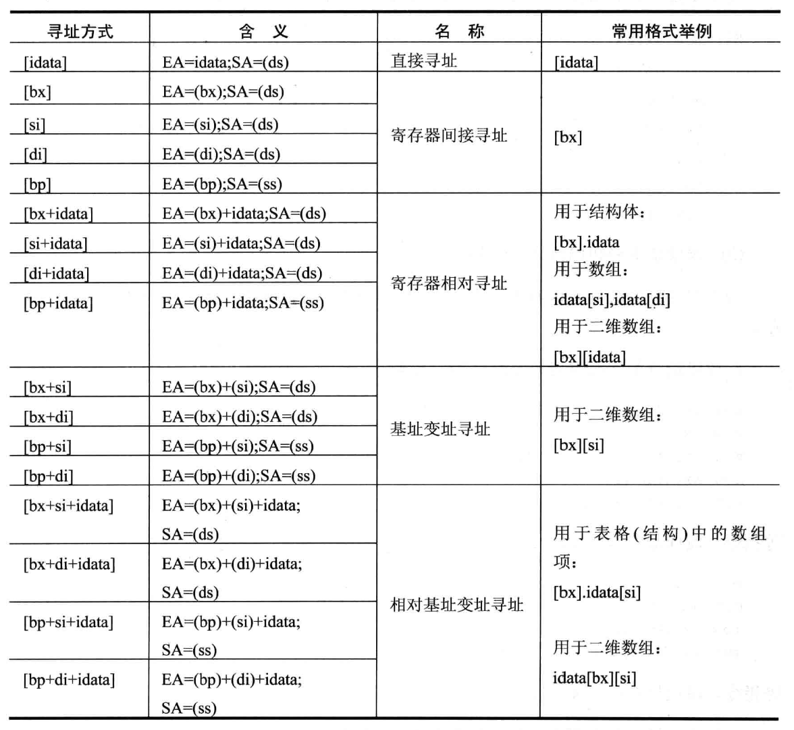

## 要处理的数据长度

在8086CPU中，可以处理两种尺寸的数据，byte和word，一般要在指令中指明进行的是字操作还是字节操作。汇编语言在处理这个问题时有以下几种解决方案：

1、通过寄存器名指定要处理的数据尺寸：如果是ax、bx、ds等寄存器就说明操作的是字，如果是al、bl等寄存器说明操作的是字节。

2、如果指令不涉及寄存器名，而是只涉及内存地址和立即数，此时应该在指令后加入word ptr或byte ptr来表明访问的是一个字节还是一个字：

~~~
mov word ptr ds:[0],1
inc word ptr [bx]
mov byte ptr ds:[0],1
inc byte ptr [bx]
~~~

3、有些指令对于访问的是字单元还是字节单元有默认设置，如push就只进行字操作。

## 除法指令div

div使用时的基本格式：

~~~
div reg或内存单元
~~~

使用div时只需要指定除数即可，除数有8位和16位两种。如果除数为8位，则被除数为16位，默认在AX中存放；如果除数为16位，则被除数为32位，在DX（高16位）和AX（低16位）中存放。

如果除数为8位，则AL存储除法操作的商，AH存储除法操作的余数；如果除数为16位，则AX存储除法操作的商，DX存储除法操作的余数。这就意味着一个div指令影响两个寄存器的值。

如果要利用除法做100001/100，首先被除数100001大于65535，所以必须令被除数为32位，除数则应该为16位，100001的16进制形式为186A1H，计算方法如下：

~~~
mov dx,1
mov ax,86A1H
mov bx,100
div bx
~~~

## 定义数据指令

之前我们用db和dw定义字节型数据和字型数据，还有一个指令dd，它的意思是define double word，它用来定义双字型数据，一次定义4个字节，这几个指令都是编译器需要识别处理的伪指令。

dup是一个操作符，它需要用来和上面的定义指令配合起来用，它代表重复定义：

~~~
db 3 dup (0)						代表db 0,0,0
db 3 dup (0,1,2)					代表db 0,1,2,0,1,2,0,1,2
db 3 dup ('abc','ABC')				代表db 'abcABCabcABCabcABC'
~~~

# 转移指令的原理

可以修改IP，或同时修改CS和IP的指令统称为转移指令。

转移行为有很多种不同的分类方法：

根据只修改IP和同时修改CS和IP，可以分为段内转移（jmp ax）和段间转移（jmp 1000:0）

根据指令对IP的修改范围不同，段内转移又分为短转移（IP的修改范围为-128-127）和近转移（IP的修改范围-32768-32767）

8086CPU的转移指令分为以下几类：

1、无条件转移指令，如jmp

2、条件转移指令

3、循环指令，如loop

4、过程

5、中断

## 操作符offset

offset是一个伪指令，它的功能是取得标号的偏移地址，如：

~~~
assume cs:codesg
codesg segment
	start:	mov ax,offset start
	s:		mov ax,offset s
codesg ends
end start
~~~

第三行语句中的offset start就相当于0，因为start标号的偏移地址为0；第四句中的offset s就相当于3，因为s标号的偏移地址为3，这是由于第一条指令长度为3个字节。

有了offset我们就可以方便的取到标号的偏移地址了，我们可以先设置一个标号中放入nop（占1个字节的机器码）：

~~~
s0:	nop
	nop
~~~

然后再将其他标号s处的指令直接复制过去：

~~~
mov si,offset s
mov di,offset s0
mov ax,cs:[si]
mov cs:[di],ax
~~~

## jmp指令

jmp为无条件转移指令，它要给出两种信息：要转移的目的地址，或者要转移的距离。

### 转到标号处执行指令

使用格式：

~~~
jmp short 标号
~~~

它实现的是段内短转移，对IP的修改范围为-128-127，也就是说它向前转移时最多可以越过128个字节，向后转移时可以最多越过127个字节，转移指令结束后，CS：IP应该指向标号处的指令。

值得注意的是，这个指令对应的机器码中是没有转移的目的地址的，而是包含转移的位移，编译器根据两点的距离计算出位移量，然后修改IP寄存器中的值，在编译结束后的机器指令中就包含转移位移了。相当于该指令的作用其实是(IP)=(IP)+8位位移。

对应的段内近转移指令：

~~~
jmp near ptr 标号
~~~

他对IP的修改范围为-32768-32767.相当于(IP)=(IP)+16位位移。

对应的远转移指令（段间转移）：

~~~
jmp far ptr 标号
~~~

这个指令对应的机器码中就包含了转移的目的地址了。

### 使用内存地址和寄存器

jmp可以直接加16位reg：

~~~
jmp 16位reg
~~~

它的意思就是修改IP寄存器的值，修改为对应寄存器中的值。

jmp命令中也可以直接包含地址，它有两种形式：

1、只修改IP的段内转移：

~~~
jmp word ptr ds:[0]
~~~

相当于把对应地址的值赋值给IP寄存器，完成转移。

2、同时修改IP和CS的段间转移：

~~~
jmp dword ptr ds:[0]
~~~

从对应内存地址单元中取出两个字，低地址的那个字赋值给IP，高地址的那个字赋值给CS，完成转移。

## jcxz指令

jcxz为有条件转移指令，所有的有条件转移指令都是短转移，在对应的机器码中包含转移的位移，而不是目的地址。对IP的修改都是-128-127.

使用格式：

~~~
jcxz 标号
~~~

相当于如果cx寄存器中的值是0，就执行：

~~~
jmp short 标号
~~~

## loop指令

loop指令是循环指令，所有的循环指令都是短转移，基本使用用法：

~~~
loop 标号
~~~

相当于：

~~~
(cx)--
if((cx)!=0)jmp short 标号
~~~

## 关于转移位移的讨论

在上述段内转移指令中，我们可以发现这些指令对应的机器码中只有转移的相对位移，而不包含转移的目的地址，这种设计是为了方便程序段在内存中的浮动装配。

如果我们自定义的程序要直接引用某个写好的目标文件，这个文件内部的转移写成段内转移，这样就可以保证在连接时不会出错，不会因为该目的地址有其他内容而覆盖。

此外还要注意位移超界的问题，如果转移范围出现超界，编译器会报错。

# CALL和RET指令

call和ret指令都是转移指令，它们经常被共同用来实现子程序的设计。

## ret和retf

ret指令用栈中的数据实现修改IP的内容，从而完成近转移，执行ret指令时相当于执行：

~~~
pop IP
~~~

retf指令用栈中的数据实现修改CS和IP的内容，从而完成远转移，执行retf指令相当于执行：

~~~
pop IP
POP CS
~~~

在程序中就可以使用这两个指令来转移：

~~~
code segment
	mov ax,4c00h
	int 21h
start:	...
		...
		ret
code ends
end start
~~~

这样由于ret指令的执行，就会让CS:IP指向代码段的第一条指令，完成返回。

## call指令

call指令执行后进行两步操作：

1、将当前的IP或CS和IP压入栈中

2、转移

### 转到标号处

call指令可以转到标号处，同时将当前的IP压入栈中：

~~~
call 标号
~~~

相当于执行：

~~~
push IP
jmp near ptr 标号
~~~

这个指令对应的机器码中有相对于当前IP的转移位移。

对应的段间转移指令：

~~~
call far ptr 标号
~~~

相当于执行：

~~~
push CS
push IP
jmp far ptr 标号
~~~

这个指令对应的机器码中有转移的目的地址。

### 使用内存地址和寄存器

call指令后也可以跟寄存器：

~~~
call 16位reg
~~~

相当于执行：

~~~
push IP
jmp 16位reg
~~~

call指令后也可以加内存地址，一般有两种形式：

1、段内转移：

~~~
call word ptr 内存单元地址
~~~

相当于执行：

~~~
push IP
jmp word ptr 内存单元地址
~~~

2、段间转移：

~~~
call dword ptr 内存单元地址
~~~

相当于执行：

~~~
push CS
push IP
jmp dword ptr 内存单元地址
~~~

## 实现子程序机制

结合ret和call指令我们可以总结一个实现子程序的框架：

~~~
assume cs:code
code segment
	main:	...
			...
			call sub1					调用了子程序sub1
			...
			...
			mov ax,4c00h
			int 21h
	sub1:	...
			...
			call sub2					调用了子程序sub2
			...
			ret							sub1返回
	sub2:	...
			...
			ret							sub2返回
			
code ends
end main
~~~

## 乘法指令mul

使用格式：

~~~
mul reg
mul 内存单元
~~~

涉及内存单元时，可以中间加word ptr或byte ptr来指定处理的数据长度。

乘法指令中两个相乘的数要么都是8位，要么都是16位；如果都是8位，则一个默认放在AL寄存器中；如果都是16位，则一个默认放在AX寄存器中。

如果是8位乘法那么结果默认放在AX中，如果是16位乘法，那么高位默认放在DX中，低位放在AX中。

## 模块化程序设计

有了子程序我们就可以实现汇编语言编程的模块化设计。

### 参数和结果传递的问题

在使用子程序时有两个问题：参数存在哪里？结果存在哪里？

最常见的方法是使用寄存器，调用子程序者将参数送入参数寄存器，从结果寄存器中取到返回值；子程序从参数寄存器中取到参数，将返回值送入结果寄存器。

### 多个参数和多个结果的传递

如果我们要传递更多的参数怎么办？我们不可能都用寄存器来完成传递，因为寄存器的个数终究是有限的。

这个时候常用的做法是将批量数据放到内存中，然后将他们所在内存空间的首地址放在寄存器中，传递给需要的子程序。对于多个返回结果，我们也可以用同样的方法。

栈也可以用来完成这一类任务。

### 寄存器冲突问题

有时程序中会出现寄存器冲突问题，如在一个循环中调用某个子程序，子程序中也有循环，这些循环共用一个cx寄存器来计数，就会导致循环次数的混乱。此时正确的做法应该是在子程序的开始将子程序中所有用到的寄存器中的内容都保存起来，在子程序返回前都恢复。

案例需求：把数据段中的所有字符串都转换为大写：

~~~
assume cs:code
data segment
	db 'word',0
	db 'unix',0
	db 'wind',0
	db 'good',0
data ends
~~~

此时我们需要写一个子程序来处理单个字符串转换为大写：（ds：si指向字符串的首地址）

~~~
capital:mov cl,[si]
		mov ch,0
		jcxz ok									如果cx为0，就结束
		and byte ptr [si],11011111b				否则就将该字母转换为大写，然后再将si自增
		inc si
		jmp short capital
	ok:	ret
~~~

但是这个子程序没有完成环境保存，所以需要再改动一下，加上数据恢复和取用：

~~~
capital:push cx
		push si
change:	mov cl,[si]
		mov ch,0
		jcxz ok									如果cx为0，就结束
		and byte ptr [si],11011111b				否则就将该字母转换为大写，然后再将si自增
		inc si
		jmp short change
	ok:	pop si
		pop cx
		ret
~~~

然后再调用该子程序即可：

~~~
code segment
	start:	mov ax,data
			mov ds,ax
			mov bx,0							指定总的循环次数
			
			mov cx,4
		s:	mov si,bx							处理字符串，然后将指针加5，处理下一个字符串
			call capital
			add bx,5
			loop s
			
			mov ax,4c00h
			int 21h
			
	capital:push cx
			push si
	change:	mov cl,[si]
			mov ch,0
			jcxz ok									如果cx为0，就结束
			and byte ptr [si],11011111b				否则就将该字母转换为大写，然后再将si自增
			inc si
			jmp short change
		ok:	pop si
			pop cx
			ret
			
code ends
end start
~~~

# 标志寄存器

CPU内部有一种特殊的寄存器名为标志寄存器，它有以下几种作用：

1、存储相关指令的某些执行结果

2、为CPU执行相关指令提供行为依据

3、控制CPU的相关工作方式

8080CPU中的标志寄存器是flag，它有16位，其中存储的信息通常被称为程序状态字PSW，这种寄存器的每一位都有含义，它并不整体代表某种含义，flag寄存器的示意图如下：

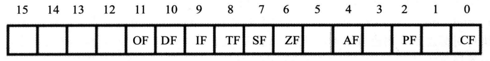

## ZF标志

flag的第6位是ZF，被称为零标志位。相关指令执行后，如果结果为0，那么zf=1；如果结果为1，那么zf=0。zf的真正含义是“计算结果是否为0”，如果是就为1.

当add、sub、mul、div、inc、or、and等指令执行时，结果就会影响ZF（或者标志寄存器），它们大多都是逻辑或算术运算。但是传送指令mov、push、pop等对该寄存器就没有影响。

## PF标志

flag的第2位是PF，被称为奇偶标志位。相关指令执行后，其结果中所有的bit位中1的个数如果是偶数，pf=1，如果是奇数，pf=0.

## SF标志

flag的第7位是SF，被称为符号标志位。相关指令执行后，结果如果为负，sf=1，如果为正，sf=0。

## CF标志

flag的第0位是CF，被称为进位标志位。在进行无符号数运算的时候，它记录了运算结果的最高有效位向更高位的进位值或借位值。

做加法时：

~~~
mov al,98H
add al,al					执行后al的值是30H，进位值是1，CF=1
add al,al					执行后al的值是60H，此时没有进位，所以CF=0
~~~

做减法时有可能向更高位借位，如一个小数减去一个大数，此时小数要向高位借1，97H-98H，借位后其实是做197H-98H，这个借位值就记录在cf中

~~~
mov al,97H
sub al 98H					执行后al的值是FFH，cf为1
~~~

## OF标志

OF标志是用来标记溢出的，也就是在有符号数运算的时候，结果超过了机器所能表示的范围称为溢出。对于8位的有符号数据，机器所能表示的范围就是-128-127，对于16位就是-32768-32767。如果发生溢出就OF=1，如果没有就等于0.

注意区分OF标志和CF标志，CF是对无符号数运算有意义的标志位，OF是对有符号数运算有意义的标志位。当两个数相加时，会因为有符号（补码转换）或者无符号规则产生不同的运算式，就会有不同的结果，一次逻辑或算术运算造成的OF和CF影响不一定是一致的。

## adc指令和sbb指令

adc是带进位加法指令，它的使用格式是：

~~~
adc 操作对象1 操作对象2
~~~

相当于操作对象1=操作对象1+操作对象2+CF，它利用了CF位上记录的进位值。

有了adc指令，我们就可以实现更大的数据相加，如计算1EF000H+201000H，结果放在ax（高16位）和bx（低16位）中，我们需要先将低16位相加，然后将高16位和进位值相加：

~~~
mov ax,011EH
mov bx,0F000H
add bx,1000H
adc ax,0020H
~~~

sbb是带借位减法指令，它利用了CF位上记录的借位值。它的使用格式是：

~~~
sbb 操作对象1 操作对象2
~~~

相当于操作对象1=操作对象1-操作对象2-CF。

有了sbb指令，我们可以实现更大的数据相减，如计算003E1000H-00202000H，结果放在ax和bx中，我们需要将低16位相减，然后将高16位相减的结果减去借位值：

~~~
mov bx,1000H
mov ax,003EH
sub bx,2000H
sbb ax,0020H
~~~

## cmp指令

cmp是比较指令，格式：

~~~
cmp 操作对象1 操作对象2
~~~

它相当于减法指令，但是不保存结果，只是根据执行结果影响几个标志位：zf、pf、sf、cf和of。根据zf的值能看出两个操作对象是否是同一个值。

当cmp进行的是无符号数的运算时，根据cf的值就能看出两个数谁大谁小（进位或者借位一定能推断大小）。当cmp进行的是有符号数的运算时，同时根据sf和of两个值就能推断出谁大谁小（必须同时考察结果的正负和是否溢出来推断）。

## 检测标志位的条件转移指令

之前我们学习的jcxz就是一个条件转移指令，它根据cx寄存器中的数值是否为0，决定到底是否跳转到对应的标号处。还有很多条件转移指令，大多数条件转移指令都检测相关的标志位，分为无符号数比较（检测zf和cf的值）和有符号数比较（检测sf、of和zf的值），下面是常用的根据无符号数的比较结果进行转移的条件转移指令：

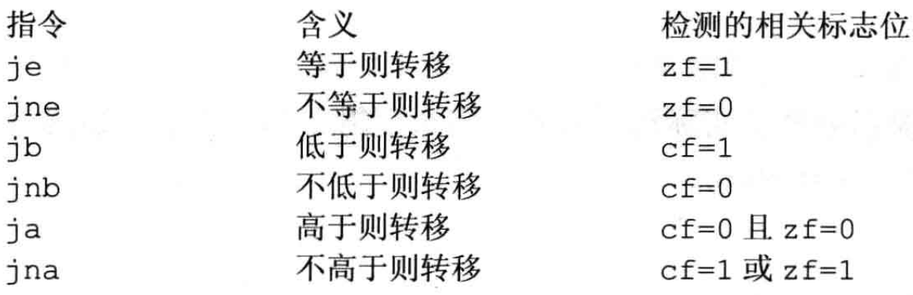

cmp因为能修改标志寄存器中的值，所以经常和条件转移指令配合在一起使用，但是这只是一种建议，将转移指令放在运算指令的后面也一样可以实现if语句一般的功能。

## DF标志和串传送指令

flag的第10位是DF，它代表方向标志位，在串处理指令中，控制每次操作后si和di的增减，当DF等于0时，每次操作后si和di递增；当DF等于1时，每次操作后si和di递减。

串传送指令movsb代表执行以下操作：

将ds:si指向的内存单元中的字节送入es:di中，然后根据df的值，完成si和di的递增或递减1。

串传送指令movsw和上面的类似，只不过是传送一个字：

将ds:si指向的内存单元中的字送入es:di中，然后根据df的值，完成si和di的递增或递减2。

这两个串传送指令都经常配合rep使用，格式如下：

~~~
rep movsb
~~~

相当于执行：

~~~
s:movsb
loop s
~~~

可见rep指令给串传送指令赋予循环的概念。

8086CPU还提供了cld指令和std指令来分别将df标志设置为0和1。

如果我们要用串传送指令将数据段中的第一个字符串复制到它后面的空间中：

~~~
data segment
	db 'Welcome to masm!'
	db 16 dup (0)
data ends
~~~

再使用串传送指令前我们要分析好各数据的设置：

1、传送的原始位置：ds:si，应该是data:0

2、传送的目的位置：es:di，应该是data:0010

3、传送的长度：cx，应该是16

4、传送的方向：df，应该是0，每次递增si和di

然后就可以完成程序：

~~~
mov ax,data
mov ds,ax
mov si,0
mov es,ax
mov di,16
mov cx,16
cld
rep movsb
~~~

## pushf和popf

pushf的功能是将标志寄存器的值压栈，而popf是从栈中弹出数据，送入标志寄存器中，这两个指令为直接访问标志寄存器提供了一种方法。

## debug中的标志寄存器

在debug过程中可以查看标志寄存器的值，但是不会直接显示是0还是1，而是对应不同的标志位，不同值会有不同的名字对应：

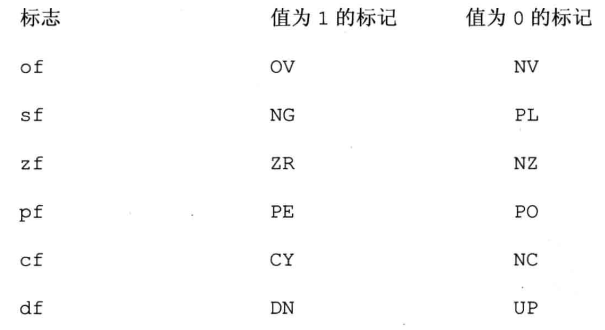

# 内中断

CPU可以在执行完当前正在执行的指令之后，检测到从CPU外部或内部产生的一种特殊信息，并且可以立即对所接受到的信息进行处理。这种特殊信息一般称其为中断信息。中断就是CPU不再接着刚执行完的指令向下执行，而是转而去处理这个特殊信息。

## 内中断的产生

从CPU内部产生的中断信息被称为内中断。当下列情况发生时会产生内中断：

1、除法错误，如执行div指令时产生的除法溢出

2、单步执行

3、执行into指令

4、执行int指令

CPU根据中断类型码来区分不同的中断信息，中断类型码是一个字节型数据，可以表示256种中断信息的来源，产生中断信息的来源简称为中断源。上述四种情况下的中断类型码如下：

1、除法错误：0

2、单步执行：1

3、执行into指令：4

4、执行int指令：中断类型码为指令后的字节型立即数

## 中断处理程序和中断向量表

CPU收到中断信息后，需要对中断信息进行处理，用来处理中断信息的程序被称为中断处理程序。

转去执行中断处理程序需要让CS:IP指向该程序的入口，这个过程需要用到中断向量表。CPU用8位的中断类型码通过中断向量表找到相应的中断处理程序的入口地址，中断向量表在内存中保存，其中存放着256个中断源所对应的中断处理程序的入口：

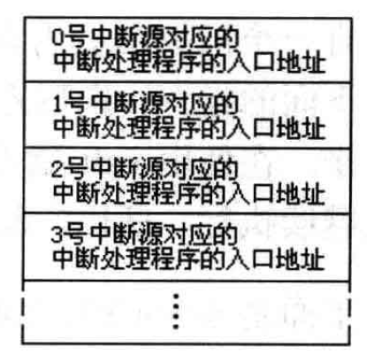

对于8086CPU，中断向量表指定放在内存地址0处，从0000：0000到0000：03FF的1024个单元中存放着中断向量表。一个表项中放着一个中断处理程序的入口地址，包含段地址和偏移地址，占用两个字，高地址字存放段地址，低地址字存放偏移地址。

## 中断过程

CPU在执行完中断处理程序后，应该返回原来的执行点继续执行下面的命令。所以在中断过程中应该将原来的CS和IP保存起来。

中断过程如下：

1、根据中断信息取得中断类型码

2、标志寄存器的值入栈（中断处理程序可能会修改标志寄存器，所以这里要保存起来准备恢复）

3、设置标志寄存器的第8位TF和第9位IF的值为0

4、CS的内容入栈

5、IP的内容入栈

6、从内存地址为中断类型码*4的位置取出两个字，组成中断处理程序的入口，设置IP和CS

## 中断处理程序和iret指令

中断处理程序的编写方法和子程序比较相似，下面是常规的步骤：

1、保存用到的寄存器

2、处理中断

3、恢复用到的寄存器

4、用iret指令返回

iret指令相当于执行：

~~~
pop IP
pop CS
popf
~~~

相当于把执行中断处理程序之前保存的内容（CS:IP和标志寄存器）全部恢复了。

## 编程处理0号中断

如果我们debug以下程序：

~~~
mov ax,1000h
mov bh,1
div bh
~~~

就会发生除法溢出错误，可以看到当产生中断时，控制台显示信息“Divide overflow”，这就是系统对0号中断的处理。

我们考虑改变0号中断处理程序的功能，要让其在屏幕中间显示“overflow”，然后返回操作系统。

这个程序的步骤如下：

1、产生0号中断信息，引发中断过程，CPU将进行如下工作：

取得中断类型码0、标志寄存器入栈然后TF、IF设置为0、CS和IP入栈、CS：IP根据中断向量表的完成跳转，进而执行中断处理程序。

2、中断处理程序的步骤如下：

相关处理、向显示缓冲区发送字符串“overflow”，然后返回DOS。我们称这段程序为do0。这个do0程序应该放在0000：0200处，这段空间是中断向量表的空闲单元，不会有程序占用。确定了do0程序的位置，就应该调整中断向量表的表项，应该要将do0的段地址0存放在0000：0002字单元中，将偏移地址200H存放在0000：0000字单元中。

综上所述，程序的框架如下：

~~~
assume cs:code
code segment
start:	do0安装程序
		设置中断向量表
		mov ax,4c00h
		int 21h
		
do0:	显示字符串“overflow”
		mov ax,4c00h
		int 21h
code ends
end start
~~~

这个程序执行时do0程序是不执行的，只是为了能让中断程序找到do0程序。

## 安装程序和设置中断向量

我们可以用movsb指令来将do0的代码移动到0：200处：

~~~
start:	mov ax,cs
		mov ds,ax
		mov si,offset do0						设置ds：si指向源地址
		mov ax,0
		mov es,ax
		mov di,200h								设置es：di指向目的地址
		
		mov cx,offset do0end-offset do0			设置传输长度
		cld										设置传输方向
		rep movsb
		
		设置中断向量表
		mov ax,0
		mov es,ax
		mov word ptr es:[0*4],200h
		mov word ptr es:[0*4+2],0
		mov ax,4c00h
		int 21h
~~~

这里注意因为do0代码段的长度是可变的，所以这里用offset do0end-offset do0来代表代码的长度，减号是编译器识别的符号。

## do0程序

程序如下：

~~~
do0:	jmp short do0start
		db "overflow!"
do0start:	mov ax,cs
			mov ds,ax
			mov si,202h							设置ds：si指向字符串
			
			mov ax,0b800h
			mov es,ax
			mov di,12*160+36*2					设置es：di指向显存空间的中间位置
			
			mov cx,9							设置cx为字符串长度
		s:	mov al,[si]
			mov es:[di],al
			inc si
			add di,2
			loop s
			
			mov ax,4c00h
			int 21h
do0end:nop
~~~

这里要打印的字符串overflow也必须放在do0程序中，因为设置好中断程序后，这个程序随时都有可能执行，也就是说除了中断程序之外的数据都有可能被其他数据覆盖。

## 单步中断

我们在debug时如果使用t命令，CPU就能执行一条指令后，就显示各个寄存器的状态，这是因为CPU有一种机制被称为单步中断，当CPU执行完一条指令时，如果检测到标志寄存器中的TF位为1，则产生单步中断，引发中断过程，此时它的中断类型码为1.

debug就是因为将TF设置为1，使得CPU工作于单步中断方式下。在进入中断处理程序之前，TF值要设置为0，这是为了不让中断处理程序也引起中断导致无限中断。

## 不响应中断的特殊情况

有些情况下即使发生中断，CPU也不会响应。

其中之一就是执行完向ss寄存器传送数据的指令后，不会响应中断。这是因为ss和sp通常是连续设置完成的，如果ss设置完了之后sp还没设置就产生中断，这使中断时ss：sp指向错误的栈顶，让中断过程压入栈中的数据可能覆盖有用的数据。所以CPU在执行完设置ss的指令后，不响应中断，所以在编程的时候sp的设置应该紧跟ss之后，不宜离太远。

# int指令

int指令也可以引发内中断。

int指令的格式是：

~~~
int n
~~~

其中n为中断类型码。

相当于执行以下步骤：

1、取到中断类型码n

2、标志寄存器入栈，IF=0，TF=0

3、CS、IP入栈

4、根据中断向量表修改CS和IP：（IP）=（n*4），（CS）=（n\*4+2）

可见int指令的最终功能就是执行一段中断处理程序。

## 案例：以中断程序的方式实现计算式

需求：求一word型数据的平方，求2*（3456的平方），dx、ax中存放结果的高16位和低16位。

首先准备安装程序：

~~~
assume cs:code
code segment
start:	mov ax,cs
		mov ds,ax
		mov si,offset sqr						设置ds：si指向源地址
		mov ax,0
		mov es,ax
		mov di,200h								设置es：di指向目的地址
		mov cx,offset sqrend-offset sqr			设置传输长度
		cld										设置传输长度为正
		rep movsb								开始安装中断程序
		
		mov ax,0								设置中断向量表
		mov es,ax
		mov word ptr es:[7ch*4],200h
		mov word ptr es:[7ch*4+2],0
		
		mov ax,4c00h
		int 21h
		
sqr:	mul ax									中断处理程序：将一个数求平方
		iret
		
sqrend:	nop

code ends
end start
~~~

然后产生对应中断完成功能：

~~~
assume cs:code
code segment
start:	mov ax,3456
		int 7ch									调用中断处理程序，完成平方
		add ax,ax								低16位相加
		adc dx,dx								高16位相加
		mov ax,4c00h
		int 21h
code ends
end start
~~~

## 案例：以中断程序的方式完成loop指令循环

需求：在屏幕中间显示80个“！”

程序：

~~~
assume cs:code
code segment
start:	mov ax,0b800h
		mov es,ax
		mov di,160*12
		
		mov bx,offset s-offset se				计算从se到e的转移位移
		mov cx,80								设置循环次数
	s:	mov byte ptr es:[di],'!'				在屏幕上显示符号
		add di,2
		int 7ch									用这条指令代替loop s
	se:	nop
		mov ax,4c00h
		int 21h
code ends
end start
~~~

要想用int 7ch代替loop s，必须使其完成两项内容：cx的自减以及将执行跳转到s标号处。

要跳转到s标号处，必须设置cs和ip。当中断发生时，此时会把当时的cs和ip压入栈中，中断完成后取出恢复。我们要想办法让栈中取出的值对应的cs和ip就是标号s处。这里的cs是不用改变的，因为跳转发生在同一个段中，关键是ip要发生改变。

中断程序：

~~~
lp:	push bp
	mov bp,sp
	dec cx
	jcxz lpret
	add [bp+2],bx
lpret:	pop bp
		iret
~~~

下面我们重点研究这段代码，当中断发生时，int 7ch这句代码的cs和ip会入栈，然后把bp寄存器压入栈中，将sp寄存器赋值给bp（ss：sp时刻指向栈顶，sp相当于偏移地址），然后自减cx，如果cx不为0则继续执行：

~~~
[bp+2],bx
~~~

当bp寄存器在中括号中，默认的段地址在ss中，也就是说这条语句实际上是一条改变栈的语句，因为bp此时就等于sp，所以这条语句实际上改变的是栈顶往下第二个元素，也就是刚刚中断时压入栈中的ip，这个值加上bx就相当于再次指向标号s（bx是转移位移），然后bp弹栈，结束中断。如果cx为0，那么就直接跳到lpret执行，栈中的数据不改变，cs和ip的值也不变，相当于loop结束。

为什么一定要把bp放入栈中再取出呢？因为bp是一个中间寄存器，它的值在调用中断程序前后不能发生变化。

为什么没有关于标志寄存器的操作？因为它是第一个被放入栈中的，也就是栈底数据，和本例无关。

由此可见，根据中断时cs和ip入栈的性质，我们也可以手动调整栈来完成跳转。

## BIOS和DOS提供的中断机制

在系统板的ROM中存放着一套程序，称为BIOS（基本输入输出系统），BIOS中主要包含以下几部分内容：

1、硬件系统的检测和初始化程序

2、外部中断和内部中断的中断例程

3、用于对硬件设备进行的IO操作的中断例程

4、其他和硬件系统相关的中断例程

操作系统DOS也提供了很多中断例程，从操作系统的角度来看，DOS的中断机制就是操作系统向程序员提供的编程资源。

程序员在编程的时候可以用int指令直接调用BIOS和DOS提供的中断例程来完成对应的功能。

它们的执行过程如下：

1、开机后CPU初始化CS=0FFFFH，IP=0，开始执行程序，这个位置有一个跳转指令，CPU转去执行BIOS中的硬件系统检测和初始化程序。

2、初始化程序将BIOS提供的中断程序的入口地址登记在中断向量表中。

3、硬件系统检测和初始化完成后，调用int 19h进行操作系统的引导，将计算机交给操作系统来控制。

4、DOS启动后，将其中断程序装入内存并更新中断向量表。

## BIOS中断例程应用

int 10h是BIOS提供的一个中断例程，其中包含了多个和屏幕输出相关的子程序。

设置光标位置功能：

~~~
mov ah,2							调用中断程序的2号子程序，设置光标位置
mov bh,0							位置在第0页，一般就是屏幕中
mov dh,5							行号为5
mov dl,12							列号为12
int 10h								
~~~

在光标位置显示字符：

~~~
mov ah,9							调用中断程序的9号子程序，在光标位置显示字符
mov al,'a'							字符为a
mov bl,7							颜色属性为7
mov bh,0							位置在第0页
mov cx,3							字符重复个数为3
int 10h
~~~

## DOS中断例程应用

int21h是DOS提供的中断例程。

我们在前面一直在利用int 21h中断例程的4ch号功能完成程序返回功能：

~~~
mov ah,4ch							程序返回
mov al,0							返回值为0
int 21h
~~~

简写为：

~~~
mov ax,4c00h
int 21h
~~~

该中断例程也可以在光标位置显示字符串：

~~~
assume cs:code

data segment
	db 'Welcome to masm','$'
data ends

code segment
	start:	mov ah,2					设置光标位置
			mov bh,0
			mov dh,5
			mov dl,12
			int 10h
			
			mov ax,data					
			mov ds,ax
			mov dx,0					令ds：dx指向字符串，要显示的字符串必须是以$结尾
			mov ah,9					调用9号子程序，显示字符串
			int 21h
			
			mov ax,4c00h
			int 21h
code ends
end start
~~~

# 端口

在PC系统中，和CPU通过总线相连的芯片除了各种存储器外，还有以下三种芯片：

1、各种接口卡（如显卡、网卡）上的接口芯片，它们控制接口卡进行工作

2、主板上的接口芯片，CPU通过它们对部分外设进行访问

3、其他芯片，用来存储相关的系统信息，或进行相关的输入输出处理

这些芯片中都有一组可以由CPU读写的寄存器，这些寄存器都与CPU的总线相连，且CPU都可以通过控制线发出端口读写命令来对这些寄存器读或写。从CPU的角度来看，可以把这些寄存器都当做端口进行统一编址，建立一个统一的端口地址空间。

CPU可以直接读写的对象有三种：CPU内部的寄存器、内存单元、端口。

## 端口的读写

访问端口时，端口地址与内存地址一样，通过地址总线来传送，在PC系统中CPU最多可以定位64KB个不同的端口，端口地址的范围为0-65535。

端口读写的指令只有两条：in和out，分别用于从端口读取数据和往端口写入数据。在in和out指令中，只能使用ax或al来存放从端口中读入的数据，或要发送到端口中的数据。访问8位端口时用al，16位用ax。

从60h号端口读入一个字节：

~~~
in al,60h
~~~

执行这条语句实际上发生了：

1、CPU通过地址线将地址信息60h发出

2、CPU通过控制线发出端口读命令，通知它要从中读数据

3、端口所在芯片将60h端口中的数据通过数据线送入CPU

## CMOS RAM芯片

PC中有一个CMOS RAM芯片，它有以下一些特征：

1、包含一个实时钟和一个有128个存储单元的RAM存储器

2、该芯片靠电池供电，关机后其内部时钟仍可正常工作。

3、128个字节的RAM中，内存实时钟占用0-0dh单元来保存时间信息，其余大部分单元用于保存系统配置信息，供系统启动时BIOS程序读取。

4、该芯片内部有两个端口70h和71h，70h中存放要访问的CMOS RAM单元的地址；71h存放从选定的CMOS RAM单元中读到的数据，或要写入其中的数据。

CPU对CMOS RAM芯片的读取分两步进行：

1、将要读取的单元号送入70h

2、从端口号71h读出2号单元的内容

如果要从CMOS RAM芯片8号单元读出数据，应该执行：

~~~
mov al,8
out 70h,al							将8送入70h，代表要访问8号单元
in al,71h							从71h中读到对应的数据
~~~

## 逻辑移位指令shl和shr

shl是逻辑左移指令，它的功能是：

1、将一个寄存器或内存单元中的数据向左移位

2、将最后移出的一位写入CF

3、最低位用0补充

shr是逻辑右移指令，它的功能是：

1、将一个寄存器或内存单元中的数据向右移位

2、将最后移出的一位写入CF

3、最高位用0补充

用法：

~~~
shr al,1						将al中的数据右移一位
shl al,3						将al中的数据左移一位
~~~

# 外中断

## 可屏蔽中断与不可屏蔽中断

CPU除了能执行指令运算以外，还需要对外部设备进行控制，接受它们的输入，或者向它们输出，也就是I/O能力。CPU通过端口与外部设备进行联系，无论是发送和接受数据，还是输出控制命令，都是先将数据和指令送入相关芯片的端口中，然后再通过芯片对外设进行控制，或者传输到CPU。

外设的输入随时都有可能到达，CPU利用中断机制来及时处理这些信息，这种来自CPU外部的中断信息就被称为外中断。CPU在执行完当前指令后，检测到中断信息，就会引发中断过程，处理外设的输入。

在PC系统中，外中断源一共有以下两类：可屏蔽中断和不可屏蔽中断。

1、可屏蔽中断是CPU可以不响应的外中断，标志寄存器IF决定了CPU能否响应。当CPU检测到可屏蔽中断信息时，如果IF=1，则CPU在执行完当前指令后响应中断，引发中断过程；如果IF=0，则不响应可屏蔽中断。

这也就是为什么在中断时要先把IF位置为0，这是为了在进入中断处理程序后，禁止其他的可屏蔽中断。如果要在中断处理程序中打开处理可屏蔽中断的开关，可以用指令将IF置为1，8086CPU提供如下指令：

~~~
sti							设置IF为1
cli							设置IF为0
~~~

可屏蔽中断的过程：

（1）通过数据总线将中断类型码n送入CPU中

（2）标志寄存器入栈，IF=0，TF=0

（3）CS和IP入栈

（4）IP=n*4，CS=n\*4+2

2、不可屏蔽中断是CPU必须响应的外中断，不可屏蔽中断类型码固定为2，几乎所有由外设引发的外中断都是可屏蔽中断，如键盘输入，不可屏蔽中断是在系统中有必须处理的紧急情况发生时用来通知CPU的中断信息（如电源掉电）。

不可屏蔽中断的过程：

（1）标志寄存器入栈，IF=0，TF=0

（2）CS和IP入栈

（3）IP=8，CS=0AH

## PC机键盘的处理过程

键盘上的每一个键相当于一个开关，键盘中有一个芯片对键盘上每一个键的开关状态进行扫描。

按下一个键时，开关接通，该芯片就产生一个扫描码，扫描码被送入主板上的相关接口芯片的寄存器中，该寄存器的端口地址为60h。松开按下的键时，也会产生一个扫描码，说明了松开的键在键盘上的位置，该扫描码也会被送入60h端口中。

一般将按下一个键时产生的扫描码称为通码，松开一个键时产生的扫描码称为断码。同一个按键的通码和断码的关系：

~~~
断码=通码+80h
~~~

相同按键的通码的第7位是0，断码的第7位是1。下面是键盘上部分键的通码：

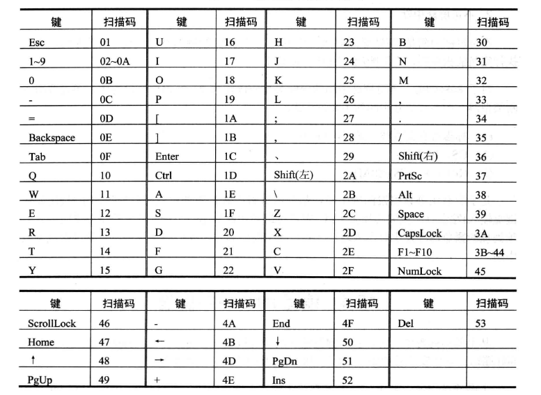

然后键盘的输入到达60h端口后，相关的芯片就会向CPU发出中断类型码为9的可屏蔽中断信息。检查IF是否为1，如果为1则响应中断，引发中断过程。

中断处理程序的工作如下：

1、读出60h端口中的扫描码

2、如果是字符键的扫描码，就将扫描码和它对应的字符码（ASCII码）送入内存中的BIOS键盘缓冲区；如果是控制键和切换键的扫描码，则将其转变为状态字节写入内存中存储状态字节的单元。

BIOS键盘缓冲区是系统启动后，BIOS用于存放键盘输入的内存区，它可以存储的键盘输入是有限的。

存储键盘状态字节的内存单元是0040：17，它的8位每个位都有特殊的含义：

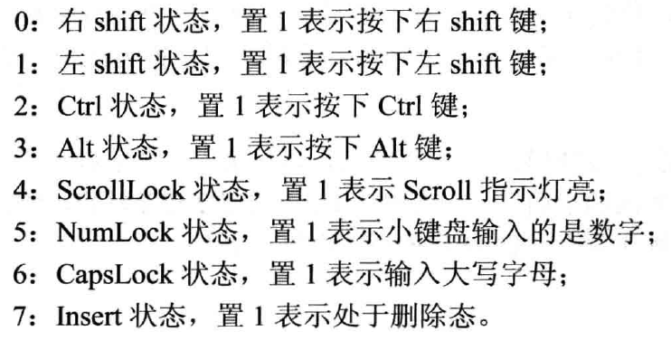

3、向相关芯片发出应答信息。

## 案例：显示字母后按esc改变颜色

要求：在屏幕中间依次显示a-z，并可以让人看清，在显示的过程中，按下esc键后，改变显示的颜色。

显示a-z的程序：

~~~
assume cs:code 
code segment
start:	mov ax,0b800h
		mov es,ax
		mov ah,'a'							字母从a开始
	s:	mov es:[160*12+40*2],ah				设置显示位置
		inc ah
		cmp ah,'z'							字母到z结束
		jna s								比较指令cmp和jna组合使用意思是不高于则转移
		mov ax,4c00h
		int 21h
code ends
end start
~~~

上面这段程序中字母的显示速度太快了，以至于无法看清。我们应该在每显示一个字母后延时一段时间，让人看清后再显示下一个字母，延时的方法就是让CPU执行一段时间的空循环：

~~~
	mov dx,10h
	mov ax,0								用dx+ax的方式存储32位循环次数
s:	sub ax,1
	sbb dx,0								循环次数减一
	cmp ax,0									
	jne s
	cmp dx,0								如果ax或dx不为0都要跳转到s处
	jne s
~~~

然后我们把这两段程序组合一下，把循环延时的部分组成一个子程序：

~~~
assume cs:code

stack segment
	db 128 dup (0)
stack ends

start:	mov ax,stack
		mov ss,ax
		mov sp,128
		
		mov ax,0b800h
		mov es,ax
		mov ah,'a'
	s:	mov es:[160*12+40*2],ah				设置显示位置
		call delay							调用延时子程序
		inc ah
		cmp ah,'z'							字母到z结束
		jna s								比较指令cmp和jna组合使用意思是不高于则转移
		
		mov ax,4c00h
		int 21h
		
delay:	push ax								子程序开始
		push dx
		mov dx,1000h
		mov ax,0
	s1:	sub ax,1
		sbb dx,0
		cmp ax,0
		jne s1
		cmp dx,0
		jne s1
		pop dx 
		pop ax
		ret
~~~

现在字母已经在屏幕上显示出来了，接下来就是让按下esc键后改变颜色了。我们必须要对原来的9号中断例程进行修改，如果我们要写的中断处理程序称为新的int9中断例程，那么就必须修改中断向量表，但是在新中断例程中又要模拟原来中断例程的工作，所以我们要把原来int9中断例程的程序地址记录下来，在需要调用的时候找到该程序的入口。

有了原来int9的程序入口后，假设入口程序的偏移地址和段地址保存在ds:[0]和ds:[2]中，我们要模仿执行该中断处理程序，因为已经知道中断处理程序的入口，所以无需获得中断类型码，只需要执行下列工作：

1、标志寄存器入栈

2、IF=0，TF=0

3、CS和IP入栈

4、IP=ds*16+0，CS=ds\*16+2

综上，调用中断例程的程序如下：

~~~
pushf									标志寄存器入栈

pushf									
pop ax
and ah,11111100b						IF=0，TF=0
push
ax
popf

call dword ptr ds:[0]					模拟调用子程序，相当于执行CS、IP入栈及其跳转
~~~

完整的程序如下：

~~~
assume cs:code

stack segment
	db 128 dup (0)
stack ends

data segment
	dw 0,0
data ends

code segment
start:	mov ax,stack
		mov ss,ax
		mov sp,128
		
		mov ax,data
		mov ds,ax
		mov ax,0
		mov es,ax
		
		push es:[9*4]
		pop ds:[0]
		push es:[9*4+2]
		pop ds:[2]					将原来的int9中断例程的入口地址保存在ds:0和ds:2中
		
		mov word ptr es:[9*4],offset int9
		mov es:[9*4+2],cs			将中断向量表中的int9中断例程的入口地址更新
		
		mov ax,0b800h
		mov es,ax
		mov ah,'a'
	s:	mov es:[160*12+40*2],ah				
		call delay							
		inc ah
		cmp ah,'z'							
		jna s						显示字母
		
		mov ax,0
		mov es,ax
		
		push ds:[0]
		pop es:[9*4]
		push ds:[2]
		pop es:[9*4+2]				将改变的中断向量表恢复，否则其他程序将无法使用键盘
		
		mov ax,4c00h
		int 21h						程序返回
		
delay:	push ax						延迟子程序
		push dx
		mov dx,1000h
		mov ax,0
	s1:	sub ax,1
		sbb dx,0
		cmp ax,0
		jne s1
		cmp dx,0
		jne s1
		pop dx 
		pop ax
		ret
		
int9:	push ax
		push bx
		push es
		
		in al,60h							接受60h端口的扫描码，将其存入al中
		
		pushf
        pushf
		pop ax
		and ah,11111100b						
		push
		ax
		popf
		call dword ptr ds:[0]				调用原来的int9例程
		
		cmp al,1
		jne int9ret							不等于1即转移到int9ret，只有扫描码是1时才向下执行
		
		mov ax,0b800h
		mov es,ax
		inc byte ptr es:[160*12+40*2+1]		改变颜色
		
int9ret:pop es
		pop bx
		pop bx
		iret
		
code ends
end start
~~~

这个程序因为直接访问硬件，所以必须要在DOS模式下运行。

# 直接定址表

## 数据标号

之前我们使用的标号形式：

~~~
a:db 1,2,3,4,5,6,7,8

start:	...
~~~

这个标号仅仅代表内存单元的地址。

我们还可以使用同时描述内存地址和单元长度的标号，即数据标号（没有冒号），如：

~~~
a db 1,2,3,4,5,6,7,8
b dw 0
~~~

它代表a之后的单元都是字节单元，b之后的单元都是字单元。当指令中出现标号a或b的时候，会同时代表地址和单元长度信息，如果出现字节匹配字的情况出现会报错：

~~~
mov ax,b			等价于			mov ax,cs:[8]
mov b,2				等价于			mov word ptr cs:[8],2
mov al,a[si]		等价于			mov al,cs:0[si]
mov al,a[bx+si+3]	等价于			mov al,cs:0[bx+si+3]
~~~

这个装段地址的cs是可以自由设置的。

如在下列程序中：

~~~
assume cs:code,ds:data
data segment
	a db 1,2,3,4,5,6,7,8
	b dw 0
data ends

code segment
start:	mov ax,data
		mov ds,ax
		
		mov si,0
		mov cx,8
	s:	mov al,a[si]
		mov ah,0
		add b,ax
		inc si
		loop s
		
		mov ax,4c00h
		int 21h
code ends
end start
~~~

这里的：

~~~
mov al,a[si]
add b,ax
~~~

等价于：

~~~
mov al,ds:0[si]
add ds:8,ax
~~~

这是因为：

1、assume语句让data段与ds寄存器联系在了一起

2、ds中存放了data段的程序入口

也就是说在使用数据标号的时候要注意段地址关联到哪一个寄存器。

有了这种关联关系的设置，数据标号可以在其他段引用，带冒号的地址标号不能在其他段使用。

## 直接定址表

通过依据数据，直接计算出所要找的元素的位置的表，称为直接定址表（本质上还是数字标号的应用）。

如果我们要制作一个程序，希望将一个字节放在al中，在屏幕上显示该数字对应的十六进制值，这个问题就非常适合通过简单的映射关系来解决：

~~~
showbyte:	jmp short show
			table db '0123456789ABCDEF'					字符表
			
	show:	push bx
			push es
			
			mov ah,al									al和ah存放了数字
			shr ah,1
			shr ah,1
			shr ah,1
			shr ah,1
			and al,00001111b							al存低4位，ah存高4位
			
			mov bl,al
			mov bh,0									组合成bx
			mov al,table[bx]							通过映射得到对应字符
			
			mov es:[160*12+40*2],ah						显示字符
			
			mov bl,al
			mov bh,0									组合成bx
			mov al,table[bx]							通过映射得到对应字符
			
			mov es:[160*12+40*2+2],al					显示字符
			
			pop es
			pop bx
			ret
~~~

如给数字2Bh，拆分成高4位2和低4位11，通过十六进制转换为2Bh。

利用表我们在两个数据集合之间建立一种映射关系，快速得到对应数据，程序简洁、转换速度快、易于扩充。

## 程序入口地址的直接定址表

我们可以在直接定址表中存储子程序的地址，从而方便的实现不同子程序的调用。

我们要实现一个程序，用ah寄存器来传递功能号，0、1、2、3代表不同的功能号，对应不同的功能：

~~~
setscreen:	jmp short set
	 		table dw sub1 sub2 sub3 sub4			创建字符表
	 set:	push bx
	 
	 		cmp ah,3								如果ah大于3就直接跳到sret
	 		ja sret
	 		mov bl,ah
	 		mov bh,0								组成bx寄存器的值
	 		add bx,bx								bx扩大一倍
	 		
	 		call word ptr table[bx]					调用对应功能的子程序
	 		
	 sret:	pop bx
	 		ret
~~~

这里功能号乘2等于地址表对应位置的偏移量。

然后就设置4个sub的子程序即可。

通过这种方式调用子程序易于扩展、调用简单。

# 使用BIOS进行键盘输入和磁盘读写

我们通过讨论键盘输入和磁盘读写来理解CPU对I/O的控制。

## BIOS键盘缓冲区

键盘输入会引发9号中断，CPU会执行中断例程，从60h端口读出扫描码，然后将其转换为对应的ascii码信息，将扫描码和对应的ascii码存入内存中的指定空间中，这个空间一般是键盘缓冲区，键盘缓冲区是一个环形队列。

如果我们按下A键就会引发键盘中断，CPU执行int9中断例程，从60h端口读出A键的通码，然后检测状态字节，将A的扫描码1eh和对应的ascii码61h写入键盘缓冲区中：

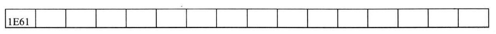

接下来按下B、C、D、E后，缓冲区的内容如下，每个字单元的高位字节存储扫描码，低位字节存储ascii码：

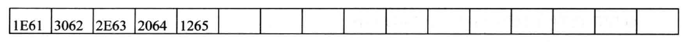

然后我们按下左shift键，此时int9接受到左shift的通码，设置0040：17处的状态字节的第一位为1，缓冲区不变。

此时按下A键，因为检测到状态字节的改变，所以能确认左shift被按下，所以此时对应的ascii码为大写字母的ascii码41h，缓冲区内容如下：

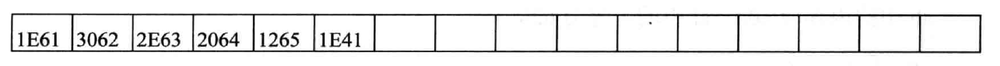

松开左shift键也会引发中断例程，然后将对应状态字节恢复为0.

## 读取键盘缓冲区

BIOS提供了int16h中断例程供程序员使用，它有一个功能是从键盘缓冲区中读取一个键盘输入，该功能的编号为0，下列指令可以读取一个键盘输入，同时将其从缓冲区中删除：

~~~
mov ah,0
int 16h
~~~

执行完毕后，ah中是扫描码，al中是ascii码。

这段代码执行后会检查键盘缓冲区中是否有数据，如果没有就一直检测，如果有的话再执行读取和从缓冲区中删除。可见，int9中断例程和int16h中断例程是一对相互配合的程序。

## 字符串的输入

最基本的字符串输入程序，需要具备下面的功能：

1、在输入的同时需要显示这个字符串

2、一般在输入回车符后，字符串输入结束

3、能够删除已经输入的字符

我们输入字符的时候是从左往右，但是删除时是先删除最右边的字符，这说明字符串应该用栈的形式存储，每次输入和删除一个字符的时候，应该将栈中的字符串显示到屏幕上，按下回车后可以在字符串中加入0，代表字符串结束。

程序的处理过程如下：

1、调用int16h读取键盘输入

2、如果是字符，进入字符栈，显示字符栈中所有的字符，然后继续执行1

3、如果是退格键，从字符栈中弹出一个字符，显示字符栈中所有的字符，继续执行1

4、如果是enter就向字符栈中压入0，然后返回

我们先把字符栈的入栈、出栈和显示栈中的内容写成子程序，参数说明：

ah是功能号，0表示入栈，1表示出栈，2表示显示。ds:si指向字符栈空间，对0号功能，al是入栈字符；对1号功能，al是返回的字符；对于2号功能，dh和dl代表屏幕上显示的行、列位置。

程序如下：

~~~
charstack:	jmp short charstart
			table dw charpush,charpop,charshow				建立定址表
			top dw 0
charstart:	push bx
			push dx
			push di
			push es
			
			cmp ah,2
			ja sret											如果ah大于2跳转到sret结束子程序
			mov bl,ah
			mov bh,0
			add bx,bx										组成bx然后增加一倍
			jmp word ptr table[bx]							调用对应的程序
			
charpush:	mov bx,top
			mov [si][bx],al
			inc top											入栈后修改指针的值
			jmp sret
			
charpop:	cmp top,0
			je sret											如果栈为空则直接跳转到sret
			dec top
			mov bx,top
			mov al,[si][bx]									出栈后修改指针的值
			jmp sret
			
charshow:	mov bx,0b800h
			mov es,bx
			mov al,160
			mov ah,0
			mul dh
			mov di,ax
			add dl,dl
			mov dh,0
			add di,dx
			
			mov bx,0										初始化bx为0
			
charshows:	cmp bx,top										比较bx和top的值判断栈是否为空
			jne noempty
			mov byte ptr es:[di],' '						为空则显示空格
			jmp sret
noempty:	mov al,[si][bx]
			mov es:[di],al
			mov byte ptr es:[di+2],' '
			inc bx											不为空显示对应单元的值然后更新指针
			add di,2
			jmp charshows
sret:		pop es
			pop di
			pop dx
			pop bx
			ret
~~~

完整程序如下：

~~~
getstr:	push ax

getstrs:mov ah,0
		int 16h									读取键盘缓冲区
		cmp al,20h
		jb nochar								ascii码低于20h说明不是字符转到nochar
		mov ah,0
		call charstack							如果是字符就将其入栈
		mov ah,2
		call charstack							显示字符串
		jmp getstrs
		
nochar:	cmp ah,0eh
		je backspace							如果扫描码为0eh就转到backspace
		cmp ah,1ch
		je enter								如果扫描码为1ch就转到enter
		jmp getstrs								否则继续调用本程序
		
backspace:	mov ah,1
			call charstack
			mov ah,2
			call charstack						先出栈再显示字符串
			jmp getstrs
			
enter:	mov al,0
		mov ah,0
		call charstack							将0入栈，表示字符串的输入结束
		mov ah,2
		call charstack							显示字符串
		pop ax
		ret
~~~

## 用int13h中断例程对磁盘进行读写

BIOS提供的访问磁盘的中断例程为int 13h，读取0面0道1扇区的内容到0：200的程序如下：

~~~
mov ax,0
mov es,ax
mov bx,200h									es:bx指向接受数据的内存区

mov al,1									读取的扇区数
mov ch,0									磁道号为0
mov cl,1									扇区号为1
mov dl,0													
mov dh,0									磁头号，也就是面号为0
mov ah,2									2功能代表读扇区
int 13h
~~~

dl是驱动器号，对于软驱来讲0是软驱A，1是软驱B，对于硬驱来讲，80h是硬盘C，81h是硬盘D。

如果读取成功，则ah为0，al为读入的扇区数，如果读取失败，ah里面是出错代码。

如果是向磁盘写入，只需要将ah代表的功能号改为3即可，就可以将0：200的内容写入磁盘对应位置。

# 补码

## 从补数标记方式讨论补码起源

平时我们表示数字时，用正负号来指明到底是正号还是负号，如-500到500我们写成：
$$
-500,-499,-498...-4,-3,-2,-1, 0, 1, 2, 3, 4... 498, 499
$$
这种表示方法是以0为原点展开的。如果从一开始就知道要表示的数字范围，因为这些数字的绝对值不会大于500，我们可以采取一种映射的方式，用000-999来表示这些数字：
$$
500,501,502...996,997,998,999,000,001,002,003,004...497,498,499
$$
这些数字与上述1000个数一一对应。这种标记方法就是10的补数。正数范围内的映射关系是不变的，负数需要换算：

如果要计算-255对10的补数，首先用999减255得到744，然后再加1，得到745。

有了补数，我们将无需使用减法，如果要计算143-78，应该首先得到78对10的补数，为922，然后用922+143，去掉溢出后得到65.也就是A-B相当于A+B的补数。

相对我们提到的在10进制中的补数标记方式，在二进制中这种机制被称为2的补数，以8位二进制数为例，从00000000-11111111，对应十进制中的0-255，以1开头的数字都表示负数。此时要计算负数的补数也很简单，例如要计算-125的补数，正数对应二进制为01111101，首先用11111111减该数得到10000010，相当于逐位取反，然后再加1，得到10000011。

而在这种表示方法中，-125对应正数125被表示为01111101，-125的源码就是这个数字的符号位改变成1，也就是11111101，-125的补码是10000011，这个从原码到补码的规律就被总结为：符号位不变，其他各位取反，最后加1.

## 从0重码问题的解决讨论补码起源

以8位的数据为例，我们怎么才能用8位数据表示有符号数呢？

既然表示有符号，必须能够区分正负，我们不妨用最高位来表示符号，最高位为1表示负数，最高位为0表示正数：

~~~
00000000b代表0
10000001b代表-1
11111111b代表-127
~~~

但是这种表示方法有一个问题，那就是00000000b和10000000b都代表0，这就是0出现重码问题。

为了解决这个问题，我们先考虑用反码来表示有符号数，也就是00000000-01111111b表示0-127，然后再用它们按位取反后的数据表示负数：

~~~
11111110b表示-1
10000000b表示-127
~~~

这种用反码表示的方式并没有解决0重码问题，此时11111111b和00000000b都代表0，可见此时11111111b在这种表示方法中是一个不需要的数字，所以我们可以用正数按位取反再加1的方式来表示负数：

~~~
11111111b表示-1
10000001b表示-127
~~~

这样就赋予了11111111b新的意义，也解决了0重码的问题。

一个比较特别的数字是10000000b，它按位取反再加1是它本身，它代表-128。所以负数能表示的范围比正数多1，这种方式可以表示从-128-127的数字。

## 补码的意义

补码不仅仅是一种有符号数的表示法，最重要的是它很大程度上简化了计算：A-B相当于A+B的补数。

比如我们计算10-20：

~~~
10的补码（就是原码）：			00001010b
-20的补码：				  		11101100b
直接按位相加得	   				  11110110b 就是-10的补码
~~~

有了补码后就能大幅度简化减法运算了。

在很多高级语言底层都是用这种方式来进行数据的存储的。