* [门](#门)
  * [与门](#与门)
  * [或门](#或门)
  * [非门（反向器）](#非门反向器)
  * [或非门](#或非门)
  * [与非门](#与非门)
  * [缓冲器](#缓冲器)
  * [摩根定律](#摩根定律)
* [二进制加法器](#二进制加法器)
  * [相加的规律](#相加的规律)
  * [半加器和全加器](#半加器和全加器)
  * [完成加法](#完成加法)
* [二进制减法器](#二进制减法器)
  * [消除借位](#消除借位)
  * [完成减法](#完成减法)
* [反馈与触发器](#反馈与触发器)
  * [振荡器](#振荡器)
  * [触发器原理](#触发器原理)
  * [R\-S触发器](#r-s触发器)
  * [D型锁存器](#d型锁存器)
  * [用锁存器改进加法](#用锁存器改进加法)
  * [边沿触发器](#边沿触发器)
  * [带预置和清零的边沿型D触发器](#带预置和清零的边沿型d触发器)
  * [分频器和计数器](#分频器和计数器)
* [存储器组织](#存储器组织)
  * [随机访问存储器RAM](#随机访问存储器ram)
  * [RAM阵列](#ram阵列)
  * [用控制面板操作存储器](#用控制面板操作存储器)
* [操作码和汇编程序](#操作码和汇编程序)
  * [将数字输入到内存](#将数字输入到内存)
  * [引入操作码](#引入操作码)
  * [支持减法](#支持减法)
  * [支持多位加减法](#支持多位加减法)
  * [将地址加入指令中](#将地址加入指令中)
  * [支持乘法](#支持乘法)
  * [汇编程序](#汇编程序)
* [从继电器到芯片](#从继电器到芯片)
  * [继电式计算机](#继电式计算机)
  * [真空管](#真空管)
  * [图灵、冯·诺依曼、香农](#图灵冯诺依曼香农)
  * [晶体管](#晶体管)
  * [芯片](#芯片)
* [CPU](#cpu)
  * [管脚](#管脚)
  * [STA/LDA/MOV/MVI指令](#staldamovmvi指令)
  * [算术运算指令](#算术运算指令)
  * [标志位](#标志位)
  * [逻辑运算指令](#逻辑运算指令)
  * [对立即数的算术逻辑指令](#对立即数的算术逻辑指令)
  * [取反CMA和十进制运算DAA](#取反cma和十进制运算daa)
  * [自增和自减指令](#自增和自减指令)
  * [循环移位指令](#循环移位指令)
  * [堆栈指令和其他寄存器指令](#堆栈指令和其他寄存器指令)
  * [跳转指令](#跳转指令)
  * [IO相关](#io相关)
  * [中断指令及其相应](#中断指令及其相应)
  * [NOP指令](#nop指令)
  * [其他的CPU](#其他的cpu)
* [其他硬件](#其他硬件)
  * [总线和电路板](#总线和电路板)
  * [显卡和图像显示](#显卡和图像显示)
  * [键盘](#键盘)
  * [磁盘](#磁盘)

莫尔斯码是一种二进制码，它只有两个组成元素：点和划。

继电器有放大电流的作用，在连接电报机的连线末端设计一个继电器，就能重复输入点和划，开启下一个电路，这样就能避免长距离输入电流太小的情况

# 门

逻辑门是集成电路的一个基本组件。简单的逻辑门可以由继电器（现在用晶体管）组成。

## 与门

与门是两个继电器的串联（其中V代表电压，相当于一个电池接地）

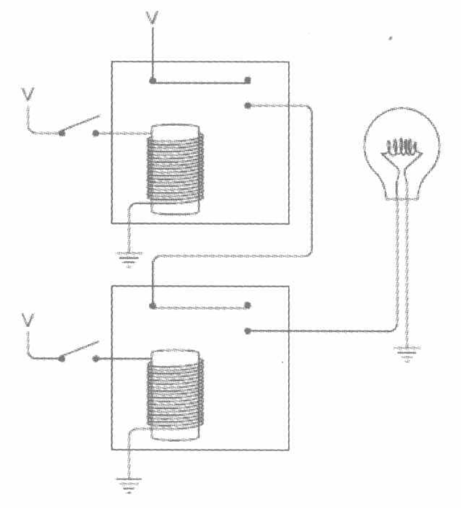

此时只有两个继电器都被触发的时候，灯泡才会亮：

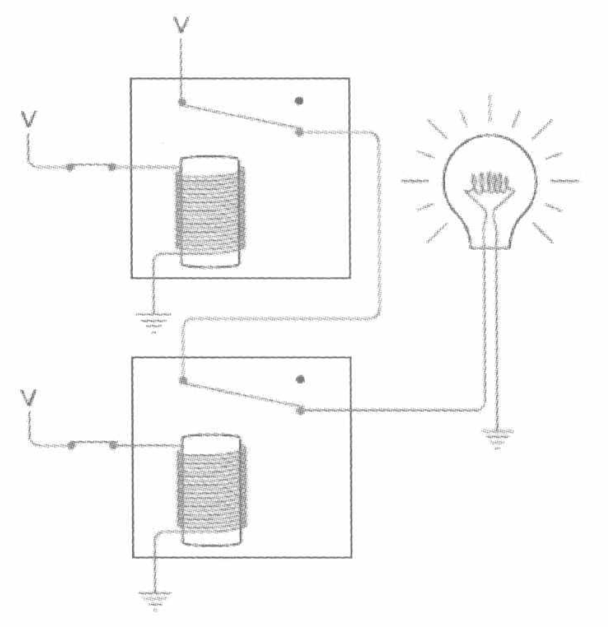

用如下符号表示与门：

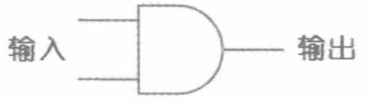

它有两个输入端和一个输出端，使用与门符号可以把电路图简化为：

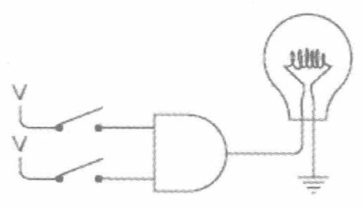

这里的输入不一定要与开关相连，输出也不一定与灯泡相连，一个门的输出可以作为另一个门的输入：

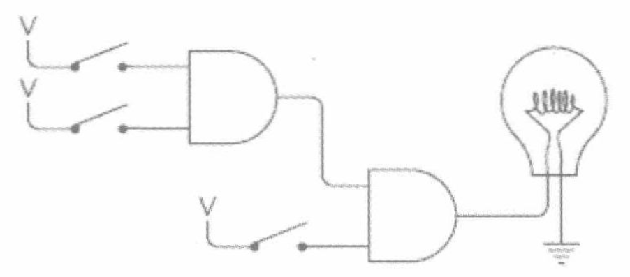

此时只有三个开关都闭合的时候，灯泡才会亮。

如果将低电平视为0，高电平视为1，那么与门的输入和输出之间的关系如下：

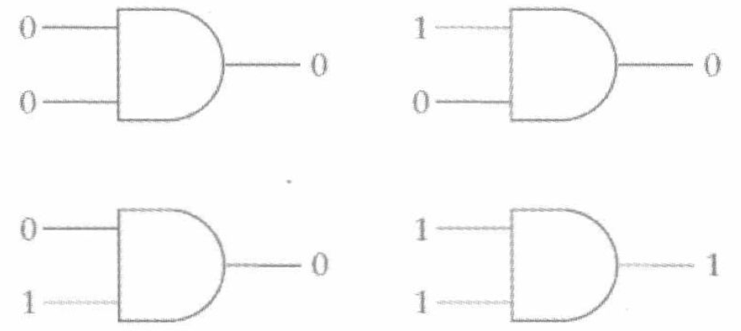

也可以让与门有多个输入端，如三个继电器串联，此时可以用如下符号表示，它被称为三输入端与门：

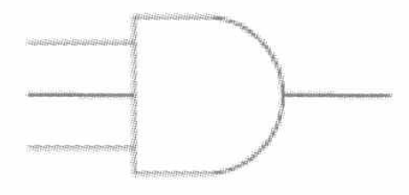

## 或门

或门是两个继电器的并联：

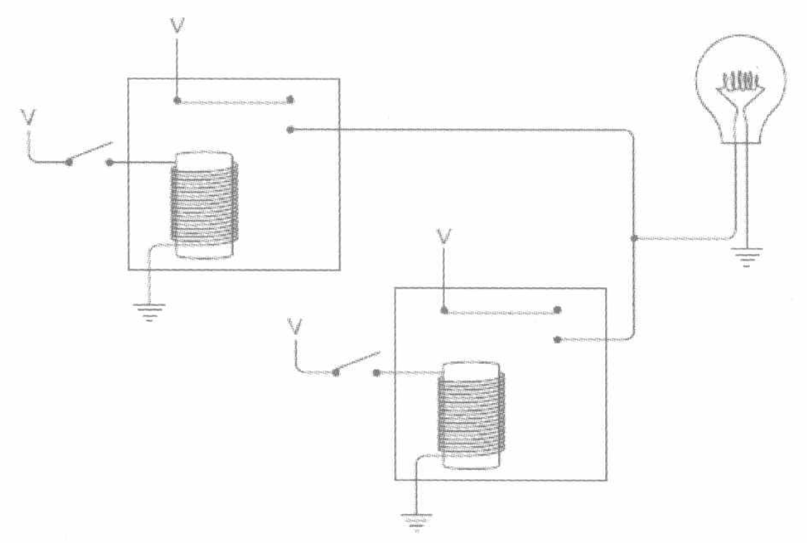

当其中任意一个继电器被触发时都能点亮灯泡，同时触发也可以点亮灯泡：

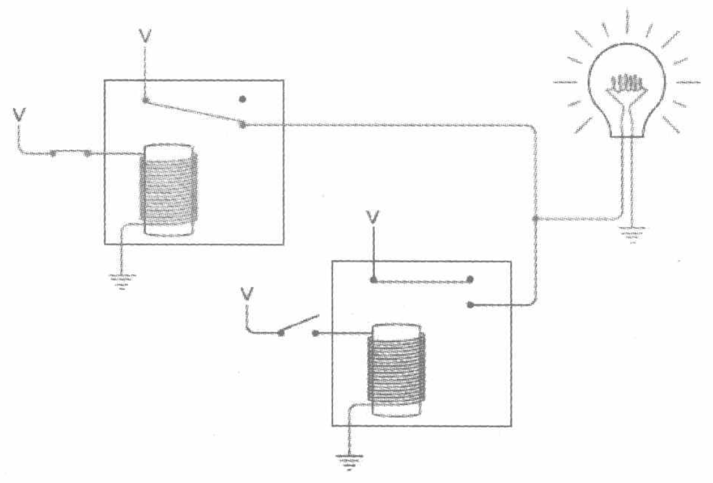

用如下符号代表或门：

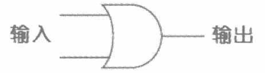

## 非门（反向器）

非门可以让继电器被触发时灯泡熄灭：

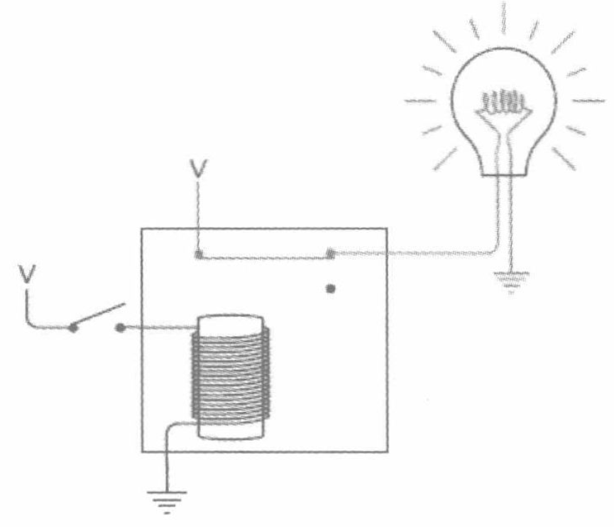

可以用如下符号来代表非门：

它又被称为反向器，严格来说它不是逻辑门（一个逻辑门通常由两个或多个输入）

## 或非门

或非门的两个继电器未被触发的时候，灯泡是亮的，但是一旦其中一个被触发，灯泡就灭了，全部触发也会导致灯泡熄灭：

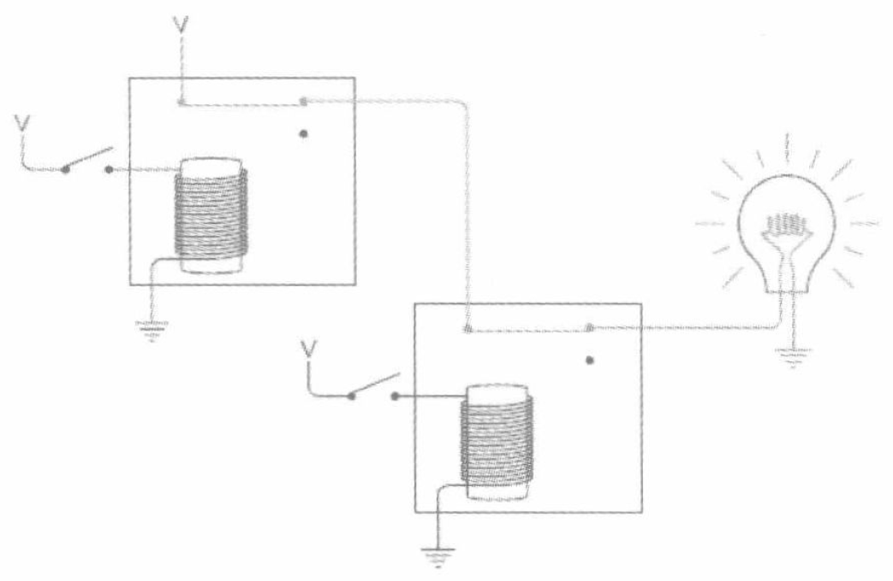

它的结果和或门相反，它被称为或非门，简称NOR，用以下符号表示：

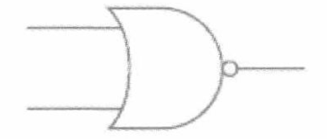

## 与非门

与非门的两个继电器只有都闭合的时候，灯泡才会熄灭：

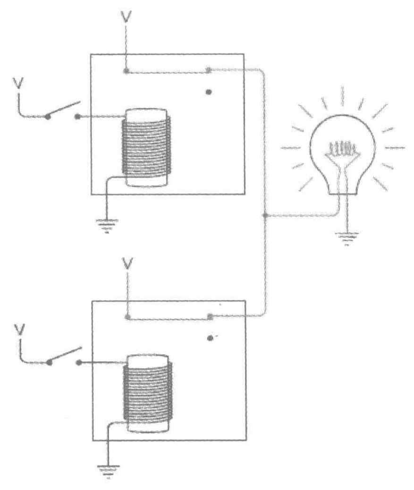

这个结果和与门相反，这种逻辑门称为与非门，简称NAND，用下列符号表示：

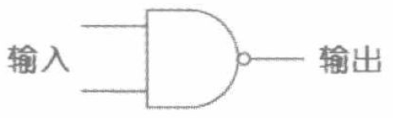

## 缓冲器

单个的继电器也可以简化为一个符号：

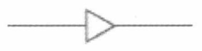

它的输入和输出是相同的，当输入信号很微弱的时候，缓冲器就可以派上用场，此时继电器发挥的作用就是增强信号，此外，缓冲器还有一个作用就是延迟信号，这是因为继电器需要一点时间被触发。

## 摩根定律

摩根定律可以表现为以下形式：

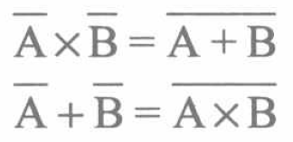

A和B都是布尔操作数，乘号代表AND，加号代表OR。

在电路中表现为：

带有两个反向输入的与门和或非门是等价的：

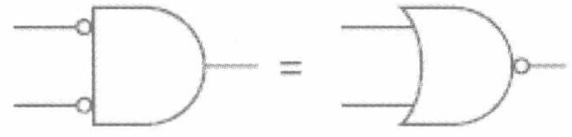

带有两个反向输入的或门和与非门是等价的：

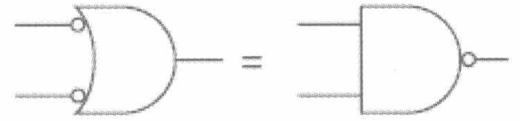

门输入端的小圆圈代表信号在那一点被反转，相当于反向器。

# 二进制加法器

二进制加法要解决的两个问题是，加法本位和进位，相加的操作和十进制加法非常类似。

加法器的控制面板如下图：

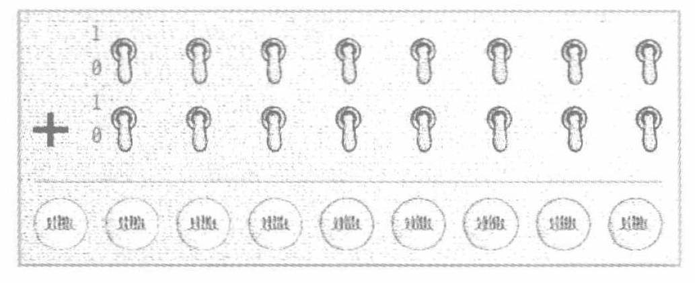

两排开关代表两个8位二进制数，一排灯泡代表加法的结果，亮代表1，不亮代表0，有9个灯泡代表相加结果可能是9位的二进制数。

## 相加的规律

进位的规律如下：

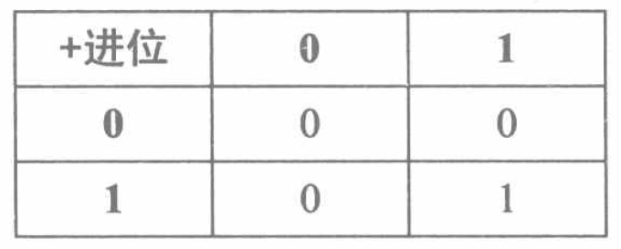

这个结果和与门的输出结果是一样的。

加法本位的规律如下：

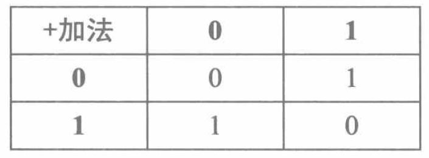

或门除了右下角的数字以外都符合结果，而与非门除了左上角的数字以外都符合结果，将相同的输入连接到或门和与非门，然后将输出再连接到与门，就能得到想要的结果：

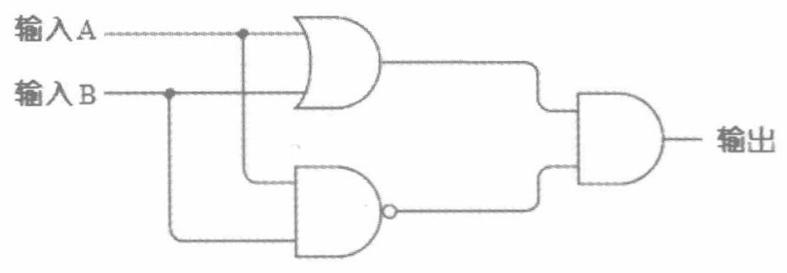

这个电路还有个专门的名称：异或门，简称XOR，用下列符号表示：

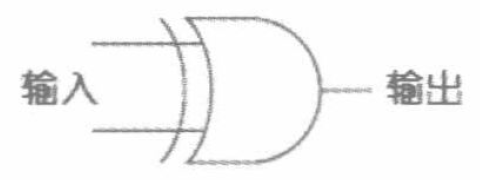

## 半加器和全加器

将异或门和与门连在一起计算A和B的和：

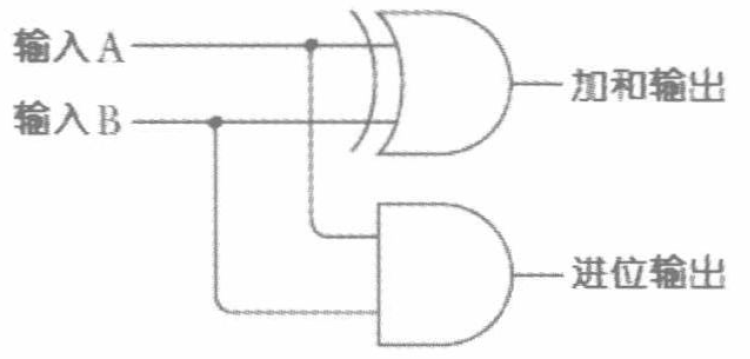

也可以采用下列符号表示：

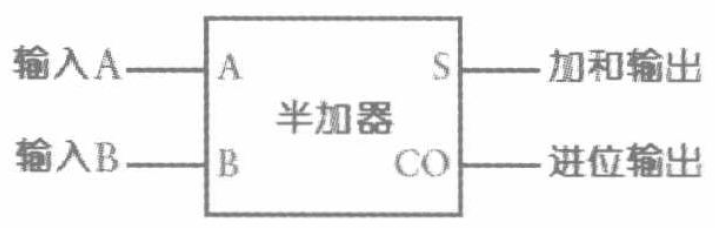

这个符号被称为半加器，它描述了加法的规律，但是没有做到将进位结果纳入下一次计算。

当计算1111+1111时，只有最右边的两个1可以用半加器来相加，当计算到倒数第二位的时候，此时实际上是三个二进制数的相加，所以此时需要做两次加法，需要将两个半加器和一个或门连接起来：

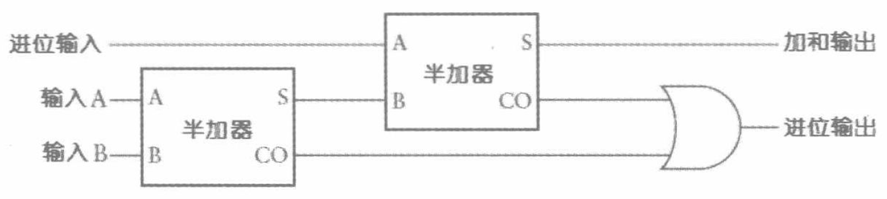

上面的图也可以简化成一个符号：

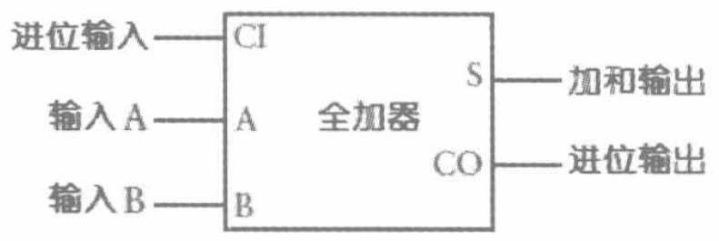

它被称为全加器。

## 完成加法

对比加法器的控制面板，现在可以连接电路了：

对于最右侧的两个开关和一个灯泡，应该这样连接：

这里的特殊之处在于最右侧不存在最开始的进位，所以在全加器的进位端接地，如果加和输出为1，那么灯泡亮，同时产生进位输出。

对于接下来的灯泡和开关，应该这样连接：

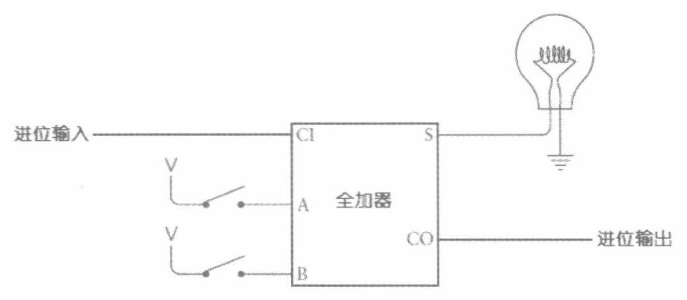

此时就计入了进位输入，同时产生进位输出。

对于最后一对开关和两个灯泡应该这样连接：

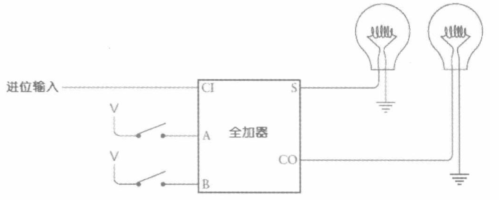

至此电路就连接完毕了。

用下列符号代表8位二进制加法器：

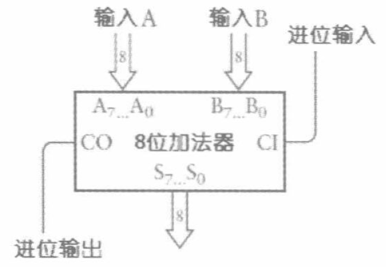

一旦有了这个单元，就可以轻松构造任何位数的二进制加法器，如16位二进制加法器：

这种加法器有一个特点，一对数字相加的结果再次参与下一对数字的计算，以此类推，加法器的总体速度等于数字的位数乘以全加器器件的速度，这被称为行波进位，更快的加法器运用了一种被称为前置进位的电路。

搭建一个行波进位的加法器需要144个晶体管，如果是前置进位则需要更多晶体管，但是电路会变得很小。

# 二进制减法器

在减法中没有进位，而有借位，这是一种完全不同的机制。

要完成的减法器控制面板如下：

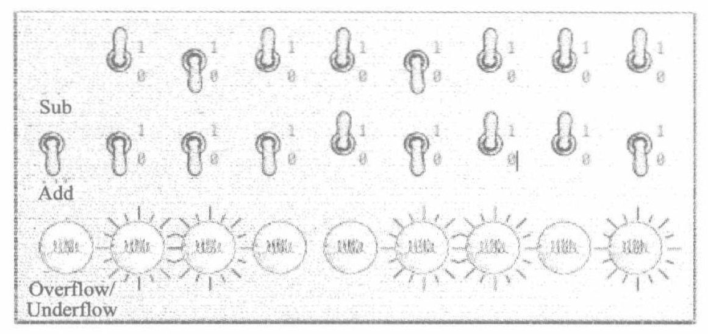

当总开关向下的时候代表执行减法，开关代表数据，灯泡带结果，如果最左边的第9个灯泡发光代表结果是负数。

## 消除借位

借位很复杂，但是我们可以避免出现借位。

以十进制为例，如计算253-176，可以将计算简化为：
$$
253+(999-176)+1-1000
$$
这样就不会产生任何的借位了。

如果是减数大于被减数的情况，如176-253，可以将计算结果简化为：
$$
(999-253)+176-999
$$
这里的最后一步922-999本质上也没有出现借位，只是结果是负数而已。

二进制的减法的技巧与十进制的相同。

## 完成减法

在简化计算方法中一个常见的运算是用全1的二进制数减去减数，结果相当于对减数每位都取反。取反可以简单的给每个位加上一个反向器来解决，但是新的机器要求既能做加法又能做减法，所以需要一个灵活切换的机制，下列电路可以实现：

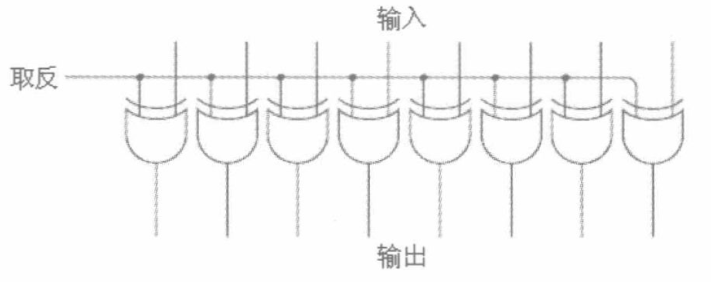

在这个电路中，取反的信号会被传递到每一个异或门中，然后输出。当取反的信号是0，输入是01100001，那么输出就不变，还是01100001，因为0和任何数异或结果都是那个数。如果取反的信号是1，那么输出则会被反置为10011110.

这个电路可以被简化为如下符号，它被称为求补器：

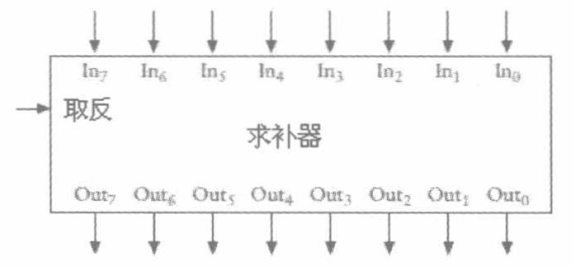

再进一步，就可以组成新的能做减法的机器：

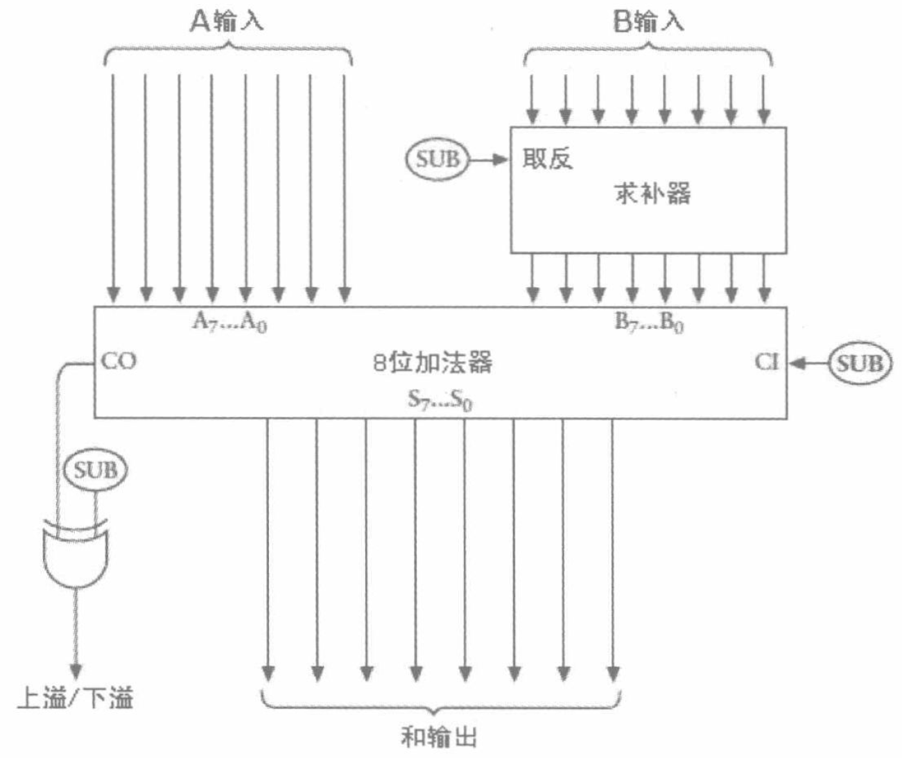

这个电路是由一个8位二进制加法器和一个异或门连接起来的，SUB信号代表加减法转换开关，当SUB为0时代表加法，为1代表减法。在减法中，首先通过求补电路将减数取反，而且进位输入1使得结果加1，如果加1后产生进位，此时说明A-B等于正数，不产生下溢。

上面这个部件还不能表示结果是负数，只能在正数时出现正确结果，因为如果是负数的话，还需要在输出端再经过一次取反才行。

# 反馈与触发器

## 振荡器

观察如下电路：

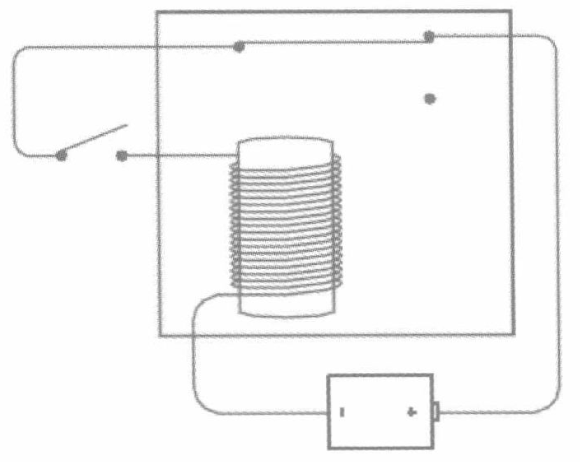

这个电路的继电器输入和输出是在一起的，当开关闭合后，电路就会连通，而电路连通后又会让继电器影响的开关断开，就这样，整个电路在连通和断开之间不断切换。如果跳动的开关是一个金属簧片，这个电路就能制作成一个蜂鸣器或电铃。

这种电路回路中只有一个反向器的电路被称为振荡器，反向器不断将电路状态转变，这种转变是需要一些时间的。振荡器不需要人干涉，完全可以自发的工作。

振荡器的输出可以用下幅图来表示：

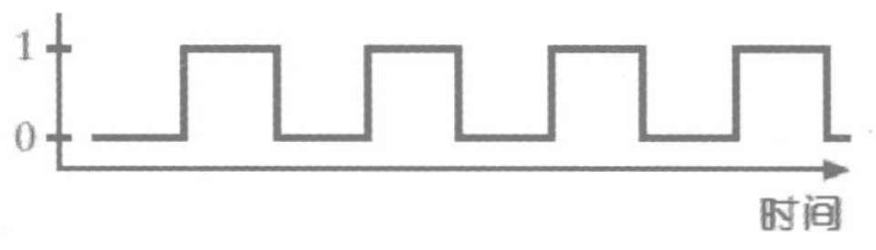

输出在0和1之间按规律变化，振荡器又被称为时钟，因为可以通过振荡进行计数。振荡器还有自己的周期和频率。

## 触发器原理

观察下列电路，该电路有一对或非门：

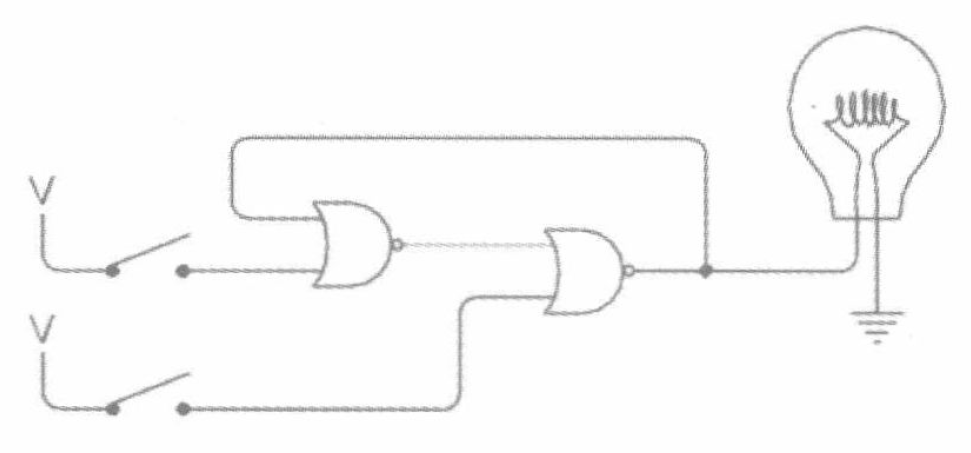

这个电路的连接方式比较特别，左边或非门的输出是右边的输入，右边门的输出是左边的输入，这种连接方式称之为反馈。

当闭合上面的开关时，左边门的输出变为0，右边门的输出变为1，灯泡会被点亮。当断开上面的开关，左边门的输出还是0，右边门依然输出1，灯泡依然发亮。这种电路与之前的情况不同，左上的开关无论开启还是闭合都不会对灯泡发亮产生影响。

当闭合下面的开关时，右边门的输出立刻变为0，灯泡熄灭。此时断开下面的开关，灯泡还是处于熄灭状态，因为之前的操作已经让左边门的输出一直是1了。

综上，这个电路有两个稳定状态，一直熄灭和一直发亮，同样的开关状态可能产生不同的电路状态，这类电路被称为触发器。这个电路如果灯泡是亮着的，说明最后一次连通的是上面的开关，如果是熄灭的，说明最后一次连通的是下面的开关，也就是它可以记住某些信息。

## R-S触发器

R-S（Reset-Set）触发器是比较简单的触发器，它也是两个或非门的连接：

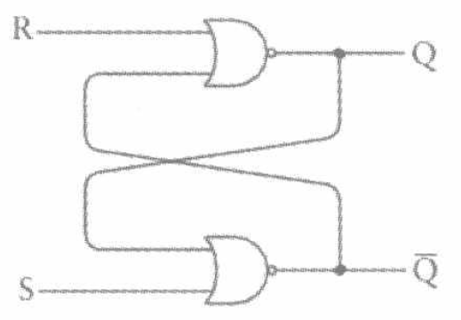

Q代表输出的状态，另一个Q是它的取反。S用来置位（相当于将Q设置为1），R用来复位（相当于将Q设置为0）。当调整S和R为1的时候，Q就会发生变化，当S和R均为0时，Q的状态不变。规律可以总结为下表：

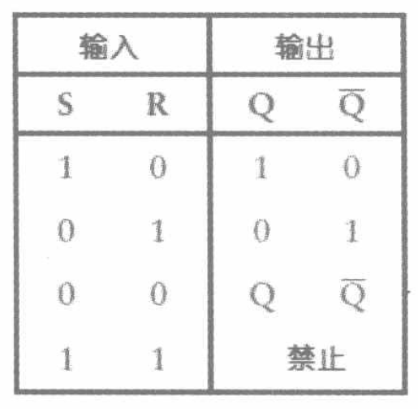

当S和R都为1时的情况是不合法的，这会导致两个Q的状态不互补。R-S触发器可以进一步简化为下列符号：

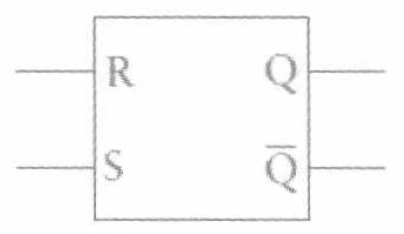

R-S触发器的特点在于它可以根据Q的状态，反推出来哪个输入端（S还是R）的最终状态为1.

## D型锁存器

现在我们要构造一个电路，该电路能记住在某个特定时间的信号。

这个电路存在两个输入，一个被称为数据端，一个被称为保持位，保持位通常情况下被设置为0，此时数据端对电路不产生影响，当保持位置为1时，数据端的值就会被电路记住。此时电路的真值表为：

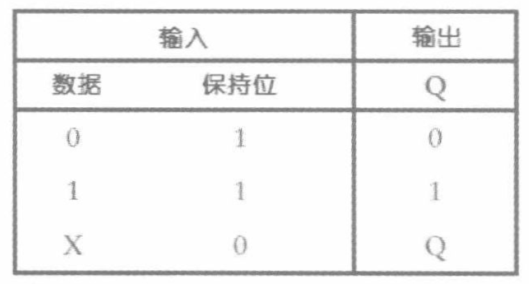

基于R-S触发器，再加上两个与门，就可以构造一个电路系统：

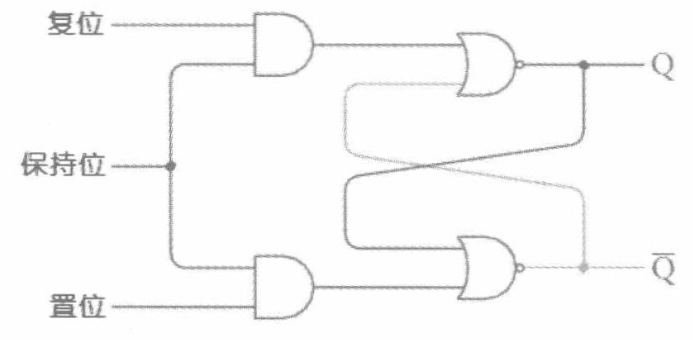

当保持位是0，复位和置位都不会对电路产生影响。当保持位是1时，这个电路就是R-S触发器。但是这个电路有一个弊端，那就是输入是三个而不是两个，我们可以把复位和置位当做一对相反数，因为其余的情况可以认为不是有效的输入，此时我们可以用一个数字来表示复位和置位，那就是数据端，数据端表示置位信号，取反后的值表示复位信号，对应的电路如下：

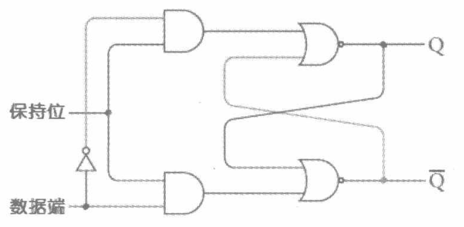

保持位是0时，电路不受影响。保持位为1时，Q等于数据端的值。若保持位再次变成0，电路的状态不变，相当于记住了保持位最后一次置为1时数据端输入的值。直到保持位再次被置为1的时候，又可以重新记忆了。

这个电路被称为电平触发的D型触发器（或者D型锁存器），所谓电平触发就是只有当保持位为1时，电路才有保存功能。保持位也可以被称为时钟端，如果数据端简写为D，时钟端简写为Clk，其功能表如下所示：

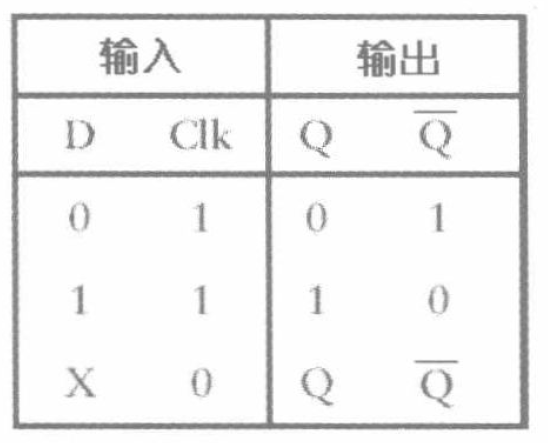

## 用锁存器改进加法

当计算三个二进制数字的加法时，就可以利用锁存器来记住两个数字的和，然后再次进行加法得到结果。

我们可以制作一个8位锁存器：

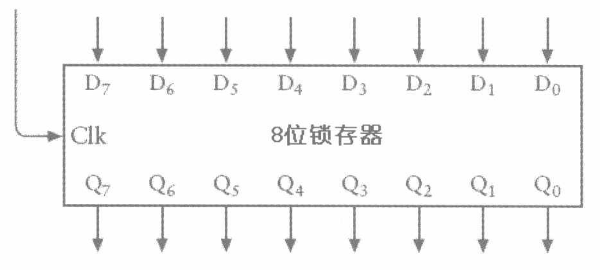

上面的8个输入端为D，输出端标记位Q，Clk为时钟，当时钟信号为1时，D端的输入被送到Q输出，当时钟信号为0时，这8位值将保持不变，直到时钟信号再次被置为1.

改造后的8位加法器如下：

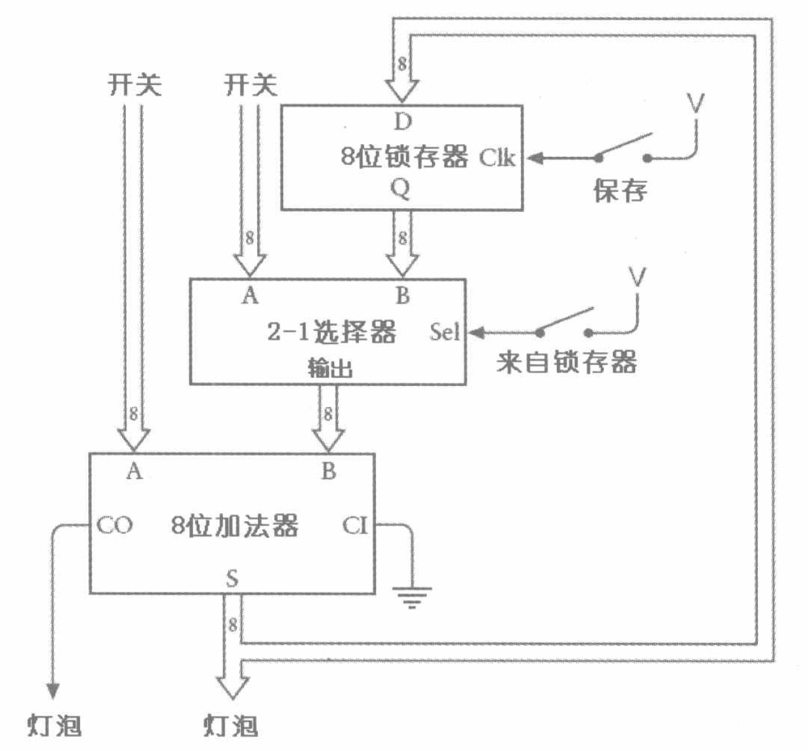

标记位Save保存的开关是锁存器的时钟输入，当闭合的时候会存放加法的计算结果。第一次计算的时候，2-1选择器的开关是断开的，此时两个数据来自于开关，当选择器的开关闭合，就表示其中一个数据来自锁存器。

其中选择器的电路和真值表如下：

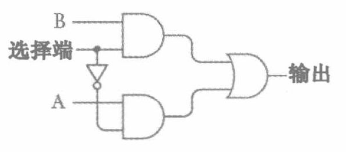

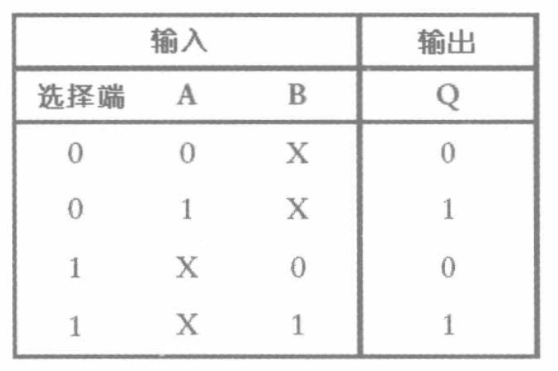

利用锁存器可以完成多次加法的实现，我们需要在原来的触发器基础上加上一个清零开关：

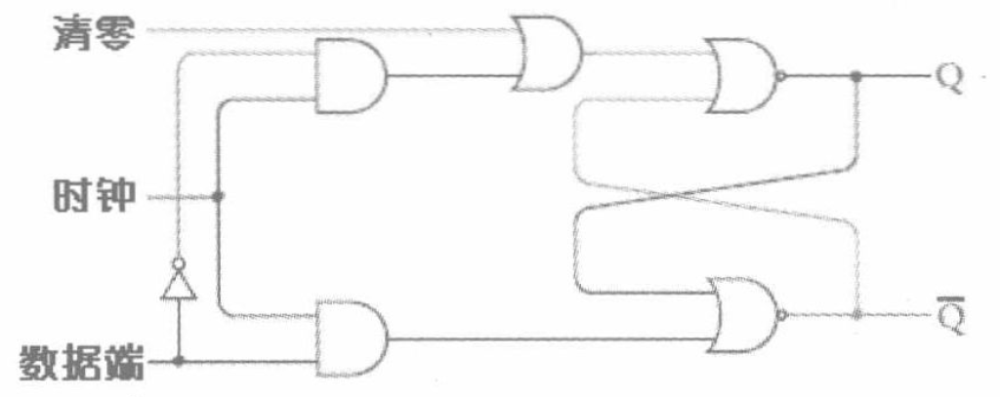

清零信号输入1的时候，无论其他输入是什么，最后的Q都变为0，改进后的加法器如下：

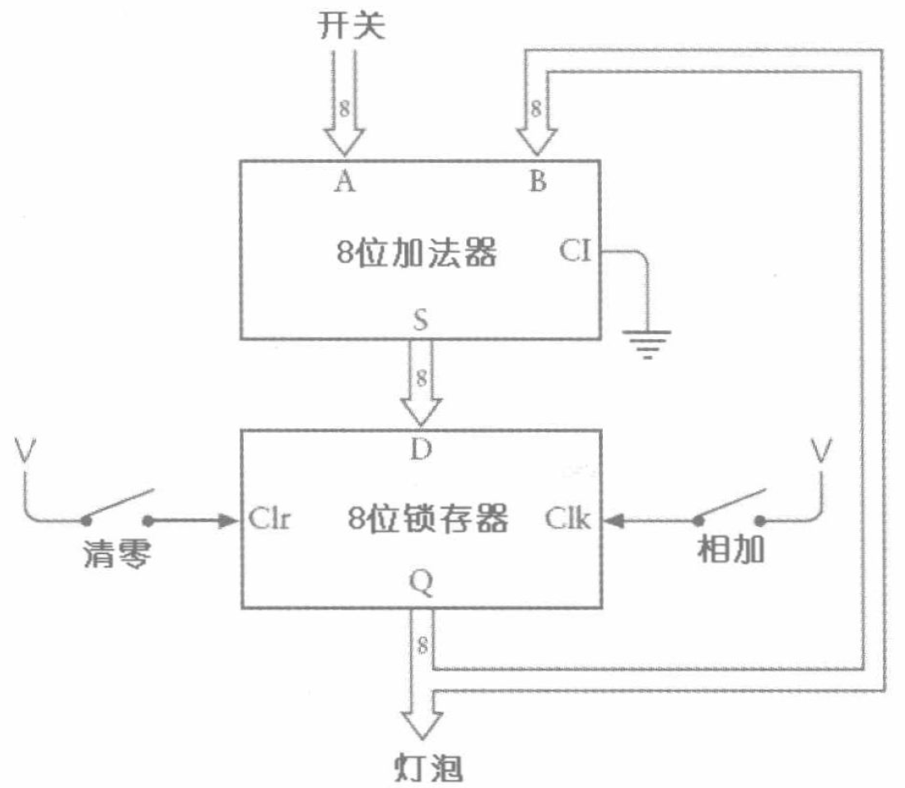

首先按下清零开关，让锁存器的输出变为0，使用开关输入一组数组，然后闭合相加开关，将第一个数字保存并输出。然后输入第二个数字，继续相加，反复操作可以连续进行许多次加法运算。

## 边沿触发器

边沿触发时钟输入和电平触发不同，电平触发是当时钟输入为1时，数据才会开始影响电路，边沿触发是只有时钟输入从0变到1的瞬间，数据端输入才会影响电路。

边沿触发的D型触发器是由两级R-S触发器连接而成的：

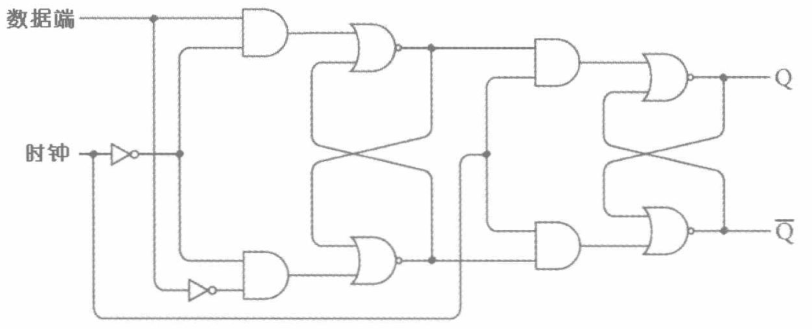

这里的时钟端输入控制着两个R-S触发器，值得注意的是在控制第一个的时候进行了取反操作，这意味着信号为0时保存数据。同时第二个触发器的输入是第一个的输出，当时钟信号为1时，第二个触发器的数据才能被保存。总之，只有从0变到1的瞬间，数据端输入才能保存下来。

该电路的真值表：

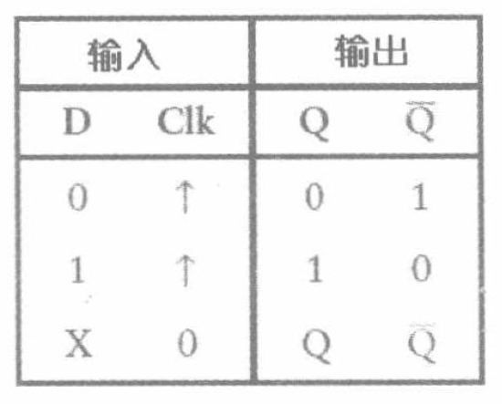

上箭头代表正跳变，相当于时钟端从0变为1.这个电路也可以用下列符号表示：

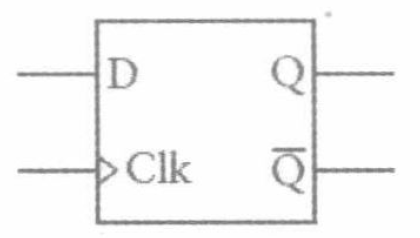

## 带预置和清零的边沿型D触发器

如下图：

当预置信号为1时，Q变为1；当清零信号为1，Q变为0，预置信号和清零信号不能同时为1，该触发器的原理和普通边沿触发器是一样的。

真值表如下：

可以用下列符号代表这种电路：

## 分频器和计数器

将振荡器和边沿触发的D型触发器连接起来：

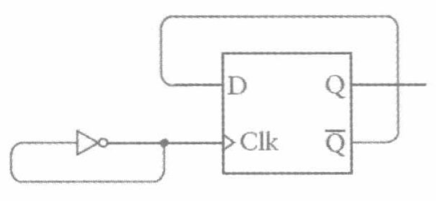

几个输出端的变化如下：

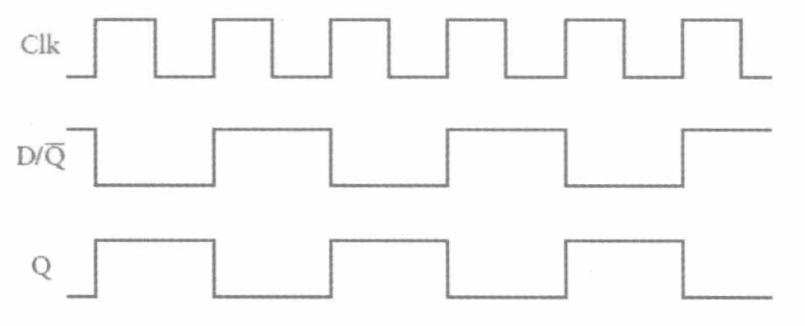

当时钟的值不断跳动，输出端的值也不断改变。如果这个振荡器的频率是20Hz，那么Q的输出频率就是10Hz，因此该电路被称为分频器。

分频器的输出可以作为另一个分频器的时钟输入，再一次进行分频，如三个分频器连接在一起：

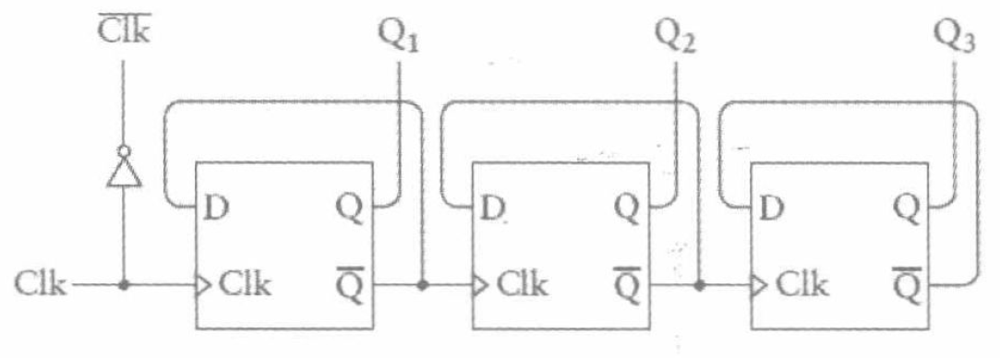

当把信号变化规律加上0和1后：

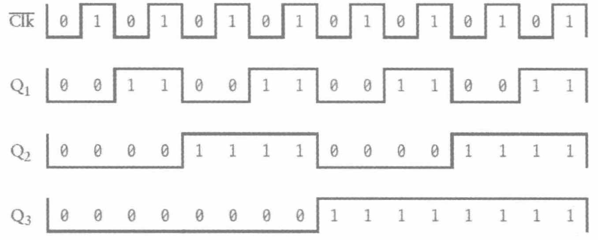

也就是根据时钟输入，不同的时间可以输出不同的Q，这些Q和Clk组成了四位的二进制数字。可以发现，第一个数字是0000，然后是0001、0010等。连接在一起的分频器越多，可以表达的二进制数字也就越多。

将8个分频器连接在一起，构成了一个8位计数器：

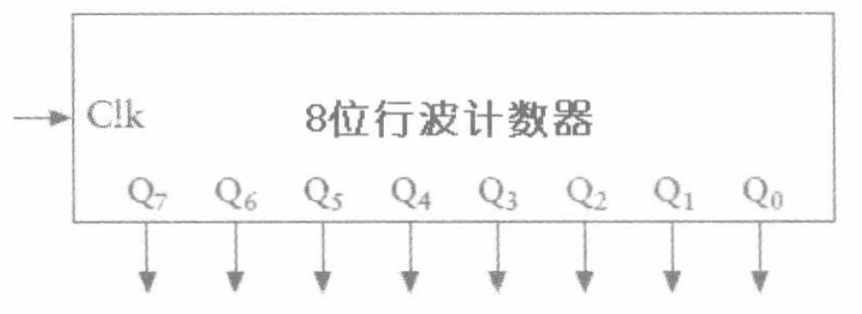

之所以称为行波计数器，是因为每一个触发器的输出都是下一个触发器的时钟输入，变化在触发器中一级一级传递，最后一级触发器的变化肯定有一些延迟，更先进的计数器是同步并行计数器，这种计数器中所有的输出都是在同一时刻改变的。

这样一个计数器的时序图可以用8个输出分别表示出来，也可以将它们作为一个整体表示出来：

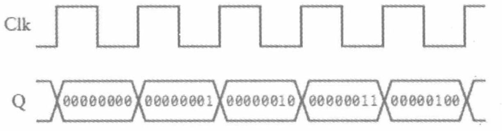

当时钟信号发送一个正跳变，输出的二进制数字就加1。这里可以根据输出数字的变化规律反推振荡器的频率。

# 存储器组织

## 随机访问存储器RAM

之前我们讨论过D型电平触发器，它可以保存1位信息，将数据端命名为数据输入，将时钟输入命名为写操作端，将两个Q命名为数据输出：

这个电路和之前的电路是同一种触发器，只是命名的方式不同。保存输入的方式就是将写操作端从0置为1，因为存储进去的数据好像被锁住，故该电路也被称为锁存器，锁存器也可以用下列符号表示：

可以将多个锁存器相连，同时存储多位数据：

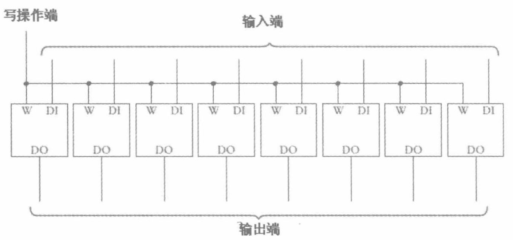

这就是8位锁存器，输入和输出各有8个，写操作端在非工作状态下为0，如果要存储数据，首先要把写操作端置为1。然后再置0。这个8位锁存器也可以用下列符号表示：

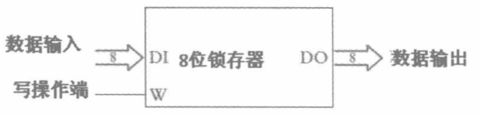

这个8位锁存器的输入有8位，假设我们想制作一个这样的锁存器：它只有一个数据输入端和一个数据输出端，而不是8个，每次指定该数据存储到某一个单个锁存器中，8个锁存器可以独立的存储，我们还想要通过观察输出信号端确定实际的8位输出。

假设我们有一个灯泡，面对8位输出端的时候，如何才能确定存储的数字是什么？最简单的方法就是拿着灯泡依次连接输出端，但是那样太麻烦了，我们需要更自动化的方法检查，可以设置多个开关，根据开关的不同组合来将对应位的信号输出到灯泡：

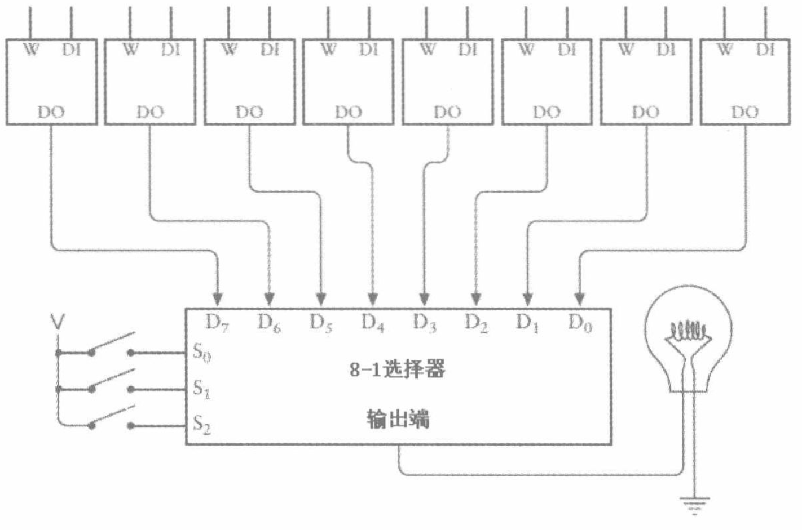

这三个开关可以组成一个三位二进制数字，正好可以表示8位，根据不同的开关情况来让对应位的输出连接到灯泡，这个8-1选择器的结构如下：

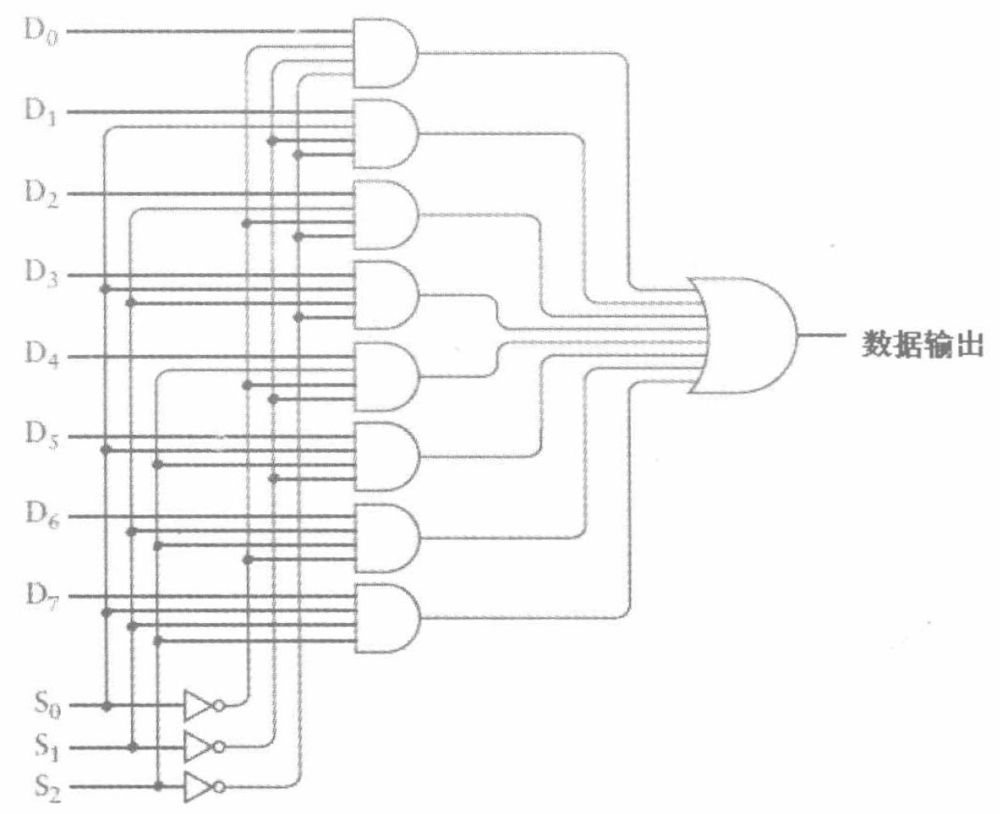

它由三个反向器、八个4端口输入与门和一个8端口输入或门组成，真值表如下：

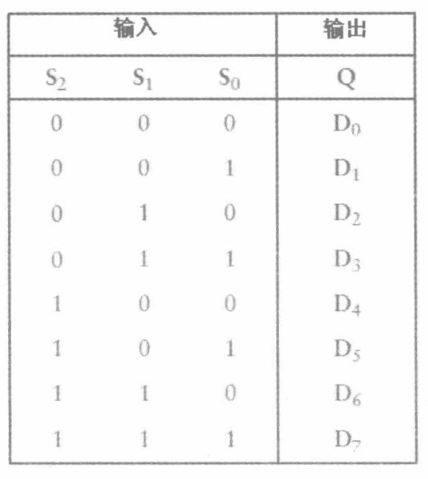

至此，输出端已经完成了检查的功能，那么怎么让输入端指定存储到某一个锁存器中呢？

可以用如下系统来完成：

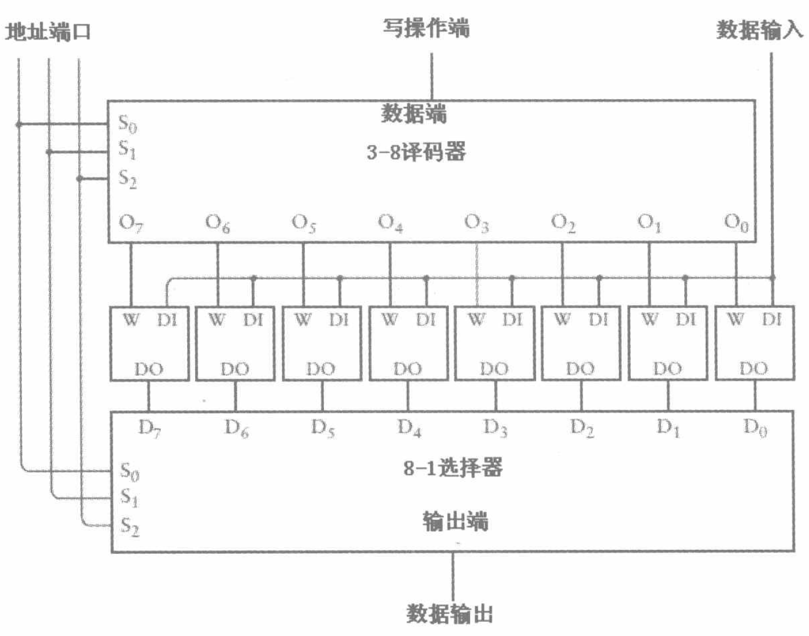

对于整个系统而言，起选择作用的三个信号被称为地址端口，也就是查看8位当中的哪一个地址，译码器负责将输入输出到对应锁存器，选择器负责将对应锁存器中的值输出出来。

3-8译码器是一个和选择器作用相反的电路元件，3-8的意思是输出端口有8个，而选择的开关有3个，结构如下：

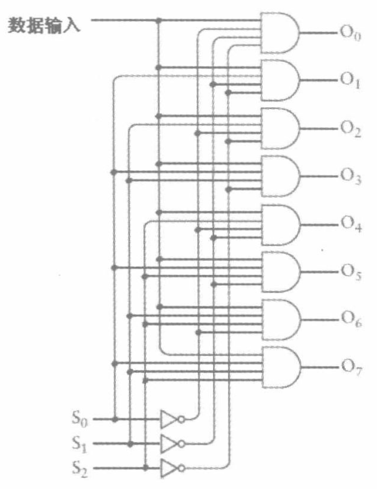

它的功能就是根据不同的S1、S2、S3组合将数据输入到8个不同的输出端，真值表如下：

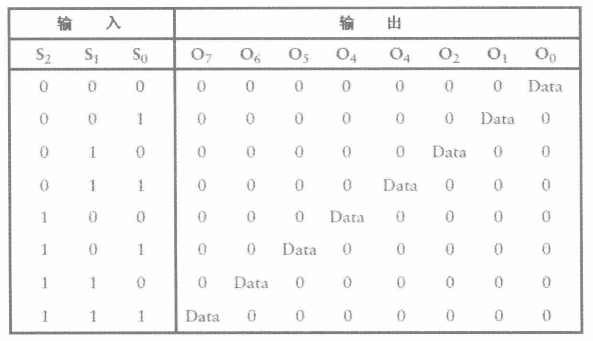

这个系统被称为读/写存储器，或随机访问存储器，也就是RAM（Random Access Memory），可以用下列符号表示：

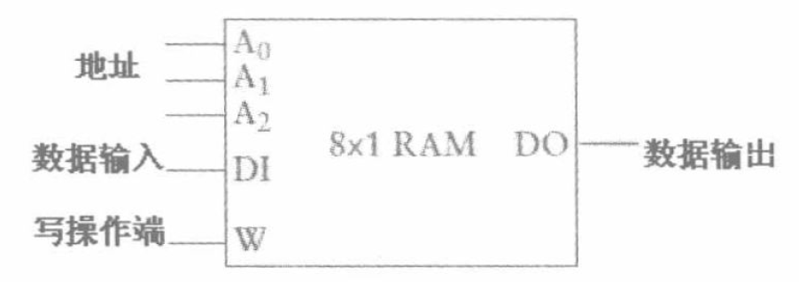

这种存储器不仅可以在每个锁存器中存储新数据，还可以检查每个锁存器都保存了什么数据，只需要改变地址及数据输入，就能完成读写功能。因为可以读取任意一个锁存器的数据，无需顺序访问，因此被称为随机访问存储器。

需要注意的是，RAM对数据的存储是依赖电流的，内部类似继电器属性的元件必须依靠电流才能维持电路的结构，如果断掉电源，内部的所有元件都还原到未触发状态，数据就会消失，所以随机访问存储器又被称为易失性（volatile）存储器。

## RAM阵列

我们可以通过共享地址的方式把两个8*1的RAM阵列连接起来：

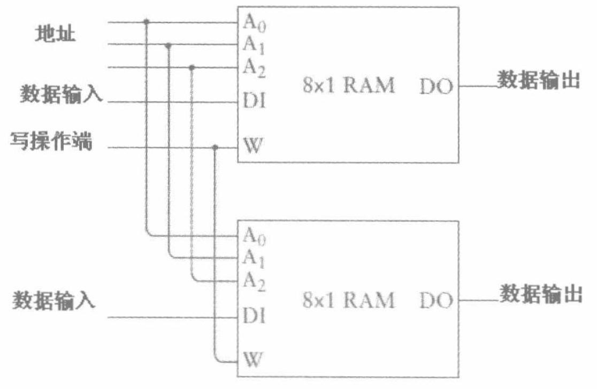

不同的数据输入可以存储到相同的地址，相当于原来可以存8个1位的二进制数，现在变成了可以存8个2位的二进制数，这样就得到了一个8*2的RAM阵列：

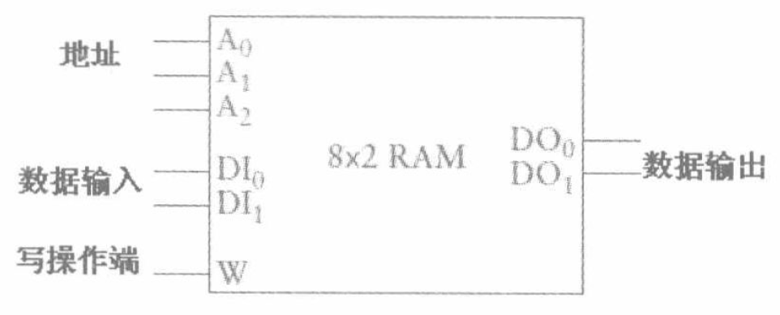

RAM阵列还可以用多个锁存器搭配选择器和译码器来组合，用之前的组成RAM的原理：

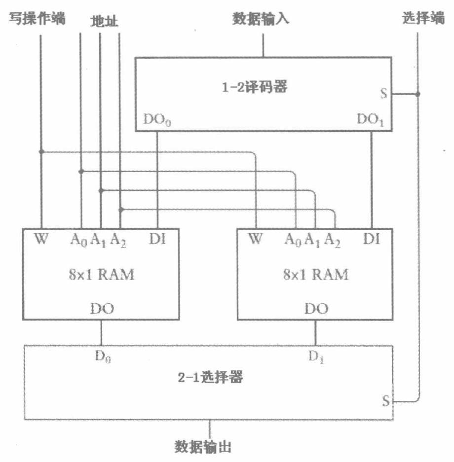

这里多了一个选择端，用来选择数据输入到哪一个锁存器，以及数据输出的数据来自于哪个锁存器，相当于进一步扩大了地址范围，选择端本质上扮演了第4根地址线的角色，因此这种结构本质上是一个16*1的RAM阵列：

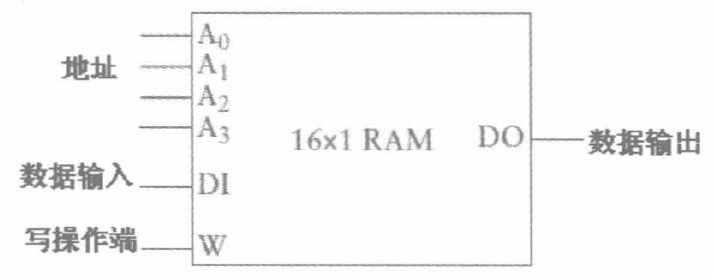

它可以存储16个单位，每个单位占1位。

RAM阵列的存储容量与其地址输入端的数量有关，它们的关系如下：
$$
RAM阵列的存储容量=2^{地址输入端的个数}
$$
大规模的RAM阵列可以存储更多的位，之所以存储容量1024byte=1KB，是因为这其中的二次幂关系，一个RAM阵列有10个地址输入端，它就有1KB的存储容量。

## 用控制面板操作存储器

假设现在已经构造好了一个64KB的RAM阵列（16个地址位代表可以存65535组数据，一组是8bit，相当于1字节，共64KB）

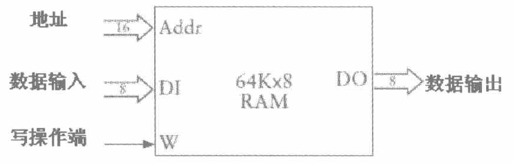

要构造的控制面板如下：

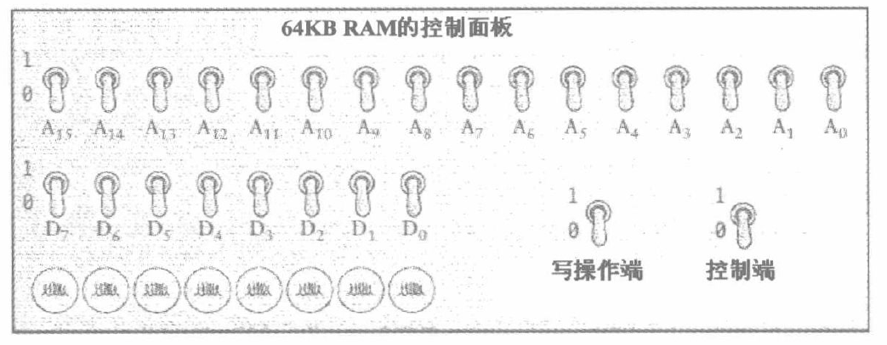

最上面16个开关用于控制地址位，下面8个开关是控制要输入的8bit数据，8个灯泡用来显示8位数据。写操作端为1时代表将数据写入对应地址。控制端为0时代表控制面板失去对存储器的控制，此时该存储器连接其他电路，其他电路可以取用该存储器中的数据；控制端为1时代表控制面板可以控制存储器了。

我们需要25个2-1选择器来完成功能（2-1选择器有2个输入1个输出），其中包括16个地址输入端、8个数据输入端以及1个写操作端，电路如下：

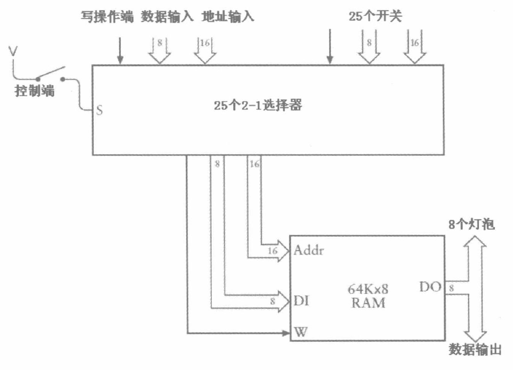

当控制端断开时，25个2-1选择器都会选择左上角的外部信号，此时外部信号操作存储器；当控制端闭合时，此时25个2-1选择器都会选择右上角的开关发出的信号。

控制面板控制存储区既实现了数据的输入和读取，又给其他部件提供了接入系统的机会。

# 操作码和汇编程序

## 将数字输入到内存

之前我们已经实现了一个可以迭代求和的加法器，这个加法器有一个很大的缺陷，那就是如果要把100个二进制数加起来，必须坐在加法器前，将所有的数一个一个输入，然后累加，输错一个就计算失败。如果我们能把100个二进制数输入到RAM阵列中而不是直接加法，后面我们对数据的修改就会容易很多，我们可以尝试组成下列电路：

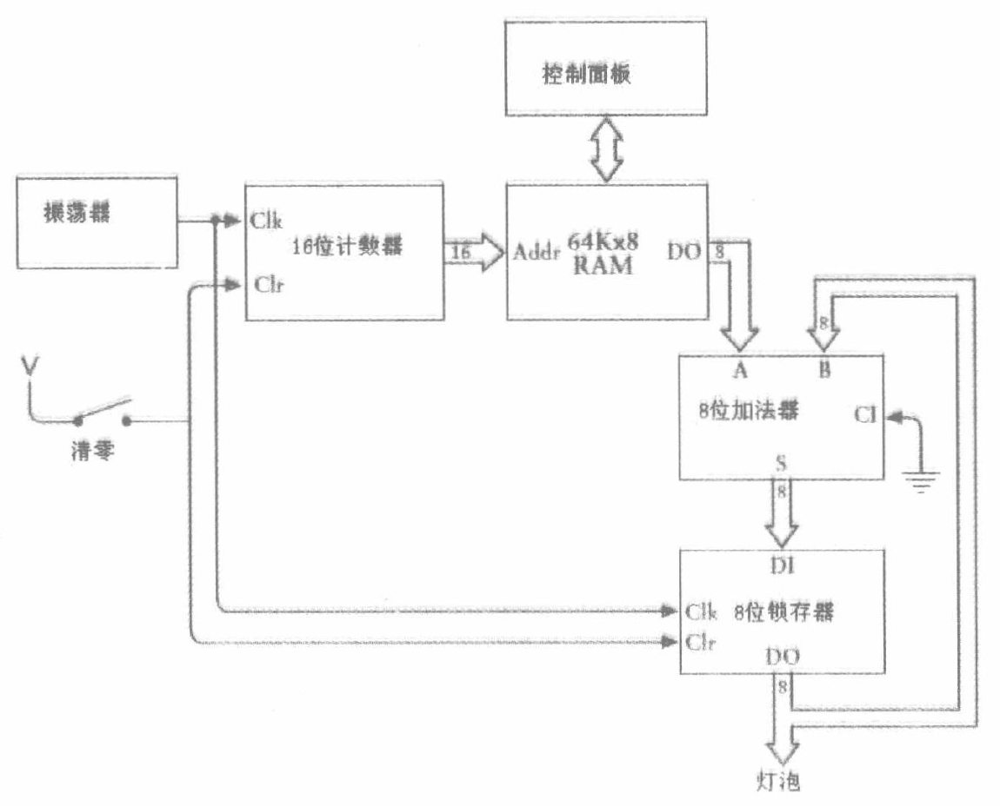

要使用这个机器，必须首先闭合清零开关，清除锁存器的内容并把16位计数器置为0000h（h代表是十六进制数），然后闭合RAM控制面板的控制端开关，选择地址并输入一组一组的8位数，然后闭合RAM控制面板的控制端开关（断开控制面板对RAM的控制），同时断开清零开关，观察灯泡的运行结果。

当清零开关断开后，整个电路开始工作，此时16位计数器输出0000h，RAM此时受到外部电路的影响，将对应地址的数字传递给加法器，时钟信号切换后发生了两件事：

1、计算结果保存在锁存器中，灯泡根据锁存器的值发亮，同时锁存器把计算结果传递给加法器

2、16位计数器增1，指向下一个地址单元

时钟信号不断切换，加和的操作不断继续，最后完成对所有数的加和。但是这个电路有一些缺陷，我们无法停止这种相加的操作，而且无法处理溢出和负数的问题。

我们可以将计算结果写回到RAM中，改进的电路如下：

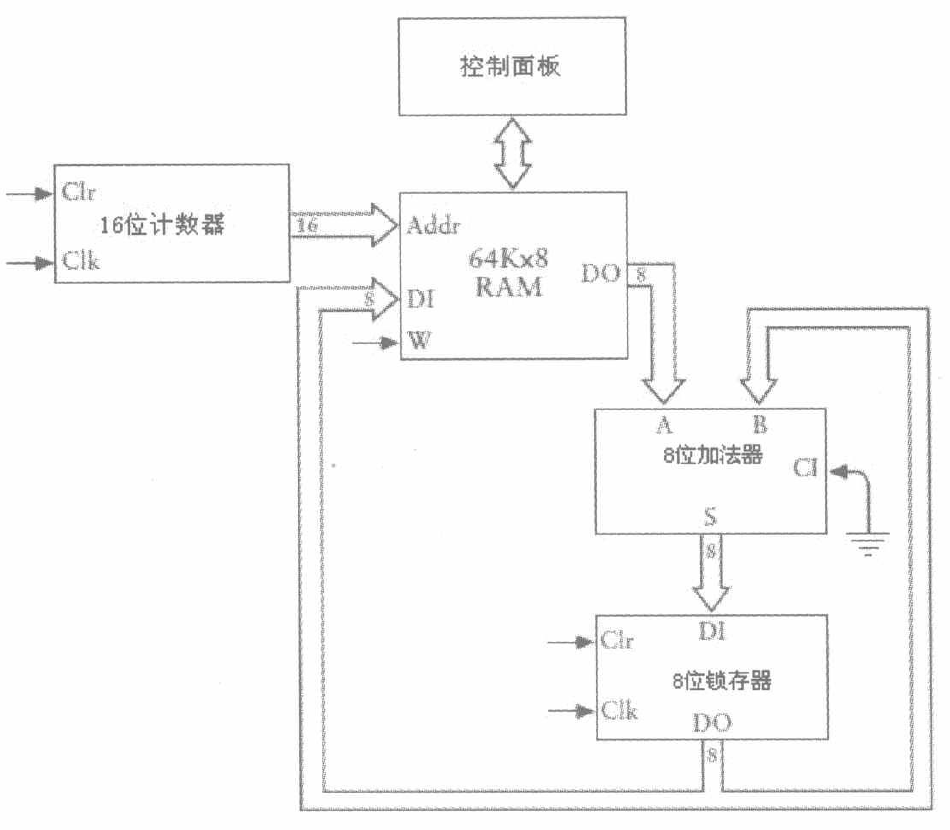

这个图省略了一部分清零和时钟输入。这个加法器可以将计算结果保存在RAM中，最后的计算结果可以通过RAM控制面板上的灯泡显示出来。

## 引入操作码

如果我们想要制作一个自动加法器，让其不仅可以做加法运算，还能自主的确定要累加多少个数字，而且还要把计算结果存入RAM中，假如我们要对三个数进行求和，然后对另外两个数进行求和，然后再对另外三个数进行求和，一开始我们把这些数保存在RAM中：

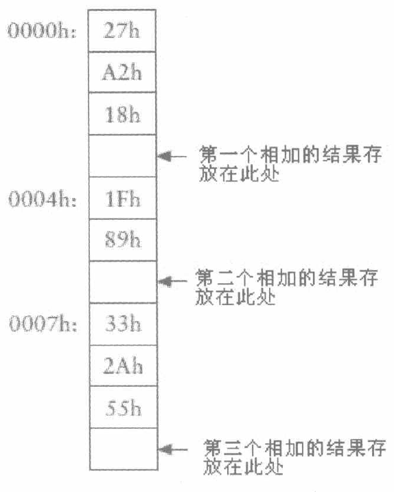

方格中代表存储器的内容，这些标记的单元就是我们要存放计算结果的位置。要达成这个功能，我们要完成4个步骤：

1、将存储器中的字节加载到累加器中

2、将存储器中的字节加到累加器中

3、将累加器的计算结果取出放入存储器中

4、让自动加法器停止

如果简单的给RAM中输入一组数字就能期望系统完成整个操作是不可能的，我们必须借助一些数字代码来标识加法器要做的每一项工作：加载、相加、保存和停止。

可以设置一个独立的RAM，其中存放一些数字代码，而不是需要求和的数，两个RAM组成的结构如下：

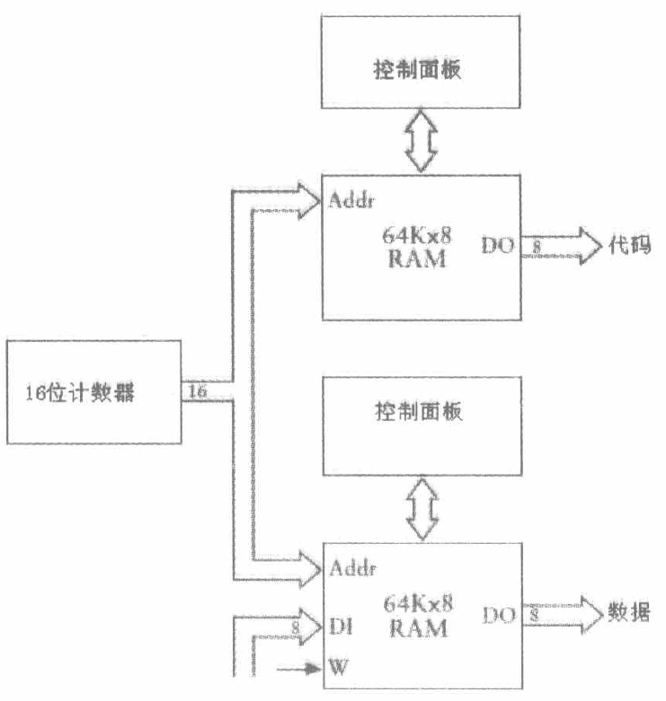

通过控制面板可以将数字代码写入代码RAM中，我们需要四个代码来完成这个功能：

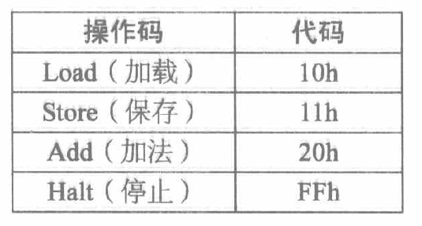

代码RAM中的存储情况应该是这样：

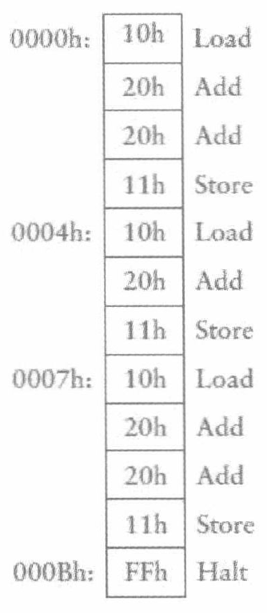

代码RAM中存放的每一个代码都对应数据RAM中的数据，这种数字代码被称为指令码或操作码。

最终组成的电路系统如下：

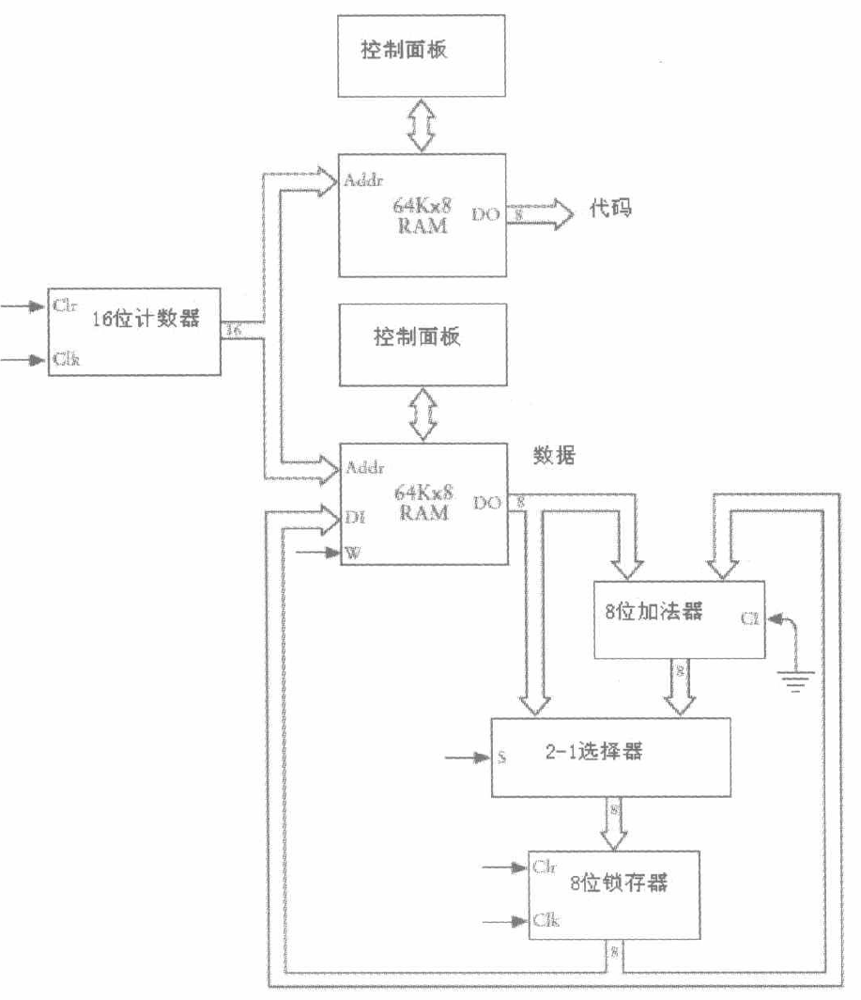

2-1选择器的作用是，有时需要让加法器的值输出到锁存器（保存计算结果），有时需要将数据RAM的值输出到锁存器（load指令）。

操作码之所以能让电路呈现不同的动作，是通过控制锁存器的时钟输入和清零输入、数据RAM阵列的写输入、2-1选择器的选择输入来完成的，这些都是基于代码RAM阵列输出的指令，通过逻辑门的组合来实现的。

## 支持减法

如何支持减法呢，只需要引入一个新的操作码：减法，然后在数据传入加法器之前取反即可，改进后的电路结构如下：

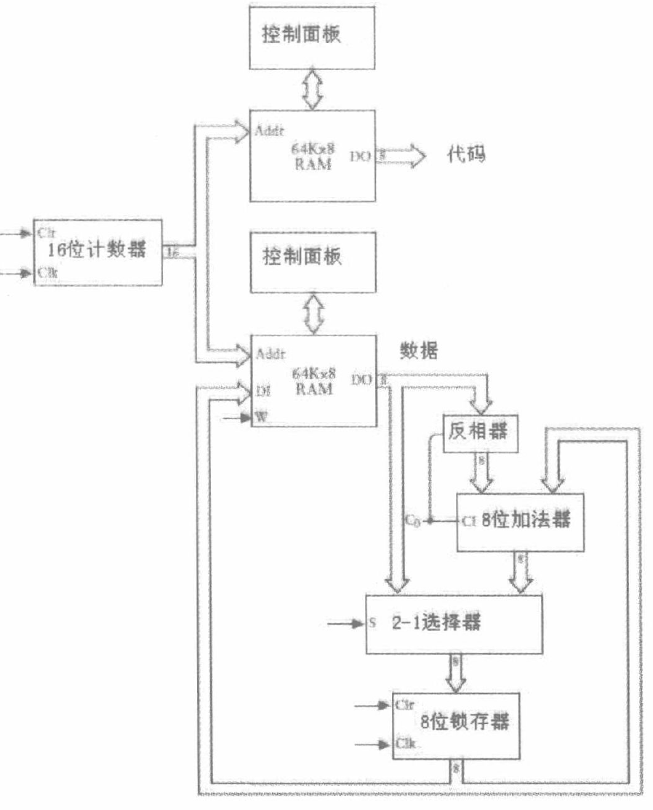

## 支持多位加减法

有时我们需要在计算过程中保存1位数字，如果对于一个只能计算8位加法的加法器，要计算两个16位数字的和，此时我们可以把16位数字拆成高8位和低8位两组数字的和，低8位可能会产生进位，此时需要保存这个进位值，我们可以在电路中引入一个进位锁存器来专门保存这个值，新增一个操作码进位加法（Add with Carry）来控制它。同理，为了支持16位数字的减法，我们需要一个新的操作码：借位减法（Subtract and Borrow）。此时我们的加法器虽然有位数限制，却可以通过扩展操作码的方式将可以计算的位数拓展到很大。

## 将地址加入指令中

到现在为止，加法器不允许在随后的计算中重复使用前面的计算结果，这意味着如果两个计算序列很像，第二个计算序列也必须重新开始，不能用之前的结果。产生上述情况的原因在于我们构造的加法器中的代码RAM和数据RAM是完全同步顺序的，这样的一一对应关系造成了计算非常不灵活。

要改变这种局面，首先要对操作码进行一种变革，到目前为止的操作码很简单，只需要1个字节就可以表示完全，现在设计一套新的操作码，除了halt指令外每个指令占用3个字节，第一个字节为代码本身，后两个字节保存地址用来指明数据RAM的一个存储单元。

假如我们要对两个数进行求和，修改前的两个RAM：

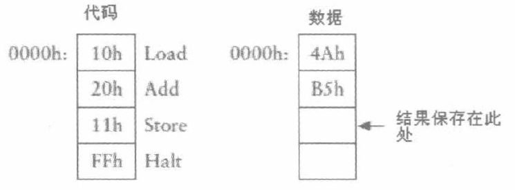

修改后的代码RAM及每个指令的解释：

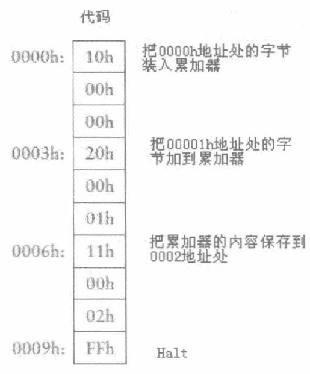

这样就极大的扩展了操作码的功能。

在之前的计算中，要操作的数据和数据结果都顺序的存在一起，扩展了操作码的功能后，我们可以把数据都分散存储在数据RAM的任意位置，这样就可以把计算过程中的结果指定存在某个位置，在接下来的计算中很容易引用之前的结果。

在设计电路时，我们需要把代码RAM阵列的数据输出到3个8位锁存器中，每个锁存器保存3字节指令的1个字节，第二和第三个锁存器的输出构成了数据RAM的16位地址：

至此我们的计算器完成了很多功能，但是操作码的占用空间从原来的1字节到3字节。16位计数器原来取1字节的数据需要一个时钟周期，现在取3字节需要3个时钟周期，一个完整的指令周期需要4个时钟周期，它的运算速度只有最简单加法器的1/4，这说明：老天是公平的，改进了机器的某个方面，则其他方面就会有损失。

我们也可以把两个RAM合并成为一个：

地址来源除了16位计数器产生以外，还可能来自于8位锁存器指向的地址数。

## 支持乘法

重要的操作指令：跳转（Jump），它可以将两段程序的执行连接起来，改变顺序执行的寻址方式，这种指令也被称为分支（branch）指令或Goto指令。

如果我们要实现乘法，实际上就是做多次累加，如果手动输入程序，这个程序会很长，借助跳转指令我们可以重复执行累加的操作，但是这个过程不会停止。我们需要一种Jump指令，它只让这个过程重复执行所需要的次数。这个功能可以用一个锁存器来实现：

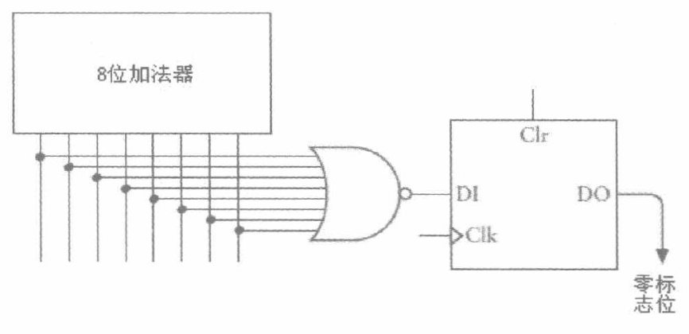

这个锁存器只有当8位加法器的输出全为0时，才存储一个值1，它被称为零锁存器（Zero latch）。零锁存器中的值在程序中相当于一个标志位，我们引入下列四条指令：

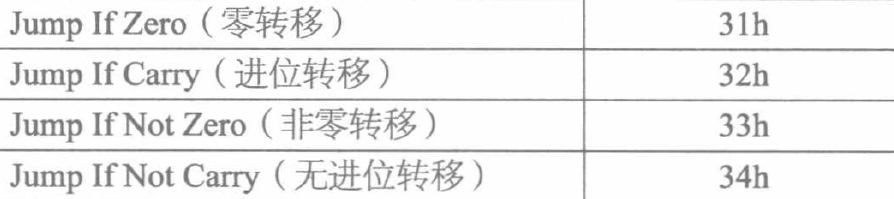

这四条指令检查锁存器的值，根据其中标记位的值来决定是否进行跳转，这里还用到了进位锁存器。要完成乘法功能，这里用的是非零转移指令，只有当加法器结果为0时才会停止跳转。

当执行乘法操作时，RAM中部分指令：

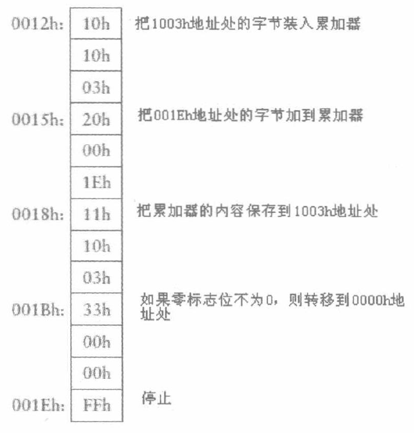

前三个指令分别是load、add、store，第四个指令就是非零转移指令。进行加法的次数专门存在一个地址中，每次执行累加之后，都将次数加上001Eh地址中的值，加上FFh相当于减1，然后检查该值的结果是否为0，如果不为0继续循环计算，指到该值为0，停止跳转。

## 汇编程序

至此我们解决了加法、减法和乘法，而且还可以支持循环操作，我们可以用这些原理建立除法操作等更复杂的操作，这就已经可以称之为一个小型计算机了，它有处理器、存储器（RAM阵列）、输入设备（控制面板上的开关）、输出设备（控制面板上的灯泡）。处理器包括若干组件，8位反相器和8位加法器共同构成了算术逻辑单元（Arithmetic Logic Unit），即ALU，在更复杂的计算机中ALU不仅可以做算术运算，还能处理逻辑运算；16位的计数器被称为程序计数器（PC，Program Counter）。

至今为止我们使用了很多的操作码，下表是这些操作码和助记符：

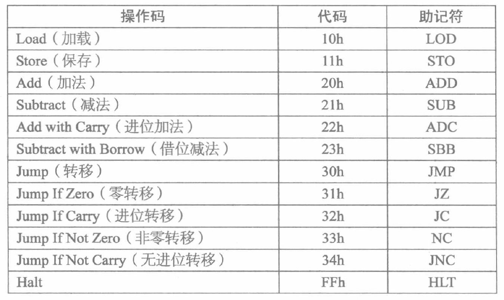

助记符提升了编写程序的可读性，比如“将1003h地址处的字节加载到累加器”可以用下列语句替代：

~~~
LOD A, [1003h]
~~~

紧跟助记符右侧的A代表累加器名，A是目标操作数，[1003h]代表源操作数，方括号代表取地址中的值。

类似的，有：

~~~~
把001Eh地址的字节加到累加器：
ADD A, [001Eh]
把累加器中的内容保存到1003h地址：
STO [1003h], A
如果零标志位不是1则跳转到0000h地址处：
JNZ 0000h
指令存在0000h地址空间：
0000h: LOD A, [1005h]
数据存在1000h地址空间：
1000h: 00h, A7h
~~~~

上述的乘法程序也可以用这样的语言表示，在表示过程中最好不要把地址固定住，因为它们是可变的，用定义好的变量代表这些地址值，可以让程序变得更灵活、易读性更好。

这种语言被称为汇编语言，每一句都对应这机器语言中的某些特定字节。有了汇编语言，更复杂的逻辑可以用程序来完成了。

我们制造的计算机还有一个很严重的缺陷，用我们这种方式构造一个64KB的RAM阵列需要几百万个继电器，这几乎是不可能的，但是已经有人制造出一种全新的设备，保证性能的同时将机器大大缩小。

# 从继电器到芯片

## 继电式计算机

世界上第一台继电式计算机在1935年由康拉德·楚泽制造，用继电器制造计算机有很严重的缺点，因为它们是机械性的，利用金属片的弯曲和伸直状态进行工作，频繁的工作可能导致其断裂。1947年，一只飞蛾飞进了继电器中导致了故障，这就是bug的来历。

## 真空管

真空管是一种可以替代继电器的元件，它最大的好处在于真空管的状态可以在百万分之一秒内发生转变，这个速度比继电器快1000倍，但是它同样存在很多问题，如价格昂贵、耗电量大、产生热量太多容易被烧坏，拥有巨量真空管的计算机中每隔几分钟就会有真空管烧坏，而且很难被立即检测。到1945年，真空管已经完全取代了继电器，称为第一台电子计算机的基础。

## 图灵、冯·诺依曼、香农

艾伦·M·图灵为英国巨像计算机做出了巨大贡献，撰写了两篇非常有影响的论文，让他在计算机领域成为大名鼎鼎的人物，第一篇论文发表于1937年，首次提出了可计算性（computability）这个概念，用来分析哪些事情计算机可以完成，为计算机构想了一个抽象模型，这就是图灵机（Turing Machine）。第二篇论文是关于人工智能的，他介绍了一种测试机器智能的方法，即图灵测试法（Turing Test）。

ENIAC（电子数字积分计算机）使用了18000个真空管并在1945年完成，这吸引了约翰·冯·诺依曼的注意。他和EDVAC（ENIAC的一个后续产品）的设计者们敏锐地感觉到计算机内部应该用二进制数而不是十进制，计算机中还应该有存储器来存储程序执行中产生的数据，程序应该在存储器中顺序存放，允许条件跳转，这就是非常著名的存储程序概念（stored-program concept），这种计算机我们称之为冯·诺依曼结构，上次我们设计的计算机就是典型的冯·诺依曼计算机。随之产生的还有冯·诺依曼瓶颈，那就是为了执行指令需要花费大量时间将这些指令从计算机中取出，这促使了磁芯存储器的发明。

克劳德·香农在1948年将位的概念介绍给了全世界，他开创了信息论，研究数字信息在干扰中的传播。

## 晶体管

1947年，贝尔实验室的两个物理学家偶然制作出一种放大器，这就是第一个晶体管，它是20世纪最重要的发明之一。这种元件利用控制半导体的导电性能实现对电路的控制，晶体管的体积比真空管更小，需要的电量更少，产生的热量更少，而且持久耐用。目前半导体多数由硅来制造，有这种物质才诞生了众多的半导体和计算机公司，这些公司云集的区域被人称为硅谷。

## 芯片

晶体管虽然体积很小，但是要用导线将晶体管连接起来组成计算机一样非常繁琐，这促使了集成电路的诞生，这种元件不采用连线而是由固体快组成电子设备，它有多个层次，将不同层次的隔离区连接起来就能实现电路的功能，集成电路又叫IC，被人们称之为芯片。

影响集成电路的两个因素，一个是电压，一个是传播时间，通常以纳秒来形容芯片的传播时间（输入端发生变化引起输出端发生相应变化所需要的时间）。芯片中的振荡器是由石英晶体构造的，每秒至少振荡一百万个周期。

英特尔公司在1970年发售了第一款产品，一个可以存1024位数据的芯片，至此，整个处理器都可以放入一个芯片中了。后来的Intel 4004芯片是第一块计算机芯片，也就是微处理器，它拥有2300个晶体管。微处理器性能有以下几个衡量标准：

1、4004是一个4位微处理器，也就是它处理器中的数据通路宽度只有4位，每次计算只能处理4位的数据。到目前为止，已经发展到64位了。

2、它每秒最大时钟频率为108000周期，即108KHz，时钟频率是指连接到微处理器并驱动它运行的振荡器的最大频率，超过次频率处理器将不能工作，它也被称为主频，是计算机速度的重要决定因素。至今这个数字已经发展到500MHz。

3、它的可寻址存储器只有640字节，现在这个数字已经发展到几个GB。

# CPU

我们要讨论的微处理器出现于1974年，这一年，英特尔公司在4月推出了8080处理器，它是一个8位的微处理器，包括6000个晶体管，运行时的时钟频率为2MHz，寻址空间为64KB。

## 管脚

8080是40个管脚的集成电路，它最常见的IC封装如下：

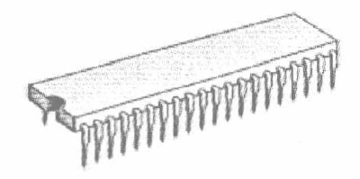

下面给出了8080的40个管脚的功能说明图：

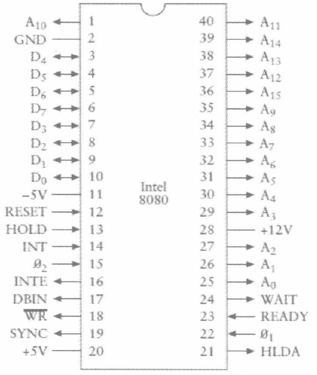

这些管脚的功能分为以下几类：

1、电源电压：管脚20（5V）、管脚11（-5V）、管脚28（12V）、管脚2（接地）。

2、时钟输入：管脚22和15，这些信号可以方便的由英特尔生产的8224时钟信号发生器产生。

3、16个用于寻址的输出信号：它们是A0-A15。

4、8个既可以做输入又可以做输出的信号：它们是D0-D7。

5、10个控制信号，如RESET（复位）、WR（对RAM阵列的写输入）等。

## STA/LDA/MOV/MVI指令

在8080中，指令的长度可以是1字节、2字节或者3字节，一共有244个指令。在之前的设计中，我们使用了非常重要的两条指令，分别是load（将指定地址中的字节加载到累加器A）和store（累加器A中的内容被保存到指定的地址），8080中也有类似的指令，每个操作后也跟着一个16位的地址，它们是STA（Store Accumulator，存储累加器的值到地址）、LDA（Load Accumulator，加载到累加器）：

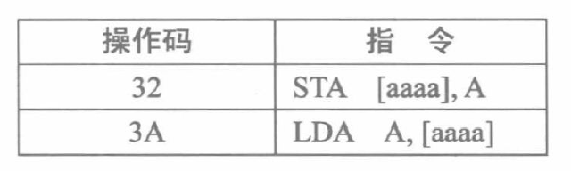

8080芯片的微处理器内部设置了6个寄存器（rigister），每个寄存器内部可以存放一个8位的数，它和累加器一样，本质都是锁存器。它用来存放程序运行过程中的数据，数据存在寄存器要远比存在内存中访问更方便。在8080中用B,C,D,E,H,L来表示6个寄存器，HL合起来可以构成一个16位的寄存器对。

MOV是一个非常重要的指令，它用来把一个寄存器中的内容转移到另一个寄存器，这些指令如下，再次注意两个参数中左边是目标操作数，右边是源操作数：

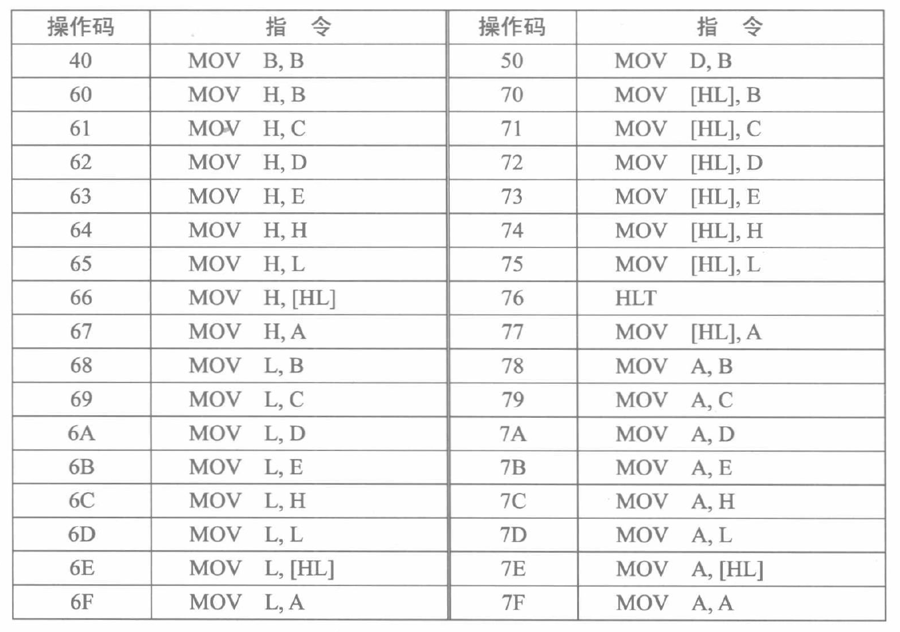

MOV的操作码由8位组成：01dddsss，ddd是目标操作数的代码，sss是源操作数的代码，它们表示的意义如下：

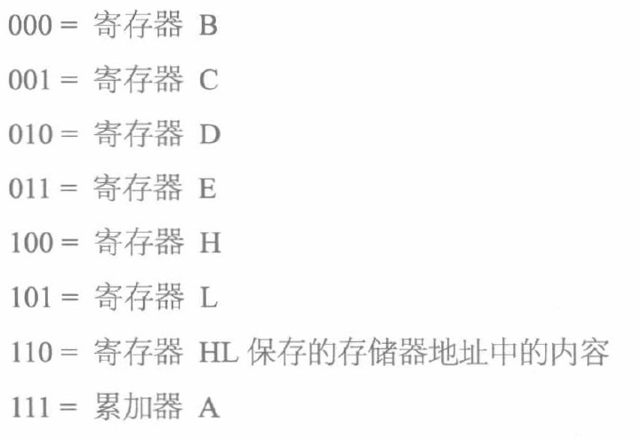

寄存器B和C、D和E也可以组成寄存器对，读取或保存这些地址时，可以用下面的指令：

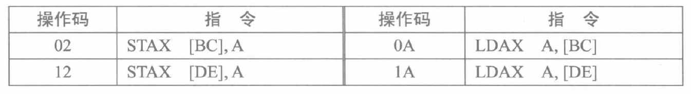

MVI指令可以将某个单字节数据写入寄存器中：

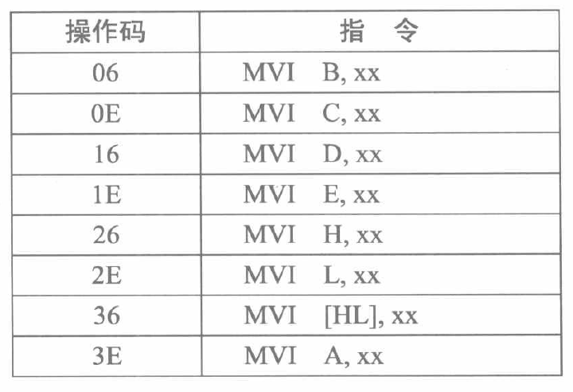

设置寄存器的值的方式有几种，如用LDA指令直接操作地址，也可以用MOV指令将一个寄存器写入另一个寄存器，前者称为直接寻址，后者称为间接寻址，还有第三种方式，被称为立即数寻址，也就是使用MVI直接设置值。

## 算术运算指令

之前在设计时我们用到了四种基本运算指令，分别是加法ADD、进位加法ADC、减法SUB、借位减法SBB，8080中也有这些指令：

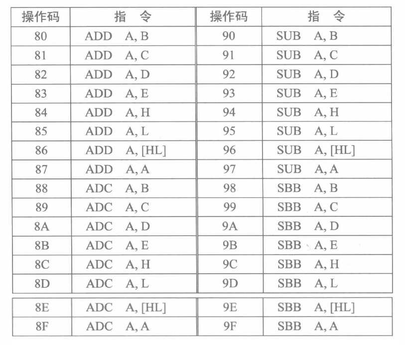

可以发现这些指令的操作数中总有A（累加器），相当于将计算结果运算后再存入累加器中。用ADC指令和SBB指令可以完成16位甚至更多位数的加法和减法。以加法为例，假设现在寄存器对BC和DE各自保存了一个16位的数，我们要把这两个数相加，并且把结果保存在寄存器对BC中，可以编程如下：

~~~
MOV A, C          
ADD A, E
MOV C, A		完成低字节操作加法，将结果存入C中
MOV A, B
ADC A, D
MOV B, A		完成高字节操作加法，将结果存入B中
~~~

其中ADC的执行自动计入了低字节的进位。

## 标志位

8080中共有5个标志位：CF（进位标志位）、ZF（零标志位）、符号标志位（SF）、奇偶标志位（PF）、辅助进位标志位（AF），在8080中有一个专门的8位寄存器来存放所有标志位，该寄存器被称为程序状态字（Program Status Word， PSW）。

算术运算指令的执行会影响这些标志位的值：

1、算术运算结果的最高位是1，则符号标志位SF被置位1，表示该结果是负数。

2、运算结果为0，零标志位ZF被置为0。

3、运算结果中1的位数是偶数，则奇偶标志位PF置为1，否则置为0。

4、当ADD和ADC运算产生进位或者SUB和SBB运算不发生借位时，进位标志位CF都置为1。

5、辅助进位标志位AF只有在运算结果的低4位向高4位有进位时才置为1，它只用于DAA（Decimal Adjust Accumulator，十进制调整累加器）中。

下列两条指令会直接影响进位标志位CF：

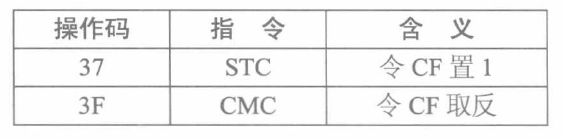

## 逻辑运算指令

8080的算术逻辑单元ALU除了可以进行算术运算，还能进行逻辑运算：

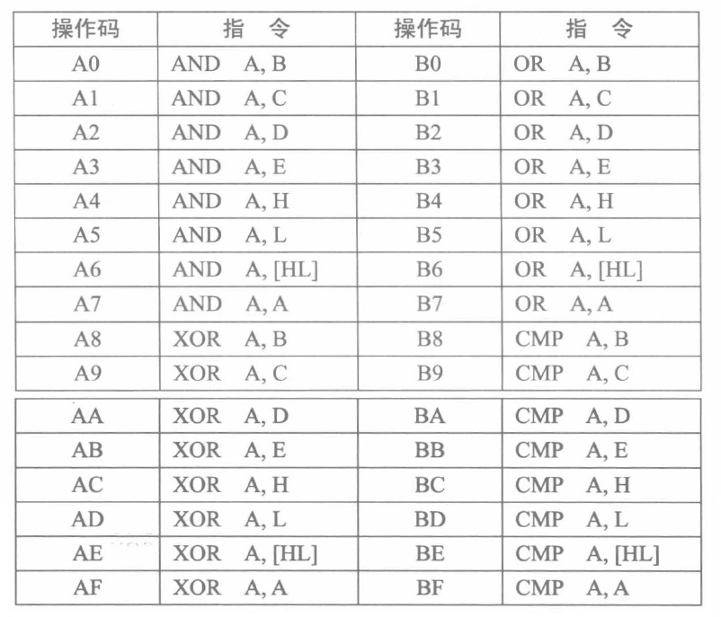

逻辑运算包括AND与、OR或、XOR异或这些按位运算治指令，这些指令把运算结果放到累加器中，还包括CMP这种比较指令，CMP指令不会改变累加器的值，它改变的是标志位，如：

~~~
CMP A, B
~~~

如果两个值相等，零标记位被置为1；如果A中的值小于B，则进位标志位置为1.

## 对立即数的算术逻辑指令

包括以下8种，分别对应上面4种算术指令和4种逻辑指令：

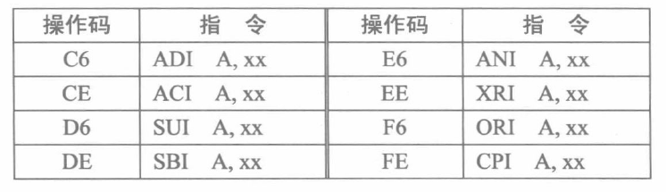

如以下代码：

~~~
MVI B, 25h
CMP A, B
~~~

可以被替换成

~~~
CPI A, 25h
~~~

## 取反CMA和十进制运算DAA

取反CMA（Complement Accumulator）的操作码对应为27，它对累加器中的数按位取反，此外我们还可以执行以下指令按位取反（与全1异或）：

~~~
XRI A, FFh
~~~

DAA（Decimal Adjust Accumulator）是十进制调整累加器，在8080中专门设计了一个完整的小部件用于执行该指令，它提供了一种用二进制表示十进制数的方法，称为BCD码（binary-coded decimal），每4位为一段，每段数字范围是0000-1001.对应十进制的0-9，一个字节可以表示两个十进制数。

两个数字：27h和94h，用DAA指令相加的结果就是累加器中存放的是21h，而不是BBh，且进位标志位置1。

## 自增和自减指令

8080中提供了专门的指令用来对寄存器或存储器中的数进行加1或减1操作：

INR和DCR能影响除了CF之外的所有标志位。

## 循环移位指令

8080中包括4个循环移位指令，这些指令可以把累加器中的内容向左或向右移动1位：

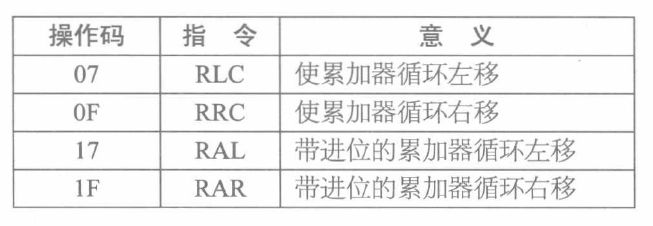

RLC可以让10100111变为01001111，它的最左位会移动到最右边，同时CF置位1，RRC也一样，会将移出去的位补充在后面。

RAL和RAR的工作方式有所不同，RAL也可以产生移位，但是它会把CF中的值补充到最后一位，然后把累加器中原最高位移动到CF中。

移位操作可以让乘2和除2变得简单。

## 堆栈指令和其他寄存器指令

在编写程序时可能出现这样的情况，程序中需要做一个小的计算，该计算要用到寄存器A、B、C，于是可以先将这三个寄存器的值保存起来，然后计算完成后再把数据恢复。

保存寄存器A、B、C的值：

~~~
PUSH	A
PUSH	B
PUSH	C	
~~~

取回原来的数据，注意这里的顺序必须和压入是相反的，否则会引起错误：

~~~
POP		C
POP		B
POP		A	
~~~

程序中可以多次使用堆栈，如我们可以把B中的数据压入栈中两次，然后再依次取出。

堆栈本质上是一段普通的RAM空间，8080微处理器设置了一个16位寄存器对这段存储空间寻址，这个特殊的寄存器称为堆栈指针（SP，Stack Pointer），所以PUSH和POP指令是把对应的数据保存在堆栈或者从堆栈中取出，这些操作码如下：

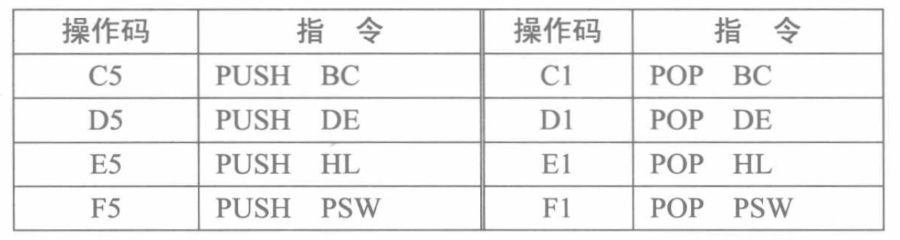

PSW是用于保存标志位的寄存器，也可以将其中的值保存在堆栈中。

PUSH BC指令执行时会将堆栈指针减1，然后将B中的数据存入堆栈指针指向的地址，然后再次将堆栈指针减1，将C中的数据存入堆栈指针指向的地址。POP指令会将上述步骤反过来执行一遍，它会增加堆栈指针。操作堆栈时，可能出现存入的数据过多，导致覆盖掉原来的数据，这就是堆栈上溢，还可能出现过多使用POP导致无数据可取，这就是堆栈下溢。

LXI指令可以为寄存器赋值，包括堆栈指针SP：

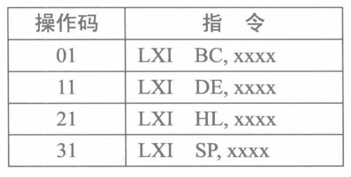

还可以对寄存器或堆栈指针中的值加1或减1：

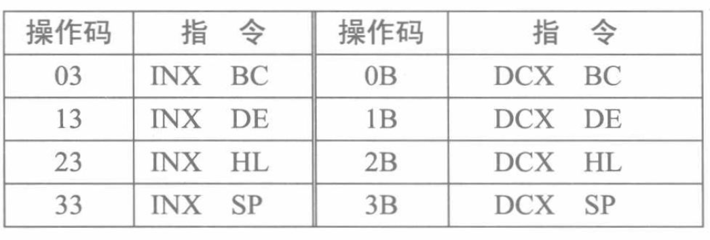

还可以通过寄存器给它们赋值：

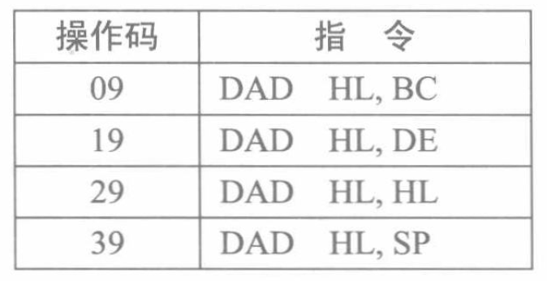

可以将地址中的内容保存在寄存器中：

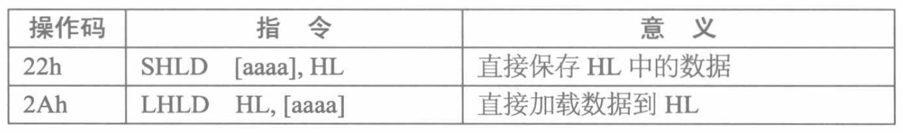

还可以把寄存器中的值加载到程序计数器（相当于Jump指令）和堆栈指针：

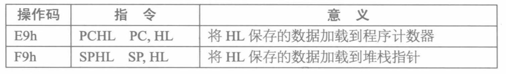

还有一些交换指令，它可以将两个操作数中的值进行交换：

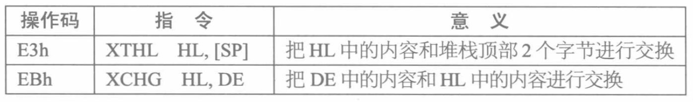

## 跳转指令

Call指令会完成程序的跳转，在程序计数器中加载一个新的地址，而且它还会将原来的地址保存到堆栈。Return用来从堆栈中将原地址取出，并把他们加载到PC中。

有了这两个指令就能有效的记录“从何处跳转”，在它们的帮助下，程序员可以在程序中频繁使用子程序。

在执行下列语句后：

~~~
CALL Multiply
~~~

程序会把当前PC中的值保存在堆栈，然后跳转到标志位Multiply的指令，这是一个自定义的标志，该值在即将调用的子程序的开头，在子程序的末尾会有一个RET指令表示返回，这样就完成了对子程序的调用。在子程序中改变了其他寄存器的值，可以通过操作这些寄存器来得到结果。

跳转指令总结如下：

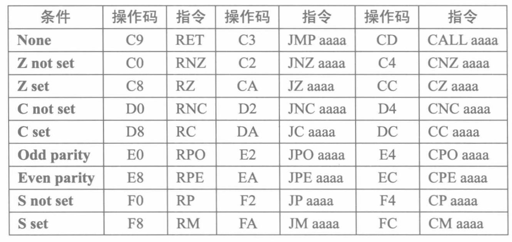

## IO相关

微处理器需要和外围设备互相通信，在8080中，除了常规的65536个地址外，还另外增加了256个地址专门用来访问输入/输出设备，它们被称作I/O端口，I/O地址信号标记位A0-A7。

输出指令OUT将累加器中的内容写入到对应端口PP，输入指令IN把一个字节从指定的端口读入到累加器：

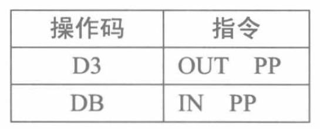

## 中断指令及其相应

外围设备有时需要获得处理器的注意，如按下键盘时，处理器应该马上注意到这个事件。这个过程由一个被称为中断（interrupt）的机制实现，由外围设备产生的信号连接至8080的INT输入端。

指令传入处理器中会执行以下指令进行响应：

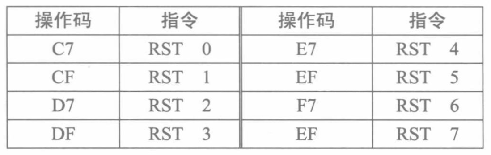

这些指令都被称为Restart重启动指令，在执行过程中将当前PC中的数据保存到堆栈，然后根据参数不同立即跳转到特定的地址，执行该地址处的指令来处理中断。

有时处理器会执行DI（Disable Interrupts）禁止中断，在处理器复位后，会执行EI（Enable Interrupt）来允许中断：

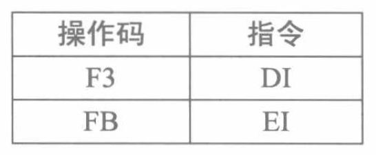

## NOP指令

这个指令的操作码是00，它代表no op（no operation），也就是无操作，它让处理器什么操作也不执行，保持处理器的运行状态，8080可以执行一批NOP指令而不会引起任何错误的发生。

## 其他的CPU

至此我们介绍了8080处理器的全部244个操作码。其余的CPU设计与8080处理器大同小异，虽然功能类似，但是不同的CPU的操作码和助记符不同，执行的机器码也不一样，很多细节方面也有变动：如端口设计、寄存器数量、标志位设计。

在另一个CPU：Motorola 6800中，也有LDA指令（将地址处的数据加载到累加器），但是和8080有所不同：

~~~~
3Ah 7Bh 34h			代表把347Bh处的字节加载到累加器（8080）
B6h 7Bh 34h			代表把7B34h处的字节加载到累加器（6800）
~~~~

这两种微处理器对于操作码后的地址的处理方式是不同的，8080假设低字节在前，6800假设低字节在后，前者的处理方式被称为little-endian，后者被称为big-endian，也就是小端法和大端法表示字节顺序，这两种处理方式至今都还存在。

# 其他硬件

## 总线和电路板

搭建一台完整的计算机还需要很多集成电路，这些集成电路都必须挂载到电路板上，在一些小型的机器上，一块电路板足以容纳所有的集成电路，但这种情况并不长见，更多的情况我们必须按照功能将各部件布置在两个或更多的电路板上。

这些电路板之间通过总线（bus）连接，总线是数字信号的集合，且为电路板供电，这些信号可以划分为如下四类：

1、地址信号：由处理器产生，对RAM进行寻址操作

2、数据输出信号：由处理器产生，用来把数据写入到RAM或其他设备

3、数据输入信号：由计算机的其他部分提供，由处理器读取的

4、控制信号：它可以产生于处理器，也可以由与微处理器通信的其他设备产生

一块电路板通常能安装多个存储器芯片，以2102芯片为例，该芯片有一个重要的接口对应的是CS信号，该信号置为1的时候，芯片不会响应R/W（读写）信号，2102芯片输出信号是三态的，除了0和1以外，还有一种真空态，当CS信号被置为1时，相当于该芯片什么也不连接。CS信号是一个很重要的信号，正因为有了三态的规则，我们可以将多个存储器芯片的输出信号连接在一起，完成输出和输入的复用。

所有连接在总线上的器件都使用总线来传递数据输入信号，但无论何时，连接在总线上的电路板中只有一个能确定总线数据输入信号的类型，其他电路板都处于三种状态中的无效状态。

2102是一个静态随机访问存储器芯片，还有一种叫动态访问存储器，两个都是在不断电的情况下数据会丢失的，但是后者需要定期访问存储器中的内容，这个动作称之为更新周期，每秒钟都必须进行几百次。

## 显卡和图像显示

组成视频图像的连续射线都是由一个连续的信号所控制，为视频显示器提供信号的电子元件被称为视频适配器，在计算机中，它是独立存在的，拥有自己的电路板，也就是我们常说的显卡（video board）。

视频显示器的成像是由一束连续的光束射线迅速扫描屏幕而形成的，由于扫描的速度很快，所以不会看到图像出现闪烁的现象。从计算机的角度来说，视频图像就是由离散点组成的，这些离散点称作像素。

1位是和一像素相对应的，它只能用来表示两种颜色，黑色和白色。一般的彩色屏幕可以显示很多的色彩，每个像素可能由多个字节所组成，每种颜色都是三原色的不同组成。

视频适配器中必须配置一些RAM，用以存储所显示的内容，这个RAM也是微处理器的一部分，微处理器可以向该RAM中写入数据以改变显示器上要显示的内容。字符生成器也是视频适配器的一部分，包含所有字符的像素图，它是一种只读存储器。同样的道理，光标功能也需要寄存器，光标的位置存储在寄存器中，它也是视频板的一部分。

## 键盘

键盘硬件提供的代码为扫描码（scan code），当按下键盘上的某个按键时，会有一小段计算机程序计算出该按键对应的ASCII码。

键盘产生扫描码的过程大致如下，假设键盘上只有16个按键，任何一个按键被按下，键盘硬件就会产生一个4位的代码：

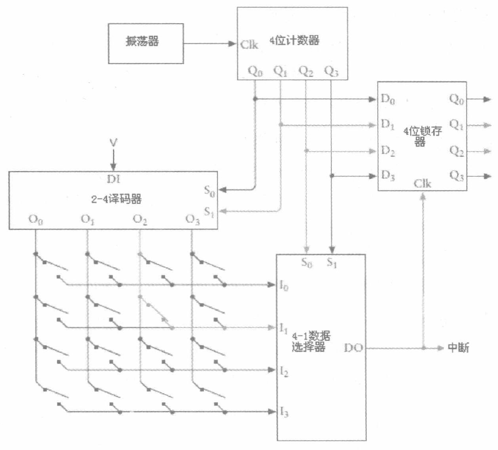

4位计数器在按键对应的16个编码间快速重复循环，计数器的输出是译码器和选择器的输入，一旦某个开关闭合，选择器的输出就为1，产生中断信号，同时对应的编码就会被存入锁存器中。

以8080芯片为例，当键盘某个按键按下时，键盘会产生一个中断信号，接下来微处理器会执行一段小程序，来检测按键的内容，然后做出响应。在安装了微处理器的电路板上有一个被称为Intel 8214优先级中断控制单元的芯片，它是专门用来处理中断的，当中断发生后，这个芯片会产生一个中断信号给8080，8080识别到这个中断后，此芯片就会提供一个RST重启命令，微处理器会将当前程序计数器的值保存下来，然后跳转到对应地址执行程序。

## 磁盘

目前为止的所有存储设备都无法在断电后提供存储功能，长期以来，人们通过在纸上或卡片上打孔来保存永久信息，直到磁介质存储器（magnetic storage）的出现。

第一块磁介质存储器出现在1898年，它用来完成电话的录音，根据声音的高低来磁化金属丝，当磁化的金属丝切割电磁线圈运动的时候，产生的电流强度与其磁化程度有关。

1928年，磁带诞生，它将铁粒子覆盖在纸带上，后来被人们用于保存信息，但是磁带不是最理想的存储介质，想要快速的访问磁带的任一位置是不可能的，它只能顺序访问，频繁的快进和倒带很费时间。

相比磁带，磁盘的访问速度要快得多，它围绕其中心旋转可以很方便的让磁头访问某一位置的信息。磁盘分为软盘和硬盘。软盘是单面覆盖磁性物质的塑料片，使用软盘时必须将其插入到软盘驱动器。硬盘是由多个金属磁盘构成的，永久驻留在驱动器内，相比软盘它存取速度更快、存储量更大。

磁盘的表面被划分成许多同心圆，称为磁道，每个磁道又被划分为多个扇区，每个扇区可以存放一定量的字节，记录和读取信息都是利用磁头来完成的。微处理器不能直接从磁盘读取数据，需要将所需数据从磁盘调入内存，然后才能对其访问。

