# 概述

## 计算机硬件的基本组成

计算机最核心的三个组件：CPU、内存和主板 

1、CPU：中央处理器（Central Processing Unit） ，它负责计算机的所有计算，也是造价最昂贵的部分之一

它是一个精细的印刷电路板：

2、内存，Memory，计算机里所有数据显示和计算都需要先加载到内存中：

3、主板：存放在内存里的程序和数据，需要被 CPU 读取，CPU 计算完之后，还要把数据写回到内存，主板就是连接它们的桥梁。

主板是一个有着各种各样，有时候多达数十乃至上百个插槽的配件。我们的 CPU 要插在主板上，内存也要插在主板上。 

主板的芯片组（Chipset）和总线（Bus）解决了 CPU 和内存之间如何通信的问题：

* 芯片组：控制了数据传输的流转，决定了数据从哪里到哪里
* 总线：实际数据传输的高速公路，总线速度（Bus Speed）决定了数据能传输得多快

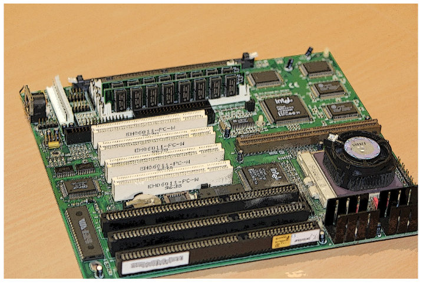

除了这些核心组件，计算机通常还包括下列组件：

* 电源
* I/O设备：显示器、鼠标、键盘。外部I/O设备，是通过主板上的南桥（SouthBridge）芯片组，来控制和 CPU 之间的通信的。以前的主板上通常也有“北桥”芯片，用来作为“桥”，连接 CPU 和内存、显卡之间的通信。不过，随着时间的变迁，现在的主板上的“北桥”芯片的工作，已经被移到了 CPU 的内部，所以在主板上已经看不到北桥芯片了
* 硬盘：持久化数据
* 显卡：Graphics Card，显卡里有除了 CPU 之外的另一个“处理器”，也就是GPU（Graphics Processing Unit，图形处理器），GPU 一样可以做各种“计算”的工作。

## 冯·诺依曼体系结构

各种计算机设备，如个人电脑、服务器、智能手机，它们都遵循着同一个“计算机”的抽象概念，这就是冯·诺依曼（John von Neumann）提出的冯·诺依曼体系结构（Von Neumann architecture），也叫存储程序计算机。

存储程序计算机隐含了两个关键的含义：一个是“可编程”计算机，一个是“存储”计算机。

1、可编程

如果计算机是由各种门电路组合而成的，然后通过组装出一个固定的电路版，来完成一个特定的计算程序。一旦需要修改功能，就要重新组装电路。这样的话，计算机就是“不可编程”的，例如计算器，它做不了任何固定计算逻辑之外的事情

2、存储

存储的含义是：程序本身是存储在计算机的内存里，可以通过加载不同的程序来解决不同的问题。不能存储程序的计算机，典型的就是早年的“Plugboard”这样的插线板式的计算机。整个计算机就是一个巨大的插线板，通过在板子上不同的插头或者接口的位置插入线路，来实现不同的功能。这样的计算机自然是“可编程”的，但是编写好的程序不能存储下来供下一次加载使用，不得不每次要用到和当前不同的“程序”的时候，重新插板子，重新“编程”。

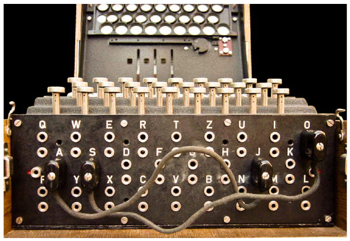

在这个体系中，理想的计算机应该是这样的：

* 处理器单元（Processing Unit）：包括算术逻辑单元（Arithmetic Logic Unit，ALU）和处理器寄存器（Processor Register），用来完成各种算术和逻辑运算 
* 控制器单元（Control Unit/CU）：包含指令寄存器（Instruction Reigster）和程序计数器（Program Counter），用来控制程序的流程，通常就是不同条件下的分支和跳转。在现在的计算机里，上面的算术逻辑单元和这里的控制器单元，共同组成了我们说的 CPU。 
* 用来存储数据（Data）和指令（Instruction）的内存。以及更大容量的外部存储
* 各种输入输出设备

任何一台计算机的任何一个部件都可以归到运算器、控制器、存储器、输入设备和输出设备中，而所有的现代计算机也都是基于这个基础架构来设计开发的。

而所有的计算机程序，也都可以抽象为从输入设备读取输入信息，通过运算器和控制器来执行存储在存储器里的程序，最终把结果输出到输出设备中，下面就是冯·诺依曼体系结构示意图：

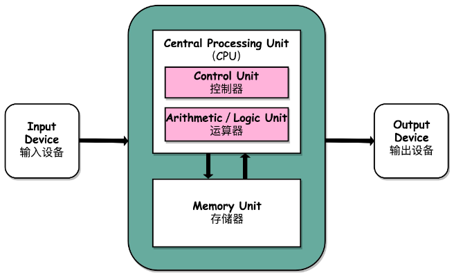

图灵也是对计算机作出重大贡献的，我们现在的计算机也叫图灵机，冯·诺依曼机侧重于硬件抽象，而图灵机侧重于计算抽象，图灵机是一种思想模型（计算机的基本理论基础），是一种有穷的、构造性的问题的问题求解思路，图灵认为凡是能用算法解决的问题也一定能用图灵机解决 

## 知识地图

组成原理知识地图：

计算机组成原理的英文叫 Computer Organization 。这里的 Organization 是“组织机构”的意思。计算机由很多个不同的部件放在一起，变成了一个“组织机构” 

在这张图里面，我们把整个计算机组成原理的知识点拆分成了四大部分，分别是计算机的基本组成、计算机的指令和计算、处理器设计，以及存储器和 I/O 设备：

* 计算机的基本组成：学习计算机是由哪些硬件组成的，又是怎么对应到经典的冯·诺依曼体系结构中的，也就是运算器、控制器、存储器、输入设备和输出设备这五大基本组件；除此之外，你还需要了解计算机的两个核心指标，性能和功耗 
* 计算机的指令和计算：程序从编译到执行的过程，一条条指令执行的控制过程，就是由计算机五大组件之一的控制器来控制的
* 处理器设计：CPU时钟、寄存器和内存是用什么样的硬件组成的。学习数据通路是如何构造出来的，数据通路，其实就是连接了整个运算器和控制器，并最终组成了 CPU。学习CPU设计对性能和功耗的考虑
* 存储器和I/O设备的原理

## 性能和功耗

### 性能评价标准

计算机的性能主要由两个指标衡量：

1、响应时间（Response time）或者叫执行时间（Execution time），可以理解为执行一个程序花费的时间

2、吞吐率（Throughput）或者带宽（Bandwidth），可以理解为在一定的时间范围内，到底能处理多少事情（指令）

缩短响应时间可以提升吞吐率，此外多线程同时处理也能提高吞吐率

一般把性能，定义成响应时间的倒数，也就是： 性能 = 1/ 响应时间

### 性能和CPU时钟

用程序的执行时间来衡量计算机的性能存在不准的问题，因为计算机可能同时运行着好多个程序，CPU 实际上不停地在各个程序之间进行切换，所以真正在执行程序的时间不能简单的用结束时间-开始时间来判断。

linux中有一个叫time的命令，它可以帮助统计一条命令的执行时间，它会返回三个值：

* real time：也就是Wall Clock Time，或者叫Elapsed Time，也就是运行程序整个过程中流逝掉的时间
* user time：CPU在用户态运行的时间
* sys time：CPU在操作系统内核运行指令的时间

~~~bash
$ time seq 1000000 | wc -l
1000000
 
 
real  0m0.101s
user  0m0.031s
sys   0m0.016s
~~~

程序实际花费的 CPU 执行时间（CPU Time），就是 user time 加上 sys time

可以看到上面的例子中，实际上程序用了 0.101s，但是 CPU time 只有 0.031+0.016 = 0.047s。运行程序的时间里，只有不到一半是实际花在这个程序上的：

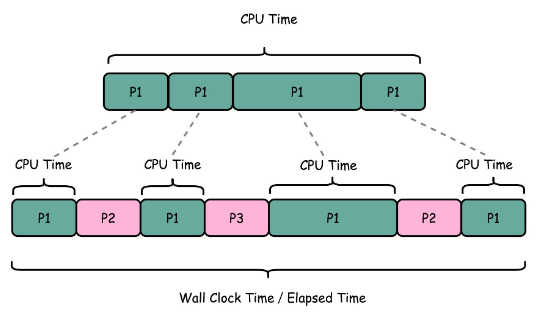

同一台计算机上，CPU 可能满载运行也可能降频运行，降频运行的时候自然花的时间会多一些。

除了 CPU 之外，时间这个性能指标还会受到主板、内存这些其他相关硬件的影响，可以进一步将CPU时间拆解：

程序的 CPU 执行时间 =CPU 时钟周期数×时钟周期时间 

其中：

* 时钟周期时间：Clock Cycle ，它和CPU的主频有关，例如Intel Core-i7-7700HQ 2.8GHz 的主频就是2.8GHz，主频可以反映1秒时间内可以执行的简单指令的数量。这些简单指令执行的最小时间间隔，就是CPU能识别出来的单位时间，在CPU内部，类似电子石英表，有一个叫晶体振荡器（Oscillator Crystal）的东西，简称为晶振，一次晶振，就是时钟周期时间。在自己组装台式机的时候，可以人为把CPU内部的时钟调快，这就是超频，CPU跑的越快，散热的压力就越大。它只和CPU的性能有关，与软件无关
* CPU 时钟周期数：CPU Cycles ，它就是指令数*每条指令的平均时钟周期数（Cycles Per Instruction，简称 CPI ）。不同的指令需要的 Cycles 是不同的，加法和乘法都对应着一条 CPU 指令，但是乘法需要的 Cycles 就比加法要多，自然也就慢 

上面的公式可以进一步变成：

程序的 CPU 执行时间 = 指令数×CPI×Clock Cycle Time 

如果想要优化计算机的性能，归根结底是要优化这三个因子：

* 时钟周期时间，就是计算机主频，这个取决于计算机硬件。我们所熟知的摩尔定律就一直在不停地提高我们计算机的主频。
* 每条指令的平均时钟周期数 CPI，就是一条指令到底需要多少 CPU Cycle（这里应该是一个时钟周期）。在后面讲解 CPU 结构的时候，我们会看到，现代的 CPU 通过流水线技术（Pipeline），让一条指令需要的 CPU Cycle 尽可能地少。因此，对于 CPI 的优化，也是计算机组成和体系结构中的重要一环。
* 指令数，代表执行我们的程序到底需要多少条指令、用哪些指令。这个很多时候就把挑战交给了编译器。同样的代码，编译成计算机指令时候，就有各种不同的表示方式。

### 功耗

根据上面性能的公式，只要不断提高CPU 的时钟频率，也就是时钟周期时间，就能不断提升性能

但是实际上，CPU的发展过程中，主频不是一直在优化增长的，而是已经达到了瓶颈，原因就是功耗问题

CPU实际上是超大规模集成电路（Very-Large-Scale Integration，VLSI ），这些电路，实际上都是一个个晶体管组合而成的。CPU 在计算，其实就是让晶体管里面的“开关”不断地去“打开”和“关闭”，来组合完成各种运算和功能 。想要计算得快，一般有两个手段：

* 同样的面积里面，多放一些晶体管，也就是增加密度，缩短电信号的传输距离，也就是晶体管造得小一点。这个就是平时我们所说的提升“制程” 
* 让晶体管“打开”和“关闭”得更快一点，也就是提升主频

而这两个办法都会增加功耗，带来耗电和散热的问题，降低性能，而散热效果也是有极限的

一个 CPU 的功率，可以用这样一个公式来表示：

功耗 ~= 1/2 ×负载电容×电压的平方×开关频率×晶体管数量

降低电压可以降低功耗，所以目前的发展方向之一就是通过降低电压的方法降低功耗

### 并行优化：阿姆达尔定律

提高性能的另一个方向是通过并行提高性能，例如多核CPU，通过提高吞吐率的方式提高性能。

但是，并不是所有问题，都可以通过并行提高性能来解决。如果想要使用这种思想，需要满足这样几个条件 ：

* 计算可以分解为多个并行计算的小任务
* 小任务可以汇总起来
* 汇总阶段总有一部分是无法并行的

性能优化中的一个重要定律：阿姆达尔定律（Amdahl’s Law），也就是对于一个程序进行优化之后，处理器并行运算之后效率提升的情况。具体可以用这样一个公式来表示：

优化后的执行时间 = 受优化影响的执行时间 / 加速倍数 + 不受影响的执行时间

并行优化是有极限的，就是那些必须串行的部分，是不可能通过并行优化的方法减少运行时间的：

### 其他优化

除了“摩尔定律”和“并行计算”之外 ，还有几个主要的提升性能的方向：

1、加速大概率事件，例如用GPU代替CPU

2、通过流水线提高性能，把 CPU 指令执行的过程进行拆分，细化运行，最大化整体效率

3、通过预测提高性能，通过预先猜测下一步该干什么，而不是等上一步运行的结果，提前进行运算，也是让程序跑得更快一点的办法 

# 指令

## 汇编代码到机器码

从硬件的角度来看，CPU 就是一个超大规模集成电路，通过电路实现了加法、乘法乃至各种各样的处理逻辑。

如果我们从软件工程师的角度来讲，CPU 就是一个执行各种计算机指令（Instruction Code）的逻辑机器。计算机指令也叫机器语言Machine Language 

不同的 CPU 能够听懂的语言不太一样，它们各自拥有不同的计算机指令集Instruction Set 。

CPU里面不能一直存放着所有指令，计算机程序平时是存储在存储器中的。这种程序指令存储在存储器里面的计算机，我们就叫作存储程序型计算机（Stored-program Computer），也有通过连接不同插口和插座来完成不同逻辑的非存储型计算机：

从一段C程序出发，来查看对应的机器指令：

~~~c
// test.c
int main()
{
  int a = 1; 
  int b = 2;
  a = a + b;
}
~~~

这段程序在系统上跑起来，首先要将程序编译为汇编语言（ASM，Assembly Language ），然后再用汇编器（Assembler）翻译成机器码（Machine Code） ，机器码由0和1组成，一条机器码就是一条计算机指令。在一个 Linux 操作系统上，我们可以简单地使用 gcc 和 objdump 这样两条命令，把对应的汇编代码和机器码都打印出来：

~~~bash
$ gcc -g -c test.c
$ objdump -d -M intel -S test.o
~~~

下面就是翻译的结果，左边是机器码，右边是汇编代码。一行 C 语言代码，有时候只对应一条机器码和汇编代码，有时候则是对应两条机器码和汇编代码。汇编代码和机器码之间是一一对应的：

~~~
test.o:     file format elf64-x86-64
Disassembly of section .text:
0000000000000000 <main>:
int main()
{
   0:   55                      push   rbp
   1:   48 89 e5                mov    rbp,rsp
  int a = 1; 
   4:   c7 45 fc 01 00 00 00    mov    DWORD PTR [rbp-0x4],0x1
  int b = 2;
   b:   c7 45 f8 02 00 00 00    mov    DWORD PTR [rbp-0x8],0x2
  a = a + b;
  12:   8b 45 f8                mov    eax,DWORD PTR [rbp-0x8]
  15:   01 45 fc                add    DWORD PTR [rbp-0x4],eax
}
  18:   5d                      pop    rbp
  19:   c3                      ret    
~~~

汇编代码其实就是“给程序员看的机器码” ，因为人们很容易记住 add、mov 这些用英文表示的指令，而 8b 45 f8 这样的指令，由于很难一下子看明白是在干什么，所以会非常难以记忆 。

从高级语言到汇编代码，再到机器码，就是一个日常开发程序，最终变成了 CPU 可以执行的计算机指令的过程 ：

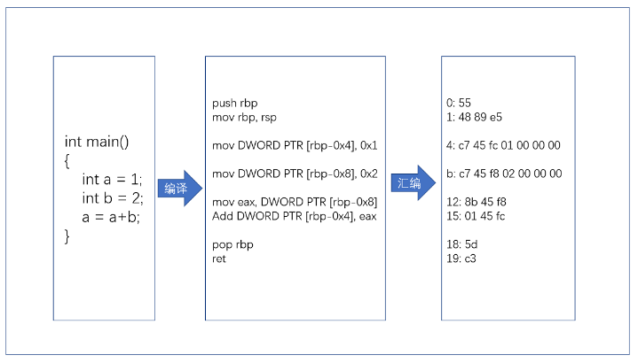

日常使用的Intel CPU，有 2000 条左右的 CPU 指令，常见的指令可以分成五大类：

* 第一类是算术类指令。我们的加减乘除，在 CPU 层面，都会变成一条条算术类指令。
* 第二类是数据传输类指令。给变量赋值、在内存里读写数据，用的都是数据传输类指令。
* 第三类是逻辑类指令。逻辑上的与或非，都是这一类指令。
* 第四类是条件分支类指令。日常我们写的“if/else”，其实都是条件分支类指令。
* 最后一类是无条件跳转指令。写一些大一点的程序，我们常常需要写一些函数或者方法。在调用函数的时候，其实就是发起了一个无条件跳转指令。

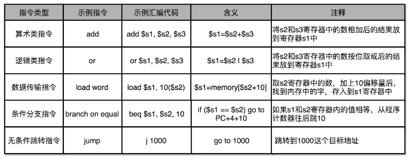

以最简单的 MIPS 指令集，来看看机器码是如何生成的。MIPS 是一组由 MIPS 技术公司在 80 年代中期设计出来的 CPU 指令集 。

MIPS 的指令是一个 32 位的整数，高 6 位叫操作码（Opcode），也就是代表这条指令具体是一条什么样的指令，剩下的 26 位有三种格式，分别是 R、I 和 J：

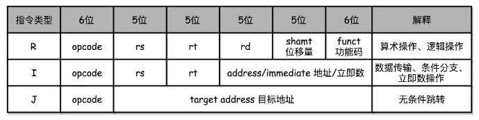

几种类型指令的区别：

* R 指令是一般用来做算术和逻辑操作，里面有读取和写入数据的寄存器的地址。如果是逻辑位移操作，后面还有位移操作的位移量，而最后的功能码，则是在前面的操作码不够的时候，扩展操作码表示对应的具体指令的。
* I 指令，则通常是用在数据传输、条件分支，以及在运算的时候使用的并非变量还是常数的时候。这个时候，没有了位移量和操作码，也没有了第三个寄存器，而是把这三部分直接合并成了一个地址值或者一个常数。
* J 指令就是一个跳转指令，高 6 位之外的 26 位都是一个跳转后的地址。

例如对于下面的指令：

~~~
add $t0,$s2,$s1
~~~

对应的 MIPS 指令里 opcode 是 0，rs 代表第一个寄存器 s1 的地址是 17，rt 代表第二个寄存器 s2 的地址是 18，rd 代表目标的临时寄存器 t0 的地址，是 8。因为不是位移操作，所以位移量是 0。把这些数字拼在一起，就变成了一个 MIPS 的加法指令：0X02324020，这就将汇编指令转换为了机器码：

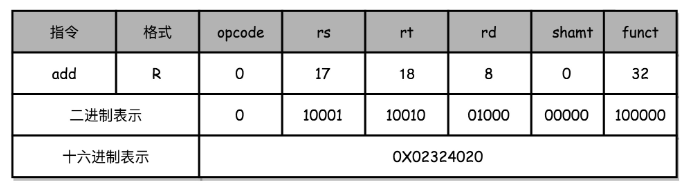

## 寄存器

对于常用的Intel CPU，里面差不多有几百亿个晶体管，逻辑上，我们可以认为，CPU 其实就是由一堆寄存器组成的。而寄存器就是 CPU 内部，由多个触发器（Flip-Flop）或者锁存器（Latches）组成的简单电路。 触发器和锁存器，其实就是两种不同原理的数字电路组成的逻辑门 

CPU 在软件层面已经为我们做好了封装，写好的代码变成了指令之后，是一条一条顺序执行的。

N 个触发器或者锁存器，就可以组成一个 N 位（Bit）的寄存器，能够保存 N 位的数据。比方说，我们用的 64 位 Intel 服务器，寄存器就是 64 位的 

一个 CPU 里面会有很多种不同功能的寄存器，其中有三种寄存器的作用比较特殊：

* 一个是PC 寄存器（Program Counter Register，程序计数器），我们也叫指令地址寄存器（Instruction Address Register）。顾名思义，它就是用来存放下一条需要执行的计算机指令的内存地址。
* 第二个是指令寄存器（Instruction Register），用来存放当前正在执行的指令。
* 第三个是条件码寄存器（Status Register），用里面的一个一个标记位（Flag），存放 CPU 进行算术或者逻辑计算的结果。

除了这些特殊的寄存器，CPU 里面还有更多用来存储数据和内存地址的寄存器。这样的寄存器通常一类里面不止一个。我们通常根据存放的数据内容来给它们取名字，比如整数寄存器、浮点数寄存器、向量寄存器和地址寄存器等等。有些寄存器既可以存放数据，又能存放地址，我们就叫它通用寄存器。 

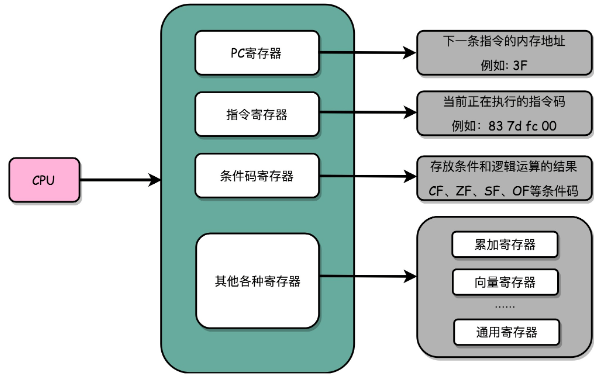

一个程序执行的时候，CPU 会根据 PC 寄存器里的地址，从内存里面把需要执行的指令读取到指令寄存器里面执行，然后根据指令长度自增，开始顺序读取下一条指令。可以看到，一个程序的一条条指令，在内存里面是连续保存的，也会一条条顺序加载。

而有些特殊指令，比如上一讲我们讲到 J 类指令，也就是跳转指令，会修改 PC 寄存器里面的地址值。这样，下一条要执行的指令就不是从内存里面顺序加载的了：

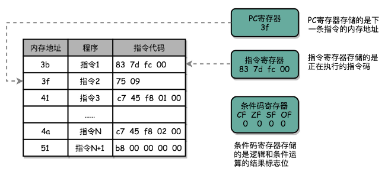

## 分支和循环

对于下面这个if...else的简单程序：

~~~c
// test.c
 
 
#include <time.h>
#include <stdlib.h>
 
 
int main()
{
  srand(time(NULL));
  int r = rand() % 2;
  int a = 10;
  if (r == 0)
  {
    a = 1;
  } else {
    a = 2;
  } 
~~~

将这个程序编译成汇编代码，忽略前后无关的代码，专注于判断语句，对应的汇编代码是这样的：

~~~
    if (r == 0)
  3b:   83 7d fc 00             cmp    DWORD PTR [rbp-0x4],0x0
  3f:   75 09                   jne    4a <main+0x4a>
    {
        a = 1;
  41:   c7 45 f8 01 00 00 00    mov    DWORD PTR [rbp-0x8],0x1
  48:   eb 07                   jmp    51 <main+0x51>
    }
    else
    {
        a = 2;
  4a:   c7 45 f8 02 00 00 00    mov    DWORD PTR [rbp-0x8],0x2
  51:   b8 00 00 00 00          mov    eax,0x0
    } 
~~~

可以看到，这里对于 r == 0 的条件判断，被编译成了 cmp 和 jne 这两条指令。 

cmp指令：比较了前后两个操作数的值，这里的 DWORD PTR 代表操作的数据类型是 32 位的整数，而 [rbp-0x4] 则是一个寄存器的地址。 代表从寄存器中取到变量r的值，然后和常量0对比，cmp 指令的比较结果，会存入到条件码寄存器当中去。条件码寄存器有好多标志位，比如零标志条件码（对应的条件码是 ZF，Zero Flag）、进位标志（CF，Carry Flag）、符号标志（SF，Sign Flag）以及溢出标志（OF，Overflow Flag），它们都用在不同的条件判断场景下，这里因为比较的结果是True，会将零标志条件码设置为1

cmp 指令执行完成之后，PC 寄存器会自动自增，开始执行下一条 jne 的指令 

jne指令：它是jump if not equal 的意思。它会查看对应的零标志位。如果为 0，会跳转到后面跟着的操作数 4a 的位置。这个 4a，对应这里汇编代码的行号，也就是上面设置的 else 条件里的第一条指令。 当跳转发生的时候，PC 寄存器就不再是自增变成下一条指令的地址，而是被直接设置成这里的 4a 这个地址。这个时候，CPU 再把 4a 地址里的指令加载到指令寄存器中来执行。 

当走下面的分支时：对应两个mov指令，mov可以用来在寄存器之间、寄存器和内存单元传递数据，还可以把数据直接赋值到寄存器中。第一条mov指令就代表将2设置到对应的寄存器中；第二条mov指令没有实际的作用，相当于一个占位符。

当走上面的分支时：在赋值的 mov 指令执行完成之后，有一个 jmp 的无条件跳转指令 ，它代表跳转到51行，在51行还是刚才那个mov指令，我们的 main 函数没有设定返回值，而 mov eax, 0x0 其实就是给 main 函数生成了一个默认的为 0 的返回值到累加器里面。 最终代码都会在51行结束。

在这个例子中可以看到，通过跳转指令可以跳转地执行对应地址的指令，这是if的原理，也是while/for 循环实现的原理，例如下面的循环语句，及对应的汇编代码：

~~~c
int main()
{
    int a = 0;
    for (int i = 0; i < 3; i++)
    {
        a += i;
    }
}
~~~

~~~
    for (int i = 0; i < 3; i++)
   b:   c7 45 f8 00 00 00 00    mov    DWORD PTR [rbp-0x8],0x0
  12:   eb 0a                   jmp    1e <main+0x1e>
    {
        a += i;
  14:   8b 45 f8                mov    eax,DWORD PTR [rbp-0x8]
  17:   01 45 fc                add    DWORD PTR [rbp-0x4],eax
    for (int i = 0; i < 3; i++)
  1a:   83 45 f8 01             add    DWORD PTR [rbp-0x8],0x1
  1e:   83 7d f8 02             cmp    DWORD PTR [rbp-0x8],0x2
  22:   7e f0                   jle    14 <main+0x14>
  24:   b8 00 00 00 00          mov    eax,0x0
    }
~~~

可以看到，对应的循环也是用 1e 这个地址上的 cmp 比较指令，和紧接着的 jle 条件跳转指令来实现的。 不同之处在于跳转指令会跳转到之前执行过的指令位置，然后重新开始执行。

从上面的案例来看，jle 和 jmp 指令，有点像程序语言里面的 goto 命令，直接指定了一个特定条件下的跳转位置。虽然我们在用高级语言开发程序的时候反对使用 goto，但是实际在机器指令层面，无论是 if…else…也好，还是 for/while 也好，都是用和 goto 相同的跳转到特定指令位置的方式来实现的。 

## 程序栈

函数调用在底层是如何实现的？接下来是几种简单的想法：

* 将被调用函数的指令，直接插入在调用函数的地方。这样的处理无法应对函数互相调用的问题，如果函数 A 调用了函数 B，然后函数 B 再调用函数 A，我们就得面临在 A 里面插入 B 的指令，然后在 B 里面插入 A 的指令，这样就会产生无穷无尽地替换。 
* 专门设立一个用于程序调用的寄存器，存储接下来要跳转回来执行的指令地址，等到函数调用结束，从这个寄存器里取出地址，再跳转到这个记录的地址，继续执行就好了。这种办法无法应对函数调用层数很多的情况，例如在调用函数 A 之后，A 还可以调用函数 B，B 还能调用函数 C。这一层又一层的调用并没有数量上的限制。在所有函数调用返回之前，每一次调用的返回地址都要记录下来，但是我们 CPU 里的寄存器数量并不多。 

为了解决上面这两个方法的弊端，最终函数调用在底层的实现是，在内存中开辟一段空间，用栈这个后进先出（LIFO，Last In First Out）的数据结构，栈就像一个乒乓球桶，每次程序调用函数之前，我们都把调用返回后的地址写在一个乒乓球上，然后塞进这个球桶。这个操作其实就是我们常说的压栈。如果函数执行完了，我们就从球桶里取出最上面的那个乒乓球，很显然，这就是出栈。

在真实的程序里，压栈的不只有函数调用完成后的返回地址。比如函数 A 在调用 B 的时候，需要传输一些参数数据，这些参数数据在寄存器不够用的时候也会被压入栈中。整个函数 A 所占用的所有内存空间，就是函数 A 的栈帧（Stack Frame）

以实际的程序为例，下面的程序中就有一次函数调用：

~~~c
// function_example.c
#include <stdio.h>
int static add(int a, int b)
{
    return a+b;
}
 
 
int main()
{
    int x = 5;
    int y = 10;
    int u = add(x, y);
}
~~~

对应的汇编代码：

~~~
int static add(int a, int b)
{
   0:   55                      push   rbp
   1:   48 89 e5                mov    rbp,rsp
   4:   89 7d fc                mov    DWORD PTR [rbp-0x4],edi
   7:   89 75 f8                mov    DWORD PTR [rbp-0x8],esi
    return a+b;
   a:   8b 55 fc                mov    edx,DWORD PTR [rbp-0x4]
   d:   8b 45 f8                mov    eax,DWORD PTR [rbp-0x8]
  10:   01 d0                   add    eax,edx
}
  12:   5d                      pop    rbp
  13:   c3                      ret    
0000000000000014 <main>:
int main()
{
  14:   55                      push   rbp
  15:   48 89 e5                mov    rbp,rsp
  18:   48 83 ec 10             sub    rsp,0x10
    int x = 5;
  1c:   c7 45 fc 05 00 00 00    mov    DWORD PTR [rbp-0x4],0x5
    int y = 10;
  23:   c7 45 f8 0a 00 00 00    mov    DWORD PTR [rbp-0x8],0xa
    int u = add(x, y);
  2a:   8b 55 f8                mov    edx,DWORD PTR [rbp-0x8]
  2d:   8b 45 fc                mov    eax,DWORD PTR [rbp-0x4]
  30:   89 d6                   mov    esi,edx
  32:   89 c7                   mov    edi,eax
  34:   e8 c7 ff ff ff          call   0 <add>
  39:   89 45 f4                mov    DWORD PTR [rbp-0xc],eax
  3c:   b8 00 00 00 00          mov    eax,0x0
}
  41:   c9                      leave  
  42:   c3                      ret    
~~~

调用函数对应的指令是call，call指令需要跟着跳转后的程序地址。这种跳转和之前的跳转的区别是：函数调用的跳转，在对应函数的指令执行完了之后，还要再回到函数调用的地方，继续执行 call 之后的指令 

add 函数编译之后，代码先执行了一条 push 指令和一条 mov 指令；在函数执行结束的时候，又执行了一条 pop 和一条 ret 指令。这四条指令的执行，其实就是在进行我们接下来要讲压栈（Push）和出栈（Pop）操作

实际的程序栈布局，顶和底与我们的乒乓球桶相比是倒过来的。底在最上面，顶在最下面，这样的布局是因为栈底的内存地址是在一开始就固定的。而一层层压栈之后，栈顶的内存地址是在逐渐变小而不是变大：

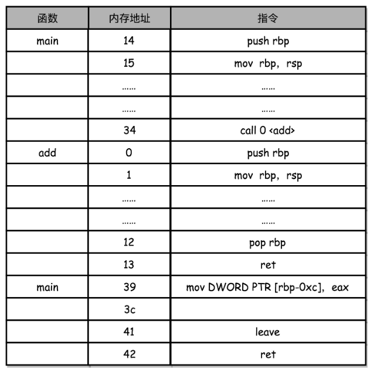

函数调用的详细过程：

* 调用call指令，会把当前的 PC 寄存器里的下一条指令的地址压栈，保留函数调用结束后要执行的指令地址。 
* add 函数的第 0 行：push rbp ，这里的 rbp 又叫栈帧指针（Frame Pointer），是一个存放了当前栈帧位置的寄存器。push rbp 就把之前调用函数，也就是 main 函数的栈帧的栈底地址，压到栈顶 
* add函数的第一行：mov rbp, rsp ，把 rsp 这个栈指针（Stack Pointer）的值复制到 rbp 里，而 rsp 始终会指向栈顶。这个命令意味着，rbp 这个栈帧指针指向的地址，变成当前最新的栈顶，也就是 add 函数的栈帧的栈底地址了。 
* add函数的倒数第二行：pop rbp ，将当前的栈顶出栈 
* add函数的最后一行：ret指令，把 call 调用的时候压入的 PC 寄存器里的下一条指令出栈，更新到 PC 寄存器中，将程序的控制权返回到出栈后的栈顶。 

综上，无论有多少层的函数调用，我们都只需要通过维持 rbp 和 rsp，这两个维护栈顶所在地址的寄存器，就能管理好不同函数之间的跳转。 

## 内联

上面我们提到一个方法，把一个实际调用的函数产生的指令，直接插入到的位置，来替换对应的函数调用指令。 如果被调用的函数里，没有调用其他函数，这个方法还是可以行得通的。 

这就是一个常见的编译器进行自动优化的场景，我们通常叫函数内联（Inline）。我们只要在 GCC 编译的时候，加上对应的一个让编译器自动优化的参数 -O，编译器就会在可行的情况下，进行这样的指令替换。

除了依靠编译器的自动优化，你还可以在定义函数的地方，加上 inline 的关键字，来提示编译器对函数进行内联。 

内联带来的优化是，CPU 需要执行的指令数变少了，根据地址跳转的过程不需要了，压栈和出栈的过程也不用了。

不过内联并不是没有代价，内联意味着，我们把可以复用的程序指令在调用它的地方完全展开了。如果一个函数在很多地方都被调用了，那么就会展开很多次，整个程序占用的空间就会变大了。

这样没有调用其他函数，只会被调用的函数，我们一般称之为叶子函数（或叶子过程）：

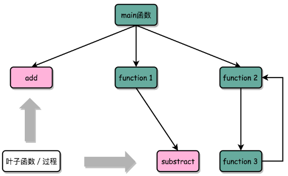

## 链接

当要运行的程序由多个源文件组成时，各自执行gcc和objdump后，程序也无法运行。因为各自的程序地址都是从0开始的，此时如果程序执行call指令调用函数，则不能找到跳转到哪个文件中。

两个以o为后缀的文件并不是一个可执行文件，而是目标文件（Object File）。只有通过链接器（Linker）把多个目标文件以及调用的各种函数库链接起来，我们才能得到一个可执行文件。通过 gcc 的 -o 参数，可以生成对应的可执行文件：

~~~
$ gcc -o link-example add_lib.o link_example.o
$ ./link_example
c = 15
~~~

实际上从汇编到机器码这个过程，可以细分为下面的阶段：

第一个部分由编译（Compile）、汇编（Assemble）以及链接（Link）三个阶段组成。在这三个阶段完成之后，我们就生成了一个可执行文件。

第二部分，我们通过装载器（Loader）把可执行文件装载（Load）到内存中。CPU 从内存中读取指令和数据，来开始真正执行程序。

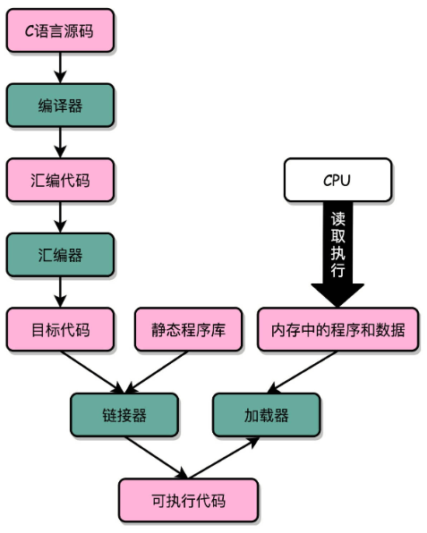

链接完之后生成的可执行文件也并不是一条条的指令，可以通过objdump 指令查看可执行文件的内容。

~~~
link_example:     file format elf64-x86-64
Disassembly of section .init:
...
Disassembly of section .plt:
...
Disassembly of section .plt.got:
...
Disassembly of section .text:
...
 
 6b0:   55                      push   rbp
 6b1:   48 89 e5                mov    rbp,rsp
 6b4:   89 7d fc                mov    DWORD PTR [rbp-0x4],edi
 6b7:   89 75 f8                mov    DWORD PTR [rbp-0x8],esi
 6ba:   8b 55 fc                mov    edx,DWORD PTR [rbp-0x4]
 6bd:   8b 45 f8                mov    eax,DWORD PTR [rbp-0x8]
 6c0:   01 d0                   add    eax,edx
 6c2:   5d                      pop    rbp
 6c3:   c3                      ret    
00000000000006c4 <main>:
 6c4:   55                      push   rbp
 6c5:   48 89 e5                mov    rbp,rsp
 6c8:   48 83 ec 10             sub    rsp,0x10
 6cc:   c7 45 fc 0a 00 00 00    mov    DWORD PTR [rbp-0x4],0xa
 6d3:   c7 45 f8 05 00 00 00    mov    DWORD PTR [rbp-0x8],0x5
 6da:   8b 55 f8                mov    edx,DWORD PTR [rbp-0x8]
 6dd:   8b 45 fc                mov    eax,DWORD PTR [rbp-0x4]
 6e0:   89 d6                   mov    esi,edx
 6e2:   89 c7                   mov    edi,eax
 6e4:   b8 00 00 00 00          mov    eax,0x0
 6e9:   e8 c2 ff ff ff          call   6b0 <add>
 6ee:   89 45 f4                mov    DWORD PTR [rbp-0xc],eax
 6f1:   8b 45 f4                mov    eax,DWORD PTR [rbp-0xc]
 6f4:   89 c6                   mov    esi,eax
 6f6:   48 8d 3d 97 00 00 00    lea    rdi,[rip+0x97]        # 794 <_IO_stdin_used+0x4>
 6fd:   b8 00 00 00 00          mov    eax,0x0
 702:   e8 59 fe ff ff          call   560 <printf@plt>
 707:   b8 00 00 00 00          mov    eax,0x0
 70c:   c9                      leave  
 70d:   c3                      ret    
 70e:   66 90                   xchg   ax,ax
...
Disassembly of section .fini:
...
~~~

在 Linux 下，可执行文件和目标文件所使用的都是一种叫ELF（Execuatable and Linkable File Format）的文件格式，中文名字叫可执行与可链接文件格式，这里面不仅存放了编译成的汇编指令，还保留了很多别的数据。

在ELF文件中，函数名称、变量等都存放在符号表（Symbols Table） 中，而且函数调用的地址也变得准确了。ELF 文件格式把各种信息，分成一个一个的 Section 保存起来。ELF 有一个基本的文件头（File Header），用来表示这个文件的基本属性，比如是否是可执行文件，对应的 CPU、操作系统等等。除了这些基本属性之外，大部分程序还有这么一些 Section： 

* 首先是.text Section，也叫作代码段或者指令段（Code Section），用来保存程序的代码和指令；
* 接着是.data Section，也叫作数据段（Data Section），用来保存程序里面设置好的初始化数据信息；
* 然后就是.rel.text Secion，叫作重定位表（Relocation Table）。重定位表里，保留的是当前的文件里面，哪些跳转地址其实是我们不知道的。比如上面的 link_example.o 里面，我们在 main 函数里面调用了 add 和 printf 这两个函数，但是在链接发生之前，我们并不知道该跳转到哪里，这些信息就会存储在重定位表里；
* 最后是.symtab Section，叫作符号表（Symbol Table）。符号表保留了我们所说的当前文件里面定义的函数名称和对应地址的地址簿。

链接器会扫描所有输入的目标文件，然后把所有符号表里的信息收集起来，构成一个全局的符号表。然后再根据重定位表，把所有不确定要跳转地址的代码，根据符号表里面存储的地址，进行一次修正。最后，把所有的目标文件的对应段进行一次合并，变成了最终的可执行代码。这也是为什么，可执行文件里面的函数调用的地址都是正确的。

在链接器把程序变成可执行文件之后，要装载器去执行程序就容易多了。装载器不再需要考虑地址跳转的问题，只需要解析 ELF 文件，把对应的指令和数据，加载到内存里面供 CPU 执行就可以了。 

之所以同一套硬件CPU，不同的操作系统下，相同的程序能在Linux下执行，但不能在Windows执行的原因就是两个操作系统下可执行文件的格式不同。Linux 下的是 ELF 文件格式，而 Windows 的可执行文件格式是一种叫作PE（Portable Executable Format）的文件格式。Linux 下的装载器只能解析 ELF 格式而不能解析 PE 格式。 

## 装载

装载器需要满足两个要求：

* 可执行程序加载后占用的内存空间应该是连续的
* 我们需要同时加载很多个程序，这意味着如果程序的逻辑地址如果完全等同于物理地址，则同时装载入内存的就只有一个程序

为了满足这两个要求，内存进行了一个映射的过程，我们把指令里用到的内存地址叫作虚拟内存地址（Virtual Memory Address），实际在内存硬件里面的空间地址，我们叫物理内存地址（Physical Memory Address）

通过维护一个虚拟内存到物理内存的映射表，这样实际程序指令执行的时候，会通过虚拟内存地址，找到对应的物理内存地址，然后执行 

实现装载的具体机制：内存分页+页面置换

## 动态链接

如果每次链接时，都需要把全部程序都装载到内存，那开销就太大了，因为有很大一部分程序是程序共用的。为了解决内存空间不够用的问题，采用了动态链接（Dynamic Link） 的方法，在动态链接的过程中，我们想要“链接”的，不是存储在硬盘上的目标文件代码，而是加载到内存中的共享库（Shared Libraries）

这个加载到内存中的共享库会被很多个程序的指令调用到。在 Windows 下，这些共享库文件就是.dll 文件，也就是 Dynamic-Link Libary（DLL，动态链接库）。在 Linux 下，这些共享库文件就是.so 文件，也就是 Shared Object（一般我们也称之为动态链接库） ：

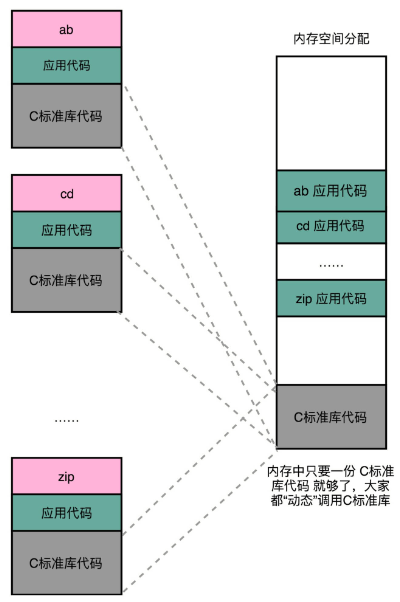

多个程序链接这些共享库文件的前提是：机器码必须是地址无关的。为了解决这个问题，动态代码库内部的变量和函数调用都使用的是相对地址（Relative Address） ，整个共享库是放在一段连续的虚拟内存地址中的，无论装载到哪一段地址，不同指令之间的相对地址都是不变的。 

下面以实际案例观察动态链接的过程：

首先，lib.h 定义了动态链接库的一个函数 show_me_the_money ：

~~~c
// lib.h
#ifndef LIB_H
#define LIB_H
 
void show_me_the_money(int money);
 
#endif
~~~

lib.c 包含了 lib.h 的实际实现：

~~~c
// lib.c
#include <stdio.h>
 
 
void show_me_the_money(int money)
{
    printf("Show me USD %d from lib.c \n", money);
}
~~~

然后，show_me_poor.c 调用了 lib 里面的函数：

~~~c
// show_me_poor.c
#include "lib.h"
int main()
{
    int money = 5;
    show_me_the_money(money);
}
~~~

最后，我们把 lib.c 编译成了一个动态链接库，也就是 .so 文件：

~~~bash
$ gcc lib.c -fPIC -shared -o lib.so
$ gcc -o show_me_poor show_me_poor.c ./lib.so
~~~

可以看到，在编译的过程中，我们指定了一个 -fPIC 的参数。这个参数其实就是 Position Independent Code 的意思，也就是我们要把这个编译成一个地址无关代码。然后，我们再通过 gcc 编译 show_me_poor 动态链接了 lib.so 的可执行文件。在这些操作都完成了之后，我们把 show_me_poor 这个文件通过 objdump 出来看一下：

~~~bash
$ objdump -d -M intel -S show_me_poor
~~~

~~~
……
0000000000400540 <show_me_the_money@plt-0x10>:
  400540:       ff 35 12 05 20 00       push   QWORD PTR [rip+0x200512]        # 600a58 <_GLOBAL_OFFSET_TABLE_+0x8>
  400546:       ff 25 14 05 20 00       jmp    QWORD PTR [rip+0x200514]        # 600a60 <_GLOBAL_OFFSET_TABLE_+0x10>
  40054c:       0f 1f 40 00             nop    DWORD PTR [rax+0x0]
 
0000000000400550 <show_me_the_money@plt>:
  400550:       ff 25 12 05 20 00       jmp    QWORD PTR [rip+0x200512]        # 600a68 <_GLOBAL_OFFSET_TABLE_+0x18>
  400556:       68 00 00 00 00          push   0x0
  40055b:       e9 e0 ff ff ff          jmp    400540 <_init+0x28>
……
0000000000400676 <main>:
  400676:       55                      push   rbp
  400677:       48 89 e5                mov    rbp,rsp
  40067a:       48 83 ec 10             sub    rsp,0x10
  40067e:       c7 45 fc 05 00 00 00    mov    DWORD PTR [rbp-0x4],0x5
  400685:       8b 45 fc                mov    eax,DWORD PTR [rbp-0x4]
  400688:       89 c7                   mov    edi,eax
  40068a:       e8 c1 fe ff ff          call   400550 <show_me_the_money@plt>
  40068f:       c9                      leave  
  400690:       c3                      ret    
  400691:       66 2e 0f 1f 84 00 00    nop    WORD PTR cs:[rax+rax*1+0x0]
  400698:       00 00 00 
  40069b:       0f 1f 44 00 00          nop    DWORD PTR [rax+rax*1+0x0]
……
~~~

可以看到，在 main 函数调用 show_me_the_money 的函数的时候，对应的代码是这样的：

~~~
call   400550 <show_me_the_money@plt>
~~~

这里后面有一个 @plt 的关键字，代表了我们需要从 PLT，也就是程序链接表（Procedure Link Table）里面找要调用的函数。对应的地址呢，则是 400550 这个地址。在400550这个地址中，看到里面进行了一次跳转，这个跳转指定的跳转地址，你可以在后面的注释里面可以看到，GLOBAL_OFFSET_TABLE+0x18。这里的 GLOBAL_OFFSET_TABLE就是全局偏移表：

~~~
 400550:       ff 25 12 05 20 00       jmp    QWORD PTR [rip+0x200512]        # 600a68 <_GLOBAL_OFFSET_TABLE_+0x18>
~~~

在共享库的 data section 里面，保存了一张全局偏移表（GOT，Global Offset Table）。虽然共享库的代码部分的物理内存是共享的，但是数据部分是各个动态链接它的应用程序里面各加载一份的。所有需要引用当前共享库外部的地址的指令，都会查询 GOT，来找到当前运行程序的虚拟内存里的对应位置。而 GOT 表里的数据，则是在我们加载一个个共享库的时候写进去的。 

不同的进程，调用同样的 lib.so，各自 GOT 里面指向最终加载的动态链接库里面的虚拟内存地址是不同的。 它有点类似于指针的解决方案：

实际上，在进行 Linux 下的程序开发的时候，我们一直会用到各种各样的动态链接库。C 语言的标准库就在 1MB 以上。我们撰写任何一个程序可能都需要用到这个库，常见的 Linux 服务器里，/usr/bin 下面就有上千个可执行文件。 使用动态链接能大大降低内存占用

# 运算

## 二进制与原码

二进制的特点就是逢2进1，它只能由0和1组成。

二进制数到十进制数的转换：从右到左的第 N 位，乘上一个 2 的 N 次方，然后加起来，就变成了一个十进制数 ：

例如  0011  =  1乘2的1次方+1乘2的0次方 = 3

十进制数到二进制数的转换：使用短除法，除积倒取余

例如对13这个十进制数：

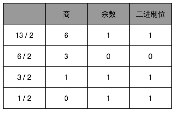

因此，对应的二进制数，就是 1101

为了表示负数，可以以二进制数的最左侧第一位为符号位，1代表负数，0代表正数，例如0011代表-3，这就是原码表示法。原码表示法有一个很直观的缺点就是，0 可以用两个不同的编码来表示，1000 代表 0， 0000 也代表 0 

为了解决这个问题，引入了补码的概念，仍然通过最左侧第一位的 0 和 1，来判断这个数的正负。但是，我们不再把这一位当成单独的符号位，而是它只决定这一位的正负，例如一个二进制补码1011转换为十进制就是-1乘2的3次方+0+1乘2的1次方+1乘2的0次方。如果最高位是 1，这个数必然是负数；最高位是 0，必然是正数。并且，只有 0000 表示 0，1000 在这样的情况下表示 -8 。一个 4 位的二进制数，可以表示从 -8 到 7 这 16 个整数，不会白白浪费一位 

此外，补码表示负数可以让整数相加变得容易，不需要做任何特殊处理，只是把它当成普通的二进制相加，就能得到正确的结果，例如下面的-5 + 1 = -4，-5 + 6 = 1 ，带负数的二进制加法和无符号的二进制整数的加法用的是同样的计算方式 ：

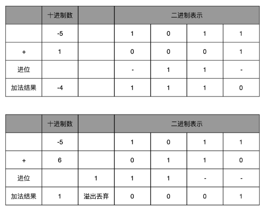

## 编码

不仅数值可以用二进制表示，字符乃至更多的信息都能用二进制表示 。

最早的时候，计算机只需要使用英文字符，加上数字和一些特殊符号，然后用 8 位的二进制，就能表示我们日常需要的所有字符了，这个就是我们常常说的ASCII 码（American Standard Code for Information Interchange，美国信息交换标准代码）：

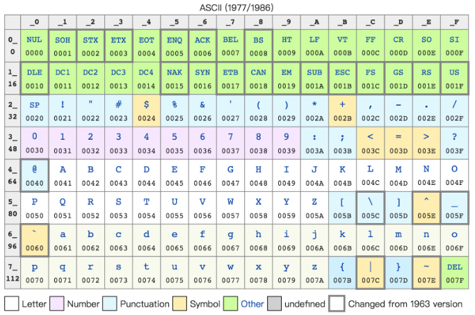

在 ASCII 码里面，数字 9 不再像整数表示法里一样，用 0000 1001 来表示，而是用 0011 1001 来表示。字符串 15 也不是用 0000 1111 这 8 位来表示，而是变成两个字符 1 和 5 连续放在一起，也就是 0011 0001 和 0011 0101，需要用两个 8 位来表示。

我们可以看到，最大的 32 位整数，就是 2147483647。如果用整数表示法，只需要 32 位就能表示了。但是如果用字符串来表示，一共有 10 个字符，每个字符用 8 位的话，需要整整 80 位。比起整数表示法，要多占很多空间。这也是为什么，很多时候我们在存储数据的时候，要采用二进制序列化这样的方式，而不是简单地把数据通过 CSV 或者 JSON，这样的文本格式存储来进行序列化。不管是整数也好，浮点数也好，采用二进制序列化会比存储文本省下不少空间。

当128个字符不够用了之后，各种字符集（Charset） 和字符编码（Character Encoding） 就陆续被定义了出来。字符集，表示的可以是字符的一个集合；而字符编码则是对于字符集里的这些字符，怎么一一用二进制表示出来的一个字典，例如Unicode字符集可以用 UTF-8、UTF-16，乃至 UTF-32 来进行编码：

同样的文本，采用不同的编码存储下来。如果另外一个程序，用一种不同的编码方式来进行解码和展示，就会出现乱码 

## 加法和乘法

继电器（Relay）的示意图：

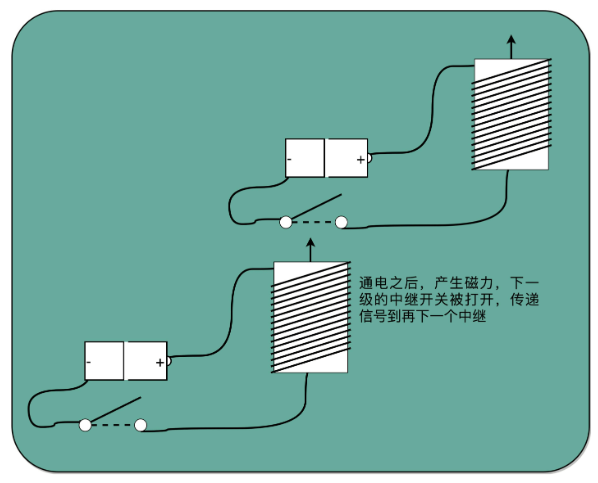

它可以不断地通过新的电源重新放大已经开始衰减的原有信号 

8 位加法器可以由 8 个全加器串联而成 ：

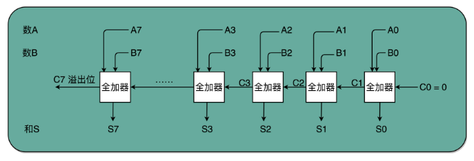

如果手算二进制乘法的话，逻辑应该是这样的：

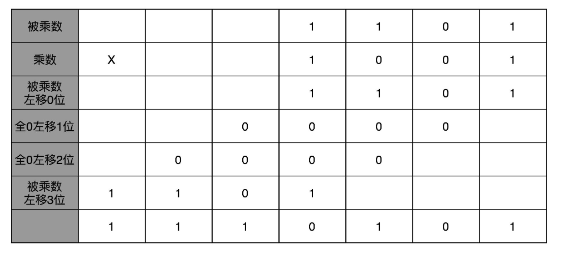

用之前实现的加法器组合就能实现乘法器，因为二进制一个位置的乘数只能是0或者1，所以实际的乘法，就退化成了位移和加法。 为了节约晶体管的数量，可以始终用一个数来保存结果，然后在循环中来对乘法结果进行累加，仅仅需要简单的加法器、一个可以左移一位的电路和一个右移一位的电路，就能完成整个乘法：

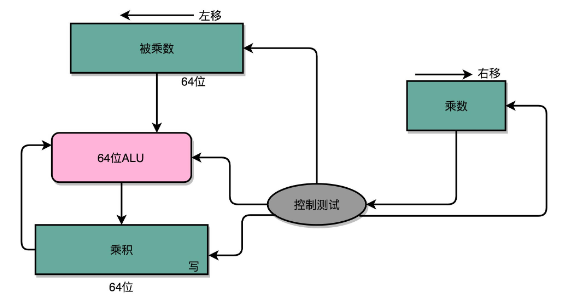

这里的控制测试，其实就是通过一个时钟信号，来控制左移、右移以及重新计算乘法和加法的时机。 如果用这一套算法来执行13×9，也就是二进制的 1101×1001 ，经历的步骤就是这样的：

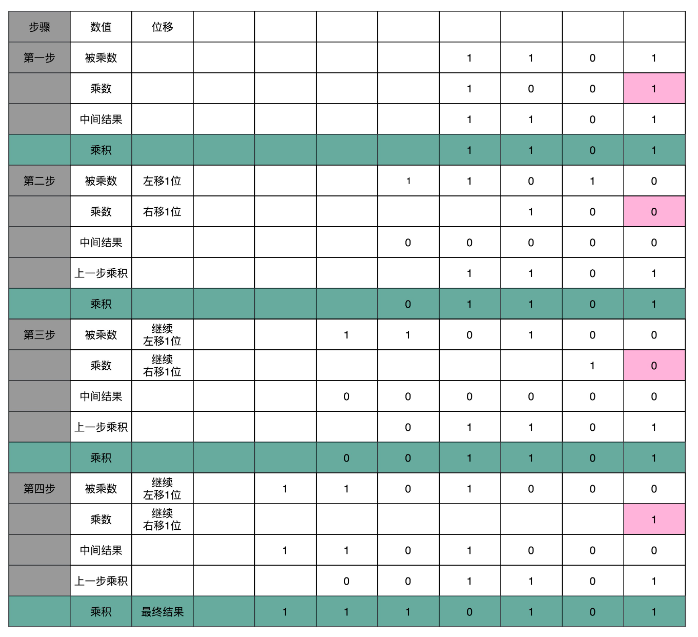

这个计算方式虽然节约电路了，但是也有一个很大的缺点，那就是慢，在这个乘法器的实现过程里，我们其实就是把乘法展开，变成了“加法 + 位移”来实现。我们用的是 4 位数，所以要进行 4 组“位移 + 加法”的操作。而且这 4 组操作还不能同时进行。因为下一组的加法要依赖上一组的加法后的计算结果，下一组的位移也要依赖上一组的位移的结果。这样，整个算法是“顺序”的，每一组加法或者位移的运算都需要一定的时间。

性能损耗主要由两部分构成：

* 门延迟（Gate Delay） ：例如全加器在运算的时候，总是要等待上一个全加器把对应的进入输入结果算出来，才能算下一位的输出，这个等待的时间就是门延迟。一层门电路延迟被称为T，一个全加器，其实就已经有了 3T 的延迟（进位需要经过 3 个门电路）。而 4 位整数，最高位的计算需要等待前面三个全加器的进位结果，也就是要等 9T 的延迟。如果是 64 位整数，那就要变成 63×3=189T 的延迟 
* 时钟频率：计算的中间结果需要保存在寄存器里面，然后等待下一个时钟周期的到来，控制测试信号才能进行下一次移位和加法，它的损耗比门延迟更大

为了提升乘法计算的速度，可以采用并行加速的策略，让高位不需要等待低位的进位结果，而是把低位的所有输入信号都放进来，直接计算出高位的计算结果和进位结果呢。具体来说，就是把进位部分的电路完全展开为基础的门电路，借助电路的天然并行来将一个输入信号传播到所有接通的线路中：

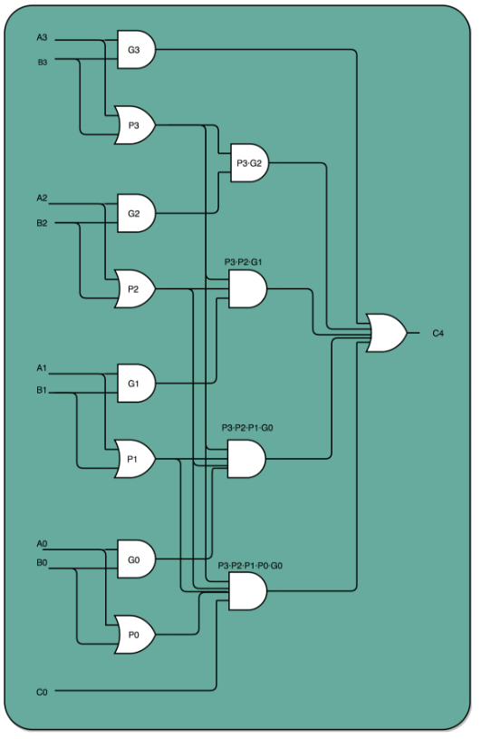

如果一个 4 位整数最高位是否进位，展开门电路图，你会发现，我们只需要 3T 的延迟就可以拿到是否进位的计算结果。而对于 64 位的整数，也不会增加门延迟，只是从上往下复制这个电路，接入更多的信号而已。

这个优化，本质上是利用了电路天然的并行性。电路只要接通，输入的信号自动传播到了所有接通的线路里面，这其实也是硬件和软件最大的不同。

使用优化后的算法，运行速度提升了，但需要更多的晶体管，更复杂的电路。而使用简单的电路，需要更长的门延迟和时钟周期。这其中的权衡，其实就是计算机体系结构中 RISC 和 CISC 的经典历史路线之争 （两种CPU指令集类型）：

* CISC：复杂指令集计算机，每个指令可执行若干低阶操作，指令集的复杂性让CPU和控制单元的电路非常复杂，例如X86
* RISC：精简指令集计算机，它由可以在单个CPU周期内完成的简单指令组成，CPU设计简单，将复杂性交给编译器，例如ARM

## 浮点数和定点数

### 定点数表示

定点数是一种简单的表示小数的方法，定点的意思是小数点的位置是固定的。如果用 4 个比特来表示 0～9 的整数，那么 32 个比特就可以表示 8 个这样的整数。然后我们把最右边的 2 个 0～9 的整数，当成小数部分；把左边 6 个 0～9 的整数，当成整数部分。这样，我们就可以用 32 个比特，来表示从 0 到 999999.99 这样 1 亿个实数了。 

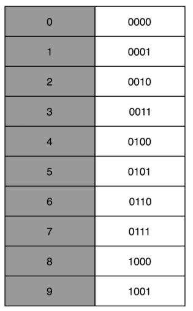

这种用二进制来表示十进制的编码方式，叫作BCD 编码（Binary-Coded Decimal），它的运用非常广泛，最常用的是在超市、银行这样需要用小数记录金额的情况里。

这种表示方式的缺点：

1、表示的效率不高，有点浪费，本来 32 个比特我们可以表示 40 亿个不同的数，但是在 BCD 编码下，只能表示 1 亿个数，如果我们要精确到分的话，那么能够表示的最大金额也就是到 100 万。 

2、这样的表示方式没办法同时表示很大的数字和很小的数字，如果有时想表示9.99这样小的数字，又想表示光速这种很大的数字就行不通了

解决办法就是采用浮点数表示法

### 浮点数表示

浮点数（Floating Point），也就是float 类型，它借鉴了科学计数法。

浮点数的科学计数法的表示，有一个IEEE的标准，它定义了两个基本的格式。一个是用 32 比特表示单精度的浮点数，也就是我们常常说的 float 或者 float32 类型。另外一个是用 64 比特表示双精度的浮点数，也就是我们平时说的 double 或者 float64 类型。

单精度的 32 个比特可以分成三部分 ：

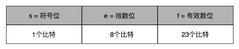

1、第一部分是一个符号位，用来表示是正数还是负数。我们一般用s来表示。在浮点数里，我们不像正数分符号数还是无符号数，所有的浮点数都是有符号的。

2、接下来是一个 8 个比特组成的指数位。我们一般用e来表示。8 个比特能够表示的整数空间，就是 0～255。我们在这里用 1～254 映射到 -126～127 这 254 个有正有负的数上。0和255另外表示其他含义

3、有效数位用f表示，综合科学计数法，我们的浮点数就可以表示成下面这样： 
$$
(-1)^S * 1.f * 2^e
$$
要表示 0 和一些特殊的数，我们就要用上在 e 里面留下的 0 和 255 这两个表示，这两个表示其实是两个标记位。在 e 为 0 且 f 为 0 的时候，我们就把这个浮点数认为是 0。至于其它的 e 是 0 或者 255 的特殊情况，下面这个表格可以看到，分别可以表示出无穷大、无穷小、NAN 以及一个特殊的不规范数 ：

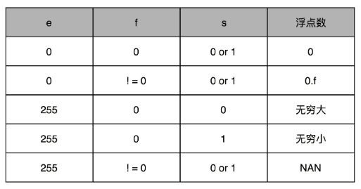

在这种表示方法下，浮点数能够表示的数据范围一下子大了很多，这种小数点的位置是浮动的表示方法，它才被称为浮点数，随着指数位 e 的值的不同，小数点的位置也在变动

浮点数在计算上有不精确性，例如0.3+0.6可能会得到0.8999999这样的数字，这是因为浮点数没有办法精确表示 0.3、0.6 和 0.9。像0.5这样的数字，浮点数就可以精确表达

### 浮点数的二进制转化

如果要把浮点数9.1转化为二进制，分为几步：

* 将整数部分转化为二进制数，9转化为1001

* 将小数部分转化为二进制数。对于0.1001 这样一个二进制小数来举例说明。和上面的整数相反，我们把小数点后的每一位，都表示对应的 2 的 -N 次方。那么 0.1001，转化成十进制就是： 
  $$
  1 * 2^{-1} + 0 * 2^{-2} + 0 * 2^{-3} + 1 * 2^{-4} = 0.5625
  $$
  和整数的二进制表示采用“除以 2，然后看余数”的方式相比，小数部分转换成二进制是用一个相似的反方向操作，就是乘以 2，然后看看是否超过 1。如果超过 1，我们就记下 1，并把结果减去 1，进一步循环操作。在这里，我们就会看到，0.1 其实变成了一个无限循环的二进制小数，0.000110011。这里的“0011”会无限循环下去：

  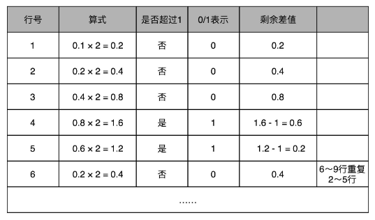

* 把整数部分和小数部分拼接在一起，9.1 这个十进制数就变成了 1001.000110011…这样一个二进制表示 

* 将1001.000110011…转化为二进制的科学计数法表示，小数点左移三位，这个数就变成了：
  $$
  1.001000110011 * 2^3
  $$

对应三个部分：

* 符号位s是0
* f最长是23位，所以f是00100011001100110011 001，采取截断的方法应对无限循环小数
* 指数位是3，因为指数位有正又有负，所以指数位在 127 之前代表负数，之后代表正数，那 3 其实对应的是加上 127 的偏移量 130，转化成二进制，就是 130，对应的就是指数位的二进制，表示出来就是 10000010

最终的9.1的二进制表示：

如果再把这个浮点数表示换算成十进制， 实际准确的值是 9.09999942779541015625 

因为有效位数的截断处理，所以在表示和计算的时候存在精度问题

### 浮点数的精度损失

当浮点数相加时，会先将两个数的指数位变成一样的，然后计算有效位的加法

在这个算法中，其中指数位较小的数，需要在有效位进行右移，在右移的过程中，最右侧的有效位就被丢弃掉了。这会导致对应的指数位较小的数，在加法发生之前，就丢失精度。两个相加数的指数位差的越大，位移的位数越大，可能丢失的精度也就越大（当右移丢失的有效位都是 0。这种情况下，对应的加法虽然丢失了需要加的数字的精度，但是因为对应的值都是 0，实际的加法的数值结果不会有精度损失 ）

但是在实际计算的时候，只要两个数，差出 2的24次方，也就是差不多 1600 万倍，那这两个数相加之后，结果完全不会变化 。

下面这个程序就显示了，循环相加2000 万个 1.0f，最终的结果会是 1600 万左右，而不是 2000 万。这是因为，加到 1600 万之后的加法因为精度丢失都没有了。 

~~~c
public class FloatPrecision {
  public static void main(String[] args) {
    float sum = 0.0f;
    for (int i = 0; i < 20000000; i++) {
    	float x = 1.0f;
    	sum += x;    	
    }
    System.out.println("sum is " + sum);   
  }	
}
~~~

存在一种Kahan Summation的算法来解决这个问题，这个算法的原理其实并不复杂，就是在每次的计算过程中，都用一次减法，把当前加法计算中损失的精度记录下来，然后在后面的循环中，把这个精度损失放在要加的小数上，再做一次运算：

~~~c
public class KahanSummation {
  public static void main(String[] args) {
    float sum = 0.0f;
    float c = 0.0f;
    for (int i = 0; i < 20000000; i++) {
    	float x = 1.0f;
    	float y = x - c;
    	float t = sum + y;
    	c = (t-sum)-y;
    	sum = t;    	
    }
    System.out.println("sum is " + sum);   
  }	
}
~~~
# CPU

## 建立数据通路

前面讲过了指令和计算两个专题，一个完整的CPU就包含这两大功能

### 指令周期

计算机每执行一条指令的过程，可以分解成这样几个步骤：

1.Fetch（取得指令），也就是从 PC 寄存器里找到对应的指令地址，根据指令地址从内存里把具体的指令，加载到指令寄存器中，然后把 PC 寄存器自增，好在未来执行下一条指令。

2.Decode（指令译码），也就是根据指令寄存器里面的指令，解析成要进行什么样的操作，是 R、I、J 中的哪一种指令，具体要操作哪些寄存器、数据或者内存地址。

3.Execute（执行指令），也就是实际运行对应的 R、I、J 这些特定的指令，进行算术逻辑操作、数据传输或者直接的地址跳转。

4.重复进行 1～3 的步骤。

这样的步骤，其实就是一个永不停歇的“Fetch - Decode - Execute”的循环，我们把这个循环称之为指令周期（Instruction Cycle）：

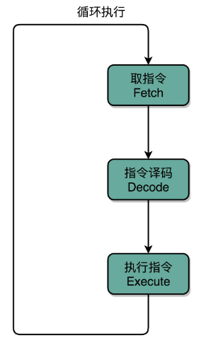

在这个循环过程中，不同部分其实是由计算机中的不同组件完成的 ：

1、指令是放在存储器中的

2、控制器（Control Unit） 来控制，通过 PC 寄存器和指令寄存器取出指令。控制器还完成了指令的解码，一些简单跳转指令的执行

3、指令的执行是由算术逻辑单元（ALU）操作的，也就是由运算器处理的

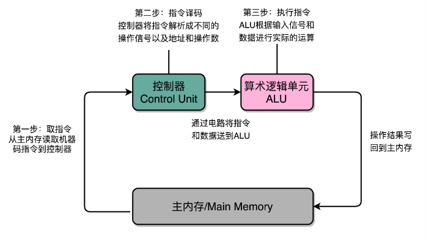

控制器是其中的核心，它通过解码不同的指令，产生各种输出控制信号，这些控制信号，告诉 ALU 去做不同的计算。可以说正是控制器的存在，让我们可以“编程”来实现功能：

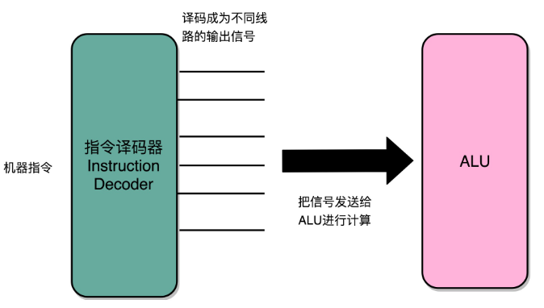

除了 Instruction Cycle 这个指令周期，在 CPU 里面我们还会提到另外两个常见的 Cycle ：

* Machine Cycle，机器周期或者CPU 周期，CPU 内部的操作速度很快，但是访问内存的速度却要慢很多。每一条指令都需要从内存里面加载而来，所以我们一般把从内存里面读取一条指令的最短时间，称为 CPU 周期 

* Clock Cycle，也就是时钟周期，它就是机器的主频。

  一个 CPU 周期，通常会由几个时钟周期累积起来。一个 CPU 周期的时间，就是这几个 Clock Cycle 的总和 

  对于一个指令周期来说，我们取出一条指令，然后执行它，至少需要两个 CPU 周期，复杂的指令则需要更多的 CPU 周期 

三个周期（Cycle）之间的关系 ：一个指令周期，包含多个 CPU 周期，而一个 CPU 周期包含多个时钟周期 

### 数据通路

数据通路就是处理器单元，它由两类原件组成：

* 第一类叫操作元件，也叫组合逻辑元件（Combinational Element），其实就是ALU，它们的功能就是在特定的输入下，根据下面的组合电路的逻辑，生成特定的输出 
* 第二类叫存储元件，也有叫状态元件（State Element）的。比如我们在计算过程中需要用到的寄存器，无论是通用寄存器还是状态寄存器，其实都是存储元件 

我们通过数据总线的方式，把它们连接起来，就可以完成数据的存储、处理和传输了，这就是所谓的建立数据通路

要想搭建出来整个 CPU，我们需要在数字电路层面，实现这样一些功能，需要这些硬件电路：

1、ALU：它是一个没有状态的，根据输入计算输出结果的一个电路。就像加法器一样，只需要给定输入，就能得到固定的输出，这就是组合逻辑电路（Combinational Logic Circuit）

2、需要有一个能够进行状态读写的电路元件，也就是我们的寄存器。这个电路能存储上一次的计算结果，可以在需要的时候取出。常见的能够进行状态读写的电路，就有锁存器（Latch），以及 D 触发器（Data/Delay Flip-flop）的电路 

3、需要有一个自动的电路，按照固定的周期，不停地实现 PC 寄存器自增，自动地去执行“Fetch - Decode - Execute“的步骤 

4、需要一个解码不同指令的电路，这就是译码器的电路

第一种对应组合逻辑电路，后几种就需要时序逻辑电路（Sequential Logic Circuit），它能解决以下问题：自动运行、存储、时序协调（按顺序发生）

### 时钟信号

CPU 的主频是由一个晶体振荡器来实现的，而这个晶体振荡器生成的电路信号，就是我们的时钟信号 。

它其实就是一个振荡器。利用磁性线圈，让电路不断地在开启、关闭这两个状态中切换：

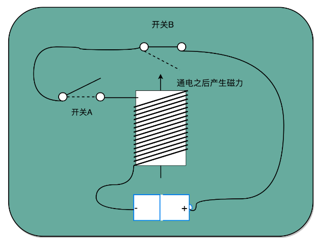

这个不断切换的过程，对于下游电路来说，就是不断地产生新的 0 和 1 这样的信号，这种按照固定的周期不断在 0 和 1 之间切换的信号，就是我们的时钟信号（Clock Signal）：

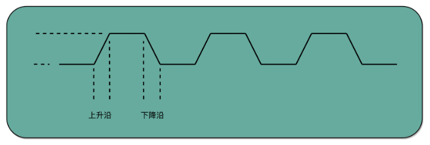

这种电路，其实就相当于把电路的输出信号作为输入信号，再回到当前电路。这样的电路构造方式呢，我们叫作反馈电路（Feedback Circuit）。

反馈电路一般可以用下面这个示意图来表示，其实就是一个输出结果接回输入的反相器（Inverter），也就是我们之前讲过的非门：

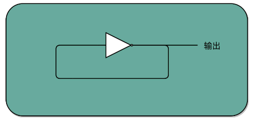

### D型触发器

有了时钟信号，我们的系统里就有了一个像“自动门”一样的开关。利用这个开关和相同的反馈电路，我们就可以构造出一个有“记忆”功能的电路。这个有记忆功能的电路，可以实现在 CPU 中用来存储计算结果的寄存器，也可以用来实现计算机五大组成部分之一的存储器。 

RS触发器电路，它由两个或非门电路组成 ：

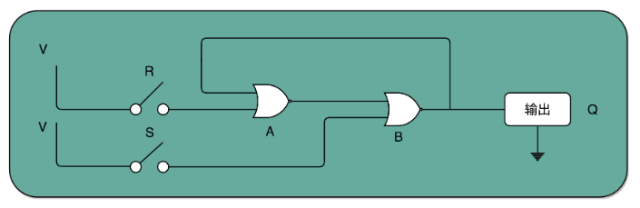

这样一个电路，我们称之为触发器（Flip-Flop）。接通开关 R，输出变为 1，即使断开开关，输出还是 1 不变。接通开关 S，输出变为 0，即使断开开关，输出也还是 0。也就是，当两个开关都断开的时候，最终的输出结果，取决于之前动作的输出结果，这个也就是我们说的记忆功能。

这个电路是最简单的 RS 触发器，也就是所谓的复位置位触发器（Reset-Set Flip Flop) 。对应的输出结果的真值表，你可以看下面这个表格。可以看到，当两个开关都是 0 的时候，对应的输出不是 1 或者 0，而是和 Q 的上一个状态一致 ：

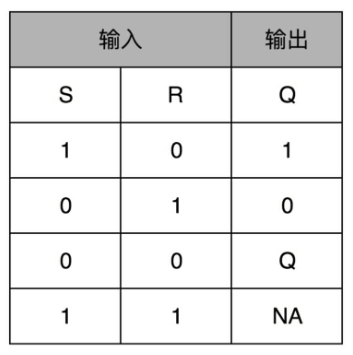

再往这个电路里加两个与门和一个小小的时钟信号，我们就可以实现一个利用时钟信号来操作一个电路了。这个电路可以帮我们实现什么时候可以往 Q 里写入数据。 下面这个电路，在上面的 R-S 触发器基础之上，在 R 和 S 开关之后，加入了两个与门，同时给这两个与门加入了一个时钟信号 CLK作为电路输入。当时钟信号 CLK 在低电平的时候 ，它不起存储作用；当时钟信号 CLK 在高电平的时候，它会有记忆功能。

但是这个电路有一个弊端，那就是输入是三个而不是两个，我们可以把复位和置位当做一对相反数，因为其余的情况可以认为不是有效的输入，此时我们可以用一个数字来表示复位和置位，通过一个数据信号 D 进行 Q 的写入操作 ：

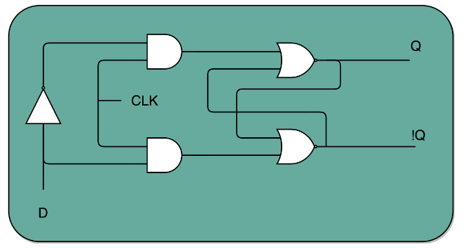

这就是D 型触发器，或者叫D型锁存器

### PC寄存器

常说的 PC 寄存器，还有个名字叫程序计数器 。

有了时钟信号，我们可以提供定时的输入；有了 D 型触发器，我们可以在时钟信号控制的时间点写入数据。我们把这两个功能组合起来，就可以实现一个自动的计数器了 ：

加法器的两个输入，一个始终设置成 1，另外一个来自于一个 D 型触发器 A。我们把加法器的输出结果，写到这个 D 型触发器 A 里面。于是，D 型触发器里面的数据就会在固定的时钟信号为 1 的时候更新一次 

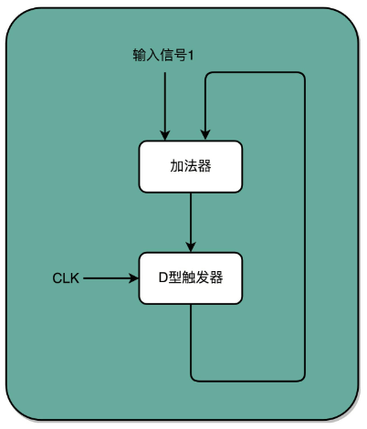

这样，我们就有了一个每过一个时钟周期，就能固定自增 1 的自动计数器了。这个自动计数器，可以拿来当我们的 PC 寄存器。事实上，PC 寄存器的这个 PC，英文就是 Program Counter，也就是程序计数器的意思。

后续命令的执行都要依赖时钟信号，来控制执行时间点和先后顺序的。

在最简单的情况下，我们需要让每一条指令，从程序计数，到获取指令、执行指令，都在一个时钟周期内完成。如果 PC 寄存器自增地太快，程序就会出错。因为前一次的运算结果还没有写回到对应的寄存器里面的时候，后面一条指令已经开始读取里面的数据来做下一次计算了。这个时候，如果我们的指令使用同样的寄存器，前一条指令的计算就会没有效果，计算结果就错了。

在这种设计下，我们需要在一个时钟周期里，确保执行完一条最复杂的 CPU 指令，也就是耗时最长的一条 CPU 指令。这样的 CPU 设计，我们称之为单指令周期处理器（Single Cycle Processor）。

这样的设计有些浪费，因为即便只调用一条非常简单的指令，我们也需要等待整个时钟周期的时间走完，才能执行下一条指令。 后续可以用流水线技术进行优化，减少需要等待的时间

### 译码器

把很多个 D 型触发器放在一起，就可以形成一块很大的存储空间 ，此时需要有一个电路，来完成“寻址”的工作。这个“寻址”电路，就是译码器 。

如果把“寻址”这件事情退化到最简单的情况，就是在两个地址中，去选择一个地址。这样的电路，我们叫作2-1 选择器。通过一个反相器、两个与门和一个或门，就可以实现一个 2-1 选择器。通过控制反相器的输入是 0 还是 1，能够决定对应的输出信号，是和地址 A，还是地址 B 的输入信号一致 ：

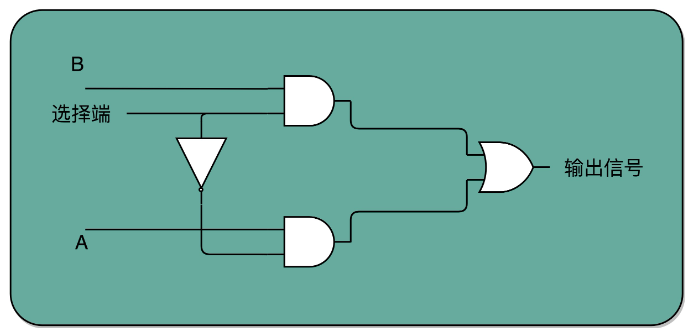

一个反向器只能有 0 和 1 这样两个状态，所以我们只能从两个地址中选择一个。如果输入的信号有三个不同的开关，我们就能从 2的3次方，也就是 8 个地址中选择一个了。这样的电路，我们就叫3-8 译码器。现代的计算机，如果 CPU 是 64 位的，就意味着我们的寻址空间也是 2的64次方，那么我们就需要一个有 64 个开关的译码器：

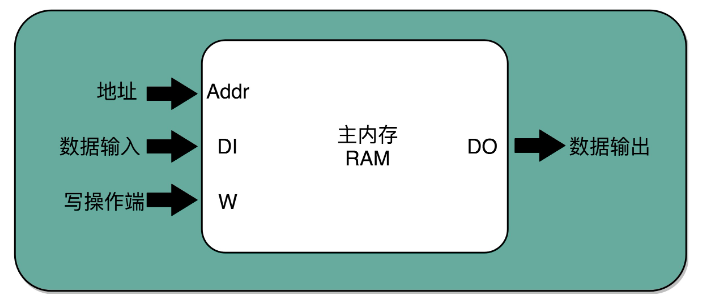

译码器的本质，就是从输入的多个位的信号中，根据一定的开关和电路组合，选择出自己想要的信号。除了能够进行“寻址”之外，我们还可以把对应的需要运行的指令码，同样通过译码器，找出我们期望执行的指令，也就是在之前我们讲到过的 opcode 

### 一个简单的CPU

有了上面这些元件，就能组成一个简单的CPU了：

1. 首先，我们有一个自动计数器。这个自动计数器会随着时钟主频不断地自增，来作为我们的 PC 寄存器。
2. 在这个自动计数器的后面，我们连上一个译码器。译码器还要同时连着我们通过大量的 D 触发器组成的内存。
3. 自动计数器会随着时钟主频不断自增，从译码器当中，找到对应的计数器所表示的内存地址，然后读取出里面的 CPU 指令。
4. 读取出来的 CPU 指令会通过我们的 CPU 时钟的控制，写入到一个由 D 触发器组成的寄存器，也就是指令寄存器当中。
5. 在指令寄存器后面，我们可以再跟一个译码器。这个译码器不再是用来寻址的了，而是把我们拿到的指令，解析成 opcode 和对应的操作数。
6. 当我们拿到对应的 opcode 和操作数，对应的输出线路就要连接 ALU，开始进行各种算术和逻辑运算。对应的计算结果，则会再写回到 D 触发器组成的寄存器或者内存当中。

## 流水线设计 

### 概述

之前说过一个观点：一个 CPU 的时钟周期可以认为是可以完成一条最简单的计算机指令的时间。其实这个观点是不正确的

一条 CPU 指令的执行，是由“取得指令（Fetch）- 指令译码（Decode）- 执行指令（Execute） ”这样三个步骤组成的。这个执行过程，至少需要花费一个时钟周期。因为在取指令的时候，我们需要通过时钟周期的信号，来决定计数器的自增 。

单指令周期处理器（Single Cycle Processor）：也就是在一个时钟周期内，处理器正好能处理一条指令，CPI 也就是 1（每条指令的平均时钟周期数） 。采用这样的设计，效率不高，因为时钟周期是固定的，但是指令的电路复杂程度是不同的，所以实际一条指令执行的时间是不同的。不同指令的执行时间不同，但是我们需要让所有指令都在一个时钟周期内完成，那就只好把时钟周期和执行时间最长的那个指令设成一样，这样快速执行完成的指令，需要等待满一个时钟周期，才能执行下一条指令：

在这个情况下，虽然 CPI 能够保持在 1，但是我们的时钟频率却没法太高。因为太高的话，有些复杂指令没有办法在一个时钟周期内运行完成。那么在下一个时钟周期到来，开始执行下一条指令的时候，前一条指令的执行结果可能还没有写入到寄存器里面。那下一条指令读取的数据就是不准确的，就会出现错误。 

为了解决这个问题，现在的CPU都采用了一种叫作指令流水线（Instruction Pipeline）的技术

CPU 的指令执行过程，其实也是由各个电路模块组成的，在执行完一个小步骤后，该模块可以接着执行另一个任务：

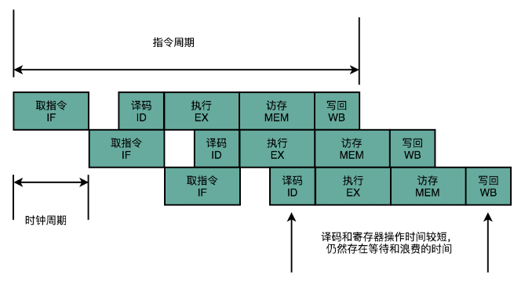

这样一来，我们就不用把时钟周期设置成整条指令执行的时间，而是拆分成完成这样的一个一个小步骤需要的时间。同时，每一个阶段的电路在完成对应的任务之后，也不需要等待整个指令执行完成，而是可以直接执行下一条指令的对应阶段。 

这样的协作模式，就是我们所说的指令流水线。这里面每一个独立的步骤，我们就称之为流水线阶段或者流水线级（Pipeline Stage）

如果我们把一个指令拆分成“取指令 - 指令译码 - 执行指令”这样三个部分，那这就是一个三级的流水线。如果我们进一步把“执行指令”拆分成“ALU 计算（指令执行）- 内存访问 - 数据写回”，那么它就会变成一个五级的流水线。

五级的流水线，就表示我们在同一个时钟周期里面，同时运行五条指令的不同阶段。这个时候，虽然执行一条指令的时钟周期变成了 5，但是我们可以把 CPU 的主频提得更高了。我们不需要确保最复杂的那条指令在时钟周期里面执行完成，而只要保障一个最复杂的流水线级的操作，在一个时钟周期内完成就好了。

如果某一个操作步骤的时间太长，我们就可以考虑把这个步骤，拆分成更多的步骤，让所有步骤需要执行的时间尽量都差不多长。这样，也就可以解决我们在单指令周期处理器中遇到的，性能瓶颈来自于最复杂的指令的问题。像我们现代的 ARM 或者 Intel 的 CPU，流水线级数都已经到了 14 级。

流水线设计不能减少单条指令的延时，但是通过同时在执行多条指令的不同阶段，我们提升了 CPU 的“吞吐率” ，在外部看来，CPU好像是同一个时间在执行多个指令一样，其实它是同时执行不同指令的不同阶段。

综上，一个 CPU 的时钟周期，可以认为是完成一条简单指令的时间 ，这句话是不对的，应该是一个CPU的时钟周期等于耗时最长的流水线级时间

### 超长流水线的性能瓶颈

增加流水线深度，其实是有性能成本的。

流水线设计本身就是有成本的：每一级流水线对应的输出，都要放到流水线寄存器（Pipeline Register）里面，然后在下一个时钟周期，交给下一个流水线级去处理。所以，每增加一级的流水线，就要多一级写入到流水线寄存器的操作。虽然流水线寄存器非常快，比如只有 20 皮秒 ：

如果不断加深流水线，这些操作占整个指令的执行时间的比例就会不断增加。最后，我们的性能瓶颈就会出现在这些 overhead 上。 （有点类似于线程管理本身的消耗），当流水线级数增加到一定程度，单纯地增加流水线级数，不仅不能提升性能，反而会有更多的 overhead 的开销。所以，设计合理的流水线级数也是现代 CPU 中非常重要的一点 

### 流水线设计解决不了的问题

流水线技术通过把一条指令的操作切分成更细的多个步骤，可以避免 CPU“浪费”。每一个细分的流水线步骤都很简单，所以我们的单个时钟周期的时间就可以设得更短。这也变相地让 CPU 的主频提升得很快。 

当流水线深度增加到一定程度后，由于每个 Stage 都需要有对应的 Pipeline 寄存器的开销，整体性能就不再提升了

此外，流水线设计也解决不了一些问题：

1、功耗问题

提升流水线深度，必须要和提升 CPU 主频同时进行。因为在单个 Pipeline Stage 能够执行的功能变简单了，也就意味着单个时钟周期内能够完成的事情变少了。 只有提升时钟周期，CPU 在指令的响应时间这个指标上才能保持和原来相同的性能。 

同时，由于流水线深度的增加，需要的电路数量变多了，使用的晶体管也就变多了。 

主频的提升和晶体管数量的增加都使得我们 CPU 的功耗变大了 

2、在一些场景无法做到性能提升

如果先后执行的代码是有相互依赖顺序的，那它们就不能在CPU流水线上并行执行，先后依赖关系会导致三条指令都串行执行，和单指令周期 CPU 所要花费的时间是一样的。这个依赖问题就是数据冒险问题，流水线越长，这个冒险的问题就越难一解决。

流水线带来的吞吐率提升，只是一个理想情况下的理论值。在实践的应用过程中，还需要解决指令之间的依赖问题。 

## 冒险与预测

流水线设计需要解决的三大冒险，分别是结构冒险（Structural Hazard）、数据冒险（Data Hazard）以及控制冒险（Control Hazard）

### 结构冒险

结构冒险，本质上是一个硬件层面的资源竞争问题，也就是一个硬件电路层面的问题。 

CPU 在同一个时钟周期，同时在运行两条计算机指令的不同阶段。但是这两个不同的阶段，可能会用到同样的硬件电路。

最典型的例子就是内存的数据访问。可以看到，在第 1 条指令执行到访存（MEM）阶段的时候，流水线里的第 4 条指令，在执行取指令（Fetch）的操作。访存和取指令，都要进行内存数据的读取。我们的内存，只有一个地址译码器的作为地址输入，那就只能在一个时钟周期里面读取一条数据，没办法同时执行第 1 条指令的读取内存数据和第 4 条指令的读取指令代码 ：

为了解决这个问题，可以让CPU能同时仿存和取指令，一个直观的解决方案就是把我们的内存分成两部分，让它们各有各的地址译码器。这两部分分别是存放指令的程序内存和存放数据的数据内存。这种计算机体系结构叫哈佛架构（Harvard Architecture），与之对应的，之前说的冯·诺依曼体系结构，又叫作普林斯顿架构（Princeton Architecture） 

不过，我们今天使用的 CPU，仍然是冯·诺依曼体系结构的，并没有把内存拆成程序内存和数据内存这两部分。因为如果那样拆的话，对程序指令和数据需要的内存空间，我们就没有办法根据实际的应用去动态分配了。虽然解决了资源冲突的问题，但是也失去了灵活性：

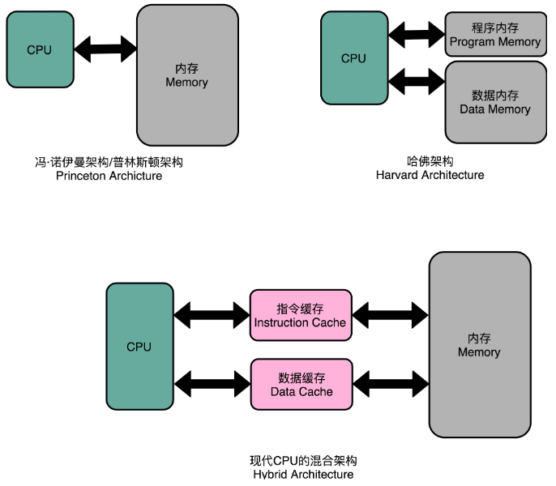

不过，借鉴了哈佛结构的思路，现代的 CPU 虽然没有在内存层面进行对应的拆分，却在 CPU 内部的高速缓存部分进行了区分，把高速缓存分成了指令缓存（Instruction Cache）和数据缓存（Data Cache）两部分。

内存的访问速度远比 CPU 的速度要慢，所以现代的 CPU 并不会直接读取主内存。它会从主内存把指令和数据加载到高速缓存中，这样后续的访问都是访问高速缓存。而指令缓存和数据缓存的拆分，使得我们的 CPU 在进行数据访问和取指令的时候，不会再发生资源冲突的问题了。 

### 数据冒险

数据冒险，其实就是同时在执行的多个指令之间，有数据依赖的情况。这些数据依赖，我们可以分成三大类，分别是先写后读（Read After Write，RAW）、先读后写（Write After Read，WAR）和写后再写（Write After Write，WAW）：

* 先写后读：例如更新了a变量，再读取a变量的值，这两个指令顺序不可改变。先写后读的依赖关系，我们一般被称之为数据依赖，也就是 Data Dependency
* 先读后写：例如先读取了a变量的值，然后再根据读取的值来更新a变量，这两个指令顺序不可改变。先读后写的依赖，一般被叫作反依赖，也就是 Anti-Dependency
* 写后再写：先后更新了同一个变量，最后变量的值肯定是以后操作的指令为基准，这两个指令顺序不可改变。写后再写的依赖，一般被叫作输出依赖，也就是 Output Dependency

### 流水线停顿

解决数据冒险最简单的方法是：流水线停顿（Pipeline Stall），或者叫流水线冒泡（Pipeline Bubbling）

流水线停顿的办法很容易理解。如果我们发现了后面执行的指令，会对前面执行的指令有数据层面的依赖关系，那最简单的办法就是“再等等”。我们在进行指令译码的时候，会拿到对应指令所需要访问的寄存器和内存地址。所以，在这个时候，我们能够判断出来，这个指令是否会触发数据冒险。如果会触发数据冒险，我们就可以决定，让整个流水线停顿一个或者多个周期。

时钟信号会不停地在 0 和 1 之前自动切换，其实并没有办法真的停顿下来。流水线的每一个操作步骤必须要干点儿事情。所以，在实践过程中，我们并不是让流水线停下来，而是在执行后面的操作步骤前面，插入一个 NOP 操作，也就是执行一个其实什么都不干的操作。 

这个插入的指令，就好像一个水管（Pipeline）里面，进了一个空的气泡。在水流经过的时候，没有传送水到下一个步骤，而是给了一个什么都没有的空气泡。这也是为什么，我们的流水线停顿，又被叫作流水线冒泡（Pipeline Bubble）的原因。 

### 指令对齐

以五级流水线为例：取指令（IF）- 指令译码（ID）- 指令执行（EX）- 内存访问（MEM）- 数据写回（WB） 

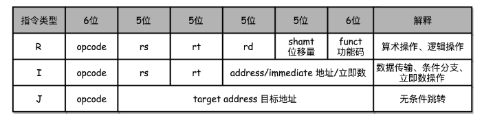

在 MIPS 的体系结构下，不同类型的指令，会在流水线的不同阶段进行不同的操作，几个典型的例子：

* LOAD指令：从内存里读取数据到寄存器的指令，它需要经历5个完整的流水线
* STORE指令：从寄存器往内存里写数据的指令，不需要有写回寄存器的操作，也就是没有数据写回的流水线阶段。 
* ADD和SUB指令：这种指令所有操作都在寄存器完成，所以没有实际的内存访问（MEM）操作 

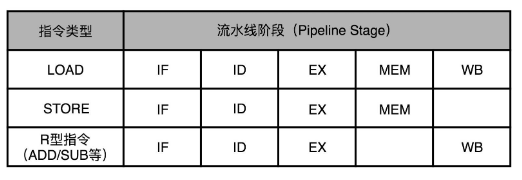

有些指令没有对应的流水线阶段，但是我们并不能跳过对应的阶段直接执行下一阶段。不然，如果我们先后执行一条 LOAD 指令和一条 ADD 指令，就会发生 LOAD 指令的 WB 阶段和 ADD 指令的 WB 阶段，在同一个时钟周期发生。这样，相当于触发了一个结构冒险事件，产生了资源竞争：

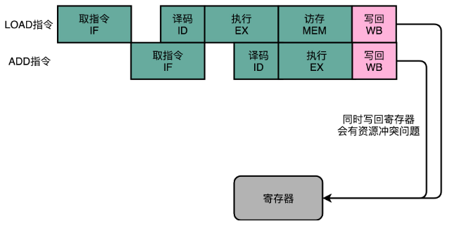

所以，在实践当中，各个指令不需要的阶段，并不会直接跳过，而是会运行一次 NOP 操作。通过插入一个 NOP 操作，我们可以使后一条指令的每一个 Stage，一定不和前一条指令的同 Stage 在一个时钟周期执行：

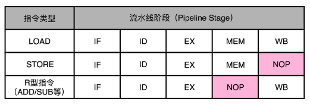

### 操作数前推

通过 NOP 操作进行对齐，我们在流水线里，就不会遇到资源竞争产生的结构冒险问题了。除了可以解决结构冒险之外，这个 NOP 操作，也是我们之前讲的流水线停顿插入的对应操作 。但插入过多的NOP操作，意味着CPU总是在空转。

以下面的两条先后发生的ADD指令为例：

~~~
add $t0, $s2,$s1
add $s2, $s1,$t0
~~~

这两条指令很简单。

1. 第一条指令，把 s1 和 s2 寄存器里面的数据相加，存入到 t0 这个寄存器里面。
2. 第二条指令，把 s1 和 t0 寄存器里面的数据相加，存入到 s2 这个寄存器里面。

因为后一条的 add 指令，依赖寄存器 t0 里的值。而 t0 里面的值，又来自于前一条指令的计算结果。所以后一条指令，需要等待前一条指令的数据写回阶段完成之后，才能执行 。此时不得不通过流水线停顿来解决这个冒险问题。我们要在第二条指令的译码阶段之后，插入对应的 NOP 指令，直到前一天指令的数据写回完成之后，才能继续执行：

不过，其实我们第二条指令的执行，未必要等待第一条指令写回完成，才能进行。如果我们第一条指令的执行结果，能够直接传输给第二条指令的执行阶段，作为输入，那我们的第二条指令，就不用再从寄存器里面，把数据再单独读出来一次，才来执行代码。 我们完全可以在第一条指令的执行阶段完成之后，直接将结果数据传输给到下一条指令的 ALU。然后，下一条指令不需要再插入两个 NOP 阶段，就可以继续正常走到执行阶段 ：

这样的解决方案，我们就叫作操作数前推（Operand Forwarding），或者操作数旁路（Operand Bypassing）。其实我觉得，更合适的名字应该叫操作数转发。这里的 Forward，其实就是我们写 Email 时的“转发”（Forward）的意思。

* 转发，其实是这个技术的逻辑含义，也就是在第 1 条指令的执行结果，直接“转发”给了第 2 条指令的 ALU 作为输入。
* 另外一个名字，旁路（Bypassing），则是这个技术的硬件含义。为了能够实现这里的“转发”，我们在 CPU 的硬件里面，需要再单独拉一根信号传输的线路出来，使得 ALU 的计算结果，能够重新回到 ALU 的输入里来

有的时候，虽然我们可以把操作数转发到下一条指令，但是由于指令的特性，下一条指令仍然需要停顿一个时钟周期 。

比如说，我们先去执行一条 LOAD 指令，再去执行 ADD 指令。LOAD 指令在访存阶段才能把数据读取出来，所以下一条指令的执行阶段，需要在访存阶段完成之后，才能进行（停顿了如下图粉色的时钟周期）：

### 乱序执行

在上面的例子中，受限于指令之间的依赖，不得不进行NOP操作，有一种技术可以让后面没有数据依赖的指令，在前面指令停顿的时候先执行

尽管代码生成的指令是顺序的，但是如果后面的指令不需要依赖前面指令的执行结果，完全可以不必等待前面的指令运算完成，例如下面这三行代码：

~~~
a = b + c
d = a * e
x = y * z
~~~

计算里面的 x ，却要等待 a 和 d 都计算完成，实在没啥必要。所以我们完全可以在 d 的计算等待 a 的计算的过程中，先把 x 的结果给算出来。

在流水线里，后面的指令不依赖前面的指令，那就不用等待前面的指令执行，它完全可以先执行：

可以看到，因为第三条指令并不依赖于前两条指令的计算结果，所以在第二条指令等待第一条指令的访存和写回阶段的时候，第三条指令就已经执行完成了。 

这样的解决方案，在计算机组成里面，被称为乱序执行（Out-of-Order Execution，OoOE），乱序执行本质上就是在指令的执行阶段使用了类似线程池的结构，乱序执行的CPU：

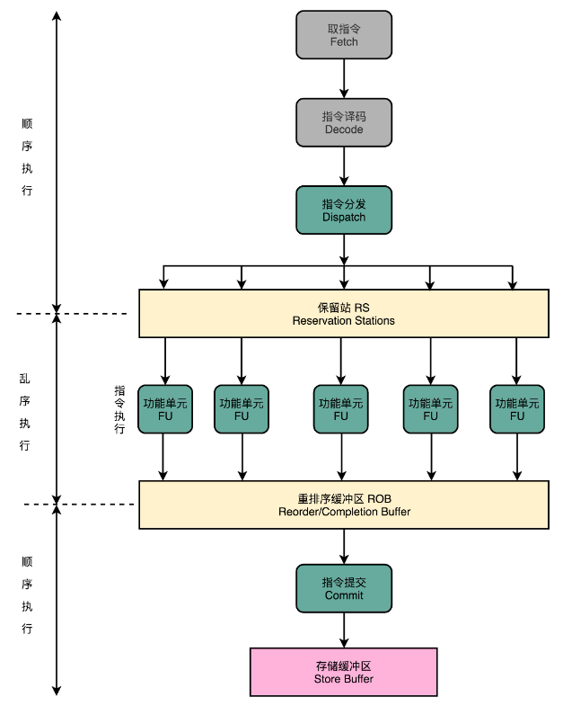

1. 在取指令和指令译码的时候，乱序执行的 CPU 和其他使用流水线架构的 CPU 是一样的。它会一级一级顺序地进行取指令和指令译码的工作。 
2. 在指令译码完成之后，就不一样了。CPU 不会直接进行指令执行，而是进行一次指令分发，把指令发到一个叫作保留站（Reservation Stations）的地方 。这些指令不会立刻执行，而要等待它们所依赖的数据，传递给它们之后才会执行。这就好像一列列的火车都要等到乘客来齐了才能出发。 
3. 一旦指令依赖的数据来齐了，指令就可以交到后面的功能单元（Function Unit，FU），其实就是 ALU，去执行了。我们有很多功能单元可以并行运行，但是不同的功能单元能够支持执行的指令并不相同。 
4. 指令执行的阶段完成之后，我们并不能立刻把结果写回到寄存器里面去，而是把结果再存放到一个叫作重排序缓冲区（Re-Order Buffer，ROB）的地方 。在重排序缓冲区里，我们的 CPU 会按照取指令的顺序，对指令的计算结果重新排序。只有排在前面的指令都已经完成了，才会提交指令，完成整个指令的运算结果 
5. 实际的指令的计算结果数据，并不是直接写到内存或者高速缓存里，而是先写入存储缓冲区（Store Buffer）里面，最终才会写入到高速缓存和内存里 

在乱序执行的情况下，只有 CPU 内部指令的执行层面，可能是“乱序”的 。即便指令的执行过程中是乱序的，我们在最终指令的计算结果写入到寄存器和内存之前，依然会进行一次排序，以确保所有指令在外部看来仍然是有序完成的 

乱序执行，极大地提高了 CPU 的运行效率。核心原因是，现代 CPU 的运行速度比访问主内存的速度要快很多。如果完全采用顺序执行的方式，很多时间都会浪费在前面指令等待获取内存数据的时间里。CPU 不得不加入 NOP 操作进行空转。而现代 CPU 的流水线级数也已经相对比较深了，到达了 14 级。这也意味着，同一个时钟周期内并行执行的指令数是很多的 

### 控制冒险

之前遇到的所有情况都是，取指令（IF）和指令译码（ID）的阶段，是不需要停顿的，这是基于一个假设。这个假设就是，所有的指令代码都是顺序加载执行的。不过这个假设，在执行的代码中，一旦遇到 if…else 这样的条件分支，或者 for/while 循环，就会不成立 

类似cmp 比较指令、jmp 和 jle 这样的条件跳转指令 。jmp 后的那一条指令是否应该顺序加载执行，在流水线里面进行取指令的时候，我们没法知道。要等 jmp 指令执行完成，去更新了 PC 寄存器之后，我们才能知道，是否执行下一条指令，还是跳转到另外一个内存地址，去取别的指令。 这种为了确保能取到正确的指令，而不得不进行等待延迟的情况，就是控制冒险

### 缩短分支延迟

条件跳转指令其实进行了两种电路操作：

第一种，是进行条件比较。这个条件比较，需要的输入是，根据指令的 opcode，就能确认的条件码寄存器。

第二种，是进行实际的跳转，也就是把要跳转的地址信息写入到 PC 寄存器。

无论是 opcode，还是对应的条件码寄存器，还是我们跳转的地址，都是在指令译码（ID）的阶段就能获得的。而对应的条件码比较的电路，只要是简单的逻辑门电路就可以了，并不需要一个完整而复杂的 ALU。 

所以，我们可以将条件判断、地址跳转，都提前到指令译码阶段进行，而不需要放在指令执行阶段。对应的，我们也要在 CPU 里面设计对应的旁路，在指令译码阶段，就提供对应的判断比较的电路。

这种方式，本质上和前面数据冒险的操作数前推的解决方案类似，就是在硬件电路层面，把一些计算结果更早地反馈到流水线中。这样反馈变得更快了，后面的指令需要等待的时间就变短了。

不过只是改造硬件，并不能彻底解决问题。跳转指令的比较结果，仍然要在指令执行的时候才能知道。

### 分支预测

最简单的分支预测技术，叫作“假装分支不发生”。顾名思义，自然就是仍然按照顺序，把指令往下执行。其实就是 CPU 预测，条件跳转一定不发生。这样的预测方法，其实也是一种静态预测技术。

如果分支预测是正确的，那就节省下来本来需要停顿下来等待的时间 ；如果分支预测失败了 ，那我们就把后面已经取出指令已经执行的部分，给丢弃掉。这个丢弃的操作，在流水线里面，叫作 Zap 或者 Flush 。CPU 不仅要执行后面的指令，对于这些已经在流水线里面执行到一半的指令，我们还需要做对应的清除操作。比如，清空已经使用的寄存器里面的数据等等，这些清除操作，也有一定的开销 ：

分支预测还可以实现动态预测，被称为动态分支预测，直接根据上一次分支的结果来判断这次的结果，这种策略，我们叫一级分支预测（One Level Branch Prediction），或者叫1 比特饱和计数（1-bit saturating counter）。这个方法，其实就是用一个比特，去记录当前分支的比较情况，直接用当前分支的比较情况，来预测下一次分支时候的比较情况。

我们可以引入状态机（State Machine）来进行更精确的预测，这个状态机里，我们一共有 4 个状态，所以我们需要 2 个比特来记录对应的状态。这个策略，就可以叫作2 比特饱和计数，或者叫双模态预测器（Bimodal Predictor）：

因为分支预测的存在，不同顺序的循环嵌套，性能是有较大差别的：

~~~java
public class BranchPrediction {
    public static void main(String args[]) {        
        long start = System.currentTimeMillis();
        for (int i = 0; i < 100; i++) {
            for (int j = 0; j <1000; j ++) {
                for (int k = 0; k < 10000; k++) {
                }
            }
        }
        long end = System.currentTimeMillis();
        System.out.println("Time spent is " + (end - start));
                
        start = System.currentTimeMillis();
        for (int i = 0; i < 10000; i++) {
            for (int j = 0; j <1000; j ++) {
                for (int k = 0; k < 100; k++) {
                }
            }
        }
        end = System.currentTimeMillis();
        System.out.println("Time spent is " + (end - start) + "ms");
    }
}
~~~

这是一个简单的三重循环，里面没有任何逻辑代码。我们用两种不同的循环顺序各跑一次。第一次，最外重循环循环了 100 次，第二重循环 1000 次，最内层的循环了 10000 次。第二次，我们把顺序倒过来，最外重循环 10000 次，第二重还是 1000 次，最内层 100 次。 

最终的运行结果，后面的循环是前面的3倍。

原因是在第一段程序中，在最里层的循环，按照分支预测的算法，最里层的循环只会预测错误1次，整个程序的预测错误次数就等于 最外层嵌套数\*第2层嵌套数*1，这样就会导致后一段程序慢很多：

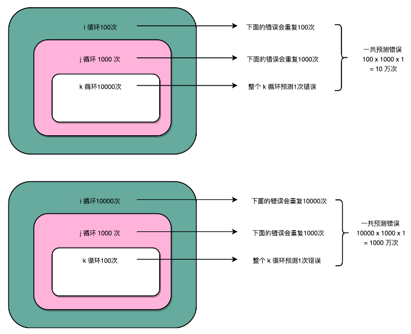

由于第一段代码发生“分支预测”错误的情况比较少，更多的计算机指令，在流水线里顺序运行下去了，而不需要把运行到一半的指令丢弃掉，再去重新加载新的指令执行 

## 其他优化

### 多发射与超标量

CPI 的倒数，又叫作 IPC（Instruction Per Clock），也就是一个时钟周期里面能够执行的指令数，代表了 CPU 的吞吐率

截止目前的CPU架构，答案是，最佳情况下，IPC 也只能到 1。因为无论做了哪些流水线层面的优化，即使做到了指令执行层面的乱序执行，CPU 仍然只能在一个时钟周期里面，取一条指令 ：

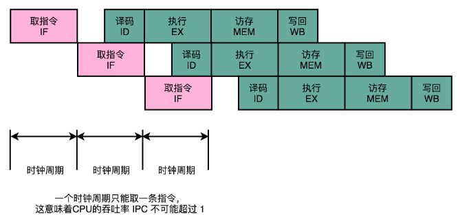

这说明，无论指令后续能优化得多好，一个时钟周期也只能执行完这样一条指令，CPI 只能是 1。但是，我们现在用的 Intel CPU 或者 ARM 的 CPU，一般的 CPI 都能做到 2 以上，这要归功于多发射与超标量技术

实际CPU中，并不是所有计算功能都在一个 ALU 里面，而是会有多个ALU，所以在乱序执行的时候，指令的执行阶段可以很多个功能单元（FU）并行（Parallel）进行。借鉴这个思路，取指令（IF）和指令译码（ID）部分也可以通过增加硬件的方式并行进行。我们可以一次性从内存里面取出多条指令，然后分发给多个并行的指令译码器，进行译码，然后对应交给不同的功能单元去处理。这样，我们在一个时钟周期里，能够完成的指令就不只一条了。IPC 也就能做到大于 1 了 ：

这种 CPU 设计，我们叫作多发射（Mulitple Issue）和超标量（Superscalar）

多发射的意思是说，同一个时间，可能会同时把多条指令发射（Issue）到不同的译码器或者后续处理的流水线中去 

超标量的含义：本来我们在一个时钟周期里面，只能执行一个标量（Scalar）的运算。在多发射的情况下，我们就能够超越这个限制，同时进行多次计算 

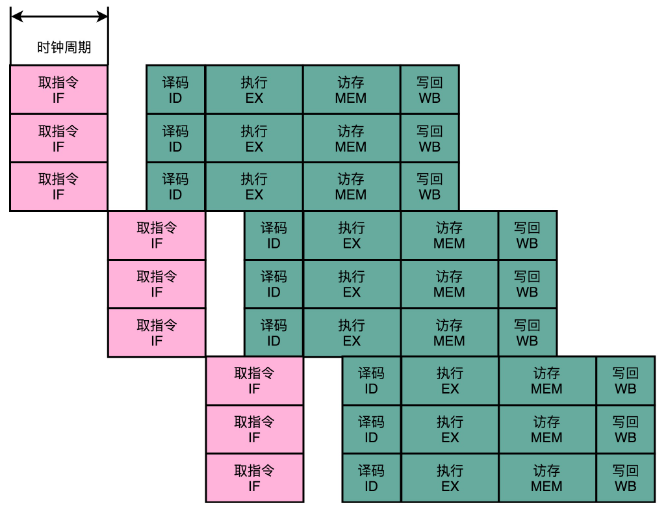

多发射与超标量提高了整体性能，但设计会非常复杂，因为CPU要解决依赖冲突的问题

CPU 需要在指令执行之前，去判断指令之间是否有依赖关系。如果有对应的依赖关系，指令就不能分发到执行阶段。因为这样，上面我们所说的超标量 CPU 的多发射功能，又被称为动态多发射处理器。这些对于依赖关系的检测，都会使得我们的 CPU 电路变得更加复杂

### 超长指令字设计

之前提过，要想优化 CPU 的执行时间，关键就是拆解这个公式：程序的 CPU 执行时间 = 指令数 × CPI × Clock Cycle Time

可以通过编译器来优化指令数这个指标，一个程序编译后的指令数越少，程序的执行时间就越快。通过借鉴这个思想，通过让编译器来优化CPI，也能提高性能，这就是超长指令字设计（Very Long Instruction Word，VLIW）

在乱序执行和超标量的 CPU 架构里，指令的前后依赖关系，是由 CPU 内部的硬件电路来检测的。而到了超长指令字的架构里面，这个工作交给了编译器这个软件：

在编译的过程中，编译器是能够知道前后数据的依赖。于是，我们可以让编译器把没有依赖关系的代码位置进行交换。然后，再把多条连续的指令打包成一个指令包。安腾的 CPU 就是把 3 条指令变成一个指令包 ：

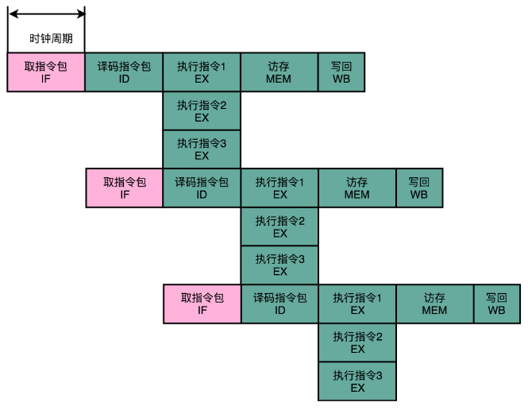

CPU 在运行的时候，不再是取一条指令，而是取出一个指令包。然后，译码解析整个指令包，解析出 3 条指令直接并行运行 。使用超长指令字架构的 CPU，同样是采用流水线架构的。也就是说，一组（Group）指令，仍然要经历多个时钟周期。同样的，下一组指令并不是等上一组指令执行完成之后再执行，而是在上一组指令的指令译码阶段，就开始取指令了。

在超长指令字架构中，流水线停顿很多时候也是由编译器来做的，编译器需要在适当的位置插入 NOP 操作，直接在编译出来的机器码里面，就把流水线停顿这个事情在软件层面就安排妥当 

最终超长指令字架构失败了，逐渐退出市场，原因主要有：

* 安腾处理器的指令集和 x86 是不同的。这就意味着，原来 x86 上的所有程序是没有办法在安腾上运行的，而需要通过编译器重新编译才行 
* 安腾处理器的 VLIW 架构决定了，如果安腾需要提升并行度，就需要增加一个指令包里包含的指令数量，比方说从 3 个变成 6 个。一旦这么做了，虽然同样是 VLIW 架构，同样指令集的安腾 CPU，程序也需要重新编译。 

于是，安腾就变成了一个既不容易向前兼容，又不容易向后兼容的 CPU，所以它最终失败了。

虽然看起来，VLIW 在技术层面更具有颠覆性，不仅仅只是一个硬件层面的改造，而且利用了软件层面的编译器，来组合解决提升 CPU 指令吞吐率的问题。然而，最终 VLIW 却没有得到市场和业界的认可。 

### 超线程技术

CPU的流水线级数太深，会让冒险方案变得很复杂，同一时刻内同时在流水线的指令就会变多，相互的依赖就越复杂，于是，很多时候我们不得不把流水线停顿下来，插入很多 NOP 操作，来解决这些依赖带来的“冒险”问题。 

既然 CPU 同时运行那些在代码层面有前后依赖关系的指令，会遇到各种冒险问题，我们不如去找一些和这些指令完全独立，没有依赖关系的指令来运行，这就是超线程（Hyper-Threading）技术的思想。

计算机在同一个时间可以运行很多个程序，例如浏览器和游戏程序，而这两个程序，是完全相互独立的。它们两个的指令完全并行运行，而不会产生依赖问题带来的“冒险” ，多个程序同时运行既可以使用多核CPU，也可以使用超线程，用一个物理层面的CPU核心，来伪装成两个逻辑层面的CPU核心，这个 CPU，会在硬件层面增加很多电路，使得我们可以在一个 CPU 核心内部，维护两个不同线程的指令的状态信息 ：

比如，在一个物理 CPU 核心内部，会有双份的 PC 寄存器、指令寄存器乃至条件码寄存器。这样，这个 CPU 核心就可以维护两条并行的指令的状态。在外面看起来，似乎有两个逻辑层面的 CPU 在同时运行。所以，超线程技术一般也被叫作同时多线程（Simultaneous Multi-Threading，简称 SMT）技术。不过，在 CPU 的其他功能组件上，Intel 可不会提供双份。无论是指令译码器还是 ALU，一个 CPU 核心仍然只有一份。 

超线程的目的，是在一个线程 A 的指令，在流水线里停顿的时候，让另外一个线程去执行指令。因为这个时候，CPU 的译码器和 ALU 就空出来了，那么另外一个线程 B，就可以拿来干自己需要的事情。这个线程 B 可没有对于线程 A 里面指令的关联和依赖

这样，CPU 通过很小的代价，就能实现“同时”运行多个线程的效果。通常我们只要在 CPU 核心的添加 10% 左右的逻辑功能，增加可以忽略不计的晶体管数量，就能做到这一点。

在那些各个线程“等待”时间比较长的应用场景下，超线程的效果比较好。

下面是一台电脑运行 CPU-Z 的截图 ，可以看到，在右下角里，我的 CPU 的 Cores，被标明了是 4，而 Threads，则是 8。这说明我手头的这个 CPU，只有 4 个物理的 CPU 核心，也就是所谓的 4 核 CPU。但是在逻辑层面，它“装作”有 8 个 CPU 核心，可以利用超线程技术，来同时运行 8 条指令：

### SIMD技术

在上面的 CPU 信息的图里面，你会看到，中间有一组信息叫作 Instructions，里面写了有 MMX、SSE 等等。这些信息就是这个 CPU 所支持的指令集。这里的 MMX 和 SSE 的指令集，也就引出了最后一个提升 CPU 性能的重要技术方案，SIMD，中文叫作单指令多数据流（Single Instruction Multiple Data）。

下面的示例程序，一段是通过循环的方式，给一个 list 里面的每一个数加 1。另一段是实现相同的功能，但是直接调用 NumPy 这个库的 add 方法。在统计两段程序的性能的时候，我直接调用了 Python 里面的 timeit 的库。 

~~~python
$ python
>>> import numpy as np
>>> import timeit
>>> a = list(range(1000))
>>> b = np.array(range(1000))
>>> timeit.timeit("[i + 1 for i in a]", setup="from __main__ import a", number=1000000)
32.82800309999993
>>> timeit.timeit("np.add(1, b)", setup="from __main__ import np, b", number=1000000)
0.9787889999997788
>>>
~~~

从两段程序的输出结果来看，你会发现，两个功能相同的代码性能有着巨大的差异，足足差出了 30 多倍。也难怪所有用 Python 讲解数据科学的教程里，往往在一开始就告诉你不要使用循环，而要把所有的计算都向量化（Vectorize） 。原因是NumPy 直接用到了 SIMD 指令，能够并行进行向量的操作 

而前面使用循环来一步一步计算的算法呢，一般被称为SISD，也就是单指令单数据（Single Instruction Single Data）的处理方式。如果你手头的是一个多核 CPU 呢，那么它同时处理多个指令的方式可以叫作MIMD，也就是多指令多数据（Multiple Instruction Multiple Dataa）。

SIMD可以通过单个核心来并行处理数据，SIMD 在获取数据和执行指令的时候，都做到了并行。 

就以我们上面的程序为例，数组里面的每一项都是一个 integer，也就是需要 4 Bytes 的内存空间。Intel 在引入 SSE 指令集的时候，在 CPU 里面添上了 8 个 128 Bits 的寄存器。128 Bits 也就是 16 Bytes ，也就是说，一个寄存器一次性可以加载 4 个整数。比起循环分别读取 4 次对应的数据，时间就省下来了 ：

在数据读取到了之后，在指令的执行层面，SIMD 也是可以并行进行的。4 个整数各自加 1，互相之前完全没有依赖，也就没有冒险问题需要处理。只要 CPU 里有足够多的功能单元，能够同时进行这些计算，这个加法就是 4 路同时并行的，自然也省下了时间。 

所以，对于那些在计算层面存在大量“数据并行”（Data Parallelism）的计算中，使用 SIMD 是一个很划算的办法。在这个大量的“数据并行”，其实通常就是实践当中的向量运算或者矩阵运算。 在进行图片、视频、音频的处理、各种机器学习算法中有广泛的应用

而基于 SIMD 的向量计算指令，也正是在 Intel 发布 Pentium 处理器的时候，被引入的指令集。当时的指令集叫作MMX，也就是 Matrix Math eXtensions 的缩写，中文名字就是矩阵数学扩展。

SIMD 技术，则是一种“指令级并行”的加速方案，也可以说是一种“数据并行”的加速方案 ，在处理向量计算的情况下，同一个向量的不同维度之间的计算是相互独立的。而我们的 CPU 里的寄存器，又能放得下多条数据。于是，我们可以一次性取出多条数据，交给 CPU 并行计算 。正是 SIMD 技术的出现，使得我们在 Pentium 时代的个人 PC，开始有了多媒体运算的能力。可以说，Intel 的 MMX、SSE 指令集，和微软的 Windows 95 这样的图形界面操作系统，推动了 PC 快速进入家庭的历史进程。 

## 异常和中断

### 异常处理

异常是一个硬件和软件组合到一起的处理过程。异常的前半生，也就是异常的发生和捕捉，是在硬件层面完成的。但是异常的后半生，也就是说，异常的处理，其实是由软件来完成的。

计算机会为每一种可能会发生的异常，分配一个异常代码（Exception Number） ，也叫中断向量（Interrupt Vector） 。异常发生的时候，通常是 CPU 检测到了一个特殊的信号。比如，你按下键盘上的按键，输入设备就会给 CPU 发一个信号。或者，正在执行的指令发生了加法溢出，同样，我们可以有一个进位溢出的信号。这些信号呢，在组成原理里面，我们一般叫作发生了一个事件（Event）。CPU 在检测到事件的时候，其实也就拿到了对应的异常代码。 

这些异常代码里，I/O 发出的信号的异常代码，是由操作系统来分配的，也就是由软件来设定的。而像加法溢出这样的异常代码，则是由 CPU 预先分配好的，也就是由硬件来分配的。这又是另一个软件和硬件共同组合来处理异常的过程。

拿到异常代码之后，CPU 就会触发异常处理的流程。计算机在内存里，会保留一个异常表（Exception Table） ，也叫中断向量表（Interrupt Vector Table） ，它存放的是不同的异常代码对应的异常处理程序（Exception Handler）所在的地址 

CPU 在拿到了异常码之后，会先把当前的程序执行的现场，保存到程序栈里面，然后根据异常码查询，找到对应的异常处理程序，最后把后续指令执行的指挥权，交给这个异常处理程序 ：

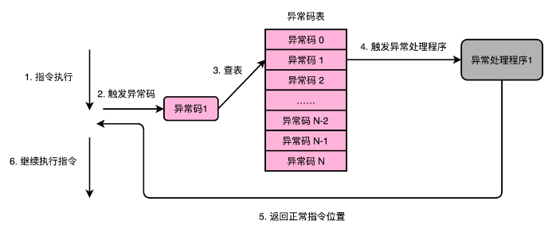

这样“检测异常，拿到异常码，再根据异常码进行查表处理”的模式，在日常开发的过程中是很常见的，例如互联网应用中的错误码、Java的异常处理器，它们都采用了正常代码和异常处理代码分离的模式

### 异常分类

异常的分类：

* 中断（Interrupt） ：程序在执行到一半的时候，被打断了。这个打断执行的信号，来自于 CPU 外部的 I/O 设备 ，例如在键盘上按下一个按键，就会对应触发一个相应的信号到达 CPU 里面。CPU 里面某个开关的值发生了变化，也就触发了一个中断类型的异常 
* 陷阱（Trap）：程序员“故意“主动触发的异常 ，当程序的指令执行到这个位置的时候，就掉到了这个陷阱当中。然后，对应的异常处理程序就会来处理这个"陷阱"当中的猎物 。例如系统调用，从程序的用户态切换到内核态的时候 
* 故障（Fault）：故障通常是程序的错误引起的，例如计算溢出、缺页错误。故障和陷阱、中断的一个重要区别是，故障在异常程序处理完成之后，仍然回来处理当前的指令，而不是去执行程序中的下一条指令。因为当前的指令因为故障的原因并没有成功执行完成。 
* 中止（Abort）：故障的一种特殊情况，当 CPU 遇到了故障，但是恢复不过来的时候，程序就不得不中止了 

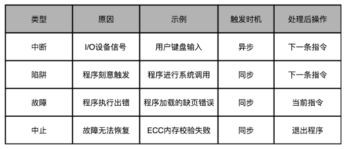

在这四种异常里，中断异常的信号来自系统外部，而不是在程序自己执行的过程中，所以我们称之为“异步”类型的异常。而陷阱、故障以及中止类型的异常，是在程序执行的过程中发生的，所以我们称之为“同步“类型的异常 

### 上下文切换

在实际的异常处理程序执行之前，CPU 需要去做一次“保存现场”的操作，这个保存现场的操作，和函数调用的过程非常相似。因为切换到异常处理程序的时候，其实就好像是去调用一个异常处理函数。指令的控制权被切换到了另外一个"函数"里面，所以我们自然要把当前正在执行的指令去压栈。这样，我们才能在异常处理程序执行完成之后，重新回到当前的指令继续往下执行。 

切换到异常处理程序与函数调用的不同：

* 异常情况往往发生在程序正常执行的预期之外，所以，除了本来程序压栈要做的事情之外，我们还需要把 CPU 内当前运行程序用到的所有寄存器，都放到栈里面。最典型的就是条件码寄存器里面的内容。 
* 像陷阱这样的异常，涉及程序指令在用户态和内核态之间的切换。对应压栈的时候，对应的数据是压到内核栈里，而不是程序栈里。 
* 像故障这样的异常，在异常处理程序执行完成之后。从栈里返回出来，继续执行的不是顺序的下一条指令，而是故障发生的当前指令。因为当前指令因为故障没有正常执行成功，必须重新去执行一次。 

所以，对于异常这样的处理流程，不像是顺序执行的指令间的函数调用关系。而是更像两个不同的独立进程之间在 CPU 层面的切换，所以这个过程我们称之为上下文切换（Context Switch）。

## CISC 和 RISC

### 指令集对比

MIPS 体系结构计算机的机器指令格式如下，它的指令都是固定的 32 位长度：

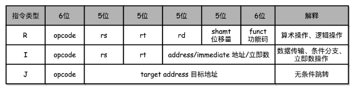

而x86体系结构下的汇编代码，对应的机器码长度是不一样的：

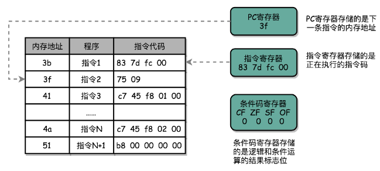

而 CPU 的指令集里的机器码是固定长度还是可变长度，也就是复杂指令集（Complex Instruction Set Computing，简称 CISC）和精简指令集（Reduced Instruction Set Computing，简称 RISC）这两种风格的指令集一个最重要的差别

在计算机历史的早期，其实没有什么 CISC 和 RISC 之分。或者说，所有的 CPU 其实都是 CISC，CPU 指令集的设计，需要仔细考虑硬件限制。为了性能考虑，很多功能都直接通过硬件电路来完成。为了少用内存，指令的长度也是可变的，常用的指令要短一些，不常用的指令可以长一些。那个时候的计算机，想要用尽可能少的内存空间，存储尽量多的指令。 

随着计算机的性能越来越好，存储的空间也越来越大了，到了 70 年代末，RISC 开始登上了历史的舞台。当时，UC Berkeley的大卫·帕特森（David Patterson）教授发现，实际在 CPU 运行的程序里，80% 的时间都是在使用 20% 的简单指令。于是，他就提出了 RISC 的理念。自此之后，RISC 类型的 CPU 开始快速蓬勃发展。

RISC 架构的 CPU 设计思想：只保留占80%的常用简单指令，原先的复杂指令，则通过用简单指令组合起来来实现，让软件来实现硬件的功能。这样，CPU 的整个硬件设计就会变得更简单了，在硬件层面提升性能也会变得更容易了。RISC 的 CPU 里完成指令的电路变得简单了，于是也就腾出了更多的空间。这个空间，常常被拿来放通用寄存器。因为 RISC 完成同样的功能，执行的指令数量要比 CISC 多，所以，如果需要反复从内存里面读取指令或者数据到寄存器里来，那么很多时间就会花在访问内存上。于是，RISC 架构的 CPU 往往就有更多的通用寄存器 。除了寄存器这样的存储空间，RISC 的 CPU 也可以把更多的晶体管，用来实现更好的分支预测等相关功能，进一步去提升 CPU 实际的执行效率。 

在硬件层面，我们要想支持更多的复杂指令，CPU 里面的电路就要更复杂，设计起来也就更困难。更复杂的电路，在散热和功耗层面，也会带来更大的挑战。在软件层面，支持更多的复杂指令，编译器的优化就变得更困难。毕竟，面向 2000 个指令来优化编译器和面向 500 个指令来优化编译器的困难是完全不同的。 

从程序运行时间公式来分析：程序的 CPU 执行时间 = 指令数 × CPI × Clock Cycle Time 

CISC 的架构，其实就是通过优化指令数，来减少 CPU 的执行时间。而 RISC 的架构，其实是在优化 CPI。因为指令比较简单，需要的时钟周期就比较少。

两个指令集设计的差别：

因为 RISC 降低了 CPU 硬件的设计和开发难度，所以从 80 年代开始，大部分新的 CPU 都开始采用 RISC 架构 

### 微指令架构

如果 Intel 要放弃 x86 的架构和指令集，开发一个 RISC 架构的 CPU，面临的第一个问题就是所有这些软件都是不兼容的，根源是指令集的向前兼容性。而AMD推出了兼容 32 位 x86 指令集的 64 位架构，也就是 AMD64，x86 下的 64 位的指令集 x86-64，并不是 Intel 发明的，而是 AMD 发明的。 

Intel借鉴其他 RISC 处理器的设计思想，为了解决向前兼容的问题，修改指令集，让CISC 风格的指令集，用 RISC 的形式在 CPU 里面运行 。于是，从 Pentium Pro 时代开始，Intel 就开始在处理器里引入了微指令（Micro-Instructions/Micro-Ops）架构。而微指令架构的引入，也让 CISC 和 RISC 的分界变得模糊了：

在微指令架构的 CPU 里面，编译器编译出来的机器码和汇编代码并没有发生什么变化。但在指令译码的阶段，指令译码器“翻译”出来的，不再是某一条 CPU 指令。译码器会把一条机器码，“翻译”成好几条“微指令”。这里的一条条微指令，就不再是 CISC 风格的了，而是变成了固定长度的 RISC 风格的了。

这些 RISC 风格的微指令，会被放到一个微指令缓冲区里面，然后再从缓冲区里面，分发给到后面的超标量，并且是乱序执行的流水线架构里面。不过这个流水线架构里面接受的，就不是复杂的指令，而是精简的指令了。在这个架构里，我们的指令译码器相当于变成了设计模式里的一个“适配器”（Adaptor）。这个适配器，填平了 CISC 和 RISC 之间的指令差异。

这样一个能够把 CISC 的指令译码成 RISC 指令的指令译码器，比原来的指令译码器要复杂，这也就意味着更复杂的电路和更长的译码时间，为了解决这个问题，Intel利用了局部性原理，有 80% 运行的代码用着 20% 的常用指令，在 CPU 里面加了一层 L0 Cache。这个 Cache 保存的就是指令译码器把 CISC 的指令“翻译”成 RISC 的微指令的结果。于是，在大部分情况下，CPU 都可以从 Cache 里面拿到译码结果，而不需要让译码器去进行实际的译码操作。这样不仅优化了性能，因为译码器的晶体管开关动作变少了，还减少了功耗。 

因为“微指令”架构的存在，从 Pentium Pro 开始，Intel 处理器已经不是一个纯粹的 CISC 处理器了。它同样融合了大量 RISC 类型的处理器设计。不过，由于 Intel 本身在 CPU 层面做的大量优化，比如乱序执行、分支预测等相关工作，x86 的 CPU 始终在功耗上还是要远远超过 RISC 架构的 ARM，所以最终在智能手机崛起替代 PC 的时代，落在了 ARM 后面 

到了 21 世纪的今天，CISC 和 RISC 架构的分界已经没有那么明显了。Intel 和 AMD 的 CPU 也都是采用译码成 RISC 风格的微指令来运行。而 ARM 的芯片，一条指令同样需要多个时钟周期，有乱序执行和多发射 

ARM 能够在移动端战胜 Intel，有以下原因：

1、ARM功耗优先：ARM 的 CPU，主频更低，晶体管更少，高速缓存更小，乱序执行的能力更弱。所有这些，都是为了功耗所做的妥协。 

2、低价：ARM 并没有自己垄断 CPU 的生产和制造，只是进行 CPU 设计，然后把对应的知识产权授权出去，让其他的厂商来生产 ARM 架构的 CPU。它甚至还允许这些厂商可以基于 ARM 的架构和指令集，设计属于自己的 CPU。像苹果、三星、华为，它们都是拿到了基于 ARM 体系架构设计和制造 CPU 的授权。ARM 自己只是收取对应的专利授权费用。多个厂商之间的竞争，使得 ARM 的芯片在市场上价格很便宜。 

## GPU

### 图形渲染

GPU 是随着我们开始在计算机里面需要渲染三维图形的出现，而发展起来的设备。

到了 90 年代中期，随着个人电脑的性能越来越好，PC 游戏玩家们开始有了“3D 显卡”的需求。那个时代之前的 3D 游戏，其实都是伪 3D：其实是从不同视角看到的是 8 幅不同的贴图，实际上并不是通过图形学绘制渲染出来的多边形。 这样的情况下，游戏玩家的视角旋转个 10 度，看到的画面并没有变化。但是如果转了 45 度，看到的画面就变成了另外一幅图片。而如果我们能实时渲染基于多边形的 3D 画面的话，那么任何一点点的视角变化，都会实时在画面里面体现出来，就好像你在真实世界里面看到的一样。 

现在我们电脑里面显示出来的 3D 的画面，其实是通过多边形组合出来的。你可以看看下面这张图，你在玩的各种游戏，里面的人物的脸，并不是那个相机或者摄像头拍出来的，而是通过多边形建模（Polygon Modeling）创建出来的：

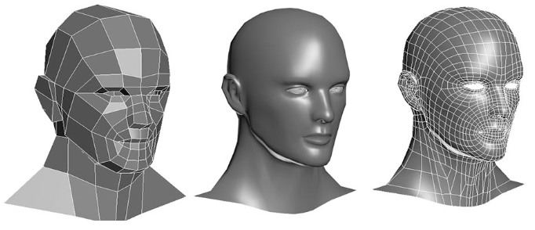

而实际这些人物在画面里面的移动、动作，乃至根据光线发生的变化，都是通过计算机根据图形学的各种计算，实时渲染出来的。

这个对于图像进行实时渲染的过程，可以被分解成下面这样 5 个步骤：

1. 顶点处理（Vertex Processing）
2. 图元处理（Primitive Processing）
3. 栅格化（Rasterization）
4. 片段处理（Fragment Processing）
5. 像素操作（Pixel Operations）

1、顶点处理

图形渲染的第一步是顶点处理。 其实就是在视角变化下计算图形顶点的位置，这涉及到二维屏幕和三位空间坐标位置的转换。这样的转化都是通过线性代数的计算来进行的，是一种线性变换。可以想见，我们的建模越精细，需要转换的顶点数量就越多，计算量就越大。而且，这里面每一个顶点位置的转换，互相之间没有依赖，是可以并行独立计算的。

2、图元处理

图元处理，其实就是要把顶点处理完成之后的各个顶点连起来，变成多边形，并针对这些多边形，做剔除和裁剪（Cull and Clip），也就是把不在屏幕里面，或者一部分不在屏幕里面的内容给去掉 

3、栅格化

我们的屏幕分辨率是有限的。它一般是通过一个个“像素（Pixel）”来显示出内容的。所以，对于做完图元处理的多边形，我们要开始进行第三步操作。这个操作就是把它们转换成屏幕里面的一个个像素点。这个操作呢，就叫作栅格化。这个栅格化操作，有一个特点和上面的顶点处理是一样的，就是每一个图元都可以并行独立地栅格化。

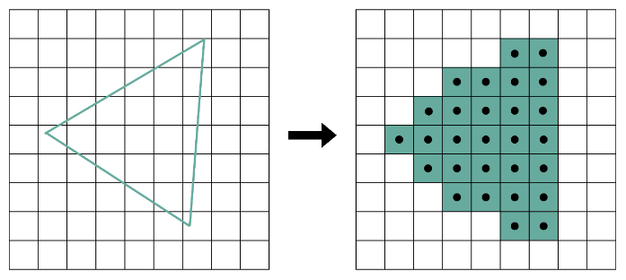

4、片段处理

在栅格化变成了像素点之后，我们的图还是“黑白”的。我们还需要计算每一个像素的颜色、透明度等信息，给像素点上色。这步操作，就是片段处理。这步操作，同样也可以每个片段并行、独立进行，和上面的顶点处理和栅格化一样。

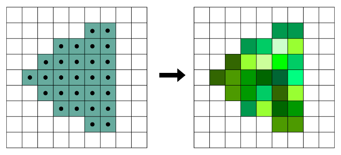

5、像素操作

最后一步呢，我们就要把不同的多边形的像素点“混合（Blending）”到一起。可能前面的多边形可能是半透明的，那么前后的颜色就要混合在一起变成一个新的颜色；或者前面的多边形遮挡住了后面的多边形，那么我们只要显示前面多边形的颜色就好了。最终，输出到显示设备 

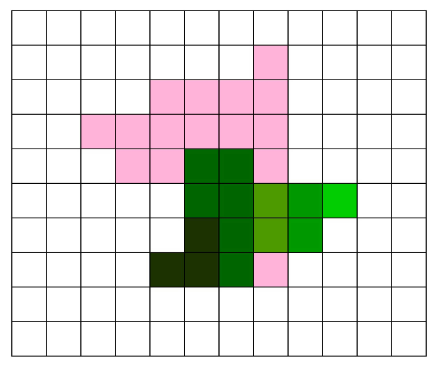

经过这完整的 5 个步骤之后，我们就完成了从三维空间里的数据的渲染，变成屏幕上你可以看到的 3D 动画了。这样 5 个步骤的渲染流程呢，一般也被称之为图形流水线（Graphic Pipeline）。这个名字和我们讲解 CPU 里面的流水线非常相似，都叫Pipeline。

如果用 CPU 来进行这个渲染过程，代价是非常高的：

在上世纪 90 年代的时候，屏幕的分辨率还没有现在那么高。一般的 CRT 显示器也就是 640×480 的分辨率。这意味着屏幕上有 30 万个像素需要渲染。为了让我们的眼睛看到画面不晕眩，我们希望画面能有 60 帧。于是，每秒我们就要重新渲染 60 次这个画面。也就是说，每秒我们需要完成 1800 万次单个像素的渲染。从栅格化开始，每个像素有 3 个流水线步骤，即使每次步骤只有 1 个指令，那我们也需要 5400 万条指令，也就是 54M 条指令。 而90 年代的 CPU 的性能：以第一代 Pentium 处理器为例，主频是 60MHz，用 CPU 来渲染 3D 图形，基本上就要把 CPU 的性能用完了。因为实际的每一个渲染步骤可能不止一个指令，我们的 CPU 可能根本就跑不动这样的三维图形渲染。 

也就是在这个时候，Voodoo FX 这样的图形加速卡登上了历史舞台，它的设计思想是：既然图形渲染的流程是固定的，那我们直接用硬件来处理这部分过程，无需占用CPU资源。它的整个计算流程是完全固定的，不需要流水线停顿、乱序执行等。也不需要有什么可编程能力，只要让硬件按照写好的逻辑进行运算就好了。

那个时候，整个顶点处理的过程还是都由 CPU 进行的，不过后续所有到图元和像素级别的处理都是通过 Voodoo FX 或者 TNT 这样的显卡去处理的。也就是从这个时代开始，我们能玩上“真 3D”的游戏了：

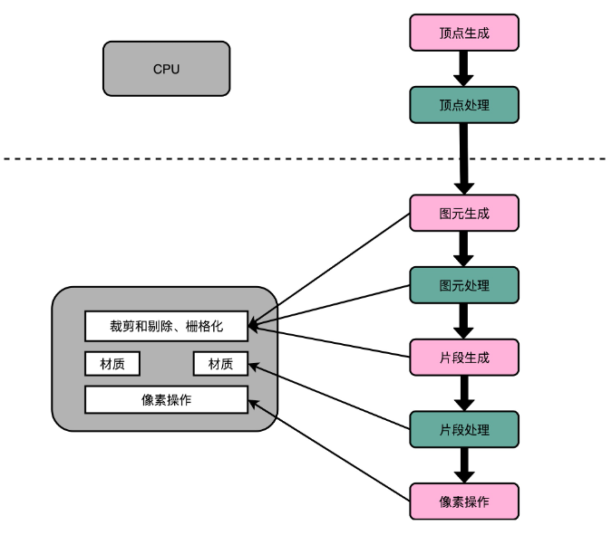

### 可编程图形处理器

在 Voodoo 和 TNT 显卡的渲染管线里面，没有“顶点处理“这个步骤。在当时，把多边形的顶点进行线性变化，转化到我们的屏幕的坐标系的工作还是由 CPU 完成的。所以，CPU 的性能越好，能够支持的多边形也就越多，对应的多边形建模的效果自然也就越像真人。而 3D 游戏的多边形性能也受限于我们 CPU 的性能。无论你的显卡有多快，如果 CPU 不行，3D 画面一样还是不行。

所以，1999 年 NVidia 推出的 GeForce 256 显卡，就把顶点处理的计算能力，也从 CPU 里挪到了显卡里。 

为了进一步提升性能，程序员希望我们的 GPU 也能有一定的可编程能力，虽然不能像CPU一样提供一些非常通用的指令，但也要实现一些灵活操作，就引入了可编程管线（Programable Function Pipeline）的概念。一开始的可编程管线呢，仅限于顶点处理（Vertex Processing）和片段处理（Fragment Processing）部分，这些可以编程的接口，我们称之为Shader，中文名称就是着色器。之所以叫“着色器”，是因为一开始这些“可编程”的接口，只能修改顶点处理和片段处理部分的程序逻辑。我们用这些接口来做的，也主要是光照、亮度、颜色等等的处理，所以叫着色器：

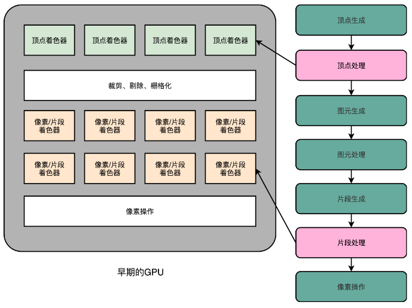

这个时候的 GPU，有两类 Shader，也就是 Vertex Shader 和 Fragment Shader，最初的时候它们都用的是不同的硬件电路，也各自有独立的编程接口。但这样做有两个弊端：

* 虽然我们在顶点处理和片段处理上的具体逻辑不太一样，但是里面用到的指令集可以用同一套
* 在整个渲染管线里，Vertext Shader 运行的时候，Fragment Shader 停在那里什么也没干。Fragment Shader 在运行的时候，Vertext Shader 也停在那里发呆。 两者不能同时运行

所以后续推出了统一着色器架构（Unified Shader Architecture）的概念，此时Shader就只有一种了，GPU通过统一调度，把顶点处理、图元处理、片段处理这些任务，都交给这些 Shader 去处理，让整个 GPU 尽可能地忙起来。正是因为 Shader 变成一个“通用”的模块，才有了把 GPU 拿来做各种通用计算的用法，也就是GPGPU（General-Purpose Computing on Graphics Processing Units，通用图形处理器）。而正是因为 GPU 可以拿来做各种通用的计算，才有了过去 10 年深度学习的火热。

### 现代GPU设计要点

1、芯片瘦身

现代 CPU 里的晶体管变得越来越多，越来越复杂，其实已经不是用来实现“计算”这个核心功能，而是拿来实现处理乱序执行、进行分支预测、高速缓存 。

而在 GPU 里，这些电路就显得有点多余了，GPU 的整个处理过程是一个流式处理（Stream Processing）的过程。因为没有那么多分支条件，或者复杂的依赖关系，我们可以把 GPU 里这些对应的电路都可以去掉，做一次小小的瘦身，只留下取指令、指令译码、ALU 以及执行这些计算需要的寄存器和缓存就好了。一般来说，我们会把这些电路抽象成三个部分，就是下面图里的取指令和指令译码、ALU 和执行上下文。

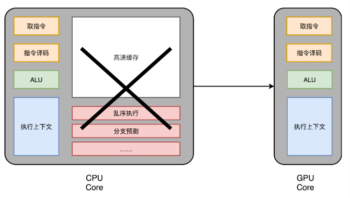

2、多核并行和 SIMT

和 CPU 不同的是，我们不需要单独去实现什么多线程的计算。因为 GPU 的运算是天然并行的。 一个GPU里面，可以放很多并行的电路，就好像CPU的多核一样：

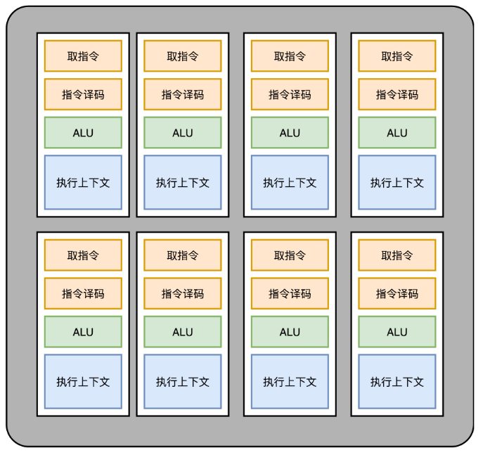

GPU 借鉴了 CPU 里面的 SIMD，用了一种叫作SIMT（Single Instruction，Multiple Threads）的技术。SIMT 呢，比 SIMD 更加灵活。在 SIMD 里面，CPU 一次性取出了固定长度的多个数据，放到寄存器里面，用一个指令去执行。而 SIMT，可以把多条数据，交给不同的线程去处理。

于是，我们的 GPU 设计就可以进一步进化，也就是在取指令和指令译码的阶段，取出的指令可以给到后面多个不同的 ALU 并行进行运算。这样，我们的一个 GPU 的核里，就可以放下更多的 ALU，同时进行更多的并行运算了：

3、超线程

GPU借鉴CPU的设计思想，遇到流水线停顿的时候，调度一些别的计算任务给当前的 ALU 

和超线程一样，既然要调度一个不同的任务过来，我们就需要针对这个任务，提供更多的执行上下文。所以，一个 Core 里面的执行上下文的数量，需要比 ALU 多：

## 典型CPU

### FPGA

CPU 其实就是一些简单的门电路像搭积木一样搭出来的。从最简单的门电路，搭建成半加器、全加器，然后再搭建成完整功能的 ALU。这些电路里呢，有完成各种实际计算功能的组合逻辑电路，也有用来控制数据访问，创建出寄存器和内存的时序逻辑电路。 

一个现代CPU里面有20亿个晶体管这样的电路开关，设计一个CPU就要想办法连接这 20 亿个晶体管。类似于写程序，设计硬件的时候也要验证各种方案，修复各种Bug，如果我们每次验证一个方案，都要单独设计生产一块芯片，那这个代价也太高了。

由此诞生了FPGA芯片，它的基本思想就是通过不同的程序代码，来操作这个硬件之前的电路连线，通过“编程”让这个硬件变成我们设计的电路连线的芯片。它也可以用于验证硬件设计。下图就是XILINX 的 FPGA 芯片：

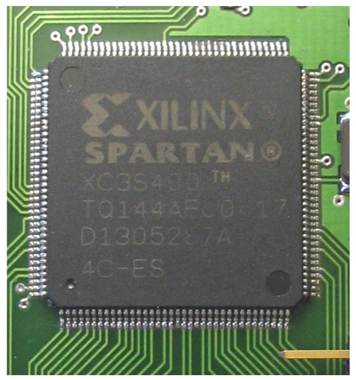

FPGA是现场可编程门阵列（Field-Programmable Gate Array），从 FPGA 里面的每一个字符，一个一个来看看它到底是什么意思：

- P 代表 Programmable，这个很容易理解。也就是说这是一个可以通过编程来控制的硬件。
- G 代表 Gate 也很容易理解，它就代表芯片里面的门电路。我们能够去进行编程组合的就是这样一个一个门电路。
- A 代表的 Array，叫作阵列，说的是在一块 FPGA 上，密密麻麻列了大量 Gate 这样的门电路。
- 最后一个 F，不太容易理解。它其实是说，一块 FPGA 这样的板子，可以进行在“现场”多次地进行编程。它不像 PAL（Programmable Array Logic，可编程阵列逻辑）这样更古老的硬件设备，只能“编程”一次，把预先写好的程序一次性烧录到硬件里面，之后就不能再修改了。

“FPGA”这样的组合，基本上解决了我们前面说的想要设计硬件的问题。我们可以像软件一样对硬件编程，可以反复烧录，还有海量的门电路，可以组合实现复杂的芯片功能。FPGA具体的设计方案：

第一，用存储换功能实现组合逻辑。

在实现 CPU 的功能的时候，我们需要完成各种各样的电路逻辑。在 FPGA 里，这些基本的电路逻辑，不是采用布线连接的方式进行的，而是预先根据我们在软件里面设计的逻辑电路，算出对应的真值表，然后直接存到一个叫作 LUT（Look-Up Table，查找表）的电路里面。这个 LUT 呢，其实就是一块存储空间，里面存储了“特定的输入信号下，对应输出 0 还是 1”。 这个“查表”的方法，其实就是 FPGA 通过 LUT 来实现各种组合逻辑的办法。

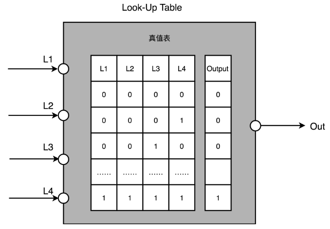

第二，对于需要实现的时序逻辑电路，我们可以在 FPGA 里面直接放上 D 触发器，作为寄存器。

这个和 CPU 里的触发器没有什么本质不同。不过，我们会把很多个 LUT 的电路和寄存器组合在一起，变成一个叫作逻辑簇（Logic Cluster）的东西。在 FPGA 里，这样组合了多个 LUT 和寄存器的设备，也被叫做 CLB（Configurable Logic Block，可配置逻辑块）。更复杂的芯片功能，我们不用再从门电路搭起，可以通过 CLB 组合搭建出来。  

第三，FPGA 是通过可编程逻辑布线，来连接各个不同的 CLB，最终实现我们想要实现的芯片功能。

这个可编程逻辑布线，你可以把它当成我们的铁路网。整个铁路系统已经铺好了，但是整个铁路网里面，设计了很多个道岔。我们可以通过控制道岔，来确定不同的列车线路。在可编程逻辑布线里面，“编程”在做的，就是拨动像道岔一样的各个电路开关，最终实现不同 CLB 之间的连接，完成我们想要的芯片功能。 

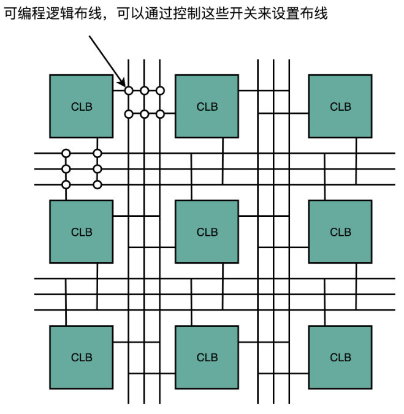

于是，通过 LUT 和寄存器，我们能够组合出很多 CLB，而通过连接不同的 CLB，最终有了我们想要的芯片功能。最关键的是，这个组合过程是可以“编程”控制的。而且这个编程出来的软件，还可以后续改写，重新写入到硬件里。让同一个硬件实现不同的芯片功能。从这个角度来说，FPGA 也是“软件吞噬世界”的一个很好的例子。 

### ASIC

除了 CPU、GPU，以及刚刚的 FPGA，我们其实还需要用到很多其他芯片。比如，现在手机里就有专门用在摄像头里的芯片；录音笔里会有专门处理音频的芯片。尽管一个 CPU 能够处理好手机拍照的功能，也能处理好录音的功能，但是在我们直接在手机或者录音笔里塞上一个 Intel CPU，显然比较浪费。

于是，我们就考虑为这些有专门用途的场景，单独设计一个芯片。这些专门设计的芯片呢，我们称之为ASIC（Application-Specific Integrated Circuit），也就是专用集成电路。事实上，过去几年，ASIC 发展得仍旧特别快。因为 ASIC 是针对专门用途设计的，所以它的电路更精简，单片的制造成本也比 CPU 更低。而且，因为电路精简，所以通常能耗要比用来做通用计算的 CPU 更低。而我们上一讲所说的早期的图形加速卡，其实就可以看作是一种 ASIC。

因为 ASIC 的生产制造成本，以及能耗上的优势，过去几年里，有不少公司设计和开发 ASIC 用来“挖矿”。这个“挖矿”，说的其实就是设计专门的数值计算芯片，用来“挖”比特币、ETH 这样的数字货币。

上面的工作其实都可以由FPGA替代完成，但是它硬件成本比较浪费，例如一个 LUT 电路设计出来之后，既可以实现与门，又可以实现或门，自然用到的晶体管数量，比单纯连死的与门或者或门的要多得多。同时，因为用的晶体管多，它的能耗也比单纯连死的电路要大，单片 FPGA 的生产制造的成本也比 ASIC 要高不少。 

FPGA的优点：没有硬件研发成本

ASIC的优点：生产制造成本低，能耗也低，长时间运行这些芯片，所用的电力成本也更低。ASIC 的电路设计，需要仿真、验证，还需要经过流片（Tape out），变成一个印刷的电路版，最终变成芯片，研发成本很高，只有需要大量生产 ASIC 芯片的时候，我们才能摊薄这份研发成本

所以到底是使用FPGA还是ASIC，是一个总体成本的问题：

### TPU

Google 开发的 TPU，是近些年最典型的ASIC芯片，第一代的TPU设计就是为了加快深度学习的推断过程。

所谓推断部分，是指我们在完成深度学习训练之后，把训练完成的模型存储下来。这个存储下来的模型，是许许多多个向量组成的参数。然后，我们根据这些参数，去计算输入的数据，最终得到一个计算结果。这个推断过程，可能是在互联网广告领域，去推测某一个用户是否会点击特定的广告；也可能是我们在经过高铁站的时候，扫一下身份证进行一次人脸识别，判断一下是不是你本人。

推断过程的特点：

* 深度学习的推断工作简单，对灵活性低，它通常只是多层简单计算组合
* 对于推断来说，响应时间比吞吐率更重要，它需要一定的实时性，例如像互联网广告的点击预测，我们往往希望能在几十毫秒乃至几毫秒之内就完成 
* 推断工作对功耗比较敏感，它是一直不停歇的运行在数据中心的服务

基于这样的整体设计思路来设计TPU，下面就是 TPU 的模块图和对应的芯片布局图：

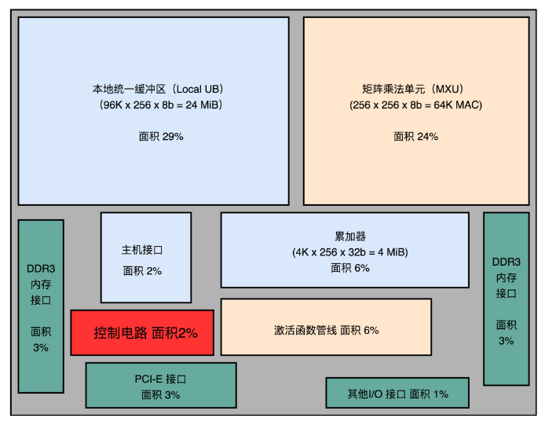

你可以看到，在芯片模块图里面，有单独的矩阵乘法单元（Matrix Multiply Unit）、累加器（Accumulators）模块、激活函数（Activation）模块和归一化 / 池化（Normalization/Pool）模块。而且，这些模块是顺序串联在一起的。

这是因为，一个深度学习的推断过程，是由很多层的计算组成的。而每一个层（Layer）的计算过程，就是先进行矩阵乘法，再进行累加，接着调用激活函数，最后进行归一化和池化。这里的硬件设计呢，就是把整个流程变成一套固定的硬件电路。这也是一个 ASIC 的典型设计思路，其实就是把确定的程序指令流程，变成固定的硬件电路。

在布局方面，其中控制电路（Control）只占了 2%。这是因为，TPU 的计算过程基本上是一个固定的流程。不像我们之前讲的 CPU 那样，有各种复杂的控制功能，比如冒险、分支预测等等。 超过一半的 TPU 的面积，都被用来作为 Local Unified Buffer（本地统一缓冲区）（29%）和矩阵乘法单元（Matrix Mutliply Unit）了 ，这是因为在深度学习推断过程中，矩阵乘法的计算量最大最复杂，而统一缓冲区是为了辅助矩阵乘法，它会高频反复地被矩阵乘法单元读写，来完成计算 。

在芯片布局图中可以看出，统一缓冲区和矩阵乘法单元是 TPU 的核心功能组件：

在性能上，TPU 比现在的 CPU、GPU 在深度学习的推断任务上，要快 15～30 倍。而在能耗比上，更是好出 30～80 倍 

## 虚拟机

虚拟机技术，使得我们可以在一台物理服务器上，同时运行多个虚拟服务器，并且可以动态去分配，每个虚拟服务器占用的资源。对于不运行的虚拟服务器，我们也可以把这个虚拟服务器“关闭”。这个“关闭”了的服务器，就和一个被关掉的物理服务器一样，它不会再占用实际的服务器资源。但是，当我们重新打开这个虚拟服务器的时候，里面的数据和应用都在，不需要再重新安装一次。 

### 模拟器

虚拟机（Virtual Machine）技术，其实就是指在现有硬件的操作系统上，能够模拟一个计算机系统的技术。而模拟一个计算机系统，最简单的办法，其实不能算是虚拟机技术，而是一个模拟器（Emulator）。

要模拟一个计算机系统，最简单的办法，就是兼容这个计算机系统的指令集。我们可以开发一个应用程序，跑在我们的操作系统上。这个应用程序呢，可以识别我们想要模拟的、计算机系统的程序格式和指令，然后一条条去解释执行。 

在这个过程中，我们把原先的操作系统叫作宿主机（Host），把能够有能力去模拟指令执行的软件，叫作模拟器（Emulator），而实际运行在模拟器上被“虚拟”出来的系统呢，我们叫客户机（Guest VM）。

这个方式，其实和运行 Java 程序的 Java 虚拟机很像，区别是：

* Java虚拟机运行的是字节码，是Java自己定义发明的中间代码
* 模拟器运行的是特定计算机系统的指令

例如各种游戏机的模拟器。这种解释执行方式的最大的优势就是，模拟的系统可以跨硬件。比如，Android 手机用的 CPU 是 ARM 的，而我们的开发机用的是 Intel X86 的，两边的 CPU 指令集都不一样，但是一样可以正常运行。

这种方式有几个缺陷：

* 做不到精确的“模拟” ，很多的老旧的硬件的程序运行，要依赖特定的电路乃至电路特有的时钟频率，想要通过软件达到 100% 模拟是很难做到的 
* 解释执行的方式性能很差，因为我们并不是直接把指令交给 CPU 去执行的，而是要经过各种解释和翻译工作 

### Type-1 和 Type-2

在 Type-2 虚拟机里，在操作系统和虚拟机之间增加了一个中间层，就是虚拟机监视器，英文叫 VMM（Virtual Machine Manager）或者 Hypervisor：

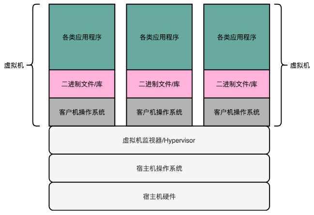

运行的虚拟机都是和虚拟机监视器交互，客户机的操作系统将所有最终到硬件的指令都发送给虚拟机监视器，虚拟机监视器，又会把这些指令再交给宿主机的操作系统去执行，这种类型的虚拟机和上面的模拟器原理是一样的，只是把在模拟器里的指令翻译工作，挪到了虚拟机监视器里，它更多是用在我们日常的个人电脑里，而不是用在数据中心里。

在数据中心里面用的虚拟机，我们通常叫作 Type-1 型的虚拟机。这个时候，客户机的指令交给虚拟机监视器之后呢，不再需要通过宿主机的操作系统，才能调用硬件，而是可以直接由虚拟机监视器去调用硬件：

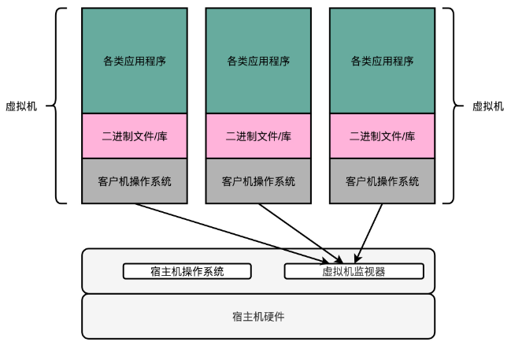

另外，在数据中心里面，我们并不需要在 Intel x86 上面去跑一个 ARM 的程序，而是直接在 x86 上虚拟一个 x86 硬件的计算机和操作系统。 指令不需要做什么翻译工作，可以直接往下传递执行就好了，所以指令的执行效率也会很高 。这是因为程序部署在数据中心里，硬件是统一可控的。

在 Type-1 型的虚拟机里，我们的虚拟机监视器其实并不是一个操作系统之上的应用层程序，而是一个嵌入在操作系统内核里面的一部分 

### 容器技术

虽然，Type-1 型的虚拟机看起来已经没有什么硬件损耗。但是，这里面还是有一个浪费的资源。在我们实际的物理机上，我们可能同时运行了多个的虚拟机，而这每一个虚拟机，都运行了一个属于自己的单独的操作系统。 多运行一个操作系统，意味着我们要多消耗一些资源在 CPU、内存乃至磁盘空间上。

很多时候我们想要的未必是一个完整的、独立的、全虚拟化的虚拟机。我们很多时候想要租用的不是“独立服务器”，而是独立的计算资源。在服务器领域，我们开发的程序都是跑在 Linux 上的。其实我们并不需要一个独立的操作系统，只要一个能够进行资源和环境隔离的“独立空间”就好了。那么，能够满足这个需求的解决方案，就是过去几年特别火热的 Docker 技术。 

在实践的服务器端的开发中，虽然我们的应用环境需要各种各样不同的依赖，可能是不同的 PHP 或者 Python 的版本，可能是操作系统里面不同的系统库，但是通常来说，我们其实都是跑在 Linux 内核上的。通过 Docker，我们不再需要在操作系统上再跑一个操作系统，而只需要通过容器编排工具，比如 Kubernetes 或者 Docker Swarm，能够进行各个应用之间的环境和资源隔离就好了。 

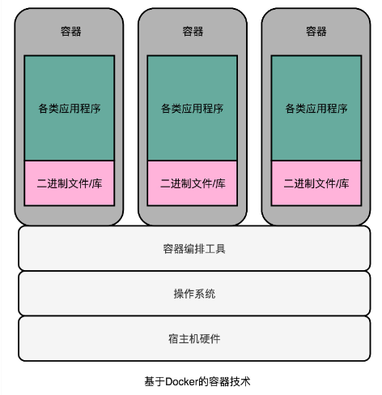

这种隔离资源的方式呢，也有人称之为“操作系统级虚拟机”，好和上面的全虚拟化虚拟机对应起来。不过严格来说，Docker 并不能算是一种虚拟机技术，而只能算是一种资源隔离的技术而已。 

## 分布式计算

扩展规模的两种方式：

* 垂直扩展（Scale Up）：升级现在这台服务器的硬件，增加CPU和内存等硬件资源
* 水平扩展（Scale Out）：增加服务器

垂直扩展是有极限的，最终都会依靠水平扩展来支撑巨大业务量。

水平扩展的好处：1、增加了计算能力；2、避免了单点故障问题（Single Point of Failure，SPOF），实现了高可用性

# 存储器

## 存储器的层次结构

可以把CPU 比喻成计算机的“大脑”。我们思考的东西，就好比 CPU 中的寄存器（Register）。寄存器与其说是存储器，其实它更像是 CPU 本身的一部分，只能存放极其有限的信息，但是速度非常快，和 CPU 同步。

而我们大脑中的记忆，就好比CPU Cache（CPU 高速缓存，我们常常简称为“缓存”）。CPU Cache 用的是一种叫作SRAM（Static Random-Access Memory，静态随机存取存储器）的芯片。

SRAM 之所以被称为“静态”存储器，是因为只要处在通电状态，里面的数据就可以保持存在。而一旦断电，里面的数据就会丢失了。在 SRAM 里面，一个比特的数据，需要 6～8 个晶体管。所以 SRAM 的存储密度不高。同样的物理空间下，能够存储的数据有限。不过，因为 SRAM 的电路简单，所以访问速度非常快。下图是6 个晶体管组成 SRAM 的一个比特 ：

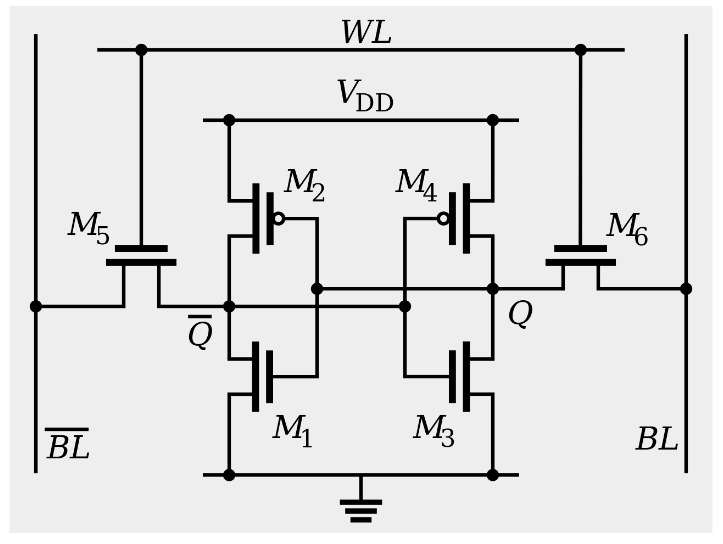

在 CPU 里，通常会有 L1、L2、L3 这样三层高速缓存：

* 每个 CPU 核心都有一块属于自己的 L1 高速缓存，通常分成指令缓存和数据缓存，分开存放 CPU 使用的指令和数据。L1 的 Cache 往往就嵌在 CPU 核心的内部 
* L2 的 Cache 同样是每个 CPU 核心都有的，不过它往往不在 CPU 核心的内部。所以，L2 Cache 的访问速度会比 L1 稍微慢一些。 
* L3 Cache，则通常是多个 CPU 核心共用的，尺寸会更大一些，访问速度自然也就更慢一些。 

内存用的芯片和 Cache 有所不同，它用的是一种叫作DRAM（Dynamic Random Access Memory，动态随机存取存储器）的芯片，比起 SRAM 来说，它的密度更高，有更大的容量，而且它也比 SRAM 芯片便宜不少。DRAM 被称为“动态”存储器，是因为 DRAM 需要靠不断地“刷新”，才能保持数据被存储起来。DRAM 的一个比特，只需要一个晶体管和一个电容就能存储。所以，DRAM 在同样的物理空间下，能够存储的数据也就更多，也就是存储的“密度”更大。但是，因为数据是存储在电容里的，电容会不断漏电，所以需要定时刷新充电，才能保持数据不丢失。DRAM 的数据访问电路和刷新电路都比 SRAM 更复杂，所以访问延时也就更长。 

整个存储器的层次结构，其实都类似于 SRAM 和 DRAM 在性能和价格上的差异。SRAM 更贵，速度更快。DRAM 更便宜，容量更大。SRAM 好像我们的大脑中的记忆，而 DRAM 就好像属于我们自己的书桌。 SSD（Solid-state drive 或 Solid-state disk，固态硬盘）、HDD（Hard Disk Drive，硬盘）这些被称为硬盘的外部存储设备，就好像公共图书馆。

存储器的层次关系图：

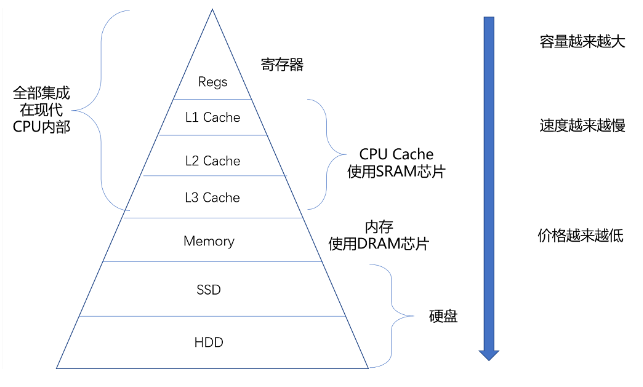

从 Cache、内存，到 SSD 和 HDD 硬盘，一台现代计算机中，就用上了所有这些存储器设备。其中，容量越小的设备速度越快，而且，CPU 并不是直接和每一种存储器设备打交道，而是每一种存储器设备，只和它相邻的存储设备打交道。比如，CPU Cache 是从内存里加载而来的，或者需要写回内存，并不会直接写回数据到硬盘，也不会直接从硬盘加载数据到 CPU Cache 中，而是先加载到内存，再从内存加载到 Cache 中。 

各个存储器只和相邻的一层存储器打交道，并且随着一层层向下，存储器的容量逐层增大，访问速度逐层变慢，而单位存储成本也逐层下降，也就构成了我们日常所说的存储器层次结构。

## 局部性原理

根据局部性原理，在业务中可以把有用户访问过的数据，加载到内存中，一旦内存里面放不下了，我们就把最长时间没有在内存中被访问过的数据，从内存中移走。热门商品被访问得多，就会始终被保留在内存里，而冷门商品被访问得少，就只存放在 HDD 硬盘上。缓存命中率（Hit Rate/Hit Ratio）达到一定程度时，一定的缓存就能大大提高整个业务的性能了。

## CPU 高速缓存

### 高速缓存的必要性

按照摩尔定律，CPU 的访问速度每 18 个月便会翻一番，相当于每年增长 60%。内存的访问速度虽然也在不断增长，却远没有这么快，每年只增长 7% 左右。而这两个增长速度的差异，使得 CPU 性能和内存访问性能的差距不断拉大。到今天来看，一次内存的访问，大约需要 120 个 CPU Cycle，这也意味着，在今天，CPU 和内存的访问速度已经有了 120 倍的差距。

随着时间变迁，CPU 和内存之间的性能差距越来越大：

为了弥补两者之间的性能差异，我们能真实地把 CPU 的性能提升用起来，而不是让它在那儿空转，我们在现代 CPU 中引入了高速缓存。

从 CPU Cache 被加入到现有的 CPU 里开始，内存中的指令、数据，会被加载到 L1-L3 Cache 中，而不是直接由 CPU 访问内存去拿。在 95% 的情况下，CPU 都只需要访问 L1-L3 Cache，从里面读取指令和数据，而无需访问内存。 

CPU Cache 是指特定的由 SRAM 组成的物理芯片 ，这里是一张 Intel CPU 的放大照片。这里面大片的长方形芯片，就是这个 CPU 使用的 20MB 的 L3 Cache ：

观察下面这个小程序：

~~~java
int[] arr = new int[64 * 1024 * 1024];
 
// 循环 1
for (int i = 0; i < arr.length; i++) arr[i] *= 3;
 
// 循环 2
for (int i = 0; i < arr.length; i += 16) arr[i] *= 3
~~~

在循环 1 里，我们遍历整个数组，将数组中每一项的值变成了原来的 3 倍；在循环 2 里，我们每隔 16 个索引访问一个数组元素，将这一项的值变成了原来的 3 倍。 按访问数量来说，循环 2 花费的时间应该是循环 1 的 1/16 左右，但实际上两者的运行时间相差无几

这是因为运行程序的时间主要花在了将对应的数据从内存中读取出来，加载到 CPU Cache 里。CPU 从内存中读取数据到 CPU Cache 的过程中，是一小块一小块来读取数据的，而不是按照单个数组元素来读取数据的。这样一小块一小块的数据，在 CPU Cache 里面，我们把它叫作 Cache Line（缓存块） 。在我们日常使用的 Intel 服务器或者 PC 里，Cache Line 的大小通常是 64 字节。而在上面的循环 2 里面，我们每隔 16 个整型数计算一次，16 个整型数正好是 64 个字节。于是，循环 1 和循环 2，需要把同样数量的 Cache Line 数据从内存中读取到 CPU Cache 中，最终两个程序花费的时间就差别不大了。 

### 高速缓存的读取过程

现代 CPU 进行数据读取的时候，无论数据是否已经存储在 Cache 中，CPU 始终会首先访问 Cache。只有当 CPU 在 Cache 中找不到数据的时候，才会去访问内存，并将读取到的数据写入 Cache 之中。当时间局部性原理起作用后，这个最近刚刚被访问的数据，会很快再次被访问。而 Cache 的访问速度远远快于内存，这样，CPU 花在等待内存访问上的时间就大大变短了。 在各类基准测试（Benchmark）和实际应用场景中，CPU Cache 的命中率通常能达到 95% 以上。 

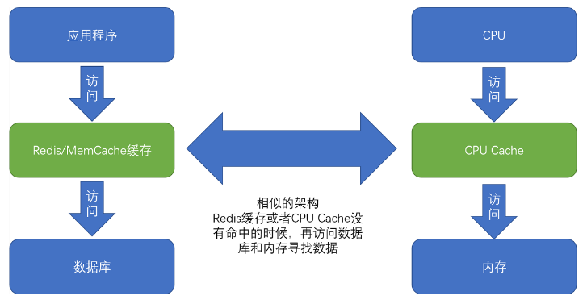

CPU 访问内存数据，是一小块一小块数据来读取的。对于读取内存中的数据，我们首先拿到的是数据所在的内存块（Block）的地址，直接映射 Cache（Direct Mapped Cache）采用的策略是：确保任何一个内存块的地址，始终映射到一个固定的 CPU Cache 地址，而这个映射关系，通常用 mod 运算（求余运算）来实现 ：

比如说，我们的主内存被分成 0～31 号这样 32 个块。我们一共有 8 个缓存块。用户想要访问第 21 号内存块。如果 21 号内存块内容在缓存块中的话，它一定在 5 号缓存块（21 mod 8 = 5）中。 

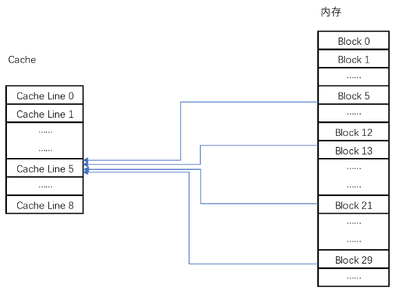

实际计算中，有一个小小的技巧，通常我们会把缓存块的数量设置成 2 的 N 次方。这样在计算取模的时候，可以直接取地址的低 N 位，也就是二进制里面的后几位。比如这里的 8 个缓存块，就是 2 的 3 次方。那么，在对 21 取模的时候，可以对 21 的 2 进制表示 10101 取地址的低三位，也就是 101，对应的 5，就是对应的缓存块地址 

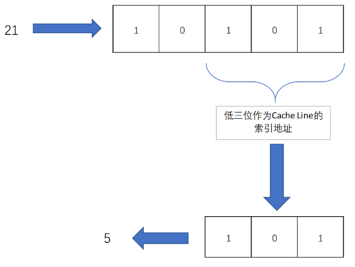

取 Block 地址的低位，就能得到对应的 Cache Line 地址，除了 21 号内存块外，13 号、5 号等很多内存块的数据，都对应着 5 号缓存块中，为了作区分引入了组标记（Tag）的概念，它存储在高速缓存的缓存块中，可以区分到底是哪个内存块存在缓存块中，例如，21 的低 3 位 101是缓存块本身的地址，而剩余的高2位信息，就对应组标记。

除了组标记信息之外，缓存块中还有两个数据：

* 有效位（valid bit）：代表缓存是否过期
* 从主内存中加载来的实际存放的数据 

CPU 在读取数据的时候，并不是要读取一整个 Block，而是读取一个他需要的整数。这样的数据，我们叫作 CPU 里的一个字（Word）。具体是哪个字，就用这个字在整个 Block 里面的位置来决定。这个位置，我们叫作偏移量（Offset） 

内存地址对应到 Cache 里的数据结构，则多了一个有效位和对应的数据，由“索引 + 有效位 + 组标记 + 数据”组成。如果内存中的数据已经在 CPU Cache 里了，那一个内存地址的访问，就会经历这样 4 个步骤：

1. 根据内存地址的低位，计算在 Cache 中的索引；
2. 判断有效位，确认 Cache 中的数据是有效的；
3. 对比内存访问地址的高位，和 Cache 中的组标记，确认 Cache 中的数据就是我们要访问的内存数据，从 Cache Line 中读取到对应的数据块（Data Block）；
4. 根据内存地址的 Offset 位，从 Data Block 中，读取希望读取到的字。

如果在 2、3 这两个步骤中，CPU 发现，Cache 中的数据并不是要访问的内存地址的数据，那 CPU 就会访问内存，并把对应的 Block Data 更新到 Cache Line 中，同时更新对应的有效位和组标记的数据。 

除了直接映射 Cache 之外，我们常见的缓存放置策略还有全相连 Cache（Fully Associative Cache）、组相连 Cache（Set Associative Cache） 。现代 CPU 已经很少使用直接映射 Cache 了，通常用的是组相连 Cache（set associative cache） 

### 缓存一致性问题

Java中的volatile 关键词的作用：确保我们对于这个变量的读取和写入，都一定会同步到主内存里，而不是从 Cache 里面读取。这和 Java 内存模型 的机制有关，当不使用volatile的时候，对变量的修改本质上只是对当前线程的缓存的修改，等到空闲的时候，各线程才会把最新的数据从主内存同步到自己的高速缓存里面，这就是一个典型的缓存一致性问题。

CPU高速缓存也有同样的问题，我们现在用的 Intel CPU，通常都是多核的的。每一个 CPU 核里面，都有独立属于自己的 L1、L2 的 Cache，然后再有多个 CPU 核共用的 L3 的 Cache、主内存，CPU 始终都是尽可能地从 CPU Cache 中去获取数据，而不是每一次都要从主内存里面去读取数据：

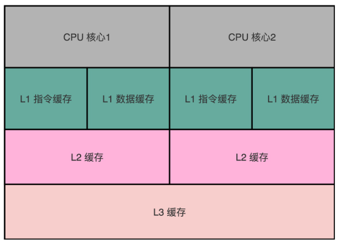

这个层级结构，就好像我们在 Java 内存模型里面，每一个线程都有属于自己的线程栈。线程在读取 COUNTER 的数据的时候，其实是从本地的线程栈的 Cache 副本里面读取数据，而不是从主内存里面读取数据。如果我们对于数据仅仅只是读，问题还不大，但遇到更新场景就可能出现问题，如果CPU更新的时候只写入自己的高速缓存中，其他CPU读取时就会读到旧的值。写入 Cache 的性能也比写入主内存要快，那我们写入的数据，到底应该写到 Cache 里还是主内存呢？

关于高速缓存的写策略，一般有两种：

1、写直达（Write-Through）

最简单的一种写入策略，叫作写直达（Write-Through）。在这个策略里，每一次数据都要写入到主内存里面。在写直达的策略里面，写入前，我们会先去判断数据是否已经在 Cache 里面了。如果数据已经在 Cache 里面了，我们先把数据写入更新到 Cache 里面，再写入到主内存里面；如果数据不在 Cache 里，我们就只更新主内存。 

这个策略的问题在于性能很差，无论数据是不是在 Cache 里面，我们都需要把数据写到主内存里面，缓存失去了作用

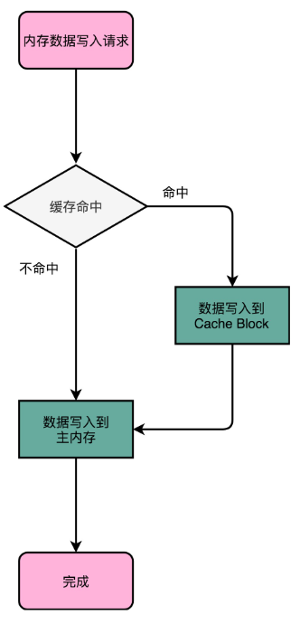

2、写回（Write-Back）

它的思路是：既然我们去读数据也是默认从 Cache 里面加载，能否把写入也写到Cache里面。

这个策略里，我们不再是每次都把数据写入到主内存，而是只写到 CPU Cache 里。只有当 CPU Cache 里面的数据要被“替换”的时候，我们才把数据写入到主内存里面去。 

写回策略的过程是这样的：如果发现我们要写入的数据，就在 CPU Cache 里面，那么我们就只是更新 CPU Cache 里面的数据。同时，我们会标记 CPU Cache 里的这个 Block 是脏（Dirty）的。所谓脏的，就是指这个时候，我们的 CPU Cache 里面的这个 Block 的数据，和主内存是不一致的。 

如果我们发现，我们要写入的数据所对应的 Cache Block 里，放的是别的内存地址的数据，那么我们就要看一看，那个 Cache Block 里面的数据有没有被标记成脏的。如果是脏的话，我们要先把这个 Cache Block 里面的数据，写入到主内存里面。然后，再把当前要写入的数据，写入到 Cache 里，同时把 Cache Block 标记成脏的。如果 Block 里面的数据没有被标记成脏的，那么我们直接把数据写入到 Cache 里面，然后再把 Cache Block 标记成脏的就好了。 

在用了写回这个策略之后，我们在加载内存数据到 Cache 里面的时候，也要多出一步同步脏 Cache 的动作。如果加载内存里面的数据到 Cache 的时候，发现 Cache Block 里面有脏标记，我们也要先把 Cache Block 里的数据写回到主内存，才能加载数据覆盖掉 Cache。

可以看到，在写回这个策略里，如果我们大量的操作，都能够命中缓存。那么大部分时间里，我们都不需要读写主内存，自然性能会比写直达的效果好很多。

然而，无论是写回还是写直达，其实都还没有解决我们在上面 volatile 程序示例中遇到的问题，也就是多个线程，或者是多个 CPU 核的缓存一致性的问题。要解决这个问题，我们需要引入一个新的方法，叫作 MESI 协议 

### MESI协议

为了解决这个缓存不一致的问题，我们就需要有一种机制，来同步两个不同核心里面的缓存数据 ，这个机制需要满足两个条件：

1、写传播（Write Propagation）：在一个 CPU 核心里，我们的 Cache 数据更新，必须能够传播到其他的对应节点的 Cache Line 里 

2、事务的串行化（Transaction Serialization）：在CPU核心里面的读取和写入，在其他的节点看起来，顺序是一样的。例如对一个有 4 个核心的 CPU：1 号核心呢，先把 iPhone 的价格改成了 5000 块。差不多在同一个时间，2 号核心把 iPhone 的价格改成了 6000 块。这里两个修改，都会传播到 3 号核心和 4 号核心。 然而这里有个问题，3 号核心先收到了 2 号核心的写传播，再收到 1 号核心的写传播。所以 3 号核心看到的 iPhone 价格是先变成了 6000 块，再变成了 5000 块。而 4 号核心呢，是反过来的，先看到变成了 5000 块，再变成 6000 块。虽然写传播是做到了，但是各个 Cache 里面的数据，是不一致的。 事实上，我们需要的是，从 1 号到 4 号核心，都能看到相同顺序的数据变化。比如说，都是先变成了 5000 块，再变成了 6000 块。这样，我们才能称之为实现了事务的串行化。 

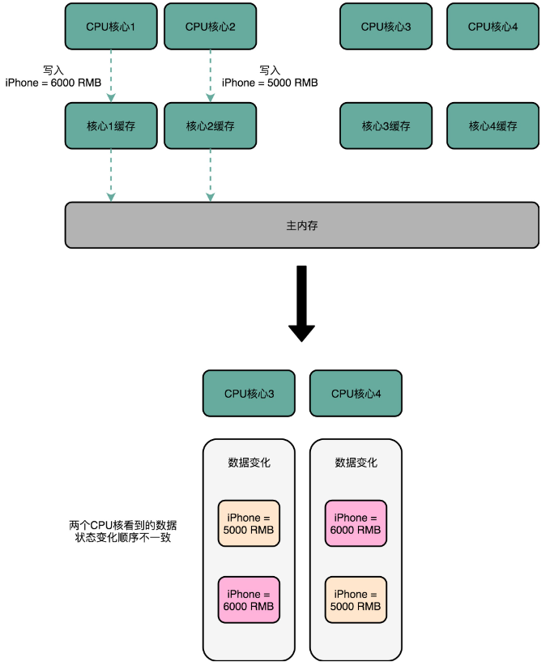

这就要求如果两个 CPU 核心里有同一个数据的 Cache，那么对于这个 Cache 数据的更新，需要有一个“锁”的概念。只有拿到了对应 Cache Block 的“锁”之后，才能进行对应的数据更新。 

为了解决多个 CPU 核心之间的数据传播问题，最常见的解决方案是总线嗅探（Bus Snooping），这个策略，本质上就是把所有的读写请求都通过总线（Bus）广播给所有的 CPU 核心，然后让各个核心去“嗅探”这些请求，再根据本地的情况进行响应 。

基于总线嗅探机制，还可以分成很多种不同的缓存一致性协议，其中最常用的就是MESI 协议，它是一种写失效（Write Invalidate）的协议，在写失效协议里，只有一个 CPU 核心负责写入数据，其他的核心，只是同步读取到这个写入。在这个 CPU 核心写入 Cache 之后，它会去广播一个“失效”请求告诉所有其他的 CPU 核心。其他的 CPU 核心，只是去判断自己是否也有一个“失效”版本的 Cache Block，然后把这个也标记成失效的。

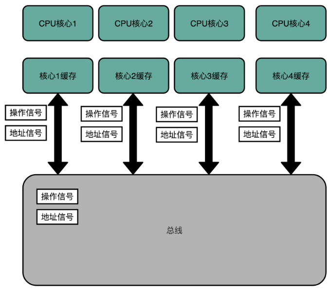

相对于写失效协议，还有一种叫作写广播（Write Broadcast）的协议。在那个协议里，一个写入请求广播到所有的 CPU 核心，同时更新各个核心里的 Cache。

写广播在实现上自然很简单，但是写广播需要占用更多的总线带宽。写失效只需要告诉其他的 CPU 核心，哪一个内存地址的缓存失效了，但是写广播还需要把对应的数据传输给其他 CPU 核心。

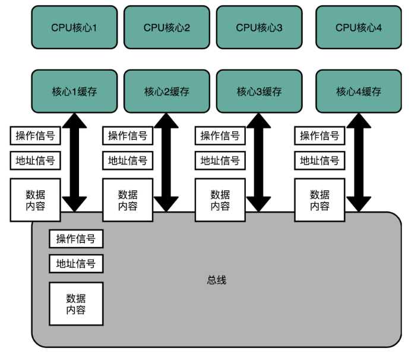

MESI 协议的由来，来自于我们对 Cache Line 的四个不同的标记，分别是：

- M：代表已修改（Modified）
- E：代表独占（Exclusive）
- S：代表共享（Shared）
- I：代表已失效（Invalidated）

其中：

* 已修改就代表是脏状态的Cache Block，代表Cache Block 里面的内容我们已经更新过了，但是还没有写回到主内存里面
* 已失效代表这个 Cache Block 里面的数据已经失效了，我们不可以相信这个 Cache Block 里面的数据 

独占和共享两个状态都代表数据是干净的，Cache Block 里面的数据和主内存里面的数据是一致的。 两者的差别在于：

* 在独占状态下，对应的 Cache Line 只加载到了当前 CPU 核所拥有的 Cache 里。其他的 CPU 核，并没有加载对应的数据到自己的 Cache 里。这个时候，如果要向独占的 Cache Block 写入数据，我们可以自由地写入数据，而不需要告知其他 CPU 核。 

  在独占状态下的数据，如果收到了一个来自于总线的读取对应缓存的请求，它就会变成共享状态 

* 共享状态代表另外一个 CPU 核心，也把对应的 Cache Block，从内存里面加载到了自己的 Cache 里来。此时同样的数据在多个 CPU 核心的 Cache 里都有。所以，当我们想要更新 Cache 里面的数据的时候，不能直接修改，而是要先向所有的其他 CPU 核心广播一个请求，要求先把其他 CPU 核心里面的 Cache，都变成无效的状态，然后再更新当前 Cache 里面的数据。这个广播操作，一般叫作 RFO（Request For Ownership），也就是获取当前对应 Cache Block 数据的所有权。 

整个 MESI 的状态，可以用一个有限状态机来表示它的状态流转。需要注意的是，对于不同状态触发的事件操作，可能来自于当前 CPU 核心，也可能来自总线里其他 CPU 核心广播出来的信号 ：

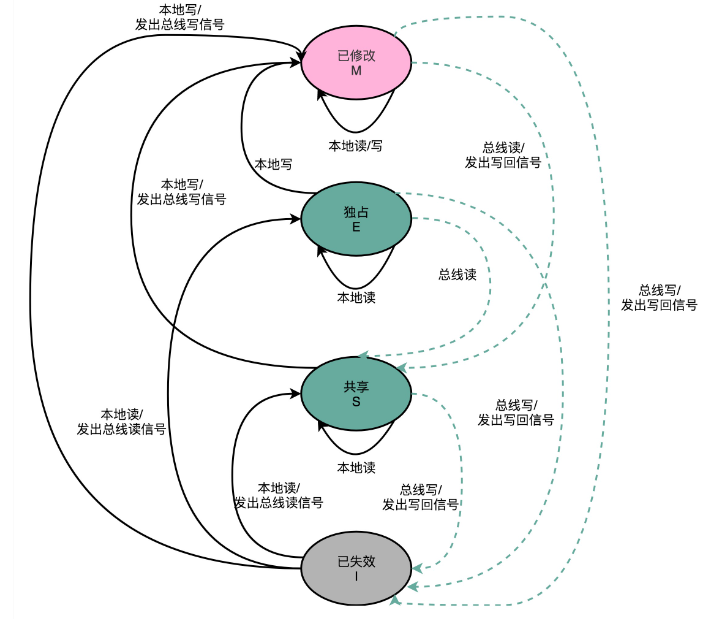

## 内存

TLB：地址变换高速缓冲（Translation-Lookaside Buffer），它是CPU里面的一个缓存芯片。

TLB 和我们前面讲的 CPU 的高速缓存类似，可以分成指令的 TLB 和数据的 TLB，也就是ITLB和DTLB。同样的，我们也可以根据大小对它进行分级，变成 L1、L2 这样多层的 TLB。

为了性能，我们整个内存地址转换过程也要由硬件来执行。在 CPU 芯片里面，我们封装了内存管理单元（MMU，Memory Management Unit）芯片，用来完成地址转换。和 TLB 的访问和交互，都是由这个 MMU 控制的。 

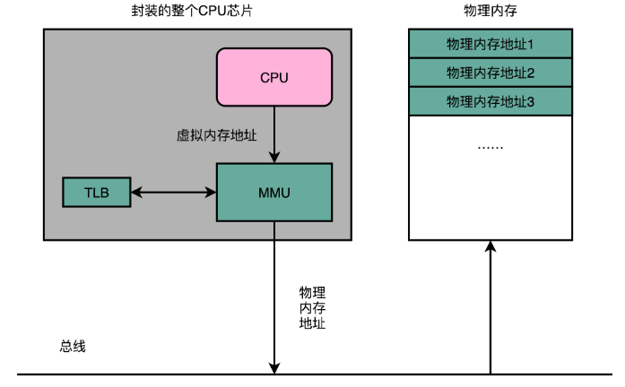

### 内存保护

计算机在内存管理方面的安全保护机制被称为内存保护（Memory Protection），常用的有以下几种：

1、可执行空间保护（Executable Space Protection）、

对于一个进程使用的内存，只把其中的指令部分设置成“可执行”的，对于其他部分，比如数据部分，不给予“可执行”的权限。因为无论是指令，还是数据，在我们的 CPU 看来，都是二进制的数据。我们直接把数据部分拿给 CPU，如果这些数据解码后，也能变成一条合理的指令，其实就是可执行的。 

如果两个区域的权限不分离，黑客就会想办法把指令放在数据部分，然后让CPU 去把它们当成指令去加载。这个手段和命令注入有些类似。

2、地址空间布局随机化（Address Space Layout Randomization）

其他的人、进程、程序，会去修改掉特定进程的指令、数据，然后，让当前进程去执行这些指令和数据，造成破坏。要想修改这些指令和数据，我们需要知道这些指令和数据所在的位置才行。 

原先我们一个进程的内存布局空间是固定的，所以任何第三方很容易就能知道指令在哪里，程序栈在哪里，数据在哪里，堆又在哪里。这个其实为想要搞破坏的人创造了很大的便利。而地址空间布局随机化这个机制，就是让这些区域的位置不再固定，在内存空间随机去分配这些进程里不同部分所在的内存空间地址，让破坏者猜不出来。猜不出来呢，自然就没法找到想要修改的内容的位置。 

## 总线

总线，其实就是一组线路。我们的 CPU、内存以及输入和输出设备，都是通过这组线路，进行相互间通信的。总线的英文叫作 Bus，就是一辆公交车。这个名字很好地描述了总线的含义。 

计算机里其实有很多不同的硬件设备，除了 CPU 和内存之外，我们还有大量的输入输出设备。 如果各个设备间的通信，都是互相之间单独进行的。如果我们有 N 个不同的设备，他们之间需要各自单独连接，那么系统复杂度就会变成N方，为了简化系统的复杂度，我们就引入了总线 ，与其让各个设备之间互相单独通信，不如我们去设计一个公用的线路。CPU 想要和什么设备通信，通信的指令是什么，对应的数据是什么，都发送到这个线路上；设备要向 CPU 发送什么信息呢，也发送到这个线路上。这个线路就好像一个高速公路，各个设备和其他设备之间，不需要单独建公路，只建一条小路通向这条高速公路就好了。 

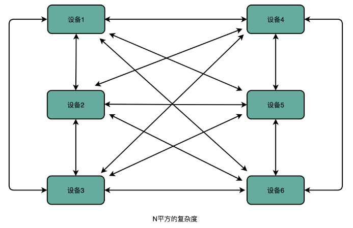

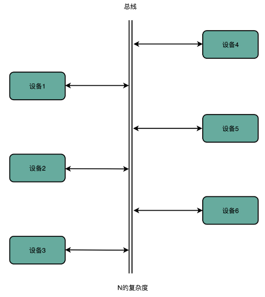

它的设计思路类似于软件开发中的事件总线（Event Bus）的设计模式，在事件总线这个设计模式里，各个模块触发对应的事件，并把事件对象发送到总线上。也就是说，每个模块都是一个发布者（Publisher）。而各个模块也会把自己注册到总线上，去监听总线上的事件，并根据事件的对象类型或者是对象内容，来决定自己是否要进行特定的处理或者响应：

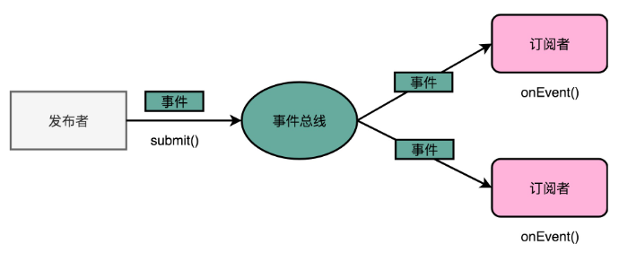

这样的设计下，注册在总线上的各个模块就是松耦合的。模块互相之间并没有依赖关系。无论代码的维护，还是未来的扩展，都会很方便。 

现代的 Intel CPU 的体系结构里面，通常有好几条总线 。

首先，CPU 和内存以及高速缓存通信的总线，这里面通常有两种总线，这种方式称之为双独立总线（Dual Independent Bus，缩写为 DIB）：

* 快速的本地总线（Local Bus）：也叫后端总线（Back-side Bus） ，用来和高速缓存通信
* 速度相对较慢的前端总线（Front-side Bus）：又叫处理器总线（Processor Bus）、内存总线（Memory Bus），用来和主内存以及输入输出设备通信

前端总线，其实就是系统总线。CPU 里面的内存接口，直接和系统总线通信，系统总线接入一个 I/O 桥接器（I/O Bridge） 。 I/O 桥接器一边接入了内存总线，使得CPU和内存通信，另一边接入了I/O 总线，用来连接 I/O 设备：

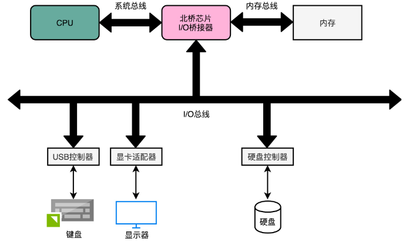

事实上，真实的计算机里，这个总线层面拆分得更细。根据不同的设备，还会分成独立的 PCI 总线、ISA 总线等等。 

在物理层面，其实我们完全可以把总线看作一组“电线”。不过呢，这些电线之间也是有分工的，我们通常有三类线路。

1. 数据线（Data Bus），用来传输实际的数据信息，也就是实际上了公交车的“人”。
2. 地址线（Address Bus），用来确定到底把数据传输到哪里去，是内存的某个位置，还是某一个 I/O 设备。这个其实就相当于拿了个纸条，写下了上面的人要下车的站点。
3. 控制线（Control Bus），用来控制对于总线的访问。虽然我们把总线比喻成了一辆公交车。那么有人想要做公交车的时候，需要告诉公交车司机，这个就是我们的控制信号。

尽管总线减少了设备之间的耦合，也降低了系统设计的复杂度，但同时也带来了一个新问题，那就是总线不能同时给多个设备提供通信功能。

我们的总线是很多个设备公用的，那多个设备都想要用总线，我们就需要有一个机制，去决定这种情况下，到底把总线给哪一个设备用。这个机制，就叫作总线裁决（Bus Arbitraction）。

## I/O设备

### 接口和设备

输入输出设备，并不只是一个设备。大部分的输入输出设备，都有两个组成部分。第一个是它的接口（Interface），第二个才是实际的 I/O 设备（Actual I/O Device）。我们的硬件设备并不是直接接入到总线上和 CPU 通信的，而是通过接口，用接口连接到总线上，再通过总线和 CPU 通信。

例如下面的SATA 硬盘，黄色齿状的就是和主板对接的接口，绿色的电路板就是控制电路，两者合到一起就是接口电路：

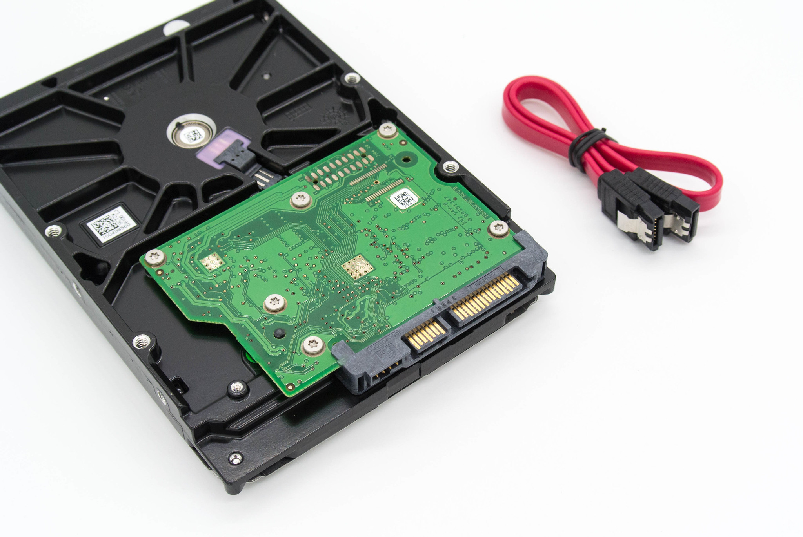

主板上内置了各种接口，比如并行接口（Parallel Interface）、串行接口（Serial Interface）、USB 接口，实际的硬件设备需要插入到这些接口上，才能开始工作，例如使用并口的打印机、使用串口的老式鼠标或者使用 USB 接口的 U 盘

接口本身就是一块电路板。CPU 其实不是和实际的硬件设备打交道，而是和这个接口电路板打交道。设备里面有三类寄存器，其实都在这个设备的接口电路上，而不在实际的设备上：它们分别是状态寄存器（Status Register）、 命令寄存器（Command Register）以及数据寄存器（Data Register）

最初的时候，设备的接口电路直接在设备上，而不在主板上。我们需要通过一个线缆，把集成了接口的设备连接到主板上去，这就是集成设备电路（Integrated Device Electronics） 。后来为了方便升级硬盘这样的设备，就使用了接口和实际设备分离的模式，走向开放架构（Open Architecture）的时代。各种输入输出设备的制造商，也可以根据接口的控制协议，来设计和制造硬盘、鼠标、键盘、打印机乃至其他种种外设

### CPU控制I/O设备

以平时使用的打印机为例介绍CPU控制I/O设备的过程：

1. 首先是数据寄存器（Data Register）。CPU 向 I/O 设备写入需要传输的数据，比如要打印的内容是“GeekTime”，我们就要先发送一个“G”给到对应的 I/O 设备。
2. 然后是命令寄存器（Command Register）。CPU 发送一个命令，告诉打印机，要进行打印工作。这个时候，打印机里面的控制电路会做两个动作。第一个，是去设置我们的状态寄存器里面的状态，把状态设置成 not-ready。第二个，就是实际操作打印机进行打印。
3. 而状态寄存器（Status Register），就是告诉了我们的 CPU，现在设备已经在工作了，所以这个时候，CPU 你再发送数据或者命令过来，都是没有用的。直到前面的动作已经完成，状态寄存器重新变成了 ready 状态，我们的 CPU 才能发送下一个字符和命令。

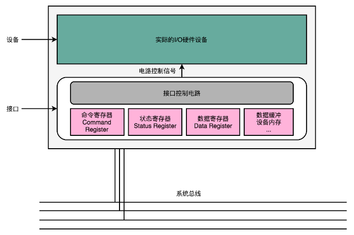

在实际情况中，打印机里通常不只有数据寄存器，还会有数据缓冲区，CPU 也不是真的一个字符一个字符这样交给打印机去打印的，而是一次性把整个文档传输到打印机的内存或者数据缓冲区里面一起打印的 

MIPS 的 CPU访问I/O设备就像访问内存一样，计算机会把 I/O 设备的各个寄存器，以及 I/O 设备内部的内存地址，都映射到主内存地址空间里来。主内存的地址空间里，会给不同的 I/O 设备预留一段一段的内存地址。 CPU 想要和这些 I/O 设备通信的时候，就往这些地址发送数据。这些地址信息，就是通过地址线来发送的，而对应的数据信息是通过数据线来发送的

I/O 设备就会监控地址线，并且在 CPU 往自己地址发送数据的时候，把对应的数据线里面传输过来的数据，接入到对应的设备里面的寄存器和内存里面来。CPU 无论是向 I/O 设备发送命令、查询状态还是传输数据，都可以通过这样的方式。这种方式叫作内存映射IO（Memory-Mapped I/O，简称 MMIO）。

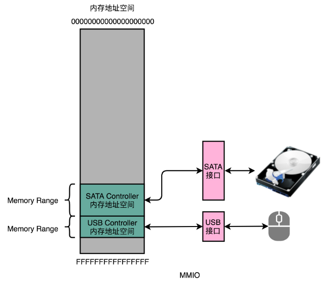

精简指令集 MIPS 的 CPU 特别简单，所以这里只有 MMIO。而我们有 2000 多个指令的 Intel X86 架构的计算机，自然可以设计专门的和 I/O 设备通信的指令，也就是 in 和 out 指令，它可以通过特定的指令，来支持端口映射 I/O（Port-Mapped I/O，简称 PMIO）或者也可以叫独立输入输出（Isolated I/O） 。其实 PMIO 的通信方式和 MMIO 差不多，核心的区别在于，PMIO 里面访问的设备地址，不再是在内存地址空间里面，而是一个专门的端口（Port）。这个端口并不是指一个硬件上的插口，而是和 CPU 通信的一个抽象概念。 

无论是 PMIO 还是 MMIO，CPU 都会传送一条二进制的数据，给到 I/O 设备的对应地址。设备自己本身的接口电路，再去解码这个数据。解码之后的数据就会变成设备支持的一条指令，再去通过控制电路去操作实际的硬件设备。 

### 评价I/O性能

和评价CPU的性能一样，硬盘I/O性能也有两个对应的指标：一个是响应时间（Response Time），另一个叫作数据传输率（Data Transfer Rate）

现在常用的硬盘有两种：

* HDD硬盘：机械硬盘，用的是 SATA 3.0 的接口 
* SSD硬盘：固态硬盘，一部分用的也是 SATA 3.0 的接口；另一部分用的是 PCI Express 的接口。 

现在我们常用的 SATA 3.0 的接口，带宽是 6Gb/s。这里的“b”是比特。这个带宽相当于每秒可以传输 768MB 的数据。 

日常使用的HDD硬盘的数据传输率在200MB/s左右，而使用SATA 3.0接口的SSD硬盘的数据传输速率能达到500MB/s，下面是运行 AS SSD 测算 SATA 接口 SSD 硬盘性能的结果，第一行的 Seq 就是顺序读写硬盘得到的数据传输率的实际结果：

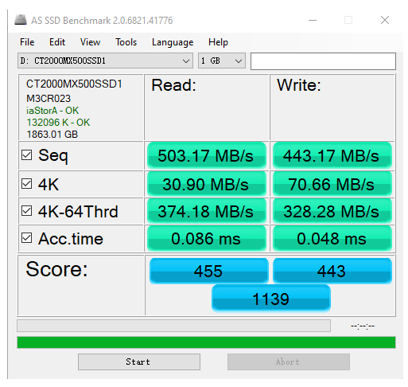

如果是使用PCI Express接口的SSD硬盘，它的数据传输速率能达到2GB/s，在写入的时候也能有 1.2GB/s：

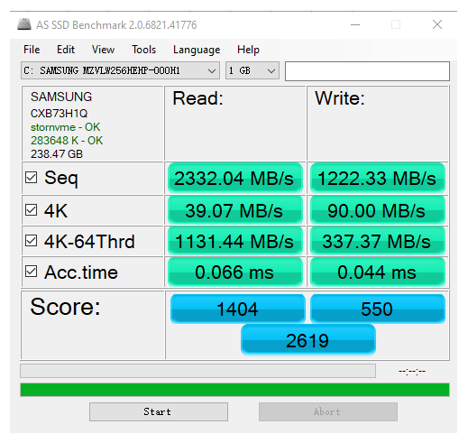

指标响应时间也可以在AS SSD 的测试结果里面看到，就是这里面的 Acc.Time 指标，它就是程序发起一个硬盘的写入请求，直到这个请求返回的时间。可以看到，在上面的两块 SSD 硬盘上，大概时间都是在几十微秒这个级别。如果你去测试一块 HDD 的硬盘，通常会在几毫秒到十几毫秒这个级别。这个性能的差异，就不是 10 倍了，而是在几十倍，乃至几百倍。 

硬盘IO的吞吐量还有一个重要的指标，对应AS SSD 的测试结果里面的4K，它代表程序去随机读取磁盘上某一个 4KB 大小的数据，一秒之内可以读取到多少数据。 此时使用 SATA 3.0 接口的硬盘和 PCI Express 接口的硬盘，性能差异变得很小。这是因为，在这个时候，接口本身的速度已经不是我们硬盘访问速度的瓶颈了。更重要的是，你会发现，即使我们用 PCI Express 的接口，在随机读写的时候，数据传输率也只能到 40MB/s 左右，是顺序读写情况下的几十分之一 

我们拿这个 40MB/s 和一次读取 4KB 的数据算一下 ：40MB / 4KB = 10,000 

也就是说，一秒之内，这块 SSD 硬盘可以随机读取 1 万次的 4KB 的数据。这个每秒读写的次数，我们称之为IOPS，也就是每秒输入输出操作的次数。事实上，比起响应时间，我们更关注 IOPS 这个性能指标，因为实际开发中，随机读写要多于顺序读写，很多个不同的进程和请求来访问服务器，它们在硬盘上访问的数据，是很难顺序放在一起的。HDD 硬盘的 IOPS 通常也就在 100 左右 。

上面测试结果中还有一个4K-Thrd，它代表服务器端处理大量并发请求的能力

综上，评价磁盘I/O性能的三个指标：数据传输率、IOPS、响应时间

在Linux中，可以通过top命令中的wa指标来观察目前CPU等待IO的时间，它就是iowait指标，然后可以执行iowait命令查看更多的指标，如tps（对应的是IOPS）、kB_read/s 和 kB_wrtn/s 指标 对应的是数据传输率。使用iotop命令可以查看是哪个进程在进行I/O读写。

### DMA

对于 I/O 的操作，都是由 CPU 发出对应的指令，然后等待 I/O 设备完成操作之后返回，那 CPU 有大量的时间其实都是在等待 I/O 设备完成操作。为了解决这个问题，就发明了 DMA 技术，也就是直接内存访问（Direct Memory Access）技术，来减少 CPU 等待的时间。

DMA 技术就是我们在主板上放一块独立的芯片。在进行内存和 I/O 设备的数据传输的时候，我们不再通过 CPU 来控制数据传输，而直接通过DMA 控制器（DMA Controller，简称 DMAC）。这块芯片，我们可以认为它其实就是一个协处理器（Co-Processor）。

DMAC 最有价值的地方体现在，当我们要传输的数据特别大、速度特别快，或者传输的数据特别小、速度特别慢的时候。

比如说，我们用千兆网卡或者硬盘传输大量数据的时候，如果都用 CPU 来搬运的话，肯定忙不过来，所以可以选择 DMAC。而当数据传输很慢的时候，DMAC 可以等数据到齐了，再发送信号，给到 CPU 去处理，而不是让 CPU 在那里忙等待。

协处理器的意思就是DMAC 是在“协助”CPU，完成对应的数据传输工作。DMAC 其实也是一个特殊的 I/O 设备，它和 CPU 以及其他 I/O 设备一样，通过连接到总线来进行实际的数据传输 。总线上的设备，其实有两种类型。一种我们称之为主设备（Master），另外一种，我们称之为从设备（Slave），主设备就是主动发起数据传输的设备，例如CPU就是主设备，数据都是CPU 从 I/O 设备读数据，要么是 CPU 向 I/O 设备写数据，I/O设备只能向CPU发送控制信号。

DMAC既是一个主设备，又是一个从设备，对于 CPU 来说，它是一个从设备；对于硬盘这样的 IO 设备来说呢，它又变成了一个主设备。 

DMAC 进行数据传输的过程：

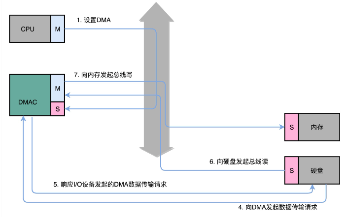

1. 首先，CPU 还是作为一个主设备，向 DMAC 设备发起请求。这个请求，其实就是在 DMAC 里面修改配置寄存器。 
2. CPU 修改 DMAC 的配置的时候，会告诉 DMAC 这样几个信息： 
   * 首先是源地址的初始值以及传输时候的地址增减方式。所谓源地址，就是数据要从哪里传输过来；而地址增减方式，就是数据是从大的地址向小的地址传输，还是从小的地址往大的地址传输 
   * 目标地址初始值和传输时候的地址增减方式
   * 要传输的数据长度，也就是我们一共要传输多少数据
3. 设置完这些信息之后，DMAC 就会变成一个空闲的状态（Idle） 
4. 如果我们要从硬盘上往内存里面加载数据，这个时候，硬盘就会向 DMAC 发起一个数据传输请求。这个请求并不是通过总线，而是通过一个额外的连线。 
5. DMAC 需要再通过一个额外的连线响应这个申请 
6. DMAC 这个芯片，就向硬盘的接口发起要总线读的传输请求。数据就从硬盘里面，读到了 DMAC 的控制器里面。 
7. DMAC 再向我们的内存发起总线写的数据传输请求，把数据写入到内存里面 
8. DMAC 会反复进行上面第 6、7 步的操作，直到 DMAC 的寄存器里面设置的数据长度传输完成。 
9. 数据传输完成之后，DMAC 重新回到第 3 步的空闲状态。 

所以，整个数据传输的过程中，我们不是通过 CPU 来搬运数据，而是由 DMAC 这个芯片来搬运数据。但是 CPU 在这个过程中也是必不可少的。因为传输什么数据，从哪里传输到哪里，其实还是由 CPU 来设置的。这也是为什么，DMAC 被叫作“协处理器”。 

最早，计算机里是没有 DMAC 的，所有数据都是由 CPU 来搬运的。随着对于数据传输的需求越来越多，先是出现了主板上独立的 DMAC 控制器。到了今天，各种 I/O 设备越来越多，数据传输的需求越来越复杂，使用的场景各不相同。加之显示器、网卡、硬盘对于数据传输的需求都不一样，所以各个设备里面都有自己的 DMAC 芯片了：

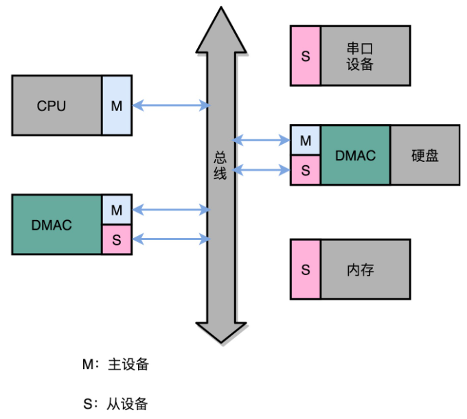

Kafka就应用了DMA进行数据传输，Kafka 里面会有两种常见的海量数据传输的情况：

* 从网络中接收上游的数据，然后需要落地到本地的磁盘上，确保数据不丢失 
* 从本地磁盘上读取出来，通过网络发送出去 

对于后一种情况，从磁盘读数据发送到网络上去，如果我们自己写一个简单的程序，最直观的办法，自然是用一个文件读操作，从磁盘上把数据读到内存里面来，然后再用一个 Socket，把这些数据发送到网络上去：

~~~
File.read(fileDesc, buf, len);
Socket.send(socket, buf, len);
~~~

在这个过程中，数据一共发生了四次传输的过程。其中两次是 DMA 的传输，另外两次，则是通过 CPU 控制的传输。下面我们来具体看看这个过程：

第一次传输，是从硬盘上，读到操作系统内核的缓冲区里。这个传输是通过 DMA 搬运的。

第二次传输，需要从内核缓冲区里面的数据，复制到我们应用分配的内存里面。这个传输是通过 CPU 搬运的。

第三次传输，要从我们应用的内存里面，再写到操作系统的 Socket 的缓冲区里面去。这个传输，还是由 CPU 搬运的。

最后一次传输，需要再从 Socket 的缓冲区里面，写到网卡的缓冲区里面去。这个传输又是通过 DMA 搬运的。

用零拷贝就可以把上面搬运的过程，从四次变成两次并且只有 DMA 来进行数据搬运，而不需要 CPU。Kafka 的代码调用了 Java NIO 库，具体是 FileChannel 里面的 transferTo 方法：

~~~java
@Override
public long transferFrom(FileChannel fileChannel, long position, long count) throws IOException {
    return fileChannel.transferTo(position, count, socketChannel);
}
~~~

我们的数据并没有读到中间的应用内存里面，而是直接通过 Channel，写入到对应的网络设备里。并且，对于 Socket 的操作，也不是写入到 Socket 的 Buffer 里面，而是直接根据描述符（Descriptor）写入到网卡的缓冲区里面。于是，在这个过程之中，我们只进行了两次数据传输：

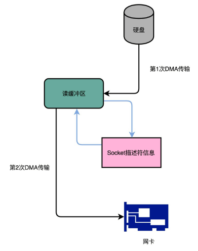

第一次，是通过 DMA，从硬盘直接读到操作系统内核的读缓冲区里面。第二次，则是根据 Socket 的描述符信息，直接从读缓冲区里面，写入到网卡的缓冲区里面。

这样，我们同一份数据传输的次数从四次变成了两次，并且没有通过 CPU 来进行数据搬运，所有的数据都是通过 DMA 来进行传输的。

在这个方法里面，我们没有在内存层面去“复制（Copy）”数据，所以这个方法，也被称之为零拷贝（Zero-Copy）。无论传输数据量的大小，传输同样的数据，使用了零拷贝能够缩短 65% 的时间，大幅度提升了机器传输数据的吞吐量 

## 机械硬盘

机械硬盘的硬件，主要由盘面、磁头和悬臂三部分组成。我们的数据在盘面上的位置，可以通过磁道、扇区和柱面来定位。 

进行一次硬盘上的随机访问，需要的时间由两个部分组成：

* 平均延时（Average Latency）：盘面旋转，把几何扇区对准悬臂位置的时间 。它和转速相关。随机情况下，平均找到一个几何扇区，我们需要旋转半圈盘面，对于一个7200转的磁盘，一秒里面，就可以旋转 240 个半圈。那么，这个平均延时就是：1s / 240 = 4.17ms 

* 平均寻道时间（Average Seek Time）：盘面选转之后，我们的悬臂定位到扇区的的时间。HDD硬盘的平均寻道时间一般在 4-10ms ，加上平均延时，随机在整个硬盘上找一个数据，需要 8-14 ms ，一块 7200 转的硬盘，我们一秒钟随机的 IO 访问次数，也就是：

  1s / 8 ms = 125 IOPS 或者 1s / 14ms = 70 IOPS 

  这个计算结果和HDD 硬盘的 IOPS 每秒 100 次左右基本一致。对于 HDD 硬盘的顺序数据读写，吞吐率还是很不错的，可以达到 200MB/s 左右。 

想要提升机械磁盘的性能，要么减少平均延时，要么减少寻道时间：

* 减少平均延时：提升硬盘转速
* 减少寻道时间：实际中只用1/2 或者 1/4 的磁道，也就是最外面 1/4 或者 1/2 的磁道，悬臂需要移动的“行程”减少，磁盘寻道时间减少的同时，可用容量也在降低。这就是Partial Stroking或者Short Stroking技术，缩短行程技术

## SSD

SSD 没有像机械硬盘那样的寻道过程，所以它的随机读写、顺序写都更快，但SSD的耐用性比如机械硬盘，这和SSD的存储和读写原理有关

### SSD的构造

对于 SSD 硬盘，我们也可以先简单地认为，它是由一个电容加上一个电压计组合在一起，记录了一个或者多个比特。 

能够记录一个比特很容易理解。给电容里面充上电有电压的时候就是 1，给电容放电里面没有电就是 0。采用这样方式存储数据的 SSD 硬盘，我们一般称之为使用了 SLC 的颗粒，全称是 Single-Level Cell，也就是一个存储单元中只有一位数据。

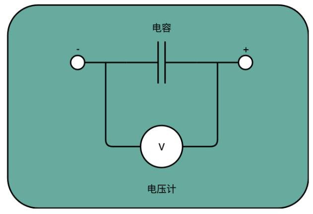

但是，这样的方式会遇到和 CPU Cache 类似的问题，那就是，同样的面积下，能够存放下的元器件是有限的。如果只用 SLC，我们就会遇到，存储容量上不去，并且价格下不来的问题。于是呢，硬件工程师们就陆续发明了MLC（Multi-Level Cell）、TLC（Triple-Level Cell）以及QLC（Quad-Level Cell），也就是能在一个电容里面存下 2 个、3 个乃至 4 个比特。

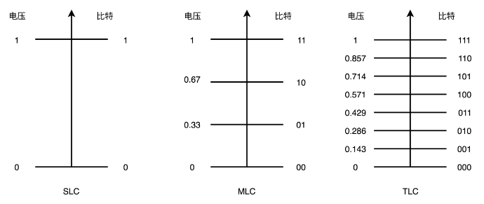

往电容里面充电的时候，充上 15 个不同的电压，并且我们电压计能够区分出这 15 个不同的电压。加上电容被放空代表的 0 ，就能够代表从 0000-1111 这样 4 个比特了。不过，要想表示 15 个不同的电压，充电和读取的时候，对于精度的要求就会更高。这会导致充电和读取的时候都更慢，所以 QLC 的 SSD 的读写速度，要比 SLC 的慢上好几倍 。

SSD 硬盘的硬件构造，可以看到它是由多层组成的：

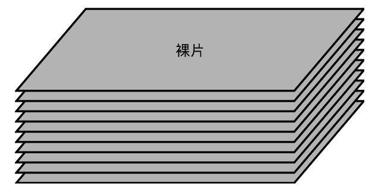

和其他的 I/O 设备一样，它有对应的接口和控制电路。现在的 SSD 硬盘用的是 SATA 或者 PCI Express 接口。在控制电路里，有一个很重要的模块，叫作FTL（Flash-Translation Layer），也就是闪存转换层。这个可以说是 SSD 硬盘的一个核心模块，SSD 硬盘性能的好坏，很大程度上也取决于 FTL 的算法好不好

实际的I/O设备和机械硬盘很像，是多个裸片（Die）叠在一起的，就好像我们的机械硬盘把很多个盘面（Platter）叠放再一起一样，这样可以在同样的空间下放下更多的容量：

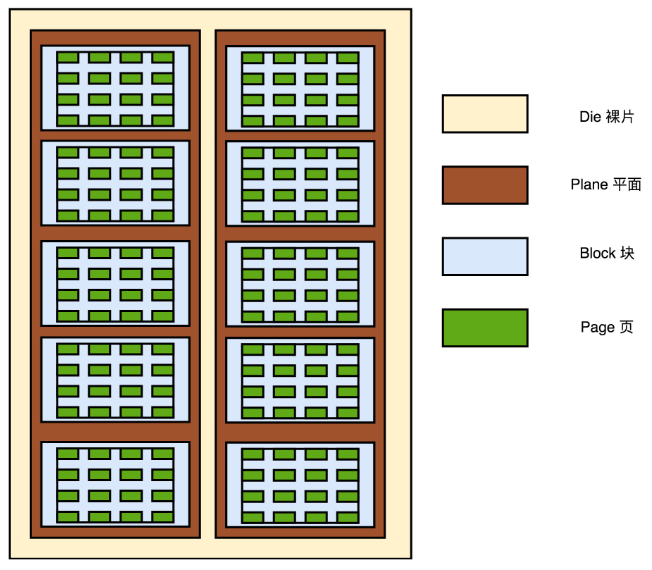

接下来，一张裸片上可以放多个平面（Plane），一般一个平面上的存储容量大概在 GB 级别。一个平面上面，会划分成很多个块（Block），一般一个块（Block）的存储大小， 通常几百 KB 到几 MB 大小。一个块里面，还会区分很多个页（Page），就和我们内存里面的页一样，一个页的大小通常是 4KB。

对于 SSD 硬盘来说，数据的写入叫作 Program。写入不能像机械硬盘一样，通过覆写（Overwrite）来进行的，而是要先去擦除（Erase），然后再写入。SSD 的读取和写入的基本单位，不是一个比特（bit）或者一个字节（byte），而是一个页（Page）。SSD 的擦除单位就更夸张了，我们不仅不能按照比特或者字节来擦除，连按照页来擦除都不行，我们必须按照块来擦除。

SSD 的使用寿命，其实是每一个块（Block）的擦除的次数。面说的 SLC 的芯片，可以擦除的次数大概在 10 万次，MLC 就在 1 万次左右，而 TLC 和 QLC 就只在几千次了。这也是为什么，你去购买 SSD 硬盘，会看到同样的容量的价格差别很大，因为它们的芯片颗粒和寿命完全不一样。

### 读写过程

用三种颜色分别来表示 SSD 硬盘里面的页的不同状态，白色代表这个页从来没有写入过数据，绿色代表里面写入的是有效的数据，红色代表里面的数据，在我们的操作系统看来已经是删除的了。

一开始，所有块的每一个页都是白色的。随着我们开始往里面写数据，里面的有些页就变成了绿色。

然后，因为我们删除了硬盘上的一些文件，所以有些页变成了红色。但是这些红色的页，并不能再次写入数据。因为 SSD 硬盘不能单独擦除一个页，必须一次性擦除整个块，所以新的数据，我们只能往后面的白色的页里面写。这些散落在各个绿色空间里面的红色空洞，就好像硬盘碎片。

如果有哪一个块的数据一次性全部被标红了，那我们就可以把整个块进行擦除。它就又会变成白色，可以重新一页一页往里面写数据。这种情况其实也会经常发生。毕竟一个块不大，也就在几百 KB 到几 MB。你删除一个几 MB 的文件，数据又是连续存储的，自然会导致整个块可以被擦除。 

随着硬盘里面的数据越来越多，红色空洞占的地方也会越来越多。于是，你会发现，我们就要没有白色的空页去写入数据了。这个时候，我们要做一次类似于 Windows 里面“磁盘碎片整理”或者 Java 里面的“内存垃圾回收”工作。找一个红色空洞最多的块，把里面的绿色数据，挪到另一个块里面去，然后把整个块擦除，变成白色，可以重新写入数据。

不过，这个“磁盘碎片整理”或者“内存垃圾回收”的工作，我们不能太主动、太频繁地去做。因为 SSD 的擦除次数是有限的。如果动不动就搞个磁盘碎片整理，那么我们的 SSD 硬盘很快就会报废了。

因为这个机制，SSD硬盘的容量是用不满的，生产 SSD 硬盘的厂商，其实是预留了一部分空间，专门用来做这个“磁盘碎片整理”工作的。一块标成 240G 的 SSD 硬盘，往往实际有 256G 的硬盘空间。SSD 硬盘通过我们的控制芯片电路，把多出来的硬盘空间，用来进行各种数据的闪转腾挪，让你能够写满那 240G 的空间。这个多出来的 16G 空间，叫作预留空间（Over Provisioning），一般 SSD 的硬盘的预留空间都在 7%-15% 左右。

综上，SSD 硬盘，特别适合读多写少的应用。在日常应用里面，我们的系统盘适合用 SSD。但是，如果我们用 SSD 做专门的下载盘，一直下载各种影音数据，就会快速消耗它的寿命

### FTL 和磨损均衡

如果你平时用的是 Windows 电脑，你会发现，用了 SSD 的系统盘，就不能用磁盘碎片整理功能。这是因为，一旦主动去运行磁盘碎片整理功能，就会发生一次块的擦除，对应块的寿命就少了一点点。这个 SSD 的擦除寿命的问题，不仅会影响像磁盘碎片整理这样的功能，其实也很影响我们的日常使用。 我们的操作系统上，并没有 SSD 硬盘上各个块目前已经擦写的情况和寿命，所以它对待 SSD 硬盘和普通的机械硬盘没有什么区别。 

使用中有时会很频繁的修改文件，例如开发过程中不断修改、新增代码文件，此时在SSD的一个区域就会有一部分频繁被擦除，有一天，这些块的擦除次数到了，变成了坏块，为了避免这种情况出现，出现了磨损均衡（Wear-Leveling）策略，让 SSD 硬盘各个块的擦除次数，均匀分摊到各个块上，实现这个技术的核心办法，和我们前面讲过的虚拟内存一样，就是添加一个间接层。这个间接层，就是我们上一讲给你卖的那个关子，就是 FTL 这个闪存转换层。

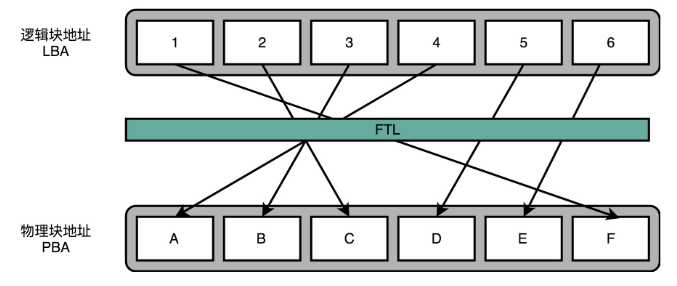

就像在管理内存的时候，我们通过一个页表映射虚拟内存页和物理页一样，在 FTL 里面，存放了逻辑块地址（Logical Block Address，简称 LBA）到物理块地址（Physical Block Address，简称 PBA）的映射。操作系统访问的硬盘地址，其实都是逻辑地址。只有通过 FTL 转换之后，才会变成实际的物理地址，找到对应的块进行访问。操作系统本身，不需要去考虑块的磨损程度，只要和操作机械硬盘一样来读写数据就好了。 

操作系统所有对于 SSD 硬盘的读写请求，都要经过 FTL。FTL 里面又有逻辑块对应的物理块，所以 FTL 能够记录下来，每个物理块被擦写的次数。如果一个物理块被擦写的次数多了，FTL 就可以将这个物理块，挪到一个擦写次数少的物理块上。但是，逻辑块不用变，操作系统也不需要知道这个变化。 

### TRIM 指令的支持

操作系统不去关心实际底层的硬件是什么，在 SSD 硬盘的使用上，也会带来一个问题。这个问题就是，操作系统的逻辑层和 SSD 的逻辑层里的块状态，是不匹配的。

我们在操作系统里面去删除一个文件，其实并没有真的在物理层面去删除这个文件，只是在文件系统里面，把对应的 inode 里面的元信息清理掉，这代表这个 inode 还可以继续使用，可以写入新的数据，这个删除的逻辑在机械硬盘层面没有问题，因为文件被标记成可以写入，后续的写入可以直接覆写这个位置。但是，在 SSD 硬盘上就不一样了，因为SSD硬盘不能覆写，必须经过擦除-写入，操作系统删除一个文件SSD硬盘并不知道，而且为了磨损均衡，很多时候在都在搬运很多已经删除了的数据。这就会产生很多不必要的数据读写和擦除。

为了解决这个问题，现在的操作系统和 SSD 的主控芯片，都支持TRIM 命令。这个命令可以在文件被删除的时候，让操作系统去通知 SSD 硬盘，对应的逻辑块已经标记成已删除了。

### 写入放大

当 SSD 硬盘的存储空间被占用得越来越多，每一次写入新数据，我们都可能没有足够的空白。我们可能不得不去进行垃圾回收，合并一些块里面的页，然后再擦除掉一些页，才能匀出一些空间来。

这个时候，从应用层或者操作系统层面来看，我们可能只是写入了一个 4KB 或者 4MB 的数据。但是，实际通过 FTL 之后，我们可能要去搬运 8MB、16MB 甚至更多的数据。

存在这样一个计算公式来定义这个过程：实际的闪存写入的数据量 / 系统通过 FTL 写入的数据量 = 写入放大。写入放大的倍数越多，意味着实际的 SSD 性能也就越差，会远远比不上实际 SSD 硬盘标称的指标。 

而解决写入放大，需要我们在后台定时进行垃圾回收，在硬盘比较空闲的时候，就把搬运数据、擦除数据、留出空白的块的工作做完，而不是等实际数据写入的时候，再进行这样的操作。 

### AeroSpike

在 NoSQL 数据库刚刚兴起的时候，AeroSpike 的性能把 Cassandra、MongoDB 这些数据库远远甩在身后，这都源于AeroSpike专门针对SSD硬盘的各种优化。

首先，AeroSpike 操作 SSD 硬盘，并没有通过操作系统的文件系统。而是直接操作 SSD 里面的块和页。因为操作系统里面的文件系统，对于 KV 数据库来说，只是让我们多了一层间接层，只会降低性能，对我们没有什么实际的作用。 

其次，AeroSpike 在读写数据的时候，做了两个优化。在写入数据的时候，AeroSpike 尽可能去写一个较大的数据块，而不是频繁地去写很多小的数据块。这样，硬盘就不太容易频繁出现磁盘碎片。并且，一次性写入一个大的数据块，也更容易利用好顺序写入的性能优势。AeroSpike 写入的一个数据块，是 128KB，远比一个页的 4KB 要大得多。 

为了降低写放大效应，AeroSpike采取了两个措施：

* 持续地进行磁盘碎片整理。用了所谓的高水位（High Watermark）算法。其实这个算法很简单，就是一旦一个物理块里面的数据碎片超过 50%，就把这个物理块搬运压缩，然后进行数据擦除，确保磁盘始终有足够的空间可以写入。 
* 为了保障数据库的性能，建议你只用到 SSD 硬盘标定容量的一半，尽可能减小写放大效应

## 可信存储器

### 单比特翻转

有时程序会因为来自硬件层面的错误，导致计算错误。当硬件没有使用 ECC 内存，在大量的数据计算中，内存中有可能出现单比特翻转（Single-Bit Flip）这个硬件错误。单比特翻转就是在内存中存储的数据有从0变成1的，它是一个随机现象。无论是因为内存的制造质量造成的漏电，还是外部的射线，都有一定的概率，会造成单比特错误 。

ECC 内存的全称是 Error-Correcting Code memory，中文名字叫作纠错内存。顾名思义，就是在内存里面出现错误的时候，能够自己纠正过来。它可以解决单比特翻转的问题。

在最初考虑内存可靠性的时候，工程师们通过奇偶校验的方式，来发现这些错误。

奇偶校验的思路很简单。我们把内存里面的 N 位比特当成是一组。常见的，比如 8 位就是一个字节。然后，用额外的一位去记录，这 8 个比特里面有奇数个 1 还是偶数个 1。如果是奇数个 1，那额外的一位就记录为 1；如果是偶数个 1，那额外的一位就记录成 0。那额外的一位，我们就称之为校验码位：

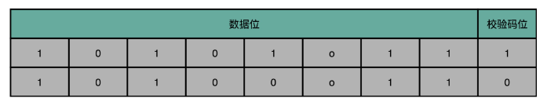

如果在这个字节里面，我们不幸发生了单比特翻转，那么数据位计算得到的校验码，就和实际校验位里面的数据不一样。我们的内存就知道出错了。

除此之外，校验位有一个很大的优点，就是计算非常快，往往只需要遍历一遍需要校验的数据，通过一个 O(N) 的时间复杂度的算法，就能把校验结果计算出来。

奇偶校验的缺陷：

* 奇偶校验只能解决遇到单个位的错误，或者说奇数个位的错误。如果出现 2 个位进行了翻转，那么这个字节的校验位计算结果其实没有变，我们的校验位自然也就不能发现这个错误。 
* 它只能发现错误，但是不能纠正错误。即使在内存里面发现数据错误了，我们也只能中止程序，而不能让程序继续正常地运行下去。 

我们不仅能捕捉到错误，还要能够纠正发生的错误。这个策略，我们通常叫作纠错码（Error Correcting Code）。它还有一个升级版本，叫作纠删码（Erasure Code），不仅能够纠正错误，还能够在错误不能纠正的时候，直接把数据删除。无论是我们的 ECC 内存，还是网络传输，乃至硬盘的 RAID，其实都利用了纠错码和纠删码的相关技术。

### 海明码

最知名的纠错码就是海明码。海明码（Hamming Code）是以他的发明人 Richard Hamming（理查德·海明）的名字命名的。这个编码方式早在上世纪四十年代就被发明出来了。而直到今天，我们上一讲所说到的 ECC 内存，也还在使用海明码来纠错。 

最基础的海明码叫7-4 海明码。这里的“7”指的是实际有效的数据，一共是 7 位（Bit）。而这里的“4”，指的是我们额外存储了 4 位数据，用来纠错。在 7-4 海明码里面，我们只能纠正某 1 位的错误，纠错码的纠错能力是有限的。

4 位的校验码，一共可以表示 2^4 = 16 个不同的数。 如果校验码不同，说明是数据出错了，那正确的校验码肯定在剩下15个值之中，所以它可以完成15个数据位的校验，但数据位只有7为，原因是单比特翻转的错误，不仅可能出现在数据位，也有可能出现在校验位。校验位本身也是可能出错的。

如果我们的数据位有 K 位，校验位有 N 位。那么我们需要满足下面这个不等式，才能确保我们能够对单比特翻转的数据纠错。这个不等式就是： 
$$
K+N+1<=2^N
$$
下面解释下海明码的纠错原理，为简单起见，来算一个4-3 海明码（也就是 4 位数据位，3 位校验位）。我们把 4 位数据位，分别记作 d1、d2、d3、d4。这里的 d，取的是数据位 data bits 的首字母。我们把 3 位校验位，分别记作 p1、p2、p3。这里的 p，取的是校验位 parity bits 的首字母。

在4位的数据位里面，取走一位，拿出3位来计算出一个对应的校验位，这个校验位的计算用之前讲过的奇偶校验就可以了 。比如，我们用 d1、d2、d3 来计算出一个校验位 p1；用 d1、d3、d4 计算出一个校验位 p2；用 d2、d3、d4 计算出一个校验位 p3。就像下面这个对应的表格一样： 

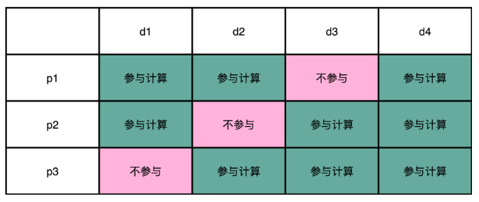

此时如果数据位发生了问题：

* 如果 d1 这一位的数据出错了，那么p1 和 p2 和校验的计算结果不一样 
* 如果d2 出错了，是因为 p1 和 p3 的校验的计算结果不一样 
* d3 出错了，则是因为 p2 和 p3 
* 如果 d4 出错了，则是 p1、p2、p3 都不一样 

也就是说，当数据码出错的时候，至少会有 2 位校验码的计算是不一致的 

如果是 p1 的校验码出错了，这个时候只有p1的校验结果出错。p2 和 p3 的出错的结果也是一样的，只有一个校验码的计算是不一致的。

下面是根据三个校验位来推断出错位的情况：

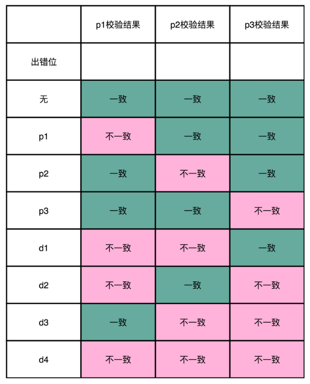

所以，通过三个校验位，就可以来保证7位数的正确性（3个校验位+4个数据位）。任何一个数据码出错了，就至少会有对应的两个或者三个校验码对不上，这样我们就能反过来找到是哪一个数据码出错了。如果校验码出错了，那么只有校验码这一位对不上，我们就知道是这个校验码出错了。 

对于两个二进制表示的数据，他们之间有差异的位数，我们称之为海明距离。比如 1001 和 0001 的海明距离是 1，因为他们只有最左侧的第一位是不同的。而 1001 和 0000 的海明距离是 2，因为他们最左侧和最右侧有两位是不同的。 

在引入了海明距离之后，我们就可以更形象地理解纠错码了。在没有纠错功能的情况下，我们看到的数据就好像是空间里面的一个一个点。这个时候，我们可以让数据之间的距离很紧凑，但是如果这些点的坐标稍稍有错，我们就可能搞错是哪一个点。

在有了 1 位纠错功能之后，就好像我们把一个点变成了以这个点为中心，半径为 1 的球。只要坐标在这个球的范围之内，我们都知道实际要的数据就是球心的坐标。而各个数据球不能距离太近，不同的数据球之间要有 3 个单位的距离。

# DMP系统

## 技术选型

DMP 系统的全称叫作数据管理平台（Data Management Platform），目前广泛应用在互联网的广告定向（Ad Targeting）、个性化推荐（Recommendation）这些领域。 通常来说，DMP 系统会通过处理海量的互联网访问数据以及机器学习算法，给一个用户标注上各种各样的标签。然后，在我们做个性化推荐和广告投放的时候，再利用这些这些标签，去做实际的广告排序、推荐等工作。无论是 Google 的搜索广告、淘宝里千人千面的商品信息，还是抖音里面的信息流推荐，背后都会有一个 DMP 系统。

DMP系统最上层有一个KV数据库，我们的广告系统或者推荐系统，可以通过一个客户端输入用户的唯一标识（ID），然后拿到这个用户的各种信息，它就是一个KV数据库：

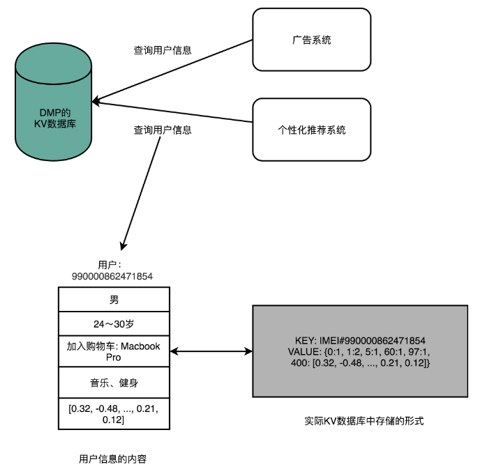

对这个KV数据库的要求：低响应时间（Low Response Time）、高可用性（High Availability）、高并发（High Concurrency）、海量数据（Big Data），同时我们需要付得起对应的成本（Affordable Cost）

整个DMP系统的架构：

为了能够生成这个 KV 数据库，我们需要有一个在客户端或者 Web 端的数据采集模块，不断采集用户的行为，向后端的服务器发送数据。服务器端接收到数据，就要把这份数据放到一个数据管道（Data Pipeline）里面。数据管道的下游，需要实际将数据落地到数据仓库（Data Warehouse），把所有的这些数据结构化地存储起来。后续，我们就可以通过程序去分析这部分日志，生成报表或者或者利用数据运行各种机器学习算法。

除了这个数据仓库之外，我们还会有一个实时数据处理模块（Realtime Data Processing），也放在数据管道的下游。它同样会读取数据管道里面的数据，去进行各种实时计算，然后把需要的结果写入到 DMP 的 KV 数据库里面去。

下面要对KV 数据库、数据管道以及数据仓库，这三个不同的数据存储的需求，选择最合理的技术方案。

看起来MongoDB满足这些要求：不需要预先数据 Schema，访问速度很快，还能够无限水平扩展。作为 KV 数据库，我们可以把 MongoDB 当作 DMP 里面的 KV 数据库；除此之外，MongoDB 还能水平扩展、跑 MQL，我们可以把它当作数据仓库来用。至于数据管道，只要我们能够不断往 MongoDB 里面，插入新的数据就好了。从运维的角度来说，我们只需要维护一种数据库，技术栈也变得简单了。 

但MongoDB并不适合。

对于数据管道来说，我们需要的是高吞吐量，对响应时间并不严格，和 KV 数据库不太一样，数据管道的数据读写都是顺序读写，没有大量的随机读写的需求

对于数据仓库来说，数据仓库的数据读取的量要比管道大得多，数据量大，而且要存放很久，需要很大的存储空间。

综上，三个应用场景的特点如下：

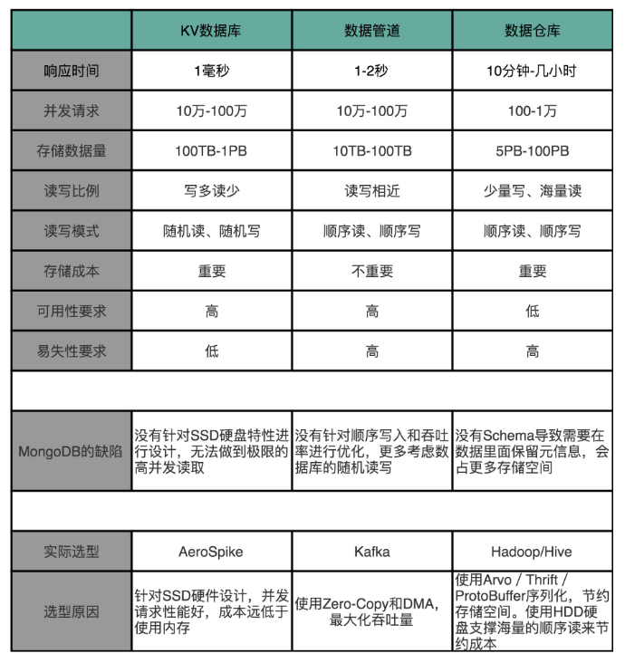

在 KV 数据库的场景下，需要支持高并发。那么 MongoDB 需要把更多的数据放在内存里面，但是这样我们的存储成本就会特别高了。

在数据管道的场景下，我们需要的是大量的顺序读写，而 MongoDB 则是一个文档数据库系统，并没有为顺序写入和吞吐量做过优化，看起来也不太适用。

而在数据仓库的场景下，主要的数据读取时顺序读取，并且需要海量的存储。MongoDB 这样的文档式数据库也没有为海量的顺序读做过优化，仍然不是一个最佳的解决方案。而且文档数据库里总是会有很多冗余的字段的元数据，还会浪费更多的存储空间。

合适的解决方案：

KV数据库：最佳的选择方案自然是使用 SSD 硬盘，选择 AeroSpike 这样的 KV 数据库。高并发的随机访问并不适合 HDD 的机械硬盘，而 400TB 的数据，如果用内存的话，成本又会显得太高。 

数据管道：最佳选择自然是 Kafka。因为我们追求的是吞吐率，采用了 Zero-Copy 和 DMA 机制的 Kafka 最大化了作为数据管道的吞吐率。而且，数据管道的读写都是顺序读写，所以我们也不需要对随机读写提供支持，用上 HDD 硬盘就好了。 

数据仓库：存放的数据量更大了。在硬件层面使用 HDD 硬盘成了一个必选项。否则，我们的存储成本就会差上 10 倍。这么大量的数据，在存储上我们需要定义清楚 Schema，使得每个字段都不需要额外存储元数据（不用像JSON那样存储字段名），能够通过 Avro/Thrift/ProtoBuffer 这样的二进制序列化的方存储下来，或者干脆直接使用 Hive 这样明确了字段定义的数据仓库产品。 

## 关系型数据库的弊端

关系型数据库使用索引来加快查询速度，但这样就带来一个问题：写入数据的时候，要同时更新多个索引，写入一条数据就要触发好几个随机写入的更新：

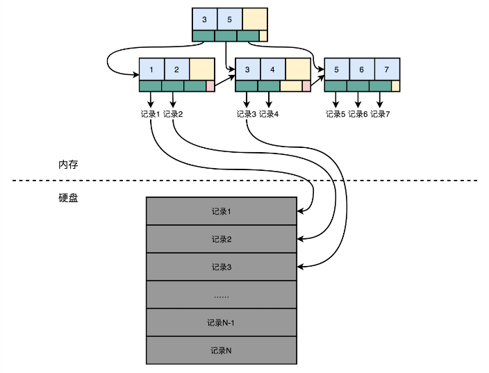

在这样一个数据模型下，查询操作很灵活。无论是根据哪个字段查询，只要有索引，我们就可以通过一次随机读，很快地读到对应的数据。但是，这个灵活性也带来了一个很大的问题，那就是无论干点什么，都有大量的随机读写请求。而随机读写请求，如果请求最终是要落到硬盘上，特别是 HDD 硬盘的话，我们就很难做到高并发了。毕竟 HDD 硬盘只有 100 左右的 QPS。 

而这个随时添加索引，可以根据任意字段进行查询，这样表现出的灵活性，又是我们的 DMP 系统里面不太需要的。DMP 的 KV 数据库主要的应用场景，是根据主键的随机查询，不需要根据其他字段进行筛选查询。数据管道的需求，则只需要不断追加写入和顺序读取就好了。即使进行数据分析的数据仓库，通常也不是根据字段进行数据筛选，而是全量扫描数据进行分析汇总。 

所以关系型数据库是很难替代KV数据库的，因为会面临大量随机写入和随机读取的挑战。所以，在实际的大型系统中，大家都会使用专门的分布式 KV 数据库，来满足这个需求。 Facebook 开源的 Cassandra就是这样一个数据库，同样地，AeroSpike也可以解决这个问题。

## Cassandra

作为一个分布式的 KV 数据库，Cassandra 的键一般被称为 Row Key。其实就是一个 16 到 36 个字节的字符串。每一个 Row Key 对应的值其实是一个哈希表，里面可以用键值对，再存入很多你需要的数据。 

Cassandra 本身不像关系型数据库那样，有严格的 Schema，在数据库创建的一开始就定义好了有哪些列（Column）。但是，它设计了一个叫作列族（Column Family）的概念，我们需要把经常放在一起使用的字段，放在同一个列族里面。比如，DMP 里面的人口属性信息，我们可以把它当成是一个列族。用户的兴趣信息，可以是另外一个列族。这样，既保持了不需要严格的 Schema 这样的灵活性，也保留了可以把常常一起使用的数据存放在一起的空间局部性。

往 Cassandra 的里面读写数据，其实特别简单，就好像是在一个巨大的分布式的哈希表里面写数据。我们指定一个 Row Key，然后插入或者更新这个 Row Key 的数据就好了。

1、Cassandra 的写操作

Cassandra 解决随机写入数据的解决方案，简单来说，就叫作“不随机写，只顺序写”。对于 Cassandra 数据库的写操作，通常包含两个动作：

* 往磁盘上写入一条提交日志（Commit Log） 
* 直接在内存的数据结构上去更新数据。后面这个往内存的数据结构里面的数据更新，只有在提交日志写成功之后才会进行 

每台机器上，都有一个可靠的硬盘可以让我们去写入提交日志。写入提交日志都是顺序写（Sequential Write），而不是随机写（Random Write），这使得我们最大化了写入的吞吐量。 

内存的空间比较有限，一旦内存里面的数据量或者条目超过一定的限额，Cassandra 就会把内存里面的数据结构 dump 到硬盘上。这个 Dump 的操作，也是顺序写而不是随机写，所以性能也不会是一个问题。除了 Dump 的数据结构文件，Cassandra 还会根据 row key 来生成一个索引文件，方便后续基于索引来进行快速查询。 

随着硬盘上的 Dump 出来的文件越来越多，Cassandra 会在后台进行文件的对比合并。在很多别的 KV 数据库系统里面，也有类似这种的合并动作，比如 AeroSpike 或者 Google 的 BigTable。这些操作我们一般称之为 Compaction。合并动作同样是顺序读取多个文件，在内存里面合并完成，再 Dump 出来一个新的文件。整个操作过程中，在硬盘层面仍然是顺序读写。 

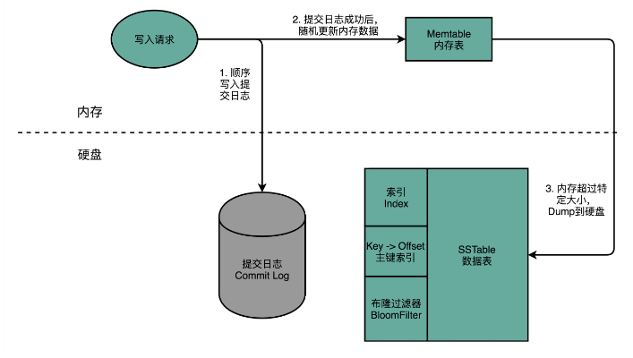

2、Cassandra 的读操作

当我们要从 Cassandra 读数据的时候，会从内存里面找数据，再从硬盘读数据，然后把两部分的数据合并成最终结果。这些硬盘上的文件，在内存里面会有对应的 Cache，只有在 Cache 里面找不到，我们才会去请求硬盘里面的数据。

如果不得不访问硬盘，因为硬盘里面可能 Dump 了很多个不同时间点的内存数据的快照。所以，找数据的时候，我们也是按照时间从新的往旧的里面找。

这也就带来另外一个问题，我们可能要查询很多个 Dump 文件，才能找到我们想要的数据。所以，Cassandra 在这一点上又做了一个优化。那就是，它会为每一个 Dump 的文件里面所有 Row Key 生成一个 BloomFilter，然后把这个 BloomFilter 放在内存里面。这样，如果想要查询的 Row Key 在数据文件里面不存在，那么 99% 以上的情况下，它会被 BloomFilter 过滤掉，而不需要访问硬盘。

这样，只有当数据在内存里面没有，并且在硬盘的某个特定文件上的时候，才会触发一次对于硬盘的读请求。

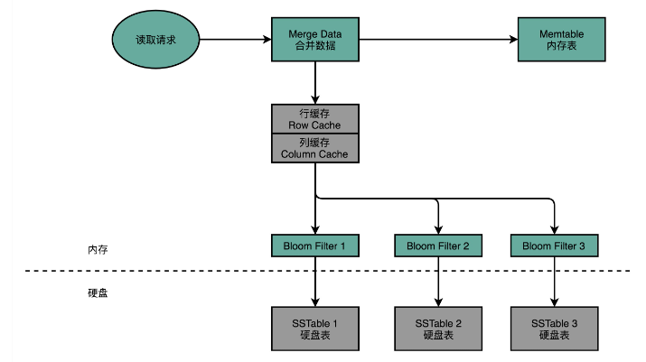

综上， Cassandra的所有写入都是顺序写或者写入到内存，所以，写入可以做到高并发；但在读取场景，如果数据读请求有很强的局部性，那我们的内存就能搞定 DMP 需要的访问量。 但如果数据缺少局部性，内存的缓存能够起到的作用就很小了，大部分请求最终还是要落到 HDD 硬盘的随机读上。真正解决这个问题的就是SSD，它的价格在 HDD 硬盘的 10 倍，但是随机读的访问能力在 HDD 硬盘的百倍以上。也就是说，用上了 SSD 硬盘，我们可以用 1/10 的成本获得和 HDD 硬盘同样的 QPS。同样的价格的 SSD 硬盘，容量则是内存的几十倍，也能够满足我们的需求，用较低的成本存下整个互联网用户信息。 

Cassandra 的写入机制完美匹配了SSD硬盘的优缺点：

* 在数据写入层面，Cassandra 的数据写入都是 Commit Log 的顺序写入，而不是去修改现有的文件内容
* 数据的对比和紧凑化（Compaction），同样是读取现有的多个文件，然后写一个新的文件出来。写入操作只追加不修改的特性，正好天然地符合 SSD 硬盘只能按块进行擦除写入的操作。在这样的写入模式下，Cassandra 用到的 SSD 硬盘，不需要频繁地进行后台的 Compaction，能够最大化 SSD 硬盘的使用寿命。这也是为什么，Cassandra 在 SSD 硬盘普及之后，能够获得进一步快速发展。 

在海量数据分析的过程中，还有一种常见的数据库，叫作列式存储的 OLAP 的数据库，比如Clickhouse

# Disruptor

Disruptor是一个开源项目，它是一个 Java 并发框架，要比Java并发包的性能更好。

## 缓存行填充

下面是Disruptor 里面一段代码，这段代码定义了7个long类型的变量：

~~~java
abstract class RingBufferPad
{
    protected long p1, p2, p3, p4, p5, p6, p7;
}
~~~

这些变量是帮助我们进行缓存行填充（Padding Cache Line）的，它能尽可能使用CPU 高速缓存（CPU Cache） ，它的基本思想是：想要追求极限性能，需要我们尽可能地多从 CPU Cache 里面拿数据，而不是从内存里面拿数据 

CPU Cache 装载内存里面的数据，不是一个一个字段加载的，而是加载一整个缓存行。举个例子，如果我们定义了一个长度为 64 的 long 类型的数组。那么数据从内存加载到 CPU Cache 里面的时候，不是一个一个数组元素加载的，而是一次性加载固定长度的一个缓存行。 

我们现在的 64 位 Intel CPU 的计算机，缓存行通常是 64 个字节（Bytes）。一个 long 类型的数据需要 8 个字节，所以我们一下子会加载 8 个 long 类型的数据。 利用这一点，一次加载数组里面连续的 8 个数值。这样的加载方式使得我们遍历数组元素的时候会很快。因为后面连续 7 次的数据访问都会命中缓存，不需要重新从内存里面去读取数据。 

但是，在我们不是使用数组，而是使用单独的变量的时候，这里就会出现问题了。 例如想让下面这一个long变量始终存在CPU的高速缓存中，在 Disruptor 的 RingBuffer（环形缓冲区）的代码里面，代表存放 RingBuffer 起始的元素位置，它是一个long类型变量INITIAL_CURSOR_VALUE：

~~~java
......
 
 
abstract class RingBufferPad
{
    protected long p1, p2, p3, p4, p5, p6, p7;
}
	
 
 
abstract class RingBufferFields<E> extends RingBufferPad
{
    ......
}
 
 
public final class RingBuffer<E> extends RingBufferFields<E> implements Cursored, EventSequencer<E>, EventSink<E>
{
    public static final long INITIAL_CURSOR_VALUE = Sequence.INITIAL_VALUE;
    protected long p1, p2, p3, p4, p5, p6, p7;
    ......
~~~

此时会出现一个问题：Disruptor 是一个多线程的服务器框架，在这个数据前后定义的其他变量，可能会被多个不同的线程去更新数据、读取数据。这些写入以及读取的请求，会来自于不同的 CPU Core。于是，为了保证数据的同步更新，我们不得不把 CPU Cache 里面的数据，重新写回到内存里面去或者重新从内存里面加载数据。 这些 CPU Cache 的写回和加载，都不是以一个变量作为单位的。这些动作都是以整个 Cache Line 作为单位的，即使单独的变量不会修改，其他相邻变量的变化也会最终导致常量的缓存失效：

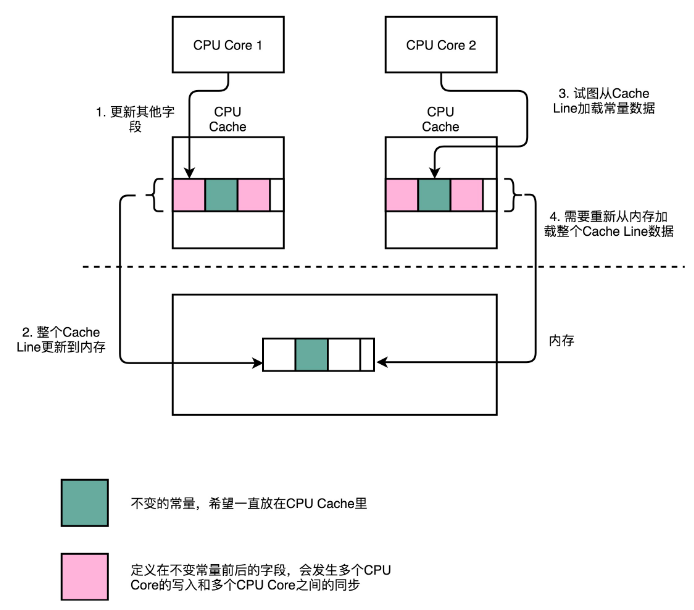

为了解决这个问题，Disruptor 在 INITIAL_CURSOR_VALUE 的前后，分别定义了 7 个 long 类型的变量。前面的 7 个来自继承的 RingBufferPad 类，后面的 7 个则是直接定义在 RingBuffer 类里面。这 14 个变量没有任何实际的用途。我们既不会去读他们，也不会去写他们。 而 INITIAL_CURSOR_VALUE 又是一个常量，也不会进行修改。所以，一旦它被加载到 CPU Cache 之后，只要被频繁地读取访问，就不会再被换出 Cache 了。这也就意味着，对于这个值的读取速度，会是一直是 CPU Cache 的访问速度，而不是内存的访问速度。 

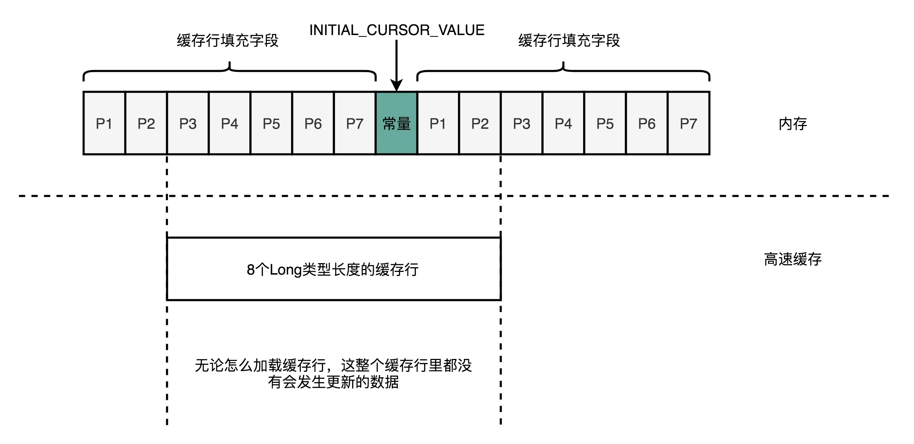

## 数组优化

Disruptor 整个框架，其实就是一个高速的生产者 - 消费者模型（Producer-Consumer）下的队列。生产者不停地往队列里面生产新的需要处理的任务，而消费者不停地从队列里面处理掉这些任务。

如果用链表实现一个队列的话，这些节点在内存中真实的分布都是零散的：

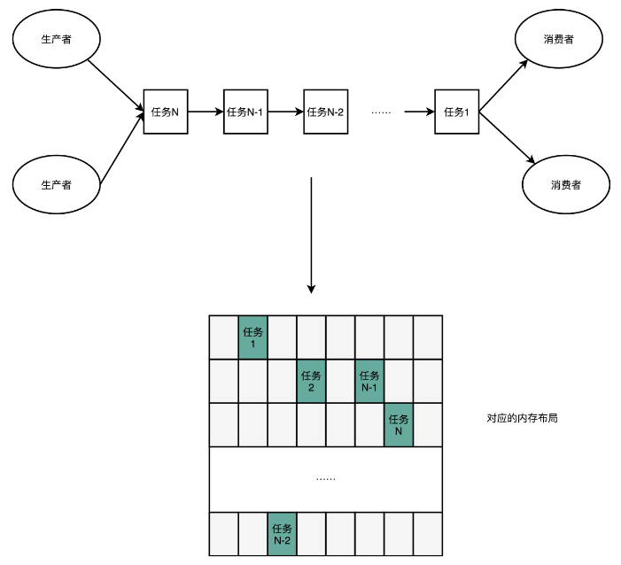

而Disruptor 里面并没有用 LinkedBlockingQueue，而是使用了一个 RingBuffer 这样的数据结构，这个 RingBuffer 的底层实现则是一个固定长度的数组。比起链表形式的实现，数组的数据在内存里面会存在空间局部性。 数组的连续多个元素会一并加载到 CPU Cache 里面来，所以访问遍历的速度会更快。而链表里面各个节点的数据，多半不会出现在相邻的内存空间，自然也就享受不到整个 Cache Line 加载后数据连续从高速缓存里面被访问到的优势。 

除此之外，数据的遍历访问还有一个很大的优势，就是 CPU 层面的分支预测会很准确。这可以使得我们更有效地利用了 CPU 里面的多级流水线，我们的程序就会跑得更快。 

## 缓慢的锁

LinkedBlockingQueue 慢，有另外一个重要的因素，那就是它对于锁的依赖：

在生产者 - 消费者模式里，我们可能有多个消费者，同样也可能有多个生产者。多个生产者都要往队列的尾指针里面添加新的任务，就会产生多个线程的竞争。于是，在做这个事情的时候，生产者就需要拿到对于队列尾部的锁。同样地，在多个消费者去消费队列头的时候，也就产生竞争。同样消费者也要拿到锁。 

在 LinkedBlockingQueue 上，这个锁机制是通过 synchronized 这个 Java 关键字来实现的。一般情况下，这个锁最终会对应到操作系统层面的加锁机制（OS-based Lock），这个锁机制需要由操作系统的内核来进行裁决。这个裁决，也需要通过一次上下文切换（Context Switch），把没有拿到锁的线程挂起等待。 

这里的上下文切换要做的和异常和中断里的是一样的。上下文切换的过程，需要把当前执行线程的寄存器等等的信息，保存到线程栈里面。而这个过程也必然意味着，已经加载到高速缓存里面的指令或者数据，又回到了主内存里面，会进一步拖慢我们的性能。 

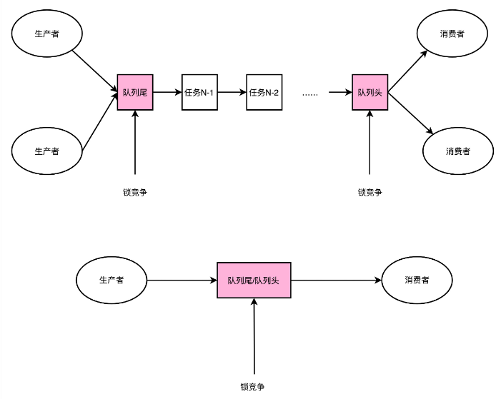

## 无锁的设计

加锁很慢，所以 Disruptor 的解决方案就是“无锁”。这个“无锁”指的是没有操作系统层面的锁。实际上，Disruptor 还是利用了一个 CPU 硬件支持的指令，称之为 CAS（Compare And Swap，比较和交换）。在 Intel CPU 里面，这个对应的指令就是 cmpxchg。 

Disruptor 的 RingBuffer 是这么设计的，它和直接在链表的头和尾加锁不同。Disruptor 的 RingBuffer 创建了一个 Sequence 对象，用来指向当前的 RingBuffer 的头和尾。这个头和尾的标识呢，不是通过一个指针来实现的，而是通过一个序号。这也是为什么对应源码里面的类名叫 Sequence：

在这个 RingBuffer 当中，进行生产者和消费者之间的资源协调，采用的是对比序号的方式。当生产者想要往队列里加入新数据的时候，它会把当前的生产者的 Sequence 的序号，加上需要加入的新数据的数量，然后和实际的消费者所在的位置进行对比，看看队列里是不是有足够的空间加入这些数据，而不会覆盖掉消费者还没有处理完的数据。

在 Sequence 的代码里面，就是通过 compareAndSet 这个方法，并且最终调用到了 UNSAFE.compareAndSwapLong，也就是直接使用了 CAS 指令。如果 CAS 的操作没有成功，它会不断忙等待地重试：

~~~java
 public boolean compareAndSet(final long expectedValue, final long newValue)
	    {
	        return UNSAFE.compareAndSwapLong(this, VALUE_OFFSET, expectedValue, newValue);
	    }
 
 
public long addAndGet(final long increment)
    {
        long currentValue;
        long newValue;
 
 
        do
        {
            currentValue = get();
            newValue = currentValue + increment;
        }
        while (!compareAndSet(currentValue, newValue));
 
 
        return newValue;
~~~

这个 CAS 指令，也就是比较和交换的操作，并不是基础库里的一个函数。它也不是操作系统里面实现的一个系统调用，而是一个 CPU 硬件支持的机器指令。在我们服务器所使用的 Intel CPU 上，就是 cmpxchg 这个指令：

~~~
compxchg [ax] (隐式参数，EAX 累加器), [bx] (源操作数地址), [cx] (目标操作数地址)
~~~

cmpxchg 指令，一共有三个操作数，第一个操作数不在指令里面出现，是一个隐式的操作数，也就是 EAX 累加寄存器里面的值。第二个操作数就是源操作数，并且指令会对比这个操作数和上面的累加寄存器里面的值。

如果值是相同的，那一方面，CPU 会把 ZF（也就是条件码寄存器里面零标志位的值）设置为 1，然后再把第三个操作数（也就是目标操作数），设置到源操作数的地址上。如果不相等的话，就会把源操作数里面的值，设置到累加器寄存器里面。

单个指令是原子的，这也就意味着在使用 CAS 操作的时候，我们不再需要单独进行加锁，直接调用就可以了。没有了锁，CPU的运行速度会快很多。