# 整体架构

## 概述

Redis是典型的键值数据库，如果构造一个简单的键值数据库SimpleKV，它应该考虑到以下这些方面：

* 它支持的value类型，例如，Memcached支持的 value 类型仅为 String 类型，而 Redis 支持的 value 类型包括了 String、哈希
  表、列表、集合等。
* 基本操作集合：PUT/GET/DELETE/SCAN
* 键值对保存位置：内存
* 访问模式：一般有两种，一种是通过函数库调用的方式，例如RocksDB；一种是通过网络框架以Socket通信的形式对外提供键值对操作，例如Memcached和Redis。通过网络框架提供键值存储服务，一方面扩大了键值数据库的受用面，但另一方面，也给键值数据库的性能、运行模型提供了不同的设计选择，带来了一些潜在的问题。选择了后者之后，还需要考虑I/O模型的问题，需要考虑网络连接的处理、网络请求的解析、数据存取的处理，到底是用一个线程还是多个线程，或者多个进程
* 索引：如何根据key找到对应的value，Memcached和Redis采用哈希表作为索引，而RocksDB采用跳表作为索引
* 内存和磁盘管理：涉及内存的回收与分配问题，避免出现内存碎片等问题；为了重启后依然提供服务，还要考虑数据的持久化机制

为了支持更丰富的业务场景，Redis 对这些组件或者功能进行了扩展，或者说是进行了精细优化，从而满足了功能和性能等方面的要求：

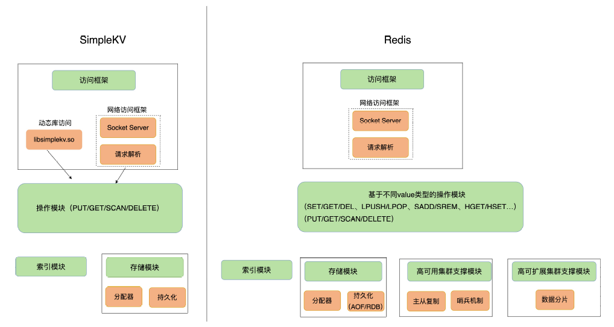

简单的键值数据库SimpleKV与Redis的对比：

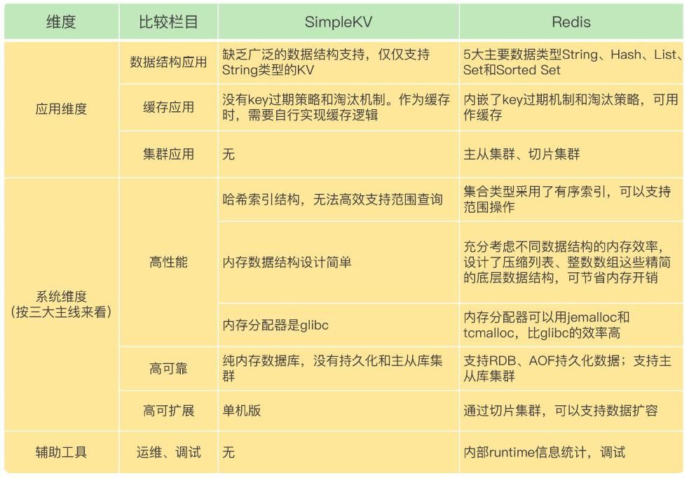

## 进程

Redis 启动以后，本身就是一个进程，它会接收客户端发送的请求，并处理读写操作请求，一般把完成这个主要工作的 Redis 进程，称为主进程或主线程。

在主线程中，我们还可以使用 fork 创建子进程，或是使用 pthread_create 创建线程。

在4.0 版本开始，Redis 也开始使用pthread_create 创建线程，这些线程在创建后，一般会自行执行一些任务，例如执行异步删除任务。相对于完成主要工作的主线程来说，我们一般可以称这些线程为后台线程：

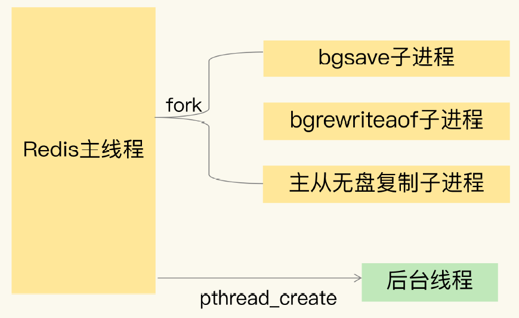

## 缓冲区

缓冲区：用一块内存空间来暂时存放命令数据，以免出现因为数据和命令的处理速度慢于发送速度而导致的数据丢失和性能问题

Redis中的缓冲区：服务器端的输入和输出缓冲区、数据同步场景下的缓冲区

### 缓冲区分类

为了避免客户端和服务器端的请求发送和处理速度不匹配，服务器端给每个连接的客户端都设置了一个输入缓冲区和输出缓冲区，我们称之为客户端输入缓冲区和输出缓冲区：

* 输入缓冲区会先把客户端发送过来的命令暂存起来，Redis 主线程再从输入缓冲区中读取命令，进行处理
* 当 Redis 主线程处理完数据后，会把结果写入到输出缓冲区，再通过输出缓冲区返回给客户端

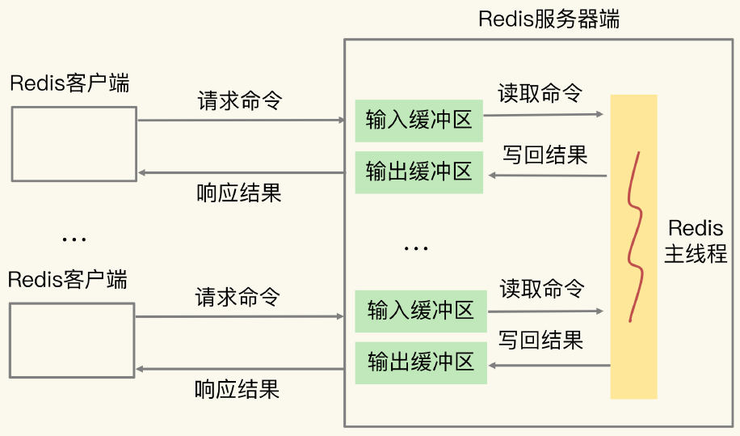

主从集群间的数据复制包括全量复制和增量复制两种：全量复制是同步所有数据，而增量复制只会把主从库网络断连期间主库收到的命令，同步给从库

无论在哪种形式的复制中，为了保证主从节点的数据一致，都会用到缓冲区

### 输入缓冲区

导致输入缓冲区溢出的情况：

* 写入了 bigkey，比如一下子写入了多个百万级别的集合类型数据；
* 服务器端处理请求的速度过慢，例如，Redis 主线程出现了间歇性阻塞，无法及时处理正常发送的请求，导致客户端发送的请求在缓冲区越积越多。

可以通过CLIENT LIST命令，查看和服务器端相连的每个客户端对输入缓冲区的使用情况，返回值中与输入缓冲区相关的结果：

* cmd，表示客户端最新执行的命令。这个例子中执行的是 CLIENT 命令。
* qbuf，表示输入缓冲区已经使用的大小。这个例子中的 CLIENT 命令已使用了 26 字节大小的缓冲区。
* qbuf-free，表示输入缓冲区尚未使用的大小。

如果 qbuf 很大，而同时 qbuf-free 很小，就要引起注意了，因为这时候输入缓冲区已经占用了很多内存，而且没有什么空闲空间了。此时，客户端再写入大量命令的话，就会引起客户端输入缓冲区溢出，Redis 的处理办法就是把客户端连接关闭，结果就是业务程序无法进行数据存取了。

Redis 的客户端输入缓冲区大小的上限阈值，在代码中就设定为了 1GB。也就是说，Redis服务器端允许为每个客户端最多暂存 1GB 的命令和数据。这个参数是不可配置的，无法调整。所以避免输入缓冲区溢出的手段就只有避免客户端写入 bigkey、避免 Redis 主线程阻塞

也要尽量减少客户端数量：

Redis服务端存在多个客户端的弊端：

- 当多个客户端连接占用的内存总量，超过了 Redis 的 maxmemory 配置项时（例如 4GB），就会触发 Redis 进行数据淘汰
- 使用多个客户端，导致 Redis 内存占用过大，也会导致内存溢出（out-of-memory）问题，进而会引起 Redis 崩溃，给业务应用造成严重影响。

### 输出缓冲区

Redis 的输出缓冲区暂存的是 Redis 主线程要返回给客户端的数据

Redis 为每个客户端设置的输出缓冲区也包括两部分：一部分，是一个大小为 16KB的固定缓冲空间，用来暂存 OK 响应和出错信息；另一部分，是一个可以动态增加的缓冲空间，用来暂存大小可变的响应结果。

发生输出缓冲区溢出的几种情况：

* 服务器端返回 bigkey 的大量结果；
* 执行了 MONITOR 命令；
* 缓冲区大小设置得不合理

MONITOR 命令是用来监测 Redis 执行的。执行这个命令之后，就会持续输出监测到的各个命令操作：

~~~
MONITOR
OK
1600617456.437129 [0 127.0.0.1:50487] "COMMAND"
1600617477.289667 [0 127.0.0.1:50487] "info" "memory"
~~~

MONITOR 的输出结果会持续占用输出缓冲区，建议线上生产环境中不要持续使用MONITOR

我们可以通过 clientoutput-buffer-limit 配置项，来设置缓冲区的大小。具体设置的内容包括两方面：

* 设置缓冲区大小的上限阈值；
* 设置输出缓冲区持续写入数据的数量上限阈值，和持续写入数据的时间的上限阈值。

在具体使用 client-output-buffer-limit 来设置缓冲区大小的时候，我们需要先区分下客户端的类型，客户端一般有几种类型：

* 常规和 Redis 服务器端进行读写命令交互的普通客户端
* 订阅了 Redis 频道的订阅客户端
* 从节点客户端：用来和从节点进行数据同步的客户端，只会出现在主从集群的主节点上

给普通客户端设置缓冲区大小时，因为普通客户端每发送完一个请求，会等到请求结果返回后，再发送下一个请求，这种阻塞式发送，除非出现特别大的key，否则是不会被阻塞的，所以一般不用特别配置，不会限制输出缓冲区的大小和写入速度：

~~~
client-output-buffer-limit normal 0 0 0
~~~

对于订阅客户端来说，一旦订阅的 Redis 频道有消息了，服务器端都会通过输出缓冲区把消息发给客户端。所以，订阅客户端和服务器间的消息发送方式，不属于阻塞式发送。不过，如果频道消息较多的话，也会占用较多的输出缓冲区空间，因此，我们会给订阅客户端设置缓冲区大小限制、缓冲区持续写入量限制，以及持续写入时间限制，可以在 Redis 配置文件中这样设置：

~~~
client-output-buffer-limit pubsub 8mb 2mb 60
~~~

其中，pubsub 参数表示当前是对订阅客户端进行设置；8mb 表示输出缓冲区的大小上限为 8MB，一旦实际占用的缓冲区大小要超过 8MB，服务器端就会直接关闭客户端的连接；2mb 和 60 表示，如果连续 60 秒内对输出缓冲区的写入量超过 2MB 的话，服务器端也会关闭客户端连接。

###复制缓冲区

在全量复制过程中，主节点在向从节点传输 RDB 文件的同时，会继续接收客户端发送的写命令请求。这些写命令就会先保存在复制缓冲区中，等 RDB 文件传输完成后，再发送给从节点去执行：

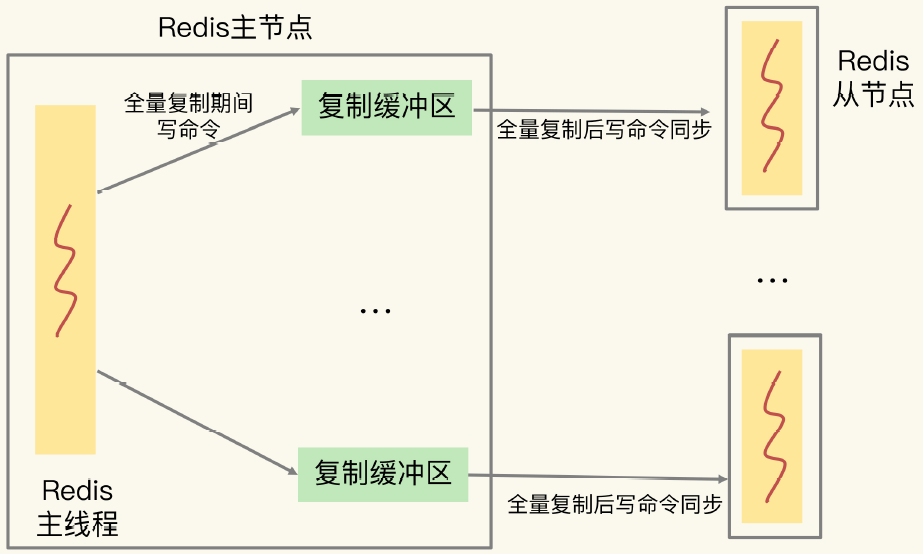

如果在全量复制时，从节点接收和加载 RDB 较慢，同时主节点接收到了大量的写命令，写命令在复制缓冲区中就会越积越多，最终导致溢出

复制缓冲区一旦发生溢出，主节点也会直接关闭和从节点进行复制操作的连接，导致全量复制失败

避免复制缓冲区出现溢出的方法：

* 控制主节点保存的数据量大小，把主节点的数据量控制在 2~4GB，这样可以让全量同步执行得更快些，避免复制缓冲区累积过多命令。

* 使用 client-output-buffer-limit 配置项，来设置合理的复制缓冲区大小，例如在主节点执行命令：

  ~~~
  config set client-output-buffer-limit slave 512mb 128mb 60
  ~~~

  其中，slave 参数表明该配置项是针对复制缓冲区的。512mb 代表将缓冲区大小的上限设置为 512MB；128mb 和 60 代表的设置是，如果连续 60 秒内的写入量超过 128MB 的话，也会触发缓冲区溢出。

  在实际应用中设置复制缓冲区的大小时，可以根据写命令数据的大小和应用的实际负载情况（也就是写命令速率），来粗略估计缓冲区中会累积的写命令数据量；然后，再和所设置的复制缓冲区大小进行比较，判断设置的缓冲区大小是否足够支撑累积的写命令数据量。

  主节点上复制缓冲区的内存开销，会是每个从节点客户端输出缓冲区占用内存的总和。如果集群中的从节点数非常多的话，主节点的内存开销就会非常大。所以，我们还必须得控制和主节点连接的从节点个数，不要使用大规模的主从集群。

### 复制积压缓冲区

增量复制时使用的缓冲区被称为复制积压缓冲区

主节点在把接收到的写命令同步给从节点时，同时会把这些写命令写入复制积压缓冲区。一旦从节点发生网络闪断，再次和主节点恢复连接后，从节点就会从复制积压缓冲区中，读取断连期间主节点接收到的写命令，进而进行增量同步：

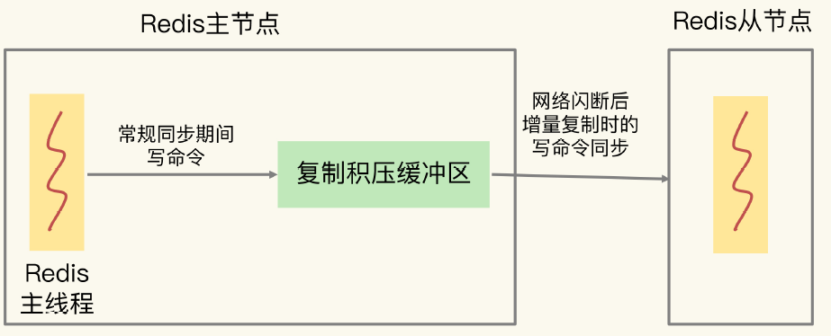

复制积压缓冲区是一个大小有限的环形缓冲区。当主节点把复制积压缓冲区写满后，会覆盖缓冲区中的旧命令数据。如果从节点还没有同步这些旧命令数据，就会造成主从节点间重新开始执行全量复制

解决复制积压缓冲区的溢出的方法：调整复制积压缓冲区的大小，具体来说就是调整repl_backlog_size 这个参数的值

### 客户端缓冲区

应用程序中使用的 Redis 客户端，需要把要发送的请求暂存在缓冲区。这种缓冲区的作用是：

* 在客户端控制发送速率，避免把过多的请求一下子全部发到 Redis 实例，导致实例因压力过大而性能下降。不过，客户端缓冲区不会太大，所以，对 Redis 实例的内存使用没有什么影响。
* 在应用 Redis 主从集群时，主从节点进行故障切换是需要一定时间的，此时，主节点无法服务外来请求。如果客户端有缓冲区暂存请求，那么，客户端仍然可以正常接收业务应用的请求，这就可以避免直接给应用返回无法服务的错误

## I/O模型

Redis 是单线程，主要是指 Redis 的网络 IO和键值对读写是由一个线程来完成的，这也是 Redis 对外提供键值存储服务的主要流程。但 Redis 的其他功能，比如持久化、异步删除、集群数据同步等，其实是由额外的线程执行的。所以，严格来说，Redis 并不是单线程

一般来说，使用多线程，可以增加系统吞吐率，或是可以增加系统扩展性。但实际情况是，只有刚开始增加线程数时，系统吞吐率会增加，但是，再进一步增加线程时，系统吞吐率就增长迟缓了，有时甚至还会出现下降的情况。这是因为系统中通常会存在被多线程同时访问的共享资源，当有多个线程要修改这个共享资源时，为了保证共享资源的正确性，就需要有额外的机制进行保证，而这个额外的机制，就会带来额外的开销。

假如Redis是多线程设计，有两个线程同时对一个List做出队和入队操作，此时就很难统计到List的真实长度，如果简单地采用一个粗粒度互斥锁就会让性能下降，采用多线程设计也会增加系统的复杂度，降低代码的易调试性和可维护性，为了避免这些问题，Redis 直接采用了单线程模式

Redis使用单线程很快的原因：1、大部分操作在内存中、高效的数据结构；2、采用了多路复用机制，使其在网络 IO 操作中能并发处理大量的客户端请求，实现高吞吐率。

在网络IO操作中，主要有两个阻塞操作：

* accept：与客户端建立连接，有时可能一直未能成功建立连接就会阻塞
* recv：从一个客户端读取数据时，如果数据一直没有到达，就会阻塞在这里

待补充 -> 03

Redis 在接收多个网络客户端发送的请求操作时，如果有一个客户端和 Redis 的网络连接断开了，Redis 会一直等待该客户端恢复连接吗？为什么？

答：Redis 不会等待客户端恢复连接。

原因是，Redis 的网络连接是由操作系统进行处理的，操作系统内核负责监听网络连接套接字上的连接请求或数据请求，而 Redis 采用了 IO 多路复用机制 epoll，不会阻塞在某一个特定的套接字上。epoll 机制监测到套接字上有请求到达时，就会触发相应的事件，并把事件放到一个队列中，Redis 就会对这个事件队列中的事件进行处理。这样一来，Redis 只用查看和处理事件队列，就可以了。当客户端网络连接断开或恢复时，操作系统会进行处理，并且在客户端能再次发送请求时，把接收到的请求以事件形式通知 Redis。

## Redis和其他键值数据库比较

Memcached 和 RocksDB 分别是典型的内存键值数据库和硬盘键值数据库，应用得也非常广泛

1、Redis 和 Memcached 的比较

和 Redis 相似，Memcached 也经常被当做缓存来使用。两者差异：

* 集群：Redis使用Slot表决定数据分布，规模有限制；而Memcached 使用一致性哈希决定数据分布，可以支持大规模集群
* 数据类型：Redis支持多种数据类型，Memcached只支持 String 类型的键值对
* 访问速度：两者都是内存数据库，性能都很好

2、Redis 和 RocksDB 的比较

* 保存方式：RocksDB可以把数据直接保存到硬盘上，单个 RocksDB 可以保存的数据量要比 Redis 多很多，而且数据都能持久化保存下来。
* 性能：RocksDB 毕竟是要把数据写入底层硬盘进行保存的，而且在进行数据查询时，如果RocksDB 要读取的数据没有在内存中缓存，那么，RocksDB 就需要到硬盘上的文件中进行查找，这会拖慢 RocksDB 的读写延迟，降低带宽
* 数据模型：RocksDB 还能支持表结构（即列族结构），而 Redis 的基本数据模型就是键值对
* 访问模式上：RocksDB 只是一个动态链接库，并没有像 Redis 那样提供了客户端 - 服务器端访问模式，以及主从集群和切片集群的功能。

## 运维工具

Redis 本身提供的 INFO 命令会返回丰富的实例运行监控信息，这个命令是 Redis 监控工具的基础。

INFO 命令在使用时，可以带一个参数 section，这个参数的取值有好几种，相应的，INFO 命令也会返回不同类型的监控信息。INFO 命令的返回信息分成 5 大类，其中，有的类别当中又包含了不同的监控内容，如下表所示：

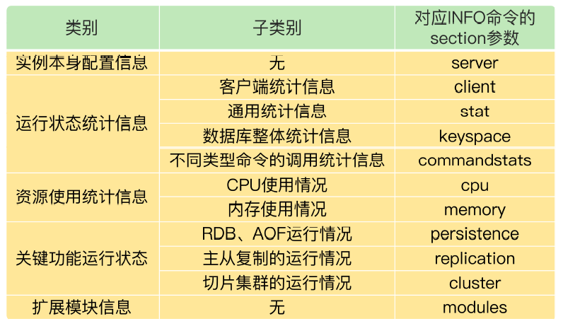

INFO 命令只是提供了文本形式的监控结果，并没有可视化，所以，在实际应用中，我们还可以使用一些第三方开源工具，将 INFO 命令的返回结果可视化。

3 种用来监控 Redis 实时运行状态的运维工具，分别是 Redis-exporter、redis-stat 和 Redis Live。

关于数据迁移，我们既可以使用 Redis-shake 工具，也可以通过 RDB 文件或是 AOF 文件进行迁移。

## 使用规范

1、bigkey

Redis 是使用单线程读写数据，bigkey 的读写操作会阻塞线程，降低 Redis 的处理效率。

bigkey 通常有两种情况：

* 键值对的值大小本身就很大，例如 value 为 1MB 的 String 类型数据。为了避免 String 类型的 bigkey，在业务层，我们要尽量把 String 类型的数据大小控制在10KB 以下。
* 键值对的值是集合类型，集合元素个数非常多，例如包含 100 万个元素的Hash 集合类型数据。为了避免集合类型的 bigkey，我给你的设计规范建议是，尽量把集合类型的元素个数控制在 1 万以下。或者将一个大集合拆分成多个小集合来保存。

2、内存空间

XML 和 JSON 格式保存数据可读性很好，但数据占用的内存空间比较大

如果业务对内存空间十分敏感，建议使用压缩工具（例如 snappy 或 gzip），把数据压缩后再写入 Redis，这样就可以节省内存空间了

3、整数对象池

整数是常用的数据类型，Redis 内部维护了 0 到 9999 这 1 万个整数对象，并把这些整数作为一个共享池使用。

建议在满足业务数据需求的前提下，能用整数时就尽量用整数，这样可以节省实例内存。

不能使用整数对象共享池的情况：

* 如果 Redis 中设置了 maxmemory，而且启用了 LRU 策略（allkeys-lru或 volatile-lru 策略），那么，整数对象共享池就无法使用了。这是因为，LRU 策略需要统计每个键值对的使用时间，如果不同的键值对都共享使用一个整数对象，LRU 策略就无法进行统计了。
* 如果集合类型数据采用 ziplist 编码，而集合元素是整数，这个时候，也不能使用共享池。因为 ziplist 使用了紧凑型内存结构，判断整数对象的共享情况效率低

4、建议不同的业务数据分实例存储

建议把不同的业务数据放到不同的 Redis 实例中，例如使用 key 的前缀把不同业务的数据区分开，把以写操作为主的业务和以读操作为主的业务数据混在一起，读写操作相互干扰，肯定会导致业务响应变慢。

5、线上禁用命令

Redis 是单线程处理请求操作，如果我们执行一些涉及大量操作、耗时长的命令，就会严重阻塞主线程，导致其它请求无法得到正常处理，这类命令主要有 3 种：

* KEYS，按照键值对的 key 内容进行匹配，返回符合匹配条件的键值对，该命令需要对Redis 的全局哈希表进行全表扫描，严重阻塞 Redis 主线程；
* FLUSHALL，删除 Redis 实例上的所有数据，如果数据量很大，会严重阻塞 Redis 主线程；
* FLUSHDB，删除当前数据库中的数据，如果数据量很大，同样会阻塞 Redis 主线程。

在线上应用 Redis 时，就需要禁用这些命令。具体的做法是，管理员用rename-command 命令在配置文件中对这些命令进行重命名，让客户端无法使用这些命令。

当然，你还可以使用其它命令替代这 3 个命令：

* 对于 KEYS 命令来说，你可以用 SCAN 命令代替 KEYS 命令，分批返回符合条件的键值对，避免造成主线程阻塞；
* 对于 FLUSHALL、FLUSHDB 命令来说，你可以加上 ASYNC 选项，让这两个命令使用后台线程异步删除数据，可以避免阻塞主线程。

6、慎用MONITOR 命令

Redis 的 MONITOR 命令在执行后，会持续输出监测到的各个命令操作，所以，我们通常会用 MONITOR 命令返回的结果，检查命令的执行情况。

但是，MONITOR 命令会把监控到的内容持续写入输出缓冲区。如果线上命令的操作很多，输出缓冲区很快就会溢出了，这就会对 Redis 性能造成影响，甚至引起服务崩溃。

除非十分需要监测某些命令的执行（例如，Redis 性能突然变慢，我们想查看下客户端执行了哪些命令），可以偶尔在短时间内使用下 MONITOR 命令，否则，建议不要使用 MONITOR 命令。

# 存储和索引

## 哈希表和rehash

当进行数据操作时，首先通过全局哈希表，通过key找到对应的value，哈希桶中的元素都是指向值的指针，这样一来，即使值是一个集合，也可以通过*value指针被查找到：

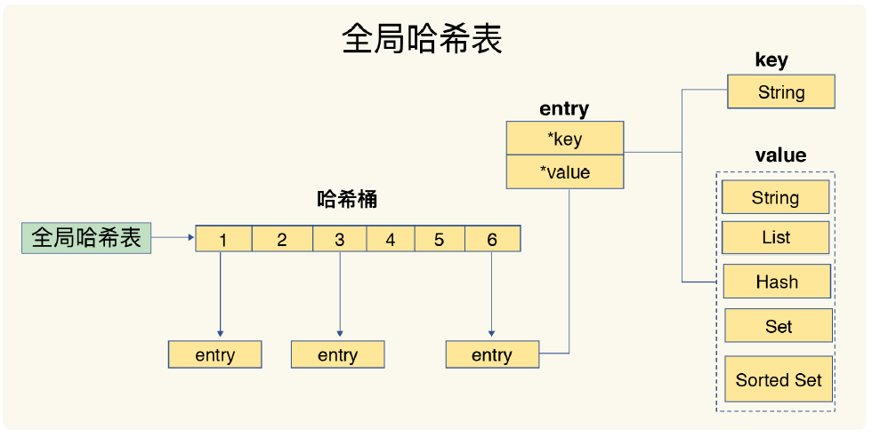

当数据量增大时，就会出现哈希冲突，Redis解决哈希冲突的方式是链式哈希，同一个哈希桶中的多个元素用一个链表来保存，它们之间依次用指针连接：

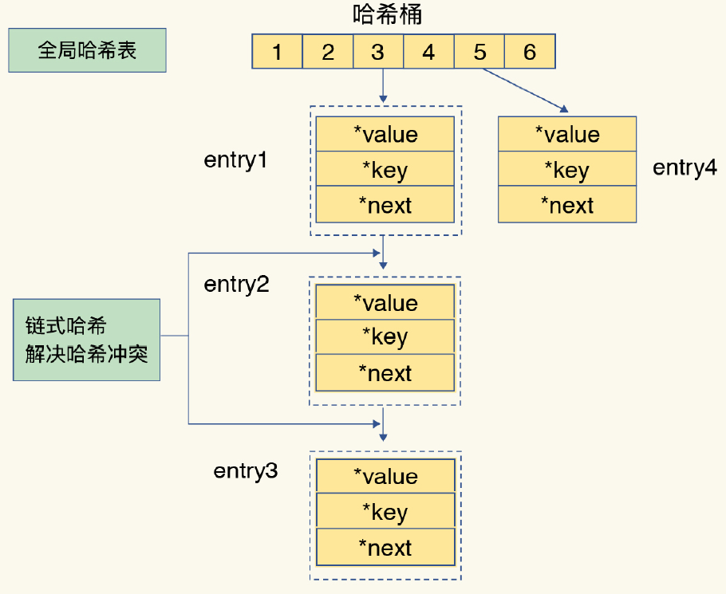

当数据量继续增大时，为了减少冲突，Redis会对哈希表做rehash操作，增加现有的哈希桶数量，并将元素重新分散。

为了使 rehash 操作更高效，Redis 默认使用了两个全局哈希表：哈希表 1 和哈希表 2。一开始，当你刚插入数据时，默认使用哈希表 1，此时的哈希表 2 并没有被分配空间。随着数据逐步增多，Redis 开始执行 rehash，这个过程分为三步：

1. 给哈希表 2 分配更大的空间，例如是当前哈希表 1 大小的两倍；
2. 把哈希表 1 中的数据重新映射并拷贝到哈希表 2 中；
3. 释放哈希表 1 的空间。

到此，我们就可以从哈希表 1 切换到哈希表 2，用增大的哈希表 2 保存更多数据，而原来的哈希表 1 留作下一次 rehash 扩容备用。

这个过程看似简单，但是第二步涉及大量的数据拷贝，如果一次性把哈希表 1 中的数据都迁移完，会造成 Redis 线程阻塞，无法服务其他请求。此时，Redis 就无法快速访问数据了。
为了避免这个问题，Redis 采用了渐进式 rehash。简单来说就是在第二步拷贝数据时，Redis 仍然正常处理客户端请求，每处理一个请求时，从哈希表 1 中的第一个索引位置开始，顺带着将这个索引位置上的所有 entries 拷贝到哈希表 2 中；等处理下一个请求时，再顺带拷贝哈希表 1 中的下一个索引位置的entries。如下图所示：

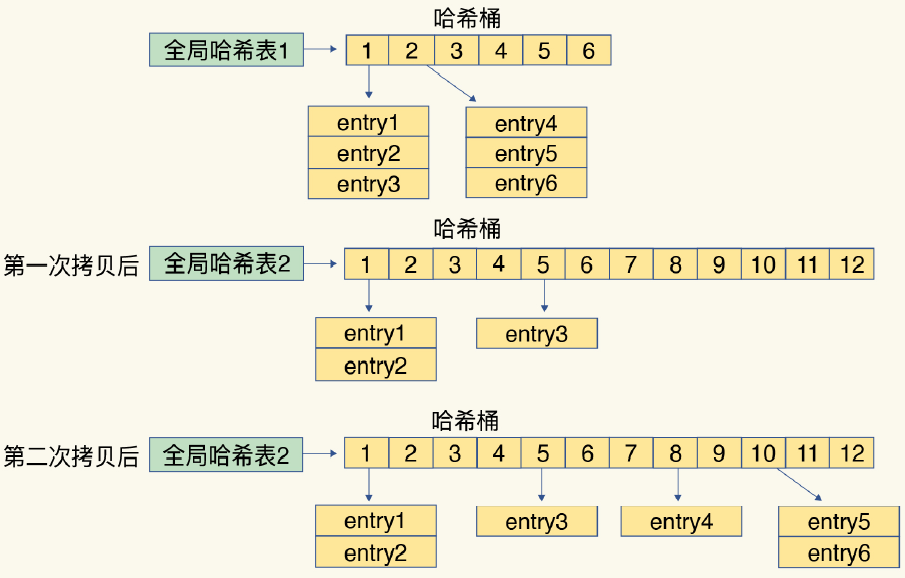

这样就巧妙地把一次性大量拷贝的开销，分摊到了多次处理请求的过程中，避免了耗时操作，保证了数据的快速访问。

触发渐进式rehash的时机：

* 装填因子大于等于1，且同时没有进行RDB生成或者AOF重写时（rehash会对这两者造成影响）
* 装填因子大于等于5，立即进行rehash

在 rehash 被触发后，即使没有收到新请求，Redis 也会定时执行一次 rehash 操作，而且，每次执行时长不会超过 1ms，以免对其他任务造成影响。

## 基本数据结构

Redis的底层数据结构一共有 6 种，分别是简单动态字符串、双向链表、压缩列表、哈希表、跳表和整数数组。它们和数据类型的对应关系如下图所示：

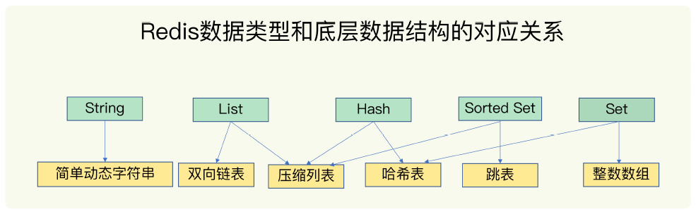

整数数组和压缩列表这种查找速度并不高的数据结构为什么可以用于Redis？

这是因为整数数组和压缩列表都是在内存中分配一块地址连续的空间，然后把集合中的元素一个接一个地放在这块空间内，非常紧凑，非常节省内存空间，Redis这样设计的意图是在性能和内存使用效率之间寻找平衡

### 压缩列表

压缩列表实际上类似于一个数组，数组中的每一个元素都对应保存一个数据。和数组不同的是，压缩列表在表头有三个字段 zlbytes、zltail 和 zllen，分别表示列表长度、列表尾的偏移量和列表中的 entry 个数；压缩列表在表尾还有一个 zlend，表示列表结束。

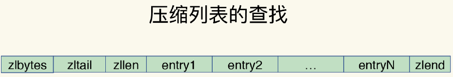

在压缩列表中，如果我们要查找定位第一个元素和最后一个元素，可以通过表头三个字段的长度直接定位，复杂度是 O(1)。而查找其他元素时，就没有这么高效了，只能逐个查找，此时的复杂度就是 O(N) 了。

### 跳表

有序链表只能逐一查找元素，导致操作起来非常缓慢，于是就出现了跳表。具体来说，跳表在链表的基础上，增加了多级索引，通过索引位置的几个跳转，实现数据的快速定位，如下图所示：

可以看到，这个查找过程就是在多级索引上跳来跳去，最后定位到元素。这也正好符合“跳”表的叫法。当数据量很大时，跳表的查找复杂度就是 O(logN)。

## 时间复杂度

各类数据结构查找元素的时间复杂度：

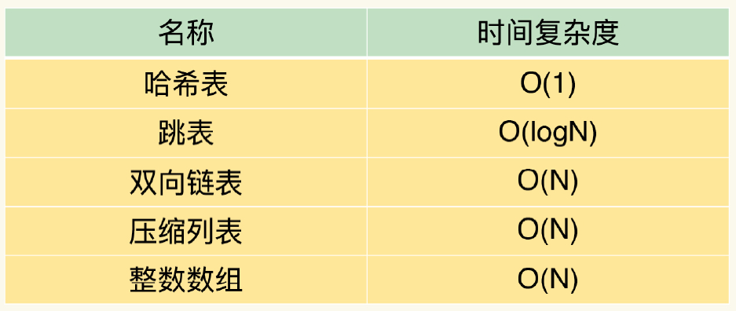

统计操作一般都是O1的时间复杂度，因为有专门的结构记录了元素的个数统计

由于压缩列表和双向链表都会记录表头和表尾的偏移量。这样一来，对于 List 类型的 LPOP、RPOP、LPUSH、RPUSH 这四个操作来说，它们是在列表的头尾增删元素，这就可以通过偏移量直接定位，所以它们的复杂度也只有 O(1)，可以实现快速操作。

## 内存消耗

当保存 64 位有符号整数时，String 类型会把它保存为一个 8 字节的 Long 类型整数，这种保存方式通常也叫作 int 编码方式。

但当保存的数据中包含字符时，String 类型就会用简单动态字符串（Simple Dynamic String，SDS）结构体来保存，如下图所示：

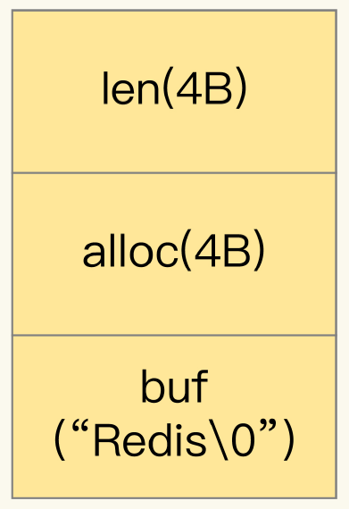

buf：字节数组，保存实际数据。为了表示字节数组的结束，Redis 会自动在数组最后加一个“\0”，这就会额外占用 1 个字节的开销。
len：占 4 个字节，表示 buf 的已用长度。
alloc：也占个 4 字节，表示 buf 的实际分配长度，一般大于 len。

Redis中所有的数据类型都有相同的元数据要记录（比如最后一次访问的时间、被引用的次数等），所以，Redis 会用一个 RedisObject 结构体来统一记录这些元数据，同时指向实际数据。

一个 RedisObject 包含了 8 字节的元数据和一个 8 字节指针，这个指针再进一步指向具体数据类型的实际数据所在，例如指向 String 类型的 SDS 结构所在的内存地址：

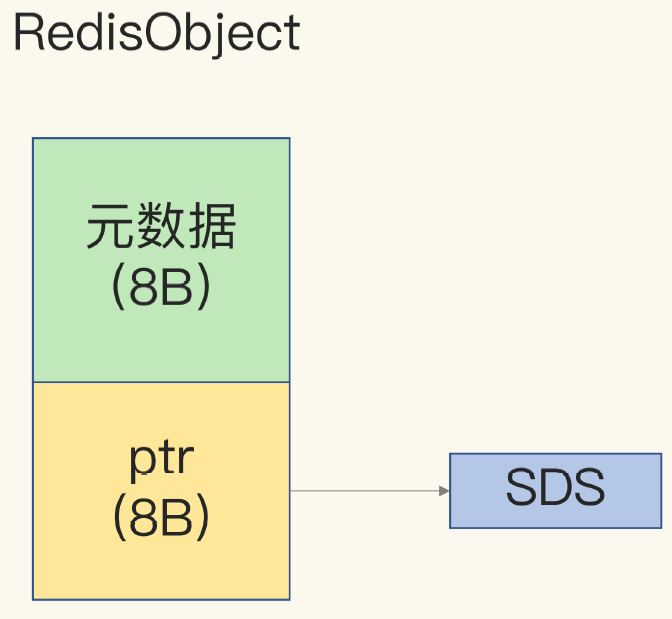

为了节省内存空间，Redis 还对 Long 类型整数和 SDS 的内存布局做了专门的设计：

* 一方面，当保存的是 Long 类型整数时，RedisObject 中的指针就直接赋值为整数数据了，这样就不用额外的指针再指向整数了，节省了指针的空间开销。
* 另一方面，当保存的是字符串数据，并且字符串小于等于 44 字节时，RedisObject 中的元数据、指针和 SDS 是一块连续的内存区域，这样就可以避免内存碎片。这种布局方式也被称为 embstr 编码方式。
* 当字符串大于 44 字节时，SDS 的数据量就开始变多了，Redis 就不再把 SDS 和RedisObject 布局在一起了，而是会给 SDS 分配独立的空间，并用指针指向 SDS 结构。这种布局方式被称为 raw 编码模式。

int、embstr 和 raw 这三种编码模式的示意图：

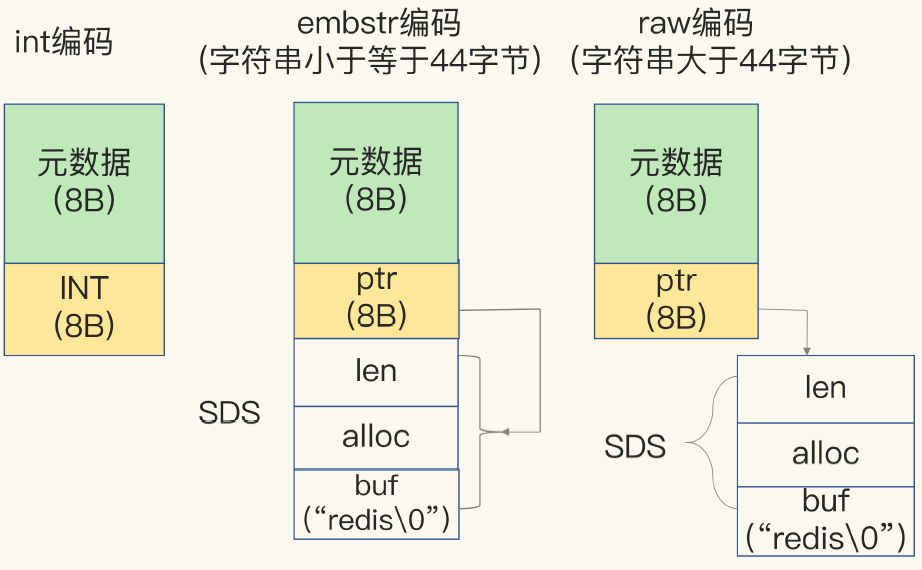

String类型并不节省内存空间，当要保存一个键值对为1101000051 -> 3301000051 的值时，有效信息只有 16 字节（2个long类型的变量，共32字节），使用 String 类型保存时，却需要 64 字节的内存空间，有 48 字节都没有用于保存实际的数据：

* 因为保存的是数字，所以会采用int编码，int编码时由于元数据的存在，key和value各浪费8B
* dictEntry的开销：

Redis 会使用一个全局哈希表保存所有键值对，哈希表的每一项是一个 dictEntry 的结构体，用来指向一个键值对。dictEntry 结构中有三个 8 字节的指针，分别指向 key、value 以及下一个 dictEntry，三个指针共 24 字节：

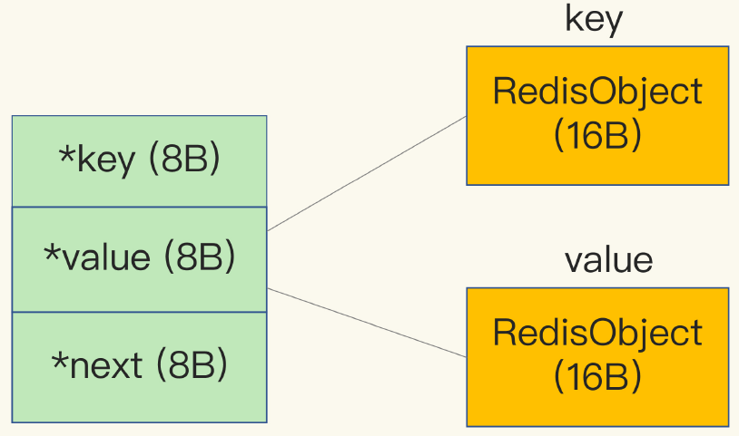

dictEntry的开销是 24B，但由于Redis使用的内存分配库jemalloc，它分配内存时会找到一个比N大的最接近N的2的幂次数作为分配的字节，所以此处会分配32B。加上key和value的16B（各自有一个元数据8B+真实数据8B），一个键值对的内存消耗就达到了64B，所以String类型并不节省内存，节省内存的Redis数据结构是压缩列表：

表头有三个字段 zlbytes、zltail 和 zllen，分别表示列表长度、列表尾的偏移量，以及列表中的 entry 个数。压缩列表尾还有一个 zlend，表示列表结束：

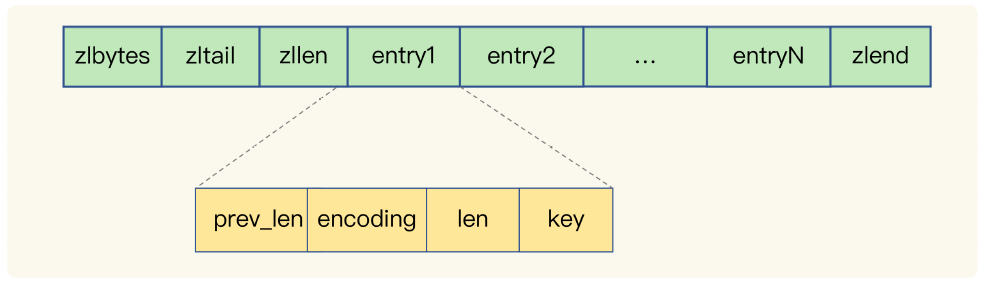

压缩列表之所以能节省内存，就在于它是用一系列连续的 entry 保存数据。每个 entry 的元数据包括下面几部分：

* prev_len，表示前一个 entry 的长度。prev_len 有两种取值情况：1 字节或 5 字节。取值 1 字节时，表示上一个 entry 的长度小于 254 字节。虽然 1 字节的值能表示的数值范围是 0 到 255，但是压缩列表中 zlend 的取值默认是 255，因此，就默认用 255表示整个压缩列表的结束，其他表示长度的地方就不能再用 255 这个值了。所以，当上一个 entry 长度小于 254 字节时，prev_len 取值为 1 字节，否则，就取值为 5 字节。
* len：表示自身长度，4 字节；
* encoding：表示编码方式，1 字节；
* content：保存实际数据。

这些 entry 会紧凑地放置在内存中，不需要再用额外的指针进行连接，这样就可以节省指针所占用的空间。

Redis 基于压缩列表实现了 List、Hash 和 Sorted Set 这样的集合类型，这样做的最大好处就是节省了 dictEntry 的开销：当你用 String 类型时，一个键值对就有一个 dictEntry，要用 32 字节空间。但采用集合类型时，一个 key 就对应一个集合的数据，能保存的数据多了很多，但也只用了一个 dictEntry，这样就节省了内存

为了使用集合类型表示键值对节省内存，这里可以使用基于Hash 类型的二级编码方法，这里说的二级编码，就是把一个单值的数据拆分成两部分，前一部分作为 Hash 集合的 key，后一部分作为Hash 集合的 value

以1101000060->3302000080 为例，我们可以把key的前7 位（1101000）作为 Hash 类型的键，把key的最后 3 位（060）和图片存储对象ID 分别作为 Hash 类型值中的 key 和 value。

为了保证Hash结构能一直使用压缩列表作为底层结构，要确保Hash结构中最大元素个数不能超过hash-max-ziplist-entries，同时保存的单个元素的最大长度不超过hash-max-ziplist-value，否则Redis 就会自动把 Hash 类型的实现结构由压缩列表转为哈希表。一旦从压缩列表转为了哈希表，Hash 类型就会一直用哈希表进行保存，而不会再转回压缩列表了。在节省内存空间方面，哈希表就没有压缩列表那么高效了。

所以基于这个策略，要保证二级编码时取到第x位的时候，元素个数不能超标。

紧凑型数据结构虽然可以节省内存，但是会在一定程度上导致数据的读写性能下降

## 集合使用场景

### 聚合统计

所谓的聚合统计，就是指统计多个集合元素的聚合结果，包括交集、差集、并集等。

例如下面这个场景：统计手机 App 每天的新增用户数和第二天的留存用户数，可以用Redis的Set来完成

首先用Set来保存所有登录过的用户ID，称为set，然后以日期为key，统计每一天登录过的用户，例如：

* 第一天的所有登录用户都存在set01中，此时set就是set01
* 第二天的所有登录用户都存在set02中，此时set就是set01并集set02的结果。以此类推

这样：累计的并集就是总用户数，set02与set01的差集就是每天的新增用户数，set02与set01的并集就是留存用户数

Set 的差集、并集和交集的计算复杂度较高，在数据量较大的情况下，如果直接执行这些计算，会导致 Redis 实例阻塞。可以采用这样的处理方案：可以从主从集群中选择一个从库，让它专门负责聚合计算，或者是把数据读取到客户端，在客户端来完成聚合统计，这样就可以规避阻塞主库实例和其他从库实例的风险了

### 排序统计

考虑下面这个场景：在电商网站上提供最新评论列表

在 Redis 常用的 4 个集合类型中（List、Hash、Set、Sorted Set），List 和 Sorted Set就属于有序集合。

List 是按照元素进入 List 的顺序进行排序的，而 Sorted Set 可以根据元素的权重来排序，我们可以自己来决定每个元素的权重值。比如说，我们可以根据元素插入 Sorted Set的时间确定权重值，先插入的元素权重小，后插入的元素权重大。

这种情况下，用List 和 Sorted Set都可以实现效果，但如果涉及到分页，建议使用Sorted Set

如果使用List，。每个商品对应一个 List，这个 List 包含了对这个商品的所有评论，而且会按照评论时间保存这些评论，每来一个新评论，就用 LPUSH 命令把它插入 List的队头。但这种方式在下面的场景就会有问题，例如：

假设当前的评论 List 是{A, B, C, D, E, F}（其中，A 是最新的评论，以此类推，F 是最早的评论），在展示第一页的 3 个评论时，我们可以用下面的命令，得到最新的三条评论 A、B、C：

~~~
LRANGE product1 0 2
1) "A"
2) "B"
3) "C"
~~~

然后，再用下面的命令获取第二页的 3 个评论，也就是 D、E、F。

~~~
LRANGE product1 3 5
1) "D"
2) "E"
3) "F"
~~~

但是，如果在展示第二页前，又产生了一个新评论 G，评论 G 就会被 LPUSH 命令插入到评论 List 的队头，评论 List 就变成了{G, A, B, C, D, E, F}。此时，再用刚才的命令获取第二页评论时，就会发现，评论 C 又被展示出来了，也就是 C、D、E：

~~~
LRANGE product1 3 5
1) "C"
2) "D"
3) "E"
~~~

新元素插入前后，List 相同位置上的元素就会发生变化，用LRANGE 读取时，就会读到旧元素

和 List 相比，Sorted Set 就不存在这个问题，因为它是根据元素的实际权重来排序和获取数据的。
我们可以按评论时间的先后给每条评论设置一个权重值，然后再把评论保存到 Sorted Set中。Sorted Set 的 ZRANGEBYSCORE 命令就可以按权重排序后返回元素。这样的话，即使集合中的元素频繁更新，Sorted Set 也能通过 ZRANGEBYSCORE 命令准确地获取到按序排列的数据。
假设越新的评论权重越大，目前最新评论的权重是 N，我们执行下面的命令时，就可以获得最新的 10 条评论：

~~~
ZRANGEBYSCORE comments N-9 N
~~~

所以，在面对需要展示最新列表、排行榜等场景时，如果数据更新频繁或者需要分页显示，建议你优先考虑使用 Sorted Set。

### 二值状态统计

这里的二值状态就是指集合元素的取值就只有 0 和 1 两种。

例如这个场景：统计签到打卡，我们只用记录签到（1）或未签到（0），所以它就是非常典型的二值状态

这个时候，我们就可以选择 Bitmap，这是 Redis 提供的扩展数据类型。Bitmap 本身是用 String 类型作为底层数据结构实现的一种统计二值状态的数据类型。可以把它看作一个bit数组。

Bitmap 提供了 GETBIT/SETBIT 操作，使用一个偏移值 offset 对 bit 数组的某一个 bit 位进行读和写。不过，需要注意的是，Bitmap 的偏移量是从 0 开始算的，也就是说 offset的最小值是 0。当使用 SETBIT 对一个 bit 位进行写操作时，这个 bit 位会被设置为 1。Bitmap 还提供了 BITCOUNT 操作，用来统计这个 bit 数组中所有“1”的个数。

记录该用户 8 月 3 号已签到，其实就是把对应的key值的第三个位置设置成1

~~~
SETBIT uid:sign:3000:202008 2 1
~~~

检查该用户 8 月 3 日是否签到：

~~~
GETBIT uid:sign:3000:202008 2
~~~

统计该用户在 8 月份的签到次数：

~~~
BITCOUNT uid:sign:3000:202008
~~~

此外，如果记录了 1 亿个用户 10 天的签到情况，还可以用与操作统计出这 10 天连续签到的用户总数，例如把三个bitmap做与操作，得到的bitmap的1个数就是连续签到的用户数：

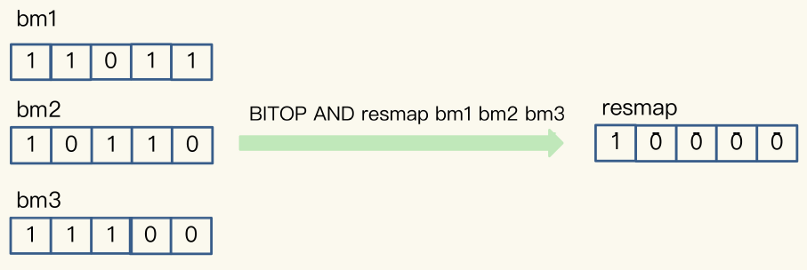

### 基数统计

基数统计就是指统计一个集合中不重复的元素个数。例如统计网页的UV（Unique Visitor），注：统计PV（Page View）不一样，用数字类型的string即可

网页 UV 的统计有个独特的地方，就是需要去重，一个用户一天内的多次访问只能算作一次。在 Redis 的集合类型中，Set 类型默认支持去重，所以看到有去重需求时，我们可能第一时间就会想到用 Set 类型。也可以用Hash类型来统计，但是当页面很多时，这两种数据类型都要消耗很大的内存空间

此时可以选择使用HyperLogLog，它是一种用于统计基数的数据集合类型，它的最大优势就在于，当集合元素数量非常多时，它计算基数所需的空间总是固定的，而且还很小。在 Redis 中，每个 HyperLogLog 只需要花费 12 KB 内存，就可以计算接近 2的64次方 个元素的基数

把访问页面的每个用户都添加到 HyperLogLog 中：

~~~
PFADD page1:uv user1 user2 user3 user4 user5
~~~

接下来，就可以用 PFCOUNT 命令直接获得 page1 的 UV 值了，这个命令的作用就是返回 HyperLogLog 的统计结果：

~~~
PFCOUNT page1:uv
~~~

HyperLogLog 除了上面的 pfadd 和 pfcount 之外，还提供了第三个指令 pfmerge，用于将多个 pf 计数值累加在一起形成一个新的 pf 值。

Redis 对 HyperLogLog 的存储进⾏了优化，在计数⽐较⼩时，它的存储空间采⽤稀疏矩阵存储，空间占⽤很⼩，仅仅在计数慢慢变⼤，稀疏矩阵占⽤空间渐渐超过了阈值时才会⼀次性转变成稠密矩阵，才会占⽤ 12k 的空间

HyperLogLog 提供不精确的去重计数⽅案，虽然不精确但是也不是⾮常不精确，标准误差是0.81%，这样的精确度已经可以满⾜上⾯的 UV 统计需求了

HyperLogLog 的原理：给定⼀系列的随机整数，通过记录下低位连续零位的最⼤⻓度 k，通过这个 k 值可以估算出随机数的数量：

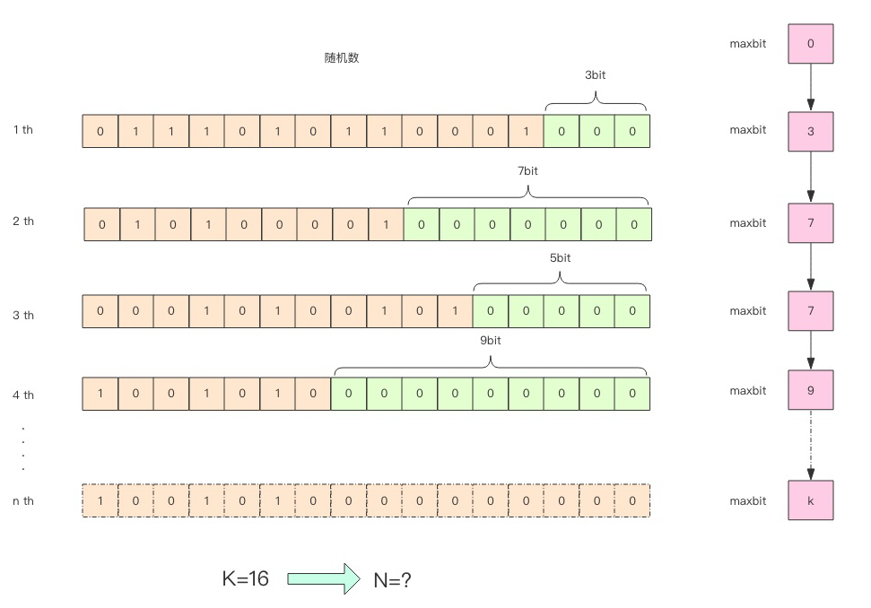

## GEO

Geo是Redis的一个扩展数据类型，它非常适合应用在位置信息服务（Location-Based Service，LBS）的场景中

这种数据记录模式属于一个 key（例如车 ID）对应一个 value（一组经纬度）。GEO的本质就是Sorted Set类型，但Sorted Set 元素的权重分数是一个浮点数（float 类型），而一组经纬度包含的是经度和纬度两个值，是没法直接保存为一个浮点数的，解决这个问题就需要用到GEO类型中的GeoHash 编码

GeoHash 编码方法，这个方法的基本原理就是“二分区间，区间编码”。当我们要对一组经纬度进行 GeoHash 编码时，我们要先对经度和纬度分别编码，然后再把经纬度各自的编码组合成一个最终编码。

对于一个地理位置信息来说，它的经度范围是[-180,180]。GeoHash 编码会把一个经度值编码成一个 N 位的二进制值，我们来对经度范围[-180,180]做 N 次的二分区操作，其中 N可以自定义。

在进行第一次二分区时，经度范围[-180,180]会被分成两个子区间：[-180,0) 和[0,180]（我称之为左、右分区）。此时，我们可以查看一下要编码的经度值落在了左分区还是右分区。如果是落在左分区，我们就用 0 表示；如果落在右分区，就用 1 表示。这样一来，每做完一次二分区，我们就可以得到 1 位编码值。

然后，我们再对经度值所属的分区再做一次二分区，同时再次查看经度值落在了二分区后的左分区还是右分区，按照刚才的规则再做 1 位编码。当做完 N 次的二分区后，经度值就可以用一个 N bit 的数来表示了。

按照这种方法，做完 5 次分区后，我们把经度值 116.37 定位在[112.5, 123.75]这个区间，并且得到了经度值的 5 位编码值，即 11010。这个编码过程如下表所示：

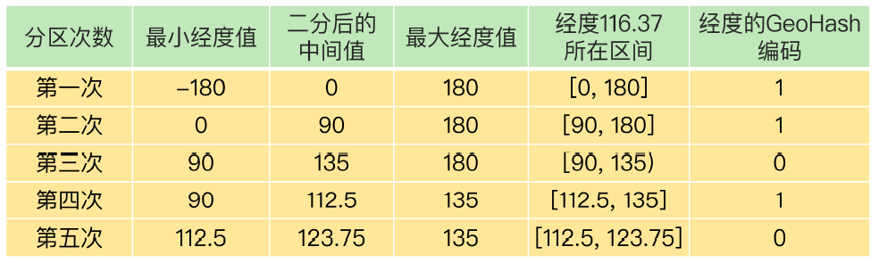

对纬度的编码方式，和对经度的一样，只是纬度的范围是[-90，90]，下面这张表显示了对纬度值 39.86 的编码过程。

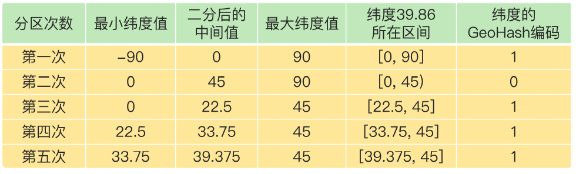

当一组经纬度值都编完码后，我们再把它们的各自编码值组合在一起，组合的规则是：最终编码值的偶数位上依次是经度的编码值，奇数位上依次是纬度的编码值，其中，偶数位从 0 开始，奇数位从 1 开始。
我们刚刚计算的经纬度（116.37，39.86）的各自编码值是 11010 和 10111，组合之后，第 0 位是经度的第 0 位 1，第 1 位是纬度的第 0 位 1，第 2 位是经度的第 1 位 1，第 3位是纬度的第 1 位 0，以此类推，就能得到最终编码值 1110011101，如下图所示：

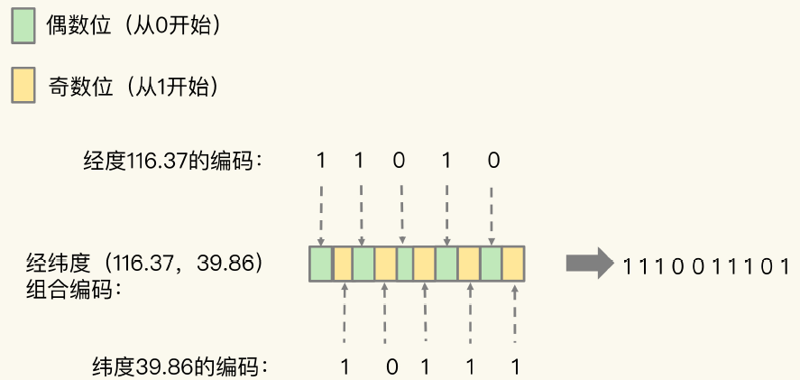

用了 GeoHash 编码后，原来无法用一个权重分数表示的一组经纬度（116.37，39.86）就可以用 1110011101 这一个值来表示，就可以保存为 Sorted Set 的权重分数了。

使用 GeoHash 编码后，我们相当于把整个地理空间划分成了一个个方格，每个方格对应了 GeoHash 中的一个分区，相邻方格的GeoHash编码值基本也是接近的，所以就可以使用 Sorted Set 范围查询得到的相近编码值，在实际的地理空间上，也是相邻的方格，这就可以实现 LBS 应用“搜索附近的人或物”的功能了

不过有时编码值虽然在大小上接近，但实际对应的方格却距离比较远。例如，我们用 4 位来做 GeoHash 编码，把经度区间[-180,180]和纬度区间[-90,90]各分成了 4 个分区，一共 16 个分区，对应了 16 个方格。编码值为 0111 和 1000 的两个方格就离得比较远，如下图所示：

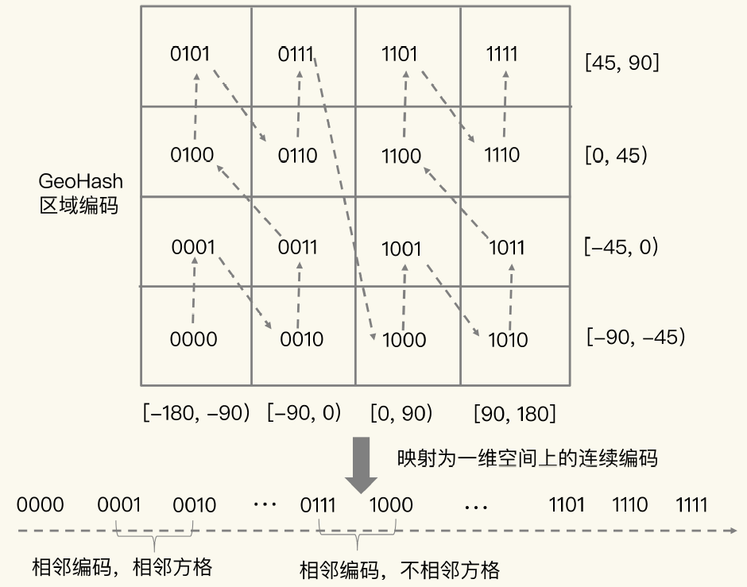

所以，为了避免查询不准确问题，我们可以同时查询给定经纬度所在的方格周围的 4 个或8 个方格。

具体操作GEO类型：

* GEOADD 命令：用于把一组经纬度信息和相对应的一个 ID 记录到 GEO 类型集合中；
* GEORADIUS 命令：会根据输入的经纬度位置，查找以这个经纬度为中心的一定范围内的其他元素。当然，我们可以自己定义这个范围。

## 自定义数据类型

有些场景下，我们对数据类型会有特殊需求，例如，我们需要一个数据类型既能像 Hash 那样支持快速的单键查询，又能像Sorted Set 那样支持范围查询，此时，我们之前学习的这些数据类型就无法满足需求了

Redis 键值对中的每一个值都是用 RedisObject 保存的，RedisObject 的内部组成包括了 type,、encoding,、lru 和 refcount 4 个元数据，以及 1
个*ptr指针：

* type：表示值的类型，涵盖了我们前面学习的五大基本类型；
* encoding：是值的编码方式，用来表示 Redis 中实现各个基本类型的底层数据结构，例如 SDS、压缩列表、哈希表、跳表等；
* lru：记录了这个对象最后一次被访问的时间，用于淘汰过期的键值对；
* refcount：记录了对象的引用计数；
* *ptr：是指向数据的指针。

略 -> 13

很多公司会定制化数据结构，例如Redis很多数据结构都有并不必要的指针开销，在数据量很大的时候，优化数据结构的好处就非常明显，但这需要改造Redis

## 时间序列数据

与发生时间相关的一组数据，就是时间序列数据。这些数据的特点是没有严格的关系模型，记录的信息可以表示成键和值的关系（例如，一个设备 ID 对应一条记录），例如周期性地统计近万台设备的实时状态，包括设备 ID、压力、温度、湿度

在实际应用中，时间序列数据通常是持续高并发写入的，例如，需要连续记录数万个设备的实时状态值。同时，时间序列数据的写入主要就是插入新数据，而不是更新一个已存在的数据，也就是说，一个时间序列数据被记录后通常就不会变了，因为它就代表了一个设备在某个时刻的状态值（例如，一个设备在某个时刻的温度测量值，一旦记录下来，这个值本身就不会再变了）

所以，这种数据的写入特点很简单，就是插入数据快，这就要求我们选择的数据类型，在进行数据插入时，复杂度要低，尽量不要阻塞

时间序列数据的读操作：对单条数据的查询、对某个时间范围内的数据的查询、复杂一些的有对某个时间范围内的数据做聚合计算。

Redis 提供了保存时间序列数据的两种方案，分别可以基于 Hash 和 Sorted Set 实现，以及基于RedisTimeSeries 模块实现。

1、基于 Hash 和 Sorted Set 实现：

为了快存快取，可以采用Hash，例如用Hash 集合记录设备的温度值：

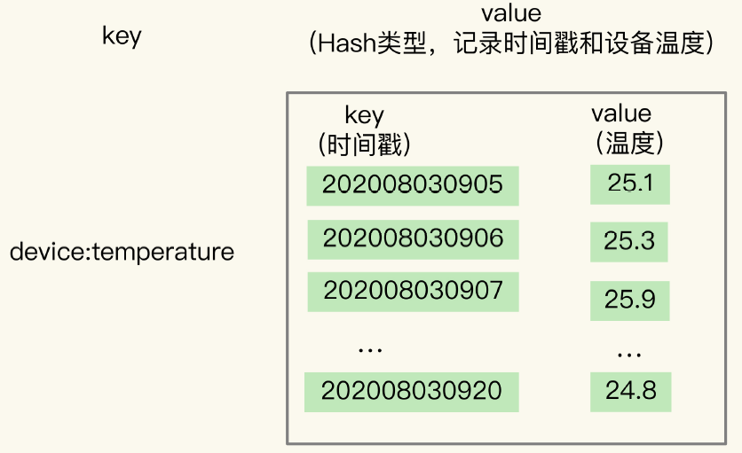

但是，Hash 类型有个短板：它并不支持对数据进行范围查询。为了支持范围查询，同时还要使用Sorted Set来保存数据：

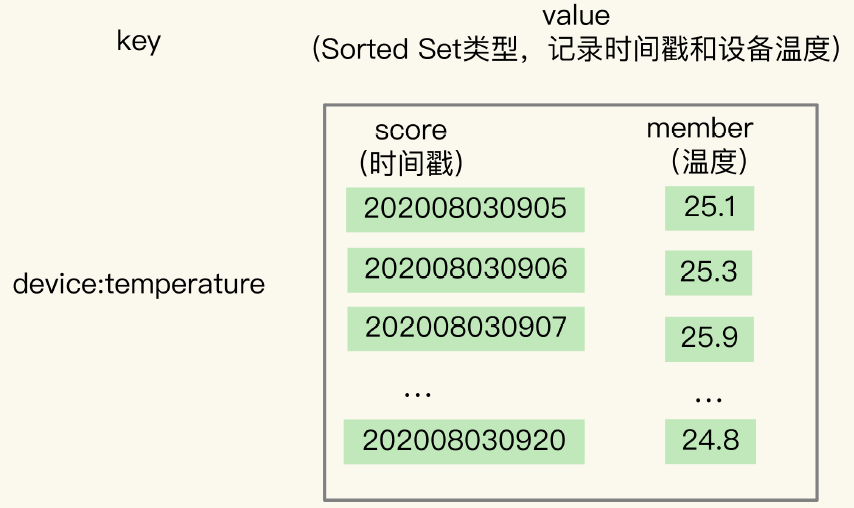

为了保证写入两个集合是原子性操作，可以使用Redis 用来实现简单的事务的MULTI 和 EXEC 命令：

* MULTI 命令：表示一系列原子性操作的开始。收到这个命令后，Redis 就知道，接下来再收到的命令需要放到一个内部队列中，后续一起执行，保证原子性。
* EXEC 命令：表示一系列原子性操作的结束。一旦 Redis 收到了这个命令，就表示所有要保证原子性的命令操作都已经发送完成了。此时，Redis 开始执行刚才放到内部队列中的所有命令操作。

Redis 收到了客户端执行的 MULTI 命令。然后，客户端再执行 HSET 和ZADD 命令后，Redis 返回的结果为“QUEUED”，表示这两个命令暂时入队，先不执行；执行了 EXEC 命令后，HSET 命令和 ZADD 命令才真正执行，并返回成功结果（结果值为 1）。

但这两个集合实现的功能无法支持对Redis数据做聚合计算，所以，我们只能先把时间范围内的数据取回到客户端，然后在客户端自行完成聚合计算。这个方法虽然能完成聚合计算，但是会带来一定的潜在风险，也就是大量数据在 Redis 实例和客户端间频繁传输，这会和其他操作命令竞争网络资源，导致其他操作变慢。

为了避免客户端和 Redis 实例间频繁的大量数据传输，我们可以使用 RedisTimeSeries 来保存时间序列数据。

RedisTimeSeries 是 Redis 的一个扩展模块。它专门面向时间序列数据提供了数据类型和访问接口，并且支持在 Redis 实例上直接对数据进行按时间范围的聚合计算。因为 RedisTimeSeries 不属于 Redis 的内建功能模块，在使用时，我们需要先把它的源码单独编译成动态链接库 redistimeseries.so，再使用loadmodule 命令进行加载

## 消息队列

消息队列在存取消息时，必须要满足三个需求，分别是消息保序、处理重复的消息和保证消息可靠性（消费者在处理消息的时候，如果因为故障或宕机消息没有处理完成，等消费者重启后，还可以重复处理消息，防止消息漏处理）

Redis 的 List 和 Streams 两种数据类型，就可以满足消息队列的这三个需求

1、基于 List 的消息队列解决方案

List 本身就是按先进先出的顺序对数据进行存取的，所以，如果使用 List 作为消息队列保存消息的话，就已经能满足消息保序的需求了

具体来说，生产者可以使用 LPUSH 命令把要发送的消息依次写入 List，而消费者则可以使用 RPOP 命令，从 List 的另一端按照消息的写入顺序，依次读取消息并进行处理。

在生产者往 List 中写入数据时，List 并不会主动地通知消费者有新消息写入，如果消费者想要及时处理消息，就需要在程序中不停地调用 RPOP 命令（比如使用一个 while(1) 循环）。如果有新消息写入，RPOP 命令就会返回结果，否则，RPOP 命令返回空值，再继续循环。

所以，即使没有新消息写入 List，消费者也要不停地调用 RPOP 命令，这就会导致消费者程序的 CPU 一直消耗在执行 RPOP 命令上，带来不必要的性能损失。

为了解决这个问题，Redis 提供了 BRPOP 命令。BRPOP 命令也称为阻塞式读取，客户端在没有读到队列数据时，自动阻塞，直到有新的数据写入队列，再开始读取新数据。

为了解决重复消息的问题，可以在消息体内加一个ID，同时消费者程序要把已经处理过的消息的 ID 号记录下来，这样就可以防止重复消息处理。这种处理特性也称为幂等性，幂等性就是指，对于同一条消息，消费者收到一次的处理结果和收到多次的处理结果是一致的。

为了保证消息可靠性，List 类型提供了 BRPOPLPUSH 命令，这个命令的作用是让消费者程序从一个 List 中读取消息，同时，Redis 会把这个消息再插入到另一个 List（可以叫作备份List）留存。这样一来，如果消费者程序读了消息但没能正常处理，等它重启后，就可以从备份 List 中重新读取消息并进行处理了

使用消息队列时还可能遇到这个问题：生产者消息发送很快，而消费者处理消息的速度比较慢，这就导致 List 中的消息越积越多，给 Redis 的内存
带来很大压力。这个时候，我们希望启动多个消费者程序组成一个消费组，一起分担处理 List 中的消息。但是，List 类型并不支持消费组的实现，可以使用Redis 从 5.0 版本开始提供的 Streams 数据类型

2、基于 Streams 的消息队列解决方案

Streams 是 Redis 专门为消息队列设计的数据类型，它提供了丰富的消息队列操作命令：

* XADD：插入消息，保证有序，可以自动生成全局唯一 ID；
* XREAD：用于读取消息，可以按 ID 读取数据；
* XREADGROUP：按消费组形式读取消息；
* XPENDING 和 XACK：XPENDING 命令可以用来查询每个消费组内所有消费者已读取但尚未确认的消息，而 XACK 命令用于向消息队列确认消息处理已完成。

Streams会自动使用内部队列（也称为 PENDING List）留存消费组里每个消费者读取的消息，直到消费者使用 XACK 命令通知 Streams“消息已经处理完成”。如果消费者没有成功处理消息，它就不会给 Streams 发送 XACK 命令，消息仍然会留存。此时，消费者可以在重启后，用 XPENDING 命令查看已读取、但尚未确认处理完成的消息。

Redis作消息队列和Kafka 和 RabbitMQ的对比：

* Redis 是一个非常轻量级的键值数据库，部署一个 Redis 实例就是启动一个进程，部署 Redis 集群，也就是部署多个 Redis 实例。
* Kafka、RabbitMQ 部署时，涉及额外的组件，例如 Kafka 的运行就需要再部署ZooKeeper

Redis做消息队列的优点：轻量级、性能好

如果分布式系统中的组件消息通信量不大，那么，Redis 只需要使用有限的内存空间就能满足消息存储的需求，此时可以用Redis做消息队列

Redis做消息队列还有一种特殊的方案：基于发布和订阅功能实现一个消息被多个消费者消费使用

# 持久化

## AOF日志

### 日志格式

Redis数据都保存在内存中，一旦宕机就会丢失数据。数据丢失后不能从数据库恢复这些数据，主要原因是：1、频繁访问数据库会给数据库带来压力；2、查数据库性能比从内存中取慢

Redis 的持久化主要有两大机制，即 AOF 日志和 RDB 快照。

AOF（Append Only File）日志和数据库的写前日志（Write Ahead Log, WAL）正相反，它是先执行命令把数据写入内存，然后才记录日志。这样做的原因有：

* 不用对命令进行额外的检查，如果Redis写入成功，再记录日志；写入失败，就不记录了
* 不会阻塞当前的写操作

AOP日志中记录着Redis命令，以文本形式保存，我们以 Redis 收到“set testkey testvalue”命令后记录的日志为例，看看 AOF 日志的内容。其中，“*3”表示当前命令有三个部分，每部分都是由“\$+数字”开头，后面紧跟着具体的命令、键或值。这里，“数字”表示这部分中的命令、键或值一共有多少字节。例如，“\$3 set”表示这部分有 3 个字节，也就是“set”命令。

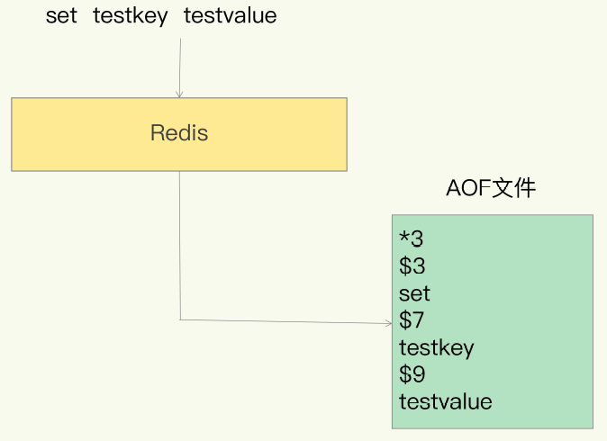

### 刷盘策略

AOF有两个潜在的风险：

* 如果刚执行完一个命令，还没有来得及记日志就宕机了，那么这个命令和相应的数据就有丢失的风险
* AOF 虽然避免了对当前命令的阻塞，但可能会给下一个操作带来阻塞风险。这是因为，AOF 日志也是在主线程中执行的，如果在把日志文件写入磁盘时，磁盘写压力大，就会导致写盘很慢，进而导致后续的操作也无法执行了

这两个风险都是和 AOF 写回磁盘的时机相关的。如果能够控制一个写命令执行完后 AOF 日志写回磁盘的时机，这两个风险就解除了。

为此，AOF 机制给我们提供了三个选择，也就是 AOF 配置项appendfsync 的三个可选值：

* Always，同步写回：每个写命令执行完，立马同步地将日志写回磁盘；每次都调用fsync
* Everysec，每秒写回：每个写命令执行完，只是先把日志写到 AOF 文件的内存缓冲区，每隔一秒把缓冲区中的内容写入磁盘；每秒调用一次fsync

* No，操作系统控制的写回：每个写命令执行完，只是先把日志写到 AOF 文件的内存缓冲区，由操作系统决定何时将缓冲区内容写回磁盘。调用write

这三种写回策略依赖文件系统的两个系统调用完成，也就是 write 和 fsync：

* write 只要把日志记录写到内核缓冲区，就可以返回了，并不需要等待日志实际写回到磁盘；
* fsync 需要把日志记录写回到磁盘后才能返回，时间较长。

三种策略的对比：

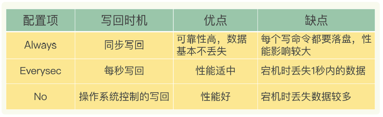

总结一下就是：想要获得高性能，就选择 No 策略；如果想要得到高可靠性保证，就选择Always 策略；如果允许数据有一点丢失，又希望性能别受太大影响的话，那么就选择Everysec 策略。

### AOF重写

AOF 是以文件的形式在记录接收到的所有写命令。随着接收的写命令越来越多，AOF 文件会越来越大，带来严重的性能问题：

* 文件系统本身对文件大小有限制，无法保存过大的文件
* 如果文件太大，之后再往里面追加命令记录的话，效率也会变低
* 如果发生宕机，AOF 中记录的命令要一个个被重新执行，用于故障恢复，如果日志文件太大，整个恢复过程就会非常缓慢，这就会影响到 Redis 的正常使用

因此需要一定的控制手段来控制AOF文件的大小，这就是AOF重写机制。AOF 重写机制就是在重写时，Redis 根据数据库的现状创建一个新的 AOF 文件，也就是说，读取数据库中的所有键值对，然后对每一个键值对用一条命令记录它的写入。在重写的过程中，原来旧日志的多条命令，在重写的新日志中变成了一条命令，本质就是保留数据最新的状态，而不去管中间态。例如下面这个例子：

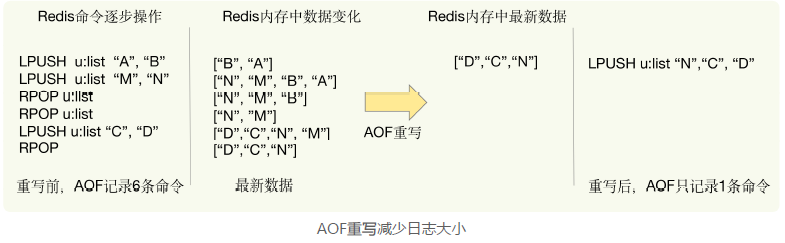

在上面的例子中，对一个列表先后做了 6 次修改操作后，列表的最后状态是[“D”, “C”, “N”]，此时，只用 LPUSH u:list “N”, “C”, "D"这一条命令就能实现该数据的恢复，这就节省了五条命令的空间。

和 AOF 日志由主线程写回不同，重写过程是由后台线程 bgrewriteaof 来完成的，这也是为了避免阻塞主线程，导致数据库性能下降。

每次执行重写时，主线程 fork 出后台的 bgrewriteaof 子进程。此时，fork 会把主线程的内存拷贝一份给 bgrewriteaof 子进程（这里其实是通过拷贝父进程的页表，即虚实映射关系，来访问父进程的内存数据的，而不是直接拷贝物理内存），这里面就包含了数据库的最新数据。然后，bgrewriteaof 子进程就可以在不影响主线程的情况下，逐一把拷贝的数据写成操作，记入重写日志。

在重写过程中，主线程未阻塞，仍然可以处理新来的操作，写操作此时会写入两种日志：正在使用的AOF日志、还有新的AOF重写日志，这样即使宕机了，旧的AOF日志依然是齐全的，可用于数据恢复；新的日志也不会丢失最新的操作。等新的AOF文件完成后，就可以替代旧的AOF文件了。

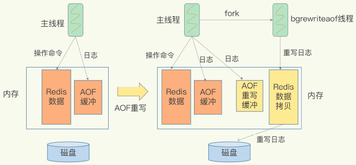

AOF重写中可能出现的性能瓶颈：

1、Redis 主线程 fork 创建 bgrewriteaof 子进程时，内核需要创建用于管理子进程的相关数据结构，这些数据结构在操作系统中通常叫作进程控制块（Process Control Block，简称为 PCB）。内核要把主线程的 PCB 内容拷贝给子进程。这个创建和拷贝过程由内核执行，是会阻塞主线程的。而且，在拷贝过程中，子进程要拷贝父进程的页表，这个过程的耗时和 Redis 实例的内存大小有关。如果 Redis 实例内存大，页表就会大，fork执行时间就会长，这就会给主线程带来阻塞风险

2、bgrewriteaof 子进程会和主线程共享内存。当主线程收到新写或修改的操作时，主线程会申请新的内存空间，用来保存新写或修改的数据（写时复制？），如果操作的是 bigkey，也就是数据量大的集合类型数据，那么，主线程会因为申请大空间而面临阻塞风险。

## RDB文件

### 执行快照

用 AOF 方法进行故障恢复的时候，需要逐一把操作日志都执行一遍。如果操作日志非常多，Redis 就会恢复得很缓慢，影响到正常使用。还有一种更快速恢复的持久化方法：内存快照，就是指内存中的数据在某一个时刻的状态记录（全量快照），这个快照文件就称为 RDB 文件，其中，RDB 就是 Redis DataBase 的缩写。

和 AOF 相比，RDB 记录的是某一时刻的数据，并不是操作，所以，在做数据恢复时，我们可以直接把 RDB 文件读入内存，很快地完成恢复。但RDB的一个缺点是：给内存的全量数据做快照，把它们全部写入磁盘也会花费很多时间。而且，全量数据越多，RDB 文件就越大，往磁盘上写数据的时间开销就越大。

Redis 提供了两个命令来生成 RDB 文件，分别是 save 和 bgsave：

* save：在主线程中执行，会导致阻塞；
* bgsave：创建一个子进程，专门用于写入 RDB 文件，避免了主线程的阻塞，这也是Redis RDB 文件生成的默认配置。

为了执行快照期间，保证Redis主线程正常读写数据，Redis 会借助操作系统提供的写时复制技术（Copy-On-Write, COW）

简单来说，bgsave 子进程是由主线程 fork 生成的，可以共享主线程的所有内存数据。bgsave 子进程运行后，开始读取主线程的内存数据，并把它们写入 RDB 文件。
此时，如果主线程对这些数据也都是读操作（例如图中的键值对 A），那么，主线程和bgsave 子进程相互不影响。但是，如果主线程要修改一块数据（例如图中的键值对 C），那么，这块数据就会被复制一份，生成该数据的副本。然后，bgsave 子进程会把这个副本数据写入 RDB 文件，而在这个过程中，主线程仍然可以直接修改原来的数据：

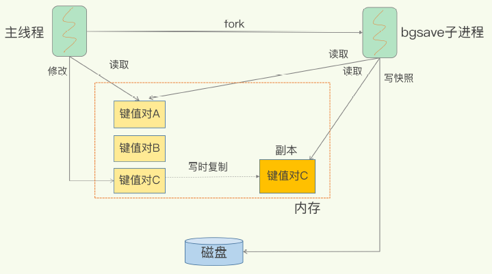

因为写时复制的特性，当写操作很频繁时，生成RDB的时刻整个Redis占用的内存可能会倍增，在分配资源时要注意这一点。

### 写时复制

Redis 在使用 RDB 方式进行持久化时，会用到写时复制机制。bgsave 子进程相当于复制了原始数据，而主线程仍然可以修改原来的数据。

对 Redis 来说，主线程 fork 出 bgsave 子进程后，bgsave 子进程实际是复制了主线程的页表。

如果此时，主线程接收到了新写或修改操作，那么，主线程会使用写时复制机制。具体来说，写时复制就是指，主线程在有写操作时，才会把这个新写或修改后的数据写入到一个新的物理地址中，并修改自己的页表映射：

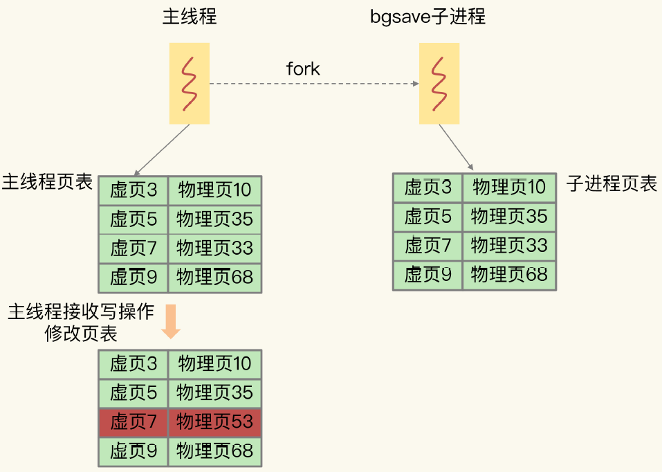

### 执行频率

快照的执行频率很重要，如果执行频率太快，则有两方面的弊端：

* 一方面，频繁将全量数据写入磁盘，会给磁盘带来很大压力，多个快照竞争有限的磁盘带宽，前一个快照还没有做完，后一个又开始做了，容易造成恶性循环。
* 另一方面，bgsave 子进程需要通过 fork 操作从主线程创建出来。虽然，子进程在创建后不会再阻塞主线程，但是，fork 这个创建过程本身会阻塞主线程，而且主线程的内存越大，阻塞时间越长。如果频繁 fork 出 bgsave 子进程，这就会频繁阻塞主线程了。

如果执行的频率太慢，一段时间内的数据可能会有丢失风险。

为了解决这个矛盾，我们可以使用增量快照，做了一次全量快照后，后续的快照只对修改的数据进行快照记录，这样可以避免每次全量快照的开销。增量快照需要记录那些被修改的数据，但当修改频繁时，引入的额外空间开销比较大

一个好的办法是混合使用 AOF 日志和内存快照，这是Redis4.0中提出的方法，简单来说，内存快照以一定的频率执行，在两次快照之间，使用 AOF 日志记录这期间的所有命令操作。这样一来，快照不用很频繁地执行，这就避免了频繁 fork 对主线程的影响。而且，AOF日志也只用记录两次快照间的操作，也就是说，不需要记录所有操作了，因此，就不会出现文件过大的情况了，也可以避免重写开销。这个方法既能享受到 RDB 文件快速恢复的好处，又能享受到 AOF 只记录操作命令的简单优势：

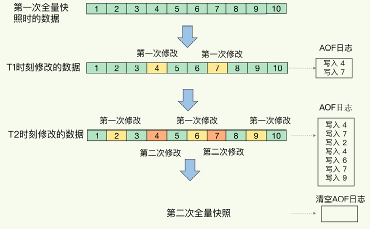

关于 AOF 和 RDB 的选择建议：

* 数据不能丢失时，内存快照和 AOF 的混合使用是一个很好的选择；
* 如果允许分钟级别的数据丢失，可以只使用 RDB；
* 如果只用 AOF，优先使用 everysec 的配置选项，因为它在可靠性和性能之间取了一个平衡。

# 集群

## 主从同步

### 读写分离

为了提高Redis的可靠性，Redis将一份数据同时保存在多个实例上，增加了副本冗余量。即使有一个实例出现了故障，需要过一段时间才能恢复，其他实例也可以对外提供服务，不会影响业务使用。

Redis 提供了主从库模式，以保证数据副本的一致，主从库之间采用的是读写分离的方式。读操作主库、从库都可以接收；写操作首先到写操作执行，然后主库将写操作同步给从库：

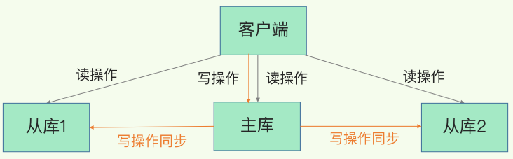

### 同步过程

当我们启动多个 Redis 实例的时候，它们相互之间就可以通过 replicaof（Redis 5.0 之前使用 slaveof）命令形成主库和从库的关系，之后会按照三个阶段完成数据的第一次同步。例如，现在有实例 1（ip：172.16.19.3）和实例 2（ip：172.16.19.5），我们在实例 2 上执行以下这个命令后，实例 2 就变成了实例 1 的从库，并从实例 1 上复制数据：

~~~
replicaof 172.16.19.3 6379
~~~

首次同步的三个阶段：

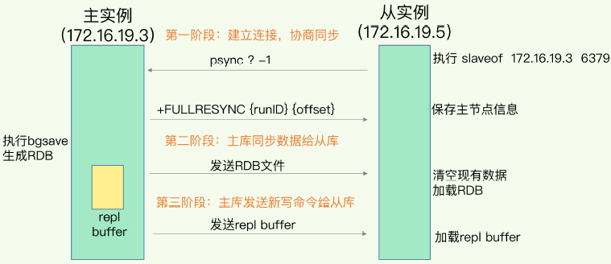

第一阶段：主从库间建立连接、协商同步的过程。在这一步，从库和主库建立起连接，并告诉主库即将进行同步，主库确认回复后，主从库间就可以开始同步了。具体来说，从库给主库发送 psync 命令，表示要进行数据同步，主库根据这个命令的参数来启动复制。psync 命令包含了主库的 runID 和复制进度 offset 两个参数：

* runID，是每个 Redis 实例启动时都会自动生成的一个随机 ID，用来唯一标记这个实例。当从库和主库第一次复制时，因为不知道主库的 runID，所以将runID 设为“？”。
* offset，此时设为 -1，表示第一次复制。

主库收到 psync 命令后，会用 FULLRESYNC 响应命令带上两个参数：主库 runID 和主库目前的复制进度 offset，返回给从库。从库收到响应后，会记录下这两个参数。这里有个地方需要注意，FULLRESYNC 响应表示第一次复制采用的全量复制，也就是说，主库会把当前所有的数据都复制给从库。

第二阶段：主库将所有数据同步给从库。从库收到数据后，在本地完成数据加载。这个过程依赖于内存快照生成的 RDB 文件。

主库执行 bgsave 命令，生成 RDB 文件，接着将文件发给从库。从库接收到RDB 文件后，会先清空当前数据库，然后加载 RDB 文件

为了减少RDB文件生成、传输的开销，：一个 Redis 实例的数据库不要太大，一个实例大小在几 GB 级别比较合适

第三阶段：主库会把第二阶段执行过程中新收到的写命令，再发送给从库。在主库将数据同步给从库的过程中，主库不会被阻塞，仍然可以正常接收请求，为了保证主从库的数据一致性，主库会在内存中用专门的 replication buffer，记录RDB 文件生成后收到的所有写操作。当主库完成 RDB 文件发送后，就会把此时 replication buffer 中的修改操作发给从库，从库再重新执行这些操作。这样一来，主从库就实现同步了。

一旦主从库完成了全量复制，它们之间就会一直维护一个网络连接，主库会通过这个连接将后续陆续收到的命令操作再同步给从库，这个过程也称为基于长连接的命令传播，可以避免频繁建立连接的开销。

### 主从级联模式

通过分析主从库间第一次数据同步的过程，你可以看到，一次全量复制中，对于主库来说，需要完成两个耗时的操作：生成 RDB 文件和传输 RDB 文件：

* 生成 RDB 文件：如果从库数量很多，而且都要和主库进行全量复制的话，就会导致主库忙于 fork 子进程生成 RDB 文件，fork 这个操作会阻塞主线程处理正常请求，从而导致主库响应应用程序的请求速度变慢
* 传输RDB文件：占用主库的网络带宽

（之所以用RDB来进行复制而不是AOF，是因为RDB文件是二进制文件，无论是要把 RDB 写入磁盘，还是要通过网络传输 RDB，IO效率都比记录和传输 AOF 的高，而且它的恢复速度也更快）

为了分担主库的压力，可以使用主-从-从模式，将主库生成 RDB 和传输 RDB 的压力，以级联的方式分散到从库上。

简单来说，我们在部署主从集群的时候，可以手动选择一个从库（比如选择内存资源配置较高的从库），用于级联其他的从库。然后，我们可以再选择一些从库（例如三分之一的从库），在这些从库上执行如下命令，让它们和刚才所选的从库，建立起主从关系：

~~~
replicaof 所选从库的IP 6379
~~~

这样一来，这些从库就会知道，在进行同步时，不用再和主库进行交互了，只要和级联的从库进行写操作同步就行了，这就可以减轻主库上的压力：

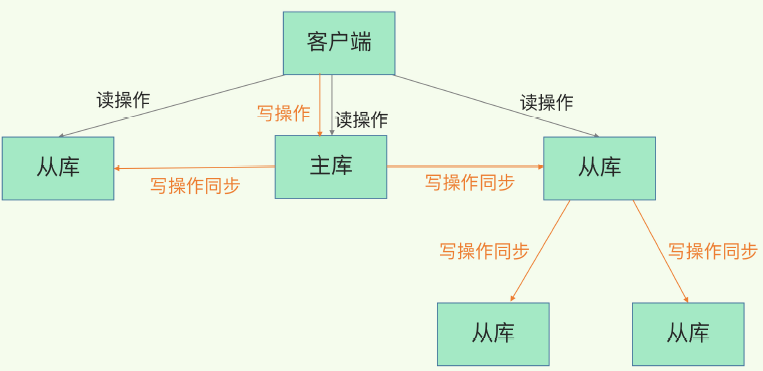

### 增量复制

基于长连接的命令传播最大的风险是网络断连。

在 Redis 2.8 之前，如果主从库在命令传播时出现了网络闪断，那么，从库就会和主库重新进行一次全量复制，开销非常大。

从 Redis 2.8 开始，网络断了之后，主从库会采用增量复制的方式继续同步。全量复制是同步所有数据，而增量复制只会把主从库网络断连期间主库收到的命令，同步给从库。

增量复制的关键就在于一个名为repl_backlog_buffer 的缓冲区。当主从库断连后，主库会把断连期间收到的写操作命令，写入 replication buffer，同时也会把这些操作命令也写入 repl_backlog_buffer 这个缓冲区。

repl_backlog_buffer 是一个环形缓冲区，主库会记录自己写到的位置，从库则会记录自己已经读到的位置：

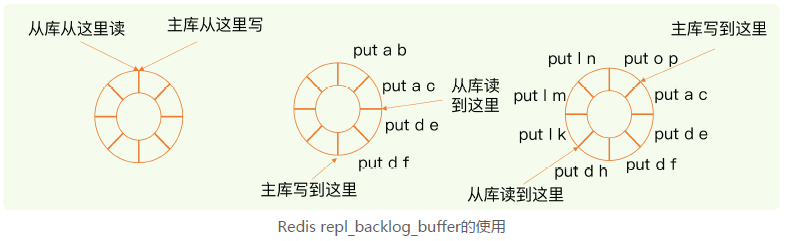

对主库来说，对应的偏移量就是 master_repl_offset。主库接收的新写操作越多，这个值就会越大。

从库已复制的偏移量是slave_repl_offset，正常情况下，这两个偏移量基本相等。

如果出现网络断连，主从库的连接恢复之后，从库首先会给主库发送 psync 命令，并把自己当前的slave_repl_offset 发给主库，主库会判断自己的master_repl_offset 和 slave_repl_offset之间的差距。此时，主库只用把 master_repl_offset 和 slave_repl_offset之间的命令操作同步给从库就行。

因为 repl_backlog_buffer 是一个环形缓冲区，所以在缓冲区写满后，主库会继续写入，此时，就会覆盖掉之前写入的操作。如果从库的读取速度比较慢，就有可能导致从库还未读取的操作被主库新写的操作覆盖了，这会导致主从库间的数据不一致。

为了避免这个情况，一般我们可以调整环形缓冲区的大小，通过修改repl_backlog_size 这个参数。具体的估算方法：

缓冲空间的计算公式是：缓冲空间大小 = 主库写入命令速度 * 操作大小 - 主从库间网络传输命令速度 * 操作大小

在实际应用中，考虑到可能存在一些突发的请求压力，我们通常需要把这个缓冲空间扩大一倍，即repl_backlog_size = 缓冲空间大小 * 2，这也就是 repl_backlog_size 的最终值。

举个例子，如果主库每秒写入 2000 个操作，每个操作的大小为 2KB，网络每秒能传输1000 个操作，那么，有 1000 个操作需要缓冲起来，这就至少需要 2MB 的缓冲空间。否则，新写的命令就会覆盖掉旧操作了。为了应对可能的突发压力，我们最终把repl_backlog_size 设为 4MB。

如果并发请求量非常大，连两倍的缓冲空间都存不下新操作请求的话，此时，主从库数据仍然可能不一致，此时可以适当再增加缓冲区的大小，也可以考虑使用切片集群来分担单个主库的请求压力。

### 两个buffer

在进行主从复制时，Redis 会使用 replication buffer 和 repl_backlog_buffer，两者的区别：

* 应用场景不同：replication buffer 是主从库在进行全量复制时，主库上用于和从库连接的客户端的 buffer，而 repl_backlog_buffer 是为了支持从库增量复制，主库上用于持续保存写操作的一块专用 buffer。

* 数量不同：Redis 主从库在进行复制时，当主库要把全量复制期间的写操作命令发给从库时，主库会先创建一个客户端，用来连接从库，然后通过这个客户端，把写操作命令发给从库。在内存中，主库上的客户端就会对应一个 buffer，这个 buffer 就被称为 replication buffer。Redis 通过 client_buffer 配置项来控制这个 buffer 的大小。主库会给每个从库建立一个客户端，所以 replication buffer 不是共享的，而是每个从库都有一个对应的客户端。

  repl_backlog_buffer 是一块专用 buffer，在 Redis 服务器启动后，开始一直接收写操作命令，这是所有从库共享的。主库和从库会各自记录自己的复制进度，所以，不同的从库在进行恢复时，会把自己的复制进度（slave_repl_offset）发给主库，主库就可以和它独立同步。

## 哨兵机制

### 基本流程

当主库发生故障时，会直接影响到从库的同步，而且会导致写操作无法完成（基于主从集群是读写分离模式，当主库故障后，客户端就无法执行写请求了）。所以如果主库挂了，我们就需要运行一个新主库，比如说把一个从库切换为主库。在失去主节点的这段时间内，写请求会失败

在 Redis 主从集群中，哨兵机制是实现主从库自动切换的关键机制。

哨兵就是一个运行在特定模式下的 Redis 实例，只不过它并不服务请求操作，只是完成监控、选主和通知的任务

哨兵其实就是一个运行在特殊模式下的 Redis 进程，主从库实例运行的同时，它也在运行。哨兵主要负责的就是三个任务：监控、选主（选择主库）和通知：

* 监控：哨兵进程在运行时，周期性地给所有的主从库发送 PING 命令，检测它们是否仍然在线运行。如果从库没有在规定时间内响应哨兵的 PING 命令，哨兵就会把它标记为“下线状态”；同样，如果主库也没有在规定时间内响应哨兵的 PING 命令，哨兵就会判定主库下线，然后开始自动切换主库的流程
* 选主：主库挂了以后，哨兵就需要从很多个从库里，按照一定的规则选择一个从库实例，把它作为新的主库
* 通知：在执行通知任务时，哨兵会把新主库的连接信息发给其他从库，让它们执行 replicaof 命令，和新主库建立连接，并进行数据复制。同时，哨兵会把新主库的连接信息通知给客户端，让它们把请求操作发到新主库上。

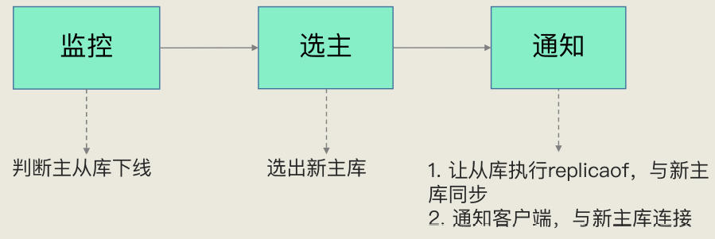

因为主从切换过程，客户端不能正常执行写请求，此时一个好的策略是：让客户端缓存应用发送的写请求（Redis 应用场景一般也没有同步写），给应用程序返回一个确认即可。此外，主从切换完成后，客户端要及时和新主库重新建立连接：哨兵需要提供订阅频道，让客户端能够订阅到新主库的信息。同时，客户端也需要能主动和哨兵通信，询问新主库的信息。

### 主观下线和客观下线

哨兵对主库的下线判断有“主观下线”和“客观下线”两种：

* 主观下线：哨兵进程会使用 PING 命令检测它自己和主、从库的网络连接情况，用来判断实例的状态。如果哨兵发现主库或从库对 PING 命令的响应超时了，那么，哨兵就会先把它标记为“主观下线”

* 客观下线：指的是Redis哨兵对标记主库下线的谨慎策略，因为选主和切换是需要巨大开销的，为了防止误判，通常会采用多实例组成的集群模式进行部署，这也被称为哨兵集群。引入多个哨兵实例一起来判断，就可以避免单个哨兵因为自身网络状况不好，而误判主库下线的情况。同时，多个哨兵的网络同时不稳定的概率较小，由它们一起做决策，误判率也能降低。

  当大多数的哨兵实例，都判断主库已经“主观下线”了，主库才会被标记为“客观下线”，这个叫法也是表明主库下线成为一个客观事实了

  也就是当有 N 个哨兵实例时，最好要有 N/2 + 1 个实例判断主库为“主观下线”，才能最终判定主库为“客观下线”

  有多少个实例做出“主观下线”的判断才可以，可以由 Redis 管理员自行设定

### 选主策略

这里把选择新主库的过程简单称为筛选和打分两部分：

* 筛选：在多个从库中，先按照一定的筛选条件，把不符合条件的从库去掉
* 打分：按照一定的规则，给剩下的从库逐个打分，将得分最高的从库选为新主库

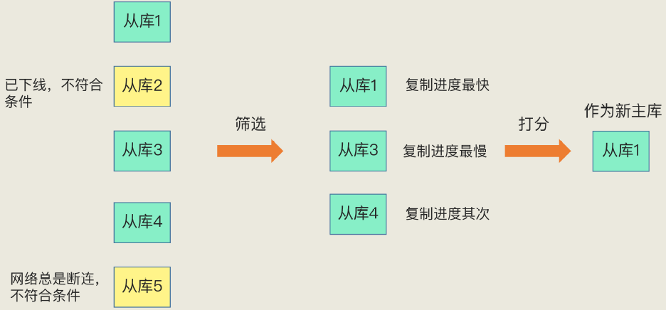

1、筛选过程

主要是判断从库的当前在线状态，以及判断它之前的网络连接状态。

具体来说，要使用配置项 down-after-milliseconds * 10。其中，down-aftermilliseconds是我们认定主从库断连的最大连接超时时间。如果在 down-aftermilliseconds毫秒内，主从节点都没有通过网络联系上，我们就可以认为主从节点断连了。如果发生断连的次数超过了 10 次，就说明这个从库的网络状况不好，不适合作为新主库。

2、打分过程

分别按照三个规则依次进行三轮打分，这三个规则分别是从库优先级、从库复制进度以及从库 ID 号。只要在某一轮中，有从库得分最高，那么它就是主库了，选主过程到此结束。如果没有出现得分最高的从库，那么就继续进行下一轮。

* 第一轮：优先级最高的从库得分高。

  用户可以通过 slave-priority 配置项，给不同的从库设置不同优先级。比如，你有两个从库，它们的内存大小不一样，你可以手动给内存大的实例设置一个高优先级。

* 第二轮：和旧主库同步程度最接近的从库得分高。

  判断依据就是从库的slave_repl_offset 需要最接近 主库的master_repl_offset

* 第三轮：ID 号小的从库得分高。每个实例都会有一个 ID，这个 ID 就类似于这里的从库的编号。

哨兵实例越多，误判率会越低，但是在判定主库下线和选举 Leader 时，实例需要拿到的赞成票数也越多，等待所有哨兵投完票的时间可能也会相应增加，主从库切换的时间也会变长，客户端容易堆积较多的请求操作，可能会导致客户端请求溢出，从而造成请求丢失。

谨慎选择down-after-milliseconds的值，调大 down-after-milliseconds 后，可能会导致这样的情况：主库实际已经发生故障了，但是哨兵过了很长时间才判断出来，这就会影响到 Redis 对业务的可用性。

### 哨兵集群组成

在部署哨兵集群时，只需要在每个哨兵上执行下列命令，设置主库的IP和端口就可以组成集群：

~~~
sentinel monitor <master-name> <ip> <redis-port> <quorum>
~~~

虽然哨兵实例都不知道彼此的地址，但也可以组成集群。这都要归功于Redis 提供的 pub/sub 机制，也就是发布 / 订阅机制。

哨兵只要和主库建立起了连接，就可以在主库上发布消息了，比如说发布它自己的连接信息（IP 和端口）。同时，它也可以从主库上订阅消息，获得其他哨兵发布的连接信息。当多个哨兵实例都在主库上做了发布和订阅操作后，它们之间就能知道彼此的 IP 地址和端口。

在主从集群中，主库上有一个名为“\\_\_sentinel\__:hello”的频道，不同哨兵就是通过它来相互发现，实现互相通信的。例如下图，哨兵 1 把自己的 IP（172.16.19.3）和端口（26579）发布到“\__sentinel__:hello”频道上，哨兵 2 和 3 订阅了该频道。那么此时，哨兵 2 和 3 就可以从这个频道直接获取哨兵 1 的 IP 地址和端口号。
然后，哨兵 2、3 可以和哨兵 1 建立网络连接。通过这个方式，哨兵 2 和 3 也可以建立网络连接，这样一来，哨兵集群就形成了，哨兵节点之间也可以通过网络进行通信：

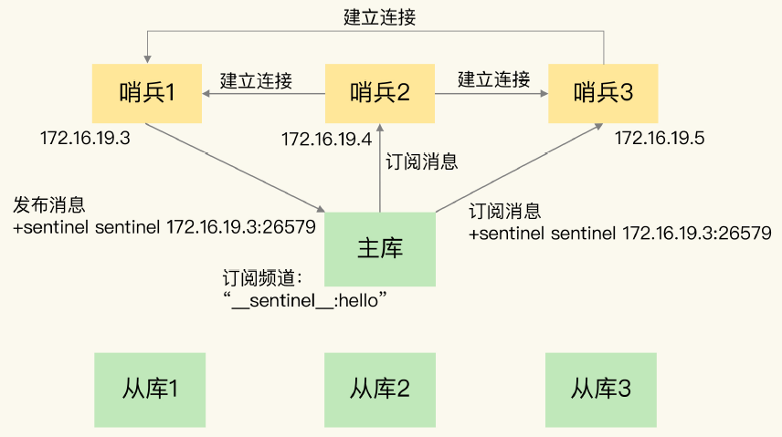

哨兵除了彼此之间建立起连接形成集群外，还需要和从库建立连接。这是因为，在哨兵的监控任务中，它需要对主从库都进行心跳判断，而且在主从库切换完成后，它还需要通知从库，让它们和新主库进行同步。

为了知道从库的IP地址和端口，哨兵向主库发送 INFO 命令，主库接受到这个命令后，就会把从库列表返回给哨兵。接着，哨兵就可以根据从库列表中的连接信息，和每个从库建立连接，并在这个连接上持续地对从库进行监控：

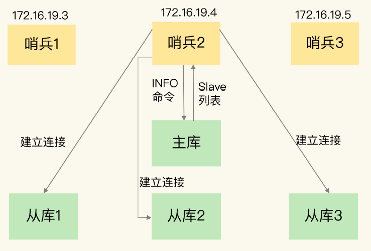

### 哨兵和客户端间的信息同步

哨兵不能只和主、从库连接。因为，主从库切换后，客户端也需要知道新主库的连接信息，才能向新主库发送请求操作。所以，哨兵还需要完成把新主库的信息告诉客户端这个任务。这个过程也是依赖订阅-发布机制的，每个哨兵实例也提供 pub/sub 机制，客户端可以从哨兵订阅消息。哨兵提供的消息订阅频道有很多，不同频道包含了主从库切换过程中的不同关键事件，重要的频道如下，包括主库下线判断、新主库选定、从库重新配置：

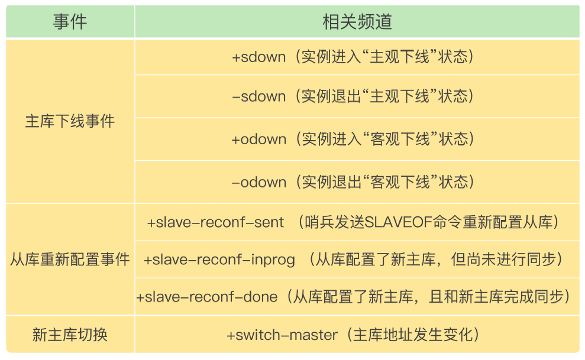

知道了这些频道之后，你就可以让客户端从哨兵这里订阅消息了。具体的操作步骤是，客户端读取哨兵的配置文件后，可以获得哨兵的地址和端口，和哨兵建立网络连接。然后，我们可以在客户端执行订阅命令，来获取不同的事件消息。

订阅动作完成后，当哨兵把新主库选择出来后，客户端就会收到下面的switch-master 事件。这个事件表示主库已经切换了，而且会从信息中提取新主库的IP地址和端口，然后客户端就可以和新主库通信了：

~~~
switch-master <master name> <oldip> <oldport> <newip> <newport>
~~~

有了这些事件通知，客户端不仅可以在主从切换后得到新主库的连接信息，还可以监控到主从库切换过程中发生的各个重要事件。这样，客户端就可以知道主从切换进行到哪一步了，有助于了解切换进度。

### 哨兵的Leader选举

主库故障以后，哨兵集群有多个实例，那怎么确定由哪个哨兵来进行实际的主从切换呢？这个来执行主从切换的哨兵节点就是Leader哨兵，Leader哨兵的出现是在决定出新主库之后的动作。

在哨兵判断下线的过程中，任何一个实例只要自身判断主库“主观下线”后，就会给其他实例发送 is-master-downby-addr 命令。接着，其他实例会根据自己和主库的连接情况，做出 Y 或 N 的响应，Y 相当于赞成票，N 相当于反对票。一个哨兵获得了仲裁所需的赞成票数后，就可以标记主库为“客观下线”。这个所需的赞
成票数是通过哨兵配置文件中的 quorum 配置项设定的：

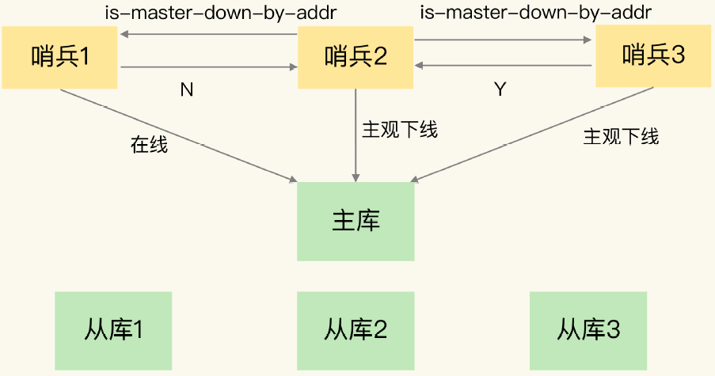

此时，这个哨兵就可以再给其他哨兵发送命令，表明希望由自己来执行主从切换，并让所有其他哨兵进行投票。这个投票过程称为“Leader 选举”

在投票过程中，任何一个想成为 Leader 的哨兵，要满足两个条件：第一，拿到半数以上的赞成票；第二，拿到的票数同时还需要大于等于哨兵配置文件中的 quorum 值。（这个原则就说明了：当由哨兵节点挂掉时，可能选举时永远无法达成数量条件，此时的Redis集群无法进行主从库切换）

一个实际的哨兵Leader选举的过程：

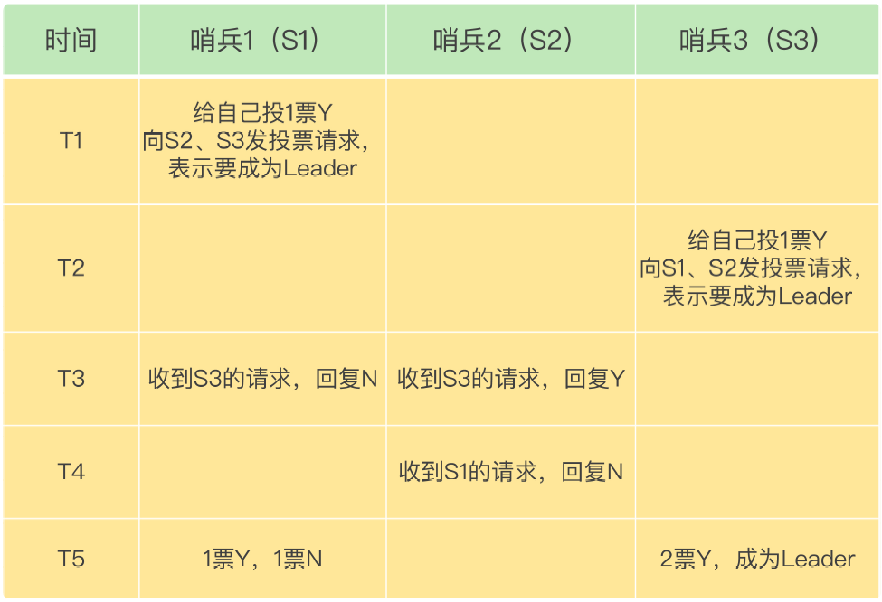

观察选举过程，可以看出：

* 哨兵发起Leader选举后，会给自己投一票
* 已经投过票的哨兵节点，收到投票请求后会投N

如果一轮选举中没有哨兵称为Leader，则哨兵集群会等待一段时间（也就是哨兵故障转移超时时间的 2 倍），再重新选举。这是因为，哨兵集群能够进行成
功投票，很大程度上依赖于选举命令的正常网络传播。如果网络压力较大或有短时堵塞，就可能导致没有一个哨兵能拿到半数以上的赞成票。所以，等到网络拥塞好转之后，再进行投票选举，成功的概率就会增加。

此外，哨兵对主从库进行的在线状态检查等操作是用定时器来完成的，每个哨兵的定时器执行周期都会加上一个小小的随机时间偏移，目的是让每个哨兵执行上述操作的时间能稍微错开些，也是为了避免它们都同时判定主库下线，这样能错开发起选举的时间

哨兵集群中的各哨兵节点配置一定要相同，如主观下线的判断值 down-after-milliseconds，否则可能导致哨兵集群一直没有对有故障的主库形成共识，也就没有及时切换主库，最终的结果就是集群服务不稳定

### 关键配置

下面这些配置不合理的时候，就会引发严重的问题：

1、protected-mode 配置项

这个配置项的作用是限定哨兵实例能否被其他服务器访问。当这个配置项设置为 yes 时，哨兵实例只能在部署的服务器本地进行访问。当设置为 no 时，其他服务器也可以访问这个哨兵实例。

如果 protected-mode 被设置为 yes，而其余哨兵实例部署在其它服务器，那么，这些哨兵实例间就无法通信。当主库故障时，哨兵无法判断主库下线，也无法进行主从切换，最终 Redis 服务不可用。所以，我们在应用主从集群时，要注意将 protected-mode 配置项设置为 no，并且将bind 配置项设置为其它哨兵实例的 IP 地址。这样一来，只有在 bind 中设置了 IP 地址的哨兵，才可以访问当前实例，既保证了实例间能够通信进行主从切换，也保证了哨兵的安全性。

例如，如果设置了下面的配置项，那么，部署在 192.168.10.3/4/5这三台服务器上的哨兵实例就可以相互通信，执行主从切换：

~~~
protected-mode no
bind 192.168.10.3 192.168.10.4 192.168.10.5
~~~

2、cluster-node-timeout 配置项

这个配置项设置了 Redis Cluster 中实例响应心跳消息的超时时间。

当我们在 Redis Cluster 集群中为每个实例配置了“一主一从”模式时，如果主实例发生故障，从实例会切换为主实例，受网络延迟和切换操作执行的影响，切换时间可能较长，就会导致实例的心跳超时（超出 cluster-node-timeout）。实例超时后，就会被 RedisCluster 判断为异常。

Redis Cluster 正常运行的条件就是，有半数以上的实例都能正常运行。所以，如果执行主从切换的实例超过半数，而主从切换时间又过长的话，就可能有半数以上的实例心跳超时，从而可能导致整个集群挂掉。所以建议将 cluster-nodetimeout调大些（例如 10 到 20 秒）。

### 脑裂

脑裂，就是指在主从集群中，同时有两个主节点，它们都能接收写请求。而脑裂最直接的影响，就是客户端不知道应该往哪个主节点写入数据，结果就是不同的客户端会往不同的主节点上写入数据。而且，严重的话，脑裂会进一步导致数据丢失。

我们是采用哨兵机制进行主从切换的，当主从切换发生时，一定是有超过预设数量（quorum 配置项）的哨兵实例和主库的心跳都超时了，才会把主库判断为客观下线，然后，哨兵开始执行切换操作。哨兵切换完成后，客户端会和新主库进行通信，发送请求操作。

但有时主库是由于某些原因无法处理请求，也没有响应哨兵的心跳，才被哨兵错误地判断为客观下线的。结果，在被判断下线之后，原主库又重新开始处理请求了，而此时，哨兵还没有完成主从切换，客户端仍然可以和原主库通信，客户端发送的写操作就会在原主库上写入数据：

主从切换后，从库一旦升级为新主库，哨兵就会让原主库执行 slave of 命令，和新主库重新进行全量同步。而在全量同步执行的最后阶段，原主库需要清空本地的数据，加载新主库发送的 RDB 文件，这样一来，原主库在主从切换期间保存的新写数据就丢失了：

在主从切换的过程中，如果原主库只是“假故障”，它会触发哨兵启动主从切换，一旦等它从假故障中恢复后，又开始处理请求，这样一来，就会和新主库同时存在，形成脑裂。等到哨兵让原主库和新主库做全量同步后，原主库在切换期间保存的数据就丢失了。

应对脑裂问题的关键是：想办法在原主库发生假故障后，让其无法接受请求，这样就不会出现数据丢失了

Redis 已经提供了两个配置项来限制主库的请求处理，分别是 minslaves-to-write 和 min-slaves-max-lag：

* min-slaves-to-write：这个配置项设置了主库能进行数据同步的最少从库数量；
* min-slaves-max-lag：这个配置项设置了主从库间进行数据复制时，从库给主库发送ACK 消息的最大延迟（以秒为单位）

我们可以把 min-slaves-to-write 和 min-slaves-max-lag 这两个配置项搭配起来使用，分别给它们设置一定的阈值，假设为 N 和 T。这两个配置项组合后的要求是，主库连接的从库中至少有 N 个从库，和主库进行数据复制时的 ACK 消息延迟不能超过 T 秒，否则，主库就不会再接收客户端的请求了

即使原主库是假故障，它在假故障期间也无法响应哨兵心跳，也不能和从库进行同步，自然也就无法和从库进行 ACK 确认了。这样一来，min-slaves-to-write 和 min-slavesmax-lag 的组合要求就无法得到满足，原主库就会被限制接收客户端请求，客户端也就不能在原主库中写入新数据了。

例如：假设我们将 min-slaves-to-write 设置为 1，把 min-slaves-max-lag 设置为 12s，把哨兵的 down-after-milliseconds 设置为 10s，主库因为某些原因卡住了 15s，导致哨兵判断主库客观下线，开始进行主从切换。同时，因为原主库卡住了 15s，没有一个从库能和原主库在 12s 内进行数据复制，原主库也无法接收客户端请求了。这样一来，主从切换完成后，也只有新主库能接收请求，不会发生脑裂，也就不会发生数据丢失的问题了（一般来说，设置min-slaves-max-lag < 主库失去响应的最大时间，否则主库很快恢复响应，没有超过阈值，就开始接受写请求了，又会造成数据丢失）

原主库可能发生假故障的原因：

* 和主库部署在同一台服务器上的其他程序临时占用了大量资源（例如 CPU 资源），导致主库资源使用受限，短时间内无法响应心跳
* 主库自身遇到了阻塞的情况，例如，处理 bigkey 或是发生内存 swap

在实际应用中，可能会因为网络暂时拥塞导致从库暂时和主库的 ACK 消息超时。在这种情况下，并不是主库假故障，我们也不用禁止主库接收请求。

建议实际应用时，假设从库有 K 个，可以将 min-slaves-to-write 设置为K/2+1（如果 K 等于 1，就设为 1），将 min-slaves-max-lag 设置为十几秒（例如 10～20s），在这个配置下，如果有一半以上的从库和主库进行的 ACK 消息延迟超过十几秒，我们就禁止主库接收客户端写请求。

这样一来，我们可以避免脑裂带来数据丢失的情况，而且，也不会因为只有少数几个从库因为网络阻塞连不上主库，就禁止主库接收请求，增加了系统的鲁棒性。

## 主从同步的问题

### 主从数据不一致

主从数据不一致，就是指客户端从从库中读取到的值和主库中的最新值并不一致。

根本原因就是主从库间的命令复制是异步进行的，在主从库命令传播阶段，主库收到新的写命令后，会发送给从库。但是，主库并不会等到从库实际执行完命令后，再把结果返回给客户端，而是主库自己在本地执行完命令后，就会向客户端返回结果了。如果从库还没有执行主库同步过来的命令，主从库间的数据就不一致了。

从库滞后执行同步命令的可能原因：

* 主从库间的网络可能会有传输延迟，所以从库不能及时地收到主库发送的命令。
* 即使从库及时收到了主库的命令，但是，也可能会因为正在处理其它复杂度高的命令（例如集合操作命令）而阻塞。

对于第一个原因，可以在硬件环境配置方面，要尽量保证主从库间的网络连接状况良好。例如，我们要避免把主从库部署在不同的机房，或者是避免把网络通信密集的应用（例如数据分析应用）和 Redis 主从库部署在一起。

可以选择开发一个外部程序来监控主从库间的复制进度。因为 Redis 的 INFO replication 命令可以查看主库接收写命令的进度信息（master_repl_offset）和从库复制写命令的进度信息（slave_repl_offset），所以，我们就可以开发一个监控程序，先用 INFO replication 命令查到主、从库的进度，然后，我们用 master_repl_offset 减去 slave_repl_offset，这样就能得到从库和主库间的复制进度差值了。

如果某个从库的进度差值大于我们预设的阈值，我们可以让客户端不再和这个从库连接进行数据读取，这样就可以减少读到不一致数据的情况。

监控程序可以一直监控着从库的复制进度，当从库的复制进度又赶上主库时，我们就允许客户端再次跟这些从库连接

关于主从数据不一致的问题，还可以将Redis 中的 slaveserve-stale-data 配置项设置为no，代表从库不能处理数据读写命令，此时从库只能服务 INFO、SLAVEOF 命令，这就可以避免在从库中读到不一致的数据了，但对应的，从库也不能提供读写能力了。

### 读到过期数据

在使用 Redis 主从集群时，有时会读到过期数据。例如，数据 X 的过期时间是202010240900，但是客户端在 202010240910 时，仍然可以从从库中读到数据 X。这是由 Redis 的过期数据删除策略引起的。

Redis 同时使用了两种策略来删除过期的数据，分别是惰性删除策略和定期删除策略：

* 惰性删除策略：当一个数据的过期时间到了以后，并不会立即删除数据，而是等到再有请求来读写这个数据时，对数据进行检查，如果发现数据已经过期了，再删除这个数据。
* 定期删除策略：Redis 每隔一段时间（默认 100ms），就会随机选出一定数量的数据，检查它们是否过期，并把其中过期的数据删除，这样就可以及时释放一些内存

虽然定期删除策略可以释放一些内存，但是，Redis 为了避免过多删除操作对性能产生影响，每次随机检查数据的数量并不多。如果过期数据很多，并且一直没有再被访问的话，这些数据就会留存在 Redis 实例中，此时要想删掉这些数据就要依赖惰性删除了，如果客户端从主库上读取留存的过期数据，主库会触发删除操作，此时，客户端并不会读到过期数据。但是，从库本身不会执行删除操作，如果客户端在从库中访问留存的过期数据，从库并不会触发数据删除。

当客户端在从库中访问留存的过期数据时，从库的响应情况与Redis的版本有关：

* Redis 3.2 之前的版本，那么，从库在服务读请求时，并不会判断数据是否过期，而是会返回过期数据。
* 在 3.2 版本后，Redis做了改进，如果读取的数据已经过期了，从库虽然不会删除，但是会返回空值，这就避免了客户端读到过期数据。所以，在应用主从集群时，尽量使用 Redis 3.2 及以上版本

即使使用Redis 3.2及之后的版本，也会因为主从同步的存在，导致读到过期数据。

当主从库全量同步时，如果主库接收到了一条 EXPIRE 命令，那么，主库会直接执行这条命令。这条命令会在全量同步完成后，发给从库执行。而从库在执行时，就会在当前时间的基础上加上数据的存活时间，这样一来，从库上数据的过期时间就会比主库上延后了

为了避免这种情况，建议在业务应用中使用 EXPIREAT/PEXPIREAT 命令（它们是可以指定具体的删除时间的），把数据的过期时间设置为具体的时间点，避免读到过期数据：

~~~
EXPIREAT testkey 1603501200
~~~

还要保证主从节点上的时钟要保持一致，具体的做法是，让主从节点和相同的NTP 服务器（时间服务器）进行时钟同步。

处理这个问题时要注意：不能将从库的slave-read-only 设置为 no，让从库也能直接删除数据，这样不仅不能避免读到过期数据的问题，而且还带来严重的数据不一致问题，例如，主从库上都有 a:stock 的键，客户端 A 给主库发送一个 SET 命令，修改 a:stock 的值，客户端 B 给从库发送了一个 SET 命令，也修改 a:stock 的值，此时，相同键的值就不一样了。所以，如果从库具备执行写操作的功能，就会导致主从数据不一致。

## 切片集群

### 纵向扩展和横向扩展

例如要用 Redis 保存 5000 万个键值对，每个键值对大约是 512B，这些键值对所占的内存空间大约是 25GB（5000 万 *512B），一个简单的方案是选择一台 32GB 内存的云主机来部署 Redis，但实际上由于RDB持久化时，主线程会fork子进程来完成，fork 操作的用时和 Redis 的数据量是正相关的，卡顿甚至接近秒级，导致该方案不可用。还有一种方案是使用Redis的切片集群，也叫分片集群，指启动多个 Redis 实例组成一个集群，然后按照一定的规则，把收到的数据划分成多份，每一份用一个实例来保存，这样就可以解决上面的问题了，两种方案的对比：

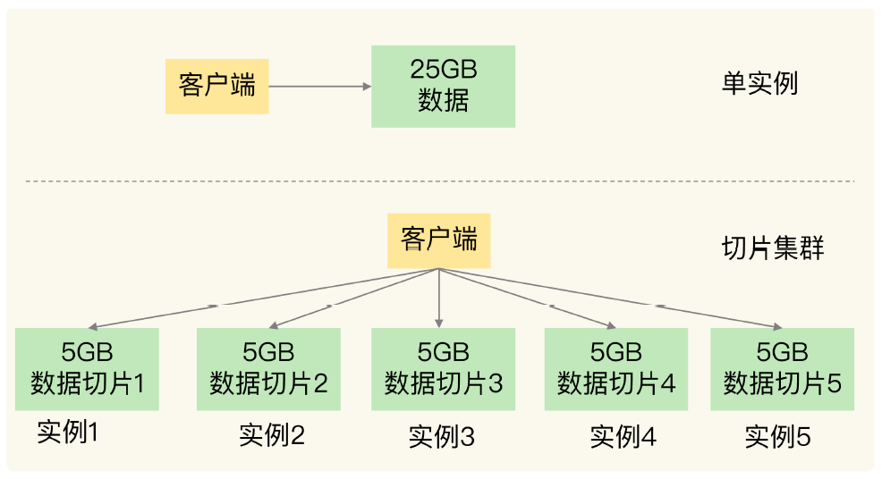

Redis保存大量数据的方案有两种：纵向扩展（scale up）和横向扩展（scale out）：

* 纵向扩展：升级单个 Redis 实例的资源配置。优点是简单直接，缺点是1、fork子进程阻塞的问题，但如果不要求持久化保存Redis的数据也可以；2、纵向扩展会收到硬件和成本的限制，把内存从 32GB 扩展到 64GB 还算容易，但是，要想扩充到 1TB就很困难了
* 横向扩展：横向增加当前 Redis 实例的个数

### 数据分布

切片集群是一种保存大量数据的通用机制，这个机制可以有不同的实现方案。在Redis 3.0 之前，官方并没有针对切片集群提供具体的方案。从 3.0 开始，官方提供了一个名为 Redis Cluster 的方案，用于实现切片集群。Redis Cluster 方案中就规定了数据和实例的对应规则：

Redis Cluster 方案采用哈希槽（Hash Slot，接下来我会直接称之为 Slot），来处理数据和实例之间的映射关系。在 Redis Cluster 方案中，一个切片集群共有 16384个哈希槽，这些哈希槽类似于数据分区，每个键值对都会根据它的 key，被映射到一个哈希槽中

具体的映射分为两步：

* 根据key得到槽号
* 根据槽号得到具体的Redis实例

1、根据key得到槽号

具体来说就是根据key值，按照CRC16 算法计算一个 16 bit 的值；然后，再用这个 16bit 值对 16384 取模，得到 0~16383 范围内的模数

2、根据槽号得到具体的Redis实例

在部署 Redis Cluster 方案时，可以使用 cluster create 命令创建集群，此时，Redis会自动把这些槽平均分布在集群实例上。例如，如果集群中有 N 个实例，那么，每个实例上的槽个数为 16384/N 个

我们也可以使用 cluster meet 命令手动建立实例间的连接，形成集群，再使用cluster addslots 命令，指定每个实例上的哈希槽个数。当每个节点的资源不同时，经常会采用这种手动分配的方案

假设切片集群一共有 3 个实例，同时假设有 5 个哈希槽，可以用下面的命令来手动分配哈希槽：

~~~
redis-cli -h 172.16.19.3 –p 6379 cluster addslots 0,1
redis-cli -h 172.16.19.4 –p 6379 cluster addslots 2,3
redis-cli -h 172.16.19.5 –p 6379 cluster addslots 4
~~~

分配完之后，槽和实例数的对应关系如下：

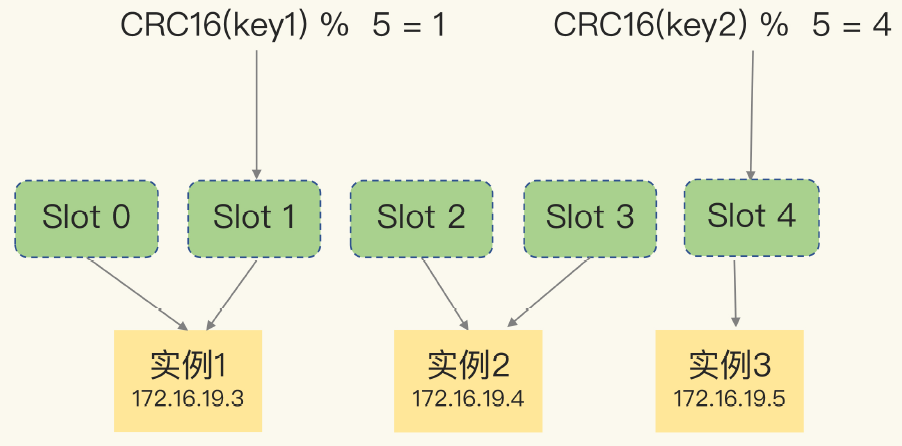

需要注意的是：在手动分配哈希槽时，需要把 16384 个槽都分配完，否则Redis 集群无法正常工作

### 数据查询

Redis 实例会把自己的哈希槽信息发给和它相连接的其它实例，来完成哈希槽分配信息的扩散。当实例之间相互连接后，每个实例就有所有哈希槽的映射关系了

客户端和集群实例建立连接后，实例就会把哈希槽的分配信息发给客户端。客户端收到哈希槽信息后，会把哈希槽信息缓存在本地。当客户端请求键值对时，会先计算键所对应的哈希槽，然后就可以给相应的实例发送请求了。

但是，在集群中，实例和哈希槽的对应关系并不是一成不变的，最常见的变化有两个：

* 在集群中，实例有新增或删除，Redis 需要重新分配哈希槽；
* 为了负载均衡，Redis 需要把哈希槽在所有实例上重新分布一遍

虽然实例之间还可以通过相互传递消息，获得最新的哈希槽分配信息，但是客户端是无法主动感知这些变化的。这就会导致，它缓存的分配信息和最新的分配信息不一致。Redis Cluster 方案提供了一种重定向机制，所谓的“重定向”，就是指，客户端给一个实例发送数据读写操作时，这个实例上并没有相应的数据，客户端要再给一个新实例发送操作命令，例如：

~~~
GET hello:key
(error) MOVED 13320 172.16.19.5:6379
~~~

通过返回的MOVED命令，就可以知道数据对应的槽存在哪个实例了。客户端会再次向新实例发送请求，同时还会更新本地缓存，把对应slot和实例的关系更新。

上面的情况是数据已经迁移完毕了的情况，当数据在迁移中，此时只有一部分数据被迁移到新的实例，此时客户端就会收到一条 ASK 报错信息：

~~~
GET hello:key
(error) ASK 13320 172.16.19.5:6379
~~~

这个结果中的 ASK 命令就表示，客户端请求的键值对所在的哈希槽 13320，在172.16.19.5 这个实例上，但是这个哈希槽正在迁移。此时，客户端需要先给 172.16.19.5这个实例发送一个 ASKING 命令。这个命令的意思是，让这个实例允许执行客户端接下来发送的命令。然后，客户端再向这个实例发送 GET 命令，以读取数据。

和 MOVED 命令不同，ASK 命令并不会更新客户端缓存的哈希槽分配信息，ASK 命令的作用只是让客户端能给新实例发送一次请求，而不像 MOVED 命令那样，会更改本地缓存，让后续所有命令都发往新实例

## Codis

### 整体架构

之前介绍的方案是Redis 官方提供的切片集群方案 Redis Cluster，下面介绍Redis Cluster 方案正式发布前，业界已经广泛使用的 Codis。

Codis 集群中包含了 4 类关键组件：

* codis server：这是进行了二次开发的 Redis 实例，其中增加了额外的数据结构，支持数据迁移操作，主要负责处理具体的数据读写请求。
* codis proxy：接收客户端请求，并把请求转发给 codis server。
* Zookeeper 集群：保存集群元数据，例如数据位置信息和 codis proxy 信息。
* codis dashboard 和 codis fe：共同组成了集群管理工具。其中，codis dashboard 负责执行集群管理工作，包括增删 codis server、codis proxy 和进行数据迁移。而 codis fe 负责提供 dashboard 的 Web 操作界面，便于我们直接在 Web 界面上进行集群管理。

Codis 处理请求的流程：

首先，为了让集群能接收并处理请求，我们要先使用 codis dashboard 设置 codis server和 codis proxy 的访问地址，完成设置后，codis server 和 codis proxy 才会开始接收连接。

然后，当客户端要读写数据时，客户端直接和 codis proxy 建立连接。codis proxy 本身支持 Redis 的 RESP 交互协议，所以，客户端访问 codis proxy时，和访问原生的 Redis 实例没有什么区别

最后，codis proxy 接收到请求，就会查询请求数据和 codis server 的映射关系，并把请求转发给相应的 codis server 进行处理。当 codis server 处理完请求后，会把结果返回给codis proxy，proxy 再把数据返回给客户端：

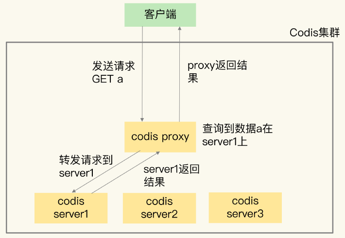

### 数据分布

在 Codis 集群中，一个数据应该保存在哪个 codis server 上，这是通过逻辑槽（Slot）映射来完成的，具体来说，总共分成两步：

* 第一步，Codis 集群一共有 1024 个 Slot，编号依次是 0 到 1023。我们可以把这些 Slot手动分配给 codis server，每个 server 上包含一部分 Slot。当然，我们也可以让 codis dashboard 进行自动分配，例如，dashboard 把 1024 个 Slot 在所有 server 上均分
* 第二步，当客户端要读写数据时，会使用 CRC32 算法计算数据 key 的哈希值，并把这个哈希值对 1024 取模。而取模后的值，则对应 Slot 的编号。此时，根据第一步分配的 Slot和 server 对应关系，我们就可以知道数据保存在哪个 server 上了

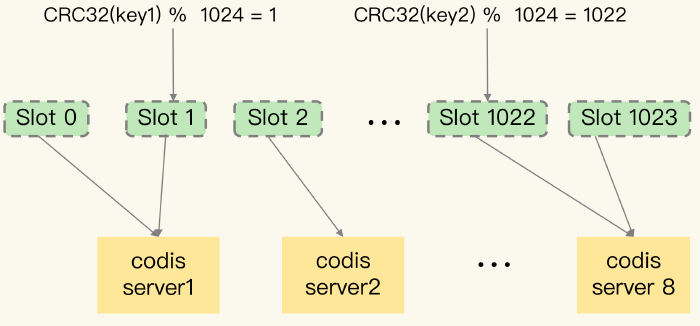

Slot 和 codis server 的映射关系称为数据路由表（简称路由表）。我们在 codis dashboard 上分配好路由表后，dashboard 会把路由表发送给 codis proxy，同时，dashboard 也会把路由表保存在 Zookeeper 中。codis-proxy 会把路由表缓存在本地，当它接收到客户端请求后，直接查询本地的路由表，就可以完成正确的请求转发了。

路由表的分配和使用过程：

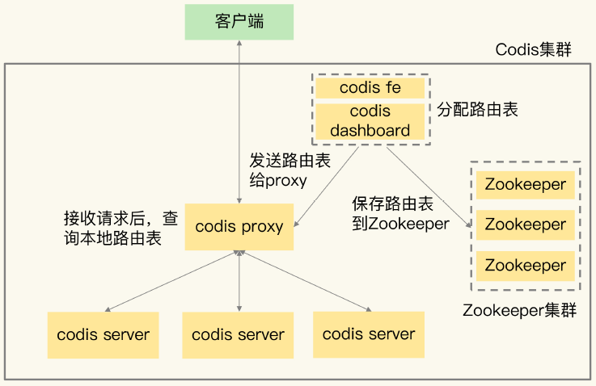

在数据分布的实现方法上，Codis 和 Redis Cluster 很相似，都采用了 key 映射到 Slot、Slot 再分配到实例上的机制。两者的不同之处在于：

* Codis 中的路由表是我们通过 codis dashboard 分配和修改的，并被保存在 Zookeeper集群中。一旦数据位置发生变化（例如有实例增减），路由表被修改了，codis dashbaord 就会把修改后的路由表发送给 codis proxy，proxy 就可以根据最新的路由信息转发请求了
* 在 Redis Cluster 中，数据路由表是通过每个实例相互间的通信传递的，最后会在每个实例上保存一份。当数据路由信息发生变化时，就需要在所有实例间通过网络消息进行传递。所以，如果实例数量较多的话，就会消耗较多的集群网络资源。

### 扩容和数据迁移

Codis 集群扩容包括了两方面：增加 codis server 和增加 codis proxy

1、增加codis server这个过程主要涉及到两步操作：

1. 启动新的 codis server，将它加入集群；
2. 把部分数据迁移到新的 server。

Codis 集群按照 Slot 的粒度进行数据迁移，迁移的基本流程：

* 在源 server 上，Codis 从要迁移的 Slot 中随机选择一个数据，发送给目的 server。
* 目的 server 确认收到数据后，会给源 server 返回确认消息。这时，源 server 会在本地将刚才迁移的数据删除。
* 第一步和第二步就是单个数据的迁移过程。Codis 会不断重复这个迁移过程，直到要迁移的 Slot 中的数据全部迁移完成。

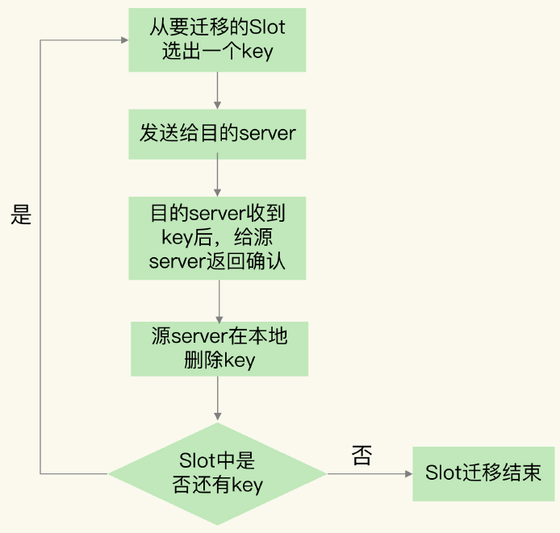

Codis 实现了两种迁移模式，分别是同步迁移和异步迁移：

同步迁移是指，在数据从源 server 发送给目的 server 的过程中，源 server 是阻塞的，无法处理新的请求操作。这种模式很容易实现，但是迁移过程中会涉及多个操作（包括数据在源 server 序列化、网络传输、在目的 server 反序列化，以及在源 server 删除），如果迁移的数据是一个 bigkey，源 server 就会阻塞较长时间，无法及时处理用户请求

异步迁移就可以避免阻塞源server的问题，当源 server 把数据发送给目的 server 后，就可以处理其他请求操作了，而目的 server 会在收到数据并反序列化保存到本地后，给源 server 发送一个 ACK 消息，表明迁移完成。此时，源 server 在本地把刚才迁移的数据删除。在这个过程中，迁移的数据会被设置为只读，这就保证了数据一致性。

异步迁移对于bigkey，采用了拆分指令的方式进行迁移。具体来说就是，对 bigkey 中每个元素，用一条指令进行迁移，而不是把整个 bigkey 进行序列化后再整体传输。这种化整为零的方式，就避免了 bigkey 迁移时，因为要序列化大量数据而阻塞源server 的问题。

此外，当 bigkey 迁移了一部分数据后，如果 Codis 发生故障，就会导致 bigkey 的一部分元素在源 server，而另一部分元素在目的 server，这就破坏了迁移的原子性。所以，Codis 会在目标 server 上，给 bigkey 的元素设置一个临时过期时间。如果迁移过程中发生故障，那么，目标 server 上的 key 会在过期后被删除，不会影响迁移的原子性。当正常完成迁移后，bigkey 元素的临时过期时间设定会被删除。

为了提升迁移的效率，Codis 在异步迁移 Slot 时，允许每次迁移多个 key。你可以通过异步迁移命令 SLOTSMGRTTAGSLOT-ASYNC 的参数numkeys 设置每次迁移的 key 数量。

2、增加 codis proxy

在 Codis 集群中，客户端是和 codis proxy 直接连接的，所以，当客户端增加时，一个 proxy 无法支撑大量的请求操作，此时，我们就需要增加 proxy

增加 proxy 比较容易，我们直接启动 proxy，再通过 codis dashboard 把 proxy 加入集群就行。此时，codis proxy 的访问连接信息都会保存在 Zookeeper 上。所以，当新增了 proxy后，Zookeeper 上会有最新的访问列表，客户端也就可以从 Zookeeper 上读取 proxy 访问列表，把请求发送给新增的 proxy。这样一来，客户端的访问压力就可以在多个 proxy上分担处理了，如下图所示：

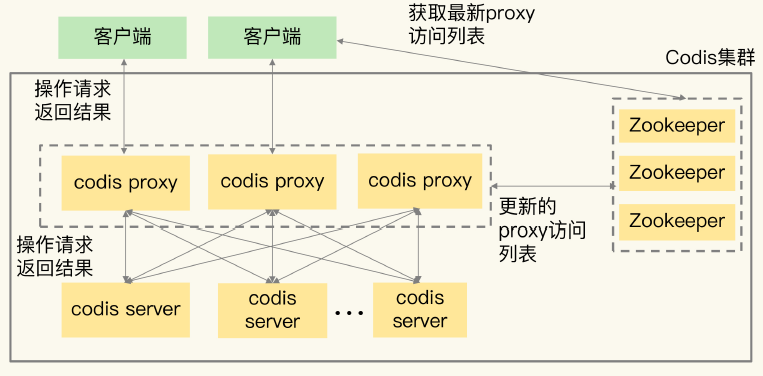

### 集群客户端

使用 Redis 单实例时，客户端只要符合 RESP 协议，就可以和实例进行交互和读写数据。但是，在使用切片集群时，有些功能是和单实例不一样的，比如集群中的数据迁移操作，在单实例上是没有的，而且迁移过程中，数据访问请求可能要被重定向（例如 Redis Cluster 中的 MOVE 命令）。

所以，客户端需要增加和集群功能相关的命令操作的支持。如果原来使用单实例客户端，想要扩容使用集群，就需要使用新客户端，这对于业务应用的兼容性来说，并不是特别友好。

Codis 集群在设计时，就充分考虑了对现有单实例客户端的兼容性。Codis 使用 codis proxy 直接和客户端连接，codis proxy 是和单实例客户端兼容的。而和集群相关的管理工作（例如请求转发、数据迁移等），都由 codis proxy、codis dashboard 这些组件来完成，不需要客户端参与。

这样一来，业务应用使用 Codis 集群时，就不用修改客户端了，可以复用和单实例连接的客户端，既能利用集群读写大容量数据，又避免了修改客户端增加复杂的操作逻辑，保证了业务代码的稳定性和兼容性。

### 集群可靠性

可靠性是实际业务应用的一个核心要求。对于一个分布式系统来说，它的可靠性和系统中的组件个数有关：组件越多，潜在的风险点也就越多。和 Redis Cluster 只包含 Redis 实例不一样，Codis 集群包含的组件有 4 类，它的可靠性设计也更复杂

下面分组件来叙述可靠性的保证：

1、codis server

codis server 其实就是 Redis 实例，只不过增加了和集群操作相关的命令。Redis 的主从复制机制和哨兵机制在 codis server 上都是可以使用的，所以，Codis 就使用主从集群来保证 codis server 的可靠性。Codis 给每个 server 配置从库，并使用哨兵机制进行监控，当发生故障时，主从库可以进行切换，从而保证了 server 的可靠性。

在这种配置情况下，每个 server 就成为了一个 server group，每个 group 中是一主多从的 server。数据分布使用的 Slot，也是按照 group 的粒度进行分配的。同时，codis proxy 在转发请求时，也是按照数据所在的 Slot 和 group 的对应关系，把写请求发到相应 group 的主库，读请求发到 group 中的主库或从库上：

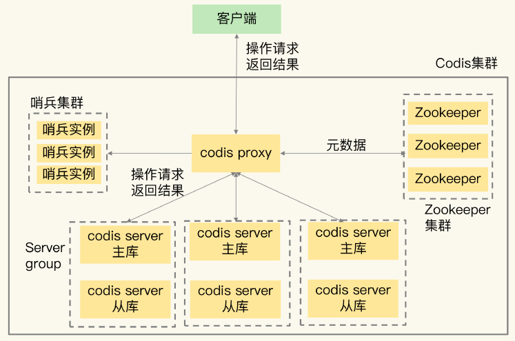

2、Zookeeper

在 Codis 集群设计时，proxy 上的信息源头都是来自 Zookeeper（例如路由表）。而Zookeeper 集群使用多个实例来保存数据，只要有超过半数的 Zookeeper 实例可以正常工作， Zookeeper 集群就可以提供服务，也可以保证这些数据的可靠性。

3、codis proxy

codis proxy 使用 Zookeeper 集群保存路由表，可以充分利用 Zookeeper 的高可靠性保证来确保 codis proxy 的可靠性，不用再做额外的工作了。当 codis proxy 发生故障后，直接重启 proxy 就行。重启后的 proxy，可以通过 codis dashboard 从 Zookeeper 集群上获取路由表，然后，就可以接收客户端请求进行转发了

4、codis dashboard 和 codis fe

它们主要提供配置管理和管理员手工操作，负载压力不大，所以，它们的可靠性可以不用额外进行保证了

### 切片集群方案选择

Codis 和 Redis Cluster 这两种切片集群方案对比：

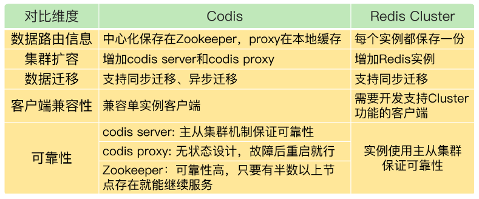

几条关于切片集群选择的建议：

1、从稳定性和成熟度来看，Codis 应用得比较早，在业界已经有了成熟的生产部署。虽然Codis 引入了 proxy 和 Zookeeper，增加了集群复杂度，但是，proxy 的无状态设计和 Zookeeper 自身的稳定性，也给 Codis 的稳定使用提供了保证。而 Redis Cluster的推出时间晚于 Codis，相对来说，成熟度要弱于 Codis，如果你想选择一个成熟稳定的方案，Codis 更加合适些。

2、从业务应用客户端兼容性来看，连接单实例的客户端可以直接连接 codis proxy，而原本连接单实例的客户端要想连接 Redis Cluster 的话，就需要开发新功能。所以，如果你的业务应用中大量使用了单实例的客户端，而现在想应用切片集群的话，建议你选择Codis，这样可以避免修改业务应用中的客户端。

3、从使用 Redis 新命令和新特性来看，Codis server 是基于开源的 Redis 3.2.8 开发的，所以，Codis 并不支持 Redis 后续的开源版本中的新增命令和数据类型。另外，Codis并没有实现开源 Redis 版本的所有命令，比如 BITOP、BLPOP、BRPOP，以及和与事务相关的 MUTLI、EXEC 等命令。如果想使用开源 Redis 版本的新特性，Redis Cluster是一个合适的选择。

4、从数据迁移性能维度来看，Codis 能支持异步迁移，异步迁移对集群处理正常请求的性能影响要比使用同步迁移的小。所以，如果你在应用集群时，数据迁移比较频繁的话，Codis 是个更合适的选择。

最后，一个重要的评估维度是集群的可扩展性，后面会讲到Redis Cluster集群实例个数是受到限制的，而Codis的扩展性要更好。Redis Cluster、Codis 和 Memcached 采用的方式各不相同：

* Redis Cluster：使用 Slot 映射表并由实例扩散保存。
* Codis：使用 Slot 映射表并由第三方存储系统保存。
* Memcached：使用一致性哈希。

从可扩展性来看，Memcached 优于 Codis，Codis 优于 Redis Cluster。当然一致性哈希也可以用在Redis Cluster中，但需要一定的改造。

## 数据倾斜

在切片集群中，数据会按照一定的分布规则分散到不同的实例上保存，这种分配可能会导致数据倾斜问题

数据倾斜有两类：

* 数据量倾斜：在某些情况下，实例上的数据分布不均衡，某个实例上的数据特别多。
* 数据访问倾斜：虽然每个集群实例上的数据量相差不大，但是某个实例上的数据是热点数据，被访问得非常频繁。

如果发生了数据倾斜，那么保存了大量数据，或者是保存了热点数据的实例的处理压力就会增大，速度变慢，甚至还可能会引起这个实例的内存资源耗尽，从而崩溃。这是我们在应用切片集群时要避免的。

### 数据量倾斜

数据量倾斜示意图：

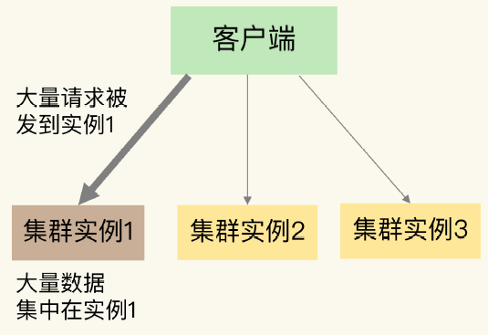

数据量倾斜产生的三个原因：bigkey、Slot 分配不均衡以及 Hash Tag

1、bigkey 

某个实例上正好保存了 bigkey。bigkey 的 value 值很大（String 类型），或者是 bigkey 保存了大量集合元素（集合类型），会导致这个实例的数据量增加，内存资源消耗也相应增加。

为了避免 bigkey 造成的数据倾斜，一个根本的应对方法是，我们在业务层生成数据时，要尽量避免把过多的数据保存在同一个键值对中。此外，如果 bigkey 正好是集合类型，我们还有一个方法，就是把 bigkey 拆分成很多个小的集合类型数据，分散保存在不同的实例上。

举个例子。假设 Hash 类型集合 user:info 保存了 100 万个用户的信息，是一个bigkey。那么，我们就可以按照用户 ID 的范围，把这个集合拆分成 10 个小集合，每个小集合只保存 10 万个用户的信息（例如小集合 1 保存的是 ID 从 1 到 10 万的用户信息，小集合 2 保存的是 ID 从 10 万零 1 到 20 万的用户）。这样一来，我们就可以把一个bigkey 化整为零、分散保存了，避免了 bigkey 给单个切片实例带来的访问压力。

2、Slot 分配不均衡

如果集群运维人员没有均衡地分配 Slot，就会有大量的数据被分配到同一个 Slot 中，而同一个 Slot 只会在一个实例上分布，这就会导致，大量数据被集中到一个实例上，造成数据倾斜。

为了应对这个问题，我们可以通过运维规范，在分配之前，我们就要避免把过多的 Slot 分配到同一个实例。如果是已经分配好 Slot 的集群，我们可以先查看 Slot 和实例的具体分配关系，从而判断是否有过多的 Slot 集中到了同一个实例。如果有的话，就将部分 Slot迁移到其它实例，从而避免数据倾斜。

不同集群上查看 Slot 分配情况的方式不同：如果是 Redis Cluster，就用 CLUSTER SLOTS 命令；如果是 Codis，就可以在 codis dashboard 上查看。

3、Hash Tag

Hash Tag 是指加在键值对 key 中的一对花括号{}。这对括号会把 key 的一部分括起来，客户端在计算 key 的 CRC16 值时，只对 Hash Tag 花括号中的 key 内容进行计算。如果没用 Hash Tag 的话，客户端计算整个 key 的 CRC16 的值。

使用 Hash Tag 的好处是，如果不同 key 的 Hash Tag 内容都是一样的，那么，这些 key对应的数据会被映射到同一个 Slot 中，同时会被分配到同一个实例上。

例如，其中，user:profile:{3231}和 user:order:{3231}的 Hash Tag 一样，都是 3231，它们的CRC16 计算值对 16384 取模后的值也是一样的，所以就对应映射到了相同的 Slot 1024中

Hash Tag 一般用在Redis Cluster 和 Codis中，支持事务操作和范围查询。因为 Redis Cluster 和 Codis 本身并不支持跨实例的事务操作和范围查询，当业务应用有这些需求时，就只能先把这些数据读取到业务层进行事务处理，或者是逐个查询每个实例，得到范围查询的结果。

使用 Hash Tag 把要执行事务操作或是范围查询的数据映射到同一个实例上，这样就能很轻松地实现事务或范围查询了。

使用 Hash Tag 的潜在问题，就是大量的数据可能被集中到一个实例上，导致数据倾斜，集群中的负载不均衡。这时候应该优先考虑避免数据倾斜，最好不要使用 Hash Tag 进行数据切片。因为事务和范围查询都还可以放在客户端来执行，而数据倾斜会导致实例不稳定，造成服务不可用。

### 数据访问倾斜

发生数据访问倾斜的根本原因，就是实例上存在热点数据（比如新闻应用中的热点新闻内容、电商促销活动中的热门商品信息，等等）。

一旦热点数据被存在了某个实例中，那么，这个实例的请求访问量就会远高于其它实例，面临巨大的访问压力，如下图所示：

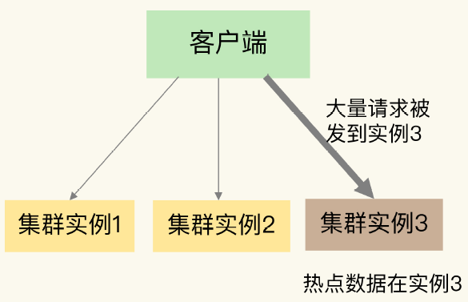

通常来说，热点数据以服务读操作为主，在这种情况下，我们可以采用热点数据多副本的方法来应对。

这个方法的具体做法是，我们把热点数据复制多份，在每一个数据副本的 key 中增加一个随机前缀，让它和其它副本数据不会被映射到同一个 Slot 中。这样一来，热点数据既有多个副本可以同时服务请求，同时，这些副本数据的 key 又不一样，会被映射到不同的 Slot中。在给这些 Slot 分配实例时，我们也要注意把它们分配到不同的实例上，那么，热点数据的访问压力就被分散到不同的实例上了。

这里，有个地方需要注意下，热点数据多副本方法只能针对只读的热点数据。如果热点数据是有读有写的话，就不适合采用多副本方法了，因为要保证多副本间的数据一致性，会带来额外的开销。

对于有读有写的热点数据，我们就要给实例本身增加资源了，例如使用配置更高的机器，来应对大量的访问压力。

## 通信开销

Redis Cluster 能保存的数据量以及支撑的吞吐量，跟集群的实例规模密切相关。Redis 官方给出了 Redis Cluster 的规模上限，就是一个集群运行 1000 个实例。之所以限定集群规模，是因为实例间的通信开销会随着实例规模增加而增大，在集群超过一定规模时（比如 800 节点），集群吞吐量反而会下降

之前说过，Redis Cluster 在运行时，每个实例上都会保存 Slot 和实例的对应关系（也就是 Slot 映射表），以及自身的状态信息。为了让集群中的每个实例都知道其它所有实例的状态信息，实例之间会按照一定的规则进行通信。这个规则就是 Gossip 协议。

Gossip 协议的工作原理可以概括成两点：

一是，每个实例之间会按照一定的频率，从集群中随机挑选一些实例，把 PING 消息发送给挑选出来的实例，用来检测这些实例是否在线，并交换彼此的状态信息。PING 消息中封装了发送消息的实例自身的状态信息、部分其它实例的状态信息，以及 Slot 映射表。

二是，一个实例在接收到 PING 消息后，会给发送 PING 消息的实例，发送一个 PONG 消息。PONG 消息包含的内容和 PING 消息一样。

下图显示了两个实例间进行 PING、PONG 消息传递的情况：

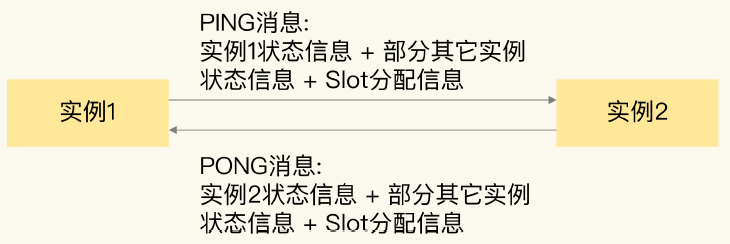

Gossip 协议可以保证在一段时间后，集群中的每一个实例都能获得其它所有实例的状态信息。这样一来，即使有新节点加入、节点故障、Slot 变更等事件发生，实例间也可以通过PING、PONG 消息的传递，完成集群状态在每个实例上的同步。

实例间使用 Gossip 协议进行通信时，通信开销受到通信消息大小和通信频率这两方面的影响：

1、通信消息大小

每个实例在发送一个 Gossip 消息时，除了会传递自身的状态信息，默认还会传递集群十分之一实例的状态信息。

对于一个包含了 1000 个实例的集群来说，每个实例发送一个 PING 消息时，会包含 100 个实例的状态信息，总的数据量是 10400 字节，再加上发送实例自身的信息，一个 Gossip 消息大约是 10KB。

此外，为了让 Slot 映射表能够在不同实例间传播，PING 消息中还带有一个长度为 16,384bit 的 Bitmap，这个 Bitmap 的每一位对应了一个 Slot，如果某一位为 1，就表示这个Slot 属于当前实例。这个 Bitmap 大小换算成字节后，是 2KB。我们把实例状态信息和Slot 分配信息相加，就可以得到一个 PING 消息的大小了，大约是 12KB。

虽然从绝对值上来看，24KB 并不算很大，但是，如果实例正常处理的单个请求只有几 KB的话，那么，实例为了维护集群状态一致传输的 PING/PONG 消息，就要比单个业务请求大了。而且，每个实例都会给其它实例发送 PING/PONG 消息。随着集群规模增加，这些心跳消息的数量也会越多，会占据一部分集群的网络通信带宽，进而会降低集群服务正常客户端请求的吞吐量。

2、通信频率

Redis Cluster 的实例启动后，默认会每秒从本地的实例列表中随机选出 5 个实例，再从这5 个实例中找出一个最久没有通信的实例，把 PING 消息发送给该实例。这是实例周期性发送 PING 消息的基本做法。这有可能会出现，有些实例一直没有被发送 PING 消息，导致它们维护的集群状态已经过期了。

为了避免这种情况，Redis Cluster 的实例会按照每 100ms 一次的频率，扫描本地的实例列表，如果发现有实例最近一次接收 PONG 消息的时间，已经大于配置项 cluster-nodetimeout的一半了（cluster-node-timeout/2），就会立刻给该实例发送 PING 消息，更新这个实例上的集群状态信息。

当集群规模扩大之后，因为网络拥塞或是不同服务器间的流量竞争，会导致实例间的网络通信延迟增加。如果有部分实例无法收到其它实例发送的 PONG 消息，就会引起实例之间频繁地发送 PING 消息，这又会对集群网络通信带来额外的开销了。

单实例每秒会发送的 PING 消息数量 = 1 + 10 * 实例数（最近一次接收 PONG 消息的时间超出 cluster-node-timeout/2）

其中，1 是指单实例常规按照每 1 秒发送一个 PING 消息，10 是指每 1 秒内实例会执行10 次检查，每次检查后会给 PONG 消息超时的实例发送消息。

假设单个实例检测发现，每 100 毫秒有 10 个实例的 PONG 消息接收超时，那么，这个实例每秒就会发送 101 个 PING 消息，约占 1.2MB/s 带宽。如果集群中有 30 个实例按照这种频率发送消息，就会占用 36MB/s 带宽，这就会挤占集群中用于服务正常请求的带宽。

为了降低实例间发送消息的频率，可以修改cluster-node-timeout 这个配置项，配置项 cluster-node-timeout 定义了集群实例被判断为故障的心跳超时时间，默认是 15秒。如果 cluster-node-timeout 值比较小，那么，在大规模集群中，就会比较频繁地出现 PONG 消息接收超时的情况，从而导致实例每秒要执行 10 次“给 PONG 消息超时的实例发送 PING 消息”这个操作。所以，为了避免过多的心跳消息挤占集群带宽，我们可以调大 cluster-node-timeout值，比如说调大到 20 秒或 25 秒。这样一来， PONG 消息接收超时的情况就会有所缓解，单实例也不用频繁地每秒执行 10 次心跳发送操作了。

当然，我们也不要把 cluster-node-timeout 调得太大，否则，如果实例真的发生了故障，我们就需要等待 cluster-node-timeout 时长后，才能检测出这个故障，这又会导致实际的故障恢复时间被延长，会影响到集群服务的正常使用。

为了验证调整 cluster-node-timeout 值后，是否能减少心跳消息占用的集群网络带宽，可以在调整 cluster-node-timeout 值的前后，使用 tcpdump 命令抓取实例发送心跳信息网络包的情况，例如，执行下面的命令后，我们可以抓取到 192.168.10.3 机器上的实例从 16379 端口发送的心跳网络包，并把网络包的内容保存到 r1.cap 文件中：

~~~
tcpdump host 192.168.10.3 port 16379 -i 网卡名 -w /tmp/r1.cap
~~~

通过分析网络包的数量和大小，就可以判断调整 cluster-node-timeout 值前后，心跳消息占用的带宽情况了。

虽然我们可以通过调整 cluster-node-timeout 配置项减少心跳消息的占用带宽情况，但是，在实际应用中，如果不是特别需要大容量集群，建议把 Redis Cluster 的规模控制在 400~500 个实例。

综上，通过调整参数，可以让改善集群各实例之间的通信开销，这是Redis Cluster的处理方案。

对于Codis来说，它把集群实例状态信息和Slot 分配信息保存在第三方的存储系统上（例如 Zookeeper），这样实例只需要和 Zookeeper 通信交互信息，实例之间就不需要发送大量的心跳消息来同步集群状态了，这种做法可以减少实例之间用于心跳的网络通信量，有助于实现大规模集群。而且，网络带宽可以集中用在服务客户端请求上。从这点来说，Codis是优于Redis Cluster的，但在这种情况下，实例获取或更新集群状态信息时，都需要和 Zookeeper 交互，Zookeeper 的网络通信带宽需求会增加，采用这种方法的时候，需要给Zookeeper 保证一定的网络带宽，避免 Zookeeper 受限于带宽而无法和实例快速通信

# 性能

## 阻塞式操作

### 分类

Redis内部的阻塞式操作可以分为四类：

* 客户端：网络 IO，键值对增删改查操作，数据库操作；
* 磁盘：生成 RDB 快照，记录 AOF 日志，AOF 日志重写；
* 主从节点：主库生成、传输 RDB 文件，从库接收 RDB 文件、清空数据库、加载 RDB文件；
* 切片集群实例：向其他实例传输哈希槽信息，数据迁移。

1、与客户端有关的操作：

操作的时间复杂度为ON的：集合全量查询和聚合操作

bigkey 删除操作：删除操作的本质是要释放键值对占用的内存空间。在应用程序释放内存时，操作系统需要把释放掉的内存块插入一个空闲内存块的链表，以便后续进行管理和再分配。如果一下子释放了大量内存，空闲内存块链表操作时间就会增加，相应地就会造成 Redis 主线程的阻塞

清空数据库操作：例如 FLUSHDB 和 FLUSHALL 操作，它涉及到删除和释放所有的键值对

2、和磁盘交互时的阻塞点

Redis用子进程的方式生成RDB快照文件，以及执行 AOF 日志重写操作，所以这两个操作并不会阻塞主线程

但是，Redis 直接记录 AOF 日志时，会根据不同的写回策略对数据做落盘保存，一个同步写磁盘的操作的耗时大约是 1～2ms，如果有大量的写操作需要记录在 AOF 日志中，并同步写回的话，就会阻塞主线程了

3、主从节点交互时的阻塞点

在主从集群中，主库需要生成 RDB 文件，并传输给从库。主库在复制的过程中，创建和传输 RDB 文件都是由子进程来完成的，不会阻塞主线程

但是，对于从库来说，它在接收了RDB 文件后，需要使用 FLUSHDB 命令清空当前数据库，这是一个阻塞操作

从库在清空当前数据库后，还需要把 RDB 文件加载到内存，这个过程的快慢和RDB 文件的大小密切相关，RDB 文件越大，加载过程越慢，这也是一个阻塞点（而且这里无法异步优化，因为从库要想对客户端提供数据存取服务，就必须把 RDB 文件加载完成，所以需要尽量把主库的数据量大小控制在 2~4GB 左右，以保证 RDB 文件能以较快的速度加载）

4、切片集群实例交互时的阻塞点

当部署 Redis 切片集群时，每个 Redis 实例上分配的哈希槽信息需要在不同实例间进行传递，同时，当需要进行负载均衡或者有实例增删时，数据会在不同的实例间进行迁移。不过，哈希槽的信息量不大，而数据迁移是渐进式执行的，所以，一般来说，这两类操作对 Redis 主线程的阻塞风险不大。

不过如果采用的是Redis Cluster 方案，而且同时正好迁移的是 bigkey 的话，就会造成主线程的阻塞，因为 Redis Cluster 使用了同步迁移

### 应对方案

对于集合全量查询和聚合操作：无法用异步优化，因为必须等待到返回值，但可以使用 SCAN 命令，分批读取数据，再在客户端进行聚合计算；

上面的操作中可以异步进行的操作主要是：AOF日志写操作（因为它不会向客户端返回具体的结果，可以启动一个子线程来执行 AOF 日志的同步写，而不用让主
线程等待 AOF 日志的写完成）、删除key和清空数据库

Redis 主线程启动后，会使用操作系统提供的 pthread_create 函数创建 3 个子线程，分别由它们负责 AOF 日志写操作、键值对删除以及文件关闭的异步执行

主线程通过一个链表形式的任务队列和子线程进行交互。当收到键值对删除和清空数据库的操作时，主线程会把这个操作封装成一个任务，放入到任务队列中，然后给客户端返回一个完成信息，表明删除已经完成。

但实际上，这个时候删除还没有执行，等到后台子线程从任务队列中读取任务后，才开始实际删除键值对，并释放相应的内存空间。因此，我们把这种异步删除也称为惰性删除（lazy free）

和惰性删除类似，当 AOF 日志配置成 everysec 选项后，主线程会把 AOF 写日志操作封装成一个任务，也放到任务队列中。后台子线程读取任务后，开始自行写入 AOF 日志，这样主线程就不用一直等待 AOF 日志写完了。

Redis 中的异步子线程执行机制：

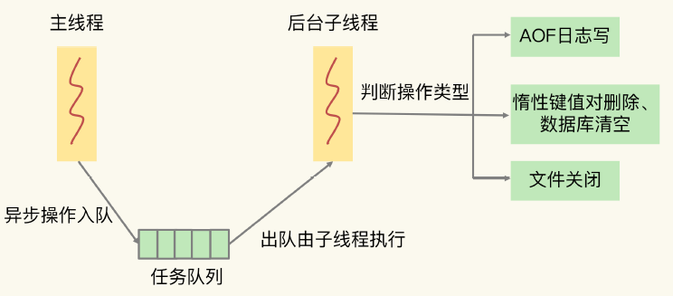

异步的键值对删除和数据库清空操作是 Redis 4.0 后提供的功能，Redis 也提供了新的命令来执行这两个操作：

* 键值对删除：当你的集合类型中有大量元素（例如有百万级别或千万级别元素）需要删除时，我建议你使用 UNLINK 命令。
* 清空数据库：可以在 FLUSHDB 和 FLUSHALL 命令后加上 ASYNC 选项，这样就可以让后台子线程异步地清空数据库，如下所示：

如果使用的是 4.0 之前的版本，当你遇到 bigkey 删除时，可以这样处理：先使用集合类型提供的 SCAN 命令读取数据，然后再进行删除。因为用 SCAN 命令可以每次只读取一部分数据并进行删除，这样可以避免一次性删除大量 key 给主线程带来的阻塞。

例如，对于 Hash 类型的 bigkey 删除，你可以使用 HSCAN 命令（Set用SSCAN命令），每次从 Hash 集合中获取一部分键值对（例如 200 个），再使用 HDEL 删除这些键值对，这样就可以把删除压力分摊到多次操作中，那么，每次删除操作的耗时就不会太长，也就不会阻塞主线程了

## CPU结构对性能的影响

待补充 -> 17、22(17答疑部分)

## 测试Redis性能

定位性能问题的第一步就是确定Redis是不是真的慢了，最直接的方法是查看Redis的响应延迟

最好是能基于当前环境下的 Redis 基线性能做判断。所谓基线性能，就是一个系统在低压力、无干扰下的基本性能，这个性能只由当前的软硬件配置决定

从 2.8.7 版本开始，redis-cli 命令提供了–intrinsic-latency 选项，可以用来监测和统计测试期间内的最大延迟，这个延迟可以作为 Redis 的基线性能。其中，测试时长可以用–intrinsic-latency 选项的参数来指定。

举个例子，比如说，我们运行下面的命令，该命令会打印 120 秒内监测到的最大延迟。可以看到，这里的最大延迟是 119 微秒，也就是基线性能为 119 微秒。一般情况下，运行120 秒就足够监测到最大延迟了，所以，我们可以把参数设置为 120：

~~~
./redis-cli --intrinsic-latency 120
Max latency so far: 17 microseconds.
Max latency so far: 44 microseconds.
Max latency so far: 94 microseconds.
Max latency so far: 110 microseconds.
Max latency so far: 119 microseconds.
36481658 total runs (avg latency: 3.2893 microseconds / 3289.32 nanoseconds pe
Worst run took 36x longer than the average latency
~~~

一般来说，你要把运行时延迟和基线性能进行对比，如果你观察到的 Redis 运行时延迟是其基线性能的 2 倍及以上，就可以认定 Redis 变慢了。

判断基线性能这一点，对于在虚拟化环境下运行的 Redis 来说，非常重要。这是因为，在虚拟化环境（例如虚拟机或容器）中，由于增加了虚拟化软件层，与物理机相比，虚拟机或容器本身就会引入一定的性能开销，所以基线性能会高一些，可能平时的最大延迟就在10ms左右了

此外Redis客户端到服务端的网络状况也和性能相关，一个简单的方法是用 iPerf 这样的工具测试网络延迟，如果这个延迟有几十毫秒甚至是几百毫秒，就说
明，Redis 运行的网络环境中很可能有大流量的其他应用程序在运行，导致网络拥塞了。这个时候就需要协调网络运维，调整网络的流量分配了

## 容易引发性能问题的场景

除了前面提到的阻塞式操作以外，还有一些点有可能引发性能问题：

1、keys命令：它用于返回和输入模式匹配的所有key，因为 KEYS 命令需要遍历存储的键值对，所以操作延时高。它一般不被建议用于生产环境中（可用SCAN命令代替，例如HSCAN user 0 match "103*" 100，代表从 user 这个 Hash 集合中返回 key 前缀以 103 开头的 100 个键值对）

2、过期key操作：

Redis 键值对的 key 可以设置过期时间。默认情况下，Redis 每 100 毫秒会删除一些过期key，具体的算法如下：

* 采样 ACTIVE_EXPIRE_CYCLE_LOOKUPS_PER_LOOP 个数的 key，并将其中过期的key 全部删除；
* 如果超过 25% 的 key 过期了，则重复删除的过程，直到过期 key 的比例降至 25% 以下。

ACTIVE_EXPIRE_CYCLE_LOOKUPS_PER_LOOP 是 Redis 的一个参数，默认是 20，那么，一秒内基本有 200 个过期 key 会被删除。这一策略对清除过期 key、释放内存空间很有帮助。如果每秒钟删除 200 个过期 key，并不会对 Redis 造成太大影响。

但如果触发了上面的第二条，系统中某个时期突然多出很多过期key，Redis 就会一直删除以释放内存空间，这个删除是阻塞的（Redis 4.0 后可以用异步线程机制来减少阻塞影响），触发第二条的操作就是：频繁使用带有相同时间参数的 EXPIREAT 命令设置过期 key，这就会导致，在同一秒内有大量的 key 同时过期。如果一批 key 的确是同时过期，你还可以在EXPIREAT 和 EXPIRE 的过期时间参数上，加上一个一定大小范围内的随机数，这样，既保证了 key 在一个邻近时间范围内被删除，又避免了同时过期造成的压力。

3、AOF写入策略

AOF在使用everysec策略写入时，Redis会使用后台的子线程异步完成fsync的操作。但这里有一个性能风险：如果Redis在执行AOF重写时，会对磁盘进行大量 IO 操作，同时，fsync 又需要等到数据写到磁盘后才能返回，所以，当 AOF 重写的压力比较大时，就会导致 fsync 被阻塞

当主线程使用后台子线程执行了一次 fsync，需要再次把新接收的操作记录写回磁盘时，如果主线程发现上一次的 fsync 还没有执行完，那么它就会阻塞。所以，如果后台子线程执行的 fsync 频繁阻塞的话（比如 AOF 重写占用了大量的磁盘 IO 带宽），主线程也会阻塞，导致 Redis 性能变慢：

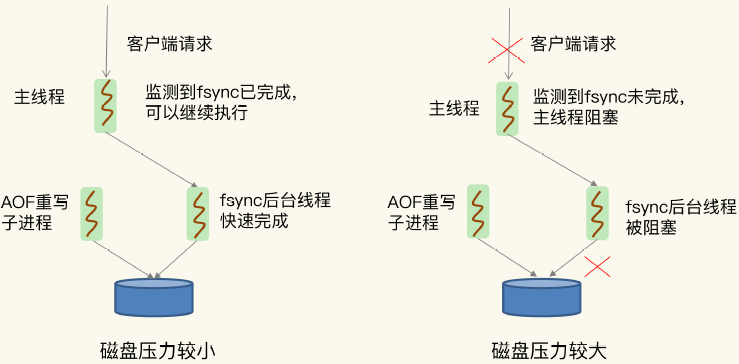

如果业务应用对延迟非常敏感，但同时允许一定量的数据丢失，那么，可以把配置项 noappendfsync-on-rewrite 设置为 yes，如下所示：

~~~
no-appendfsync-on-rewrite yes
~~~

这个配置项设置为 yes 时，表示在 AOF 重写时，不进行 fsync 操作。

如果的确需要高性能，同时也需要高可靠数据保证，我建议你考虑采用高速的固态硬盘作为 AOF 日志的写入设备。高速固态盘的带宽和并发度比传统的机械硬盘的要高出 10 倍及以上。在 AOF 重写和fsync 后台线程同时执行时，固态硬盘可以提供较为充足的磁盘 IO 资源，

4、操作系统的内存 swap

内存 swap 是操作系统里将内存数据在内存和磁盘间来回换入和换出的机制，涉及到磁盘的读写，所以，一旦触发 swap，无论是被换入数据的进程，还是被换出数据的进程，其性能都会受到慢速磁盘读写的影响

正常情况下，Redis 的操作是直接通过访问内存就能完成，一旦 swap 被触发了，Redis 的请求操作需要等到磁盘数据读写完成才行，swap 触发后影响的是 Redis 主 IO 线程，这会极大地增加 Redis 的响应时间

触发 swap 的原因主要是物理机器内存不足，一般的情况是：

* Redis 实例自身使用了大量的内存，导致物理机器的可用内存不足
* 和 Redis 实例在同一台机器上运行的其他进程，在进行大量的文件读写操作。文件读写本身会占用系统内存，这会导致分配给 Redis 实例的内存量变少，进而触发 Redis 发生swap

应对办法：

* 增加机器内存，如果该实例在一个 Redis 切片集群中，可以增加 Redis 集群的实例个数，来分摊每个实例服务的数据量
* Redis 实例和其他操作大量文件的程序（例如数据分析程序）共享机器，你可以将 Redis 实例迁移到单独的机器上运行，以满足它的内存需求量

检查swap的使用情况：

操作系统本身会在后台记录每个进程的 swap 使用情况，即有多少数据量发生了 swap。你可以先通过下面的命令查看 Redis 的进程号，这里是 5332：

~~~
$ redis-cli info | grep process_id
process_id: 5332
~~~

然后，进入 Redis 所在机器的 /proc 目录下的该进程目录中：

~~~
$ cd /proc/5332
~~~

运行下面的命令，查看该 Redis 进程的使用情况：

~~~
$cat smaps | egrep '^(Swap|Size)'
Size: 584 kB
Swap: 0 kB
Size: 4 kB
Swap: 4 kB
Size: 4 kB
Swap: 0 kB
Size: 462044 kB
Swap: 462008 kB
Size: 21392 kB
Swap: 0 kB
~~~

每一行 Size 表示的是 Redis 实例所用的一块内存大小，而 Size 下方的 Swap 和它相对应，表示这块 Size 大小的内存区域有多少已经被换出到磁盘上了。如果这两个值相等，就表示这块内存区域已经完全被换出到磁盘了。

作为内存数据库，Redis 本身会使用很多大小不一的内存块，所以，你可以看到有很多Size 行，有的很小，就是 4KB，而有的很大，例如 462044KB。不同内存块被换出到磁盘上的大小也不一样，例如刚刚的结果中的第一个 4KB 内存块，它下方的 Swap 也是 4KB，这表示这个内存块已经被换出了；另外，462044KB 这个内存块也被换出了 462008KB，差不多有 462MB。

当出现百 MB，甚至 GB 级别的 swap 大小时，就表明，此时，Redis 实例的内存压力很大，很有可能会变慢

5、操作系统内存大页

内存大页机制（Transparent HugePage, THP），也会影响 Redis 性能。

Linux 内核从 2.6.38 开始支持内存大页机制，该机制支持 2MB 大小的内存页分配，而常规的内存页分配是按 4KB 的粒度来执行的。

虽然内存大页可以给 Redis 带来内存分配方面的收益，但是Redis 为了提供数据可靠性保证，需要将数据做持久化保存，持久化是由另外的线程来执行的，持久化期间Redis 主线程仍然可以接收客户端写请求。客户端的写请求可能会修改正在进行持久化的数据。在这一过程中，Redis 就会采用写时复制机制，也就是说，一旦有数据要被修改，Redis 并不会直接修改内存中的数据，而是将这些数据拷贝一份，然后再进行修改

如果采用了内存大页，那么，即使客户端请求只修改 100B 的数据，Redis 也需要拷贝2MB 的大页。相反，如果是常规内存页机制，只用拷贝 4KB。两者相比，你可以看到，当客户端请求修改或新写入数据较多时，内存大页机制将导致大量的拷贝，这就会影响Redis 正常的访存操作，最终导致性能变慢。

排查系统是否使用了内存大页：

~~~
cat /sys/kernel/mm/transparent_hugepage/enabled
~~~

如果执行结果是 always，就表明内存大页机制被启动了；如果是 never，就表示，内存大页机制被禁止。

在实际生产环境中部署时，建议不要使用内存大页机制，操作也很简单，只需要执行下面的命令就可以了：

~~~
echo never /sys/kernel/mm/transparent_hugepage/enabled
~~~

## 内存碎片

删除Redis中的数据后，Redis占用的内存不会减小，这是因为当数据删除后，Redis 释放的内存空间会由内存分配器管理，并不会立即返回给操作系统

Redis 释放的内存空间可能并不是连续的，那么，这些不连续的内存空间很有可能处于一种闲置的状态。这就会导致一个问题：虽然有空闲空间，Redis 却无法用来保存数据，不仅会减少 Redis 能够实际保存的数据量，还会降低 Redis 运行机器的成本回报率

Redis出现内存碎片的原因：

* 内因：内存分配器一般是按固定大小来分配内存，而不是用到多少分配多少。

  Redis 可以使用 libc、jemalloc、tcmalloc 多种内存分配器来分配内存，默认使用jemalloc，jemalloc 的分配策略之一，是按照一系列固定的大小划分内存空间，例如 8 字节、16 字节、32 字节、48 字节，…, 2KB、4KB、8KB 等。当程序申请的内存最接近某个固定值时，jemalloc 会给它分配相应大小的空间。

  这样的分配方式本身是为了减少分配次数。例如，Redis 申请一个 20 字节的空间保存数据，jemalloc 就会分配 32 字节，此时，如果应用还要写入 10 字节的数据，Redis 就不用再向操作系统申请空间了

  如果 Redis 每次向分配器申请的内存空间大小不一样，这种分配方式就会有形成碎片的风险

* 外因：不同业务保存的键值对大小不一样，而且还会有删改操作，导致空间的扩容和释放

判断是否存在内存碎片，可以使用Redis提供的INFO命令：

~~~
INFO memory
# Memory
used_memory:1073741736
used_memory_human:1024.00M
used_memory_rss:1997159792
used_memory_rss_human:1.86G
…
mem_fragmentation_ratio:1.86
~~~

这里有一个 mem_fragmentation_ratio 的指标，它表示的就是 Redis 当前的内存碎片率，它就是上面的命令中的两个指标used_memory_rss 和 used_memory 相除的结果。used_memory_rss 是操作系统实际分配给 Redis 的物理内存空间，里面就包含了碎片；而 used_memory 是 Redis 为了保存数据实际申请使用的空间。当mem_fragmentation_ratio 大于1.5，这表明内存碎片率已经超过了 50%。一般情况下，这个时候，我们就需要采取一些措施来降低内存碎片率了（这个值如果小于1，就代表出现了swap，严重影响性能）

降低内存碎片率的方法：

* 重启Redis实例

* 从 4.0-RC3 版本以后，Redis 自身提供了一种内存碎片自动清理的方法，它会执行数据拷贝，把原本不连续的内存空间变成连续的空间。

  碎片清理比较耗时，在数据拷贝时，Redis 只能等着，这就导致 Redis 无法及时处理请求，性能就会降低。而且，有的时候，数据拷贝还需要注意顺序，就像刚刚说的清理内存碎片的例子，操作系统需要先拷贝 D，并释放 D的空间后，才能拷贝 B。这种对顺序性的要求，会进一步增加 Redis 的等待时间，导致性能降低。

  为了解决阻塞的问题，Redis 专门为自动内存碎片清理功机制设置的参数，可以通过设置参数，来控制碎片清理的开始和结束时机，以及占用的 CPU 比例，从而减少碎片清理对 Redis 本身请求处理的性能影响

  开启自动内存碎片清理：

  ~~~
  config set activedefrag yes
  ~~~

  触发内存清理需要同时满足这两个条件：

  * active-defrag-ignore-bytes 100mb：表示内存碎片的字节数达到 100MB 时，开始清理；

  * active-defrag-threshold-lower 10：表示内存碎片空间占操作系统分配给 Redis 的总空间比例达到 10% 时，开始清理。

  为了尽可能减少碎片清理对 Redis 正常请求处理的影响，自动内存碎片清理功能在执行时，还会监控清理操作占用的 CPU 时间，而且还设置了两个参数，分别用于控制清理操作占用的 CPU 时间比例的上、下限，既保证清理工作能正常进行，又避免了降低 Redis 性能。这两个参数具体如下：

  * active-defrag-cycle-min 25： 表示自动清理过程所用 CPU 时间的比例不低于25%，保证清理能正常开展；
  * active-defrag-cycle-max 75：表示自动清理过程所用 CPU 时间的比例不高于75%，一旦超过，就停止清理，从而避免在清理时，大量的内存拷贝阻塞 Redis，导致响应延迟升高。

  ​

## 慢查询命令定位

可以使用Redis 日志（慢查询日志）和 latency monitor 来排查执行较慢的命令操作

1、慢查询日志

Redis 的慢查询日志记录了执行时间超过一定阈值的命令操作。

在使用慢查询日志前，我们需要设置两个参数：

* slowlog-log-slower-than：这个参数表示，慢查询日志对执行时间大于多少微秒的命令进行记录。
* slowlog-max-len：这个参数表示，慢查询日志最多能记录多少条命令记录。慢查询日志的底层实现是一个具有预定大小的先进先出队列，一旦记录的命令数量超过了队列长度，最先记录的命令操作就会被删除。这个值默认是 128。一般建议设置为 1000 左右，这样既可以多记录些慢查询命令，方便排查，也可以避免内存开销。

可以使用 SLOWLOG GET 命令，来查看慢查询日志中记录的命令操作，例如，我们执行如下命令，可以查看最近的一条慢查询的日志信息：

~~~
SLOWLOG GET 1
1) 1) (integer) 33 //每条日志的唯一ID编号
2) (integer) 1600990583 //命令执行时的时间戳
3) (integer) 20906 //命令执行的时长，单位是微秒
4) 1) "keys" //具体的执行命令和参数
2) "abc*"
5) "127.0.0.1:54793" //客户端的IP和端口号
6) "" //客户端的名称，此处为空
~~~

如果我们想查看更多的慢日志，只要把 SLOWLOG GET 后面的数字参数改为想查看的日志条数，就可以了。

2、latency monitor

Redis 从 2.8.13 版本开始，还提供了 latency monitor 监控工具，这个工具可以用来监控 Redis 运行过程中的峰值延迟情况

和慢查询日志的设置相类似，要使用 latency monitor，首先要设置命令执行时长的阈值。当一个命令的实际执行时长超过该阈值时，就会被 latency monitor 监控到。比如，我们可以把 latency monitor 监控的命令执行时长阈值设为 1000 微秒，如下所示：

~~~
config set latency-monitor-threshold 1000
~~~

设置好了 latency monitor 的参数后，我们可以使用 latency latest 命令，查看最新和最大的超过阈值的延迟情况，如下所示：

~~~
latency latest
1) 1) "command"
2) (integer) 1600991500 //命令执行的时间戳
3) (integer) 2500 //最近的超过阈值的延迟
4) (integer) 10100 //最大的超过阈值的延迟
~~~

## 排查bigkey

在应用 Redis 时，我们要尽量避免 bigkey 的使用，这是因为，Redis 主线程在操作bigkey 时，会被阻塞。

Redis 可以在执行 redis-cli 命令时带上–bigkeys 选项，进而对整个数据库中的键值对大小情况进行统计分析，比如说，统计每种数据类型的键值对个数以及平均大小。此外，这个命令执行后，会输出每种数据类型中最大的 bigkey 的信息，对于 String 类型来说，会输出最大 bigkey 的字节长度，对于集合类型来说，会输出最大 bigkey 的元素个数：

~~~
./redis-cli --bigkeys
-------- summary -------
Sampled 32 keys in the keyspace!
Total key length in bytes is 184 (avg len 5.75)
//统计每种数据类型中元素个数最多的bigkey
Biggest list found 'product1' has 8 items
Biggest hash found 'dtemp' has 5 fields
Biggest string found 'page2' has 28 bytes
Biggest stream found 'mqstream' has 4 entries
Biggest set found 'userid' has 5 members
Biggest zset found 'device:temperature' has 6 members
//统计每种数据类型的总键值个数，占所有键值个数的比例，以及平均大小
4 lists with 15 items (12.50% of keys, avg size 3.75)
5 hashs with 14 fields (15.62% of keys, avg size 2.80)
10 strings with 68 bytes (31.25% of keys, avg size 6.80)
1 streams with 4 entries (03.12% of keys, avg size 4.00)
7 sets with 19 members (21.88% of keys, avg size 2.71)
5 zsets with 17 members (15.62% of keys, avg size 3.40)
~~~

这个命令是通过扫描数据库来查找 bigkey 的，所以，在执行的过程中，会对 Redis 实例的性能产生影响。如果你在使用主从集群，我建议你在从节点上执行该命令。如果没有从节点，可以选择在业务压力低峰阶段进行扫描查询，还可以使用 -i 参数控制扫描间隔，避免长时间扫描降低 Redis 实例的性能，例如，我们执行如下命令时，redis-cli会每扫描 100 次暂停 100 毫秒（0.1 秒）：

~~~
./redis-cli --bigkeys -i 0.1
~~~

使用 Redis 自带的–bigkeys 选项排查 bigkey，有两个不足的地方：

* 这个方法只能返回每种类型中最大的那个 bigkey，无法得到大小排在前 N 位的bigkey；
* 对于集合类型来说，这个方法只统计集合元素个数的多少，而不是实际占用的内存量。但是，一个集合中的元素个数多，并不一定占用的内存就多

所以，如果我们想统计每个数据类型中占用内存最多的前 N 个 bigkey，可以自己开发一个程序，来进行统计。

基本的思路是：使用 SCAN 命令对数据库扫描，然后用 TYPE 命令获取返回的每一个 key 的类型。接下来，对于 String 类型，可以直接使用 STRLEN 命令获取字符串的长度，也就是占用的内存空间字节数。对于集合类型，如果根据业务能事先直到元素的平均大小，就可以用集合大小*元素的平均大小来估计，如果不能提前知道集合的元素大小，可以使用 MEMORY USAGE 命令（需要 Redis4.0 及以上版本），查询一个键值对占用的内存空间。例如，执行以下命令，可以获得 key为 user:info 这个集合类型占用的内存空间大小：

~~~
MEMORY USAGE user:info
(integer) 315663239
~~~

# 缓存

## 缓存的特征

一个系统中的不同层之间的访问速度不一样，所以我们才需要缓存，这样就可以把一些需要频繁访问的数据放在缓存中，以加快它们的访问速度

下图是计算机系统中的三层存储结构，以及它们各自的常用容量和访问性能。最上面是处理器，中间是内存，最下面是磁盘。

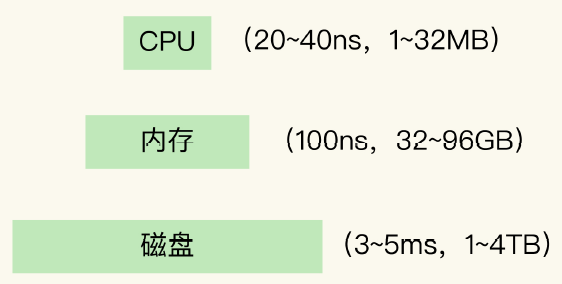

从图上可以看到，CPU、内存和磁盘这三层的访问速度从几十 ns 到 100ns，再到几 ms，性能的差异很大。

因此诞生了计算机系统中的两种缓存：

* CPU 里面的末级缓存，即 LLC，用来缓存内存中的数据，避免每次从内存中存取数据；
* 内存中的高速页缓存，即 page cache，用来缓存磁盘中的数据，避免每次从磁盘中存取数据。

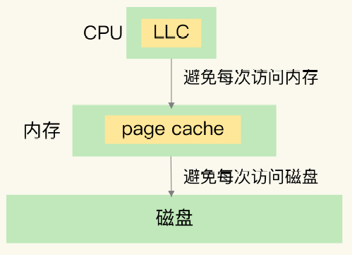

由此总结出缓存的特征：

* 在一个层次化的系统中，缓存一定是一个快速子系统，数据存在缓存中时，能避免每次从慢速子系统中存取数据。对应到互联网应用来说，Redis 就是快速子系统，而数据库就是慢速子系统了。所以保证Redis的高性能是作为缓存最重要的
* 缓存系统的容量大小总是小于后端慢速系统的，我们不可能把所有数据都放在缓存系统中。缓存中的数据需要按一定规则淘汰出去，写回后端系统，而新的数据又要从后端系统中读取进来，写入缓存。Redis 本身是支持按一定规则淘汰数据的，相当于实现了缓存的数据淘汰，其实，这也是 Redis 适合用作缓存的一个重要原因

## 读取缓存

把 Redis 用作缓存时，我们会把 Redis 部署在数据库的前端，业务应用在访问数据时，会先查询 Redis 中是否保存了相应的数据。此时，根据数据是否存在缓存中，会有两种情况：

* 缓存命中：Redis 中有相应数据，就直接读取 Redis，性能非常快。
* 缓存缺失：Redis 中没有保存相应数据，就从后端数据库中读取数据，性能就会变慢。而且，一旦发生缓存缺失，为了让后续请求能从缓存中读取到数据，我们需要把缺失的数据写入 Redis，这个过程叫作缓存更新。

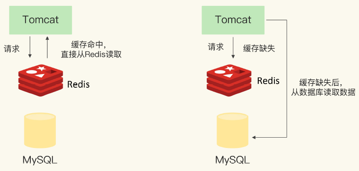

使用 Redis 缓存时，我们基本有三个操作：

* 应用读取数据时，需要先读取 Redis；
* 发生缓存缺失时，需要从数据库读取数据；
* 发生缓存缺失时，还需要更新缓存。

Web 应用中使用 Redis 缓存的伪代码示例：

~~~java
String cacheKey = “productid_11010003”;
String cacheValue = redisCache.get(cacheKey)；
//缓存命中
if ( cacheValue != NULL)
return cacheValue;
//缓存缺失
else
cacheValue = getProductFromDB();
redisCache.put(cacheValue) //缓存更新
~~~

## 只读缓存和读写缓存

按照 Redis 缓存是否接受写请求，我们可以把它分成只读缓存和读写缓存。

1、只读缓存

业务应用要修改数据 A，此时，数据 A 在 Redis 中也缓存了，那么，应用会先直接在数据库里修改 A，并把 Redis 中的 A 删除。等到应用需要读取数据 A时，会发生缓存缺失，此时，应用从数据库中读取 A，并写入 Redis，以便后续请求从缓存中直接读取，如下图所示：

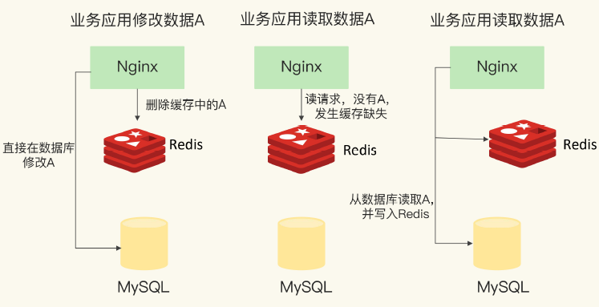

只读缓存直接在数据库中更新数据的好处是，所有最新的数据都在数据库中，而数据库是提供数据可靠性保障的，这些数据不会有丢失的风险。当我们需要缓存图片、短视频这些用户只读的数据时，就可以使用只读缓存这个类型了。

2、和只读缓存不一样的是，在使用读写缓存时，如果遇到写请求会直接修改Redis，数据的增删改操作可以在缓存中快速完成，处理结果也会快速返回给业务。应用最新的数据是在 Redis 中，而 Redis是内存数据库，一旦出现掉电或宕机，内存中的数据就会丢失。

根据业务应用对数据可靠性和缓存性能的不同要求，我们会有同步直写和异步写回两种策略：

* 同步直写：写请求发给缓存的同时，也会发给后端数据库进行处理，等到缓存和数据库都写完数据，才给客户端返回。提供了数据可靠性保证
* 异步写回：优先考虑了响应延迟，所有写请求都先在缓存中处理。等到这些增改的数据要被从缓存中淘汰出来时，缓存将它们写回后端数据库。处理
  这些数据的操作是在缓存中进行的，很快就能完成。只不过，如果发生了掉电，而它们还没有被写回数据库，就会有丢失的风险了。

如果修改数据，就一定最终要把修改写入数据库中，因为Redis淘汰数据时，不会触发回写数据库的动作（这也是Redis优化的一个点，有的公司把Redis和RocksDB结合在一起使用，将冷数据异步从Redis迁移到RocksDB，这样一来，Redis 实例的内存就可以节省下来保存热数据）

综上，如果对写请求有加速的需求，就选择读写缓存，如果写请求很少，或者是只需要提升读请求的响应速度的话，就选择只读缓存。

采用异步回写策略的读写缓存，容易出现数据一致性问题，而且Redis数据淘汰时不会自动将其写回数据库，需要考虑各种异常场景，比较复杂，一般不会使用

## 缓存容量设置

缓存容量设置得是否合理，会直接影响到使用缓存的性价比

实际应用中的数据访问是具有局部性的，下面有一张图，图里有红、蓝两条线，显示了不同比例数据贡献的访问量情况。蓝线代表了“八二原理”表示的数据局部性，而红线则表示在当前应用负载下，数据局部性的变化。

蓝线：它表示的就是“八二原理”，有 20% 的数据贡献了 80% 的访问了，而剩余的数据虽然体量很大，但只贡献了 20% 的访问量。这 80% 的数据在访问量上就形成了一条长长的尾巴，我们也称为“长尾效应”

红线：由于互联网应用中用户的个性化需求越来越多，在一个业务应用中，不同用户访问的内容可能差别很大，所以，用户请求的数据和它们贡献的访问量比例，不再具备长尾效应中的“八二原理”分布特征了。也就是说，20% 的数据可能贡献不了 80% 的访问，而剩余的 80% 数据反而贡献了更多的访问量，我们称之为重尾效应。

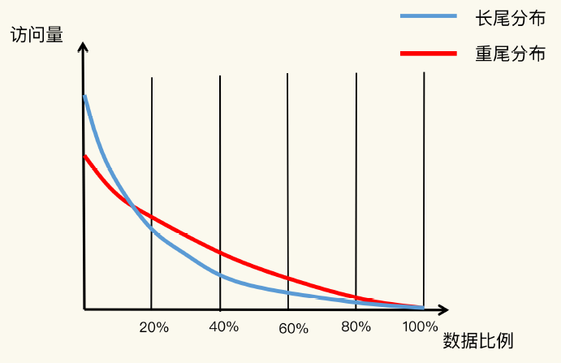

所以容量规划是需要结合应用数据实际访问特征和成本开销来综合考虑的。建议把缓存容量设置为总数据量的 15% 到 30%，兼顾访问性能和内存空间开销。

对于 Redis 来说，一旦确定了缓存最大容量，比如 4GB，你就可以使用下面这个命令来设定缓存的大小了：

~~~
CONFIG SET maxmemory 4gb
~~~

当缓存被写满后，就需要考虑需要淘汰哪些数据了

## 淘汰策略

Redis 4.0 之前一共实现了 6 种内存淘汰策略，在 4.0 之后，又增加了 2 种策略。其中不进行数据淘汰的策略，只有 noeviction 这一种。

会进行淘汰的 7 种策略，我们可以再进一步根据淘汰候选数据集的范围把它们分成两类：

* 在设置了过期时间的数据中进行淘汰，包括 volatile-random、volatile-ttl、volatilelru、volatile-lfu（Redis 4.0 后新增）四种
* 在所有数据范围内进行淘汰，包括 allkeys-lru、allkeys-random、allkeys-lfu（Redis4.0 后新增）三种。

默认情况下，Redis 在使用的内存空间超过 maxmemory 值时，并不会淘汰数据，也就是设定的 noeviction 策略。对应到 Redis 缓存，也就是指，一旦缓存被写满了，再有写请求来时，Redis 不再提供服务，而是直接返回错误。通常不会在Redis缓存中使用该策略

触发淘汰的条件：满足其中一个即可

* 键值对的过期时间快到了
* Redis 的内存使用量达到了 maxmemory 阈值

volatile-ttl、volatile-random、volatile-lru、volatile-lfu 这四种策略的解释：

* volatile-ttl 在筛选时，会针对设置了过期时间的键值对，根据过期时间的先后进行删除，越早过期的越先被删除。
* volatile-random 就像它的名称一样，在设置了过期时间的键值对中，进行随机删除。
* volatile-lru 会使用 LRU 算法筛选设置了过期时间的键值对。
* volatile-lfu 会使用 LFU 算法选择设置了过期时间的键值对。

相对应的allkeys-lru、allkeys-random、allkeys-lfu 这三种淘汰策略的备选淘汰数据范围，就扩大到了所有键值对，无论这些键值对是否设置了过期时间，此时如果一个键值对被删除策略选中了，即使它的过期时间还没到，也需要被删除。当然，如果它的过期时间到了但未被策略选中，同样也会被删除

LRU 算法的全称是 Least Recently Used：实现时需要用链表来管理缓存数据，链表的头和尾分别表示MRU 端和 LRU 端，分别代表最近最常使用的数据和最近最不常用的数据，它会带来额外的空间开销，当由数据被访问时，需要在链表上把该数据移动到 MRU 端，如果有大量数据被访问，就会带来很多链表移动操作，会很耗时，进而会降低 Redis 缓存性能

所以，在 Redis 中，LRU 算法被做了简化，以减轻数据淘汰对缓存性能的影响。具体来说，Redis 默认会记录每个数据的最近一次访问的时间戳（由键值对数据结构RedisObject 中的 lru 字段记录）。然后，Redis 在决定淘汰的数据时，第一次会随机选出N 个数据，把它们作为一个候选集合。接下来，Redis 会比较这 N 个数据的 lru 字段，把lru 字段值最小的数据从缓存中淘汰出去。

Redis 提供了一个配置参数 maxmemory-samples，这个参数就是 Redis 选出的数据个数N。例如，我们执行如下命令，可以让 Redis 选出 100 个数据作为候选数据集：

~~~
CONFIG SET maxmemory-samples 100
~~~

当需要再次淘汰数据时，Redis 需要挑选数据进入第一次淘汰时创建的候选集合，能进入候选集合的数据的 lru 字段值必须小于候选集合中最小的 lru 值。有新数据进入候选数据集后，如果候选数据集中的数据个数达到了 maxmemorysamples，Redis 就把候选数据集中 lru 字段值最小的数据淘汰出去

这样一来，Redis 缓存不用为所有的数据维护一个大链表，也不用在每次数据访问时都移动链表项，提升了缓存的性能

淘汰策略的选择：

* 当业务数据中有明显的冷热数据区分，建议使用 allkeys-lru 策略
* 如果业务应用中的数据访问频率相差不大，没有明显的冷热数据区分，建议使用allkeys-random 策略
* 如果业务中有置顶的需求，也就是说一部分缓存数据是不会被淘汰掉的，可以使用volatile-lru策略，同时不给这些置顶数据设置过期时间。这样一来，这些需要置顶的数据一直不会被删除

## 数据一致性问题

数据的一致性包含了两种情况：

* 缓存中有数据，那么，缓存的数据值需要和数据库中的值相同；
* 缓存中本身没有数据，那么，数据库中的值必须是最新值

不符合这两种情况的，就属于缓存和数据库的数据不一致问题了。

对于只读缓存来说，新增数据就是直接写入数据库中，和缓存没有联系，但对于删改数据场景，此时要完成两个动作：更新数据库、删除缓存数据。这两个操作如果无法保证原子性，就会出现数据不一致的问题。

1、应用先删除缓存，再更新数据库：

如果缓存删除成功，但是数据库更新失败，那么，应用再访问数据时，缓存中没有数据，就会发生缓存缺失。然后，应用再访问数据库，但是数据库中的值为旧值，应用就访问到旧值了。

2、先更新数据库，再删除缓存中的值：

如果应用先完成了数据库的更新，但是，在删除缓存时失败了，那么，数据库中的值是新值，而缓存中的是旧值，此时其他线程直接取缓存中的结果，也会读到旧值。

综上，在更新数据库和删除缓存值的过程中，无论这两个操作的执行顺序谁先谁后，只要有一个操作失败了，就会导致客户端读取到旧值

对于操作失败引起的数据不一致问题，解决方案是重试，将重试操作暂存到消息队列中，然后从消息队列中重新进行操作，如果重试超过的一定次数，还是没有成功，我们就需要向业务层发送报错信息了

实际上，，即使这两个操作第一次执行时都没有失败，当有大量并发请求时，应用还是有可能读到不一致的数据：

1、应用先删除缓存，再更新数据库：

线程A删除缓存值后，还没来得及更新数据库，此时线程B就开始读取数据了，发现缓存缺失，读取数据库中的旧值然后将旧值写入缓存，可能会导致其他线程从缓存中读到旧值。等到线程 B 从数据库读取完数据、更新了缓存后，线程 A 才开始更新数据库，此时，缓存中的数据是旧值，而数据库中的是最新值，两者就不一致了

为了解决这个问题，可以让线程 A 更新完数据库值以后，我们可以让它先 sleep 一小段时间，再进行一次缓存删除操作。线程 A sleep 的时间，就需要大于线程 B 读取数据再写入缓存的时间（删的太快还是不行），建议你在业务程序运行的时候，统计下线程读数据和写缓存的操作时间，以此为基础来进行估算睡眠时间。这就是延迟双删

2、先更新数据库，再删除缓存中的值：

如果线程 A 删除了数据库中的值，但还没来得及删除缓存值，线程 B 就开始读取数据了，那么此时，线程 B 查询缓存时，发现缓存命中，就会直接从缓存中读取旧值。这种情况下如果并发读缓存的请求不多，就不会有很多请求读到旧值，而且后续都会将缓存更新，这种情况对业务影响较小

在大多数业务场景下，我们会把 Redis 作为只读缓存使用。建议优先使用先更新数据库再删除缓存的方法，原因主要有两个：

* 先删除缓存值再更新数据库，有可能导致请求因缓存缺失而访问数据库，给数据库带来压力；
* 延迟双删中的等待时间不好设置

## 缓存雪崩

缓存雪崩是指大量的应用请求无法在 Redis 缓存中进行处理，紧接着，应用将大量请求发送到数据库层，导致数据库层的压力激增。

缓存雪崩发生的原因：

1、缓存中有大量数据同时过期，导致大量请求无法得到处理。

应对方法：

避免给大量的数据设置相同的过期时间，如果业务层的确要求有些数据同时失效，你可以在用 EXPIRE 命令给每个数据设置过期时间时，给这些数据的过期时间增加一个较小的随机数（例如，随机增加 1~3 分钟）

除了微调过期时间，我们还可以通过服务降级，来应对缓存雪崩：

* 当业务应用访问的是非核心数据（例如电商商品属性）时，暂时停止从缓存中查询这些数据，而是直接返回预定义信息、空值或是错误信息；
* 当业务应用访问的是核心数据（例如电商商品库存）时，仍然允许查询缓存，如果缓存缺失，也可以继续通过数据库读取

这样一来，只有部分过期数据的请求会发送到数据库，数据库的压力就没有那么大了

2、Redis缓存实例发生故障宕机了，无法处理请求，这就会导致大量请求一下子积压到数据库层，从而发生缓存雪崩。

此时需要在业务系统中实现服务熔断或请求限流机制。所谓的服务熔断，是指在发生缓存雪崩时，暂停业务应用对缓存系统的接口访问，业务应用调用缓存接口时，缓存客户端并不把请求发给 Redis 缓存实例，而是直接返回

在业务系统运行时，我们可以监测 Redis 缓存所在机器和数据库所在机器的负载指标，例如每秒请求数、CPU 利用率、内存利用率等。如果我们发现 Redis 缓存实例宕机了，而数据库所在机器的负载压力突然增加（例如每秒请求数激增），此时，就发生缓存雪崩了。大量请求被发送到数据库进行处理。我们可以启动服务熔断机制，暂停业务应用对缓存服务的访问，从而降低对数据库的访问压力

服务熔断对业务应用的影响范围大，为了尽快减小影响也可以使用请求限流，在业务系统的请求入口前端控制每秒进入系统的请求数，避免过多的请求被发送到数据库。

事前预防不要出现Redis缓存实例发生故障宕机的情况，通过主从节点的方式构建 Redis 缓存高可靠集群。如果 Redis 缓存的主节点故障宕机了，从节点还可以切换成为主节点，继续提供缓存服务

## 缓存击穿和缓存穿透

1、缓存击穿是指，针对某个访问非常频繁的热点数据的请求，无法在缓存中进行处理，紧接着，访问该数据的大量请求，一下子都发送到了后端数据库，导致了数据库压力激增，会影响数据库处理其他请求。缓存击穿的情况，经常发生在热点数据过期失效时

应对方案：，对于访问特别频繁的热点数据，我们就不设置过期时间了

2、缓存穿透：指要访问的数据既不在 Redis 缓存中，也不在数据库中，导致请求在访问缓存时，发生缓存缺失，再去访问数据库时，发现数据库中也没有要访问的数据。此时，应用也无法从数据库中读取数据再写入缓存，缓存机制失效，如果应用持续有大量请求访问数据，就会同时给缓存和数据库带来巨大压力

缓存穿透发生的原因：

* 业务层误操作：缓存中的数据和数据库中的数据被误删除了，所以缓存和数据库中都没有数据
* 恶意攻击：专门访问数据库中没有的数据

解决方案：

* 缓存空值或者缺省值：缓存一次后，，应用发送的后续请求再进行查询时，就可以直接从 Redis 中读取空值或缺省值，返回给业务应用，避免把大量请求发送给数据库处理

* 使用布隆过滤器快速判断数据是否存在，避免数据库查询。

  布隆过滤器由一个初值都为 0 的 bit 数组和 N 个哈希函数组成，可以用来快速判断某个数据是否存在。当我们想标记某个数据存在时（例如，数据已被写入数据库），布隆过滤器会通过三个操作完成标记：

  * 首先，使用 N 个哈希函数，分别计算这个数据的哈希值，得到 N 个哈希值
  * 然后，我们把这 N 个哈希值对 bit 数组的长度取模，得到每个哈希值在数组中的对应位置。
  * 最后，我们把对应位置的 bit 位设置为 1，这就完成了在布隆过滤器中标记数据的操作。

  当需要查询某个数据时，我们就执行刚刚说的计算过程，先得到这个数据在 bit 数组中对应的 N 个位置。紧接着，我们查看 bit 数组中这 N 个位置上的 bit 值。只要这 N 个 bit 值有一个不为 1，这就表明布隆过滤器没有对该数据做过标记：

  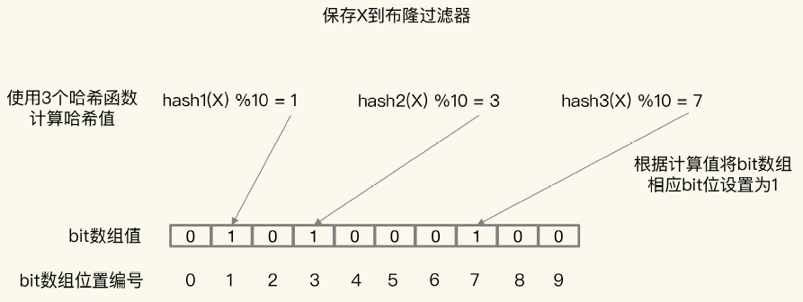

  基于布隆过滤器的快速检测特性，我们可以在把数据写入数据库时，使用布隆过滤器做个标记。当缓存缺失后，应用查询数据库时，可以通过查询布隆过滤器快速判断数据是否存在。如果不存在，就不用再去数据库中查询了。这样一来，即使发生缓存穿透了，大量请求只会查询 Redis 和布隆过滤器，而不会积压到数据库，也就不会影响数据库的正常运行。布隆过滤器可以使用 Redis 实现，本身就能承担较大的并发访问压力。

  布隆过滤器在判别数据不存在时，是不会误判的，而且判断速度非常快

* 在请求入口前端，对业务系统接收到的请求进行合法性检测，把恶意的请求（例如请求参数不合理、请求参数是非法值、请求字段不存在）直接过滤掉，不让它们访问后端缓存和数据库

服务熔断、服务降级、请求限流这些方法都是属于“有损”方案，在保证数据库和整体系统稳定的同时，会对业务应用带来负面影响。因此尽可能要预防出现。

## 缓存污染

应用 Redis 缓存时，如果能缓存会被反复访问的数据，那就能加速业务应用的访问。但是，如果发生了缓存污染，那么，缓存对业务应用的加速作用就减少了。

在一些场景下，有些数据被访问的次数非常少，甚至只会被访问一次。当这些数据服务完访问请求后，如果还继续留存在缓存中的话，就只会白白占用缓存空间。这种情况，就是缓存污染。

当缓存污染不严重时，只有少量数据占据缓存空间，此时，对缓存系统的影响不大。但是，缓存污染一旦变得严重后，就会有大量不再访问的数据滞留在缓存中。如果这时数据占满了缓存空间，我们再往缓存中写入新数据时，就需要先把这些数据逐步淘汰出缓存，这就会引入额外的操作时间开销，进而会影响应用的性能。

解决缓存污染问题的关键：把不会再被访问的数据筛选出来并淘汰掉。这就要求选择一个合理的淘汰策略。

* 对于random策略来说，Redis不会根据数据的访问情况来筛选数据，如果被淘汰的数据又被访问了，就会发生缓存缺失。所以volatile-random 和 allkeys-random 策略，在避免缓存污染这个问题上的效果非常有限
* 对于volatile-ttl 策略，因为剩余存活时间并不能直接反映数据再次访问的情况，所以它也有可能对避免缓存污染问题上无效，但如果在设置过期时间的时候，就考虑到了数据再次被访问的情况，此时可以有效避免缓存污染
* 使用LRU策略时，会根据数据访问的时效性，来筛选即将被淘汰的数据，它可以有效避免缓存污染，但对于那些处理扫描式单次查询操作的场景，无法有效避免缓存污染。所谓的扫描式单次查询操作，就是指应用对大量的数据进行一次全体读取，每个数据都会被读取，而且只会被读取一次。此时，因为这些被查询的数据刚刚被访问过，所以 lru 字段值都很大，这些数据会留存在缓存中很长一段时间，造成缓存污染。为了解决这个问题，Redis 从 4.0 版本开始增加了 LFU 淘汰策略
* 使用LFU策略，它会从两个维度来筛选并淘汰数据：一是，数据访问的时效性（访问时间离当前时间的远近）；二是，数据的被访问次数

LFU 缓存策略是在 LRU 策略基础上，为每个数据增加了一个计数器，来统计这个数据的访问次数。当使用 LFU 策略筛选淘汰数据时，首先会根据数据的访问次数进行筛选，把访问次数最低的数据淘汰出缓存。如果两个数据的访问次数相同，LFU 策略再比较这两个数据的访问时效性，把距离上一次访问时间更久的数据淘汰出缓存。和那些被频繁访问的数据相比，扫描式单次查询的数据因为不会被再次访问，所以它们的访问次数不会再增加，这些数据就会优先被淘汰。

LFU是在LRU的基础上设计的，前面说过，Redis 在实现 LRU 策略时使用了两个近似方法：

* Redis 是用 RedisObject 结构来保存数据的，RedisObject 结构中设置了一个 lru 字段，用来记录数据的访问时间戳；
* Redis 并没有为所有的数据维护一个全局的链表，而是通过随机采样方式，选取一定数量（例如 10 个）的数据放入候选集合，后续在候选集合中根据 lru 字段值的大小进行筛选。

在此基础上，Redis 在实现 LFU 策略的时候，只是把原来 24bit 大小的 lru 字段，又进一步拆分成了两部分：

* ldt 值：lru 字段的前 16bit，表示数据的访问时间戳；
* counter 值：lru 字段的后 8bit，表示数据的访问次数

因此在排序的时候，可以实现先按照访问次数，后按照访问时间的方式进行排序和淘汰

这里Redis 只使用了 8bit 记录数据的访问次数，而 8bit 记录的最大值是255，很容易出现不够用的情况，因此，在实现 LFU 策略时，Redis 并没有采用数据每
被访问一次，就给对应的 counter 值加 1 的计数规则，而是采用了一个更优化的计数规则：

每当数据被访问一次时，首先，用计数器当前的值乘以配置项 lfu_log_factor 再加 1，再取其倒数，得到一个 p 值；然后，把这个 p 值和一个取值范围在（0，1）间的随机数 r 值比大小，只有 p 值大于 r 值时，计数器才加 1。

下面这张表就说明了当lfu_log_factor 取不同值时，在不同的实际访问次数情况下，计数器的值是如何变化的：

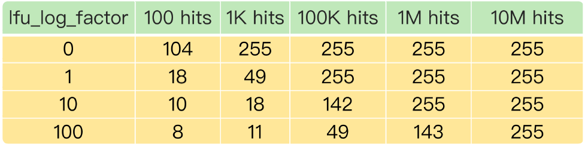

可以看到，当 lfu_log_factor 取值为 1 时，实际访问次数为 100K 后，counter 值就达到255 了，无法再区分实际访问次数更多的数据了。而当 lfu_log_factor 取值为 100 时，当实际访问次数为 10M 时，counter 值才达到 255，此时，实际访问次数小于 10M 的不同数据都可以通过 counter 值区分出来。

正是因为使用了非线性递增的计数器方法，即使缓存数据的访问次数成千上万，LFU 策略也可以有效地区分不同的访问次数，从而进行合理的数据筛选。从刚才的表中，我们可以看到，当 lfu_log_factor 取值为 10 时，百、千、十万级别的访问次数对应的 counter 值已经有明显的区分了，所以，我们在应用 LFU 策略时，一般可以将 lfu_log_factor 取值为10。

在一些场景下，有些数据在短时间内被大量访问后就不会再被访问了，为此，Redis 在实现 LFU 策略时，还设计了一个 counter简单来说，LFU 策略使用衰减因子配置项 lfu_decay_time 来控制访问次数的衰减。LFU 策略会计算当前时间和数据最近一次访问时间的差值，并把这个差值换算成以分钟为单位。然后，LFU 策略再把这个差值除以 lfu_decay_time 值，所得的结果就是数据 counter 要衰减的值。值的衰减机制。简单举个例子，假设 lfu_decay_time 取值为 1，如果数据在 N 分钟内没有被访问，那么它的访问次数就要减 N。如果 lfu_decay_time 取值更大，那么相应的衰减值会变小，衰减效果也会减弱。

所以，如果业务应用中有短时高频访问的数据的话，建议把lfu_decay_time 值设置为 1，这样可以避免这部分数据造成缓存污染

# 业务场景

## 原子操作

使用 Redis 时，不可避免地会遇到并发访问的问题，比如说如果多个用户同时下单，就会对缓存在 Redis 中的商品库存并发更新。一旦有了并发写操作，数据就会被修改，如果我们没有对并发写请求做好控制，就可能导致数据被改错，影响到业务的正常使用

为了保证并发访问的正确性，Redis 提供了两种方法，分别是分布式锁和原子操作

分布式锁实现比较复杂，而且会降低并发度，所以要优先使用原子操作

Redis 的原子操作采用了两种方法：

* 把多个操作在 Redis 中实现成一个操作，也就是单命令操作；
* 把多个操作写到一个 Lua 脚本中，以原子性方式执行单个 Lua 脚本

单命令操作，如INCR/DECR 命令，可以实现增值 / 减值操作，不用读回到客户端，增加完毕再写入，这个流程叫做“读取 - 修改 - 写回”操作（Read-Modify-Write，简称为 RMW 操作），把RMW操作用单命令操作实现，就可以不用加锁

但是，如果我们要执行的操作不是简单地增减数据，而是有更加复杂的判断逻辑或者是其他操作，那么，Redis 的单命令操作已经无法保证多个操作的互斥执行了。所以，这个时候，我们需要使用第二个方法，也就是 Lua 脚本。Redis 会把整个 Lua 脚本作为一个整体执行，在执行的过程中不会被其他命令打断，从而保证了 Lua 脚本中操作的原子性

例如下面这个案例：

可以把访问次数加 1、判断访问次数是否为 1，以及设置过期时间这三个操作写入一个 Lua 脚本，如下所示：

~~~lua
local current
current = redis.call("incr",KEYS[1])
if tonumber(current) == 1 then
	redis.call("expire",KEYS[1],60)
end
~~~

假设我们编写的脚本名称为 lua.script，我们接着就可以使用 Redis 客户端，带上 eval 选项，来执行该脚本。脚本所需的参数将通过以下命令中的 keys 和 args 进行传递：

~~~
redis-cli --eval lua.script keys , args
~~~

如果把很多操作都放在 Lua 脚本中原子执行，会导致 Redis 执行脚本的时间增加，同样也会降低 Redis 的并发性能。所以，建议在编写 Lua脚本时，你要避免把不需要做并发控制的操作写入脚本中。

## 分布式锁

为了避免 Redis 实例故障而导致的锁无法工作的问题，Redis 的开发者 Antirez 提出了分布式锁算法 Redlock，Redlock 算法的基本思路，是让客户端和多个独立的 Redis 实例依次请求加锁，如果客户端能够和半数以上的实例成功地完成加锁操作，那么我们就认为，客户端成功地获得分布式锁了，否则加锁失败。这样一来，即使有单个 Redis 实例发生故障，因为锁变量在其它实例上也有保存，所以，客户端仍然可以正常地进行锁操作，锁变量并不会丢失。

具体的执行步骤：

* 客户端获取当前时间

* 客户端按顺序依次向 N 个 Redis 实例执行加锁操作

  这里的加锁操作和在单实例上执行的加锁操作一样，使用 SET 命令，带上 NX，EX/PX 选项，以及带上客户端的唯一标识。当然，如果某个 Redis 实例发生故障了，为了保证在这种情况下，Redlock 算法能够继续运行，我们需要给加锁操作设置一个超时时间

  如果客户端在和一个 Redis 实例请求加锁时，一直到超时都没有成功，那么此时，客户端会和下一个 Redis 实例继续请求加锁。加锁操作的超时时间需要远远地小于锁的有效时间，一般也就是设置为几十毫秒。

* 一旦客户端完成了和所有 Redis 实例的加锁操作，客户端就要计算整个加锁过程的总耗时

客户端只有在满足下面的这两个条件时，才能认为是加锁成功：

条件一：客户端从超过半数（大于等于 N/2+1）的 Redis 实例上成功获取到了锁；
条件二：客户端获取锁的总耗时没有超过锁的有效时间。

我们需要重新计算这把锁的有效时间，计算的结果是锁的最初有效时间减去客户端为获取锁的总耗时。如果锁的有效时间已经来不及完成共享数据的操作了，我们可以释放锁，以免出现还没完成数据操作，锁就过期了的情况。

如果客户端在和所有实例执行完加锁操作后，没能同时满足这两个条件，那么，客户端向所有 Redis 节点发起释放锁的操作

### 简单实现

简单实现：

~~~java
if (setnx(key, 1) == 1){
    expire(key, 30)
    try {
        //TODO 业务逻辑
    } finally {
        del(key)
    }
}
~~~

加锁命令：SETNX key value，当键不存在时，对键进行设置操作并返回成功 

解锁命令：DEL key，通过删除键值对释放锁 

锁超时：EXPIRE key timeout, 设置 key 的超时时间，以保证即使锁没有被显式释放，锁也可以在一定时间后自动释放，避免资源被永远锁住 

### SETNX和EXPIRE非原子性

如果 SETNX 成功，在设置锁超时时间后，服务器挂掉、重启或网络问题等，导致 EXPIRE 命令没有执行，锁没有设置超时时间变成死锁 ：

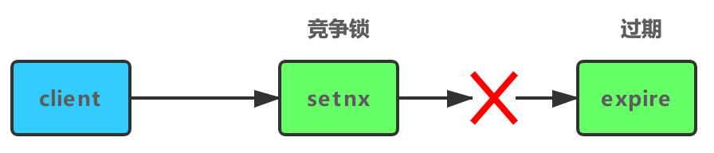

可以使用lua脚本来解决这个问题：

~~~java
if (redis.call('setnx', KEYS[1], ARGV[1]) < 1)
then return 0;
end;
redis.call('expire', KEYS[1], tonumber(ARGV[2]));
return 1;

// 使用实例
EVAL "if (redis.call('setnx',KEYS[1],ARGV[1]) < 1) then return 0; end; redis.call('expire',KEYS[1],tonumber(ARGV[2])); return 1;" 1 key value 100
~~~

### 锁误解除

如果线程 A 成功获取到了锁，并且设置了过期时间 30 秒，但线程 A 执行时间超过了 30 秒，锁过期自动释放，此时线程 B 获取到了锁；随后 A 执行完成，线程 A 使用 DEL 命令来释放锁，但此时线程 B 加的锁还没有执行完成，线程 A 实际释放的线程 B 加的锁 

解决办法：在value中设置当前线程的标记，解锁时用lua脚本来完成，在脚本中取到value值，若是当前线程，则解锁；否则则不解锁

### 超时并发

如果线程 A 成功获取锁并设置过期时间 30 秒，但线程 A 执行时间超过了 30 秒，锁过期自动释放，此时线程 B 获取到了锁，线程 A 和线程 B 并发执行 

解决办法：在上锁的同时增加一个守护线程，守护线程会定时去扫描，上锁的线程是否存在还在运行，若还在执行业务，则为锁延长有效时间，这个也可以解决服务突然挂了锁未释放的问题；或者也可以简单地将过期时间设置足够长，确保业务能执行完毕

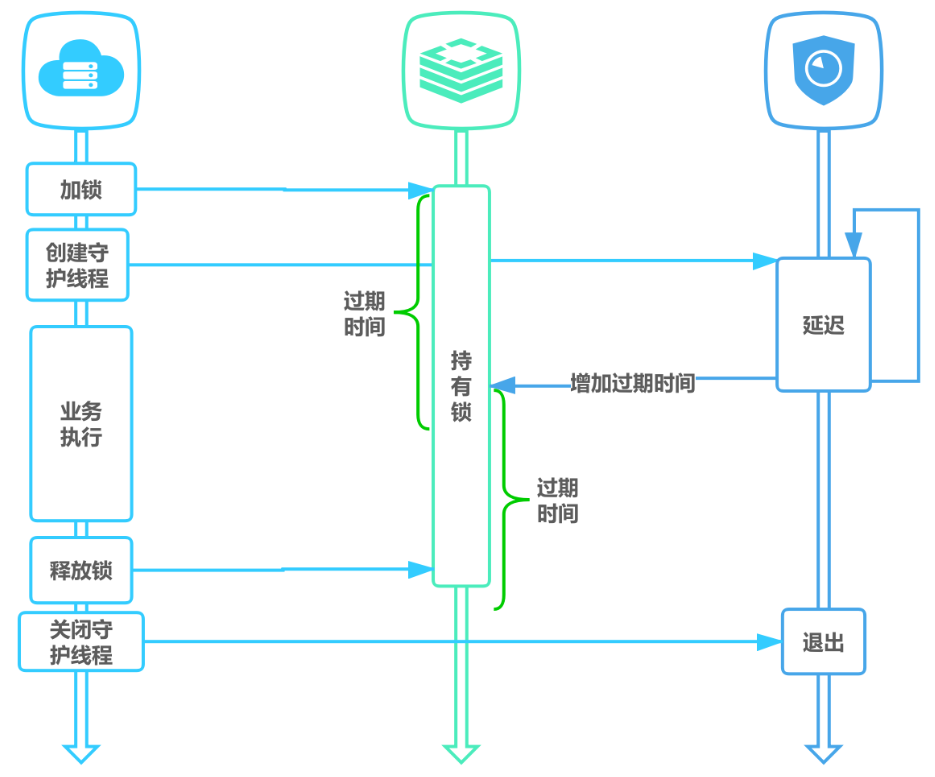

### 可重入性

当线程在持有锁的情况下再次请求加锁，如果一个锁支持一个线程多次加锁，那么这个锁就是可重入的。如果一个不可重入锁被再次加锁，由于该锁已经被持有，再次加锁会失败 

Redis 可通过对锁进行重入计数，加锁时加 1，解锁时减 1，当计数归 0 时释放锁 。

重入次数可以在本地记录，此时可以用ThreadLocal 进行重入次数统计 ，但这种方式会涉及到过期时间和本地、Redis 一致性的问题 。

所以还有一种方式是用Redis Map 数据结构来实现分布式锁 ，存锁标志的同时也对重入次数进行计数：

~~~java
// 如果 lock_key 不存在
if (redis.call('exists', KEYS[1]) == 0)
then
    // 设置 lock_key 线程标识 1 进行加锁
    redis.call('hset', KEYS[1], ARGV[2], 1);
    // 设置过期时间
    redis.call('pexpire', KEYS[1], ARGV[1]);
    return nil;
    end;
// 如果 lock_key 存在且线程标识是当前欲加锁的线程标识
if (redis.call('hexists', KEYS[1], ARGV[2]) == 1)
    // 自增
    then redis.call('hincrby', KEYS[1], ARGV[2], 1);
    // 重置过期时间
    redis.call('pexpire', KEYS[1], ARGV[1]);
    return nil;
    end;
// 如果加锁失败，返回锁剩余时间
return redis.call('pttl', KEYS[1]);
~~~

### 锁释放通知

当某个客户端无法获取到锁时，它可以选择不断轮询，当未获取到锁时，等待一段时间重新获取锁，直到成功获取锁或等待超时。这种方式比较消耗服务器资源，当并发量比较大时，会影响服务器的效率 

还有一种方式是使用Redis的发布订阅功能，当获取锁失败时，订阅锁释放消息，获取锁成功后释放时，发送锁释放消息 ：

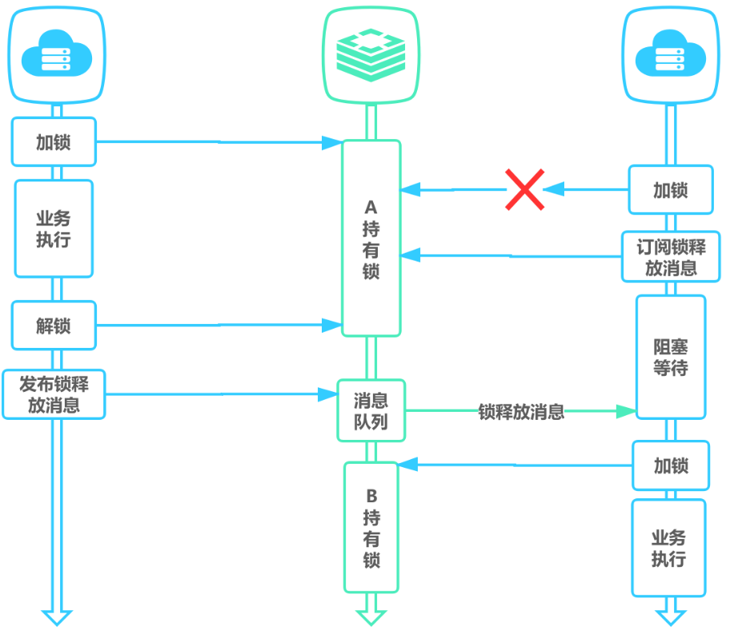

### 主备切换带来的问题

为了保证 Redis 的可用性，一般采用主从方式部署。 

Redis 将指令记录在本地内存 buffer 中，然后异步将 buffer 中的指令同步到从节点，从节点一边执行同步的指令流来达到和主节点一致的状态，一边向主节点反馈同步情况 

在包含主从模式的集群部署方式中，当主节点挂掉时，从节点会取而代之，但客户端无明显感知。当客户端 A 成功加锁，指令还未同步，此时主节点挂掉，从节点提升为主节点，新的主节点没有锁的数据，当客户端 B 加锁时就会成功 ：

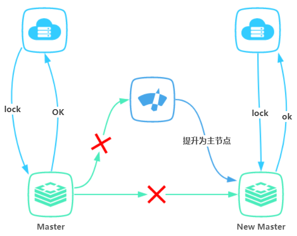

### 集群脑裂带来的问题

集群脑裂指因为网络问题，导致 Redis master 节点跟 slave 节点和 sentinel 集群处于不同的网络分区，因为 sentinel 集群无法感知到 master 的存在，所以将 slave 节点提升为 master 节点，此时存在两个不同的 master 节点 。

此时当不同的客户端连接不同的 master 节点时，两个客户端可以同时拥有同一把锁 ：

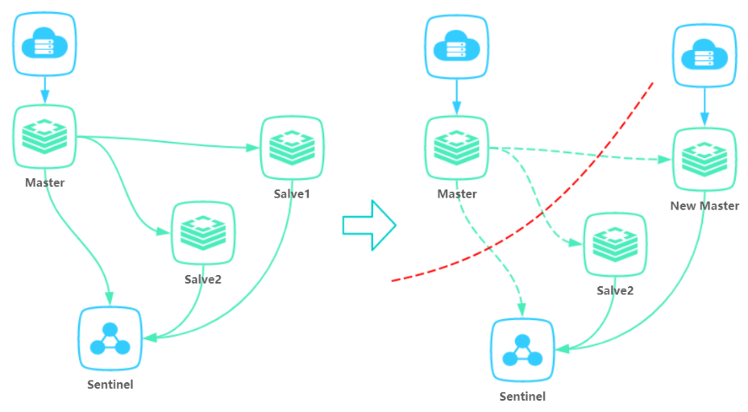

### Redlock算法

为了解决上面集群带来的锁问题，可以使用分布式锁算法Redlock

它的基本思路是：让客户端和多个独立的Redis实例依次请求加锁，如果客户端能够和半数以上的实例成功地完成加锁操作，那么就认为客户端成功的获得分布式锁了，否则就加锁失败，这样即使有单个Redis实例发生故障，锁变量在其他实例上也有保存，不会出现丢失锁的现象。

加锁操作步骤：

* 客户端获取当前时间

* 客户端按顺序依次向N个Redis实例执行加锁操作

  给加锁动作设置一个超时时间，防止某个实例故障导致算法不能运行；如果在超时时间内没有加锁成功，会继续和下一个Redis实例请求加锁。一般来说，加锁动作超时时间要远小于锁的有效时间，一般是几十毫秒

* 只有在满足下面两个条件时，才认为是加锁成功：

  1、客户端从超过半数的Redis实例上成功获取到了锁

  2、客户端获取锁的总耗时没有超过锁的有效时间（如果超过了，就说明已经来不及执行业务操作了）

  如果没有同时满足，则向所有Redis节点发起释放锁的操作（用Lua脚本释放，以解决之前提到的锁误解除问题）

## 事务

事务，就是指对数据进行读写的一系列操作。事务在执行时，会提供专门的属性保证，包括原子性（Atomicity）、一致性（Consistency）、隔离性（Isolation）和持久性（Durability），也就是 ACID 属性。这些属性既包括了对事务执行结果的要求，也有对数据库在事务执行前后的数据状态变化的要求。

Redis事务的执行分为三个步骤，Redis 提供了 MULTI、EXEC 两个命令来完成这三个步骤：

* 第一步，客户端要使用一个命令显式地表示一个事务的开启。在 Redis 中，这个命令就是MULTI。
* 第二步，客户端把事务中本身要执行的具体操作（例如增删改数据）发送给服务器端。这些操作就是 Redis 本身提供的数据读写命令，例如 GET、SET 等。不过，这些命令虽然被客户端发送到了服务器端，但 Redis 实例只是把这些命令暂存到一个命令队列中，并不会立即执行。
* 第三步，客户端向服务器端发送提交事务的命令，让数据库实际执行第二步中发送的具体操作。Redis 提供的 EXEC 命令就是执行事务提交的。当服务器端收到 EXEC 命令后，才会实际执行命令队列中的所有命令。

下面的代码就显示了使用 MULTI 和 EXEC 执行一个事务的过程：

~~~
#开启事务
127.0.0.1:6379> MULTI
OK
#将a:stock减1，
127.0.0.1:6379> DECR a:stock
QUEUED
#将b:stock减1
127.0.0.1:6379> DECR b:stock
QUEUED
#实际执行事务
127.0.0.1:6379> EXEC
1) (integer) 4
2) (integer) 9
~~~

1、原子性

关于Redis事务能否保证原子性，要分几种情况讨论：

* 在执行 EXEC 命令前，客户端发送的操作命令本身就有错误（比如语法错误，使用了不存在的命令），在命令入队时就被 Redis 实例判断出来了。对于这种情况，在命令入队时，Redis 就会报错并且记录下这个错误。此时，我们还能继续提交命令操作。等到执行了 EXEC 命令之后，Redis 就会拒绝执行所有提交的命令操作，返回事务失败的结果。这样一来，事务中的所有命令都不会再被执行了，保证了原子性。

* 事务操作入队时，命令和操作的数据类型不匹配，但 Redis 实例没有检查出错误。但是，在执行完 EXEC 命令以后，Redis 实际执行这些事务操作时，就会报错。不过，需要注意的是，虽然 Redis 会对错误命令报错，但还是会把正确的命令执行完。在这种情况下，事务的原子性就无法得到保证了

  和传统数据库不同，Redis 中并没有提供回滚机制。虽然 Redis 提供了 DISCARD 命令，但是，这个命令只能用来主动放弃事务执行，把暂存的命令队列清空，起不到回滚的效果

* 在执行事务的 EXEC 命令时，Redis 实例发生了故障，导致事务执行失败。在这种情况下，如果 Redis 开启了 AOF 日志，那么，只会有部分的事务操作被记录到AOF 日志中。我们需要使用 redis-check-aof 工具检查 AOF 日志文件，这个工具可以把事务中已完成的操作从 AOF 文件中去除。这样一来，我们使用 AOF 恢复实例后，事务操作不会再被执行，从而保证了原子性。当然，如果 AOF 日志并没有开启，那么实例重启后，数据也都没法恢复了，此时，也就谈
  不上原子性了。

2、一致性：

正常执行事务时，有错误的命令不会被执行，正确的命令可以正常执行，不会改变数据库的一致性。如果执行过程中Redis发生故障，如果开启了AOF日志，可以用redis-check-aof 清除事务中已经完成的操作，数据库恢复后也是一致的。

3、隔离性：Redis事务的隔离性主要由watch命令来实现

WATCH 机制的作用是，在事务执行前，监控一个或多个键的值变化情况，当事务调用EXEC 命令执行时，WATCH 机制会先检查监控的键是否被其它客户端修改了。如果修改了，就放弃事务执行，避免事务的隔离性被破坏，例如下图：

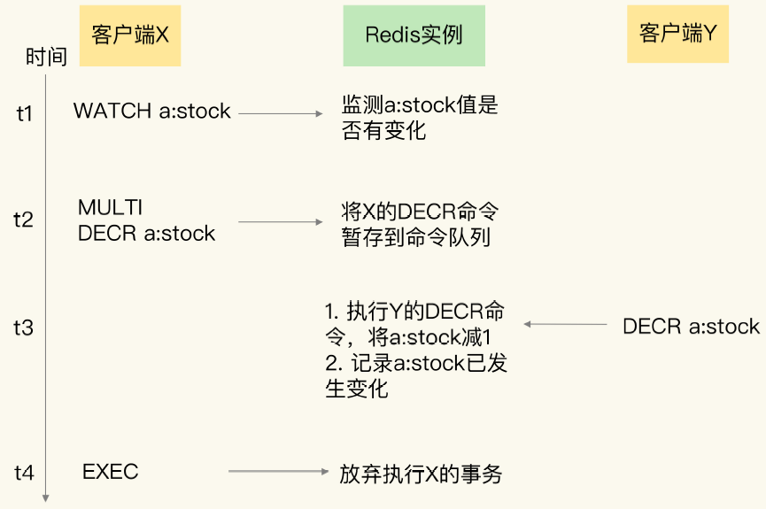

如果没有使用 WATCH 机制，在 EXEC 命令前执行的并发操作是会对数据进行读写的，此时隔离性就没有保障了

4、持久性：

如果 Redis 没有使用 RDB 或 AOF，那么事务的持久化属性肯定得不到保证

如果 Redis使用了 RDB 模式，那么，在一个事务执行后，而下一次的 RDB 快照还未执行前，如果发生了实例宕机，这种情况下，事务修改的数据也是不能保证持久化的。

如果 Redis 采用了 AOF 模式，因为 AOF 模式的三种配置选项 no、everysec 和 always都会存在数据丢失的情况，所以，事务的持久性属性也还是得不到保证。

## 秒杀场景

秒杀系统的两个特征：

* 瞬时并发访问量非常高。一般数据库每秒只能支撑千级别的并发请求，而 Redis 的并发处理能力（每秒处理请求数）能达到万级别，甚至更高。所以，当有大量并发请求涌入秒杀系统时，我们就需要使用 Redis 先拦截大部分请求，避免大量请求直接发送给数据库，把数据库压垮
* 读多写少，而且读操作是简单的查询操作。在秒杀场景下，用户需要先查验商品是否还有库存（也就是根据商品 ID 查询该商品的库存还有多少），只有库存有余量时，秒杀系统才能进行库存扣减和下单操作。

秒杀活动的过程：

1、秒杀活动前：在这个阶段，用户会不断刷新商品详情页，这会导致详情页的瞬时请求量剧增。这个阶段的应对方案，一般是尽量把商品详情页的页面元素静态化，然后使用 CDN 或是浏览器把这些静态化的元素缓存起来。这样一来，秒杀前的大量请求可以直接由 CDN 或是浏览器缓存服务，不会到达服务器端了，这就减轻了服务器端的压力。

2、秒杀活动开始后，这个阶段的主要工作是：库存查验、库存扣减和订单处理。为了支撑大量高并发的库存查验请求，我们需要在这个环节使用 Redis 保存库存量，这样一来，请求可以直接从 Redis 中读取库存并进行查验。

订单处理可以在数据库中执行，但库存扣减操作，不能交给后端数据库处理。原因是订单处理的请求不多，数据库可以承受这些请求。如果我们把库存扣减的操作放到数据库执行，会有两个问题：

* 额外开销：库存量同时在Redis和数据库维护两份，要花费额外的精力保证数据同步
* 可能出现超售：数据库的处理速度较慢，不能及时更新库存余量，这就会导致大量库存查验的请求读取到旧的库存值，并进行下单，出现超售

秒杀场景对 Redis 操作的根本要求有两个：

1、Redis 本身高速处理请求的特性就可以支持高并发。而且，如果有多个秒杀商品，我们也可以使用切片集群，用不同的实例保存不同商品的库存，这样就避免，使用单个实例导致所有的秒杀请求都集中在一个实例上的问题了

2、保证库存查验和库存扣减原子性执行：使用 Redis 的原子操作或是分布式锁这两个功能特性来支撑

在秒杀场景中，一个商品的库存对应了两个信息，分别是总库存量和已秒杀量。这种数据模型正好是一个 key（商品 ID）对应了两个属性（总库存量和已秒杀量），所以，我们可以使用一个 Hash 类型的键值对来保存库存的这两个信息，如下所示：

~~~
key: itemID
value: {total: N, ordered: M}
~~~

其中，itemID 是商品的编号，total 是总库存量，ordered 是已秒杀量。

因为库存查验和库存扣减这两个操作要保证一起执行，一个直接的方法就是使用 Redis 的原子操作。

下面是一段Lua脚本，它保证了库存查验和库存扣减的原子性：

~~~lua
#获取商品库存信息
local counts = redis.call("HMGET", KEYS[1], "total", "ordered");
#将总库存转换为数值
local total = tonumber(counts[1])
#将已被秒杀的库存转换为数值
local ordered = tonumber(counts[2])
#如果当前请求的库存量加上已被秒杀的库存量仍然小于总库存量，就可以更新库存
if ordered + k <= total then
#更新已秒杀的库存量
redis.call("HINCRBY",KEYS[1],"ordered",k) ret
end
return 0
~~~

最后，客户端会根据脚本的返回值，来确定秒杀是成功还是失败了。如果返回值是 k，就是成功了；如果是 0，就是失败。

还有一种方式可以保证两个操作的原子性，那就是使用分布式锁，具体做法是，先让客户端向 Redis 申请分布式锁，只有拿到锁的客户端才能执行库存查验和库存扣减，这样一来，大量的秒杀请求就会在争夺分布式锁时被过滤掉。而且，库存查验和扣减也不用使用原子操作了，因为多个并发客户端只有一个客户端能够拿到锁，已经保证了客户端并发访问的互斥性。

我们可以使用切片集群中的不同实例来分别保存分布式锁和商品库存信息。使用这种保存方式后，秒杀请求会首先访问保存分布式锁的实例。如果客户端没有拿到锁，这些客户端就不会查询商品库存，这就可以减轻保存库存信息的实例的压力了。

秒杀系统是一个系统性工程，除了Redis的使用，还需要注意这些方面：

1、前端静态页面的设计。秒杀页面上能静态化处理的页面元素，我们都要尽量静态化，这样可以充分利用 CDN 或浏览器缓存服务秒杀开始前的请求。
2、请求拦截和流控。在秒杀系统的接入层，对恶意请求进行拦截，避免对系统的恶意攻击，例如使用黑名单禁止恶意 IP 进行访问。如果 Redis 实例的访问压力过大，为了避免实例崩溃，我们也需要在接入层进行限流，控制进入秒杀系统的请求数量。
3、库存信息过期时间处理。Redis 中保存的库存信息其实是数据库的缓存，为了避免缓存击穿问题，我们不要给库存信息设置过期时间。
4、数据库订单异常处理。如果数据库没能成功处理订单，可以增加订单重试功能，保证订单最终能被成功处理。

秒杀活动带来的请求流量巨大，我们需要把秒杀商品的库存信息用单独的实例保存，而不要和日常业务系统的数据保存在同一个实例上，这样可以避免干扰业务系统的正常运行。

## Redis服务化

以微博对Redis的使用为例，来说明Redis服务化的过程。

不同业务对 Redis 容量的需求不一样，而且可能会随着业务的变化出现扩容和缩容的需求。为了能够灵活地支持这些业务需求，微博对 Redis 进行了服务化改造（RedisService）。所谓服务化，就是指，使用 Redis 集群来服务不同的业务场景需求，每一个业务拥有独立的资源，相互不干扰。

同时，所有的 Redis 实例形成一个资源池，资源池本身也能轻松地扩容。如果有新业务上线或是旧业务下线，就可以从资源池中申请资源，或者是把不用的资源归还到资源池中。形成了 Redis 服务之后，不同业务线在使用 Redis 时就非常方便了。不用业务部门再去独立部署和运维，只要让业务应用客户端访问 Redis 服务集群就可以。即使业务应用的数据量增加了，也不用担心实例容量问题，服务集群本身可以自动在线扩容，来支撑业务的发展。

在 Redis 服务化的过程中，微博采用了类似 Codis 的方案，通过集群代理层来连接客户端和服务器端。代理层主要完成了以下工作：

* 客户端连接监听和端口自动增删。
* Redis 协议解析：确定需要路由的请求，如果是非法和不支持的请求，直接返回错误。
* 请求路由：根据数据和后端实例间的映射规则，将请求路由到对应的后端实例进行处理，并将结果返回给客户端。
* 指标采集监控：采集集群运行的状态，并发送到专门的可视化组件，由这些组件进行监控处理。
* 配置中心：来管理整个集群的元数据

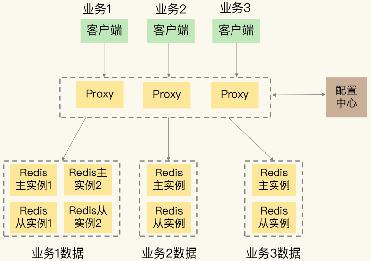

当把一个通用功能做成平台服务时，我们需要重点考虑的问题，包括平台平滑扩容、多租户支持和业务数据隔离、灵活的路由规则、丰富的监控功能等。

当多个业务线有共同的 Redis 使用需求时，提供平台级服务是一种通用做法，也就是服务化

# Pika

## 架构

随着业务数据的增加（比如说电商业务中，随着用户规模和商品数量的增加），就需要 Redis 能保存更多的数据，但过大的切片集群会给运维带来困难；如果增加Redis 单实例的内存容量，形成大内存实例，也可以保存更多数据，但基于大内存的大容量实例在实例恢复、主从同步过程中会引起一系列潜在问题，例如恢复时间增长、主从切换开销大、缓冲区易溢出

这种情况下，可以选择使用固态硬盘（Solid State Drive，SSD）。它的成本很低（每 GB的成本约是内存的十分之一），而且容量大，读写速度快，我们可以基于 SSD 来实现大容量的 Redis 实例。360 公司 DBA 和基础架构组联合开发的 Pika键值数据库，正好实现了这一需求。

Pika 在刚开始设计的时候，就有两个目标：一是，单实例可以保存大容量数据，同时避免了实例恢复和主从同步时的潜在问题；二是，和 Redis 数据类型保持兼容，可以支持使用Redis 的应用平滑地迁移到 Pika 上

大内存Redis实例的潜在问题：

- 实例内存容量大，RDB 文件也会相应增大，RDB 文件生成时的 fork 时长就会增加，使用 RDB 进行恢复的时长也会增加，会导致 Redis 较长时间无法对外提供服务
- 主从节点间的同步的第一步就是要做全量同步，全量同步也需要从节点加载RDB文件，如果 RDB 文件很大，肯定会导致全量同步的时长增加，效率不高，而且还可能会导致复制缓冲区溢出，一旦缓冲区溢出了，主从节点间就会又开始全量同步，影响业务应用的正常使用。
- 如果主库发生了故障，进行主从切换后，其他从库都需要和新主库进行一次全量同步。如果 RDB 文件很大，也会导致主从切换的过程耗时增加

Pika解决了上面的这些问题。Pika 键值数据库的整体架构中包括了五部分，分别是网络框架、Pika 线程模块、Nemo 存储模块、RocksDB 和 binlog 机制：

* 网络框架主要负责底层网络请求的接收和发送。Pika 的网络框架是对操作系统底层的网络函数进行了封装。Pika 在进行网络通信时，可以直接调用网络框架封装好的函数

* Pika 线程模块采用了多线程模型来具体处理客户端请求，包括一个请求分发线程（DispatchThread）、一组工作线程（WorkerThread）以及一个线程池（ThreadPool）。

  请求分发线程专门监听网络端口，一旦接收到客户端的连接请求后，就和客户端建立连接，并把连接交由工作线程处理。工作线程负责接收客户端连接上发送的具体命令请求，并把命令请求封装成 Task，再交给线程池中的线程，由这些线程进行实际的数据存取处理，如下图所示：

  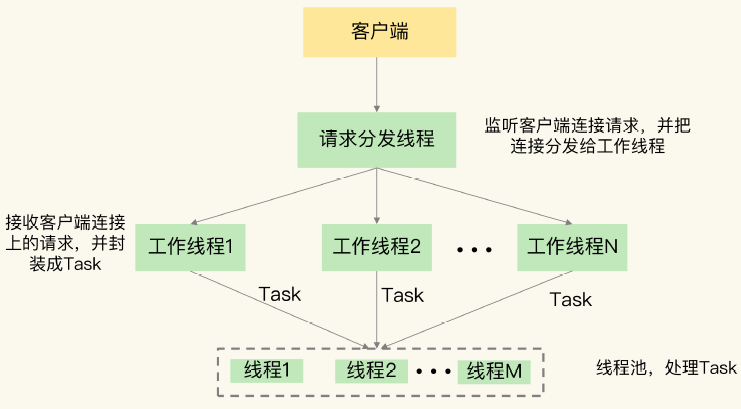

  在实际应用 Pika 的时候，我们可以通过增加工作线程数和线程池中的线程数，来提升Pika 的请求处理吞吐率，进而满足业务层对数据处理性能的需求。

* Nemo 模块很容易理解，它实现了 Pika 和 Redis 的数据类型兼容。这样一来，当我们把Redis 服务迁移到 Pika 时，不用修改业务应用中操作 Redis 的代码，而且还可以继续应用运维 Redis 的经验，这使得 Pika 的学习成本就较低。

* RocksDB 提供的基于 SSD 保存数据的功能。它使得 Pika 可以不用大容量的内存，就能保存更多数据，还避免了使用内存快照。而且，Pika 使用 binlog 机制记录写命令，用于主从节点的命令同步，避免了刚刚所说的大内存实例在主从同步过程中的潜在问题。

## SSD和binlog

为了把数据保存到 SSD，Pika 使用了业界广泛应用的持久化键值数据库RocksDB。RocksDB 写入数据的基本流程：

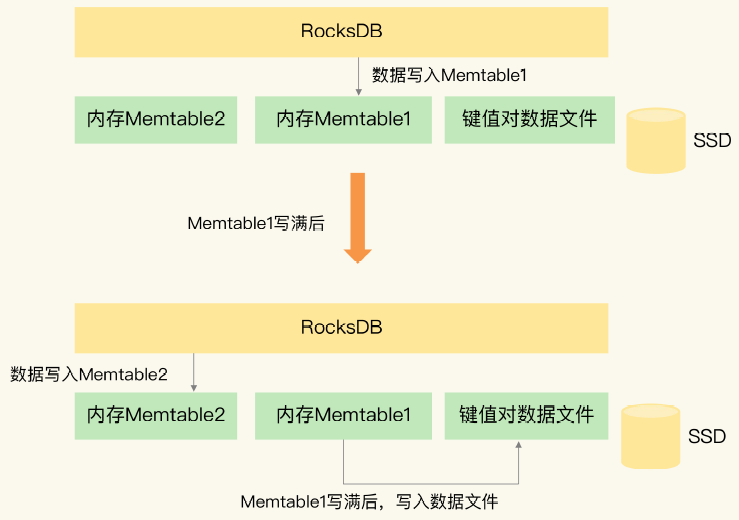

当 Pika 需要保存数据时，RocksDB 会使用两小块内存空间（Memtable1 和Memtable2）来交替缓存写入的数据。Memtable 的大小可以设置，一个 Memtable 的大小一般为几 MB 或几十 MB。当有数据要写入 RocksDB 时，RocksDB 会先把数据写入到 Memtable1。等到 Memtable1 写满后，RocksDB 再把数据以文件的形式，快速写入底层的 SSD。同时，RocksDB 会使用 Memtable2 来代替 Memtable1，缓存新写入的数据。等到 Memtable1 的数据都写入 SSD 了，RocksDB 会在 Memtable2 写满后，再用Memtable1 缓存新写入的数据。

即使 RocksDB 使用了两个 Memtable，也不会占用过多的内存，这样一来，Pika 在保存大容量数据时，也不用占据太大的内存空间了

当 Pika 需要读取数据的时候，RocksDB 会先在 Memtable 中查询是否有要读取的数据。这是因为，最新的数据都是先写入到 Memtable 中的。如果 Memtable 中没有要读取的数据，RocksDB 会再查询保存在 SSD 上的数据文件，如下图所示：

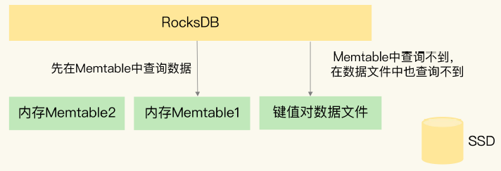

当使用了 RocksDB 保存数据后，Pika 就可以把大量数据保存到大容量的 SSD 上了，实现了大容量实例。根据这个特性，Pika避免了大内存Redis实例的问题：

* Pika 避免了大内存快照生成效率低的问题：ika 基于 RocksDB 保存了数据文件，直接读取数据文件就能恢复，不需要再通过内存快照进行恢复了。而且，Pika 从库在进行全量同步时，可以直接从主库拷贝数据文件，不需要使用内存快照

* Pika 使用了 binlog 机制实现增量命令同步，既节省了内存，还避免了缓冲区溢出的问题：binlog 是保存在 SSD 上的文件，Pika 接收到写命令后，在把数据写入Memtable 时，也会把命令操作写到 binlog 文件中。和 Redis 类似，当全量同步结束后，从库会从 binlog 中把尚未同步的命令读取过来，这样就可以和主库的数据保持一致。当进行增量同步时，从库也是把自己已经复制的偏移量发给主库，主库把尚未同步的命令发给从库，来保持主从库的数据一致。

  不过，和 Redis 使用缓冲区相比，使用 binlog 好处是非常明显的：binlog 是保存在 SSD上的文件，文件大小不像缓冲区，会受到内存容量的较多限制。而且，当 binlog 文件增大后，还可以通过轮替操作，生成新的 binlog 文件，再把旧的 binlog 文件独立保存。这样一来，即使 Pika 实例保存了大量的数据，在同步过程中也不会出现缓冲区溢出的问题了

## Redis 数据类型兼容

Pika 的底层存储使用了 RocksDB 来保存数据，但是，RocksDB 只提供了单值的键值对类型，RocksDB 键值对中的值就是单个值，而 Redis 键值对中的值还可以是集合类型。对于 Redis 的 String 类型来说，它本身就是单值的键值对，我们直接用 RocksDB 保存就行。但是，对于集合类型来说，我们就无法直接把集合保存为单值的键值对，而是需要进行转换操作。

为了保持和 Redis 的兼容性，Pika 的 Nemo 模块就负责把 Redis 的集合类型转换成单值的键值对。

兼容细节略 -》 28

## 优势与不足

跟 Redis 相比，Pika 最大的特点就是使用了 SSD 来保存数据，这个特点能带来的最直接好处就是，Pika 单实例能保存更多的数据了，实现了实例数据扩容。

Pika的优势：

* 实例重启快：Pika 的数据在写入数据库时，是会保存到 SSD 上的。当 Pika 实例重启时，可以直接从 SSD 上的数据文件中读取数据，不需要像 Redis 一样，从 RDB 文件全部重新加载数据或是从 AOF 文件中全部回放操作，这极大地提高了 Pika 实例的重启速度，可以快速处理业务应用请求。
* 主从库重新执行全量同步的风险低：Pika 通过 binlog 机制实现写命令的增量同步，不再受内存缓冲区大小的限制

Pika的劣势：

* 数据保存到 SSD 上后，会降低数据的访问性能，数据操作毕竟不能在内存中直接执行了。而且，我们还需要把 binlog 机制记录的写命令同步到 SSD 上，这会降低 Pika 的写性能。

  不过，Pika 的多线程模型，可以同时使用多个线程进行数据读写，这在一定程度上弥补了从 SSD 存取数据造成的性能损失。当然，你也可以使用高配的 SSD 来提升访问性能，进而减少读写 SSD 对 Pika 性能的影响。

Pika官网的测试数据：

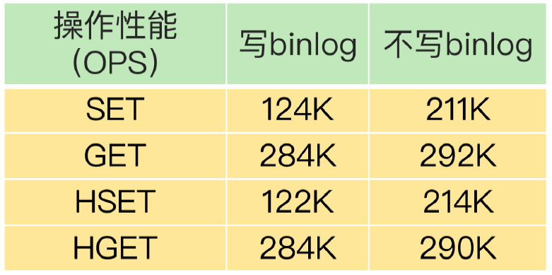

这些数据是在 Pika 3.2 版本中，String 和 Hash 类型在多线程情况下的基本操作性能结果。从表中可以看到，在不写 binlog 时，Pika 的 SET/GET、HSET/HGET 的性能都能达到 200K OPS 以上，而一旦增加了写 binlog 操作，SET 和 HSET 操作性能大约下降了41%，只有约 120K OPS（operation per second 每秒操作次数）。

使用 Pika 时，需要在单实例扩容的必要性和可能的性能损失间做个权衡。如果保存大容量数据是我们的首要需求，那么，Pika 是一个不错的解决方案

# 新Redis

## Redis6.0新特性

1、多 IO 线程

之前Redis从网络 IO 处理到实际的读写命令处理，都是由单个线程完成的。随着网络硬件的性能提升，Redis 的性能瓶颈有时会出现在网络 IO 的处理上，也就是说，单个主线程处理网络请求的速度跟不上底层网络硬件的速度。Redis6.0采用多个 IO 线程来处理网络请求，而对于读写命令，Redis 仍然使用单线程来处理

2、实现服务端协助的客户端缓存

Redis 6.0 新增了一个重要的特性，就是实现了服务端协助的客户端缓存功能，也称为跟踪（Tracking）功能。有了这个功能，业务应用中的 Redis 客户端就可以把读取的数据缓存在业务应用本地了，应用就可以直接在本地快速读取数据了。这给Redis带来的挑战是，保证数据的一致性。

3、从简单的基于密码访问到细粒度的权限控制

在 Redis 6.0 版本之前，要想实现实例的安全访问，只能通过设置密码来控制，例如，客户端连接实例前需要输入密码。此外，对于一些高风险的命令（例如 KEYS、FLUSHDB、FLUSHALL 等），在 Redis 6.0之前，我们也只能通过 rename-command 来重新命名这些命令，避免客户端直接调用

Redis 6.0 提供了更加细粒度的访问权限控制：

* 6.0 版本支持创建不同用户来使用 Redis
* 支持以用户为粒度设置命令操作的访问权限

4、启用 RESP 3 协议

Redis 6.0 实现了 RESP 3 通信协议，而之前都是使用的 RESP 2。在 RESP 2 中，客户端和服务器端的通信内容都是以字节数组形式进行编码的，客户端需要根据操作的命令或是数据类型自行对传输的数据进行解码，增加了客户端开发复杂度。启用 RESP 3 协议后，客户端就可以直接通过判断传递消息的开头字符，来实现数据转换操作了，提升了客户端的效率。

关于RESP 2和3的更多细节，待 ->加4

## 基于NVM内存的实践

近些年，新型非易失存储（Non-Volatile Memory，NVM）器件发展得非常快。NVM器件具有容量大、性能快、能持久化保存数据的特性，这些刚好就是 Redis 追求的目标。同时，NVM 器件像 DRAM 一样，可以让软件以字节粒度进行寻址访问，所以，在实际应用中，NVM 可以作为内存来使用，我们称为 NVM 内存。

跟传统的 DRAM 内存相比，NVM 有三个显著的特点：

* NVM 内存最大的优势是可以直接持久化保存数据，数据保存在 NVM内存上后，即使发生了宕机或是掉电，数据仍然存在 NVM 内存上。但如果数据是保存在DRAM 上，那么，掉电后数据就会丢失。
* NVM 内存的访问速度接近 DRAM 的速度。
* NVM 内存的容量很大。NVM 器件的密度大，单个 NVM 的存储单元可以保存更多数据。例如，单根 NVM 内存条就能达到 128GB 的容量，最大可以达到512GB，而单根 DRAM 内存条通常是 16GB 或 32GB。所以，我们可以很轻松地用 NVM内存构建 TB 级别的内存。

Intel 在 2019 年 4 月份时推出的Optane AEP 内存条（简称 AEP 内存）。我们在应用 AEP 内存时，需要注意的是，AEP内存给软件提供了两种使用模式，分别对应着使用了 NVM 的容量大和持久化保存数据两个特性：

* Memory 模式：把 NVM 内存作为大容量内存来使用的，也就是说，只使用 NVM 容量大和性能高的特性，没有启用数据持久化的功能
* App Direct 模式：这种模式启用了 NVM 持久化数据的功能。在这种模式下，应用软件把数据写到 AEP 内存上时，数据就直接持久化保存下来了。所以，使用了 App Direct 模式的 AEP 内存，也叫做持久化内存（Persistent Memory，PM）。

当 AEP 内存使用 Memory 模式时，应用软件就可以利用它的大容量特性来保存大量数据，Redis 也就可以给上层业务应用提供大容量的实例了。而且，在 Memory 模式下，Redis 可以像在 DRAM 内存上运行一样，直接在 AEP 内存上运行，不用修改代码。但需要注意，在 Memory 模式下，AEP 内存的访问延迟会比 DRAM 高一点。NVM 的读延迟大约是 200~300ns，而写延迟大约是 100ns。所以，在 Memory 模式下运行 Redis 实例，实例读性能会有所降低，我们就需要在保存大量数据和读性能较慢两者之间做个取舍。

现在 Redis 在涉及持久化操作时的问题：

* RDB 文件创建时的 fork 操作会阻塞主线程；
* AOF 文件记录日志时，需要在数据可靠性和写性能之间取得平衡
* 使用 RDB 或 AOF 恢复数据时，恢复效率受 RDB 和 AOF 大小的限制

但是，如果我们使用持久化内存，就可以充分利用 PM 快速持久化的特点，来避免 RDB 和AOF 的操作。因为 PM 支持内存访问，而 Redis 的操作都是内存操作，那么，我们就可以把 Redis 直接运行在 PM 上。同时，数据本身就可以在 PM 上持久化保存了，我们就不再需要额外的 RDB 或 AOF 日志机制来保证数据可靠性了。

