# 基础

## RDD的基本概念

入门程序Word Count：

~~~scala
object Test {
  def main(args: Array[String]): Unit = {
    println("Hello!")
    // 创建 Spark 运行配置对象
    val sparkConf = new SparkConf().setMaster("local").setAppName("WordCount")
    sparkConf.set("spark.testing.memory", (512*1024*1024) + "");

    // 创建 Spark 上下文环境对象（连接对象）
    val sc : SparkContext = new SparkContext(sparkConf)

    // 读取文件数据
    val fileRDD: RDD[String] = sc.textFile("input/word.txt")

    // 将文件中的数据进行分词
    val wordRDD: RDD[String] = fileRDD.flatMap( _.split(" ") )

    // 转换数据结构 word => (word, 1)
    val word2OneRDD: RDD[(String, Int)] = wordRDD.map((_,1))

    // 将转换结构后的数据按照相同的单词进行分组聚合，取频率最高的前20个
    val word2Count: Array[(Int, String)] = word2OneRDD.reduceByKey(_+_).map{case (k,v) => (v,k)}.sortByKey(false).take(20)

    // 打印结果
    word2Count.foreach(println)

    //关闭 Spark 连接
    sc.stop()
  }
}
~~~

RDD 是构建 Spark 分布式内存计算引擎的基石，很多 Spark 核心概念与核心组件，如 DAG 和调度系统都衍生自 RDD。 

尽管 RDD API 使用频率越来越低，绝大多数人也都已经习惯于 DataFrame 和 Dataset API，但是，无论采用哪种 API 或是哪种开发语言，你的应用在 Spark 内部最终都会转化为 RDD 之上的分布式计算。 

RDD 是一种抽象，是 Spark 对于分布式数据集的抽象，它用于囊括所有内存中和磁盘中的分布式数据实体。 

RDD 和数组的对比：

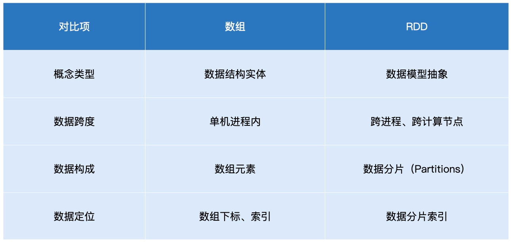

在表中从四个方面对数组和 RDD 进行了对比：

* 就概念本身来说，数组是实体，它是一种存储同类元素的数据结构，而 RDD 是一种抽象，它所囊括的是分布式计算环境中的分布式数据集。 
* 活动范围对比：数组的“活动范围”很窄，仅限于单个计算节点的某个进程内，而 RDD 代表的数据集是跨进程、跨节点的，它的“活动范围”是整个集群。 
* 数据定位方面：在数组中，承载数据的基本单元是元素，而 RDD 中承载数据的基本单元是数据分片，数据分片（Partitions）是 RDD 抽象的重要属性之一。在分布式计算环境中，一份完整的数据集，会按照某种规则切割成多份数据分片。这些数据分片被均匀地分发给集群内不同的计算节点和执行进程，从而实现分布式并行计算。 

RDD的四个属性：

* partitions：数据分片，一份完整的数据集，会按照某种规则切割成多份数据分片然后被均匀地分发给集群内不同的计算节点和执行进程进行计算。
* partitioner：分片切割规则，它决定了数据分片应该如何切割。
* dependencies：RDD 依赖，在数据形态的转换过程中，每个 RDD 都会通过 dependencies 属性来记录它所依赖的前一个、或是多个 RDD，简称“父 RDD” 
* compute：转换函数，RDD 使用 compute 属性，来记录从父 RDD 到当前 RDD 的转换操作。 

基于数据源和转换逻辑，无论 RDD 有什么差池（如节点宕机造成部分数据分片丢失），在 dependencies 属性记录的父 RDD 之上，都可以通过执行 compute 封装的计算逻辑再次得到当前的 RDD，如下图所示：

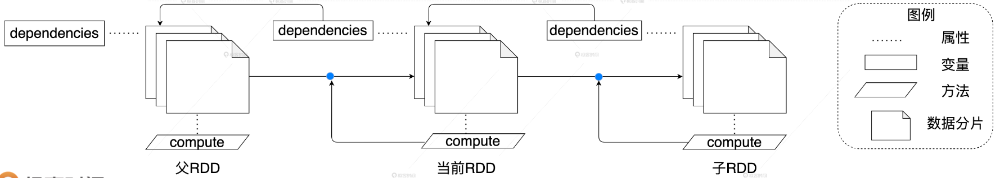

由 dependencies 和 compute 属性提供的容错能力，为 Spark 分布式内存计算的稳定性打下了坚实的基础，这也正是 RDD 命名中 Resilient 的由来。 

不同的 RDD 通过 dependencies 和 compute 属性链接在一起，逐渐向纵深延展，构建了一张越来越深的有向无环图，也就是我们常说的 DAG。 

总的来说，RDD 的 4 大属性又可以划分为两类，横向属性和纵向属性：

* 横向属性锚定数据分片实体，并规定了数据分片在分布式集群中如何分布； 
* 纵向属性用于在纵深方向构建 DAG，通过提供重构 RDD 的容错能力保障内存计算的稳定性。 

Word Count中的RDD转换如下：

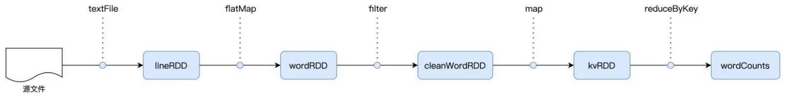

拿 Word Count 当中的 wordRDD 来举例，它的父 RDD 是 lineRDD，因此，它的 dependencies 属性记录的是 lineRDD。从 lineRDD 到 wordRDD 的转换，其所依赖的操作是 flatMap，因此，wordRDD 的 compute 属性，记录的是 flatMap 这个转换函数。 

map、filter、flatMap 和 reduceByKey 这些算子有几个共同点：

* 这 4 个算子都是作用（Apply）在 RDD 之上、用来做 RDD 之间的转换。比如，flatMap 作用在 lineRDD 之上，把 lineRDD 转换为 wordRDD。 
* 这些算子本身是函数，而且它们的参数也是函数。参数是函数、或者返回值是函数的函数，我们把这类函数统称为“高阶函数”（Higher-order Functions）。这四个算子都是高阶函数

RDD 算子有一个共性：RDD 转换。RDD 是 Spark 对于分布式数据集的抽象，每一个 RDD 都代表着一种分布式数据形态。比如 lineRDD，它表示数据在集群中以行（Line）的形式存在；而 wordRDD 则意味着数据的形态是单词，分布在计算集群中。 

RDD 代表的是分布式数据形态，因此，RDD 到 RDD 之间的转换，本质上是数据形态上的转换（Transformations）。 

在 RDD 的编程模型中，一共有两种算子，Transformations 类算子和 Actions 类算子。开发者需要使用 Transformations 类算子，定义并描述数据形态的转换过程，然后调用 Actions 类算子，将计算结果收集起来、或是物化到磁盘。 

在这样的编程模型下，Spark 在运行时的计算被划分为两个环节：

* 基于不同数据形态之间的转换，构建计算流图（DAG，Directed Acyclic Graph）；
* 通过 Actions 类算子，以回溯的方式去触发执行这个计算流图。 

换句话说，开发者调用的各类 Transformations 算子，并不立即执行计算，当且仅当开发者调用 Actions 算子时，之前调用的转换算子才会付诸执行。在业内，这样的计算模式有个专门的术语，叫作“延迟计算”（Lazy Evaluation） 。之所以采用延迟计算，是为了让引擎有足够的时间去对用户代码进行优化。

常用的 RDD 算子：

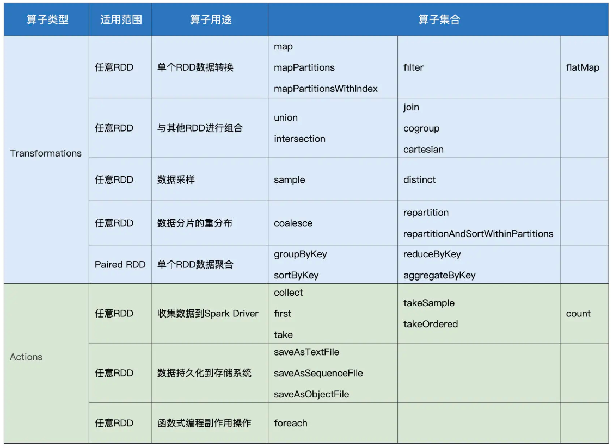

在 Spark 中，创建 RDD 的典型方式有两种： 

* 通过 SparkContext.parallelize 在内部数据之上创建 RDD； 
* 通过 SparkContext.textFile 等 API 从外部数据创建 RDD。 

这里的内部、外部是相对应用程序来说的：

* 开发者在 Spark 应用中自定义的各类数据结构，如数组、列表、映射等，都属于“内部数据” 
* 而“外部数据”指代的，是 Spark 系统之外的所有数据形式，如本地文件系统或是分布式文件系统中的数据，再比如来自其他大数据组件（Hive、Hbase、RDBMS 等）的数据。 

第一种创建方式的用法非常简单，只需要用 parallelize 函数来封装内部数据即可，比如下面的例子： 

~~~scala
import org.apache.spark.rdd.RDD
val words: Array[String] = Array("Spark", "is", "cool")
val rdd: RDD[String] = sc.parallelize(words)
~~~

通常来说，在 Spark 应用内定义体量超大的数据集，其实都是不太合适的，因为数据集完全由 Driver 端创建，且创建完成后，还要在全网范围内跨节点、跨进程地分发到其他 Executors，所以往往会带来性能问题。因此，parallelize API 的典型用法，是在“小数据”之上创建 RDD。 

要想在真正的“大数据”之上创建 RDD，我们还得依赖第二种创建方式，也就是通过 SparkContext.textFile 等 API 从外部数据创建 RDD。 

## 进程模型

分布式计算的精髓，在于如何把抽象的计算流图，转化为实实在在的分布式计算任务，然后以并行计算的方式交付执行。 

在 Spark 分布式计算环境中，有且仅有一个 JVM 进程运行这样的 main 函数，这个特殊的 JVM 进程，在 Spark 中有个专门的术语，叫作“Driver” 。Driver 最核心的作用在于，解析用户代码、构建计算流图，然后将计算流图转化为分布式任务，并把任务分发给集群中的执行进程交付运行。 

Driver 的角色是拆解任务、派活儿，而真正干活儿的“苦力”，是执行进程。在 Spark 的分布式环境中，这样的执行进程可以有一个或是多个，它们也有专门的术语，叫作“Executor”。 

Driver 和 Executor 的关系画成了如下一张图：

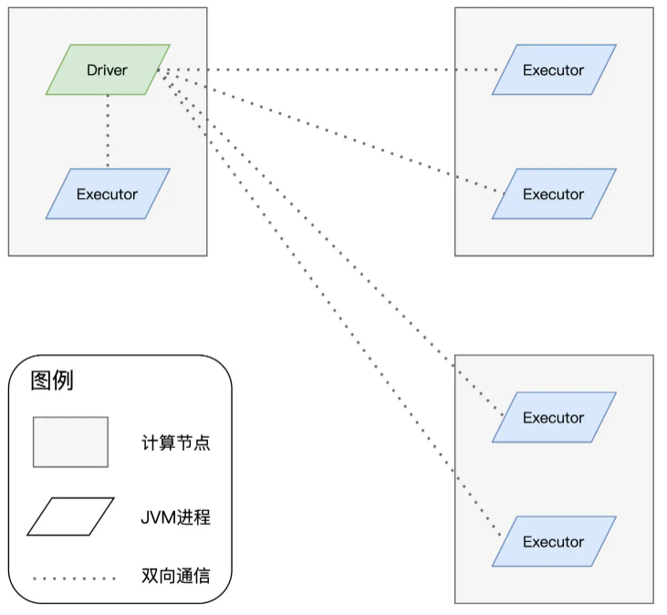

分布式计算的核心是任务调度，而分布式任务的调度与执行，仰仗的是 Driver 与 Executors 之间的通力合作。 

在 Spark 的 Driver 进程中，DAGScheduler、TaskScheduler 和 SchedulerBackend 这三个对象通力合作，依次完成分布式任务调度的 3 个核心步骤，也就是： 

* 根据用户代码构建计算流图； 
* 根据计算流图拆解出分布式任务； 
* 将分布式任务分发到 Executors 中去。 

接收到任务之后，Executors 调用内部线程池，结合事先分配好的数据分片，并发地执行任务代码。对于一个完整的 RDD，每个 Executors 负责处理这个 RDD 的一个数据分片子集。 

## spark-shell 执行过程 

在Spark 本地运行环境下，可以通过spark-shell来执行spark命令，与很多其他系统命令一样，spark-shell 有很多命令行参数，其中最为重要的有两类：一类是用于指定部署模式的 master，另一类则用于指定集群的计算资源容量。 

不带任何参数的 spark-shell 命令，实际上等同于下方这个命令： 

~~~
spark-shell --master local[*]
~~~

这行代码的含义有两层。第一层含义是部署模式，其中 local 关键字表示部署模式为 Local，也就是本地部署；第二层含义是部署规模，也就是方括号里面的数字，它表示的是在本地部署中需要启动多少个 Executors，星号则意味着这个数量与机器中可用 CPU 的个数相一致。 

假设你的笔记本电脑有 4 个 CPU，那么当你在命令行敲入 spark-shell 的时候，Spark 会在后台启动 1 个 Driver 进程和 3 个 Executors 进程。 

将前面的Word Count依次敲入到spark-shell 中 ，它的整体执行过程如下：

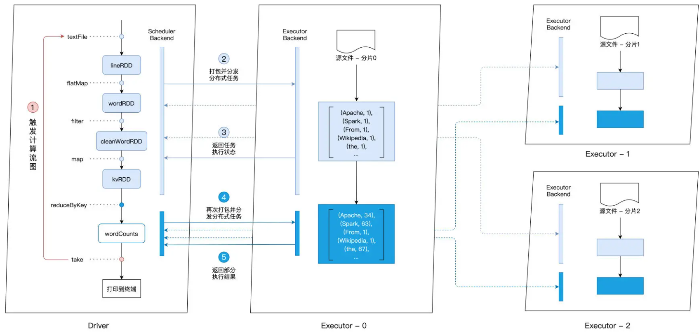

1、首先，Driver 通过 take 这个 Action 算子，来触发执行先前构建好的计算流图。沿着计算流图的执行方向，也就是图中从上到下的方向，Driver 以 Shuffle 为边界创建、分发分布式任务。 

Shuffle 的本意是扑克牌中的“洗牌”，在大数据领域的引申义，表示的是集群范围内跨进程、跨节点的数据交换。 

Shuffle过程的简单解释：在 reduceByKey 算子之前，同一个单词，比如“spark”，可能散落在不用的 Executors 进程，比如图中的 Executor-0、Executor-1 和 Executor-2。换句话说，这些 Executors 处理的数据分片中，都包含单词“spark”。 那么，要完成对“spark”的计数，我们需要把所有“spark”分发到同一个 Executor 进程，才能完成计算。而这个把原本散落在不同 Executors 的单词，分发到同一个 Executor 的过程，就是 Shuffle。 

2、对于 reduceByKey 之前的所有操作，也就是 textFile、flatMap、filter、map 等，Driver 会把它们“捏合”成一份任务，然后一次性地把这份任务打包、分发给每一个 Executors。 

3、三个 Executors 接收到任务之后，先是对任务进行解析，把任务拆解成 textFile、flatMap、filter、map 这 4 个步骤，然后分别对自己负责的数据分片进行处理。 

为了方便说明，我们不妨假设并行度为 3，也就是原始数据文件 wikiOfSpark.txt 被切割成了 3 份，这样每个 Executors 刚好处理其中的一份。数据处理完毕之后，分片内容就从原来的 RDD[String]转换成了包含键值对的 RDD[(String, Int)]，其中每个单词的计数都置位 1。此时 Executors 会及时地向 Driver 汇报自己的工作进展，从而方便 Driver 来统一协调大家下一步的工作。 

4、这个时候，要继续进行后面的聚合计算，也就是计数操作，就必须进行刚刚说的 Shuffle 操作。在不同 Executors 完成单词的数据交换之后，Driver 继续创建并分发下一个阶段的任务，也就是按照单词做分组计数。 

5、数据交换之后，所有相同的单词都分发到了相同的 Executors 上去，这个时候，各个 Executors 拿到 reduceByKey 的任务，只需要各自独立地去完成统计计数即可。完成计数之后，Executors 会把最终的计算结果统一返回给 Driver。 

## 分布式环境部署

Spark 支持多种分布式部署模式，如 Standalone、YARN、Mesos、Kubernetes。其中 Standalone 是 Spark 内置的资源调度器，而 YARN、Mesos、Kubernetes 是独立的第三方资源调度与服务编排框架。 

Standalone 在资源调度层面，采用了一主多从的主从架构，把计算节点的角色分为 Master 和 Worker。其中，Master 有且只有一个，而 Worker 可以有一到多个。所有 Worker 节点周期性地向 Master 汇报本节点可用资源状态，Master 负责汇总、变更、管理集群中的可用资源，并对 Spark 应用程序中 Driver 的资源请求作出响应。 

Standalone部署模式下，Master与Worker角色是通过配置文件配置好的。在Standalone部署下，先启动Master，然后启动Worker，由于配置中有Master的连接地址，所以Worker启动的时候，会自动去连接Master，然后双方建立心跳机制，随后集群进入ready状态。 

Master、Worker与Driver、Executors的关系：

* 它们都是JVM进程
* Master、Worker用来做资源的调度与分配，它们负责维护集群中可用硬件资源的状态，具体来说，Worker记录着每个计算节点可用CPU cores、可用内存，等等。而Master从Worker收集并汇总所有集群中节点的可用计算资源。 
* Driver和Executors是Spark应用级别的进程，Driver、Executors的计算资源，全部来自于Master的调度。 

## 调度系统

分布式计算的精髓，在于如何把抽象的计算图，转化为实实在在的分布式计算任务，然后以并行计算的方式交付执行。深入理解分布式计算，是我们做好大数据开发的关键和前提，它能有效避免我们掉入“单机思维”的陷阱，同时也能为性能导向的开发奠定坚实基础。 

Spark调度系统关键步骤与核心组件如下：

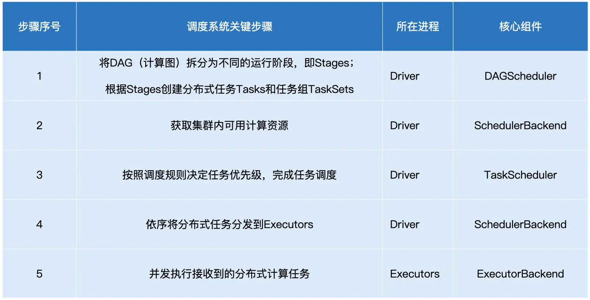

把调度系统和建筑公司进行对比，可以类比成如下的对应关系：

* 一个总公司（Driver），和多个分公司（Executors） 
* 斯巴克（Spark） 的主要服务对象是建筑设计师（开发者），建筑设计师负责提供设计图纸（用户代码、计算图），而斯巴克公司的主营业务是将图纸落地、建造起一栋栋高楼大厦。 
* 知名架构师“戴格”（DAGScheduler） ，它能看懂图纸、并将其转化为建筑项（封装、转换任务）
* 塔斯克（TaskScheduler） 是总公司施工经理（调度），拜肯德（SchedulerBackend） 是总公司人力资源总监（管理硬件资源）

TaskScheduler和SchedulerBackend两个组件，在 SparkContext / SparkSession 的初始化中，两者是最早、且同时被创建的调度系统组件，二者互相依赖。

SchedulerBackend 组件的实例化，取决于开发者指定的 Spark MasterURL，也就是我们使用 spark-shell（或是 spark-submit）时指定的–master 参数，如“–master spark://ip:host”就代表 Standalone 部署模式，“–master yarn”就代表 YARN 模式等等。 SchedulerBackend 与资源管理器（Standalone、YARN、Mesos 等）强绑定，是资源管理器在 Spark 中的代理。 

总的来说，DAGScheduler 是任务调度的发起者，DAGScheduler 以 TaskSet 为粒度，向 TaskScheduler 提交任务调度请求。TaskScheduler 在初始化的过程中，会创建任务调度队列，任务调度队列用于缓存 DAGScheduler 提交的 TaskSets。TaskScheduler 结合 SchedulerBackend 提供的 WorkerOffer，按照预先设置的调度策略依次对队列中的任务进行调度：

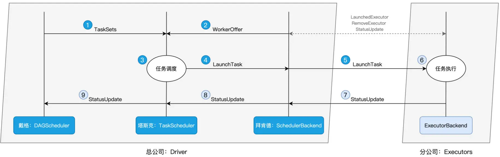

简而言之，DAGScheduler 手里有“活儿”，SchedulerBackend 手里有“人力”，TaskScheduler 的核心职能，就是把合适的“活儿”派发到合适的“人”的手里。由此可见，TaskScheduler 承担的是承上启下、上通下达的关键角色。

### DAGScheduler

它的核心职责是把计算图 DAG 拆分为执行阶段 Stages，Stages 指的是不同的运行阶段，同时还要负责把 Stages 转化为任务集合 TaskSets，也就是把“建筑图纸”转化成可执行、可操作的“建筑项目”。 

DAG 全称 Direct Acyclic Graph，中文叫有向无环图。顾名思义，DAG 是一种“图” ，这种图顶点是一个个 RDD，边则是 RDD 之间通过 dependencies 属性构成的父子关系。 

用一句话来概括从 DAG 到 Stages 的拆分过程，那就是：以 Actions 算子为起点，从后向前回溯 DAG，以 Shuffle 操作为边界去划分 Stages。 

以Word Count 为例介绍这个过程，之前提到提到 Spark 作业的运行分为两个环节，第一个是以惰性的方式构建计算图，第二个则是通过 Actions 算子触发作业的从头计算： 

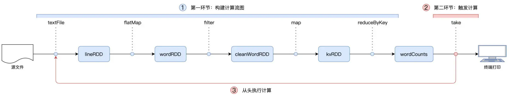

对于图中的第二个环节，Spark 在实际运行的过程中，会把它再细化为两个步骤。第一个步骤，就是以 Shuffle 为边界，从后向前以递归的方式，把逻辑上的计算图 DAG，转化成一个又一个 Stages：


以 Word Count 为例，Spark 以 take 算子为起点，依次把 DAG 中的 RDD 划入到第一个 Stage，直到遇到 reduceByKey 算子。由于 reduceByKey 算子会引入 Shuffle，因此第一个 Stage 创建完毕，且只包含 wordCounts 这一个 RDD。接下来，Spark 继续向前回溯，由于未曾碰到会引入 Shuffle 的算子，因此它把“沿途”所有的 RDD 都划入了第二个 Stage。 

在 Stages 创建完毕之后，就到了触发计算的第二个步骤：Spark从后向前，以递归的方式，依次提请执行所有的 Stages：

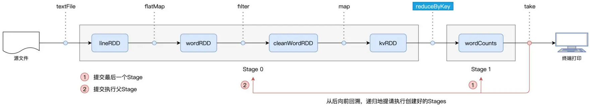

具体来说，在 Word Count 的例子中，DAGScheduler 最先提请执行的是 Stage1。在提交的时候，DAGScheduler 发现 Stage1 依赖的父 Stage，也就是 Stage0，还没有执行过，那么这个时候它会把 Stage1 的提交动作压栈，转而去提请执行 Stage0。当 Stage0 执行完毕的时候，DAGScheduler 通过出栈的动作，再次提请执行 Stage 1。 

对于提请执行的每一个 Stage，DAGScheduler 根据 Stage 内 RDD 的 partitions 属性创建分布式任务集合 TaskSet。TaskSet 包含一个又一个分布式任务 Task，RDD 有多少数据分区，TaskSet 就包含多少个 Task。换句话说，Task 与 RDD 的分区，一个Task一定对应RDD的分区。 下面是Task 的关键属性：

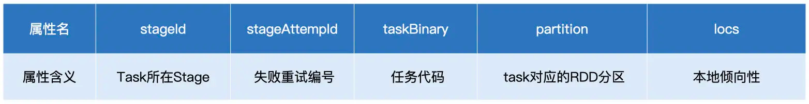

在上表中，stageId、stageAttemptId 标记了 Task 与执行阶段 Stage 的所属关系；taskBinary 则封装了隶属于这个执行阶段的用户代码；partition 就是我们刚刚说的 RDD 数据分区；locs 属性以字符串的形式记录了该任务倾向的计算节点或是 Executor ID。 

taskBinary、partition 和 locs 这三个属性，一起描述了这样一件事情：Task 应该在哪里（locs）为谁（partition）执行什么任务（taskBinary）。 

总结一下，DAGScheduler 的主要职责有三个： 

* 根据用户代码构建 DAG； 
* 以 Shuffle 为边界切割 Stages； 
* 基于 Stages 创建 TaskSets，并将 TaskSets 提交给 TaskScheduler 请求调度。 

Stage 中的内存计算是真正区别于MapReduce的地方，在MapReduce中，它提供两类计算抽象，分别是 Map 和 Reduce：Map 抽象允许开发者通过实现 map 接口来定义数据处理逻辑；Reduce 抽象则用于封装数据聚合逻辑。MapReduce 计算模型最大的问题在于，所有操作之间的数据交换都以磁盘为媒介。 例如，两个 Map 操作之间的计算，以及 Map 与 Reduce 操作之间的计算都是利用本地磁盘来交换数据的。不难想象，这种频繁的磁盘 I/O 必定会拖累用户应用端到端的执行性能： 


Spark不是简单的把数据和计算挪到内存，在 Spark 中，流水线计算模式指的是：在同一 Stage 内部，所有算子融合为一个函数，Stage 的输出结果由这个函数一次性作用在输入数据集而产生。 这样一来，在Stage内部就不会生成中间数据形态。

Spark的内存计算，不仅仅是指数据可以缓存在内存中（后面讲到的Cache），还有通过计算的融合来大幅提升数据在内存中的转换效率，进而从整体上提升应用的执行性能。

因为计算的融合只发生在 Stages 内部，而 Shuffle 是切割 Stages 的边界，因此一旦发生 Shuffle，内存计算的代码融合就会中断。 所以应该尽量避免 Shuffle，让应用代码中尽可能多的部分融合为一个函数，从而提升计算效率。 

它完成了“建筑图纸”到“建筑项目”的转化，接下来它要把这些任务下派给TaskScheduler，TaskScheduler想把活委派出去之前，必须清楚当前的资源情况，这需要SchedulerBackend的帮忙。

###SchedulerBackend

它的主要职责就是管理Spark的计算资源。对于集群中可用的计算资源，SchedulerBackend 用一个叫做 ExecutorDataMap 的数据结构，来记录每一个计算节点中 Executors 的资源状态。 

这里的 ExecutorDataMap 是一种 HashMap，它的 Key 是标记 Executor 的字符串，Value 是一种叫做 ExecutorData 的数据结构。ExecutorData 用于封装 Executor 的资源状态，如 RPC 地址、主机地址、可用 CPU 核数和满配 CPU 核数等等，它相当于是对 Executor 做的“资源画像” ：

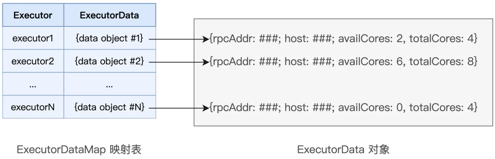

有了 ExecutorDataMap 这本“人力资源小册子”，对内，SchedulerBackend 可以就 Executor 做“资源画像”；对外，SchedulerBackend 以 WorkerOffer 为粒度提供计算资源。其中，WorkerOffer 封装了 Executor ID、主机地址和 CPU 核数，它用来表示一份可用于调度任务的空闲资源。 

基于 Executor 资源画像，SchedulerBackend 可以同时提供多个 WorkerOffer 用于分布式任务调度。WorkerOffer 这个名字起得很传神，Offer 的字面意思是公司给你提供的工作机会，到了 Spark 调度系统的上下文，它就变成了使用硬件资源的机会。 

SchedulerBackend 与集群内所有 Executors 中的 ExecutorBackend 保持周期性通信，双方通过 LaunchedExecutor、RemoveExecutor、StatusUpdate 等消息来互通有无、变更可用计算资源，所以在Driver中的SchedulerBackend 也能对整个集群中的计算资源了如指掌。

### TaskScheduler

它的核心职责是，结合 SchedulerBackend 提供的 WorkerOffer，选出最合适的任务派发出去，这是任务调度的核心所在。

如果从供需的角度看待任务调度，DAGScheduler 就是需求端，SchedulerBackend 就是供给端。 TaskScheduler 的职责是，基于既定的规则与策略达成供需双方的匹配与撮合。 

TaskScheduler 的调度策略分为两个层次，一个是不同 Stages 之间的调度优先级，一个是 Stages 内不同任务之间的调度优先级。 

1、对于两个或多个 Stages，如果它们彼此之间不存在依赖关系、互相独立，在面对同一份可用计算资源的时候，它们之间就会存在竞争关系。 

对于这种 Stages 之间的任务调度，TaskScheduler 提供了 2 种调度模式，分别是 FIFO（先到先得）和 FAIR（公平调度） ，FAIR 公平调度模式下哪个 Stages 优先被调度，取决于用户在配置文件 fairscheduler.xml 中的定义。 在配置文件中，Spark 允许用户定义不同的调度池，每个调度池可以指定不同的调度优先级，用户在开发过程中可以关联不同作业与调度池的对应关系，这样不同 Stages 的调度就直接和开发者的意愿挂钩，也就能享受不同的优先级待遇。 

2、对于同一个 Stages 内部不同任务之间的调度优先级，TaskScheduler 会优先挑选那些满足本地性级别要求的任务进行分发。也就是按照任务的“个人意愿”优先满足。

对于给定的 WorkerOffer，TaskScheduler 是按照任务的本地倾向性，来遴选出 TaskSet 中适合调度的 Tasks。 

之前说过，Task 与 RDD 的 partitions 是一一对应的，在创建 Task 的过程中，DAGScheduler 会根据数据分区的物理地址，来为 Task 设置 locs 属性。locs 属性记录了数据分区所在的计算节点、甚至是 Executor 进程 ID。 

举例来说，当我们调用 textFile API 从 HDFS 文件系统中读取源文件时，Spark 会根据 HDFS NameNode 当中记录的元数据，获取数据分区的存储地址，例如 node0:/rootPath/partition0-replica0，node1:/rootPath/partition0-replica1 和 node2:/rootPath/partition0-replica2。 那么，DAGScheduler 在为该数据分区创建 Task0 的时候，会把这些地址中的计算节点记录到 Task0 的 locs 属性。 如此一来，当 TaskScheduler 需要调度 Task0 这个分布式任务的时候，根据 Task0 的 locs 属性，它就知道：“Task0 所需处理的数据分区，在节点 node0、node1、node2 上存有副本，因此，如果 WorkOffer 是来自这 3 个节点的计算资源，那对 Task0 来说就是投其所好”。 

从上面这个例子可以理解到：每个任务都是自带本地倾向性的，换句话说，每个任务都有自己的“调度意愿”。 

像上面这种定向到计算节点粒度的本地性倾向，Spark 中的术语叫做 NODE_LOCAL。除了定向到节点，Task 还可以定向到进程（Executor）、机架、任意地址，它们对应的术语分别是 PROCESS_LOCAL、RACK_LOCAL 和 ANY。 

对于倾向 PROCESS_LOCAL 的 Task 来说，它要求对应的数据分区在某个进程（Executor）中存有副本；而对于倾向 RACK_LOCAL 的 Task 来说，它仅要求相应的数据分区存在于同一机架即可。ANY 则等同于无定向，也就是 Task 对于分发的目的地没有倾向性，被调度到哪里都可以。 

本地倾向性是有优先顺序的：从 PROCESS_LOCAL、NODE_LOCAL、到 RACK_LOCAL、再到 ANY，Task 的本地性倾向逐渐从严苛变得宽松。TaskScheduler 接收到 WorkerOffer 之后，也正是按照这个顺序来遍历 TaskSet 中的 Tasks，优先调度本地性倾向为 PROCESS_LOCAL 的 Task，而 NODE_LOCAL 次之，RACK_LOCAL 为再次，最后是 ANY。 

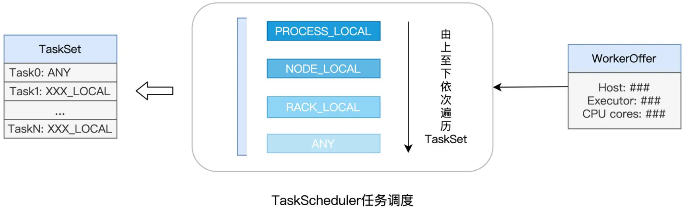

不同的本地性倾向，本质上是用来区分计算（代码）与数据之间的关系。Spark 调度系统的核心思想，是“数据不动、代码动”。也就是说，在任务调度的过程中，为了完成分布式计算，Spark 倾向于让数据待在原地、保持不动，而把计算任务（代码）调度、分发到数据所在的地方，从而消除数据分发引入的性能隐患。毕竟，相比分发数据，分发代码要轻量得多。 

本地性倾向则意味着代码和数据应该在哪里“相会”，PROCESS_LOCAL 是在 JVM 进程中，NODE_LOCAL 是在节点内，RACK_LOCAL 是不超出物理机架的范围，而 ANY 则代表“无所谓、不重要”。 

结合 WorkerOffer 与任务的本地性倾向，TaskScheduler挑选出任务，把这些 Tasks 通过 LaunchTask 消息发送给SchedulerBackend，SchedulerBackend 拿到这些Task后，同样使用 LaunchTask 消息，把活儿进一步下发给分公司（Executors）的小弟：ExecutorBackend。 

### ExecutorBackend 

ExecutorBackend拿到任务后，会将任务派发给线程，它就是Executors 线程池中一个又一个的 CPU 线程，每个线程负责处理一个 Task。 

每当 Task 处理完毕，这些线程便会通过 ExecutorBackend，向 Driver 端的 SchedulerBackend 发送 StatusUpdate 事件，告知 Task 执行状态。接下来，TaskScheduler 与 SchedulerBackend 通过接力的方式，最终把状态汇报给 DAGScheduler。

对于同一个 TaskSet 当中的 Tasks 来说，当它们分别完成了任务调度与任务执行这两个环节时，对照调度系统的步骤 1 到步骤 9 的计算过程，Spark 调度系统就完成了 DAG 中某一个 Stage 的任务调度。 

一个 DAG 会包含多个 Stages，一个 Stage 的结束即宣告下一个 Stage 的开始。只有当所有的 Stages 全部调度、执行完毕，才表示一个完整的 Spark 作业宣告结束。 

### 总结

具体说来，任务调度分为如下 5 个步骤： 

1、DAGScheduler 以 Shuffle 为边界，将开发者设计的计算图 DAG 拆分为多个执行阶段 Stages，然后为每个 Stage 创建任务集 TaskSet。 

2、SchedulerBackend 通过与 Executors 中的 ExecutorBackend 的交互来实时地获取集群中可用的计算资源，并将这些信息记录到 ExecutorDataMap 数据结构。 

3、与此同时，SchedulerBackend 根据 ExecutorDataMap 中可用资源创建 WorkerOffer，以 WorkerOffer 为粒度提供计算资源。 

4、对于给定 WorkerOffer，TaskScheduler 结合 TaskSet 中任务的本地性倾向，按照 PROCESS_LOCAL、NODE_LOCAL、RACK_LOCAL 和 ANY 的顺序，依次对 TaskSet 中的任务进行遍历，优先调度本地性倾向要求苛刻的 Task。 

5、被选中的 Task 由 TaskScheduler 传递给 SchedulerBackend，再由 SchedulerBackend 分发到 Executors 中的 ExecutorBackend。Executors 接收到 Task 之后，即调用本地线程池来执行分布式任务。 

## Shuffle

Shuffle 的本意是扑克的“洗牌”，在分布式计算场景中，它被引申为集群范围内跨节点、跨进程的数据分发。 

Shuffle 的过程也是类似，分布式数据集在集群内的分发，会引入大量的磁盘 I/O 与网络 I/O。在 DAG 的计算链条中，Shuffle 环节的执行性能是最差的。虽然它是性能最差的，但是却不可避免，计算过程之所以需要 Shuffle，往往是由计算逻辑、或者说业务逻辑决定的。 

例如在 Word Count 的例子中，我们的“业务逻辑”是对单词做统计计数，那么对单词“Spark”来说，在做“加和”之前，我们就是得把原本分散在不同 Executors 中的“Spark”，拉取到某一个 Executor，才能完成统计计数的操作。 

我们发现在绝大多数的业务场景中，Shuffle 操作都是必需的、无法避免的。 

在Word Count 的例子中，引入 Shuffle 操作的是 reduceByKey 算子：

~~~scala
// 按照单词做分组计数
val wordCounts: RDD[(String, Int)] = kvRDD.reduceByKey((x, y) => x + y) 
~~~

 直观地回顾一下这一步的计算过程：

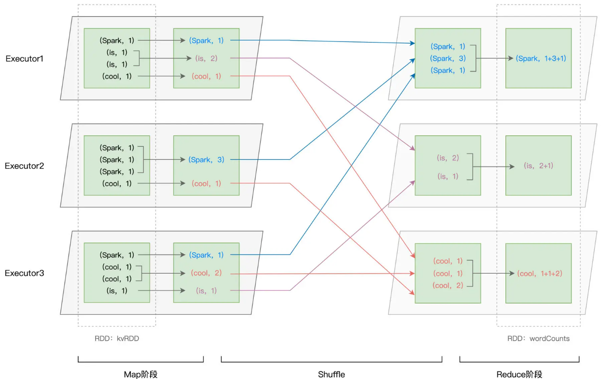

如上图所示，以 Shuffle 为边界，reduceByKey 的计算被切割为两个执行阶段。约定俗成地，我们把 Shuffle 之前的 Stage 叫作 Map 阶段，而把 Shuffle 之后的 Stage 称作 Reduce 阶段。 几个阶段：

* 在 Map 阶段，每个 Executors 先把自己负责的数据分区做初步聚合（又叫 Map 端聚合、局部聚合） 
* 在 Shuffle 环节，不同的单词被分发到不同节点的 Executors 中； 
* 最后的 Reduce 阶段，Executors 以单词为 Key 做第二次聚合（又叫全局聚合），从而完成统计计数的任务。 

Map 阶段与 Reduce 阶段的计算过程相对清晰明了，二者都是利用 reduce 运算完成局部聚合与全局聚合。在 reduceByKey 的计算过程中，Shuffle 才是关键。 与其说 Shuffle 是跨节点、跨进程的数据分发，不如说 Shuffle 是 Map 阶段与 Reduce 阶段之间的数据交换。 

### 中间文件

Map 阶段与 Reduce 阶段，通过生产与消费 Shuffle 中间文件的方式，来完成集群范围内的数据交换。换句话说，Map 阶段生产 Shuffle 中间文件，Reduce 阶段消费 Shuffle 中间文件，二者以中间文件为媒介，完成数据交换。 

中间文件的产生和消费过程：

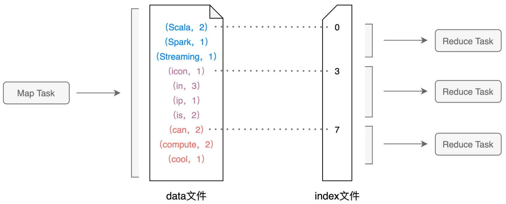

DAGScheduler 会为每一个 Stage 创建任务集合 TaskSet，而每一个 TaskSet 都包含多个分布式任务（Task）。在 Map 执行阶段，每个 Task（以下简称 Map Task）都会生成包含 data 文件与 index 文件的 Shuffle 中间文件，如上图所示。也就是说，Shuffle 文件的生成，是以 Map Task 为粒度的，Map 阶段有多少个 Map Task，就会生成多少份 Shuffle 中间文件。 （Task和分区又是一一对应的，有多少分区就会有多少中间文件）

Shuffle 中间文件是统称、泛指，它包含两类实体文件：

* 一个是记录（Key，Value）键值对的 data 文件 
* 另一个是记录键值对所属 Reduce Task 的 index 文件。换句话说，index 文件标记了 data 文件中的哪些记录，应该由下游 Reduce 阶段中的哪些 Task（简称 Reduce Task）消费。 

Map 阶段最终生产的数据会以中间文件的形式物化到磁盘中，这些中间文件就存储在 spark.local.dir 设置的文件目录里。 

在上图中，为了方便示意，我们把首字母是 S、i、c 的单词分别交给下游的 3 个 Reduce Task 去消费，显然，这里的数据交换规则是单词首字母。 （其实对于word count来说，只要相同的字母能被分到一个分区就可以了）。在 Spark 中，Shuffle 环节实际的数据交换规则要比这复杂得多。数据交换规则又叫分区规则，因为它定义了分布式数据集在 Reduce 阶段如何划分数据分区。假设 Reduce 阶段有 N 个 Task，这 N 个 Task 对应着 N 个数据分区，那么在 Map 阶段，每条记录应该分发到哪个 Reduce Task，是由下面的公式来决定的：

~~~
P = Hash(Record Key) % N
~~~

对于任意一条数据记录，Spark 先按照既定的哈希算法，计算记录主键的哈希值，然后把哈希值对 N 取模，计算得到的结果数字，就是这条记录在 Reduce 阶段的数据分区编号 P。换句话说，这条记录在 Shuffle 的过程中，应该被分发到 Reduce 阶段的 P 号分区。 

在整个过程中，map生成文件的分区数量与 Reduce 阶段的并行度保持一致。 中间文件的数量与 Map 阶段的并行度保持一致。换句话说，有多少个 Task，Map 阶段就会生产相应数量的数据文件和索引文件。 

### Shuffle Write 

Shuffle 中间文件，是以 Map Task 为粒度生成的。以下图中的 Map Task 以及与之对应的数据分区为例，来讲解中间文件的生成过程。数据分区的数据内容如图中绿色方框所示： 

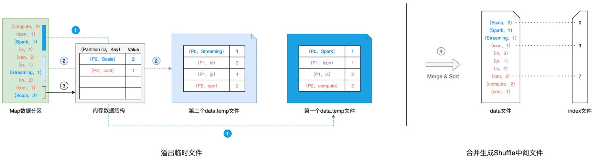

在生成中间文件的过程中，Spark 会借助一种类似于 Map 的数据结构，来计算、缓存并排序数据分区中的数据记录。这种 Map 结构的 Key 是（Reduce Task Partition ID，Record Key），而 Value 是原数据记录中的数据值，如图中的“内存数据结构”所示。最理想的情况是内存够大，足以容纳分区中的所有数据，但是经常会出现内存不足的情况，此时就要将内存数据溢出到磁盘中。 

对于数据分区中的数据记录，Spark 会根据我们前面提到的公式逐条计算记录所属的目标分区 ID，然后把主键（Reduce Task Partition ID，Record Key）和记录的数据值插入到 Map 数据结构中。当 Map 结构被灌满之后，Spark 根据主键对 Map 中的数据记录做排序，然后把所有内容溢出到磁盘中的临时文件，如图中的步骤 1 所示。 

随着 Map 结构被清空，Spark 可以继续读取分区内容并继续向 Map 结构中插入数据，直到 Map 结构再次被灌满而再次溢出，如图中的步骤 2 所示。就这样，如此往复，直到数据分区中所有的数据记录都被处理完毕。 

到此为止，磁盘上存有若干个溢出的临时文件，而内存的 Map 结构中留有部分数据，Spark 使用归并排序算法对所有临时文件和 Map 结构剩余数据做合并，分别生成 data 文件、和与之对应的 index 文件，如图中步骤 4 所示。Shuffle 阶段生成中间文件的过程，又叫 Shuffle Write。 

总结下来，Shuffle 中间文件的生成过程，分为如下几个步骤： 

1、对于数据分区中的数据记录，逐一计算其目标分区，然后填充内存数据结构； 

2、当数据结构填满后，如果分区中还有未处理的数据记录，就对结构中的数据记录按（目标分区 ID，Key）排序，将所有数据溢出到临时文件，同时清空数据结构； 

3、重复前 2 个步骤，直到分区中所有的数据记录都被处理为止； 

4、对所有临时文件和内存数据结构中剩余的数据记录做归并排序，生成数据文件和索引文件。 

上面就是Spark 在 Map 阶段生产 Shuffle 中间文件的过程，接下来在 Reduce 阶段，不同的 Tasks会基于这些中间文件，来定位属于自己的那部分数据，来完成数据拉取。

### Shuffle Read

需要注意的是，对于每一个 Map Task 生成的中间文件，其中的目标分区数量是由 Reduce 阶段的任务数量（又叫并行度）决定的。 

在下面的示意图中，Reduce 阶段的并行度是 3，因此，Map Task 的中间文件会包含 3 个目标分区的数据，而 index 文件，恰恰是用来标记目标分区所属数据记录的起始索引。 

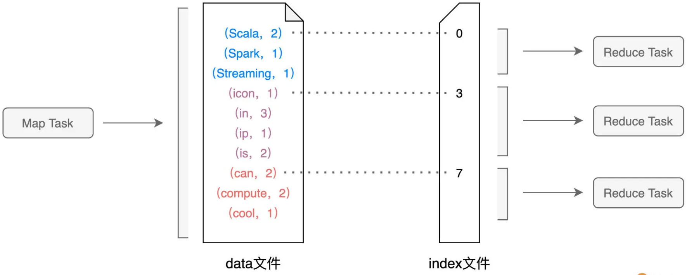

对于所有 Map Task 生成的中间文件，Reduce Task 需要通过网络从不同节点的硬盘中下载并拉取属于自己的数据内容。不同的 Reduce Task 正是根据 index 文件中的起始索引来确定哪些数据内容是“属于自己的”。Reduce 阶段不同于 Reduce Task 拉取数据的过程，往往也被叫做 Shuffle Read。 

综合来说，Shuffle 的计算会消耗所有类型的硬件资源。具体来说，Shuffle 中的哈希与排序操作会大量消耗 CPU，而 Shuffle Write 生成中间文件的过程，会消耗宝贵的内存资源与磁盘 I/O，最后，Shuffle Read 阶段的数据拉取会引入大量的网络 I/O。不难发现，Shuffle 是资源密集型计算，因此理解 Shuffle 对开发者来说至关重要。 

不仅如此，Shuffle 消耗的不同硬件资源之间很难达到平衡。磁盘和网络的消耗是 Shuffle 中必需的环节。但是，磁盘与网络的处理延迟相比 CPU 和内存要相差好几个数量级。 

## 内存管理

### Executor内存

相比其他大数据计算引擎，关于 Spark 的特性与优势就是内存计算，合理而又充分地利用内存资源，是 Spark 的核心竞争力之一。

对于任意一个 Executor 来说，Spark 会把内存分为 4 个区域，分别是 Reserved Memory、User Memory、Execution Memory 和 Storage Memory：

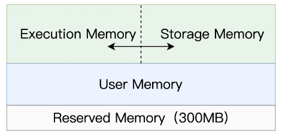

1、Reserved Memory 固定为 300MB，不受开发者控制，它是 Spark 预留的、用来存储各种 Spark 内部对象的内存区域；

2、User Memory 用于存储开发者自定义的数据结构，例如 RDD 算子中引用的数组、列表、映射等等。 

3、Execution Memory 用来执行分布式任务。分布式任务的计算，主要包括数据的转换、过滤、映射、排序、聚合、归并等环节，而这些计算环节的内存消耗，统统来自于 Execution Memory。 

4、Storage Memory 用于缓存分布式数据集，比如 RDD Cache、广播变量等等。 

在所有的内存区域中，Execution Memory 和 Storage Memory 是最重要的，也是开发者最需要关注的。 

在 Spark 1.6 版本之前，Execution Memory 和 Storage Memory 的空间划分是静态的，一旦空间划分完毕，不同内存区域的用途与尺寸就固定了。也就是说，即便你没有缓存任何 RDD 或是广播变量，Storage Memory 区域的空闲内存也不能用来执行映射、排序或聚合等计算任务，宝贵的内存资源就这么白白地浪费掉了。 

考虑到静态内存划分的弊端，在 1.6 版本之后，Spark 推出了统一内存管理模式，在这种模式下，Execution Memory 和 Storage Memory 之间可以相互转化。 它们之间的抢占规则如下：

* 如果对方的内存空间有空闲，双方可以互相抢占； 
* 对于 Storage Memory 抢占的 Execution Memory 部分，当分布式任务有计算需要时，Storage Memory 必须立即归还抢占的内存，涉及的缓存数据要么落盘、要么清除； 
* 对于 Execution Memory 抢占的 Storage Memory 部分，即便 Storage Memory 有收回内存的需要，也必须要等到分布式任务执行完毕才能释放。 

可分配的执行内存总量会随着缓存任务和执行任务的此消彼长，而动态变化。但无论怎么变，可用的执行内存总量，都不会低于配置项设定的初始值。 

在管理方式上，Spark除了堆内内存（On-heap Memory） ，还有堆外内存（Off-heap Memory） ：

* 堆内内存的申请与释放统一由 JVM 代劳。 

  比如说，Spark 需要内存来实例化对象，JVM 负责从堆内分配空间并创建对象，然后把对象的引用返回，最后由 Spark 保存引用，同时记录内存消耗。反过来也是一样，Spark 申请删除对象会同时记录可用内存，JVM 负责把这样的对象标记为“待删除”，然后再通过垃圾回收（Garbage Collection，GC）机制将对象清除并真正释放内存。 

  在这样的管理模式下，Spark 对内存的释放是有延迟的，因此，当 Spark 尝试估算当前可用内存时，很有可能会高估堆内的可用内存空间。 

  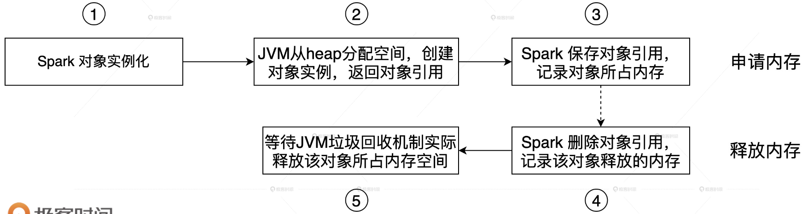

* 堆外内存则不同，Spark 通过调用 Unsafe 的 allocateMemory 和 freeMemory 方法直接在操作系统内存中申请、释放内存空间 

  这样的内存管理方式自然不再需要垃圾回收机制，也就免去了它带来的频繁扫描和回收引入的性能开销。更重要的是，空间的申请与释放可以精确计算，因此 Spark 对堆外可用内存的估算会更精确，对内存的利用率也更有把握。 

Spark 把堆外内存划分为两块区域：一块用于执行分布式任务，如 Shuffle、Sort 和 Aggregate 等操作，这部分内存叫做 Execution Memory；一块用于缓存 RDD 和广播变量等数据，它被称为 Storage Memory。 

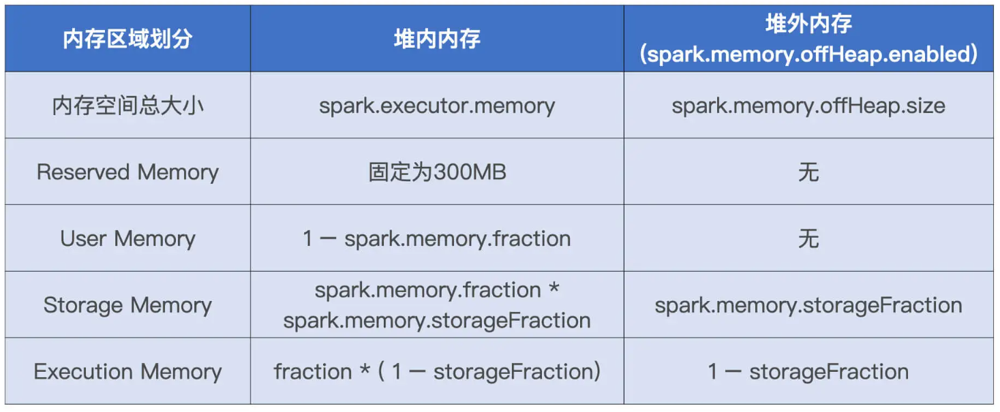

内存是用堆外，还是堆内，是以Job为粒度的，也就是说，要设置堆外内存，我们得确保堆外大小足以应对当前的作业，作业里面所有的tasks，都只能用堆外（如果作业在内存设置上用了堆外） ，例如开启了堆外内存，设置了rdd.persist(StorageLevel.OFF_HEAP) 就可以将RDD缓存在堆外。

以下面的代码为例，来说明一下内存区域，示例代码很简单，目的是读取 words.csv 文件，然后对其中指定的单词进行统计计数：

~~~scala
val dict: List[String] = List(“spark”, “scala”)
val words: RDD[String] = sparkContext.textFile(“~/words.csv”)
val keywords: RDD[String] = words.filter(word => dict.contains(word))
keywords.cache
keywords.count
keywords.map((_, 1)).reduceByKey(_ + _).collect
~~~

逐行分析：

* 第一行定义了 dict 字典，这个字典在 Driver 端生成，它在后续的 RDD 调用中会随着任务一起分发到 Executor 端。 
* 第二行读取 words.csv 文件并生成 RDD words。 
* 第三行很关键，用 dict 字典对 words 进行过滤，此时 dict 已分发到 Executor 端，Executor 将其存储在堆内存中，用于对 words 数据分片中的字符串进行过滤。Dict 字典属于开发者自定义数据结构，因此，Executor 将其存储在 User Memory 区域。 
* 接着，第四行和第五行用 cache 和 count 对 keywords RDD 进行缓存，以备后续频繁访问，分布式数据集的缓存占用的正是 Storage Memory 内存区域。 
* 在最后一行代码中，我们在 keywords 上调用 reduceByKey 对单词分别计数。我们知道，reduceByKey 算子会引入 Shuffle，而 Shuffle 过程中所涉及的内部数据结构，如映射、排序、聚合等操作所仰仗的 Buffer、Array 和 HashMap，都会消耗 Execution Memory 区域中的内存。 

对象到底存在哪里，决定了是在User Memory还是Executor Memory，例如RDD[Student] 就肯定是消耗Execution memory。 

### 配置解析

Executor JVM Heap 的划分，由图中的 3 个配置项来决定： 


其中 spark.executor.memory 是绝对值，它指定了 Executor 进程的 JVM Heap 总大小。另外两个配置项，spark.memory.fraction 和 spark.memory.storageFraction 都是比例值，它们指定了划定不同区域的空间占比。 

spark.memory.fraction 用于标记 Spark 处理分布式数据集的内存总大小，这部分内存包括 Execution Memory 和 Storage Memory 两部分，也就是图中绿色的矩形区域。（M – 300）* （1 – mf）刚好就是 User Memory 的区域大小，也就是图中蓝色区域的部分。 

spark.memory.storageFraction 则用来进一步区分 Execution Memory 和 Storage Memory 的初始大小。我们之前说过，Reserved Memory 固定为 300MB。（M – 300）* mf * sf 是 Storage Memory 的初始大小，相应地，（M – 300）* mf * （1 – sf）就是 Execution Memory 的初始大小。 

关于堆外内存，如果想要提升堆外内存，让Spark加速执行效率，就要调整off heap参数：一个用来enable(spark.memory.offHeap.enabled=true)、一个指定大小(spark.memory.offHeap.size) ，对于配置spark.executor.memoryOverhead建议不要调整，它是container的预留一部分内存，主要存储nio buffer，函数栈等一些开销，它的作用主要是维持运行时的稳定性。

### CPU利用率

有时会出现应用CPU利用率低的问题，想提高CPU利用率，就要平衡并行度、并发度与执行内存。

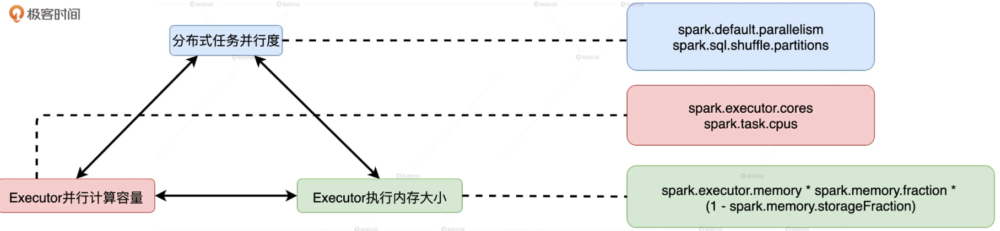

Task在Executor 线程池中执行时，会涉及到多个任务抢占一个Executor 线程池的情况，在同一个 Executor 中，当有多个（记为 N）线程尝试抢占执行内存时，需要遵循 2 条基本原则： 

* 执行内存总大小（记为 M）为两部分之和，一部分是 Execution Memory 初始大小，另一部分是 Storage Memory 剩余空间 
* 每个线程分到的可用内存有一定的上下限，下限是 M/N/2，上限是 M/N，也就是均值 

就 Executor 的线程池来说，尽管线程本身可以复用，但每个线程在同一时间只能计算一个任务，每个任务负责处理一个数据分片。因此，在运行时，线程、任务与分区是一一对应的关系。 分布式任务由 Driver 分发到 Executor 后，Executor 将 Task 封装为 TaskRunner，然后将其交给可回收缓存线程池（newCachedThreadPool）。线程池中的线程领取到 TaskRunner 之后，向 Execution Memory 申请内存，然后开始执行任务。 

在统一内存管理模式下，在 Storage Memory 没有被 RDD 缓存占满的情况下，执行任务可以动态地抢占 Storage Memory。 

原因可能有几个：

1、线程挂起

在给定执行内存总量 M 和线程总数 N 的情况下，为了保证每个线程都有机会拿到适量的内存去处理数据，Spark 用 HashMap 数据结构，以（Key，Value）的方式来记录每个线程消耗的内存大小，并确保所有的 Value 值都不超过 M/N。在一些极端情况下，有些线程申请不到所需的内存空间，能拿到的内存合计还不到 M/N/2。这个时候，Spark 就会把线程挂起，直到其他线程释放了足够的内存空间为止。 

有的线程连 M/N/2 都拿不到的情况：

* 执行内存总量 M 动态变化，有时执行任务可以动态地抢占 Storage Memory，此时M就会大一些，当随着RDD缓存逐渐填充Storage Memory，M 的取值也会跟着减小。

* 线程总数N可能会动态变化，尽管一个 Executor 中有 N 个 CPU 线程，但这 N 个线程不一定都在干活。在 Spark 任务调度的过程中，这 N 个线程不见得能同时拿到分布式任务，此时线程总数是小于配置值N的。

  所以先拿到任务的线程就有机会申请到更多的内存。在某些极端的情况下，后拿到任务的线程甚至连一寸内存都申请不到。不过，随着任务执行和任务调度的推进，线程总数会越来越趋近于N，CPU 线程挂起和内存分配的情况也会逐渐得到改善。 

* 分布式数据集的分布情况。数据分片的数据量决定了有多少个CPU线程在工作，也就决定了执行任务申请多少内存。

总的来说，如果分布式数据集的并行度设置得当，因任务调度滞后而导致的线程挂起问题就会得到缓解。

2、调度开销

对于第一个问题来说，并行度太小可能会让CPU利用率较低。

但是，把并行度设置到最大，让每个数据分片就都能足够小，每个执行任务所需消耗的内存更少。 但是，数据过于分散会带来严重的副作用：调度开销骤增。 

对于每一个分布式任务，Dirver 会将其封装为 TaskDescription，然后分发给各个 Executor。TaskDescription 包含着与任务运行有关的所有信息，如任务 ID、尝试 ID、要处理的数据分片 ID、开发者添加的本地文件和 Jar 包、任务属性、序列化的任务代码等等。Executor 接收到 TaskDescription 之后，首先需要对 TaskDescription 反序列化才能读取任务信息，然后将任务代码再反序列化得到可执行代码，最后再结合其他任务信息创建 TaskRunner。 

每个任务的调度与执行都需要 Executor 消耗 CPU 去执行上述一系列的操作步骤。数据分片与线程、执行任务一一对应，当数据过于分散，分布式任务数量会大幅增加，但每个任务需要处理的数据量却少之又少，就 CPU 消耗来说，相比花在数据处理上的比例，任务调度上的开销几乎与之分庭抗礼。显然，在这种情况下，CPU 的有效利用率也是极低的。 

综上，一个好的达到平衡的方式是：让数据分片平均大小在（M/N/2, M/N）之间的并行度，是一个不错的选择。

### 预估内存

有时我们要定量分析一个应用，不同内存区域的消耗与占用。 对于这些消耗做到心中有数，我们自然就能够相应地去调整相关的配置项参数。基于这样的思路，想要最大化内存利用率，我们需要遵循两个步骤： 预估内存占用和调整内存配置项。

堆内内存划分为 Reserved Memory、User Memory、Storage Memory 和 Execution Memory 这 4 个区域。其中预留内存固定为 300MB，不用理会，其他 3 个区域需要你去规划。 

内存占用的预估就分为三步：

* 第一步，计算 User Memory 的内存消耗。我们先汇总应用中包含的自定义数据结构，并估算这些对象的总大小 #size，然后用 #size 乘以 Executor 的线程池大小，即可得到 User Memory 区域的内存消耗 #User。 
* 第二步，计算 Storage Memory 的内存消耗。我们先汇总应用中涉及的广播变量和分布式数据集缓存，分别估算这两类对象的总大小，分别记为 #bc、#cache。另外，我们把集群中的 Executors 总数记作 #E。这样，每个 Executor 中 Storage Memory 区域的内存消耗的公式就是：#Storage = #bc + #cache / #E。 
* 第三步，计算执行内存的消耗。 执行内存的消耗与多个因素有关。第一个因素是 Executor 线程池大小 #threads，第二个因素是数据分片大小，而数据分片大小取决于数据集尺寸 #dataset 和并行度 #N。因此，每个 Executor 中执行内存的消耗的计算公式为：#Execution = #threads * #dataset / #N。 

然后就是调整内存配置项，公式（spark.executor.memory – 300MB）* spark.memory.fraction * spark.memory.storageFraction） ：

* 根据定义，spark.memory.fraction 可以由公式（#Storage + #Execution）/（#User + #Storage + #Execution）计算得到。 

* spark.memory.storageFraction 的数值应该参考（#Storage）/（#Storage + #Execution） 

* 最后，对于 Executor 堆内内存总大小 spark.executor.memory 的设置，我们自然要参考 4 个内存区域的总消耗，也就是 300MB + #User + #Storage + #Execution。

  注意，利用这个公式计算的前提是，不同内存区域的占比与不同类型的数据消耗一致。 

调整后的应用在运行时就能够充分利用不同的内存区域，避免出现因参数设置不当而导致的内存浪费现象，从而在整体上提升内存利用率。 

## RDD Cache

### 基本使用

当同一个 RDD 被引用多次时，就可以考虑对其进行 Cache，从而提升作业的执行效率。 只有需要频繁访问的数据集才有必要 cache，对于一次性访问的数据集，cache 不但不能提升执行效率，反而会产生额外的性能开销，让结果适得其反。 

在下面这个Word Count程序中：

~~~scala
import org.apache.spark.rdd.RDD
 
val rootPath: String = _
val file: String = s"${rootPath}/wikiOfSpark.txt"
 
// 读取文件内容
val lineRDD: RDD[String] = spark.sparkContext.textFile(file)
 
// 以行为单位做分词
val wordRDD: RDD[String] = lineRDD.flatMap(line => line.split(" "))
val cleanWordRDD: RDD[String] = wordRDD.filter(word => !word.equals(""))
 
// 把RDD元素转换为（Key，Value）的形式
val kvRDD: RDD[(String, Int)] = cleanWordRDD.map(word => (word, 1))

// 按照单词做分组计数
val wordCounts: RDD[(String, Int)] = kvRDD.reduceByKey((x, y) => x + y)
 
// 打印词频最高的5个词汇
wordCounts.map{case (k, v) => (v, k)}.sortByKey(false).take(5)
 
// 将分组计数结果落盘到文件
val targetPath: String = _
wordCounts.saveAsTextFile(targetPath)
~~~

这个程序在最后追加了 saveAsTextFile 落盘操作，这样一来，wordCounts 这个 RDD 在程序中被引用了两次。 

如果直接执行这段代码，可以发现take 和 saveAsTextFile 这两个操作执行得都很慢。这个时候，我们就可以考虑通过给 wordCounts 加 Cache 来提升效率。 

只需要在 wordCounts 完成定义之后，在这个 RDD 之上依次调用 cache 和 count 即可，如下所示： 

~~~scala
// 按照单词做分组计数
val wordCounts: RDD[(String, Int)] = kvRDD.reduceByKey((x, y) => x + y)
 
wordCounts.cache// 使用cache算子告知Spark对wordCounts加缓存
wordCounts.count// 触发wordCounts的计算，并将wordCounts缓存到内存
 
// 打印词频最高的5个词汇
wordCounts.map{case (k, v) => (v, k)}.sortByKey(false).take(5)
 
// 将分组计数结果落盘到文件
val targetPath: String = _
wordCounts.saveAsTextFile(targetPath)
~~~

由于 cache 函数并不会立即触发 RDD 在内存中的物化，因此我们还需要调用 count 算子来触发这一执行过程。添加上面的两条语句之后，你会发现 take 和 saveAsTextFile 的运行速度明显变快了很多。 

在上面的例子中，我们通过在 RDD 之上调用 cache 来为其添加缓存，而在背后，cache 函数实际上会进一步调用 persist（MEMORY_ONLY）来完成计算。换句话说，下面的两条语句是完全等价的，二者的含义都是把 RDD 物化到内存：

~~~scala
wordCounts.cache
wordCounts.persist(MEMORY_ONLY)
~~~

就添加 Cache 来说，相比 cache 算子，persist 算子更具备普适性，结合多样的存储级别（如这里的 MEMORY_ONLY），persist 算子允许开发者灵活地选择 Cache 的存储介质、存储形式以及副本数量。 

Spark 支持丰富的存储级别，每一种存储级别都包含 3 个最基本的要素：

* 存储介质：数据缓存到内存还是磁盘，或是两者都有 
* 存储形式：数据内容是对象值还是字节数组，带 SER 字样的表示以序列化方式存储，不带 SER 则表示采用对象值 
* 副本数量：存储级别名字最后的数字代表拷贝数量，没有数字默认为 1 份副本。 

Spark 支持的存储级别总结：

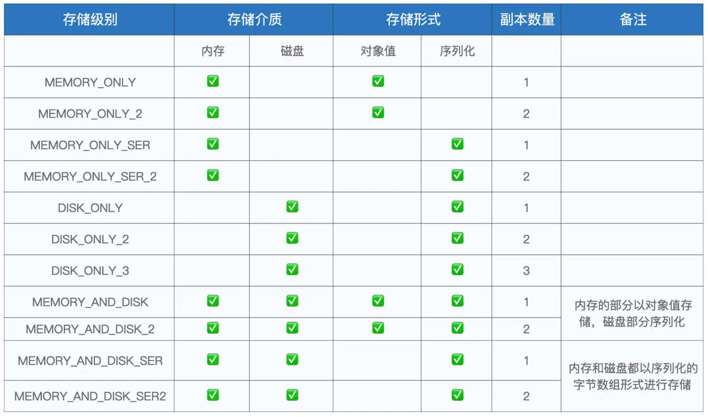

最常用的存储级别只有两个：MEMORY_ONLY 和 MEMORY_AND_DISK，它们分别是 RDD 缓存和 DataFrame 缓存的默认存储级别。在日常的开发工作中，当你在 RDD 和 DataFrame 之上调用.cache函数时，Spark 默认采用的就是 MEMORY_ONLY 和 MEMORY_AND_DISK。 

###缓存的计算与销毁

在 MEMORY_AND_DISK 模式下，Spark 会优先尝试把数据集全部缓存到内存，内存不足的情况下，再把剩余的数据落盘到本地。MEMORY_ONLY 则不管内存是否充足，而是一股脑地把数据往内存里塞，即便内存不够也不会落盘。 这两种存储级别都是先尝试把数据缓存到内存。 

数据从RDD（在RDD中数据分片以迭代器Iterator 的形式存储）最终会缓存到哈希字典（LinkedHashMap）中，BlockID就是key，MemoryEntry就是它的value。

但是很多情况下，应用中数据缓存的需求会超过 Storage Memory 区域的空间供给。虽然缓存任务可以抢占 Execution Memory 区域的空间，但是随着执行任务的推进，缓存任务抢占的内存空间还是要“吐”出来。这个时候，Spark 就要执行缓存的销毁过程。 

Spark会根据LRU（Least Recently Used） 找出访问频率最低的那个BlockId，然后逐个清除。之所以使用LinkedHashMap来存储缓存数据，因为同时存在快速访问和按顺序清理两个需求。在清除缓存时，正在存入缓存的RDD，它包含的MemoryEntry不会被清除。

尽管有缓存销毁这个环节的存在，Storage Memory 内存空间也总会耗尽，这个时候，MEMORY_ONLY 模式就会放弃剩余的数据分片。 对于 MEMORY_AND_DISK 存储级别来说，当内存不足以容纳所有的 RDD 数据分片的时候，Spark 会把尚未展开的 RDD 分片通过 DiskStore 缓存到磁盘中。 

因此，相比 MEMORY_ONLY，MEMORY_AND_DISK 模式能够保证数据集 100% 地物化到存储介质。对于计算链条较长的 RDD 或是 DataFrame 来说，把数据物化到磁盘也是值得的。但是，我们也不能逢 RDD、DataFrame 就调用.cache，因为在最差的情况下，Spark 的内存计算就会退化为 Hadoop MapReduce 根据磁盘的计算模式。 

### 注意事项

cache是惰性操作，因此在调用.cache之后，需要先用 Action 算子触发缓存的物化过程。 

这 4 个算子中只有 count 才会触发缓存的完全物化，而 first、take 和 show 这 3 个算子只会把涉及的数据物化。 

使用cache时的几个场景：

~~~scala
val filePath: String = _
val df: DataFrame = spark.read.parquet(filePath)
 
//Cache方式一
val cachedDF = df.cache
//数据分析
cachedDF.filter(col2 > 0).select(col1, col2)
cachedDF.select(col1, col2).filter(col2 > 100)
 
//Cache方式二
df.select(col1, col2).filter(col2 > 0).cache
//数据分析
df.filter(col2 > 0).select(col1, col2)
df.select(col1, col2).filter(col2 > 100)
 
//Cache方式三
val cachedDF = df.select(col1, col2).cache
//数据分析
cachedDF.filter(col2 > 0).select(col1, col2)
cachedDF.select(col1, col2).filter(col2 > 100)
~~~

这几个使用cache的场景中，只有方式三正确使用了cache。方式一缓存的数据太多，方式二又没有在cache的引用上计算。

由于 Storage Memory 内存空间受限，因此 Cache 应该遵循最小公共子集原则，也就是说，开发者应该仅仅缓存后续操作必需的那些数据列。 

除此之外，我们也应当及时清理用过的 Cache，尽早腾出内存空间供其他数据集消费，从而尽量避免 Eviction （缓存淘汰）的发生。一般来说，我们会用.unpersist 来清理弃用的缓存数据，它是.cache 的逆操作。unpersist 操作支持同步、异步两种模式： 

* 异步模式：调用 unpersist() 或是 unpersist(False) 
* 同步模式：调用 unpersist(True) 

在异步模式下，Driver 把清理缓存的请求发送给各个 Executors 之后，会立即返回，并且继续执行用户代码，比如后续的任务调度、广播变量创建等等。在同步模式下，Driver 发送完请求之后，会一直等待所有 Executors 给出明确的结果（缓存清除成功还是失败）。各个 Executors 清除缓存的效率、进度各不相同，Driver 要等到最后一个 Executor 返回结果，才会继续执行 Driver 侧的代码。显然，同步模式会影响 Driver 的工作效率。因此，通常来说，在需要主动清除 Cache 的时候，我们往往采用异步的调用方式，也就是调用 unpersist() 或是 unpersist(False)。 

### 使用场景

使用Cache的原则：

* 如果 RDD/DataFrame/Dataset 在应用中的引用次数为 1，就坚决不使用 Cache
* 如果引用次数大于 1，且运行成本占比超过 30%，应当考虑启用 Cache 

运行成本占比。它指的是计算某个分布式数据集所消耗的总时间与作业执行时间的比值。举个例子，假设我们有个数据分析的应用，端到端的执行时间为 1 小时。应用中有个 DataFrame 被引用了 2 次，从读取数据源，经过一系列计算，到生成这个 DataFrame 需要花费 12 分钟，那么这个 DataFrame 的运行成本占比应该算作：12 * 2 / 60 = 40%。 

可以利用Noop去计算某个DataFrame的运行时间，Noop 的作用很巧妙，它只触发计算，而不涉及落盘与数据存储，把df 依赖的所有代码拷贝成一个新的作业，然后在 df 上调用 Noop 去触发计算。 这样新作业的执行时间刚好就是 DataFrame 的运行时间 ：

~~~scala
//利用noop精确计算DataFrame运行时间
df.write
.format(“noop”)
.save()
~~~

## 共享变量

RDD中的算子都是作用（Apply）在 RDD 之上的。RDD 的计算以数据分区为粒度，依照算子的逻辑，Executors 以相互独立的方式，完成不同数据分区的计算与转换。 对于 Executors 来说，分区中的数据都是局部数据。换句话说，在同一时刻，隶属于某个 Executor 的数据分区，对于其他 Executors 来说是不可见的。 

不过，在做应用开发的时候，总会有一些计算逻辑需要访问“全局变量”，比如说全局计数器，而这些全局变量在任意时刻对所有的 Executors 都是可见的、共享的。 按照创建与使用方式的不同，Spark 提供了两类共享变量，分别是广播变量（Broadcast variables）和累加器（Accumulators）。 

### 广播变量

#### 从普通变量创建广播变量

广播变量的用法很简单，给定普通变量 x，通过调用 SparkContext 下的 broadcast API 即可完成广播变量的创建：

~~~scala
val list: List[String] = List("Apache", "Spark")
 
// sc为SparkContext实例
val bc = sc.broadcast(list)
~~~

在上面的代码示例中，我们先是定义了一个字符串列表 list，它包含“Apache”和“Spark”这两个单词。然后，我们使用 broadcast 函数来创建广播变量 bc，bc 封装的内容就是 list 列表。 下面是如何读取广播变量的内容：

~~~scala
// 读取广播变量内容
bc.value
// List[String] = List(Apache, Spark)
 
// 直接读取列表内容
list
// List[String] = List(Apache, Spark)
~~~

广播变量创建好之后，通过调用它的 value 函数，我们就可以访问它所封装的数据内容。可以看到调用 bc.value 的效果，这与直接访问字符串列表 list 的效果是完全一致的。 

为了对比使用广播变量前后的差异，我们把 Word Count 变更为“定向计数” ，所谓定向计数，它指的是只对某些单词进行计数，例如，给定单词列表 list，我们只对文件 wikiOfSpark.txt 当中的“Apache”和“Spark”这两个单词做计数，其他单词我们可以忽略：

~~~scala
import org.apache.spark.rdd.RDD
val rootPath: String = _
val file: String = s"${rootPath}/wikiOfSpark.txt"
// 读取文件内容
val lineRDD: RDD[String] = spark.sparkContext.textFile(file)
// 以行为单位做分词
val wordRDD: RDD[String] = lineRDD.flatMap(line => line.split(" "))
 
// 创建单词列表list
val list: List[String] = List("Apache", "Spark")
// 使用list列表对RDD进行过滤
val cleanWordRDD: RDD[String] = wordRDD.filter(word => list.contains(word))
// 把RDD元素转换为（Key，Value）的形式
val kvRDD: RDD[(String, Int)] = cleanWordRDD.map(word => (word, 1))
// 按照单词做分组计数
val wordCounts: RDD[(String, Int)] = kvRDD.reduceByKey((x, y) => x + y)
// 获取计算结果
wordCounts.collect
// Array[(String, Int)] = Array((Apache,34), (Spark,63))
~~~

如下图所示，list 变量本身是在 Driver 端创建的，它并不是分布式数据集（如 lineRDD、wordRDD）的一部分。因此，在分布式计算的过程中，Spark 需要把 list 变量分发给每一个分布式任务（Task），从而对不同数据分区的内容进行过滤：

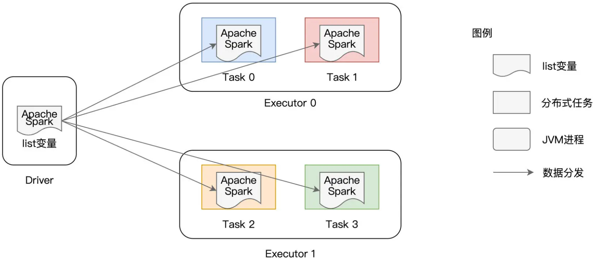

在这种工作机制下，如果 RDD 并行度较高、或是变量的尺寸较大，那么重复的内容分发就会引入大量的网络开销与存储开销，而这些开销会大幅削弱作业的执行性能。 因为Driver 端变量的分发是以 Task 为粒度的，系统中有多少个 Task，变量就需要在网络中分发多少次。更要命的是，每个 Task 接收到变量之后，都需要把它暂存到内存，以备后续过滤之用。换句话说，在同一个 Executor 内部，多个不同的 Task 多次重复地缓存了同样的内容拷贝，毫无疑问，这对宝贵的内存资源是一种巨大的浪费。 

RDD 并行度较高，意味着 RDD 的数据分区数量较多，而 Task 数量与分区数相一致，这就代表系统中有大量的分布式任务需要执行。如果变量本身尺寸较大，大量分布式任务引入的网络开销与内存开销会进一步升级。在工业级应用中，RDD 的并行度往往在千、万这个量级，在这种情况下，诸如 list 这样的变量会在网络中分发成千上万次，作业整体的执行效率自然会很差 。 

函数式编程的原则之一就是尽可能地在函数体中避免副作用（Side effect），副作用指的是函数对于状态的修改和变更，在这个例子中，这个状态就是list。

用广播变量重写一下前面的代码实现：

~~~scala
import org.apache.spark.rdd.RDD
val rootPath: String = _
val file: String = s"${rootPath}/wikiOfSpark.txt"
// 读取文件内容
val lineRDD: RDD[String] = spark.sparkContext.textFile(file)
// 以行为单位做分词
val wordRDD: RDD[String] = lineRDD.flatMap(line => line.split(" "))
 
// 创建单词列表list
val list: List[String] = List("Apache", "Spark")
// 创建广播变量bc
val bc = sc.broadcast(list)
// 使用bc.value对RDD进行过滤
val cleanWordRDD: RDD[String] = wordRDD.filter(word => bc.value.contains(word))
// 把RDD元素转换为（Key，Value）的形式
val kvRDD: RDD[(String, Int)] = cleanWordRDD.map(word => (word, 1))
// 按照单词做分组计数
val wordCounts: RDD[(String, Int)] = kvRDD.reduceByKey((x, y) => x + y)
// 获取计算结果
wordCounts.collect
// Array[(String, Int)] = Array((Apache,34), (Spark,63))
~~~

代码的修改非常简单，我们先是使用 broadcast 函数来封装 list 变量，然后在 RDD 过滤的时候调用 bc.value 来访问 list 变量内容。你可不要小看这个改写，尽管代码的改动微乎其微，几乎可以忽略不计，但在运行时，整个计算过程却发生了翻天覆地的变化：

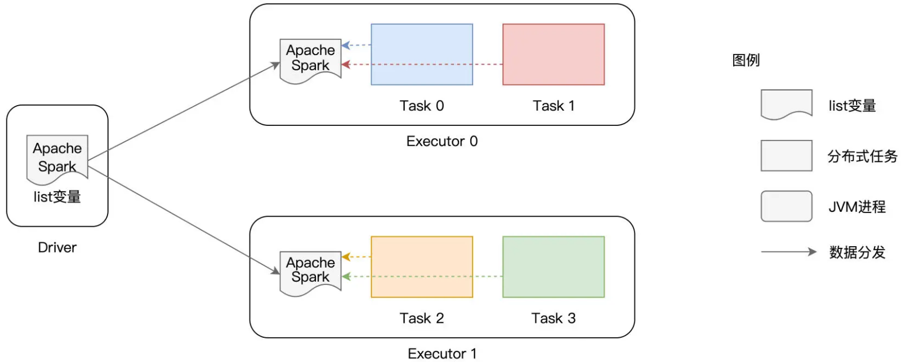

在使用广播变量之前，list 变量的分发是以 Task 为粒度的，而在使用广播变量之后，变量分发的粒度变成了以 Executors 为单位，同一个 Executor 内多个不同的 Tasks 只需访问同一份数据拷贝即可。换句话说，变量在网络中分发与存储的次数，从 RDD 的分区数量，锐减到了集群中 Executors 的个数。 

在广播变量的运行机制下，封装成广播变量的数据，由 Driver 端以 Executors 为粒度分发，每一个 Executors 接收到广播变量之后，将其交给 BlockManager 管理。由于广播变量携带的数据已经通过专门的途径存储到 BlockManager 中，因此分发到 Executors 的 Task 不需要再携带同样的数据。 

在工业级系统中，Executors 个数与 RDD 并行度相比，二者之间通常会相差至少两个数量级。在这样的量级下，广播变量节省的网络与内存开销会变得非常可观，省去了这些开销，对作业的执行性能自然大有裨益。 

当你遇到需要多个 Task 共享同一个大型变量（如列表、数组、映射等数据结构）的时候，就可以考虑使用广播变量来优化你的 Spark 作业。

#### 从分布式数据集创建广播变量

在刚刚的例子中，广播变量封装的是 Driver 端创建的普通变量，除此之外，广播变量也可以封装分布式数据集。 

假设用户维度数据以 Parquet 文件格式存储在 HDFS 文件系统中，业务部门需要我们读取用户数据并创建广播变量以备后用，此时就可以这样操作：

~~~scala
val userFile: String = “hdfs://ip:port/rootDir/userData”
val df: DataFrame = spark.read.parquet(userFile)
val bc_df: Broadcast[DataFrame] = spark.sparkContext.broadcast(df)
~~~

 首先，我们用 Parquet API 读取 HDFS 分布式数据文件生成 DataFrame，然后用 broadcast 封装 DataFrame。从代码上来看，这种实现方式和封装普通变量没有太大差别，它们都调用了 broadcast API，只是传入的参数不同。 

但如果不从开发的视角来看，转而去观察运行时广播变量的创建过程的话，我们就会发现，分布式数据集与普通变量之间的差异非常显著。 

从普通变量创建广播变量，由于数据源就在 Driver 端，因此，只需要 Driver 把数据分发到各个 Executors，再让 Executors 把数据缓存到 BlockManager 就好了。 

从分布式数据集创建广播变量就要复杂多了，具体的过程如下图所示：

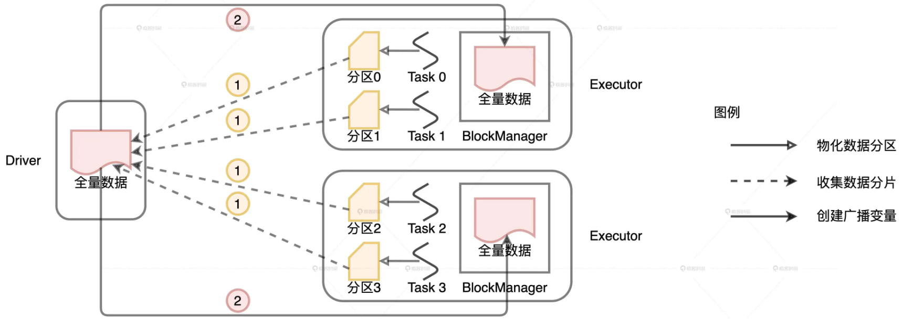

与普通变量相比，分布式数据集的数据源不在 Driver 端，而是来自所有的 Executors。Executors 中的每个分布式任务负责生产全量数据集的一部分，也就是图中不同的数据分区。因此整个过程分为两步：

* Driver 从所有的 Executors 拉取这些数据分区，然后在本地构建全量数据。 
* Driver 把汇总好的全量数据分发给各个 Executors，Executors 将接收到的全量数据缓存到存储系统的 BlockManager 中。 

相比从普通变量创建广播变量，从分布式数据集创建广播变量的网络开销更大。原因主要有二：一是，前者比后者多了一步网络通信；二是，前者的数据体量通常比后者大很多。 

#### 克制Shuffle

广播变量是克制Shuffle的利器。以下面的案例来分析，拿电子商务场景举例。有了用户的数据之后，为了分析不同用户的购物习惯，业务部门要求我们对交易表和用户表进行数据关联。这样的数据关联需求在数据分析领域还是相当普遍的：

~~~scala
val transactionsDF: DataFrame = _
val userDF: DataFrame = _
transactionsDF.join(userDF, Seq(“userID”), “inner”)
~~~

在代码中，调用 Parquet 数据源 API，读取分布式文件，创建交易表和用户表的 DataFrame，然后调用 DataFrame 的 Join 方法，以 userID 作为 Join keys，用内关联（Inner Join）的方式完成了两表的数据关联。 

在分布式环境中，交易表和用户表想要以 userID 为 Join keys 进行关联，就必须要确保一个前提：交易记录和与之对应的用户信息在同一个 Executors 内。也就是说，如果用户黄小乙的购物信息都存储在 Executor 0，而个人属性信息缓存在 Executor 2，那么，在分布式环境中，这两种信息必须要凑到同一个进程里才能实现关联计算。 

在不进行任何调优的情况下，Spark 默认采用 Shuffle Join 的方式来做到这一点。Shuffle Join 的过程主要有两步：

第一步就是对参与关联的左右表分别进行 Shuffle，Shuffle 的分区规则是先对 Join keys 计算哈希值，再把哈希值对分区数取模。由于左右表的分区数是一致的，因此 Shuffle 过后，一定能够保证 userID 相同的交易记录和用户数据坐落在同一个 Executors 内：

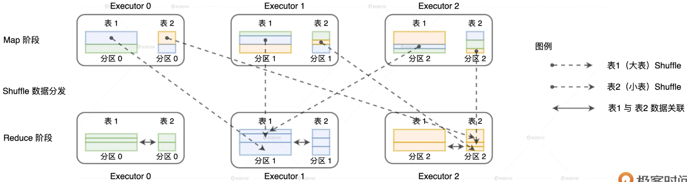

Shuffle 完成之后，第二步就是在同一个 Executors 内，Reduce task 就可以对 userID 一致的记录进行关联操作。但是，由于交易表是事实表，数据体量异常庞大，对 TB 级别的数据进行 Shuffle是非常可怕的，这个方案还有很大的调优空间。

这段逻辑可以用广播变量优化：

~~~scala
import org.apache.spark.sql.functions.broadcast
 
val transactionsDF: DataFrame = _
val userDF: DataFrame = _
 
val bcUserDF = broadcast(userDF)
transactionsDF.join(bcUserDF, Seq(“userID”), “inner”)

~~~

Driver 从所有 Executors 收集 userDF 所属的所有数据分片，在本地汇总用户数据，然后给每一个 Executors 都发送一份全量数据的拷贝。既然每个 Executors 都有 userDF 的全量数据，这个时候，交易表的数据分区待在原地、保持不动，就可以轻松地关联到一致的用户数据。如此一来，我们不需要对数据体量巨大的交易表进行 Shuffle，同样可以在分布式环境中，完成两张表的数据关联，这就是Broadcast Join。

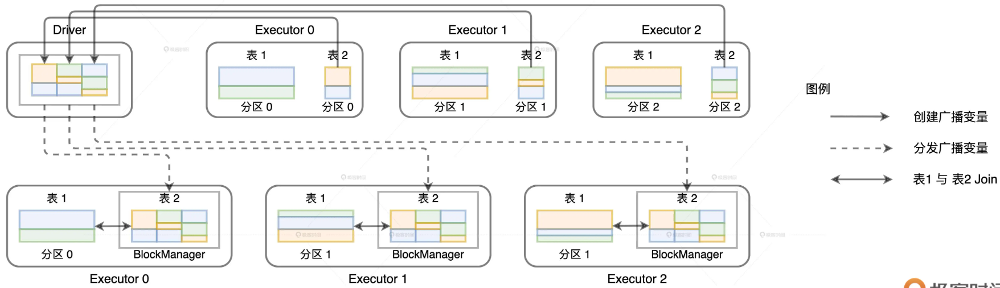

利用广播变量，我们成功地避免了海量数据在集群内的存储、分发，节省了原本由 Shuffle 引入的磁盘和网络开销，大幅提升运行时执行性能。当然，采用广播变量优化也是有成本的，毕竟广播变量的创建和分发，也是会带来网络开销的。但是，相比大表的全网分发，小表的网络开销几乎可以忽略不计。 

当两个需要join的数据集都很大时，使用broadcast join需要将一个很大的数据集进行网络分发多次，已经远超出了shuffle join需要传输的数据，此时不适合把 Shuffle Joins 转换为 Broadcast Joins

#### 利用配置项强制广播

spark.sql.autoBroadcastJoinThreshold 这个配置项。它的设置值是存储大小，默认是 10MB。它的含义是，对于参与 Join 的两张表来说，任意一张表的尺寸小于 10MB，Spark 就在运行时采用 Broadcast Joins 的实现方式去做数据关联。另外，AQE 在运行时尝试动态调整 Join 策略时，也是基于这个参数来判定过滤后的数据表是否足够小，从而把原本的 Shuffle Joins 调整为 Broadcast Joins 

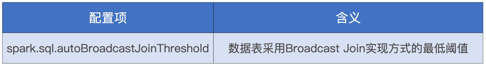

举个例子。在数据仓库中，我们经常会看到两张表：一张是订单事实表，为了方便，我们把它记成 Fact；另一张是用户维度表，记成 Dim。事实表体量很大在 100GB 量级，维度表很小在 1GB 左右。两张表的 Schema 如下所示： 

~~~
//订单事实表Schema
orderID: Int
userID: Int
trxDate: Timestamp
productId: Int
price: Float
volume: Int
 
//用户维度表Schema
userID: Int
name: String
age: Int
gender: String
~~~

当 Fact 表和 Dim 表基于 userID 做关联的时候，由于两张表的尺寸大小都远超 spark.sql.autoBroadcastJoinThreshold 参数的默认值 10MB，因此 Spark 不得不选择 Shuffle Joins 的实现方式。但如果我们把这个参数的值调整为 2GB，因为 Dim 表的尺寸比 2GB 小，所以，Spark 在运行时会选择把 Dim 表封装到广播变量里，并采用 Broadcast Join 的方式来完成两张表的数据关联。 

显然，对于绝大多数的 Join 场景来说，autoBroadcastJoinThreshold 参数的默认值 10MB 太低了，因为现在企业的数据体量都在 TB，甚至 PB 级别。因此，想要有效地利用 Broadcast Joins，我们需要把参数值调大，一般来说，2GB 左右是个不错的选择。 

综上，使用广播阈值配置项让 Spark 优先选择 Broadcast Joins 的关键，就是要确保至少有一张表的存储尺寸小于广播阈值。

有时数据量明明小于广播阈值，但是SQL运行时也没有选择Broadcast Joins，这是因为数据表在磁盘上的存储大小，在内存展开后，要膨胀几倍或者十几倍，原因在于：

* 为了提升存储和访问效率，开发者一般采用 Parquet 或是 ORC 等压缩格式把数据落盘。这些高压缩比的磁盘数据展开到内存之后，数据量往往会翻上数倍。 
* 受限于对象管理机制，在堆内内存中，JVM 往往需要比数据原始尺寸更大的内存空间来存储对象。 

所以一个好的办法是准确预估一张表在内存中的大小，然后再去设计阈值，办法是：

* 第一步，把要预估大小的数据表缓存到内存，比如直接在 DataFrame 或是 Dataset 上调用 cache 方法； 
* 读取 Spark SQL 执行计划的统计数据。这是因为，Spark SQL 在运行时，就是靠这些统计数据来制定和调整执行策略的。 

~~~scala
val df: DataFrame = _
df.cache.count
 
val plan = df.queryExecution.logical
val estimated: BigInt = spark
.sessionState
.executePlan(plan)
.optimizedPlan
.stats
.sizeInBytes
~~~

#### 用 Join Hints 强制广播

数据量的预估比较麻烦，我们还可以用API的方式去强制广播。

Join Hints 中的 Hints 表示“提示”，它指的是在开发过程中使用特殊的语法，明确告知 Spark SQL 在运行时采用哪种 Join 策略。一旦你启用了 Join Hints，不管你的数据表是不是满足广播阈值，Spark SQL 都会尽可能地尊重你的意愿和选择，使用 Broadcast Joins 去完成数据关联。 

举个例子，假设有两张表，一张表的内存大小在 100GB 量级，另一张小一些，2GB 左右。在广播阈值被设置为 2GB 的情况下，并没有触发 Broadcast Joins，但我们又不想花费时间和精力去精确计算小表的内存占用到底是多大。在这种情况下，我们就可以用 Join Hints 来帮我们做优化，仅仅几句提示就可以帮我们达到目的：

~~~scala
val table1: DataFrame = spark.read.parquet(path1)
val table2: DataFrame = spark.read.parquet(path2)
table1.createOrReplaceTempView("t1")
table2.createOrReplaceTempView("t2")
 
val query: String = “select /*+ broadcast(t2) */ * from t1 inner join t2 on t1.key = t2.key”
val queryResutls: DataFrame = spark.sql(query)
~~~

在上面的代码示例中，只要在 SQL 结构化查询语句里面加上一句/*+ broadcast(t2) */提示，我们就可以强制 Spark SQL 对小表 t2 进行广播，在运行时选择 Broadcast Joins 的实现方式。提示语句中的关键字，除了使用 broadcast 外，我们还可以用 broadcastjoin 或者 mapjoin，它们实现的效果都一样。 

如果你不喜欢用 SQL 结构化查询语句，尤其不想频繁地在 Spark SQL 上下文中注册数据表，你也可以在 DataFrame 的 DSL 语法中使用 Join Hints：

~~~scala
table1.join(table2.hint(“broadcast”), Seq(“key”), “inner”)
~~~

在上面的 DSL 语句中，我们只要在 table2 上调用 hint 方法，然后指定 broadcast 关键字，就可以同样达到强制广播表 2 的效果。 

总之，Join Hints 让开发者可以灵活地选择运行时的 Join 策略，对于熟悉业务、了解数据的同学来说，Join Hints 允许开发者把专家经验凌驾于 Spark SQL 的优化引擎之上，更好地服务业务。 

不过，Join Hints 也有个小缺陷。如果关键字拼写错误，Spark SQL 在运行时并不会显示地抛出异常，而是默默地忽略掉拼写错误的 hints，假装它压根不存在。因此，在使用 Join Hints 的时候，需要我们在编译时自行确认 Debug 和纠错。 

#### 用 broadcast 函数强制广播

如果你不想等到运行时才发现问题，想让编译器帮你检查类似的拼写错误，那么你可以使用强制广播的第二种方式：broadcast 函数。这个函数是类库 org.apache.spark.sql.functions 中的 broadcast 函数。调用方式非常简单，比 Join Hints 还要方便，只需要用 broadcast 函数封装需要广播的数据表即可，如下所示：

~~~scala
import org.apache.spark.sql.functions.broadcast
table1.join(broadcast(table2), Seq(“key”), “inner”)
~~~

广播阈值的设置，更多的是把选择权交给 Spark SQL，尤其是在 AQE 的机制下，动态 Join 策略调整需要这样的设置在运行时做出选择。强制广播更多的是开发者以专家经验去指导 Spark SQL 该如何选择运行时策略。二者相辅相成，并不冲突，开发者灵活地运用就能平衡 Spark SQL 优化策略与专家经验在应用中的比例。 

#### 广播变量的缺陷

广播变量不能解决所有的数据关联问题：

* 首先，从性能上来讲，Driver 在创建广播变量的过程中，需要拉取分布式数据集所有的数据分片。在这个过程中，网络开销和 Driver 内存会成为性能隐患。广播变量尺寸越大，额外引入的性能开销就会越多。更何况，如果广播变量大小超过 8GB，Spark 会直接抛异常中断任务执行。 

* 其次，从功能上来讲，并不是所有的 Joins 类型都可以转换为 Broadcast Joins。一来，Broadcast Joins 不支持全连接（Full Outer Joins）；二来，在所有的数据关联中，我们不能广播基表。或者说，即便开发者强制广播基表，也无济于事。比如说，在左连接（Left Outer Join）中，我们只能广播右表；在右连接（Right Outer Join）中，我们只能广播左表。在下面的代码中，即便我们强制用 broadcast 函数进行广播，Spark SQL 在运行时还是会选择 Shuffle Joins：

  ~~~scala
  import org.apache.spark.sql.functions.broadcast
  broadcast (table1).join(table2, Seq(“key”), “left”)
  table1.join(broadcast(table2), Seq(“key”), “right”)
  ~~~

### 累加器

累加器，顾名思义，它的主要作用是全局计数（Global counter）。与单机系统不同，在分布式系统中，我们不能依赖简单的普通变量来完成全局计数，而是必须依赖像累加器这种特殊的数据结构才能达到目的。 

与广播变量类似，累加器也是在 Driver 端定义的，但它的更新是通过在 RDD 算子中调用 add 函数完成的。在应用执行完毕之后，开发者在 Driver 端调用累加器的 value 函数，就能获取全局计数结果。 

下面这段代码实现了在word count的同时，统计到底有多少个空字符串，在filter算子里面对累加器进行操作：

~~~scala
import org.apache.spark.rdd.RDD
val rootPath: String = _
val file: String = s"${rootPath}/wikiOfSpark.txt"
// 读取文件内容
val lineRDD: RDD[String] = spark.sparkContext.textFile(file)
// 以行为单位做分词
val wordRDD: RDD[String] = lineRDD.flatMap(line => line.split(" "))
 
// 定义Long类型的累加器
val ac = sc.longAccumulator("Empty string")
 
// 定义filter算子的判定函数f，注意，f的返回类型必须是Boolean
def f(x: String): Boolean = {
if(x.equals("")) {
// 当遇到空字符串时，累加器加1
ac.add(1)
return false
} else {
return true
}
}
 
// 使用f对RDD进行过滤
val cleanWordRDD: RDD[String] = wordRDD.filter(f)
// 把RDD元素转换为（Key，Value）的形式
val kvRDD: RDD[(String, Int)] = cleanWordRDD.map(word => (word, 1))
// 按照单词做分组计数
val wordCounts: RDD[(String, Int)] = kvRDD.reduceByKey((x, y) => x + y)
// 收集计数结果
wordCounts.collect
 
// 作业执行完毕，通过调用value获取累加器结果
ac.value
// Long = 79
~~~

与Word Count 相比，这里的代码主要有 4 处改动： 

* 使用 SparkContext 下的 longAccumulator 来定义 Long 类型的累加器； 
* 定义 filter 算子的判定函数 f，当遇到空字符串时，调用 add 函数为累加器计数； 
* 以函数 f 为参数，调用 filter 算子对 RDD 进行过滤； 
* 作业完成后，调用累加器的 value 函数，获取全局计数结果。 

除了上面代码中用到的 longAccumulator，SparkContext 还提供了 doubleAccumulator 和 collectionAccumulator 这两种不同类型的累加器。其中，doubleAccumulator 用于对 Double 类型的数值做全局计数；而 collectionAccumulator 允许开发者定义集合类型的累加器，相比数值类型，集合类型可以为业务逻辑的实现，提供更多的灵活性和更大的自由度。 就这 3 种累加器来说，尽管类型不同，但它们的用法是完全一致的。都是先定义累加器变量，然后在 RDD 算子中调用 add 函数，从而更新累加器状态，最后通过调用 value 函数来获取累加器的最终结果。 

## 存储系统

Spark 存储系统负责维护所有暂存在内存与磁盘中的数据，这些数据包括 Shuffle 中间文件、RDD Cache 以及广播变量：

* 在 Shuffle 的计算过程中，Map Task 在 Shuffle Write 阶段生产 data 与 index 文件。接下来，根据 index 文件提供的分区索引，Shuffle Read 阶段的 Reduce Task 从不同节点拉取属于自己的分区数据。而 Shuffle 中间文件，指的正是两个阶段为了完成数据交换所仰仗的 data 与 index 文件。 
* RDD Cache 指的是分布式数据集在内存或是磁盘中的物化，它往往有利于提升计算效率。 
* 广播变量的优势在于以 Executors 为粒度分发共享变量，从而大幅削减数据分发引入的网络与存储开销。 

在Spark中的存储系统示意图如下：

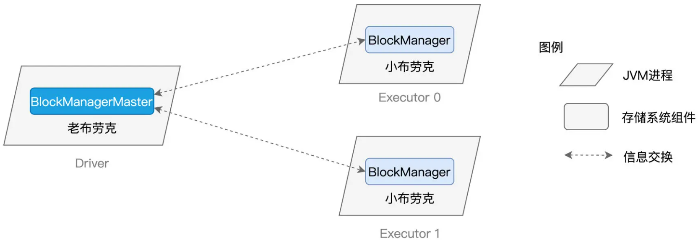

其中BlockManagerMaster在Driver中，而BlockManager则分散在各Executors。BlockManagerMaster 与众多 BlockManager 之间通过心跳来完成信息交换，这些信息包括数据块的地址、位置、大小和状态，来了解存储系统的现状，这种信息交换是双向的。如果BlockManager需要获取其他分公司的状态，他必须要通过BlockManagerMaster才能拿到这些信息。 也就是说，BlockManagerMaster 的信息都来自于 BlockManager。

存储系统的服务对象有 3 个：分别是 Shuffle 中间文件、RDD Cache 以及广播变量，而 BlockManager 的职责，正是在 Executors 中管理这 3 类数据的存储、读写与收发。 

就存储介质来说，这 3 类数据所消耗的硬件资源各不相同：

* Shuffle 中间文件消耗的是节点磁盘 
* 广播变量主要占用节点的内存空间 
* RDD Cache 则是“脚踏两条船”，既可以消耗内存，也可以消耗磁盘。 

不管是在内存、还是在磁盘，这些数据都是以数据块（Blocks）为粒度进行存取与访问的。数据块的概念与 RDD 数据分区（Partitions）是一致的，在 RDD 的上下文中，说到数据划分的粒度，我们往往把一份数据称作“数据分区”。而在存储系统的上下文中，对于细分的一份数据，我们称之为数据块。 

BlockManager 的核心职责，在于管理数据块的元数据（Meta data），这些元数据记录并维护数据块的地址、位置、尺寸以及状态。 下面就是一个元数据样例：

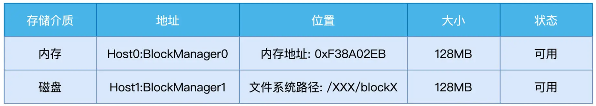

只有借助元数据，BlockManager 才有可能高效地完成数据的存与取、收与发。 

依靠元数据管理，BlockManager可以掌握与数据状态有关的所有信息，它依靠其他组件来完成对数据的存取：它们是MemoryStore和DiskStore，分别负责内存中的数据存取和磁盘中的数据访问

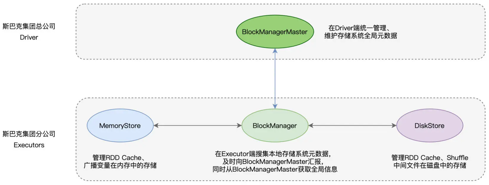

对于数据的存储形式，Spark 存储系统支持两种类型：对象值（Object Values）和字节数组（Byte Array） 。其中，对象值压缩为字节数组的过程叫做序列化，而字节数组还原成原始对象值的过程就叫做反序列化，对象值使用比较方便，而字节数组占用空间小。 MemoryStore中存在这两种形态的选择，DiskStore只能存储序列化后的字节数组，因为凡是落盘的东西，都需要先进行序列化。 

### MemoryStore

它主要负责内存中的数据存取。在它内部有一种特别的数据结构：LinkedHashMap[BlockId, MemoryEntry] ：

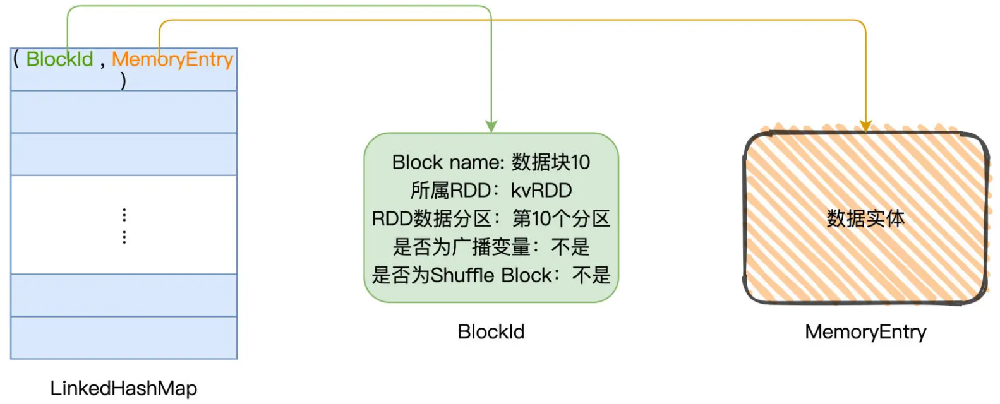

BlockId 用于标记 Block 的身份，需要注意的是，BlockId 不是一个仅仅记录 Id 的字符串，而是一种记录 Block 元信息的数据结构。BlockId 这个数据结构记录的信息非常丰富，包括 Block 名字、所属 RDD、Block 对应的 RDD 数据分区、是否为广播变量、是否为 Shuffle Block，等等。 

MemoryEntry 是对象，它用于承载数据实体，数据实体可以是某个 RDD 的数据分区，也可以是广播变量。存储在 LinkedHashMap 当中的 MemoryEntry，相当于是通往数据实体的地址。 

不难发现，BlockId 和 MemoryEntry 一起，就像是居民户口簿一样，完整地记录了存取某个数据块所需的所有元信息，相当于“居民姓名”、“所属派出所”、“家庭住址”等信息。基于这些元信息，我们就可以像“查户口”一样，有的放矢、精准定向地对数据块进行存取访问。 

以 RDD Cache 为例，当使用下面的代码创建RDD缓存的时候：

~~~scala
val rdd: RDD[_] = _
rdd.cache
rdd.count
~~~

Spark 会在后台帮我们做如下 3 件事情：

* 以数据分区为粒度，计算 RDD 执行结果，生成对应的数据块； 
* 将数据块封装到 MemoryEntry，同时创建数据块元数据 BlockId； 
* 将（BlockId，MemoryEntry）键值对添加到“小册子”LinkedHashMap。 

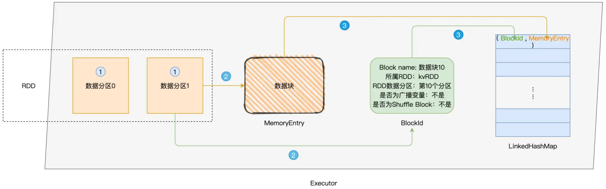

如果内存空间不足以容纳整个 RDD，Spark 会按照 LRU 策略逐一清除字典中最近、最久未使用的 Block，以及其对应的 MemoryEntry。 此时相比频繁的展开、物化、换页所带来的性能开销，缓存下来的部分数据对于 RDD 高效访问的贡献可以说微乎其微。 

### DiskStore

它的主要职责，是通过维护数据块与磁盘文件的对应关系，实现磁盘数据的存取访问。 它通过DiskBlockManager来帮它维护元数据。

DiskBlockManager 是类对象，它的 getFile 方法以 BlockId 为参数，返回磁盘文件。换句话说，给定数据块，要想知道它存在了哪个磁盘文件，需要调用 getFile 方法得到答案。有了数据块与文件之间的映射关系，我们就可以轻松地完成磁盘中的数据访问。 

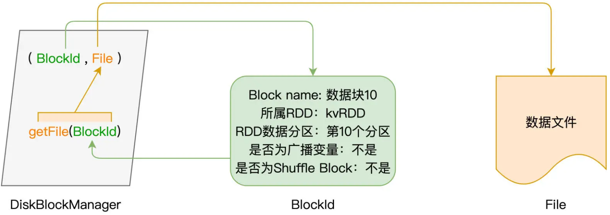

以 Shuffle 为例，在 Shuffle Write 阶段，每个 Task 都会生成一份中间文件，每一份中间文件都包括带有 data 后缀的数据文件，以及带着 index 后缀的索引文件。那么对于每一份文件来说，我们都可以通过 DiskBlockManager 的 getFile 方法，来获取到对应的磁盘文件，如下图所示：

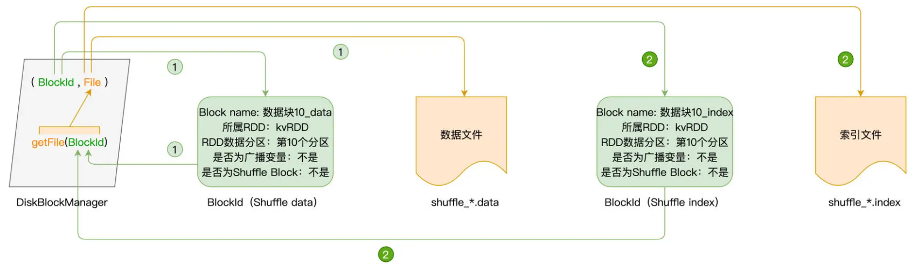

可以看到，获取 data 文件与获取 index 文件的流程是完全一致的，他们都是使用 BlockId 来调用 getFile 方法，从而完成数据访问。 

## 磁盘

Spark 的优势在于内存计算，但磁盘也不是可以完全抛弃的。如果内存无限大，我们确实可以通过一些手段，让 Spark 作业在执行的过程中免去所有的落盘动作。但是，无限大内存引入的大量 Full GC 停顿（Stop The World），很有可能让应用的执行性能，相比有磁盘操作的时候更差，而且这不符合调优的最终目的：在不同的硬件资源之间寻求平衡 

磁盘在Spark中有以下作用：

1、Shuffle Write时，可以让内存中的内容暂时溢出到临时文件，把内存空间让出来

2、存储 Shuffle 中间文件：数据文件和索引文件

3、缓存分布式数据集，凡是带DISK字样的存储模式，都会把内存中放不下的数据缓存到磁盘。 

4、磁盘复用还能给执行性能带来更好的提升。所谓磁盘复用，它指的是 Shuffle Write 阶段产生的中间文件被多次计算重复利用的过程。 磁盘复用的两个案例：

* 在没有 RDD Cache 的情况下，一旦某个计算环节出错，就会触发整条 DAG 从头至尾重新计算，这个过程又叫失败重试。严格来说，这种说法是不准确的。因为，失败重试的计算源头并不是整条 DAG 的“头”，而是与触发点距离最新的 Shuffle 的中间文件。 

  如下图所示，如果在计算RDD4 的过程中有些任务失败了。在失败重试的时候，Spark 确实会从 RDD4 向前回溯，但是有了磁盘复用机制的存在，它并不会一直回溯到 HDFS 源数据，而是直接回溯到已经物化到节点的 RDD3 的“数据源”，也就是 RDD2 在 Shuffle Write 阶段输出到磁盘的中间文件。因此，磁盘复用的收益之一就是缩短失败重试的路径，在保障作业稳定性的同时提升执行性能。 它就像是灌溉和蓄水池的关系一样：

  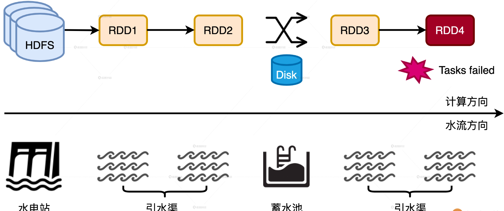

* ReuseExchange 机制：Spark SQL 众多优化策略中的一种，它指的是相同或是相似的物理计划可以共享 Shuffle 计算的中间结果，也就是我们常说的 Shuffle 中间文件。ReuseExchange 机制可以帮我们削减 I/O 开销，甚至节省 Shuffle，来大幅提升执行性能。 

## 网络开销

在平衡不同硬件资源的时候，相比 CPU、内存、磁盘，网络开销无疑是最拖后腿的那一个，这一点在处理延迟上表现得非常明显。 

下图就是不同硬件资源的处理延迟对比结果，我们可以看到最小的处理单位是纳秒。你可能对纳秒没什么概念，所以为了方便对比，我把纳秒等比放大到秒。这样，其他硬件资源的处理延迟也会跟着放大。最后一对比我们会发现，网络延迟是以天为单位的：

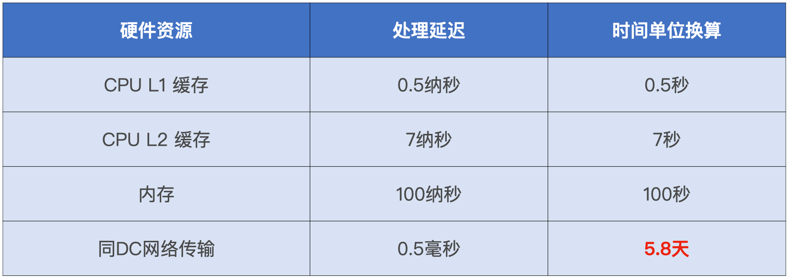

因此，要想维持硬件资源之间的平衡，尽可能地降低网络开销是我们在性能调优中必须要做的。 

可以尽量降低网络开销的方法：

1、在数据读写阶段，尽量让Spark集群和存储系统部署在一起，这样可以让计算任务调度的本地性级别做到NODE_LOCAL （数据还未加载到内存，任务没有办法调度到 PROCESS_LOCAL 级别 ）。如果Spark 集群与存储集群在物理上是分开的，那么任务的本地性级别只能退化到 RACK_LOCAL，甚至是 ANY，来通过网络获取所需的数据分片。 

在企业的私有化 DC 中更容易定制化集群的部署方式，大家通常采用紧耦合的方式来提升数据访问效率。但是在公有云环境中，计算集群在物理上往往和存储系统隔离，因此数据源的读取只能走网络。 

对于数据读写占比较高的业务场景，可以合理的设置部署方式，来降低网络开销

2、数据处理阶段，尽量减少Shuffle，尽可能地把 Shuffle Joins 转化为 Broadcast Joins 来消除 Shuffle。 

如果没法避免，尽可能地在计算中多使用 Map 端聚合，去减少需要在网络中分发的数据量。 

慎用多副本的 RDD 缓存，如果应用对高可用特性没有严格要求，建议你尽量不要滥用多副本的 RDD 缓存

3、数据传输阶段，在落盘或是在网络传输之前，数据都是需要先进行序列化的。在 Spark 中，有两种序列化器供开发者选择，分别是 Java serializer 和 Kryo Serializer。 Spark 官方和网上的技术博客都会推荐你使用 Kryo Serializer 来提高效率，通常来说，Kryo Serializer 相比 Java serializer，在处理效率和存储效率两个方面都会胜出数倍。因此，在数据分发之前，使用 Kryo Serializer 对其序列化会进一步降低网络开销。 

有时虽然用了Kryo Serializer，序列化之后的数据尺寸反而比 Java serializer 的更大，这是因为：对于一些自定义的数据结构来说，如果你没有明确把这些类型向 Kryo Serializer 注册的话，虽然它依然会帮你做序列化的工作，但它序列化的每一条数据记录都会带一个类名字，这个类名字是通过反射机制得到的，会非常长。在上亿的样本中，存储开销自然相当可观。 Kryo Serializer使用更紧凑的方式定义时，必须要指定相近的传递类型。

应该在使用时向Kryo Serializer 注册自定义类型，需要在SparkConf 之上调用 registerKryoClasses 方法就好了：

~~~
//向Kryo Serializer注册类型
val conf = new SparkConf().setMaster(“”).setAppName(“”)
conf.registerKryoClasses(Array(
classOf[Array[String]],
classOf[HashMap[String, String]],
classOf[MyClass]
))
~~~

与 Kryo Serializer 有关的配置项如下：

* spark.serializer 可以明确指定 Spark 采用 Kryo Serializer 序列化器 
* spark.kryo.registrationRequired如果将其设置为True，当 Kryo Serializer 遇到未曾注册过的自定义类型的时候，它就不会再帮你做序列化的工作，而是抛出异常，并且中断任务执行。这么做的好处在于，在开发和调试阶段，它能帮我们捕捉那些忘记注册的类型。 

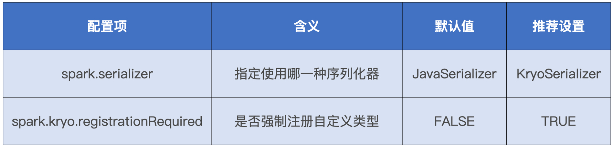

# 算子

常用的算子总结：


## 数据转换算子

下面几个算子都用于RDD 内部的数据转换，它们都不会引入Shuffle计算。

### map

map算子：给定映射函数 f，map(f) 以元素为粒度对 RDD 做数据转换。 

尽管 map 算子足够灵活，允许开发者自由定义转换逻辑。 map(f) 是以元素为粒度对 RDD 做数据转换的，在某些计算场景下，这个特点会严重影响执行效率。为什么这么说呢？我们来看一个具体的例子。 

比方说，我们把 Word Count 的计数需求，从原来的对单词计数，改为对单词的哈希值计数：

~~~scala
// 把普通RDD转换为Paired RDD
 
import java.security.MessageDigest
 
val cleanWordRDD: RDD[String] = _ // 请参考第一讲获取完整代码
 
val kvRDD: RDD[(String, Int)] = cleanWordRDD.map{ word =>
  // 获取MD5对象实例
  val md5 = MessageDigest.getInstance("MD5")
  // 使用MD5计算哈希值
  val hash = md5.digest(word.getBytes).mkString
  // 返回哈希值与数字1的Pair
  (hash, 1)
}
~~~

由于 map(f) 是以元素为单元做转换的，那么对于 RDD 中的每一条数据记录，我们都需要实例化一个 MessageDigest 对象来计算这个元素的哈希值。 

在工业级生产系统中，一个 RDD 动辄包含上百万甚至是上亿级别的数据记录，如果处理每条记录都需要事先创建 MessageDigest，那么实例化对象的开销就会聚沙成塔，不知不觉地成为影响执行效率的罪魁祸首。 

mapPartitions 和 mapPartitionsWithIndex算子能在更粗粒度上去处理数据。

### mapPartitions 

mapPartitions，顾名思义，就是以数据分区为粒度，使用映射函数 f 对 RDD 进行数据转换。对于上述单词哈希值计数的例子，我们结合后面的代码，来看看如何使用 mapPartitions 来改善执行性能： 

~~~scala
// 把普通RDD转换为Paired RDD
 
import java.security.MessageDigest
 
val cleanWordRDD: RDD[String] = _ // 请参考第一讲获取完整代码
 
val kvRDD: RDD[(String, Int)] = cleanWordRDD.mapPartitions( partition => {
  // 注意！这里是以数据分区为粒度，获取MD5对象实例
  val md5 = MessageDigest.getInstance("MD5")
  val newPartition = partition.map( word => {
  // 在处理每一条数据记录的时候，可以复用同一个Partition内的MD5对象
    (md5.digest(word.getBytes()).mkString,1)
  })
  newPartition
})
~~~

可以看到，在上面的改进代码中，mapPartitions 以数据分区（匿名函数的形参 partition）为粒度，对 RDD 进行数据转换。具体的数据处理逻辑，则由代表数据分区的形参 partition 进一步调用 map(f) 来完成。 

相比前一个版本，我们把实例化 MD5 对象的语句挪到了 map 算子之外。如此一来，以数据分区为单位，实例化对象的操作只需要执行一次，而同一个数据分区中所有的数据记录，都可以共享该 MD5 对象，从而完成单词到哈希值的转换。 

综合来说：通过在Driver端创建全局变量，然后在map中进行引用，也可以达到mapPartitions同样的效果。 但一定要保证Driver端创建的全局变量是可以序列化的，只有满足这个前提，Spark才能在这个闭包之上创建分布式任务，否则会报“Task not serializable”错误。 而mapPartitions算子却没有一定要让变量能持久化，这是因为driver把这段代码分发到了各个executor，而创建对象这个工作是由executor完成的。

以数据分区为单位，mapPartitions 只需实例化一次 MD5 对象，而 map 算子却需要实例化多次，具体的次数则由分区内数据记录的数量来决定：

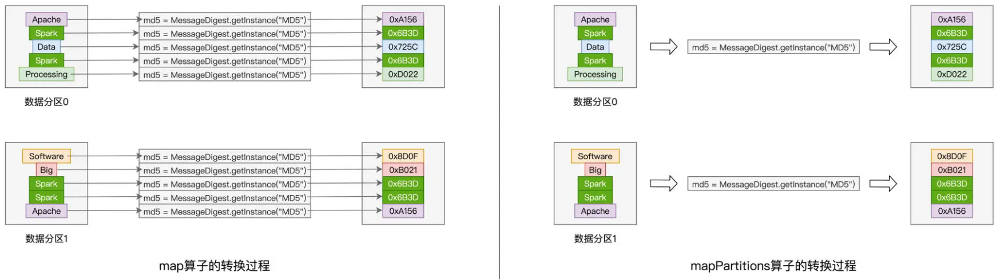

对于一个有着上百万条记录的 RDD 来说，其数据分区的划分往往是在百这个量级，因此，相比 map 算子，mapPartitions 可以显著降低对象实例化的计算开销，这对于 Spark 作业端到端的执行性能来说，无疑是非常友好的。 

实际上。除了计算哈希值以外，对于数据记录来说，凡是可以共享的操作，都可以用 mapPartitions 算子进行优化。这样的共享操作还有很多，比如创建用于连接远端数据库的 Connections 对象，或是用于连接 Amazon S3 的文件系统句柄，再比如用于在线推理的机器学习模型，等等。

相比 mapPartitions，mapPartitionsWithIndex 仅仅多出了一个数据分区索引，这个数据分区索引可以为我们获取分区编号，当你的业务逻辑中需要使用到分区编号的时候，不妨考虑使用这个算子来实现代码。除了这个额外的分区索引以外，mapPartitionsWithIndex 在其他方面与 mapPartitions 是完全一样的。 

### flatMap

flatMap 其实和 map 与 mapPartitions 算子类似，在功能上，与 map 和 mapPartitions 一样，flatMap 也是用来做数据映射的 

对于 map 和 mapPartitions 来说，其映射函数 f 的类型，都是（元素） => （元素），即元素到元素。而 flatMap 映射函数 f 的类型，是（元素） => （集合），即元素到集合（如数组、列表等）。因此，flatMap 的映射过程在逻辑上分为两步： 

* 以元素为单位，创建集合； 
* 去掉集合“外包装”，提取集合元素。 

### filter

这个算子的作用，是对 RDD 进行过滤。 

filter 算子需要借助一个判定函数 f，才能实现对 RDD 的过滤转换。 所谓判定函数，它指的是类型为（RDD 元素类型） => （Boolean）的函数。可以看到，判定函数 f 的形参类型，必须与 RDD 的元素类型保持一致，而 f 的返回结果，只能是 True 或者 False。在任何一个 RDD 之上调用 filter(f)，其作用是保留 RDD 中满足 f（也就是 f 返回 True）的数据元素，而过滤掉不满足 f（也就是 f 返回 False）的数据元素。 

## 数据聚合算子

数据聚合算子会引入Shuffle计算。在数据分析场景中，典型的计算类型分别是分组、聚合和排序。而 groupByKey、reduceByKey、aggregateByKey 和 sortByKey 这些算子的功能，恰恰就是用来实现分组、聚合和排序的计算逻辑。 

尽管这些算子看上去相比其他算子的适用范围更窄，也就是它们只能作用（Apply）在 Paired RDD 之上，所谓 Paired RDD，它指的是元素类型为（Key，Value）键值对的 RDD。 但是在功能方面，可以说，它们承担了数据分析场景中的大部分职责。 

### groupByKey

groupByKey 算子包含两步，即分组和收集。 

具体来说，对于元素类型为（Key，Value）键值对的 Paired RDD，groupByKey 的功能就是对 Key 值相同的元素做分组，然后把相应的 Value 值，以集合的形式收集到一起。换句话说，groupByKey 会把 RDD 的类型，由 RDD[(Key, Value)]转换为 RDD[(Key, Value 集合)]。 

以Word Count为例，对于分词后的一个个单词，假设我们不再统计其计数，而仅仅是把相同的单词收集到一起：

~~~scala

import org.apache.spark.rdd.RDD
 
// 以行为单位做分词
val cleanWordRDD: RDD[String] = _ // 完整代码请参考第一讲的Word Count
// 把普通RDD映射为Paired RDD
val kvRDD: RDD[(String, String)] = cleanWordRDD.map(word => (word, word))
 
// 按照单词做分组收集
val words: RDD[(String, Iterable[String])] = kvRDD.groupByKey()
~~~

groupByKey 是无参函数，要实现对 Paired RDD 的分组、收集，我们仅需在 RDD 之上调用 groupByKey() 即可。 

下面这张示意图可以解释代码的执行过程：

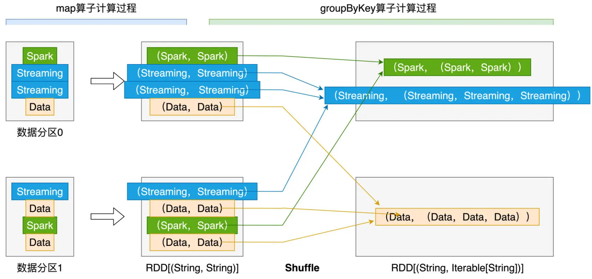

从图上可以看出，为了完成分组收集，对于 Key 值相同、但分散在不同数据分区的原始数据记录，Spark 需要通过 Shuffle 操作，跨节点、跨进程地把它们分发到相同的数据分区。 Shuffle 是资源密集型计算，对于动辄上百万、甚至上亿条数据记录的 RDD 来说，这样的 Shuffle 计算会产生大量的磁盘 I/O 与网络 I/O 开销，从而严重影响作业的执行性能。 

虽然 groupByKey 的执行效率较差，不过好在它在应用开发中的“出镜率”并不高。原因很简单，在数据分析领域中，分组收集的使用场景很少，而分组聚合才是统计分析的刚需。 为了满足分组聚合多样化的计算需要，Spark 提供了 3 种 RDD 算子，允许开发者灵活地实现计算逻辑，它们分别是 reduceByKey、aggregateByKey 和 combineByKey。 

### reduceByKey

reduceByKey 的字面含义是“按照 Key 值做聚合”，它的计算逻辑，就是根据聚合函数 f 给出的算法，把 Key 值相同的多个元素，聚合成一个元素。 

在wordcount中，就使用了 reduceByKey 来实现分组计数： 

~~~scala
// 把RDD元素转换为（Key，Value）的形式
val kvRDD: RDD[(String, Int)] = cleanWordRDD.map(word => (word, 1))
 
// 按照单词做分组计数
val wordCounts: RDD[(String, Int)] = kvRDD.reduceByKey((x: Int, y: Int) => x + y)
~~~

reduceByKey 与之前讲过的 map、filter 这些算子有一些相似的地方：给定处理函数 f，它们的用法都是“算子 (f)” ，f的叫法各不相同：

* 对于 map 来说，我们把 f 称作是映射函数 
* 对 filter 来说，我们把 f 称作判定函数 
* 于 reduceByKey，我们把 f 叫作聚合函数。 

需要强调的是，给定 RDD[(Key 类型，Value 类型)]，聚合函数 f 的类型，必须是（Value 类型，Value 类型） => （Value 类型）。换句话说，函数 f 的形参，必须是两个数值，且数值的类型必须与 Value 的类型相同，而 f 的返回值，也必须是 Value 类型的数值。 

下面这个例子，是改造WordCount，改为随机赋值、提取同一个 Key 的最大值。也就是在 kvRDD 的生成过程中，我们不再使用映射函数 word => (word, 1)，而是改为 word => (word, 随机数)，然后再使用 reduceByKey 算子来计算同一个 word 当中最大的那个随机数：

~~~scala
import scala.util.Random._
 
// 把RDD元素转换为（Key，Value）的形式
val kvRDD: RDD[(String, Int)] = cleanWordRDD.map(word => (word, nextInt(100)))
 
// 显示定义提取最大值的聚合函数f
def f(x: Int, y: Int): Int = {
return math.max(x, y)
}
 
// 按照单词提取最大值
val wordCounts: RDD[(String, Int)] = kvRDD.reduceByKey(f)
~~~

reduceByKey 的计算过程如下图：

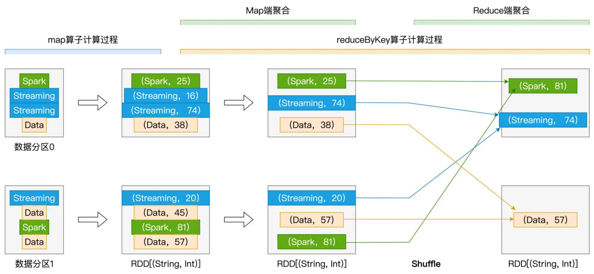

尽管 reduceByKey 也会引入 Shuffle，但相比 groupByKey 以全量原始数据记录的方式消耗磁盘与网络，reduceByKey 在落盘与分发之前，会先在 Shuffle 的 Map 阶段做初步的聚合计算。 

比如，在数据分区 0 的处理中，在 Map 阶段，reduceByKey 把 Key 同为 Streaming 的两条数据记录聚合为一条，聚合逻辑就是由函数 f 定义的、取两者之间 Value 较大的数据记录，这个过程我们称之为“Map 端聚合”。相应地，数据经由网络分发之后，在 Reduce 阶段完成的计算，我们称之为“Reduce 端聚合”。 

在工业级的海量数据下，相比 groupByKey，reduceByKey 通过在 Map 端大幅削减需要落盘与分发的数据量，往往能将执行效率提升至少一倍。 

对于大多数分组 & 聚合的计算需求来说，只要设计合适的聚合函数 f，你都可以使用 reduceByKey 来实现计算逻辑。 不过，reduceByKey 算子有它的局限性，就是其 Map 阶段与 Reduce 阶段的计算逻辑必须保持一致，这个计算逻辑统一由聚合函数 f 定义。当一种计算场景需要在两个阶段执行不同计算逻辑的时候，reduceByKey 就爱莫能助了。 

例如，在WordCount中，想对单词计数的逻辑做如下调整：

* 在 Map 阶段，以数据分区为单位，计算单词的加和； 
* 而在 Reduce 阶段，对于同样的单词，取加和最大的那个数值。 

Map 阶段的计算逻辑是 sum，而 Reduce 阶段的计算逻辑是 max。对于这样的业务需求，reduceByKey 已无用武之地，这个时候就需要aggregateByKey了。

### aggregateByKey

要在 Paired RDD 之上调用 aggregateByKey，你需要提供一个初始值，一个 Map 端聚合函数 f1，以及一个 Reduce 端聚合函数 f2，aggregateByKey 的调用形式如下所示： 

~~~scala
val rdd: RDD[(Key类型，Value类型)] = _
rdd.aggregateByKey(初始值)(f1, f2)
~~~

它们之间的类型需要保持一致，具体来说： 

* 初始值类型，必须与 f2 的结果类型保持一致； 
* f1 的形参类型，必须与 Paired RDD 的 Value 类型保持一致； 
* f2 的形参类型，必须与 f1 的结果类型保持一致。 

用 aggregateByKey 这个算子来实现“先加和，再取最大值”的计算逻辑：

~~~scala
// 把RDD元素转换为（Key，Value）的形式
val kvRDD: RDD[(String, Int)] = cleanWordRDD.map(word => (word, 1))
 
// 显示定义Map阶段聚合函数f1
def f1(x: Int, y: Int): Int = {
return x + y
}
 
// 显示定义Reduce阶段聚合函数f2
def f2(x: Int, y: Int): Int = {
return math.max(x, y)
}
 
// 调用aggregateByKey，实现先加和、再求最大值
val wordCounts: RDD[(String, Int)] = kvRDD.aggregateByKey(0) (f1, f2)
~~~

与 reduceByKey 一样，aggregateByKey 也可以通过 Map 端的初步聚合来大幅削减数据量，在降低磁盘与网络开销的同时，提升 Shuffle 环节的执行性能。 

### sortByKey

它的功能是“按照 Key 进行排序”。给定包含（Key，Value）键值对的 Paired RDD，sortByKey 会以 Key 为准对 RDD 做排序。算子的用法比较简单，只需在 RDD 之上调用 sortByKey() 即可： 

~~~scala
val rdd: RDD[(Key类型，Value类型)] = _
rdd.sortByKey()
~~~

在默认的情况下，sortByKey 按照 Key 值的升序（Ascending）对 RDD 进行排序，如果想按照降序（Descending）来排序的话，你需要给 sortByKey 传入 false。 

## 数据生命周期相关算子

在数据的各生命周期中，相应的算子都在对应阶段起作用：

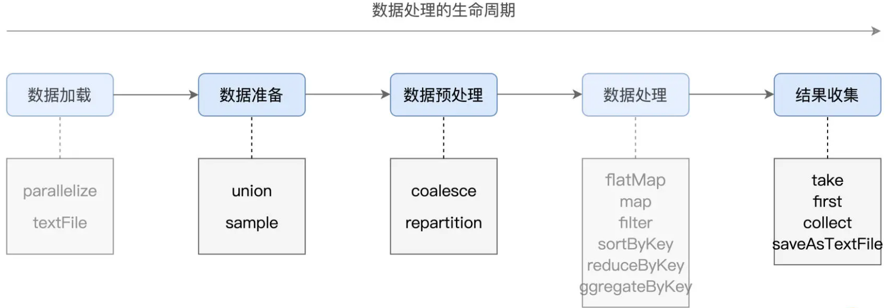

分别来看看每个算子所在的生命周期和它们实现的功能：

* 首先，在数据准备阶段，union 与 sample 用于对不同来源的数据进行合并与拆分。 
* 接下来是数据预处理环节，coalesce 与 repartition可以调整数据分布，较为均衡的数据分布，对后面数据处理阶段提升 CPU 利用率更有帮助，可以整体提升执行效率。 
* Spark 提供了两类结果收集算子，一类是像 take、first、collect 这样，把结果直接收集到 Driver 端；另一类则是直接将计算结果持久化到（分布式）文件系统， 例如saveAsTextFile

### 数据准备阶段

#### union

在我们日常的开发中，union 非常常见，它常常用于把两个类型一致、但来源不同的 RDD 进行合并，从而构成一个统一的、更大的分布式数据集。例如，在某个数据分析场景中，一份数据源来自远端数据库，而另一份数据源来自本地文件系统，要将两份数据进行合并，我们就需要用到 union 这个操作。 

给定两个 RDD：rdd1 和 rdd2，调用 rdd1.union(rdd2) 或是 rdd1 union rdd2，其结果都是两个 RDD 的并集，具体代码如下： 

~~~scala
// T：数据类型
val rdd1: RDD[T] = _
val rdd2: RDD[T] = _
val rdd = rdd1.union(rdd2)
// 或者rdd1 union rdd2
~~~

union 的典型使用场景，是把多份“小数据”，合并为一份“大数据”，从而充分利用 Spark 分布式引擎的并行计算优势。 

#### sample

在一般的数据探索场景中，我们往往只需要对一份数据的子集有基本的了解即可。例如，对于一份体量在 TB 级别的数据集，我们只想随机提取其部分数据，然后计算这部分子集的统计值（均值、方差等） ，这类把“大数据”变成 “小数据”的计算需求就需要用到RDD 的 sample 算子了。

RDD 的 sample 算子用于对 RDD 做随机采样，从而把一个较大的数据集变为一份“小数据”。相较其他算子，sample 的参数比较多，分别是 withReplacement、fraction 和 seed。因此，要在 RDD 之上完成数据采样，你需要使用如下的方式来调用 sample 算子：sample(withReplacement, fraction, seed)。 

* withReplacement 的类型是 Boolean，它的含义是“采样是否有放回”，如果这个参数的值是 true，那么采样结果中可能会包含重复的数据记录，相反，如果该值为 false，那么采样结果不存在重复记录。 
* fraction 参数最好理解，它的类型是 Double，值域为 0 到 1，其含义是采样比例，也就是结果集与原数据集的尺寸比例。 
* seed 参数是可选的，它的类型是 Long，也就是长整型，它代表种子，用于控制每次采样的结果是否一致，相同的种子有相同的采样结果。 

~~~scala
// 生成0到99的整型数组
val arr = (0 until 100).toArray
// 使用parallelize生成RDD
val rdd = sc.parallelize(arr)
 
// 不带seed，每次采样结果都不同
rdd.sample(false, 0.1).collect
// 结果集：Array(11, 13, 14, 39, 43, 63, 73, 78, 83, 88, 89, 90)
rdd.sample(false, 0.1).collect
// 结果集：Array(6, 9, 10, 11, 17, 36, 44, 53, 73, 74, 79, 97, 99)
 
// 带seed，每次采样结果都一样
rdd.sample(false, 0.1, 123).collect
// 结果集：Array(3, 11, 26, 59, 82, 89, 96, 99)
rdd.sample(false, 0.1, 123).collect
// 结果集：Array(3, 11, 26, 59, 82, 89, 96, 99)
 
// 有放回采样，采样结果可能包含重复值
rdd.sample(true, 0.1, 456).collect
// 结果集：Array(7, 11, 11, 23, 26, 26, 33, 41, 57, 74, 96)
rdd.sample(true, 0.1, 456).collect
// 结果集：Array(7, 11, 11, 23, 26, 26, 33, 41, 57, 74, 96)
~~~

有了 union 和 sample，就可以随意地调整分布式数据集的尺寸，真正做到收放自如。

### 数据预处理阶段

 并行度，它实际上就是 RDD 的数据分区数量。 RDD 的 partitions 属性，记录正是 RDD 的所有数据分区。因此，RDD 的并行度与其 partitions 属性相一致。 

开发者可以使用 repartition 算子随意调整（提升或降低）RDD 的并行度，而 coalesce 算子则只能用于降低 RDD 并行度。 

#### repartition

一旦给定了 RDD，我们就可以通过调用 repartition(n) 来随意调整 RDD 并行度。其中参数 n 的类型是 Int，也就是整型，因此，我们可以把任意整数传递给 repartition：

~~~scala
// 生成0到99的整型数组
val arr = (0 until 100).toArray
// 使用parallelize生成RDD
val rdd = sc.parallelize(arr)
 
rdd.partitions.length
// 4
 
val rdd1 = rdd.repartition(2)
rdd1.partitions.length
// 2
 
val rdd2 = rdd.repartition(8)
rdd2.partitions.length
// 8
~~~

首先，我们通过数组创建用于实验的 RDD，从这段代码里可以看到，该 RDD 的默认并行度是 4。在我们分别用 2 和 8 来调整 RDD 的并行度之后，通过计算 RDD partitions 属性的长度，我们发现新 RDD 的并行度分别被相应地调整为 2 和 8。 

每个 RDD 的数据分区，都对应着一个分布式 Task，而每个 Task 都需要一个 CPU 线程去执行。 因此，RDD 的并行度，很大程度上决定了分布式系统中 CPU 的使用效率，进而还会影响分布式系统并行计算的执行效率。并行度过高或是过低，都会降低 CPU 利用率，从而白白浪费掉宝贵的分布式计算资源，因此，合理有效地设置 RDD 并行度，至关重要。 

RDD的并行度没有一个固定的答案，它取决于系统可用资源、分布式数据集大小，甚至还与执行内存有关。 结合经验来说，把并行度设置为可用 CPU 的 2 到 3 倍，往往是个不错的开始。例如，可分配给 Spark 作业的 Executors 个数为 N，每个 Executors 配置的 CPU 个数为 C，那么推荐设置的并行度在2NC到3NC之间。

尽管 repartition 非常灵活，你可以用它随意地调整 RDD 并行度，但是你也需要注意，这个算子有个致命的弊端，那就是它会引入 Shuffle。 如果想要增加并行度，那只能依靠repartition，此时不能避免引入Shuffle。但如果是想降低并行度的话，就可以使用coalesce 

#### coalesce

在用法上，coalesce 与 repartition 一样，它也是通过指定一个 Int 类型的形参，完成对 RDD 并行度的调整，即 coalesce (n)。 

~~~scala
// 生成0到99的整型数组
val arr = (0 until 100).toArray
// 使用parallelize生成RDD
val rdd = sc.parallelize(arr)
 
rdd.partitions.length
// 4
 
val rdd1 = rdd.repartition(2)
rdd1.partitions.length
// 2
 
val rdd2 = rdd.coalesce(2)
rdd2.partitions.length
// 2
~~~

在用法上，coalesce 与 repartition 可以互换，二者的效果是完全一致的。不过，如果我们去观察二者的 DAG，会发现同样的计算逻辑，却有着迥然不同的执行计划：

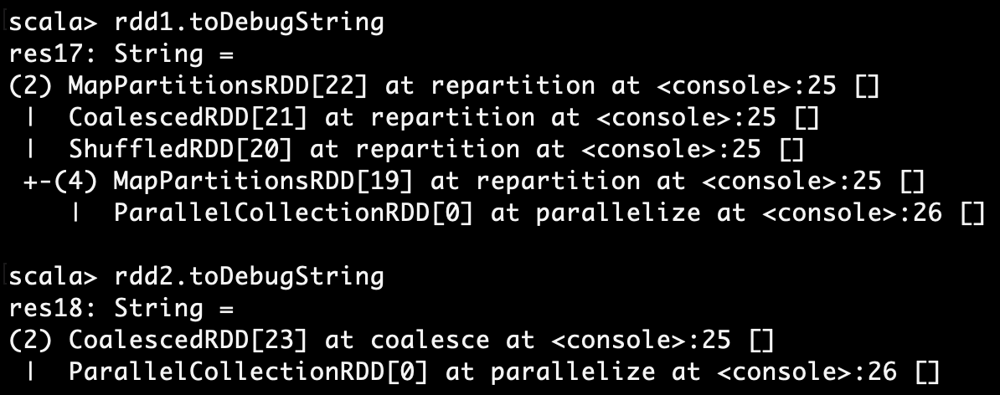

在 RDD 之上调用 toDebugString，Spark 可以帮我们打印出当前 RDD 的 DAG。 尽管图中的打印文本看上去有些凌乱，但你只要抓住其中的一个关键要点就可以了。 这个关键要点就是，在 toDebugString 的输出文本中，每一个带数字的小括号，比如 rdd1 当中的“(2)”和“(4)”，都代表着一个执行阶段，也就是 DAG 中的 Stage。而且，不同的 Stage 之间，会通过制表符（Tab）缩进进行区分，比如图中的“(4)”显然要比“(2)”缩进了一段距离。 

在同一个 DAG 内，不同 Stages 之间的边界是 Shuffle。因此，观察上面的打印文本，我们能够清楚地看到，repartition 会引入 Shuffle，而 coalesce 不会。 

两者的工作原理有本质的不同：

* 给定 RDD，如果用 repartition 来调整其并行度，不论增加还是降低，对于 RDD 中的每一条数据记录，repartition 对它们的影响都是无差别的数据分发。 

  具体来说，给定任意一条数据记录，repartition 的计算过程都是先哈希、再取模，得到的结果便是该条数据的目标分区索引。对于绝大多数的数据记录，目标分区往往坐落在另一个 Executor、甚至是另一个节点之上，因此 Shuffle 自然也就不可避免。 

* coalesce 则不然，在降低并行度的计算中，它采取的思路是把同一个 Executor 内的不同数据分区进行合并，如此一来，数据并不需要跨 Executors、跨节点进行分发，因而自然不会引入 Shuffle。 

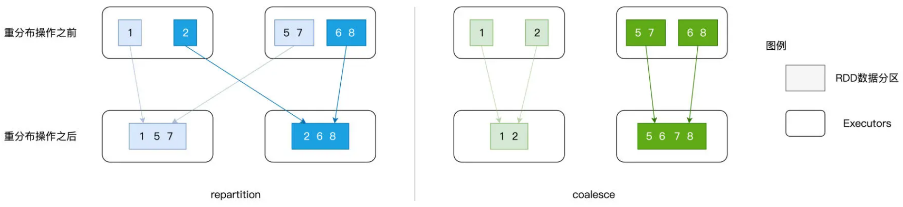

repartition和coalesce相比较，repartition由于引入了shuffle机制，对数据进行打散，混洗，重新平均分配，所以repartition操作较重，但是数据分配均匀。而coalesce只是粗力度移动数据，没有平均分配的过程，会导致数据分布不均匀，在计算时出现数据倾斜。 

掌握了 repartition 和 coalesce 这两个算子，结合数据集大小与集群可用资源，你就可以随意地对 RDD 的并行度进行调整，进而提升 CPU 利用率与作业的执行性能。 

### 结果收集

在结果收集方面，Spark 也为我们准备了丰富的算子。按照收集路径区分，这些算子主要分为两类： 

* 第一类是把计算结果从各个 Executors 收集到 Driver 端 
* 第二个类是把计算结果通过 Executors 直接持久化到文件系统。 

在大数据处理领域，文件系统往往指的是像 HDFS 或是 S3 这样的分布式文件系统。 

#### first、take 和 collect

first、take 和 collect 这三个算子的例子：

~~~scala
import org.apache.spark.rdd.RDD
val rootPath: String = _
val file: String = s"${rootPath}/wikiOfSpark.txt"
// 读取文件内容
val lineRDD: RDD[String] = spark.sparkContext.textFile(file)
 
lineRDD.first
// res1: String = Apache Spark
 
// 以行为单位做分词
val wordRDD: RDD[String] = lineRDD.flatMap(line => line.split(" "))
val cleanWordRDD: RDD[String] = wordRDD.filter(word => !word.equals(""))
 
cleanWordRDD.take(3)
// res2: Array[String] = Array(Apache, Spark, From)
// 把RDD元素转换为（Key，Value）的形式
val kvRDD: RDD[(String, Int)] = cleanWordRDD.map(word => (word, 1))
// 按照单词做分组计数
val wordCounts: RDD[(String, Int)] = kvRDD.reduceByKey((x, y) => x + y)
 
wordCounts.collect
// res3: Array[(String, Int)] = Array((Because,1), (Open,1), (impl...
~~~

其中，first 用于收集 RDD 数据集中的任意一条数据记录，而 take(n: Int) 则用于收集多条记录，记录的数量由 Int 类型的参数 n 来指定。 

不难发现，first 与 take 的主要作用，在于数据探索。对于 RDD 的每一步转换，比如 Word Count 中从文本行到单词、从单词到 KV 转换，我们都可以用 first 或是 take 来获取几条计算结果，从而确保转换逻辑与预期一致。 

相比之下，collect 拿到的不是部分结果，而是全量数据，也就是把 RDD 的计算结果全量地收集到 Driver 端。 它的工作原理如下：


collect 算子有两处性能隐患，一个是拉取数据过程中引入的网络开销，另一个 Driver 的 OOM（内存溢出，Out of Memory） 。

* 数据的拉取和搬运是跨进程、跨节点的，那么和 Shuffle 类似，这个过程必然会引入网络开销。 
* 通常来说，Driver 端的预设内存往往在 GB 量级，而 RDD 的体量一般都在数十 GB、甚至上百 GB，因此，OOM 的隐患不言而喻。collect 算子尝试把 RDD 全量结果拉取到 Driver，当结果集尺寸超过 Driver 预设的内存大小时，Spark 自然会报 OOM 的异常（Exception）。 

正是出于这些原因，我们在使用 collect 算子之前，务必要慎重。 

#### saveAsTextFile

对于全量的结果集，我们还可以使用第二类算子把它们直接持久化到磁盘。在这类算子中，最具代表性的非 saveAsTextFile 莫属，它的用法非常简单，给定 RDD，我们直接调用 saveAsTextFile(path: String) 即可。其中 path 代表的是目标文件系统目录，它可以是本地文件系统，也可以是 HDFS、Amazon S3 等分布式文件系统。 

以 saveAsTextFile 为代表的算子，直接通过 Executors 将 RDD 数据分区物化到文件系统，这个过程并不涉及与 Driver 端的任何交互：


由于数据的持久化与 Driver 无关，因此这类算子天然地避开了 collect 算子带来的两个性能隐患。 

# Spark SQL

## 简单案例

使用Spark SQL做数据分析之前，需要对数据模式（Data Schema）有最基本的认知，也就是源数据都有哪些字段，这些字段的类型和含义分别是什么，这一步就是我们常说的数据探索。 

假设我们要对摇号申请者和中签者数据进行分析，数据探索的思路是这样的：首先，我们使用 SparkSession 的 read API 读取源数据、创建 DataFrame。然后，通过调用 DataFrame 的 show 方法，我们就可以轻松获取源数据的样本数据，从而完成数据的初步探索，代码如下所示：

~~~scala
import org.apache.spark.sql.DataFrame
 
val rootPath: String = _
// 申请者数据
val hdfs_path_apply: String = s"${rootPath}/apply"
// spark是spark-shell中默认的SparkSession实例
// 通过read API读取源文件
val applyNumbersDF: DataFrame = spark.read.parquet(hdfs_path_apply)
// 数据打印
applyNumbersDF.show
 
// 中签者数据
val hdfs_path_lucky: String = s"${rootPath}/lucky"
// 通过read API读取源文件
val luckyDogsDF: DataFrame = spark.read.parquet(hdfs_path_lucky)
// 数据打印
luckyDogsDF.show
~~~

把上述代码丢进 spark-shell 之后，分别在 applyNumbersDF 和 luckyDogsDF 这两个 DataFrame 之上调用 show 函数，我们就可以得到样本数据。可以看到，“这两张表”的 Schema 是一样的，它们都包含两个字段，一个是 String 类型的 carNum，另一个是类型为 Int 的 batchNum：

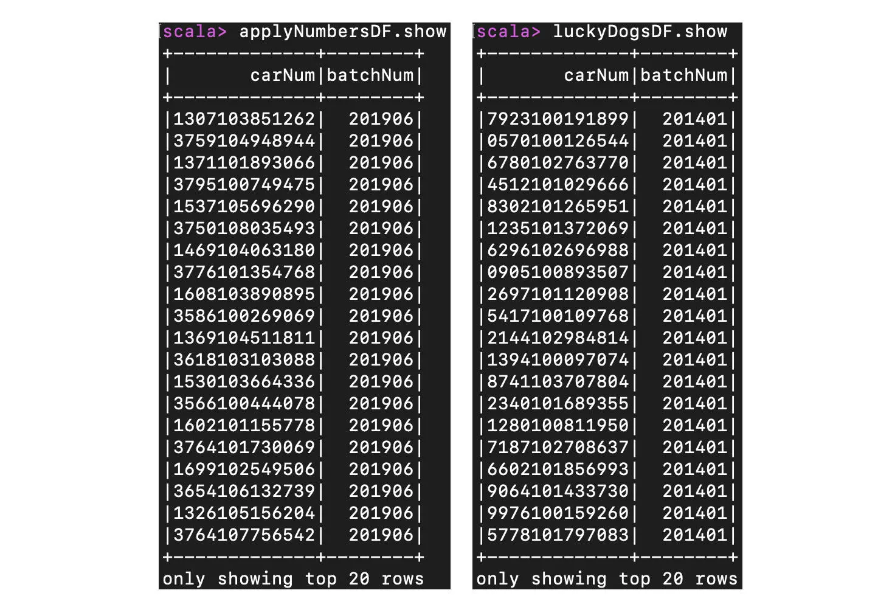

其中，carNum 的含义是申请号码、或是中签号码，而 batchNum 则代表摇号批次，比如 201906 表示 2019 年的最后一批摇号，201401 表示 2014 年的第一次摇号。 

下面是一个数据分析的简单代码示例：

~~~scala
import org.apache.spark.sql.DataFrame
 
val rootPath: String = _
// 申请者数据
val hdfs_path_apply: String = s"${rootPath}/apply"
// spark是spark-shell中默认的SparkSession实例
// 通过read API读取源文件
val applyNumbersDF: DataFrame = spark.read.parquet(hdfs_path_apply)
 
// 中签者数据
val hdfs_path_lucky: String = s"${rootPath}/lucky"
// 通过read API读取源文件
val luckyDogsDF: DataFrame = spark.read.parquet(hdfs_path_lucky)
 
// 过滤2016年以后的中签数据，且仅抽取中签号码carNum字段
val filteredLuckyDogs: DataFrame = luckyDogsDF.filter(col("batchNum") >= "201601").select("carNum")
 
// 摇号数据与中签数据做内关联，Join Key为中签号码carNum
val jointDF: DataFrame = applyNumbersDF.join(filteredLuckyDogs, Seq("carNum"), "inner")
 
// 以batchNum、carNum做分组，统计倍率系数
val multipliers: DataFrame = jointDF.groupBy(col("batchNum"),col("carNum"))
.agg(count(lit(1)).alias("multiplier"))
 
// 以carNum做分组，保留最大的倍率系数
val uniqueMultipliers: DataFrame = multipliers.groupBy("carNum")
.agg(max("multiplier").alias("multiplier"))
 
// 以multiplier倍率做分组，统计人数
val result: DataFrame = uniqueMultipliers.groupBy("multiplier")
.agg(count(lit(1)).alias("cnt"))
.orderBy("multiplier")
 
result.collect
~~~

在这个案例中，先是使用 SparkSession 的 read API 来创建 DataFrame，然后，以 DataFrame 为入口，通过调用各式各样的算子来完成不同 DataFrame 之间的转换，从而进行数据分析。 

## Spark SQL优化引擎

之前提到过的一些算子，例如map、mapPartitions、filter、flatMap 这些算子，它们都是高阶函数（Higher-order Functions） ，所谓高阶函数，它指的是形参为函数的函数，或是返回类型为函数的函数。换句话说，高阶函数，首先本质上也是函数，特殊的地方在于它的形参和返回类型，这两者之中只要有一个是函数类型，那么原函数就属于高阶函数。 

当使用高阶函数时，Spark只知道开发者要做 map、filter，但并不知道开发者打算怎么做 map 和 filter。换句话说，对于 Spark 来说，辅助函数 f 是透明的。在 RDD 的开发框架下，Spark Core 只知道开发者要“做什么”，而不知道“怎么做” ，这让Spark Core除了把函数 f 以闭包的形式打发到 Executors 以外，实在是没有什么额外的优化空间。 

针对 RDD 优化空间受限的问题，Spark 社区在 1.3 版本发布了 DataFrame。 DataFrame和RDD的不同之处：

* 数据的表示形式（Data Representation） ：DataFrame 与 RDD 一样，都是用来封装分布式数据集的。但在数据表示方面就不一样了，DataFrame 是携带数据模式（Data Schema）的结构化数据，而 RDD 是不携带 Schema 的分布式数据集。恰恰是因为有了 Schema 提供明确的类型信息，Spark 才能耳聪目明，有针对性地设计出更紧凑的数据结构，从而大幅度提升数据存储与访问效率。 

* 开发算子方面，RDD 算子多采用高阶函数，高阶函数的优势在于表达能力强，它允许开发者灵活地设计并实现业务逻辑。而 DataFrame 的表达能力却很弱，它定义了一套 DSL 算子（Domain Specific Language） ，例如select、filter、agg、groupBy，等等，它们都属于 DSL 算子。 

  DSL 语言往往是为了解决某一类特定任务而设计，非图灵完备，因此在表达能力方面非常有限。DataFrame 的算子大多数都是标量函数（Scalar Functions），它们的形参往往是结构化二维表的数据列（Columns）。 

  尽管 DataFrame 算子在表达能力方面更弱，但是 DataFrame 每一个算子的计算逻辑都是确定的，比如 select 用于提取某些字段，groupBy 用于对数据做分组，等等。这些计算逻辑对 Spark 来说，不再是透明的，因此，Spark 可以基于启发式的规则或策略，甚至是动态的运行时信息，去优化 DataFrame 的计算过程。 

总结下来，相比 RDD，DataFrame 通过携带明确类型信息的 Schema、以及计算逻辑明确的转换算子，为 Spark 引擎的内核优化打开了全新的空间。 

真正负责优化引擎内核（Spark Core） 的就是Spark SQL，两者的区别：

* Spark Core 特指 Spark 底层执行引擎（Execution Engine） ，它包括了调度系统、存储系统、内存管理、Shuffle 管理等核心功能模块

* Spark SQL 则凌驾于 Spark Core 之上，是一层独立的优化引擎（Optimization Engine）。换句话说，Spark Core 负责执行，而 Spark SQL 负责优化，Spark SQL 优化过后的代码，依然要交付 Spark Core 来做执行。 

  从开发入口来说，在 RDD 框架下开发的应用程序，会直接交付 Spark Core 运行。而使用 DataFrame API 开发的应用，则会先过一遍 Spark SQL，由 Spark SQL 优化过后再交由 Spark Core 去做执行。 

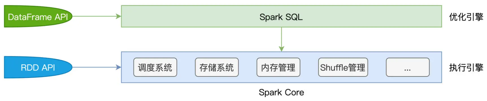

基于 DataFrame，Spark SQL基于它的两个核心组件进行优化：Catalyst 优化器和 Tungsten

* Catalyst 优化器，它的职责在于创建并优化执行计划，它包含 3 个功能模块，分别是创建语法树并生成执行计划、逻辑阶段优化和物理阶段优化。 
* Tungsten 用于衔接 Catalyst 执行计划与底层的 Spark Core 执行引擎，它主要负责优化数据结果与可执行代码。 

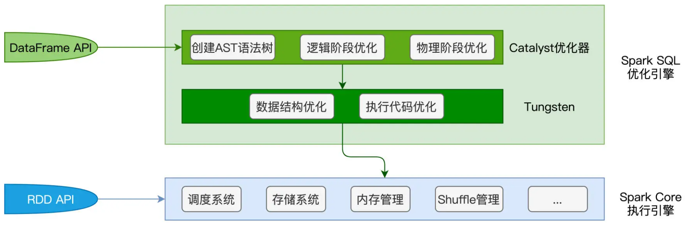

### Catalyst 优化器

基于代码中 DataFrame 之间确切的转换逻辑，Catalyst 会先使用第三方的 SQL 解析器 ANTLR 生成抽象语法树（AST，Abstract Syntax Tree）。AST 由节点和边这两个基本元素构成，其中节点就是各式各样的操作算子，如 select、filter、agg 等，而边则记录了数据表的 Schema 信息，如字段名、字段类型，等等。 

用之前的案例：“倍率分析”的语法树为例，它实际上描述了从源数据到最终计算结果之间的转换过程。因此，在 Spark SQL 的范畴内，AST 语法树又叫作“执行计划”（Execution Plan）。 

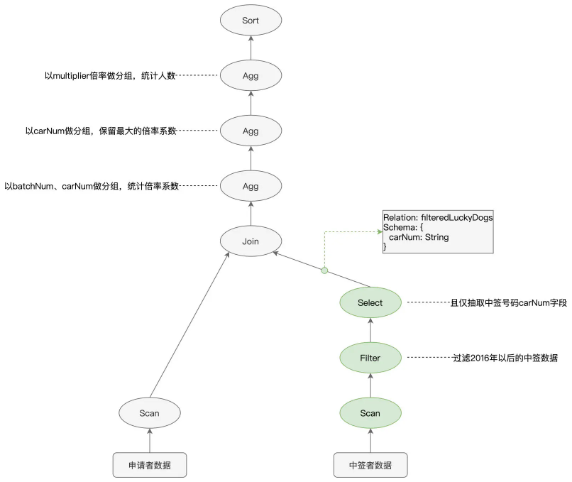

可以看到，由算子构成的语法树、或者说执行计划，给出了明确的执行步骤。即使不经过任何优化，Spark Core 也能把这个“原始的”执行计划按部就班地运行起来。 

不过，从执行效率的角度出发，这么做并不是最优的选择。 以图中绿色的节点为例，Scan 用于全量扫描并读取中签者数据，Filter 则用来过滤出摇号批次大于等于“201601”的数据，Select 节点的作用则是抽取数据中的“carNum”字段。 程序的初始数据源，是以 Parquet 格式进行存储的，而 Parquet 格式在文件层面支持“谓词下推”（Predicates Pushdown）和“列剪枝”（Columns Pruning）这两项特性：

* 谓词下推：利用像“batchNum >= 201601”这样的过滤条件，在扫描文件的过程中，只读取那些满足条件的数据文件。 
* 列剪枝：Parquet 格式属于列存（Columns Store）数据结构，因此 Spark 只需读取字段名为“carNum”的数据文件，而“剪掉”读取其他数据文件的过程。 

以中签数据为例，在谓词下推和列剪枝的帮助下，Spark Core 只需要扫描图中绿色的文件部分：

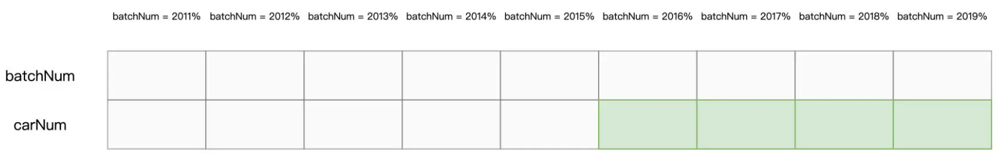

这两项优化，都可以有效帮助 Spark Core 大幅削减数据扫描量、降低磁盘 I/O 消耗，从而显著提升数据的读取效率。 

因此，如果能把 3 个绿色节点的执行顺序，从“Scan > Filter > Select”调整为“Filter > Select > Scan”，那么，相比原始的执行计划，调整后的执行计划能给 Spark Core 带来更好的执行性能。 

像谓词下推、列剪枝这样的特性，都被称为启发式的规则或策略。而 Catalyst 优化器的核心职责之一，就是在逻辑优化阶段，基于启发式的规则和策略调整、优化执行计划，为物理优化阶段提升性能奠定基础。经过逻辑阶段的优化之后，原始的执行计划调整为下图所示的样子，请注意绿色节点的顺序变化：

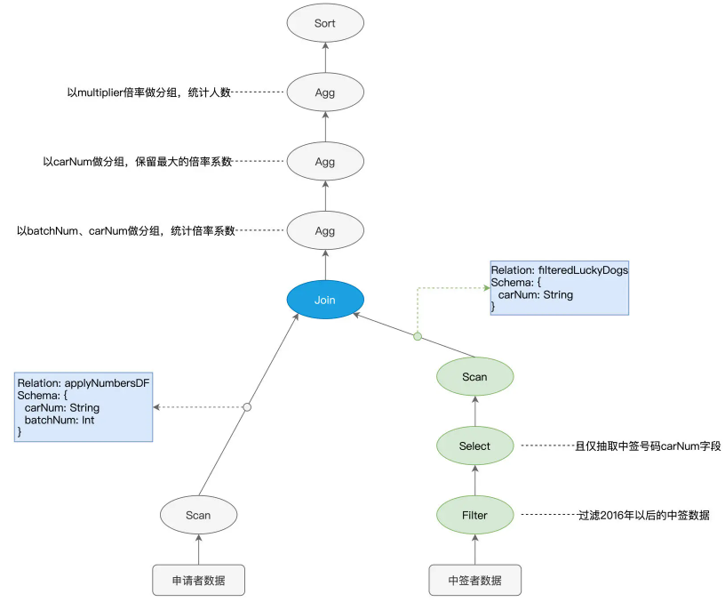

除了逻辑阶段的优化，Catalyst 在物理优化阶段还会进一步优化执行计划。与逻辑阶段主要依赖先验的启发式经验不同，物理阶段的优化，主要依赖各式各样的统计信息，如数据表尺寸、是否启用数据缓存、Shuffle 中间文件，等等。换句话说，逻辑优化更多的是一种“经验主义”，而物理优化则是“用数据说话”。 

以图中蓝色的 Join 节点为例，执行计划仅交代了 applyNumbersDF 与 filteredLuckyDogs 这两张数据表需要做内关联，但是，它并没有交代清楚这两张表具体采用哪种机制来做关联。按照实现机制来分类，数据关联有 3 种实现方式，分别是嵌套循环连接（NLJ，Nested Loop Join）、排序归并连接（Sort Merge Join）和哈希连接（Hash Join）。 而按照数据分发方式来分类，数据关联又可以分为 Shuffle Join 和 Broadcast Join 这两大类。因此，在分布式计算环境中，至少有 6 种 Join 策略供 Spark SQL 来选择。 不同策略在执行效率上有着天壤之别即可。 

回到蓝色 Join 节点的例子，在物理优化阶段，Catalyst 优化器需要结合 applyNumbersDF 与 filteredLuckyDogs 这两张表的存储大小，来决定是采用运行稳定但性能略差的 Shuffle Sort Merge Join，还是采用执行性能更佳的 Broadcast Hash Join。 

不论 Catalyst 决定采用哪种 Join 策略，优化过后的执行计划，都可以丢给 Spark Core 去做执行。 当 Catalyst 优化器完成它的“历史使命”之后，Tungsten 会接过接力棒，在 Catalyst 输出的执行计划之上，继续打磨、精益求精，力求把最优的执行代码交付给底层的 SparkCore 执行引擎。 

### Tungsten

Tungsten 又叫钨丝计划，Tungsten 主要是在数据结构和执行代码这两个方面，做进一步的优化。数据结构优化指的是 Unsafe Row 的设计与实现，执行代码优化则指的是全阶段代码生成（WSCG，Whole Stage Code Generation）。 

#### 数据结构优化

对于 DataFrame 中的每一条数据记录，Spark SQL 默认采用 org.apache.spark.sql.Row 对象来进行封装和存储。我们知道，使用 Java Object 来存储数据会引入大量额外的存储开销。 为此，Tungsten 设计并实现了一种叫做 Unsafe Row 的二进制数据结构。Unsafe Row 本质上是字节数组，它以极其紧凑的格式来存储 DataFrame 的每一条数据记录，大幅削减存储开销，从而提升数据的存储与访问效率。 

以下表的 Data Schema 为例，对于包含如下 4 个字段的每一条数据记录来说，如果采用默认的 Row 对象进行存储的话，那么每条记录需要消耗至少 60 个字节：

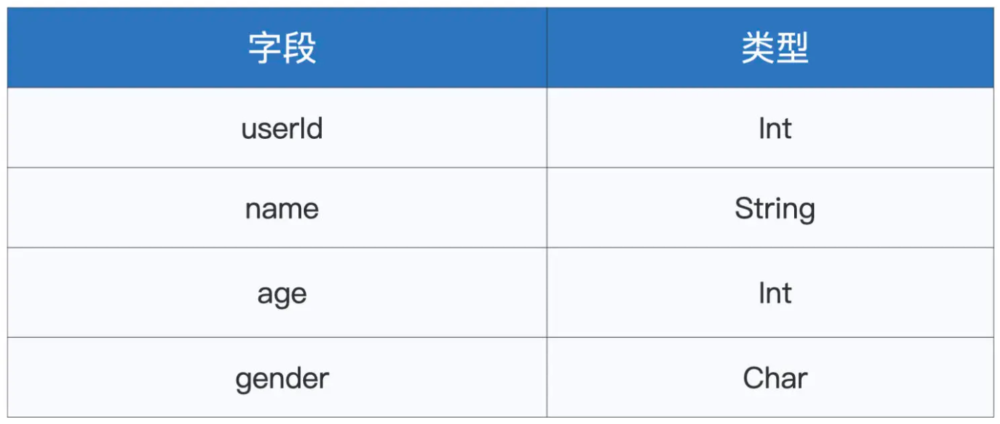

这样的存储方式有两个明显的缺点:

* 存储开销大。我们拿类型是 String 的 name 来举例，如果一个用户的名字叫做“Mike”，它本应该只占用 4 个字节，但在 JVM 的对象存储中，“Mike”会消耗总共 48 个字节，其中包括 12 个字节的对象头信息、8 字节的哈希编码、8 字节的字段值存储和另外 20 个字节的其他开销。从 4 个字节到 48 个字节，存储开销可见一斑。 
* 在 JVM 堆内内存中，对象数越多垃圾回收效率越低。因此，一条数据记录用一个对象来封装是最好的。但是对于上面的对象来说，JVM需要至少4个对象才能存储一条数据记录

但如果用 Tungsten Unsafe Row 数据结构进行存储的话，每条数据记录仅需消耗十几个字节，如下图所示：

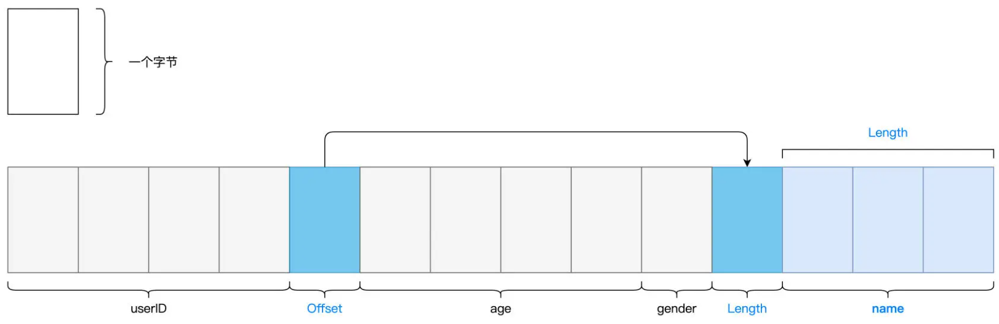

字节数组的存储方式在消除存储开销的同时，仅用一个数组对象就能轻松完成一条数据的封装，显著降低 GC 压力。

#### 基于内存页的内存管理

为了统一堆外与堆内内存的管理，同时进一步提升数据存储效率与 GC 效率，Tungsten 还推出了基于内存页的内存管理模式。 

为了统一管理 Off Heap 和 On Heap 内存空间，Tungsten 定义了统一的 128 位内存地址，简称 Tungsten 地址。Tungsten 地址分为两部分：前 64 位预留给 Java Object，后 64 位是偏移地址 Offset。但是，同样是 128 位的 Tungsten 地址，Off Heap 和 On Heap 两块内存空间在寻址方式上截然不同：

* 对于 On Heap 空间的 Tungsten 地址来说，前 64 位存储的是 JVM 堆内对象的引用或者说指针，后 64 位 Offset 存储的是数据在该对象内的偏移地址。 
* Off Heap 空间则完全不同，在堆外的空间中，由于 Spark 是通过 Java Unsafe API 直接管理操作系统内存，不存在内存对象的概念，因此前 64 位存储的是 null 值，后 64 位则用于在堆外空间中直接寻址操作系统的内存空间。 

在 Tungsten 模式下，管理 On Heap 会比 Off Heap 更加复杂。这是因为，在 On Heap 内存空间寻址堆内数据必须经过两步： 

* 第一步，通过前 64 位的 Object 引用来定位 JVM 对象； 
* 第二步，结合 Offset 提供的偏移地址在堆内内存空间中找到所需的数据。 

堆外、堆内不同的寻址方式如下：


如上图所示，Tungsten 使用一种叫做页表（Page Table）的数据结构，来记录从 Object 引用到 JVM 对象地址的映射。页表中记录的是一个又一个内存页（Memory Page），内存页实际上就是一个 JVM 对象而已。只要给定 64 位的 Object 引用，Tungsten 就能通过页表轻松拿到 JVM 对象地址，从而完成寻址。 

以常用的 HashMap 数据结构为例，来对比 Java 标准库（java.util.HashMap）和 Tungsten 模式下的 HashMap。 

Java 标准库采用数组加链表的方式来实现 HashMap，如下图所示，数组元素存储 Hash code 和链表头。链表节点存储 3 个元素，分别是 Key 引用、Value 引用和下一个元素的地址：

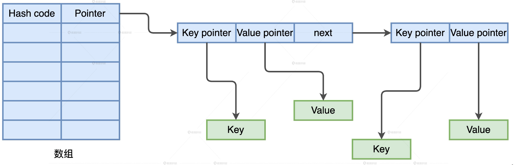

这种实现方式的弊端：

* 存储开销和 GC 负担比较大。结合上面的示意图我们不难发现，存储数据的对象值只占整个 HashMap 一半的存储空间，另外一半的存储空间用来存储引用和指针，这 50% 的存储开销还是蛮大的。 而且我们发现，图中每一个 Key、Value 和链表元素都是 JVM 对象。假设，我们用 HashMap 来存储一百万条数据条目，那么 JVM 对象的数量至少是三百万。由于 JVM 的 GC 效率与对象数量成反比，因此 java.util.HashMap 的实现方式对于 GC 并不友好。 
* 其次，在数据访问的过程中，标准库实现的 HashMap 容易降低 CPU 缓存命中率，进而降低 CPU 利用率。链表这种数据结构的特点是，对写入友好，但访问低效。用链表存储数据的方式确实很灵活，这让 JVM 可以充分利用零散的内存区域，提升内存利用率。但是，在对链表进行全量扫描的时候，这种零散的存储方式会引入大量的随机内存访问（Random Memory Access）。相比顺序访问，随机内存访问会大幅降低 CPU cache 命中率。 

Tungsten HashMap的内存空间如下：

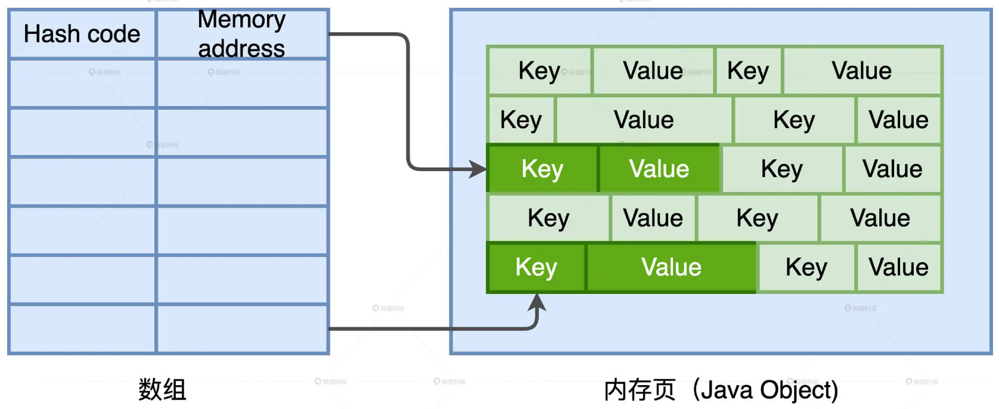

针对以上几个弊端，Tungsten的解决方案如下：

* 首先，Tungsten 放弃了链表的实现方式，使用数组加内存页的方式来实现 HashMap。数组中存储的元素是 Hash code 和 Tungsten 内存地址，也就是 Object 引用外加 Offset 的 128 位地址。Tungsten HashMap 使用 128 位地址来寻址数据元素，相比 java.util.HashMap 大量的链表指针，在存储开销上更低。 
* 其次，Tungsten HashMap 的存储单元是内存页，内存页本质上是 Java Object，一个内存页可以存储多个数据条目。因此，相比标准库中的 HashMap，使用内存页大幅缩减了存储所需的对象数量。比如说，我们需要存储一百万条数据记录，标准库的 HashMap 至少需要三百万的 JVM 对象才能存下，而 Tungsten HashMap 可能只需要几个或是十几个内存页就能存下。对比下来，它们所需的 JVM 对象数量可以说是天壤之别，显然，Tungsten 的实现方式对于 GC 更加友好。 
* 再者，内存页本质上是 JVM 对象，其内部使用连续空间来存储数据，内存页加偏移量可以精准地定位到每一个数据元素。因此，在需要扫描 HashMap 全量数据的时候，得益于内存页中连续存储的方式，内存的访问方式从原来的随机访问变成了顺序读取（Sequential Access）。顺序内存访问会大幅提升 CPU cache 利用率，减少 CPU 中断，显著提升 CPU 利用率。 

#### 执行代码优化

WSCG：全阶段代码生成。所谓全阶段，其实就是之前提到的在调度系统中学过的 Stage。以图中的执行计划为例，标记为绿色的 3 个节点，在任务调度的时候，会被划分到同一个 Stage：


而代码生成，指的是 Tungsten 在运行时把算子之间的“链式调用”捏合为一份代码。以上图 3 个绿色的节点为例，在默认情况下，Spark Core 会对每一条数据记录都依次执行 Filter、Select 和 Scan 这 3 个操作。 

经过了 Tungsten 的 WSCG 优化之后，Filter、Select 和 Scan 这 3 个算子，会被“捏合”为一个函数 f。这样一来，Spark Core 只需要使用函数 f 来一次性地处理每一条数据，就能消除不同算子之间数据通信的开销，一气呵成地完成计算。 

融合函数的必要性：迭代器嵌套的计算模式性能不好，一个是内存数据的随机存取，另一个是虚函数调用（next）。这两种操作都会降低 CPU 的缓存命中率，影响 CPU 的工作效率。 

WSCG 机制的工作过程就是基于一份“性能较差的代码”，在运行时动态地（On The Fly）重构出一份“性能更好的代码”。 

分别完成 Catalyst 和 Tungsten 这两个优化环节之后，Spark SQL 终于“心满意足”地把优化过的执行计划、以及生成的执行代码，交付给 Spark Core 。Spark Core 拿到计划和代码，在运行时利用 Tungsten Unsafe Row 的数据结构，完成分布式任务计算。 

## 创建 DataFrame

之前在简单案例中，用了 SparkSession 的 read API 从 Parquet 文件创建 DataFrame，其实创建 DataFrame 的方法还有很多。 

DataFrame 的创建途径非常丰富，如下图所示，Spark 支持多种数据源，按照数据来源进行划分，这些数据源可以分为如下几个大类：Driver 端自定义的数据结构、（分布式）文件系统、关系型数据库 RDBMS、关系型数据仓库、NoSQL 数据库，以及其他的计算引擎。 

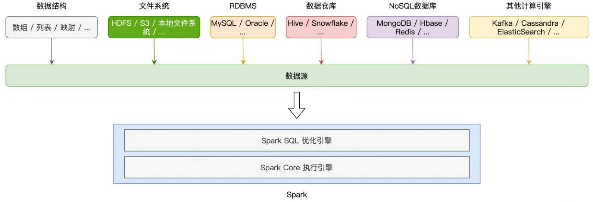

### 从 Driver 创建 DataFrame

在 Driver 端，Spark 可以直接从数组、元组、映射等数据结构创建 DataFrame。使用这种方式创建的 DataFrame 通常数据量有限，因此这样的 DataFrame 往往不直接参与分布式计算，而是用于辅助计算或是数据探索。 

在数据表示（Data Representation）上，相比 RDD，DataFrame 仅仅是多了一个 Schema。甚至可以说，DataFrame 就是带 Schema 的 RDD。因此，创建 DataFrame 的一种方法，就是先创建 RDD，然后再给它“扣上”一顶 Schema 的“帽子”。

从本地数据结构创建 RDD，我们用的是 SparkContext 的 parallelize 方法，而给 RDD“扣帽子”，我们要用到 SparkSession 的 createDataFrame 方法。 

1、createDataFrame 方法 

为了创建 RDD，我们先来定义列表数据 seq。seq 的每个元素都是二元元组，元组第一个元素的类型是 String，第二个元素的类型是 Int。有了列表数据结构，接下来我们创建 RDD，如下所示：

~~~scala
import org.apache.spark.rdd.RDD
val seq: Seq[(String, Int)] = Seq(("Bob", 14), ("Alice", 18))
val rdd: RDD[(String, Int)] = sc.parallelize(seq)
~~~

 有了 RDD 之后，我们来给它制作一顶“帽子”，也就是我们刚刚说的 Schema。创建 Schema，我们需要用到 Spark SQL 内置的几种类型，如 StructType、StructField、StringType、IntegerType，等等。 

其中，StructType 用于定义并封装 Schema，StructFiled 用于定义 Schema 中的每一个字段，包括字段名、字段类型，而像 StringType、IntegerType 这些 *Type 类型，表示的正是字段类型。为了和 RDD 数据类型保持一致，Schema 对应的元素类型应该是（StringType，IntegerType）：

~~~scala
import org.apache.spark.sql.types.{StringType, IntegerType, StructField, StructType}
val schema:StructType = StructType( Array(
StructField("name", StringType),
StructField("age", IntegerType)
))
~~~

createDataFrame 方法有两个形参，第一个参数正是 RDD，第二个参数是 Schema。createDataFrame 要求 RDD 的类型必须是 RDD[Row]，其中的 Row 是 org.apache.spark.sql.Row，因此，对于类型为 RDD[(String, Int)]的 rdd，我们需要把它转换为 RDD[Row] ，然后就可以创建DataFrame了：

~~~scala
import org.apache.spark.sql.Row
val rowRDD: RDD[Row] = rdd.map(fileds => Row(fileds._1, fileds._2))


import org.apache.spark.sql.DataFrame
val dataFrame: DataFrame = spark.createDataFrame(rowRDD,schema)
~~~

DataFrame 创建好之后，可以通过调用 show 方法来做简单的数据探索，验证 DataFrame 创建是否成功：

~~~scala
dataFrame.show
 
/** 结果显示
+----+---+
| name| age|
+----+---+
| Bob| 14|
| Alice| 18|
+----+---+
*/
~~~

综合起来：先是用 Driver 端数据结构创建 RDD，然后再调用 createDataFrame 把 RDD 转化为 DataFrame。 

2、toDF方法

其实要把 RDD 转化为 DataFrame，我们并不一定非要亲自制作 Schema 这顶帽子，还可以直接在 RDD 之后调用 toDF 方法来做到这一点 ：

~~~scala
import spark.implicits._
val dataFrame: DataFrame = rdd.toDF
dataFrame.printSchema
/** Schema显示
root
|-- _1: string (nullable = true)
|-- _2: integer (nullable = false)
*/
~~~

可以看到，我们显示导入了 spark.implicits 包中的所有方法，然后通过在 RDD 之上调用 toDF 就能轻松创建 DataFrame。实际上，利用 spark.implicits，我们甚至可以跳过创建 RDD 这一步，直接通过 seq 列表来创建 DataFrame ：

~~~scala
import spark.implicits._
val dataFrame: DataFrame = seq.toDF
dataFrame.printSchema
/** Schema显示
root
|-- _1: string (nullable = true)
|-- _2: integer (nullable = false)
*/
~~~

之所以能用 toDF 轻松创建 DataFrame，关键在于 spark.implicits 这个包提供了各种隐式方法。 之所以能用 toDF 轻松创建 DataFrame，关键在于 spark.implicits 这个包提供了各种隐式方法。 

### 从文件系统创建 DataFrame 

Spark 支持多种文件系统，常见的有 HDFS、Amazon S3、本地文件系统，等等。不过无论哪种文件系统，Spark 都要通过 SparkSession 的 read API 来读取数据并创建 DataFrame。 read API 由 SparkSession 提供，它允许开发者以统一的形式来创建 DataFrame，如下图所示 ：

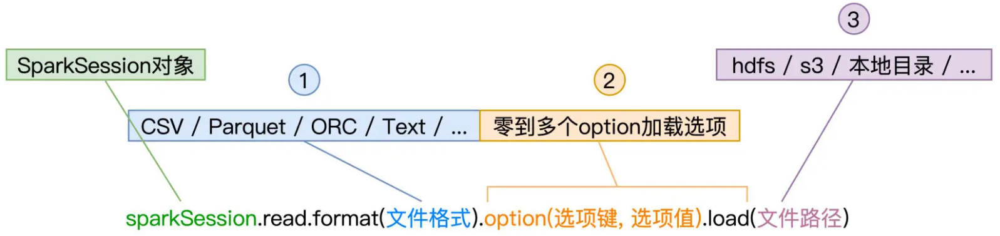

可以看到，要使用 read API 创建 DataFrame，开发者只需要调用 SparkSession 的 read 方法，同时提供 3 类参数即可。这 3 类参数分别是文件格式、加载选项和文件路径，它们分别由函数 format、option 和 load 来指定：

* 第 1 类参数文件格式，它就是文件的存储格式，如 CSV（Comma Separated Values）、Text、Parquet、ORC、JSON。Spark SQL 支持种类丰富的文件格式，除了这里列出的几个例子外，Spark SQL 还支持像 Zip 压缩文件、甚至是图片 Image 格式。 

* 文件格式决定了第 2 类参数加载选项的可选集合，也就是说，不同的数据格式，可用的选型有所不同。比如，CSV 文件格式可以通过 option(“header”, true)，来表明 CSV 文件的首行为 Data Schema，但其他文件格式就没有这个选型。 

  值得一提的是，加载选项可以有零个或是多个，当需要指定多个选项时，我们可以用“option(选项 1, 值 1).option(选项 2, 值 2)”的方式来实现。 

* read API 的第 3 类参数是文件路径，这个参数很好理解，它就是文件系统上的文件定位符。比如本地文件系统中的“/dataSources/wikiOfSpark.txt”，HDFS 分布式文件系统中的“hdfs://hostname:port/myFiles/userProfiles.csv”，或是 Amazon S3 上的“s3://myBucket/myProject/myFiles/results.parquet”，等等。 

#### 读取CSV

从 CSV 文件成功地创建 DataFrame，关键在于了解并熟悉与之有关的加载选项。 CSV格式对应的option如下：

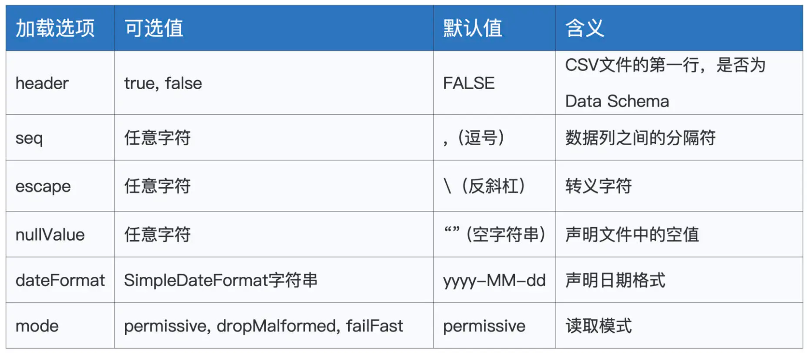

header 的设置值为布尔值，也即 true 或 false，它用于指定 CSV 文件的首行是否为列名。如果是的话，那么 Spark SQL 将使用首行的列名来创建 DataFrame，否则使用“_c”加序号的方式来命名每一个数据列，比如“\_c0”、“\_c1”，等等。 

对于加载的每一列数据，不论数据列本身的含义是什么，Spark SQL 都会将其视为 String 类型。例如，对于后面这个 CSV 文件，Spark SQL 将“name”和“age”两个字段都视为 String 类型：

~~~csv
name,age
alice,18
bob,14
~~~

~~~scala
import org.apache.spark.sql.DataFrame
val csvFilePath: String = _
val df: DataFrame = spark.read.format("csv").option("header", true).load(csvFilePath)
// df: org.apache.spark.sql.DataFrame = [name: string, age: string]
df.show
/** 结果打印
+-----+---+
| name| age|
+-----+---+
| alice| 18|
| bob| 14|
+-----+---+
*/
~~~

要想在加载的过程中，为 DataFrame 的每一列指定数据类型，我们需要显式地定义 Data Schema，并在 read API 中通过调用 schema 方法，来将 Schema 传递给 Spark SQL：

~~~scala
import org.apache.spark.sql.types.{StringType, IntegerType, StructField, StructType}
val schema:StructType = StructType( Array(
StructField("name", StringType),
StructField("age", IntegerType)
))


val csvFilePath: String = _
val df: DataFrame = spark.read.format("csv").schema(schema).option("header", true).load(csvFilePath)
// df: org.apache.spark.sql.DataFrame = [name: string, age: int]
~~~

可以看到，在使用 schema 方法明确了 Data Schema 以后，数据加载完成之后创建的 DataFrame 类型由原来的“[name: string, age: string]”，变为“[name: string, age: int]”。需要注意的是，并不是所有文件格式都需要 schema 方法来指定 Data Schema，因此在 read API 的一般用法中，schema 方法并不是必需环节。 

最后一个选项是“mode”，它用来指定文件的读取模式，更准确地说，它明确了 Spark SQL 应该如何对待 CSV 文件中的“脏数据”。 

所谓脏数据，它指的是数据值与预期数据类型不符的数据记录。比如说，CSV 文件中有一列名为“age”数据，它用于记录用户年龄，数据类型为整型 Int。那么显然，age 列数据不能出现像“8.5”这样的小数、或是像“8 岁”这样的字符串，这里的“8.5”或是“8 岁”就是我们常说的脏数据。 

mode 支持 3 个取值，分别是 permissive、dropMalformed 和 failFast，它们的含义如下表所示：

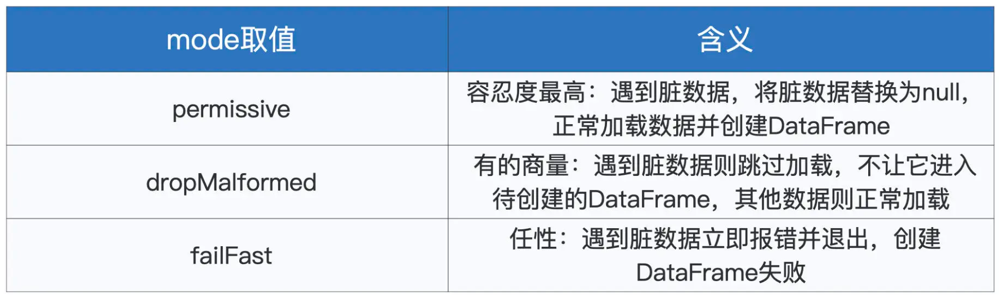

可以看到，除了“failFast”模式以外，另外两个模式都不影响 DataFrame 的创建。 

#### 读取Parquet / ORC 

Parquet 与 ORC，都是应用广泛的列存（Column-based Store）文件格式。顾名思义，列存，是相对行存（Row-based Store）而言的。 

在传统的行存文件格式中，数据记录以行为单位进行存储。虽然这非常符合人类的直觉，但在数据的检索与扫描方面，行存数据往往效率低下。例如，在数据探索、数据分析等数仓应用场景中，我们往往仅需扫描数据记录的某些字段，但在行存模式下，我们必须要扫描全量数据，才能完成字段的过滤。 

列存文件则不同，它以列为单位，对数据进行存储，每一列都有单独的文件或是文件块。 不仅如此，对于每一个列存文件或是文件块，列存格式往往会附加 header 和 footer 等数据结构，来记录列数据的统计信息，比如最大值、最小值、记录统计个数，等等。这些统计信息会进一步帮助提升数据访问效率。

再者，很多列存格式往往在文件中记录 Data Schema，比如 Parquet 和 ORC，它们会利用 Meta Data 数据结构，来记录所存储数据的数据模式。这样一来，在读取类似列存文件时，我们无需再像读取 CSV 一样，去手工指定 Data Schema，这些繁琐的步骤都可以省去。因此，使用 read API 来读取 Parquet 或是 ORC 文件，就会变得非常轻松，如下所示 ：

~~~scala
val parquetFilePath: String = _
val df: DataFrame = spark.read.format("parquet").load(parquetFilePath)

val orcFilePath: String = _
val df: DataFrame = spark.read.format("orc").load(orcFilePath)
~~~

可以看到，在 read API 的用法中，我们甚至不需要指定任何 option，只要有 format 和 load 这两个必需环节即可。 

### 从 RDBMS 创建 DataFrame

使用 read API 读取数据库，就像是使用命令行连接数据库那么简单。而使用命令行连接数据库，我们往往需要通过参数来指定数据库驱动、数据库地址、用户名、密码等关键信息。read API 也是一样，只不过，这些参数通通由 option 选项来指定，以 MySQL 为例，read API 的使用方法如下 ：

~~~scala
spark.read.format("jdbc")
.option("driver", "com.mysql.jdbc.Driver")
.option("url", "jdbc:mysql://hostname:port/mysql")
.option("user", "用户名")
.option("password","密码")
.option("numPartitions", 20)
.option("dbtable", "数据表名 ")
.load()
~~~

访问数据库，我们同样需要 format 方法来指定“数据源格式”，这里的关键字是“jdbc”。请注意，由于数据库 URL 通过 option 来指定，因此调用 load 方法不再需要传入“文件路径”，我们重点来关注 option 选项的设置。 

与命令行一样，option 选项同样需要 driver、url、user、password 这些参数，来指定数据库连接的常规设置。不过，毕竟调用 read API 的目的是创建 DataFrame，因此，我们还需要指定“dbtable”选项来确定要访问哪个数据表。 

除了将表名赋值给“dbtable”以外，我们还可以把任意的 SQL 查询语句赋值给该选项，这样在数据加载的过程中就能完成数据过滤，提升访问效率。例如，我们想从 users 表选出所有的女生数据，然后在其上创建 DataFrame：

~~~scala
val sqlQuery: String = “select * from users where gender = ‘female’”
spark.read.format("jdbc")
.option("driver", "com.mysql.jdbc.Driver")
.option("url", "jdbc:mysql://hostname:port/mysql")
.option("user", "用户名")
.option("password","密码")
.option("numPartitions", 20)
.option("dbtable", sqlQuery)
.load()
~~~

此外，为了提升后续的并行处理效率，我们还可以通过“numPartitions”选项来控制 DataFrame 的并行度，也即 DataFrame 的 Partitions 数量。 

需要额外注意的是，在默认情况下，Spark 安装目录并没有提供与数据库连接有关的任何 Jar 包，因此，对于想要访问的数据库，不论是 MySQL、PostgreSQL，还是 Oracle、DB2，我们都需要把相关 Jar 包手工拷贝到 Spark 安装目录下的 Jars 文件夹。与此同时，我们还要在 spark-shell 命令或是 spark-submit 中，通过如下两个命令行参数，来告诉 Spark 相关 Jar 包的访问地址：

~~~
–driver-class-path mysql-connector-java-version.jar 
–jars mysql-connector-java-version.jar
~~~

## 数据处理

为了给开发者提供足够的灵活性，对于 DataFrame 之上的数据处理，Spark SQL 支持两类开发入口：一个是大家所熟知的结构化查询语言：SQL，另一类是 DataFrame 开发算子。就开发效率与执行效率来说，二者并无优劣之分，选择哪种开发入口，完全取决于开发者的个人偏好与开发习惯。 

### SQL语句

对于任意的 DataFrame，我们都可以使用 createTempView 或是 createGlobalTempView 在 Spark SQL 中创建临时数据表。它们的区别在于：

* createTempView 创建的临时表，其生命周期仅限于 SparkSession 内部 
* createGlobalTempView 创建的临时表，可以在同一个应用程序中跨 SparkSession 提供访问 

有了临时表之后，我们就可以使用 SQL 语句灵活地倒腾表数据。 

下面是一个使用 createTempView 创建临时表的例子，首先用 toDF 创建了一个包含名字和年龄的 DataFrame，然后调用 createTempView 方法创建了临时表：

~~~scala
import org.apache.spark.sql.DataFrame
import spark.implicits._
 
val seq = Seq(("Alice", 18), ("Bob", 14))
val df = seq.toDF("name", "age")
 
df.createTempView("t1")
val query: String = "select * from t1"
// spark为SparkSession实例对象
val result: DataFrame = spark.sql(query)
 
result.show
 
/** 结果打印
+-----+---+
| n ame| age|
+-----+---+
| Alice| 18|
| Bob| 14|
+-----+---+
*/
~~~

以上表为例，我们先是使用 spark.implicits._ 隐式方法通过 toDF 来创建 DataFrame，然后在其上调用 createTempView 来创建临时表“t1”。接下来，给定 SQL 查询语句“query”，我们可以通过调用 SparkSession 提供的 sql API 来提请执行查询语句，得到的查询结果被封装为新的 DataFrame。 

值得一提的是，与 RDD 的开发模式一样，DataFrame 之间的转换也属于延迟计算，当且仅当出现 Action 类算子时，如上表中的 show，所有之前的转换过程才会交付执行。 

Spark SQL 采用ANTLR语法解析器，来解析并处理 SQL 语句。我们知道，ANTLR 是一款强大的、跨语言的语法解析器，因为它全面支持 SQL 语法，所以广泛应用于 Oracle、Presto、Hive、ElasticSearch 等分布式数据仓库和计算引擎。因此，像 Hive 或是 Presto 中的 SQL 查询语句，都可以平滑地迁移到 Spark SQL。不仅如此，Spark SQL 还提供大量 Built-in Functions（内置函数），用于辅助数据处理，如 array_distinct、collect_list，等等。 

### DataFrame 算子概述

DataFrame 支持的算子丰富而又全面，这主要源于 DataFrame 特有的“双面”属性：

* 一方面，DataFrame 来自 RDD，与 RDD 具有同源性，因此 RDD 支持的大部分算子，DataFrame 都支持。 
* 另一方面，DataFrame 携带 Schema，是结构化数据，因此它必定要提供一套与结构化查询同源的计算算子。 

DataFrame 所支持的算子如下：

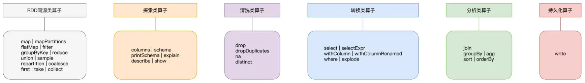

DataFrame 上述两个方面的算子，进一步划分为 6 大类，它们分别是 RDD 同源类算子、探索类算子、清洗类算子、转换类算子、分析类算子和持久化算子。 

### 同源类算子

这些RDD同源类算子，和之前讲过的作用类似：


### 探索类算子

DataFrame 的探索类算子的作用，就是帮助开发者初步了解并认识数据，比如数据的模式（Schema）、数据的分布、数据的“模样”，等等，为后续的应用开发奠定基础。 

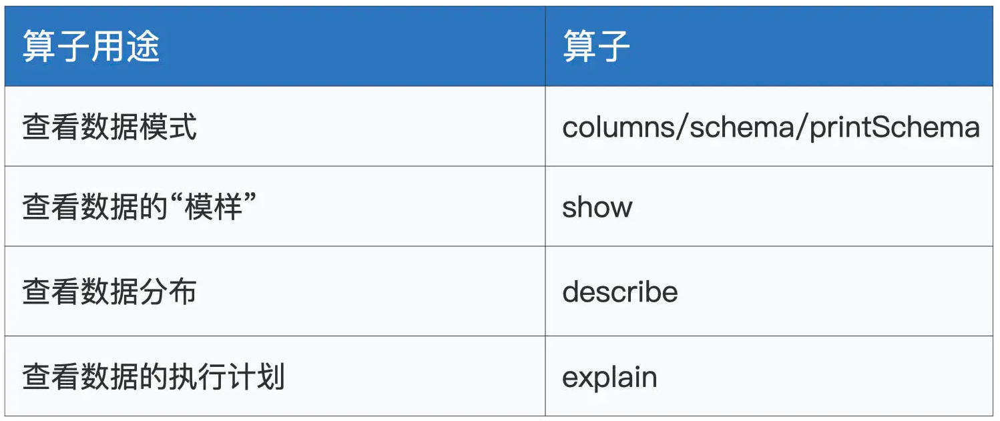

首先，columns/schema/printSchema 这 3 个算子类似，都可以帮我们获取 DataFrame 的数据列和 Schema。尤其是 printSchema，它以纯文本的方式将 Data Schema 打印到屏幕上：

~~~scala
import org.apache.spark.sql.DataFrame
import spark.implicits._
 
val employees = Seq((1, "John", 26, "Male"), (2, "Lily", 28, "Female"), (3, "Raymond", 30, "Male"))
val employeesDF: DataFrame = employees.toDF("id", "name", "age", "gender")
 
employeesDF.printSchema
 
/** 结果打印
root
|-- id: integer (nullable = false)
|-- name: string (nullable = true)
|-- age: integer (nullable = false)
|-- gender: string (nullable = true)
*/
~~~

show 算子可以帮忙查看数据具体的样子，在默认情况下，show 会随机打印出 DataFrame 的 20 条数据记录：

~~~scala
employeesDF.show
 
/** 结果打印
+---+-------+---+------+
| id| name|age|gender|
+---+-------+---+------+
| 1| John| 26| Male|
| 2| Lily| 28|Female|
| 3|Raymond| 30| Male|
+---+-------+---+------+
*/
~~~

看清了数据的“本来面目”之后，你还可以进一步利用 describe 去查看数值列的统计分布。比如，通过调用 employeesDF.describe(“age”)，你可以查看 age 列的极值、平均值、方差等统计数值。 

初步掌握了数据的基本情况之后，如果你对当前 DataFrame 的执行计划感兴趣，可以通过调用 explain 算子来获得 Spark SQL 给出的执行计划。explain 对于执行效率的调优来说，有着至关重要的作用。

### 清洗类算子

完成数据探索以后，我们正式进入数据应用的开发阶段。在数据处理前期，我们往往需要对数据进行适当地“清洗”，“洗掉”那些不符合业务逻辑的“脏数据”。DataFrame 提供了如下算子：

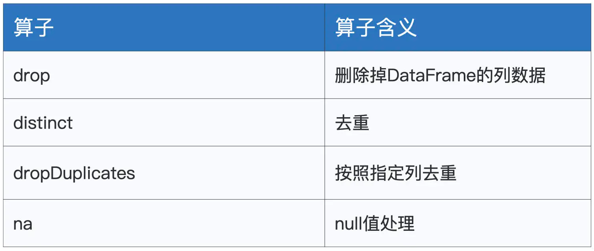

首先，drop 算子允许开发者直接把指定列从 DataFrame 中予以清除。举个例子，对于上述的 employeesDF，假设我们想把性别列清除，那么直接调用 employeesDF.drop(“gender”) 即可。如果要同时清除多列，只需要在 drop 算子中用逗号把多个列名隔开即可。 

第二个是 distinct，它用来为 DataFrame 中的数据做去重。还是以 employeesDF 为例，当有多条数据记录的所有字段值都相同时，使用 distinct 可以仅保留其中的一条数据记录。 

接下来是 dropDuplicates，它的作用也是去重。不过，与 distinct 不同的是，dropDuplicates 可以指定数据列，因此在灵活性上更胜一筹。还是拿 employeesDF 来举例，这个 DataFrame 原本有 3 条数据记录，如果我们按照性别列去重，最后只会留下两条记录。其中，一条记录的 gender 列是“Male”，另一条的 gender 列为“Female”，如下所示：

~~~scala
employeesDF.show
 
/** 结果打印
+---+-------+---+------+
| id| name|age|gender|
+---+-------+---+------+
| 1| John| 26| Male|
| 2| Lily| 28|Female|
| 3|Raymond| 30| Male|
+---+-------+---+------+
*/
 
employeesDF.dropDuplicates("gender").show
 
/** 结果打印
+---+----+---+------+
| id|name|age|gender|
+---+----+---+------+
| 2|Lily| 28|Female|
| 1|John| 26| Male|
+---+----+---+------+
*/
~~~

表格中的最后一个算子是 na，它的作用是选取 DataFrame 中的 null 数据，na 往往要结合 drop 或是 fill 来使用。例如，employeesDF.na.drop 用于删除 DataFrame 中带 null 值的数据记录，而 employeesDF.na.fill(0) 则将 DataFrame 中所有的 null 值都自动填充为整数零。

### 转换类算子

转换类算子的主要用于数据的生成、提取与转换：


首先，select 算子让我们可以按照列名对 DataFrame 做投影，比如说，如果我们只关心年龄与性别这两个字段的话，就可以使用下面的语句来实现 ：

~~~scala
employeesDF.select("name", "gender").show
 
/** 结果打印
+-------+------+
| name|gender|
+-------+------+
| John| Male|
| Lily|Female|
|Raymond| Male|
+-------+------+
*/
~~~

不过，虽然用起来比较简单，但 select 算子在功能方面不够灵活。在灵活性这方面，selectExpr 做得更好。比如说，基于 id 和姓名，我们想把它们拼接起来生成一列新的数据：

~~~scala
employeesDF.selectExpr("id", "name", "concat(id, '_', name) as id_name").show
 
/** 结果打印
+---+-------+---------+
| id| name| id_name|
+---+-------+---------+
| 1| John| 1_John|
| 2| Lily| 2_Lily|
| 3|Raymond|3_Raymond|
+---+-------+---------+
*/
~~~

这里，我们使用 concat 这个函数，把 id 列和 name 列拼接在一起，生成新的 id_name 数据列。 

接下来的 where 和 withColumnRenamed 这两个算子比较简单，where 使用 SQL 语句对 DataFrame 做数据过滤，而 withColumnRenamed 的作用是字段重命名：

* 比如，想要过滤出所有性别为男的员工，我们就可以用 employeesDF.where(“gender = ‘Male’”) 来实现。 
* 如果打算把 employeesDF 当中的“gender”重命名为“sex”，就可以用 withColumnRenamed 来帮忙：employeesDF.withColumnRenamed(“gender”, “sex”)。 

紧接着的是 withColumn，虽然名字看上去和 withColumnRenamed 很像，但二者在功能上有着天壤之别。 withColumnRenamed 是重命名现有的数据列，而 withColumn 则用于生成新的数据列，这一点上，withColumn 倒是和 selectExpr 有着异曲同工之妙。withColumn 也可以充分利用 Spark SQL 提供的 Built-in Functions 来灵活地生成数据。 

比如，基于年龄列，我们想生成一列脱敏数据，隐去真实年龄：

~~~scala
employeesDF.withColumn("crypto", hash($"age")).show
 
/** 结果打印
+---+-------+---+------+-----------+
| id| name|age|gender| crypto|
+---+-------+---+------+-----------+
| 1| John| 26| Male|-1223696181|
| 2| Lily| 28|Female|-1721654386|
| 3|Raymond| 30| Male| 1796998381|
+---+-------+---+------+-----------+
*/
~~~

可以看到，我们使用内置函数 hash，生成一列名为“crypto”的新数据，数据值是对应年龄的哈希值。有了新的数据列之后，我们就可以调用刚刚讲的 drop，把原始的 age 字段丢弃掉。 

表格中的最后一个算子是 explode，这个算子很有意思，它的作用是展开数组类型的数据列，数组当中的每一个元素，都会生成一行新的数据记录：

~~~scala
val seq = Seq( (1, "John", 26, "Male", Seq("Sports", "News")),
(2, "Lily", 28, "Female", Seq("Shopping", "Reading")),
(3, "Raymond", 30, "Male", Seq("Sports", "Reading"))
)
 
val employeesDF: DataFrame = seq.toDF("id", "name", "age", "gender", "interests")
employeesDF.show
 
/** 结果打印
+---+-------+---+------+-------------------+
| id| name|age|gender| interests|
+---+-------+---+------+-------------------+
| 1| John| 26| Male| [Sports, News]|
| 2| Lily| 28|Female|[Shopping, Reading]|
| 3|Raymond| 30| Male| [Sports, Reading]|
+---+-------+---+------+-------------------+
*/
 
employeesDF.withColumn("interest", explode($"interests")).show
 
/** 结果打印
+---+-------+---+------+-------------------+--------+
| id| name|age|gender| interests|interest|
+---+-------+---+------+-------------------+--------+
| 1| John| 26| Male| [Sports, News]| Sports|
| 1| John| 26| Male| [Sports, News]| News|
| 2| Lily| 28|Female|[Shopping, Reading]|Shopping|
| 2| Lily| 28|Female|[Shopping, Reading]| Reading|
| 3|Raymond| 30| Male| [Sports, Reading]| Sports|
| 3|Raymond| 30| Male| [Sports, Reading]| Reading|
+---+-------+---+------+-------------------+--------+
*/
~~~

可以看到，我们多加了一个兴趣列，列数据的类型是数组，每个员工都有零到多个兴趣。 

如果我们想把数组元素展开，让每个兴趣都可以独占一条数据记录。这个时候就可以使用 explode，再结合 withColumn，生成一列新的 interest 数据。这列数据的类型是单个元素的 String，而不再是数组。有了新的 interest 数据列之后，我们可以再次利用 drop 算子，把原本的 interests 列抛弃掉。 

### 分析类算子

前面的探索、清洗、转换，都是在为数据分析做准备。在大多数的数据应用中，数据分析往往是最为关键的那环，甚至是应用本身的核心目的。因此，熟练掌握分析类算子，有利于我们提升开发效率。 分析类算子如下：

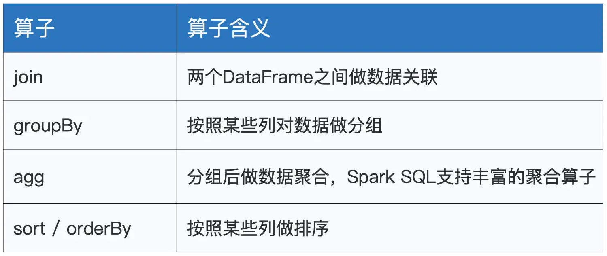

为了演示上述算子的用法，我们先来准备两张数据表：employees 和 salaries，也即员工信息表和薪水表。我们的想法是，通过对两张表做数据关联，来分析员工薪水的分布情况：

~~~scala
import spark.implicits._
import org.apache.spark.sql.DataFrame
 
// 创建员工信息表
val seq = Seq((1, "Mike", 28, "Male"), (2, "Lily", 30, "Female"), (3, "Raymond", 26, "Male"))
val employees: DataFrame = seq.toDF("id", "name", "age", "gender")
 
// 创建薪水表
val seq2 = Seq((1, 26000), (2, 30000), (4, 25000), (3, 20000))
val salaries:DataFrame = seq2.toDF("id", "salary")
 
employees.show
 
/** 结果打印
+---+-------+---+------+
| id| name|age|gender|
+---+-------+---+------+
| 1| Mike| 28| Male|
| 2| Lily| 30|Female|
| 3|Raymond| 26| Male|
+---+-------+---+------+
*/
 
salaries.show
 
/** 结果打印
+---+------+
| id|salary|
+---+------+
| 1| 26000|
| 2| 30000|
| 4| 25000|
| 3| 20000|
+---+------+
*/
~~~

首先，我们先用 join 算子把两张表关联起来，关联键（Join Keys）我们使用两张表共有的 id 列，而关联形式（Join Type）是内关联（Inner Join）：

~~~scala
val jointDF: DataFrame = salaries.join(employees, Seq("id"), "inner")
 
jointDF.show
 
/** 结果打印
+---+------+-------+---+------+
| id|salary| name|age|gender|
+---+------+-------+---+------+
| 1| 26000| Mike| 28| Male|
| 2| 30000| Lily| 30|Female|
| 3| 20000|Raymond| 26| Male|
+---+------+-------+---+------+
*/
~~~

 可以看到，我们在 salaries 之上调用 join 算子，join 算子的参数有 3 类：

* 第一类是待关联的数据表，在我们的例子中就是员工表 employees。 
* 第二类是关联键，也就是两张表之间依据哪些字段做关联，我们这里是 id 列。 
* 第三类是关联形式，关联形式有 inner、left、right、anti、semi 等等 

数据完成关联之后，我们实际得到的仅仅是最细粒度的事实数据，也就是每个员工每个月领多少薪水。这样的事实数据本身并没有多少价值，我们往往需要从不同的维度出发，对数据做分组、聚合，才能获得更深入、更有价值的数据洞察。 

比方说，我们想以性别为维度，统计不同性别下的总薪水和平均薪水，借此分析薪水与性别之间可能存在的关联关系：

~~~~scala
val aggResult = fullInfo.groupBy("gender").agg(sum("salary").as("sum_salary"), avg("salary").as("avg_salary"))
 
aggResult.show
 
/** 数据打印
+------+----------+----------+
|gender|sum_salary|avg_salary|
+------+----------+----------+
|Female| 30000| 30000.0|
| Male| 46000| 23000.0|
+------+----------+----------+
*/
~~~~

这里，我们先是使用 groupBy 算子按照“gender”列做分组，然后使用 agg 算子做聚合运算。在 agg 算子中，我们分别使用 sum 和 avg 聚合函数来计算薪水的总数和平均值。 

得到统计结果之后，为了方便查看，我们还可以使用 sort 或是 orderBy 算子对结果集进行排序，二者在用法与效果上是完全一致的，如下表所示 ：

~~~scala
aggResult.sort(desc("sum_salary"), asc("gender")).show
 
/** 结果打印
+------+----------+----------+
|gender|sum_salary|avg_salary|
+------+----------+----------+
| Male| 46000| 23000.0|
|Female| 30000| 30000.0|
+------+----------+----------+
*/
 
aggResult.orderBy(desc("sum_salary"), asc("gender")).show
 
/** 结果打印
+------+----------+----------+
|gender|sum_salary|avg_salary|
+------+----------+----------+
| Male| 46000| 23000.0|
|Female| 30000| 30000.0|
+------+----------+----------+
*/
~~~

可以看到，sort / orderBy 支持按照多列进行排序，且可以通过 desc 和 asc 来指定排序方向。其中 desc 表示降序排序，相应地，asc 表示升序排序。 

### 持久化算子

Spark SQL 提供了 write API，与之前的read API 相对应，write API 允许开发者把数据灵活地物化为不同的文件格式。 

read API 有 3 个关键点，一是由 format 指定的文件格式，二是由零到多个 option 组成的加载选项，最后一个是由 load 标记的源文件路径。 


与之相对，write API 也有 3 个关键环节，分别是同样由 format 定义的文件格式，零到多个由 option 构成的“写入选项”，以及由 save 指定的存储路径，如下图所示：

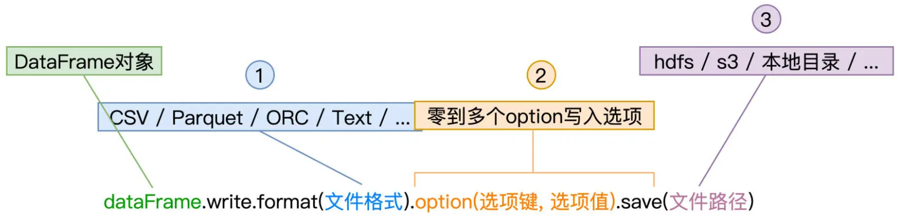

这里的 format 和 save，与 read API 中的 format 和 load 是一一对应的，分别用于指定文件格式与存储路径。实际上，option 选项也是类似的，除了 mode 以外，write API 中的选项键与 read API 中的选项键也是相一致的，如 seq 用于指定 CSV 文件分隔符、dbtable 用于指定数据表名、等等。

在 read API 中，mode 选项键用于指定读取模式，如 permissive, dropMalformed, failFast。但在 write API 中，mode 用于指定“写入模式”，分别有 Append、Overwrite、ErrorIfExists、Ignore 这 4 种模式，它们的含义与描述如下表所示：

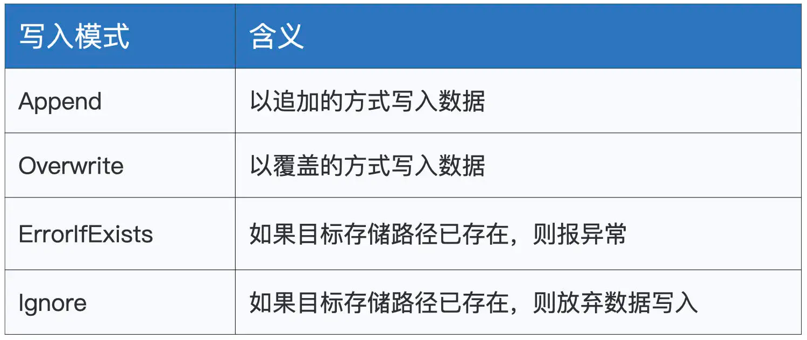

有了 write API，我们就可以灵活地把 DataFrame 持久化到不同的存储系统中，为数据的生命周期画上一个圆满的句号。 

## Join Types

数据关联（Join）是数据分析场景中最常见、最重要的操作。 

Join 的种类非常丰富。如果按照关联形式（Join Types）来划分，数据关联分为内关联、外关联、左关联、右关联，等等。对于参与关联计算的两张表，关联形式决定了结果集的数据来源。因此，在开发过程中选择哪种关联形式，是由我们的业务逻辑决定的。 

而从实现机制的角度，Join 又可以分为 NLJ（Nested Loop Join）、SMJ（Sort Merge Join）和 HJ（Hash Join）。也就是说，同样是内关联，我们既可以采用 NLJ 来实现，也可以采用 SMJ 或是 HJ 来实现。区别在于，在不同的计算场景下，这些不同的实现机制在执行效率上有着天壤之别。 

### 数据准备

为了更好的说明，先准备一些数据：

~~~scala
import spark.implicits._
import org.apache.spark.sql.DataFrame
 
// 创建员工信息表
val seq = Seq((1, "Mike", 28, "Male"), (2, "Lily", 30, "Female"), (3, "Raymond", 26, "Male"), (5, "Dave", 36, "Male"))
val employees: DataFrame = seq.toDF("id", "name", "age", "gender")
 
// 创建薪资表
val seq2 = Seq((1, 26000), (2, 30000), (4, 25000), (3, 20000))
val salaries:DataFrame = seq2.toDF("id", "salary")
~~~

如上表所示，我们创建了两个 DataFrame，一个用于存储员工基本信息，我们称之为员工表；另一个存储员工薪水，我们称之为薪资表。 

所谓数据关联，它指的是这样一个计算过程：给定关联条件（Join Conditions）将两张数据表以不同关联形式拼接在一起的过程。关联条件包含两层含义，一层是两张表中各自关联字段（Join Key）的选择，另一层是关联字段之间的逻辑关系。 

关联条件和关联形式在DataFrame 算子与 SQL 查询这两种方式下的表现形式：

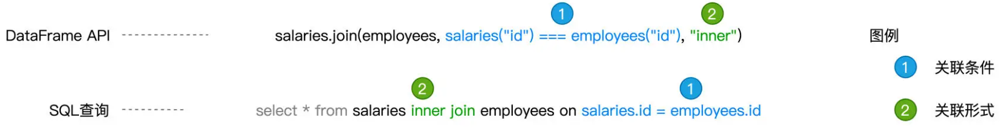

首先，约定俗成地，我们把主动参与 Join 的数据表，如上图中的 salaries 表，称作“左表”；而把被动参与关联的数据表，如 employees 表，称作是“右表”。 

图中的蓝色部分就是关联条件，绿色部分就是关联形式。

Spark SQL 支持的 Joint Types如下：

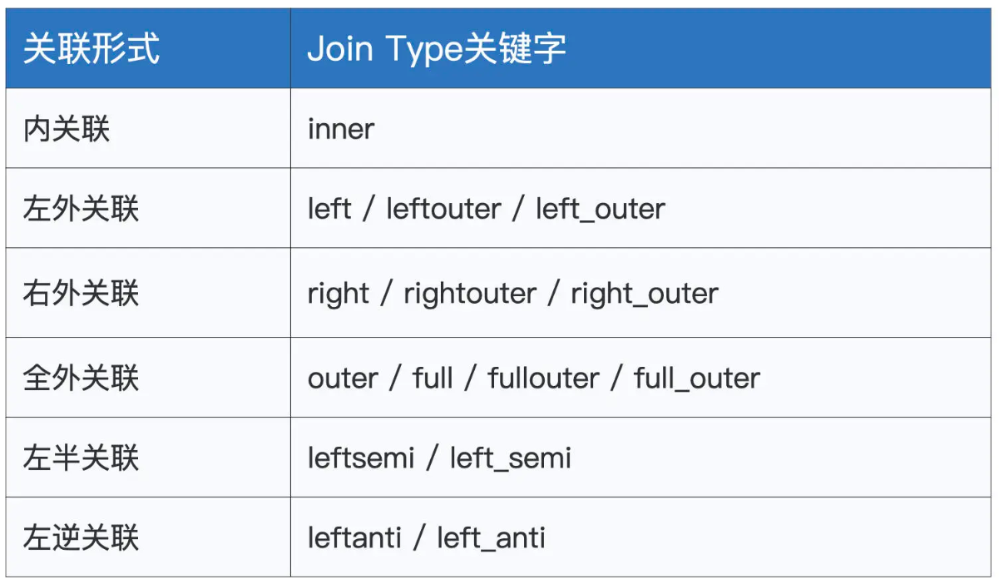

### 内关联（Inner Join）

对于登记在册的员工，如果我们想获得他们每个人的薪资情况，就可以使用内关联来实现，如下所示：

~~~scala
// 内关联
val jointDF: DataFrame = salaries.join(employees, salaries("id") === employees("id"), "inner")
 
jointDF.show
 
/** 结果打印
+---+------+---+-------+---+------+
| id|salary| id| name|age|gender|
+---+------+---+-------+---+------+
| 1| 26000| 1| Mike| 28| Male|
| 2| 30000| 2| Lily| 30|Female|
| 3| 20000| 3|Raymond| 26| Male|
+---+------+---+-------+---+------+
*/
 
// 左表
salaries.show
 
/** 结果打印
+---+------+
| id|salary|
+---+------+
| 1| 26000|
| 2| 30000|
| 4| 25000|
| 3| 20000|
+---+------+
*/
 
// 右表
employees.show
 
/** 结果打印
+---+-------+---+------+
| id| name|age|gender|
+---+-------+---+------+
| 1| Mike| 28| Male|
| 2| Lily| 30|Female|
| 3|Raymond| 26| Male|
| 5| Dave| 36| Male|
+---+-------+---+------+
*/
~~~

可以发现使用inner join时，左表和右表的原始数据，并没有都出现在结果集当中。 例如，在原始的薪资表中，有一条 id 为 4 的薪资记录；而在员工表中，有一条 id 为 5、name 为“Dave”的数据记录。这两条数据记录，都没有出现在内关联的结果集中，而这正是“内关联”这种关联形式的作用所在。 

内关联的效果，是仅仅保留左右表中满足关联条件的那些数据记录。以上表为例，关联条件是 salaries(“id”) === employees(“id”)，而在员工表与薪资表中，只有 1、2、3 这三个值同时存在于他们各自的 id 字段中。相应地，结果集中就只有 id 分别等于 1、2、3 的这三条数据记录。 

### 外关联（Outer Join）

外关联还可以细分为 3 种形式，分别是左外关联、右外关联、以及全外关联。这里的左、右，对应的实际上就是左表、右表。 

把 salaries 与 employees 做左外关联，我们只需要把“inner”关键字，替换为“left”、“leftouter”或是“left_outer”即可：

~~~scala
val jointDF: DataFrame = salaries.join(employees, salaries("id") === employees("id"), "left")
 
jointDF.show
 
/** 结果打印
+---+------+----+-------+----+------+
| id|salary| id| name| age|gender|
+---+------+----+-------+----+------+
| 1| 26000| 1| Mike| 28| Male|
| 2| 30000| 2| Lily| 30|Female|
| 4| 25000|null| null|null| null|
| 3| 20000| 3|Raymond| 26| Male|
+---+------+----+-------+----+------+
*/
~~~

不难发现，左外关联的结果集，实际上就是内关联结果集，再加上左表 salaries 中那些不满足关联条件的剩余数据，也即 id 为 4 的数据记录。值得注意的是，由于右表 employees 中并不存在 id 为 4 的记录，因此结果集中 employees 对应的所有字段值均为空值 null。 

右外关联的执行结果，只需要把程序中的“left”关键字，替换为“right”、“rightouter”或是“right_outer”。 

~~~scala
val jointDF: DataFrame = salaries.join(employees, salaries("id") === employees("id"), "right")
 
jointDF.show
 
/** 结果打印
+----+------+---+-------+---+------+
| id|salary| id| name|age|gender|
+----+------+---+-------+---+------+
| 1| 26000| 1| Mike| 28| Male|
| 2| 30000| 2| Lily| 30|Female|
| 3| 20000| 3|Raymond| 26| Male|
|null| null| 5| Dave| 36| Male|
+----+------+---+-------+---+------+
*/
~~~

右外关联的结果集，也是内关联的结果集，再加上右表 employees 中的剩余数据，也即 id 为 5、name 为“Dave”的数据记录。同样的，由于左表 salaries 并不存在 id 等于 5 的数据记录，因此，结果集中 salaries 相应的字段置空，以 null 值进行填充。 

全外关联的结果集，就是内关联的结果，再加上那些不满足关联条件的左右表剩余数据。要进行全外关联的计算，关键字可以取“full”、“outer”、“fullouter”、或是“full_outer” ：

~~~scala
val jointDF: DataFrame = salaries.join(employees, salaries("id") === employees("id"), "full")
 
jointDF.show
 
/** 结果打印
+----+------+----+-------+----+------+
| id|salary| id| name| age|gender|
+----+------+----+-------+----+------+
| 1| 26000| 1| Mike| 28| Male|
| 3| 20000| 3|Raymond| 26| Male|
|null| null| 5| Dave| 36| Male|
| 4| 25000|null| null|null| null|
| 2| 30000| 2| Lily| 30|Female|
+----+------+----+-------+----+------+
*/
~~~

### 左半 / 逆关联（Left Semi Join / Left Anti Join） 

左半关联，它的关键字有“leftsemi”和“left_semi”。左半关联的结果集，实际上是内关联结果集的子集，它仅保留左表中满足关联条件的那些数据记录，如下表所示：

~~~scala

// 内关联
val jointDF: DataFrame = salaries.join(employees, salaries("id") === employees("id"), "inner")
 
jointDF.show
 
/** 结果打印
+---+------+---+-------+---+------+
| id|salary| id| name|age|gender|
+---+------+---+-------+---+------+
| 1| 26000| 1| Mike| 28| Male|
| 2| 30000| 2| Lily| 30|Female|
| 3| 20000| 3|Raymond| 26| Male|
+---+------+---+-------+---+------+
*/
 
// 左半关联
val jointDF: DataFrame = salaries.join(employees, salaries("id") === employees("id"), "leftsemi")
 
jointDF.show
 
/** 结果打印
+---+------+
| id|salary|
+---+------+
| 1| 26000|
| 2| 30000|
| 3| 20000|
+---+------+
*/
~~~

左半关联的两大特点：首先，左半关联是内关联的一个子集；其次，它只保留左表 salaries 中的数据。 

左逆关联同样只保留左表的数据，它的关键字有“leftanti”和“left_anti”。但与左半关联不同的是，它保留的，是那些不满足关联条件的数据记录，如下所示：

~~~scala
// 左逆关联
val jointDF: DataFrame = salaries.join(employees, salaries("id") === employees("id"), "leftanti")
 
jointDF.show
 
/** 结果打印
+---+------+
| id|salary|
+---+------+
| 4| 25000|
+---+------+
*/
~~~

通过与上面左半关联的结果集做对比，我们一眼就能看出左逆关联和它的区别所在。显然，id 为 4 的薪资记录是不满足关联条件 salaries(“id”) === employees(“id”) 的，而左逆关联留下的，恰恰是这些“不达标”的数据记录。 

## Join Mechanisms 

Join 有 3 种实现机制，分别是 NLJ（Nested Loop Join）、SMJ（Sort Merge Join）和 HJ（Hash Join）。 

接下来，以内关联为例，结合 salaries 和 employees 这两张表，来说说它们各自的实现原理与特性：

~~~scala
// 内关联
val jointDF: DataFrame = salaries.join(employees, salaries("id") === employees("id"), "inner")
 
jointDF.show
 
/** 结果打印
+---+------+---+-------+---+------+
| id|salary| id| name|age|gender|
+---+------+---+-------+---+------+
| 1| 26000| 1| Mike| 28| Male|
| 2| 30000| 2| Lily| 30|Female|
| 3| 20000| 3|Raymond| 26| Male|
+---+------+---+-------+---+------+
*/
~~~

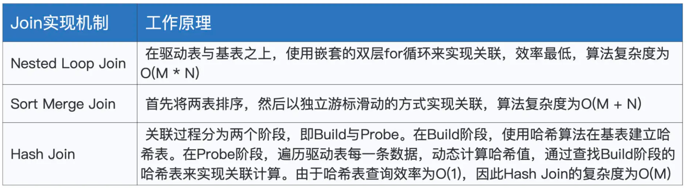

### NLJ：Nested Loop Join 

对于参与关联的两张表，如 salaries 和 employees，按照它们在代码中出现的顺序，我们约定俗成地把 salaries 称作“左表”，而把 employees 称作“右表”。在探讨关联机制的时候，我们又常常把左表称作是“驱动表”，而把右表称为“基表”。 

一般来说，驱动表的体量往往较大，在实现关联的过程中，驱动表是主动扫描数据的那一方。而基表相对来说体量较小，它是被动参与数据扫描的那一方。 

在 NLJ 的实现机制下，算法会使用外、内两个嵌套的 for 循环，来依次扫描驱动表与基表中的数据记录。在扫描的同时，还会判定关联条件是否成立，如内关联例子中的 salaries(“id”) === employees(“id”)。如果关联条件成立，就把两张表的记录拼接在一起，然后对外进行输出：


在实现的过程中，外层的 for 循环负责遍历驱动表的每一条数据，如图中的步骤 1 所示。对于驱动表中的每一条数据记录，内层的 for 循环会逐条扫描基表的所有记录，依次判断记录的 id 字段值是否满足关联条件，如步骤 2 所示。 

不难发现，假设驱动表有 M 行数据，而基表有 N 行数据，那么 NLJ 算法的计算复杂度是 O(M * N)。尽管 NLJ 的实现方式简单、直观、易懂，但它的执行效率显然很差。 

### SMJ：Sort Merge Join

鉴于 NLJ 低效的计算效率，SMJ 应运而生。Sort Merge Join，顾名思义，SMJ 的实现思路是先排序、再归并。给定参与关联的两张表，SMJ 先把他们各自排序，然后再使用独立的游标，对排好序的两张表做归并关联：

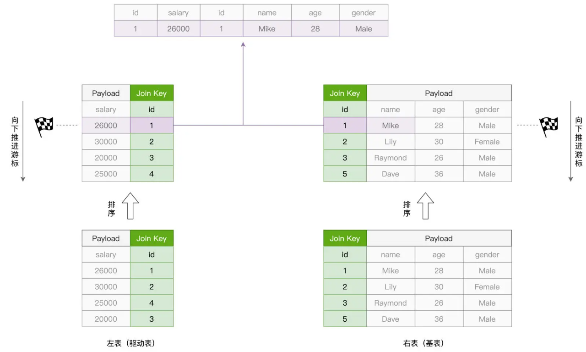

具体计算过程是这样的：起初，驱动表与基表的游标都会先锚定在各自的第一条记录上，然后通过对比游标所在记录的 id 字段值，来决定下一步的走向。对比结果以及后续操作主要分为 3 种情况： 

* 满足关联条件，两边的 id 值相等，那么此时把两边的数据记录拼接并输出，然后把驱动表的游标滑动到下一条记录； 
* 不满足关联条件，驱动表 id 值小于基表的 id 值，此时把驱动表的游标滑动到下一条记录； 
* 不满足关联条件，驱动表 id 值大于基表的 id 值，此时把基表的游标滑动到下一条记录。 

基于这 3 种情况，SMJ 不停地向下滑动游标，直到某张表的游标滑到尽头，即宣告关联结束。对于驱动表的每一条记录，由于基表已按 id 字段排序，且扫描的起始位置为游标所在位置，因此，SMJ 算法的计算复杂度为 O(M + N)。 

然而，计算复杂度的降低，仰仗的其实是两张表已经事先排好了序。但是我们知道，排序本身就是一项很耗时的操作，更何况，为了完成归并关联，参与 Join 的两张表都需要排序。 

### HJ：Hash Join

考虑到 SMJ 对于排序的苛刻要求，后来又有人推出了 HJ 算法。HJ 的设计初衷是以空间换时间，力图将基表扫描的计算复杂度降低至 O(1) ：

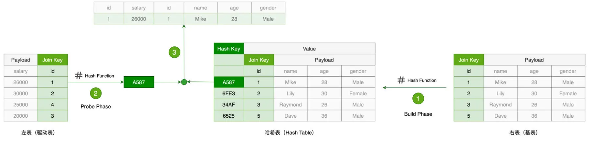

具体来说，HJ 的计算分为两个阶段，分别是 Build 阶段和 Probe 阶段。在 Build 阶段，在基表之上，算法使用既定的哈希函数构建哈希表，如上图的步骤 1 所示。哈希表中的 Key 是 id 字段应用（Apply）哈希函数之后的哈希值，而哈希表的 Value 同时包含了原始的 Join Key（id 字段）和 Payload。 

在 Probe 阶段，算法依次遍历驱动表的每一条数据记录。首先使用同样的哈希函数，以动态的方式计算 Join Key 的哈希值。然后，算法再用哈希值去查询刚刚在 Build 阶段创建好的哈希表。如果查询失败，则说明该条记录与基表中的数据不存在关联关系；相反，如果查询成功，则继续对比两边的 Join Key。如果 Join Key 一致，就把两边的记录进行拼接并输出，从而完成数据关联。 

### 实现机制对比

Join 支持 3 种实现机制，它们分别是 Hash Join、Sort Merge Join 和 Nested Loop Join：

* Hash Join 的执行效率最高，这主要得益于哈希表 O(1) 的查找效率。不过，在 Probe 阶段享受哈希表的“性能红利”之前，Build 阶段得先在内存中构建出哈希表才行。因此，Hash Join 这种算法对于内存的要求比较高，适用于内存能够容纳基表数据的计算场景。 

* Sort Merge Join 就没有内存方面的限制。不论是排序、还是合并，SMJ 都可以利用磁盘来完成计算。所以，在稳定性这方面，SMJ 更胜一筹，在内存受限的情况下，SMJ 可以充分利用磁盘来顺利地完成关联计算。  

  而且与 Hash Join 相比，SMJ 的执行效率也没有差太多，前者是 O(M)，后者是 O(M + N)，可以说是不分伯仲。当然，O(M + N) 的复杂度得益于 SMJ 的排序阶段。因此，如果准备参与 Join 的两张表是有序表，那么这个时候采用 SMJ 算法来实现关联简直是再好不过了。 

* Nested Loop Join 看上去有些多余，嵌套的双层 for 循环带来的计算复杂度最高：O(M * N)。 不过，执行高效的 HJ 和 SMJ 只能用于等值关联，也就是说关联条件必须是等式，像 salaries(“id”) < employees(“id”) 这样的关联条件，HJ 和 SMJ 是无能为力的。相反，NLJ 既可以处理等值关联（Equi Join），也可以应付不等值关联（Non Equi Join），可以说是数据关联在实现机制上的最后一道防线。 

### 分布式环境下的 Join 策略

与单机环境不同，在分布式环境中，两张表的数据各自散落在不同的计算节点与 Executors 进程。因此，要想完成数据关联，Spark SQL 就必须先要把 Join Keys 相同的数据，分发到同一个 Executors 中去才行。 

如果我们打算对 salaries 和 employees 两张表按照 id 列做关联，那么，对于 id 字段值相同的薪资数据与员工数据，我们必须要保证它们坐落在同样的 Executors 进程里，Spark SQL 才能利用刚刚说的 HJ、SMJ、以及 NLJ，以 Executors（进程）为粒度并行地完成数据关联。 

在分布式环境中，Spark 支持两类数据分发模式：Shuffle和广播变量。因此，从数据分发模式的角度出发，数据关联又可以分为 Shuffle Join 和 Broadcast Join 这两大类。将两种分发模式与 Join 本身的 3 种实现机制相结合，就会衍生出分布式环境下的 6 种 Join 策略。 

### Shuffle Join

在没有开发者干预的情况下，Spark SQL 默认采用 Shuffle Join 来完成分布式环境下的数据关联。对于参与 Join 的两张数据表，Spark SQL 先是按照如下规则，来决定不同数据记录应当分发到哪个 Executors 中去： 

* 根据 Join Keys 计算哈希值 
* 将哈希值对并行度（Parallelism）取模 

由于左表与右表在并行度（分区数）上是一致的，因此，按照同样的规则分发数据之后，一定能够保证 id 字段值相同的薪资数据与员工数据坐落在同样的 Executors 中：

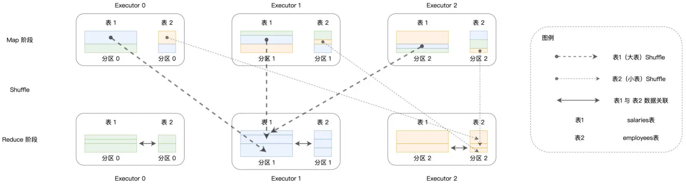

如上图所示，颜色相同的矩形代表 Join Keys 相同的数据记录，可以看到，在 Map 阶段，数据分散在不同的 Executors 当中。经过 Shuffle 过后，Join Keys 相同的记录被分发到了同样的 Executors 中去。接下来，在 Reduce 阶段，Reduce Task 就可以使用 HJ、SMJ、或是 NLJ 算法在 Executors 内部完成数据关联的计算。 

Spark SQL 之所以在默认情况下一律采用 Shuffle Join，原因在于 Shuffle Join 的“万金油”属性。也就是说，在任何情况下，不论数据的体量是大是小、不管内存是否足够，Shuffle Join 在功能上都能够“不辱使命”，成功地完成数据关联的计算。然而，有得必有失，功能上的完备性，往往伴随着的是性能上的损耗。 

Shuffle 的弊端也很明显：从 CPU 到内存，从磁盘到网络，Shuffle 的计算几乎需要消耗所有类型的硬件资源。尤其是磁盘和网络开销，这两座大山往往是应用执行的性能瓶颈。 

### Broadcast Join

Spark 不仅可以在普通变量上创建广播变量，在分布式数据集（如 RDD、DataFrame）之上也可以创建广播变量。这样一来，对于参与 Join 的两张表，我们可以把其中较小的一个封装为广播变量，然后再让它们进行关联。 

~~~scala
import org.apache.spark.sql.functions.broadcast
 
// 创建员工表的广播变量
val bcEmployees = broadcast(employees)
 
// 内关联，PS：将原来的employees替换为bcEmployees
val jointDF: DataFrame = salaries.join(bcEmployees, salaries("id") === employees("id"), "inner")
~~~

在 Broadcast Join 的执行过程中，Spark SQL 首先从各个 Executors 收集 employees 表所有的数据分片，然后在 Driver 端构建广播变量 bcEmployees，构建的过程如下图实线部分所示：

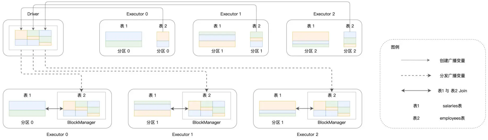

可以看到，散落在不同 Executors 内花花绿绿的矩形，代表的正是 employees 表的数据分片。这些数据分片聚集到一起，就构成了广播变量。接下来，如图中虚线部分所示，携带着 employees 表全量数据的广播变量 bcEmployees，被分发到了全网所有的 Executors 当中去。 

在这种情况下，体量较大的薪资表数据只要“待在原地、保持不动”，就可以轻松关联到跟它保持之一致的员工表数据了。通过这种方式，Spark SQL 成功地避开了 Shuffle 这种“劳师动众”的数据分发过程，转而用广播变量的分发取而代之。 

尽管广播变量的创建与分发同样需要消耗网络带宽，但相比 Shuffle Join 中两张表的全网分发，因为仅仅通过分发体量较小的数据表来完成数据关联，Spark SQL 的执行性能显然要高效得多。 

### 6种分布式Join策略

不论是 Shuffle Join，还是 Broadcast Join，一旦数据分发完毕，理论上可以采用 HJ、SMJ 和 NLJ 这 3 种实现机制中的任意一种，完成 Executors 内部的数据关联。因此，两种分发模式，与三种实现机制，它们组合起来，总共有 6 种分布式 Join 策略，如下图所示：

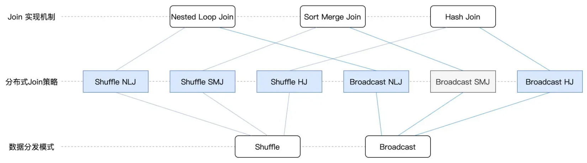

在这 6 种 Join 策略中，Spark SQL 支持其中的 5 种来应对不用的关联场景，也即图中蓝色的 5 个矩形。对于等值关联（Equi Join），Spark SQL 优先考虑采用 Broadcast HJ 策略，其次是 Shuffle SMJ，最次是 Shuffle HJ。对于不等值关联（Non Equi Join），Spark SQL 优先考虑 Broadcast NLJ，其次是 Shuffle NLJ。 

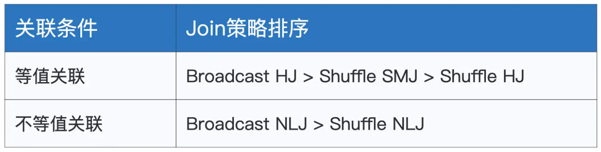

不难发现，不论是等值关联、还是不等值关联，只要 Broadcast Join 的前提条件成立，Spark SQL 一定会优先选择 Broadcast Join 相关的策略。 Broadcast Join 得以实施的基础，是被广播数据表（图中的表 2）的全量数据能够完全放入 Driver 的内存、以及各个 Executors 的内存。另外，为了避免因广播表尺寸过大而引入新的性能隐患，Spark SQL 要求被广播表的内存大小不能超过 8GB。 

在 Broadcast Join 前提条件不成立的情况下，Spark SQL 就会退化到 Shuffle Join 的策略。在不等值的数据关联中，Spark SQL 只有 Shuffle NLJ 这一种选择，因此咱们无需赘述。 但在等值关联的场景中，Spark SQL 有 Shuffle SMJ 和 Shuffle HJ 这两种选择，特点如下：

* Shuffle 在 Map 阶段往往会对数据做排序，而这恰恰正中 SMJ 机制的下怀，所以几乎不会用到Shuffle HJ，因为SMJ 的实现方式更加稳定，更不容易 OOM。

  无论是单表排序，还是两表做归并关联，都可以借助磁盘来完成。内存中放不下的数据，可以临时溢出到磁盘。 

* Shuffle HJ的执行效率更高，但它执行的前提条件比较苛刻：首先，外表大小至少是内表的 3 倍。其次，内表数据分片的平均大小要小于广播变量阈值。第一个条件的动机很好理解，只有当内外表的尺寸悬殊到一定程度时，HJ 的优势才会比 SMJ 更显著。第二个限制的目的是，确保内表的每一个数据分片都能全部放进内存。 

我们还可以通过配置项设置来干预Join策略的选择。

如果采用默认配置，只要基表小于 8GB，它就会竭尽全力地去尝试进行广播并采用 Broadcast Join 策略。 这里面存在一个广播阈值的设定，如果基表的存储尺寸小于广播阈值，那么无需开发者显示调用 broadcast 函数，Spark SQL 同样会选择 Broadcast Join 的策略，在基表之上创建广播变量，来完成两张表的数据关联。 广播阈值的默认值为 10MB，广播阈值由如下配置项设定，只要基表（这里面的基表意思是参与Join的两张表中，其中较小的表）小于该配置项的设定值，Spark SQL 就会自动选择 Broadcast Join 策略：

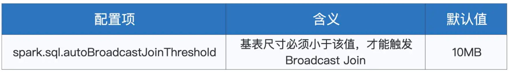

一般来说，在工业级应用中，我们往往把它设置到 2GB 左右，即可有效触发 Broadcast Join。 

autoBroadcastJoinThreshold 这个参数有两个缺点：

* 可靠性较差。尽管开发者明确设置了广播阈值，而且小表数据量在阈值以内，但 Spark 对小表尺寸的误判时有发生，导致 Broadcast Join 降级失败。 
* 预先设置广播阈值是一种静态的优化机制，它没有办法在运行时动态对数据关联进行降级调整。一个典型的例子是，两张大表在逻辑优化阶段都不满足广播阈值，此时 Spark SQL 在物理计划阶段会选择 Shuffle Joins。但在运行时期间，其中一张表在 Filter 操作之后，有可能出现剩余的数据量足够小，小到刚好可以降级为 Broadcast Join。在这种情况下，静态优化机制就是无能为力的。 

广播阈值有了，要比较它与基表存储尺寸谁大谁小，Spark SQL 还要还得事先计算好基表的存储尺寸才行。 这里的计算主要分两种情况讨论： 

* 如果基表数据来自文件系统，那么 Spark SQL 用来与广播阈值对比的基准，就是基表在磁盘中的存储大小。 
* 如果基表数据来自 DAG 计算的中间环节，那么 Spark SQL 将参考 DataFrame 执行计划中的统计值，跟广播阈值做对比 

~~~scala
val df: DataFrame = _
// 先对分布式数据集加Cache
df.cache.count
 
// 获取执行计划
val plan = df.queryExecution.logical

// 获取执行计划对于数据集大小的精确预估
val estimated: BigInt = spark
.sessionState
.executePlan(plan)
.optimizedPlan
.stats
.sizeInBytes
~~~

从开发者的角度看来，确实 broadcast 函数用起来更方便一些。不过，广播阈值加基表预估的方式，除了为开发者提供一条额外的调优途径外，还为 Spark SQL 的动态优化奠定了基础。 

所谓动态优化，自然是相对静态优化来说的。在 3.0 版本之前，对于执行计划的优化，Spark SQL 仰仗的主要是编译时（运行时之前）的统计信息，如数据表在磁盘中的存储大小，等等。 因此，在 3.0 版本之前，Spark SQL 所有的优化机制（如 Join 策略的选择）都是静态的，它没有办法在运行时动态地调整执行计划，从而顺应数据集在运行时此消彼长的变化。 

举例来说，在 Spark SQL 的逻辑优化阶段，两张大表的尺寸都超过了广播阈值，因此 Spark SQL 在物理优化阶段，就不得不选择 Shuffle Join 这种次优的策略。但实际上，在运行时期间，其中一张表在 Filter 过后，剩余的数据量远小于广播阈值，完全可以放进广播变量。可惜此时“木已成舟”，静态优化机制没有办法再将 Shuffle Join 调整为 Broadcast Join。

AQE 很好地解决了autoBroadcastJoinThreshold 这两个头疼的问题：

* 首先，AQE 的 Join 策略调整是一种动态优化机制，对于刚才的两张大表，AQE 会在数据表完成过滤操作之后动态计算剩余数据量，当数据量满足广播条件时，AQE 会重新调整逻辑执行计划，在新的逻辑计划中把 Shuffle Joins 降级为 Broadcast Join。 
* 再者，运行时的数据量估算要比编译时准确得多，因此 AQE 的动态 Join 策略调整相比静态优化会更可靠、更稳定。 

## UDF

对比查询计划，我们能够明显看到 UDF 与 SQL functions 的区别。Spark SQL 的 Catalyst Optimizer 能够明确感知 SQL functions 每一步在做什么，因此有足够的优化空间。相反，UDF 里面封装的计算逻辑对于 Catalyst Optimizer 来说就是个黑盒子，除了把 UDF 塞到闭包里面去，也没什么其他工作可做的。 

# 运维  

## Spark集成Hive

Spark SQL 一类非常典型的场景是与 Hive 做集成、构建分布式数据仓库。我们知道，数据仓库指的是一类带有主题、聚合层次较高的数据集合，它的承载形式，往往是一系列 Schema 经过精心设计的数据表。在数据分析这类场景中，数据仓库的应用非常普遍。 

在 Hive 与 Spark 这对“万金油”组合中，Hive 擅长元数据管理，而 Spark 的专长是高效的分布式计算，二者的结合可谓是“强强联合”。 

Spark 与 Hive 集成的两类方式，一类是从 Spark 的视角出发，我们称之为 Spark with Hive；而另一类，则是从 Hive 的视角出发，业界的通俗说法是：Hive on Spark。 

Hive 是 Apache Hadoop 社区用于构建数据仓库的核心组件，它负责提供种类丰富的用户接口，接收用户提交的 SQL 查询语句。这些查询语句经过 Hive 的解析与优化之后，往往会被转化为分布式任务，并交付 Hadoop MapReduce 付诸执行。 

Hive 是名副其实的“集大成者”，它的核心部件都以“外包”、“可插拔”的方式交给第三方独立组件，所谓“把专业的事交给专业的人去做”，如下图所示：

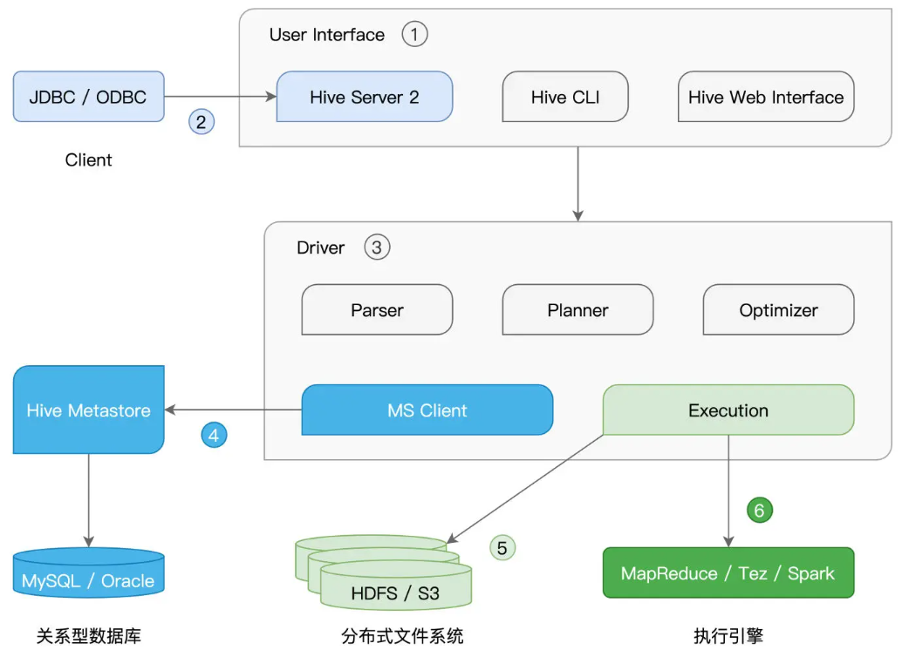

Hive 的 User Interface 为开发者提供 SQL 接入服务，具体的接入途径有 Hive Server 2 、CLI 和 Web Interface（Web 界面入口）。 其中，CLI 与 Web Interface 直接在本地接收 SQL 查询语句，而 Hive Server 2 则通过提供 JDBC/ODBC 客户端连接，允许开发者从远程提交 SQL 查询请求。显然，Hive Server 2 的接入方式更为灵活，应用也更为广泛。 

以响应一个 SQL 查询为例，叙述一下Hive的工作流程。接收到 SQL 查询之后，Hive 的 Driver 首先使用其 Parser 组件，将查询语句转化为 AST（Abstract Syntax Tree，查询语法树）。 

紧接着，Planner 组件根据 AST 生成执行计划，而 Optimizer 则进一步优化执行计划。要完成这一系列的动作，Hive 必须要能拿到相关数据表的元信息才行，比如表名、列名、字段类型、数据文件存储路径、文件格式，等等。而这些重要的元信息，通通存储在一个叫作“Hive Metastore”（4）的数据库中。 

本质上，Hive Metastore 其实就是一个普通的关系型数据库（RDBMS），它可以是免费的 MySQL、Derby，也可以是商业性质的 Oracle、IBM DB2。实际上，除了用于辅助 SQL 语法解析、执行计划的生成与优化，Metastore 的重要作用之一，是帮助底层计算引擎高效地定位并访问分布式文件系统中的数据源。 

这里的分布式文件系统，可以是 Hadoop 生态的 HDFS，也可以是云原生的 Amazon S3。而在执行方面，Hive 目前支持 3 类计算引擎，分别是 Hadoop MapReduce、Tez 和 Spark。 

当 Hive 采用 Spark 作为底层的计算引擎时，我们就把这种集成方式称作“Hive on Spark”。相反，当 Spark 仅仅是把 Hive 当成是一种元信息的管理工具时，我们把 Spark 与 Hive 的这种集成方式，叫作“Spark with Hive”。 

## Spark UI

### 案例概述

先来简单交代一下图解案例用到的环境、配置与代码。 

在计算资源方面，用到的硬件资源如下：

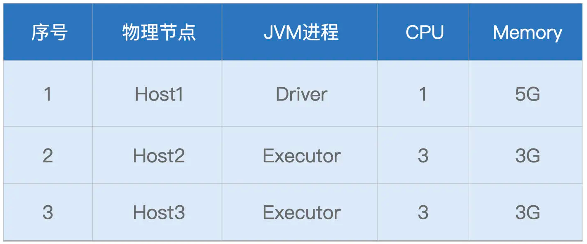

接下来是代码，以汽车摇号为背景，实现了“倍率与中签率分析”的计算逻辑：

~~~scala
import org.apache.spark.sql.DataFrame
 
val rootPath: String = _
// 申请者数据
val hdfs_path_apply: String = s"${rootPath}/apply"
// spark是spark-shell中默认的SparkSession实例
// 通过read API读取源文件
val applyNumbersDF: DataFrame = spark.read.parquet(hdfs_path_apply)
 
// 中签者数据
val hdfs_path_lucky: String = s"${rootPath}/lucky"
// 通过read API读取源文件
val luckyDogsDF: DataFrame = spark.read.parquet(hdfs_path_lucky)
 
// 过滤2016年以后的中签数据，且仅抽取中签号码carNum字段
val filteredLuckyDogs: DataFrame = luckyDogsDF.filter(col("batchNum") >= "201601").select("carNum")
 
// 摇号数据与中签数据做内关联，Join Key为中签号码carNum
val jointDF: DataFrame = applyNumbersDF.join(filteredLuckyDogs, Seq("carNum"), "inner")
 
// 以batchNum、carNum做分组，统计倍率系数
val multipliers: DataFrame = jointDF.groupBy(col("batchNum"),col("carNum"))
.agg(count(lit(1)).alias("multiplier"))
 
// 以carNum做分组，保留最大的倍率系数
val uniqueMultipliers: DataFrame = multipliers.groupBy("carNum")
.agg(max("multiplier").alias("multiplier"))
 
// 以multiplier倍率做分组，统计人数
val result: DataFrame = uniqueMultipliers.groupBy("multiplier")
.agg(count(lit(1)).alias("cnt"))
.orderBy("multiplier")
 
result.collect
~~~

为了方便展示 StorageTab 页面内容，我们这里“强行”给 applyNumbersDF 和 luckyDogsDF 这两个 DataFrame 都加了 Cache。对于引用数量为 1 的数据集，实际上是没有必要加 Cache 的，这一点还需要注意。 

为了让 Spark UI 能够展示运行中以及执行完毕的应用，我们还需要设置如下配置项并启动 History Server：

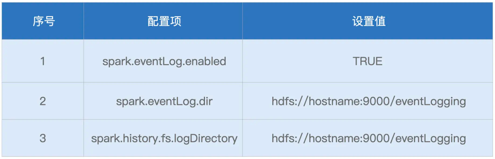

~~~
// SPARK_HOME表示Spark安装目录
${SPAK_HOME}/sbin/start-history-server.sh
~~~

接下来，启动spark-shell，并提交“倍率与中签率分析”的代码，进入Driver 所在节点的 8080 端口。 

### 一级入口

Spark UI 最上面的导航条，这里罗列着 Spark UI 所有的一级入口，如下图所示：


打开 Spark UI，首先映入眼帘的是默认的 Jobs 页面。Jobs 页面记录着应用中涉及的 Actions 动作，以及与数据读取、移动有关的动作。其中，每一个 Action 都对应着一个 Job，而每一个 Job 都对应着一个作业。 

导航条最左侧是 Spark Logo 以及版本号，后面则依次罗列着 6 个一级入口，每个入口的功能与作用我整理到了如下的表格中：

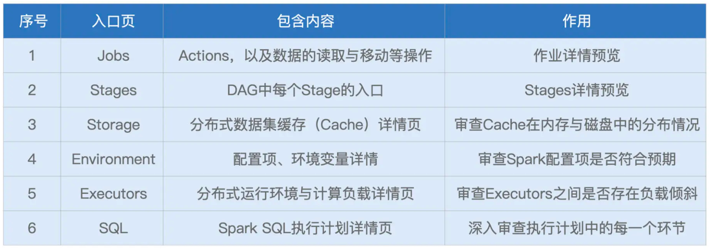

下面按照Executors > Environment > Storage > SQL > Jobs > Stages 的顺序，去查看它的状态。简单汇总下来，其中 Executors、Environment、Storage 是详情页，开发者可以通过这 3 个页面，迅速地了解集群整体的计算负载、运行环境，以及数据集缓存的详细情况；而 SQL、Jobs、Stages，更多地是一种罗列式的展示，想要了解其中的细节，还需要进入到二级入口。 

### Executors

Executors Tab 的主要内容如下，主要包含“Summary”和“Executors”两部分。这两部分所记录的度量指标是一致的，其中“Executors”以更细的粒度记录着每一个 Executor 的详情，而第一部分“Summary”是下面所有 Executors 度量指标的简单加和：

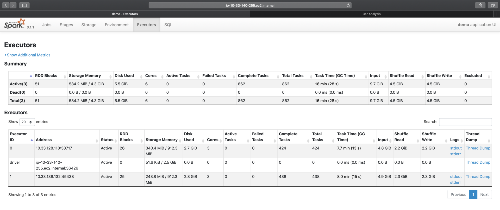

下面是一些参数说明：

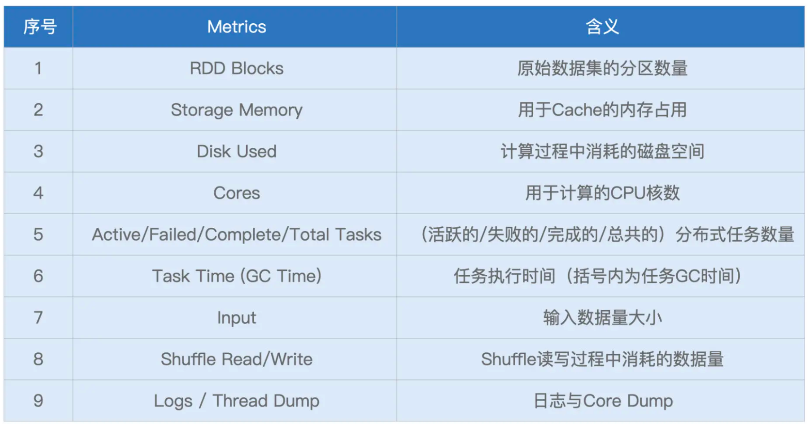

Executors 页面清清楚楚地记录着每一个 Executor 消耗的数据量，以及它们对 CPU、内存与磁盘等硬件资源的消耗。基于这些信息，我们可以轻松判断不同 Executors 之间是否存在负载不均衡的情况，进而判断应用中是否存在数据倾斜的隐患。 

对于 Executors 页面中每一个 Metrics 的具体数值，它们实际上是 Tasks 执行指标在 Executors 粒度上的汇总。 

可以看到，RDD Blocks 是 51（总数），而 Complete Tasks（总数）是 862。 之前说过，RDD 并行度就是 RDD 的分区数量，每个分区对应着一个 Task，因此 RDD 并行度与分区数量、分布式任务数量是一致的。 但从图中可以看到两者不在一个量级，这是因为Executors在处理这个application下的所有job(一个job由action算子来触发,每个job又会根据shuffle情况划分出多个stage，每个stage中又会划分出多个task，再根据taskScheduler分配到各个Excecutor)得出来的Complete Tasks，不会和RDD 并行度相同。

### Environment

Environment 页面记录的是各种各样的环境变量与配置项信息，如下图所示：

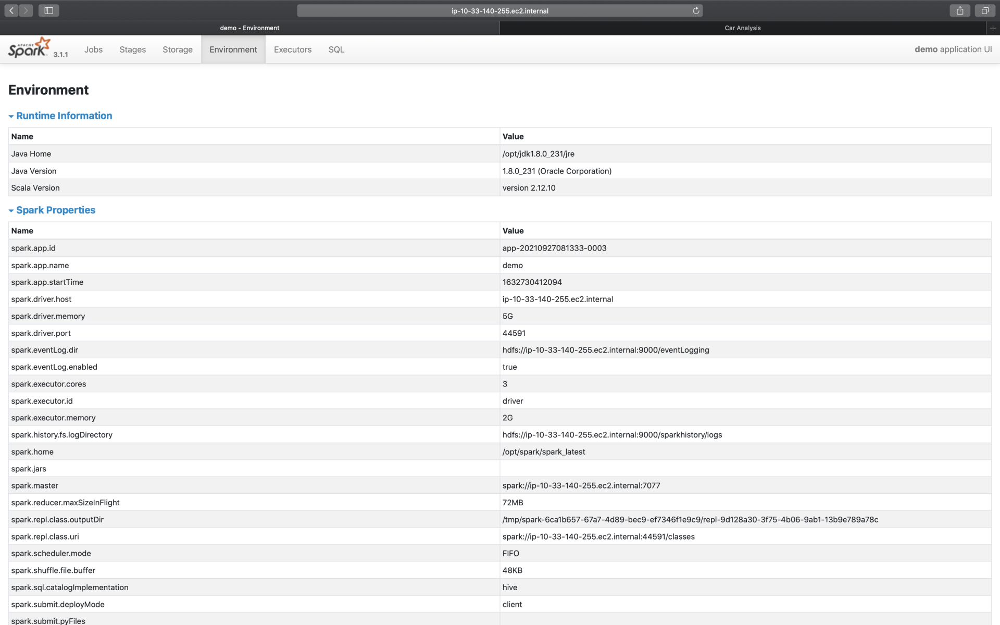

就类别来说，它包含 5 大类环境信息：

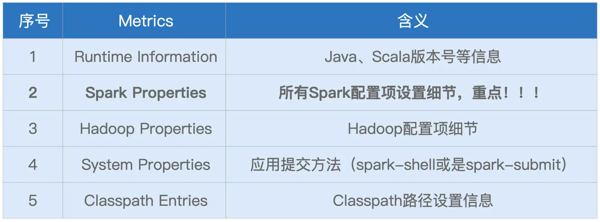

这 5 类信息中，Spark Properties 是重点，其中记录着所有在运行时生效的 Spark 配置项设置。通过 Spark Properties，我们可以确认运行时的设置，与我们预期的设置是否一致，从而排除因配置项设置错误而导致的稳定性或是性能问题。 

### Storage

Storage 详情页，记录着每一个分布式缓存（RDD Cache、DataFrame Cache）的细节，包括缓存级别、已缓存的分区数、缓存比例、内存大小与磁盘大小。 

Spark 支持的不同缓存级别，它是存储介质（内存、磁盘）、存储形式（对象、序列化字节）与副本数量的排列组合。对于 DataFrame 来说，默认的级别是单副本的 Disk Memory Deserialized，如上图所示，也就是存储介质为内存加磁盘，存储形式为对象的单一副本存储方式。 

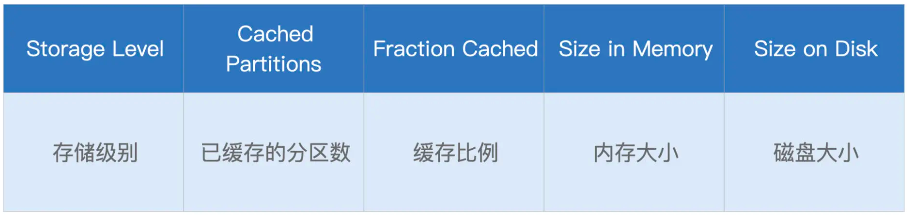

Cached Partitions 与 Fraction Cached 分别记录着数据集成功缓存的分区数量，以及这些缓存的分区占所有分区的比例。当 Fraction Cached 小于 100% 的时候，说明分布式数据集并没有完全缓存到内存（或是磁盘），对于这种情况，我们要警惕缓存换入换出可能会带来的性能隐患。 

后面的 Size in Memory 与 Size in Disk，则更加直观地展示了数据集缓存在内存与硬盘中的分布。从上图中可以看到，由于内存受限（3GB/Executor），摇号数据几乎全部被缓存到了磁盘，只有 584MB 的数据，缓存到了内存中。坦白地说，这样的缓存，对于数据集的重复访问，并没有带来实质上的性能收益。 

基于 Storage 页面提供的详细信息，我们可以有的放矢地设置与内存有关的配置项，如 spark.executor.memory、spark.memory.fraction、spark.memory.storageFraction，从而有针对性对 Storage Memory 进行调整。 

### SQL

当我们的应用包含 DataFrame、Dataset 或是 SQL 的时候，Spark UI 的 SQL 页面，就会展示相应的内容，如下图所示：


一级入口页面，以 Actions 为单位，记录着每个 Action 对应的 Spark SQL 执行计划。我们需要点击“Description”列中的超链接，才能进入到二级页面，去了解每个执行计划的详细信息。 

#### 详情页

在 SQL Tab 一级入口，我们看到有 3 个条目，分别是 count（统计申请编号）、count（统计中签编号）和 save。前两者的计算过程，都是读取数据源、缓存数据并触发缓存的物化，相对比较简单，因此，我们把目光放在 save 这个条目上。 点击详情进入该作业的执行计划页面：

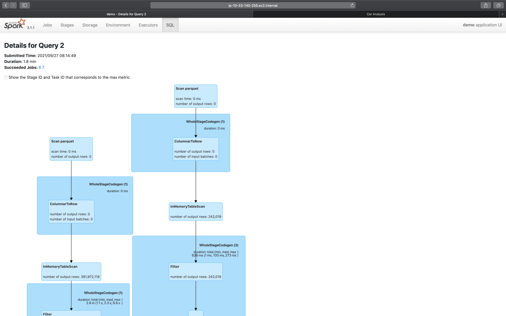

为了聚焦重点，这里仅截取了部分的执行计划，将这些执行计划总结如下：

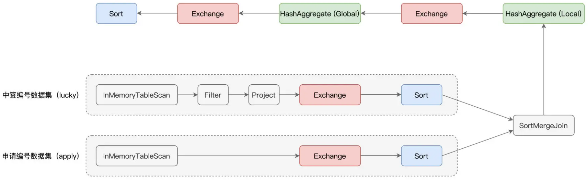

可以看到，“倍率与中签率分析”应用的计算过程，非常具有代表性，它涵盖了数据分析场景中大部分的操作，也即过滤、投影、关联、分组聚合和排序。图中红色的部分为 Exchange，代表的是 Shuffle 操作，蓝色的部分为 Sort，也就是排序，而绿色的部分是 Aggregate，表示的是（局部与全局的）数据聚合。 

这三部分是硬件资源的主要消费者，同时，对于这 3 类操作，Spark UI 更是提供了详细的 Metrics 来刻画相应的硬件资源消耗。 

#### Exchange

下图中并列的两个 Exchange，对应的是示意图中 SortMergeJoin 之前的两个 Exchange。它们的作用是对申请编码数据与中签编码数据做 Shuffle，为数据关联做准备：

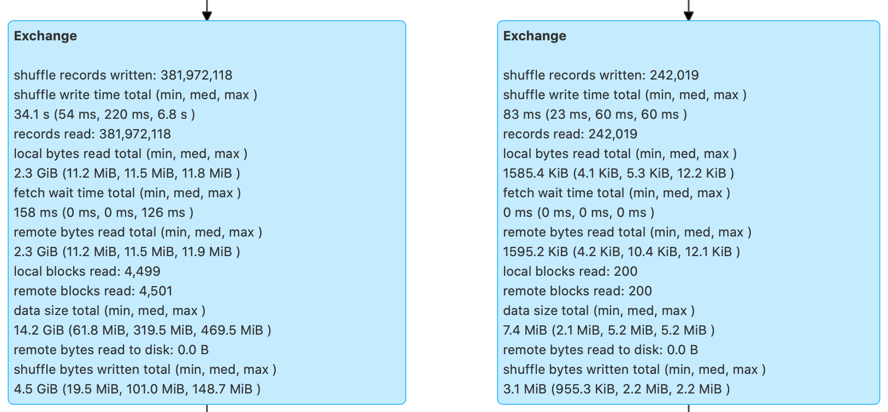

可以看到，对于每一个 Exchange，Spark UI 都提供了丰富的 Metrics 来刻画 Shuffle 的计算过程。从 Shuffle Write 到 Shuffle Read，从数据量到处理时间：

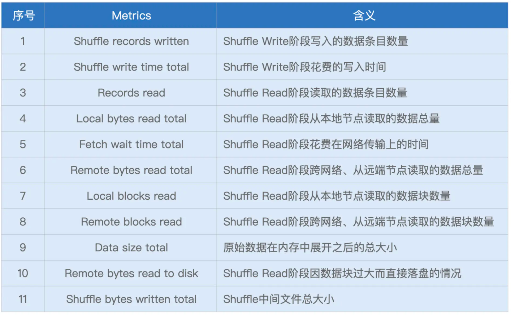

结合这份 Shuffle 的“体检报告”，我们就能以量化的方式，去掌握 Shuffle 过程的计算细节，从而为调优提供更多的洞察与思路。 

例如，我们观察到过滤之后的中签编号数据大小不足 10MB（7.4MB），这时我们首先会想到，对于这样的大表 Join 小表，Spark SQL 选择了 SortMergeJoin 策略是不合理的。 基于这样的判断，我们完全可以让 Spark SQL 选择 BroadcastHashJoin 策略来提供更好的执行性能。 

#### Sort

相比 Exchange，Sort 的度量指标没那么多，不过，他们足以让我们一窥 Sort 在运行时，对于内存的消耗：

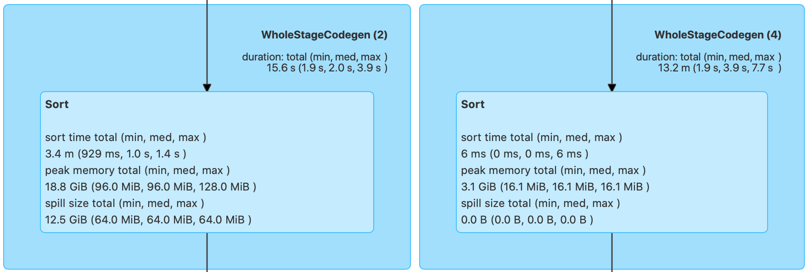

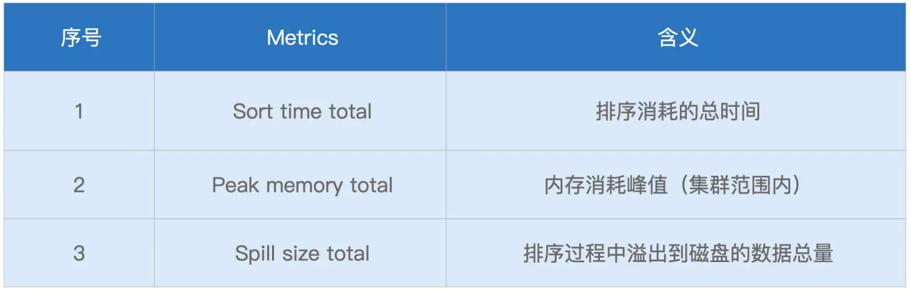

可以看到，“Peak memory total”和“Spill size total”这两个数值，足以指导我们更有针对性地去设置 spark.executor.memory、spark.memory.fraction、spark.memory.storageFraction，从而使得 Execution Memory 区域得到充分的保障。 

以上图为例，结合 18.8GB 的峰值消耗，以及 12.5GB 的磁盘溢出这两条信息，我们可以判断出，当前 3GB 的 Executor Memory 是远远不够的。那么我们自然要去调整上面的 3 个参数，来加速 Sort 的执行性能。 

#### Aggregate

与 Sort 类似，衡量 Aggregate 的度量指标，主要记录的也是操作的内存消耗：

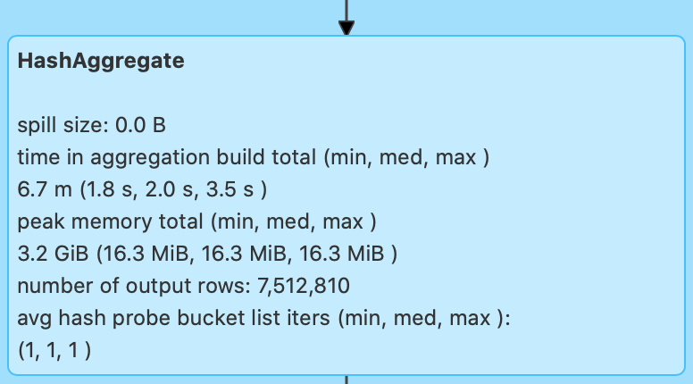

可以看到，对于 Aggregate 操作，Spark UI 也记录着磁盘溢出与峰值消耗，即 Spill size 和 Peak memory total。这两个数值也为内存的调整提供了依据，以上图为例，零溢出与 3.2GB 的峰值消耗，证明当前 3GB 的 Executor Memory 设置，对于 Aggregate 计算来说是绰绰有余的。 

纵观“倍率与中签率分析”完整的 DAG，我们会发现它包含了若干个 Exchange、Sort、Aggregate 以及 Filter 和 Project。结合上述的各类 Metrics，对于执行计划的观察与洞见，我们需要以统筹的方式，由点到线、由局部到全局地去进行。 

### Jobs

对于 Jobs 页面来说，Spark UI 也是以 Actions 为粒度，记录着每个 Action 对应作业的执行情况。我们想要了解作业详情，也必须通过“Description”页面提供的二级入口链接：

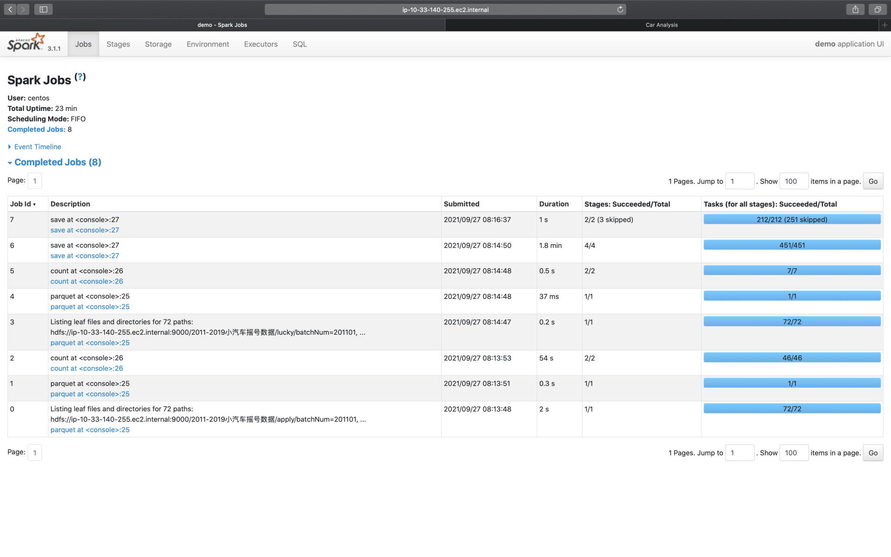

相比 SQL 页面的 3 个 Actions：save（保存计算结果）、count（统计申请编号）、count（统计中签编号），结合前面的概览页截图你会发现，Jobs 页面似乎凭空多出来很多 Actions。 

主要原因在于，在 Jobs 页面，Spark UI 会把数据的读取、访问与移动，也看作是一类“Actions”，比如图中 Job Id 为 0、1、3、4 的那些。这几个 Job，实际上都是在读取源数据（元数据与数据集本身）。

Jobs 详情页非常的简单、直观，它罗列了隶属于当前 Job 的所有 Stages。要想访问每一个 Stage 的执行细节，我们还需要通过“Description”的超链接做跳转：


要访问 Stage 详情，我们还有另外一种选择，那就是直接从 Stages 一级入口进入，然后完成跳转。 

### Stages

每一个作业，都包含多个阶段，也就是我们常说的 Stages。在 Stages 页面，Spark UI 罗列了应用中涉及的所有 Stages，这些 Stages 分属于不同的作业。要想查看哪些 Stages 隶属于哪个 Job，还需要从 Jobs 的 Descriptions 二级入口进入查看：

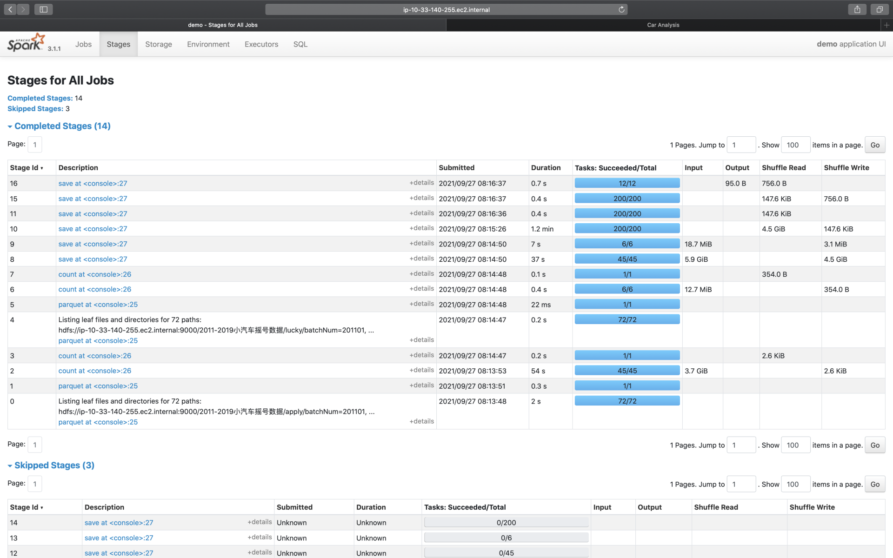

Stages 页面，更多地是一种预览，要想查看每一个 Stage 的详情，同样需要从“Description”进入 Stage 详情页 

在所有二级入口中，Stage 详情页的信息量可以说是最大的。点进 Stage 详情页，可以看到它主要包含 3 大类信息，分别是 Stage DAG、Event Timeline 与 Task Metrics（需要展开）：

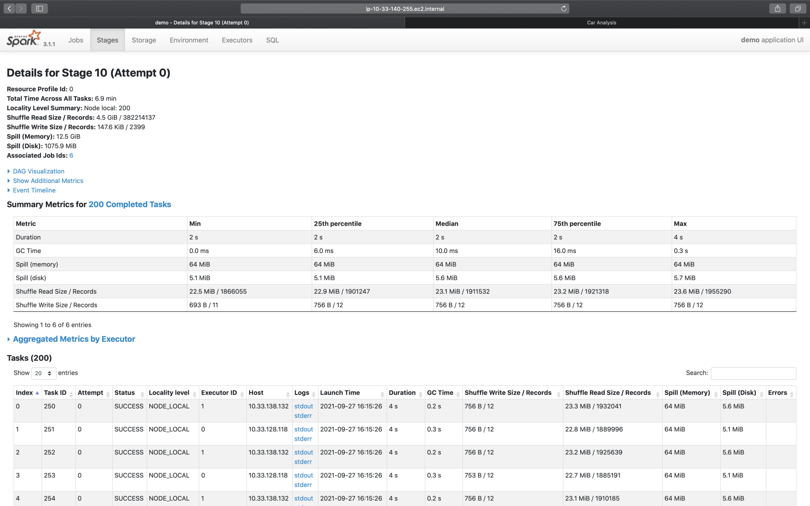

其中，Task Metrics 又分为“Summary”与“Entry details”两部分，提供不同粒度的信息汇总。而 Task Metrics 中记录的指标类别，还可以通过“Show Additional Metrics”选项进行扩展。 

#### Stage DAG

点开蓝色的“DAG Visualization”按钮，我们就能获取到当前 Stage 的 DAG，如下图所示：

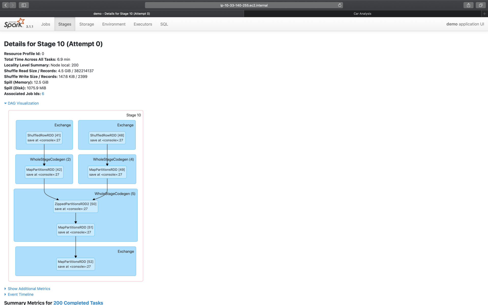

Stage DAG 仅仅是 SQL 页面完整 DAG 的一个子集，毕竟，SQL 页面的 DAG，针对的是作业（Job）。因此，只要掌握了作业的 DAG，自然也就掌握了每一个 Stage 的 DAG。 

#### Event Timeline

与“DAG Visualization”并列，在“Summary Metrics”之上，有一个“Event Timeline”按钮，点开它，我们可以得到如下图所示的可视化信息：

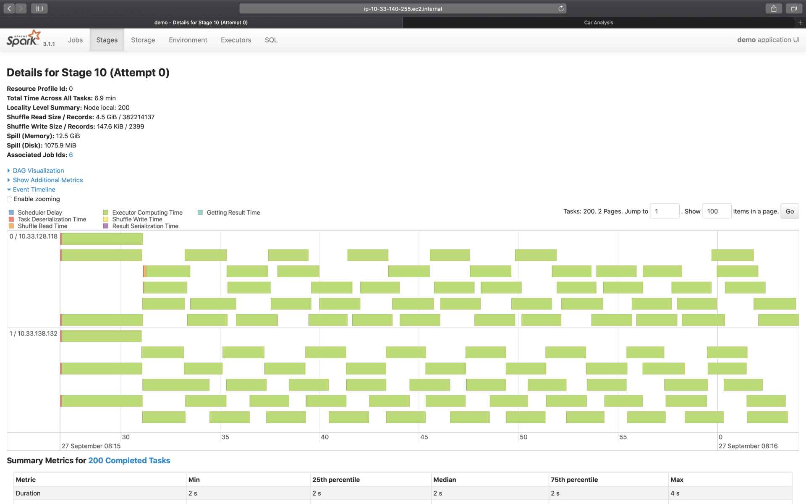

Event Timeline，记录着分布式任务调度与执行的过程中，不同计算环节主要的时间花销。图中的每一个条带，都代表着一个分布式任务，条带由不同的颜色构成。其中不同颜色的矩形，代表不同环节的计算时间。 

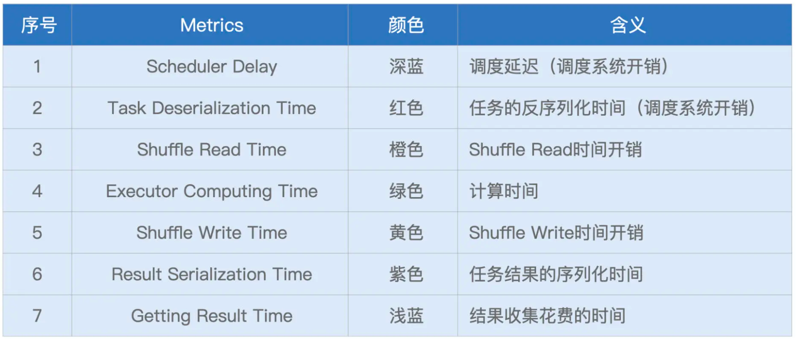

理想情况下，条带的大部分应该都是绿色的（如图中所示），也就是任务的时间消耗，大部分都是执行时间。不过，实际情况并不总是如此，比如，有些时候，蓝色的部分占比较多，或是橙色的部分占比较大。 

在这些情况下，我们就可以结合 Event Timeline，来判断作业是否存在调度开销过大、或是 Shuffle 负载过重的问题，从而有针对性地对不同环节做调优。 

比方说，如果条带中深蓝的部分（Scheduler Delay）很多，那就说明任务的调度开销很重。这个时候，我们就需要参考公式：D / P ~ M / C，来相应地调整 CPU、内存与并行度，从而减低任务的调度开销。其中，D 是数据集尺寸，P 为并行度，M 是 Executor 内存，而 C 是 Executor 的 CPU 核数。波浪线~ 表示的是，等式两边的数值，要在同一量级。 

再比如，如果条带中黄色（Shuffle Write Time）与橙色（Shuffle Read Time）的面积较大，就说明任务的 Shuffle 负载很重，这个时候，我们就需要考虑，有没有可能通过利用 Broadcast Join 来消除 Shuffle，从而缓解任务的 Shuffle 负担。 

#### Task Metrics

Task Metrics 以不同的粒度，提供了详尽的量化指标。其中，“Tasks”以 Task 为粒度，记录着每一个分布式任务的执行细节，而“Summary Metrics”则是对于所有 Tasks 执行细节的统计汇总。 

1、Summary Metrics 

首先，我们点开“Show Additional Metrics”按钮，勾选“Select All”，让所有的度量指标都生效，如下图所示。这么做的目的，在于获取最详尽的 Task 执行信息：

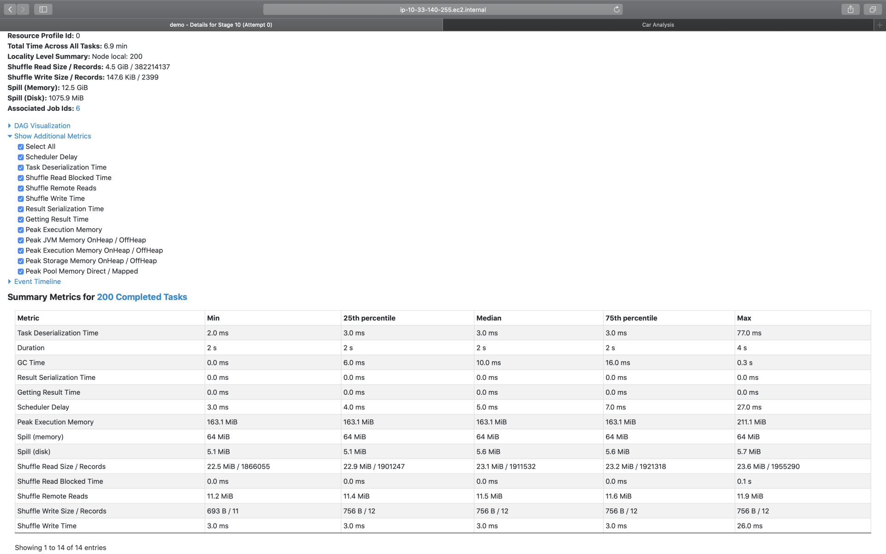

可以看到，“Select All”生效之后，Spark UI 打印出了所有的执行细节。 

其中，Task Deserialization Time、Result Serialization Time、Getting Result Time、Scheduler Delay 与刚刚表格中的含义相同，不再赘述，这里我们仅整理新出现的 Task Metrics：

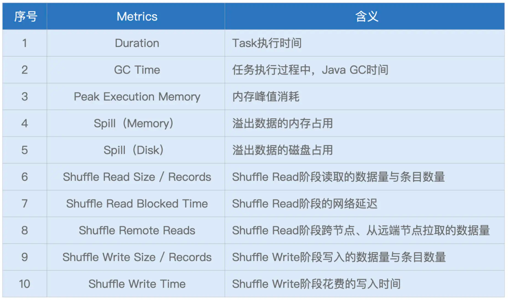

对于这些详尽的 Task Metrics，难能可贵地，Spark UI 以最大最小（max、min）以及分位点（25% 分位、50% 分位、75% 分位）的方式，提供了不同 Metrics 的统计分布。这一点非常重要，原因在于，这些 Metrics 的统计分布，可以让我们非常清晰地量化任务的负载分布。 

换句话说，根据不同 Metrics 的统计分布信息，我们就可以轻而易举地判定，当前作业的不同任务之间，是相对均衡，还是存在严重的倾斜。如果判定计算负载存在倾斜，那么我们就要利用 AQE 的自动倾斜处理，去消除任务之间的不均衡，从而改善作业性能。 

在上面的表格中，有一半的 Metrics 是与 Shuffle 直接相关的，比如 Shuffle Read Size / Records，Shuffle Remote Reads，等等。 

这里特别值得你关注的，是 Spill（Memory）和 Spill（Disk）这两个指标。Spill，也即溢出数据，它指的是因内存数据结构（PartitionedPairBuffer、AppendOnlyMap，等等）空间受限，而腾挪出去的数据。Spill（Memory）表示的是，这部分数据在内存中的存储大小，而 Spill（Disk）表示的是，这些数据在磁盘中的大小。 

因此，用 Spill（Memory）除以 Spill（Disk），就可以得到“数据膨胀系数”的近似值，我们把它记为 Explosion ratio。有了 Explosion ratio，对于一份存储在磁盘中的数据，我们就可以估算它在内存中的存储大小，从而准确地把握数据的内存消耗。 

2、Tasks

介绍完粗粒度的 Summary Metrics，接下来，我们再来说说细粒度的“Tasks”。实际上，Tasks 的不少指标，与 Summary 是高度重合的，如下图所示。 

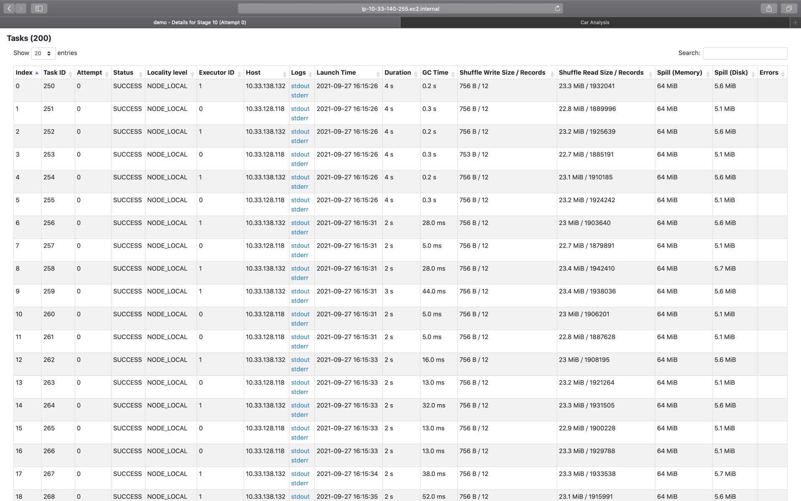

Tasks 中那些新出现的指标如下：


可以看到，新指标并不多，这里最值得关注的，是 Locality level，也就是本地性级别。在调度系统中，我们讲过，每个 Task 都有自己的本地性倾向。结合本地性倾向，调度系统会把 Tasks 调度到合适的 Executors 或是计算节点，尽可能保证“数据不动、代码动”。 

Logs 与 Errors 属于 Spark UI 的三级入口，它们是 Tasks 的执行日志，详细记录了 Tasks 在执行过程中的运行时状态。一般来说，我们不需要深入到三级入口去进行 Debug。Errors 列提供的报错信息，往往足以让我们迅速地定位问题所在。 

## OOM避免

无论是批处理、流计算，还是数据分析、机器学习，只要是在 Spark 作业中，我们总能见到 OOM（Out Of Memory，内存溢出）的身影。一旦出现 OOM，作业就会中断，应用的业务功能也都无法执行。因此，及时处理 OOM 问题是我们日常开发中一项非常重要的工作。 

### Driver 端的 OOM

Driver 的主要职责是任务调度，同时参与非常少量的任务计算，因此 Driver 的内存配置一般都偏低，也没有更加细分的内存区域。 

Driver 端的 OOM 问题一般不是调度系统的问题，只可能来自它涉及的计算任务，主要有两类：

* 创建小规模的分布式数据集：使用 parallelize、createDataFrame 等 API 创建数据集 
* 收集计算结果：通过 take、show、collect 等算子把结果收集到 Driver 端 

因此 Driver 端的 OOM 逃不出 2 类病灶： 

* 创建的数据集超过内存上限 
* 收集的结果集超过内存上限 

第二类原因主要来自于collect算子，它会从 Executors 把全量数据拉回到 Driver 端，因此，如果结果集尺寸超过 Driver 内存上限，它自然会报 OOM。 

还有一种间接调用collect的场景：广播变量的创建。广播变量在创建的过程中，需要先把分布在所有 Executors 的数据分片拉取到 Driver 端，然后在 Driver 端构建广播变量，最后 Driver 端把封装好的广播变量再分发给各个 Executors。第一步的数据拉取其实就是用 collect 实现的。如果 Executors 中数据分片的总大小超过 Driver 端内存上限也会报 OOM，报错可能是这样的：

~~~
java.lang.OutOfMemoryError: Not enough memory to build and broadcast
~~~

它实际的原因其实是Driver 端内存受限，没有办法容纳拉取回的结果集。调节 Driver 端侧内存大小我们要用到 spark.driver.memory 配置项，预估数据集尺寸可以用“先 Cache，再查看执行计划”的方式。

### Executor 端的 OOM

Executor中，与任务执行有关的内存区域才存在 OOM 的隐患。其中，Reserved Memory 大小固定为 300MB，因为它是硬编码到源码中的，所以不受用户控制。而对于 Storage Memory 来说，即便数据集不能完全缓存到 MemoryStore，Spark 也不会抛 OOM 异常，额外的数据要么落盘（MEMORY_AND_DISK）、要么直接放弃（MEMORY_ONLY）。 

因此，当 Executors 出现 OOM 的问题，我们可以先把 Reserved Memory 和 Storage Memory 排除，然后锁定 Execution Memory 和 User Memory 去找毛病。 

1、User Memory 的 OOM 

User Memory 用于存储用户自定义的数据结构，如数组、列表、字典等。因此，如果这些数据结构的总大小超出了 User Memory 内存区域的上限，你可能就会看到下表示例中的报错：

~~~
java.lang.OutOfMemoryError: Java heap space at java.util.Arrays.copyOf
 
java.lang.OutOfMemoryError: Java heap space at java.lang.reflect.Array.newInstance
~~~

如果你的数据结构是用于分布式数据转换，在计算 User Memory 内存消耗时，你就需要考虑 Executor 的线程池大小。 例如下面的例子：

~~~scala
val dict = List(“spark”, “tune”)
val words = spark.sparkContext.textFile(“~/words.csv”)
val keywords = words.filter(word => dict.contains(word))
keywords.map((_, 1)).reduceByKey(_ + _).collect
~~~

自定义的列表 dict 会随着 Task 分发到所有 Executors，因此多个 Task 中的 dict 会对 User Memory 产生重复消耗。如果把 dict 尺寸记为 #size，Executor 线程池大小记为 #threads，那么 dict 对 User Memory 的总消耗就是：#size * #threads。一旦总消耗超出 User Memory 内存上限，自然就会产生 OOM 问题。 

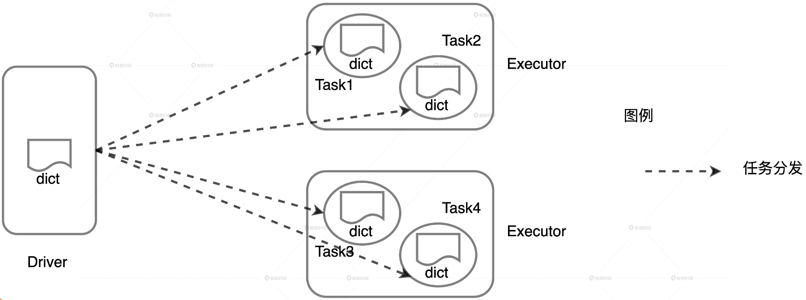

解决 User Memory 端 OOM 的思路和 Driver 端的并无二致，也是先对数据结构的消耗进行预估，然后相应地扩大 User Memory 的内存配置。 

2、Execution Memory 的 OOM 

Executor中有多个线程，每个线程分到内存的机会是均等的。一旦分布式任务的内存请求超出 1/N 这个上限，Execution Memory 就会出现 OOM 问题。 

Execution Memory的OOM主要有以下两类原因：

* 数据倾斜导致某个Task的数据分片超过了单个线程占用的内存上限，导致内存溢出。

  例如按照配置每个Reduce Task能拿到100MB的内存，如果某个Task对应的数据分片大小是300MB，即便 Spark 在 Reduce 阶段支持 Spill 和外排，100MB 的内存空间也无法满足 300MB 数据最基本的计算需要，如 PairBuffer 和 AppendOnlyMap 等数据结构的内存消耗，以及数据排序的临时内存消耗等等。 

  此时的调优思路有两个：

  * 消除数据倾斜，让所有的数据分片尺寸都不大于 100MB 
  * 调整 Executor 线程池、内存、并行度等相关配置，提高 1/N 上限到 300MB 

  每一种思路都可以衍生出许多不同的方法，就拿第 2 种思路来说，要满足 1/N 的上限，最简单地，我们可以把 spark.executor.cores 设置成 1，也就是 Executor 线程池只有一个线程“并行”工作。 

* 数据膨胀。磁盘中的数据进了 JVM 之后会膨胀，甚至会膨胀几倍甚至十几倍，压缩比越高越容易出问题


# 调优

根据木桶理论，最短的木板决定了木桶的容量，因此，对于一只有短板的木桶，其他木板调节得再高也无济于事，最短的木板才是木桶容量的瓶颈。 

性能调优的本质:

* 性能调优是一个动态、持续不断的过程。 补齐一个短板，其他板子可能会成为新的短板。 
* 性能调优的手段和方法是否高效，取决于它针对的是木桶的长板还是瓶颈。针对瓶颈，事半功倍；针对长板，事倍功半。 
* 性能调优的方法和技巧，没有一定之规，也不是一成不变，随着木桶短板的此消彼长需要相应的动态切换。 
* 性能调优的过程收敛于一种所有木板齐平、没有瓶颈的状态。 

定位性能瓶颈的途径：

* 已有的专家经验
* 依靠运行时的诊断

运行时诊断的手段和方法应该说应有尽有、不一而足。比如：

* 对于任务的执行情况，Spark UI 提供了丰富的可视化面板，来展示 DAG、Stages 划分、执行计划、Executor 负载均衡情况、GC 时间、内存缓存消耗等等详尽的运行时状态数据； 
* 对于硬件资源消耗，开发者可以利用 Ganglia 或者系统级监控工具，如 top、vmstat、iostat、iftop 等等来实时监测硬件的资源利用率； 
* 针对 GC 开销，开发者可以将 GC log 导入到 JVM 可视化工具，从而一览任务执行过程中 GC 的频率和幅度。 

性能问题定位时，从硬件资源消耗的角度切入，往往是个不错的选择。我们都知道，从硬件的角度出发，计算负载划分为计算密集型、内存密集型和 IO 密集型。如果我们能够明确手中的应用属于哪种类型，自然能够缩小搜索范围，从而更容易锁定性能瓶颈。 不过，在实际开发中，并不是所有负载都能明确划分出资源密集类型。比如说，Shuffle、数据关联这些数据分析领域中的典型场景，它们对 CPU、内存、磁盘与网络的要求都很高，任何一个环节不给力都有可能形成瓶颈。因此，就性能瓶颈定位来说，除了从硬件资源的视角出发，我们还需要关注典型场景。 

性能调优的方法主要分为两种：

* 优化应用代码。需要知道，开发阶段都有哪些常规操作、常见误区，从而尽量避免在代码中留下性能隐患。 
* 调整配置项

性能调优的最终目的：在所有参与计算的硬件资源之间寻求协同与平衡，让硬件资源达到一种平衡、无瓶颈的状态。 

一个典型的误区是CPU 利用率压榨到 100%，以及把内存设置到最大的配置组合性能最佳，而是那些硬件资源配置最均衡的计算任务性能最好。

## AQE

为了弥补静态优化的缺陷、同时让 Spark SQL 变得更加智能，Spark 社区在 3.0 版本中推出了 AQE 机制。 

AQE 的全称是 Adaptive Query Execution，翻译过来是“自适应查询执行”。AQE 是 Spark SQL 的一种动态优化机制，在运行时，每当 Shuffle Map 阶段执行完毕，AQE 都会结合这个阶段的统计信息，基于既定的规则动态地调整、修正尚未执行的逻辑计划和物理计划，来完成对原始查询语句的运行时优化。 

AQE 优化机制触发的时机是 Shuffle Map 阶段执行完毕。也就是说，AQE 优化的频次与执行计划中 Shuffle 的次数一致。反过来说，如果你的查询语句不会引入 Shuffle 操作，那么 Spark SQL 是不会触发 AQE 的。 

AQE 赖以优化的统计信息是Shuffle Map 阶段输出的中间文件。

结合 Spark SQL 端到端优化流程图我们可以看到，AQE 从运行时获取统计信息，在条件允许的情况下，优化决策会分别作用到逻辑计划和物理计划：

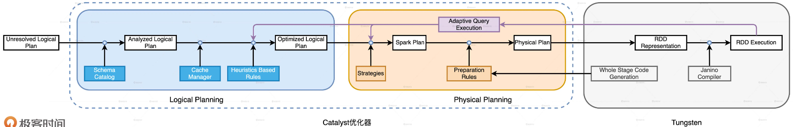

它包含了 3 个动态优化特性，分别是 Join 策略调整、自动分区合并和自动倾斜处理。 

或许是 Spark 社区对于新的优化机制偏向于保守，AQE 机制默认是未开启的，要想充分利用上述的 3 个特性，我们得先把 spark.sql.adaptive.enabled 修改为 true 才行：

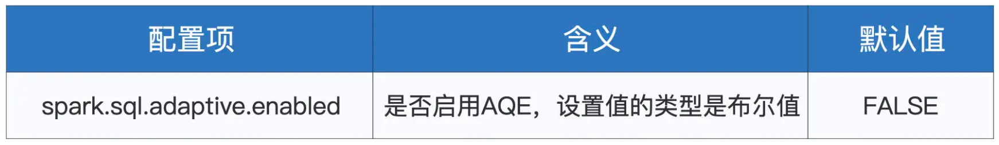

### Join 策略调整

Join 策略调整指的就是 Spark SQL 在运行时动态地将原本的 Shuffle Join 策略，调整为执行更加高效的 Broadcast Join。 

具体来说，每当 DAG 中的 Map 阶段执行完毕，Spark SQL 就会结合 Shuffle 中间文件的统计信息，重新计算 Reduce 阶段数据表的存储大小。如果发现基表尺寸小于广播阈值，那么 Spark SQL 就把下一阶段的 Shuffle Join 调整为 Broadcast Join。 

不难发现，这里的关键是 Shuffle，以及 Shuffle 的中间文件。事实上，不光是 Join 策略调整这个特性，整个 AQE 机制的运行，都依赖于 DAG 中的 Shuffle 环节。 

要做到动态优化，Spark SQL 必须要仰仗运行时的执行状态，而 Shuffle 中间文件，则是这些状态的唯一来源。 举例来说，通过 Shuffle 中间文件，Spark SQL 可以获得诸如文件尺寸、Map Task 数据分片大小、Reduce Task 分片大小、空文件占比之类的统计信息。正是利用这些统计信息，Spark SQL 才能在作业执行的过程中，动态地调整执行计划。 

结合例子进一步来理解，以 Join 策略调整为例，给定如下查询语句，假设 salaries 表和 employees 表的存储大小都超过了广播阈值，在这种情况下，对于两张表的关联计算，Spark SQL 只能选择 Shuffle Join 策略。 

```sql
select * from salaries inner join employees
  on salaries.id = employees.id
  where employees.age >= 30 and employees.age < 45
```

不过实际上，employees 按照年龄过滤之后，剩余的数据量是小于广播阈值的。这个时候，得益于 AQE 机制的 Join 策略调整，Spark SQL 能够把最初制定的 Shuffle Join 策略，调整为 Broadcast Join 策略，从而在运行时加速执行性能。 

在这个例子里面，广播阈值的设置、以及基表过滤之后数据量的预估，就变得非常重要。原因在于，这两个要素决定了 Spark SQL 能否成功地在运行时充分利用 AQE 的 Join 策略调整特性，进而在整体上优化执行性能。因此，我们必须要掌握广播阈值的设置方法，以及数据集尺寸预估的方法。 

启用动态 Join 策略调整还有个前提，也就是要满足 nonEmptyPartitionRatioForBroadcastJoin 参数的限制：

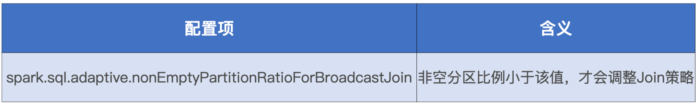

这个参数的默认值是 0.2，大表过滤之后，非空的数据分区占比要小于 0.2，才能成功触发 Broadcast Join 降级。 

假设，大表过滤之前有 100 个分区，Filter 操作之后，有 85 个分区内的数据因为不满足过滤条件，在过滤之后都变成了没有任何数据的空分区，另外的 15 个分区还保留着满足过滤条件的数据。这样一来，这张大表过滤之后的非空分区占比是 15 / 100 = 15%，因为 15% 小于 0.2，所以这个例子中的大表会成功触发 Broadcast Join 降级。 

相反，如果大表过滤之后，非空分区占比大于 0.2，那么剩余数据量再小，AQE 也不会把 Shuffle Joins 降级为 Broadcast Join。因此，如果你想要充分利用 Broadcast Join 的优势，可以考虑把这个参数适当调高。 

因为AQE 依赖的统计信息来自于 Shuffle Map 阶段生成的中间文件，这就意味着 AQE 在开始优化之前，Shuffle 操作已经执行过半了，不论大表还是小表都要完成 Shuffle Map 阶段的计算，并且把中间文件落盘，AQE 才能做出决策。 如果遵循常规步骤，即便 AQE 在运行时把 Shuffle Sort Merge Join 降级为 Broadcast Join，大表的中间文件还是需要通过网络进行分发。这个时候，AQE 的动态 Join 策略调整也就失去了实用价值。原因很简单，负载最重的大表 Shuffle 计算已经完成，再去决定切换到 Broadcast Join 已经没有任何意义。

在这样的背景下，OptimizeLocalShuffleReader 物理策略就非常重要，它是AQE的一个物理策略，既然大表已经完成 Shuffle Map 阶段的计算，这些计算可不能白白浪费掉。采取 OptimizeLocalShuffleReader 策略可以省去 Shuffle 常规步骤中的网络分发，Reduce Task 可以就地读取本地节点（Local）的中间文件，完成与广播小表的关联操作。 它生效的前提是spark.sql.adaptive.localShuffleReader.enabled是true。

Shuffle Map 阶段的内存消耗和磁盘 I/O是不能通过Join 策略调整来优化的，OptimizeLocalShuffleReader 策略只能避免Reduce阶段数据在网络中的全量分发。

### 自动分区合并

AQE 机制的另外两个特性：自动分区合并与自动倾斜处理，它们都是对于 Shuffle 本身的优化策略。 

我们知道，Shuffle 的计算过程分为两个阶段：Map 阶段和 Reduce 阶段。Map 阶段的数据分布，往往由分布式文件系统中的源数据决定，因此数据集在这个阶段的分布，是相对均匀的。 

Reduce 阶段的数据分布则不同，它是由 Distribution Key 和 Reduce 阶段并行度决定的，并行度也就是分区数目。

而 Distribution Key 则定义了 Shuffle 分发数据的依据，对于 reduceByKey 算子来说，Distribution Key 就是 Paired RDD 的 Key；而对于 repartition 算子来说，Distribution Key 就是传递给 repartition 算子的形参，如 repartition($“Column Name”)。 在业务上，Distribution Key 往往是 user_id、item_id 这一类容易产生倾斜的字段，相应地，数据集在 Reduce 阶段的分布往往也是不均衡的。 

数据的不均衡往往体现在两个方面：

- 一方面是一部分数据分区的体量过小 
- 另一方面，则是少数分区的体量极其庞大。 

AQE 机制的自动分区合并与自动倾斜处理，正是用来应对数据不均衡的这两个方面。

自动分区合并可以解决数据分区过小、过于分散的问题。

具体来说，Spark SQL 怎么判断一个数据分区是不是足够小、它到底需不需要被合并？再者，既然是对多个分区做合并，那么自然就存在一个收敛条件。原因很简单，如果一直不停地合并下去，那么整个数据集就被捏合成了一个超级大的分区，并行度也会下降至 1，显然，这不是我们想要的结果。

 事实上，Spark SQL 采用了一种相对朴素的方法，来实现分区合并。具体来说，Spark SQL 事先并不去判断哪些分区是不是足够小，而是按照分区的编号依次进行扫描，当扫描过的数据体量超过了“目标尺寸”时，就进行一次合并。而这个目标尺寸，由以下两个配置项来决定：


分区合并示意图：

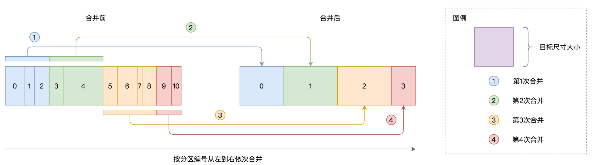

开发者可以通过第一个配置项 spark.sql.adaptive.advisoryPartitionSizeInBytes 来直接指定目标尺寸。第二个参数用于限制 Reduce 阶段在合并之后的并行度，避免因为合并导致并行度过低，造成 CPU 资源利用不充分。 

结合数据集大小与最低并行度，我们可以反推出来每个分区的平均大小，假设我们把这个平均大小记作是 #partitionSize。那么，实际的目标尺寸，取 advisoryPartitionSizeInBytes 设定值与 #partitionSize 之间较小的那个数值。 

确定了目标尺寸之后，Spark SQL 就会依序扫描数据分区，当相邻分区的尺寸之和大于目标尺寸的时候，Spark SQL 就把扫描过的分区做一次合并。然后，继续使用这种方式，依次合并剩余的分区，直到所有分区都处理完毕。 

### 自动倾斜处理

自动倾斜处理也分为两步，第一步是检测并判定体量较大的倾斜分区，第二步是把这些大分区拆分为小分区。要做到这两步，Spark SQL 需要依赖如下 3 个配置项：

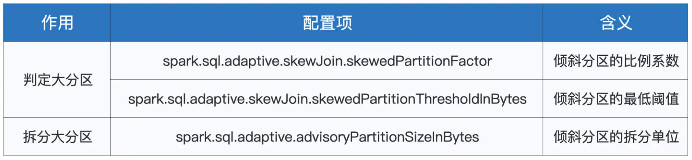

其中，前两个配置项用于判定倾斜分区，第 3 个配置项 advisoryPartitionSizeInBytes之前提到过，这个参数除了用于合并小分区外，同时还用于拆分倾斜分区。

判定大分区的过程如下：

首先，Spark SQL 对所有数据分区按照存储大小做排序，取中位数作为基数。然后，将中位数乘以 skewedPartitionFactor 指定的比例系数，得到判定阈值。凡是存储尺寸大于判定阈值的数据分区，都有可能被判定为倾斜分区。 

之所以说有可能，是因为倾斜分区的判定，还要受到 skewedPartitionThresholdInBytes 参数的限制，它是判定倾斜分区的最低阈值。也就是说，只有那些尺寸大于 skewedPartitionThresholdInBytes 设定值的“候选分区”，才会最终判定为倾斜分区。 

举个例子，假设数据表 salaries 有 3 个分区，大小分别是 90MB、100MB 和 512MB。显然，这 3 个分区的中位数是 100MB，那么拿它乘以比例系数 skewedPartitionFactor（默认值为 5），得到判定阈值为 100MB * 5 = 500MB。因此，在这里的例子中，只有最后一个尺寸为 512MB 的数据分区会被列为“候选分区”。 接下来，Spark SQL 还要拿 512MB 与 skewedPartitionThresholdInBytes 作对比，这个参数的默认值是 256MB。 显然，512MB 比 256MB 要大得多，这个时候，Spark SQL 才会最终把最后一个分区，判定为倾斜分区。相反，假设我们把 skewedPartitionThresholdInBytes 这个参数调大，设置为 1GB，那么最后一个分区就不满足最低阈值，因此也就不会被判定为倾斜分区。 

倾斜分区判定完毕之后，下一步，就是根据 advisoryPartitionSizeInBytes 参数指定的目标尺寸，对大分区进行拆分。假设我们把这个参数的值设置为 256MB，那么刚刚 512MB 的大分区就会被拆成两个小分区（512MB / 2 = 256MB）。拆分之后，salaries 表就由 3 个分区变成了 4 个分区，每个数据分区的尺寸，都不超过 256MB。 

需要注意的一点是：自动倾斜处理也可以保证同样key的数据在同一个reduce里执行，这是因为AQE对于倾斜的处理，是进程内部的。也就是说，一个倾斜的task，可能会被拆成两个或是多个子task，但是这些task，其实都还是在同一个Executor内。 

自动倾斜处理的拆分操作也是在 Reduce 阶段执行的。在同一个 Executor 内部，本该由一个 Task 去处理的大分区，被 AQE 拆成多个小分区并交由多个 Task 去计算。这样一来，Task 之间的计算负载就可以得到平衡。但是，这并不能解决不同 Executors 之间的负载均衡问题。 

举个例子，假设有个 Shuffle 操作，它的 Map 阶段有 3 个分区，Reduce 阶段有 4 个分区。4 个分区中的两个都是倾斜的大分区，而且这两个倾斜的大分区刚好都分发到了 Executor 0。通过下图，我们能够直观地看到，尽管两个大分区被拆分，但横向来看，整个作业的主要负载还是落在了 Executor 0 的身上。Executor 0 的计算能力依然是整个作业的瓶颈，这一点并没有因为分区拆分而得到实质性的缓解。Executors之间的负载平衡还有待优化：

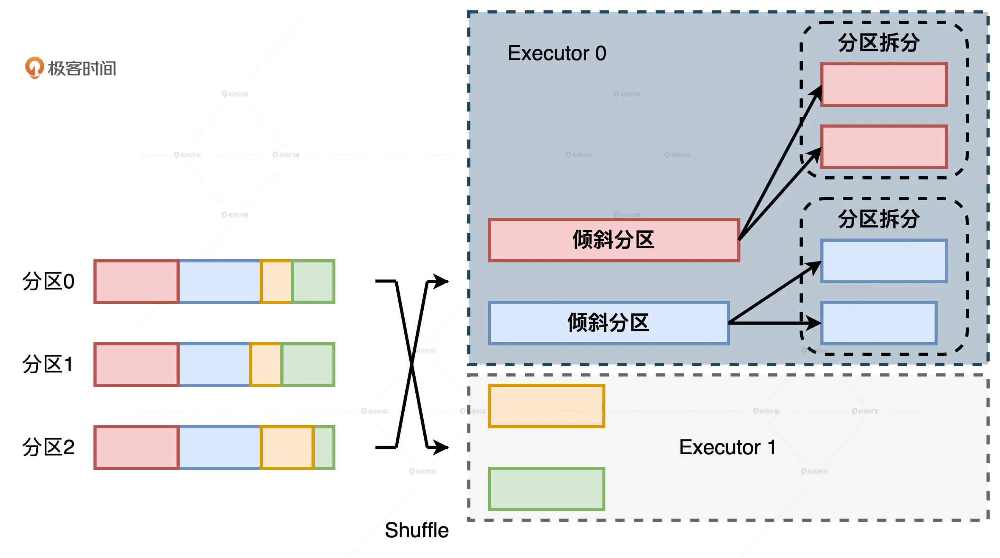

另外，在数据关联的场景中，对于参与 Join 的两张表，我们暂且把它们记做数据表 1 和数据表 2，如果表 1 存在数据倾斜，表 2 不倾斜，那在关联的过程中，AQE 除了对表 1 做拆分之外，还需要对表 2 对应的数据分区做复制，来保证关联关系不被破坏：

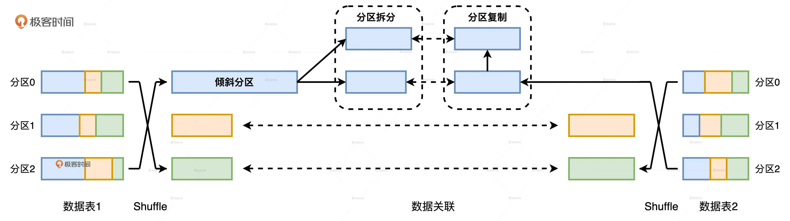

在这样的运行机制下，如果两张表都存在数据倾斜，这个时候，事情就开始变得逐渐复杂起来了。对于上图中的表 1 和表 2，我们假设表 1 还是拆出来两个分区，表 2 因为倾斜也拆出来两个分区。这个时候，为了不破坏逻辑上的关联关系，表 1、表 2 拆分出来的分区还要各自复制出一份，如下图所示：

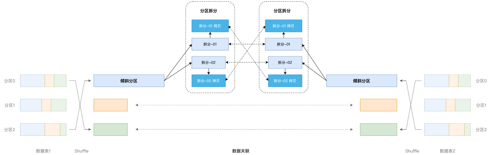

如果现在问题变得更复杂了，左表拆出 M 个分区，右表拆出 N 各分区，那么每张表最终都需要保持 M x N 份分区数据，才能保证关联逻辑的一致性。当 M 和 N 逐渐变大时，AQE 处理数据倾斜所需的计算开销将会面临失控的风险。 

总的来说，当应用场景中的数据倾斜比较简单，比如虽然有倾斜但数据分布相对均匀，或是关联计算中只有一边倾斜，我们完全可以依赖 AQE 的自动倾斜处理机制。但是，当我们的场景中数据倾斜变得复杂，比如数据中不同 Key 的分布悬殊，或是参与关联的两表都存在大量的倾斜，我们就需要衡量 AQE 的自动化机制与手工处理倾斜之间的利害得失。 

## DPP

DPP（Dynamic Partition Pruning，动态分区剪裁）是 Spark 3.0 版本的一个特性。

它指的是在星型数仓的数据关联场景中，可以充分利用过滤之后的维度表，大幅削减事实表的数据扫描量，从整体上提升关联计算的执行性能。 

### 分区裁剪

用一个例子来说明分区裁剪的概念，星型模型是数仓的一种模型，它一般分为两种表：事实表和维度表

* 事实表描述某一个业务度量，例如订单中包含金额、商品数量，事实表的一行记录对应物理世界的一个事件，多个事实聚集而成的一张二维表就是事实表
* 维度表中存储的是维度，维度就是事实的上下文，描述事实发生的状态，例如18点小明下了一个订单，买了一个苹果，在这里面下订单是事实，8点是时间维度，小明是用户维度，苹果是商品维度，这些具体维度聚集而成的表就是维度表。

在星型（Start Schema）数仓中，我们有两张表，一张是订单表 orders，另一张是用户表 users。 显然，订单表是事实表（Fact），而用户表是维度表（Dimension）。业务需求是统计所有头部用户贡献的营业额，并按照营业额倒序排序。

两张表的关键字段如下：

~~~scala
// 订单表orders关键字段
userId, Int
itemId, Int
price, Float
quantity, Int
 
// 用户表users关键字段
id, Int
name, String
type, String //枚举值，分为头部用户和长尾用户
~~~

给定上述数据表，我们只需把两张表做内关联，然后分组、聚合、排序，就可以实现业务逻辑，具体的查询语句如下：

~~~sql
select (orders.price * order.quantity) as income, users.name
from orders inner join users on orders.userId = users.id
where users.type = ‘Head User’
group by users.name
order by income desc
~~~

它的逻辑执行计划如下：

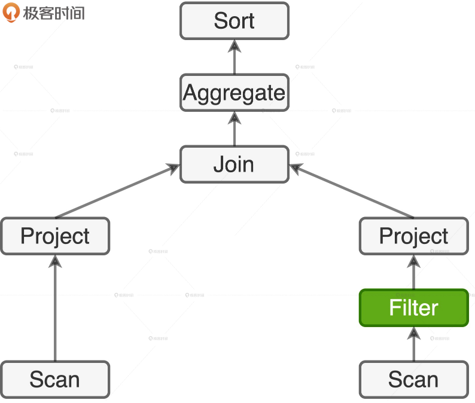

由于查询语句中事实表上没有过滤条件，因此，在执行计划的左侧，Spark SQL 选择全表扫描的方式来投影出 userId、price 和 quantity 这些字段。相反，维度表上有过滤条件 users.type = ‘Head User’，因此，Spark SQL 可以应用谓词下推规则，把过滤操作下推到数据源之上，来减少必需的磁盘 I/O 开销。 

虽然谓词下推已经很给力了，但如果用户表支持分区剪裁（Partition Pruning），I/O 效率的提升就会更加显著。 实际上，分区剪裁是谓词下推的一种特例，它指的是在分区表中下推谓词，并以文件系统目录为单位对数据集进行过滤。分区表就是通过指定分区键，然后使用 partitioned by 语句创建的数据表，或者是使用 partitionBy 语句存储的列存文件（如 Parquet、ORC 等）。 

相比普通数据表，分区表特别的地方就在于它的存储方式。对于分区键中的每一个数据值，分区表都会在文件系统中创建单独的子目录来存储相应的数据分片。拿用户表来举例，假设用户表是分区表，且以 type 字段作为分区键，那么用户表会有两个子目录，前缀分别是“Head User”和“Tail User”。数据记录被存储于哪个子目录完全取决于记录中 type 字段的值，比如：所有 type 字段值为“Head User”的数据记录都被存储到前缀为“Head User”的子目录。同理，所有 type 字段值为“Tail User”的数据记录，全部被存放到前缀为“Tail User”的子目录。 

如果过滤谓词中包含分区键，那么 Spark SQL 对分区表做扫描的时候，是完全可以跳过（剪掉）不满足谓词条件的分区目录，这就是分区剪裁。例如，在我们的查询语句中，用户表的过滤谓词是“users.type = ‘Head User’”。假设用户表是分区表，那么对于用户表的数据扫描，Spark SQL 可以完全跳过前缀为“Tail User”的子目录：

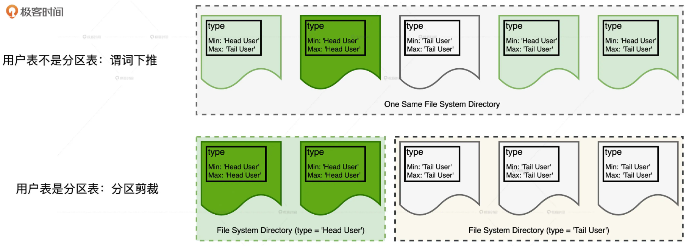

通过与谓词下推作对比，我们可以直观地感受分区剪裁的威力。如上图所示，上下两行分别表示用户表在不做分区和做分区的情况下，Spark SQL 对于用户表的数据扫描：

* 在不做分区的情况下，用户表所有的数据分片全部存于同一个文件系统目录，尽管 Parquet 格式在注脚（Footer) 中提供了 type 字段的统计值，Spark SQL 可以利用谓词下推来减少需要扫描的数据分片，但由于很多分片注脚中的 type 字段同时包含‘Head User’和‘Tail User’（第一行 3 个浅绿色的数据分片），因此，用户表的数据扫描仍然会涉及 4 个数据分片。 
* 当用户表本身就是分区表时，由于 type 字段为‘Head User’的数据记录全部存储到前缀为‘Head User’的子目录，也就是图中第二行浅绿色的文件系统目录，这个目录中仅包含两个 type 字段全部为‘Head User’的数据分片。这样一来，Spark SQL 可以完全跳过其他子目录的扫描，从而大幅提升 I/O 效率。 

理论上来说，分区裁剪也可以应用到事实表中，毕竟事实表的体量更大，相比维度表，事实表上 I/O 效率的提升空间更大。 但是对于实际工作中的绝大多数关联查询来说，事实表都不满足分区剪裁所需的前提条件。比如说，要么事实表不是分区表，要么事实表上没有过滤谓词，或者就是过滤谓词不包含分区键。就拿电商场景的例子来说，查询中压根就没有与订单表相关的过滤谓词。因此，即便订单表本身就是分区表，Spark SQL 也没办法利用分区剪裁特性。 

对于这样的关联查询，只能任由 Spark SQL 去全量扫描事实表，但有了 Spark 3.0 推出的 DPP 特性之后，情况就大不一样了。 

### 动态分区裁剪

DPP 指的是在数据关联的场景中，Spark SQL 利用维度表提供的过滤信息，减少事实表中数据的扫描量、降低 I/O 开销，从而提升执行性能。 

DPP背后的实现逻辑是这样的：

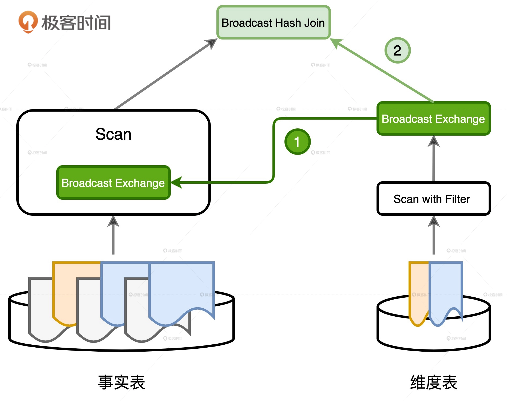

首先，过滤条件 users.type = ‘Head User’会帮助维度表过滤一部分数据。与此同时，维度表的 ID 字段也顺带着经过一轮筛选，如图中的步骤 1 所示。经过这一轮筛选之后，保留下来的 ID 值，仅仅是维度表 ID 全集的一个子集。 

然后，在关联关系也就是 orders.userId = users.id 的作用下，过滤效果会通过 users 的 ID 字段传导到事实表的 userId 字段，也就是图中的步骤 2。这样一来，满足关联关系的 userId 值，也是事实表 userId 全集中的一个子集。把满足条件的 userId 作为过滤条件，应用（Apply）到事实表的数据源，就可以做到减少数据扫描量，提升 I/O 效率。

DPP 正是基于上述逻辑，把维度表中的过滤条件，通过关联关系传导到事实表，从而完成事实表的优化。 

但并不是所有的数据关联场景都可以享受到 DPP 的优化机制，想要利用 DPP 来加速事实表数据的读取和访问，数据关联场景还要满足三个额外的条件：

* 事实表必须是分区表，而且分区字段（可以是多个）必须包含 Join Key。 

  DPP 是一种分区剪裁机制，它是以分区为单位对事实表进行过滤。结合刚才的逻辑，维度表上的过滤条件会转化为事实表上 Join Key 的过滤条件。具体到我们的例子中，就是 orders.userId 这个字段。显然，DPP 生效的前提是事实表按照 orders.userId 这一列预先做好了分区。 

* 过滤效果的传导，依赖的是等值的关联关系，比如 orders.userId = users.id。因此，DPP 仅支持等值 Joins，不支持大于、小于这种不等值关联关系。 

* DPP 机制得以实施还有一个隐含的条件：维度表过滤之后的数据集要小于广播阈值。 

Spark SQL底层是用广播变量封装过滤之后的维度表数据。 具体来说，在维度表做完过滤之后，Spark SQL 在其上构建哈希表（Hash Table），这个哈希表的 Key 就是用于关联的 Join Key。在我们的例子中，Key 就是满足过滤 users.type = ‘Head User’条件的 users.id；Value 是投影中需要引用的数据列，在之前订单表与用户表的查询中，这里的引用列就是 users.name：

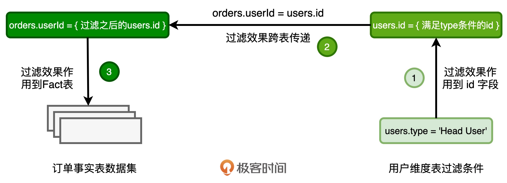

哈希表构建完毕之后，Spark SQL 将其封装到广播变量中，这个广播变量的作用有二：

* 第一个作用就是给事实表用来做分区剪裁，如上图中的步骤 1 所示， 哈希表中的 Key Set 刚好可以用来给事实表过滤符合条件的数据分区。 
* 第二个作用就是参与后续的 Broadcast Join 数据关联，如图中的步骤 2 所示。这里的哈希表，本质上就是 Hash Join 中的 Build Table，其中的 Key、Value，记录着数据关联中所需的所有字段，如 users.id、users.name，刚好拿来和事实表做 Broadcast Hash Join。 

鉴于 Spark SQL 选择了广播变量的实现方式，要想有效利用 DPP 优化机制，我们就必须要确保，过滤后的维度表刚好能放到广播变量中去。也因此，我们必须要谨慎对待配置项 spark.sql.autoBroadcastJoinThreshold。 

## 优化Shuffle

在性能优化中，有一个原则可以简单概述为：能省则省、能拖则拖 

* 省的是数据处理量，因为节省数据量就等于节省计算负载，更低的计算负载自然意味着更快的处理速度； 
* Shuffle 操作，因为对于常规数据处理来说，计算步骤越靠后，需要处理的数据量越少，Shuffle 操作执行得越晚，需要落盘和分发的数据量就越少，更低的磁盘与网络开销自然意味着更高的执行效率。 

实现起来我们可以分 3 步进行： 

* 尽量把能节省数据扫描量和数据处理量的操作往前推； 
* 尽力消灭掉 Shuffle，省去数据落盘与分发的开销； 
* 如果不能干掉 Shuffle，尽可能地把涉及 Shuffle 的操作拖到最后去执行。 

以下面的代码为例：

~~~scala
val dates: List[String] = List("2020-01-01", "2020-01-02", "2020-01-03")
val rootPath: String = _
 
//读取日志文件，去重、并展开userInterestList
def createDF(rootPath: String, date: String): DataFrame = {
val path: String = rootPath + date
val df = spark.read.parquet(path)
.distinct
.withColumn("userInterest", explode(col("userInterestList")))
df
}
 
//提取字段、过滤，再次去重，把多天的结果用union合并
val distinctItems: DataFrame = dates.map{
case date: String =>
val df: DataFrame = createDF(rootPath, date)
.select("userId", "itemId", "userInterest", "accessFreq")
.filter("accessFreq in ('High', 'Medium')")
.distinct
df
}.reduce(_ union _)
~~~

分析一下这段代码，其中主要的操作有 4 个：用 distinct 去重、用 explode 做列表展开、用 select 提取字段和用 filter 过滤日志记录。 因为后 3 个操作全部是在 Stage 内完成去内存计算，只有 distinct 会引入 Shuffle，所以我们要重点关注它。distinct 一共被调用了两次，一次是读取日志内容之后去重，另一次是得到所需字段后再次去重。 

首先，我们把目光集中到第一个 distinct 操作上：在 createDF 函数中读取日志记录之后，立即调用 distinct 去重。要知道，日志记录中包含了很多的字段，distinct 引入的 Shuffle 操作会触发所有数据记录，以及记录中所有字段在网络中全量分发，但我们最终需要的是用户粘性达到一定程度的数据记录，而且只需要其中的用户 ID、物品 ID 和用户兴趣这 3 个字段。因此，这个 distinct 实际上在集群中分发了大量我们并不需要的数据，这无疑是一个巨大的浪费。 

接着，我们再来看第二个 distinct 操作：对数据进行展开、抽取、过滤之后，再对记录去重。这次的去重和第一次大不相同，它涉及的 Shuffle 操作所分发的数据记录没有一条是多余的，记录中仅包含共现矩阵必需的那几个字段。 

这个时候我们发现，两个 distinct 操作都是去重，目的一样，但是第二个 distinct 操作比第一个更精准，开销也更少，所以我们可以去掉第一个 distinct 操作。 

这样一来，我们也就消灭了一个会引入全量数据分发的 Shuffle 操作，这个改进对执行性能自然大有裨益。 

再来看explode，尽管 explode 不会引入 Shuffle，但在内存中展开兴趣列表的时候，它还是会夹带着很多如用户属性、物品属性等等我们并不需要的字段。 因此，我们得把过滤和列剪枝这些可以节省数据访问量的操作尽可能地往前推，把计算开销较大的操作如 Shuffle 尽量往后拖，从而在整体上降低数据处理的负载和开销。基于这些分析，我们就有了改进版的代码实现，如下所示：

~~~scala
val dates: List[String] = List("2020-01-01", "2020-01-02", "2020-01-03")
val rootPath: String = _
 
val filePaths: List[String] = dates.map(rootPath + _)
 
/**
一次性调度所有文件
先进行过滤和列剪枝
然后再展开userInterestList
最后统一去重
*/
val distinctItems = spark.read.parquet(filePaths: _*)
.filter("accessFreq in ('High', 'Medium'))")
.select("userId", "itemId", "userInterestList")
.withColumn("userInterest", explode(col("userInterestList")))
.select("userId", "itemId", "userInterest")
.distinct
~~~

在这份代码中，所有能减少数据访问量的操作如 filter、select 全部被推到最前面，会引入 Shuffle 的 distinct 算子则被拖到了最后面。经过实验对比，两版代码在运行时的执行性能相差一倍。 

## 避免单机思维模式

以下面的代码为例：

~~~scala
import java.security.MessageDigest
 
class Util {
val md5: MessageDigest = MessageDigest.getInstance("MD5")
val sha256: MessageDigest = _ //其他哈希算法
}
 
val df: DataFrame = _
val ds: Dataset[Row] = df.map{
case row: Row =>
val util = new Util()
val s: String = row.getString(0) + row.getString(1) + row.getString(2)
val hashKey: String = util.md5.digest(s.getBytes).map("%02X".format(_)).mkString
(hashKey, row.getInt(3))
}
~~~

仔细观察，我们发现这份代码其实还有可以优化的空间。要知道，map 算子所囊括的计算是以数据记录（Data Record）为操作粒度的。换句话说，分布式数据集涉及的每一个数据分片中的每一条数据记录，都会触发 map 算子中的计算逻辑。因此，我们必须谨慎对待 map 算子中涉及的计算步骤。很显然，map 算子之中应该仅仅包含与数据转换有关的计算逻辑，与数据转换无关的计算，都应该提炼到 map 算子之外。 

反观上面的代码，map 算子内与数据转换直接相关的操作，是拼接 Join keys 和计算哈希值。但是，实例化 Util 对象仅仅是为了获取哈希函数而已，与数据转换无关，因此我们需要把它挪到 map 算子之外。 

~~~scala
val ds: Dataset[Row] = df.mapPartitions(iterator => {
val util = new Util()
val res = iterator.map{
case row=>{
val s: String = row.getString(0) + row.getString(1) + row.getString(2)
val hashKey: String = util.md5.digest(s.getBytes).map("%02X".format(_)).mkString
(hashKey, row.getInt(3)) }}
res
})
~~~

类似这种忽视实例化 Util 操作的行为还有很多，比如在循环语句中反复访问 RDD，用临时变量缓存数据转换的中间结果等等。这种不假思索地直入面向过程编程，忽略或无视分布式数据实体的编程模式，我们把它叫做单机思维模式。 单机思维模式会让开发者在分布式环境中，无意识地引入巨大的计算开销。 

跳出单机思维模式的办法，就是在脑海中模拟分布式计算的过程。

## 大表Join小表

在数据分析领域，大表 Join 小表的场景非常普遍。不过，大小是个相对的概念，通常来说，大表与小表尺寸相差 3 倍以上，我们就将其归类为“大表 Join 小表”的计算场景。因此，大表 Join 小表，仅仅意味着参与关联的两张表尺寸悬殊。 

对于大表 Join 小表这种场景，我们应该优先考虑 BHJ，它是 Spark 支持的 5 种 Join 策略中执行效率最高的。BHJ 处理大表 Join 小表时的前提条件是，广播变量能够容纳小表的全量数据。但是，如果小表的数据量超过广播阈值这个办法就行不通了。

### Join Key 远大于 Payload

在下面的案例中，大表 100GB、小表 10GB，它们全都远超广播变量阈值（默认 10MB）。因为小表的尺寸已经超过 8GB，在大于 8GB 的数据集上创建广播变量，Spark 会直接抛出异常，中断任务执行，所以 Spark 是没有办法应用 BHJ 机制的。 

在这个案例中，我们要统计流量情况，但是因为实际中并不是每个小时都有访问量的，所以我们就需要用“零”去补齐缺失时段的序列值。 

因为业务需求是填补缺失值，所以在实现层面，我们不妨先构建出完整的全零序列，然后以系统、用户和时间这些维度组合为粒度，用统计流量去替换全零序列中相应位置的“零流量”：

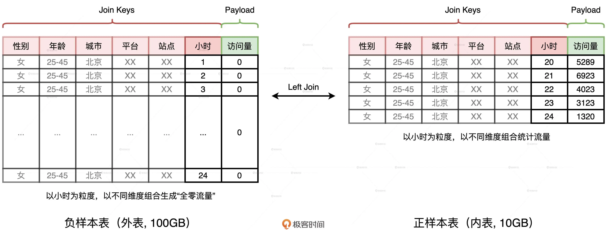

首先，我们生成一张全零流量表，如图中左侧的“负样本表”所示。这张表的主键是划分流量种类的各种维度，如性别、年龄、平台、站点、小时时段等等。表的 Payload 只有一列，也即访问量，在生成“负样本表”的时候，这一列全部置零。 

然后，我们以同样的维度组合统计日志中的访问量，就可以得到图中右侧的“正样本表”。不难发现，两张表的 Schema 完全一致，要想获得完整的时序序列，我们只需要把外表以“左连接（Left Outer Join）”的形式和内表做关联就好了。具体的查询语句如下： 

~~~scala
//左连接查询语句
select t1.gender, t1.age, t1.city, t1.platform, t1.site, t1.hour, coalesce(t2.access, t1.access) as access
from t1 left join t2 on
t1.gender = t2.gender and
t1.age = t2.age and
t1.city = t2.city and
t1.platform = t2.platform and
t1.site = t2.site and
t1.hour = t2.hour
~~~

使用左连接的方式，我们刚好可以用内表中的访问量替换外表中的零流量，两表关联的结果正是我们想要的时序序列。“正样本表”来自访问日志，只包含那些存在流量的时段，而“负样本表”是生成表，它包含了所有的时段。因此，在数据体量上，负样本表远大于正样本表，这是一个典型的“大表 Join 小表”场景。尽管小表（10GB）与大表（100GB）相比，在尺寸上相差一个数量级，但两者的体量都不满足 BHJ 的先决条件。因此，Spark 只好退而求其次，选择 SMJ（Shuffle Sort Merge Join）的实现方式。 

我们知道，SMJ 机制会引入 Shuffle，将上百 GB 的数据在全网分发可不是一个明智的选择。 

这两张表的特点如下：1、两张表的 Schema 完全一致 ；2、无论是在数量、还是尺寸上，两张表的 Join Keys 都远大于 Payload。 我们不一定要用那么多、那么长的 Join Keys 做关联。

我们完全可以基于现有的 Join Keys 去生成一个全新的数据列，它可以叫“Hash Key”。生成的方法分两步： 

* 把所有 Join Keys 拼接在一起，把性别、年龄、一直到小时拼接成一个字符串 
* 使用哈希算法（如 MD5 或 SHA256）对拼接后的字符串做哈希运算，得到哈希值即为“Hash Key” 

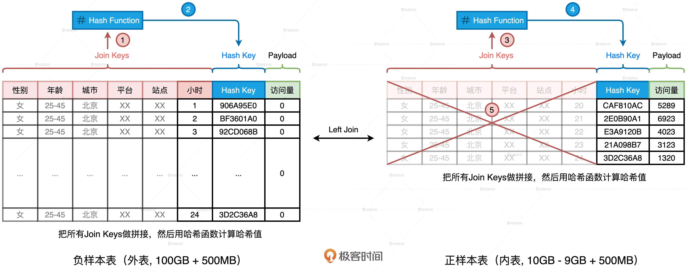

在两张表上，我们都进行这样的操作。如此一来，在做左连接的时候，为了把主键一致的记录关联在一起，我们不必再使用数量众多、冗长的原始 Join Keys，用单一的生成列 Hash Key 就可以了。相应地，SQL 查询语句也变成了如下的样子：

~~~scala
//调整后的左连接查询语句
select t1.gender, t1.age, t1.city, t1.platform, t1.site, t1.hour, coalesce(t2.access, t1.access) as access
from t1 left join t2 on
t1.hash_key = t2. hash_key
~~~

添加了这一列之后，我们就可以把内表，也就是“正样本表”中所有的 Join Keys 清除掉，大幅缩减内表的存储空间，当内表缩减到足以放进广播变量的时候，我们就可以把 SMJ 转化为 BHJ，从而把 SMJ 中的 Shuffle 环节彻底省掉。 这样一来，清除掉 Join Keys 的内表的存储大小就变成了 1.5GB。对于这样的存储量级，我们完全可以使用配置项或是强制广播的方式，来完成 Shuffle Join 到 Broadcast Join 的转化。

该案例优化的关键在于，先用 Hash Key 取代 Join Keys，再清除内表冗余数据。Hash Key 实际上是 Join Keys 拼接之后的哈希值。既然存在哈希运算，我们就必须要考虑哈希冲突的问题。 消除哈希冲突隐患的方法其实很多，比如“二次哈希”，也就是我们用两种哈希算法来生成 Hash Key 数据列。两条不同的数据记录在两种不同哈希算法运算下的结果完全相同，这种概率几乎为零。 

### 过滤条件的 Selectivity 较高

下面这个案例来自电子商务场景，在星型（Start Schema）数仓中，我们有两张表，一张是订单表 orders，另一张是用户表 users。订单表是事实表（Fact），而用户表是维度表（Dimension）。 

这个案例的业务需求很简单，是统计所有头部用户贡献的营业额，并按照营业额倒序排序。订单表和用户表的 Schema 如下表所示：

~~~scala
// 订单表orders关键字段
userId, Int
itemId, Int
price, Float
quantity, Int
 
// 用户表users关键字段
id, Int
name, String
type, String //枚举值，分为头部用户和长尾用户
~~~

给定上述数据表，我们只需把两张表做内关联，然后分组、聚合、排序，就可以实现业务逻辑，具体的查询语句如下所示：

~~~sql
//查询语句
select (orders.price * order.quantity) as revenue, users.name
from orders inner join users on orders.userId = users.id
where users.type = ‘Head User’
group by users.name
order by revenue desc
~~~

在这个案例中，事实表的存储容量在 TB 量级，维度表是 20GB 左右，也都超过了广播阈值。其实，这样的关联场景在电子商务、计算广告以及推荐搜索领域都很常见。 

对于两张表都远超广播阈值的关联场景来说，如果我们不做任何调优的，Spark 就会选择 SMJ 策略计算。 在 10 台 C5.4xlarge AWS EC2 的分布式环境中，SMJ 要花费将近 5 个小时才完成两张表的关联计算。 

仔细观察上面的查询语句，我们发现这是一个典型的星型查询，也就是事实表与维度表关联，且维表带过滤条件。维表上的过滤条件是 users.type = ‘Head User’，即只选取头部用户。而通常来说，相比普通用户，头部用户的占比很低。换句话说，这个过滤条件的选择性（Selectivity）很高，它可以帮助你过滤掉大部分的维表数据。在我们的案例中，由于头部用户占比不超过千分之一，因此过滤后的维表尺寸很小，放进广播变量绰绰有余。 

这个时候我们就要用到 AQE 了，我们知道 AQE 允许 Spark SQL 在运行时动态地调整 Join 策略。我们刚好可以利用这个特性，把最初制定的 SMJ 策略转化为 BHJ 策略（千万别忘了，AQE 默认是关闭的，要想利用它提供的特性，我们得先把 spark.sql.adaptive.enabled 配置项打开）。 

不过，即便过滤条件的选择性很高，在千分之一左右，过滤之后的维表还是有 20MB 大小，这个尺寸还是超过了默认值广播阈值 10MB。因此，我们还需要把广播阈值 spark.sql.autoBroadcastJoinThreshold 调高一些，比如 1GB，AQE 才会把 SMJ 降级为 BHJ。做了这些调优之后，在同样的集群规模下，作业的端到端执行时间从之前的 5 个小时缩减为 30 分钟。 

对于案例中的这种星型关联，我们还可以利用 DPP 机制来减少事实表的扫描量，进一步减少 I/O 开销、提升性能。和 AQE 不同，DPP 并不需要开发者特别设置些什么，只要满足条件，DPP 机制会自动触发。 但是想要使用 DPP 做优化，还有 3 个先决条件需要满足： 

* DPP 仅支持等值 Joins，不支持大于或者小于这种不等值关联关系 
* 维表过滤之后的数据集，必须要小于广播阈值，因此开发者要注意调整配置项 spark.sql.autoBroadcastJoinThreshold 
* 事实表必须是分区表，且分区字段（可以是多个）必须包含 Join Key 

我们可以直接判断出查询满足前两个条件，满足第一个条件很好理解。满足第二个条件是因为，经过第一步 AQE 的优化之后，广播阈值足够大，足以容纳过滤之后的维表。那么，要想利用 DPP 机制，我们必须要让 orders 成为分区表，也就是做两件事情： 

* 创建一张新的订单表 orders_new，并指定 userId 为分区键 
* 把原订单表 orders 的全部数据，灌进这张新的订单表 orders_new 

用 orders_new 表替换 orders 表之后，在同样的分布式环境下，查询时间就从 30 分钟进一步缩短到了 15 分钟。 

为了利用 DPP，重新建表、灌表，这样也需要花费不少时间，相当于把运行时间从查询转嫁到建表、灌数。如果为了查询效果，临时再去修改表结构、迁移数据确实划不来，属于“临时抱佛脚”。因此，为了最大限度地利用 DPP，在做数仓规划的时候，开发者就应该结合常用查询与典型场景，提前做好表结构的设计，这至少包括 Schema、分区键、存储格式等等。 

### 小表数据分布均匀

如果关联场景不满足 BHJ 条件，Spark SQL 会优先选择 SMJ 策略完成关联计算。 之前提到过，当参与 Join 的两张表尺寸相差悬殊且小表数据分布均匀的时候，SHJ 往往比 SMJ 的执行效率更高。原因很简单，小表构建哈希表的开销要小于两张表排序的开销。 

以上一个案例的查询为例，不过呢，这次我们把维表的过滤条件去掉，去统计所有用户贡献的营业额：

~~~sql
//查询语句
select (orders.price * order.quantity) as revenue, users.name
from orders inner join users on orders.userId = users.id
group by users.name
order by revenue desc
~~~

由于维表的查询条件不复存在，因此之前的的两个优化方法，也就是 AQE Join 策略调整和 DPP 机制，也都失去了生效的前提。这种情况下，我们不妨使用 Join Hints 来强制 Spark SQL 去选择 SHJ 策略进行关联计算，调整后的查询语句如下表所示：

~~~sql
//添加Join hints之后的查询语句
select /*+ shuffle_hash(orders) */ (orders.price * order.quantity) as revenue, users.name
from orders inner join users on orders.userId = users.id
group by users.name
order by revenue desc
~~~

将 Join 策略调整为 SHJ 之后，在同样的集群规模下，作业的端到端执行时间从之前的 7 个小时缩减到 5 个小时，相比调优前，我们获得了将近 30% 的性能提升。 

需要注意的是，SHJ 要想成功地完成计算、不抛 OOM 异常，需要保证小表的每个数据分片都能放进内存。这也是为什么，我们要求小表的数据分布必须是均匀的。如果小表存在数据倾斜的问题，那么倾斜分区的 OOM 将会是一个大概率事件，SHJ 的计算也会因此而中断。 

## 大表Join大表

在数据分析领域，用一张大表去关联另一张大表，这种做法在业内是极其不推荐的。甚至毫不客气地说，“大表 Join 大表”是冒天下之大不韪，犯了数据分析的大忌。如果非要用“大表 Join 大表”才能实现业务逻辑、完成数据分析，这说明数据仓库在设计之初，开发者考虑得不够完善、看得不够远。 

当不得不应对“大表 Join 大表”的计算场景时，我们也可以用下面的思路来解决。

### 分而治之

分而治之”的调优思路是把“大表 Join 大表”降级为“大表 Join 小表” ，然后使用大表 Join 小表的调优方法来解决问题。它的核心思想是，先把一个复杂任务拆解成多个简单任务，再合并多个简单任务的计算结果。 

首先，我们要根据两张表的尺寸大小区分出外表和内表。一般来说，内表是尺寸较小的那一方。然后，我们人为地在内表上添加过滤条件，把内表划分为多个不重复的完整子集。接着，我们让外表依次与这些子集做关联，得到部分计算结果。最后，再用 Union 操作把所有的部分结果合并到一起，得到完整的计算结果，这就是端到端的关联计算。整个“分而治之”的计算过程如下： 

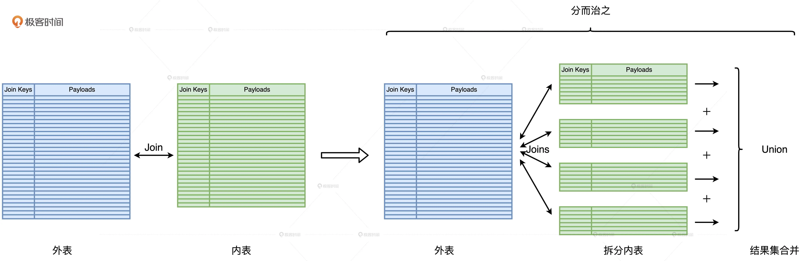

“分而治之”中一个关键的环节就是内表拆分，我们要求每一个子表的尺寸相对均匀，且都小到可以放进广播变量。只有这样，原本的 Shuffle Join 才能转化成一个又一个的 Broadcast Joins，原本的海量数据 Shuffle 才能被消除，我们也才能因此享受到性能调优的收益。 

拆分的关键在于拆分列的选取，为了让子表足够小，拆分列的基数（Cardinality）要足够大才行。 假设内表的拆分列是“性别”，性别的基数是 2，取值分别是“男”和“女”。我们根据过滤条件 “性别 = 男”和“性别 = 女”把内表拆分为两份，显然，这样拆出来的子表还是很大，远远超出广播阈值。 

既然性别的基数这么低，不如我们选择像身份证号这种基数大的数据列。 身份证号码的基数确实足够大，就是全国的人口数量。但是，身份证号码这种基数比较大的字符串充当过滤条件有两个缺点：一，不容易拆分，开发成本太高；二，过滤条件很难享受到像谓词下推这种 Spark SQL 的内部优化机制。 

一个合适的基数是与时间相关的字段，比如日期或是更细致的时间戳。这也是很多事实表在建表的时候，都是以日期为粒度做分区存储的原因。因此，选择日期作为拆分列往往是个不错的选择，既能享受到 Spark SQL 分区剪裁（Partition Pruning）的性能收益，同时开发成本又很低。 

内表拆分之后，外表就要分别和所有的子表做关联，尽管每一个关联都变成了“大表 Join 小表”并转化为 BHJ，但是在 Spark 的运行机制下，每一次关联计算都需要重新、重头扫描外表的全量数据。毫无疑问，这样的操作是让人无法接受的。这就是“分而治之”中另一个关键的环节：外表的重复扫描：

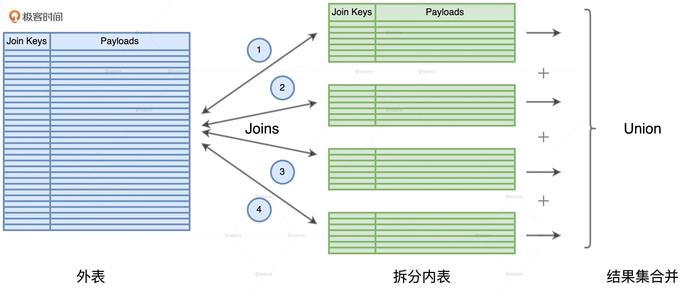

以上图为例，内表被拆分为 4 份，原本两个大表的 Shuffle Join，被转化为 4 个 Broadcast Joins。外表分别与 4 个子表做关联，所有关联的结果集最终通过 Union 合并到一起，完成计算。对于这 4 个关联来说，每一次计算都需要重头扫描一遍外表。换句话说，外表会被重复扫描 4 次。显然，外表扫描的次数取决于内表拆分的份数。 

内表的拆分需要足够细致，才能享受到性能调优带来的收益，而这往往意味着，内表拆分的份数成百上千、甚至成千上万。在这样的数量级之下，重复扫描外表带来的开销是巨大的。 

要解决数据重复扫描的问题，办法其实不止一种，我们最容易想到的就是 Cache。确实，如果能把外表的全量数据缓存到内存中，我们就不必担心重复扫描的问题，毕竟内存的计算延迟远低于磁盘。但是，我们面临的情况是外表的数据量非常地庞大，往往都是 TB 级别起步，想要把 TB 体量的数据全部缓存到内存是很难的。

正确的解决思路是将外表也分而治之，对于外表参与的每一个子关联，在逻辑上，我们完全可以只扫描那些与内表子表相关的外表数据，并不需要每次都扫描外表的全量数据。 具体来说，利用DPP 来对外表进行“分而治之” ：

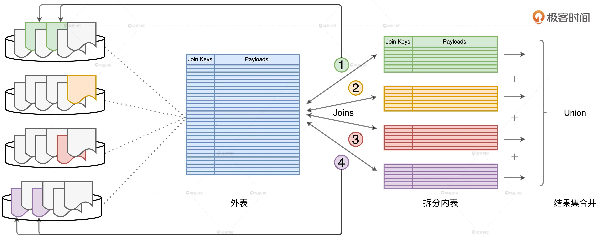

假设外表的分区键包含 Join Keys，那么，每一个内表子表都可以通过 DPP 机制，帮助与之关联的外表减少数据扫描量。如上图所示，步骤 1、2、3、4 分别代表外表与 4 个不同子表的关联计算。以步骤 1 为例，在 DPP 机制的帮助下，要完成关联计算，外表只需要扫描与绿色子表对应的分区数据即可，如图中的两个绿色分区所示。同理，要完成步骤 4 的关联计算，外表只需要扫描与紫色子表对应的分区即可，如图中左侧用紫色标记的两个数据分区。 每个子查询只扫描外表的一部分、一个子集，所有这些子集加起来，刚好就是外表的全量数据。 

如此一来，在把原始的 Shuffle Join 转化为多个 Broadcast Joins 之后，我们并没有引入额外的性能开销。毫无疑问，查询经过这样的调优过后，执行效率一定会有较大幅度的提升。 

### 使用SHJ

当数据分布均匀时，可以采用下列策略来优化：

当参与关联的大表与小表满足如下条件的时候，Shuffle Hash Join 的执行效率，往往比 Spark SQL 默认的 Shuffle Sort Merge Join 更好。使用SHJ的前提条件是：

* 两张表数据分布均匀。 
* 内表所有数据分片，能够完全放入内存。 

这个调优技巧同样适用于“大表 Join 大表”的场景，原因其实很简单，这两个条件与数据表本身的尺寸无关，只与其是否分布均匀有关。不过，为了确保 Shuffle Hash Join 计算的稳定性，我们需要特别注意上面列出的第二个条件，也就是内表所有的数据分片都能够放入内存。 

为了确保第二个条件成立，需要处理好并行度、并发度与执行内存之间的关系，我们就可以让内表的每一个数据分片都恰好放入执行内存中。简单来说，就是先根据并发度与执行内存，计算出可供每个 Task 消耗的内存上下限，然后结合分布式数据集尺寸与上下限，倒推出与之匹配的并行度。 

最后，强制Spark SQL 在运行时选择 Shuffle Hash Join 机制，利用 Join Hints：

~~~scala
//查询语句中使用Join hints
select /*+ shuffle_hash(orders) */ sum(tx.price * tx.quantity) as revenue, o.orderId
from transactions as tx inner join orders as o
on tx.orderId = o.orderId
where o.status = ‘COMPLETE’
and o.date between ‘2020-01-01’ and ‘2020-03-31’
group by o.orderId
~~~

### 解决数据倾斜

当存在数据倾斜时，必须要先解决数据倾斜问题，才能应用其他的优化手段。

数据倾斜可以分为几类：单表外表倾斜、单表内表倾斜、双标倾斜。其实，不管哪种表倾斜，它们的调优技巧都是类似的。 下面以第一种情况为例来说明解决方法。

要应对数据倾斜，想必你很快就会想到 AQE 的特性：自动倾斜处理。 但是前面已经说过，AQE 的倾斜处理是以 Task 为粒度的，这意味着原本 Executors 之间的负载倾斜并没有得到根本改善。 一般来说，倾斜的分区不会刚好就全都落在同一个 Executor，然而，凡事总有个万一，我们在探讨调优方案的时候，还是要考虑周全。如果你的场景恰好就是把倾斜分区落在集群中少数的 Executors 上，此时只能采取下面的方案：

1、首先采取分而治之的思路，以 Join Key 是否倾斜为依据来拆解子任务。

具体来说，对于外表中所有的 Join Keys，我们先按照是否存在倾斜把它们分为两组。一组是存在倾斜问题的 Join Keys，另一组是分布均匀的 Join Keys。因为给定两组不同的 Join Keys，相应地我们把内表的数据也分为两份。 

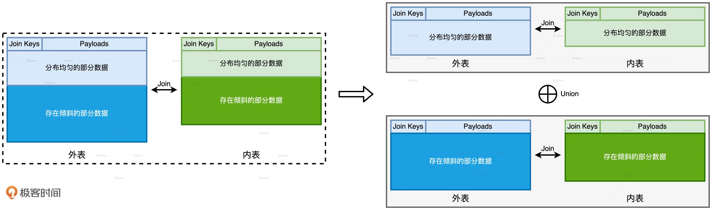

分而治之的含义就是，对于内外表中两组不同的数据，我们分别采用不同的方法做关联计算，然后通过 Union 操作，再把两个关联计算的结果集做合并，最终得到“大表 Join 大表”的计算结果，整个过程如上图所示。 

对于 Join Keys 分布均匀的数据部分，我们可以沿用把 Shuffle Sort Merge Join 转化为 Shuffle Hash Join 的方法。对于 Join Keys 存在倾斜问题的数据部分，我们就需要借助“两阶段 Shuffle”的调优技巧，来平衡 Executors 之间的工作负载。 

2、两阶段 Shuffle。

用一句话来概括，“两阶段 Shuffle”指的是，通过“加盐、Shuffle、关联、聚合”与“去盐化、Shuffle、聚合”这两个阶段的计算过程，在不破坏原有关联关系的前提下，在集群范围内以 Executors 为粒度平衡计算负载：

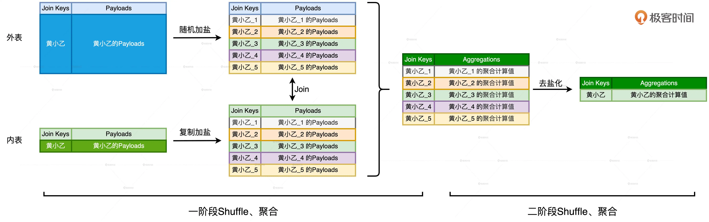

第一阶段，也就是“加盐、Shuffle、关联、聚合”的计算过程。显然，这个阶段的计算分为 4 个步骤，其中最为关键的就是第一步的加盐。加盐来源于单词 Salting，听上去挺玄乎，实际上就是给倾斜的 Join Keys 添加后缀。加盐的核心作用就是把原本集中倾斜的 Join Keys 打散，在进行 Shuffle 操作的时候，让原本应该分发到某一个 Executor 的倾斜数据，均摊到集群中的多个 Executors 上，从而以这种方式来消除倾斜、平衡 Executors 之间的计算负载。 

对于加盐操作，我们首先需要确定加盐的粒度，来控制数据打散的程度，粒度越高，加盐后的数据越分散。由于加盐的初衷是以 Executors 为粒度平衡计算负载，因此通常来说，取 Executors 总数 #N 作为加盐粒度往往是一种不错的选择。其次，为了保持内外表的关联关系不被破坏，外表和内表需要同时做加盐处理，但处理方法稍有不同。 

外表的处理称作“随机加盐”，具体的操作方法是，对于任意一个倾斜的 Join Key，我们都给它加上 1 到 #N 之间的一个随机后缀。以 Join Key = ‘黄小乙’来举例，假设 N = 5，那么外表加盐之后，原先 Join Key = ‘黄小乙’的所有数据记录，就都被打散成了 Join Key 为（‘黄小乙 _1’，‘黄小乙 _2’，‘黄小乙 _3’，‘黄小乙 _4’，‘黄小乙 _5’）的数据记录：

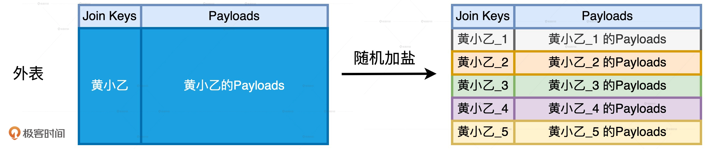

内表的处理称为“复制加盐”，具体的操作方法是，对于任意一个倾斜的 Join Key，我们都把原数据复制（#N – 1）份，从而得到 #N 份数据副本。对于每一份副本，我们为其 Join Key 追加 1 到 #N 之间的固定后缀，让它与打散后的外表数据保持一致。对于刚刚 Join Key = ‘黄小乙’的例子来说，在内表中，我们需要把‘黄小乙’的数据复制 4 份，然后依次为每份数据的 Join Key 追加 1 到 5 的固定后缀，如下图所示：

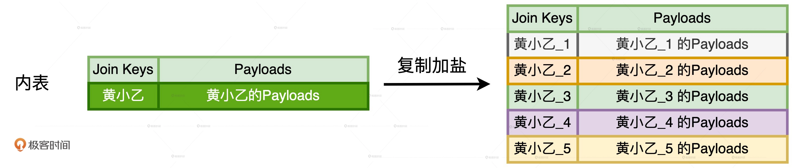

内外表分别加盐之后，数据倾斜问题就被消除了。这个时候，我们就可以使用常规优化方法，比如，将 Shuffle Sort Merge Join 转化为 Shuffle Hash Join，去继续执行 Shuffle、关联和聚合操作。到此为止，“两阶段 Shuffle” 的第一阶段执行完毕，我们得到了初步的聚合结果，这些结果是以打散的 Join Keys 为粒度进行计算得到的。 

第一阶段加盐的目的在于将数据打散、平衡计算负载。现在我们已经得到了数据打散之后初步的聚合结果，离最终的计算结果仅有一步之遥。不过，为了还原最初的计算逻辑，我们还需要把之前加上的“盐粒”再去掉：

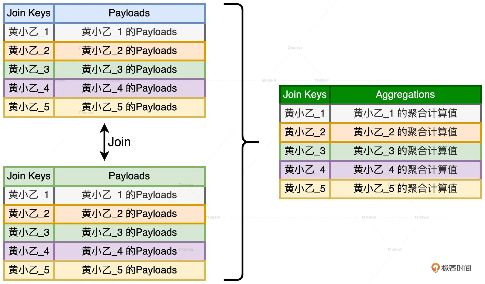

第二阶段的计算包含“去盐化、Shuffle、聚合”这 3 个步骤。首先，我们把每一个 Join Key 的后缀去掉，这一步叫做“去盐化”。然后，我们按照原来的 Join Key 再做一遍 Shuffle 和聚合计算，这一步计算得到的结果，就是“分而治之”当中倾斜部分的计算结果。 

经过“两阶段 Shuffle”的计算优化，我们终于得到了倾斜部分的关联结果。将这部分结果与“分而治之”当中均匀部分的计算结果合并，我们就能完成存在倾斜问题的“大表 Join 大表”的计算场景。 

# 配置

## 程序稳定性

大部分 Spark 配置项都有默认值，但是对于大多数的应用场景来说，在默认的参数设置下，Spark确实运行不起来。

以 spark.executor.memory 这个配置项为例，它用于指定 Executor memory，也就是 Executor 可用内存上限。这个参数的默认值是 1GB，显然，对于动辄上百 GB、甚至上 TB 量级的工业级数据来说，这样的设置太低了，分布式任务很容易因为 OOM（内存溢出，Out of memory）而中断。 

一些关键配置项如下：

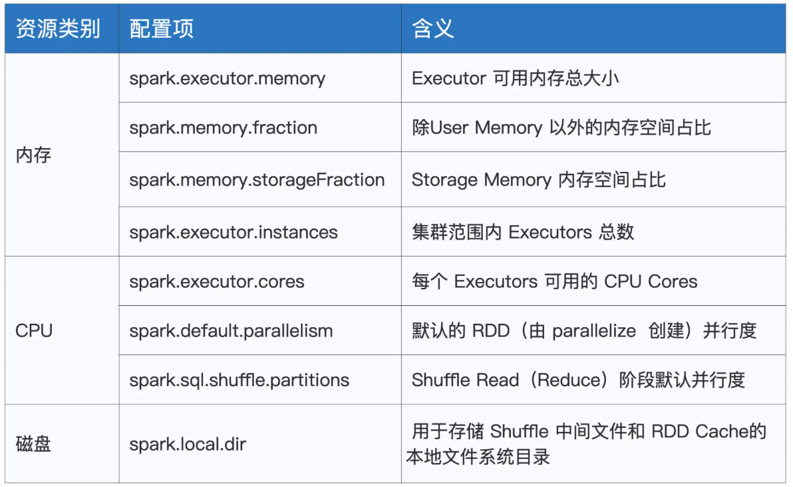

### 内存

对于给定的 Executor Memory，Spark 将 JVM Heap 划分为 4 个区域，分别是 Reserved Memory、User Memory、Execution Memory 和 Storage Memory，如下图所示：

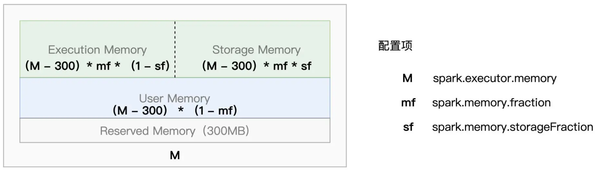

结合图解，其中 Reserved Memory 大小固定为 300MB，其他 3 个区域的空间大小，则有 3 个配置项来划定，它们分别是 spark.executor.memory、spark.memory.fraction、spark.memory.storageFraction：

- 其中，M 用于指定划分给 Executor 进程的 JVM Heap 大小，也即是 Executor Memory。Executor Memory 由 Execution Memory、Storage Memory 和 User Memory“这三家”瓜分。 
- （M – 300）* mf 划分给 Execution Memory 和 Storage Memory，而 User Memory 空间大小由（M – 300）*（1 - mf）这个公式划定，它用于存储用户自定义的数据结构，比如，RDD 算子中包含的各类实例化对象或是集合类型（如数组、列表等），都属于这个范畴。 

mf的取值：如果你的分布式应用，并不需要那么多自定义对象或集合数据，你应该把 mf 的值设置得越接近 1 越好，这样 User Memory 无限趋近于 0，大面积的可用内存就可以都留给 Execution Memory 和 Storage Memory 了。 

sf的取值：Spark 推出了统一的动态内存管理模式，在对方资源未被用尽的时候，Execution Memory 与 Storage Memory 之间可以互相进行抢占。不过，即便如此，我们仍然需要 sf 这个配置项来划定它们之间的那条虚线，从而明确告知 Spark 我们开发者更倾向于“偏袒”哪一方。 sf的取值主要是看数据的复用频次，例如：

- 对于 ETL（Extract、Transform、Load）类型的作业来说，数据往往都是按照既定的业务逻辑依序处理，其中绝大多数的数据形态只需访问一遍，很少有重复引用的情况。 

  因此，在 ETL 作业中，RDD Cache 并不能起到提升执行性能的作用，那么自然我们也就没必要使用缓存了。在这种情况下，我们就应当把 sf 的值设置得低一些，压缩 Storage Memory 可用空间，从而尽量把内存空间留给 Execution Memory。 

- 如果你的应用场景是机器学习、或是图计算，这些计算任务往往需要反复消耗、迭代同一份数据，处理方式就不一样了。在这种情况下，咱们要充分利用 RDD Cache 提供的性能优势，自然就要把 sf 这个参数设置得稍大一些，从而让 Storage Memory 有足够的内存空间，来容纳需要频繁访问的分布式数据集。 

之前介绍过，Spark 分为堆内内存与堆外内存。 相比 JVM 堆内内存，off heap 堆外内存的特点：

* 优势：堆外内存是以紧凑的二进制格式保存数据的，更精确的内存占用统计和不需要垃圾回收机制，以及不需要序列化与反序列化。 
* 劣势：字节数组自身的局限性，如果存储的数据很复杂，不仅越来越多的指针和偏移地址会让字段的访问效率大打折扣，而且，指针越多，内存泄漏的风险越大，数据访问的稳定性就值得担忧了。 

到底是使用JVM堆内内存还是堆外内存：

* 对于需要处理的数据集，如果数据模式比较扁平，而且字段多是定长数据类型，就更多地使用堆外内存。 
* 相反地，如果数据模式很复杂，嵌套结构或变长字段很多，就更多采用 JVM 堆内内存会更加稳妥。 

1、User Memory 与 Spark 可用内存的分配策略

当在 JVM 内平衡 Spark 可用内存和 User Memory 时，你需要考虑你的应用中类似的自定义数据结构多不多、占比大不大？然后再相应地调整两块内存区域的相对占比。如果应用中自定义的数据结构很少，不妨把 spark.memory.fraction 配置项调高，让 Spark 可以享用更多的内存空间，用于分布式计算和缓存分布式数据集。 

2、Execution Memory与Storage Memory的平衡

通常来说，在统一内存管理模式下，spark.memory.storageFraction 的设置就显得没那么紧要，因为无论这个参数设置多大，执行任务还是有机会抢占缓存内存，而且一旦完成抢占，就必须要等到任务执行结束才会释放。 

不过，凡事都没有绝对，如果你的应用类型是“缓存密集型”，如机器学习训练任务，就很有必要通过调节这个参数来保障数据的全量缓存。这类计算任务往往需要反复遍历同一份分布式数据集，数据缓存与否对任务的执行效率起着决定性作用。这个时候，我们就可以把参数 spark.memory.storageFraction 调高，然后有意识地在应用的最开始把缓存灌满，再基于缓存数据去实现计算部分的业务逻辑。 

但在这个过程中，要特别注意 RDD 缓存与执行效率之间的平衡：

- 首先，RDD 缓存占用的内存空间多了，Spark 用于执行分布式计算任务的内存空间自然就变少了，而且数据分析场景中常见的关联、排序和聚合等操作都会消耗执行内存，这部分内存空间变少，自然会影响到这类计算的执行效率。 
- 其次，大量缓存引入的 GC（Garbage Collection，垃圾回收）负担对执行效率来说是个巨大的隐患。 尤其是对于Full GC 。老年代存储的对象个数基本等于你的样本数。因此，当你的样本数大到一定规模的时候，你就需要考虑大量的 RDD cache 可能会引入的 Full GC 问题了。 

在打算把大面积的内存空间用于 RDD cache 之前，需要衡量这么做可能会对执行效率产生的影响。 

如果对于确实需要把数据缓存起来的缓存密集型应用，可以采用下列办法来平衡执行效率：

- 首先，你可以放弃对象值的缓存方式，改用序列化的缓存方式，序列化会把多个对象转换成一个字节数组。这样，对象个数的问题就得到了初步缓解，也就缓解了GC
- 其次，我们可以调节 spark.rdd.compress 这个参数。RDD 缓存默认是不压缩的，启用压缩之后，缓存的存储效率会大幅提升，有效节省缓存内存的占用，从而把更多的内存空间留给分布式任务执行。 但是这是以引入额外的计算开销、牺牲 CPU 为代价的 

### CPU

CPU相关的配置项，主要包括 spark.cores.max、spark.executor.cores 和 spark.task.cpus 这三个参数。它们分别从集群、Executor 和计算任务这三个不同的粒度，指定了用于计算的 CPU 个数。 

spark.task.cpus一般无需特别指定，它默认是1，不能小于1，如果task本身是需要多线程操作的，可以设置其大于1，不过这样做当线程未跑满时也会浪费资源。

与 CPU 直接相关的配置项，我们只需关注两个参数，它们分别是 spark.executor.instances 和 spark.executor.cores。其中前者指定了集群内 Executors 的个数，而后者则明确了每个 Executors 可用的 CPU Cores（CPU 核数）。 

一个 CPU Core 在同一时间只能处理一个分布式任务，因此，spark.executor.instances 与 spark.executor.cores 的乘积实际上决定了集群的并发计算能力，这个乘积，我们把它定义为“并发度”（Degree of concurrency） 

与并发度听起来很像的一个概念是并行度（Degree of parallism） ：并行度用于定义分布式数据集划分的份数与粒度，它直接决定了分布式任务的计算负载。并行度越高，数据的粒度越细，数据分片越多，数据越分散。 这也就解释了，并行度为什么总是跟分区数量、分片数量、Partitions 这些属性相一致。 并行度对应着 RDD 的数据分区数量。 

与并行度相关的配置项也有两个，分别是 spark.default.parallelism 和 spark.sql.shuffle.partitions。其中前者定义了由 SparkContext.parallelize API 所生成 RDD 的默认并行度，而后者则用于划定 Shuffle 过程中 Shuffle Read 阶段（Reduce 阶段）的默认并行度。 

对比两个指标：

- 并发度的出发点是计算能力，它与执行内存一起，共同构成了计算资源的供给水平
- 并行度的出发点是数据，它决定着每个任务的计算负载，对应着计算资源的需求水平

这两个指标，一个是供给，一个是需求，供需的平衡与否，直接影响着程序运行的稳定性。 

### CPU、内存与数据的平衡

所谓供需的平衡，实际上就是指 CPU、内存与数据之间的平衡。 

为了叙述方便，我们把由配置项 spark.executor.cores 指定的 CPU Cores 记为 c，把 Execution Memory 内存大小记为 m。m 的尺寸由公式（M - 300）* mf *（1 - sf）给出。不难发现，c 和 m，一同量化了一个 Executor 的可用计算资源。 

对于一个待计算的分布式数据集，我们把它的存储尺寸记为 D，而把其并行度记录为 P。给定 D 和 P，不难推出，D/P 就是分布式数据集的划分粒度，也就是每个数据分片的存储大小。 

在 Spark 分布式计算的过程中，一个数据分片对应着一个 Task（分布式任务），而一个 Task 又对应着一个 CPU Core。因此，把数据看作是计算的需求方，要想达到 CPU、内存与数据这三者之间的平衡，我们必须要保证每个 Task 都有足够的内存，来让 CPU 处理对应的数据分片。 

为此，我们要让数据分片大小与 Task 可用内存之间保持在同一量级，具体来说，我们可以使用下面的公式来进行量化：

```
D/P ~ m/c
```

其中，波浪线的含义，是其左侧与右侧的表达式在同一量级。左侧的表达式 D/P 为数据分片大小，右侧的 m/c 为每个 Task 分到的可用内存。以这个公式为指导，结合分布式数据集的存储大小，我们就可以有的放矢、有迹可循地对上述的 3 类配置项进行设置或调整，也就是与 CPU、内存和并行度有关的那几个配置项。 

### 磁盘

磁盘的配置项相对要简单得多，值得我们关注的，仅有 spark.local.dir 这一个配置项。这个配置项的值可以是任意的本地文件系统目录，它的默认值是 /tmp 目录。 

ld 参数对应的目录用于存储各种各样的临时数据，如 Shuffle 中间文件、RDD Cache（存储级别包含“disk”），等等。这些临时数据，对程序能否稳定运行，有着至关重要的作用。 

例如，Shuffle 中间文件是 Reduce 阶段任务执行的基础和前提，如果中间文件丢失，Spark 在 Reduce 阶段就会抛出“Shuffle data not found”异常，从而中断应用程序的运行。 

遗憾的是，ld 参数默认的 /tmp 目录一来存储空间有限，二来该目录本身的稳定性也值得担忧。因此，在工业级应用中，我们通常都不能接受使用 /tmp 目录来设置 ld 配置项。 应该把它设置到一个存储空间充沛、甚至性能更有保障的文件系统，比如空间足够大的 SSD（Solid State Disk）文件系统目录。 

### 配置项设置

为了满足不同的应用场景，Spark 为开发者提供了 3 种配置项设置方式，分别是配置文件、命令行参数和 SparkConf 对象，这些方式都以（Key，Value）键值对的形式记录并设置配置项。 

1、配置文件指的是 spark-defaults.conf，这个文件存储在 Spark 安装目录下面的 conf 子目录。 

该文件中的参数设置适用于集群范围内所有的应用程序，因此它的生效范围是全局性的。对于任意一个应用程序来说，如果开发者没有通过其他方式设置配置项，那么应用将默认采用 spark-defaults.conf 中的参数值作为基础设置。 

在 spark-defaults.conf 中设置配置项，你只需要用空格把配置项的名字和它的设置值分隔开即可。比如，以 spark.executor.cores、spark.executor.memory 和 spark.local.dir 这 3 个配置项为例，我们可以使用下面的方式对它们的值进行设置：

```
spark.executor.cores 2
spark.executor.memory 4g
spark.local.dir /ssd_fs/large_dir
```

不过，在日常的开发工作中，不同应用对于资源的诉求是不一样的：有些需要更多的 CPU Cores，有些则需要更高的并行度。这种情况下用配置文件的方式就不行了。为此，Spark 为开发者提供了两种应用级别的设置方式，也即命令行参数和 SparkConf 对象，它们的生效范围仅限于应用本身。

2、命令行参数

它指的是在运行了 spark-shell 或是 spark-submit 命令之后，通过–conf 关键字来设置配置项。我们知道，spark-shell 用于启动交互式的分布式运行环境，而 spark-submit 则用于向 Spark 计算集群提交分布式作业。 

还是以刚刚的 3 个配置项为例，以命令行参数的方式进行设置的话，你需要在提交 spark-shell 或是 spark-submit 命令的时候，以–conf Key=Value 的形式对参数进行赋值：

```
spark-shell --master local[*] --conf spark.executor.cores=2 --conf spark.executor.memory=4g --conf spark.local.dir=/ssd_fs/large_dir
```

尽管这种方式能让开发者在应用级别灵活地设置配置项，但它的书写方式过于繁琐，每个配置项都需要以–conf 作前缀。不仅如此，命令行参数的设置方式不利于代码管理，随着时间的推移，参数值的设置很可能会随着数据量或是集群容量的变化而变化，但是这个变化的过程却很难被记录并维护下来，而这无疑会增加开发者与运维同学的运维成本。 

3、SparkConf 对象 

不论是隔离性还是可维护性，SparkConf 对象的设置方式都更胜一筹。在代码开发的过程中，我们可以通过定义 SparkConf 对象，并调用其 set 方法来对配置项进行设置。老规矩，还是用刚刚的 CPU、内存和磁盘 3 个配置项来举例：

```scala
import org.apache.spark.SparkConf
val conf = new SparkConf()
conf.set("spark.executor.cores", "2")
conf.set("spark.executor.memory", "4g")
conf.set("spark.local.dir", "/ssd_fs/large_dir")   
```

对于这 3 种方式，Spark 会按照“SparkConf 对象 -> 命令行参数 -> 配置文件”的顺序，依次读取配置项的参数值。对于重复设置的配置项，Spark 以前面的参数取值为准。 

## Shuffle相关

Shuffle 的计算过程分为 Map 和 Reduce 这两个阶段。其中，Map 阶段执行映射逻辑，并按照 Reducer 的分区规则，将中间数据写入到本地磁盘；Reduce 阶段从各个节点下载数据分片，并根据需要实现聚合计算。 

我们就可以通过 spark.shuffle.file.buffer 和 spark.reducer.maxSizeInFlight 这两个配置项，来分别调节 Map 阶段和 Reduce 阶段读写缓冲区的大小：

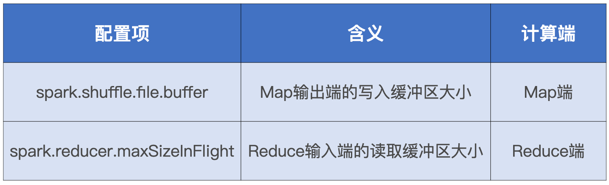

首先，在 Map 阶段，计算结果会以中间文件的形式被写入到磁盘文件系统。同时，为了避免频繁的 I/O 操作，Spark 会把中间文件存储到写缓冲区（Write Buffer）。这个时候，我们可以通过设置 spark.shuffle.file.buffer 来扩大写缓冲区的大小，缓冲区越大，能够缓存的落盘数据越多，Spark 需要刷盘的次数就越少，I/O 效率也就能得到整体的提升。 

其次，在 Reduce 阶段，因为 Spark 会通过网络从不同节点的磁盘中拉取中间文件，它们又会以数据块的形式暂存到计算节点的读缓冲区（Read Buffer）。缓冲区越大，可以暂存的数据块越多，在数据总量不变的情况下，拉取数据所需的网络请求次数越少，单次请求的网络吞吐越高，网络 I/O 的效率也就越高。这个时候，我们就可以通过 spark.reducer.maxSizeInFlight 配置项控制 Reduce 端缓冲区大小，来调节 Shuffle 过程中的网络负载。 

事实上，对 Shuffle 计算过程的优化牵扯到了全部的硬件资源，包括 CPU、内存、磁盘和网络。 因此关于上面这些参数的优化，都可以作用在 Map 和 Reduce 阶段的内存计算过程上。 

除此之外，Spark 还提供了一个叫做 spark.shuffle.sort.bypassMergeThreshold 的配置项，去处理一种特殊的 Shuffle 场景：

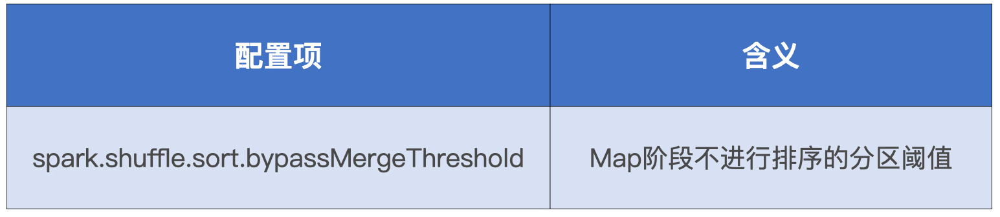

自 1.6 版本之后，Spark 统一采用 Sort shuffle manager 来管理 Shuffle 操作，在 Sort shuffle manager 的管理机制下，无论计算结果本身是否需要排序，Shuffle 计算过程在 Map 阶段和 Reduce 阶段都会引入排序操作。 

这样的实现机制对于 repartition、groupBy 这些操作就不太公平了，这两个算子一个是对原始数据集重新划分分区，另一个是对数据集进行分组，压根儿就没有排序的需求。所以，Sort shuffle manager 实现机制引入的排序步骤反而变成了一种额外的计算开销。 

因此，在不需要聚合，也不需要排序的计算场景中，我们就可以通过设置 spark.shuffle.sort.bypassMergeThreshold 的参数，来改变 Reduce 端的并行度（默认值是 200）。当 Reduce 端的分区数小于这个设置值的时候，我们就能避免 Shuffle 在计算过程引入排序。 

# 补充

1、Hive和Spark

20  一部分略

2、Spark的流处理

就追求实时性的流处理来说，Flink会更好一点：

* Flink的Kappa架构，天然对流处理友好，尤其是对于实时性的支持。因为出发点就是流计算，因此随着Flink的发展、迭代，开发API也越来越丰富，功能也越来越完善。 
* Spark实际上是Lambda架构，天然以批处理为导向，最初的流处理，也是微批模式，也就是Micro-batch，微批模式没法保证实时性，只能保证高吞吐。尽管Spark官方推出了Continuous mode，但是目前功能、API各方面还没有那么完善，例如不支持聚合操作