# Spring

这种将控制权交给别人的思想，就可以称作：控制反转（ Inverse of Control , IOC ）。而 BeanFactory 根据指定的beanName去获取和创建对象的过程，就可以称作：依赖查找（ Dependency Lookup , DL ）。 （依赖注入是指自动注入bean的属性）

SpringFramework 是一个开源的、松耦合的、分层的、可配置的一站式企业级 Java 开发框架，它的核心是 IOC 与 AOP ，它可以更容易的构建出企业级 Java 应用，并且它可以根据应用开发的组件需要，整合对应的技术。

优点：

IOC：组件之间的解耦（咱上一章已经体会到了）

AOP：切面编程可以将应用业务做统一或特定的功能增强，能实现应用业务与增强逻辑的解耦

容器与事件：管理应用中使用的组件Bean、托管Bean的生命周期、事件与监听器的驱动机制

Web、事务控制、测试、与其他技术的整合

## 读取配置文件，用ID取到对象

配置文件：

~~~xml
<bean id="person" class="com.linkedbear.spring.basic_dl.a_quickstart_byname.bean.Person"></bean>
~~~

取到对象：

~~~java
public static void main(String[] args) throws Exception {
    BeanFactory factory = new ClassPathXmlApplicationContext("basic_dl/quickstart-byname.xml");
    Person person = (Person) factory.getBean("person");
    System.out.println(person);
}
~~~

## 根据类型取到对象

配置文件：

~~~xml
<bean class="com.linkedbear.spring.basic_dl.b_bytype.bean.Person"></bean>
~~~

取到对象：

~~~java
BeanFactory factory = new ClassPathXmlApplicationContext("basic_dl/quickstart-bytype.xml");
    Person person = factory.getBean(Person.class);
    System.out.println(person);
~~~

如果在配置文件中加入实现类的定义，这里也可以根据接口类型找到对应的实现类。

## 依赖注入

注入普通属性，注入对象属性，配置文件：

~~~xml
<bean id="person" class="com.linkedbear.spring.basic_di.a_quickstart_set.bean.Person">
    <property name="name" value="test-person-byset"/>
    <property name="age" value="18"/>
</bean>

<bean id="cat" class="com.linkedbear.spring.basic_di.a_quickstart_set.bean.Cat">
    <property name="name" value="test-cat"/>
    <!-- ref引用上面的person对象 -->
    <property name="master" ref="person"/>
</bean>
~~~

## 取到一个接口的全部实现

配置文件：

这三个bean都是DemoDao的实现类

~~~xml
<?xml version="1.0" encoding="UTF-8"?>
<beans xmlns="http://www.springframework.org/schema/beans"
       xmlns:xsi="http://www.w3.org/2001/XMLSchema-instance"
       xsi:schemaLocation="http://www.springframework.org/schema/beans
        https://www.springframework.org/schema/beans/spring-beans.xsd">

    <bean id="demoMySQLDao" class="com.linkedbear.spring.basic_dl.c_oftype.dao.impl.DemoMySQLDao"/>
    <bean id="demoOracleDao" class="com.linkedbear.spring.basic_dl.c_oftype.dao.impl.DemoOracleDao"/>
    <bean id="demoPostgreDao" class="com.linkedbear.spring.basic_dl.c_oftype.dao.impl.DemoPostgresDao"/>
</beans>
~~~

获取全部实现类：

~~~java
public static void main(String[] args) throws Exception {
        ApplicationContext ctx = new ClassPathXmlApplicationContext("basic_dl/quickstart-oftype.xml");
        Map<String, DemoDao> beans = ctx.getBeansOfType(DemoDao.class);
        beans.forEach((beanName, bean) -> {
            System.out.println(beanName + " : " + bean.toString());
        });
    }
~~~

打印结果：

~~~java
demoMySQLDao : com.linkedbear.spring.basic_dl.c_oftype.dao.impl.DemoMySQLDao@4883b407
demoOracleDao : com.linkedbear.spring.basic_dl.c_oftype.dao.impl.DemoOracleDao@7d9d1a19
demoPostgreDao : com.linkedbear.spring.basic_dl.c_oftype.dao.impl.DemoPostgresDao@39c0f4a
~~~

可以发现这里的接口换成了ApplicationContext，因为原来的BeanFactory只提供Bean的实例化和属性注入 ，很多功能是不支持的。

## BeanFactory与ApplicationContext的对比

BeanFactory 接口提供了一个抽象的配置和对象的管理机制，ApplicationContext 是BeanFactory 的子接口，它简化了与 AOP 的整合、消息机制、事件机制，以及对 Web 环境的扩展（ WebApplicationContext 等），BeanFactory 是没有这些扩展的。

ApplicationContext 主要扩展了以下功能：

- AOP 的支持（ AnnotationAwareAspectJAutoProxyCreator 作用于 Bean 的初始化之后 ）
- 配置元信息（ BeanDefinition 、Environment 、注解等 ）
- 资源管理（ Resource 抽象 ）
- 事件驱动机制（ ApplicationEvent 、ApplicationListener ）
- 消息与国际化（ LocaleResolver ）
- Environment 抽象（ SpringFramework 3.1 以后）

## 根据注解取bean

声明一个注解：

~~~java
@Documented
@Retention(RetentionPolicy.RUNTIME)
@Target(ElementType.TYPE)
public @interface Color {

}
~~~

然后在类上加上这个注解，就可以将这个注解标注的bean都取出：

~~~java
ApplicationContext ctx = new ClassPathXmlApplicationContext("basic_dl/quickstart-withanno.xml");
        Map<String, Object> beans = ctx.getBeansWithAnnotation(Color.class);
        beans.forEach((beanName, bean) -> {
            System.out.println(beanName + " : " + bean.toString());
        });
~~~

打印结果（key是bean的id）：

~~~java
black : com.linkedbear.spring.basic_dl.d_withanno.bean.Black@553f17c
red : com.linkedbear.spring.basic_dl.d_withanno.bean.Red@6c3708b3
~~~

## 取到全部bean的id

~~~java
ApplicationContext ctx = new ClassPathXmlApplicationContext("basic_dl/quickstart-withanno.xml");
        String[] beanNames = ctx.getBeanDefinitionNames();
~~~

取到全部id后，就可以用前面的方法用id取到bean

## 依赖查找的延迟

有时代码中会出现从容器中取一个不存在的bean，这个时候用上面的方法就会直接报错，可以先检查容器中是否有这个bean，如果有的话再取出来：

~~~java
 ApplicationContext ctx = new ClassPathXmlApplicationContext("basic_dl/quickstart-lazylookup.xml");
Dog dog = ctx.containsBean("dog") ? (Dog) ctx.getBean("dog") : new Dog();
~~~

也可以用一个特殊的api来取出一个包装类：

~~~java
 ApplicationContext ctx = new ClassPathXmlApplicationContext("basic_dl/quickstart-lazylookup.xml");
ObjectProvider<Dog> dogProvider = ctx.getBeanProvider(Dog.class);
~~~

无论这个类是否在容器中都可以取出一个包装，对这个对象再使用getObject方法时才会真正取bean，这个时候如果没有则会报异常，更好的方法是使用没有抛异常的api，如果没有的话就返回null：

~~~java
Dog dog = dogProvider.getIfAvailable();
    if (dog == null) {
        dog = new Dog();
    }
~~~

进一步，可以直接传入默认返回值：

~~~java
 Dog dog = dogProvider.getIfAvailable(() -> new Dog());
~~~

如果bean存在时还可以设置对应的逻辑：

~~~java
dogProvider.ifAvailable(dog -> System.out.println(dog));
~~~

## 配置类

spring的注解驱动中，配置类可以代替配置文件，只需要在类上加上一个@Configuration 即可，在配置类的方法上加@Bean来代替配置文件中的bean标签：

~~~java
@Bean
public Person person() {
    return new Person();
}
~~~

这代表向容器中注册一个类型为Person，id为person（方法名）的bean，也可以显示声明bean的id：

~~~java
@Bean(name = "aaa") // 4.3.3之后可以直接写value
public Person person() {
    return new Person();
}
~~~

使用配置类后，驱动类也要改为注解驱动的：

~~~java
public static void main(String[] args) throws Exception {
        ApplicationContext ctx = new AnnotationConfigApplicationContext(QuickstartConfiguration.class);
        Person person = ctx.getBean(Person.class);
        System.out.println(person);
    }
~~~

配置类中实现依赖注入非常简单，只需要在生成对象的时候给属性都set进去即可，如依赖注入Cat类的name和master属性：

~~~java
@Bean
public Cat cat() {
    Cat cat = new Cat();
    cat.setName("test-cat-anno");
    // 直接拿上面的person()方法作为返回值即可，相当于ref
    cat.setMaster(person());
    return cat;
}
~~~

## 组件扫描和@Component 

用@Component 可以将类注册到IOC容器，也可以显示声明bean的名称：

~~~java
@Component("aaa")
public class Person { }
~~~

如果不指定bean的名称，默认是类名的首字母小写。

在@Component中的属性可以通过注解的方式直接实现属性注入：

~~~java
@Value("black-value-anno")
private String name;
~~~

配置@Component后，必须配置组件扫描，否则spring找不到这些类，配置组件扫描可以在配置类下加入@ComponentScan 注解（可以指定多个包名）：

~~~java
@Configuration
@ComponentScan("com.linkedbear.spring.annotation.c_scan.bean")
public class ComponentScanConfiguration {
    
}
~~~

如果不加这个注解，默认扫描配置类本类所在包及子包下的所有组件。

此外，组件扫描可以在context构造方法里设置扫描路径：

~~~java
ApplicationContext ctx = new AnnotationConfigApplicationContext("com.linkedbear.spring.annotation.c_scan.bean");
~~~

xml中也可以开启扫描路径：

~~~xml
<context:component-scan base-package="com.linkedbear.spring.annotation.c_scan.bean"/>
<!-- 注意标签是package，不是packages，代表一个标签只能声明一个根包 -->
~~~

和@Component相同作用的注解有三个，分别代表三层架构@Controller 、@Service 、@Repository，值得注意的是@Configuration定义中也有@Component，说明配置类不仅仅提供配置作用，还能作为bean被注册到容器。

## 注解驱动和配置文件驱动同时使用

xml开启注解配置：

~~~xml
<?xml version="1.0" encoding="UTF-8"?>
<beans xmlns="http://www.springframework.org/schema/beans"
       xmlns:xsi="http://www.w3.org/2001/XMLSchema-instance"
       xmlns:context="http://www.springframework.org/schema/context"
       xsi:schemaLocation="http://www.springframework.org/schema/beans
        https://www.springframework.org/schema/beans/spring-beans.xsd 
        http://www.springframework.org/schema/context 
        https://www.springframework.org/schema/context/spring-context.xsd">

    <!-- 开启注解配置 -->
    <context:annotation-config />
    <bean class="com.linkedbear.spring.annotation.d_importxml.config.AnnotationConfigConfiguration"/>
</beans>
~~~

配置类中引入配置文件路径：

~~~java
@Configuration
@ImportResource("classpath:annotation/beans.xml")
public class ImportXmlAnnotationConfiguration {
    
}
~~~

实际情况中以哪种情况为主，就要引入另一种驱动方式。

## 构造器注入

给Person类注入两个属性：

~~~xml
<bean id="person" class="com.linkedbear.spring.basic_di.b_constructor.bean.Person">
    <constructor-arg index="0" value="test-person-byconstructor"/>
    <constructor-arg index="1" value="18"/>
</bean>
~~~

注解驱动的构造器注入就是在生成对象时调用对应的构造方法。

## 外部配置文件的引入

可以引入一个外部配置文件，然后将属性值放入文件中完成注入。

新建一个配置文件，用于存放Red类的属性：

~~~properties
red.name=red-value-byproperties
red.order=1
~~~

然后在配置类上加入@PropertySource引入配置文件：

~~~java
@Configuration
// 顺便加上包扫描
@ComponentScan("com.linkedbear.spring.basic_di.c_value_spel.bean")
@PropertySource("classpath:basic_di/value/red.properties")
public class InjectValueConfiguration {
    
}
~~~

然后在组件Red类上完成属性注入：

~~~java
 @Value("${red.name}")
private String name;

@Value("${red.order}")
private Integer order;
~~~

xml中也可以取到配置文件的值：

~~~xml
<bean class="com.linkedbear.spring.basic_di.c_value_spel.bean.Red">
    <property name="name" value="${red.name}"/>
    <property name="order" value="${red.order}"/>
</bean>
~~~

## SpEL表达式

SpEL全称Spring Expression Language，它可以支持调用属性值、属性参数以及方法调用、数组存储、逻辑计算等功能。 

给属性注入字面量：

~~~java
@Component
public class Blue {
    
    @Value("#{'blue-value-byspel'}")
    private String name;
    
    @Value("#{2}")
    private Integer order;
~~~

可以引用其他bean的属性值：

~~~java
@Component
public class Green {
    
    @Value("#{'copy of ' + blue.name}")
    private String name;
    
    @Value("#{blue.order + 1}")
    private Integer order;
~~~

还可以在其中调用方法：

~~~java
@Component
public class White {
    
    @Value("#{blue.name.substring(0, 3)}")
    private String name;
    
    @Value("#{T(java.lang.Integer).MAX_VALUE}")
    private Integer order;
~~~

这里直接引用类的属性，需要在类的全限定名外面使用 **T()** 包围。 

xml文件中引入SpEL的方式和注解驱动一样，都是#{}

## @Autowired

@Autowired是注解式驱动时属性注入引用类型的方式，可以标注在set方法、属性或者构造方法上，来完成对应属性的注入：

1、属性上

~~~java
@Component
public class Dog {
    // ......
    @Autowired
    private Person person;
~~~

2、用构造器注入

~~~java
@Component
public class Dog {
    // ......
    private Person person;
    
    @Autowired
    public Dog(Person person) {
        this.person = person;
    }
~~~

3、setter方法注入：

~~~java
@Component
public class Dog {
    // ......
    private Person person;
    
    @Autowired
    public void setPerson(Person person) {
        this.person = person;
    }
~~~

这个注解会按照属性对应的类型，从容器中找对应类型的 Bean 赋值到对应的属性，当@Autowired 下的属性找不到对应类型时，会抛出异常，可以给注解加一个属性避免这种情况：

~~~java
 @Autowired(required = false)
    private Person person;
~~~

在配置类中，@Autowired可以辅助@Bean完成某个类的注册：

~~~java
@Configuration
@ComponentScan("com.linkedbear.spring.basic_di.d_complexfield.bean")
public class InjectComplexFieldConfiguration {

    @Bean
    @Autowired // 高版本可不标注
    public Cat cat(Person person) {
        Cat cat = new Cat();
        cat.setName("mimi");
        cat.setPerson(person);
        return cat;
    }
}
~~~

当要自动注入的类型有多个时，也会直接报错，此时解决办法有三个：

1、用@Qualifier指定注入Bean的名称：

~~~java
@Autowired
@Qualifier("administrator")
private Person person;
~~~

2、用primary来指定这个bean是默认被注入的：

~~~java
@Bean
@Primary
public Person master() {
    Person master = new Person();
    master.setName("master");
    return master;
}
~~~

也可以在xml中的bean标签中指定primary属性为true

3、在注入时变量名也可以起@Qualifier的作用：

~~~java
@Autowired
private Person administrator;
~~~

此外，还可以一次性注入对应类型的全部bean：

~~~java
@Autowired
private List<Person> persons;
~~~

综上，@Autowired的注入逻辑是这样的：先拿属性对应的类型，去 IOC 容器中找 Bean ，如果找到了一个，直接返回；如果找到多个类型一样的 Bean ， 把属性名拿过去，跟这些 Bean 的 id 逐个对比，如果有一个相同的，直接返回；如果没有任何相同的 id 与要注入的属性名相同，则会抛出 NoUniqueBeanDefinitionException 异常。

## 自动注入的其他几种注解

@Resource是来自于JSR的主键，不是spring的原生注解，它是直接按照属性名/Bean的名称注入：

~~~java
@Component
public class Bird {
    
    @Resource(name = "master")
    private Person person;
~~~

JSR还有一个注解@Inject，它和@Autowired一样，也是按照类型注入，但是需要额外导入依赖。

这两个注解当找不到对应bean时都会直接抛出异常。

## 复杂类型的注入

略

## 回调注入

回调注入的核心接口名叫Aware，几个常用的回调接口如下：

|              接口名               |                    用途                    |
| :----------------------------: | :--------------------------------------: |
|        BeanFactoryAware        |             回调注入 BeanFactory             |
|    ApplicationContextAware     | 回调注入 ApplicationContext（与上面不同，后续 IOC 高级讲解） |
|        EnvironmentAware        |       回调注入 Environment（后续IOC高级讲解）        |
| ApplicationEventPublisherAware |                回调注入事件发布器                 |
|      ResourceLoaderAware       |            回调注入资源加载器（xml驱动可用）            |
|      BeanClassLoaderAware      |       回调注入加载当前 Bean 的 ClassLoader        |
|         BeanNameAware          |             回调注入当前 Bean 的名称              |

ApplicationContextAware可以实现回调注入ApplicationContext，新建一个类实现这个接口：

~~~java
public class AwaredTestBean implements ApplicationContextAware {
    
    private ApplicationContext ctx;
    
    public void printBeanNames() {
        Stream.of(ctx.getBeanDefinitionNames()).forEach(System.out::println);
    }
    
    @Override
    public void setApplicationContext(ApplicationContext ctx) throws BeansException {
        this.ctx = ctx;
    }
}
~~~

当AwaredTestBean被初始化完毕后，context就会被注入其中，把这个类放入容器中，然后取出就可以调用printBeanNames方法：

~~~java
public class AwareApplication {
    
    public static void main(String[] args) throws Exception {
        ApplicationContext ctx = new AnnotationConfigApplicationContext(AwareConfiguration.class);
        AwaredTestBean bbb = ctx.getBean(AwaredTestBean.class);
        bbb.printBeanNames();
    }
}
~~~

BeanNameAware可以回调注入bean的name：

~~~java
public class AwaredTestBean implements ApplicationContextAware, BeanNameAware {
    
    private String beanName;
    private ApplicationContext ctx;
    
    public String getName() {
        return beanName;
    }
    
    public void printBeanNames() {
        Stream.of(ctx.getBeanDefinitionNames()).forEach(System.out::println);
    }
    
    @Override
    public void setApplicationContext(ApplicationContext ctx) throws BeansException {
        this.ctx = ctx;
    }
    
    @Override
    public void setBeanName(String name) {
        this.beanName = name;
    }
}
~~~

同样地，获取后可以调用getName方法，如果同时实现BeanNameAware和NamedBean接口，就可以直接调用NamedBean接口提供的getBeanName方法了。

## 延迟注入

延迟注入可以应用在setter、构造器和属性字段上：

用在setter上：

~~~java
@Component
public class Dog {
    
    private Person person;
    
    @Autowired
    public void setPerson(ObjectProvider<Person> person) {
        // 有Bean才取出，注入
        this.person = person.getIfAvailable();
    }
~~~

用在构造器上：

~~~java
@Component
public class Dog {
    
    private Person person;

    @Autowired
    public Dog(ObjectProvider<Person> person) {
        // 如果没有Bean，则采用缺省策略创建
        this.person = person.getIfAvailable(Person::new);
    }
~~~

用在属性字段上：

~~~java
@Autowired
    private ObjectProvider<Person> person;
    
    @Override
    public String toString() {
        // 每用一次都要getIfAvailable一次
        return "Dog{" + "person=" + person.getIfAvailable(Person::new) + '}';
    }
~~~

直接用在属性上会导致每次使用这个属性都会判断一次，比较麻烦。

## FactoryBean

spring的bean有两种类型，一种是普通bean，另一种是工厂bean。工厂bean值得就是借助FactoryBean创建出来的bean，FactoryBean是一个接口，它有三个方法：

~~~java
public interface FactoryBean<T> {
    // 返回创建的对象
    @Nullable
    T getObject() throws Exception;

    // 返回创建的对象的类型（即泛型类型）
    @Nullable
    Class<?> getObjectType();

    // 创建的对象是单实例Bean还是原型Bean，默认单实例
    default boolean isSingleton() {
        return true;
    }
}
~~~

创建一个工厂类实现FactoryBean接口：

~~~java
public class ToyFactoryBean implements FactoryBean<Toy> {
    
    private Child child;
    
    @Override
    public Toy getObject() throws Exception {
        switch (child.getWantToy()) {
            case "ball":
                return new Ball("ball");
            case "car":
                return new Car("car");
            default:
                // SpringFramework2.0开始允许返回null
                // 之前的1.x版本是不允许的
                return null;
        }
    }
    
    @Override
    public Class<Toy> getObjectType() {
        return Toy.class;
    }
    
    public void setChild(Child child) {
        this.child = child;
    }
}
~~~

然后将该类（注入工厂类的时候属性注入child字段）和Child类注入到容器中：

~~~java
@Bean
    public Child child() {
        return new Child();
    }
    
    @Bean
    public ToyFactoryBean toyFactory() {
        ToyFactoryBean toyFactory = new ToyFactoryBean();
        toyFactory.setChild(child());
        return toyFactory;
    }
~~~

从IOC容器中就可以获取到工厂类创造的对象了：

~~~java
public static void main(String[] args) throws Exception {
        ApplicationContext ctx = new AnnotationConfigApplicationContext(BeanTypeConfiguration.class);
        Toy toy = ctx.getBean(Toy.class);
        System.out.println(toy);
    }
~~~

这个toy的bean name就是toyFactory，相当于工厂类注入容器时的name。这种类型的bean可以和普通类型的bean同时存在：

~~~java
@Bean
public Toy ball() {
    return new Ball("ball");
}

@Bean
public ToyFactoryBean toyFactory() {
    ToyFactoryBean toyFactory = new ToyFactoryBean();
    toyFactory.setChild(child());
    return toyFactory;
}
~~~

此时可以获取所有Toy类型的bean：

~~~java
Map<String, Toy> toys = ctx.getBeansOfType(Toy.class);
toys.forEach((name, toy) -> {
    System.out.println("toy name : " + name + ", " + toy.toString());
});
~~~

FactoryBean加载放入容器的时机是在获取时，当初始化ApplicationContext 时只是建立工厂类对象，等到从容器中取对应类型的bean时，才会加载，这是延迟生产。

前面提到，FactoryBean的name就是注册时的name，取工厂类的本体需要在前面加一个&：

~~~java
System.out.println(ctx.getBean("&toyFactory"));
~~~

这种通过工厂类生产bean的方式可以用来创建一些初始化流程比较复杂的对象 。

## spring的两种基本作用域：singleton 和 prototype

spring中默认所有的Bean都是单实例的，也可以将bean设置为多实例，也被称为原型Bean。对于原型Bean来说，任何依赖查找、依赖注入的动作，都算作一次请求，都会新建一个实例，比如配置文件中引用一个bean多次、用工厂类getBean多次等。

声明原型类型：

~~~java
@Component
@Scope("prototype")
public class Toy {
    
}
~~~

对于单实例的bean，在ApplicationContext被初始化时就创建好了；对于原型的bean，只有用到它的时候才会创建，初始化ApplicationContext时IOC容器中不会有这种bean。

此外spring还有几个web应用的作用域：

1、request ：请求Bean，每次客户端向 Web 应用服务器发起一次请求，Web 服务器接收到请求后，由 SpringFramework 生成一个 Bean ，直到请求结束

2、session ：会话Bean，每个客户端在与 Web 应用服务器发起会话后，SpringFramework 会为之生成一个 Bean ，直到会话过期

3、application ：应用Bean，每个 Web 应用在启动时，SpringFramework 会生成一个 Bean ，直到应用停止（有的也叫 global-session ）

4、websocket ：WebSocket Bean ，每个客户端在与 Web 应用服务器建立 WebSocket 长连接时，SpringFramework 会为之生成一个 Bean ，直到断开连接

## spring静态工厂创建bean

使用spring静态工厂创建bean首先要自己写一个静态工厂类：

~~~java
public class CarStaticFactory {
    
    public static Car getCar() {
        return new Car();
    }
}
~~~

在配置文件中引入car，再引入这个工厂类，指明工厂方法getCar：

~~~xml
<bean id="car1" class="com.linkedbear.spring.bean.c_instantiate.bean.Car"/>

<bean id="car2" class="com.linkedbear.spring.bean.c_instantiate.bean.CarStaticFactory" factory-method="getCar"/>
~~~

这样加载配置文件后，就会发现IOC容器中引入了两个car，其中一个是工厂类创建的。

静态工厂本身不会被注册到容器中，如果要使用编程式的话直接调用静态工厂类，将返回值放入容器中即可：

~~~java
@Bean
public Car car2() {
    return CarStaticFactory.getCar();
}
~~~

## spring实例工厂创建bean

使用实例工厂也要自己建一个工厂，区别在于方法不是静态的了：

~~~java
public class CarInstanceFactory {
    
    public Car getCar() {
        return new Car();
    }
}
~~~

然后在配置文件中将工厂注册到容器中，在注册car的时候使用factory-bean 和 factory-method两个属性：

~~~java
<bean id="carInstanceFactory" class="com.linkedbear.spring.bean.c_instantiate.bean.CarInstanceFactory"/>
    <bean id="car3" factory-bean="carInstanceFactory" factory-method="getCar"/>
~~~

 如果想使用编程式：

~~~java
@Bean
public Car car3(CarInstanceFactory carInstanceFactory) {
    return carInstanceFactory.getCar();
}
~~~

## 初始化和销毁

1、init-method、destroy-method

在要注入spring的类中添加一个初始化方法、一个销毁方法：

~~~java
public class Cat {
    
    private String name;
    
    public void setName(String name) {
        this.name = name;
    }
    
    public void init() {
        System.out.println(name + "被初始化了。。。");
    }
    public void destroy() {
        System.out.println(name + "被销毁了。。。");
    }
}
~~~

然后将类引入到spring中：

~~~xml
<bean class="com.linkedbear.spring.lifecycle.a_initmethod.bean.Cat"
          init-method="init" destroy-method="destroy">
        <property name="name" value="mimi"/>
    </bean>
~~~

这样在这个bean初始化时就会执行init方法，销毁时会执行destroy方法。

也可以通过注解的方式引入：

~~~java
@Bean(initMethod = "init", destroyMethod = "destroy")
public Dog dog() {
    Dog dog = new Dog();
    dog.setName("wangwang");
    return dog;
}
~~~

这些方法需要是public、返回值为空、参数为空，如果方法抛出异常则会打断bean的初始化或者销毁。（bean的销毁时机一般在applicationContext调用close方法时）

2、@PostConstruct、@PreDestroy

这两个也和spring的生命周期有关，是属于JSR250规范的内容，适用于使用模式注解的bean：

~~~java
@Component
public class Pen {
    
    private Integer ink;
    
    @PostConstruct
    public void addInk() {
        this.ink = 100;
    }
    
    @PreDestroy
    public void outwellInk() {
        this.ink = 0;
    }
    
    @Override
    public String toString() {
        return "Pen{" + "ink=" + ink + '}';
    }
}
~~~

加这两个方法的注解就会随着bean的执行和销毁执行。

3、InitializingBean、DisposableBean

这两个接口是spring内部定义的关于生命周期的接口，需要让bean实现接口并实现方法：

~~~java
@Component
public class Pen implements InitializingBean, DisposableBean {
    
    private Integer ink;
    
    @Override
    public void afterPropertiesSet() throws Exception {
        System.out.println("钢笔中已加满墨水。。。");
        this.ink = 100;
    }
    
    @Override
    public void destroy() throws Exception {
        System.out.println("钢笔中的墨水都放干净了。。。");
        this.ink = 0;
    }
    
    @Override
    public String toString() {
        return "Pen{" + "ink=" + ink + '}';
    }
}
~~~

4、三种生命周期的优先顺序

三种配置方式可以同时存在，JSR250规范是最优先执行的，执行顺序是@PostConstruct → InitializingBean → init-method

5、原型bean的生命周期

和单例bean不同，单例bean的生命周期和IOC容器一致，容器初始化单实例bean也初始化，容器销毁单实例bean也跟着销毁。而原型bean是每次取的时候才生成一个，和IOC容器无关。

原型bean的生命周期优先执行顺序和单例bean相同，但是原型bean的destroy-method无效。

## 事件机制

事件实际就是spring提供的观察者模式。

1、spring内置的事件

要完成事件监听首先要确定事件，这里使用spring内置的事件ContextRefreshedEvent，它代表容器刷新完毕。然后编写监听器，监听器需要实现ApplicationListener接口，重写方法：

~~~java
@Component
public class ContextRefreshedApplicationListener implements ApplicationListener<ContextRefreshedEvent> {
    
    @Override
    public void onApplicationEvent(ContextRefreshedEvent event) {
        System.out.println("ContextRefreshedApplicationListener监听到ContextRefreshedEvent事件！");
    }
}
~~~

注意监听器要注册到IOC容器中才算生效。然后我们就可以观察到在初始化IOC容器时打印了这句提示信息。

上面的事件监听方法是接口式的，除此之外还可以用注解式的，这里使用spring内置的事件ContextClosedEvent，它代表容器即将关闭，监听器可以这样写：

~~~java
@Component
public class ContextClosedApplicationListener {
    
    @EventListener
    public void onContextClosedEvent(ContextClosedEvent event) {
        System.out.println("ContextClosedApplicationListener监听到ContextClosedEvent事件！");
    }
}
~~~

在容器调用close方法关闭时可以观察到该事件发生。（同时使用接口式和注解式时，注解式的触发时机更早）

在spring中的事件顶层抽象类是ApplicationEvent ，它继承jdk中的事件模型：

~~~java
public abstract class ApplicationEvent extends EventObject
~~~

事件的核心是ApplicationContextEvent 类，这个类构造方法中需要传入容器，所以就可以在事件发生过程中随时取到容器：

~~~java
public abstract class ApplicationContextEvent extends ApplicationEvent {
    
	public ApplicationContextEvent(ApplicationContext source) {
		super(source);
	}
    
	public final ApplicationContext getApplicationContext() {
		return (ApplicationContext) getSource();
	}
}
~~~

还有四个常用的事件，这些事件都是继承ApplicationContextEvent。包括ContextRefreshedEvent&ContextClosedEvent（IOC容器刷新完毕、IOC容器已经关闭）、ContextStartedEvent&ContextStoppedEvent（所有单实例Bean start方法调用完毕，在刷新之后；IOC容器关闭后的停止）

2、自定义事件

现在要实现一个场景，监听器监听“用户注册成功”，然后进行后续操作。

首先要自定义一个事件，继承ApplicationEvent：

~~~java
/**
 * 注册成功的事件
 */
public class RegisterSuccessEvent extends ApplicationEvent {
    
    public RegisterSuccessEvent(Object source) {
        super(source);
    }
}
~~~

然后定义监听器，可以用接口式和注解式两种方式：

~~~java
@Component
public class SmsSenderListener implements ApplicationListener<RegisterSuccessEvent> {
    
    @Override
    public void onApplicationEvent(RegisterSuccessEvent event) {
        System.out.println("监听到用户注册成功，发送短信。。。");
    }
}

@Component
public class EmailSenderListener {
    
    @EventListener
    public void onRegisterSuccess(RegisterSuccessEvent event) {
        System.out.println("监听到用户注册成功！发送邮件中。。。");
    }
}

@Component
public class MessageSenderListener {
    
    @EventListener
    public void onRegisterSuccess(RegisterSuccessEvent event) {
        System.out.println("监听到用户注册成功，发送站内信。。。");
    }
}
~~~

然后需要在注册用户的后面发布事件，发布事件时需要用到注册器，可以使用回调注入的方式注入：

~~~java
@Service
public class RegisterService implements ApplicationEventPublisherAware {
    
    ApplicationEventPublisher publisher;
    
    public void register(String username) {
        // 用户注册的动作。。。
        System.out.println(username + "注册成功。。。");
        // 发布事件
        publisher.publishEvent(new RegisterSuccessEvent(username));
    }
    
    @Override
    public void setApplicationEventPublisher(ApplicationEventPublisher publisher) {
        this.publisher = publisher;
    }
}
~~~

然后取出容器中的对象，调用register方法，就会看到三个提示信息的执行。

如果要控制监听器的执行顺序，就需要在监听方法上加@Order：

~~~java
@EventListener
@Order(0)
public void onRegisterSuccess(RegisterSuccessEvent event) {
    System.out.println("监听到用户注册成功！发送邮件中。。。");
}
~~~

数字越小，执行的优先级越高，这个数字默认是Integer.MAX_VALUE

## 模块装配

模块装配是把一个核心模块需要的组件都完成装配，也就是通过简单的方式将多个类注册到容器中。

1、向容器中导入普通类

定义一个注解：

~~~java
@Documented
@Retention(RetentionPolicy.RUNTIME)
@Target(ElementType.TYPE)
@Import(Boss.class)
public @interface EnableTavern {
    
}
~~~

其中Import注解的意思就是向容器中导入一个Boss类型的Bean，这个类是一个普通类，它不需要标注任何注解。然后将该注解放在配置类上：

~~~java
@Configuration
@EnableTavern
public class TavernConfiguration {
    
}
~~~

然后启动测试可以发现Boss已经被成功注册：

~~~java
public static void main(String[] args) throws Exception {
        AnnotationConfigApplicationContext ctx = new AnnotationConfigApplicationContext(TavernConfiguration.class);
        Boss boss = ctx.getBean(Boss.class);
        System.out.println(boss);
    }
~~~

2、向容器中导入配置类

这种方式适合注册多个相同类型的Bean，先定义一个配置类：

~~~java
@Configuration
public class BartenderConfiguration {
    
    @Bean
    public Bartender zhangxiaosan() {
        return new Bartender("张小三");
    }
    
    @Bean
    public Bartender zhangdasan() {
        return new Bartender("张大三");
    }
    
}
~~~

然后再使用Import导入这个配置类：

~~~java
@Import({Boss.class, BartenderConfiguration.class})
public @interface EnableTavern {
    
}
~~~

同样地，这个注解也要标注在一个配置类上。这样配置类BartenderConfiguration以及其中注册的两个bean都会被注册到容器中。

3、使用ImportSelector接口

自定义一个类实现该接口，并实现该方法：

~~~java
public class BarImportSelector implements ImportSelector {
    
    public String[] selectImports(AnnotationMetadata importingClassMetadata) {
        return new String[] {Bar.class.getName(), BarConfiguration.class.getName()};
    }
}
~~~

该方法的返回值就是要注册的类（普通类或者配置类都可以），将这个BarImportSelector用@Import导入，这样Bar、BarConfiguration类和其要导入的类都会注册到容器（BarImportSelector本身不会被注册到容器）

ImportSelector会在解析配置类的BeanDefinition前执行，还有一个接口是DeferredImportSelector，它的执行时机比ImportSelector更晚，会在所有的配置类的类信息解析完成后调用。

4、使用ImportBeanDefinitionRegistrar接口

它和上面的接口类似，只不过实际导入的是BeanDefinition。

自定义一个类实现该接口，并实现方法：

~~~java
public class WaiterRegistrar implements ImportBeanDefinitionRegistrar {
    
    @Override
    public void registerBeanDefinitions(AnnotationMetadata metadata, BeanDefinitionRegistry registry) {
        registry.registerBeanDefinition("waiter", new RootBeanDefinition(Waiter.class));
    }
}
~~~

registerBeanDefinition这个方法第一个参数是Bean的名称，第二个参数需要指定Bean的字节码。同样地将该类用@Import导入，这样waiter就会被注册到容器中（WaiterRegistrar本身不会被注册到容器）

## @Profile

它可以标注在组件上，当一个配置属性激活时，它才会起作用。它可以根据当前项目的运行环境不同，动态注册当前运行环境匹配的组件。

对一个配置类加上该注解：

~~~java
@Configuration
@Profile("city")
public class BartenderConfiguration {
    @Bean
    public Bartender zhangxiaosan() {
        return new Bartender("张小三");
    }
    
    @Bean
    public Bartender zhangdasan() {
        return new Bartender("张大三");
    }
}
~~~

此时正常来说是不会将这两个bean注册到容器中的，它要求当前环境上的设置必须为city才会注册，默认这个值是default。控制profile的方式有以下几种：

1、编程式

~~~java
public static void main(String[] args) throws Exception {
    AnnotationConfigApplicationContext ctx = new AnnotationConfigApplicationContext();
    ctx.getEnvironment().setActiveProfiles("city");
    ctx.register(TavernConfiguration.class);
    ctx.refresh();
    Stream.of(ctx.getBeanDefinitionNames()).forEach(System.out::println);
}
~~~

注意这里必须先创建空的context，后注册bean，如果在构造方法中就初始化了bean，那后面就再没有机会调整profile了。

2、命令行参数配置

jvm参数：-Dspring.profiles.active=city

3、通过web.xml的方式。

通过profile的方式我们就能根据不同环境动态调整容器中注册的实例，比如根据不同的环境注册不同的数据源：

~~~java
@Configuration
public class DataSourceConfiguration {

    @Bean
    @Profile("dev")
    public DataSource devDataSource() {
        return null;
    }

    @Bean
    @Profile("test")
    public DataSource testDataSource() {
        return null;
    }

    @Bean
    @Profile("prod")
    public DataSource prodDataSource() {
        return null;
    }
}
~~~

## @Conditional

它可以标注在组件上，可以标注在@Bean方法上，代表该Bean要注册到IOC容器时，必须全部满足@Conditional指定的所有条件才可以。

要实现Bar的创建需要Boss的存在，需要指定：

~~~java
    @Bean
    @Conditional(ExistBossCondition.class)
    public Bar bbbar() {
        return new Bar();
    }
~~~

然后实现这个ExistBossCondition类：

~~~java
public class ExistBossCondition implements Condition {

    @Override
    public boolean matches(ConditionContext context, AnnotatedTypeMetadata metadata) {
        return context.getBeanFactory().containsBeanDefinition(Boss.class.getName());
    }
}
~~~

这里是用BeanDefinition做判断的，因为条件匹配早于创建bean，这里如果用bean本身判断可能会有偏差。

这样如果Boss被导入进容器，那么Bar就会被自动导入到容器。

1、自定义以全类名为入参

指定一个自定义类太麻烦，我们想要实现这样的表达：

~~~java
@Bean
@ConditionalOnBean(beanNames = "com.linkedbear.spring.configuration.c_conditional.component.Boss")
public Bar bbbar() {
    return new Bar();
}
~~~

@ConditionalOnBean中加入字符串数组的构造方法：

~~~java
@Documented
@Retention(RetentionPolicy.RUNTIME)
@Target({ElementType.TYPE, ElementType.METHOD})
@Conditional(OnBeanCondition.class)
public @interface ConditionalOnBean {

    String[] beanNames() default {};
}
~~~

然后再这个里面再去构造OnBeanCondition类，在这个类中取到beanNames，然后逐个检查容器中是否全部存在，如果不存在则不匹配：

~~~java
public class OnBeanCondition implements Condition {

    @Override
    public boolean matches(ConditionContext context, AnnotatedTypeMetadata metadata) {
        // 先获取目标自定义注解ConditionalOnBean上的beanNames属性
        String[] beanNames = (String[]) metadata.getAnnotationAttributes(ConditionalOnBean.class.getName()).get("beanNames");
        // 逐个校验IOC容器中是否包含传入的bean名称
        for (String beanName : beanNames) {
            if (!context.getBeanFactory().containsBeanDefinition(beanName)) {
                return false;
            }
        }
        return true;
    }
}
~~~

2、自定义以Class类作为入参

我们想要实现这样的表达：

~~~java
@Bean
@ConditionalOnBean(Boss.class)
public Bar bbbar() {
    return new Bar();
}
~~~

这样就需要在注解中加入类数组的属性：

~~~java
@Documented
@Retention(RetentionPolicy.RUNTIME)
@Target({ElementType.TYPE, ElementType.METHOD})
@Conditional(OnBeanCondition.class)
public @interface ConditionalOnBean {
    
    Class<?>[] value() default {};

    String[] beanNames() default {};
}
~~~

之后再添加类型过滤的逻辑：

~~~java
public class OnBeanCondition implements Condition {

    @Override
    public boolean matches(ConditionContext context, AnnotatedTypeMetadata metadata) {
        Map<String, Object> attributes = metadata.getAnnotationAttributes(ConditionalOnBean.class.getName());
        // 匹配类型
        Class<?>[] classes = (Class<?>[]) attributes.get("value");
        for (Class<?> clazz : classes) {
            if (!context.getBeanFactory().containsBeanDefinition(clazz.getName())) {
                return false;
            }
        }
        // 匹配beanName
        String[] beanNames = (String[]) attributes.get("beanNames");
        for (String beanName : beanNames) {
            if (!context.getBeanFactory().containsBeanDefinition(beanName)) {
                return false;
            }
        }
        return true;
    }
}
~~~

其实这个类就是springboot中@ConditionalOnBean的定义。

## @ComponentScan和扫描过滤

该注解是包扫描的核心注解，之前提过，如果把它放到配置类中可以指定扫描对应包下的所有类：

~~~java
@Configuration
@ComponentScan("com.linkedbear.spring.annotation.e_basepackageclass.bean")
public class BasePackageClassConfiguration {
    
}
~~~

如果不加这个注解，默认扫描配置类本类所在包及子包下的所有组件。

还有一种使用方式就是传入Class：

~~~java
@Configuration
@ComponentScan(basePackageClasses = DemoService.class)
public class BasePackageClassConfiguration {
    
}
~~~

它代表扫描传入的Class所在包及子包下的所有组件。

1、默认的过滤规则

@ComponentScan默认有一个属性：useDefaultFilters=true，它代表扫描范围内所有以@Component注解为基准的类都会被扫描到容器中，多个过滤规则同时存在时不会互相排除，如：

~~~java
@Configuration
@ComponentScan(basePackages = "com.linkedbear.spring.annotation.f_typefilter",
               includeFilters = @ComponentScan.Filter(type = FilterType.ANNOTATION, value = Animal.class))
public class TypeFilterConfiguration {
    
}
~~~

includeFilters代表将Animal注解的类扫入容器中，它和默认的过滤规则同时起作用。

2、按注解过滤

将@Animal注解的类都排除：

~~~java
@Configuration
@ComponentScan(basePackages = "com.linkedbear.spring.annotation.f_typefilter",
               excludeFilters = @ComponentScan.Filter(type = FilterType.ANNOTATION, value = Animal.class))
public class TypeFilterConfiguration {
    
}
~~~

3、按类型过滤

将Color类包含进来（包含本身及其子类）：

~~~java
@Configuration
@ComponentScan(basePackages = "com.linkedbear.spring.annotation.f_typefilter",
               includeFilters = {@ComponentScan.Filter(type = FilterType.ASSIGNABLE_TYPE, value = Color.class)})
public class TypeFilterConfiguration {
    
}
~~~

4、正则表达式过滤

把两个Demo开头的类扫描进来：

~~~java
@Configuration
@ComponentScan(basePackages = "com.linkedbear.spring.annotation.f_typefilter",
               includeFilters = {
                       @ComponentScan.Filter(type = FilterType.REGEX, pattern = "com.linkedbear.spring.annotation.f_typefilter.+Demo.+")
               })
public class TypeFilterConfiguration {
    
}
~~~

包扫描相关还有一个注解@ComponentScans，它可以组合多个@ComponentScan注解。

5、TypeFilter接口和自定义过滤

略

## 扫描过滤时默认name生成

过滤时会根据类名生成bean的name，如com.linkedbear.Person → person，这里的逻辑在AnnotationBeanNameGenerator中，首先将全类名转换为短全类名，如com.linkedbear.Person → Person，然后将类名的首字母转为小写：

~~~java
protected String buildDefaultBeanName(BeanDefinition definition) {
    String beanClassName = definition.getBeanClassName();
    Assert.state(beanClassName != null, "No bean class name set");
    String shortClassName = ClassUtils.getShortName(beanClassName);
    return Introspector.decapitalize(shortClassName);
}
~~~

其中Introspector是Java 内省机制中最核心的类之一，它可以进行很多默认规则的处理

## 资源管理

简单来说就是spring有一套独有的读取资源（类路径下、文件系统下、某种URL支持的协议开头）体系，支持读取各种前缀开头的资源：

ClassLoader → ClassPathResource [ classpath:/ ]

File → FileSystemResource [ file:/ ]

URL → UrlResource [ xxx:/ ]

借助@PropertySource可以让spring引入properties、xml、yaml，把配置文件中的内容通过注解注入进属性。

## 后置处理器BeanPostProcessor入门使用

BeanPostProcessor定义了回调方法，可以使用这些回调方法在bean初始化前后来完成一些自定义逻辑，主要提供了两个回调时机：bean的初始化前（填充）、bean的初始化后（代理）：

~~~java
public interface BeanPostProcessor {
    
    default Object postProcessBeforeInitialization(Object bean, String beanName) throws BeansException {
        return bean;
    }

    default Object postProcessAfterInitialization(Object bean, String beanName) throws BeansException {
        return bean;
    }
}
~~~

其中postProcessBeforeInitialization方法就是在初始化前执行的，而postProcessAfterInitialization在初始化后进行，还可以对FactoryBean创建出来的对象进行后置处理。

此外，当多个后置处理器共同存在时，可以用order来指定这些后置处理器的执行顺序（如控制事务的后置处理器要放在后面执行），不同的IOC容器之间的BeanPostProcessor不会互相起作用。

声明一个简单的后置处理器可以打印所有bean的beanName：

~~~java
@Component
public class AnimalBeanPostProcessor implements BeanPostProcessor {
    
    @Override
    public Object postProcessBeforeInitialization(Object bean, String beanName) throws BeansException {
        System.out.println("拦截到Bean的初始化之前：" + beanName);
        return bean;
    }
    
    @Override
    public Object postProcessAfterInitialization(Object bean, String beanName) throws BeansException {
        System.out.println("拦截到Bean的初始化之后：" + beanName);
        return bean;
    }
}
~~~

在这两个方法处都传入了bean，可以对bean进行修改再返回，如果直接返回null相当于没有改变原来的bean，在执行后置处理这段逻辑时有返回空值的保护。

这里不仅可以改变bean的属性，还可以改变bean的类型，就是在处理时直接new出自己的一个对象，然后返回，这样bean就在初始化的过程中被替换了。

bean生成的顺序：

实例化 -> 属性赋值和组件自动注入->

BeanPostProcessor#postProcessBeforeInitialization → @PostConstruct → InitializingBean → init-method → BeanPostProcessor#postProcessAfterInitialization

对于FactoryBean生产的bean，因为整个初始化阶段在FactoryBean中进行，所以不会有执行postProcessBeforeInitialization的机会，但是会执行postProcessAfterInitialization。FactoryBean的生命周期和IOC容器一样，所以可以观察到它被后置处理器处理，而FactoryBean生成bean是延迟创建的，只有在试图获取时才会看到postProcessAfterInitialization执行。

## 扩展BeanPostProcessor使用

1、实例化处理器InstantiationAwareBeanPostProcessor

它的作用主要是拦截并替换Bean的默认实例化动作，它起作用的时机在Bean实例化前后。

这个接口主要有三个方法：

（1）、postProcessBeforeInstantiation方法：在bean实例化之前处理，可以拦截bean原本的实例化方法转为用这里的实例化。

~~~java
public class BallFactoryInstantiationProcessor implements InstantiationAwareBeanPostProcessor {
    
    @Override
    public Object postProcessBeforeInstantiation(Class<?> beanClass, String beanName) throws BeansException {
        if ("ball".equals(beanName)) {
            // 返回非null，代表拦截创建
            Ball ball = new Ball();
            ball.setId("工厂球~");
            return ball;
        }
        // 默认直接返回null，代表不拦截
        return null;
    }
}
~~~

上一个例子中，如果有bean id为ball的，这里就不会按照原本的配置来完成实例化，而是在这个方法内完成自定义的实例化。

（2）、postProcessProperties方法：在实例化之后处理，拦截属性赋值，使用自定义的属性赋值

例如，id为ball2的bean可以设置其属性名为id的值设置为其他，然后返回：

~~~java
@Override
    public PropertyValues postProcessProperties(PropertyValues pvs, Object bean, String beanName)
            throws BeansException {
        if ("ball2".equals(beanName)) {
            MutablePropertyValues values = new MutablePropertyValues(pvs);
            values.addPropertyValue("id", "拦截球~");
            return values;
        }
        return null;
    }
~~~

注意postProcessBeforeInstantiation方法优先执行，且该方法执行完毕后不会再执行postProcessProperties方法。

（3）、postProcessAfterInstantiation方法：在实例化之后处理，如果返回false，则所有的postProcessProperties方法都不会执行。

2、SmartInstantiationAwareBeanPostProcessor

更精细的实例化控制，涉及bean的类型、构造器定义、对象引用

3、DestructionAwareBeanPostProcessor

bean销毁前处理，接口定义：

~~~java
void postProcessBeforeDestruction(Object bean, String beanName) throws BeansException;

default boolean requiresDestruction(Object bean) {
    return true;
}
~~~

4、MergedBeanDefinitionPostProcessor，在实例化之后，自动注入之前（如果bean本身还引用了其他bean）处理，它接口的方法：

~~~java
@Component
public class MergeDefinitionPostProcessor implements MergedBeanDefinitionPostProcessor {
    
    @Override
    public void postProcessMergedBeanDefinition(RootBeanDefinition beanDefinition, Class<?> beanType, String beanName) {
        if (Cat.class.equals(beanType)) {
            System.out.println("MergeDefinitionPostProcessor postProcessMergedBeanDefinition run......");
            System.out.println(beanDefinition);
        }
    }
}
~~~

可以看到这里传入的是beanDefinition，说明这里进行操作的是bean的定义信息，合并beanDefinition的操作正是在注入的场景，例如下面两个类：

~~~java
public abstract class Animal {

    @Autowired
    private Person person;
}

public class Cat extends Animal {
    
    private String name;
}
~~~

当向容器中注册Cat时，它父类中注入的person的定义信息也会被合并到cat的定义信息中，所以在这样的场景下只需要处理beanDefinition即可。

## 元数据的处理BeanFactoryPostProcessor

它可以在bean实例的初始化之前修改定义信息，从而影响bean的创建。它原则上不允许访问和创建任何bean实例，因为此时IOC容器还没初始化好，会导致创建的bean实例残缺。

它也是spring提供的扩展能力，在所有BeanDefinition都注册到BeanFactory后回调触发，用于访问和修改BeanDefinition，不同容器中的BeanFactoryPostProcessor不会互相影响。

准备一个父类和两个子类：

~~~java
public abstract class Color {

    protected String name;
    
    public String getName() {
        return name;
    }
    
    public void setName(String name) {
        this.name = name;
    }
}

@Component
public class Red extends Color {
    
    @Override
    public String toString() {
        return "Red{" + "name='" + name + '\'' + "}";
    }
}

@Component
public class Green extends Color {
    
    @Override
    public String toString() {
        return "Green{" + "name='" + name + '\'' + "}";
    }
}
~~~

利用BeanFactoryPostProcessor处理Bean的元信息，使Color的各子类的name属性赋值：

~~~java
public void postProcessBeanFactory(ConfigurableListableBeanFactory beanFactory) throws BeansException {
    // 遍历所有BeanDefinition
    Stream.of(beanFactory.getBeanDefinitionNames()).forEach(beanName -> {
        BeanDefinition beanDefinition = beanFactory.getBeanDefinition(beanName);
        // 对所有Color的子类设置name属性
        if (StringUtils.hasText(beanDefinition.getBeanClassName())) {
            if (ClassUtils.resolveClassName(beanDefinition.getBeanClassName(), this.getClass().getClassLoader())
                .getSuperclass().equals(Color.class)) {
                beanDefinition.getPropertyValues().add("name", beanName);
            }
        }
    });
}
~~~

这样的需求当然也可以用普通的后置处理器来实现：

~~~java
public class ColorNameSetterPostProcessor implements BeanPostProcessor {
    
    @Override
    public Object postProcessAfterInitialization(Object bean, String beanName) throws BeansException {
        if (bean instanceof Color) {
            Color color = (Color) bean;
            color.setName(beanName);
        }
        return bean;
    }
}
~~~

## 元信息注册前处理BeanDefinitionRegistryPostProcessor

BeanDefinitionRegistryPostProcessor的执行时机更早，可以在BeanFactoryPostProcessor处理BeanDefinition之前，向BeanFactory注册新的BeanDefinition，或者注册BeanFactoryPostProcessor用于下一个阶段的回调。它也是容器隔离的。

注册dog类的BeanDefinition，从而将dog注入容器中：

~~~java
@Component
public class DogRegisterPostProcessor implements BeanDefinitionRegistryPostProcessor {
    
    @Override
    public void postProcessBeanDefinitionRegistry(BeanDefinitionRegistry registry) throws BeansException {
        if (!registry.containsBeanDefinition("dog")) {
            // 构造BeanDefinition，并注册进BeanFactory
            BeanDefinition dogDefinition = BeanDefinitionBuilder.genericBeanDefinition(Dog.class).getBeanDefinition();
            registry.registerBeanDefinition("dog", dogDefinition);
        }
    }
    
    @Override
    public void postProcessBeanFactory(ConfigurableListableBeanFactory beanFactory) throws BeansException {
    }
}
~~~

可以看到实现BeanDefinitionRegistryPostProcessor后，也需要重写postProcessBeanFactory，当同时有多个postProcessBeanFactory方法存在时，实现了BeanDefinitionRegistryPostProcessor接口的postProcessBeanFactory优先执行，后续才是普通的BeanFactoryPostProcessor执行。

此外还可以利用此接口注册BeanFactoryPostProcessor，然后完成它的回调：

~~~java
@Component
public class AnimalProcessorRegisterPostProcessor implements BeanDefinitionRegistryPostProcessor {
    
    @Override
    public void postProcessBeanDefinitionRegistry(BeanDefinitionRegistry registry) throws BeansException {
        registry.registerBeanDefinition("animalNameSetterPostProcessor", 
                new RootBeanDefinition(AnimalNameSetterPostProcessor.class));
    }
    
    @Override
    public void postProcessBeanFactory(ConfigurableListableBeanFactory beanFactory) throws BeansException {
    
    }
}
~~~

整理下几个处理器的执行顺序：

1、BeanDefinition注册前处理（根据源码，调用这里的时候其实也是已经注册了一些BeanDefinition）：BeanDefinitionRegistryPostProcessor#postProcessBeanDefinitionRegistry

2、bean初始化之前处理BeanDefinition：BeanDefinitionRegistryPostProcessor#postProcessBeanFactory、BeanFactoryPostProcessor#postProcessBeanFactory

3、bean初始化之前：BeanPostProcessor#postProcessBeforeInitialization

4、替换bean的初始化：InstantiationAwareBeanPostProcessor#postProcessBeforeInstantiation，替换属性注入：InstantiationAwareBeanPostProcessor#postProcessProperties

5、bean初始化中：MergedBeanDefinitionPostProcessor#postProcessMergedBeanDefinition

6、bean初始化之后：BeanPostProcessor#postProcessAfterInitialization

7、bean销毁前处理：DestructionAwareBeanPostProcessor#postProcessBeforeDestruction

## 编程式驱动IOC

1、不使用任何配置类和配置文件，向IOC容器注册一个Person对象，并注入属性值：

大致流程就是new一个空的ApplicationContext，然后生成BeanDefinition，注册BeanDefinition，然后refresh刷新容器。

~~~java
public static void main(String[] args) throws Exception {
    AnnotationConfigApplicationContext ctx = new AnnotationConfigApplicationContext();

    BeanDefinition personDefinition = BeanDefinitionBuilder.rootBeanDefinition(Person.class)
            .addPropertyValue("name", "zhangsan").getBeanDefinition();
    ctx.registerBeanDefinition("person", personDefinition);
    ctx.refresh();

    Person person = ctx.getBean(Person.class);
    System.out.println(person);
}
~~~

如果在新建ApplicationContext时传入配置文件或者路径时，在构造方法中就会刷新容器。

2、编程式完成依赖注入的样例：

~~~java
AnnotationConfigApplicationContext ctx = new AnnotationConfigApplicationContext();
BeanDefinition personDefinition = BeanDefinitionBuilder.rootBeanDefinition(Person.class)
            .addPropertyValue("name", "老王").getBeanDefinition();
    ctx.registerBeanDefinition("laowang", personDefinition);
    
    BeanDefinition catDefinition = BeanDefinitionBuilder.rootBeanDefinition(Cat.class)
            .addPropertyValue("name", "咪咪").addPropertyReference("person", "laowang")
            .getBeanDefinition();
    ctx.registerBeanDefinition("mimi", catDefinition);
ctx.refresh();
Cat cat = ctx.getBean(Cat.class);
System.out.println(cat);
~~~

不同之处在于在创建BeanDefinition时有前后依赖关系。

refresh方法是IOC的核心方法，它会触发非延迟加载的单实例bean的实例化和初始化。

3、编程式包扫描：

这里添加了一部分新的逻辑，使用包扫描器ClassPathBeanDefinitionScanner，设置过滤规则，然后返回扫描到的多个BeanDefinition，然后再进行后续的注册。

~~~java
public static void main(String[] args) throws Exception {
    AnnotationConfigApplicationContext ctx = new AnnotationConfigApplicationContext();

    BeanDefinition personDefinition = BeanDefinitionBuilder.rootBeanDefinition(Person.class)
            .addPropertyValue("name", "老王").getBeanDefinition();
    ctx.registerBeanDefinition("laowang", personDefinition);

    ClassPathBeanDefinitionScanner scanner = new ClassPathBeanDefinitionScanner(ctx);
    scanner.addIncludeFilter((metadataReader, metadataReaderFactory) -> {
        return metadataReader.getClassMetadata().getSuperClassName().equals(Animal.class.getName());
    });
    
    // int count = scanner.scan("com.linkedbear.spring.programmatic.b_di.bean");
    Set<BeanDefinition> animalDefinitions = scanner
            .findCandidateComponents("com.linkedbear.spring.programmatic.b_di.bean");
    animalDefinitions.forEach(definition -> {
        MutablePropertyValues propertyValues = definition.getPropertyValues();
        String beanClassName = definition.getBeanClassName();
        propertyValues.addPropertyValue("name", beanClassName);
        propertyValues.addPropertyValue("person", new RuntimeBeanReference("laowang"));
        ctx.registerBeanDefinition(Introspector.decapitalize(beanClassName.substring(beanClassName.lastIndexOf("."))), definition);
    });
    
    ctx.refresh();

    Cat cat = ctx.getBean(Cat.class);
    System.out.println(cat);
}
~~~

这里如果直接调用ClassPathBeanDefinitionScanner的scan方法，就会将路径下的所有组件封装成BeanDefinition而且被直接注册进IOC容器，就无需后续手动注册了。

4、编程式xml文件加载

~~~java
XmlBeanDefinitionReader reader = new XmlBeanDefinitionReader(ctx);
reader.loadBeanDefinitions(new ClassPathResource("programmatic/programmatic-components.xml"));
~~~

这里就无需返回BeanDefinition并注册了，xml中的配置信息非常齐全，足以完成bean的初始化了。

## 模块装配实现数据源自动切换

我们的需求就是根据不同环境下的数据库驱动不同，直接从IOC容器中获取不同的数据源：

~~~java
@Configuration
@EnableJdbc
public class EnableJdbcApplication {
    
    public static void main(String[] args) throws Exception {
        AnnotationConfigApplicationContext ctx = new AnnotationConfigApplicationContext(EnableJdbcApplication.class);
        DruidDataSource dataSource = ctx.getBean(DruidDataSource.class);
        System.out.println(dataSource.getUrl());
    }
}
~~~

在@EnableJdbc注解中引入一个配置类：

~~~java
@Documented
@Retention(RetentionPolicy.RUNTIME)
@Target(ElementType.TYPE)
@Import(JdbcConfiguration.class)
public @interface EnableJdbc {
    
}
~~~

在配置类JdbcConfiguration中负责将各种数据源注册到IOC容器中，但是不是所有数据源都会被注册，这些注册数据源还要加上一个自定义的注解：

~~~java
@Configuration
public class JdbcConfiguration {
    
    @Bean
    @ConditionalOnClassName("com.mysql.jdbc.Driver")
    public DataSource dataSource() {
        DruidDataSource dataSource = new DruidDataSource();
        dataSource.setDriverClassName("com.mysql.jdbc.Driver");
        dataSource.setUrl("jdbc:mysql://localhost:3306/test?characterEncoding=utf8");
        dataSource.setUsername("root");
        dataSource.setPassword("123456");
        return dataSource;
    }
    
    @Bean
    public QueryRunner queryRunner(DataSource dataSource) {
        return new QueryRunner(dataSource);
    }
}
~~~

这个@ConditionalOnClassName和之前实现的那个逻辑差不多，它会尝试加载驱动类，如果加载成功就说明项目中存在这类驱动，然后就会装配对应的数据源进入容器：

~~~java
@Documented
@Retention(RetentionPolicy.RUNTIME)
@Target({ElementType.TYPE, ElementType.METHOD})
@Conditional(OnClassNameConditional.class)
public @interface ConditionalOnClassName {
    
    String value();
}

public class OnClassNameConditional implements Condition {
    
    @Override
    public boolean matches(ConditionContext context, AnnotatedTypeMetadata metadata) {
        String className = (String) metadata.getAnnotationAttributes(ConditionalOnClassName.class.getName()).get("value");
        try {
            Class.forName(className);
            return true;
        } catch (ClassNotFoundException e) {
        	return false;
        }
    }
}
~~~

这样基本逻辑就完成了。

不足之处在于这些数据源的配置信息都写死在配置类中，而且不同的数据源配置都集中在那一个配置类中。我们可以用EnvironmentAware给配置类回调注入Environment，然后引入properties，设置数据源属性时直接取配置文件中的值：

~~~java
@Bean
@ConditionalOnClassName("com.mysql.jdbc.Driver")
public DataSource mysqlDataSource() {
    DruidDataSource dataSource = new DruidDataSource();
    dataSource.setDriverClassName("com.mysql.jdbc.Driver");
    dataSource.setUrl(environment.getProperty("jdbc.url"));
    dataSource.setUsername(environment.getProperty("jdbc.username"));
    dataSource.setPassword(environment.getProperty("jdbc.password"));
    return dataSource;
}
~~~

然后对配置类进行拆分，一种数据源一个类。但是这样的解决方案还是有一点缺点，那就是注册哪个配置类完全在代码中写死，不能通过外部配置指定，下面的机制就可以解决这个问题。

## SPI

SPI可以动态的加载接口或者抽象类的具体实现类，把这些实现类的定义和声明权交给了外部配置文件。

jdk中有原生的SPI设计，首先需要按照规范把SPI文件放在工程的META-INF/services目录下，文件名必须命名为接口/抽象类的全限定名，文件内容为实现类的全限定名，例如

~~~
文件名：com.linkedbear.spring.configuration.z_spi.bean.DemoDao
文件内容：
com.linkedbear.spring.configuration.z_spi.bean.DemoMySQLDaoImpl
com.linkedbear.spring.configuration.z_spi.bean.DemoOracleDaoImpl
~~~

使用jdk中的ServiceLoader类加载这个文件，获取所有实现类：

~~~java
public class JdkSpiApplication {
    
    public static void main(String[] args) throws Exception {
        ServiceLoader<DemoDao> serviceLoader = ServiceLoader.load(DemoDao.class);
        serviceLoader.iterator().forEachRemaining(dao -> {
            System.out.println(dao);
        });
    }
}
~~~

在spring中也有类似的设计，它不仅仅可以用在接口和抽象类上，它可以是任何一个类、接口和注解，它的SPI文件需要放在工程的META-INF下，文件名必须为spring.factories，文件的内容是一个properties：

~~~properties
com.linkedbear.spring.configuration.z_spi.bean.DemoDao=\
  com.linkedbear.spring.configuration.z_spi.bean.DemoMySQLDaoImpl,\
  com.linkedbear.spring.configuration.z_spi.bean.DemoOracleDaoImpl
~~~

然后就可以加载这些类了，还可以取出写好的全限定名：

~~~java
public class SpringSpiApplication {
    
    public static void main(String[] args) throws Exception {
        // 加载并实例化
        List<DemoDao> demoDaos = SpringFactoriesLoader
                .loadFactories(DemoDao.class, SpringSpiApplication.class.getClassLoader());
        demoDaos.forEach(dao -> {
            System.out.println(dao);
        });
    
        System.out.println("------------------------------------------------");
    
        // 只加载全限定类名
        List<String> daoClassNames = SpringFactoriesLoader
                .loadFactoryNames(DemoDao.class, SpringSpiApplication.class.getClassLoader());
        daoClassNames.forEach(className -> {
            System.out.println(className);
        });
    }
}
~~~

执行结果：

~~~java
com.linkedbear.spring.configuration.z_spi.bean.DemoMySQLDaoImpl@7506e922
com.linkedbear.spring.configuration.z_spi.bean.DemoOracleDaoImpl@4ee285c6
------------------------------------------------
com.linkedbear.spring.configuration.z_spi.bean.DemoMySQLDaoImpl
com.linkedbear.spring.configuration.z_spi.bean.DemoOracleDaoImpl
~~~

借助这个功能，我们就可以读取外部配置文件获取类的全限定名，然后直接注册到IOC容器中：（ImportSelector可以通过返回一个string数组来完成注册）

~~~java
public class JdbcConfigSelector implements ImportSelector {
    
    @Override
    public String[] selectImports(AnnotationMetadata importingClassMetadata) {
        List<String> configClassNames = SpringFactoriesLoader
                .loadFactoryNames(EnableJdbc.class, this.getClass().getClassLoader());
        return configClassNames.toArray(new String[0]);
    }
}
~~~

## 事件层次与PayloadApplicationEvent

BeanFactory和ApplicationContext具有层次性，子容器的事件会向上传播到父容器，父容器的事件则不会向下传播。下面就向子容器和父容器各自发布一个事件：

~~~java
public static void main(String[] args) throws Exception {
    AnnotationConfigApplicationContext parentCtx = new AnnotationConfigApplicationContext();
    parentCtx.addApplicationListener(new HierarchicalEventListener());

    AnnotationConfigApplicationContext childCtx = new AnnotationConfigApplicationContext();
    childCtx.setParent(parentCtx);
    childCtx.addApplicationListener(new HierarchicalEventListener());

    parentCtx.refresh();
    childCtx.refresh();

    parentCtx.publishEvent(new HierarchicalEvent("父容器发布的HierarchicalEvent"));
    childCtx.publishEvent(new HierarchicalEvent("子容器发布的HierarchicalEvent"));
}
~~~

设置一个监听器：

~~~java
public class HierarchicalEventListener implements ApplicationListener<HierarchicalEvent> {
    
    @Override
    public void onApplicationEvent(HierarchicalEvent event) {
        System.out.println("监听到HierarchicalEvent：" + event.toString());
    }
}
~~~

执行就可以看到结果：

~~~java
监听到HierarchicalEvent：com......HierarchicalEvent[source=父容器发布的HierarchicalEvent]
监听到HierarchicalEvent：com......HierarchicalEvent[source=子容器发布的HierarchicalEvent]
监听到HierarchicalEvent：com......HierarchicalEvent[source=子容器发布的HierarchicalEvent]
~~~

事件中有一种特殊的事件，也是继承自ApplicationEvent，它是带泛型的，监听器可以指定只监听某个类型：

~~~java
public class PayloadApplicationEvent<T> extends ApplicationEvent implements ResolvableTypeProvider {

	private final T payload;

	public PayloadApplicationEvent(Object source, T payload) {
		super(source);
		Assert.notNull(payload, "Payload must not be null");
		this.payload = payload;
	}
~~~

设置一个监听器监听此事件：

~~~java
public class PayloadObjectApplicationListener implements ApplicationListener<PayloadApplicationEvent> {
    
    @Override
    public void onApplicationEvent(PayloadApplicationEvent event) {
        System.out.println("监听到PayloadApplicationEvent ------> " + event.getPayload());
    }
}
~~~

这里如果带泛型的话相当于只监听某一种类型的该事件：

~~~java
public class PayloadIntegerApplicationListener implements ApplicationListener<PayloadApplicationEvent<Integer>> {
    
    @Override
    public void onApplicationEvent(PayloadApplicationEvent event) {
        System.out.println("监听到PayloadApplicationEvent[Integer] ------> " + event.getPayload());
    }
}
~~~

然后发布事件：

~~~java
public class PayloadEventApplication {
    
    public static void main(String[] args) throws Exception {
        AnnotationConfigApplicationContext ctx = new AnnotationConfigApplicationContext();
        ctx.addApplicationListener(new PayloadObjectApplicationListener());
        ctx.addApplicationListener(new PayloadIntegerApplicationListener());
        ctx.refresh();
        
        // 广播事件
        ctx.publishEvent("hahaha");
        ctx.publishEvent(123456789);
        ctx.publishEvent(new Person());
    }
}
~~~

可以观察到PayloadObjectApplicationListener接收到了三次事件，而PayloadIntegerApplicationListener接受到了一次事件。

## AOP的概念和术语

AOP是OOP的补充，它可以将重复代码逻辑抽取为一个切面，原理就是运行时生成代理对象，将这些逻辑组合进原有的对象，实现了原有逻辑和扩展逻辑的解耦。它的核心是切面（Aspect），全程Aspect Oriented Programming。

spring的AOP实现和使用借鉴了AspectJ，且兼容AspectJ，AspectJ使用特殊的编译器，将实现好的通知逻辑织入到目标类中，这样产生的字节码文件就是带有增强通知的代理类。（实际上AspectJ三种织入时机都支持：字节码编译织入、类加载器织入、运行时创建对象织入，当使用spring时一般指的是spring底层自己实现的动态代理，它织入的时机是运行时创建对象织入）

几个术语：

1、目标对象Target：被代理的对象，附加逻辑最后就增加在这里

2、代理对象Proxy：增强后的完整逻辑，是目标对象+代理增加的逻辑

3、连接点JoinPoint：目标对象所属类中定义的所有方法，也就是可以增强的具体位置

4、切入点Pointcut：切入点是连接点的一部分或者全部，是增强的具体位置，代理层会选择目标对象的一部分连接点作为切入点，在目标对象的方法执行前后作出额外的动作

5、Advice通知：增强的逻辑。也就是代理对象=目标对象+通知

6、Aspect切面：切面=切入点+通知

7、Weaving织入：将通知应用在目标对象，生成代理对象的过程

8、Introduction引介：和通知概念类似，通知是针对切入点提供增强的逻辑，引介针对Class类，代表可以在不修改原有类的代码的前提下，在运行期为原始类动态添加新的属性或方法（引介是一种特殊的AOP通知，它对类织入，不是对方法的逻辑织入）

五种通知类型：

前置通知、后置通知（方法调用后触发）、返回通知（方法调用完成在返回结果值之后触发）、异常通知和环绕通知

jdk动态代理和Cglib动态代理的对比：

- jdk 动态代理要求被代理的对象所属类至少实现一个接口，它是 jdk 内置的机制
- Cglib 动态代理无此限制，使用字节码增强技术实现，需要依赖第三方 Cglib 包
- jdk 动态代理的代理对象创建速度快，执行速度慢；Cglib 动态代理的代理对象创建速度慢，执行速度快

## 基于xml完成AOP

准备切面类：

~~~java
public class Logger {
    
    public void beforePrint() {
        System.out.println("Logger beforePrint run ......");
    }
    
    public void afterPrint() {
        System.out.println("Logger afterPrint run ......");
    }
    
    public void afterReturningPrint() {
        System.out.println("Logger afterReturningPrint run ......");
    }
    
    public void afterThrowingPrint() {
        System.out.println("Logger afterThrowingPrint run ......");
    }
}
~~~

目标类：

~~~java
FinanceService ：

public class FinanceService {
    
    public void addMoney(double money) {
        System.out.println("FinanceService 收钱 === " + money);
    }
    
    public double subtractMoney(double money) {
        System.out.println("FinanceService 付钱 === " + money);
        return money;
    }
    
    public double getMoneyById(String id) {
        System.out.println("FinanceService 查询账户，id为" + id);
        return Math.random();
    }
}
~~~

首先需要在xml中导入命名空间：

~~~xml
<beans xmlns="http://www.springframework.org/schema/beans"
       xmlns:xsi="http://www.w3.org/2001/XMLSchema-instance" 
       xmlns:aop="http://www.springframework.org/schema/aop"
       xsi:schemaLocation="http://www.springframework.org/schema/beans 
                           http://www.springframework.org/schema/beans/spring-beans.xsd 
                           http://www.springframework.org/schema/aop 
                           https://www.springframework.org/schema/aop/spring-aop.xsd">
~~~

然后设置切面类、设置通知类型为前置，扩展逻辑在beforePrint中，用切入点表达式指定切入点的位置：

~~~xml
<aop:aspectj-autoproxy/>
<bean id="logger" class="com.linkedbear.spring.aop.a_xmlaspect.component.Logger"/>

<aop:config>
    <aop:aspect id="loggerAspect" ref="logger">
        <aop:before method="beforePrint"
                    pointcut="execution(public void com.linkedbear.spring.aop.a_xmlaspect.service.FinanceService.addMoney(double))"/>
    </aop:aspect>
</aop:config>
~~~

观察切入点表达式可以看到要切入的方法限定是public，返回值为空，这个方法所在类是FinanceService，方法名addMoney，方法参数只有一个切类型为double。

这样FinanceService调用addMoney就会间接调用beforePrint方法了。

## 切入点表达式

1、返回值和方法名通配：

~~~java
execution(public * com.linkedbear.spring.aop.a_xmlaspect.service.FinanceService.*(double))
~~~

代表返回值不限制，什么方法名都可以切入。

2、方法通配符：

匹配一个参数任意类型的方法名：

~~~java
execution(public * com.linkedbear.spring.aop.a_xmlaspect.service.FinanceService.*(*))
~~~

匹配任意参数（也可以没有）的方法：

~~~java
execution(public * com.linkedbear.spring.aop.a_xmlaspect.service.FinanceService.*(..))
~~~

3、类名通配符

匹配一个包下任意类：

~~~java
execution(public * com.linkedbear.spring.aop.a_xmlaspect.service.*.*(*))
~~~

如果切入点表达式覆盖到了接口，那么如果这个接口有实现类，则实现类上的接口方法也会被切入增强。

4、包通配符

匹配包下一级包下任意类：

~~~java
execution(public * com.linkedbear.spring.aop.a_xmlaspect.*.*.*(..))
~~~

包下所有类，子包中所有类：

~~~java
execution(public * com.linkedbear.spring..*.*(..))
~~~

5、修饰符省略

代表切入所有访问修饰符的方法：

~~~java
execution(* com.linkedbear.spring..*.*(..))
~~~

6、异常通知时给表达式加上异常类型：

~~~java
execution(public * com.linkedbear.spring.aop.a_xmlaspect.service.FinanceService.*(..) throws java.lang.Exception)
~~~

## 基于注解完成AOP

首先要在切面类上加上@Aspect，并把它注册到IOC容器中，然后直接在方法上标注通知类型、切入点表达式：

~~~java
@Aspect
@Component
public class Logger {
    
    @Before("execution(public * com.linkedbear.spring.aop.b_aspectj.service.FinanceService.*(..))")
    public void beforePrint() {
        System.out.println("Logger beforePrint run ......");
    }
    
    @After("execution(* com.linkedbear.spring.aop.b_aspectj.service.*.*(String)))")
    public void afterPrint() {
        System.out.println("Logger afterPrint run ......");
    }
    
    @AfterReturning("execution(* com.linkedbear.spring.aop.b_aspectj.service.*.*(String)))")
    public void afterReturningPrint() {
        System.out.println("Logger afterReturningPrint run ......");
    }
    
    @AfterThrowing("execution(* com.linkedbear.spring.aop.b_aspectj.service.*.*(String)))")
    public void afterThrowingPrint() {
        System.out.println("Logger afterThrowingPrint run ......");
    }
}
~~~

编写配置类开启AOP：

~~~java
@Configuration
@ComponentScan("com.linkedbear.spring.aop.b_aspectj")
@EnableAspectJAutoProxy
public class AspectJAOPConfiguration {
    
}
~~~

@EnableAspectJAutoProxy注解相当于在xml文件中开启AOP

1、当使用环绕通知时，需要传入一个特殊的参数，并设置返回值为Object：

~~~java
@Around("execution(public * com.linkedbear.spring.aop.b_aspectj.service.FinanceService.addMoney(..))")
public Object aroundPrint(ProceedingJoinPoint joinPoint) throws Throwable {
    System.out.println("Logger aroundPrint before run ......");
    try {
        Object retVal = joinPoint.proceed();
        System.out.println("Logger aroundPrint afterReturning run ......");
        return retVal;
    } catch (Throwable e) {
        System.out.println("Logger aroundPrint afterThrowing run ......");
        throw e;
    } finally {
        System.out.println("Logger aroundPrint after run ......");
    }
}
~~~

调用proceed方法就相当于调用原方法。

2、使用返回通知时拿到返回值：

~~~java
@AfterReturning(value = "execution(* com..FinanceService.subtractMoney(double))", returning = "retval")
public void afterReturningPrint(Object retval) {
    System.out.println("Logger afterReturningPrint run ......");
    System.out.println("返回的数据：" + retval);
}
~~~

3、使用异常通知时拿到抛出的异常：

~~~java
@AfterThrowing(value = "defaultPointcut()", throwing = "e")
public void afterThrowingPrint(Exception e) {
    System.out.println("Logger afterThrowingPrint run ......");
    System.out.println("抛出的异常：" + e.getMessage());
}
~~~

同一个切面类中，环绕通知的执行时机比单个通知要早。

## 切入点表达式的其他用法

1、抽取通用切入点表达式

当相同的切入点表达式变多就会难以维护，这时就要将通用的抽取出来。

在注解模式下抽取需要将要抽取的表达式设置在@Pointcut中，并标注在类上，然后引用它的方法就直接把切入点表达式换成defaultPointcut()即可。

~~~java
@Pointcut("execution(* com.linkedbear.spring.aop.b_aspectj.service.*.*(String)))")
public void defaultPointcut() {
	@After("defaultPointcut()")
    public void afterPrint() {
        System.out.println("Logger afterPrint run ......");
    }

    @AfterReturning("defaultPointcut()")
    public void afterReturningPrint() {
        System.out.println("Logger afterReturningPrint run ......");
    }
}
~~~

在xml模式下可以设置一个切入表达式id，然后设置通知时直接引用这个id：

~~~java
<aop:config>
    <aop:aspect id="loggerAspect" ref="logger">
        <aop:pointcut id="defaultPointcut" 
                      expression="execution(public * com.linkedbear.spring.aop.a_xmlaspect.service.*.*(..))"/>
        <!-- ... -->
        <aop:after-returning method="afterReturningPrint"
                             pointcut-ref="defaultPointcut"/>
    </aop:aspect>
</aop:config>
~~~

2、切入点表达式中放入注解

放入注解：

~~~java
@AfterReturning("@annotation(com.linkedbear.spring.aop.b_aspectj.component.Log)")
public void afterPrint() {
    System.out.println("Logger afterPrint run ......");
}
~~~

相当于增强所有标注@Log的方法：

~~~java
@Log
public double subtractMoney(double money) {
    System.out.println("FinanceService 付钱 === " + money);
    return money;
}
~~~

## JoinPoint的使用

所有切面类的通知方法都可以加上一个参数JoinPoint：

~~~java
@Before("execution(public * com..FinanceService.*(..))")
public void beforePrint(JoinPoint joinPoint) {
    System.out.println("Logger beforePrint run ......");
}
~~~

JoinPoint的基本用法：

1、getTarget方法可以获得目标对象，getThis方法可以获得代理对象，由于代理不会改变toString方法，所以打印这两个对象的结果一样，但是代理对象是已经增强过的。

2、getArgs方法可以打印传入的参数值

3、getSignature方法可以拿到方法信息

如拿到方法签名和方法名：

~~~java
@Before("execution(public * com..FinanceService.addMoney(..))")
public void beforePrint(JoinPoint joinPoint) {
    System.out.println(joinPoint.getSignature());
    MethodSignature signature = (MethodSignature) joinPoint.getSignature();
    Method method = signature.getMethod();
    System.out.println(method.getName());
    System.out.println("Logger beforePrint run ......");
    
}
~~~

结果：

~~~java
void com.linkedbear.spring.aop.c_joinpoint.service.FinanceService.addMoney(double)
addMoney
Logger beforePrint run ......
~~~

环绕通知中传入的参数ProceedingJoinPoint是JoinPoint的拓展，它除了扩展了proceed方法外，还有一个带参数的proceed方法：

~~~java
public Object proceed(Object[] args) throws Throwable;
~~~

使用场景就是在环绕通知中替换掉原始目标方法执行时传入的参数列表。

## 多个切面的执行顺序

当一个方法同时被多个切面增强了，需要控制多个切面的执行顺序。

当有两个切面类：

~~~java
@Component
@Aspect
public class LogAspect {
    
    @Before("execution(* com.linkedbear.spring.aop.d_order.service.UserService.*(..))")
    public void printLog() {
        System.out.println("LogAspect 打印日志 ......");
    }
}

@Component
@Aspect
public class TransactionAspect {
    
    @Before("execution(* com.linkedbear.spring.aop.d_order.service.UserService.*(..))")
    public void beginTransaction() {
        System.out.println("TransactionAspect 开启事务 ......");
    }
}
~~~

默认执行顺序是切面类名的unicode编码，如果要显式设置顺序可以让切面类实现Ordered接口，然后在实现方法中返回顺序的标记值：

~~~java
@Component
@Aspect
public class TransactionAspect implements Ordered {
    
    @Before("execution(* com.linkedbear.spring.aop.d_order.service.UserService.*(..))")
    public void beginTransaction() {
        System.out.println("TransactionAspect 开启事务 ......");
    }
    
    @Override
    public int getOrder() {
        return 0;
    }
}
~~~

默认这个标记值是Integer的最大值，这个值越小执行时越靠前。

用注解也可以达到一样的效果：

~~~java
@Component
@Aspect
@Order(0)
public class LogAspect {
    
    @Before("execution(* com.linkedbear.spring.aop.d_order.service.UserService.*(..))")
    public void printLog() {
        System.out.println("LogAspect 打印日志 ......");
    }
}
~~~

如果是相同切面类的多个通知要控制先后顺序就不容易了，此时就只能按照方法名编码的顺序来了。

## AopContext实现代理对象调用自身的方法

如果我们增强下面这个类的update方法：

~~~java
@Service
public class UserService {
    
    public void update(String id, String name) {
        this.get(id);
        System.out.println("修改指定id的name。。。");
    }
    
    public void get(String id) {
        System.out.println("获取指定id的user。。。");
    }
}
~~~

而这两个方法同时都有增强（相当于调用前记录日志）：

~~~java
@Component
@Aspect
public class LogAspect {
    
    @Before("execution(* com.linkedbear.spring.aop.e_aopcontext.service.UserService.*(..))")
    public void beforePrint() {
        System.out.println("LogAspect 前置通知 ......");
    }
}
~~~

但是如果调用update时，日志却只会记录一次，因为在update中调用get方法已经不属于增强的逻辑了，这个时候需要改造一下update方法，实现如果有代理对象的话取到代理对象然后再调用get：

~~~java
public void update(String id, String name) {
    ((UserService) AopContext.currentProxy()).get(id);
    System.out.println("修改指定id的name。。。");
}
~~~

前提是开启暴露代理对象的开关：

~~~java
@Configuration
@ComponentScan("com.linkedbear.spring.aop.e_aopcontext")
@EnableAspectJAutoProxy(exposeProxy = true) // 暴露代理对象
public class AopContextConfiguration {
    
}
~~~

这样就可以实现调用get时再打印一遍增强的日志。

## AOP实现事务控制

现在要模拟一个转账操作，首先写dao类的加钱、减钱的方法：

~~~java
@Repository
public class FinanceDao {

    public void addMoney(Long id, int money) {
        try {
            Connection connection = JdbcUtils.getConnection();
            PreparedStatement preparedStatement = connection
                    .prepareStatement("update tbl_employee set salary = salary + ? where id = ?");
            preparedStatement.setInt(1, money);
            preparedStatement.setLong(2, id);
            preparedStatement.executeUpdate();
            preparedStatement.close();
            connection.close();
        } catch (SQLException e) {
        	throw new RuntimeException(e);
        }
    }

    public void subtractMoney(Long id, int money) {
        try {
            Connection connection = JdbcUtils.getConnection();
            PreparedStatement preparedStatement = connection
                    .prepareStatement("update tbl_employee set salary = salary - ? where id = ?");
            preparedStatement.setInt(1, money);
            preparedStatement.setLong(2, id);
            preparedStatement.executeUpdate();
            preparedStatement.close();
            connection.close();
        } catch (SQLException e) {
        	throw new RuntimeException(e);
        }
    }
}
~~~

service类的转账方法：

~~~java
@Service
public class FinanceService {
    
    @Autowired
    FinanceDao financeDao;
    
    public void transfer(Long source, Long target, int money) {
        financeDao.subtractMoney(source, money);
        financeDao.addMoney(target, money);
    }
}
~~~

这两个方法一定要一起成功，或者一起失败，如果在执行完第一个方法还未执行第二个方法时发生了异常，那么就会导致原子性被破坏。

要保证原子性根本上是利用数据库的事务操作，首先就要保证这两个dao类的方法用的是同一个连接对象，这样就要改造JdbcUtils类，保证拿到的连接是同一个（利用线程共享的ThreadLocal）：

~~~java
public class JdbcUtils {
    
    public static final String JDBC_URL = "jdbc:mysql://localhost:3306/test?characterEncoding=utf8";
    
    private static ThreadLocal<Connection> connectionThreadLocal = new ThreadLocal<>();
    
    public static Connection getConnection() {
        // ThreadLocal中有，直接取出返回
        if (connectionThreadLocal.get() != null) {
            return connectionThreadLocal.get();
        }
        // 没有，则创建新的，并放入ThreadLocal中
        Connection connection;
        try {
            connection = DriverManager.getConnection(JDBC_URL, "root", "123456");
            connectionThreadLocal.set(connection);
        } catch (SQLException e) {
            throw new RuntimeException(e);
        }
        return connection;
    }
}
~~~

然后设置切面类，将事务控制的核心逻辑写在这里：

~~~java
@Around("@annotation(com.linkedbear.spring.transaction.aspect.Transactional)")
public Object doWithTransaction(ProceedingJoinPoint joinPoint) throws Throwable {
    Connection connection = JdbcUtils.getConnection();
    // 开启事务
    connection.setAutoCommit(false);
    try {
        Object retval = joinPoint.proceed();
        // 方法执行成功，提交事务
        connection.commit();
        return retval;
    } catch (Throwable e) {
        // 方法出现异常，回滚事务
        connection.rollback();
        throw e;
    } finally {
        // 最后关闭连接，释放资源
        JdbcUtils.remove();
    }
}
~~~

最后在需要保证事务的方法上标记一个注解：

~~~java
@Transactional
public void transfer(Long source, Long target, int money) {
    financeDao.subtractMoney(source, money);
    int i = 1 / 0;
    financeDao.addMoney(target, money);
}
~~~

## AOP的引介

引介的作用是给目标对象所在的类，动态的添加属性和方法，这种增强的类型区别于方法级别的通知，它不会影响已有的方法，而是直接给类添加新的方法和属性。

它一般用于改造一些三方件，当框架源码不方便更改时，可以用这种方法来增强。

注意，引介作为一种特殊的 AOP 通知，它的作用对象是目标对象所属类而不是目标对象本身，引介的织入是对类织入。

SpringFramework中的引介比较复杂，这里介绍AspectJ的引介。

首先准备AOP相关的三个类：Service 、切面类、配置类

Service类：

~~~java
@Service
public class FinanceService {
    
    public void transfer(Long source, Long target, int money) {
        System.out.println("转账完成！");
        System.out.println(source + " 为 " + target + " 转钱" + money + "元！");
    }
}
~~~

切面类：

~~~java
@Component
@Aspect
public class IntroductionAspect {
    
    @Before("execution(* com..f_introduction.service.FinanceService.transfer(Long, Long, int))")
    public void beforePrintLog() {
        System.out.println("转账动作前置打印 。。。");
    }
}
~~~

配置类：

~~~java
@Configuration
@EnableAspectJAutoProxy
@ComponentScan("com.linkedbear.spring.aop.f_introduction")
public class IntroductionConfiguration {
    
}
~~~

此时就可以使用前置通知了：

~~~java
public class IntroductionApplication {
    
    public static void main(String[] args) throws Exception {
        AnnotationConfigApplicationContext ctx = new AnnotationConfigApplicationContext(IntroductionConfiguration.class);
        FinanceService financeService = ctx.getBean(FinanceService.class);
        financeService.transfer(1L, 2L, 100);
    }
}
~~~

现在要在FinanceService调用transfer之前调用validate方法校验入参，用引介的方式实现：

~~~java
public interface MoneyValidator {
    boolean validate(int money);
}
~~~

~~~java
@Component
public class MoneyValidatorImpl implements MoneyValidator {
    
    @Override
    public boolean validate(int money) {
        return money > 0;
    }
}
~~~

在切面类中增加一个接口的成员变量，使用了@DeclareParents：

~~~java
@Component
@Aspect
public class IntroductionAspect {
    
    @DeclareParents(value = "com.linkedbear.spring.aop.f_introduction.service.FinanceService", 
                    defaultImpl = MoneyValidatorImpl.class)
    private MoneyValidator moneyValidator;
~~~

@DeclareParents指定了即将增强到原有目标类的全限定名、引介接口的默认实现类，如果FinanceService是一个接口，应该value换成com.linkedbear.spring.aop.f_introduction.service.FinanceService+，这样就代表，对于这个 FinanceService 接口下面的所有实现类，全部织入引介通知

然后再设置一个前置通知，在前置的逻辑中：首先把方法的请求参数先拿出来，然后拿到目标对象的代理对象（注意此处必须要拿到代理对象，原始目标对象压根就没实现 MoneyValidator 接口），强转为 MoneyValidator 类型，就可以调用它的 validate 方法了。

~~~java
@Before("execution(* com..f_introduction.service.FinanceService.transfer(Long, Long, int))")
public void beforePrintLog(JoinPoint joinPoint) {
    int money = (int) joinPoint.getArgs()[2];
    MoneyValidator validator = (MoneyValidator) joinPoint.getThis();
    if (validator.validate(money)) {
        System.out.println("转账动作前置打印 。。。");
    } else {
        throw new IllegalArgumentException("转账金额不合法！");
    }
}
~~~

因为类已经织入了引介通知，所以这里就可以强转了。

## AOP增强的时机

从原生的 AOP 设计角度来看，通知的织入是有三种时机的，它们分别是：

- **字节码编译织入**：在 javac 的动作中，使用特殊的编译器，将通知直接织入到 Java 类的字节码文件中
- **类加载时期织入**：在类加载时期，使用特殊的类加载器，在目标类的字节码加载到 JVM 的时机中，将通知织入进去；
- **运行时创建对象织入**：在目标对象的创建时机，使用动态代理技术将通知织入到目标对象中，形成代理对象。

前面编写的所有 AOP 的实例，全部都是基于运行时创建代理对象的方式织入通知的。

如果要用字节码编译织入，需要用特殊的编译器，借助maven等工具；类加载时期的织入涉及LoadTimeWeaving机制，与之相匹配的注解是 @EnableLoadTimeWeaving，这里略。

## 自定义一个简单AOP

首先是生成代理对象的时机，采用的是被 BeanPostProcessor 影响后，在 postProcessAfterInitialization 方法中生成代理对象，它在bean初始化之后进行，这也是AOP的重要环节之一。

其次是确定解析切入点表达式的时机，解析那些被@Aspect标注的类，然后解析其中的切入点表达式。

首先肯定不能在Aspect切面类初始化的时候解析，因为那个时候好多bean都已经被初始化了，再想根据切入点信息生成代理对象已经来不及了；其次也不能在Aspect切面类的定义加载进BeanFactory时进行解析，因为解析的信息要通过某种方式放到负责AOP的BeanPostProcessor 中。

最佳的时机就是在负责AOP的BeanPostProcessor初始化的时候进行切入点表达式的解析，首先此时普通bean还没有初始化，其次解析完之后还可以将信息存入该BeanPostProcessor

首先准备切面类和被增强的类：

~~~java
@Service
public class UserService {
    
    public void get(String id) {
        System.out.println("获取id为" + id + "的用户。。。");
    }
    
    public void save(String name) {
        System.out.println("保存name为" + name + "的用户。。。");
    }
}
~~~

~~~java
@Component
@Aspect
public class LogAspect {
    
    @Before("execution(* com.linkedbear.spring.aop.h_imitate.service.*(..))")
    public void beforePrint() {
        System.out.println("LogAspect beforePrint ......");
    }
}
~~~

然后编写AOP的核心后置处理器：

~~~java
@Component
public class AopProxyPostProcessor implements BeanPostProcessor {
    
    @Override
    public Object postProcessAfterInitialization(Object bean, String beanName) throws BeansException {
        
        return bean;
    }
}
~~~

首先完成的是切入点表达式的解析，先通过回调注入将BeanFactory注入进来。然后取所有BeanDefinition，然后判断是否是切面类，若是则取切入点表达式的信息，存入一个map中：

~~~java
@PostConstruct
public void initAspectAndPointcuts() {
    // 取到BeanFactory中的所有BeanDefinition
    String[] beanDefinitionNames = beanFactory.getBeanDefinitionNames();
    for (String beanDefinitionName : beanDefinitionNames) {
        // 检查BeanDefinition对应的class上是否标注了@Aspect注解
        BeanDefinition beanDefinition = beanFactory.getBeanDefinition(beanDefinitionName);
        String beanClassName = beanDefinition.getBeanClassName();
        if (!StringUtils.hasText(beanClassName)) {
            continue;
        }
        Class<?> clazz = ClassUtils.resolveClassName(beanClassName, ClassUtils.getDefaultClassLoader());
        if (!clazz.isAnnotationPresent(Aspect.class)) {
            continue;
        }
        // 到此为止，说明当前BeanDefinition对应的bean是一个切面类，解析方法
        ReflectionUtils.doWithMethods(clazz, method -> {
        // 此处要实现切入点表达式的解析
          Before before = method.getAnnotation(Before.class);
        if (before != null) {
            String pointcutExp = before.value();
            // 借助pointcutParser解析切入点表达式
            PointcutExpression pointcutExpression = pointcutParser.parsePointcutExpression(pointcutExp);
            // 放入对应的缓存区
            beforePointcutMethodMap.put(pointcutExpression, method);
        }
    }, method -> {
        // 此处只过滤出通知方法
        return method.isAnnotationPresent(Before.class)
                || method.isAnnotationPresent(After.class)
                || method.isAnnotationPresent(AfterReturning.class)
                || method.isAnnotationPresent(AfterThrowing.class)
                || method.isAnnotationPresent(Around.class);
    });
    }
}
~~~

然后在postProcessAfterInitialization中，取map中的切入点信息，若存在，则生成代理对象。注意不要对切面类生成代理对象，否则会导致死循环：（Enhancer是Cglib动态代理的实现）

~~~java
public Object postProcessAfterInitialization(Object bean, String beanName) throws BeansException {
    // 切面不增强
    if (bean.getClass().isAnnotationPresent(Aspect.class)) {
        return bean;
    }
    // 检查类是否能被切入点表达式切入
    List<Method> proxyMethods = new ArrayList<>();
    beforePointcutMethodMap.forEach((pointcutExpression, method) -> {
        if (pointcutExpression.couldMatchJoinPointsInType(bean.getClass())) {
            proxyMethods.add(method);
        }
    });
    // 没有能匹配的切面，则直接返回普通对象
    if (proxyMethods.isEmpty()) {
        return bean;
    }
  // 需要织入通知
    return Enhancer.create(bean.getClass(), (MethodInterceptor) (proxy, method, args, methodProxy) -> {
        // 依次执行前置通知
        for (Method proxyMethod : proxyMethods) {
            Object aspectBean = beanFactory.getBean(proxyMethod.getDeclaringClass());
            proxyMethod.invoke(aspectBean);
        }
        return methodProxy.invokeSuper(proxy, args);
    });
}
~~~

然后装载进内存的bean就是代理对象了，后续对代理对象的操作都会织入这一段逻辑。

## 事务概述和保存点

事务有 4 个特性：

- 原子性：一个事务就是一个不可再分解的单位，事务中的操作要么全部做，要么全部不做。原子性强调的是事务的整体
- 一致性：事务执行后，所有的数据都应该保持一致状态。一致性强调的是数据的完整
- 隔离性：多个数据库操作并发执行时，一个请求的事务操作不能被其它操作干扰，多个并发事务执行之间要相互隔离。隔离性强调的是并发的隔离
- 持久性：事务执行完成后，它对数据的影响是永久性的。持久性强调的是操作的结果

针对数据库的并发操作，可能会出现一些事务的并发问题。事务并发操作中会出现三种问题： 

- 脏读：一个事务读到了另一个事务没有提交的数据

- 不可重复读：一个事务读到了另一个事务已提交修改的数据 

- 幻读：一个事务读到了另一个事务已提交新增的数据 

针对上述三个问题，由此引出了事务的隔离级别：

- read uncommitted 读未提交 —— 不解决任何问题
- read committed 读已提交 —— 解决脏读
- repeatable read 可重复读 —— 解决脏读、不可重复读
- serializable 可串行化 —— 解决脏读、不可重复读、幻读

四种隔离级别，自上而下级别逐级增高，但并发性能逐级降低。MySQL 中默认的事务隔离级别是 repeatable read ，Oracle 、PostgresSQL 的默认事务隔离级别是 read committed 。 

开发中有时需要出现异常后不需要全部回滚：

~~~java
。。。
savepoint = connection.setSavepoint();

// 捕获异常后
if (savepoint != null) {
    connection.rollback(savepoint);
    connection.commit();
} else {
    connection.rollback();
}
~~~

这样就可以回滚到保存点而不是全部回滚，这就是事务保存点

Spring的事务需要引入spring-jdbc包，同时引入一个mysql的驱动作为数据库的连接：

~~~xml
    <properties>
        <spring.framework.version>5.2.8.RELEASE</spring.framework.version>
    </properties>

    <dependencies>
        <dependency>
            <groupId>org.springframework</groupId>
            <artifactId>spring-context</artifactId>
            <version>${spring.framework.version}</version>
        </dependency>

        <dependency>
            <groupId>org.springframework</groupId>
            <artifactId>spring-jdbc</artifactId>
            <version>${spring.framework.version}</version>
        </dependency>

        <dependency>
            <groupId>mysql</groupId>
            <artifactId>mysql-connector-java</artifactId>
            <version>5.1.47</version>
        </dependency>
    </dependencies>
~~~

## 编程式事务

首先引入spring的JdbcTemplate：

~~~xml
<?xml version="1.0" encoding="UTF-8"?>
<beans xmlns="http://www.springframework.org/schema/beans"
       xmlns:xsi="http://www.w3.org/2001/XMLSchema-instance"
       xmlns:context="http://www.springframework.org/schema/context"
       xsi:schemaLocation="http://www.springframework.org/schema/beans 
                           http://www.springframework.org/schema/beans/spring-beans.xsd
                           http://www.springframework.org/schema/context 
                           https://www.springframework.org/schema/context/spring-context.xsd">

    <bean id="dataSource" class="org.springframework.jdbc.datasource.DriverManagerDataSource">
        <property name="driverClassName" value="com.mysql.jdbc.Driver"/>
        <property name="url" value="jdbc:mysql://localhost:3306/spring-dao?characterEncoding=utf8"/>
        <property name="username" value="root"/>
        <property name="password" value="123456"/>
    </bean>

    <bean id="jdbcTemplate" class="org.springframework.jdbc.core.JdbcTemplate">
        <property name="dataSource" ref="dataSource"/>
    </bean>

    <context:component-scan base-package="com.linkedbear.spring.transaction.b_programmatic"/>
    <context:annotation-config/>

</beans>
~~~

JdbcTemplate被注册到容器中就可以直接在dao类中直接操作数据库了：

~~~java
@Repository
public class UserDao {
    
    @Autowired
    JdbcTemplate jdbcTemplate;
    
    public void save(User user) {
        jdbcTemplate.update("insert into tbl_user (name, tel) values (?, ?)", user.getName(), user.getTel());
    }
    
    public User findById(Integer id) {
        List<User> userList = jdbcTemplate
                .query("select * from tbl_user where id = ?", new BeanPropertyRowMapper<>(User.class), id);
        return userList.size() > 0 ? userList.get(0) : null;
    }
    
    public List<User> findAll() {
        return jdbcTemplate.query("select * from tbl_user", new BeanPropertyRowMapper<>(User.class));
    }
}
~~~

配置编程式事务首先要在配置文件中引入两个关键组件，一个是事务管理器，另一个是事务模板：

~~~xml
<bean id="transactionManager" class="org.springframework.jdbc.datasource.DataSourceTransactionManager">
    <property name="dataSource" ref="dataSource"/>
</bean>

<bean id="transactionTemplate" class="org.springframework.transaction.support.TransactionTemplate">
    <property name="transactionManager" ref="transactionManager"/>
</bean>
~~~

然后在service层注入transactionTemplate，把要保证原子性的业务代码写在lambda表达式中：

~~~java
@Service
public class UserService {
    
    @Autowired
    TransactionTemplate transactionTemplate;
    
    public void saveAndQuery() {
    User user = new User();
    user.setName("阿巴阿巴");
    user.setTel("123654789");

    transactionTemplate.execute(status -> {
        userDao.save(user);

        int i = 1 / 0;

        List<User> userList = userDao.findAll();
        System.out.println(userList);
        return null;
    });
}
~~~

或者使用没有返回值的TransactionCallbackWithoutResult：

~~~java
transactionTemplate.execute(new TransactionCallbackWithoutResult() {
        @Override
        protected void doInTransactionWithoutResult(TransactionStatus status) {
            userDao.save(user);

            int i = 1 / 0;

            List<User> userList = userDao.findAll();
            System.out.println(userList);
        }
    });
~~~

这样就完成了基本的编程式事务。

事务的核心逻辑在TransactionOperations接口定义的execute方法：

~~~java
@Override
@Nullable
public <T> T execute(TransactionCallback<T> action) throws TransactionException {
    Assert.state(this.transactionManager != null, "No PlatformTransactionManager set");

    if (this.transactionManager instanceof CallbackPreferringPlatformTransactionManager) {
        return ((CallbackPreferringPlatformTransactionManager) this.transactionManager).execute(this, action);
    }
    else {
        TransactionStatus status = this.transactionManager.getTransaction(this);
        T result;
        try {
            result = action.doInTransaction(status);
        }
        catch (RuntimeException | Error ex) {
            // 业务代码出现异常，回滚事务
            rollbackOnException(status, ex);
            throw ex;
        }
        catch (Throwable ex) {
            // 业务代码出现异常，回滚事务
            rollbackOnException(status, ex);
            throw new UndeclaredThrowableException(ex, "TransactionCallback threw undeclared checked exception");
        }
        // try块没有出现异常，业务代码执行成功，提交事务
        this.transactionManager.commit(status);
        return result;
    }
}
~~~

可以看到和之前的思路差别不大。

## 基于xml配置文件的声明式事务

设置基本的数据源和事务管理器：

~~~xml
<?xml version="1.0" encoding="UTF-8"?>
<beans xmlns="http://www.springframework.org/schema/beans"
       xmlns:xsi="http://www.w3.org/2001/XMLSchema-instance" xmlns:tx="http://www.springframework.org/schema/tx"
       xmlns:aop="http://www.springframework.org/schema/aop"
       xmlns:context="http://www.springframework.org/schema/context"
       xsi:schemaLocation="http://www.springframework.org/schema/beans 
                           http://www.springframework.org/schema/beans/spring-beans.xsd 
                           http://www.springframework.org/schema/tx 
                           http://www.springframework.org/schema/tx/spring-tx.xsd 
                           http://www.springframework.org/schema/aop 
                           https://www.springframework.org/schema/aop/spring-aop.xsd 
                           http://www.springframework.org/schema/context 
                           https://www.springframework.org/schema/context/spring-context.xsd">

    <bean id="dataSource" class="org.springframework.jdbc.datasource.DriverManagerDataSource">
        <property name="driverClassName" value="com.mysql.jdbc.Driver"/>
        <property name="url" value="jdbc:mysql://localhost:3306/spring-dao?characterEncoding=utf8"/>
        <property name="username" value="root"/>
        <property name="password" value="123456"/>
    </bean>

    <bean id="jdbcTemplate" class="org.springframework.jdbc.core.JdbcTemplate">
        <property name="dataSource" ref="dataSource"/>
    </bean>

    <context:component-scan base-package="com.linkedbear.spring.transaction.c_declarative"/>
    <context:annotation-config/>

    <bean id="transactionManager" class="org.springframework.jdbc.datasource.DataSourceTransactionManager">
        <property name="dataSource" ref="dataSource" />
    </bean>

</beans>
~~~

然后在配置文件中设置事务通知：

~~~xml
<tx:advice id="transactionAdvice" transaction-manager="transactionManager">
    <tx:attributes>
        <tx:method name="saveAndQuery"/>
        <tx:method name="addMoney"/>
        <tx:method name="subtractMoney"/>
    </tx:attributes>
</tx:advice>
~~~

代表要设置事务的方法有三个：saveAndQuery、addMoney、subtractMoney。

然后要配置AOP：

~~~xml
<aop:config>
    <aop:advisor advice-ref="transactionAdvice"
                 pointcut="execution(* com.linkedbear.spring.transaction.c_declarativexml.service.*.*(..))"/>
</aop:config>
~~~

相当于包service下所有类的所有方法都要织入一个事务通知。

在事务通知中也可以设置通配符，代表某个单词开头的方法都要控制事务：

~~~xml
<tx:advice id="transactionAdvice" transaction-manager="transactionManager">
    <tx:attributes>
        <tx:method name="save*"/> <!-- 所有save开头的方法全部开启事务控制 -->
        <tx:method name="select*"/> <!-- 所有select开头的方法全部开启事务控制 -->
        <tx:method name="*"/> <!-- 任意方法均开启 -->
    </tx:attributes>
</tx:advice>
~~~

tx:method标签还有一些其他的属性：

1、isolation：事务隔离级别，默认是DEFAULT，也就是依据数据库默认的事务隔离级别

2、timeout：事务超时时间，当事务执行超时时会自动终止并回滚，单位秒，默认是-1，代表永不超时

3、read-only：设置是否是只读事务，默认是false。设置为true时性能会有所提高

4、rollback-for：当方法触发指定异常时事务回滚，需要传入异常类的全限定名，默认为空，代表捕捉RuntimeException和Error的子类，如果要捕捉非运行时异常的话需要显式声明为Exception

5、no-rollback-for：当方法触发指定异常时，不执行回滚

6、propagation：事务传播行为

## 基于注解的声明式事务

首先写一个配置类将基本的bean放入容器，@EnableTransactionManagement 代表开启事务控制，相当于配置事务通知和AOP：（前提是在配置文件中开启了注解）

~~~java
@Configuration
@ComponentScan("com.linkedbear.spring.transaction.d_declarativeanno")
@EnableTransactionManagement
public class DeclarativeTransactionConfiguration {
    
    @Bean
    public DataSource dataSource() {
        DriverManagerDataSource dataSource = new DriverManagerDataSource();
        dataSource.setDriverClassName("com.mysql.jdbc.Driver");
        dataSource.setUrl("jdbc:mysql://localhost:3306/spring-dao?characterEncoding=utf8");
        dataSource.setUsername("root");
        dataSource.setPassword("123456");
        return dataSource;
    }
    
    @Bean
    public JdbcTemplate jdbcTemplate() {
        return new JdbcTemplate(dataSource());
    }
    
    @Bean
    public TransactionManager transactionManager() {
        return new DataSourceTransactionManager(dataSource());
    }
}
~~~

上面的@EnableTransactionManagement也可以直接在配置文件中加一句话，效果是一样的：

~~~xml
<tx:annotation-driven transaction-manager="transactionManager"/>
~~~

然后在需要进行事务控制的方法标注注解：

~~~java
@Transactional
public void saveAndQuery() {
    User user = new User();
    user.setName("阿巴阿巴");
    user.setTel("123654789");

    userDao.save(user);

    int i = 1 / 0;

    List<User> userList = userDao.findAll();
    System.out.println(userList);
}
~~~

@Transactional不仅可以放在方法上，也可以放在类上，代表所有方法都事务控制，之前那些设置在tx:method标签的设置也可以设置在@Transactional的属性中。

## 事务传播行为

当一个加入事务控制的方法调用另一个被事务管理的方法时，这种涉及事务嵌套时，内层事务的响应就是事务传播行为。

事务的传播行为策略有7种：

1、REQUIRED（默认）

如果运行到某个事务管理的方法，当前如果没有事务在运行则开启一个新的事务，如果有事务在运行则方法会运行在当前事务中。

2、REQUIRES_NEW

如果运行到某个事务管理的方法，当前如果没有事务在运行则开启一个新的事务，如果有事务在运行就会将原事务挂起，重新开启一个新的事务，当新事务运行完毕后再将原来的释放。

3、SUPPORTS

如果当前有事务运行，则方法会运行在当前事务中；如果当前没有事务运行，则不会创建新的事务（即不运行在事务中）

4、NOT_SUPPORTED

如果当前有事务运行，则会将该事务挂起（暂停）；如果当前没有事务运行，则它也不会运行在事务中

5、MANDATORY

当前方法必须运行在事务中，如果没有事务，则直接抛出异常

6、NEVER

当前方法不允许运行在事务中，如果当前已经有事务运行，则抛出异常

7、 NESTED

如果当前没有事务运行，则开启一个新的事务；如果当前已经有事务运行，则会记录一个保存点，并继续运行在当前事务中。如果子事务运行中出现异常，则不会全部回滚，而是回滚到上一个保存点。 （只适用于单数据源）

最常用的是前两种策略。

设置传播行为只需要在tx:method标签内加上propagation标签：

~~~xml
<tx:advice id="transactionAdvice" transaction-manager="transactionManager">
    <tx:attributes>
        <!-- 记得改方法名 -->
        <tx:method name="register" propagation="REQUIRED"/>
        <tx:method name="addPoint" propagation="REQUIRED"/>
    </tx:attributes>
</tx:advice>

<aop:config>
    <!-- 记得改包名 -->
    <aop:advisor advice-ref="transactionAdvice"
                 pointcut="execution(* com.linkedbear.spring.transaction.e_spread.service.*.*(..))"/>
</aop:config>
~~~

注解驱动时也类似：

~~~java
@Transactional(propagation = Propagation.REQUIRES_NEW)
public void addPoint() {
    System.out.println("addPoint 添加积分 ......");
}
~~~

TransactionSynchronizationManager.getCurrentTransactionName()可以获取当前的事务名，在分析事务传播行为时很有用，事务传播行为常用的只有前两个。

## 事务监听器

spring中一种监听事务执行成功、失败或者开始执行的一种特殊监听器。使用较少，略

它基于一个注解@TransactionalEventListener，它本质上是普通的注解式事件监听器：

~~~java
@EventListener
public @interface TransactionalEventListener
~~~

## Spring中的分布式事务控制

在 SpringFramework 中，有设计一种 JTA （Java Transaction Api）的分布式事务解决方案

Spring可以解决的分布式事务问题属于以下这类：一个应用同时访问多个数据库，由应用内控制完成事务操作。

JTATransactionManager是全局事务的管理器，而基于数据源的事务管理器 DataSourceTransactionManager 是一个数据源对应一个事务管理器，事务管理器之间无法互相干预，此时就需要 JTA 全局事务，来同时控制多个数据源的事务。

它的原理就是基于2PC的，全局事务管理器作为协调者，各资源管理器作为参与者。2PC 方案在传统的落地方案中有一种 XA 方案，JTA 其实就是 XA 方案的 java 实现。

 JTA 资源管理器，有两种提供方式：要么 Web 容器提供，要么第三方框架提供

# Spring源码分析

## 总览

org.springframework.beans 和 org.springframework.context 包是 SpringFramework 的 IOC 容器的基础。BeanFactory 接口提供了一种高级配置机制，能够管理任何类型的对象。ApplicationContext 是 BeanFactory 的子接口。它增加了：

* 与 SpringFramework 的 AOP 功能轻松集成
* 消息资源处理（用于国际化）
* 事件发布
* 应用层特定的上下文，例如 Web 应用程序中使用的 WebApplicationContext

## BeanFactory和它的子接口们

下图展示了这些子接口：

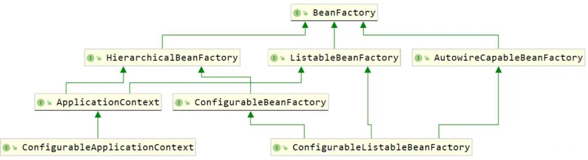

其中最重要的接口是ApplicationContext。

1、BeanFactory

BeanFactory是SpringFramework中最顶级的容器接口，包含多个bean定义的对象，所有bean最终都在BeanFactory中创建和保存。每个bean的定义信息都由name进行唯一标识。

Spring推荐最好使用依赖注入DI（把对象通过setter或者其他注入方式注入，是推的配置），不推荐使用拉的形式（借助BeanFactory使用依赖查找DL）

BeanFactory会加载存储在配置源（最常用的是xml和注解驱动）中bean的定义，并使用org.springframework.beans 包中的 API 来配置 bean

BeanFactory中设计了Bean的生命周期，有初始化和销毁流程；定义了作用域的概念；还集成了环境配置（自 SpringFramework 3.1 之后出现了一个新的概念叫 Environment，它才是真正做环境和配置的保存地）。此外BeanFactory可实现层次性（主要通过HierarchicalBeanFactory实现）

2、HierarchicalBeanFactory

它是体现了层次性的BeanFactory，可以在ConfigurableBeanFactory接口中找到setParentBeanFactory方法，该方法可以设置父对象。

在该接口中有getParentBeanFactory()方法，可以获取到父BeanFactory对象。接口中的containsLocalBean(String name)会检查当前容器中是否有指定名称的Bean，而getBean方法会从当前BeanFactory开始查找是否存在指定的Bean，如果找不到就依次向上找父BeanFactory，直到找到为止返回，最终找不到会抛出NoSuchBeanDefinitionException。

这里面就隐含了一个规则：存在父子关系的本质上是不同的容器，有可能存在多个相同的bean定义在不同的容器中，而Singleton只是在一个容器中是单实例的，但有了层次性结构后，对于整体的多个容器来看，就不是单实例的了。

3、ListableBeanFactory

可列举的BeanFactory。它可以列举出所有bean实例，但它只会列举当前容器的Bean（即使同时是HierarchicalBeanFactory也不行）。想获取所有Bean可以借助BeanFactoryUtils工具类来实现（这个类中一些以IncludingAncestors结尾的方法，代表可以一起取父容器）

ListableBeanFactory会有选择性的列举，它的列举方法会忽略一些手动注册的方式产生的bean（ConfigurableBeanFactory 的 registerSingleton 方法），但getBeanNamesForType 和 getBeansOfType 除外，BeanFactory 的 getBean 确实也允许透明访问此类特殊 bean 。之所以会出现这种选择性列举，是因为手动注册这种方式经常在Spring内部使用，不希望开发者直接操作这些特殊的bean。

ListableBeanFactory的列举方法不适合频繁调用，列举所有会消耗性能。

4、AutowireCapableBeanFactory

支持自动注入的BeanFactory，不推荐在常规程序中使用，它是为了和其他框架进行集成的时候使用。例如在一个Servlet中引入IOC容器中一个存在的Service，如果此时想用DI进行自动注入，就要借助该接口的功能。

ApplicationContext未实现该接口，但是可以通过ApplicationContext 的 getAutowireCapableBeanFactory() 方法进行访问。

接借助BeanFactoryAware注入的BeanFactory就是AutowireCapableBeanFactory。

5、ConfigurableBeanFactory

可配置的BeanFactory，可以调用它里面定义的方法来对BeanFactory进行修改和扩展，有一系列的set方法可以使用。不推荐在开发中使用此类。

## BeanFactory的实现类

下图展示了这些实现类：

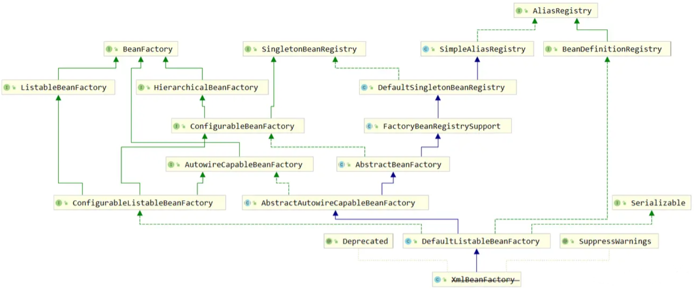

1、AbstractBeanFactory

它是BeanFactory最基本的抽象实现，有最基础的功能，可以从配置源获取Bean的定义信息，支持SPI。可以提供单实例Bean的缓存（通过其父类 DefaultSingletonBeanRegistry），bean的生命周期和作用域，管理BeanFactory的层次结构、别名的处理（来源于AliasRegistry）、用于子 bean 定义的 bean 定义合并。

它定义了两个主要的模板方法getBeanDefinition 和 createBean，子类主要要实现这两个方法，两个方法还提供了默认实现。其中createBean是所有Bean的创建入口。

2、AbstractAutowireCapableBeanFactory

它继承了AbstractBeanFactory，实现了AutowireCapableBeanFactory接口，可以实现自动注入的功能，且重写了createBean方法，具有创建bean的功能。最终创建bean是由doCreateBean方法是实现的，它定义在AbstractAutowireCapableBeanFactory中。

提供了bean的创建，属性填充，属性注入和初始化。支持自动装配。

它保留了一个模板方法resolveDependency(DependencyDescriptor, String, Set, TypeConverter) ，用于按类型自动装配，可以解析Bean的成员中定义的属性依赖关系。

此类不承担bean定义注册的功能，bean的定义是如何进入BeanFactory的，它不负责。

3、DefaultListableBeanFactory

它是BeanFactory最终的默认实现。也是 ConfigurableListableBeanFactory 和 BeanDefinitionRegistry 接口的默认实现。DefaultListableBeanFactory已经没有抽象方法了。

它在AbstractAutowireCapableBeanFactory的基础上，完成了注册bean定义信息的动作。这个动作是通过BeanDefinitionRegistry来实现的。

它不负责对bean的信息进行解析，这些解析是通过PropertiesBeanDefinitionReader 和 XmlBeanDefinitionReader实现的，也是Spring对单一职责的控制。

4、XmlBeanFactory

在 SpringFramework 3.1 之后，XmlBeanFactory 正式被标注为过时，代替方案是使用DefaultListableBeanFactory + XmlBeanDefinitionReader ，这种设计更符合组件的单一职责原则。而且自动推出了注解驱动的IOC容器，需要更通用的注册方式，不需要单独的xml驱动的类了。

## ApplicationContext和它的子父接口

这些接口如下图：

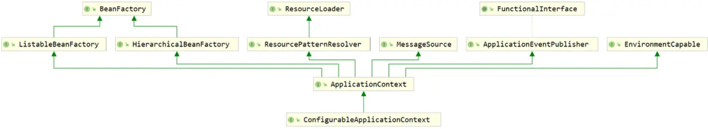

ApplicationContext不仅继承了BeanFactory的两个扩展接口，还继承了其它几个接口。

1、ApplicationContext

它是Spring最重要的中央接口。它可以：

* ListableBeanFactory：可列举的访问bean
* ResourceLoader：以通用的方式加载资源
* ApplicationEventPublisher：能够将事件发布给注册的监听器
* MessageSource：解析消息的能力
* 从父上下文继承，支持层级结构，不仅仅是父容器。

除了标准的BeanFactory生命周期功能外，它还检测并调用ApplicationContextAware bean 以及 ResourceLoaderAware bean， ApplicationEventPublisherAware 和 MessageSourceAware bean，可以回调注入这些类型的ApplicationContext。

2、ConfigurableApplicationContext

它给ApplicationContext提供了可写功能，扩展了一系列set方法，支持SPI。

这些方法一般情况下不应该被调用，除非是为了定制化ApplicationContext

3、EnvironmentCapable

该接口提供了getEnvironment方法拿到一个Environment。

在 SpringFramework 中，以 Capable 结尾的接口，通常意味着可以通过这个接口的某个特定的方法（通常是 getXXX() ）拿到特定的组件。

Environment 是 SpringFramework 中抽象出来的类似于运行环境的独立抽象，它内部存放着应用程序运行的一些配置。

ApplicationContext扩展了EnvironmentCapable，可以取到Environment ；而ConfigurableApplicationContext可以取到ConfigurableEnvironment，它可以获得一个可配置的环境信息。

4、MessageSource

它主要用于支持国际化。

5、ApplicationEventPublisher

它是事件的发布器，使得ApplicationContext实现观察者模式中广播者的角色。

6、ResourcePatternResolver

它可以根据特定的路径去解析资源文件。它用于将位置模式信息解析为Resource对象。它实现了ResourceLoader接口，ResourceLoader接口是最基本的解析接口。

ResourcePatternResolver可以支持带星号的路径解析。

ResourcePatternResolver有多种实现，其中一个常见的是PathMatchingResourcePatternResolver，基于路径匹配的解析器，会根据特殊的路径返回多个匹配到的资源文件。

它支持Ant路径模式匹配，例如：

* /WEB-INF/*.xml ：匹配 /WEB-INF 目录下的任意 xml 文件
* /WEB-INF/\*\*/beans-*.xml ：匹配 /WEB-INF 下面任意层级目录的 beans- 开头的 xml 文件
* /\*\*/*.xml ：匹配任意 xml 文件

ResourcePatternResolver不仅可以匹配web工程中的文件，还可以匹配类路径下的资源文件，方式是在路径前加一个前缀：classpath*:

## ApplicationContext的实现类

实现类：

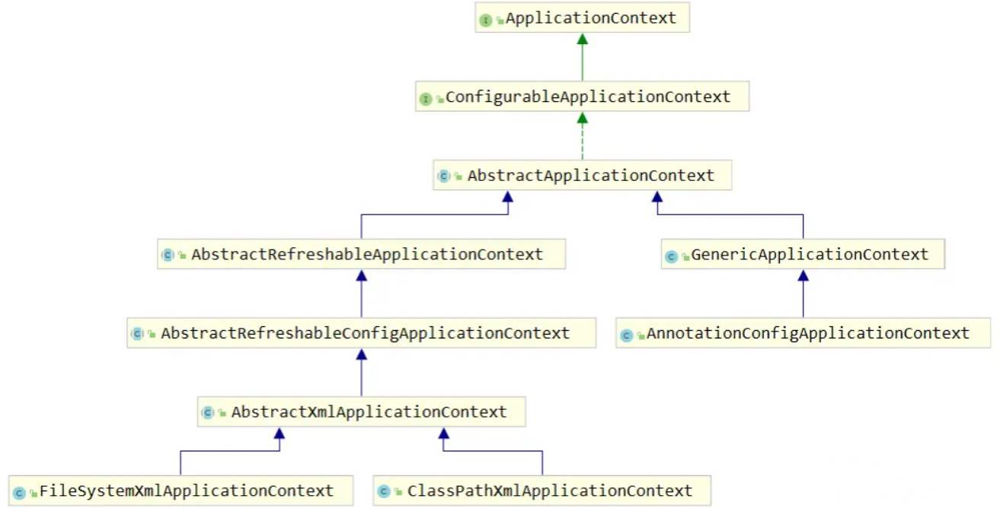

1、AbstractApplicationContext

它是ApplicationContext最核心的实现类，实现了绝大部分的特性和功能。

它可以检测在其内部Bean工厂中定义的特殊bean，包括后置处理器、监听器等。

通过扩展DefaultResourceLoader实现资源加载，默认是按照类路径资源加载，除非在子类中覆盖了getResourceByPath()。例如ServletContextResourceLoader就可以从ServletContext中加载。

它定义了一个IOC的核心方法refresh。

2、GenericApplicationContext

它是一个非抽象类，具备了ApplicationContext的所有基本能力。

它内部组合了一个DefaultListableBeanFactory，至此我们可以知道，ApplicationContext拥有BeanFactory的能力，不是通过继承的方式，而是通过组合的方式。这个BeanFactory在GenericApplicationContext的构造方法中就初始化好了，它不允许在运行期间被重复刷新（另外一类ApplicationContext允许刷新，这就是AbstractRefreshableApplicationContext）。

实现了BeanDefinitionRegistry接口，它是Bean定义的注册器。它定义了registerBeanDefinition，先注册各种bean的定义，然后用refresh方法来初始化这些bean

3、AbstractRefreshableApplicationContext

可刷新的ApplicationContext。它内部组合了DefaultListableBeanFactory，它支持多次调用refresh方法，每次都创建一个新的内部BeanFactory实例，但并非是在构造方法中创建，而是通过createBeanFactory方法创建。

这种可刷新通常针对的上下文就是配置文件驱动的方式。

子类需要实现的方法是loadBeanDefinitions，它在每次刷新时都会调用，bean的定义是可覆盖的。

与这个类对应的一个类是AbstractRefreshableWebApplicationContext，它额外配置了web环境的功能，与ApplicationContext相比，WebApplicationContext额外扩展了Servlet相关的部分，内部组合了一个ServletContext，支持给Bean注入ServletContext等Servlet的组件。

4、AbstractRefreshableConfigApplicationContext

它扩展了一些配置相关的特性。有一个getConfigLocations方法，可以用来获取配置源路径。它也是基于XML实现的父类，在可配置bean加载中，配置的动作就在这个类中完成。

5、AbstractXmlApplicationContext

它可以从包含 XmlBeanDefinitionReader 解析的 BeanDefinition 的 XML 文档中提取配置，子类可以实现getConfigResources 和/或 getConfigLocations 方法，区分加载配置文件的策略。

它有loadBeanDefinitions方法，该方法中借助XmlBeanDefinitionReader解析xml配置文件，然后调用loadBeanDefinitions封装bean的定义信息，loadBeanDefinitions中调用了子类的getConfigResources 和/或 getConfigLocations 方法，取到资源。

6、ClassPathXmlApplicationContext

它是从 classpath 下加载 xml 配置文件的。可以通过getConfigLocations覆盖配置文件位置的默认值。加载配置文件支持Ant模式匹配。

如果有多个配置位置，那么比较早加载的bean定义会被覆盖。

spring还支持用GenericApplicationContext 类与 XmlBeanDefinitionReader 结合使用，以实现更灵活的上下文配置。

7、AnnotationConfigApplicationContext

注解驱动的IOC容器，它继承了GenericApplicationContext，只能刷新一次。

它除了能解析@Component 及其衍生出来的几个注解，更重要的是可以解析@Configuration。允许用register进行一对一注册，也可以用scan进行类路径的包扫描。

如果有多个@Configuration，也会出现bean定义被覆盖的情况。

## Environment

Environment 是从 SpringFramework 3.1 开始引入的一个抽象模型。它是集成在容器中的抽象，其中包含profiles和properties，这些配置信息会影响IOC容器中bean的创建和注册。Environment 伴随着 ApplicationContext 的存在而存在，它是在ApplicationContext创建后才创建的。Environment也是一个特殊的Bean。

profile用于区分不同的环境模式，Environment 配合profile可以完成指定模式的环境的组件装配，完成不同的配置属性注入。

properties用于配置属性和注入值，它可以作为外部化配置，Environment 中存放了很多properties，它们可能来自属性文件、JVM系统属性、系统环境变量等，最终的作用都是提供了属性配置。

Environment 继承了父接口 PropertyResolver，PropertyResolver这个接口负责解析占位符$内部的值，它和属性注入有密切关系。Environment 的实现类，StandardEnvironment中可以看到，真正实现解析的类是ConfigurablePropertyResolver，解析的工作被委派给这个类完成。

Environment可以直接注入到组件中，但不推荐开发者直接使用它，而是通过占位符注入配置属性的值。

通过所有AbstractApplicationContext 子类的 getEnvironment() 方法返回 ConfigurableEnvironment，它是一个可写的Environment。

## BeanDefinition的概念

BeanDefinition是一种配置元信息，它描述了Bean的定义信息。它允许BeanFactoryPostProcessor 任意修改 BeanDefinition 中的信息。它包含的信息有：类信息、属性（作用域）、行为特征（是否延迟加载、是否自动注入、生命周期相关）、依赖关系（父Bean、依赖的Bean）、配置属性。BeanDefinition还具有层次性，定义信息可以继承。

总结：BeanDefinition 描述了 SpringFramework 中 bean 的元信息，它包含 bean 的类信息、属性、行为、依赖关系、配置信息等。BeanDefinition 具有层次性，并且可以在 IOC 容器初始化阶段被 BeanDefinitionRegistryPostProcessor 构造和注册，被 BeanFactoryPostProcessor 拦截修改等。

BeanDefinition 的继承关系图：

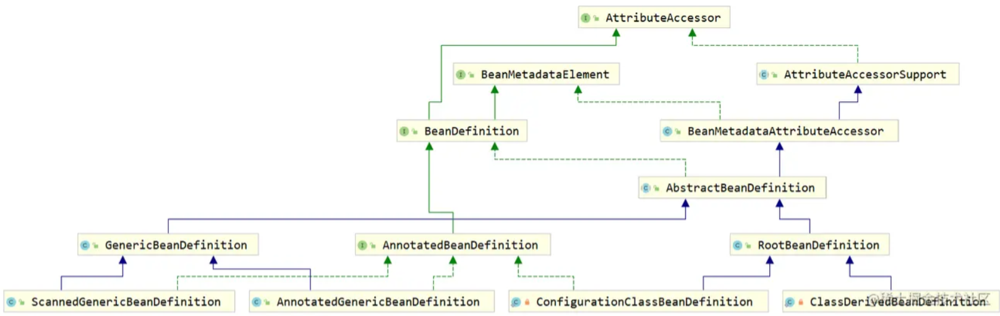

1、AttributeAccessor

属性访问器。观察它的接口方法：

~~~java
public interface AttributeAccessor {
    // 设置bean中属性的值
    void setAttribute(String name, @Nullable Object value);

    // 获取bean中指定属性的值
    Object getAttribute(String name);

    // 移除bean中的属性
    Object removeAttribute(String name);

    // 判断bean中是否存在指定的属性
    boolean hasAttribute(String name);

    // 获取bean的所有属性
    String[] attributeNames();
}
~~~

它好像操纵Map一样操纵Bean，BeanDefinition 继承了 AttributeAccessor 接口，具有配置 bean 属性的功能。

2、BeanMetadataElement

它存放了bean的元信息，它有一个方法，getSource，可以获取bean的资源来源，如果是通过class文件加载进来的bean，这里就会返回FileSystemResource

3、AbstractBeanDefinition

BeanDefinition 的抽象实现，它包含了大部分功能：

~~~java
// bean的全限定类名
    private volatile Object beanClass;

    // 默认的作用域为单实例
    private String scope = SCOPE_DEFAULT;

    // 默认bean都不是抽象的
    private boolean abstractFlag = false;

    // 是否延迟初始化
    private Boolean lazyInit;
    
    // 自动注入模式(默认不自动注入)
    private int autowireMode = AUTOWIRE_NO;

    // 是否参与IOC容器的自动注入(设置为false则它不会注入到其他bean，但其他bean可以注入到它本身)
    // 可以这样理解：设置为false后，你们不要来找我，但我可以去找你们
    private boolean autowireCandidate = true;

    // 同类型的首选bean
    private boolean primary = false;

    // bean的构造器参数和参数值列表
    private ConstructorArgumentValues constructorArgumentValues;

    // bean的属性和属性值集合
    private MutablePropertyValues propertyValues;

    // bean的初始化方法
    private String initMethodName;

    // bean的销毁方法
    private String destroyMethodName;

    // bean的资源来源
    private Resource resource;
~~~

default-autowire：Spring可以实现完全的自动注入，不借助注解和配置文件，只要有类型或者name完全一致即可注入，实现方式是@Bean中的autowire属性，但是这种方式已基本标记为过时，Spring推荐使用@Autowired。

自动注入的模式有以下五种：AUTOWIRE_NO（不自动注入）、AUTOWIRE_BY_NAME（根据 bean 的名称注入）、AUTOWIRE_BY_TYPE（根据 bean 的类型注入）、AUTOWIRE_CONSTRUCTOR（根据 bean 的构造器注入）、AUTOWIRE_AUTODETECT（借助内省决定如何注入，3.0 即弃用），默认是不开启的

4、GenericBeanDefinition

Generic代表通用的，它是一个非抽象类，它仅仅是比AbstractBeanDefinition 多了一个 parentName 属性而已，因此也具备了层次性（可从父 BeanDefinition 处继承一些属性信息）

5、ChildBeanDefinition

ChildBeanDefinition ，它的设计实现与 GenericBeanDefinition 如出一辙，都是集成一个 parentName 来作为父 BeanDefinition 的 “指向引用” 。不过有一点要注意， ChildBeanDefinition 没有默认的无参构造器，必须要传入 parentName 才可以，但 GenericBeanDefinition 则有两种不同的构造器。

6、RootBeanDefinition

RootBeanDefinition有根的概念，不能继承其他BeanDefinition，它在AbstractBeanDefinition的基础上，扩展了Bean的id和别名、注解信息、工厂相关信息：

~~~java
	// BeanDefinition的引用持有，存放了Bean的别名
    private BeanDefinitionHolder decoratedDefinition;

    // Bean上面的注解信息
    private AnnotatedElement qualifiedElement;

    // Bean中的泛型
    volatile ResolvableType targetType;

    // BeanDefinition对应的真实的Bean
    volatile Class<?> resolvedTargetType;

    // 是否是FactoryBean
    volatile Boolean isFactoryBean;
    // 工厂Bean方法返回的类型
    volatile ResolvableType factoryMethodReturnType;
    // 工厂Bean对应的方法引用
    volatile Method factoryMethodToIntrospect;
~~~

7、AnnotatedBeanDefinition

它是一个接口：

~~~java
public interface AnnotatedBeanDefinition extends BeanDefinition {
    
	AnnotationMetadata getMetadata();
    
	MethodMetadata getFactoryMethodMetadata();
}
~~~

它可以把 Bean 上的注解信息提供出来，它的子类有AnnotatedGenericBeanDefinition、ScannedGenericBeanDefinition，都是基于注解的BeanDefinition

## BeanDefinition的简单使用

1、基于xml的BeanDefinition

使用 xml 配置文件的方式，每定义一个 \<bean> 标签，就相当于构建了一个 BeanDefinition

下面代码展示了读取一个配置文件，然后获取一个类的BeanDefinition：

~~~java
ClassPathXmlApplicationContext ctx = new ClassPathXmlApplicationContext("definition/definition-beans.xml");
BeanDefinition personBeanDefinition = ctx.getBeanFactory().getBeanDefinition("person");
System.out.println(personBeanDefinition);
~~~

这里取出的BeanDefinition是GenericBeanDefinition

打印结果：

~~~
Generic bean: class [com.linkedbear.spring.definition.a_quickstart.bean.Person]; 
scope=; 
abstract=false; 
lazyInit=false; 
autowireMode=0; 
dependencyCheck=0; 
autowireCandidate=true; 
primary=false; 
factoryBeanName=null; 
factoryMethodName=null; 
initMethodName=null; 
destroyMethodName=null; 
defined in class path resource [definition/definition-beans.xml]
~~~

2、基于@Component的BeanDefinition

在类上加注解，然后再用包扫描的形式获取BeanDefinition：

~~~java
AnnotationConfigApplicationContext ctx = new AnnotationConfigApplicationContext(
                "com.linkedbear.spring.definition.a_quickstart.bean");
BeanDefinition personBeanDefinition = ctx.getBeanDefinition("person");
System.out.println(personBeanDefinition);
System.out.println(personBeanDefinition.getClass().getName());
~~~

这里取出的BeanDefinition是ScannedGenericBeanDefinition

打印BeanDefinition的结果与上面最大的区别是来源不同了，前者是来源自xml，后者来源自class文件：

~~~
Generic bean: class [com.linkedbear.spring.definition.a_quickstart.bean.Person]; scope=singleton; 
abstract=false; 
lazyInit=null; 
autowireMode=0; 
dependencyCheck=0; 
autowireCandidate=true; 
primary=false; 
factoryBeanName=null; 
factoryMethodName=null; 
initMethodName=null; 
destroyMethodName=null; 
defined in file [E:\IDEA\spring-framework-projects\spring-01-ioc\target\classes\com\linkedbear\spring\definition\a_quickstart\bean\Person.class]
~~~

3、基于@Bean的BeanDefinition

在配置类中用Bean注解定义该bean，然后取出BeanDefinition并打印：

~~~java
AnnotationConfigApplicationContext ctx = new AnnotationConfigApplicationContext(
                BeanDefinitionQuickstartConfiguration.class);
BeanDefinition personBeanDefinition = ctx.getBeanDefinition("person");
System.out.println(personBeanDefinition);
System.out.println(personBeanDefinition.getClass().getName());
~~~

BeanDefinition的类型是ConfigurationClassBeanDefinition（RootBeanDefinition的子类）

~~~
Root bean: class [null]; 
scope=; 
abstract=false; 
lazyInit=null; 
autowireMode=3; 
dependencyCheck=0; 
autowireCandidate=true; 
primary=false; 
factoryBeanName=beanDefinitionQuickstartConfiguration; 
factoryMethodName=person; 
initMethodName=null; 
destroyMethodName=(inferred); 
defined in com.linkedbear.spring.definition.a_quickstart.config.BeanDefinitionQuickstartConfiguration
~~~

和上面的区别很大，比如class名没了，自动注入模式autowireMode变了，有factoryBeanName了

## BeanDefinitionRegistry的概念

BeanDefinitionRegistry是一个接口，它的实现类是DefaultListableBeanFactory。ApplicationContext也实现了它，ApplicationContext通过内部组合了DefaultListableBeanFactory来实现。

Registry 有注册表的意思，它用一个Map来保存了所有的BeanDefinition：

~~~java
private final Map<String, BeanDefinition> beanDefinitionMap = new ConcurrentHashMap<>(256);
~~~

BeanDefinitionRegistry可以对BeanDefinition进行增、删、查：

~~~java
void registerBeanDefinition(String beanName, BeanDefinition beanDefinition)
            throws BeanDefinitionStoreException;

void removeBeanDefinition(String beanName) throws NoSuchBeanDefinitionException;

BeanDefinition getBeanDefinition(String beanName) throws NoSuchBeanDefinitionException;
~~~

BeanDefinitionRegistry还要支撑其它组件运行，比如XmlBeanDefinitionReader会加载配置文件，把配置信息解析为bean，封装为BeanDefinition注册到IOC容器，这个过程中就相当于BeanDefinitionRegistry支撑XmlBeanDefinitionReader完成了它的工作。

##BeanDefinitionRegistry的简单使用

利用模块装配的ImportBeanDefinitionRegistrar接口导入BeanDefinition，这里面就用了BeanDefinitionRegistry注册了一个名为person的BeanDefinition，并实现了属性注入：

~~~java
public class PersonRegister implements ImportBeanDefinitionRegistrar {
    
    @Override
    public void registerBeanDefinitions(AnnotationMetadata importingClassMetadata, BeanDefinitionRegistry registry) {
        registry.registerBeanDefinition("person",
                BeanDefinitionBuilder.genericBeanDefinition(Person.class).addPropertyValue("name", "zhangsan")
                        .getBeanDefinition());
    }
}
~~~

再举一个BeanDefinition删除的例子，这里用了后处理器BeanFactoryPostProcessor，它在BeanDefinition生成之后，bean生成前调用，下面的例子就是移除 IOC 容器中所有性别为 male 的 Person：

~~~java
@Override
public void postProcessBeanFactory(ConfigurableListableBeanFactory beanFactory) throws BeansException {
    BeanDefinitionRegistry registry = (BeanDefinitionRegistry) beanFactory;
    // 获取IOC容器中的所有BeanDefinition
    for (String beanDefinitionName : beanFactory.getBeanDefinitionNames()) {
        // 判断BeanDefinition对应的Bean是否为Person类型
        BeanDefinition beanDefinition = beanFactory.getBeanDefinition(beanDefinitionName);
        if (Person.class.getName().equals(beanDefinition.getBeanClassName())) {
            // 判断Person的性别是否为male
            // 使用xml配置文件对bean进行属性注入，最终取到的类型为TypedStringValue，这一点不需要记住
            TypedStringValue sex = (TypedStringValue) beanDefinition.getPropertyValues().get("sex");
            if ("male".equals(sex.getValue())) {
                // 移除BeanDefinition
                registry.removeBeanDefinition(beanDefinitionName);
            }
        }
    }
}
~~~

## BeanDefinition的合并

bean是存在父子关系的，假设有三个类：Person、抽象类Animal、继承Animal的Cat类。其中Animal组合了一个Person对象。在配置文件中我们可以这样定义一个cat：

~~~xml
<bean class="com.linkedbear.spring.definition.d_merge.bean.Cat">
    <property name="person" ref="person"/>
    <property name="name" value="咪咪"/>
</bean>
~~~

但这样如果存在多个子类，那么就要注入person多次，比较麻烦，我们可以定义一个抽象的bean，然后让cat去继承这个bean：

~~~xml
<bean id="abstract-animal" class="com.linkedbear.spring.definition.d_merge.bean.Animal" abstract="true">
    <property name="person" ref="person"/>
</bean>

<bean id="cat" class="com.linkedbear.spring.definition.d_merge.bean.Cat" parent="abstract-animal">
    <property name="name" value="咪咪"/>
</bean>
~~~

这样就产生了子父bean。

运行下列代码打印BeanDefinition：

~~~java
ClassPathXmlApplicationContext ctx = new ClassPathXmlApplicationContext("definition/definition-merge.xml");
Cat cat = (Cat) ctx.getBean("cat");
System.out.println(cat);

BeanDefinition catDefinition = ctx.getBeanFactory().getMergedBeanDefinition("cat");
System.out.println(catDefinition);
~~~

此时打印的BeanDefinition中的propertyvalues就有person和name两个属性键值对了。注意这里用的是getMergedBeanDefinition方法，如果用getBeanDefinition方法则只能看到name一个属性值。

## 事件原理

观察者模式的三大核心是：观察者、被观察主题、订阅者。观察者（ Observer ）需要绑定要通知的订阅者（ Subscriber ），并且要观察指定的主题（ Subject ）。

Spring中实现了观察者模式的就是事件机制，主要概念有事件源（发布事件的对象）、事件、广播器（发布事件的工具）和监听器。Spring中的广播器具体细分为两种：ApplicationEventPublisher事件发布器和ApplicationEventMulticaster事件广播器，区别是后者组合了所有的监听器，具备广播事件的能力。

在Spring中，观察者模式中的观察者就是广播器，ApplicationContext其实就充当了广播器的角色，它继承了ApplicationEventPublisher，同时它的抽象实现类AbstractApplicationContext 组合了一个 ApplicationEventMulticaster，这样就拥有了事件发布和广播的能力，是观察者。

观察事件发布的方法publishEvent的执行过程，形成下列时序图：

ApplicationContext（实际上是AbstractApplicationContext）是事件源、EventMulticaster（实际上是SimpleApplicationEventMulticaster）是广播器，Listener（实际上是ApplicationListenerMethodAdapter）是监听器，而ListenerRetriever是一个保存监听器等待回调的辅助类。

~~~mermaid
sequenceDiagram
	participant ApplicationContext
	participant EventMulticaster
	participant Listener
	participant ListenerRetriever

    ApplicationContext->>ListenerRetriever: refresh时收集所有的Listener存入Set
    ApplicationContext->>ApplicationContext: 开始调用publishEvent，封装ApplicationEvent
    
    ApplicationContext->>EventMulticaster: 广播事件
    
    EventMulticaster->>ListenerRetriever: 取所有Listener
    ListenerRetriever-->>EventMulticaster: 返回所有多个Listener
    EventMulticaster->>EventMulticaster: 过滤与事件匹配的监听器
    EventMulticaster->>EventMulticaster: 对多个Listener进行排序
    EventMulticaster->>EventMulticaster: 根据eventType和sourceType生成key，将监听器缓存起来
    loop 对所有的Listener
        EventMulticaster->>Listener: invokeListener
        Listener->>Listener: 反射调用Listener监听的方法
    end
    ApplicationContext->>ApplicationContext: 调用父容器的publishEvent
~~~

## 配置文件生成BeanDefinition

分析下面这段代码的执行：

```java
ApplicationContext ctx = new ClassPathXmlApplicationContext("config.xml");;
Dog dog = ctx.getBean(Dog.class);
System.out.println(dog);
```

这段代码最后会在DefaultListableBeanFactory的一个成员变量map中保存BeanDefinition：

~~~java
/** Map of bean definition objects, keyed by bean name. */
	private final Map<String, BeanDefinition> beanDefinitionMap = new ConcurrentHashMap<>(256);
~~~

在ClassPathXmlApplicationContext构造方法中：

```java
super(parent);
setConfigLocations(configLocations);
if (refresh) {
  refresh();
}
```

setConfigLocations会把配置文件路径最后保存在AbstractRefreshableConfigApplicationContext的一个成员变量中：

```java
@Nullable
private String[] configLocations;

public void setConfigLocations(@Nullable String... locations) {
  if (locations != null) {
    Assert.noNullElements(locations, "Config locations must not be null");
    this.configLocations = new String[locations.length];
    for (int i = 0; i < locations.length; i++) {
      this.configLocations[i] = resolvePath(locations[i]).trim();
    }
  }
  else {
    this.configLocations = null;
  }
}
```

然后继续看refresh方法，refresh的代码较长，重点关注下面这一句：

```java
// Tell the subclass to refresh the internal bean factory.
ConfigurableListableBeanFactory beanFactory = obtainFreshBeanFactory();
```

调用链条：

```
obtainFreshBeanFactory -> refreshBeanFactory -> loadBeanDefinitions...
```

形成下列时序图：

ApplicationContext（AbstractRefreshableApplicationContext）、RefreshableContext（AbstractRefreshableApplicationContext，其实也是ApplicationContext）、BeanDefinitionReader（XmlBeanDefinitionReader）、documentReader（DefaultBeanDefinitionDocumentReader）

~~~mermaid
sequenceDiagram
	participant ApplicationContext
	participant RefreshableContext
	participant BeanDefinitionReader
	participant documentReader
	
	ApplicationContext->>RefreshableContext: 将传入路径保存到成员变量configLocations
	RefreshableContext->>RefreshableContext: 若已有BeanFactory则销毁重建
	RefreshableContext->>BeanDefinitionReader: 读取configLocations
	BeanDefinitionReader->>BeanDefinitionReader: 封装Document
	BeanDefinitionReader->>documentReader: 开始解析Document
	documentReader->>documentReader: 判断profile
	documentReader->>documentReader: 解析bean
	documentReader->>documentReader: 生成BeanDefinition，封装BeanDefinitionHolder
	documentReader->>ApplicationContext: 将BeanDefinition保存到Map中，此时ApplicationContext同时也是BeanDefinitionRegistry
~~~

注册的大多数逻辑都是在ApplicationContext中完成的，ApplicationContext既承担解析的职责，也承担保存BeanDefinition的职责。因为AbstractRefreshableApplicationContext是可刷新的容器，所以会先销毁已有BeanFactory再新建。BeanDefinitionHolder比BeanDefinition多一个beanName，它是持有BeanDefinition的类。

##注解方式生成BeanDefinition

分析下列代码的执行：

~~~java
ApplicationContext ctx = new AnnotationConfigApplicationContext(MyConfiguration.class);
Person person = ctx.getBean(Person.class);
System.out.println(person);
~~~

生成BeanDefinition的部分主要在refresh方法的invokeBeanFactoryPostProcessors，配置类生成BeanDefinition的逻辑主要依赖后置处理器ConfigurationClassPostProcessor（一个BeanDefinitionRegistryPostProcessor）

形成下列时序图：

PostProcessor(ConfigurationClassPostProcessor)

Parser(ConfigurationClassParser)

BeanDefinitionReader(注册入参的配置类时：AnnotatedBeanDefinitionReader，注册配置类引入的其他beanDefinition时：ConfigurationClassBeanDefinitionReader)

~~~mermaid
sequenceDiagram
	participant ApplicationContext
	participant PostProcessor
	participant Parser
	participant BeanDefinitionReader
	
	ApplicationContext->>BeanDefinitionReader: 将入参类注册为BeanDefinition
	ApplicationContext->>ApplicationContext: 执行BeanDefinitionRegistryPostProcessor的postProcessBeanDefinitionRegistry方法
	ApplicationContext->>PostProcessor: 其中一个执行ConfigurationClassPostProcessor的postProcessBeanDefinitionRegistry方法
	PostProcessor->>Parser: 解析配置类引入的所有类信息
	PostProcessor->>BeanDefinitionReader: 将类信息注册为BeanDefinition
	ApplicationContext->>ApplicationContext: 执行BeanDefinitionRegistryPostProcessor的postProcessBeanFactory方法
	
~~~

ConfigurationClassParser解析配置类信息的详细过程：

Parser(ConfigurationClassParser)

ImportSelectorHandler(DeferredImportSelectorHandler或者AdviceModeImportSelector)

Scanner(ClassPathBeanDefinitionScanner)


~~~mermaid
sequenceDiagram
	participant Parser
	participant Scanner
	participant ImportSelectorHandler
	
	Parser->>Parser: 递归处理配置类内部类中的配置类
	Parser->>Parser: 将@PropertySource中导入的文件信息存入Environment
	Parser->>Scanner: 处理包扫描@ComponentScan
	Scanner->>Scanner: 解析excludeFilters和includeFilters
	Scanner->>Scanner: 根据路径封装ScannedGenericBeanDefinition并注册
	Parser->>Parser: 若@ComponentScan结果中包含配置类则递归解析
	Parser->>ImportSelectorHandler: 处理@Import和ImportBeanDefinitionRegistrar接口，导入类
	Parser->>Parser: 处理@ImportResource，信息解析为source
	Parser->>Parser: 过滤带@Bean的方法，将方法信息封装为BeanMethod
	Parser->>Parser: 处理父接口中的@Bean
	Parser->>Parser: 把配置类的父类递归解析
	Parser->>ImportSelectorHandler: 导入@DeferredImportSelector导入的类信息
~~~

这里除了包扫描部分真正生成了BeanDefinition并注册了，其余的部分只是对信息的初步解析，在下一个步骤才会真正注册BeanDefinition。

解析@Bean的方法的时候，spring使用了ASM 读取字节码，这是因为java的反射取方法时，无法做到根据方法定义顺序返回Method。

ConfigurationClassBeanDefinitionReader将类信息注册为BeanDefinition的过程：

BeanDefinitionReader(ConfigurationClassBeanDefinitionReader)

~~~mermaid
sequenceDiagram
	participant BeanDefinitionReader
	
	BeanDefinitionReader->>BeanDefinitionReader: 处理@Conditional，若不满足不定义BeanDefinition
	BeanDefinitionReader->>BeanDefinitionReader: 将@Import导入的配置类定义BeanDefinition
	BeanDefinitionReader->>BeanDefinitionReader: 解析@Bean的信息，封装为BeanDefinition，同时封装类信息，最后定义
	BeanDefinitionReader->>BeanDefinitionReader: 用XmlBeanDefinitionReader来解析配置类引入的配置文件，定义其中的BeanDefinition
	BeanDefinitionReader->>BeanDefinitionReader: 执行ImportBeanDefinitionRegistrar的registerBeanDefinitions方法
	
~~~

ConfigurationClassBeanDefinitionReader完成了配置类定义BeanDefinition几乎全部的动作，这里解析@Bean的时候，主要是对类的源信息的解析，包括bean的定义源，类名和方法名，方便后续能够使用反射调用该注解配置类的方法，生成 bean 对象并返回

BeanDefinition 阶段分为加载 xml 配置文件、解析注解配置类、编程式构造 BeanDefinition 、BeanDefinition 的后置处理，一共四个部分:

* 加载 xml 配置文件 发生在基于 xml 配置文件的 ApplicationContext 中 refresh 方法的 BeanFactory 初始化阶段，此时 BeanFactory 刚刚构建完成，它会借助 XmlBeanDefinitionReader 来加载 xml 配置文件，并使用 DefaultBeanDefinitionDocumentReader 解析 xml 配置文件，封装声明的 \<bean> 标签内容并转换为 BeanDefinition 。
* 解析注解配置类 发生在 ApplicationContext 中 refresh 方法的 BeanDefinitionRegistryPostProcessor 执行阶段，该阶段首先会执行 ConfigurationClassPostProcessor 的 postProcessBeanDefinitionRegistry 方法。ConfigurationClassPostProcessor 中会找出所有的配置类，排序后依次解析，并借助 ClassPathBeanDefinitionScanner 实现包扫描的 BeanDefinition 封装，借助 ConfigurationClassBeanDefinitionReader 实现 @Bean 注解方法的 BeanDefinition 解析和封装。
* 编程式构造 BeanDefinition 也是发生在 ApplicationContext 中 refresh 方法的 BeanDefinitionRegistryPostProcessor 执行阶段，由于 BeanDefinitionRegistryPostProcessor 中包含 ConfigurationClassPostProcessor ，而 ConfigurationClassPostProcessor 会执行 ImportBeanDefinitionRegistrar 的逻辑，从而达到编程式构造 BeanDefinition 并注入到 BeanDefinitionRegistry 的目的；另外，实现了 BeanDefinitionRegistryPostProcessor 的类也可以编程式构造 BeanDefinition ，注入 BeanDefinitionRegistry 。

## Bean的实例化阶段

在Bean实例化之前，还需要注册BeanPostProcessor，它在refresh的registerBeanPostProcessors方法处。它将注册后置处理器的工作交给了PostProcessorRegistrationDelegate：

~~~java
PostProcessorRegistrationDelegate.registerBeanPostProcessors(beanFactory, this);
~~~

注册后置处理器其实就是向成员变量集合中添加后置处理器：

~~~java
List<BeanPostProcessor> beanPostProcessors = new CopyOnWriteArrayList<>();
~~~

它的执行逻辑如下：

1. 先注册一个BeanPostProcessorChecker（一种后置处理器，它的作用是检查BeanPostProcessor的初始化阶段中是否有 bean的创建，BeanPostProcessor本意是拦截处理bean的初始化，如果有bean在 BeanPostProcessor的初始化中创建，就必然导致这个bean不会被任何BeanPostProcessor处理，不会以入参的形式传入任何BeanPostProcessor，此时BeanPostProcessorChecker会打印一条警告日志）
2. 根据排序规则，给所有的后置处理器分类
3. 用beanFactory.getBean(ppName, BeanPostProcessor.class)提前初始化PriorityOrdered类型的后置处理器
4. 注册所有实现了PriorityOrdered接口的后置处理器
5. 注册所有实现了Ordered接口的后置处理器
6. 注册所有普通的后置处理器
7. 最后又注册了一个ApplicationListenerDetector，用于监听器的引用释放回调，以便进行进行对象的销毁和回收

这里面之所以要提前处理PriorityOrdered类型的后置处理器，并提前实例化，是因为实现了 PriorityOrdered 接口的后置处理器都非常重要，如处理@Autowired的AutowiredAnnotationBeanPostProcessor、处理JSR250 规范的CommonAnnotationBeanPostProcessor，如果不提前处理好这些，就很难在后续的流程中使用核心功能，这些实现了 PriorityOrdered 接口的组件通常都是些内置的核心组件，必须提前准备好。

Bean实例化阶段的关键入口在refresh的finishBeanFactoryInitialization中。


DefaultListableBeanFactory

AbstractBeanFactory

~~~mermaid
sequenceDiagram
	participant BeanFactory
	participant AbstractBeanFactory
	
	BeanFactory->>BeanFactory: 遍历之前填充好的beanDefinitionNames
	BeanFactory->>AbstractBeanFactory: 获取合并的beanDefinition
	AbstractBeanFactory->>AbstractBeanFactory: 若有父定义则递归合并生成一个RootBeanDefinition
	AbstractBeanFactory->>AbstractBeanFactory: 配置新BeanDefinition的scope
	BeanFactory->>BeanFactory: 非抽象、非延迟、非FactoryBean进入初始化阶段
	BeanFactory->>BeanFactory: 若有循环依赖，则抛出异常，优先初始化依赖的bean
	BeanFactory->>BeanFactory: 本地不存在当前bean的定义信息，则尝试让父容器实例化bean
	BeanFactory->>AbstractBeanFactory: 获取合并的beanDefinition
	BeanFactory->>BeanFactory: 区分单例、原型和其他自定义的scope
	BeanFactory->>BeanFactory: 后置处理器拦截创建bean
	BeanFactory->>BeanFactory: 若有工厂配置，则工厂方法创建bean
	BeanFactory->>BeanFactory: 若有构造器，使用反射有参构造，若无则反射无参构造
~~~

不同scope的处理逻辑类似，区别在于：原型 bean 没有缓存的必要，每次获取必定会创建新的 bean 对象出来；而单实例 bean 只能创建一次，第二次再获取就需要从缓存中获取了

后置处理器拦截创建bean：主要是会找到所有的InstantiationAwareBeanPostProcessor，然后执行其中逻辑（替代bean的自动创建），若bean被创建则继续调用BeanPostProcessor 的 postProcessAfterInitialization，这是为了自定义创建bean的逻辑依然可以使用代理的对象。

工厂方法创建的bean有两种：在 xml 配置文件中定义的 factory-method 、注解配置类中被 @Bean 标注的方法，最终通过反射执行工厂方法，生成 bean 对象。

至此为止就生成了一个空壳的bean对象了。

综上：

在所有非延迟加载的单实例 bean 初始化之前，会先初始化所有的 BeanPostProcessor 。

在 ApplicationContext 的 refresh 方法中，finishBeanFactoryInitialization 步骤会初始化所有的非延迟加载的单实例 bean 。实例化 bean 的入口是 getBean → doGetBean ，该阶段会合并 BeanDefinition ，并根据 bean 的 scope 选择实例化 bean 的策略。

创建 bean 的逻辑会走 createBean 方法，该方法中会先执行所有 InstantiationAwareBeanPostProcessor 的 postProcessBeforeInstantiation 方法尝试创建 bean 实例，如果成功创建，则会直接调用 postProcessAfterInitialization 方法初始化 bean 后返回；如果 InstantiationAwareBeanPostProcessor 没有创建 bean 实例，则会调用 doCreateBean 方法创建 bean 实例。在 doCreateBean 方法中，会先根据 bean 的 Class 中的构造器定义，决定如何实例化 bean ，如果没有定义构造器，则会使用无参构造器，反射创建 bean 对象。

## Bean的初始化阶段

初始化的逻辑也在refresh的finishBeanFactoryInitialization里面，继续分析：

AbstractAutowireCapableBeanFactory

BeanDefinitionValueResolver

~~~mermaid
sequenceDiagram
	participant BeanFactory
	participant ValueResolver
	
	BeanFactory->>BeanFactory: 调用所有MergedBeanDefinitionPostProcessor的postProcessMergedBeanDefinition
	BeanFactory->>BeanFactory: 调用InstantiationAwareBeanPostProcessor的postProcessAfterInstantiation，若false直接返回
	BeanFactory->>BeanFactory: 若该bean支持自动注入，则用getBean取出对应的bean放入属性集合
	BeanFactory->>BeanFactory: 调用InstantiationAwareBeanPostProcessor的postProcessProperties，走定制的属性赋值逻辑，填充属性集合
	BeanFactory->>ValueResolver: ValueResolver逐个解析属性集合，如String->int
	BeanFactory->>BeanFactory: 取出属性集合中的属性，反射设置到字段上  --属性填充完毕--
	BeanFactory->>BeanFactory: 执行各种Aware回调
	BeanFactory->>BeanFactory: 执行所有 BeanPostProcessor 的 postProcessBeforeInitialization
	BeanFactory->>BeanFactory: 执行InitializingBean 接口的 afterPropertiesSet
	BeanFactory->>BeanFactory: 回调init-method
	BeanFactory->>BeanFactory: 执行所有BeanPostProcessor的postProcessAfterInitialization
	BeanFactory->>BeanFactory: 注册销毁信息
	BeanFactory->>BeanFactory: 回调所有SmartInitializingSingleton
~~~

调用所有MergedBeanDefinitionPostProcessor的postProcessMergedBeanDefinition这个阶段，会调用几个比较重要的MergedBeanDefinitionPostProcessor：

* InitDestroyAnnotationBeanPostProcessor：它负责收集@PostConstruct 和 @PreDestroy的信息并封装
* CommonAnnotationBeanPostProcessor：负责收集@WebServiceRef 、@EJB 、@Resource的信息并封装
* AutowiredAnnotationBeanPostProcessor：负责收集@Autowired 注解、@Value 注解、 @Inject 注解的信息并封装

若InstantiationAwareBeanPostProcessor的postProcessAfterInstantiation返回false，下面的属性赋值和组件依赖注入的逻辑都会终止。

调用InstantiationAwareBeanPostProcessor的postProcessProperties阶段，会执行一个重要的后置处理器，是AutowiredAnnotationBeanPostProcessor，它会收集@Autowired 、@Value、@Inject 注解的信息，然后通过反射给对应属性赋值。（在此之前的处理器都不能用这些注解，会失效，因为这些注解信息还未加载）

执行各种Aware回调这一步，会判断bean实现的各接口类型，如实现了BeanClassLoaderAware 会回调注入加载当前 Bean 的 ClassLoader、BeanNameAware  回调注入当前 Bean 的名称等

执行所有 BeanPostProcessor 的 postProcessBeforeInitialization这一步，有几个重要的类会执行：

* InitDestroyAnnotationBeanPostProcessor：反射回调@PostConstruct
* ApplicationContextAwareProcessor：其余Aware回调，如ApplicationContextAware、ApplicationEventPublisherAware

执行所有BeanPostProcessor的postProcessAfterInitialization这一步，有几个重要的类执行：

* AbstractAutoProxyCreator：完成AOP的重要组件
* ApplicationListenerDetector：关联所有的监听器引用

注册销毁信息这一步，主要是收集：有实现 DisposableBean 接口，或者声明了 @PreDestroy 注解，或者声明了 destroy-method 方法

refresh方法的最后，会调用finishRefresh，在这里向容器中注册一个LifecycleProcessor

综上：

bean 对象创建完成后，会进行属性赋值、组件依赖注入，以及初始化阶段的方法回调。在 populateBean 属性赋值阶段，会事先收集好 bean 中标注了依赖注入的注解（ @Autowired 、@Value 、@Resource 、@Inject ），之后会借助后置处理器，回调 postProcessProperties 方法实现依赖注入。

属性赋值和依赖注入之后，会回调执行 bean 的初始化方法，以及后置处理器的逻辑：首先会执行 Aware 相关的回调注入，之后执行后置处理器的前置回调，在后置处理器的前置方法中，会回调 bean 中标注了 @PostConstruct 注解的方法，所有的后置处理器前置回调后，会执行 InitializingBean 的 afterPropertiesSet 方法，随后是 init-method 指定的方法，等这些 bean 的初始化方法都回调完毕后，最后执行后置处理器的后置回调。

## Bean的销毁阶段

主动调用 ApplicationContext 的 stop 和 close 方法，这样 IOC 容器的关闭和销毁流程就会依次执行了

stop方法会让Lifecycle bean 分组，排序，依次调用 stop 方法

而close方法会依次执行下列步骤：

1、广播 ContextClosedEvent 事件、清空各类缓存的集合和映射。

2、在销毁一个 bean 时，如果它有依赖其它的 bean ，则首要目标不是销毁自己，而是先销毁那些依赖的 bean 。销毁时会按照顺序调用：@PreDestroy → DisposableBean → destroy-method

3、处理bean中嵌套的bean（属性引用其他bean）

销毁工厂时，在基于 xml 和基于注解驱动的两种 ApplicationContext 的实现里有查询：

对于基于 xml 配置文件的 ApplicationContext 中，它会获取到原有的 BeanFactory ，移除序列化 ID ，并直接丢弃原来的 BeanFactory（赋值为null）

而对于注解驱动的 ApplicationContext 中，它只会给内部组合的 BeanFactory 移除序列化 ID 而已（注解驱动的 ApplicationContext，也就是GenericApplicationContext，不允许刷新容器的原理是通过CAS实现的，内部有一个原子类字段，刷新容器时将其set，第二次刷新时就无法set成功了，所以也就无法刷新容器）

综上：

bean 对象在销毁时，由 ApplicationContext 发起关闭动作。销毁 bean 的阶段，由 BeanFactory 取出所有单实例 bean ，并逐个销毁。

销毁动作会先将当前 bean 依赖的所有 bean 都销毁，随后回调自定义的 bean 的销毁方法，之后如果 bean 中有定义内部 bean 则会一并销毁，最后销毁那些依赖了当前 bean 的 bean 也一起销毁。

## IOC容器的生命周期概述

深入分析下refresh方法：

1、prepareRefresh：初始化前的预处理

2、obtainFreshBeanFactory：初始化BeanFactory，解析 xml 配置文件，封装 BeanDefinition

3、prepareBeanFactory：BeanFactory的预处理配置，包括以下动作

* 注册ApplicationContextAwareProcessor到集合，将几个Aware接口的回调职责交给它
* 设置几个类的注入对象，如注入BeanFactory.class时就注入刚建好的BeanFactory，注入ApplicationEventPublisher.class就会注入当前的this对象。
* 注册ApplicationListenerDetector到集合

4、postProcessBeanFactory：BeanFactory完成后进行的后置处理，和web相关

5、invokeBeanFactoryPostProcessors：包扫描，解析配置类，生成注解方式的BeanDefinition

6、registerBeanPostProcessors：注册所有的BeanPostProcessor

7、initMessageSource ：初始化国际化组件

8、initApplicationEventMulticaster：初始化事件广播器，构造一个 SimpleApplicationEventMulticaster ，并注册进 BeanFactory 中

9、onRefresh：子类扩展的刷新动作，是一个模板方法，在boot环境中有对该方法重写的子类

10、registerListeners：注册所有已经被创建出来的ApplicationListener，绑定到ApplicationEventMulticaster中，准备初始化ApplicationListener的信息

11、finishBeanFactoryInitialization：循环初始化非延迟加载的单实例 bean

12、finishRefresh：初始化 LifecycleProcessor 、广播刷新完成的事件ContextRefreshedEvent

13、resetCommonCaches：清除初始化过程中用到的各类缓存

## 初始化中的扩展点汇总

根据起作用的先后作用描述：

1、ImportSelector&ImportBeanDefinitionRegistrar：

ImportSelector可以取到@Import 标注的注解配置类的信息，ImportBeanDefinitionRegistrar可以获取到当前 @Import 标注的注解配置类的信息之外，更重要的是能拿到 BeanDefinitionRegistry ，由此可供扩展的动作主要是给 BeanDefinitionRegistry 中注册新的 BeanDefinition

2、BeanDefinitionRegistryPostProcessor

使用 BeanDefinitionRegistryPostProcessor 可以拿到 BeanDefinitionRegistry 的 API ，直接向 IOC 容器中注册新的 BeanDefinition。自定义的BeanDefinitionRegistryPostProcessor要比内置的ConfigurationClassPostProcessor要晚，如果非要提前执行，需要让后置处理器实现 PriorityOrdered 接口，声明较高执行优先级

3、BeanFactoryPostProcessor

在 BeanFactoryPostProcessor 的切入回调中，可以拿到的参数是 ConfigurableListableBeanFactory ，拿到它就意味着，我们在这个阶段按理来讲不应该再向 BeanFactory 中注册新的 BeanDefinition 了，只能获取和修改现有的 BeanDefinition。

BeanFactoryPostProcessor 的处理阶段是可以提早初始化 bean 对象的，因为这个阶段下只有 ApplicationContextAwareProcessor 注册到了 BeanFactory 中，没有其余关键的 BeanPostProcessor ，所以这个阶段初始化的 bean 有一个共同的特点：能使用 Aware 回调注入，但无法使用 @Autowired 等自动注入的注解进行依赖注入，且不会产生任何代理对象。

4、InstantiationAwareBeanPostProcessor#postProcessBeforeInstantiation

每个 bean 在创建之前都会尝试着使用 InstantiationAwareBeanPostProcessor 来代替创建，如果没有任何 InstantiationAwareBeanPostProcessor 可以拦截创建，则会走真正的 bean 对象实例化流程

5、SmartInstantiationAwareBeanPostProcessor#determineCandidateConstructors

如果在实例化 bean 之前，InstantiationAwareBeanPostProcessor 没有起到作用，就会通过构造器创建对象。如果一个 bean 有多个构造器，如何选择合适的构造器去创建对象就是很重要的一步。筛选构造器的核心方法是 determineConstructorsFromBeanPostProcessors ，它会在底层寻找所有 SmartInstantiationAwareBeanPostProcessor ，回调 determineCandidateConstructors 方法获取可选择的构造器

6、MergedBeanDefinitionPostProcessor#postProcessMergedBeanDefinition

此时 bean 对象已经创建出来了，只是没有任何属性值的注入而已，在此处切入扩展，意味着可以对 bean 对象所属的 Class 作一些处理或者收集的动作。

7、InstantiationAwareBeanPostProcessor#postProcessAfterInstantiation

在这里切入扩展的话，只能做到流程控制的作用，可以拦截属性注入，走自定义的属性注入

8、InstantiationAwareBeanPostProcessor#postProcessProperties

在此处扩展逻辑的话，相当于扩展了后置处理器的属性赋值 + 依赖注入的自定义逻辑

9、BeanPostProcessor

这里可以切入postProcessBeforeInitialization和 postProcessAfterInitialization，给 bean 添加一些额外的属性的赋值、回调等等，以及生成代理对象

10、SmartInitializingSingleton

在所有非延迟加载的单实例 bean 全部初始化完成后才回调的。这个阶段底层会取出所有实现了 SmartInitializingSingleton 接口的 bean ，去回调 afterSingletonsInstantiated 方法，它是bean 初始化的扩展点

## AOP的核心后置处理器

首先观察@EnableAspectJAutoProxy的定义：

~~~java
@Import(AspectJAutoProxyRegistrar.class)
public @interface EnableAspectJAutoProxy {
    boolean proxyTargetClass() default false;
    boolean exposeProxy() default false;
}
~~~

它向容器中导入了一个注册类：AspectJAutoProxyRegistrar。该类实现了ImportBeanDefinitionRegistrar，在registerBeanDefinitions方法中将一个后置处理器的BeanDefinition注册到了容器中，这个处理器就是代理对象的创建器：AnnotationAwareAspectJAutoProxyCreator

可以发现，@EnableAspectJAutoProxy 的根本作用是在IOC容器中注册了一个 AnnotationAwareAspectJAutoProxyCreator

观察AnnotationAwareAspectJAutoProxyCreator类的继承结构：

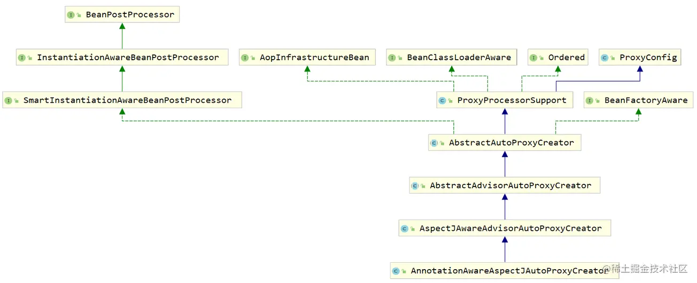

最顶层的几个接口：

* BeanPostProcessor ：用于在 postProcessAfterInitialization 方法中生成代理对象
* InstantiationAwareBeanPostProcessor ：拦截 bean 的正常 doCreateBean 创建流程
* SmartInstantiationAwareBeanPostProcessor ：提前预测 bean 的类型、暴露 bean 的引用
* AopInfrastructureBean ：实现了该接口的 bean 永远不会被代理（防止套娃）

它的第一个基本实现抽象类是AbstractAutoProxyCreator

AnnotationAwareAspectJAutoProxyCreator是一个后置处理器

在它的BeanDefinition注册到BeanDefinitionRegistry之后，在后置处理器初始化的时候，它就会被创建出来，而且它是实现了 Ordered 接口，它会提前于普通 BeanPostProcessor 创建，所以普通的 BeanPostProcessor 也会被 AOP 代理。

第一个阶段：AnnotationAwareAspectJAutoProxyCreator#postProcessBeforeInstantiation，主要逻辑如下：

* 收集切面类信息，生成增强器，决定是否要增强当前bean
* 原型bean的额外处理：TargetSource（AOP 的代理其实不是代理的目标对象本身，而是目标对象包装后的 TargetSource 对象）

其中要增强当前bean需要满足以下条件：

* 必须是未增强过的bean
* 基础类型的bean不会被提前增强：切面、切入点、增强器等对象，这些对象不会被增强
* 被跳过的bean不会被提前增强：bean与增强器（Advisor，它包含切入点和通知方法的信息）不同名

第二个阶段：AnnotationAwareAspectJAutoProxyCreator#postProcessAfterInitialization，主要逻辑如下：

1. 判断决定是否是不会被增强的 bean
2. 根据当前正在创建的 bean 去匹配增强器
3. 如果有增强器，创建 bean 的代理对象

## AOP收集切面类并封装

这里分析上面第一阶段：AnnotationAwareAspectJAutoProxyCreator#postProcessBeforeInstantiation

其中shouldSkip方法中有一个findCandidateAdvisors方法，它会返回多个增强器：

AnnotationAwareAspectJAutoProxyCreator

BeanFactoryAdvisorRetrievalHelper

BeanFactoryAspectJAdvisorsBuilder

AspectJAdvisorFactory

~~~mermaid
sequenceDiagram
	participant ProxyCreator
	participant AdvisorRetrievalHelper
	participant AdvisorsBuilder
	participant AspectJAdvisorFactory
	
	ProxyCreator->>AdvisorRetrievalHelper:  获取SpringFramework 原生 AOP 的增强器
	AdvisorRetrievalHelper->>AdvisorRetrievalHelper: 将 IOC 容器中所有类型为 Advisor 的实现类都找出来
	AdvisorRetrievalHelper->>AdvisorRetrievalHelper: 初始化这些Advisor bean
	ProxyCreator->>AdvisorsBuilder:  解析 AspectJ 切面类构造的增强器
	AdvisorsBuilder->>AdvisorsBuilder: 获取所有bean，并通过getType获取class类
	AdvisorsBuilder->>AdvisorsBuilder: 判断类上是否有@Aspect
	AdvisorsBuilder->>AspectJAdvisorFactory: 获取增强器
	AspectJAdvisorFactory->>AspectJAdvisorFactory: 遍历所有方法，取其中有@Pointcut的
	AspectJAdvisorFactory->>AspectJAdvisorFactory: 解析并封装为Pointcut对象
	AdvisorsBuilder->>AdvisorsBuilder: 缓存处理；若是原型bean，则不使用缓存取增强器
~~~

在获取SpringFramework 原生 AOP 的增强器时，底层先用getBeanNamesForType 方法根据Advisor type去找 bean 的名称（单纯的找 bean 的名称不会创建具体的 bean 对象），然后再用getBean将其初始化。

没有初始化 bean 实例的前提下，要想获取 bean 的 Class ，那就只能靠 BeanDefinition 了，所以我们可以在 AbstractBeanFactory 的 getType 方法中看到合并 RootBeanDefinition 的动作，随后调用 RootBeanDefinition 的 getBeanClass 方法获取 bean 的 Class 类型

判断是否是切面类时，除了检查类上是否有@Aspect的，还需要检查@Aspect注解是否是被ajc编译器编译的。原生的 AspectJ 也可以编写 Aspect 切面，而这种切面在特殊的编译条件下，生成的字节码中类上也会标注 @Aspect 注解，但是 SpringFramework 并不能利用它，所以这里它做了一个额外的判断处理，避免了这种 Class 被误加载

## TargetSource的设计

SpringFramework 的 AOP 中，代理对象并没有直接代理 Target ，而是给 Target 加了一个壳，而加的这个壳就是 TargetSource ，用图示理解就是这样：

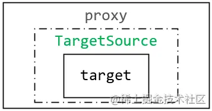

TargetSource 可以看做是目标对象 Target 的一个包装、容器，原本代理对象要执行 method.invoke(target, args) 这样的逻辑时，本来要拿到的是目标对象，但被 TargetSource 包装之后，就只能调用 method.invoke(targetSource.getTarget(), args) 这样的形式了。

TargetSource的好处就在于对target的创建时机做了进一步的控制，targetSource.getTarget()每次可以取同一个目标对象，也可以每次都新建，或者做一个对象池的设计。

分析TargetSource的结构：

~~~java
public interface TargetSource extends TargetClassAware {
	Class<?> getTargetClass();
	boolean isStatic();
	Object getTarget() throws Exception;
	void releaseTarget(Object target) throws Exception;
}
~~~

可以发现除了 getTarget 方法之外，还有一个 releaseTarget ，它是用于那些基于对象池的 TargetSource ，在目标对象调用方法完成后，紧接着调用 releaseTarget 方法来释放目标对象的。

isStatic是指是否是静态bean，也就是单例bean

SpringFramework 中针对不同场景不同需求，预设了几个 TargetSource 的实现，咱可以稍微了解一下：

* SingletonTargetSource ：每次 getTarget 都返回同一个目标对象 bean （与直接代理 target 无任何区别）
* PrototypeTargetSource ：每次 getTarget 都会从 BeanFactory 中创建一个全新的 bean （被它包装的 bean 必须为原型 bean ）
* CommonsPool2TargetSource ：内部维护了一个对象池，每次 getTarget 时从对象池中取（底层使用 apache 的 ObjectPool ）
* ThreadLocalTargetSource ：每次 getTarget 都会从它所处的线程中取目标对象（由于每个线程都有一个 TargetSource ，所以被它包装的 bean 也必须是原型 bean ）
* HotSwappableTargetSource ：内部维护了一个可以热替换的目标对象引用，每次 getTarget 的时候都返回它（它提供了一个线程安全的 swap 方法，以热替换 TargetSource 中被代理的目标对象）

## Bean被AOP代理

这里分析上面第二阶段：AnnotationAwareAspectJAutoProxyCreator#postProcessAfterInitialization

核心方法是wrapIfNecessary，它会返回一个代理对象。

AbstractAutoProxyCreator

DefaultAdvisorAdapterRegistry

~~~mermaid
sequenceDiagram
	participant ProxyCreator
	participant AopUtils
	participant AdvisorAdapterRegistry
	participant ProxyFactory
	
	ProxyCreator->>ProxyCreator:  判断是否需要被增强，若不需要直接返回
	ProxyCreator->>ProxyCreator:  获取所有增强器
	ProxyCreator->>AopUtils:  获取与当前类型匹配的增强器
	AopUtils->>AopUtils: 对于引介增强器，使用类级别的过滤器去匹配
	AopUtils->>AopUtils: 针对类和类实现的接口、逐个遍历方法和每个增强器匹配
	ProxyCreator->>ProxyCreator:  获取所有增强器
	ProxyCreator->>ProxyCreator: 当前可用的增强器中有没有 AspectJ 类型的，若有增加一个增强器
	ProxyCreator->>AdvisorAdapterRegistry: 把增强器包装为Advisor
	ProxyCreator->>ProxyFactory: 获取代理对象
	ProxyFactory->>ProxyFactory: 区分不同代理机制，生成对应的AopProxy
	ProxyFactory->>ProxyFactory: 不同的AopProxy根据不同原理创建代理对象
~~~

判断是否需要被增强：是目标对象其中之一、基础类型的bean不会被增强（切面、切入点、增强器等对象不会被增强）、被跳过的bean不会被提前增强，也就是bean与增强器（Advisor，它包含切入点和通知方法的信息）不同名。

额外增加的增强器是ExposeInvocationInterceptor，它每次都在增强器链的第一个执行，会把MethodInvocation放入一个ThreadLocal中，它可以让后面的增强器都拿到当前正在执行的 MethodInvocation。

AopProxy有两种，区分的是底层两种代理对象生成方式：如果要代理的本身就是接口（也有一种说法是目标类是实现了接口的类），或者已经是被jdk动态代理了的代理对象，则使用jdk动态代理，此时生成的就是JdkDynamicAopProxy，否则使用Cglib动态代理，生成的代理类是ObjenesisCglibAopProxy：

~~~java
public AopProxy createAopProxy(AdvisedSupport config) throws AopConfigException {
    if (config.isOptimize() || config.isProxyTargetClass() || hasNoUserSuppliedProxyInterfaces(config)) {
        Class<?> targetClass = config.getTargetClass();
        if (targetClass == null) {
            throw new AopConfigException("TargetSource cannot determine target class: " +
                    "Either an interface or a target is required for proxy creation.");
        }
        if (targetClass.isInterface() || Proxy.isProxyClass(targetClass)) {
            return new JdkDynamicAopProxy(config);
        }
        return new ObjenesisCglibAopProxy(config);
    }
    else {
        return new JdkDynamicAopProxy(config);
    }
}
~~~

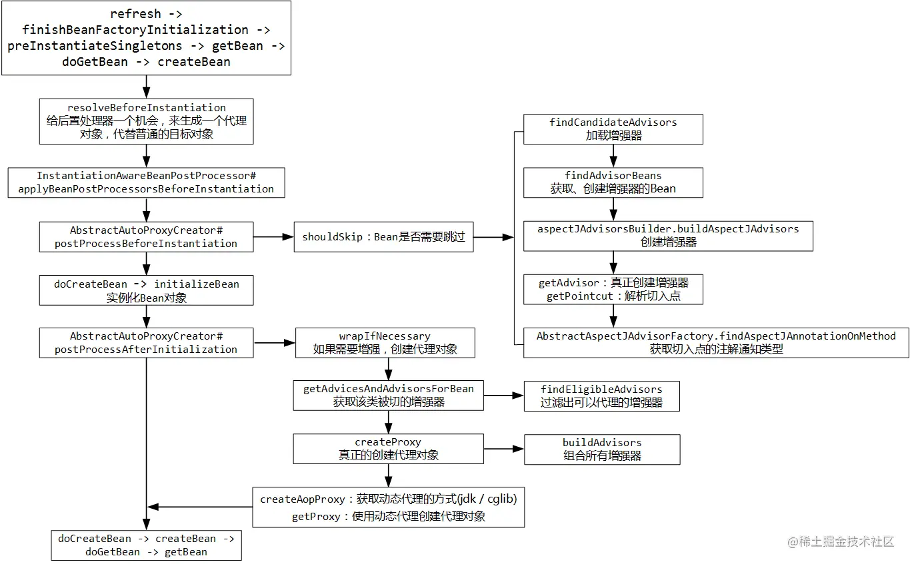

## 代理对象的底层执行逻辑

先来看cglib代理对象的执行逻辑，当执行目标方法时，代码首先来到CglibAopProxy 的内部类 DynamicAdvisedInterceptor#intercept（获取增强器链），然后来到CglibMethodInvocation#proceed（执行增强器）。

获取增强器链的基本逻辑：

* 从TargetSource中取出目标对象
* 取出之前封装好的增强器Advisor，对当前要执行的方法再次匹配一遍，看增强器中的切入点信息是否可以匹配的上，这个动作是由MethodMatcher完成的
* 初始化一个AdvisorAdapterRegistry，用它来将将 AspectJ 类型的增强器，转换为 MethodInterceptor（它是AOP 联盟定义的标准拦截器）
* MethodMatcher有动态和静态之分，若是动态的，在匹配的时候会取到方法执行的参数值，对参数值的类型进行一遍匹配，而且动态的匹配器也会影响最终MethodInterceptor的类型

执行增强器的逻辑，它的核心在于反复执行proceed方法。

取到之前封装好的增强器链，然后取第一个MethodInterceptor，进行一遍匹配，然后调用它的invoke方法，此时不同的拦截器，调用invoke方法的逻辑也不同：

* 如果是ExposeInvocationInterceptor，则会将MethodInvocation放入一个ThreadLocal中，然后再执行它的proceed方法，相当于又回到了原点
* 如果是环绕通知，则是AspectJAroundAdvice，它会反射执行增强逻辑的那个方法，在方法入参joinPoint中，再调用proceed方法，相当于又回到了原点
* 如果是前置通知，则是MethodBeforeAdviceInterceptor，它会反射执行增强逻辑的那个方法，然后执行proceed

等等

直到所有的增强器都被执行完了，最后它会执行被代理的方法，整个逻辑是由一个成员变量控制的，每次执行完一个它就加1，最后和总的增强器数量对比。

 jdk 动态代理的执行和cglib的类似，它执行被代理方法会执行到JdkDynamicAopProxy的invoke，它也会先判断是否执行代理（equals方法、hashCode方法、方法来自于DecoratingProxy接口的、目标对象本身就是实现了Advised接口的都不代理），然后封装MethodInvocation，最后开始执行。

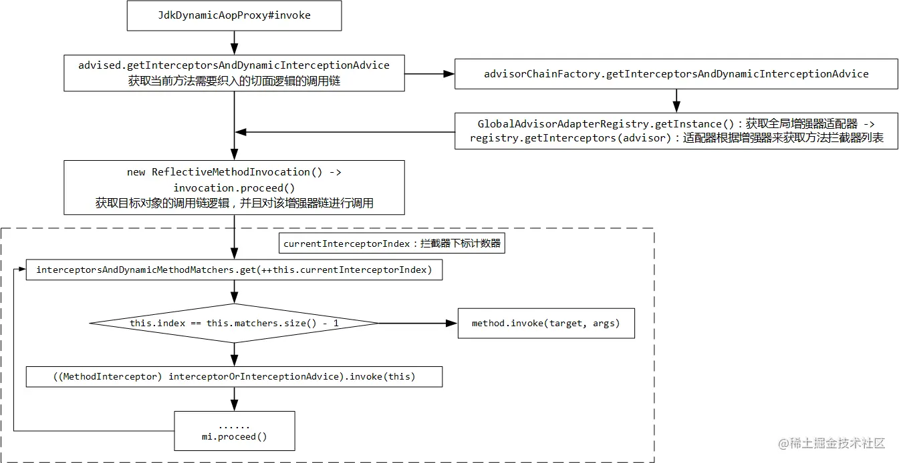

MethodInterceptor几个子类，分别对应几种通知的源码实现：

* MethodBeforeAdviceInterceptor：前置通知
* AspectJAfterAdvice：后置通知
* AfterReturningAdviceInterceptor：返回通知
* AspectJAfterThrowingAdvice：异常通知
* AspectJAroundAdvice：环绕通知

## Spring事务的核心类分析

SpringFramework 的事务控制模型，主要包含三个接口：

- **PlatformTransactionManager** ：平台事务管理器
- **TransactionDefinition** ：事务定义
- **TransactionStatus** ：事务状态（事务定义和事务状态有点像bean 和 BeanDefinition 的概念对比）

1、PlatformTransactionManager平台事务管理器

之所以会带上Platform，是因为Spring对事务的控制没有局限在单体应用的数据源上，它有设计基于Hibernate、JPA、JTA的，Spring将其视为不同的平台。

它的接口方法定义：

~~~java
public interface PlatformTransactionManager extends TransactionManager {
	TransactionStatus getTransaction(@Nullable TransactionDefinition definition)
			throws TransactionException;
	void commit(TransactionStatus status) throws TransactionException;
	void rollback(TransactionStatus status) throws TransactionException;
}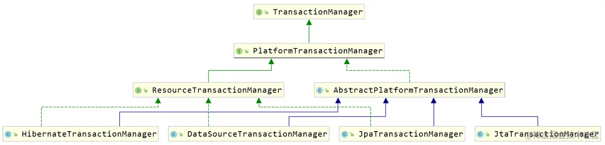
~~~

三个方法的含义：

* getTransaction ：传入 TransactionDefinition ，返回 TransactionStatus ，很明显它是根据一个事务的定义信息，查询事务当前的状态。
* commit ：提交事务，它需要传入事务当前的状态，来判断当前事务是否允许提交（如果当前事务已标记为需要回滚，则无法提交）
* rollback ：回滚事务，它也需要传入事务当前的状态，以此判断当前事务是否允许回滚（如果当前事务已经完成了，则无法回滚）

它的层次体系：


比较重要的成员：

* ResourceTransactionManager

它的接口定义：

~~~java
public interface ResourceTransactionManager extends PlatformTransactionManager {
	Object getResourceFactory();
}
~~~

它是管理事务的资源的，比如各种数据库、消息中间件。DataSourceTransactionManager 、HibernateTransactionManager 等都实现了这个接口

* AbstractPlatformTransactionManager

事务管理器的抽象实现，后面会详细分析

* DataSourceTransactionManager

最常用的事务管理器了，只要是用 jdbc 或者 MyBatis 作为持久层框架，咱都是配置它作为事务管理器的实现。它内部就组合了一个 DataSource

2、TransactionDefinition事务定义

在 @Transactional 注解 、 \<tx:method\> 标签中的那些可以定义的属性，最终都会封装到这个 TransactionDefinition 中。

它的层次体系：

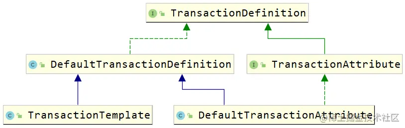

比较重要的成员：

* DefaultTransactionDefinition：它的定义已经包含了事务的很多基本属性：

~~~java
public class DefaultTransactionDefinition implements TransactionDefinition, Serializable {
	private int propagationBehavior = PROPAGATION_REQUIRED;
	private int isolationLevel = ISOLATION_DEFAULT;
	private int timeout = TIMEOUT_DEFAULT;
	private boolean readOnly = false;
	@Nullable
	private String name;
    // ......
~~~

* TransactionAttribute：它定义了两个方法：

~~~java
public interface TransactionAttribute extends TransactionDefinition {
    String getQualifier();
    boolean rollbackOn(Throwable ex);
}
~~~

比较重要的方法是下面的 rollbackOn 方法，它会判断事务定义中遇到指定的异常是否通知事务管理器回滚，它就相当于 @Transactional 注解中 rollbackFor 属性的底层支撑

* TransactionTemplate

TransactionTemplate 本身就是一个事务的定义信息，TransactionTemplate 的构建，需要传入事务管理器，由事务管理器来控制事务的提交和回滚，根据它自身的定义信息就可以从事务管理器中获取到这个 TransactionTemplate 对应的 TransactionStatus ，有了 TransactionStatus 才能完成接下来的检查、提交、回滚。

3、TransactionStatus事务状态

它的层次体系：

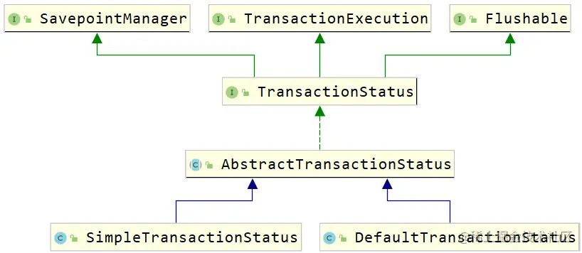

比较重要的成员：

* TransactionExecution：SpringFramework 5.2之后才有的，为了再抽一套响应式的事务控制才定义了这个接口，无论是同步阻塞式事务，还是响应式事务的总父接口：

~~~java
public interface TransactionExecution {
	boolean isNewTransaction(); // 是否是全新的事务
	void setRollbackOnly(); // 设置事务状态为需要回滚
	boolean isRollbackOnly(); // 事务是否需要回滚
	boolean isCompleted(); // 事务是否已完成
}
~~~

* SavepointManager：保存点的管理器，需要底层数据库支持该机制才能正确运行：

~~~java
public interface SavepointManager {
	Object createSavepoint() throws TransactionException; // 创建保存点
	void rollbackToSavepoint(Object savepoint) throws TransactionException; // 回滚至指定的保存点
	void releaseSavepoint(Object savepoint) throws TransactionException; // 销毁保存点
}
~~~

* DefaultTransactionStatus：SpringFramework 的事务控制中大多都是用 DefaultTransactionStatus 记录事务状态信息


## 基于xml的声明式事务生效原理

基于 xml 的事务只需要声明一个 \<tx:advice\> 标签，并配置好对应的内容，以及切入点表达式。点到这个标签的底层：

~~~xml
<xsd:element name="advice">
    <xsd:complexType>
        <xsd:annotation>
            <xsd:documentation source="java:org.springframework.transaction.interceptor.TransactionInterceptor">
                ......
~~~

它的底层注册了一个TransactionInterceptor类：

~~~java
public class TransactionInterceptor extends TransactionAspectSupport implements MethodInterceptor, Serializable
~~~

MethodInterceptor 接口是 AOP 增强的核心拦截器接口。父类 TransactionAspectSupport ，这个类中有一些与 SpringFramework 的基础事务 API 的集成（例如执行事务的核心方法 invokeWithinTransaction 、创建事务、提交事务、回滚事务等）

## 基于注解的声明式事务生效原理

基于注解的声明式事务，需要在配置类上标注 @EnableTransactionManagement 注解，之后再注册一个事务管理器。

该注解的定义：

~~~java
@Import(TransactionManagementConfigurationSelector.class)
public @interface EnableTransactionManagement {
	boolean proxyTargetClass() default false;
	AdviceMode mode() default AdviceMode.PROXY;
	int order() default Ordered.LOWEST_PRECEDENCE;
}
~~~

几个属性的解读：

* proxyTargetClass：是否直接代理目标类，默认是false，代表使用java动态代理（前提是有接口），若设置为true则是使用Cglib 动态代理
* mode，有两种取值：分别是 PROXY 和 ASPECTJ，PROXY 代表的确实是运行期增强，但 ASPECTJ 代表的是类加载期增强（类似于 load-time-weaving ），如果使用类加载期增强，可以方便的实现在Service 内部调用其他受事务控制的方法时也可以触发新的事务，但不常用。（若使用ASPECTJ，需要开启 load-time-weaving，且要引入spring-aspects依赖
* order：事务通知的执行顺序

此外，它还导入了一个类TransactionManagementConfigurationSelector，它是一个ImportSelector，在mode为PROXY 的情况下，向容器导入了两个类AutoProxyRegistrar + ProxyTransactionManagementConfiguration：

* AutoProxyRegistrar ：它实现了ImportBeanDefinitionRegistrar，它会对所有bean定义上的注解进行扫描，获取注解上的mode和proxyTargetClass属性，若有则向容器中注册一个InfrastructureAdvisorAutoProxyCreator，它是一个自动代理创建器，只会考虑基础结构 Advisor 类型的 Bean。所谓基础结构类型，就是BeanDefinition 的 role 属性为2的bean：

  ~~~java
  int ROLE_APPLICATION = 0;
  int ROLE_SUPPORT = 1;
  int ROLE_INFRASTRUCTURE = 2;
  ~~~

  ROLE_INFRASTRUCTURE代表这些bean通常都是 SpringFramework 内部的，且在应用程序中起到基础支撑性的作用。上面提到的TransactionInterceptor就是这种级别的，也就是说我们自己写的Advisor（通知增强逻辑）它是不会管理的

* ProxyTransactionManagementConfiguration：

  ~~~java
  @Configuration(proxyBeanMethods = false)
  @Role(BeanDefinition.ROLE_INFRASTRUCTURE)
  public class ProxyTransactionManagementConfiguration extends AbstractTransactionManagementConfiguration
  ~~~

  可以看出它也是内部的bean。proxyBeanMethods = false代表Configuration下执行Bean方法时，会每次都会真的调用（默认只会调用一次Bean方法，然后将结果缓存起来），它注册了3个类，这三个类都是内部的bean：

  * TransactionAttributeSource：

    ~~~java
    @Bean
    @Role(BeanDefinition.ROLE_INFRASTRUCTURE)
    public TransactionAttributeSource transactionAttributeSource() {
        return new AnnotationTransactionAttributeSource();
    }
    ~~~

    TransactionAttributeSource内部有一个重要的方法叫getTransactionAttribute，它可以传入一个类 + 方法（内部逻辑是判断是否被 @Transactional 注解标注），解析转换为 TransactionAttribute，TransactionAttribute本身又是TransactionDefinition，说明TransactionAttributeSource是一个提取事务定义的重要组件。

    而注册到容器中的真正类型是AnnotationTransactionAttributeSource，它负责读取 @Transactional 注解，并封装 TransactionAttribute

  * TransactionInterceptor：之前讲过了，它是一个MethodInterceptor，这里注册时，还往其内部设置了TransactionAttributeSource

  * BeanFactoryTransactionAttributeSourceAdvisor：它是增强器Advisor的落地实现，并组合了上面两个组件，增强器都是包含切入点信息的，它是通过用TransactionAttributeSource逐个判断类和方法来决定切入点的

ProxyTransactionManagementConfiguration还有一个父类配置类AbstractTransactionManagementConfiguration，它向容器中注册了事务监听器的工厂类TransactionalEventListenerFactory，与事务监听器的机制有关。

## 声明式事务原理

根据之前AOP源码分析，执行到事务对应的方法时，最后会取MethodInterceptor，然后调用它的invoke方法，这里的MethodInterceptor就是TransactionInterceptor

TransactionInterceptor

TransactionAttributeSource

SpringTransactionAnnotationParser

AbstractPlatformTransactionManager

~~~mermaid
sequenceDiagram
	participant TransactionInterceptor
	participant AttributeSource
	participant AnnotationParser
	participant TransactionManager
	
	TransactionInterceptor->>AttributeSource:  获取事务定义TransactionAttribute
	AttributeSource->>AttributeSource: 寻找方法或者类上的 @Transactional
	AttributeSource->>AnnotationParser: 封装@Transactional中的信息
	AttributeSource->>AttributeSource: 将事务定义缓存起来
	TransactionInterceptor->>TransactionInterceptor: 获取容器中注册好的DataSourceTransactionManager
	TransactionInterceptor->>TransactionInterceptor: 封装TransactionInfo
	TransactionInterceptor->>TransactionManager: 若方法执行正常，则提交
	TransactionManager->>TransactionManager: 提交时获取连接并commit
	TransactionInterceptor->>TransactionManager: 若方法执行异常，则回滚
	TransactionManager->>TransactionManager: 回滚时获取连接并rollback
~~~

事务定义的封装和@Transactional的解析过程实际上是在容器初始化的过程中完成的，AOP只对标注@Transactional的方法织入事务通知，在这个过程中就完成了解析并存入缓存。

注意如果当前异常在回滚范围之内，则会调用事务管理器，回滚事务，这里说的回滚范围是指异常的类型是Error 和 RuntimeException，若异常是其他类型则还是会提交事务，所以开发时最好显式声明事务回滚的异常类型

## 事务传播行为原理

上一节其中有个很关键的点是封装TransactionInfo，其中就蕴含了事务传播行为的逻辑，它在org.springframework.transaction.interceptor.TransactionAspectSupport#createTransactionIfNecessary

这里分两段分析传播行为，首先是当第一次进入事务增强的方法时：

TransactionInterceptor

AbstractPlatformTransactionManager

~~~mermaid
sequenceDiagram
	participant TransactionInterceptor
	participant TransactionManager
	
	TransactionInterceptor->>TransactionInterceptor: 将方法名作为事务定义标识名
	TransactionInterceptor->>TransactionManager: 获取事务定义状态
	TransactionManager->>TransactionManager: 取到数据源获取ConnectionHolder，封装事务信息
	TransactionManager->>TransactionManager: 若当前线程存在事务，则处理事务传播，这里不存在
	TransactionManager->>TransactionManager: 若传播行为是MANDATORY，则直接抛出异常
	TransactionManager->>TransactionManager: 若传播行为是REQUIRED 、REQUIRES_NEW 、NESTED则开启事务
	TransactionManager->>TransactionManager: 开启事务就是将连接取出，执行setAutoCommit(false)
	TransactionManager->>TransactionManager: 若是其他传播行为则封装空的事务信息状态
	TransactionInterceptor->>TransactionInterceptor: 获取到事务状态，封装事务信息
	TransactionInterceptor->>TransactionInterceptor: 将事务信息绑定在一个ThreadLocal<TransactionInfo>中
	
~~~

这里通过在ThreadLocal中保存事务信息，完成事务与线程的绑定。

当第二次进入事务增强的方法时，此时若已经开启了事务，则就已经在ThreadLocal中定义了事务信息，此时判断当前线程存在事务，进入新的处理逻辑：

* 若事务传播行为是NEVER，则直接抛出异常
* 若事务传播行为是NOT_SUPPORTED，则会把当前的事务挂起，封装自己的事务信息并返回
* 若事务传播行为是REQUIRES_NEW，则会把当前的事务挂起，新建一个事务并返回
* 若事务传播行为是NESTED，则先判断是否允许嵌套事务，若不支持直接抛出异常；然后会判断当前是否支持保存点，若支持则新建保存点，若不支持则新建一个事务
* 若事务传播行为是SUPPORTS&REQUIRED，直接封装现有事务的信息并返回

挂起事务的本质其实就是将事务封装信息中的connection置为空，将数据源信息清空，更新ThreadLocal中的数据，最后会将 ConnectionHolder 包装为一个 SuspendedResourcesHolder 之后返回了出去。开启事务时，SuspendedResourcesHolder 会被封装到事务状态中，当内层事务执行完成后，可以立刻将外层被挂起的事务取出，若存在被挂起的事务则会恢复，恢复的过程就是挂起的逆过程，外层的事务又重新被绑定到线程上。


