# 概要

springcloud最新版各组件的情况：

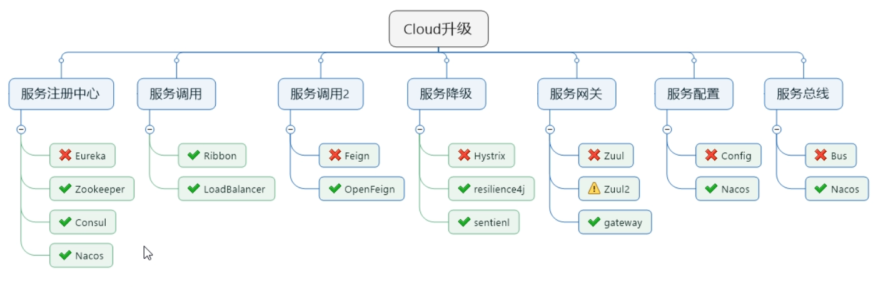

红叉代表停止更新，已经或者即将淘汰的，绿色的是市面上正在大范围用的，或者推荐使用的。

springcloud官方文档：https://cloud.spring.io/spring-cloud-static/Hoxton.SR1/reference/htmlsingle/

中文文档：https://www.bookstack.cn/read/spring-cloud-docs/docs-index.md

springboot官方文档：https://docs.spring.io/spring-boot/docs/2.2.2.RELEASE/reference/htmlsingle/

# 基本项目构建

构建两个基本项目：一个订单系统的服务端和客户端，服务端有订单系统查询和新建的controller、service和dao类，客户端只有conroller类，其他逻辑通过调用订单系统的服务端来完成，调用动作主要是通过RestTemplate类来完成的。

RestTemplate类是spring提供的用于访问Rest服务的客户端模板工具集，提供了多种远程访问http服务的方法。

在订单系统的客户端服务中，将RestTemplate注入容器中：

~~~java
@Configuration
public class ApplicationContextConfig {
    @Bean
    public RestTemplate getRestTemplate(){
        return new RestTemplate();
    }
}
~~~

然后在controller中直接用它来发起http请求，访问订单的服务端服务：

~~~java
public class OrderController {

    public static final String PAYMENT_URL = "http://localhost:8001";

    @Resource
    private RestTemplate restTemplate;

    @GetMapping("/consumer/payment/create")
    public CommonResult<Payment>   create(Payment payment){
        return restTemplate.postForObject(PAYMENT_URL+"/payment/create",payment,CommonResult.class);  //写操作
    }

    @GetMapping("/consumer/payment/get/{id}")
    public CommonResult<Payment> getPayment(@PathVariable("id") Long id){
        return restTemplate.getForObject(PAYMENT_URL+"/payment/get/"+id,CommonResult.class);
    }
}
~~~

分别通过postForObject和getForObject方法发起http请求，入参分别是url、请求参数和返回值类型。

订单消费服务的配置文件：

~~~yaml
server:
  port: 8001

spring:
  application:
    name: cloud-payment-service
  datasource:
    type: com.alibaba.druid.pool.DruidDataSource
    driver-class-name: org.gjt.mm.mysql.Driver
    url: jdbc:mysql://localhost:3306/db2019?useUnicode=true&characterEncoding=utf-8&useSSL=false
    username: root
    password: 1228

mybatis:
  mapperLocations: classpath:mapper/*.xml
  type-aliases-package: com.atguigu.springcloud.entities
~~~

订单服务端工程的配置文件：

~~~yaml
server:
  port: 8001

spring:
  application:
    name: cloud-order-service
~~~

# Eureka服务注册与发现

##Eureka基础知识

Spring Cloud封装了Netflix公司开发的Eureka模块来实现服务治理

服务治理用于管理服务与服务之间的依赖关系，可以实现服务调用、负载均衡、容错等，实现服务发现与注册。

Eureka采用了CS的设计架构，Eureka Server作为服务注册功能的服务器，它是服务注册中心，系统中的其他微服务使用Eureka的客户端连接到注册中心（将服务地址相关信息注册到注册中心）并维持心跳连接，这样Eureka就可以监控系统中各个微服务是否正常运行

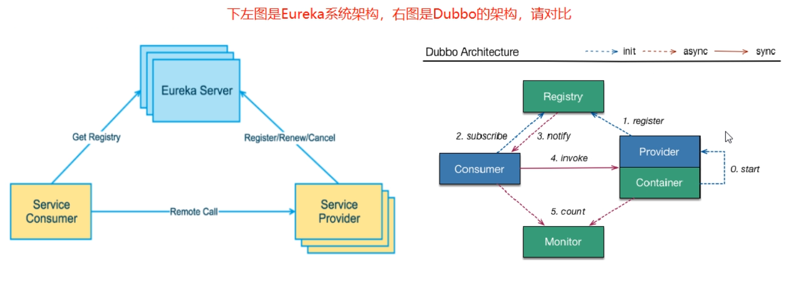

Eureka的两个组件：Eureka Server和EurekaClient

前者提供服务注册服务，各微服务节点启动后，Eureka Server中的服务注册表中会存储所有可用服务节点的信息，服务节点的信息可以在界面中直观看到。

后者可以通过注册中心访问服务，内部具备一个内置的、使用轮询负载算法的负载均衡器，在应用启动后，将会向Eureka Server发送心跳（默认30秒），若多个心跳周期内（默认90秒）没有接收到某个节点的心跳，则Eureka Server将会从服务注册表中把这个服务节点移除

## 单机Eureka构建

首先建立一个单独的工程作为Eureka Server，引入Eureka Server的依赖：

~~~xml
<dependencies>
    <dependency>
        <groupId>org.springframework.cloud</groupId>
        <artifactId>spring-cloud-starter-netflix-eureka-server</artifactId>
    </dependency>
</dependencies>
~~~

在该工程中引入配置文件：

~~~yaml
server:
  port: 7001

eureka:
  instance:
    hostname: localhost  #eureka服务端的实例名字
  client:
    register-with-eureka: false    #表识不向注册中心注册自己
    fetch-registry: false   #表示自己就是注册中心，职责是维护服务实例，并不需要去检索服务
     service-url:
      defaultZone: http://${eureka.instance.hostname}:${server.port}/eureka/    #设置与eureka server交互的地址查询服务和注册服务都需要依赖这个地址
~~~

该工程中的主启动类要标明@EnableEurekaServer：

~~~java
@EnableEurekaServer
@SpringBootApplication
public class EurekaMain7001 {
    public static void main(String[] args) {
        SpringApplication.run(EurekaMain7001.class,args);
    }
}
~~~

直接访问该工程：http://localhost:7001/，就能看到Eureka的管理页面：

如果要把某个工程注册进Eureka管理，需要先在对应工程引入Eureka client的依赖：

~~~xml
<dependency>
      <groupId>org.springframework.cloud</groupId>
      <artifactId>spring-cloud-starter-netflix-eureka-client</artifactId>
</dependency>
~~~

在对应工程的配置中加入Eureka的地址和其他配置：

~~~yaml
eureka:
  client:
    register-with-eureka: true
    fetchRegistry: true
    service-url:
      defaultZone: http://localhost:7001/eureka
~~~

然后将需要纳入Eureka管理的工程主启动类加上@EnableEurekaClient注解：

~~~java
@EnableEurekaClient
@SpringBootApplication
public class PaymentMain8001 {
    public static void main(String[] args) {
        SpringApplication.run(PaymentMain8001.class,args);
    }
}
~~~

启动时，先启动Eureka Server节点，然后再启动其他要注册进去的服务，启动后访问Eureka可以看到服务已经被注册到了注册中心：

可以看到在注册中心处看到的服务名和配置文件中的name相同：

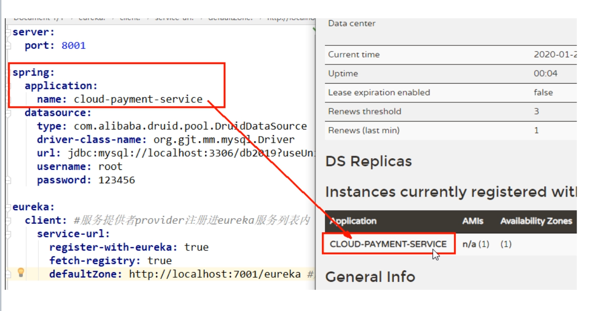

注意，在写Eureka的地址时，前面要加空格：

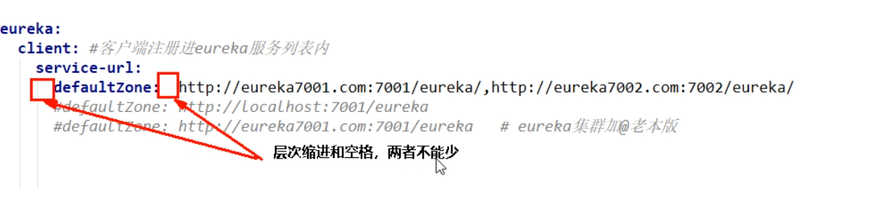

## 集群Eureka构建

Eureka集群主要是将注册中心部署在多个节点上，将服务的提供者部署在多个节点上，这样就不会出现单点故障：

参照之前的注册中心构建多个注册中心，每个注册中心配置中的地址都填写对方的地址，相互守护：

注册中心1：

~~~yaml
server:
  port: 7001

eureka:
  instance:
    hostname: eureka7001.com    #eureka服务端的实例名字
  client:
    register-with-eureka: false    #表识不向注册中心注册自己
    fetch-registry: false   #表示自己就是注册中心，职责是维护服务实例，并不需要去检索服务
    service-url:
      defaultZone: http://eureka7002.com:7002/eureka/    #设置与eureka server交互的地址查询服务和注册服务都需要依赖这个地址
~~~

注册中心2：

~~~yaml
server:
  port: 7002

eureka:
  instance:
    hostname: eureka7002.com #eureka服务端的实例名字
  client:
    register-with-eureka: false    #表识不向注册中心注册自己
    fetch-registry: false   #表示自己就是注册中心，职责是维护服务实例，并不需要去检索服务
    service-url:
      defaultZone: http://eureka7001.com:7001/eureka/     #设置与eureka server交互的地址查询服务和注册服务都需要依赖这个地址
~~~

在要注册到注册中心的服务配置中，注册中心的地址同时写多个节点的：（eureka7001.com在本地的hosts文件中映射到了一个IP地址）

~~~yaml
service-url:
  defaultZone: http://eureka7001.com:7001/eureka,http://eureka7002.com:7002/eureka  #集群版
~~~

构建了多个订单消费节点之后，远程访问服务也不能写成固定的地址了，需要用服务名替代原来的IP地址：

~~~java
public static final String PAYMENT_URL = "http://localhost:8001";

    @Resource
    private RestTemplate restTemplate;

    @GetMapping("/consumer/payment/create")
    public CommonResult<Payment>   create(Payment payment){
        return restTemplate.postForObject(PAYMENT_URL+"/payment/create",payment,CommonResult.class);  //写操作
    }

修改后：
public static final String PAYMENT_URL = "http://CLOUD-PAYMENT-SERVICE";
~~~

同时要在调用远程方法的RestTemplate上加上默认的轮询负载均衡策略：

~~~java
	@Bean
    @LoadBalance
    public RestTemplate getRestTemplate(){
        return new RestTemplate();
    }
~~~

然后在订单消费服务中将工程端口打印出来，就可以看到，调用订单查询服务时，是用轮询的策略在调用两个不同的订单服务端：

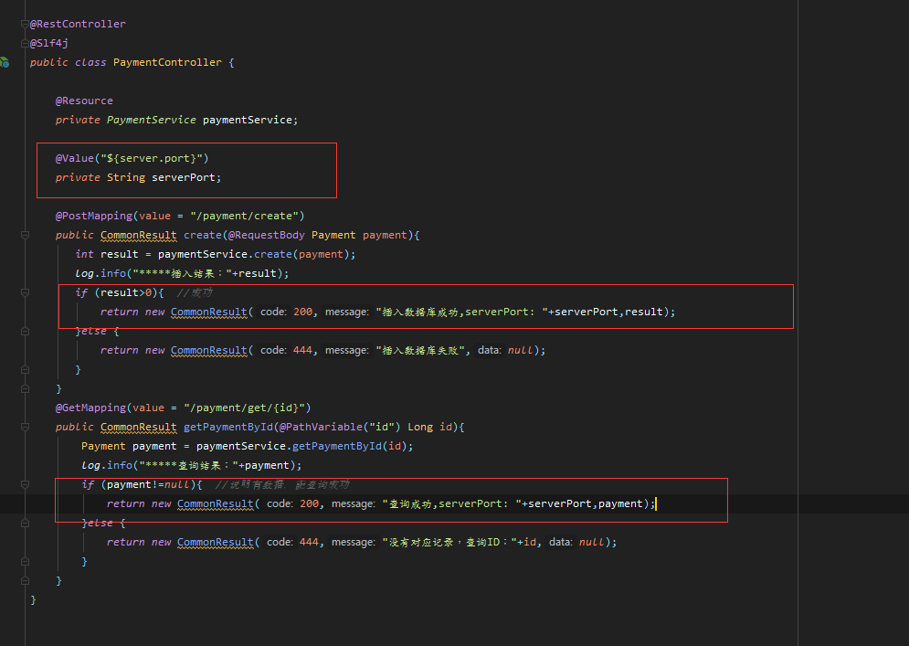

## actuator微服务信息完善

一个服务的多个主机展示用服务名不用主机名：

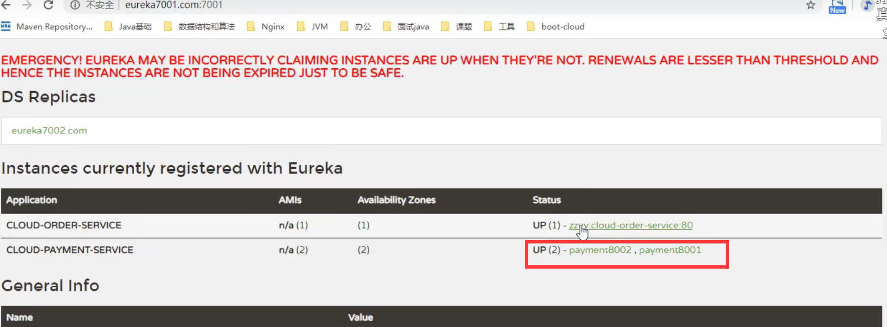

方法是在对应服务的配置文件中加入：

~~~yaml
instance:
    instance-id: payment8001
~~~

鼠标移动到主机名（上图红框部分）显示IP地址，需要配置：

~~~yaml
prefer-ip-address: true
~~~

## 服务发现Discovery

注册到Eureka的服务，可以通过注入一个对象来获取Eureka中的所有服务信息：

~~~java
@Resource
private DiscoveryClient discoveryClient;
 
 
@GetMapping(value = "/payment/discovery")
public Object discovery(){
    List<String> services = discoveryClient.getServices();
    for (String element : services) {
        log.info("***** element:"+element);
    }
    List<ServiceInstance> instances = discoveryClient.getInstances("CLOUD-PAYMENT-SERVICE");
    for (ServiceInstance instance : instances) {
        log.info(instance.getServiceId()+"\t"+instance.getHost()+"\t"+instance.getPort()+"\t"+instance.getUri());
    }
    return this.discoveryClient;
}
~~~

## Eureka自我保护

在上图中可以发现在Eureka的访问页面可以看到一行红字，这行红字代表Eureka处于保护模式，保护模式中Eureka Server会保护其服务注册表中的信息，不再删除服务注册表中的数据，不会注销任何微服务。

这个保护模式主要是为了应对，Eureka Client可以正常运行，但是与Eureka Server网络不通的情况下，EurekaServer不会立刻剔除服务。

Eureka默认在90秒内没有收到心跳就会注销该服务，但是当短时间内丢失过多客户端时（可能发生了网络分区故障），这个节点就会进入自我保护模式。这种自我保护属于CAP中的AP分支。

有几个和自我保护相关的默认配置：

~~~properties
eureka.server.enable-self-preservation = true // 自我保护机制开启
eureka.instance.lease-renewal-interval-in-seconds=30  // 客户端向服务端发送心跳的时间间隔，单位是秒
eureka.instance.lease-expiration-duration-in-seconds=90  // 服务端收到最后一次客户端心跳之后的等待上限，单位是秒，超过之后将会剔除
~~~

# zookeeper服务注册与发现

首先先将zk部署在服务器上，然后关闭防火墙。

## 部署服务提供者

首先引入pom文件，其中关键是spring-cloud-starter-zookeeper-discovery

~~~xml
<?xml version="1.0" encoding="UTF-8"?>
<project xmlns="http://maven.apache.org/POM/4.0.0"
         xmlns:xsi="http://www.w3.org/2001/XMLSchema-instance"
         xsi:schemaLocation="http://maven.apache.org/POM/4.0.0 http://maven.apache.org/xsd/maven-4.0.0.xsd">
    <parent>
        <artifactId>cloud2020</artifactId>
        <groupId>com.atguigu.springcloud</groupId>
        <version>1.0-SNAPSHOT</version>
    </parent>
    <modelVersion>4.0.0</modelVersion>

    <artifactId>cloud-provider-payment8004</artifactId>

    <dependencies>

        <dependency>
            <groupId>com.atguigu.springcloud</groupId>
            <artifactId>cloud-api-commons</artifactId>
            <version>${project.version}</version>
        </dependency>

        <!-- https://mvnrepository.com/artifact/org.springframework.boot/spring-boot-starter-web -->
        <dependency>
            <groupId>org.springframework.boot</groupId>
            <artifactId>spring-boot-starter-web</artifactId>
        </dependency>

        <!-- https://mvnrepository.com/artifact/org.springframework.boot/spring-boot-starter-web -->
        <dependency>
            <groupId>org.springframework.boot</groupId>
            <artifactId>spring-boot-starter-actuator</artifactId>
        </dependency>

       <!-- https://mvnrepository.com/artifact/org.springframework.cloud/spring-cloud-starter-zookeeper-discovery -->
        <dependency>
            <groupId>org.springframework.cloud</groupId>
            <artifactId>spring-cloud-starter-zookeeper-discovery</artifactId>
            <!--排除zk3.5.3-->
            <exclusions>
                <exclusion>
                    <groupId>org.apache.zookeeper</groupId>
                    <artifactId>zookeeper</artifactId>
                </exclusion>
            </exclusions>
        </dependency>
            <!--添加zk 3.4,9版本-->
        <!-- https://mvnrepository.com/artifact/org.apache.zookeeper/zookeeper -->
        <dependency>
            <groupId>org.apache.zookeeper</groupId>
            <artifactId>zookeeper</artifactId>
            <version>3.4.9</version>
        </dependency>

        <!-- https://mvnrepository.com/artifact/org.springframework.boot/spring-boot-devtools -->
        <dependency>
            <groupId>org.springframework.boot</groupId>
            <artifactId>spring-boot-devtools</artifactId>
            <scope>runtime</scope>
            <optional>true</optional>
        </dependency>

        <!-- https://mvnrepository.com/artifact/org.projectlombok/lombok -->
        <dependency>
            <groupId>org.projectlombok</groupId>
            <artifactId>lombok</artifactId>
            <optional>true</optional>
        </dependency>

        <!-- https://mvnrepository.com/artifact/org.springframework.boot/spring-boot-starter-test -->
        <dependency>
            <groupId>org.springframework.boot</groupId>
            <artifactId>spring-boot-starter-test</artifactId>
            <scope>test</scope>
        </dependency>

    </dependencies>

</project>
~~~

然后在服务配置中指定服务名和zk的地址：

~~~yaml
server:
  port: 8004

spring:
  application:
    name: cloud-provider-payment
  cloud:
    zookeeper:
      connect-string: 192.168.136.140:2181
~~~

编写主启动类：

~~~java
@SpringBootApplication
@EnableDiscoveryClient  // 整合zk必备的注解
public class PaymentMain8004 {
    public static void main(String[] args) {
        SpringApplication.run(PaymentMain8004.class,args);
    }
}
~~~

启动后就可以观察到zk中存在这个服务名：

.bmp)

用get命令可以获取服务的信息：

.bmp)

在zk中的服务注册信息是临时节点，当某个注册进zk的服务下线超过一段时间时，zk就会自动将节点信息删除。

## 部署服务消费者

引入pom文件：

~~~xml

    <dependencies>

        <dependency>
            <groupId>com.atguigu.springcloud</groupId>
            <artifactId>cloud-api-commons</artifactId>
            <version>${project.version}</version>
        </dependency>

        <!-- https://mvnrepository.com/artifact/org.springframework.boot/spring-boot-starter-web -->
        <dependency>
            <groupId>org.springframework.boot</groupId>
            <artifactId>spring-boot-starter-web</artifactId>
        </dependency>

        <!-- https://mvnrepository.com/artifact/org.springframework.boot/spring-boot-starter-web -->
        <dependency>
            <groupId>org.springframework.boot</groupId>
            <artifactId>spring-boot-starter-actuator</artifactId>
        </dependency>

        <!-- https://mvnrepository.com/artifact/org.springframework.cloud/spring-cloud-starter-zookeeper-discovery -->
        <dependency>
            <groupId>org.springframework.cloud</groupId>
            <artifactId>spring-cloud-starter-zookeeper-discovery</artifactId>
        </dependency>

        <!-- https://mvnrepository.com/artifact/org.springframework.boot/spring-boot-devtools -->
        <dependency>
            <groupId>org.springframework.boot</groupId>
            <artifactId>spring-boot-devtools</artifactId>
            <scope>runtime</scope>
            <optional>true</optional>
        </dependency>

        <!-- https://mvnrepository.com/artifact/org.projectlombok/lombok -->
        <dependency>
            <groupId>org.projectlombok</groupId>
            <artifactId>lombok</artifactId>
            <optional>true</optional>
        </dependency>

        <!-- https://mvnrepository.com/artifact/org.springframework.boot/spring-boot-starter-test -->
        <dependency>
            <groupId>org.springframework.boot</groupId>
            <artifactId>spring-boot-starter-test</artifactId>
            <scope>test</scope>
        </dependency>
    </dependencies>
~~~

然后在配置文件中配置服务名和zk的地址：

~~~yaml
server:
  port: 80

spring:
  application:
    name: cloud-consumer-order
  cloud:
    zookeeper:
      connect-string: 192.168.136.140:2181
~~~

编写相同的主启动类，并将RestTemplate注册进容器：

~~~java
@Configuration
public class ApplicationContextConfig {

    @LoadBalanced
    @Bean
    public RestTemplate getRestTemplate(){
        return new RestTemplate();
    }

}
~~~

然后在controller中访问服务的提供者：

~~~java
@RestController
@Slf4j
public class OrderZKController {

    public static final String INVOME_URL = "http://cloud-provider-payment";

    @Resource
    private RestTemplate restTemplate;

    @GetMapping("/consumer/payment/zk")
    public String payment (){
      String result = restTemplate.getForObject(INVOME_URL+"/payment/zk",String.class);
      return result;
    }
}
~~~

然后就可以顺利访问。

# Consul服务注册与发现

consul是一套开源的分布式服务发现和配置管理系统，由HashiCorp公司用Go语言开发，它提供了微服务系统中的服务治理、配置中心、控制总线等功能，这些功能中的每一个都可以根据需要单独使用。它有很多优点，包括：基于raft协议，比较简洁；支持健康检查，同时支持HTTP和DNS协议，支持跨数据中心的WAN集群，提供图形界面，支持linux、Mac、Windows

安装完Consul之后，想把服务注册到Consul，需要先引入对应的依赖spring-cloud-starter-consul-discovery：

~~~xml
<?xml version="1.0" encoding="UTF-8"?>
<project xmlns="http://maven.apache.org/POM/4.0.0"
         xmlns:xsi="http://www.w3.org/2001/XMLSchema-instance"
         xsi:schemaLocation="http://maven.apache.org/POM/4.0.0 http://maven.apache.org/xsd/maven-4.0.0.xsd">
    <parent>
        <artifactId>cloud2020</artifactId>
        <groupId>com.atguigu.springcloud</groupId>
        <version>1.0-SNAPSHOT</version>
    </parent>
    <modelVersion>4.0.0</modelVersion>

    <artifactId>cloud-consumerconsul-order80</artifactId>

    <dependencies>
        <!-- https://mvnrepository.com/artifact/org.springframework.cloud/spring-cloud-starter-consul-discovery -->
        <dependency>
            <groupId>org.springframework.cloud</groupId>
            <artifactId>spring-cloud-starter-consul-discovery</artifactId>
        </dependency>

        <dependency>
            <groupId>com.atguigu.springcloud</groupId>
            <artifactId>cloud-api-commons</artifactId>
            <version>${project.version}</version>
        </dependency>

        <!-- https://mvnrepository.com/artifact/org.springframework.boot/spring-boot-starter-web -->
        <dependency>
            <groupId>org.springframework.boot</groupId>
            <artifactId>spring-boot-starter-web</artifactId>
        </dependency>

        <!-- https://mvnrepository.com/artifact/org.springframework.boot/spring-boot-starter-web -->
        <dependency>
            <groupId>org.springframework.boot</groupId>
            <artifactId>spring-boot-starter-actuator</artifactId>
        </dependency>

        <!-- https://mvnrepository.com/artifact/org.springframework.boot/spring-boot-devtools -->
        <dependency>
            <groupId>org.springframework.boot</groupId>
            <artifactId>spring-boot-devtools</artifactId>
            <scope>runtime</scope>
            <optional>true</optional>
        </dependency>

        <!-- https://mvnrepository.com/artifact/org.projectlombok/lombok -->
        <dependency>
            <groupId>org.projectlombok</groupId>
            <artifactId>lombok</artifactId>
            <optional>true</optional>
        </dependency>

        <!-- https://mvnrepository.com/artifact/org.springframework.boot/spring-boot-starter-test -->
        <dependency>
            <groupId>org.springframework.boot</groupId>
            <artifactId>spring-boot-starter-test</artifactId>
            <scope>test</scope>
        </dependency>
    </dependencies>
</project>
~~~

然后在配置文件中提供服务名和consul地址：

~~~yaml
server:
  port: 80

spring:
  application:
    name: consul-consumer-order
  cloud:
    consul:
      host: localhost
      port: 8500
      discovery:
        service-name: ${spring.application.name}
~~~

剩下的操作部分和zk完全一致。

# 三种注册中心的对比

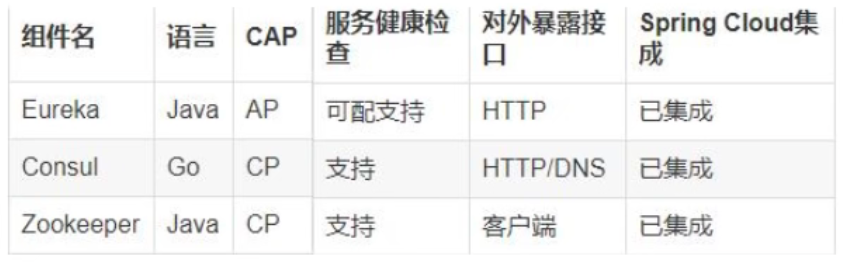

CAP理论：

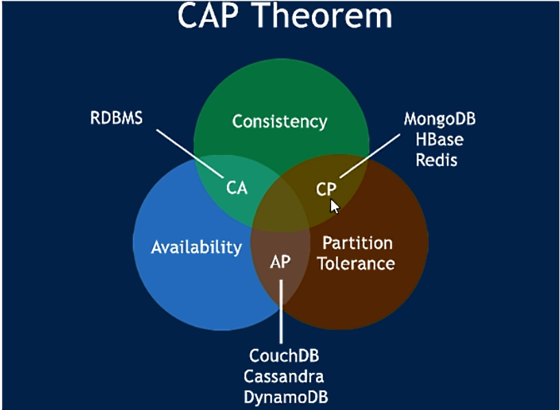

CAP是关注数据的策略，C是Consistency强一致性、A是Availability可用性，P是Partition tolerance分区容错性。

其中Eureka是AP（出现网络分区时为了保证可用性返回旧值）、zk和consul是CP（出现网络分区时为了保证一致性拒绝服务请求）

# Ribbon服务调用

springcloud ribbon是基于netflix ribbon实现的一套客户端负载均衡和服务调用工具。

https://github.com/Netflix/ribbon/wiki/Getting-Started

## 概念和原理

负载均衡就是将用户的请求平摊分配到多个服务上，达到系统的HA（高可用），分为集中式LB和进程内LB。

nginx是服务器负载调用，客户端的所有请求都会交给nginx，然后由nginx实现转发请求，即负载均衡是由服务端实现的。同时nginx也是集中式LB，它是在服务的消费方和提供方之间独立使用的LB设施。

ribbon是本地负载均衡，在调用微服务接口的时候，会在注册中心上获取注册信息服务列表之后缓存到JVM本地，从而在本地实现RPC远程服务调用技术。ribbon是进程内LB，在消费方进程中起作用。

简单来说，ribbon就是负载均衡+RestTemplate调用。

架构图：

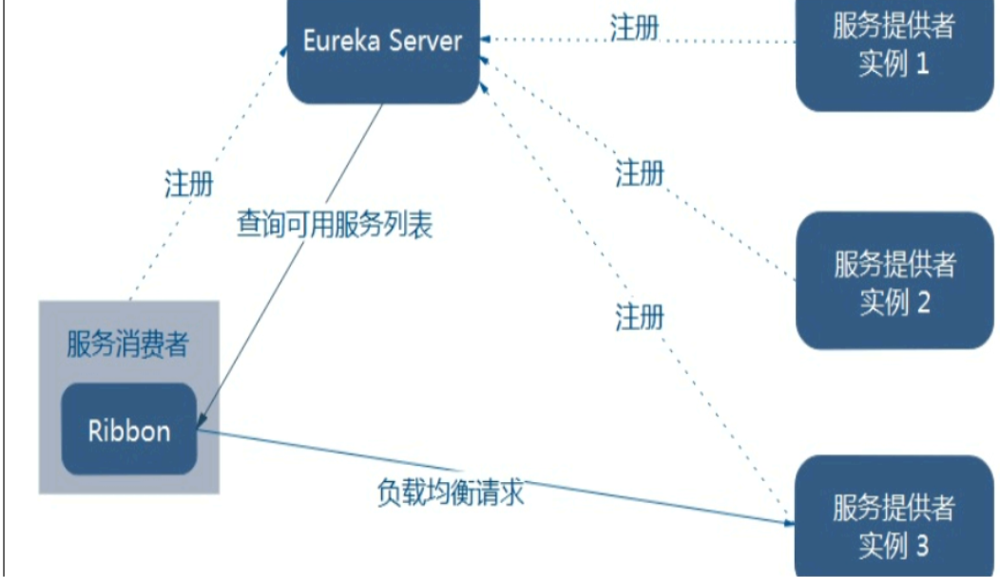

ribbon在工作时分为两步：

1、选择一个区域内负载较少的注册中心server

2、根据用户指定的策略，在从server取到的服务注册列表中选择一个地址

## ribbon的基本使用

ribbon一般不用单独引入依赖，在之前的Eureka client中就自动引用了ribbon：

 

RestTemplate主要是两个方法：getForObject方法/getForEntity方法：

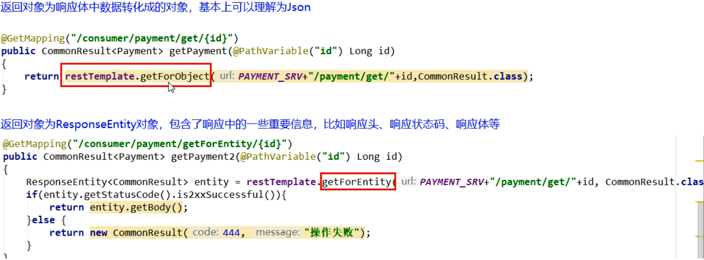

## 自定义负载均衡策略

IRule是负载均衡算法的顶层接口，它根据特定算法从服务列表中选取一个要访问的服务：

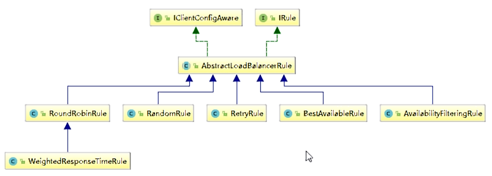

要换成其他的负载均衡策略，需要将rule注册进spring容器，这里注意，注册rule的自定义配置类不能放在@ComponentScan所扫描的当前包和子包下，也就是说这个自定义配置类不能放在主启动类的扫描范围内，位置上要放在另一个文件夹。否则这个配置就会被所有的ribbon客户端共享，达不到特殊化定制的目的了。

自定义随机策略的负载均衡机制：

~~~java
@Configuration
public class MySelfRule {

    @Bean
    public IRule myRule(){
        return new RandomRule();//定义为随机
    }
}
~~~

在主启动类上加上RibbonClient注解，指明访问对应服务的负载均衡策略：

~~~java
@EnableEurekaClient
@SpringBootApplication
@RibbonClient(name = "CLOUD-PAYMENT-SERVICE",configuration = MySelfRule.class)
public class OrderMain80 {
    public static void main(String[] args) {
        SpringApplication.run(OrderMain80.class,args);
    }

}
~~~

除此之外还有其他几种负载均衡策略：

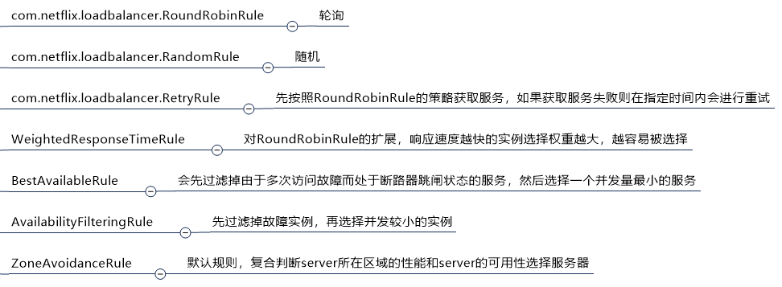

## Ribbon负载均衡算法原理

简单来说一句话：rest接口第几次请求次数 % 服务器集群总数量 = 实际调用服务器位置下标

我们可以自定义一个轮询负载均衡算法类，首先去掉@LoadBalanced注解，实现自定义负载均衡的程序入口就是getPaymentLB，在这个方法中会通过服务发现DiscoveryClient获取所有的服务列表，然后根据负载均衡算法将待调取的服务计算出来，然后执行调用逻辑：

~~~java
package com.atguigu.springcloud.controller;

import com.atguigu.springcloud.entities.CommonResult;
import com.atguigu.springcloud.entities.Payment;
import com.atguigu.springcloud.lb.LoadBalancer;
import lombok.extern.slf4j.Slf4j;
import org.springframework.cloud.client.ServiceInstance;
import org.springframework.cloud.client.discovery.DiscoveryClient;
import org.springframework.http.ResponseEntity;
import org.springframework.web.bind.annotation.GetMapping;
import org.springframework.web.bind.annotation.PathVariable;
import org.springframework.web.bind.annotation.RequestBody;
import org.springframework.web.bind.annotation.RestController;
import org.springframework.web.client.RestTemplate;

import javax.annotation.Resource;
import java.net.URI;
import java.util.List;

@RestController
@Slf4j
public class OrderController {

   // public static final String PAYMENT_URL = "http://localhost:8001";
    public static final String PAYMENT_URL = "http://CLOUD-PAYMENT-SERVICE";

    @Resource
    private RestTemplate restTemplate;

    @Resource
    private LoadBalancer loadBalancer;

    @Resource
    private DiscoveryClient discoveryClient;

    @GetMapping("/consumer/payment/create")
    public CommonResult<Payment>   create( Payment payment){
        return restTemplate.postForObject(PAYMENT_URL+"/payment/create",payment,CommonResult.class);  //写操作
    }

    @GetMapping("/consumer/payment/get/{id}")
    public CommonResult<Payment> getPayment(@PathVariable("id") Long id){
        return restTemplate.getForObject(PAYMENT_URL+"/payment/get/"+id,CommonResult.class);
    }

    @GetMapping("/consumer/payment/getForEntity/{id}")
     public CommonResult<Payment> getPayment2(@PathVariable("id") Long id){
        ResponseEntity<CommonResult> entity = restTemplate.getForEntity(PAYMENT_URL+"/payment/get/"+id,CommonResult.class);
        if (entity.getStatusCode().is2xxSuccessful()){
          //  log.info(entity.getStatusCode()+"\t"+entity.getHeaders());
            return entity.getBody();
        }else {
            return new CommonResult<>(444,"操作失败");
        }
     }

    @GetMapping(value = "/consumer/payment/lb")
     public String getPaymentLB(){
        List<ServiceInstance> instances = discoveryClient.getInstances("CLOUD-PAYMENT-SERVICE");
        if (instances == null || instances.size() <= 0){
            return null;
        }
        ServiceInstance serviceInstance = loadBalancer.instances(instances);
        URI uri = serviceInstance.getUri();
        return restTemplate.getForObject(uri+"/payment/lb",String.class);
    }
}
~~~

自定义的负载均衡逻辑在LoadBalancer中：

~~~java
@Component
public class MyLB implements LoadBalancer {

    private AtomicInteger atomicInteger = new AtomicInteger(0);

    //坐标
    private final int getAndIncrement(){
        int current;
        int next;
        do {
            current = this.atomicInteger.get();
            next = current >= 2147483647 ? 0 : current + 1;
        }while (!this.atomicInteger.compareAndSet(current,next));  //第一个参数是期望值，第二个参数是修改值是
        System.out.println("*******第几次访问，次数next: "+next);
        return next;
    }

    @Override
    public ServiceInstance instances(List<ServiceInstance> serviceInstances) {  //得到机器的列表
       int index = getAndIncrement() % serviceInstances.size(); //得到服务器的下标位置
        return serviceInstances.get(index);
    }
}
~~~

为了解决并发调用的问题使用了乐观锁（原子操作类），只有当自增成功的时候才获取索引，否则继续重试

# OpenFeign服务调用

Feign是一个声明式的WebService客户端，能让编写web Service变得更简单，springcloud对Feign进行了封装，使其支持了Springmvc的标准注解和HttpMessageConverts

在前面使用ribbon时虽然也能完成远程调用，但是由于多处调用，常常要为相同的调用逻辑封装一些客户端类，对此Feign在此基础上进行了进一步封装，它可以通过注解来简单的实现远程微服务之间的接口调用。Feign集成了ribbon，使服务调用更优雅简单。

Feign和OpenFeign的区别：

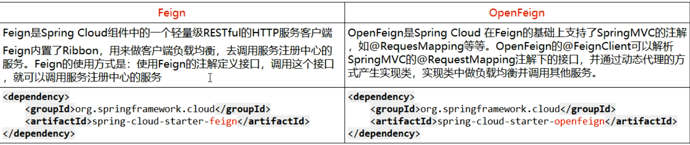

## OpenFeign的基本使用

feign在服务消费端使用，首先引入依赖spring-cloud-starter-openfeign：

~~~xml
<?xml version="1.0" encoding="UTF-8"?>
<project xmlns="http://maven.apache.org/POM/4.0.0"
         xmlns:xsi="http://www.w3.org/2001/XMLSchema-instance"
         xsi:schemaLocation="http://maven.apache.org/POM/4.0.0 http://maven.apache.org/xsd/maven-4.0.0.xsd">
    <parent>
        <artifactId>cloud2020</artifactId>
        <groupId>com.atguigu.springcloud</groupId>
        <version>1.0-SNAPSHOT</version>
    </parent>
    <modelVersion>4.0.0</modelVersion>

    <artifactId>cloud-consumer-feign-order80</artifactId>

    <!--openfeign-->
    <dependencies>
        <dependency>
            <groupId>org.springframework.cloud</groupId>
            <artifactId>spring-cloud-starter-openfeign</artifactId>
        </dependency>
        <dependency>
            <groupId>org.springframework.cloud</groupId>
            <artifactId>spring-cloud-starter-netflix-eureka-client</artifactId>
        </dependency>
        <dependency>
            <groupId>com.atguigu.springcloud</groupId>
            <artifactId>cloud-api-common</artifactId>
            <version>${project.version}</version>
        </dependency>
        <dependency>
            <groupId>org.springframework.boot</groupId>
            <artifactId>spring-boot-starter-web</artifactId>
        </dependency>

        <dependency>
            <groupId>org.springframework.boot</groupId>
            <artifactId>spring-boot-starter-actuator</artifactId>
        </dependency>

        <dependency>
            <groupId>org.springframework.boot</groupId>
            <artifactId>spring-boot-devtools</artifactId>
            <scope>runtime</scope>
            <optional>true</optional>
        </dependency>

        <dependency>
            <groupId>org.projectlombok</groupId>
            <artifactId>lombok</artifactId>
            <optional>true</optional>
        </dependency>
        <dependency>
            <groupId>org.springframework.boot</groupId>
            <artifactId>spring-boot-starter-test</artifactId>
            <scope>test</scope>
        </dependency>
    </dependencies>
</project>
~~~

在配置文件中指定注册中心的地址，这里可以不把服务调用的客户端注册进注册中心：

~~~yaml
server:
  port: 80
eureka:
  client:
    register-with-eureka: false
    service-url:
      defaultZone: http://eureka7001.com:7001/eureka, http://eureka7002.com:7002/eureka
~~~

然后在主启动类上加上EnableFeignClients注解：

~~~java
@SpringBootApplication
@EnableFeignClients
public class OrderFeignMain80 {
    public static void main(String[] args) {
        SpringApplication.run(OrderFeignMain80.class,args);
    }
}
~~~

新增远程调用的接口，相当于调用PaymentFeignService类的getPaymentById方法就是访问CLOUD-PAYMENT-SERVICE服务的对应路径方法

~~~java
@Component
@FeignClient(value = "CLOUD-PAYMENT-SERVICE")
public interface PaymentFeignService {

    @GetMapping(value = "/payment/get/{id}")
    public CommonResult getPaymentById(@PathVariable("id") Long id);
}
~~~

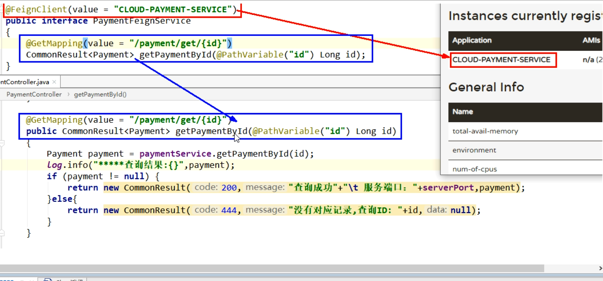

在controller层直接调用它即可：

~~~java
@RestController
public class OrderFeignController {

    @Resource
    private PaymentFeignService paymentFeignService;

    @GetMapping(value = "/consumer/payment/get/{id}")
    public CommonResult<Payment> getPaymentById(@PathVariable("id") Long id){
       return paymentFeignService.getPaymentById(id);
    }
}
~~~

## OpenFeign超时控制

OpenFeign调用服务时默认等待一秒钟，超过后报错，如果被调用的服务处理很耗时就会报错，此时就要调整配置：

~~~yaml
ribbon:
  ReadTimeout:  5000  # 建立连接所用时间的上限
  ConnectTimeout: 5000  # 建立连接到服务器返回可用的时间上限
~~~

## OpenFeign日志打印

Feign提供了日志打印功能，我们可以通过配置来调整日志级别，从而了解Feign中http请求的细节，其实就是对Feign接口的调用情况进行监控和输出。

几种日志策略：

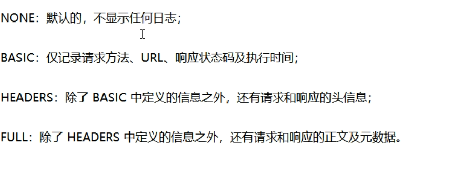

配置日志的策略：

~~~java
@Configuration
public class FeignConfig {

    @Bean
    Logger.Level feignLoggerLevel(){
        return Logger.Level.FULL;
    }
}
~~~

在配置文件中开启日志功能：

~~~yaml
logging:
  level:
    com.atguigu.springcloud.service.PaymentFeignService: debug
~~~

# Hystrix断路器

## 概述

分布式系统面临的问题：复杂分布式体系结构中的应用程序有数十个依赖关系，每个依赖关系在某些时候将不可避免的失败。

当多个微服务之间互相调用的时候，比如A调用B和C，B和C又调用其他的服务，这就是所谓的扇出，当扇出的链路上某个微服务的调用响应时间过长或者不可用，对微服务A的调用占用越来越多的系统资源（服务之间的延迟增加，备份队列，线程和其他系统资源紧张，导致发生更多级联故障），进而引起系统崩溃，这就是所谓的雪崩效应。

Hystrix是一个用于处理分布式系统的延迟和容错的开源库，在分布式系统里，许多依赖不可避免的会调用失败，比如超时、异常等，Hystrix能够保证在一个依赖出问题的情况下，不会导致整体服务失败，避免级联故障，以提高分布式系统的弹性。

https://github.com/Netflix/Hystrix/wiki/How-To-Use

Hystrix的重要概念：

1、服务降级：服务器忙，请稍候再试，不让客户端等待并立刻返回一个友好提示，fallback。触发降级的场景：程序运行异常、超时、服务熔断触发服务降级、线程池/信号量打满也会导致服务降级

2、服务熔断：类比保险丝达到最大服务访问后，直接拒绝访问，拉闸限电，然后调用服务降级的方法并返回友好提示（和降级的区别是，降级对于新的请求还尝试访问，熔断对于新的请求已经直接跳过访问了）

3、服务限流：秒杀高并发等操作，严禁一窝蜂的过来拥挤，大家排队，一秒钟N个，有序进行

在实际项目中，如果同时有两个接口被调用，其中一个耗时较长，一个耗时较短，当耗时长的接口访问并发量增加时，耗时短的接口响应时间也会变得很长，这是因为tomcat线程里面的工作线程已经被挤占完毕，一个接口的慢调用会影响服务中的其他接口。

## 服务降级

在服务的提供方增加一个异常控制机制，设置自身调用超时时间的峰值，在峰值内可以正常运行，超过了就执行异常处理的方法，作为服务降级fallback

首先引入Hystrix的依赖：

~~~xml
<dependency>
    <groupId>org.springframework.cloud</groupId>
    <artifactId>spring-cloud-starter-netflix-hystrix</artifactId>
</dependency>
~~~

然后在主启动类上加上@EnableCircuitBreaker

然后使用@HystrixCommand来提供兜底方法，paymentInfo_TimeOut方法抛出异常或者超时3s，就会执行paymentInfo_TimeOutHandler方法：

~~~java
@Service
public class PaymentService {

    //成功
    public String paymentInfo_OK(Integer id){
        return "线程池："+Thread.currentThread().getName()+"   paymentInfo_OK,id：  "+id+"\t"+"哈哈哈"  ;
    }

    //失败
    @HystrixCommand(fallbackMethod = "paymentInfo_TimeOutHandler",commandProperties = {
            @HystrixProperty(name = "execution.isolation.thread.timeoutInMilliseconds",value = "3000")  //3秒钟以内就是正常的业务逻辑
    })
    public String paymentInfo_TimeOut(Integer id){
       // int timeNumber = 5;
        int age = 10/0;
       // try { TimeUnit.SECONDS.sleep(timeNumber); }catch (Exception e) {e.printStackTrace();}
        //return "线程池："+Thread.currentThread().getName()+"   paymentInfo_TimeOut,id：  "+id+"\t"+"呜呜呜"+" 耗时(秒)"+timeNumber;
        return "线程池："+Thread.currentThread().getName()+"   paymentInfo_TimeOut,id：  "+id+"\t"+"呜呜呜"+" 耗时(秒)";
    }

    //兜底方法，和正常方法入参相同
    public String paymentInfo_TimeOutHandler(Integer id){
        return "线程池："+Thread.currentThread().getName()+"   系统繁忙, 请稍候再试  ,id：  "+id+"\t"+"哭了哇呜";
    }
}
~~~

如果在订单的客户端服务中，业务方法中利用了feign远程调用其他服务，同时还希望业务方法有降级功能，此时就需要在配置文件中开启feign对hystrix的支持：

~~~yaml
feign:
  hystrix:
    enabled: true 
~~~

同时还要在启动类将@EnableCircuitBreaker替换为@EnableHystrix

在订单的服务端和客户端都可以设置服务降级，它们各自可以有独立的降级逻辑。

订单的客户端的降级：

~~~java
@GetMapping("/consumer/payment/hystrix/timeout/{id}")
@HystrixCommand(fallbackMethod = "paymentTimeOutFallbackMethod",commandProperties = {
        @HystrixProperty(name = "execution.isolation.thread.timeoutInMilliseconds",value = "1500")  //3秒钟以内就是正常的业务逻辑
})
public String paymentInfo_TimeOut(@PathVariable("id") Integer id){
    String result = paymentHystrixService.paymentInfo_TimeOut(id);
    return result;
}

//兜底方法
public String paymentTimeOutFallbackMethod(@PathVariable("id") Integer id){
    return "我是消费者80，对付支付系统繁忙请10秒钟后再试或者自己运行出错请检查自己,(┬＿┬)";
}
~~~

除了在方法上设置@HystrixCommand定制专属的降级逻辑，还可以在类上利用@DefaultProperties提供一个统一的降级方法，统一方法就是无参构造了，这样我们就可以实现一个默认降级逻辑，同时有定制需求也可以自己定制方法：

~~~java
@RestController
@Slf4j
@DefaultProperties(defaultFallback = "payment_Global_FallbackMethod")  //全局的
public class OrderHystrixController {

    @Resource
    private PaymentHystrixService paymentHystrixService;

    @GetMapping("/consumer/payment/hystrix/ok/{id}")
    public String paymentInfo_OK(@PathVariable("id") Integer id){
        String result = paymentHystrixService.paymentInfo_OK(id);
        return result;
    }

//    @GetMapping("/consumer/payment/hystrix/timeout/{id}")
//    public String paymentInfo_TimeOut(@PathVariable("id") Integer id){
//        String result = paymentHystrixService.paymentInfo_TimeOut(id);
//        return result;
//    }

    @GetMapping("/consumer/payment/hystrix/timeout/{id}")
//    @HystrixCommand(fallbackMethod = "paymentTimeOutFallbackMethod",commandProperties = {
//            @HystrixProperty(name = "execution.isolation.thread.timeoutInMilliseconds",value = "1500")  //1.5秒钟以内就是正常的业务逻辑
//    })
    @HystrixCommand
    public String paymentInfo_TimeOut(@PathVariable("id") Integer id){
        int age = 10/0;
        String result = paymentHystrixService.paymentInfo_TimeOut(id);
        return result;
    }

    //兜底方法
    public String paymentTimeOutFallbackMethod(@PathVariable("id") Integer id){
        return "我是消费者80，对付支付系统繁忙请10秒钟后再试或者自己运行出错请检查自己,(┬＿┬)";
    }

    //下面是全局fallback方法
    public String payment_Global_FallbackMethod(){
        return "Global异常处理信息，请稍后再试,(┬＿┬)";
    }
}
~~~

还有一种方式可以来实现服务降级，就是用feign对外访问时，用一个类来实现对外访问的接口，这样如果正常时远程调用其他服务，出现异常、超时等情况时，则来调用自定义的实现类，首先还是要在配置文件中开启feign对hystrix的支持，然后编写调用远程服务的feign接口：

~~~java
@Component
// FeignFallback 客户端的服务降级 针对 CLOUD-PROVIDER-HYSTRIX-PAYMENT 该服务 提供了一个 对应的服务降级类
@FeignClient(value = "CLOUD-PROVIDER-HYSTRIX-PAYMENT", fallback = PaymentFallbackServiceImpl.class)
//@FeignClient(value = "CLOUD-PROVIDER-HYSTRIX-PAYMENT")
public interface PaymentHystrixService {
    @GetMapping("/payment/hystrix/ok/{id}")
    String paymentInfoOK(@PathVariable("id") Integer id);

    @GetMapping("/payment/hystrix/timeout/{id}")
    String paymentInfoTimeOut(@PathVariable("id") Integer id);
}
~~~

在类上指定fallback的类是PaymentFallbackServiceImpl类，而这个类就是接口的实现类，各方法就是触发降级后调用的方法：

~~~java
@Component
public class PaymentFallbackServiceImpl implements PaymentHystrixService {

    @Override
    public String paymentInfoOK(Integer id) {
        return "-----PaymentFallbackService fall back-paymentInfo_OK ,o(╥﹏╥)o";
    }

    @Override
    public String paymentInfoTimeOut(Integer id) {
        return "-----PaymentFallbackService fall back-paymentInfo_TimeOut ,o(╥﹏╥)o";
    }
}
~~~

## 服务熔断

熔断本质其实就是断路器的应用：

断路器，本身是一种开关装置，当某个服务单元发生故障之后，通过断路器的故障监控，向调用方返回一个符合预期的、可处理的备选响应，而不是长时间的等待或者抛出调用方无法处理的异常，避免服务调用方的线程不被长时间、不必要地占用，避免雪崩。

要配置熔断也是通过@HystrixCommand：

~~~java
//服务熔断
@HystrixCommand(fallbackMethod = "paymentCircuitBreaker_fallback",commandProperties = {
        @HystrixProperty(name = "circuitBreaker.enabled",value = "true"),  //是否开启断路器
        @HystrixProperty(name = "circuitBreaker.requestVolumeThreshold",value = "10"),   //请求次数
        @HystrixProperty(name = "circuitBreaker.sleepWindowInMilliseconds",value = "10000"),  //时间范围
        @HystrixProperty(name = "circuitBreaker.errorThresholdPercentage",value = "60"), //失败率达到多少后跳闸
})
public String paymentCircuitBreaker(@PathVariable("id") Integer id){
    if (id < 0){
        throw new RuntimeException("*****id 不能负数");
    }
    String serialNumber = IdUtil.simpleUUID();

    return Thread.currentThread().getName()+"\t"+"调用成功,流水号："+serialNumber;
}
public String paymentCircuitBreaker_fallback(@PathVariable("id") Integer id){
    return "id 不能负数，请稍候再试,(┬＿┬)/~~     id: " +id;
}
~~~

三个数字类型的属性含义如下：

1、circuitBreaker.sleepWindowInMilliseconds：快照时间窗，默认为最近10秒

2、circuitBreaker.requestVolumeThreshold：请求总数阈值，默认为20，代表时间窗内请求数必须大于20，断路器才会打开。

3、circuitBreaker.errorThresholdPercentage：错误百分比阈值，默认为50%，代表时间窗内发生错误调用的比例超过50%，断路器才会打开。

断路器打开需要同时满足：请求数大、发生错误的比例高

断路器的三种状态：

1、熔断打开：请求不再调用当前服务，直接走降级逻辑

2、熔断关闭：请求正常走逻辑

3、熔断半开：部分请求正常调用服务，若请求成功且符合恢复规则则服务恢复正常，关闭熔断。

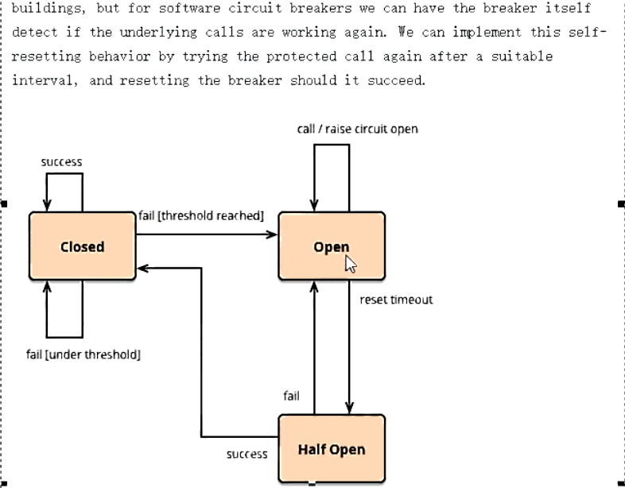

半开状态：

一段时间之后（默认是5秒），这个时候断路器是半开状态，会让其中一个请求进行转发。如果成功，断路器会关闭，若失败，继续开启。这个5秒就是休眠时间窗的大小，在休眠时间窗内服务降级，休眠时间窗过了之后，就会尝试恢复，若再次请求失败，则休眠时间窗重新开始计时。

总的熔断流程图：

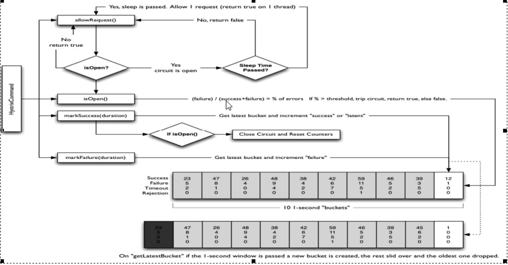

## 服务监控hystrixDashboard

hystrix提供了强大的监控功能，它可以准实时的进行调用监控，持续的记录所有通过hystrix发起的请求的执行信息，并以统计报表和图形的形式展示给用户。

在监控的微服务中，需要引入监控的依赖：

~~~xml
<!--新增hystrix dashboard-->
        <dependency>
            <groupId>org.springframework.cloud</groupId>
            <artifactId>spring-cloud-starter-netflix-hystrix-dashboard</artifactId>
        </dependency>
~~~

然后在主启动类上加入监控功能：

~~~java
@SpringBootApplication
@EnableHystrixDashboard
public class HystrixDashboardMain9001 {
    public static void main(String[] args) {
        SpringApplication.run(HystrixDashboardMain9001.class,args);
    }
}
~~~

在受hystrix管控的微服务中，需要提供监控的依赖才能被监控到：

~~~xml
<dependency>
    <groupId>org.springframework.boot</groupId>
    <artifactId>spring-boot-starter-actuator</artifactId>
</dependency>
~~~

然后访问主监控微服务即可：http://localhost:9001/hystrix

在监控页面输入要监控的微服务的地址：

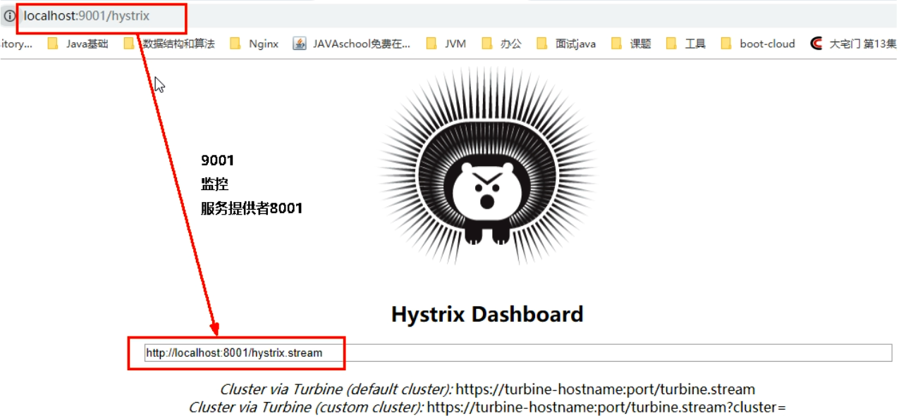

# GateWay服务网关

## 网关概述

https://cloud.spring.io/spring-cloud-static/spring-cloud-gateway/2.2.1.RELEASE/reference/html/

网关是cloud中的重要组件，它在整个集群中处于最靠前的位置：

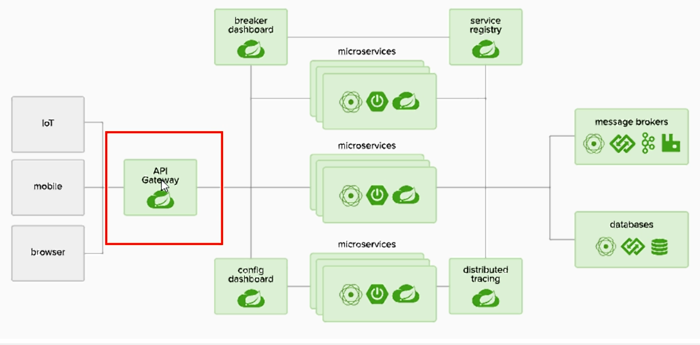

Gateway是用来替代Zuul的网关组件，它提供一种简单有效的方式来对API进行路由，以及提供一些强大的过滤功能，还能做反向代理、鉴权、流量控制、熔断、日志监控。它的优势：

Spring Cloud Gateway 使用的Webflux中的reactor-netty响应式编程组件，底层使用了Netty通讯框架

SpringCloud Gateway的特性：

1、基于spring Framework5，Project Reactor和Spring Boot2.0进行构建

2、动态路由可以匹配任何请求特性

3、对路由指定断言Predicate和过滤器Filter

4、集成Hystrix的断路器功能

5、集成spring cloud的服务发现功能

6、请求限流功能

7、支持路径重写

spring cloud Gateway和Zuul的区别：

1、Zuul 1.x是一个基于阻塞IO的API Gateway，它不支持任何长连接如WebSocket，Zuul的设计模式和Nginx比较像，每次IO操作都是从工作线程中选择一个执行，请求线程被阻塞到工作线程完成，但是差别是nginx是c++实现，zuul用java实现，而jvm本身会有第一次加载较慢的情况，使得zuul性能相对较差

2、Zuul2.x理念更先进，基于netty非阻塞和支持长连接，性能会有较大提升，但是因为本身开发计划不稳定，springcloud目前没有整合

3、spring cloud Gateway基于spring Framework5，Project Reactor和Spring Boot2.0进行构建，使用非阻塞API

4、spring cloud Gateway还支持WebSocket，并且与spring紧密集成，开发体验更好

## Zuul1模型和GateWay模型对比

1、Zuul1采用的是tomcat容器，使用的是传统的servlet IO处理模型。

servlet由servlet container进行生命周期管理：

container启动时构造servlet对象并调用init进行初始化；

container运行时接受请求，并为每个请求分配一个线程（从线程池中获取空闲线程），然后调用service

container关闭时，调用destory来销毁servlet：

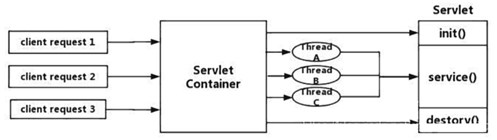

上述模式的缺点：

每个request绑定一个线程这种方式，在线程数大大增加的情况下，会因为线程上下文切换消耗大量资源，影响请求的处理时间。

所以Zuul是基于servlet之上的一个阻塞式处理模型，所以无法摆脱servlet模型的弊端。

2、GateWay使用了Webflux

Webflux是一个典型非阻塞异步的框架，它的核心是基于Reactor的相关API实现的，Spring WebFlux是Spring5.0引入的新的响应式框架，区别于Spring MVC，它不需要依赖Servlet SPI，它是完全异步非阻塞的，并且基于Reactor来实现响应式流规范。

## Gateway的概念和核心流程

Gateway的三大核心概念：

1、Route(路由)：路由是构建网关的基本模块，它由ID，目标URI，一系列的断言和过滤器组成，如果断言为true则匹配该路由

2、Predicate（断言）：参考的是java8的java.util.function.Predicate开发人员可以匹配HTTP请求中的所有内容（例如请求头或请求参数），如果请求与断言相匹配则进行路由

3、Filter(过滤)：指的是Spring框架中GatewayFilter的实例，使用过滤器，可以在请求被路由前或者之后对请求进行修改。

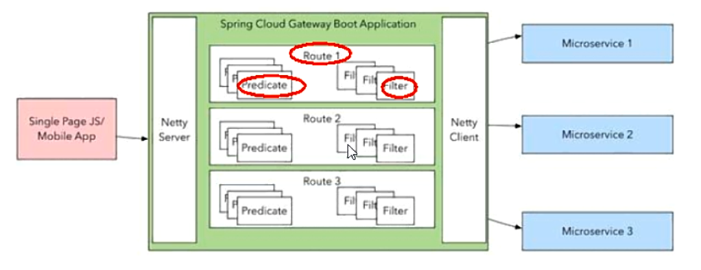

Gateway的大致工作流程：

客户端向Spring Cloud Gateway发出请求，然后在Gateway Handler Mapping中找到与请求相匹配的路由，将其发送到Gateway Web Handler，Handler再通过再通过指定的过滤器链，最后将请求发送到实际的服务执行业务逻辑，然后返回：

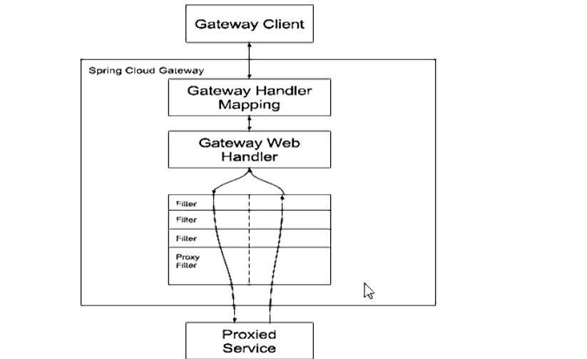

Filter不仅在请求之前可以起作用，也可以在返回之后起作用。

pre类型的过滤器可以做参数校验、权限校验、流量监控、日志输出、协议转换等

post类型的过滤器可以做响应内容、响应头的修改、日志的输出、流量监控等

## 入门配置

新建一个网关服务，引入gateway的依赖：

~~~xml
<dependencies>
  <!--新增gateway-->
  <dependency>
    <groupId>org.springframework.cloud</groupId>
    <artifactId>spring-cloud-starter-gateway</artifactId>
  </dependency>
  <dependency>
    <groupId>com.atguigu.springcloud</groupId>
    <artifactId>cloud-api-commons</artifactId>
    <version>1.0-SNAPSHOT</version>
  </dependency>

  <dependency>
    <groupId>org.springframework.cloud</groupId>
    <artifactId>spring-cloud-starter-netflix-hystrix</artifactId>
  </dependency>
  <dependency>
    <groupId>org.springframework.cloud</groupId>
    <artifactId>spring-cloud-starter-netflix-eureka-client</artifactId>
  </dependency>

  <dependency>
    <groupId>org.springframework.boot</groupId>
    <artifactId>spring-boot-devtools</artifactId>
    <scope>runtime</scope>
    <optional>true</optional>
  </dependency>

  <dependency>
    <groupId>org.projectlombok</groupId>
    <artifactId>lombok</artifactId>
    <optional>true</optional>
  </dependency>
  <dependency>
    <groupId>org.springframework.boot</groupId>
    <artifactId>spring-boot-starter-test</artifactId>
    <scope>test</scope>
  </dependency>
~~~

然后进行配置，其中有路由相关的配置、还有把服务注册到注册中心：

~~~yaml
server:
  port: 9527
spring:
  application:
    name: cloud-gateway
  cloud:
    gateway:
      routes:
        - id: payment_routh #路由的ID，没有固定规则但要求唯一，建议配合服务名
          uri: http://localhost:8001   #匹配后提供服务的路由地址
          predicates:
            - Path=/payment/get/**   #断言,路径相匹配的进行路由

        - id: payment_routh2
          uri: http://localhost:8001
          predicates:
            - Path=/payment/lb/**   #断言,路径相匹配的进行路由

eureka:
  instance:
    hostname: cloud-gateway-service
  client:
    service-url:
      register-with-eureka: true
      fetch-registry: true
      defaultZone: http://eureka7001.com:7001/eureka
~~~

上面的配置代表访问http://localhost:9527/payment/get/31 代表访问http://localhost:8001/payment/get/31，这样对外暴露的端口就只有9527：

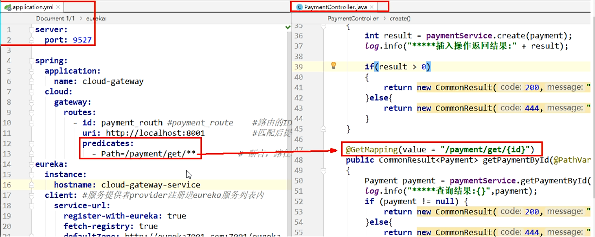

主启动类：

~~~java
@SpringBootApplication
@EnableEurekaClient
public class GateWayMain9527 {
    public static void main(String[] args) {
            SpringApplication.run( GateWayMain9527.class,args);
        }
}
~~~

Gateway配置网关除了用配置文件的方式，还可以用编程式，代码中注入RouteLocator的Bean，和配置文件的设置项类似，但是比较麻烦。

## 通过服务名实现动态路由

默认情况下Gateway会根据注册中心的服务列表，以注册中心上微服务名为路径创建动态路由进行转发，从而实现动态路由的功能（也就是不在配置文件中写死IP地址）

动态路由中需要把配置文件中的IP地址替换为服务名，同时开启动态路由功能：

~~~yaml
server:
  port: 9527
spring:
  application:
    name: cloud-gateway
  cloud:
    gateway:
      discovery:
        locator:
          enabled: true  #开启从注册中心动态创建路由的功能，利用微服务名进行路由
      routes:
        - id: payment_routh #路由的ID，没有固定规则但要求唯一，建议配合服务名
          #uri: http://localhost:8001   #匹配后提供服务的路由地址
          uri: lb://cloud-payment-service
          predicates:
            - Path=/payment/get/**   #断言,路径相匹配的进行路由

        - id: payment_routh2
          #uri: http://localhost:8001   #匹配后提供服务的路由地址
          uri: lb://cloud-payment-service
          predicates:
            - Path=/payment/lb/**   #断言,路径相匹配的进行路由

eureka:
  instance:
    hostname: cloud-gateway-service
  client:
    service-url:
      register-with-eureka: true
      fetch-registry: true
      defaultZone: http://eureka7001.com:7001/eureka
~~~

lb://serviceName是spring cloud gateway在微服务中自动为我们创建的负载均衡uri。

##Predicate的使用

在启动网关服务时可以看到日志中打印了很多的predicate加载：

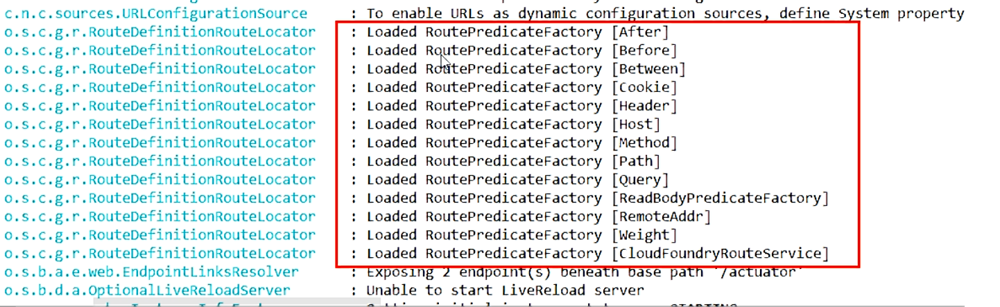

predicate其实就是匹配的规则，上面已经使用了路径匹配，还有几种常用的断言：

1、After Route Predicate：

~~~yaml
predicates:
	- After=2020-03-08T10:59:34.102+08:00[Asia/Shanghai]
~~~

代表这个时间之后的请求才能进入

类似的断言还有Before Route Predicate和Between Route Predicate

2、Cookie Route Predicate

~~~yaml
predicates:
	- Cookie=username,atguigu    #并且Cookie是username=atguigu才能访问，后面的atguigu是正则表达式
~~~

3、Header Route Predicate：根据请求头中的属性值来筛选

4、Host Route Predicate：根据host筛选

5、Method Route Predicate：根据http method筛选，如GET

6、Path Route Predicate：上面已经用到的路径筛选

7、Query Route Predicate：根据url后面的参数值进行筛选

## Filter的使用

路由过滤器可用于修改进入的http请求和返回的http响应，配合指定路由来使用，Gateway内置了多种路由配置器，它们都由GatewayFilter的工厂类产生。

gateway filter按生命周期分可以分为pre和post，还可以按作用范围分为单一GatewayFilter和全局GlobalFilter。

常用的GatewayFilter如AddRequestParameter：

~~~yaml
routes:
	- id: xx
	uri: xx
	filters:
		- AddRequestParameter=X-Request-Id,1024 #代表过滤器会在匹配的请求中加上一对请求头，名为X-Request-Id，值为1024
	  predicates:
	    - Path=xx
~~~

自定义filter实现，需要实现两个接口GlobalFilter和Ordered（指定顺序，0为第一个执行的）

~~~java
@Component
@Slf4j
public class MyLogGateWayFilter implements GlobalFilter,Ordered {
    @Override
    public Mono<Void> filter(ServerWebExchange exchange, GatewayFilterChain chain) {

        log.info("*********come in MyLogGateWayFilter: "+new Date());
        String uname = exchange.getRequest().getQueryParams().getFirst("username");
        if(StringUtils.isEmpty(username)){
            log.info("*****用户名为Null 非法用户,(┬＿┬)");
            exchange.getResponse().setStatusCode(HttpStatus.NOT_ACCEPTABLE);//给人家一个回应
            return exchange.getResponse().setComplete();
        }
        return chain.filter(exchange);
    }

    @Override
    public int getOrder() {
        return 0;
    }
}
~~~

# config分布式配置中心

## 概述

https://cloud.spring.io/spring-cloud-static/spring-cloud-config/2.2.1.RELEASE/reference/html/

分布式系统面临一些繁琐的配置问题，当集群中的微服务很多的时候，每个服务都带着自己的配置文件，修改起来非常繁琐，需要一个分布式配置中心管理这些配置。

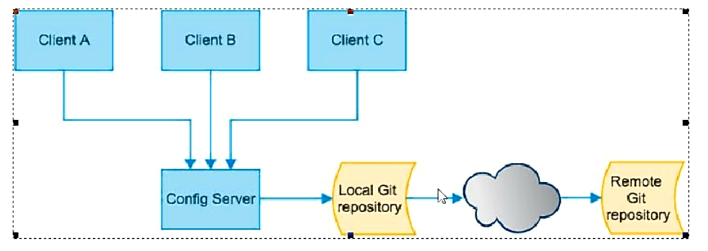

在SpringCloud Config中，有一个服务端，也被称为分布式配置中心，它是一个独立的微服务，用来连接配置服务器并为客户端提供配置信息。同时有多个客户端，这些客户端就是普通的业务服务，它们把一些公共的配置都放在分布式配置中心中，自己只保存自己特有的配置。

分布式配置中心通过读取配置服务器中的信息来获取配置，这样运维工程师只需要改变外部配置的信息，就可以改变整个集群的配置。

它可以集中管理配置，方便配置下发到各服务，当配置变动时无需重启应用，并且把配置信息以rest接口的形式暴露出来，方便访问。

它支持用Git来存储配置文件，当然也支持其他的方式

## 配置的服务端

首先要初始化外部配置中心，在git上构建一个简单的服务，其中有一些配置文件，并把它clone在本地：

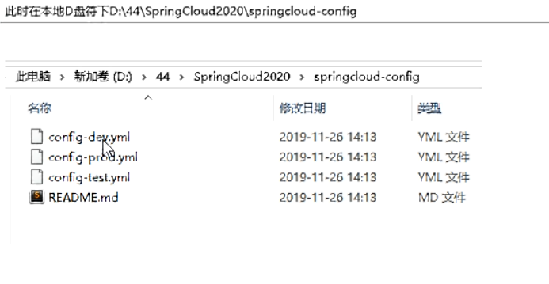

然后初始化一个配置中心服务，引入spring-cloud-config-server依赖：

~~~xml
<dependencies>

        <dependency>
            <groupId>org.springframework.cloud</groupId>
            <artifactId>spring-cloud-config-server</artifactId>
        </dependency>
        <dependency>
            <groupId>org.springframework.cloud</groupId>
            <artifactId>spring-cloud-starter-netflix-eureka-client</artifactId>
        </dependency>
        <dependency>
            <groupId>com.atguigu.springcloud</groupId>
            <artifactId>cloud-api-commons</artifactId>
            <version>${project.version}</version>
        </dependency>
        <dependency>
            <groupId>org.springframework.boot</groupId>
            <artifactId>spring-boot-starter-web</artifactId>
        </dependency>

        <dependency>
            <groupId>org.springframework.boot</groupId>
            <artifactId>spring-boot-starter-actuator</artifactId>
        </dependency>

        <dependency>
            <groupId>org.springframework.boot</groupId>
            <artifactId>spring-boot-devtools</artifactId>
            <scope>runtime</scope>
            <optional>true</optional>
        </dependency>

        <dependency>
            <groupId>org.projectlombok</groupId>
            <artifactId>lombok</artifactId>
            <optional>true</optional>
        </dependency>
        <dependency>
            <groupId>org.springframework.boot</groupId>
            <artifactId>spring-boot-starter-test</artifactId>
            <scope>test</scope>
        </dependency>
    </dependencies>
~~~

配置文件：

~~~yaml
server:
  port: 3344
spring:
  application:
    name: cloud-config-center
  cloud:
    config:
      server:
        git:
          uri:  填写你自己的github路径
          search-paths:
            - springcloud-config
      label: master
eureka:
  client:
    service-url:
      defaultZone:  http://localhost:7001/eureka
~~~

主启动类加上@EnableConfigServer：

~~~java
@SpringBootApplication
@EnableConfigServer
public class ConfigCenterMain3344 {
    public static void main(String[] args) {
            SpringApplication.run(ConfigCenterMain3344 .class,args);
        }
}
~~~

然后启动配置服务端，就可以直接访问来获取配置信息了：http://config-3344.com:3344/master/config-dev.yml（其中config-3344.com在hosts中被映射到127.0.0.1）

其中获取配置的方式有几种，其中最常用的是：/{label}/{application}-{profile}.yml（最推荐使用这种方式），其中label是分支，application是服务名，profile是环境（测试、开发等）

还可以通过/{application}-{profile}.yml访问（没有指定分支默认是master）、/{application}-{profile}[/{label}]

## 配置的客户端

在客户端引入配置客户端的依赖spring-cloud-starter-config：

~~~xml
<dependencies>

        <dependency>
            <groupId>org.springframework.cloud</groupId>
            <artifactId>spring-cloud-starter-config</artifactId>
        </dependency>
        <dependency>
            <groupId>org.springframework.cloud</groupId>
            <artifactId>spring-cloud-starter-netflix-eureka-client</artifactId>
        </dependency>
        <dependency>
            <groupId>com.atguigu.springcloud</groupId>
            <artifactId>cloud-api-commons</artifactId>
            <version>${project.version}</version>
        </dependency>
        <dependency>
            <groupId>org.springframework.boot</groupId>
            <artifactId>spring-boot-starter-web</artifactId>
        </dependency>

        <dependency>
            <groupId>org.springframework.boot</groupId>
            <artifactId>spring-boot-starter-actuator</artifactId>
        </dependency>

        <dependency>
            <groupId>org.springframework.boot</groupId>
            <artifactId>spring-boot-devtools</artifactId>
            <scope>runtime</scope>
            <optional>true</optional>
        </dependency>

        <dependency>
            <groupId>org.projectlombok</groupId>
            <artifactId>lombok</artifactId>
            <optional>true</optional>
        </dependency>
        <dependency>
            <groupId>org.springframework.boot</groupId>
            <artifactId>spring-boot-starter-test</artifactId>
            <scope>test</scope>
        </dependency>
    </dependencies>
~~~

然后引入bootstap.yml配置文件，注意它比application.yaml优先级更高，它是系统级的，spring cloud会创建一个Bootstrap Context，它是spring应用Application Context的父context，初始化的时候，Bootstrap Context负责从外部配置源加载配置，这两个上下文共享一个Environment：

~~~yaml
server:
  port: 3355

spring:
  application:
    name: config-client
  cloud:
    config:
      label: master
      name: config
      profile: dev
      uri: http://localhost:3344
eureka:
  client:
    service-url:
      defaultZone: http://eureka7001.com:7001/eureka
~~~

代表读取master分支的配置，配置服务名是config（也是配置文件名），环境是dev（后缀），配置中心在3344端口。相当于读取配置中心master分支上的config-dev.yml的配置文件

当在github中修改了外部配置信息时，然后通过端口访问配置信息，发现配置中心的配置信息及时刷新了，但是各客户端的配置信息必须重启后才能刷新，如果想要刷新还必须配置动态刷新

## 客户端动态刷新配置

首先就是各客户端要引入监控模块：

~~~xml
<dependency>
    <groupId>org.springframework.boot</groupId>
    <artifactId>spring-boot-starter-actuator</artifactId>
</dependency>
~~~

配置文件中增加暴露监控端口：

~~~yaml
management:
  endpoints:
    web:
      exposure:
        include: "*"
~~~

然后在controller中增加一个注解@RefreshScope：

~~~java

@RefreshScope
@RestController
public class ConfigClientController {

    @Value("${config.info}")
    private String configInfo;

    @GetMapping("/configInfo")
    public String getConfigInfo(){
        return configInfo;
    }
}
~~~

注意${config.info}这个部分是从外部配置中加载来的。

外部配置修改后，需要运维人员发送post请求来手动刷新客户端的配置：

~~~
curl -X POST "http://localhost:3355/actuator/refresh"
~~~

# Bus消息总线

Spring Cloud Bus配合Spring Cloud Config使用可以实现配置的动态刷新

Spring Cloud Bus是用来将分布式系统的节点与轻量级消息系统链接起来的框架，它整合了java的事件处理机制和消息中间件的功能，SpringCloud Bus目前支持RabbitMQ和Kafka。

它能管理和传播分布式系统之间的消息，就像一个分布式执行器，可用于广播状态修改、事件推送等，也可以当做微服务间的通信通道。

总线用轻量级的消息代理来构建一个共用的消息主题，由于该主题中产生的消息会被所有实例监听和消费，所以它被称为消息总线。

Bus的基本原理就是所有的配置客户端都监听MQ中同一个topic，当一个服务刷新数据的时候，它会吧这个消息放入topic中，这样其他监听同一个topic的服务就能得到通知，然后去更新自身的配置。

流程图：

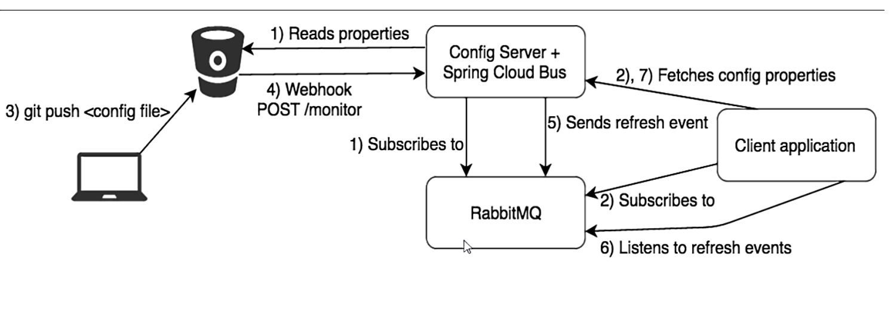

## RabbitMQ环境配置

首先安装Erlang，然后安装RabbitMQ，进入安装目录下的sbin目录执行：

~~~
rabbitmq-plugins enable rabbitmq_management
~~~

相当于添加了可视化插件：

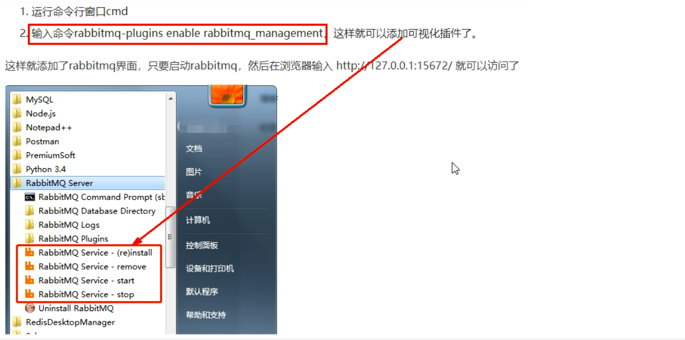

访问http://localhost:15672/，输入账号密码，默认都是guest，可以正常登录代表MQ安装完成

## Bus动态刷新全局广播

动态刷新全局广播主要有两种方式：

1、利用消息总线触发一个客户端/bus/refresh,而刷新所有客户端的配置：

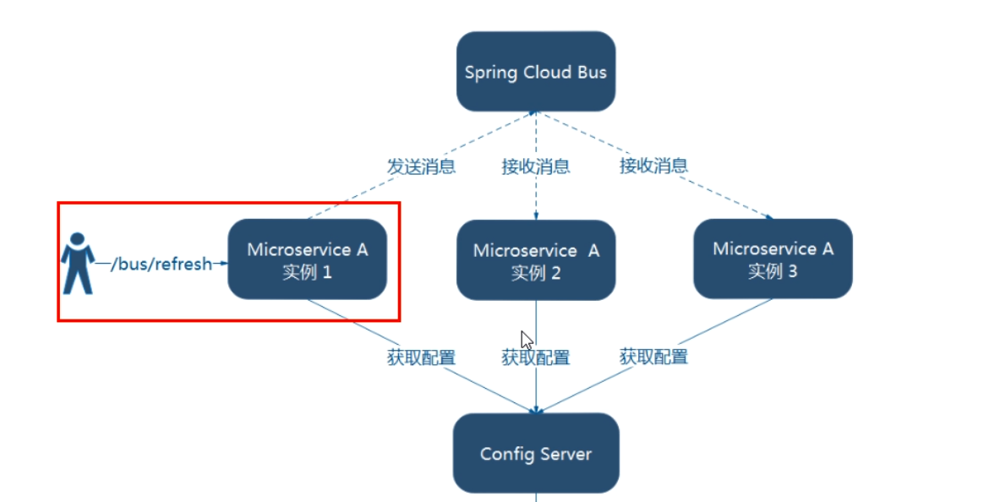

2、利用消息总线触发一个服务端ConfigServer的/bus/refresh端点,而刷新所有客户端的配置（更加推荐）：

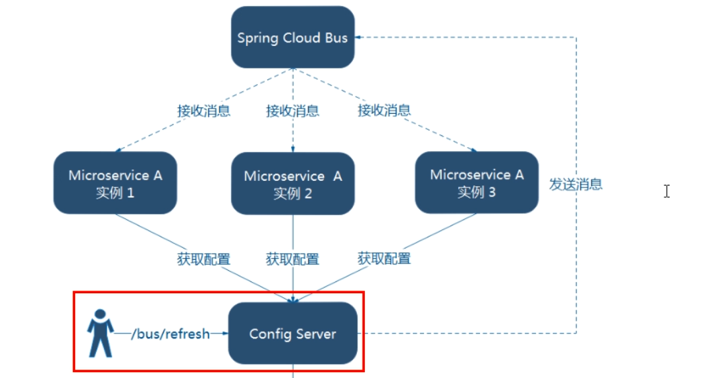

之所以推荐方式二，原因在于：

1、方式一打破了微服务的职责单一性，因为微服务本身是业务模块，它本不应该承担配置刷新职责

2、方式一破坏了微服务各节点的对等性，配置客户端地位本来都是对等的，但是其中一个突然变成主动触发的第一个节点

3、方式一有一定的局限性。例如，微服务在迁移时，它的网络地址常常会发生变化，此时如果想要做到自动刷新，那就会增加更多的修改

如果要采用方式二进行全局配置刷新，需要首先在配置服务端引入总线配置：

~~~xml
<dependency>
            <groupId>org.springframework.cloud</groupId>
            <artifactId>spring-cloud-starter-bus-amqp</artifactId>
</dependency>
~~~

~~~yaml
management:
  endpoints:
    web:
      exposure:
        include: 'bus-refresh'
~~~

然后在各配置客户端引入总线：

~~~xml
<dependency>
            <groupId>org.springframework.cloud</groupId>
            <artifactId>spring-cloud-starter-bus-amqp</artifactId>
</dependency>
~~~

如果想要刷新全局的话只需要用请求刷新一下配置服务端即可：

~~~
curl -X POST "http://localhost:3344/actuator/bus-refresh"
~~~

配置的刷新最终实现了一次修改，广播通知，处处生效

## Bus动态刷新定点通知

如果想要某几个客户端刷新配置，其他的不用刷新，只需要修改一下刷新请求的http信息：

公式：http://localhost:配置中心的端口号/actuator/bus-refresh/{destination}

如curl -X POST "http://localhost:3344/actuator/bus-refresh/config-client:3355"相当于只刷新config-client服务的3355

# Stream消息驱动

## 概念和架构

https://cloud.spring.io/spring-cloud-static/spring-cloud-stream/3.0.1.RELEASE/reference/html/

SpringCloud Stream是一个构建消息驱动微服务的框架，它是为了屏蔽底层消息中间件的差异，降低切换版本，统一消息的编程模型。（概念类似于jdbc，底层可以是多种数据库，但是上层用法是一样的）

应用程序通过inputs或者outputs来与Spring Cloud Stream中binder对象交互，通过我们配置来binding，而Spring Cloud Stream的binder对象负责与消息中间件交互，所以我们只需要搞清楚如何与Spring Cloud Stream交互就可以方便使用消息驱动的方式。

通过使用Spring Integration来连接消息代理中间件以实现消息事件驱动

Spring Cloud Stream为一些供应商的消息中间件产品提供了个性化的自动化配置实现，引用了发布-订阅、消费组、分区的三个核心概念。

目前仅支持RabbitMQ、Kafka

Spring Cloud Stream通过定义绑定器Binder作为中间层，实现了应用程序与消息中间件细节之间的隔离：

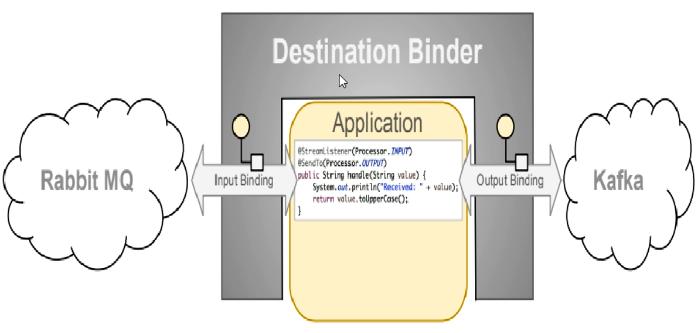

Stream对消息中间件的进一步封装可以做到代码层面对中间件的无感知，甚至于动态的切换中间件，使得服务开发可以更多的关注业务本身。

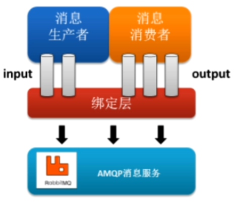

Stream中的消息通信方式遵循了发布-订阅模式，简单来说就是用Topic主题进行广播：在RabbitMQ就是Exchange，在kafka中就是Topic

Spring Cloud Stream标准工作流程：

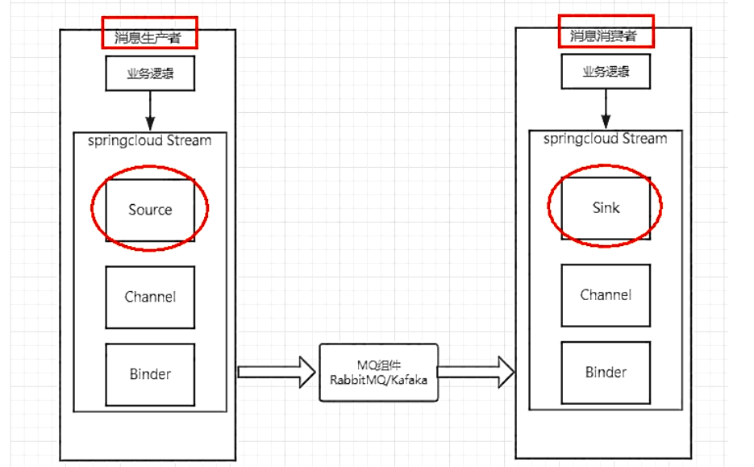

其中有三个重要的组成部分：

1、Binder：很方便的连接中间件，屏蔽差异

2、Channel：通道，是队列Queue的一种抽象，在消息通讯系统中就是实现存储和转发的媒介，通过对Channel对队列进行配置

3、Source和Sink：简单的可理解为参照对象是Spring Cloud Stream自身，从Stream发布消息就是输出，接受消息就是输入

Stream的常用注解：

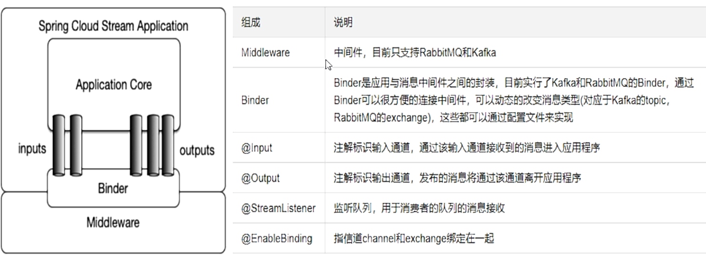

## 消息生产者

构建消息生产者服务首先要引入对应的依赖，底层消息中间件是rabbitMQ，这里就引入stream对接rabbitMQ的依赖spring-cloud-starter-stream-rabbit：

~~~xml
<dependencies>
        <dependency>
            <groupId>org.springframework.cloud</groupId>
            <artifactId>spring-cloud-starter-stream-rabbit</artifactId>
        </dependency>

        <!-- https://mvnrepository.com/artifact/org.springframework.cloud/spring-cloud-starter-eureka-server -->
        <dependency>
            <groupId>org.springframework.cloud</groupId>
            <artifactId>spring-cloud-starter-netflix-eureka-client</artifactId>
        </dependency>

        <dependency>
            <groupId>com.atguigu.springcloud</groupId>
            <artifactId>cloud-api-commons</artifactId>
            <version>${project.version}</version>
        </dependency>

        <!-- https://mvnrepository.com/artifact/org.springframework.boot/spring-boot-starter-web -->
        <dependency>
            <groupId>org.springframework.boot</groupId>
            <artifactId>spring-boot-starter-web</artifactId>
        </dependency>

        <!-- https://mvnrepository.com/artifact/org.springframework.boot/spring-boot-starter-web -->
        <dependency>
            <groupId>org.springframework.boot</groupId>
            <artifactId>spring-boot-starter-actuator</artifactId>
        </dependency>

     
        <!-- https://mvnrepository.com/artifact/org.springframework.boot/spring-boot-devtools -->
        <dependency>
            <groupId>org.springframework.boot</groupId>
            <artifactId>spring-boot-devtools</artifactId>
            <scope>runtime</scope>
            <optional>true</optional>
        </dependency>

        <!-- https://mvnrepository.com/artifact/org.projectlombok/lombok -->
        <dependency>
            <groupId>org.projectlombok</groupId>
            <artifactId>lombok</artifactId>
            <optional>true</optional>
        </dependency>

        <!-- https://mvnrepository.com/artifact/org.springframework.boot/spring-boot-starter-test -->
        <dependency>
            <groupId>org.springframework.boot</groupId>
            <artifactId>spring-boot-starter-test</artifactId>
            <scope>test</scope>
        </dependency>
    </dependencies>
~~~

在配置文件中加入消息的相关配置，指明消息中间件的地址、端口、用户名密码，还有exchange名：

~~~yaml
server:
  port: 8801

spring:
  application:
    name: cloud-stream-provider
  cloud:
    stream:
      binders: # 在此处配置要绑定的rabbitmq的服务信息；
        defaultRabbit: # 表示定义的名称，用于于binding整合
          type: rabbit # 消息组件类型
          environment: # 设置rabbitmq的相关的环境配置
            spring:
              rabbitmq:
                host: localhost
                port: 5672
                username: guest
                password: guest
      bindings: # 服务的整合处理
        output: # 这个名字是一个通道的名称
          destination: studyExchange # 表示要使用的Exchange名称定义
          content-type: application/json # 设置消息类型，本次为json，文本则设置“text/plain”
          binder: defaultRabbit  # 设置要绑定的消息服务的具体设置

eureka:
  client: # 客户端进行Eureka注册的配置
    service-url:
      defaultZone: http://localhost:7001/eureka
  instance:
    lease-renewal-interval-in-seconds: 2 # 设置心跳的时间间隔（默认是30秒）
    lease-expiration-duration-in-seconds: 5 # 如果现在超过了5秒的间隔（默认是90秒）
    instance-id: send-8801.com  # 在信息列表时显示主机名称
    prefer-ip-address: true     # 访问的路径变为IP地址
~~~

编写消息发送的接口和实现类：

~~~java
public interface IMessageProvider
{
    public String send();
}
~~~

~~~java
@EnableBinding(Source.class) //定义消息的推送管道
public class MessageProviderImpl implements IMessageProvider
{
    @Resource
    private MessageChannel output; // 消息发送管道

    @Override
    public String send()
    {
        String serial = UUID.randomUUID().toString();
        output.send(MessageBuilder.withPayload(serial).build());
        System.out.println("*****serial: "+serial);
        return null;
    }
}
~~~

代表随机生成一个uuid然后当做消息发送出去。

然后编写controller，其中调用发送消息的类：

~~~java
@RestController
public class SendMessageController
{
    @Resource
    private IMessageProvider messageProvider;

    @GetMapping(value = "/sendMessage")
    public String sendMessage()
    {
        return messageProvider.send();
    }

}
~~~

## 消息消费者

消费者服务要引入的依赖和发送者相同，配置文件只需要把output改成input，订阅相同的exchange

消费方法：

~~~java
@Component
@EnableBinding(Sink.class)
public class ReceiveMessageListener {
    @Value("${server.port}")
    private String serverPort;

    @StreamListener(Sink.INPUT)
    public void input(Message<String> message) {
        System.out.println("port:" + serverPort + "\t接受：" + message.getPayload());
    }

}
~~~

为了防止消息被重复消费，还需要做消息分组，分组的方式就是在配置文件中加入group配置：

~~~yaml
spring:
  application:
    name: cloud-stream-consumer
  cloud:
    stream:
      binders: # 在此处配置要绑定的rabbitmq的服务信息；
        defaultRabbit: # 表示定义的名称，用于于binding整合
          type: rabbit # 消息组件类型
          environment: # 设置rabbitmq的相关的环境配置
            spring:
              rabbitmq:
                host: localhost
                port: 5672
                username: guest
                password: guest
      bindings: # 服务的整合处理
        input: # 这个名字是一个通道的名称
          destination: studyExchange # 表示要使用的Exchange名称定义
          content-type: application/json # 设置消息类型，本次为json，文本则设置“text/plain”
          binder: defaultRabbit  # 设置要绑定的消息服务的具体设置
          group: atguiguB
~~~

同一个消息组的多个实例对一个消息只消费一次。

此外，stream还默认支持消息的持久化，当消息发送者发送消息时，消费者关闭，此时消息也不会消失，而是持久化起来，待消费者重新开始消费时，消息也可以消费成功。

# Sleuth分布式请求链路追踪

https://github.com/spring-cloud/spring-cloud-sleuth

在微服务框架中，一个客户端发起的请求在后端系统中会经过多个不同的服务节点调用来协同产生最后的请求结果，每一个请求都会形成一条复杂的分布式服务调用链路，链路中的任何一环出现高延时或错误都会引起整个请求最后的失败。

Spring Cloud Sleuth提供了一套完整的服务跟踪的解决方案，在分布式系统中提供追踪解决方案并且兼容支持了zipkin

监控链路首先要下载好zipkin：https://dl.bintray.com/openzipkin/maven/io/zipkin/java/zipkin-server/

然后运行jar包，运行后访问即可看到前台管理系统：http://localhost:9411/zipkin/

在链路调用中有几个重要的概念：

1、Trace Id：标识唯一一条请求链路（类似于树结构的Span集合，表示一条调用链路，存在唯一标识）

2、Span：链路中经过的服务（表示调用链路来源，通俗的理解span就是一次请求信息），各Span通过parent id关联起来：

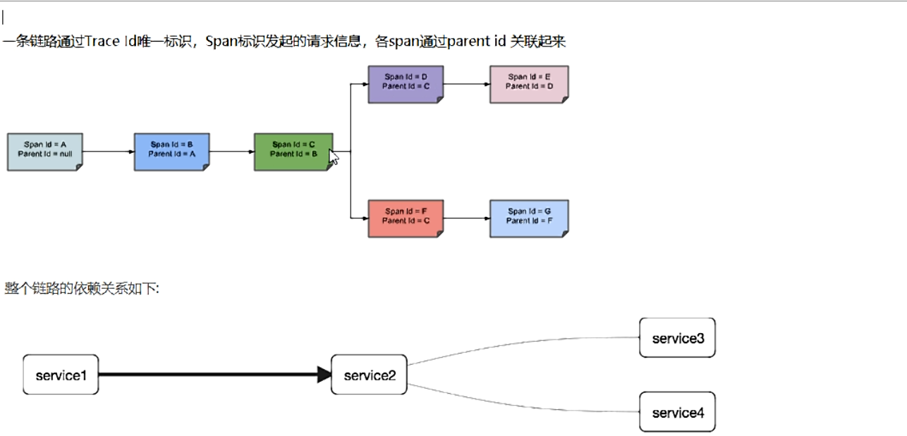

想要监控服务的链路调用，需要在对应服务中引入监控的依赖zipkin：

~~~xml
<dependency>
            <groupId>org.springframework.cloud</groupId>
            <artifactId>spring-cloud-starter-zipkin</artifactId>
        </dependency>
~~~

然后在配置文件中指定zipkin的地址：

~~~yaml
server:
  port: 8001

spring:
  application:
    name: cloud-payment-service
  zipkin:
    base-url: http://localhost:9411
  sleuth:
    sampler:
    probability: 1  # 1代表全部调用信息都监控，0代表都不监控
  datasource:
    type: com.alibaba.druid.pool.DruidDataSource
    driver-class-name: org.gjt.mm.mysql.Driver
    url: 
    username: root
    password: 

mybatis:
  mapperLocations: classpath:mapper/*.xml
  type-aliases-package: com.atguigu.springcloud.entities

eureka:
  client:
    register-with-eureka: true
    fetchRegistry: true
    service-url:
      defaultZone: http://eureka7001.com:7001/eureka,http://eureka7002.com:7002/eureka  #集群版
  instance:
    instance-id: payment8001
    prefer-ip-address: true
~~~

然后服务中如果发生调用，就可以访问http:localhost:9411来查看：

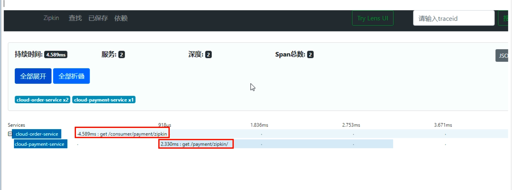

# SpringCloud Alibaba Nacos服务注册和配置中心

## SpringCloud Alibaba简介

https://github.com/alibaba/spring-cloud-alibaba/blob/master/README-zh.md

由于Spring Cloud Netflix项目进入维护模式，故出现此项目替代Cloud，它支持服务限流降级、服务注册与发现、分布式配置管理、消息驱动能力、阿里云对象存储、分布式服务调度。

## Nacos简介与安装

https://nacos.io/zh-cn/index.html

Nacos名字的由来：前四个字母分别为Naming和Configuration的前两个字母，最后的s为Service

它是一个更易于构建云原生应用的动态服务发现，配置管理和服务管理中心，相当于注册中心+配置中心的组合，等价于Nacos = Eureka+Config+Bus

首先从官网下载nacos：https://github.com/alibaba/nacos/releases/tag/1.1.4

然后解压安装包，直接运行bin目录下的startup.cmd，命令运行成功后直接访问http://localhost:8848/nacos，就会看到一个前台管理界面，默认账号密码都是nacos：

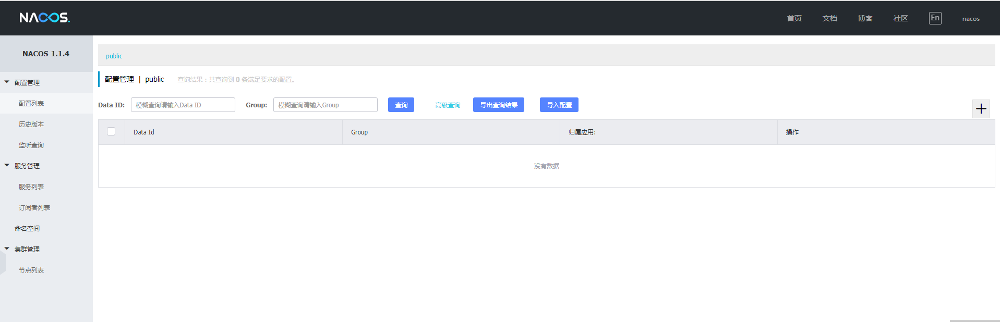

## Nacos服务注册中心

### 服务提供者构建

首先先引入依赖，注意此时服务的父pom不再是Cloud，而是alibaba.cloud

~~~xml
<!--spring cloud alibaba 2.1.0.RELEASE-->
<dependency>
  <groupId>com.alibaba.cloud</groupId>
  <artifactId>spring-cloud-alibaba-dependencies</artifactId>
  <version>2.1.0.RELEASE</version>
  <type>pom</type>
  <scope>import</scope>
</dependency>
~~~

全部依赖，关键是spring-cloud-starter-alibaba-nacos-discovery：

~~~xml
<dependencies>
    <dependency>
        <groupId>com.alibaba.cloud</groupId>
        <artifactId>spring-cloud-starter-alibaba-nacos-discovery</artifactId>
    </dependency>
    <dependency>
        <groupId>org.springframework.boot</groupId>
        <artifactId>spring-boot-starter-web</artifactId>
    </dependency>
    <dependency>
        <groupId>org.springframework.boot</groupId>
        <artifactId>spring-boot-starter-actuator</artifactId>
    </dependency>
    <dependency>
        <groupId>org.springframework.boot</groupId>
        <artifactId>spring-boot-devtools</artifactId>
        <scope>runtime</scope>
        <optional>true</optional>
    </dependency>
    <dependency>
        <groupId>org.projectlombok</groupId>
        <artifactId>lombok</artifactId>
        <optional>true</optional>
    </dependency>
    <dependency>
        <groupId>org.springframework.boot</groupId>
        <artifactId>spring-boot-starter-test</artifactId>
        <scope>test</scope>
    </dependency>
~~~

然后在配置文件中配置服务名和nacos的地址：

~~~yaml
server:
  port: 9001

spring:
  application:
    name: nacos-payment-provider
  cloud:
    nacos:
      discovery:
        server-addr: localhost:8848 #配置Nacos地址

management:
  endpoints:
    web:
      exposure:
        include: '*'
~~~

主启动类：

~~~java
@EnableDiscoveryClient
@SpringBootApplication
public class PaymentMain9001 {
    public static void main(String[] args) {
        SpringApplication.run(PaymentMain9001.class,args);
    }
}
~~~

controller：

~~~java
@RestController
public class PaymentController
{
    @Value("${server.port}")
    private String serverPort;

    @GetMapping(value = "/payment/nacos/{id}")
    public String getPayment(@PathVariable("id") Integer id)
    {
        return "nacos registry, serverPort: "+ serverPort+"\t id"+id;
    }
}
~~~

然后启动项目后访问http://lcoalhost:9001/payment/nacos/1即可成功

在nacos的控制台即可看到注册成功：

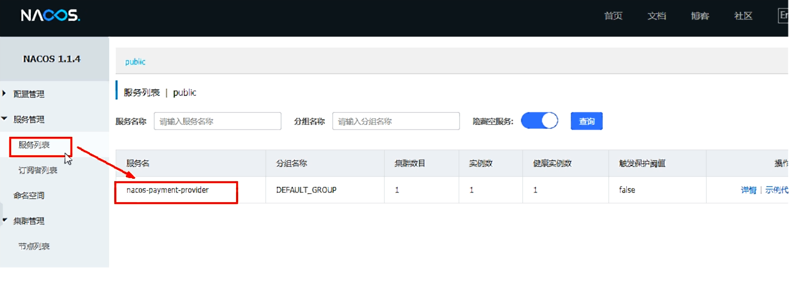

### 服务消费者构建

引入pom文件，其中重要的是spring-cloud-starter-alibaba-nacos-discovery：

~~~xml
<dependencies>
    <!--SpringCloud ailibaba nacos -->
    <dependency>
        <groupId>com.alibaba.cloud</groupId>
        <artifactId>spring-cloud-starter-alibaba-nacos-discovery</artifactId>
    </dependency>
        <dependency>
        <groupId>com.atguigu.springcloud</groupId>
        <artifactId>cloud-api-commons</artifactId>
        <version>${project.version}</version>
    </dependency>
    <dependency>
        <groupId>org.springframework.boot</groupId>
        <artifactId>spring-boot-starter-web</artifactId>
    </dependency>
    <dependency>
        <groupId>org.springframework.boot</groupId>
        <artifactId>spring-boot-starter-actuator</artifactId>
    </dependency>
    <dependency>
        <groupId>org.springframework.boot</groupId>
        <artifactId>spring-boot-devtools</artifactId>
        <scope>runtime</scope>
        <optional>true</optional>
    </dependency>
    <dependency>
        <groupId>org.projectlombok</groupId>
        <artifactId>lombok</artifactId>
        <optional>true</optional>
    </dependency>
    <dependency>
        <groupId>org.springframework.boot</groupId>
        <artifactId>spring-boot-starter-test</artifactId>
        <scope>test</scope>
    </dependency>
</dependencies>
~~~

配置文件：

~~~yaml
server:
  port: 83

spring:
  application:
    name: nacos-order-consumer
  cloud:
    nacos:
      discovery:
        server-addr: localhost:8848

service-url:
  nacos-user-service: http://nacos-payment-provider
~~~

主启动类：

~~~java
@EnableDiscoveryClient
@SpringBootApplication
public class OrderNacosMain83
{
    public static void main(String[] args)
    {
        SpringApplication.run(OrderNacosMain83.class,args);
    }
}
~~~

注入远程调用类：

~~~java
@Configuration
public class ApplicationContextConfig
{
    @Bean
    @LoadBalanced
    public RestTemplate getRestTemplate()
    {
        return new RestTemplate();
    }
}
~~~

controller：

~~~java
@RestController
@Slf4j
public class OrderNacosController
{
    @Resource
    private RestTemplate restTemplate;

    @Value("${service-url.nacos-user-service}")
    private String serverURL;

    @GetMapping(value = "/consumer/payment/nacos/{id}")
    public String paymentInfo(@PathVariable("id") Long id)
    {
        return restTemplate.getForObject(serverURL+"/payment/nacos/"+id,String.class);
    }
}
~~~

启动之后访问控制台可以看到服务正常注册：

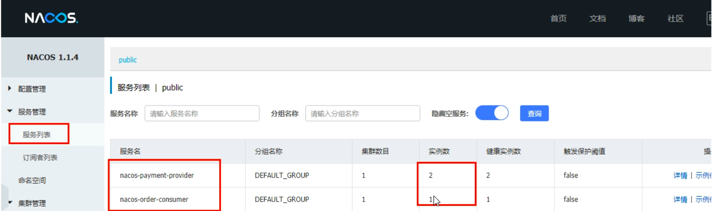

### 各种注册中心对比

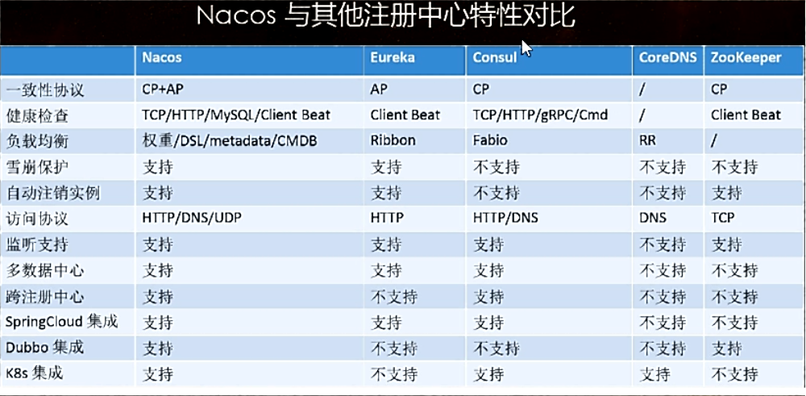

Nacos支持AP和CP模式的切换：

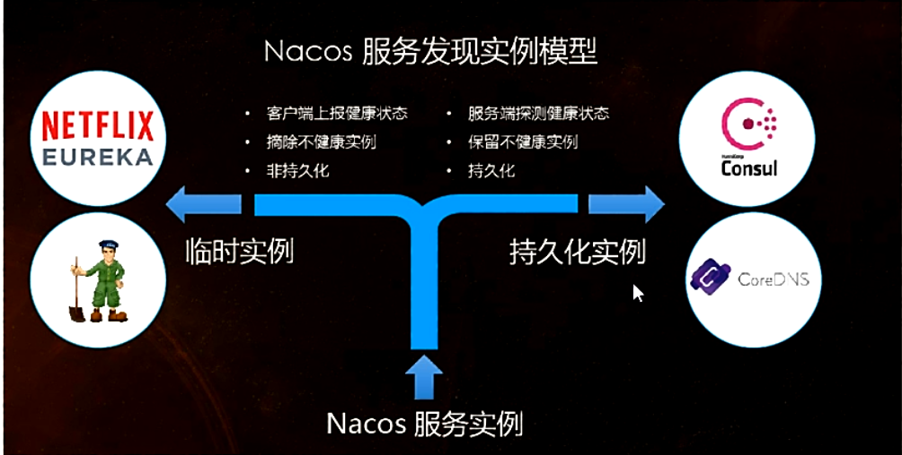

C是保证一致性，A是保证高可用

当前主流的Cloud和Dubbo都是AP模式，AP为了服务的可用性减弱了一致性，因此AP模式下只支持注册临时实例。

如果不需要存储服务级别的信息，且服务实例是通过nacos-client注册，并能保持心跳上报，就可以用AP，若不能则用CP

K8S服务和DNS服务适用于CP模式，CP模式下支持注册持久化实例，此时则是以Raft协议为集群运行模式，该模式下注册实例之前必须先注册服务，如果服务不存在，则会返回错误。

切换的方式就是向注册中心发送一条特殊的PUT请求

## Nacos服务配置中心

### 基础配置

初始化一个在配置中心读取配置的微服务，首先引入依赖，其中重要的是spring-cloud-starter-alibaba-nacos-config

~~~xml
<dependencies>
    <!--nacos-config-->
    <dependency>
        <groupId>com.alibaba.cloud</groupId>
        <artifactId>spring-cloud-starter-alibaba-nacos-config</artifactId>
    </dependency>
    <!--nacos-discovery-->
    <dependency>
        <groupId>com.alibaba.cloud</groupId>
        <artifactId>spring-cloud-starter-alibaba-nacos-discovery</artifactId>
    </dependency>
    <!--web + actuator-->
    <dependency>
        <groupId>org.springframework.boot</groupId>
        <artifactId>spring-boot-starter-web</artifactId>
    </dependency>
    <dependency>
        <groupId>org.springframework.boot</groupId>
        <artifactId>spring-boot-starter-actuator</artifactId>
    </dependency>
    <!--一般基础配置-->
    <dependency>
        <groupId>org.springframework.boot</groupId>
        <artifactId>spring-boot-devtools</artifactId>
        <scope>runtime</scope>
        <optional>true</optional>
    </dependency>
    <dependency>
        <groupId>org.projectlombok</groupId>
        <artifactId>lombok</artifactId>
        <optional>true</optional>
    </dependency>
    <dependency>
        <groupId>org.springframework.boot</groupId>
        <artifactId>spring-boot-starter-test</artifactId>
        <scope>test</scope>
    </dependency>
</dependencies>
~~~

这个微服务和之前的config一样，在resources下要创建两个配置文件（一个负责指示从配置中心拉取配置，一个负责定义当前环境是dev开发环境）：

bootstrap.yml：

~~~yaml
server:
  port: 3377

spring:
  application:
    name: nacos-config-client
  cloud:
    nacos:
      discovery:
        server-addr: localhost:8848 #服务注册中心地址
      config:
        server-addr: localhost:8848 #配置中心地址
        file-extension: yaml #指定yaml格式的配置
~~~

application.yml：

~~~yaml
spring:
  profiles:
    active: dev
~~~

主启动类：

~~~java
package com.atguigu.springcloud.alibaba;

import org.springframework.boot.SpringApplication;
import org.springframework.boot.autoconfigure.SpringBootApplication;
import org.springframework.cloud.client.discovery.EnableDiscoveryClient;

@EnableDiscoveryClient
@SpringBootApplication
public class NacosConfigClientMain3377
{
    public static void main(String[] args) {
        SpringApplication.run(NacosConfigClientMain3377.class, args);
    }
}
~~~

业务类，其中重要的是@RefreshScope，它是实现配置自动刷新的关键注解：

~~~java
package com.atguigu.springcloud.alibaba.controller;

import org.springframework.beans.factory.annotation.Value;
import org.springframework.cloud.context.config.annotation.RefreshScope;
import org.springframework.web.bind.annotation.GetMapping;
import org.springframework.web.bind.annotation.RestController;

@RestController
@RefreshScope
public class ConfigClientController
{
    @Value("${config.info}")
    private String configInfo;

    @GetMapping("/config/info")
    public String getConfigInfo() {
        return configInfo;
    }
}
~~~

然后向nacos中添加配置信息。

官网给出的配置匹配规则：

~~~
${spring.application.name}-${spring.profile.active}.${spring.cloud.nacos.config.file-extension}
~~~

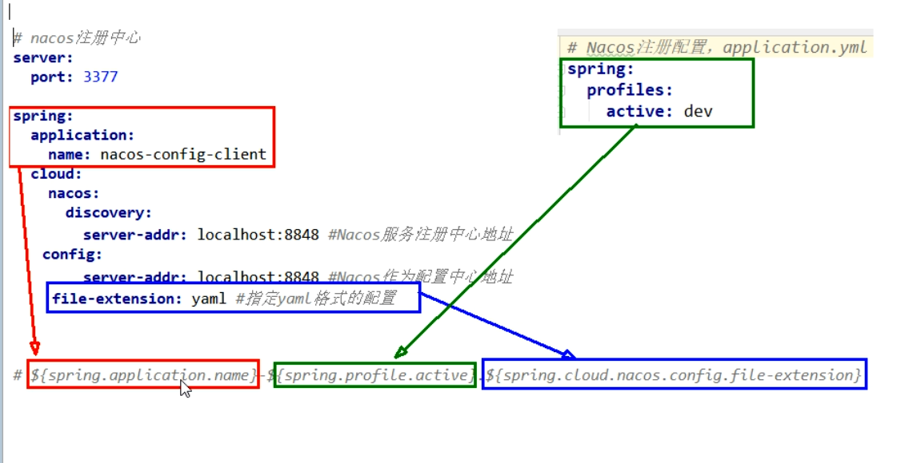

由此可知我们上面的微服务对应的配置中心中的配置文件名应该是nacos-config-client-dev-yaml

在配置中心创建该配置：

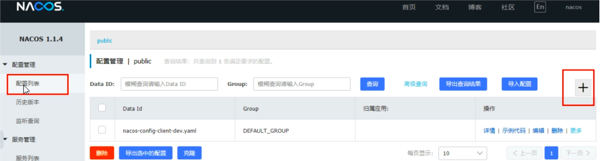

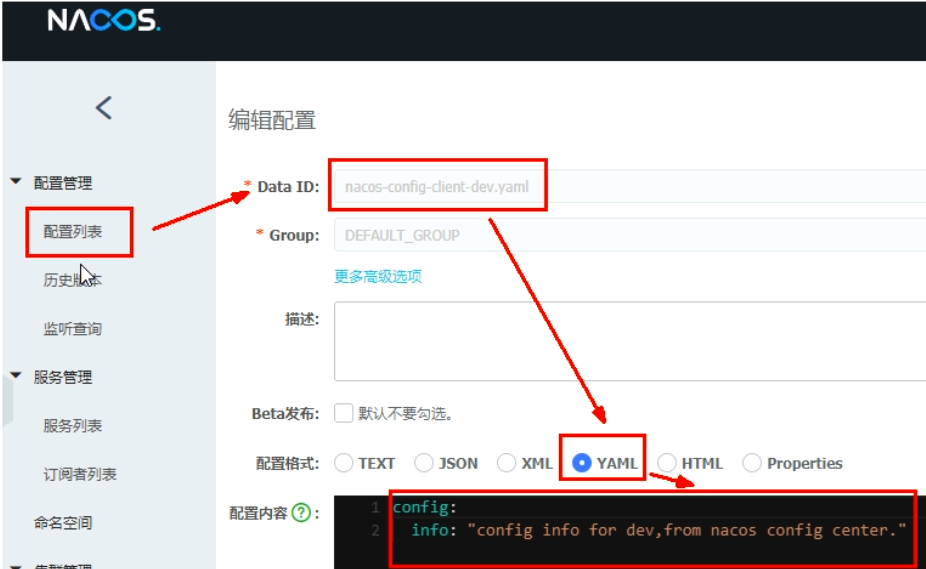

创建好该配置之后，即可调用http://localhost:3377/config/info，配置中心的配置项config.info会自动注入到微服务中，而且自带刷新机制。修改下Nacos中的yaml配置文件然后点发布，再次调用查看配置的接口，就会发现配置已经刷新。

### 分类配置

一个大型项目会有很多种环境：开发、测试、预发、生产环境；还可能有多个服务器集群：如在杭州、广州等。

在nacos中，一份配置文件除了DataId，也就是之前设置的文件名，以外，还有两个坐标来唯一定位到一个配置，它们是：Namespace+Group+Data ID

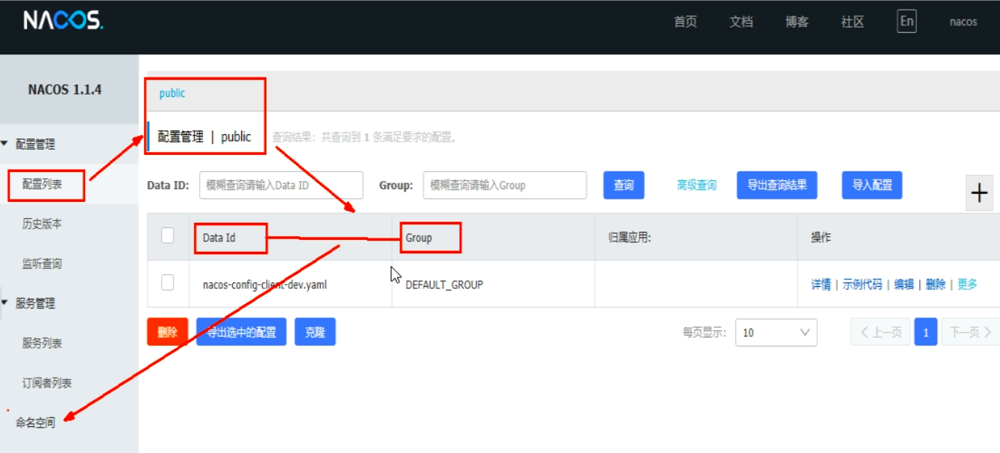

在创建一份配置时，需要指定命名空间、Group和DataId，命名空间若不指定默认是public，Group若不指定默认是DEFAULT_GROUP，增加命名空间和Group可以让配置更易于管理。

微服务中若想读取到非默认的组或者命名空间，需要在bootstrap配置文件中指明：

~~~yaml
server:
  port: 3377

spring:
  application:
    name: nacos-config-client
  cloud:
    nacos:
      discovery:
        server-addr: localhost:8848 #服务注册中心地址
      config:
        server-addr: localhost:8848 #配置中心地址
        file-extension: yaml #指定yaml格式的配置
        group: DEV_GROUP
        namespace: 912eccb8-4d1d-43a0-80c5-0dc6ca5805f6
~~~

其中namespace是根据一个id配置的，在nacos建好一个命名空间之后就可以查看它的id。

## Nacos集群和持久化配置

https://nacos.io/zh-cn/docs/cluster-mode-quick-start.html

架构图：

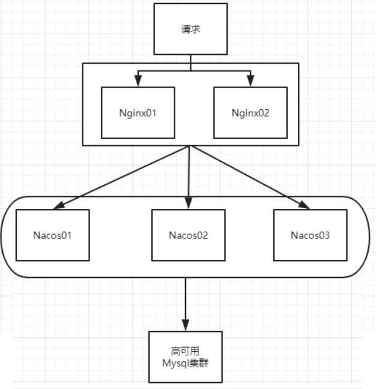

Nacos集群模式需要一个nginx来分发请求，然后将请求分配到多个微服务节点，最后设置统一的mysql作为配置中心持久化层。集群模式下可以实现高可用，不会有单点故障的问题。

### 配置数据存入mysql

Nacos默认自带的是嵌入式数据库derby，所以在Nacos中设置的配置即使关闭之后还可以重新加载出来。

derby切换到mysql的步骤：

首先在nacos-server-1.1.4\nacos\conf目录下找到sql脚本nacos-mysql.sql，然后在mysql中执行，mysql即初始化好了存储配置必要的各数据库和表。

然后在nacos-server-1.1.4\nacos\conf目录下找到application.properties，加入以下配置：

~~~properties
spring.datasource.platform=mysql
 
db.num=1
db.url.0=jdbc:mysql://11.162.196.16:3306/nacos_devtest?characterEncoding=utf8&connectTimeout=1000&socketTimeout=3000&autoReconnect=true
db.user=nacos_devtest
db.password=youdontknow
~~~

切换好了之后再次打开nacos，发现之前的配置都消失了，说明切换到mysql数据库了

### 集群环境搭建

预计需要，1个nginx+3个nacos注册中心+1个mysql

下载nacos linux版本nacos-server-1.1.4.tar.gz，然后解压。在linux上重复上述切换数据库的相关设置。

然后在nacos目录下的conf下修改cluster.conf，加入nacos集群节点的ip和端口：

~~~properties
192.168.111.144:3333
192.168.111.144:4444
192.168.111.144:5555
~~~

然后修改/mynacos/nacos/bin目录下startup.sh，让它能传入不同的端口号，启动不同的实例，然后用该脚本依次启动上面的多个nacos。

然后是安装nginx，修改conf下的nginx.conf，加入监听的端口，以及命令分发到哪些位置：

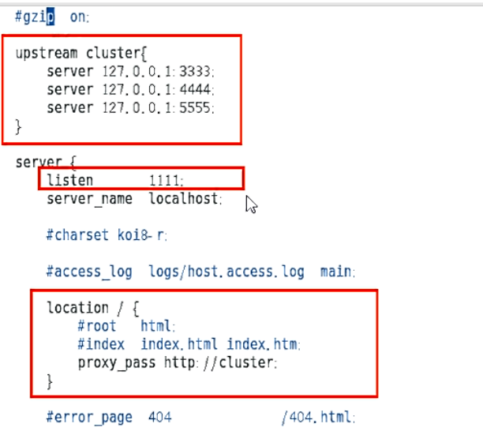

然后在/usr/local/nginx/sbin中执行：

~~~
./nginx -c /usr/local/nginx/conf/nginx.conf
~~~

启动后就可以通过nginx来访问nacos了：https://写你自己虚拟机的ip:1111/nacos/#/login，登录后在nacos界面就可以新增配置，新增的配置就会存入数据库。搭建其他微服务要注册到nacos只需要修改工程中的yaml文件：

~~~
server-addr：写你自己的虚拟机ip:1111
~~~

将nginx的地址写入其中即可将服务注册到nacos。

# SpringCloud Alibaba Sentinel实现熔断与限流

https://github.com/alibaba/Sentinel

https://spring-cloud-alibaba-group.github.io/github-pages/greenwich/spring-cloud-alibaba.html#_spring_cloud_alibaba_sentinel

sentinel可以实现轻量级的流量控制、服务的熔断降级

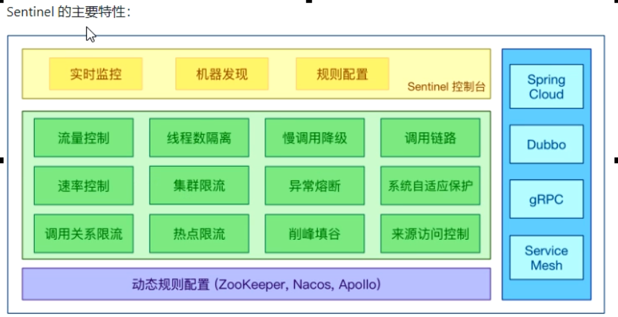

## 安装与入门

sentinel分为两部分：

* java客户端编写在实际业务工程中，对dubbo/spring cloud有较好的支持；
* 控制台基于springboot开发，打包后可以直接运行，不需要额外的tomcat等应用。

下载到本地sentinel-dashboard-1.7.0.jar，然后运行（8080端口不能被占用），然后即可访问http://localhost:8080，登录账号密码均为sentinel

编写一个工程，同时将该服务注册到nacos，并让sentinel监控：

pom：

~~~xml
<?xml version="1.0" encoding="UTF-8"?>
<project xmlns="http://maven.apache.org/POM/4.0.0"
         xmlns:xsi="http://www.w3.org/2001/XMLSchema-instance"
         xsi:schemaLocation="http://maven.apache.org/POM/4.0.0 http://maven.apache.org/xsd/maven-4.0.0.xsd">
    <parent>
        <artifactId>cloud2020</artifactId>
        <groupId>com.atguigu.springcloud</groupId>
        <version>1.0-SNAPSHOT</version>
    </parent>
    <modelVersion>4.0.0</modelVersion>

    <artifactId>cloudalibaba-sentinel-service8401</artifactId>

    <dependencies>
        <dependency>
            <groupId>com.atguigu.springcloud</groupId>
            <artifactId>cloud-api-commons</artifactId>
            <version>${project.version}</version>
        </dependency>

        <dependency>
            <groupId>com.alibaba.cloud</groupId>
            <artifactId>spring-cloud-starter-alibaba-nacos-discovery</artifactId>
        </dependency>

        <dependency>
            <groupId>com.alibaba.csp</groupId>
            <artifactId>sentinel-datasource-nacos</artifactId>
        </dependency>

        <dependency>
            <groupId>com.alibaba.cloud</groupId>
            <artifactId>spring-cloud-starter-alibaba-sentinel</artifactId>
        </dependency>

        <dependency>
            <groupId>org.springframework.cloud</groupId>
            <artifactId>spring-cloud-starter-openfeign</artifactId>
        </dependency>

        <dependency>
            <groupId>org.springframework.boot</groupId>
            <artifactId>spring-boot-starter-web</artifactId>
        </dependency>
        <dependency>
            <groupId>org.springframework.boot</groupId>
            <artifactId>spring-boot-starter-actuator</artifactId>
        </dependency>
      
        <dependency>
            <groupId>org.springframework.boot</groupId>
            <artifactId>spring-boot-devtools</artifactId>
            <scope>runtime</scope>
            <optional>true</optional>
        </dependency>
        <dependency>
            <groupId>cn.hutool</groupId>
            <artifactId>hutool-all</artifactId>
            <version>4.6.3</version>
        </dependency>
        <dependency>
            <groupId>org.projectlombok</groupId>
            <artifactId>lombok</artifactId>
            <optional>true</optional>
        </dependency>
        <dependency>
            <groupId>org.springframework.boot</groupId>
            <artifactId>spring-boot-starter-test</artifactId>
            <scope>test</scope>
        </dependency>
    </dependencies>
</project>
~~~

yaml：

~~~yaml
server:
  port: 8401

spring:
  application:
    name: cloudalibaba-sentinel-service
  cloud:
    nacos:
      discovery:
        server-addr: localhost:8848
    sentinel:
      transport:
        dashboard: localhost:8080
        port: 8719  #默认8719，假如被占用了会自动从8719开始依次+1扫描。直至找到未被占用的端口

management:
  endpoints:
    web:
      exposure:
        include: '*'
~~~

主启动类：

~~~java
package com.atguigu.springcloud.alibaba;

import org.springframework.boot.SpringApplication;
import org.springframework.boot.autoconfigure.SpringBootApplication;
import org.springframework.cloud.client.discovery.EnableDiscoveryClient;

@EnableDiscoveryClient
@SpringBootApplication
public class MainApp8401
{
    public static void main(String[] args) {
        SpringApplication.run(MainApp8401.class, args);
    }
}
~~~

业务类：

~~~java
package com.atguigu.springcloud.alibaba.controller;

import org.springframework.web.bind.annotation.GetMapping;
import org.springframework.web.bind.annotation.RestController;

@RestController
public class FlowLimitController
{
    @GetMapping("/testA")
    public String testA() {
        return "------testA";
    }

    @GetMapping("/testB")
    public String testB() {

        return "------testB";
    }
}
~~~

然后调用一次服务后，就可以在sentinel控制台上看到服务：

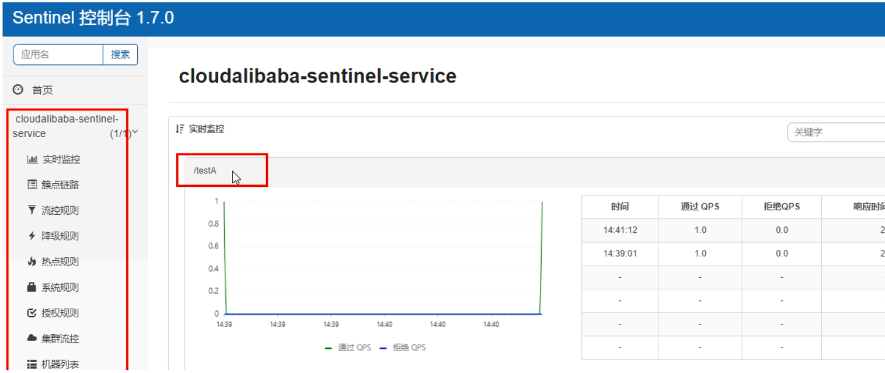

## 流控规则

可以在sentinel控制台增加流控规则：

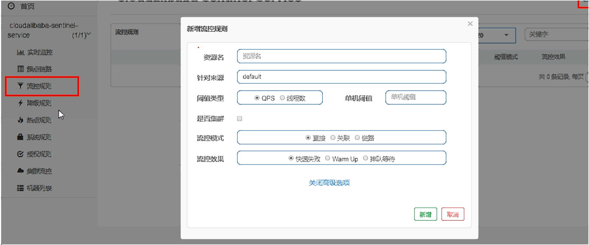

资源名就是限流的资源标识，请求路径；

针对来源，可以填具体的微服务名，此时限流就只针对对应微服务发来的请求，默认不区分是default

阈值类型：QPS（每秒种的请求数量，超出限流）或者线程数（只有对应的有限几个线程在工作，超出则限流）

### 流控模式

1、直接：没有特殊设置

2、关联：需要设置关联资源

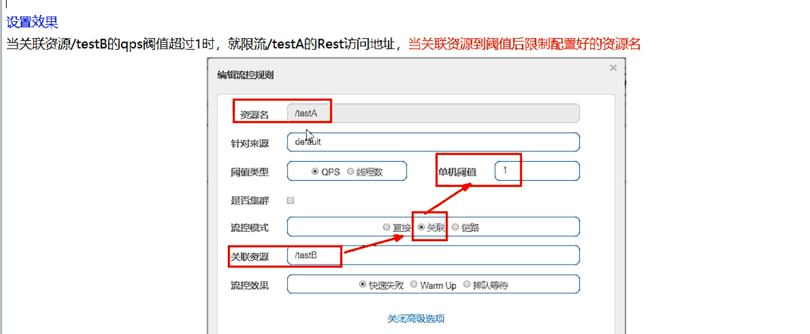

3、链路：对指定微服务发出的资源请求进行限流

### 流控效果

1、快速失败：限流后抛出异常，提示信息：Blocked by Sentinel (flow limiting)

2、预热：公式：阈值除以coldFactor（默认值为3），经过预热时长后才会达到阈值

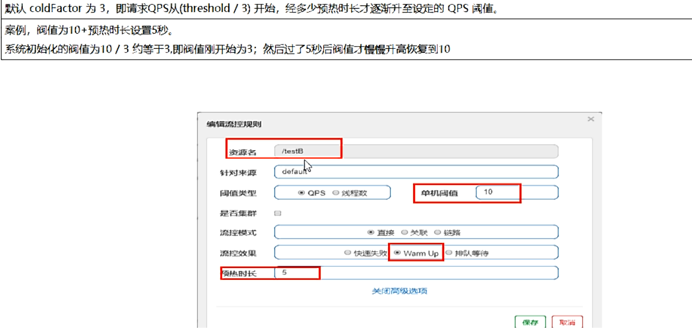

相当于一个缓慢提高上限的限流效果，预热是对系统的一种保护。如秒杀系统在开启时，会有很多请求过来，可能把系统打死。

3、排队等待：

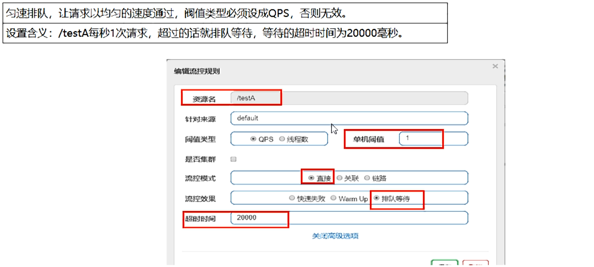

## 降级规则

Sentinel还可以设置降级规则：

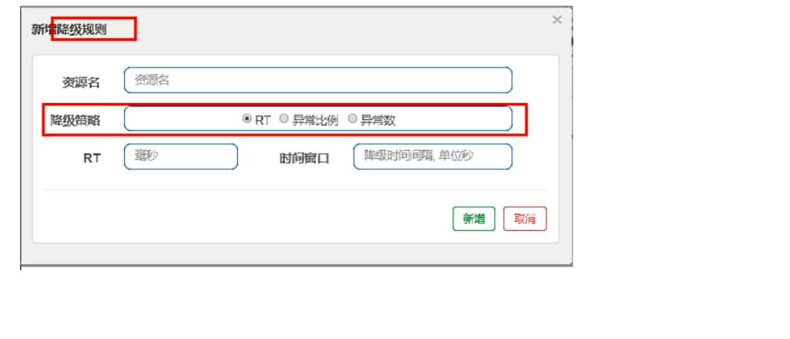

sentinel熔断降级会在调用链路中某个资源出现不稳定状态时，对这个资源的调用进行限制，使其快速失败，避免影响到其他的资源而导致级联错误

当资源被降级后，在接下来的降级时间窗口之内，对该资源的调用都自动熔断，默认行为是抛出DegradeException

（Sentinel的断路器是没有半开状态的，新版本可能已经有了）

1、RT（平均响应时间，秒级）：平均响应时间超出阈值，且在时间窗口内通过的请求>=5个，两个条件同时满足则触发降级，时间窗口结束后，关闭降级。

sentinel默认统计的RT上限是4900ms，超出此阈值都算4900ms，要修改此上限则需要设置启动项来解决。

2、异常比例：当资源的每秒请求量QPS>=5，且每秒异常总数占通过量的比值超过阈值，资源则进入降级状态。时间窗口结束后，关闭降级。异常比例的取值范围是0-1，代表0%-100%

3、异常数：当资源近1分钟的异常数目超过阈值之后会进行熔断，统计时间窗口是分钟级的，配置数字最好大于60

## 热点key限流

sentinel还可以增加热点规则，它可以针对某些热点数据进行针对性的降级处理。

可以设置某个方法里面第一个参数只要QPS超过每秒1次，马上降级处理。热点限流还可以做参数例外项，意思就是我们期望p1参数当它是某个特殊值时，它的限流值和平时不一样，假如当p1的值等于5时，它的阈值可以达到200才达到降级。

## 系统规则

系统保护规则是从应用级别的入口流量进行控制，从单台机器的load、CPU使用率、平均RT、入口QPS、并发线程数等几个维护限制，若违反对应的限制则进入降级状态。

系统保护规则是对服务入口的统一限制，不细分规则，使用较少

## @SentinelResource

@SentinelResource是设置流控的关键注解

### 按资源流控和url流控

业务类：

~~~java
@RestController
public class RateLimitController
{
    @GetMapping("/byResource")
    @SentinelResource(value = "byResource",blockHandler = "handleException")
    public CommonResult byResource()
    {
        return new CommonResult(200,"按资源名称限流测试OK",new Payment(2020L,"serial001"));
    }
    public CommonResult handleException(BlockException exception)
    {
        return new CommonResult(444,exception.getClass().getCanonicalName()+"\t 服务不可用");
    }
~~~

这里面@SentinelResource中的value值对应的就是限流规则的资源名：

而blockHandler的意思是，如果触发了限流，则返回handleException方法定义的错误信息。

除了按资源名限流，还可以按url限流，此时配置业务类的@GetMapping("/rateLimit/byUrl")与流控配置界面的资源名相同，此时流控也可以生效：

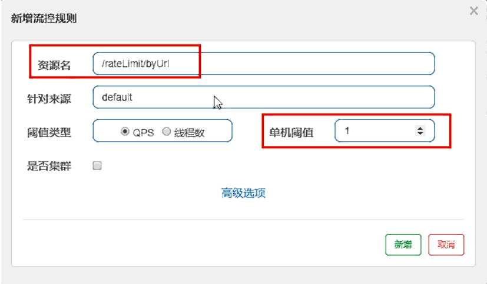

### 自定义限流处理

上述处理handleException方法的逻辑中，需要为类的每一个方法配置一个用于处理限流后响应的方法，很繁琐。我们可以在指定blockHandler时指定一个类：

~~~java
@GetMapping("/rateLimit/customerBlockHandler")
@SentinelResource(value = "customerBlockHandler",
        blockHandlerClass = CustomerBlockHandler.class,
        blockHandler = "handlerException2")
public CommonResult customerBlockHandler()
{
    return new CommonResult(200,"按客戶自定义",new Payment(2020L,"serial003"));
}
 

~~~

这个类中的handlerException2就代表当限流时返回该方法的返回值：

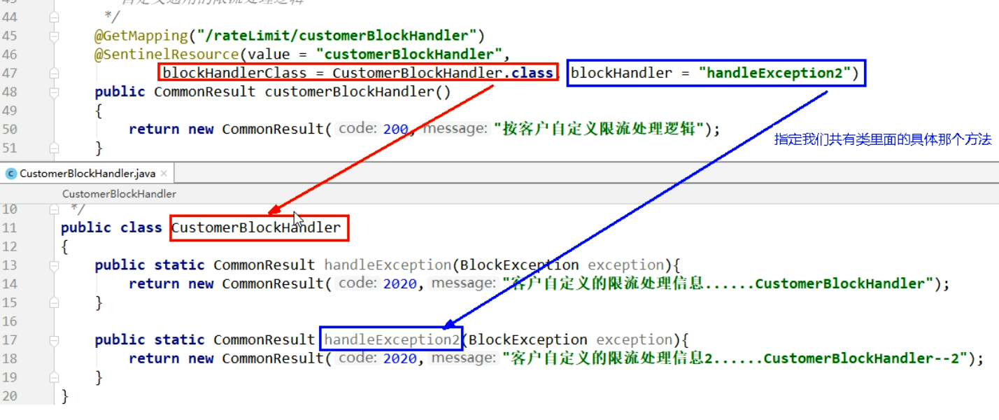

Sentinel的核心注解也可以用API来替代，主要有三个核心API：SphU定义资源、Tracer定义统计、ContextUtil定义了上下文。

## 服务熔断

### 整合Ribbon

1、编写服务提供者

pom文件：

~~~xml
<dependencies>
    <!--SpringCloud ailibaba nacos -->
    <dependency>
        <groupId>com.alibaba.cloud</groupId>
        <artifactId>spring-cloud-starter-alibaba-nacos-discovery</artifactId>
    </dependency>
    <dependency><!-- 引入自己定义的api通用包，可以使用Payment支付Entity -->
        <groupId>com.atguigu.springcloud</groupId>
        <artifactId>cloud-api-commons</artifactId>
        <version>${project.version}</version>
    </dependency>
    <!-- SpringBoot整合Web组件 -->
    <dependency>
        <groupId>org.springframework.boot</groupId>
        <artifactId>spring-boot-starter-web</artifactId>
    </dependency>
    <dependency>
        <groupId>org.springframework.boot</groupId>
        <artifactId>spring-boot-starter-actuator</artifactId>
    </dependency>
    <!--日常通用jar包配置-->
    <dependency>
        <groupId>org.springframework.boot</groupId>
        <artifactId>spring-boot-devtools</artifactId>
        <scope>runtime</scope>
        <optional>true</optional>
    </dependency>
    <dependency>
        <groupId>org.projectlombok</groupId>
        <artifactId>lombok</artifactId>
        <optional>true</optional>
    </dependency>
    <dependency>
        <groupId>org.springframework.boot</groupId>
        <artifactId>spring-boot-starter-test</artifactId>
        <scope>test</scope>
    </dependency>
</dependencies>
~~~

yaml：

~~~yaml
server:
  port: 9003
spring:
  application:
    name: nacos-payment-provider
  cloud:
    nacos:
      discovery:
        server-addr: localhost:8848 #配置Nacos地址
management:
  endpoints:
    web:
      exposure:
        include: '*'
~~~

主启动类：

~~~java
package com.atguigu.springcloud.alibaba;

import org.springframework.boot.SpringApplication;
import org.springframework.boot.autoconfigure.SpringBootApplication;
import org.springframework.cloud.client.discovery.EnableDiscoveryClient;

@SpringBootApplication
@EnableDiscoveryClient
public class PaymentMain9003
{
    public static void main(String[] args) {
        SpringApplication.run(PaymentMain9003.class, args);
    }
}
~~~

消费者服务：

pom：

~~~xml
<?xml version="1.0" encoding="UTF-8"?>
<project xmlns="http://maven.apache.org/POM/4.0.0"
         xmlns:xsi="http://www.w3.org/2001/XMLSchema-instance"
         xsi:schemaLocation="http://maven.apache.org/POM/4.0.0 http://maven.apache.org/xsd/maven-4.0.0.xsd">
    <parent>
        <artifactId>cloud2020</artifactId>
        <groupId>com.atguigu.springcloud</groupId>
        <version>1.0-SNAPSHOT</version>
    </parent>
    <modelVersion>4.0.0</modelVersion>

    <artifactId>cloudalibaba-consumer-nacos-order84</artifactId>

    <dependencies>
        <dependency>
            <groupId>org.springframework.cloud</groupId>
            <artifactId>spring-cloud-starter-openfeign</artifactId>
        </dependency>
        <dependency>
            <groupId>com.alibaba.cloud</groupId>
            <artifactId>spring-cloud-starter-alibaba-nacos-discovery</artifactId>
        </dependency>
        <dependency>
            <groupId>com.alibaba.cloud</groupId>
            <artifactId>spring-cloud-starter-alibaba-sentinel</artifactId>
        </dependency>
        <dependency>
            <groupId>com.atguigu.springcloud</groupId>
            <artifactId>cloud-api-commons</artifactId>
            <version>${project.version}</version>
        </dependency>
        <dependency>
            <groupId>org.springframework.boot</groupId>
            <artifactId>spring-boot-starter-web</artifactId>
        </dependency>
        <dependency>
            <groupId>org.springframework.boot</groupId>
            <artifactId>spring-boot-starter-actuator</artifactId>
        </dependency>
        <dependency>
            <groupId>org.springframework.boot</groupId>
            <artifactId>spring-boot-devtools</artifactId>
            <scope>runtime</scope>
            <optional>true</optional>
        </dependency>
        <dependency>
            <groupId>org.projectlombok</groupId>
            <artifactId>lombok</artifactId>
            <optional>true</optional>
        </dependency>
        <dependency>
            <groupId>org.springframework.boot</groupId>
            <artifactId>spring-boot-starter-test</artifactId>
            <scope>test</scope>
        </dependency>
    </dependencies>
</project>
~~~

yaml中引入sentinel的监控：

~~~yaml
server:
  port: 84

spring:
  application:
    name: nacos-order-consumer
  cloud:
    nacos:
      discovery:
        server-addr: localhost:8848
    sentinel:
      transport:
        dashboard: localhost:8080
        port: 8719

service-url:
  nacos-user-service: http://nacos-payment-provider
~~~

主启动类：

~~~java
package com.atguigu.springcloud.alibaba;

import org.springframework.boot.SpringApplication;
import org.springframework.boot.autoconfigure.SpringBootApplication;
import org.springframework.cloud.client.discovery.EnableDiscoveryClient;
import org.springframework.cloud.openfeign.EnableFeignClients;

@EnableDiscoveryClient
@SpringBootApplication
@EnableFeignClients
public class OrderNacosMain84
{
    public static void main(String[] args) {
        SpringApplication.run(OrderNacosMain84.class, args);
    }
}
~~~

注入远程调用的模板类：

~~~java
package com.atguigu.springcloud.alibaba.config;

import org.springframework.cloud.client.loadbalancer.LoadBalanced;
import org.springframework.context.annotation.Bean;
import org.springframework.context.annotation.Configuration;
import org.springframework.web.client.RestTemplate;

@Configuration
public class ApplicationContextConfig
{
    @Bean
    @LoadBalanced
    public RestTemplate getRestTemplate()
    {
        return new RestTemplate();
    }
}
~~~

业务类：

~~~java
package com.atguigu.springcloud.alibaba.controller;

import com.alibaba.csp.sentinel.annotation.SentinelResource;
import com.alibaba.csp.sentinel.slots.block.BlockException;
import com.atguigu.springcloud.alibaba.entities.CommonResult;
import com.atguigu.springcloud.alibaba.entities.Payment;
import com.atguigu.springcloud.alibaba.service.PaymentService;

import lombok.extern.slf4j.Slf4j;
import org.springframework.web.bind.annotation.GetMapping;
import org.springframework.web.bind.annotation.PathVariable;
import org.springframework.web.bind.annotation.RequestMapping;
import org.springframework.web.bind.annotation.RestController;
import org.springframework.web.client.RestTemplate;

import javax.annotation.Resource;

@RestController
@Slf4j
public class CircleBreakerController {
   
    public static final String SERVICE_URL = "http://nacos-payment-provider";

    @Resource
    private RestTemplate restTemplate;

    @RequestMapping("/consumer/fallback/{id}")
    //@SentinelResource(value = "fallback") //没有配置
    //@SentinelResource(value = "fallback",fallback = "handlerFallback") //fallback只负责业务异常
    //@SentinelResource(value = "fallback",blockHandler = "blockHandler") //blockHandler只负责sentinel控制台配置违规
    @SentinelResource(value = "fallback",fallback = "handlerFallback",blockHandler = "blockHandler",
            exceptionsToIgnore = {IllegalArgumentException.class})
    public CommonResult<Payment> fallback(@PathVariable Long id) {
        CommonResult<Payment> result = restTemplate.getForObject(SERVICE_URL + "/paymentSQL/"+id, CommonResult.class,id);

        if (id == 4) {
            throw new IllegalArgumentException ("IllegalArgumentException,非法参数异常....");
        }else if (result.getData() == null) {
            throw new NullPointerException ("NullPointerException,该ID没有对应记录,空指针异常");
        }

        return result;
    }
  
    //fallback
    public CommonResult handlerFallback(@PathVariable  Long id,Throwable e) {
        Payment payment = new Payment(id,"null");
        return new CommonResult<>(444,"兜底异常handlerFallback,exception内容  "+e.getMessage(),payment);
    }
  
    //blockHandler
    public CommonResult blockHandler(@PathVariable  Long id,BlockException blockException) {
        Payment payment = new Payment(id,"null");
        return new CommonResult<>(445,"blockHandler-sentinel限流,无此流水: blockException  "+blockException.getMessage(),payment);
    }
}
~~~

其中的@SentinelResource配置了fallback和blockHandler两个处理器，blockHandler只负责sentinel控制台流控规则违规，fallback只负责业务异常（如果是业务代码自己的运行异常，则走这个分支），exceptionsToIgnore代表方法若抛出IllegalArgumentException，则没有fallback方法兜底了。

### 整合Feign

服务提供者和上一节相同。

消费者服务搭建：

pom引入feign

~~~xml
<dependency>
    <groupId>org.springframework.cloud</groupId>
    <artifactId>spring-cloud-starter-openfeign</artifactId>
</dependency>
~~~

yaml：

~~~yaml
server:
  port: 84

spring:
  application:
    name: nacos-order-consumer
  cloud:
    nacos:
      discovery:
        server-addr: localhost:8848
    sentinel:
      transport:
        dashboard: localhost:8080
        port: 8719

service-url:
  nacos-user-service: http://nacos-payment-provider

#对Feign的支持
feign:
  sentinel:
    enabled: true
~~~

远程调用接口：

~~~java
package com.atguigu.springcloud.alibaba.service;

import com.atguigu.springcloud.alibaba.entities.CommonResult;
import com.atguigu.springcloud.alibaba.entities.Payment;
import org.springframework.cloud.openfeign.FeignClient;
import org.springframework.web.bind.annotation.GetMapping;
import org.springframework.web.bind.annotation.PathVariable;

@FeignClient(value = "nacos-payment-provider",fallback = PaymentFallbackService.class)
public interface PaymentService
{
    @GetMapping(value = "/paymentSQL/{id}")
    public CommonResult<Payment> paymentSQL(@PathVariable("id") Long id);
}
~~~

实现类：

~~~java
@Component
public class PaymentFallbackService implements PaymentService
{
    @Override
    public CommonResult<Payment> paymentSQL(Long id)
    {
        return new CommonResult<>(44444,"服务降级返回,---PaymentFallbackService",new Payment(id,"errorSerial"));
    }
}
~~~

controller：

~~~java
// OpenFeign
@Resource
private PaymentService paymentService;

@GetMapping(value = "/consumer/paymentSQL/{id}")
public CommonResult<Payment> paymentSQL(@PathVariable("id") Long id) {
    return paymentService.paymentSQL(id);
}
~~~

主启动类：

~~~java
package com.atguigu.springcloud.alibaba;

import org.springframework.boot.SpringApplication;
import org.springframework.boot.autoconfigure.SpringBootApplication;
import org.springframework.cloud.client.discovery.EnableDiscoveryClient;
import org.springframework.cloud.openfeign.EnableFeignClients;

@EnableDiscoveryClient
@SpringBootApplication
@EnableFeignClients
public class OrderNacosMain84
{
    public static void main(String[] args) {
        SpringApplication.run(OrderNacosMain84.class, args);
    }
}
~~~

## 规则持久化

一旦我们重启应用，Sentinel规则将消失，生产环境需要将配置规则进行持久化。要解决这个问题，需要将限流配置规则持久化进Nacos保存。

需要首先在服务中引入该依赖：

~~~xml
<dependency>
    <groupId>com.alibaba.csp</groupId>
    <artifactId>sentinel-datasource-nacos</artifactId>
</dependency>
~~~

然后在yaml中配置nacos数据源：

~~~yaml
spring:
   cloud:
    sentinel:
    datasource:
     ds1:
      nacos:
        server-addr:localhost:8848
        dataid:${spring.application.name}
        groupid:DEFAULT_GROUP
        data-type:json
            rule-type:flow
~~~

在配置中心将限流规则配置进去：

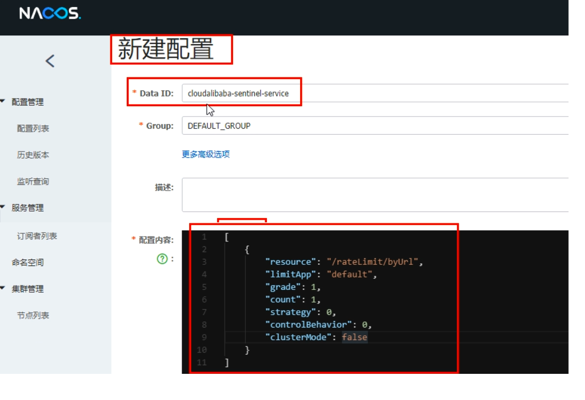

然后再启动服务，则可以在sentinel看到对应的规则，重启也不会消失：

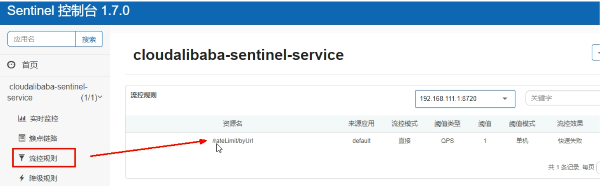

# SpringCloud Alibaba Seata处理分布式事务

## Seata概念

当单体应用被拆分成微服务应用后，原来的三个模块被拆分成三个独立的应用，分别使用三个独立的数据源，业务操作需要调用三个服务来完成。此时每个服务内部的数据一致性由本地事务来保证，但是全局的数据一致性问题没法保证。

比如用户购买商品，需要修改三个数据库的值：仓库数据库、订单数据库、用户账户。一次业务操作需要跨多个数据源或需要跨多个系统进行远程调用，就会产生分布式事务问题。

Seata是一款开源的分布式事务解决方案，致力于在微服务架构下提供高性能和简单易用的分布式事务服务。http://seata.io/zh-cn/

seata的分布式事务处理模型由唯一的事务id+三组件模型构成：

* Transaction ID XID：全局唯一的事务ID
* Transaction Coordinator(TC) ：事务协调器，维护全局事务的运行状态，负责协调并驱动全局事务的提交或回滚;
* Transaction  Manager(TM) ：控制全局事务的边界，负责开启一个全局事务，并最终发起全局提交或全局回滚的决议;
* Resource Manager(RM) ：控制分支事务，负责分支注册，状态汇报，并接收事务协调器的指令，驱动分支（本地）事务的提交和回滚；

处理过程和架构图：

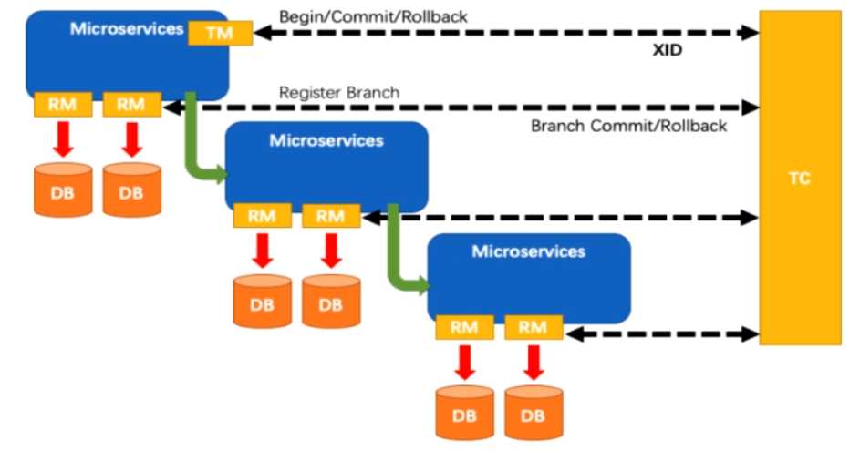

## Seata安装

http://seata.io/zh-cn/

下载到seata-server-0.9.0.zip解压到指定目录并修改conf目录下的file.conf配置文件，修改配置文件，包括三部分信息：自定义事务组名称+事务日志存储模式为db+数据库连接信息：

~~~properties
vgroup_mapping.my_test_tx_group = "fsp_tx_group"
mode = "db"
url = "jdbc:mysql://127.0.0.1:3306/seata"
user = "root"
password = "你自己的密码"
~~~

然后在mysql数据库中建立seata库，然后在seata库中建表，建表db_store.sql在\seata-server-0.9.0\seata\conf目录里面：db_store.sql

第三步是修改seata-server-0.9.0\seata\conf目录下的registry.conf配置文件，指明注册中心为nacos：

~~~
registry {
  # file 、nacos 、eureka、redis、zk、consul、etcd3、sofa
  type = "nacos"
 
  nacos {
    serverAddr = "localhost:8848"
    namespace = ""
    cluster = "default"
  }
~~~

先启动nacos，然后再启动seata：执行seata-server-0.9.0\seata\bin中的seata-server.bat

## Seata使用

以一个案例来说明Seata的使用，模拟一个下单购买场景，购买场景会同时进行下列几个动作：

1、在订单表中创建一个订单

2、调用库存服务来扣减下单商品的库存

3、扣减用户账户里面的余额

4、订单表中的订单状态修改为已完成

创建三个服务：订单服务、库存服务、账户服务

该操作涉及三个数据库，有两次远程调用，它存在分布式事务问题。

### 数据库准备

建立三个数据库：

seata_order: 存储订单的数据库，下建t_order表

seata_storage:存储库存的数据库，下建t_storage表

seata_account: 存储账户信息的数据库，下建t_account表

此外，3个库下都需要建各自的回滚日志表，\seata-server-0.9.0\seata\conf目录下的db_undo_log.sql ：

~~~sql
drop table `undo_log`;
CREATE TABLE `undo_log` (
  `id` bigint(20) NOT NULL AUTO_INCREMENT,
  `branch_id` bigint(20) NOT NULL,
  `xid` varchar(100) NOT NULL,
  `context` varchar(128) NOT NULL,
  `rollback_info` longblob NOT NULL,
  `log_status` int(11) NOT NULL,
  `log_created` datetime NOT NULL,
  `log_modified` datetime NOT NULL,
  `ext` varchar(100) DEFAULT NULL,
  PRIMARY KEY (`id`),
  UNIQUE KEY `ux_undo_log` (`xid`,`branch_id`)
) ENGINE=InnoDB AUTO_INCREMENT=1 DEFAULT CHARSET=utf8;
~~~

### 微服务准备

（以下mybatis相关略过）

以Order-Module为例，pom文件：

~~~xml
 
    <dependencies>
        <!--nacos-->
        <dependency>
            <groupId>com.alibaba.cloud</groupId>
            <artifactId>spring-cloud-starter-alibaba-nacos-discovery</artifactId>
        </dependency>
        <!--seata-->
        <dependency>
            <groupId>com.alibaba.cloud</groupId>
            <artifactId>spring-cloud-starter-alibaba-seata</artifactId>
            <exclusions>
                <exclusion>
                    <artifactId>seata-all</artifactId>
                    <groupId>io.seata</groupId>
                </exclusion>
            </exclusions>
        </dependency>
        <dependency>
            <groupId>io.seata</groupId>
            <artifactId>seata-all</artifactId>
            <version>0.9.0</version>
        </dependency>
        <!--feign-->
        <dependency>
            <groupId>org.springframework.cloud</groupId>
            <artifactId>spring-cloud-starter-openfeign</artifactId>
        </dependency>
        <!--web-actuator-->
        <dependency>
            <groupId>org.springframework.boot</groupId>
            <artifactId>spring-boot-starter-web</artifactId>
        </dependency>
        <dependency>
            <groupId>org.springframework.boot</groupId>
            <artifactId>spring-boot-starter-actuator</artifactId>
        </dependency>
        <!--mysql-druid-->
        <dependency>
            <groupId>mysql</groupId>
            <artifactId>mysql-connector-java</artifactId>
            <version>5.1.37</version>
        </dependency>
        <dependency>
            <groupId>com.alibaba</groupId>
            <artifactId>druid-spring-boot-starter</artifactId>
            <version>1.1.10</version>
        </dependency>
        <dependency>
            <groupId>org.mybatis.spring.boot</groupId>
            <artifactId>mybatis-spring-boot-starter</artifactId>
            <version>2.0.0</version>
        </dependency>
        <dependency>
            <groupId>org.springframework.boot</groupId>
            <artifactId>spring-boot-starter-test</artifactId>
            <scope>test</scope>
        </dependency>
        <dependency>
            <groupId>org.projectlombok</groupId>
            <artifactId>lombok</artifactId>
            <optional>true</optional>
        </dependency>
    </dependencies>
~~~

yaml：

~~~yaml
server:
  port: 2001
 
spring:
  application:
    name: seata-order-service
  cloud:
    alibaba:
      seata:
        #自定义事务组名称需要与seata-server中的对应
        tx-service-group: fsp_tx_group
    nacos:
      discovery:
        server-addr: localhost:8848
  datasource:
    driver-class-name: com.mysql.jdbc.Driver
    url: jdbc:mysql://localhost:3306/seata_order
    username: root
    password: 1111111
 
feign:
  hystrix:
    enabled: false
 
logging:
  level:
    io:
      seata: info
 
mybatis:
  mapperLocations: classpath:mapper/*.xml
~~~

resources下的file.conf，主要是指定事务组、事务操作使用的数据库

~~~
transport {
  # tcp udt unix-domain-socket
  type = "TCP"
  #NIO NATIVE
  server = "NIO"
  #enable heartbeat
  heartbeat = true
  #thread factory for netty
  thread-factory {
    boss-thread-prefix = "NettyBoss"
    worker-thread-prefix = "NettyServerNIOWorker"
    server-executor-thread-prefix = "NettyServerBizHandler"
    share-boss-worker = false
    client-selector-thread-prefix = "NettyClientSelector"
    client-selector-thread-size = 1
    client-worker-thread-prefix = "NettyClientWorkerThread"
    # netty boss thread size,will not be used for UDT
    boss-thread-size = 1
    #auto default pin or 8
    worker-thread-size = 8
  }
  shutdown {
    # when destroy server, wait seconds
    wait = 3
  }
  serialization = "seata"
  compressor = "none"
}
 
service {
 
  vgroup_mapping.fsp_tx_group = "default" 
 
  default.grouplist = "127.0.0.1:8091"
  enableDegrade = false
  disable = false
  max.commit.retry.timeout = "-1"
  max.rollback.retry.timeout = "-1"
  disableGlobalTransaction = false
}
 
 
client {
  async.commit.buffer.limit = 10000
  lock {
    retry.internal = 10
    retry.times = 30
  }
  report.retry.count = 5
  tm.commit.retry.count = 1
  tm.rollback.retry.count = 1
}
 
## transaction log store
store {
  ## store mode: file、db
  mode = "db"
 
  ## file store
  file {
    dir = "sessionStore"
 
    # branch session size , if exceeded first try compress lockkey, still exceeded throws exceptions
    max-branch-session-size = 16384
    # globe session size , if exceeded throws exceptions
    max-global-session-size = 512
    # file buffer size , if exceeded allocate new buffer
    file-write-buffer-cache-size = 16384
    # when recover batch read size
    session.reload.read_size = 100
    # async, sync
    flush-disk-mode = async
  }
 
  ## database store
  db {
    ## the implement of javax.sql.DataSource, such as DruidDataSource(druid)/BasicDataSource(dbcp) etc.
    datasource = "dbcp"
    ## mysql/oracle/h2/oceanbase etc.
    db-type = "mysql"
    driver-class-name = "com.mysql.jdbc.Driver"
    url = "jdbc:mysql://127.0.0.1:3306/seata"
    user = "root"
    password = "123456"
    min-conn = 1
    max-conn = 3
    global.table = "global_table"
    branch.table = "branch_table"
    lock-table = "lock_table"
    query-limit = 100
  }
}
lock {
  ## the lock store mode: local、remote
  mode = "remote"
 
  local {
    ## store locks in user's database
  }
 
  remote {
    ## store locks in the seata's server
  }
}
recovery {
  #schedule committing retry period in milliseconds
  committing-retry-period = 1000
  #schedule asyn committing retry period in milliseconds
  asyn-committing-retry-period = 1000
  #schedule rollbacking retry period in milliseconds
  rollbacking-retry-period = 1000
  #schedule timeout retry period in milliseconds
  timeout-retry-period = 1000
}
 
transaction {
  undo.data.validation = true
  undo.log.serialization = "jackson"
  undo.log.save.days = 7
  #schedule delete expired undo_log in milliseconds
  undo.log.delete.period = 86400000
  undo.log.table = "undo_log"
}
 
## metrics settings
metrics {
  enabled = false
  registry-type = "compact"
  # multi exporters use comma divided
  exporter-list = "prometheus"
  exporter-prometheus-port = 9898
}
 
support {
  ## spring
  spring {
    # auto proxy the DataSource bean
    datasource.autoproxy = false
  }
}
~~~

resources下的registry.conf：

~~~
registry {
  # file 、nacos 、eureka、redis、zk、consul、etcd3、sofa
  type = "nacos"
 
  nacos {
    serverAddr = "localhost:8848"
    namespace = ""
    cluster = "default"
  }
  eureka {
    serviceUrl = "http://localhost:8761/eureka"
    application = "default"
    weight = "1"
  }
  redis {
    serverAddr = "localhost:6379"
    db = "0"
  }
  zk {
    cluster = "default"
    serverAddr = "127.0.0.1:2181"
    session.timeout = 6000
    connect.timeout = 2000
  }
  consul {
    cluster = "default"
    serverAddr = "127.0.0.1:8500"
  }
  etcd3 {
    cluster = "default"
    serverAddr = "http://localhost:2379"
  }
  sofa {
    serverAddr = "127.0.0.1:9603"
    application = "default"
    region = "DEFAULT_ZONE"
    datacenter = "DefaultDataCenter"
    cluster = "default"
    group = "SEATA_GROUP"
    addressWaitTime = "3000"
  }
  file {
    name = "file.conf"
  }
}
 
config {
  # file、nacos 、apollo、zk、consul、etcd3
  type = "file"
 
  nacos {
    serverAddr = "localhost"
    namespace = ""
  }
  consul {
    serverAddr = "127.0.0.1:8500"
  }
  apollo {
    app.id = "seata-server"
    apollo.meta = "http://192.168.1.204:8801"
  }
  zk {
    serverAddr = "127.0.0.1:2181"
    session.timeout = 6000
    connect.timeout = 2000
  }
  etcd3 {
    serverAddr = "http://localhost:2379"
  }
  file {
    name = "file.conf"
  }
}
~~~

这两个配置文件其实就是之前配过的，这里内嵌到服务中。

订单的service类：

~~~java
package com.atguigu.springcloud.alibaba.service.impl;
 
import com.atguigu.springcloud.alibaba.dao.OrderDao;
import com.atguigu.springcloud.alibaba.domain.Order;
import com.atguigu.springcloud.alibaba.service.AccountService;
import com.atguigu.springcloud.alibaba.service.OrderService;
import com.atguigu.springcloud.alibaba.service.StorageService;
import io.seata.spring.annotation.GlobalTransactional;
import lombok.extern.slf4j.Slf4j;
import org.springframework.stereotype.Service;
 
import javax.annotation.Resource;
 
 
@Service
@Slf4j
public class OrderServiceImpl implements OrderService
{
    @Resource
    private OrderDao orderDao;
    @Resource
    private StorageService storageService;
    @Resource
    private AccountService accountService;
 
    /**
     * 创建订单->调用库存服务扣减库存->调用账户服务扣减账户余额->修改订单状态
     */
     
    @Override
    @GlobalTransactional(name = "fsp-create-order",rollbackFor = Exception.class)
    public void create(Order order){
        log.info("----->开始新建订单");
        //新建订单
        orderDao.create(order);
 
        //扣减库存
        log.info("----->订单微服务开始调用库存，做扣减Count");
        storageService.decrease(order.getProductId(),order.getCount());
        log.info("----->订单微服务开始调用库存，做扣减end");
 
        //扣减账户
        log.info("----->订单微服务开始调用账户，做扣减Money");
        accountService.decrease(order.getUserId(),order.getMoney());
        log.info("----->订单微服务开始调用账户，做扣减end");
 
         
        //修改订单状态，从零到1代表已经完成
        log.info("----->修改订单状态开始");
        orderDao.update(order.getUserId(),0);
        log.info("----->修改订单状态结束");
 
        log.info("----->下订单结束了");
 
    }
}
~~~

库存service和用户账户service，这两个都是远程调用：

~~~java
package com.atguigu.springcloud.alibaba.service;
 
import com.atguigu.springcloud.alibaba.domain.CommonResult;
import org.springframework.cloud.openfeign.FeignClient;
import org.springframework.web.bind.annotation.PostMapping;
import org.springframework.web.bind.annotation.RequestParam;
 
import java.math.BigDecimal;
 
@FeignClient(value = "seata-account-service")
public interface AccountService{
    @PostMapping(value = "/account/decrease")
    CommonResult decrease(@RequestParam("userId") Long userId, @RequestParam("money") BigDecimal money);
}
~~~

~~~java
package com.atguigu.springcloud.alibaba.service;
 
import com.atguigu.springcloud.alibaba.domain.CommonResult;
import org.springframework.cloud.openfeign.FeignClient;
import org.springframework.web.bind.annotation.PostMapping;
import org.springframework.web.bind.annotation.RequestParam;
 
import java.math.BigDecimal;
 
 
@FeignClient(value = "seata-storage-service")
public interface StorageService{
    @PostMapping(value = "/storage/decrease")
    CommonResult decrease(@RequestParam("productId") Long productId, @RequestParam("count") Integer count);
}
~~~

controller：

~~~java
package com.atguigu.springcloud.alibaba.controller;
 
import com.atguigu.springcloud.alibaba.domain.CommonResult;
import com.atguigu.springcloud.alibaba.domain.Order;
import com.atguigu.springcloud.alibaba.service.OrderService;
import org.springframework.web.bind.annotation.GetMapping;
import org.springframework.web.bind.annotation.RestController;
 
import javax.annotation.Resource;
 
 
@RestController
public class OrderController{
    @Resource
    private OrderService orderService;
 
 
    @GetMapping("/order/create")
    public CommonResult create(Order order)
    {
        orderService.create(order);
        return new CommonResult(200,"订单创建成功");
    }
}
~~~

主启动类：

~~~java
package com.atguigu.springcloud.alibaba;
 
import org.springframework.boot.SpringApplication;
import org.springframework.boot.autoconfigure.SpringBootApplication;
import org.springframework.boot.autoconfigure.jdbc.DataSourceAutoConfiguration;
import org.springframework.cloud.client.discovery.EnableDiscoveryClient;
import org.springframework.cloud.openfeign.EnableFeignClients;
 
@EnableDiscoveryClient
@EnableFeignClients
@SpringBootApplication(exclude = DataSourceAutoConfiguration.class)//取消数据源自动创建的配置
public class SeataOrderMainApp2001{
 
    public static void main(String[] args)
    {
        SpringApplication.run(SeataOrderMainApp2001.class, args);
    }
}
~~~

### 注解使用

当正常下单时，各数据库数据正常，请求是：http://localhost:2001/order/create?userid=1&producrid=1&counr=10&money=100

但如果账户微服务停止，此时就会导致调用失败，出现数据不一致的情况。解决方法就是在OrderServiceImpl的create方法上加上注解：@GlobalTransactional(name = "fsp-create-order",rollbackFor = Exception.class)

此时出现异常就会进行回滚，服务停止的超时异常会让整个事务进行回滚，数据库无脏数据。

## 原理

Seata的默认事务模式是AT模式

Seata两阶段提交协议：

1、一阶段：业务数据和回滚日志记录在同一个本地事务中提交，释放本地锁和连接资源

2、二阶段：提交异步化，回滚通过一阶段的回滚日志进行反向补偿。

一、一阶段加载过程：

1、Seata会拦截业务SQL，解析SQL语义，找到业务SQL要更新的业务数据，在业务数据被更新前，将其保存为before image

2、执行业务SQL

3、执行完毕后将对应数据封装，保存成after image，生成行锁。

上述三步在一个事务中完成，保证了一阶段操作的原子性：

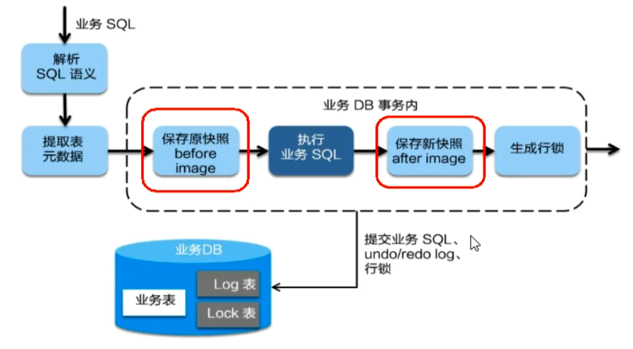

二、二阶段提交：

若执行顺利，Seata框架就会将一阶段保存的快照数据和行锁删除，完成数据清理：

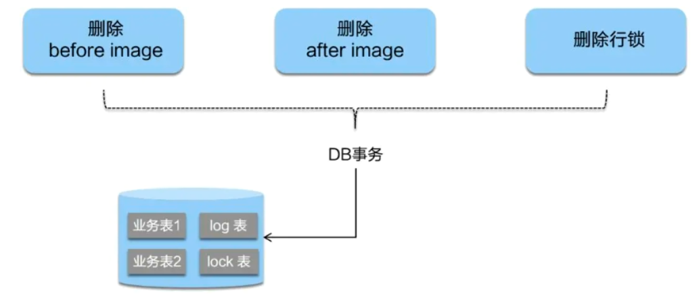

三、二阶段回滚：

若执行不顺利，Seata就需要回滚一阶段已经执行的业务SQL

回滚方式就是用before image还原业务数据，在还原前首先要校验脏写，对比数据当前业务数据和after image，如果两份数据完全一致就说明没有脏写，可以还原业务数据，如果不一致就说明有脏写，出现脏写就需要人工处理。

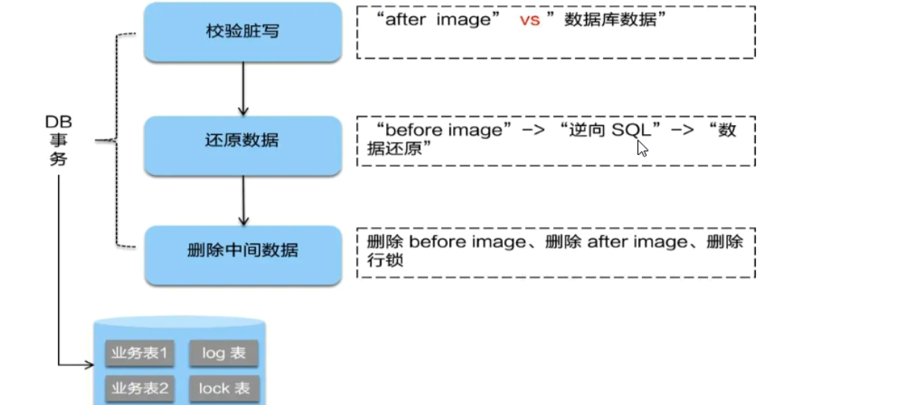

seata解析过程：

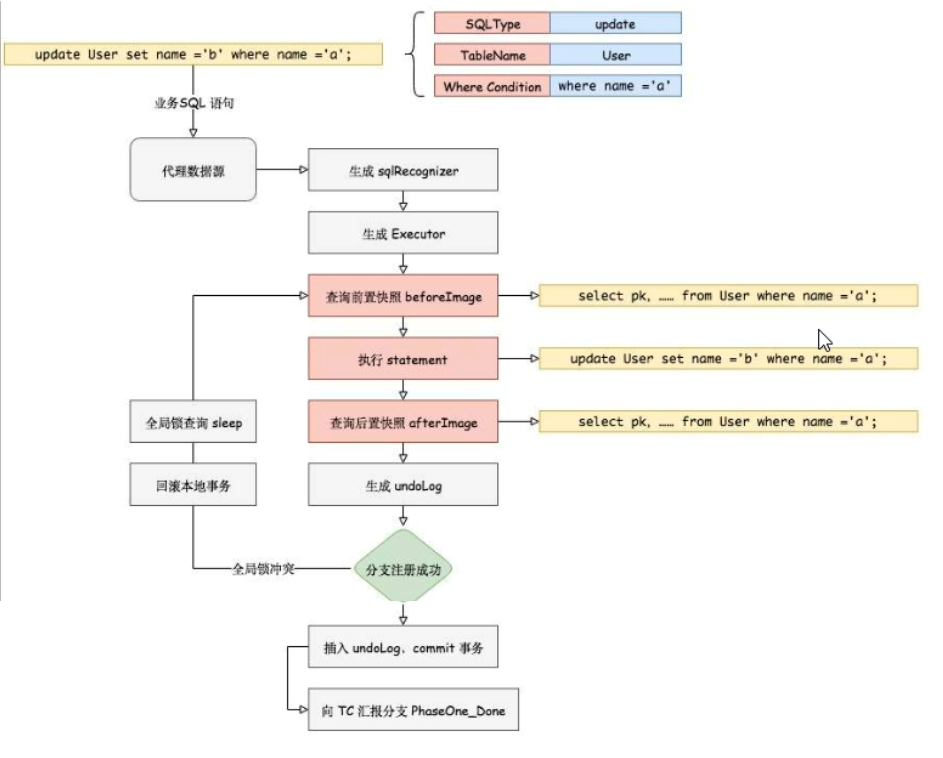