# Eureka

## EurekaServer的初始化和启动

### 环境搭建

pom 依赖只需要两个：

~~~xml
<dependency>
    <groupId>org.springframework.boot</groupId>
    <artifactId>spring-boot-starter-web</artifactId>
</dependency>
<dependency>
    <groupId>org.springframework.cloud</groupId>
    <artifactId>spring-cloud-starter-netflix-eureka-server</artifactId>
</dependency>
~~~

启动类上标注 @EnableEurekaServer：

~~~java
@EnableEurekaServer
@SpringBootApplication
public class EurekaServerApplication {
    public static void main(String[] args) {
        SpringApplication.run(EurekaServerApplication.class, args);
    }
}
~~~

application.yml 中配置一些最基础的信息：

~~~yaml
server:
  port: 9001

spring:
  application:
    name: eureka-server

eureka:
  instance:
    hostname: eureka-server
  client:
    register-with-eureka: false
    fetch-registry: false
    service-url:
      defaultZone: http://localhost:9001/eureka/
~~~

之后运行主启动类，EurekaServer 便会运行在 9001 端口上。

如果不标注 @EnableEurekaServer 注解，即便导入 eureka-server 的依赖，EurekaServer 也不会启动，说明真正打开 EurekaServer 的是 @EnableEurekaServer 注解。

### EurekaServerAutoConfiguration

先看@EnableEurekaServer的定义：

~~~java
@Import(EurekaServerMarkerConfiguration.class)
public @interface EnableEurekaServer {
}
~~~

它被标注了一个 @Import 注解，导入的是一个 EurekaServerMarkerConfiguration 的配置类。

EurekaServerMarkerConfiguration的定义：

~~~java
@Configuration
public class EurekaServerMarkerConfiguration {

	@Bean
	public Marker eurekaServerMarkerBean() {
		return new Marker();
	}

	class Marker {

	}
}
~~~

它是一个配置类，然后它定义了一个 Marker 的内部类，又把这个 Marker 注册到 IOC 容器了。这个Marker是激活EurekaServerAutoConfiguration用的。

EurekaServerAutoConfiguration是EurekaServer的核心配置类，在 spring-cloud-netflix-eureka-server 的 jar 包中发现了一个 spring.factories 文件，文件内部的声明：

~~~
org.springframework.boot.autoconfigure.EnableAutoConfiguration=\
  org.springframework.cloud.netflix.eureka.server.EurekaServerAutoConfiguration
~~~

依靠Springboot自动装配，将实现类EurekaServerAutoConfiguration注册到了容器中，它的定义：

~~~java
@Configuration
@Import(EurekaServerInitializerConfiguration.class)
@ConditionalOnBean(EurekaServerMarkerConfiguration.Marker.class)
@EnableConfigurationProperties({ EurekaDashboardProperties.class,
		InstanceRegistryProperties.class })
@PropertySource("classpath:/eureka/server.properties")
public class EurekaServerAutoConfiguration extends WebMvcConfigurerAdapter
~~~

注意看 @ConditionalOnBean 的条件：IOC 容器中必须有一个 EurekaServerMarkerConfiguration.Marker 类型的 Bean，该配置类才会生效，因为刚刚已经注册过了Marker，所以此配置类生效。

它继承了 WebMvcConfigurerAdapter，这是一个被废弃的接口。在 SpringFramework5.0+ 后，因为接口可以直接声明 default 方法，所以 WebMvcConfigurerAdapter 被废弃（被标注 @Deprecated），替代方案是直接实现 WebMvcConfigurer 接口。

此外，它的定义中，还导入了EurekaServerInitializerConfiguration。

### EurekaServerInitializerConfiguration

它实现了 SmartLifecycle 接口：

~~~java
@Configuration
public class EurekaServerInitializerConfiguration implements ServletContextAware, SmartLifecycle, Ordered
~~~

当所有单实例 Bean 都初始化完成后，就会回调所有实现了 Lifecycle 接口的 Bean 的 start 方法，它的核心方法是 start：

~~~java
public void start() {
    new Thread(new Runnable() {
        @Override
        public void run() {
            try {
                // TODO: is this class even needed now?
                // 初始化、启动 EurekaServer
                eurekaServerBootstrap.contextInitialized(
                        EurekaServerInitializerConfiguration.this.servletContext);
                log.info("Started Eureka Server");

                // 发布Eureka已注册的事件
                publish(new EurekaRegistryAvailableEvent(getEurekaServerConfig()));
                // 修改 EurekaServer 的运行状态
                EurekaServerInitializerConfiguration.this.running = true;
                // 发布Eureka已启动的事件
                publish(new EurekaServerStartedEvent(getEurekaServerConfig()));
            } // catch ......
        }
    }).start();
}
~~~

这个 start 方法只干了一件事，它起了一个新的线程来启动 EurekaServer 。可以看到在代码里面初始化、启动 EurekaServer。

EurekaServer 本身应该是一个完整的 Servlet 应用，在原生的 EurekaServer 中，EurekaServer 的启动类 EurekaBootStrap 类会实现 ServletContextListener 接口（ Servlet3.0 规范）来引导启动 EurekaServer 。而基于 SpringBoot 构建的应用一般使用嵌入式 Web 容器，没有所谓 Servlet3.0 规范作用的机会了，所以需要另外的启动方式，于是 SpringCloud 在整合这部分时，借助 ApplicationContext 中支持的 LifeCycle 机制，以此来触发 EurekaServer 的启动。

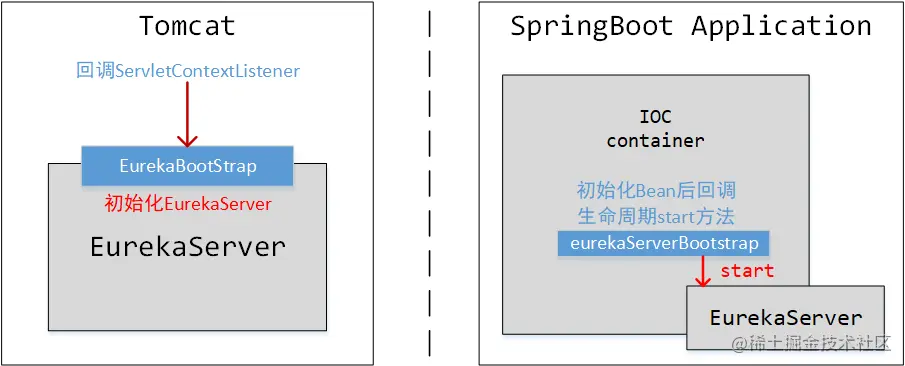

这里负责启动EurekaServer的类是EurekaServerBootstrap：

contextInitialized方法中：

~~~java
public void contextInitialized(ServletContext context) {
    try {
        initEurekaEnvironment();
        initEurekaServerContext();
        context.setAttribute(EurekaServerContext.class.getName(), this.serverContext);
    } // catch......
}
~~~

来到initEurekaEnvironment方法，这里会初始化Eureka的运行环境：

~~~java
private static final String TEST = "test";
private static final String DEFAULT = "default";

protected void initEurekaEnvironment() throws Exception {
    log.info("Setting the eureka configuration..");

    // Eureka的数据中心
    String dataCenter = ConfigurationManager.getConfigInstance()
            .getString(EUREKA_DATACENTER);
    if (dataCenter == null) {
        log.info(
                "Eureka data center value eureka.datacenter is not set, defaulting to default");
        ConfigurationManager.getConfigInstance()
                .setProperty(ARCHAIUS_DEPLOYMENT_DATACENTER, DEFAULT);
    }
    else {
        ConfigurationManager.getConfigInstance()
                .setProperty(ARCHAIUS_DEPLOYMENT_DATACENTER, dataCenter);
    }
    // Eureka运行环境
    String environment = ConfigurationManager.getConfigInstance()
            .getString(EUREKA_ENVIRONMENT);
    if (environment == null) {
        ConfigurationManager.getConfigInstance()
                .setProperty(ARCHAIUS_DEPLOYMENT_ENVIRONMENT, TEST);
        log.info(
                "Eureka environment value eureka.environment is not set, defaulting to test");
    }
    else {
        ConfigurationManager.getConfigInstance()
                .setProperty(ARCHAIUS_DEPLOYMENT_ENVIRONMENT, environment);
    }
}
~~~

这里面是依靠ConfigurationManager来获取配置，检查一遍，如果没有设置默认值，再set到ConfigurationManager中，它们都有对应的默认值。依靠Apache 的 commons-configuration做配置管理。

initEurekaServerContext方法负责初始化EurekaServer的运行上下文：

~~~java
protected void initEurekaServerContext() throws Exception {
    // For backward compatibility  兼容低版本Eureka
    JsonXStream.getInstance().registerConverter(new V1AwareInstanceInfoConverter(),
            XStream.PRIORITY_VERY_HIGH);
    XmlXStream.getInstance().registerConverter(new V1AwareInstanceInfoConverter(),
            XStream.PRIORITY_VERY_HIGH);

    if (isAws(this.applicationInfoManager.getInfo())) {
        this.awsBinder = new AwsBinderDelegate(this.eurekaServerConfig,
                this.eurekaClientConfig, this.registry, this.applicationInfoManager);
        this.awsBinder.start();
    }

    // 注册EurekaServerContextHolder，通过它可以很方便的获取EurekaServerContext
    EurekaServerContextHolder.initialize(this.serverContext);

    log.info("Initialized server context");

    // Copy registry from neighboring eureka node
    // 【复杂】Eureka复制集群节点注册表
    int registryCount = this.registry.syncUp();
    this.registry.openForTraffic(this.applicationInfoManager, registryCount);

    // Register all monitoring statistics.
    EurekaMonitors.registerAllStats();
}
~~~

Eureka复制集群节点注册表这一步比较复杂，后续会专门讲解。

### EurekaController

EurekaServerAutoConfiguration中导入了很多重要的组件，例如EurekaController：

~~~java
@Bean
@ConditionalOnProperty(prefix = "eureka.dashboard", name = "enabled", matchIfMissing = true)
public EurekaController eurekaController() {
    return new EurekaController(this.applicationInfoManager);
}
~~~

这是一个Controller，它和EurekaServer 控制台显示有关：

~~~java
@Controller
@RequestMapping("${eureka.dashboard.path:/}")
public class EurekaController
~~~

它这里面定义了两个处理方法：

- status - 获取当前 EurekaServer 的状态（即控制台）
- lastn - 获取当前 EurekaServer 上服务注册动态历史记录。


### PeerAwareInstanceRegistry

PeerAwareInstanceRegistry是EurekaServer 集群中节点之间同步微服务实例注册表的核心组件：

~~~java
@Bean
public PeerAwareInstanceRegistry peerAwareInstanceRegistry(ServerCodecs serverCodecs) {
    this.eurekaClient.getApplications(); // force initialization
    return new InstanceRegistry(this.eurekaServerConfig, this.eurekaClientConfig,
            serverCodecs, this.eurekaClient,
            this.instanceRegistryProperties.getExpectedNumberOfClientsSendingRenews(),
            this.instanceRegistryProperties.getDefaultOpenForTrafficCount());
}
~~~

它的继承结构：

~~~java
public class InstanceRegistry extends PeerAwareInstanceRegistryImpl implements ApplicationContextAware
public class PeerAwareInstanceRegistryImpl extends AbstractInstanceRegistry implements PeerAwareInstanceRegistry
public abstract class AbstractInstanceRegistry implements InstanceRegistry
~~~

这里面继承的两个类 PeerAwareInstanceRegistryImpl 、AbstractInstanceRegistry ，它们将会在后续研究节点同步时有重要作用

### PeerEurekaNodes

PeerEurekaNodes 可以理解成微服务实例的节点集合：

~~~java
@Bean
@ConditionalOnMissingBean
public PeerEurekaNodes peerEurekaNodes(PeerAwareInstanceRegistry registry, ServerCodecs serverCodecs,
        ReplicationClientAdditionalFilters replicationClientAdditionalFilters) {
    return new RefreshablePeerEurekaNodes(registry, this.eurekaServerConfig,
            this.eurekaClientConfig, serverCodecs, this.applicationInfoManager,
            replicationClientAdditionalFilters);
}
~~~

一个 PeerEurekaNode 就是一个微服务节点实例的包装，PeerEurekaNodes 就是这组 PeerEurekaNode 的集合，这种节点是可以被 EurekaServer 集群中的各个注册中心节点共享的（PeerAwareInstanceRegistry）。查看PeerEurekaNodes 内部的结构：

~~~java
public class PeerEurekaNodes {

    protected final PeerAwareInstanceRegistry registry;
    // ......

    private volatile List<PeerEurekaNode> peerEurekaNodes = Collections.emptyList();
    private volatile Set<String> peerEurekaNodeUrls = Collections.emptySet();

    private ScheduledExecutorService taskExecutor;
~~~

简单解释一下几个成员变量：

* PeerAwareInstanceRegistry ：集群间节点同步的核心组件
* List\<PeerEurekaNode> ：节点集合
* peerEurekaNodeUrls ：所有节点所在 url
* ScheduledExecutorService ：执行定时任务的线程池

PeerEurekaNodes的start方法：

~~~java
public void start() {
    taskExecutor = Executors.newSingleThreadScheduledExecutor(
            new ThreadFactory() {
                @Override
                public Thread newThread(Runnable r) {
                    Thread thread = new Thread(r, "Eureka-PeerNodesUpdater");
                    thread.setDaemon(true);
                    return thread;
                }
            }
    );
    try {
        updatePeerEurekaNodes(resolvePeerUrls());
        Runnable peersUpdateTask = new Runnable() {
            @Override
            public void run() {
                try {
                    updatePeerEurekaNodes(resolvePeerUrls());
                } // catch ......
            }
        };
        taskExecutor.scheduleWithFixedDelay(
                peersUpdateTask,
                serverConfig.getPeerEurekaNodesUpdateIntervalMs(),
                serverConfig.getPeerEurekaNodesUpdateIntervalMs(),
                TimeUnit.MILLISECONDS
        );
    } // catch ...... log ......
}
~~~

可以发现 start 方法的核心是借助线程池完成定时任务。会定时执行一个 updatePeerEurekaNodes 方法来更新集群节点。定时任务的执行时间间隔默认是10分钟，即每隔10分钟会同步一次集群节点。

PeerEurekaNodes的shutdown方法：

~~~java
public void shutdown() {
    taskExecutor.shutdown();
    List<PeerEurekaNode> toRemove = this.peerEurekaNodes;

    this.peerEurekaNodes = Collections.emptyList();
    this.peerEurekaNodeUrls = Collections.emptySet();

    for (PeerEurekaNode node : toRemove) {
        node.shutDown();
    }
}
~~~

这个方法的内容比较简单，它会把线程池的定时任务停掉，并移除掉当前所有的服务节点信息。它由EurekaServerContext来触发调用。

### EurekaServerContext

EurekaServerAutoConfiguration中也导入了这个类：

~~~java
@Bean
public EurekaServerContext eurekaServerContext(ServerCodecs serverCodecs,
        PeerAwareInstanceRegistry registry, PeerEurekaNodes peerEurekaNodes) {
    return new DefaultEurekaServerContext(this.eurekaServerConfig, serverCodecs,
            registry, peerEurekaNodes, this.applicationInfoManager);
}
~~~

它表示本地服务器上下文，和SpringFramework 的 ApplicationContext 差不太多。

EurekaServerContext 的初始化会带动PeerEurekaNodes 的初始化，EurekaServerContext 的销毁带动 PeerEurekaNodes 的销毁：

~~~java
@PostConstruct
public void initialize() {
    logger.info("Initializing ...");
    peerEurekaNodes.start();
    try {
        registry.init(peerEurekaNodes);
    } catch (Exception e) {
        throw new RuntimeException(e);
    }
    logger.info("Initialized");
}

@PreDestroy
public void shutdown() {
    logger.info("Shutting down ...");
    registry.shutdown();
    peerEurekaNodes.shutdown();
    logger.info("Shut down");
}
~~~

加上 ApplicationContext 本身的生命周期，可以大概这样理解：refresh -> EurekaServerContext 初始化 -> PeerEurekaNodes初始化


在上面的initialize方法中，除了带动PeerEurekaNodes初始化，还带动PeerAwareInstanceRegistry初始化了；shutdown方法也会带动PeerAwareInstanceRegistry的shutdown方法。

### PeerAwareInstanceRegistry#init

init方法中：

~~~java
public void init(PeerEurekaNodes peerEurekaNodes) throws Exception {
    // 5.4.1.1 启动续订租约的频率统计器
    this.numberOfReplicationsLastMin.start();
    this.peerEurekaNodes = peerEurekaNodes;
    initializedResponseCache();
    // 5.4.1.2 开启续订租约最低阈值检查的定时任务
    scheduleRenewalThresholdUpdateTask();
    // 5.4.1.3 初始化远程分区注册中心
    initRemoteRegionRegistry();

    try {
        Monitors.registerObject(this);
    } catch (Throwable e) {
        logger.warn("Cannot register the JMX monitor for the InstanceRegistry :", e);
    }
}
~~~

首先来看numberOfReplicationsLastMin.start()这一行：

~~~java
private final AtomicLong lastBucket = new AtomicLong(0);
private final AtomicLong currentBucket = new AtomicLong(0);

private final long sampleInterval;

public synchronized void start() {
    if (!isActive) {
        timer.schedule(new TimerTask() {
            @Override
            public void run() {
                try {
                    // Zero out the current bucket.
                    lastBucket.set(currentBucket.getAndSet(0));
                } catch (Throwable e) {
                    logger.error("Cannot reset the Measured Rate", e);
                }
            }
        }, sampleInterval, sampleInterval);
        isActive = true;
    }
}
~~~

它会隔一段时间重置 lastBucket 和 currentBucket 的值为 0。时间间隔是1分钟设置一次。这个计算次数会体现在 Eureka 的控制台，以及配合 Servo 完成续约次数监控，他就是续订租约的频率统计器。

scheduleRenewalThresholdUpdateTask方法：

~~~java
private int renewalThresholdUpdateIntervalMs = 15 * MINUTES;

private void scheduleRenewalThresholdUpdateTask() {
    timer.schedule(new TimerTask() {
                       @Override
                       public void run() {
                           updateRenewalThreshold();
                       }
                   }, serverConfig.getRenewalThresholdUpdateIntervalMs(),
            serverConfig.getRenewalThresholdUpdateIntervalMs());
}
~~~

可以发现又是一个定时任务，配置项中的默认时间间隔可以发现是 15 分钟。定时任务中执行的核心方法是 updateRenewalThreshold 方法：

~~~java
private void updateRenewalThreshold() {
    try {
        Applications apps = eurekaClient.getApplications();
        int count = 0;
        for (Application app : apps.getRegisteredApplications()) {
            for (InstanceInfo instance : app.getInstances()) {
                if (this.isRegisterable(instance)) {
                    ++count;
                }
            }
        }
        synchronized (lock) {
            // Update threshold only if the threshold is greater than the
            // current expected threshold or if self preservation is disabled.
            if ((count) > (serverConfig.getRenewalPercentThreshold() * expectedNumberOfClientsSendingRenews)
                    || (!this.isSelfPreservationModeEnabled())) {
                this.expectedNumberOfClientsSendingRenews = count;
                updateRenewsPerMinThreshold();
            }
        }
        logger.info("Current renewal threshold is : {}", numberOfRenewsPerMinThreshold);
    } // catch ......
}
~~~

上面的 for 循环很明显是检查当前已经注册到本地的服务实例是否还保持连接，由于该方法一定会返回 true（全部实现类的isRegisterable都会返回true），故上面第 4 行统计的 count 就是所有的微服务实例数量。

下面的同步代码块中，它会检查统计好的数量是否比预期的多，如果统计好的服务实例数比预期的数量多，证明出现了新的服务注册，要替换下一次统计的期望数量值，以及重新计算接下来心跳的数量统计。心跳的数量统计方法 updateRenewsPerMinThreshold() ：

~~~java
private int expectedClientRenewalIntervalSeconds = 30;
private double renewalPercentThreshold = 0.85;

protected void updateRenewsPerMinThreshold() {
    this.numberOfRenewsPerMinThreshold = (int) (this.expectedNumberOfClientsSendingRenews
            * (60.0 / serverConfig.getExpectedClientRenewalIntervalSeconds())
            * serverConfig.getRenewalPercentThreshold());
}
~~~

可以看出来它的默认计算数是：每隔 30 秒发一次心跳（一分钟心跳两次），而且必须所有的服务实例的心跳总数要达到前面计算数量的 85% 才算整体微服务正常，其实这也就是 EurekaServer 的自我保护机制。

initRemoteRegionRegistry方法，负责初始化远程分区注册中心RemoteRegionRegistry：

~~~java
protected void initRemoteRegionRegistry() throws MalformedURLException {
    Map<String, String> remoteRegionUrlsWithName = serverConfig.getRemoteRegionUrlsWithName();
    if (!remoteRegionUrlsWithName.isEmpty()) {
        allKnownRemoteRegions = new String[remoteRegionUrlsWithName.size()];
        int remoteRegionArrayIndex = 0;
        for (Map.Entry<String, String> remoteRegionUrlWithName : remoteRegionUrlsWithName.entrySet()) {
            RemoteRegionRegistry remoteRegionRegistry = new RemoteRegionRegistry(
                    serverConfig,
                    clientConfig,
                    serverCodecs,
                    remoteRegionUrlWithName.getKey(),
                    new URL(remoteRegionUrlWithName.getValue()));
            regionNameVSRemoteRegistry.put(remoteRegionUrlWithName.getKey(), remoteRegionRegistry);
            allKnownRemoteRegions[remoteRegionArrayIndex++] = remoteRegionUrlWithName.getKey();
        }
    }
    logger.info("Finished initializing remote region registries. All known remote regions: {}",
            (Object) allKnownRemoteRegions);
}
~~~

### PeerAwareInstanceRegistry#shutdown

当 EurekaServerContext 被销毁时，会回调 @PreDestory 标注的 shutdown 方法，而这个方法又调到 PeerAwareInstanceRegistry 的 shutdown 方法：

~~~java
public void shutdown() {
    try {
        DefaultMonitorRegistry.getInstance().unregister(Monitors.newObjectMonitor(this));
    } // catch .......
    try {
        peerEurekaNodes.shutdown();
    } // catch .......
    numberOfReplicationsLastMin.stop();
    super.shutdown();
}
~~~

这里它干的事情不算麻烦，它首先利用 DefaultMonitorRegistry 做了一个注销操作，DefaultMonitorRegistry 这个组件本身来源于 servo 包，它是做监控使用，这部分是关闭监控。

接下来它会把那些微服务节点实例全部注销，停止计数器监控，最后回调父类的 shutdown 方法：

~~~java
public void shutdown() {
    deltaRetentionTimer.cancel();
    evictionTimer.cancel();
    renewsLastMin.stop();
}
~~~

也是跟监控相关的组件停止

### EurekaServerBootstrap

EurekaServerAutoConfiguration中也导入了这个类：

~~~java
@Bean
public EurekaServerBootstrap eurekaServerBootstrap(PeerAwareInstanceRegistry registry,
        EurekaServerContext serverContext) {
    return new EurekaServerBootstrap(this.applicationInfoManager,
            this.eurekaClientConfig, this.eurekaServerConfig, registry,
            serverContext);
}
~~~

上面已经提过了，有了 EurekaServerBootstrap 才能引导启动 EurekaServer，这里会将其注册。

### ServletContainer

EurekaServerAutoConfiguration向容器中注册了一个FilterRegistrationBean，它的作用是注册一个Filter：

~~~java
public static final String DEFAULT_PREFIX = "/eureka";

@Bean
public FilterRegistrationBean jerseyFilterRegistration(javax.ws.rs.core.Application eurekaJerseyApp) {
    FilterRegistrationBean bean = new FilterRegistrationBean();
    bean.setFilter(new ServletContainer(eurekaJerseyApp));
    bean.setOrder(Ordered.LOWEST_PRECEDENCE);
    bean.setUrlPatterns(Collections.singletonList(EurekaConstants.DEFAULT_PREFIX + "/*"));
    return bean;
}
~~~

真正被注册的Filter是ServletContainer：

~~~java
package com.sun.jersey.spi.container.servlet;

public class ServletContainer extends HttpServlet implements Filter
~~~

注意它所在的包，里面有一个很关键的词：jersey ，它是一个类似于 SpringWebMvc 的框架，由于 Eureka 本身也是一个 Servlet 应用，只是它使用的 Web 层框架不是 SpringWebMvc 而是 Jersey 而已，Jersey 在 Eureka 的远程请求、心跳包发送等环节起到至关重要的作用，而这个 ServletContainer 的作用，可以理解为 SpringWebMvc 中的 DispatcherServlet ，以及 Struts2 中的 StrutsPrepareAndExecuteFilter 。

另外注意一个点，这里面有一个 DEFAULT_PREFIX ，翻过去发现前缀是 /eureka ，这也解释了为什么微服务注册到 EurekaServer 的时候，defaultZone 要在 ip:port 后面加上 /eureka ，以及后面在调用 EurekaServer 的一些接口时前面也要加上 /eureka

### Application

~~~java
@Bean
public javax.ws.rs.core.Application jerseyApplication(Environment environment,
        ResourceLoader resourceLoader) {
    // ......
}
~~~

这个类是配合ServletContainer起作用的，这个类的子类全部是来自Jersey 的

### HttpTraceFilter

~~~java
@Bean
public FilterRegistrationBean traceFilterRegistration(@Qualifier("httpTraceFilter") Filter filter) {
    FilterRegistrationBean bean = new FilterRegistrationBean();
    bean.setFilter(filter);
    bean.setOrder(Ordered.LOWEST_PRECEDENCE - 10);
    return bean;
}
~~~

它注册了一个名为 httpTraceFilter 的过滤器，借助IDEA发现这个过滤器来自 HttpTraceAutoConfiguration 的内部类 ServletTraceFilterConfiguration ：

~~~java
@Configuration
@ConditionalOnWebApplication(type = Type.SERVLET)
static class ServletTraceFilterConfiguration {
    @Bean
    @ConditionalOnMissingBean
    public HttpTraceFilter httpTraceFilter(HttpTraceRepository repository, HttpExchangeTracer tracer) {
        return new HttpTraceFilter(repository, tracer);
    }
}
~~~

它是记录所有请求日志的Servlet过滤器

### EurekaServerConfigBeanConfiguration

EurekaServerAutoConfiguration 还有一个内部的配置类：EurekaServerConfigBeanConfiguration

~~~java
@Configuration
protected static class EurekaServerConfigBeanConfiguration {
    @Bean
    @ConditionalOnMissingBean
    public EurekaServerConfig eurekaServerConfig(EurekaClientConfig clientConfig) {
        EurekaServerConfigBean server = new EurekaServerConfigBean();
        if (clientConfig.shouldRegisterWithEureka()) {
            // Set a sensible default if we are supposed to replicate
            server.setRegistrySyncRetries(5);
        }
        return server;
    }
}
~~~

它就是注册了默认的 EurekaServer 的配置模型 EurekaServerConfigBean

### 组件总结

EurekaServer 中提到的组件总结：


## EurekaClient的初始化和启动

### 环境搭建

前面已经有 EurekaServer 了，下面搭一个 EurekaClient 的基本环境。pom 的依赖也是引入两个即可：

~~~xml
<dependency>
    <groupId>org.springframework.boot</groupId>
    <artifactId>spring-boot-starter-web</artifactId>
</dependency>
<dependency>
    <groupId>org.springframework.cloud</groupId>
    <artifactId>spring-cloud-starter-netflix-eureka-client</artifactId>
</dependency>
~~~

启动类上标注 @EnableDiscoveryClient：

~~~java
@EnableDiscoveryClient
@SpringBootApplication
public class EurekaClientApplication {
    public static void main(String[] args) {
        SpringApplication.run(EurekaClientApplication.class, args);
    }
}
~~~

同样的，application.yml 中配置一些最基础的信息：

~~~yaml
server:
  port: 8080

spring:
  application:
    name: eureka-client

eureka:
  instance:
    instance-id: eureka-client
    prefer-ip-address: true
  client:
    service-url:
      defaultZone: http://eureka-server-9001.com:9001/eureka/
~~~

运行 SpringBoot 的主启动类，EurekaClient 便会运行在 8080 端口上。

即便不标注 @EnableDiscoveryClient 注解，同样也会启动 EurekaClient 并按照配置规则注册到 EurekaServer 上，证明 @EnableDiscoveryClient 的作用没有那么大。在spring-cloud-netflix-eureka-client这个包中，发现了有 spring.factories 文件，其中有EurekaClientAutoConfiguration：

~~~
org.springframework.boot.autoconfigure.EnableAutoConfiguration=\
    org.springframework.cloud.netflix.eureka.config.EurekaClientConfigServerAutoConfiguration,\
    org.springframework.cloud.netflix.eureka.config.EurekaDiscoveryClientConfigServiceAutoConfiguration,\
    org.springframework.cloud.netflix.eureka.EurekaClientAutoConfiguration,\
    org.springframework.cloud.netflix.ribbon.eureka.RibbonEurekaAutoConfiguration,\
    org.springframework.cloud.netflix.eureka.EurekaDiscoveryClientConfiguration
~~~

进入EurekaClientAutoConfiguration：

~~~java
@Configuration
@EnableConfigurationProperties
@ConditionalOnClass(EurekaClientConfig.class)
@Import(DiscoveryClientOptionalArgsConfiguration.class)
@ConditionalOnBean(EurekaDiscoveryClientConfiguration.Marker.class)
@ConditionalOnProperty(value = "eureka.client.enabled", matchIfMissing = true)
@ConditionalOnDiscoveryEnabled
@AutoConfigureBefore({ NoopDiscoveryClientAutoConfiguration.class,
		CommonsClientAutoConfiguration.class, ServiceRegistryAutoConfiguration.class })
@AutoConfigureAfter(name = {
		"org.springframework.cloud.autoconfigure.RefreshAutoConfiguration",
		"org.springframework.cloud.netflix.eureka.EurekaDiscoveryClientConfiguration",
		"org.springframework.cloud.client.serviceregistry.AutoServiceRegistrationAutoConfiguration" })
public class EurekaClientAutoConfiguration
~~~

几个关键注解的作用：

* @EnableConfigurationProperties ：激活配置文件到实体类的映射，这里面需要的是 EurekaClientConfig
* 各种 @ConditionalOnxxx ，都是走条件判断的，不再赘述
* @AutoConfigureAfter ：设定自动配置类的先后顺序，注意这里面的几个自动配置类都很关键

这几个自动配置类，以及自动配置类中嵌套的内部配置类是否起作用，可以设置 logging.level.root=debug 观察 SpringBoot 打印的自动配置报告观察。

### RefreshAutoConfiguration

RefreshAutoConfiguration中并没有继续往里导入配置类或组件，或者设置其他的关键顺序。

~~~java
@Configuration
@ConditionalOnClass(RefreshScope.class)
@ConditionalOnProperty(name = RefreshAutoConfiguration.REFRESH_SCOPE_ENABLED, matchIfMissing = true)
@AutoConfigureBefore(HibernateJpaAutoConfiguration.class)
public class RefreshAutoConfiguration
~~~

这个自动配置类的作用核心：刷新。这里涉及到配置中心与配置刷新的部分了，详细的内容咱会放在分布式配置中心 Config 部分详细解析

几个它注册的重要组件：

1、RefreshScope

~~~java
@Bean
@ConditionalOnMissingBean(RefreshScope.class)
public static RefreshScope refreshScope() {
    return new RefreshScope();
}
~~~

它是一个Bean的作用域刷新器，RefreshScope 可以在应用配置刷新时重新加载一些特定的 Bean ，它的底层是扩展了 @Scope 的类型，并配合这个组件实现 Bean 的刷新。

2、LoggingRebinder

~~~java
@Bean
@ConditionalOnMissingBean
public static LoggingRebinder loggingRebinder() {
    return new LoggingRebinder();
}
~~~

它是一个日志的重绑定器，它负责刷新日志打印级别，也是在配置刷新时起作用的

3、ContextRefresher

~~~java
@Bean
@ConditionalOnMissingBean
public ContextRefresher contextRefresher(ConfigurableApplicationContext context, RefreshScope scope) {
    return new ContextRefresher(context, scope);
}
~~~

这个 ContextRefresher 就是前面提到的，当配置刷新时首先触发的组件了。它与下面的 RefreshEventListener 共同配合实现配置刷新后的容器和组件刷新。

4、RefreshEventListener

~~~java
@Bean
public RefreshEventListener refreshEventListener(ContextRefresher contextRefresher) {
    return new RefreshEventListener(contextRefresher);
}
~~~

它是一个监听器，实现了 SmartApplicationListener ，对应的核心方法如下：

~~~java
@Override
public void onApplicationEvent(ApplicationEvent event) {
    if (event instanceof ApplicationReadyEvent) {
        handle((ApplicationReadyEvent) event);
    }
    else if (event instanceof RefreshEvent) {
        handle((RefreshEvent) event);
    }
}
~~~

可以发现它监听了两个事件：ApplicationReadyEvent 、RefreshEvent。这个监听器会在应用准备就绪、和应用发出刷新事件时触发，完成配置刷新。

5、RefreshScopeBeanDefinitionEnhancer

它是配置类的内部类，这个类是一个标有 @Component 的组件，它实现了 BeanDefinitionRegistryPostProcessor 接口，核心方法是 postProcessBeanDefinitionRegistry：

~~~java
public void postProcessBeanDefinitionRegistry(BeanDefinitionRegistry registry) throws BeansException {
    bindEnvironmentIfNeeded(registry);
    for (String name : registry.getBeanDefinitionNames()) {
        BeanDefinition definition = registry.getBeanDefinition(name);
        if (isApplicable(registry, name, definition)) {
            // ......
~~~

看它的处理逻辑，它会把 IOC 容器中所有的 BeanDefinition 都取出来，进行一个判断：isApplicable：

~~~java
public static final String REFRESH_SCOPE_NAME = "refresh";
private Set<String> refreshables = new HashSet<>(
        Arrays.asList("com.zaxxer.hikari.HikariDataSource"));

private boolean isApplicable(BeanDefinitionRegistry registry, String name,
        BeanDefinition definition) {
    // 先检查Bean的scope是否就是refresh
    String scope = definition.getScope();
    if (REFRESH_SCOPE_NAME.equals(scope)) {
        // Already refresh scoped
        return false;
    }
    // 如果不是，则获取Bean的类型
    String type = definition.getBeanClassName();
    if (!StringUtils.hasText(type) && registry instanceof BeanFactory) {
        Class<?> cls = ((BeanFactory) registry).getType(name);
        if (cls != null) {
            type = cls.getName();
        }
    }
    // 判断类型是否在refreshables集合中
    if (type != null) {
        return this.refreshables.contains(type);
    }
    return false;
}
~~~

这个方法的核心含义是：判断一个 Bean 是否是一个可刷新的 Bean（ scope 为 refresh）。refreshables是一个集合，它会把一些作用域为 refresh 的 Bean 存放到这个 set 中，用于触发重刷新效果。

如果isApplicable返回true，则会执行以下逻辑：

~~~java
    if (isApplicable(registry, name, definition)) {
        BeanDefinitionHolder holder = new BeanDefinitionHolder(definition,
                name);
        BeanDefinitionHolder proxy = ScopedProxyUtils
                .createScopedProxy(holder, registry, true);
        definition.setScope("refresh");
        if (registry.containsBeanDefinition(proxy.getBeanName())) {
            registry.removeBeanDefinition(proxy.getBeanName());
        }
        registry.registerBeanDefinition(proxy.getBeanName(),
                proxy.getBeanDefinition());
    }
~~~

这段逻辑：它将声明了 scope 为 refresh 的但没有标注 refresh 的 Bean 修改为 refresh 作用域。

它这里面判断如果确实 scope 是 refresh ，则会触发一个代理对象的创建（ ScopedProxyUtils 类来自于 aop 包）。它将原有的 BeanDefinition 取出来，封装到一个 BeanDefinitionHolder 中，再利用 ScopedProxyUtils 创建一个代理对象的 BeanDefinitionHolder ，之后设置 BeanDefinition 的 scope 为 refresh ，最后将 IOC 容器中原有的 BeanDefinition 移除掉，放入代理对象对应的 BeanDefinition 。


### AutoServiceRegistrationAutoConfiguration

AutoServiceRegistrationAutoConfiguration的定义：

~~~java
@Configuration
@Import(AutoServiceRegistrationConfiguration.class)
@ConditionalOnProperty(value = "spring.cloud.service-registry.auto-registration.enabled", matchIfMissing = true)
public class AutoServiceRegistrationAutoConfiguration
~~~

这个配置类相比起来讲更简单，它只导入了一个配置类：AutoServiceRegistrationConfiguration

~~~java
@Configuration
@EnableConfigurationProperties(AutoServiceRegistrationProperties.class)
@ConditionalOnProperty(value = "spring.cloud.service-registry.auto-registration.enabled", matchIfMissing = true)
public class AutoServiceRegistrationConfiguration
~~~

仅仅是激活了 AutoServiceRegistrationProperties 的配置映射而已，且配置类中也没有多余的声明。

### EurekaDiscoveryClientConfiguration

EurekaDiscoveryClientConfiguration的定义：

~~~java
@Configuration
@EnableConfigurationProperties
@ConditionalOnClass(EurekaClientConfig.class)
@ConditionalOnProperty(value = "eureka.client.enabled", matchIfMissing = true)
@ConditionalOnDiscoveryEnabled
public class EurekaDiscoveryClientConfiguration
~~~

它配置了以下重要的组件：

1、eurekaDiscoverClientMarker

~~~java
@Bean
public Marker eurekaDiscoverClientMarker() {
    return new Marker();
}
~~~

和之前的套路一样，只有这个类被注册进容器，EurekaClientAutoConfiguration才会起作用。

2、EurekaHealthCheckHandlerConfiguration

~~~java
@Configuration
@ConditionalOnProperty(value = "eureka.client.healthcheck.enabled", matchIfMissing = false)
protected static class EurekaHealthCheckHandlerConfiguration {
    @Autowired(required = false)
    private HealthAggregator healthAggregator = new OrderedHealthAggregator();

    @Bean
    @ConditionalOnMissingBean(HealthCheckHandler.class)
    public EurekaHealthCheckHandler eurekaHealthCheckHandler() {
        return new EurekaHealthCheckHandler(this.healthAggregator);
    }
}
~~~

又是一个配置类，它里面配置了一个 EurekaHealthCheckHandler ，从类名上可以简单看出它是一个健康检查处理器

EurekaHealthCheckHandler一个成员变量中，使用初始化代码块分别映射了四种 Eureka 的服务状态：

~~~java
private static final Map<Status, InstanceInfo.InstanceStatus> STATUS_MAPPING = new HashMap<Status, InstanceInfo.InstanceStatus>() {
    {
        put(Status.UNKNOWN, InstanceStatus.UNKNOWN);
        put(Status.OUT_OF_SERVICE, InstanceStatus.OUT_OF_SERVICE);
        put(Status.DOWN, InstanceStatus.DOWN);
        put(Status.UP, InstanceStatus.UP);
    }
};
~~~

注意这个 Status 来自于 org.springframework.boot.actuate.health ，即 spring-boot-actuator 包，它将 SpringBoot 原生有的应用健康状态检查同步到 SpringCloud 的 EurekaClient 上，并同步给 EurekaServer ，让 EurekaServer 也能感知到每个服务自身的应用健康状态。

3、EurekaClientConfigurationRefresher

~~~java
@Configuration
@ConditionalOnClass(RefreshScopeRefreshedEvent.class)
protected static class EurekaClientConfigurationRefresher
        implements ApplicationListener<RefreshScopeRefreshedEvent>
~~~

它和RefreshScopeBeanDefinitionEnhancer协同工作，注意它是一个监听器，监听的事件是 RefreshScopeRefreshedEvent。

在RefreshScope的refresh方法中，会发布RefreshScopeRefreshedEvent：

~~~java
public boolean refresh(String name) {
    // ......
    if (super.destroy(name)) {
        this.context.publishEvent(new RefreshScopeRefreshedEvent(name));
        return true;
    }
    return false;
}
~~~

事件被EurekaClientConfigurationRefresher监听到，执行onApplicationEvent方法：

~~~java
private EurekaAutoServiceRegistration autoRegistration;

public void onApplicationEvent(RefreshScopeRefreshedEvent event) {
    // This will force the creation of the EurkaClient bean if not already created
    // to make sure the client will be reregistered after a refresh event
    if (eurekaClient != null) {
        eurekaClient.getApplications();
    }
    if (autoRegistration != null) {
        // register in case meta data changed
        this.autoRegistration.stop();
        this.autoRegistration.start();
    }
}
~~~

首先它回调了 eurekaClient 的 getApplications 方法，从上面的单行注释也能理解，它是为了避免 Bean 还有没初始化好的。如果尚未创建，则将强制创建 EurkaClient bean，以确保刷新事件后将重新注册客户端。

之后它对 autoRegistration 做了相当于一次重启动作，这个 autoRegistration 的类型是 EurekaAutoServiceRegistration。

### DiscoveryClientOptionalArgsConfiguration

在EurekaClientAutoConfiguration的注解声明中，导入了一个配置类DiscoveryClientOptionalArgsConfiguration：

~~~java
@Import(DiscoveryClientOptionalArgsConfiguration.class)
~~~

它只注册了两个组件：

1、RestTemplateDiscoveryClientOptionalArgs

~~~java
@Bean
@ConditionalOnMissingClass("com.sun.jersey.api.client.filter.ClientFilter")
@ConditionalOnMissingBean(value = AbstractDiscoveryClientOptionalArgs.class, search = SearchStrategy.CURRENT)
public RestTemplateDiscoveryClientOptionalArgs restTemplateDiscoveryClientOptionalArgs() {
    return new RestTemplateDiscoveryClientOptionalArgs();
}
~~~

从类名上也能看得出来，它是支持 RestTemplate 的一个服务发现的参数配置组件。

EurekaClient 在设计与 EurekaServer 通信时，没有限制死必须要用 Jersey ，可以换做 RestTemplate 来代替 JerseyApplicationClient：EurekaApplicationClient 接口的两个实现类：RestTemplateEurekaHttpClient和JerseyApplicationClient

这个组件的设计就是为了万一咱要替换掉原有的 Jersey 来使用 RestTemplate 与 EurekaServer 交互，那这个参数配置组件就可以起到支撑效果。如果真的要使用 RestTemplate ，可以将 jersey-client 从 Maven 坐标中移除掉，根据上面的 @ConditionalOnMissingClass 条件限制，则这个组件会生效。

~~~xml
<dependency>
    <groupId>org.springframework.cloud</groupId>
    <artifactId>spring-cloud-starter-netflix-eureka-client</artifactId>
    <exclusions>
        <exclusion>
            <groupId>com.sun.jersey</groupId>
            <artifactId>jersey-client</artifactId>
        </exclusion>
    </exclusions>
</dependency>
~~~

2、MutableDiscoveryClientOptionalArgs

~~~java
@Bean
@ConditionalOnClass(name = "com.sun.jersey.api.client.filter.ClientFilter")
@ConditionalOnMissingBean(value = AbstractDiscoveryClientOptionalArgs.class, search = SearchStrategy.CURRENT)
public MutableDiscoveryClientOptionalArgs discoveryClientOptionalArgs() {
    return new MutableDiscoveryClientOptionalArgs();
}
~~~

这个组件从 @ConditionalOnClass 上就已经能看出来，它与上面 RestTemplateEurekaHttpClient 的参数配置组件的判断条件正好相反，也说明它是配合 JerseyApplicationClient 的。

### EurekaClientAutoConfiguration

EurekaClientAutoConfiguration除了引入DiscoveryClientOptionalArgsConfiguration以外，还导入了下列类：

1、ManagementMetadataProvider

~~~java
@Bean
@ConditionalOnMissingBean
public ManagementMetadataProvider serviceManagementMetadataProvider() {
    return new DefaultManagementMetadataProvider();
}
~~~

这个类从类名上看，叫管理元数据的提供者，它是一个用来处理健康检查和状态页面地址的封装类，它在下面的 EurekaInstanceConfigBean 中有加以利用

2、EurekaInstanceConfigBean

初始化 EurekaInstanceConfigBean 的源码很长，这里只抽取出一些关键的部分：

~~~java
@Bean
@ConditionalOnMissingBean(value = EurekaInstanceConfig.class, search = SearchStrategy.CURRENT)
public EurekaInstanceConfigBean eurekaInstanceConfigBean(InetUtils inetUtils,
        ManagementMetadataProvider managementMetadataProvider) {
    // 获取配置
    // ......
    EurekaInstanceConfigBean instance = new EurekaInstanceConfigBean(inetUtils);

    // 设置配置到instance里
    // ......

    ManagementMetadata metadata = managementMetadataProvider.get(instance, serverPort,
            serverContextPath, managementContextPath, managementPort);

    if (metadata != null) {
        instance.setStatusPageUrl(metadata.getStatusPageUrl());
        instance.setHealthCheckUrl(metadata.getHealthCheckUrl());
        if (instance.isSecurePortEnabled()) {
            instance.setSecureHealthCheckUrl(metadata.getSecureHealthCheckUrl());
        }
        Map<String, String> metadataMap = instance.getMetadataMap();
        metadataMap.computeIfAbsent("management.port",
                k -> String.valueOf(metadata.getManagementPort()));
    }
    else {
        // without the metadata the status and health check URLs will not be set
        // and the status page and health check url paths will not include the
        // context path so set them here
        // 如果没有元数据，则不会设置状态和运行状况检查URL，
        // 并且状态页和运行状况检查URL路径将不包含上下文路径，因此请在此处进行设置
        if (StringUtils.hasText(managementContextPath)) {
            instance.setHealthCheckUrlPath(
                    managementContextPath + instance.getHealthCheckUrlPath());
            instance.setStatusPageUrlPath(
                    managementContextPath + instance.getStatusPageUrlPath());
        }
    }

    setupJmxPort(instance, jmxPort);
    return instance;
}
~~~

可以看到这里通过ManagementMetadataProvider获取到了相关的元数据，然后设置进了EurekaInstanceConfigBean。在 EurekaServer 中，也有一个类似的叫 EurekaServerConfigBean。这个 EurekaInstanceConfigBean 也跟它一样，是封装 EurekaClient 相关的一些配置项

3、DiscoveryClient

~~~java
@Bean
public DiscoveryClient discoveryClient(EurekaClient client, EurekaClientConfig clientConfig) {
    return new EurekaDiscoveryClient(client, clientConfig);
}
~~~

它是配合服务注册和发现中心的，它封装了两个对象：

* EurekaClient：在下面的 RefreshableEurekaClientConfiguration 中有初始化
* EurekaClientConfig：上面的配置模型已经封装好

它依赖了 EurekaClient，EurekaClient与真正地 EurekaServer 注册中心交互，EurekaDiscoveryClient实现了DiscoveryClient：

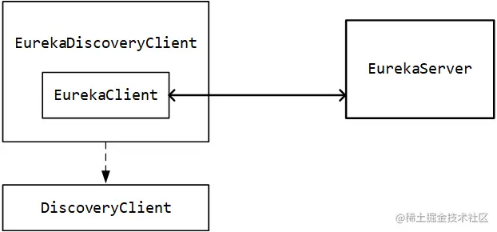

4、EurekaServiceRegistry

~~~java
@Bean
public EurekaServiceRegistry eurekaServiceRegistry() {
    return new EurekaServiceRegistry();
}
~~~

它实现了 ServiceRegistry 接口，是微服务实例与注册中心的连接契约(租约)：

~~~java
public class EurekaServiceRegistry implements ServiceRegistry<EurekaRegistration>
~~~

并且这个 ServiceRegistry 接口把注册和注销的动作都抽象出来了：

~~~java
public interface ServiceRegistry<R extends Registration> {
    void register(R registration);
    void deregister(R registration);
    void close();
~~~

注册和注销时都传入了一个 Registration 类型的注册信息对象，而 Registration 又继承 ServiceInstance 接口，ServiceInstance 接口中定义了一些服务实例注册到注册中心的一些核心参数（服务实例id，主机名，端口，服务状态等），那么当服务实例触发 register 方法时，注册中心按理应该收到服务实例的属性并处理注册动作。并且也能大概猜测，EurekaClient 启动时，register 方法会被调用；EurekaClient下线时，deregister 方法会被调用。

ServiceRegistry可以配合acturator 使用，注意：如果引入 spring-boot-starter-actuator 依赖，会自动开启安全认证，可以在 application.properties 中配置 management.security.enabled=false 来禁止安全认证

可以配合获取或者修改服务实例状态：

* 发送 GET 请求的 /service-registry 可以获取服务实例状态
* 发送 POST 请求的 /service-registry 可以修改服务实例状态

EurekaServiceRegistry的作用生效位置在下面的 EurekaAutoServiceRegistration 中。

5、EurekaAutoServiceRegistration

~~~java
@Bean
@ConditionalOnBean(AutoServiceRegistrationProperties.class)
@ConditionalOnProperty(value = "spring.cloud.service-registry.auto-registration.enabled", matchIfMissing = true)
public EurekaAutoServiceRegistration eurekaAutoServiceRegistration(
        ApplicationContext context, EurekaServiceRegistry registry,
        EurekaRegistration registration) {
    return new EurekaAutoServiceRegistration(context, registry, registration);
}
~~~

这个组件封装了上面的EurekaServiceRegistry，它的继承关系：

~~~java
public class EurekaAutoServiceRegistration implements AutoServiceRegistration,
		SmartLifecycle, Ordered, SmartApplicationListener
~~~

它实现了 SmartLifecycle 接口，它的start方法：

~~~java
public void start() {
    // only set the port if the nonSecurePort or securePort is 0 and this.port != 0
    if (this.port.get() != 0) {
        if (this.registration.getNonSecurePort() == 0) {
            this.registration.setNonSecurePort(this.port.get());
        }
        if (this.registration.getSecurePort() == 0 && this.registration.isSecure()) {
            this.registration.setSecurePort(this.port.get());
        }
    }

    // only initialize if nonSecurePort is greater than 0 and it isn't already running
    // because of containerPortInitializer below
    if (!this.running.get() && this.registration.getNonSecurePort() > 0) {
        this.serviceRegistry.register(this.registration);
        this.context.publishEvent(new InstanceRegisteredEvent<>(this,
                this.registration.getInstanceConfig()));
        this.running.set(true);
    }
}
~~~

在下面的 if 结构中，它调用了 this.serviceRegistry.register(this.registration);，在这里它触发了 EurekaServiceRegistry 的 register 方法

EurekaAutoServiceRegistration 的另一个实现的接口：SmartApplicationListener，由于没有在泛型中标明要监听的事件类型，故可以断定它监听了不止一个事件，在源码中也有体现：

~~~java
public void onApplicationEvent(ApplicationEvent event) {
    if (event instanceof WebServerInitializedEvent) {
        onApplicationEvent((WebServerInitializedEvent) event);
    }
    else if (event instanceof ContextClosedEvent) {
        onApplicationEvent((ContextClosedEvent) event);
    }
}
~~~

可以发现事件与动作的对应关系：

* WebServerInitializedEvent → start → register
* ContextClosedEvent → stop → deregister

由此也进一步明白了组件之间这一层一层的调用关系，其实这个调用链很复杂，这里先列一下调用顺序：

* EurekaAutoServiceRegistration#start() ：SmartLifecycle 的生命周期触发
* EurekaServiceRegistry#register(EurekaRegistration) ：调用服务注册组件，开始向注册中心发起注册
* ApplicationInfoManager#setInstanceStatus(reg.getInstanceConfig().getInitialStatus()) ：更新服务实例的状态为UP
* StatusChangeListener#notify(new StatusChangeEvent(prev, next)) ：更新状态导致监听器触发
* InstanceInfoReplicator#onDemandUpdate() ：DiscoveryClient - 1325行，InstanceInfoReplicator 负责给注册中心上报状态变化
* InstanceInfoReplicator.this#run() ：InstanceInfoReplicator - 101行，由此触发 DiscoveryClient 来与注册中心通信
* DiscoveryClient#register() ：发起注册实例的动作
* EurekaTransport.registrationClient#register(instanceInfo) ：使用 Jersey 或 RestTemplate 向注册中心请求注册

6、EurekaClientConfiguration

这部分注册的组件都是在非 Refreshable 环境下的，由于通常情况下咱使用 SpringCloud 微服务都会搭配分布式配置中心，也都会使用动态配置，故这部分一般不会起效

7、RefreshableEurekaClientConfiguration

这个配置类上面的注解注定了它会生效：

~~~java
@Configuration
@ConditionalOnRefreshScope
protected static class RefreshableEurekaClientConfiguration
~~~

@ConditionalOnRefreshScope就是配合refresh作用域一起生效。

它会初始化几个重要的组件：CloudEurekaClient和ApplicationInfoManager、EurekaRegistration，后面会详细介绍

8、EurekaHealthIndicatorConfiguration

在 EurekaClientAutoConfiguration 的最底下还有一个内部类的配置类，它只注册了一个组件：EurekaHealthIndicator

~~~java
@Bean
@ConditionalOnMissingBean
@ConditionalOnEnabledHealthIndicator("eureka")
public EurekaHealthIndicator eurekaHealthIndicator(EurekaClient eurekaClient,
        EurekaInstanceConfig instanceConfig, EurekaClientConfig clientConfig) {
    return new EurekaHealthIndicator(eurekaClient, instanceConfig, clientConfig);
}
~~~

它是负责提供应用运行状态的一个指示器，在DiscoveryCompositeHealthIndicator：

~~~java
@Autowired
public DiscoveryCompositeHealthIndicator(HealthAggregator healthAggregator,
        List<DiscoveryHealthIndicator> indicators) {
    super(healthAggregator);
    for (DiscoveryHealthIndicator indicator : indicators) {
        Holder holder = new Holder(indicator);
        addHealthIndicator(indicator.getName(), holder);
        this.healthIndicators.add(holder);
    }
}
~~~

会for循环将指标添加进集合，与服务实例运行的健康状态有关。这个 EurekaHealthIndicator 最终起作用是在API请求为 /health 的接口上，提供与当前服务实例相关的一些状态信息

### CloudEurekaClient

~~~java
@Bean(destroyMethod = "shutdown")
@ConditionalOnMissingBean(value = EurekaClient.class, search = SearchStrategy.CURRENT)
@org.springframework.cloud.context.config.annotation.RefreshScope
@Lazy
public EurekaClient eurekaClient(ApplicationInfoManager manager,
        EurekaClientConfig config, EurekaInstanceConfig instance,
        @Autowired(required = false) HealthCheckHandler healthCheckHandler) {
    // 如果我们使用ApplicationInfoManager的代理，当在CloudEurekaClient上调用shutdown时，
    // 我们可能会遇到问题，在这里请求ApplicationInfoManager bean，
    // 但由于我们正在关闭，因此不允许。为了避免这种情况，我们直接使用该对象。
    ApplicationInfoManager appManager;
    if (AopUtils.isAopProxy(manager)) {
        appManager = ProxyUtils.getTargetObject(manager);
    }
    else {
        appManager = manager;
    }
    CloudEurekaClient cloudEurekaClient = new CloudEurekaClient(appManager,
            config, this.optionalArgs, this.context);
    cloudEurekaClient.registerHealthCheck(healthCheckHandler);
    return cloudEurekaClient;
}
~~~

最终创建一个CloudEurekaClient并返回，实际上整个过程就是各种组件封装到CloudEurekaClient的过程。

这些组件包括：

* HealthCheckHandler：健康检查相关
* HealthCheckCallback：健康检查相关
* PreRegistrationHandler：可以在创建时向 EurekaClient 注册以执行预注册逻辑的处理程序。
* ApplicationInfoManager：初始化配置信息
* BackupRegistry：如果 EurekaClient 无法从任何 EurekaServer 检索此信息，则为 EurekaClient 回退以获得注册表信息的简单契约。 
* EndpointRandomizer：使用本地IPv4地址哈希作为种子随机化服务器列表。

除了封装，还完成了以下几个重要动作，CloudEurekaClient 的实例化可以创建真正地 EurekaClient 并注册到 EurekaServer 上。

1、缓存应用列表

~~~java
private final AtomicReference<Applications> localRegionApps = new AtomicReference<Applications>();

    localRegionApps.set(new Applications());

    fetchRegistryGeneration = new AtomicLong(0);
~~~

Applications 可以理解成一个一个的微服务应用（此处的应用指的是 spring.application.name ，一个应用可以有多个实例），微服务实例在初始化后会定时从注册中心获取已经注册的服务和实例列表，以备在注册中心宕机时仍能利用本地缓存向远程服务实例发起通信。这里的 Applications 作用就是缓存这些已经注册的微服务应用和实例。

2、区域注册信息

~~~java
remoteRegionsToFetch = new AtomicReference<String>(clientConfig.fetchRegistryForRemoteRegions());
remoteRegionsRef = new AtomicReference<>(remoteRegionsToFetch.get() == null ? null : remoteRegionsToFetch.get().split(","));
~~~

这里又看到区域的概念了，它涉及到 Eureka 的服务分区特性，后面会详细分析

3、初始化远程同步注册表、心跳监控的组件

~~~java
    if (config.shouldFetchRegistry()) {
        this.registryStalenessMonitor = new ThresholdLevelsMetric(this, 
                METRIC_REGISTRY_PREFIX + "lastUpdateSec_", 
                new long[]{15L, 30L, 60L, 120L, 240L, 480L});
    } else {
        this.registryStalenessMonitor = ThresholdLevelsMetric.NO_OP_METRIC;
    }

    if (config.shouldRegisterWithEureka()) {
        this.heartbeatStalenessMonitor = new ThresholdLevelsMetric(this, 
                METRIC_REGISTRATION_PREFIX + "lastHeartbeatSec_", 
                new long[]{15L, 30L, 60L, 120L, 240L, 480L});
    } else {
        this.heartbeatStalenessMonitor = ThresholdLevelsMetric.NO_OP_METRIC;
    }
~~~

这两个组件是监控注册表和心跳的，实际上它们是跟 Servo 监控平台关联的，可以实现数据采集。

注意源码中有一个很特别的数组：new long[]{15L, 30L, 60L, 120L, 240L, 480L}，这个数组代表消息的通知速率级别，它和Servo监控相关，可以更新这个通知速率。

4、不注册到注册中心的分支处理

~~~java
    if (!config.shouldRegisterWithEureka() && !config.shouldFetchRegistry()) {
        logger.info("Client configured to neither register nor query for data.");
        scheduler = null;
        heartbeatExecutor = null;
        cacheRefreshExecutor = null;
        eurekaTransport = null;
        instanceRegionChecker = new InstanceRegionChecker(new PropertyBasedAzToRegionMapper(config), clientConfig.getRegion());

        // This is a bit of hack to allow for existing code using DiscoveryManager.getInstance()
        // to work with DI'd DiscoveryClient
        DiscoveryManager.getInstance().setDiscoveryClient(this);
        DiscoveryManager.getInstance().setEurekaClientConfig(config);

        initTimestampMs = System.currentTimeMillis();
        logger.info("Discovery Client initialized at timestamp {} with initial instances count: {}",
                initTimestampMs, this.getApplications().size());

        return;  // no need to setup up an network tasks and we are done
    }
~~~

注意上面的分支条件：不注册到 Eureka 、不需要抓取注册信息。这里一般不会生效，当引入了eureka-client且不连接注册中心时会走这段逻辑，这里就不会注册各种调度器了。

5、初始化定时任务执行器

~~~java
    try {
        // default size of 2 - 1 each for heartbeat and cacheRefresh
        scheduler = Executors.newScheduledThreadPool(2,
                new ThreadFactoryBuilder()
                        .setNameFormat("DiscoveryClient-%d")
                        .setDaemon(true)
                        .build());

        heartbeatExecutor = new ThreadPoolExecutor(
                1, clientConfig.getHeartbeatExecutorThreadPoolSize(), 0, TimeUnit.SECONDS,
                new SynchronousQueue<Runnable>(),
                new ThreadFactoryBuilder()
                        .setNameFormat("DiscoveryClient-HeartbeatExecutor-%d")
                        .setDaemon(true)
                        .build()
        );  // use direct handoff

        cacheRefreshExecutor = new ThreadPoolExecutor(
                1, clientConfig.getCacheRefreshExecutorThreadPoolSize(), 0, TimeUnit.SECONDS,
                new SynchronousQueue<Runnable>(),
                new ThreadFactoryBuilder()
                        .setNameFormat("DiscoveryClient-CacheRefreshExecutor-%d")
                        .setDaemon(true)
                        .build()
        );  // use direct handoff
~~~

可以看出来这里面初始化了一个线程池，大小为 2，就是为下面两个定时器提供：

* heartbeatExecutor ：心跳定时器，对应的定时任务是 HeartbeatThread
* cacheRefreshExecutor ：缓存定时器，对应的定时任务是 CacheRefreshThread

至于这两个定时任务，在 DiscoveryClient 的 initScheduledTasks 方法中有初始化：

~~~java
private void initScheduledTasks() {
    if (clientConfig.shouldFetchRegistry()) {
        // registry cache refresh timer
        int registryFetchIntervalSeconds = clientConfig.getRegistryFetchIntervalSeconds();
        int expBackOffBound = clientConfig.getCacheRefreshExecutorExponentialBackOffBound();
        scheduler.schedule(
                new TimedSupervisorTask(
                        "cacheRefresh",
                        scheduler,
                        cacheRefreshExecutor,
                        registryFetchIntervalSeconds,
                        TimeUnit.SECONDS,
                        expBackOffBound,
                        new CacheRefreshThread()
                ),
                registryFetchIntervalSeconds, TimeUnit.SECONDS);
    }

    if (clientConfig.shouldRegisterWithEureka()) {
        int renewalIntervalInSecs = instanceInfo.getLeaseInfo().getRenewalIntervalInSecs();
        int expBackOffBound = clientConfig.getHeartbeatExecutorExponentialBackOffBound();
        // Heartbeat timer
        scheduler.schedule(
                new TimedSupervisorTask(
                        "heartbeat",
                        scheduler,
                        heartbeatExecutor,
                        renewalIntervalInSecs,
                        TimeUnit.SECONDS,
                        expBackOffBound,
                        new HeartbeatThread()
                ),
                renewalIntervalInSecs, TimeUnit.SECONDS);
~~~

这里就可以看出来，默认情况下这两个部分都会初始化（除非显式声明禁用 shouldFetchRegistry 和 registration.enabled ），使用扩展的定时任务 TimedSupervisorTask 来实现。

6、初始化通信网关

~~~java
    eurekaTransport = new EurekaTransport();
    scheduleServerEndpointTask(eurekaTransport, args);
~~~

这里面初始化了一个 EurekaTransport 的组件，这个组件是 DiscoveryClient 的内部类：

~~~java
private static final class EurekaTransport {
    private ClosableResolver bootstrapResolver;
    private TransportClientFactory transportClientFactory;

    private EurekaHttpClient registrationClient;
    private EurekaHttpClientFactory registrationClientFactory;

    private EurekaHttpClient queryClient;
    private EurekaHttpClientFactory queryClientFactory;
~~~

可以发现它又聚合了好多组件，这些组件都在下面的 scheduleServerEndpointTask 方法中被初始化

7、初始化微服务实例区域检查器

~~~java
   AzToRegionMapper azToRegionMapper;
    if (clientConfig.shouldUseDnsForFetchingServiceUrls()) {
      azToRegionMapper = new DNSBasedAzToRegionMapper(clientConfig);
    } else {
      azToRegionMapper = new PropertyBasedAzToRegionMapper(clientConfig);
    }
    if (null != remoteRegionsToFetch.get()) {
      azToRegionMapper.setRegionsToFetch(remoteRegionsToFetch.get().split(","));
    }
    instanceRegionChecker = new InstanceRegionChecker(azToRegionMapper, clientConfig.getRegion());
~~~

这个 InstanceRegionChecker 组件包含一部分关于亚马逊 AWS 的，不太重要

8、拉取注册信息

~~~java
    if (clientConfig.shouldFetchRegistry() && !fetchRegistry(false)) {
        fetchRegistryFromBackup();
    }
~~~

这个方法只从方法名上就可以读出意思：从备份中拉取注册表。如果所有 EurekaServer 的URL均无法访问，则从备份注册表中获取注册表信息。

正常情况下，由于 fetchRegistry 方法返回 true ，故下面的 fetchRegistryFromBackup 方法不会被触发（方法中只有出现异常才返回 false ）

9、回调注册前置处理器

~~~java
    if (this.preRegistrationHandler != null) {
        this.preRegistrationHandler.beforeRegistration();
    }
~~~

借助 IDEA ，发现这个 preRegistrationHandler 并没有实现类，通过 Debug 也发现它是 null，它是为了以后扩展实现

10、初始化定时任务

~~~java
    // finally, init the schedule tasks (e.g. cluster resolvers, heartbeat, instanceInfo replicator, fetch
    initScheduledTasks();
~~~

这个方法就是上面提到的，初始化定时任务的地方

11、向Servo监控注册自己

~~~java
    try {
        Monitors.registerObject(this);
    } catch (Throwable e) {
        logger.warn("Cannot register timers", e);
    }
~~~

Monitors 所在的包：com.netflix.servo.monitor

### ApplicationInfoManager

~~~java
@Bean
@ConditionalOnMissingBean(value = ApplicationInfoManager.class, search = SearchStrategy.CURRENT)
@org.springframework.cloud.context.config.annotation.RefreshScope
@Lazy
public ApplicationInfoManager eurekaApplicationInfoManager(
        EurekaInstanceConfig config) {
    InstanceInfo instanceInfo = new InstanceInfoFactory().create(config);
    return new ApplicationInfoManager(config, instanceInfo);
}
~~~

之前提过，它会初始化配置信息，在初始化CloudEurekaClient的时候：

~~~java
    this.applicationInfoManager = applicationInfoManager;
    InstanceInfo myInfo = applicationInfoManager.getInfo();
    // ......
    instanceInfo = myInfo;
    if (myInfo != null) {
        appPathIdentifier = instanceInfo.getAppName() + "/" + instanceInfo.getId();
~~~

applicationInfoManager 的赋值之后还干了一件事，它把其中的 InstanceInfo 取出来了。

它把 instanceInfo 的信息取出来之后，拼装成一个 appPathIdentifier ，而这个 appPathIdentifier 的作用却异常简单：只用来打日志。。。（在 getApplications 和 register 方法中有利用）除此之外 InstanceInfo 的作用就散布在 DiscoveryClient 的一些方法中了

### EurekaRegistration

~~~java
@Bean
@org.springframework.cloud.context.config.annotation.RefreshScope
@ConditionalOnBean(AutoServiceRegistrationProperties.class)
@ConditionalOnProperty(value = "spring.cloud.service-registry.auto-registration.enabled", matchIfMissing = true)
public EurekaRegistration eurekaRegistration(EurekaClient eurekaClient,
        CloudEurekaInstanceConfig instanceConfig,
        ApplicationInfoManager applicationInfoManager,
        @Autowired(required = false) ObjectProvider<HealthCheckHandler> healthCheckHandler) {
    return EurekaRegistration.builder(instanceConfig).with(applicationInfoManager)
            .with(eurekaClient).with(healthCheckHandler).build();
}
~~~

上面遇到过这个组件了，它就是 Eureka 实例的服务注册信息，从上面的 @Conditional 注解中标注也能看的出来，只有声明 spring.cloud.service-registry.auto-registration.enabled 为 false 时才不会创建。

它的内部结构如下：

~~~java
public class EurekaRegistration implements Registration {
	private final EurekaClient eurekaClient;
	private final AtomicReference<CloudEurekaClient> cloudEurekaClient = new AtomicReference<>();
	private final CloudEurekaInstanceConfig instanceConfig;
	private final ApplicationInfoManager applicationInfoManager;
	private ObjectProvider<HealthCheckHandler> healthCheckHandler;
~~~

可以看得出来它也是一堆组件的整合而已。

### 组件总结

EurekaClient 的启动流程：

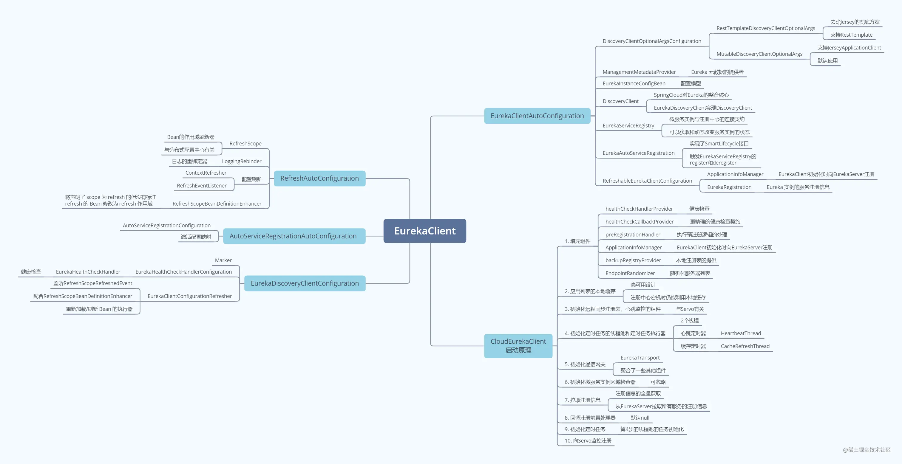

## 同步集群节点注册表

之前，在EurekaServerInitializerConfiguration的start方法中，会复制集群节点注册表：

~~~java
protected void initEurekaServerContext() throws Exception {
    // ......
    // Copy registry from neighboring eureka node
    // Eureka复制集群节点注册表
    int registryCount = this.registry.syncUp();
    this.registry.openForTraffic(this.applicationInfoManager, registryCount);
    // ......
}
~~~

下面就展开讲解syncUp方法，它就是EurekaServer 在初始启动时同步注册表的动作

### 重试的休眠机制

跳转到 PeerAwareInstanceRegistryImpl 的 syncUp 方法：

~~~java
public int syncUp() {
    // Copy entire entry from neighboring DS node
    int count = 0;

    for (int i = 0; ((i < serverConfig.getRegistrySyncRetries()) && (count == 0)); i++) {
        // 1.1 重试休眠
        if (i > 0) {
            try {
                Thread.sleep(serverConfig.getRegistrySyncRetryWaitMs());
            } // catch .....
        }
        // 1.2 获取注册实例
        Applications apps = eurekaClient.getApplications();
        for (Application app : apps.getRegisteredApplications()) {
            for (InstanceInfo instance : app.getInstances()) {
                try {
                    if (isRegisterable(instance)) {
                        // 1.3 【微服务实例注册】注册服务到本EurekaServer实例
                        register(instance, instance.getLeaseInfo().getDurationInSecs(), true);
                        count++;
                    }
                } // catch ......
            }
        }
    }
    return count;
}
~~~

先暂且不看 for 循环的循环体，先研究一下它的判断条件：(i < serverConfig.getRegistrySyncRetries()) && (count == 0)

提到一个 registrySyncRetries 的概念：同步节点重试次数 ，说明 Eureka 在节点之间的注册表同步时引入了重试机制，只要同步失败，且在重试次数之内，它就会一直去尝试同步注册表。默认情况下，重试次数被写死在源码中，它会重试5次：

~~~java
public int getRegistrySyncRetries() {
    return configInstance.getIntProperty(namespace + "numberRegistrySyncRetries", 5).get();
}
~~~

一开始，如果 i > 0 ，证明已经走完一次循环，它会让线程休眠30秒，这个30秒也在上面的配置中：

~~~java
public long getRegistrySyncRetryWaitMs() {
    return configInstance.getIntProperty(namespace + "registrySyncRetryWaitMs", 30 * 1000).get();
}
~~~

它休眠30秒是为了避免因为突然出现的网络波动导致注册表复制失败，实际在开发场景中可以调低这个数值。

### 获取注册实例

~~~java
    Applications apps = eurekaClient.getApplications();
    for (Application app : apps.getRegisteredApplications()) {
        for (InstanceInfo instance : app.getInstances()) {
~~~

这部分操作很明显是要获取集群中注册中心了，它要借助一个 eurekaClient。通过Debug，发现它是一个被 jdk 动态代理的代理对象，源接口就是 EurekaClient

这里面获取到的 Applications是网络中的所有微服务，InstanceInfo则是对应微服务的所有实例。后面会循环获取所有的微服务，再获取微服务下面对应的实例，都注册到本地的微服务注册表中。

~~~java
    try {
        if (isRegisterable(instance)) {
            register(instance, instance.getLeaseInfo().getDurationInSecs(), true);
            count++;
        }
    } // catch ......
~~~

这里面核心的方法就这一个 register 方法

### 缓存实例

首先将微服务实例缓存起来：

~~~java
    // 给当前微服务实例添加租约信息
    if (gMap == null) {
        final ConcurrentHashMap<String, Lease<InstanceInfo>> gNewMap = new ConcurrentHashMap<>();
        gMap = registry.putIfAbsent(registrant.getAppName(), gNewMap);
        if (gMap == null) {
            gMap = gNewMap;
        }
    }
~~~

下面的逻辑：

~~~java
    Lease<InstanceInfo> existingLease = gMap.get(registrant.getId());
    // 当前微服务网络中已存在该实例，保留最后一次续约的时间戳
    if (existingLease != null && (existingLease.getHolder() != null)) {
        Long existingLastDirtyTimestamp = existingLease.getHolder().getLastDirtyTimestamp();
        Long registrationLastDirtyTimestamp = registrant.getLastDirtyTimestamp();
        // 如果EurekaServer端已存在当前微服务实例，且时间戳大于新传入微服务实例的时间戳，则用EurekaServer端的数据替换新传入的微服务实例
        // 这个机制是防止已经过期的微服务实例注册到EurekaServer
        if (existingLastDirtyTimestamp > registrationLastDirtyTimestamp) {
            registrant = existingLease.getHolder();
        }
    } else {
        // 租约不存在因此它是一个新的待注册实例
        synchronized (lock) {
            if (this.expectedNumberOfClientsSendingRenews > 0) {
                // 增加接下来要接收租约续订的客户端数量
                this.expectedNumberOfClientsSendingRenews = this.expectedNumberOfClientsSendingRenews + 1;
                updateRenewsPerMinThreshold();
            }
        }
    }
~~~

先看上面部分的逻辑：如果这个实例是之前在 EurekaServer 中有记录的，这种情况下的注册会进行一个额外的逻辑：它要判断当前注册的实例是否是一个已经过期的实例，方式是通过拿 EurekaServer 中记录的心跳时间戳，与当前正在注册的微服务实例当初创建时的时间戳进行比对。

注意微服务实例要注册到 EurekaServer 时，在 EurekaServer 中记录的实例信息模型类 InstanceInfo 的构造方法：

~~~java
private InstanceInfo() {
    this.metadata = new ConcurrentHashMap<String, String>();
    this.lastUpdatedTimestamp = System.currentTimeMillis();
    this.lastDirtyTimestamp = lastUpdatedTimestamp;
}
~~~

很明显是取系统当前时间。由此不难理解：如果在微服务实例模型创建之后、注册之前，有一个相同的实例给 EurekaServer 发送了心跳包，则 EurekaServer 会认为这次注册是一次过期注册，会使用 EurekaServer 本身已经缓存的 InstanceInfo 代替传入的对象。

下面的 else 部分相对比较简单，全新的实例注册进来只需要增加租约续订的计数即可，这里面涉及到 EurekaServer 的自我保护机制。

### 自我保护机制

EurekaServer 中有两个很重要的参数，它们来共同控制和检测 EurekaServer 的状态，以决定在特定的时机下触发自我保护：

~~~java
protected volatile int numberOfRenewsPerMinThreshold; // 每分钟能接收的最少续租次数
protected volatile int expectedNumberOfClientsSendingRenews; // 期望收到续租心跳的客户端数量
~~~

注意在 SpringCloudNetflix 版本为 Greenwich.SR4 时，Eureka 的版本是 1.9.13 ，在 Eureka 1.8 版本中这部分的两个参数为：

~~~java
protected volatile int numberOfRenewsPerMinThreshold; // 每分钟能接收的最少续租次数
protected volatile int expectedNumberOfRenewsPerMin; // 期望的每分钟最大续租次数
~~~

这部分的一个小小改动，可能是由于之前 Eureka 写死了一分钟心跳两次，换用 1.9 版本的这种方式可以自定义心跳频率。

注意上面的源码中，else 结构里面最后一句话调用了一个 updateRenewsPerMinThreshold 方法：

~~~java
private int expectedClientRenewalIntervalSeconds = 30;
private double renewalPercentThreshold = 0.85;

protected void updateRenewsPerMinThreshold() {
    this.numberOfRenewsPerMinThreshold = (int) (this.expectedNumberOfClientsSendingRenews
            * (60.0 / serverConfig.getExpectedClientRenewalIntervalSeconds())
            * serverConfig.getRenewalPercentThreshold());
}
~~~

这个计算公式有如下解释：

每分钟能接收的最少续租次数 = 微服务实例总数 * ( 60秒 / 实例续约时间间隔 ) * 有效心跳比率

举一个例子：当前 EurekaServer 中有注册了 5 个服务实例，那么在默认情况下，每分钟能接收的最少续租次数就应该是 5 * (60 / 30) * 0.85 = 8.5次，强转为 int 类型 → 8次。那就意味着，如果在这个检测周期中，如果 EurekaServer 收到的有效心跳包少于8个，且没有在配置中显式关闭自我保护，则 EurekaServer 会开启自我保护模式，暂停服务剔除。

### 创建租约

~~~java
    // 创建微服务实例与EurekaServer的租约
    Lease<InstanceInfo> lease = new Lease<InstanceInfo>(registrant, leaseDuration);
    if (existingLease != null) {
        lease.setServiceUpTimestamp(existingLease.getServiceUpTimestamp());
    }
    gMap.put(registrant.getId(), lease);
~~~

这里它会创建一个新的租约，注意租约中的结构：

~~~java
public Lease(T r, int durationInSecs) {
    holder = r;
    registrationTimestamp = System.currentTimeMillis(); // 租约开始时间
    lastUpdateTimestamp = registrationTimestamp; // 初始情况开始时间即为最后一次的时间
    duration = (durationInSecs * 1000);
}
~~~

这里面 durationInSecs 的值往前找，发现是在 sync 方法中调用 instance.getLeaseInfo().getDurationInSecs() 取到的，而 LeaseInfo 中最终寻找到它的默认值：

~~~java
public class LeaseInfo {
    public static final int DEFAULT_LEASE_RENEWAL_INTERVAL = 30;
    public static final int DEFAULT_LEASE_DURATION = 90;

    private int renewalIntervalInSecs = DEFAULT_LEASE_RENEWAL_INTERVAL;
    private int durationInSecs = DEFAULT_LEASE_DURATION;
~~~

可以发现是 90 秒，这也解释了 EurekaClient 实例的默认服务过期时间是 90 秒。

### 记录最近注册的记录

~~~java
    // 记录到“最近注册”
    synchronized (recentRegisteredQueue) {
        recentRegisteredQueue.add(new Pair<Long, String>(
            System.currentTimeMillis(), registrant.getAppName() + "(" + registrant.getId() + ")"));
    }
~~~

这个 recentRegisteredQueue 的实际目的是在 EurekaServer 的控制台上，展示最近的微服务实例注册记录。值得注意的，它使用了队列作为存放的容器，这里面有一个小小的讲究：队列的先进先出特点决定了刚好可以作为历史记录的存放容器。另外一个注意的点，最近的记录往往都只会展示有限的几个，所以这里的 Queue 并不是 jdk 原生自带的队列，而是扩展的一个 CircularQueue ：

~~~java
private class CircularQueue<E> extends ConcurrentLinkedQueue<E> {
    private int size = 0;
    
    public CircularQueue(int size) {
        this.size = size;
    }
    
    @Override
    public boolean add(E e) {
        this.makeSpaceIfNotAvailable();
        return super.add(e);
    }

    private void makeSpaceIfNotAvailable() {
        if (this.size() == size) {
            this.remove();
        }
    }
~~~

从这里面咱可以看到一个很微妙的设计：当队列初始化时，会指定一个队列最大容量，当队列中的元素数量达到预先制定的最大容量时，会将最先进入队列的元素剔除掉，以达到队列中的元素都是最近刚添加的。

### 微服务实例的状态

在 EurekaServer 中，每个服务都有两种状态：

* 服务自身的状态（status），这是每个服务自身的动态属性；

* EurekaServer 自身记录的服务的覆盖状态（overriddenStatus），这个状态维护在 EurekaServer 中，用来标注 EurekaServer 中注册的服务实例的状态

  它的作用是在被记录的服务在进行注册、续约等动作时，以这个覆盖的状态为准，而不是服务本身的状态。

~~~java
    // This is where the initial state transfer of overridden status happens
    // 如果当前微服务实例的状态不是“UNKNOWN”，则说明之前已经存在一个状态，此处需要做一次状态覆盖
    if (!InstanceStatus.UNKNOWN.equals(registrant.getOverriddenStatus())) {
        if (!overriddenInstanceStatusMap.containsKey(registrant.getId())) {
            overriddenInstanceStatusMap.put(registrant.getId(), registrant.getOverriddenStatus());
        }
    }
    InstanceStatus overriddenStatusFromMap = overriddenInstanceStatusMap.get(registrant.getId());
    if (overriddenStatusFromMap != null) {
        registrant.setOverriddenStatus(overriddenStatusFromMap);
    }
~~~

其实就是将实例状态，同步到overriddenInstanceStatusMap中。

EurekaServer 中记录微服务实例的状态有五种，它定义在一个枚举中：

~~~java
public enum InstanceStatus {
    UP, // Ready to receive traffic
    DOWN, // Do not send traffic- healthcheck callback failed
    STARTING, // Just about starting- initializations to be done - do not send traffic
    OUT_OF_SERVICE, // Intentionally shutdown for traffic
    UNKNOWN;
~~~

默认情况下 EurekaServer 中不会记录覆盖状态，通过Debug可以发现当微服务实例发送心跳请求时，微服务节点实例的状态是 UP ，EurekaServer 自身没有记录覆盖状态。

如果要指定某个微服务实例在 EurekaServer 中记录的覆盖状态，则可以调用一个接口：在 EurekaServer 中，InstanceResource 是用来控制微服务实例状态的 Restful WebService 接口，它基于 Jersey 构建，在这里面它定义了一个 statusUpdate 方法，用于更新微服务实例在 EurekaServer 中存放的状态：

~~~java
@PUT
@Path("status")
public Response statusUpdate(
        @QueryParam("value") String newStatus,
        @HeaderParam(PeerEurekaNode.HEADER_REPLICATION) String isReplication,
        @QueryParam("lastDirtyTimestamp") String lastDirtyTimestamp)
~~~

例如在之前搭建的 EurekaServer 中，如果修改 EurekaClient 的注册中心状态，可以发送如下的请求：

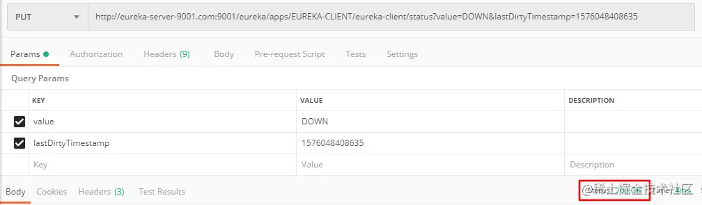

使用 postman 发送请求后，收到 200 的响应，之后再回到 EurekaServer 的控制台，发现 EurekaClient 的状态已经改变：

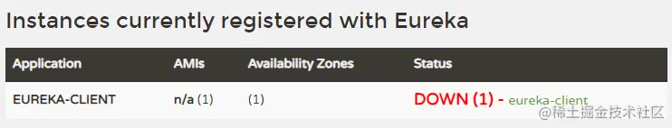

由此可以完成对微服务实例的状态覆盖。

下面的逻辑是：

~~~java
    // Set the status based on the overridden status rules
    // 经过上面的处理后，这里获取到微服务实例的最终状态，并真正地设置进去
    InstanceStatus overriddenInstanceStatus = getOverriddenInstanceStatus(registrant, existingLease, isReplication);
    registrant.setStatusWithoutDirty(overriddenInstanceStatus);
~~~

在获取真正的微服务实例状态时，它又调了 getOverriddenInstanceStatus 方法：

~~~java
protected InstanceInfo.InstanceStatus getOverriddenInstanceStatus(InstanceInfo r,
        Lease<InstanceInfo> existingLease, boolean isReplication) {
    InstanceStatusOverrideRule rule = getInstanceInfoOverrideRule();
    logger.debug("Processing override status using rule: {}", rule);
    return rule.apply(r, existingLease, isReplication).status();
}
~~~

来到FirstMatchWinsCompositeRule的apply方法：

~~~java
public StatusOverrideResult apply(InstanceInfo instanceInfo,
                                  Lease<InstanceInfo> existingLease,
                                  boolean isReplication) {
    for (int i = 0; i < this.rules.length; ++i) {
        StatusOverrideResult result = this.rules[i].apply(instanceInfo, existingLease, isReplication);
        if (result.matches()) {
            return result;
        }
    }
    return defaultRule.apply(instanceInfo, existingLease, isReplication);
}
~~~

这里它会先循环一些预设好的规则，如果都不匹配，则会使用默认规则。通过Debug发现有三种规则和一个默认规则。Debug走下去发现上面的三种匹配规则都没起作用，那就来到默认规则：

~~~java
public StatusOverrideResult apply(InstanceInfo instanceInfo,
        Lease<InstanceInfo> existingLease, boolean isReplication) {
    logger.debug("Returning the default instance status {} for instance {}", instanceInfo.getStatus(),
                 instanceInfo.getId());
    return StatusOverrideResult.matchingStatus(instanceInfo.getStatus());
}
~~~

这个 StatusOverrideResult.matchingStatus 方法的内容也很简单，它只是将 InstanceStatus 封装到 StatusOverrideResult 中而已：

~~~java
public static StatusOverrideResult matchingStatus(InstanceInfo.InstanceStatus status) {
    return new StatusOverrideResult(true, status);
}
~~~

它的这个包装实际上是为了迎合前面的 rule.apply(r, existingLease, isReplication).status(); ，实际上在 EurekaServer 没有内部覆盖指定时，最终这样匹配下来，就是拿的 EurekaClient 本身的状态，Debug走下来也可以发现确实就是一开始的 UP 状态。

上面看到的那几个匹配规则：

* DownOrStartingRule ：匹配实例状态为 DOWN 或者 STARTING
* OverrideExistsRule ：匹配被 EurekaServer 本身覆盖过的实例状态
* LeaseExistsRule ：匹配 Eureka Server 本地存放的微服务实例状态是否等于 UP 或 OUT_OF_SERVICE
* AlwaysMatchInstanceStatusRule ：直接通过，不进行任何匹配

### 记录租约、时间戳

~~~java
    // If the lease is registered with UP status, set lease service up timestamp
    // 记录微服务实例注册时注册租约的时间
    if (InstanceStatus.UP.equals(registrant.getStatus())) {
        lease.serviceUp();
    }
    // 处理状态、续约时间戳等
    registrant.setActionType(ActionType.ADDED);
    recentlyChangedQueue.add(new RecentlyChangedItem(lease));
    registrant.setLastUpdatedTimestamp();
    // 让当前注册的微服务实例缓存失效，后续的处理中会重新构建缓存
    invalidateCache(registrant.getAppName(), registrant.getVIPAddress(), registrant.getSecureVipAddress());
~~~

上面的 if 结构中调了一个 serviceUp 方法，点进去可以发现就是记录时间戳：

~~~java
public void serviceUp() {
    if (serviceUpTimestamp == 0) {
        serviceUpTimestamp = System.currentTimeMillis();
    }
}
~~~

下面的 recentlyChangedQueue 是一个比较关键的点，它涉及到 EurekaClient 的注册信息的获取机制。除了这个点之外，微服务实例的注册动作就读完了，注册表的同步机制也就读完了。至于 EurekaClient 的注册信息获取机制，后面会详细解读。

### 注册信息的定时更新

上面都是关于第一次的同步，但 EurekaServer 的集群节点之间还有一个10分钟定时更新的设计，在 PeerEurekaNodes 的初始化时，会被调用一个 start 方法，在这里会开启集群节点注册信息的更新定时任务。注意这里面在开启定时任务之前先同步了一次（注意 try 中的第一句）：

~~~java
public void start() {
    taskExecutor = Executors.newSingleThreadScheduledExecutor(
            new ThreadFactory() {
                @Override
                public Thread newThread(Runnable r) {
                    Thread thread = new Thread(r, "Eureka-PeerNodesUpdater");
                    thread.setDaemon(true);
                    return thread;
                }
            }
    );
    try {
        // 先执行一次
        updatePeerEurekaNodes(resolvePeerUrls());
        Runnable peersUpdateTask = new Runnable() {
            @Override
            public void run() {
                try {
                    updatePeerEurekaNodes(resolvePeerUrls());
                } // catch ......
            }
        };
        // 再开始调度定时任务
        taskExecutor.scheduleWithFixedDelay(
                peersUpdateTask,
                serverConfig.getPeerEurekaNodesUpdateIntervalMs(),
                serverConfig.getPeerEurekaNodesUpdateIntervalMs(),
                TimeUnit.MILLISECONDS
        );
    } // catch ......
}
~~~

核心方法是updatePeerEurekaNodes。

首先来看resolvePeerUrls方法：

~~~java
protected List<String> resolvePeerUrls() {
    // 获取EurekaServer集群的所有地址
    InstanceInfo myInfo = applicationInfoManager.getInfo();
    String zone = InstanceInfo.getZone(clientConfig.getAvailabilityZones(clientConfig.getRegion()), myInfo);
    List<String> replicaUrls = EndpointUtils
            .getDiscoveryServiceUrls(clientConfig, zone, new EndpointUtils.InstanceInfoBasedUrlRandomizer(myInfo));

    // 去掉自己
    int idx = 0;
    while (idx < replicaUrls.size()) {
        if (isThisMyUrl(replicaUrls.get(idx))) {
            replicaUrls.remove(idx);
        } else {
            idx++;
        }
    }
    return replicaUrls;
}
~~~

可以发现这段逻辑是很简单的，它会取出所有的注册中心（即 EurekaServer 集群）的 url ，之后去掉自己，返回出去。通过搭建双注册中心的集群，且互相配置对方为注册中心。下面去掉了自己，其实也就是说：即便你配置上自己的地址，也没关系，它会帮你去除的。

取出所有的 EurekaServer 集群的 url 后，就进入 updatePeerEurekaNodes 方法了：

~~~java
protected void updatePeerEurekaNodes(List<String> newPeerUrls) {
    if (newPeerUrls.isEmpty()) {
        logger.warn("The replica size seems to be empty. Check the route 53 DNS Registry");
        return;
    }

    // 统计现有节点中除去注册中心的节点
    Set<String> toShutdown = new HashSet<>(peerEurekaNodeUrls);
    toShutdown.removeAll(newPeerUrls);
    // 统计新增的节点中除去现有的节点
    Set<String> toAdd = new HashSet<>(newPeerUrls);
    toAdd.removeAll(peerEurekaNodeUrls);
    
    if (toShutdown.isEmpty() && toAdd.isEmpty()) { // No change
        return;
    }

    // Remove peers no long available 删除不再用的节点
    List<PeerEurekaNode> newNodeList = new ArrayList<>(peerEurekaNodes);
    if (!toShutdown.isEmpty()) {
        logger.info("Removing no longer available peer nodes {}", toShutdown);
        int i = 0;
        while (i < newNodeList.size()) {
            PeerEurekaNode eurekaNode = newNodeList.get(i);
            if (toShutdown.contains(eurekaNode.getServiceUrl())) {
                newNodeList.remove(i);
                eurekaNode.shutDown();
            } else {
                i++;
            }
        }
    }

    // Add new peers 添加新的节点
    if (!toAdd.isEmpty()) {
        logger.info("Adding new peer nodes {}", toAdd);
        for (String peerUrl : toAdd) {
            newNodeList.add(createPeerEurekaNode(peerUrl));
        }
    }
    this.peerEurekaNodes = newNodeList;
    this.peerEurekaNodeUrls = new HashSet<>(newPeerUrls);
}
~~~

首先会统计取消注册的节点、新增的节点

中间的移除动作，它是拿出所有在 toShutdown集合中的节点信息，执行 shutDown 方法。而 shutdown 方法中只有两个动作，都是停止定时任务调度器：

~~~java
private final TaskDispatcher<String, ReplicationTask> batchingDispatcher;
private final TaskDispatcher<String, ReplicationTask> nonBatchingDispatcher;

public void shutDown() {
    batchingDispatcher.shutdown();
    nonBatchingDispatcher.shutdown();
}
~~~

而下面向 newNodeList 中添加的新注册的节点，要通过 createPeerEurekaNode 方法构造 PeerEurekaNode：

~~~java
protected PeerEurekaNode createPeerEurekaNode(String peerEurekaNodeUrl) {
    JerseyReplicationClient replicationClient = JerseyReplicationClient
            .createReplicationClient(serverConfig, serverCodecs, peerEurekaNodeUrl);

    this.replicationClientAdditionalFilters.getFilters()
            .forEach(replicationClient::addReplicationClientFilter);

    String targetHost = hostFromUrl(peerEurekaNodeUrl);
    if (targetHost == null) {
        targetHost = "host";
    }
    return new PeerEurekaNode(registry, targetHost, peerEurekaNodeUrl,
            replicationClient, serverConfig);
}
~~~

一开始的这个 JerseyReplicationClient 比较重要，它是 EurekaServer 集群中，自身请求其他 EurekaServer 节点的客户端。它继承了 AbstractJerseyEurekaHttpClient ，而这个 AbstractJerseyEurekaHttpClient 就是之前和后面看所有关于 Eureka 节点之间通信的核心客户端

最后，把这个客户端包含在 PeerEurekaNode 中，构造出对象，返回，创建也就算完成了。

EurekaServer 在存储节点时，采取的策略是一个微服务实例节点一个客户端，每个客户端都有自己的标识，对应发送的请求路径也就不同。

## EurekaClient注册信息获取

EurekaClient运行时也要获取注册信息，注册信息获取分为全量获取和增量获取，顾名思义，全量获取是在一开始微服务实例启动时一次性拉取当前所有的服务实例注册信息，而增量获取是在服务启动后运行中的一段时间后定时获取。

### 全量获取

先启动两个 EurekaServer，再启动 eureka-client ，让 client 注册到 server 上，之后再Debug启动一个 eureka-client2 ，同样也注册到两个 EurekaServer 上（此时有两个 EurekaServer 、两个 EurekaClient ）

之前讲过，EurekaClient启动的时候，会向容器中注册DiscoveryClient，构造DiscoveryClient的时候：

~~~java
DiscoveryClient(ApplicationInfoManager applicationInfoManager, EurekaClientConfig config, AbstractDiscoveryClientOptionalArgs args, Provider<BackupRegistry> backupRegistryProvider, EndpointRandomizer endpointRandomizer) {
    // ......
    if (clientConfig.shouldFetchRegistry() && !fetchRegistry(false)) {
        fetchRegistryFromBackup();
    }
~~~

这里它调用了 fetchRegistry 方法：

~~~java
private boolean fetchRegistry(boolean forceFullRegistryFetch) {
    // ......
        if (clientConfig.shouldDisableDelta()
                || (!Strings.isNullOrEmpty(clientConfig.getRegistryRefreshSingleVipAddress()))
                || forceFullRegistryFetch
                || (applications == null)
                || (applications.getRegisteredApplications().size() == 0)
                || (applications.getVersion() == -1)) {
            // ......
            getAndStoreFullRegistry();
        } else {
            getAndUpdateDelta(applications);
        }
     // ......
}
~~~

getAndStoreFullRegistry和getAndUpdateDelta两个分支，分别代表全量获取和增量获取。

在全量获取的getAndStoreFullRegistry方法中，先进行远程调用获取网络中的所有服务：

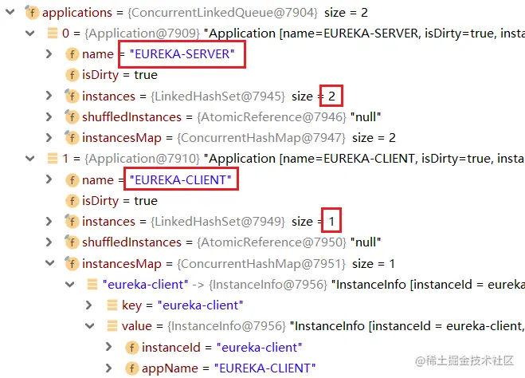

可以看到这里吧client和server都获取到了，接下来的逻辑：

~~~java
    if (httpResponse.getStatusCode() == Status.OK.getStatusCode()) {
        apps = httpResponse.getEntity();
    }

    if (apps == null) { // logger ......
    } else if (fetchRegistryGeneration.compareAndSet(currentUpdateGeneration, currentUpdateGeneration + 1)) {
        localRegionApps.set(this.filterAndShuffle(apps));
~~~

注意看最底下一行：它在 set 之前干了一件事：filterAndShuffle。最终来到application.shuffleAndStoreInstances：

~~~java
private void _shuffleAndStoreInstances(boolean filterUpInstances, boolean indexByRemoteRegions,
                                       @Nullable Map<String, Applications> remoteRegionsRegistry,
                                       @Nullable EurekaClientConfig clientConfig,
                                       @Nullable InstanceRegionChecker instanceRegionChecker) {
    List<InstanceInfo> instanceInfoList;
    synchronized (instances) {
        instanceInfoList = new ArrayList<InstanceInfo>(instances);
    }
    boolean remoteIndexingActive = indexByRemoteRegions && null != instanceRegionChecker && null != clientConfig
            && null != remoteRegionsRegistry;
    if (remoteIndexingActive || filterUpInstances) {
        Iterator<InstanceInfo> it = instanceInfoList.iterator();
        while (it.hasNext()) {
            InstanceInfo instanceInfo = it.next();
            if (filterUpInstances && InstanceStatus.UP != instanceInfo.getStatus()) {
                it.remove();
            } else if (remoteIndexingActive) {
                String instanceRegion = instanceRegionChecker.getInstanceRegion(instanceInfo);
                if (!instanceRegionChecker.isLocalRegion(instanceRegion)) {
                    // ......
                    it.remove();
                }
            }
        }
    }
    Collections.shuffle(instanceInfoList, shuffleRandom);
    this.shuffledInstances.set(instanceInfoList);
}
~~~

这里或移除处于非UP状态的实例，移除本地的实例，然后将其乱序后set到本地。乱序的目的是为了防止某一个节点短时间被大量处理导致压力过大

筛选和乱序完成后，它将这些服务实例设置到本地注册信息的缓存中，全量获取结束：

~~~java
    localRegionApps.set(this.filterAndShuffle(apps));
~~~

### 增量获取

之前提过，CloudEurekaClient实例化的时候，会调用initScheduledTasks，调用到了DiscoveryClient 的 initScheduledTasks 方法，它会启动一些定时任务，其中关于注册信息的增量获取，这里也有调度：

~~~java
    if (clientConfig.shouldFetchRegistry()) {
        // registry cache refresh timer
        int registryFetchIntervalSeconds = clientConfig.getRegistryFetchIntervalSeconds();
        int expBackOffBound = clientConfig.getCacheRefreshExecutorExponentialBackOffBound();
        scheduler.schedule(
                new TimedSupervisorTask(
                        "cacheRefresh",
                        scheduler,
                        cacheRefreshExecutor,
                        registryFetchIntervalSeconds,
                        TimeUnit.SECONDS,
                        expBackOffBound,
                        new CacheRefreshThread()
                ),
                registryFetchIntervalSeconds, TimeUnit.SECONDS);
    }

class CacheRefreshThread implements Runnable {
    public void run() {
        refreshRegistry();
    }
}

void refreshRegistry() {
    try {
        // ......
        boolean success = fetchRegistry(remoteRegionsModified);
        // ....
    } // ......
}
~~~

方法的第一个定时任务就是用来处理增量获取的，它 new 了一个 CacheRefreshThread ，这个类仅仅是实现了 Runnable 接口，对应的方法是 refreshRegistry 方法，而这个 refreshRegistry 方法中最终调用了 fetchRegistry 进行全量和增量的获取。

如果在配置中没有显式地配置 eureka.client.disable-delta=true ，或者那一大堆 if 的判断条件中有一个成立时，会触发增量获取。而这个定时任务的时间一路找下去可以发现：private int registryFetchIntervalSeconds = 30; ，即 30 秒触发一次增量获取。

一般来说，集群中各实例的状态不会发生变化，如果向 EurekaServer1 上发送如下请求：

eureka-server-9001.com:9001/eureka/apps…

它可以让 client 主动停止提供服务。经过这个处理后，client 的状态会先在 EurekaServer 中被覆盖，然后在client实例触发增量获取的时候，进入getAndUpdateDelta方法：

~~~java
private void getAndUpdateDelta(Applications applications) throws Throwable {
    long currentUpdateGeneration = fetchRegistryGeneration.get();

    Applications delta = null;
    // 发起增量获取
    EurekaHttpResponse<Applications> httpResponse = eurekaTransport.queryClient.getDelta(remoteRegionsRef.get());
    if (httpResponse.getStatusCode() == Status.OK.getStatusCode()) {
        delta = httpResponse.getEntity();
    }

    if (delta == null) {
        // 如果获取不到增量数据，直接执行全量获取
        getAndStoreFullRegistry();
    } // else if ......
                // 合并应用
                updateDelta(delta);
                reconcileHashCode = getReconcileHashCode(applications);
    // ......
}
~~~

这里获取到 EurekaServer 端的增量数据，通过Debug观察 httpResponse 里面的差异：

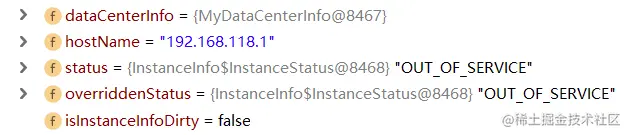

可以发现 EurekaClient 获取到了被 EurekaServer 覆盖的服务实例状态。不过，由于这个状态仅仅是 EurekaServer 中存放的覆盖状态，所以 EurekaClient 本身的状态还是 UP，真正的状态是在这里被处理的：

~~~java
private void updateDelta(Applications delta) {
    int deltaCount = 0;
    // 遍历所有增量的应用集合
    for (Application app : delta.getRegisteredApplications()) {
        for (InstanceInfo instance : app.getInstances()) {
            // 循环每一个微服务实例来处理
            Applications applications = getApplications();
            String instanceRegion = instanceRegionChecker.getInstanceRegion(instance);
            if (!instanceRegionChecker.isLocalRegion(instanceRegion)) {
                Applications remoteApps = remoteRegionVsApps.get(instanceRegion);
                if (null == remoteApps) {
                    remoteApps = new Applications();
                    remoteRegionVsApps.put(instanceRegion, remoteApps);
                }
                applications = remoteApps;
            }

            ++deltaCount;
            // 微服务实例的注册信息对应的动作为添加时，也添加到自己的缓存中
            if (ActionType.ADDED.equals(instance.getActionType())) {
                Application existingApp = applications.getRegisteredApplications(instance.getAppName());
                if (existingApp == null) {
                    applications.addApplication(app);
                }
                applications.getRegisteredApplications(instance.getAppName()).addInstance(instance);
            } else if (ActionType.MODIFIED.equals(instance.getActionType())) {
                // 处理修改动作
                Application existingApp = applications.getRegisteredApplications(instance.getAppName());
                if (existingApp == null) {
                    applications.addApplication(app);
                }
                applications.getRegisteredApplications(instance.getAppName()).addInstance(instance);
            } else if (ActionType.DELETED.equals(instance.getActionType())) {
                // 处理移除下线动作
                Application existingApp = applications.getRegisteredApplications(instance.getAppName());
                if (existingApp != null) {
                    existingApp.removeInstance(instance);
                    if (existingApp.getInstancesAsIsFromEureka().isEmpty()) {
                        applications.removeApplication(existingApp);
                    }
                }
            }
        }
    }

    getApplications().setVersion(delta.getVersion());
    // 过滤、乱序
    getApplications().shuffleInstances(clientConfig.shouldFilterOnlyUpInstances());

    for (Applications applications : remoteRegionVsApps.values()) {
        applications.setVersion(delta.getVersion());
        applications.shuffleInstances(clientConfig.shouldFilterOnlyUpInstances());
    }
}
~~~

这部分它会循环遍历出所有服务的所有节点实例，逐个处理添加/修改/删除的逻辑，最后所有节点实例乱序，整理流程不算复杂。

合并的动作完成后，增量获取的动作也就基本完成了。

## EurekaServer处理注册信息请求

EurekaServer 的设计里面，对于接收的请求都是通过一组 XxxResource 来处理，这个注册信息的请求也是如此，ApplicationsResource 就是接收该请求的处理类，直接跳转到对应的方法：

~~~java
@GET                       // 参数太多已省略
public Response getContainers(.............) {
    // ......

    // Check if the server allows the access to the registry. The server can
    // restrict access if it is not ready to serve traffic depending on various reasons.
    // 检查服务器是否允许访问注册表。如果服务器由于各种原因尚未准备好服务流量，则可以限制访问。
    if (!registry.shouldAllowAccess(isRemoteRegionRequested)) {
        return Response.status(Status.FORBIDDEN).build();
    }
    CurrentRequestVersion.set(Version.toEnum(version));
    // 响应缓存
    KeyType keyType = Key.KeyType.JSON;
    String returnMediaType = MediaType.APPLICATION_JSON;
    if (acceptHeader == null || !acceptHeader.contains(HEADER_JSON_VALUE)) {
        keyType = Key.KeyType.XML;
        returnMediaType = MediaType.APPLICATION_XML;
    }

    Key cacheKey = new Key(Key.EntityType.Application,
            ResponseCacheImpl.ALL_APPS,
            keyType, CurrentRequestVersion.get(), EurekaAccept.fromString(eurekaAccept), regions
    );

    // 从缓存中取注册信息
    Response response;
    if (acceptEncoding != null && acceptEncoding.contains(HEADER_GZIP_VALUE)) {
        response = Response.ok(responseCache.getGZIP(cacheKey))
                .header(HEADER_CONTENT_ENCODING, HEADER_GZIP_VALUE)
                .header(HEADER_CONTENT_TYPE, returnMediaType)
                .build();
    } else {
        response = Response.ok(responseCache.get(cacheKey)).build();
    }
    return response;
}
~~~

###ResponseCacheImpl

上面的代码中用了ResponseCacheImpl.ALL_APPS，其中ResponseCacheImpl是一个很重要的类，它和缓存有关，它的get方法可以获取缓存：

~~~java
public String get(final Key key) {
    return get(key, shouldUseReadOnlyResponseCache);
}

String get(final Key key, boolean useReadOnlyCache) {
    Value payload = getValue(key, useReadOnlyCache);
    if (payload == null || payload.getPayload().equals(EMPTY_PAYLOAD)) {
        return null;
    } else {
        return payload.getPayload();
    }
}
~~~

上面的方法又调了下面的方法，这里面有一个 Value 的概念，它是根据指定的 Key 取的，继续往里看 getValue 方法：

~~~java
Value getValue(final Key key, boolean useReadOnlyCache) {
    Value payload = null;
    try {
        if (useReadOnlyCache) {
            final Value currentPayload = readOnlyCacheMap.get(key);
            if (currentPayload != null) {
                payload = currentPayload;
            } else {
                payload = readWriteCacheMap.get(key);
                readOnlyCacheMap.put(key, payload);
            }
        } else {
            payload = readWriteCacheMap.get(key);
        }
    } catch (Throwable t) {
        logger.error("Cannot get value for key : {}", key, t);
    }
    return payload;
}
~~~

注意这里面的读取设计很有意思，它会先去读只读缓存，如果只读缓存没有，再去读可写缓存。readWriteCacheMap就是可写缓存，它的类型不是 Map ，而是一个 LoadingCache\<Key, Value> ，往上翻代码，在整个 ResponseCacheImpl 的构造方法中看到了 readWriteCacheMap 的初始化：

~~~java
ResponseCacheImpl(EurekaServerConfig serverConfig, ServerCodecs serverCodecs, 
                  AbstractInstanceRegistry registry) {
    // ......
    this.readWriteCacheMap =
            CacheBuilder.newBuilder().initialCapacity(serverConfig.getInitialCapacityOfResponseCache())
                    // ......
                    .build(new CacheLoader<Key, Value>() {
                        @Override
                        public Value load(Key key) throws Exception {
                            if (key.hasRegions()) {
                                Key cloneWithNoRegions = key.cloneWithoutRegions();
                                regionSpecificKeys.put(cloneWithNoRegions, key);
                            }
                            Value value = generatePayload(key);
                            return value;
                        }
                    });
    // ......
}
~~~

在创建 readWriteCacheMap 时获取 Value 的部分，它会借助一个 CacheLoader 来创建，其中generatePayload方法可以指定Key对应的Value：

~~~java
private Value generatePayload(Key key) {
    Stopwatch tracer = null;
    try {
        String payload;
        switch (key.getEntityType()) {
            case Application:
                boolean isRemoteRegionRequested = key.hasRegions();
                if (ALL_APPS.equals(key.getName())) {
                    if (isRemoteRegionRequested) {
                        tracer = serializeAllAppsWithRemoteRegionTimer.start();
                        payload = getPayLoad(key, registry.getApplicationsFromMultipleRegions(key.getRegions()));
                    } else {
                        tracer = serializeAllAppsTimer.start();
                        payload = getPayLoad(key, registry.getApplications());
                    }
                } else if (ALL_APPS_DELTA.equals(key.getName())) {
                    if (isRemoteRegionRequested) {
                        tracer = serializeDeltaAppsWithRemoteRegionTimer.start();
                        versionDeltaWithRegions.incrementAndGet();
                        versionDeltaWithRegionsLegacy.incrementAndGet();
                        payload = getPayLoad(key, registry.getApplicationDeltasFromMultipleRegions(key.getRegions()));
                    } else {
                        tracer = serializeDeltaAppsTimer.start();
                        versionDelta.incrementAndGet();
                        versionDeltaLegacy.incrementAndGet();
                        payload = getPayLoad(key, registry.getApplicationDeltas());
                    }
                } else {
                    tracer = serializeOneApptimer.start();
                    payload = getPayLoad(key, registry.getApplication(key.getName()));
                }
                break;
            // ......
}
~~~

可以发现这里面的处理逻辑是根据请求的类型来执行对应的逻辑。上面的全量获取、增量获取在这里面分别代表 ALL_APPS 与 ALL_APPS_DELTA ，对应的处理逻辑分别是 getApplicationsFromMultipleRegions 与 getApplicationDeltasFromMultipleRegions （后者方法名中多一个 Deltas）。

### recentlyChangedQueue

之前，在server同步集群节点注册表的时候，微服务实例注册的 register 方法源码中提到了 recentlyChangedQueue 的处理：

~~~java
    recentlyChangedQueue.add(new RecentlyChangedItem(lease));
~~~

它的变量名的后缀是 Queue，它只是一个普通的 ConcurrentLinkedQueue 而已，它记录的是所有 EurekaClient 的注册动作或者状态修改等事件（泛型类型为 RecentlyChangedItem ）

借助IDEA，发现 recentlyChangedQueue 被调用的位置中有添加、清空、遍历，几个 add 的操作分别在 register （微服务注册）、internalCancel （微服务下线）、statusUpdate （微服务状态更新）、deleteStatusOverride （微服务的覆盖状态移除）方法中，这四个方法都会涉及到微服务实例的状态变化，这个队列都要记录下来。而这个队列记录的微服务状态变化记录，目的就是 EurekaServer 集群中其他节点同步这些服务实例的状态。

状态存储到 recentlyChangedQueue 后，在EurekaServer处理注册信息请求的时候，在AbstractInstanceRegistry#getApplicationDeltasFromMultipleRegions()中整理出最近一段时间发生状态变化的微服务实例：

~~~java
    write.lock();
    Iterator<RecentlyChangedItem> iter = this.recentlyChangedQueue.iterator();
    while (iter.hasNext()) {
        Lease<InstanceInfo> lease = iter.next().getLeaseInfo();
        InstanceInfo instanceInfo = lease.getHolder();
        Application app = applicationInstancesMap.get(instanceInfo.getAppName());
        if (app == null) {
            app = new Application(instanceInfo.getAppName());
            applicationInstancesMap.put(instanceInfo.getAppName(), app);
            apps.addApplication(app);
        }
        app.addInstance(new InstanceInfo(decorateInstanceInfo(lease)));
    }
~~~

可以看出来，这部分它就是拿到 recentlyChangedQueue 的所有微服务实例的状态变更记录，一一整理和和拼装、保存到 apps 中，最后返回出去，这些返回出去的这些服务和节点实例就算是增量获取的结果。

### 状态同步

这次把 eureka-client1 以正常方式注册到两个注册中心，eureka-client2 只注册到 eureka-server1 上：

~~~
eureka.client.service-url.defaultZone=http://eureka-server-9001.com:9001/eureka/
~~~

之后给 eureka-server2 以Debug启动，其余应用全部正常启动，给 register 方法打上断点。

等 eureka-client2 注册到 eureka-server1 时，eureka-server2 的 register 方法被触发，通过爬方法调用栈，找到了这个方法所在的 url ：/eureka/peerreplication/batch ，刨去必要的 /eureka 前缀，得到真实调用的 uri ：/peerreplication/batch ，意为批量对等复制。借助IDEA，发现这个 API 定义在 PeerReplicationResource 中：

~~~java
@Path("/{version}/peerreplication")
@Produces({"application/xml", "application/json"})
public class PeerReplicationResource {
    // ......
    @Path("batch")
    @POST
    public Response batchReplication(ReplicationList replicationList) {
        try {
            ReplicationListResponse batchResponse = new ReplicationListResponse();
            for (ReplicationInstance instanceInfo : replicationList.getReplicationList()) {
                try {
                    batchResponse.addResponse(dispatch(instanceInfo));
                } catch (Exception e) {
                    batchResponse.addResponse(new ReplicationInstanceResponse(Status.INTERNAL_SERVER_ERROR.getStatusCode(), null));
                    logger.error("{} request processing failed for batch item {}/{}",
                            instanceInfo.getAction(), instanceInfo.getAppName(), instanceInfo.getId(), e);
                }
            }
            return Response.ok(batchResponse).build();
        } catch (Throwable e) {
            logger.error("Cannot execute batch Request", e);
            return Response.status(Status.INTERNAL_SERVER_ERROR).build();
        }
    }
~~~

它就是拿到了 EurekaServer 集群中其他所有节点的注册信息，去逐个遍历复制。通过Debug，发现 eureka-server2 确实接收到了来自 eureka-server1 的注册信息。循环体中的核心方法 batchResponse.addResponse(dispatch(instanceInfo)); ，这里面需要先 dispatch 后 add ，很明显 dispatch 是核心：

~~~java
private ReplicationInstanceResponse dispatch(ReplicationInstance instanceInfo) {
    ApplicationResource applicationResource = createApplicationResource(instanceInfo);
    InstanceResource resource = createInstanceResource(instanceInfo, applicationResource);

    String lastDirtyTimestamp = toString(instanceInfo.getLastDirtyTimestamp());
    String overriddenStatus = toString(instanceInfo.getOverriddenStatus());
    String instanceStatus = toString(instanceInfo.getStatus());

    Builder singleResponseBuilder = new Builder();
    switch (instanceInfo.getAction()) {
        case Register:
            singleResponseBuilder = handleRegister(instanceInfo, applicationResource);
            break;
        case Heartbeat:
            singleResponseBuilder = handleHeartbeat(serverConfig, resource, lastDirtyTimestamp, overriddenStatus, instanceStatus);
            break;
        case Cancel:
            singleResponseBuilder = handleCancel(resource);
            break;
        case StatusUpdate:
            singleResponseBuilder = handleStatusUpdate(instanceInfo, resource);
            break;
        case DeleteStatusOverride:
            singleResponseBuilder = handleDeleteStatusOverride(instanceInfo, resource);
            break;
    }
    return singleResponseBuilder.build();
}
~~~

switch 结构中有5种动作（注册、心跳、注销、状态变更等），这里会根据其他 EurekaServer 节点上同步过来的信息来分别处理。到这里差不多也就可以理解 EurekaServer 的同步接收了。

### 状态同步发起

状态同步的发起同样还是在register方法，来到Action.Register：

~~~java
public void register(final InstanceInfo info, final boolean isReplication) {
    int leaseDuration = Lease.DEFAULT_DURATION_IN_SECS;
    if (info.getLeaseInfo() != null && info.getLeaseInfo().getDurationInSecs() > 0) {
        leaseDuration = info.getLeaseInfo().getDurationInSecs();
    }
    super.register(info, leaseDuration, isReplication);
    replicateToPeers(Action.Register, info.getAppName(), info.getId(), info, null, isReplication);
}
~~~

这里给方法做了增强，这个增强的目的就是保证在注册到本地 EurekaServer 的同时，还能一块注册到其他 EurekaServer 节点上。

在replicateToPeers方法中：

~~~java
private void replicateToPeers(Action action, String appName, String id,
         InstanceInfo info, InstanceStatus newStatus, boolean isReplication) {
    // ......
        for (final PeerEurekaNode node : peerEurekaNodes.getPeerEurekaNodes()) {
            // If the url represents this host, do not replicate to yourself.
            if (peerEurekaNodes.isThisMyUrl(node.getServiceUrl())) {
                continue;
            }
            replicateInstanceActionsToPeers(action, appName, id, info, newStatus, node);
        }
    } // ......
}
~~~

对每个节点调用replicateInstanceActionsToPeers方法：

~~~java
private void replicateInstanceActionsToPeers(Action action, String appName,
         String id, InstanceInfo info, InstanceStatus newStatus, PeerEurekaNode node) {
    try {
        InstanceInfo infoFromRegistry = null;
        CurrentRequestVersion.set(Version.V2);
        switch (action) {
            case Cancel:
                node.cancel(appName, id);
                break;
            case Heartbeat:
                InstanceStatus overriddenStatus = overriddenInstanceStatusMap.get(id);
                infoFromRegistry = getInstanceByAppAndId(appName, id, false);
                node.heartbeat(appName, id, infoFromRegistry, overriddenStatus, false);
                break;
            case Register:
                node.register(info);
                break;
            case StatusUpdate:
                infoFromRegistry = getInstanceByAppAndId(appName, id, false);
                node.statusUpdate(appName, id, newStatus, infoFromRegistry);
                break;
            case DeleteStatusOverride:
                infoFromRegistry = getInstanceByAppAndId(appName, id, false);
                node.deleteStatusOverride(appName, id, infoFromRegistry);
                break;
        }
    } // catch ......
}
~~~

注意中间的 switch-case 的第三个 case ：node.register(info); ，它就是触发一个 EurekaServer 节点收到注册后广播给其他 EurekaServer 节点的方法：

~~~java
public void register(final InstanceInfo info) throws Exception {
    long expiryTime = System.currentTimeMillis() + getLeaseRenewalOf(info);
    batchingDispatcher.process(
            taskId("register", info),
            new InstanceReplicationTask(targetHost, Action.Register, info, null, true) {
                public EurekaHttpResponse<Void> execute() {
                    return replicationClient.register(info);
                }
            }, expiryTime
    );
}
~~~

这个调度器batchingDispatcher被初始化的位置在PeerEurekaNode 的构造方法中：

~~~java
PeerEurekaNode(...............) { // 构造方法参数过多已省略
    // ......
    String batcherName = getBatcherName();
    ReplicationTaskProcessor taskProcessor = new ReplicationTaskProcessor(targetHost, replicationClient);
    this.batchingDispatcher = TaskDispatchers.createBatchingTaskDispatcher(
            batcherName,
            config.getMaxElementsInPeerReplicationPool(),
            batchSize,
            config.getMaxThreadsForPeerReplication(),
            maxBatchingDelayMs,
            serverUnavailableSleepTimeMs,
            retrySleepTimeMs,
            taskProcessor
    );
    // ......
}
~~~

在这里它使用 TaskDispatchers 创建了批量任务的定时任务调度器，而创建调度器的方法中有一句关键代码：TaskExecutors.batchExecutors(id, workerCount, taskProcessor, acceptorExecutor); ，它这里面创建了一个 BatchWorkerRunnable ，而这个 BatchWorkerRunnable 从类名上也知道它肯定实现了 Runnable 接口：

~~~java
static class BatchWorkerRunnable<ID, T> extends WorkerRunnable<ID, T> {

    @Override
    public void run() {
        try {
            while (!isShutdown.get()) {
                List<TaskHolder<ID, T>> holders = getWork();
                metrics.registerExpiryTimes(holders);

                List<T> tasks = getTasksOf(holders);
                ProcessingResult result = processor.process(tasks);
                switch (result) {
                    case Success:
                        break;
                    case Congestion:
                    case TransientError:
                        taskDispatcher.reprocess(holders, result);
                        break;
                    case PermanentError:
                        logger.warn("Discarding {} tasks of {} due to permanent error", holders.size(), workerName);
                }
                metrics.registerTaskResult(result, tasks.size());
            }
        } // catch ......
    }
~~~

在这个调度任务中，关键是它的process方法：

~~~java
public ProcessingResult process(List<ReplicationTask> tasks) {
    ReplicationList list = createReplicationListOf(tasks);
    try {
        EurekaHttpResponse<ReplicationListResponse> response = replicationClient.submitBatchUpdates(list);
        int statusCode = response.getStatusCode();
        if (!isSuccess(statusCode)) {
            if (statusCode == 503) {
                return ProcessingResult.Congestion;
            } else {
                // Unexpected error returned from the server. This should ideally never happen.
                return ProcessingResult.PermanentError;
            }
        } else {
            handleBatchResponse(tasks, response.getEntity().getResponseList());
        }
    } // catch ......
    return ProcessingResult.Success;
}
~~~

try 结构的第一句就是发送请求，来到JerseyReplicationClient 中的 submitBatchUpdates 方法：

~~~java
public static final String BATCH_URL_PATH = "peerreplication/batch/";

public EurekaHttpResponse<ReplicationListResponse> submitBatchUpdates(ReplicationList replicationList) {
    ClientResponse response = null;
    try {
        response = jerseyApacheClient.resource(serviceUrl)
                .path(PeerEurekaNode.BATCH_URL_PATH)
                .accept(MediaType.APPLICATION_JSON_TYPE)
                .type(MediaType.APPLICATION_JSON_TYPE)
                .post(ClientResponse.class, replicationList);
        if (!isSuccess(response.getStatus())) {
            return anEurekaHttpResponse(response.getStatus(), ReplicationListResponse.class).build();
        }
        ReplicationListResponse batchResponse = response.getEntity(ReplicationListResponse.class);
        return anEurekaHttpResponse(response.getStatus(), batchResponse).type(MediaType.APPLICATION_JSON_TYPE).build();
    } finally {
        if (response != null) {
            response.close();
        }
    }
}
~~~

这里就是状态同步发起的地方，eureka-server2 的接收动作被触发，来源于 eureka-server1 的同步动作，在这个动作中它将一组动作信息发送给远程的其他 EurekaServer 集群节点。

### 状态清除

recentlyChangedQueue 所在类 AbstractInstanceRegistry构造方法中：

~~~java
protected AbstractInstanceRegistry(EurekaServerConfig serverConfig, 
       EurekaClientConfig clientConfig, ServerCodecs serverCodecs) {
    // ......
    this.deltaRetentionTimer.schedule(getDeltaRetentionTask(),
            serverConfig.getDeltaRetentionTimerIntervalInMs(),
            serverConfig.getDeltaRetentionTimerIntervalInMs());
}
~~~

这里有一个定时器，而且这个定时器的名称有点意思：增量信息保留定时器。跳转到 getDeltaRetentionTask 方法，发现了 recentlyChangedQueue 的出队方式：

~~~java
private TimerTask getDeltaRetentionTask() {
    return new TimerTask() {
        @Override
        public void run() {
            Iterator<RecentlyChangedItem> it = recentlyChangedQueue.iterator();
            while (it.hasNext()) {
                if (it.next().getLastUpdateTime() <
                        System.currentTimeMillis() - serverConfig.getRetentionTimeInMSInDeltaQueue()) {
                    it.remove();
                } else {
                    break;
                }
            }
        }
    };
}
~~~

它使用迭代器来从前往后遍历队列并移除！因为队列中前面的实例变动信息发生的时间一定早于后面的变动信息，所以当循环遍历到时间差小于配置的最大保留时间时，就停止循环了，这个时候最近一段时间的实例变动信息就被保留下来了，之前的信息被删除。

综上，EurekaServer 在处理注册请求时会借助 recentlyChangedQueue 整合微服务实例变动情况，并由此支撑增量注册信息的获取。recentlyChangedQueue 队列中保存了最近一段时间内微服务实例变动的所有动作记录，它会定时清除时间靠前的信息，只保留指定一段时间之内的变动记录。

## 缓存机制

实现响应缓存的核心是 ResponseCache ，它的实现类就是 ResponseCacheImpl ，它内部的成员特别多，不过核心基本都在构造方法中，分析构造方法：

~~~java
ResponseCacheImpl(EurekaServerConfig serverConfig, ServerCodecs serverCodecs, AbstractInstanceRegistry registry) {
    this.serverConfig = serverConfig;
    this.serverCodecs = serverCodecs;
    // 配置是否开启读写缓存
    this.shouldUseReadOnlyResponseCache = serverConfig.shouldUseReadOnlyResponseCache();
    this.registry = registry;

    // 缓存更新的时间间隔，默认30秒
    long responseCacheUpdateIntervalMs = serverConfig.getResponseCacheUpdateIntervalMs();
    // 使用CacheBuilder构建读写缓存，构建时需要设置缓存加载器CacheLoader
    this.readWriteCacheMap =
            CacheBuilder.newBuilder().initialCapacity(serverConfig.getInitialCapacityOfResponseCache())
                    .expireAfterWrite(serverConfig.getResponseCacheAutoExpirationInSeconds(), TimeUnit.SECONDS)
                    // 缓存过期策略
                    .removalListener(new RemovalListener<Key, Value>() {
                        @Override
                        public void onRemoval(RemovalNotification<Key, Value> notification) {
                            Key removedKey = notification.getKey();
                            if (removedKey.hasRegions()) {
                                Key cloneWithNoRegions = removedKey.cloneWithoutRegions();
                                regionSpecificKeys.remove(cloneWithNoRegions, removedKey);
                            }
                        }
                    })
                    // 缓存加载策略
                    .build(new CacheLoader<Key, Value>() {
                        @Override
                        public Value load(Key key) throws Exception {
                            if (key.hasRegions()) {
                                Key cloneWithNoRegions = key.cloneWithoutRegions();
                                regionSpecificKeys.put(cloneWithNoRegions, key);
                            }
                            Value value = generatePayload(key);
                            return value;
                        }
                    });

    // 配置是否开启只读缓存，如果开启则会启用定时任务，将读写缓存的数据定期同步到只读缓存
    if (shouldUseReadOnlyResponseCache) {
        timer.schedule(getCacheUpdateTask(),
                new Date(((System.currentTimeMillis() / responseCacheUpdateIntervalMs) * responseCacheUpdateIntervalMs)
                        + responseCacheUpdateIntervalMs),
                responseCacheUpdateIntervalMs);
    }

    try {
        Monitors.registerObject(this);
    } // catch ......
}
~~~

可以发现 EurekaServer 中的缓存包含两个部分：读写缓存、只读缓存

### 读写缓存

读写缓存是成员变量readWriteCacheMap，读写缓存很明显是拿来做实时数据存储的。注意它的类型：

~~~java
private final LoadingCache<Key, Value> readWriteCacheMap;
~~~

这个 LoadingCache 类型来自于 Google 的 Guava 包，研究 readWriteCacheMap 其实就是来研究 Guava 中的 LoadingCache

追踪readWriteCacheMap被更新的地方，发现它是在这几个地方被更新：服务注册、状态更新、服务下线、服务覆盖状态移除

它的获取数据的方式：LocalCache#get：

~~~java
final LocalCache<K, V> localCache;

public V get(K key) throws ExecutionException {
    return localCache.getOrLoad(key);
}
~~~

可以发现它内部是组合了一个一样类型的 LocalCache，有点类似于代理模式。

getOrLoad方法：

~~~java
V getOrLoad(K key) throws ExecutionException {
    return get(key, defaultLoader);
}

V get(K key, CacheLoader<? super K, V> loader) throws ExecutionException {
    int hash = hash(checkNotNull(key));
    return segmentFor(hash).get(key, hash, loader);
}
~~~

到这里可以发现 get 的实际操作是两部分：先根据 key 计算一个 hash 值，再去取值，一个片段就是一个 LocalCache.Segment

LocalCache.Segment#get：

~~~java
V get(K key, int hash, CacheLoader<? super K, V> loader) throws ExecutionException {
    checkNotNull(key);
    checkNotNull(loader);
    try {
        // 如果count不等于0，说明当前Segment中已经有数据了
        if (count != 0) { // read-volatile
            // don't call getLiveEntry, which would ignore loading values
            ReferenceEntry<K, V> e = getEntry(key, hash);
            // 这一步已经取到缓存中的值了，但还要做过期检查（惰性过期）
            if (e != null) {
                long now = map.ticker.read();
                V value = getLiveValue(e, now);
                if (value != null) {
                    recordRead(e, now);
                    statsCounter.recordHits(1);
                    return scheduleRefresh(e, key, hash, value, now, loader);
                }
                ValueReference<K, V> valueReference = e.getValueReference();
                if (valueReference.isLoading()) {
                    return waitForLoadingValue(e, key, valueReference);
                }
            }
        }

        // at this point e is either null or expired;
        // 没有取到数据，进入真正的数据加载部分
        return lockedGetOrLoad(key, hash, loader);
    } // catch&finally ......
}
~~~

可以看到基本的加载逻辑：如果能获取到指定 key 的 value ，则进行缓存过期检查和取出；如果没有获取，要进入下面的加锁获取逻辑。

LocalCache.Segment#lockedGetOrLoad：

~~~java
V lockedGetOrLoad(K key, int hash, CacheLoader<? super K, V> loader)
        throws ExecutionException {
    // ......

    if (createNewEntry) {
        try {
            // Synchronizes on the entry to allow failing fast when a recursive load is
            // detected. This may be circumvented when an entry is copied, but will fail fast most
            // of the time.
            synchronized (e) {
                // 异步加载数据
                return loadSync(key, hash, loadingValueReference, loader);
            }
        } finally {
            statsCounter.recordMisses(1);
        }
    } else {
        // The entry already exists. Wait for loading.
        return waitForLoadingValue(e, key, valueReference);
    }
}

V loadSync(K key, int hash, LoadingValueReference<K, V> loadingValueReference,
           CacheLoader<? super K, V> loader) throws ExecutionException {
    ListenableFuture<V> loadingFuture = loadingValueReference.loadFuture(key, loader);
    return getAndRecordStats(key, hash, loadingValueReference, loadingFuture);
}

public ListenableFuture<V> loadFuture(K key, CacheLoader<? super K, V> loader) {
    stopwatch.start();
    V previousValue = oldValue.get();
    try {
        if (previousValue == null) {
            V newValue = loader.load(key);
            return set(newValue) ? futureValue : Futures.immediateFuture(newValue);
        }
        // ......
    } // catch ......
}
~~~

这一部分是真正的加载数据的执行位置，它将 CacheLoader 传入，并在 loadFuture 方法中真正调用了 CacheLoader 的 load 方法，完成数据的加载。load方法之前已经讲过了，最终调用了AbstractInstanceRegistry#getApplicationDeltasFromMultipleRegions()中整理出最近一段时间发生状态变化的微服务实例，查询recentlyChangedQueue进行整理和拼装。

数据加载出来后接着执行getAndRecordStats进行数据回存：

~~~java
V getAndRecordStats(K key, int hash, LoadingValueReference<K, V> loadingValueReference,
        ListenableFuture<V> newValue) throws ExecutionException {
    V value = null;
    try {
        value = getUninterruptibly(newValue);
        if (value == null) {
            throw new InvalidCacheLoadException("CacheLoader returned null for key " + key + ".");
        }
        // 性能信息记录
        statsCounter.recordLoadSuccess(loadingValueReference.elapsedNanos());
        // 这一步是数据回存
        storeLoadedValue(key, hash, loadingValueReference, value);
        return value;
    } finally {
        if (value == null) {
            statsCounter.recordLoadException(loadingValueReference.elapsedNanos());
            removeLoadingValue(key, hash, loadingValueReference);
        }
    }
}
~~~

它会把真正的值取出，并做好性能监测记录，随后保存到缓存中，将值返回，结束。由于数据回存的步骤更像是 ConcurrentHashMap 的 put 操作（并发集合的存储），内部比较复杂。

### 只读缓存

与 readWriteCacheMap 的类型不同，readOnlyCacheMap 的类型仅为 ConcurrentHashMap ：

~~~java
private final ConcurrentMap<Key, Value> readOnlyCacheMap = new ConcurrentHashMap<>();
~~~

与上面对比，它没有额外的封装，也就没有过期机制。在上面的流程中可以看到，每次服务实例的状态发生变动时，都是只影响 readWriteCacheMap ，不影响 readOnlyCacheMap ，所以会出现可用性强但数据可能不强一致的情况（说到底 Eureka 设计符合AP而不是CP）

在 ResponseCacheImpl 的构造方法中提到，如果开启只读缓存，则会使用一个定时任务来同步读写缓存中的数据：

~~~java
    // 配置是否开启只读缓存，如果开启则会启用定时任务，将读写缓存的数据定期同步到只读缓存
    if (shouldUseReadOnlyResponseCache) {
        timer.schedule(getCacheUpdateTask(),
                new Date(((System.currentTimeMillis() / responseCacheUpdateIntervalMs) * responseCacheUpdateIntervalMs)
                        + responseCacheUpdateIntervalMs),
                responseCacheUpdateIntervalMs);
    }
~~~

执行的定时任务就是 getCacheUpdateTask()：

~~~java
private TimerTask getCacheUpdateTask() {
    return () -> {
        logger.debug("Updating the client cache from response cache");
        for (Key key : readOnlyCacheMap.keySet()) {
            // logger
            try {
                CurrentRequestVersion.set(key.getVersion());
                Value cacheValue = readWriteCacheMap.get(key);
                Value currentCacheValue = readOnlyCacheMap.get(key);
                if (cacheValue != currentCacheValue) {
                    readOnlyCacheMap.put(key, cacheValue);
                }
            } // catch ......
        }
    };
}
~~~

在这里，只会对readOnlyCacheMap 中已经存在的 key 作更新，不存在的key更新在其他位置。

获取缓存ResponseCacheImpl#get时，如果key在readOnlyCacheMap 不存在，会从 readWriteCacheMap 中取数据，并设置到 readOnlyCacheMap 中，这样就保证两个缓存中的 key 保持一致了：

~~~java
Value getValue(final Key key, boolean useReadOnlyCache) {
    Value payload = null;
    try {
        if (useReadOnlyCache) {
            final Value currentPayload = readOnlyCacheMap.get(key);
            if (currentPayload != null) {
                payload = currentPayload;
            } else {
                payload = readWriteCacheMap.get(key);
                readOnlyCacheMap.put(key, payload);
            }
    // ......
}
~~~

可以看到是它会先去读只读缓存，如果只读缓存没有，再去读可写缓存。

### 总结

全量获取中的响应缓存处理总结：假设有一个 EurekaServer 与两个 EurekaClient，分别起名为 eureka-server 、client1 、client2 ，其中呢eureka-server 为先行启动的服务器，client1 已经注册到 eureka-server上，现在 client2 要启动并注册到 eureka-server 上。整体流程如下：

* client2 被启动，内部创建 DiscoveryClient ；
* DiscoveryClient 的 fetchRegistryFromBackup 方法被触发，执行注册信息的全量获取；
* DiscoveryClient 中的方法调用链：fetchRegistryFromBackup → fetchRegistry → getAndStoreFullRegistry
* eureka-server 接收到 client2 的全量获取请求，在 EurekaServer 内部接收请求的是 ApplicationsResource 的 getContainer 方法；
* EurekaServer 根据同步的类型、范围等信息收集好，从 readOnlyCacheMap 中尝试获取全量注册信息；
* readOnlyCacheMap 中获取不到对应的全量信息，转而交由 readWriteCacheMap 获取；
* readWriteCacheMap 也获取不到全量信息，触发 ResponseCacheImpl 中的 generatePayload 方法，向 InstanceRegistry 发起全量获取请求；
* ResponseCacheImpl 拿到全量信息后，放入自身的 readWriteCacheMap 与 readOnlyCacheMap 中，返回全量信息；
* DiscoveryClient 接收到全量信息，放入自身的 localRegionApps 中，全量获取结束。

## 心跳机制

EurekaServer 判断 EurekaClient 是否还存活的核心机制就是通过心跳，前面也提到过，每次心跳的核心都相当于是一次续租

### EurekaClient发送心跳

在 eureka-client 的 application.properties 中加入一个配置：

~~~
logging.level.root=debug
~~~

Eureka 在进行服务间交互时会打debug日志，启动 server 与 client 后，在 client 的控制台上能找到这样的日志：

~~~
o.a.http.impl.client.DefaultHttpClient   : Connection can be kept alive indefinitely
c.n.d.shared.MonitoredConnectionManager  : Released connection is reusable.
c.n.d.shared.NamedConnectionPool         : Releasing connection [{}->http://eureka-server-9001.com:9001][null]
c.n.d.shared.NamedConnectionPool         : Pooling connection [{}->http://eureka-server-9001.com:9001][null]; keep alive indefinitely
c.n.d.shared.NamedConnectionPool         : Notifying no-one, there are no waiting threads
com.netflix.discovery.DiscoveryClient    : The total number of all instances in the client now is 1
n.d.s.t.j.AbstractJerseyEurekaHttpClient : Jersey HTTP PUT http://eureka-server-9001.com:9001/eureka//apps/EUREKA-CLIENT/eureka-client; statusCode=200
com.netflix.discovery.DiscoveryClient    : DiscoveryClient_EUREKA-CLIENT/eureka-client - Heartbeat status: 200
com.netflix.discovery.DiscoveryClient    : Completed cache refresh task for discovery. All Apps hash code is Local region apps hashcode: UP_1_, is fetching remote regions? false
~~~

AbstractJerseyEurekaHttpClient 中有大量节点间请求的动作，根据日志就可以找到发送心跳的方法sendHeartBeat。在这个方法打上断点，一段时间后断点就会停在这个方法上。通过爬断点所在的方法调用栈，找到了来自 DiscoveryClient 的调用位置：renew

EurekaClient启动时会做注册信息的定时获取，调用到了DiscoveryClient 的 initScheduledTasks 方法，它会启动一些定时任务，其中定时获取信息是通过定时任务的，这里的发送心跳也是通过定时任务的：

~~~java
private void initScheduledTasks() {
    // .......
    if (clientConfig.shouldRegisterWithEureka()) {
        int renewalIntervalInSecs = instanceInfo.getLeaseInfo().getRenewalIntervalInSecs();
        int expBackOffBound = clientConfig.getHeartbeatExecutorExponentialBackOffBound();
        logger.info("Starting heartbeat executor: " + "renew interval is: {}", renewalIntervalInSecs);

        // Heartbeat timer
        scheduler.schedule(
                new TimedSupervisorTask(
                        "heartbeat",
                        scheduler,
                        heartbeatExecutor,
                        renewalIntervalInSecs,
                        TimeUnit.SECONDS,
                        expBackOffBound,
                        new HeartbeatThread()
                ),
                renewalIntervalInSecs, TimeUnit.SECONDS);
        // ......
}
~~~

这里它的实际执行线程是 HeartbeatThread：

~~~java
private class HeartbeatThread implements Runnable {
    @Override
    public void run() {
        if (renew()) {
            lastSuccessfulHeartbeatTimestamp = System.currentTimeMillis();
        }
    }
}
~~~

在这里调了 renew 方法，它是发送心跳的核心方法：

~~~java
boolean renew() {
    EurekaHttpResponse<InstanceInfo> httpResponse;
    try {
        httpResponse = eurekaTransport.registrationClient.sendHeartBeat(instanceInfo.getAppName(), 
                instanceInfo.getId(), instanceInfo, null);
        logger.debug(PREFIX + "{} - Heartbeat status: {}", appPathIdentifier, httpResponse.getStatusCode());
        if (httpResponse.getStatusCode() == Status.NOT_FOUND.getStatusCode()) {
            REREGISTER_COUNTER.increment();
            logger.info(PREFIX + "{} - Re-registering apps/{}", appPathIdentifier, instanceInfo.getAppName());
            long timestamp = instanceInfo.setIsDirtyWithTime();
            boolean success = register();
            if (success) {
                instanceInfo.unsetIsDirty(timestamp);
            }
            return success;
        }
        return httpResponse.getStatusCode() == Status.OK.getStatusCode();
    } // catch ......
}
~~~

try 结构的第一句就是向 EurekaServer 发送心跳的请求，它利用的恰好就是上面提到的 AbstractJerseyEurekaHttpClient：

~~~java
public EurekaHttpResponse<InstanceInfo> sendHeartBeat(String appName, String id, 
        InstanceInfo info, InstanceStatus overriddenStatus) {
    String urlPath = "apps/" + appName + '/' + id;
    ClientResponse response = null;
    try {
        WebResource webResource = jerseyClient.resource(serviceUrl)
                .path(urlPath)
                .queryParam("status", info.getStatus().toString())
                .queryParam("lastDirtyTimestamp", info.getLastDirtyTimestamp().toString());
        if (overriddenStatus != null) {
            webResource = webResource.queryParam("overriddenstatus", overriddenStatus.name());
        }
        Builder requestBuilder = webResource.getRequestBuilder();
        addExtraHeaders(requestBuilder);
        response = requestBuilder.put(ClientResponse.class);
        // ......
}
~~~

它这里使用 Jersey 的相关API构建请求，并向 EurekaServer 发送PUT请求。

### EurekaServer接收心跳请求

InstanceResource是接收微服务实例请求的一个基于 Jersey 的 Restful WebService 接口，在这里面有一个 renewLease 方法，它就是接收心跳请求的：

~~~java
@PUT
public Response renewLease(
        @HeaderParam(PeerEurekaNode.HEADER_REPLICATION) String isReplication,
        @QueryParam("overriddenstatus") String overriddenStatus,
        @QueryParam("status") String status,
        @QueryParam("lastDirtyTimestamp") String lastDirtyTimestamp) {
    boolean isFromReplicaNode = "true".equals(isReplication);
    boolean isSuccess = registry.renew(app.getName(), id, isFromReplicaNode);

    // ......
}
~~~

将断点打在方法上，启动 eureka-client ，一段时间后就会收到 client 发送的心跳请求，程序会停在断点处。方法体的第2行 renew 方法就是接到心跳请求后的处理（ EurekaServer 叫 renew ，EurekaClient 也叫 renew ）：

~~~java
public boolean renew(final String appName, final String serverId,
        boolean isReplication) {
    log("renew " + appName + " serverId " + serverId + ", isReplication {}" + isReplication);
    List<Application> applications = getSortedApplications();
    for (Application input : applications) {
        if (input.getName().equals(appName)) {
            InstanceInfo instance = null;
            for (InstanceInfo info : input.getInstances()) {
                if (info.getId().equals(serverId)) {
                    instance = info;
                    break;
                }
            }
            publishEvent(new EurekaInstanceRenewedEvent(this, appName, serverId,
                    instance, isReplication));
            break;
        }
    }
    return super.renew(appName, serverId, isReplication);
}
~~~

这里可以看得出来，它是循环所有的服务，先把当前心跳的服务找出来，再从服务中找出对应的实例，之后发布 EurekaInstanceRenewedEvent 事件，调用父类 PeerAwareInstanceRegistryImpl 的 renew 方法进行真正地处理。

PeerAwareInstanceRegistryImpl#renew：

~~~java
public boolean renew(final String appName, final String id, final boolean isReplication) {
    if (super.renew(appName, id, isReplication)) {
        replicateToPeers(Action.Heartbeat, appName, id, null, null, isReplication);
        return true;
    }
    return false;
}
~~~

继续走到 AbstractInstanceRegistry 的 renew 方法：

~~~java
public boolean renew(String appName, String id, boolean isReplication) {
    RENEW.increment(isReplication);
    // 先从本地的所有租约中查看是否有当前服务
    Map<String, Lease<InstanceInfo>> gMap = registry.get(appName);
    Lease<InstanceInfo> leaseToRenew = null;
    if (gMap != null) {
        leaseToRenew = gMap.get(id);
    }
    // 如果服务不存在，说明出现异常，给对应的RENEW_NOT_FOUND计数器添加计数
    if (leaseToRenew == null) {
        RENEW_NOT_FOUND.increment(isReplication);
        logger.warn("DS: Registry: lease doesn't exist, registering resource: {} - {}", appName, id);
        return false;
    } else {
        // 租约存在，取出服务实例信息
        InstanceInfo instanceInfo = leaseToRenew.getHolder();
        if (instanceInfo != null) {
            // 刷新服务实例的状态，并在正常状态下设置到服务实例中
            InstanceStatus overriddenInstanceStatus = this.getOverriddenInstanceStatus(
                    instanceInfo, leaseToRenew, isReplication);
            if (overriddenInstanceStatus == InstanceStatus.UNKNOWN) {
                // log ......
                RENEW_NOT_FOUND.increment(isReplication);
                return false;
            }
            if (!instanceInfo.getStatus().equals(overriddenInstanceStatus)) {
                // log ......
                instanceInfo.setStatusWithoutDirty(overriddenInstanceStatus);
            }
        }
        // 计数、记录下一次租约应到的时间
        renewsLastMin.increment();
        leaseToRenew.renew();
        return true;
    }
}
~~~

在这个方法中，会从本地的所有租约中查看是否有当前服务，然后取出服务实例信息，维护实例状态，然后记录下一次租约应到的时间。其中最后的 leaseToRenew.renew(); ，动作就是取当前时间，加上预先设置好的心跳间隔时间（默认30秒）。

回到 PeerAwareInstanceRegistryImpl 中，调用 AbstractInstanceRegistry 的 renew 方法成功后，会执行 replicateToPeers 方法，将本次心跳同步给其他 EurekaServer ：

~~~java
private void replicateToPeers(Action action, String appName, String id,
                              InstanceInfo info /* optional */,
                              InstanceStatus newStatus /* optional */, boolean isReplication) {
    Stopwatch tracer = action.getTimer().start();
    try {
        if (isReplication) {
            numberOfReplicationsLastMin.increment();
        }
        // If it is a replication already, do not replicate again as this will create a poison replication
        if (peerEurekaNodes == Collections.EMPTY_LIST || isReplication) {
            return;
        }

        for (final PeerEurekaNode node : peerEurekaNodes.getPeerEurekaNodes()) {
            // If the url represents this host, do not replicate to yourself.
            if (peerEurekaNodes.isThisMyUrl(node.getServiceUrl())) {
                continue;
            }
            replicateInstanceActionsToPeers(action, appName, id, info, newStatus, node);
        }
    } finally {
        tracer.stop();
    }
}
~~~

上面先是进行一些判断，下面的 for 循环中它会同步除自己以外的所有 EurekaServer 节点来同步本次心跳，直接来看 replicateInstanceActionsToPeers 方法：

~~~java
private void replicateInstanceActionsToPeers(Action action, String appName,
        String id, InstanceInfo info, InstanceStatus newStatus, PeerEurekaNode node) {
    try {
        InstanceInfo infoFromRegistry = null;
        CurrentRequestVersion.set(Version.V2);
        switch (action) {
            // ......
            case Heartbeat:
                InstanceStatus overriddenStatus = overriddenInstanceStatusMap.get(id);
                infoFromRegistry = getInstanceByAppAndId(appName, id, false);
                node.heartbeat(appName, id, infoFromRegistry, overriddenStatus, false);
                break;
            // ......
}
~~~

这个方法之前已经看过了，当时关注的是 Register 的分支，而心跳动作很明显是第一个 Heartbeat 分支。这个分支里面的动作就是拿 EurekaServer 中的其他节点，执行心跳的动作。

### 租约过期处理

如果服务长时间没有心跳动作，则 EurekaServer 会认定其租约过期，过期后也会有对应的逻辑。

EurekaServer 启动时的核心方法initEurekaServerContext：

~~~java
protected void initEurekaServerContext() throws Exception {
    // ......
    // Copy registry from neighboring eureka node
    // Eureka复制集群节点注册表
    int registryCount = this.registry.syncUp();
    // 计算最少续租次数等指标、初始化服务剔除定时器
    this.registry.openForTraffic(this.applicationInfoManager, registryCount);
    // ......
}
~~~

在 PeerAwareInstanceRegistry 同步注册表的动作完成后，下一步还要初始化一些参数指标和定时任务。而这里面的服务剔除定时器，就是处理服务过期的核心，进入 openForTraffic 方法：

~~~java
public void openForTraffic(ApplicationInfoManager applicationInfoManager, int count) {
    // Renewals happen every 30 seconds and for a minute it should be a factor of 2.
    // 默认情况每个服务实例每分钟需要发生两次心跳动作
    this.expectedNumberOfClientsSendingRenews = count;
    updateRenewsPerMinThreshold();
    // 省略部分不太重要的源码 ......
    applicationInfoManager.setInstanceStatus(InstanceStatus.UP);
    // 3.2 父类AbstractInstanceRegistry初始化定时任务
    super.postInit();
}
~~~

上面的 updateRenewsPerMinThreshold 方法包含之前看到的最小心跳计算逻辑，下面的 postInit 方法，有定时任务的初始化，进入AbstractInstanceRegistry#postInit：

~~~java
protected void postInit() {
    renewsLastMin.start();
    if (evictionTaskRef.get() != null) {
        evictionTaskRef.get().cancel();
    }
    // 创建定时任务，并设置定时周期(默认1分钟)
    evictionTaskRef.set(new EvictionTask());
    evictionTimer.schedule(evictionTaskRef.get(),
            serverConfig.getEvictionIntervalTimerInMs(),
            serverConfig.getEvictionIntervalTimerInMs());
}
~~~

这里它把定时任务 EvictionTask 创建出来了，并且设置了调度逻辑。

EvictionTask 的逻辑核心是run方法：

~~~java
public void run() {
    try {
        long compensationTimeMs = getCompensationTimeMs();
        logger.info("Running the evict task with compensationTime {}ms", compensationTimeMs);
        evict(compensationTimeMs);
    } // catch ......
}
~~~

进入evict方法，这个方法比较复杂，下面分段拆解逻辑：

### 禁用自我保护模式

首先来到这段逻辑：

~~~java
    if (!isLeaseExpirationEnabled()) {
        logger.debug("DS: lease expiration is currently disabled.");
        return;
    }

public boolean isLeaseExpirationEnabled() {
    // 如果自我保护模式被禁用，则直接认为服务策略没有被禁用，允许过期服务实例
    if (!isSelfPreservationModeEnabled()) {
        // The self preservation mode is disabled, hence allowing the instances to expire.
        return true;
    }
    return numberOfRenewsPerMinThreshold > 0 && getNumOfRenewsInLastMin() > numberOfRenewsPerMinThreshold;
}
~~~

如果自我保护模式被禁用，则不会出现开启自我保护的情况，该过期的服务实例就是会被下线掉。

上面的 updateRenewsPerMinThreshold 动作会设置好每分钟应该接收的最少心跳次数（默认情况是所有已注册的服务实例数 * 2 * 0.85 ），那这里面就判断这一个时间周期内，总共收到的心跳是否比最少接收心跳次数多。如果多，那我就认为我 Eureka 目前是正常的，否则就认为自己所处的网络环境可能出现了问题或者其他原因，这样就相当于进了自我保护模式，就不再过期服务实例，这里就会返回true，然后直接return出去，不执行服务下线的动作。

自我保护模式默认是开启的，禁用可以修改配置，禁用后不会判断心跳数量，直接进入后续服务下线动作。

### 取出过期实例

~~~java
    // We collect first all expired items, to evict them in random order. For large eviction sets,
    // if we do not that, we might wipe out whole apps before self preservation kicks in. By randomizing it,
    // the impact should be evenly distributed across all applications.
    // 我们首先收集所有过期的租约，以随机顺序将其逐出。对于比较大规模的服务过期，
    // 如果不这样做的话，我们可能会在自我保护开始之前先清除整个应用程序。
    // 通过将其随机化，影响应在所有应用程序中平均分配。
    // 4.2.2 这一段的核心逻辑就是将所有判定为“过期”的租约都取出来
    List<Lease<InstanceInfo>> expiredLeases = new ArrayList<>();
    for (Entry<String, Map<String, Lease<InstanceInfo>>> groupEntry : registry.entrySet()) {
        Map<String, Lease<InstanceInfo>> leaseMap = groupEntry.getValue();
        if (leaseMap != null) {
            for (Entry<String, Lease<InstanceInfo>> leaseEntry : leaseMap.entrySet()) {
                Lease<InstanceInfo> lease = leaseEntry.getValue();
                if (lease.isExpired(additionalLeaseMs) && lease.getHolder() != null) {
                    expiredLeases.add(lease);
                }
            }
        }
    }
~~~

这一段的核心逻辑就是将所有判定为“过期”的租约都取出来。判断服务实例是否过期的核心方法也能看出来是最里面的 lease.isExpired 方法：

~~~java
public boolean isExpired(long additionalLeaseMs) {
    return (evictionTimestamp > 0 || System.currentTimeMillis() > (lastUpdateTimestamp + duration + additionalLeaseMs));
}
~~~

这个过期时间计算，它默认是判断最近一次心跳时间是否已经在 90 秒之前（duration 的默认值）。不过这个地方有个问题，因为在服务实例续租的时候，已经加了一次 duration ：

~~~java
public void renew() {
    lastUpdateTimestamp = System.currentTimeMillis() + duration;
}
~~~

所以在极端情况下，过期一个服务实例的最大时间阈值是 90 + 90 = 180 秒。

### 计算过期数量

~~~java
    private double renewalPercentThreshold = 0.85;

// To compensate for GC pauses or drifting local time, we need to use current registry size as a base for
    // triggering self-preservation. Without that we would wipe out full registry.
    // 为了补偿GC暂停或本地时间偏移，我们需要使用当前注册表大小作为触发自我保存的基础。否则，我们将清除完整的注册表。
    // 4.2.3 这个设计是考虑到AP了，它一次性不会把所有的服务实例都过期掉
    int registrySize = (int) getLocalRegistrySize();
    int registrySizeThreshold = (int) (registrySize * serverConfig.getRenewalPercentThreshold());
    int evictionLimit = registrySize - registrySizeThreshold;

    int toEvict = Math.min(expiredLeases.size(), evictionLimit);
~~~

这个部分，它会计算这一次服务过期的服务数量。由于 Eureka 设计的原则是符合 AP ，它一次性不会把所有过期的服务都下线掉。默认情况下，renewalPercentThreshold 的初始值是 0.85 ，这就意味着每次过期服务触发时，都是过期整体所有服务实例数量的 (1-0.85)=15% 。

举个实际的栗子：

如果当前有15个服务，但挂了7个，整体过期数量大于 15% ，需要执行分批过期。下面推演整个分批过期的逻辑。

第一轮过期，15 * 85% = 12.75 ，向下取整为 12 ，代表本轮计划要过期 3 个服务实例。下面执行 Math.min 的动作，得出最终数量为 3 ，代表第一轮过期数量为 3 个，剩余 12 个服务实例，4 个服务过期；

第二轮过期，12 * 85% = 10.2 ，向下取整为 10 ，代表本轮计划要过期 2 个服务实例。执行 Math.min 的动作后得出最终数量为 2 ，代表第二轮过期数量为 2 个，剩余 10 个服务实例，2 个服务过期；

第三轮过期，10 * 85% = 8.5 ，向下取整为 8 ，代表本轮计划要过期 2 个服务实例。执行 Math.min 的动作后得出最终数量为 2 ，代表第三轮过期数量为 2 个，剩余 8 个服务实例，均为正常实例。

### 服务实例过期动作

~~~java
    if (toEvict > 0) {
        // logger ......
        Random random = new Random(System.currentTimeMillis());
        for (int i = 0; i < toEvict; i++) {
            // Pick a random item (Knuth shuffle algorithm)
            int next = i + random.nextInt(expiredLeases.size() - i);
            Collections.swap(expiredLeases, i, next);
            Lease<InstanceInfo> lease = expiredLeases.get(i);

            String appName = lease.getHolder().getAppName();
            String id = lease.getHolder().getId();
            EXPIRED.increment();
            // ......
            internalCancel(appName, id, false);
        }
    }
~~~

这部分可以看到，它的过期动作不是直接按顺序过期，也不是按照服务名称过期（它这么设计也是为了怕一下子把一个服务的所有实例都干掉，那就相当于没有这个服务了），而是采用随机的方式，随机下线。

其中internalCancel方法是服务下线的核心方法，子类的扩展仅仅是发布了一个 EurekaInstanceCanceledEvent 事件而已：

~~~java
protected boolean internalCancel(String appName, String id, boolean isReplication) {
    handleCancelation(appName, id, isReplication);
    return super.internalCancel(appName, id, isReplication);
}

private void handleCancelation(String appName, String id, boolean isReplication) {
    log("cancel " + appName + ", serverId " + id + ", isReplication "
            + isReplication);
    publishEvent(new EurekaInstanceCanceledEvent(this, appName, id, isReplication));
}
~~~

父类的internalCancel方法：

~~~java
protected boolean internalCancel(String appName, String id, boolean isReplication) {
    try {
        read.lock();
        // 下线记录次数(用于监控)
        CANCEL.increment(isReplication);
        Map<String, Lease<InstanceInfo>> gMap = registry.get(appName);
        Lease<InstanceInfo> leaseToCancel = null;
        if (gMap != null) {
            // 仅移除本地的租约信息
            leaseToCancel = gMap.remove(id);
        }
        // 记录最近下线信息(用于EurekaServer的Dashboard)
        synchronized (recentCanceledQueue) {
            recentCanceledQueue.add(new Pair<Long, String>(System.currentTimeMillis(), appName + "(" + id + ")"));
        }
        // 移除服务状态覆盖的记录(已不再需要)
        InstanceStatus instanceStatus = overriddenInstanceStatusMap.remove(id);
        if (instanceStatus != null) {
            logger.debug("Removed instance id {} from the overridden map which has value {}", id, instanceStatus.name());
        }
        if (leaseToCancel == null) {
            // ......
        } else {
            leaseToCancel.cancel();
            InstanceInfo instanceInfo = leaseToCancel.getHolder();
            String vip = null;
            String svip = null;
            if (instanceInfo != null) {
                // 服务实例状态设置为已删除
                instanceInfo.setActionType(ActionType.DELETED);
                // EurekaServer集群同步服务变动设计
                recentlyChangedQueue.add(new RecentlyChangedItem(leaseToCancel));
                instanceInfo.setLastUpdatedTimestamp();
                vip = instanceInfo.getVIPAddress();
                svip = instanceInfo.getSecureVipAddress();
            }
            // 从缓存中移除
            invalidateCache(appName, vip, svip);
            logger.info("Cancelled instance {}/{} (replication={})", appName, id, isReplication);
            return true;
        }
    } finally {
        read.unlock();
    }
}
~~~

下线动作包括：记录下线动作信息、删除租约、服务实例状态更新为删除、移除缓存等。至此，服务实例就算在 EurekaServer 中过期了。

### 总结

Eureka的心跳机制：

* EurekaClient 发送心跳包是通过 DiscoveryClient 的 heartbeatExecutor 执行 HeartbeatThread 的线程方法，默认时间是 30 秒一次。
* EurekaServer 接收心跳请求是通过 InstanceResource 的 renewLease 方法，先自己接收并处理来自 EurekaClient 的心跳，后将该心跳同步至 EurekaServer 集群中的其它节点。
* EurekaServer 在初始化时会额外启动一个 EvictionTask 定时任务，默认每分钟检查一次心跳收集情况，并对长时间没有心跳的服务实例执行过期处理。

## 核心场景总结

server：

* 启动全量获取集群节点注册表：EurekaServerInitializerConfiguration#start -> 获取网络中所有实例 -> 将实例状态保存在recentlyChangedQueue
* 注册信息的定时获取：EurekaServerAutoConfiguration->PeerEurekaNodes#start  注册10分钟定时任务-> 获取网络中所有实例 ->维护实例状态
* 注册信息请求：ApplicationsResource#getContainer ->AbstractInstanceRegistry#getApplicationDeltasFromMultipleRegions 读取recentlyChangedQueue变更的状态信息 -> 整理返回信息
* 状态同步：注册流程的核心方法AbstractInstanceRegistry#register ->BatchWorkerRunnable#run 注册到本节点的同时广播到其他节点 -> 其他的server触发PeerReplicationResource#batchReplication，区分同步过来的不同状态进行处理

client启动：

* 启动全量获取集群节点：EurekaClientAutoConfiguration->DiscoveryClient构造方法->向server获取所有网络实例（其实就是注册动作）->保存在本地
* 集群节点的定时获取：RefreshableEurekaClientConfiguration->CloudEurekaClient初始化->DiscoveryClient#initScheduledTasks 注册30秒定时任务 -> 维护实例状态

对于EurekaServer 的服务分区，因为涉及到负载均衡的内容，在后续会介绍。

# Ribbon

Eureka 一般都会捆绑 Ribbon 一起带到项目中，因为多服务实例下的调用需要均分到每个服务实例上

从引入的 jar 包中可以找到两个相关的自动配置类：spring-cloud-netflix-ribbon 中的 RibbonAutoConfiguration 、spring-cloud-netflix-eureka-client 中的 RibbonEurekaAutoConfiguration

## RibbonAutoConfiguration

它的定义：

~~~java
@Configuration
@Conditional(RibbonAutoConfiguration.RibbonClassesConditions.class)
@RibbonClients
@AutoConfigureAfter(name = "org.springframework.cloud.netflix.eureka.EurekaClientAutoConfiguration")
@AutoConfigureBefore({ LoadBalancerAutoConfiguration.class,
		AsyncLoadBalancerAutoConfiguration.class })
@EnableConfigurationProperties({ RibbonEagerLoadProperties.class,
		ServerIntrospectorProperties.class })
public class RibbonAutoConfiguration
~~~

### RibbonClassesConditions

RibbonAutoConfiguration类上标注，必须满足RibbonClassesConditions中包含的条件才起作用：

~~~java
static class RibbonClassesConditions extends AllNestedConditions {

    RibbonClassesConditions() {
        super(ConfigurationPhase.PARSE_CONFIGURATION);
    }

    @ConditionalOnClass(IClient.class)
    static class IClientPresent { }

    @ConditionalOnClass(RestTemplate.class)
    static class RestTemplatePresent { }

    @ConditionalOnClass(AsyncRestTemplate.class)
    static class AsyncRestTemplatePresent { }

    @ConditionalOnClass(Ribbon.class)
    static class RibbonPresent { }

}
~~~

这是 SpringBoot 用于扩展多条件判断的复合写法。当同时需要声明多个条件时，可以声明一个类继承 AllNestedConditions ，并在类中声明若干个内部类，并在这些内部类上声明具体的判断条件即可，只有这些内部类上声明的所有条件都通过，整体条件判断才会通过。

### @RibbonClients

这个注解标注在RibbonAutoConfiguration上面：

~~~java
@Import(RibbonClientConfigurationRegistrar.class)
public @interface RibbonClients
~~~

@RibbonClients 注解中还导入了一个 RibbonClientConfigurationRegistrar ，它的类型是 ImportBeanDefinitionRegistrar：

~~~java
public class RibbonClientConfigurationRegistrar implements ImportBeanDefinitionRegistrar {

    @Override
    public void registerBeanDefinitions(AnnotationMetadata metadata, BeanDefinitionRegistry registry) {
        Map<String, Object> attrs = metadata.getAnnotationAttributes(RibbonClients.class.getName(), true);
        if (attrs != null && attrs.containsKey("value")) {
            AnnotationAttributes[] clients = (AnnotationAttributes[]) attrs.get("value");
            for (AnnotationAttributes client : clients) {
                registerClientConfiguration(registry, getClientName(client), client.get("configuration"));
            }
        }
        if (attrs != null && attrs.containsKey("defaultConfiguration")) {
            String name;
            if (metadata.hasEnclosingClass()) {
                name = "default." + metadata.getEnclosingClassName();
            } else {
                name = "default." + metadata.getClassName();
            }
            registerClientConfiguration(registry, name, attrs.get("defaultConfiguration"));
        }
        Map<String, Object> client = metadata.getAnnotationAttributes(RibbonClient.class.getName(), true);
        String name = getClientName(client);
        if (name != null) {
            registerClientConfiguration(registry, name, client.get("configuration"));
        }
    }

    // ......

    private void registerClientConfiguration(BeanDefinitionRegistry registry, Object name,
            Object configuration) {
        BeanDefinitionBuilder builder = BeanDefinitionBuilder
                .genericBeanDefinition(RibbonClientSpecification.class);
        builder.addConstructorArgValue(name);
        builder.addConstructorArgValue(configuration);
        registry.registerBeanDefinition(name + ".RibbonClientSpecification",
                builder.getBeanDefinition());
    }
}
~~~

它完成的事情是将 @RibbonClient 注解中定义的信息取出，并封装为一个个的 RibbonClientSpecification 类型的Bean。

再看看这个自动配置类中都声明了哪些核心组件。

### SpringClientFactory

~~~java
@Bean
public SpringClientFactory springClientFactory() {
    SpringClientFactory factory = new SpringClientFactory();
    factory.setConfigurations(this.configurations);
    return factory;
}
~~~

它是创建 负载均衡器 和 客户端配置 的工厂。在创建 SpringClientFactory 的时候它把当前的一组配置传入进去了，可以大概猜测这个 SpringClientFactory 只是个代工厂而已，还需要借助它去创建别的组件。

创建工厂时传入的configurations一般有两种：RibbonAutoConfiguration和RibbonEurekaAutoConfiguration

### LoadBalancerClient

~~~java
@Bean
@ConditionalOnMissingBean(LoadBalancerClient.class)
public LoadBalancerClient loadBalancerClient() {
    return new RibbonLoadBalancerClient(springClientFactory());
}
~~~

这里直接拿SpringClientFactory 传入进去，创建了一个类型为 RibbonLoadBalancerClient 的负载均衡器。注意这个 RibbonLoadBalancerClient 的类定义：

~~~java
public class RibbonLoadBalancerClient implements LoadBalancerClient

public interface LoadBalancerClient extends ServiceInstanceChooser
~~~

相当于 RibbonLoadBalancerClient 实现了两个接口，这两个接口中有几个核心方法：

~~~java
public interface ServiceInstanceChooser {
    // 从LoadBalancer中为指定服务选择一个ServiceInstance
    ServiceInstance choose(String serviceId);
}

public interface LoadBalancerClient extends ServiceInstanceChooser {
    // 使用LoadBalancer中的ServiceInstance对指定服务执行请求。
    <T> T execute(String serviceId, LoadBalancerRequest<T> request) throws IOException;
    
    // 使用指定的ServiceInstance对指定服务执行请求。
    <T> T execute(String serviceId, ServiceInstance serviceInstance,
            LoadBalancerRequest<T> request) throws IOException;
    
    // 创建具有真实主机和端口的适当URI，以供系统使用（某些系统使用带有逻辑服务名称的URI作为主机）
    URI reconstructURI(ServiceInstance instance, URI original);
}
~~~

从这几个方法中大概可以发现这个组件的重要性：choose 方法负责找服务，execute 负责执行请求

这里研究下choose 方法的逻辑，ServiceInstanceChooser#choose

~~~java
public ServiceInstance choose(String serviceId) {
    return choose(serviceId, null);
}

public ServiceInstance choose(String serviceId, Object hint) {
    Server server = getServer(getLoadBalancer(serviceId), hint);
    if (server == null) {
        return null;
    }
    return new RibbonServer(serviceId, server, isSecure(server, serviceId),
            serverIntrospector(serviceId).getMetadata(server));
}

protected ILoadBalancer getLoadBalancer(String serviceId) {
    return this.clientFactory.getLoadBalancer(serviceId);
}

protected Server getServer(ILoadBalancer loadBalancer, Object hint) {
    if (loadBalancer == null) {
        return null;
    }
    // Use 'default' on a null hint, or just pass it on?
    return loadBalancer.chooseServer(hint != null ? hint : "default");
}
~~~

从上面一路调用下来，最终到了最底下：loadBalancer.chooseServer，它要拿负载均衡器去根据一个特殊的 hint 值去找服务，又由于上面一开始指定的是 null ，所以相当于直接拿 "default" 值去找，往下找发现走到 ILoadBalancer 接口了，根据上面的 getLoadBalancer 方法可以获取到对应的 ILoadBalancer，下面来看SpringClientFactory#getLoadBalancer：

~~~java
public ILoadBalancer getLoadBalancer(String name) {
    return getInstance(name, ILoadBalancer.class);
}

public <C> C getInstance(String name, Class<C> type) {
    C instance = super.getInstance(name, type);
    if (instance != null) {
        return instance;
    }
    IClientConfig config = getInstance(name, IClientConfig.class);
    return instantiateWithConfig(getContext(name), type, config);
}

public <T> T getInstance(String name, Class<T> type) {
    AnnotationConfigApplicationContext context = getContext(name);
    if (BeanFactoryUtils.beanNamesForTypeIncludingAncestors(context,
            type).length > 0) {
        return context.getBean(type);
    }
    return null;
}
~~~

从上往下一直调用到 NamedContextFactory 的 getInstance 方法，终于发现了底层的获取方式，它是直接拿 IOC 容器去取类型为 ILoadBalancer 的负载均衡器，直接返回。通过Debug，可以发现可以获取到默认的负载均衡器是 ZoneAwareLoadBalancer

拿到负载均衡器后就可以调用 chooseServer 方法进行实际的负载均衡选择服务了，这部分涉及到负载均衡策略，后面会详述

### PropertiesFactory

~~~java
@Bean
@ConditionalOnMissingBean
public PropertiesFactory propertiesFactory() {
    return new PropertiesFactory();
}
~~~

它是一个配置工厂，它的构造方法中会放入一些特定的类：

~~~java
public class PropertiesFactory {

	@Autowired
	private Environment environment;

	private Map<Class, String> classToProperty = new HashMap<>();

	public PropertiesFactory() {
		classToProperty.put(ILoadBalancer.class, "NFLoadBalancerClassName");
		classToProperty.put(IPing.class, "NFLoadBalancerPingClassName");
		classToProperty.put(IRule.class, "NFLoadBalancerRuleClassName");
		classToProperty.put(ServerList.class, "NIWSServerListClassName");
		classToProperty.put(ServerListFilter.class, "NIWSServerListFilterClassName");
	}
~~~

观察PropertiesFactory的get方法：

~~~java
static final String NAMESPACE = "ribbon";

public <C> C get(Class<C> clazz, IClientConfig config, String name) {
    String className = getClassName(clazz, name);
    if (StringUtils.hasText(className)) {
        try {
            Class<?> toInstantiate = Class.forName(className);
            return (C) SpringClientFactory.instantiateWithConfig(toInstantiate, config);
        } // catch ......
    }
    return null;
}

public String getClassName(Class clazz, String name) {
    if (this.classToProperty.containsKey(clazz)) {
        String classNameProperty = this.classToProperty.get(clazz);
        String className = environment.getProperty(name + "." + NAMESPACE + "." + classNameProperty);
        return className;
    }
    return null;
}
~~~

在 getClassName 方法中有对 classToProperty 的利用，它是想在 Spring 的配置中获取一个格式为 [微服务名称].ribbon.[类名对应的特定值] 的配置，且返回一个全限定类名。借助IDEA查找 get 方法的使用位置，刚好发现了7处，且恰好与上面的 PropertyFactory 构造方法中的初始化内容一致：

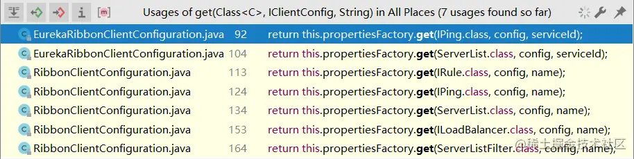

既然获取配置时，是由这种格式组成的： [微服务名称].ribbon.[类名对应的特定值]，这就说明如果能配置一些特殊的规则，是可以对一些服务做个性化配置的，例如在 eureka-consumer 的全局配置文件 application.properties 中加入如下配置：

~~~
eureka-client.ribbon.NFLoadBalancerRuleClassName=com.netflix.loadbalancer.RandomRule
~~~

这个配置就是单独针对微服务eureka-client生效的，代表负载均衡策略变成随机的。

### RibbonApplicationContextInitializer

~~~java
@Bean
@ConditionalOnProperty("ribbon.eager-load.enabled")
public RibbonApplicationContextInitializer ribbonApplicationContextInitializer() {
    return new RibbonApplicationContextInitializer(springClientFactory(),
            ribbonEagerLoadProperties.getClients());
}
~~~

只有对应属性存在时，该组件才会生效，ribbon.eager-load.enabled ，表面上理解为“开启迫切加载”

Ribbon 在进行客户端负载均衡调用时，采用的都是延迟加载机制：第一次调用服务时才会创建负载均衡客户端。这种情况可能会出现一种现象：负载均衡客户端的创建过程耗时比较长，但对应的服务超时时间设置的又很短，会导致第一次调用出错，但后续正常。

解决该问题的方案：将这些创建过程耗时较长的服务设置为迫切初始化加载。在 application.properties 中开启如下配置：

~~~
ribbon.eager-load.enabled=true
ribbon.eager-load.clients=eureka-client
~~~

设置后，应用启动时就会将声明的服务对应的负载均衡客户端创建好，就不会出现这种问题了。

上面创建的 RibbonApplicationContextInitializer ，本质是一个监听器：

~~~java
public class RibbonApplicationContextInitializer implements ApplicationListener<ApplicationReadyEvent>
~~~

它监听 ApplicationReadyEvent 事件，刚好是应用都启动好，准备完成后触发的。咱看监听器的核心方法：

~~~java
public void onApplicationEvent(ApplicationReadyEvent event) {
    initialize();
}

protected void initialize() {
    if (clientNames != null) {
        for (String clientName : clientNames) {
            this.springClientFactory.getContext(clientName);
        }
    }
}
~~~

可以发现它将设置好的那些需要被迫切初始化的服务都取一次，由于第一次取会进行初始化，就达到了迫切初始化的目的。

注意开启、配置迫切初始化会降低应用启动速度，实际开发时可以根据服务的特性按需开启。

### RestTemplateCustomizer

~~~java
@Bean
public RestTemplateCustomizer restTemplateCustomizer(
        final RibbonClientHttpRequestFactory ribbonClientHttpRequestFactory) {
    return restTemplate -> restTemplate
            .setRequestFactory(ribbonClientHttpRequestFactory);
}
~~~

Customizer可以编程式的对一些组件做定制化/配置，源码中只有一句话，它将一个传入的 RibbonClientHttpRequestFactory 放入了 RestTemplate 中。而这个 RibbonClientHttpRequestFactory 就在下面的配置中。

### RibbonClientHttpRequestFactory

~~~java
@Bean
public RibbonClientHttpRequestFactory ribbonClientHttpRequestFactory() {
    return new RibbonClientHttpRequestFactory(this.springClientFactory);
}
~~~

它内部只定义了一个方法：

~~~java
public ClientHttpRequest createRequest(URI originalUri, HttpMethod httpMethod) throws IOException {
    String serviceId = originalUri.getHost();
    if (serviceId == null) {
        throw new IOException("Invalid hostname in the URI [" + originalUri.toASCIIString() + "]");
    }
    IClientConfig clientConfig = this.clientFactory.getClientConfig(serviceId);
    RestClient client = this.clientFactory.getClient(serviceId, RestClient.class);
    HttpRequest.Verb verb = HttpRequest.Verb.valueOf(httpMethod.name());

    return new RibbonHttpRequest(originalUri, verb, client, clientConfig);
}
~~~

从逻辑中大概可以看出来，它会根据请求的路径，提取出服务名称（使用 Ribbon 负载均衡时，发送的url将不再是具体的域名/ip地址，而是微服务名称），在下面构建出 ClientHttpRequest。这个ClientHttpRequest在远程调用的时候会用到。在操作 RestTemplate 时常用的几种调用方式：getForObject 、getForEntity 、postForObject 、postForEntity ，这些方法的底层都是调的 RestTemplate 内部的 execute 方法：

~~~java
public <T> T execute(String url, HttpMethod method, @Nullable RequestCallback requestCallback,
        @Nullable ResponseExtractor<T> responseExtractor, Map<String, ?> uriVariables)
        throws RestClientException {
    URI expanded = getUriTemplateHandler().expand(url, uriVariables);
    return doExecute(expanded, method, requestCallback, responseExtractor);
}

protected <T> T doExecute(URI url, @Nullable HttpMethod method, @Nullable RequestCallback requestCallback,
        @Nullable ResponseExtractor<T> responseExtractor) throws RestClientException {
    // assert ......
    ClientHttpResponse response = null;
    try {
        ClientHttpRequest request = createRequest(url, method);
        if (requestCallback != null) {
            requestCallback.doWithRequest(request);
        }
        response = request.execute();
        handleResponse(url, method, response);
        return (responseExtractor != null ? responseExtractor.extractData(response) : null);
    } // catch finally ......
}
~~~

注意 try 块的第一行，它会调用 createRequest 方法来创建一个类型为 ClientHttpRequest 的请求对象，而这个 createRequest 方法的实现：

~~~java
private ClientHttpRequestFactory requestFactory = new SimpleClientHttpRequestFactory();

protected ClientHttpRequest createRequest(URI url, HttpMethod method) throws IOException {
    ClientHttpRequest request = getRequestFactory().createRequest(url, method);
    // logger
    return request;
}
~~~

它会通过getRequestFactory方法获取到RequestFactory 来进行创建，默认情况下它使用的 RequestFactory 类型为 SimpleClientHttpRequestFactory ，它使用最基本的 HttpURLConnection 来进行请求创建。

如果RibbonClientHttpRequestFactory被注册到容器中，它会在构建RestTemplateCustomizer的时候，将restTemplate的RequestFactory 替换为RibbonClientHttpRequestFactory：

~~~java
restTemplate -> restTemplate.setRequestFactory(ribbonClientHttpRequestFactory)
~~~

这样创建出来的请求就是被负载均衡处理过的请求，也就相当于实现了客户端调用的负载均衡。

## RibbonEurekaAutoConfiguration

在 RibbonAutoConfiguration 中声明了执行顺序，RibbonEurekaAutoConfiguration 要等到 RibbonAutoConfiguration 执行完成后才可以执行。它的定义：

~~~java
@Configuration
@EnableConfigurationProperties
@ConditionalOnRibbonAndEurekaEnabled
@AutoConfigureAfter(RibbonAutoConfiguration.class)
@RibbonClients(defaultConfiguration = EurekaRibbonClientConfiguration.class)
public class RibbonEurekaAutoConfiguration {

}
~~~

刨去判断条件和开启配置等内容，那就只剩下一个可以关注的部分：@RibbonClients(defaultConfiguration = EurekaRibbonClientConfiguration.class) ，它声明了默认的配置就是 Eureka 与 Ribbon 整合的默认配置规则 EurekaRibbonClientConfiguration

这个配置类中又注册了几个Bean，下面一一分析：

### NIWSDiscoveryPing

~~~java
@Bean
@ConditionalOnMissingBean
public IPing ribbonPing(IClientConfig config) {
    if (this.propertiesFactory.isSet(IPing.class, serviceId)) {
        return this.propertiesFactory.get(IPing.class, config, serviceId);
    }
    NIWSDiscoveryPing ping = new NIWSDiscoveryPing();
    ping.initWithNiwsConfig(config);
    return ping;
}
~~~

Ribbon 在实现负载均衡时，有一个比较重要的环节就是判断服务是否可用，不可用的服务不会进行负载均衡调用。在自动装配中咱看到它注册的 ping 测试类型为 NIWSDiscoveryPing ，它的实现逻辑：

~~~java
public boolean isAlive(Server server) {
    boolean isAlive = true;
    if (server != null && server instanceof DiscoveryEnabledServer) {
        DiscoveryEnabledServer dServer = (DiscoveryEnabledServer) server;                
        InstanceInfo instanceInfo = dServer.getInstanceInfo();
        if (instanceInfo != null) {                    
            InstanceStatus status = instanceInfo.getStatus();
            if (status != null) {
                isAlive = status.equals(InstanceStatus.UP);
            }
        }
    }
    return isAlive;
}
~~~

可以发现它拿 EurekaServer 中的 InstanceInfo 信息来判断是否是正常上线运行的状态，换言之，NIWSDiscoveryPing 的 ping 依据来源是 EurekaServer 的注册信息。除了 NIWSDiscoveryPing 之外，还有几种预设的 ping 策略：

* DummyPing ：直接返回 true ，内部无其他逻辑
* NoOpPing ：直接返回 true ，内部无其他逻辑
* PingConstant ：返回预先设定的值，它内部维护了一个 constant 值，每次固定返回该值

### DomainExtractingServerList

~~~java
@Bean
@ConditionalOnMissingBean
public ServerList<?> ribbonServerList(IClientConfig config,
        Provider<EurekaClient> eurekaClientProvider) {
    if (this.propertiesFactory.isSet(ServerList.class, serviceId)) {
        return this.propertiesFactory.get(ServerList.class, config, serviceId);
    }
    DiscoveryEnabledNIWSServerList discoveryServerList = new DiscoveryEnabledNIWSServerList(
            config, eurekaClientProvider);
    DomainExtractingServerList serverList = new DomainExtractingServerList(
            discoveryServerList, config, this.approximateZoneFromHostname);
    return serverList;
}
~~~

它返回的类型是 ServerList ，这是一个接口，它里面定义了两个方法：

~~~java
public interface ServerList<T extends Server> {
    public List<T> getInitialListOfServers(); // 获取初始化的服务实例列表
    public List<T> getUpdatedListOfServers(); // 获取更新的服务实例列表
}
~~~

Ribbon 是通过 ServerList 获取服务列表，从而进行后续的负载均衡逻辑。

DomainExtractingServerList 也是借助 Eureka 的服务实例列表来进行获取。进入到 DomainExtractingServerList 的内部实现中：

~~~java
private ServerList<DiscoveryEnabledServer> list;

public List<DiscoveryEnabledServer> getInitialListOfServers() {
    List<DiscoveryEnabledServer> servers = setZones(this.list.getInitialListOfServers());
    return servers;
}

public List<DiscoveryEnabledServer> getUpdatedListOfServers() {
    List<DiscoveryEnabledServer> servers = setZones(this.list.getUpdatedListOfServers());
    return servers;
}
~~~

它并不是自己进行获取操作，而是组合了另一个上面源码中看到的 DiscoveryEnabledNIWSServerList 来实际获取。进入到被装饰的 DiscoveryEnabledNIWSServerList 的内部实现中，发现这里面两个接口的方法都调到同一个方法去了：

~~~java
public List<DiscoveryEnabledServer> getInitialListOfServers(){
    return obtainServersViaDiscovery();
}
public List<DiscoveryEnabledServer> getUpdatedListOfServers(){
    return obtainServersViaDiscovery();
}

private List<DiscoveryEnabledServer> obtainServersViaDiscovery() {
    List<DiscoveryEnabledServer> serverList = new ArrayList<>();

    if (eurekaClientProvider == null || eurekaClientProvider.get() == null) {
        logger.warn("EurekaClient has not been initialized yet, returning an empty list");
        return new ArrayList<DiscoveryEnabledServer>();
    }

    // 借助EurekaClient获取服务列表
    EurekaClient eurekaClient = eurekaClientProvider.get();
    if (vipAddresses != null) {
        for (String vipAddress : vipAddresses.split(",")) {
            // if targetRegion is null, it will be interpreted as the same region of client
            List<InstanceInfo> listOfInstanceInfo = eurekaClient
                    .getInstancesByVipAddress(vipAddress, isSecure, targetRegion);
            // 获取到服务列表后进行判断、过滤、封装
            for (InstanceInfo ii : listOfInstanceInfo) {
                // 只取状态为UP的服务实例
                if (ii.getStatus().equals(InstanceStatus.UP)) {
                    if (shouldUseOverridePort) {
                        // logger
                        InstanceInfo copy = new InstanceInfo(ii);
                        if (isSecure) {
                            ii = new InstanceInfo.Builder(copy).setSecurePort(overridePort).build();
                        } else {
                            ii = new InstanceInfo.Builder(copy).setPort(overridePort).build();
                        }
                    }

                    // 构建可以调用的服务实例
                    DiscoveryEnabledServer des = createServer(ii, isSecure, shouldUseIpAddr);
                    serverList.add(des);
                }
            }
            if (serverList.size() > 0 && prioritizeVipAddressBasedServers) {
                break; // if the current vipAddress has servers, we dont use subsequent vipAddress based servers
            }
        }
    }
    return serverList;
}
~~~

这里会借助EurekaClient获取服务列表，获取到服务列表后进行判断、过滤、封装，只针对状态为UP的服务构建可以调用的服务实例，最后返回。

### ServerIntrospector

~~~java
@Bean
public ServerIntrospector serverIntrospector() {
    return new EurekaServerIntrospector();
}
~~~

Introspector涉及到内省的概念，它可以简单理解为针对 Bean 的属性、方法进行的获取和操作。内省就是借助反射进行一些比反射更灵活的操作。ServerIntrospector可以根据一个服务实例的ID或者name，获取服务实例的一些元信息或者状态信息，这个接口定义的方法是 getMetadata：

~~~java
// EurekaServerIntrospector的实现
public Map<String, String> getMetadata(Server server) {
    if (server instanceof DiscoveryEnabledServer) {
        DiscoveryEnabledServer discoveryServer = (DiscoveryEnabledServer) server;
        return discoveryServer.getInstanceInfo().getMetadata();
    }
    return super.getMetadata(server);
}
~~~

可见这里面拿到服务实例的 InstanceInfo ，并以元信息的形式返回出去。在ServiceInstanceChooser#choose方法寻找服务时，在构建 RibbonServer 时把服务实例的元信息也注入进去了，获取服务实例云信息的途径就是通过ServerIntrospector：

~~~java
    return new RibbonServer(serviceId, server, isSecure(server, serviceId),
            serverIntrospector(serviceId).getMetadata(server));
~~~

## LoadBalancerAutoConfiguration

RibbonAutoConfiguration中指定了LoadBalancerAutoConfiguration的执行时机比 RibbonAutoConfiguration 早，它主要完成的内容是负载均衡的一些基础组件，这里不会介绍retry相关的组件，默认情况下不存在 retry 相关的组件

1、SmartInitializingSingleton

~~~java
@Bean
public SmartInitializingSingleton loadBalancedRestTemplateInitializerDeprecated(
        final ObjectProvider<List<RestTemplateCustomizer>> restTemplateCustomizers) {
    return () -> restTemplateCustomizers.ifAvailable(customizers -> {
        for (RestTemplate restTemplate : LoadBalancerAutoConfiguration.this.restTemplates) {
            for (RestTemplateCustomizer customizer : customizers) {
                customizer.customize(restTemplate);
            }
        }
    });
}
~~~

它会给每个 RestTemplate 都执行一次定制器的处理，定制器的逻辑之前介绍过：

~~~java
@Bean
public RestTemplateCustomizer restTemplateCustomizer(
        final RibbonClientHttpRequestFactory ribbonClientHttpRequestFactory) {
    return restTemplate -> restTemplate
            .setRequestFactory(ribbonClientHttpRequestFactory);
}
~~~

2、LoadBalancerRequestFactory

~~~java
@Bean
@ConditionalOnMissingBean
public LoadBalancerRequestFactory loadBalancerRequestFactory(LoadBalancerClient loadBalancerClient) {
    return new LoadBalancerRequestFactory(loadBalancerClient, this.transformers);
}
~~~

它是用来创建“带有负载均衡的请求”的工厂，注意虽然它的命名与前面看到的 RibbonClientHttpRequestFactory 有点类似，但它并没有实现任何接口。它的真正作用是配合下面的 LoadBalancerInterceptor 进行实际的负载均衡。

3、LoadBalancerInterceptor 

~~~java
@Bean
public LoadBalancerInterceptor ribbonInterceptor(LoadBalancerClient loadBalancerClient,
        LoadBalancerRequestFactory requestFactory) {
    return new LoadBalancerInterceptor(loadBalancerClient, requestFactory);
}
~~~

它是一个拦截器，就是在发请求之前用拦截器先截住，替换 url 后再发请求。它组合了 LoadBalancerClient 与 LoadBalancerRequestFactory ：

~~~java
public class LoadBalancerInterceptor implements ClientHttpRequestInterceptor {
	private LoadBalancerClient loadBalancer;
	private LoadBalancerRequestFactory requestFactory;
~~~

作为拦截器，核心方法一定是 intercept ：

~~~java
public ClientHttpResponse intercept(final HttpRequest request, final byte[] body,
        final ClientHttpRequestExecution execution) throws IOException {
    final URI originalUri = request.getURI();
    String serviceName = originalUri.getHost();
    Assert.state(serviceName != null, "Request URI does not contain a valid hostname: " + originalUri);
    return this.loadBalancer.execute(serviceName, this.requestFactory.createRequest(request, body, execution));
}
~~~

逻辑很简单，它会拿到当前请求的 url 和服务名称，之后交给 loadBalancer 进行实际处理，这个 loadBalancer 就是上面看到的 RibbonLoadBalancerClient 。它们之前的详细内容在后面会叙述。

4、RestTemplateCustomizer

~~~java
@Bean
@ConditionalOnMissingBean
public RestTemplateCustomizer restTemplateCustomizer(
        final LoadBalancerInterceptor loadBalancerInterceptor) {
    return restTemplate -> {
        List<ClientHttpRequestInterceptor> list = new ArrayList<>(
                restTemplate.getInterceptors());
        list.add(loadBalancerInterceptor);
        restTemplate.setInterceptors(list);
    };
}
~~~

它也是一个定制器，这里面的定制规则是将上面的 LoadBalancerInterceptor 放入 RestTemplate 中的拦截器列表，以保证 LoadBalancerInterceptor 可以起作用。

## 组件总结

组件总结：

* Ribbon 的核心组件包含 LoadBalancerClient（负载均衡器）、RibbonClientHttpRequestFactory（代替原有的请求工厂以创建带有负载均衡的请求）、LoadBalancerInterceptor（负载均衡的核心拦截器）等；
* Ribbon 的负载均衡核心是拦截器，它配合负载均衡器实现服务调用的负载均衡；
* 服务调用的负载均衡可以在配置文件中显式的为特殊的服务进行定制化，底层会借助 PropertiesFactory 完成负载均衡策略的读取；
* RestTemplate 发起请求的底层是先通过 HttpRequestFactory 创建请求，再进行请求的实际发起，通过切换不同的 HttpRequestFactory 可以实现不同的请求创建。

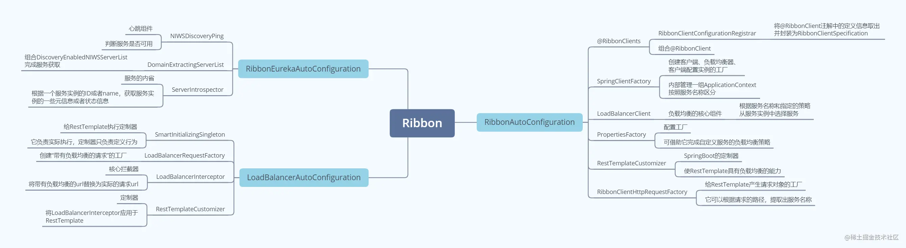

## 调用流程

### 搭建场景

搭建的环境如下：

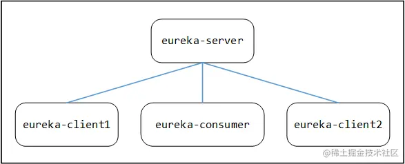

eureka-client 服务中有一个暴露出的 Rest 服务：

~~~java
@RestController
public class ProviderController {
    @Value("${eureka.instance.instance-id}")
    private String zone;
    
    @GetMapping("/getInfo")
    public String getInfo() {
        return zone;
    }
}
~~~

eureka-consumer 服务会调用 eureka-client 的服务：

~~~java
@RestController
public class ConsumerController {
    @Autowired
    private RestTemplate restTemplate;
    
    @GetMapping("/getInfo")
    public String getInfo() {
        return restTemplate.getForObject("http://eureka-client/getInfo", String.class);
    }
}
~~~

这里要额外加一个配置，把服务的默认负载均衡策略改为轮询：

~~~
eureka-client.ribbon.NFLoadBalancerRuleClassName=com.netflix.loadbalancer.RoundRobinRule
~~~

### 请求发起

请求到达 ConsumerController 的 getInfo 方法，随后执行到 RestTemplate 内部：

~~~java
public <T> T getForObject(String url, Class<T> responseType, Object... uriVariables) throws RestClientException {
    RequestCallback requestCallback = acceptHeaderRequestCallback(responseType);
    HttpMessageConverterExtractor<T> responseExtractor =
            new HttpMessageConverterExtractor<>(responseType, getMessageConverters(), logger);
    return execute(url, HttpMethod.GET, requestCallback, responseExtractor, uriVariables);
}
~~~

随后继续向下执行，到达真正干活的 doExecute 方法：

~~~java
public <T> T execute(String url, HttpMethod method, @Nullable RequestCallback requestCallback,
        @Nullable ResponseExtractor<T> responseExtractor, Object... uriVariables) throws RestClientException {
    URI expanded = getUriTemplateHandler().expand(url, uriVariables);
    return doExecute(expanded, method, requestCallback, responseExtractor);
}
~~~

doExecute 方法中会先构建请求，后发送请求：

~~~java
protected <T> T doExecute(URI url, @Nullable HttpMethod method, @Nullable RequestCallback requestCallback,
        @Nullable ResponseExtractor<T> responseExtractor) throws RestClientException {
    // assert
    ClientHttpResponse response = null;
    try {
        ClientHttpRequest request = createRequest(url, method);
        if (requestCallback != null) {
            requestCallback.doWithRequest(request);
        }
        response = request.execute();
        handleResponse(url, method, response);
        return (responseExtractor != null ? responseExtractor.extractData(response) : null);
    }
~~~

注意此时的 request 中内容还是未经过负载均衡的：

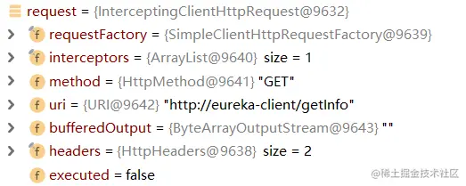

发送请求那自然是调 request.execute() 方法，进入到 AbstractClientHttpRequest 的内部，经过几番辗转，最终来到 InterceptingClientHttpRequest 的内部类 InterceptingRequestExecution 中：

~~~java
    public ClientHttpResponse execute(HttpRequest request, byte[] body) throws IOException {
        if (this.iterator.hasNext()) {
            ClientHttpRequestInterceptor nextInterceptor = this.iterator.next();
            return nextInterceptor.intercept(request, body, this);
        } // else ......
    }
~~~

注意它在前面要先执行请求中自带的拦截器，Debug发现确实有一个拦截器，且就是前面看到的 LoadBalancerInterceptor

### 拦截器触发

进入到 LoadBalancerInterceptor 的内部，执行 intercept 方法：

~~~java
public ClientHttpResponse intercept(final HttpRequest request, final byte[] body,
        final ClientHttpRequestExecution execution) throws IOException {
    final URI originalUri = request.getURI();
    String serviceName = originalUri.getHost();
    Assert.state(serviceName != null,
            "Request URI does not contain a valid hostname: " + originalUri);
    return this.loadBalancer.execute(serviceName,
            this.requestFactory.createRequest(request, body, execution));
}
~~~

Debug发现在没有进入 loadBalancer 前还是原样的请求：

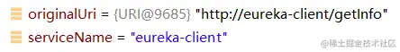

进入 execute 方法：

~~~java
public <T> T execute(String serviceId, LoadBalancerRequest<T> request) throws IOException {
    return execute(serviceId, request, null);
}

public <T> T execute(String serviceId, LoadBalancerRequest<T> request, Object hint) throws IOException {
    ILoadBalancer loadBalancer = getLoadBalancer(serviceId);
    Server server = getServer(loadBalancer, hint);
    if (server == null) {
        throw new IllegalStateException("No instances available for " + serviceId);
    }
    RibbonServer ribbonServer = new RibbonServer(serviceId, server,
            isSecure(server, serviceId), serverIntrospector(serviceId).getMetadata(server));
    return execute(serviceId, ribbonServer, request);
}
~~~

在getLoadBalancer方法中，它会从IOC容器中取类型为 ILoadBalancer 的Bean，默认情况下会取出一个类型为 ZoneAwareLoadBalancer 的负载均衡器，之后返回出去：

~~~java
protected ILoadBalancer getLoadBalancer(String serviceId) {
    return this.clientFactory.getLoadBalancer(serviceId);
}
~~~

取到 BaseLoadBalancer 后要进入 getServer 方法：

~~~java
protected Server getServer(ILoadBalancer loadBalancer, Object hint) {
    if (loadBalancer == null) {
        return null;
    }
    // Use 'default' on a null hint, or just pass it on?
    return loadBalancer.chooseServer(hint != null ? hint : "default");
}
~~~

它直接拿上一步获取到的负载均衡器来选择要请求的服务实例，此时的 loadBalancer 类型为上面取出来的 ZoneAwareLoadBalancer ，是带区域概念的负载均衡器，它的chooseServer方法：

~~~java
public Server chooseServer(Object key) {
    if (!ENABLED.get() || getLoadBalancerStats().getAvailableZones().size() <= 1) {
        logger.debug("Zone aware logic disabled or there is only one zone");
        return super.chooseServer(key);
    }
    // ......
~~~

BaseLoadBalancer#chooseServer：

~~~java
public Server chooseServer(Object key) {
    if (counter == null) {
        counter = createCounter();
    }
    counter.increment();
    if (rule == null) {
        return null;
    } else {
        try {
            return rule.choose(key);
        } // catch ......
    }
}
~~~

这里会统计一下调用次数，然后执行rule.choose，由于之前在配置中显式的配置了负载均衡策略为 RoundRobinRule ，故直接跳转到它的 choose 方法中：

~~~java
public Server choose(ILoadBalancer lb, Object key) {
    // null check ......
    Server server = null;
    int count = 0;
    // 最多尝试执行10次轮询（考虑到有线程并发没有获取到的可能）
    while (server == null && count++ < 10) {
        // 获取所有可访问的服务
        List<Server> reachableServers = lb.getReachableServers();
        List<Server> allServers = lb.getAllServers();
        int upCount = reachableServers.size();
        int serverCount = allServers.size();

        // 只要没有可访问的服务，直接返回null
        if ((upCount == 0) || (serverCount == 0)) {
            log.warn("No up servers available from load balancer: " + lb);
            return null;
        }

        // 使用incrementAndGetModulo方法决定出轮询的下标位置并取出
        int nextServerIndex = incrementAndGetModulo(serverCount);
        server = allServers.get(nextServerIndex);

        // 如果没有取出，重试
        if (server == null) {
            /* Transient. */
            Thread.yield();
            continue;
        }

        // 恰巧取出的服务又不可用，重试
        if (server.isAlive() && (server.isReadyToServe())) {
            return (server);
        }

        // Next.
        server = null;
    }

    // 如果重试次数超过10次，打印警告日志，返回null
    if (count >= 10) {
        log.warn("No available alive servers after 10 tries from load balancer: " + lb);
    }
    return server;
}
~~~

这里面会获取所有可访问的服务，然后使用incrementAndGetModulo方法决定出轮询的下标位置并取出，取出后检查是否可用，如果不可用则继续取，如果重试次数超过10次，打印警告日志，返回null。incrementAndGetModulo方法是获取下标的核心方法：

~~~java
private AtomicInteger nextServerCyclicCounter;

private int incrementAndGetModulo(int modulo) {
    for (;;) {
        int current = nextServerCyclicCounter.get();
        int next = (current + 1) % modulo;
        if (nextServerCyclicCounter.compareAndSet(current, next)) {
            return next;
        }
    }
}
~~~

轮询实质上就是取模运算，它借助 AtomicInteger 的目的也很明确，保证线程安全，每次轮询到的服务不会重复。

返回具体的 Server 后，在 RibbonLoadBalancerClient 中将这些组件构建为一个 RibbonServer ，传入下面的 execute 方法：

~~~java
public <T> T execute(String serviceId, LoadBalancerRequest<T> request, Object hint) throws IOException {
    // .....
    RibbonServer ribbonServer = new RibbonServer(serviceId, server,
            isSecure(server, serviceId), serverIntrospector(serviceId).getMetadata(server));
    return execute(serviceId, ribbonServer, request);
}
~~~

下面的 execute 方法就是真正发送请求的动作了

### 发送请求

进入execute方法：

~~~java
public <T> T execute(String serviceId, ServiceInstance serviceInstance,
        LoadBalancerRequest<T> request) throws IOException {
    // 如果传入的是RibbonServer，会取出内部包装的真实的Server
    Server server = null;
    if (serviceInstance instanceof RibbonServer) {
        server = ((RibbonServer) serviceInstance).getServer();
    }
    if (server == null) {
        throw new IllegalStateException("No instances available for " + serviceId);
    }

    // 调用记录跟踪
    RibbonLoadBalancerContext context = this.clientFactory
            .getLoadBalancerContext(serviceId);
    RibbonStatsRecorder statsRecorder = new RibbonStatsRecorder(context, server);

    try {
        // 3.1 发送请求
        T returnVal = request.apply(serviceInstance);
        statsRecorder.recordStats(returnVal);
        return returnVal;
    } // catch ......
    return null;
}
~~~

这里会做一些调用信息记录，真正发送请求的位置是在request.apply，这里的apply会进入LoadBalancerInterceptor的intercept方法：

~~~java
public ClientHttpResponse intercept(final HttpRequest request, final byte[] body,
        final ClientHttpRequestExecution execution) throws IOException {
    final URI originalUri = request.getURI();
    String serviceName = originalUri.getHost();
    Assert.state(serviceName != null,
            "Request URI does not contain a valid hostname: " + originalUri);
    return this.loadBalancer.execute(serviceName,
            this.requestFactory.createRequest(request, body, execution));
}
~~~

这里其实刚刚已经进来过一次了，这次是第二次进入，在createRequest方法中指定的逻辑，实际上是execute的逻辑：

~~~java
public LoadBalancerRequest<ClientHttpResponse> createRequest(
        final HttpRequest request, final byte[] body,
        final ClientHttpRequestExecution execution) {
    return instance -> {
        // 3.1.1 包装原始请求
        HttpRequest serviceRequest = new ServiceRequestWrapper(request, instance, this.loadBalancer);
        if (this.transformers != null) {
            // 3.1.2 转换请求
            for (LoadBalancerRequestTransformer transformer : this.transformers) {
                serviceRequest = transformer.transformRequest(serviceRequest, instance);
            }
        }
        // 3.2 发送请求
        return execution.execute(serviceRequest, body);
    };
}
~~~

首先将原有的类包装了一下生成ServiceRequestWrapper（联想 SpringFramework 中的 BeanWrapper ），它重新封装了getURI 方法，然后进行了请求的转换，Debug发现这部分根本就没有转换器，故直接忽略。然后调用execute真正发送请求：

~~~java
public ClientHttpResponse execute(HttpRequest request, byte[] body) throws IOException {
    if (this.iterator.hasNext()) {
        ClientHttpRequestInterceptor nextInterceptor = this.iterator.next();
        return nextInterceptor.intercept(request, body, this);
    } else {
        HttpMethod method = request.getMethod();
        Assert.state(method != null, "No standard HTTP method");
        // 3.2.1 & 3.2.2 重写uri
        ClientHttpRequest delegate = requestFactory.createRequest(request.getURI(), method);
        request.getHeaders().forEach((key, value) -> delegate.getHeaders().addAll(key, value));
        if (body.length > 0) {
            if (delegate instanceof StreamingHttpOutputMessage) {
                StreamingHttpOutputMessage streamingOutputMessage = (StreamingHttpOutputMessage) delegate;
                streamingOutputMessage.setBody(outputStream -> StreamUtils.copy(body, outputStream));
            }
            else {
                StreamUtils.copy(body, delegate.getBody());
            }
        }
        return delegate.execute();
    }
}
~~~

这里也已经进来过一次了，第一次因为iterator中的拦截器就是 Ribbon 的拦截器，已经执行过了，所以第二次走else路线，可以继续往下执行了。

else 的第三行又要创建 ClientHttpRequest ，注意这个地方它调用了 getURI 方法，触发了上面 ServiceRequestWrapper 的包装对象重写的方法，那进入到 ServiceRequestWrapper 的内部实现去：

~~~java
public URI getURI() {
    URI uri = this.loadBalancer.reconstructURI(this.instance, getRequest().getURI());
    return uri;
}
~~~

它借助负载均衡器重新构建了 uri ：

~~~java
public URI reconstructURI(ServiceInstance instance, URI original) {
    Assert.notNull(instance, "instance can not be null");
    // 取出服务名称
    String serviceId = instance.getServiceId();
    RibbonLoadBalancerContext context = this.clientFactory.getLoadBalancerContext(serviceId);

    URI uri;
    Server server;
    // 如果服务实例是被Ribbon封装过的，要取出内部真实的服务实例
    if (instance instanceof RibbonServer) {
        RibbonServer ribbonServer = (RibbonServer) instance;
        server = ribbonServer.getServer();
        uri = updateToSecureConnectionIfNeeded(original, ribbonServer);
    } else {
        server = new Server(instance.getScheme(), instance.getHost(), instance.getPort());
        IClientConfig clientConfig = clientFactory.getClientConfig(serviceId);
        ServerIntrospector serverIntrospector = serverIntrospector(serviceId);
        uri = updateToSecureConnectionIfNeeded(original, clientConfig,
                serverIntrospector, server);
    }
    // 借助RibbonLoadBalancerContext重新构建uri
    return context.reconstructURIWithServer(server, uri);
}

public URI reconstructURIWithServer(Server server, URI original) {
    // 获取服务实例的IP、端口号、请求协议类型
    String host = server.getHost();
    int port = server.getPort();
    String scheme = server.getScheme();
    
    if (host.equals(original.getHost()) && port == original.getPort()
            && scheme == original.getScheme()) {
        return original;
    }
    // 如果服务实例中没有标注请求协议，则使用uri中的
    if (scheme == null) {
        scheme = original.getScheme();
    }
    if (scheme == null) {
        scheme = deriveSchemeAndPortFromPartialUri(original).first();
    }

    try {
        // 字符串拼接真正的请求uri
        StringBuilder sb = new StringBuilder();
        sb.append(scheme).append("://");
        if (!Strings.isNullOrEmpty(original.getRawUserInfo())) {
            sb.append(original.getRawUserInfo()).append("@");
        }
        sb.append(host);
        if (port >= 0) {
            sb.append(":").append(port);
        }
        sb.append(original.getRawPath());
        if (!Strings.isNullOrEmpty(original.getRawQuery())) {
            sb.append("?").append(original.getRawQuery());
        }
        if (!Strings.isNullOrEmpty(original.getRawFragment())) {
            sb.append("#").append(original.getRawFragment());
        }
        URI newURI = new URI(sb.toString());
        return newURI;            
    } // catch ......
}
~~~

这个里面会获取服务实例的IP、端口号、请求协议类型，对uri进行拼接。

注意此时的 RequestFactory 就不再是 Ribbon 里头那个特殊的工厂了，使用 RestTemplate 原本使用的普通工厂就可以创建并发送请求了。至此，Ribbon 的一次完整的负载均衡调用流程解析完毕。

总结：

* Ribbon 实现负载均衡的核心是借助 LoadBalancerInterceptor ；
* Ribbon 实现负载均衡的核心逻辑是通过负载均衡算法，将应该调用的服务实例取出并替换原有的请求 uri 。

## 负载均衡策略

Ribbon默认的7种策略：

* RoundRobinRule ：轮询

* RandomRule ：随机

* AvailabilityFilteringRule ：会先过滤掉由于多次访问故障而处于断路器跳闸状态的服务，还有并发的连接数量超过阈值的服务，然后对剩余的服务列表按照轮询策略进行访问

* WeightedResponseTimeRule ：根据平均响应时间计算所有服务的权重，响应时间越快服务权重越大被选中的概率越高

  整体服务刚启动时如果统计信息不足，则使用 RoundRobinRule 策略，等统计信息足够，会切换到 WeightedResponseTimeRule

* RetryRule ：先按照 RoundRobinRule 的策略获取服务，如果获取服务失败则在指定时间内会进行重试，获取可用的服务

  可以类比一个人的思维，如果连续失败几次之后，就不会再去失败的微服务处请求

* BestAvailableRule ：会先过滤掉由于多次访问故障而处于断路器跳闸状态的服务，然后选择一个并发量最小的服务

* ZoneAvoidanceRule ：默认规则，复合判断服务所在区域（region）的性能和服务的可用性选择服务器

### RoundRobinRule-轮询

之前已经解读过一遍了，轮询策略的核心代码：

~~~java
public Server choose(ILoadBalancer lb, Object key) {
    // null check ......
    Server server = null;
    int count = 0;
    // 最多尝试执行10次轮询（考虑到有线程并发没有获取到的可能）
    while (server == null && count++ < 10) {
        // 获取所有可访问的服务
        List<Server> reachableServers = lb.getReachableServers();
        List<Server> allServers = lb.getAllServers();
        int upCount = reachableServers.size();
        int serverCount = allServers.size();

        // 只要没有可访问的服务，直接返回null
        if ((upCount == 0) || (serverCount == 0)) {
            log.warn("No up servers available from load balancer: " + lb);
            return null;
        }

        // 【核心】使用incrementAndGetModulo方法决定出轮询的下标位置并取出
        int nextServerIndex = incrementAndGetModulo(serverCount);
        server = allServers.get(nextServerIndex);

        // 如果没有取出，重试
        if (server == null) {
            /* Transient. */
            Thread.yield();
            continue;
        }

        // 恰巧取出的服务又不可用，重试
        if (server.isAlive() && (server.isReadyToServe())) {
            return (server);
        }

        // Next.
        server = null;
    }

    // 如果重试次数超过10次，打印警告日志，返回null
    if (count >= 10) {
        log.warn("No available alive servers after 10 tries from load balancer: " + lb);
    }
    return server;
}
~~~

核心方法 incrementAndGetModulo ：

~~~java
private AtomicInteger nextServerCyclicCounter;

private int incrementAndGetModulo(int modulo) {
    for (;;) {
        // 借助AtomicInteger保证线程安全
        int current = nextServerCyclicCounter.get();
        // 取模运算实现轮询
        int next = (current + 1) % modulo;
        if (nextServerCyclicCounter.compareAndSet(current, next)) {
            return next;
        }
    }
}
~~~

### RandomRule-随机

随机负载均衡策略的整体看起来很像轮询，只不过这里面选择索引值的核心算法改变了而已。下面是源码的核心部分：

~~~java
public Server choose(ILoadBalancer lb, Object key) {
    // .......
    while (server == null) {
        // ......
        // 获取所有可访问的服务
        List<Server> upList = lb.getReachableServers();
        List<Server> allList = lb.getAllServers();

        int serverCount = allList.size();
        if (serverCount == 0) {
            return null;
        }

        // 【核心】随机生成一个索引值
        int index = chooseRandomInt(serverCount);
        server = upList.get(index);

        // ......
    }
    return server;
}

protected int chooseRandomInt(int serverCount) {
    return ThreadLocalRandom.current().nextInt(serverCount);
}
~~~

生成索引时，就是用ThreadLocalRandom来生成随机数而已

### WeightedResponseTimeRule-权重

WeightedResponseTimeRule 继承自 RoundRobinRule ，这也跟这种负载均衡的规则描述一致：没有服务被调用、总权重未初始化时会使用轮询策略。源码核心部分：

~~~java
public Server choose(ILoadBalancer lb, Object key) {
    // ......
    Server server = null;
    while (server == null) {
        // get hold of the current reference in case it is changed from the other thread
        // 获取当前引用，以防其他线程更改
        List<Double> currentWeights = accumulatedWeights;
        // ......
        List<Server> allList = lb.getAllServers();

        int serverCount = allList.size();
        if (serverCount == 0) {
            return null;
        }

        int serverIndex = 0;
        // last one in the list is the sum of all weights
        // 获取最后一个服务实例的权重值
        double maxTotalWeight = currentWeights.size() == 0 ? 0 : currentWeights.get(currentWeights.size() - 1); 
        // No server has been hit yet and total weight is not initialized fallback to use round robin
        // 如果没有服务被调用，或者最后一个服务实例的权重未达到0.001时会使用轮询
        if (maxTotalWeight < 0.001d || serverCount != currentWeights.size()) {
            server =  super.choose(getLoadBalancer(), key);
            if (server == null) {
                return server;
            }
        } else {
            // generate a random weight between 0 (inclusive) to maxTotalWeight (exclusive)
            // 最后一个服务实例超过0.001，生成一个随机值
            double randomWeight = random.nextDouble() * maxTotalWeight;
            // pick the server index based on the randomIndex
            // 根据随机值选择对应的服务
            int n = 0;
            for (Double d : currentWeights) {
                if (d >= randomWeight) {
                    serverIndex = n;
                    break;
                } else {
                    n++;
                }
            }
            server = allList.get(serverIndex);
        }
        // ......
    }
    return server;
}
~~~

这个策略的算法相对复杂，核心部分的思路是下面的 else 块：每次会产生一个随机值，根据这个随机值选择对应的服务实例。

WeightedResponseTimeRule 的类文档注释中简单描述了核心算法，假设已知各端点权重的情况下：

假设有4个端点：A（wt = 10），B（wt = 30），C（wt = 40），D（wt ＝ 20）。使用随机API，生成 1 到 (10 + 30 + 40 + 20) 之间的随机数。假设上面的列表是随机的。

根据权重计算规则，计算出的间隔如下：1 ----- 10（A的权重）11 ---- 40（A的权重 + B的权重）41 ---- 80（A的权重 + B的权重 + C的权重）81 ---- 100（A的权重 + B的权重 + C的权重 + D的权重）

这是用于决定将请求发送到哪里的伪代码：

if (random_number between 1 & 10) {send request to A;} else if (random_number between 11 & 40) {send request to B;} else if (random_number between 41 & 80) {send request to C;} else if (random_number between 81 & 100) {send request to D;}

如果没有为所有的服务实例收集足够的统计信息，则此规则将退化使用 RoundRobinRule 。

在 WeightedResponseTimeRule 的内部类 ServerWeight 中有对权重值的计算：

~~~java
public void maintainWeights() {
    // ......
    double totalResponseTime = 0;
    // find maximal 95% response time
    for (Server server : nlb.getAllServers()) {
        // this will automatically load the stats if not in cache
        ServerStats ss = stats.getSingleServerStat(server);
        totalResponseTime += ss.getResponseTimeAvg();
    }
    // weight for each server is (sum of responseTime of all servers - responseTime)
    // so that the longer the response time, the less the weight and the less likely to be chosen
    Double weightSoFar = 0.0;
    
    // create new list and hot swap the reference
    List<Double> finalWeights = new ArrayList<Double>();
    for (Server server : nlb.getAllServers()) {
        ServerStats ss = stats.getSingleServerStat(server);
        double weight = totalResponseTime - ss.getResponseTimeAvg();
        weightSoFar += weight;
        finalWeights.add(weightSoFar);   
    }
~~~

这部分的计算策略如下：先把每个服务实例的平均响应时长取出并累计，再逐个计算每个服务实例的权重。权重值为 [ 总响应时间 - 服务实例平均响应时间 ] 。

在 WeightedResponseTimeRule 中还有一个内部类，它是一个定时任务用来统计、计算权重：

~~~java
class DynamicServerWeightTask extends TimerTask {
    public void run() {
        ServerWeight serverWeight = new ServerWeight();
        try {
            serverWeight.maintainWeights();
        } // catch ......
    }
}
~~~

对应的，WeightedResponseTimeRule 的初始化方法中有对该定时任务的调度：

~~~java
public static final int DEFAULT_TIMER_INTERVAL = 30 * 1000;
private int serverWeightTaskTimerInterval = DEFAULT_TIMER_INTERVAL;

void initialize(ILoadBalancer lb) {        
    if (serverWeightTimer != null) {
        serverWeightTimer.cancel();
    }
    // 定时器调度
    serverWeightTimer = new Timer("NFLoadBalancer-serverWeightTimer-" + name, true);
    serverWeightTimer.schedule(new DynamicServerWeightTask(), 0,
            serverWeightTaskTimerInterval);
    // do a initial run 初始化时先统计一次
    ServerWeight sw = new ServerWeight();
    sw.maintainWeights();

    Runtime.getRuntime().addShutdownHook(new Thread(new Runnable() {
        public void run() {
            logger.info("Stopping NFLoadBalancer-serverWeightTimer-" + name);
            serverWeightTimer.cancel();
        }
    }));
}
~~~

可见，在 WeightedResponseTimeRule 刚被创建时，就已经初始化好这个定时任务，并且预先执行了一次权重的统计计算，之后每 30 秒统计一次。

### ZoneAvoidanceRule-分区

分区策略比较复杂，后面会单独叙述。

## 服务分区

### 分区的概念

如果一个大型分布式项目，它的规模足够大而且部署的区域比较多且分散，这个时候就会出现一种现象：可能同一个服务的不同实例分布在多个地区的多个网络区域中。不同的地区、不同的网络区域，网络质量都是不尽相同的，而相同地区、相同网络区域内的服务互相通信可靠性又比较高，这个时候就需要一种机制能尽可能的让服务通信优先选择离自己“近”的其他服务，进而降低网络出错率，提高整体应用的稳定性和可用性。于是，产生了服务分区。

服务分区的概念最早出现于亚马逊的 AWS ，这里面设计了两个概念：region 、zone 。这两个概念都是相对于网络环境来讲的，具体可以这样理解：

* region ：地理位置的区域，如北京市区域、河南省区域、广东省区域等
* zone ：一个地理位置中的不同网络区域，如北京一区、河南三区等

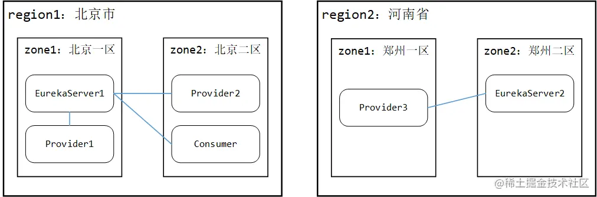

如上图所示，图中共设计了2个 region 、4个 zone ，其中 Provider1 、Provider2 、Consumer 连接到 EurekaServer1 上，Provider3 连接到 EurekaServer2 上。如果 Consumer 要消费来自 Provider 的服务，则最好选择 Provider2 ，其次是 Provider1 ，最后才选择 Provider3 。

### EurekaServer配置服务分区

下面用EurekaServer配置服务分区，搭建的示意图如下：

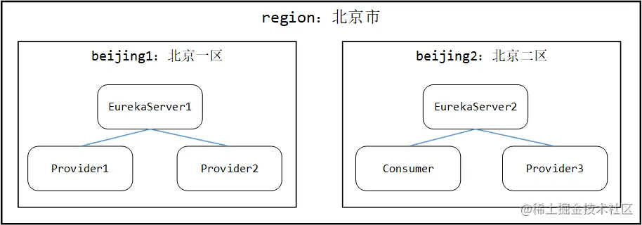

EurekaServer 在配置服务分区时，需要配置当前的 region 与可使用的 zone ，以便服务注册时可以选择自己的分区。完整的两个实例配置如下：

eureka-server1 ：

~~~yaml
server:
  port: 9001
spring:
  application:
    name: eureka-server
eureka:
  instance:
    hostname: eureka-server-9001.com
  client:
    service-url:
      beijing1: http://eureka-server-9001.com:9001/eureka/
      beijing2: http://eureka-server-9002.com:9002/eureka/
    region: beijing
    availability-zones:
      beijing: beijing1,beijing2
~~~

eureka-server2 ：（注意这里配置时要把2放在前面，Eureka 会挑所有配置列表中第一个配置）

~~~java
server:
  port: 9002
spring:
  application:
    name: eureka-server
eureka:
  instance:
    hostname: eureka-server-9002.com
  client:
    service-url:
      beijing2: http://eureka-server-9002.com:9002/eureka/
      beijing1: http://eureka-server-9001.com:9001/eureka/
    region: beijing
    availability-zones:
      beijing: beijing2,beijing1
~~~

使用普通的 EurekaClinet 作为服务提供者，配置方式与 EurekaServer 类似：

eureka-client1 ：

~~~yaml
server:
  port: 8080
spring:
  application:
    name: eureka-client
eureka:
  instance:
    instance-id: eureka-client1
    prefer-ip-address: true
    metadata-map:
      zone: beijing1
  client:
    service-url:
      beijing1: http://eureka-server-9001.com:9001/eureka/
      beijing2: http://eureka-server-9002.com:9002/eureka/
    region: beijing
    availability-zones:
      beijing: beijing1,beijing2
~~~

eureka-client2 ：

~~~yaml
server:
  port: 8081
spring:
  application:
    name: eureka-client
eureka:
  instance:
    instance-id: eureka-client2
    prefer-ip-address: true
    metadata-map:
      zone: beijing1
  client:
    service-url:
      beijing1: http://eureka-server-9001.com:9001/eureka/
      beijing2: http://eureka-server-9002.com:9002/eureka/
    region: beijing
    availability-zones:
      beijing: beijing1,beijing2
~~~

eureka-client3 ：

~~~yaml
server:
  port: 8082
spring:
  application:
    name: eureka-client
eureka:
  instance:
    instance-id: eureka-client3
    prefer-ip-address: true
    metadata-map:
      zone: beijing2
  client:
    service-url:
      beijing2: http://eureka-server-9001.com:9002/eureka/
      beijing1: http://eureka-server-9002.com:9001/eureka/
    region: beijing
    availability-zones:
      beijing: beijing2,beijing1
~~~

之后在每个 EurekaClient 工程中都加入一个 ProviderController 来暴露自己的 Eureka 实例ID：

~~~java
@RestController
public class ProviderController {
    @Value("${eureka.instance.instance-id}")
    private String zone;
    
    @GetMapping("/getInfo")
    public String getInfo() {
        return zone;
    }
}
~~~

这样服务提供者就搭建好了。

EurekaConsumer 作为服务的消费者，除了搭建基本的配置之外，还要再写一点内容来调用前面的服务提供者。eureka-consumer ：

~~~yaml
server:
  port: 8090
spring:
  application:
    name: eureka-consumer
eureka:
  instance:
    instance-id: eureka-consumer
    prefer-ip-address: true
    metadata-map:
      zone: beijing2
  client:
    service-url:
      beijing1: http://eureka-server-9001.com:9001/eureka/
      beijing2: http://eureka-server-9002.com:9002/eureka/
    region: beijing
    availability-zones:
      beijing: beijing1,beijing2
~~~

写一个 ConsumerController 来手动触发服务调用：

~~~java
@RestController
public class ConsumerController {
    @Autowired
    private RestTemplate restTemplate;
    
    @GetMapping("/getInfo")
    public String getInfo() {
        return restTemplate.getForObject("http://eureka-client/getInfo", String.class);
    }
}
~~~

注意这个 RestTemplate 在构建时需要标注 @LoadBalanced 注解。

将6个工程都启动起来，浏览器中输入 http://localhost:8090/getInfo 后访问，发现返回的是 eureka-client3 ，一直不停的刷新访问也都是 eureka-client3 。

在IDEA中将 eureka-client3 停掉，此时 EurekaServer 收不到来自 eureka-client3 的心跳，一段时间后认定租约过期，服务实例下线。由于此时 beijing2 中已经没有其他的 eureka-client 服务，所以此时再刷新，才会发现返回 eureka-client1 和 eureka-client2 轮询出现。

这个现象想要复现可能需要一定时间（Eureka的高可用决定了要等一段时间才能与真实一致，放弃了强一致性）

这里面服务消费者优先找到与自己相同分区的服务eureka-client3来调用，就是分区负载策略的体现

### 分区负载策略原理

翻开 ZoneAvoidanceRule 的源码，发现它并没有实现 choose 方法，而是它的父类 PredicateBasedRule 实现：

~~~java
public abstract AbstractServerPredicate getPredicate();

public Server choose(Object key) {
    ILoadBalancer lb = getLoadBalancer();
    // 根据事先规定的条件过滤服务实例后，在剩余的实例中轮询
    Optional<Server> server = getPredicate().chooseRoundRobinAfterFiltering(lb.getAllServers(), key);
    if (server.isPresent()) {
        return server.get();
    } else {
        return null;
    }       
}
~~~

注意它的设计：getPredicate 为模板方法，让子类实现过滤策略。回到子类：

~~~java
private CompositePredicate compositePredicate;

public AbstractServerPredicate getPredicate() {
    return compositePredicate;
} 

public ZoneAvoidanceRule() {
    super();
    ZoneAvoidancePredicate zonePredicate = new ZoneAvoidancePredicate(this);
    AvailabilityPredicate availabilityPredicate = new AvailabilityPredicate(this);
    compositePredicate = createCompositePredicate(zonePredicate, availabilityPredicate);
}
~~~

发现要获取的 compositePredicate 是通过 createCompositePredicate 方法创建而来子类实现过滤策略。

~~~java
private CompositePredicate createCompositePredicate(ZoneAvoidancePredicate p1, 
         AvailabilityPredicate p2) {
    return CompositePredicate.withPredicates(p1, p2)
            .addFallbackPredicate(p2)
            .addFallbackPredicate(AbstractServerPredicate.alwaysTrue())
            .build();
}
~~~

CompositePredicate中封装了许多过滤条件，每次执行时都是先把所有预先封装好的条件都执行一遍，如果执行完毕后发现剩余的服务实例太少或者比例太少，会使用事先传入的回退过滤条件重新筛选，直到符合预先规定的最少服务实例数量、或者真的找不到返回空集合。

CompositePredicate 的核心方法如下：

~~~java
private int minimalFilteredServers = 1;
private float minimalFilteredPercentage = 0;

public List<Server> getEligibleServers(List<Server> servers, Object loadBalancerKey) {
    // 执行父类的方法，把所有的过滤条件全部执行一次
    List<Server> result = super.getEligibleServers(servers, loadBalancerKey);
    Iterator<AbstractServerPredicate> i = fallbacks.iterator();
    // 如果过滤之后剩余的服务实例数量不到1个(即为空)，开始执行回退的过滤条件
    while (!(result.size() >= minimalFilteredServers && result.size() > (int) (servers.size() * minimalFilteredPercentage))
            && i.hasNext()) {
        AbstractServerPredicate predicate = i.next();
        result = predicate.getEligibleServers(servers, loadBalancerKey);
    }
    return result;
}
~~~

所有 Predicate 类型都要实现 apply 方法，这里面的核心过滤规则如下：

~~~java
public boolean apply(@Nullable PredicateKey input) {
    if (!ENABLED.get()) {
        return true;
    }
    // zone判断和过滤
    String serverZone = input.getServer().getZone();
    // 没有标注zone的会直接返回，不会被过滤
    if (serverZone == null) {
        // there is no zone information from the server, we do not want to filter
        // out this server
        return true;
    }
  if (lbStats.getAvailableZones().size() <= 1) {
                    return true;
  }
    // ......
    Set<String> availableZones = ZoneAvoidanceRule.getAvailableZones(zoneSnapshot, 
            triggeringLoad.get(), triggeringBlackoutPercentage.get());
    logger.debug("Available zones: {}", availableZones);
    // 预先配置中可见的zone中能找到当前服务实例，则通过过滤
    if (availableZones != null) {
        return availableZones.contains(input.getServer().getZone());
    } else {
        return false;
    }
}
~~~

可以总结出来 ZoneAvoidancePredicate 的过滤目的是：将可用的 zone 筛出来，并过滤掉该 zone 中不可用的服务实例 。

AvailabilityPredicate是另外一个过滤规则，它的核心逻辑：

~~~java
public boolean apply(@Nullable PredicateKey input) {
    LoadBalancerStats stats = getLBStats();
    if (stats == null) {
        return true;
    }
    return !shouldSkipServer(stats.getSingleServerStat(input.getServer()));
}

private boolean shouldSkipServer(ServerStats stats) {
    // isCircuitBreakerTripped : 被断路器保护
    // activeConnectionsLimit : Integer.MAX_VALUE
    if ((CIRCUIT_BREAKER_FILTERING.get() && stats.isCircuitBreakerTripped()) 
            || stats.getActiveRequestsCount() >= activeConnectionsLimit.get()) {
        return true;
    }
    return false;
}
~~~

可以总结 AvailabilityPredicate 的过滤目的是：将已经被断路器保护的服务、或者连接数太多的服务实例过滤掉。

不同场景下这段代码的运行：

* 初次Debug发现能且仅能获取一个 eureka-client 实例，ZoneAvoidancePredicate过滤出来的（注册在 beijing2 的那个）
* 将 eureka-client3 停掉，一段时间后再Debug，发现ZoneAvoidancePredicate在lbStats.getAvailableZones().size() <= 1的地方退出，此时该过滤器不起作用，AvailabilityPredicate起作用，故返回2个client
* 将 eureka-client1 与 2 全部停掉，一段时间后再Debug，发现 result 为0，因为确实已经没有任何服务实例了，此时代码会执行到 while 内部，开始倒退寻找实例，当然此时怎么找也找不到了，于是最终返回空集合，代表没有对应的服务实例了。

总结：ZoneAvoidanceRule 分区策略会使用“过滤+回退”的算法筛选出符合请求的服务实例。

## 自定义负载均衡策略

之前已经介绍了一种自定义 Ribbon 负载均衡策略的方式：

~~~java
eureka-client.ribbon.NFLoadBalancerRuleClassName=com.netflix.loadbalancer.RandomRule
~~~

还有一种利用@RibbonClient来自定义负载均衡策略的方式：

自定义随机策略的负载均衡机制：

```java
@Configuration
public class MySelfRule {

    @Bean
    public IRule myRule(){
        return new RandomRule();//定义为随机
    }
}
```

在主启动类上加上RibbonClient注解，指明访问对应服务的负载均衡策略：

```java
@EnableEurekaClient
@SpringBootApplication
@RibbonClient(name = "CLOUD-PAYMENT-SERVICE",configuration = MySelfRule.class)
public class OrderMain80 {
    public static void main(String[] args) {
        SpringApplication.run(OrderMain80.class,args);
    }
}
```

使用这种策略时，注意：声明的自定义配置类不能被 @SpringBootApplication 或者 @ComponentScan 扫到，否则会被所有自定义策略共享，那也就达不到服务定制化策略的目的了。这和这个注解的生效原理有关系。

@RibbonClient的定义：

~~~java
@Configuration
@Import(RibbonClientConfigurationRegistrar.class)
public @interface RibbonClient
~~~

这个注解中导入了一个 RibbonClientConfigurationRegistrar，之前已经看过了，它可以解析 @RibbonClient 注解中的属性，并且向IOC容器中注册一些配置类：

~~~java
public void registerBeanDefinitions(AnnotationMetadata metadata,
        BeanDefinitionRegistry registry) {
    Map<String, Object> attrs = metadata
            .getAnnotationAttributes(RibbonClients.class.getName(), true);
    if (attrs != null && attrs.containsKey("value")) {
        AnnotationAttributes[] clients = (AnnotationAttributes[]) attrs.get("value");
        for (AnnotationAttributes client : clients) {
            registerClientConfiguration(registry, getClientName(client), client.get("configuration"));
        }
    }
    if (attrs != null && attrs.containsKey("defaultConfiguration")) {
        String name;
        if (metadata.hasEnclosingClass()) {
            name = "default." + metadata.getEnclosingClassName();
        } else {
            name = "default." + metadata.getClassName();
        }
        registerClientConfiguration(registry, name, attrs.get("defaultConfiguration"));
    }
    Map<String, Object> client = metadata
            .getAnnotationAttributes(RibbonClient.class.getName(), true);
    String name = getClientName(client);
    if (name != null) {
        registerClientConfiguration(registry, name, client.get("configuration"));
    }
}

private void registerClientConfiguration(BeanDefinitionRegistry registry, Object name,
        Object configuration) {
    BeanDefinitionBuilder builder = BeanDefinitionBuilder
            .genericBeanDefinition(RibbonClientSpecification.class);
    builder.addConstructorArgValue(name);
    builder.addConstructorArgValue(configuration);
    registry.registerBeanDefinition(name + ".RibbonClientSpecification",
            builder.getBeanDefinition());
}
~~~

配置类的类型是RibbonClientSpecification，这个RibbonClientSpecification是定义在RibbonAutoConfiguration中的一组成员变量，在向容器中注入SpringClientFactory时，将这一组配置set到了SpringClientFactory中：

~~~java
@Bean
public SpringClientFactory springClientFactory() {
    SpringClientFactory factory = new SpringClientFactory();
    factory.setConfigurations(this.configurations); // 【传入】
    return factory;
}
~~~

SpringClientFactory的父类是NamedContextFactory：

~~~java
public class SpringClientFactory extends NamedContextFactory<RibbonClientSpecification>

public abstract class NamedContextFactory<C extends NamedContextFactory.Specification>
		implements DisposableBean, ApplicationContextAware {
    // ......
	private Map<String, AnnotationConfigApplicationContext> contexts = new ConcurrentHashMap<>();
	private Map<String, C> configurations = new ConcurrentHashMap<>();
	private ApplicationContext parent;
	private Class<?> defaultConfigType;
~~~

注意观察它的成员变量，contexts中包含了多个容器，configurations则是set进去的那些配置。SpringClientFactory 内部维护了多个子IOC容器，这些IOC容器各自都存有不同的配置，供外部的应用级IOC容器使用。

SpringClientFactory的构造方法中，传入了一个类RibbonClientConfiguration，它最终被set到NamedContextFactory的成员变量defaultConfigType中：

~~~java
static final String NAMESPACE = "ribbon";

public SpringClientFactory() {
    super(RibbonClientConfiguration.class, NAMESPACE, "ribbon.client.name");
}

public NamedContextFactory(Class<?> defaultConfigType, String propertySourceName,
        String propertyName) {
    this.defaultConfigType = defaultConfigType;
    this.propertySourceName = propertySourceName;
    this.propertyName = propertyName;
}
~~~

NamedContextFactory的public方法getContext：

~~~java
protected AnnotationConfigApplicationContext getContext(String name) {
    if (!this.contexts.containsKey(name)) {
        synchronized (this.contexts) {
            if (!this.contexts.containsKey(name)) {
                // 双检锁获取不到，创建新的IOC容器
                this.contexts.put(name, createContext(name));
            }
        }
    }
    return this.contexts.get(name);
}
~~~

可以看到，它会为每个name创建一个IOC容器，这个name就是服务名称spring.application.name，所以SpringClientFactory 中的构造应该是这样的：

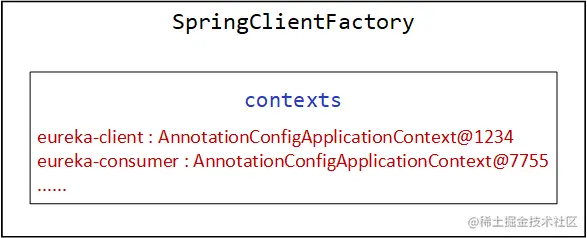

NamedContextFactory 中的 createContext 方法：

~~~java
protected AnnotationConfigApplicationContext createContext(String name) {
    AnnotationConfigApplicationContext context = new AnnotationConfigApplicationContext();
    // 2.6.1 注册由@RibbonClient显式声明的配置类
    if (this.configurations.containsKey(name)) {
        for (Class<?> configuration : this.configurations.get(name)
                .getConfiguration()) {
            context.register(configuration);
        }
    }
    // 2.6.2 注册外部传入的两个自动配置类RibbonAutoConfiguration、RibbonEurekaAutoConfiguration
    for (Map.Entry<String, C> entry : this.configurations.entrySet()) {
        if (entry.getKey().startsWith("default.")) {
            for (Class<?> configuration : entry.getValue().getConfiguration()) {
                context.register(configuration);
            }
        }
    }
    // 注册两个默认的配置类
    context.register(PropertyPlaceholderAutoConfiguration.class,
            this.defaultConfigType); // defaultConfigType : RibbonClientConfiguration
    context.getEnvironment().getPropertySources().addFirst(new MapPropertySource(
            this.propertySourceName,
            Collections.<String, Object>singletonMap(this.propertyName, name)));
    if (this.parent != null) {
        // Uses Environment from parent as well as beans
        // 设置为父子容器
        context.setParent(this.parent);
        // jdk11 issue  https://github.com/spring-cloud/spring-cloud-netflix/issues/3101
        context.setClassLoader(this.parent.getClassLoader());
    }
    context.setDisplayName(generateDisplayName(name));
    // 配置类全部设置完毕，启动IOC容器
    context.refresh();
    return context;
}
~~~

梳理下createContext中完成的动作：

* 注册由@RibbonClient显式声明的配置类
* 注册外部传入的两个自动配置类RibbonAutoConfiguration、RibbonEurekaAutoConfiguration
* 注册两个默认的配置类：PropertyPlaceholderAutoConfiguration、RibbonClientConfiguration
* 设置父子容器关系、启动IOC容器

默认情况下的负载均衡策略是带分区的轮询 ZoneAvoidanceRule ，这个默认的策略注册以及其他负载均衡相关的组件（如负载均衡器 ZoneAwareLoadBalancer ），都在 RibbonClientConfiguration 中被注册：

~~~java
@Bean
@ConditionalOnMissingBean
public IRule ribbonRule(IClientConfig config) {
    if (this.propertiesFactory.isSet(IRule.class, name)) {
        return this.propertiesFactory.get(IRule.class, config, name);
    }
    ZoneAvoidanceRule rule = new ZoneAvoidanceRule();
    rule.initWithNiwsConfig(config);
    return rule;
}

@Bean
@ConditionalOnMissingBean
public ILoadBalancer ribbonLoadBalancer(IClientConfig config,
        ServerList<Server> serverList, ServerListFilter<Server> serverListFilter,
        IRule rule, IPing ping, ServerListUpdater serverListUpdater) {
    if (this.propertiesFactory.isSet(ILoadBalancer.class, name)) {
        return this.propertiesFactory.get(ILoadBalancer.class, config, name);
    }
    return new ZoneAwareLoadBalancer<>(config, rule, ping, serverList,
            serverListFilter, serverListUpdater);
}
~~~

总结：

* SpringClientFactory 的作用不仅仅是创建负载均衡器，内部还维护了多个子IOC容器，而且是为每个服务名称都创建一个独立的子IOC容器；
* @RibbonClient 的起效位置是在 NamedContextFactory 的子IOC容器构建时起作用，故官方文档中描述的不能被应用级IOC容器扫描到，是因为如果扫描到就进入SpringIOC的父容器中了，被所有的子容器共享
* RibbonClientConfiguration 中声明了负载均衡需要的基础组件和默认策略等。

# Feign

实际开发中大多数情况还是使用 Feign 配合 Ribbon 进行服务调用，Feign对Ribbon进行了再次封装。使用 Feign 时，首要的工作是在主启动类上标注 @EnableFeignClients 注解。

## @EnableFeignClients

它的定义：

~~~java
@Import(FeignClientsRegistrar.class)
public @interface EnableFeignClients
~~~

它导入了一个 FeignClientsRegistrar ，它是一个 ImportBeanDefinitionRegistrar ，直接来到它的核心方法：

~~~java
public void registerBeanDefinitions(AnnotationMetadata metadata,
        BeanDefinitionRegistry registry) {
    registerDefaultConfiguration(metadata, registry);
    registerFeignClients(metadata, registry);
}
~~~

这里它直接调了另外两个方法，那很显然它要注册两部分 BeanDefinition

### 解析默认配置

registerDefaultConfiguration方法：

~~~java
private void registerDefaultConfiguration(AnnotationMetadata metadata,
        BeanDefinitionRegistry registry) {
    Map<String, Object> defaultAttrs = metadata
            .getAnnotationAttributes(EnableFeignClients.class.getName(), true);

    if (defaultAttrs != null && defaultAttrs.containsKey("defaultConfiguration")) {
        String name;
        if (metadata.hasEnclosingClass()) {
            name = "default." + metadata.getEnclosingClassName();
        } else {
            name = "default." + metadata.getClassName();
        }
        registerClientConfiguration(registry, name,
                defaultAttrs.get("defaultConfiguration"));
    }
}
~~~

它要处理EnableFeignClients中的defaultConfiguration属性，关于 Feign 的默认配置，将来也要注册到子IOC容器中。接下来是registerClientConfiguration方法：

~~~java
private void registerClientConfiguration(BeanDefinitionRegistry registry, Object name,
        Object configuration) {
    BeanDefinitionBuilder builder = BeanDefinitionBuilder
            .genericBeanDefinition(FeignClientSpecification.class);
    builder.addConstructorArgValue(name);
    builder.addConstructorArgValue(configuration);
    registry.registerBeanDefinition(
            name + "." + FeignClientSpecification.class.getSimpleName(),
            builder.getBeanDefinition());
}
~~~

向容器中注册的是FeignClientSpecification

### 解析组件

registerFeignClients方法：

~~~java
public void registerFeignClients(AnnotationMetadata metadata,
        BeanDefinitionRegistry registry) {
    // 包扫描器，默认用来扫描@EnableFeignClients标注类所在包及子包下的所有@FeignClients组件
    ClassPathScanningCandidateComponentProvider scanner = getScanner();
    scanner.setResourceLoader(this.resourceLoader);

    Set<String> basePackages;
    
    Map<String, Object> attrs = metadata.getAnnotationAttributes(EnableFeignClients.class.getName());
    AnnotationTypeFilter annotationTypeFilter = new AnnotationTypeFilter(FeignClient.class);
    // 1.2.1 该属性用来决定是否启用包扫描
    final Class<?>[] clients = attrs == null ? null : (Class<?>[]) attrs.get("clients");
    if (clients == null || clients.length == 0) {
        // 设置扫描过滤器，被扫描的类/接口上必须标注@FeignClient注解
        scanner.addIncludeFilter(annotationTypeFilter);
        basePackages = getBasePackages(metadata);
    } else {
        // 省略解析显式声明FeignClient的部分......
    }

    for (String basePackage : basePackages) {
        // 扫描所有被@FeignClient标注的接口
        Set<BeanDefinition> candidateComponents = scanner.findCandidateComponents(basePackage);
        for (BeanDefinition candidateComponent : candidateComponents) {
            if (candidateComponent instanceof AnnotatedBeanDefinition) {
                // verify annotated class is an interface
                AnnotatedBeanDefinition beanDefinition = (AnnotatedBeanDefinition) candidateComponent;
                AnnotationMetadata annotationMetadata = beanDefinition.getMetadata();
                // @FeignClient必须标注接口
                Assert.isTrue(annotationMetadata.isInterface(),
                        "@FeignClient can only be specified on an interface");

                Map<String, Object> attributes = annotationMetadata
                        .getAnnotationAttributes(FeignClient.class.getCanonicalName());

                String name = getClientName(attributes);
                // 1.2.2 注册Feign的配置
                registerClientConfiguration(registry, name, attributes.get("configuration"));

                // 1.2.3 注册FeignClient
                registerFeignClient(registry, annotationMetadata, attributes);
            }
        }
    }
}
~~~

这里面的核心步骤大概就两步：获取扫描根包，包扫描获取所有 FeignClient 。

1、获取扫描根包

@EnableFeignClients的定义里面是有clients属性的，如果clients 不为空，则会禁用类路径的包扫描：

~~~java
@Import(FeignClientsRegistrar.class)
public @interface EnableFeignClients {
    // ......

    /**
     * List of classes annotated with @FeignClient. If not empty, disables classpath
     * scanning.
     * @return list of FeignClient classes
     */
    Class<?>[] clients() default {};
~~~

如果没有指定 clients 属性，则会调用 getBasePackages 方法确定扫描根包：

~~~java
protected Set<String> getBasePackages(AnnotationMetadata importingClassMetadata) {
    Map<String, Object> attributes = importingClassMetadata
            .getAnnotationAttributes(EnableFeignClients.class.getCanonicalName());

    Set<String> basePackages = new HashSet<>();
    for (String pkg : (String[]) attributes.get("value")) {
        if (StringUtils.hasText(pkg)) {
            basePackages.add(pkg);
        }
    }
    for (String pkg : (String[]) attributes.get("basePackages")) {
        if (StringUtils.hasText(pkg)) {
            basePackages.add(pkg);
        }
    }
    for (Class<?> clazz : (Class[]) attributes.get("basePackageClasses")) {
        basePackages.add(ClassUtils.getPackageName(clazz));
    }

    if (basePackages.isEmpty()) {
        basePackages.add(
                ClassUtils.getPackageName(importingClassMetadata.getClassName()));
    }
    return basePackages;
}
~~~

逻辑很简单，它会去搜 @EnableFeignClients 注解中能代表扫描根包的所有属性，如果都没扫到，那就拿 @EnableFeignClients 注解标注的类所在的包为根包（跟 SpringBoot 的 @SpringBootApplication 思路一致）。

注意这里面没有涉及到 SpringBoot 中提到的 basePackages ，原因也很简单，@EnableFeignClients 注解是咱自己声明的，不是像 MyBatis 那样啥也不配置也能运行的，所以它就没有利用 SpringBoot 预先准备好的 basePackages 。

2、注册Feign的配置

registerClientConfiguration方法会解析@FeignClient中的configuration，当做入参，这个方法之前已经讲过了

3、注册FeignClient

registerFeignClient方法：

~~~java
private void registerFeignClient(BeanDefinitionRegistry registry,
        AnnotationMetadata annotationMetadata, Map<String, Object> attributes) {
    String className = annotationMetadata.getClassName();
    BeanDefinitionBuilder definition = BeanDefinitionBuilder
            .genericBeanDefinition(FeignClientFactoryBean.class);
    validate(attributes);
    definition.addPropertyValue("url", getUrl(attributes));
    definition.addPropertyValue("path", getPath(attributes));
    String name = getName(attributes);
    definition.addPropertyValue("name", name);
    String contextId = getContextId(attributes);
    definition.addPropertyValue("contextId", contextId);
    definition.addPropertyValue("type", className);
    definition.addPropertyValue("decode404", attributes.get("decode404"));
    definition.addPropertyValue("fallback", attributes.get("fallback"));
    definition.addPropertyValue("fallbackFactory", attributes.get("fallbackFactory"));
    definition.setAutowireMode(AbstractBeanDefinition.AUTOWIRE_BY_TYPE);

    String alias = contextId + "FeignClient";
    AbstractBeanDefinition beanDefinition = definition.getBeanDefinition();

    boolean primary = (Boolean) attributes.get("primary"); // has a default, won't be
                                                            // null

    beanDefinition.setPrimary(primary);

    String qualifier = getQualifier(attributes);
    if (StringUtils.hasText(qualifier)) {
        alias = qualifier;
    }

    BeanDefinitionHolder holder = new BeanDefinitionHolder(beanDefinition, className,
            new String[] { alias });
    BeanDefinitionReaderUtils.registerBeanDefinition(holder, registry);
}
~~~

这个方法中有很多的赋值构造操作，注意它创建的 Bean 的类型是 FeignClientFactoryBean ，是一个工厂Bean。实际创建的 FeignClient 是借助一个工厂Bean - FeignClientFactoryBean 搞定的

## FeignAutoConfiguration

它的定义：

~~~java
@Configuration
@ConditionalOnClass(Feign.class)
@EnableConfigurationProperties({ FeignClientProperties.class,
		FeignHttpClientProperties.class })
public class FeignAutoConfiguration
~~~

feign 包的 spring.factories 文件中标注了它，和之前类似，程序会读取这个文件，将实现类加载进容器：

~~~
org.springframework.boot.autoconfigure.EnableAutoConfiguration=\
  org.springframework.cloud.openfeign.ribbon.FeignRibbonClientAutoConfiguration,\
  org.springframework.cloud.openfeign.FeignAutoConfiguration,\
  org.springframework.cloud.openfeign.encoding.FeignAcceptGzipEncodingAutoConfiguration,\
  org.springframework.cloud.openfeign.encoding.FeignContentGzipEncodingAutoConfiguration
~~~

### FeignContext

FeignAutoConfiguration中导入了FeignContext：

~~~java
@Autowired(required = false)
private List<FeignClientSpecification> configurations = new ArrayList<>();

@Bean
public FeignContext feignContext() {
    FeignContext context = new FeignContext();
    context.setConfigurations(this.configurations);
    return context;
}
~~~

这段逻辑和Ribbon的SpringClientFactory差不多，它们都是NamedContextFactory的子类，内部维护着多个子IOC容器，会将FeignClientSpecification作为每个子容器的配置。

### Targeter

~~~java
@Bean
@ConditionalOnClass(name = "feign.hystrix.HystrixFeign")
@ConditionalOnMissingBean
public Targeter feignTargeter() {
    return new HystrixTargeter();
}

@Bean
@ConditionalOnMissingClass("feign.hystrix.HystrixFeign")
@ConditionalOnMissingBean
public Targeter feignTargeter() {
    return new DefaultTargeter();
}
~~~

注意这两个 Targeter 是不共存的，上面的 HystrixTargeter 带熔断降级，下面的 DefaultTargeter 不带。

先来看看DefaultTargeter 的实现：

~~~java
class DefaultTargeter implements Targeter {
    @Override
    public <T> T target(FeignClientFactoryBean factory, Feign.Builder feign,
            FeignContext context, Target.HardCodedTarget<T> target) {
        return feign.target(target);
    }
}
~~~

这里它直接拿 Feign.Builder 构造实际的 FeignClient 而已。

实际上这里创建的是 HystrixTargeter ，是因为 Feign 会把 Hystrix 一并依赖进来，后续看 Feign 接口的动态实现类时再展开 HystrixTargeter。除了上述两个组件之外，剩余的都是不符合 @Conditional 条件的组件了

## FeignRibbonClientAutoConfiguration

spring.factories中也标注了它，它的定义：

~~~java
@Configuration
@ConditionalOnClass({ ILoadBalancer.class, Feign.class })
@AutoConfigureBefore(FeignAutoConfiguration.class)
@EnableConfigurationProperties({ FeignHttpClientProperties.class })
@Import({ HttpClientFeignLoadBalancedConfiguration.class,
		OkHttpFeignLoadBalancedConfiguration.class,
		DefaultFeignLoadBalancedConfiguration.class })
public class FeignRibbonClientAutoConfiguration
~~~

### DefaultFeignLoadBalancedConfiguration

这个配置类只注册了一个 LoadBalancerFeignClient ：

~~~java
@Configuration
class DefaultFeignLoadBalancedConfiguration {
    @Bean
    @ConditionalOnMissingBean
    public Client feignClient(CachingSpringLoadBalancerFactory cachingFactory,
            SpringClientFactory clientFactory) {
        return new LoadBalancerFeignClient(new Client.Default(null, null), cachingFactory,
                clientFactory);
    }
}
~~~

LoadBalancerFeignClient是真正发起基于 Feign 的负载均衡请求的客户端。除了这个配置类之外，其余的两个配置类都因为 classpath 下缺少指定的类而导致无法被装配，下面看FeignRibbonClientAutoConfiguration 注册的组件

### CachingSpringLoadBalancerFactory

~~~java
@Bean
@Primary
@ConditionalOnMissingBean
@ConditionalOnMissingClass("org.springframework.retry.support.RetryTemplate")
public CachingSpringLoadBalancerFactory cachingLBClientFactory(
        SpringClientFactory factory) {
    return new CachingSpringLoadBalancerFactory(factory);
}

@Bean
@Primary
@ConditionalOnMissingBean
@ConditionalOnClass(name = "org.springframework.retry.support.RetryTemplate")
public CachingSpringLoadBalancerFactory retryabeCachingLBClientFactory(
        SpringClientFactory factory, LoadBalancedRetryFactory retryFactory) {
    return new CachingSpringLoadBalancerFactory(factory, retryFactory);
}
~~~

跟上面的 Targeter 类似，这两个Bean也是不共存，不过好在都是 CachingSpringLoadBalancerFactory 类型的，只是一个只放入了 SpringClientFactory ，另一个还额外放入了 LoadBalancedRetryFactory 。

这里重点关注普通的CachingSpringLoadBalancerFactory：

~~~java
public class CachingSpringLoadBalancerFactory {
	protected final SpringClientFactory factory;
	protected LoadBalancedRetryFactory loadBalancedRetryFactory = null;
	private volatile Map<String, FeignLoadBalancer> cache = new ConcurrentReferenceHashMap<>();
~~~

它内部会注入一个 SpringClientFactory ，而且下面还有一个 Map 放的是 FeignLoadBalancer，key就是服务名称。它内部只有create一个方法：

~~~java
public FeignLoadBalancer create(String clientName) {
    FeignLoadBalancer client = this.cache.get(clientName);
    if (client != null) {
        return client;
    }
    IClientConfig config = this.factory.getClientConfig(clientName);
    ILoadBalancer lb = this.factory.getLoadBalancer(clientName);
    ServerIntrospector serverIntrospector = this.factory.getInstance(clientName,
            ServerIntrospector.class);
    client = this.loadBalancedRetryFactory != null
            ? new RetryableFeignLoadBalancer(lb, config, serverIntrospector,
                    this.loadBalancedRetryFactory)
            : new FeignLoadBalancer(lb, config, serverIntrospector);
    this.cache.put(clientName, client);
    return client;
}
~~~

首先它拿到原始的 Ribbon 的负载均衡器、以及Ribbon 中的负载均衡配置，封装为一个 FeignLoadBalancer ，相当于把原本 Ribbon 的组件们进行了一次包装，最后放入 Map 缓存中完成整体创建流程。FeignLoadBalancer是真正进行服务调用的执行器。

### Request.Options

~~~java
@Bean
@ConditionalOnMissingBean
public Request.Options feignRequestOptions() {
    return LoadBalancerFeignClient.DEFAULT_OPTIONS;
}
~~~

Options 是配置的意思，它里面维护了3个变量：

~~~java
public static class Options {
    private final int connectTimeoutMillis; // 建立连接的超时时间
    private final int readTimeoutMillis; // 完整响应的超时时间
    private final boolean followRedirects; // 是否开启重定向
~~~

默认情况下，Options 的设置就是调空参构造方法：

~~~java
public Options() {
    this(10 * 1000, 60 * 1000);
}

public Options(int connectTimeoutMillis, int readTimeoutMillis) {
    this(connectTimeoutMillis, readTimeoutMillis, true);
}
~~~

可以发现是 10 秒的建立连接超时，60 秒的完整响应超时。这里解释下完整响应的概念：服务调用时，从客户端发起请求到建立连接，再到服务响应回数据并由客户端完整接收，这整个过程的总耗时就是完整响应时间。

如果默认的配置不能满足开发需求或者实际线上需求，可以手动创建 Options 类来覆盖原有配置。Request.Options 的Bean创建处有 @ConditionalOnMissingBean 注解，意味着如果自定义了 Options 配置，则自动配置中的Bean不会被创建。如：

~~~java
@Bean
public Request.Options options() {
    return new Request.Options(2000, 10000);
}
~~~

Feign 初始化的组件总结：

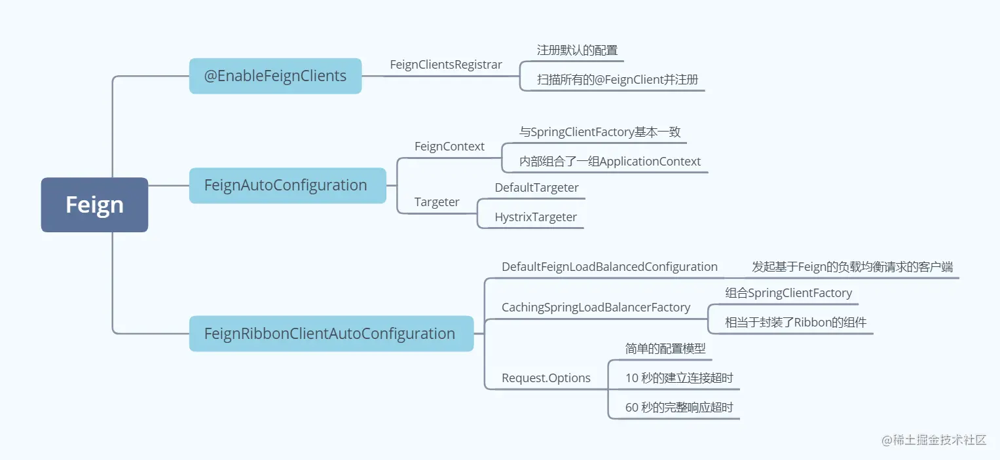

## 调用流程

### 环境搭建

以 Ribbon 中的测试环境为基准，把 eureka-consumer 中加入 Feign ，Maven 中加入依赖：

~~~xml
    <dependency>
        <groupId>org.springframework.cloud</groupId>
        <artifactId>spring-cloud-starter-openfeign</artifactId>
    </dependency>
~~~

之后编写一个接口，来调用 eureka-client 的服务：

~~~java
@FeignClient("eureka-client")
public interface ProviderFeignClient {
    
    @RequestMapping(value = "/getInfo", method = RequestMethod.GET)
    public String getInfo();
    
}
~~~

ConsumerController 中就不再是注入 RestTemplate 了，而是直接注入这个接口的Bean即可：

~~~java
    @Autowired
    private ProviderFeignClient providerFeignClient;
    
    @GetMapping("/getInfo")
    public String getInfo() {
        return providerFeignClient.getInfo();
    }
~~~

启动 eureka-server 与两个 eureka-client ，准备开始测试流程。

### 进入代理对象

请求到达 ConsumerController 的 getInfo 方法，随后进入 providerFeignClient 的 getInfo 方法。providerFeignClient的真正类型是HardCodedTargeter，在之前构造Targeter的时候，它作为入参出现：

~~~java
class DefaultTargeter implements Targeter {
    @Override
    public <T> T target(FeignClientFactoryBean factory, Feign.Builder feign,
            FeignContext context, Target.HardCodedTarget<T> target) {
        return feign.target(target);
    }
}
~~~

后续会详细解释HardCodedTargeter 的由来，以及 FeignClientFactoryBean 等组件的作用。

HardCodedTargeter是一个代理对象，它是jdk 动态代理中的一个 InvocationHandler，代码真正进入的是ReflectiveFeign 的内部类 FeignInvocationHandler 中：

~~~java
private final Map<Method, MethodHandler> dispatch;

public Object invoke(Object proxy, Method method, Object[] args) throws Throwable {
    if ("equals".equals(method.getName())) {
        // ......
    } else if ("hashCode".equals(method.getName())) {
        return hashCode();
    } else if ("toString".equals(method.getName())) {
        return toString();
    }

    return dispatch.get(method).invoke(args);
}
~~~

上面会拦截几个来自 Object 的方法，最重要的是底下的 dispatch.get(method).invoke(args) ，可以发现这个 dispatch 的结构是 Map，这里是吧接口中定义的方法都封装好了，要调哪个方法，直接从 Map 中取出对应的 MethodHandler 就可以了。

这个 MethodHandler 是 Feign 内部自己定义的接口：

~~~java
public interface InvocationHandlerFactory {
    // ......
    interface MethodHandler {
        Object invoke(Object[] argv) throws Throwable;
    }
~~~

跟着Debug来到 SynchronousMethodHandler 中：

~~~java
public Object invoke(Object[] argv) throws Throwable {
    // 2.1 创建RequestTemplate
    RequestTemplate template = buildTemplateFromArgs.create(argv);
    // 2.2 获取参数配置
    Options options = findOptions(argv);
    Retryer retryer = this.retryer.clone();
    while (true) {
        try {
            // 2.3 发起请求
            return executeAndDecode(template, options);
        } // catch throw ......
    }
}
~~~

### 创建RequestTemplate

buildTemplateFromArgs.create方法：

~~~java
public RequestTemplate create(Object[] argv) {
    // 2.1.1 根据元信息的请求模板创建新的模板
    RequestTemplate mutable = RequestTemplate.from(metadata.template());
    if (metadata.urlIndex() != null) {
        int urlIndex = metadata.urlIndex();
        checkArgument(argv[urlIndex] != null, "URI parameter %s was null", urlIndex);
        mutable.target(String.valueOf(argv[urlIndex]));
    }
    // 参数封装
    Map<String, Object> varBuilder = new LinkedHashMap<String, Object>();
    for (Entry<Integer, Collection<String>> entry : metadata.indexToName().entrySet()) {
        int i = entry.getKey();
        Object value = argv[entry.getKey()];
        if (value != null) { // Null values are skipped.
            if (indexToExpander.containsKey(i)) {
                value = expandElements(indexToExpander.get(i), value);
            }
            for (String name : entry.getValue()) {
                varBuilder.put(name, value);
            }
        }
    }

    // 2.1.2 请求参数编码/路径拼接
    RequestTemplate template = resolve(argv, mutable, varBuilder);
    if (metadata.queryMapIndex() != null) {
        // add query map parameters after initial resolve so that they take
        // precedence over any predefined values
        Object value = argv[metadata.queryMapIndex()];
        Map<String, Object> queryMap = toQueryMap(value);
        template = addQueryMapQueryParameters(queryMap, template);
    }

    if (metadata.headerMapIndex() != null) {
        template = addHeaderMapHeaders((Map<String, Object>) argv[metadata.headerMapIndex()], template);
    }

    return template;
}
~~~

整体的方法可以大致分为3个部分：RequestTemplate 的初始创建、请求参数封装、请求参数编码 / 路径拼接

RequestTemplate.from方法：

~~~java
public static RequestTemplate from(RequestTemplate requestTemplate) {
    RequestTemplate template =
            new RequestTemplate(requestTemplate.target, requestTemplate.fragment,
                    requestTemplate.uriTemplate,
                    requestTemplate.method, requestTemplate.charset,
                    requestTemplate.body, requestTemplate.decodeSlash, requestTemplate.collectionFormat);

    if (!requestTemplate.queries().isEmpty()) {
        template.queries.putAll(requestTemplate.queries);
    }

    if (!requestTemplate.headers().isEmpty()) {
        template.headers.putAll(requestTemplate.headers);
    }
    return template;
}
~~~

可以发现，前面的构造方法调用就是取的原有 template 中的属性，只是下面会有一些其他属性的赋值。借助Debug，发现并没有进入下面两个 if 结构中，那也就相当于把原来的模板复制了一份新的而已了。

接下来进入resolve方法：

~~~java
protected RequestTemplate resolve(Object[] argv,
        RequestTemplate mutable, Map<String, Object> variables) {
    return mutable.resolve(variables);
}

public RequestTemplate resolve(Map<String, ?> variables) {
    StringBuilder uri = new StringBuilder();

    /* create a new template form this one, but explicitly */
    RequestTemplate resolved = RequestTemplate.from(this);

    // 巨长......
    return resolved;
}
~~~

这部分的操作实际上是对请求参数进行请求参数的字符串路径拼接，由于上述测试环境中咱发起的是 GET 请求，故进入这个方法，POST 请求会先进入 BuildEncodedTemplateFromArgs 的 resolve 方法，对请求参数进行编码。

~~~java
private final Encoder encoder;

protected RequestTemplate resolve(Object[] argv,
        RequestTemplate mutable, Map<String, Object> variables) {
    Object body = argv[metadata.bodyIndex()];
    checkArgument(body != null, "Body parameter %s was null", metadata.bodyIndex());
    try {
        encoder.encode(body, metadata.bodyType(), mutable);
    } // catch ......
    return super.resolve(argv, mutable, variables);
}
~~~

### 准备发起请求

RequestTemplate 创建好后，下一步要获取实现配置好的请求相关参数：

~~~java
Options findOptions(Object[] argv) {
    if (argv == null || argv.length == 0) {
        return this.options;
    }
    return (Options) Stream.of(argv)
            .filter(o -> o instanceof Options)
            .findFirst()
            .orElse(this.options);
}
~~~

这里的处理流程也比较简单，它会找方法参数中第一个类型为 Options 的参数，并取出返回；如果找不到，就使用默认的 Options 参数。根据之前看到的默认配置，默认情况下的参数设置为 10 秒的建立连接超时，60 秒的完整响应超时。

上面的准备工作都整理完毕后，下面要准备发起请求了：

~~~java
Object executeAndDecode(RequestTemplate template, Options options) throws Throwable {
    Request request = targetRequest(template);
    // logger ......

    Response response;
    long start = System.nanoTime();
    try {
        // 【核心】配合Ribbon进行负载均衡调用
        response = client.execute(request, options);
    } // catch throw .......
    long elapsedTime = TimeUnit.NANOSECONDS.toMillis(System.nanoTime() - start);

    // 请求后的处理 ......
}
~~~

中间的 client 要真正的准备发起请求。由于咱是测试 Feign 配合 Ribbon 的负载均衡调用，这里的 client 类型就不是简单的 Default 实现，而是配合 Ribbon 的 LoadBalancerFeignClient ：

~~~java
public Response execute(Request request, Request.Options options) throws IOException {
    try {
        // 2.3.1 构建能被Ribbon处理的url
        URI asUri = URI.create(request.url());
        // 获取被调用的服务名称
        String clientName = asUri.getHost();
        // 去掉服务名称后的url
        URI uriWithoutHost = cleanUrl(request.url(), clientName);
        // 2.3.2 借助Feign默认的Client封装请求，用于下面真正的请求发起
        FeignLoadBalancer.RibbonRequest ribbonRequest = new FeignLoadBalancer.RibbonRequest(
                this.delegate, request, uriWithoutHost);

        IClientConfig requestConfig = getClientConfig(options, clientName);
        // 2.3.3 发送请求
        return lbClient(clientName).executeWithLoadBalancer(ribbonRequest, requestConfig).toResponse();
    } // catch ......
}
~~~

URI.create(request.url()) 这部分就是拿基于 Ribbon 的请求地址，下面获取到服务主机名，再将原有的请求地址中主机名部分去掉：

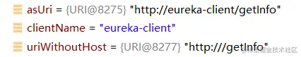

接着是封装FeignLoadBalancer.RibbonRequest，注意这里面的封装内容有一个 delegate ，通过Debug可以发现它是 Feign 中默认实现的一个客户端：

~~~java
private final Client delegate;
~~~

而这个 Client 是一个接口，它只有 3 个实现，除了 Default 之外，另一个重要实现就是 LoadBalancerFeignClient。

Ribbon 使用 RequestFactory 创建特殊的 RestTemplate （带拦截器），在执行拦截器时再创建普通的 RestTemplate 发送请求。Feign 这里也是类似的操作，一开始它先创建 LoadBalancerFeignClient ，这里面包装一个普通的 Client ，真正的请求让这个普通的 Client 发，LoadBalancerFeignClient 只做前期准备处理。

发起请求的这行代码：

~~~java
 return lbClient(clientName).executeWithLoadBalancer(ribbonRequest, requestConfig).toResponse();
~~~

注意这里面分两个动作：先根据服务名称取 FeignLoadBalancer ，再发起请求。

lbClient方法：

~~~java
private CachingSpringLoadBalancerFactory lbClientFactory;

private FeignLoadBalancer lbClient(String clientName) {
    return this.lbClientFactory.create(clientName);
}
~~~

这个CachingSpringLoadBalancerFactory#create方法之前已经分析过了，它会拿到原始的 Ribbon 的负载均衡器、以及Ribbon 中的负载均衡配置，封装为一个 FeignLoadBalancer ，相当于把原本 Ribbon 的组件们进行了一次包装，最后放入 Map 缓存中完成整体创建流程。

### LoadBalancer的处理

接下来进入FeignLoadBalancer的executeWithLoadBalancer方法：

~~~java
public T executeWithLoadBalancer(final S request, final IClientConfig requestConfig) throws ClientException {
    // 3.1 构造、封装参数
    LoadBalancerCommand<T> command = buildLoadBalancerCommand(request, requestConfig);
    try {
        // 3.2 执行请求发起的动作
        return command.submit(
            new ServerOperation<T>() {
                @Override
                public Observable<T> call(Server server) {
                    URI finalUri = reconstructURIWithServer(server, request.getUri());
                    S requestForServer = (S) request.replaceUri(finalUri);
                    try {
                        return Observable.just(AbstractLoadBalancerAwareClient
                                .this.execute(requestForServer, requestConfig));
                    } // catch ......
                }
            })
            .toBlocking()
            .single();
    } // catch ......
}
~~~

进入到方法体之前的request里面已经有封装好的默认的 Feign 客户端：

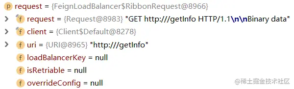

buildLoadBalancerCommand方法负责封装参数：

~~~java
protected LoadBalancerCommand<T> buildLoadBalancerCommand(final S request, final IClientConfig config) {
    RequestSpecificRetryHandler handler = getRequestSpecificRetryHandler(request, config);
    LoadBalancerCommand.Builder<T> builder = LoadBalancerCommand.<T>builder()
            .withLoadBalancerContext(this)
            .withRetryHandler(handler)
            .withLoadBalancerURI(request.getUri());
    customizeLoadBalancerCommandBuilder(request, config, builder);
    return builder.build();
}
~~~

这里它将请求的内容和一些参数配置都放入了一个 LoadBalancerCommand 中，Debug返回后发现这里面已经具备了必要的属性和一些配置值，注意这里面 loadBalancerContext 的类型为 FeignLoadBalancer ，也就说明接下来的负载均衡是由 Feign 控制完成（Feign借助Ribbon）

接下来进入submit方法：

~~~java
public Observable<T> submit(final ServerOperation<T> operation) {
    // ......
    Observable<T> o = 
        // 3.3 选择目标服务实例
        (server == null ? selectServer() : Observable.just(server))
        .concatMap(new Func1<Server, Observable<T>>() {
            @Override
            // Called for each server being selected
            public Observable<T> call(Server server) {
                context.setServer(server);
                final ServerStats stats = loadBalancerContext.getServerStats(server);

                // Called for each attempt and retry
                Observable<T> o = Observable
                    .just(server)
                    .concatMap(new Func1<Server, Observable<T>>() {
                        @Override
                        public Observable<T> call(final Server server) {
                            // ......
                            // 3.4 根据目标服务实例信息构造真实请求的url
                            return operation.call(server).doOnEach(new Observer<T>() {
                                // ......
    // ......
}
~~~

最关键的两个地方：上面的 selectServer 动作是负载均衡获取服务实例，下面的 operation.call(server) 用来完成 url 重构

selectServer方法：

~~~java
private Observable<Server> selectServer() {
    return Observable.create(new OnSubscribe<Server>() {
        @Override
        public void call(Subscriber<? super Server> next) {
            try {
                Server server = loadBalancerContext.getServerFromLoadBalancer(loadBalancerURI, loadBalancerKey);   
                next.onNext(server);
                next.onCompleted();
            } // catch ......
        }
    });
}

public Server getServerFromLoadBalancer(@Nullable URI original, @Nullable Object loadBalancerKey) throws ClientException {
    // ......

    ILoadBalancer lb = getLoadBalancer();
    if (host == null) {
        if (lb != null){
            Server svc = lb.chooseServer(loadBalancerKey);
            // ......
}
~~~

这里它会使用 loadBalancerContext 去取具体的服务实例，可以发现核心动作还是 Ribbon 负载均衡器的 chooseServer 方法。Feign 进行负载均衡调用时，底层还是使用 Ribbon 的API

源码最后一句，在 return 中它执行了 operation 的 call 方法，而这个 operation 就是上面 executeWithLoadBalancer 方法中传入的匿名内部类：

~~~java
    new ServerOperation<T>() {
        @Override
        public Observable<T> call(Server server) {
            URI finalUri = reconstructURIWithServer(server, request.getUri());
            S requestForServer = (S) request.replaceUri(finalUri);
            try {
                return Observable.just(AbstractLoadBalancerAwareClient
                        .this.execute(requestForServer, requestConfig));
            } // catch ......
        }
~~~

这部分实现中，先是重新构造好 url ，再将构造好的 url 放入请求中，最后发起请求。

FeignLoadBalancer#reconstructURIWithServer：

~~~java
public URI reconstructURIWithServer(Server server, URI original) {
    URI uri = updateToSecureConnectionIfNeeded(original, this.clientConfig,
            this.serverIntrospector, server);
    return super.reconstructURIWithServer(server, uri);
}

// RibbonUtils
public static URI updateToSecureConnectionIfNeeded(URI uri, IClientConfig config,
        ServerIntrospector serverIntrospector, Server server) {
    String scheme = uri.getScheme();

    if (StringUtils.isEmpty(scheme)) {
        scheme = "http";
    }

    if (!StringUtils.isEmpty(uri.toString())
            && unsecureSchemeMapping.containsKey(scheme)
            && isSecure(config, serverIntrospector, server)) {
        return upgradeConnection(uri, unsecureSchemeMapping.get(scheme));
    }
    return uri;
}
~~~

在 FeignLoadBalancer 中的额外处理仅仅是处理下请求协议，它会将 http 更改为 https，这里并没有改变协议。进入到父类的 reconstructURIWithServer 方法：

~~~java
public URI reconstructURIWithServer(Server server, URI original) {
    String host = server.getHost();
    int port = server.getPort();
    String scheme = server.getScheme();
    
    if (host.equals(original.getHost()) 
            && port == original.getPort()
            && scheme == original.getScheme()) {
        return original;
    }
    if (scheme == null) {
        scheme = original.getScheme();
    }
    if (scheme == null) {
        scheme = deriveSchemeAndPortFromPartialUri(original).first();
    }

    try {
        StringBuilder sb = new StringBuilder();
        sb.append(scheme).append("://");
        if (!Strings.isNullOrEmpty(original.getRawUserInfo())) {
            sb.append(original.getRawUserInfo()).append("@");
        }
        sb.append(host);
        if (port >= 0) {
            sb.append(":").append(port);
        }
        sb.append(original.getRawPath());
        if (!Strings.isNullOrEmpty(original.getRawQuery())) {
            sb.append("?").append(original.getRawQuery());
        }
        if (!Strings.isNullOrEmpty(original.getRawFragment())) {
            sb.append("#").append(original.getRawFragment());
        }
        URI newURI = new URI(sb.toString());
        return newURI;            
    } // catch ......
}
~~~

拼接url的逻辑在这里，最后拼接的结果就带着最原始的ip和端口：

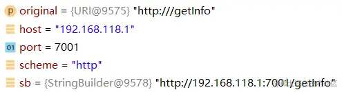

已经正常拼接好 url ，可以发起请求了。

### 发起请求

与 Ribbon 不同，Feign 的请求发起不再借助 RestTemplate ，而是在 FeignLoadBalancer 中执行。回到 executeWithLoadBalancer 方法中，中间的 try 块中只有一行代码：

~~~java
 return Observable.just(AbstractLoadBalancerAwareClient.this.execute(requestForServer, requestConfig));
~~~

来到 execute 方法：

~~~java
public RibbonResponse execute(RibbonRequest request, IClientConfig configOverride)
        throws IOException {
    Request.Options options;
    if (configOverride != null) {
        RibbonProperties override = RibbonProperties.from(configOverride);
        options = new Request.Options(override.connectTimeout(this.connectTimeout),
                override.readTimeout(this.readTimeout));
    }
    else {
        options = new Request.Options(this.connectTimeout, this.readTimeout);
    }
    Response response = request.client().execute(request.toRequest(), options);
    return new RibbonResponse(request.getUri(), response);
}
~~~

倒数第二行它取出 RibbonRequest 中真正的请求，去执行请求的发起：

~~~java
public Response execute(Request request, Options options) throws IOException {
    HttpURLConnection connection = convertAndSend(request, options);
    return convertResponse(connection, request);
}
~~~

跳转到 convertAndSend 方法，可以看到它是用jdk 最底层的方式去进行HTTP请求：

~~~java
    HttpURLConnection convertAndSend(Request request, Options options) throws IOException {
        final URL url = new URL(request.url());
        final HttpURLConnection connection = this.getConnection(url);
        // ......

        if (request.requestBody().asBytes() != null) {
            // ......
            OutputStream out = connection.getOutputStream();
            // ......
        }
        return connection;
    }
}
~~~

## 代理对象的创建

之前在初始化的时候，所有@FeignClient组件的信息都被封装到了FeignClientFactoryBean中，它的核心方法就是getObject，在容器getBean的时候（获取@FeignClient标注的类），工厂bean就开始调用getObject方法：

~~~java
public Object getObject() throws Exception {
    return getTarget();
}

<T> T getTarget() {
    // 1.3 这个IOC容器是应用级的，不是Feign内部维护的
    FeignContext context = this.applicationContext.getBean(FeignContext.class);
    // 2. feign(context)的动作
    Feign.Builder builder = feign(context);

    if (!StringUtils.hasText(this.url)) {
        if (!this.name.startsWith("http")) {
            this.url = "http://" + this.name;
        }
        else {
            this.url = this.name;
        }
        this.url += cleanPath();
        // 3. 创建接口实现类的真正步骤。
        return (T) loadBalance(builder, context,
                new HardCodedTarget<>(this.type, this.name, this.url));
    }
    // ......
}
~~~

### FeignClientsConfiguration

在getTarget方法中，首先会去容器获取FeignContext对象，之前讲过它内部维护了一组 IOC 容器，key 是微服务名称。对应的每个服务都会维护一个子 IOC 容器，内部存放了关于 Feign 的相关组件。它在初始化时也传入了一组 configurations ：

~~~java
@Bean
public FeignContext feignContext() {
    FeignContext context = new FeignContext();
    context.setConfigurations(this.configurations);
    return context;
}
~~~

FeignContext 的构造方法中传入了一个默认的配置：

~~~java
public FeignContext() {
    super(FeignClientsConfiguration.class, "feign", "feign.client.name");
}
~~~

FeignClientsConfiguration向容器中注册了一些组件：

1、编码、解码器

~~~java
@Bean
@ConditionalOnMissingBean
public Decoder feignDecoder() {
    return new OptionalDecoder(
            new ResponseEntityDecoder(new SpringDecoder(this.messageConverters)));
}

@Bean
@ConditionalOnMissingBean
@ConditionalOnMissingClass("org.springframework.data.domain.Pageable")
public Encoder feignEncoder() {
    return new SpringEncoder(this.messageConverters);
}
~~~

这些编解码器用于解析body，注意编码器中如果有 SpringData 系列的依赖引入，将不再创建简单的 SpringEncoder 而是 PageableSpringEncoder。

2、SpringMvcContract

~~~java
@Bean
@ConditionalOnMissingBean
public Contract feignContract(ConversionService feignConversionService) {
    return new SpringMvcContract(this.parameterProcessors, feignConversionService);
}
~~~

表面上可以理解为 “基于SpringWebMvc的协议” ，Feign 的接口完全可以按照 SpringWebMvc 的格式来编写，Feign 会自己转换为自己熟悉的格式，负责解析的组件就是SpringMvcContract

3、Feign.Builder

~~~java
@Bean
@Scope("prototype")
@ConditionalOnMissingBean
public Feign.Builder feignBuilder(Retryer retryer) {
    return Feign.builder().retryer(retryer);
}
~~~

它是构建Feign的构造器。

### 构建Feign.Builder

进入feign方法，它主要就是负责构建Feign.Builder：

~~~java
protected Feign.Builder feign(FeignContext context) {
    FeignLoggerFactory loggerFactory = get(context, FeignLoggerFactory.class);
    Logger logger = loggerFactory.create(this.type);

    // @formatter:off
    // 2.1 获取Builder
    Feign.Builder builder = get(context, Feign.Builder.class)
            // required values
            .logger(logger)
            .encoder(get(context, Encoder.class))
            .decoder(get(context, Decoder.class))
            .contract(get(context, Contract.class));
    // @formatter:on

    // 2.2 Builder配置
    configureFeign(context, builder);

    return builder;
}
~~~

在get方法中：

~~~java
protected <T> T get(FeignContext context, Class<T> type) {
    T instance = context.getInstance(this.contextId, type);
    if (instance == null) {
        throw new IllegalStateException(
                "No bean found of type " + type + " for " + this.contextId);
    }
    return instance;
}
~~~

因为之前的默认配置类中注册了Feign.Builder，所以这里到服务对应的子 IOC 容器中找一定可以顺利返回。

configureFeign方法主要是将应用级 IOC 容器中的一些配置放入即将要创建的 Feign 客户端建造器中：

~~~java
protected void configureFeign(FeignContext context, Feign.Builder builder) {
    // FeignClientProperties即application.yml中的属性映射配置
    FeignClientProperties properties = this.applicationContext
            .getBean(FeignClientProperties.class);
    if (properties != null) {
        if (properties.isDefaultToProperties()) {
            configureUsingConfiguration(context, builder);
            configureUsingProperties(
                    properties.getConfig().get(properties.getDefaultConfig()), builder);
            configureUsingProperties(properties.getConfig().get(this.contextId), builder);
        } else {
            configureUsingProperties(
                    properties.getConfig().get(properties.getDefaultConfig()), builder);
            configureUsingProperties(properties.getConfig().get(this.contextId), builder);
            configureUsingConfiguration(context, builder);
        }
    } else {
        configureUsingConfiguration(context, builder);
    }
}
~~~

可以看出设置配置的策略是：

* 如果从映射文件中能加载到配置，并且都是默认的配置，则先执行配置，后映射属性
* 如果加载到的配置是自定义过的，则先映射属性，后执行配置

这其实就是 SpringBoot + Feign 对于 JavaConfig 与配置文件的优先级设定，当设定了 feign.client.default-to-properties=true 时，配置文件中的配置会覆盖掉默认的配置。

### 创建接口实现类

接着进入loadBalance方法：

~~~java
protected <T> T loadBalance(Feign.Builder builder, FeignContext context,
        HardCodedTarget<T> target) {
    // 此处获得Feign用于远程调用的Client
    Client client = getOptional(context, Client.class);
    if (client != null) {
        builder.client(client);
        // 获得默认的Targeter
        Targeter targeter = get(context, Targeter.class);
        // 4. 建造器创建接口实现类
        return targeter.target(this, builder, context, target);
    }
    throw new IllegalStateException(
            "No Feign Client for loadBalancing defined. Did you forget to include spring-cloud-starter-netflix-ribbon?");
}
~~~

前面两个动作比较简单，都是从 FeignContext 的子 IOC 容器中取组件：

~~~java
protected <T> T getOptional(FeignContext context, Class<T> type) {
    return context.getInstance(this.contextId, type);
}
~~~

~~~java
protected <T> T get(FeignContext context, Class<T> type) {
    T instance = context.getInstance(this.contextId, type);
    if (instance == null) {
        throw new IllegalStateException(
                "No bean found of type " + type + " for " + this.contextId);
    }
    return instance;
}
~~~

分别从容器中获得用于远程调用的Client和接口实现类Targeter（真正类型是HystrixTargeter），它是调用loadBalance的时候被新建出来的：

~~~java
return (T) loadBalance(builder, context,
         new HardCodedTarget<>(this.type, this.name, this.url));
~~~

随后进入 target() 方法

### 创建前准备

Targeter 的类型是 HystrixTargeter，进入HystrixTargeter 的 target 方法：

~~~java
public <T> T target(FeignClientFactoryBean factory, Feign.Builder feign,
        FeignContext context, Target.HardCodedTarget<T> target) {
    if (!(feign instanceof feign.hystrix.HystrixFeign.Builder)) {
        return feign.target(target);
    }
    // 一些关于Hystrix的处理......

    return feign.target(target);
}

public <T> T target(Target<T> target) {
    return build().newInstance(target);
}
~~~

由于 HystrixFeign 重写了 build() 方法，来看HystrixFeign 的build方法：

~~~java
public Feign build() {
    return build(null);
}

Feign build(final FallbackFactory<?> nullableFallbackFactory) {
    super.invocationHandlerFactory(new InvocationHandlerFactory() {
        @Override
        public InvocationHandler create(Target target,
                                                                        Map<Method, MethodHandler> dispatch) {
            return new HystrixInvocationHandler(target, dispatch, setterFactory,
                    nullableFallbackFactory);
        }
    });
    super.contract(new HystrixDelegatingContract(contract));
    return super.build();
}

public Feign build() {
    SynchronousMethodHandler.Factory synchronousMethodHandlerFactory =
            new SynchronousMethodHandler.Factory(client, retryer, requestInterceptors, logger,
                    logLevel, decode404, closeAfterDecode, propagationPolicy);
    ParseHandlersByName handlersByName =
            new ParseHandlersByName(contract, options, encoder, decoder, queryMapEncoder,
                    errorDecoder, synchronousMethodHandlerFactory);
    return new ReflectiveFeign(handlersByName, invocationHandlerFactory, queryMapEncoder);
}
~~~

可以看到最后返回的ReflectiveFeign里面，包含了两个新建的组件：SynchronousMethodHandler.Factory和ParseHandlersByName

SynchronousMethodHandler.Factory是一个创建handler的工厂，它后面会用来创建MethodHandler，工厂中组合了几个核心组件：

* client ：真正发起请求的客户端，底层使用 jdk 最基本的网络相关API
* retryer ：重试器，根据不同的重试策略，在请求失败时执行对应的逻辑
* requestInterceptors ：发起请求前的拦截器组

ParseHandlersByName用于转换生成特定的Handler，后面会提到

### 解析目标接口的方法

进入newInstance方法：

~~~java
private final ParseHandlersByName targetToHandlersByName;

public <T> T newInstance(Target<T> target) {
    // 4.2.1 解析目标接口的方法
    Map<String, MethodHandler> nameToHandler = targetToHandlersByName.apply(target);
    Map<Method, MethodHandler> methodToHandler = new LinkedHashMap<Method, MethodHandler>();
    List<DefaultMethodHandler> defaultMethodHandlers = new LinkedList<DefaultMethodHandler>();

    // 4.2.2 接口方法包装执行器
    for (Method method : target.type().getMethods()) {
        if (method.getDeclaringClass() == Object.class) {
            continue;
        } else if (Util.isDefault(method)) {
            DefaultMethodHandler handler = new DefaultMethodHandler(method);
            defaultMethodHandlers.add(handler);
            methodToHandler.put(method, handler);
        } else {
            methodToHandler.put(method, nameToHandler.get(Feign.configKey(target.type(), method)));
        }
    }
    // 4.2.3 创建接口的代理对象
    InvocationHandler handler = factory.create(target, methodToHandler);
    T proxy = (T) Proxy.newProxyInstance(target.type().getClassLoader(),
            new Class<?>[] {target.type()}, handler);

    // 4.2.4 将default类型的方法绑定到代理对象上
    for (DefaultMethodHandler defaultMethodHandler : defaultMethodHandlers) {
        defaultMethodHandler.bindTo(proxy);
    }
    return proxy;
}
~~~

首先来看第一部分：解析目标接口的方法

~~~java
private final Contract contract;

public Map<String, MethodHandler> apply(Target key) {
    List<MethodMetadata> metadata = contract.parseAndValidatateMetadata(key.type());
    // ......
}
~~~

这个 contract是基于 SpringWebMvc 的编写规范。在 SpringMvcContract 中并没有直接实现返回值为 List<MethodMetadata> 的 parseAndValidatateMetadata 方法，是由它的父类 BaseContract 实现：

~~~java
public List<MethodMetadata> parseAndValidatateMetadata(Class<?> targetType) {
    // check and validate ......
    Map<String, MethodMetadata> result = new LinkedHashMap<String, MethodMetadata>();
    // 取接口中的所有方法
    for (Method method : targetType.getMethods()) {
        if (method.getDeclaringClass() == Object.class ||
                (method.getModifiers() & Modifier.STATIC) != 0 ||
                Util.isDefault(method)) {
            continue;
        }
        // 模板方法解析单个方法
        MethodMetadata metadata = parseAndValidateMetadata(targetType, method);
        checkState(!result.containsKey(metadata.configKey()), "Overrides unsupported: %s",
                metadata.configKey());
        result.put(metadata.configKey(), metadata);
    }
    return new ArrayList<>(result.values());
}
~~~

先根据目标类型获取它所有的方法，然后解析单个方法，parseAndValidateMetadata是定义在SpringMvcContract中的：

~~~java
public MethodMetadata parseAndValidateMetadata(Class<?> targetType, Method method) {
    // configKey可以返回[类名#方法名]格式的字符串，用该办法来存储Feign的每个接口方法
    this.processedMethods.put(Feign.configKey(targetType, method), method);
    // 4.2.1.3 BaseContract定义解析流程规范
    MethodMetadata md = super.parseAndValidateMetadata(targetType, method);

    // 检查接口上是否也标注了RequestMapping，如果有，合并接口信息
    RequestMapping classAnnotation = findMergedAnnotation(targetType,
            RequestMapping.class);
    if (classAnnotation != null) {
        // produces - use from class annotation only if method has not specified this
        if (!md.template().headers().containsKey(ACCEPT)) {
            parseProduces(md, method, classAnnotation);
        }
        // consumes -- use from class annotation only if method has not specified this
        if (!md.template().headers().containsKey(CONTENT_TYPE)) {
            parseConsumes(md, method, classAnnotation);
        }
        // headers -- class annotation is inherited to methods, always write these if present
        parseHeaders(md, method, classAnnotation);
    }
    return md;
}
~~~

下面的处理是合并 Feign 接口上标注的 @RequestMapping 注解，这一段的核心方法就是父类 BaseContract 的 parseAndValidateMetadata 方法，BaseContract#parseAndValidateMetadata：

~~~java
protected MethodMetadata parseAndValidateMetadata(Class<?> targetType, Method method) {
    MethodMetadata data = new MethodMetadata();
    // 获取接口方法的类型
    data.returnType(Types.resolve(targetType, targetType, method.getGenericReturnType()));
    // 解析出configKey
    data.configKey(Feign.configKey(targetType, method));

    // 解析接口上的@RequestMapping注解
    if (targetType.getInterfaces().length == 1) {
        processAnnotationOnClass(data, targetType.getInterfaces()[0]);
    }
    processAnnotationOnClass(data, targetType);

    // 4.2.1.4 解析接口方法上的@RequestMapping注解
    for (Annotation methodAnnotation : method.getAnnotations()) {
        processAnnotationOnMethod(data, methodAnnotation, method);
    }
    // check ......
    // 获取方法参数和泛型类型
    Class<?>[] parameterTypes = method.getParameterTypes();
    Type[] genericParameterTypes = method.getGenericParameterTypes();

    // 获取方法参数上标注的注解
    Annotation[][] parameterAnnotations = method.getParameterAnnotations();
    int count = parameterAnnotations.length;
    // 解析方法参数及参数注解
    for (int i = 0; i < count; i++) {
        boolean isHttpAnnotation = false;
        if (parameterAnnotations[i] != null) {
            isHttpAnnotation = processAnnotationsOnParameter(data, parameterAnnotations[i], i);
        }
        if (parameterTypes[i] == URI.class) {
            data.urlIndex(i);
        } else if (!isHttpAnnotation && parameterTypes[i] != Request.Options.class) {
            // check ......
            data.bodyIndex(i);
            data.bodyType(Types.resolve(targetType, targetType, genericParameterTypes[i]));
        }
    }

    // check ......
    return data;
}
~~~

解析顺序按照接口、方法、方法参数来，processAnnotationOnMethod用于解析接口方法：

~~~java
protected void processAnnotationOnMethod(MethodMetadata data,
        Annotation methodAnnotation, Method method) {
    if (!RequestMapping.class.isInstance(methodAnnotation) && !methodAnnotation
            .annotationType().isAnnotationPresent(RequestMapping.class)) {
        return;
    }

    // 获取请求uri和请求方式
    RequestMapping methodMapping = findMergedAnnotation(method, RequestMapping.class);
    // HTTP Method
    RequestMethod[] methods = methodMapping.method();
    if (methods.length == 0) {
        methods = new RequestMethod[] { RequestMethod.GET };
    }
    checkOne(method, methods, "method");
    data.template().method(Request.HttpMethod.valueOf(methods[0].name()));

    // path
    checkAtMostOne(method, methodMapping.value(), "value");
    if (methodMapping.value().length > 0) {
        // 获取uri，并进行一些容错处理
        String pathValue = emptyToNull(methodMapping.value()[0]);
        if (pathValue != null) {
            pathValue = resolve(pathValue);
            // Append path from @RequestMapping if value is present on method
            if (!pathValue.startsWith("/") && !data.template().path().endsWith("/")) {
                pathValue = "/" + pathValue;
            }
            // 方法的uri与接口的uri拼接
            data.template().uri(pathValue, true);
        }
    }

    // produces 处理特殊的请求、处理类型，不是重点暂不关心
    parseProduces(data, method, methodMapping);
    // consumes
    parseConsumes(data, method, methodMapping);
    // headers
    parseHeaders(data, method, methodMapping);

    data.indexToExpander(new LinkedHashMap<Integer, Param.Expander>());
}
~~~

这段逻辑中就可以把请求 uri 和请求方式都取出来了，uri 的拼接部分在解析 path 部分的最后一句：data.template().uri(pathValue, true); ，它会将实现解析好接口 uri 的部分取出，并与方法上的 uri 拼接。

这段逻辑走完后就会返回一个Map\<String, MethodHandler> nameToHandler，后续执行代理逻辑时，就会直接从map中取到代理逻辑。

### 创建代理对象

接下来是接口方法包装执行器：

~~~java
    // 4.2.2 接口方法包装执行器
    for (Method method : target.type().getMethods()) {
        if (method.getDeclaringClass() == Object.class) {
            continue;
        } else if (Util.isDefault(method)) {
            DefaultMethodHandler handler = new DefaultMethodHandler(method);
            defaultMethodHandlers.add(handler);
            methodToHandler.put(method, handler);
        } else {
            methodToHandler.put(method, nameToHandler.get(Feign.configKey(target.type(), method)));
        }
    }
~~~

这部分的动作，它会将 Feign 接口中的方法再次取出，并放入 methodToHandler 集合中。由于这部分的 nameToHandler 就是上面解析好的那一组 MethodHandler ，故这里取出的方法就会依次放入 methodToHandler 中。

 是创建接口的代理对象：

~~~java
    // 4.2.3 创建接口的代理对象
    InvocationHandler handler = factory.create(target, methodToHandler);
    T proxy = (T) Proxy.newProxyInstance(target.type().getClassLoader(),
            new Class<?>[] {target.type()}, handler);
~~~

这部分来到最熟悉的 jdk 动态代理环节。注意它创建的 InvocationHandler ：

~~~java
public InvocationHandler create(Target target, Map<Method, MethodHandler> dispatch) {
    return new ReflectiveFeign.FeignInvocationHandler(target, dispatch);
}
~~~

这个InvocationHandler会把目标接口和之前封装好的map都传进去：

~~~java
static class FeignInvocationHandler implements InvocationHandler {
    private final Target target;
    private final Map<Method, MethodHandler> dispatch;
~~~

在执行代理方法invoke的时候：

~~~java
public Object invoke(Object proxy, Method method, Object[] args) throws Throwable {
    // ......
    return dispatch.get(method).invoke(args);
}
~~~

就会直接取到map中的MethodHandler，然后直接调用，就这样完成了代理动作，可以看到这个代理方法中没有去执行接口本来的方法，没有用到target，因为用来远程调用的接口本来也没有实现，只是用来代理调用逻辑的，至此，代理对象已经创建完毕，FeignClientFactoryBean 的 getObject 方法执行完毕，Feign 代理对象的初始化完毕。

总结：

* FeignClientFactoryBean 的核心方法 getObject 可以返回基于 HardCodedTargeter 的代理对象，内部的拦截器 MethodHandler 是发送请求的核心；
* Feign 接口的解析由 ParseHandler 交予 Contract 完成，在引入 webmvc 后底层会使用 SpringWebMvc 的规范来解析 Feign 接口。