# Hystrix

## 环境搭建

基于之前的Feign工程，为了能达到服务降级的效果，需要声明一个 ProviderFeignClient 的实现类，来实现服务调用出错时的降级方法：

```java
@Component
public class ProviderHystrixFallback implements ProviderFeignClient {
    
    @Override
    public String getInfo() {
        return "hystrix fallback getInfo ......";
    }
}
```

在 ProviderFeignClient 接口中配置该降级类：

~~~java
@FeignClient(value = "eureka-client", fallback = ProviderHystrixFallback.class)
public interface ProviderFeignClient
~~~

之后 application.properties 中加入配置：

~~~
feign.hystrix.enabled=true
~~~

最后，主启动类上标注 @EnableHystrix 或 @EnableCircuitBreaker 注解即可。（这俩都一样）

启动 eureka-server 与 eureka-client ，随后启动刚改造好的 hystrix-consumer 工程。浏览器第一次发送请求，可以正常响应；关闭 eureka-client 服务，再次发起请求，一秒延迟后浏览器响应 hystrix fallback getInfo ...... 信息，证明服务降级成功。

## @EnableHystrix

它的定义：

~~~java
@EnableCircuitBreaker
public @interface EnableHystrix
~~~

根据定义可以知道，@EnableHystrix和@EnableCircuitBreaker是等价的。

~~~java
@Import(EnableCircuitBreakerImportSelector.class)
public @interface EnableCircuitBreaker
~~~

它导入了一个EnableCircuitBreakerImportSelector，EnableCircuitBreakerImportSelector里面没有实现 selectImports 方法，而是由它继承的 SpringFactoryImportSelector 实现。注意它还传入了一个泛型，就是 @EnableCircuitBreaker 注解本身：

~~~java
public class EnableCircuitBreakerImportSelector
		extends SpringFactoryImportSelector<EnableCircuitBreaker>
~~~

SpringFactoryImportSelector#selectImports：

~~~java
public String[] selectImports(AnnotationMetadata metadata) {
    if (!isEnabled()) {
        return new String[0];
    }
    AnnotationAttributes attributes = AnnotationAttributes.fromMap(
            metadata.getAnnotationAttributes(this.annotationClass.getName(), true));
    // assert

    // Find all possible auto configuration classes, filtering duplicates
    List<String> factories = new ArrayList<>(new LinkedHashSet<>(SpringFactoriesLoader
            .loadFactoryNames(this.annotationClass, this.beanClassLoader)));

    if (factories.isEmpty() && !hasDefaultFactory()) {
        throw new IllegalStateException("Annotation @" + getSimpleName()
                + " found, but there are no implementations. Did you forget to include a starter?");
    }
    if (factories.size() > 1) {
        // there should only ever be one DiscoveryClient, but there might be more than one factory
        this.log.warn("More than one implementation " + "of @" + getSimpleName()
                + " (now relying on @Conditionals to pick one): " + factories);
    }
    return factories.toArray(new String[factories.size()]);
}
~~~

它借助SpringFactoriesLoader 调 loadFactoryNames 方法，借助 SpringFramework 的 SPI 去 spring.factories 中找对应的配置类。spring.factories中：

~~~
org.springframework.cloud.client.circuitbreaker.EnableCircuitBreaker=\
    org.springframework.cloud.netflix.hystrix.HystrixCircuitBreakerConfiguration
~~~

可见这里会初始化HystrixCircuitBreakerConfiguration并导入容器中

## HystrixCircuitBreakerConfiguration

它里面注册了两个组件，分别来看：

### HystrixShutdownHook

~~~java
@Bean
public HystrixShutdownHook hystrixShutdownHook() {
    return new HystrixShutdownHook();
}
~~~

它是一个用于绑定容器关闭时的附带操作：

~~~java
private class HystrixShutdownHook implements DisposableBean {
    @Override
    public void destroy() throws Exception {
        Hystrix.reset();
    }
}
~~~

它实现了 DisposableBean ，并在 destroy 中使 Hystrix 重置并释放资源。

### HystrixCommandAspect

~~~java
@Bean
public HystrixCommandAspect hystrixCommandAspect() {
    return new HystrixCommandAspect();
}
~~~

它是一个AOP切面类：

~~~java
@Pointcut("@annotation(com.netflix.hystrix.contrib.javanica.annotation.HystrixCommand)")
public void hystrixCommandAnnotationPointcut() {
}

@Pointcut("@annotation(com.netflix.hystrix.contrib.javanica.annotation.HystrixCollapser)")
public void hystrixCollapserAnnotationPointcut() {
}
~~~

这两个切面都是作用于 SpringWebMvc 的 Controller 中标注的 Hystrix 注解方法上，后续详细讲解。

## HystrixAutoConfiguration

spring.factories 文件中，还定义了两个自动配置类：

~~~
org.springframework.boot.autoconfigure.EnableAutoConfiguration=\
    org.springframework.cloud.netflix.hystrix.HystrixAutoConfiguration,\
    org.springframework.cloud.netflix.hystrix.security.HystrixSecurityAutoConfiguration
~~~

HystrixAutoConfiguration向容器中注册了几个组件：

### HystrixHealthIndicator

~~~java
@Bean
@ConditionalOnEnabledHealthIndicator("hystrix")
public HystrixHealthIndicator hystrixHealthIndicator() {
    return new HystrixHealthIndicator();
}
~~~

在引入Hystrix的时候，它会自动引入一个hystrix-metrics-event-stream：

~~~xml
<dependency>
    <groupId>org.springframework.cloud</groupId>
    <artifactId>spring-cloud-starter-netflix-hystrix</artifactId>
</dependency>
引入了
<dependency>
    <groupId>com.netflix.hystrix</groupId>
    <artifactId>hystrix-metrics-event-stream</artifactId>
</dependency>
~~~

这个依赖可以将 Hystrix 的性能监控指标暴露为 endpoint ，只要客户端连接到 Hystrix 的监控仪表盘，这个依赖中的组件就会以 text/event-stream 的形式向客户端推送监控指标结果。HystrixHealthIndicator就是配合监控的性能指标组件。

### HystrixStreamEndpoint

~~~java
@Bean
@ConditionalOnEnabledEndpoint
public HystrixStreamEndpoint hystrixStreamEndpoint(HystrixProperties properties) {
    return new HystrixStreamEndpoint(properties.getConfig());
}
~~~

注意在这个组件的上面，内部类中有一个额外的判断规则：@ConditionalOnWebApplication(type = SERVLET)

~~~java
@Configuration(
  proxyBeanMethods = false
)
@ConditionalOnWebApplication(
  type = Type.SERVLET
    )
    @ConditionalOnBean({HystrixCommandAspect.class})
@ConditionalOnClass({HystrixMetricsStreamServlet.class})
@EnableConfigurationProperties({HystrixProperties.class})
protected static class HystrixServletAutoConfiguration {
  protected HystrixServletAutoConfiguration() {
  }

  @Bean
  @ConditionalOnEnabledEndpoint
  public HystrixStreamEndpoint hystrixStreamEndpoint(HystrixProperties properties) {
    return new HystrixStreamEndpoint(properties.getConfig());
  }
  ...
}
~~~

HystrixStreamEndpoint的定义：

~~~java
@ServletEndpoint(id = "hystrix.stream")
public class HystrixStreamEndpoint implements Supplier<EndpointServlet> {

	private final Map<String, String> initParameters;

	public HystrixStreamEndpoint(Map<String, String> initParameters) {
		this.initParameters = initParameters;
	}

	@Override
	public EndpointServlet get() {
		return new EndpointServlet(HystrixMetricsStreamServlet.class)
				.withInitParameters(this.initParameters);
	}
}
~~~

它是支撑上面所说的监控信息推送的组件，而且根据 HystrixMetricsStreamServlet 的文档注释，可以了解到获取推送数据的 uri 是 /hystrix.stream

总结：HystrixAutoConfiguration 里面都是跟监控相关的内容

## @FeignClient降级原理

可以看到上面都没有涉及到 Feign，Hystrix 配合 Feign 的内容其实是在Feign代理对象初始化中出现的。

在targeter.target这一步，之前省略了Hystrix 的部分：

~~~java
public <T> T target(FeignClientFactoryBean factory, Feign.Builder feign,
        FeignContext context, Target.HardCodedTarget<T> target) {
    if (!(feign instanceof feign.hystrix.HystrixFeign.Builder)) {
        return feign.target(target);
    }
    // 一些关于Hystrix的处理......

    return feign.target(target);
}
~~~

完整的target方法：

~~~java
// HystrixTargeter
public <T> T target(FeignClientFactoryBean factory, Feign.Builder feign,
        FeignContext context, Target.HardCodedTarget<T> target) {
    // ......
    // 强转为Hystrix的Builder，不再是普通的Builder
    feign.hystrix.HystrixFeign.Builder builder = (feign.hystrix.HystrixFeign.Builder) feign;
    String name = StringUtils.isEmpty(factory.getContextId()) ? factory.getName()
            : factory.getContextId();
    SetterFactory setterFactory = getOptional(name, context, SetterFactory.class);
    if (setterFactory != null) {
        builder.setterFactory(setterFactory);
    }
    // 检查接口注解上有没有标注fallback属性
    Class<?> fallback = factory.getFallback();
    if (fallback != void.class) {
        return targetWithFallback(name, context, target, builder, fallback);
    }
    // 检查接口注解上有没有标注fallbackFactory属性
    Class<?> fallbackFactory = factory.getFallbackFactory();
    if (fallbackFactory != void.class) {
        return targetWithFallbackFactory(name, context, target, builder, fallbackFactory);
    }

    return feign.target(target);
}
~~~

到这里可以发现，如果在 @FeignClient 注解中标注了 fallback 属性，就不会走最底下的 target 方法了，而是走另一个 targetWithFallback 方法：

~~~java
private <T> T targetWithFallback(String feignClientName, FeignContext context,
        Target.HardCodedTarget<T> target, HystrixFeign.Builder builder,
        Class<?> fallback) {
    T fallbackInstance = getFromContext("fallback", feignClientName, context,
            fallback, target.type());
    return builder.target(target, fallbackInstance);
}
~~~

看这里，除了下面一句话跟前面一样，前面还创建了一个 fallbackInstance ，它就是用于实现服务降级的接口默认实现类。getFromContext 的实现如下：

~~~java
private <T> T getFromContext(String fallbackMechanism, String feignClientName,
        FeignContext context, Class<?> beanType, Class<T> targetType) {
    Object fallbackInstance = context.getInstance(feignClientName, beanType);
    // check and throw ......
    return (T) fallbackInstance;
}
~~~

降级实现类是直接从容器中取出的，因为之前已经注册进了容器。

builder.target方法：

~~~java
public <T> T target(Target<T> target, T fallback) {
    return build(fallback != null ? new FallbackFactory.Default<T>(fallback) : null)
            .newInstance(target);
}
~~~

注意，这个 builder 是 Hystrix 的 builder：HystrixFeign.Builder。build 方法中，这里面默认的把降级实现类传入进去，创建了一个 FallbackFactory：

~~~java
Feign build(final FallbackFactory<?> nullableFallbackFactory) {
    super.invocationHandlerFactory(new InvocationHandlerFactory() {
        @Override
        public InvocationHandler create(Target target, Map<Method, MethodHandler> dispatch) {
            return new HystrixInvocationHandler(target, dispatch, setterFactory,
                    nullableFallbackFactory);
        }
    });
    super.contract(new HystrixDelegatingContract(contract));
    return super.build();
}
~~~

注意这里面实际不同的是 invocationHandlerFactory 被替换成可以创建基于 Hystrix 的 InvocationHandler，它是带有服务降级功能的 Controller 方法的动态代理执行器。

HystrixInvocationHandler#invoke比默认的invoke方法就要复杂一些了：

~~~java
public Object invoke(final Object proxy, final Method method, final Object[] args)
        throws Throwable {
    if ("equals".equals(method.getName())) {
       // ...... else if ......
    }

    HystrixCommand<Object> hystrixCommand =
        new HystrixCommand<Object>(setterMethodMap.get(method)) {
            @Override
            protected Object run() throws Exception {
                try {
                    return HystrixInvocationHandler.this.dispatch.get(method).invoke(args);
                } // catch ......
            }

            @Override
            protected Object getFallback() {
                if (fallbackFactory == null) {
                    return super.getFallback();
                }
                try {
                    // 取出接口对应的降级实现类
                    Object fallback = fallbackFactory.create(getExecutionException());
                    // 反射执行降级方法
                    Object result = fallbackMethodMap.get(method).invoke(fallback, args);
                    if (isReturnsHystrixCommand(method)) {
                        return ((HystrixCommand) result).execute();
                    } // else if ...
                    else {
                        return result;
                    }
                } // catch ......
            }
        };

    if (Util.isDefault(method)) {
        return hystrixCommand.execute();
    } // else if ......
    return hystrixCommand.execute();
}
~~~

HystrixCommand中，上面的 run 就是 FeignInvocationHandler 中执行的逻辑，但是下面多了一个 getFallback 方法，这里面的逻辑就是在服务调用出现问题时，降级到这里，取出降级实现类并反射执行对应的方法。

总结：Hystrix 配合 Feign 完成服务降级是在执行 targeter.target 方法中进行的额外扩展，它改变了 invocationHandlerFactory 使其创建具有服务降级的 HystrixInvocationHandler

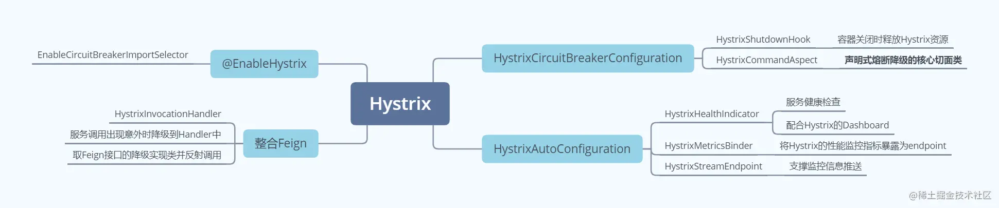

## @HystrixCommand降级原理

### 环境搭建

修改之前的工程，去掉 feign 的依赖和 feign 相关的接口、实现类。之后向应用级 IOC 容器中添加一个 RestTemplate ：

~~~java
@Bean
@LoadBalanced
public RestTemplate restTemplate() {
    return new RestTemplate();
}
~~~

之后换用 Ribbon 的请求方式，并添加 Hystrix 的降级处理：

~~~java
@Autowired
private RestTemplate restTemplate;

@HystrixCommand(fallbackMethod = "getInfoFallback")
@GetMapping("/getInfo")
public String getInfo() {
    return restTemplate.getForObject("http://eureka-client/getInfo", String.class);
}

public String getInfoFallback() {
    return "hystrix fallback getInfo ......";
}
~~~

之后启动服务，发送请求，发现浏览器正常返回 hystrix fallback getInfo ...... 的降级信息，证明修改成功。

### HystrixCommandAspect的环绕通知

之前说过，HystrixCommandAspect是一个切面类：

~~~java
@Aspect
public class HystrixCommandAspect {
    private static final Map<HystrixCommandAspect.HystrixPointcutType, HystrixCommandAspect.MetaHolderFactory> META_HOLDER_FACTORY_MAP;

    public HystrixCommandAspect() {
    }

    @Pointcut("@annotation(com.netflix.hystrix.contrib.javanica.annotation.HystrixCommand)")
    public void hystrixCommandAnnotationPointcut() {
    }

    @Pointcut("@annotation(com.netflix.hystrix.contrib.javanica.annotation.HystrixCollapser)")
    public void hystrixCollapserAnnotationPointcut() {
    }

    @Around("hystrixCommandAnnotationPointcut() || hystrixCollapserAnnotationPointcut()")
    public Object methodsAnnotatedWithHystrixCommand(ProceedingJoinPoint joinPoint) throws Throwable {
      ...
    }
~~~

也就是说methodsAnnotatedWithHystrixCommand方法，增强了所有标注了@HystrixCommand的方法，来看methodsAnnotatedWithHystrixCommand的详细逻辑：

~~~java
public Object methodsAnnotatedWithHystrixCommand(final ProceedingJoinPoint joinPoint) throws Throwable {
    // 反射获取到目标方法
    Method method = getMethodFromTarget(joinPoint);
    Validate.notNull(method, "failed to get method from joinPoint: %s", joinPoint);
    if (method.isAnnotationPresent(HystrixCommand.class) && method.isAnnotationPresent(HystrixCollapser.class)) {
        throw new IllegalStateException("method cannot be annotated with HystrixCommand and HystrixCollapser " +
                "annotations at the same time");
    }
    // 获取切入点的相关属性和信息
    MetaHolderFactory metaHolderFactory = META_HOLDER_FACTORY_MAP.get(HystrixPointcutType.of(method));
    MetaHolder metaHolder = metaHolderFactory.create(joinPoint);
    HystrixInvokable invokable = HystrixCommandFactory.getInstance().create(metaHolder);
    ExecutionType executionType = metaHolder.isCollapserAnnotationPresent() ?
            metaHolder.getCollapserExecutionType() : metaHolder.getExecutionType();

    Object result;
    try {
        // 获取返回结果
        if (!metaHolder.isObservable()) {
            result = CommandExecutor.execute(invokable, executionType, metaHolder);
        } else {
            result = executeObservable(invokable, executionType, metaHolder);
        }
    } // catch ......
    return result;
}
~~~

方法中会先反射获取到目标方法、获取切入点的相关属性和信息，将信息封装到MetaHolder，另外一个注意的是它的执行模式是 SYNCHRONOUS ：

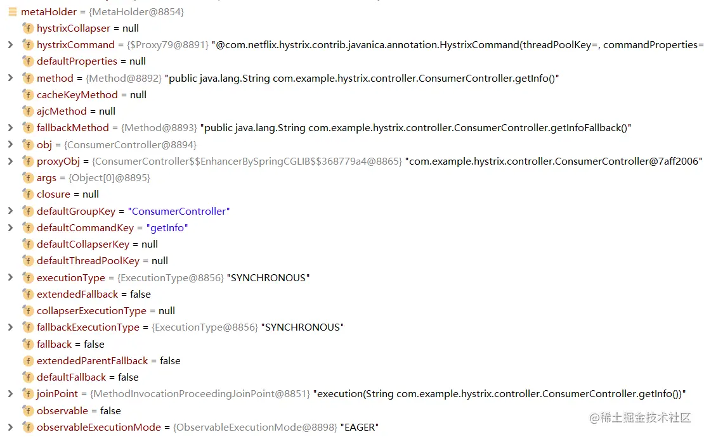

CommandExecutor#execute：

~~~java
public static Object execute(HystrixInvokable invokable, ExecutionType executionType, 
        MetaHolder metaHolder) throws RuntimeException {
    Validate.notNull(invokable);
    Validate.notNull(metaHolder);

    switch (executionType) {
        case SYNCHRONOUS: {
            return castToExecutable(invokable, executionType).execute();
        }
        case ASYNCHRONOUS: {
            HystrixExecutable executable = castToExecutable(invokable, executionType);
            if (metaHolder.hasFallbackMethodCommand()
                    && ExecutionType.ASYNCHRONOUS == metaHolder.getFallbackExecutionType()) {
                return new FutureDecorator(executable.queue());
            }
            return executable.queue();
        }
        case OBSERVABLE: {
            HystrixObservable observable = castToObservable(invokable);
            return ObservableExecutionMode.EAGER == metaHolder.getObservableExecutionMode() 
                    ? observable.observe() : observable.toObservable();
        }
        default:
            throw new RuntimeException("unsupported execution type: " + executionType);
    }
}
~~~

这里面会根据执行的类型来决定使用哪种逻辑，那既然上面看到了类型是 SYNCHRONOUS ，就会进入对应分支，执行castToExecutable方法，castToExecutable 的目的是将 HystrixInvokable 强转为 HystrixExecutable 类型。所以说被 @HystrixCommand 标注的方法，最终会被转换为 HystrixExecutable 类型的执行器，随后执行 execute 方法。

~~~java
public R execute() {
    try {
        return queue().get();
    } // catch ......
}
~~~

### queue生成Future

从这里开始，出现 RxJava 的响应式编程了。这个方法的实现比较长，主要是里面有一个匿名内部类：

~~~java
public Future<R> queue() {
    final Future<R> delegate = toObservable().toBlocking().toFuture();
    
    final Future<R> f = new Future<R>() {
        @Override
        public boolean cancel(boolean mayInterruptIfRunning) {
            if (delegate.isCancelled()) {
                return false;
            }
            if (HystrixCommand.this.getProperties().executionIsolationThreadInterruptOnFutureCancel().get()) {
                interruptOnFutureCancel.compareAndSet(false, mayInterruptIfRunning);
            }

            final boolean res = delegate.cancel(interruptOnFutureCancel.get());
            if (!isExecutionComplete() && interruptOnFutureCancel.get()) {
                final Thread t = executionThread.get();
                if (t != null && !t.equals(Thread.currentThread())) {
                    t.interrupt();
                }
            }
            return res;
        }

        @Override
        public boolean isCancelled() {
            return delegate.isCancelled();
        }

        @Override
        public boolean isDone() {
            return delegate.isDone();
        }

        @Override
        public R get() throws InterruptedException, ExecutionException {
            return delegate.get();
        }

        @Override
        public R get(long timeout, TimeUnit unit) throws InterruptedException, ExecutionException, TimeoutException {
            return delegate.get(timeout, unit);
        }
    };

    /* special handling of error states that throw immediately */
    if (f.isDone()) {
        try {
            f.get();
            return f;
        } // catch ......
    }

    return f;
}
~~~

这里面的大篇幅都是在创建 Future 了，只不过这个 Future 是匿名内部类的方式构建的。Future的get方法其实就是delegate.get()，来看delegate的获取：

~~~java
public Observable<R> toObservable() {
    final AbstractCommand<R> _cmd = this;

    // doOnCompleted handler already did all of the SUCCESS work
    // doOnError handler already did all of the FAILURE/TIMEOUT/REJECTION/BAD_REQUEST work
    // doOnCompleted处理程序已经完成了所有成功工作
    // doOnError处理程序已经完成了FAILURE / TIMEOUT / REJECTION / BAD_REQUEST的所有工作
    final Action0 terminateCommandCleanup = new Action0() {

        @Override
        public void call() {
            // 利用CAS清理命令执行后的信息，包含计时器等组件
            if (_cmd.commandState.compareAndSet(CommandState.OBSERVABLE_CHAIN_CREATED, CommandState.TERMINAL)) {
                handleCommandEnd(false); //user code never ran
            } else if (_cmd.commandState.compareAndSet(CommandState.USER_CODE_EXECUTED, CommandState.TERMINAL)) {
                handleCommandEnd(true); //user code did run
            }
        }
    };

    // mark the command as CANCELLED and store the latency (in addition to standard cleanup)
    // 将命令标记为CANCELED并存储延迟（除了标准清除）
    // 该Action用于处理取消订阅(UNSUBSCRIBED)的动作
    final Action0 unsubscribeCommandCleanup = new Action0() {
        @Override
        public void call() {
            if (_cmd.commandState.compareAndSet(CommandState.OBSERVABLE_CHAIN_CREATED, CommandState.UNSUBSCRIBED)) {
                if (!_cmd.executionResult.containsTerminalEvent()) {
                    _cmd.eventNotifier.markEvent(HystrixEventType.CANCELLED, _cmd.commandKey);
                    try {
                        executionHook.onUnsubscribe(_cmd);
                    } // catch ......
                    _cmd.executionResultAtTimeOfCancellation = _cmd.executionResult
                            .addEvent((int) (System.currentTimeMillis() - _cmd.commandStartTimestamp), HystrixEventType.CANCELLED);
                }
                handleCommandEnd(false); //user code never ran
            } else if (_cmd.commandState.compareAndSet(CommandState.USER_CODE_EXECUTED, CommandState.UNSUBSCRIBED)) {
                if (!_cmd.executionResult.containsTerminalEvent()) {
                    _cmd.eventNotifier.markEvent(HystrixEventType.CANCELLED, _cmd.commandKey);
                    try {
                        executionHook.onUnsubscribe(_cmd);
                    } // catch ......
                    _cmd.executionResultAtTimeOfCancellation = _cmd.executionResult
                            .addEvent((int) (System.currentTimeMillis() - _cmd.commandStartTimestamp), HystrixEventType.CANCELLED);
                }
                handleCommandEnd(true); //user code did run
            }
        }
    };

    // Hystrix的核心功能，用于执行断路、降级、隔离等逻辑
    final Func0<Observable<R>> applyHystrixSemantics = new Func0<Observable<R>>() {
        @Override
        public Observable<R> call() {
            if (commandState.get().equals(CommandState.UNSUBSCRIBED)) {
                return Observable.never();
            }
            // 【核心】执行Hystrix核心代码
            return applyHystrixSemantics(_cmd);
        }
    };

    // 推送数据时的回调
    final Func1<R, R> wrapWithAllOnNextHooks = new Func1<R, R>() {
        @Override
        public R call(R r) {
            R afterFirstApplication = r;
            try {
                afterFirstApplication = executionHook.onComplete(_cmd, r);
            } // catch ......
            try {
                return executionHook.onEmit(_cmd, afterFirstApplication);
            } // catch ......
        }
    };

    // 命令执行完毕的回调
    final Action0 fireOnCompletedHook = new Action0() {
        @Override
        public void call() {
            try {
                executionHook.onSuccess(_cmd);
            } // catch ......
        }
    };

    // 构造Observable对象
    return Observable.defer(new Func0<Observable<R>>() {
        @Override
        public Observable<R> call() {
            /* this is a stateful object so can only be used once */            
            // 不允许重复执行的检查
            if (!commandState.compareAndSet(CommandState.NOT_STARTED, CommandState.OBSERVABLE_CHAIN_CREATED)) {
                // throw ......
            }

            commandStartTimestamp = System.currentTimeMillis();
            if (properties.requestLogEnabled().get()) {
                // log this command execution regardless of what happened
                if (currentRequestLog != null) {
                    currentRequestLog.addExecutedCommand(_cmd);
                }
            }

            // 如果开启了请求缓存，则使用请求缓存的数据
            final boolean requestCacheEnabled = isRequestCachingEnabled();
            final String cacheKey = getCacheKey();
            /* try from cache first */
            if (requestCacheEnabled) {
                HystrixCommandResponseFromCache<R> fromCache = 
                        (HystrixCommandResponseFromCache<R>) requestCache.get(cacheKey);
                if (fromCache != null) {
                    isResponseFromCache = true;
                    return handleRequestCacheHitAndEmitValues(fromCache, _cmd);
                }
            }

            // 构造包含真正执行逻辑的Observable(下面用到了applyHystrixSemantics)
            Observable<R> hystrixObservable =
                    Observable.defer(applyHystrixSemantics).map(wrapWithAllOnNextHooks);
            Observable<R> afterCache;

            // put in cache
            // 开启请求缓存，会将该Observable包装并放入缓存
            if (requestCacheEnabled && cacheKey != null) {
                // wrap it for caching
                HystrixCachedObservable<R> toCache = HystrixCachedObservable.from(hystrixObservable, _cmd);
                HystrixCommandResponseFromCache<R> fromCache = 
                        (HystrixCommandResponseFromCache<R>) requestCache.putIfAbsent(cacheKey, toCache);
                if (fromCache != null) {
                    // another thread beat us so we'll use the cached value instead
                    toCache.unsubscribe();
                    isResponseFromCache = true;
                    return handleRequestCacheHitAndEmitValues(fromCache, _cmd);
                } else {
                    // we just created an ObservableCommand so we cast and return it
                    afterCache = toCache.toObservable();
                }
            } else {
                afterCache = hystrixObservable;
            }

            // 设置回调，返回
            return afterCache
                    // perform cleanup once (either on normal terminal state (this line), or unsubscribe (next line))
                    .doOnTerminate(terminateCommandCleanup)
                    // perform cleanup once
                    .doOnUnsubscribe(unsubscribeCommandCleanup)
                    .doOnCompleted(fireOnCompletedHook);
        }
    });
}
~~~

响应式编程的套路跟正常不太一样，它会在前面创建多个函数和动作，然后在后面的call方法中会用到这些逻辑，在整个 Observable 的封装过程中自始至终都围绕着 Hystrix 的 AbstractCommand而来。根据 Reactive 编程的套路，拿到 Observable 后要执行的方法是 get，这里主要看Hystrix的核心功能，用于执行断路、降级、隔离等逻辑的组件applyHystrixSemantics。

### 执行目标方法

applyHystrixSemantics方法：

~~~java
private Observable<R> applyHystrixSemantics(final AbstractCommand<R> _cmd) {
    // mark that we're starting execution on the ExecutionHook
    // if this hook throws an exception, then a fast-fail occurs with no fallback.  No state is left inconsistent
    // 此处回调executionHook
    executionHook.onStart(_cmd);

    /* determine if we're allowed to execute */
    // 当断路器关闭时，允许请求进入，进入if体执行
    if (circuitBreaker.allowRequest()) {
        // 处理有关信号量隔离的逻辑
        final TryableSemaphore executionSemaphore = getExecutionSemaphore();
        final AtomicBoolean semaphoreHasBeenReleased = new AtomicBoolean(false);
        final Action0 singleSemaphoreRelease = new Action0() {
            @Override
            public void call() {
                if (semaphoreHasBeenReleased.compareAndSet(false, true)) {
                    executionSemaphore.release();
                }
            }
        };

        final Action1<Throwable> markExceptionThrown = new Action1<Throwable>() {
            @Override
            public void call(Throwable t) {
                eventNotifier.markEvent(HystrixEventType.EXCEPTION_THROWN, commandKey);
            }
        };

        // 信号量隔离规则，如果信号量还没有达到最大，可以放行进行处理
        if (executionSemaphore.tryAcquire()) {
            try {
                /* used to track userThreadExecutionTime */
                executionResult = executionResult.setInvocationStartTime(System.currentTimeMillis());
                // 执行请求命令
                return executeCommandAndObserve(_cmd)
                        .doOnError(markExceptionThrown)
                        .doOnTerminate(singleSemaphoreRelease)
                        .doOnUnsubscribe(singleSemaphoreRelease);
            } // catch ......
        } else {
            // 超过最大信号量，立即返回异常
            return handleSemaphoreRejectionViaFallback();
        }
    } else {
        // 直接断路，返回异常
        return handleShortCircuitViaFallback();
    }
}
~~~

这段逻辑主要是处理信号量隔离，这里会控制并发度，然后放行处理。接下来的executeCommandAndObserve方法：

~~~java
private Observable<R> executeCommandAndObserve(final AbstractCommand<R> _cmd) {
    final HystrixRequestContext currentRequestContext = HystrixRequestContext.getContextForCurrentThread();

    // 服务调用但还没有返回时，会回调这个动作
    final Action1<R> markEmits = new Action1<R>() {
        @Override
        public void call(R r) {
            if (shouldOutputOnNextEvents()) {
                executionResult = executionResult.addEvent(HystrixEventType.EMIT);
                eventNotifier.markEvent(HystrixEventType.EMIT, commandKey);
            }
            if (commandIsScalar()) {
                long latency = System.currentTimeMillis() - executionResult.getStartTimestamp();
                eventNotifier.markCommandExecution(getCommandKey(), 
                        properties.executionIsolationStrategy().get(), (int) latency, 
                        executionResult.getOrderedList());
                // 这个回调的核心动作：记录发起的动作是正常的、关闭断路器
                eventNotifier.markEvent(HystrixEventType.SUCCESS, commandKey);
                executionResult = executionResult.addEvent((int) latency, HystrixEventType.SUCCESS);
                circuitBreaker.markSuccess();
            }
        }
    };

    // 服务调用正常完成、返回时，会回调这个动作(处理逻辑与上面的几乎一致·)
    final Action0 markOnCompleted = new Action0() {
        @Override
        public void call() {
            if (!commandIsScalar()) {
                long latency = System.currentTimeMillis() - executionResult.getStartTimestamp();
                eventNotifier.markCommandExecution(getCommandKey(), 
                        properties.executionIsolationStrategy().get(), (int) latency, 
                        executionResult.getOrderedList());
                eventNotifier.markEvent(HystrixEventType.SUCCESS, commandKey);
                executionResult = executionResult.addEvent((int) latency, HystrixEventType.SUCCESS);
                circuitBreaker.markSuccess();
            }
        }
    };

    // 用于解决异常的
    final Func1<Throwable, Observable<R>> handleFallback = new Func1<Throwable, Observable<R>>() {
        @Override
        public Observable<R> call(Throwable t) {
            Exception e = getExceptionFromThrowable(t);
            executionResult = executionResult.setExecutionException(e);
            if (e instanceof RejectedExecutionException) {
                // 线程池拒绝
                return handleThreadPoolRejectionViaFallback(e);
            } else if (t instanceof HystrixTimeoutException) {
                // 服务调用超时
                return handleTimeoutViaFallback();
            } else if (t instanceof HystrixBadRequestException) {
                // 不特殊处理的异常，不计入熔断统计指标
                return handleBadRequestByEmittingError(e);
            } else {
                // Treat HystrixBadRequestException from ExecutionHook like a plain HystrixBadRequestException.
                // 将ExecutionHook中的HystrixBadRequestException视为普通的HystrixBadRequestException。
                if (e instanceof HystrixBadRequestException) {
                    eventNotifier.markEvent(HystrixEventType.BAD_REQUEST, commandKey);
                    return Observable.error(e);
                }
                return handleFailureViaFallback(e);
            }
        }
    };

    final Action1<Notification<? super R>> setRequestContext = new Action1<Notification<? super R>>() {
        @Override
        public void call(Notification<? super R> rNotification) {
            setRequestContextIfNeeded(currentRequestContext);
        }
    };

    // 使用特定的隔离策略处理请求
    Observable<R> execution;
    if (properties.executionTimeoutEnabled().get()) {
        // 加入超时监控，如果设置了超时错误，则执行该分支
        execution = executeCommandWithSpecifiedIsolation(_cmd)
                .lift(new HystrixObservableTimeoutOperator<R>(_cmd));
    } else {
        // 没有超时设置，直接执行业务
        execution = executeCommandWithSpecifiedIsolation(_cmd);
    }

    // 推数据，相当于真正的处理请求
    return execution.doOnNext(markEmits)
            .doOnCompleted(markOnCompleted)
            .onErrorResumeNext(handleFallback)
            .doOnEach(setRequestContext);
}
~~~

降级的异常处理操作在这个方法中定义，如果是正常调用则走的是executeCommandWithSpecifiedIsolation方法：

~~~java
private Observable<R> executeCommandWithSpecifiedIsolation(final AbstractCommand<R> _cmd) {
    if (properties.executionIsolationStrategy().get() == ExecutionIsolationStrategy.THREAD) {
        // 线程池隔离(THREAD)
        // mark that we are executing in a thread (even if we end up being rejected we still were a THREAD execution and not SEMAPHORE)
        return Observable.defer(new Func0<Observable<R>>() {
            @Override
            public Observable<R> call() {
                executionResult = executionResult.setExecutionOccurred();
                if (!commandState.compareAndSet(CommandState.OBSERVABLE_CHAIN_CREATED, CommandState.USER_CODE_EXECUTED)) {
                    return Observable.error(new IllegalStateException(
                            "execution attempted while in state : " + commandState.get().name()));
                }
                // 收集metrics信息
                metrics.markCommandStart(commandKey, threadPoolKey, ExecutionIsolationStrategy.THREAD);

                // 服务调用超时
                if (isCommandTimedOut.get() == TimedOutStatus.TIMED_OUT) {
                    // the command timed out in the wrapping thread so we will return immediately
                    // and not increment any of the counters below or other such logic
                    // 该命令在包装线程中超时，因此我们将立即返回并且不增加下面的任何计数器或其他此类逻辑
                    return Observable.error(new RuntimeException("timed out before executing run()"));
                }
                // 切换线程状态
                if (threadState.compareAndSet(ThreadState.NOT_USING_THREAD, ThreadState.STARTED)) {
                    // we have not been unsubscribed, so should proceed
                    HystrixCounters.incrementGlobalConcurrentThreads();
                    threadPool.markThreadExecution();
                    // store the command that is being run
                    endCurrentThreadExecutingCommand = Hystrix.startCurrentThreadExecutingCommand(getCommandKey());
                    executionResult = executionResult.setExecutedInThread();
                    // If any of these hooks throw an exception, then it appears as if the actual execution threw an error
                    try {
                        executionHook.onThreadStart(_cmd);
                        executionHook.onRunStart(_cmd);
                        executionHook.onExecutionStart(_cmd);
                        // 【获取实际的服务调用命令】
                        return getUserExecutionObservable(_cmd);
                    } catch (Throwable ex) {
                        return Observable.error(ex);
                    }
                } else {
                    // command has already been unsubscribed, so return immediately
                    return Observable.error(new RuntimeException("unsubscribed before executing run()"));
                }
            }
        }) // ......
    } else {
        // 信号量隔离
        return Observable.defer(new Func0<Observable<R>>() {
            @Override
            public Observable<R> call() {
                executionResult = executionResult.setExecutionOccurred();
                if (!commandState.compareAndSet(CommandState.OBSERVABLE_CHAIN_CREATED, CommandState.USER_CODE_EXECUTED)) {
                    return Observable.error(new IllegalStateException(
                            "execution attempted while in state : " + commandState.get().name()));
                }

                metrics.markCommandStart(commandKey, threadPoolKey, ExecutionIsolationStrategy.SEMAPHORE);
                // semaphore isolated
                // store the command that is being run
                endCurrentThreadExecutingCommand = Hystrix.startCurrentThreadExecutingCommand(getCommandKey());
                try {
                    executionHook.onRunStart(_cmd);
                    executionHook.onExecutionStart(_cmd);
                    // the getUserExecutionObservable method already wraps sync exceptions, so this shouldn't throw
                    // 【获取实际的服务调用命令】
                    return getUserExecutionObservable(_cmd);
                } catch (Throwable ex) {
                    // if the above hooks throw, then use that as the result of the run method
                    return Observable.error(ex);
                }
            }
        });
    }
}
~~~

这里出现线程池隔离与信号量隔离，它会根据情况创建两个不同策略的 Observable。无论是线程池隔离，还是信号量隔离，最终调用的目标方法都是 getUserExecutionObservable：

~~~java
private Observable<R> getUserExecutionObservable(final AbstractCommand<R> _cmd) {
    Observable<R> userObservable;

    try {
        // 继续往里调用
        userObservable = getExecutionObservable();
    }  // catch ......
    return userObservable
            .lift(new ExecutionHookApplication(_cmd))
            .lift(new DeprecatedOnRunHookApplication(_cmd));
}

final protected Observable<R> getExecutionObservable() {
    return Observable.defer(new Func0<Observable<R>>() {
        @Override
        public Observable<R> call() {
            try {
                return Observable.just(run());
            } catch (Throwable ex) {
                return Observable.error(ex);
            }
        }
    }).doOnSubscribe(new Action0() {
        @Override
        public void call() {
            // Save thread on which we get subscribed so that we can interrupt it later if needed
            executionThread.set(Thread.currentThread());
        }
    });
}

protected Object run() throws Exception {
    LOGGER.debug("execute command: {}", getCommandKey().name());
    return process(new Action() {
        @Override
        Object execute() {
            return getCommandAction().execute(getExecutionType());
        }
    });
}

public Object execute(ExecutionType executionType) throws CommandActionExecutionException {
    return executeWithArgs(executionType, _args);
}

public Object executeWithArgs(ExecutionType executionType, Object[] args) throws CommandActionExecutionException {
    if(ExecutionType.ASYNCHRONOUS == executionType){
        Closure closure = AsyncClosureFactory.getInstance().createClosure(metaHolder, method, object, args);
        return executeClj(closure.getClosureObj(), closure.getClosureMethod());
    }

    return execute(object, method, args);
}
~~~

沿着一路执行下来最终到达executeWithArgs方法，getCommandAction方法会将Controller 中的方法定义取出，executeWithArgs 方法最终调用的时候，传入了几个参数，这些参数都用于反射调用：

~~~java
private Object execute(Object o, Method m, Object... args) throws CommandActionExecutionException {
    Object result = null;
    try {
        m.setAccessible(true); // suppress Java language access
        if (isCompileWeaving() && metaHolder.getAjcMethod() != null) {
            result = invokeAjcMethod(metaHolder.getAjcMethod(), o, metaHolder, args);
        } else {
            // 反射执行Controller的目标方法
            result = m.invoke(o, args);
        }
    } // catch ......
    return result;
}
~~~

这就是Hystrix 调用 Controller 目标方法的逻辑。

### 降级动作处理

之前在executeCommandAndObserve方法中，有一段是处理异常的：

~~~java
    // 用于解决异常的
    final Func1<Throwable, Observable<R>> handleFallback = new Func1<Throwable, Observable<R>>() {
        @Override
        public Observable<R> call(Throwable t) {
            Exception e = getExceptionFromThrowable(t);
            executionResult = executionResult.setExecutionException(e);
            if (e instanceof RejectedExecutionException) {
                // 线程池拒绝
                return handleThreadPoolRejectionViaFallback(e);
            } else if (t instanceof HystrixTimeoutException) {
                // 服务调用超时
                return handleTimeoutViaFallback();
            } else if (t instanceof HystrixBadRequestException) {
                // 不特殊处理的异常，不计入熔断统计指标
                return handleBadRequestByEmittingError(e);
            } else {
                // Treat HystrixBadRequestException from ExecutionHook like a plain HystrixBadRequestException.
                // 将ExecutionHook中的HystrixBadRequestException视为普通的HystrixBadRequestException。
                if (e instanceof HystrixBadRequestException) {
                    eventNotifier.markEvent(HystrixEventType.BAD_REQUEST, commandKey);
                    return Observable.error(e);
                }
                return handleFailureViaFallback(e);
            }
        }
    };
~~~

以服务调用超时异常为例，这里会进入handleTimeoutViaFallback方法：

~~~java
private Observable<R> handleTimeoutViaFallback() {
    return getFallbackOrThrowException(this, HystrixEventType.TIMEOUT, 
            FailureType.TIMEOUT, "timed-out", new TimeoutException());
}

private Observable<R> getFallbackOrThrowException(final AbstractCommand<R> _cmd, 
        final HystrixEventType eventType, final FailureType failureType, 
        final String message, final Exception originalException) {
    final HystrixRequestContext requestContext = HystrixRequestContext.getContextForCurrentThread();
    long latency = System.currentTimeMillis() - executionResult.getStartTimestamp();
    // record the executionResult
    // do this before executing fallback so it can be queried from within getFallback 
    // (see See https://github.com/Netflix/Hystrix/pull/144)
    executionResult = executionResult.addEvent((int) latency, eventType);

    if (shouldNotBeWrapped(originalException)){ // 处理Hystrix异常
        /* executionHook for all errors */
        Exception e = wrapWithOnErrorHook(failureType, originalException);
        return Observable.error(e);
    } else if (isUnrecoverable(originalException)) { // 处理Error
        // logger
        /* executionHook for all errors */
        Exception e = wrapWithOnErrorHook(failureType, originalException);
        return Observable.error(new HystrixRuntimeException(failureType, 
                this.getClass(), getLogMessagePrefix() + " " + message 
                        + " and encountered unrecoverable error.", e, null));
    } else {
        if (isRecoverableError(originalException)) {
            logger.warn("Recovered from java.lang.Error by serving Hystrix fallback", originalException);
        }

        if (properties.fallbackEnabled().get()) {
            /* fallback behavior is permitted so attempt */
            // 设置线程请求上下文，确保拿到的都是同一份
            final Action1<Notification<? super R>> setRequestContext = new Action1<Notification<? super R>>() {
                @Override
                public void call(Notification<? super R> rNotification) {
                    setRequestContextIfNeeded(requestContext);
                }
            };

            // 发布服务降级事件的动作
            final Action1<R> markFallbackEmit = new Action1<R>() {
                @Override
                public void call(R r) {
                    if (shouldOutputOnNextEvents()) {
                        executionResult = executionResult.addEvent(HystrixEventType.FALLBACK_EMIT);
                        eventNotifier.markEvent(HystrixEventType.FALLBACK_EMIT, commandKey);
                    }
                }
            };

            // 当服务降级完成后的处理
            final Action0 markFallbackCompleted = new Action0() {
                @Override
                public void call() {
                    long latency = System.currentTimeMillis() - executionResult.getStartTimestamp();
                    eventNotifier.markEvent(HystrixEventType.FALLBACK_SUCCESS, commandKey);
                    executionResult = executionResult.addEvent((int) latency, HystrixEventType.FALLBACK_SUCCESS);
                }
            };

            // 服务降级的动作也失败了的处理(源码全部注释掉了)
            final Func1<Throwable, Observable<R>> handleFallbackError = new Func1<Throwable, Observable<R>>() {
                @Override
                public Observable<R> call(Throwable t) {
                    // ......
                }
            };

            // 处理信号量隔离的逻辑，这里要释放信号量了
            final TryableSemaphore fallbackSemaphore = getFallbackSemaphore();
            final AtomicBoolean semaphoreHasBeenReleased = new AtomicBoolean(false);
            final Action0 singleSemaphoreRelease = new Action0() {
                @Override
                public void call() {
                    if (semaphoreHasBeenReleased.compareAndSet(false, true)) {
                        fallbackSemaphore.release();
                    }
                }
            };

            Observable<R> fallbackExecutionChain;

            // acquire a permit
            // 【核心调用降级方法】
            if (fallbackSemaphore.tryAcquire()) {
                try {
                    if (isFallbackUserDefined()) {
                        executionHook.onFallbackStart(this);
                        fallbackExecutionChain = getFallbackObservable();
                    } else {
                        //same logic as above without the hook invocation
                        fallbackExecutionChain = getFallbackObservable();
                    }
                } catch (Throwable ex) {
                    //If hook or user-fallback throws, then use that as the result of the fallback lookup
                    fallbackExecutionChain = Observable.error(ex);
                }

                // Reactive调用设置
                return fallbackExecutionChain
                        .doOnEach(setRequestContext)
                        .lift(new FallbackHookApplication(_cmd))
                        .lift(new DeprecatedOnFallbackHookApplication(_cmd))
                        .doOnNext(markFallbackEmit)
                        .doOnCompleted(markFallbackCompleted)
                        .onErrorResumeNext(handleFallbackError)
                        .doOnTerminate(singleSemaphoreRelease)
                        .doOnUnsubscribe(singleSemaphoreRelease);
            } else {
               return handleFallbackRejectionByEmittingError();
            }
        } else {
            return handleFallbackDisabledByEmittingError(originalException, failureType, message);
        }
    }
}
~~~

当逻辑一路走到调用设置之前的 try 块中，要进行服务降级动作了，它执行 getFallbackObservable 方法以实际调用 Controller 中定义的降级方法：

~~~java
final protected Observable<R> getFallbackObservable() {
    return Observable.defer(new Func0<Observable<R>>() {
        @Override
        public Observable<R> call() {
            try {
                return Observable.just(getFallback());
            } catch (Throwable ex) {
                return Observable.error(ex);
            }
        }
    });
}

protected Object getFallback() {
    final CommandAction commandAction = getFallbackAction();
    if (commandAction != null) {
        try {
            return process(new Action() {
                @Override
                Object execute() {
                    MetaHolder metaHolder = commandAction.getMetaHolder();
                    Object[] args = createArgsForFallback(metaHolder, getExecutionException());
                    return commandAction.executeWithArgs(metaHolder.getFallbackExecutionType(), args);
                }
            });
        } // catch .....
    } else {
        return super.getFallback();
    }
}
~~~

可以看到这里和之前一样，也是最终利用反射执行目标方法。

总结：

* Hystrix 在 Controller 方法中使用的降级规则是借助 HystrixCommandAspect 切面类来增强实现；
* HystrixCommandAspect 中使用了大量的响应式编程，这种思路需要区别于平常使用的接近于过程式编程；
* Hystrix 内部在调用目标业务方法时会处理隔离策略，并会在调用完成或降级之后释放隔离资源。

## 熔断器作用原理

### 短路器的引入

之前提到过，@FeignClient降级原理是，真正调用的是代理对象HystrixInvocationHandler#invoke，它是带有服务降级功能的 Controller 方法的动态代理执行器。这里面的核心 invoke 方法：

~~~java
public Object invoke(final Object proxy, final Method method, final Object[] args)
        throws Throwable {
    // ......

    HystrixCommand<Object> hystrixCommand =
        new HystrixCommand<Object>(setterMethodMap.get(method)) {
            @Override
            protected Object run() throws Exception {
                try {
                    return HystrixInvocationHandler.this.dispatch.get(method).invoke(args);
                } // catch ......
            }
~~~

在这里它构造了一个 HystrixCommand 对象，在它的构造方法中：

~~~java
protected HystrixCommand(Setter setter) {
    // use 'null' to specify use the default
    this(setter.groupKey, setter.commandKey, setter.threadPoolKey, null, null, 
             setter.commandPropertiesDefaults, setter.threadPoolPropertiesDefaults, 
             null, null, null, null, null);
}

// 参数太长已省略
HystrixCommand(......) {
    super(group, key, threadPoolKey, circuitBreaker, threadPool, commandPropertiesDefaults, 
          threadPoolPropertiesDefaults, metrics, fallbackSemaphore, executionSemaphore, 
          propertiesStrategy, executionHook);
}
~~~

调用父类AbstractCommand 的构造方法：

~~~java
// 参数太长已省略
protected AbstractCommand(......) {
    this.commandGroup = initGroupKey(group);
    this.commandKey = initCommandKey(key, getClass());
    this.properties = initCommandProperties(this.commandKey, propertiesStrategy, 
            commandPropertiesDefaults);
    this.threadPoolKey = initThreadPoolKey(threadPoolKey, this.commandGroup, 
            this.properties.executionIsolationThreadPoolKeyOverride().get());
    this.metrics = initMetrics(metrics, this.commandGroup, this.threadPoolKey, this.commandKey, this.properties);
    this.circuitBreaker = initCircuitBreaker(this.properties.circuitBreakerEnabled().get(), 
            circuitBreaker, this.commandGroup, this.commandKey, this.properties, this.metrics);
    this.threadPool = initThreadPool(threadPool, this.threadPoolKey, threadPoolPropertiesDefaults);
    // ......
~~~

注意这里它构造的内容，除了上面解析出应该执行的 Controller 方法、线程池之外，还初始化了一个 circuitBreaker ，它就是所谓的断路器。

### HystrixCircuitBreaker

进入到 CircuitBreaker 的初始化方法：

~~~java
private static HystrixCircuitBreaker initCircuitBreaker(boolean enabled, HystrixCircuitBreaker fromConstructor,
        HystrixCommandGroupKey groupKey, HystrixCommandKey commandKey,
        HystrixCommandProperties properties, HystrixCommandMetrics metrics) {
    if (enabled) {
        if (fromConstructor == null) {
            // get the default implementation of HystrixCircuitBreaker
            return HystrixCircuitBreaker.Factory.getInstance(commandKey, groupKey, properties, metrics);
        } else {
            return fromConstructor;
        }
    } else {
        return new NoOpCircuitBreaker();
    }
}
~~~

逻辑很简单，如果允许开启断路器，则它会默认通过工厂创建（走上面的 return 是因为前面传的参数是 null ，可由构造方法可知）。进入 Factory.getInstance：

~~~java
public static HystrixCircuitBreaker getInstance(HystrixCommandKey key, HystrixCommandGroupKey group, 
        HystrixCommandProperties properties, HystrixCommandMetrics metrics) {
    // this should find it for all but the first time
    // 设置断路器缓存，方便快速创建
    HystrixCircuitBreaker previouslyCached = circuitBreakersByCommand.get(key.name());
    if (previouslyCached != null) {
        return previouslyCached;
    }
    // if we get here this is the first time so we need to initialize

    // Create and add to the map ... use putIfAbsent to atomically handle the possible race-condition of
    // 2 threads hitting this point at the same time and let ConcurrentHashMap provide us our thread-safety
    // If 2 threads hit here only one will get added and the other will get a non-null response instead.
    // 上面的注释主要是解释防止并发创建多个
    HystrixCircuitBreaker cbForCommand = circuitBreakersByCommand.putIfAbsent(key.name(), 
            new HystrixCircuitBreakerImpl(key, group, properties, metrics));
    if (cbForCommand == null) {
        // this means the putIfAbsent step just created a new one so let's retrieve and return it
        return circuitBreakersByCommand.get(key.name());
    } else {
        // this means a race occurred and while attempting to 'put' another one got there before
        // and we instead retrieved it and will now return it
        return cbForCommand;
    }
}
~~~

上面大段内容都是处理缓存和并发的问题，核心方法是new HystrixCircuitBreakerImpl。

HystrixCircuitBreakerImpl是HystrixCircuitBreaker的一个实现类：

~~~java
static class HystrixCircuitBreakerImpl implements HystrixCircuitBreaker
~~~

它实现了 HystrixCircuitBreaker 接口，这个 HystrixCircuitBreaker 才是 Hystrix 断路器的核心接口。

这里面定义了3个方法，算是一个断路器中规中矩应该有的功能了：

~~~java
public interface HystrixCircuitBreaker {
    // 是否允许执行HystrixCommand
    public boolean allowRequest();
    // 断路器是否打开
    public boolean isOpen();
    // 主动使断路器关闭
    void markSuccess();
}
~~~

几个核心的方法：

1、markSuccess

它的作用是主动使断路器关闭：

~~~java
private final HystrixCommandMetrics metrics;

public void markSuccess() {
    if (circuitOpen.get()) {
        if (circuitOpen.compareAndSet(true, false)) {
            metrics.resetStream();
        }
    }
}
~~~

当断路器处于开启状态时，将其设为关闭，并且重置度量指标。注意这个度量指标也是在上面的构造方法中看到的（就在 circuitBreaker 上面），它同属于 HystrixCommand 的成员。resetStream 方法的实现也很简单：

~~~java
synchronized void resetStream() {
    healthCountsStream.unsubscribe();
    HealthCountsStream.removeByKey(key);
    healthCountsStream = HealthCountsStream.getInstance(key, properties);
}
~~~

可以看到它就是取消原来的，又重新创建了一遍。

2、isOpen

它的作用是判断断路器是否打开：

~~~java
public boolean isOpen() {
    if (circuitOpen.get()) {
        // if we're open we immediately return true and don't bother attempting 
        // to 'close' ourself as that is left to allowSingleTest and a subsequent successful test to close
        return true;
    }

    // we're closed, so let's see if errors have made us so we should trip the circuit open
    // 经过检查后，此时断路器处于关闭状态，需要获取健康指标以决定是否需要打开
    HealthCounts health = metrics.getHealthCounts();

    // check if we are past the statisticalWindowVolumeThreshold
    // 如果此时单位时间(默认10秒)内所有请求数量小于特定值(默认20)，则直接放行(压力很小，即便出现错误也无所谓)
    if (health.getTotalRequests() < properties.circuitBreakerRequestVolumeThreshold().get()) {
        // we are not past the minimum volume threshold for the statisticalWindow 
        // so we'll return false immediately and not calculate anything
        return false;
    }

    // 单位时间(默认10秒)内请求的错误/失败率没有达到阈值(默认50%)，断路器依然不开启
    if (health.getErrorPercentage() < properties.circuitBreakerErrorThresholdPercentage().get()) {
        return false;
    } else {
        // our failure rate is too high, trip the circuit
        // 错误率太高，需要开启断路器，并标记开启时间
        if (circuitOpen.compareAndSet(false, true)) {
            // if the previousValue was false then we want to set the currentTime
            circuitOpenedOrLastTestedTime.set(System.currentTimeMillis());
            return true;
        } else {
            // 该条件不会触发，即便触发也返回true(原注释太长，但意思大概是这样)
            return true;
        }
    }
}
~~~

由源码的逻辑，可以很清楚的总结出 Hystrix 的默认断路原则：

* 10秒内请求数量不超过20个，断路器永远关闭
* 10秒内请求数量超过20个，且错误率超过50%，断路器才会开启，否则也不会开启

但注意这里面只处理了断路器的开启，没有关闭的动作，而是由上面的 makeSuccess 方法处理。

3、allowRequest

allowRequest 方法从字面上看也知道它是负责确认是否允许请求执行的，它的实现也很简单：

~~~java
public boolean allowRequest() {
    // 属性配置中显式声明了打开断路器，故这里直接拦截请求
    if (properties.circuitBreakerForceOpen().get()) {
        // properties have asked us to force the circuit open so we will allow NO requests
        return false;
    }
    // 属性配置中显式声明了关闭断路器，则直接放行永不断路(但会正常模拟执行isOpen逻辑)
    if (properties.circuitBreakerForceClosed().get()) {
        // we still want to allow isOpen() to perform it's calculations so we simulate normal behavior
        isOpen();
        // properties have asked us to ignore errors so we will ignore the results of isOpen and just allow all traffic through
        return true;
    }
    // 如果计算获取到的错误请求比不是很多，则代表断路器关闭
    // 如果断路器是开启的，还要确认一下当前是否是单线程单请求处理
    return !isOpen() || allowSingleTest();
}
~~~

如果在属性配置中配置了打开或者关闭断路器，这里就会直接打开或者关闭。最后一个判断条件，如果断路器是关闭的，且当前是否是单线程单请求处理，如果是就允许执行请求。

单线程单请求的概念和断路器的各个阶段有关，Hystrix 的断路器是这样设计的：如果断路器真的被打开了，则会在断路后的一段时间之后，一次只能接收并处理一个请求。

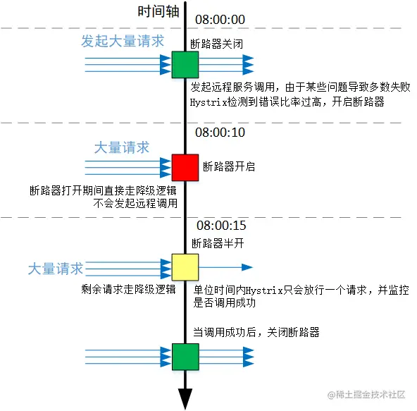

Hystrix 的断路器是这样设计的：如果断路器真的被打开了，则会在断路后的一段时间当大量请求发起的远程调用失败后，Hystrix 会开启断路器，接下来的一小段时间内（暂且称之为断路期），无论客户端怎么发起请求，Hystrix 都不会走真正的远程调用，而是直接走降级逻辑。等这一小段断路期过去之后，Hystrix 会试图放行一个请求，让它去真正的发起远程调用，如果这一次成功了，则会关闭断路器，恢复正常；如果这一次还是不成功，则继续保持断路器半开。只要断路期的状态是半开，Hystrix 能保证每个单位断路期内只会有一个请求进入真正的执行。之后，一次只能接收并处理一个请求。

继续来看allowSingleTest：

~~~java
public boolean allowSingleTest() {
    long timeCircuitOpenedOrWasLastTested = circuitOpenedOrLastTestedTime.get();
    // 1) if the circuit is open
    // 2) and it's been longer than 'sleepWindow' since we opened the circuit
    if (circuitOpen.get() && System.currentTimeMillis() > 
            timeCircuitOpenedOrWasLastTested + properties.circuitBreakerSleepWindowInMilliseconds().get()) {
        // We push the 'circuitOpenedTime' ahead by 'sleepWindow' since we have allowed one request to try.
        // If it succeeds the circuit will be closed, otherwise another singleTest will be allowed at the end of the 'sleepWindow'.
        if (circuitOpenedOrLastTestedTime.compareAndSet(timeCircuitOpenedOrWasLastTested, System.currentTimeMillis())) {
            // if this returns true that means we set the time so we'll return true to allow the singleTest
            // if it returned false it means another thread raced us and allowed the singleTest before we did
            return true;
        }
    }
    return false;
}
~~~

它会先判断是否已经过了断路期（不接收任何远程发起的请求），如果已经过了的话，会将断路时间设置为当前时间，并且放行该请求。更新断路时间的目的就是为了实现上面提到的，每个单位断路期只允许有一个请求，其余的请求统统走降级。

### 断路器生效

断路器生效的核心代码，在请求成功后才会被回调：

~~~java
private Observable<R> applyHystrixSemantics(final AbstractCommand<R> _cmd) {
    // ......
    // 半开状态下放行走一个
    if (circuitBreaker.allowRequest()) {
        // ......
            // 放走的那一个如果成功了，会在executeCommandAndObserve方法中关闭断路器
            return executeCommandAndObserve(_cmd)
                    .doOnError(markExceptionThrown)
                    .doOnTerminate(singleSemaphoreRelease)
                    .doOnUnsubscribe(singleSemaphoreRelease);
    // ......

private Observable<R> executeCommandAndObserve(final AbstractCommand<R> _cmd) {
    // ......
    final Action0 markOnCompleted = new Action0() {
        @Override
        public void call() {
            if (!commandIsScalar()) {
                // ......
                // 关闭断路器
                circuitBreaker.markSuccess();
            }
        }
    };
~~~

总结几个场景：

* 正常调用时，allowRequest返回true，断路器关闭
* 异常状态到达触发断路的条件，allowRequest返回false，断路器打开，直接走降级逻辑
* 半开状态下放行走一个，allowRequest返回true，如果放走的那一个请求成功了，断路器关闭

# Zuul

## 简单入门

### 部署

Zuul是Netflix开源的微服务网关，它可以和Eureka、Ribbon、Hystrix等组件配合使用。

Zuul的核心是一系列的过滤器，这些过滤器可以完成以下功能：

* 身份认证与安全；识别每个资源的验证要求，并拒绝那些与要求不符的请求。
* 审查与监控：在边缘位置追踪有意义的数据和统计结果，从而带来精确的生产视图。
* 动态路由：动态地将请求路由到不同的后端集群。
* 压力测试：逐渐增加指向集群的流量，以了解性能。
* 负载分配：为每一种负载类型分配对应容量，并弃用超岀限定值的请求。
* 静态响应处理：在边缘位置直接建立部分响应，从而避免其转发到内部集群。
* 多区域弹性:跨越AWS Region进行请求路由，旨在实现ELB ( Elastic Load Balancing) 使用的多样化，以及让系统的边缘更贴近系统的使用者。

zuul 工程只需要引入netflix-eureka-client 与 zuul 的依赖：

~~~xml
<dependency>
    <groupId>org.springframework.cloud</groupId>
    <artifactId>spring-cloud-starter-netflix-eureka-client</artifactId>
</dependency>
<dependency>
    <groupId>org.springframework.cloud</groupId>
    <artifactId>spring-cloud-starter-netflix-zuul</artifactId>
</dependency>
~~~

新建启动类，ZuulApplication，代码如下：

~~~java
@SpringBootApplication
@EnableZuulProxy
public class ZuulApplication {
    public static void main(String[] args) {
        SpringApplication.run(ZuulApplication.class,args);
    }
}
~~~

在启动类上添加注解@EnableZuulProxy ，声明一个Zuul代理。该代理使用Ribbon来定位注册在Eureka Server中的微服务，同时，该代理还整合了 Hystrix,从而实现了容错，所有经过Zuul的请求都会在Hystrix命令中执行。

新建application.yml：

~~~yaml
server:
  port: 8060
spring:
  application:
    name:  microservice-gateway-zuul
# 网关会注册到注册中心

eureka:
  client:
    service-url:
      defaultZone: http://localhost:8761/eureka/
~~~

这样，一个简单的微服务网关就编写完成了。从配置可知，此时仅是添加了Zuul的依赖，并将Zuul注册到Eureka Server上。启动注册中心和网关后，访问网络中其他服务都可以顺利访问到，如：http://localhost:8060/user-provider/user/3

默认情况下，Zuul会代理所有注册到Eureka Server的微服务，并且Zuul的路由规则如下：

```
http://ZUUL_HOST:ZUUL_PORT/微服务在Eureka 注册中心上的serviced/**
```

会被转发到 serviceld 对应的微服务。

### 管理端点

当@EnableZuulProxy与Spring Boot Actuator配合使用时,Zuul会暴露两个端点：路由管理端点/actuator/routes、过滤器端点/actuator/filters

spring-cloud-starter-netflix-zuul已经包含了spring-boot-starter-actuator，因此不需再次引入，只需要在配置文件中暴露端点：

~~~yaml
management:
  endpoints:
    web:
      exposure:
        include: "*"
~~~

查看routes端点：访问：http://localhost:8060/actuator/routes 可以查看路由设置：

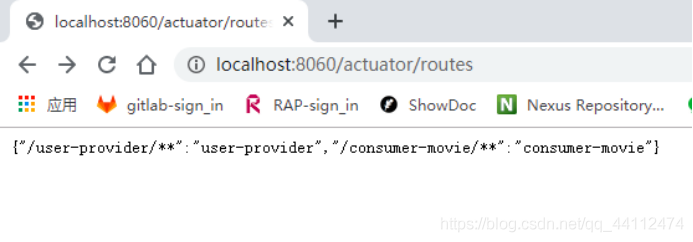

查看filters端点：访问：http://localhost:8060/actuator/filters 可以查看过滤器端点：

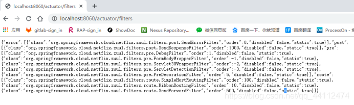

从SpringCloud Edgware版本开始，Zuul提供了filters端点。

访问该端点即可返回Zuul 中当前所有过滤器的详情，并按照类型分类。上面是filters端点的展示结果，从中，我们可以了解当前Zuul中，error、post、pre四种类型的过滤器分别有哪些，每个过滤器的order（执行顺序）是多少，以及是否启用等信息。这对Zul问题的定位很有用

### 路由配置

前文已经编写了一个简单的Zuul网关，并让该网关代理了所有注册到Eureka Server的 微服务。但在现实中可能只想让Zuul代理部分微服务，又或者需要对URL进行更加精确的控制。Zuul的路由配置非常灵活、简单，下面通过几个示例，详细讲解Zuul的路由配置。

1、自定义指定微服务的访问路径
配置zul.routes.指定微服务的serviceId=指定路径 即可。例如∶

~~~yaml
zuul:
  routes:
    user-provider: /usercenter/**
~~~

完成设置后，user-provider微服务就会被映射到/usercenter/*路径。

2、忽略指定微服务

忽略服务非常简单，可以使用zul.ignored-services配置需要忽略的服务，多个服间用逗号分隔。例如∶

~~~yaml
zuul:
  ignored-services:  user-provider,consumer-movie
~~~

这样就可让Zuul忽略 user-provider和 consumer-movie微服务，只代理其他微服务。

3、忽略所有微服务，只路由指定微服务

很多场景下，可能只想要让Zul代理指定的微服务，此时可以将zuul.ignored-services设为’*’

~~~yaml
zuul:
  ignored-services: '*'  #使用'*'可忽略所有微服务
  routes:
      user-provider: /user/**
~~~

这样就可以让Zul只路由user-providerr微服务。

4、同时指定微服务的serviceld和对应路径。例如∶

~~~yaml
zuul:
  routes:
  #该配置方式中，user-route只是给路由一个名称，可以任意起名。
    user-route:
      service-id: user-provider
      # service-id对应的路径
      path: /user/**
~~~

### 过滤器

Zuul大部分功能都是通过过滤器来实现的。Zuul中定义了4种标准过滤器类型，这些过滤器类型对应于请求的典型生命周期：

* PRE：这种过滤器在请求被路由之前调用。可利用这种过滤器实现身份验证、在集群中选择请求的微服务、记录调试信息等。
* ROUTING：这种过滤器将请求路由到微服务。这种过滤器用于构建发送给微服务的请求,并使用Apache HttpClient或Netflix Ribbon请求微服务。
* POST：这种过滤器在路由到微服务以后执行。这种过滤器可用来为响应添加标准的 HTTP Header.收集统计信息和指标、将响应从微服务发送给客户端等。
* ERROR：在其他阶段发生错误时执行该过滤器。

除了默认的过滤器类型，Zuul还允许创建自定义的过滤器类型。例如，可以定制一种 STATIC类型的过滤器，直接在Zuul中生成响应，而不将请求转发到后端的微服务。

Zuul请求的生命周期如下图：

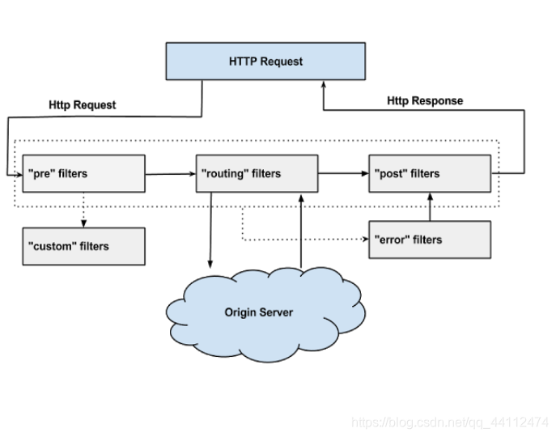

编写Zuul的过滤器非常简单，只须继承抽象类ZuulFilter,然后实现几个抽象方法就可以了。下面来编写一个简单的Zuul过滤器，让该过滤器打印请求日志。

~~~java
@Slf4j
public class MyZuulFilter extends ZuulFilter {
    @Override
    public String filterType() {
        return FilterConstants.PRE_TYPE;
    }

    @Override
    public int filterOrder() {
        return FilterConstants.PRE_DECORATION_FILTER_ORDER - 1;
    }

    @Override
    public boolean shouldFilter() {
        return true;
    }

    @Override
    public Object run() throws ZuulException {
        RequestContext ctx = RequestContext.getCurrentContext();
        HttpServletRequest request = ctx.getRequest();
        log.info(String.format("send %s request to %s", request.getMethod(), request.getRequestURL().toString()));
        return null;
    }
}
~~~

由代码可知,自定义的Zuul Filter需实现以下几个方法。

* filterType：返回过滤器的类型。有pre、route、post、error等几种取值，分别对应上文的几种过滤器。详细可以参考com.netflix.zuul.ZuulFilter.filterType() 中的注释。
* filterOrder：返回一个int值来指定过滤器的执行顺序，不同的过滤器允许返回相同的数字。
* shouldFilter ：返回一个boolean值来判断该过滤器是否要执行，true表示执行, false表示不执行。
* run：过滤器的具体逻辑。本例中让它打印了请求的HTTP方法以及请求的地址。

然后在启动类中注册该过滤器：

~~~java
@Bean
public MyZuulFilter preRequestLogFilter() {
 return new MyZuulFilter ();
}
~~~

上面只是演示了一个非常简单的过滤器。事实上，我们可以使用过滤器做很多事情，例如安全认证、灰度发布、限流等。

## @EnableZuulProxy

引入Zuul后，远程访问具体服务都可以替换为通过Zuul访问，再进行转发：

~~~java
@Autowired
private RestTemplate restTemplate;

@GetMapping("/getInfo")
public String getInfo() {
    return restTemplate.getForObject("http://zuul-9900.com:9900/eureka-client/getInfo", String.class);
}
~~~

标注 @EnableZuulProxy 注解后，Zuul 网关会生效，它的定义：

~~~java
@Import(ZuulProxyMarkerConfiguration.class)
public @interface EnableZuulProxy
~~~

ZuulProxyMarkerConfiguration中导入了一个Marker类：

~~~java
@Configuration
public class ZuulProxyMarkerConfiguration {

	@Bean
	public Marker zuulProxyMarkerBean() {
		return new Marker();
	}

	class Marker {

	}
~~~

根据文档注释，存在Marker时，配置类ZuulProxyAutoConfiguration才会生效。

## ZuulServerAutoConfiguration

它的定义：

~~~java
@Configuration
@Import({ RibbonCommandFactoryConfiguration.RestClientRibbonConfiguration.class,
		RibbonCommandFactoryConfiguration.OkHttpRibbonConfiguration.class,
		RibbonCommandFactoryConfiguration.HttpClientRibbonConfiguration.class,
		HttpClientConfiguration.class })
@ConditionalOnBean(ZuulProxyMarkerConfiguration.Marker.class)
public class ZuulProxyAutoConfiguration extends ZuulServerAutoConfiguration
~~~

它导入了 RibbonCommandFactoryConfiguration 下的几个配置类，之前提到过这些配置类，这说明Zuul 自带负载均衡。

ZuulProxyAutoConfiguration的父类是ZuulServerAutoConfiguration：

~~~java
@Configuration
@EnableConfigurationProperties({ ZuulProperties.class })
@ConditionalOnClass({ ZuulServlet.class, ZuulServletFilter.class })
@ConditionalOnBean(ZuulServerMarkerConfiguration.Marker.class)
public class ZuulServerAutoConfiguration
~~~

接下来看它里面注册的核心组件

### CompositeRouteLocator

~~~java
@Bean
@Primary
public CompositeRouteLocator primaryRouteLocator(
        Collection<RouteLocator> routeLocators) {
    return new CompositeRouteLocator(routeLocators);
}
~~~

它是一个组合的路由定位器，构造它时传入了一组 RouteLocator ，恰好它内部也维护了一个集合：

~~~java
public class CompositeRouteLocator implements RefreshableRouteLocator {
	private final Collection<? extends RouteLocator> routeLocators;
~~~

而 CompositeRouteLocator 本身又实现了 RouteLocator 接口，所以它其实是为所有 RouteLocator 提供了一个统一入口。

RouteLocator就是动态路由器，Zuul 中的路由规则都是由 RouteLocator 封装而成，作为动态路由，应该具备至少两个能力：根据路径找目标、获取所有目标，在 RouteLocator 中刚好就有着两个方法定义：

~~~java
public interface RouteLocator {
    Collection<String> getIgnoredPaths();
    List<Route> getRoutes();
    Route getMatchingRoute(String path);
}
~~~

RouteLocator有三个具体类：CompositeRouteLocator、SimpleRouteLocator、DiscoveryClientRouteLocator，一个子接口：RefreshableRouteLocator

1、SimpleRouteLocator

这个组件刚好在 ZuulServerAutoConfiguration 中有声明创建：

~~~java
@Bean
@ConditionalOnMissingBean(SimpleRouteLocator.class)
public SimpleRouteLocator simpleRouteLocator() {
    return new SimpleRouteLocator(this.server.getServlet().getContextPath(),
            this.zuulProperties);
}
~~~

它是简单路由，在下面的 locateRoutes 方法（ locateRoutes 方法可以加载路由规则）中，可以看到它依赖 ZuulProperties ：

~~~java
private ZuulProperties properties;

protected Map<String, ZuulRoute> locateRoutes() {
    LinkedHashMap<String, ZuulRoute> routesMap = new LinkedHashMap<>();
    for (ZuulRoute route : this.properties.getRoutes().values()) {
        routesMap.put(route.getPath(), route);
    }
    return routesMap;
}
~~~

2、DiscoveryClientRouteLocator

见名知意，它会依赖服务注册中心，借助注册中心内部的服务和实例来构造动态路由规则，从类的成员也可以看到它额外依赖了 discovery-client 的组件：

~~~java
public class DiscoveryClientRouteLocator extends SimpleRouteLocator
        implements RefreshableRouteLocator {
    private DiscoveryClient discovery;
    private ZuulProperties properties;
~~~

另外值得注意的是，DiscoveryClientRouteLocator 实现了 RefreshableRouteLocator 接口，代表着路由规则可以动态刷新，而 SimpleRouteLocator 却没有实现，原因也很容易理解，简单路由是通过读配置文件来解析的，那配置文件通常不能在运行时修改并重新加载，那自然也就没有动态刷新的能力了。

同样的，locateRoutes 方法中有对配置文件，以及对注册中心中的服务注册表进行解析和封装：

~~~java
protected LinkedHashMap<String, ZuulRoute> locateRoutes() {
    LinkedHashMap<String, ZuulRoute> routesMap = new LinkedHashMap<>();
    // 先调用父类的方法封装配置文件中的路由规则
    routesMap.putAll(super.locateRoutes());
    if (this.discovery != null) {
        // ......
        // Add routes for discovery services by default
        List<String> services = this.discovery.getServices();
        String[] ignored = this.properties.getIgnoredServices().toArray(new String[0]);
        for (String serviceId : services) {
            // ......
        }
    } // ......
~~~

由此可见，所有的路由映射规则，其实都是由这些 RouteLocator 完成的。

### ZuulController

~~~java
@Bean
public ZuulController zuulController() {
    return new ZuulController();
}
~~~

它的构造方法：

~~~java
public class ZuulController extends ServletWrappingController {
    public ZuulController() {
        setServletClass(ZuulServlet.class);
        setServletName("zuul");
        setSupportedMethods((String[]) null); // Allow all
    }
~~~

ServletWrappingController是它的父类。

SpringWebMvc 考虑到有一些请求会直接交由 Servlet 处理，但这些请求又需要 SpringWebMvc 本身的一些过滤、视图等机制，所以扩展出了一个 ServletWrappingController ，来解决这种核心业务 Servlet 负责，支撑部分 WebMvc 做的问题。在 ServletWrappingController 的内部维护了一个 Servlet 的成员：

~~~java
public class ServletWrappingController extends AbstractController
        implements BeanNameAware, InitializingBean, DisposableBean {
    private Class<? extends Servlet> servletClass;
    private String servletName;
    private Servlet servletInstance;
~~~

并且在下面的 handleRequestInternal 方法中直接调了 Servlet 的 service 方法：

~~~java
protected ModelAndView handleRequestInternal(HttpServletRequest request, 
        HttpServletResponse response) throws Exception {
    Assert.state(this.servletInstance != null, "No Servlet instance");
    this.servletInstance.service(request, response);
    return null;
}
~~~

ZuulController构造时，就设置了servlet为ZuulServlet。

### ZuulServlet

~~~java
@Bean
@ConditionalOnMissingBean(name = "zuulServlet")
@ConditionalOnProperty(name = "zuul.use-filter", havingValue = "false", matchIfMissing = true)
public ServletRegistrationBean zuulServlet() {
    ServletRegistrationBean<ZuulServlet> servlet = new ServletRegistrationBean<>(
            new ZuulServlet(), this.zuulProperties.getServletPattern());
    // The whole point of exposing this servlet is to provide a route that doesn't
    // buffer requests.
    servlet.addInitParameter("buffer-requests", "false");
    return servlet;
}
~~~

这个ServletRegistrationBean就是负责注册Servlet的，可以看到ZuulServlet配置的路径是 this.zuulProperties.getServletPattern()，说明ZuulServlet接收这些 uri 的请求：

~~~java
private String servletPath = "/zuul";

public String getServletPattern() {
    String path = this.servletPath;
    if (!path.startsWith("/")) {
        path = "/" + path;
    }
    if (!path.contains("*")) {
        path = path.endsWith("/") ? (path + "*") : (path + "/*");
    }
    return path;
}
~~~

不难看出，拼接的结果是 /zuul/** ，也就说明，只要是 /zuul/** 的请求，都不会走 DispatcherServlet 了，而是直接走 ZuulServlet 。

### ZuulHandlerMapping

~~~java
@Bean
public ZuulHandlerMapping zuulHandlerMapping(RouteLocator routes) {
    ZuulHandlerMapping mapping = new ZuulHandlerMapping(routes, zuulController());
    mapping.setErrorController(this.errorController);
    mapping.setCorsConfigurations(getCorsConfigurations());
    return mapping;
}
~~~

DispatcherServlet 的工作是需要 HandlerMapping 与 HandlerAdapter 配合完成 Controller 方法的查找，而引入 Zuul 后，如果是在 Zuul 的范围内能匹配映射到的请求就应该由 Zuul 完成转发，这个时候就需要 Zuul 自定义 HandlerMapping 来完成 URI 路径查找。ZuulHandlerMapping 的作用就是负责匹配路径，协助 DispatcherServlet 找到 ZuulController ，进而引导到 ZuulServlet 中。

### ZuulRefreshListener

~~~java
@Bean
public ApplicationListener<ApplicationEvent> zuulRefreshRoutesListener() {
    return new ZuulRefreshListener();
}
~~~

这个监听器的作用只从字面上也能看出来，它用来刷新 Zuul 内部的路由表，它监听的事件有好几个：

~~~java
public void onApplicationEvent(ApplicationEvent event) {
    if (event instanceof ContextRefreshedEvent
            || event instanceof RefreshScopeRefreshedEvent
            || event instanceof RoutesRefreshedEvent
            || event instanceof InstanceRegisteredEvent) {
        reset();
    }
    else if (event instanceof ParentHeartbeatEvent) {
        ParentHeartbeatEvent e = (ParentHeartbeatEvent) event;
        resetIfNeeded(e.getValue());
    }
    else if (event instanceof HeartbeatEvent) {
        HeartbeatEvent e = (HeartbeatEvent) event;
        resetIfNeeded(e.getValue());
    }
}
~~~

上面的4个事件都是微服务网络上有服务实例发生变动时广播的事件，那既然有变动了，路由规则肯定也有可能变，于是它就会刷新路由表，刷新的动作 reset 也不难，关键的就是配合 RefreshableRouteLocator 完成 refresh 动作：

~~~java
private void reset() {
    this.zuulHandlerMapping.setDirty(true);
}

// ZuulHandlerMapping
public void setDirty(boolean dirty) {
    this.dirty = dirty;
    if (this.routeLocator instanceof RefreshableRouteLocator) {
        // 刷新路由表
        ((RefreshableRouteLocator) this.routeLocator).refresh();
    }
}
~~~

### ZuulServletFilter

~~~java
@Bean
@ConditionalOnMissingBean(name = "zuulServletFilter")
@ConditionalOnProperty(name = "zuul.use-filter", havingValue = "true", matchIfMissing = false)
public FilterRegistrationBean zuulServletFilter() {
    final FilterRegistrationBean<ZuulServletFilter> filterRegistration = new FilterRegistrationBean<>();
    // 拦截的请求是/zuul开头的路径
    filterRegistration.setUrlPatterns(
            Collections.singleton(this.zuulProperties.getServletPattern()));
    filterRegistration.setFilter(new ZuulServletFilter());
    filterRegistration.setOrder(Ordered.LOWEST_PRECEDENCE);
    // The whole point of exposing this servlet is to provide a route that doesn't
    // buffer requests.
    filterRegistration.addInitParameter("buffer-requests", "false");
    return filterRegistration;
}
~~~

注意这个过滤器的判断条件：只有显式声明了 zuul.use-filter 才会创建这个过滤器，而这个过滤器的功能与 ZuulServlet 一样，而且 Conditional 的条件正好互补，相当于配置了这个属性后，由Filter来完成过滤，而不是由ZuulServlet

Zuul 的核心组件是 ZuulServlet / ZuulServletFilter，配合一组过滤器完成请求的转发与拦截。

### filters

Zuul 的过滤器有3个作用位置：pre 、routing 、post 。

1、pre filters

下面一组 Filter 都是在请求转发之前触发的过滤器：

~~~java
@Bean
public ServletDetectionFilter servletDetectionFilter() {
    return new ServletDetectionFilter();
}
@Bean
public FormBodyWrapperFilter formBodyWrapperFilter() {
    return new FormBodyWrapperFilter();
}
@Bean
public DebugFilter debugFilter() {
    return new DebugFilter();
}
@Bean
public Servlet30WrapperFilter servlet30WrapperFilter() {
    return new Servlet30WrapperFilter();
}
~~~

简单对这几种过滤器做一下了解：

* ServletDetectionFilter ：用于检测该请求由 DispatcherServlet 而来还是 ZuulServlet 而来（ /zuul/** 路径下的请求不会走 DispatcherServlet ）
* Servlet30WrapperFilter ：将 HttpServletRequest 包装为 Servlet30RequestWrapper ，目的是简化 getRequest 的动作（ HttpServletRequestWrapper 中的设计巨复杂）
* FormBodyWrapperFilter ：将带有表单的请求封装为 FormBodyRequestWrapper （ application/x-www-form-urlencoded 与 multipart/form-data ）
* DebugFilter ：配合 zuul.debug.request 的配置值来辅助调试过滤器中的信息，以帮助分析

2、route filter

ZuulServerAutoConfiguration 中默认注册的 route 时机的 Filter 只有一个：

~~~java
@Bean
public SendForwardFilter sendForwardFilter() {
    return new SendForwardFilter();
}
~~~

它的作用是对请求上下文中一个特殊的参数 forward.do 进行处理（这个参数在源码中被硬编码了），用于本地的请求转发动作。

3、post filters

下面两个 Filter 都是 post 时机下的：

~~~java
@Bean
public SendResponseFilter sendResponseFilter(ZuulProperties properties) {
    return new SendResponseFilter(zuulProperties);
}
@Bean
public SendErrorFilter sendErrorFilter() {
    return new SendErrorFilter();
}
~~~

简单概述一下：

* SendErrorFilter ：处理请求的错误响应
* SendResponseFilter ：检查响应信息，并向客户端响应数据

### ZuulRouteApplicationContextInitializer

~~~java
@Bean
@ConditionalOnProperty("zuul.ribbon.eager-load.enabled")
public ZuulRouteApplicationContextInitializer zuulRoutesApplicationContextInitiazer(
        SpringClientFactory springClientFactory) {
    return new ZuulRouteApplicationContextInitializer(springClientFactory, zuulProperties);
}
~~~

从生效的property可以看出，这里会和ribbon配置，这个 ApplicationContextInitializer 把定义好的路由规则都取出来。

ZuulRouteApplicationContextInitializer是RibbonApplicationContextInitializer的子类，这个 RibbonApplicationContextInitializer之前提到过，它能迫切的初始化 Ribbon 中每个服务对应子 IOC 容器中的必需组件。

RibbonApplicationContextInitializer 的构造方法：

~~~java
public ZuulRouteApplicationContextInitializer(SpringClientFactory springClientFactory,
        ZuulProperties zuulProperties) {
    super(springClientFactory, getServiceIdsFromZuulProps(zuulProperties));
}

public RibbonApplicationContextInitializer(SpringClientFactory springClientFactory,
        List<String> clientNames) {
    this.springClientFactory = springClientFactory;
    this.clientNames = clientNames;
}
~~~

这个 RibbonApplicatioZuulRouteApplicationContextInitializer 干的辅助工作是将 Zuul 的配置中，那些可能还不在注册中心但在 Zuul 中显式声明的服务名称，也事先创建好对应的子 IOC 容器nContextInitializer，即它是在帮 Ribbon 进行预初始化。

### ZuulFilterInitializer

~~~java
@Bean
public ZuulFilterInitializer zuulFilterInitializer(CounterFactory counterFactory,
        TracerFactory tracerFactory) {
    FilterLoader filterLoader = FilterLoader.getInstance();
    FilterRegistry filterRegistry = FilterRegistry.instance();
    return new ZuulFilterInitializer(this.filters, counterFactory, tracerFactory,
            filterLoader, filterRegistry);
}
~~~

它是将 Zuul 的过滤器注册到 FilterRegistry 的初始化器。注意这个 FilterRegistry 的结构，它内部维护了一个 Map保存 ZuulFilter：

~~~java
private final ConcurrentHashMap<String, ZuulFilter> filters = new ConcurrentHashMap<~>();
~~~

## ZuulProxyAutoConfiguration

接下来看ZuulProxyAutoConfiguration中注册的组件：

1、DiscoveryClientRouteLocator

~~~java
@Bean
@ConditionalOnMissingBean(DiscoveryClientRouteLocator.class)
public DiscoveryClientRouteLocator discoveryRouteLocator() {
    return new DiscoveryClientRouteLocator(this.server.getServlet().getContextPath(),
            this.discovery, this.zuulProperties, this.serviceRouteMapper,
            this.registration);
}
~~~

之前已经了解过了，它是三种动态路由器之一

2、PreDecorationFilter

~~~java
@Bean
@ConditionalOnMissingBean(PreDecorationFilter.class)
public PreDecorationFilter preDecorationFilter(RouteLocator routeLocator,
        ProxyRequestHelper proxyRequestHelper) {
    return new PreDecorationFilter(routeLocator,
            this.server.getServlet().getContextPath(), this.zuulProperties,
            proxyRequestHelper);
}
~~~

这个过滤器默认来讲是在 pre 阶段的最后一个执行的过滤器，这个过滤器主要的工作是检查请求中是否有 forward.do 标识。如果检查到了该标识，证明这个请求已经被 Zuul 处理过一次了，就会对这个请求做新的路由规则匹配、设置请求上下文的信息等操作，以便后续的过滤器处理。

3、RibbonRoutingFilter

~~~java
@Bean
@ConditionalOnMissingBean(RibbonRoutingFilter.class)
public RibbonRoutingFilter ribbonRoutingFilter(ProxyRequestHelper helper,
        RibbonCommandFactory<?> ribbonCommandFactory) {
    RibbonRoutingFilter filter = new RibbonRoutingFilter(helper, ribbonCommandFactory,
            this.requestCustomizers);
    return filter;
}
~~~

它是 route 阶段的过滤器，它会利用 Ribbon 与 Hystrix ，根据 uri 向对应的服务实例真正发起请求，并接收响应。

4、SimpleHostRoutingFilter

~~~java
@Bean
@ConditionalOnMissingBean({ SimpleHostRoutingFilter.class, CloseableHttpClient.class })
public SimpleHostRoutingFilter simpleHostRoutingFilter(ProxyRequestHelper helper,
        ZuulProperties zuulProperties,
        ApacheHttpClientConnectionManagerFactory connectionManagerFactory,
        ApacheHttpClientFactory httpClientFactory) {
    return new SimpleHostRoutingFilter(helper, zuulProperties,
            connectionManagerFactory, httpClientFactory);
}
~~~

这个 route 阶段的过滤器跟上面的类似，但它发起请求的规则来源不再借助注册中心和 Ribbon 、Hystrix 等组件，而是直接使用 HttpClient 进行请求转发。

5、SimpleServiceRouteMapper

~~~java
@Bean
@ConditionalOnMissingBean(ServiceRouteMapper.class)
public ServiceRouteMapper serviceRouteMapper() {
    return new SimpleServiceRouteMapper();
}
~~~

注册到服务注册中心的服务，在被 Zuul 解析时，默认会直接将服务名称拼接在 uri 上，这个拼接在 DiscoveryClientRouteLocator 的 locateRoutes 方法中能找到：

~~~java
protected LinkedHashMap<String, ZuulRoute> locateRoutes() {
    // ......
    String key = "/" + mapRouteToService(serviceId) + "/**";

protected String mapRouteToService(String serviceId) {
    return this.serviceRouteMapper.apply(serviceId);
}
~~~

而将服务名转换为拼接字符串，就是由 ServiceRouteMapper 定义。默认情况下 ServiceRouteMapper 的类型是 SimpleServiceRouteMapper ，它不会做任何转换：

~~~java
public String apply(String serviceId) {
    return serviceId;
}
~~~

此外还有一种mapper，是PatternServiceRouteMapper：

~~~java
private Pattern servicePattern;
private String routePattern;

public String apply(String serviceId) {
    Matcher matcher = this.servicePattern.matcher(serviceId);
    String route = matcher.replaceFirst(this.routePattern);
    route = cleanRoute(route);
    return (StringUtils.hasText(route) ? route : serviceId);
}
~~~

它会根据一种模式来进行服务名称的转换。它会借助正则表达式来实现转换，例如：

~~~
如果声明了匹配规则为："(?<group>^.+)-(?<name>.+$)-(?<version>v\\d+$)" 替换为 "${version}/${group}/${name}" 
则原本发起的请求为：/auth-user-v2/** ，被替换后的 uri 就应该为：/v2/auth/user/** 。
~~~

基本组件小结：

* Zuul 中的路由规则都是由 RouteLocator 封装而成，DiscoveryClientRouteLocator 可以从注册中心远程拉取服务注册表并封装路由规则；
* Zuul 的核心组件是 ZuulServlet / ZuulServletFilter，配合一组过滤器完成请求的转发与拦截。

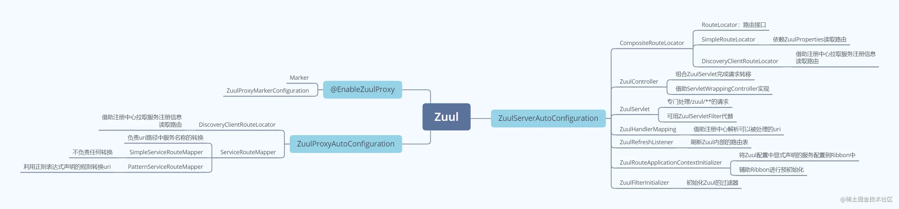

## 调用过程

### 进入DispatcherServlet

请求被 Zuul 工程中的 DispatcherServlet 接收到，来到 doDispatch 方法：

~~~java
protected void doDispatch(HttpServletRequest request, HttpServletResponse response) throws Exception {
    // ......
        try {
            // .....
            mappedHandler = getHandler(processedRequest);
            // ......
            HandlerAdapter ha = getHandlerAdapter(mappedHandler.getHandler());
            // ......
~~~

HandlerMapping 负责根据 uri 找到对应的 Controller ，之后由 HandlerAdapter 包装并执行。

在自动加载的多个HandlerMapping中，其中有一个就是ZuulHandlerMapping，取到handler其实就是取到ZuulController，下一步要根据 Controller 的类型来决定使用哪种类型的 HandlerAdapter 来适配。ZuulController 不是使用 RequestMapping 的形式，而是走的 SpringWebMvc 自己定义的编程式风格，那使用的类型就是 SimpleControllerHandlerAdapter。

SimpleControllerHandlerAdapter是基于 Controller 接口的处理器适配器，底层会将 Handler 强转为 Controller ，调用其 handleRequest 方法，最终就是调用ZuulServlet的service方法：

~~~java
// SimpleControllerHandlerAdapter
public ModelAndView handle(HttpServletRequest request, HttpServletResponse response, 
        Object handler) throws Exception {
    return ((Controller) handler).handleRequest(request, response);
}

// ZuulController
public ModelAndView handleRequest(HttpServletRequest request,
        HttpServletResponse response) throws Exception {
    try {
        return super.handleRequestInternal(request, response);
    } // ......
}

// ServletWrappingController
protected ModelAndView handleRequestInternal(HttpServletRequest request, 
     HttpServletResponse response) throws Exception {
    Assert.state(this.servletInstance != null, "No Servlet instance");
    // 2. 执行ZuulServlet
    this.servletInstance.service(request, response);
    return null;
}
~~~

### ZuulServlet#service

service方法的核心：

~~~java
public void service(javax.servlet.ServletRequest servletRequest, 
        javax.servlet.ServletResponse servletResponse) throws ServletException, IOException {
    try {
        // 2.1 线程绑定
        init((HttpServletRequest) servletRequest, (HttpServletResponse) servletResponse);

        RequestContext context = RequestContext.getCurrentContext();
        context.setZuulEngineRan();

        try {
            // 2.2 执行pre阶段的过滤器
            preRoute();
        } catch (ZuulException e) {
            error(e);
            postRoute();
            return;
        }
        try {
            // 2.3 执行route阶段的过滤器
            route();
        } catch (ZuulException e) {
            error(e);
            postRoute();
            return;
        }
        try {
            // 2.4 执行post阶段的过滤器
            postRoute();
        } catch (ZuulException e) {
            error(e);
            return;
        }

    } catch (Throwable e) {
        error(new ZuulException(e, 500, "UNHANDLED_EXCEPTION_" + e.getClass().getName()));
    } finally {
        // 解除线程绑定
        RequestContext.getCurrentContext().unset();
    }
}
~~~

1、线程绑定

init 方法会调用 ZuulRunner 的 init 方法：

~~~java
void init(HttpServletRequest servletRequest, HttpServletResponse servletResponse) {
    zuulRunner.init(servletRequest, servletResponse);
}

// ZuulRunner
public void init(HttpServletRequest servletRequest, HttpServletResponse servletResponse) {
    RequestContext ctx = RequestContext.getCurrentContext();
    if (bufferRequests) {
        ctx.setRequest(new HttpServletRequestWrapper(servletRequest));
    } else {
        ctx.setRequest(servletRequest);
    }

    ctx.setResponse(new HttpServletResponseWrapper(servletResponse));
}
~~~

可以看的出来，它将当前线程的 RequestContext 取出，并把 request 与 response 都放进去。其实就是封装了一层。

2、执行过滤器

过滤器的第一个步骤，执行 pre 阶段的，进来发现又是让 ZuulRunner 执行：

~~~java
void preRoute() throws ZuulException {
    zuulRunner.preRoute();
}

// ZuulRunner
public void preRoute() throws ZuulException {
    FilterProcessor.getInstance().preRoute();
}
~~~

进入preRoute方法：

~~~java
public void preRoute() throws ZuulException {
    try {
        runFilters("pre");
    } // catch ......
}

public Object runFilters(String sType) throws Throwable {
    if (RequestContext.getCurrentContext().debugRouting()) {
        Debug.addRoutingDebug("Invoking {" + sType + "} type filters");
    }
    boolean bResult = false;
    // 2.2.2.1 借助FilterLoader取出所有指定类型的过滤器
    List<ZuulFilter> list = FilterLoader.getInstance().getFiltersByType(sType);
    if (list != null) {
        for (int i = 0; i < list.size(); i++) {
            ZuulFilter zuulFilter = list.get(i);
            // 2.2.3 执行过滤器
            Object result = processZuulFilter(zuulFilter);
            // 过滤器只会返回true或false，其余的值都会被忽略
            if (result != null && result instanceof Boolean) {
                bResult |= ((Boolean) result);
            }
        }
    }
    return bResult;
}
~~~

在这里面它取了 FilterLoader 的单例对象，它可以获取所有指定类型的过滤器。获取到之后，接着是挨个执行processZuulFilter方法执行过滤器：

~~~java
public Object processZuulFilter(ZuulFilter filter) throws ZuulException {
    RequestContext ctx = RequestContext.getCurrentContext();
    boolean bDebug = ctx.debugRouting();
    final String metricPrefix = "zuul.filter-";
    long execTime = 0;
    String filterName = "";
    try {
        // 初始化必要的指标
        long ltime = System.currentTimeMillis();
        filterName = filter.getClass().getSimpleName();
        RequestContext copy = null;
        Object o = null;
        Throwable t = null;
        // debug ......
        
        // 【核心】执行过滤器
        ZuulFilterResult result = filter.runFilter();
        ExecutionStatus s = result.getStatus();
        execTime = System.currentTimeMillis() - ltime;
        
        // 处理响应
        switch (s) {
            case FAILED:
                t = result.getException();
                ctx.addFilterExecutionSummary(filterName, ExecutionStatus.FAILED.name(), execTime);
                break;
            case SUCCESS:
                o = result.getResult();
                ctx.addFilterExecutionSummary(filterName, ExecutionStatus.SUCCESS.name(), execTime);
                // debug ......
                break;
            default:
                break;
        }
        if (t != null) {
            throw t;
        }
        usageNotifier.notify(filter, s);
        return o;
    } // catch ......
}
~~~

进入ZuulFilter的runFilter方法：

~~~java
public ZuulFilterResult runFilter() {
    ZuulFilterResult zr = new ZuulFilterResult();
    if (!isFilterDisabled()) {
        if (shouldFilter()) {
            Tracer t = TracerFactory.instance().startMicroTracer("ZUUL::" + this.getClass().getSimpleName());
            try {
                // 【核心】每个过滤器都不同的run方法
                Object res = run();
                zr = new ZuulFilterResult(res, ExecutionStatus.SUCCESS);
            } // catch finally ......
        } else {
            zr = new ZuulFilterResult(ExecutionStatus.SKIPPED);
        }
    }
    return zr;
}
~~~

每个过滤器都有不同的shouldFilter和run方法。

接着是执行route阶段和post阶段的过滤器，逻辑都是一样的。

### 过滤器的注册

这里要研究下FilterLoader是如何取出所有过滤器的。进入FilterLoader#getFiltersByType方法：

~~~java
private final ConcurrentHashMap<String, List<ZuulFilter>> hashFiltersByType = new ConcurrentHashMap<>();
private FilterRegistry filterRegistry = FilterRegistry.instance();

public List<ZuulFilter> getFiltersByType(String filterType) {
    // 先从缓存中取，取到直接返回
    List<ZuulFilter> list = hashFiltersByType.get(filterType);
    if (list != null) {
        return list;
    }

    list = new ArrayList<ZuulFilter>();
    // 获取所有的过滤器，并只过滤出类型相同的返回
    Collection<ZuulFilter> filters = filterRegistry.getAllFilters();
    for (Iterator<ZuulFilter> iterator = filters.iterator(); iterator.hasNext(); ) {
        ZuulFilter filter = iterator.next();
        if (filter.filterType().equals(filterType)) {
            list.add(filter);
        }
    }
    Collections.sort(list); // sort by priority

    hashFiltersByType.putIfAbsent(filterType, list);
    return list;
}
~~~

可以发现内部是从FilterRegistry里面取的filter，进入FilterRegistry的getAllFilters：

~~~java
private final ConcurrentHashMap<String, ZuulFilter> filters = new ConcurrentHashMap<>();

public Collection<ZuulFilter> getAllFilters() {
    return this.filters.values();
}

public void put(String key, ZuulFilter filter) {
    this.filters.putIfAbsent(key, filter);
}
~~~

这个 FilterRegistry 内部的设计也是极为简单，它就是套了一个 Map 而已。研究FilterRegistry 的put方法被调用的时机，发现是在ZuulFilterInitializer 中：

~~~java
@PostConstruct
public void contextInitialized() {
    log.info("Starting filter initializer");

    TracerFactory.initialize(tracerFactory);
    CounterFactory.initialize(counterFactory);

    for (Map.Entry<String, ZuulFilter> entry : this.filters.entrySet()) {
        filterRegistry.put(entry.getKey(), entry.getValue());
    }
}
~~~

这些过滤器就是被这个 ZuulFilterInitializer 过滤器初始化器帮忙注册好的

## pre阶段ZuulFilter

### ServletDetectionFilter

它是第一个执行的过滤器，它的作用之前也提过，它会检测请求来源是 DispatcherServlet 还是 ZuulServlet ，核心的 run 方法如下：

~~~java
public static final int SERVLET_DETECTION_FILTER_ORDER = -3;

public Object run() {
    RequestContext ctx = RequestContext.getCurrentContext();
    HttpServletRequest request = ctx.getRequest();
    if (!(request instanceof HttpServletRequestWrapper)
            && isDispatcherServletRequest(request)) {
        ctx.set(IS_DISPATCHER_SERVLET_REQUEST_KEY, true);
    } else {
        ctx.set(IS_DISPATCHER_SERVLET_REQUEST_KEY, false);
    }

    return null;
}
~~~

注意它会判断请求是否来自于 DispatcherServlet ，而判断的逻辑是查看 request 中是否一个特定的 WEB_APPLICATION_CONTEXT_ATTRIBUTE 属性：

~~~java
public static final String WEB_APPLICATION_CONTEXT_ATTRIBUTE = DispatcherServlet.class.getName() + ".CONTEXT";

private boolean isDispatcherServletRequest(HttpServletRequest request) {
    return request.getAttribute(
            DispatcherServlet.WEB_APPLICATION_CONTEXT_ATTRIBUTE) != null;
}
~~~

所有从 DispatcherServlet 经过的请求，都会在请求域的属性中加入该属性：

~~~java
protected void doService(HttpServletRequest request, HttpServletResponse response) throws Exception {
    // ......
    // 在执行doDispatch之前会向request域中设置属性，放入IOC容器
    request.setAttribute(WEB_APPLICATION_CONTEXT_ATTRIBUTE, getWebApplicationContext());
    // ......
    try {
        doDispatch(request, response);
    } // ......
}
~~~

所以由此可以判断出来请求的来源如何，因为/zuul/** 请求不会走 DispatcherServlet

### Servlet30WrapperFilter

它是第二个执行的过滤器，它只负责对原始的 HttpServletRequest 请求包装为 Servlet30RequestWrapper ：

~~~java
public static final int SERVLET_30_WRAPPER_FILTER_ORDER = -2;

public Object run() {
    RequestContext ctx = RequestContext.getCurrentContext();
    HttpServletRequest request = ctx.getRequest();
    if (request instanceof HttpServletRequestWrapper) {
        request = (HttpServletRequest) ReflectionUtils.getField(this.requestField, request);
        ctx.setRequest(new Servlet30RequestWrapper(request));
    } else if (RequestUtils.isDispatcherServletRequest()) {
        // If it's going through the dispatcher we need to buffer the body
        ctx.setRequest(new Servlet30RequestWrapper(request));
    }
    return null;
}
~~~

它的作用是简化 getRequest 的动作

### FormBodyWrapperFilter

它将带有表单的请求封装为 FormBodyRequestWrapper （ application/x-www-form-urlencoded 与 multipart/form-data ）

其实multipart/form-data请求它不是全部都接收，而是被 DispatcherServlet 处理过的 multipart/form-data 类型的请求会被接收处理，从它的shouldFilter可以看到这一点：

~~~java
// APPLICATION_FORM_URLENCODED : application/x-www-form-urlencoded
// MULTIPART_FORM_DATA : multipart/form-data

public boolean shouldFilter() {
    // ......
    // Only use this filter for form data and only for multipart data in a
    // DispatcherServlet handler
    try {
        // 【判断核心逻辑】
        MediaType mediaType = MediaType.valueOf(contentType);
        return MediaType.APPLICATION_FORM_URLENCODED.includes(mediaType)
                || (isDispatcherServletRequest(request)
                        && MediaType.MULTIPART_FORM_DATA.includes(mediaType));
    } // catch ......
}
~~~

它是给带有表单的请求进行包装的，它的核心run方法：

~~~java
public static final int FORM_BODY_WRAPPER_FILTER_ORDER = -1;

public Object run() {
    RequestContext ctx = RequestContext.getCurrentContext();
    HttpServletRequest request = ctx.getRequest();
    FormBodyRequestWrapper wrapper = null;
    // 包装
    if (request instanceof HttpServletRequestWrapper) {
        HttpServletRequest wrapped = (HttpServletRequest) ReflectionUtils
                .getField(this.requestField, request);
        wrapper = new FormBodyRequestWrapper(wrapped);
        ReflectionUtils.setField(this.requestField, request, wrapper);
        if (request instanceof ServletRequestWrapper) {
            ReflectionUtils.setField(this.servletRequestField, request, wrapper);
        }
    } else {
        wrapper = new FormBodyRequestWrapper(request);
        ctx.setRequest(wrapper);
    }
    // 放入请求头
    if (wrapper != null) {
        ctx.getZuulRequestHeaders().put("content-type", wrapper.getContentType());
    }
    return null;
}
~~~

很明显它也只是把 HttpServletRequest 取出来，再进行一层包装而已。然后重新设置了content-type，设置content-type的时候，调用的是wrapper.getContentType，wrapper对有原有的request进行了增强：

对比原始的 ServletRequestWrapper 与 Zuul 扩展的 FormBodyRequestWrapper ：

~~~java
// javax.servlet.ServletRequestWrapper
public String getContentType() {
    return this.request.getContentType();
}

// FormBodyRequestWrapper
public String getContentType() {
    if (this.contentData == null) {
        buildContentData();
    }
    return this.contentType.toString();
}
~~~

buildContentData就是关键的增强操作：

~~~java
private synchronized void buildContentData() {
    if (this.contentData != null) {
        return;
    }
    try {
        MultiValueMap<String, Object> builder = RequestContentDataExtractor
                .extract(this.request);
        FormHttpOutputMessage data = new FormHttpOutputMessage();

        this.contentType = MediaType.valueOf(this.request.getContentType());
        data.getHeaders().setContentType(this.contentType);
        // 【转换】
        FormBodyWrapperFilter.this.formHttpMessageConverter.write(builder,
                this.contentType, data);
        // copy new content type including multipart boundary
        this.contentType = data.getHeaders().getContentType();
        byte[] input = data.getInput();
        this.contentLength = input.length;
        this.contentData = input;
    } // catch ......
}
~~~

可以看到，它将原有的 request 和请求中的 contentType 都取出来，让 formHttpMessageConverter 重新编码后再写入回去。这里之所以要这样做，主要是因为：1、zuul转发请求时想让数据保持二进制状态 2、处理请求时支持重复读取数据流

之所以仅仅处理表单请求场景，是因为表单请求在处理参数时比较特殊。前端页面中，如果要提交 PUT 类型的请求，是无法在 form 表单中直接指定请求类型为 PUT 的，而是先标注 method="POST" ，之后在表单中加入一个隐藏域字段，name 为固定的 "_method"，value 填 "PUT"，这样就可以在页面上提交PUT请求表单。那 SpringWebMvc 为了能支持这样的 RESTful 风格的表单请求，专门设计了一个过滤器，用来处理这样的表单，这个过滤器是 OrderedHiddenHttpMethodFilter ，它在 WebMvcAutoConfiguration 中被注册。它的核心处理逻辑在父类的 HiddenHttpMethodFilter 中：

~~~java
protected void doFilterInternal(HttpServletRequest request, HttpServletResponse response, 
        FilterChain filterChain) throws ServletException, IOException {

    HttpServletRequest requestToUse = request;

    if ("POST".equals(request.getMethod()) && request.getAttribute(WebUtils.ERROR_EXCEPTION_ATTRIBUTE) == null) {
        String paramValue = request.getParameter(this.methodParam);
        if (StringUtils.hasLength(paramValue)) {
            String method = paramValue.toUpperCase(Locale.ENGLISH);
            if (ALLOWED_METHODS.contains(method)) {
                requestToUse = new HttpMethodRequestWrapper(request, method);
            }
        }
    }

    filterChain.doFilter(requestToUse, response);
}
~~~

可以看到，它如果检测到当前请求是 POST 请求，就会从请求域中找是否有 "_method" 字段，如果有，并且在内置的 7 种 RESTful 风格请求中，则会对请求进一步封装。关键就在于request.getParameter(this.methodParam)这一句，会将方法参数封装为字符串返回。

借助 Debug 来到 Tomcat 中的实现类 org.apache.catalina.connector.RequestFacade （它实现 ServletRequest ）：

~~~java
protected Request request = null;

public String getParameter(String name) {
    if (request == null) {
        throw new IllegalStateException(sm.getString("requestFacade.nullRequest"));
    }

    if (Globals.IS_SECURITY_ENABLED){
        return AccessController.doPrivileged(
            new GetParameterPrivilegedAction(name));
    } else {
        return request.getParameter(name);
    }
}
~~~

最下面的 return 中，它又调了 Request 的 getParameter 方法，这个 Request 才是实现 HttpServletRequest 的：

~~~java
public String getParameter(String name) {
    if (!parametersParsed) {
        parseParameters();
    }
    return coyoteRequest.getParameters().getParameter(name);
}
~~~

可以看到在取之前有个前置动作：parseParameters() ，它就是 Tomcat 内部处理请求参数的核心方法：

~~~java
protected void parseParameters() {
    // 设置参数已经被预处理过了
    parametersParsed = true;
    // ......
    try {
        // ...... if ......
            // 处理请求体(表单)
            byte[] formData = null;
            // ......
            try {
                if (readPostBody(formData, len) != len) {
                    parameters.setParseFailedReason(FailReason.REQUEST_BODY_INCOMPLETE);
                    return;
                }
            } // catch ......
            parameters.processParameters(formData, 0, len);
        } // else if ......
        success = true;
    } // finally ......
}
~~~

看中间的部分，它会调用 readPostBody 方法来读取真正的请求体：

~~~java
protected int readPostBody(byte[] body, int len)
        throws IOException {
    int offset = 0;
    do {
        int inputLen = getStream().read(body, offset, len - offset);
        if (inputLen <= 0) {
            return offset;
        }
        offset += inputLen;
    } while ((len - offset) > 0);
    return len;
}
~~~

这里很明显就是用二进制流的方式，读取整个请求体的内容，放到 byte[] 中。自这里以后，直到这个请求被完全处理和响应之前，这个地方都不会再有读取动作了！因为 parseParameters 方法中 parametersParsed 参数被设置为 true 了，也不可能再进这个方法了。而且还有一个设计，注意看 getStream() 方法：

~~~java
public InputStream getStream() {
    if (inputStream == null) {
        inputStream = new CoyoteInputStream(inputBuffer);
    }
    return inputStream;
}

public class CoyoteInputStream extends ServletInputStream
public abstract class ServletInputStream extends InputStream
~~~

它设计的是使用 InputStream ，InputStream 是不可重复读取的，那自然读完就没了。

Zuul 作为一个服务网关，既然它能具备服务请求转发的能力，所以就需要想办法把这些请求体参数都保存好，在请求转发（向目标服务实例发起新的请求）时就应该把这些请求参数都带过去。这就是 FormBodyWrapperFilter 真正的作用。

FormBodyWrapperFilter 能保证后续读取请求体二进制流的方式是构造 FormBodyRequestWrapper ，刚才看到了，这里面它重写了 getInputStream 方法：

~~~java
private volatile byte[] contentData;

public ServletInputStream getInputStream() throws IOException {
    if (this.contentData == null) {
        buildContentData();
    }
    return new ServletInputStreamWrapper(this.contentData);
}
~~~

它把请求体转换为 byte[] 放到 Wrapper 的类成员了，当真的要取 InputStream 的时候，会返回一个 ServletInputStreamWrapper，当要读取底层数据时，直接在保存好的数组读取：

~~~java
public int read() throws IOException {
    if (idx == data.length) {
        return -1;
    }
    return data[idx++] & 0xff;
}
~~~

直接返回二进制的内容，这样就可以做到任意次数的读取了。

在Zuul的过滤器中，会涉及到请求参数的多次读取，所以必须要具备任意读取的能力。

### DebugFilter

它跟调试相关，通常情况下它不会被执行：

~~~java
// ROUTING_DEBUG -> zuul.debug.parameter

public boolean shouldFilter() {
    HttpServletRequest request = RequestContext.getCurrentContext().getRequest();
    // 这里又执行getParameter了，所以前面需要包装一下，不然读不到了。。。
    if ("true".equals(request.getParameter(DEBUG_PARAMETER.get()))) {
        return true;
    }
    return ROUTING_DEBUG.get();
}
~~~

如果请求的参数中有标注 debug=true ，或者上面的 zuul.debug.request 属性设置为 true 才会激活它。而它干的活却极为简单：

~~~java
public static final int DEBUG_FILTER_ORDER = 1;

public Object run() {
    RequestContext ctx = RequestContext.getCurrentContext();
    ctx.setDebugRouting(true);
    ctx.setDebugRequest(true);
    return null;
}
~~~

### PreDecorationFilter

默认情况下它是 pre 阶段的最后一个过滤器，它会判断当前请求上下文中是否有 forward.do 和 serviceId 参数，如果都没有，才会执行过滤器。

~~~java
public static final String FORWARD_TO_KEY = "forward.to";
public static final String SERVICE_ID_KEY = "serviceId";

public boolean shouldFilter() {
    RequestContext ctx = RequestContext.getCurrentContext();
    return !ctx.containsKey(FORWARD_TO_KEY) // a filter has already forwarded
            && !ctx.containsKey(SERVICE_ID_KEY); // a filter has already determined
}
~~~

检查这两个参数的意义，是保证不会重复处理请求（如果一个请求已经经过了一次 Zuul ，则 RequestContext 中会额外包含 forward.do 或 serviceId ）

~~~java
public static final int PRE_DECORATION_FILTER_ORDER = 5;

public Object run() {
    RequestContext ctx = RequestContext.getCurrentContext();
    final String requestURI = this.urlPathHelper
            .getPathWithinApplication(ctx.getRequest());
    // 【路由】
    Route route = this.routeLocator.getMatchingRoute(requestURI);
    if (route != null) {
        String location = route.getLocation();
        if (location != null) {
            ctx.put(REQUEST_URI_KEY, route.getPath());
            ctx.put(PROXY_KEY, route.getId());
            // 默认会过滤一些特殊的字段
            if (!route.isCustomSensitiveHeaders()) {
                this.proxyRequestHelper.addIgnoredHeaders(
                        this.properties.getSensitiveHeaders().toArray(new String[0]));
            }
            else {
                this.proxyRequestHelper.addIgnoredHeaders(
                        route.getSensitiveHeaders().toArray(new String[0]));
            }
            // ......
        }
    } // else ......
    return null;
}
~~~

这里面的核心动作就是根据请求地址，拼接路由出真正应该访问的服务和 uri 。

注意这里面标注了一处注释，它会添加一些请求头的过滤字段，这样在 Zuul 重新构造请求时就不会把这些请求头带进去，默认情况下过滤掉的字段如下：

~~~java
private Set<String> sensitiveHeaders = new LinkedHashSet<>(
        Arrays.asList("Cookie", "Set-Cookie", "Authorization"));
~~~

这就是为什么经过 Zuul 的请求会丢失部分请求头（Cookie、Authorization等）

在上面的routeLocator.getMatchingRoute是真正的路由方法，它会循环所有的 RouteLocator ，去检查是否能匹配到当前的 uri ：

~~~java
// CompositeRouteLocator
public Route getMatchingRoute(String path) {
    for (RouteLocator locator : routeLocators) {
        Route route = locator.getMatchingRoute(path);
        if (route != null) {
            return route;
        }
    }
    return null;
}
~~~

进入了 SimpleRouteLocator 中：

~~~java
public Route getMatchingRoute(final String path) {
    return getSimpleMatchingRoute(path);
}

protected Route getSimpleMatchingRoute(final String path) {
    // logger ......
    // This is called for the initialization done in getRoutesMap()
    getRoutesMap();
    // logger ......
    String adjustedPath = adjustPath(path);
    // 【核心】根据请求路径找到真正的Zuul路由器
    ZuulRoute route = getZuulRoute(adjustedPath);
    return getRoute(route, adjustedPath);
}
~~~

下面的 getZuulRoute 是根据请求路径，真正的寻找路由的逻辑，SimpleRouteLocator#getZuulRoute：

~~~java
protected ZuulRoute getZuulRoute(String adjustedPath) {
    if (!matchesIgnoredPatterns(adjustedPath)) {
        for (Entry<String, ZuulRoute> entry : getRoutesMap().entrySet()) {
            String pattern = entry.getKey();
            log.debug("Matching pattern:" + pattern);
            if (this.pathMatcher.match(pattern, adjustedPath)) {
                return entry.getValue();
            }
        }
    }
    return null;
}
~~~

Debug发现 getRoutesMap() 的结果就是当前测试的两个工程，一个服务调用者、一个服务提供者。所以就可以匹配到 /eureka-client/** 的路由，返回到过滤器中进行额外的操作，这些操作大多跟请求头相关（如 X-Forwarded-Host 、X-Forwarded-Port 等）

## route阶段ZuulFilter

### RibbonRoutingFilter

这个过滤器是 route 阶段的第一个执行的过滤器，它只会对请求上下文中存在 serviceId 的请求起效：

~~~java
public boolean shouldFilter() {
    RequestContext ctx = RequestContext.getCurrentContext();
    return (ctx.getRouteHost() == null && ctx.get(SERVICE_ID_KEY) != null
            && ctx.sendZuulResponse());
}
~~~

只有上下文中有serviceId，才谈得上Ribbon，否则就无法起到负载均衡的作用。run 方法就是执行 Ribbon 服务调用的动作：

~~~java
public Object run() {
    RequestContext context = RequestContext.getCurrentContext();
    this.helper.addIgnoredHeaders();
    try {
        // 3.2.1.1 构造Ribbon请求发送命令对象
        RibbonCommandContext commandContext = buildCommandContext(context);
        // 3.2.1.4 发起请求
        ClientHttpResponse response = forward(commandContext);
        setResponse(response);
        return response;
    } // catch ......
}
~~~

buildCommandContext方法是构造RibbonCommandContext的过程：

~~~java
protected RibbonCommandContext buildCommandContext(RequestContext context) {
    HttpServletRequest request = context.getRequest();

    // 3.2.1.2 构造请求头
    MultiValueMap<String, String> headers = this.helper
            .buildZuulRequestHeaders(request);
    // 3.2.1.3 构造请求参数
    MultiValueMap<String, String> params = this.helper
            .buildZuulRequestQueryParams(request);
    // 获取请求类型(GET POST ......)
    String verb = getVerb(request);
    // 获取请求体(又触发读取了)
    InputStream requestEntity = getRequestBody(request);
    if (request.getContentLength() < 0 && !verb.equalsIgnoreCase("GET")) {
        context.setChunkedRequestBody();
    }

    String serviceId = (String) context.get(SERVICE_ID_KEY);
    Boolean retryable = (Boolean) context.get(RETRYABLE_KEY);
    Object loadBalancerKey = context.get(LOAD_BALANCER_KEY);

    // 构造真正的uri
    String uri = this.helper.buildZuulRequestURI(request);

    // remove double slashes
    uri = uri.replace("//", "/");
    long contentLength = useServlet31 ? request.getContentLengthLong()
            : request.getContentLength();
    return new RibbonCommandContext(serviceId, verb, uri, retryable, headers, params,
            requestEntity, this.requestCustomizers, contentLength, loadBalancerKey);
}
~~~

它包含几个重要的部分：构造请求头、 构造请求参数、获取请求类型、请求体、构造uri。

1、buildZuulRequestHeaders是构造请求头的过程，它会构造新的请求头，并把原有请求头放入新的请求头中：

~~~java
public MultiValueMap<String, String> buildZuulRequestHeaders(
        HttpServletRequest request) {
    RequestContext context = RequestContext.getCurrentContext();
    // 构造新的请求头
    MultiValueMap<String, String> headers = new HttpHeaders();
    Enumeration<String> headerNames = request.getHeaderNames();
    // 原有的请求头放入新的请求头
    if (headerNames != null) {
        while (headerNames.hasMoreElements()) {
            String name = headerNames.nextElement();
            // 只会放入特定的请求头【丢失位置】
            if (isIncludedHeader(name)) {
                Enumeration<String> values = request.getHeaders(name);
                while (values.hasMoreElements()) {
                    String value = values.nextElement();
                    headers.add(name, value);
                }
            }
        }
    }
    // 放入Zuul系列的请求头
    Map<String, String> zuulRequestHeaders = context.getZuulRequestHeaders();
    for (String header : zuulRequestHeaders.keySet()) {
        if (isIncludedHeader(header)) {
            headers.set(header, zuulRequestHeaders.get(header));
        }
    }
    if (!headers.containsKey(HttpHeaders.ACCEPT_ENCODING)) {
        headers.set(HttpHeaders.ACCEPT_ENCODING, "gzip");
    }
    return headers;
}
~~~

看上面的双层 while 循环，isIncludedHeader 方法会过滤掉一些 Zuul 认为不需要转发的请求头，这个方法的实现如下：

~~~java
public boolean isIncludedHeader(String headerName) {
    String name = headerName.toLowerCase();
    RequestContext ctx = RequestContext.getCurrentContext();
    if (ctx.containsKey(IGNORED_HEADERS)) {
        // 取出自定义过滤的请求头
        Object object = ctx.get(IGNORED_HEADERS);
        if (object instanceof Collection && ((Collection<?>) object).contains(name)) {
            return false;
        }
    }
    // 默认还会忽略以下字段
    switch (name) {
        case "host":
            if (addHostHeader) {
                return true;
            }
        case "connection":
        case "content-length":
        case "server":
        case "transfer-encoding":
        case "x-application-context":
            return false;
        default:
            return true;
    }
}
~~~

上面的 if 部分就会拿出前面 PreDecorationFilter 过滤器中放入的请求头忽略字段，从而导致转发丢失一部分请求头。

2、buildZuulRequestQueryParams是构造请求参数的，这一部分不会丢失信息，只是简单的数据封装：

~~~java
public MultiValueMap<String, String> buildZuulRequestQueryParams(
        HttpServletRequest request) {
    Map<String, List<String>> map = HTTPRequestUtils.getInstance().getQueryParams();
    MultiValueMap<String, String> params = new LinkedMultiValueMap<>();
    if (map == null) {
        return params;
    }
    for (String key : map.keySet()) {
        for (String value : map.get(key)) {
            params.add(key, value);
        }
    }
    return params;
}
~~~

3、forward方法是真正发起请求的部分，最终是使用RibbonCommand的execute方法：

~~~java
protected ClientHttpResponse forward(RibbonCommandContext context) throws Exception {
    Map<String, Object> info = this.helper.debug(context.getMethod(),
            context.getUri(), context.getHeaders(), context.getParams(),
            context.getRequestEntity());
    RibbonCommand command = this.ribbonCommandFactory.create(context);
    try {
        ClientHttpResponse response = command.execute();
        this.helper.appendDebug(info, response.getRawStatusCode(),
                response.getHeaders());
        return response;
    } catch (HystrixRuntimeException ex) {
        return handleException(info, ex);
    }
}
~~~

利用 Ribbon 与 Hystrix 完成请求发起、响应接收。

### SimpleHostRoutingFilter

它跟上面 RibbonRoutingFilter 的区别，很明显从类名上就可以猜到：它是通过显式指定目标主机地址来发起请求的。它的run方法：

~~~java
public static final int SIMPLE_HOST_ROUTING_FILTER_ORDER = 100;

public Object run() {
    RequestContext context = RequestContext.getCurrentContext();
    HttpServletRequest request = context.getRequest();
    // 构造请求头
    MultiValueMap<String, String> headers = this.helper
            .buildZuulRequestHeaders(request);
    // 构造请求参数
    MultiValueMap<String, String> params = this.helper
            .buildZuulRequestQueryParams(request);
    String verb = getVerb(request);
    // 请求体
    InputStream requestEntity = getRequestBody(request);
    if (getContentLength(request) < 0) {
        context.setChunkedRequestBody();
    }
    
    String uri = this.helper.buildZuulRequestURI(request);
    this.helper.addIgnoredHeaders();

    try {
        // 借助HttpClient发起请求、接收响应
        CloseableHttpResponse response = forward(this.httpClient, verb, uri, request,
                headers, params, requestEntity);
        setResponse(response);
    } // catch ......
    return null;
}
~~~

它的远程调用是使用HttpClient，这里就与Ribbon 和 Hystrix 无关了。

### SendForwardFilter

默认情况下它是 route 阶段的最后一个过滤器，它只负责请求转发（请求上下文中必须存在 forward.do 才算需要转发的请求）：

~~~java
public boolean shouldFilter() {
    RequestContext ctx = RequestContext.getCurrentContext();
    return ctx.containsKey(FORWARD_TO_KEY)
            && !ctx.getBoolean(SEND_FORWARD_FILTER_RAN, false);
}
~~~

它的转发逻辑：

~~~java
public static final int SEND_FORWARD_FILTER_ORDER = 500;

public Object run() {
    try {
        RequestContext ctx = RequestContext.getCurrentContext();
        String path = (String) ctx.get(FORWARD_TO_KEY);
        RequestDispatcher dispatcher = ctx.getRequest().getRequestDispatcher(path);
        if (dispatcher != null) {
            ctx.set(SEND_FORWARD_FILTER_RAN, true);
            if (!ctx.getResponse().isCommitted()) {
                dispatcher.forward(ctx.getRequest(), ctx.getResponse());
                ctx.getResponse().flushBuffer();
            }
        }
    } // catch ......
    return null;
}
~~~

它使用 RequestDispatcher 进行请求转发，而这个 RequestDispatcher 属于 javax.servlet 中的底层组件了，它通常在 Servlet 容器中实现，真正的实现是ApplicationDispatcher。

## post阶段ZuulFilter

### SendErrorFilter

它是在 post 阶段的第一个处理器，由于 post 阶段会把请求返回的数据响应给服务消费方，错误的响应又必须要在响应处理之前处理，那理所应当的它只会在请求上下文中出现异常时才会触发：

~~~java
public boolean shouldFilter() {
    RequestContext ctx = RequestContext.getCurrentContext();
    // only forward to errorPath if it hasn't been forwarded to already
    return ctx.getThrowable() != null
            && !ctx.getBoolean(SEND_ERROR_FILTER_RAN, false);
}
~~~

它的处理规则：

~~~java
public static final int SEND_ERROR_FILTER_ORDER = 0;

public Object run() {
    try {
        RequestContext ctx = RequestContext.getCurrentContext();
        ExceptionHolder exception = findZuulException(ctx.getThrowable());
        HttpServletRequest request = ctx.getRequest();

        // 标记请求错误相关信息
        request.setAttribute("javax.servlet.error.status_code",
                exception.getStatusCode());
        log.warn("Error during filtering", exception.getThrowable());
        request.setAttribute("javax.servlet.error.exception",
                exception.getThrowable());

        if (StringUtils.hasText(exception.getErrorCause())) {
            request.setAttribute("javax.servlet.error.message",
                    exception.getErrorCause());
        }

        // 请求转发到网关的/error上
        RequestDispatcher dispatcher = request.getRequestDispatcher(this.errorPath);
        if (dispatcher != null) {
            ctx.set(SEND_ERROR_FILTER_RAN, true);
            if (!ctx.getResponse().isCommitted()) {
                ctx.setResponseStatusCode(exception.getStatusCode());
                dispatcher.forward(request, ctx.getResponse());
            }
        }
    } // catch ......
    return null;
}
~~~

这里会标记请求错误相关信息，然后将请求转发到网关的/error上

### SendResponseFilter

到最后了，也没错误，那就可以响应正常数据了，这个过滤器的逻辑相当简单，就分了两个步骤：

~~~java
public Object run() {
    try {
        addResponseHeaders();
        writeResponse();
    } // catch ......
    return null;
}
~~~

内部的实现就是，直接操作 ServletResponse 完成数据的响应，生成响应头和响应体等。

## 小结

整体执行流程图：

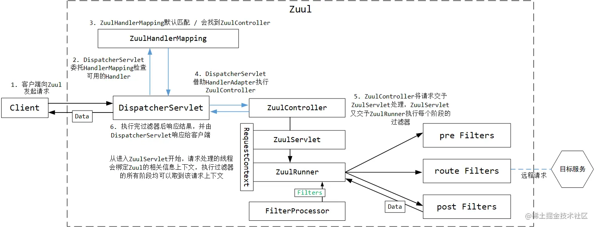

过滤器执行流程：

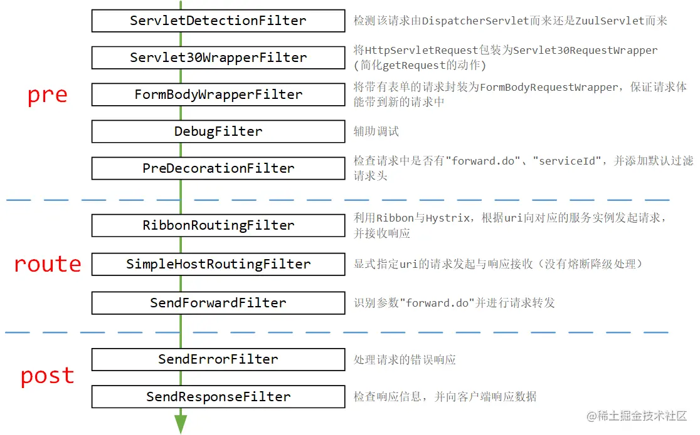

由于 Zuul 里面的一些问题（丢失请求头等），目前大家都慢慢转到 Gateway 了

# Gateway

因为Zuul 2.x不出，SpringCloud就基于SpringFramework5、jdk8、Reactive编程编写了Gateway，它是强于Zuul 1.x的网关组件。

## 网关搭建

引入 Gateway 没有过多的依赖，只需要引入一个就可以：

~~~xml
<dependency>
    <groupId>org.springframework.cloud</groupId>
    <artifactId>spring-cloud-starter-gateway</artifactId>
</dependency>
~~~

主启动类上也不需要标注其他注解，不过需要在配置文件中声明开启基于服务发现的路由：

~~~properties
spring.cloud.gateway.discovery.locator.enabled=true
~~~

配置好之后，就可以启动 Gateway 了。

搭建 gateway-consumer 工程，方法与前面的 Zuul 服务调用方几乎完全一致，只不过要注意的是服务名称要用大写：

~~~java
@Autowired
private RestTemplate restTemplate;

@GetMapping("/getInfo")
public String getInfo() {
    // 不再需要服务名称作为前缀了
    return restTemplate.getForObject("http://gateway-9900.com:9900/EUREKA-CLIENT/getInfo", String.class);
}
~~~

将一个 eureka-server 、一个 eureka-client ，以及 Gateway 、gateway-consumer 启动，浏览器发起 /getInfo 请求，可以正常响应结果，证明 Gateway 网关已经起效。

Gateway的整体运行流程图：

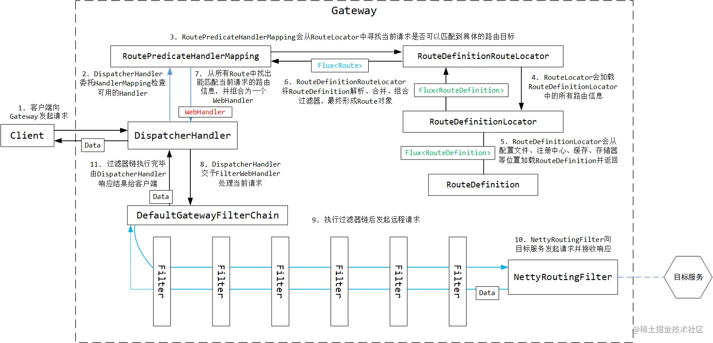

## GatewayAutoConfiguration

与 Zuul 不同，Gateway 在启动时没有标注额外的注解，那就只有从自动配置类入手了。

翻开 Gateway 的 spring.factories 文件，发现自动配置类实在是多：

~~~
# Auto Configure
org.springframework.boot.autoconfigure.EnableAutoConfiguration=\
    org.springframework.cloud.gateway.config.GatewayClassPathWarningAutoConfiguration,\
    org.springframework.cloud.gateway.config.GatewayAutoConfiguration,\
    org.springframework.cloud.gateway.config.GatewayLoadBalancerClientAutoConfiguration,\
    org.springframework.cloud.gateway.config.GatewayNoLoadBalancerClientAutoConfiguration,\
    org.springframework.cloud.gateway.config.GatewayMetricsAutoConfiguration,\
    org.springframework.cloud.gateway.config.GatewayRedisAutoConfiguration,\
    org.springframework.cloud.gateway.discovery.GatewayDiscoveryClientAutoConfiguration,\
    org.springframework.cloud.gateway.config.SimpleUrlHandlerMappingGlobalCorsAutoConfiguration,\
    org.springframework.cloud.gateway.config.GatewayReactiveLoadBalancerClientAutoConfiguration
~~~

其中GatewayAutoConfiguration是它的核心配置类：

~~~java
@Configuration
@ConditionalOnProperty(name = "spring.cloud.gateway.enabled", matchIfMissing = true)
@EnableConfigurationProperties
@AutoConfigureBefore({ HttpHandlerAutoConfiguration.class,
		WebFluxAutoConfiguration.class })
@AutoConfigureAfter({ GatewayLoadBalancerClientAutoConfiguration.class,
		GatewayClassPathWarningAutoConfiguration.class })
@ConditionalOnClass(DispatcherHandler.class)
public class GatewayAutoConfiguration
~~~

@AutoConfigureBefore里面有WebFluxAutoConfiguration，这说明Gateway 必须依赖 SpringWebFlux 才可以运行，而且要先于 WebFlux 的自动装配执行，保证配置的内容能被 WebFlux 感知到。

### RouteLocatorBuilder和RouteLocator

在 Zuul 里面有 RouteLocator ，它可以获取到所有的路由规则。在 Zuul 中解析的路由规则是封装为一个 Map 中，但在 Gateway 中会封装为一个一个的 Route 对象，放在一个 Flux 中。

先来看RouteLocator的几个实现类：

1、CompositeRouteLocator

它是组合式的路由器类，可以包含其他路由器类：

~~~java
public class CompositeRouteLocator implements RouteLocator {
	private final Flux<RouteLocator> delegates;
    // ......
	@Override
	public Flux<Route> getRoutes() {
		return this.delegates.flatMap(RouteLocator::getRoutes);
	}
~~~

2、CachingRouteLocator

它是缓存式的，缓存的是对应的路由规则Route：

~~~java
private final RouteLocator delegate;
private final Flux<Route> routes;
private final Map<String, List> cache = new HashMap<>();

public CachingRouteLocator(RouteLocator delegate) {
    this.delegate = delegate;
    // 监听routes字段，并配合cache完成路由缓存
    routes = CacheFlux.lookup(cache, "routes", Route.class)
                    .onCacheMissResume(() -> this.delegate.getRoutes()
                    .sort(AnnotationAwareOrderComparator.INSTANCE));
}
~~~

上面这段代码有些复杂，它的意思其实就是下面的：

~~~java
getRoutes() {
    if (cache != null) {
        return cache.get(...);
    }
    Flux<Route> routes = delegate.getRoutes();
    cache.put("routes", routes.getList());
    return routes;
}
~~~

3、RouteDefinitionRouteLocator

它是GatewayAutoConfiguration注册的组件，后面单独讲解

RouteLocatorBuilder 是构造 RouteLocator的，它可以用如下方式来构造RouteLocator：

~~~java
@Bean
public RouteLocator clientRouteLocator(RouteLocatorBuilder builder) {
    RouteLocatorBuilder.Builder routes = builder.routes();
    return routes.route("eureka-client",
            route -> route.path("/getInfo").uri("lb://eureka-client/getInfo")).build();
}
~~~

这种配置等价于以下 yml 配置：

~~~yaml
......
  routes:
    - id: eureka-client
      uri: lb://eureka-client
      predicates:
        - Path=/getInfo
~~~

RouteLocatorBuilder的应用场景：在一个配置类中声明很多个路由，借助 RouteLocatorBuilder 完成 RouteLocator 的初始化，再配合模块装配的“自定义注解 + @Import ”，可以实现批量路由装载。

### RouteDefinitionLocator

借助 RouteDefinitionLocator 可以获取到所有的路由定义信息 RouteDefinition ，这个 RouteDefinition 可以近似类比 SpringFramework 中的 BeanDefinition 。GatewayAutoConfiguration 中注册了三个 RouteDefinitionLocator：

1、CompositeRouteDefinitionLocator

~~~java
@Bean
@Primary
public RouteDefinitionLocator routeDefinitionLocator(
        List<RouteDefinitionLocator> routeDefinitionLocators) {
    return new CompositeRouteDefinitionLocator(
            Flux.fromIterable(routeDefinitionLocators));
}
~~~

它相当于组合了多个 RouteDefinitionLocator ，在获取路由定义信息时会调用内部组合的这一组 RouteDefinitionLocator 分别来获取，最终整合出一组 RouteDefinition ，逻辑相当简单。

2、PropertiesRouteDefinitionLocator

~~~java
@Bean
@ConditionalOnMissingBean
public PropertiesRouteDefinitionLocator propertiesRouteDefinitionLocator(
        GatewayProperties properties) {
    return new PropertiesRouteDefinitionLocator(properties);
}
~~~

能从类名上知道它借助 Properties 解析路由信息，它的内部组合了一个 GatewayProperties 对象，而这个对象又是从 SpringBoot 的配置文件中直接映射而来，由此也就可以解析出配置文件中定义的路由信息。（类比 Zuul 中的 SimpleRouteLocator ）

~~~java
private final GatewayProperties properties;

public PropertiesRouteDefinitionLocator(GatewayProperties properties) {
    this.properties = properties;
}

@Override
public Flux<RouteDefinition> getRouteDefinitions() {
    return Flux.fromIterable(this.properties.getRoutes());
}
~~~

3、InMemoryRouteDefinitionRepository

它也是一个RouteDefinitionLocator类：

~~~java
public interface RouteDefinitionRepository extends RouteDefinitionLocator, RouteDefinitionWriter
~~~

只是 Gateway 又扩展了 RouteDefinitionRepository 类型，使其有路由配置的保存能力，但它是保存在内存中的。默认情况下，路由配置只会保存在内存中，如果有自定义的 RouteDefinitionRepository ，则默认的基于内存路由配置存储失效。

~~~java
@Bean
@ConditionalOnMissingBean(RouteDefinitionRepository.class)
public InMemoryRouteDefinitionRepository inMemoryRouteDefinitionRepository() {
    return new InMemoryRouteDefinitionRepository();
}
~~~

基于内存的路由配置存储仅仅是内部维护一个 Map ，全部存取动作都基于该 Map ：

~~~java
public class InMemoryRouteDefinitionRepository implements RouteDefinitionRepository {
    private final Map<String, RouteDefinition> routes = synchronizedMap(
            new LinkedHashMap<String, RouteDefinition>());
~~~

### RouteRefreshListener

~~~java
@Bean
public RouteRefreshListener routeRefreshListener(ApplicationEventPublisher publisher) {
    return new RouteRefreshListener(publisher);
}
~~~

它会监听一系列事件，并发起一个新的事件：

~~~java
public void onApplicationEvent(ApplicationEvent event) {
    if (event instanceof ContextRefreshedEvent
            || event instanceof RefreshScopeRefreshedEvent
            || event instanceof InstanceRegisteredEvent) {
        reset();
    } else if (event instanceof ParentHeartbeatEvent) {
        ParentHeartbeatEvent e = (ParentHeartbeatEvent) event;
        resetIfNeeded(e.getValue());
    } else if (event instanceof HeartbeatEvent) {
        HeartbeatEvent e = (HeartbeatEvent) event;
        resetIfNeeded(e.getValue());
    }
}

private void reset() {
    this.publisher.publishEvent(new RefreshRoutesEvent(this));
}
~~~

这个操作和在Zuul里的类似，监听的事件也是一样的。与 Zuul 不同的是，Zuul 的监听器内部动作是刷新路由表，而这里是发起一个新的事件，类型为 RefreshRoutesEvent。CachingRouteLocator会监听该事件，用于清除本身的缓存路由数据：

~~~java
@Override
public void onApplicationEvent(RefreshRoutesEvent event) {
    refresh();
}

public Flux<Route> refresh() {
    this.cache.clear();
    return this.routes;
}
~~~

### FilteringWebHandler

~~~java
public class FilteringWebHandler implements WebHandler {
    private final List<GatewayFilter> globalFilters;
~~~

它实现了 WebHandler 接口，并且它内部组合了一组 GatewayFilter。实现 WebHandler 接口自然要实现对应的方法：

~~~java
public Mono<Void> handle(ServerWebExchange exchange) {
    // 获取到已经匹配好的路由和过滤器
    Route route = exchange.getRequiredAttribute(GATEWAY_ROUTE_ATTR);
    List<GatewayFilter> gatewayFilters = route.getFilters();

    // 将全局过滤器放入所有过滤器中，再把匹配好的路由中的过滤器放入
    List<GatewayFilter> combined = new ArrayList<>(this.globalFilters);
    combined.addAll(gatewayFilters);
    // 过滤器排序
    AnnotationAwareOrderComparator.sort(combined);
    // logger ......
    return new DefaultGatewayFilterChain(combined).filter(exchange);
}
~~~

这里面涉及到两个概念：GatewayFilter 和 GlobalFilter ，这是两种不同的过滤器类型：前者通常在特定的 Route 中预先组合，后者会通过适配器转换为 GatewayFilter ，两者共同起作用。由此也有另外一个说法：GlobalFilter 作用于所有路由，GatewayFilter 作用于特定的路由。

handle 方法中的实现也很明确，收集好本次路由要用的过滤器，整合成一个过滤器链，最后执行。

### RoutePredicateHandlerMapping

在上面的整体运行流程图中，服务调用方 Client 要向 Gateway 发起请求，Gateway 接收到请求后，首先由 DispatcherHandler 委派 HandlerMapping 根据 uri 找到对应的 Handler ，随后交予 WebHandler 处理请求，而请求的内部需要经过一系列过滤器，最后由 Gateway 向服务提供方发起请求，并将结果响应给服务调用方。

作为网关，能接收请求的自然就是内置的 RoutePredicateHandlerMapping 。那作为一个 HandlerMapping ，它要做的自然是根据请求的 uri 找到对应的 Handler，HandlerMapping 的核心方法是 getHandlerInternel ：

~~~java
private final FilteringWebHandler webHandler;

protected Mono<?> getHandlerInternal(ServerWebExchange exchange) {
    // don't handle requests on management port if set and different than server port
    // 如果已设置并且与服务器端口不同，则不处理管理端口上的请求
    if (this.managementPortType == DIFFERENT && this.managementPort != null
            && exchange.getRequest().getURI().getPort() == this.managementPort) {
        return Mono.empty();
    }
    exchange.getAttributes().put(GATEWAY_HANDLER_MAPPER_ATTR, getSimpleName());

    // 匹配路由
    return lookupRoute(exchange)
            // .log("route-predicate-handler-mapping", Level.FINER) //name this
            .flatMap((Function<Route, Mono<?>>) r -> {
                // 匹配到了路由，包装为 WebHandler
                exchange.getAttributes().remove(GATEWAY_PREDICATE_ROUTE_ATTR);
                // logger ......
                exchange.getAttributes().put(GATEWAY_ROUTE_ATTR, r);
                return Mono.just(webHandler);
            }).switchIfEmpty(Mono.empty().then(Mono.fromRunnable(() -> {
                // 没有找到，返回empty
                exchange.getAttributes().remove(GATEWAY_PREDICATE_ROUTE_ATTR);
                // logger ......
            })));
}
~~~

可以看到它最终将路由包装为一个 WebHandler，就是上面分析过的FilteringWebHandler，由它执行所有的过滤器。

### RoutePredicateFactory

Gateway 基于 Predicate 进行路由选择，如果满足Predicate 的条件，则路由到对应的uri。

RoutePredicateFactory可以根据一个特定的配置，产生相应的 Predicate ，从而作用在 Gateway 上实现路由判断。

~~~java
@FunctionalInterface
public interface RoutePredicateFactory<C> extends ShortcutConfigurable, Configurable<C> {
    // ......
    Predicate<ServerWebExchange> apply(C config);
~~~

在 GatewayAutoConfiguration 中它注册了12种 RoutePredicateFactory，这里先看一种，就是HostRoutePredicateFactory：

~~~java
public Predicate<ServerWebExchange> apply(Config config) {
    return new GatewayPredicate() {
        @Override
        public boolean test(ServerWebExchange exchange) {
            // 取请求头中的主机名
            String host = exchange.getRequest().getHeaders().getFirst("Host");
            // 根据请求主机，判断是否符合预先配置中的某个路由中
            Optional<String> optionalPattern = config.getPatterns().stream()
                    .filter(pattern -> pathMatcher.match(pattern, host)).findFirst();

            if (optionalPattern.isPresent()) {
                // 将占位符对应的值取出并封装到Map中
                Map<String, String> variables = pathMatcher
                        .extractUriTemplateVariables(optionalPattern.get(), host);
                ServerWebExchangeUtils.putUriTemplateVariables(exchange, variables);
                return true;
            }
            return false;
        }
        // toString ......
    };
}
~~~

思路很简单，它会取请求头中的 Host 主机地址，来确定目标地址是否能被 Gateway 中的路由匹配到，如果匹配到则断言成功，后续执行取出 Route 等等的操作。

### RouteDefinitionRouteLocator

它是一个RouteLocator，它单独在 GatewayAutoConfiguration 中被注册，而且它的作用很重要：

~~~java
@Bean
public RouteLocator routeDefinitionRouteLocator(GatewayProperties properties,
        List<GatewayFilterFactory> gatewayFilters,
        List<RoutePredicateFactory> predicates,
        RouteDefinitionLocator routeDefinitionLocator,
        @Qualifier("webFluxConversionService") ConversionService conversionService) {
    return new RouteDefinitionRouteLocator(routeDefinitionLocator, predicates,
            gatewayFilters, properties, conversionService);
}
~~~

它在构造过程中需要RouteDefinitionLocator，RouteDefinitionRouteLocator 的路由规则组成需要借助 RouteDefinitionLocator来找到路由定义信息 RouteDefinition。它的核心方法getRoutes：

~~~java
public Flux<Route> getRoutes() {
    return this.routeDefinitionLocator.getRouteDefinitions()
            // 此处使用方法引用，指向下面的convertToRoute方法
            .map(this::convertToRoute).map(route -> {
                // logger .......
                return route;
            });
}

private Route convertToRoute(RouteDefinition routeDefinition) {
    // 1.7.1 合并断言
    AsyncPredicate<ServerWebExchange> predicate = combinePredicates(routeDefinition);
    // 1.7.2 组合过滤器
    List<GatewayFilter> gatewayFilters = getFilters(routeDefinition);
    // 构造路由信息
    return Route.async(routeDefinition).asyncPredicate(predicate)
            .replaceFilters(gatewayFilters).build();
}
~~~

这里是借助 RouteDefinitionLocator 读取出所有的路由定义信息，进行了合并、组合，最后构造出路由规则信息。

1、合并断言

~~~java
private AsyncPredicate<ServerWebExchange> combinePredicates(
        RouteDefinition routeDefinition) {
    // 先取第一个做开头
    List<PredicateDefinition> predicates = routeDefinition.getPredicates();
    AsyncPredicate<ServerWebExchange> predicate = lookup(routeDefinition,
            predicates.get(0));

    for (PredicateDefinition andPredicate : predicates.subList(1,
            predicates.size())) {
        AsyncPredicate<ServerWebExchange> found = lookup(routeDefinition,
                andPredicate);
        // 后续的所有都使用链式拼接方式追加
        predicate = predicate.and(found);
    }

    return predicate;
}
~~~

因为 Predicate 需要一个领头的先起个头，后面的才能执行 and 操作追加到领头上，所以就出现了这种先取第一个，后面的再迭代的设计。

在上面的测试工程中，到这里Debug停在这里，发现只有一个断言：

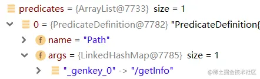

这里面的 lookup 方法是处理每个断言的核心逻辑：

~~~java
private AsyncPredicate<ServerWebExchange> lookup(RouteDefinition route,
        PredicateDefinition predicate) {
    // 根据断言类型决定使用哪种断言工厂
    RoutePredicateFactory<Object> factory = this.predicates.get(predicate.getName());
    if (factory == null) {
        // throw exception ......
    }
    Map<String, String> args = predicate.getArgs();
    // logger ......

    // 标准化PredicateDefinition中的参数
    Map<String, Object> properties = factory.shortcutType().normalize(args, factory,
            this.parser, this.beanFactory);
    Object config = factory.newConfig();
    ConfigurationUtils.bind(config, properties, factory.shortcutFieldPrefix(),
            predicate.getName(), validator, conversionService);
    if (this.publisher != null) {
        this.publisher.publishEvent(new PredicateArgsEvent(this, route.getId(), properties));
    }
    return factory.applyAsync(config);
}
~~~

分段来看，一开始它获取到断言工厂后，把 PredicateDefinition 中的参数都取出来了：

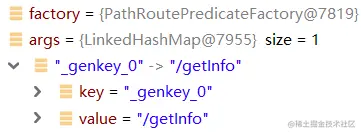

随后，它把这些参数做了一次标准化，标准化的目的是为了特殊规则中特殊参数的类型转换（看 normalize 方法中传入了 parser ），而标准化的结果似乎看上去更容易理解一些：

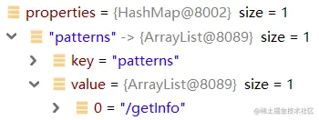

最后的动作是利用 RoutePredicateFactory 将 PredicateDefinition 转换为 Predicate 对象。由于这部分是 RoutePredicateFactory 的动作，且每个实现类的处理都不相同，后续会详解。

2、组合过滤器

除了整合断言条件，过滤器的整合也是在 RouteDefinition 转为 Route 的过程中完成的：

~~~java
private List<GatewayFilter> getFilters(RouteDefinition routeDefinition) {
    List<GatewayFilter> filters = new ArrayList<>();

    // 配置中声明的默认过滤器
    if (!this.gatewayProperties.getDefaultFilters().isEmpty()) {
        filters.addAll(loadGatewayFilters(DEFAULT_FILTERS,
                this.gatewayProperties.getDefaultFilters()));
    }
    // 路由定义规则中的过滤器
    if (!routeDefinition.getFilters().isEmpty()) {
        filters.addAll(loadGatewayFilters(routeDefinition.getId(),
                routeDefinition.getFilters()));
    }

    AnnotationAwareOrderComparator.sort(filters);
    return filters;
}
~~~

它会将配置中的默认过滤器，以及声明的每个路由信息中的过滤器都整合进去，生成过滤器。

最后会结合过滤器和断言，共同生成路由规则。

## GatewayDiscoveryClientAutoConfiguration

网关一般都是配合服务发现完成动态路由的，GatewayDiscoveryClientAutoConfiguration就是整合了服务发现的自动配置类：

~~~java
@Configuration
// 默认开启
@ConditionalOnProperty(name = "spring.cloud.gateway.enabled", matchIfMissing = true)
@AutoConfigureBefore(GatewayAutoConfiguration.class)
@AutoConfigureAfter(CompositeDiscoveryClientAutoConfiguration.class)
@ConditionalOnClass({ DispatcherHandler.class, DiscoveryClient.class })
@EnableConfigurationProperties
public class GatewayDiscoveryClientAutoConfiguration
~~~

类上并没有打额外导入的注解，关键是它内部导入的组件。

### DiscoveryClientRouteDefinitionLocator

它就是整合了服务发现的 RouteDefinitionLocator ，它跟 PropertiesRouteDefinitionLocator 的根本不同就是读取路由信息源的不同。

下面是核心方法getRouteDefinitions：

~~~java
public Flux<RouteDefinition> getRouteDefinitions() {
    // 用于解析SpEL表达式的解析器
    SpelExpressionParser parser = new SpelExpressionParser();
    Expression includeExpr = parser
            .parseExpression(properties.getIncludeExpression());
    // private String urlExpression = "'lb://'+serviceId";
    // 利用这个表达式，可以让Expression根据传入的serviceId拼装为实际的负载均衡url
    Expression urlExpr = parser.parseExpression(properties.getUrlExpression());

    Predicate<ServiceInstance> includePredicate;
    if (properties.getIncludeExpression() == null
            || "true".equalsIgnoreCase(properties.getIncludeExpression())) {
        includePredicate = instance -> true;
    } // 默认为true，不会走else ......

    return Flux.fromIterable(discoveryClient.getServices())
            .map(discoveryClient::getInstances)
            .filter(instances -> !instances.isEmpty())
            .map(instances -> instances.get(0)).filter(includePredicate)
            .map(instance -> {
                String serviceId = instance.getServiceId();

                // 构造RouteDefinition，设置服务名称，以及带有负载均衡的url
                RouteDefinition routeDefinition = new RouteDefinition();
                routeDefinition.setId(this.routeIdPrefix + serviceId);
                String uri = urlExpr.getValue(evalCtxt, instance, String.class);
                routeDefinition.setUri(URI.create(uri));

                final ServiceInstance instanceForEval = new DelegatingServiceInstance(
                        instance, properties);

                // 设置断言规则定义，默认的规则是/{serviceId}/**
                for (PredicateDefinition original : this.properties.getPredicates()) {
                    PredicateDefinition predicate = new PredicateDefinition();
                    predicate.setName(original.getName());
                    for (Map.Entry<String, String> entry : original.getArgs()
                            .entrySet()) {
                        String value = getValueFromExpr(evalCtxt, parser,
                                instanceForEval, entry);
                        predicate.addArg(entry.getKey(), value);
                    }
                    routeDefinition.getPredicates().add(predicate);
                }

                // 设置内置的过滤器
                for (FilterDefinition original : this.properties.getFilters()) {
                    FilterDefinition filter = new FilterDefinition();
                    filter.setName(original.getName());
                    for (Map.Entry<String, String> entry : original.getArgs()
                            .entrySet()) {
                        String value = getValueFromExpr(evalCtxt, parser,
                                instanceForEval, entry);
                        filter.addArg(entry.getKey(), value);
                    }
                    routeDefinition.getFilters().add(filter);
                }

                return routeDefinition;
            });
}
~~~

这里面默认的断言规则是 uri 前缀以服务名称打头，后面匹配所有请求：/{serviceId}/**

默认的过滤规则是转发微服务的所有请求，它直接用正则表达式将整个服务名称后面的 uri 都截取下来做了转发，例如访问http://gateway-9900.com:9900/EUREKA-CLIENT/getInfo实际上就是访问getInfo。

### DiscoveryLocatorProperties

它就是配合上面做的动态路由的默认配置，上面看到的一些配置都在这里面：

~~~java
	/** Flag that enables DiscoveryClient gateway integration. */
	private boolean enabled = false;

    /**
	 * SpEL expression that will evaluate whether to include a service in gateway
	 * integration or not, defaults to: true.
	 */
	private String includeExpression = "true";

	/**
	 * SpEL expression that create the uri for each route, defaults to: 'lb://'+serviceId.
	 */
	private String urlExpression = "'lb://'+serviceId";
~~~

可以看到默认并不开启基于服务发现的路由。

## GatewayLoadBalancerClientAutoConfiguration

它是和负载均衡相关的配置类：

~~~java
@Bean
@ConditionalOnBean(LoadBalancerClient.class)
@ConditionalOnMissingBean({ LoadBalancerClientFilter.class,
        ReactiveLoadBalancerClientFilter.class })
public LoadBalancerClientFilter loadBalancerClientFilter(LoadBalancerClient client,
        LoadBalancerProperties properties) {
    return new LoadBalancerClientFilter(client, properties);
}
~~~

后续详细讲解它的过滤规则。

## 组件小结

1. Gateway 的路由规则是由一组 Route 、Predicate 和 Filter 构成，三者协作完成网关的请求转发；
2. RouteDefinitionLocator 负责加载 RouteDefinition ，再由 RouteDefinitionRouteLocator 转换为 Route ，最后由 RoutePredicateHandlerMapping 选择出匹配的 Route ，执行请求转发的动作。

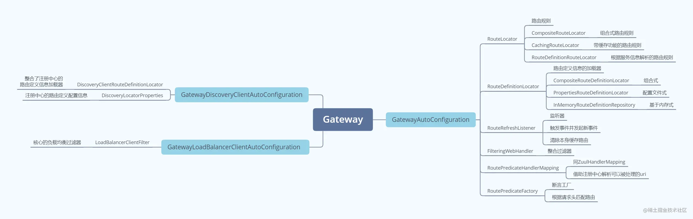

## 调用流程

### 获取Handler

因为Springboot在初始化的时候，会判断当前SpringBoot应用应该使用哪种环境启动，因为类路径中有org.springframework.web.reactive.DispatcherHandler，所以按照Reactive 环境启动（全NIO），请求首先来到网关服务的DispatcherHandler：

~~~java
public Mono<Void> handle(ServerWebExchange exchange) {
    if (this.handlerMappings == null) {
        return createNotFoundError();
    }
    // 前两行的动作相当于DispatcherServlet找HandlerMapping
    return Flux.fromIterable(this.handlerMappings)
            .concatMap(mapping -> mapping.getHandler(exchange))
            .next()
            .switchIfEmpty(createNotFoundError())
            .flatMap(handler -> invokeHandler(exchange, handler))
            .flatMap(result -> handleResult(exchange, result));
}
~~~

它的工作流程与 DispatcherServlet 如出一辙，首先也是找 HandlerMapping，Debug发现默认情况下一共有4个 HandlerMapping ：

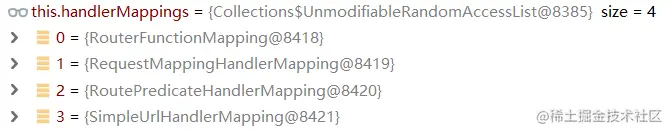

concatMap 方法对每个 HandlerMapping 执行类型转换的动作，而 HandlerMapping 的使命是找到可以执行的 Handler ，那自然先来到 AbstractHandlerMapping 中：

~~~java
public Mono<Object> getHandler(ServerWebExchange exchange) {
    return getHandlerInternal(exchange).map(handler -> {
        // logger cors ......
        return handler;
    });
}

protected abstract Mono<?> getHandlerInternal(ServerWebExchange exchange);
~~~

这里可以看到经典的模板方法设计（父类提供标准流程，子类实现具体功能），getHandlerInternal由 RouterPredicateFunctionMapping 实现：

~~~java
private final FilteringWebHandler webHandler;

protected Mono<?> getHandlerInternal(ServerWebExchange exchange) {
    // don't handle requests on management port if set and different than server port
    // 如果已设置并且与服务器端口不同，则不处理管理端口上的请求
    if (this.managementPortType == DIFFERENT && this.managementPort != null
            && exchange.getRequest().getURI().getPort() == this.managementPort) {
        return Mono.empty();
    }
    exchange.getAttributes().put(GATEWAY_HANDLER_MAPPER_ATTR, getSimpleName());

    // 1.4 匹配路由
    return lookupRoute(exchange)
            // .log("route-predicate-handler-mapping", Level.FINER) //name this
            .flatMap((Function<Route, Mono<?>>) r -> {
                // 匹配到了路由，包装为 WebHandler
                exchange.getAttributes().remove(GATEWAY_PREDICATE_ROUTE_ATTR);
                // logger ......
                exchange.getAttributes().put(GATEWAY_ROUTE_ATTR, r);
                return Mono.just(webHandler);
            }).switchIfEmpty(Mono.empty().then(Mono.fromRunnable(() -> {
                // 没有找到，返回empty
                exchange.getAttributes().remove(GATEWAY_PREDICATE_ROUTE_ATTR);
                // logger ......
            })));
}
~~~

这里之前分析RoutePredicateHandlerMapping 的时候已经看过了，它最终将路由包装为一个 WebHandler，就是上面分析过的FilteringWebHandler，由它执行所有的过滤器。这里关键的地方是它怎么根据现有的请求，判断出用哪个路由规则，这就是 lookupRoute 方法要干的事情了，lookupRoute 就是匹配路由规则的方法：

~~~java
protected Mono<Route> lookupRoute(ServerWebExchange exchange) {
    // 获取所有路由
    return this.routeLocator.getRoutes()
            .concatMap(route -> Mono.just(route).filterWhen(r -> {
                exchange.getAttributes().put(GATEWAY_PREDICATE_ROUTE_ATTR, r.getId());
                // 判断路由规则是否匹配当前请求
                return r.getPredicate().apply(exchange);
            })
            .doOnError(e -> logger.error(
                    "Error applying predicate for route: " + route.getId(), e))
            .onErrorResume(e -> Mono.empty()))
            .next()
            .map(route -> {
                // logger ......
                // 校验路由（空动作，可由子类重写）
                validateRoute(route, exchange);
                return route;
            });
}
~~~

this.routeLocator.getRoutes实际上是从带缓存的 CachingRouteLocator中返回路由，然后经过一个过滤的逻辑，过滤的关键逻辑就是apply，它会判断路由规则是否匹配当前请求，PathRoutePredicateFactory#apply：

~~~java
// DefaultAsyncPredicate
public Publisher<Boolean> apply(T t) {
    return Mono.just(delegate.test(t));
}

// PathRoutePredicateFactory#apply → GatewayPredicate
return new GatewayPredicate() {
    @Override
    public boolean test(ServerWebExchange exchange) {
        // 解析出当前的请求uri
        PathContainer path = parsePath(exchange.getRequest().getURI().getRawPath());
        // 从所有内置的路由规则中匹配是否有合适的路由
        Optional<PathPattern> optionalPathPattern = pathPatterns.stream()
                .filter(pattern -> pattern.matches(path)).findFirst();
        // 匹配到了，解析uri上的参数，并放入请求上下文参数中，留给后续的过滤器使用
        if (optionalPathPattern.isPresent()) {
            PathPattern pathPattern = optionalPathPattern.get();
            traceMatch("Pattern", pathPattern.getPatternString(), path, true);
            PathMatchInfo pathMatchInfo = pathPattern.matchAndExtract(path);
            putUriTemplateVariables(exchange, pathMatchInfo.getUriVariables());
            return true;
        } else {
            traceMatch("Pattern", config.getPatterns(), path, false);
            return false;
        }
    }
~~~

首先会解析出当前的请求uri，然后从所有内置的路由规则中匹配是否有合适的路由，匹配到了，解析uri上的参数，并放入请求上下文参数中，留给后续的过滤器使用。举个例子：/user/get/{id} → /user/get/123 → {"id": "123"}，对于 /user/get/{id} 这样的请求，如果发起一个 /user/get/123 的请求，则解析之后会形成一个 Map ，内部有一个键值对：id: 123

回到getHandlerInternal方法，匹配到了路由后，将其包装为 WebHandler，然后将路由信息放入了请求参数中，在getHandlerInternal方法return之前，可以看到Route 与 WebHandler 都已经准备就绪了：

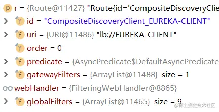

Route就代表请求已经正确匹配到了路由规则；而FilteringWebHandler 中有内置9个全局过滤器，这里暂时先不关心。至此，Handler 已经获取到，返回给 DispatcherHandler 。

### 执行FilteringWebHandler

回到 DispatcherHandler 中：

~~~java
return Flux.fromIterable(this.handlerMappings)
        .concatMap(mapping -> mapping.getHandler(exchange))
        .next()
        .switchIfEmpty(createNotFoundError())
        // 执行Handler
        .flatMap(handler -> invokeHandler(exchange, handler))
        .flatMap(result -> handleResult(exchange, result));
~~~

getHandler获取到之后继续往下走，执行invokeHandler方法，它借助 HandlerAdapter 执行目标 Handler ：

~~~java
private Mono<HandlerResult> invokeHandler(ServerWebExchange exchange, Object handler) {
    if (this.handlerAdapters != null) {
        for (HandlerAdapter handlerAdapter : this.handlerAdapters) {
            if (handlerAdapter.supports(handler)) {
                return handlerAdapter.handle(exchange, handler);
            }
        }
    }
    return Mono.error(new IllegalStateException("No HandlerAdapter: " + handler));
}

// SimpleHandlerAdapter
public Mono<HandlerResult> handle(ServerWebExchange exchange, Object handler) {
    WebHandler webHandler = (WebHandler) handler;
    Mono<Void> mono = webHandler.handle(exchange);
    return mono.then(Mono.empty());
}
~~~

最终执行的是WebHandler 的 handle方法，FilteringWebHandler#handle：

~~~java
public Mono<Void> handle(ServerWebExchange exchange) {
    // 获取到已经匹配好的路由和过滤器
    Route route = exchange.getRequiredAttribute(GATEWAY_ROUTE_ATTR);
    List<GatewayFilter> gatewayFilters = route.getFilters();

    // 将全局过滤器放入所有过滤器中，再把匹配好的路由中的过滤器放入
    List<GatewayFilter> combined = new ArrayList<>(this.globalFilters);
    combined.addAll(gatewayFilters);
    // 过滤器排序
    AnnotationAwareOrderComparator.sort(combined);
    // logger ......
    return new DefaultGatewayFilterChain(combined).filter(exchange);
}
~~~

这个方法之前分析过，它会整理一组 GatewayFilter ，与 GlobalFilter 的适配转换器，组合成一个过滤器链，整合成一个过滤器链，最后执行。其中GlobalFilter 作用于所有路由，GatewayFilter 作用于特定的路由

GlobalFilter 与 GatewayFilter 是两种不同的类型，需要一个适配机制来将 GlobalFilter 适配成 GatewayFilter 类型，而这个适配动作发生在 FilteringWebHandler 的构造方法中：

~~~java
private final List<GatewayFilter> globalFilters;

public FilteringWebHandler(List<GlobalFilter> globalFilters) {
    this.globalFilters = loadFilters(globalFilters);
}

private static List<GatewayFilter> loadFilters(List<GlobalFilter> filters) {
    return filters.stream().map(filter -> {
        GatewayFilterAdapter gatewayFilter = new GatewayFilterAdapter(filter);
        if (filter instanceof Ordered) {
            int order = ((Ordered) filter).getOrder();
            return new OrderedGatewayFilter(gatewayFilter, order);
        }
        return gatewayFilter;
    }).collect(Collectors.toList());
}
~~~

可以看到，在这里进行了一层适配动作，将 GlobalFilter 用 GatewayFilterAdapter 包装了一下。

过滤器准备完成后，就可以逐个执行了。DefaultGatewayFilterChain 的构造：

~~~java
private static class DefaultGatewayFilterChain implements GatewayFilterChain {
    private final int index;
    private final List<GatewayFilter> filters;

    DefaultGatewayFilterChain(List<GatewayFilter> filters) {
        this.filters = filters;
        this.index = 0;
    }
~~~

这里只是把传入的filters给保存起来了，然后在filter方法中开始按照下标逐个执行：

~~~java
public Mono<Void> filter(ServerWebExchange exchange) {
    return Mono.defer(() -> {
        if (this.index < filters.size()) {
            GatewayFilter filter = filters.get(this.index);
            DefaultGatewayFilterChain chain = new DefaultGatewayFilterChain(this,
                    this.index + 1);
            return filter.filter(exchange, chain);
        } else {
            return Mono.empty(); // complete
        }
    });
}
~~~

Debug发现一共有10个过滤器：

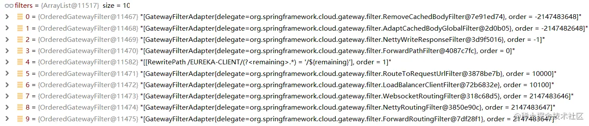

下面按照顺序把这10个过滤器都解释一遍。

### RemoveCachedBodyFilter

~~~java
public static final String CACHED_REQUEST_BODY_ATTR = "cachedRequestBody";

public Mono<Void> filter(ServerWebExchange exchange, GatewayFilterChain chain) {
    return chain.filter(exchange).doFinally(s -> {
        PooledDataBuffer dataBuffer = (PooledDataBuffer) exchange.getAttributes()
                .remove(CACHED_REQUEST_BODY_ATTR);
        if (dataBuffer != null && dataBuffer.isAllocated()) {
            // logger ......
            dataBuffer.release();
        }
    });
}
~~~

可以看出来它并不是立即执行，而是先让后面的过滤器执行，等到最后都执行完毕后，它来做一个收尾动作：清除缓存、释放资源。

### AdaptCachedBodyGlobalFilter

~~~java
public Mono<Void> filter(ServerWebExchange exchange, GatewayFilterChain chain) {
    // the cached ServerHttpRequest is used when the ServerWebExchange can not be
    // mutated, for example, during a predicate where the body is read, but still
    // needs to be cached.
    ServerHttpRequest cachedRequest = exchange
            .getAttributeOrDefault(CACHED_SERVER_HTTP_REQUEST_DECORATOR_ATTR, null);
    // 前置过滤器已经将请求封装为带缓存的请求
    if (cachedRequest != null) {
        exchange.getAttributes().remove(CACHED_SERVER_HTTP_REQUEST_DECORATOR_ATTR);
        return chain.filter(exchange.mutate().request(cachedRequest).build());
    }

    DataBuffer body = exchange.getAttributeOrDefault(CACHED_REQUEST_BODY_ATTR, null);
    Route route = exchange.getAttribute(GATEWAY_ROUTE_ATTR);
    // 有请求体，但没有显式指定要缓存该路由
    if (body != null || !this.routesToCache.containsKey(route.getId())) {
        return chain.filter(exchange);
    }

    // 需要对请求体进行缓存
    return ServerWebExchangeUtils.cacheRequestBody(exchange, (serverHttpRequest) -> {
        // don't mutate and build if same request object
        if (serverHttpRequest == exchange.getRequest()) {
            return chain.filter(exchange);
        }
        return chain.filter(exchange.mutate().request(serverHttpRequest).build());
    });
}
~~~

它的作用和Zuul中的一个过滤器FormBodyWrapperFilter很像，它可以将请求体预读取出来，并且放入一个缓存区，后续的过滤器读取请求体时将不再读原始请求，而是读这一部分缓存区的数据，这样可以达到重复读取的目的。在这个 AdaptCachedBodyGlobalFilter 中，它的作用也是如此。它可以将请求体直接封装到 ServerHttpRequest 的 attribute 中，核心方法是下面的 ServerWebExchangeUtils.cacheRequestBody 操作：

~~~java
public static <T> Mono<T> cacheRequestBody(ServerWebExchange exchange,
        Function<ServerHttpRequest, Mono<T>> function) {
    return cacheRequestBody(exchange, false, function);
}

private static <T> Mono<T> cacheRequestBody(ServerWebExchange exchange,
        boolean cacheDecoratedRequest, Function<ServerHttpRequest, Mono<T>> function) {
    // Join all the DataBuffers so we have a single DataBuffer for the body
    return DataBufferUtils.join(exchange.getRequest().getBody()).map(dataBuffer -> {
        if (dataBuffer.readableByteCount() > 0) {
            // logger ......
            exchange.getAttributes().put(CACHED_REQUEST_BODY_ATTR, dataBuffer);
        }
        // 将原有请求封装为ServerHttpRequestDecorator类型（装饰者）
        ServerHttpRequest decorator = new ServerHttpRequestDecorator(exchange.getRequest()) {
            @Override
            public Flux<DataBuffer> getBody() {
                return Mono.<DataBuffer>fromSupplier(() -> {
                    if (exchange.getAttributeOrDefault(CACHED_REQUEST_BODY_ATTR, null) == null) {
                        return null;
                    }
                    NettyDataBuffer pdb = (NettyDataBuffer) dataBuffer;
                    return pdb.factory().wrap(pdb.getNativeBuffer().retainedSlice());
                }).flux();
            }
        };
        if (cacheDecoratedRequest) {
            // 将带有缓存装饰的请求放入参数中
            exchange.getAttributes().put(CACHED_SERVER_HTTP_REQUEST_DECORATOR_ATTR, decorator);
        }
        return decorator;
    }).switchIfEmpty(Mono.just(exchange.getRequest())).flatMap(function);
}
~~~

它的做法和 Zuul 中的 FormBodyWrapperFilter 不太一样，Zuul是预先读一遍，之后放成员中缓存起来；这里直接装饰好了放 exchange 的请求属性 attribute 中了，相当于放到一个额外的属性空间中了，这就意味着如果其他过滤器要读取这部分信息，就要用不同的方式了。

### NettyWriteResponseFilter

~~~java
public Mono<Void> filter(ServerWebExchange exchange, GatewayFilterChain chain) {
    // 先执行后续过滤器再执行它
    return chain.filter(exchange)
            .doOnError(throwable -> cleanup(exchange))
            .then(Mono.defer(() -> {
                Connection connection = exchange.getAttribute(CLIENT_RESPONSE_CONN_ATTR);
                if (connection == null) {
                    return Mono.empty();
                }
                // logger ......
                // 获取目标服务的响应，并将响应数据写回给客户端
                ServerHttpResponse response = exchange.getResponse();
                NettyDataBufferFactory factory = 
                        (NettyDataBufferFactory) response.bufferFactory();
                final Flux<NettyDataBuffer> body = connection
                        .inbound().receive().retain().map(factory::wrap);

                MediaType contentType = null;
                try {
                    contentType = response.getHeaders().getContentType();
                } //catch ......
                return (isStreamingMediaType(contentType)
                        ? response.writeAndFlushWith(body.map(Flux::just))
                        : response.writeWith(body));
            })).doOnCancel(() -> cleanup(exchange));
}
~~~

这又是一个后置执行的过滤器，其实从类名上也能理解，它是写回响应的，它的核心操作就是将目标服务响应的数据写回给客户端。

### ForwardPathFilter

~~~java
public Mono<Void> filter(ServerWebExchange exchange, GatewayFilterChain chain) {
    Route route = exchange.getAttribute(GATEWAY_ROUTE_ATTR);
    URI routeUri = route.getUri();
    String scheme = routeUri.getScheme();
    if (isAlreadyRouted(exchange) || !"forward".equals(scheme)) {
        return chain.filter(exchange);
    }
    exchange = exchange.mutate()
            .request(exchange.getRequest().mutate().path(routeUri.getPath()).build())
            .build();
    return chain.filter(exchange);
}
~~~

这个过滤器就很容易理解了，它是专门处理请求转发类型的请求。scheme 的类型除了 http https 之外，还有 Gateway 内置的 lb (负载均衡) 等。

### OrderedGatewayFilter[RewritePath]

这个过滤器是在 RewritePathGatewayFilterFactory 内部构件的匿名内部类：

~~~java
public Mono<Void> filter(ServerWebExchange exchange, GatewayFilterChain chain) {
    // 获取原始请求，并记录到exchange中
    ServerHttpRequest req = exchange.getRequest();
    addOriginalRequestUrl(exchange, req.getURI());
    String path = req.getURI().getRawPath();
    // 重写请求路径
    String newPath = path.replaceAll(config.regexp, replacement);

    // 构造新的请求
    ServerHttpRequest request = req.mutate().path(newPath).build();
    exchange.getAttributes().put(GATEWAY_REQUEST_URL_ATTR, request.getURI());
    return chain.filter(exchange.mutate().request(request).build());
}
~~~

可以发现，它利用正则表达式，将原有的 uri 根据正则替换规则，替换为新的 uri 。

Debug停在过滤器中，可以看到 基于服务名称的负载均衡策略 中，替换前后的规则是去掉服务名称：

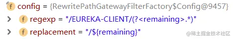

### RouteToRequestUrlFilter

~~~java
public Mono<Void> filter(ServerWebExchange exchange, GatewayFilterChain chain) {
    // 取出路由信息
    Route route = exchange.getAttribute(GATEWAY_ROUTE_ATTR);
    if (route == null) {
        return chain.filter(exchange);
    }
    // logger ......
    // 取出客户端对网关发起的最原始请求url
    URI uri = exchange.getRequest().getURI();
    boolean encoded = containsEncodedParts(uri);
    // 路由信息中定义的目标uri（带负载均衡策略的）
    URI routeUri = route.getUri();

    if (hasAnotherScheme(routeUri)) {
        exchange.getAttributes().put(GATEWAY_SCHEME_PREFIX_ATTR,
                routeUri.getScheme());
        routeUri = URI.create(routeUri.getSchemeSpecificPart());
    }

    if ("lb".equalsIgnoreCase(routeUri.getScheme()) && routeUri.getHost() == null) {
        throw new IllegalStateException("Invalid host: " + routeUri.toString());
    }

    // 将原有url与路由规则中的uri拼接为真正能被负载均衡解析的url
    URI mergedUrl = UriComponentsBuilder.fromUri(uri)
            .scheme(routeUri.getScheme()).host(routeUri.getHost())
            .port(routeUri.getPort()).build(encoded).toUri();
    exchange.getAttributes().put(GATEWAY_REQUEST_URL_ATTR, mergedUrl);
    return chain.filter(exchange);
}
~~~

这个过滤器的作用也是从类名上就能看得出来：它会在这一步将路由信息转换为请求 url （还没到实际请求的 url ），根据Debug的信息，也可以看出，最终拼接出来的 url 就是手动调用对应服务的路径：

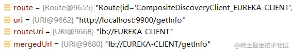

### LoadBalancerClientFilter

~~~java
protected final LoadBalancerClient loadBalancer;

public Mono<Void> filter(ServerWebExchange exchange, GatewayFilterChain chain) {
    URI url = exchange.getAttribute(GATEWAY_REQUEST_URL_ATTR);
    String schemePrefix = exchange.getAttribute(GATEWAY_SCHEME_PREFIX_ATTR);
    // 当前过滤器只处理lb协议
    if (url == null || (!"lb".equals(url.getScheme()) && !"lb".equals(schemePrefix))) {
        return chain.filter(exchange);
    }
    // preserve the original url 保留原始请求路径
    addOriginalRequestUrl(exchange, url);
    // logger ......
    final ServiceInstance instance = choose(exchange);
    if (instance == null) {
        // throw exception ......
    }

    URI uri = exchange.getRequest().getURI();
    String overrideScheme = instance.isSecure() ? "https" : "http";
    if (schemePrefix != null) {
        overrideScheme = url.getScheme();
    }

    // 【重写】重新构造请求url
    URI requestUrl = loadBalancer.reconstructURI(
            new DelegatingServiceInstance(instance, overrideScheme), uri);
    // logger ......
    exchange.getAttributes().put(GATEWAY_REQUEST_URL_ATTR, requestUrl);
    return chain.filter(exchange);
}
~~~

它和负载均衡相关，关键是loadBalancer.reconstructURI这一句，它将上一个过滤器中刚构造好的路径重新解析成真实的请求路径，这里借助了Ribbon的负载均衡器。

### WebsocketRoutingFilter

这个过滤器是处理 WebSocket 请求的，当请求是普通的HTTP请求时，不涉及该过滤器。

### NettyRoutingFilter

~~~java
public Mono<Void> filter(ServerWebExchange exchange, GatewayFilterChain chain) {
    URI requestUrl = exchange.getRequiredAttribute(GATEWAY_REQUEST_URL_ATTR);
    String scheme = requestUrl.getScheme();
    // 不是http/https协议无法处理
    if (isAlreadyRouted(exchange) || (!"http".equals(scheme) && !"https".equals(scheme))) {
        return chain.filter(exchange);
    }
    //标记该请求已经被路由处理
    setAlreadyRouted(exchange);

    // 获取当前请求相关信息、请求头
    ServerHttpRequest request = exchange.getRequest();
    final HttpMethod method = HttpMethod.valueOf(request.getMethodValue());
    final String url = requestUrl.toASCIIString();

    HttpHeaders filtered = filterRequest(getHeadersFilters(), exchange);
    final DefaultHttpHeaders httpHeaders = new DefaultHttpHeaders();
    filtered.forEach(httpHeaders::set);

    boolean preserveHost = exchange
            .getAttributeOrDefault(PRESERVE_HOST_HEADER_ATTRIBUTE, false);

    // 构建请求头
    Flux<HttpClientResponse> responseFlux = this.httpClient.headers(headers -> {
        headers.add(httpHeaders);
        if (preserveHost) {
            String host = request.getHeaders().getFirst(HttpHeaders.HOST);
            headers.add(HttpHeaders.HOST, host);
        }
    // 发起请求
    }).request(method).uri(url).send((req, nettyOutbound) -> {
        // logger ......
        return nettyOutbound.options(NettyPipeline.SendOptions::flushOnEach).send(
                request.getBody().map(dataBuffer -> ((NettyDataBuffer) dataBuffer)
                        .getNativeBuffer()));
    // 处理响应
    }).responseConnection((res, connection) -> {
        exchange.getAttributes().put(CLIENT_RESPONSE_ATTR, res);
        exchange.getAttributes().put(CLIENT_RESPONSE_CONN_ATTR, connection);

        ServerHttpResponse response = exchange.getResponse();
        // 处理响应头、响应类型等......
        return Mono.just(res);
    });

    if (properties.getResponseTimeout() != null) {
        responseFlux = responseFlux.timeout(properties.getResponseTimeout(),
                Mono.error(new TimeoutException("Response took longer than timeout: "
                        + properties.getResponseTimeout())))
                .onErrorMap(TimeoutException.class,
                        th -> new ResponseStatusException(HttpStatus.GATEWAY_TIMEOUT,
                                th.getMessage(), th));
    }
    return responseFlux.then(chain.filter(exchange));
}
~~~

这个过滤器就是真正发起远程请求的过滤器了，类比于 Zuul 的 RibbonRoutingFilter。它的远程调用是基于Netty的。

### ForwardRoutingFilter

~~~java
public Mono<Void> filter(ServerWebExchange exchange, GatewayFilterChain chain) {
    URI requestUrl = exchange.getRequiredAttribute(GATEWAY_REQUEST_URL_ATTR);

    String scheme = requestUrl.getScheme();
    if (isAlreadyRouted(exchange) || !"forward".equals(scheme)) {
        return chain.filter(exchange);
    }
    // logger ......
    return this.getDispatcherHandler().handle(exchange);
}
~~~

这部分的规则就很简单了：它会判断请求协议是否为 forward （由于 NettyRoutingFilter 只处理 http 和 https ，不会影响它），如果是，则转发给 DispatcherHandler 处理（类似于 SpringWebMVC ）。

到这里，整个过滤器链就算走完了，一次 Gateway 的完整工作流程也就执行完毕了。

## 内置Predicate

Gateway 的两个路由核心是 Predicate 和 Filter，这里介绍一些比较重要的断言器。

### AfterRoutePredicateFactory&BeforeRoutePredicateFactory

AfterRoutePredicateFactory 的作用机制是在设置了指定时间后，该断言才会生效；BeforeRoutePredicateFactory 则正好相反。

它们的使用方式如下：

~~~yaml
spring:
  cloud:
    gateway:
      routes:
       - id: eureka-client
         uri: lb://eureka-client
         predicates:
          - After=2020-01-01T10:00:00.000+08:00[Asia/Shanghai]
~~~

它们两个的作用原理很简单，以 AfterRoutePredicateFactory 为例，来到它声明的匿名内部类：

~~~java
public boolean test(ServerWebExchange serverWebExchange) {
    final ZonedDateTime now = ZonedDateTime.now();
    return now.isAfter(config.getDatetime());
}
~~~

可见它就是拿 jdk8 的时间API直接比对，非常简单。

还有一个Predicate是BetweenRoutePredicateFactory，它就是上面两个的结合体，内部实现：

~~~java
public boolean test(ServerWebExchange serverWebExchange) {
    final ZonedDateTime now = ZonedDateTime.now();
    return now.isAfter(config.getDatetime1())
            && now.isBefore(config.getDatetime2());
}
~~~

### CookieRoutePredicateFactory

这个断言的判断规则是检查请求的 cookie 中是否包含特定的 cookie 值，它的使用方式如下：

~~~yaml
spring:
  cloud:
    gateway:
      routes:
       - id: eureka-client
         uri: lb://eureka-client
         predicates:
          - Cookie=user_key, user.+ # cookie中必须有user_key，且必须以user开头才会通过
~~~

它的判断规则其实就是取出cookie匹配：

~~~java
public boolean test(ServerWebExchange exchange) {
    List<HttpCookie> cookies = exchange.getRequest().getCookies().get(config.name);
    if (cookies == null) {
        return false;
    }
    // 循环搜查是否存在指定的cookie
    for (HttpCookie cookie : cookies) {
        if (cookie.getValue().matches(config.regexp)) {
            return true;
        }
    }
    return false;
}
~~~

### HeaderRoutePredicateFactory

它判断的是请求头信息上是否包含某个特定的请求头，使用方式与 cookie 类似，但底层的判断规则跟 cookie 的不太一样：

~~~java
public boolean test(ServerWebExchange exchange) {
    List<String> values = exchange.getRequest().getHeaders()
            .getOrDefault(config.header, Collections.emptyList());
    if (values.isEmpty()) {
        return false;
    }
    // values is now guaranteed to not be empty
    // 只有声明了匹配规则才会进入筛选
    if (hasRegex) {
        // check if a header value matches
        return values.stream().anyMatch(value -> value.matches(config.regexp));
    }

    // there is a value and since regexp is empty, we only check existence.
    // 如果没有声明，则只要存在请求头，即可通过
    return true;
}
~~~

注意看这里面的规则，它使用 hasRegex 来判断配置的 header 键对应的值规则，如果只是声明了特定的 header ，则无需判断规则，直接通过（cookie 的断言必须声明规则）

### HostRoutePredicateFactory

这个可以看做一个特殊的 HeaderRoutePredicateFactory ，它里面写死了要取请求头中的 Host ：

~~~java
private PathMatcher pathMatcher = new AntPathMatcher(".");

public boolean test(ServerWebExchange exchange) {
    String host = exchange.getRequest().getHeaders().getFirst("Host");
    // 匹配路径（使用Ant风格匹配）
    Optional<String> optionalPattern = config.getPatterns().stream()
            .filter(pattern -> pathMatcher.match(pattern, host)).findFirst();

    if (optionalPattern.isPresent()) {
        Map<String, String> variables = pathMatcher
                .extractUriTemplateVariables(optionalPattern.get(), host);
        ServerWebExchangeUtils.putUriTemplateVariables(exchange, variables);
        return true;
    }

    return false;
}
~~~

使用时声明的过滤规则要使用 Ant 风格的规则，不要像上面那样用正则表达式的风格了（除非自己手动构造 HostRoutePredicateFactory ）

### MethodRoutePredicateFactory

它是用来匹配HTTP方法类型的：

~~~java
public boolean test(ServerWebExchange exchange) {
    HttpMethod requestMethod = exchange.getRequest().getMethod();
    return requestMethod == config.getMethod();
}
~~~

### PathRoutePredicateFactory

它是最基本的根据请求路径匹配，之前已经分析过了：

~~~java
public boolean test(ServerWebExchange exchange) {
    // 解析出当前的请求uri
    PathContainer path = parsePath(exchange.getRequest().getURI().getRawPath());
    // 从所有内置的路由规则中匹配是否有合适的路由
    Optional<PathPattern> optionalPathPattern = pathPatterns.stream()
            .filter(pattern -> pattern.matches(path)).findFirst();
    // 匹配到了，解析uri上的参数，并放入请求上下文参数中，留给后续的过滤器使用
    if (optionalPathPattern.isPresent()) {
        PathPattern pathPattern = optionalPathPattern.get();
        traceMatch("Pattern", pathPattern.getPatternString(), path, true);
        PathMatchInfo pathMatchInfo = pathPattern.matchAndExtract(path);
        putUriTemplateVariables(exchange, pathMatchInfo.getUriVariables());
        return true;
    } else {
        traceMatch("Pattern", config.getPatterns(), path, false);
        return false;
    }
}
~~~

### QueryRoutePredicateFactory

这个断言规则可以检查请求参数，并根据规则判断是否匹配，它的使用方法也很简单：

~~~yaml
spring:
  cloud:
    gateway:
      routes:
       - id: eureka-client
         uri: lb://eureka-client
         predicates:
          - Query=consumerId # 请求参数中必须有consumerId才会通过
~~~

它的底层逻辑跟 HeaderRoutePredicateFactory 比较类似：

~~~java
public boolean test(ServerWebExchange exchange) {
    // 如果没有声明参数值的规则，那就只检查参数是否存在
    if (!StringUtils.hasText(config.regexp)) {
        // check existence of header
        return exchange.getRequest().getQueryParams().containsKey(config.param);
    }

    // 取出参数值
    List<String> values = exchange.getRequest().getQueryParams().get(config.param);
    if (values == null) {
        return false;
    }
    for (String value : values) {
        // 只要有一个参数值匹配，则认定整体匹配
        if (value != null && value.matches(config.regexp)) {
            return true;
        }
    }
    return false;
}
~~~

### RemoteAddrRoutePredicateFactory

这个断言比较特殊，它判断的是请求来源的 IP 地址，它的使用方式如下：

~~~yaml
spring:
  cloud:
    gateway:
      routes:
       - id: eureka-client
         uri: lb://eureka-client
         predicates:
          - RemoteAddr=192.168.1.1/24 # 192.168.1.1~192.168.1.254
~~~

底层逻辑：

~~~java
public boolean test(ServerWebExchange exchange) {
    InetSocketAddress remoteAddress = config.remoteAddressResolver.resolve(exchange);
    if (remoteAddress != null && remoteAddress.getAddress() != null) {
        // 获取请求来源
        String hostAddress = remoteAddress.getAddress().getHostAddress();
        String host = exchange.getRequest().getURI().getHost();

        if (log.isDebugEnabled() && !hostAddress.equals(host)) {
            log.debug("Remote addresses didn't match " + hostAddress + " != " + host);
        }

        // IP匹配是否在规则指定的范围内
        for (IpSubnetFilterRule source : sources) {
            if (source.matches(remoteAddress)) {
                return true;
            }
        }
    }
    return false;
}
~~~

这段使用的就是 jdk 中的网络编程相关API。

## 内置过滤器和过滤器工厂

Gateway 的内置过滤器同样有好多，而且还有一部分过滤器工厂。之前已经看到过一些了，下面介绍剩余的：

* RouteToRequestUrlFilter：之前介绍过，它可以将路由信息转换为请求 url，如果集成了 Ribbon ，那生成的 url 是 lb 开头的（为了让后面的 LoadBalancerClientFilter 处理）。
* LoadBalancerClientFilter：它将 lb 协议的请求转换为实际的 http / https ，内部会借助 Ribbon 的核心组件 LoadBalancer

### HystrixGatewayFilterFactory

测试工程中如果导入 Hystrix 的 starter ，就会引入这种过滤器，它的过滤逻辑：

~~~java
public Mono<Void> filter(ServerWebExchange exchange,
        GatewayFilterChain chain) {
    RouteHystrixCommand command = new RouteHystrixCommand(config.setter,
            config.fallbackUri, exchange, chain);

    return Mono.create(s -> {
        Subscription sub = command.toObservable().subscribe(s::success,
                s::error, s::success);
        s.onCancel(sub::unsubscribe);
    }).onErrorResume((Function<Throwable, Mono<Void>>) throwable -> {
        // 处理异常 ......
    }).then();
}
~~~

核心的动作还是 Hystrix 的，将 RibbonCommand 包装为 RouteHystrixCommand，完成了调用的前后处理。

### AddRequestHeaderGatewayFilterFactory

接下来的过滤器都是在过滤器工厂中创建的了。这个过滤器是专门给请求头中加字段的，它的使用方式也比较简单：

~~~yaml
spring:
  cloud:
    gateway:
      routes:
       - id: eureka-client
         uri: lb://eureka-client
         filters:
          - AddRequestHeader=gateway_proxy, true # 在请求头中添加gateway_proxy字段
~~~

相应的，源码部分也很简单：

~~~java
public Mono<Void> filter(ServerWebExchange exchange,
        GatewayFilterChain chain) {
    String value = ServerWebExchangeUtils.expand(exchange, config.getValue());
    // 添加请求头
    ServerHttpRequest request = exchange.getRequest().mutate()
            .header(config.getName(), value).build();
    return chain.filter(exchange.mutate().request(request).build());
}
~~~

与之类似的还有如下几个过滤器：

* RemoveRequestHeaderGatewayFilterFactory ：移除请求头字段
* AddResponseHeaderGatewayFilterFactory ：添加响应头字段
* RemoveResponseHeaderGatewayFilterFactory ：移除响应头字段
* SetResponseHeaderGatewayFilterFactory ：设置/覆盖响应头字段

### AddRequestParameterGatewayFilterFactory

它的作用与 AddRequestHeaderGatewayFilterFactory 很相似，只不过它添加的是请求参数，源码中它的设计是直接使用字符串拼接的方式：

~~~java
public Mono<Void> filter(ServerWebExchange exchange,
        GatewayFilterChain chain) {
    URI uri = exchange.getRequest().getURI();
    StringBuilder query = new StringBuilder();
    String originalQuery = uri.getRawQuery();

    // url中的参数字符串拼接
    if (StringUtils.hasText(originalQuery)) {
        query.append(originalQuery);
        if (originalQuery.charAt(originalQuery.length() - 1) != '&') {
            query.append('&');
        }
    }
    String value = ServerWebExchangeUtils.expand(exchange, config.getValue());
    query.append(config.getName());
    query.append('=');
    query.append(value);

    try {
        URI newUri = UriComponentsBuilder.fromUri(uri)
                .replaceQuery(query.toString()).build(true).toUri();
        ServerHttpRequest request = exchange.getRequest().mutate().uri(newUri).build();
        return chain.filter(exchange.mutate().request(request).build());
    } // catch ......
}
~~~

### RewritePathGatewayFilterFactory

之前已经分析过它了，它用来重写请求路径，与之类似的过滤器还有以下几个：

* PrefixPathGatewayFilterFactory ：将特定的 uri 前缀拼装到原始请求的 uri 之前

* SetPathGatewayFilterFactory ：与重写类似，只不过上面的方式是使用正则表达式规则替换，而 SetPath 的逻辑是取出原请求的一部分

  如果设置了断言规则是：Path=/consumer/{path} ，设置过滤器的重写规则为 /{path} ，则会有这样的重写效果：/consumer/getInfo → /getInfo

### RedirectToGatewayFilterFactory

它的功能是重定向，它的使用：

~~~yaml
spring:
  cloud:
    gateway:
      routes:
       - id: eureka-client
         uri: https://juejin.com
         filters:
          - RedirectTo=302, https://juejin.cn
~~~

对应的，它的源码设计的很简单，直接在响应头重设置好要重定向的 url 就完事了：

~~~java
public Mono<Void> filter(ServerWebExchange exchange,
        GatewayFilterChain chain) {
    if (!exchange.getResponse().isCommitted()) {
        setResponseStatus(exchange, httpStatus);

        final ServerHttpResponse response = exchange.getResponse();
        // 设置302的url
        response.getHeaders().set(HttpHeaders.LOCATION, uri.toString());
        return response.setComplete();
    }
    return Mono.empty();
}
~~~

# Config

SpringCloud config是集中式的分布式配置中心

## 测试环境搭建

要使用分布式配置中心，需要事先准备好一个 Git 仓库，这里我选择使用 GitHub 来搭建。

在仓库中，为了快速、方便的演示效果，我预先准备好两个 yml 文件，分别为 dev 和 prod （代表开发和生产环境），为了方便看到效果，我在 yml 中声明了一个自定义属性：

~~~yaml
source: 
  client: 
    name: config-dev # prod的文件中此处为config-prod
~~~

然后将两个 yml 提交到仓库。

准备好 Git 仓库后，下一步来创建 ConfigServer ：

pom 中需要引入 config-server 的依赖：

~~~xml
<dependency>
    <groupId>org.springframework.cloud</groupId>
    <artifactId>spring-cloud-config-server</artifactId>
</dependency>
~~~

properties / yml 中需要额外声明 Git 仓库的地址：

~~~properties
spring.cloud.config.server.git.uri=https://github.com/LinkedBear/spring-cloud-source-config-repository.git
~~~

主启动类上标注 @EnableConfigServer ，启动服务，就算搭建好配置中心的服务端了。

ConfigClient搭建：pom 中引入 eureka-client 与 config-client 的依赖：

~~~xml
<dependency>
    <groupId>org.springframework.cloud</groupId>
    <artifactId>spring-cloud-starter-netflix-eureka-client</artifactId>
</dependency>
<dependency>
    <groupId>org.springframework.cloud</groupId>
    <artifactId>spring-cloud-starter-config</artifactId>
</dependency>
~~~

bootstrap.yml 中声明目标配置文件地址：

~~~yaml
spring:
  cloud:
    config:
      uri: http://localhost:9999
      name: config
      profile: dev
      label: master
~~~

为了方便检验搭建效果，咱写一个 Controller ：

~~~java
@RestController
public class ConfigClientController {
    
    @Value("${source.client.name}")
    private String clientName;
    
    @GetMapping("/getInfo")
    public String getInfo() {
        return "getInfo - " + clientName;
    }
}
~~~

启动一个 eureka-server ，config-server 与 config-client ，等启动完成后，浏览器访问 localhost:7701/getInfo ，响应 getInfo - config-dev ，证明搭建成功。

## ConfigServer组件

### @EnableConfigServer

@EnableConfigServer的定义中导入了一个配置类ConfigServerConfiguration：

~~~java
@Import(ConfigServerConfiguration.class)
public @interface EnableConfigServer
~~~

ConfigServerConfiguration的定义：

~~~java
@Configuration
public class ConfigServerConfiguration {
	@Bean
	public Marker enableConfigServerMarker() {
		return new Marker();
	}
~~~

借助 IDEA ，寻找这个 Marker 的使用位置，发现在 ConfigServerAutoConfiguration 中有标注：

~~~java
@Configuration
@ConditionalOnBean(ConfigServerConfiguration.Marker.class)
@EnableConfigurationProperties(ConfigServerProperties.class)
@Import({ EnvironmentRepositoryConfiguration.class, CompositeConfiguration.class,
		ResourceRepositoryConfiguration.class, ConfigServerEncryptionConfiguration.class,
		ConfigServerMvcConfiguration.class })
public class ConfigServerAutoConfiguration {

}
~~~

可见，它内部没有任何组件注册，而是导了一堆配置类。

### EnvironmentRepositoryConfiguration

EnvironmentRepositoryConfiguration是ConfigServerAutoConfiguration导入的配置类之一：

~~~java
@Configuration
@EnableConfigurationProperties({ SvnKitEnvironmentProperties.class,
        CredhubEnvironmentProperties.class, JdbcEnvironmentProperties.class,
        NativeEnvironmentProperties.class, VaultEnvironmentProperties.class })
@Import({ CompositeRepositoryConfiguration.class, JdbcRepositoryConfiguration.class,
        VaultConfiguration.class, VaultRepositoryConfiguration.class,
        CredhubConfiguration.class, CredhubRepositoryConfiguration.class,
        SvnRepositoryConfiguration.class, NativeRepositoryConfiguration.class,
        GitRepositoryConfiguration.class, DefaultRepositoryConfiguration.class })
public class EnvironmentRepositoryConfiguration
~~~

声明中导入的这些配置类是不同的配置源对应的底层配置：

- JdbcRepositoryConfiguration
- SvnRepositoryConfiguration
- GitRepositoryConfiguration

由于使用了 Git，所以其余的那几种都不起效，所以就相当于只剩一个 GitRepositoryConfiguration

### GitRepositoryConfiguration

GitRepositoryConfiguration的定义：

~~~java
@Configuration
@Profile("git")
class GitRepositoryConfiguration extends DefaultRepositoryConfiguration
~~~

它直接继承了 DefaultRepositoryConfiguration ，而父类中也只注册了一个组件：MultipleJGitEnvironmentRepository

~~~java
@Bean
public MultipleJGitEnvironmentRepository defaultEnvironmentRepository(
        MultipleJGitEnvironmentRepositoryFactory gitEnvironmentRepositoryFactory,
        MultipleJGitEnvironmentProperties environmentProperties) throws Exception {
    return gitEnvironmentRepositoryFactory.build(environmentProperties);
}
~~~

从类名上看，它构造的这个 MultipleJGitEnvironmentRepository 是多重 Git 环境配置源的意思，它的底层就可以实现与 Git 仓库通信。

### MultipleJGitEnvironmentProperties

在 EnvironmentRepositoryConfiguration 中，有不少组件是与 Vault (另一个版本控制工具) 相关的，这些内容在使用git的时候就用不到了，接下来介绍其他EnvironmentRepositoryConfiguration 注册的组件

~~~java
@Bean
@ConditionalOnMissingBean(search = SearchStrategy.CURRENT)
public MultipleJGitEnvironmentProperties multipleJGitEnvironmentProperties() {
    return new MultipleJGitEnvironmentProperties();
}
~~~

MultipleJGitEnvironmentProperties是配合上面的 MultipleJGitEnvironmentRepository 完成属性设置和读取的

### MultipleJGitEnvironmentRepositoryFactory

~~~java
@Bean
public MultipleJGitEnvironmentRepositoryFactory gitEnvironmentRepositoryFactory(
        ConfigurableEnvironment environment, ConfigServerProperties server,
        Optional<ConfigurableHttpConnectionFactory> jgitHttpConnectionFactory,
        Optional<TransportConfigCallback> customTransportConfigCallback) {
    return new MultipleJGitEnvironmentRepositoryFactory(environment, server,
            jgitHttpConnectionFactory, customTransportConfigCallback);
}
~~~

负责创建 MultipleJGitEnvironmentRepository 的工厂就是在这里初始化好的。

### ConfigurableHttpConnectionFactory

~~~java
@Bean
public ConfigurableHttpConnectionFactory httpClientConnectionFactory() {
    return new HttpClientConfigurableHttpConnectionFactory();
}
~~~

它负责构造实际向 Git 仓库发起的请求。这个组件就在上面的 MultipleJGitEnvironmentRepositoryFactory 构造方法中有使用到，它的作用也就是构造 Http 连接的建造器：

~~~java
Map<String, HttpClientBuilder> httpClientBuildersByUri = new LinkedHashMap<>();

public void addConfiguration(MultipleJGitEnvironmentProperties environmentProperties)
        throws GeneralSecurityException {
    // 根据配置的属性构造HttpClientBuilder
    addHttpClient(environmentProperties);
    // MultipleJGitEnvironmentProperties中聚合了多个JGitEnvironmentProperties
    for (JGitEnvironmentProperties repo : environmentProperties.getRepos().values()) {
        addHttpClient(repo);
    }
}

private void addHttpClient(JGitEnvironmentProperties properties)
        throws GeneralSecurityException {
    if (properties.getUri() != null && properties.getUri().startsWith("http")) {
        // 向Map中放入HttpClient的建造器
        this.httpClientBuildersByUri.put(properties.getUri(),
                HttpClientSupport.builder(properties));
    }
}
~~~

### CompositeConfiguration

ConfigServerConfiguration导入了这个配置类CompositeConfiguration：

~~~java
@Configuration
@ConditionalOnMissingBean(CompositeEnvironmentRepository.class)
public class CompositeConfiguration
~~~

它导入的组件：

~~~java
@Bean
@Primary
@ConditionalOnBean(SearchPathLocator.class)
public SearchPathCompositeEnvironmentRepository searchPathCompositeEnvironmentRepository() {
    return new SearchPathCompositeEnvironmentRepository(this.environmentRepos);
}

@Bean
@Primary
@ConditionalOnMissingBean(SearchPathLocator.class)
public CompositeEnvironmentRepository compositeEnvironmentRepository() {
    return new CompositeEnvironmentRepository(this.environmentRepos);
}
~~~

这两个类不能共存且只存在一个！而且很明显能看出，上面那个 SearchPathCompositeEnvironmentRepository 是下面 CompositeEnvironmentRepository 的扩展类。

首先来看CompositeEnvironmentRepository，它实现了EnvironmentRepository 接口：

~~~java
public interface EnvironmentRepository {
	Environment findOne(String application, String profile, String label);
}
~~~

这个接口只有一个方法，从方法参数上看也能看的出来，它就是根据服务名称、激活场景、Git 的分支来获取对应的配置文件。

CompositeEnvironmentRepository的findOne方法：

~~~java
public Environment findOne(String application, String profile, String label) {
    Environment env = new Environment(application, new String[] {profile}, 
            label, null, null);
    if (this.environmentRepositories.size() == 1) {
        // 只有一个特定的EnvironmentRepository，则直接取
        Environment envRepo = this.environmentRepositories.get(0).findOne(application,
                profile, label);
        env.addAll(envRepo.getPropertySources());
        env.setVersion(envRepo.getVersion());
        env.setState(envRepo.getState());
    } else {
        // 组合了多个，一起取
        for (EnvironmentRepository repo : this.environmentRepositories) {
            env.addAll(repo.findOne(application, profile, label).getPropertySources());
        }
    }
    return env;
}
~~~

由此可见，CompositeEnvironmentRepository 还是组合了多个 EnvironmentRepository，其实它和MultipleJGitEnvironmentRepositoryFactory的关系是这样的：

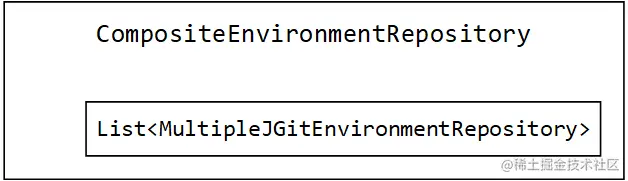

当然，默认情况下只有一个，所以一般情况都是走上面的 if 结构，直接调用唯一一个environmentRepositories的findOne方法获取Environment

SearchPathCompositeEnvironmentRepository 并没有扩展 CompositeEnvironmentRepository 的 findOne 方法，而是额外实现了一个 SearchPathLocator 接口：

~~~java
public interface SearchPathLocator {
	Locations getLocations(String application, String profile, String label);
}
~~~

它是为了考虑到配置文件的来源可能是文件系统内部。

### ResourceRepositoryConfiguration

ResourceRepositoryConfiguration也是ConfigServerConfiguration导入的配置类：

~~~java
@Configuration
@ConditionalOnMissingBean(ResourceRepository.class)
public class ResourceRepositoryConfiguration
~~~

它里面只注册了一个组件：

~~~java
@Bean
@ConditionalOnBean(SearchPathLocator.class)
public ResourceRepository resourceRepository(SearchPathLocator service) {
    return new GenericResourceRepository(service);
}
~~~

注意条件装配的注解：SearchPathLocator，GenericResourceRepository 的内部组合了一个 SearchPathLocator：

~~~java
public class GenericResourceRepository
		implements ResourceRepository, ResourceLoaderAware {
	private ResourceLoader resourceLoader;
	private SearchPathLocator service;
~~~

它里面的作用就真的跟文件系统有关了，因为它还组合了一个 ResourceLoader。进入它的 findOne 方法，这里面也用到了 SearchPathLocator ：

~~~java
public synchronized Resource findOne(String application, String profile, 
        String label, String path) {
    if (StringUtils.hasText(path)) {
        // 借助SearchPathLocator查找配置文件的路径
        String[] locations = this.service.getLocations(application, profile, label)
                .getLocations();
        try {
            for (int i = locations.length; i-- > 0;) {
                String location = locations[i];
                for (String local : getProfilePaths(profile, path)) {
                    if (!isInvalidPath(local) && !isInvalidEncodedPath(local)) {
                        // 根据路径，借助ResourceLoader加载文件
                        Resource file = this.resourceLoader.getResource(location)
                                .createRelative(local);
                        if (file.exists() && file.isReadable()) {
                            return file;
                        }
                    }
                }
            }
        } // catch ......
    }
    throw new NoSuchResourceException("Not found: " + path);
}
~~~

这里借助SearchPathLocator查找配置文件的路径，然后根据路径，借助ResourceLoader加载文件，最后返回file

### ConfigServerMvcConfiguration

它也是ConfigServerAutoConfiguration导入的配置类：

~~~java
@Configuration
@ConditionalOnWebApplication
public class ConfigServerMvcConfiguration implements WebMvcConfigurer
~~~

这个配置类一看就是跟 SpringWebMvc 相关的，它还专门实现了 WebMvcConfigurer 接口。实现这个接口的目的，是为了解决配置文件的文件类型对应的特殊响应类型：

~~~java
@Override
public void configureContentNegotiation(ContentNegotiationConfigurer configurer) {
    configurer.mediaType("properties", MediaType.valueOf("text/plain"));
    configurer.mediaType("yml", MediaType.valueOf("text/yaml"));
    configurer.mediaType("yaml", MediaType.valueOf("text/yaml"));
}
~~~

这部分设置和SpringWebMvc 的内容协商有关。

这里面注册的组件：

1、EnvironmentController

~~~java
@Bean
@RefreshScope
public EnvironmentController environmentController(
        EnvironmentRepository envRepository, ConfigServerProperties server) {
    EnvironmentController controller = new EnvironmentController(
            encrypted(envRepository, server), this.objectMapper);
    controller.setStripDocumentFromYaml(server.isStripDocumentFromYaml());
    controller.setAcceptEmpty(server.isAcceptEmpty());
    return controller;
}
~~~

Config 中的请求都是依靠 Controller 实现的，是基于原生的 SpringWebMvc 开发的：

~~~java
@RestController
@RequestMapping(method = RequestMethod.GET, path = "${spring.cloud.config.server.prefix:}")
public class EnvironmentController
~~~

2、ResourceController

~~~java
@Bean
@ConditionalOnBean(ResourceRepository.class)
public ResourceController resourceController(ResourceRepository repository,
        EnvironmentRepository envRepository, ConfigServerProperties server) {
    ResourceController controller = new ResourceController(repository,
            encrypted(envRepository, server));
    return controller;
}
~~~

它和ConfigServer工作流程有关，后面会详解。

### 小结

* Config 中的核心组件是一组 EnvironmentRepository ，它们负责加载配置文件；
* 客户端通过 Config 中的两个 Controller 实际获取配置信息；
* Config 可以切换不同的配置文件源，默认使用 Git 方式。

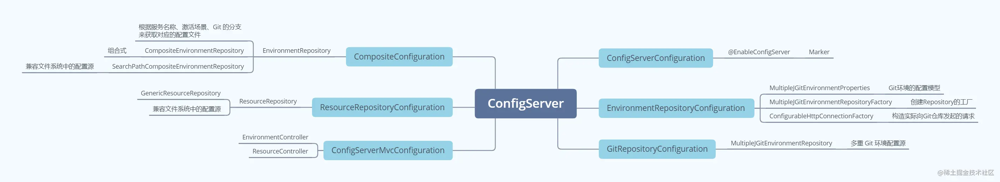

## ConfigClient组件

使用 ConfigClient 不需要额外声明注解，故自动配置类一定是核心。按照套路翻开 config-client 的 jar 包中 spring.factories 文件，对应的自动配置类是 ConfigClientAutoConfiguration

### ConfigClientAutoConfiguration

它的声明没有多余的内容：

~~~java
@Configuration
public class ConfigClientAutoConfiguration
~~~

列举下其中注册的组件：

1、ConfigClientProperties

~~~java
@Bean
public ConfigClientProperties configClientProperties(Environment environment,
        ApplicationContext context) {
    if (context.getParent() != null
            && BeanFactoryUtils.beanNamesForTypeIncludingAncestors(
                    context.getParent(), ConfigClientProperties.class).length > 0) {
        return BeanFactoryUtils.beanOfTypeIncludingAncestors(context.getParent(),
                ConfigClientProperties.class);
    }
    ConfigClientProperties client = new ConfigClientProperties(environment);
    return client;
}
~~~

它是做配置文件到对象的属性映射，这里不详述了

2、ConfigClientHealthProperties。和上面的作用类似

3、ConfigServerHealthIndicator

~~~java
@Bean
public ConfigServerHealthIndicator clientConfigServerHealthIndicator(
        ConfigServicePropertySourceLocator locator,
        ConfigClientHealthProperties properties, Environment environment) {
    return new ConfigServerHealthIndicator(locator, environment, properties);
}
~~~

它是做健康检查的。

### ConfigServiceBootstrapConfiguration

在用 ConfigClient 的时候，声明的配置文件是 bootstrap.yml，应该研究与 Bootstrap 级别相关的，在spring.factories 文件中看到额外的两个配置类，它们才是关键：

~~~
# Bootstrap components
org.springframework.cloud.bootstrap.BootstrapConfiguration=\
  org.springframework.cloud.config.client.ConfigServiceBootstrapConfiguration,\
  org.springframework.cloud.config.client.DiscoveryClientConfigServiceBootstrapConfiguration
~~~

ConfigServiceBootstrapConfiguration类上并没有声明很多注解：

~~~java
@Configuration
@EnableConfigurationProperties
public class ConfigServiceBootstrapConfiguration
~~~

它注册的组件中，除了一个ConfigClientProperties，比较重要的就是ConfigServicePropertySourceLocator：

~~~java
@Bean
@ConditionalOnMissingBean(ConfigServicePropertySourceLocator.class)
@ConditionalOnProperty(value = "spring.cloud.config.enabled", matchIfMissing = true)
public ConfigServicePropertySourceLocator configServicePropertySource(
        ConfigClientProperties properties) {
    ConfigServicePropertySourceLocator locator = new ConfigServicePropertySourceLocator(
            properties);
    return locator;
}
~~~

它的作用就是借助 ConfigServer 从配置源中拉取配置，它的结构：

~~~java
public class ConfigServicePropertySourceLocator implements PropertySourceLocator {
	private RestTemplate restTemplate;
	private ConfigClientProperties defaultProperties;
~~~

它内部组合了一个 RestTemplate ，不难猜测它就是请求获得配置文件的工具。注意它实现了一个 PropertySourceLocator 接口：

~~~java
public interface PropertySourceLocator {
    PropertySource<?> locate(Environment environment);
}
~~~

真正加载配置文件的是 PropertySourceLocator

ConfigServicePropertySourceLocator#locate：

~~~java
// 2.2.3.1 注意Environment的包是全限定名，它与最下面的Environment不一样
public org.springframework.core.env.PropertySource<?> locate(
        org.springframework.core.env.Environment environment) {
    ConfigClientProperties properties = this.defaultProperties.override(environment);
    CompositePropertySource composite = new CompositePropertySource("configService");
    // 借助RestTemplate向ConfigServer拉取配置文件
    RestTemplate restTemplate = this.restTemplate == null
            ? getSecureRestTemplate(properties) : this.restTemplate;
    Exception error = null;
    String errorBody = null;
    try {
        String[] labels = new String[] { "" };
        if (StringUtils.hasText(properties.getLabel())) {
            labels = StringUtils
                    .commaDelimitedListToStringArray(properties.getLabel());
        }
        String state = ConfigClientStateHolder.getState();
        // Try all the labels until one works
        for (String label : labels) {
            // 2.2.3.2 远程请求 运行环境模型
            Environment result = getRemoteEnvironment(restTemplate, properties,
                    label.trim(), state);
            // ......
        }
    } // catch ......
    return null;
}
~~~

这里借助RestTemplate向ConfigServer拉取配置文件，远程请求，返回了一个Environment，注意这里的Environment和SpringFramework 中设计的 Environment 是不一样的。这个Environment的定义：

~~~java
public class Environment {
	private String name;
	private String[] profiles = new String[0];
	private String label;
	private List<PropertySource> propertySources = new ArrayList<>();
	private String version;
	private String state;
~~~

它可以看作是org.springframework.core.env.Environment的一个拷贝类，但也可以在Spring应用程序的域外应用。

在getRemoteEnvironment方法中：

~~~java
private Environment getRemoteEnvironment(RestTemplate restTemplate,
        ConfigClientProperties properties, String label, String state) {
    // 预先准备好请求到ConfigServer的uri
    String path = "/{name}/{profile}";
    String name = properties.getName();
    String profile = properties.getProfile();
    String token = properties.getToken();
    int noOfUrls = properties.getUri().length;
    if (noOfUrls > 1) {
        logger.info("Multiple Config Server Urls found listed.");
    }

    // 拼接label(Git分支)
    Object[] args = new String[] { name, profile };
    if (StringUtils.hasText(label)) {
        if (label.contains("/")) {
            label = label.replace("/", "(_)");
        }
        args = new String[] { name, profile, label };
        path = path + "/{label}";
    }
    ResponseEntity<Environment> response = null;

    for (int i = 0; i < noOfUrls; i++) {
        // 预准备
        Credentials credentials = properties.getCredentials(i);
        String uri = credentials.getUri();
        String username = credentials.getUsername();
        String password = credentials.getPassword();
        // logger ......
        try {
            HttpHeaders headers = new HttpHeaders();
            addAuthorizationToken(properties, headers, username, password);
            if (StringUtils.hasText(token)) {
                headers.add(TOKEN_HEADER, token);
            }
            if (StringUtils.hasText(state) && properties.isSendState()) {
                headers.add(STATE_HEADER, state);
            }
            headers.setAccept(Collections.singletonList(MediaType.APPLICATION_JSON));

            final HttpEntity<Void> entity = new HttpEntity<>((Void) null, headers);
            // 【远程请求】RestTemplate请求ConfigServer
            response = restTemplate.exchange(uri + path, HttpMethod.GET, entity,
                    Environment.class, args);
        } // catch ......

        if (response == null || response.getStatusCode() != HttpStatus.OK) {
            return null;
        }

        Environment result = response.getBody();
        return result;
    }
    return null;
}
~~~

看 getRemoteEnvironment 方法的入参，其实就已经把要拉取配置文件的所有需要的条件都传入了。先是拼接uri，然后是拼接label，最后调用RestTemplate请求ConfigServer，取出body中的Environment

### DiscoveryClientConfigServiceBootstrapConfiguration

这个配置类，按照之前搭建测试环境下是不会生效的，看一眼类上面的注解：

~~~java
@ConditionalOnProperty(value = "spring.cloud.config.discovery.enabled", matchIfMissing = false)
@Configuration
@Import({ UtilAutoConfiguration.class })
@EnableDiscoveryClient
public class DiscoveryClientConfigServiceBootstrapConfiguration
		implements SmartApplicationListener
~~~

### 小结

总的来看，ConfigClient 中一共就这么点组件：

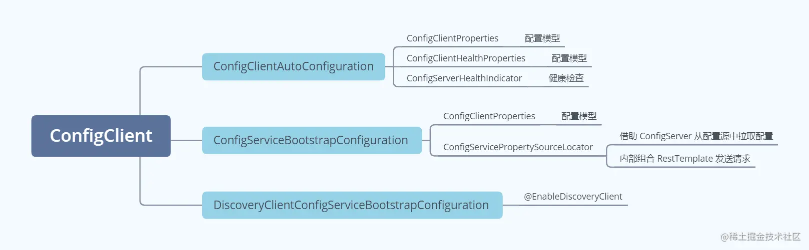

ConfigClient 拉取配置文件的核心是 ConfigServicePropertySourceLocator

## ConfigClient启动流程

### 广播事件

进入 SpringApplication.run 方法中：

~~~java
public ConfigurableApplicationContext run(String... args) {
    // ......
    // 获取所有SpringApplicationRunListeners(实现类是EventPublishingRunListener)
    SpringApplicationRunListeners listeners = getRunListeners(args);
    listeners.starting();
    try {
        ApplicationArguments applicationArguments = new DefaultApplicationArguments(args);
        // 准备运行时环境
        ConfigurableEnvironment environment = prepareEnvironment(listeners, applicationArguments);
~~~

其中的关键是prepareEnvironment方法：

~~~java
private ConfigurableEnvironment prepareEnvironment(SpringApplicationRunListeners listeners,
        ApplicationArguments applicationArguments) {
    // ......
    listeners.environmentPrepared(environment);
    bindToSpringApplication(environment);
    // ......
    return environment;
}

public void environmentPrepared(ConfigurableEnvironment environment) {
    this.initialMulticaster
            .multicastEvent(new ApplicationEnvironmentPreparedEvent(this.application, this.args, environment));
}
~~~

在环境与应用绑定之前，SpringBoot 使用 EventPublishingRunListener （即 SpringApplicationRunListeners ）发布了一个 ApplicationEnvironmentPreparedEvent 事件。由于是广播，所有监听器都会收到该事件，其中一个监听器和ConfigClient启动相关，它就是BootstrapApplicationListener

### BootstrapApplicationListener

来到BootstrapApplicationListener的onApplicationEvent方法中：

~~~java
public void onApplicationEvent(ApplicationEnvironmentPreparedEvent event) {
    ConfigurableEnvironment environment = event.getEnvironment();
    // 默认直接通过。除非显式关闭
    if (!environment.getProperty("spring.cloud.bootstrap.enabled", Boolean.class, true)) {
        return;
    }
    // don't listen to events in a bootstrap context
    // 如果当前配置源中已经存在bootstrap级别的，则不往下执行(当前还是微服务的ConfigClient级别，没有到bootstrap级别)
    if (environment.getPropertySources().contains(BOOTSTRAP_PROPERTY_SOURCE_NAME)) {
        return;
    }
    ConfigurableApplicationContext context = null;
    String configName = environment
            .resolvePlaceholders("${spring.cloud.bootstrap.name:bootstrap}");
    // 先检查是否已经初始化过了(肯定还没有，微服务才刚开始启动)
    for (ApplicationContextInitializer<?> initializer : event.getSpringApplication()
            .getInitializers()) {
        if (initializer instanceof ParentContextApplicationContextInitializer) {
            context = findBootstrapContext(
                    (ParentContextApplicationContextInitializer) initializer,
                    configName);
        }
    }
    // 查不到，要构建bootstrap级别的应用上下文了
    if (context == null) {
        // 5.2
        context = bootstrapServiceContext(environment, event.getSpringApplication(),
                configName);
        // 构建完成后，给微服务应用添加一个新的监听器(此时微服务的IOC容器还没有被构造)
        event.getSpringApplication()
                .addListeners(new CloseContextOnFailureApplicationListener(context));
    }

    apply(context, event.getSpringApplication(), environment);
}
~~~

前面的部分都是检查配置，确认是否有bootstrap级别配置源，来到bootstrapServiceContext是初始化SpringApplication：

bootstrapServiceContext方法较长，分为几个部分来看：

1、初始化现有配置参数

~~~java
private ConfigurableApplicationContext bootstrapServiceContext(
        ConfigurableEnvironment environment, final SpringApplication application,
        String configName) {
    StandardEnvironment bootstrapEnvironment = new StandardEnvironment();
    MutablePropertySources bootstrapProperties = bootstrapEnvironment.getPropertySources();
    for (PropertySource<?> source : bootstrapProperties) {
        bootstrapProperties.remove(source.getName());
    }
    // ......
}
~~~

这部分它把构建好的 Environment 里面的 PropertySource 都移除掉了，Debug也可以看到走完这段代码后是空的 bootstrapProperties

2、初始化IOC容器的参数

~~~java
    // ......
    String configLocation = environment
            .resolvePlaceholders("${spring.cloud.bootstrap.location:}");
    Map<String, Object> bootstrapMap = new HashMap<>();
    bootstrapMap.put("spring.config.name", configName);
    bootstrapMap.put("spring.main.web-application-type", "none");
    if (StringUtils.hasText(configLocation)) {
        bootstrapMap.put("spring.config.location", configLocation);
    }
    // ......
~~~

这一段它会预先设置一些过会初始化IOC容器的参数，由于测试工程中没有设置 spring.cloud.bootstrap.location ，所以上面和下面都不会起作用，最后 Map 中只有两组键值对：

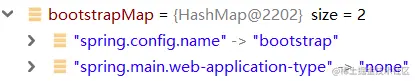

它设置了 spring.main.web-application-type 是 none，相当于破坏了原有 SpringBoot 自己断定好的 Servlet 环境

3、重新设置IOC容器的PropertySource

~~~java
public static final String BOOTSTRAP_PROPERTY_SOURCE_NAME = "bootstrap";

    // ......
    bootstrapProperties.addFirst(
            new MapPropertySource(BOOTSTRAP_PROPERTY_SOURCE_NAME, bootstrapMap));
    // environment是外部ConfigClient的Environment
    for (PropertySource<?> source : environment.getPropertySources()) {
        if (source instanceof StubPropertySource) {
            continue;
        }
        bootstrapProperties.addLast(source);
    }
    // ......
~~~

这一步它把 Environment 中的 PropertySource 又设置了回去，第一个设置进去的 MapPropertySource 实质上相当于把 bootstrapMap 封装到一个 PropertySource 中。

4、构造新的SpringApplication

~~~java
    // ......
    SpringApplicationBuilder builder = new SpringApplicationBuilder()
            .profiles(environment.getActiveProfiles()).bannerMode(Mode.OFF)
            .environment(bootstrapEnvironment)
            // Don't use the default properties in this builder
            .registerShutdownHook(false).logStartupInfo(false)
            .web(WebApplicationType.NONE);
    final SpringApplication builderApplication = builder.application();
    if (builderApplication.getMainApplicationClass() == null) {
        builder.main(application.getMainApplicationClass());
    }
    if (environment.getPropertySources().contains("refreshArgs")) {
        builderApplication
                .setListeners(filterListeners(builderApplication.getListeners()));
    }
    // ......
~~~

这里又构造了一个SpringApplication，它为了不让我察觉到，还设置了bannerMode为OFF。它构造的细节：

- profiles ：将这个新构造的 SpringApplication 与外部微服务 ConfigClient 的激活环境一致
- environment ：将新构造的运行时环境配置到新构造的 SpringApplication 中
- WebApplicationType ：设置为 NONE ，说明内部不会再构造新的 Web 容器
- main ：如果 SpringApplicationBuilder 中没有识别到主启动类，则手动将外部微服务的主启动类设置过去

此外，还会添加一个配置类进去：

~~~java
 builder.sources(BootstrapImportSelectorConfiguration.class);
~~~

5、BootstrapImportSelectorConfiguration

它的定义：

~~~java
@Configuration
@Import(BootstrapImportSelector.class)
public class BootstrapImportSelectorConfiguration
~~~

它导入了一个 BootstrapImportSelector ，很明显从这个名上也能意识到，它就是加载那些 Bootstrap 级别的组件。

~~~java
public String[] selectImports(AnnotationMetadata annotationMetadata) {
    ClassLoader classLoader = Thread.currentThread().getContextClassLoader();
    // Use names and ensure unique to protect against duplicates
    List<String> names = new ArrayList<>(SpringFactoriesLoader
            .loadFactoryNames(BootstrapConfiguration.class, classLoader));
    names.addAll(Arrays.asList(StringUtils.commaDelimitedListToStringArray(
            this.environment.getProperty("spring.cloud.bootstrap.sources", ""))));
    // ......
~~~

果然，它还是用 SpringFramework 的 SPI 技术，加载那些 BootstrapConfiguration 配置的组件们。由此，可以了解上面看到的那个 ConfigServiceBootstrapConfiguration 配置类是借助这个 BootstrapImportSelector 加载到这个内部偷偷构造的 SpringApplication 中的。

6、启动内置SpringApplication

~~~java
    // ......
    // 5.3 启动SpringBoot应用
    final ConfigurableApplicationContext context = builder.run();
    context.setId("bootstrap");
    addAncestorInitializer(application, context);
    bootstrapProperties.remove(BOOTSTRAP_PROPERTY_SOURCE_NAME);
    mergeDefaultProperties(environment.getPropertySources(), bootstrapProperties);
    return context;
}
~~~

启动偷偷构造好的 SpringApplication ，接下来就是重新来一遍的 SpringBoot 启动流程。

### ConfigFileApplicationListener

新启动的 SpringBoot流程中，走到发布ApplicationEnvironmentPreparedEvent 事件的地方，这一次的关键是ConfigFileApplicationListener监听到这个事件：

~~~java
public void onApplicationEvent(ApplicationEvent event) {
    if (event instanceof ApplicationEnvironmentPreparedEvent) {
        onApplicationEnvironmentPreparedEvent((ApplicationEnvironmentPreparedEvent) event);
    }
    if (event instanceof ApplicationPreparedEvent) {
        onApplicationPreparedEvent(event);
    }
}
~~~

这个监听器会根据事件类型来决定执行的动作，那上面还是那个 ApplicationEnvironmentPreparedEvent 事件，进入onApplicationEnvironmentPreparedEvent方法：

~~~java
private void onApplicationEnvironmentPreparedEvent(ApplicationEnvironmentPreparedEvent event) {
    List<EnvironmentPostProcessor> postProcessors = loadPostProcessors();
    postProcessors.add(this);
    AnnotationAwareOrderComparator.sort(postProcessors);
    for (EnvironmentPostProcessor postProcessor : postProcessors) {
        postProcessor.postProcessEnvironment(event.getEnvironment(), event.getSpringApplication());
    }
}
~~~

这里看到了一个新的概念：EnvironmentPostProcessor，它是处理运行时环境的后置处理器，它来自 SpringBoot 的包下而不是 SpringFramework：

~~~java
package org.springframework.boot.env;

/**
 * @since 1.3.0
 */
@FunctionalInterface
public interface EnvironmentPostProcessor {
	void postProcessEnvironment(ConfigurableEnvironment environment, SpringApplication application);
}
~~~

ConfigFileApplicationListener 本身也实现了 EnvironmentPostProcessor 接口：

~~~java
public class ConfigFileApplicationListener 
        implements EnvironmentPostProcessor, SmartApplicationListener, Ordered
~~~

来到 postProcessEnvironment 方法：

~~~java
public void postProcessEnvironment(ConfigurableEnvironment environment, SpringApplication application) {
    addPropertySources(environment, application.getResourceLoader());
}

protected void addPropertySources(ConfigurableEnvironment environment, ResourceLoader resourceLoader) {
    RandomValuePropertySource.addToEnvironment(environment);
    new Loader(environment, resourceLoader).load();
}
~~~

可以看到，它使用一个叫 Loader 的东西，去加载配置源，而这个 Loader 是 ConfigFileApplicationListener 的一个内部类：

~~~java
public void load() {
    this.profiles = new LinkedList<>();
    this.processedProfiles = new LinkedList<>();
    this.activatedProfiles = false;
    this.loaded = new LinkedHashMap<>();
    initializeProfiles();
    while (!this.profiles.isEmpty()) {
        Profile profile = this.profiles.poll();
        if (profile != null && !profile.isDefaultProfile()) {
            addProfileToEnvironment(profile.getName());
        }
        load(profile, this::getPositiveProfileFilter, addToLoaded(MutablePropertySources::addLast, false));
        this.processedProfiles.add(profile);
    }
    resetEnvironmentProfiles(this.processedProfiles);
    load(null, this::getNegativeProfileFilter, addToLoaded(MutablePropertySources::addFirst, true));
    addLoadedPropertySources();
}
~~~

这个方法很明显是在加载配置源，这个地方就相当于把 bootstrap.yml 加载到 Environment 中，直接解释最终调用的方法，是在 Loader 中的 loadDocuments 方法：

~~~java
private List<Document> loadDocuments(PropertySourceLoader loader, String name, Resource resource)
        throws IOException {
    DocumentsCacheKey cacheKey = new DocumentsCacheKey(loader, resource);
    List<Document> documents = this.loadDocumentsCache.get(cacheKey);
    if (documents == null) {
        // 使用配置源加载器读取文件
        List<PropertySource<?>> loaded = loader.load(name, resource);
        documents = asDocuments(loaded);
        this.loadDocumentsCache.put(cacheKey, documents);
    }
    return documents;
}
~~~

这个逻辑已经很明确了，配置源加载器可以将 Resource 配置文件给解析出来。PropertySourceLoader 有两种实现类型，刚好就是 SpringBoot 默认支持的 properties 与 yaml。由此，它可以将 bootstrap.yml 加载进 Environment 中，完成使命。

上面的内容都执行好之后，基本 bootstrap 级别的环境就准备好了，回到 bootstrapServiceContext 方法中，最后返回这个 IOC 容器。

### 配置文件的拉取

回到ConfigClient服务启动流程：

~~~java
private ConfigurableEnvironment prepareEnvironment(SpringApplicationRunListeners listeners,
        ApplicationArguments applicationArguments) {
    // ......
    listeners.environmentPrepared(environment);
    bindToSpringApplication(environment);
~~~

到这里，内部偷偷构造的 IOC 容器已经彻底准备好了，借助Debug，可以发现确实已经把 bootstrap.yml 加载到ConfigClient 的 Environment 中了：

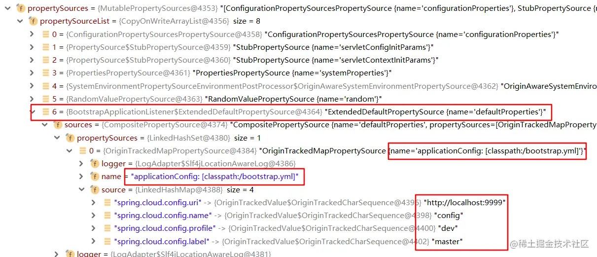

接下来，Environment 的处理完毕，回到 SpringApplication 的 run 方法中。

关键是prepareContext方法：

~~~java
public ConfigurableApplicationContext run(String... args) {
    // ......
    try {
        // ......
        prepareContext(context, environment, listeners, applicationArguments, printedBanner);
        refreshContext(context);
      ...
    }
}
      
private void prepareContext(ConfigurableApplicationContext context, ConfigurableEnvironment environment,
        SpringApplicationRunListeners listeners, ApplicationArguments applicationArguments, Banner printedBanner) {
    context.setEnvironment(environment);
    postProcessApplicationContext(context);
    // 【执行ApplicationContextInitializer】
    applyInitializers(context);
    listeners.contextPrepared(context);
    // ......
~~~

这里面要重点研究 applyInitializers 方法，而且从源码中可以看到，当 ApplicationContextInitializer 都执行完成后，会发布 contextPrepared 事件广播，由此可见这一步很关键，要在此之前准备好容器的全部配置

applyInitializers方法：

~~~java
protected void applyInitializers(ConfigurableApplicationContext context) {
    for (ApplicationContextInitializer initializer : getInitializers()) {
        Class<?> requiredType = GenericTypeResolver.resolveTypeArgument(initializer.getClass(),
                ApplicationContextInitializer.class);
        Assert.isInstanceOf(requiredType, context, "Unable to call initializer.");
        initializer.initialize(context);
    }
}
~~~

getInitializers会取出所有的ApplicationContextInitializer依次执行initialize方法，其中一个是PropertySourceBootstrapConfiguration：

~~~java
@Configuration
@EnableConfigurationProperties(PropertySourceBootstrapProperties.class)
public class PropertySourceBootstrapConfiguration implements
		ApplicationContextInitializer<ConfigurableApplicationContext>, Ordered
~~~

其实它标注配置类，只是告诉 IOC 容器，激活 PropertySourceBootstrapProperties 的属性映射而已，ApplicationContextInitializer 的核心逻辑才是关键，来到 initialize 方法：

~~~java
public void initialize(ConfigurableApplicationContext applicationContext) {
    CompositePropertySource composite = new CompositePropertySource(
            BOOTSTRAP_PROPERTY_SOURCE_NAME);
    AnnotationAwareOrderComparator.sort(this.propertySourceLocators);
    boolean empty = true;
    ConfigurableEnvironment environment = applicationContext.getEnvironment();
    // 【PropertySourceLocator】
    for (PropertySourceLocator locator : this.propertySourceLocators) {
        PropertySource<?> source = null;
        // 6.4 拉取配置
        source = locator.locate(environment);
        if (source == null) {
            continue;
        }
        logger.info("Located property source: " + source);
        composite.addPropertySource(source);
        empty = false;
    }
    // ......
}
~~~

到这里，发现了在上面看到的PropertySourceLocator，接下来就由它来拉取配置文件，从 ConfigServer 远程拉取配置文件，等拉取完成后，发现配置已经转换好了：

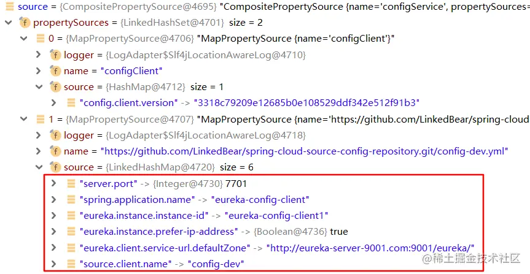

接下来，有了微服务应用必需的配置，那后面的启动过程都不是问题了，ConfigClient 的应用也就算加载完成了。

### 小结

* ConfigServicePropertySourceLocator 是 ConfigClient 拉取配置的核心，底层直接使用 RestTemplate 远程请求 ConfigServer ；
* ConfigClient 加载配置的过程中，会在内部隐藏式初始化一个额外的 SpringApplication ，它用于加载 bootstrap 级别的组件、配置；
* ConfigClient 的运行环境中包含 bootstrap 级别的组件和配置，之后在准备 IOC 容器时，调用 ConfigServicePropertySourceLocator 完成配置文件的拉取。

## ConfigServer提供配置文件

既然 ConfigClient 请求到 ConfigServer ，那么 ConfigServer 一定开放了一些接口。

### EnvironmentController

它的结构：

~~~java
@RestController
@RequestMapping(method = RequestMethod.GET, path = "${spring.cloud.config.server.prefix:}")
public class EnvironmentController {

	private EnvironmentRepository repository; // 配置源
	private ObjectMapper objectMapper; // fastjson
	private boolean stripDocument = true;
	private boolean acceptEmpty = true;
~~~

其中，默认的配置源是 MultipleJGitEnvironmentRepository 类型的。

给 ConfigServer 发起类似于 http://config-server:9999/master/config-dev.yml 这样的请求，是可以直接从 Git 中取到配置文件的，那这个请求的处理 Handler ，就在 EnvironmentController 中。

/config-dev.yml请求对应的Handler如下：

~~~java
@RequestMapping({ "/{name}-{profiles}.yml", "/{name}-{profiles}.yaml" })
public ResponseEntity<String> yaml(@PathVariable String name,
        @PathVariable String profiles,
        @RequestParam(defaultValue = "true") boolean resolvePlaceholders)
        throws Exception {
    return labelledYaml(name, profiles, null, resolvePlaceholders);
}
~~~

对于没有预设 label 的请求，会默认传 null ，进入到下一个方法。

labelledYaml也就是/master/config-dev.yml请求对应的Handler：

~~~java
@RequestMapping({ "/{label}/{name}-{profiles}.yml",
        "/{label}/{name}-{profiles}.yaml" })
public ResponseEntity<String> labelledYaml(@PathVariable String name,
        @PathVariable String profiles, @PathVariable String label,
        @RequestParam(defaultValue = "true") boolean resolvePlaceholders)
        throws Exception {
    // 校验profiles中是否有'-'(避免出现歧义)
    validateProfiles(profiles);
    // 1.3 远程拉取指定Git分支的环境配置信息
    // org.springframework.cloud.config.environment.Environment
    Environment environment = labelled(name, profiles, label);
    Map<String, Object> result = convertToMap(environment);
    if (this.stripDocument && result.size() == 1
            && result.keySet().iterator().next().equals("document")) {
         // ......
    }
    // Map转yml
    String yaml = new Yaml().dumpAsMap(result);

    if (resolvePlaceholders) {
        // 将yaml串中的 \$_{ 转为 ${
        // https://cloud.spring.io/spring-cloud-static/spring-cloud-config/2.2.2.RELEASE/reference/html/#property-overrides
        yaml = resolvePlaceholders(prepareEnvironment(environment), yaml);
    }
    return getSuccess(yaml);
}
~~~

这里会进行一些前置校验、后置处理，其中的关键是labelled方法，它返回了一个Environment，它会拿 name profile label 去加载出环境配置信息（也就是配置文件的内容）：

~~~java
@RequestMapping("/{name}/{profiles}/{label:.*}")
public Environment labelled(@PathVariable String name, @PathVariable String profiles,
        @PathVariable String label) {
    // _ 替换为 / 的处理
    Environment environment = this.repository.findOne(name, profiles, label);
    if (!this.acceptEmpty
            && (environment == null || environment.getPropertySources().isEmpty())) {
        throw new EnvironmentNotFoundException("Profile Not found");
    }
    return environment;
}
~~~

可以看到，它去调 repository 的 findOne 方法，从 Git 中取配置文件。来到EnvironmentEncryptorEnvironmentRepository#findOne：

~~~java
public Environment findOne(String name, String profiles, String label) {
    Environment environment = this.delegate.findOne(name, profiles, label);
    if (this.environmentEncryptor != null) {
        environment = this.environmentEncryptor.decrypt(environment);
    }
    if (!this.overrides.isEmpty()) {
        environment.addFirst(new PropertySource("overrides", this.overrides));
    }
    return environment;
}
~~~

可以发现，它直接拿 delegate 去查了，只是最后要对 Environment 信息进行反编码而已。继续查看CompositeEnvironmentRepository#findOne：

~~~java
public Environment findOne(String application, String profile, String label) {
    Environment env = new Environment(application, new String[] { profile }, label,
            null, null);
    if (this.environmentRepositories.size() == 1) {
        // 如果只有一个，那就直接获取，后设置配置源、版本等信息
        Environment envRepo = this.environmentRepositories.get(0).findOne(application,
                profile, label);
        env.addAll(envRepo.getPropertySources());
        env.setVersion(envRepo.getVersion());
        env.setState(envRepo.getState());
    } else {
        // 如果有好多个，那就只放入配置源
        for (EnvironmentRepository repo : this.environmentRepositories) {
            env.addAll(repo.findOne(application, profile, label).getPropertySources());
        }
    }
    return env;
}
~~~

逻辑很简单，两个分支最终执行的都是内部嵌套的那一堆 EnvironmentRepository，默认只有一个MultipleJGitEnvironmentRepository在里面，下面就执行MultipleJGitEnvironmentRepository的findOne方法了。

### MultipleJGitEnvironmentRepository

MultipleJGitEnvironmentRepository#findOne：

~~~java
private Map<String, PatternMatchingJGitEnvironmentRepository> repos = new LinkedHashMap<>();

public Environment findOne(String application, String profile, String label) {
    // 如果当前有聚合基于路径匹配的配置源，则优先使用这些(Debug发现并没有)
    for (PatternMatchingJGitEnvironmentRepository repository : this.repos.values()) {
        if (repository.matches(application, profile, label)) {
            for (JGitEnvironmentRepository candidate : getRepositories(repository,
                    application, profile, label)) {
                try {
                    if (label == null) {
                        label = candidate.getDefaultLabel();
                    }
                    Environment source = candidate.findOne(application, profile, label);
                    if (source != null) {
                        return source;
                    }
                } // catch ......
            }
        }
    }
    // 2.1.1 getRepository：获取/构造EnvironmentRepository
    JGitEnvironmentRepository candidate = getRepository(this, application, profile, label);
    if (label == null) {
        // 如果没有设置，默认master
        label = candidate.getDefaultLabel();
    }
    // 2.2 如果getRepository获取到的还是自己，委托父类继续获取
    if (candidate == this) {
        return super.findOne(application, profile, label);
    }
    return candidate.findOne(application, profile, label);
}
~~~

Debug 发现 repos 中并没有预准备好的 PatternMatchingJGitEnvironmentRepository ，那往下走会执行 getRepository 方法，如果获取到的 EnvironmentRepository 还是自己，就委托给父类了，自己不找了。这个 getRepository 方法：

~~~java
JGitEnvironmentRepository getRepository(JGitEnvironmentRepository repository,
        String application, String profile, String label) {
    if (!repository.getUri().contains("{")) {
        return repository;
    }
    // ......
}
~~~

这里一开始它要判断 uri 是不是通过占位符方式来配置的 Git 地址，由于一开始在搭建测试工程时，使用的是 http 地址，那必然没有花括号，直接返回当前的 repository 。

接下来，发现 get 出来的还是自己，那自己就不找了，委托父类找去，来到父类 AbstractScmEnvironmentRepository 中，AbstractScmEnvironmentRepository#findOne：

~~~java
public synchronized Environment findOne(String application, String profile,
        String label) {
    // 2.2.1 构造NativeEnvironmentRepository
    NativeEnvironmentRepository delegate = new NativeEnvironmentRepository(
            getEnvironment(), new NativeEnvironmentProperties());
    // 2.2.2 同步Git仓库到本地
    Locations locations = getLocations(application, profile, label);
    delegate.setSearchLocations(locations.getLocations());
    // 2.2.3 根据应用名、profile确定环境配置
    Environment result = delegate.findOne(application, profile, "");
    result.setVersion(locations.getVersion());
    result.setLabel(label);
    return this.cleaner.clean(result, getWorkingDirectory().toURI().toString(),
            getUri());
}
~~~

构造NativeEnvironmentRepository这一步：

~~~java
    NativeEnvironmentRepository delegate = new NativeEnvironmentRepository(
            getEnvironment(), new NativeEnvironmentProperties());
~~~

这里面会传入一个现成的 Environment，其实就是ConfigServer 本身的Environment

### 同步Git仓库到本地

~~~java
public Locations getLocations(String application, String profile, String label) {
    for (PatternMatchingJGitEnvironmentRepository repository : this.repos.values()) {
        // ......
    }
    JGitEnvironmentRepository candidate = getRepository(this, application, profile,
            label);
    if (candidate == this) {
        return super.getLocations(application, profile, label);
    }
    return candidate.getLocations(application, profile, label);
}
~~~

来到父类的 getLocations 方法中：

~~~java
public synchronized Locations getLocations(String application, String profile,
        String label) {
    if (label == null) {
        label = this.defaultLabel;
    }
    // 【Git拉取】
    String version = refresh(label);
    return new Locations(application, profile, label, version,
            getSearchLocations(getWorkingDirectory(), application, profile, label));
}
~~~

这里refresh方法是关键：

~~~java
public String refresh(String label) {
    Git git = null;
    try {
        git = createGitClient();
        if (shouldPull(git)) {
            FetchResult fetchStatus = fetch(git, label);
            if (this.deleteUntrackedBranches && fetchStatus != null) {
                deleteUntrackedLocalBranches(
                    fetchStatus.getTrackingRefUpdates(), git);
            }
            // checkout after fetch so we can get any new branches, tags, ect.
            checkout(git, label);
            tryMerge(git, label);
        } // else ......
        // always return what is currently HEAD as the version
        return git.getRepository().findRef("HEAD").getObjectId().getName();
    } // catch finally ......
}
~~~

这里其实就是Java 编程式操作 Git，ConfigServer 会预先把 Git 仓库中的配置文件都拉取下来，预备着后续获取

### NativeEnvironmentRepository#findOne

接下来的动作又跟 Locations 没关系了，它要调 NativeEnvironmentRepository 的 findOne 方法了：

~~~java
public Environment findOne(String config, String profile, String label) {
    // 2.2.3.1 PropertyPlaceholderAutoConfiguration
    SpringApplicationBuilder builder = new SpringApplicationBuilder(
            PropertyPlaceholderAutoConfiguration.class);
    // 2.2.3.2 设置Spring应用环境参数
    ConfigurableEnvironment environment = getEnvironment(profile);
    builder.environment(environment);
    // 设置非Web环境，并关闭Banner(不让开发者感知到有新的SpringBoot应用被启动)
    builder.web(WebApplicationType.NONE).bannerMode(Mode.OFF);
    if (!logger.isDebugEnabled()) {
        // Make the mini-application startup less verbose
        builder.logStartupInfo(false);
    }
    // 2.2.3.3 构造启动参数
    String[] args = getArgs(config, profile, label);
    // 只留下解析配置文件的监听器
    builder.application()
            .setListeners(Arrays.asList(new ConfigFileApplicationListener()));
    ConfigurableApplicationContext context = builder.run(args);
    environment.getPropertySources().remove("profiles");
    try {
        // 2.2.3.4 将生成的环境配置信息解析好并返回
        return clean(new PassthruEnvironmentRepository(environment).findOne(config,
                profile, label));
    } finally {
        context.close();
    }
}
~~~

这里面又偷偷构造 SpringBoot 应用了，其中唯一的配置类是PropertyPlaceholderAutoConfiguration，它是处理配置源中占位符的加载器。

getEnvironment方法会给新的environment设置两个环境参数：

~~~java
private ConfigurableEnvironment getEnvironment(String profile) {
    ConfigurableEnvironment environment = new StandardEnvironment();
    Map<String, Object> map = new HashMap<>();
    map.put("spring.profiles.active", profile); // 激活当前profile
    map.put("spring.main.web-application-type", "none"); // 非Web环境
    environment.getPropertySources().addFirst(new MapPropertySource("profiles", map));
    return environment;
}
~~~

另外注意一点，它加入的配置源设置了一个 name 叫 profiles ，它会在内置 SpringBoot 应用启动后被移除，也就是上面的：

~~~java
    ConfigurableApplicationContext context = builder.run(args);
    environment.getPropertySources().remove("profiles");
~~~

然后getArgs构造启动参数，这一步，它会把这几个参数构造起来：

~~~java
private String[] getArgs(String application, String profile, String label) {
    List<String> list = new ArrayList<String>();
    String config = application;
    if (!config.startsWith("application")) {
        config = "application," + config;
    }
    list.add("--spring.config.name=" + config);
    // 内部偷偷启动的不启用boostrap级别的加载
    list.add("--spring.cloud.bootstrap.enabled=false");
    list.add("--encrypt.failOnError=" + this.failOnError);
    // 设置配置文件路径
    list.add("--spring.config.location=" + StringUtils.arrayToCommaDelimitedString(
            getLocations(application, profile, label).getLocations()));
    return list.toArray(new String[0]);
}
~~~

这里面设置的配置文件路径，Debug 可以发现已经设置好了，就是刚才从 Git 中直接拉取下来的临时文件路径：

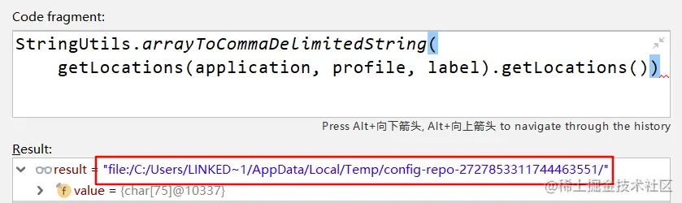

最后来到findOne方法：

~~~java
public Environment findOne(String application, String env, String label) {
    Environment result = new Environment(application,
            StringUtils.commaDelimitedListToStringArray(env), label, null, null);
    for (org.springframework.core.env.PropertySource<?> source : this.environment
            .getPropertySources()) {
        String name = source.getName();
        if (!this.standardSources.contains(name)
                && source instanceof MapPropertySource) {
            result.add(new PropertySource(name, getMap(source)));
        }
    }
    return result;
}
~~~

这里的 this.environment 就是刚构造好的配置信息：

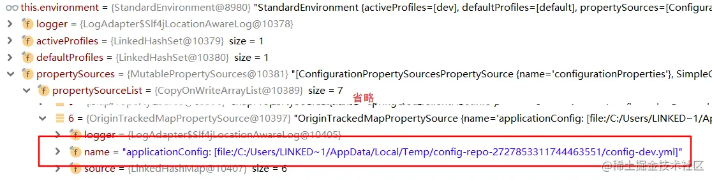

这里的判断，是只取出 MapPropertySource 类型的配置信息，其实就是对应配置文件中的内容：

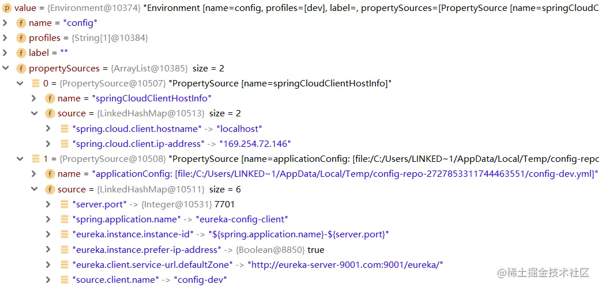

到这里，配置文件就被成功加载和提供了。

### 小结

* EnvironmentController 提供接口，供 ConfigClient 获取配置文件；
* ConfigServer 默认使用 Git 作为配置源，底层使用 JGitEnvironmentRepository 加载；
* ConfigServer 使用 Git 拉取配置时，会首先拉取整体所有的配置，后根据请求的配置应用、模式、分支来决定加载哪个配置文件。

## ConfigClient热更新配置

配置的热更新，这个也算是 Config 里面一个非常重要的特性了，因为有这个特性，也使得服务实例可以在不重启服务的情况下刷新配置。

### 环境配置

由于需要触发热更新，所以在 ConfigClient 的 pom 中需要额外引入监控模块：

~~~xml
<dependency>
    <groupId>org.springframework.boot</groupId>
    <artifactId>spring-boot-starter-actuator</artifactId>
</dependency>
~~~

之后还需要开启监控可访问的端点：

~~~
management.endpoints.web.exposure.include=refresh
~~~

之前在 ConfigClientController 中写过一个可以读取指定配置项的值的接口：

~~~java
@Value("${source.client.name}")
private String clientName;

@GetMapping("/getInfo")
public String getInfo() {
    System.out.println();
    return "getInfo - " + clientName;
}
~~~

由于要测试配置内容的热更新，所以需要在 ConfigClientController 中标注 @RefreshScope 注解：

~~~java
@RestController
@RefreshScope
public class ConfigClientController
~~~

之后就可以进行测试了。手动调整 Git 中的配置文件内容，提交后使用 postman 发送 POST 方式的 http://localhost:7701/actuator/refresh 请求，即可完成配置的刷新，再次访问接口时就可以返回新的值。

### RefreshEndpoint#refresh

对于 actuator 的设计，这个接口的接收不像是用 RequestMapping 那样的套路。/actuator/refresh请求的接受直接来到RefreshEndpoint 的 refresh 方法：

~~~java
@Endpoint(id = "refresh")
public class RefreshEndpoint {
	private ContextRefresher contextRefresher;
	public RefreshEndpoint(ContextRefresher contextRefresher) {
		this.contextRefresher = contextRefresher;
	}

	@WriteOperation
	public Collection<String> refresh() {
		Set<String> keys = this.contextRefresher.refresh();
		return keys;
	}
}
~~~

这里它会进入到 ContextRefresher 的 refresh 方法，而且会返回一组数据，这组数据其实就是对比变动的配置项的 key 。

下面进入到 ContextRefresher 中：

~~~java
public synchronized Set<String> refresh() {
    // 2. 刷新应用内置运行时环境
    Set<String> keys = refreshEnvironment();
    // 3. 刷新所有refresh类型的Bean
    this.scope.refreshAll();
    return keys;
}
~~~

refreshEnvironment主要用来刷新应用内置运行时环境：

~~~java
public synchronized Set<String> refreshEnvironment() {
    // 2.1 将当前环境的配置转换为Map
    Map<String, Object> before = extract(
            this.context.getEnvironment().getPropertySources());
    // 2.2 向运行时环境中加入配置文件
    addConfigFilesToEnvironment();
    // 比对变动的配置项
    Set<String> keys = changes(before,
            extract(this.context.getEnvironment().getPropertySources())).keySet();
    // 2.3 广播EnvironmentChangeEvent事件
    this.context.publishEvent(new EnvironmentChangeEvent事件(this.context, keys));
    return keys;
}
~~~

### 获取环境配置

extract方法会将当前环境的配置转换为Map：

~~~java
// standardSources: ["systemEnvironment", "systemProperties", "jndiProperties", 
//         "servletContextInitParams", "servletConfigInitParams", "configurationProperties"]

private Map<String, Object> extract(MutablePropertySources propertySources) {
    Map<String, Object> result = new HashMap<>();
    // 将所有配置源倒序加载
    List<PropertySource<?>> sources = new ArrayList<>();
    for (PropertySource<?> source : propertySources) {
        sources.add(0, source);
    }
    // 排除一些特定的内置环境配置，逐个进行解析
    for (PropertySource<?> source : sources) {
        if (!this.standardSources.contains(source.getName())) {
            extract(source, result);
        }
    }
    return result;
}
~~~

一开始取到的配置源有 12 个，其中就包含上面 standardSources 中定义的内容，以及配置文件中定义的 MapPropertySource ：

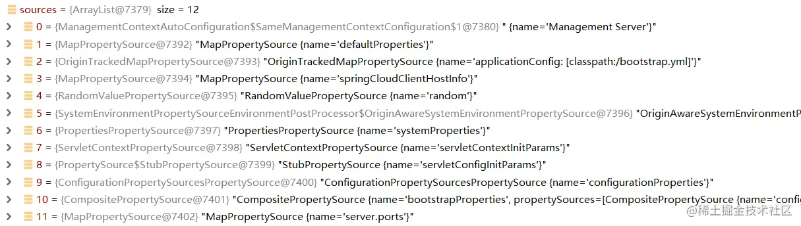

过滤掉那些标准的配置项后，剩下的可供 ConfigServer 拉取和加载的配置项有这么 15 条，这里面大部分都确实是 Git 中的配置文件内容：

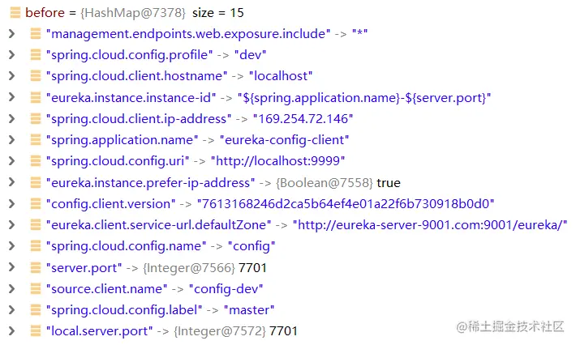

### 向运行时环境中加入配置文件

addConfigFilesToEnvironment方法向运行时环境中加入配置文件：

~~~java
ConfigurableApplicationContext addConfigFilesToEnvironment() {
    ConfigurableApplicationContext capture = null;
    try {
        // 先从当前服务实例的环境信息都复制出来
        StandardEnvironment environment = copyEnvironment(
                this.context.getEnvironment());
        // 又是偷偷构建内置的SpringBootApplication
        SpringApplicationBuilder builder = new SpringApplicationBuilder(Empty.class)
                .bannerMode(Mode.OFF).web(WebApplicationType.NONE)
                .environment(environment);
        // 只允许使用BootstrapApplicationListener和ConfigFileApplicationListener起作用
        builder.application()
                .setListeners(Arrays.asList(new BootstrapApplicationListener(),
                        new ConfigFileApplicationListener()));
        // 【模拟启动】启动内置SpringBootApplication，目的是模拟一次本服务实例的启动
        capture = builder.run();
        if (environment.getPropertySources().contains(REFRESH_ARGS_PROPERTY_SOURCE)) {
            environment.getPropertySources().remove(REFRESH_ARGS_PROPERTY_SOURCE);
        }
        // 取出当前服务实例的配置源
        MutablePropertySources target = this.context.getEnvironment()
                .getPropertySources();
        String targetName = null;
        // 将不同的配置覆盖上去
        for (PropertySource<?> source : environment.getPropertySources()) {
            String name = source.getName();
            if (target.contains(name)) {
                targetName = name;
            }
            if (!this.standardSources.contains(name)) {
                if (target.contains(name)) {
                    target.replace(name, source);
                }
                else {
                    if (targetName != null) {
                        target.addAfter(targetName, source);
                    } else {
                        // targetName was null so we are at the start of the list
                        target.addFirst(source);
                        targetName = name;
                    }
                }
            }
        }
    } // finally ......
    return capture;
}
~~~

整体走下来，简单概括一下，就是重新模拟一次当前服务实例的启动，并拉取最新的配置，替换到当前服务的配置中。中间的 builder.run 方法，它会模拟一次当前服务实例的启动过程，只是不添加什么额外的组件，只是用一些最基础的东西，目的也很简单，它就是为了单纯的使用 SpringBoot 整体应用的启动机制，去处理 Environment 的一些逻辑（一些初始化器、监听器、后置处理器的处理机制）。

经过了这个方法之后，当前服务实例的 Environment 里面的 PropertySource 就已经被调换过了，相当于配置信息已经被改过了。但注意，此时所有使用到配置信息的组件早就被初始化好了，不会因为配置信息改变而跟随改变了

### 广播EnvironmentChangeEvent事件

广播的事件被ConfigurationPropertiesRebinder监听：

~~~java
public void onApplicationEvent(EnvironmentChangeEvent event) {
    if (this.applicationContext.equals(event.getSource())
            || event.getKeys().equals(event.getSource())) {
        rebind();
    }
}

@ManagedOperation
public void rebind() {
    this.errors.clear();
    for (String name : this.beans.getBeanNames()) {
        rebind(name);
    }
}
~~~

它是给那些配置项的重绑定器。辗转到下面的方法，发现它要给一组特定的 Bean 进行重绑定操作，Debug 发现这组 Bean 都是属于那种配置属性绑定映射的 Properties 类型的模型 Bean ：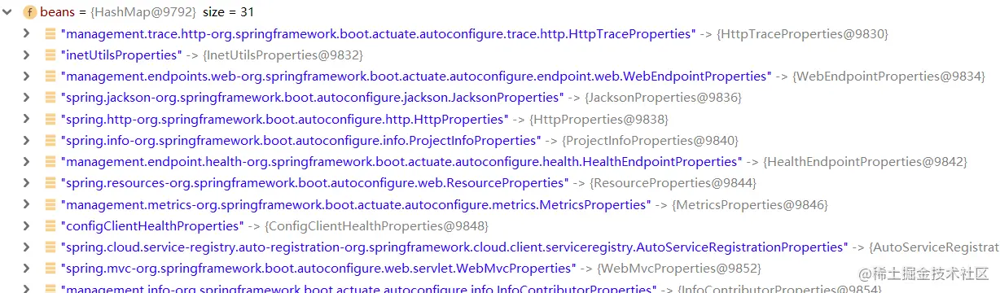

重绑定的实现：

~~~java
@ManagedOperation
public boolean rebind(String name) {
    if (!this.beans.getBeanNames().contains(name)) {
        return false;
    }
    if (this.applicationContext != null) {
        try {
            // IOC容器中取出要重新绑定的模型Bean
            Object bean = this.applicationContext.getBean(name);
            // 为防止被AOP代理过，多这一步动作
            if (AopUtils.isAopProxy(bean)) {
                bean = ProxyUtils.getTargetObject(bean);
            }
            if (bean != null) {
                this.applicationContext.getAutowireCapableBeanFactory()
                        .destroyBean(bean);
                this.applicationContext.getAutowireCapableBeanFactory()
                        .initializeBean(bean, name);
                return true;
            }
        } // catch ......
    }
    return false;
}
~~~

依次从IOC容器中取出要重新绑定的模型Bean，然后执行destroyBean和initializeBean方法，由此可见，这些绑定 Properties 的模型组件不会重新创建，但会重新初始化自身的属性映射。到这里，Environment 相关的动作都就处理完毕了，下一步要处理 Bean 的逻辑了。

### refreshAll方法

接下来进入refreshAll方法，刷新所有refresh类型的Bean：

~~~java
@ManagedOperation(description = "Dispose of the current instance of all beans "
        + "in this scope and force a refresh on next method execution.")
public void refreshAll() {
    super.destroy();
    this.context.publishEvent(new RefreshScopeRefreshedEvent());
}
~~~

这一步就两个动作：父类的销毁动作、RefreshScopeRefreshedEvent 的事件广播。

### 父类的销毁动作

来到 GenericScope 中：（注意这个 GenericScope 来自于 cloud 包而非原生 framework 包）：

~~~java
private BeanLifecycleWrapperCache cache = new BeanLifecycleWrapperCache(
        new StandardScopeCache());

public void destroy() {
    List<Throwable> errors = new ArrayList<Throwable>();
    // 清除缓存的那些Refresh域的Bean并取出
    Collection<BeanLifecycleWrapper> wrappers = this.cache.clear();
    for (BeanLifecycleWrapper wrapper : wrappers) {
        try {
            Lock lock = this.locks.get(wrapper.getName()).writeLock();
            lock.lock();
            try {
                // 销毁原来的Refresh域的Bean
                wrapper.destroy();
            }
            finally {
                lock.unlock();
            }
        } // catch ......
    }
    // 处理异常 ......
}
~~~

这里会清除缓存的那些Refresh域的Bean并取出，然后调用它的destroy方法，销毁原来的Refresh域的Bean。每个BeanLifecycleWrapper里面包含一个 ObjectFactory，ObjectFactory可以实现 Bean 依赖查找的延迟获取。经过这个方法后，缓存中已经不含任何的 Refresh 域的 Bean。

### 广播RefreshScopeRefreshedEvent事件

接下来会广播RefreshScopeRefreshedEvent事件，监听它的是EurekaClientConfigurationRefresher，在这个时机下，该监听器被触发：

~~~java
public void onApplicationEvent(RefreshScopeRefreshedEvent event) {
    // 如果本地缓存的服务还没有创建好，则强制初始化
    if (eurekaClient != null) {
        eurekaClient.getApplications();
    }
    if (autoRegistration != null) {
        // 本地服务可能已经有变动了，重新注册到注册中心
        this.autoRegistration.stop();
        this.autoRegistration.start();
    }
}
~~~

对EurekaClient 内的组件进行初始化和重新注册。其中，autoRegistration 的 stop 与 start 方法是属于 LifeCycle 接口的，分别代表服务的下线注销与上线注册。事件广播完毕，监听器执行完成，整个热更新配置就算是结束了。至此，那些 Refresh 域的 Bean已经被清理掉了。

### 再次请求Controller

Controller 作为一个 Refresh 域的 Bean，它即使被销毁了，下次请求的时候，DispatcherServlet 在让 HandlerAdapter 执行方法时，会调用 getBean 方法来获取 Controller ，如果没有，那就相当于走一次 Bean 的创建动作罢了。

getBean 方法会调用 doGetBean 方法来获取 / 创建 Bean ，由于要创建的 Controller 是 Refresh 类型的，所以 singleton 与 prototype 都不符合，进入到下面的 else 块中：

~~~java
protected <T> T doGetBean(final String name, @Nullable final Class<T> requiredType,
        @Nullable final Object[] args, boolean typeCheckOnly) throws BeansException {

    final String beanName = transformedBeanName(name);
    Object bean;
    // Eagerly check singleton cache for manually registered singletons.
    Object sharedInstance = getSingleton(beanName);
    if (sharedInstance != null && args == null) {
        // ......
    } else {
        // ... try ...
            // Create bean instance.
            if (mbd.isSingleton()) {
                // ......
            }  else if (mbd.isPrototype()) {
                // ......
            } else {
                String scopeName = mbd.getScope();
                final Scope scope = this.scopes.get(scopeName);
                if (scope == null) {
                    throw new IllegalStateException("No Scope registered for scope name '" + scopeName + "'");
                }
                try {
                    Object scopedInstance = scope.get(beanName, () -> {
                        // 与原型Bean一视同仁，防止出现循环依赖的死循环问题
                        beforePrototypeCreation(beanName);
                        try {
                            // 创建Bean
                            return createBean(beanName, mbd, args);
                        } finally {
                            // 清除循环依赖的缓存
                            afterPrototypeCreation(beanName);
                        }
                    });
                    // 如果是工厂Bean，则由此获取真正要创建的Bean
                    bean = getObjectForBeanInstance(scopedInstance, name, beanName, mbd);
                } // catch ......
            }
        } // catch ......
    }
    // ......
    return (T) bean;
}
~~~

中间传入的 lambda 实质上是一个 ObjectFactory。先研究下scope.get方法，来到GenericScope#get

~~~java
public Object get(String name, ObjectFactory<?> objectFactory) {
    BeanLifecycleWrapper value = this.cache.put(name,
            new BeanLifecycleWrapper(name, objectFactory));
    this.locks.putIfAbsent(name, new ReentrantReadWriteLock());
    try {
        return value.getBean();
    } // catch ......
}
~~~

在这里看到缓存里 BeanLifecycleWrapper 的放入时机了，是在 doGetBean 时就已经放好了，以后就直接从缓存中取即可。

而这个 BeanLifecycleWrapper 的 getBean 方法就相当简单了：

~~~java
public Object getBean() {
    // 缓存中没有，走ObjectFactory的创建并放入缓存
    if (this.bean == null) {
        synchronized (this.name) {
            if (this.bean == null) {
                this.bean = this.objectFactory.getObject();
            }
        }
    }
    // 缓存中有，直接返回
    return this.bean;
}
~~~

若缓存中没有，走ObjectFactory的创建并放入缓存，也就是上面的那段lambda，调用createBean方法；缓存中有，直接返回

由此也就算完成了一次 Bean 的刷新动作，ConfigClient 的配置热更新就得以体现了。

### Singleton与Refresh的对比

对比一下 SpringFramework 原生的单实例 Bean 与 Config 中的可刷新 Bean 。回忆一下单实例 Bean 的创建思路：

~~~java
public Object getSingleton(String beanName, ObjectFactory<?> singletonFactory) {
    Assert.notNull(beanName, "Bean name must not be null");
    synchronized (this.singletonObjects) {
        Object singletonObject = this.singletonObjects.get(beanName);
        if (singletonObject == null) {
            // 创建 ......
        }
        return singletonObject;
    }
}
~~~

单实例 Bean 的创建是存在一个集合的，如果缓存中存在就直接返回，不存在才创建。

而可刷新 Bean 的集合不是直接存放 Bean ，而是存放一组 BeanLifecycleWrapper ，每个 Wrapper 中又组合了一个 ObjectFactory ，由此才可以完成 Bean 的可重复创建。

另外，单实例 Bean 的销毁，只有到 IOC 容器的销毁动作时才会跟着销毁：

~~~java
protected void doClose() {
    // Check whether an actual close attempt is necessary...
    if (this.active.get() && this.closed.compareAndSet(false, true)) {
        // ......
        // Destroy all cached singletons in the context's BeanFactory.
        // 销毁所有单实例Bean
        destroyBeans();
        // Close the state of this context itself.
        closeBeanFactory();
        // ......
    }
}
~~~

而可刷新 Bean 的销毁可以是任何时机，只要触发了 ContextRefresher 的 refresh 动作，这些 Bean 就跟着销毁掉了。

### 小结

* ConfigClient 的配置热更新需要配合 actuator 完成，由 ContextRefresher 处理；
* 配置热更新的过程中会在底层模拟启动一次与当前服务实例一样的基础配置的 SpringBoot 工程，该过程相当于模拟真实的从 ConfigServer 拉取配置到本地的动作；
* 所有 Refresh 域的 Bean ，会在配置热更新的动作中被销毁，并在 IOC 容器的 getBean 的动作中重新触发构造；
* 单实例 Bean 与可刷新 Bean 最本质的区别是，可刷新 Bean 可以在应用运行的任何时机被清除，而单实例 Bean 的生命周期与 IOC 容器的生命周期一致。

