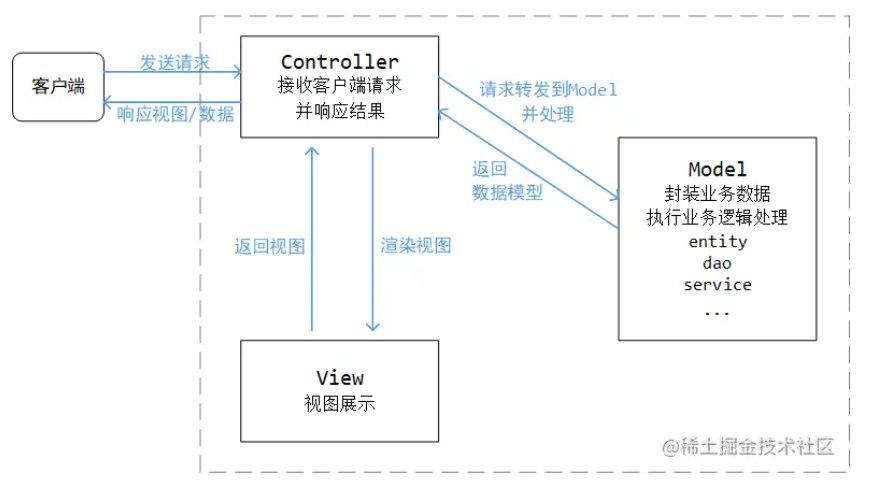
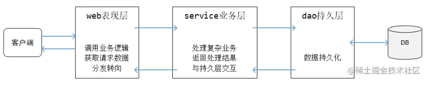
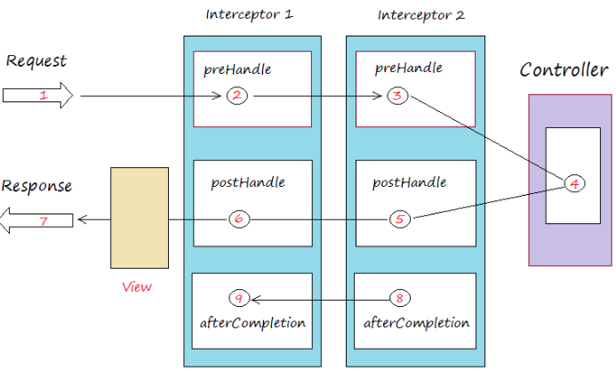
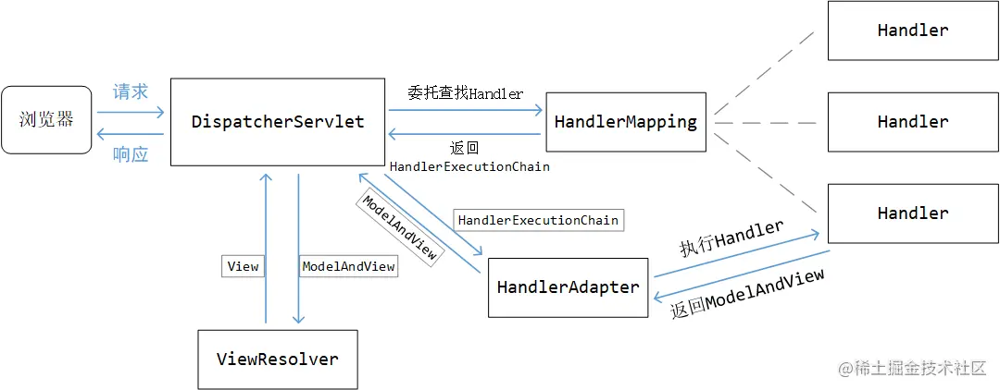

# SpringMVC

## Spring整合servlet

MVC模型：Model、View、Controller。Controller接受客户端的请求，并响应结果，返回View（视图展示）和Model（封装着业务数据）



三层架构是为了实现代码解耦的经典设计模式：web层、service层、dao层



1、基于web.xml的方式

新建工程时要把打包方式改为war，导入spring整合相关依赖、servlet相关依赖：

```xml
<packaging>war</packaging>
<properties>
    <spring.framework.version>5.2.8.RELEASE</spring.framework.version>
</properties>

<dependencies>
    <dependency>
        <groupId>org.springframework</groupId>
        <artifactId>spring-context</artifactId>
        <version>${spring.framework.version}</version>
    </dependency>

    <dependency>
        <groupId>org.springframework</groupId>
        <artifactId>spring-web</artifactId>
        <version>${spring.framework.version}</version>
    </dependency>

    <dependency>
        <groupId>javax.servlet</groupId>
        <artifactId>javax.servlet-api</artifactId>
        <version>3.1.0</version>
        <scope>provided</scope>
    </dependency>
</dependencies>
```

然后引入spring的配置文件spring-web.xml ：

```xml
<?xml version="1.0" encoding="UTF-8"?>
<beans xmlns="http://www.springframework.org/schema/beans"
       xmlns:xsi="http://www.w3.org/2001/XMLSchema-instance"
       xsi:schemaLocation="http://www.springframework.org/schema/beans 
                           http://www.springframework.org/schema/beans/spring-beans.xsd">
    <bean class="com.linkedbear.spring.xml.a_basic.UserService"/>
</beans>
```

编写web.xml：

```xml
<?xml version="1.0" encoding="UTF-8"?>
<web-app xmlns="http://xmlns.jcp.org/xml/ns/javaee"
         xmlns:xsi="http://www.w3.org/2001/XMLSchema-instance"
         xsi:schemaLocation="http://xmlns.jcp.org/xml/ns/javaee
                             http://xmlns.jcp.org/xml/ns/javaee/web-app_3_1.xsd"
         version="3.1">

    <listener>
    	<listener-class>org.springframework.web.context.ContextLoaderListener</listener-class>
	</listener>
    <context-param>
    	<param-name>contextConfigLocation</param-name>
    	<param-value>classpath:spring-web.xml</param-value>
	</context-param>
</web-app>
```

在web.xml中引入一个spring内置的监听器，在web容器启动时，借助servlet的机制回调监听器，在监听器中加载配置文件，初始化IOC容器，并将IOC容器放入application域中，方便开发程序取用。

contextConfigLocation的参数是为了让监听器正确的读到spring配置文件，默认是去找 WEB-INF 目录下的 applicationContext.xml 文件，现在改成去resources 目录 寻找名为spring-web.xml的配置文件。这个地方也可以写成通配符，比如spring-*.xml 等。

在编写servlet程序时，需要取到IOC容器中的对象，此时用这种方法：通过servletContext取到IOC容器，再初始化对象：

```java
@WebServlet(urlPatterns = "/user")
public class UserServlet extends HttpServlet {
    
    private UserService userService;
    
    @Override
    protected void doGet(HttpServletRequest req, HttpServletResponse resp) throws ServletException, IOException {
        String user = userService.get();
        resp.getWriter().println(user);
    }
}

    @Override
    public void init(ServletConfig config) throws ServletException {
        super.init(config);
        ServletContext servletContext = config.getServletContext();
        WebApplicationContext ctx = WebApplicationContextUtils.getWebApplicationContext(servletContext);
        this.userService = ctx.getBean(UserService.class);
    }
```

此时启动Tomcat，访问[http://localhost:8080/spring-web/user](https://link.juejin.cn/?target=http%3A%2F%2Flocalhost%3A8080%2Fspring-web%2Fuser) 发现可以成功。

也可以在init中使用支持类，直接完成对象的注入：

```java
@Autowired
private UserService userService;

@Override
public void init(ServletConfig config) throws ServletException {
    super.init(config);
    ServletContext servletContext = config.getServletContext();
    SpringBeanAutowiringSupport.processInjectionBasedOnServletContext(this, servletContext);
}
```

2、基于Servlet3.0规范的web整合方式

servlet3.0提供了一种机制来代替web.xml，被称为Shared libraries / runtimes pluggability ，即 “共享库 / 运行时的可插拔性”，它是基于java的SPI技术的（在固定路径放一个配置文件，java可以自动读取并初始化它定义的类）

servlet3.0可以从项目或者项目依赖的jar包中，找到一个/META-INF/services/javax.servlet.ServletContainerInitializer 的文件，并加载项目中所有它的实现类，在spring-web中：

```java
public interface ServletContainerInitializer {
    void onStartup(Set<Class<?>> var1, ServletContext var2) throws ServletException;
}
```

它的实现类：

```java
@HandlesTypes({WebApplicationInitializer.class})
public class SpringServletContainerInitializer implements ServletContainerInitializer {
    public SpringServletContainerInitializer() {
    }

    public void onStartup(@Nullable Set<Class<?>> webAppInitializerClasses, ServletContext servletContext) throws ServletException {
        ...
```

@HandlesTypes的意思是可以将WebApplicationInitializer的实现类全部找出，封装为set，传入onStartup方法中。servlet会在启动时回调onStartup方法，并对WebApplicationInitializer的实现类做初始化动作。

实现WebApplicationInitializer的类中，有一个抽象类名为AbstractContextLoaderInitializer，它会完成注册时的大部分逻辑，我们只需要自定义一个类继承它，在这个里面加载配置文件或者配置类即可：

```java
public class DemoWebApplicationInitializer extends AbstractContextLoaderInitializer {
    
    @Override
    protected WebApplicationContext createRootApplicationContext() {
        AnnotationConfigWebApplicationContext ctx = new AnnotationConfigWebApplicationContext();
        ctx.register(UserConfiguration.class);
        return ctx;
    }
}
```

用这种方式记得要清空web.xml中的内容（或者删掉），否则会产生两个IOC容器。

## SpringMVC基本使用

SpringMVC是web层框架，核心是servlet，SpringFramework 5.0 还推出了 WebMvc 的兄弟 WebFlux，WebFlux不是基于 Servlet 规范设计的，而是基于响应式、异步非阻塞等理念设计，它的性能更好。WebFlux不再强依赖于 Servlet 环境，而是必须运行在非阻塞环境的 Web 容器（Netty 、Undertow 等）。 但它还不算太普及，这里主要介绍SpringMVC。

先介绍web.xml的方式搭建webMVC，首先导入spring和mvc、jsp、jstl的依赖：

```xml
<dependencies>
    <dependency>
        <groupId>org.springframework</groupId>
        <artifactId>spring-context</artifactId>
        <version>${spring.framework.version}</version>
    </dependency>

    <dependency>
        <groupId>org.springframework</groupId>
        <artifactId>spring-webmvc</artifactId>
        <version>${spring.framework.version}</version>
    </dependency>
    <dependency>
        <groupId>javax.servlet</groupId>
        <artifactId>javax.servlet-api</artifactId>
        <version>3.1.0</version>
        <scope>provided</scope>
    </dependency>
    <dependency>
        <groupId>javax.servlet.jsp</groupId>
        <artifactId>javax.servlet.jsp-api</artifactId>
        <version>2.3.3</version>
        <scope>provided</scope>
    </dependency>
    <dependency>
        <groupId>javax.servlet</groupId>
        <artifactId>jstl</artifactId>
        <version>1.2</version>
    </dependency>

</dependencies>

<packaging>war</packaging>
```

对于 SpringWebMvc 而言，它认为只要标注了 @Controller 注解的类，扫描到后都算控制器（类似于 Servlet 的概念），首先编写一个控制器：

```java
@Controller
public class DemoController {
    @RequestMapping("/demo")
    public String demo() {
        return "demo";
    }
}
```

代表要监听的uri是/demo，方法返回值代表页面跳转到demo.jsp

spring配置文件：spring-mvc.xml 

```xml
<?xml version="1.0" encoding="UTF-8"?>
<beans xmlns="http://www.springframework.org/schema/beans"
       xmlns:xsi="http://www.w3.org/2001/XMLSchema-instance"
       xmlns:context="http://www.springframework.org/schema/context"
       xsi:schemaLocation="http://www.springframework.org/schema/beans 
                           http://www.springframework.org/schema/beans/spring-beans.xsd 
                           http://www.springframework.org/schema/context 
                           https://www.springframework.org/schema/context/spring-context.xsd">

    <bean id="viewResolver" class="org.springframework.web.servlet.view.InternalResourceViewResolver">
        <!-- jsp文件路径的前缀 -->
        <property name="prefix" value="/WEB-INF/pages/" />
        <!-- jsp文件的后缀 -->
        <property name="suffix" value=".jsp" />
</bean>
    <context:component-scan base-package="com.linkedbear.spring.a_quickstart"/>
</beans>
```

配置了包扫描，同时引入了视图解析器，配置了解析器的属性。

写一个demo.jsp，放到WEB-INF/pages 中：

```jsp
<%@ page contentType="text/html;charset=UTF-8" language="java" %>
<html>
<head>
    <title>demo</title>
</head>
<body>
    <h1>这里是demo页面</h1>
</body>
</html>
```

配置web.xml，SpringWebMvc 的核心控制器是一个 Servlet ，它的名称叫 DispatcherServlet，这里直接将其引入，并设置好spring配置文件的路径（如果不额外设置contextConfigLocation，则它会默认加载classpath:dispatcherServlet-servlet.xml），然后配置过滤规则：

```xml
<?xml version="1.0" encoding="UTF-8"?>
<web-app xmlns="http://xmlns.jcp.org/xml/ns/javaee"
         xmlns:xsi="http://www.w3.org/2001/XMLSchema-instance"
         xsi:schemaLocation="http://xmlns.jcp.org/xml/ns/javaee
                             http://xmlns.jcp.org/xml/ns/javaee/web-app_3_1.xsd"
         version="3.1">
    
    <servlet>
        <servlet-name>dispatcherServlet</servlet-name>
        <servlet-class>org.springframework.web.servlet.DispatcherServlet</servlet-class>
        <init-param>
            <param-name>contextConfigLocation</param-name>
            <param-value>classpath:spring-mvc.xml</param-value>
        </init-param>
    </servlet>
    <servlet-mapping>
        <servlet-name>dispatcherServlet</servlet-name>
        <url-pattern>/</url-pattern>
    </servlet-mapping>
</web-app>
```

/这种配置规则代表：拦截所有请求、静态资源，但不拦截 .jsp

/*规则代表：拦截所有请求、静态资源、.jsp 页面

*.do规则代表：只会拦截所有结尾为 .do的请求

启动Tomcat发现可访问：[http://localhost:8080/spring-webmvc/demo](https://link.juejin.cn/?target=http%3A%2F%2Flocalhost%3A8080%2Fspring-webmvc%2Fdemo) 

## SpringMVC基本使用：基于Servlet3.0规范

基于Servlet3.0规范搭建SpringMVC时不需要web.xml

SpringMVC中，引入了两个实现了WebApplicationInitializer的类，分别是AbstractDispatcherServletInitializer 和 AbstractAnnotationConfigDispatcherServletInitializer ，自定义这两个类的子类即可替代web.xml的功能。

- AbstractDispatcherServletInitializer ：要自定义它的子类要实现两个抽象方法：

```java
protected abstract WebApplicationContext createServletApplicationContext();
protected abstract String[] getServletMappings();
```

分别是自定义IOC容器初始化的逻辑、配置DispatcherServlet 拦截的路径（和url-pattern类似）。

- AbstractAnnotationConfigDispatcherServletInitializer ：注解驱动的，要自定义它的子类要实现两个抽象方法：

```java
protected abstract Class<?>[] getRootConfigClasses();
protected abstract Class<?>[] getServletConfigClasses();
```

相当于传入两组配置类（之所以是两组，和子父容器的概念有关）

SpringWebMvc 会设计一个根容器和 Servlet 的子容器，它希望把 Service 、Dao 等类都放到根容器，把表现层的 Controller 及相关的组件都放到 Servlet 的子容器中，以此形成一个层级关系 

这种父子容器的设计，好处有两个：

第一，形成层级关系后，Controller 可以拿到 Service ，而 Service 拿不到 Controller ，可以以此形成一道隔离；

第二，如果真的出现特殊情况，需要注册多个 DispatcherServlet 的时候，不必注册多套 Service 和 Dao ，每个 Servlet 子容器都从这一个根容器中取 Service 和 Dao 即可。

注意，正因为这样的设计，Servlet 子容器只能扫描 @Controller 注解，而不能扫描 @Service 、@Repository 等注解，否则会导致子容器中存在 Service 而不会去父容器中寻找，从而引发一些问题（如事务失效、AOP 增强失效等）

实现两个配置类，一个作为根容器，一个作为Servlet 的子容器：

```java
@Configuration
public class RootConfiguration {
    
}
```

```java
@Configuration
@ComponentScan("com.linkedbear.spring.b_anno.controller")
public class WebMvcConfiguration {
    
    @Bean
    public ViewResolver viewResolver() {
        InternalResourceViewResolver viewResolver = new InternalResourceViewResolver();
        viewResolver.setPrefix("/WEB-INF/pages/");
        viewResolver.setSuffix(".jsp");
        return viewResolver;
    }
}
```

然后编写一个AbstractAnnotationConfigDispatcherServletInitializer 的子类，替代web.xml：

```java
public class SpringWebMvcInitializer extends AbstractAnnotationConfigDispatcherServletInitializer {
    
    @Override
    protected Class<?>[] getRootConfigClasses() {
        return new Class[] {RootConfiguration.class};
    }
    
    @Override
    protected Class<?>[] getServletConfigClasses() {
        return new Class[] {WebMvcConfiguration.class};
    }
    
    @Override
    protected String[] getServletMappings() {
        return new String[] {"/"};
    }
}
```

启动Tomcat发现可访问：[http://localhost:8080/spring-webmvc/demo](https://link.juejin.cn/?target=http%3A%2F%2Flocalhost%3A8080%2Fspring-webmvc%2Fdemo) 

## SpringWebMvc整合dao

导入依赖：

```xml
<dependencies>
    <dependency>
        <groupId>org.springframework</groupId>
        <artifactId>spring-context</artifactId>
        <version>${spring.framework.version}</version>
    </dependency>

    <dependency>
        <groupId>org.springframework</groupId>
        <artifactId>spring-webmvc</artifactId>
        <version>${spring.framework.version}</version>
    </dependency>

    <dependency>
        <groupId>org.springframework</groupId>
        <artifactId>spring-jdbc</artifactId>
        <version>${spring.framework.version}</version>
    </dependency>

    <dependency>
        <groupId>mysql</groupId>
        <artifactId>mysql-connector-java</artifactId>
        <version>5.1.47</version>
    </dependency>

    <dependency>
        <groupId>javax.servlet</groupId>
        <artifactId>javax.servlet-api</artifactId>
        <version>3.1.0</version>
        <scope>provided</scope>
    </dependency>
    <dependency>
        <groupId>javax.servlet.jsp</groupId>
        <artifactId>javax.servlet.jsp-api</artifactId>
        <version>2.3.3</version>
        <scope>provided</scope>
    </dependency>
    <dependency>
        <groupId>javax.servlet</groupId>
        <artifactId>jstl</artifactId>
        <version>1.2</version>
    </dependency>
</dependencies>
```

父容器的配置文件spring-ioc-withdao.xml，配置了包扫描（排除了@Controller，保证父子容器的隔离）、注册dataSource、jdbcTemplate 、事务相关

```xml
<?xml version="1.0" encoding="UTF-8"?>
<beans xmlns="http://www.springframework.org/schema/beans"
       xmlns:xsi="http://www.w3.org/2001/XMLSchema-instance"
       xmlns:context="http://www.springframework.org/schema/context" 
       xmlns:tx="http://www.springframework.org/schema/tx"
       xsi:schemaLocation="http://www.springframework.org/schema/beans 
                           http://www.springframework.org/schema/beans/spring-beans.xsd 
                           http://www.springframework.org/schema/context 
                           https://www.springframework.org/schema/context/spring-context.xsd 
                           http://www.springframework.org/schema/tx 
                           http://www.springframework.org/schema/tx/spring-tx.xsd">

    <context:component-scan base-package="com.linkedbear.spring.withdao">
        <context:exclude-filter type="annotation" expression="org.springframework.stereotype.Controller"/>
    </context:component-scan>

    <bean id="dataSource" class="org.springframework.jdbc.datasource.DriverManagerDataSource">
        <property name="driverClassName" value="com.mysql.jdbc.Driver"/>
        <property name="url" value="jdbc:mysql://localhost:3306/spring-webmvc?characterEncoding=utf8"/>
        <property name="username" value="root"/>
        <property name="password" value="123456"/>
    </bean>

    <bean id="jdbcTemplate" class="org.springframework.jdbc.core.JdbcTemplate">
        <property name="dataSource" ref="dataSource"/>
    </bean>

    <bean id="transactionManager" class="org.springframework.jdbc.datasource.DataSourceTransactionManager">
        <property name="dataSource" ref="dataSource"/>
    </bean>

    <tx:annotation-driven transaction-manager="transactionManager"/>
</beans>
```

创建表、导入数据、写service、dao、页面：略

controller：

```java
@Controller
public class DepartmentController {
    
    @Autowired
    DepartmentService departmentService;
    
    @RequestMapping("/department/demo")
    public String demo() {
        System.out.println(departmentService);
        return "demo";
    }
}
```

SpringWebMvc 的配置文件spring-mvc-withdao.xml ，其中也配置了包扫描、视图解析器：

```xml
<?xml version="1.0" encoding="UTF-8"?>
<beans xmlns="http://www.springframework.org/schema/beans"
       xmlns:xsi="http://www.w3.org/2001/XMLSchema-instance"
       xmlns:context="http://www.springframework.org/schema/context"
       xsi:schemaLocation="http://www.springframework.org/schema/beans 
                           http://www.springframework.org/schema/beans/spring-beans.xsd 
                           http://www.springframework.org/schema/context 
                           https://www.springframework.org/schema/context/spring-context.xsd">

    <context:component-scan base-package="com.linkedbear.spring.withdao.controller"/>

    <bean id="viewResolver" class="org.springframework.web.servlet.view.InternalResourceViewResolver">
        <property name="prefix" value="/WEB-INF/pages/" />
        <property name="suffix" value=".jsp" />
    </bean>
</beans>
```

这里包扫描的时候只扫描了controller包，也可以扫描整个包，然后只包含@Controller ：

```xml
<context:component-scan base-package="com.linkedbear.spring.withdao" use-default-filters="false">
    <context:include-filter type="annotation" expression="org.springframework.stereotype.Controller"/>
</context:component-scan>
```

配置web.xml，设置ContextLoaderListener以加载spring-ioc-withdao.xml（父容器），设置核心控制器加载spring-mvc-withdao.xml（子容器），并建立过滤规则：

```xml
<?xml version="1.0" encoding="UTF-8"?>
<web-app xmlns="http://xmlns.jcp.org/xml/ns/javaee"
         xmlns:xsi="http://www.w3.org/2001/XMLSchema-instance"
         xsi:schemaLocation="http://xmlns.jcp.org/xml/ns/javaee
                             http://xmlns.jcp.org/xml/ns/javaee/web-app_3_1.xsd"
         version="3.1">

    <listener>
        <listener-class>org.springframework.web.context.ContextLoaderListener</listener-class>
    </listener>
    <context-param>
        <param-name>contextConfigLocation</param-name>
        <param-value>classpath:spring-ioc-withdao.xml</param-value>
    </context-param>
    
    <servlet>
        <servlet-name>dispatcherServlet</servlet-name>
        <servlet-class>org.springframework.web.servlet.DispatcherServlet</servlet-class>
        <init-param>
            <param-name>contextConfigLocation</param-name>
            <param-value>classpath:spring-mvc-withdao.xml</param-value>
        </init-param>
    </servlet>
    <servlet-mapping>
        <servlet-name>dispatcherServlet</servlet-name>
        <url-pattern>/</url-pattern>
    </servlet-mapping>
</web-app>
```

启动Tomcat可以访问成功：[http://localhost:8080/spring-webmvc/department/demo](https://link.juejin.cn/?target=http%3A%2F%2Flocalhost%3A8080%2Fspring-webmvc%2Fdepartment%2Fdemo) 

## SpringWebMvc整合dao：注解驱动

注解驱动跟配置文件的方式差别在于要用配置类的方式替换两个spring的配置文件和web.xml。

首先替换父容器的spring配置文件，这里指定了另外一个配置类，注册了包扫描：

~~~java
@Configuration
@Import(JdbcDaoConfiguration.class)
@ComponentScan(value = "com.linkedbear.spring.withdao",
               excludeFilters = {@ComponentScan.Filter(type = FilterType.ANNOTATION, value = Controller.class),
                       @ComponentScan.Filter(type = FilterType.ANNOTATION, value = Configuration.class)
               })
public class RootConfiguration {
    
}
~~~

这里除了排除了Controller，还排除了Configuration，这是为了防止误扫描到子容器的配置类。这里把dao相关的配置都放到了JdbcDaoConfiguration：

~~~java
@Configuration
@EnableTransactionManagement
public class JdbcDaoConfiguration {
    
    @Bean
    public DataSource dataSource() {
        DriverManagerDataSource dataSource = new DriverManagerDataSource();
        dataSource.setDriverClassName("com.mysql.jdbc.Driver");
        dataSource.setUrl("jdbc:mysql://localhost:3306/spring-webmvc?characterEncoding=utf8");
        dataSource.setUsername("root");
        dataSource.setPassword("123456");
        return dataSource;
    }
    
    @Bean
    public JdbcTemplate jdbcTemplate(DataSource dataSource) {
        return new JdbcTemplate(dataSource);
    }
    
    @Bean
    public TransactionManager transactionManager(DataSource dataSource) {
        return new DataSourceTransactionManager(dataSource);
    }
}
~~~

替换子容器的配置文件，除了配置包扫描，还注册了ViewResolver ：

~~~java
@Configuration
@ComponentScan(value = "com.linkedbear.spring.withdao",
               includeFilters = @ComponentScan.Filter(value = Controller.class, type = FilterType.ANNOTATION),
               useDefaultFilters = false)
public class WebMvcConfiguration {
    
    @Bean
    public ViewResolver viewResolver() {
        InternalResourceViewResolver viewResolver = new InternalResourceViewResolver();
        viewResolver.setPrefix("/WEB-INF/pages/");
        viewResolver.setSuffix(".jsp");
        return viewResolver;
    }
}
~~~

除了用这种写法外，还可以使用@EnableWebMvc注解，结合WebMvcConfigurer接口，重写configureViewResolvers方法相当于设置ViewResolver 的属性：

~~~java
@Configuration
@EnableWebMvc
@ComponentScan(value = "com.linkedbear.spring.withdao",
               includeFilters = @ComponentScan.Filter(value = Controller.class, type = FilterType.ANNOTATION),
               useDefaultFilters = false)
public class EnableWebMvcConfiguration implements WebMvcConfigurer {
    
    @Override
    public void configureViewResolvers(ViewResolverRegistry registry) {
        registry.jsp("/WEB-INF/pages/", ".jsp");
    }
}
~~~

最后将两个配置类引入启动类中，替换web.xml：

~~~java
public class WebMvcApplicationInitializer extends AbstractAnnotationConfigDispatcherServletInitializer {
    
    @Override
    protected Class<?>[] getRootConfigClasses() {
        return new Class[] {RootConfiguration.class};
    }
    
    @Override
    protected Class<?>[] getServletConfigClasses() {
        return new Class[] {EnableWebMvcConfiguration.class};
    }
    
    @Override
    protected String[] getServletMappings() {
        return new String[] {"/"};
    }
}
~~~

## 向页面传递参数

在controller中直接返回一个字符串相当于进行页面跳转：

~~~java
@RequestMapping("/department/list")
public String list() {
    return "dept/deptList";
}
~~~

如果页面上需要一个名为deptList的数据集合，可以用以下几种方式：

* 将数据直接放入request域：

~~~java
@RequestMapping("/department/list")
    public String list(HttpServletRequest request) {
        request.setAttribute("deptList", departmentService.findDepartments(null));
        return "dept/deptList";
    }
~~~

HttpServletRequest不仅可以作为入参传入，还可以直接在Controller中作为成员变量自动注入：

~~~java
@Controller
public class DepartmentController {
    
    @Autowired
    HttpServletRequest request;
~~~

* 使用ModelAndView对象，它可以同时兼顾Model和View两部分功能，还可以设置状态码：

~~~java
@RequestMapping("/department/list2")
public ModelAndView list2(ModelAndView mav) {
    mav.addObject("deptList", departmentService.findDepartments(null));
    mav.setViewName("dept/deptList");
    return mav;
}
~~~

除了以入参形式传入ModelAndView，还可以在方法内部自己new一个然后返回，效果相同

* 基于Map的数据传递，这种方式还是通过返回字符串的方式完成视图信息的返回，将model信息绑定到map上：

~~~java
@RequestMapping("/department/list3")
public String list3(ModelMap map) { // 可换成Model、Map<String, Object>
    map.put("deptList", departmentService.findDepartments(null));
    return "dept/deptList";
}
~~~

可以直接使用ModelMap或者Model、Map<String, Object>，它们都可以完成绑定model的功能。

## 接受页面参数

若页面传递给后台一个名为name的参数，此时可以有以下几种方式接受：

* 将数据从request域中取出：

~~~java
 @RequestMapping("/department/list")
public String list(HttpServletRequest request) {
    String name = request.getParameter("name");
    // service中已经提供了基于name的模糊查询方法
    request.setAttribute("deptList", departmentService.findDepartmentsByName(name));
    return "dept/deptList";
}
~~~

* 将后台要接受的参数直接作为入参传入：

~~~java
@RequestMapping("/department/list")
public String list(String name) {
    request.setAttribute("deptList", departmentService.findDepartmentsByName(name));
    return "dept/deptList";
}
~~~

* 基于模型类的参数接收：

~~~java
@RequestMapping("/department/list")
    public String list(Department dept) {
        // service中已经提供了基于模型类的模糊查询
        request.setAttribute("deptList", departmentService.findDepartments(dept);
        return "dept/deptList";
    }
~~~

此时Department中有一个成员变量名为name，此时就可以由框架直接将参数注入到变量中

##@RequestParam

参数绑定时涉及到一个重要的注解@RequestParam，它可以实现参数名称的适配，比如页面传来的参数名为dept_name，但方法中想要以name接受：

~~~java
@RequestMapping("/department/list")
    public String list(HttpServletRequest request, @RequestParam(value = "dept_name") String name) { ... }
~~~

默认标注@RequestParam的入参是必传的，否则会直接报错，可以将它改为默认不必传：

~~~java
@RequestParam(value = "dept_name", required = false) String name
~~~

还可以设置参数的默认值，在不传的情况下直接取默认值：

~~~java
@RequestParam(value = "dept_name", required = false, defaultValue = "default") String name
~~~

## Controller方法的返回值

返回值有以下几种：

* 返回字符串：代表页面跳转
* 返回ModelAndView：其中也有视图的路径
* 返回值类型是void：通过向response中设置数据给页面返回数据：

~~~java
@RequestMapping("/department/get")
    public void get(HttpServletResponse response, String id) throws IOException {
        Department department = departmentService.findById(id);
        response.setCharacterEncoding("utf-8");
        response.setContentType("application/json;charset=utf-8");
        response.getWriter().println("department序列化后的json");
    }
~~~

* 配合@ResponseBody 可以实现返回json数据

* 请求转发和重定向：可以通过返回String来实现：

  * 请求转发：forward:/department/list  相当于

    ~~~java
    request.getRequestDispatcher("/department/list").forward(request, response);
    ~~~

  * 重定向：redirect:/department/list  相当于

    ~~~java
    response.sendRedirect("/department/list");
    ~~~

## 中文乱码问题

中文乱码问题大概分为两类：post请求时传递到后台的数据为乱码、get时URL提交的数据传递到后台为乱码

1、post请求时传递到后台的数据为乱码

这一般是由于Web容器（Tomcat）在解析请求体数据时采用了ISO-8859-1 的默认编码，这种编码是不支持中文的，所以要额外设置一层的转码，需要在web.xml中添加一个过滤器，设置编码字符集为UTF-8：

~~~java
<filter>
        <filter-name>characterEncodingFilter</filter-name>
        <filter-class>org.springframework.web.filter.CharacterEncodingFilter</filter-class>
        <init-param>
            <param-name>encoding</param-name>
            <param-value>UTF-8</param-value>
        </init-param>
    </filter>
    <filter-mapping>
        <filter-name>characterEncodingFilter</filter-name>
        <url-pattern>/*</url-pattern>
    </filter-mapping>
~~~

CharacterEncodingFilter是springmvc自带的一个过滤器，这里设置了之后，springmvc就会帮助我们设置request和response的编码。

使用Servlet 3.0  的情况下：

~~~java
public class FilterWebApplicationInitializer implements WebApplicationInitializer {
    
    @Override
    public void onStartup(ServletContext servletContext) throws ServletException {
        FilterRegistration.Dynamic filter = servletContext
                .addFilter("characterEncodingFilter", CharacterEncodingFilter.class);
        filter.addMappingForUrlPatterns(EnumSet.of(DispatcherType.REQUEST), true, "/*");
        filter.setInitParameter("encoding", "UTF-8");
    }
}
~~~

2、get时URL提交的数据传递到后台为乱码

此时需要检查Tomcat 中 server.xml 配置的下面部分是否正确：

~~~xml
<Connector port="8080" protocol="HTTP/1.1"
               connectionTimeout="20000"
               redirectPort="8443" 
               useBodyEncodingForURI="true"/>
~~~

关键的配置是useBodyEncodingForURI="true"，代表tomcat会将URL提交的数据和表单中GET方式提交的数据进行重新编码（根据request.setCharacterEncoding ），如果还不行的话就吧useBodyEncodingForURI="true"改为URIEncoding="UTF-8" ，代表对所有GET方式的请求的数据进行统一的重新编码，编码集是UTF-8

## @RequestMapping

1、@RequestMapping可以标注在类上，意思是匹配全部的方法，如有多个方法都是匹配/department 为前缀的，那么此时就可以将这部分标识在类上，方法上就不用再重复写多个前缀匹配了：

~~~java
@Controller
@RequestMapping("/department")
public class DepartmentController {
~~~

2、@RequestMapping可以限定HTTP请求方法，如限定GET请求，此时POST请求就无法访问了：

~~~java
    @RequestMapping(value = "/list", method = RequestMethod.GET)
    public String list(HttpServletRequest request, String name) {
        request.setAttribute("deptList", departmentService.findDepartmentsByName(name));
        return "dept/deptList";
    }
~~~

还可以进一步简化为@GetMapping("/list") ，@RequestMapping有下列几种扩展注解：

~~~java
@RequestMapping(value = "/list", method = RequestMethod.GET)
@GetMapping("/list")
@PostMapping("/list")
@PutMapping("/list")
@DeleteMapping("/list")
~~~

## RESTful和@PathVariable

RESTful ，全名叫 Representational State Transfer ，RESTful 的编码风格将这四种方式赋予真正的意义： 

- **GET ：获取资源 / 数据**
- **POST ：新建资源 / 数据**
- **PUT ：更新资源 / 数据**
- **DELETE ：删除资源 / 数据**

我们说的 RESTful 风格的编码 ，一般都是在接口 API 层面的 RESTful ，也就是基于 uri 的 RESTful  。普通的接口请求是通过路径名称来区分动作的，比如

* 查询：【GET】/department/findById?id=1 
* 新增：【POST】/department/save 

而 RESTful 请求的传参是直接写在 uri 上的 ，看起来比较简洁：

* 查询：【GET】/department/1 
* 新增：【POST】/department 

当使用这种风格的时候，可以直接用mapping来匹配url中的参数，并作为入参传入：

~~~java
@GetMapping("/{id}")
@ResponseBody
public Department findById(@PathVariable("id") String id) {
    return departmentService.findById(id);
}

@PostMapping("/")
public void save(Department department) {
    departmentService.save(department);
}

@PutMapping("/{id}")
public void update(Department department, @PathVariable("id") String id) {
    // update ......
}

@DeleteMapping("/{id}")
public void delete(@PathVariable("id") String id) {
    departmentService.deleteById(id);
}
~~~

@PathVariable代表解析url中的参数，并传递给它标注的方法参数，当入参名字和uri 中的参数占位符名 一致时，@PathVariable可以不设置value

## @ResponseBody和@RequestBody

当从页面获取的数据是JSON时，就需要从请求体中读取数据，而不是从请求头中，这就需要@RequestBody；当需要返回给页面的数据是JSON时，需要将对象转化为json然后放入响应体中，这就需要@ResponseBody。在进行json相关的处理之前，需要先引入json处理的依赖：

~~~xml
    <dependency>
        <groupId>com.fasterxml.jackson.core</groupId>
        <artifactId>jackson-core</artifactId>
        <version>2.10.5</version>
    </dependency>
    <dependency>
        <groupId>com.fasterxml.jackson.core</groupId>
        <artifactId>jackson-databind</artifactId>
        <version>2.10.5</version>
    </dependency>
    <dependency>
        <groupId>com.fasterxml.jackson.core</groupId>
        <artifactId>jackson-annotations</artifactId>
        <version>2.10.5</version>
    </dependency>
~~~

然后需要配置springmvc对json格式的转换器，有以下三种方式：

* 在 spring-mvc.xml 中添加一个标签：\<mvc:annotation-driven/\>

* 手动在 spring-mvc.xml注册一个适配器：

  ~~~xml
  <bean id="handlerAdapter" class="org.springframework.web.servlet.mvc.method.annotation.RequestMappingHandlerAdapter">
      <property name="messageConverters">
          <list>
              <bean class="org.springframework.http.converter.json.MappingJackson2HttpMessageConverter"/>
          </list>
      </property>
  </bean>
  ~~~

* 注解方式，在配置类上加上@EnableWebMvc 

配置好之后就可以使用@ResponseBody了：

~~~java
@GetMapping("/{id}")
@ResponseBody
public Department findById(@PathVariable("id") String id) {
    return departmentService.findById(id);
}
~~~

此时mvc会帮我们吧返回的对象转化为json，放在响应体中

当一个 Controller 中定义的所有方法，都是以 json 格式的数据返回的，换句话说，这个 Controller 里没有任何视图跳转 ，此时就可以直接在Controller 类上标注 @ResponseBody 注解即可，也可以用@RestController 代替 @Controller 注解：

~~~java
//@Controller
@RestController
public class JsonDepartmentController { ... }
~~~

@RestController 就等于@Controller + @ResponseBody

想要在请求体中寻找json数据，并自动将其封装为对象，就需要使用@RequestBody：

~~~java
@Controller
public class JsonDepartmentController {
    
    @PostMapping("/department/saveJson")
    @ResponseBody
    public void saveJson(@RequestBody Department department) {
        System.out.println(department);
    }
}
~~~

测试这部分数据时，用 postman 构建纯 json 的请求，需要在请求头 header 中添加一个 content-type为 application/json

## 静态资源配置

如果在jsp中直接引用js是会报错的：

~~~jsp
<script type="text/javascript" src="${pageContext.request.contextPath}/js/jquery.min.js"></script>
~~~

原因就是之前在配置web.xml的时候用dispatcherServlet 拦截了静态资源。此时我们需要增加静态资源解析配置，此后遇到静态资源就会触发我们的配置。

配置有两种方式：

* 配置文件方式，在spring-mvc.xml 添加这样的配置：

  ~~~xml
  <mvc:resources mapping="/js/**" location="/js/" />
  <mvc:resources mapping="/css/**" location="/WEB-INF/css/" />
  ~~~

  代表遇到/js/**这样的请求，就去js文件夹下寻找

* 注解方式配置：在配置类中重写下列方法：

  ~~~java
  public class EnableWebMvcConfiguration implements WebMvcConfigurer {
      // ......
      @Override
      public void addResourceHandlers(ResourceHandlerRegistry registry) {
          registry.addResourceHandler("/js/**").addResourceLocations("/js/");
      }
  }
  ~~~

一般来讲，静态资源都会在浏览器中缓存，这样就不会每次请求时重复加载。webmvc 支持配置这些静态资源的缓存时长，配置文件和注解的方式如下：

~~~xml
<mvc:resources mapping="/js/**" location="/js/" cache-period="2592000"/>
~~~

~~~java
@Override
    public void addResourceHandlers(ResourceHandlerRegistry registry) {
        registry.addResourceHandler("/js/**").addResourceLocations("/js/")
                .setCacheControl(CacheControl.maxAge(Duration.ofDays(30)));
    }
~~~

## ServletAPI的获取和使用

除了之前我们学过的，可以在 Controller 的方法参数上声明 HttpServletRequest 和 HttpServletResponse ，以及直接在 Controller 类中 @Autowired 之外，还可以通过一个全局的 API 来获取，它的使用方式也很简单：

~~~java
    public HttpServletRequest getRequest() {
        RequestAttributes requestAttributes = RequestContextHolder.getRequestAttributes();
        ServletRequestAttributes servletRequestAttributes = (ServletRequestAttributes) requestAttributes;
        return servletRequestAttributes.getRequest();
    }
~~~

ServletRequestAttributes其中就能获取到request和response，进而调用Servlet 原生的 API 实现各种逻辑。

## 复杂参数绑定

复杂参数绑定，一般有嵌套模型的绑定、数组的绑定、集合的绑定，略

## 类型转换器

如果页面传来一个字符串，而绑定的对象对应的字段类型是Date，此时如果不设置类型转换就会报错。我们需要自定义一个类型转换器，之前spring可以将字符串自动解析为int或者long就是类型转换器的作用。

自定义一个从String到date的转换器：

~~~java
public class String2DateConverter implements Converter<String, Date> {
    
    @Override
    public Date convert(String source) {
        if (StringUtils.hasText(source)) {
            SimpleDateFormat dateFormat = new SimpleDateFormat("yyyy年MM月dd日");
            try {
                return dateFormat.parse(source);
            } catch (ParseException e) {
                return null;
            }
        }
        return null;
    }
}
~~~

用jdk8.0的时间日期API：

~~~java
public class String2DateConverter implements Converter<String, Date> {
    
    @Override
    public Date convert(String source) {
        if (StringUtils.hasText(source)) {
            SimpleDateFormat dateFormat = new SimpleDateFormat("yyyy年MM月dd日");
            try {
                return dateFormat.parse(source);
            } catch (ParseException e) {
                return null;
            }
        }
        return null;
    }
}
~~~

然后将该类型转换器作为一个属性注入FormattingConversionServiceFactoryBean，并引入该转换器：

~~~xml
    <bean id="conversionServiceFactory" class="org.springframework.format.support.FormattingConversionServiceFactoryBean">
        <property name="converters">
            <set>
                <bean class="com.linkedbear.spring.withdao.converter.String2DateConverter"/>
            </set>
        </property>
    </bean>
	<mvc:annotation-driven conversion-service="conversionServiceFactory"/>
~~~

注解驱动的配置下，重写 WebMvcConfigurer 接口中的 addFormatters 方法，需要将转换器注册：

~~~java
    @Override
    public void addFormatters(FormatterRegistry registry) {
        registry.addConverter(new String2DateConverter());
    }
~~~

## 数据校验

后台接口需要对入参做一些校验。JSR-303制定了一套完整的校验接口，SpringWebMvc 选择了 Hibernate-Validator 作为 JSR-303 的落地实现。 

首先先引入依赖：

~~~xml
	<dependency>
        <groupId>org.hibernate.validator</groupId>
        <artifactId>hibernate-validator</artifactId>
        <version>6.1.5.Final</version>
    </dependency>
~~~

然后引入校验器：

~~~xml
    <bean id="validatorFactory" class="org.springframework.validation.beanvalidation.LocalValidatorFactoryBean">
        <property name="providerClass" value="org.hibernate.validator.HibernateValidator"/>
    </bean>
<mvc:annotation-driven conversion-service="conversionServiceFactory" validator="validatorFactory"/>
~~~

注解驱动配置也是从WebMvcConfigurer 中重写方法即可：

~~~java
    @Override
    public Validator getValidator() {
        LocalValidatorFactoryBean validatorFactoryBean = new LocalValidatorFactoryBean();
        validatorFactoryBean.setProviderClass(HibernateValidator.class);
        return validatorFactoryBean;
    }
~~~

然后就可以通过给类加注解的方式加校验了：

~~~java
public class User {
    
    private String id;
    
    @NotBlank(message = "用户名不能为空")
    @Length(min = 6, max = 20, message = "用户名的长度必须为6-20位")
    private String username;
    
    @NotBlank(message = "用户姓名不能为空")
    private String name;
    
     // ......
~~~

在Controller中，在需要校验的参数前加@Validated ，并在其后紧跟一个BindingResult ，代表校验结果，业务可以根据各种校验结果来进行下一步的动作：

~~~java
    @PostMapping("/save")
    public String save(@Validated User user, BindingResult bindingResult) {
        if (bindingResult.hasErrors()) {
            bindingResult.getAllErrors()
                    .forEach(objectError -> System.out.println(objectError.getDefaultMessage()));
            throw new RuntimeException("数据格式不正确！");
        }
        System.out.println(user);
        return "redirect:/user/list";
    }
~~~

有很多注解是JSR-303规范定义的：比如@NotNull 等。

还有一种场景，对于一种实体类，可能有不同的校验规则，此时可以用分组校验，首先来定义两个标识接口：

~~~java
public interface UserInfoGroup { }
public interface UserPasswordGroup { }
~~~

然后在校验规则中指定分组：

~~~java

~~~

在Controller方法中添加校验组的声明，这样就相当于只校验对应组的规则：

~~~java
@PostMapping("/save")
    public String save(@Validated(UserPasswordGroup.class) User user, BindingResult bindingResult) { ... }
~~~

还可以将校验的提示信息写到配置文件中：

~~~properties
user.username.notblank=用户名不能为空
user.username.length=用户名的长度必须为6-20位
user.name.notblank=用户姓名不能为空
~~~

然后将原有的硬编码提示信息替换为占位符的形式：

~~~java
    @NotBlank(message = "{user.username.notblank}", groups = {UserInfoGroup.class, UserPasswordGroup.class})
    @Length(min = 6, max = 20, message = "{user.username.length}", groups = {UserInfoGroup.class, UserPasswordGroup.class})
    private String username;
    
    @NotBlank(message = "{user.name.notblank}", groups = UserInfoGroup.class)
    private String name;
~~~

最后在配置文件中将配置文件引入：

~~~xml
    <bean id="validatorFactory" class="org.springframework.validation.beanvalidation.LocalValidatorFactoryBean">
        <property name="providerClass" value="org.hibernate.validator.HibernateValidator"/>
        <property name="validationMessageSource" ref="validationMessageSource"/>
    </bean>

    <bean id="validationMessageSource" class="org.springframework.context.support.ReloadableResourceBundleMessageSource">
        <!-- 注意这里没有.properties后缀！ -->
        <!-- 如果要配置多个，则换用basenames，用list即可传多个properties文件 -->
        <property name="basename" value="classpath:validation-message"/>
        <property name="fileEncodings" value="utf-8"/>
    </bean>
~~~

## 数据回显

有时在一个搜索页，写好了搜索条件之后点击提交，要求数据还继续回显在页面上，一个比较原始的解决办法就是在返回视图之前，吧查询的条件再放入request域中：

~~~java
    @RequestMapping("/list")
    public String list(HttpServletRequest request, String name) {
        request.setAttribute("deptList", departmentService.findDepartmentsByName(name));
        request.setAttribute("name", name);
        return "dept/deptList";
    }
~~~

这个操作可以方便的用@ModelAttribute 来实现，来替代上数回填的动作：

~~~java
    @RequestMapping("/list")
    public String list(HttpServletRequest request, @ModelAttribute("name") String name) {
        request.setAttribute("deptList", departmentService.findDepartmentsByName(name));
        // request.setAttribute("name", name);
        return "dept/deptList";
    }
~~~

@ModelAttribute还能标注在对象入参上，在回填参数多的时候 也能很方便的操作：

~~~java
    @RequestMapping("/save")
    public String save(@ModelAttribute("dept") Department department) {
        System.out.println(department);
        
        // 模拟部门名称过长导致校验失败
        if (department.getName().length() > 10) {
            return "dept/deptInfo";
        }
        return "redirect:/department/list";
    }
~~~
## 文件上传和下载

文件上传首先要注册一个文件上传的处理器：

~~~xml
    <bean id="multipartResolver" class="org.springframework.web.multipart.commons.CommonsMultipartResolver">
        <!-- 限制文件上传最大体积，单位：B -->
        <property name="maxUploadSize" value="2097152"/>
    </bean>
~~~

然后导入一个依赖：

~~~xml
    <dependency>
        <groupId>commons-fileupload</groupId>
        <artifactId>commons-fileupload</artifactId>
        <version>1.4</version>
    </dependency>
~~~

文件上传后的信息封装在MultipartFile中，可以从这个对象中获取文件名、文件大小、内容等信息：

~~~java
    @PostMapping("/save")
    public String save(User user, MultipartFile photoFile) throws IOException {
        System.out.println(user);
        
        // 获取原始文件名
        String originalFilename = photoFile.getOriginalFilename();
        // 获取文件扩展名
        String ext = originalFilename.substring(originalFilename.lastIndexOf("."));
        
        // 图片保存至本地
        // String filename = UUID.randomUUID().toString() + ext;
        // File file = new File("E:/temp/" + filename);
        // photoFile.transferTo(file);
        
        user.setPhoto(photoFile.getBytes());
        // 保存到数据库
        userService.update(user);
        
        return "redirect:/user/list";
    }
~~~

文件下载需要借助ResponseEntity类，这里吧文件从数据库中取出，然后放入该对象中，还设置了一个响应头，规定了响应格式和响应码：

~~~java
    @GetMapping("/getPhoto")
    public ResponseEntity<byte[]> getPhoto(String id) throws UnsupportedEncodingException {
        User user = userService.findById(id);
        byte[] photo = user.getPhoto();
    
        HttpHeaders headers = new HttpHeaders();
        headers.setContentType(MediaType.APPLICATION_OCTET_STREAM);
        headers.setContentDispositionFormData("attachment", URLEncoder.encode(user.getUsername() + ".jpg", "utf-8"));
        return new ResponseEntity<>(photo, headers, HttpStatus.CREATED);
    }
~~~

## 异常处理器

在Conroller方法中抛出异常时，会跳转到 Tomcat 的 500 页面，把异常信息都抛到页面上，为了防止这种情况需要设置一些异常的拦截手段，可以配置一个异常处理器：

~~~java
@ControllerAdvice
public class RuntimeExceptionHandler {
    
    @ExceptionHandler(RuntimeException.class)
    public String handleRuntimeException(HttpServletRequest request, 
            HttpServletResponse response, RuntimeException e) {
        e.printStackTrace();
        return "error";
    }
}
~~~

这个异常处理器代表handleRuntimeException方法负责拦截RuntimeException，此时所有Conroller中抛出的该异常都会作为入参传入，在方法内可以针对该异常做一些处理，这里是跳转到了error页面。

还可以同时对多个异常进行监控：

~~~java
    @ExceptionHandler(RuntimeException.class)
    public String handleRuntimeException(HttpServletRequest request, RuntimeException e) {
        request.setAttribute("message", e.getMessage());
        return "error";
    }
    
    @ExceptionHandler(IllegalArgumentException.class)
    public String handleIllegalArgumentException(HttpServletRequest request, IllegalArgumentException e) {
        request.setAttribute("message", "[不合法的参数]" + e.getMessage());
        return "error";
    }
~~~

更细粒度的异常处理是高于粗粒度的异常处理的，所以这里IllegalArgumentException虽然也属于RuntimeException，但是异常拦截的逻辑只会走handleIllegalArgumentException方法

@ControllerAdvice是异常处理器的核心注解，它是一个@Component，而不是@Controller：

~~~java
@Component
public @interface ControllerAdvice { ... }
~~~

默认情况下，被 @ControllerAdvice 标注的类，会增强所有的 @Controller，也可以指定它增强的包，也可以单独点名指定要增强的Controller：

~~~java
@ControllerAdvice(basePackages = "com.linkedbear.spring.withdao.controller")
@ControllerAdvice(assignableTypes = UserController.class)
~~~

## 拦截器

首先先进行拦截器和过滤器的对比：

|      |             拦截器             |           过滤器           |
| :--: | :-------------------------: | :---------------------: |
| 归属不同 |       是SpringMVC框架的概念       |       是Servlet的概念       |
| 执行顺序 | 在进入DispatcherServlet后才开始处理  |           先执行           |
| 拦截范围 | 只能拦截被DispatcherServlet处理的请求 |   拦截所有来自servlet容器的请求    |
| 由谁创建 |       由SpringIOC统一管理        | 由 Servlet 容器创建，不能使用依赖注入 |
| 调用方式 |             反射              |          函数回调           |

拦截器的核心接口是HandlerInterceptor：

~~~java
public interface HandlerInterceptor {
	default boolean preHandle(HttpServletRequest request, HttpServletResponse response, Object handler)
			throws Exception {
		return true;
	}

	default void postHandle(HttpServletRequest request, HttpServletResponse response, Object handler,
			@Nullable ModelAndView modelAndView) throws Exception {
	}

	default void afterCompletion(HttpServletRequest request, HttpServletResponse response, Object handler,
			@Nullable Exception ex) throws Exception {
	}
}
~~~

三个方法的调用时机：

- **preHandle** ：在执行 Controller 的方法之前触发，可用于编码、权限校验拦截等
- **postHandle** ：在执行完 Controller 方法后，跳转页面 / 返回 json 数据之前触发
- **afterCompletion** ：在完全执行完 Controller 方法后触发，可用于异常处理、性能监控等

这里注意postHandle 和 afterCompletion 的区别，postHandle 的入参有modelAndView，可以在方法执行完毕后对数据和视图做修改；而afterCompletion就没有这个入参了，而是传入了一个异常，它就是执行Controller方法可能产生的异常。

此外，preHandle 方法的返回值影响后面两个方法的执行，若preHandle 方法返回false，则Controller方法、postHandle 和 afterCompletion都不会被执行。

定义一个类实现该接口后，需要将拦截的路径和拦截器在配置文件中引入：

~~~xml
    <mvc:interceptors>
        <mvc:interceptor>
            <mvc:mapping path="/department/**"/>
            <bean class="com.linkedbear.spring.withdao.interceptor.DemoInterceptor"/>
        </mvc:interceptor>
    </mvc:interceptors>
~~~

过滤器的执行是一条单向的链，而拦截器却不是，当配置了多个拦截器时，各方法的执行顺序是这样的：

~~~xml
    <mvc:interceptors>
        <mvc:interceptor>
            <mvc:mapping path="/department/**"/>
            <bean class="com.linkedbear.spring.withdao.interceptor.DemoInterceptor1"/>
        </mvc:interceptor>
        <mvc:interceptor>
            <mvc:mapping path="/department/**"/>
            <bean class="com.linkedbear.spring.withdao.interceptor.DemoInterceptor2"/>
        </mvc:interceptor>
    </mvc:interceptors>
~~~

~~~
DemoInterceptor1 preHandle ......
DemoInterceptor2 preHandle ......
DemoInterceptor2 postHandle ......
DemoInterceptor1 postHandle ......
DemoInterceptor2 afterCompletion ......
DemoInterceptor1 afterCompletion ......
~~~

可见，preHandle 方法是顺序执行，postHandle 和 afterCompletion 方法均是逆序执行。

当DemoInterceptor1的preHandle返回false时，此时页面会变成空白，只有DemoInterceptor1的preHandle方法执行了：

~~~
DemoInterceptor1 preHandle ......
~~~

而当仅设置DemoInterceptor2的preHandle返回false时，页面还是空白，此时1的postHandle方法也不执行了：

~~~
DemoInterceptor1 preHandle ......
DemoInterceptor2 preHandle ......
DemoInterceptor1 afterCompletion ......
~~~

总结出多个拦截器时preHandle返回false的规律：

* 只有 preHandle 方法返回 true 时，afterCompletion 方法才会调用
* 只有所有 preHandle 方法的返回值全部为 true 时，Controller 方法和 postHandle 方法才会调用

拦截器的执行路径：



## @InitBinder

它可以做到在DispatcherServlet传到Controller的方法参数这部分，做到参数解析可定制，类似于类型转换器这样的功能。它必须配合@ControllerAdvice完成功能，比如添加一个类型转换器：

~~~java
@ControllerAdvice
public class ConversionBinderAdvice {
    
    @InitBinder
    public void addDateBinder(WebDataBinder dataBinder) {
        dataBinder.addCustomFormatter(new DateFormatter("yyyy年MM月dd日"));
    }
}
~~~

这个作用和前面的日期转换器完全相同。不同之处在于这个添加转换器的过程，被 @InitBinder 注解标注的方法，会在每一次 Controller 方法执行时都触发，和之前的类型转换器相比有一定的性能损耗。

## @ModelAttribute

之前讲过，该注解在参数回显方面的作用，可以在方法返回前，把入参再通过request.setAttribute放回去，此时它是标注在方法参数上的。

它也可以标注在方法上，必须搭配@ControllerAdvice完成功能：

~~~java
@ControllerAdvice
public class DataModelAttributeAdvice {
    
    @ModelAttribute("publicMessage")
    public String publicMessage() {
        return "publicMessage-hahaha";
    }
}
~~~

相当于在每次 Controller 中的方法执行之前，都执行了一次 request.setAttribute("publicMessage", publicMessage());  有了这个功能，在Controller的任意位置，都能取到这个值。

当Controller方法的入参不为空的时候，它也可以对Controller中的入参做一次转换

~~~java
    @ModelAttribute("username")
    public String processUsername(String username) {
        return username + "haha";
    }
~~~

相当于：

~~~java
    public void processUsername(Model model) {
        String username = (String) model.getAttribute("username");
        username += "haha";
        model.addAttribute("username", username);
    }
~~~

要想让被篡改的 username 能在 Controller 方法中拿到，还需要在参数前加@ModelAttribute：

~~~java
    @GetMapping("/list")
    public String list(@ModelAttribute("username") String username, ModelMap map) {
        System.out.println(username);
        map.put("userList", userService.findAllUsers());
        return "user/userList";
    }
~~~

## @SessionAttribute和@SessionAttributes

@ModelAttribute 无论是取还是存，它都是在 request 域中工作，而 @SessionAttribute 就是在 session 域中工作了。有两个注解可以方便的操控session中的数据：

- @SessionAttribute ：从 session 中取数据
- @SessionAttributes ：向 session 中存数据

用法略

## @CrossOrigin

浏览器的同源策略：当以下三个要素相同的时候，浏览器就会认为是同一个资源，那就是协议相同、域名 / 主机相同、端口。这个策略最初是为了保护网页的 cookie ，后演变的越来越严格。

简单地说，跨域就好比你在访问 [juejin.cn/](https://juejin.cn/) 域名下的网页，这个网页中包含 [juejin.im/](https://juejin.im/) 的资源（不是图片，不是 css 、js ，可以是 ajax 请求），则此时就会构成跨域访问。

只要触发以下三种情况之一，都会引起跨域问题：

- http 访问 https ，或者 https 访问 http
- 不同域名 / 服务器主机之间的访问
- 不同端口之间的访问

当因为跨域问题导致浏览器拒绝服务器请求时，就可以用@CrossOrigin 注解，标注在需要的 Controller 类或方法上，就可以实现跨域资源共享。

@CrossOrigin既可以标注在类上，也可以标注在方法上，若标注在类上，说明类中所有方法都可以实现跨域资源共享。

跨域是可以指定请求来源的范围的，默认情况下 @CrossOrigin 的允许跨域范围是 * ，也就是任意，我们可以自行声明可以跨域的域名 + 端口等等。

例如下面的写法，就只能限制从 localhost:8080 的请求才允许跨域访问：

~~~java
@Controller
@RequestMapping("/user")
@CrossOrigin(origins = "http://localhost:8080")
public class UserController76 { ... }
~~~

@CrossOrigin的原理在于在响应头中添加了一个接受某个路径跨域资源共享的选项：

~~~java
response.addHeader("Access-Control-Allow-Origin", "*");
~~~

## Servlet3.0的异步请求支持

在 Servlet 3.0 规范发布之前，所有的 Servlet 请求采用同步阻塞式进行处理，也就是从请求进到 Web 容器，到响应回客户端，这之间的过程。是一个线程从头到尾阻塞运行。当遇到服务端处理请求比较慢的时候，Web 容器中的线程池会被快速耗尽，导致系统的性能变差，甚至服务器崩溃。

为了解决这个问题，我们需要在处理时间很长的时候快速释放请求线程，在另一个线程中处理耗时业务，然后处理完毕后再向页面返回数据，如下示例：

~~~java
@WebServlet(urlPatterns = "/async", asyncSupported = true)
public class AsyncServlet extends HttpServlet {
	@Override
    protected void doGet(HttpServletRequest req, HttpServletResponse resp) throws ServletException, IOException {
        System.out.println("AsyncServlet doGet ......" + Thread.currentThread().getName());
        PrintWriter writer = resp.getWriter();
        
        AsyncContext asyncContext = req.startAsync();
        asyncContext.start(() -> {
            System.out.println("AsyncServlet asyncContext ......" + Thread.currentThread().getName());
            
            try {
                TimeUnit.SECONDS.sleep(2);
            } catch (InterruptedException ignore) { }
            asyncContext.complete();
            
            writer.println("success");
            System.out.println("AsyncServlet asyncContext end ......" + Thread.currentThread().getName());
        });
        
        System.out.println("AsyncServlet doGet end ......" + Thread.currentThread().getName());
    }
}
~~~

AsyncContext就是用于异步处理的类，start中放了耗时的业务处理逻辑，外层的线程会快速走完释放。start内部的线程处理了2s后，通过asyncContext.complete();来通知内部线程处理完毕，向页面返回了success的值。

在页面看来，是一直在等待服务器响应结果，而在服务器看来，页面请求的线程被快速释放，减轻了Web 容器中的线程池的负担。

## SpringWebMvc的异步请求支持

Springmvc中的异步请求很简单，只要Controller返回值类型是Callable即可：

~~~java
@RestController
public class AsyncController {
    
    @GetMapping("/async")
    public Callable<String> async() {
        System.out.println("AsyncController async ......" + Thread.currentThread().getName());
        return () -> {
            System.out.println("AsyncController Callable ......" + Thread.currentThread().getName());
            TimeUnit.SECONDS.sleep(5);
            return "AsyncController async ......";
        };
    }
}
~~~

使用异步请求支持时，默认的情况下没有配置TaskExecutor，此时底层采用的是SimpleAsyncTaskExecutor，它每次都会 new 一个全新的线程，所以建议使用异步支持时，向IOC容器中手动注册一个TaskExecutor，推荐使用
Spring提供好的ThreadPoolTaskExecutor

## 基于DeferredResult的异步请求

当Controller方法的返回值是DeferredResult时，SpringWebMvc 就不会立即响应结果，而是等待数据填充，只有当DeferredResult 的 setResult 方法被调用时，才会触发响应处理，客户端也才能收到响应结果。

首先我们将返回值DeferredResult 缓存起来：

~~~java
    private DeferredResult<String> deferredResult = null;
    
    @GetMapping("/deferred")
    public DeferredResult<String> deferred() {
        DeferredResult<String> deferredResult = new DeferredResult<>(5000L);
        this.deferredResult = deferredResult;
        return deferredResult;
    }
~~~

然后在另一个请求中，对它进行数据填充：

~~~java
    @GetMapping("/addData")
    public void addData() {
        if (this.deferredResult != null) {
            this.deferredResult.setResult("AsyncController deferredResult setResult");
            this.deferredResult = null;
        }
    }
~~~

在访问/addData的时候，访问/deferred的阻塞线程也将释放返回。

#SpringMVC源码

## WebMvc组件功能解析

DispatcherServlet是SpringMVC的核心，它统一接收客户端（浏览器）的所有请求，并根据请求的 uri ，转发给我们编写好的 Controller 中的方法。

DispatcherServlet 的核心工作流程机制用一张图表达：



下面介绍各组件的作用：

* Handler：一个标注了 @RequestMapping 注解的方法，就是一个 Handler处理器，它的职责就是就是处理客户端发来的请求，并声明响应视图 / 响应 json 数据
* HandlerMapping：它的作用是根据 @RequestMapping 去找 Handler，它根据 uri ，去匹配查找能处理的 Handler，是处理器映射器。HandlerMapping 查找到可以处理请求的 Handler 之后，返回的类型是HandlerExecutionChain，它是拦截器与Handler封装后形成的链式执行逻辑
* HandlerAdapter：处理器适配器，作用就是执行上面封装好的 HandlerExecutionChain，HandlerAdapter在执行Handler时，虽然表象上Controller可以返回多种类型的值，但框架底层返回值的类型都是ModelAndView。执行完HandlerExecutionChain之后，HandlerAdapter会把ModelAndView返回给DispatcherServlet 
* ViewResolver：视图解析器，会根据 ModelAndView 中存放的视图名称，去预先配置好的位置去找对应的视图文件（ .jsp 、.html 等），并进行实际的视图渲染。渲染完成后，将视图响应给 DispatcherServlet

下面详细叙述各组件：

1、HandlerMapping，它是一个接口：

~~~java
public interface HandlerMapping {
	HandlerExecutionChain getHandler(HttpServletRequest request) throws Exception;
}
~~~

它的多个实现类中，最重要的是RequestMappingHandlerMapping，支持 @RequestMapping 注解的处理器映射器。还有几种实现，分别是针对老的实现Controller接口的方式，一个类只能接收一个请求路径，已经废弃。

2、HandlerAdapter

HandlerExecutionChain中有很多不同的执行器和拦截器，HandlerAdapter需要针对不同的 Handler，找到背后不同的HandlerAdapter实现方式，用一个接口兼容多个不同的逻辑，这就是适配器的体现

核心实现主要有以下几种，其中最重要的是RequestMappingHandlerAdapter：

* RequestMappingHandlerAdapter ：基于 @RequestMapping 的处理器适配器，底层使用反射调用 Handler 的方法【最最常见】
* SimpleControllerHandlerAdapter ：基于 Controller 接口的处理器适配器，底层会将 Handler 强转为 Controller ，调用其 handleRequest 方法
* SimpleServletHandlerAdapter ：基于 Servlet 的处理器适配器，底层会将 Handler 强转为 Servlet ，调用其 service 方法

注意这里 Servlet 对于 SpringWebMvc 来讲，也可以是一个 Handler ，并且还为之提供了适配器，如果采用这种方式的话，我们就可以把 Servlet 直接注入到 SpringWebMvc 的 IOC 容器中。如果使用 Servlet 的话，@Controller 和 @RequestMapping 就没法用了，所以一般不常用。

3、ViewResolver

默认情况下，WebMvc 只会初始化一个 ViewResolver ，那就是我们之前在刚开始学习 WebMvc 基础的时候用的 InternalResourceViewResolver 。这个类继承自 UrlBasedViewResolver ，它可以方便的声明页面路径的前后缀，以方便我们在返回视图（ jsp 页面）的时候编写视图名称。

除了 InternalResourceViewResolver 之外，SpringWebMvc 还为一些模板引擎提供了支持类，比方说 FreeMarker → FreeMarkerViewResolver ，Groovy XML → GroovyMarkupViewResolver 等

当处理器返回的结果里面不包含视图，不涉及页面跳转时（如@RestController 或者 @ResponseBody），此时DispatcherServlet会直接去找 jackson 了，这个时候 ViewResolver 是不工作的

## DispatcherServlet的初始化

Springmvc的使用依赖于两个配置文件：web.xml和spring-mvc.xml，前者注册了DispatcherServlet，后者负责注册它的关键属性。

DispatcherServlet本质上就是一个Servlet，它在初始化时会调用init方法，它就是初始化的入口，在这个阶段会完成IOC容器的初始化。

DispatcherServlet

WebApplicationContextUtils

ApplicationContext

~~~mermaid
sequenceDiagram
	participant DispatcherServlet
	participant ContextUtils
	participant ApplicationContext
	
	DispatcherServlet->>ContextUtils: 获取根容器
	DispatcherServlet->>DispatcherServlet: 获取容器的默认实现：XmlWebApplicationContext
	DispatcherServlet->>DispatcherServlet: 读取配置文件路径contextConfigLocation，若没有获取默认配置
	DispatcherServlet->>DispatcherServlet: 给容器设置一个监听器ContextRefreshListener
	DispatcherServlet->>ApplicationContext: 刷新容器
	ApplicationContext->>ApplicationContext: 加载配置文件，初始化其中的InternalResourceViewResolver
	ApplicationContext->>ContextRefreshListener: 容器刷新完毕，通知监听器执行onApplicationEvent
	ContextRefreshListener->>ContextRefreshListener: 注册DispatcherServlet的核心组件到容器
~~~

根容器就是通过ContextLoaderListener初始化的IOC容器，当没有配置子父容器时，就无法获取到。

文件路径contextConfigLocation的默认实现：/WEB-INF/{servlet-name}-servlet.xml

ContextRefreshListener是DispatcherServlet和容器之间的桥梁，因为ContextRefreshListener是在FrameworkServlet（DispatcherServlet的父类）的内部，所以很方便的能取到DispatcherServlet的实例。

注册DispatcherServlet的核心组件到容器的方法位置在org.springframework.web.servlet.DispatcherServlet#initStrategies：

~~~java
protected void initStrategies(ApplicationContext context) {
    initMultipartResolver(context); // 文件上传
    initLocaleResolver(context); // 国际化
    initThemeResolver(context); // 前端主题
    initHandlerMappings(context); // 处理器映射器
    initHandlerAdapters(context); // 处理器适配器
    initHandlerExceptionResolvers(context); // 异常处理器
    initRequestToViewNameTranslator(context);
    initViewResolvers(context); // 视图解析器
    initFlashMapManager(context);
}
~~~

以initHandlerMappings为例，程序会先在容器中寻找那些类型为 HandlerMapping 的 bean，借助 BeanFactoryUtils.beansOfTypeIncludingAncestors 方法，可以从子容器一路爬到最顶层父容器，来搜寻所有指定类型的 bean。若没有则会读取一个名为DispatcherServlet.properties的配置文件，读取里面各类组件的全部默认实现，它就在spring-webmvc包的classpath下：

~~~properties
# Default implementation classes for DispatcherServlet's strategy interfaces.
# Used as fallback when no matching beans are found in the DispatcherServlet context.
# Not meant to be customized by application developers.

org.springframework.web.servlet.LocaleResolver=org.springframework.web.servlet.i18n.AcceptHeaderLocaleResolver

org.springframework.web.servlet.ThemeResolver=org.springframework.web.servlet.theme.FixedThemeResolver

org.springframework.web.servlet.HandlerMapping=org.springframework.web.servlet.handler.BeanNameUrlHandlerMapping,\
	org.springframework.web.servlet.mvc.method.annotation.RequestMappingHandlerMapping,\
	org.springframework.web.servlet.function.support.RouterFunctionMapping

org.springframework.web.servlet.HandlerAdapter=org.springframework.web.servlet.mvc.HttpRequestHandlerAdapter,\
	org.springframework.web.servlet.mvc.SimpleControllerHandlerAdapter,\
	org.springframework.web.servlet.mvc.method.annotation.RequestMappingHandlerAdapter,\
	org.springframework.web.servlet.function.support.HandlerFunctionAdapter


org.springframework.web.servlet.HandlerExceptionResolver=org.springframework.web.servlet.mvc.method.annotation.ExceptionHandlerExceptionResolver,\
	org.springframework.web.servlet.mvc.annotation.ResponseStatusExceptionResolver,\
	org.springframework.web.servlet.mvc.support.DefaultHandlerExceptionResolver

org.springframework.web.servlet.RequestToViewNameTranslator=org.springframework.web.servlet.view.DefaultRequestToViewNameTranslator

org.springframework.web.servlet.ViewResolver=org.springframework.web.servlet.view.InternalResourceViewResolver

org.springframework.web.servlet.FlashMapManager=org.springframework.web.servlet.support.SessionFlashMapManager
~~~

所以使用 web.xml 配置 DispatcherServlet 的时候，即便我们不配置任何内置组件，SpringWebMvc 可以通过预先定义好的内置组件，在 IOC 容器已经初始化接近完毕的时候，借助事件监听，回调 DispatcherServlet 使其初始化默认组件的落地实现，从而达到兜底配置。

对于基于Servlet3.0规范的初始化过程，之前说过，SpringMVC中，引入了两个实现了WebApplicationInitializer的类，分别是AbstractDispatcherServletInitializer 和 AbstractAnnotationConfigDispatcherServletInitializer，我们通过继承AbstractAnnotationConfigDispatcherServletInitializer来注册子父容器和配置过滤路径。

servlet启动时，会调用所有WebApplicationInitializer的实现类的onStart方法，其中关键在AbstractDispatcherServletInitializer，它的onStart方法中，会调用父类的onStart来初始化父容器，这个父类就是AbstractContextLoaderInitializer，而且会创建WebMvc 的子容器，初始化DispatcherServlet ，并将子容器注册进DispatcherServlet 。初始化子容器的逻辑就在AbstractAnnotationConfigDispatcherServletInitializer中：

~~~java
@Override
protected WebApplicationContext createServletApplicationContext() {
    AnnotationConfigWebApplicationContext context = new AnnotationConfigWebApplicationContext();
    Class<?>[] configClasses = getServletConfigClasses();
    if (!ObjectUtils.isEmpty(configClasses)) {
        context.register(configClasses);
    }
    return context;
}
~~~

自定义的类要重写的方法就是getServletConfigClasses，在这里拿到自定义的配置类然后初始化。

完成一系列初始化任务的核心类，是子父类关系： 子->父

AbstractAnnotationConfigDispatcherServletInitializer -> AbstractDispatcherServletInitializer -> AbstractContextLoaderInitializer -> WebApplicationInitializer(接口)

## DispatcherServlet的核心工作原理

web项目启动后，请求到后台第一个方法是DispatcherServlet的service方法

DispatcherServlet

RequestMappingHandlerMapping

RequestMappingHandlerAdapter


~~~mermaid
sequenceDiagram
	participant DispatcherServlet
	participant HandlerMapping
	participant HandlerAdapter
	participant ExecutionChain
	
	DispatcherServlet->>DispatcherServlet: 检查当前请求是不是一个 multipart 请求，若是用multipartResolver解析它
	DispatcherServlet->>HandlerMapping: 获取HandlerExecutionChain
	HandlerMapping->>HandlerMapping: 解析url
	HandlerMapping->>HandlerMapping: 匹配方法，生成HandlerMethod
	HandlerMapping->>HandlerMapping: 若HandlerMethod中bean是String，则在容器中获取真正的bean并封装
	HandlerMapping->>HandlerMapping: 将匹配的拦截器加入HandlerExecutionChain
	DispatcherServlet->>DispatcherServlet: 寻找支持该HandlerExecutionChain的HandlerAdapter
	DispatcherServlet->>ExecutionChain: 依次执行拦截器的preHandle方法，若有返回false则跳过执行handler
	DispatcherServlet->>HandlerAdapter: 执行 Handler
	HandlerAdapter->>HandlerAdapter: 封装@InitBinder和@ModelAttribute的信息
	HandlerAdapter->>HandlerAdapter: 反射调用Controller的方法
	HandlerAdapter->>HandlerAdapter: 寻找合适的MethodReturnValueHandler，对返回值处理
	HandlerAdapter->>HandlerAdapter: 将ModelAndViewContainer转换为ModelAndView
	DispatcherServlet->>ExecutionChain: 调用拦截器的postHandle方法
	DispatcherServlet->>DispatcherServlet: 遍历异常处理器，对异常进行解析，解析后替换ModelAndView
	DispatcherServlet->>DispatcherServlet: 用ViewResolver解析视图，处理模板引擎
	DispatcherServlet->>ExecutionChain: 调用拦截器的afterCompletion方法
~~~

HandlerMapping有很多默认实现，但正常情况下就只有RequestMappingHandlerMapping能返回非空的结果。

HandlerAdapter有很多默认实现，但正常情况下匹配的只有RequestMappingHandlerAdapter，它会检查Handler 的类型是不是 HandlerMethod，若是则匹配。

寻找合适的MethodReturnValueHandler，对返回值处理这一步，会遍历所有的HandlerMethodReturnValueHandler，然后调用其supportsReturnType判断是否支持，若支持则调用其handleReturnValue：

* 若是ViewNameMethodReturnValueHandler，会判断返回值类似是否是String，若是String，则将其作为viewName设置到ModelAndViewContainer，并设置重定向的行为
* 若是RequestResponseBodyMethodProcessor，则会判断方法上是否有@RequestBody 或者 @ResponseBody，若满足要求，则对于 json 数据的响应，也就是把要响应的数据，序列化成 json ，写入 HttpServletResponse

