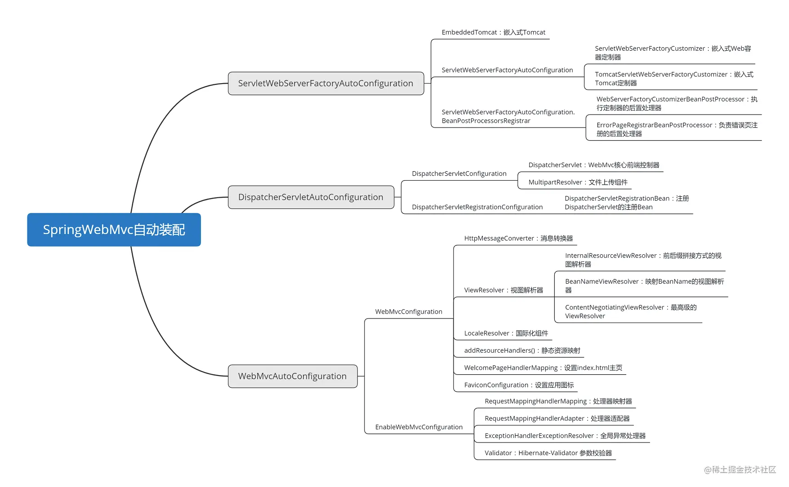
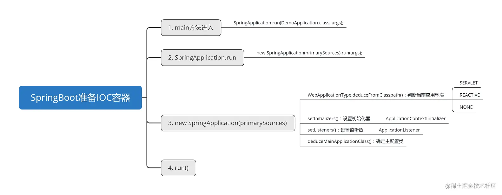
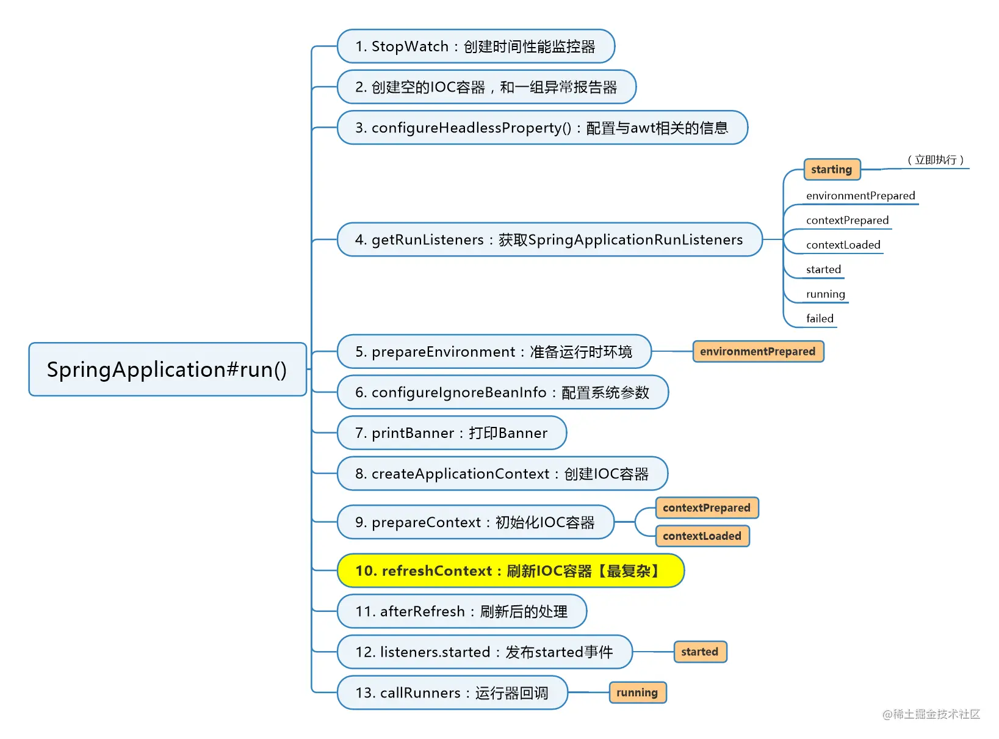
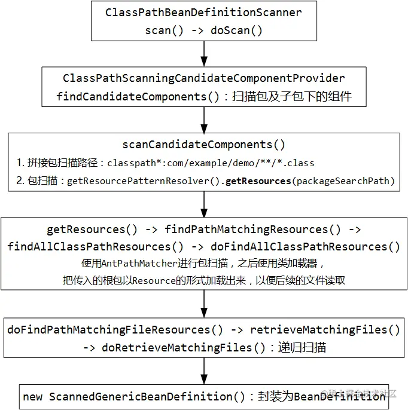
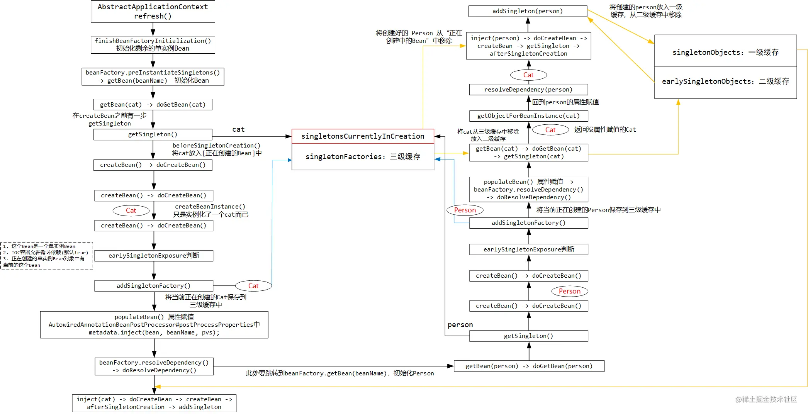
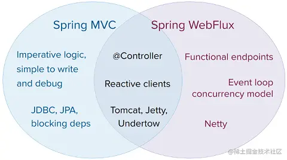

# @SpringBootApplication

Springboot启动过程，首先引入依赖：

~~~xml
<dependency>
    <groupId>org.springframework.boot</groupId>
    <artifactId>spring-boot-starter-web</artifactId>
</dependency>
~~~

然后编写主启动类：

~~~java
@SpringBootApplication
public class DemoApplication {
    public static void main(String[] args) {
        SpringApplication.run(DemoApplication.class, args);
    }
}
~~~

如果主启动类没有被 @SpringBootApplication 标注，启动时会报一个错误：Unable to start ServletWebServerApplicationContext due to missing ServletWebServerFactory bean.  因为没有 ServletWebServerFactory，而导致无法启动IOC容器

SpringBootApplication的定义：

~~~java
@SpringBootConfiguration
@EnableAutoConfiguration
@ComponentScan(excludeFilters = { @Filter(type = FilterType.CUSTOM, classes = TypeExcludeFilter.class),
		@Filter(type = FilterType.CUSTOM, classes = AutoConfigurationExcludeFilter.class) })
public @interface SpringBootApplication
~~~

在 SpringBoot1.1 及以前的版本，在启动类上标注的注解应该是三个：@Configuration + @EnableAutoConfiguration + @ComponentScan，只不过从1.2以后 SpringBoot 帮我们整合起来了

它是一个组合注解，包括3个注解。标注它之后就会触发自动配置（@EnableAutoConfiguration）和组件扫描（@ComponentScan）

1、@ComponentScan

@ComponentScan的作用是可以指定包扫描的根路径，让 SpringFramework 来扫描指定包及子包下的组件，也可以不指定路径，默认扫描当前配置类所在包及子包里的所有组件\**（其实这就解释了为什么 SpringBoot 的启动类要放到所有类所在包的最外层）**

不过在上面的声明中有显式的指定了两个过滤条件：

~~~java
@ComponentScan(excludeFilters = { @Filter(type = FilterType.CUSTOM, classes = TypeExcludeFilter.class),
		@Filter(type = FilterType.CUSTOM, classes = AutoConfigurationExcludeFilter.class) })
~~~

TypeExcludeFilter提供了一种扩展机制，能让我们向IOC容器中注册一些自定义的组件过滤器，以在包扫描的过程中过滤它们

实现应提供一个向 BeanFactory 注册的子类，并重写 match(MetadataReader, MetadataReaderFactory) 方法，它就是Filter的核心方法，这个方法会在启动时被调用：

~~~java
public boolean match(MetadataReader metadataReader, MetadataReaderFactory metadataReaderFactory)
        throws IOException {
    if (this.beanFactory instanceof ListableBeanFactory && getClass() == TypeExcludeFilter.class) {
        Collection<TypeExcludeFilter> delegates = ((ListableBeanFactory) this.beanFactory)
                .getBeansOfType(TypeExcludeFilter.class).values();
        for (TypeExcludeFilter delegate : delegates) {
            if (delegate.match(metadataReader, metadataReaderFactory)) {
                return true;
            }
        }
    }
    return false;
}
~~~

AutoConfigurationExcludeFilter的match方法中，要判断两个部分：是否是一个配置类，是否是一个自动配置类

~~~java
public boolean match(MetadataReader metadataReader, MetadataReaderFactory metadataReaderFactory)
        throws IOException {
    return isConfiguration(metadataReader) && isAutoConfiguration(metadataReader);
}
~~~

2、@SpringBootConfiguration

@SpringBootConfiguration被@Configuration标注，并没有对它进行其他扩展，它就是用来标注启动类的

~~~java
@Configuration
public @interface SpringBootConfiguration
~~~

标注 @SpringBootApplication 或 @SpringBootConfiguration 的主启动类会被 Spring测试框架 的搜索算法找到

3、@EnableAutoConfiguration

SpringBoot的自动配置完全由 @EnableAutoConfiguration 开启

@EnableAutoConfiguration 的内容：

~~~java
@AutoConfigurationPackage
@Import(AutoConfigurationImportSelector.class)
public @interface EnableAutoConfiguration
~~~

## @AutoConfigurationPackage

@AutoConfigurationPackage的定义：

~~~java
@Import(AutoConfigurationPackages.Registrar.class)
public @interface AutoConfigurationPackage
~~~

包含该注解的类所在的包应该在 AutoConfigurationPackages 中注册，它的作用就是：扫描自定义组件（重要的是它能完成其他三方技术的整合）

AutoConfigurationPackages.Registrar这个类：

~~~java
/**
 * {@link ImportBeanDefinitionRegistrar} to store the base package from the importing
 * configuration.
 */
static class Registrar implements ImportBeanDefinitionRegistrar, DeterminableImports {

    @Override
    public void registerBeanDefinitions(AnnotationMetadata metadata, BeanDefinitionRegistry registry) {
        register(registry, new PackageImport(metadata).getPackageName());
    }

    @Override
    public Set<Object> determineImports(AnnotationMetadata metadata) {
        return Collections.singleton(new PackageImport(metadata));
    }
}
~~~

它将主配置类所在根包保存起来。Registrar 实现了 ImportBeanDefinitionRegistrar 接口，可以实现向容器内注册组件。其中PackageImport会取一个类所在的包路径并封装起来：

~~~java
PackageImport(AnnotationMetadata metadata) {
    this.packageName = ClassUtils.getPackageName(metadata.getClassName());
}
~~~

这里面的路径就是主启动类所在的包路径。在register方法中：

~~~java
private static final String BEAN = AutoConfigurationPackages.class.getName();

public static void register(BeanDefinitionRegistry registry, String... packageNames) {
    // 判断 BeanFactory 中是否包含 AutoConfigurationPackages
    if (registry.containsBeanDefinition(BEAN)) {
        BeanDefinition beanDefinition = registry.getBeanDefinition(BEAN);
        ConstructorArgumentValues constructorArguments = beanDefinition.getConstructorArgumentValues();
        // addBasePackages：添加根包扫描包
        constructorArguments.addIndexedArgumentValue(0, addBasePackages(constructorArguments, packageNames));
    }
    else {
        GenericBeanDefinition beanDefinition = new GenericBeanDefinition();
        beanDefinition.setBeanClass(BasePackages.class);
        beanDefinition.getConstructorArgumentValues().addIndexedArgumentValue(0, packageNames);
        beanDefinition.setRole(BeanDefinition.ROLE_INFRASTRUCTURE);
        registry.registerBeanDefinition(BEAN, beanDefinition);
    }
}
~~~

它要判断当前IOC容器中是否包含 AutoConfigurationPackages 。如果有，就会拿到刚才传入的包名，设置到一个 basePackage 里面。实际debug时，走的是下面的分支，直接把主启动类所在包放入 BasePackages 中，其实就是把包路径保存在BasePackages类中，然后注册。

~~~java
static final class BasePackages {

    private final List<String> packages;

    BasePackages(String... names) {
        List<String> packages = new ArrayList<>();
        for (String name : names) {
            if (StringUtils.hasText(name)) {
                packages.add(name);
            }
        }
        this.packages = packages;
    }
~~~

packages就是保存包路径的成员变量。

这个BasePackages不仅仅给SpringFramework 和 SpringBoot 内部使用，而且在整合第三方技术时也会用到，以MyBatis 为例，引入 mybatis-spring-boot-starter 依赖后，在MyBatisAutoConfiguration中导入了一个类AutoConfiguredMapperScannerRegistrar：

~~~java
public static class AutoConfiguredMapperScannerRegistrar implements BeanFactoryAware, ImportBeanDefinitionRegistrar {

    private BeanFactory beanFactory;

    @Override
    public void registerBeanDefinitions(AnnotationMetadata importingClassMetadata, BeanDefinitionRegistry registry) {
        if (!AutoConfigurationPackages.has(this.beanFactory)) {
            logger.debug("Could not determine auto-configuration package, automatic mapper scanning disabled.");
            return;
        }
        logger.debug("Searching for mappers annotated with @Mapper");

        List<String> packages = AutoConfigurationPackages.get(this.beanFactory);
        // logger ......
        // 注册Mapper ......
    }
~~~

它是扫描 Mapper 并注册到 IOC 容器的 ImportBeanDefinitionRegistrar。取扫描根包的动作就是 AutoConfigurationPackages.get(this.beanFactory) ，由此就可以把事先准备好的 basePackages 都拿出来，之后进行扫描，将路径下的Mapper都注册到容器中。

## AutoConfigurationImportSelector

接着@EnableAutoConfiguration的定义分析，发现它导入了一个AutoConfigurationImportSelector：

~~~java
public class AutoConfigurationImportSelector implements DeferredImportSelector, BeanClassLoaderAware,
		ResourceLoaderAware, BeanFactoryAware, EnvironmentAware, Ordered
~~~

其中DeferredImportSelector是ImportSelector 的子接口，DeferredImportSelector 的执行时机，是在 @Configuration 注解中的其他逻辑被处理完毕之后（包括对 @ImportResource、@Bean 这些注解的处理）再执行，换句话说，DeferredImportSelector 的执行时机比 ImportSelector 更晚

AutoConfigurationImportSelector的核心部分就是selectImports方法：

~~~java
@Override
public String[] selectImports(AnnotationMetadata annotationMetadata) {
    if (!isEnabled(annotationMetadata)) {
        return NO_IMPORTS;
    }
    
    AutoConfigurationMetadata autoConfigurationMetadata = AutoConfigurationMetadataLoader
            .loadMetadata(this.beanClassLoader);
    // 加载自动配置类
    AutoConfigurationEntry autoConfigurationEntry = getAutoConfigurationEntry(autoConfigurationMetadata, 
            annotationMetadata);
    return StringUtils.toStringArray(autoConfigurationEntry.getConfigurations());
}
~~~

在getAutoConfigurationEntry方法中：

~~~java
/**
 * Return the {@link AutoConfigurationEntry} based on the {@link AnnotationMetadata}
 * of the importing {@link Configuration @Configuration} class.
 * 
 * 根据导入的@Configuration类的AnnotationMetadata返回AutoConfigurationImportSelector.AutoConfigurationEntry。
 */
protected AutoConfigurationEntry getAutoConfigurationEntry(AutoConfigurationMetadata autoConfigurationMetadata,
         AnnotationMetadata annotationMetadata) {
    if (!isEnabled(annotationMetadata)) {
        return EMPTY_ENTRY;
    }
    AnnotationAttributes attributes = getAttributes(annotationMetadata);
    // 【核心】加载候选的自动配置类
    List<String> configurations = getCandidateConfigurations(annotationMetadata, attributes);
    configurations = removeDuplicates(configurations);
    Set<String> exclusions = getExclusions(annotationMetadata, attributes);
    checkExcludedClasses(configurations, exclusions);
    configurations.removeAll(exclusions);
    configurations = filter(configurations, autoConfigurationMetadata);
    fireAutoConfigurationImportEvents(configurations, exclusions);
    return new AutoConfigurationEntry(configurations, exclusions);
}
~~~

最终返回的数据是configurations，它是通过 getCandidateConfigurations 方法来获取的：

~~~java
protected Class<?> getSpringFactoriesLoaderFactoryClass() {
    return EnableAutoConfiguration.class;
}

protected List<String> getCandidateConfigurations(AnnotationMetadata metadata, AnnotationAttributes attributes) {
    // SPI机制加载自动配置类
    List<String> configurations = SpringFactoriesLoader.loadFactoryNames(getSpringFactoriesLoaderFactoryClass(),
             getBeanClassLoader());
    Assert.notEmpty(configurations, "No auto configuration classes found in META-INF/spring.factories. If you "
             + "are using a custom packaging, make sure that file is correct.");
    return configurations;
}
~~~

这个方法又调用了 SpringFactoriesLoader.loadFactoryNames 方法，传入的Class就是 @EnableAutoConfiguration

~~~java
public static final String FACTORIES_RESOURCE_LOCATION = "META-INF/spring.factories";

public static List<String> loadFactoryNames(Class<?> factoryClass, @Nullable ClassLoader classLoader) {
    String factoryClassName = factoryClass.getName();
    //     ↓ ↓ ↓ ↓ ↓ ↓ ↓ ↓ ↓ ↓ ↓ ↓ ↓ ↓ ↓ ↓
    return loadSpringFactories(classLoader).getOrDefault(factoryClassName, Collections.emptyList());
}

private static Map<String, List<String>> loadSpringFactories(@Nullable ClassLoader classLoader) {
    MultiValueMap<String, String> result = cache.get(classLoader);
    if (result != null) {
        return result;
    }

    try {
        // ↓ ↓ ↓ ↓ ↓ ↓ ↓ ↓ ↓ ↓ ↓ ↓ ↓ ↓ ↓ ↓ ↓ ↓ ↓ ↓ ↓ ↓
        Enumeration<URL> urls = (classLoader != null ?
                 classLoader.getResources(FACTORIES_RESOURCE_LOCATION) :
                 ClassLoader.getSystemResources(FACTORIES_RESOURCE_LOCATION));
        result = new LinkedMultiValueMap<>();
        while (urls.hasMoreElements()) {
            URL url = urls.nextElement();
            UrlResource resource = new UrlResource(url);
            Properties properties = PropertiesLoaderUtils.loadProperties(resource);
            for (Map.Entry<?, ?> entry : properties.entrySet()) {
                String factoryClassName = ((String) entry.getKey()).trim();
                for (String factoryName : StringUtils.commaDelimitedListToStringArray((String) entry.getValue())) {
                    result.add(factoryClassName, factoryName.trim());
                }
            }
        }
        cache.put(classLoader, result);
        return result;
    }
    catch (IOException ex) {
        throw new IllegalArgumentException("Unable to load factories from location [" +
                                       FACTORIES_RESOURCE_LOCATION + "]", ex);
    }
}
~~~

源码中使用 classLoader 去加载了指定常量路径下的资源： FACTORIES_RESOURCE_LOCATION ，而这个常量指定的路径实际是：META-INF/spring.factories

这个文件在 spring-boot-autoconfiguration 包下可以找到：

~~~properties
# Initializers
org.springframework.context.ApplicationContextInitializer=\
org.springframework.boot.autoconfigure.SharedMetadataReaderFactoryContextInitializer,\
org.springframework.boot.autoconfigure.logging.ConditionEvaluationReportLoggingListener

# Application Listeners
org.springframework.context.ApplicationListener=\
org.springframework.boot.autoconfigure.BackgroundPreinitializer

# Auto Configuration Import Listeners
org.springframework.boot.autoconfigure.AutoConfigurationImportListener=\
org.springframework.boot.autoconfigure.condition.ConditionEvaluationReportAutoConfigurationImportListener

# Auto Configuration Import Filters
org.springframework.boot.autoconfigure.AutoConfigurationImportFilter=\
org.springframework.boot.autoconfigure.condition.OnBeanCondition,\
org.springframework.boot.autoconfigure.condition.OnClassCondition,\
org.springframework.boot.autoconfigure.condition.OnWebApplicationCondition

# Auto Configure
org.springframework.boot.autoconfigure.EnableAutoConfiguration=\
org.springframework.boot.autoconfigure.admin.SpringApplicationAdminJmxAutoConfiguration,\
org.springframework.boot.autoconfigure.aop.AopAutoConfiguration,\
org.springframework.boot.autoconfigure.amqp.RabbitAutoConfiguration,\
org.springframework.boot.autoconfigure.batch.BatchAutoConfiguration,\
org.springframework.boot.autoconfigure.cache.CacheAutoConfiguration,\
......
~~~

之后拿到这个资源文件，以 Properties 的形式加载，并取出 org.springframework.boot.autoconfigure.EnableAutoConfiguration 指定的所有自动配置类（是一个很大的字符串，里面都是自动配置类的全限定类名），装配到IOC容器中，之后自动配置类就会通过 ImportSelector 和 @Import 的机制被创建出来，之后就生效了。

这也就解释了为什么 即便没有任何配置文件，SpringBoot的Web应用都能正常运行，自动配置类都是通过这种方式自动导入的。

从上面的 Properties 中发现，所有配置的 EnableAutoConfiguration 的自动配置类，都以 AutoConfiguration 结尾。由此规律，以后我们要了解一个 SpringBoot 的模块或者第三方集成的模块时，基本上一定会有 XXXAutoConfiguration 类出现

## SpringFactoriesLoader

SpringBoot 在非常多的位置都利用类似于上面 “通过读取 spring.factories 加载一组预先配置的类” 的机制，而这个机制的核心源码来自 SpringFactoriesLoader

它是一个框架内部内部使用的通用工厂加载机制，SpringFactoriesLoader 从 META-INF/spring.factories 文件中加载并实例化给定类型的工厂，这些文件可能存在于类路径中的多个jar包中。spring.factories 文件必须采用 properties 格式，其中key是接口或抽象类的全限定名，而value是用逗号分隔的实现类的全限定类名列表。这个思路跟Java原生的SPI非常类似

SpringFramework 利用 SpringFactoriesLoader 都是调用 loadFactoryNames 方法：

~~~java
public static List<String> loadFactoryNames(Class<?> factoryClass, @Nullable ClassLoader classLoader) {
    String factoryClassName = factoryClass.getName();
    return loadSpringFactories(classLoader).getOrDefault(factoryClassName, Collections.emptyList());
}
~~~

它不再局限于接口-实现类的模式，key可以随意定义（如上面的 org.springframework.boot.autoconfigure.EnableAutoConfiguration 是一个注解）

第一行代码获取的是要被加载的接口/抽象类的全限定名，下面的 return 分为两部分：loadSpringFactories 和 getOrDefault

loadSpringFactories就是上面分析过的那段代码：

~~~java
public static final String FACTORIES_RESOURCE_LOCATION = "META-INF/spring.factories";

private static final Map<ClassLoader, MultiValueMap<String, String>> cache = new ConcurrentReferenceHashMap<>();

// 这个方法仅接收了一个类加载器
private static Map<String, List<String>> loadSpringFactories(@Nullable ClassLoader classLoader) {
    MultiValueMap<String, String> result = cache.get(classLoader);
    if (result != null) {
        return result;
    }

    try {
        Enumeration<URL> urls = (classLoader != null ?
                 classLoader.getResources(FACTORIES_RESOURCE_LOCATION) :
                 ClassLoader.getSystemResources(FACTORIES_RESOURCE_LOCATION));
        result = new LinkedMultiValueMap<>();
        while (urls.hasMoreElements()) {
            URL url = urls.nextElement();
            UrlResource resource = new UrlResource(url);
            Properties properties = PropertiesLoaderUtils.loadProperties(resource);
            for (Map.Entry<?, ?> entry : properties.entrySet()) {
                String factoryClassName = ((String) entry.getKey()).trim();
                for (String factoryName : StringUtils.commaDelimitedListToStringArray((String) entry.getValue())) {
                    result.add(factoryClassName, factoryName.trim());
                }
            }
        }
        cache.put(classLoader, result);
        return result;
    }
    catch (IOException ex) {
        throw new IllegalArgumentException("Unable to load factories from location [" +
                                       FACTORIES_RESOURCE_LOCATION + "]", ex);
    }
}
~~~

进入方法后先从本地缓存中根据当前的类加载器获取是否有一个类型为 MultiValueMap\<String, String> 的值，它实际上就是一个Map：

~~~java
public interface MultiValueMap<K, V> extends Map<K, List<V>>
~~~

然后获取当前 classpath 下所有jar包中有的 spring.factories 文件，并将它们加载到内存中

拿到每一个文件，并用 Properties 方式加载文件，之后把这个文件中每一组键值对都加载出来，放入 MultiValueMap 中。

如果一个接口/抽象类有多个对应的目标类，则使用英文逗号隔开。StringUtils.commaDelimitedListToStringArray会将大字符串拆成一个一个的全限定类名。

整理完后，整个result放入cache中。下一次再加载时就无需再次加载 spring.factories 文件了。

SpringFramework 实现了自己的SPI技术，相比较于Java原生的SPI更灵活

# WebMvc自动装配



SpringWebMvc 的自动配置类名为WebMvcAutoConfiguration，它的定义：

~~~java
@Configuration
//当前环境必须是WebMvc（Servlet）环境
@ConditionalOnWebApplication(type = Type.SERVLET)
//当前运行环境的classpath中必须有Servlet类，DispatcherServlet类，WebMvcConfigurer类
@ConditionalOnClass({ Servlet.class, DispatcherServlet.class, WebMvcConfigurer.class })
//如果没有自定义WebMvc的配置类，则使用本自动配置
@ConditionalOnMissingBean(WebMvcConfigurationSupport.class)
@AutoConfigureOrder(Ordered.HIGHEST_PRECEDENCE + 10)
@AutoConfigureAfter({ DispatcherServletAutoConfiguration.class, TaskExecutionAutoConfiguration.class,
		ValidationAutoConfiguration.class })
public class WebMvcAutoConfiguration
~~~

在配置中标注了，WebMvcAutoConfiguration 必须在 DispatcherServletAutoConfiguration、TaskExecutionAutoConfiguration、ValidationAutoConfiguration 执行完后再执行

## ServletWebServerFactoryAutoConfiguration

### 引入

DispatcherServletAutoConfiguration的定义：

```java
@AutoConfigureOrder(Ordered.HIGHEST_PRECEDENCE)
@Configuration
@ConditionalOnWebApplication(type = Type.SERVLET)
@ConditionalOnClass(DispatcherServlet.class)
@AutoConfigureAfter(ServletWebServerFactoryAutoConfiguration.class)
public class DispatcherServletAutoConfiguration
```

它是DispatcherServlet 的自动配置。它起作用应该依赖于一个已经存在嵌入式Web服务器的独立应用程序，也适用于使用 SpringBootServletInitializer 的可部署应用程序

其中SpringBootServletInitializer 是SpringBoot用于打war包时留给Web容器初始化应用的钩子。

DispatcherServletAutoConfiguration 的源码中又标注了 @AutoConfigureAfter ，说明它又要在 ServletWebServerFactoryAutoConfiguration 之后再执行

### EmbeddedTomcat

在ServletWebServerFactoryAutoConfiguration中又导入了几个组件：EmbeddedTomcat、EmbeddedJetty、EmbeddedUndertow、BeanPostProcessorsRegistrar：

~~~java
@Configuration
//在自动配置中具有最高优先级执行
@AutoConfigureOrder(Ordered.HIGHEST_PRECEDENCE)
@ConditionalOnClass(ServletRequest.class)
@ConditionalOnWebApplication(type = Type.SERVLET)
@EnableConfigurationProperties(ServerProperties.class)
@Import({ ServletWebServerFactoryAutoConfiguration.BeanPostProcessorsRegistrar.class,
        ServletWebServerFactoryConfiguration.EmbeddedTomcat.class,
        ServletWebServerFactoryConfiguration.EmbeddedJetty.class,
        ServletWebServerFactoryConfiguration.EmbeddedUndertow.class })
public class ServletWebServerFactoryAutoConfiguration
~~~

EmbeddedTomcat的定义：

~~~java
@Configuration
@ConditionalOnClass({ Servlet.class, Tomcat.class, UpgradeProtocol.class })
@ConditionalOnMissingBean(value = ServletWebServerFactory.class, search = SearchStrategy.CURRENT)
public static class EmbeddedTomcat {
    @Bean
    public TomcatServletWebServerFactory tomcatServletWebServerFactory() {
        return new TomcatServletWebServerFactory();
    }
}
~~~

由条件装配的注解 @ConditionalOnClass 可以看到，当前 classpath 下必须有 Tomcat 这个类，该配置类才会生效。

EmbeddedJetty中也是类似的，在classpath下有Jetty的类，这个配置类才会生效：

~~~java
import org.eclipse.jetty.server.Server;
import org.eclipse.jetty.util.Loader;
import org.eclipse.jetty.webapp.WebAppContext;

@Configuration
@ConditionalOnClass({ Servlet.class, Server.class, Loader.class, WebAppContext.class })
@ConditionalOnMissingBean(value = ServletWebServerFactory.class, search = SearchStrategy.CURRENT)
public static class EmbeddedJetty
~~~

默认导入的 spring-boot-starter-web 中导入的是 Tomcat 的依赖，故 Jetty 不会生效

###BeanPostProcessorsRegistrar

ServletWebServerFactoryAutoConfiguration还有一个内部类是BeanPostProcessorsRegistrar：

~~~java
public static class BeanPostProcessorsRegistrar implements ImportBeanDefinitionRegistrar, BeanFactoryAware {
    // ......
    @Override
    public void registerBeanDefinitions(AnnotationMetadata importingClassMetadata,
            BeanDefinitionRegistry registry) {
        if (this.beanFactory == null) {
            return;
        }
        // 编程式注入组件
        registerSyntheticBeanIfMissing(registry, "webServerFactoryCustomizerBeanPostProcessor",
                WebServerFactoryCustomizerBeanPostProcessor.class);
        registerSyntheticBeanIfMissing(registry, "errorPageRegistrarBeanPostProcessor",
                ErrorPageRegistrarBeanPostProcessor.class);
    }

    private void registerSyntheticBeanIfMissing(BeanDefinitionRegistry registry, String name, Class<?> beanClass) {
        if (ObjectUtils.isEmpty(this.beanFactory.getBeanNamesForType(beanClass, true, false))) {
            RootBeanDefinition beanDefinition = new RootBeanDefinition(beanClass);
            beanDefinition.setSynthetic(true);
            registry.registerBeanDefinition(name, beanDefinition);
        }
    }
}
~~~

它实现了 ImportBeanDefinitionRegistrar 接口，在registerBeanDefinitions中可以编程式向IOC容器中注入组件。它注册的两个组件是：WebServerFactoryCustomizerBeanPostProcessor、ErrorPageRegistrarBeanPostProcessor：

* WebServerFactoryCustomizerBeanPostProcessor是执行定制器的后置处理器
* ErrorPageRegistrarBeanPostProcessor：它的作用是将所有设置的错误页跳转规则注册到错误处理器中

### 定制器

一般情况下，修改 SpringBoot 的配置，都是通过 application.yml 显式地声明配置。除此之外，还可以使用 Customizer 定制器机制

在WebMvc模块中，使用 Customizer 修改配置，可以实现 WebServerFactoryCustomizer 接口。该接口可以传入泛型，泛型的类型是 ServletWebServerFactory。示例：

~~~java
@Order(0)
@Component
public class WebMvcCustomizer implements WebServerFactoryCustomizer<TomcatServletWebServerFactory>, Ordered {
    
    @Override
    public void customize(TomcatServletWebServerFactory factory) {
        factory.setPort(9090);
        factory.setContextPath("/demo");
    }
    
    @Override
    public int getOrder() {
        return 0;
    }
    
}
~~~

Customizer 可以设置配置顺序（上面的 @Order 注解，或 Ordered 接口），通过配置执行顺序，可以自定义的覆盖某些自动配置，达到个性化配置的目的。

在ServletWebServerFactoryAutoConfiguration中，注册了用于嵌入式web容器定制器ServletWebServerFactoryCustomizer、嵌入式tomcat定制器TomcatServletWebServerFactoryCustomizer：

~~~java
public class ServletWebServerFactoryAutoConfiguration {

	@Bean
	public ServletWebServerFactoryCustomizer servletWebServerFactoryCustomizer(ServerProperties serverProperties) {
		return new ServletWebServerFactoryCustomizer(serverProperties);
	}

	@Bean
	@ConditionalOnClass(name = "org.apache.catalina.startup.Tomcat")
	public TomcatServletWebServerFactoryCustomizer tomcatServletWebServerFactoryCustomizer(
			ServerProperties serverProperties) {
		return new TomcatServletWebServerFactoryCustomizer(serverProperties);
	}
~~~

TomcatServletWebServerFactoryCustomizer正是实现了WebServerFactoryCustomizer的定制器：

~~~java
public class TomcatServletWebServerFactoryCustomizer implements WebServerFactoryCustomizer<TomcatServletWebServerFactory>, Ordered {
  ...
~~~

定制器的入参serverProperties：

~~~java
@ConfigurationProperties(prefix = "server", ignoreUnknownFields = true)
public class ServerProperties {

	/**
	 * Server HTTP port.
	 */
	private Integer port;

	/**
	 * Network address to which the server should bind.
	 */
	private InetAddress address;
    
    // ......
~~~

@ConfigurationProperties 可以实现指定属性开头的属性值注入。ServerProperties 的属性值来源，就是全局配置文件中的server开头的所有配置

## DispatcherServletAutoConfiguration

由于 SpringBoot 项目中没有 web.xml（Servlet3.0规范中就没有了），故有另外的方式注册Servlet三大组件。SpringBoot 提供两种方式：

1、@ServletComponentScan

在启动类上标注 @ServletComponentScan 注解，指定 value/basePackage，即可扫描指定包及子包下所有的 Servlet 组件。

之后注册 Servlet、Filter、Listener 组件，就可以像 Servlet3.0 规范后的方式，直接在 Servlet 上标注 @WebServlet 等注解即可。

2、RegistrationBean

ServletRegistrationBean可以帮忙创建Servlet组件，传入 Servlet 和 urlMapping 即可：

~~~java
public class DemoServlet extends HttpServlet {
    @Override
    protected void doGet(HttpServletRequest req, HttpServletResponse resp) throws ServletException, IOException {
        resp.getWriter().println("demo servlet");
    }
}

public class DemoServletRegistryBean extends ServletRegistrationBean<DemoServlet> {
    public DemoServletRegistryBean(DemoServlet servlet, String... urlMappings) {
        super(servlet, urlMappings);
    }
}

@Configuration
public class ServletConfiguration {
    @Bean
    public DemoServletRegistryBean demoServletRegistryBean() {
        return new DemoServletRegistryBean(new DemoServlet(), "/demo/servlet");
    }
}
~~~

DispatcherServletAutoConfiguration中里面嵌套了两个内部类，分别注册 DispatcherServlet 和 DispatcherServletRegistrationBean，通过将DispatcherServlet 注入DispatcherServletRegistrationBean，完成了MVC的核心组件DispatcherServlet的创建，它就是一个Servlet：

~~~java
// 最高配置优先级
@AutoConfigureOrder(Ordered.HIGHEST_PRECEDENCE)
@Configuration
// Servlet环境下才生效
@ConditionalOnWebApplication(type = Type.SERVLET)
@ConditionalOnClass(DispatcherServlet.class)
@AutoConfigureAfter(ServletWebServerFactoryAutoConfiguration.class)
public class DispatcherServletAutoConfiguration {

    public static final String DEFAULT_DISPATCHER_SERVLET_BEAN_NAME = "dispatcherServlet";

    public static final String DEFAULT_DISPATCHER_SERVLET_REGISTRATION_BEAN_NAME = "dispatcherServletRegistration";

    // 注册DispatcherServlet的配置类
    @Configuration
    @Conditional(DefaultDispatcherServletCondition.class)
    @ConditionalOnClass(ServletRegistration.class)
    // 启用配置文件与Properties的映射
    @EnableConfigurationProperties({ HttpProperties.class, WebMvcProperties.class })
    protected static class DispatcherServletConfiguration {

        private final HttpProperties httpProperties;

        private final WebMvcProperties webMvcProperties;

        public DispatcherServletConfiguration(HttpProperties httpProperties, WebMvcProperties webMvcProperties) {
            this.httpProperties = httpProperties;
            this.webMvcProperties = webMvcProperties;
        }

        // 构造DispatcherServlet
        @Bean(name = DEFAULT_DISPATCHER_SERVLET_BEAN_NAME)
        public DispatcherServlet dispatcherServlet() {
            DispatcherServlet dispatcherServlet = new DispatcherServlet();
            dispatcherServlet.setDispatchOptionsRequest(this.webMvcProperties.isDispatchOptionsRequest());
            dispatcherServlet.setDispatchTraceRequest(this.webMvcProperties.isDispatchTraceRequest());
            dispatcherServlet
                .setThrowExceptionIfNoHandlerFound(this.webMvcProperties.isThrowExceptionIfNoHandlerFound());
            dispatcherServlet.setEnableLoggingRequestDetails(this.httpProperties.isLogRequestDetails());
            return dispatcherServlet;
        }

        // 注册文件上传组件
        @Bean
        @ConditionalOnBean(MultipartResolver.class)
        @ConditionalOnMissingBean(name = DispatcherServlet.MULTIPART_RESOLVER_BEAN_NAME)
        public MultipartResolver multipartResolver(MultipartResolver resolver) {
            // Detect if the user has created a MultipartResolver but named it incorrectly
            return resolver;
        }
    }

    // 注册DispatcherServletRegistration的配置类
    @Configuration
    @Conditional(DispatcherServletRegistrationCondition.class)
    @ConditionalOnClass(ServletRegistration.class)
    @EnableConfigurationProperties(WebMvcProperties.class)
    @Import(DispatcherServletConfiguration.class)
    protected static class DispatcherServletRegistrationConfiguration {

        private final WebMvcProperties webMvcProperties;

        private final MultipartConfigElement multipartConfig;

        public DispatcherServletRegistrationConfiguration(WebMvcProperties webMvcProperties,
                ObjectProvider<MultipartConfigElement> multipartConfigProvider) {
            this.webMvcProperties = webMvcProperties;
            this.multipartConfig = multipartConfigProvider.getIfAvailable();
        }

        // 辅助注册DispatcherServlet的RegistrationBean
        @Bean(name = DEFAULT_DISPATCHER_SERVLET_REGISTRATION_BEAN_NAME)
        @ConditionalOnBean(value = DispatcherServlet.class, name = DEFAULT_DISPATCHER_SERVLET_BEAN_NAME)
        public DispatcherServletRegistrationBean dispatcherServletRegistration(DispatcherServlet dispatcherServlet) {
            DispatcherServletRegistrationBean registration = new DispatcherServletRegistrationBean(dispatcherServlet,
                    this.webMvcProperties.getServlet().getPath());
            registration.setName(DEFAULT_DISPATCHER_SERVLET_BEAN_NAME);
            registration.setLoadOnStartup(this.webMvcProperties.getServlet().getLoadOnStartup());
            if (this.multipartConfig != null) {
                registration.setMultipartConfig(this.multipartConfig);
            }
            return registration;
        }
    }
//......
~~~

DispatcherServletConfiguration 类上标注了 @EnableConfigurationProperties，代表启用指定类的 ConfigurationProperties 功能。

这样当创建时 DispatcherServlet，就可以将默认的一些配置设置到 DispatcherServlet 中。这些属性就来自于已经被启用的 HttpProperties、WebMvcProperties 中。

## WebMvcAutoConfigurationAdapter

WebMvcAutoConfiguration中有一个内部类：WebMvcAutoConfigurationAdapter，它实现了WebMvcConfigurer接口，对MVC进行了默认配置。在SpringBoot2.x中，自定义的WebMvc配置需要实现 WebMvcConfigurer 接口，并重写接口中需要配置的方法即可。

~~~java
@Configuration
// 导入配置类
@Import(EnableWebMvcConfiguration.class)
// 启用WebMvcProperties、ResourceProperties
@EnableConfigurationProperties({ WebMvcProperties.class, ResourceProperties.class })
@Order(0)
public static class WebMvcAutoConfigurationAdapter implements WebMvcConfigurer, ResourceLoaderAware
~~~

它的重要功能：

1、配置HttpMessageConverter

~~~java
@Override
public void configureMessageConverters(List<HttpMessageConverter<?>> converters) {
    this.messageConvertersProvider
            .ifAvailable((customConverters) -> converters.addAll(customConverters.getConverters()));
}
~~~

2、注册多种ViewResolver，包括以下几种：

* ContentNegotiatingViewResolver：最高级的 ViewResolver，负责将视图解析的工作代理给不同的 ViewResolver 来处理不同的View
* BeanNameViewResolver：如果 Controller 中返回的视图名称恰好有一个Bean的名称与之相同，则会交予Bean处理
* InternalResourceViewResolver：最常用的 ViewResolver，通过设置前后缀来匹配视图
* LocaleResolver：国际化组件

3、静态资源映射

~~~java
@Override
public void addResourceHandlers(ResourceHandlerRegistry registry) {
    if (!this.resourceProperties.isAddMappings()) {
        logger.debug("Default resource handling disabled");
        return;
    }
    Duration cachePeriod = this.resourceProperties.getCache().getPeriod();
    CacheControl cacheControl = this.resourceProperties.getCache().getCachecontrol().toHttpCacheControl();
    // 映射webjars
    if (!registry.hasMappingForPattern("/webjars/**")) {
        customizeResourceHandlerRegistration(registry.addResourceHandler("/webjars/**")
                .addResourceLocations("classpath:/META-INF/resources/webjars/")
                .setCachePeriod(getSeconds(cachePeriod)).setCacheControl(cacheControl));
    }
    // 映射静态资源路径
    String staticPathPattern = this.mvcProperties.getStaticPathPattern();
    if (!registry.hasMappingForPattern(staticPathPattern)) {
        customizeResourceHandlerRegistration(registry.addResourceHandler(staticPathPattern)
                .addResourceLocations(getResourceLocations(this.resourceProperties.getStaticLocations()))
                .setCachePeriod(getSeconds(cachePeriod)).setCacheControl(cacheControl));
    }
}
~~~

注册静态资源路径。可以看到，它将 /webjars 路径下的资源都映射到 classpath:/META-INF/resources/webjars 中。webjars 可以将前端的框架变成Maven依赖，减少手动加入静态资源的工作。

倒数第二行，还取到 resourceProperties 中的 staticLocations，也加入进去。而 ResourceProperties 中的 staticLocations：

~~~java
private static final String[] CLASSPATH_RESOURCE_LOCATIONS = { "classpath:/META-INF/resources/",
        "classpath:/resources/", "classpath:/static/", "classpath:/public/" };

private String[] staticLocations = CLASSPATH_RESOURCE_LOCATIONS;
~~~

这也解释了为什么静态资源文件放在 resources 中和放在 static 中都能被正常加载的原因。

4、主页的设置

~~~java
@Bean
public WelcomePageHandlerMapping welcomePageHandlerMapping(ApplicationContext applicationContext) {
    // 调用getWelcomePage，跳转到下面的方法中
    return new WelcomePageHandlerMapping(new TemplateAvailabilityProviders(applicationContext),
            applicationContext, getWelcomePage(), this.mvcProperties.getStaticPathPattern());
}

static String[] getResourceLocations(String[] staticLocations) {
    String[] locations = new String[staticLocations.length + SERVLET_LOCATIONS.length];
    System.arraycopy(staticLocations, 0, locations, 0, staticLocations.length);
    System.arraycopy(SERVLET_LOCATIONS, 0, locations, staticLocations.length, SERVLET_LOCATIONS.length);
    return locations;
}

private Optional<Resource> getWelcomePage() {
    String[] locations = getResourceLocations(this.resourceProperties.getStaticLocations());
    // this::getIndexHtml调用下面的方法
    return Arrays.stream(locations).map(this::getIndexHtml).filter(this::isReadable).findFirst();
}

private Resource getIndexHtml(String location) {
    return this.resourceLoader.getResource(location + "index.html");
}
~~~

由此可以看出，欢迎页面/主页的设置，是取的静态资源路径中的 index.html 文件。

5、应用图标

~~~java
@Configuration
@ConditionalOnProperty(value = "spring.mvc.favicon.enabled", matchIfMissing = true)
public static class FaviconConfiguration implements ResourceLoaderAware {
    // ......
    // 配置图标映射器
    @Bean
    public SimpleUrlHandlerMapping faviconHandlerMapping() {
        SimpleUrlHandlerMapping mapping = new SimpleUrlHandlerMapping();
        mapping.setOrder(Ordered.HIGHEST_PRECEDENCE + 1);
        mapping.setUrlMap(Collections.singletonMap("**/favicon.ico", faviconRequestHandler()));
        return mapping;
    }
    // .......
}
~~~

可以明显的看到默认的图标名称是 favicon.ico，且放在静态路径下的任意位置都可以被扫描到。

## EnableWebMvcConfiguration

WebMvcAutoConfiguration中有一个内部类：EnableWebMvcConfiguration

它的重要功能：

1、注册SpringWebMvc中的处理器适配器、处理器映射器

~~~java
// 处理器适配器
@Bean
@Override
public RequestMappingHandlerAdapter requestMappingHandlerAdapter() {
    RequestMappingHandlerAdapter adapter = super.requestMappingHandlerAdapter();
    adapter.setIgnoreDefaultModelOnRedirect(
            this.mvcProperties == null || this.mvcProperties.isIgnoreDefaultModelOnRedirect());
    return adapter;
}

// 处理器映射器
@Bean
@Primary
@Override
public RequestMappingHandlerMapping requestMappingHandlerMapping() {
    // Must be @Primary for MvcUriComponentsBuilder to work
    return super.requestMappingHandlerMapping();
}
~~~

注册了 Hibernate-Validator 参数校验器：

~~~java
// 校验器
@Bean
@Override
public Validator mvcValidator() {
    if (!ClassUtils.isPresent("javax.validation.Validator", getClass().getClassLoader())) {
        return super.mvcValidator();
    }
    return ValidatorAdapter.get(getApplicationContext(), getValidator());
}
~~~

注册全局异常处理器：

~~~java
@Override
// 全局异常处理器
protected ExceptionHandlerExceptionResolver createExceptionHandlerExceptionResolver() {
    if (this.mvcRegistrations != null && this.mvcRegistrations.getExceptionHandlerExceptionResolver() != null) {
        return this.mvcRegistrations.getExceptionHandlerExceptionResolver();
    }
    return super.createExceptionHandlerExceptionResolver();
}

@Override
protected void configureHandlerExceptionResolvers(List<HandlerExceptionResolver> exceptionResolvers) {
    super.configureHandlerExceptionResolvers(exceptionResolvers);
    if (exceptionResolvers.isEmpty()) {
        addDefaultHandlerExceptionResolvers(exceptionResolvers);
    }
    if (this.mvcProperties.isLogResolvedException()) {
        for (HandlerExceptionResolver resolver : exceptionResolvers) {
            if (resolver instanceof AbstractHandlerExceptionResolver) {
                ((AbstractHandlerExceptionResolver) resolver).setWarnLogCategory(resolver.getClass().getName());
            }
        }
    }
}
~~~

至此，MVC的所有组件都已经顺利被创建出来了。

## 应用启动

回顾 SpringBoot 应用打包启动的两种方式：

* 打jar包启动时，先创建IOC容器，在创建过程中创建了嵌入式Web容器。（详细的jar包启动会在 JarLauncher 篇解析）
* 打war包启动时，要先启动外部的Web服务器，Web服务器再去启动 SpringBoot 应用，然后才是创建IOC容器。

在打war包启动时，里面最核心的步骤：Web服务器启动SpringBoot应用 

而这个步骤，就需要依靠 SpringBootServletInitializer。启动的时候，首先外部Web容器（Tomcat、Jetty、Undertow等）启动，开始加载 SpringBoot 的war 包并解压，然后根据web3.0，会去SpringBoot 应用中的每一个被依赖的jar中寻找 META-INF/services/javax.servlet.SpringBootServletInitializer 的文件，然后根据文件中标注的全限定类名，去找这个类（就是 SpringServletContainerInitializer）：

~~~java
@HandlesTypes(WebApplicationInitializer.class)
public class SpringServletContainerInitializer implements ServletContainerInitializer {
    @Override
    public void onStartup(Set<Class<?>> webAppInitializerClasses, ServletContext servletContext)
            throws ServletException {
        // SpringServletContainerInitializer会加载所有的WebApplicationInitializer类型的普通实现类
        
        List<WebApplicationInitializer> initializers = new LinkedList<WebApplicationInitializer>();

        if (webAppInitializerClasses != null) {
            for (Class<?> waiClass : webAppInitializerClasses) {
                // 如果不是接口，不是抽象类
                if (!waiClass.isInterface() && !Modifier.isAbstract(waiClass.getModifiers()) &&
                        WebApplicationInitializer.class.isAssignableFrom(waiClass)) {
                    try {
                        // 创建该类的实例
                        initializers.add((WebApplicationInitializer) waiClass.newInstance());
                    }
                    catch (Throwable ex) {
                        throw new ServletException("Failed to instantiate WebApplicationInitializer class", ex);
                    }
                }
            }
        }

        if (initializers.isEmpty()) {
            servletContext.log("No Spring WebApplicationInitializer types detected on classpath");
            return;
        }

        servletContext.log(initializers.size() + " Spring WebApplicationInitializers detected on classpath");
        AnnotationAwareOrderComparator.sort(initializers);
        // 调用各自的onStartup方法
        for (WebApplicationInitializer initializer : initializers) {
            initializer.onStartup(servletContext);
        }
    }
}
~~~

HandlesTypes注解代表将WebApplicationInitializer的实现类全部找出，封装为set，传入onStartup方法中。

这里打war包的 SpringBoot 工程会在启动类的同包下自动创建 ServletInitializer ，并且必须继承 SpringBootServletInitializer，所以会被服务器创建对象。

在方法执行中调用了WebApplicationInitializer的onStartup方法，SpringBootServletInitializer 没有重写 onStartup 方法，去父类 SpringServletContainerInitializer 中寻找：

~~~java
@Override
public void onStartup(ServletContext servletContext) throws ServletException {
    // Logger initialization is deferred in case an ordered
    // LogServletContextInitializer is being used
    this.logger = LogFactory.getLog(getClass());
    // 创建 父IOC容器
    WebApplicationContext rootAppContext = createRootApplicationContext(servletContext);
    if (rootAppContext != null) {
        servletContext.addListener(new ContextLoaderListener(rootAppContext) {
            @Override
            public void contextInitialized(ServletContextEvent event) {
                // no-op because the application context is already initialized
            }
        });
    }
    else {
        this.logger.debug("No ContextLoaderListener registered, as " + "createRootApplicationContext() did not "
                      + "return an application context");
    }
}

protected WebApplicationContext createRootApplicationContext(ServletContext servletContext) {
    // 使用Builder机制，前面也介绍过
    SpringApplicationBuilder builder = createSpringApplicationBuilder();
    builder.main(getClass());
    ApplicationContext parent = getExistingRootWebApplicationContext(servletContext);
    if (parent != null) {
        this.logger.info("Root context already created (using as parent).");
        servletContext.setAttribute(WebApplicationContext.ROOT_WEB_APPLICATION_CONTEXT_ATTRIBUTE, null);
        builder.initializers(new ParentContextApplicationContextInitializer(parent));
    }
    // 设置Initializer
    builder.initializers(new ServletContextApplicationContextInitializer(servletContext));
    // 在这里设置了容器启动类：AnnotationConfigServletWebServerApplicationContext
    builder.contextClass(AnnotationConfigServletWebServerApplicationContext.class);
    // 【引导】多态进入子类（自己定义）的方法中
    builder = configure(builder);
    builder.listeners(new WebEnvironmentPropertySourceInitializer(servletContext));
    // builder.build()，创建SpringApplication
    SpringApplication application = builder.build();
    if (application.getAllSources().isEmpty()
          && AnnotationUtils.findAnnotation(getClass(), Configuration.class) != null) {
        application.addPrimarySources(Collections.singleton(getClass()));
    }
    Assert.state(!application.getAllSources().isEmpty(),
               "No SpringApplication sources have been defined. Either override the "
               + "configure method or add an @Configuration annotation");
    // Ensure error pages are registered
    if (this.registerErrorPageFilter) {
        application.addPrimarySources(Collections.singleton(ErrorPageFilterConfiguration.class));
    }
    // 启动SpringBoot应用
    return run(application);
}
~~~

父类 SpringServletContainerInitializer 中的 onStartup 方法中有一句核心源码：创建rootAppContext。

在createRootApplicationContext方法中：先创建 SpringApplicationBuilder 应用构建器，再创建一些环境配置，重要的是这一句：

~~~java
builder = configure(builder);
~~~

这句源码由于多态，执行了子类（SpringBoot 工程中必须写的那个启动类的同包下的 ServletInitializer）重写的方法，重写的形式是固定的，会传入 SpringBoot 的目标运行主程序：

~~~
return builder.sources(DemoApplication.class);
~~~

所以下一步才能启动 SpringBoot 工程。之后就跟启动运行主程序 SpringBootApplication 没什么区别了

# IOC

在spring-boot的jar包中，org.springframework.boot.web 路径下有一个 context 包，里面有两个接口：WebServerApplicationContext、ConfigurableWebServerApplicationContext。它们都是ApplicationContext的子接口。

WebServerApplicationContext直接继承了ApplicationContext，和Spring旧的继承体系独立开了，它可以管理嵌入式Web服务器。SpringBoot 的一大优势就是嵌入式Web服务器。ConfigurableWebServerApplicationContext是WebServerApplicationContext的子接口。

## 准备IOC容器

对于下面的主程序来说：

~~~java
@SpringBootApplication
public class DemoApplication {
    
    public static void main(String[] args) {
        SpringApplication.run(DemoApplication.class, args);
    }
    
}
~~~

run方法分为两步：创建SpringApplication、执行run方法：

~~~java
    public static ConfigurableApplicationContext run(Class<?> primarySource, String... args) {
        // 调下面重载的方法
        return run(new Class<?>[] { primarySource }, args);
    }

    public static ConfigurableApplicationContext run(Class<?>[] primarySources, String[] args) {
        return new SpringApplication(primarySources).run(args);
    }
~~~

创建SpringApplication这一步就是准备IOC容器：



SpringApplication还可以自定义配置，手动配置一些 SpringApplication 的属性：

~~~java
@SpringBootApplication
public class DemoApplication {

    public static void main(String[] args) {
        SpringApplication springApplication = new SpringApplication(DemoApplication.class);
        springApplication.setWebApplicationType(WebApplicationType.SERVLET); //强制使用WebMvc环境
        springApplication.setBannerMode(Banner.Mode.OFF); //不打印Banner
        springApplication.run(args);
    }
}
~~~

SpringApplication构造方法的主流程：

~~~java
private Set<Class<?>> primarySources;

public SpringApplication(Class<?>... primarySources) {
    this(null, primarySources);
}

@SuppressWarnings({ "unchecked", "rawtypes" })
public SpringApplication(ResourceLoader resourceLoader, Class<?>... primarySources) {
    // resourceLoader为null
    this.resourceLoader = resourceLoader;
    Assert.notNull(primarySources, "PrimarySources must not be null");
    // 将传入的DemoApplication启动类放入primarySources中，这样应用就知道主启动类在哪里，叫什么了
    // SpringBoot一般称呼这种主启动类叫primarySource（主配置资源来源）
    this.primarySources = new LinkedHashSet<>(Arrays.asList(primarySources));
    // 3.1 判断当前应用环境
    this.webApplicationType = WebApplicationType.deduceFromClasspath();
    // 3.2 设置初始化器
    setInitializers((Collection) getSpringFactoriesInstances(ApplicationContextInitializer.class));
    // 3.3 设置监听器
    setListeners((Collection) getSpringFactoriesInstances(ApplicationListener.class));
    // 3.4 确定主配置类
    this.mainApplicationClass = deduceMainApplicationClass();
}
~~~

### 判断当前环境

从classpath下判断当前SpringBoot应用应该使用哪种环境启动。

~~~java
private static final String[] SERVLET_INDICATOR_CLASSES = { "javax.servlet.Servlet",
        "org.springframework.web.context.ConfigurableWebApplicationContext" };
private static final String WEBMVC_INDICATOR_CLASS = "org.springframework." + "web.servlet.DispatcherServlet";
private static final String WEBFLUX_INDICATOR_CLASS = "org." + "springframework.web.reactive.DispatcherHandler";
private static final String JERSEY_INDICATOR_CLASS = "org.glassfish.jersey.servlet.ServletContainer";
private static final String SERVLET_APPLICATION_CONTEXT_CLASS = "org.springframework.web.context.WebApplicationContext";
private static final String REACTIVE_APPLICATION_CONTEXT_CLASS = "org.springframework.boot.web.reactive.context.ReactiveWebApplicationContext";

static WebApplicationType deduceFromClasspath() {
    if (ClassUtils.isPresent(WEBFLUX_INDICATOR_CLASS, null) && !ClassUtils.isPresent(WEBMVC_INDICATOR_CLASS, null)
            && !ClassUtils.isPresent(JERSEY_INDICATOR_CLASS, null)) {
        return WebApplicationType.REACTIVE;
    }
    for (String className : SERVLET_INDICATOR_CLASSES) {
        if (!ClassUtils.isPresent(className, null)) {
            return WebApplicationType.NONE;
        }
    }
    return WebApplicationType.SERVLET;
}
~~~

* 第一个if结构先判断是否是 Reactive 环境，发现有 WebFlux 的类但没有 WebMvc 的类，则判定为 Reactive 环境（全NIO）
* 之后的for循环要检查是否有跟 Servlet 相关的类，如果有任何一个类没有，则判定为非Web环境
* 如果for循环走完了，证明所有类均在当前 classpath 下，则为 Servlet（WebMvc） 环境

### 设置初始化器

初始化器就是ApplicationContextInitializer接口，用于在刷新容器之前初始化Spring ConfigurableApplicationContext。

例如自定义一个初始化器：

~~~java
public class ApplicationContextInitializerDemo implements ApplicationContextInitializer {
    
    @Override
    public void initialize(ConfigurableApplicationContext applicationContext) {
        System.out.println("ApplicationContextInitializerDemo#initialize run...");
    }
    
}
~~~

之后在主启动类上手动添加：

~~~java
@SpringBootApplication
public class DemoApplication {

    public static void main(String[] args) {
        // SpringApplication.run(DemoApplication.class, args);
        SpringApplication springApplication = new SpringApplication(DemoApplication.class);
        springApplication.addInitializers(new ApplicationContextInitializerDemo());
        springApplication.run(args);
    }

}
~~~

运行后就可以看见控制台打印了初始化器中打印的内容：

~~~
  .   ____          _            __ _ _
 /\\ / ___'_ __ _ _(_)_ __  __ _ \ \ \ \
( ( )\___ | '_ | '_| | '_ \/ _` | \ \ \ \
 \\/  ___)| |_)| | | | | || (_| |  ) ) ) )
  '  |____| .__|_| |_|_| |_\__, | / / / /
 =========|_|==============|___/=/_/_/_/
 :: Spring Boot ::        (v2.1.9.RELEASE)

ApplicationContextInitializerDemo#initialize run...
1970-01-01 00:00:00.000  INFO 7876 --- [  restartedMain] com.example.demo.DemoApplication         : Starting DemoApplication on DESKTOP with PID 7876 (D:\IDEA\spring-boot-demo\target\classes started by LinkedBear in D:\IDEA\spring-boot-demo)
................
~~~

除了在主启动类上手动添加，还有其他方式增加初始化器：

* 在 application.properties 中配置如下内容：

  ~~~properties
  context.initializer.classes=com.example.demo.ApplicationContextInitializerDemo
  ~~~

* 在工程的 resources 目录下新建 “META-INF” 目录，并在下面创建一个 spring.factories 文件。在文件内声明下列内容，相当于用SPI实现：

  ~~~
  org.springframework.context.ApplicationContextInitializer=com.example.demo.ApplicationContextInitializerDemo
  ~~~

在设置初始化器这一步中：

~~~java
public void setInitializers(Collection<? extends ApplicationContextInitializer<?>> initializers) {
    this.initializers = new ArrayList<>();
    this.initializers.addAll(initializers);
}

private <T> Collection<T> getSpringFactoriesInstances(Class<T> type) {
    return getSpringFactoriesInstances(type, new Class<?>[] {});
}

private <T> Collection<T> getSpringFactoriesInstances(Class<T> type, Class<?>[] parameterTypes, Object... args) {
    ClassLoader classLoader = getClassLoader();
    // Use names and ensure unique to protect against duplicates （使用名称并确保唯一，以防止重复）
    // 3.2.1 SpringFactoriesLoader.loadFactoryNames：加载指定类型的所有已配置组件的全限定类名
    Set<String> names = new LinkedHashSet<>(SpringFactoriesLoader.loadFactoryNames(type, classLoader));
    // 3.2.2 createSpringFactoriesInstances：创建这些组件的实例
    List<T> instances = createSpringFactoriesInstances(type, parameterTypes, classLoader, args, names);
    AnnotationAwareOrderComparator.sort(instances);
    return instances;
}
~~~

SpringFactoriesLoader.loadFactoryNames这一句，会加载指定类型的所有已配置组件的全限定类名。

spring-boot 和 spring-boot-autoconfigure 包下的 spring.factories 里面对于 ApplicationContextInitializer 的配置：

~~~
# Application Context Initializers
org.springframework.context.ApplicationContextInitializer=\
org.springframework.boot.context.ConfigurationWarningsApplicationContextInitializer,\
org.springframework.boot.context.ContextIdApplicationContextInitializer,\
org.springframework.boot.context.config.DelegatingApplicationContextInitializer,\
org.springframework.boot.web.context.ServerPortInfoApplicationContextInitializer
~~~

~~~
# Initializers
org.springframework.context.ApplicationContextInitializer=\
org.springframework.boot.autoconfigure.SharedMetadataReaderFactoryContextInitializer,\
org.springframework.boot.autoconfigure.logging.ConditionEvaluationReportLoggingListener
~~~

它一共配置了6个 ApplicationContextInitializer，对这些Initializer作简单介绍：

* ConfigurationWarningsApplicationContextInitializer：报告IOC容器的一些常见的错误配置
* ContextIdApplicationContextInitializer：设置Spring应用上下文的ID
* DelegatingApplicationContextInitializer：加载 application.properties 中 context.initializer.classes 配置的类
* ServerPortInfoApplicationContextInitializer：将内置servlet容器实际使用的监听端口写入到 Environment 环境属性中
* SharedMetadataReaderFactoryContextInitializer：创建一个 SpringBoot 和 ConfigurationClassPostProcessor 共用的 CachingMetadataReaderFactory 对象
* ConditionEvaluationReportLoggingListener：将 ConditionEvaluationReport 写入日志

createSpringFactoriesInstances方法会反射创建这些组件的实例：

~~~java
private <T> List<T> createSpringFactoriesInstances(Class<T> type, Class<?>[] parameterTypes,
        ClassLoader classLoader, Object[] args, Set<String> names) {
    List<T> instances = new ArrayList<>(names.size());
    for (String name : names) {
        try {
            // 反射创建这些对象
            Class<?> instanceClass = ClassUtils.forName(name, classLoader);
            Assert.isAssignable(type, instanceClass);
            Constructor<?> constructor = instanceClass.getDeclaredConstructor(parameterTypes);
            T instance = (T) BeanUtils.instantiateClass(constructor, args);
            instances.add(instance);
        }
        catch (Throwable ex) {
            throw new IllegalArgumentException("Cannot instantiate " + type + " : " + name, ex);
        }
    }
    return instances;
}
~~~

### 设置监听器

监听器就是ApplicationListener接口，用于监听IOC容器中发布的各种事件。它和上面设置初始化器的方式是一样的：

~~~java
// 加载所有类型为ApplicationListener的已配置的组件的全限定类名
setListeners((Collection) getSpringFactoriesInstances(ApplicationListener.class));
~~~

它加载了的 Listener：

~~~
# Application Listeners
org.springframework.context.ApplicationListener=\
org.springframework.boot.ClearCachesApplicationListener,\
org.springframework.boot.builder.ParentContextCloserApplicationListener,\
org.springframework.boot.context.FileEncodingApplicationListener,\
org.springframework.boot.context.config.AnsiOutputApplicationListener,\
org.springframework.boot.context.config.ConfigFileApplicationListener,\
org.springframework.boot.context.config.DelegatingApplicationListener,\
org.springframework.boot.context.logging.ClasspathLoggingApplicationListener,\
org.springframework.boot.context.logging.LoggingApplicationListener,\
org.springframework.boot.liquibase.LiquibaseServiceLocatorApplicationListener
~~~

~~~
# Application Listeners
org.springframework.context.ApplicationListener=\
org.springframework.boot.autoconfigure.BackgroundPreinitializer
~~~

* ClearCachesApplicationListener：应用上下文加载完成后对缓存做清除工作
* ParentContextCloserApplicationListener：监听双亲应用上下文的关闭事件并往自己的子应用上下文中传播
* FileEncodingApplicationListener：检测系统文件编码与应用环境编码是否一致，如果系统文件编码和应用环境的编码不同则终止应用启动
* AnsiOutputApplicationListener：根据 spring.output.ansi.enabled 参数配置 AnsiOutput
* ConfigFileApplicationListener：从常见的那些约定的位置读取配置文件
* DelegatingApplicationListener：监听到事件后转发给 application.properties 中配置的 context.listener.classes 的监听器
* ClasspathLoggingApplicationListener：对环境就绪事件 ApplicationEnvironmentPreparedEvent 和应用失败事件 ApplicationFailedEvent 做出响应
* LoggingApplicationListener：配置 LoggingSystem。使用 logging.config 环境变量指定的配置或者缺省配置
* LiquibaseServiceLocatorApplicationListener：使用一个可以和 SpringBoot 可执行jar包配合工作的版本替换 LiquibaseServiceLocator
* BackgroundPreinitializer：使用一个后台线程尽早触发一些耗时的初始化任务

### 确定主配置类

根据堆栈信息找到包含main方法的类：

~~~java
private Class<?> deduceMainApplicationClass() {
    try {
        StackTraceElement[] stackTrace = new RuntimeException().getStackTrace();
        for (StackTraceElement stackTraceElement : stackTrace) {
            // 从本方法开始往上爬，哪一层调用栈上有main方法，方法对应的类就是主配置类
            if ("main".equals(stackTraceElement.getMethodName())) {
                return Class.forName(stackTraceElement.getClassName());
            }
        }
    }
    catch (ClassNotFoundException ex) {
        // Swallow and continue
    }
    return null;
}
~~~

### 与SpringBoot1.x的区别

~~~java
private final Set<Object> sources = new LinkedHashSet<Object>();

private void initialize(Object[] sources) {
    // sources为null时没有终止应用继续启动
    // sources为SpringBoot1.x中使用的成员，SpringBoot2.x保留了它，但启动过程中不再使用
    if (sources != null && sources.length > 0) {
        this.sources.addAll(Arrays.asList(sources));
    }
    // deduceWebEnvironment方法在SpringApplication中，没有抽取成一个工具方法
    // 且SpringBoot1.x使用Spring4.x版本，没有WebFlux模块，故这里面只判断是否为WebMvc环境
    this.webEnvironment = deduceWebEnvironment();
    setInitializers((Collection) getSpringFactoriesInstances(ApplicationContextInitializer.class));
    setListeners((Collection) getSpringFactoriesInstances(ApplicationListener.class));
    this.mainApplicationClass = deduceMainApplicationClass();
}
~~~

## 准备运行时环境

run 方法的总览：



run方法的一部分：

~~~java
public ConfigurableApplicationContext run(String... args) {
    // 4.1 创建StopWatch对象
    StopWatch stopWatch = new StopWatch();
    stopWatch.start();
    // 4.2 创建空的IOC容器，和一组异常报告器
    ConfigurableApplicationContext context = null;
    Collection<SpringBootExceptionReporter> exceptionReporters = new ArrayList<>();
    // 4.3 配置与awt相关的信息
    configureHeadlessProperty();
    // 4.4 获取SpringApplicationRunListeners，并调用starting方法（回调机制）
    SpringApplicationRunListeners listeners = getRunListeners(args);
    // 【回调】首次启动run方法时立即调用。可用于非常早期的初始化（准备运行时环境之前）。
    listeners.starting();
    try {
        // 将main方法的args参数封装到一个对象中
        ApplicationArguments applicationArguments = new DefaultApplicationArguments(args);
        // 4.5 准备运行时环境
        ConfigurableEnvironment environment = prepareEnvironment(listeners, applicationArguments);
        //.............
    }
~~~

StopWatch对象用来监控启动时间，它仅用于验证

SpringBootExceptionReporter是启动错误的报告器，它的实现类只有一个：FailureAnalyzers

configureHeadlessProperty方法会设置awt相关的信息，设置应用在启动时，即使没有检测到显示器也允许其继续启动。

getRunListeners会获取SpringApplicationRunListeners，它是监听SpringApplication运行方法的，它并没有实现ApplicationListener。将为每次运行创建一个新的SpringApplicationRunListener的instance。并调用它的starting触发事件回调。（SpringApplicationRunListener 可以监听 SpringApplication 的运行方法。通过注册 SpringApplicationRunListener ，可以自定义的在 SpringBoot 应用启动过程、运行、销毁时监听对应的事件，来执行自定义逻辑。）

随后进入prepareEnvironment，准备运行时环境。所谓的环境其实就是Environment对象，它是IOC容器的运行环境，它包括Profile和Properties两大部分。具体实现类是ConfigurableEnvironment，这种机制与 ApplicationContext、ConfigurableApplicationContext 类似，都是一个只提供get，另一个扩展的提供set。

具体prepareEnvironment方法实现：

~~~java
private ConfigurableEnvironment prepareEnvironment(SpringApplicationRunListeners listeners,
        ApplicationArguments applicationArguments) {
    // Create and configure the environment
    // 4.5.1 创建运行时环境
    ConfigurableEnvironment environment = getOrCreateEnvironment();
    // 4.5.2 配置运行时环境
    configureEnvironment(environment, applicationArguments.getSourceArgs());
    // 【回调】SpringApplicationRunListener的environmentPrepared方法（Environment构建完成，但在创建ApplicationContext之前）
    listeners.environmentPrepared(environment);
    // 4.5.3 环境与应用绑定
    bindToSpringApplication(environment);
    if (!this.isCustomEnvironment) {
        environment = new EnvironmentConverter(getClassLoader()).convertEnvironmentIfNecessary(environment,
                deduceEnvironmentClass());
    }
    ConfigurationPropertySources.attach(environment);
    return environment;
}
~~~

getOrCreateEnvironment负责创建运行时环境，根据当前的应用运行环境类型，创建不同的 Environment 。默认 SpringBoot 环境下会创建 StandardServletEnvironment。

configureEnvironment会向Environment 中添加一个 ConversionService，而且还会分别配置 PropertySource 和 Profiles。ConversionService是一个用于类型转换的接口，它在 SpringWebMvc 中做参数类型转换。

bindToSpringApplication负责环境与应用绑定，把配置内容绑定到指定的属性配置类中（类似于 @ConfigurationProperties）。

## 创建、初始化IOC容器

接下来的代码：

~~~java
public ConfigurableApplicationContext run(String... args) {
    // ...
    try {
        // ...
        // 4.6 如果有配置 spring.beaninfo.ignore，则将该配置设置进系统参数
        configureIgnoreBeanInfo(environment);
        // 4.7 打印SpringBoot的banner
        Banner printedBanner = printBanner(environment);
        // 4.8 创建ApplicationContext
        context = createApplicationContext();
        // 初始化异常报告器
        exceptionReporters = getSpringFactoriesInstances(SpringBootExceptionReporter.class,
                new Class[] { ConfigurableApplicationContext.class }, context);
        // 4.9 初始化IOC容器
        prepareContext(context, environment, listeners, applicationArguments, printedBanner);
        // ...
}
~~~

### 打印Banner

printBanner负责打印Banner：

~~~java
private Banner.Mode bannerMode = Banner.Mode.CONSOLE;

private Banner printBanner(ConfigurableEnvironment environment) {
    if (this.bannerMode == Banner.Mode.OFF) {
        return null;
    }
    // Banner文件资源加载
    ResourceLoader resourceLoader = (this.resourceLoader != null) ? this.resourceLoader
            : new DefaultResourceLoader(getClassLoader());
    // 使用BannerPrinter打印Banner
    SpringApplicationBannerPrinter bannerPrinter = new SpringApplicationBannerPrinter(resourceLoader, this.banner);
    if (this.bannerMode == Mode.LOG) {
        return bannerPrinter.print(environment, this.mainApplicationClass, logger);
    }
    return bannerPrinter.print(environment, this.mainApplicationClass, System.out);
}
~~~

首先获取了一个ResourceLoader，它是用于加载资源的接口，它的getResource方法就用于加载一个资源：

~~~java
public Resource getResource(String location) {
    Assert.notNull(location, "Location must not be null");

    for (ProtocolResolver protocolResolver : getProtocolResolvers()) {
        Resource resource = protocolResolver.resolve(location, this);
        if (resource != null) {
            return resource;
        }
    }

    // 处理前缀
    if (location.startsWith("/")) {
        return getResourceByPath(location);
    }
    else if (location.startsWith(CLASSPATH_URL_PREFIX)) {
        return new ClassPathResource(location.substring(CLASSPATH_URL_PREFIX.length()), getClassLoader());
    }
    else {
        // try块中加载资源
        try {
            // Try to parse the location as a URL...
            URL url = new URL(location);
            return (ResourceUtils.isFileURL(url) ? new FileUrlResource(url) : new UrlResource(url));
        }
        catch (MalformedURLException ex) {
            // No URL -> resolve as resource path.
            return getResourceByPath(location);
        }
    }
}
~~~

获取到 ResourceLoader 后，下面要创建一个 SpringApplicationBannerPrinter，调用它的print方法：

~~~java
public Banner print(Environment environment, Class<?> sourceClass, PrintStream out) {
    Banner banner = getBanner(environment);
    banner.printBanner(environment, sourceClass, out);
    return new PrintedBanner(banner, sourceClass);
}
~~~

Banner是一个接口，它内置了一个枚举类型，代表 Banner 输出的模式（关闭、控制台打印、日志输出）：

~~~java
public interface Banner {

    void printBanner(Environment environment, Class<?> sourceClass, PrintStream out);

    enum Mode {
        OFF,
        CONSOLE,
        LOG
    }
}
~~~

其中的一个实现类SpringBootBanner，它的printBanner方法：

~~~java
class SpringBootBanner implements Banner {

    private static final String[] BANNER = { "", "  .   ____          _            __ _ _",
            " /\\\\ / ___'_ __ _ _(_)_ __  __ _ \\ \\ \\ \\", "( ( )\\___ | '_ | '_| | '_ \\/ _` | \\ \\ \\ \\",
            " \\\\/  ___)| |_)| | | | | || (_| |  ) ) ) )", "  '  |____| .__|_| |_|_| |_\\__, | / / / /",
            " =========|_|==============|___/=/_/_/_/" };

    private static final String SPRING_BOOT = " :: Spring Boot :: ";

    private static final int STRAP_LINE_SIZE = 42;

    @Override
    public void printBanner(Environment environment, Class<?> sourceClass, PrintStream printStream) {
        // 先打印Banner内容
        for (String line : BANNER) {
            printStream.println(line);
        }
         // 打印SpringBoot的版本
        String version = SpringBootVersion.getVersion();
        version = (version != null) ? " (v" + version + ")" : "";
        StringBuilder padding = new StringBuilder();
        while (padding.length() < STRAP_LINE_SIZE - (version.length() + SPRING_BOOT.length())) {
            padding.append(" ");
        }

        printStream.println(AnsiOutput.toString(AnsiColor.GREEN, SPRING_BOOT, AnsiColor.DEFAULT, padding.toString(),
                AnsiStyle.FAINT, version));
        printStream.println();
    }

}
~~~

其实就是把定义好的 Banner 和 SpringBoot 的版本号打印出去。

在getBanner方法中获取到了Banner，它要先试着找有没有 图片Banner 和 文字Banner ，如果都没有，则会取默认的 Banner，也就是SpringBootBanner：

~~~java
private static final Banner DEFAULT_BANNER = new SpringBootBanner();

private Banner getBanner(Environment environment) {
    Banners banners = new Banners();
    // 先加载图片Banner和文字Banner
    banners.addIfNotNull(getImageBanner(environment));
    banners.addIfNotNull(getTextBanner(environment));
    // 只要有一个，就返回
    if (banners.hasAtLeastOneBanner()) {
        return banners;
    }
    if (this.fallbackBanner != null) {
        return this.fallbackBanner;
    }
    // 都没有，返回默认的
    return DEFAULT_BANNER;
}
~~~

以获取 文字Banner 为例，它要看你有没有显式的在 application.properties 中配置 spring.banner.location 这个属性，如果有，就加载它，否则加载默认的位置，叫 banner.txt：

~~~java
static final String BANNER_LOCATION_PROPERTY = "spring.banner.location";
static final String DEFAULT_BANNER_LOCATION = "banner.txt";

private Banner getTextBanner(Environment environment) {
    String location = environment.getProperty(BANNER_LOCATION_PROPERTY, DEFAULT_BANNER_LOCATION);
    Resource resource = this.resourceLoader.getResource(location);
    if (resource.exists()) {
        return new ResourceBanner(resource);
    }
    return null;
}
~~~

由此可见 SpringBoot 的设计原则：约定大于配置。获取到Banner后，调用它的printBanner方法，就完成打印动作了。

### 创建IOC容器

createApplicationContext方法负责创建IOC容器ConfigurableApplicationContext，根据不同的环境配置，创建不同的ApplicationContext：

~~~java
public static final String DEFAULT_CONTEXT_CLASS = "org.springframework.context."
        + "annotation.AnnotationConfigApplicationContext";
public static final String DEFAULT_SERVLET_WEB_CONTEXT_CLASS = "org.springframework.boot."
        + "web.servlet.context.AnnotationConfigServletWebServerApplicationContext";
public static final String DEFAULT_REACTIVE_WEB_CONTEXT_CLASS = "org.springframework."
        + "boot.web.reactive.context.AnnotationConfigReactiveWebServerApplicationContext";

protected ConfigurableApplicationContext createApplicationContext() {
    Class<?> contextClass = this.applicationContextClass;
    if (contextClass == null) {
        try {
            // 根据Web应用类型决定实例化哪个IOC容器
            switch (this.webApplicationType) {
                case SERVLET:
                    contextClass = Class.forName(DEFAULT_SERVLET_WEB_CONTEXT_CLASS);
                    break;
                case REACTIVE:
                    contextClass = Class.forName(DEFAULT_REACTIVE_WEB_CONTEXT_CLASS);
                    break;
                default:
                    contextClass = Class.forName(DEFAULT_CONTEXT_CLASS);
            }
        }
        catch (ClassNotFoundException ex) {
            throw new IllegalStateException(
                    "Unable create a default ApplicationContext, " + "please specify an ApplicationContextClass",
                    ex);
        }
    }
    return (ConfigurableApplicationContext) BeanUtils.instantiateClass(contextClass);
}
~~~

在生成ApplicationContext的构造方法中，就将beanFactory初始化了：

~~~java
public GenericApplicationContext() {
    this.beanFactory = new DefaultListableBeanFactory();
}
~~~

如果是非Web环境，创建的 ApplicationContext 与常规用 SpringFramework 时使用的注解驱动IOC容器一致。

默认导入 spring-boot-start-web 时，Servlet环境生效，故上面导入的类为：AnnotationConfigServletWebServerApplicationContext

三种类型的运行时环境、IOC容器的类型归纳一下：

* Servlet - StandardServletEnvironment - AnnotationConfigServletWebServerApplicationContext
* Reactive - StandardReactiveWebEnvironment - AnnotationConfigReactiveWebServerApplicationContext
* None - StandardEnvironment - AnnotationConfigApplicationContext

### IOC容器的后置处理

接下来是prepareContext方法，它负责初始化IOC容器：

~~~java
private void prepareContext(ConfigurableApplicationContext context, ConfigurableEnvironment environment,
        SpringApplicationRunListeners listeners, ApplicationArguments applicationArguments, Banner printedBanner) {
    // 将创建好的应用环境设置到IOC容器中
    context.setEnvironment(environment);
    // 4.9.1 IOC容器的后置处理
    postProcessApplicationContext(context);
    // 4.9.2 执行Initializer
    applyInitializers(context);
    // 【回调】SpringApplicationRunListeners的contextPrepared方法（在创建和准备ApplicationContext之后，但在加载之前）
    listeners.contextPrepared(context);
    if (this.logStartupInfo) {
        logStartupInfo(context.getParent() == null);
        logStartupProfileInfo(context);
    }
    // Add boot specific singleton beans
    ConfigurableListableBeanFactory beanFactory = context.getBeanFactory();
    // 创建两个组件：在控制台打印Banner的，之前把main方法中参数封装成对象的组件
    beanFactory.registerSingleton("springApplicationArguments", applicationArguments);
    if (printedBanner != null) {
        beanFactory.registerSingleton("springBootBanner", printedBanner);
    }
    if (beanFactory instanceof DefaultListableBeanFactory) {
        ((DefaultListableBeanFactory) beanFactory)
                .setAllowBeanDefinitionOverriding(this.allowBeanDefinitionOverriding);
    }
    // Load the sources
    // 4.9.3 加载主启动类
    Set<Object> sources = getAllSources();
    Assert.notEmpty(sources, "Sources must not be empty");
    // 4.9.4 注册主启动类
    load(context, sources.toArray(new Object[0]));
    // 【回调】SpringApplicationRunListeners的contextLoaded方法（ApplicationContext已加载但在刷新之前）
    listeners.contextLoaded(context);
}
~~~

postProcessApplicationContext方法是IOC容器的后置处理：

~~~java
// 留意一下这个名，后面Debug的时候会看到
public static final String CONFIGURATION_BEAN_NAME_GENERATOR =
			"org.springframework.context.annotation.internalConfigurationBeanNameGenerator";

protected void postProcessApplicationContext(ConfigurableApplicationContext context) {
    // 注册BeanName生成器
    if (this.beanNameGenerator != null) {
        context.getBeanFactory().registerSingleton(AnnotationConfigUtils.CONFIGURATION_BEAN_NAME_GENERATOR,
                this.beanNameGenerator);
    }
    // 设置资源加载器和类加载器
    if (this.resourceLoader != null) {
        if (context instanceof GenericApplicationContext) {
            ((GenericApplicationContext) context).setResourceLoader(this.resourceLoader);
        }
        if (context instanceof DefaultResourceLoader) {
            ((DefaultResourceLoader) context).setClassLoader(this.resourceLoader.getClassLoader());
        }
    }
    // 设置类型转换器
    if (this.addConversionService) {
        context.getBeanFactory().setConversionService(ApplicationConversionService.getSharedInstance());
    }
}
~~~

主要是给容器中设置了几种对象：

* BeanNameGenerator，Bean的name生成器
* ResourceLoader 和 ClassLoader
* ConversionService，用于类型转换的工具

### 执行Initializer

applyInitializers方法中，会取出所有 Initializer，调用initialize方法。这些 Initializer，其实就是刚创建 SpringApplication 时准备的那些 ApplicationContextInitializer：

~~~java
protected void applyInitializers(ConfigurableApplicationContext context) {
    for (ApplicationContextInitializer initializer : getInitializers()) {
        Class<?> requiredType = GenericTypeResolver.resolveTypeArgument(initializer.getClass(),
                ApplicationContextInitializer.class);
        Assert.isInstanceOf(requiredType, context, "Unable to call initializer.");
        initializer.initialize(context);
    }
}
~~~

### getAllSources获取主启动类

接下来的getAllSources中，会加载 primarySources 和 sources。

primarySources 已经被设置过了，就是主启动类，它是run方法的入参传入。sources为空。

~~~java
private Set<Class<?>> primarySources;
private Set<String> sources = new LinkedHashSet<>();

public Set<Object> getAllSources() {
    Set<Object> allSources = new LinkedHashSet<>();
    if (!CollectionUtils.isEmpty(this.primarySources)) {
        allSources.addAll(this.primarySources);
    }
    if (!CollectionUtils.isEmpty(this.sources)) {
        allSources.addAll(this.sources);
    }
    return Collections.unmodifiableSet(allSources);
}
~~~

也就是说，getAllSources 实际上是把主启动类加载进来了

### 主启动类注册BeanDefinition

接下来是load方法：

~~~java
protected void load(ApplicationContext context, Object[] sources) {
    if (logger.isDebugEnabled()) {
        logger.debug("Loading source " + StringUtils.arrayToCommaDelimitedString(sources));
    }
    BeanDefinitionLoader loader = createBeanDefinitionLoader(getBeanDefinitionRegistry(context), sources);
    // 设置BeanName生成器，通过Debug发现此时它还没有被注册
    if (this.beanNameGenerator != null) {
        loader.setBeanNameGenerator(this.beanNameGenerator);
    }
    // 设置资源加载器
    if (this.resourceLoader != null) {
        loader.setResourceLoader(this.resourceLoader);
    }
    // 设置运行环境
    if (this.environment != null) {
        loader.setEnvironment(this.environment);
    }
    loader.load();
}
~~~

逻辑分为几个部分：

1、getBeanDefinitionRegistry获取BeanDefinitionRegistry，这里面有一些类型转换操作，其实此时的IOC容器AnnotationConfigServletWebServerApplicationContext就是一个实现了BeanDefinitionRegistry接口的类，这里实际上把IOC容器返回去了：

~~~java
private BeanDefinitionRegistry getBeanDefinitionRegistry(ApplicationContext context) {
    if (context instanceof BeanDefinitionRegistry) {
        return (BeanDefinitionRegistry) context;
    }
    if (context instanceof AbstractApplicationContext) {
        return (BeanDefinitionRegistry) ((AbstractApplicationContext) context).getBeanFactory();
    }
    throw new IllegalStateException("Could not locate BeanDefinitionRegistry");
}
~~~

2、createBeanDefinitionLoader方法里面，会new一个BeanDefinitionLoader：

~~~java
BeanDefinitionLoader(BeanDefinitionRegistry registry, Object... sources) {
    Assert.notNull(registry, "Registry must not be null");
    Assert.notEmpty(sources, "Sources must not be empty");
    this.sources = sources;
    // 注册BeanDefinition解析器
    this.annotatedReader = new AnnotatedBeanDefinitionReader(registry);
    this.xmlReader = new XmlBeanDefinitionReader(registry);
    if (isGroovyPresent()) {
        this.groovyReader = new GroovyBeanDefinitionReader(registry);
    }
    this.scanner = new ClassPathBeanDefinitionScanner(registry);
    this.scanner.addExcludeFilter(new ClassExcludeFilter(sources));
}
~~~

这里面发现了几个关键的组件：

* AnnotatedBeanDefinitionReader（注解驱动的Bean定义解析器）
* XmlBeanDefinitionReader（Xml定义的Bean定义解析器）
* ClassPathBeanDefinitionScanner（类路径下的Bean定义扫描器）
* 还有一个我们不用的 GroovyBeanDefinitionReader（它需要经过isGroovyPresent方法，而这个方法需要判断classpath下是否有 groovy.lang.MetaClass 类）

BeanDefinitionLoader是BeanDefinition的加载器，使用了外观模式，将这几个组件整合了起来

3、load方法中，实际上获取到source，就是主启动类，然后根据传入的 source 的类型，来决定用哪种方式加载：

~~~java
private int load(Class<?> source) {
    if (isGroovyPresent() && GroovyBeanDefinitionSource.class.isAssignableFrom(source)) {
        // Any GroovyLoaders added in beans{} DSL can contribute beans here
        GroovyBeanDefinitionSource loader = BeanUtils.instantiateClass(source, GroovyBeanDefinitionSource.class);
        load(loader);
    }
    // 如果它是一个Component，则用注解解析器来解析它
    if (isComponent(source)) {
        this.annotatedReader.register(source);
        return 1;
    }
    return 0;
}
~~~

因为@Configuration一定是一个Component，所以进入 annotatedReader 的 register 方法：

~~~java
<T> void doRegisterBean(Class<T> beanClass, @Nullable Supplier<T> instanceSupplier, @Nullable String name,
        @Nullable Class<? extends Annotation>[] qualifiers, BeanDefinitionCustomizer... definitionCustomizers) {

    // 包装为BeanDefinition
    AnnotatedGenericBeanDefinition abd = new AnnotatedGenericBeanDefinition(beanClass);
    if (this.conditionEvaluator.shouldSkip(abd.getMetadata())) {
        return;
    }

    abd.setInstanceSupplier(instanceSupplier);
    // 解析Scope信息，决定作用域
    ScopeMetadata scopeMetadata = this.scopeMetadataResolver.resolveScopeMetadata(abd);
    abd.setScope(scopeMetadata.getScopeName());
    // 生成Bean的名称
    String beanName = (name != null ? name : this.beanNameGenerator.generateBeanName(abd, this.registry));

    // 解析BeanDefinition的注解
    AnnotationConfigUtils.processCommonDefinitionAnnotations(abd);
    if (qualifiers != null) {
        for (Class<? extends Annotation> qualifier : qualifiers) {
            if (Primary.class == qualifier) {
                abd.setPrimary(true);
            }
            else if (Lazy.class == qualifier) {
                abd.setLazyInit(true);
            }
            else {
                abd.addQualifier(new AutowireCandidateQualifier(qualifier));
            }
        }
    }
    // 使用定制器修改这个BeanDefinition
    for (BeanDefinitionCustomizer customizer : definitionCustomizers) {
        customizer.customize(abd);
    }

    // 使用BeanDefinitionHolder，将BeanDefinition注册到IOC容器中
    BeanDefinitionHolder definitionHolder = new BeanDefinitionHolder(abd, beanName);
    definitionHolder = AnnotationConfigUtils.applyScopedProxyMode(scopeMetadata, definitionHolder, this.registry);
    BeanDefinitionReaderUtils.registerBeanDefinition(definitionHolder, this.registry);
}
~~~

其中processCommonDefinitionAnnotations方法中，会解析组件相关的注解，将它们封装到BeanDefinition中：

~~~java
public static void processCommonDefinitionAnnotations(AnnotatedBeanDefinition abd) {
    processCommonDefinitionAnnotations(abd, abd.getMetadata());
}

static void processCommonDefinitionAnnotations(AnnotatedBeanDefinition abd, AnnotatedTypeMetadata metadata) {
    // 解析@Lazy
    AnnotationAttributes lazy = attributesFor(metadata, Lazy.class);
    if (lazy != null) {
        abd.setLazyInit(lazy.getBoolean("value"));
    }
    else if (abd.getMetadata() != metadata) {
        lazy = attributesFor(abd.getMetadata(), Lazy.class);
        if (lazy != null) {
            abd.setLazyInit(lazy.getBoolean("value"));
        }
    }

    // 解析@Primary
    if (metadata.isAnnotated(Primary.class.getName())) {
        abd.setPrimary(true);
    }
    // 解析@DependsOn
    AnnotationAttributes dependsOn = attributesFor(metadata, DependsOn.class);
    if (dependsOn != null) {
        abd.setDependsOn(dependsOn.getStringArray("value"));
    }

    // 解析@Role
    AnnotationAttributes role = attributesFor(metadata, Role.class);
    if (role != null) {
        abd.setRole(role.getNumber("value").intValue());
    }
    // 解析@Description
    AnnotationAttributes description = attributesFor(metadata, Description.class);
    if (description != null) {
        abd.setDescription(description.getString("value"));
    }
}
~~~

最终会将这个 BeanDefinition 注册到IOC容器中，调用 BeanDefinitionReaderUtils 的 registerBeanDefinition 方法。最后会调用BeanDefinitionRegistry的registerBeanDefinition方法：

~~~java
public static void registerBeanDefinition(
        BeanDefinitionHolder definitionHolder, BeanDefinitionRegistry registry)
        throws BeanDefinitionStoreException {

    // Register bean definition under primary name.
    String beanName = definitionHolder.getBeanName();
    registry.registerBeanDefinition(beanName, definitionHolder.getBeanDefinition());

    // Register aliases for bean name, if any.
    String[] aliases = definitionHolder.getAliases();
    if (aliases != null) {
        for (String alias : aliases) {
            registry.registerAlias(beanName, alias);
        }
    }
}
~~~

主启动类被封装为BeanDefinition，最后被注册，注册其实本质上就是往一个map中放入了beanName和BeanDefinition，等待后续使用：Map\<String, BeanDefinition> beanDefinitionMap

## 进入refresh

prepareContext结束后，就是refreshContext方法了：

~~~java
private void refreshContext(ConfigurableApplicationContext context) {
    refresh(context);
    if (this.registerShutdownHook) {
        try {
            context.registerShutdownHook();
        }
        catch (AccessControlException ex) {
            // Not allowed in some environments.
        }
    }
}
~~~

它直接调了refresh方法（注意此时还是 SpringApplication，没有进到真正的IOC容器），后面又注册了一个关闭的钩子。这个钩子的作用是监听JVM关闭时销毁IOC容器和里面的Bean。这里面有一个很经典的应用：应用停止时释放数据库连接池里面的连接。

在refresh方法中：

~~~java
protected void refresh(ApplicationContext applicationContext) {
    Assert.isInstanceOf(AbstractApplicationContext.class, applicationContext);
    ((AbstractApplicationContext) applicationContext).refresh();
}
~~~

它会直接强转成 AbstractApplicationContext，调它的refresh方法。AbstractApplicationContext 中的 refresh 是IOC容器启动时的最核心方法：

~~~java
//最终调到AbstractApplicationContext的refresh方法
public void refresh() throws BeansException, IllegalStateException {
    synchronized (this.startupShutdownMonitor) {
        // Prepare this context for refreshing.
        // 1. 初始化前的预处理
        prepareRefresh();

        // Tell the subclass to refresh the internal bean factory.
        // 2. 获取BeanFactory，加载所有bean的定义信息（未实例化）
        ConfigurableListableBeanFactory beanFactory = obtainFreshBeanFactory();

        // Prepare the bean factory for use in this context.
        // 3. BeanFactory的预处理配置
        prepareBeanFactory(beanFactory);

        try {
            // Allows post-processing of the bean factory in context subclasses.
            // 4. 准备BeanFactory完成后进行的后置处理
            postProcessBeanFactory(beanFactory);

            // Invoke factory processors registered as beans in the context.
            // 5. 执行BeanFactory创建后的后置处理器
            invokeBeanFactoryPostProcessors(beanFactory);

            // Register bean processors that intercept bean creation.
            // 6. 注册Bean的后置处理器
            registerBeanPostProcessors(beanFactory);

            // Initialize message source for this context.
            // 7. 初始化MessageSource
            initMessageSource();

            // Initialize event multicaster for this context.
            // 8. 初始化事件派发器
            initApplicationEventMulticaster();

            // Initialize other special beans in specific context subclasses.
            // 9. 子类的多态onRefresh
            onRefresh();

            // Check for listener beans and register them.
            // 10. 注册监听器
            registerListeners();
          
            //到此为止，BeanFactory已创建完成

            // Instantiate all remaining (non-lazy-init) singletons.
            // 11. 初始化所有剩下的单例Bean
            finishBeanFactoryInitialization(beanFactory);

            // Last step: publish corresponding event.
            // 12. 完成容器的创建工作
            finishRefresh();
        }

        catch (BeansException ex) {
            if (logger.isWarnEnabled()) {
                logger.warn("Exception encountered during context initialization - " +
                        "cancelling refresh attempt: " + ex);
            }

            // Destroy already created singletons to avoid dangling resources.
            destroyBeans();

            // Reset 'active' flag.
            cancelRefresh(ex);

            // Propagate exception to caller.
            throw ex;
        }

        finally {
            // Reset common introspection caches in Spring's core, since we
            // might not ever need metadata for singleton beans anymore...
            // 13. 清除缓存
            resetCommonCaches();
        }
    }
}
~~~

## 初始化前的预处理

prepareRefresh方法会做一些初始化前的预处理：

~~~java
protected void prepareRefresh() {
    this.startupDate = System.currentTimeMillis(); // 记录启动时间
    this.closed.set(false); // 标记IOC容器的关闭状态为false
    this.active.set(true); // 标记IOC容器已激活

    if (logger.isInfoEnabled()) {
        logger.info("Refreshing " + this);
    }

    // Initialize any placeholder property sources in the context environment
    // 1.1 初始化属性配置
    initPropertySources();

    // Validate that all properties marked as required are resolvable
    // see ConfigurablePropertyResolver#setRequiredProperties
    // 1.2 属性校验
    getEnvironment().validateRequiredProperties();

    // Allow for the collection of early ApplicationEvents,
    // to be published once the multicaster is available...
    // 这个集合的作用，是保存容器中的一些事件，以便在合适的时候利用事件广播器来广播这些事件
    // 【配合registerListeners方法中的第三部分使用】
    this.earlyApplicationEvents = new LinkedHashSet<>();
}
~~~

最前面先记录启动时间，标记IOC容器状态，之后要开始初始化属性配置

### 初始化属性配置

initPropertySources是一个模板方法，留给子类重写，默认不做任何事情。

发现这个方法在 GenericWebApplicationContext 中有重写，而 AnnotationConfigServletWebServerApplicationContext 恰好继承了它：

~~~java
protected void initPropertySources() {
    ConfigurableEnvironment env = getEnvironment();
    if (env instanceof ConfigurableWebEnvironment) {
        ((ConfigurableWebEnvironment) env).initPropertySources(this.servletContext, null);
    }
}
~~~

它最终又调到 Environment 的 initPropertySources 中，最终又调到WebApplicationContextUtils.initServletPropertySources，在该方法中，它会把 Servlet 的一些初始化参数放入IOC容器中（类似于 web.xml 中的参数放入IOC容器）：

~~~java
public static final String SERVLET_CONTEXT_PROPERTY_SOURCE_NAME = "servletContextInitParams";
public static final String SERVLET_CONFIG_PROPERTY_SOURCE_NAME = "servletConfigInitParams";

public static void initServletPropertySources(MutablePropertySources sources,
        @Nullable ServletContext servletContext, @Nullable ServletConfig servletConfig) {

    Assert.notNull(sources, "'propertySources' must not be null");
    String name = StandardServletEnvironment.SERVLET_CONTEXT_PROPERTY_SOURCE_NAME;
    if (servletContext != null && sources.contains(name) && sources.get(name) instanceof StubPropertySource) {
        sources.replace(name, new ServletContextPropertySource(name, servletContext));
    }
    name = StandardServletEnvironment.SERVLET_CONFIG_PROPERTY_SOURCE_NAME;
    if (servletConfig != null && sources.contains(name) && sources.get(name) instanceof StubPropertySource) {
        sources.replace(name, new ServletConfigPropertySource(name, servletConfig));
    }
}
~~~

在validateRequiredProperties中，会检验一些必需的属性是否为空，会相继调用AbstractEnvironment的validateRequiredProperties方法和AbstractPropertyResolver的validateRequiredProperties方法。（默认要校验的为空，无需关注）

## 获取BeanFactory

接下来进入obtainFreshBeanFactory：

~~~java
protected ConfigurableListableBeanFactory obtainFreshBeanFactory() {
    // 2.1 刷新BeanFactory
    refreshBeanFactory();
    return getBeanFactory();
}
~~~

先刷新后获取BeanFactory。

refreshBeanFactory是一个抽象方法，留给子类重写。对于XML配置的IOC容器，和注解配置的IOC容器，分别有一种实现。借助IDEA，发现 GenericApplicationContext 和 AbstractRefreshableApplicationContext 重写了它。根据前面的分析，AnnotationConfigServletWebServerApplicationContext 继承了 GenericApplicationContext，故咱来看它的 refreshBeanFactory 方法：

~~~java
protected final void refreshBeanFactory() throws IllegalStateException {
    if (!this.refreshed.compareAndSet(false, true)) {
        throw new IllegalStateException(
                "GenericApplicationContext does not support multiple refresh attempts: just call 'refresh' once");
    }
    this.beanFactory.setSerializationId(getId());
}
~~~

这里只是设置了BeanFactory 的序列化ID。

如果是基于XML配置的IOC容器，在这一步要做的事情要更复杂：

~~~java
protected final void refreshBeanFactory() throws BeansException {
    if (hasBeanFactory()) {
        destroyBeans();
        closeBeanFactory();
    }
    try {
        // 创建BeanFactory
        DefaultListableBeanFactory beanFactory = createBeanFactory();
        beanFactory.setSerializationId(getId());
        // 自定义配置BeanFactory
        customizeBeanFactory(beanFactory);
        // 解析、加载XML中定义的BeanDefinition
        loadBeanDefinitions(beanFactory);
        synchronized (this.beanFactoryMonitor) {
            this.beanFactory = beanFactory;
        }
    }
    catch (IOException ex) {
        throw new ApplicationContextException("I/O error parsing bean definition source for " + getDisplayName(), ex);
    }
}

protected DefaultListableBeanFactory createBeanFactory() {
    return new DefaultListableBeanFactory(getInternalParentBeanFactory());
}

// 使用XmlBeanDefinitionReader做bean的装配（即解析xml）
protected void loadBeanDefinitions(DefaultListableBeanFactory beanFactory) throws BeansException, IOException {
    // Create a new XmlBeanDefinitionReader for the given BeanFactory.
    XmlBeanDefinitionReader beanDefinitionReader = new XmlBeanDefinitionReader(beanFactory);

    // Configure the bean definition reader with this context's
    // resource loading environment.
    beanDefinitionReader.setEnvironment(this.getEnvironment());
    beanDefinitionReader.setResourceLoader(this);
    beanDefinitionReader.setEntityResolver(new ResourceEntityResolver(this));

    // Allow a subclass to provide custom initialization of the reader,
    // then proceed with actually loading the bean definitions.
    initBeanDefinitionReader(beanDefinitionReader);
    loadBeanDefinitions(beanDefinitionReader);
}
~~~

如果已经有 BeanFactory 了，销毁Bean和 BeanFactory 。之后创建一个 BeanFactory，设置序列化ID，执行自定义 BeanFactory 的逻辑，之后解析、加载XML中定义的BeanDefinition，最后设置到IOC容器中。SpringBoot 已经几乎放弃xml配置，全部通过注解和 JavaConfig 来配置应用。

刷新完之后，会把BeanFactory返回出去。

## BeanFactory的预处理配置

接下来是prepareBeanFactory方法：

~~~java
protected void prepareBeanFactory(ConfigurableListableBeanFactory beanFactory) {
    // Tell the internal bean factory to use the context's class loader etc.
    // 设置BeanFactory的类加载器、表达式解析器等
    beanFactory.setBeanClassLoader(getClassLoader());
    beanFactory.setBeanExpressionResolver(new StandardBeanExpressionResolver(beanFactory.getBeanClassLoader()));
    beanFactory.addPropertyEditorRegistrar(new ResourceEditorRegistrar(this, getEnvironment()));

    // Configure the bean factory with context callbacks.
    // 3.1 配置一个可回调注入ApplicationContext的BeanPostProcessor
    beanFactory.addBeanPostProcessor(new ApplicationContextAwareProcessor(this));
    beanFactory.ignoreDependencyInterface(EnvironmentAware.class);
    beanFactory.ignoreDependencyInterface(EmbeddedValueResolverAware.class);
    beanFactory.ignoreDependencyInterface(ResourceLoaderAware.class);
    beanFactory.ignoreDependencyInterface(ApplicationEventPublisherAware.class);
    beanFactory.ignoreDependencyInterface(MessageSourceAware.class);
    beanFactory.ignoreDependencyInterface(ApplicationContextAware.class);

    // BeanFactory interface not registered as resolvable type in a plain factory.
    // MessageSource registered (and found for autowiring) as a bean.
    // 3.2 自动注入的支持
    beanFactory.registerResolvableDependency(BeanFactory.class, beanFactory);
    beanFactory.registerResolvableDependency(ResourceLoader.class, this);
    beanFactory.registerResolvableDependency(ApplicationEventPublisher.class, this);
    beanFactory.registerResolvableDependency(ApplicationContext.class, this);

    // Register early post-processor for detecting inner beans as ApplicationListeners.
    // 3.3 配置一个可加载所有监听器的组件
    beanFactory.addBeanPostProcessor(new ApplicationListenerDetector(this));

    // Detect a LoadTimeWeaver and prepare for weaving, if found.
    if (beanFactory.containsBean(LOAD_TIME_WEAVER_BEAN_NAME)) {
        beanFactory.addBeanPostProcessor(new LoadTimeWeaverAwareProcessor(beanFactory));
        // Set a temporary ClassLoader for type matching.
        beanFactory.setTempClassLoader(new ContextTypeMatchClassLoader(beanFactory.getBeanClassLoader()));
    }

    // Register default environment beans.
    // 注册了默认的运行时环境、系统配置属性、系统环境的信息
    if (!beanFactory.containsLocalBean(ENVIRONMENT_BEAN_NAME)) {
        beanFactory.registerSingleton(ENVIRONMENT_BEAN_NAME, getEnvironment());
    }
    if (!beanFactory.containsLocalBean(SYSTEM_PROPERTIES_BEAN_NAME)) {
        beanFactory.registerSingleton(SYSTEM_PROPERTIES_BEAN_NAME, getEnvironment().getSystemProperties());
    }
    if (!beanFactory.containsLocalBean(SYSTEM_ENVIRONMENT_BEAN_NAME)) {
        beanFactory.registerSingleton(SYSTEM_ENVIRONMENT_BEAN_NAME, getEnvironment().getSystemEnvironment());
    }
}
~~~

这段代码会涉及BeanPostProcessor，它是Bean的后置处理器，它可以在对象实例化但初始化之前，以及初始化之后进行一些后置处理。

几个和bean初始化相关的注解和方法执行顺序：

* 初始化执行顺序：
  * 构造方法
  * @PostConstruct / init-method
  * InitializingBean 的 afterPropertiesSet 方法

- BeanPostProcessor的执行时机
  * before：构造方法之后，@PostConstruct 之前
  * after：afterPropertiesSet 之后

### ApplicationContextAwareProcessor

首先会配置一个可回调注入ApplicationContext的BeanPostProcessor，它是一个BeanPostProcessor，会将ApplicationContext注入到特定的类型中：

~~~java
public Object postProcessBeforeInitialization(final Object bean, String beanName) throws BeansException {
    AccessControlContext acc = null;

    if (System.getSecurityManager() != null &&
            (bean instanceof EnvironmentAware || bean instanceof EmbeddedValueResolverAware ||
                    bean instanceof ResourceLoaderAware || bean instanceof ApplicationEventPublisherAware ||
                    bean instanceof MessageSourceAware || bean instanceof ApplicationContextAware)) {
        acc = this.applicationContext.getBeanFactory().getAccessControlContext();
    }

    if (acc != null) {
        AccessController.doPrivileged((PrivilegedAction<Object>) () -> {
            invokeAwareInterfaces(bean);
            return null;
        }, acc);
    }
    else {
        // 往下调用
        invokeAwareInterfaces(bean);
    }

    return bean;
}

private void invokeAwareInterfaces(Object bean) {
    if (bean instanceof Aware) {
        if (bean instanceof EnvironmentAware) {
            ((EnvironmentAware) bean).setEnvironment(this.applicationContext.getEnvironment());
        }
        if (bean instanceof EmbeddedValueResolverAware) {
            ((EmbeddedValueResolverAware) bean).setEmbeddedValueResolver(this.embeddedValueResolver);
        }
        if (bean instanceof ResourceLoaderAware) {
            ((ResourceLoaderAware) bean).setResourceLoader(this.applicationContext);
        }
        if (bean instanceof ApplicationEventPublisherAware) {
            ((ApplicationEventPublisherAware) bean).setApplicationEventPublisher(this.applicationContext);
        }
        if (bean instanceof MessageSourceAware) {
            ((MessageSourceAware) bean).setMessageSource(this.applicationContext);
        }
        if (bean instanceof ApplicationContextAware) {
            ((ApplicationContextAware) bean).setApplicationContext(this.applicationContext);
        }
    }
}
~~~

一共6种类型。ignoreDependencyInterface方法和依赖关系有关

### 自动注入的支持

registerResolvableDependency方法：

~~~java
/** Map from dependency type to corresponding autowired value. */
private final Map<Class<?>, Object> resolvableDependencies = new ConcurrentHashMap<>(16);

public void registerResolvableDependency(Class<?> dependencyType, @Nullable Object autowiredValue) {
    Assert.notNull(dependencyType, "Dependency type must not be null");
    if (autowiredValue != null) {
        if (!(autowiredValue instanceof ObjectFactory || dependencyType.isInstance(autowiredValue))) {
            throw new IllegalArgumentException("Value [" + autowiredValue +
                    "] does not implement specified dependency type [" + dependencyType.getName() + "]");
        }
        this.resolvableDependencies.put(dependencyType, autowiredValue);
    }
}
~~~

底下有一个put操作，key和value分别是依赖的类型和自动注入的值。它可以支持一些特殊依赖关系的类型，将这些关系放到 resolvableDependencies 集合中保存。

### ApplicationListenerDetector

向容器中注册了一个后置处理器：ApplicationListenerDetector，它用于将所有ApplicationListener注册到容器：

~~~java
public Object postProcessAfterInitialization(Object bean, String beanName) {
    if (bean instanceof ApplicationListener) {
        // potentially not detected as a listener by getBeanNamesForType retrieval
        Boolean flag = this.singletonNames.get(beanName);
        if (Boolean.TRUE.equals(flag)) {
            // singleton bean (top-level or inner): register on the fly
            this.applicationContext.addApplicationListener((ApplicationListener<?>) bean);
        }
        else if (Boolean.FALSE.equals(flag)) {
            if (logger.isWarnEnabled() && !this.applicationContext.containsBean(beanName)) {
                // inner bean with other scope - can't reliably process events
                logger.warn("Inner bean '" + beanName + "' implements ApplicationListener interface " +
                        "but is not reachable for event multicasting by its containing ApplicationContext " +
                        "because it does not have singleton scope. Only top-level listener beans are allowed " +
                        "to be of non-singleton scope.");
            }
            this.singletonNames.remove(beanName);
        }
    }
    return bean;
}
~~~

如果Bean是 ApplicationListener 的实现类，并且是单实例Bean，则会注册到IOC容器中。

## BeanFactory的后置处理

postProcessBeanFactory方法是BeanFactory的后置处理，在 AbstractApplicationContext 中，这个方法是模板方法。AnnotationConfigServletWebServerApplicationContext 重写了这个方法：

~~~java
// AnnotationConfigServletWebServerApplicationContext
protected void postProcessBeanFactory(ConfigurableListableBeanFactory beanFactory) {
    super.postProcessBeanFactory(beanFactory);
    // 包扫描
    if (this.basePackages != null && this.basePackages.length > 0) {
        this.scanner.scan(this.basePackages);
    }
    if (!this.annotatedClasses.isEmpty()) {
        this.reader.register(ClassUtils.toClassArray(this.annotatedClasses));
    }
}
~~~

它首先调了父类 ServletWebServerApplicationContext 的 postProcessBeanFactory 方法：

~~~java
// ServletWebServerApplicationContext
protected void postProcessBeanFactory(ConfigurableListableBeanFactory beanFactory) {
    // 注册ServletContext注入器
    beanFactory.addBeanPostProcessor(new WebApplicationContextServletContextAwareProcessor(this));
    beanFactory.ignoreDependencyInterface(ServletContextAware.class);
    registerWebApplicationScopes();
}
~~~

### WebApplicationContextServletContextAwareProcessor

从上面的代码可以看到，向容器中注册了WebApplicationContextServletContextAwareProcessor，它是ServletContextAwareProcessor的子类，ServletContextAwareProcessor是一个后置处理器BeanPostProcessor：

~~~java
public Object postProcessBeforeInitialization(Object bean, String beanName) throws BeansException {
    if (getServletContext() != null && bean instanceof ServletContextAware) {
        ((ServletContextAware) bean).setServletContext(getServletContext());
    }
    if (getServletConfig() != null && bean instanceof ServletConfigAware) {
        ((ServletConfigAware) bean).setServletConfig(getServletConfig());
    }
    return bean;
}
~~~

它会把 ServletContext、ServletConfig 注入到组件中

### 注册作用域

registerWebApplicationScopes方法：

~~~java
private void registerWebApplicationScopes() {
    ExistingWebApplicationScopes existingScopes = new ExistingWebApplicationScopes(getBeanFactory());
    WebApplicationContextUtils.registerWebApplicationScopes(getBeanFactory());
    existingScopes.restore();
}
~~~

ExistingWebApplicationScopes封装了目前在Web应用上已经存在的作用域。分别是 request 域和 session 域

后面会将几种作用域注册到 BeanFactory 中，源码中注册了 request 、session 、application 域，还注册了几种特定的依赖注入的关系

### 包扫描

接下来就是包扫描的scan方法：

~~~java
    if (this.basePackages != null && this.basePackages.length > 0) {
        this.scanner.scan(this.basePackages);
    }
~~~

在这个位置上打断点，Debug运行时发现 basePackages 为null，故此处不进。它真正的调用时机和注解扫描有关，后续会说到。

doScan 方法：

~~~java
protected Set<BeanDefinitionHolder> doScan(String... basePackages) {
    Assert.notEmpty(basePackages, "At least one base package must be specified");
    Set<BeanDefinitionHolder> beanDefinitions = new LinkedHashSet<>();
    // 只有主启动类所在包
    for (String basePackage : basePackages) {
        // 扫描包及子包下的组件
        Set<BeanDefinition> candidates = findCandidateComponents(basePackage);
        // 对BeanDefinition的处理 ......
    }
    return beanDefinitions;
}
~~~

主要分为扫描封装和注册BeanDefinition两个过程。

扫描封装的过程：

* ClassPathScanningCandidateComponentProvider 的 findCandidateComponents：它将要扫描的包和一些前缀进行拼接：前缀是 classpath\*: ，后缀默认扫 \*\*/*.class
* PathMatchingResourcePatternResolver的getResources方法：判断路径是否能匹配扫描规则。规则的匹配器是AntPathMatcher，由此也解释了 SpringFramework 支持的是ant规则声明包。使用类加载器，把传入的根包以Resource的形式加载出来。默认情况下我们只配置扫描本项目的组件，则扫描最终的扫描包路径前缀为 file:/。然后根据Resource获得File，然后递归扫描File下面的所有文件，将其封装为Resource。
* 回到scanCandidateComponents 方法：使用了一个 MetadataReader 来从Resource解析.class文件，它就可以读取这个class的类定义信息、注解标注信息。用 MetadataReader 来判断这个class是否为一个 Component，在这里使用了excludeFilters 和 includeFilters机制，它会判断class是否被 @Component / @ManagedBean 标注。判定为 Component 后，会将这个class封装为 BeanDefinition，最后返回。



封装完BeanDefinition后，会设置 BeanDefinition 的一些默认值。用beanNameGenerator.generateBeanName来生成BeanName，然后检查BeanName是否冲突，最后就可以注册 BeanDefinition：

~~~java
protected void registerBeanDefinition(BeanDefinitionHolder definitionHolder, BeanDefinitionRegistry registry) {
    BeanDefinitionReaderUtils.registerBeanDefinition(definitionHolder, registry);
}
~~~

## BeanFactory创建后的后置处理器

接下来是invokeBeanFactoryPostProcessors方法：

~~~java
protected void invokeBeanFactoryPostProcessors(ConfigurableListableBeanFactory beanFactory) {
    // 5.1 执行BeanFactory后置处理器
    PostProcessorRegistrationDelegate.invokeBeanFactoryPostProcessors(beanFactory, getBeanFactoryPostProcessors());

    // Detect a LoadTimeWeaver and prepare for weaving, if found in the meantime
    // (e.g. through an @Bean method registered by ConfigurationClassPostProcessor)
    if (beanFactory.getTempClassLoader() == null && beanFactory.containsBean(LOAD_TIME_WEAVER_BEAN_NAME)) {
        beanFactory.addBeanPostProcessor(new LoadTimeWeaverAwareProcessor(beanFactory));
        beanFactory.setTempClassLoader(new ContextTypeMatchClassLoader(beanFactory.getBeanClassLoader()));
    }
}
~~~

###BeanFactoryPostProcessor&BeanDefinitionRegistryPostProcessor

这个阶段涉及到对BeanFactoryPostProcessor的处理，它回调的时机：所有的 BeanDefinition 已经被加载，但没有Bean被实例化

BeanFactoryPostProcessor 还有一个子接口：BeanDefinitionRegistryPostProcessor，它回调的时机：所有Bean的定义信息即将被加载但未实例化时，也就是先于 BeanFactoryPostProcessor

在这个阶段，会对这两类处理器进行处理，处理分为几步：筛选，排序，注册，回调，清除

首先是对BeanDefinitionRegistryPostProcessor进行处理：

1、遍历所有的后置处理器，将BeanDefinitionRegistryPostProcessor筛选出来

~~~java
        // foreach中为了区分不同的后置处理器，并划分到不同的集合中
        // 注意如果是BeanDefinitionRegistryPostProcessor，根据原理描述，还会回调它的后置处理功能
        for (BeanFactoryPostProcessor postProcessor : beanFactoryPostProcessors) {
            if (postProcessor instanceof BeanDefinitionRegistryPostProcessor) {
                BeanDefinitionRegistryPostProcessor registryProcessor =
                        (BeanDefinitionRegistryPostProcessor) postProcessor;
                registryProcessor.postProcessBeanDefinitionRegistry(registry);
                registryProcessors.add(registryProcessor);
            }
            else {
                regularPostProcessors.add(postProcessor);
            }
        }
~~~

2、然后对这些处理器进行排序、注册、回调、清除

~~~java
        // First, invoke the BeanDefinitionRegistryPostProcessors that implement PriorityOrdered.
        // 首先，调用实现PriorityOrdered接口的BeanDefinitionRegistryPostProcessors。
        String[] postProcessorNames =
                beanFactory.getBeanNamesForType(BeanDefinitionRegistryPostProcessor.class, true, false);
        for (String ppName : postProcessorNames) {
            if (beanFactory.isTypeMatch(ppName, PriorityOrdered.class)) {
                currentRegistryProcessors.add(beanFactory.getBean(ppName, BeanDefinitionRegistryPostProcessor.class));
                processedBeans.add(ppName);
            }
        }
        sortPostProcessors(currentRegistryProcessors, beanFactory);
        registryProcessors.addAll(currentRegistryProcessors);
        invokeBeanDefinitionRegistryPostProcessors(currentRegistryProcessors, registry);
        currentRegistryProcessors.clear();
~~~

它把 BeanFactory 中所有的 BeanDefinitionRegistryPostProcessor 分成三部分：实现 PriorityOrdered 接口的、实现 Ordered 接口的，普通的。对每一项依次进行这几步处理。之后又用同样的逻辑，取所有的 BeanFactoryPostProcessor ，进行同样的操作，不再重复描述。

## ConfigurationClassPostProcessor

在上面获取所有 BeanDefinitionRegistryPostProcessor 的时候发现了一个后置处理器：ConfigurationClassPostProcessor，它用于 @Configuration 类的扫描加载处理。它的postProcessBeanDefinitionRegistry方法：

~~~java
public void postProcessBeanDefinitionRegistry(BeanDefinitionRegistry registry) {
    int registryId = System.identityHashCode(registry);
    if (this.registriesPostProcessed.contains(registryId)) {
        throw new IllegalStateException(
                "postProcessBeanDefinitionRegistry already called on this post-processor against " + registry);
    }
    if (this.factoriesPostProcessed.contains(registryId)) {
        throw new IllegalStateException(
                "postProcessBeanFactory already called on this post-processor against " + registry);
    }
    this.registriesPostProcessed.add(registryId);

    processConfigBeanDefinitions(registry);
}
~~~

它取出 BeanFactory 的id，并在下面的if结构中判断是否已经被调用过了。确定没有之后调用 processConfigBeanDefinitions 方法。

### 确定配置类和组件

接下来逐步分析processConfigBeanDefinitions方法，首先遍历所有的beanName，找到配置类然后加入configCandidates

~~~java
   // 5.2.1 确定配置类和组件
    for (String beanName : candidateNames) {
        BeanDefinition beanDef = registry.getBeanDefinition(beanName);
        if (ConfigurationClassUtils.isFullConfigurationClass(beanDef) ||
                ConfigurationClassUtils.isLiteConfigurationClass(beanDef)) {
            if (logger.isDebugEnabled()) {
                logger.debug("Bean definition has already been processed as a configuration class: " + beanDef);
            }
        }
        else if (ConfigurationClassUtils.checkConfigurationClassCandidate(beanDef, this.metadataReaderFactory)) {
            configCandidates.add(new BeanDefinitionHolder(beanDef, beanName));
        }
    }
~~~

配置类又分为full和lite类型，阅读上面的源码可知：

* full：@Configuration 标注的类
* lite：有 @Component 、@ComponentScan 、@Import 、@ImportResource 标注的类，以及 @Configuration 中标注 @Bean 的类。

### 解析配置类

接下来是parse方法：

~~~java
public void parse(Set<BeanDefinitionHolder> configCandidates) {
    for (BeanDefinitionHolder holder : configCandidates) {
        BeanDefinition bd = holder.getBeanDefinition();
        try {
            if (bd instanceof AnnotatedBeanDefinition) {
                parse(((AnnotatedBeanDefinition) bd).getMetadata(), holder.getBeanName());
            }
            else if (bd instanceof AbstractBeanDefinition && ((AbstractBeanDefinition) bd).hasBeanClass()) {
                parse(((AbstractBeanDefinition) bd).getBeanClass(), holder.getBeanName());
            }
            else {
                parse(bd.getBeanClassName(), holder.getBeanName());
            }
        }
        // catch ......
    }

    this.deferredImportSelectorHandler.process();
}
~~~

它要遍历每一个 BeanDefinition，并根据类型来决定如何解析。SpringBoot 通常使用注解配置，这里会进入第一个if结构。后面会对解析过的组件做一个缓存，真正解析的方法是doProcessConfigurationClass：

~~~java
protected final SourceClass doProcessConfigurationClass(ConfigurationClass configClass, SourceClass sourceClass)
        throws IOException {

    if (configClass.getMetadata().isAnnotated(Component.class.getName())) {
        // Recursively process any member (nested) classes first
        processMemberClasses(configClass, sourceClass);
    }

    // Process any @PropertySource annotations
    for (AnnotationAttributes propertySource : AnnotationConfigUtils.attributesForRepeatable(
            sourceClass.getMetadata(), PropertySources.class,
            org.springframework.context.annotation.PropertySource.class)) {
        if (this.environment instanceof ConfigurableEnvironment) {
            processPropertySource(propertySource);
        }
        // ......
    }

    // Process any @ComponentScan annotations
    Set<AnnotationAttributes> componentScans = AnnotationConfigUtils.attributesForRepeatable(
            sourceClass.getMetadata(), ComponentScans.class, ComponentScan.class);
    if (!componentScans.isEmpty() &&
            !this.conditionEvaluator.shouldSkip(sourceClass.getMetadata(), ConfigurationPhase.REGISTER_BEAN)) {
        for (AnnotationAttributes componentScan : componentScans) {
            // The config class is annotated with @ComponentScan -> perform the scan immediately
            // ......
        }
    }

    // Process any @Import annotations
    processImports(configClass, sourceClass, getImports(sourceClass), true);

    // Process any @ImportResource annotations
    AnnotationAttributes importResource =
            AnnotationConfigUtils.attributesFor(sourceClass.getMetadata(), ImportResource.class);
    if (importResource != null) {
        // ......
    }

    // Process individual @Bean methods
    Set<MethodMetadata> beanMethods = retrieveBeanMethodMetadata(sourceClass);
    for (MethodMetadata methodMetadata : beanMethods) {
        configClass.addBeanMethod(new BeanMethod(methodMetadata, configClass));
    }

    // Process default methods on interfaces
    processInterfaces(configClass, sourceClass);

    // Process superclass, if any
    if (sourceClass.getMetadata().hasSuperClass()) {
        String superclass = sourceClass.getMetadata().getSuperClassName();
        if (superclass != null && !superclass.startsWith("java") &&
                !this.knownSuperclasses.containsKey(superclass)) {
            this.knownSuperclasses.put(superclass, configClass);
            // Superclass found, return its annotation metadata and recurse
            return sourceClass.getSuperClass();
        }
    }

    // No superclass -> processing is complete
    return null;
}
~~~

它来解析 @PropertySource 、@ComponentScan 、@Import 、@ImportResource 、@Bean 等注解，并整理成一个 ConfigClass

### 解析@ComponentScan

在上面的方法中 ，它会解析@ComponentScan，这部分解析要追踪到 componentScanParser 的parse方法中，它用来真正的做注解解析：

~~~java
public Set<BeanDefinitionHolder> parse(AnnotationAttributes componentScan, final String declaringClass) {
    ClassPathBeanDefinitionScanner scanner = new ClassPathBeanDefinitionScanner(this.registry,
            componentScan.getBoolean("useDefaultFilters"), this.environment, this.resourceLoader);

    // ......
    return scanner.doScan(StringUtils.toStringArray(basePackages));
}
~~~

doScan方法在这里触发，包扫描的触发时机在这里：执行 ConfigurationClassPostProcessor 的 postProcessBeanDefinitionRegistry 方法，解析 @ComponentScan 时触发。

在构造ClassPathBeanDefinitionScanner的过程中，会初始化BeanNameGenerator：

~~~java
private BeanNameGenerator beanNameGenerator = new AnnotationBeanNameGenerator();
private ScopeMetadataResolver scopeMetadataResolver = new AnnotationScopeMetadataResolver();

public ClassPathBeanDefinitionScanner(BeanDefinitionRegistry registry, boolean useDefaultFilters,
        Environment environment, @Nullable ResourceLoader resourceLoader) {

    Assert.notNull(registry, "BeanDefinitionRegistry must not be null");
    this.registry = registry;

    if (useDefaultFilters) {
        registerDefaultFilters();
    }
    setEnvironment(environment);
    setResourceLoader(resourceLoader);
}
~~~

BeanNameGenerator 的类型：AnnotationBeanNameGenerator，它的generateBeanName方法，会传入BeanDefinition，具体逻辑是：看这些模式注解上是否有显式的声明 value 属性，如果没有，则进入下面的 buildDefaultBeanName 方法，它会取类名的全称，之后调 Introspector.decapitalize 方法将首字母转为小写。

~~~java
    public static String decapitalize(String name) {
        if (name == null || name.length() == 0) {
            return name;
        }
        if (name.length() > 1 && Character.isUpperCase(name.charAt(1)) &&
                        Character.isUpperCase(name.charAt(0))){
            return name;
        }
        char chars[] = name.toCharArray();
        chars[0] = Character.toLowerCase(chars[0]);
        return new String(chars);
    }
~~~

### 解析@Bean

接下来进入loadBeanDefinitions方法，这里它会循环所有的配置类，去加载配置类里面的Bean定义信息。

在这个阶段，会解析@Import 、标注了 @Bean 的方法、@ImportResource 等。以 读取 @Bean 注解标注的方法为例：

~~~java
private void loadBeanDefinitionsForBeanMethod(BeanMethod beanMethod) {
    ConfigurationClass configClass = beanMethod.getConfigurationClass();
    MethodMetadata metadata = beanMethod.getMetadata();
    String methodName = metadata.getMethodName();

    // Do we need to mark the bean as skipped by its condition?
    // 判断该Bean是否要被跳过
    if (this.conditionEvaluator.shouldSkip(metadata, ConfigurationPhase.REGISTER_BEAN)) {
        configClass.skippedBeanMethods.add(methodName);
        return;
    }
    if (configClass.skippedBeanMethods.contains(methodName)) {
        return;
    }

    // 校验是否标注了@Bean注解
    AnnotationAttributes bean = AnnotationConfigUtils.attributesFor(metadata, Bean.class);
    Assert.state(bean != null, "No @Bean annotation attributes");

    // Consider name and any aliases
    // Bean的名称处理规则：如果Bean中标注了name，取第一个；没有标注，取方法名
    List<String> names = new ArrayList<>(Arrays.asList(bean.getStringArray("name")));
    String beanName = (!names.isEmpty() ? names.remove(0) : methodName);

    // Register aliases even when overridden
    // 其余声明的name被视为Bean的别名
    for (String alias : names) {
        this.registry.registerAlias(beanName, alias);
    }

    // Has this effectively been overridden before (e.g. via XML)?
    // 注解Bean如果覆盖了xml配置的Bean，要看BeanName是否相同，相同则抛出异常
    if (isOverriddenByExistingDefinition(beanMethod, beanName)) {
        if (beanName.equals(beanMethod.getConfigurationClass().getBeanName())) {
            throw new BeanDefinitionStoreException(beanMethod.getConfigurationClass().getResource().getDescription(),
                    beanName, "Bean name derived from @Bean method '" + beanMethod.getMetadata().getMethodName() +
                    "' clashes with bean name for containing configuration class; please make those names unique!");
        }
        return;
    }

    ConfigurationClassBeanDefinition beanDef = new ConfigurationClassBeanDefinition(configClass, metadata);
    beanDef.setResource(configClass.getResource());
    beanDef.setSource(this.sourceExtractor.extractSource(metadata, configClass.getResource()));

    // 被@Bean标注的方法是否为一个静态方法
    if (metadata.isStatic()) {
        // static @Bean method
        beanDef.setBeanClassName(configClass.getMetadata().getClassName());
        beanDef.setFactoryMethodName(methodName);
    }
    else {
        // instance @Bean method
        // 实例Bean，设置它的工厂方法为该方法名。这个工厂方法在后续创建Bean时会利用到
        beanDef.setFactoryBeanName(configClass.getBeanName());
        beanDef.setUniqueFactoryMethodName(methodName);
    }
    beanDef.setAutowireMode(AbstractBeanDefinition.AUTOWIRE_CONSTRUCTOR);
    beanDef.setAttribute(org.springframework.beans.factory.annotation.RequiredAnnotationBeanPostProcessor.
            SKIP_REQUIRED_CHECK_ATTRIBUTE, Boolean.TRUE);

    AnnotationConfigUtils.processCommonDefinitionAnnotations(beanDef, metadata);

    Autowire autowire = bean.getEnum("autowire");
    if (autowire.isAutowire()) {
        beanDef.setAutowireMode(autowire.value());
    }

    // 是否需要自动注入
    boolean autowireCandidate = bean.getBoolean("autowireCandidate");
    if (!autowireCandidate) {
        beanDef.setAutowireCandidate(false);
    }

    // 初始化方法
    String initMethodName = bean.getString("initMethod");
    if (StringUtils.hasText(initMethodName)) {
        beanDef.setInitMethodName(initMethodName);
    }

    // 销毁方法
    String destroyMethodName = bean.getString("destroyMethod");
    beanDef.setDestroyMethodName(destroyMethodName);

    // Consider scoping
    ScopedProxyMode proxyMode = ScopedProxyMode.NO;
    AnnotationAttributes attributes = AnnotationConfigUtils.attributesFor(metadata, Scope.class);
    if (attributes != null) {
        beanDef.setScope(attributes.getString("value"));
        proxyMode = attributes.getEnum("proxyMode");
        if (proxyMode == ScopedProxyMode.DEFAULT) {
            proxyMode = ScopedProxyMode.NO;
        }
    }

    // Replace the original bean definition with the target one, if necessary
    // 如果有必要，将原始bean定义替换为目标bean定义
    BeanDefinition beanDefToRegister = beanDef;
    if (proxyMode != ScopedProxyMode.NO) {
        BeanDefinitionHolder proxyDef = ScopedProxyCreator.createScopedProxy(
                new BeanDefinitionHolder(beanDef, beanName), this.registry,
                proxyMode == ScopedProxyMode.TARGET_CLASS);
        beanDefToRegister = new ConfigurationClassBeanDefinition(
                (RootBeanDefinition) proxyDef.getBeanDefinition(), configClass, metadata);
    }

    if (logger.isTraceEnabled()) {
        logger.trace(String.format("Registering bean definition for @Bean method %s.%s()",
                configClass.getMetadata().getClassName(), beanName));
    }
    // 注册Bean定义信息
    this.registry.registerBeanDefinition(beanName, beanDefToRegister);
}
~~~

它会将Bean方法的信息封装到BeanDefinition中，然后注册。

## 注册 BeanPostProcessor

回到refresh，接下来是registerBeanPostProcessors方法。这段的逻辑和之前的BeanFactoryPostProcessor很类似：

~~~java
protected void registerBeanPostProcessors(ConfigurableListableBeanFactory beanFactory) {
    PostProcessorRegistrationDelegate.registerBeanPostProcessors(beanFactory, this);
}

public static void registerBeanPostProcessors(
        ConfigurableListableBeanFactory beanFactory, AbstractApplicationContext applicationContext) {

    String[] postProcessorNames = beanFactory.getBeanNamesForType(BeanPostProcessor.class, true, false);

    // Register BeanPostProcessorChecker that logs an info message when
    // a bean is created during BeanPostProcessor instantiation, i.e. when
    // a bean is not eligible for getting processed by all BeanPostProcessors.
    int beanProcessorTargetCount = beanFactory.getBeanPostProcessorCount() + 1 + postProcessorNames.length;
    beanFactory.addBeanPostProcessor(new BeanPostProcessorChecker(beanFactory, beanProcessorTargetCount));

    // 这次拿的接口类型是BeanPostProcessor，并且创建了更多的List，分别存放不同的PostProcessor
    // Separate between BeanPostProcessors that implement PriorityOrdered,
    // Ordered, and the rest.
    List<BeanPostProcessor> priorityOrderedPostProcessors = new ArrayList<>();
    List<BeanPostProcessor> internalPostProcessors = new ArrayList<>();
    List<String> orderedPostProcessorNames = new ArrayList<>();
    List<String> nonOrderedPostProcessorNames = new ArrayList<>();
    // 根据PriorityOrdered、Ordered接口，对这些BeanPostProcessor进行归类
    for (String ppName : postProcessorNames) {
        if (beanFactory.isTypeMatch(ppName, PriorityOrdered.class)) {
            BeanPostProcessor pp = beanFactory.getBean(ppName, BeanPostProcessor.class);
            priorityOrderedPostProcessors.add(pp);
            // MergedBeanDefinitionPostProcessor类型的后置处理器被单独放在一个集合中，说明该接口比较特殊
            if (pp instanceof MergedBeanDefinitionPostProcessor) {
                internalPostProcessors.add(pp);
            }
        }
        else if (beanFactory.isTypeMatch(ppName, Ordered.class)) {
            orderedPostProcessorNames.add(ppName);
        }
        else {
            nonOrderedPostProcessorNames.add(ppName);
        }
    }

    // First, register the BeanPostProcessors that implement PriorityOrdered.
    // 注册实现了PriorityOrdered的BeanPostProcessor
    sortPostProcessors(priorityOrderedPostProcessors, beanFactory);
    registerBeanPostProcessors(beanFactory, priorityOrderedPostProcessors);

    // Next, register the BeanPostProcessors that implement Ordered.
    // 注册实现了Ordered接口的BeanPostProcessor
    List<BeanPostProcessor> orderedPostProcessors = new ArrayList<>();
    for (String ppName : orderedPostProcessorNames) {
        BeanPostProcessor pp = beanFactory.getBean(ppName, BeanPostProcessor.class);
        orderedPostProcessors.add(pp);
        if (pp instanceof MergedBeanDefinitionPostProcessor) {
            internalPostProcessors.add(pp);
        }
    }
    sortPostProcessors(orderedPostProcessors, beanFactory);
    registerBeanPostProcessors(beanFactory, orderedPostProcessors);

    // Now, register all regular BeanPostProcessors.
    // 注册普通的BeanPostProcessor
    List<BeanPostProcessor> nonOrderedPostProcessors = new ArrayList<>();
    for (String ppName : nonOrderedPostProcessorNames) {
        BeanPostProcessor pp = beanFactory.getBean(ppName, BeanPostProcessor.class);
        nonOrderedPostProcessors.add(pp);
        if (pp instanceof MergedBeanDefinitionPostProcessor) {
            internalPostProcessors.add(pp);
        }
    }
    registerBeanPostProcessors(beanFactory, nonOrderedPostProcessors);

    // Finally, re-register all internal BeanPostProcessors.
    // 最最后，才注册那些MergedBeanDefinitionPostProcessor
    sortPostProcessors(internalPostProcessors, beanFactory);
    registerBeanPostProcessors(beanFactory, internalPostProcessors);

    // Re-register post-processor for detecting inner beans as ApplicationListeners,
    // moving it to the end of the processor chain (for picking up proxies etc).
    // 手动加了一个ApplicationListenerDetector，它是一个ApplicationListener的检测器
    // 这个检测器用于在最后检测IOC容器中的Bean是否为ApplicationListener接口的实现类，如果是，还会有额外的作用
    // 实际上它并不是手动加，而是重新注册它，让他位于所有后置处理器的最末尾位置
    beanFactory.addBeanPostProcessor(new ApplicationListenerDetector(applicationContext));
}
~~~

也是扫描、排序、注册。先处理实现了PriorityOrdered的BeanPostProcessor，然后是实现了Ordered接口的BeanPostProcessor，最后处理普通的BeanPostProcessor和MergedBeanDefinitionPostProcessor。

MergedBeanDefinitionPostProcessor是用于合并BeanDefinition的后置处理器（合并BeanDefinition和配置了bean继承关系有关），它的其中一个实现类是AutowiredAnnotationBeanPostProcessor，它就是完成自动注入的Bean后置处理器。

在该方法的最后，向容器中注册了ApplicationListenerDetector，它的作用是收集监听器。它是 BeanPostProcessor ，但同时它也是 MergedBeanDefinitionPostProcessor，它的postProcessMergedBeanDefinition方法：

~~~java
public void postProcessMergedBeanDefinition(RootBeanDefinition beanDefinition, Class<?> beanType, String beanName) {
    this.singletonNames.put(beanName, beanDefinition.isSingleton());
}
~~~

只是保存Bean是否为单实例Bean的信息

###AutowiredAnnotationBeanPostProcessor

AutowiredAnnotationBeanPostProcessor的postProcessMergedBeanDefinition方法（MergedBeanDefinitionPostProcessor接口的方法）：

~~~java
public void postProcessMergedBeanDefinition(RootBeanDefinition beanDefinition, Class<?> beanType, String beanName) {
    InjectionMetadata metadata = findAutowiringMetadata(beanName, beanType, null);
    metadata.checkConfigMembers(beanDefinition);
}
~~~

这里面分两步，先获取注入的依赖，再进行对象检查。

注入依赖部分主要在整理子类和父类的关系，do-while 循环是用来一步一步往父类上爬的（可以看到这个循环体的最后一行是获取父类，判断条件是判断是否爬到了 Object）。同时还会检查上面是否有 @Autowired 等类型的注解：

~~~java
private InjectionMetadata buildAutowiringMetadata(final Class<?> clazz) {
    List<InjectionMetadata.InjectedElement> elements = new ArrayList<>();
    Class<?> targetClass = clazz;
    
    // 循环获取父类信息
    do {
        final List<InjectionMetadata.InjectedElement> currElements = new ArrayList<>();

        // 循环获取类上的属性，并判断是否有@Autowired等注入类注解
        ReflectionUtils.doWithLocalFields(targetClass, field -> {
            AnnotationAttributes ann = findAutowiredAnnotation(field);
            if (ann != null) {
                if (Modifier.isStatic(field.getModifiers())) {
                    if (logger.isInfoEnabled()) {
                        logger.info("Autowired annotation is not supported on static fields: " + field);
                    }
                    return;
                }
                boolean required = determineRequiredStatus(ann);
                currElements.add(new AutowiredFieldElement(field, required));
            }
        });

        // 循环获取类上的方法，并判断是否有需要依赖的项
        ReflectionUtils.doWithLocalMethods(targetClass, method -> {
            Method bridgedMethod = BridgeMethodResolver.findBridgedMethod(method);
            if (!BridgeMethodResolver.isVisibilityBridgeMethodPair(method, bridgedMethod)) {
                return;
            }
            AnnotationAttributes ann = findAutowiredAnnotation(bridgedMethod);
            if (ann != null && method.equals(ClassUtils.getMostSpecificMethod(method, clazz))) {
                if (Modifier.isStatic(method.getModifiers())) {
                    if (logger.isInfoEnabled()) {
                        logger.info("Autowired annotation is not supported on static methods: " + method);
                    }
                    return;
                }
                if (method.getParameterCount() == 0) {
                    if (logger.isInfoEnabled()) {
                        logger.info("Autowired annotation should only be used on methods with parameters: " +
                                method);
                    }
                }
                boolean required = determineRequiredStatus(ann);
                PropertyDescriptor pd = BeanUtils.findPropertyForMethod(bridgedMethod, clazz);
                currElements.add(new AutowiredMethodElement(method, required, pd));
            }
        });

        elements.addAll(0, currElements);
        targetClass = targetClass.getSuperclass();
    }
    while (targetClass != null && targetClass != Object.class);

    return new InjectionMetadata(clazz, elements);
}
~~~

## 初始化MessageSource

initMessageSource方法中，会初始化MessageSource，并直接将其注册到BeanFactory中：

~~~java
public static final String MESSAGE_SOURCE_BEAN_NAME = "messageSource";

protected void initMessageSource() {
    ConfigurableListableBeanFactory beanFactory = getBeanFactory();
    // 检查是否已经存在了MessageSource组件，如果有，直接赋值
    if (beanFactory.containsLocalBean(MESSAGE_SOURCE_BEAN_NAME)) {
        this.messageSource = beanFactory.getBean(MESSAGE_SOURCE_BEAN_NAME, MessageSource.class);
        // Make MessageSource aware of parent MessageSource.
        if (this.parent != null && this.messageSource instanceof HierarchicalMessageSource) {
            HierarchicalMessageSource hms = (HierarchicalMessageSource) this.messageSource;
            if (hms.getParentMessageSource() == null) {
                // Only set parent context as parent MessageSource if no parent MessageSource
                // registered already.
                hms.setParentMessageSource(getInternalParentMessageSource());
            }
        }
        if (logger.isDebugEnabled()) {
            logger.debug("Using MessageSource [" + this.messageSource + "]");
        }
    }
    // 如果没有，创建一个，并注册到BeanFactory中
    else {
        // Use empty MessageSource to be able to accept getMessage calls.
        DelegatingMessageSource dms = new DelegatingMessageSource();
        dms.setParentMessageSource(getInternalParentMessageSource());
        this.messageSource = dms;
        beanFactory.registerSingleton(MESSAGE_SOURCE_BEAN_NAME, this.messageSource);
        if (logger.isDebugEnabled()) {
            logger.debug("Unable to locate MessageSource with name '" + MESSAGE_SOURCE_BEAN_NAME +
                    "': using default [" + this.messageSource + "]");
        }
    }
}
~~~

MessageSource是实现国际化的接口，它默认创建的实现类是 DelegatingMessageSource，DelegatingMessageSource 扮演的角色更像是一种 “消息源解析的委派”（用户未指定时，IOC容器会默认使用 DelegatingMessageSource ）。它的功能比较简单：将字符串和参数数组格式化为一个国际化后的消息。

## 初始化事件派发器

在initApplicationEventMulticaster方法中，先判断IOC容器中是否有名称为 applicationEventMulticaster 的Bean，没有就默认注册一个 ApplicationEventMulticaster：

~~~java
private ApplicationEventMulticaster applicationEventMulticaster;

public static final String APPLICATION_EVENT_MULTICASTER_BEAN_NAME = "applicationEventMulticaster";

// 初始化当前ApplicationContext的事件广播器
protected void initApplicationEventMulticaster() {
    ConfigurableListableBeanFactory beanFactory = getBeanFactory();
    if (beanFactory.containsLocalBean(APPLICATION_EVENT_MULTICASTER_BEAN_NAME)) {
        // 8.1 ApplicationEventMulticaster
        this.applicationEventMulticaster =
                beanFactory.getBean(APPLICATION_EVENT_MULTICASTER_BEAN_NAME, ApplicationEventMulticaster.class);
        if (logger.isDebugEnabled()) {
            logger.debug("Using ApplicationEventMulticaster [" + this.applicationEventMulticaster + "]");
        }
    }
    else {
        this.applicationEventMulticaster = new SimpleApplicationEventMulticaster(beanFactory);
        beanFactory.registerSingleton(APPLICATION_EVENT_MULTICASTER_BEAN_NAME, this.applicationEventMulticaster);
        if (logger.isDebugEnabled()) {
            logger.debug("Unable to locate ApplicationEventMulticaster with name '" +
                    APPLICATION_EVENT_MULTICASTER_BEAN_NAME +
                    "': using default [" + this.applicationEventMulticaster + "]");
        }
    }
}
~~~

ApplicationEventMulticaster是一个接口，它是一个事件发布器，发布事件核心源码：

~~~java
@Override
public void multicastEvent(ApplicationEvent event) {
    // 往下面的方法跳转
    multicastEvent(event, resolveDefaultEventType(event));
}

@Override
public void multicastEvent(final ApplicationEvent event, @Nullable ResolvableType eventType) {
    ResolvableType type = (eventType != null ? eventType : resolveDefaultEventType(event));
    Executor executor = getTaskExecutor();
    for (ApplicationListener<?> listener : getApplicationListeners(event, type)) {
        if (executor != null) {
            executor.execute(() -> invokeListener(listener, event));
        }
        else {
            // 执行监听器，继续往下跳转
            invokeListener(listener, event);
        }
    }
}

protected void invokeListener(ApplicationListener<?> listener, ApplicationEvent event) {
    ErrorHandler errorHandler = getErrorHandler();
    if (errorHandler != null) {
        try {
            // 真正执行监听器的方法
            doInvokeListener(listener, event);
        }
        catch (Throwable err) {
            errorHandler.handleError(err);
        }
    }
    else {
        doInvokeListener(listener, event);
    }
}

private void doInvokeListener(ApplicationListener listener, ApplicationEvent event) {
    try {
        // ApplicationListener的方法
        listener.onApplicationEvent(event);
    }
    catch (ClassCastException ex) {
        String msg = ex.getMessage();
        if (msg == null || matchesClassCastMessage(msg, event.getClass())) {
            // Possibly a lambda-defined listener which we could not resolve the generic event type for
            // -> let's suppress the exception and just log a debug message.
            Log logger = LogFactory.getLog(getClass());
            if (logger.isTraceEnabled()) {
                logger.trace("Non-matching event type for listener: " + listener, ex);
            }
        }
        else {
            throw ex;
        }
    }
}
~~~

可以发现它最终会执行到 ApplicationListener 的 onApplicationEvent 方法。

## 注册监听器

registerListeners方法中，会把在IOC容器中注册好的监听器取出，然后将其放入事件广播器，以方便事件广播器广播事件：

~~~java
protected void registerListeners() {
    // Register statically specified listeners first.
    // 把所有的IOC容器中以前缓存好的一组ApplicationListener取出来，添加到事件派发器中
    for (ApplicationListener<?> listener : getApplicationListeners()) {
        getApplicationEventMulticaster().addApplicationListener(listener);
    }

    // Do not initialize FactoryBeans here: We need to leave all regular beans
    // uninitialized to let post-processors apply to them!
    // 拿到BeanFactory中定义的所有的ApplicationListener类型的组件全部取出，添加到事件派发器中
    String[] listenerBeanNames = getBeanNamesForType(ApplicationListener.class, true, false);
    for (String listenerBeanName : listenerBeanNames) {
        getApplicationEventMulticaster().addApplicationListenerBean(listenerBeanName);
    }

    // Publish early application events now that we finally have a multicaster...
    // 10.1 广播早期事件
    Set<ApplicationEvent> earlyEventsToProcess = this.earlyApplicationEvents;
    this.earlyApplicationEvents = null;
    if (earlyEventsToProcess != null) {
        for (ApplicationEvent earlyEvent : earlyEventsToProcess) {
            getApplicationEventMulticaster().multicastEvent(earlyEvent);
        }
    }
}

public Collection<ApplicationListener<?>> getApplicationListeners() {
    return this.applicationListeners;
}
~~~

然后还广播了早期事件earlyApplicationEvents，对应的事件触发时机就是监听器被注册，但其余的单实例Bean还没有创建时。这里的早期事件是要留给用户定义使用的，提供一个预留的时机来处理一些额外的事情。

ApplicationListener 与 ApplicationEvent 这样的事件派发机制就是观察者模式的体现。

事件派发器（广播器）、事件监听器（被通知者）、事件（ApplicationEvent），其实这就是构成观察者模式的三大组件：

* 广播器（ApplicationEventMulticaster）：观察事件发生
* 被通知者（ApplicationListener）：接收广播器发送的广播，并做出相应的行为

## 初始化单实例Bean

接下来进入refresh的finishBeanFactoryInitialization方法。

重要的是DefaultListableBeanFactory 的 preInstantiateSingletons 方法：拿到之前加载的所有beanName，合并父BeanFactory中同名的BeanDefinition。

这里面有一些Bean已经在之前的步骤中已经创建过了，这里只创建剩余的那些非延迟加载的单例Bean。遍历所有beanName，取其中非抽象Bean、是单例Bean、是非延迟加载的Bean，取出后判断是否是工厂Bean（如果是工厂Bean，还需要实现FactoryBean接口），如果是工厂Bean，判断该工厂Bean是否需要被迫切加载，如果需要，则直接实例化该工厂Bean；如果是普通Bean，则进入getBean方法

~~~java
public void preInstantiateSingletons() throws BeansException {
    if (this.logger.isDebugEnabled()) {
        this.logger.debug("Pre-instantiating singletons in " + this);
    }

    // Iterate over a copy to allow for init methods which in turn register new bean definitions.
    // While this may not be part of the regular factory bootstrap, it does otherwise work fine.
    // 拿到了所有的Bean定义信息，这些信息已经在前面的步骤中都准备完毕了
    List<String> beanNames = new ArrayList<>(this.beanDefinitionNames);

    // Trigger initialization of all non-lazy singleton beans...
    // 这里面有一些Bean已经在之前的步骤中已经创建过了，这里只创建剩余的那些非延迟加载的单例Bean
    for (String beanName : beanNames) {
        // 合并父BeanFactory中同名的BeanDefinition，
        RootBeanDefinition bd = getMergedLocalBeanDefinition(beanName);
        // 这个Bean不是抽象Bean、是单例Bean、是非延迟加载的Bean
        if (!bd.isAbstract() && bd.isSingleton() && !bd.isLazyInit()) {
            // 是否为工厂Bean（如果是工厂Bean，还需要实现FactoryBean接口）
            if (isFactoryBean(beanName)) {
                // 如果是工厂Bean：判断该工厂Bean是否需要被迫切加载，如果需要，则直接实例化该工厂Bean
                Object bean = getBean(FACTORY_BEAN_PREFIX + beanName);
                if (bean instanceof FactoryBean) {
                    final FactoryBean<?> factory = (FactoryBean<?>) bean;
                    boolean isEagerInit;
                    if (System.getSecurityManager() != null && factory instanceof SmartFactoryBean) {
                        isEagerInit = AccessController.doPrivileged((PrivilegedAction<Boolean>)
                                        ((SmartFactoryBean<?>) factory)::isEagerInit,
                                getAccessControlContext());
                    }
                    else {
                        isEagerInit = (factory instanceof SmartFactoryBean &&
                                ((SmartFactoryBean<?>) factory).isEagerInit());
                    }
                    if (isEagerInit) {
                        getBean(beanName);
                    }
                }
            }
            // 如果不是工厂Bean，直接调用getBean方法
            else {
                // 11.2 getBean
                getBean(beanName);
            }
        }
    }

    // Trigger post-initialization callback for all applicable beans...
    // 到这里，所有非延迟加载的单实例Bean都已经创建好。
    // 如果有Bean实现了SmartInitializingSingleton接口，还会去回调afterSingletonsInstantiated方法
    for (String beanName : beanNames) {
        Object singletonInstance = getSingleton(beanName);
        if (singletonInstance instanceof SmartInitializingSingleton) {
            final SmartInitializingSingleton smartSingleton = (SmartInitializingSingleton) singletonInstance;
            if (System.getSecurityManager() != null) {
                AccessController.doPrivileged((PrivilegedAction<Object>) () -> {
                    smartSingleton.afterSingletonsInstantiated();
                    return null;
                }, getAccessControlContext());
            }
            else {
                smartSingleton.afterSingletonsInstantiated();
            }
        }
    }
}
~~~

getBean方法很长，下面分段解释。

### 别名-BeanName的映射

getBean方法的第一个逻辑：根据别名找到真正的beanName，getBean时可以传入bean的别名

~~~java
protected String transformedBeanName(String name) {
    return canonicalName(BeanFactoryUtils.transformedBeanName(name));
}

public String canonicalName(String name) {
    String canonicalName = name;
    // Handle aliasing...
    String resolvedName;
    do {
        resolvedName = this.aliasMap.get(canonicalName);
        if (resolvedName != null) {
            canonicalName = resolvedName;
        }
    }
    while (resolvedName != null);
    return canonicalName;
}
~~~

其实就是拿aliasMap去一个个的取，找别名映射的BeanName，找不到就返回原始名

### 尝试获取单实例Bean

~~~java
    // Eagerly check singleton cache for manually registered singletons.
    // 先尝试从之前实例化好的Bean中找有没有这个Bean，如果能找到，说明已经被实例化了，可以直接返回
    Object sharedInstance = getSingleton(beanName);
    if (sharedInstance != null && args == null) {
        if (logger.isDebugEnabled()) {
            if (isSingletonCurrentlyInCreation(beanName)) {
                logger.debug("Returning eagerly cached instance of singleton bean '" + beanName +
                        "' that is not fully initialized yet - a consequence of a circular reference");
            }
            else {
                logger.debug("Returning cached instance of singleton bean '" + beanName + "'");
            }
        }
        bean = getObjectForBeanInstance(sharedInstance, name, beanName, null);
    }
~~~

先尝试从之前实例化好的Bean中找有没有这个Bean，如果能找到，说明已经被实例化了，可以直接返回。这段代码是可以处理重复实例化的，和解决循环依赖有关。getSingleton后面会单独分析。

### 创建前检查

~~~java
    //上面get不到bean
    else {
        // Fail if we're already creating this bean instance:
        // We're assumably within a circular reference.
        // 如果搜不到，但该Bean正在被创建，说明产生了循环引用且无法处理，只能抛出异常
        if (isPrototypeCurrentlyInCreation(beanName)) {
            throw new BeanCurrentlyInCreationException(beanName);
        }

        // Check if bean definition exists in this factory.
        // 检查这个Bean对应的BeanDefinition在IOC容器中是否存在
        BeanFactory parentBeanFactory = getParentBeanFactory();
        if (parentBeanFactory != null && !containsBeanDefinition(beanName)) {
            // Not found -> check parent.
            // 如果检查不存在，看看父容器有没有（Web环境会存在父子容器现象）
            String nameToLookup = originalBeanName(name);
            if (parentBeanFactory instanceof AbstractBeanFactory) {
                return ((AbstractBeanFactory) parentBeanFactory).doGetBean(
                        nameToLookup, requiredType, args, typeCheckOnly);
            }
            else if (args != null) {
                // Delegation to parent with explicit args.
                return (T) parentBeanFactory.getBean(nameToLookup, args);
            }
            else {
                // No args -> delegate to standard getBean method.
                return parentBeanFactory.getBean(nameToLookup, requiredType);
            }
        }
~~~

这里面有一个检查循环依赖的方法： isPrototypeCurrentlyInCreation：

~~~java
// 返回指定的原型bean是否当前正在创建（在当前线程内）
protected boolean isPrototypeCurrentlyInCreation(String beanName) {
    Object curVal = this.prototypesCurrentlyInCreation.get();
    return (curVal != null &&
            (curVal.equals(beanName) || (curVal instanceof Set && ((Set<?>) curVal).contains(beanName))));
}
~~~

它这个方法是创建原型Bean时会校验的。如果当前线程中在创建一个 scope=prototype 的Bean，并且当前要创建的Bean跟这个线程中创建的Bean的name一致，则会认为出现了多实例Bean的循环依赖，会引发异常。

### 标记准备创建的bean

~~~java
        // 走到这个地方，证明Bean确实要被创建了，标记Bean被创建
        // 该设计是防止多线程同时到这里，引发多次创建的问题
        if (!typeCheckOnly) {
            markBeanAsCreated(beanName);
        }
~~~

这里会将beanName放入一个集合中，代表它正在被创建，还会用双检查锁来防止并发：

~~~java
protected void markBeanAsCreated(String beanName) {
    if (!this.alreadyCreated.contains(beanName)) {
        synchronized (this.mergedBeanDefinitions) {
            if (!this.alreadyCreated.contains(beanName)) {
                // Let the bean definition get re-merged now that we're actually creating
                // the bean... just in case some of its metadata changed in the meantime.
                clearMergedBeanDefinition(beanName);
                this.alreadyCreated.add(beanName);
            }
        }
    }
}
~~~

IOC容器会把所有创建过的Bean的name都存起来。

### @DependsOn

在创建一个Bean之前，可能这个Bean需要依赖其他的Bean。这就是@DependsOn，这里会合并BeanDefinition，并解析 @DependsOn 注解标注声明的Bean，并预先的构建它，被依赖的Bean也是通过 getBean 方法来创建，思路一致

~~~java
        try {
            // 合并BeanDefinition
            final RootBeanDefinition mbd = getMergedLocalBeanDefinition(beanName);
            checkMergedBeanDefinition(mbd, beanName, args);

            // Guarantee initialization of beans that the current bean depends on.
            // 处理当前bean的bean依赖（@DependsOn注解的依赖）
            // 在创建一个Bean之前，可能这个Bean需要依赖其他的Bean。
            // 通过这个步骤，可以先递归的将这个Bean显式声明的需要的其他Bean先创建出来。
            // 通过bean标签的depends-on属性或@DependsOn注解进行显式声明。
            String[] dependsOn = mbd.getDependsOn();
            if (dependsOn != null) {
                for (String dep : dependsOn) {
                    if (isDependent(beanName, dep)) {
                        throw new BeanCreationException(mbd.getResourceDescription(), beanName,
                                "Circular depends-on relationship between '" + beanName + "' and '" + dep + "'");
                    }
                    registerDependentBean(dep, beanName);
                    getBean(dep);
                }
            }
~~~

### createBean的外层逻辑

接下来就要进入createBean方法了：

~~~java
            // Create bean instance.
            // 作用域为singleton，单实例Bean，创建
            if (mbd.isSingleton()) {
                // 匿名内部类执行完成后的getSingleton调用
                sharedInstance = getSingleton(beanName, () -> {
                    try {
                        return createBean(beanName, mbd, args);
                    }
                    catch (BeansException ex) {
                        // Explicitly remove instance from singleton cache: It might have been put there
                        // eagerly by the creation process, to allow for circular reference resolution.
                        // Also remove any beans that received a temporary reference to the bean.
                        destroySingleton(beanName);
                        throw ex;
                    }
                });
                bean = getObjectForBeanInstance(sharedInstance, name, beanName, mbd);
            }
~~~

在try块中，要真正的创建Bean了。注意 createBean 方法是通过 getSingleton 方法传入匿名内部类，调用的 createBean 方法。先来看 getSingleton 方法：

~~~java
public Object getSingleton(String beanName, ObjectFactory<?> singletonFactory) {
    Assert.notNull(beanName, "Bean name must not be null");
    synchronized (this.singletonObjects) {
        // 先试着从已经加载好的单实例Bean缓存区中获取是否有当前BeanName的Bean，显然没有
        Object singletonObject = this.singletonObjects.get(beanName);
        if (singletonObject == null) {
            if (this.singletonsCurrentlyInDestruction) {
                throw new BeanCreationNotAllowedException(beanName,
                        "Singleton bean creation not allowed while singletons of this factory are in destruction " +
                        "(Do not request a bean from a BeanFactory in a destroy method implementation!)");
            }
            if (logger.isDebugEnabled()) {
                logger.debug("Creating shared instance of singleton bean '" + beanName + "'");
            }
            // 11.3.1 标记当前bean
            beforeSingletonCreation(beanName);
            boolean newSingleton = false;
            boolean recordSuppressedExceptions = (this.suppressedExceptions == null);
            if (recordSuppressedExceptions) {
                this.suppressedExceptions = new LinkedHashSet<>();
            }
            try {
                // 11.4 创建Bean
                singletonObject = singletonFactory.getObject();
                newSingleton = true;
            }
            catch (IllegalStateException ex) {
                // Has the singleton object implicitly appeared in the meantime ->
                // if yes, proceed with it since the exception indicates that state.
                singletonObject = this.singletonObjects.get(beanName);
                if (singletonObject == null) {
                    throw ex;
                }
            }
            catch (BeanCreationException ex) {
                if (recordSuppressedExceptions) {
                    for (Exception suppressedException : this.suppressedExceptions) {
                        ex.addRelatedCause(suppressedException);
                    }
                }
                throw ex;
            }
            finally {
                if (recordSuppressedExceptions) {
                    this.suppressedExceptions = null;
                }
                afterSingletonCreation(beanName);
            }
            if (newSingleton) {
                // 将这个创建好的Bean放到单实例Bean缓存区中
                addSingleton(beanName, singletonObject);
            }
        }
        return singletonObject;
    }
}
~~~

beforeSingletonCreation会标记当前的beanName，将其放入集合中，它也和循环依赖有关：

~~~java
protected void beforeSingletonCreation(String beanName) {
    if (!this.inCreationCheckExclusions.contains(beanName) && !this.singletonsCurrentlyInCreation.add(beanName)) {
        throw new BeanCurrentlyInCreationException(beanName);
    }
}
~~~

singletonFactory.getObject()就会调用上面的匿名内部类，调用createBean方法

### AOP的入口

接下来就进入AbstractAutowireCapableBeanFactory的createBean方法，其中有几个主要的逻辑：

* 获取bean的类型，利用反射，对该Bean对应类及其父类的方法定义进行获取和加载，确保能够正确实例化出该对象
* resolveBeforeInstantiation方法：给BeanPostProcessors一个机会，来返回代理而不是目标bean实例
* doCreateBean方法：如果不需要创建动态代理对象，则执行该方法

resolveBeforeInstantiation方法和AOP有关，其中重要的类是InstantiationAwareBeanPostProcessor，它是BeanPostProcessor 的子接口，它可以抑制特定目标Bean的默认实例化，这个接口对应的部分是真正的AOP创建代理对象的部分，在AOP部分会详细分析。

### 进入doCreateBean

doCreateBean方法较长，其中主要逻辑有四个部分：

1. createBeanInstance：创建Bean对象
2. addSingletonFactory：Bean放入缓存（涉及到循环依赖，后详细介绍）
3. populateBean：属性复制和自动注入
4. initializeBean：初始化后处理

createBeanInstance部分：

~~~java
protected Object doCreateBean(final String beanName, final RootBeanDefinition mbd, final @Nullable Object[] args)
        throws BeanCreationException {

    // Instantiate the bean.
    // 实例化Bean，并创建一个BeanWrapper，对Bean进行包装
    BeanWrapper instanceWrapper = null;
    if (mbd.isSingleton()) {
        instanceWrapper = this.factoryBeanInstanceCache.remove(beanName);
    }
    // 确保已经实例化的Bean中没有当前要创建的bean，而且不是工厂Bean，才可以开始创建
    if (instanceWrapper == null) {
        // 11.6.1 createBeanInstance
        instanceWrapper = createBeanInstance(beanName, mbd, args);
    }
~~~

被初始化的bean是被封装在BeanWrapper里面的。

### 创建Bean对象

createBeanInstance方法：

~~~java
protected BeanWrapper createBeanInstance(String beanName, RootBeanDefinition mbd, @Nullable Object[] args) {
    // Make sure bean class is actually resolved at this point.
    // 解析Bean的类型
    Class<?> beanClass = resolveBeanClass(mbd, beanName);

    if (beanClass != null && !Modifier.isPublic(beanClass.getModifiers()) && !mbd.isNonPublicAccessAllowed()) {
        throw new BeanCreationException(mbd.getResourceDescription(), beanName,
                "Bean class isn't public, and non-public access not allowed: " + beanClass.getName());
    }

    // 11.6.1.1 判断是否有用于创建bean实例的特殊的回调方法
    // 如果存在，会使用特殊的callback回调方法，通过这个callback创建bean
    Supplier<?> instanceSupplier = mbd.getInstanceSupplier();
    if (instanceSupplier != null) {
        return obtainFromSupplier(instanceSupplier, beanName);
    }

    // 11.6.1.2 判断是否有工厂方法，如果存在，会尝试调用该Bean定义信息中的工厂方法来获取实例
    // 如果使用注解方式注册的Bean，会跳到该Bean的注册方法中（配置类中定义的那些Bean）
    if (mbd.getFactoryMethodName() != null)  {
        return instantiateUsingFactoryMethod(beanName, mbd, args);
    }

    // Shortcut when re-creating the same bean...
    // 一个类可能有多个构造器，所以Spring得根据参数个数、类型确定需要调用的构造器
    boolean resolved = false;
    boolean autowireNecessary = false;
    if (args == null) {
        synchronized (mbd.constructorArgumentLock) {
            if (mbd.resolvedConstructorOrFactoryMethod != null) {
                // 在使用构造器创建实例后，会将解析过后确定下来的构造器或工厂方法保存在缓存中，避免再次创建相同bean时再次解析，导致循环依赖
                resolved = true;
                autowireNecessary = mbd.constructorArgumentsResolved;
            }
        }
    }
    
    if (resolved) {
        // 构造器注入创建Bean
        if (autowireNecessary) {
            return autowireConstructor(beanName, mbd, null, null);
        }
        else {
            // 普通创建
            return instantiateBean(beanName, mbd);
        }
    }

    // Need to determine the constructor...
    Constructor<?>[] ctors = determineConstructorsFromBeanPostProcessors(beanClass, beanName);
    if (ctors != null ||
            mbd.getResolvedAutowireMode() == RootBeanDefinition.AUTOWIRE_CONSTRUCTOR ||
            mbd.hasConstructorArgumentValues() || !ObjectUtils.isEmpty(args))  {
        return autowireConstructor(beanName, mbd, ctors, args);
    }

    // No special handling: simply use no-arg constructor.
    return instantiateBean(beanName, mbd);
}
~~~

instantiateUsingFactoryMethod会按照Bean定义信息中的工厂方法来获取实例。而且这里会将@Bean注册的bean实例化，之前在ConfigurationClassPostProcessor中，已经将@Bean对应的方法信息封装起来了，这里就会直接取出，并将其实例化，并包装成 BeanWrapper

instantiateUsingFactoryMethod方法中，解析构造参数时，会区分为严格模式和宽松模式，默认是严格模式：

* 严格模式下，必须要求参数类型完全一致
* 宽松模式，只要参数是声明类型或子类型即可

接下来进入populateBean方法，其中会完成属性赋值和自动注入：

~~~java
protected void populateBean(String beanName, RootBeanDefinition mbd, @Nullable BeanWrapper bw) {
    if (bw == null) {
        if (mbd.hasPropertyValues()) {
            throw new BeanCreationException(
                    mbd.getResourceDescription(), beanName, "Cannot apply property values to null instance");
        }
        else {
            // Skip property population phase for null instance.
            return;
        }
    }

    // Give any InstantiationAwareBeanPostProcessors the opportunity to modify the
    // state of the bean before properties are set. This can be used, for example,
    // to support styles of field injection.
    boolean continueWithPropertyPopulation = true;

    // 执行所有InstantiationAwareBeanPostProcessor的postProcessAfterInstantiation方法
    if (!mbd.isSynthetic() && hasInstantiationAwareBeanPostProcessors()) {
        for (BeanPostProcessor bp : getBeanPostProcessors()) {
            if (bp instanceof InstantiationAwareBeanPostProcessor) {
                InstantiationAwareBeanPostProcessor ibp = (InstantiationAwareBeanPostProcessor) bp;
                if (!ibp.postProcessAfterInstantiation(bw.getWrappedInstance(), beanName)) {
                    continueWithPropertyPopulation = false;
                    break;
                }
            }
        }
    }

    if (!continueWithPropertyPopulation) {
        return;
    }

    PropertyValues pvs = (mbd.hasPropertyValues() ? mbd.getPropertyValues() : null);

    if (mbd.getResolvedAutowireMode() == RootBeanDefinition.AUTOWIRE_BY_NAME ||
            mbd.getResolvedAutowireMode() == RootBeanDefinition.AUTOWIRE_BY_TYPE) {
        MutablePropertyValues newPvs = new MutablePropertyValues(pvs);

        // Add property values based on autowire by name if applicable.
        if (mbd.getResolvedAutowireMode() == RootBeanDefinition.AUTOWIRE_BY_NAME) {
            autowireByName(beanName, mbd, bw, newPvs);
        }

        // Add property values based on autowire by type if applicable.
        if (mbd.getResolvedAutowireMode() == RootBeanDefinition.AUTOWIRE_BY_TYPE) {
            autowireByType(beanName, mbd, bw, newPvs);
        }

        pvs = newPvs;
    }

    boolean hasInstAwareBpps = hasInstantiationAwareBeanPostProcessors();
    boolean needsDepCheck = (mbd.getDependencyCheck() != RootBeanDefinition.DEPENDENCY_CHECK_NONE);

    // 11.6.2.1 又拿了那些InstantiationAwareBeanPostProcessor，不过这次执行的方法不同：postProcessPropertyValues
    // 这些InstantiationAwareBeanPostProcessor其中有一个能实现 @Autowired、@Value 等注入
    if (hasInstAwareBpps || needsDepCheck) {
        if (pvs == null) {
            pvs = mbd.getPropertyValues();
        }
        PropertyDescriptor[] filteredPds = filterPropertyDescriptorsForDependencyCheck(bw, mbd.allowCaching);
        if (hasInstAwareBpps) {
            for (BeanPostProcessor bp : getBeanPostProcessors()) {
                if (bp instanceof InstantiationAwareBeanPostProcessor) {
                    InstantiationAwareBeanPostProcessor ibp = (InstantiationAwareBeanPostProcessor) bp;
                    pvs = ibp.postProcessPropertyValues(pvs, filteredPds, bw.getWrappedInstance(), beanName);
                    if (pvs == null) {
                        return;
                    }
                }
            }
        }
        if (needsDepCheck) {
            checkDependencies(beanName, mbd, filteredPds, pvs);
        }
    }

    // 11.6.2. 使用setter方式，给Bean赋值和自动注入
    if (pvs != null) {
        applyPropertyValues(beanName, mbd, bw, pvs);
    }
}
~~~

在源码中，通过那一组 InstantiationAwareBeanPostProcessor 就可以实现 @Autowired 、@Value 等自动注入。

如果是通过 setter 的方式进行自动注入，会走最后的一个if结构，调用 applyPropertyValues 方法。

### @Autowired

AutowiredAnnotationBeanPostProcessor后置处理器可以实现 @Autowired 的自动注入，它又是一个InstantiationAwareBeanPostProcessorAdapter，所以能在上面被执行到。核心回调方法就是 postProcessProperties ：

~~~java
public PropertyValues postProcessProperties(PropertyValues pvs, Object bean, String beanName) {
    InjectionMetadata metadata = findAutowiringMetadata(beanName, bean.getClass(), pvs);
    try {
        metadata.inject(bean, beanName, pvs);
    }
    catch (BeanCreationException ex) {
        throw ex;
    }
    catch (Throwable ex) {
        throw new BeanCreationException(beanName, "Injection of autowired dependencies failed", ex);
    }
    return pvs;
}
~~~

findAutowiringMetadata方法会构建自动注入的元数据，inject是自动注入的核心方法：

~~~java
public void inject(Object target, @Nullable String beanName, @Nullable PropertyValues pvs) throws Throwable {
    Collection<InjectedElement> checkedElements = this.checkedElements;
    Collection<InjectedElement> elementsToIterate =
            (checkedElements != null ? checkedElements : this.injectedElements);
    if (!elementsToIterate.isEmpty()) {
        for (InjectedElement element : elementsToIterate) {
            if (logger.isTraceEnabled()) {
                logger.trace("Processing injected element of bean '" + beanName + "': " + element);
            }
            element.inject(target, beanName, pvs);
        }
    }
}
~~~

element.inject 方法这个方法有两个子类重写了这个方法，分别是 AutowiredFieldElement 和 AutowiredMethodElement 。很明显它们是给属性注入和方法注入的。我们以属性注入为例分析，属性注入的主流程：

* 检查要注入的值是否缓存过
* 取出要注入的元信息，使用getBean将其创建bean，相当于先创建好了关联的bean
* 将注入属性进行缓存
* 通过反射将属性设置到对象中

### setter方式注入

如果是setter方式注入，那就会进入applyPropertyValues方法，它的核心是valueResolver.resolveValueIfNecessary，这里会解析注入的值，如果注入的是其他Bean，底层也是调用getBean将其创建，会解析Set、Map、数组、String等多种类型。

~~~java
public Object resolveValueIfNecessary(Object argName, @Nullable Object value) {
    // We must check each value to see whether it requires a runtime reference
    // to another bean to be resolved.
    // 11.6.2.7 如果依赖了另外一个Bean时，进入下面的分支
    if (value instanceof RuntimeBeanReference) {
        RuntimeBeanReference ref = (RuntimeBeanReference) value;
        return resolveReference(argName, ref);
    }
    // 如果根据另一个Bean的name进行依赖，进入下面的分支
    else if (value instanceof RuntimeBeanNameReference) {
        String refName = ((RuntimeBeanNameReference) value).getBeanName();
        refName = String.valueOf(doEvaluate(refName));
        if (!this.beanFactory.containsBean(refName)) {
            throw new BeanDefinitionStoreException(
                    "Invalid bean name '" + refName + "' in bean reference for " + argName);
        }
        return refName;
    }
    // 解析BeanDefinitionHolder
    else if (value instanceof BeanDefinitionHolder) {
        // Resolve BeanDefinitionHolder: contains BeanDefinition with name and aliases.
        BeanDefinitionHolder bdHolder = (BeanDefinitionHolder) value;
        return resolveInnerBean(argName, bdHolder.getBeanName(), bdHolder.getBeanDefinition());
    }
    // 解析纯BeanDefinition
    else if (value instanceof BeanDefinition) {
        // Resolve plain BeanDefinition, without contained name: use dummy name.
        BeanDefinition bd = (BeanDefinition) value;
        String innerBeanName = "(inner bean)" + BeanFactoryUtils.GENERATED_BEAN_NAME_SEPARATOR +
                ObjectUtils.getIdentityHexString(bd);
        return resolveInnerBean(argName, innerBeanName, bd);
    }
    // 解析数组
    else if (value instanceof ManagedArray) {
        // May need to resolve contained runtime references.
        ManagedArray array = (ManagedArray) value;
        Class<?> elementType = array.resolvedElementType;
        if (elementType == null) {
            String elementTypeName = array.getElementTypeName();
            if (StringUtils.hasText(elementTypeName)) {
                try {
                    elementType = ClassUtils.forName(elementTypeName, this.beanFactory.getBeanClassLoader());
                    array.resolvedElementType = elementType;
                }
                catch (Throwable ex) {
                    // Improve the message by showing the context.
                    throw new BeanCreationException(
                            this.beanDefinition.getResourceDescription(), this.beanName,
                            "Error resolving array type for " + argName, ex);
                }
            }
            else {
                elementType = Object.class;
            }
        }
        return resolveManagedArray(argName, (List<?>) value, elementType);
    }
    // 11.6.2.8 解析List
    else if (value instanceof ManagedList) {
        // May need to resolve contained runtime references.
        return resolveManagedList(argName, (List<?>) value);
    }
    // 解析Set
    else if (value instanceof ManagedSet) {
        // May need to resolve contained runtime references.
        return resolveManagedSet(argName, (Set<?>) value);
    }
    // 解析Map
    else if (value instanceof ManagedMap) {
        // May need to resolve contained runtime references.
        return resolveManagedMap(argName, (Map<?, ?>) value);
    }
    // 解析Properties
    else if (value instanceof ManagedProperties) {
        Properties original = (Properties) value;
        Properties copy = new Properties();
        original.forEach((propKey, propValue) -> {
            if (propKey instanceof TypedStringValue) {
                propKey = evaluate((TypedStringValue) propKey);
            }
            if (propValue instanceof TypedStringValue) {
                propValue = evaluate((TypedStringValue) propValue);
            }
            if (propKey == null || propValue == null) {
                throw new BeanCreationException(
                        this.beanDefinition.getResourceDescription(), this.beanName,
                        "Error converting Properties key/value pair for " + argName + ": resolved to null");
            }
            copy.put(propKey, propValue);
        });
        return copy;
    }
    // 解析String
    else if (value instanceof TypedStringValue) {
        // Convert value to target type here.
        TypedStringValue typedStringValue = (TypedStringValue) value;
        Object valueObject = evaluate(typedStringValue);
        try {
            Class<?> resolvedTargetType = resolveTargetType(typedStringValue);
            if (resolvedTargetType != null) {
                return this.typeConverter.convertIfNecessary(valueObject, resolvedTargetType);
            }
            else {
                return valueObject;
            }
        }
        catch (Throwable ex) {
            // Improve the message by showing the context.
            throw new BeanCreationException(
                    this.beanDefinition.getResourceDescription(), this.beanName,
                    "Error converting typed String value for " + argName, ex);
        }
    }
    else if (value instanceof NullBean) {
        return null;
    }
    else {
        return evaluate(value);
    }
}
~~~

### 初始化Bean

接下来来到initializeBean方法：

~~~java
protected Object initializeBean(final String beanName, final Object bean, @Nullable RootBeanDefinition mbd) {
    if (System.getSecurityManager() != null) {
        AccessController.doPrivileged((PrivilegedAction<Object>) () -> {
            invokeAwareMethods(beanName, bean);
            return null;
        }, getAccessControlContext());
    }
    else {
        // 11.6.3.1 将那些实现xxxAware接口的类，注入一些属性（beanName、ClassLoader、BeanFactory）
        invokeAwareMethods(beanName, bean);
    }

    Object wrappedBean = bean;
    if (mbd == null || !mbd.isSynthetic()) {
        // 11.6.3.2 后置处理器在做初始化之前的处理
        wrappedBean = applyBeanPostProcessorsBeforeInitialization(wrappedBean, beanName);
    }

    try {
        // 11.6.3.3 初始化Bean，执行@PostConstruct，InitializingBean接口的方法
        invokeInitMethods(beanName, wrappedBean, mbd);
    }
    catch (Throwable ex) {
        throw new BeanCreationException(
                (mbd != null ? mbd.getResourceDescription() : null),
                beanName, "Invocation of init method failed", ex);
    }
    if (mbd == null || !mbd.isSynthetic()) {
        // 后置处理器在做初始化之后的处理
        wrappedBean = applyBeanPostProcessorsAfterInitialization(wrappedBean, beanName);
    }

    return wrappedBean;
}
~~~

invokeAwareMethods会完成一些注入操作，将那些实现xxxAware接口的类，注入一些属性（beanName、ClassLoader、BeanFactory）

applyBeanPostProcessorsBeforeInitialization里面会执行BeanPostProcessor的方法：

~~~java
public Object applyBeanPostProcessorsBeforeInitialization(Object existingBean, String beanName)
        throws BeansException {

    Object result = existingBean;
    for (BeanPostProcessor processor : getBeanPostProcessors()) {
        Object current = processor.postProcessBeforeInitialization(result, beanName);
        if (current == null) {
            return result;
        }
        result = current;
    }
    return result;
}
~~~

invokeInitMethods里面会执行初始化Bean的操作：

~~~java
protected void invokeInitMethods(String beanName, final Object bean, @Nullable RootBeanDefinition mbd)
        throws Throwable {

    // 不是InitializiingBean，而且也没声明afterPropertiesSet方法，则不执行下面的逻辑
    boolean isInitializingBean = (bean instanceof InitializingBean);
    if (isInitializingBean && (mbd == null || !mbd.isExternallyManagedInitMethod("afterPropertiesSet"))) {
        if (logger.isDebugEnabled()) {
            logger.debug("Invoking afterPropertiesSet() on bean with name '" + beanName + "'");
        }
        if (System.getSecurityManager() != null) {
            try {
                AccessController.doPrivileged((PrivilegedExceptionAction<Object>) () -> {
                    ((InitializingBean) bean).afterPropertiesSet();
                    return null;
                }, getAccessControlContext());
            }
            catch (PrivilegedActionException pae) {
                throw pae.getException();
            }
        }
        else {
            ((InitializingBean) bean).afterPropertiesSet();
        }
    }

    if (mbd != null && bean.getClass() != NullBean.class) {
        String initMethodName = mbd.getInitMethodName();
        if (StringUtils.hasLength(initMethodName) &&
                !(isInitializingBean && "afterPropertiesSet".equals(initMethodName)) &&
                !mbd.isExternallyManagedInitMethod(initMethodName)) {
            invokeCustomInitMethod(beanName, bean, mbd);
        }
    }
}
~~~

这里只有执行了 InitializiingBean 接口的 afterPropertiesSet 方法，没有找到 @PostConstruct 标注的方法。其实@PostConstruct 标注的方法的执行也是依赖后置处理器的，就是InitDestroyAnnotationBeanPostProcessor，它的postProcessBeforeInitilization方法：

~~~java
public Object postProcessBeforeInitialization(Object bean, String beanName) throws BeansException {
    LifecycleMetadata metadata = findLifecycleMetadata(bean.getClass());
    try {
        metadata.invokeInitMethods(bean, beanName);
    }
    catch (InvocationTargetException ex) {
        throw new BeanCreationException(beanName, "Invocation of init method failed", ex.getTargetException());
    }
    catch (Throwable ex) {
        throw new BeanCreationException(beanName, "Failed to invoke init method", ex);
    }
    return bean;
}
~~~

可以发现调用了 metadata.invokeInitMethods 方法执行了 @PostConstruct 标注的方法

###SmartInitializingSingleton

preInstantiateSingletons 方法还有最后一部分内容，就是对一组类型为 SmartInitializingSingleton 的组件，来回调它们的 afterSingletonsInstantiated 方法：

~~~java
    // Trigger post-initialization callback for all applicable beans...
    for (String beanName : beanNames) {
        Object singletonInstance = getSingleton(beanName);
        if (singletonInstance instanceof SmartInitializingSingleton) {
            final SmartInitializingSingleton smartSingleton = (SmartInitializingSingleton) singletonInstance;
            if (System.getSecurityManager() != null) {
                AccessController.doPrivileged((PrivilegedAction<Object>) () -> {
                    smartSingleton.afterSingletonsInstantiated();
                    return null;
                }, getAccessControlContext());
            }
            else {
                smartSingleton.afterSingletonsInstantiated();
            }
        }
    }
~~~

SmartInitializingSingleton是对InitializingBean 的替代方案，它的触发时机是所有单实例Bean都创建完毕

## 循环依赖

在Springboot中，bean之间有时存在循环依赖关系，例如下面的Person类和Cat类：

~~~java
@Component
public class Person {
    @Autowired
    Cat cat;
}

@Component
public class Cat {
    @Autowired
    Person person;
}
~~~

使用包扫描来启动IOC容器，发现可以正常打印cat和dog：

~~~java
public class App {
    public static void main(String[] args) throws Exception {
        AnnotationConfigApplicationContext ctx = new AnnotationConfigApplicationContext("com.example.demo.component");
        String[] beanDefinitionNames = ctx.getBeanDefinitionNames();
        Stream.of(beanDefinitionNames).forEach(System.out::println);
    }
}

org.springframework.context.annotation.internalConfigurationAnnotationProcessor
org.springframework.context.annotation.internalAutowiredAnnotationProcessor
org.springframework.context.annotation.internalCommonAnnotationProcessor
org.springframework.context.event.internalEventListenerProcessor
org.springframework.context.event.internalEventListenerFactory
person
cat
~~~

接下来就从上面的代码为例，分析循环依赖的实现。

### 多级缓存

解决循环依赖主要依赖缓存，DefaultSingletonBeanRegistry的几个重要成员变量：

* singletonObjects：一级缓存，存放完全初始化好的Bean的集合，从这个集合中取出来的Bean可以立马返回
* earlySingletonObjects：二级缓存，存放创建好但没有初始化属性的Bean的集合，它用来解决循环依赖
* singletonFactories：三级缓存，存放单实例Bean工厂的集合
* singletonsCurrentlyInCreation：存放正在被创建的Bean的集合

~~~java
/** Cache of singleton objects: bean name to bean instance. */
private final Map<String, Object> singletonObjects = new ConcurrentHashMap<>(256);

/** Cache of singleton factories: bean name to ObjectFactory. */
private final Map<String, ObjectFactory<?>> singletonFactories = new HashMap<>(16);

/** Cache of early singleton objects: bean name to bean instance. */
private final Map<String, Object> earlySingletonObjects = new HashMap<>(16);

/** Names of beans that are currently in creation. */
private final Set<String> singletonsCurrentlyInCreation = Collections.newSetFromMap(new ConcurrentHashMap<>(16));
~~~

### 开始创建Cat

整个循环依赖的解决都在初始化单例Bean这一步，对应refresh方法的这一句：

~~~java
finishBeanFactoryInitialization(beanFactory);
~~~

在这之前，已经准备好两个类的BeanDefinition了。

遍历所有beanName，然后分别调用getBean方法。

首先在进入createBean方法之前，会调用beforeSingletonCreation方法标记当前bean：

~~~java
protected void beforeSingletonCreation(String beanName) {
    if (!this.inCreationCheckExclusions.contains(beanName) && !this.singletonsCurrentlyInCreation.add(beanName)) {
        throw new BeanCurrentlyInCreationException(beanName);
    }
}
~~~

其实就是把当前的 cat 放入 singletonsCurrentlyInCreation （正在创建的Bean）中。

在创建Bean实例这一步完成后，返回的对象是早期Bean，而且被包装为BeanWrapper：

~~~java
protected Object doCreateBean(final String beanName, final RootBeanDefinition mbd, final @Nullable Object[] args)
        throws BeanCreationException {
    // ......
    // 创建Bean实例
    if (instanceWrapper == null) {
        instanceWrapper = createBeanInstance(beanName, mbd, args);
    }
    // ......
    
    // Eagerly cache singletons to be able to resolve circular references
    // even when triggered by lifecycle interfaces like BeanFactoryAware.
    boolean earlySingletonExposure = (mbd.isSingleton() && this.allowCircularReferences &&
            isSingletonCurrentlyInCreation(beanName));
    if (earlySingletonExposure) {
        if (logger.isTraceEnabled()) {
            logger.trace("Eagerly caching bean '" + beanName +
                    "' to allow for resolving potential circular references");
        }
        addSingletonFactory(beanName, () -> getEarlyBeanReference(beanName, mbd, bean));
    }
    
    // ......
    Object exposedObject = bean;
    try {
        // 属性赋值&自动注入
        populateBean(beanName, mbd, instanceWrapper);
        exposedObject = initializeBean(beanName, exposedObject, mbd);
    }
    //......
    return exposedObject;
}
~~~

上面的代码中有一个earlySingletonExposure 的判断，这个判断非常关键，它要同时成立三个条件才能进if结构：

* 这个Bean是一个单实例Bean
* IOC容器允许循环依赖（默认是true）
* 正在创建的单实例Bean对象中有当前的这个Bean

三个条件全为true，进入if结构中，调用了getEarlyBeanReference方法：

~~~java
protected void addSingletonFactory(String beanName, ObjectFactory<?> singletonFactory) {
    Assert.notNull(singletonFactory, "Singleton factory must not be null");
    synchronized (this.singletonObjects) {
        if (!this.singletonObjects.containsKey(beanName)) {
            this.singletonFactories.put(beanName, singletonFactory);
            this.earlySingletonObjects.remove(beanName);
            this.registeredSingletons.add(beanName);
        }
    }
}
~~~

这一步的动作可以看出来，是将当前正在创建的Bean保存到三级缓存中，并从二级缓存中移除（由于本来二级缓存中没有，故可以只认定为放入三级缓存）

后面进入属性赋值和自动注入阶段，遍历所有的InstantiationAwareBeanPostProcessor，调用它们的postProcessProperties方法，其中AutowiredAnnotationBeanPostProcessor 的 postProcessProperties 方法，触发自动注入，调用链：

AutowiredAnnotationBeanPostProcessor#postProcessProperties -> AutowiredFieldElement#inject ->DefaultListableBeanFactory#resolveDependency->doResolveDependency，经过一系列调用，因为要注入Person，所以又回到了getBean方法：

~~~java
public Object resolveCandidate(String beanName, Class<?> requiredType, BeanFactory beanFactory)
        throws BeansException {
    return beanFactory.getBean(beanName);
}
~~~

### 初始化Person

到这一步又会走一遍上面的流程，当执行到getSingleton方法时，要知道 beforeSingletonCreation 方法又执行了，此时正在创建的Bean集合有两个了。

经过调用链：createBean(person) - doCreateBean(person) -> addSingletonFactory，完成了将person放入三级缓存，并从二级缓存中移除。

同样的，来到自动注入阶段，因为Person引用了Cat，最后又会调用到getBean方法获取Cat，出现变化的是在getSingleton阶段：

~~~java
protected Object getSingleton(String beanName, boolean allowEarlyReference) {
    Object singletonObject = this.singletonObjects.get(beanName);
    if (singletonObject == null && isSingletonCurrentlyInCreation(beanName)) {
        synchronized (this.singletonObjects) {
            singletonObject = this.earlySingletonObjects.get(beanName);
            if (singletonObject == null && allowEarlyReference) {
                ObjectFactory<?> singletonFactory = this.singletonFactories.get(beanName);
                if (singletonFactory != null) {
                    singletonObject = singletonFactory.getObject();
                    this.earlySingletonObjects.put(beanName, singletonObject);
                    this.singletonFactories.remove(beanName);
                }
            }
        }
    }
    return singletonObject;
}
~~~

这里第二次获取 cat 的时候，由于现在 正在被创建的Bean 中有 cat 了，所以 isSingletonCurrentlyInCreation(cat) 将返回true！会进入到下面的if结构体中！

之前的情况下，getSingleton尝试获取单实例Bean这一步，返回的null，这里面不会返回null，所以最后结果不同。

进入之后，它要确定 earlySingletonObjects 二级缓存 中是否有当前创建好但没有赋值初始化的Bean（当前cat），此时根据前面的步骤，person和cat均只在三级缓存，所以取出的 singletonObject 为null，进入第二层if的结构体中。再往下来，它又从 singletonFactories 三级缓存 中取当前正在创建的Bean（cat），这次可以查到，于是进入第三层if的结构体。它干了两件事：将这个 cat 放入二级缓存，并从三级缓存中移除。

这个方法结束后，cat在二级缓存，person在三级缓存。

这里获取到bean之后，就不会进行getBean剩余的逻辑了，直接返回，所以cat就可以正常注入到person中了，利用反射赋值，自动注入结束。

person对象在返回之前，在getSingleton中还有一个重要的动作：

~~~java
public Object getSingleton(String beanName, ObjectFactory<?> singletonFactory) {
    // ......
            try {
                singletonObject = singletonFactory.getObject();
                newSingleton = true;
            }
            // catch ......
            finally {
                if (recordSuppressedExceptions) {
                    this.suppressedExceptions = null;
                }
                afterSingletonCreation(beanName);
            }
            if (newSingleton) {
                addSingleton(beanName, singletonObject);
            }
        }
        return singletonObject;
    }
}
~~~

在下面的finally块中，要执行两个重要的方法：afterSingletonCreation 和 addSingleton：

* afterSingletonCreation方法：将创建好的Bean从“正在创建中的Bean”中移除
* addSingleton方法：将创建的这个Bean放入一级缓存，从二级缓存和三级缓存中移除，并记录已经创建了的单实例Bean。

### 回到Cat的创建

创建好person之后，回到cat的创建，和上面的流程就一样了，也是在afterSingletonCreation 和 addSingleton方法中完成了缓存位置的转移。

总结一下，IOC容器解决循环依赖的思路：

* 初始化 Bean 之前，将这个 bean 的 name 放入三级缓存

* 创建 Bean 将准备创建的 Bean 放入 singletonsCurrentlyInCreation （正在创建的 Bean ）

* createNewInstance 方法执行完后执行 addSingletonFactory，将这个实例化但没有属性赋值的 Bean 放入三级缓存，并从二级缓存中移除

  一般情况下初次创建的 bean 不会存在于二级缓存，故该步骤可以简单理解为仅仅是放入了三级缓存而已

* 属性赋值&自动注入时，引发关联创建

* 关联创建时：

  * 检查“正在被创建的 Bean ”中是否有即将注入的 Bean
  * 如果有，检查二级缓存中是否有当前创建好但没有赋值初始化的 Bean
  * 如果没有，检查三级缓存中是否有正在创建中的 Bean
  * 至此一般会有，将这个 Bean 放入二级缓存，并从三级缓存中移除

* 之后 Bean 被成功注入，最后执行 addSingleton，将这个完全创建好的Bean放入一级缓存，从二级缓存和三级缓存移除，并记录已经创建了的单实例Bean



可以发现，三级缓存放入的是 ObjectFactory 不是 Bean，这和几种缓存的设计意图有关。

Bean 的创建有3个阶段：实例化对象->属性赋值+自动注入->初始化+AOP代理，其中，对象在实例化出来之后就已经有引用(指针)了，可以暴露给其它 Bean 了；但由于 Spring 考虑到AOP的增强，不能直接把这个没有被增强过的对象引用暴露出去，就先托管给 ObjectFactory 了。ObjectFactory 感知到有别的 Bean 要获取这个依赖时，会找AOP相关的后置处理器，帮忙生成代理对象，并把这个将要被增强的代理对象的引用暴露给依赖注入的 Bean ，这样就可以保证在依赖注入时，注入的 Bean 是代理对象而不是普通对象。

## onRefresh

在refresh方法的第九步，调用了一个名为onRefresh的方法，AbstractApplicationContext 中没有真正实现这个方法，而是留给了子类。SpringBoot 扩展的IOC容器中对这个方法进行了真正地实现，这就是ServletWebServerApplicationContext.onRefresh：

~~~java
protected void onRefresh() {
    super.onRefresh();
    try {
        createWebServer();
    }
    catch (Throwable ex) {
        throw new ApplicationContextException("Unable to start web server", ex);
    }
}
~~~

它要创建一个WebServer：

~~~java
private void createWebServer() {
    WebServer webServer = this.webServer;
    ServletContext servletContext = getServletContext();
    if (webServer == null && servletContext == null) {
        // 9.1 这一步创建了嵌入式Servlet容器的工厂
        ServletWebServerFactory factory = getWebServerFactory();
        // 9.2 创建嵌入式Servlet容器
        this.webServer = factory.getWebServer(getSelfInitializer());
    }
    else if (servletContext != null) {
        try {
            getSelfInitializer().onStartup(servletContext);
        }
        catch (ServletException ex) {
            throw new ApplicationContextException("Cannot initialize servlet context", ex);
        }
    }
    initPropertySources();
}
~~~

在getWebServerFactory方法中，会取出默认的 Tomcat 创建工厂（只会取出一个，因为应用只能运行在一个容器中），TomcatServletWebServerFactory，他实现了 ServletWebServerFactory 接口：

~~~java
protected ServletWebServerFactory getWebServerFactory() {
    // Use bean names so that we don't consider the hierarchy
    //获取IOC容器中类型为ServletWebServerFactory的Bean
    String[] beanNames = getBeanFactory().getBeanNamesForType(ServletWebServerFactory.class);
    if (beanNames.length == 0) {
        throw new ApplicationContextException("Unable to start ServletWebServerApplicationContext due to missing "
                + "ServletWebServerFactory bean.");
    }
    if (beanNames.length > 1) {
        throw new ApplicationContextException("Unable to start ServletWebServerApplicationContext due to multiple "
                + "ServletWebServerFactory beans : " + StringUtils.arrayToCommaDelimitedString(beanNames));
    }
    return getBeanFactory().getBean(beanNames[0], ServletWebServerFactory.class);
}
~~~

在组件扫描的时候，ServletWebServerFactoryConfiguration的内部类EmbeddedTomcat是一个配置类，它就会向容器中注册一个TomcatServletWebServerFactory：

~~~java
@Configuration
class ServletWebServerFactoryConfiguration {

    @Configuration
    // 如果classpath下有Servlet的类，有Tomcat的类，有UpgradeProtocol的类，这个配置就生效
    @ConditionalOnClass({ Servlet.class, Tomcat.class, UpgradeProtocol.class })
    @ConditionalOnMissingBean(value = ServletWebServerFactory.class, search = SearchStrategy.CURRENT)
    public static class EmbeddedTomcat {
        @Bean
        public TomcatServletWebServerFactory tomcatServletWebServerFactory() {
            return new TomcatServletWebServerFactory();
        }
    }
~~~

获取到工厂后，会调用它的getWebServer方法：

~~~java
// TomcatServletWebServerFactory
public WebServer getWebServer(ServletContextInitializer... initializers) {
    Tomcat tomcat = new Tomcat();
    File baseDir = (this.baseDirectory != null) ? this.baseDirectory : createTempDir("tomcat");
    tomcat.setBaseDir(baseDir.getAbsolutePath());
    Connector connector = new Connector(this.protocol);
    tomcat.getService().addConnector(connector);
    customizeConnector(connector);
    tomcat.setConnector(connector);
    tomcat.getHost().setAutoDeploy(false);
    configureEngine(tomcat.getEngine());
    for (Connector additionalConnector : this.additionalTomcatConnectors) {
        tomcat.getService().addConnector(additionalConnector);
    }
    prepareContext(tomcat.getHost(), initializers);
    return getTomcatWebServer(tomcat);
}
~~~

可以看到Tomcat 在此被创建了。

## refresh的末尾

来到refresh的finishRefresh方法：

~~~java
protected void finishRefresh() {
    // Clear context-level resource caches (such as ASM metadata from scanning).
    // 清除资源缓存(如扫描的ASM元数据)
    clearResourceCaches();

    // Initialize lifecycle processor for this context.
    // 初始化生命周期处理器
    initLifecycleProcessor();

    // Propagate refresh to lifecycle processor first.
    // 将刷新传播到生命周期处理器
    getLifecycleProcessor().onRefresh();

    // Publish the final event.
    // 发布容器刷新完成的事件，让监听器去回调各自的方法
    publishEvent(new ContextRefreshedEvent(this));

    // Participate in LiveBeansView MBean, if active.
    LiveBeansView.registerApplicationContext(this);
}
~~~

initLifecycleProcessor方法中，会初始化生命周期处理器：

~~~java
public static final String LIFECYCLE_PROCESSOR_BEAN_NAME = "lifecycleProcessor";

protected void initLifecycleProcessor() {
    ConfigurableListableBeanFactory beanFactory = getBeanFactory();
    if (beanFactory.containsLocalBean(LIFECYCLE_PROCESSOR_BEAN_NAME)) {
        this.lifecycleProcessor =
                beanFactory.getBean(LIFECYCLE_PROCESSOR_BEAN_NAME, LifecycleProcessor.class);
        if (logger.isTraceEnabled()) {
            logger.trace("Using LifecycleProcessor [" + this.lifecycleProcessor + "]");
        }
    }
    else {
        DefaultLifecycleProcessor defaultProcessor = new DefaultLifecycleProcessor();
        defaultProcessor.setBeanFactory(beanFactory);
        this.lifecycleProcessor = defaultProcessor;
        beanFactory.registerSingleton(LIFECYCLE_PROCESSOR_BEAN_NAME, this.lifecycleProcessor);
        if (logger.isTraceEnabled()) {
            logger.trace("No '" + LIFECYCLE_PROCESSOR_BEAN_NAME + "' bean, using " +
                    "[" + this.lifecycleProcessor.getClass().getSimpleName() + "]");
        }
    }
}
~~~

可以发现源码中默认使用 DefaultLifecycleProcessor 作为生命周期处理器。它用于在 ApplicationContext 中处理 Lifecycle 类型的Bean的策略接口。

实现了 Lifecycle 接口的Bean可以规范化它的生命周期，可以在IOC容器的启动、停止时，自动触发接口中定义的 start 方法和 stop 方法。

Lifecycle 还有一个扩展的接口：SmartLifecycle，它可以在 stop 动作中再注入一些自定义逻辑，可以看到它还扩展了几个方法：

* getPhase - Bean的排序（类似于 @Order 或 Ordered 接口）
* isAutoStartup - 如果该方法返回 false ，则不执行 start 方法。

紧接着调用这些 LifecycleProcessor 的 onRefresh 方法。具体到 DefaultLifecycleProcessor 中：

~~~java
public void onRefresh() {
    startBeans(true);
    this.running = true;
}

private void startBeans(boolean autoStartupOnly) {
    Map<String, Lifecycle> lifecycleBeans = getLifecycleBeans();
    Map<Integer, LifecycleGroup> phases = new HashMap<>();
    lifecycleBeans.forEach((beanName, bean) -> {
        if (!autoStartupOnly || (bean instanceof SmartLifecycle && ((SmartLifecycle) bean).isAutoStartup())) {
            int phase = getPhase(bean);
            LifecycleGroup group = phases.get(phase);
            if (group == null) {
                group = new LifecycleGroup(phase, this.timeoutPerShutdownPhase, lifecycleBeans, autoStartupOnly);
                phases.put(phase, group);
            }
            group.add(beanName, bean);
        }
    });
    if (!phases.isEmpty()) {
        List<Integer> keys = new ArrayList<>(phases.keySet());
        Collections.sort(keys);
        for (Integer key : keys) {
            phases.get(key).start();
        }
    }
}
~~~

它会从IOC容器中找出所有的 Lifecycle 类型的Bean，遍历回调 start 方法。

在publishEvent方法中，发布了 ContextRefreshedEvent 事件，代表IOC容器已经刷新完成。

在refresh的最后一个方法resetCommonCaches中，也是进行了缓存清理的动作：

~~~java
protected void resetCommonCaches() {
    ReflectionUtils.clearCache();
    AnnotationUtils.clearCache();
    ResolvableType.clearCache();
    CachedIntrospectionResults.clearClassLoader(getClassLoader());
}
~~~

## refresh结束后

refresh结束后，继续回到SpringApplication.run方法：

~~~java
    // 4.11 刷新后的处理
    afterRefresh(context, applicationArguments);
    stopWatch.stop();
    if (this.logStartupInfo) {
        new StartupInfoLogger(this.mainApplicationClass).logStarted(getApplicationLog(), stopWatch);
    }
    // 4.12 发布started事件
    listeners.started(context);
    // 4.13 运行器回调
    callRunners(context, applicationArguments);
~~~

可以看到发布了started事件，最终在AbstractApplicationContext的publishEvent方法中：

~~~java
protected void publishEvent(Object event, @Nullable ResolvableType eventType) {
    // ......
    if (this.earlyApplicationEvents != null) {
        this.earlyApplicationEvents.add(applicationEvent);
    }
    else {
        getApplicationEventMulticaster().multicastEvent(applicationEvent, eventType);
    }

    // Publish event via parent context as well...
    if (this.parent != null) {
        if (this.parent instanceof AbstractApplicationContext) {
            ((AbstractApplicationContext) this.parent).publishEvent(event, eventType);
        }
        else {
            this.parent.publishEvent(event);
        }
    }
}
~~~

在这两段if-else中：

* 第一段if-else是在当前IOC容器发布 ApplicationStartedEvent 事件
* 下面的if结构会向父容器发布 ApplicationStartedEvent 事件

由此可见事件的发布还会影响到父容器。

callRunners方法中，进行了一些接口的回调，就是CommandLineRunner 和 ApplicationRunner，它们一般不常使用，是用于监听特定的时机来执行一些操作，可以用事件来替代。

## 总结

在上面的过程中，出现的一些重要的后置处理器：

* BeanPostProcessor：Bean实例化后，初始化的前后触发
* BeanDefinitionRegistryPostProcessor：所有Bean的定义信息即将被加载但未实例化时触发
* BeanFactoryPostProcessor：所有的 BeanDefinition 已经被加载，但没有Bean被实例化时触发
* InstantiationAwareBeanPostProcessor：Bean的实例化对象的前后过程、以及实例的属性设置（AOP）
* InitDestroyAnnotationBeanPostProcessor：触发执行Bean中标注 @PostConstruct 、@PreDestroy 注解的方法
* ConfigurationClassPostProcessor：解析加了 @Configuration 的配置类，解析 @ComponentScan 注解扫描的包，以及解析 @Import 、@ImportResource 等注解
* AutowiredAnnotationBeanPostProcessor：负责处理 @Autowired 、@Value 等注解

# AOP

springboot在2.0之后默认指定了cglib，如果要想跟spring一样，需要加个配置：spring.aop.proxy-target-class=false

Springboot AOP部分和SpringFramework差别不大

# WebFlux

## 响应式编程

WebFlux 的核心技术是响应式编程，响应式编程的几个关键点：变化传递、数据流、声明式

* 变化传递：一个组件引起了另一个组件的变化
* 数据流：变化的信息
* 声明式：只需要声明两个组件之间的关系，就能自动将两者关联起来

响应式编程是异步非阻塞的，响应式编程依赖事件和观察者模式。

响应式编程中的数据流和java8中的Stream有些不同：

* 异步非阻塞：普通的 Stream 还是同步阻塞的，对于高并发场景下还是不能解决问题，而响应式流可以做到异步非阻塞
* 流量控制：Stream 的一个特性是一旦有了消费型方法，它就会将这个流中的所有方法处理完毕，如果这期间的数据量很大，Stream 是无法对这些庞大数据量有一个妥善的处理，而响应式流可以对这些数据进行流量控制，保证数据的接收速度在处理能力之内。

数据流速控制的策略：背压，意思是下游可以向上游反馈，上游将数据暂时缓存/直接废弃

## Reactor使用

WebFlux使用Reactor 作为响应式编程的框架支撑。

使用时，直接导入spring-boot-starter-webflux 依赖，Reactor 会一起引入进来。

响应式编程是一种观察者模式，自然就有发布者（事件源）和接收者（监听器）。响应式编程不同于观察者模式的关键点在于：接收者（监听器）可以反向与发布者（事件源）交互。

在 Reactor 中，发布者和接收者对应的接口分别是 Publisher 和 Subscriber

一个最简单的发布-订阅的实现：

~~~java
public class QuickDemo {
    public static void main(String[] args) {
        Flux<Integer> flux = Flux.just(1, 2, 3);
        flux.subscribe(System.out::println);
    }
}
~~~

代码非常的简单，首先创建了一个 Publisher ，这里为了编码方便，我选用 Reactor 中的实现类 Flux 作为发布者，接收者的类型是 Consumer ，故可以传入Lambda表达式或者方法引用。这其中，发布者与订阅者建立订阅关系（消费关系）的时机是 Publisher 的 subscribe 方法。一旦触发 subscribe 方法，接收者就可以向发布者拉取数据，等拉取到的数据处理完成后再继续拉取，直到发布者的数据全部处理完成，或者出现异常终止。

### Reactive中的核心概念

1、Publisher

它是数据发布者，只有一个方法subcribe：

~~~java
public void subscribe(Subscriber<? super T> s);
~~~

它会接收一个 Subscriber ，构成“订阅”关系

2、Subscriber

它是数据接受者，它的接口方法有4个：

~~~java
public void onSubscribe(Subscription s);

public void onNext(T t);

public void onError(Throwable t);

public void onComplete();
~~~

方法前面都带有 on ，代表它属于事件形式（联想 JavaScript 中的 onclick 等）。那上面的四个方法就可以分别解释：

* onSubscribe：当触发订阅时
* onNext：当接收到下一个数据时
* onComplete：当发布者的数据都接受处理完成时
* onError：当出现异常时

3、Subscription

Subscription 可以看做一个订阅“关系”，它归属于一个发布者和一个接收者（可以类似的理解为关系型数据库的多对多中间表的一条数据）。它有两个方法：

~~~java
public void request(long n);

public void cancel();
~~~

很明显上面是请求/拉取数据，下面是放弃/停止拉取，它完成了数据接收者对发布者的交互，背压也是基于此来实现。

4、Processor

它是处理器，是发布者和接收者的合体：

~~~java
public interface Processor<T, R> extends Subscriber<T>, Publisher<R>
~~~

在接口定义中它就是直接继承了 Publisher 和 Subscriber 接口，它一般用于数据的中间处理。

### Reactor中的常用组件

Reactor 是实现 Reactive 编程规范的框架，核心组件包括 Flux 、Mono 、Scheduler

1、Flux

Flux 可以简单理解为“非阻塞的Stream”，它实现了 Publisher 接口：

~~~java
public abstract class Flux<T> implements Publisher<T>
~~~

它在实现 Publisher 原生的 subscribe 方法时，还扩展了几个方法，以简化操作，比如只传入一个Consumer

之所以称它可以理解为 Stream ，是因为它拥有 Stream 中的中间操作，并且更多更全面：

~~~java
public class FluxDemo {
    public static void main(String[] args) throws Exception {
        Flux<Integer> flux = Flux.just(1, 2, 3);
        flux.map(num -> num * 5) // 将所有数据扩大5倍
                .filter(num -> num > 10) // 只过滤出数值中超过10的数
                .map(String::valueOf) // 将数据转为String类型
                .publishOn(Schedulers.elastic()) // 使用弹性线程池来处理数据
                .subscribe(System.out::println); // 消费数据
    }
}
~~~

2、Mono

Mono 可以简单理解为“非阻塞的Optional”，它也实现了 Publisher 接口：

~~~java
public abstract class Mono<T> implements Publisher<T>
~~~

它跟 Optional 类似，都是里面要么有一个对象，要么是空的。它的操作与 Flux 相似。

3、Scheduler

Scheduler 可以简单理解为“线程池”，从上面的示例中可以看到线程池需要由 Schedulers 工具类产生，它有几种类型：

* immediate：与主线程一致
* single：只有一个线程的线程池（可类比 Executors.newSingleThreadExecutor()）
* elastic：弹性线程池，线程池中的线程数量原则上没有上限（底层创建线程池时指定了最大容量为 Integer.MAX_VALUE）
* parallel：并行线程池，线程池中的线程数量等于CPU处理器的数量（jdk中的 Runtime 类可以调用 availableProcessors 方法来获取CPU处理器数量）

## WebFlux的使用

SpringFramework5后，之前的 SpringMVC 被改名为 SpringWebMvc，因为它多了部分叫 SpringWebFlux。WebFlux 可以完美使用 WebMvc 的开发风格

使用时导入spring-boot-starter-webflux依赖，没有引入 WebMvc 模块，直接运行主启动类，观察控制台的输出：

~~~
1970-01-01 10:00:00.000  INFO 10224 --- [           main] com.example.demo.DemoApplication         : Starting DemoApplication on DESKTOP with PID 10224 (D:\IDEA\spring-boot-demo\target\classes started by LinkedBear in D:\IDEA\spring-boot-demo)
1970-01-01 10:00:00.000  INFO 10224 --- [           main] com.example.demo.DemoApplication         : No active profile set, falling back to default profiles: default
1970-01-01 10:00:00.000  INFO 10224 --- [           main] o.s.b.web.embedded.netty.NettyWebServer  : Netty started on port(s): 8080
1970-01-01 10:00:00.000  INFO 10224 --- [           main] com.example.demo.DemoApplication         : Started DemoApplication in 1.941 seconds (JVM running for 4.619)
~~~

可以看到应用是启动在Netty上而不是Tomcat，因为 Netty 更适合做响应式编程的应用服务器。

DemoController样例，WebFlux 可以完美兼容 WebMvc 的开发风格：

~~~java
@RestController
public class DemoController {
    
    @GetMapping("/test")
    public String test() {
        return "test";
    }
    
    @GetMapping("/list")
    public List<Integer> list() {
        return Arrays.asList(1, 2, 3);
    }
    
}
~~~

Reactor 中的核心数据的封装是 Flux 和 Mono，可以用这两个来封装数据：

~~~java
@RestController
public class DemoController {
    
    @GetMapping("/test")
    public Mono<String> test() {
        return Mono.just("test");
    }
    
    @GetMapping("/list")
    public Flux<Integer> list() {
        return Flux.just(1, 2, 3);
    }
}
~~~

WebFlux 的函数式开发的核心点就转换为两种关键组件：HandlerFunction 和 RouterFunction，前者负责逻辑处理，后者负责路由规则设置

Handler中只有业务逻辑处理：

~~~java
@Component
public class DemoHandler {
    
    public Mono<ServerResponse> test(ServerRequest request) {
        return ServerResponse.ok().contentType(MediaType.TEXT_PLAIN).body(Mono.just("test"), String.class);
    }
    
    public Mono<ServerResponse> list(ServerRequest request) {
        return ServerResponse.ok().contentType(MediaType.APPLICATION_JSON).body(Flux.just(1, 2, 3), Integer.class);
    }
    
}
~~~

编写一个 RouterConfiguration 来配置路由规则，告诉对应url的处理方法在哪里：

~~~java
import static org.springframework.web.reactive.function.server.RequestPredicates.*;

@Configuration
public class RouterConfiguration {
    
    @Autowired
    private DemoHandler demoHandler;
    
    @Bean
    public RouterFunction<ServerResponse> demoRouter() {
        return RouterFunctions.route(GET("/test").and(accept(MediaType.TEXT_PLAIN)), demoHandler::test)
                .andRoute(GET("/list").and(accept(MediaType.APPLICATION_JSON)), demoHandler::list);
    }
}
~~~

WebMvc 和 WebFlux 的兼容功能点，以及各自领域目前特有的功能点：



- SpringWebMvc 基于原生 Servlet，所以它是命令式编程，编写相对熟悉，而且很方便调试；Servlet 可以是阻塞的，它更适合跟传统的关系型数据库等阻塞IO的组件进行交互。
- SpringWebFlux 基于 Reactor，它是异步非阻塞的，它使用函数式编程，相较于命令式编程和声明式映射更灵活，而且它可以运行在 Netty 上，当然它也可以运行在 Tomcat 、Jetty 、Undertow 等基于 Servlet3.1 规范及以上的Web容器中。
- SpringWebMvc 和 SpringWebFlux 都可以使用声明式注解编程来配置控制器和映射路径。

WebFlux对应的配置类是WebFluxAutoConfiguration，WebFluxAutoConfiguration 的配置整体与 WebMvcAutoConfiguration 非常相似。默认配置的Web容器是Netty而非 Tomcat 等传统 Servlet 容器。

# JarLauncher

## jar包结构

前面分析过，打war包运行，使用外部Servlet容器启动 SpringBoot 应用时，需要一个 ServletInitializer 来引导启动 SpringBoot 应用。

在开发时，可以直接运行主启动类的main方法，来启动整个应用。

在jar包启动时则是另一种方式，jar包的结构：

* BOOT-INF：存放自己编写并编译好的 .class 文件和静态资源文件、配置文件等
* META-INF：有一个 MANIFEST.MF 的文件
* org：spring-boot-loader 的一些 .class 文件

其中，org.springframework.boot.loader里面放了一些class文件。

MANIFEST.MF文件是在执行jar包的过程中很重要的文件，里面的内容如下：

~~~java
Manifest-Version: 1.0
Implementation-Title: demo
Implementation-Version: 0.0.1-SNAPSHOT
Start-Class: com.example.demo.DemoApplication
Spring-Boot-Classes: BOOT-INF/classes/
Spring-Boot-Lib: BOOT-INF/lib/
Build-Jdk-Spec: 1.8
Spring-Boot-Version: 2.1.9.RELEASE
Created-By: Maven Archiver 3.4.0
Main-Class:org.springframework.boot.loader.JarLauncher
~~~

这个文件中有两个值得关注的：

* 在 Start-Class 中注明了 SpringBoot 的主启动类
* 在 Main-Class 中注明了一个类： JarLauncher

JarLauncher是一个带有main方法的类，其中的两个常量，恰好就是在jar包中 BOOT-INF 里面的两个部分：自己的源码，和第三方jar包

~~~java
public class JarLauncher extends ExecutableArchiveLauncher {

    static final String BOOT_INF_CLASSES = "BOOT-INF/classes/";

    static final String BOOT_INF_LIB = "BOOT-INF/lib/";

    public JarLauncher() {
    }

    protected JarLauncher(Archive archive) {
        super(archive);
    }

    @Override
    protected boolean isNestedArchive(Archive.Entry entry) {
        if (entry.isDirectory()) {
            return entry.getName().equals(BOOT_INF_CLASSES);
        }
        return entry.getName().startsWith(BOOT_INF_LIB);
    }

    public static void main(String[] args) throws Exception {
        new JarLauncher().launch(args);
    }

}
~~~

如果运行jar包的时候，指定自己应用中的主启动类的话，会直接报错，根本就找不到这个类（因为类在BOOT-INF/lib，无法被识别到）。而如果是指定JarLauncher就能正常启动，打印 Banner 等，也就是我们在用jar包执行springboot的时候，实际上就是执行的JarLauncher的main方法。

## jar包的启动规范

之所以jar包可以被直接启动，是因为打出来的jar包符合可执行jar包的规范。

其中一个重要的规范是：被标记为Main-Class的类必须连同自己的包，直接放在jar包的最外层（没有额外的文件夹包含），所以org.springframework.boot.loader.JarLauncher能作为主启动类执行，而我们自己编写的类不行，它们都在BOOT-INF/classes/下

可执行jar包中还有一个规范：jar包中原则上不允许嵌套jar包。传统的打jar包的方式是将所有依赖的jar包都复制到一个新的jar包中。这样会出现一个致命问题：如果两个不同的jar包中有一个全限定类名相同的文件，会出现覆盖现象。

SpringBoot 使用自定义的 ClassLoader，就可以解决上面这个问题。

## 启动过程

main方法：

~~~java
public static void main(String[] args) throws Exception {
    new JarLauncher().launch(args);
}
~~~

launch方法：

~~~java
// 这个方法是一个入口点，且应该被一个public static void main(String[] args)调用
protected void launch(String[] args) throws Exception {
    //注册URL协议并清除应用缓存
    JarFile.registerUrlProtocolHandler();
    //设置类加载路径
    ClassLoader classLoader = createClassLoader(getClassPathArchives());
    //执行main方法
    launch(args, getMainClass(), classLoader);
}
~~~

### 清除应用缓存

registerUrlProtocolHandler主要用于清除应用缓存：

~~~java
private static final String MANIFEST_NAME = "META-INF/MANIFEST.MF";

private static final String PROTOCOL_HANDLER = "java.protocol.handler.pkgs";

private static final String HANDLERS_PACKAGE = "org.springframework.boot.loader";

public static void registerUrlProtocolHandler() {
    String handlers = System.getProperty(PROTOCOL_HANDLER, "");
    System.setProperty(PROTOCOL_HANDLER,
           ("".equals(handlers) ? HANDLERS_PACKAGE : handlers + "|" + HANDLERS_PACKAGE));
    resetCachedUrlHandlers();
}

// 重置任何缓存的处理程序，以防万一已经使用了jar协议。
// 我们通过尝试设置null URLStreamHandlerFactory来重置处理程序，除了清除处理程序缓存之外，它应该没有任何效果。
private static void resetCachedUrlHandlers() {
    try {
        URL.setURLStreamHandlerFactory(null);
    }
    catch (Error ex) {
        // Ignore
    }
}
~~~

先设置当前系统的一个变量 java.protocol.handler.pkgs，而这个变量的作用，是设置 URLStreamHandler 实现类的包路径。

之后要重置缓存，目的是清除之前启动的残留

### 获取Archive

首先调用getClassPathArchives 方法来取一些 Archive 对象：

~~~java
protected List<Archive> getClassPathArchives() throws Exception {
    List<Archive> archives = new ArrayList<>(this.archive.getNestedArchives(this::isNestedArchive));
    postProcessClassPathArchives(archives);
    return archives;
}
~~~

this.archive是在这个类创建时被调用的：

~~~java
private final Archive archive;

public ExecutableArchiveLauncher() {
    try {
        this.archive = createArchive();
    }
    catch (Exception ex) {
        throw new IllegalStateException(ex);
    }
}

protected final Archive createArchive() throws Exception {
    ProtectionDomain protectionDomain = getClass().getProtectionDomain();
    CodeSource codeSource = protectionDomain.getCodeSource();
    URI location = (codeSource != null) ? codeSource.getLocation().toURI() : null;
    String path = (location != null) ? location.getSchemeSpecificPart() : null;
    if (path == null) {
        throw new IllegalStateException("Unable to determine code source archive");
    }
    File root = new File(path);
    if (!root.exists()) {
        throw new IllegalStateException("Unable to determine code source archive from " + root);
    }
    return (root.isDirectory() ? new ExplodedArchive(root) : new JarFileArchive(root));
}
~~~

最后创建的File root是当前类的所在jar包的绝对路径，以此创建一个 JarFileArchive 对象

JarFileArchive的getNestedArchives方法：

~~~java
public List<Archive> getNestedArchives(EntryFilter filter) throws IOException {
    List<Archive> nestedArchives = new ArrayList<>();
    for (Entry entry : this) {
        if (filter.matches(entry)) {
            nestedArchives.add(getNestedArchive(entry));
        }
    }
    return Collections.unmodifiableList(nestedArchives);
}
~~~

archive 对象要执行 getNestedArchives 时，会传入一个 EntryFilter，以此来获取一组被嵌套的 Archive 。

而这个 EntryFilter 的工作机制就是上面的 isNestedArchive 方法，在 JarLauncher 中也有定义：

~~~java
protected boolean isNestedArchive(Archive.Entry entry) {
    if (entry.isDirectory()) {
        return entry.getName().equals(BOOT_INF_CLASSES);
    }
    return entry.getName().startsWith(BOOT_INF_LIB);
}
~~~

意思是检查是不是 BOOT-INF/lib 开头的jar包，如果不是，看看是不是 BOOT-INF/classes 文件夹。

由此可见，得到的 archives 集合就是 BOOT-INF/classes 与 BOOT-INF/lib 下面的所有文件。

postProcessClassPathArchives是一个空方法

### 创建类加载器

createClassLoader方法：

~~~java
// 为指定的归档文件创建一个类加载器
protected ClassLoader createClassLoader(List<Archive> archives) throws Exception {
    List<URL> urls = new ArrayList<>(archives.size());
    for (Archive archive : archives) {
        urls.add(archive.getUrl());
    }
    return createClassLoader(urls.toArray(new URL[0]));
}

protected ClassLoader createClassLoader(URL[] urls) throws Exception {
    return new LaunchedURLClassLoader(urls, getClass().getClassLoader());
}
~~~

将每个 Archive 的绝对路径保存到一个 List 中，之后调用下面的 createClassLoader 方法。

下面直接创建了一个 LaunchedURLClassLoader，传入的 ClassLoader 很明显是默认的，也就是 AppClassLoader 。

LaunchedURLClassLoader的构造方法：

~~~java
public LaunchedURLClassLoader(URL[] urls, ClassLoader parent) {
    super(urls, parent);
}
~~~

很简单，直接调用父类的构造方法（指定 ClassLoader 是双亲委托机制）

而 LaunchedURLClassLoader 的父类是： java.net.URLClassLoader ，是jdk内部的 ClassLoader，不再深入描述。

至此根据BOOT-INF/classes 与 BOOT-INF/lib 下面的所有文件的urls，创建了一个classloader

### 获取主启动类并执行

在launch方法：

~~~java
launch(args, getMainClass(), classLoader);
~~~

调用 launch 之前会先调用 getMainClass 方法获取主启动类：

~~~java
protected String getMainClass() throws Exception {
    Manifest manifest = this.archive.getManifest();
    String mainClass = null;
    if (manifest != null) {
        mainClass = manifest.getMainAttributes().getValue("Start-Class");
    }
    if (mainClass == null) {
        throw new IllegalStateException("No 'Start-Class' manifest entry specified in " + this);
    }
    return mainClass;
}
~~~

它要从 Launcher 类的成员 archive 中获取 Manifest 文件，这个文件就是之前在 META-INF 下面的 MANIFEST.MF 文件。

之后从这个文件中取出 Start-Class 的值，这个值就是主启动类的全限定类名。

之后调用 launch 方法：

~~~java
// 根据一个Archive文件和一个完全配置好的ClassLoader启动应用。
protected void launch(String[] args, String mainClass, ClassLoader classLoader) throws Exception {
    Thread.currentThread().setContextClassLoader(classLoader);
    createMainMethodRunner(mainClass, args, classLoader).run();
}
~~~

先设置当前线程的上下文类加载器为新的类加载器，也就是 LaunchedURLClassLoader （默认为 AppClassLoader）。

之后执行createMainMethodRunner方法，它返回了一个MainMethodRunner对象：

~~~java
protected MainMethodRunner createMainMethodRunner(String mainClass, String[] args, ClassLoader classLoader) {
    return new MainMethodRunner(mainClass, args);
}
~~~

它的run方法：

~~~java
// 用于Launcher调用main方法的辅助类。使用当前线程上下文类加载器加载包含main方法的类。
public class MainMethodRunner {

    private final String mainClassName;

    private final String[] args;

    public MainMethodRunner(String mainClass, String[] args) {
        this.mainClassName = mainClass;
        this.args = (args != null) ? args.clone() : null;
    }

    public void run() throws Exception {
        Class<?> mainClass = Thread.currentThread().getContextClassLoader().loadClass(this.mainClassName);
        Method mainMethod = mainClass.getDeclaredMethod("main", String[].class);
        mainMethod.invoke(null, new Object[] { this.args });
    }

}
~~~

先拿到当前线程的上下文类加载器，就是 LaunchedURLClassLoader 。之后用这个 ClassLoader 加载主启动类，之后运行 main 方法。

至此，主启动类的 main 方法被引导运行成功，jar包方式启动成功