# 基础

TCP，又被叫做字节流套接字（Stream Socket） ，套接字socket是网络编程的核心概念。

UDP 也有一个类似的叫法, 数据报套接字（Datagram Socket），Datagram Sockets 有时称为“无连接的 sockets”（connectionless sockets） 。

一般分别以“SOCK_STREAM”与“SOCK_DGRAM”分别来表示 TCP 和 UDP 套接字。 

* Stream sockets 是可靠的、双向连接的通讯串流。比如以“1-2-3”的顺序将字节流输出到套接字上，它们在另一端一定会以“1-2-3”的顺序抵达，而且不会出错。 这是由TCP（Transmission Control Protocol）协议完成的，TCP 通过诸如连接管理，拥塞控制，数据流与窗口管理，超时和重传等一系列精巧而详细的设计，提供了高质量的端到端的通信方式。 

* UDP 在很多场景也得到了极大的应用，比如多人联网游戏、视频会议，甚至聊天室，NTP 也是用 UDP 实现的。 

  使用UDP的原因主要是速度快，而且适用于丢失部分信息也不会有影响的业务。还有一种叫做广播或多播的技术，就是向网络中的多个节点同时发送信息，这个时候，选择 UDP 更是非常合适的。 

  UDP 也可以做到更高的可靠性，只不过这种可靠性，需要应用程序进行设计处理，比如对报文进行编号，设计 Request-Ack 机制，再加上重传等，在一定程度上可以达到更为高可靠的 UDP 程序。当然，这种可靠性和 TCP 相比还是有一定的距离，不过也可以弥补实战中 UDP 的一些不足。 

## 套接字

### 定义

socket 这个英文单词的原意是“插口”“插槽”， 在网络编程中，它的寓意是可以通过插口接入的方式，快速完成网络连接和数据收发。你可以把它想象成现实世界的电源插口，或者是早期上网需要的网络插槽，所以 socket 也可以看做是对物理世界的直接映射。 

为了理解socket，先来看看客户端和服务器工作的核心逻辑：

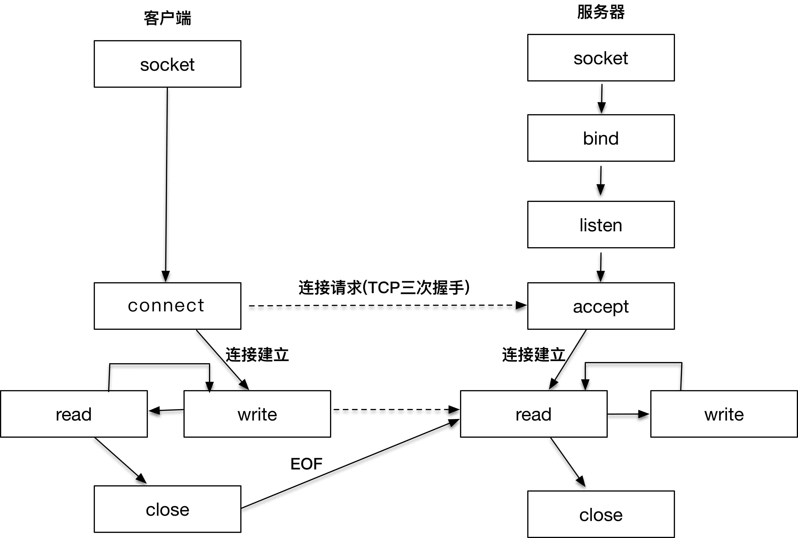

从右侧的服务器端开始看，因为在客户端发起连接请求之前，服务器端必须初始化好。右侧的图显示的是服务器端初始化的过程，首先初始化 socket，之后服务器端需要执行 bind 函数，将自己的服务能力绑定在一个众所周知的地址和端口上，紧接着，服务器端执行 listen 操作，将原先的 socket 转化为服务端的 socket，服务端最后阻塞在 accept 上等待客户端请求的到来。 

此时，服务器端已经准备就绪。客户端需要先初始化 socket，再执行 connect 向服务器端的地址和端口发起连接请求，这里的地址和端口必须是客户端预先知晓的。这个过程，就是著名的 TCP 三次握手（Three-way Handshake）。 一旦三次握手完成，客户端和服务器端建立连接，就进入了数据传输过程。 

具体来说，客户端进程向操作系统内核发起 write 字节流写操作，内核协议栈将字节流通过网络设备传输到服务器端，服务器端从内核得到信息，将字节流从内核读入到进程中，并开始业务逻辑的处理，完成之后，服务器端再将得到的结果以同样的方式写给客户端。可以看到，一旦连接建立，数据的传输就不再是单向的，而是双向的，这也是 TCP 的一个显著特性。 

当客户端完成和服务器端的交互后，比如执行一次 Telnet 操作，或者一次 HTTP 请求，需要和服务器端断开连接时，就会执行 close 函数，操作系统内核此时会通过原先的连接链路向服务器端发送一个 FIN 包，服务器收到之后执行被动关闭，这时候整个链路处于半关闭状态，此后，服务器端也会执行 close 函数，整个链路才会真正关闭。半关闭的状态下，发起 close 请求的一方在没有收到对方 FIN 包之前都认为连接是正常的；而在全关闭的状态下，双方都感知连接已经关闭。 

请注意，以上所有的操作，都是通过 socket 来完成的。无论是客户端的 connect，还是服务端的 accept，或者 read/write 操作等，socket 是我们用来建立连接，传输数据的唯一途径。 

### 通用套接字地址格式 

在使用套接字时，首先要解决通信双方寻址的问题。我们需要套接字的地址建立连接，就像打电话时首先需要查找电话簿，找到你想要联系的那个人，你才可以建立连接，开始交流。接下来，我们重点讨论套接字的地址格式。 

套接字的通用地址结构： 

~~~c
/* POSIX.1g 规范规定了地址族为2字节的值.  */
typedef unsigned short int sa_family_t;
/* 描述通用套接字地址  */
struct sockaddr{
    sa_family_t sa_family;  /* 地址族.  16-bit*/
    char sa_data[14];   /* 具体的地址值 112-bit */
  }; 
~~~

typedef代表为类型取别名，这里定义别名sa_family_t，此后出现sa_family_t类型的就相当于int类型。

在sockaddr结构体中，第一个字段是地址族，它表示使用什么样的方式对地址进行解释和保存，好比电话簿里的手机格式，或者是固话格式，这两种格式的长度和含义都是不同的。地址族在 glibc 里的定义非常多，常用的有以下几种： 

* AF_LOCAL：表示的是本地地址，对应的是 Unix 套接字，这种情况一般用于本地 socket 通信，很多情况下也可以写成 AF_UNIX、AF_FILE； 
* AF_INET：因特网使用的 IPv4 地址； 
* AF_INET6：因特网使用的 IPv6 地址。 

这里的 AF_ 表示的含义是 Address Family，但是很多情况下，我们也会看到以 PF_ 表示的宏，比如 PF_INET、PF_INET6 等，实际上 PF_ 的意思是 Protocol Family，也就是协议族的意思。我们用 AF_xxx 这样的值来初始化 socket 地址，用 PF_xxx 这样的值来初始化 socket。我们在 头文件中可以清晰地看到，这两个值本身就是一一对应的 ：

~~~c
/* 各种地址族的宏定义  */
#define AF_UNSPEC PF_UNSPEC
#define AF_LOCAL  PF_LOCAL
#define AF_UNIX   PF_UNIX
#define AF_FILE   PF_FILE
#define AF_INET   PF_INET
#define AF_AX25   PF_AX25
#define AF_IPX    PF_IPX
#define AF_APPLETALK  PF_APPLETALK
#define AF_NETROM PF_NETROM
#define AF_BRIDGE PF_BRIDGE
#define AF_ATMPVC PF_ATMPVC
#define AF_X25    PF_X25
#define AF_INET6  PF_INET6
~~~

sockaddr 是一个通用的地址结构，通用的意思是适用于多种地址族。 

### IPv4 套接字格式地址

常用的 IPv4 地址族的结构：

~~~c
/* IPV4套接字地址，32bit值.  */
typedef uint32_t in_addr_t;
struct in_addr
  {
    in_addr_t s_addr;
  };
  
/* 描述IPV4的套接字地址格式  */
struct sockaddr_in
  {
    sa_family_t sin_family; /* 16-bit */
    in_port_t sin_port;     /* 端口号  16-bit*/
    struct in_addr sin_addr;    /* Internet address. 32-bit */

    /* 这里仅仅用作占位符，不做实际用处  */
    unsigned char sin_zero[8];
  };
~~~

包含以下几个部分：

* 和 sockaddr 一样，都有一个 16-bit 的 sin_family 字段，对于 IPv4 来说这个值就是 AF_INET。 
* 端口号，我们可以看到端口号最多是 16-bit，也就是说最大支持 2 的 16 次方，这个数字是 65536，所以我们应该知道支持寻址的端口号最多就是 65535。 
* IPV4套接字地址，32bit值。实际的 IPv4 地址是一个 32-bit 的字段，可以想象最多支持的地址数就是 2 的 32 次方，大约是 42 亿，应该说这个数字在设计之初还是非常巨大的，无奈互联网蓬勃发展，全球接入的设备越来越多，这个数字渐渐显得不太够用了，于是大家所熟知的 IPv6 就隆重登场了。 

### IPv6 套接字地址格式

IPv6 的地址结构： 

~~~c
struct sockaddr_in6
  {
    sa_family_t sin6_family; /* 16-bit */
    in_port_t sin6_port;  /* 传输端口号 # 16-bit */
    uint32_t sin6_flowinfo; /* IPv6流控信息 32-bit*/
    struct in6_addr sin6_addr;  /* IPv6地址128-bit */
    uint32_t sin6_scope_id; /* IPv6域ID 32-bit */
  };
~~~

整个结构体长度是 28 个字节：

* 和之前的地址一样，有16-bit 的 sin_family 字段（AF_INET6）、端口、IPv6地址128-bit。

  地址从 32 位升级到 128 位，这个数字就大到恐怖了，完全解决了寻址数字不够的问题。 

* 流控信息和域 ID 先不用管，这两个字段，一个在 glibc 的官网上根本没出现，另一个是当前未使用的字段。 

### 本地套接字地址格式

本地套接字格式，用来作为本地进程间的通信， 也就是前面提到的 AF_LOCAL：

~~~c
struct sockaddr_un {
    unsigned short sun_family; /* 固定为 AF_LOCAL */
    char sun_path[108];   /* 路径名 */
};
~~~

### 套接字地址格式比较

这几种地址的比较见下图，IPv4 和 IPv6 套接字地址结构的长度是固定的，而本地地址结构的长度是可变的：

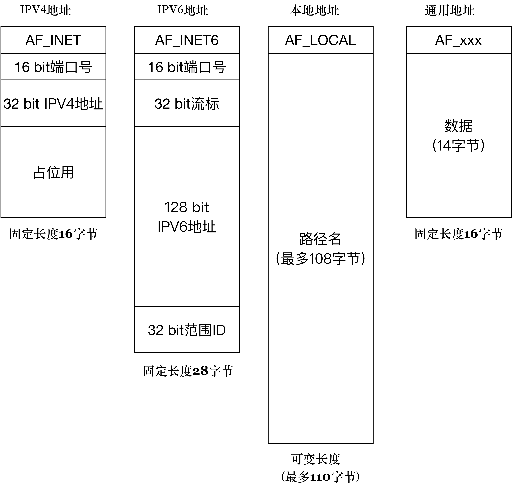

几种套接字地址中，只有本地套接字格式中没有端口，是因为本地socket本质上是在访问本地的文件系统，所以自然不需要端口。 

这些套接字是不同的具体类型，它们都有一个共同的概念，给用户提供一个统一的socket接口

## 服务端准备连接

 ### 创建套接字

要创建一个可用的套接字，需要使用下面的函数： 

~~~c
int socket(int domain, int type, int protocol)
~~~

domain 就是指 PF_INET、PF_INET6 以及 PF_LOCAL 等，表示什么样的套接字。 

type 可用的值是： 

* SOCK_STREAM: 表示的是字节流，对应 TCP； 
* SOCK_DGRAM： 表示的是数据报，对应 UDP； 
* SOCK_RAW: 表示的是原始套接字。 

参数 protocol 原本是用来指定通信协议的，但现在基本废弃。因为协议已经通过前面两个参数指定完成。protocol 目前一般写成 0 即可。 

### bind

创建出来的套接字如果需要被别人使用，就需要调用 bind 函数把套接字和套接字地址绑定，就像去电信局登记我们的电话号码一样。 

调用 bind 函数的方式如下： 

~~~c
bind(int fd, sockaddr * addr, socklen_t len)
~~~

bind 函数后面的第二个参数是通用地址格式sockaddr * addr。这里有一个地方值得注意，那就是虽然接收的是通用地址格式，实际上传入的参数可能是 IPv4、IPv6 或者本地套接字格式。

在套接字最初被设计出来的时候，就是用通用地址格式来作为支持 bind 和 accept 等这些函数的参数，它可以代表不同的套接字。

对于使用者来说，每次需要将 IPv4、IPv6 或者本地套接字格式转化为通用套接字格式，就像下面的 IPv4 套接字地址格式的例子一样： 

~~~c
struct sockaddr_in name;
bind (sock, (struct sockaddr *) &name, sizeof (name)
~~~

对于实现者来说，可根据该地址结构的前两个字节判断出是哪种地址。 

 len 字段是为了处理长度可变的结构，bind 函数会根据 len 字段判断传入的参数 addr 该怎么解析，len 字段表示的就是传入的地址长度，它是一个可变值。 

设置 bind 的时候，对地址和端口可以有多种处理方式：

* 可以把地址设置成本机的 IP 地址，这相当告诉操作系统内核，仅仅对目标 IP 是本机 IP 地址的 IP 包进行处理。 

  但是这样写的程序在部署时有一个问题，我们编写应用程序时并不清楚自己的应用程序将会被部署到哪台机器上。 

  这个时候，可以利用通配地址的能力帮助我们解决这个问题。通配地址相当于告诉操作系统内核： 只要目标地址是本机的都可以完成bind

  比如一台机器有两块网卡，IP 地址分别是 202.61.22.55 和 192.168.1.11，那么向这两个 IP 请求的请求包都会被我们编写的应用程序处理。 

  对于 IPv4 的地址来说，使用 INADDR_ANY 来完成通配地址的设置；对于 IPv6 的地址来说，使用 IN6ADDR_ANY 来完成通配地址的设置：

  ~~~c
  struct sockaddr_in name;
  name.sin_addr.s_addr = htonl (INADDR_ANY); /* IPV4通配地址 */
  ~~~

* 如果把端口设置成 0，就相当于把端口的选择权交给操作系统内核来处理，操作系统内核会根据一定的算法选择一个空闲的端口，完成套接字的绑定。这在服务器端不常使用。 

  一般来说，服务器端的程序一定要绑定到一个众所周知的端口上。 

下面是一个初始化 IPv4 TCP 套接字的例子: 

~~~c
#include <stdio.h>
#include <stdlib.h>
#include <sys/socket.h>
#include <netinet/in.h>

int make_socket (uint16_t port)
{
  int sock;
  struct sockaddr_in name;

  /* 创建字节流类型的IPV4 socket. */
  sock = socket (PF_INET, SOCK_STREAM, 0);
  if (sock < 0)
    {
      perror ("socket");
      exit (EXIT_FAILURE);
    }

  /* 绑定到port和ip. */
  name.sin_family = AF_INET; /* IPV4 */
  name.sin_port = htons (port);  /* 指定端口 */
  name.sin_addr.s_addr = htonl (INADDR_ANY); /* 通配地址 */
  /* 把IPV4地址转换成通用地址格式，同时传递长度 */
  if (bind (sock, (struct sockaddr *) &name, sizeof (name)) < 0)
    {
      perror ("bind");
      exit (EXIT_FAILURE);
    }

  return sock;
}
~~~

### listen

bind 函数只是让我们的套接字和地址关联，如同登记了电话号码。如果要让别人打通电话，还需要我们把电话设备接入电话线，让服务器真正处于可接听的状态，这个过程需要依赖 listen 函数。 

初始化创建的套接字，可以认为是一个"主动"套接字，其目的是之后主动发起请求（通过调用 connect 函数，后面会讲到）。通过 listen 函数，可以将原来的"主动"套接字转换为"被动"套接字，告诉操作系统内核：“我这个套接字是用来等待用户请求的。”当然，操作系统内核会为此做好接收用户请求的一切准备，比如完成连接队列。 

listen 函数的原型是这样的： 

~~~c
int listen (int socketfd, int backlog)
~~~

第一个参数 socketdf 为套接字描述符，第二个参数 backlog，在 Linux 中表示已完成 (ESTABLISHED) 且未 accept 的队列大小，这个参数的大小决定了可以接收的并发数目。这个参数越大，并发数目理论上也会越大。但是参数过大也会占用过多的系统资源，一些系统，比如 Linux 并不允许对这个参数进行改变。

backlog 的值含义从来就没有被严格定义过。原先 Linux 实现中，backlog 参数定义了该套接字对应的未完成连接队列的最大长度 （pending connections)。如果一个连接到达时，该队列已满，客户端将会接收一个 ECONNREFUSED 的错误信息，如果支持重传，该请求可能会被忽略，之后会进行一次重传。 

从 Linux 2.2 开始，backlog 的参数内核有了新的语义，它现在定义的是已完成连接队列的最大长度，表示的是已建立的连接（established connection），正在等待被接收（accept 调用返回），而不是原先的未完成队列的最大长度。现在，未完成队列的最大长度值可以通过 /proc/sys/net/ipv4/tcp_max_syn_backlog 完成修改，默认值为 128。 

设计良好的程序，在 128 固定值的情况下也是可以支持成千上万的并发连接的，这取决于 I/O 分发的效率，以及多线程程序的设计。  

### accept

当客户端的连接请求到达时，服务器端应答成功，连接建立，这个时候操作系统内核需要把这个事件通知到应用程序，并让应用程序感知到这个连接。 

连接建立之后，你可以把 accept 这个函数看成是操作系统内核和应用程序之间的桥梁。它的原型是： 

~~~c
int accept(int listensockfd, struct sockaddr *cliaddr, socklen_t *addrlen)
~~~

函数的第一个参数 listensockfd 是套接字，可以叫它为 listen 套接字，因为这就是前面通过 bind，listen 一系列操作而得到的套接字。 

函数的返回值有两个部分：

* cliadd 是通过指针方式获取的客户端的地址 
* addrlen 告诉我们地址的大小 
* accept的返回值：一个全新的描述字，代表了与客户端的连接。 

这里一定要注意有两个套接字描述字：

* 第一个是监听套接字描述字 listensockfd，它是作为输入参数存在的； 
* 第二个是返回的已连接套接字描述字。 

之所以设置一个套接字为入参，另一个为出参，是因为：

* 作为入参的监听套接字是一直都存在的，它是要为成千上万的客户来服务的，直到这个监听套接字关闭； 

* 一旦一个客户和服务器连接成功，完成了 TCP 三次握手，操作系统内核就为这个客户生成一个已连接套接字，让应用服务器使用这个已连接套接字和客户进行通信处理。 如果应用服务器完成了对这个客户的服务，比如一次网购下单，一次付款成功，那么关闭的就是已连接套接字，这样就完成了 TCP 连接的释放。 

  请注意，这个时候释放的只是这一个客户连接，其它被服务的客户连接可能还存在。最重要的是，监听套接字一直都处于“监听”状态，等待新的客户请求到达并服务。 

## 客户端发起连接

客户端发起连接请求的过程中，第一步还是和服务端一样，要建立一个套接字，方法和前面是一样的。 不一样的是客户端需要调用 connect 向服务端发起请求。 

客户端和服务器端的连接建立，是通过 connect 函数完成的。这是 connect 的构建函数： 

~~~c
int connect(int sockfd, const struct sockaddr *servaddr, socklen_t addrlen)
~~~

几个参数：

* 第一个参数 sockfd 是连接套接字，通过前面讲述的 socket 函数创建。 
* 第二个、第三个参数 servaddr 和 addrlen 分别代表指向套接字地址结构的指针和该结构的大小。套接字地址结构必须含有服务器的 IP 地址和端口号。 

客户在调用函数 connect 前不必非得调用 bind 函数，因为如果需要的话，内核会确定源 IP 地址，并按照一定的算法选择一个临时端口作为源端口。 

如果是 TCP 套接字，那么调用 connect 函数将激发 TCP 的三次握手过程，而且仅在连接建立成功或出错时才返回。其中出错返回可能有以下几种情况： 

* 三次握手无法建立，客户端发出的 SYN 包没有任何响应，于是返回 TIMEOUT 错误。这种情况比较常见的原因是对应的服务端 IP 写错。 
* 客户端收到了 RST（复位）回答，这时候客户端会立即返回 CONNECTION REFUSED 错误。这种情况比较常见于客户端发送连接请求时的请求端口写错，因为 RST 是 TCP 在发生错误时发送的一种 TCP 分节。产生 RST 的三个条件是： 
  * 目的地为某端口的 SYN 到达，然而该端口上没有正在监听的服务器（如前所述） 
  * TCP 想取消一个已有连接； 
  * TCP 接收到一个根本不存在的连接上的分节。 
* 客户发出的 SYN 包在网络上引起了"destination unreachable"，即目的不可达的错误。这种情况比较常见的原因是客户端和服务器端路由不通。 

根据不同的返回值，我们可以做进一步的排查。 

## TCP三次握手

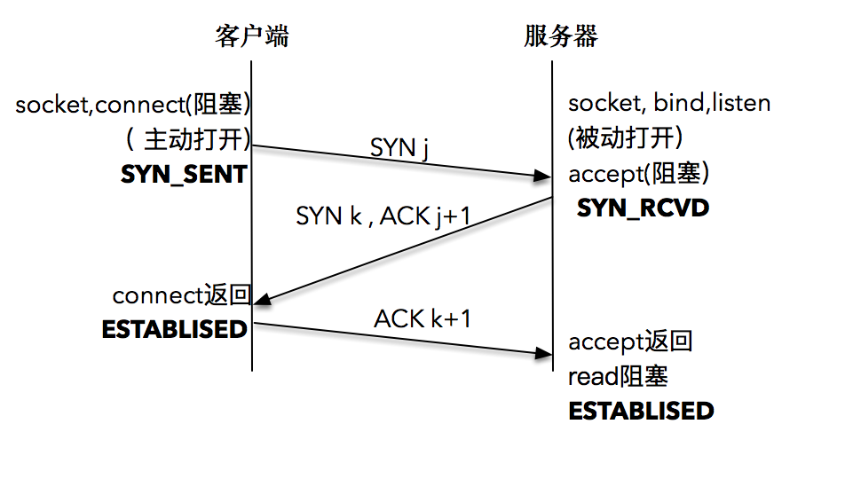

这里我们使用的网络编程模型都是阻塞式的。所谓阻塞式，就是调用发起后不会直接返回，由操作系统内核处理之后才会返回。 在高性能服务器编程中会用到非阻塞调用的场景。

服务器端通过 socket，bind 和 listen 完成了被动套接字的准备工作，被动的意思就是等着别人来连接，然后调用 accept，就会阻塞在这里，等待客户端的连接来临；客户端通过调用 socket 和 connect 函数之后，也会阻塞。接下来的事情是由操作系统内核完成的，更具体一点的说，是操作系统内核网络协议栈在工作。 

下面是具体的过程： 

* 客户端的协议栈向服务器端发送了 SYN 包，并告诉服务器端当前发送序列号 j，客户端进入 SYNC_SENT 状态； 
* 服务器端的协议栈收到这个包之后，和客户端进行 ACK 应答，应答的值为 j+1，表示对 SYN 包 j 的确认，同时服务器也发送一个 SYN 包，告诉客户端当前我的发送序列号为 k，服务器端进入 SYNC_RCVD 状态； 
* 客户端协议栈收到 ACK 之后，使得应用程序从 connect 调用返回，表示客户端到服务器端的单向连接建立成功，客户端的状态为 ESTABLISHED，同时客户端协议栈也会对服务器端的 SYN 包进行应答，应答数据为 k+1； 
* 应答包到达服务器端后，服务器端协议栈使得 accept 阻塞调用返回，这个时候服务器端到客户端的单向连接也建立成功，服务器端也进入 ESTABLISHED 状态。 

tcp建立连接需要三次握手的原因：

* tcp连接的双方要确保各自的收发消息的能力都是正常的。 

  客户端第一次发送握手消息到服务端， 服务端接收到握手消息后把ack和自己的syn一同发送给客户端，这是第二次握手， 当客户端接收到服务端发送来的第二次握手消息后，客户端可以确认“服务端的收发能力OK，客户端的收发能力OK”，但是服务端只能确认“客户端的发送OK，服务端的接收OK”

  所以还需要第三次握手，客户端收到服务端的第二次握手消息后，发起第三次握手消息，服务端收到客户端发送的第三次握手消息后，就能够确定“服务端的发送OK，客户端的接收OK”， 至此，客户端和服务端都能够确认自己和对方的收发能力OK，，tcp连接建立完成。 

* 避免建立重复连接：有时会收到一些已失效的连接请求报文段，如果没有三次握手，就无法确认客户端是否正常

## 数据读写

下面讲解使用创建的套接字收发数据。

套接字描述本身和本地文件描述符并无区别，在 UNIX 的世界里万物都是文件，这就意味着可以将套接字描述符传递给那些原先为处理本地文件而设计的函数。这些函数包括 read 和 write 交换数据的函数。 

### 发送数据

发送数据时常用的有三个函数，分别是 write、send 和 sendmsg：

~~~c
ssize_t write (int socketfd, const void *buffer, size_t size)
ssize_t send (int socketfd, const void *buffer, size_t size, int flags)
ssize_t sendmsg(int sockfd, const struct msghdr *msg, int flags)
~~~

每个函数都是单独使用的，使用的场景略有不同： 

* 第一个函数是常见的文件写函数，如果把 socketfd 换成文件描述符，就是普通的文件写入。 
* 如果想指定选项，发送带外数据，就需要使用第二个带 flag 的函数。所谓带外数据，是一种基于 TCP 协议的紧急数据，用于客户端 - 服务器在特定场景下的紧急处理。 
* 如果想指定多重缓冲区传输数据，就需要使用第三个函数，以结构体 msghdr 的方式发送数据。 

套接字描述符是一种特殊的描述符，那么在套接字描述符上调用 write 函数，应该和在普通文件描述符上调用 write 函数的行为是一致的，都是通过描述符句柄写入指定的数据，两者的表现形式一样，内在的区别还是很不一样的：

* 对于普通文件描述符而言，一个文件描述符代表了打开的一个文件句柄，通过调用 write 函数，操作系统内核帮我们不断地往文件系统中写入字节流。注意，写入的字节流大小通常和输入参数 size 的值是相同的，否则表示出错。 
* 对于套接字描述符而言，它代表了一个双向连接，在套接字描述符上调用 write 写入的字节数有可能比请求的数量少，这在普通文件描述符情况下是不正常的。 

产生这个现象的原因在于操作系统内核为读取和发送数据做了很多我们表面上看不到的工作。 

### 发送缓冲区

当 TCP 三次握手成功，TCP 连接成功建立后，操作系统内核会为每一个连接创建配套的基础设施，比如发送缓冲区。 

发送缓冲区的大小可以通过套接字选项来改变，当我们的应用程序调用 write 函数时，实际所做的事情是把数据从应用程序中拷贝到操作系统内核的发送缓冲区中，并不一定是把数据通过套接字写出去。 

这里有几种情况：

* 第一种情况很简单，操作系统内核的发送缓冲区足够大，可以直接容纳这份数据，那么皆大欢喜，我们的程序从 write 调用中退出，返回写入的字节数就是应用程序的数据大小。 

* 第二种情况是，操作系统内核的发送缓冲区是够大了，不过还有数据没有发送完，或者数据发送完了，但是操作系统内核的发送缓冲区不足以容纳应用程序数据，在这种情况下操作系统内核并不会返回，也不会报错，而是应用程序被阻塞，也就是说应用程序在 write 函数调用处停留，不直接返回。术语“挂起”也表达了相同的意思，不过“挂起”是从操作系统内核角度来说的。 

  至于返回的时机，每个操作系统内核的处理是不同的。大部分 UNIX 系统的做法是一直等到可以把应用程序数据完全放到操作系统内核的发送缓冲区中，再从系统调用中返回。 

  虽然缓冲区有如此重要的作用，但是也不能任意调大缓冲区的大小，太大的缓冲区不会增加吞吐量，反而会消耗大量内存资源。

可以把发送缓冲区想象成一条包裹流水线，有个聪明且忙碌的工人不断地从流水线上取出包裹（数据），这个工人会按照 TCP/IP 的语义，将取出的包裹（数据）封装成 TCP 的 MSS 包，以及 IP 的 MTU 包，最后走数据链路层将数据发送出去。这样我们的发送缓冲区就又空了一部分，于是又可以继续从应用程序搬一部分数据到发送缓冲区里，这样一直进行下去，到某一个时刻，应用程序的数据可以完全放置到发送缓冲区里。在这个时候，write 阻塞调用返回。 

注意返回的时刻，应用程序数据并没有全部被发送出去，发送缓冲区里还有部分数据，这部分数据会在稍后由操作系统内核通过网络发送出去。 

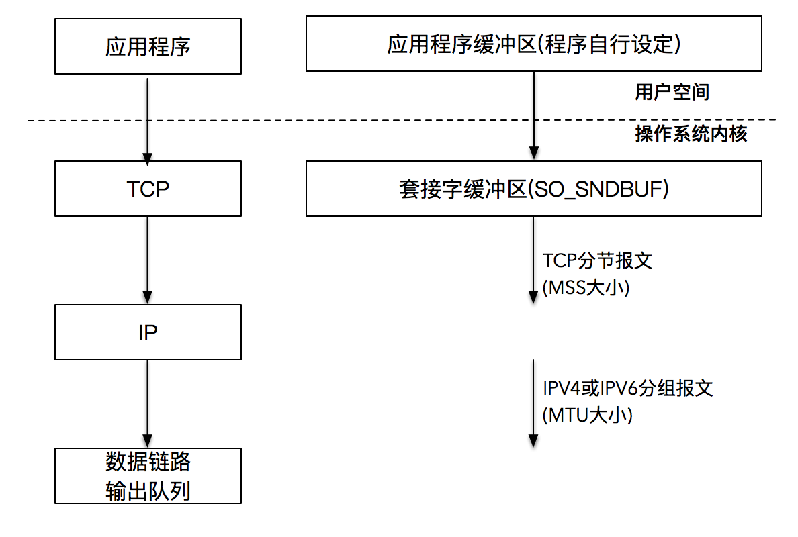

### 读取数据

read 函数的原型如下：

~~~c
ssize_t read (int socketfd, void *buffer, size_t size)
~~~

read 函数要求操作系统内核从套接字描述字 socketfd读取最多多少个字节（size），并将结果存储到 buffer 中。 返回值告诉我们实际读取的字节数目，也有一些特殊情况：

* 如果返回值为 0，表示 EOF（end-of-file），这在网络中表示对端发送了 FIN 包，要处理断连的情况； 
* 如果返回值为 -1，表示出错。 

这里不考虑非阻塞 I/O的情况。

注意这里是最多读取 size 个字节。如果我们想让应用程序每次都读到 size 个字节，就需要编写下面的函数，不断地循环读取：

~~~c
/* 从socketfd描述字中读取"size"个字节. */
size_t readn(int fd, void *buffer, size_t size) {
    char *buffer_pointer = buffer;
    int length = size;

    while (length > 0) {
        int result = read(fd, buffer_pointer, length);

        if (result < 0) {
            if (errno == EINTR)
                continue;     /* 考虑非阻塞的情况，这里需要再次调用read */
            else
                return (-1);
        } else if (result == 0)
            break;                /* EOF(End of File)表示套接字关闭 */

        length -= result;
        buffer_pointer += result;
    }
    return (size - length);        /* 返回的是实际读取的字节数*/
}
~~~

对这个程序稍微解释下： 

* 6-19 行的循环条件表示的是，在没读满 size 个字节之前，一直都要循环下去。 
* 10-11 行表示的是非阻塞 I/O 的情况下，没有数据可以读，需要继续调用 read。 
* 14-15 行表示读到对方发出的 FIN 包，表现形式是 EOF，此时需要关闭套接字。 
* 17-18 行，需要读取的字符数减少，缓存指针往下移动。 
* 20 行是在读取 EOF 跳出循环后，返回实际读取的字符数。 

### 发送接收案例

在下面的例子中，客户端不断地发送数据，服务器端每读取一段数据之后进行休眠，以模拟实际业务处理所需要的时间。 

下面是服务器端读取数据的程序： 

~~~c
#include "lib/common.h"

void read_data(int sockfd) {
    ssize_t n;
    char buf[1024];

    int time = 0;
    for (;;) {
        fprintf(stdout, "block in read\n");
        if ((n = readn(sockfd, buf, 1024)) == 0)
            return;

        time++;
        fprintf(stdout, "1K read for %d \n", time);
        usleep(1000);
    }
}

int main(int argc, char **argv) {
    int listenfd, connfd;
    socklen_t clilen;
    struct sockaddr_in cliaddr, servaddr;

    listenfd = socket(AF_INET, SOCK_STREAM, 0);

    bzero(&servaddr, sizeof(servaddr));
    servaddr.sin_family = AF_INET;
    servaddr.sin_addr.s_addr = htonl(INADDR_ANY);
    servaddr.sin_port = htons(12345);

    /* bind到本地地址，端口为12345 */
    bind(listenfd, (struct sockaddr *) &servaddr, sizeof(servaddr));
    /* listen的backlog为1024 */
    listen(listenfd, 1024);

    /* 循环处理用户请求 */
    for (;;) {
        clilen = sizeof(cliaddr);
        connfd = accept(listenfd, (struct sockaddr *) &cliaddr, &clilen);
        read_data(connfd);   /* 读取数据 */
        close(connfd);          /* 关闭连接套接字，注意不是监听套接字*/
    }
}
~~~

对服务器端程序解释如下： 

* 21-35 行先后创建了 socket 套接字，bind 到对应地址和端口，并开始调用 listen 接口监听； 
* 38-42 行循环等待连接，通过 accept 获取实际的连接，并开始读取数据； 
* 8-15 行实际每次读取 1K 数据，之后休眠 1 秒，用来模拟服务器端处理时延。 

下面是客户端发送数据的程序： 

~~~c
#include "lib/common.h"

#define MESSAGE_SIZE 102400

void send_data(int sockfd) {
    char *query;
    query = malloc(MESSAGE_SIZE + 1);
    for (int i = 0; i < MESSAGE_SIZE; i++) {
        query[i] = 'a';
    }
    query[MESSAGE_SIZE] = '\0';

    const char *cp;
    cp = query;
    size_t remaining = strlen(query);
    while (remaining) {
        int n_written = send(sockfd, cp, remaining, 0);
        fprintf(stdout, "send into buffer %ld \n", n_written);
        if (n_written <= 0) {
            error(1, errno, "send failed");
            return;
        }
        remaining -= n_written;
        cp += n_written;
    }

    return;
}

int main(int argc, char **argv) {
    int sockfd;
    struct sockaddr_in servaddr;

    if (argc != 2)
        error(1, 0, "usage: tcpclient <IPaddress>");

    sockfd = socket(AF_INET, SOCK_STREAM, 0);

    bzero(&servaddr, sizeof(servaddr));
    servaddr.sin_family = AF_INET;
    servaddr.sin_port = htons(12345);
    inet_pton(AF_INET, argv[1], &servaddr.sin_addr);
    int connect_rt = connect(sockfd, (struct sockaddr *) &servaddr, sizeof(servaddr));
    if (connect_rt < 0) {
        error(1, errno, "connect failed ");
    }
    send_data(sockfd);
    exit(0);
}
~~~

对客户端程序解释如下： 

* 31-37 行先后创建了 socket 套接字，调用 connect 向对应服务器端发起连接请求 
* 43 行在连接建立成功后，调用 send_data 发送数据 
* 6-11 行初始化了一个长度为 MESSAGE_SIZE 的字符串流 
* 16-25 行调用 send 函数将 MESSAGE_SIZE 长度的字符串流发送出去 

客户端程序发送了一个很大的字节流，程序运行起来之后，我们会看到服务端不断地在屏幕上打印出读取字节流的过程：

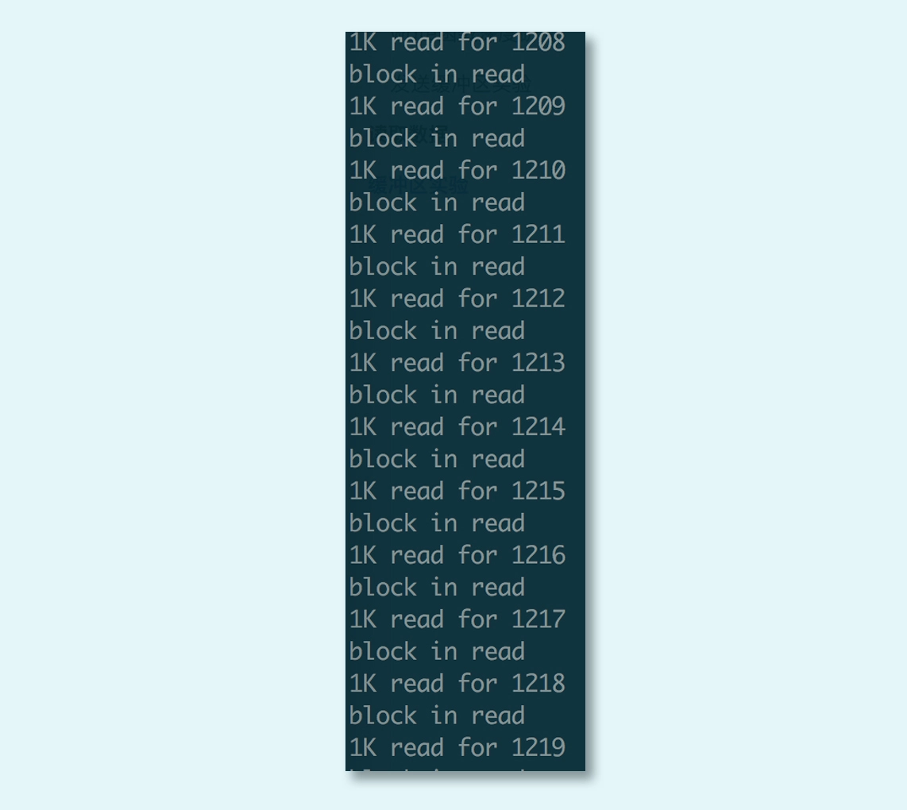

客户端直到最后所有的字节流发送完毕才打印出send into buffer，说明在此之前 send 函数一直都是阻塞的，也就是说阻塞式套接字最终发送返回的实际写入字节数和请求字节数是相等的。 

如果我们把服务端的休眠时间稍微调大，把客户端发送的字节数从 10240000 调整为 1024000，再次运行刚才的例子，我们会发现，客户端很快打印出 send into buffer，但与此同时，服务端读取程序还在屏幕上不断打印读取数据的进度，显示出服务端读取程序还在辛苦地从缓冲区中读取数据。 

这说明：发送成功仅仅表示的是数据被拷贝到了发送缓冲区中，并不意味着连接对端已经收到所有的数据。至于什么时候发送到对端的接收缓冲区，或者更进一步说，什么时候被对方应用程序缓冲所接收，对客户端而言完全都是透明的。 

## UDP数据读写

UDP 是一种“数据报”协议，而 TCP 是一种面向连接的“数据流”协议。 

TCP可以类比成拨打号码、接通电话、开始交流，分别对应了 TCP 的三次握手和报文传送。 

UDP可以类比成邮寄明信片。 这些明信片只有对方的地址，没有顺序，互相独立，没有连接的概念。

UDP 和 TCP 之间最大的区别：

* TCP 是一个面向连接的协议，TCP 在 IP 报文的基础上，增加了诸如重传、确认、有序传输、拥塞控制等能力，通信的双方是在一个确定的上下文中工作的。 

* 而 UDP 则不同，UDP 没有这样一个确定的上下文，它是一个不可靠的通信协议，没有重传和确认，没有有序控制，也没有拥塞控制。我们可以简单地理解为，在 IP 报文的基础上，UDP 增加的能力有限。 

  UDP 不保证报文的有效传递，不保证报文的有序，也就是说使用 UDP 的时候，我们需要做好丢包、重传、报文组装等工作。 

  因为UDP协议比较简单，适合的场景还是比较多的，我们常见的 DNS 服务，SNMP 服务都是基于 UDP 协议的，这些场景对时延、丢包都不是特别敏感。另外多人通信的场景，如聊天室、多人游戏等，也都会使用到 UDP 协议。 

下面这张图是 UDP 程序设计时的主要过程：

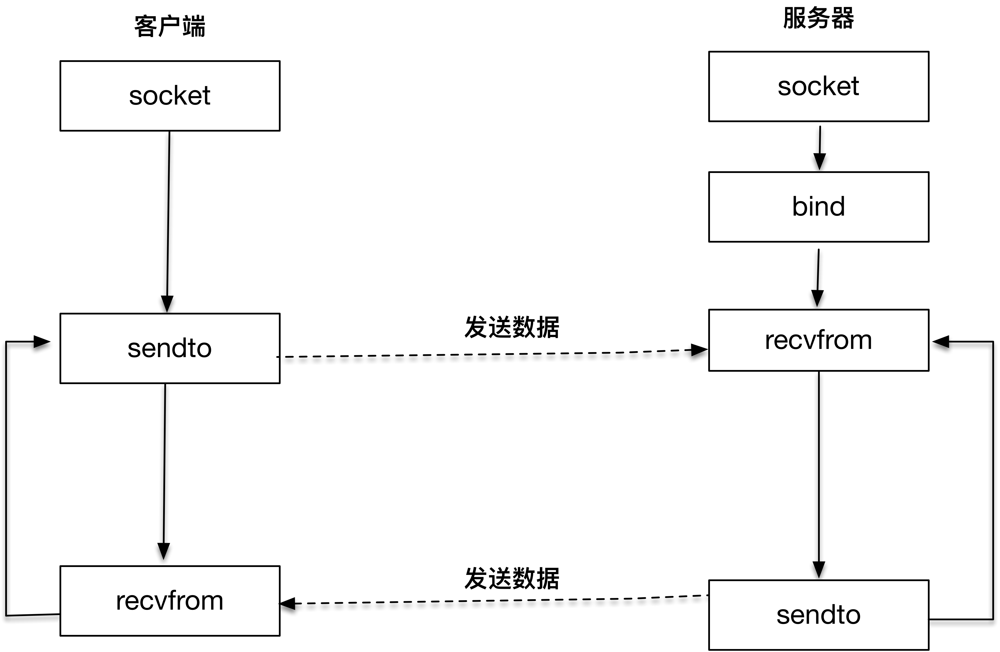

服务器端创建 UDP 套接字之后，绑定到本地端口，调用 recvfrom 函数等待客户端的报文发送；客户端创建套接字之后，调用 sendto 函数往目标地址和端口发送 UDP 报文，然后客户端和服务器端进入互相应答过程。 

recvfrom 和 sendto 是 UDP 用来接收和发送报文的两个主要函数： 

~~~c
#include <sys/socket.h>

ssize_t recvfrom(int sockfd, void *buff, size_t nbytes, int flags, 
　　　　　　　　　　struct sockaddr *from, socklen_t *addrlen); 

ssize_t sendto(int sockfd, const void *buff, size_t nbytes, int flags,
                const struct sockaddr *to, socklen_t addrlen); 
~~~

recvfrom函数：

* sockfd、buff 和 nbytes 是前三个参数。sockfd 是本地创建的套接字描述符，buff 指向本地的缓存，nbytes 表示最大接收数据字节。 
* 第四个参数 flags 是和 I/O 相关的参数，这里我们还用不到，设置为 0。 
* 后面两个参数 from 和 addrlen，实际上是返回对端发送方的地址和端口等信息，这和 TCP 非常不一样，TCP 是通过 accept 函数拿到的描述字信息来决定对端的信息。另外 UDP 报文每次接收都会获取对端的信息，也就是说报文和报文之间是没有上下文的。 
* 函数的返回值告诉我们实际接收的字节数。 

sendto 函数：

* sendto 函数中的前三个参数为 sockfd、buff 和 nbytes。sockfd 是本地创建的套接字描述符，buff 指向发送的缓存，nbytes 表示发送字节数。第四个参数 flags 依旧设置为 0。 
* 后面两个参数 to 和 addrlen，表示发送的对端地址和端口等信息。 
* 函数的返回值告诉我们实际发送的字节数。 

TCP 的发送和接收每次都是在一个上下文中，从accept开始，就无需制定对端的信息，而UDP 的每次接收和发送都是一个独立的上下文，在发送或者接受信息时必须指定对端的信息。

### 发送接受案例

UDP 服务器端的例子： 

~~~c
#include "lib/common.h"

static int count;

static void recvfrom_int(int signo) {
    printf("\nreceived %d datagrams\n", count);
    exit(0);
}

int main(int argc, char **argv) {
    int socket_fd;
    socket_fd = socket(AF_INET, SOCK_DGRAM, 0);

    struct sockaddr_in server_addr;
    bzero(&server_addr, sizeof(server_addr));
    server_addr.sin_family = AF_INET;
    server_addr.sin_addr.s_addr = htonl(INADDR_ANY);
    server_addr.sin_port = htons(SERV_PORT);

    bind(socket_fd, (struct sockaddr *) &server_addr, sizeof(server_addr));

    socklen_t client_len;
    char message[MAXLINE];
    count = 0;

    signal(SIGINT, recvfrom_int);

    struct sockaddr_in client_addr;
    client_len = sizeof(client_addr);
    for (;;) {
        int n = recvfrom(socket_fd, message, MAXLINE, 0, (struct sockaddr *) &client_addr, &client_len);
        message[n] = 0;
        printf("received %d bytes: %s\n", n, message);

        char send_line[MAXLINE];
        sprintf(send_line, "Hi, %s", message);

        sendto(socket_fd, send_line, strlen(send_line), 0, (struct sockaddr *) &client_addr, client_len);

        count++;
    }

}
~~~

程序的 12～13 行，首先创建一个套接字，注意这里的套接字类型是“SOCK_DGRAM”，表示的是 UDP 数据报。 

15～21 行和 TCP 服务器端类似，绑定数据报套接字到本地的一个端口上。 

27 行为该服务器创建了一个信号处理函数，以便在响应“Ctrl+C”退出时，打印出收到的报文总数。 

31～42 行是该服务器端的主体，通过调用 recvfrom 函数获取客户端发送的报文，之后我们对收到的报文进行重新改造，加上“Hi”的前缀，再通过 sendto 函数发送给客户端对端。 

UDP 客户端例子如下，在这个例子中，从标准输入中读取输入的字符串后，发送给服务端，并且把服务端经过处理的报文打印到标准输出上：

~~~c
#include "lib/common.h"

# define    MAXLINE     4096

int main(int argc, char **argv) {
    if (argc != 2) {
        error(1, 0, "usage: udpclient <IPaddress>");
    }
    
    int socket_fd;
    socket_fd = socket(AF_INET, SOCK_DGRAM, 0);

    struct sockaddr_in server_addr;
    bzero(&server_addr, sizeof(server_addr));
    server_addr.sin_family = AF_INET;
    server_addr.sin_port = htons(SERV_PORT);
    inet_pton(AF_INET, argv[1], &server_addr.sin_addr);

    socklen_t server_len = sizeof(server_addr);

    struct sockaddr *reply_addr;
    reply_addr = malloc(server_len);

    char send_line[MAXLINE], recv_line[MAXLINE + 1];
    socklen_t len;
    int n;

    while (fgets(send_line, MAXLINE, stdin) != NULL) {
        int i = strlen(send_line);
        if (send_line[i - 1] == '\n') {
            send_line[i - 1] = 0;
        }

        printf("now sending %s\n", send_line);
        size_t rt = sendto(socket_fd, send_line, strlen(send_line), 0, (struct sockaddr *) &server_addr, server_len);
        if (rt < 0) {
            error(1, errno, "send failed ");
        }
        printf("send bytes: %zu \n", rt);

        len = 0;
        n = recvfrom(socket_fd, recv_line, MAXLINE, 0, reply_addr, &len);
        if (n < 0)
            error(1, errno, "recvfrom failed");
        recv_line[n] = 0;
        fputs(recv_line, stdout);
        fputs("\n", stdout);
    }

    exit(0);
}
~~~

10～11 行创建一个类型为“SOCK_DGRAM”的套接字。 

13～17 行，初始化目标服务器的地址和端口。 

28～51 行为程序主体，从标准输入中读取的字符进行处理后，调用 sendto 函数发送给目标服务器端，然后再次调用 recvfrom 函数接收目标服务器发送过来的新报文，并将其打印到标准输出上。 

### 几种典型场景

下面三种UDP的运行场景可以清晰的展现UDP和TCP之间的差别：

1、只运行客户端

如果我们只运行客户端，程序会一直阻塞在 recvfrom 上：

~~~bash
$ ./udpclient 127.0.0.1
1
now sending g1
send bytes: 2
<阻塞在这里>
~~~

对于TCP程序，如果不开启服务端，TCP 客户端的 connect 函数会直接返回“Connection refused”报错信息。而在 UDP 程序里，则会一直阻塞在这里。 

2、先开启服务端，再开启客户端 

在这个场景里，我们先开启服务端在端口侦听，然后再开启客户端： 

~~~bash
$./udpserver
received 2 bytes: g1
received 2 bytes: g2

$./udpclient 127.0.0.1
g1
now sending g1
send bytes: 2
Hi, g1
g2
now sending g2
send bytes: 2
Hi, g2
~~~

我们在客户端一次输入 g1、g2，服务器端在屏幕上打印出收到的字符，并且可以看到，我们的客户端也收到了服务端的回应：“Hi,g1”和“Hi,g2”。 

3、开启服务端，再一次开启两个客户端 

这个实验中，在服务端开启之后，依次开启两个客户端，并发送报文。 

服务端：

~~~bash
$./udpserver
received 2 bytes: g1
received 2 bytes: g2
received 2 bytes: g3
received 2 bytes: g4
~~~

第一个客户端： 

~~~bash
$./udpclient 127.0.0.1
now sending g1
send bytes: 2
Hi, g1
g3
now sending g3
send bytes: 2
Hi, g3
~~~

第二个客户端：

~~~bash
$./udpclient 127.0.0.1
now sending g2
send bytes: 2
Hi, g2
g4
now sending g4
send bytes: 2
Hi, g4
~~~

我们看到，两个客户端发送的报文，依次都被服务端收到，并且客户端也可以收到服务端处理之后的报文。 

如果我们此时把服务器端进程杀死，就可以看到信号函数在进程退出之前，打印出服务器端接收到的报文个数：

~~~bash
$ ./udpserver
received 2 bytes: g1
received 2 bytes: g2
received 2 bytes: g3
received 2 bytes: g4
^C
received 4 datagrams
~~~

之后，我们再重启服务器端进程，并使用客户端 1 和客户端 2 继续发送新的报文，可以看到服务器端重启后可以继续收到客户端的报文，这在 TCP 里是不可以的，TCP 断联之后必须重新连接才可以发送报文信息。但是 UDP 报文的“无连接”的特点，可以在 UDP 服务器重启之后，继续进行报文的发送，这就是 UDP 报文“无上下文”的最好说明：

~~~bash
$ ./udpserver
received 2 bytes: g1
received 2 bytes: g2
received 2 bytes: g3
received 2 bytes: g4
^C
received 4 datagrams
$ ./udpserver
received 2 bytes: g5
received 2 bytes: g6
~~~

第一个客户端： 

~~~c
$./udpclient 127.0.0.1
now sending g1
send bytes: 2
Hi, g1
g3
now sending g3
send bytes: 2
Hi, g3
g5
now sending g5
send bytes: 2
Hi, g5
~~~

第二个客户端：

~~~c
$./udpclient 127.0.0.1
now sending g2
send bytes: 2
Hi, g2
g4
now sending g4
send bytes: 2
Hi, g4
g6
now sending g6
send bytes: 2
Hi, g6
~~~

既然 UDP 是请求 - 应答模式的，那么请求中的 UDP 报文最大可以是多少？

* 用UDP协议发送时，用sendto函数最大能发送数据的长度为：65535- IP头(20) - UDP头(8)＝65507字节。用sendto函数发送数据时，如果发送数据长度大于该值，则函数会返回错误。 
* 由于IP有最大MTU，因此最终的包大小：
  * UDP 包的大小应该是 1500 - IP头(20) - UDP头(8) = 1472(Bytes) 
  * TCP 包的大小应该是 1500 - IP头(20) - TCP头(20) = 1460 (Bytes) 

## 本地套接字

本地套接字是 IPC，也就是本地进程间通信的一种实现方式。除了本地套接字以外，其它技术，诸如管道、共享消息队列等也是进程间通信的常用方法，但因为本地套接字开发便捷，接受度高，所以普遍适用于在同一台主机上进程间通信的各种场景。 

我们可以通过 netstat 命令查看 Linux 系统内的本地套接字状况，下面这张图列出了路径为 /var/run/dockershim.socket 的 stream 类型的本地套接字，可以清楚地看到开启这个套接字的进程为 kubelet。kubelet 是 Kubernetes 的一个组件：

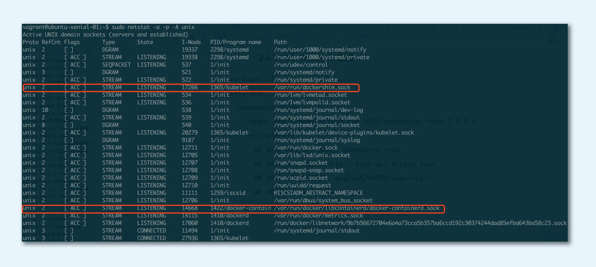

如果我们在 /var/run 目录下将会看到 docker 使用的本地套接字描述符: 

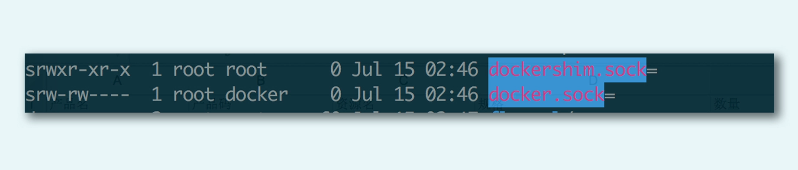

本地套接字一般也叫做 UNIX 域套接字，最新的规范已经改叫本地套接字。 

本地套接字是一种特殊类型的套接字，和 TCP/UDP 套接字不同。TCP/UDP 即使在本地地址通信，也要走系统网络协议栈，而本地套接字，严格意义上说提供了一种单主机跨进程间调用的手段，减少了协议栈实现的复杂度，效率比 TCP/UDP 套接字都要高许多。类似的 IPC 机制（Inter-Process Communication，进程间通信）还有 UNIX 管道、共享内存和 RPC 调用等。 

比如 X Window 实现，如果发现是本地连接，就会走本地套接字，工作效率非常高。 

在前面介绍套接字地址时，这个本地地址就是本地套接字专属的。 

### 本地字节流套接字

这是一个字节流类型的本地套接字服务器端例子。在这个例子中，服务器程序打开本地套接字后，接收客户端发送来的字节流，并往客户端回送了新的字节流：

~~~c
#include  "lib/common.h"

int main(int argc, char **argv) {
    if (argc != 2) {
        error(1, 0, "usage: unixstreamserver <local_path>");
    }

    int listenfd, connfd;
    socklen_t clilen;
    struct sockaddr_un cliaddr, servaddr;

    listenfd = socket(AF_LOCAL, SOCK_STREAM, 0);
    if (listenfd < 0) {
        error(1, errno, "socket create failed");
    }

    char *local_path = argv[1];
    unlink(local_path);
    bzero(&servaddr, sizeof(servaddr));
    servaddr.sun_family = AF_LOCAL;
    strcpy(servaddr.sun_path, local_path);

    if (bind(listenfd, (struct sockaddr *) &servaddr, sizeof(servaddr)) < 0) {
        error(1, errno, "bind failed");
    }

    if (listen(listenfd, LISTENQ) < 0) {
        error(1, errno, "listen failed");
    }

    clilen = sizeof(cliaddr);
    if ((connfd = accept(listenfd, (struct sockaddr *) &cliaddr, &clilen)) < 0) {
        if (errno == EINTR)
            error(1, errno, "accept failed");        /* back to for() */
        else
            error(1, errno, "accept failed");
    }

    char buf[BUFFER_SIZE];

    while (1) {
        bzero(buf, sizeof(buf));
        if (read(connfd, buf, BUFFER_SIZE) == 0) {
            printf("client quit");
            break;
        }
        printf("Receive: %s", buf);

        char send_line[MAXLINE];
        sprintf(send_line, "Hi, %s", buf);

        int nbytes = sizeof(send_line);

        if (write(connfd, send_line, nbytes) != nbytes)
            error(1, errno, "write error");
    }

    close(listenfd);
    close(connfd);

    exit(0);

}
~~~

这里对这个程序做一个详细的解释： 

* 第 12～15 行非常关键，这里创建的套接字类型，注意是 AF_LOCAL，并且使用字节流格式。你现在可以回忆一下，TCP 的类型是 AF_INET 和字节流类型；UDP 的类型是 AF_INET 和数据报类型。在前面的文章中，我们提到 AF_UNIX 也是可以的，基本上可以认为和 AF_LOCAL 是等价的。 
* 第 17～21 行创建了一个本地地址，这里的本地地址和 IPv4、IPv6 地址可以对应，数据类型为 sockaddr_un，这个数据类型中的 sun_family 需要填写为 AF_LOCAL，最为关键的是需要对 sun_path 设置一个本地文件路径。我们这里还做了一个 unlink 操作，以便把存在的文件删除掉，这样可以保持幂等性。 
* 第 23～29 行，分别执行 bind 和 listen 操作，这样就监听在一个本地文件路径标识的套接字上，这和普通的 TCP 服务端程序没什么区别。 
* 第 41～56 行，使用 read 和 write 函数从套接字中按照字节流的方式读取和发送数据。 

这里着重强调一下本地文件路径。关于本地文件路径，需要明确一点，它必须是“绝对路径”，这样的话，编写好的程序可以在任何目录里被启动和管理。如果是“相对路径”，为了保持同样的目的，这个程序的启动路径就必须固定，这样一来，对程序的管理反而是一个很大的负担。 

另外还要明确一点，这个本地文件，必须是一个“文件”，不能是一个“目录”。如果文件不存在，后面 bind 操作时会自动创建这个文件。 

在 Linux 下，任何文件操作都有权限的概念，应用程序启动时也有应用属主。如果当前启动程序的用户权限不能创建文件，会报Permission denied 的错误。

再看一下客户端程序：

~~~c
#include "lib/common.h"

int main(int argc, char **argv) {
    if (argc != 2) {
        error(1, 0, "usage: unixstreamclient <local_path>");
    }

    int sockfd;
    struct sockaddr_un servaddr;

    sockfd = socket(AF_LOCAL, SOCK_STREAM, 0);
    if (sockfd < 0) {
        error(1, errno, "create socket failed");
    }

    bzero(&servaddr, sizeof(servaddr));
    servaddr.sun_family = AF_LOCAL;
    strcpy(servaddr.sun_path, argv[1]);

    if (connect(sockfd, (struct sockaddr *) &servaddr, sizeof(servaddr)) < 0) {
        error(1, errno, "connect failed");
    }

    char send_line[MAXLINE];
    bzero(send_line, MAXLINE);
    char recv_line[MAXLINE];

    while (fgets(send_line, MAXLINE, stdin) != NULL) {

        int nbytes = sizeof(send_line);
        if (write(sockfd, send_line, nbytes) != nbytes)
            error(1, errno, "write error");

        if (read(sockfd, recv_line, MAXLINE) == 0)
            error(1, errno, "server terminated prematurely");

        fputs(recv_line, stdout);
    }

    exit(0);
}
~~~

理解一下这个客户端程序：

* 11～14 行创建了一个本地套接字，和前面服务器端程序一样，用的也是字节流类型 SOCK_STREAM。 
* 16～18 行初始化目标服务器端的地址。我们知道在 TCP 编程中，使用的是服务器的 IP 地址和端口作为目标，在本地套接字中则使用文件路径作为目标标识，sun_path 这个字段标识的是目标文件路径，所以这里需要对 sun_path 进行初始化。 
* 20 行和 TCP 客户端一样，发起对目标套接字的 connect 调用，不过由于是本地套接字，并不会有三次握手。 
* 28～38 行从标准输入中读取字符串，向服务器端发送，之后将服务器端传输过来的字符打印到标准输出上。 

总体上，我们可以看到，本地字节流套接字和 TCP 服务器端、客户端编程最大的差异就是套接字类型的不同。本地字节流套接字识别服务器不再通过 IP 地址和端口，而是通过本地文件。 

对于这个程序，如果我们只启动客户端程序： 

~~~bash
$ ./unixstreamclient /tmp/unixstream.sock
connect failed: No such file or directory (2)
~~~

由于没有启动服务器端，没有一个本地套接字在 /tmp/unixstream.sock 这个文件上监听，客户端直接报错，提示我们没有文件存在。 

如果我们让服务器端程序的应用属主没有 /var/lib/ 目录的权限，然后试着启动一下这个服务器程序 ： 

~~~bash
$ ./unixstreamserver /var/lib/unixstream.sock
bind failed: Permission denied (13)
~~~

这个结果告诉我们启动服务器端程序的用户，必须对本地监听路径有权限。 

下面用root用户启动该程序：

~~~bash
sudo ./unixstreamserver /var/lib/unixstream.sock
(阻塞运行中)
~~~

我们看到，服务器端程序正常运行了。 

打开另外一个 shell，我们看到 /var/lib 下创建了一个本地文件，大小为 0，而且文件的最后结尾有一个（=）号。其实这就是 bind 的时候自动创建出来的文件：

~~~bash
$ ls -al /var/lib/unixstream.sock
rwxr-xr-x 1 root root 0 Jul 15 12:41 /var/lib/unixstream.sock=
~~~

如果我们使用 netstat 命令查看 UNIX 域套接字，就会发现 unixstreamserver 这个进程，监听在 /var/lib/unixstream.sock 这个文件路径上：

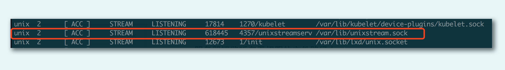

现在，我们让服务器和客户端都正常启动，并且客户端依次发送字符： 

~~~bash
$./unixstreamserver /tmp/unixstream.sock
Receive: g1
Receive: g2
Receive: g3
client quit
~~~

~~~bash
$./unixstreamclient /tmp/unixstream.sock
g1
Hi, g1
g2
Hi, g2
g3
Hi, g3
^C
~~~

我们可以看到，服务器端陆续收到客户端发送的字节，同时，客户端也收到了服务器端的应答；最后，当我们使用 Ctrl+C，让客户端程序退出时，服务器端也正常退出，这是因为在服务端的代码中，对收到的客户端发送的数据长度做了判断，如果长度为0，则主动关闭服务端程序。这是杀死客户端后引发服务端关闭的原因。这也说明客户端在被强行终止的时候，会最后向服务端发送一条空消息，告知服务器自己这边的程序关闭了。 

### 本地数据报套接字

再来看下在本地套接字上使用数据报的服务器端例子： 

~~~c
#include  "lib/common.h"

int main(int argc, char **argv) {
    if (argc != 2) {
        error(1, 0, "usage: unixdataserver <local_path>");
    }

    int socket_fd;
    socket_fd = socket(AF_LOCAL, SOCK_DGRAM, 0);
    if (socket_fd < 0) {
        error(1, errno, "socket create failed");
    }

    struct sockaddr_un servaddr;
    char *local_path = argv[1];
    unlink(local_path);
    bzero(&servaddr, sizeof(servaddr));
    servaddr.sun_family = AF_LOCAL;
    strcpy(servaddr.sun_path, local_path);

    if (bind(socket_fd, (struct sockaddr *) &servaddr, sizeof(servaddr)) < 0) {
        error(1, errno, "bind failed");
    }

    char buf[BUFFER_SIZE];
    struct sockaddr_un client_addr;
    socklen_t client_len = sizeof(client_addr);
    while (1) {
        bzero(buf, sizeof(buf));
        if (recvfrom(socket_fd, buf, BUFFER_SIZE, 0, (struct sockadd *) &client_addr, &client_len) == 0) {
            printf("client quit");
            break;
        }
        printf("Receive: %s \n", buf);

        char send_line[MAXLINE];
        bzero(send_line, MAXLINE);
        sprintf(send_line, "Hi, %s", buf);

        size_t nbytes = strlen(send_line);
        printf("now sending: %s \n", send_line);

        if (sendto(socket_fd, send_line, nbytes, 0, (struct sockadd *) &client_addr, client_len) != nbytes)
            error(1, errno, "sendto error");
    }

    close(socket_fd);

    exit(0);
}
~~~

本地数据报套接字和前面的字节流本地套接字有以下几点不同： 

* 第 9 行创建的本地套接字，这里创建的套接字类型，注意是 AF_LOCAL，协议类型为 SOCK_DGRAM。 
* 21～23 行 bind 到本地地址之后，没有再调用 listen 和 accept，回忆一下，这其实和 UDP 的性质一样。 
* 28～45 行使用 recvfrom 和 sendto 来进行数据报的收发，不再是 read 和 send，这其实也和 UDP 网络程序一致。 

然后再看一下客户端的例子： 

~~~c
#include "lib/common.h"

int main(int argc, char **argv) {
    if (argc != 2) {
        error(1, 0, "usage: unixdataclient <local_path>");
    }

    int sockfd;
    struct sockaddr_un client_addr, server_addr;

    sockfd = socket(AF_LOCAL, SOCK_DGRAM, 0);
    if (sockfd < 0) {
        error(1, errno, "create socket failed");
    }

    bzero(&client_addr, sizeof(client_addr));        /* bind an address for us */
    client_addr.sun_family = AF_LOCAL;
    strcpy(client_addr.sun_path, tmpnam(NULL));

    if (bind(sockfd, (struct sockaddr *) &client_addr, sizeof(client_addr)) < 0) {
        error(1, errno, "bind failed");
    }

    bzero(&server_addr, sizeof(server_addr));
    server_addr.sun_family = AF_LOCAL;
    strcpy(server_addr.sun_path, argv[1]);

    char send_line[MAXLINE];
    bzero(send_line, MAXLINE);
    char recv_line[MAXLINE];

    while (fgets(send_line, MAXLINE, stdin) != NULL) {
        int i = strlen(send_line);
        if (send_line[i - 1] == '\n') {
            send_line[i - 1] = 0;
        }
        size_t nbytes = strlen(send_line);
        printf("now sending %s \n", send_line);

        if (sendto(sockfd, send_line, nbytes, 0, (struct sockaddr *) &server_addr, sizeof(server_addr)) != nbytes)
            error(1, errno, "sendto error");

        int n = recvfrom(sockfd, recv_line, MAXLINE, 0, NULL, NULL);
        recv_line[n] = 0;

        fputs(recv_line, stdout);
        fputs("\n", stdout);
    }

    exit(0);
}
~~~

这个程序和 UDP 网络编程的例子基本是一致的，我们可以把它当作是用本地文件替换了 IP 地址和端口的 UDP 程序，不过，这里还是有一个非常大的不同。

这个不同点就在 16～22 行。你可以看到 16～22 行将本地套接字 bind 到本地一个路径上，然而 UDP 客户端程序是不需要这么做的。本地数据报套接字这么做的原因是，它需要指定一个本地路径，以便在服务器端回包时，可以正确地找到地址；而在 UDP 客户端程序里，数据是可以通过 UDP 包的本地地址和端口来匹配的。 

下面就是服务器端和客户端通过数据报应答的场景： 

~~~bash
./unixdataserver /tmp/unixdata.sock
Receive: g1
now sending: Hi, g1
Receive: g2
now sending: Hi, g2
Receive: g3
now sending: Hi, g3
~~~

~~~bash
$ ./unixdataclient /tmp/unixdata.sock
g1
now sending g1
Hi, g1
g2
now sending g2
Hi, g2
g3
now sending g3
Hi, g3
^C
~~~

我们可以看到，服务器端陆续收到客户端发送的数据报，同时，客户端也收到了服务器端的应答。 

## 常用工具

### ping

“ping”这个命名来自于声呐探测，在网络上用来完成对网络连通性的探测，这个命名可以说是恰如其分了：

~~~bash
$ ping www.sina.com.cn
PING www.sina.com.cn (202.102.94.124) 56(84) bytes of data.
64 bytes from www.sina.com.cn (202.102.94.124): icmp_seq=1 ttl=63 time=8.64 ms
64 bytes from www.sina.com.cn (202.102.94.124): icmp_seq=2 ttl=63 time=11.3 ms
64 bytes from www.sina.com.cn (202.102.94.124): icmp_seq=3 ttl=63 time=8.66 ms
64 bytes from www.sina.com.cn (202.102.94.124): icmp_seq=4 ttl=63 time=13.7 ms
64 bytes from www.sina.com.cn (202.102.94.124): icmp_seq=5 ttl=63 time=8.22 ms
64 bytes from www.sina.com.cn (202.102.94.124): icmp_seq=6 ttl=63 time=7.99 ms
^C
--- www.sina.com.cn ping statistics ---
6 packets transmitted, 6 received, 0% packet loss, time 5006ms
rtt min/avg/max/mdev = 7.997/9.782/13.795/2.112 ms
~~~

在上面的例子中，使用 ping 命令探测了和新浪网的网络连通性。可以看到，每次显示是按照 sequence 序列号排序显示的，一并显示的，也包括 TTL（time to live），反映了两个 IP 地址之间传输的时间。最后还显示了 ping 命令的统计信息，如最小时间、平均时间等。 

ping 是基于一种叫做 ICMP 的协议开发的，ICMP 又是一种基于 IP 协议的控制协议，翻译为网际控制协议，其报文格式如下图： 

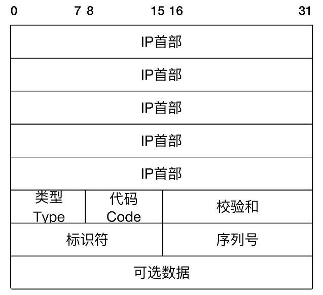

ICMP 在 IP 报文后加入了新的内容，这些内容包括： 

* 类型：即 ICMP 的类型, 其中 ping 的请求类型为 8，应答为 0。 
* 代码：进一步划分 ICMP 的类型, 用来查找产生错误的原因。 
* 校验和：用于检查错误的数据。 
* 标识符：通过标识符来确认是谁发送的控制协议，可以是进程 ID。 
* 序列号：唯一确定的一个报文，前面 ping 名字执行后显示的 icmp_seq 就是这个值。 

当我们发起 ping 命令时，ping 程序实际上会组装成如图的一个 IP 报文。报文的目的地址为 ping 的目标地址，源地址就是发送 ping 命令时的主机地址，同时按照 ICMP 报文格式填上数据，在可选数据上可以填上发送时的时间戳。 

IP 报文通过 ARP 协议，源地址和目的地址被翻译成 MAC 地址，经过数据链路层后，报文被传输出去。当报文到达目的地址之后，目的地址所在的主机也按照 ICMP 协议进行应答。之所以叫做协议，是因为双方都会遵守这个报文格式，并且也会按照格式进行发送 - 应答。 

应答数据到达源地址之后，ping 命令可以通过再次解析 ICMP 报文，对比序列号，计算时间戳等来完成每个发送 - 应答的显示，最终显示的格式就像前面的例子中展示的一样。 

可以说，ICMP 协议为我们侦测网络问题提供了非常好的支持。另外一种对路由的检测命令 Traceroute 也是通过 ICMP 协议来完成的。

### ifconfig

Windows 有一个 ipconfig 命令，用来显示当前的网络设备列表。事实上，Linux 有一个对应的命令叫做 ifconfig，也用来显示当前系统中的所有网络设备，通俗一点的说，就是网卡列表：

~~~bash
vagrant@ubuntu-xenial-01:~$ ifconfig
cni0      Link encap:Ethernet  HWaddr 0a:58:0a:f4:00:01
          inet addr:10.244.0.1  Bcast:0.0.0.0  Mask:255.255.255.0
          inet6 addr: fe80::401:b4ff:fe51:bcf9/64 Scope:Link
          UP BROADCAST RUNNING MULTICAST  MTU:1450  Metric:1
          RX packets:2133 errors:0 dropped:0 overruns:0 frame:0
          TX packets:2216 errors:0 dropped:0 overruns:0 carrier:0
          collisions:0 txqueuelen:1000
          RX bytes:139381 (139.3 KB)  TX bytes:853302 (853.3 KB)

docker0   Link encap:Ethernet  HWaddr 02:42:93:0f:f7:11
          inet addr:172.17.0.1  Bcast:0.0.0.0  Mask:255.255.0.0
          inet6 addr: fe80::42:93ff:fe0f:f711/64 Scope:Link
          UP BROADCAST RUNNING MULTICAST  MTU:1500  Metric:1
          RX packets:653 errors:0 dropped:0 overruns:0 frame:0
          TX packets:685 errors:0 dropped:0 overruns:0 carrier:0
          collisions:0 txqueuelen:0
          RX bytes:49542 (49.5 KB)  TX bytes:430826 (430.8 KB)

enp0s3    Link encap:Ethernet  HWaddr 02:54:ad:ea:60:2e
          inet addr:10.0.2.15  Bcast:10.0.2.255  Mask:255.255.255.0
          inet6 addr: fe80::54:adff:feea:602e/64 Scope:Link
          UP BROADCAST RUNNING MULTICAST  MTU:1500  Metric:1
          RX packets:7951 errors:0 dropped:0 overruns:0 frame:0
          TX packets:4123 errors:0 dropped:0 overruns:0 carrier:0
          collisions:0 txqueuelen:1000
          RX bytes:5081047 (5.0 MB)  TX bytes:385600 (385.6 KB)
~~~

解释一下这里面显示的数据：

1、下面这段表明这是一个以太网设备，MAC 地址为 02:54:ad:ea:60:2e 

~~~
Link encap:Ethernet  HWaddr 02:54:ad:ea:60:2e
~~~

2、这里显示的是网卡的 IPv4 和 IPv6 地址，其中 IPv4 还显示了该网络的子网掩码以及广播地址：

~~~bash
inet addr:10.0.2.15  Bcast:10.0.2.255  Mask:255.255.255.0
inet6 addr: fe80::54:adff:feea:602e/64 Scope:Link
~~~

在每个 IPv4 子网中，有一个特殊地址被保留作为子网广播地址，比如这里的 10.0.2.255 就是这个子网的广播地址。当向这个地址发送请求时，就会向以太网网络上的一组主机发送请求。 

通常来说，这种被称作广播（broadcast）的技术，是用 UDP 来实现的。 

3、这里显示的是网卡的状态，MTU 是最大传输单元的意思，表示的是链路层包的大小。1500 表示的是字节大小。 

~~~bash
UP BROADCAST RUNNING MULTICAST  MTU:1500  Metric:1
~~~

Metric 就是用来确定多块网卡的优先级的，数值越小，优先级越高，1 为最高级。 Linux 在一台主机上可以有多个网卡设备，很可能有这么一种情况，多个网卡可以路由到目的地。一个简单的例子是在同时有无线网卡和有线网卡的情况下，会涉及到优先级的问题。

### netstat 和 lsof

在平时的工作中，我们最常碰到的问题就是某某进程对应的网络状况如何？是不是连接被打爆了？还是有大量的 TIME_WAIT 连接？ netstat 可以帮助我们了解当前的网络连接状况，比如我想知道当前所有的连接详情，就可以使用下面这行命令： 

~~~bash
netstat -alepn
~~~

可能的结果为： 

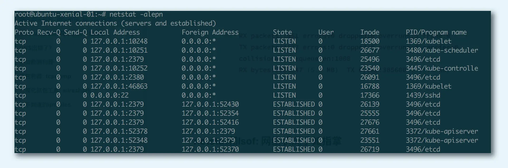

netstat 会把所有 IPv4 形态的 TCP，IPV6 形态的 TCP、UDP 以及 UNIX 域的套接字都显示出来。 

对于 TCP 类型来说，最大的好处是可以清楚地看到一条 TCP 连接的四元组（源地址、源端口、目的地地址和目的端口）。例如这里的一条信息： 

~~~
tcp        0      0 127.0.0.1:2379          127.0.0.1:52464         ESTABLISHED 0          27710       3496/etcd
~~~

它表达的意思是本地 127.0.0.1 的端口 52464 连上本地 127.0.0.1 的端口 2379，状态为 ESTABLISHED，本地进程为 etcd，进程为 3496。 

这在实战分析的时候非常有用，比如你可以很方便地知道，在某个时候是不是有很多 TIME_WAIT 的 TCP 连接，导致端口号被占用光，以致新的连接分配不了。 

我们也可以只对 UNIX 套接字进行筛查：

~~~bash
netstat Socket -x -alepn
~~~

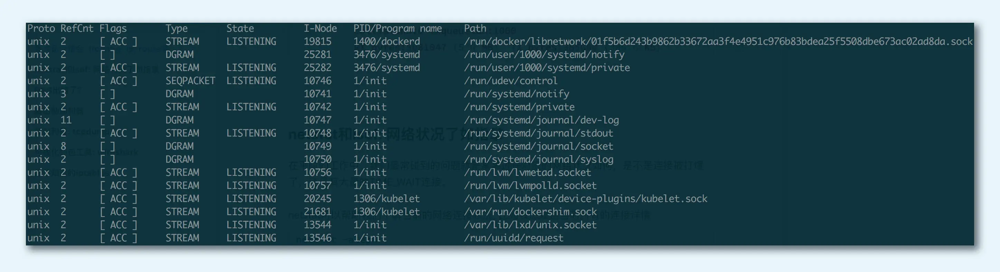

UNIX 套接字的结果稍有不同，最关键的信息是 Path，这个信息显示了本地套接字监听的文件路径，比如这条： 

~~~
unix  3      [ ]         STREAM     CONNECTED     23209    1400/dockerd        /var/run/docker.sock
~~~

这其实就是大名鼎鼎的 Docker 在本地套接字的监听路径。/var/run/docker.sock 是本地套接字监听地址，dockerd 是进程名称，1400 是进程号。 

lsof 的常见用途之一是帮助我们找出在指定的 IP 地址或者端口上打开套接字的进程，而 netstat 则告诉我们 IP 地址和端口使用的情况，以及各个 TCP 连接的状态。Isof 和 netstst 可以结合起来一起使用。 

比如说，我们可以通过 lsof 查看到底是谁打开了这个文件： 

~~~bash
lsof /var/run/docker.sock
~~~

下面这张图显示了是 dockerd 打开了这个本地文件套接字： 

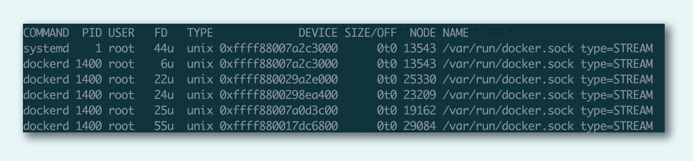

lsof 还有一个非常常见的用途。如果我们启动了一个服务器程序，发现这个服务器需要绑定的端口地址已经被占用，内核报出“该地址已在使用”的出错信息，我们可以使用 lsof 找出正在使用该端口的那个进程。比如下面这个代码，就帮我们找到了使用 8080 端口的那个进程，从而帮助我们定位问题。 

~~~bash
lsof -i :8080
~~~

### tcpdump

tcpdump 这样的抓包工具对于网络编程而言是非常有用的。tcpdump 不仅可以处理TCP，这个工具还可以对 UDP 包进行抓包处理 

tcpdump 具有非常强大的过滤和匹配功能。 

~~~bash
指定网卡：
tcpdump -i eth0
指定来源：
tcpdump src host hostname
~~~

这里抓的包是 TCP，且端口是 80，包来自 IP 地址为 192.168.1.25 的主机地址：

~~~bash
tcpdump 'tcp and port 80 and src host 192.168.1.25' 
~~~

如果我们对 TCP 协议非常熟悉，还可以写出这样的 tcpdump 命令： 

~~~bash
tcpdump 'tcp and port 80 and tcp[13:1]&2 != 0'
~~~

这里 tcp[13:1]表示的是 TCP 头部开始处偏移为 13 的字节，如果这个值为 2，说明设置了 SYN 分节，当然，我们也可以设置成其他值来获取希望类型的分节。注意，这里的偏移是从 0 开始算起的，tcp[13]其实是报文里的第 14 个字节。 

tcpdump 在开启抓包的时候，会自动创建一个类型为 AF_PACKET 的网络套接口，并向系统内核注册。当网卡接收到一个网络报文之后，它会遍历系统中所有已经被注册的网络协议，包括其中已经注册了的 AF_PACKET 网络协议。系统内核接下来就会将网卡收到的报文发送给该协议的回调函数进行一次处理，回调函数可以把接收到的报文完完整整地复制一份，假装是自己接收到的报文，然后交给 tcpdump 程序，进行各种条件的过滤和判断，再对报文进行解析输出。 

下面这张图显示的是 tcpdump 的输出格式： 

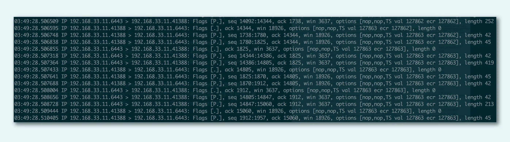

首先我们看到的是时间戳，之后类似 192.168.33.11.41388 > 192.168.33.11.6443 这样的，显示的是源地址（192.168.33.11.41388）到目的地址（192.168.33.11.6443）；然后 Flags [ ]是包的标志，[P]表示是数据推送，比较常见的包格式如下： 

* [S]：SYN，表示开始连接 
* [.]：没有标记，一般是确认 
* [P]：PSH，表示数据推送 
* [F]：FIN，表示结束连接 
* [R] ：RST，表示重启连接 

我们可以看到最后有几个数据，它们代表的含义如下： 

* seq：包序号，就是 TCP 的确认分组 
* cksum：校验码 
* win：滑动窗口大小 
* length：承载的数据（payload）长度 length，如果没有数据则为 0 

此外，tcpdump 还可以对每条 TCP 报文的细节进行显示，让我们可以看到每条报文的详细字节信息。这在对报文进行排查的时候很有用。 

# 进阶

## TIME_WAIT

### 出现场景

先从一例线上故障说起。在一次升级线上应用服务之后，我们发现该服务的可用性变得时好时坏，一段时间可以对外提供服务，一段时间突然又不可以，大家都百思不得其解。运维同学登录到服务所在的主机上，使用 netstat 命令查看后才发现，主机上有成千上万处于 TIME_WAIT 状态的连接。 

经过层层剖析后，我们发现罪魁祸首就是 TIME_WAIT。 我们这个应用服务需要通过发起 TCP 连接对外提供服务。每个连接会占用一个本地端口，当在高并发的情况下，TIME_WAIT 状态的连接过多，多到把本机可用的端口耗尽，应用服务对外表现的症状，就是不能正常工作了。当过了一段时间之后，处于 TIME_WAIT 的连接被系统回收并关闭后，释放出本地端口可供使用，应用服务对外表现为，可以正常工作。这样周而复始，便会出现了一会儿不可以，过一两分钟又可以正常工作的现象。 

TCP 的四次挥手会在发起连接终止的一方产生TIME_WAIT 状态：

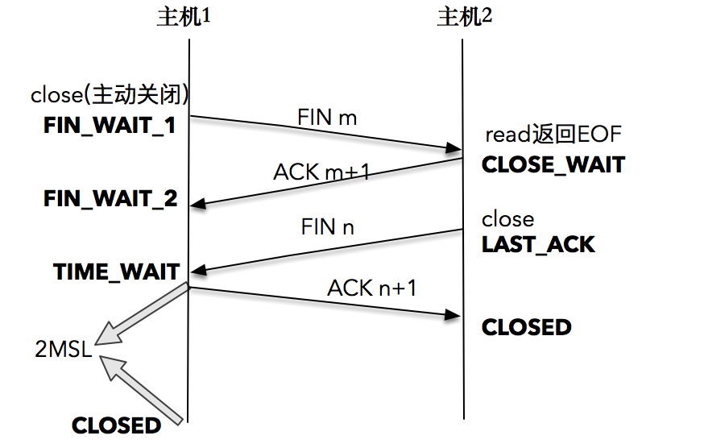

首先，一方应用程序调用 close，我们称该方为主动关闭方，该端的 TCP 发送一个 FIN 包，表示需要关闭连接。之后主动关闭方进入 FIN_WAIT_1 状态。 

接着，接收到这个 FIN 包的对端执行被动关闭。这个 FIN 由 TCP 协议栈处理，我们知道，TCP 协议栈为 FIN 包插入一个文件结束符 EOF 到接收缓冲区中，应用程序可以通过 read 调用来感知这个 FIN 包。一定要注意，这个 EOF 会被放在已排队等候的其他已接收的数据之后，这就意味着接收端应用程序需要处理这种异常情况，因为 EOF 表示在该连接上再无额外数据到达。此时，被动关闭方进入 CLOSE_WAIT 状态。 

接下来，被动关闭方将读到这个 EOF，于是，应用程序也调用 close 关闭它的套接字，这导致它的 TCP 也发送一个 FIN 包。这样，被动关闭方将进入 LAST_ACK 状态。 

最终，主动关闭方接收到对方的 FIN 包，并确认这个 FIN 包。主动关闭方进入 TIME_WAIT 状态，而接收到 ACK 的被动关闭方则进入 CLOSED 状态。经过 2MSL 时间之后，主动关闭方也进入 CLOSED 状态。 

如果是使用shutdown，执行一端到另一端的半关闭也是可以的。 当套接字被关闭时，TCP 为其所在端发送一个 FIN 包。在大多数情况下，这是由应用进程调用 close 而发生的，值得注意的是，一个进程无论是正常退出（exit 或者 main 函数返回），还是非正常退出（比如，收到 SIGKILL 信号关闭，就是我们常常干的 kill -9），所有该进程打开的描述符都会被系统关闭，这也导致 TCP 描述符对应的连接上发出一个 FIN 包。 

无论是客户端还是服务器，任何一端都可以发起主动关闭。大多数真实情况是客户端执行主动关闭，但是当年的HTTP/1.0 却是由服务器发起主动关闭的。 

主机 1 在 TIME_WAIT 停留持续时间是固定的，是最长分节生命期 MSL（maximum segment lifetime）的两倍，一般称之为 2MSL。和大多数 BSD 派生的系统一样，Linux 系统里有一个硬编码的字段，名称为TCP_TIMEWAIT_LEN，其值为 60 秒。也就是说，Linux 系统停留在 TIME_WAIT 的时间为固定的 60 秒：

~~~
#define TCP_TIMEWAIT_LEN (60*HZ) /* how long to wait to destroy TIME-        WAIT state, about 60 seconds  */
~~~

只有发起连接终止的一方会进入 TIME_WAIT 状态。 

MSL 是任何 IP 数据报能够在因特网中存活的最长时间。其实它的实现不是靠计时器来完成的，在每个数据报里都包含有一个被称为 TTL（time to live）的 8 位字段，它的最大值为 255。TTL 可译为“生存时间”，这个生存时间由源主机设置初始值，它表示的是一个 IP 数据报可以经过的最大跳跃数，每经过一个路由器，就相当于经过了一跳，它的值就减 1，当此值减为 0 时，则所在的路由器会将其丢弃，同时发送 ICMP 报文通知源主机。RFC793 中规定 MSL 的时间为 2 分钟，Linux 实际设置为 30 秒。 TTL与MSL是有关系的但不是简单的相等的关系。

### 作用和危害

之所以发起连接的一方不会直接进入 CLOSED 状态，而要停留在 TIME_WAIT 这个状态，原因有如下几个：

1、首先，这样做是为了确保最后的 ACK 能让被动关闭方接收，从而帮助其正常关闭。 

TCP 在设计的时候，做了充分的容错性设计，比如，TCP 假设报文会出错，需要重传。在这里，如果图中主机 1 的 ACK 报文没有传输成功，那么主机 2 就会重新发送 FIN 报文。 如果主机 1 没有维护 TIME_WAIT 状态，而直接进入 CLOSED 状态，它就失去了当前状态的上下文，只能回复一个 RST 操作，从而导致被动关闭方出现错误。 

现在主机 1 知道自己处于 TIME_WAIT 的状态，就可以在接收到 FIN 报文之后，重新发出一个 ACK 报文，使得主机 2 可以进入正常的 CLOSED 状态。 

2、第二个理由和连接“化身”和报文迷走有关系，为了让旧连接的重复分节在网络中自然消失。 

在网络中，经常会发生报文经过一段时间才能到达目的地的情况，产生的原因是多种多样的，如路由器重启，链路突然出现故障等。如果迷走报文到达时，发现 TCP 连接四元组（源 IP，源端口，目的 IP，目的端口）所代表的连接不复存在，那么很简单，这个报文自然丢弃。 

考虑这样一个场景，在原连接中断后，又重新创建了一个原连接的“化身”，说是化身其实是因为这个连接和原先的连接四元组完全相同，如果迷失报文经过一段时间也到达，那么这个报文会被误认为是连接“化身”的一个 TCP 分节，旧信息被认为是新连接的通信内容，这样就会对 TCP 通信产生影响。 

所以，TCP 就设计出了这么一个机制，经过 2MSL 这个时间，足以让两个方向上的分组都被丢弃，使得原来连接的分组在网络中都自然消失，再出现的分组一定都是新化身所产生的。 

2MSL 的时间是从主机 1 接收到 FIN 后发送 ACK 开始计时的；如果在 TIME_WAIT 时间内，因为主机 1 的 ACK 没有传输到主机 2，主机 1 又接收到了主机 2 重发的 FIN 报文，那么 2MSL 时间将重新计时。道理很简单，因为 2MSL 的时间，目的是为了让旧连接的所有报文都能自然消亡，现在主机 1 重新发送了 ACK 报文，自然需要重新计时，以便防止这个 ACK 报文对新可能的连接化身造成干扰。 

过多的 TIME_WAIT 的主要危害有两种：

* 第一是内存资源占用，这个目前看来不是太严重，基本可以忽略。 
* 第二是对端口资源的占用，一个 TCP 连接至少消耗一个本地端口。要知道，端口资源也是有限的，一般可以开启的端口为 32768～61000 ，也可以通过net.ipv4.ip_local_port_range指定，如果 TIME_WAIT 状态过多，会导致无法创建新连接。 

### 优化TIME_WAIT

在高并发的情况下，如果我们想对 TIME_WAIT 做一些优化，有如下几种措施

1、net.ipv4.tcp_max_tw_buckets 

一个暴力的方法是通过 sysctl 命令，将系统值调小。这个值默认为 18000，当系统中处于 TIME_WAIT 的连接一旦超过这个值时，系统就会将所有的 TIME_WAIT 连接状态重置，并且只打印出警告信息。这个方法过于暴力，而且治标不治本，带来的问题远比解决的问题多，不推荐使用。 

2、调低 TCP_TIMEWAIT_LEN 

这个方法是一个不错的方法，缺点是需要“一点”内核方面的知识，能够重新编译内核。 

3、SO_LINGER 的设置 

英文单词“linger”的意思为停留，我们可以通过设置套接字选项，来设置调用 close 或者 shutdown 关闭连接时的行为。 

~~~c
int setsockopt(int sockfd, int level, int optname, const void *optval,
　　　　　　　　socklen_t optlen);
~~~

~~~c
struct linger {
　int　 l_onoff;　　　　/* 0=off, nonzero=on */
　int　 l_linger;　　　　/* linger time, POSIX specifies units as seconds */
}
~~~

设置 linger 参数有几种可能： 

* 如果l_onoff为 0，那么关闭本选项。l_linger的值被忽略，这对应了默认行为，close 或 shutdown 立即返回。如果在套接字发送缓冲区中有数据残留，系统会将试着把这些数据发送出去。 

* 如果l_onoff为非 0， 且l_linger值也为 0，那么调用 close 后，会立该发送一个 RST 标志给对端，该 TCP 连接将跳过四次挥手，也就跳过了 TIME_WAIT 状态，直接关闭。这种关闭的方式称为“强行关闭”。 在这种情况下，排队数据不会被发送，被动关闭方也不知道对端已经彻底断开。只有当被动关闭方正阻塞在recv()调用上时，接受到 RST 时，会立刻得到一个“connet reset by peer”的异常。 

  ~~~c
  struct linger so_linger;
  so_linger.l_onoff = 1;
  so_linger.l_linger = 0;
  setsockopt(s,SOL_SOCKET,SO_LINGER, &so_linger,sizeof(so_linger));
  ~~~

* 如果l_onoff为非 0， 且l_linger的值也非 0，那么调用 close 后，调用 close 的线程就将阻塞，直到数据被发送出去，或者设置的l_linger计时时间到。 

第二种可能为跨越 TIME_WAIT 状态提供了一个可能，不过是一个非常危险的行为，不值得提倡。 

4、net.ipv4.tcp_tw_reuse：更安全的设置 

Linux 系统对于net.ipv4.tcp_tw_reuse的解释如下: 

~~~
Allow to reuse TIME-WAIT sockets for new connections when it is safe from protocol viewpoint. Default value is 0.It should not be changed without advice/request of technical experts.
~~~

这段话的大意是从协议角度理解如果是安全可控的，可以复用处于 TIME_WAIT 的套接字为新的连接所用。 

协议角度理解的安全可控，主要有两点：

* 只适用于连接发起方（C/S 模型中的客户端）； 
* 对应的 TIME_WAIT 状态的连接创建时间超过 1 秒才可以被复用。 

使用这个选项，还有一个前提，需要打开对 TCP 时间戳的支持，即net.ipv4.tcp_timestamps=1（默认即为 1）。 

TCP 协议也在与时俱进，RFC 1323 中实现了 TCP 拓展规范，以便保证 TCP 的高可用，并引入了新的 TCP 选项，两个 4 字节的时间戳字段，用于记录 TCP 发送方的当前时间戳和从对端接收到的最新时间戳。由于引入了时间戳，我们在前面提到的 2MSL 问题就不复存在了，因为重复的数据包会因为时间戳过期被自然丢弃。 

RFC 1323 引入了 TCP 时间戳，这并不需要在发送方和接收方之间定义一个统一的时钟，可以在第一次交换双方的时钟，之后用相对时间就可以了。 

它也有它自己的问题：reuse最大的问题是发rst包时不会加时间戳（有内核源码为证），可能会导致连接被异常关闭。

## 关闭连接

一个 TCP 连接需要经过三次握手进入数据传输阶段，最后来到连接关闭阶段。 一个 TCP 连接需要经过三次握手进入数据传输阶段，最后来到连接关闭阶段。 

TCP 是双向的，这里说的方向，指的是数据流的写入 - 读出的方向：

* 客户端到服务器端的方向，指的是客户端通过套接字接口，向服务器端发送 TCP 报文； 
* 服务器端到客户端方向则是另一个传输方向。在绝大多数情况下，TCP 连接都是先关闭一个方向，此时另外一个方向还是可以正常进行数据传输。 

举个例子，客户端主动发起连接的中断，将自己到服务器端的数据流方向关闭，此时，客户端不再往服务器端写入数据，服务器端读完客户端数据后就不会再有新的报文到达。但这并不意味着，TCP 连接已经完全关闭，很有可能的是，服务器端正在对客户端的最后报文进行处理，比如去访问数据库，存入一些数据；或者是计算出某个客户端需要的值，当完成这些操作之后，服务器端把结果通过套接字写给客户端，我们说这个套接字的状态此时是“半关闭”的。最后，服务器端才有条不紊地关闭剩下的半个连接，结束这一段 TCP 连接的使命。 

这里描述的是服务器端“优雅”地关闭了连接。如果服务器端处理不好，就会导致最后的关闭过程是“粗暴”的，达不到我们上面描述的“优雅”关闭的目标，形成的后果，很可能是服务器端处理完的信息没办法正常传送给客户端，破坏了用户侧的使用场景。 

关闭连接的方式，可以分为两种：

### close

最常见的 close 函数： 

~~~c
int close(int sockfd)
~~~

这个函数很简单，对已连接的套接字执行 close 操作就可以，若成功则为 0，若出错则为 -1。 

这个函数会对套接字引用计数减一，一旦发现套接字引用计数到 0，就会对套接字进行彻底释放，并且会关闭 TCP 两个方向的数据流。 

套接字引用计数的概念：因为套接字可以被多个进程共享，你可以理解为我们给每个套接字都设置了一个积分，如果我们通过 fork 的方式产生子进程，套接字就会积分 +1， 如果我们调用一次 close 函数，套接字积分就会 -1。这就是套接字引用计数的含义。 

具体来说，对两个方向的数据流：

* 在输入方向，系统内核会将该套接字设置为不可读，任何读操作都会返回异常。 
* 在输出方向，系统内核尝试将发送缓冲区的数据发送给对端，并最后向对端发送一个 FIN 报文，接下来如果再对该套接字进行写操作会返回异常。 

如果对端没有检测到套接字已关闭，还继续发送报文，就会收到一个 RST 报文，相当于告诉对端：“Hi, 我已经关闭了，别再给我发数据了。” 

我们会发现，close 函数并不能帮助我们关闭连接的一个方向，因为一旦调用，两个方向的传输都会关闭。在需要的时候关闭一个方向的方法就是shutdown函数

### shutdown

shutdown 函数的原型是这样的： 

~~~c
int shutdown(int sockfd, int howto)
~~~

对已连接的套接字执行 shutdown 操作，若成功则为 0，若出错则为 -1。 

howto 是这个函数的设置选项，它的设置有三个主要选项： 

* SHUT_RD(0)：关闭连接的“读”这个方向，对该套接字进行读操作直接返回 EOF。从数据角度来看，套接字上接收缓冲区已有的数据将被丢弃，如果再有新的数据流到达，会对数据进行 ACK，然后悄悄地丢弃。也就是说，对端还是会接收到 ACK，在这种情况下根本不知道数据已经被丢弃了。 
* SHUT_WR(1)：关闭连接的“写”这个方向，这就是常被称为“半关闭”的连接。此时，不管套接字引用计数的值是多少，都会直接关闭连接的写方向。套接字上发送缓冲区已有的数据将被立即发送出去，并发送一个 FIN 报文给对端。应用程序如果对该套接字进行写操作会报错。 
* SHUT_RDWR(2)：相当于 SHUT_RD 和 SHUT_WR 操作各一次，关闭套接字的读和写两个方向。 

shutdown可以灵活的选择关闭读方向，或者写方向。

两个函数的差别：

* 第一个差别：close 会关闭连接，并释放所有连接对应的资源，而 shutdown 并不会释放掉套接字和所有的资源。 
* 第二个差别：close 存在引用计数的概念，并不一定导致该套接字不可用；shutdown 则不管引用计数，直接使得该套接字不可用，如果有别的进程企图使用该套接字，将会受到影响。 
* 第三个差别：close 的引用计数导致不一定会发出 FIN 结束报文，而 shutdown 则总是会发出 FIN 结束报文，这在我们打算关闭连接通知对端的时候，是非常重要的。 

### 关闭连接案例

下面将构建一组客户端和服务器程序，来进行 close 和 shutdown 的实验。 

客户端程序，从标准输入不断接收用户输入，把输入的字符串通过套接字发送给服务器端，同时，将服务器端的应答显示到标准输出上。 

根据输入的内容，客户端可以控制关闭的方式：

* 如果用户输入了“close”，则会调用 close 函数关闭连接，休眠一段时间，等待服务器端处理后退出； 
* 如果用户输入了“shutdown”，调用 shutdown 函数关闭连接的写方向，注意我们不会直接退出，而是会继续等待服务器端的应答，直到服务器端完成自己的操作，在另一个方向上完成关闭。 

在这个例子中会接触到select 多路复用，select 使得我们可以同时完成对连接套接字和标准输入两个 I/O 对象的处理。

~~~c
# include "lib/common.h"
# define    MAXLINE     4096

int main(int argc, char **argv) {
    if (argc != 2) {
        error(1, 0, "usage: graceclient <IPaddress>");
    }
    
    int socket_fd;
    socket_fd = socket(AF_INET, SOCK_STREAM, 0);

    struct sockaddr_in server_addr;
    bzero(&server_addr, sizeof(server_addr));
    server_addr.sin_family = AF_INET;
    server_addr.sin_port = htons(SERV_PORT);
    inet_pton(AF_INET, argv[1], &server_addr.sin_addr);

    socklen_t server_len = sizeof(server_addr);
    int connect_rt = connect(socket_fd, (struct sockaddr *) &server_addr, server_len);
    if (connect_rt < 0) {
        error(1, errno, "connect failed ");
    }

    char send_line[MAXLINE], recv_line[MAXLINE + 1];
    int n;

    fd_set readmask;
    fd_set allreads;

    FD_ZERO(&allreads);
    FD_SET(0, &allreads);
    FD_SET(socket_fd, &allreads);
    for (;;) {
        readmask = allreads;
        int rc = select(socket_fd + 1, &readmask, NULL, NULL, NULL);
        if (rc <= 0)
            error(1, errno, "select failed");
        if (FD_ISSET(socket_fd, &readmask)) {
            n = read(socket_fd, recv_line, MAXLINE);
            if (n < 0) {
                error(1, errno, "read error");
            } else if (n == 0) {
                error(1, 0, "server terminated \n");
            }
            recv_line[n] = 0;
            fputs(recv_line, stdout);
            fputs("\n", stdout);
        }
        if (FD_ISSET(0, &readmask)) {
            if (fgets(send_line, MAXLINE, stdin) != NULL) {
                if (strncmp(send_line, "shutdown", 8) == 0) {
                    FD_CLR(0, &allreads);
                    if (shutdown(socket_fd, 1)) {
                        error(1, errno, "shutdown failed");
                    }
                } else if (strncmp(send_line, "close", 5) == 0) {
                    FD_CLR(0, &allreads);
                    if (close(socket_fd)) {
                        error(1, errno, "close failed");
                    }
                    sleep(6);
                    exit(0);
                } else {
                    int i = strlen(send_line);
                    if (send_line[i - 1] == '\n') {
                        send_line[i - 1] = 0;
                    }

                    printf("now sending %s\n", send_line);
                    size_t rt = write(socket_fd, send_line, strlen(send_line));
                    if (rt < 0) {
                        error(1, errno, "write failed ");
                    }
                    printf("send bytes: %zu \n", rt);
                }

            }
        }

    }

}
~~~

这个程序的细节展开解释：

第一部分是套接字的创建和 select 初始化工作： 

* 9-10 行创建了一个 TCP 套接字； 
* 12-16 行设置了连接的目标服务器 IPv4 地址，绑定到了指定的 IP 和端口； 
* 18-22 行使用创建的套接字，向目标 IPv4 地址发起连接请求； 
* 30-32 行为使用 select 做准备，初始化描述字集。 

第二部分是程序的主体部分，从 33-80 行， 使用 select 多路复用观测在连接套接字和标准输入上的 I/O 事件，其中： 

* 38-48 行：当连接套接字上有数据可读，将数据读入到程序缓冲区中。40-41 行，如果有异常则报错退出；42-43 行如果读到服务器端发送的 EOF 则正常退出。 

* 49-77 行：当标准输入上有数据可读，读入后进行判断。如果输入的是“shutdown”，则关闭标准输入的 I/O 事件感知，并调用 shutdown 函数关闭写方向；如果输入的是“close”，则调用 close 函数关闭连接；64-74 行处理正常的输入，将回车符截掉，调用 write 函数，通过套接字将数据发送给服务器端。 

  注意这里客户端是使用shutdown关闭了写这个方向，这意味着服务器依然可以向客户端发送数据，而且客户端可以正常读取。

  服务器端程序中，直接调用exit(0)完成了 FIN 报文的发送，这是因为在调用exit之后进程会退出，而进程相关的所有的资源，文件，内存，信号等内核分配的资源都会被释放。

服务器端程序稍微简单一点，连接建立之后，打印出接收的字节，并重新格式化后，发送给客户端。 有一点需要注意，那就是对 SIGPIPE 这个信号的处理：

~~~c
#include "lib/common.h"

static int count;

static void sig_int(int signo) {
    printf("\nreceived %d datagrams\n", count);
    exit(0);
}

int main(int argc, char **argv) {
    int listenfd;
    listenfd = socket(AF_INET, SOCK_STREAM, 0);

    struct sockaddr_in server_addr;
    bzero(&server_addr, sizeof(server_addr));
    server_addr.sin_family = AF_INET;
    server_addr.sin_addr.s_addr = htonl(INADDR_ANY);
    server_addr.sin_port = htons(SERV_PORT);

    int rt1 = bind(listenfd, (struct sockaddr *) &server_addr, sizeof(server_addr));
    if (rt1 < 0) {
        error(1, errno, "bind failed ");
    }

    int rt2 = listen(listenfd, LISTENQ);
    if (rt2 < 0) {
        error(1, errno, "listen failed ");
    }

    signal(SIGINT, sig_int);
    signal(SIGPIPE, SIG_IGN);

    int connfd;
    struct sockaddr_in client_addr;
    socklen_t client_len = sizeof(client_addr);

    if ((connfd = accept(listenfd, (struct sockaddr *) &client_addr, &client_len)) < 0) {
        error(1, errno, "bind failed ");
    }

    char message[MAXLINE];
    count = 0;

    for (;;) {
        int n = read(connfd, message, MAXLINE);
        if (n < 0) {
            error(1, errno, "error read");
        } else if (n == 0) {
            error(1, 0, "client closed \n");
        }
        message[n] = 0;
        printf("received %d bytes: %s\n", n, message);
        count++;

        char send_line[MAXLINE];
        sprintf(send_line, "Hi, %s", message);

        sleep(5);

        int write_nc = send(connfd, send_line, strlen(send_line), 0);
        printf("send bytes: %zu \n", write_nc);
        if (write_nc < 0) {
            error(1, errno, "error write");
        }
    }
}
~~~

服务器端程序第一部分是套接字和连接创建过程： 

* 11-12 行创建了一个 TCP 套接字； 
* 14-18 行设置了本地服务器 IPv4 地址，绑定到了 ANY 地址和指定的端口； 
* 20-40 行使用创建的套接字，依次执行 bind、listen 和 accept 操作，完成连接建立。 

第二部分是程序的主体，通过 read 函数获取客户端传送来的数据流，并回送给客户端： 

* 51-52 行显示收到的字符串，在 56 行对原字符串进行重新格式化，之后调用 send 函数将数据发送给客户端。注意，在发送之前，让服务器端程序休眠了 5 秒，以模拟服务器端处理的时间。 

启动服务器，再启动客户端，依次在标准输入上输入 data1、data2 和 close，观察一段时间后我们看到： 

~~~bash
$./graceclient 127.0.0.1
data1
now sending data1
send bytes:5
data2
now sending data2
send bytes:5
close
~~~

~~~bash
$./graceserver
received 5 bytes: data1
send bytes: 9
received 5 bytes: data2
send bytes: 9
client closed
~~~

客户端依次发送了 data1 和 data2，服务器端也正常接收到 data1 和 data2。在客户端 close 掉整个连接之后，服务器端接收到 SIGPIPE 信号，直接退出。客户端并没有收到服务器端的应答数据。 

下面这张图详细解释了客户端和服务器端交互的时序图。因为客户端调用 close 函数关闭了整个连接，当服务器端发送的“Hi, data1”分组到底时，客户端给回送一个 RST 分组；服务器端再次尝试发送“Hi, data2”第二个应答分组时，系统内核通知 SIGPIPE 信号。这是因为，在 RST 的套接字进行写操作，会直接触发 SIGPIPE 信号。 

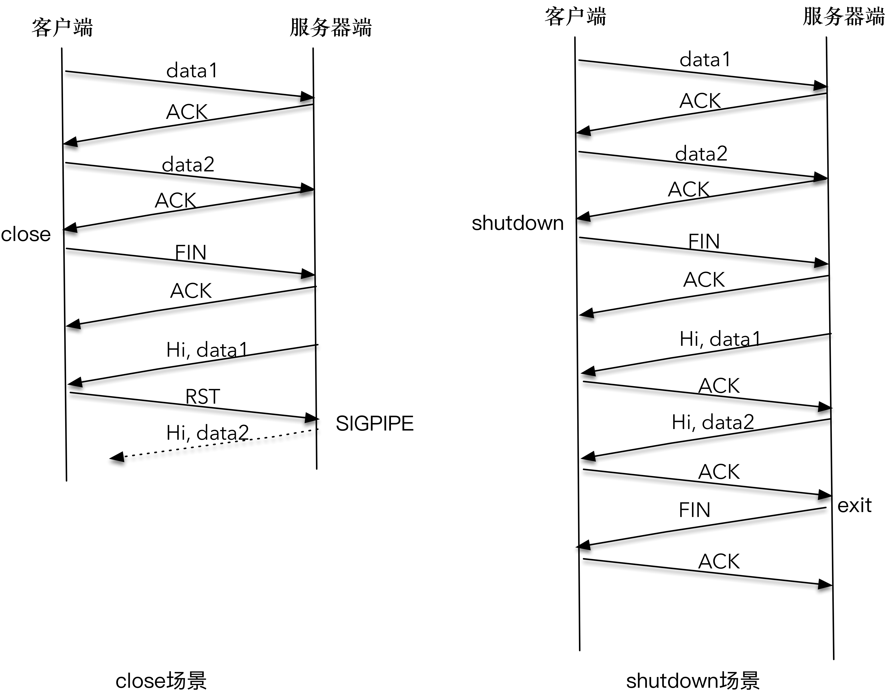

我们可以像这样注册一个信号处理函数，对 SIGPIPE 信号进行处理，避免程序莫名退出： 

~~~c
static void sig_pipe(int signo) {
    printf("\nreceived %d datagrams\n", count);
    exit(0);
}
signal(SIGINT, sig_pipe);
~~~

（Linux中信号的处理有三种，默认处理，忽略处理，自定义处理。默认处理就是采用系统自定义的操作，大部分信号的默认处理都是杀死进程，忽略处理就是当做什么都没有发生。 ）

接下来，再次启动服务器，再启动客户端，依次在标准输入上输入 data1、data2 和 shutdown 函数，观察一段时间后我们看到： 

~~~c
$./graceclient 127.0.0.1
data1
now sending data1
send bytes:5
data2
now sending data2
send bytes:5
shutdown
Hi, data1
Hi，data2
server terminated
~~~

~~~c
$./graceserver
received 5 bytes: data1
send bytes: 9
received 5 bytes: data2
send bytes: 9
client closed
~~~

和前面的结果不同，服务器端输出了 data1、data2；客户端也输出了“Hi,data1”和“Hi,data2”，客户端和服务器端各自完成了自己的工作后，正常退出。 

因为客户端调用 shutdown 函数只是关闭连接的一个方向，服务器端到客户端的这个方向还可以继续进行数据的发送和接收，所以“Hi,data1”和“Hi,data2”都可以正常传送；当服务器端读到 EOF 时，立即向客户端发送了 FIN 报文，客户端在 read 函数中感知了 EOF，也进行了正常退出。 

## 连接状态的检测

在应用开发中，有时消息正确被传递到服务端，但服务端没有做出处理。后来经排查发现，客户端显示的到服务端的连接虽然是正常的，但实际上，这个连接已经是无效的了。 这是因为服务器曾经崩溃过，服务器和客户端之间的连接中断 FIN 包，由于异常情况，没能够正常到达客户端，这样造成的结果就是客户端一直维护一个过时的连接，不会受到服务器发来的消息。

这个故障的根本原因在于，作为客户端，没有及时对连接的有效性进行检测，这样就造成了问题。 

### TCP Keep-Alive 选项

TCP 有一个保持活跃的机制叫做 Keep-Alive。 

这个机制的原理是这样的： 

定义一个时间段，在这个时间段内，如果没有任何连接相关的活动，TCP 保活机制会开始作用，每隔一个时间间隔，发送一个探测报文，该探测报文包含的数据非常少，如果连续几个探测报文都没有得到响应，则认为当前的 TCP 连接已经死亡，系统内核将错误信息通知给上层应用程序。 

上述的可定义变量，分别被称为保活时间、保活时间间隔和保活探测次数。在 Linux 系统中，这些变量分别对应 sysctl 变量net.ipv4.tcp_keepalive_time、net.ipv4.tcp_keepalive_intvl、 net.ipv4.tcp_keepalve_probes，默认设置是 7200 秒（2 小时）、75 秒和 9 次探测。 

如果开启了 TCP 保活，需要考虑以下几种情况： 

* 第一种，对端程序是正常工作的。当 TCP 保活的探测报文发送给对端, 对端会正常响应，这样 TCP 保活时间会被重置，等待下一个 TCP 保活时间的到来。 
* 第二种，对端程序崩溃并重启。当 TCP 保活的探测报文发送给对端后，对端是可以响应的，但由于没有该连接的有效信息，会产生一个 RST 报文（没有握手就受到了消息），这样很快就会发现 TCP 连接已经被重置。 
* 第三种，是对端程序崩溃，或对端由于其他原因导致报文不可达。当 TCP 保活的探测报文发送给对端后，石沉大海，没有响应，连续几次，达到保活探测次数后，TCP 会报告该 TCP 连接已经死亡。 

TCP 保活机制默认是关闭的，当我们选择打开时，可以分别在连接的两个方向上开启，也可以单独在一个方向上开启：

* 如果开启服务器端到客户端的检测，就可以在客户端非正常断连的情况下清除在服务器端保留的“脏数据” 
* 开启客户端到服务器端的检测，就可以在服务器无响应的情况下，重新发起连接。 

之所以TCP未提供一个频率很好的保活机制，是因为早期的网络带宽非常有限，如果提供一个频率很高的保活机制，对有限的带宽是一个比较严重的浪费。 

如果使用 TCP 自身的 keep-Alive 机制，在 Linux 系统中，最少需要经过 2 小时 11 分 15 秒才可以发现一个“死亡”连接。 这个时间就是2 小时，加上 75 秒乘以 9 的总和。

实际上，对很多对时延要求敏感的系统中，这个时间间隔是不可接受的。 我们可以通过在应用程序中模拟 TCP Keep-Alive 机制，来完成在应用层的连接探活。 

我们可以设计一个 PING-PONG 的机制，需要保活的一方，比如客户端，在保活时间达到后，发起对连接的 PING 操作，如果服务器端对 PING 操作有回应，则重新设置保活时间，否则对探测次数进行计数，如果最终探测次数达到了保活探测次数预先设置的值之后，则认为连接已经无效。 

虽然 TCP 没有提供系统的保活能力，让应用程序可以方便地感知连接的存活，但是，我们可以在应用程序里灵活地建立这种机制。一般来说，这种机制的建立依赖于系统定时器，以及恰当的应用层报文协议。比如，使用心跳包就是这样一种保持 Keep Alive 的机制。 

### 连接探活案例

具体在应用层完成连接探活的案例略

## 动态数据传输

我们已经可以使用 write 或者 send 方法来进行数据流的发送，调用这些接口并不意味着数据被真正发送到网络上，其实，这些数据只是从应用程序中被拷贝到了系统内核的套接字缓冲区中，或者说是发送缓冲区中，等待协议栈的处理。至于这些数据是什么时候被发送出去的，对应用程序来说，是无法预知的。对这件事情真正负责的，是运行于操作系统内核的 TCP 协议栈实现模块。 

### 生产者 - 消费者模型

我们可以把理想中的 TCP 协议可以想象成一队运输货物的货车，运送的货物就是 TCP 数据包，这些货车将数据包从发送端运送到接收端，就这样不断周而复始。 

货物达到接收端之后，是需要卸货处理、登记入库的，接收端肯定会和发送端不断地进行信息同步，比如接收端通知发送端：“后面那 20 车你给我等等，等我这里腾出地方你再继续发货。” 。其实这就是发送窗口和接收窗口的本质，发送窗口和接收窗口是 TCP 连接的双方，一个作为生产者，一个作为消费者，为了达到一致协同的生产 - 消费速率、而产生的算法模型实现。 

作为 TCP 发送端，也就是生产者，不能忽略 TCP 的接收端，也就是消费者的实际状况，不管不顾地把数据包都传送过来。如果都传送过来，消费者来不及消费，必然会丢弃；而丢弃反过来使得生产者又重传，发送更多的数据包，最后导致网络崩溃。 

TCP 的生产者 - 消费者模型，不仅需要考虑单个连接的数据传递，也要考虑到整个网络状况，毕竟TCP 数据包是需要经过网卡、交换机、核心路由器等一系列的网络设备的，网络设备本身的能力也是有限的，当多个连接的数据包同时在网络上传送时，势必会发生带宽争抢、数据丢失等。TCP 就必须考虑多个连接共享在有限的带宽上，兼顾效率和公平性的控制，这就是拥塞控制的本质。 

在 TCP 协议中，拥塞控制是通过拥塞窗口来完成的，拥塞窗口的大小会随着网络状况实时调整：

*  拥塞控制常用的算法有“慢启动”，它通过一定的规则，慢慢地将网络发送数据的速率增加到一个阈值。 
*  超过这个阈值之后，慢启动就结束了，另一个叫做“拥塞避免”的算法登场。在这个阶段，TCP 会不断地探测网络状况，并随之不断调整拥塞窗口的大小。 

在任何一个时刻，TCP 发送缓冲区的数据是否能真正发送出去，至少取决于两个因素，一个是当前的发送窗口大小，另一个是拥塞窗口大小，而 TCP 协议中总是取两者中最小值作为判断依据。 比如当前发送的字节为 100，发送窗口的大小是 200，拥塞窗口的大小是 80，那么取 200 和 80 中的最小值，就是 80，当前发送的字节数显然是大于拥塞窗口的，结论就是不能发送出去。 

发送窗口和拥塞窗口共同控制发送端的发送速度：

* 发送窗口反应了作为单 TCP 连接、点对点之间的流量控制模型，它是需要和接收端一起共同协调来调整大小的； 
* 拥塞窗口则是反应了作为多个 TCP 连接共享带宽的拥塞控制模型，它是发送端独立地根据网络状况来动态调整的。 

### 几个典型场景

TCP 之所以复杂，就是因为 TCP 需要考虑的因素较多。 

1、第一个场景，接收端处理得急不可待，比如刚刚读入了 100 个字节，就告诉发送端：“喂，我已经读走 100 个字节了，你继续发” 

这个场景需要在接收端进行优化。也就是说，接收端不能在接收缓冲区空出一个很小的部分之后，就急吼吼地向发送端发送窗口更新通知，而是需要在自己的缓冲区大到一个合理的值之后，再向发送端发送窗口更新通知。这个合理的值，由对应的 RFC 规范定义。 

2、第二个场景是所谓的“交互式”场景，比如我们使用 telnet 登录到一台服务器上，或者使用 SSH 和远程的服务器交互，这种情况下，我们在屏幕上敲打了一个命令，等待服务器返回结果，这个过程需要不断和服务器端进行数据传输。这里最大的问题是，每次传输的数据可能都非常小，比如敲打的命令“pwd”，仅仅三个字符。

这个场景需要在发送端进行优化。这个优化的算法叫做 Nagle 算法，Nagle 算法的本质其实就是限制大批量的小数据包同时发送，为此，它提出，在任何一个时刻，未被确认的小数据包不能超过一个。这里的小数据包，指的是长度小于最大报文段长度 MSS 的 TCP 分组。这样，发送端就可以把接下来连续的几个小数据包存储起来，等待接收到前一个小数据包的 ACK 分组之后，再将数据一次性发送出去。 

3、第三个场景是从接收端来说的。我们知道，接收端需要对每个接收到的 TCP 分组进行确认，也就是发送 ACK 报文，但是 ACK 报文本身是不带数据的分段，如果一直这样发送大量的 ACK 报文，就会消耗大量的带宽。之所以会这样，是因为 TCP 报文、IP 报文固有的消息头是不可或缺的，比如两端的地址、端口号、时间戳、序列号等信息。

该场景也是需要在接收端进行优化，这个优化的算法叫做延时 ACK。延时 ACK 在收到数据后并不马上回复，而是累计需要发送的 ACK 报文，等到有数据需要发送给对端时，将累计的 ACK捎带一并发送出去。当然，延时 ACK 机制，不能无限地延时下去，否则发送端误认为数据包没有发送成功，引起重传，反而会占用额外的网络带宽。 

### 优化

Nagle 算法和延时 ACK 的组合可能会使情况更糟。

比如，客户端分两次将一个请求发送出去，由于请求的第一部分的报文未被确认，Nagle 算法开始起作用；同时延时 ACK 在服务器端起作用，假设延时时间为 200ms，服务器等待 200ms 后，对请求的第一部分进行确认；接下来客户端收到了确认后，Nagle 算法解除请求第二部分的阻止，让第二部分得以发送出去，服务器端在收到之后，进行处理应答，同时将第二部分的确认捎带发送出去：

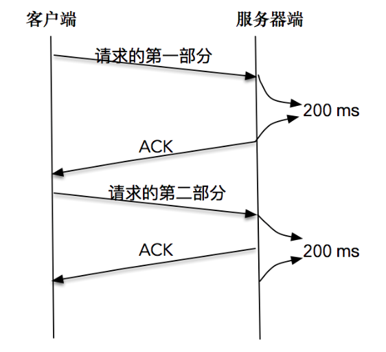

从这张图中可以看到，Nagle 算法和延时确认组合在一起，增大了处理时延，实际上，两个优化彼此在阻止对方。 

从上面的例子可以看到，在有些情况下 Nagle 算法并不适用， 比如对时延敏感的应用。 

幸运的是，我们可以通过对套接字的修改来关闭 Nagle 算法：

~~~c
int on = 1; 
setsockopt(sock, IPPROTO_TCP, TCP_NODELAY, (void *)&on, sizeof(on)); 
~~~

值得注意的是，除非我们对此有十足的把握，否则不要轻易改变默认的 TCP Nagle 算法。因为在现代操作系统中，针对 Nagle 算法和延时 ACK 的优化已经非常成熟了，有可能在禁用 Nagle 算法之后，性能问题反而更加严重。 

其实前面的例子里，如果我们能将一个请求一次性发送过去，而不是分开两部分独立发送，结果会好很多。所以，在写数据之前，将数据合并到缓冲区，批量发送出去，这是一个比较好的做法。不过，有时候数据会存储在两个不同的缓存中，对此，我们可以使用如下的方法来进行数据的读写操作，从而避免 Nagle 算法引发的副作用：

~~~c
ssize_t writev(int filedes, const struct iovec *iov, int iovcnt)
ssize_t readv(int filedes, const struct iovec *iov, int iovcnt);
~~~

这两个函数的第二个参数都是指向某个 iovec 结构数组的一个指针，其中 iovec 结构定义如下： 

~~~c
struct iovec {
void *iov_base; /* starting address of buffer */
size_t　iov_len; /* size of buffer */
};”
~~~

下面的程序展示了集中写的方式： 

~~~c
int main(int argc, char **argv) {
    if (argc != 2) {
        error(1, 0, "usage: tcpclient <IPaddress>");
    }

    int socket_fd;
    socket_fd = socket(AF_INET, SOCK_STREAM, 0);

    struct sockaddr_in server_addr;
    bzero(&server_addr, sizeof(server_addr));
    server_addr.sin_family = AF_INET;
    server_addr.sin_port = htons(SERV_PORT);
    inet_pton(AF_INET, argv[1], &server_addr.sin_addr);

    socklen_t server_len = sizeof(server_addr);
    int connect_rt = connect(socket_fd, (struct sockaddr *) &server_addr, server_len);
    if (connect_rt < 0) {
        error(1, errno, "connect failed ");
    }

    char buf[128];
    struct iovec iov[2];

    char *send_one = "hello,";
    iov[0].iov_base = send_one;
    iov[0].iov_len = strlen(send_one);
    iov[1].iov_base = buf;
    while (fgets(buf, sizeof(buf), stdin) != NULL) {
        iov[1].iov_len = strlen(buf);
        int n = htonl(iov[1].iov_len);
        if (writev(socket_fd, iov, 2) < 0)
            error(1, errno, "writev failure");
    }
    exit(0);
}
~~~

这个程序的前半部分创建套接字，建立连接就不再赘述了。关键的是 24-33 行，使用了 iovec 数组，分别写入了两个不同的字符串，一个是“hello,”，另一个通过标准输入读入。 

在启动该程序之前，我们需要启动服务器端程序，在客户端依次输入“world”和“network”： 

~~~
world
network
~~~

接下来我们可以看到服务器端接收到了 iovec 组成的新的字符串。这里的原理其实就是在调用 writev 操作时，会自动把几个数组的输入合并成一个有序的字节流，然后发送给对端：

~~~
received 12 bytes: hello,world
received 14 bytes: hello,network
~~~

## UDP connect

UDP也可以是有连接的。UDP 连接套接字不是发起连接请求的过程，而是记录目的地址和端口到套接字的映射关系。 

###客户端案例

我们先从一个客户端例子开始，在这个例子中，客户端在 UDP 套接字上调用 connect 函数，之后将标准输入的字符串发送到服务器端，并从服务器端接收处理后的报文。当然，向服务器端发送和接收报文是通过调用函数 sendto 和 recvfrom 来完成的：

~~~c
#include "lib/common.h"
# define    MAXLINE     4096

int main(int argc, char **argv) {
    if (argc != 2) {
        error(1, 0, "usage: udpclient1 <IPaddress>");
    }

    int socket_fd;
    socket_fd = socket(AF_INET, SOCK_DGRAM, 0);

    struct sockaddr_in server_addr;
    bzero(&server_addr, sizeof(server_addr));
    server_addr.sin_family = AF_INET;
    server_addr.sin_port = htons(SERV_PORT);
    inet_pton(AF_INET, argv[1], &server_addr.sin_addr);

    socklen_t server_len = sizeof(server_addr);

    if (connect(socket_fd, (struct sockaddr *) &server_addr, server_len)) {
        error(1, errno, "connect failed");
    }

    struct sockaddr *reply_addr;
    reply_addr = malloc(server_len);

    char send_line[MAXLINE], recv_line[MAXLINE + 1];
    socklen_t len;
    int n;

    while (fgets(send_line, MAXLINE, stdin) != NULL) {
        int i = strlen(send_line);
        if (send_line[i - 1] == '\n') {
            send_line[i - 1] = 0;
        }

        printf("now sending %s\n", send_line);
        size_t rt = sendto(socket_fd, send_line, strlen(send_line), 0, (struct sockaddr *) &server_addr, server_len);
        if (rt < 0) {
            error(1, errno, "sendto failed");
        }
        printf("send bytes: %zu \n", rt);
        
        len = 0;
        recv_line[0] = 0;
        n = recvfrom(socket_fd, recv_line, MAXLINE, 0, reply_addr, &len);
        if (n < 0)
            error(1, errno, "recvfrom failed");
        recv_line[n] = 0;
        fputs(recv_line, stdout);
        fputs("\n", stdout);
    }

    exit(0);
}
~~~

对这个程序做一个简单的解释： 

* 9-10 行创建了一个 UDP 套接字； 
* 12-16 行创建了一个 IPv4 地址，绑定到指定端口和 IP； 
* 20-22 行调用 connect 将 UDP 套接字和 IPv4 地址进行了“绑定”，这里 connect 函数的名称有点让人误解，其实可能更好的选择是叫做 setpeername； 
* 31-55 行是程序的主体，读取标准输入字符串后，调用 sendto 发送给对端；之后调用 recvfrom 等待对端的响应，并把对端响应信息打印到标准输出。 

在没有开启服务端的情况下，我们运行一下这个程序： 

~~~bash
$ ./udpconnectclient 127.0.0.1
g1
now sending g1
send bytes: 2
recvfrom failed: Connection refused (111)
~~~

 从前面的例子中，你会发现，我们可以对 UDP 套接字调用 connect 函数，但是和 TCP connect 调用引起 TCP 三次握手，建立 TCP 有效连接不同，UDP connect 函数的调用，并不会引起和服务器目标端的网络交互，也就是说，并不会触发所谓的“握手”报文发送和应答。 

对 UDP 套接字进行 connect 操作的意义：为了让应用程序能够接收“异步错误”的信息。 

回顾之前的不调用 connect 操作 的UDP客户端程序，在服务器端不开启的情况下，客户端程序是不会报错的，程序只会阻塞在 recvfrom 上，等待返回（或者超时）。 在这里，我们通过对 UDP 套接字进行 connect 操作，将 UDP 套接字建立了“上下文”，该套接字和服务器端的地址和端口产生了联系，正是这种绑定关系给了操作系统内核必要的信息，能够将操作系统内核收到的信息和对应的套接字进行关联。 

当我们调用 sendto 或者 send 操作函数时，应用程序报文被发送，我们的应用程序返回，操作系统内核接管了该报文，之后操作系统开始尝试往对应的地址和端口发送，因为对应的地址和端口不可达，一个 ICMP 报文会返回给操作系统内核，该 ICMP 报文含有目的地址和端口等信息。 

如果我们不进行 connect 操作，建立（UDP 套接字——目的地址 + 端口）之间的映射关系，操作系统内核就没有办法把 ICMP 不可达的信息和 UDP 套接字进行关联，也就没有办法将 ICMP 信息通知给应用程序。 

如果我们进行了 connect 操作，帮助操作系统内核从容建立了（UDP 套接字——目的地址 + 端口）之间的映射关系，当收到一个 ICMP 不可达报文时，操作系统内核可以从映射表中找出是哪个 UDP 套接字拥有该目的地址和端口，别忘了套接字在操作系统内部是全局唯一的，当我们在该套接字上再次调用 recvfrom 或 recv 方法时，就可以收到操作系统内核返回的“Connection Refused”的信息。 

一般来说，客户端通过 connect 绑定服务端的地址和端口，对 UDP 而言，可以有一定程度的性能提升。 

因为如果不使用 connect 方式，每次发送报文都会需要这样的过程： 

连接套接字→发送报文→断开套接字→连接套接字→发送报文→断开套接字 →………

而如果使用 connect 方式，就会变成下面这样： 

连接套接字→发送报文→发送报文→……→最后断开套接字 

我们知道，连接套接字是需要一定开销的，比如需要查找路由表信息。所以，UDP 客户端程序通过 connect 可以获得一定的性能提升。 

对于 TCP 套接字，connect 只能调用一次。但是，对一个 UDP 套接字来说，进行多次 connect 操作是被允许的，这样主要有两个作用：

* 第一个作用是可以重新指定新的 IP 地址和端口号； 
* 第二个作用是可以断开一个已连接的套接字。为了断开一个已连接的 UDP 套接字，第二次调用 connect 时，调用方需要把套接字地址结构的地址族成员设置为 AF_UNSPEC。 

### 服务端案例

在对 UDP 进行 connect 之后，关于收发函数的使用，很多书籍是这样推荐的： 

* 要使用 send 或 write 函数来发送，如果使用 sendto 则需要把相关的 to 地址信息置零； 
* 要使用 recv 或 read 函数来接收，如果使用 recvfrom 则需要把对应的 from 地址信息置零。 

不同的 UNIX 实现对此表现出来的行为不尽相同。 考虑到兼容性，后续使用connect后都会用send 和 recv 来发送和接收信息。

一般来说，服务器端不会主动发起 connect 操作，因为一旦如此，服务器端就只能响应一个客户端了。不过，有时候也不排除这样的情形，一旦一个客户端和服务器端发送 UDP 报文之后，该服务器端就要服务于这个唯一的客户端。 

一个类似的服务器端程序如下： 

~~~c
#include "lib/common.h"

static int count;

static void recvfrom_int(int signo) {
    printf("\nreceived %d datagrams\n", count);
    exit(0);
}

int main(int argc, char **argv) {
    int socket_fd;
    socket_fd = socket(AF_INET, SOCK_DGRAM, 0);

    struct sockaddr_in server_addr;
    bzero(&server_addr, sizeof(server_addr));
    server_addr.sin_family = AF_INET;
    server_addr.sin_addr.s_addr = htonl(INADDR_ANY);
    server_addr.sin_port = htons(SERV_PORT);

    bind(socket_fd, (struct sockaddr *) &server_addr, sizeof(server_addr));

    socklen_t client_len;
    char message[MAXLINE];
    message[0] = 0;
    count = 0;

    signal(SIGINT, recvfrom_int);

    struct sockaddr_in client_addr;
    client_len = sizeof(client_addr);

    int n = recvfrom(socket_fd, message, MAXLINE, 0, (struct sockaddr *) &client_addr, &client_len);
    if (n < 0) {
        error(1, errno, "recvfrom failed");
    }
    message[n] = 0;
    printf("received %d bytes: %s\n", n, message);

    if (connect(socket_fd, (struct sockaddr *) &client_addr, client_len)) {
        error(1, errno, "connect failed");
    }

    while (strncmp(message, "goodbye", 7) != 0) {
        char send_line[MAXLINE];
        sprintf(send_line, "Hi, %s", message);

        size_t rt = send(socket_fd, send_line, strlen(send_line), 0);
        if (rt < 0) {
            error(1, errno, "send failed ");
        }
        printf("send bytes: %zu \n", rt);

        size_t rc = recv(socket_fd, message, MAXLINE, 0);
        if (rc < 0) {
            error(1, errno, "recv failed");
        }
        
        count++;
    }

    exit(0);
}
~~~

对这个程序做下解释： 

* 11-12 行创建 UDP 套接字； 
* 14-18 行创建 IPv4 地址，绑定到 ANY 和对应端口； 
* 20 行绑定 UDP 套接字和 IPv4 地址； 
* 27 行为该程序注册一个信号处理函数，以响应 Ctrl+C 信号量操作； 
* 32-37 行调用 recvfrom 等待客户端报文到达，并将客户端信息保持到 client_addr 中； 
* 39-41 行调用 connect 操作，将 UDP 套接字和客户端 client_addr 进行绑定； 
* 43-59 行是程序的主体，对接收的信息进行重新处理，加上”Hi“前缀后发送给客户端，并持续不断地从客户端接收报文，该过程一直持续，直到客户端发送“goodbye”报文为止。 

注意这里所有收发函数都使用了 send 和 recv。 

接下来我们实现一个 connect 的客户端程序： 

~~~c
#include "lib/common.h"
# define    MAXLINE     4096

int main(int argc, char **argv) {
    if (argc != 2) {
        error(1, 0, "usage: udpclient3 <IPaddress>");
    }

    int socket_fd;
    socket_fd = socket(AF_INET, SOCK_DGRAM, 0);

    struct sockaddr_in server_addr;
    bzero(&server_addr, sizeof(server_addr));
    server_addr.sin_family = AF_INET;
    server_addr.sin_port = htons(SERV_PORT);
    inet_pton(AF_INET, argv[1], &server_addr.sin_addr);

    socklen_t server_len = sizeof(server_addr);

    if (connect(socket_fd, (struct sockaddr *) &server_addr, server_len)) {
        error(1, errno, "connect failed");
    }

    char send_line[MAXLINE], recv_line[MAXLINE + 1];
    int n;

    while (fgets(send_line, MAXLINE, stdin) != NULL) {
        int i = strlen(send_line);
        if (send_line[i - 1] == '\n') {
            send_line[i - 1] = 0;
        }

        printf("now sending %s\n", send_line);
        size_t rt = send(socket_fd, send_line, strlen(send_line), 0);
        if (rt < 0) {
            error(1, errno, "send failed ");
        }
        printf("send bytes: %zu \n", rt);

        recv_line[0] = 0;
        n = recv(socket_fd, recv_line, MAXLINE, 0);
        if (n < 0)
            error(1, errno, "recv failed");
        recv_line[n] = 0;
        fputs(recv_line, stdout);
        fputs("\n", stdout);
    }

    exit(0);
}
~~~

对这个客户端程序做一下解读： 

* 9-10 行创建了一个 UDP 套接字； 
* 12-16 行创建了一个 IPv4 地址，绑定到指定端口和 IP； 
* 20-22 行调用 connect 将 UDP 套接字和 IPv4 地址进行了“绑定”； 
* 27-46 行是程序的主体，读取标准输入字符串后，调用 send 发送给对端；之后调用 recv 等待对端的响应，并把对端响应信息打印到标准输出。 

注意这里所有收发函数也都使用了 send 和 recv。 

接下来，我们先启动服务器端程序，然后依次开启两个客户端，分别是客户端 1、客户端 2，并且让客户端 1 先发送 UDP 报文：

服务器端： 

~~~bash
$ ./udpconnectserver
received 2 bytes: g1
send bytes: 6
~~~

客户端 1： 

~~~c
./udpconnectclient2 127.0.0.1
g1
now sending g1
send bytes: 2
Hi, g1
~~~

客户端 2： 

~~~c
./udpconnectclient2 127.0.0.1
g2
now sending g2
send bytes: 2
recv failed: Connection refused (111)
~~~

我们看到，客户端 1 先发送报文，服务端随之通过 connect 和客户端 1 进行了“绑定”，这样，客户端 2 从操作系统内核得到了 ICMP 的错误，该错误在 recv 函数中返回，显示了“Connection refused”的错误信息。 

## 重用套接字

### Address in use错误

为了引入讨论，我们从之前讲过的一个 TCP 服务器端程序开始说起：

~~~c
static int count;

static void sig_int(int signo) {
    printf("\nreceived %d datagrams\n", count);
    exit(0);
}

int main(int argc, char **argv) {
    int listenfd;
    listenfd = socket(AF_INET, SOCK_STREAM, 0);

    struct sockaddr_in server_addr;
    bzero(&server_addr, sizeof(server_addr));
    server_addr.sin_family = AF_INET;
    server_addr.sin_addr.s_addr = htonl(INADDR_ANY);
    server_addr.sin_port = htons(SERV_PORT);

    int rt1 = bind(listenfd, (struct sockaddr *) &server_addr, sizeof(server_addr));
    if (rt1 < 0) {
        error(1, errno, "bind failed ");
    }

    int rt2 = listen(listenfd, LISTENQ);
    if (rt2 < 0) {
        error(1, errno, "listen failed ");
    }

    signal(SIGPIPE, SIG_IGN);

    int connfd;
    struct sockaddr_in client_addr;
    socklen_t client_len = sizeof(client_addr);

    if ((connfd = accept(listenfd, (struct sockaddr *) &client_addr, &client_len)) < 0) {
        error(1, errno, "bind failed ");
    }

    char message[MAXLINE];
    count = 0;

    for (;;) {
        int n = read(connfd, message, MAXLINE);
        if (n < 0) {
            error(1, errno, "error read");
        } else if (n == 0) {
            error(1, 0, "client closed \n");
        }
        message[n] = 0;
        printf("received %d bytes: %s\n", n, message);
        count++;
    }
}
~~~

这个服务器端程序绑定到一个本地端口，使用的是通配地址 ANY，当连接建立之后，从该连接中读取输入的字符流。 

启动服务器，之后我们使用 Telnet 登录这个服务器，并在屏幕上输入一些字符，例如：network，good。 

和我们期望的一样，服务器端打印出 Telnet 客户端的输入。在 Telnet 端关闭连接之后，服务器端接收到 EOF，也顺利地关闭了连接。服务器端也可以很快重启，等待新的连接到来：

~~~bash
 $./addressused 
 received 9 bytes: network
 received 6 bytes: good
 client closed
 $./addressused
~~~

接下来，我们改变一下连接的关闭顺序。和前面的过程一样，先启动服务器，再使用 Telnet 作为客户端登录到服务器，在屏幕上输入一些字符。注意接下来的不同，我不会在 Telnet 端关闭连接，而是直接使用 Ctrl+C 的方式在服务器端关闭连接：

~~~bash
$telnet 127.0.0.1 9527
network
bad
Connection closed by foreign host.
~~~

我们看到，连接已经被关闭，Telnet 客户端也感知连接关闭并退出了。接下来，我们尝试重启服务器端程序。你会发现，这个时候服务端程序重启失败，报错信息为：bind failed: Address already in use：

~~~bash
 $./addressused 
 received 9 bytes: network
 received 6 bytes: good
 client closed
 $./addressused
 bind faied: Address already in use(98)
~~~

这个错误出现的原因和TIME_WAIT有关：当连接的一方主动关闭连接，在接收到对端的 FIN 报文之后，主动关闭连接的一方会在 TIME_WAIT 这个状态里停留一段时间，这个时间大约为 2MSL。 

如果服务器端重启报错后，如果我们此时使用 netstat 去查看服务器程序所在主机的 TIME_WAIT 的状态连接，你会发现有一个服务器程序生成的 TCP 连接，当前正处于 TIME_WAIT 状态。这里 9527 是本地监听端口，36650 是 telnet 客户端端口。当然了，Telnet 客户端端口每次也会不尽相同：

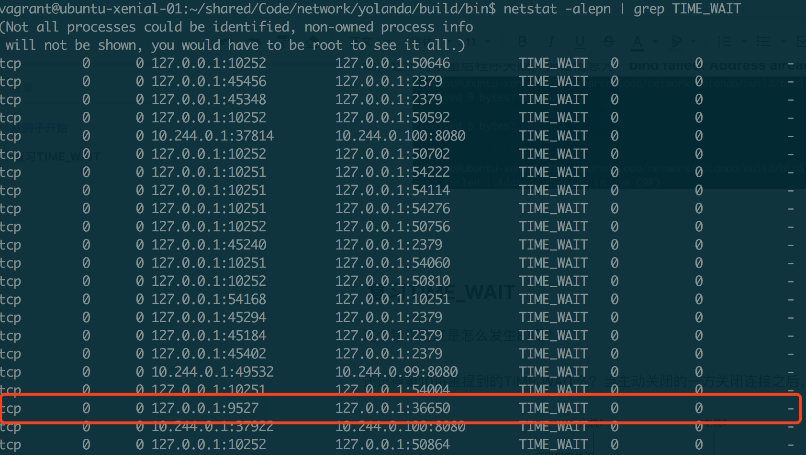

通过服务器端发起的关闭连接操作，引起了一个已有的 TCP 连接处于 TME_WAIT 状态，正是这个 TIME_WAIT 的连接，使得服务器重启时，继续绑定在 127.0.0.1 地址和 9527 端口上的操作，返回了 Address already in use 的错误。 

### 重用套接字选项

我们知道，一个 TCP 连接是通过四元组（源地址、源端口、目的地址、目的端口）来唯一确定的，如果每次 Telnet 客户端使用的本地端口都不同，就不会和已有的四元组冲突，也就不会有 TIME_WAIT 的新旧连接化身冲突的问题。 

事实上，即使在很小的概率下，客户端 Telnet 使用了相同的端口，从而造成了新连接和旧连接的四元组相同，在现代 Linux 操作系统下，也不会有什么大的问题，原因是现代 Linux 操作系统对此进行了一些优化：

* 第一种优化是新连接 SYN 告知的初始序列号，一定比 TIME_WAIT 老连接的末序列号大，这样通过序列号就可以区别出新老连接。 
* 第二种优化是开启了 tcp_timestamps，使得新连接的时间戳比老连接的时间戳大，这样通过时间戳也可以区别出新老连接。 

在这样的优化之下，一个 TIME_WAIT 的 TCP 连接可以忽略掉旧连接，重新被新的连接所使用。 

这就是重用套接字选项，通过给套接字配置可重用属性，告诉操作系统内核，这样的 TCP 连接完全可以复用 TIME_WAIT 状态的连接：

~~~c
int on = 1;
setsockopt(listenfd, SOL_SOCKET, SO_REUSEADDR, &on, sizeof(on));
~~~

SO_REUSEADDR 套接字选项，允许启动绑定在一个端口，即使之前存在一个和该端口一样的连接。前面的例子已经表明，在默认情况下，服务器端历经创建 socket、bind 和 listen 重启时，如果试图绑定到一个现有连接上的端口，bind 操作会失败，但是如果我们在创建 socket 和 bind 之间，使用上面的代码片段设置 SO_REUSEADDR 套接字选项，情况就会不同。 

下面我们对原来的服务器端代码进行升级，升级的部分主要在 11-12 行，在 bind 监听套接字之前（一定要在bind前，设置 SO_REUSEADDR 套接字选项时，需要在 bind 函数之前对监听字进行设置），调用 setsockopt 方法，设置重用套接字选项： 

~~~c
int main(int argc, char **argv) {
    int listenfd;
    listenfd = socket(AF_INET, SOCK_STREAM, 0);

    struct sockaddr_in server_addr;
    bzero(&server_addr, sizeof(server_addr));
    server_addr.sin_family = AF_INET;
    server_addr.sin_addr.s_addr = htonl(INADDR_ANY);
    server_addr.sin_port = htons(SERV_PORT);

    int on = 1;
    setsockopt(listenfd, SOL_SOCKET, SO_REUSEADDR, &on, sizeof(on));

    int rt1 = bind(listenfd, (struct sockaddr *) &server_addr, sizeof(server_addr));
    if (rt1 < 0) {
        error(1, errno, "bind failed ");
    }

    int rt2 = listen(listenfd, LISTENQ);
    if (rt2 < 0) {
        error(1, errno, "listen failed ");
    }

    signal(SIGPIPE, SIG_IGN);

    int connfd;
    struct sockaddr_in client_addr;
    socklen_t client_len = sizeof(client_addr);

    if ((connfd = accept(listenfd, (struct sockaddr *) &client_addr, &client_len)) < 0) {
        error(1, errno, "bind failed ");
    }

    char message[MAXLINE];
    count = 0;

    for (;;) {
        int n = read(connfd, message, MAXLINE);
        if (n < 0) {
            error(1, errno, "error read");
        } else if (n == 0) {
            error(1, 0, "client closed \n");
        }
        message[n] = 0;
        printf("received %d bytes: %s\n", n, message);
        count++;
    }
}
~~~

重新编译过后，重复上面那个例子，先启动服务器，再使用 Telnet 作为客户端登录到服务器，在屏幕上输入一些字符，使用 Ctrl+C 的方式在服务器端关闭连接。马上尝试重启服务器，这个时候我们发现，服务器正常启动，没有出现 Address already in use 的错误。这说明我们的修改已经起作用：

~~~bash
 $./addressused2 
 received 9 bytes: network
 received 6 bytes: good
 client closed
 $./addressused2
~~~

SO_REUSEADDR 套接字选项还有一个作用，那就是本机服务器如果有多个地址，可以在不同地址上使用相同的端口提供服务。 

比如，一台服务器有 192.168.1.101 和 10.10.2.102 两个地址，我们可以在这台机器上启动三个不同的 HTTP 服务，第一个以本地通配地址 ANY 和端口 80 启动；第二个以 192.168.101 和端口 80 启动；第三个以 10.10.2.102 和端口 80 启动。 

这样目的地址为 192.168.101，目的端口为 80 的连接请求会被发往第二个服务；目的地址为 10.10.2.102，目的端口为 80 的连接请求会被发往第三个服务；目的端口为 80 的所有其他连接请求被发往第一个服务。 我们必须给这三个服务设置 SO_REUSEADDR 套接字选项，否则第二个和第三个服务调用 bind 绑定到 80 端口时会出错。 

服务器端程序，都应该设置 SO_REUSEADDR 套接字选项，以便服务端程序可以在极短时间内复用同一个端口启动。 

有些人可能觉得这不是安全的。其实，单独重用一个套接字不会有任何问题。前面已经讲过，TCP 连接是通过四元组唯一区分的，只要客户端不使用相同的源端口，连接服务器是没有问题的，即使使用了相同的端口，根据序列号或者时间戳，也是可以区分出新旧连接的。 

而且，TCP 的机制绝对不允许在相同的地址和端口上绑定不同的服务器，即使我们设置 SO_REUSEADDR 套接字选项，也不可能在 ANY 通配符地址下和端口 9527 上重复启动两个服务器实例。如果我们启动第二个服务器实例，不出所料会得到 Address already in use 的报错，即使当前还没有任何一条有效 TCP 连接产生。 

tcp_tw_reuse 的内核配置选项与套接字选项SO_REUSEADDR的关系：

* tcp_tw_reuse 是内核选项，主要用在连接的发起方（实际上应该叫主动关闭连接的一方）。TIME_WAIT 状态的连接创建时间超过 1 秒后，新的连接才可以被复用，注意，这里是连接的发起方（实际上应该叫主动关闭连接的一方）； 

  tcp_tw_reuse是为了缩短time_wait的时间，避免出现大量的time_wait链接而占用系统资源，解决的是accept后的问题； 

* SO_REUSEADDR 是用户态的选项，SO_REUSEADDR 选项用来告诉操作系统内核，如果端口已被占用，但是 TCP 连接状态位于 TIME_WAIT ，可以重用端口。如果端口忙，而 TCP 处于其他状态，重用端口时依旧得到“Address already in use”的错误信息。注意，这里一般都是连接的服务方。 

  SO_REUSEADDR是为了解决time_wait状态带来的端口占用问题，以及支持同一个port对应多个ip，解决的是bind时的问题。 

UDP其实也可以使用SO_REUSEADDR，它的使用场景比较多的是组播网络。