不同的系统对于一致性的要求是不一样的，有同时对一致性和响应速度要求很高的系统（比如售票系统）、有对最终一致性有要求的，也就是对响应速度要求不高的系统（比如银行转账、商品下单）

分布式系统中一个重要的问题是分布式一致性问题，指在分布式环境引入数据复制机制后，不同数据节点间可能出现的数据不一致情况。数据一致性问题要求对一个副本数据进行更新的同时，必须确保也能够更新其他的副本。使用数据副本的原因在于：防止单点故障、提高整体性能（不同地方的数据副本都能为用户提供服务）

若为了解决数据一致性问题，将写入的动作阻塞直到所有数据都复制完成，这样就会导致写入的性能很差。为了在数据一致性和性能之间进行权衡，由此产生了一致性级别：

* 强一致性：写入什么，读取出来什么，一致性强，但是写入性能差
* 弱一致性：写入之后不承诺可以立即读入，尽可能保证数据一致，又可以分为会话一致性（同一个客户端写入的可以马上读取一致的内容）、用户一致性（同一个用户写入的可以马上读取一致的内容）
* 最终一致性：弱一致性的一个特例，系统会保证在一定时间内，能够达到一个数据一致的状态

# 分布式架构

## 分布式系统特点

集中式系统是指由一台或多台主机组成中心节点，数据集中存储在这个中心节点中，所有的业务也都集中部署在该节点，主机负责所有的逻辑和数据处理，它的特点是部署简单，不用考虑分布式协作问题，但是缺点是运维复杂、大型主机昂贵、存在单点不可用全部业务瘫痪的风险。

分布式系统是指一个软件或硬件组件分布在不同的网络计算机上，彼此间通过消息传递进行通信和协调的系统。

它的特点有：

1、分布式：分布式系统中的多台计算机在空间上随意分布，且随时变动

2、对等性：分布式系统中的计算机没有主从之分，所有节点都是对等的，没有控制整个系统的主机，但是分布式系统有副本的概念，副本有服务副本和数据副本。

3、并发性：分布式系统的多个节点可能同时操作一些共享的资源

4、缺乏全局时钟：分布式系统缺乏全局时钟序列控制，难以确定两个事件的发生顺序到底谁先谁后

5、故障很多

分布式系统解决的问题：

1、增加系统可用性，杜绝单点故障引起的系统不可用

2、提高系统的性能，不同地方的数据副本都能为用户提供服务

分布式环境的各种问题：

1、通信异常。分布式引入了网络因素，网络通信的延迟（ms级）是内存访问延时（10ns级）的100倍，消息丢失和延迟变的很普遍。

2、网络分区。当网络发生异常情况，导致分布式系统中部分节点的延时不断增大，最终导致只有部分节点能正常通信，这就是网络分区，也叫脑裂。当网络分区出现时，分布式系统会出现正常的局部集群，极端情况下，这一部分节点会代替整个系统继续提供功能

3、三种状态：成功、失败、超时。原因是网络的不可靠

4、节点故障

## ACID

事务是一个程序执行逻辑单元，狭义的事务指数据库事务

事务的四个特征：

* 原子性Atomicity：事务只能出现两种状态：全部成功执行、全部不执行

* 一致性Consistency：事务执行的结果必须是让数据库从一个一致性状态转变到另一个一致性状态，一个未完成的事务不能部分回滚，这会导致一部分数据被破坏，产生不一致的问题

* 隔离性Isolation：并发的事务要相互隔离，不能互相干扰。不同的隔离级别对事务的处理不同，主要分为以下几种：Read Uncommited（一个事务读取到另一个事务未提交的结果）、Read Committed（一个事务读取到另一个事务已经提交的结果，但是在同一个事务中读取同一个内容可能产生不同结果。不可重复读主要是针对另一个事务的更新操作，导致当前事务读取同一条数据的不一致现象）、Repeatable Read（可重复读取，同一个事务中读取同一个数据，结果都保持一致，但有可能出现幻读的问题。幻读主要针对的是另一个事务的插入和删除操作，对当前事务的范围查询结果的影响）、Serializable（串行化，最严格的事务隔离级别，它要求所有事务被串行执行）：

  各种隔离级别下，一个事务访问的结果差异：

  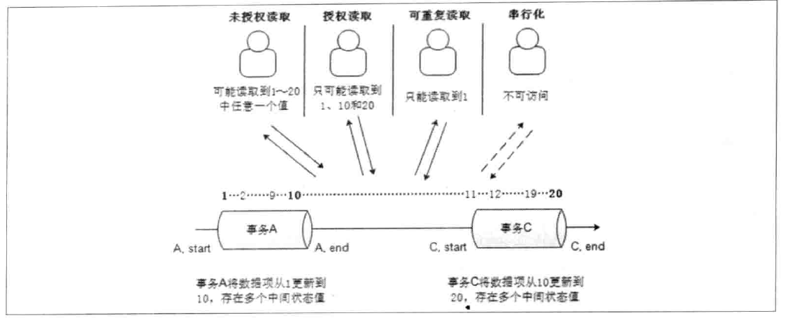

  几种隔离级别能解决的问题：

  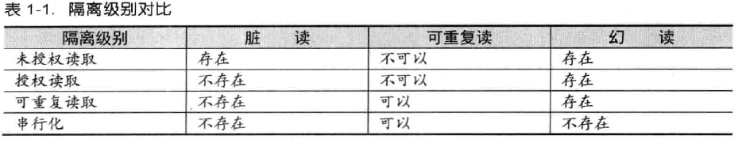

  事务隔离级别越高，数据的完整性和一致性越好，但是对并发性能的影响越大。大多数情况下，数据库的隔离级别都是Read Committed，虽然它存在不可重复读、幻读等问题，但通常由应用程序采用锁机制来进行控制解决。

* 持久性Durability：一个事务一旦提交，它会数据库中数据状态的变更应该是永久性的。即使机器宕机，数据库重新启动后，就能恢复到之前事务成功后的状态

一个分布式事务是由多个子事务组成的，所以一个分布式事务也被称为一种嵌套型的事务。

## CAP定理

CAP理论：一个分布式系统不可能同时满足一致性（Consistency）、可用性（Availability）和分区容错性（Partition tolerance），最多只能同时满足其中两项。

* 一致性：指数据在多个副本之间是否能保持一致的特性。如果能做到对一个节点的数据更新成功后，所有用户都可以读取最新的值，该系统就有强一致性（CAP中的强一致性指线性一致性，这个要求是很严格的，对于常见的CP系统zk来说，它只能实现顺序一致性，无法达到线性一致性的要求，所以它并不是完美的CP系统）
* 可用性：对于用户的每一个操作请求总是能在有限的时间内返回对应的处理结果。请求不能无限的处理下去，返回的结果也不能是错误的结果，才能代表可用性。
* 分区容错性：分布式系统在遇到任何网络分区故障的时候，仍然需要能够保证对外提供满足一致性和可用性的服务，除非是整个网络环境都发生了故障。网络分区是指不同节点所在的子网络之间出现网络不连通的情况，但各个子网络的内部网络是正常的，整个系统的网络环境被切分成了若干孤立的区域。分布式系统每个节点的加入和退出都可以看做是一个特殊的网络分区。

放弃某个特性的影响：

* 放弃分区容错性：彻底避免网络问题的解决办法是将所有的数据都放在一个分布式节点上，但这样也就相当于放弃了系统的可扩展性
* 放弃可用性：遇到故障时，受到影响的服务无法对外提供功能，或者需要等待一段时间
* 放弃一致性：指放弃数据的强一致性，保留数据的最终一致性

对于分布式系统而言，分区容错性是一个最基本的要求，只要组件被部署到不同的节点，就会面临子网络和网络的问题，此时保持容错性就必须被面对和解决。所以大多数情况下，设计师需要在一致性和可用性之间寻找平衡（CAP不是3选2 ，而是在P的基础上选择C或者A，对于一致性强的场景，如银行会选择CP）。

如果网络全部正常，C和A可以同时保证，但如果发生网络分区，要保证一致性的话，则在一个节点写入时必须禁止其他节点写入，这就与可用性矛盾；要保证可用性的话，就会同时出现多个节点写入数据不同的情况，这就与一致性矛盾，所以不存在CA架构的分布式系统。

CAP的取舍都是建立在发生网络分区的基础上的，若网络没有问题，则可以同时保证C和A，取舍主要就在于发生网络问题时，到底是选择保证可用性还是保证一致性。

## 服务注册中心中的CAP

注册中心负责服务地址的注册（服务注册）与查找（服务发现），使用最多的是zk和eureka

zk选择CP：任何时刻对zookeeper的访问请求能得到一致性的数据结果，同时系统对网络分割具备容错性，但是它不能保证每次服务的可用性，在使用zookeeper获取服务列表时，如果zk正在选举或者zk集群中半数以上的机器不可用，那么将无法获取数据。

eureka选择AP：eureka在设计时优先保证可用性，每一个节点都是平等的，一部分节点挂掉不会影响到正常节点的工作，不会出现类似zk的选举leader的过程，客户端发现向某个节点注册或连接失败，会自动切换到其他的节点，只要有一台eureka存在，就可以保证整个服务处在可用状态，只不过有可能这个服务上的信息并不是最新的信息。

zookeeper是按照CP原则构建，也就是说它必须保持每一个节点的数据都保持一致，如果zookeeper下节点断开或者集群中出现网络分割（例如交换机的子网间不能互访），那么zk会将它们从自己的管理范围中剔除，外界不能访问这些节点，即使这些节点是健康的可以提供正常的服务，所以导致这些节点请求都会丢失。而eureka的诞生就是为注册中心而设计，保证了可用性。

若服务注册中心的数据不一致，会导致节点间的流量出现不平衡，或者出现一些脏数据。相比之下，此时AP更加重要。

## 分布式锁中的CAP

这里讨论三种分布式锁的实现：基于数据库实现、基于redis实现、基于zk实现

* 基于数据库实现：建一个表，其中某一列是唯一索引，插入某个固定值成功则说明获取锁成功，插入时因为唯一索引报错则说明获取锁失败。当发生故障时，对于无法自动实现主备切换的mysql而言，无法实现基本的分区容错性，一旦写入主节点，主节点挂掉，就导致锁不可用。不在CAP的讨论范围内。

* 基于redis实现：主要是依赖redis的一个命令SETNX，它能在key不存在时设置该key的值，设置值成功则说明获取锁成功，设置值失败代表获取锁失败。当master节点故障时，哨兵会从slave中选择节点，然后重新变成master节点，sentinel在重新进行选举时并不在意主从数据是否复制完毕，所以这种方式偏向可用性，是AP。

  当程序从主节点获取到锁，然后主节点挂掉，同时锁信息还未同步到从节点时，同一时刻，从节点也可能获取到同一把锁，这就是redis选择AP的弊端：

  

  想解决这个问题，要redis实现redlock机制，但是这样就会降低性能，比较繁琐。

  如果在社交发帖等场景下，我们并没有非常强的事务一致性问题，redis提供给我们高性能的AP模型是非常适合的

* 基于zk实现：主要是依赖zk的一个机制，那就是当多个节点向zk发起创建有序节点时，zk会严格按照先后顺序创建出节点，当程序申请创建了目录下最小序的节点，说明获取锁成功，否则说明获取失败（zk的分布式锁实现略）

  zookeeper的分布式锁要比redis可靠很多，但他繁琐的实现机制导致了它的性能不如redis，而且zk会随着集群的扩大而性能更加下降

由此可见，业务场景不同，技术选型也会不同。

## 刷新磁盘/主从复制和CAP

很多三方件会持续将数据持久化到磁盘，如RocketMQ，大致有两种写入磁盘的方式：

1、异步刷盘：消息写入内存就立即返回写成功，然后触发统一的写磁盘操作。性能较高，但数据有丢失风险

2、同步刷盘：消息写入内存后立即写入磁盘，等写入完毕后返回写成功。

分布式系统一般会涉及主从复制的问题，此时一般也有同步和异步两种方式：

1、同步复制：等复制完毕后通知客户端写成功

2、异步复制：master写成功就通知客户端写成功，然后由其它线程进行复制操作。可以提高响应速度，但牺牲了一致性，一般需要额外的补偿机制。

通常情况下，刷盘设置为异步，主从复制设置为同步。这样即使一台机器出故障，依然可以保证数据不丢。

## BASE理论

BASE = Basically Available（基本可用） + Soft state （软状态）+ Eventually consistent （最终一致性）

BASE是对CAP中一致性和可用性权衡的结果（选择AP方案的时候，如何更好的到达C），核心思想是即使无法做到强一致性，但每个应用可以根据自身的业务特点，采用适当的方式来使系统达到最终一致性。

* 基本可用：指分布式系统出现故障的时候，允许损失部分可用性。比如耗时适当增加、用户被引导到降级页面等。损失部分可用性不代表系统不可用。
* 弱状态：又称为软状态，指允许系统中的数据存在中间状态，并认为该中间状态的存在不会影响系统的整体可用性，也就是允许系统在不同节点的数据副本之间进行数据同步的过程存在延时。
* 最终一致性：系统中所有的数据副本，在经过一段时间的同步后，最终能够达到一个一致的状态。不需要实时保证系统数据的强一致性。最终一致性是一种特殊的弱一致性。

最终一致性的几个变种：

* 因果一致性：如果进程A在更新完某个数据项后通知了进程B，那么进程B之后对该数据项的访问都应该能获取到进程A更新后的最新值。而与进程A无因果关系的进程C的数据访问则无这种限制
* 读己之所写：进程A更新一个数据项之后，它总是能访问到更新过的最新值，而不会看到旧值，这是一种特殊的因果一致性
* 会话一致性：执行更新后，同一个会话中总能读到最新值
* 单调读一致性：如果一个进程从系统中读取出一个数据项的某个值后，后续该进程访问都不会获取到更旧的值
* 单调写一致性：一个系统保证来自同一个进程的写操作被顺序的执行

在实际的情况中，总是上述若干个变种互相结合起来，最终构建一个具有最终一致性的分布式系统。现代的很多关系型数据库都采用了最终一致性模型，它们通常都会采用同步和异步的方式来实现主备数据复制技术。同步方式中，数据的复制通常是事务的一部分，事务完成，主备数据库就会达到一致。异步方式中，当事务日志传输时间较长时，就会导致无法及时将事务应用到备库上，此时就会出现数据不一致的情况，最终通过多次重试或者人为数据修复，最终数据库还是可以达到一致，这就是系统提供最终一致性的经典案例。

BASE面向的是大型高可用可扩展的分布式系统，BASE理论和传统的ACID不同，ACID强调强一致，而BASE提出通过牺牲强一致性获得可用性

# 一致性协议

分布式系统中，为了完成跨多个分布式节点的事务，就需要引入一个被称为协调者的组件，由它来统一调度所有分布式节点的执行逻辑，这些被调度的分布式节点被称为参与者。

## 一致性概念

讨论一致性的时候，其实是有三个词的：consistency（CAP理论/ACID）、coherence（cache一致性协议 ）、consensus（Raft/Paxos）。

其中coherence只出现在Cache Coherence，称为缓存一致性，怎么保证多个核上的CPU 缓存数据是一致的，一般是单机维度的，不算分布式领域。

而consensus准确的翻译是共识，是多个提议者达成共识的过程，使用了 Raft或者 paxos 的系统 不一定是强一致的，要实现强一致还需要更多的努力。

consistency的含义比consensus更宽泛，它指多个副本对外呈现的状态，包括顺序一致性、线性一致性、最终一致性等。而共识特指达成一致的过程。一致性要求的是一致，而不是正确，如果所有节点一致给出一个错误的答案，那也叫一致性。

## 一致性等级

一致性从强到弱：线性一致性、顺序一致性、因果一致性、最终一致性。前两个是强一致性，其他的是弱一致性。

强一致性和弱一致性的区别：强一致性集群中，对任何一个节点发起请求都会得到相同的回复，但将产生相对高的延迟。而弱一致性具有更低的响应延迟，但可能会回复过期的数据，最终一致性即是经过一段时间后终会到达一致的弱一致性。 

### 顺序一致性

顺序一致性比线性一致性要弱，例如两个进程A和B读一个值，同时这个值被第三个进程C修改，不管是先读还是先改，只要进程A和B在进程内读写的顺序是合理的即可。即先读到旧值后读到新值，而不论集群中各种操作发生的绝对时间顺序。在顺序一致性中，两个在不同机器上的进程进行时间比较是没有意义的，只有同一个进程中的各种操作存在先后顺序。

如果x的值是1，后面被某个节点更新成2，那进程读x的时候，只要先读到1后读到2，或者读到2，都是满足顺序一致性的，但如果先读到2后读到1就不满足顺序一致性。

例如在微信发表了两篇文章，每个朋友都会以相同的顺序看到两篇文章，不会产生乱序。

zk整体上就实现了顺序一致性，在写上实现了线性一致性。有一种观点认为zk当一个客户端进程写入一个新值，另外一个客户端进程不能保证马上就能读到这个值，但是能保证最终能读取到这个值，所以说zk实现了最终一致性，这种说法是错误的。zk的多节点与Leader之间的同步后，操作能保证是顺序一致的，读的时候虽然不能保证马上看到，但是请求之前会保证不会乱序。

### 线性一致性

线性一致性又被称为强一致性、严格一致性、原子一致性，是程序能实现的最高的一致性模型。

线性一致性要求全局上控制顺序，要求任何一次读都能读到某个数据的最近一次写的数据。系统中的所有进程，看到的操作顺序，都与全局时钟下的顺序一致。

## 2PC

2PC（Two-Phase-Commit，二阶段提交），目前绝大部分的关系型数据库都是采用二阶段提交协议来完成分布式事务处理的，在多个节点的情况下，也能顺利完成事务的提交或回滚。

2PC将事务的提交过程分为两个阶段来处理：

* 阶段一提交事务请求（也叫投票阶段）：协调者向所有的参与者发送事务内容，询问是否可以执行事务提交操作（事务询问）；各参与者执行事务操作，并记录Undo和Redo日志，成功执行后向协调者返回Yes响应
* 阶段二执行事务提交：若所有参与者都返回了Yes，则协调者会向所有参与者发起commit请求，然后各节点进行commit，并向协调者发送Ack消息，协调者收到所有参与者的Ack即完成事务操作；若有的参与者超时未返回结果或者返回了No，则协调者向所有参与者发起Rollback请求，各参与者利用Undo日志进行回滚，然后向协调者发送Ack消息，完成事务中断

事务提交和事务中断示意图：

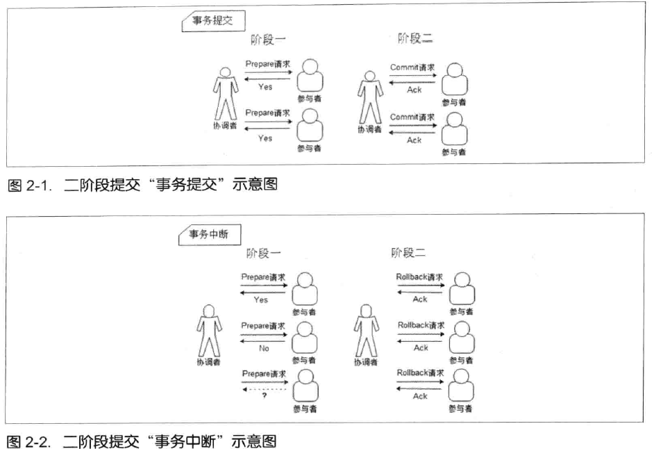

2PC的优点是原理简单，实现方便

缺点有以下几个：

* 同步阻塞：提交的执行过程中，所有参与者在等待其他参与者响应的过程中，无法进行任何操作
* 单点问题：若协调者出现问题，则导致事务无法提交，若在二阶段协调者出现问题，则所有参与者会处于锁定事务资源的状态
* 数据不一致：阶段二执行事务提交的时候，若只有部分参与者收到并执行commit，有部分没有收到指令，则会导致数据不一致。若协调者只发送了部分commit指令，也会导致数据不一致。
* 没有完善的容错机制：若事务询问中，某个参与者出现异常，则只能依靠协调者自身的超时机制来判断是否需要中断事务，这样的策略显得很保守。任何一个节点的异常，都会导致整个事务的失败

## 3PC

3PC是2PC的改进版，将二阶段提交协议的提交事务请求分为两部分。3PC总共分为三个阶段：

* CanCommit阶段：协调者向所有参与者发送一个包含事务内容的CanCommit请求，询问是否可以执行事务提交操作。参与者收到请求后，若认为其自身正常可以顺利执行事务，则会返回Yes，否则返回No
* PreCommit阶段：

若所有参与者都返回了Yes，则协调者向所有参与者节点发送preCommit请求，参与者收到后会执行事务操作，并记录Undo和Redo日志，如果成功执行了事务操作，参与者会反馈给协调者Ack响应。

若存在参与者返回了No或者超时，则协调者向所有参与者发送abort请求，参与者收到后会中断事务（参与者长时间未收到消息，也会中断事务）

* doCommit阶段：

若协调者收到了来自所有参与者的Ack响应，则协调者会向所有参与者发送doCommit请求，参与者收到后会提交事务，然后向协调者发送Ack消息，协调者受到所有Ack消息则完成事务

若协调者未收到全部的Ack响应，则协调者向所有参与者节点发送abort请求，参与者收到后会利用Undo日志来进行事务回滚，回滚完成后会向协调者发送Ack，最后完成事务的中断。

若参与者在该阶段因为网络问题从未收到过doCommit或者abort请求，则在超时后参与者会继续进行事务提交。（为什么三阶段参与者从未收到过doCommit或者abort请求，也会继续进行事务提交呢？

因为第一阶段已经尽量保证了各参与者有执行事务的能力，所以有理由相信其他节点也已经提交了事务）

3PC解决了之前未解决的一些问题：

* 引入了超时机制，参与者在长时间未收到preCommit消息会进行abort，长时间未收到doCommit会进行提交，避免长时间锁定事务资源
* 增加了准备阶段，保证在进入提交之前网络和各节点是正常的，降低问题发生概率
* 在协调者宕机后，选出新的协调者后，能立即根据各参与者的状态，决定是否应该提交事务还是终止事务，减少阻塞时间

也存在一些问题：

参与者收到preCommit消息后，如果出现网络分区，该节点也会继续进行事务提交，而其他节点此时已经回滚，造成数据的不一致。

2PC和3PC归根结底还是可用性和一致性的平衡问题，2PC更偏向一致性，3PC更偏向可用性

## 补偿事务 TCC

TCC是服务化的两阶段编程模型，每个业务服务都必须实现try、confirm、cancel三个方法，分别对应sql事务中的lock、commit和rollback：

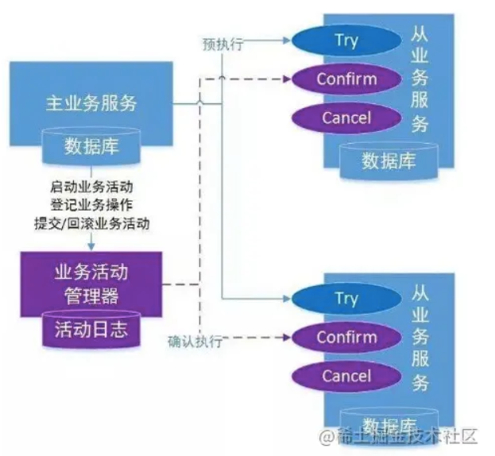

TCC分为几个阶段：

* try阶段：初步的确认，完成业务的检查、资源的预留
* confirm阶段：若检查正常，则进入confirm阶段，提交commit，如果执行失败，则会有事务协调器不断重试执行（在TCC事务机制中认为，如果在try阶段能正常预留的资源，那么在confirm一定能完整的提交）
* cancel阶段：若检查异常，即任意一个try失败，则进入cancel阶段，提交rollback，如果执行失败，则会有事务协调器不断重试执行

比如某个业务，需要下订单，生成订单并扣库存，系统正常时：

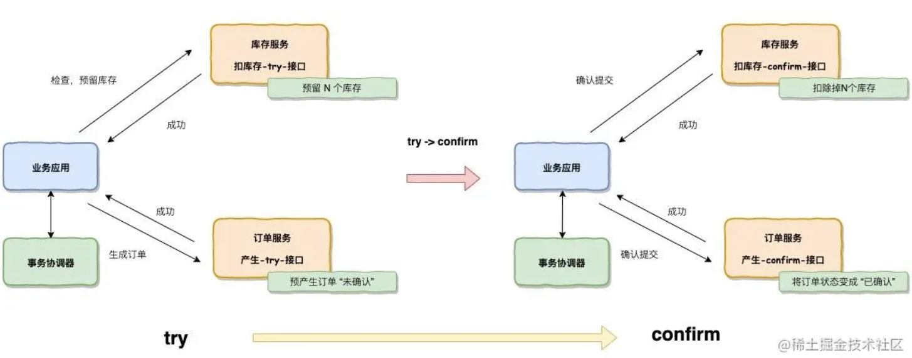

try阶段有失败的情况出现时：

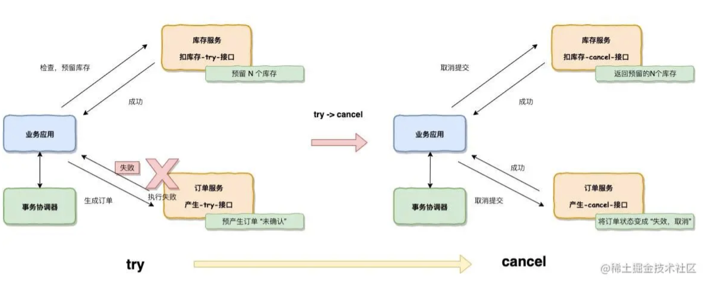

TCC的优点：

* 它将资源转换为业务逻辑，粒度变小。比如上面的例子，commit只是让订单从未确认变成已确认，让库存预留变成库存扣除，不会有阻塞资源的情况
* 超时后进行补偿，也就是有重试机制，重试逻辑由业务控制

## 本地消息表和MQ分布式事务

待看：

https://juejin.cn/post/6844903936718012430

# Raft算法

Paxos用于解决多个副本之间的一致性问题，比如日志同步，保证各个节点的日志一致性，选主的唯一性 ，它和2PC是互补的关系，并不是替代关系。Paxos是共识算法，是consensus，而不是consistency

Paxos是第一个被证明完备的共识算法，能够让分布式网络中的节点在出现错误时仍然保持一致，当然前提是没有恶意节点，也就是不存在拜占庭将军问题。在传统的分布式系统，机器不会故意发送错误消息，最常见的问题是节点失去响应。（相对应的，区块链就属于新型分布式系统，它需要解决拜占庭将军问题，对抗欺诈节点）

拜占庭将军问题：拜占庭帝国有许多支军队，不同军队的将军之间必须制定一个统一的行动计划，同时各将军在地理上都是被分割开的，只能依靠军队的通讯员进行通讯，通讯员中可能会存在叛徒，他们可以任意篡改消息，从而欺骗将军。

Paxos 其实是一类协议，而Raft 就是 Multi-Paxos 的一个变种，Raft 通过简化 Multi-Paxos 的模型，实现了一种更容易让人理解和工程实现的共识算法。

## 算法概述

### 共识算法的特点

共识算法允许一组节点像一个整体一样一起工作，即使其中的一些节点出现故障。它是基于复制状态机的性质的，一般通过复制日志来实现复制状态机，每个server存储着一份包括命令序列的日志文件，状态机会顺序执行这些命令，由于每个日志包含相同的命令，且顺序相同，所以最后每个状态机的状态都相同。

共识算法的工作就是保持复制日志的一致性，服务器上的共识算法模块从客户端接受命令后将它们添加到日志，然后与其他服务器上的公式模块通信：

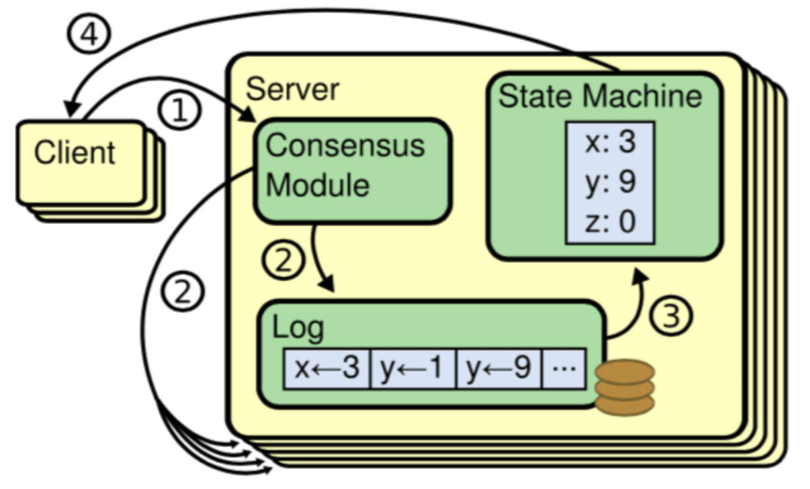

共识算法具有以下特性：

* 确保在非拜占庭条件下的安全性，不会返回错误结果，可以应对网络延迟、分区、包丢失
* 高可用：超过一半的服务器可以工作并可以相互通信，整个集群对外都是功能可用的
* 一致性不依赖时序，错误的时钟和消息延迟不会产生一致性问题
* 少数运行缓慢的服务器不影响整体系统性能，超过一半的server响应就能达成共识

### 节点类型

一个Raft集群包括若干server，每个节点一定会处于以下三种状态的某个：

* Leader：负责发起心跳，响应客户端，创建日志，同步日志
* Candidate：Leader 选举过程中的临时角色，由 Follower 转化而来，发起投票参与竞选 
* Follower：接受 Leader 的心跳和日志同步数据，还负责投票给 Candidate 

在正常的情况下，只有一个服务器是 Leader，剩下的服务器是 Follower。Follower 是被动的，它们不会发送任何请求，只是响应来自 Leader 和 Candidate 的请求。

三种状态互相转换的流程：

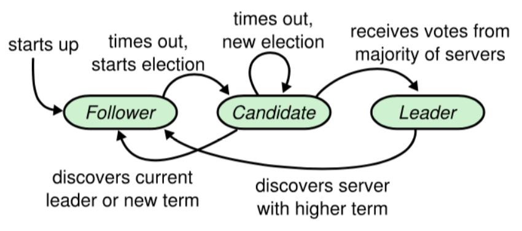

### 任期

raft算法将时间划分为任意长度的任期term，任期用连续的数字表示：

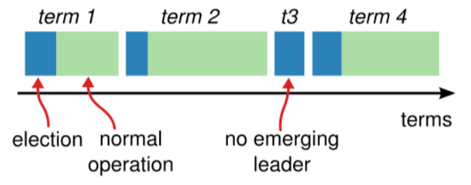

每一个任期的开始都是一次选举，在选举开始时，一个或多个 Candidate 会尝试成为 Leader。如果一个 Candidate 赢得了选举，它就会在该任期内担任 Leader。如果没有选出 Leader，将会开启另一个任期，并立刻开始下一次选举。

每个节点都会存储当前的term号，并在通信时与其他服务器交换term号：

* 如果发现自己的 term 号比其他人小，那么他会更新到较大的 term 值 
* 如果发现上述行为的节点是一个 Candidate 或者 Leader ，它会退化为Follower 
* 如果发现对方的 term 比自己小，那么它会拒绝此次请求 

### 消息类型

基本的 Raft 一致性算法仅需要 2 种 RPC：

* RequestVote RPC是 Candidate 在选举过程中触发的
* AppendEntries RPC 是 Leader 触发的，为的是复制日志条目和提供一种心跳（Heartbeat）机制

为了提高性能，还有第三种消息：在各个服务器之间传输快照，这种消息可以提高同步日志的性能

### Leader选举

Leader 会向所有的 Follower 周期性发送心跳来保证自己的 Leader 地位：

* 如果一个 Follower 在一个周期内没有收到心跳信息，就叫做选举超时，然后它就会认为此时没有可用的 Leader，并且开始进行一次选举以选出一个新的 Leader。（Follower -> Candidate）
* 如果一台服务器能够收到来自 Leader 或者 Candidate 的有效信息，那么它会一直保持为 Follower 状态 （Follower -> Follower）

开始选举的过程：为了开始新的选举，Follower 会自增自己的 term 号并且转换状态为 Candidate，然后他会向所有节点发起 RequestVoteRPC 请求（当服务器收到了该请求则会给一个Candidate投票，如果有多个Candidate时则只能投一票，按照先到先服务原则），一个Candidate的状态转换：

* 一个 Candidate 在一个任期内收到了来自集群内的多数选票，它把自己的状态转换成Leader，并告知其他节点自己是Leader（Candidate -> Leader）
* 一个 Candidate 收到一个声明Leader请求，该请求的term 号大于等于自己的 term 号 ，说明对方已经成为 Leader，则自己回退为 Follower （Candidate -> Follower），注意等于也要让位
* 一个 Candidate 收到一个声明Leader请求，该请求的term 号小于自己的 term 号 ，此时拒绝该请求，并让该节点更新term （Candidate -> Candidate）
* 一个Candidate既没有赢得选举，也没有输掉选举，没有Candidate获得大多数的选票，所有Candidate都会超时，然后开始新一轮选举，自增term，然后发起RequestVoteRPC 请求（Candidate -> Candidate）

为了防止无限的重复最后一个情况，Raft用随机的选举超时时间来保证它发生的概率小。选举超时时间是在一个固定的间隔内随机选出来的，在大多数情况下只有一个服务器会率先超时，然后第一个发起选举，在其它服务器超时之前赢得选举。

投票时，除了先到先服务 原则，日志的新旧也会影响投票，每个Candidate 发送 RequestVoteRPC 时，都会带上最后一个 entry 的信息，Follower收到投票信息时，会对该 entry 进行比较，如果发现自己的更新，则拒绝投票给该 Candidate （判断日志新旧的方式：如果两个日志的 term 不同，term 大的更新；如果 term 相同，更长的 index 更新 ）

### 日志格式和提交

每一个事件称为一个entry，只有Leader才能创建entry，entry的内容包含三个要素：term、index、cmd。分别是任期号、entry在log中的坐标、可以应用到状态机的操作。

log是一个由entry组成的数组，每个节点都有自己的log。entry和log的状态如下图：

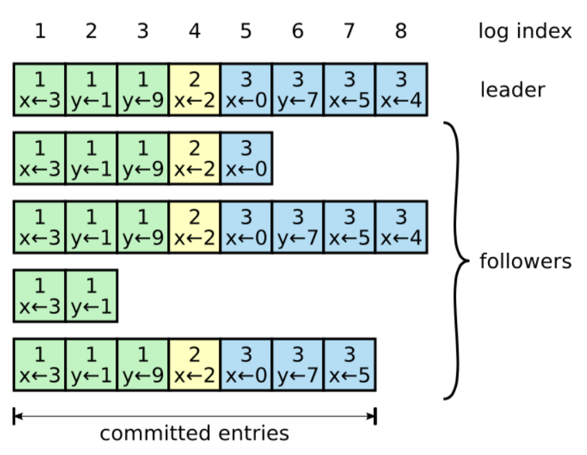

每个方块的数字代表任期号，下面代表一条可执行的命令。

一旦选出了 Leader，它就开始接受客户端的请求。每一个客户端的请求都包含一条命令。Leader 收到客户端请求后，会生成一个 entry，再将这个 entry 添加到自己的日志末尾后，向所有的节点广播该 entry（AppendEntries RPC ），要求其他服务器复制这条 entry：

* 如果 Follower 接受该 entry，则会将 entry 添加到自己的日志后面，同时返回给 Leader 同意。
* 如果 Follower 崩溃了或者运行缓慢或者是网络丢包了，Leader 会无限的重试 AppendEntries RPC

如果 Leader 收到了多数的成功响应，Leader 会将这个 entry 应用到自己的状态机中，之后可以成为这个 entry 是 committed 的，并且向客户端返回执行结果。

一旦一个 Follower 知道了一个日志条目已经是committed的，它会将该条目应用至本地的状态机

### 日志匹配原则

Raft中有一个日志匹配原则，简单来说，各节点的log拥有一个相同的公共前缀，在这个前缀中，term、index、cmd都完全相同。日志匹配原则要两点保证：

* 只有Leader可以提交并按顺序创建entry（一个 Leader 从来不会覆盖或者删除自己的日志）
* 日志一致性检查

所谓日志一致性检查，就是当Leader发送AppendEntries RPC 时，Leader会把新日志、新日志之前的一条日志，都包含在消息中：

* 当Follower接到该消息后，若没有找到该日志，就拒绝新的日志条目，一致性检查失败
* 当Follower接到该消息后，若找到该日志，或者Follower的日志是空的，就接受新的日志条目，一致性检查成功

一般来说不会出现一致性检查失败的情况，除非Leader出现崩溃，出现新的网络分区现象，导致重新选举，此时各节点的日志情况可能会比较复杂，比如下图：

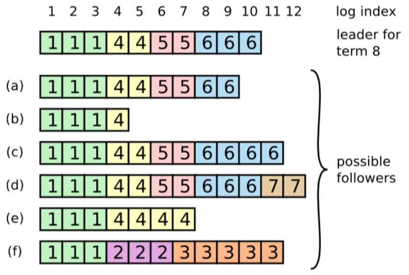

一个Follower的日志可能丢失掉Leader上的条目（Follower与Leader通信出现异常），也可能包含Leader没有的一些条目（在它的网络分区中产生了新的Leader，新Leader向它同步了新的日志又崩溃），也有可能两者都会发生，存在丢失的和多出来的日志。

为了使Follower的日志和Leader的一致，Leader中给每一个Follower维护了一个nextIndex，它表示 Leader 将要发送给该追随者的下一条日志条目的索引，当一个 Leader 开始掌权时，它会将 nextIndex 初始化为它的最新的日志条目索引数+1。

如果某次一致性检查失败，那么Leader就会将nextIndex递减，然后重试，最终nextIndex 会达到一个 Leader 和 Follower 日志一致的地方，此时一致性检查成功，Follower 中冲突的日志条目都被移除了，并且添加所缺少的上了 Leader 的日志条目。

如果需要的话，算法还可以进行优化来减少 一致性检查失败的次数，当检查失败时，Follower 可以记录下冲突日志条目的任期号和自己存储那个任期的最早的索引。通过这些信息，Leader 能够直接递减 nextIndex 跨过那个任期内所有的冲突条目，这样一次失败就可以达到成功的一致性检查，而不是一个冲突日志会发生一次失败。但实际情况通常会没有那么多的冲突日志。

Leader 需要保证自己存储全部已经提交的日志条目。这样才可以使日志条目只有一个流向：从 Leader 流向 Follower，Leader 永远不会覆盖已经存在的日志条目。 

### 节点崩溃的情况

如果 Leader 崩溃，集群中的节点在 electionTimeout 时间内没有收到 Leader 的心跳信息就会触发新一轮的选主，在选主期间整个集群对外是不可用的。 

如果 Follower 和 Candidate 崩溃，处理方式会简单很多。之后发送给它的 RequestVoteRPC 和 AppendEntriesRPC 会失败。由于 raft 的所有请求都是幂等的，所以失败的话会无限的重试。如果崩溃恢复后，就可以收到新的请求，然后选择追加或者拒绝 entry。 

### 时序与可用性

raft 的要求之一就是安全性不依赖于时间：系统不能仅仅因为一些事件发生的比预想的快一些或者慢一些就产生错误。为了保证上述要求，最好能满足以下的时间条件：

broadcastTime << electionTimeout << MTBF

- broadcastTime：向其他节点并发发送消息的平均响应时间；
- electionTimeout：选举超时时间；
- MTBF(mean time between failures)：单台机器的平均健康时间；

broadcastTime应该比electionTimeout小一个数量级，为的是使Leader能够持续发送心跳信息（heartbeat）来阻止Follower开始选举；

electionTimeout也要比MTBF小几个数量级，为的是使得系统稳定运行。当Leader崩溃时，大约会在整个electionTimeout的时间内不可用；我们希望这种情况仅占全部时间的很小一部分。

由于broadcastTime和MTBF是由系统决定的属性，因此人为能控制的是electionTimeout的时间。

一般来说，broadcastTime 一般为 0.5～20ms，electionTimeout 可以设置为 10～500ms，MTBF 一般为一两个月。

### 安全性

Raft保证对外接受的命令不会出现丢失的情况，这就是安全性。

保证安全性的原则有以下几点：

* Leader 需要保证自己存储全部已经提交的日志条目。这样才可以使日志条目只有一个流向：从 Leader 流向 Follower，Leader 永远不会覆盖已经存在的日志条目。 （Raft不会出现Follower向Leader同步日志的情况）
* Raft用投票的方式决定，Leader一定是至少和大多数Server上的日志一样新
* 针对各种节点崩溃的情况
* 保证安全性不依赖时序

## Raft算法实现强一致性读

Raft 算法是 CP 类型的一致性算法。之前提到过zk的写是线性一致性写，但读是顺序一致性读。etcd读写都做到了线性一致，它基于raft来实现，还给出了两种方案，保证处理读请求的一定是Leader：

- ReadIndex
- LeaseRead

在Raft算法中是可能读到过期数据的：由于在 Raft 算法中，写操作成功仅仅意味着日志达成了一致（已经落盘），而并不能确保当前状态机也已经 apply 了日志。状态机 apply 日志的行为在大多数 Raft 算法的实现中都是异步的，所以此时读取状态机并不能准确反应数据的状态，很可能会读到过期数据。 

ReadIndex 算法：每次读操作的时候记录此时集群的 commited index，当状态机的 apply index 大于或等于 commited index 时才读取数据并返回。由于此时状态机已经把读请求发起时的已提交日志进行了 apply 动作，所以此时状态机的状态就可以反应读请求发起时的状态，符合线性一致性读的要求 

为了确保 committed index 的准确，我们需要：

- 让 leader 来处理读请求；
- 如果 follower 收到读请求，将请求 forward 给 leader；
- 确保当前 leader 仍然是 leader；

leader 会发起一次广播请求，如果还能收到大多数节点的应答，则说明此时 leader 还是 leader。这点非常关键，如果没有这个环节，leader 有可能因网络分区等原因已不再是 leader，如果读请求依然由过期的 leader 处理，那么就将有可能读到过去的数据。 

该节知识来自：http://www.xuyasong.com/?p=1970  有一段待理解

# ZooKeeper入门

ZooKeeper是一个开源的分布式协调服务，它能将复杂的分布式一致性服务封装起来，构成一个可靠的原语集，提供给用户使用。原语是由若干条指令组成的，不可分割的（也就是原子性），用于完成某一个功能的过程。

它提供了高可用、高性能、稳定的分布式数据一致性解决方案

zk的高性能是因为数据是保存在内存中的，但zk读取的性能好，写入的性能差，因为写会导致所有服务器进入同步状态，好在协调服务的典型场景是读多于写。

ZooKeeper特点：

* 顺序一致性：从同一客户端发起的事务请求（写操作），最终都会严格的按照顺序被应用到zk中
* 原子性：所有事务请求的处理结果在整个集群中所有机器上的应用情况是一致的，也就是说，要么整个集群中所有的机器都成功应用了某一个事务，要么都没有应用 
* 单一系统映像：无论客户端连到哪一个 ZooKeeper 服务器上，其看到的服务端数据模型都是一致的 （后面分析ZAB可以看到，写操作不能保证更新被所有的Follower立即确认，可能存在某个Follower中没有最新的数据，如果一定要保证单一系统镜像，可在读操作前使用 sync 方法）
* 可靠性：请求生效后结果会被持久化，直到下一次更改
* 最终一致性：写操作最终（而非立即）会对客户端可见（这里说的最终一致性，指的是不满足严格的强一致性，其实zk读是可以做到顺序一致性的）

ZooKeeper可以被用在一些典型的涉及分布式的功能上，如数据发布/订阅、负载均衡、命名服务、分布式协调/通知、集群管理、Master 选举、分布式锁和分布式队列等功能，其中比较典型的：

1. **分布式锁** ： 通过创建唯一节点获得分布式锁，当获得锁的一方执行完相关代码或者是挂掉之后就释放锁。
2. **命名服务** ：可以通过 ZooKeeper 的顺序节点生成全局唯一 ID
3. **数据发布/订阅** ：通过 Watcher 机制 可以很方便地实现数据发布/订阅。当你将数据发布到 ZooKeeper 被监听的节点上，其他机器可通过监听 ZooKeeper 上节点的变化来实现配置的动态更新。

这些功能都依赖于zk保存数据的功能，但它不适合保存大量数据

有很多著名的开源项目都用到了zk：

1. **Kafka** : ZooKeeper 主要为 Kafka 提供 Broker 和 Topic 的注册以及多个 Partition 的负载均衡（分区重分配）等功能。
2. **Hbase** : ZooKeeper 为 Hbase 提供确保整个集群只有一个 Master 以及保存和提供 regionserver 状态信息（是否在线）等功能。
3. **Hadoop** : ZooKeeper 为 Namenode 提供高可用支持。

# 基本概念

## 数据模型

ZooKeeper 数据模型采用层次化的多叉树形结构，每个节点上都可以存储数据，每个节点还可以拥有 N 个子节点，最上层是根节点以“/”来代表。每个数据节点在 ZooKeeper 中被称为 znode，它是 ZooKeeper 中数据的最小单元。并且，每个 znode 都一个唯一的路径标识。

zk给出的上限是每个结点的数据大小最大是1M，不要把zk当成存储业务数据的容器

zk的结点路径标识方式和Unix文件系统路径非常类似，用/来分割：

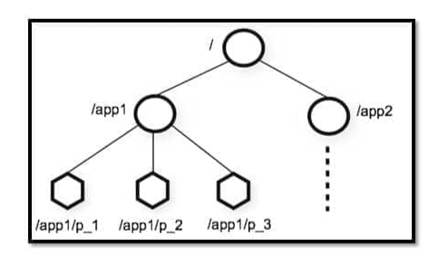

## 数据节点

znode分为4类：

* 持久（PERSISTENT）节点 ：一旦创建就一直存在即使 ZooKeeper 集群宕机，直到将其删除。
* 临时（EPHEMERAL）节点 ：临时节点的生命周期是与 客户端会话（session） 绑定的，会话消失则节点消失（服务器重启也会导致会话结束，节点自动删除） 。并且，临时节点只能做叶子节点 ，不能创建子节点。
* 持久顺序（PERSISTENT_SEQUENTIAL）节点 ：除了具有持久（PERSISTENT）节点的特性之外， 子节点的名称还具有顺序性。比如 /node1/app0000000001 、/node1/app0000000002 。作为父节点可以为其子节点维护一个创建的先后顺序
* 临时顺序（EPHEMERAL_SEQUENTIAL）节点 ：除了具备临时（EPHEMERAL）节点的特性之外，子节点的名称还具有顺序性。

多个客户端同时创建同名节点时，创建无顺序节点时，只有一个可创建成功，其他均失败；创建有顺序节点时，所有客户端都可以创建成功，只是创建出的节点序号不同。

每个 znode 由 2 部分组成:

- **stat** ：状态信息
- **data** ： 节点存放的数据的具体内容

用get命令获取某个节点的内容：

~~~
[zk: 127.0.0.1:2181(CONNECTED) 6] get /dubbo
# 该数据节点关联的数据内容为空
null
# 下面是该数据节点的一些状态信息，其实就是 Stat 对象的格式化输出
cZxid = 0x2
ctime = Tue Nov 27 11:05:34 CST 2018
mZxid = 0x2
mtime = Tue Nov 27 11:05:34 CST 2018
pZxid = 0x3
cversion = 1
dataVersion = 0
aclVersion = 0
ephemeralOwner = 0x0
dataLength = 0
numChildren = 1
~~~

这些返回信息（stat信息）的意思如下：

|   znode 状态信息   |                    解释                    |
| :------------: | :--------------------------------------: |
|     cZxid      |       create ZXID，即该数据节点被创建时的事务 id       |
|     ctime      |          create time，即该节点的创建时间           |
|     mZxid      |     modified ZXID，即该节点最终一次更新时的事务 id      |
|     mtime      |       modified time，即该节点最后一次的更新时间        |
|     pZxid      | 该节点的子节点列表最后一次修改时的事务 id，只有子节点列表变更才会更新 pZxid，子节点内容变更不会更新 |
|    cversion    |        子节点版本号，当前节点的子节点每次变化时值增加 1         |
|  dataVersion   | 数据节点内容版本号，节点创建时为 0，每更新一次节点内容(不管内容有无变化)该版本号的值增加 1 |
|   aclVersion   |       节点的 ACL 版本号，表示该节点 ACL 信息变更次数       |
| ephemeralOwner | 创建该临时节点的会话的 sessionId；如果当前节点为持久节点，则 ephemeralOwner=0 |
|   dataLength   |                 数据节点内容长度                 |
|  numChildren   |                当前节点的子节点个数                |

主要包括版本信息、事务信息、时间信息、子节点个数、数据内容长度。

## 权限控制

ZooKeeper 采用 ACL（AccessControlLists）策略来进行权限控制，类似于 UNIX 文件系统的权限控制。 

对于 znode 操作的权限，ZooKeeper 提供了以下 5 种：

- **CREATE** : 能创建子节点
- **READ** ：能获取节点数据和列出其子节点
- **WRITE** : 能设置/更新节点数据
- **DELETE** : 能删除子节点
- **ADMIN** : 能设置节点 ACL 的权限

其中尤其需要注意的是，CREATE 和 DELETE 这两种权限都是针对 子节点 的权限控制。

对于身份认证，提供了以下几种方式：

- **world** ： 默认方式，所有用户都可无条件访问。
- **auth** :不使用任何 id，代表任何已认证的用户。
- **digest** :用户名:密码认证方式： username:password。
- **ip** : 对指定 ip 进行限制。

## Watcher事件监听器

Watcher（事件监听器），是 ZooKeeper 中的一个很重要的特性。ZooKeeper 允许用户在指定节点上注册一些 Watcher，并且在一些特定事件触发的时候，ZooKeeper 服务端会将事件通知到感兴趣的客户端上去，该机制是 ZooKeeper 实现分布式协调服务的重要特性。 

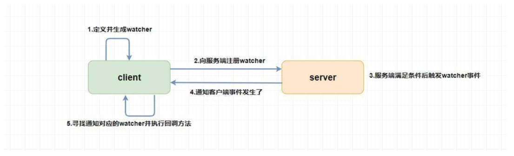

Watch 有如下特点：

- 主动推送：Watch被触发时，由 ZooKeeper 服务器主动将更新推送给客户端，而不需要客户端轮询。
- 一次性：数据变化时，Watch 只会被触发一次。如果客户端想得到后续更新的通知，必须要在 Watch 被触发后重新注册一个 Watch。
- 可见性：如果一个客户端在读请求中附带 Watch，Watch 被触发的同时再次读取数据，客户端在得到 Watch 消息之前肯定不可能看到更新后的数据。换句话说，更新通知（watch发起）先于更新结果（需要触发watch的数据更新）。
- 顺序性：如果多个更新触发了多个 Watch ，那 Watch 被触发的顺序与更新顺序一致。

## Session会话

Session 可以看作是 ZooKeeper 服务器与客户端的之间的一个 TCP 长连接，它能完成下列工作：

* 通过心跳检测保持有效会话
* 向zk服务器发送请求，接收响应
* 接收来自服务器的Watcher事件通知

Session的一个重要属性是sessionTimeout，也就是会话的超时时间。当由于各种原因（可能是服务器压力太大、网络故障或是客户端主动断开连接）导致客户端连接断开时，只要在sessionTimeout规定的时间内能够重新连接上集群中任意一台服务器，那么之前创建的会话仍然有效。

创建会话时，服务端首先会为客户端分配一个sessionID，它是一个全局唯一的ID，会话的很多机制都和它有关。

会话中有很多特殊的事件：CONNECTION_LOSS 连接丢失事件 、SESSION_MOVED 会话转移事件 、SESSION_EXPIRED 会话超时失效事件

# 集群

## 集群作用

为了保证高可用，要以集群的形式来部署ZooKeeper，通常 3 台服务器就可以构成一个 ZooKeeper 集群了：

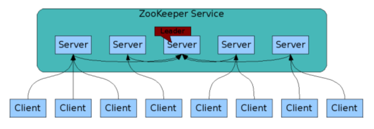

集群间通过 ZAB 协议（ZooKeeper Atomic Broadcast）来保持数据的一致性。

只要集群中大部分机器是可用的，那么zk就能对外提供服务。因此zk集群中的节点数最好是奇数，因为奇数和偶数能容忍的宕机服务器个数是一样的，比如3台和4台的集群都一样最大允许宕机1台服务器。

也正因为这个原因，zk不会出现集群脑裂的现象。比如多台机器部署在不同机房，若机房间网络不通，则集群被分割为几个小集群，此时小集群各自都选出了leader，等网络恢复后，集群就同时有2个leader，这就是脑裂。脑裂期间 2 个大脑都可能对外提供了服务，这将会带来数据一致性等问题。zk的过半机制就保证了不会发生脑裂，少于一半或者等于一半的节点是不可能产生leader的。

## 读写场景

典型的集群模式是Master/Slave 模式（主备模式），在这种模式中，通常 Master 服务器作为主服务器提供写服务，其他的 Slave 服务器从服务器通过异步复制的方式获取 Master 服务器最新的数据提供读服务。

但ZooKeeper 中没有选择传统的 Master/Slave 概念，而是引入了 Leader、Follower 和 Observer 三种角色：

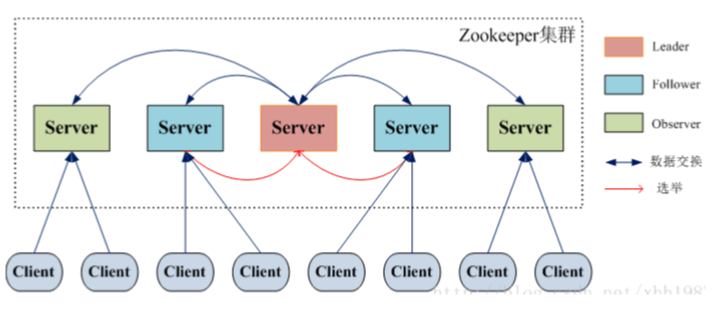

* Leader 既可以为客户端提供写服务又能提供读服务。同一个集群同一时间只会有一个实际工作的Leader，它会发起并维护与各Follwer及Observer间的心跳。 所有的写操作必须要通过Leader完成再由Leader将写操作广播给其它服务器。 
* Follower 和 Observer 都只能提供读服务（若收到了写请求，则转发给Leader）
* Observer 机器不参与 Leader 的选举过程，无投票权，也不参与写操作的“过半写成功”策略，它可以在不影响写性能的情况下提升集群的读性能。Observer是ZooKeeper3.3 系列新增的角色。

ZAB（ZooKeeper Atomic Broadcast 原子广播） 协议是为zk专门设计的一种支持崩溃恢复的原子广播协议（特点是在故障转移的过程中，还能保持数据的一致性），它是zk的重要一致性协议。ZAB协议包括两种基本的模式：消息广播和崩溃恢复，选举又分为两种：Leader宕机后选举和初始化选举

消息广播：

当Leader收到写请求时，为了保证集群中数据的一致性，Leader需要将写请求广播出去：

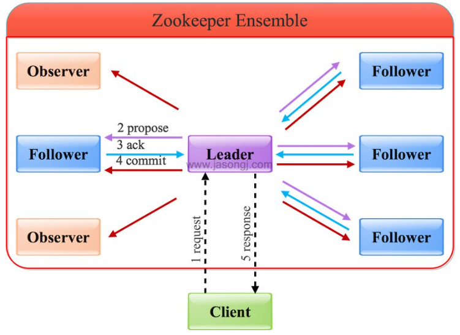

* 通过Leader进行写操作主要分为几步：

  1. 客户端向Leader发起写请求
  2. Leader将写请求以Proposal的形式发给所有Follower并等待ACK
  3. Follower收到Leader的Proposal后返回ACK
  4. Leader得到过半数的ACK（Leader对自己默认有一个ACK）后向所有的Follower和Observer发送Commmit
  5. Leader将处理结果返回给客户端

  其中Observers没有投票权，所以不涉及ACK。关于过半这个概念，是指(1+Follower返回的ACK)/(1+Follower数)>1/2，这个1就是Leader本身自己有一个ACK

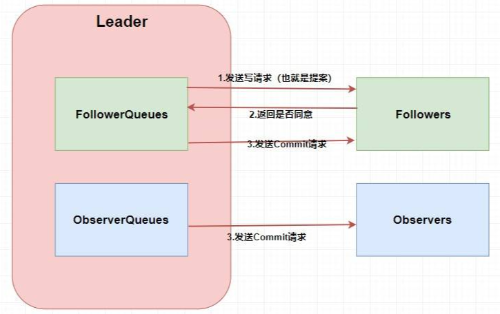

* 在由请求生成Proposal的时候，ZAB会定义一个全局单调递增的事务ID：ZXID，它是一个64位long型，其中高32位表示 epoch 年代，低32位表示事务id，当更换Leader时，就会epoch+1。每次epoch变化，都会重置事务id。Leader通过给各种请求生成ZXID确定它们的相对顺序。
* 写请求会被按顺序放入两个队列中，分别发送到Followers和Observers，队列的存在保证了写请求的有序，不会因为某个请求发送失败的原因导致数据顺序不一致，顺序不一致就会产生数据不一致问题（无法满足顺序一致性），TCP的通信方式也保证了消息发送的顺序性。
* Followers接到写请求时，会反馈是否同意更新，再发送commit请求；Observers则无需确认直接commit。

通过Follower/Observer进行写操作时，比上面就多了一个转发的操作，写操作会转发到Leader，然后Follower接受Leader的执行结果，并返回给客户端。

zk节点接受读请求时，从本地内存中读取数据并返回给客户端即可，由于所有节点都能接受读请求，所以提高节点个数就能提升读性能。

## 选举基本概念

zk可以通过electionAlg配置项设置用于领导选举的算法，默认是基于TCP的FastLeaderElection，也是受支持最好的选举算法，另外几种已经被弃用。

1、myid

每个ZooKeeper服务器，都需要在数据文件夹下创建一个名为myid的文件，该文件包含整个ZooKeeper集群唯一的ID（整数） ，配置文件中ID和hostname一一对应，如下面server的后面就是myid，分别是1、2、3：

~~~
server.1=zoo1:2888:3888
server.2=zoo2:2888:3888
server.3=zoo3:2888:3888
~~~

2、ZXID

事务ID，全局唯一且单调递增，一个64位的数来表示，高32位是Leader的epoch，从1开始，每次选出新的Leader，epoch加一，低32位为该epoch内的序号，每次epoch变化，都将低32位的序号重置。这样保证了zkid的全局递增性。 

3、服务器状态：

- **LOOKING** ：寻找 Leader，该状态下的服务器认为集群中没有Leader，会发起Leader选举
- **LEADING** ：Leader 状态，对应的节点为 Leader。
- **FOLLOWING** ：Follower 状态，对应的节点为 Follower。
- **OBSERVING** ：Observer 状态，对应节点为 Observer，该节点不参与 Leader 选举。

4、选票数据结构

每个服务器在进行领导选举时，会发送如下关键信息：

- **logicClock** 每个服务器会维护一个自增的整数，名为logicClock，它表示这是该服务器发起的第多少轮投票
- **state** 当前服务器的状态
- **self_id** 当前服务器的myid
- **self_zxid** 当前服务器上所保存的数据的最大zxid
- **vote_id** 被推举的服务器的myid
- **vote_zxid** 被推举的服务器上所保存的数据的最大zxid

5、投票流程

* 自增选举轮次：每个服务器在开始新一轮投票时，会先对自己维护的logicClock进行自增操作
* 投票箱：每个服务器都有自己的投票箱，该投票箱记录了所收到的选票，如服务器2投票给服务器3，服务器3投票给服务器1，则服务器1的投票箱为(2, 3), (3, 1), (1, 1) ，票箱中只会记录每个投票者投出的最后一票。在广播自己的选票前，会将自己的投票箱清空 
* 初始化选票：每个服务器最开始都是通过广播把票投给自己。 
* 服务器会尝试从其它服务器获取投票，并记入自己的投票箱内。如果无法获取任何外部投票，则会确认自己是否与集群中其它服务器保持着有效连接。如果是，则再次发送自己的投票；如果否，则马上与之建立连接。 
* 收到外部选票后：
  * 外部投票的logicClock大于自己的logicClock，则立即清空自己的投票箱并将自己的logicClock更新为收到的logicClock，然后再次将自己的投票广播出去。若小于则服务器直接忽略该选票，若相等则继续进行对比
  * 若外部投票的ZXID比较大，则将自己的票中的vote_zxid与vote_myid更新为收到的票中的vote_zxid与vote_myid并广播出去，若两者相等则继续进行对比
  * 若外部选票的myid更大，则将自己的票中的vote_myid更新为收到的票中的vote_myid并广播出去

6、统计选票：如果已经确定有过半服务器认可了自己的投票（自己票箱中的信息），则终止投票，不再接受其他服务器的投票。并且将自己的状态更新为LEADING，否则更新为FOLLOWING

## 初始化选举

1、初始投票给自己

集群刚启动时，所有服务器的logicClock都为1，zxid都为0。各服务器初始化后，都投票给自己，并将自己的一票存入自己的票箱，如下图所示。 

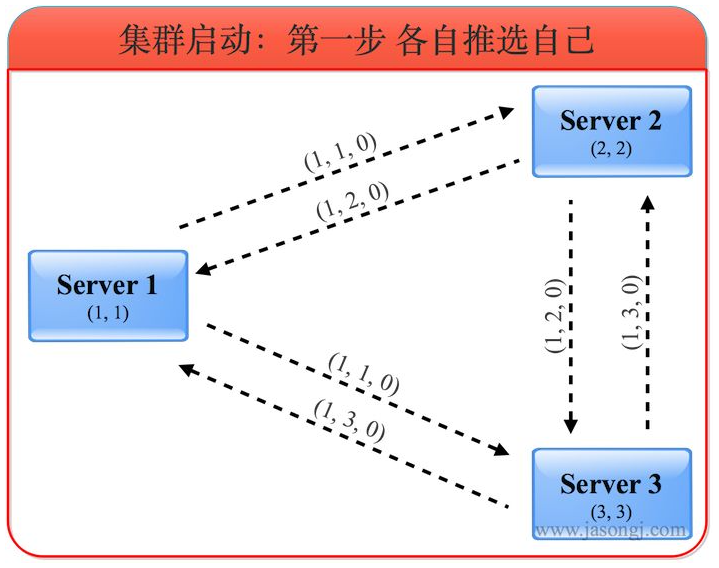

选票(1,1,0)代表投出该选票的服务器的logicClock为1，被推荐的服务器myid为1，被推荐的服务器的最大ZXID为0。

此时各自的票箱中只有自己投给自己的一票

2、更新选票

服务器收到外部投票后，进行选票PK，最后将自己的决定选票广播出去，并更新自己的票箱：

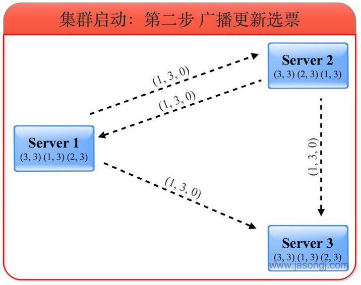

服务器1收到服务器2的选票（1, 2, 0）和服务器3的选票（1, 3, 0）后，由于所有的logicClock都相等，所有的zxid都相等，因此根据myid判断应该将自己的选票按照服务器3的选票更新为（1, 3, 0），并将自己的票箱全部清空，再将服务器3的选票与自己的选票存入自己的票箱，接着将自己更新后的选票广播出去，被广播出去的是(1,3,0)。此时服务器1票箱内的选票为(1, 3)，(3, 3)。 

同理，服务器2在选票PK后也会改投服务器3。服务器3无需更新选票，这个阶段只有服务器1和2更新了自己的选票，并向外发送了广播。

3、根据选票确定角色

根据上述选票，三个服务器一致认为此时服务器3应该是Leader。因此服务器1和2都进入FOLLOWING状态，而服务器3进入LEADING状态。之后Leader发起并维护与Follower间的心跳。 

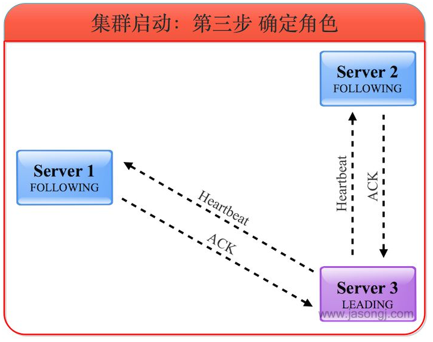

因为集群各节点的myid不同，所以一定会选出一个Leader。选出Leader后，其他未启动的节点启动后，发现已存在Leader，自己会以Follower身份加入集群

## Follower重新加入集群

1、Follower发起新投票

Follower重启，或者发生网络集群后找不到Leader，会进入LOOKING状态并发起新的一轮投票：

2、发现已有Leader

在投票后收到返回结果，根据结果找到了Leader，并确认了选票，确定确实获得了超过半数的选票，然后服务器从LOOKING切换到FOLLOWING状态，Leader建立与该Follower的心跳连接。

## Leader宕机后选举

当集群中的节点感知到Leader已经挂掉时，状态会从FOLLOWING变为LOOKING，然后每个Follower会给自己投票，并将投票广播出去，过程和上面一样。

不同的地方在于在进行选票PK时，关键的参数是ZXID，若某个Follower的数据更新，那么它的投票的ZXID更大，所以它更有可能成为Leader。

成为Leader后正常和其他节点建立心跳，Leader宕机后重新启动，则会以Follower重新加入集群

## commit过的数据不丢失

崩溃恢复模式要解决的问题是，当集群中有机器挂了，如何保证数据的一致性，主要解决两个问题：commit过的数据不丢失、未commit的数据对客户端不可见。

若挂掉的是Follower，因为Leader自己维护了一个Follower队列，等Follower恢复后会将未commit的消息发送给它。

1、Failover前状态

本例中共使用5个ZooKeeper服务器。A作为Leader，共收到P1、P2、P3三条消息，并且Commit了1和2，且总体顺序为P1、P2、C1、P3、C2。根据顺序性原则，其它Follower收到的消息的顺序肯定与之相同。其中B与A完全同步，C收到P1、P2、C1，D收到P1、P2，E收到P1，如下图所示。 

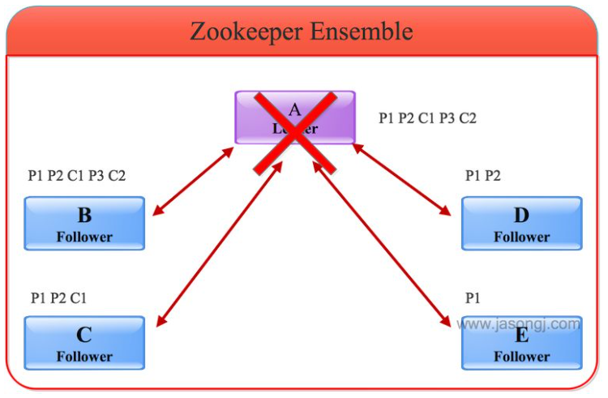

这里要注意：

- 由于A没有C3，意味着收到P3的服务器的总个数不会超过一半，也即包含A在内最多只有两台服务器收到P3。在这里A和B收到P3，其它服务器均未收到P3
- 由于A已写入C1、C2，说明它已经Commit了P1、P2，因此整个集群有超过一半的服务器，即最少三个服务器收到P1、P2。在这里所有服务器都收到了P1，除E外其它服务器也都收到了P2

2、选出新Leader

因为B的数据最新，它的ZXID最大，它最终被选为Leader，然后C、D和E成为Follower。Follower会主动将自己最大的zxid发送给B，B会将Follower的zxid与自身zxid间的所有被Commit过的消息同步给Follower，如下图所示 ：

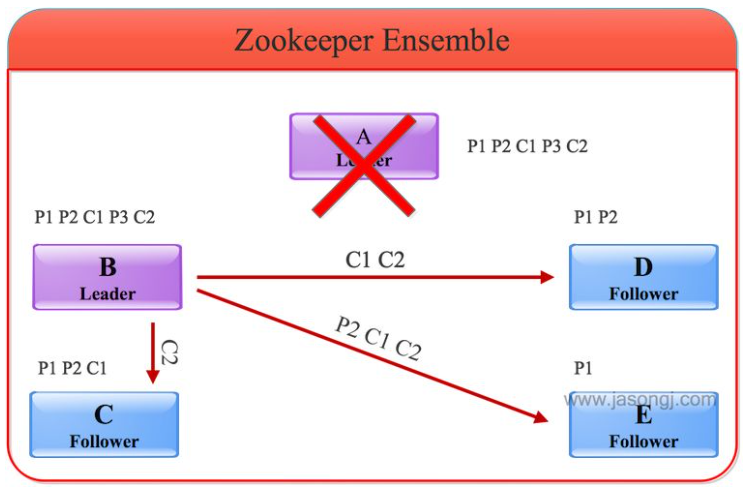

在上图中：

- P1和P2都被A Commit，因此B会通过同步保证P1、P2、C1与C2都存在于C、D和E中
- P3由于未被A Commit，同时幸存的所有服务器中P3未存在于大多数据服务器中，因此它不会被同步到其它Follower

3、通知Follower可对外服务

同步完数据后，B会向D、C和E发送NEWLEADER命令并等待大多数服务器的ACK（下图中D和E已返回ACK，加上B自身，已经占集群的大多数），然后向所有服务器广播UPTODATE命令。收到该命令后的服务器即可对外提供服务。 

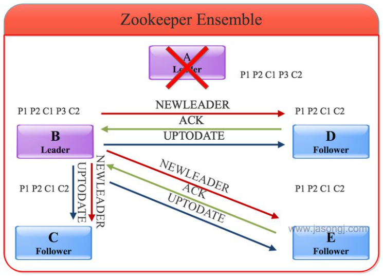

## 未commit过的消息不可见

在上例中，P3未被A Commit过，同时因为没有过半的服务器收到P3，因此B也未Commit P3（如果有过半服务器收到P3，即使A未Commit P3，B会主动Commit P3，即C3），所以它不会将P3广播出去。 

成为Leader后，对消息进行重新判断以及对Follower进行同步或者删除动作，保证未commit过的消息不可见（主要靠删除动作）：

具体做法是，B在成为Leader后，先判断自身未Commit的消息（本例中即P3）是否存在于大多数服务器中从而决定是否要将其Commit。然后B可得出自身所包含的被Commit过的消息中的最小zxid（记为min_zxid）与最大zxid（记为max_zxid）。C、D和E向B发送自身Commit过的最大消息zxid（记为max_zxid）以及未被Commit过的所有消息（记为zxid_set）。B根据这些信息作出如下操作：

- 如果Follower的max_zxid与Leader的max_zxid相等，说明该Follower与Leader完全同步，无须同步任何数据
- 如果Follower的max_zxid在Leader的(min_zxid，max_zxid)范围内，Leader会通过TRUNC命令通知Follower将其zxid_set中大于Follower的max_zxid（如果有）的所有消息全部删除

举一个可能有Follower存在以及commit的消息，服务器F包含P1、P2、C1、P3，服务器G包含P1、P2。此时服务器F、A和B都包含P3，但是因为票数未过半，因此B作为Leader不会Commit P3，而会通过TRUNC命令通知F删除P3。如下图所示：

一个可能的问题：

- 一定是A先出现提案，其他节点后出现，所以不可能出现某个commit指令先出现在其他节点。此外，A发现大部分节点都已经准备好了，就会广播commit，向客户端返回结果，如果还未广播就挂了，则客户端不认为数据写入了，此时就属于要丢弃的数据；广播commit和向客户端返回结果应该具有同时完成的性质，否则可能出现广播了，节点挂了，但其他节点收到了commit，客户端任务写入失败，但后续新Leader又将数据恢复了的情况

## 集群选举总结

当 Leader 服务器出现网络中断、崩溃退出与重启等异常情况时，就会进入 Leader 选举过程。

Leader选举的大致过程：

1. **Leader election（选举阶段）**：节点在一开始都处于选举阶段，只要有一个节点得到超半数节点的票数，它就可以当选准 leader。
2. **Discovery（发现阶段）** ：在这个阶段，followers 跟准 leader 进行通信，同步 followers 最近接收的事务提议。
3. **Synchronization（同步阶段）** :同步阶段主要是利用 leader 前一阶段获得的最新提议历史，同步集群中所有的副本。同步完成之后 准 leader 才会成为真正的 leader。
4. **Broadcast（广播阶段）** :到了这个阶段，ZooKeeper 集群才能正式对外提供事务服务，并且 leader 可以进行消息广播。同时如果有新的节点加入，还需要对新节点进行同步。

两种模式的切换：

* 崩溃恢复模式：

  当服务框架在启动过程中，或者是Leader宕机、网络中断等，ZAB就会进入崩溃恢复模式，然后选举产生新的服务器。当选举产生了新的Leader服务器，同时集群中已经有过半的机器与该 Leader 服务器完成了状态同步（就是数据状态保持一致）之后，ZAB 协议就会退出恢复模式。

* 消息广播模式：

  退出崩溃恢复模式也就是进入了消息广播模式，此时Leader负责进行消息广播，新加入的服务器会自动进入数据恢复模式，也就是找到Leader所在的服务器并与其进行数据同步，最后一起参与消息广播流程中。

# Paxos算法

在 Paxos 中主要有三个角色，分别为 Proposer提案者、Acceptor表决者、Learner学习者。

Paxos有两个阶段：分别为 Prepare 和 accept 阶段

1、 Prepare阶段

Proposer提案者会提出proposal提案，在该阶段，Proposer会将提案编号发送给所有的表决者，这个编号拥有全局唯一性，并且是递增的。

Acceptor表决者曾经接受过某个提案，它会把提案编号保存在本地，这个编号记为maxN，每个表决者仅会 accept 编号大于自己本地 maxN 的提案，若拒绝此提案，Acceptor会将maxN和value（本地的提案内容）反馈给Proposer：

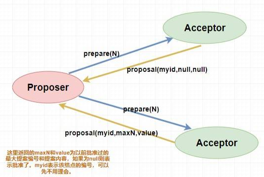

2、accept阶段

若Proposer收到了超过半数的Acceptor批准，那么Proposer会发送给所有的Acceptor真正的提案，包括提案内容和编号。

Acceptor收到真正的提案后会再次确认编号和maxN的相对大小，若满足要求则accept该提案（还未提交），然后将情况返回给Proposer，若不满足则不回应或者回应No：

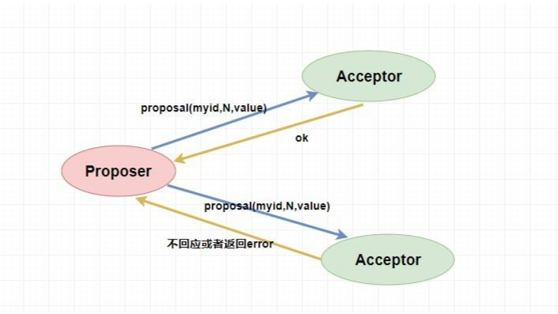

当 Proposer 收到超过半数的 accept ，那么它这个时候会向所有的 acceptor 发送提案的提交请求。对于已经accept的，Proposer 会发送该提案编号，意思是确认提交执行；对于未accept的，Proposer 会发送提案内容和编号让其无条件执行：

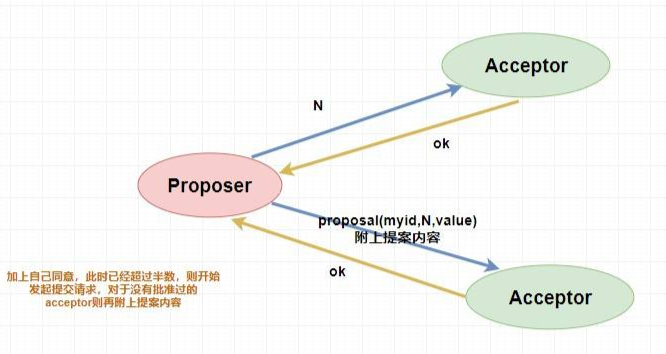

如果Proposer没有收到半数以上的accept，那么它将会递增提案编号，重复执行上述两个阶段。

Learner会学习并应用Acceptor批准的内容。

paxos算法存在死循环的问题，没有很好的机制保证两个提案者同时进入Prepare的问题，此时两者中的一个总是因为第二阶段失败重新开启新一轮提案，导致无限进行下去。

# 应用典型场景

## 选主

zk可以在高并发的情况下保证节点创建的全局唯一性，也就是无法创建重复的节点。

在选主场景，各节点向zk发送创建临时节点的请求，此时只有一个节点会创建成功，创建成功的节点就成为了master。其他节点监听该临时节点的变化，如监听临时节点的父节点，若子节点个数变了就代表master挂了，各节点触发回调，然后重新进行选举。也可以直接监控临时节点，通过临时节点是否失去连接来判断master是否挂了。

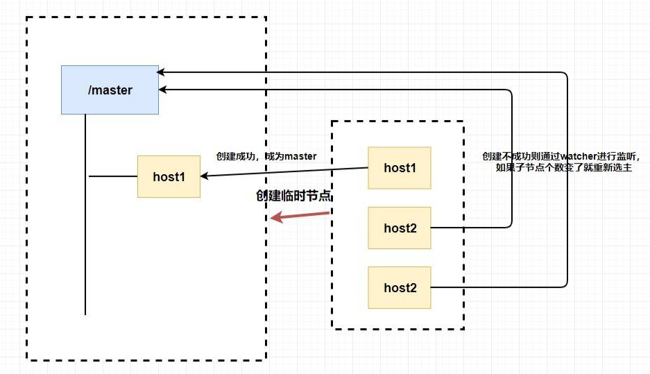

选主的两种典型场景：非公平领导选举、公平领导选举：

1、非公平领导选举步骤：

* 选主时，各节点同时向zk集群注册无序临时节点，路径都相同，只有一个会创建成功，其他节点均失败，创建成功的就成功竞选为Leader，其他客户端为Follower，各Follower向该临时节点注册一个Watch
* 放弃领导权时，Leader会删除临时节点，意外宕机时，也会造成临时节点删除的效果。各Follower会收到通知，再次开始新的领导选举

因为领导选举的过程和前一轮的顺序无关，每次过程都是独立的，选举结果无法预测，故称为非公平的。

非公平选举特点：

* 非公平模式实现简单，每一轮选举方法都完全一样
* 竞争参与方不多的情况下，效率高；若竞争方很多，同时发给zk的写请求也很多，性能很差，且放弃领导权后同时会有很多个watch回调，负载很大

2、公平领导选举步骤：

* 选主时，各节点同时向zk集群注册有序临时节点，路径都相同，各客户端都会创建成功，只是序号不同，此时每个客户端都会判断自己创建成功的节点是否是最小的，若是则为Leader，否则为Follower

* 成为Follower后，每个Follower会watch序号刚好比自己序号小的节点，这样当放弃领导权或者Leader宕机时，只有1个节点会得到通知，该节点会判断自己的序号是不是最小的，若是则成为新的Leader

* 如果某个Follower宕机，则watch它的另一个Follower会收到通知，它会检查自己是否是序号最小的，发现不是之后，它会转而监控前一个序号：

  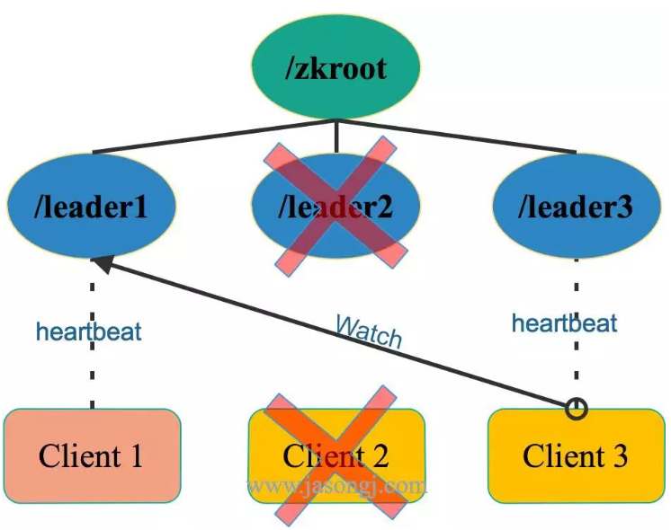

因为领导选举的过程和前一轮的结果相关，选举结果可预测，根据竞选的先后顺序成为新的Leader，故称为公平选举。

公平选举特点：

* 实现相对复杂
* 扩展性好，每个客户端都只 Watch 一个节点且每次节点被删除只须通知一个客户端 
* 延迟相对非公平模式要高，因为它必须等待特定节点得到通知才能选出新的 Leader。

## 分布式锁

通过zk创建节点的全局唯一性，可以方便的实现互斥锁，成功创建节点的就成功获取了锁，其他节点可以通过监听该临时节点的方式来监听锁的释放，触发相应的回调逻辑。

比较方便的是，因为临时节点的性质，无论是节点挂掉，还是主动释放锁，其他节点都可以监听到释放的事件。

zk还可以实现共享锁和排他锁，共享锁可以同时获取多个，但两者不能同时获取。

可以创建一个有序节点，其子节点保持顺序：

* 每次获取共享锁的时候，相当于创建一个子节点，若没有比自己小的节点，或者比自己小的节点都是共享锁，则可以获取锁，否则只能等待。
* 每次获取排他锁的时候，相当于创建一个子节点，若没有比自己小的节点则可以获取锁，否则只能等待

等待锁的时候也可以通过监听回调的方式，这里面要尽量缩小监听的范围，防止出现无效的通知：

* 当等待共享锁的时候，只监听比自己小的最后一个写请求节点
* 当等待排他锁的时候，只监听比自己小的最后一个节点

## 命名服务

通过zk创建节点的全局唯一性，可以方便的实现一个集群全局唯一的命名，比如节点的全路径。实现的全局唯一的命名可以比UUID短，用zk实现的时候更灵活，比如可以自定义节点的名字。

## 集群管理和注册中心

利用临时节点，可以很方便的实现集群管理。每个节点都在zk上建立一个临时节点，方便的进行监控和回调。

用zk实现注册中心时，服务提供者需要在zk上创建一个临时节点，包含ip、端口、调用方式等信息。服务消费者获取zk上的服务注册信息，缓存到本地，在调用服务的时候，直接通过本地的负载均衡算法选择一个服务器进行服务调用。当某个服务提供者的服务器宕机时，相应的临时节点会移除，监听到该事件，就可以对服务列表进行刷新，获取到最新的服务注册信息。

