# 起源

大数据技术源于Google 在 2004 年前后发表的三篇论文：

分别是分布式文件系统 GFS、大数据分布式计算框架 MapReduce 和 NoSQL 数据库系统 BigTable 。它们分别解决了文件系统、计算框架和数据库系统的问题。

在当时，大多数公司的关注点其实还是聚焦在单机上，在思考如何提升单机的性能，寻找更贵更好的服务器。而 Google 的思路是部署一个大规模的服务器集群，通过分布式的方式将海量数据存储在这个集群上 

Doug Cutting根据论文原理初步实现了类似GFS 和 MapReduce 的功能，后来将这些分离出来，启动了一个独立的项目专门开发维护大数据技术，这就是Hadoop，主要包括分布式文件系统 HDFS 和大数据计算引擎 MapReduce 

为了降低MapReduce 进行大数据编程的门槛：

* Yahoo开发了脚本语言Pig，使用类 SQL 的语法，编译后会生成 MapReduce 程序，然后在 Hadoop 上运行 
* Facebook发布了Hive，Hive 支持使用 SQL 语法来进行大数据计算，Hive 会把 SQL 语句转化成 MapReduce 的计算程序 

大数据生态体系逐渐形成：

* 专门将关系数据库中的数据导入导出到 Hadoop 平台的 Sqoop 
* 针对大规模日志进行分布式收集、聚合和传输的 Flume 
* MapReduce 工作流调度引擎 Oozie 
* 将 MapReduce 执行引擎和资源调度分离开来，也是现在大数据平台上最主流的资源调度系统Yarn
* UC 伯克利 AMP 实验室开发的计算引擎Spark
* 流计算框架 Storm、Flink、Spark Streaming 等
* 从 Hadoop 中分离出来的、基于 HDFS 的 NoSQL 系统 HBase 

离线计算和实时计算：

* 大数据离线计算：一般说来，像 MapReduce、Spark 这类计算框架处理的业务场景都被称作批处理计算，因为它们通常针对以“天”为单位产生的数据进行一次计算，然后得到需要的结果，这中间计算需要花费的时间大概是几十分钟甚至更长的时间。因为计算的数据是非在线得到的实时数据，而是历史数据，所以这类计算也被称为大数据离线计算
* 大数据实时计算：需要对实时产生的大量数据进行即时计算，比如对于遍布城市的监控摄像头进行人脸识别和嫌犯追踪。这类计算称为大数据流计算，相应地，有 Storm、Flink、Spark Streaming 等流计算框架来满足此类大数据应用的场景。 流式计算要处理的数据是实时在线产生的数据，所以这类计算也被称为大数据实时计算

大数据处理的主要应用场景包括数据分析、数据挖掘与机器学习：

* 数据分析：主要使用 Hive、Spark SQL 等 SQL 引擎完成 
* 数据挖掘与机器学习则有专门的机器学习框架 TensorFlow、Mahout 以及 MLlib 等，内置了主要的机器学习和数据挖掘算法 

大数据平台：整合所有这些大数据组件和企业应用系统

## 大数据的概念

大数据是指传统数据处理应用软件时，不足以处理的大的或者复杂的数据集的术语

它是一种技术体系，这种技术体系有三个特征：

* 它是能够伸缩到一千台服务器以上的分布式数据处理集群的技术

  在大数据技术诞生之前，单个集群最大的数量是几十个服务器，集群规模有了数量级上的变化，使得数据处理能力大大提高

* 能用廉价的硬件设备搭建大规模集群

  在大数据技术中，无需使用超级计算机，它使得搭建数据处理集群很简单

* 开发者能够像面对单台计算机编程一样去写自己的代码，而不需要操心系统的可用性、数据的一致性之类的问题。大数据框架提供的能力，优秀的封装和抽象，让处理海量数据变得容易

## 三驾马车和基础设施

大数据的三驾马车，就是三篇重要论文：GFS、MapReduce 和 Bigtable ：

* GFS解决了大数据量的存储问题。

* MapReduce解决了大数据量的计算问题，对海量数据计算做了一次抽象，这就让“处理”数据的人，不再需要深入掌握分布式系统的开发了。而且他们推出的 PageRank 算法，也可以通过多轮的 MapReduce 的迭代来实现 

* 无论是 GFS 存储数据，还是 MapReduce 处理数据，系统的吞吐量都没有问题了，因为所有的数据都是顺序读写。但是这两个，其实都没有办法解决好数据的高性能随机读写问题。 

  Bigtable解决了大集群、机械硬盘下的高性能的随机读写问题，它是直接使用 GFS 作为底层存储，来做好集群的分片调度，使用 MemTable+SSTable 的底层存储格式

三类技术的优缺点：

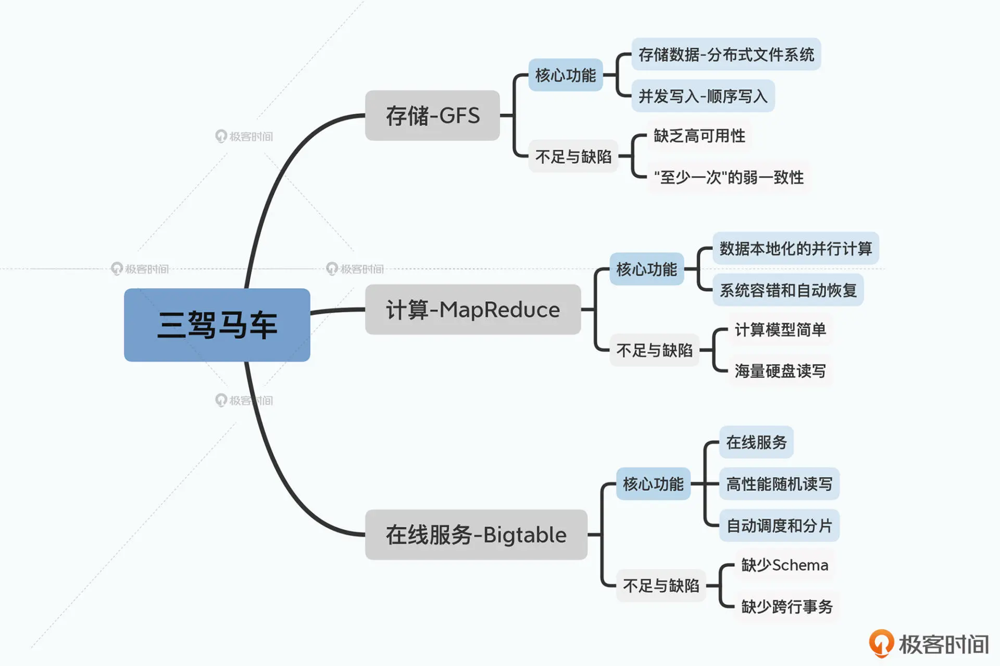

这三篇论文其实还依赖了两个基础设施：

* 保障数据一致性的分布式锁，对于这个问题，Google 在发表 Bigtable 的同一年，就发表了实现了 Paxos 算法的 Chubby 锁服务的论文
* 数据怎么序列化以及分布式系统之间怎么通信，这主要通过Thrift的RPC和序列化来解决。

## OLAP 和 OLTP 数据库

MapReduce 的优化历史：

* 为了更容易写MapReduce，出现了Hive，Hive 通过一门基本上和 SQL 差不多的 HQL，大大降低了数据处理的门槛 
* Dremel优化了MapReduce这个执行引擎，它采用数据列存储 + 并行数据库的方式，提高了性能
* 在 MapReduce 这个模型里，一个 MapReduce 就要读写一次硬盘，而且 Map 和 Reduce 之间的数据通信，也是先要落到硬盘上的。这样，无论是复杂一点的 Hive SQL，还是需要进行上百轮迭代的机器学习算法，都会浪费非常多的硬盘读写。 Spark通过把数据放在内存而不是硬盘里，大大提升了分布式数据计算性能。 

Bigtable 的优化：

* 事务问题和 Schema 问题：Google 在 2011 年发表 的Megastore 的论文，在 Bigtable 之上，实现了类 SQL 的接口，提供了 Schema，以及简单的跨行事务。如果说 Bigtable 为了伸缩性，放弃了关系型数据库的种种特性。那么 Megastore 就是开始在 Bigtable 上逐步弥补关系型数据库的特性。
* 异地多活和跨数据中心问题：Google 在 2012 年发表的 Spanner，能够做到“全局一致性”。这样，就算是基本解决了这两个问题，第一次让我们有一个“全球数据库”。

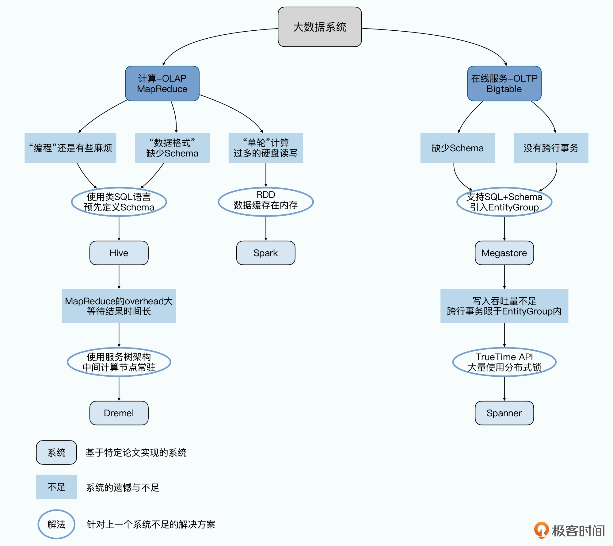

如果说 MapReduce 对应的迭代进行，是在不断优化 OLAP 类型的数据处理性能，那么 Bigtable 对应的进化，则是在保障伸缩性的前提下，获得了更多的关系型数据库的能力 

## 实时数据处理的抽象进化

从 MapReduce 到 Dremel，我们查询数据的响应时间就大大缩短了。但是计算的数据仍然是固定的、预先确定的数据，这样系统往往有着大到数小时、小到几分钟的数据延时。 

所以，为了解决好这个问题，就出现流式数据处理：

* 首先是 Yahoo 在 2010 年发表了 S4 的论文，并在 2011 年开源了 S4。而几乎是在同一时间，Twitter 工程师南森·马茨（Nathan Marz）以一己之力开源了 Storm，并且在很长一段时间成为了工业界的事实标准。和 GFS 一样，Storm 还支持“至少一次”（At-Least-Once）的数据处理。另外，基于 Storm 和 MapReduce，南森更是提出了 Lambda 架构，它可以称之为是第一个“流批协同”的大数据处理架构。 
* 接着在 2011 年，Kafka 的论文也发表了。最早的 Kafka 其实只是一个“消息队列”，看起来它更像是 Scribe 这样进行数据传输组件的替代品。但是由于 Kafka 里发送的消息可以做到“正好一次”（Exactly-Once），所以大家就动起了在上面直接解决 Storm 解决不好的消息重复问题的念头。于是，Kafka 逐步进化出了 Kafka Streams 这样的实时数据处理方案。而后在 2014 年，Kafka 的作者 Jay Krepson 提出了 Kappa 架构，这个可以被称之为第一代“流批一体”的大数据处理架构。 
* 在 2015 年，Google 发表的 Dataflow 的模型，可以说是对于流式数据处理模型做出了最好的总结和抽象。一直到现在，Dataflow 就成为了真正的“流批一体”的大数据处理架构。而后来开源的 Flink 和 Apache Beam，则是完全按照 Dataflow 的模型实现的了。 

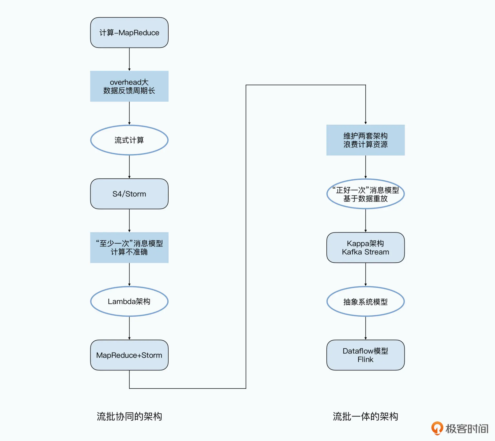

## 资源调度

为了解决一致性问题，我们就有了基于 Paxos 协议的分布式锁。但是 Paxos 协议的性能很差，于是有了进一步的 Multi-Paxos 协议

Paxos 协议并不容易理解，于是就有了 Raft 这个更容易理解的算法的出现。Kubernetes 依赖的 etcd 就是用 Raft 协议实现的

原先我们一般是一个计算集群独占一系列服务器，而往往很多时候，我们的服务器资源都是闲置的。 于是，尽可能用满硬件资源成为了刚需。由此一来，我们对于整个分布式系统的视角，也从虚拟机转向了容器，这也是 Kubernetes 这个系统的由来。

这些论文的脉络联系：

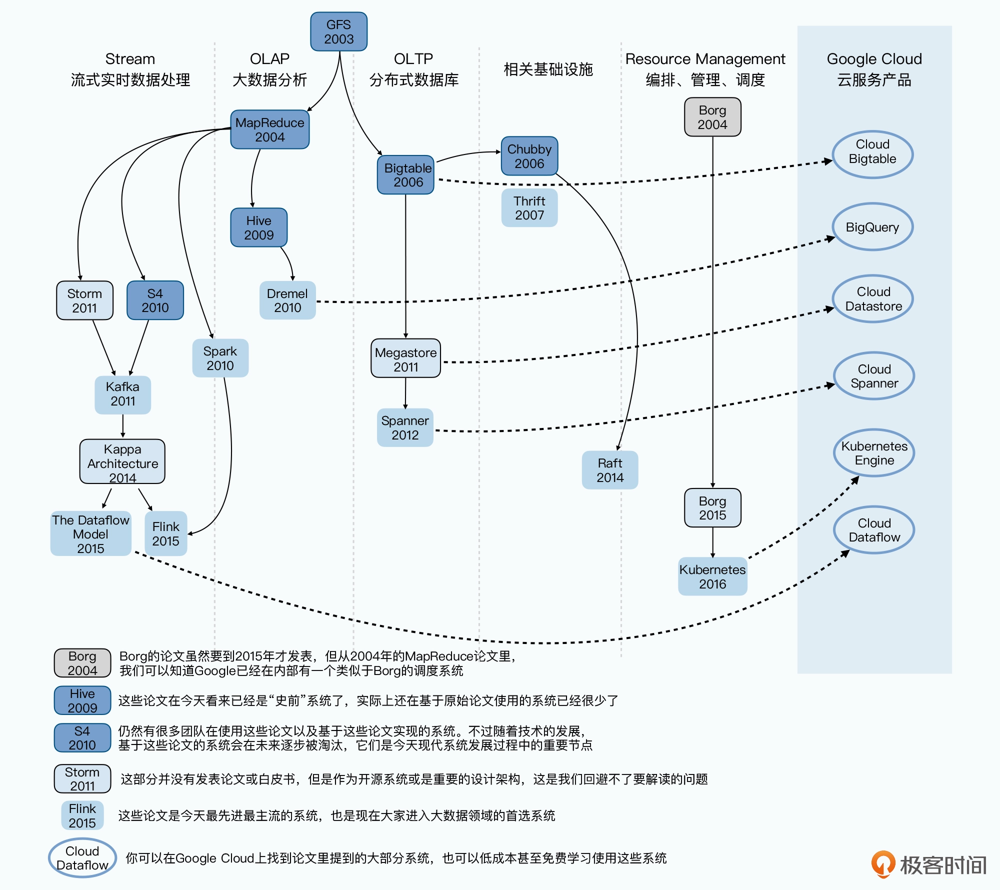

## 知识地图汇总

总的知识地图：

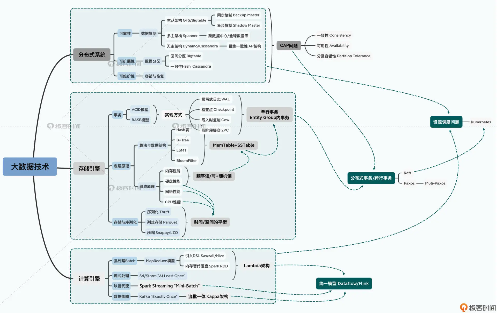

知识地图分为三个维度

* 分布式系统

  要考虑可靠性（防止数据丢失）、数据复制带来的分布方式（主从架构、多主架构以及无主架构 ）；可扩展性（数据分区）；可维护性（容错性：硬件故障时系统仍然能运行、可恢复性）、共识算法、CAP（在一致性、可用性和分区容错性之间做权衡和选择 ）

  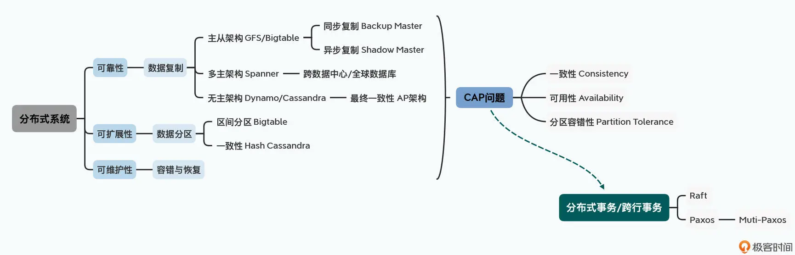

* 存储引擎

  事务（保持事务特性，原子性（Atomic）、一致性（Consistency）、隔离性（Isolation）以及持久性（Durability） ）、事务在分布式系统中，退化到BASE模型（基本可用（Basically Available）、软状态（Soft State）以及最终一致性（Eventually Consistent） ），不过无论是 ACID 还是 BASE，在单机上，我们都会使用预写日志（WAL）、快照（Snapshot）和检查点（Checkpoints）以及写时复制（Copy-on-Write）这些技术，来保障数据在单个节点的写入是原子的 

  数据的写入和存储：分布式数据库最常使用的，其实是基于 LSM 树（Log-Structured Merge Tree）的 MemTable+SSTable 的解决方案 

  数据的序列化：出于存储空间和兼容性的考虑，我们会选用 Thrift 这样的二进制序列化方案。而为了在分析数据的时候尽量减少硬盘吞吐量，我们则要研究 Parquet 或者 ORCFile 这样的列存储格式。然后，为了在 CPU、网络和硬盘的使用上取得平衡，我们又会选择 Snappy 或者 LZO 这样的快速压缩算法。 

  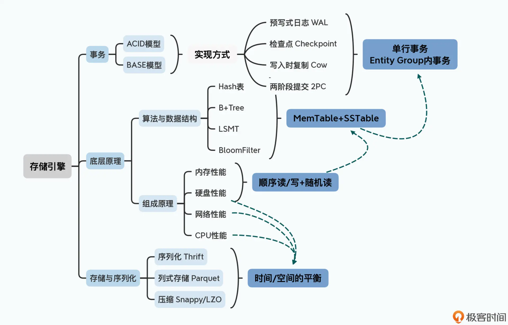

* 计算引擎

  最原始的MapReduce 来进行批数据处理，然后围绕它不断迭代出了让数据处理更快的 Spark 和让数据处理更容易的各种 DSL（比如 Sawzall/Pig 和 Hive） 

  实时数据处理：“最少一次”的 S4/Storm 和Lambda 架构 

  以批为流：通过 Mini-Batch 来进行实时数据处理的 Spark Streaming 

  流批一体：能够做到“正好一次”的 Kafka 和 Kappa 结构 

  统一的Dataflow模型：Apache Flink 和 Apache Beam 

  

# GFS

## 设计原则

三个设计原则：

* 以工程上“简单”作为设计原则：GFS 直接使用了 Linux 服务上的普通文件作为基础存储层，并且选择了最简单的单 Master 设计。 单 Master 让 GFS 的架构变得非常简单，避免了需要管理复杂的一致性问题。不过它也带来了很多限制，比如一旦 Master 出现故障，整个集群就无法写入数据，而恢复 Master 则需要运维人员手动操作，所以 GFS 其实算不上一个高可用的系统。

  但另外一方面，GFS 还是采用了 Checkpoints、操作日志（Operation Logs）、影子 Master（Shadow Master）等一系列的工程手段，来尽可能地保障整个系统的“可恢复（Recoverable）”，以及读层面的“可用性（Availability）”。

* 根据硬件特性来进行设计取舍：2003 年，大家都还在用机械硬盘，随机读写的性能很差，所以在 GFS 的设计中，重视的是顺序读写的性能，对随机写入的一致性甚至没有任何保障。

  2003 年的数据中心，各台机器的网卡带宽只有 100MB，网络带宽常常是系统瓶颈。所以 GFS 在写数据的时候，选择了流水线式的数据传输，而没有选择树形的数据传输方式。更进一步地，GFS 专门设计了一个 Snapshot 的文件复制操作，在文件复制的时候避免了数据在网络上传输。这些设计都是为了减少数据在网络上的传输，避免我们有限的网络带宽成为瓶颈。

* 根据实际应用的特性，放宽了数据一致性（consistency）的选择：GFS 本身对于随机写入的一致性没有任何保障，而是把这个任务交给了客户端。对于追加写入（Append），GFS 也只是作出了“至少一次（At Least Once）”这样宽松的保障。 

  可以说，GFS 是一个基本没有什么一致性保障的文件系统。但即使是这样，通过在客户端库里面加上校验、去重这样的处理机制，GFS 在大规模数据处理上已经算是足够好用了。 

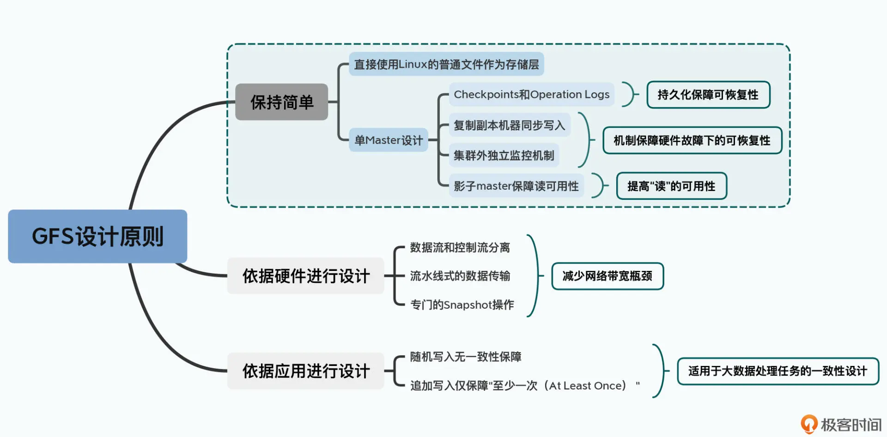

## Master的三个身份

在这个设计原则下，我们会看到 GFS 是一个非常简单的单 Master 架构，但是这个 Master 其实有三种不同的身份，分别是：

* 相对于存储数据的 Chunkserver，Master 是一个目录服务；
* 相对于为了灾难恢复的 Backup Master，它是一个同步复制的主从架构下的主节点；
* 相对于为了保障读数据的可用性而设立的 Shadow Master，它是一个异步复制的主从架构下的主节点。 

并且，这三种身份是依靠不同的独立模块完成的，互相之间并不干扰 

### 目录服务

在整个 GFS 中，有两种服务器，一种是 master，也就是整个 GFS 中有且仅有一个的主控节点；第二种是 chunkserver，也就是实际存储数据的节点。

因此，在 GFS 里面，会把每一个文件按照 64MB 一块的大小，切分成一个个 chunk。每个 chunk 都会有一个在 GFS 上的唯一的 handle，这个 handle 其实就是一个编号，能够唯一标识出具体的 chunk。然后每一个 chunk，都会以一个文件的形式，放在 chunkserver 上。 

而 chunkserver，其实就是一台普通的 Linux 服务器，上面跑了一个用户态的 GFS 的 chunkserver 程序。这个程序，会负责和 master 以及 GFS 的客户端进行 RPC 通信，完成实际的数据读写操作。 

为了确保数据不会因为某一个 chunkserver 坏了就丢失了，每个 chunk 都会存上整整三份副本（replica）。其中一份是主数据（primary），两份是副数据（secondary），当三份数据出现不一致的时候，就以主数据为准。有了三个副本，不仅可以防止因为各种原因丢数据，还可以在有很多并发读取的时候，分摊系统读取的压力。 

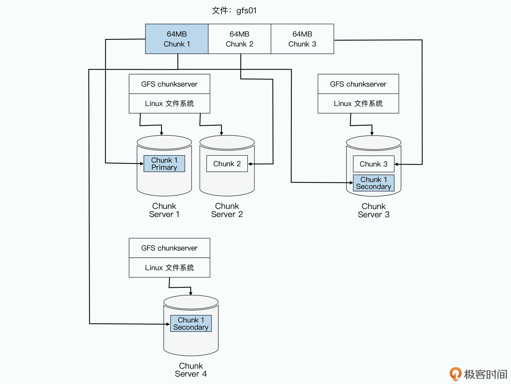

master 里面会存放三种主要的元数据（metadata） ，每次客户端需要与master通信才能知道访问哪个chunkserver：

* 文件和 chunk 的命名空间信息，也就是类似前面 /data/geektime/bigdata/gfs01 这样的路径和文件名；
* 这些文件被拆分成了哪几个 chunk，也就是这个全路径文件名到多个 chunk handle 的映射关系；
* 这些 chunk 实际被存储在了哪些 chunkserver 上，也就是 chunk handle 到 chunkserver 的映射关系。 

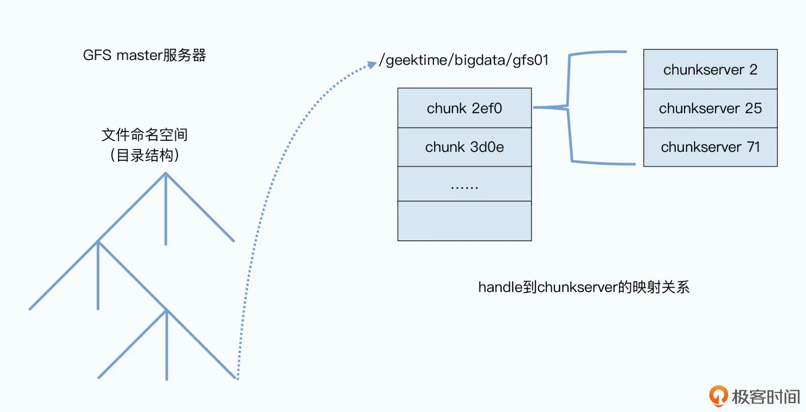

当需要通过一个客户端去读取GFS里面的数据的时候，需要进行以下三个步骤：

* 客户端先去问 master，我们想要读取的数据在哪里。这里，客户端会发出两部分信息，一个是文件名，另一个则是要读取哪一段数据，也就是读取文件的 offset 及 length。因为所有文件都被切成 64MB 大小的一个 chunk 了，所以根据 offset 和 length，我们可以很容易地算出客户端要读取的数据在哪几个 chunk 里面。于是，客户端就会告诉 master，我要哪个文件的第几个 chunk。
* master 拿到了这个请求之后，就会把这个 chunk 对应的所有副本所在的 chunkserver，告诉客户端。
* 等客户端拿到 chunk 所在的 chunkserver 信息后，客户端就可以直接去找其中任意的一个 chunkserver 读取自己所要的数据。 

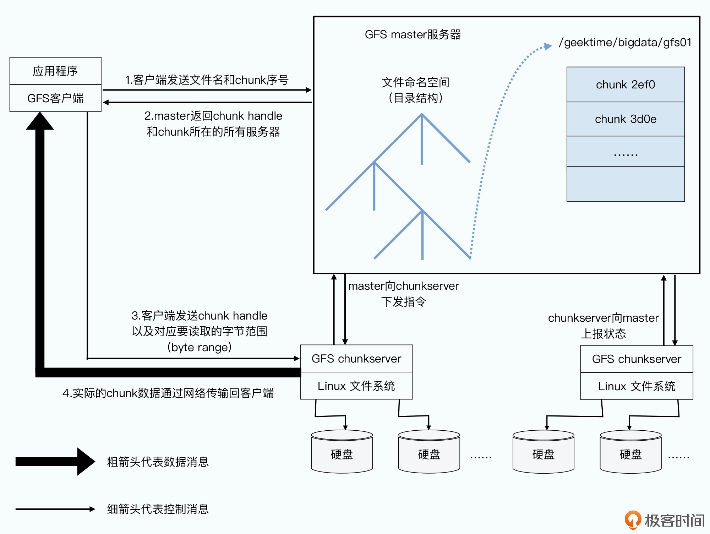

这整个过程抽象一下，其实和 Linux 文件系统差不多。master节点和 chunkserver 这样两种节点的设计，其实和操作系统中的文件系统一脉相承。master 就好像存储了所有 inode 信息的 super block，而 chunk 就是文件系统中的一个个 block。只不过 chunk 比 block 的尺寸大了一些，并且放在了很多台不同的机器上而已。我们通过 master 找到 chunk 的位置来读取数据，就好像操作系统里通过 inode 到 block 的位置，再从 block 里面读取数据。

所以，这个时候的 master，其实就是一个“目录服务”，master 本身不存储数据，而是只是存储目录这样的元数据。

### 快速恢复性和可用性保障

GFS 里面的 master 节点压力很大。在一个 1000 台服务器的集群里面，chunkserver 有上千个，但 master 只有一个。几百个客户端并发读取的数据，虽然可以分摊到那 1000 个 chunkserver 的节点上，但是找到要读的文件的数据存放在哪里，都要去 master 节点里面去找。所以，master 节点的所有数据，都是保存在内存里的。这样，master 的性能才能跟得上几百个客户端的并发访问。

但是数据放在内存里带来的问题，就是一旦 master 挂掉，数据就会都丢了。所以，master 会通过记录操作日志和定期生成对应的 Checkpoints 进行持久化，也就是写到硬盘上。这是为了确保在 master 里的这些数据，不会因为一次机器故障就丢失掉。当 master 节点重启的时候，就会先读取最新的 Checkpoints，然后重放（replay）Checkpoints 之后的操作日志，把 master 节点的状态恢复到之前最新的状态。这是最常见的存储系统会用到的可恢复机制。（也有些数据不会持久化在master，例如重启时每个chunkserver会上报自己拥有哪些chunk，这些就无需持久化 ）

如果master节点的硬件彻底故障，更换硬件需要大量的时间，所以 GFS 还为 master 准备好了几个“备胎”，也就是另外几台 Backup Master。所有针对 master 的数据操作，都需要同样写到另外准备的这几台服务器上。只有当数据在 master 上操作成功，对应的操作记录刷新到硬盘上，并且这几个 Backup Master 的数据也写入成功，并把操作记录刷新到硬盘上，整个操作才会被视为操作成功。 这就是数据的同步复制：

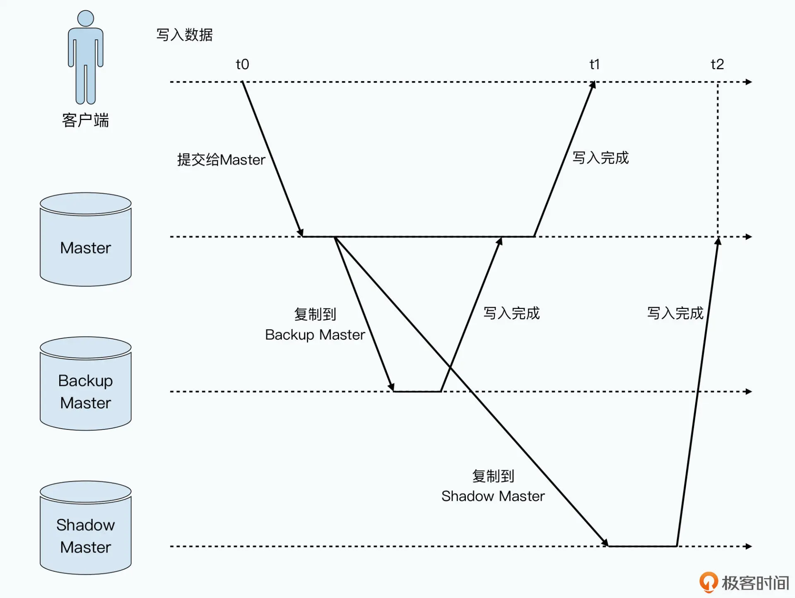

在同步复制这个机制之外，在集群外部还有监控 master 的服务在运行。如果只是 master 的进程挂掉了，那么这个监控程序会立刻重启 master 进程。而如果 master 所在的硬件或者硬盘出现损坏，那么这个监控程序就会在前面说的 Backup Master 里面找一个出来，启动对应的 master 进程，让它“备胎转正”，变成新的 master。因为同步复制的原因，Backup Master 里面的数据和原来的 master 其实一模一样 

为了让集群中的其他 chunkserver 以及客户端不用感知这个变化，GFS 通过一个规范名称（Canonical Name）来指定 master，而不是通过 IP 地址或者 Mac 地址。这样，一旦要切换 master，这个监控程序只需要修改 DNS 的别名，就能达到目的。有了这个机制，GFS 的 master 就从之前的可恢复（Recoverable），进化成了能够快速恢复（Fast Recovery）。

为了让故障期间的集群依然提供读能力，这个办法就是加入一系列只读的“影子 Master”，这些影子 Master 和前面的备胎不同，master 写入数据并不需要等到影子 Master 也写入完成才返回成功。而是影子 Master 不断同步 master 输入的写入，尽可能保持追上 master 的最新状态。这就是异步复制，异步复制下，影子 Master 并不是和 master 的数据完全同步的，而是可能会有一些小小的延时。 当master出问题的时候，客户端们就可以从这些影子 Master 里找到自己想要的信息。当然，因为小小的延时，客户端有很小的概率，会读到一些过时的 master 里面的信息，比如命名空间、文件名等这些元数据 ，会读取到过期数据的前提是：

* 第一个，是 master 挂掉了；
* 第二个，是挂掉的 master 或者 Backup Master 上的 Checkpoints 和操作日志，还没有被影子 Master 同步完；
* 第三个，则是我们要读取的内容，恰恰是在没有同步完的那部分操作上； 

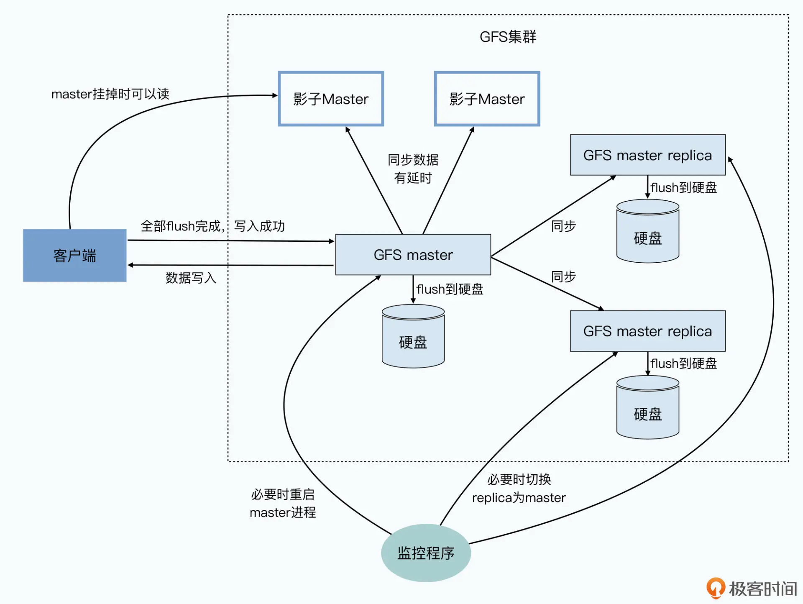

相比于这个小小的可能性，影子 Master 让整个 GFS 在 master 快速恢复的过程中，虽然不能写数据，但仍然是完全可读的。至少在集群的读取操作上，GFS 可以算得上是“高可用（High Availability）”的了。 

如果我们把 Master 当成是一个 MySQL 数据库的主节点，那么 Backup Master 就是配置了高可用的同步复制的 HA 节点，而影子 Master 就是只配置了异步复制分担数据读取压力的 readonly 节点。 

## 应对网络瓶颈

当硬盘的吞吐量大于网卡的极限吞吐量时，这个也就意味着，当我们从 GFS 读写数据的时候，瓶颈就在网络上。

### 数据写入过程

写入和读取不同的是，读取只需要读一个 chunkserver，最坏的情况无非是读不到重试。而写入，则是同时要写三份副本，如果一个写失败，两个写成功了，数据就已经不一致了。 

GFS 写入数据的具体步骤。

* 第一步，客户端会去问 master 要写入的数据，应该在哪些 chunkserver 上。
* 第二步，和读数据一样，master 会告诉客户端所有的次副本（secondary replica）所在的 chunkserver。这还不够，master 还会告诉客户端哪个 replica 是“老大”，也就是主副本（primary replica），数据此时以它为准。
* 第三步，拿到数据应该写到哪些 chunkserver 里之后，客户端会把要写的数据发给所有的 replica。不过此时，chunkserver 拿到发过来的数据后还不会真的写下来，只会把数据放在一个 LRU 的缓冲区里。
* 第四步，等到所有次副本都接收完数据后，客户端就会发送一个写请求给到主副本。GFS 面对的是几百个并发的客户端，所以主副本可能会收到很多个客户端的写入请求。主副本自己会给这些请求排一个顺序，确保所有的数据写入是有一个固定顺序的。接下来，主副本就开始按照这个顺序，把刚才 LRU 的缓冲区里的数据写到实际的 chunk 里去。
* 第五步，主副本会把对应的写请求转发给所有的次副本，所有次副本会和主副本以同样的数据写入顺序，把数据写入到硬盘上。
* 第六步，次副本的数据写入完成之后，会回复主副本，我也把数据和你一样写完了。
* 第七步，主副本再去告诉客户端，这个数据写入成功了。而如果在任何一个副本写入数据的过程中出错了，这个出错都会告诉客户端，也就意味着这次写入其实失败了。

在 GFS 的数据写入过程中，可能会出现主副本写入成功，但是次副本写入出错的情况。在这种情况下，客户端会认为写入失败了。但是这个时候，同一个 chunk 在不同 chunkserver 上的数据可能会出现不一致的情况 

数据写入的流程：

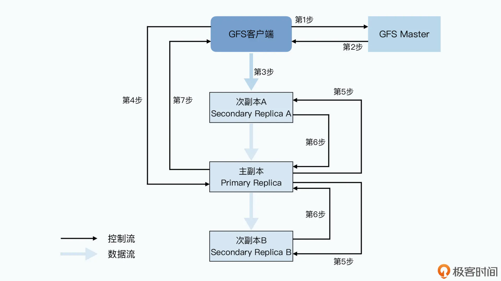

在写入流程中，做到了控制流和数据流的分离，和之前从 GFS 上读数据一样，GFS 客户端只从 master 拿到了 chunk data 在哪个 chunkserver 的元数据，实际的数据读写都不再需要通过 master。 

实际的数据传输过程中，并不需要 master 参与，从而就避免了 master 成为瓶颈。 

### 流水线式的网络数据传输

写入数据时采用了流水线（pipeline）式的网络传输。数据不一定是先给到主副本，而是看网络上离哪个 chunkserver 近，就给哪个 chunkserver，数据会先在 chunkserver 的缓冲区里存起来，就是前面提到的第 3 步。但是写入操作的指令，也就是上面的第 4~7 步，则都是由客户端发送给主副本，再由主副本统一协调写入顺序、拿到操作结果，再给到客户端的。

之所以要这么做，还是因为 GFS 最大的瓶颈就在网络。如果用一个最直观的想法来进行数据传输，我们可以把所有数据直接都从客户端发给三个 chunkserver。

但是这种方法的问题在于，客户端的出口网络会立刻成为瓶颈。比如，我们要发送 1GB 的数据给 GFS，客户端的出口网络带宽有 100MB/ 秒，那么我们只需要 10 秒就能把数据发送完。但是因为三个 chunkserver 的数据都要从客户端发出，所以要 30s 才能把所有的数据都发送完，而且这个时候，三个 chunkserver 的网络带宽都没有用满，各自只用了 1/3，网络并没有被有效地利用起来。而在流水线式的传输方式下，客户端可以先把所有数据，传输给到网络里离自己最近的次副本 A，然后次副本 A 一边接收数据，一边把对应的数据传输给到离自己最近的另一个副本，也就是主副本。

同样的，主副本可以如法炮制，把数据也同时传输给次副本 B。在这样的流水线式的数据传输方式下，只要网络上没有拥堵的情况，只需要 10 秒多一点点，就可以把所有的数据从客户端，传输到三个副本所在的 chunkserver 上 ：

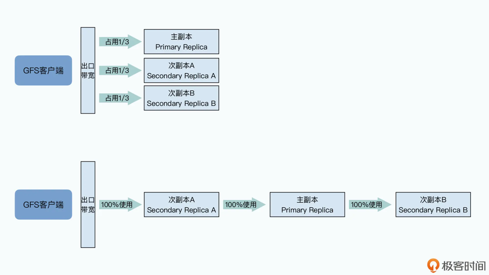

为什么客户端传输数据，是先给离自己最近的次副本 A，而不是先给主副本呢？

这个问题，也和数据中心的实际网络结构有关，例如下面的数据中心的网络拓扑图：

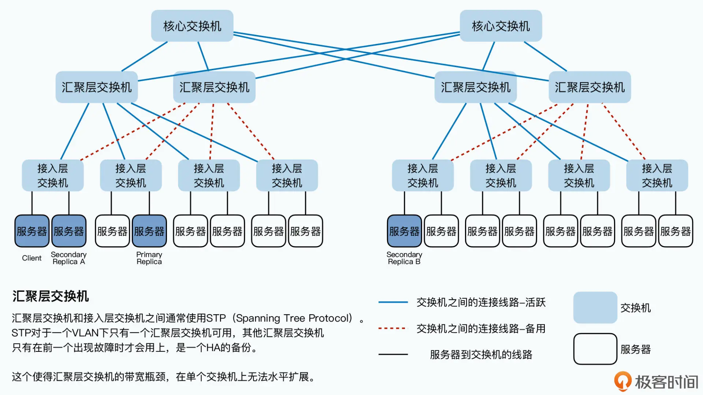

几百台服务器所在的数据中心，一般都是通过三层交换机连通起来的： 

* 同一个机架（Rack）上的服务器，都会接入到一台接入层交换机（Access Switch）上；
* 各个机架上的接入层交换机，都会连接到某一台汇聚层交换机（Aggregation Switch）上；
* 而汇聚层交换机，再会连接到多台核心交换机（Core Switch）上。

根据这个网络拓扑图，你会发现，两台服务器如果在同一个机架上，它们之间的网络传输只需要通过接入层的交换机即可。在这种情况下，除了两台服务器本身的网络带宽之外，它们只会占用所在的接入层交换机的带宽。 

但是，如果两台服务器不在一个机架，乃至不在一个 VLAN 的情况下，数据传输就要通过汇聚层交换机，甚至是核心交换机了。而如果大量的数据传输，都是在多个不同的 VLAN 之间进行的，那么汇聚层交换机乃至核心交换机的带宽，就会成为瓶颈。 

所以GFS在数据网络传输时：

* 首先，客户端把数据传输给离自己“最近”的，也就是在同一个机架上的次副本 A 服务器；
* 然后，次副本 A 服务器再把数据传输给离自己“最近”的，在不同机架，但是处于同一个汇聚层交换机下的主副本服务器上；
* 最后，主副本服务器，再把数据传输给在另一个汇聚层交换机下的次副本 B 服务器。 

这样的传输顺序，就最大化地利用了每台服务器的带宽，并且减少了交换机的带宽瓶颈。而如果我们非要先把数据从客户端传输给主副本，再从主副本传输到次副本 A，那么同样的数据就需要多通过汇聚层交换机一次，从而就占用了更多的汇聚层交换机的资源。 

这样，GFS在客户端向多个 chunkserver 写入数据的时候，采用了“就近”的流水线式传输的方案。这种方式，就尽可能有效地利用了客户端、chunkserver 乃至于交换机的带宽。

### Snapshot 操作

GFS为常见的文件复制操作单独设计一个指令

在 GFS 上，如果我们用笨一点的办法，自然是通过客户端把文件从 chunkserver 读回来，再通过客户端把数据写回去。这样的话，读数据也经过一次网络传输，写回三个副本服务器，即使是流水线式的传输，也要三次传输，一共需要把数据在网络上搬运四次。

所以，GFS 就专门为文件复制设计了一个 Snapshot 指令，当客户端通过这个指令进行文件复制的时候，这个指令会通过控制流，下达到主副本服务器，主副本服务器再把这个指令下达到次副本服务器。不过接下来，客户端并不需要去读取或者写入数据，而是各个 chunkserver 会直接在本地把对应的 chunk 复制一份。 

这样，数据流就完全不需要通过网络传输了。 

 ## 一致性设计

### 一致性和确定性

在 GFS 里面，主要定义了对一致性的两个层级的概念 ：

* 一致性：多个客户端无论是从主副本读取数据，还是从次副本读取数据，读到的数据都是一样的
* 确定性：对于客户端写入到 GFS 的数据，能够完整地被读到。

GFS 对于数据写入的一致性问题：

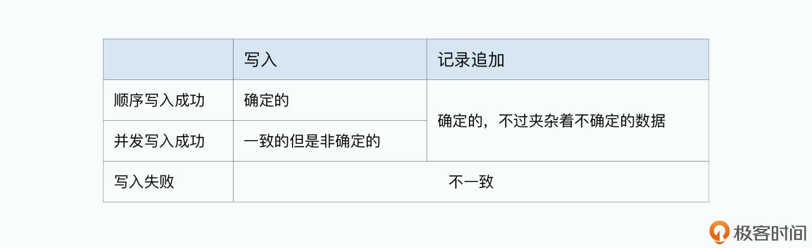

首先，如果数据写入失败，GFS 里的数据就是不一致的。这是因为GFS中写入并不是一个事务操作，主副本会把写入指令下发到两个次副本，如果次副本写入失败了，它会告诉主副本。但是，此时主副本和另一个次副本都已经写入成功了。那么这个时候，GFS 里的三个副本的数据，就是不一致的了。不同的客户端，就可能读到不同的数据。 

如果客户端的数据写入是顺序的，并且写入成功了，那么文件里面的内容就是确定的。

有问题的是其他两个场景：并发写入和追加写入

### 一致非确定状态

如果由多个客户端并发写入数据，即使写入成功了，GFS 里的数据也可能会进入一个一致但是非确定的状态

例如，两个客户端并发往一个文件里面写数据，一个想要写入《星球大战》，一个想要写入《星际迷航》，两个写入都成功了。这个时候，GFS 里面三份副本的数据是一样的，客户端读到的数据无论是从哪个副本里读，都是一样的。但是呢，客户端可能读出来的数据里，前一小时是《星球大战》，后一小时是《星际迷航》。无论哪个时间节点去读数据，客户端都不能读到一部完整的《星球大战》，或者是《星际迷航》。 

之所以会出现这种情况，有两个原因：

* 第一种因素是在 GFS 的数据读写中，为了减轻 Master 的负载，数据的写入顺序并不需要通过 Master 来进行协调，而是直接由存储了主副本的 chunkserver，来管理同一个 chunk 下数据写入的操作顺序。这就可能导致，不同chunkserver管理不同写入动作，无法做到原子性
* 第二种因素是随机的数据写入极有可能要跨越多个 chunk。 

例如，在写入《星球大战》和《星际迷航》的时候，前一个小时的电影是在 chunk 1，对应的主副本在 server A，后一个小时的电影是在 chunk 2，对应的主副本在 server B。然后写入请求到 server A 的时候，《星际迷航》在前，《星球大战》在后，那么《星球大战》的数据就覆盖了《星际迷航》。而到 server B 的时候则是反过来，《星际迷航》又覆盖了《星球大战》。于是，就会出现客户端读数据，前半段是《星球大战》，后半段是《星际迷航》的奇怪现象了。 

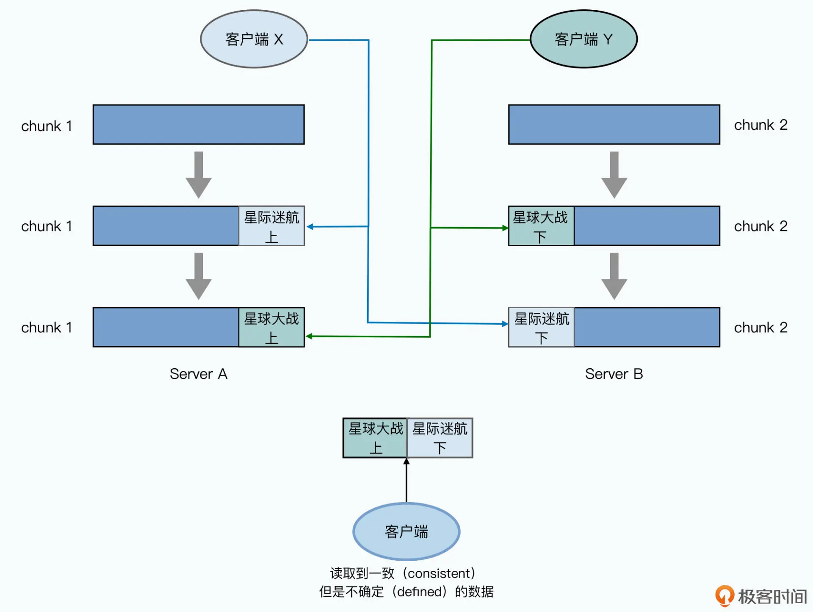

这个一致但是非确定的状态，是因为随机的数据写入，没有原子性（Atomic）或者事务性（Transactional）。如果想要随机修改 GFS 上的数据，一般会建议使用方在客户端的应用层面，保障数据写入是顺序的，从而可以避免并发写入的出现。

### 追加写入的“至少一次”的保障

随机写入并不是 GFS 设计的主要的数据写入模式，GFS 设计了一个专门的操作，叫做记录追加（Record Appends）。这是 GFS 希望我们主要使用的数据写入的方式，而且它是原子性（Atomic）的，能够做到在并发写入时候是基本确定的。

GFS 的记录追加的写入过程，和上一讲的数据写入几乎一样。它们之间的差别主要在于，GFS 并不会指定在 chunk 的哪个位置上写入数据，而是告诉最后一个 chunk 所在的主副本服务器，“我”要进行记录追加。 

* 检查当前的 chunk 是不是可以写得下现在要追加的记录。如果写得下，那么就把当前的追加记录写进去，同时，这个数据写入也会发送给其他次副本，在次副本上也写一遍。
* 如果当前 chunk 已经放不下了，那么它先会把当前 chunk 填满空数据，并且让次副本也一样填满空数据。然后，主副本会告诉客户端，让它在下一个 chunk 上重新试验。这时候，客户端就会去一个新的 chunk 所在的 chunkserver 进行记录追加。
* 因为主副本所在的 chunkserver 控制了数据写入的操作顺序，并且数据只会往后追加，所以即使在有并发写入的情况下，请求也都会到主副本所在的同一个 chunkserver 上排队，也就不会有数据写入到同一块区域，覆盖掉已经被追加写入的数据的情况了。
* 而为了保障 chunk 里能存的下需要追加的数据，GFS 限制了一次记录追加的数据量是 16MB，而 chunkserver 里的一个 chunk 的大小是 64MB。所以，在记录追加需要在 chunk 里填空数据的时候，最多也就是填入 16MB，也就是 chunkserver 的存储空间最多会浪费 1/4。 

因为追加操作，总是由唯一的chunkserver来完成，所以在正常并发写入时，可以做到顺序写入。

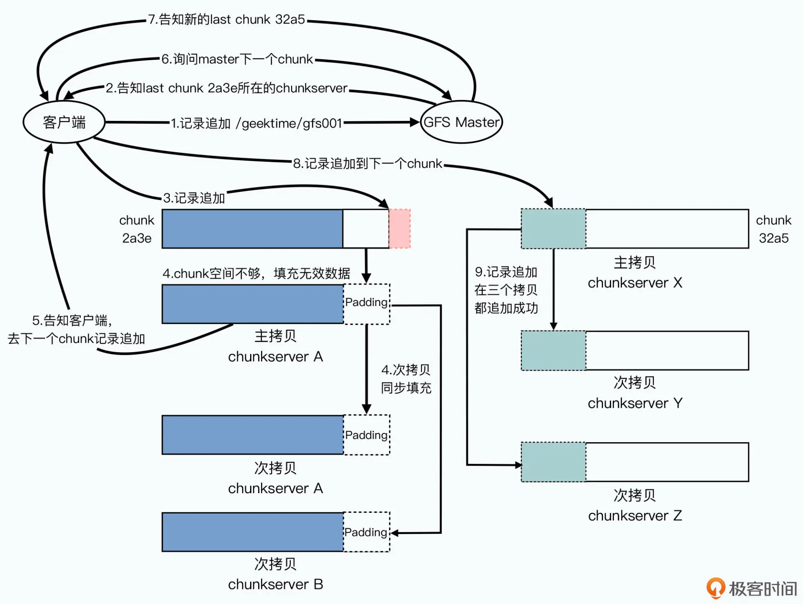

如果在主副本上写入成功了，但是在次副本上写入失败了。此时主副本会告诉客户端数据写入失败，然后让客户端重试。不过客户端发起的重试，并不是在原来的位置去写入数据，而是发起一个新的记录追加操作。这个时候，可能已经有其他的并发追加写入请求成功了，那么这次重试会写入到更后面。 

例如，有三个客户端 X、Y、Z 并发向同一个文件进行记录追加，写入数据 A、B、C，对应的三个副本的 chunkserver 分别是 Q、P、R。

主副本先收到数据 A 的记录追加，在主副本和次副本上进行数据写入。在 A 写入的同时，B，C 的记录追加请求也来了，这个时候写入会并行进行，追加在 A 的后面。

这个时候，A 的写入在某个次副本 R 上失败了，于是主副本告诉客户端去重试；同时，客户端再次发起记录追加的重试，这次的数据写入，不在 A 原来的位置，而会是在 C 后面。

如此一来，在 B 和 C 的写入，以及 A 的重试完成之后，我们可以看到：

* 在 Q 和 P 上，chunkserver 里面的数据顺序是 A-B-C-A；
* 但是在 R 上，chunkserver 里面的数据顺序是 N/A-B-C-A；
* 也就是 Q 和 P 上，A 的数据被写入了两次，而在 R 上，数据里面有一段是有不可用的脏数据。 

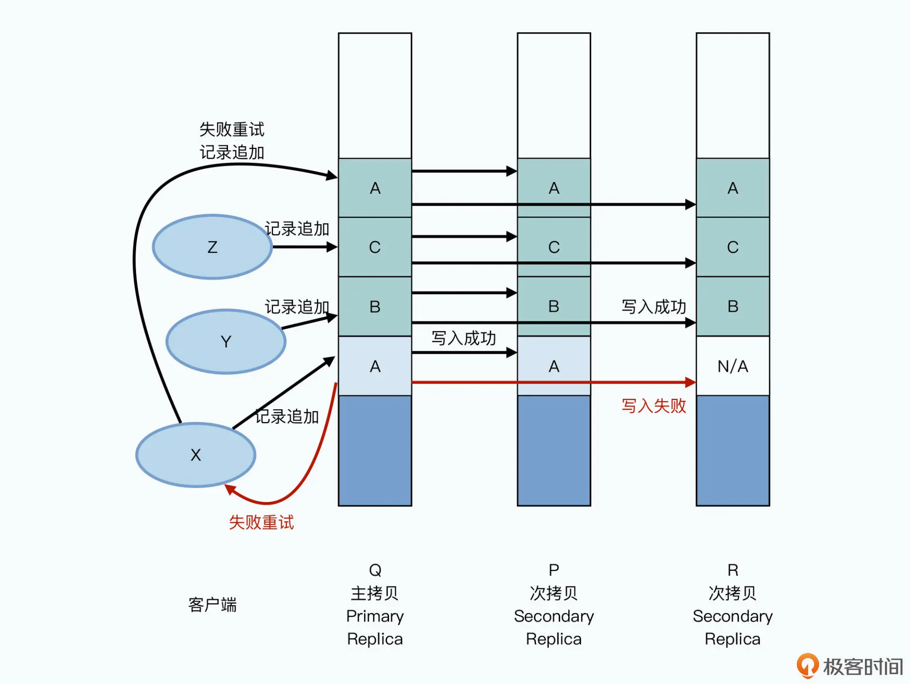

所以在这个记录追加的场景下，GFS 承诺的一致性，叫做“至少一次（At Least Once）”。也就是写入一份数据 A，在重试的情况下，至少会完整地在三个副本的同一个位置写入一次。但是也可能会因为失败，在某些副本里面写入多次。那么，在不断追加数据的情况下，你会看到大部分数据都是一致的，并且是确定的，但是整个文件中，会夹杂着少数不一致也不确定的数据。

GFS 的写入数据的一致性保障是相当低的。它只是保障了所有数据追加至少被写入一次，并且还保障不了数据追加的顺序。这使得客户端读取到的副本中，可能也会存在重复的数据或者空的填充数据，这样的文件系统实在不咋样。 不过，这个“至少一次”的机制，其实很适合 Google 的应用场景。你想像一下，如果你是一个搜索引擎，不断抓取网页然后存到 GFS 上。其实你并不会太在意这个网页信息是不是被重复存了两次，你也不太会在意不同的两个网页存储的顺序。

事实上，GFS 的客户端里面自带了对写入的数据去添加校验和（checksum），并在读取的时候计算来验证数据完整性的功能。而对于数据可能重复写入多次的问题，你也可以对每一条要写入的数据生成一个唯一的 ID，并且在里面带上当时的时间戳。这样，即使这些日志顺序不对、有重复，你也可以很容易地在你后续的数据处理程序中，通过这个 ID 进行排序和去重。 

这个“至少一次”的写入模型也带来了两个巨大的好处 :

* 第一是高并发和高性能，这个设计使得我们可以有很多个客户端并发向同一个 GFS 上的文件进行追加写入，而高性能本身也是我们需要分布式系统的起点。 
* 第二是简单，GFS 采用了一个非常简单的单 master server，多个 chunkserver 架构，所有的协调动作都由 master 来做，而不需要复杂的一致性模型。毕竟，2003 年我们只有极其难以读懂的 Paxos 论文，Raft 这样的分布式共识算法要在 10 年之后的 2013 年才会诞生。而简单的架构设计，使得系统不容易出 Bug，出了各种 Bug 也更容易维护。 

而即使 GFS 里的数据随机写入能够保障确定性，在那个年代的实用价值也不高。对一个普通的机械硬盘，几百个客户端要是并发写入一个位置，硬盘根本抗不住。 

# Bigtable

## MySQL 集群的弊端

在Bigtable 出现之前，面对数据存储的扩容问题，一般的解决办法就是搭建一个几十乃至上百台服务器的 MySQL 集群。它存在以下几种弊端：

### 数据迁移问题

当服务器性能出现瓶颈需要扩容的时候，我们常常只能采取“翻倍”分库增加服务器的方案。 

例如面对大量订单，我们通过把订单号“模”上个 4，拆分到 4 个不同的服务器的数据库里。 而随着我们承接的订单越来越多，每天 SQL 查询的请求越来越多，服务器的峰值 CPU 可能超过了 60%。为了安全起见，我们希望对服务器进行扩容，让峰值 CPU 控制在 40% 以下。但是这个时候，我们没办法只是增加 4 * 0.6 / 0.4 - 4 = 2 台服务器，而是不得不“翻倍”增加 4 台服务器。 

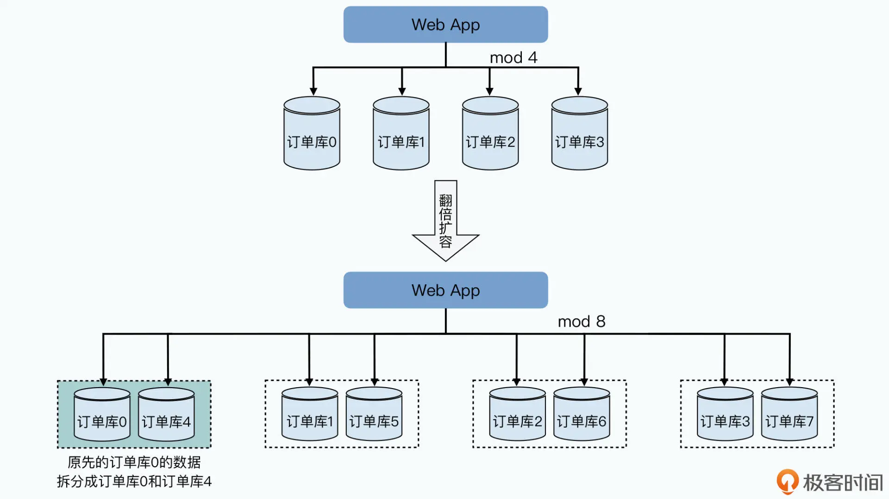

因为如果我们只增加 2 台服务器，把各个服务器的分片，从模上 4 变成模上 6，我们就需要在增加服务器之后，搬运大量的数据。并且这个数据搬运，不只是搬到新增加的服务器上，而是有些数据还要在原有的 4 台服务器上互相搬运。 这个搬运过程需要占用大量的网络带宽和硬盘读写，所以很有可能要让数据库暂停服务。而如果不暂停服务的话，我们就要面对在数据搬运的过程中，到底应该从哪个服务器读和写数据的问题，问题一下子就变得极其复杂了。 

从4台扩容到6台服务器，如果我们还用mod N的方式，我们需要迁移2/3数据库中的数据 ：

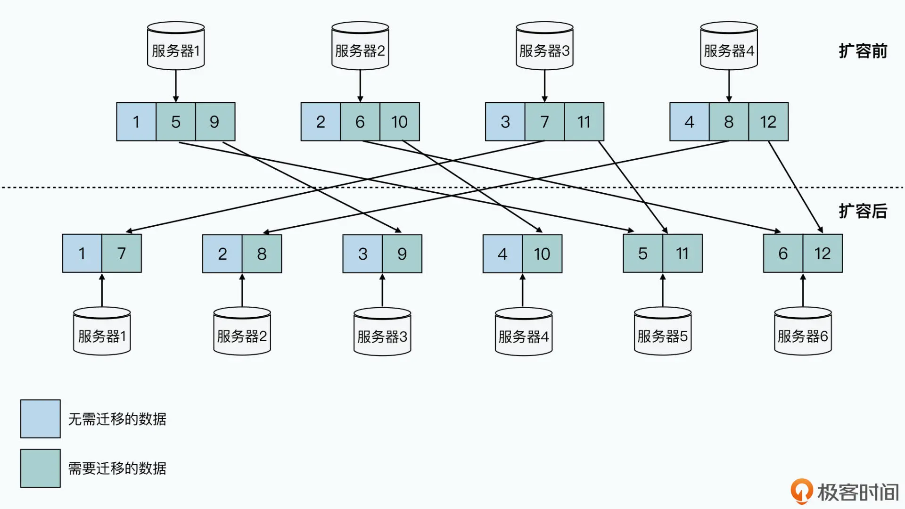

而翻倍扩容服务器，我们可以只需要简单复制 50% 的数据，并且在数据完成复制之后自动切换分片就可以了。但是翻倍扩容的方案，自然就带来了很多浪费，明明我们只需要加两台服务器，但是现在要加上四台。更浪费的是，我们增加的服务器，也许只是为了应对双十一促销这样的一小段时间，等到促销完成，我们又不再需要这些服务器了。 

如果我们需要缩减服务器，也会非常麻烦，我们需要再把两台服务器的数据复制到一台服务器上，才能完成缩容。可以看到，这个集群虽然可以“伸缩”，但是伸缩起来非常不容易。 

我们希望的伸缩性是：需要的时候，加 1 台服务器也加得，加 10 台服务器也加得。而用不上的时候，减少个 8 台 10 台服务器也没有问题，并且这些动作都不需要停机。 这个，也是 Bigtable 的设计目标。 

### 数据倾斜问题

采用MySQL进行数据分区，底层的数据分区策略对于应用不透明，需要开发人员精心设计。

例如以 MySQL 分表作为例子，用户表分到 4 台机器上，用了用户出生的月份“模”上个 4。 这个时候，很幸运，一年是有 12 个月，正好可以均匀分布到 4 台不同的机器上。 

但是当我们进行扩容，变成 8 台机器之后，问题就出现了。我们会发现，服务器 A 分到了 1 月和 9 月生日的用户，而服务器 B 只分到了 6 月生日的用户。在扩容之后，服务器 A 无论是数据量，还是日常读写的负载，都比服务器 B 要高上一倍。而我们只能按照服务器 A 的负载要求来采购硬件，这也就意味着，服务器 B 的硬件性能很多都被浪费了。 

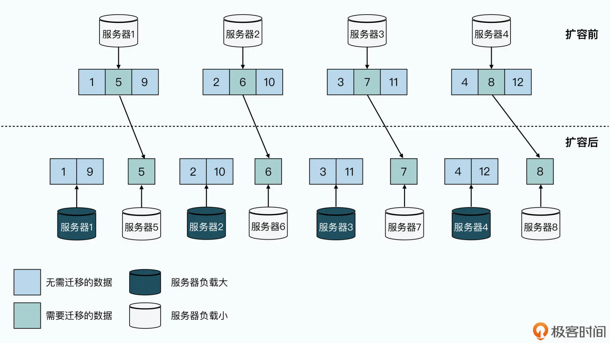

而且，不但用月份不行，用年份和日也不行。比如公司是 2018 年成立，2019 年和 2020 年快速成长，每年订单数涨 10 倍，如果你用年份来进行订单的分片，那么服务器之间的负载就要差上十倍。而用日的话，双十一这样的大促也会让你猝不及防。 

你会发现，使用 MySQL 集群，需要你在一开始就对如何切分数据做好精心设计。一旦稍有不慎，设计上出现了数据倾斜，就很容易造成服务器忙得忙死，闲得闲死的现象。 

所以，如果有自适应的数据分片机制，就能解决这个问题了，这也是 Bigtable 的设计目标 

### 运维问题

对于MySQL集群来说，出现故障需要人工介入。在 MySQL 集群里，我们可以对每个服务器都准备一个高可用的备份，避免一出现故障整个集群就没法用了。但是此时，我们的运维人员仍然需要立刻介入，因为这个时候系统是多了一个“单点”的，我们需要手工添加一台新的服务器进入集群，同步到最新的数据。 

硬盘持续进行高频率读写，会经常出现硬盘损坏的情况，如果每次硬盘损坏都需要运维工程师及时介入，对于大型集群来说成本是相当高的。

理想的高运维性是这样的：最好是 1000 台节点的服务器，坏个 10 台 8 台没事儿，系统能够自动把这 10 台 8 台服务器下线，用剩下的 990 台继续完成服务。我们的运维人员只要 1 个月跑一趟机房批量换些机器就好，而不用 996 甚至 007 地担心硬件故障带来的不可用问题。 

## Bigtable 的设计目标 

Bigtable最基本的设计目标：支撑百万级别随机读写 IOPS，并且能伸缩到上千台服务器的分布式数据库

提供强大的伸缩性：

* 可以随时加减服务器，并且对添加减少服务器数量的限制要小 
* 数据的分片会自动根据负载调整 

提供高运维性：小部分节点的故障，不应该影响整个集群的运行，我们的运维人员也不用急匆匆地立刻去恢复。集群自身也要有很强的容错能力，能够把对应的请求和服务，调度到其他节点去。 

这三个系统的核心设计思路，就是把一个集群当成一台计算机。 对于使用者来说，完全不用在意后面的分布式的存在。这样的设计思路，使得所有的工程师，并不需要学习什么新知识，只要熟悉这些分布式系统给到的接口，就能上手写大型系统。 而这一点就让谷歌在很长一段时间都拥有极强的工程优势。 

除了这些目标之外，Bigtable 也放弃了很多目标，其中有两个非常重要：

* 第一个是放弃了关系模型，也不支持 SQL 语言；
* 第二个，则是放弃了跨行事务，Bigtable 只支持单行的事务模型。 

而这两个问题，一直要到 10 年后的 Spanner 里，才被真正解决好。 

Bigtable 解决上述问题的方式，其实就是三点：

第一点，是将整个系统的存储层，搭建在 GFS 上。然后通过单 Master 调度多 Tablets 的方式，使得整个集群非常容易伸缩和维护。

第二点，是通过 MemTable+SSTable 这样一个底层文件格式，解决高速随机读写数据的问题。

最后一点，则是通过 Chubby 这个高可用的分布式锁服务解决一致性的挑战。 

## 基本数据模型

在MySQL分表中，一旦我们开始分库分表了，我们就很难使用关系数据库的一系列的特性了。比如 SQL 里面的 Join 功能，或者是跨行的事务。因为这些功能在分库分表的场景下，都要涉及到多台服务器 。所以，Bigtable 在一开始，也不准备先考虑事务、Join 等高级的功能，而是把核心放在了“可伸缩性”上。 

Bigtable 自己的数据模型也特别简单，是一个很宽的稀疏表。每一行就是一条数据：

* 一条数据里面，有一个行键（Row Key），也就是这条数据的主键，Bigtable 提供了通过这个行键随机读写这条记录的接口。因为总是通过行键来读写数据，所以很多人也把这样的数据库叫做 KV 数据库。 
* 每一行里的数据需要指定一些列族（Column Family），每个列族下，你不需要指定列（Column）。每一条数据都可以有属于自己的列，每一行数据的列也可以完全不一样，因为列不是固定的。这个所谓不是固定的，其实就是列下面没有值。因为 Bigtable 在底层存储数据的时候，每一条记录都要把列和值存下来，没有值，意味着对应的这一行就没有这个列。这也是为什么说 Bigtable 是一个“稀疏”的表。 
* 列下面如果有值的话，可以存储多个版本，不同版本都会存上对应版本的时间戳（Timestamp），你可以指定保留最近的 N 个版本（比如 N=3，就是保留时间戳最近的三个版本），也可以指定保留某一个时间点之后的版本。 

列族，这个名字很容易让人误解 Bigtable 是一个基于列存储的数据库。但事实完全不是这样，我觉得对于列族，更合理的解读是，它是一张“物理表”，同一个列族下的数据会在物理上存储在一起。而整个表，是一张“逻辑表”。 

在现实当中，Bigtable 的开源实现 HBase，就是把每一个列族的数据存储在同一个 HFile 文件里。而在 Bigtable 的论文中，Google 定义了一个叫做本地组（Locality Group）的概念，我们可以把多个列族放在同一个本地组中，而同一个本地组的所有列的数据，都会存储在同一个 SSTable 文件里。 这个设计，就使得我们不需要针对字段多的数据表，像 MySQL 那样，进行纵向拆表了。 

Bigtable 的这个数据模型，使得我们能很容易地去增加列，而且增加列并不算是修改 Bigtable 里一张表的 Schema，而是在某些这个列需要有值的行里面，直接写入数据就好了。这里的列和值，其实是直接以 key-value 键值对的形式直接存储下来的。 

在早期业务中，数据本身的 Schema 我们可能没有想清楚，加减字段都不需要停机或者锁表。而MySQL 直到 5.5 版本，用 ALTER 命令修改表结构仍然需要将整张表锁住。并且在锁住这张表的时候，我们是不能往表里写数据的。对于一张数据量很大的表来说，这会让整张表有很长一段时间不能写入数据。 Bigtable 这个稀疏列的设计，就为我们带来了很大的灵活性 

## 动态区域分区

把一个数据表，根据主键的不同，拆分到多个不同的服务器上，在分布式数据库里被称之为数据分区（ Paritioning）。分区之后的每一片数据，在不同的分布式系统里有不同的名字，在 MySQL 里呢，我们一般叫做 Shard，Bigtable 里则叫做 Tablet。 

MySQL 集群的分区之所以遇到种种困难，是因为我们通过取模函数来进行分区，也就是所谓的哈希分区。我们会拿一个字段哈希取模，然后划分到预先定好 N 个分片里面。这里最大的问题，在于分区需要在一开始就设计好，而不是自动随我们的数据变化动态调整的。 当我们的业务变化和计划稍有不同，就会遇到需要搬运数据或者各个分片负载不均衡的情况。 

在 Bigtable 里，我们就采用了另外一种分区方式，也就是动态区间分区。我们不再是一开始就定义好需要多少个机器，应该怎么分区，而是采用了一种自动去“分裂”（split）的方式来动态地进行分区。 

我们的整个数据表，会按照行键排好序，然后按照连续的行键一段段地分区。如果某一段行键的区间里，写的数据越来越多，占用的存储空间越来越大，那么整个系统会自动地将这个分区一分为二，变成两个分区。而如果某一个区间段的数据被删掉了很多，占用的空间越来越小了，那么我们就会自动把这个分区和它旁边的分区合并到一起。 

采用这种方式，可以动态地调整数据分区，每个分区在数据量上，都会相对比较均匀。而且，在分区发生变化的时候，你需要调整的只有一个分区，再没有需要大量搬运数据的压力了。 

## 基本架构

Bigtable之所以能完成动态区域分区，是因为有一套管理分区信息的机制，在 Bigtable 里，我们是通过 Master 和 Chubby 这两个组件来完成这个任务的。这两个组件，加上每个分片提供服务的 Tablet Server，以及实际存储数据的 GFS，共同组成了整个 Bigtable 集群。 

Tablet Server：用来实际提供数据读写服务的，一个 Tablet Server 上会分配到 10 到 1000 个 Tablets，Tablet Server 就去负责这些 Tablets 的读写请求，并且在单个 Tablet 太大的时候，对它们进行分裂。 

Master：哪些Tablets 分配给哪个 Tablet Server，是由 Master 负责的。Master 可以根据每个 Tablet Server 的负载进行动态的调度，也就是 Master 还能起到负载均衡（load balance）的作用。 

Bigtable 里，数据存储和在线服务的职责是完全分离的。 Tablet Server 只负责在线服务，不负责数据存储。实际的存储，是通过一种叫做 SSTable 的数据格式写入到 GFS 上的。 我们调度 Tablet 的时候，只是调度在线服务的负载，并不需要把数据也一并搬运走。 相比之下，MySQL 集群，服务职责和数据存储是在同一个节点上的。我们要想把负载大的节点调度到其他地方去，就意味着数据也要一并迁移走，而复制和迁移数据又会进一步加大节点的负载，很有可能造成雪崩效应。 

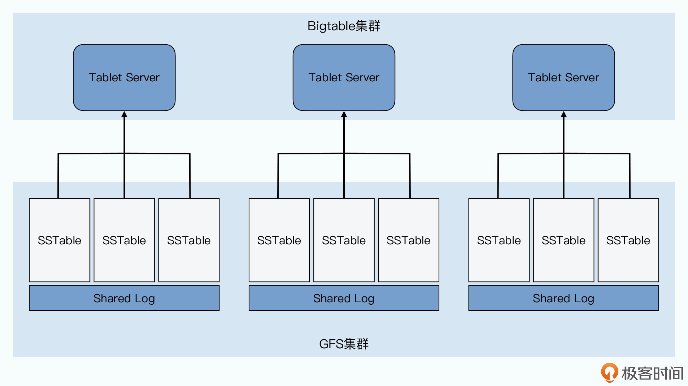

Master 一共会负责 5 项工作：

* 分配 Tablets 给 Tablet Server；
* 检测 Tablet Server 的新增和过期；
* 平衡 Tablet Server 的负载；
* 对于 GFS 上的数据进行垃圾回收（GC）；
* 管理表（Table）和列族的 Schema 变更，比如表和列族的创建与删除。 

Bigtable 需要 Chubby 来解决下列问题：

* 确保我们只有一个 Master；
* 存储 Bigtable 数据的引导位置（Bootstrap Location）；
* 发现 Tablet Servers 以及在它们终止之后完成清理工作；
* 存储 Bigtable 的 Schema 信息；
* 存储 ACL，也就是 Bigtable 的访问权限。 

如果没有 Chubby 的话，我能想到最直接的集群管理方案，就是让所有的 Tablet Server 直接和 Master 通信，把分区信息以及 Tablets 分配到哪些 Tablet Server，也直接放在 Master 的内存里面。这个办法，就和我们之前在 GFS 里的办法一样。但是这个方案，也就使得 Master 变成了一个单点故障点（SPOF-Single Point of Failure）。当然，我们可以通过 Backup Master 以及 Shadow Master 等方式，来尽可能提升可用性。 

但是这样就会存在一个问题：我们可以通过一个外部服务去监控 Master 的存活，等它挂了之后，自动切换到 Backup Master。但是，我们怎么知道 Master 是真的挂了，还是只是“外部服务”和 Master 之间的网络出现故障了呢？如果是后者的话，我们很有可能会遇到一个很糟糕的情况，就是系统里面出现了两个 Master。这个时候，可能两个客户端分别认为这两个 Master 是真的，当它们分头在两边写入数据的时候，我们就会遇到数据不一致的问题。 

Chubby就是这里的外部服务，不过 Chubby 不是 1 台服务器，而是 5 台服务器组成的一个集群，它会通过 Paxos 这样的共识算法，来确保不会出现误判。而且因为它有 5 台服务器，所以也一并解决了高可用的问题，就算挂个 1~2 台，也并不会丢数据。 

整个 Bigtable 是由 4 个组件组成的，分别是： 

* 负责存储数据的 GFS；
* 负责作为分布式锁和目录服务的 Chubby；
* 负责实际提供在线服务的 Tablet Server；
* 负责调度 Tablet 和调整负载的 Master。 

## 读写过程

分区和 Tablets 的分配信息，这些信息也没有放在 Master。Bigtable 在这里用了一个很巧妙的方法，就是直接把这个信息，存成了 Bigtable 的一张 METADATA 表，它是直接存放在 Bigtable 集群里面的。这其实有点像 MySQL 里面的 information_schema 表，也就是数据库定义了一张特殊的表，用来存放自己的元数据。 不过，Bigtable 是一个分布式数据库，所以我们还要知道，这个元数据究竟存放在哪个 Tablet Server 里，这个就需要通过 Chubby 来告诉我们了。 

Bigtable 在 Chubby 里的一个指定的文件里，存放了一个叫做 Root Tablet 的分区所在的位置。 这个 Root Tablet 的分区，是 METADATA 表的第一个分区，这个分区永远不会分裂。它里面存的，是 METADATA 里其他 Tablets 所在的位置。 而 METADATA 剩下的这些 Tablets，每一个 Tablet 中，都存放了用户创建的那些数据表，所包含的 Tablets 所在的位置，也就是所谓的 User Tablets 的位置。 

这个过程和操作系统启动的过程很类似，都是要从一个固定的位置读取信息，来获得后面的动态的信息。在操作系统里，这个是读取硬盘的第一个扇区，而在 Bigtable 里，则是 Chubby 里存放 Root Tablet 位置的固定文件。 

一个具体的 Bigtable 数据读写的例子：比如，客户端想要根据订单号，查找我们的订单信息，订单都存在 Bigtable 的 ECOMMERCE_ORDERS 表里，这张要查的订单号，就是 A20210101RST。 

* 客户端先去发起请求，查询 Chubby，看我们的 Root Tablet 在哪里。 
* Chubby 会告诉客户端，Root Tablet 在 5 号 Tablet Server，这里我们简写成 TS5。 
* 客户端呢，会再向 TS5 发起请求，说我要查 Root Tablet，告诉我哪一个 METADATA Tablet 里，存放了 ECOMMERCE_ORDERS 业务表，行键为 A20210101RST 的记录的位置。 
* TS5 会从 Root Tablet 里面查询，然后告诉客户端，说这个记录的位置啊，你可以从 TS8 上面的 METADATA 的 tablet 107，找到这个信息。 
* 然后，客户端再发起请求到 TS8，说我要在 tablet 107 里面，找 ECOMMERCE_ORDERS 表，行键为 A20210101RST 具体在哪里。 
* TS8 告诉客户端，这个数据在 TS20 的 tablet 253 里面。 
* 客户端发起最后一次请求，去问 TS20 的 tablet 253，问 ECOMMERCE_ORDERS 表，行键为 A20210101RST 的具体数据。 
* TS20 最终会把数据返回给客户端。 

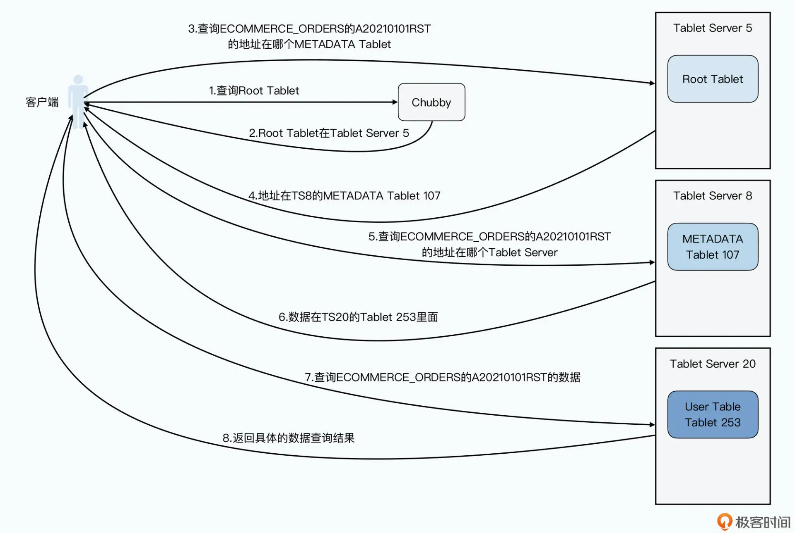

可以看到，在这个过程里，我们用了三次网络查询，找到了想要查询的数据的具体位置，然后再发起一次请求拿到最终的实际数据。一般我们会把前三次查询位置结果缓存起来，以减少往返的网络查询次数。而对于整个 METADATA 表来说，我们都会把它们保留在内存里，这样每个 Bigtable 请求都要读写的数据，就不需要通过访问 GFS 来读取到了。 

这个 Tablet 分区信息，其实是一个三层 Tablet 信息存储的架构，而三层结构让 Bigtable 可以“伸缩”到足够大。METADATA 的一条记录，大约是 1KB，而 METADATA 的 Tablet 如果限制在 128MB，三层记录可以存下大约 (128*1000)^2=2^34个 Tablet 的位置，也就是大约 160 亿个 Tablet，肯定是够用了。 

这个设计带来了一个很大的好处，就是查询 Tablets 在哪里这件事情，尽可能地被分摊到了 Bigtable 的整个集群，而不是集中在某一个 Master 节点上。而唯一所有人都需要查询的 Root Tablet 的位置和里面的数据，考虑到 Root Tablet 不会分裂，并且客户端可以有缓存，Chubby 和 Root Tablet 所在的 Tablet 服务器也不会有太大压力。 

在整个数据读写的过程中，客户端是不需要经过 Master 的。即使 Master 节点已经挂掉了，也不会影响数据的正常读写。客户端不需要认识 Master 这个“主人”，也不依赖 Master 这个“主人”为我们提供服务。这个设计，让 Bigtable 更加“高可用”了。 

## Tablets的调度

在单纯的数据读写的过程中不需要 Master。Master 只负责 Tablets 的调度而已，而且这个调度功能，也对 Chubby 有所依赖。具体过程：

* 所有的 Tablet Server，一旦上线，就会在 Chubby 下的一个指定目录，获得一个和自己名字相同的独占锁（exclusive lock）。你可以看作是，Tablet Server 把自己注册到集群上了。 
* Master 会一直监听这个目录，当发现一个 Tablet Server 注册了，它就知道有一个新的 Tablet Server 可以用了，也就是可以分配 Tablets。 
* 分配 Tablets 的情况很多，可能是因为其他的 Tablet Server 挂了，导致部分 Tablets 没有分配出去，或者因为别的 Tablet Server 的负载太大，这些情况都可以让 Master 去重新分配 Tablet。 可以根据自己的需要实现对应的分配策略
* Tablet Server 本身，是根据是否还独占着 Chubby 上对应的锁，以及锁文件是否还在，来确定自己是否还为自己分配到的 Tablets 服务。比如 Tablet Server 到 Chubby 的网络中断了，那么 Tablet Server 就会失去这个独占锁，也就不再为原先分配到的 Tablets 提供服务了。 
* 如果我们把 Tablet Server 从集群中挪走，那么 Tablet Server 会主动释放锁，当然它也不再服务那些 Tablets 了，这些 Tablets 都需要重新分配。 
* Master 会定期向Tablets发送心跳，检查锁的占用情况，无论是 Tablet Server 说它不再占有锁了，还是 Master 连不上 Tablet Server 了，Master 都会做一个小小的测试，就是自己去获取这个锁。如果 Master 能够拿到这个锁，说明 Chubby 还活得好好的，那么一定是 Tablet Server 那边出了问题，Master 就会删除这个锁，确保 Tablet Server 不会再为 Tablets 提供服务。而原先 Tablet Server 上的 Tablets 就会变回一个未分配的状态 
* Master 自己，一旦和 Chubby 之间的网络连接出现问题，也就是它和 Chubby 之间的会话过期了，它就会选择“自杀”，这个是为了避免出现两个 Master 而不自知的情况。反正，Master 的存活与否，不影响已经存在的 Tablets 分配关系，也不会影响到整个 Bigtable 数据读写的过程。 

## 数据写入过程

接下来深入到Tablet中，看看它是如何处理数据读写的。

Bigtable 支持单行事务，它可以修改一行数据的多个列，这是一个原子操作。

之所以Bigtable有高性能的随机读写能力，关键是因为以下两点：

* 首先是将硬盘随机写，转化成了顺序写，也就是把 Bigtable 里面的提交日志（Commit Log）以及将内存表（MemTable）输出到磁盘的 Minor Compaction 机制。 
* 其次是利用局部性原理，最近写入的数据，会保留在内存表里。最近被读取到的数据，会存放到缓存（Cache）里，而不存在的行键，也会以一个在内存里的布隆过滤器（BloomFilter）进行快速过滤，尽一切可能减少真正需要随机访问硬盘的次数。

Bigtable 实际写入数据的过程是这样的： 

1、权限验证：当一个写请求过来的时候，Tablet Server 先会做基础的数据验证，包括数据格式是否合法，以及发起请求的客户端是否有权限进行对应的操作。这个权限设置，是 Tablet Server 从 Chubby 中获取到，并且缓存在本地的。 

2、将写入内容提交到日志文件：如果写入的请求是合法的，对应的数据写入请求会以追加写的形式，写入到 GFS 上的提交日志文件中，这个写入对于 GFS 上的硬盘来说是一个顺序写。这个时候，我们就认为整个数据写入就已经成功了。 

3、将写入内容写到内存中：在提交日志写入成功之后，Tablet Server 会再把数据写入到一张内存表中，也就是我们常说的 MemTable。 

4、生成SSTable：当我们写入的数据越来越多，要超出我们设置的阈值的时候，Tablet Server 会把当前内存里的整个 MemTable 冻结，然后创建一个新的 MemTable。被冻结的这个 MemTable，一般被叫做 Immutable MemTable，它会被转化成一个叫做 SSTable 的文件，写入到 GFS 上，然后再从内存里面释放掉。这个写入过程，是完整写一个新文件，所以自然也是顺序写。 

如果在上面的第 2 步，也就是提交日志写入完成之后，Tablet Server 因为各种原因崩溃了，我们会通过重放（replay）所有在最后一个 SSTable 写入到 GFS 之后的提交日志，重新构造起来 MemTable，提供对外服务。 

在整个数据写入的过程中，只有顺序写，没有随机写。并不是只有数据新增场景有顺序写，数据更新和删除也是顺序写，并不会在写入的时候，去修改之前写入的数据 ，插入数据和更新数据的时候，其实只是在追加一个新版本的数据。我们在删除数据的时候，也只是写入一个墓碑标记，本质上也是写入一个特殊的新版本数据。 

对于数据的“修改”和“删除”，其实是在两个地方发生的：

1、Major Compaction：按照前面的数据写入机制，随着数据的写入，我们会有越来越多的 SSTable 文件。这样我们就需要通过一个后台进程，来不断地对这些 SSTable 文件进行合并，以缩小占用的 GFS 硬盘空间。而 Major Compaction 这个名字的由来，就是因为这个动作是把数据“压实”在一起。 

比如我们有 10 个文件，每个文件里都有 com.cnn.www 这个行键下的多个版本的数据，那么合并之后，就可以根据我们设置的数据保留策略，只留下时间戳最近的三个版本的数据。在这个过程中，老版本的数据，就在物理上被真正删除了。 

2、读取数据的时候：在读取数据的时候，我们其实是读取 MemTable 加上多个 SSTable 文件合并在一起的一个视图。也就是说，我们从 MemTable 和所有的 SSTable 中，拿到了对应的行键的数据之后，会在内存中合并数据，并根据时间戳或者墓碑标记，来对数据进行“修改”和“删除”，并将数据返回给到客户端。 

整个 Bigtable 的数据写入过程中，是没有任何到 GFS 的随机写入的。GFS 硬盘上的 SSTable 的整个文件，一旦写入完成，就是不可变（Immutable）的，所有的数据写入，包括删除，都是写入一个数据的新版本。而后台，会有一个程序会定期地进行类似于“垃圾回收”的操作，通过合并 SSTable，清理掉过期版本和被标记为删除的数据。 这也是为什么在 Bigtable 的数据模型里面，很自然地对于一个列下的值，根据时间戳可以有多个版本。 

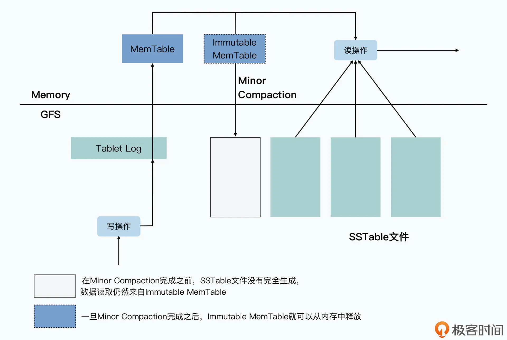

这种随机写入数据的方式是在各类数据系统中，最常见的一个套路。如果你回头去看 GFS 的 Master 里对于元数据修改的实现，你会发现整个流程其实是非常相似的。只不过，在那里有些操作的名字不太一样而已。GFS 里，对于 Master 里存放的元数据的操作步骤是这样的： 

* 将操作日志（Operation Log）写入到本地和远端硬盘；
* 在 master 里修改实际的数据结构；
* 每当日志增长到一定程度，master 会创建对应的检查点（checkpoint）。 

GFS 这里的操作日志和 Bigtable 的提交日志、检查点和定期输出的 SSTable，其实都是起到了相同的作用。在数据库系统中，一般称之为预写日志（WAL，Write-Ahead-Log），一旦写入，数据就持久化下来了。中间，我们总是把最新的数据更新在内存里更新一次，使得后续的数据查询可以从内存里面获取到。最后一步，不管是叫做 checkpoint、Snapshot 还是其他什么名字，都能够使得数据恢复只需要重放一小段时间的日志，使得故障恢复的时间尽可能短。 

Bigtable 的数据，是由内存里的 MemTable 和 GFS 上的 SSTable 共同组成的。 

## 数据读取过程

Bigtable中一个典型的读取动作，就是从 Bigtable 里根据行键，随机读取一条数据的操作。 

虽然我们可以修改写入的机制，让写入变成顺序的，但是很难避免随机读。一次数据的随机查询，我们可能要多次访问 GFS 上的硬盘，读取多个 SSTable。

Bigtable的高性能读取，首先是依靠MemTable 和 SSTable 的高效数据结构：

MemTable 的数据结构通常是通过一个 AVL 红黑树，或者是一个跳表（Skip List）来实现的。而 BigTable 的 Memtable 和 SSTable 的源码，一般被认为就是由 Google 开源的 LevelDB 来实现的。在实际的 LevelDB 源码中，MemTable 是选择使用跳表来作为自己的数据结构。之所以采用这个数据结构，原因也很简单，主要是因为 MemTable 只有三种操作： 

* 第一种是根据行键的随机数据插入，这个在数据写入的时候需要用到；
* 第二种是根据行键的随机数据读取，这个在数据读取的时候需要用到；
* 最后一种是根据行键有序遍历，这个在我们把 MemTable 转化成 SSTable 的时候会被用到。 

而 AVL 红黑树和跳表在这三种操作上，性能都很好，随机插入和读取的时间复杂度都是 O(logN)，而有序遍历的时间复杂度，则是 O(N)。 

当 MemTable 的大小超出阈值之后，我们会遍历 MemTable，把它变成一个叫做 SSTable 的文件。 

SSTable 的文件格式其实很简单，本质上就是由两部分组成： 

* 数据块（data block） ：实际要存储的行键、列、值以及时间戳，这些数据会按照行键排序分成一个个固定大小的块（block）来进行存储。 
* 一系列的元数据和索引信息，这其中包括用来快速过滤当前 SSTable 中不存在的行键的布隆过滤器，以及整个数据块的一些统计指标，这些数据我们称之为元数据块（meta block）。另外还有针对数据块和元数据块的索引（index），这些索引内容，则分别是元数据索引块（metaindex block）和数据索引块（index block） 

此外，Major Compaction 会合并SSTable，少每次随机读的请求需要访问的硬盘次数。 因为 SSTable 里面的数据块是顺序存储的，所以要做 Major Compaction 的算法也很简单，就是做一个有序链表的多路归并就好了。并且在这个过程中，无论是读输入的 SSTable，还是写输出的 SSTable，都是顺序读写，而不是不断地去随机访问 GFS 上的硬盘。 

而当我们要在 SSTable 里查询数据的时候，我们先会去读取索引数据，找到要查询的数据在哪一个数据块里。然后再把整个数据块返回给到 Tablet Server，Tablet Server 再从这个数据块里，提取出对应的 KV 数据返回给 Bigtable 的客户端。 

那么在这个过程中，Bigtable 又利用了压缩和缓存机制做了更多的优化：

* 首先，是通过压缩算法对每个块进行压缩。这个本质上是以时间换空间，通过消耗 CPU 的计算资源，来减少存储需要的空间，以及后续的缓存需要的空间。 
* 其次，是把每个 SSTable 的布隆过滤器直接缓存在 Tablet Server 里。布隆过滤器本质是一个二进制向量，它可以通过一小块内存空间和几个哈希函数，快速检测一个元素是否在一个特定的集合里。在 SSTable 的这个场景下，就是可以帮助我们快速判断，用户想要随机读的行键是否在这个 SSTable 文件里。 

最后，Bigtable 还提供了两级的缓存机制：

* 高层的缓存，是对查询结果进行缓存，我们称之为 Scan Cache。比如前面的示例代码中，我们要查询 com.cnn.www 这个行键的数据，那么第一次查询到了这个数据之后，我们会把对应的数据，放在 Tablet Server 的一个缓存空间里。这样，下一次我们查询同样的数据，就不需要再访问 GFS 上的硬盘了。
* 低层的缓存，是对查询所获取到的整个数据块进行缓存，我们称之为 Block Cache。还以 com.cnn.www 这个行键为例，我们会把它所在的整个块数据都缓存在 Tablet Server 里。因为一个块里存储的数据都是排好序的，所以当下一次用户想要查询 com.cnn.www1 这样的行键的时候，就可以直接从 Block Cache 中获取到，而不需要再次访问 GFS 上的 SSTable 文件。 

需要注意的是，这两层缓存都是针对单个 SSTable 上的，而不是在单个 Tablet 上。而因为 SSTable 是一个不可变的数据，所以只要不出现 Major Compaction，或者整个 SSTable 文件因为过期可以清理的情况，这些缓存都不会因为 Tablet 里写入新的数据而需要主动失效。新写入的数据更新都体现在 MemTable 中，不会影响到我们的 SSTable。 

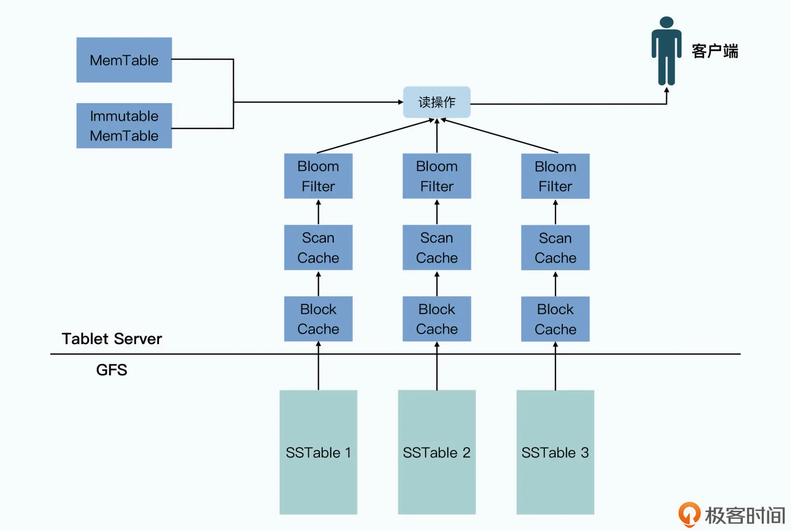

有了缓存和布隆过滤器，访问硬盘的次数大大减少：

* 一方面，当读请求里的行键不存在的时候，我们有 90%+ 乃至 99%+ 的概率可以通过 BloomFilter 过滤掉。而当读请求的行键存在的时候，我们访问硬盘的次数也很少。而且对于一个 Tablet 下的多个 SSTable 文件来说，BloomFilter 已经可以快速帮我们排除掉那些，不包含我们要查询的行键的 SSTable 的文件了。 
* 其次是Block Cache，因为元数据和索引也是一个 Block，所以只要一个 SSTable 常常被访问，这些数据就会被缓存在 Tablet Server 的内存里，所以查询索引的过程，也往往在内存里面发生。 

Bigtable对于有时间局部性（查询的通常是最近查询过的数据 ）和空间局部性（连续查询的数据的行键是相邻的 ）的查询，效率较高，可以直接通过 Scan Cache 或者 Block Cache 给到答案，而不需要去访问 GFS 的文件系统。只有完全没有规律的随机查询，才会使得我们的查询最终不得不大量进行随机的 GFS 文件访问，也就是变成随机的硬盘访问。而且更糟糕的是，我们还需要在网络上传输大量用不到的整个 block 的数据。在这种情况下，Bigtable 的性能并不好。 

不过，好在真实世界里，数据访问往往是满足局部性原理的，而且在 Bigtable 论文发表 17 年后的今天，我们大都用上了 SSD 硬盘，可以在很大程度上缓解这个问题。 

# Thrift序列化

日常开发中，我们经常使用CSV和JSON这样的格式，CSV格式的缺点：1、没有数据类型 2、数据用文本形式保存有些浪费空间

而JSON则每条数据需要多存一个字段名，很浪费空间。

这两种格式主要优点是可读性好，但是在“大数据”的场景下，除了程序员的效率，存储数据本身的“效率”就变得非常重要了。 

想要减少存储所占的空间，那最直接的想法，自然是我们自定义一个序列化方法，按照各个字段实际的格式把数据写进去。典型的办法就是 Java 的序列化，我们按照 String—>String—>Int—>String—>Int 的顺序，把数据写入到一个字节数组里面，等需要读数据的时候，我们就按照这个顺序读出来就好了 ：

~~~java

import java.io.*;
import java.util.Arrays;
public class Main {
    public static void main(String[] args) throws IOException {
        ByteArrayOutputStream buffer = new ByteArrayOutputStream();
        try (ObjectOutputStream output = new ObjectOutputStream(buffer)) {
            output.writeUTF("597819210");
            output.writeUTF("大数据");
            output.writeInt(4);
            output.writeUTF("https://aws.amazon.com/cn/big-data/what-is-big-data/");
            output.writeInt(1592373781);
        }
        System.out.println(Arrays.toString(buffer.toByteArray()));
    }
}
~~~

这个方法的确确保了数据都有类型，并且占用的存储空间尽可能小。但是这个实现却有一个重大缺点，就是我们读写数据的 Schema，是隐式地包含在代码里的，而且每有一张新的数据表或者说新的数据格式，我们就要手写序列化反序列化的代码。 

## TBinaryProtocol 

Thrift 的基本实现思路：

* 通过 Schema 文件，定义出一个结构体，然后在里面列清楚字段的顺序、类型以及名称。 
* 写一个程序，能够解析这个 Schema 文件，然后自动生成可以根据结构体的 Schema 进行序列化和反序列化的代码。这个序列化和反序列化的代码是非常简单的，只要按照 Schema 里面出现的字段顺序，一个个对着字节数组去读或者写数据就好了。 

Thrift IDL 文件 ：

~~~idl
struct SearchClick
{
  1:string user_id,
  2:string search_term,
  3:i16 rank,
  4:string landing_url,
  5:i32 click_timestamp,
}
~~~

这里我把前面 5 个字段的 CSV 格式，用 Thrift 的 IDL 写了出来，你会发现它就是定义了序号、类型以及名称。 

TBinaryProtocol还考虑到了数据格式的多版本问题，如果在迭代过程中，对数据格式新增了字段或者删除了字段，就存在兼容问题：

* 向前兼容问题：新版本的程序可以正常读取旧版本的数据
* 向后兼容问题：老版本的程序可以正常处理新版本的数据

为了解决这个问题，Thrift 的 TBinaryProtocol 协议在顺序写入数据的过程中，不仅会写入数据的值（field-value），还会写入数据的编号（field-id）和类型（field-type）；读取的时候也一样。并且，在每一条记录的结束都会写下一个标志位。 

~~~idl
struct SearchClick
{
  1:string user_id,
  2:string search_term,
  3:i16 rank,
  4:string landing_url,
  // 5:i32 click_timestamp, deprecated 已废弃
  6:i64 click_long_timestamp,
  7:string ip_address
}
~~~

这样，在读取数据的时候，老版本的 v1 代码，看到自己没有见过的编号就可以跳过。新版本的 v2 代码，对于老数据里没有的字段，也就是读不到值而已，并不会出现不兼容的情况。 在这个机制下，我们顺序排列的编号，就起到了版本的作用，而我们不需要再专门去进行数据版本的管理了。 

写下编号还带来了一个好处，就是我们不再需要确保每个字段都填上值了。我们可以废弃字段，并且这些废弃的字段不会占用存储空间。 

对于不需要的老字段，我们只要在 IDL 中，将对应的编号注释掉，写入数据的时候不写这些数据，就不会占用空间。而且因为 Thrift 读取数据是读取编号并解析值的，这个也不会破坏数据的兼容性。 

这样下来，整个 struct 其实就变成了一个稀疏结构，不是每个字段都需要填上值。这个思路其实和 Bigtable 里 Column（列）的设计一脉相成。 

## TCompactProtocol 

TCompactProtocol 格式进行了进一步的优化，降低了需要的存储空间。

### Delta Encoding 

顾名思义，TCompactProtocol 就是一种“紧凑”的编码方式。Thrift 的 IDL 都是从 1 开始编号的，而且通常两个字段的编号是连续的。所以这个协议在存储编号的时候，存储的不是编号的值，而是存储编号和上一个编号的差。

比如，第一个编号是 1，第二个编号是 5，编号 2、3、4 没有值或者已经被我们废弃掉了，那么，第二个编号存储的直接就是 4。这种方式叫做 Delta Encoding，在倒排索引中也经常会用到，用来节约存储空间。我们用 4 个 bit 来存储这个差值。 

然后，我们再通过另外 4 个 bit 表示类型信息。那么通常来说，通过一个字节，我们就能把编号和类型表示出来。毕竟，我们的类型不到 16 种，4 个 bit 就够了，而通常两个字段之间的差，也不会超过 15，也就是 4 个 bit 能表示的最大整型数。 

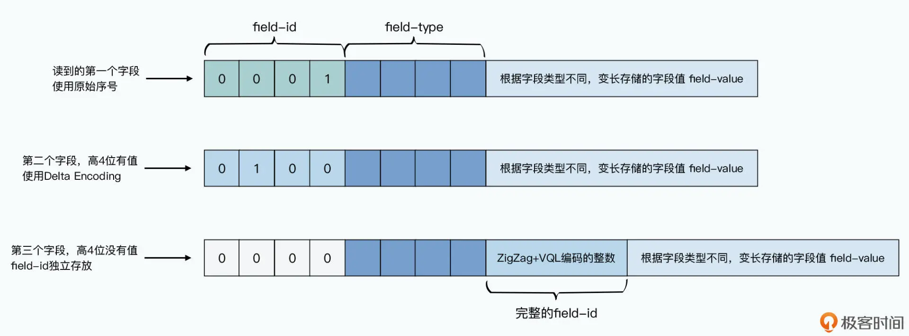

### ZigZag+VQL 

如果两个序号的差如果超过 15 怎么办呢？那么，我们就通过 1 个字节来表示类型，然后再用 1~5 个字节来表示两个连续编号之间的差，也就是下面我要介绍的 ZigZag+VQL 的编码方式

很多时候，我们存储的整数都不会很大，比如通过一个整型数来表示系统中存在的状态，我们并不需要 2 的 32 次方，也就是 40 亿种状态，可能一个字节的 127 种状态就绰绰有余了。 所以，TCompactProtocol 对于所有的整数类型的值，都采用了可变长数值（VQL，Variable-length quantity）的表示方式，通过 1~N 个 byte 来表示整数。

这个编码方式的每一个字节的高位，都会用第一个 bit 用来标记，也就是第一个 bit 用来标记整个整数是否还需要读入下一个字节，而后面的 7 个 bit 用来表示实际存放的数据。这样，一个 32 位的整型数，最少只要用一个字节来表示，最多也只需要用 5 个字节来表示，因为 7bit x 5=35 bit 已经足够有 32 位了。 

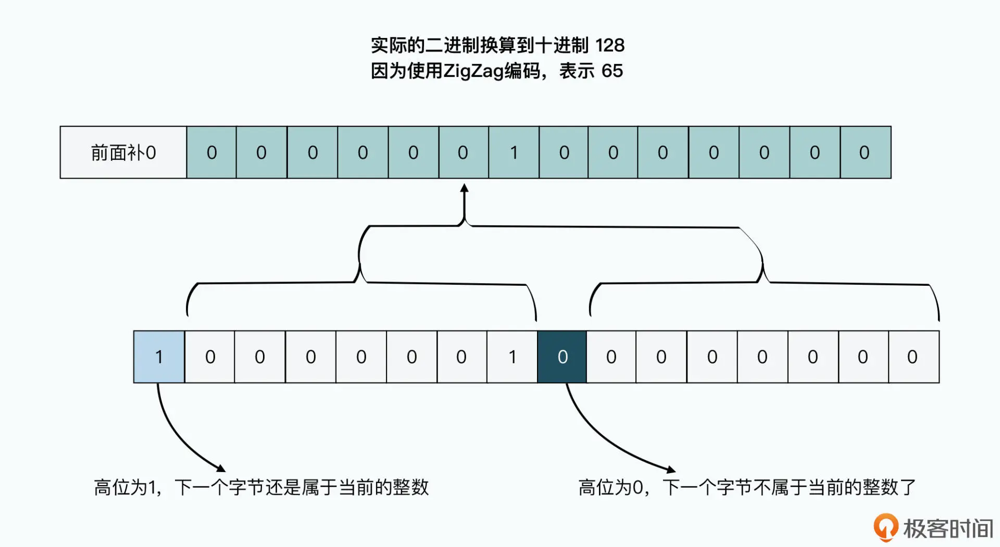

这样的编码方式和负数的表示有冲突，而因为整型数的负数，首位一定是 1。这样，对于像 -1 这样常用的数，用 16 进制表示就会是 0XFFFFFFFF，用 0 和 1 表示的话就是连续 32 个 1，会占用 5 个字节。所以，后面 7 个 bit 一组的编码，并没有采用普通的编码方式，而是采用了一种叫做 ZigZag 的编码方式。 

简单来说，就是负数变成正数，而正数去乘以 2。这样的情况下，7 个 bit 就可以表示 -64 到 63 这 128 个数了。 通过 ZigZag+VQL 的编码方式，只要整数的绝对值小，占用的空间就少 ：

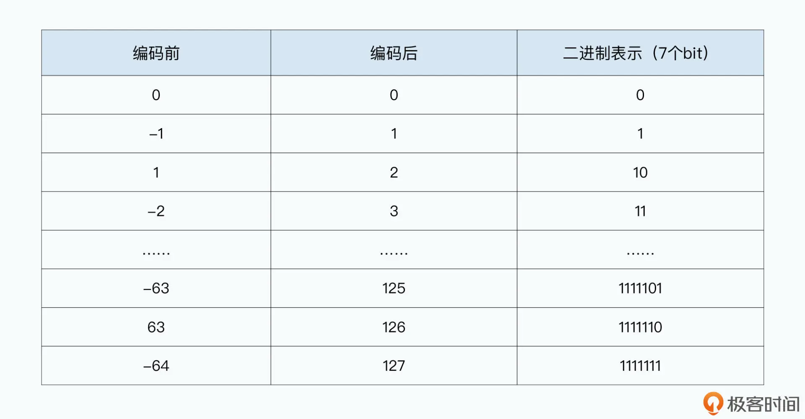

通过 ZigZag+VQL 这两种方式，你可以看到，存储一个整数，常常只需要 2 个字节就够了，可以说大大缩小了需要占用的硬盘空间。 

## 跨语言和跨协议

Thrift是跨语言的，今天，在 Thrift 的官方文档里，已经支持了 28 种不同的编程语言。并且，Thrift 同样支持生成跨语言的 RPC 代码。

跨语言 + 序列化 +RPC，使得 Thrift 解决了一个在“大数据领域”中很重要的问题，就是习惯于使用不同编程语言团队之间的协作问题。通过定义一个中间格式的 Thrift IDL 文件，然后通过 Thrift 自动生成代码，写 Web 应用的 PHP 工程师和写后端数据系统的 Java 工程师，就可以直接无缝协作了。 

不仅如此，Thrift 的设计非常清晰，也非常容易扩展。我们可以根据它的规格书，支持更多的语言，乃至自己定义和实现协议。Thrift 封装好了各类接口，使得底层编码数据的协议（Protocol）、定义如何传输数据的 Transport 都是可以替换的。你只需要实现 Thrift 的一系列函数接口，就能实现一个你需要的协议。 

这也是为什么，Thrift 也支持 JSON、XML 这些序列化的方式。如果你想要把对应的数据传输和处理方式，从 TCP 换成 HTTP，那么也只需要实现一个对应的 Transport 就可以了。 

# 分布式共识和Chubby

待

# Hadoop

## 移动计算

Hadoop解决问题的核心思路是：既然数据是庞大的，而程序要比数据小得多，将数据输入给程序是不划算的，那么就反其道而行之，将程序分发到数据所在的地方进行计算，也就是所谓的移动计算比移动数据更划算。

具体步骤是：

1. 将待处理的大规模数据存储在服务器集群的所有服务器上，主要使用 HDFS 分布式文件存储系统，将文件分成很多块（Block），以块为单位存储在集群的服务器上。
2. 大数据引擎根据集群里不同服务器的计算能力，在每台服务器上启动若干分布式任务执行进程，这些进程会等待给它们分配执行任务。
3. 使用大数据计算框架支持的编程模型进行编程，比如 Hadoop 的 MapReduce 编程模型，或者 Spark 的 RDD 编程模型。应用程序编写好以后，将其打包，MapReduce 和 Spark 都是在 JVM 环境中运行，所以打包出来的是一个 Java 的 JAR 包。
4. 用 Hadoop 或者 Spark 的启动命令执行这个应用程序的 JAR 包，首先执行引擎会解析程序要处理的数据输入路径，根据输入数据量的大小，将数据分成若干片（Split），每一个数据片都分配给一个任务执行进程去处理。
5. 任务执行进程收到分配的任务后，检查自己是否有任务对应的程序包，如果没有就去下载程序包，下载以后通过反射的方式加载程序。走到这里，最重要的一步，也就是移动计算就完成了。
6. 加载程序后，任务执行进程根据分配的数据片的文件地址和数据在文件内的偏移量读取数据，并把数据输入给应用程序相应的方法去执行，从而实现在分布式服务器集群中移动计算程序，对大规模数据进行并行处理的计算目标。

移动程序到数据所在的地方去执行，也就是移动计算，之前也有一些案例，例如通过反射执行代码、执行网络传输过来的代码等

大数据技术将移动计算这一编程技巧上升到编程模型的高度，并开发了相应的编程框架，使得开发人员只需要关注大数据的算法实现，简化了大数据的开发难度

## 从RAID到HDFS

如果一个文件的大小超过了一张磁盘的大小，该如何存储？

在单机时代，主要的解决方案是 RAID（垂直伸缩）；分布式时代，主要解决方案是分布式文件系统（水平伸缩）。 

无论什么样的方案都要解决几个问题：数据怎么存？保证数据读写速度、保证数据可靠性

RAID（独立磁盘冗余阵列）技术是将多块普通磁盘组成一个阵列，共同对外提供服务。主要是为了改善磁盘的存储容量、读写速度，增强磁盘的可用性和容错能力。 目前服务器级别的计算机都支持插入多块磁盘（8 块或者更多），通过使用 RAID 技术，实现数据在多块磁盘上的并发读写和数据备份。 

常用 RAID 技术有图中下面这几种：

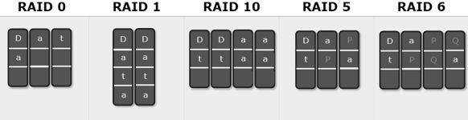

* RAID 0：数据在从内存缓冲区写入磁盘时，根据磁盘数量将数据分成 N 份，这些数据同时并发写入 N 块磁盘，使得数据整体写入速度是一块磁盘的 N 倍；读取的时候也一样，因此 RAID 0 具有极快的数据读写速度。但是 RAID 0 不做数据备份，N 块磁盘中只要有一块损坏，数据完整性就被破坏，其他磁盘的数据也都无法使用了。 

* RAID 1：数据在写入磁盘时，将一份数据同时写入两块磁盘，这样任何一块磁盘损坏都不会导致数据丢失，插入一块新磁盘就可以通过复制数据的方式自动修复，具有极高的可靠性。 

* RAID10：它是将所有磁盘 N 平均分成两份，数据同时在两份磁盘写入，相当于 RAID 1；但是平分成两份，在每一份磁盘（也就是 N/2 块磁盘）里面，利用 RAID 0 技术并发读写，这样既提高可靠性又改善性能。不过 RAID 10 的磁盘利用率较低，有一半的磁盘用来写备份数据。 

* RAID 3：一般情况下，一台服务器上很少出现同时损坏两块磁盘的情况，在只损坏一块磁盘的情况下，如果能利用其他磁盘的数据恢复损坏磁盘的数据，这样在保证可靠性和性能的同时，磁盘利用率也得到大幅提升。 

  顺着这个思路，RAID 3可以在数据写入磁盘的时候，将数据分成 N-1 份，并发写入 N-1 块磁盘，并在第 N 块磁盘记录校验数据，这样任何一块磁盘损坏（包括校验数据磁盘），都可以利用其他 N-1 块磁盘的数据修复。

  但是在数据修改较多的场景中，任何磁盘数据的修改，都会导致第 N 块磁盘重写校验数据。频繁写入的后果是第 N 块磁盘比其他磁盘更容易损坏，需要频繁更换，所以 RAID 3 很少在实践中使用 

* RAID 5：RAID 5 和 RAID 3 很相似，但是校验数据不是写入第 N 块磁盘，而是螺旋式地写入所有磁盘中。这样校验数据的修改也被平均到所有磁盘上，避免 RAID 3 频繁写坏一块磁盘的情况。 

* RAID6：如果数据需要很高的可靠性，在出现同时损坏两块磁盘的情况下（或者运维管理水平比较落后，坏了一块磁盘但是迟迟没有更换，导致又坏了一块磁盘），仍然需要修复数据，这时候可以使用RAID 6。

  RAID 6 和 RAID 5 类似，但是数据只写入 N-2 块磁盘，并螺旋式地在两块磁盘中写入校验信息（使用不同算法生成）。

RAID可以解决上面提出的问题：

* 使用多块磁盘，存储空间扩大几倍
* RAID 根据可以使用的磁盘数量，将待写入的数据分成多片，并发同时向多块磁盘进行写入，显然写入的速度可以得到明显提高；同理，读取速度也可以得到明显提高。 不过，需要注意的是，由于传统机械磁盘的访问延迟主要来自于寻址时间，数据真正进行读写的时间可能只占据整个数据访问时间的一小部分，所以数据分片后对 N 块磁盘进行并发读写操作并不能将访问速度提高 N 倍。 
* 数据可靠性的问题。使用 RAID 10、RAID 5 或者 RAID 6 方案的时候，由于数据有冗余存储，或者存储校验信息，所以当某块磁盘损坏的时候，可以通过其他磁盘上的数据和校验数据将丢失磁盘上的数据还原。 

HDFS 的设计目标是管理数以千计的服务器、数以万计的磁盘，将这么大规模的服务器计算资源当作一个单一的存储系统进行管理，对应用程序提供数以 PB 计的存储容量，让应用程序像使用普通文件系统一样存储大规模的文件数据。 

和 RAID 在多个磁盘上进行文件存储及并行读写的思路一样，HDFS 是在一个大规模分布式服务器集群上，对数据分片后进行并行读写及冗余存储。因为 HDFS 可以部署在一个比较大的服务器集群上，集群中所有服务器的磁盘都可供 HDFS 使用，所以整个 HDFS 的存储空间可以达到 PB 级容量。 

HDFS 的关键组件有两个，一个是 DataNode，一个是 NameNode。 

* DataNode：负责文件数据的存储和读写操作，HDFS 将文件数据分割成若干数据块（Block），每个 DataNode 存储一部分数据块，这样文件就分布存储在整个 HDFS 服务器集群中。应用程序客户端（Client）可以并行对这些数据块进行访问，从而使得 HDFS 可以在服务器集群规模上实现数据并行访问，极大地提高了访问速度。
* NameNode：负责整个分布式文件系统的元数据（MetaData）管理，也就是文件路径名、数据块的 ID 以及存储位置等信息，相当于操作系统中文件分配表（FAT）的角色。HDFS 为了保证数据的高可用，会将一个数据块复制为多份（缺省情况为 3 份），并将多份相同的数据块存储在不同的服务器上，甚至不同的机架上。这样当有磁盘损坏，或者某个 DataNode 服务器宕机，甚至某个交换机宕机，导致其存储的数据块不能访问的时候，客户端会查找其备份的数据块进行访问。 

HDFS中，一个文件可以被分为多个Block，每个Block又存在多个副本，只要服务器宕机后，文件多应的所有Block都能找到一份数据，就能对文件正确访问。

HDFS 的高可用设计，可以分为几个层次：

1. 数据存储故障容错 ：磁盘介质在存储过程中受环境或者老化影响，其存储的数据可能会出现错乱。HDFS 的应对措施是，对于存储在 DataNode 上的数据块，计算并存储校验和（CheckSum）。在读取数据的时候，重新计算读取出来的数据的校验和，如果校验不正确就抛出异常，应用程序捕获异常后就到其他 DataNode 上读取备份数据。 

2. 磁盘故障容错 ：如果 DataNode 监测到本机的某块磁盘损坏，就将该块磁盘上存储的所有 BlockID 报告给 NameNode，NameNode 检查这些数据块还在哪些 DataNode 上有备份，通知相应的 DataNode 服务器将对应的数据块复制到其他服务器上，以保证数据块的备份数满足要求。 

3. DataNode 故障容错 ：DataNode 会通过心跳和 NameNode 保持通信，如果 DataNode 超时未发送心跳，NameNode 就会认为这个 DataNode 已经宕机失效，立即查找这个 DataNode 上存储的数据块有哪些，以及这些数据块还存储在哪些服务器上，随后通知这些服务器再复制一份数据块到其他服务器上，保证 HDFS 存储的数据块备份数符合用户设置的数目，即使再出现服务器宕机，也不会丢失数据。 

4. NameNode 故障容错 ：NameNode 是整个 HDFS 的核心，记录着 HDFS 文件分配表信息，所有的文件路径和数据块存储信息都保存在 NameNode，如果 NameNode 故障，整个 HDFS 系统集群都无法使用 。

   NameNode 采用主从热备的方式提供高可用服务 ：

   

   集群部署两台 NameNode 服务器，一台作为主服务器提供服务，一台作为从服务器进行热备，两台服务器通过 ZooKeeper 选举，主要是通过争夺 znode 锁资源，决定谁是主服务器。而 DataNode 则会向两个 NameNode 同时发送心跳数据，但是只有主 NameNode 才能向 DataNode 返回控制信息。

   正常运行期间，主从 NameNode 之间通过一个共享存储系统 shared edits 来同步文件系统的元数据信息。当主 NameNode 服务器宕机，从 NameNode 会通过 ZooKeeper 升级成为主服务器，并保证 HDFS 集群的元数据信息，也就是文件分配表信息完整一致。

## MapReduce

MapReduce 既是一个编程模型，又是一个计算框架

MapReduce作为一个计算模型，其编程模型只包含 Map 和 Reduce 两个过程，map 的主要输入是一对 \<Key, Value> 值，经过 map 计算后输出一对 \<Key, Value> 值；然后将相同 Key 合并，形成 \<Key, Value 集合 >；再将这个 \<Key, Value 集合 > 输入 reduce，经过计算输出零个或多个\<Key, Value> 对。不管是关系代数运算（SQL 计算），还是矩阵运算（图计算），大数据领域几乎所有的计算需求都可以通过 MapReduce 编程来实现。 

MapReduce也是一个计算框架，用来调度执行上面的计算过程

### WordCount

下面以 WordCount 程序为例，说明MapReduce的计算过程 

WordCount 主要解决的是文本处理中词频统计的问题，就是统计文本中每一个单词出现的次数。如果只是统计一篇文章的词频，几十 KB 到几 MB 的数据，只需要写一个程序，将数据读入内存，建一个 Hash 表记录每个词出现的次数就可以了。这个统计过程你可以看下面这张图。 

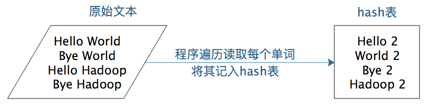

小数据量用单机统计词频很简单，但是如果想统计全世界互联网所有网页（数万亿计）的词频数（而这正是 Google 这样的搜索引擎的典型需求），不可能写一个程序把全世界的网页都读入内存，这时候就需要用 MapReduce 编程来解决。

WordCount 的 MapReduce 程序如下：

~~~java
public class WordCount {
 
  public static class TokenizerMapper
       extends Mapper<Object, Text, Text, IntWritable>{
 
    private final static IntWritable one = new IntWritable(1);
    private Text word = new Text();
 
    public void map(Object key, Text value, Context context
                    ) throws IOException, InterruptedException {
      StringTokenizer itr = new StringTokenizer(value.toString());
      while (itr.hasMoreTokens()) {
        word.set(itr.nextToken());
        context.write(word, one);
      }
    }
  }
 
  public static class IntSumReducer
       extends Reducer<Text,IntWritable,Text,IntWritable> {
    private IntWritable result = new IntWritable();
 
    public void reduce(Text key, Iterable<IntWritable> values,
                       Context context
                       ) throws IOException, InterruptedException {
      int sum = 0;
      for (IntWritable val : values) {
        sum += val.get();
      }
      result.set(sum);
      context.write(key, result);
    }
  }
}
~~~

MapReduce 版本 WordCount 程序的核心是一个 map 函数和一个 reduce 函数。 

map 函数的输入主要是一个 <Key, Value> 对，在这个例子里，Value 是要统计的所有文本中的一行数据，Key 在一般计算中都不会用到 ：

~~~java
public void map(Object key, Text value, Context context
                    )
~~~

map 函数的计算过程是，将这行文本中的单词提取出来，针对每个单词输出一个 <word, 1> 这样的 <Key, Value> 对。

MapReduce 计算框架会将这些 \<word , 1> 收集起来，将相同的 word 放在一起，形成 \<word , <1,1,1,1,1,1,1…>> 这样的 <Key, Value 集合 > 数据，然后将其输入给 reduce 函数。

~~~java
public void reduce(Text key, Iterable<IntWritable> values,
                       Context context
                       ) 
~~~

这里 reduce 的输入参数 Values 就是由很多个 1 组成的集合，而 Key 就是具体的单词 word。

reduce 函数的计算过程是，将这个集合里的 1 求和，再将单词（word）和这个和（sum）组成一个 <Key, Value>，也就是 <word, sum> 输出。每一个输出就是一个单词和它的词频统计总和。

一个 map 函数可以针对一部分数据进行运算，这样就可以将一个大数据切分成很多块（这也正是 HDFS 所做的），MapReduce 计算框架为每个数据块分配一个 map 函数去计算，从而实现大数据的分布式计算。

假设有两个数据块的文本数据需要进行词频统计，MapReduce 计算过程如下图所示 :

上面的程序要在分布式环境运行，还必须通过计算框架的处理。

MapReduce是一个典型的模板方法模式，只需要实现 Map 和 Reduce 这两个接口函数，就能完成海量的数据处理程序。 

### 计算和合并

在MapReduce 程序运行的过程中，有两个关键问题需要处理：

* 如何为每个数据块分配一个 Map 计算任务 。也就是代码是如何发送到数据块所在服务器的，发送后是如何启动的，启动以后如何知道自己需要计算的数据在文件什么位置（BlockID 是什么） 
* 处于不同服务器的 map 输出的 \<Key, Value> ，如何把相同的 Key 聚合在一起发送给 Reduce 任务进行处理

对应图中的两个MapReduce处理阶段，它们分别是 MapReduce 作业启动和运行，以及 MapReduce 数据合并与连接 

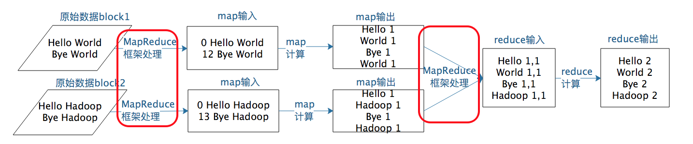

MapReduce 运行过程涉及两个组件：

* JobTracker 进程：它是启动 MapReduce 程序的主入口，主要是指定 Map 和 Reduce 类、输入输出文件路径等，并提交作业给 Hadoop 集群。它会命令 TaskTracker 进程启动相应数量的 Map 和 Reduce 进程任务，并管理整个作业生命周期的任务调度和监控。 

  它是Hadoop 集群的常驻进程，需要注意的是，JobTracker 进程在整个 Hadoop 集群全局唯一 

* TaskTracker 进程 ：这个进程负责启动和管理 Map 进程以及 Reduce 进程。因为需要每个数据块都有对应的 map 函数，TaskTracker 进程通常和 HDFS 的 DataNode 进程启动在同一个服务器 

JobTracker 进程和 TaskTracker 进程是主从关系，主服务器通常只有一台（或者另有一台备机提供高可用服务，但运行时只有一台服务器对外提供服务，真正起作用的只有一台），从服务器可能有几百上千台，所有的从服务器听从主服务器的控制和调度安排。主服务器负责为应用程序分配服务器资源以及作业执行的调度，而具体的计算操作则在从服务器上完成。 

具体的作业启动和计算过程：

具体过程：

1. 应用进程 JobClient 将用户作业 JAR 包存储在 HDFS 中，将来这些 JAR 包会分发给 Hadoop 集群中的服务器执行 MapReduce 计算。
2. 应用程序提交 job 作业给 JobTracker。
3. JobTracker 根据作业调度策略创建 JobInProcess 树，每个作业都会有一个自己的 JobInProcess 树。
4. JobInProcess 根据输入数据分片数目（通常情况就是数据块的数目）和设置的 Reduce 数目创建相应数量的 TaskInProcess。
5. TaskTracker 进程和 JobTracker 进程进行定时通信。
6. 如果 TaskTracker 有空闲的计算资源（有空闲 CPU 核心），JobTracker 就会给它分配任务。分配任务的时候会根据 TaskTracker 的服务器名字匹配在同一台机器上的数据块计算任务给它，使启动的计算任务正好处理本机上的数据，以实现我们一开始就提到的“移动计算比移动数据更划算”。
7. TaskTracker 收到任务后根据任务类型（是 Map 还是 Reduce）和任务参数（作业 JAR 包路径、输入数据文件路径、要处理的数据在文件中的起始位置和偏移量、数据块多个备份的 DataNode 主机名等），启动相应的 Map 或者 Reduce 进程。
8. Map 或者 Reduce 进程启动后，检查本地是否有要执行任务的 JAR 包文件，如果没有，就去 HDFS 上下载，然后加载 Map 或者 Reduce 代码开始执行。
9. 如果是 Map 进程，从 HDFS 读取数据（通常要读取的数据块正好存储在本机）；如果是 Reduce 进程，将结果数据写出到 HDFS。

MapReduce计算的关键在于结果的合并，几乎所有的大数据计算场景都需要处理数据关联的问题，像 WordCount 这种比较简单的只要对 Key 进行合并就可以了，对于像数据库的 join 操作这种比较复杂的，需要对两种类型（或者更多类型）的数据根据 Key 进行连接。 

在 map 输出与 reduce 输入之间，MapReduce 计算框架处理数据合并与连接操作，这个操作有个专门的词汇叫shuffle，它的过程如下图：

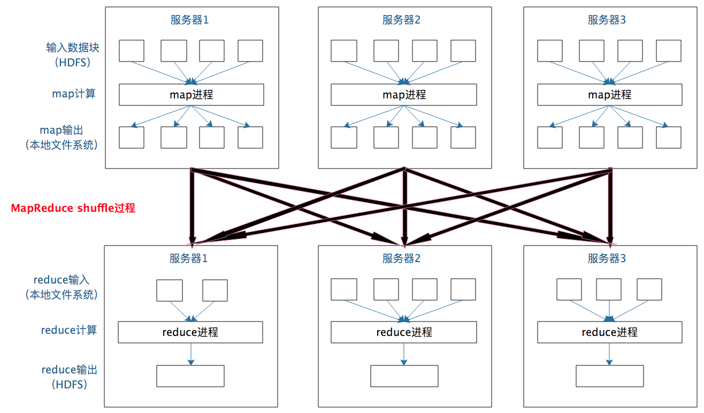

每个 Map 任务的计算结果都会写入到本地文件系统，等 Map 任务快要计算完成的时候，MapReduce 计算框架会启动 shuffle 过程，在 Map 任务进程调用一个 Partitioner 接口，对 Map 产生的每个 \<Key, Value> 进行 Reduce 分区选择，然后通过 HTTP 通信发送给对应的 Reduce 进程。这样不管 Map 位于哪个服务器节点，相同的 Key 一定会被发送给相同的 Reduce 进程。Reduce 任务进程对收到的 \<Key, Value> 进行排序和合并，相同的 Key 放在一起，组成一个 \<Key, Value 集合 > 传递给 Reduce 执行。 

shuffle的过程如果用HashMap进行，就简单很多了，但因为全部的数据内存可能放不下，所以就利用硬盘进行外部排序 

map 输出的 \<Key, Value>shuffle 到哪个 Reduce 进程是这里的关键，它是由 Partitioner 来实现，MapReduce 框架默认的 Partitioner 用 Key 的哈希值对 Reduce 任务数量取模，相同的 Key 一定会落在相同的 Reduce 任务 ID 上：

~~~java
 /** Use {@link Object#hashCode()} to partition. */ 
public int getPartition(K2 key, V2 value, int numReduceTasks) { 
    return (key.hashCode() & Integer.MAX_VALUE) % numReduceTasks; 
 }
~~~

分布式计算需要将不同服务器上的相关数据合并到一起进行下一步计算，这就是 shuffle

### 调度

当我们要运行一个 MapReduce 任务的时候，其实就是把整个 MapReduce 的任务提交给这个调度系统，让这个调度系统来分配和安排 Map 函数和 Reduce 函数，以及后面会提到的 master 在不同的硬件上运行。 

在原生的MapReduce论文中，整个运算的执行过程是这样的：

第一步，你写好的 MapReduce 程序，已经指定了输入路径。所以 MapReduce 会先找到 GFS 上的对应路径，然后把对应路径下的所有数据进行分片（Split）。每个分片的大小通常是 64MB，这个尺寸也是 GFS 里面一个块（Block）的大小。接着，MapReduce 会在整个集群上，启动很多个 MapReduce 程序的复刻（fork）进程。 

第二步，在这些进程中，有一个和其他不同的特殊进程，就是一个 master 进程，剩下的都是 worker 进程。然后，我们会有 M 个 map 的任务（Task）以及 R 个 reduce 的任务，分配给这些 worker 进程去进行处理。这里的 master 进程，是负责找到空闲的（idle）worker 进程，然后再把 map 任务或者 reduce 任务，分配给 worker 进程去处理。 

这里你需要注意一点，并不是每一个 map 和 reduce 任务，都会单独建立一个新的 worker 进程来执行。而是 master 进程会把 map 和 reduce 任务分配给有限的 worker，因为一个 worker 通常可以顺序地执行多个 map 和 reduce 的任务。 

第三步，被分配到 map 任务的 worker 会读取某一个分片，分片里的数据就像上一讲所说的，变成一个个 key-value 对喂给了 map 任务，然后等 Map 函数计算完后，会生成的新的 key-value 对缓冲在内存里。 

第四步，这些缓冲了的 key-value 对，会定期地写到 map 任务所在机器的本地硬盘上。并且按照一个分区函数（partitioning function），把输出的数据分成 R 个不同的区域。而这些本地文件的位置，会被 worker 传回给到 master 节点，再由 master 节点将这些地址转发给 reduce 任务所在的 worker 那里。 

第五步，运行 reduce 任务的 worker，在收到 master 的通知之后，会通过 RPC（远程过程调用）来从 map 任务所在机器的本地磁盘上，抓取数据。当 reduce 任务的 worker 获取到所有的中间文件之后，它就会将中间文件根据 Key 进行排序。这样，所有相同 Key 的 Value 的数据会被放到一起，也就是完成了我们上一讲所说的混洗（Shuffle）的过程。 

第六步，reduce 会对排序后的数据执行实际的 Reduce 函数，并把 reduce 的结果输出到当前这个 reduce 分片的最终输出文件里。 

第七步，当所有的 map 任务和 reduce 任务执行完成之后，master 会唤醒启动 MapReduce 任务的用户程序，然后回到用户程序里，往下执行 MapReduce 任务提交之后的代码逻辑。 

整个 MapReduce 的执行过程，还是一个典型的 Master-Slave 的分布式系统。map 和 reduce 所在的 worker 之间并不会直接通信，它们都只和 master 通信。另外，像是 map 的输出数据在哪里这样的信息，也是告诉 master，让 master 转达给 reduce 所在的 worker。reduce 从 map 里获取数据，也是直接拿到数据所在的地址去抓取，而不是让 reduce 通过 RPC，调用 map 所在的 worker 去获取数据。 

Hadoop 1.0 的实现，其实和 MapReduce 的论文不太一样。在 Hadoop 里，每一个 MapReduce 的任务并没有一个独立的 master 进程，而是直接让调度系统承担了所有的 worker 的 master 的角色，这就是 Hadoop 1.0 里的 JobTracker。 

在 Hadoop 1.0 里，MapReduce 论文里面的 worker 就是 TaskTracker，用来执行 map 和 reduce 的任务。而分配任务，以及和 TaskTracker 沟通任务的执行情况，都由单一的 JobTracker 来负责。 

这个设计，也导致了只要服务器数量一多，JobTracker 的负载就会很重。所以早年间，单个 Hadoop 集群能够承载的服务器上限，被卡在了 4000 台。而且 JobTracker 也成为了整个 Hadoop 系统很脆弱的“单点”。 

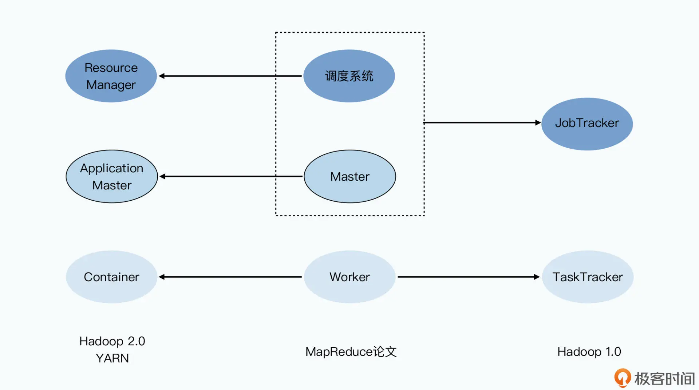

所以之后在 Hadoop 2.0，Hadoop 社区把 JobTracker 的角色，拆分成了进行任务调度的 Resource Mananger，以及监控单个 MapReduce 任务执行的 Application Master，回到了和 MapReduce 论文相同的架构。 

### 容错机制

MapReduce 的容错机制非常简单，可以简单地用两个关键词来描述，就是重新运行和写 Checkpoints 

对下面的几种场景，分别有不同的应对策略：

1、worker 节点的失效（Worker Failure） 

对于 worker 节点的失效，MapReduce 框架解决问题的方式非常简单。就是换一台服务器重新运行这个 worker 节点被分配到的所有任务。master 节点会定时地去 ping 每一个 worker 节点，一旦 worker 节点没有响应，我们就会认为这个节点失效了。 

于是，我们会重新在另一台服务器上，启动一个 worker 进程，并且在新的 worker 进程所在的节点上，重新运行所有失效节点上被分配到的任务。而无论失效节点上，之前的 map 和 reduce 任务是否执行成功，这些任务都会重新运行。因为在节点 ping 不通的情况下，我们很难保障它的本地硬盘还能正常访问。 

2、master 节点的失效（Master Failure） 

对于 master 节点的失效，也就是整个 MapReduce 任务失败了 ，解决这个问题的办法就是再次提交一下任务去重试 

因为 master 进程在整个任务中只有一个，它会失效的可能性很小。而 MapReduce 的任务也是一个用户离线数据处理的任务，并不是一个实时在线的服务，失败重来通常也没有什么影响，只是晚一点拿到数据结果罢了。 

在论文中给出一个简单的解决方案：让 master 定时把它里面存放的信息，作为一个个的 Checkpoint 写入到硬盘中去。 我们可以把这个 Checkpoint 直接写到 GFS 里，然后让调度系统监控 master。这样一旦 master 失效，我们就可以启动一个新的 master，来读取 Checkpoints 数据，然后就可以恢复任务的继续执行了，而不需要重新运行整个任务。 

3、计算出错

在海量数据处理的情况下，比如在 TB 乃至 PB 级别的数据下，我们还会经常遇到“脏数据”的问题。 

这些数据，可能是日志采集的时候就出错了，也可能是一个非常罕见的边界情况（edge-case），我们的 Map 和 Reduce 函数正好处理不了。甚至有可能，只是简单的硬盘硬件的问题带来的错误数据。 那么，对于这些异常数据，我们固然可以不断 debug，一一修正。但是这么做，大多数时候都是划不来的，你很可能为了一条数据记录，由于 Map 函数处理不了，你就要重新扫描几 TB 的数据。 

所以，MapReduce 不仅为节点故障提供了容错机制，对于这些极少数的数据异常带来的问题，也提供了一个容错机制。MapReduce 会记录 Map 或者 Reduce 函数，运行出错的具体数据的行号，如果同样行号的数据执行重试还是出错，它就会跳过这一行的数据。如果这样的数据行数在总体数据中的比例很小，那么整个 MapReduce 程序会忽视这些错误，仍然执行完成。 

### 性能优化

MapReduce的集群其实就是GFS的集群，所以 MapReduce 集群里的硬件配置，和 GFS 的硬件配置差不多，最容易遇到的性能瓶颈，也是 100MB 或者 1GB 的网络带宽。 

其中最有效的优化手段，前面已经说过了，就是移动程序到数据所在的位置。

MapReduce，会找到同样服务器上的 worker，来分配对应的 map 任务。如果那台服务器上没有，那么它就会找离这台服务器最近的、有 worker 的服务器，来分配对应的任务。 MapReduce 程序的代码往往很小，可能只有几百 KB 或者几 MB，但是每个 map 需要读取的一个分片的数据是 64MB 大小。这样，我们通过把要执行的 MapReduce 程序，复制到数据所在的服务器上，就不用多花那 10 倍乃至 100 倍的网络传输量了。 

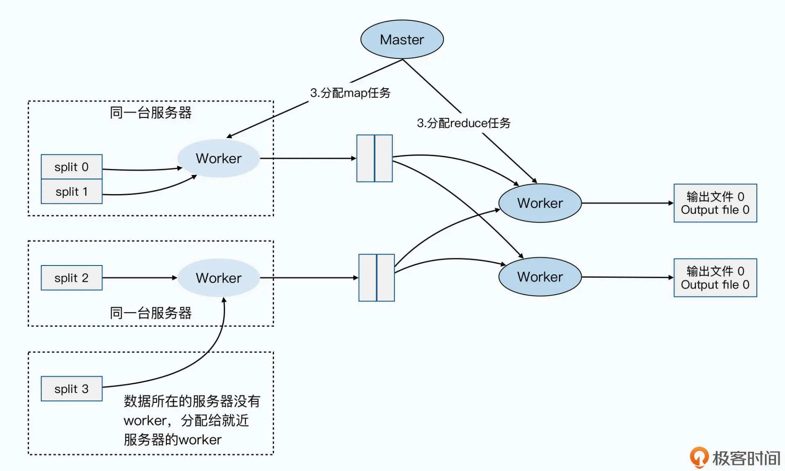

除了 Map 函数需要读取输入的分片数据之外，Reduce 所在的 worker 去抓取中间数据，一样也需要通过网络。那么要在这里减少网络传输，最简单的办法，就是尽可能让中间数据的数据量小一些。 MapReduce 允许开发者自己定义一个 Combiner 函数。这个 Combiner 函数，会对在同一个服务器上所有 map 输出的结果运行一次，然后进行数据合并。 

不仅是同一个 Map 函数的输出可以合并，同一台服务器上多个 Map 的输出，我们都可以合并。 以统计域名的访问次数为例，Map 函数的输出结果，就会是一个域名 + 一次访问计数的 1。 而对于用户会高频访问的网站，在 map 输出的中间结果里就会有很多条记录，比如用户访问了 baidu.com、douyin.com 这样的域名就会有大量的记录。这些记录的 Key 就是对应的 baidu.com、douyin.com 的域名，而 value 都是 1。 我们可以通过一个 Combiner，把 1 万条相同域名的访问记录做个化简。把它们变成 Key 还是域名，Value 就是有多少次访问的数值这样的记录就好了。而这样一化简，reduce 所在的 worker 需要抓取的数据，就从 1 万条变成了 1 条。 

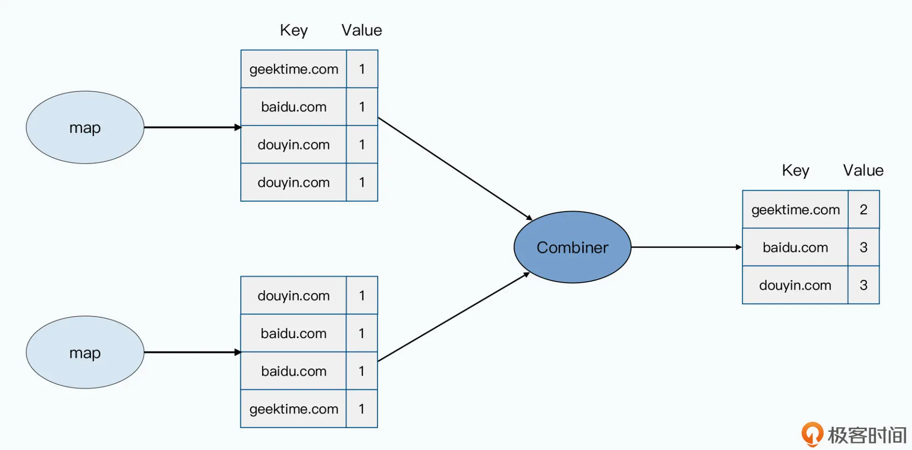

### debug信息

MapReduce 对于开发者的易用性也有好的设计

map 和 reduce 的任务都是在分布式集群上运行的，这个就给我们对程序 debug 带来了很大的挑战。 MapReduce 也为开发者贴心地提供了三个办法来解决这一点 ：

第一个，是提供一个单机运行的 MapReduce 的库，这个库在接收到 MapReduce 任务之后，会在本地执行完成 map 和 reduce 的任务。这样，你就可以通过拿一点小数据，在本地调试你的 MapReduce 任务了，无论是 debugger 还是打日志，都行得通。 

第二个，是在 master 里面内嵌了一个 HTTP 服务器，然后把 master 的各种状态展示出来给开发者看到。这样一来，你就可以看到有多少个任务执行完了，有多少任务还在执行过程中，它处理了多少输入数据，有多少中间数据，有多少输出的结果数据，以及任务完成的百分比等等。同样的，里面还有每一个任务的日志信息。 

最后一个，是 MapReduce 框架里提供了一个计数器（counter）的机制。作为开发者，你可以自己定义几个计数器，然后在 Map 和 Reduce 的函数里去调用这个计数器进行自增。所有 map 和 reduce 的计数器都会汇总到 master 节点上，通过上面的 HTTP 服务器里展现出来。 比如，你就可以利用这个计数器，去统计有多少输入日志的格式和预期的不一样。如果比例太高，那么多半你的程序就有 Bug 

## Yarn

在 MapReduce 应用程序的启动过程中，最重要的就是要把 MapReduce 程序分发到大数据集群的服务器上。在之前，这个过程主要是通过 TaskTracker 和 JobTracker 通信来完成。 这个方案的缺点是：服务器集群资源调度管理和 MapReduce 执行过程耦合在一起，如果想在当前集群中运行其他计算任务，比如 Spark 或者 Storm，就无法统一使用集群中的资源了。

随着计算框架越来越多，独立的资源调度框架Yarn也就诞生了。Yarn 是“Yet Another Resource Negotiator”的缩写，字面意思就是“另一种资源调度器”。事实上，在 Hadoop 社区决定将资源管理从 Hadoop 1 中分离出来，独立开发 Yarn 的时候，业界已经有一些大数据资源管理产品了，比如 Mesos 等，所以 Yarn 的开发者索性管自己的产品叫“另一种资源调度器”。 

Yarn的架构：

Yarn 包括两个部分：一个是资源管理器（Resource Manager），一个是节点管理器（Node Manager） ：

* ResourceManager 进程负责整个集群的资源调度管理，通常部署在独立的服务器上 
* NodeManager 进程负责具体服务器上的资源和任务管理，在集群的每一台计算服务器上都会启动，基本上跟 HDFS 的 DataNode 进程一起出现。 

具体说来，资源管理器又包括两个主要组件：调度器和应用程序管理器 ：

* 调度器其实就是一个资源分配算法，根据应用程序（Client）提交的资源申请和当前服务器集群的资源状况进行资源分配。Yarn 内置了几种资源调度算法，包括 Fair Scheduler、Capacity Scheduler 等，你也可以开发自己的资源调度算法供 Yarn 调用。 

  Yarn 进行资源分配的单位是容器（Container），每个容器包含了一定量的内存、CPU 等计算资源，默认配置下，每个容器包含一个 CPU 核心。容器由 NodeManager 进程启动和管理，NodeManger 进程会监控本节点上容器的运行状况并向 ResourceManger 进程汇报。 

* 应用程序管理器负责应用程序的提交、监控应用程序运行状态等。应用程序启动后需要在集群中运行一个 ApplicationMaster，ApplicationMaster 也需要运行在容器里面。每个应用程序启动后都会先启动自己的 ApplicationMaster，由 ApplicationMaster 根据应用程序的资源需求进一步向 ResourceManager 进程申请容器资源，得到容器以后就会分发自己的应用程序代码到容器上启动，进而开始分布式计算。 

以一个 MapReduce 程序为例，讲述下Yarn的工作过程：

1. 我们向 Yarn 提交应用程序，包括 MapReduce ApplicationMaster、我们的 MapReduce 程序，以及 MapReduce Application 启动命令
2. ResourceManager 进程和 NodeManager 进程通信，根据集群资源，为用户程序分配第一个容器，并将 MapReduce ApplicationMaster 分发到这个容器上面，并在容器里面启动 MapReduce ApplicationMaster。
3. MapReduce ApplicationMaster 启动后立即向 ResourceManager 进程注册，并为自己的应用程序申请容器资源。
4. MapReduce ApplicationMaster 申请到需要的容器后，立即和相应的 NodeManager 进程通信，将用户 MapReduce 程序分发到 NodeManager 进程所在服务器，并在容器中运行，运行的就是 Map 或者 Reduce 任务。
5. Map 或者 Reduce 任务在运行期和 MapReduce ApplicationMaster 通信，汇报自己的运行状态，如果运行结束，MapReduce ApplicationMaster 向 ResourceManager 进程注销并释放所有的容器资源。

MapReduce 如果想在 Yarn 上运行，就需要开发遵循 Yarn 规范的 MapReduce ApplicationMaster，相应地，其他大数据计算框架也可以开发遵循 Yarn 规范的 ApplicationMaster，这样在一个 Yarn 集群中就可以同时并发执行各种不同的大数据计算框架，实现资源的统一调度管理。 

# Hive

对于经常需要进行大数据计算的人，比如从事研究商业智能（BI）的数据分析师来说，他们通常使用 SQL 进行大数据分析和统计，MapReduce 编程还是有一定的门槛，Hive 能够直接处理我们输入的 SQL 语句（Hive 的 SQL 语法和数据库标准 SQL 略有不同），调用 MapReduce 计算框架完成数据分析操作。 

## MapReduce 实现 SQL

对于常见的一条 SQL 分析语句：

~~~sql
SELECT pageid, age, count(1) FROM pv_users GROUP BY pageid, age;
~~~

具体数据输入和执行结果如下：

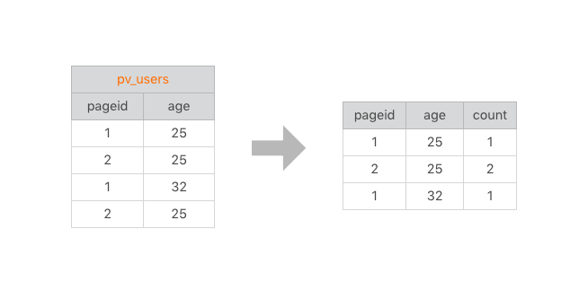

整个过程和WordCount很类似，MapReduce 的计算过程如下：

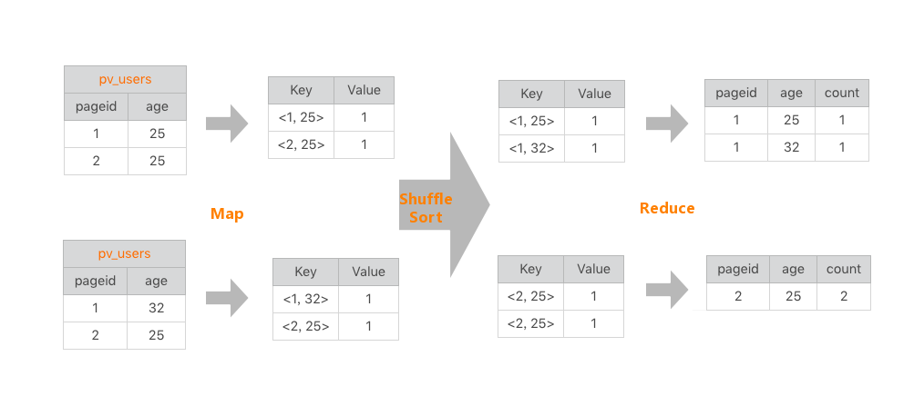

其中的关键步骤是，map 函数的输出经过 shuffle 以后，相同的 Key 及其对应的 Value 被放在一起组成一个 \<Key, Value 集合 >，作为输入交给 reduce 函数处理。 

所以综上，一条 SQL 是可以通过 MapReduce 程序实现的

## 数据模型 

从原始的 MapReduce 任务，到 SQL 语言之间，其实有很多鸿沟

首先就是序列化和类型信息，基于 SQL 的数据库，有明确的表结构，每个字段的类型也都是明确的。而原先的 MapReduce 里，是没有明确的字段以及字段类型的定义的。所以，填补这个鸿沟的第一步，就是先要在数据的输入输出部分加上类型系统。 

Google 的 MapReduce 论文里，把对于输入数据的解析，完全交给了开发 MapReduce 程序的用户自己。对于开发者来说，输入就是一行字符串。而到了 Hadoop 这个开源系统，这一部分稍微进化了一下，Hadoop 把针对输入输出的解析从 MapReduce 的业务程序里面抽离了出来。 

在 Hadoop 里，你可以自定义一系列的 InputFormat/OutputFormat，以及对应 RecordReader/RecordWriter 的实现。这些接口，把通过 MapReduce 读写 HDFS 上的文件内容，以及进行序列化和反序列化的过程单独剥离出来了。这样，开发人员在实现具体的 map 和 reduce 函数的时候，只需要关心业务逻辑就好了，因为在 map 和 reduce 函数里输入输出的 key 和 value，都是已经包含了类型的 Java 对象了 ：

~~~java
public class ExampleMapper extends Mapper<CustomKey, CustomValue, CustomKey, IntWritable>{
    @Override
    protected void map(CustomKey key, CustomValue value, Mapper.Context context) {
        context.write(key,value.getIntValue());
    } 
}
~~~

Hive 则很好地利用了这个 Hadoop 的这个功能特性。对于 Hive 的使用者来说，不再有“输入文件”和“输入文件的格式”这样的概念了，它读取的直接是 Hive 里的一张“表”（Table），拿到的“格式”，也是和数据库概念里面一样的“行”（Row）。通过 InputFormat 解析拿到的一个 key-value 对，其实就是一“行”数据。 Hive通过在InputFormat/OutputFormat外，添加了一层自己的SerDer来把数据转化成数据库里的“行” ：

既然是一张数据库表，那么 Hive 需要的也不是 key-value 对，而是“行”里面的一个个预先已经定义好的“列”（Column）。所以，Hive 在拿到 key-value 对之后，会再通过论文里所说的 SerDer，也就是序列化器 Serializer 和反序列化器 Deserializer，变成一个实际的 Row 对象，里面包含了一个个 Column 的值。 

对于所有这些列，Hive 支持以下这些类型： 

* 整数类型里，它支持 1 字节（tinyint）、2 字节（smallint）、4 字节（int32）、8 字节（int64）的整数；
* 浮点数类型里，它支持单精度（float）和双精度（double）的浮点数；
* Hive 当然也支持字符串，并且没有根据字符串的长度区分类型。 

在这些常见的类型之外，Hive 和我们之前讲解过的 Thrift 一样，还支持结构化的类型，包括数组（list）、关联数组（associated-array），以及自定义的结构体（struct）。 这些支持就让 Hive 的使用变得更加地灵活，这也就类似于现在的 MySQL 支持 JSON 字段一样，使得我们每一行数据可以支持更复杂的结构。 

在 Hive 里我们一样会选择用一张“宽表”，把一个对象的所有字段都通过一张表存下来。 在大数据领域，表通常不会轻易通过数据库里的“外键”进行多张表的关联，而是都会用这种“宽表”的形式，主要原因是表和表之间的 Join 操作很有可能要跨越不同的服务器，这会带来比较高的成本和比较差的性能。 

## 数据存储

Hive 的表的底层数据，其实就是以文件的形式存放在 HDFS 上的。而且存储的方式也非常直观，就是一张 Hive 的表，就占用一个 HDFS 里的目录，里面会存放很多个文件，也就是实际的数据文件。而通过 Hive 运行 HQL，其实也是通过 MapReduce 任务扫描这些文件，获得计算的结果。 

通过 MapReduce 来执行 SQL 进行数据分析，有一个巨大的问题，就是每次分析都需要进行全表扫描。 和 MySQL 不同，HDFS 上的这些文件可没有什么索引，而 Hive 要一直到 0.6.0 版本才会加上基于列存储的 RCFile 格式。对于一开始的 Hive 版本来说，你可以认为所有的数据，都是用类似于 CSV 这样的纯文本的格式存储下来的。 为了解决这个问题，Hive采用了分区（Partition），把不同分区的文件，放到表的目录所在的不同子目录下，这样当我们执行的 SQL 的查询条件，其中的过滤条件和分区的策略吻合时，就可以不用再扫描表目录下所有的子目录了，而是只需要筛选出符合条件的那些子目录就好了。

在分区之外，Hive 还进一步提供了一个分桶（Bucket）的数据划分方式。

在分区之后的子目录里，Hive 还能够让我们针对数据的某一列的 Hash 值，取模之后分成多个文件。这个分桶，虽然不能让我们在分析查询数据的时候，快速过滤掉数据不进行检索，但是却提供了一个采样分析的功能。 

比如，我们按照日志的 log id 分成 100 个桶，那么我们可以很容易地在分析数据的时候，指定只看 5 个桶的数据。这样，我们就有了一个采样 5% 的数据分析功能。这样的数据采样，可以帮助数据分析师快速定性地判断问题，等到有了一些初步结论之后，再在完整的数据集上运行，获得更精确的结果。  

## Hive架构

Hive的架构图：

1、对外接口：Hive 支持命令行、Web 界面，以及 JDBC 和 ODBC 驱动。而 JDBC 和 ODBC 的驱动则是通过 Hive 提供的 Thrift Service，来和实际的 Hive 服务通信。这些接口最终都把外部提交的 HQL，交给了 Hive 的核心模块，也就是“驱动器”。 

2、驱动器：它将HQL 语言变成一系列待执行的 MapReduce 的任务。驱动器既是一个编译器，又是一个优化器

编译器将HQL 编译成一个逻辑计划（Logical Plan） ，会解析SQL，生成一个抽象语法树（AST） 

优化器根据逻辑计划，然后根据 MapReduce 任务的特点进行优化，变成一个物理计划（Physical Plan） ，下面是一个优化的例子：

我们有三张数据表 A、B、C，分别存放了用户的基础信息、用户的标签，以及用户的支付数据，然后通过每张表里的 user_id 把这三张表 Join 在一起。如果按照逻辑计划直接一个个操作执行，那么我们会先 A Join B，把结果输出出来变成一个中间结果 X，然后再通过 X Join C 拿到最后的结果 Y。 

这个过程，每个 Join 都是一个 MapReduce 的任务，但是当优化器看到两个 Join 的 key 是相同的，就可以通过一个 MapReduce，在 Map 端同时读入三个表，然后通过 user_id 进行 Shuffle，并在 Reduce 里进行对应的数据提取处理。这样，我们就可以“优化”到只有一个 MapReduce 就能完成整个过程。 

~~~sql
SELECT A.user_id, MAX(B.user_interests_score), SUM(C.user_payments) 
FROM A 
LEFT JOIN B on A.user_id = B.user_id
LEFT JOIN C on A.user_id = C.user_id
GROUP BY A.user_id
~~~

最后的物理计划，会通过一个执行引擎以及一个有向无环图（DAG），来按照顺序进行执行。执行引擎在这里就是 Hadoop 的 MapReduce，未来，Hive 还会扩展到使用 Spark 等其他的计算引擎里。 

3、Metastore ：用来存储 Hive 里的各种元数据。无论是表的名称、位置、列的名称、类型都会存放在这里。这个 Metastore，我们通常是使用中心化的关系数据库来进行存储的。 正是这个 Metastore，让 Hive 成了一个完整的数据仓库解决方案。我们的驱动器里的各个模块，也需要通过 Metastore 里面的数据，来确定解析 HQL 的时候，是否所有字段都存在并且合法，以及确认最终执行计划的时候，从哪些目录读取数据。 

Hive相比Pig的优势：

* 1、选择了SQL，而不是DSL；
* 2、没有提供一个足够好的“UI” ：这个 UI 不只是一个 Web 界面，让你可以输入运行 SQL，也包括我们前面说的 JDBC/ODBC 这样的驱动层。更重要的是，Hive 通过 Metastore 这个元数据存储模块，统一管理了所有数据表的位置、结构、字段名称，以及 SerDer 的信息。 而当你去使用 Pig 的时候，这些都需要自己在 Pig 脚本里写。当分析师想要去看一看现在有哪些数据表，以及每个数据表是什么格式的时候，Hive 就比 Pig 要方便许多。当我们只有一两张数据表的时候，这个优势还不明显。而当我们像 Facebook 一样，有数百 TB 的数据、数不清的数据表的时候，这个 Metastore 变成一个不可或缺的部分了。 

通过 Hive 的 Client（Hive 的命令行工具，JDBC 等）向 Hive 提交 SQL 命令。分为两种情况：

* 如果是创建数据表的 DDL（数据定义语言），Hive 就会通过执行引擎 Driver 将数据表的信息记录在 Metastore 元数据组件中，这个组件通常用一个关系数据库实现，记录表名、字段名、字段类型、关联 HDFS 文件路径等这些数据库的 Meta 信息（元信息）。 
* 如果是查询分析数据的 DQL（数据查询语句），Driver 就会将该语句提交给自己的编译器 Compiler 进行语法分析、语法解析、语法优化等一系列操作，最后生成一个 MapReduce 执行计划。 然后根据执行计划生成一个 MapReduce 的作业，提交给 Hadoop MapReduce 计算框架处理。 

对于一个较简单的 SQL 命令，比如： 

~~~sql
SELECT * FROM status_updates WHERE status LIKE ‘michael jackson’;
~~~

它对应的 Hive 执行计划如下图：

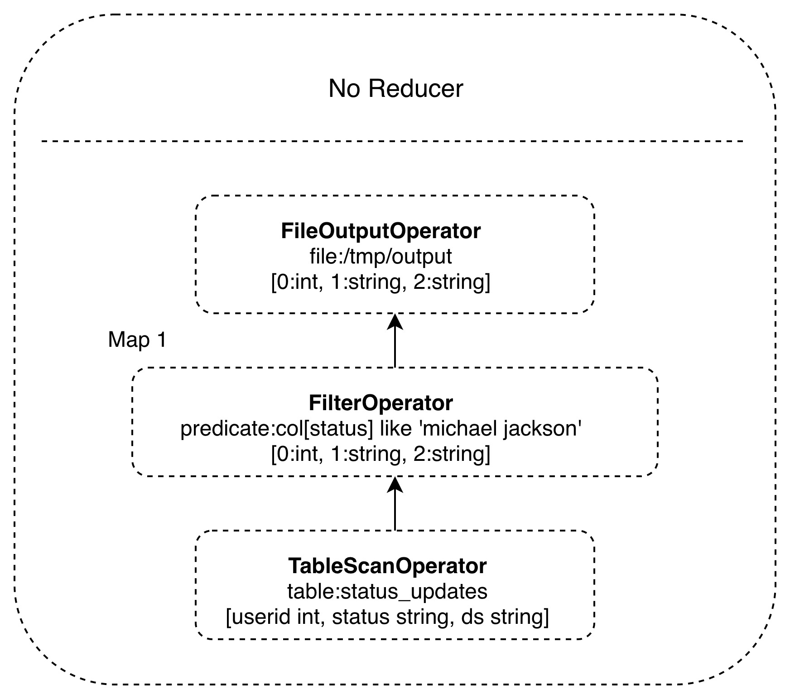

Hive 内部预置了很多函数，Hive 的执行计划就是根据 SQL 语句生成这些函数的 DAG（有向无环图），然后封装进 MapReduce 的 map 和 reduce 函数中。这个例子中，map 函数调用了三个 Hive 内置函数 TableScanOperator、FilterOperator、FileOutputOperator，就完成了 map 计算，而且无需 reduce 函数。 

除了上面这些简单的聚合（group by）、过滤（where）操作，Hive 还能执行连接（join on）操作。 

例如对于下面的语句：

~~~sql
SELECT pv.pageid, u.age FROM page_view pv JOIN user u ON (pv.userid = u.userid);
~~~

同样，这个 SQL 命令也可以转化为 MapReduce 计算，连接的过程如下图所示 ：

从图上看，join 的 MapReduce 计算过程和前面的 group by 稍有不同，因为 join 涉及两张表，来自两个文件（夹），所以需要在 map 输出的时候进行标记，比如来自第一张表的输出 Value 就记录为 \<1, X>，这里的 1 表示数据来自第一张表。这样经过 shuffle 以后，相同的 Key 被输入到同一个 reduce 函数，就可以根据表的标记对 Value 数据求笛卡尔积，用第一张表的每条记录和第二张表的每条记录连接，输出就是 join 的结果。 

Hive 并没有自己去实现任何分布式计算和分布式存储的底层工作，实际的所有计算和存储仍然是基于 HDFS 和 MapReduce。 只是作为一个底层计算引擎的“驱动”（Driver）出现，使得它可以去适配其他的计算引擎。

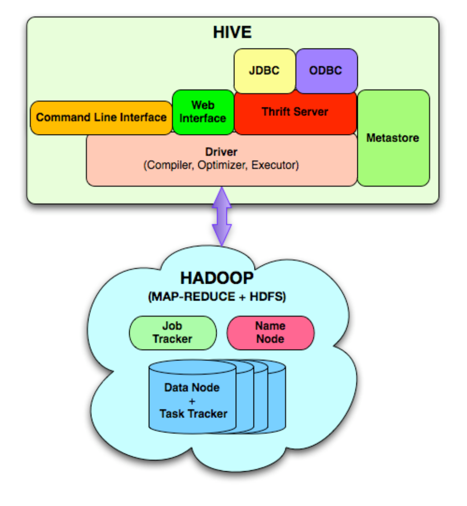

# Dremel 

## 从行存储到列存储 

MapReduce 的缺陷：

1、它处理数据的方式太简单粗暴，直接就是把所有数据都扫描一遍。 通常来说，我们的 Hive 表也好，或者以 Thrift 序列化后存放到 HDFS 上的日志也好，采用的都是“宽表”，也就是我们会把上百个字段都直接存放在一张表里。但是实际我们在分析这些日志的时候，往往又只需要用到其中的几个字段。 

比如，我们之前的日志，有超过 100 个字段，但是如果我们想要通过 IP 段和 IP 地址，查看是否有人刻意刷单刷流量的话，我们可能只需要 IP 地址等有限的 4~5 个字段。而如果这些字段在 Hive 里并不是一个分区或者分桶的话，MapReduce 程序就需要扫描所有的数据。这个比起我们实际需要访问的数据，多了数十倍。 

但是，我们又不可能对太多字段进行分区和分桶，因为那样会导致文件数量呈几何级数地上升。 在这种大量、小文件的场景下，是发挥不出 MapReduce 进行顺序文件读写的吞吐量的优势的。 所以，即使已经进行了分区，我们的很多数据分析任务，仍然浪费了大量的性能在访问不需要的数据上。 

2、每个任务都有比较大的额外开销。在 Hive 里每执行一个 HQL，都需要经过把程序复制到各个节点、启动 Master 和 Worker，然后进行整个 MapReduce 的过程。 可能我们只是访问 1GB 的数据，即使按照单机读写硬盘的吞吐量来计算，也就是一两分钟的事情。但是整个 MapReduce 运行的过程却很难少于 3 分钟，其中可能有一半时间，都花在了 MapReduce 这个程序运行机制带来的额外开销上了。 总而言之，MapReduce 乃至已经针对 MapReduce 作出了一定优化的 Hive，虽然可伸缩性很强，但是在整体的运行过程中其实非常“浪费”。 

为了解决这些问题，可以学习Dremel 的论文，也就搞清楚了 Parquet 这个开源的列式存储结构了

无论是最初版本的Hive，还是Thrift，它们存储数据的方式都是“行存储”。所谓的行存储，就是一行（Row）或者说一条数据，是连续存储在一起的。这对于我们写程序去解析数据来说非常方便，我们只需要顺序读取数据，然后反序列化出来一个个对象，遍历去顺序处理就好了。 

但是，当一行数据有 100 个字段，而我们的分析程序只需要其中 5 个字段的时候，就很尴尬了。因为如果我们顺序解析读取数据，我们就要白白多读 20 倍的数据。 此时也不能直接跳过不需要读的字段，因为对于硬盘来说，顺序读远远要优于随机读，如果每个字段都要根据索引或者偏移量进行随机数据访问，那性能恐怕还不如直接把所有数据都顺序读入呢。 

所以就出现了列存储的概念，将同一列的数据连续存储起来，这样，当分析程序只需要几列数据的时候，就顺序地读取连续的、存放在一起的那几列数据就好了。 最极端的情况下，我们可以把每一列的数据都单独存储成一个文件，这样，当我们需要分析哪些字段，就只需要读取哪些文件就可以了。我们可以在内存里，把分析程序用到的各个列的数据重新组装成一行行的记录，然后来进行分析就好了：

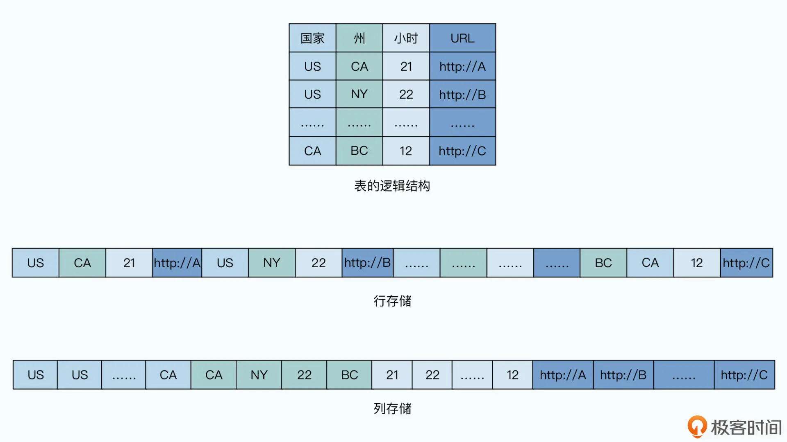

这样存储之后，数据写入就变得有些麻烦了。原先我们只需要顺序追加写入数据，而现在我们需要向很多个文件去追加写入数据 ，为了解决这个问题，可以用之前Bigtable的方案，用类似于 WAL+MemTable+SSTable 组合的解决方案。对于追加写入的数据，我们可以先写 WAL 日志，然后再把数据更新到内存中，接着再从内存里面，定期导出按列存储的文件到硬盘上。 这样，我们所有的数据写入，也一样都是顺序写入的。我们并不需要追加一行数据，就跑去在上百个列存储文件后面追加记录。

在 Hadoop 这样的大数据环境中，甚至这样的追加写入操作都不需要。我们可以直接通过一个 MapReduce 程序，把原来的按行存储的数据做一个格式转换就好了，在这个 MapReduce 的过程中，数据的读写都是顺序的，我们的分析程序也只需要读取这个数据转换的结果就好了。 

事实上，在一个分布式的环境里，我们的数据其实并不能称之为 100% 的列存储。因为我们在分析数据的时候，可能需要多个列的组合筛选条件。比如，我们可能同时需要采用用户所在的州和小时作为筛选条件。如果这两列的数据在不同的服务器上，那么我们就需要通过网络传输这些数据，网络传输常常是大数据计算的瓶颈。所以，更合理的解决方案是行列混合存储。像 Bigtable 一样对数据进行分区，将一些记录的数据以列存储的格式存到一个服务器上，这样涉及到同一个分区的数据，就都在一个服务器上面了，而这种存储方式，正好和我们前面通过 MapReduce 进行数据格式转换对上了。我们可以让所有的 Map 函数都读取分配给它的数据，然后转换成列存储，存储到自己所在的节点的硬盘上。这整个过程中，完全不需要网络传输。

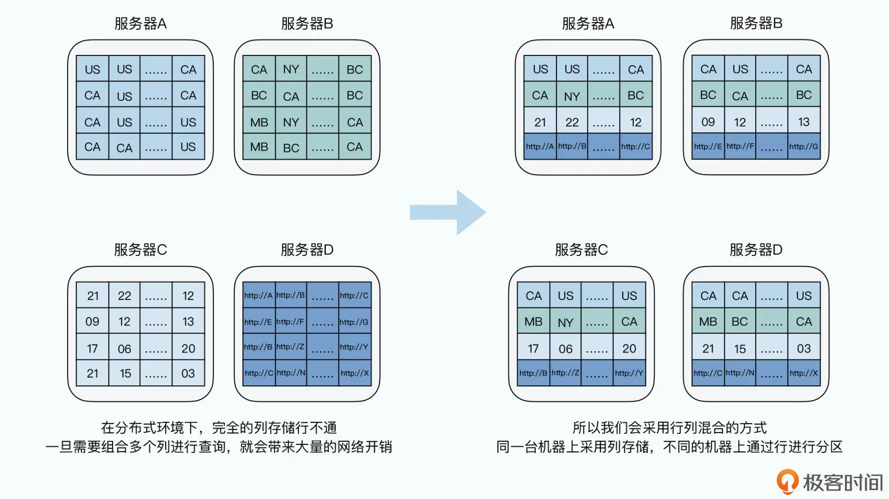

## 嵌套结构问题

Dremel解决了一个重要的问题：就是列式存储的同时，支持复杂的嵌套结构

### 示例数据

下面是 Dremel 论文里面，给出的需要分析的一行数据对象，Protobuf 的定义文件和对应的示例数据：

~~~
message Document {
  required int64 DocId;
  optional group Links {
    repeated int64 Backward;
    repeated int64 Forward; }
  repeated group Name {
    repeated Language {
      required string Code;
      optional string Country; }
    optional string Url; }}
~~~

下面是两个示例数据，示例1：

~~~
// 论文中图2的示例数据 r1
DocId: 10
Links
  Forward: 20
  Forward: 40
  Forward: 60
Name
  Language
    Code: 'en-us'
    Country: 'us'
  Language
    Code: 'en'
  Url: 'http://A'
Name
  Url: 'http://B'
Name
  Language
    Code: 'en-gb'
    Country: 'gb'
~~~

示例2：

~~~
// 论文中图2的示例数据 r2
DocId: 20
Links
  Backward: 10
  Backward: 30
  Forward:  80
Name
  Url: 'http://C'
~~~

这里定义了一个 Document 的结构体，它通过唯一的一个 ID 标识了出来。 其中，Links 里面可以存放正向链接（也就是对应链接指向的文档）的 Document ID，以及反向链接（也就是是链接指向当前的网页）的 Document ID，对应Backward和Forward字段。

嵌套结构的复杂性：

* Document 的结构里面被申明为 repeated 的 Backward 和 Foward 字段，都是一个 List，它们可以有很多个值 
* repeated可以同时出现在上层或者下层，例如Name group 和 Name group 里的 Language 也是一样的，都被申明为了 repeated，也就是一个网页可以有多个 Name，每个 Name 里又会有多个 Language。也就是我们可以在 List 里面，再套一层 List。
* 可选字段optional

这样一来，问题一下子就变得麻烦了。原先我们的列存储，每个列有多少行数据是固定的。我们要组装数据也很容易，只要每个列的第 1 条数据和另一个列的第 1 条数据，合并在一起就好了。 但是在现在这个，一行数据的一个列，可能有多条数据。如果我们把每个字段的数据都按列存储，那么不同列的数据行数就不一样多了，而且会有可能出现某个值不知道属于哪条记录的情况。例如，上面两条数据，简单地直接把每个字段按照顺序在一列里面存储下来，我们无法区分repeated的字段具体属于哪一条记录：

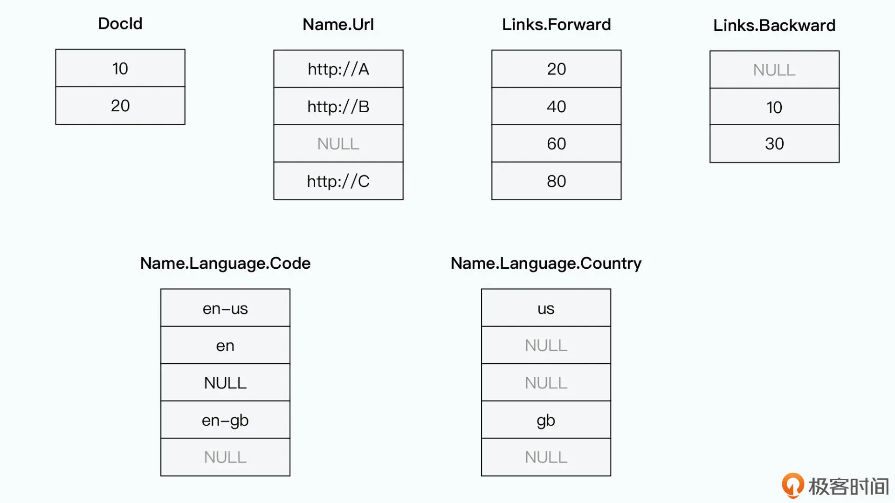

这样就很难把已经转化成列存储的数据，简单地重新组装回原始对象了。 

而 Dremel 的论文，就对重复嵌套字段和可选字段这两个问题提供了一个解决方案，那就是除了在列里存储每一个值之外，它还额外存储了两个字段。有了这两个字段，我们就能反向组装出原来的一行行数据了。 

* 第一个字段叫做 Repetition Level，用来告诉我们，当前这个值相对于上一次出现，是由第几层嵌套结构引起的。 
* 第二个字段叫做 Definition Level，用来告诉我们，当一个字段是 Optional，也就是可选的时候，它现在没有填充值，是因为多层嵌套的哪一层的字段为空。 

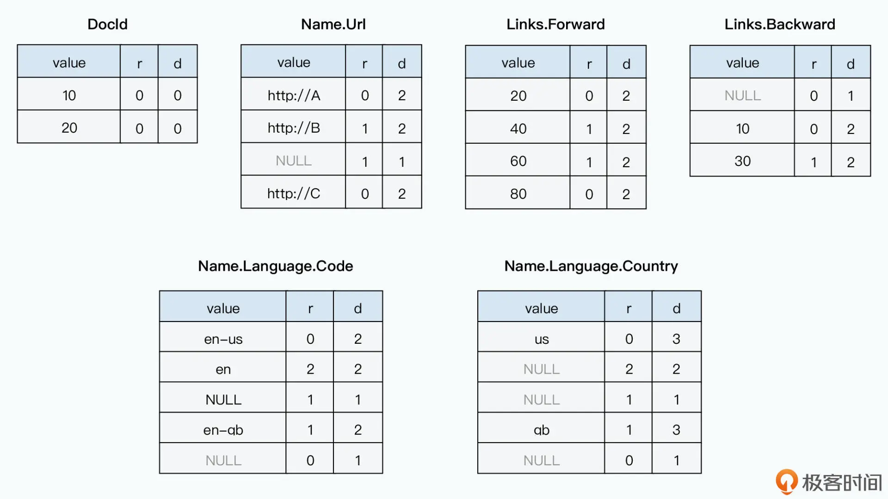

### Repetition Level

以 Name.Language.Code 这个字段为例，这个嵌套结构有三层，第 1 层是 Name，第 2 层是 Language，第 3 层则是 Code。其中，只有 Name 和 Language 是 repeated，也就是会重复出现的，第三层 Code 只是一个简单的值。 

~~~
// 论文中图2的示例数据 r1
DocId: 10
Links
  Forward: 20
  Forward: 40
  Forward: 60
Name
  Language
    Code: 'en-us'
    Country: 'us'
  Language
    Code: 'en'
Name
  Url: 'http://A'
Name
  Language
    Code: 'en-gb'
    Country: 'gb'
~~~

下面逐个分析每个code值的r：

* 对于 r1 这条记录，存放的第一个值'en-us'，因为它是第一个出现的，之前没有重复出现过，所以它的 r 是 0。你可以认为，每当遇到一个 r=0，意味着它已经到了一条新的 Document 记录中了。 
* 存放的第二个值'en'，它的 r=2，也就是说，这是一条重复出现的记录，并且，它是在第 2 层重复出现的。所以你可以看到，这个'en'在原来的结构当中，是新出现了同一个 Name 下的 Lanuage，而不是新出现了一个第 1 层的 Name。 
* 存放的第三个值 null，说明这个 Name.Language.Code 的值为空，而 r=1，说明它也还是重复出现的一条记录，不过这次它是在第 1 层重复出现的了。也就是一个新的 Name，这就对应着 r1 里面，URL 为'http://A'的那个 Name，里面的确也没有 Code，并且连 Language 也没有。 
* 存放的第四个值'en-gb'的 r=1，则是说明重复在第 1 层，也就是又需要一个新的 Name 
* 存放的第五个值 null 的 r=0，则是说明这个值不来自于之前重复的列表，也就是一条新的 Document 记录，其实也就是进入论文图 2 里面的 r2 这条记录了。 

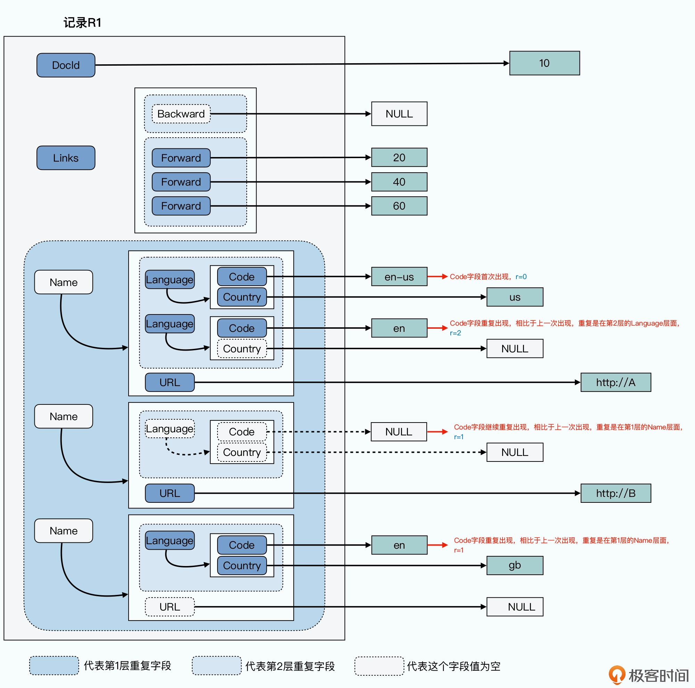

这个 Repetition 其实指向的就是 Protobuf 中的 repeated 的关键字。我们通过这个 Repetition Level，就能够区分清楚，这个值存储的是哪一层的 repeated 的值。 

### Definition Level 

Definition Level解决的问题是Optional 字段。对于很多取值为 NULL 的字段来说，我们并不知道它为空，是因为自己作为一个 Optional 字段，所以没有值，还是由于上一层的 Optional 字段的整个对象为空。 

就以论文中的数据示例来说，记录 r1 里面的第二、三个 Country 都是空。我们不知道是因为 Country 字段没有填值，还是上一层嵌套里的整个 Language 字段就是空的。当然，你可以说我们可以把所有数据组装出来，再反向看看是否整个 Language 字段到底存不存在。 

但是，在列存储的场景下，我们分析数据只要读取少数几个列，组装的也只是部分列，并不需要把所有的列都组装成完整的对象。如果我们只根据部分字段组装出来的结果，揣测哪一层的对象是空的，那么猜测的结果很有可能是错的。 

而这个 Definition Level，是要告诉我们，对于取值为 NULL 的对象，具体到哪一层 Optional 的对象的值变成了 NULL。知道了这个信息，我们通过列数据反向组装成行对象的时候，就能够 100% 还原了，不会出现不知道哪一层结构应该设置为空的情况。 

以Name.Language.Code 这个字段为例：

可以看到，在 Protobuf 的定义中，对于 Code 字段来说，Name 字段本身是必然需要的。只有 1 层 Language 字段是可要可不要的。那么，当 Code 字段为 Null 的时候，只有一种可能性，也就是第 1 层的 Language 是空，这个时候，d=1。因为只要 Code 出现，Name 字段本身必然出现。 

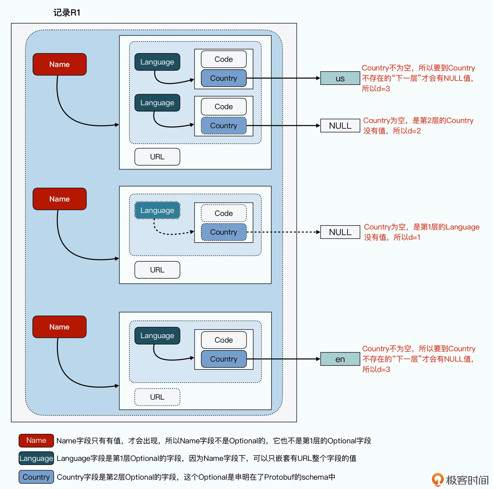

在前面的数据示例里，我们把这个 Definition Level，记录为了 d。可以看到，只要取值不是 Null 的情况，这个 d 其实就是当前字段作为 Optional 字段，定义的层数加 1。 

以Name.Language.Country 这个列的数据为例：

首先和前面一样，Name 字段本身不能为 NULL。而 Language、Country 字段都是 Optional 的，那么 Country 没有值，可能是因为第 1 层的 Language 就已经是 Null 了，也可能是因为第 2 层的 Country 字段本身是 NULL。 

这里你可以看到，第一个 Country 的值是'us'，那么它的 d 就是 Country 本身，作为 Optional 字段嵌套的层数加 1，也就是 d=3；第二和第三个值为 null，但是它们的 Definition Level 并不一样，分别是 2 和 1：

* 通过对比原始的数据，可以看到，第一个 Country 没有值，但是第 1 层 Optional 的 Language 不是空的，里面还有一个 Code 取值是'en'，因为它是到 Country 这个第 2 层的时候，才是 NULL 的，所以 d=2。 
* 而第二个 Country 没有值，它的第 1 层的 Language 也不存在，所以 d=1。 

综上，Dremel 通过 Repetition Level 和 Definition Level 这两个字段，就巧妙地在把数据拆分成列之后，能够重新把它们组装起来，100% 还原了原先一行行的数据。而这样拆分成按列存储，在大部分的数据分析情况下，都会大大减少我们需要扫描的数据，提升我们进行数据分析的效率。 

## 基本架构

使用 Dremel 比传统的 MapReduce 读取列存储的数据还要再快一个数量级。Google 并没有在列存储上止步，而是借鉴了多种不同的数据系统，搭建起了整个 Dremel 系统，真的把在百亿行的数据表上，常见 OLAP 分析所需要的时间，缩短到了 10 秒这个数量级上。 

Dremel 也是从很多过去的系统中汲取了养分： 

第一，它从传统的 MPP 数据库，学到了数据分区和行列混合存储，并且把计算节点和存储节点放在同一台服务器上。 

第二，它从搜索引擎的分布式索引，学会了如何通过一个树形架构，进行快速检索然后层层归并返回最终结果。 

第三，它从 MapReduce 中借鉴了推测执行（Speculative Execution），来解决了少部分节点大大拖慢了整个系统的整体运行时间的问题。 

而这三个的组合，就使得 Dremel 最终将百亿行数据表的分析工作缩短到了 1 分钟以内。 

从硬件的性能来说，这看起来又是完全做得到的。论文里给出的实验数据里，是用 3000 个节点，去分析 0.5TB 的数据，这意味着每个节点只需要分析 167MB 的数据。即使是传统的 5400 转的机械硬盘，顺序读写的确也只需要数秒钟，再加上网络传输和 CPU 的计算时间，的确也就是个 10 秒钟上下的时间。 

Dremel 之所以这么快，是因为它的底层计算引擎并不是 MapReduce。Dremel 一方面继承了很多 GFS/MapReduce 的思路，另一方面也从传统的 MPP（Massively Parallel Processing）数据库和搜索引擎的分布式检索模块，借鉴了设计思路。其实它的核心思路就是这四条： 

* 让计算节点和存储节点放在同一台服务器上。MPP 数据库和搜索引擎的分布式索引的架构也是这样的。 
* 进程常驻，做好缓存，确保不需要大量的时间去做冷启动。这一点，也跟 MPP 数据库和分布式索引采用的架构和优化手段类似。 
* 树状架构，多层聚合，这样可以让单个节点的响应时间和计算量都比较小，能够快速拿到返回结果。这个架构，和搜索引擎的分布式索引架构是完全相同的。 
* 最后一点则仍然来自于 GFS/MapReduce，一方面是即使不使用 GFS，数据也会复制三份存放到不同的节点。然后在计算过程中，Dremel 会监测各个叶子服务器的执行进度，对于“落后”的计算节点，会调度到其他计算节点，这个方式和 MapReduce 的思路是一样的。更进一步的，Dremel 还会只扫描 98% 乃至 99% 的数据，就返回一个近似结果。对于 Top K，求唯一数，Dremel 也会采用一些近似算法来加快执行速度。这个方法，也是我们在 MapReduce 中经常用到的。 

Dremel 采用了一个多层服务树的架构，整个服务树里面有三种类型的节点： 

* 首先是根服务器（root server），用来接收所有外部的查询请求，并且读取 Dremel 里各个表的 METADATA，然后把对应的查询请求，路由到下一级的服务树（serving tree）中。 
* 然后是一系列的中间服务器（intermediate servers），中间服务器可以有很多层。比如第一层有 5 个服务器，那么每个服务器可以往下再分发下一层的 5 个服务器，它是一个树状结构，这也是服务树的这个名字的由来。我们所有查询 Dremel 系统的原始 SQL，每往下分发一层，就会重写（rewrite）一下，然后把结果在当前节点做聚合，再返回给上一层。 
* 最下面是一层叶子服务器（leaf servers），叶子服务器是最终实际完成数据查询的节点，也算是我们实际存储数据的节点。 

一个SQL 的例子： 

~~~sql
SELECT A, COUNT(B) FROM T GROUP BY A
~~~

这是一个我们在日常数据分析中很常见的 SQL，它是从某一个表里 T，按照某一个维度 A（比如国家、时间），看某一个统计指标 B（比如页面访问量、唯一用户数）这样的数据。这个 SQL 在 Dremel 上执行的过程是这样的：

首先，SQL 会发送到根服务器，根服务器会把整个 SQL 重写成下面这样的形式：

~~~sql
SELECT A, SUM(c) FROM ( R11 UNION ALL … Rn1 ) GROUP BY A
~~~

其中的每一个 R11 … Rn1，都是服务树的下一层的一个 SQL 的计算结果，那么下一层的 SQL 是这样的： 

~~~sql
Ri1 = SELECT A, COUNT(B) AS c FROM Ti1 GROUP BY A
~~~

这里的 Ri1 就是对应中间服务器的中间结果，Ti1 就是对应分配给当前中间服务器，需要计算的数据的分区。 因为原始的 SQL 是进行统计计数，那么我们只需要让中间服务器，分别去统计一部分分区数据的统计计数，再把它们累加到一起，就可以拿到最终想要的结果。

事实上，这里面的 Ri1 可以再用根服务器重写 SQL 的方式，进行再次重写，再往下拆分，我们可以有两层、三层乃至更多层的中间服务器。而到了最后一层，分发给叶子服务器的时候，就不能再往下分发了，叶子服务器会在它所分配到的分区上，执行对应的 SQL 并且返回。  

### 行列混合存储的 MPP 架构 

Dremel 的列存储本质上是行列混合存储的。所以每一个节点所存储的数据，是一个特定的分区（Partition），但是里面包含了这个分区所有行的数据。这样当数据到达叶子节点的时候，叶子节点需要执行的 SQL 只需要访问一台物理服务器。在这种情况下，我们可能有两种方案： 

* 一种是对应的数据，就直接存放在叶子节点的服务器的本地硬盘上。这种方式，也是传统的 MPP 数据库采用的方式，也是 Dremel 系统在 2006 年，在 Google 内部开始使用的时候采用的方式，直到论文发表的 2009 年，这还是 Dremel 系统主要采用的方案。 
* 另一种方式，则是叶子节点本身不负责存储，而是采用一个共享的存储层，比如 GFS。Dremel 从 2009 年开始，就逐步把存储层全部迁移到了 GFS 上。（这是因为分布式存储技术越来越成熟，扩容方便等） 

把数据存储和计算放在同一个节点，以及将用户 SQL 查询重写，并行分发到多个节点并且汇总所有节点的查询结果，是 MPP 数据库的常见方案。这也是为什么 Dremel 论文里说，它从 MPP 数据库里借鉴了很多解决问题的思路。 

### 树形分发的搜索引擎架构 

一层层服务树分发的机制，则是借鉴了搜索引擎的分布式检索机制。数据分区到不同的叶子节点上，就是相当于我们把不同的文档分片到不同的索引分片服务器上。 每一个索引分片服务器，会完成自己分片数据上的检索工作，然后把结果返回给上一层的中间服务器。中间服务器也会在自己这一层，把检索结果再进行合并处理，再往上一层层返回，直到根服务器 ：

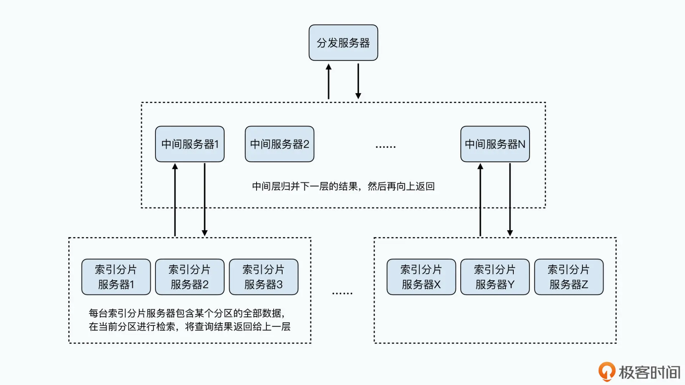

以计算TOPK为例，每一个服务器重写SQL然后向下拆分，叶子服务器还是会获取自己分片数据的 TOP K，每一层都会去归并下一层的返回结果，并再计算一次 TOP K。 这个和搜索引擎的分布式索引的架构是完全一样的，唯一的差别是，搜索引擎计算 TOP K 的方式更加复杂一些，需要利用倒排索引，以及根据搜索的关键词，计算文档的一个“分数”来进行排名而已。 

这个架构中最核心的价值，在于可以通过中间服务器来进行“垂直”扩张。并且通过“垂直”扩张，可以在计算量基本不变的情况下，通过服务器的并行，来缩短整个 SQL 所花费的时间。也就是通过增加更多的服务器，让系统的吞吐量（Throughoutput）不变，延时（Latency）变小。这个“垂直”扩张，并不是所谓的对硬件升级进行 Scale-Up，而是增加中间层服务器，增加归并聚合计算的并行度。 

因为实际扫描数据，是在最终的叶子节点进行的，所以这一层花费的时间和性能是固定的。如果我们没有中间服务器，而是所有的叶子节点数据都直接归并到根服务器，那么性能瓶颈就会在根服务器上。 

根服务器需要和 3000 个节点传输数据，并在根节点进行聚合。而这个聚合又在一个节点上，只能顺序进行，即使每一个叶子节点返回的数据，在根节点进行数据聚合只需要 20 毫秒，那么我们也需要 1 分钟才能完成 3000 个节点的数据聚合。 而如果我们在中间加入中间层的服务器，比如，我们有 100 个中间层的服务器，每个服务器下面聚合 30 个叶子服务器。那么中间层服务器就只需要 600 毫秒完成中间层的聚合，中间层的结果到根服务器也只需要 2 秒，我们可以在 3 秒内完成两层的聚合工作。 

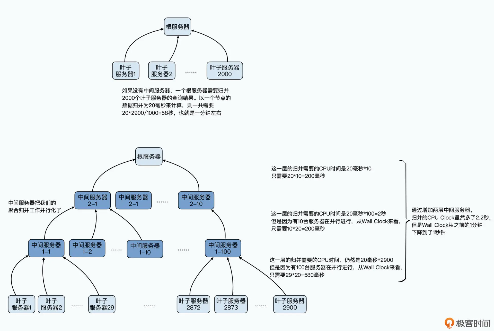

当然，在实际的 SQL 执行过程中，我们还有叶子节点扫描数据，以及数据在叶子节点和中间层，还有中间层和根服务器之间的网络传输开销，实际花费的时间会比这个多一些。但是中间层，帮助我们把数据归并的工作并行化了。我们归并工作需要的 CPU 时间越多，这个并行化就更容易缩短整个查询的响应时间。 我们的叶子节点越多，叶子节点返回的数据记录越多，增加中间层就越划算。 

这个树形垂直扩展的架构，也是搜索引擎能从无穷无尽的网页中，快速在几百毫秒之内给到你结果的核心所在。 

### 来自 MapReduce 的容错方案 

而 Dremel 和 MapReduce 一样，会遇到网络问题、硬件故障。乃至于个别叶子节点因为硬盘可能将坏未坏，虽然仍然能够读取数据，但是就是特别慢，这些它会遇到的问题，其实 MapReduce 里都遇到过。 

Dremel 借鉴了MapReduce 和GFS的经验：

* 首先是虽然数据存储到了本地硬盘，也会有 3 份副本。这样，当我们有个别节点出现故障的时候，就可以把计算请求调度到另外一套有副本数据的节点上。 
* 其次，是借鉴了 MapReduce 的“推测执行”功能，Dremel 也会监测叶子节点运行任务的进度。在 3000 个节点里，我们总会遇到一些节点跑起来特别慢，拖慢了整个系统返回一个查询结果的时间。往往 99% 的节点都算完了，大家等这几个节点要等上个三五分钟。这些节点无论是在 MapReduce 还是 Dremel 中都会存在，我们一般称它们为“掉队者”（Stragglers）。 而 Dremel 和 MapReduce 一样，一旦监测到掉队者的出现，它就会把任务再发给另外一个节点，避免因为单个节点的问题，导致整个任务的延时特别长。 
* 另外，在 MapReduce 里，我们最终还是要等待所有的 Map 和 Reduce 函数执行完才给出结果。而在 Dremel 里，我们可以设置扫描了 98% 或者 99% 的数据就返回一个近似的结果。 

从 Dremel 的实验数据来看，通常 99% 的到叶子节点处理的数据是低于 5 秒的，但是另外的少部分数据往往花费了非常长的时间，甚至会到几分钟。另一方面，Dremel 是一个交互式的分析系统，更多是给分析师分析数据给出结论，而不是生成一个用来财务记账的报表，数据差上个 1%~2% 并不重要。 

# Spark

## MapReduce的弊端

MapReduce 的整个流程：

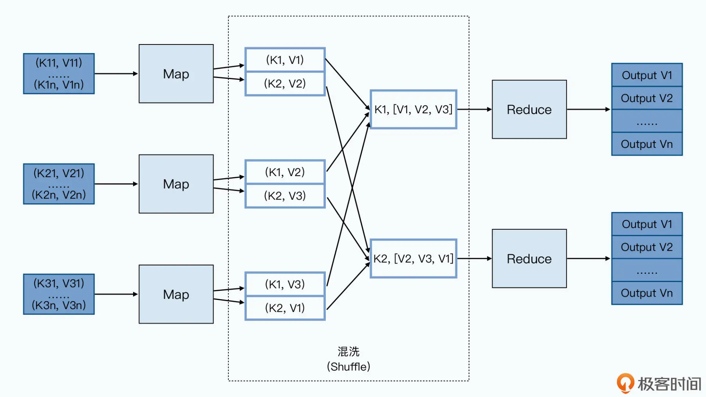

MapReduce 的过程并不复杂，Map 函数的输出结果会输出到所在节点的本地硬盘上。Reduce 函数会从 Map 函数所在的节点里拉取它所需要的数据，然后再写入本地。接着通过一个外部排序的过程，把数据进行分组。最后将排序分完组的数据，通过 Reduce 函数进行处理。 

在这个过程里，任何一个中间环节，我们都需要去读写硬盘。Map 函数的处理结果，并不会直接通过网络发送给 Reduce 所在的 Worker 节点，Reduce 也不会直接在内存中做数据排序。 如果我们要通过 MapReduce 来跑一些机器学习任务，比如通过 L-BFGS 这样的算法，来进行大规模的逻辑回归的模型训练，我们需要跑上百个 MapReduce 的任务。其中每一个 MapReduce 的任务都差不多，都是把所有日志读入，然后和一个梯度向量做计算，算出新的梯度。接着下一轮计算要再读入一遍原来的日志数据，再和新的梯度做计算。在这个过程中，我们原始的日志，会被重复读取上百遍：

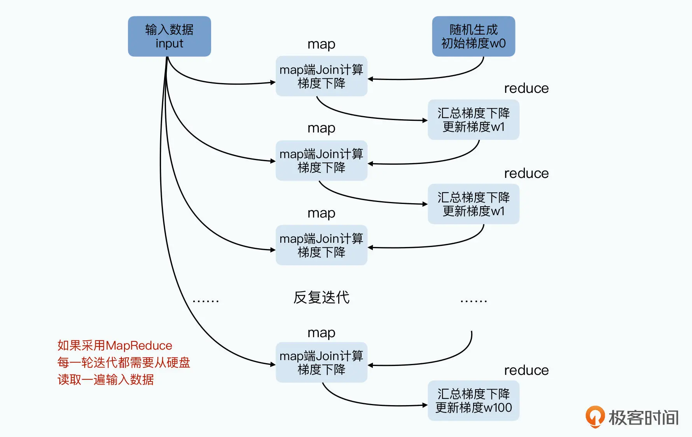

之所以 MapReduce 把所有数据都往硬盘里一写，是因为它追求的是设计上的“简单”，以及在大规模集群下的“容错”能力。 如果把Map 节点的输出数据，直接通过网络发送给 Reduce 的确是一个很直观的想法，让 Reduce 节点在内存里就直接处理数据，也的确可以提升性能，但是难点在于，当Map 或者 Reduce 的节点出现故障了的时候，就很难容错了。

因为 Reduce 对于前面的 Map 函数有依赖关系，所以任何一个 Map 节点故障，意味着 Reduce 只收到了部分数据，而且它还不知道是哪一部分。那么 Reduce 任务只能失败掉，然后等 Map 节点重新来过。而且，Reduce 的失败，还会导致其他的 Map 节点计算的数据也要重来一遍，引起连锁反应，最终等于是整个任务重来一遍。

如果数据没有在Map本地落地，那么故障会导致我们丢失掉中间的计算结果并且整个Reduce的计算也要完全重新进行Reduce重新计算，需要其他Map也重新发送数据过来，最终导致整个任务重算一遍：

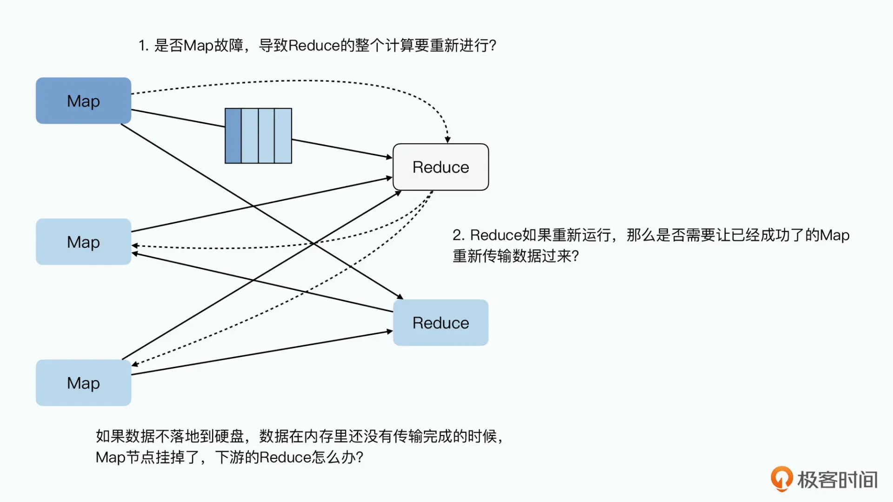

这只是我们尝试让数据不需要落地到硬盘处理中，会遇到的一种情况，我们还可能遇到网络拥塞、内存不足以处理传输的数据等种种情况。 

事实上，你可以认为传统的 MPI 分布式计算系统就是这样，让一个节点直接往另外一个节点发送消息来传递数据的，但是这样的系统，容错能力很差，所以集群的规模往往也上不去。 而 MapReduce 针对这个问题的解决方案非常简单粗暴，那就是把整个数据处理的环节完全拆分开来，然后把一个个阶段的中间数据都落地到硬盘上。这样，针对单个节点的故障，我们只需要重新运行对应节点分配的任务就好了，其他已经完成的工作不会“半途而废”。

## 新的容错方式

写磁盘的方式虽然稳妥，但是故障毕竟是小概率事件，因为小概率事件降低所有数据的处理速度，不是一个最优解。

很自然地，我们需要有一个更有效率的容错方式：

* 第一个，是我们是否可以把数据缓存在内存里。如果是计算的中间结果，我们不一定要把它写到硬盘上。如果是反复读取的输入数据，我们可以缓存在内存里而不是每个迭代重新读取一遍。 
* 第二个，是可以记录我们运算数据生成的“拓扑图”。也就是记录数据计算的依赖关系，一旦某个节点故障，导致这个依赖关系中的一部分节点出现故障，我们根据拓扑图重新计算这一部分数据就好了。通过这样的方式来解决容错问题，而不是每一次都把数据写入到硬盘。 
* 第三，通过检查点来在特定环节把数据写入到硬盘。当我们的拓扑图层数很深，或者数据要反复进行很多次的迭代计算。前面通过“拓扑图”进行重新计算的容错方式会变得非常低效，那么我们可以在一部分中间环节，把数据写入到硬盘上。这样一种折衷的方式，既避免了每次都去从硬盘读写数据，也避免了一旦某一个环节出现故障，“容错”方案只能完全从头再来的尴尬出现。 

举一个具体的例子，如果前面提到的大规模逻辑回归的机器模型训练，需要进行 100 轮迭代。我们最好的解决方案，既不是每轮迭代都需要重新读写数据，那样太浪费硬盘的 I/O 了。也不是把几小时的计算过程都放在内存里，那样万一计算梯度结果的数据在第 99 轮丢失了，我们就要从头开始。 

我们完全可以把读取的日志数据缓存在内存里，然后把每 10 轮计算完的梯度数据写入到硬盘上。这样，一旦出现故障，我们只需要重新读取一次日志数据，并最多计算 10 轮迭代的过程就好了。 

其实这个思路，就是 Spark 整个系统设计的出发点。根据这个朴素的思路，Spark 定了一个新的概念 RDD，全称是 Resilient Distributed Dataset，中文叫做弹性分布式数据集。整个系统设计的其实就是 “弹性”+“分布式”+“数据集” 这三点的组合。 

## RDD

Spark 和 MapReduce 进行逻辑回归机器学习的性能比较，Spark 比 MapReduce 快 100 多倍 

除了速度更快，Spark 和 MapReduce 相比，还有更简单易用的编程模型。使用 Scala 语言在 Spark 上编写 WordCount 程序，主要代码只需要三行 ：

~~~scala
val textFile = sc.textFile("hdfs://...")
val counts = textFile.flatMap(line => line.split(" "))
                 .map(word => (word, 1))
                 .reduceByKey(_ + _)
counts.saveAsTextFile("hdfs://...")
~~~

RDD 是 Spark 的核心概念，是弹性数据集（Resilient Distributed Datasets）的缩写 。用MapReduce编程的时候，主要考虑的是如何将计算逻辑用 Map 和 Reduce 两个阶段实现，所以MapReduce可以理解成面向过程的大数据计算。而 Spark 则直接针对数据进行编程，将大规模数据集合抽象成一个 RDD 对象，然后在这个 RDD 上进行各种计算处理，得到一个新的 RDD，继续计算处理，直到得到最后的结果数据。所以 Spark 可以理解成是面向对象的大数据计算。我们在进行 Spark 编程的时候，思考的是一个 RDD 对象需要经过什么样的操作，转换成另一个 RDD 对象，思考的重心和落脚点都在 RDD 上。

而 RDD 最核心的设计关键点，就在这个弹性上。 它是对于数据的一个抽象，任何一个数据集，进行一次转换就是一个新的 RDD，但是这个 RDD 并不需要实际输出到硬盘上。实际上，这个数据都不会作为一个完整的数据集缓存在内存中，而只是一个 RDD 的“抽象概念”。只有当我们对某一个 RDD 实际调用 persistent 函数的时候，这个 RDD 才会实际作为一个完整的数据集，缓存在内存中。 

一旦被缓存到内存里，这个 RDD 就能够再次被下游的其他数据转换反复使用。一方面，这个数据不需要写入到硬盘，所以我们减少了一次数据写。另一方面，下游的其他转化也不需要再从硬盘读数据，于是，我们就节省了大量的硬盘 I/O 的开销。 

举个例子：我们从 HDFS 上，读入原始数据，根据关键词 ERROR 进行了一次过滤，然后把它 persistent 下来。而接下来分别有两个分析任务，会用到这个缓存在内存里的 ERROR 数据，一个是找出所有带有 MySQL 关键词的错误日志，然后进行统计行数；另一个则是找到所有带有 HDFS 关键字的日志，然后按照 Tab 分割并收集第 3 列的数据。 

这里面，一开始从 HDFS 里读入的 line 数据，因为没有 persistent，所以不会缓存在内存中。而 errors 会缓存在内存里面，供后面两个任务作为输入使用。errors 我们不需要写入到硬盘里，而后面分析 MYSQL 和 HDFS 关键字错误的两个任务，也不需要从硬盘读数据，数据都是直接在内存中读写，所以性能大大加快了。 

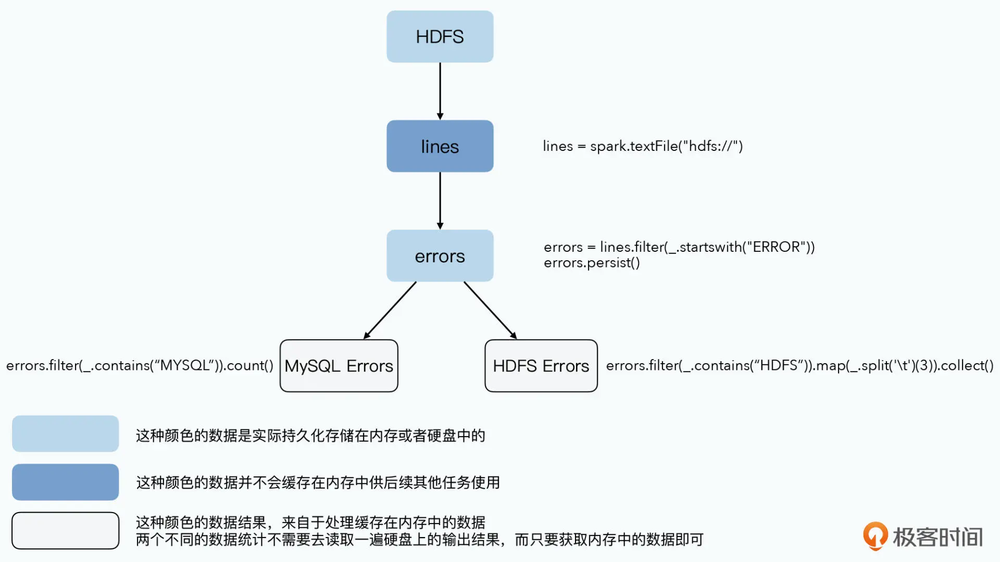

~~~java
lines = spark.textFile("hdfs://...") 
errors = lines.filter(_.startsWith("ERROR")) 
errors.persist()

// Count errors mentioning MySQL: 
errors.filter(_.contains("MySQL")).count() 

// Return the time fields of errors mentioning 
// HDFS as an array (assuming time is field 
// number 3 in a tab-separated format): 
errors.filter(_.contains("HDFS")).map(_.split(’\t’)(3)).collect()
~~~

从 RDD 的这个逻辑上，其实我们可以看到计算机工程上的其他系统中的影子：

* 惰性求值（Lazy-Evaluation），我们的一层层数据转化，只要没有调用 persistent，都可以先不做计算，而只是记录这个计算过程中的函数。而当 persistent 一旦被调用，那么我们就需要把实际的数据结果计算出来，并存储到内存里，再供后面的数据转换程序调用。 
* 数据库里的视图功能，为了查询方便，对于复杂的多表关联，很多时候我们会预先建好一张数据库的逻辑视图。那么我们在查询逻辑视图的时候，其实还是通过一个多表关联 SQL 去查询原始表的，这个就好像我们并没有调用 persistent，把数据实际持久化下来。 我们也可以把对应视图的查询结果，直接写入一张中间表，这样实际上就相当于把计算的结果持久化下来了，后续查询的 SQL 就会查询这个中间表。如果视图里的数据会被后续的 SQL 反复多次查询，并且对应的原始数据集也和 RDD 一样是不可变的话，一样会大大提升系统整体的效率。 

RDD的弹性体现在两个方面：

* 数据存储上。数据不再是存放在硬盘上的，而是可以缓存在内存中。只有当内存不足的时候，才会把它们换出到硬盘上。同时，数据的持久化，也支持硬盘、序列化后的内存存储，以及反序列化后 Java 对象的内存存储三种形式。每一种都比另一种需要占用更多的内存，但是计算速度会更快。 
* 选择把什么数据输出到硬盘上。Spark 会根据数据计算的 Lineage，来判断某一个 RDD 对于前置数据是宽依赖，还是窄依赖的。如果是宽依赖的，意味着一个节点的故障，可能会导致大量的数据要进行重新计算，乃至数据网络传输的需求。那么，它就会把数据计算的中间结果存储到硬盘上。 

RDD 上的转换操作又分成两种：

* 一种转换操作产生的 RDD 不会出现新的分片，比如 map、filter 等，也就是说一个 RDD 数据分片，经过 map 或者 filter 转换操作后，结果还在当前分片。 
* 另一种转换操作产生的 RDD 则会产生新的分片，比如reduceByKey，来自不同分片的相同 Key 必须聚合在一起进行操作，这样就会产生新的 RDD 分片

和 MapReduce 一样，Spark 也遵循移动计算比移动数据更划算这一大数据计算基本原则。但是和 MapReduce 僵化的 Map 与 Reduce 分阶段计算相比，Spark 的计算框架更加富有弹性和灵活性，进而有更好的运行性能。

和 MapReduce 一个应用一次只运行一个 map 和一个 reduce 不同，Spark 可以根据应用的复杂程度，分割成更多的计算阶段（stage），这些计算阶段组成一个有向无环图 DAG，Spark 任务调度器可以根据 DAG 的依赖关系执行计算阶段。 而对于迭代计算这种形式，MapReduce会让启动多个应用去完成迭代，效率较低。

DAG 也就是有向无环图，就是说不同阶段的依赖关系是有向的，计算过程只能沿着依赖关系方向执行，例如下面的图：

Spark是按照shuffle来划分计算阶段的，而不是根据转换函数的类型，比如上图例子中 RDD B 和 RDD F 进行 join，得到 RDD G，这里的 RDD F 需要进行 shuffle，RDD B 就不需要。 因为 RDD B 在前面一个阶段，阶段 1 的 shuffle 过程中，已经进行了数据分区。分区数目和分区 Key 不变，就不需要再进行 shuffle。 

这种不需要进行 shuffle 的依赖，在 Spark 里被称作窄依赖；相反的，需要进行 shuffle 的依赖，被称作宽依赖。跟 MapReduce 一样，shuffle 也是 Spark 最重要的一个环节，只有通过 shuffle，相关数据才能互相计算，构建起复杂的应用逻辑。 

和 Hadoop MapReduce 主要使用磁盘存储 shuffle 过程中的数据不同，Spark 优先使用内存进行数据存储，包括 RDD 数据。除非是内存不够用了，否则是尽可能使用内存， 这也是 Spark 性能比 Hadoop 高的另一个原因。 

DAGScheduler 根据代码生成 DAG 图以后，Spark 的任务调度就以任务为单位进行分配，将任务分配到分布式集群的不同机器上执行。 

综上：RDD 的编程模型更简单，DAG 切分的多阶段计算过程更快速，使用内存存储中间计算结果更高效。这三个特性使得 Spark 相对 Hadoop MapReduce 可以有更快的执行速度，以及更简单的编程实现。

## 宽依赖关系和检查点 

通过调用 persistent 来把数据缓存到内存里，就减少了大量的硬盘读写。但是我们仍然会面临节点失效，导致 RDD 需要重新计算的情况。所以 Spark 对这部分流程做了进一步的优化：如果一个节点失效了，导致的数据重新计算，需要影响的节点太多，那么我们就把计算结果输出到硬盘上。而如果影响的节点少，那么我们就只是单独重新计算被响应到的那些节点就好了。 

所以，在 Spark 里，会对整个数据计算的拓扑图在分布式系统下的依赖关系做一个分类：

* 如果一个 RDD 的一个分区，只会影响到下游的一个节点，那么我们就称这样的上下游依赖关系为窄依赖。 
* 如果一个 RDD 的一个分区，会影响到下游的多个节点，那么我们就称这样的上下游关系为宽依赖。 

对于窄依赖，即使重算一遍，也只是影响一条线上的少数几个节点，所以对应的中间数据结果，并不需要输出到硬盘上。而对于宽依赖，一旦上游的一个节点失效了，需要重新计算。那么它对应的多个下游节点，都需要重新从这个节点拉取数据并重新计算，需要占用更多的网络带宽和计算资源。 

换句话说，在宽依赖下，一个上游节点的失效，会以几倍的影响在下游得到放大。所以，在宽依赖的场景下，上游会像 MapReduce 里的 Map 一样，把输出结果序列化到硬盘上，以减少故障后的恢复成本。 

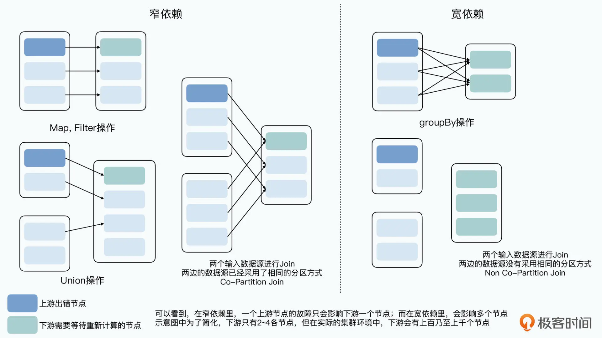

同样的，对于有多轮迭代，或者是整个拓扑图很长的数据处理任务，Spark 在 persistent 的时候，支持你添加一个 REPLICATE 参数，把当前的计算结果作为一个检查点存储下来。一旦添加了这个参数，数据就不只是存储在内存中，而是会序列化到硬盘里。这样，同样可以减少你在出现故障时候的重新计算的时间。 

可以看到，无论是 persistent、宽依赖下的数据会被持久化存储，还是允许用户去自己通过检查点存储中间步骤的计算结果，都是为了在日常情况下的性能，和容错情况下的性能做一个平衡。 

Spark 也支持你自己定义检查点，你可以把一些关键节点的数据通过检查点的方式，持久化到硬盘上，避免出现特定节点的故障，导致大量数据需要重新计算的问题。 

Spark 的 RDD，是在没有破坏 MapReduce 的易用性的前提下，支持了 MapReduce 可以支持的所有运算方式。并且，它通过尽可能利用内存，使得需要多个 MapReduce 的组合或者迭代的任务的执行速度大大加快了。 

## 重要组件

Spark 的运行流程：

首先，Spark 应用程序启动在自己的 JVM 进程里，即 Driver 进程，启动后调用 SparkContext 初始化执行配置和输入数据。SparkContext 启动 DAGScheduler 构造执行的 DAG 图，切分成最小的执行单位也就是计算任务。

然后 Driver 向 Cluster Manager 请求计算资源，用于 DAG 的分布式计算。Cluster Manager 收到请求以后，将 Driver 的主机地址等信息通知给集群的所有计算节点 Worker。

Worker 收到信息以后，根据 Driver 的主机地址，跟 Driver 通信并注册，然后根据自己的空闲资源向 Driver 通报自己可以领用的任务数。Driver 根据 DAG 图开始向注册的 Worker 分配任务。

Worker 收到任务后，启动 Executor 进程开始执行任务。Executor 先检查自己是否有 Driver 的执行代码，如果没有，从 Driver 下载执行代码，通过 Java 反射加载后开始执行。

# HBase

HBase 之所以能够具有海量数据处理能力，其根本在于和传统关系型数据库设计的不同思路。传统关系型数据库对存储在其上的数据有很多约束，学习关系数据库都要学习数据库设计范式，事实上，是在数据存储中包含了一部分业务逻辑。而 NoSQL 数据库则简单暴力地认为，数据库就是存储数据的，业务逻辑应该由应用程序去处理。

HBase 为可伸缩海量数据储存而设计，实现面向在线业务的实时数据访问延迟。HBase 的伸缩性主要依赖其可分裂的 HRegion 及可伸缩的分布式文件系统 HDFS 实现 ：

HRegion 是 HBase 负责数据存储的主要进程，应用程序对数据的读写操作都是通过和 HRegion 通信完成 。数据以 HRegion 为单位进行管理，也就是说应用程序如果想要访问一个数据，必须先找到 HRegion，然后将数据读写操作提交给 HRegion，由 HRegion 完成存储层面的数据操作 。

HRegionServer 是物理服务器，每个 HRegionServer 上可以启动多个 HRegion 实例。当一个 HRegion 中写入的数据太多，达到配置的阈值时，一个 HRegion 会分裂成两个 HRegion，并将 HRegion 在整个集群中进行迁移，以使 HRegionServer 的负载均衡。 

HBase 按 Key 的区域进行分片，这个分片也就是 HRegion，每个 HRegion 中存储一段 Key 值区间 [key1, key2) 的数据，所有 HRegion 的信息，包括存储的 Key 值区间、所在 HRegionServer 地址、访问端口号等，都记录在 HMaster 服务器上。为了保证 HMaster 的高可用，HBase 会启动多个 HMaster，并通过 ZooKeeper 选举出一个主服务器。 

下面是一张调用时序图，应用程序通过 ZooKeeper 获得主 HMaster 的地址，输入 Key 值获得这个 Key 所在的 HRegionServer 地址，然后请求 HRegionServer 上的 HRegion，获得所需要的数据 ：

HRegion 会把数据存储在若干个 HFile 格式的文件中，这些文件使用 HDFS 分布式文件系统存储，在整个集群内分布并高可用。当一个 HRegion 中数据量太多时，这个 HRegion 连同 HFile 会分裂成两个 HRegion，并根据集群中服务器负载进行迁移。如果集群中有新加入的服务器，也就是说有了新的 HRegionServer，由于其负载较低，也会把 HRegion 迁移过去并记录到 HMaster，从而实现 HBase 的线性伸缩。 

HBase采用的是可扩展数据模型。传统的关系数据库为了保证关系运算（通过 SQL 语句）的正确性，在设计数据库表结构的时候，需要指定表的 schema 也就是字段名称、数据类型等，并要遵循特定的设计范式。这些规范带来了一个问题，就是僵硬的数据结构难以面对需求变更带来的挑战，有些应用系统设计者通过预先设计一些冗余字段来应对。

为了做到可扩展的数据结构设计，不用修改表结构就可以新增字段，可以采用许多 NoSQL 数据库使用的列族（ColumnFamily）设计 ，这是一种面向列族的稀疏矩阵存储格式，如下图所示 ：

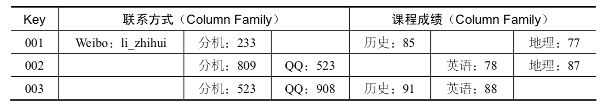

这是一个学生的基本信息表，表中不同学生的联系方式各不相同，选修的课程也不同， 而且将来还会有更多联系方式和课程加入到这张表里，如果按照传统的关系数据库设计，无论提前预设多少冗余字段都会捉襟见肘、疲于应付。

而使用支持列族结构的 NoSQL 数据库，在创建表的时候，只需要指定列族的名字，无需指定字段（Column）。那什么时候指定字段呢？可以在数据写入时再指定。通过这种方式，数据表可以包含数百万的字段，这样就可以随意扩展应用程序的数据结构了。并且这种数据库在查询时也很方便，可以通过指定任意字段名称和值进行查询。

HBase 这种列族的数据结构设计，实际上是把字段的名称和字段的值，以 Key-Value 的方式一起存储在 HBase 中。实际写入的时候，可以随意指定字段名称，即使有几百万个字段也能轻松应对。 

传统的机械式磁盘的访问特性是连续读写很快，随机读写很慢。这是因为机械磁盘靠电机驱动访问磁盘上的数据，电机要将磁头落到数据所在的磁道上，这个过程需要较长的寻址时间。如果数据不连续存储，磁头就要不停的移动，浪费了大量的时间。为了提高数据写入速度，HBase 使用了一种叫作LSM 树的数据结构进行数据存储。LSM 树的全名是 Log Structed Merge Tree，翻译过来就是 Log 结构合并树。数据写入的时候以 Log 方式连续写入，然后异步对磁盘上的多个 LSM 树进行合并。

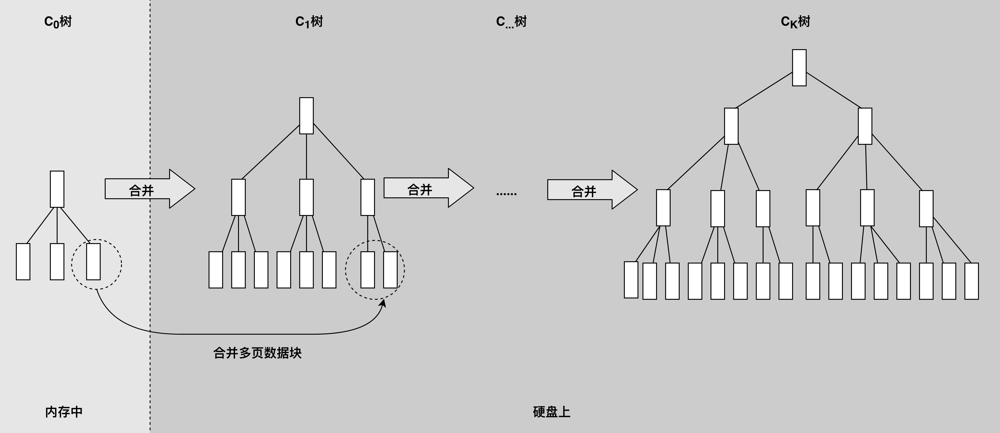

LSM 树可以看作是一个 N 阶合并树。数据写操作（包括插入、修改、删除）都在内存中进行，并且都会创建一个新记录（修改会记录新的数据值，而删除会记录一个删除标志）。这些数据在内存中仍然还是一棵排序树，当数据量超过设定的内存阈值后，会将这棵排序树和磁盘上最新的排序树合并。当这棵排序树的数据量也超过设定阈值后，会和磁盘上下一级的排序树合并。合并过程中，会用最新更新的数据覆盖旧的数据（或者记录为不同版本）。

在需要进行读操作时，总是从内存中的排序树开始搜索，如果没有找到，就从磁盘 上的排序树顺序查找。

在 LSM 树上进行一次数据更新不需要磁盘访问，在内存即可完成。当数据访问以写操作为主，而读操作则集中在最近写入的数据上时，使用 LSM 树可以极大程度地减少磁盘的访问次数，加快访问速度。 

# Megastore

Google 想要在 Bigtable 这样的 OLTP 数据库上支持 SQL，于是就推出了Megastore这个分布式系统，它不仅支持SQL，还支持以下特性：

* 跨数据中心的多副本同步数据复制；
* 支持为数据表的字段建立 Schema，并且可以通过 SQL 接口来访问；
* 支持数据库的二级索引；
* 支持数据库的事务。 

不过，Megastore 最终只是 Google 迈向 Spanner 中的一个里程碑。Megastore 的大部分高级特性，都基于实际的应用场景做了取舍和妥协。 

## 多个数据中心

在之前的解决方案中，对系统的可用性问题的考虑，往往是局限在一个数据中心里，例如：GFS 里我们会对数据做三份备份，但是这三份数据还是在同一个数据中心的三台服务器里；针对 Chubby 这样的服务，我们用了五个节点，放到不同的交换机下，但这仍然是在一个数据中心里。 

可是，如果我们的分布式数据库只能在一个数据中心里，那无论是在“可用性”上，还是在“性能”上，在互联网时代都有点不够看：

* 在可用性方面：尽管我们在数据中心内部可以有非常完善的分布式、多路供电以及柴油发电机等方案，但是一旦遇上像水灾、地震这样的自然灾害，这些手段都无济于事。 
* 在性能方面：如果我们的数据中心设在旧金山，那么一个上海用户的一个请求，在最理想的情况下，也至少需要 100 毫秒以上才能够完成一个网络请求的往返。 距离会增加网络响应的时间。

解决这两个问题最好的办法，就是我们有多个数据中心。真正高可用的架构里，数据会在多个数据中心同步，用户会就近访问最近的数据中心如果特定数据中心出现问题，可以访问附近的其他数据中心其实过去几年，大型的互联网公司都在建设“异地多活”的系统架构，就是为了保障系统的可用性和访问性能：

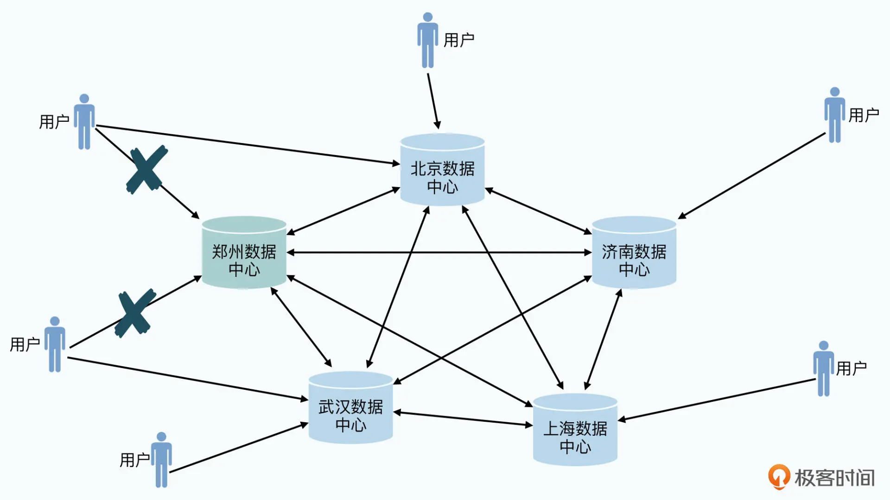

这样每个用户的请求都可以访问到就近的本地数据中心，对应的数据也直接就近写入本地数据中心里的数据库，也都从本地数据中心的数据库里读。而各个数据中心的数据库之间，会进行数据复制，确保你在旧金山写入的数据，我在上海一样可以读到。 

Megastore的解决方案：

* 对于可用性问题，通过实现一个为远距离链接优化过的同步的、容错的日志复制器。 
* 对于伸缩性问题，通过把数据分区成大量的“小数据库”，每一个都有独立进行同步复制的数据库日志，存放在每个副本的 NoSQL 的数据存储里。 

## 数据复制

Megastore 想要解决的第一个问题，就是如何在多个数据中心的 Bigtable 之间复制数据。 

和 Hive 没有重写计算引擎而是直接用了 MapReduce 一样，Megastore 也没有重写数据存储层，而是直接使用了 Bigtable。 

我们常见的数据复制的方案，其实无非就是三种： 

* 第一种是异步主从复制（Asynchronous Master/Slave） ，异步主从复制有两个核心问题，第一个是如果 Master 节点挂了，Slave 如果还没有及时同步数据的话，我们可能会丢数据。第二个是如果写数据在数据中心 A，读数据在数据中心 B，那么刚写入的数据我们会读不到，也就是无法满足整个系统是“可线性化”的。 
* 第二种是同步主从复制（Synchronous Master/Slave），这也是大部分系统的解决方案。 
* 第三种叫做乐观复制（Optimistic Replication），这种方案是 AP（Availability + Partition Tolerance）系统中常常用到的方案。也就是数据可以在任何一个副本中写入，然后这个改动会异步地同步到其他副本中。因为可以在任何一个副本就近写入，所以系统的可用性很好，延时也很低。但是，什么时候会同步完成我们并不知道，所以系统只能是最终一致（eventually-consistent）的。而且，这个系统基本无法实现事务，因为两个并发写入究竟谁先谁后很难判定，所以隔离性就无从谈起了，而“可线性化”自然也就没法做到了。 

Megastore 在这件事情上的选择非常简单明确，那就是直接使用 Paxos 算法来进行多个数据中心内的数据库的同步。要注意，Megastore 并不是像我们之前讲解 Bigtable+Chubby 那样，只是采用 Paxos 来确保只有一个 Master。Megastore 是直接在多个数据中心里，采用 Paxos 同步写入数据，是一个同步复制所有的数据库日志，但是没有主从区分的系统。 

不过，Megastore 选择直接使用 Paxos，最大的一个问题就是性能 ：

* 一方面，我们的数据传输无法突破物理学的限制，跨数据中心的延时是省不掉的。 
* 另一方面，即使把 Paxos 算法优化到极限，我们也避免不了，Paxos 算法的每一次“共识”都需要超过半数节点的确认。如果是通过 Paxos 来保障一个数据库日志的同步复制，那么写入数据的性能就受限于单台服务器了，这也是为什么在 Bigtable 里，我们只是使用 Chubby 来管理粗粒度的锁，而不是直接用 Paxos 来进行同步复制。 

## 可线性化

先讲一下可线性化的概念，以最常见的电商为例子，我下订单的数据库操作完成了之后，我再去查询这张订单是否完成，应该要能看到刚刚下的这一张订单。要不然的话，我一定会觉得很奇怪也非常担心，觉得钱付出去了，但是东西可能拿不到。 但是，几乎在我下单之前，另一位在海南的朋友也下单了。那么，他下的这张订单是否在我下单之前可以读取到，我却并不在意。一方面，自然我也没有权限看到他的订单，另一方面，在业务上我们也并不需要分辨，几乎在同一时间下单的人谁先谁后。 

根据这个例子我们可以看到，从业务上来说，我们不一定需要全局的“可线性化”，而只要一些业务上有关联的数据之间，能够保障“可线性化”就好了。不仅从“可线性化”的角度是这样的，其实数据库事务隔离性的“可串行化”也是这样的。 

基于这个思路，Megastore引入了一个叫实体组的概念，Megastore 里的数据分区，也是按照实体组进行数据分区的。 然后，一个分区的实体组，会在多个数据中心之间通过 Paxos 进行数据同步读写。本质上，Megastore 其实是把一个大数据表，拆分成了很多个独立的小数据表。每一个小数据表，在多个数据中心之间是通过 Paxos 算法进行同步复制的，你可以在任何一个数据中心写入数据。但是各个小数据表之间，并没有“可线性化”和“可串行化”的保障。 

整个 Megastore 的架构，就好像是一个二维矩阵。横向按行，是按照数据分区进行了切分，纵向按列，是一个个独立的数据中心。 

比如在前面电商的例子里，每一个用户是一个实体，这个用户的所有订单，可以以一个 List 的形式挂载在这个用户下，这个用户的所有和商家的消息，也可以挂载在这个用户下。这些东西打包在一起，就是一个实体组。一个实体组下的数据，往往我们经常会一起操作。比如，我们会去查看自己最近下的订单，意味着一个用户下的所有订单会在一起读取。 

Megastore 在每一个实体组内，支持一阶段的数据库事务。但是，如果你有跨实体组的操作需求，可以有两个解决方案：

* 第一个，是使用两阶段事务，当然它的代价非常高昂，是一个阻塞的、有单点的解决方案。 
* 第二个，则是抛弃事务性，转而采用 Megastore 提供的异步消息机制。因为一旦跨实体组，我们就不能保障数据操作是在同一个服务器上进行的了，就需要跨服务器的操作需求。 

这个异步消息机制器是这样的，当我们需要同时操作两个实体组 A 和 B 的时候，我们可以对第一个实体组，通过一阶段事务完成写入。然后，通过 Megastore 提供的一个队列（queue），向实体组 B 发起一个消息。实体组 B 接收到这个消息之后，可以原子地执行这个消息所做的改动。 所以，A 和 B 两边的改动，在这个消息机制下，都是事务性的。但是两边的操作并没有共同组成同一个分布式事务。所以，如果在跨实体组的操作中采用了消息机制，Megastore 本质上没有实现数据库事务，它实现的仍然是数据库的最终一致性。 

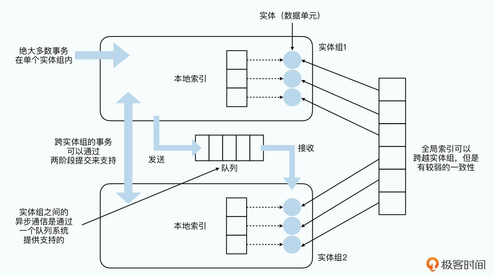

如果我们拿一个具体的应用案例，可以更容易看清楚 Megastore 的这个设计。我们就以即时聊天，比如微信这个场景作为例子好了。 

* 我们可以把每个微信账号，当成是一个实体组。 
* 账号里面的每一条收和发的消息，也挂载在这个实体组里。 
* 当你要发一条消息出去的时候，其实会影响到两个实体组，一个是你的微信账号，因为你的聊天记录里会多一条发出的消息。另一个是收件人的微信账号，他的聊天记录里也会多一条消息。 
* 但是我们并不需要保证，你这里看到发出消息和他看到收到消息同时发生。那么我们就可以采用 Megastore 的异步消息机制。 
* 我们先用一个一阶段事务，在你的微信账号的实体组里写入这条消息。然后再通过 Megastore 的异步消息机制，往收件人的微信账号里发送一条“写入消息”的请求。而他的实体组在收到这个“写入消息”的请求之后，把整个消息事务性地写入自己的实体组就可以了。 

而之所以这个消息机制是有效可行的，其实还是回到我们开头说的，在实际应用层面，我们对于“可串行化”以及“可线性化”的需求并不是全局的，而是可以分区的。我们只需要保障自己发出的消息，在自己的微信界面上，看起来是按照顺序出现的就可以了。而并不要求收件人的微信和发件人的微信之间，也是“可线性化”的。 

本质上，Megastore 不是一个“可线性化”的分布式数据库，而是很多个分布式数据库的一个合集。 Megastore 只支持一个实体组下的一阶段事务，如果你需要跨实体组进行操作，那么要么你得使用代价高昂的二阶段提交，要么你可以使用 Megastore 提供的异步消息机制。 而实体组这个概念本身，就是把一些经常要在一起操作的数据，组合在一起，方便进行快速操作。 

把数据按照分区划分成了很多“小数据库”，也可以解决 Paxos 算法的单节点性能瓶颈问题。 

## 实体组的数据布局 

实体组是一系列会经常共同访问的数据，例如用户和他的订单这样的。举个例子，执行下列语句：

~~~sql
CREATE SCHEMA PhotoApp

CREATE TABLE User {
  required int64 user_id;
  required string name;
} PRIMARY KEY(user_id), ENTITY GROUP ROOT;

CREATE TABLE Photo {
  required int64 user_id;
  required int32 photo_id;
  required int64 time;
  required string full_url;
  optional string thumbnail_url;
  repeated string tag;
} PRIMARY KEY(user_id, photo_id),
  IN TABLE user,
  ENTITY GROUP KEY(user_id) REFERENCES User;
  
CREATE LOCAL INDEX PhotosByTime
  ON Photo(user_id, time);

CREATE GLOBAL INDEX PhotosByTag
  ON Photo(tag) STORING (thumbnail_url);
~~~

首先是定义了一个叫做 PhotoApp 的 Schema，你可以认为是定义了数据库里的一个库（database）。 

然后定义了一张叫做 User 的表，并且定义其中的 user_id 是主键，并且定义了这个表是实体组（Entity Group）的一个根（Root）。一条 User 表的记录，就代表了一个用户。 接着，定义了一张叫做 Photo 的表，其中的主键是 user_id 和 photo_id 两个字段的组合。并且，这张表是关联到前面的 User 表这个根上的。这个挂载，是通过 user_id 这个字段关联起来的。这个关联关系，就是“挂载”。 

实际上，我们可以有多个表，都关联到 User 表这个根上。而所谓的实体组，在逻辑上就是一张根表 A，并且其他表可以通过外键，关联到根表 A 的主键上。并且，这个关联是可以层层深入的。比如我们还可以再定义一个表，叫做 PhotoMeta，里面可以再通过 user_id 和 photo_id，再关联到 Photo 表上。 

最后，Schema 里分别建立了两个索引： 

* 一个是叫做 PhotosByTime 的本地索引（Local Index），索引的是 Photo 表里 user_id 和 time 字段的组合； 
* 另一个，是叫做 PhotosByTag 的全局索引（Global Index），索引的是 Photo 表里的 Tag 这个字段，并且它专门设置了一个特定的 STORING 参数，指向了 Photo 表里的 thumbnaill 这个字段。 

这个Schema 的定义，更像是我们前面见过的 Thrift 或者 Protobuf 的定义文件。每个字段不仅有类型，还有是否是 required 以及 optional，并且我们可以定义 repeated 的字段，也就是有某一个字段在某一条记录里面是 List。 

这个其实是我们在大数据系统中常见的一种技术方案。为了减少数据需要跨越特定的服务器进行 Join，不如直接支持嵌套的 List 类型的字段。而 Megastore 也直接使用了 Protobuf 的 Schema，使得跨语言跨团队使用 Megastore 变得更加容易了。 

这个Schema在Bigtable中是这样存储的：

上图就是之前的PhotoApp 表在 Bigtable 里的存储形式，并把示例数据分别标成了绿色和蓝色。对于 PhotoApp 里的 User 和 Photo 这两张表，是存放在同一张 Bigtable 的表里的，其中，绿色部分的数据是来自 User 表的，而蓝色部分的数据来自 Photo 表。 

可以看到，我们是直接拿 User 表的主键 user_id，作为了 Bigtable 里的行键。而对于 Photo 表，我们是拿 user_id 和 photo_id 组合作为行键，存放在同一张表里。因为 Bigtable 里面的数据，是按照行键连续排列的。所以，同一个 User 下的 Photo 的数据记录，会连续存储在对应的 User 记录后面。 

在 Bigtable 里，数据是按照行键分区的，实际的数据存储，也是按照行键连续存储的。并且，当我们用一个行键去 Bigtable 里面查询数据的话，Bigtable 会有 Block Cache，也就是把底层的 SSTable 的整个 Block 都获取回来。而这个里面，其实就会包含当前行键前后连续行键所包含的数据。 

所以，当我们去查询某一条 User 记录的时候，会有非常高的概率，直接把 User 记录下的 Photo 记录一并获取到，而不需要再次访问对应的硬盘。自然读写的性能，就会比随机布局的数据要好上很多。在 Megastore 的论文里，这样的数据布局是被称之为对 Key 进行预 Join（Pre-Joining with Keys）。 

除此之外，为了避免热点问题，Megastore 支持你对数据表添加一个 SCATTER 参数，添加了这个参数之后，所有的行键都会带上 Root 实体记录的 Key 的哈希值。这样，虽然同一个实体组里的数据还是连续排列的，但是同一张表的两个连续实体组的 Root 记录的 Key，就不一定存储在一个服务器上了。 

而数据库里的每一个列也非常简单，我们就直接使用 Bigtable 的 Column 就好了。而且 Megastore 这样混合一个实体组里的多个表的结构，其实是非常适合 Bigtable 的。因为 Bigtable 的列是稀疏的，对于不存在的列，并不需要存储，当然也不会占用存储空间。这样，虽然一个 Bigtable 里的表，实际存放了一套实体组的 Schema 下的很多张表，但是并不会存在存储上浪费的情况。

实体组的设计，其实是把多张数据表存放在一个 Bigtable 的表的方式，来让根据一个主键能够关联起来的数据，在物理上连续排布在一起。这样无论是读写数据，都有很强的局部性，数据读写的性能都会大大增强。  

## 索引

### 本地索引和全局索引

Megastore 的索引，分成了两种类型，一个是本地索引，另一种叫做全局索引。 

本地索引的数据，是直接存储在实体组“内部”的，它是我们已经确定是哪一个实体组的情况下，去寻找具体的记录位置。 

而我们通过看前面的 Schema 的例子也会非常清楚，PhotosByTime 这个本地索引，需要通过 user_id 和 time 这样两个字段才能查询到。其实，也就是我们先通过 user_id，知道是哪一个 User 实体组，再在这个实体组里查询数据：

~~~sql
CREATE LOCAL INDEX PhotosByTime
  ON Photo(user_id, time);
~~~

 在本地索引中，索引中需要包含实体组的根的主键信息。 

而另一种全局索引，就不需要预先知道是哪一个实体组了，但是它的更新就不是实时的了。最新的数据更新，不一定会在全局索引里反映出来，这也是为什么论文里说，全局索引是弱一致的。我们也不难猜到，全局索引应该是异步更新的。 

### 索引中存储数据

Megastore 支持在索引中存储数据。 传统的数据库索引里，往往只存储指向具体数据记录的主键。这就意味着，当我们查询数据的时候，需要两次请求：第一次请求是查询索引，拿到对应数据记录的主键；第二次请求是再通过主键，去查询对应的整条数据，然后拿到我们需要的字段的值。 

而在 Megastore 里，你可以通过一个 STORING 语句，指定索引里存储下对应的数据记录的某一个字段的值。这样，我们的查询只需要检索索引，就能拿到需要字段的值。 

这个优化听起来微不足道，但是在分布式数据库里其实作用很大。在一般的单机数据库里，索引和数据都是在同一台服务器上，所以索引里不存储数据，只是多了硬盘随机访问的压力。但是在分布式数据库里，如果我们的索引和数据不存储在一个节点上，就意味着还会多一次网络往返，进一步会拉低整个集群的性能。 

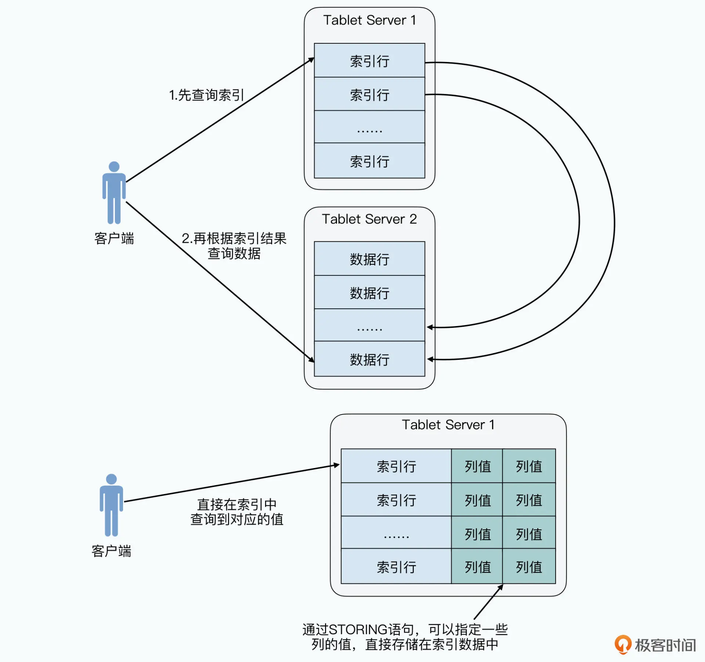

不过，需要显示指定索引里存放哪一个字段，也意味着开发人员需要预先判定，业务中未来特定的查询会使用到的字段值，其实这也给开发人员带来了很多挑战。 

### 为repeated字段建立索引

这里对应的例子，仍然是前面的 PhotosByTag 索引，它对应的索引字段，是 Photo 这个实体里的 tag 这个字段。tag 这个字段，在 Photos 表里是申明为 repeated 的，也就是一张 Photo 表里面可以有多个 Tag。 

而 Megastore 会为里面的每一个 tag 都记录一条索引。这样，我们就可以通过索引，反向查询到某一个 tag 关联到的所有的 Photo 记录。Megastore 这种支持 repeated 字段的索引，使得我们不需要为这样的单个 repeated 字段，去单独建立一张子表。无论这张子表是一张独立的表，还是像 Megastore 的实体组一样挂载在 Root 表上，都很浪费存储空间，也让这个数据表结构变得过于复杂，不容易理解。 

~~~sql
CREATE TABLE Photo {
  required int64 user_id;
  required int32 photo_id;
  required int64 time;
  required string full_url;
  optional string thumbnail_url;
  repeated string tag;
} PRIMARY KEY(user_id, photo_id),
  IN TABLE user,
  ENTITY GROUP KEY(user_id) REFERENCES User;

CREATE GLOBAL INDEX PhotosByTag
  ON Photo(tag) STORING (thumbnail_url);
~~~
### 内联索引

Megastore 提供了对于内联索引（Inline Indexes）的支持。这个索引类型，是为了帮助父实体（Parent Entity）能够快速访问子实体（Child Entity）的某些字段。 

还是回到论文中的例子，我们可以把 Schema 中定义的本地索引，PhotosByTime 这个原本索引 Photo 实体的索引，变成 User 实体的内联索引。这样，User 表实际上会相当于多了一个 repeated 的虚拟字段（virtual）。而既然是 repeated 字段，那它其实就是一个 List。List 里的每一个结构体，都存放了两个信息，一个是 PhotosByTime 里面的 time 信息，另一个是对应的这个 time，对应的是 Photos 里的哪一条记录。 

这样，通过在父实体里添加了一个虚拟字段，我们对于子实体里的数据查询，直接在父实体里就能够完成了，而不需要再去查询具体的索引数据。因为在应用开发的时候，比如在 Instagram 里，我们看一个用户最近的照片，都是先取到 User 这样的父实体，再根据 user_id 和索引去查询它的照片信息。当有了内联索引之后，我们在第二步查询子实体数据的时候，就可以少一次索引的访问了。 

内联索引相当于把索引直接作为一个repeated字段存储在父实体的一个列中这样我们不需要访问索引数据，就能查询到我们想要的结果：

### 索引实现

Megastore 的索引实现也并不复杂。每一条索引，都是作为一行数据，存储在 Bigtable 里的。这条记录的行键，就是建立索引的字段，和索引到的数据的主键的组合。我们还是回到论文里的例子来看： 

~~~sql
CREATE LOCAL INDEX PhotosByTime
  ON Photo(user_id, time);
~~~

* PhotosByTime 这个索引由 user_id 和 time 这两个字段组成； 

* 并且它索引的是 Photo 这个表，对应的 Photo 表的主键就是 user_id 和 photo_id； 

* 那么，索引这一行的行键，就是 ((user_id, time), (user_id, photo_id)) 这样的一个组合； 

  索引直接以行键的形式存储在Bigtable里：

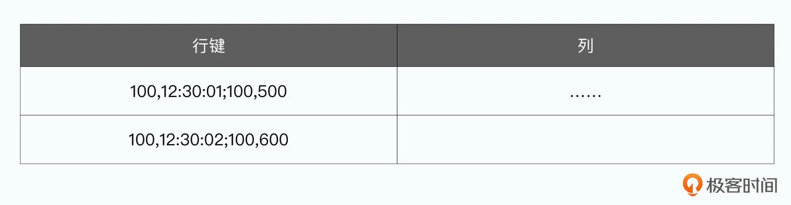

* 而如果我们的索引，指向的是一个 repeated 的字段，比如 tags，那么每一个 tag 都会有一行数据。比如有三个 tag，分别是 [tag1, tag2, tag3]，我们的索引，就会有三条记录，分别是 (tag1, (user_id, time)), (tag2, (user_id, time)) 和 (tag3, (user_id, time))。 

  每个repeated里面出现的值，都会有一行索引而对应的STORING语句中指定的列，可以存放在值列中：

而这样的索引，其实是充分利用了 Bigtable 的特性。因为 Bigtable 的行数据，是按照行键范围分区，连续的数据会存储在一起。所以，无论是根据索引值进行范围内查询一段数据，还是随机查询某一条数据，都会很容易。 

索引，其实是 Bigtable 里一行行的记录，同样是根据 Bigtable 行键连续分布的特性，使得根据索引的范围查找和随机查找都变得很容易。 

## 事务与隔离性

因为 Megastore 只支持同一个实体组下的一阶段事务，那我们就可以把同一个实体组下的所有数据行，看成是一个抽象的“迷你数据库”。在这个迷你数据库上，Megastore 也支持了“可串行化”的 ACID 语义。 

要实现“可串行化”的隔离性，当然不只有真的把所有的事务排一个队，一个个来执行这样一种办法。这样的方式，就彻底丧失了数据库事务的并发性，会大大拖累数据库的性能。现代的关系型数据库，都是采用一种叫做 MVCC（Multiversion Concurrency Control）的机制来实现，中文名称叫做多版本并发控制。 

这个机制，通俗来讲，就是数据库中的数据会有多个历史版本。你的每一次事务请求，都会拿到当前最新已经提交的那个版本的快照，在整个事务提交的时候，会检查当前数据库里数据的最新版本，是否和你拿到的快照版本一致。 

如果一致的话，数据提交会成功，并且数据库里的版本会更新。而当有两个并发的数据库事务都会去读或者写同一份数据的时候，先尝试提交的 A 事务的会成功。后尝试提交的 B 事务，因为数据的最新版本已经变了，就会失败。而当你有一个事务正在提交，或者数据写入到一半，另一个读取事务的请求并不会读到你写到一半的数据，而是读取上一个完成提交的事务的一个快照。 

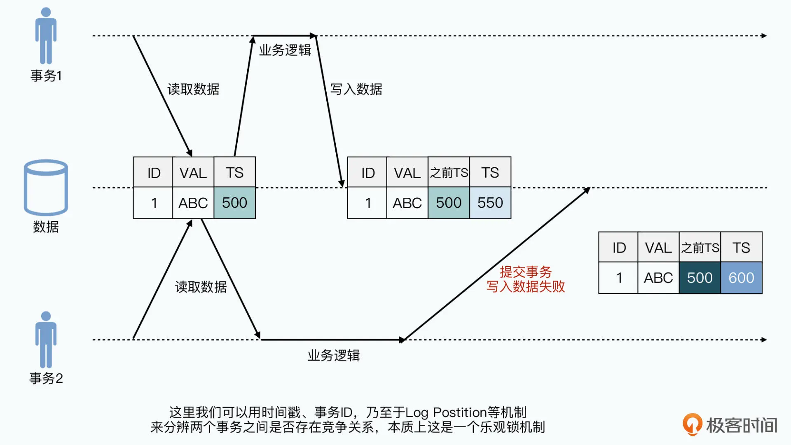

Bigtable 的底层数据读写机制，和MVCC 机制非常类似，因为 Bigtable 天然会存储数据的多个版本，每一次的数据写入，都是追加了一个新版本，而不是把原来的数据覆盖掉。这样我们就可以把每一个事务提交时的时间戳，用作 MVCC 机制里面的版本。 

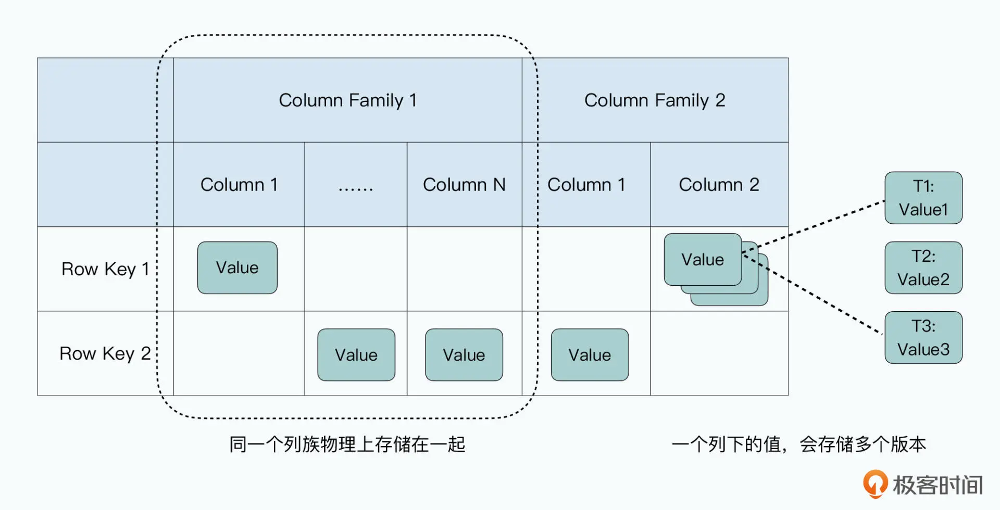

虽然Bigtable 本身只支持单行数据的事务，但Megastore也可以基于此，实现一个实体组内基于 MVCC 的事务性和隔离性。 

我们在提交事务的时候，需要指定一个时间戳，而不是让每一行的数据更新都使用当前的时间戳。然后我们在读取数据的时候，只需要找到最后成功提交的事务的时间戳，我们读取这个时间戳版本的数据，就是最新的版本。 

而如果这个时候，有一个事务提交到一半，一个实体组里的一部分数据更新了，另一部分数据还没有来得及更新，也不要紧，我们的读请求并不会读到这个数据。 

正是因为这个时间戳机制的存在，Megastore 对于读取数据提供了 current，snapshot 以及 inconsistent 三种模式：

* current 就是读取最新版本的数据。在读数据之前，Megastore 的事务系统，会先确认已经提交的事务都已经应用成功。然后，事务系统会读取最新事务对应的时间戳的数据版本。 
* snapshot，则不会等待当前是否有已经提交的事务应用完成，而是直接返回上一个完全应用的事务对应的数据版本。 
* inconsistent，则是完全忽视事务系统的日志信息，直接获取到 Bigtable 里面最新的数据就好了。自然，在这个机制下，我们就会读到“不一致”的数据，因为我们可能在事务提交到一半的时候，读取到不同行的不同版本的数据。 

Megastore 在 Bigtable 本身的存储系统之外，添加了一个独立的事务系统，它类似一个复制日志的状态机，事务提交可以拆分为下列几步：

* 读（Read）：我们先要获取到时间戳，以及最后一次提交的事务的日志的位置。 
* 应用层的逻辑（Application Logic）：我们要从 Bigtable 读取数据，并且把所有需要的写操作，收集到一条日志记录（log entry）中。 
* 提交事务（Commit）：通过 Paxos 算法，我们要和其他数据中心对应的副本，达成一致，把这个日志记录追加到日志的最后。 
* 应用事务（Apply）：也就是把实际对于实体和索引的修改，写入到 Bigtable 里。 
* 清理工作（Clean UP）：也就是把不需要的数据删除掉。 

其中的第 3 步和第 4 步，其实就是在 Bigtable 之外，又包装了一层 Bigtable 的单行事务机制。第 3 步相当于是一个预写日志（Write-Ahead-Log），而第 4 步，像是 Bigtable 里的 MemTable+SSTable，我们的变更需要再更新到对应的内存和存储系统里去。 

而第 3、4 步之间的这个时间差，也是为什么我们的数据需要区分是读取 current 版本，还是读取 snapshot 版本：

* current 版本，就是预写日志已经完成，但是数据还没有更新到 Bigtable 里，那我们就等待数据更新完到 Bigtable 里，再获取这个最新的数据。 
* snapshot 版本，则不会等待预写日志已经完成，但是数据还没有更新到 Bigtable 里的数据，而是直接获取上一个已经更新到 Bigtable 的数据版本。 

所以，如果我们所有的数据读，都是用 current 读，我们就能保障“可线性化”，但是它在有些情况下的延时，会比 snapshot 读长一些，性能会差一些。 

如果出现了并发写，在第 1 步，其中会获取到最新的日志位置。两个并发写入，会在第 3 步，去竞争写入同一个日志位置，但是只有一个会成功。而失败的那个，就会从头来过，重新拿到新的最新日志位置，来发起事务。 

Megastore 采用了 MVCC 这样的机制，来实现事务中对于冲突资源的处理。而 Bigtable 又天然地通过每个数据版本都有的 TimeStamp（时间戳），很好地支持了这样的机制。 Megastore 与其说是一个数据库系统，不如说是对 Bigtable 的特性进行了合理封装后的一个数据应用层。 

我们必须熟悉 Megastore 的这一系列底层设计，才能设计出一个合理的数据模型。而且这个数据模型，往往和我们熟悉的关系模型也会有差异。这些不足之处也限制了 Megastore 的推广和应用，最终 Megastore 也只能算是分布式数据库发展史上的一个“过渡品”，而不是最终的解决方案。 

# Spanner

待

# S4

S4是最早发布的开源分布式流式数据处理系统，但是在市场上最终却没有占有一席之地。 

## 实时计算

MapReduce不能承担实时计算的功能。一般来说，我们的 MapReduce 都是定时执行的，比如每天运行一次，生成一个报表，或者频繁一点，每小时运行一次，计算上一个小时的点击率数据。但是，这个获得反馈数据的频率还是太慢了。每小时运行一次 MapReduce 程序，意味着我们的统计数据，平均要晚上半个小时，那些需要实时得到结果的领域就行不通了。

如果采用频繁运行MapReduce来解决实时计算的问题，会遇到下列问题：

* 大量的“额外开销” ：MapReduce 的额外开销不小，再小的任务也需要个十几秒到一分钟的运行时间。如果我们高频率每分钟运行 MapReduce 任务，那么“额外开销”占的时间比重和硬件资源会非常高，也很浪费。 也就是说，MapReduce 是为“高吞吐量”而设计的一个系统。在整个系统设计理念里，它没有考虑“低延时”这个需求。 
* 不得不让输入文件变得极其“碎片化” ：无论是 GFS 还是 HDFS，都是把文件变成一个个 64MB 大小的 Block，然后 MapReduce 通过分布式并行读取来进行快速分析。 但是如果我们需要每分钟都处理数据，那么对于输入的数据，就要按照分钟进行分割。每分钟我们都需要有很多个文件，分布到 GFS/HDFS 上不同的数据节点。这样，我们的文件都会变得很小，也就丧失了顺序读取大文件的性能优势。 MapReduce 的数据，是一份“边界明确（bounded）”的数据。 而我们想要进行的实时数据统计，想要处理的是一份“无边界（unbounded）”的数据，会不断地有新数据流入进来，永无停歇。 

所以，我们需要一个全新的流式数据处理系统，这也是 S4 这个系统的出发点。 

## 逻辑模型

S4 把所有的计算过程，都变成了一个个处理元素（Processing Element）对象，简称为 PE 对象。我这里特地加上了对象，就是因为在实现上，PE 就是一个面向对象编程里面一个实际的对象。 

每一个 PE 对象，都有四部分要素组成，分别是： 

* PE 本身的功能（functionality），这个体现为 PE 类里实现的业务逻辑函数，以及为了这个类配置的各种参数； 
* PE 能够处理的事件类型（types of events）； 
* PE 能够处理的事件的键（keyed attribute）； 
* PE 处理的事件的键对应的值（value）。 

对于流式的数据处理，就是由一个个 PE 组成的有向无环图（DAG）。有向无环图的起点，是一些特殊的被称为无键 PE（Keyless PE）的对象。这些对象的作用，其实就是接收外部发送来的事件流，这些外部发送过来的事件流，其实就是一条条的消息。 

这些无键 PE 会解析对应的消息，变成一个个事件。然后给每个事件打上三个信息，分别是： 

* 事件类型（Event Type）； 
* 事件的 Key； 
* 事件的 Value。 

然后可以把事件给发送出去。接着下游的其他 PE 对象，会根据自己定义的事件类型，和能处理的键来接收对应的消息，并且处理这个消息。如果当前系统里，没有对应的键的 PE，那么系统会创建一个新的 PE 对象。 

处理数据的 PE 对象，可以选择处理完之后立刻发送一个新的事件出去；也可以选择在对象内部来维护一个状态，然后当处理了一定数量的消息之后，或者过了一个固定的事件间隔之后把消息发送出去。 

最后，在整个有向无环图的终点，会有一系列的 PE 对象。这些对象，会把最终的计算结果发布（Publish）。这个发布的频率，也和其他 PE 发送消息的逻辑类似，可以在每收到一个事件就发送，也可以要求接收到一定数量的事件，或者每隔一个特定的时间间隔发送。 

下面举个例子，来说明整个处理的过程，例如统计整个系统里，出现得最多的 K 个单词，也就是 Top K，它的整个 DAG 的结构是这样的： 

* 首先，在 DAG 的起始节点，是一个 QuoteSplitterPE，这个 PE 也是一个无键 PE。 
  * 它负责接收外部发送来的句子，然后分割成一个个单词，接着会统计单词在句子里面出现的次数。 
  * 然后，这个 PE 会把每个单词的出现次数，作为一个 WordEvent 发送出去。对应的 Event 的 Key 就是（Word，具体单词）的这么一个组合（Tuple）。而对应的 Event 的值，就是（Count，出现次数）的这么一个组合（Tuple）。 
* 第二层里，是一系列叫做 WordCountPE 的 PE 对象。它在系统里面申明，我只接收 WordEvent。然后每个不同的单词，都会有一个对应的 PE 对象。所以可以想象，整个系统中会有海量的 PE 对象。 
  * 它的逻辑也很简单，上游的 PE，会把相同单词的 WordEvent 都发送到同一个 PE，那么这个 PE 里，就可以统计到这个单词出现的总的次数。 
  * 每当收到一个事件，这个单词的出现次数就会更新，对应的它就会向下游，发送一个 UpdatedCountEvent，也就是更新单词计数的事件。 
  * 这个事件里，对应的 Key 是（Sort，N）这样一个组合，每一个 PE 对象里的 N 都是随机的，但是固定不变的。这个组合是为了下一层的负载均衡，我们可以自己去设定 N 这个参数，N 越大，意味着下游的 PE 对象越多，负载就会分配到更多不同的对象里去计算的。而对应的值，则包括了对应的单词是什么，以及对应的单词的出现次数。也就是 ((Word，具体单词), (Count，出现次数)) 这么一个组合。 
* 第三层里，则是一系列叫做 SortPE 的对象。它的作用则是接收上游不同单词的出现次数，然后在内部进行排序。最后输出自己内部排序的 Top K，再给到下游。本质上，它相当于是所有单词的某一个分区的数据。这个分区，包含了一部分单词的所有数据。我们前面设定了 N 是几，我们就会有几个 SortPE 的对象。 
  * 给到下游的事件，叫做 PartialTopkEvent，看名字你就知道它包含的信息，就是一个部分数据的 Top K。 
  * 所有 SortPE 的对象，输出的消息的 Key 都是相同的，因为为了获得全局的排序，它们需要发送给同一个 PE 对象。在这里，这个 Key 就被写死成了（topk，1234） 这么一个组合。而 Value，则是 K 个（单词，出现次数）的集合。 
* 而整个 DAG 的终点，则是唯一的一个 MergePE。它的作用，就是接收 PartialTopkEvent，然后在内部进行一次归并，选出全局的 TopK。并且最终，它还需要把对应的数据，写入到外部其他的存储系统，比如数据库里，供其他的应用读取。 

S4 这个把整个数据处理流程，变成一个有向无环图的设计，也是后续所有流式处理系统都采用的一个解决方案。所有的数据，变成了事件流，而开发人员只需要做两件事情： 

* 第一，是设计整个 DAG 应该是什么样子的。 
* 第二，是实现这个当中每一个节点的业务逻辑代码。 

流式数据处理框架里，S4 采用了一个典型的 Actor 模式。整个数据处理的流程，可以被画成一个有向无环图，图里的每一个点都是一个处理元素，每一条边都是一条消息传递的路径，而每一个处理元素都会被托管在某一个处理节点里。 处理元素负责实现业务逻辑，并且可以保存计算结果在内存。同时，S4 支持你定时地将对应的结果发布到外部的存储系统里，使得计算结果对外可用。 

## 整体架构

S4 的系统架构，和我们之前看过的 MapReduce 这样的框架一脉相承。PE 其实和 Map/Reduce 函数一样，只是一个抽象的概念。不过 S4 的系统设计，要更加激进一点，那就是 S4 选择了一个无中心的，完全对称的架构。 

S4 和我们之前看过的所有系统都不一样，没有所谓的 Master 节点。如果一定要说有一个中心化的地方的话，S4 依赖于 Zookeeper，也就是一个类似于 Chubby 这样的分布式锁系统。S4 的所有服务器，都会作为一个处理节点（ProcessingNode），简称 PN 注册在 Zookeeper 上。具体如何分配负载，是由各个节点协商决定的，而不是由一个中心化的 Master 统一分配。 虽然看起来这个解决了“单点故障”问题，但是也因此放弃了动态扩容，而只能在大量流量进入的时候，选择服务降级的解决方案。 

每一个处理节点，都是相同的，它由上下两部分组成：

* 上面，是实际的业务处理逻辑模块： 
  * 它通过 Event Listener，监听外部发送过来的消息，转发给对应的 PE 对象。 
  * PE 对象的所有输出结果，都发送给 Dispatcher，让 Dispatcher 确定应该发送给哪些 PE 里。 
  * 实际的消息发送，会由 Dispatcher 交给 Emitter，对外发送出去。 
* 业务处理模块里，只会确定对应的消息发送，应该发送给哪一个逻辑上的 PE，实际具体发送到哪一台物理节点，则是由下面的通信层模块来决定的。这个模块主要解决这样几个问题： 
  * 首先是具体的路由，也就是 Event 要去的某一个逻辑 PE，到底在哪台物理服务器上，是由通信层模块来找到并且发送出去的，上层的业务处理流程不需要知道。 
  * 其次是负载均衡，不同的单词，更新的频率可能不一样。所以不同的处理节点的负载也会不一样。当有一个新的单词出现的时候，我们需要判断新的 PE 应该放到哪一个节点上去。 
  * 然后就是底层的容错恢复机制了，当有特定节点挂掉的时候，我们需要在其他的节点上，恢复原先这个节点被分配的 PE。 
  * 最后就是实际的传输协议，S4 是一个“插件式”的架构，也就是底层的传输协议也是可以切换的。S4 既支持通过 TCP 发送消息，确保消息能够发送成功，也支持通过 UDP 发送消息，来支持更大的吞吐量。 

单个S4节点的架构如下，S4 内部的设计，也将业务逻辑层和网络协议、数据路由、负载均衡等拆分开来，做成了一个可插拔（Pluggable）的系统架构。 

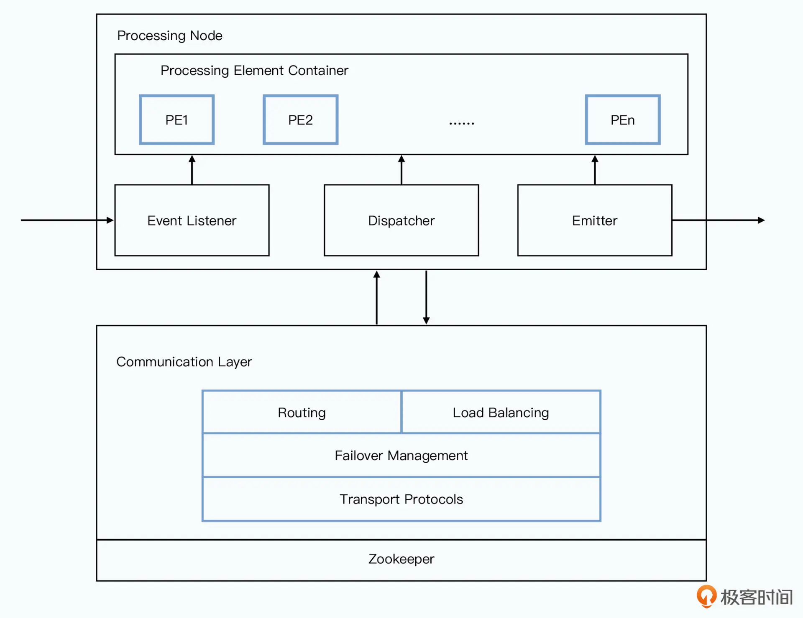

你可以看到，这个其实和我们看 MapReduce 的框架是类似的，开发人员的关注点，只需要在 PE 这个纯粹的业务逻辑层面。至于计算在哪一台服务器上发生，各个节点之间是怎么通信的，开发人员完全不需要关心。 

## S4的不足

S4存在很多的不足：

* 一个 S4 在线上的有向无环图就需要有海量的对象，这个数量级可能是数万乃至数十万。而不像之前我们看过的 MapReduce 那样，只需要有少数 Map 和 Reduce 就好了。 由于每一个处理数据的 Key 都要是一个对象，系统里就会有海量的对象。而一个 Key 如果只出现一次，之后再也不出现了，也要占用内存。S4 对此的解决办法，是给 Key 设定 TTL，定期清理掉不需要的 Key。 

* S4 里，没有时间窗口的概念。在我们进行实时数据处理的时候，我们需要统计的，常常是“过去一分钟的热搜”，或者“过去一小时的热搜”，这样有一个时间范围的数据。 但是在 S4 的设计里，我们并没有地方可以设定这个时间窗口。所以类似的需求，需要我们自己在 PE 的代码里面去维护或者实现，一下子大大增加了开发的难度和复杂度。 

* S4的容错处理非常简单，S4 能够做到的容错，其实就是某一个计算节点挂掉了，我们重新再起一个计算节点承担它的工作。但是，原先节点里，所有 PE 维护的状态信息就都丢失了。我们既不知道目前的统计信息是什么，也不知道目前处理到哪些事件了。 Yahoo 给出的答案是退回到离线批处理计算的数据上，但是这个显然就不满足流式处理一开始的需求了。只能算是个聊胜于无的方案。 

  S4 的容错，也只是考虑“计算节点”层面的容错。容错只是将挂掉的节点能够在其他的硬件上重新运行起来，但是已经处理的历史数据都已经丢失了。而对于节点之间的数据传输，S4 也没有作出全链路的传输保障。 

* 最后一个问题，则是 S4 虽然是一个分布式系统，但是并不支持真正的动态扩容。在一开始论文的假设部分，就假设了运行中的集群不会增加或者减少节点。 这样带来的问题，就是当负载快速上升的时候，S4 的策略是随机丢弃一些数据，本质上是对数据进行了采样，而不是能够通过简单增加硬件来解决问题。 

S4 还是让大数据的的流式处理迈出了第一步。而这些 S4 并没有回答好的问题，也会为接下来的流式数据处理系统的兴旺拉开了帷幕。 

# Storm

虽然 Storm 在流式计算上，也采用了类似的有向无环图（DAG）的逻辑模型，但是在整个系统架构上，Storm 却要传统很多。 和 S4 不同，Storm 是一个典型的 Master+Worker 的分布式系统架构，并且将传送的消息和对应消息的处理逻辑做了分离。 

## 基于 Topology 的逻辑模型 

和 S4 类似，Storm 系统的抽象模型，也是一个有向无环图。在 Storm 里，这样一个有向无环图，叫做 Topology，也就是拓扑图。整个图里有这样几个元素： 

* 首先是 Spouts，也就是数据源。Storm 并没有像 S4 一样，把一切东西都定义成 PE。Spout 负责从外部去读取数据或者接收数据。就和它的名字一样，Spout 好像一个出水管，一旦打开，就会源源不断地有外部的数据灌进来。在 S4 里，对应的就是无键 PE（Keyless PE）。 
* 其次是 Tuple，也就是元组。它也是我们在 Topology 中，传输的所有的最小粒度的数据单元。一个 Tuple 是一个带命名的值的列表，你可以看成是一个个 KV 对，不过这个 Key 只是在定义 Tuple 的时候出现。但是在数据传输的时候，我们只需要传输对应的值。这个方式，其实有点像我们之前讲解过的 Thrift，字段的名称是定义在外部的，实际传输的时候只需要序号、类型和值。在 S4 里，Tuple 对应的就是事件（Event）。 
* 然后是 Streams，也就是数据流，一个流包含了无限多个 Tuple 的序列，这些 Tuple 会被系统分布式地并行去处理。 
* 最后就是 Bolts，也就是我们进行计算逻辑处理的地方。Bolt 可以处理任意数量的输入流，然后产生任意数量的输出流。对应地，我们要把计算结果写入到外部数据库，也是通过 Bolts 来进行处理。乍一看，Bolts 似乎很像 S4 里的 PE，用于处理对应的分布式计算逻辑，不过实际上，Bolts 和 PE 完全不一样。 

和S4的PE不同，Storm的Bolt只是逻辑处理单元，而不是每一个Key就有一个Bolt对象对于数据的分发，是通过对于Tuple的Grouping来进行的，所以系统的并行度可以设置，而不是和PE对象数量相关：

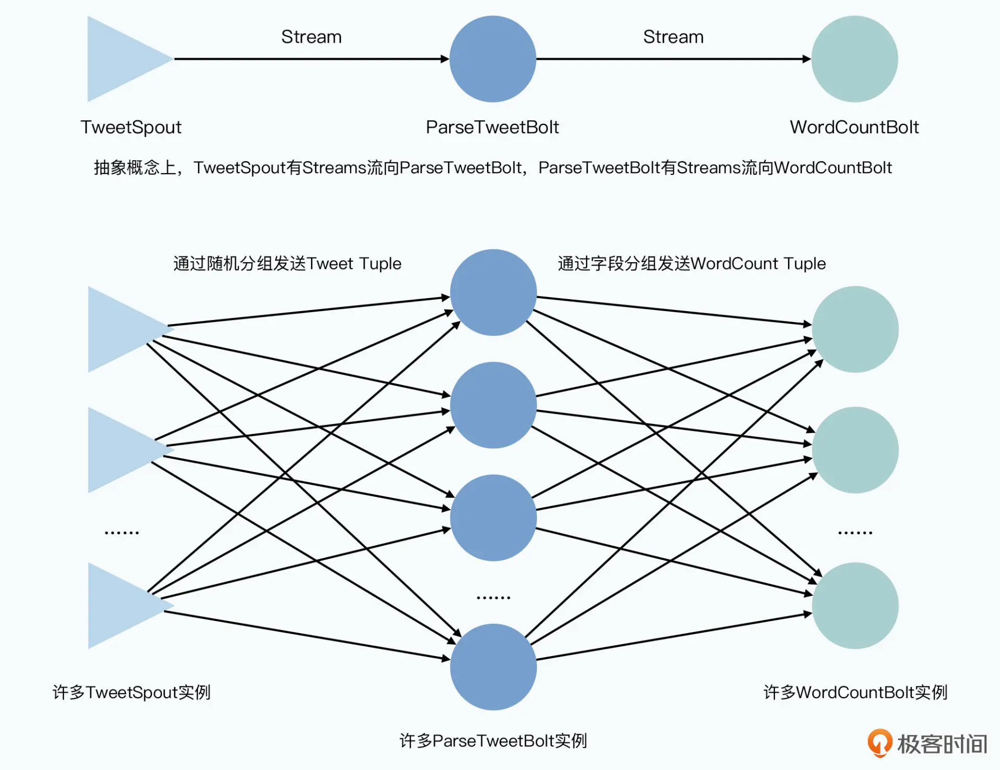

Storm 的抽象模型里，和 S4 的最大不同就在 Bolts 上。S4 的 PE，不仅是一个功能逻辑的单元，也是一个 KV 对的数据。同样类型的事件下，所有相同的 Key 的数据，都会聚合到同一个 PE 下。这就使得整个系统里有大量的 PE 对象，也导致 S4 的整个系统有几个显著的设计问题：

* 首先就是内存占用和 GC 开销，大量的 PE 会占用大量的内存。 

  但是，这个内存占用又是应用开发人员完全控制不了的。因为系统里有多少 PE，以及当前计算节点的内存占用是否过大，是由 S4 框架控制的。而对于应用开发人员来说，他操作的只是单个 PE 对象，显然单个 PE 对象本身不会占用太多内存。在内存不足的时候，我们原本可以在应用层面有更灵活的操作，比如更频繁地把数据输出到外部的 KV 数据库里，释放掉内存占用。但是在 S4 的框架下，我们做不到这一点。 

* 其次就是我们的业务逻辑代码里，混入了控制分布式数据分发的逻辑。 

  S4中，为了让 Top K 的排序能够分布式地并行执行，对应的示例代码中，特地将输出的 Key 变成了（SortID，N）这样的组合。也就是靠 PE 里的逻辑处理代码，来设置整个拓扑图的并行度。这使得我们分布式的分发逻辑，和数据处理逻辑混合在了一起，整个系统被耦合起来了。 

  而且，如果我们的数据量增加了，想要提升并行度，我们不能简单地修改参数，而是需要修改代码，重新编译部署。并且，历史上已经处理了（SortID, N）组合 PE，在重新部署之后，处理的数据可能是完全不同的，因为我们的 N 的最大值已经变了。 

而 Storm 的设计并不相同，Storm 里的 Bolt 更像是 MapReduce 里的 Map 或者 Reduce 函数。我们可以在 Topology 里面，去设置不同 Bolt 的并行度，以及设置数据流是如何分组的。但是，每个 Bolt 输出的 Tuple 本身，却不需要通过生成一个类似于（SortID, N）这样一个特殊的 Key，来定义下一层的 Bolt 的并行度。在 Storm 里面，对应的数据流可以进行这样几种分组（Grouping）： 

* 随机分组（Shuffle Grouping），也就是每一个 Bolt 输出的结果，在分发到下游的 Bolt 的时候，是随机分发给不同的 Bolt 的，每个 Bolt 都会收到数量接近的 Tuple。 
* 字段分组（Fields Grouping），可以选定 Tuple 中的某一个字段，按照字段的值进行分组。比如我们如果还是要进行单词出现频率的 Top K 排序，我们可能有一个 Tuple，第一个字段叫做 word，存放具体的单词，第二个字段叫做 count，存放它出现的频率。那么，我们可以通过 word 这个字段进行字段分组，这样，相同单词的 Tuple 就会分发到相同的 Bolt 里去了。 
* 全部分组（All Grouping），这个类似于数据广播，也就是 Bolt 输出的 Tuple 需要向下游的每一个 Bolt 都发送一份。 
* 全局分组（Global Grouping），这个类似于 S4 里你看到的终点的 MergePE，所有上游的 Bolt 都会把 Tuple 发送到唯一一个下游 Bolt 中。这样在下游，就可以有全局信息来做统计判断。 
* 无分组（None Grouping），这个是说开发人员不关心这个数据怎么分组。在实际实现里面，它和随机分组是一样的。 
* 指向分组（Direct Grouping），这个是指，上游的 Bolt 可以指定下游由哪一个 Bolt 来接收对应的 Tuple。 
* 本地或随机分组（Local or Shuffle Grouping），也就是当下游的 Bolt 如果有一个或者多个“任务（Tasks）”，和上游的 Bolt 在同一个 worker 进程里，那么 Tuple 只会分发到这些进程里的任务里。如果没有的话，那就还是按照随机分组的方式发送 Tuple。这个主要是为了性能考虑，如果可以在同一个台机器的同一个进程内通信，会大大节省整个集群的网络开销。 

下面是S4和Storm中，进行TopK排序的数据流：

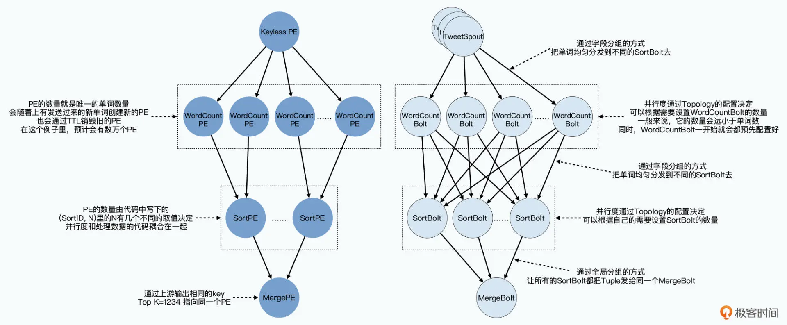

## Master+Worker 的系统架构 

Storm 的 Bolt 很像 MapReduce 的 Map 和 Reduce 函数，其实 Storm 本身的架构也和 MapReduce 非常相似。 和之前无中心的 S4 不同，Storm 选择了一个典型的 Master+Worker 的架构设计。整个 Storm 集群里，也是由 Nimbus+Supervisor+Worker 这样三种类型的进程组成的：

* 首先是 Nimbus 进程，其实也就是 Storm 集群的 Master 节点。它的作用，类似于 Hadoop 里的 JobTracker，或者说 MapReduce 里的 Scheduler+Master，也就是负责资源的分配和任务的调度。 

  开发人员会直接提交一个 Topology 给 Master。这个 Topology，之前只是一个抽象的有向无环图。而在实际应用里，它就好像一个 MapReduce 的任务一样，是一个编译好的程序和对应的配置。只不过，MapReduce 的任务执行完了就结束了。而作为流式计算，Topology 这个任务如果我们不去终止它，它就会永不停歇地运行下去。 

* 然后是 Supervisor 进程，这个类似于 Hadoop 里的 TaskTracker，也就是 MapReduce 里的 Worker。Supervisor 在每一个服务器上都会有一个，它本身不负责执行任务，但是会负责接收 Nimbus 分配的任务，然后管理本地的 Worker 进程，让 Worker 进程来实际执行任务。 

* 最后是 Worker 进程，一台服务器上会有多个 Worker 进程。Storm 是使用 Clojure 写的，跑在 JVM 上，所以每一个 Worker 进程就是一个独立的 JVM，Worker 里面还会通过 JVM 的 Executor 来维护一个线程池。然后实际的线程池里，会有很多个 Spout/Bolt 的任务。因为 Java 的 Executor 的实现里会复用线程，所以 Spout 和 Bolt 实际上会使用同一个线程。这个，也会大大减少整个系统的开销。 

而把整个系统拆分成 Nimbus、Supervisor 和 Worker 三种进程，就使得 Storm 的容错能力也大大增强了 。每个物理服务器里会有多个Worker进程：

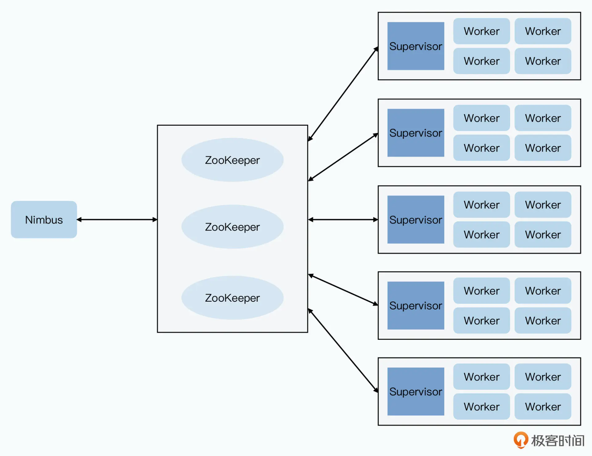

Nimbus 和 Supervisor 之间，并不是直接通信的。因为如果这样的话，显然 Nimbus 会成为一个故障的“单点”。所以 Nimbus 是把对应的任务分配写到 Zookeeper 里，也就是一个类似于 Chubby 这样的分布式锁系统。所以我们的任务分配是持久化的，而且会由 Paxos 协议来保障容错能力。而 Supervisor 也是从 Zookeeper 里面，去读取对应的任务分配。 

Nimbus 和 Supervisor 的职责都非常简单，Nimbus 只需要进行 Topology 的解析和任务调度，而 Supervisor 只需要接收任务，并且监控 Worker 进程是否存活。它们本身不处理数据，而且也不在内存里面保存数据。即使挂掉了，也只需要简单重启一下进程就好了。 

这种类似的设计思路，我们在 Megastore 里的协同服务器（Coordinator）里已经看到过一次了，通过把一些职责单独拆分出来，让特定的节点足够简单。即使这些节点可能成为单点，但是它们的稳定性，也会远高于要处理复杂逻辑的 Worker 进程或者 Bigtable。 

Storm对于系统的拆分和MapReduce的对比：

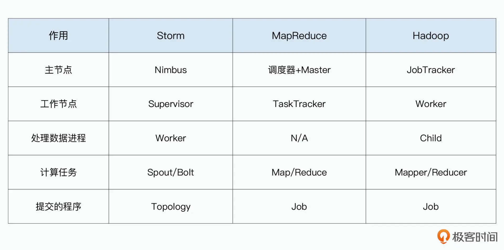

这样来看，Storm 的整体设计思路和 MapReduce 很像，各个节点的角色都能在 MapReduce 的各种节点里找到对应的影子。其实，各类分布式系统的设计思路都是类似的，特别是这样 Master+Worker 组合的模型，那就是 Master 负责调度，Worker 负责实际处理问题。而为了解决高可用性，往往我们会引入分布式锁，确保任务分配的数据不依赖 Master。 

另外，为了让整个系统更稳定，我们也会拆分调度任务的进程，和直接执行任务的进程，让每个进程都只有单一的职责。 

## 容错机制

Storm中是通过 ZeroMQ 这个消息队列，完成两个不同的 Worker 之间的通信的。 

相比于通过一个 RPC，消息队列有一个很大的优点，那就是高性能。上游节点不需要等待下游节点返回接收成功，就能发送下一条信息。不过，这也带来了一个问题，就是如果在消息发送之后，下游是否成功接收并处理了这条消息，上游是不知道的。可能因为网络超时、也可能因为下游节点的软硬件故障，在分布式系统里，“错误”是在所难免的。 

而且，在流式数据处理里，我们可能不只有一层链路。就拿论文里的统计 Tweet 里的单词数量为例，我们先要从一个 TweetSpout 里，读取数据流里的 Tweet，随机发送给到一个 ParseTweetBolt，这个 Bolt 会解析 Tweet 成一个个单词，再发送给下游的多个 WordCountBolt。 

要注意，这里下游不只有一个 WordCountBolt，而是不同的单词会发送给不同的 WordCountBolt。而且，任何一个 WordCountBolt 没有被成功处理，都意味着我们面临“错误”。 

Storm 选择的解决方案，是把从 Spout 发起的第一个 Tuple 作为一棵树的根。下游所有衍生出来发送的 Tuple，都是这棵树的一部分。任何一个 Tuple 处理失败或者超时了，那么就从 Spout 重新发送消息。 

而要做到这一点，Storm 需要在系统里引入一个特殊的 Bolt，叫做 AckerBolt。Spout 发送出去的消息，同时会通知给到 AckerBolt。而 Bolt 一旦处理完根 Tuple 相关的消息，也会通知给到 Acker。 

Bolt 会告诉 AckerBolt 两个信息：一个是我已经处理完了某一个 Tuple，另一个是这个 Tuple 衍生往下游的哪些 Tuple 我也已经发送出去了。 这样，Acker 就有了一开始 Spout 发出的 Tuple 的整棵树的完整信息。等到最后一层的 Bolt 处理完对应的 Tuple，然后发送了对应的通知给到 AckerBolt，并且告诉它后面没有新的 Tuple 了，那么 AckerBolt 就知道，整棵 Tuple 树已经处理完成了。 

看起来，我们要在 AckerBolt 里面，存上整棵 Tuple 树。更准确地说，AckerBolt 不是要存一棵 Tuple 树，而是要把所有还在处理中的 Tuple 都存下来。这就相当于一个 AckerBolt，需要存下所有 Spout 和 Bolt 在整个处理过程中的内存占用，这个开销是非常大的。

为了解决这个问题，Storm 采用了一个很巧妙的办法，那就是利用位运算里的异或（XOR）。 在整个树的处理过程中，AckerBolt只会不断校验一个message id，通过 message-id 加上校验码，Storm 只需要 16 bytes 就能在 AckerBolt 里维护一个 Tuple 树是否已经都处理完了。 具体流程如下：

* Storm 给每一个发送出去的 Tuple 都会分配一个 64 位的 message id。当消息从 Spout 被发送出去的时候，Storm 会给 AckerBolt 发送这个 message-id，告诉它，你要开始追踪这个 Tuple 树了。Acker 里呢，则会维护一个 message-id 到校验码（checksum）的映射关系。这个校验码，一开始就是拿 0 和 message-id 去异或（XOR）一下。 
* 下游的每一个 Bolt，会处理完这个 Tuple 相关的消息，并且向外发送新的 Tuple。每个新发送的 Tuple 里，都需要带上根 Tuple 的 message-id。在新 Tuple 发送出去之后，Bolt 会通知 AckerBolt，通知的内容也很简单，也是一个根 message-id 到校验码的映射关系。 
* 这里的校验码，就是把当前对外发送的所有消息的 message-id，和已经处理完的消息的 message-id 做一下异或。然后 AckerBolt 收到这个消息，会把收到的校验码，和本地的校验码也做一下异或，更新成最新的校验码。 
* 因为异或操作，就是当两个数字完全相同的时候，会变成 0，也就是 A XOR A = 0。而在其他情况下，最后的结果一定不会每一位都是 0。我们发送一次消息，并且 acking 一次消息，相当于在这个校验码上执行了一次 A XOR A。所以，只要有 Tuple 还没有被 acking，我们的校验码就不会是 0，但是一旦所有的 Tuple 树上的 Tuple 都被 acking 了，那么这个校验码必然就是 0。 

所有消息处理完后，对应的校验码就是0：

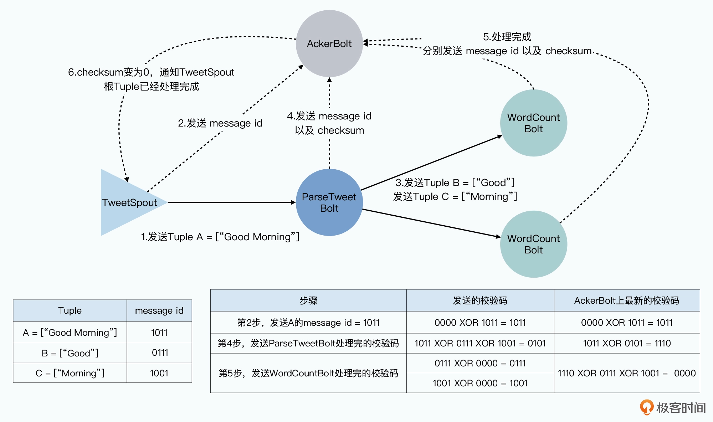

通过 message-id 加上校验码，Storm 只需要 16 bytes 就能在 AckerBolt 里维护一个 Tuple 树是否已经都处理完了。这样，即使你每秒需要处理 10 万条消息，AckerBolt 里需要维护 30 秒的 Tuple，也只需要 48MB 的内存空间，这即使对于 10 年前的服务器来说也是绰绰有余的了。 

而且，所有的 Bolt 通知 Acker 最新的执行情况，也只需要发送 16 bytes 的 messsage-id 和校验码，既不需要发送 Tuple 的原始内容，也不需要为向下游发送的每一个 Tuple 都单独发送一条消息，占用的性能消耗也不会太大。 

不过，需要注意的是，这个机制只能保障，Spout 发出来的 Tuple 至少被处理一次，也就是 At Least Once，但是它避免不了 Tuple 可能被重复处理。 

比如，拿我们的 Top K 排序的 Topology 来说，任何一个单词在某个 Bolt 里没有被正确处理，就需要重新处理整个句子。这也意味着，其他单词会被重复统计。所以，这个通过 AckerBolt 进行容错重发的机制，并不适合所有的应用场景。你需要根据自己的实际业务需求，来决定要不要启用这个机制。 

有了 At Least Once，那你自然会想到还有 At Most Once，也就是一条消息最多发一次。这个要求其实在 Storm 里很容易做到，我们只要关掉这里的 acking 机制就好了。其实也就是上游只需要把消息发出去，下游有没有收到、有没有处理成功，上游就不管了。 

然而，无论是 At Least Once 还是 At Most Once，都不是我们最理想的进行流式数据处理的方式。我们真正希望的，是每个消息“恰好”被处理一次，也就是“Exactly Once”。所以，Storm 还不是流式数据处理最终极的解决方案。在 Storm 之后，整个流式数据处理系统还会不断进化。 

# Lambda 架构和Kappa 架构 

## 数据处理的 Lambda 架构 

既然我们已经可以获得分钟级别的统计数据，那我们还需要 MapReduce 这样的批处理程序吗？ 答案当然还是需要的，因为在目前的框架下，我们的流式计算，还有几个问题没有处理好:

* 首先，是我们的流式数据处理只能保障“至少一次（At Least Once）”的数据处理模式，而在批处理下，我们做到的是“正好一次（Exactly Once）”。也就意味着，批处理计算出来的数据是准确的，而流式处理计算的结果是有误差的。 

* 其次，是当数据处理程序需要做修改的时候，批处理程序很容易修改，而流式处理程序则没有那么容易。比如，增加一些数据分析的维度和指标。原先我们只计算点击率，现在可能还需要计算转化率；原先我们只需要有分国家的统计数据，现在还要有分省份和分城市的数据。 

  我们原先的计算结果已经保存在数据库或者 HDFS 上了。那么对于批处理程序来说，我们的解决方案也很容易，那就是选定一个我们希望新的报表需要覆盖的时间范围，比如过去 30 天。我们撰写一个新的 MapReduce 程序，运行出新的计算结果，保存成新的数据表。我们可以把旧的数据表删除，用新的数据表替换就好了。 

  通常，我们的 Hadoop 集群不只要承担报表任务，也会承担很多临时的分析任务。所以一般来说，像 Hadoop 这样的批处理集群的计算资源对于单个报表来说是足够富余的，重跑 30 天的数据分析，往往也可以在 1~2 天内完成。 

  但是对于流式处理，问题就有些麻烦了，特别是在没有 Kafka 的时候。 我们重新撰写一个新的 Storm 的 Topology，来支持新的分析维度和指标并不困难。困难的地方在于，我们需要在不影响正在线上运行的程序的情况下，进行新版本程序的发布。 这就需要重放最近30天的数据，会花费很多时间和资源，这就意味着每次修改程序，要么你只能更新新的数据产生的报表，要么你就要等上好几天，才能看到最后的计算结果。 

  这样的程序运行场景，对于大数据的批处理来说，压力并不大，但是对于流式数据处理，一样会有大量重放日志的工作量。 

有鉴于此，Storm 的作者南森·马茨（Nathan Marz）提出了 Lamda 架构，把大数据的批处理和实时数据结合在一起，变成一个统一的架构。 

Nathan 的思路是这样的，我们先不去看具体数据是通过什么计算框架来处理的，而是把整个数据处理流程抽象成 View = Query(Data) 这样一个函数。我们所有的报表、看板、数据分析结果，都是来自对于原始日志的分析。 

所以，原始日志就是我们的主数据（Master Data），不管是 MapReduce 这样的大数据批处理，还是 Storm 这样的大数据流式处理，都是对于原始数据的一次查询（Query）。而这些计算结果，其实就是一个基于特定查询的视图（View）。 当我们的程序有 Bug，其实就是查询写错了，我们的主数据没有变，我们视图的含义也没有变，我们只需要重新写一个查询就好了。而如果我们有需求层面的变更，就是我们需要一个新的视图，以及对应的新的查询了。 

而对于实际数据分析系统的用户来说，其实他关心的既不是 Query 也不是 Master Data，而是一个个 View。那么，我们在系统的整体架构上，就只需要对这些用户暴露出 View，而不需要告诉他们，具体下面的 Query 和 Master Data 的细节就好了。这样，我们可以按照 Hadoop 和 Storm 本身合适的场景进行选择。 

一方面，我们可以通过 Storm 进行实时的数据处理，能够尽快获得想要的报表和数据分析结果。另一方面，我们同样会定时运行 MapReduce 程序，获得更准确的数据结果。在 MapReduce 程序运行完之前，我们的分析决策基于 Storm 的实时计算结果；但是当 MapReduce 更准确的计算结果出来了，我们就可以拿这个结果替换掉之前的实时计算结果。 

而对于外部用户来说，他们看到的始终是同一个视图，只是这个视图，会随着时间的变化不断修正数据结果罢了。 

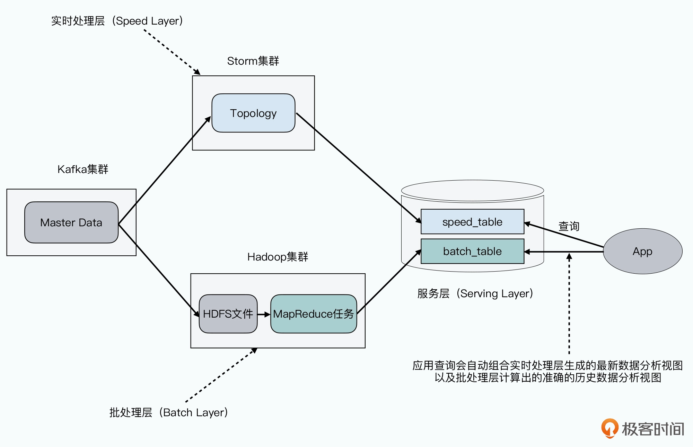

Lambda 结构，是由这样几部分组成的： 

* 第一部分是输入数据，也就是 Master Data，这部分也就是我们的原始日志。 
* 然后是一个批处理层（Batch Layer）和一个实时处理层（Speed Layer），它们分别是一系列 MapReduce 的任务，和一组 Storm 的 Topology，获取相同的输入数据，然后各自计算出自己的计算结果。 
* 最后是一个服务层（Serving Layer），通常体现为一个数据库。批处理层的计算结果和实时处理层的结果，会写入到这个数据库里。并且，后生成的批处理层的结果，会不断替代掉实时处理层的计算结果，也就是对于最终计算的数据进行修正。 

对于外部的用户来说，他不需要和批处理层以及实时处理层打交道，而只需要通过像 SQL 这样的查询语言，直接去查询服务层就好了。 

## 数据处理的 Kappa 架构 

可以看到，Lambda 架构很好地结合了 MapReduce 和 Storm 的优点。而这个 Lambda 结构，最终也变成了 Twitter 的一个开源项目 SummingBird。但是，这个 Lambda 架构也有一个显著的缺点，也就是什么事情都需要做两遍。 

这个做两遍，体现在两个方面： 

* 首先，所有的视图，既需要在实时处理层计算一次，又要在批处理层计算一次。即使我们没有修改任何程序，也需要双倍的计算资源。 
* 其次，我们所有的数据处理的程序，也要撰写两遍。MapReduce 的程序和 Storm 的程序虽然要计算的是同样的视图，但是因为底层的框架完全不同，代码我们就需要写两套。这样意味着，我们需要双倍的开发资源。 

而且，因为批处理层和实时处理层的代码不同，我们还不得不解决，两遍对于同样视图的理解不同，采用了不同的数据处理逻辑，引入新的 Bug 的问题。 

不过，在 Kafka 还没有成熟的时候，把数据分成批处理层和实时处理层是很难避免的。主要问题在于，我们重放实时处理层的日志是个开销很大的动作。通过 Scribe 这样的日志收集器，我们的 Master Data 最终是以一个个固定文件落地到 HDFS 的文件系统上。一旦我们想要重放日志，我们就需要把日志从 HDFS 上，分片拉到不同的服务器上，再搭建起多个 Scribe 的集群，去重放日志。 

但是，在有了 Kafka 之后，重放日志一下子变得简单了。因为我们所有的日志，都会在 Kafka 集群的本地硬盘上。而通过重放日志来重新进行数据计算，也只是设定一下新的分析程序在 ZooKeeper 上的 Offset 就好了。 

有鉴于此，Kafka 的作者杰伊·克雷普斯（Jay Kreps）就提出了一个新的数据计算框架，称之为 Kappa 架构。Kappa 架构在 View = Query(Data) 这个基本的抽象理念上，和 Lambda 架构没有变化。但是相比于 Lambda 架构，Kappa 架构去掉了 Lambda 架构的批处理层，而是在实时处理层，支持了多个视图版本。 

我们之所以要有 View = Query(Data) 这么一个抽象，是因为我们的原始日志，也就是 Data 是不会变化的，而我们想要的 View 也不会变化。但是具体的 Query，可能会因为程序有 Bug 而比较频繁地被修改。 

在 Kappa 架构下，如果要对 Query 进行修改，我们原来的实时处理层的代码可以先不用动，而是可以先部署一个新版本的代码，比如一个新的 Topology 上去。然后，我们会对这个 Topology 进行对应日志的重放，在服务层生成一份新的数据结果表，也就是视图的一个新的版本。 

在日志重放完成之前，外部的用户仍然会查询旧的实时处理层产生的结果。而一旦日志重放完成，新的 Topology 能够赶上进度，处理到最新产生的日志，那么我们就可以让查询，切换到新的视图版本上来，旧的实时处理层的代码也就可以停掉了。 

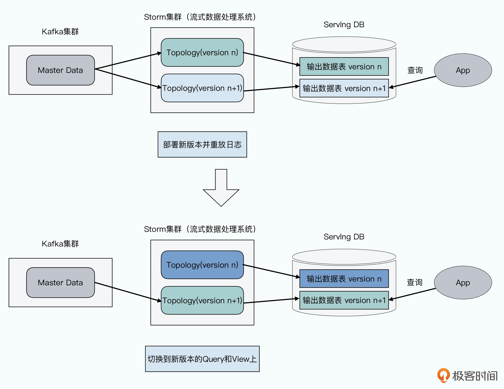

而随着 Kappa 架构的提出，大数据处理又开始迈入了一个新的阶段，也就是“流批一体”逐步进入主流的阶段。 

# Dataflow

## 一个简单的流式数据处理系统 

下面看一个由Kafka 和 Storm 搭建起来的流式数据处理系统。最简单的，我们就采用一个进行广告点击率计算和计费的数据处理需求。我们的广告系统日志会是这样的格式： 

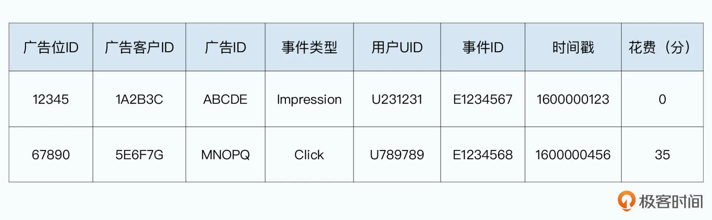

日志各字段：

* 每一条日志，都表示一次广告相关的日志。其中，广告位 ID+ 广告客户 ID+ 广告 ID 标明了是哪一个广告，展示在了哪一个广告位置上。比如，可口可乐的新年促销广告，展示在了某视频网站的开屏页，就可以通过这三个字段分辨出来。 
* 事件类型这个字段，用来标注这条日志是表示一次广告的展示，还是一次广告的点击。 
* 用户 UID，用来标识是哪一个用户。这个在实践层面，可以方便我们对于同一个用户，在短时间内反复点击相同的广告进行去重。 
* 事件 ID，用来标识一个唯一的事件。在实践层面，如果出现系统故障，我们常常会重试保障“至少一次”的数据处理。而有了这个字段之后，我们就可以在处理的时候进行去重，这样我们才有可能做到“正好一次”的数据处理。 
* 最后的时间戳字段，用来记录事件发生的时间。花费字段，则是记录这一次点击广告，需要花费广告客户多少预算。 

这里的日志，只是一个最简化的模型。在实际的广告系统中，会有上百个字段，比如我们还会记录 IP 地址，以分辨用户所在的地理位置等等。不过，有了这个最简单的日志格式，我们已经可以做两个最常见的广告数据的流式处理了：

* 第一个，自然是接近于实时的广告计费了。广告客户会设置当天可以花掉的广告预算，我们不能让它花费超过设置的预算，所以我们必须实时地统计客户的花费。 
* 第二个，则是统计各个广告的点击率，对于点击率太低的广告，我们应该反馈给广告投放系统，自动停止广告的投放。 

那么根据这两个需求，我们就可以很容易地基于 Kafka 和 Storm，搭建起一个我们需要的流式数据处理系统。 

首先，前端的应用服务器，会把产生的广告日志发送给一个负载均衡。然后通过负载均衡，均匀而随机地发送给 Kafka 不同的 Broker 服务器。下游有一个 Storm 集群，里面有一个 Topology，同时完成了广告计费，以及广告的点击率统计的工作。 

这个 Topology，就只有简单的两层：

* 第一层是一个 KafkaSpout，它会从 Kafka 拉取日志，然后解析并获取需要的字段，并向下游的 Bolt 进行数据分发。 
* KafkaSpout 的每一条日志，都会发送两条消息给下游两种不同的 Bolt。一条发给 AdsCtrBolt，用来统计不同广告的点击率；另一条发给 ClientSpentBolt，用来计算每个广告客户的花费。 

在向下游发送数据的时候，都是采用字段分组的方式。发给 AdsCtrBolt 的，是按照广告 ID 进行分组，发给 ClientSpentBolt 的，则是按照广告客户 ID 进行分组。这样，所有相同广告的日志，都会发送到同一个 AdsCtrBolt 里；而所有相同广告客户的日志，也都会发送给同一个 ClientSpentBolt。 

* AdsCtrBolt 的处理逻辑很简单，就是它会在内存里维护一个 广告ID=>(展示次数，点击次数，广告花费) 的 Map。然后定时把这个表输出到外部的数据库里，比如 HBase 或者 Bigtable 这样的数据库。也就是，它会每分钟输出一次对应广告 ID 的点击率信息。 
* ClientSpentBolt 的逻辑也很简单，就是它可以以更高的频率，比如每秒，甚至每次接收到一次广告点击，就对应更新一次 HBase 里的广告花费数据。 

最后，整个 Storm 的 Topology，是开启了 AckerBolt 的，也就是我们会确保所有的消息能够至少被处理一次：

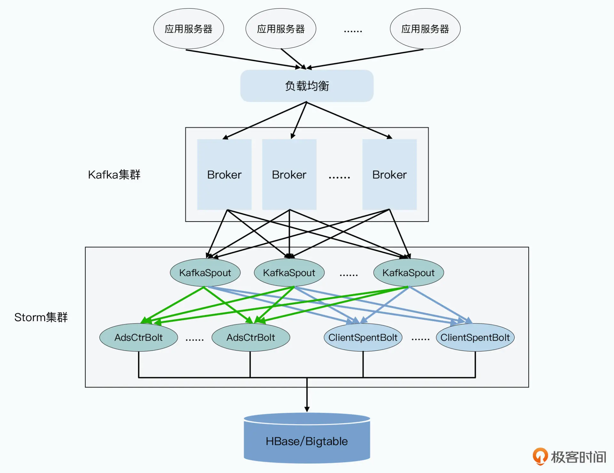

## 流式数据处理面临的挑战 

### 正好一次

在上面，我们简单地通过 Kafka+Storm，就有了一条可以实时计算广告花费和广告点击率的数据流水线。 在大数据领域，我们始终面临“出错”这个问题。而一旦出错，我们的麻烦就来了。 

首先就是这个“至少一次”数据处理的特性，其实已经满足不了我们实际的业务需要了。随着时间的推移，我们已经把“广告计费”这样对于准确性要求很高的应用，也放到流式处理系统里来。 在我们这个应用场景里，可能某一个 ClientSpentBlot 写入外部数据库的时候，出现了比较高的延时。这个时候，Storm 的“至少一次”的处理机制，会重发对应的消息。如果没有考虑这样重发的消息，那么我们就会在 ClientSpentBolt 里面，重复计算同一条日志的广告花费，这就意味着我们多扣了广告客户的预算，这显然是难以接受的。 

而如果说，单条日志重发计费，可能对于最终计费的影响还很小。那么如果 Storm 的某一个 KafkaSpout 出现了硬件故障，挂掉了，我们就可能有一大批消息会重复计费了。 

因为为了性能考虑，我们从 Kafka 拉取数据，不会是拉一条、处理一条，然后更新一次 ZooKeeper 上的偏移量。特别是 ZooKeeper 会受不了这么大的负载，它和 Chubby 一样，是用于实现一个粗粒度的分布式锁，而不是一个高性能的 KV 存储。所以，KafkaSpout 会从 Kafka 拉一小批数据，然后发送出去，等到这一小批数据发送完了，并且下游都处理完了，才会变更一次 ZooKeeper 上的偏移量。 

但是，只要其中有一条消息在下游还没有处理完的时候，KafkaSpout 所在的服务器挂掉了，对应的偏移量没有更新。那么在容错机制下，重新启动在另一台服务器上的 KafkaSpout，会重新再发送一遍这一批数据。而这个时候，我们就不只是重新对一条日志重复计费，而是需要对一大批日志重复计费。 在Kafka+Storm的组合下，我们也不是每条消息都去更新Offset，而是一个Batch一个Batch地更新在这个过程中如果Spout挂了，那么整个Batch的数据都会重新再发送一遍：

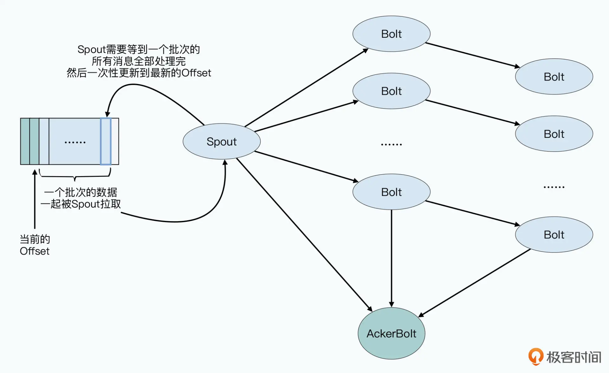

要解决这个问题，一个很直观的思路，自然是对重复发送的日志或者消息进行去重。最简单的方式，就是在每一个 Bolt 里，我们维护一个这个 Bolt 已经处理完成的，所有的 message-id 的集合。那么，任何一条新的消息发送过来的时候，我们都去这个集合里看一看，这条消息是否已经处理过了，就能解决这个问题了。 

不过，让每个 Bolt 都保留所有处理过的 message-id 的集合，显然会占用太多的内存了。因为在流式系统里，随着时间的推移，系统处理过的日志量在不断地增加，message-id 的集合只会越来越大。所以，在工程实践上，我们可以做两个优化： 

* 第一个，是使用 BloomFilter 进行去重，来代替原始的数据集合。我们把所有已经处理过的 message-id 放到一个 BloomFilter 里去，这样可以大大压缩我们需要的内存空间。不过，使用 BloomFilter 会带来的副作用是，我们可能会有很小的概率误算，使得不是重复的消息也会被认为是重复的。 
* 第二个，是把数据按照时间窗口，切分成多个 BloomFilter。比如，我们可以设定有 30 个 BloomFilter，每个 BloomFilter 都只存放某一分钟的 message-id。而每过一分钟，我们都把 30 分钟前的那个 BloomFilter 清空。这样，我们可以通过一个固定大小的内存空间，确保只要是 30 分钟内的重复数据，就不会被多次处理。因为一般来说，简单的重发，不太可能超过 30 分钟。我们可以根据系统的实际情况，来设定这个对应的时间窗口。 

### 容错问题

BloomFilter 的引入，使得我们用于计算的 Bolt 节点，其实有了“状态”。也就是说，它自身已经不是一个纯粹的函数了。事实上，不仅是为了做到“正好一次”的消息处理需要状态，我们本身的数据处理需求就需要状态。 需要维护状态又给我们带来了一个新的挑战，那就是系统的容错问题。 

对于系统的“计算节点”的容错很容易，我们只要在另外一台服务器上，重新启动一个 Bolt 就好了。但是这个时候，我们之前维护在 Bolt 内存里的 广告ID=>(展示次数，点击次数，广告花费) 的状态就已经丢失了。如果我们是每一分钟输出一次数据给 HBase/Bigtable 里的话，这意味着我们经常会丢掉一分钟的数据。 

事实上，不仅仅是针对容错问题，对于系统的可扩展性，我们同样需要考虑恢复 Bolt 里的状态。 如果我们的广告业务越来越红火，意味着上游的日志越来越多。这个时候，我们其实希望调整每一层并行度，通过增加并行度，使得我们系统仍然能够在线水平扩展。 但是，要调整并行度，意味着两点： 

* 第一点，意味着我们会在线上增加服务器的数量，有些正在运行的 Bolt 会被迁移（Migrate）到其他的服务器上去。 
* 更进一步地，我们想要增加 Bolt 的数量。这意味着，Bolt 里的这个 广告ID=>(展示次数，点击次数，广告花费) 的状态，也需要能够拆分。这个时候，S4 的设计反而显得更合理，那就是每一个 PE 都对应着一个 Key 了。这样，我们需要迁移的状态，就和对应的计算函数是绑定在一起的了。 

Bolt 会被拆分和迁移，并且在迁移的过程中，我们需要能够保留状态信息，这意味着我们的状态需要能够持久化下来。我们需要能够把这些状态，也更新到一个稳定的外部存储中去。当我们的节点挂掉，在其他服务器上恢复计算能力的时候，需要把这些状态信息重新读取回来。 

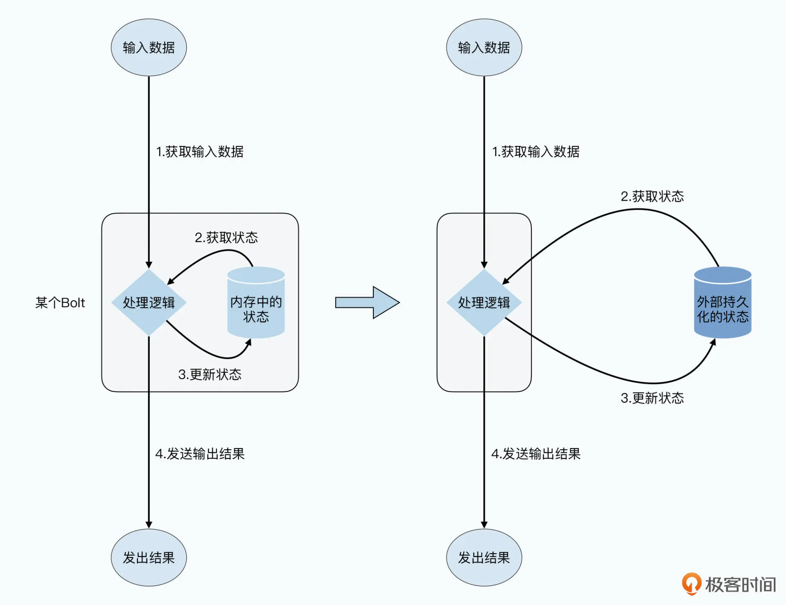

通过把各个计算节点的中间状态持久化，使得系统在容错情况下，仍然能够做到“正好一次”的数据处理，并且能够在线上动态扩容、调度计算，这是对现代流式数据处理的新要求

### 处理消息的时间窗口 

前面的 Topology 还有一个问题没有解决好，这个问题就是“时间问题” ：不能简单地用处理时间（Processing Time）替代了事件时间（Event Time）。这样，我们计算出来的点击率，乃至计费信息，会和实际情况有差异。 这个差异情况，在很多场景下我们是无法容忍的。 

和时间有关的业务就会产生一定的偏差，例如：我们的广告客户，设置了广告预算都在 11 月份花完。那么，在 11 月 30 日晚上 11 点 59 分 59 秒发生的广告点击，实际被处理的时候很有可能已经是 12 月 1 日了。这样，我们的广告客户会看到，他并没有在 12 月份分配任何广告预算，但是我们的系统却让他在 12 月 1 日有了花费，这显然会引起客户的不满。 

一个合理的解决方案，就是我们需要使用实际的事件发生的时间（即 Event Time），来进行相应的数据统计。但是这样一来，我们就面临两个新的问题：

* 第一个问题，是我们不能简单地维护 广告ID=>(展示次数，点击次数，广告花费) 这样一个映射关系了，而是需要一个 时间窗口=>[广告ID1=>(展示次数，点击次数，广告花费)，广告ID2=>(展示次数，点击次数，广告花费) , ……] 这样一个三维多层的映射关系了。 
* 第二个问题，是我们很难决策，什么时候应该将我们的统计结果，写入到外部的数据库里，如何处理迟到严重的数据

要实现这些逻辑，我们使用 Storm 现有的内置机制是做不到的。 

虽然我们还是可以通过像 TickTuple 这样的机制，定时提醒我们去检查是否应该把数据从 Bolt 内存里维护的 Map，输出到外部的数据库里。但是，像是维护时间窗口的映射关系、统计最近日志的时间戳这些逻辑代码，我们仍然都需要自己来撰写。 

而我们希望的仍然是，大数据应用的开发人员只需要撰写统计相关的业务逻辑代码，而不需要为了容错，或者考虑 Kafka 发送数据可能存在的延时，去写大量实现容错功能的代码。 

我们希望能够把和时间窗口相关的，以及触发数据更新到外部数据库相关的处理机制，在流式处理框架中内建。而撰写流式数据处理逻辑的开发人员，不需要关心这些机制和容错问题。

## MillWheel 

MillWheel可以看做是第二代流式数据处理系统。 围绕着之前的核心挑战，MillWheel带来了一套解决方案

和 S4 以及 Storm 一样，MillWheel 的流式数据处理，同样是通过一个有向无环图来表示的。整个 MillWheel 的系统，是由这样几个概念组成的 ：

### 计算（Computation）和流（Stream） 

首先是 Computation，用来作为有向无环图里面的计算节点。它里面包含了三个部分： 

* 它“订阅”了哪些流，也就是消息输入的流向是什么； 
* 它会输出哪些流，也就是消息输出的流向是什么； 
* 它本身的计算逻辑，也就是进行数据统计，或者是数据过滤的逻辑代码。 

所以很容易看出来，Computation 对应的就是 Storm 里面的 Bolt 或者 S4 里面的 PE。事实上，把 Computation 和接下来的 Key 组合在一起，其实和 S4 里面的 PE 没有什么差别。例如一个Computation 的定义：

~~~
computation SpikeDetector {
  input_streams {
    stream model_updates {
      key_extractor = 'SearchQuery'
    }
    stream window_counts {
      key_extractor = 'SearchQuery'
    }
  }
  output_streams {
    stream anomalies {
      record_format = 'AnomalyMessage'
    }
  }
}
~~~

### 键（Key） 

在 MillWheel 的系统里，每一条消息都可以被解析成（Key, Value, TimeStamp）这样一个三元组的组合。而我们在前面也看到了，一个 Computation 可以针对输入的消息流，定义自己的 key_extractor。这一点，比起 Storm 和 S4 其实是有所不同的：

* 在 Storm 和 S4 里，同样的消息，如果我们要根据不同的字段进行维度划分，分发给不同的 PE 或者 Bolt。那么，在抽象层面，我们其实是发送了两个不同的消息流。 
* 而在 MillWheel 里，则是一个相同的消息流，被不同的两个 Computation 订阅了，只是两个 Computation 可以有不同的 key_extractor 而已。这样，我们在系统的逻辑层面就可以复用同一个流，而不需要有两个几乎是完全相同，只是使用的 Key 的字段不同的流了。 

而流自然也很容易理解，它就是不同 Computation 之间的数据流向，一个 Computation 可以订阅多个数据流。每一个被订阅的数据流，就在两个 Computation 之间形成了一条边。 

在实际的操作层面，Key 也是 MillWheel 系统里面用来进行计算的唯一单元。也就是一个 Computation 的实现里面，获取到的都是同一个 Key 的状态。 拿一个我们举过的广告点击率统计的例子来说明，每一个广告 ID 其实就是一个 Key，在一个 Computation 里，你获取到的日志记录，都是这个广告 ID 的日志记录。 

这个设计，其实和我们之前看过的 S4 的 PE 设计是一样的。可以说，Computation + Key 的一个组合，就是一个 PE。而这个 Computation + Key 的组合，是可以在不同机器之间被调度的。也就是说，我们可以因为某一台服务器的负载太大了，来主动把这台服务器上的一些 Computation + Key 的组合，迁移到另外一台服务器上。 

不过，和 S4 不一样的是，在实际实现上，MillWheel 并没有真的把一个 Computation + Key 变成一个对象来处理。事实上，在 MillWheel 里，每一个 Computation 里的 Key 是像 Bigtable 里的 Tablet 一样，分成一段一段的。实际根据负载进行调度的时候，调度的也是这一整段的 Key。而这个实现，也就避免了之前 S4 对应的 PE 对象过多的问题。 

从这个角度，MillWheel 的系统逻辑其实更像是 Storm，而 Computation + 一段 Key 的组合，其实就是一个 Bolt，需要处理某一段 Key。 每一个服务器上，有很多个Computation的进程，每个进程管理某一个Computation的某一段Key：

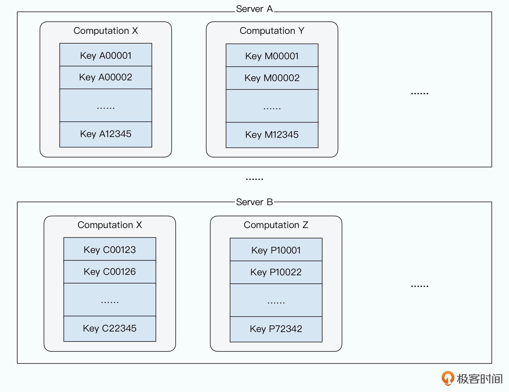

### 低水位（Low Watermark）和定时器（Timer） 

MillWheel 这样的流式系统，要面对实际的事件发生的时间，和我们接收到数据的时间有差异的问题。 MillWheel 需要有一个机制，能够让每个 Computation 进程知道，某个时间点之前的日志应该都已经处理完了。所以，它引入了低水位这个概念，以及 Injector 这个模块。 

前面我们讲解 Computation 的时候已经看到了，我们的每一条消息，都会被解析成（Key，Value，TimeStamp）这样一个三元组。这里面的 TimeStamp，其实就是我们需要的事件发生的时间，我们就是根据这个时间戳，来解决这个时间差异的问题的。 

在 Computation 处理完一个消息，往下游发送新消息的时候，也需要为新消息创建一个时间戳。这个时候，创建的时间戳不能早于你处理的消息的时间戳。如果你希望后续的数据处理，都是基于最早事件发生的时间点来进行数据统计，那么最好的办法，就是直接复制输入消息的时间戳。 

MillWheel 引入的低水位是这样一个概念，在某一个 Computation A 里，我们可以拿到所有还没有处理完的消息里面，最早的那个时间戳。这个没有处理完的消息，包括了还在消息管道里面待传输的消息，也包括已经在 Computation 里存储下来的消息，以及处理完了，但是还没有向下游发送的消息。这个最早的时间戳，就是一个“低水位”。这个“低水位”，其实就是告诉了我们，当前这个 Computation 的计算节点里，哪个最早的时间点还有消息没有处理完。 

而这个 Computation A，可能还订阅了很多上游的其他 Computation。此时此刻，那些 Computation，也会有一个同样的时间戳。那么，本质上，A 的低水位，就是它和它上游的低水位中，时间戳最早的那一个。 

如果我们的每个 Computation 的进程，能够知道当前自己这个 Computation 的低水位是什么，那么很多问题就变得简单了。获取到了当前 Computation 的低水位，我们就能决策是否应该进一步等待更多的消息，以获得准确的统计数据，还是现有的数据已经是完整的，我们可以把结果输出出去了。 

那么，MillWheel 是这么做的：每一个 Computation 进程，都会统计自己处理的所有日志的“低水位”信息，然后上报给一个 Injector 模块，而这个 Injector 模块，会收集所有类型的 Computation 进程的所有低水位信息。接着，它会通过 Injector，把相应的水位信息下发给各个 Computation 进程，由各个 Computation 进程自己，来计算自己最终的低水位是什么。 每一个计算节点，都会根据本地以及它依赖的上游Computation计算出自己当前的Low Watermark，以理解目前消息处理的进度：

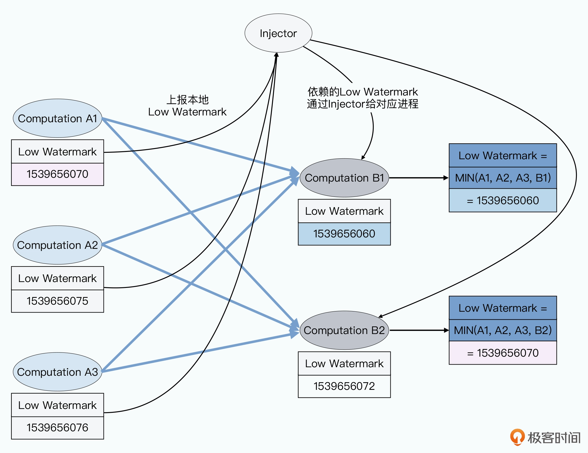

每一种类型的 Computation，都会有一个自己的水位信息。同一个 Computation 下，不同进程的水位信息也是不同的，因为它自己处理的消息的进度可能不一样。而不同类型的 Computation，水位信息就是不同的，因为整个数据流的拓扑图可能会很深。很有可能，前面几层 Computation 的数据已经都处理到 12 点 05 分了，但是后面几层 Computation 才处理到 12 点 01 分。如果我们让整个拓扑图，都用同一个水位信息，就意味着前面几层统计结果的输出的延时会变大。 

而有了这个水位信息，我们统计某一个时间段的统计数据，就可以做到基本准确了。 

在论文里，Google 给出的经验数据，是只有 0.001%（十万分之一）的日志，在考虑了水位信息之后仍然会因为来得太晚而被丢掉。但实际上，由于所有数据都是持久化的，即使这些消息来得太晚，我们仍然可以纠正之前的统计数据。 

并且这些水位信息的计算，以及根据水位信息来决定数据是否计算完成了，并不需要应用开发人员关心，而都是系统内建的。 

对于应用开发人员来说，MillWheel 提供了一组定时器（Timer）的 API。根据日志里的时间戳，你能拿到这条日志对应的时间窗口是哪一个。然后把对应的数据更新，再根据时间窗口，设置到对应的 Timer 上。系统自己会根据水位信息，触发 Timer 执行，Timer 执行的时候，会把对应的统计结果输出出去。 

### Strong Production 和状态持久化 

无论是在 Timer 还没有触发时，我们统计到的中间阶段的数据结果，还是我们已经确定要向下游发送的计算结果，都需要持久化下来。这个是为了整个 MillWheel 系统的容错能力，以及我们可以“迁移”某段 Computation + Key 到另外一个服务器上。 

所以，MillWheel 也封装掉了整个的数据持久化层，你不需要自己有一个外部数据库的连接，而是直接通过 MillWheel 提供的 API，进行数据的读写。 

MillWheel 能够做到这一点，很大程度上依赖了强大的基建，也就是自家的 Bigtable 和 Spanner。 

每一个 Computation + Key 的组合，在接收到一条消息的处理过程是这样的： 

* 第一步，自然是消息去重，这个可以通过分段的 BloomFilter 来解决，我们在上节课已经看到过了。 
* 第二步，就是处理用户实现的业务逻辑代码，在这些代码中，所有产生的更新，无论是给 Timer 还是 State，或者是 Production，都被视作是对于“状态”的变更。 
* 第三步，这些状态的变更，都会被一次性提交给后端的存储层，也就是 Bigtable 或者 Spanner 里。 
* 第四步，因为这些更新都已经持久化了，所以系统会发送 Acked 消息给上游发送消息的 Computation。这里的 Acked 机制和 Storm 的 Acked 机制是类似的，能够确保消息不会丢失，没有 Acked 的消息可以重发，并且会在第一步被去重做到“正好一次的数据处理”。不同的地方在于，MillWheel 里，因为处理完的消息会被持久化，所以不需要等消息在整个有向无环图里都处理完，才在起点清理掉消息。每一层可以单独回收掉下游的第一层已经处理完的消息。 
* 最后，则是我们向下游发送的消息会被发送出去。 

在第五步的消息对外发送之前，我们会把要发送的记录写入到 Bigtable/Spanner 里先持久化下来。这个被持久化的内容，在 MillWheel 中被称为是检查点（Checkpoint），正是有了这一步，整个 MillWheel 系统才有了容错能力和在线迁移计算节点的能力。而为了性能考虑，在实践上，MillWheel 会把多个记录的操作，放在一个 Checkpoint 里。 

这个 Checkpoint，类似于数据库里的预写日志（WAL）。这个时候，即使我们的节点挂掉了，或者我们想要在线迁移计算节点，我们也可以在另外一台服务器上，把这个 Checkpoint 读出来，重新向下游发送就好了。 我们对于下游要发送的数据，会先作为 Checkpoint 写下来。之后才是简单地重放 Checkpoint 的日志，避免这样基于时间点的隐式依赖，导致不能做到数据层面的一致性。 

而这个 Checkpoint 的策略，在 MillWheel 里被称之为 Strong Production，这个 Strong 要突出类似于强一致性（Strong Consistency）里的 Strong 的这个概念。也就是 MillWheel 的数据处理，虽然支持乱序的数据，但是所有的输入数据，是严格不会重复，也不会丢弃的。 

没有Strong Production，下游的Computation B对于接收到的消息，很难进行去重过滤无论是用Y覆盖X，还是以X已经收到，去重过滤Y都不合适：

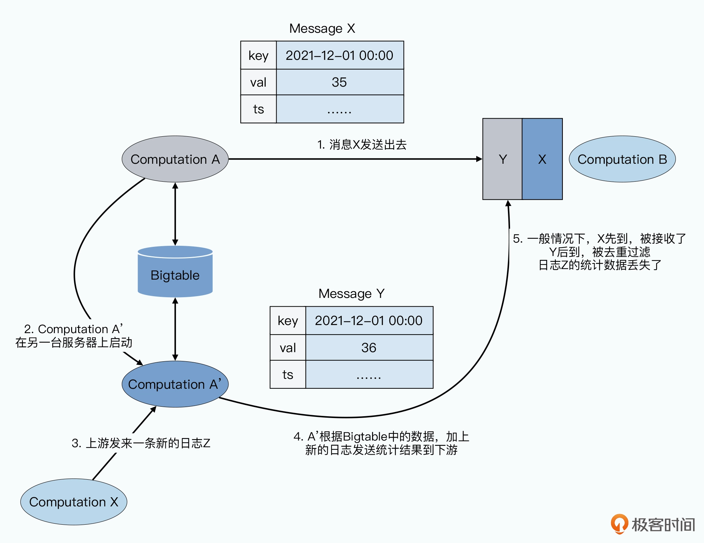

### 僵尸进程和租约问题 

在容错上，我们不仅要考虑这样的时间窗口问题，还需要考虑僵尸进程的问题。MillWheel 有一个中心化的 Master 集群，进行负载均衡的调度。并且在节点挂掉的时候，也是由这个 Master，在其他的服务器上去启动新的 Computation 的进程。 

但是，Master 判断节点挂掉，并不意味着节点进程真的挂掉了，完全可能是因为网络分区造成的。我们的 Master 节点连不上某一个 Computation 所在的服务器，所以在别的服务器上启动了一个新的 Computation 进程。那这个时候，我们就有可能有两个 Computation 进程，在管理同一段 Key。其中旧的 Computation 进程，其实就是一个我们没能够杀掉的僵尸进程。 

虽然，这个时候我们上游的数据，会被 Master 调度，往新的 Computation 进程里发送。但是，旧的 Computation 进程，完全可能有一个几秒钟之后会触发的 Timer，往下游写入数据，或者往 Bigtable 这样的持久层里更新数据。这样，我们一样会面临数据的不一致性问题。 

MillWheel 对这个的解决方案，其实和我们之前看过的 GFS/Bigtable 是类似的，那就是每个 Computation 的进程都会有一个租约。每次数据写入，都会带上这个租约的 Token。当 MillWheel 启动一个新的进程来进行容错处理的时候，老的进程的租约就被作废了。 

事实上，所有的分布式系统都需要有类似的机制，来确保任何一个 Key 的数据，同时只有一个人能写，也就是所谓的 Single-Writer（写入者）的机制。 

### Weak Production 和幂等计算 

不过，并不是所有的计算都需要 Strong Production，以及对于消息进行去重的机制的。毕竟，消息去重和 Checkpoint 都是有大量开销的，需要消耗我们更多的计算资源。比如，如果我们有一个 Computation A 只是简单地对消息按照某个字段进行过滤，然后在下游的 Computation B 进行数据统计。 

那么，在 A 这里，我们不需要进行数据去重，去重只需要在 B 这里做一次就好了。或者，我们想要统计获得某个时间段里的最大值或者最小值，也不需要进行去重，因为即使同一条记录出现两次，我们的最大值和最小值也不会发生变化。 

同样，我们也不需要在 Computation A 这一层使用 Strong Production，只需要它的下游做了 Strong Production 就好了。在 A 这一层出现问题，我们只需要让上游简单地重发消息就好了，因为在 Computation A 这一层是无状态的，没有所谓的中间计算结果，所以持久化状态是一种浪费。 

所以，MillWheel 允许我们去关闭去重机制，以及 Strong Production 机制。关闭之后的 Computation 节点，被称之为是 Weak Production。 

### 小结

MillWheel 采用了和 S4 以及 Storm 一样的有向无环图的逻辑结构。为了解决容错问题，MillWheel 接管了数据的存储层，而计算的中间结果以及输出的内容，都是通过调用框架提供的接口，被 Bigtable 或者 Spanner 存储下来了：

* 为了解决数据去重，MillWheel 通过为每一个收发的记录都创建了一个唯一的 ID，然后在每个 Computation 的每一个 Key 上，都通过 Bloomfilter 对处理过的消息进行去重，确保所有的操作都是幂等的。 
* 而为了解决流式计算的容错和扩容问题，MillWheel 会通过 Strong Production 这个方式，对于所有向下游发送的数据先创建 Checkpoint。这个 Checkpoint，其实就是类似于数据库里面的 WAL，通过记录日志的方式，确保即使计算节点挂掉了，也能够在新起来的计算节点上重放 WAL，来重新向下游发送数据。 
* 然后，为了解决事件创建时间和处理时间之间的差异，MillWheel 引入了一个独立的 Injector 模块。Injector 模块，一方面会收集所有计算节点当前处理数据的进度，另一方面也会反馈给各个节点，当前数据处理的最新“低水位”是什么。这样，对于需要按照时间窗口进行统计分析的数据，我们就可以在所有数据都已经被处理完之后，再输出一个准确的计算结果。 
* 对于流式计算的容错问题，一个很重要的挑战，就是避免僵尸进程仍然在往 Bigtable/Spanner 这样的持久化层里面写入数据。这一点，MillWheel 是通过为每个工作进程注册一个 Sequencer，确保所有的 Key 对应的数据只有一个写入者来做到的。这个处理逻辑，也是通过一个租约机制来做到的，和我们之前见过的 GFS/Bigtable 这样的系统非常类似。 

纵观整个 MillWheel，我们的确可以说，无论是数据的正确性、系统的容错能力，还是数据处理的时间窗口，MillWheel 都已经解决掉了，可以说殊为不易。即使是在 2021 年的今天，也不是所有的流式数据处理系统都能做到这一点。 不过，这些强大的功能，很大程度上也依赖于 Google 强大的基础设施，特别是 Bigtable/Spanner 这样的系统，能够承载所有的中间数据，以及缓存数据的写入。 

不过，MillWheel 其实离像 Google 的 Dataflow 模型、Apache 的 Flink 这些现代流式处理系统，还有一段距离。一方面，MillWheel 还没有真正考虑把流式处理和批处理统一起来，做到真正的“流批一体”；另一方面，对于时间窗口的处理，MillWheel 也还很简单，更多是从实际应用的层面出发进行的设计，而没有总结抽象出一个模型。 

## Dataflow

Dataflow 的核心计算模型非常简单，它只有两个概念，一个叫做 ParDo，顾名思义，也就是并行处理的意思。另一个叫做 GroupByKey，也就是按照 Key 进行分组数据处理的问题：

* ParDo，地位相当于 MapReduce 里的 Map 阶段。所有的输入数据，都会被一个 DoFn，也就是处理函数处理。但是这些数据，不是在一台服务器上处理的，而是和 MapReduce 一样，会在很多台机器上被并行处理。只不过 MapReduce 里的数据处理，只有一个 Map 阶段和一个 Reduce 阶段。而在 Dataflow 里，Pardo 会和下面的 GroupByKey 组合起来，可以有很多层，就好像是很多个 MapReduce 串在一起一样。 
* 而 GroupByKey，地位则是 MapReduce 里的 Shuffle 操作。在 Dataflow 里，所有的数据都被抽象成了 key-value 对。前面的 ParDo 的输入和 Map 函数一样，是一个 key-value 对，输出也是一系列的 key-value 对。而 GroupByKey，则是把相同的 Key 汇总到一起，然后再通过一个 ParDo 下的 DoFn 进行处理。 

比如，我们有一个不断输入的日志流，想要统计所有广告展示次数超过 100 万次的广告。那么，我们可以先通过一个 Pardo 解析日志，然后输出（广告 ID，1）这样的 key-value 对，通过 GroupByKey，把相同的广告 ID 的数据分组到一起。然后再通过一个 ParDo，并行统计每一个广告 ID 下的展示次数。最后再通过一个 ParDo，过滤掉所有展示次数少于 100 万次的广告就好了。Dataflow的编程模型，就是一系列ParDo和GroupByKey串接在一起：

### 流批一体

这样看起来，Dataflow 不就是个 MapReduce 吗？它无非是可以把多个 MapReduce 的过程串接在一起就是了。当然，答案并没有那么简单，因为在 Dataflow 里，我们还有一个很重要的维度没有加入进来，这个维度就是时间。 

Dataflow 里的 GroupByKey，会把相同 Key 的数据 Shuffle 到一起供后续处理，但是它并没有定义在什么时间，这些数据会被 Shuffle 到一起。 

在 MapReduce 的计算模型下，会有哪些输入数据，是在 MapReduce 的任务开始之前就确定的。这意味着数据从 Map 端被 Shuffle 到 Reduce 端，只依赖于我们的 CPU、网络这些硬件处理能力。而在 Dataflow 里，输入的数据集是无边界的，随着时间的推移，不断会有新的输入数据加入进来。 

如果从这个角度来思考，那么我们之前把大数据处理分成批处理和流式处理，其实并没有找到两种数据处理的核心差异：

* 对于一份预先确定、边界明确的数据，我们一样可以使用流式处理。比如，我们可以把一份固定大小日志，放到 Kakfa 里，重放一遍给一个 Storm 的 Topology 来处理，那也是流式处理，但这是处理的有边界的数据。 
* 而对于不断增长的实时数据，我们一样可以不断定时执行 MapReduce 这样的批处理任务，或者通过 Spark Streaming 这样看起来是流式处理，其实是微批（Mini-Batch）的处理方式。 

事实上，即使是所谓的“流式”数据处理系统，往往也会为了性能考虑，通过微批的方式来提升性能。一个典型的例子，就是上一讲我们看过的 MillWheel 里的 Checkpoint，就会在等待多条记录处理完之后批量进行。 

一旦从这个视角来观察，那么批和流本身是一回事儿：

* 当我们把“批（Batch）”的记录数限制到了每批一条，那么它就是所谓的流了。 
* MapReduce 的“有边界（Bounded）”的数据集，也只是 Dataflow 的“无边界（Unbounded）”的数据集的一种特殊情况。 

所以，Jay Kreps 才会在 2014 年提出流批一体的 Kappa 架构，而到了 2015 年的 Dataflow，我们就看到了批处理本来就是流处理的一种特殊情况。 

### 时间窗口的分配与合并 

在 MillWheel 的论文里，我们已经看到了一个非常完善的流式数据处理系统了。不过，在这个流式处理系统里，对于“时间”的处理还非常粗糙。MillWheel 的确已经开始区分事件的处理时间（Processing Time）和事件的发生时间（Event Time）了，也引入了时间窗口的概念。但是，对于计算结果何时输出，它仍然采用的是一个简单的定时器（Timer）的方案。而到了 Dataflow 论文里，对这些概念的梳理和抽象就变成了重中之重。 

我们先来看一看时间窗口的概念，在流式数据处理里，我们需要的往往不是“统计所有的广告展示数量”，而往往是“每 5 分钟统计一次广告展示数量”，或者“统计过去 5 分钟的广告展示数量”。我们常用的时间窗口，也会分成好几种： 

* 首先是固定窗口（Fixed Window）。比如，我们统计“每小时的广告展示数量”，那么我们的数据，就会被划分成 0 点到 1 点、1 点到 2 点，这样一个个固定区间的窗口。 
* 然后是滑动窗口（Sliding Window），也就是窗口随着时间的变动在“滑动”。比如，我们要统计“过去 2 分钟的广告展示”，那么我们的窗口并不是划分成 12:00~12:02，12:02~12:04 这样一段段。而是 12:00~12:02，然后一分钟之后变成 12:01~12:03，在这个例子里，2 分钟被称之为窗口大小，而窗口每 1 分钟“滑动”一次，这个 1 分钟被称之为滑动周期。 
* 最后是会话窗口（Session Window）。这个常常用在统计用户的会话上，对于会话的划分，往往是通过我们设置的两次事件之间的一个“超时时间”来定义的。比如，我们有一个客服聊天系统，如果用户和客服之间超过 30 分钟没有互动，我们就认为上一次会话结束了。在这之后无论是用户主动发言，还是客服主动回复，我们都会认为是进入了一个新的会话。 

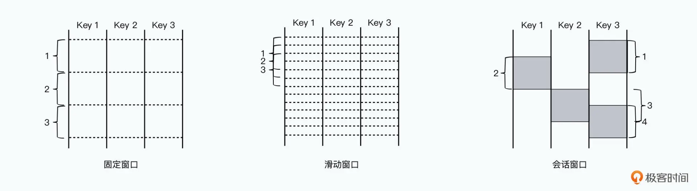

我们在 Dataflow 模型里，需要的不只是 GroupByKey，实际在统计数据的时候，往往需要的是 GroupByKeyAndWindow。统计一个不考虑任何时间窗口的数据，往往是没有意义的，1 分钟内广告展示了 100 万次，和 1 个月内展示了 100 万次代表着完全不同的广告投放力度。我们需要根据特定的时间窗口，来进行数据统计。 

而在实际的逻辑实现层面，Dataflow 最重要的两个函数，也就是 AssignWindows 函数和 MergeWindows 函数。每一个原始的事件，在我们的业务处理函数之前，其实都是（key, value, event_time）这样一个三元组。而 AssignWindows 要做的，就是把这个三元组，根据我们的处理逻辑，变成（key, value, event_time, window）这样的四元组。 

而在有了 Window 的信息之后，如果我们想要按照固定窗口或者滑动窗口统计数据，我们可以很容易地根据 Key+Window 进行聚合，完成相应的计算。 

需要注意，一个事件不只可以分配给一个时间窗口，而是可以分配给多个时间窗口。比如，我们有一个广告在 12:01 展示给了用户，但是我们统计的是“过去 2 分钟的广告展示”，那么这个事件，就会被分配给[12:00, 12:02) 和[12:01, 12:03) 两个时间窗口，我们原先一条的事件就可以变成多条记录：

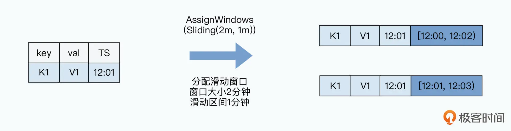

但是，有些窗口函数的计算并不容易，比如我们前面讲过的第三种会话窗口，每个事件的发生时间都是不一样的。那么这个时间窗口就很难定义。 而 Dataflow 里的做法，是通过 AssignWindows+MergeWindows 的组合，来进行相应的数据统计。 将多个窗口合并为更大的时间窗口，而如果不同事件之间的窗口没有重合，那么这两个事件就还是两个各自独立的时间窗口。在所有的事件合并完成之后，我们只需要去数有几个时间窗口，就能知道有几个会话了。 

窗口的分配和合并功能，就使得 Dataflow 可以处理乱序数据。相同的数据以不同的顺序到达我们的计算节点，计算的结果仍然是相同的。并且在这个过程里，我们可以把上一次计算完的结果作为状态持久化下来，然后每一个新进入的事件，都按照 AssignWindows 和 MergeWindows 的方式不断对数据进行化简：

### 触发器和增量数据处理 

在实际情况里，我们的输入数据是以流的形式传输到每个计算节点的。并且，我们会遇到延时、容错等情况，所以我们还需要有一个机制告诉我们，在什么时候数据都已经到了，我们可以把计算结果向下游输出了。 

在 MillWheel 的论文里，我们是通过计算一个低水位（Low Watermark）来解决这个问题的。我们会根据获取到的低水位信息，判断是否该处理的事件都已经处理完了，可以把计算结果向下游发送。 

但是，这个基于水位的方法在实践中，必然会遇到这样两个问题： 

* 第一个，在实际的水位标记之后，仍然有新的日志到达。 
* 第二个，我们的水位标记，因为需要考虑所有节点。只要有一条日志来晚了，我们的水位就会特别“低”，导致我们迟迟无法输出计算结果。 

那么，Dataflow 里，是怎么解决这个问题的呢？答案是 Lamdba 架构。 

这里的 Lambda 架构，并不是需要去搭建一个数据的批处理层，而是利用 Nathan Marz 的 Lambda 架构的核心思想，就是我们可以尽快给出一个计算结果，但是在后续根据获得的新的数据，不断去修正这个计算结果。而这个思路，在 Dataflow 里，就体现为触发器（Trigger）机制。 

在 MillWheel 里，我们向下游输出数据，只能通过定时器（Timer）来触发，本质上也就是通过“时间”这一个维度而已。这个定时器，在 Millwheel 里其实就被改造成了完成度触发器，我们可以根据当前的水位和时间，来判断日志处理的进度进而决定是否触发向下游输出的动作。而在 Dataflow 里，除了内置的基于水位信息的完成度触发器，它还能够支持基于处理时间、记录数等多个参数组合触发。而且用户可以实现自定义触发器，完全根据自己的需要来实现触发器逻辑。 

我们可以看一下 Apache Beam 项目里的一段示例代码。可以看到，在这段代码里，先是设立了一个 1 分钟的固定窗口。然后在触发器层面，则是设置了在对应的窗口的第一条数据被处理之后，延迟一分钟触发。在 Apache Beam 的文档里，你还能看到更多不同的触发器策略，你也可以根据自己的需要，来撰写专属于你自己的触发器代码：

~~~java
PCollection<String> pc = ...;
pc.apply(Window.<String>into(FixedWindows.of(1, TimeUnit.MINUTES))
  .triggering(AfterProcessingTime.pastFirstElementInPane()
  .plusDelayOf(Duration.standardMinutes(1)))
  .discardingFiredPanes());
~~~

而除了确定对应的数据计算什么时候触发，你还可以定义触发之后的输出策略是什么样的：

* 首先是抛弃（Discarding）策略，也就是触发之后，对应窗口内的数据就被抛弃掉了。这意味着后续如果有窗口内的数据到达，也没法和上一次触发时候的结果进行合并计算。但这样做的好处是，每个计算节点的存储空间占用不会太大。一旦触发向下游输出计算结果了，现有的数据我们也就不需要了。比如，一个监控系统，根据本地时间去统计错误日志的数量并告警，使用这种策略就会比较合适。 

* 然后是累积（Accumulating）策略，也就是触发之后，对应窗口内的数据，仍然会持久化作为状态保存下来。当有新的日志过来，我们仍然会计算新的计算结果，并且我们可以再次触发，向下游发送新的计算结果，而下游也会用新的计算结果来覆盖掉老的计算结果。 

  这个是一个典型的 Lambda 架构的思路。我们一般的统计数据，都可以采用这个策略。一方面，我们会尽快根据水位信息，把计算结果发送给下游，使得计算结果的延时尽可能得小。另一方面，在有新的数据过来的时候，我们也会重新修正计算结果。 

* 最后是累积并撤回（Accumulating & Retracting）策略，也就是我们除了“修正”计算结果之外，可能还要“撤回”计算结果。 

  当然，这只是我们最理想的状况，抛弃和累积这两种策略并不难实现，但是累积并撤回并不容易实现，至今还无法实现该策略。

随着时代洪流滚滚向前，Google 也针对自己发表的 Dataflow 这个编程模型，孵化出了 Apache Beam 这个项目。而在这个时间节点之后，像 Apache Flink 这样的开源流式处理项目，也都向 Dataflow 的编程模型靠拢，并实现了 Apache Beam 的接口。 

# 大数据平台

大数据平台，就是整合网站应用和大数据系统之间的差异，将应用程序产生的数据导入到大数据系统，经过处理计算后再导出给应用程序使用。 

下图是一个典型的互联网大数据平台的架构：

在这张架构图中，大数据平台里面向用户的在线业务处理组件用褐色标示出来，这部分是属于互联网在线应用的部分，其他蓝色的部分属于大数据相关组件，使用开源大数据产品或者自己开发相关大数据组件。 

大数据平台由上到下，可分为三个部分：数据采集、数据处理、数据输出与展示

* 数据采集：将应用程序产生的数据和日志等同步到大数据系统中，由于数据源不同，这里的数据同步系统实际上是多个相关系统的组合。数据库同步通常用 Sqoop，日志同步可以选择 Flume，打点采集的数据经过格式化转换后通过 Kafka 等消息队列进行传递。

  不同的数据源产生的数据质量可能差别很大，数据库中的数据也许可以直接导入大数据系统就可以使用了，而日志和爬虫产生的数据就需要进行大量的清洗、转化处理才能有效使用。

* 数据处理：这部分是大数据存储与计算的核心，数据同步系统导入的数据存储在 HDFS。MapReduce、Hive、Spark 等计算任务读取 HDFS 上的数据进行计算，再将计算结果写入 HDFS。 又可以分为离线计算和实时计算

* 数据输出与展示：将 HDFS 中的数据导出到数据库中，数据同步导出相对比较容易，计算产生的数据都比较规范，稍作处理就可以用 Sqoop 之类的系统导出到数据库。这时，应用程序就可以直接访问数据库中的数据，实时展示给用户，比如展示给用户关联推荐的商品。 除了给用户访问提供数据，大数据还需要给运营和决策层提供各种统计报告、监控数据，这些数据也写入数据库，被相应的后台系统访问。 

作业调度管理会涉及很多个性化的需求，通常需要团队自己开发。开源的大数据调度系统有 Oozie，也可以在此基础进行扩展。 

企业可以使用商用的大数据集成平台，它将主流大数据产品都集成到这个平台中，可以使用它直接部署整个大数据技术栈，面向企业提供解决方案

企业还可以购买云服务，云计算厂商将大数据平台的各项基本功能以云计算服务的方式向用户提供

还有一种企业，是大数据 SaaS 服务商，他们直接把大数据服务当作软件提供给企业（软件即服务，SaaS） ，只需要在系统中调用它提供的数据采集 SDK，甚至不需要调用，只要将它提供的 SDK 打包到自己的程序包中，就可以自动采集各种数据，传输到他们的大数据平台。 由平台生成报告，客户只需要查看和分析即可。

# 补充

## 依赖倒转原则

依赖倒转原则是高层模块不能依赖低层模块，它们应该共同依赖一个抽象，这个抽象由高层模块定义，由低层模块实现

所谓高层模块和低层模块的划分，简单说来就是在调用链上，处于前面的是高层，后面的是低层。我们以典型的 Java Web 应用举例，用户请求在到达服务器以后，最先处理用户请求的是 Java Web 容器，比如 Tomcat、Jetty 这些，通过监听 80 端口，把 HTTP 二进制流封装成 Request 对象；然后是 Spring MVC 框架，把 Request 对象里的用户参数提取出来，根据请求的 URL 分发给相应的 Model 对象处理；再然后就是我们的应用程序，负责处理用户请求，具体来看，还会分成服务层、数据持久层等。

在这个例子中，Tomcat 相对于 Spring MVC 就是高层模块，Spring MVC 相对于我们的应用程序也算是高层模块。我们看到虽然 Tomcat 会调用 Spring MVC，因为 Tomcat 要把 Request 交给 Spring MVC 处理，但是 Tomcat 并没有依赖 Spring MVC，Tomcat 的代码里不可能有任何一行关于 Spring MVC 的代码。

Tomcat不依赖Spring MVC，却可以调用 Spring MVC，这是因为Tomcat 和 Spring MVC 都依赖 J2EE 规范，Spring MVC 实现了 J2EE 规范的 HttpServlet 抽象类，即 DispatcherServlet，并配置在 web.xml 中。这样，Tomcat 就可以调用 DispatcherServlet 处理用户发来的请求。 

同样 Spring MVC 也不需要依赖我们写的 Java 代码，而是通过依赖 Spring MVC 的配置文件或者 Annotation 这样的抽象，来调用我们的 Java 代码。

所以，Tomcat 或者 Spring MVC 都可以称作是框架，它们都遵循依赖倒转原则。