# 绪论

数据结构：相互之间存在一种或多种特定关系的数据元素的集合

按照视点的不同，我们吧数据结构分为逻辑结构和物理结构

## 逻辑结构和物理结构

### 逻辑结构

逻辑结构：数据对象中数据元素之间的相互关系。它是针对某个具体问题选择的数据结构，表示了数据元素之间的逻辑关系

可以分为以下几种：

* 集合结构：集合结构中的数据元素除了同属于一个集合外，它们之间没有其他关系。各数据元素是平等的，类似于数学中的集合。

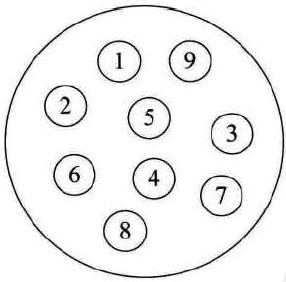

* 线性结构：线性结构中的数据元素之间是一对一的关系。

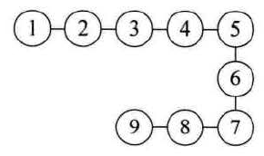

* 树形结构：树形结构中的数据元素之间存在一对多的层次关系

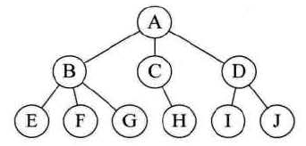

* 图形结构：图形结构的数据元素是多对多的关系

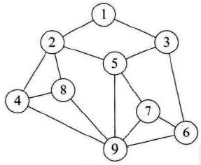

### 物理结构

物理结构又叫存储结构，指数据的逻辑结构在计算机中的存储形式

数据元素的存储结构形式有两种：顺序存储和链式存储

* 顺序存储结构：把数据元素存放在地址连续的存储单元里，其数据间的逻辑关系和物理关系是一致的

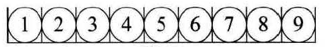

* 链式存储结构：把数据元素存放在任意的存储单元中，这组存储单元可以是连续的，也可以是不连续的。需要用一个指针存放数据元素的地址，这样就可以通过地址找到相关联数据元素的位置

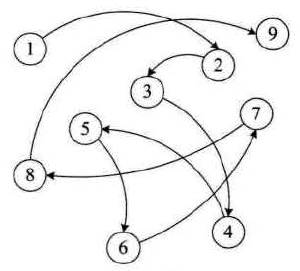

链表和数组对应计算机世界的两种基本访问方式：顺序访问和随机访问

链表和数组对比，链表的插入速度和删除速度更快，但是这有一个前提：已知插入元素或者要删除的元素的位置。

## 算法的定义

算法：它是解决特定问题求解步骤的描述，在计算机中表现为指令的有限序列，每条指令表示一个或多个操作

算法的几个基本特性：

* 输入：算法具有零个或多个输入
* 输出：算法至少有一个或多个输出
* 有穷性：算法在执行有限的步骤之后自动结束
* 确定性：算法的每一步都具有确定的含义，不会出现二义性
* 可行性：算法的每一步都必须是可行的，每一步都能通过执行有限次数完成。可行性意味着算法可以转换为程序运行。

好的算法的特征：

* 正确性：一个算法的正确性通常都是用数学方法证明的，因为很难穷尽所有的测试场景。一般情况下，算法能处理合法输入，对非法输入产生合理的输出，就可以说它是一个正确的算法了
* 可读性
* 健壮性：当输入数据不合法时，算法也能作出相关处理，而不是产生异常或者莫名其妙的结果
* 时间效率高和存储量低

## 算法效率的度量方法

一般分为两大类：事后统计方法和事前分析估算方法

事后统计方法：通过设计好的测试程序和数据，对不同算法编制的程序运行时间进行比较，从而确定算法效率高低

这种方法的缺点：

* 编制测试程序和准备数据需要花费大量时间和精力
* 程序运行时间取决于多个因素，与硬件、操作系统、编译器、计算机当时的CPU和内存、存储情况都有关，这些因素有时会掩盖算法本身的优劣
* 程序运行时间和测试数据有关，用什么样的测试数据来测试很难判断

事前分析估算方法：在编写程序前，依据统计方法对算法进行估算

抛开与计算机硬件、软件有关的因素，一个程序的运行时间，依赖于算法的好坏和问题的输入规模。

分析一个算法的运行时间时，重要的是把基本操作的数量与输入规模关联起来。

由于函数的渐进增长特性，我们总是可以在n比较大的时候，区分出算法效率的高低。函数的渐进增长：给定两个函数fn和gn，如果存在一个整数N，使得对于所有n>N，fn总是比gn大，那么就称fn的增长渐进快于gn

## 大O表示法

在进行算法分析时，语句总的操作数T(n)是关于问题规模n的函数，算法的时间复杂度记作T(n)=O(f(n))，随着问题规模n增大，f(n)的增长率和算法执行时间的增长率相同，它被称为算法的渐进时间复杂度，简称为时间复杂度。

大O表示法是一种表示算法速度的表示法。大O表示法指的并非是算法执行的具体时间，而是操作数随着元素数量增长的增速，它指出了算法运行时间的增速。例如对于查找算法来说：

当元素数量少的时候，简单查找和二分查找耗时是差不多的，但当元素数量急速上涨时：

* 简单查找：元素增加10亿个，操作数有10亿个
* 二分查找：元素增加10亿个，操作数只有30个

O(n)中n代表操作数，例如查找长度为n的列表，二分查找需要执行logn次操作，而简单查找需要执行n次操作。

大O表示法指出了最糟糕情况下的运行时间（除非特别指定，提到的运行时间都是最坏情况的运行时间），例如简单查找时也有可能查一次就找到了，但最糟糕的情况下需要查找n次。

常见的大O运行时间：

* O(logn)：对数时间，如二分查找（用大O表示法来讨论运行时间时，log指的都是log2，是以2为底的）
* O(n)：线性时间，如简单查找
* O(nlogn)：如快速排序
* O(n2)：平方时间，如选择排序
* O(n!)：如旅行商问题

有时会遇到算法的运行速度不稳定的情况，例如快速排序法的运行速度取决于如何选择其基准值，基准值选的好（例如每次随机选一个位置），递归次数就少；选的不好（选了最大值或者最小值），可能要递归很多次。所以描述快速排序的时间复杂度时，要说明在最遭情况下其运行时间为O(n2)，在平均情况下，其运行时间为O(nlogn)

对于两个复杂度相同的算法，如快速排序和合并排序，它们的运行时间差异关键是算法所需的固定时间量，它被称为常量，也就是一个操作数真正的运行时间，O(n)实际上是O(cn)，其中c就是每个算法固定的时间量，不同的算法c的大小不同。但是通常c被忽略不计，因为如果两种算法的大O运行时间不同，这种常量将无关紧要。因为快速排序的c值小于合并排序的c值，所以快速排序更快。

## NP完全问题和贪婪算法

旅行商问题：一个旅行商需要前往n个城市，为了保证旅程最短，他需要规划前往这些城市的先后顺序。当穷举这些路线时，可以发现一共有n!种路线。找到路线中最短的一条，需要O(n!)。像这种需要计算所有的解，并从中选出最小的那个，就属于NP完全问题，它可以用一种近似算法来解决，例如随机选择出发城市，然后此后的每一步都选择离自己最近的没去过的城市。

另一个典型的NP完全问题：集合覆盖问题。建立一个球队，每个候选球员都有自己一些素质：如擅长雨中作战、奔跑。每个球员又有不同的作用，如后卫，这些位置和前面的素质有对应关系。在人数有限的情况下，组建一个最优的球队，这就是集合覆盖问题。

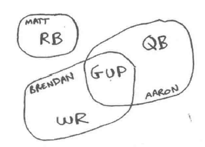

可以按照前面的近似算法来组建球队，首先找到符合要求最多的球员，然后给他安排位置，不断重复这个过程，直到球队满足要求。

再来介绍一个集合覆盖问题：假如办了一个广播节目，需要让所有州的听众都收听的到，为此需要决定在哪些广播台播出，在每个广播台播出都需要支付费用，因此选择尽量少的广播台播出。每个广播台否覆盖特定的区域，不同广播台覆盖的区域可能是重叠的：

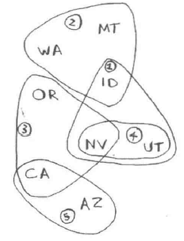

找出覆盖全部区域的最小广播台集合，为了解决这个问题，需要列出每个可能的广播台集合，有2的n次方个，然后在这些集合中，筛选可覆盖所有区域的最小集合。一个近似算法是：选出一个广播台，它覆盖了最多的未覆盖区域，然后重复这一步，直到所有区域被覆盖。

NP完全问题的特点：

- 随着元素数量增加，速度会变得非常慢
- 涉及到所有的组合
- 不能将问题分成小问题，必须考虑所有可能的情况
- 通常涉及序列、集合，如果可以将问题转化为旅行商问题或集合覆盖问题，那它就是NP完全问题

上面介绍的近似算法也有一个名字：贪婪算法，它简单易行，每步都采取最优的做法，采取局部最优解，它可能最终会得到全局最优解，此时它就是准确的算法；但有时它也得不到全局最优解，但可为一些复杂的问题提供简单快捷的近似算法。

## 算法空间复杂度

算法的空间复杂度是计算算法所需要的存储空间，计算公式记作S(n)=O(f(n))，其中n为问题的规模，f(n)为n所占存储空间的函数。

当单纯说复杂度的时候，一般说的是时间复杂度。

# 线性表

## 定义

线性表：0个或者多个数据元素的有限序列

几个关键点：

* 序列：元素之前是有顺序的，每个元素都有它的前驱或者后继（除了第一个元素和最后一个元素）
* 有限：元素数量是有限的

线性表一般有多种实现方式：

* 顺序存储结构，例如数组
* 链式存储结构，例如链表

## 数组

### 自定义ArraysList

下面是自定义实现的一个ArraysList，实现的方法有：空参构造、clear、size、isEmpty、trimToSize、get、set、ensureCapacity、add、remove、iterator

~~~java
class MyArraysList implements Iterable<Object>{

	//表的底层实现数组
	private Object[] array;
	//一个常量，指示数组初始化时的大小
	private static final int DEFAULT = 10;
	//这个变量指示表的实际大小
	private int theSize = 0;
	
	public boolean isEmpty(){
		return size() == 0;
	}
	
	//修剪工作实际上是通过重设大小完成的
	public void trimToSize(){
		ensureCapacity(size());
	}
	
	//表的初始化实际上就是设置数组的默认大小
	public MyArraysList() {
		super();
		doclear();
	}

	private void doclear() {
		theSize = 0;
		ensureCapacity(DEFAULT);
	}

	private void ensureCapacity(int newCapacity) {
		
		//如果重设大小会导致数据损失则操作无效
		if(size() > newCapacity){
			return;
		}
		
		//重设大小会把原数组的索引赋给另一个对象
		//新建一个对应大小的数组并完成数组的拷贝
		Object[] old = array;
		array = new Object[newCapacity];
		for(int i = 0 ;i < size();i++){
			array[i] = old [i];
		}
	}

	private int size() {
		
		return theSize;
	}
	
	public Object get(int index){
		if(index >= size() || index < 0){
			//数组越界异常
			throw new ArrayIndexOutOfBoundsException();
		}
		
		return array[index];
	}
	
	public Object set(int index ,Object value){
		if(index >= size() || index < 0){
			//数组越界异常
			throw new ArrayIndexOutOfBoundsException();
		}
		
		Object oldValue = array[index];
		array[index] = value;
		//set返回的是赋值前的值
		return oldValue;
	}

	//两种添加操作实际上都通过一个更常规的add来完成
	public void add(Object value){
		add(size(),value);
	}
	
	public void add(int index, Object value) {
		//如果数组的大小与表的大小一致说明没有足够的空间来插入
		//此时就要完成数组的扩充
		if(array.length == size()){
			ensureCapacity(2 * size() + 1);
		}
		
		//Object[] old = array;
		//array = new Object[old.length+1];
		//无需创建另一个对象完成索引的传递
		//在一次循环中就可以完成插入工作
		//未涉及的部分数据不变
		for(int i = size();i > index;i--){
			array[i] = array[i-1];
		}
		//要插入的部分单独赋值
		array[index] = value;
		//每次插入表的大小都会加1
		theSize++;
	}
	
	public Object remove(int index){
		
		//remove返回的是除掉的元素值
		//故在索引改变前拿到该值
		Object del = array[index];
		//无需创建其他对象在一次循环中即可完成位置转换
		for(int i = index;i < size() - 1;i++){
			array[i] = array[i+1];
		}
		//每次插入表的大小都会减1
		theSize--;
		//返回除掉的元素值
		return del;
	}
  
  	//实现迭代器的第二种方法：嵌套类 private static class；还有一种是非静态的内部类，区别不大
	public Iterator<Object> iterator(){
		return new MyArraysListIterator(this);
	}
	
	private static class MyArraysListIterator implements Iterator<Object>{

		//嵌套类有自己的域
		//通过有参构造成功得到表的引用
		private MyArraysList list;
		//用这个变量指示迭代器的位置
		private int current_index = 0;

		//通过空参构造成功得到表的引用
		public MyArraysListIterator(MyArraysList myArraysList) {
			list = myArraysList;
		}

		@Override
		public boolean hasNext() {
			
			return current_index < list.size();
		}

		@Override
		public Object next() {
			if(!hasNext()){
				throw new NoSuchElementException();
			}
			//虽然array是私有的，但因为嵌套类还是本类的一部分
			//所以还是可以访问
			return list.array[current_index++];
		}

		@Override
		public void remove() {
			//通常来说执行完next再执行remove就会删除该元素
			//此时需要把位置减一再调用表的remove方法
			list.remove(--current_index);
		}
		
	}
}
~~~

### 回字打印矩阵

~~~java
	//回字形打印矩阵，这里用的方法是拆成子问题，然后逐个解决子问题，这种思路写代码的速度最快
	//在第一个方法中，定义了四个值分别作为每轮打印的左上角坐标和右下角坐标
	//每轮打印一圈，然后各坐标变化后继续打印
	
	//在第二个方法中，先处理两个坐标重合的情况，这种情况下只打印一个数
	//再处理头尾结点坐标行相同或列相同的情况
	//最后处理四个值各不相同的情况
	public static void printMatrix(int a[][]){
		int column = a.length - 1;
		int row = a[0].length - 1;
		int n = 0;
		int m = 0;
		while(n <= column && m <= row){
			printMatrix(a, n++, m++, column--, row--);
		}
	}
	
	private static void printMatrix(int[][] a, int n, int m, int column, int row){
		if(n == column && m == row){
			System.out.println(a[n][m]);
		}else if(m == row){
			while(n <= column){
				System.out.println(a[n++][m]);
			}
		}else if(n == column){
			while(m <= row){
				System.out.println(a[n][m++]);
			}
		}else{
			int beginColumn = n, beginRow = m;
			while(m < row){
				System.out.println(a[n][m++]);
			}
			while(n < column){
				System.out.println(a[n++][row]);
			}
			while(beginRow < row){
				System.out.println(a[column][row--]);
			}
			while(beginColumn < column){
				System.out.println(a[column--][beginRow]);
			}
		}
	}
~~~

### 旋转矩阵

顺时针旋转正方形矩阵：

~~~java
	//顺时针旋转正方形矩阵
	//解决问题的思路还是分解成小问题，一圈一圈解决
	//定义了一圈的左上角点坐标和右下角坐标
	//对于特定的一圈而言，如果只有一个数那么就无需调整位置
	//对于普通情况，只需制造一个循环，每次循环调整4个数的位置，先写好调整四个角的，然后调整即可
	public static void clockWisePrint(int[][] arr){
		int n = 0, m = 0;
		int column = arr.length - 1;
		int row = arr[0].length - 1;
		while(n <= column && m <= row){
			clockWisePrint(arr, n++, m++, column--, row--);
		}
	}
	
	private static void clockWisePrint(int[][] arr, int n, int m, int column, int row){
		if(n == column){
			return;
		}else{
			int t , i = 0;
			while(i < (column - n)){
				t = arr[n][m + i];
				arr[n][m + i] = arr[column - i][m];
				arr[column - i][m] = arr[column][row - i];
				arr[column][row - i] = arr[n + i][row];
				arr[n + i][row] = t;
				i++;
			}
		}
	}
~~~

### 之子打印矩阵

之字形打印一个矩阵，例如：

[1, 2, 3, 4]
[5, 6, 7, 8]
[9, 10, 11, 12]
打印结果为1,2,5,9,6,3,4,7,10,11,8,12

~~~java
	//之字形打印一个矩阵
	//依然采用划分问题的思路，其实它的子问题就是已知一条斜打印线的起点和终点，如何打印这条斜线
	//这个问题通过改变下标很容易解决，而打印线的起点和终点是通过每次坐标沿着边界移动实现的
	//每次是斜向上打印还是向下打印是交替进行的，用一个布尔变量来指示这一点，每次循环完成都更新这个布尔变量
	public static void zhiPrint(int[][] arr){
		int i = 0, j = 0;
		int m = 0, n = 0;
		boolean flag = true;
		while(m <= arr.length - 1 && n <= arr[0].length - 1){
			zhiPrint(arr, flag, i, j, m, n);
			flag = !flag;
			if(j == arr[0].length - 1){
				i++;
			}else{
				j++;
			}
			
			if(m == arr.length - 1){
				n++;
			}else{
				m++;
			}
		}
	}
	
	private static void zhiPrint(int[][] arr, boolean flag, int i, int j, int m, int n){
		if(flag){
			while(i <= m && n <= j){
				System.out.println(arr[m--][n++]);
			}
		}else{
			while(i <= m && n <= j){
				System.out.println(arr[i++][j--]);
			}
		}
	}
~~~

### 回溯

回溯是一种搜索过程，可以达到枚举的效果，回溯其实就是没有重叠子问题的穷举算法。例如下面的题：leetcode37，解数独

~~~java
boolean[][] column = new boolean[9][9];
    boolean[][] row = new boolean[9][9];
    boolean[][][] grid = new boolean[3][3][9];
    List<List<Integer>> emptyNode = new ArrayList<>();
    boolean completed = false;

    public void solveSudoku(char[][] board) {
        for (int i = 0; i < board.length; i++) {
            for (int j = 0; j < board[0].length; j++) {
                if (board[i][j] == '.') {
                    List<Integer> node = Arrays.asList(i, j);
                    emptyNode.add(node);
                } else {
                    column[j][board[i][j] - '0' - 1] = true;
                    row[i][board[i][j] - '0' - 1] = true;
                    grid[i / 3][j / 3][board[i][j] - '0' - 1] = true;
                }
            }
        }
        dfs(board);
    }

    private void dfs(char[][] board) {
        if (completed) {
            return;
        }
        if (emptyNode.size() == 0) {
            completed = true;
            return;
        }
        List<Integer> node = emptyNode.get(emptyNode.size() - 1);
        emptyNode.remove(emptyNode.size() - 1);
        int i = node.get(0);
        int j = node.get(1);
        for (int k = 1; k <= 9 && !completed; k++) {
            if (!column[j][k - 1] && !row[i][k - 1] && !grid[i / 3][j / 3][k - 1]) {
                column[j][k - 1] = true;
                row[i][k - 1] = true;
                grid[i / 3][j / 3][k - 1] = true;
                board[i][j] = (char)('0' + k);
                dfs(board);
                column[j][k - 1] = false;
                row[i][k - 1] = false;
                grid[i / 3][j / 3][k - 1] = false;
            }
        }
        emptyNode.add(node);
    }
~~~

回溯其实就是一个典型的递归过程，要设计一个好的回溯算法，必须注意下面这几个关键点：

* 递归的结束条件是什么？
* 如何避免不走重复路？一般需要维护一种状态，在上面的例子中就是三个数组
* 结束后，如何返回结果？例如上面采用的是用一个成员变量保存结果
* 结束后，有没有必要立即结束其他递归分支，避免结果覆盖？若需要结束的话，应该在哪里控制结束条件？
* 某一条路走不通，回头走下一条路的时候，如何将状态正确回退？

## 链表

链表的每个结点都由两部分组成：数据域和指针域

链表的第一个结点存储位置叫头指针，整个链表的存取都必须从头指针开始：


头指针具有标识作用，它常常以链表的名字命名。

有时为了更加方便地对链表进行操作，会在单链表的第一个结点前附设一个结点，称为头结点，它的数据域不存储信息，有时也可以存储链表长度等信息，它的指针域就是头指针：

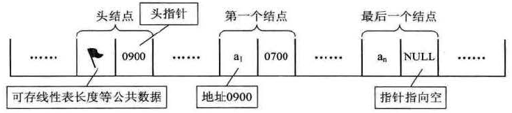

头结点不是链表的必要因素，它是为了操作的统一和方便设立的，有了头结点，对在第一元素结点前插入和删除操作，就和其他结点的操作统一了。

有些早期的编程语言由于没有指针的概念，此时可以用数组来代替指针，用两个数组来表示一个链表，一个数组用来记录数据域，另一个数组用来记录指针域。这种用数组描述的链表叫静态链表。

### 自定义LinkedList

下面是自定义实现的一个LinkedList，已经实现的：Node类、空参构造、clear、size、isEmpty、add、get、set、remove、iterator

~~~java
class MyLinkedList<AnyType> implements Iterable<AnyType>{
	
	//Node是一个嵌套类，代表链表的一个结点
	//这类中所有的成员都是public这主要因为嵌套类本身是private
	//所以外界依然对这些成员不可见
	private static class Node<AnyType>{
		//三个域分别代表一个结点的两个指针域和一个数据域
		public Node<AnyType> next;
		public Node<AnyType> pre;
		public AnyType value;
		
		//给出对应的构造方法
		public Node(AnyType value, Node<AnyType> pre, Node<AnyType> next) {
			super();
			this.next = next;
			this.pre = pre;
			this.value = value;
		}
		
	}

	//begin和end分别代表头结点 和尾结点
	private Node<AnyType> begin;
	private Node<AnyType> end;
	//theSize代表 表的实际容量
	private int theSize;
	//modCount代表修改次数，它在迭代器中结合另一个域变量
	//可以对并发修改进行限制，它是线程不安全的标志，
	//这被称之为failFast机制
	private int modCount = 0;

	//空参构造
	public MyLinkedList() {
		super();
		doclear();
	}

	public void clear(){
		doclear();
	}
	
	//初始化一个链表：只有头结点和尾结点
	//这两个结点不属于数据的一部分，它们没有数据域
	private void doclear() {
		
		begin = new Node<AnyType>(null, null, null);
		end = new Node<AnyType>(null, begin, null);
		begin.next = end;
		
		theSize = 0;
		modCount++;
		
	}

	public int size(){
		return theSize;
	}
	
	public boolean isEmpty(){
		return theSize == 0;
	}
	
	public AnyType get(int index){
		//这里重新构造了一个获得Node的get方法
		//主要是因为后来的set、remove需要用到这个方法获得Node
		return getNode(index).value;
	}
	
	private Node<AnyType> getNode(int index) {
		
		Node<AnyType> node;
		//index不合法时
		if(index >= size() || index < 0){
			//越界异常
			throw new IndexOutOfBoundsException();
		}
		
		//如果index在表中位置靠后，则从后向前搜索
		if(index * 2 > size()){
			//这个结点是有数据域的最后一个结点
			node = end.pre;
			for(int i = size() - 1;i > index;i--){
				node = node.pre;
			}
		}else{
			//如果index在表中位置靠前，则从前向后搜索
			//这个结点是有数据域的第一个结点
			node = begin.next;
			for(int i = 0;i < index;i++ ){
				node = node.next;
			}
		}
		return node;
	}

	//这里有两个add方法对外均使用
	public void add(AnyType x){
		add(size(),x);
	}
	
	public void add(int index, AnyType x) {
		
		//用getNode方法获得对应结点
		Node<AnyType> nextNode = getNode(index);
		//Node preNode = nextNode.pre;
		//构造对应的新node
		Node<AnyType> node = new Node<AnyType>(x, nextNode.pre, nextNode);
		//把前后指针域都刷新一下
		node.pre.next = node;
		node.next.pre = node;
		
		theSize++;
		modCount++;
	}

	public AnyType set(int index ,AnyType x){
		//用getNode方法获得对应结点
		Node<AnyType> node = getNode(index);
		
		//因为要返回set前的值所以新建一个变量赋予索引
		AnyType old = node.value;
		node.value = x;
		return old;
		
	}
	
	public AnyType remove(int index){
		//这里调用了一个删除结点的方法
		//原因是在迭代器里有删除结点的操作必须重载
		return remove(getNode(index));
		
	}
	private AnyType remove(Node<AnyType> node) {
		//Node<AnyType> node = getNode(index);
		//因为要返回删除前的值所以新建一个对象记录值
		AnyType old = node.value;
		//更新前后结点的指针域
		node.pre.next = node.next;
		node.next.pre = node.pre;
		//把自身的指针域去除
		node.pre = node.next = null;
		
		theSize--;
		modCount++;
		
		return old;
	}

	@Override
	public Iterator<AnyType> iterator() {
		//用嵌套类做迭代器需要传入对象
		return new MyLinkedListIterator<AnyType>(this);
	}
	
	//这是一个嵌套类
	private static class MyLinkedListIterator<AnyType> implements Iterator<AnyType>{

		//域对象传入本类对象用来完成有参构造的初始化
		private MyLinkedList<AnyType> list;
		//private int current_index = 0;
		//这里不再用int值而是用结点来指示迭代器的位置
		private Node<AnyType> currentNode = list.begin.next;
		//expectedModCount是检查并发修改的重要变量，它刚开始被初始化为modCount
		private int expectedModCount = list.modCount;
		//okToRemove变量用来指示是否有进行remove操作的权限
		private boolean okToRemove = false;
		
		//有参构造
		public MyLinkedListIterator(MyLinkedList<AnyType> list) {
			super();
			this.list = list;
		}

		//如果已经到了最后一个结点那么后面已经没有可以操作的结点了
		@Override
		public boolean hasNext() {
			return currentNode != list.end;
		}

		@Override
		public AnyType next() {
			//并发修改异常检查
			if(expectedModCount != list.modCount){
				throw new ConcurrentModificationException();
			}
			//每次用hasNext检查是否可以进行操作
			if(!hasNext()){
				throw new NoSuchElementException();
			}
			//因为要返回值且要更新索引故用一个变量记录原来的值
			AnyType value = currentNode.value;
			//向下移动一个结点
			currentNode = currentNode.next;
			//只有进行了next才能有remove的权限
			okToRemove = true;
			return value;
		}

		@Override
		public void remove() {
			//并发修改异常检查
			if(expectedModCount != list.modCount){
				throw new ConcurrentModificationException();
			}
			//remove权限检查
			if(okToRemove){
				throw new IllegalStateException();
			}
			//调用原来list的remove，此时modCount也加1
			list.remove(currentNode.pre);
			//对应的expectedModCount也必须加1
			//这样用迭代器时只有用迭代器的remove才不会抛出异常
			//同时也不允许多个迭代器共同作用
			expectedModCount++;
			//去除进行remove的权限
			okToRemove = false;
		}
	}
}
~~~

### 反转链表

非递归算法，设置三个指针：pre、now、next。注意now要从head开始，否则初始节点的指针指向会出错：

~~~java
    public static ListNode reverseList(ListNode head) {
        if (head == null) {
            return null;
        }
        ListNode pre = null;
        ListNode now = head;
        ListNode next;
        while (now != null) {
            next = now.next;
            now.next = pre;
            pre = now;
            now = next;
        }
        return pre;
    }
~~~

递归算法，假设reverseList1能将链表反转，并拿到反转后的链表头，那么解决链表反转问题就变成了：反转next位置的链表+其余处理，从大问题拆分为了小问题，在解决的过程中注意将指针指向调整为null，否则会形成环形链表：

~~~java
    public static ListNode reverseList1(ListNode head) {
        if (head == null || head.next == null) {
            return head;
        }
        ListNode node = reverseList1(head.next);
        head.next.next = head;
        head.next = null;
        return node;
    }
~~~

### 判断链表是否为回文结构

链表类问题时间复杂度一般都为n，优化解一般是从空间复杂度入手，一般空间复杂度为1的最优

1、第一种方法：借助一个栈来完成这个功能，首先遍历链表将所有元素装入栈中，再遍历一遍与栈中的数一一比对，如果不相等就是非回文链表。这种方法利用的就是回文链表的顺序和逆序是一样的：

~~~java
	public static boolean isHuiChain_a(Node head){
		Stack<Integer> stack =  new Stack<Integer>();
		Node currentNode = head;
		while(currentNode != null){
			stack.push(currentNode.val);
			currentNode = currentNode.next;
		}
		currentNode = head;
		while(currentNode != null){
			if(currentNode.val != stack.pop()){
				return false;
			}
			currentNode = currentNode.next;
		}
		return true;
	}
~~~

2、第二种方法：还是借助一个栈来完成功能，和上一个方法相比这个算法需要的栈的大小仅仅是链表长度的一半。设置两个指针，一个每次走两步，一个每次走一步，当走两步那个指针走完时，另一个指针正好指在中间，继续遍历的过程中，将剩余元素装入栈中，重新遍历链表，对比剩余元素，不对的话直接返回false，如果至栈为空都能对上则返回true

~~~java
	public static boolean isHuiChain_b(Node head){
		Stack<Integer> stack =  new Stack<Integer>();
		Node currentNode = head;
		Node keyNode = head;
		//走两步的指针keyNode必须保证不为空且它的next也不能为空，否则会出现空指针异常
		//链表长度为奇数则currentNode停在正中央，如果为偶数则currentNode停在中间两个结点的后一个上
		//无论是哪种情况都可以将所有信息装入栈中验证
		while(currentNode != null && keyNode != null && keyNode.next != null){
			currentNode = currentNode.next;
			keyNode = keyNode.next.next;
		}
		
		while(currentNode != null){
			stack.push(currentNode.val);
			currentNode = currentNode.next;
		}
		currentNode = head;
		while(!stack.isEmpty()){
			if(currentNode.val != stack.pop()){
				return false;
			}
			currentNode = currentNode.next;
		}
		
		return true;
	}
~~~

3、第三种方法：它不用辅助空间就能完成功能

~~~java
	//不借助辅助空间来实现功能，首先设置两个指针，一个指针一次走一步，一个一次走两步
	//最后走完时，另一个指针停在链表的正中间位置或中间两个位置的后一个
	//该指针从该位置开始讲指针反转，反转结束后：1-》2-》3《-2《-1
	//此时从两头遍历，遍历结束后还没有出现不相等情况则是回文结构
	//最后，恢复链表结构把值返回
	public static boolean isHuiChain_c(Node head){
		
		if(head.next == null){
			return true;
		}
		
		boolean flag = true;
		
		//设置两个指针，一个指针一次走一步，一个一次走两步
		Node currentNode = head;
		Node keyNode = head;
		while(currentNode != null && keyNode != null && keyNode.next != null){
			currentNode = currentNode.next;
			keyNode = keyNode.next.next;
		}
		
		//该指针从该位置开始讲指针反转，反转结束后：1-》2-》3《-2《-1
		Node preNode = null;
		Node midNode = null;
		
		while(currentNode != null){
			midNode = currentNode.next;
			currentNode.next = preNode;
			preNode = currentNode;
			currentNode = midNode;
		}
		
		//此时从两头遍历，遍历结束后还没有出现不相等情况则是回文结构
		Node endPositionNode = preNode;
		keyNode = head;
		while(keyNode!= null && preNode != null){
			if(keyNode.val != preNode.val){
				flag = false;
				break;
			}
			keyNode = keyNode.next;
			preNode = preNode.next;
		}
		
		//最后，恢复链表结构
		midNode = null;
		preNode = null;
		while(endPositionNode != null){
			midNode = endPositionNode.next;
			endPositionNode.next = preNode;
			preNode = endPositionNode;
			endPositionNode = midNode;
		}
		
		return flag;
		
	}
~~~

### 给链表分区

将单向链表按某值划分成左边小，中间相等，右边大的情形。对于数组，这个问题好解，其实就是荷兰国旗问题，所以一种方法是将链表转换为数组，然后利用数组方便交换元素的特性，分区后再转换为链表，但是这种方式需要一个与链表等大的数组作为辅助空间，且不保证稳定性。

~~~java
	//首先将链表的每一个结点装入数组中，然后堆对数组进行荷兰国旗问题排序
	//最后按照调整后数组的顺序重新调整链表指针即可
	public static Node dutchFlagChain(Node head, int key){
		Node currentNode = head;
		
		//计算链表长度并准备等大数组
		int i = 0;
		while(currentNode != null){
			i++;
			currentNode = currentNode.next;
		}
		
		Node[] nodeArray = new Node[i];
		
		//将链表结点装入数组中
		i = 0;
		currentNode = head;
		while(currentNode != null){
			nodeArray[i++] = currentNode;
			currentNode = currentNode.next;
		}
		
		//用荷兰国旗问题算法对数组进行排序
		i = 0;
		int pre = -1;
		int end = nodeArray.length - 1;
		while(i < end){
			if(nodeArray[i].val > key){
				nodeSwap(nodeArray, i, end--);
			}else if(nodeArray[i].val < key){
				nodeSwap(nodeArray, pre + 1, i);
				pre++;
				i++;
			}else{
				i++;
			}
		}
		
		//重新调整链表的次序
		for(i = 0; i < nodeArray.length - 1; i++){
			nodeArray[i].next = nodeArray[i + 1];
		}
		nodeArray[nodeArray.length - 1].next = null;
		return nodeArray[0];
	}
	
	private static void nodeSwap(Node[] nodeArray, int i, int j){
		Node node = nodeArray[i];
		nodeArray[i] = nodeArray[j];
		nodeArray[j] = node;
	}
~~~

其实没有必要用这种复杂的方式，链表虽然不擅长交换元素，但是链表可以随意拆分和组合。设置三个区域，遍历链表时将结点分配到小中大三个区域，每个区域用一个链表记载结点，只需要头和尾指针即可代表一个区域，最后将三个区域头尾相连即可：

~~~java
	//这种算法无需辅助空间，且划分后除了相等部分，其余两边各自内部的相对次序不变
	//设置三个区域，遍历链表时将结点分配到小中大三个区域，每个区域用一个链表记载结点，只需要头和尾指针即可代表一个区域
	//最后将三个区域头尾相连即可
	//注意要处理特别情况，三个区域某个为空时
	public static Node dutchFlagChain_a(Node head, int key){
		
		//定义当前结点和三个区域的六个指针，准备遍历
		Node currentNode = head;
		
		Node smallNodeStart = null;
		Node smallNodeEnd = null;
		Node midNodeStart = null;
		Node midNodeEnd = null;
		Node bigNodeStart = null;
		Node bigNodeEnd = null;
		
		//遍历链表，将结点分到三个区域，如果指针是null那就将两个指针一同初始化
		while(currentNode != null){
			if(currentNode.val < key){
				if(smallNodeStart == null){
					smallNodeStart = smallNodeEnd = currentNode;
				}else{
					smallNodeEnd.next = currentNode;
					smallNodeEnd = currentNode;
				}
			}else if(currentNode.val > key){
				if(bigNodeStart == null){
					bigNodeStart = bigNodeEnd = currentNode;
				}else{
					bigNodeEnd.next = currentNode;
					bigNodeEnd = currentNode;
				}
			}else{
				if(midNodeStart == null){
					midNodeStart = midNodeEnd = currentNode;
				}else{
					midNodeEnd.next = currentNode;
					midNodeEnd = currentNode;
				}
			}
			
			currentNode = currentNode.next;
		}
		
		//将三个区域的尾全指向空，因为特殊情况的存在，这三个指针都有可能作为新链表的尾结点，故需要全部置空
		//这样后面将无需置空的部分修改掉即可
		
		//还有一种解决方法本算法没有采用：可以直接在创建各个区域结点时
		//每次循环直接记录下一个结点的值，立即将本节点指向空，在将指针移动到记录好的位置：
		//next = head.next;
		//head.next = null;
		//处理本节点数值分组
		//head = next;
		//这样就可以保证每个节点的初始指向为空，然后用结果去调整每个指向
		//这实际上在遍历的过程中彻底打乱了链表
		
		if(smallNodeEnd != null){smallNodeEnd.next = null;}
		if(midNodeEnd != null){midNodeEnd.next = null;}
		if(bigNodeEnd != null){bigNodeEnd.next = null;}
		
		//如果中间区域不为空就将它与大于区域连接起来
		//如果为空那么就把大于区域赋值给中间区域
		//大于区域没有必要判断空指针，因为指向空指针是可以的
		if(midNodeStart != null){
			midNodeEnd.next = bigNodeStart;
		}else{
			midNodeStart = bigNodeStart;
		}
		
		//如果小于区域不为空就将他和中间区域连接，否则继续赋值
		if(smallNodeStart != null){
			smallNodeEnd.next = midNodeStart;
		}else{
			smallNodeStart = midNodeStart;
		}
		
		//最后，小于区域的头部必然是新链表的头结点
		return smallNodeStart;
		
	}
~~~

### 判断链表是否有环

方法1：这种算法借助了一个哈希表，遍历时把节点装入集合内，每次检查新节点有没有装入过。如果有装入过就说明是环链表，如果没有就说明不是

~~~java
	//这种算法借助了一个集合，遍历时把节点装入集合内，每次检查新节点有没有装入过
	//如果有装入过就说明是环链表，如果没有就说明不是
	public static Node haveLoopChain(Node head){
		HashSet<Node> set = new HashSet<Node>();
		Node currentNode = head;
		while(currentNode != null && (!set.contains(currentNode))){
			set.add(currentNode);
			currentNode = currentNode.next;
		}
		if(currentNode != null){
			return currentNode;
		}else{
			return null;
		}
	}
~~~

方法2：这种算法不用辅助空间，设置两个指针，一个快指针一个慢指针，快指针一次走两步，慢指针一次走一步。直到两个指针重合，此时把快指针重新指向头结点，快慢指针一起一次走一步前进。再次重合的结点就是相交节点

~~~java
	public static Node haveLoopChain_a(Node head){
		Node fastNode = head;
		Node slowNode = head;
		//这里可以用dowhile也可以把判断相等的条件放入循环的后半部，结合break去实现
		do{
			if(fastNode.next == null){
				return null;
			}
			fastNode = fastNode.next.next;
			slowNode = slowNode.next;
		}while(!(fastNode == slowNode || slowNode == null || fastNode == null));
		
		if(slowNode == null || fastNode == null){
			return null;
		}
		
		fastNode = head;
		while(fastNode != slowNode){
			fastNode = fastNode.next;
			slowNode = slowNode.next;
		}
		
		return fastNode;
	}
~~~

为什么这样的算法可以找到相交节点？设环节点共Y个，剩余的节点共X个，快节点每走一步，就超越慢节点一格，当超越Y格的时候，两个节点相遇，也就是说快节点走了2Y个结点的时候，和慢节点相遇，所以快节点走过的路程为X+Y+(Y-X)，所以快慢相交位置离相交节点的距离是X

### 判断两链表是否相交

判断两个链表是否相交，相交返回交点，不相交返回null

根据两个链表是否为环链表可以分多钟情况处理：

* 如果两个链表都是无环链表，那么就用无环链表的算法寻找
* 如果是有环则用对应的算法
* 如果一个无环一个有环肯定不会相交，因为无环链表的末结点是确定的，而有环链表必定结尾是个环

~~~java
	public static Node returnIntersect(Node head1, Node head2){
		Node loop1 = haveLoopChain_a(head1);
		Node loop2 = haveLoopChain_a(head2);
		if(loop1 == null && loop2 == null){
			return noLoopIntersect(head1, head2);
			//return noLoopIntersect_a(head1, head2);
		}else if(loop1 != null && loop2 != null){
			return loopIntersect(head1, loop1, head2, loop2);
		}else{
			return null;
		}
	}
~~~

1、两个无环链表求相交结点方法

借助哈希表的实现方式：

~~~java
	//        \          /
	//         \        /
	//          \      /
	//           \    /
	//            \  /
	//             \/
    //              |
	//              |
	
	//这种算法需要一个set，遍历链表1将所有节点装入其中
	//遍历链表2，遇到与链表1重合的结点返回该节点
	//如果至链表尾没有找到，则也返回该节点（此时为null）
	private static Node noLoopIntersect(Node head1, Node head2){
		HashSet<Node> set = new HashSet<Node>();
		Node currentNode = head1;
		while(currentNode != null){
			set.add(currentNode);
			currentNode = currentNode.next;
		}
		
		currentNode = head2;
		while(currentNode != null && (!set.contains(currentNode))){
			currentNode = currentNode.next;
		}
		
		return currentNode;
	}
~~~

还有一种不需要额外空间复杂度的算法，首先遍历两个链表得到链表的长度和最后一个结点，如果两个链表的最后一个结点不同，那么两个一定不相交。

如果相同说明相交，此时让较长的链表先走两个链表的差值步，然后两个指针再一同前进，直到找到相同的结点，即为首个相交结点

~~~java
	private static Node noLoopIntersect_a(Node head1, Node head2){
		Node currentNode1 = head1;
		Node currentNode2 = head2;
		int length1 = 0;
		int length2 = 0;
		while(currentNode1.next != null){
			length1++;
			currentNode1 = currentNode1.next;
		}
		
		while(currentNode2.next != null){
			length2++;
			currentNode2 = currentNode2.next;
		}
		
		if(currentNode1 != currentNode2){
			return null;
		}
		
		currentNode1 = length1 > length2 ? head1 : head2;
		currentNode2 = currentNode1 == head1 ? head2 : head1;
		int num = length1 > length2 ? (length1 - length2):(length2 - length1);
		
		for(int i = 0; i < num; i++){
			currentNode1 = currentNode1.next;
		}
		
		while(currentNode1 != currentNode2){
			currentNode1 = currentNode1.next;
			currentNode2 = currentNode2.next;
		}
		
		return currentNode1;
	}
~~~

2、求两个有环链表第一个相交结点

此时分为以下三种情况：

~~~
	//情形1：没有交点
	
	//情形2：
	//           \    /
	//            \  /
	//             \/
    //              |
	//              |
	//             / \
	//            /   \
	//            \   /
	//             \ /
	
	//情形3：
	//        \               /
	//         \             /
	//          \           /
	//           \         /
	//            \       /
	//             \     /
	//              -----
	//             /     \
	//             \     /
	//              -----
~~~

在之前的returnIntersect方法中，已经分别找到了两个链表的第一个环节点。如果两个链表的第一个环节点相等，就是情形2；如果不相等，那就看能不能通过遍历其中一个链表找到第二个链表的环节点，如果能找到就是情形3，否则就是情形1

~~~java
	private static Node loopIntersect(Node head1, Node loop1, Node head2, Node loop2){
		if(loop1 == loop2){
			return findLoopIntersect(head1, head2, loop1);
		}else{
			Node currentCode = head1;
			while(currentCode != null){
				//-----------------------------------------------
				//-------------错误-------------------------------
				//-----------------------------------------------
				if(currentCode == loop2){
					return loop2;
				}
				currentCode = currentCode.next;
			}
			
			return null;
		}
	}
	
	//对于情形2，就是无环链表找交点算法的翻版，只不过原来两个链表遍历在null处停止，现在在loop处停止
	private static Node findLoopIntersect(Node head1, Node head2, Node loop){
		Node currentNode1 = head1;
		Node currentNode2 = head2;
		int length1 = 0;
		int length2 = 0;
		while(currentNode1.next != loop){
			length1++;
			currentNode1 = currentNode1.next;
		}
		
		while(currentNode2.next != loop){
			length2++;
			currentNode2 = currentNode2.next;
		}
		
		currentNode1 = length1 > length2 ? head1 : head2;
		currentNode2 = currentNode1 == head1 ? head2 : head1;
		int num = length1 > length2 ? (length1 - length2):(length2 - length1);
		
		for(int i = 0; i < num; i++){
			currentNode1 = currentNode1.next;
		}
		
		while(currentNode1 != currentNode2){
			currentNode1 = currentNode1.next;
			currentNode2 = currentNode2.next;
		}
		
		return currentNode1;
	}
}
~~~

## 栈

栈是限定仅在表尾进行插入和删除操作的线性表

允许插入和删除的一端称为栈顶，另一端称为栈底，栈又被称为后进先出（Last In First Out）的线性表，简称LIFO结构

栈可以用顺序存储结构来实现，也可以用链式存储结构实现

栈的应用：

* 编译器使用栈来实现递归
* 运算表达式求值：计算逆波兰法表示的数学表达式的结果


### 用数组实现栈

~~~java
//用数组实现一个栈，只需要设置一个指针，每次进栈时指针向后移动，每次出栈时指针前移，每次处理好边界关系即可
class ArrayStack{
	private int[] arr;
	private int now;
	
	public ArrayStack(int length){
		arr = new int[length];
		now = 0;
	}
	public void push(int a){
		if(now == arr.length){
			throw new IllegalStateException("超出容量？");
		}else{
			arr[now] = a;
			now++;
		}
	}
	
	public int peek(){
		if(now == 0){
			throw new IllegalStateException("已经没有元素了");
		}
		return arr[now - 1];
	}
	
	public int pop(){
		 if(now == 0){
			 throw new IllegalStateException("已经没有元素了");
		 }
		 now--;
		 return arr[now];
	}
}
~~~

### 栈与递归

将一个栈逆序过来，要求用递归和操作栈的方法来实现：

~~~java
	//解题的关键在于利用栈的特性，先调用递归的方法后退出
	//如果直接将弹出的数字保存一下继续递归，结束之后再压回栈中
	//最后结果和初始栈的顺序一样
	//所以必须封装一个方法可以弹出栈底的元素并返回该元素
	public static void reverseStack(Stack<Integer> stack){
		if(stack.isEmpty()) {
			return;
		}
		int i = getAndRemoveLastEle(stack);
		reverseStack(stack);
		stack.push(i);
	}
	
	//这个方法用于弹出栈底的元素并返回该元素
	//可以采用首先弹出元素，然后向下递归，最后将元素再装回栈中的顺序设计
	//这样压回的顺序还是原来的顺序
	//只是最后如果栈为空就直接返回弹出的元素，然后向上一直传递
	//由于最后是返回语句，所以要把元素在返回语句之前再装回去就可以了
	public static int getAndRemoveLastEle(Stack<Integer> stack) {
		int num = stack.pop();
		if(stack.isEmpty()) {
			return num;
		}else {
			int res = getAndRemoveLastEle(stack);
			stack.push(num);
			return res;
		}
	}
~~~

### 栈与排序

给一个整形的栈，现在要把栈中数的顺序调整成从上到下是从大到小的，要求只能借助栈来完成

~~~java
	//按照另一个辅助栈栈顶和弹出元素之间的关系选择压入或者弹出
	//如果大小顺序不对就将辅助栈弹出至对了为止
	//不能直接将stack的索引指向辅助栈，因为辅助栈一旦回收这个指针就指向空了
	//要直接操作stack才行，指向克隆对象也不行
	public static Stack<Integer> sortStack(Stack<Integer> stack) {
		Stack<Integer> newStack = new Stack<Integer>();
		while(!stack.isEmpty()) {
			int val = stack.pop();
			while(!newStack.isEmpty() && newStack.peek() > val) {
				stack.push(newStack.pop());
			}
			newStack.push(val);
		}
		return newStack;
	}
~~~

### 用队列实现栈

~~~java
//用两个队列实现栈，每次出栈的时候都要把其中一个队列倒入另一个队列
//直至队列中还有一个元素的时候，弹出该元素，然后互换两个队列的索引
class TwoQueuesStack{
	private Queue<Integer> queue1;
	private Queue<Integer> queue2;
	private Queue<Integer> queue3;
	public TwoQueuesStack(){
		queue1 = new LinkedList<Integer>();
		queue2 = new LinkedList<Integer>();
	}
	
	public void push(int a){
		queue1.offer(a);
	}
	
	public int peek(){
		if(queue1.isEmpty()){
			throw new IllegalStateException("已经没有元素了");
		}
		
		while(queue1.size() > 1){
			queue2.offer(queue1.poll());
		}
		queue3 = queue2;
		queue2 = queue1;
		queue1 = queue3;
		int a = queue2.poll();
		queue1.offer(a);
		return a;
	}
	
	public int pop(){
		if(queue1.isEmpty()){
			throw new IllegalStateException("已经没有元素了");
		}
		
		while(queue1.size() > 1){
			queue2.offer(queue1.poll());
		}
		queue3 = queue2;
		queue2 = queue1;
		queue1 = queue3;
		return queue2.poll();
	}
}
~~~

### 单调栈

单调栈有2种基本的变换形式

1、栈底到栈顶：从大到小

求左边离该位置最近的比它大的数：栈内顺序（新数入栈后固定下来的顺序，就决定了最终的大小）

求右边离该位置最近的比它大的数：冲突出栈时产生

~~~java
	//单调栈
	// * 求一个数组中各位置中左边离该位置最近的比它大的数和右边离该位置最近的比它大的数
	// * 用两个integer数组表示出来，如果没有就置位null,要求时间复杂度On，假设数组中没有重复元素
	
	//建立一个栈，将数组元素依次放入栈中，每次要求栈中从底到顶都是从大到小，每次满足这个规律就进栈，否则使小于新数的部分出栈
	//每次出栈时记录下：出栈时是因为哪个数要进栈，这个数就是右边离该位置最近的比它大的数
	//出栈后的栈顶，这个数就是左边离该位置最近比它小的数
	//如果不存在出栈的原因，只是因为没有新的数了，那么置为null
	//如果出栈后栈为空，对应位置也置为null
	public static Integer[][] getTwoArrays(int[] arr){
		Integer[][] integerArray = new Integer[2][arr.length];
		Stack<Integer> stack = new Stack<Integer>();
		int k;
		for(int i = 0; i < arr.length; i++){
			System.out.println(stack);
			System.out.println(arr[i]);
			while(!stack.isEmpty() && arr[i] > arr[stack.peek()]){
				System.out.println("in");
				k = stack.peek();
				integerArray[1][k] = arr[i];
				stack.pop();
				integerArray[0][k] = stack.isEmpty() ? null : arr[stack.peek()];
			}
			stack.push(i);
		}
		while(!stack.isEmpty()){
			k = stack.peek();
			integerArray[1][k] = null;
			stack.pop();
			integerArray[0][k] = stack.isEmpty() ? null : arr[stack.peek()];
		}
		return integerArray;
	}
~~~

2、栈底到栈顶：从小到大

求左边/右边离该位置最近的稍小的数：栈内顺序（新数入栈后固定下来的顺序，就决定了最终的大小），分两次求

~~~java
// 求柱状图中最大的矩形
public static int largestRectangleArea(int[] heights) {
    if (heights == null || heights.length == 0) {
      return 0;
    }
    Stack<Integer> stack = new Stack<>();
    int[] leftMin = new int[heights.length];
    Arrays.fill(leftMin, -1);
    for (int i = 0; i < heights.length; i++) {
      while (!stack.isEmpty() && heights[stack.peek()] >= heights[i]) {
        stack.pop();
      }
      leftMin[i] = (stack.isEmpty()? -1: stack.peek());
      stack.push(i);
    }
    int[] rightMin = new int[heights.length];
    Arrays.fill(rightMin, heights.length);
    Stack<Integer> stack2 = new Stack<>();
    for (int i = heights.length - 1; i >= 0; i--) {
      while (!stack2.isEmpty() && heights[stack2.peek()] >= heights[i]) {
        stack2.pop();
      }
      rightMin[i] = (stack2.isEmpty()? heights.length: stack2.peek());
      stack2.push(i);
    }
    int result = 0;
    for (int i = 0; i < heights.length; i++) {
      int leftMinVal = leftMin[i];
      int rightMinVal = rightMin[i];
      result = Math.max(result, (rightMinVal - leftMinVal - 1) * heights[i]);
    }
    return result;
}
~~~

## 队列

队列是只允许在一端进行插入操作，而在另一端进行删除操作的线性表

队列是一种先进先出First In First Out的线性表，简称FIFO，允许插入的一端称为队尾，允许删除的一端称为队头。

队列可以用顺序存储结构来实现，也可以用链式存储结构实现

当队列用顺序存储结构来实现时，需要队头指针和队尾指针来标记队列元素在数组中的范围，随着入队和出队，队尾指针会超过数组定义的最大下标，此时会产生数组越界的错误，但实际上在数组初始位置还可能有空闲的区域，这种现象叫假溢出：

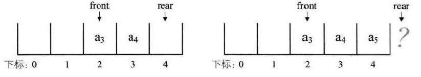

解决假溢出的办法是，创造一个头尾相接的顺序存储结构，这又被称为循环队列。队尾指针可以改为指向下标为0的位置，这样就不会溢出了：

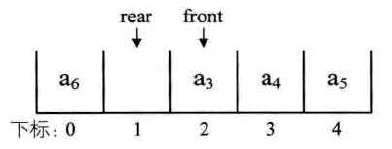

### 用数组实现队列

~~~java
//用数组实现队列，用三个值，一个值指示队列大小，其余两个指示队头和队尾，处理好指针移动到数组末尾的边界条件即可
class ArrayQueue{
	private int[] arr;
	private int begin;
	private int end;
	private int size;
	public ArrayQueue(int a){
		arr = new int[a];
		begin = 0;
		end = 0;
		size = 0;
	}
	
	public void offer(int a){
		if(size == arr.length){
			throw new IllegalStateException("超出容量？");
		}
		arr[end] = a;
		if(end == arr.length - 1){
			end = 0;
		}else{
			end++;
		}
		size++;
	}
	
	public int peek(){
		if(size == 0){
			throw new IllegalStateException("已经没有元素了");
		}
		return arr[begin];
	}
	
	public int poll(){
		if(size == 0){
			throw new IllegalStateException("已经没有元素了");
		}
		size--;
		if(begin == arr.length - 1){
			begin = 0;
			return arr[arr.length - 1];
		}else{
			begin++;
			return arr[begin-1];
		}
		
	}
}
~~~

### 滑动窗口

下面是一个基本的滑动窗口题型：找到无重复字符的最长子串

遍历字符串的每个位置，每次滑动窗口的左端前进一步，右端尽量扩展到最长的状态：

~~~java
class Solution {
    public int lengthOfLongestSubstring(String s) {
        // 哈希集合，记录每个字符是否出现过
        Set<Character> occ = new HashSet<Character>();
        int n = s.length();
        // 右指针，初始值为 -1，相当于我们在字符串的左边界的左侧，还没有开始移动
        int rk = -1, ans = 0;
        for (int i = 0; i < n; ++i) {
            if (i != 0) {
                // 左指针向右移动一格，移除一个字符
                occ.remove(s.charAt(i - 1));
            }
            while (rk + 1 < n && !occ.contains(s.charAt(rk + 1))) {
                // 不断地移动右指针
                occ.add(s.charAt(rk + 1));
                ++rk;
            }
            // 第 i 到 rk 个字符是一个极长的无重复字符子串
            ans = Math.max(ans, rk - i + 1);
        }
        return ans;
    }
}
~~~

有些情况下这样的模式做起来更简单：右端固定前进一位，左端在不满足条件的时候向右移动。例如下面的例子：

给定一个二进制数组 nums 和一个整数 k，如果可以翻转最多 k 个 0 ，则返回 数组中连续 1 的最大个数 。

~~~java
class Solution {
    public int longestOnes(int[] A, int K) {
        int N = A.length;
        int res = 0;
        int left = 0, right = 0;
        int zeros = 0;
        while (right < N) {
            if (A[right] == 0)
                zeros ++;
            while (zeros > K) {
                if (A[left++] == 0) 
                    zeros --;
            }
            res = Math.max(res, right - left + 1);
            right ++;
        }
        return res;
    }
}
~~~

有时还能遇到窗口大小固定的情况，例如下面的问题：

生成窗口最大值数组：

有一个整型数组arr和大小为w的窗口从数组的最左边滑到最右边，窗口每次向右滑动一个位置
对于数组：[4,3,5,4,3,3,6,7]，窗口大小为3，那么首次出现时窗口是：4,3,5，然后是3,5,4，直到最后窗口中是3,6,7
写一个方法，入参为数组arr和w，求一个大小为n-w+1的数组，这个数组代表每个位置下窗口中的最大元素，此时应该返回[5,5,5,4,6,7]

```java
	//设置了一个双向队列完成这个方法，每次从数组中取出新值观察队列队尾是不是比这个数大，如果大就加入队尾，否则从队尾
	//将数取出，然后继续检查队尾直至队列中为空或队尾比该数大，加入队尾
	//每次窗口移动有数要取出时，检查队头的数下标是不是过期，然后取出队头的数
	//这个队列实现了在减小数据量的时候时时刻刻能取出最大值，队列存的是数组中的下标
	public static int[] getMaxInWindow(int[] arr, int size){
		if(arr == null || arr.length < size || size <= 0){
			return null;
		}
		int[] newArr = new int[arr.length - size + 1];
		LinkedList<Integer> list = new LinkedList<Integer>();
		for(int i = 0; i < arr.length; i++){
			while(!list.isEmpty() && arr[list.peekLast()] <= arr[i]){
				list.pollLast();
			}
			list.addLast(i);
			if(list.peekFirst() == i - size){
				list.pollFirst();
			}
			if(i >= size - 1){
				newArr[i - size + 1] = arr[list.peekFirst()];
			}
		}
		return newArr;
	}
```

### 单调双端队列

单调双端队列和单调栈作用类似，它可以在动态保持队列内部的元素顺序，比单调栈更好的一点是：它可以从栈的底部将元素取出，有类似的需要时可以使用这种数据结构。

样例：给你一个整数数组 nums，有一个大小为 k 的滑动窗口从数组的最左侧移动到数组的最右侧。你只可以看到在滑动窗口内的 k 个数字。滑动窗口每次只向右移动一位。返回 滑动窗口中的最大值 （一个数组）。

~~~java
    public static int[] maxSlidingWindow(int[] nums, int k) {
        int[] result = new int[nums.length - k + 1];
        LinkedList<Integer> list = new LinkedList<>();
        for (int i = 0; i < nums.length; i++) {
            if (i >= k && list.getFirst() == nums[i - k]) {
                list.removeFirst();
            }
            while (!list.isEmpty() && nums[i] > list.getLast()) {
                list.removeLast();
            }
            list.add(nums[i]);
            if (i >= k - 1) {
                result[i - k + 1] = list.getFirst();
            }
        }
        return result;
    }
~~~

## 字符串

### 子序列

打印一个字符串所有的子序列，包括空串。

~~~java
	//打印一个字符串所有的子序列，包括空串
	
	//首先将字符串转化为字符数组，从第一个位置开始拼接字符串，每个位置都可以选择拼接当前位置字符形成新的字符串
	//也可以选择不拼接，这样直到最后一个位置就是一个子序列，每次记录下当前位置已形成的字符串和字符数组进行递归
	public static void printAllSub(String str){
		printAllSub(str.toCharArray(), 0, "");
	}
	
	private static void printAllSub(char[] ch, int location, String Str){
		if(location == ch.length){
			System.out.println(Str);
		}else{
			printAllSub(ch, location + 1, Str);
			printAllSub(ch, location + 1, Str + ch[location]);
		}
		
	}
~~~

### 全排列

打印一个字符串的全排列，要求不出现重复值

~~~java
	//打印一个字符串的全排列，要求不出现重复值
	
	//对于一个字符串abcd，先让首位置的字符a与各位置互换，产生：abcd、bacd、cbad、dbca
	//然后向下推进一个位置，继续互换，直至推进到最后一个位置直接打印
	//在整个递归过程中要传递的信息是当前的数组也就是顺序，还有就是推进的位置
	//每次建立一个set来查询要互换对应位置的字母有没有加入过set
	//用这种方式来避免产生重复值
	public static void printAllPermutations(String str){
		printAllPermutations(str.toCharArray(), 0);
	}
	
	private static void printAllPermutations(char[] charArray, int position){
		if(position == charArray.length){
			System.out.println(new String(charArray));
		}else{
			Set<Character> set = new HashSet<>();
			for(int j = position; j < charArray.length; j++){
				if(!set.contains(charArray[j])){
					set.add(charArray[j]);
					swap(charArray, j, position);
					printAllPermutations(charArray, position + 1);
					swap(charArray, j, position);
				}
			}
		}
	}
	
	private static void swap(char[] charArray, int begin, int end){
		char ch = charArray[begin];
		charArray[begin] = charArray[end];
		charArray[end] = ch;
	}
~~~

### Rabin-Karp字符串编码

对比两个字符串是否相等时，算法复杂度至少需要On。

Rabin-Karp字符串编码可以将字符串简化为一个数字，这样对比字符串就转换为了对比两个数字是否相等。若一个字符串由小写字母构成，那么该字符串可以表示为一个26进制数字，当该字符串更新变化时，对应数字也得到更新，这对判断变化中的字符串是否相等非常有好处，可以让将判断多个字符串相等的时间复杂度压缩在ON

在leetcode1044：最长重复子串中，可以用二分法来逐步算出最长子串的长度，难点在于如何快速在长度为N的字符串中，用固定大小的滑动窗口找到完全相同的两个子串，该问题就可以基于Rabin-Karp字符串编码来简化判断过程：

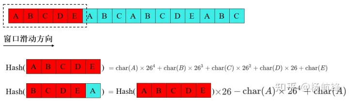

在滑动窗口移动期间，只需要O1的时间就可以判断下一个位置的字符串是否相同，大大缩短了算法耗时。

~~~java
	public String longestDupSubstring(String s) {
        Random random = new Random();
        int j1 = random.nextInt(75) + 26;
        int j2 = random.nextInt(75) + 26;
        int mod1 = random.nextInt(Integer.MAX_VALUE - 1000000007 + 1) + 1000000007;
        int mod2 = random.nextInt(Integer.MAX_VALUE - 1000000007 + 1) + 1000000007;

        int left = 1;
        int right = s.length() - 1;
        int length = 0;
        int startIndexResult = -1;
        while (left <= right) {
            int mid = left + (right - left) / 2;
            int startIndex = findStartIndex(s, mid, j1, j2, mod1, mod2);
            if (startIndex >= 0) {
                length = mid;
                startIndexResult = startIndex;
                left = mid + 1;
            } else {
                right = mid - 1;
            }
        }
        if (startIndexResult == -1) {
            return "";
        }
        return s.substring(startIndexResult, startIndexResult + length);
    }

    private int findStartIndex(String s, int length, int j1, int j2, int mod1, int mod2) {
        long sum1 = 0;
        long sum2 = 0;
        long num1 = 1;
        long num2 = 1;
        for (int i = length - 1; i >= 0; i--) {
            sum1 = (sum1 + (((s.charAt(i) - 'a') * num1) % mod1)) % mod1;
            sum2 = (sum2 + (((s.charAt(i) - 'a') * num2) % mod2)) % mod2;
            if (sum1 < 0) {
                sum1 += mod1;
            }
            if (sum2 < 0) {
                sum2 += mod2;
            }
            num1 = (num1 * j1) % mod1;
            num2 = (num2 * j2) % mod2;
        }
        Set<Long> set = new HashSet<>();
        set.add(sum1 * mod2 + sum2);
        for (int i = length; i < s.length(); i++) {
            sum1 = ((sum1 * j1) % mod1 - (s.charAt(i - length) - 'a') * num1 % mod1 + (s.charAt(i) - 'a')) % mod1;
            sum2 = ((sum2 * j2) % mod2 - (s.charAt(i - length) - 'a') * num2 % mod2 + (s.charAt(i) - 'a')) % mod2;
            if (sum1 < 0) {
                sum1 += mod1;
            }
            if (sum2 < 0) {
                sum2 += mod2;
            }
            if (set.contains(sum1 * mod2 + sum2)) {
                return i - length + 1;
            }
            set.add(sum1 * mod2 + sum2);
        }
        return -1;
    }
~~~

因为26进制数字可能会很大，所以这里采用对一个素数取余来得到long范围内的数字，进而可以判断是否重复。在上面的程序中，这个经典的素数是1000000007。既然取余，就有可能造成hash碰撞，为了减少碰撞概率，可以随机设置两种进制（26-100），再随机设置两种余数（1000000007到最大值），最终如果独立的两套编码值都相等，才认为是字符串相等，这样就大大降低了碰撞概率。

为了防止计算过程中出现计算溢出，程序中有多处细节处理：

* 采用long，而不是int
* 任何计算结果后面，都要取余，得到一个相对较小的数字，以保持后续计算过程顺利
* 有些情况下，计算表达式本身就有溢出危险，例如字符串编码值sum，相加后溢出就可以得到一个负数，此时要sum1 += mod1，来将其变为正数，它就相当于未溢出情况下的取余结果
* 程序中有一块溢出未作处理，那就是最终两套编码结果合一的时候：sum1 * mod2 + sum2，未处理是因为它的作用只是去重，并不是得到精确的计算结果，即使溢出也不会影响结果

### KMP算法

它起源于一个经典问题：给两个字符串a和b，如果a是b的子串返回起始位置，如果不是返回-1，要求时间复杂度M+N

若是用暴力解法，每个位置都重新匹配一遍，总的时间复杂度能达到Om*n

KMP算法能把字符串匹配的时间复杂度降低到Om+n

KMP算法能加速的原因：

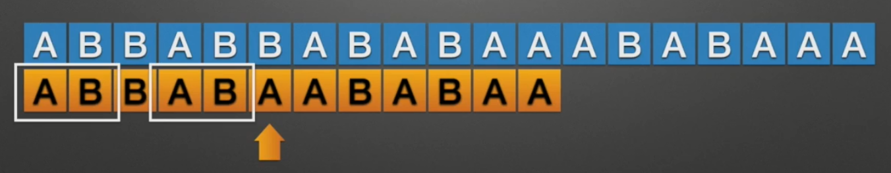

上图中指针位置字符产生不匹配，KMP不会将指针调整回到黄色匹配串的起始位置，而是根据当前位置的最长相等前后缀信息完成跳转：

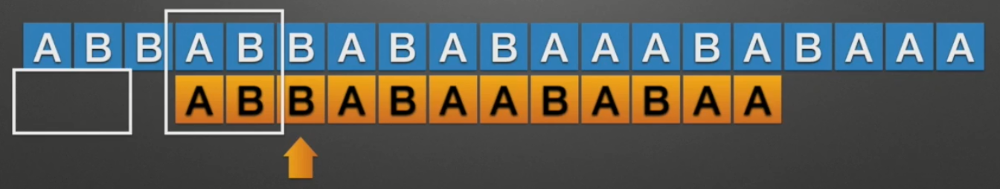

所以想利用KMP的加速原理，必须使用一个辅助数组，这个辅助数组dp[i]代表i位置前缀中前缀相等区和后缀相等区相同的最大长度（最长相等前后缀）。

下面举一个例子来说明辅助数组的构造过程，例如当i是最后一位时，求dp[i]：

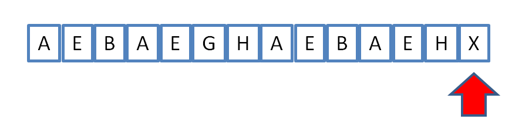

显而易见的是，如果arr[n-1]=arr[dp[i-1]]，有dp[i]=dp[i-1]+1，也就是说前一个位置组成的最长前后缀信息是否能延续，取决于特定两个位置的值是否相同：

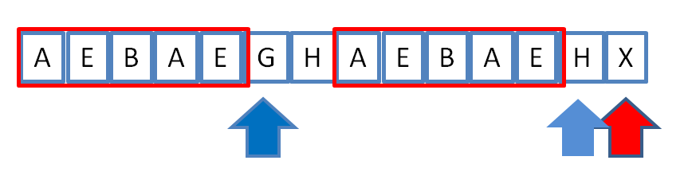

但是G和H不相等，无法达成dp[i]=dp[i-1]+1，只能继续寻找最长前后缀，凑不成长度为6的最长前后缀，剩下的前后缀中只能是红框AEBAE的子集，故转而关于G位置的最长前后缀，令key=dp[dp[i-1]]=2，观察以下这两个位置是否相等：

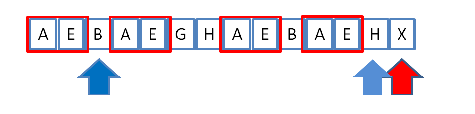

如果此时B=H，即arr[key]= arr[n-1]，就有dp[i]=key+1，如果B不等于H，那么再继续重新赋值key，直到key为0为止，这是一个特殊的动态规划过程

代码实现：

~~~java
	//KMP算法：给两个字符串a和b，如果a是b的子串返回起始位置，如果不是返回-1
	
	//得到辅助数组开始遍历，设置i和j分别指向字符数组a和b，向前推进的过程中如果对应位置字符相同就前进
	//如果不同就将i刷新为辅助数组对应i号位的位置继续前进，此时j不变
	//还需要注意如果在辅助数组的首位值是-1，跳转的值-1是非法的，故此时直接将j增1
	//此时一定是i和j处于0位置
	//最后一定i与j会有一个越界，如果j越界就说明检查完成，如果i越界就说明检查失败
	public static int KMP(String str1, String str2){
		if(str1 == null || str2 == null || str1.length() < 1 || str2.length() < str1.length()){
			return -1;
		}
		char[] a = str1.toCharArray();
		char[] b = str2.toCharArray();
		int[] numArray = getIntArray(a);
		int i = 0;
		int j = 0;
		while(i <= b.length - 1 && j <= a.length - 1){
			if(a[j] == b[i]){
				i++;
				j++;
			}else if(a[j] != b[i] && numArray[j] < 0){
				i++;
			}else{
				j = numArray[j];
			}
		}
		return (j == a.length ? (i - a.length) : -1);
	}
	
	//获得算法的辅助数组，这个辅助数组大小与传入数组相同，该int数组与char数组一一对应
	//加入char数组是这样的abcdefgabck,计算k对应位置的int数组就是3，为前缀相等区abc和后缀相等区abc的长度
	//这个长度就是3，且该长度为可能的最大长度（对应上面这个例子不能是10，不能两个串都包含所有前缀），
	//该int数组的0号位人为规定为-1，1号位人为规定为0（因为1号位前不存在前缀后缀，因为该前缀后缀在同一位置）
	private static int[] getIntArray(char[] b){
		if(b.length <= 0){
			return null;
		}else if(b.length == 1){
			return new int[]{-1};
		}
		int[] arr = new int[b.length];
		arr[0] = -1;
		arr[1] = 0;
		int key = 0, i = 2;
		while(i < b.length){
			//如果相等说明数组的值就是前一位的值加1
			if(b[key] == b[i - 1]){
				arr[i++] = ++key;
			//key大于0说明还有优化的空间，继续向前跳
			}else if(key > 0){
				key = arr[key];
			}else{
				//失去了匹配的可能，赋值为0
				arr[i++] = 0;
			}
		}
		return arr;
	}
~~~

为什么说KMP的时间复杂度能做到Om+n？，在上面的代码中，疑问主要集中在辅助数组的构造getIntArray方法上，该方法有一个双重循环，乍一看它的时间复杂度做不到Om，但是仔细分析while循环中各语句的总执行次数，可以发现：

* b[key] == b[i - 1]这一句会让key增加
* key = arr[key];这一句会让key降低

所以b[key] == b[i - 1]这一句最多能执行m次，所以key = arr[key]这一句也至多能执行m次，也就是说它造成的多余循环次数最多只有m，故时间复杂度最大为O2m=Om

详细解析辅助数组生成的代码：

~~~java
	private static int[] getHelper(String str) {
        char[] arr = str.toCharArray();
        int[] dp = new int[arr.length];
        if (arr.length == 1) {
            return new int[]{-1};
        } else if (arr.length == 2) {
            return new int[]{-1, 0};
        }
        dp[0] = -1;
        dp[1] = 0;
        int posi = 2;
        int key = dp[posi - 1];
        while (posi < dp.length) {
            if (arr[posi - 1] == arr[key]) {
                dp[posi++] = key + 1;
                key++;
            } else if (key > 0) {
                key = dp[key];
            } else {
                dp[posi++] = 0;
            }
        }
        return dp;
    }
~~~

辅助数组对于第一个位置是特殊值-1，其余匹配不上的值都是0。虽然辅助数组生成的过程比较容易理解，但代码却不容易实现，按照上面的思路，循环部分代码很有可能写成这样：

~~~java
		int posi = 2;
        while (posi < dp.length) {
            if (arr[posi - 1] == arr[dp[posi - 1]]) {
                dp[posi] = dp[posi - 1] + 1;
            } else {
                int key = dp[dp[posi - 1]];
                while (key > 0) {
                    if (arr[key] == arr[posi - 1]) {
                        dp[posi] = key + 1;
                    } else {
                        key = dp[key];
                    }
                }
                ...
            }
        }
~~~

然后就很难写下去了，因为dp[posi] = key + 1;这一行结束之后，要跳出两层循环才可以，一般的语法无法完成这样的转换。观察代码可以发现else分支不必嵌套循环，而是只需要将key值提取出来，直接进入下次一次循环即可，所以代码将key专门提取出来，简化了表达形式。

而对于KMP主函数的逻辑，就更加复杂一些：

~~~java
	public static int strStr(String haystack, String needle) {
        int[] helper = getHelper(needle);
        int posi = 0;
        int needlePosi = 0;
        while (posi < haystack.length() && needlePosi < needle.length()) {
            if (haystack.charAt(posi) == needle.charAt(needlePosi)) {
                posi++;
                needlePosi++;
            } else if (helper[needlePosi] >= 0) {
                needlePosi = helper[needlePosi];
            } else {
                needlePosi = 0;   // 这一行是废的，走到这里needlePosi必是0
                posi++;
            }
        }
        if (needlePosi == needle.length()) {
            return posi - needle.length();
        }
        return -1;
    }
~~~

首先，如果两个字符串互相匹配成功，则两个指针自然向前，这段代码是易于理解的：

~~~java
if (haystack.charAt(posi) == needle.charAt(needlePosi)) {
    posi++;
    needlePosi++;
}
~~~

如果不相等的时候，又分为两种情况讨论，第一种情况是两个字符串的首字母不同的时候，此时只需要posi++，下面是对应的例子：（蓝色代表匹配的位置，红色代表蓝色箭头移动的下一个位置）

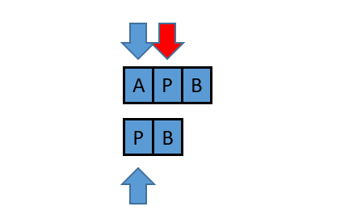

首字母不同必然有needlePosi=0，也必然有helper[needlePosi]<0

第二种情况是两个字符串已经匹配了一段距离，然后在某个位置（不是第0号位）出现不相等的情况：

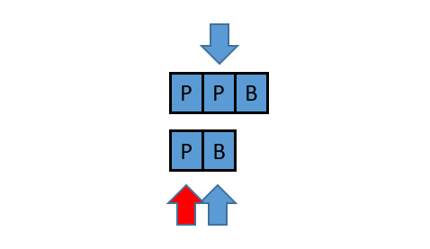

此时posi不动，只需要将needlePosi调整到0即可，特别地，当可以加速的时候，needlePosi可以调整到helper[needlePosi]完成加速。

总而言之，整个过程中主字符串的指针posi总是增加，不会减少。而被检索的字符串指针总是在不断增加和减少。

### manacher算法

manacher算法：求一个字符串中最大回文子串长度，要求时间复杂度On

~~~java
	//首先用transfer方法先加工字符串，因为回文子串在延伸时存在偶串难以延伸的困难，所以要把每个字符之间加入一个‘#’
	//如aaabbbccc加工结束之后变为#a#a#a#b#b#b#c#c#c#
	//这样处理过的串一定是奇数串，延伸检查回文方便
	//定义一些变量，dia回转直径数组，nowPos目前最大右边界，core最大右边界对应的最左中心
	//基本计数i、目前最大回转直径maxDia、目前最大回转直径对应中心maxCore
	
	//开始遍历，遍历结束应该是最大右边界抵达数组末尾，此时如果有的位置直径还没有确定也不会出现更大的直径了
	//此时最大直径已经计算出来了
	//如果i > nowPos，说明当前位置在最大右边界外，此时扩展寻找最大回文
	//如果i <= nowPos 且dia[2 * core - i] - 1)/2 + i ) > nowPos
	//说明当前i位置相对core位置的对称点的直径扩展到了当前直径之外，此时i点的半径就是从i到nowPos
	//如果i <= nowPos 且dia[2 * core - i] - 1)/2 + i ) < nowPos
	//说明当前i位置相对core的对称点直径还在当前直径以内，此时对称 点的直径就是i点的直径
	//如果如果i <= nowPos 且dia[2 * core - i] - 1)/2 + i ) = nowPos
	//此时i点的回文直径至少是2 * (nowPos - i) + 1，还需向外延伸继续确定真正的直径
	public static String manacher(String str){
		String str1 = transfer(str);
		char[] charArray = str1.toCharArray();
		int[] dia = new int[str1.length()];
		int nowPos = -1, core = -1, i = 0, k, maxDia = Integer.MIN_VALUE, maxCore = Integer.MIN_VALUE;
		while(nowPos < dia.length - 1){
			if(i > nowPos || (i <= nowPos && ((dia[2 * core - i] - 1)/2 + i ) == nowPos)){
				k = i > nowPos ? 1 : nowPos - i;
				while((i + k) < charArray.length && (i - k) >= 0 && charArray[i + k] == charArray[i - k]){
					k++;
				}
				//如果最右边界没有更新core的位置就不更新
				core = nowPos < i + k - 1 ? i : core;
				//nowPos = Math.max(nowPos, i + k - 1);
				nowPos = i + k - 1;
				dia[i] = 2 * k - 1;
			}else if(((dia[2 * core - i] - 1)/2 + i ) > nowPos){
				dia[i] = 2 * (nowPos - i) + 1;
			}else if(((dia[2 * core - i] - 1)/2 + i ) < nowPos){
				dia[i] = dia[2 * core - i];
			}
			maxCore = maxDia < dia[i] ? core : maxCore;
			//每次记录下当前最大直径
			maxDia = Math.max(maxDia, dia[i++]);
		}
		maxCore = (maxCore - maxDia/2 + 1)/2;
		//当前最大直径除以2就是原字符串的直径（因为原来的字符串是处理过的）
		return str.substring(maxCore, maxCore + maxDia/2);
	}
	
	private static String transfer(String str){
		if(str == null || str.length() == 0){
			return null;
		}
		char[] charArray = str.toCharArray();
		char[] newCharArr = new char[charArray.length * 2 + 1];
		int k = 0;
		for(int i = 0; i < charArray.length; i++){
			newCharArr[k++] = '#';
			newCharArr[k++] = charArray[i];
		}
		newCharArr[k] = '#';
		return new String(newCharArr);
	}
~~~

# 树

## 定义

树是n(n>=0)个结点的有限集。n=0时称为空树。在任意一课非空树中：

* 有且仅有一个特定的称为根Root的结点
* 当n>1时，其余结点可分为m(m>0)个互不相交的有限集T1/T2/.../Tm，其中每一个集合本身又是一棵树，并且称为根的子树

如下图所示：

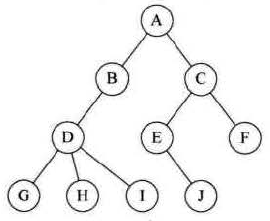

树的定义用到了递归的方法，也就是在树的定义中还用到了树的概念。下图就是根结点A的子树：

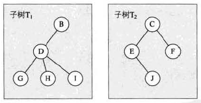

在树的定义中，有两个关键的地方：

* 根结点是唯一的，不可能存在多个根结点
* 子树的个数没有限制，但是它们一定是互不相交的。下面这种相交的子树就不符合树的定义：

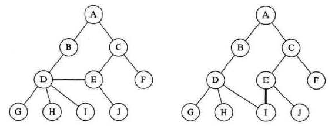

## 相关概念

树的结点包含一个数据元素，及若干指向其子树的分支。

结点拥有的子树数称为结点的度（Degree）。度为0的结点称为叶结点Leaf或终端结点；度不为0的结点称为非终端结点或分支结点。

除了根结点之外，分支结点也称为内部结点。树的度是树内各结点的度的最大值

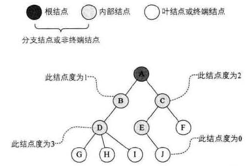

结点的子树的根称为该结点的孩子Child，相对应的该结点称为孩子的双亲Parent。

同一个双亲的孩子之间互称兄弟Sibling。

结点的祖先是从根到该结点所经分支上的所有结点，反之，以某结点为根的子树中的任一结点都称为该结点的子孙

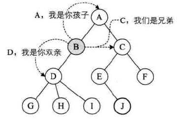

结点的层次Level从根开始定义起，根为第一层，根的孩子为第二层。若某结点在第N层，则其子树的根就在第N+1层。

其双亲在同一层的结点互为堂兄弟。

树中结点的最大层次称为树的深度或高度，下面这棵树深度为4：

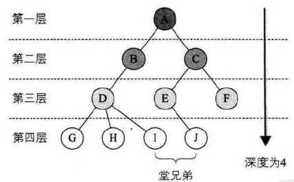

如果将树中结点的各子树看成从左到右是有次序的，不能互换的，则称该树为有序树，否则称为无序树。

森林是m（m>=0）颗互不相交的树的集合。这个树的集合也可以是同一颗树下不同子树的集合。

## 存储结构

### 双亲表示法

树除了根结点以外，其余每个结点都有自己的双亲。所以双亲表示法的树结点是由两部分组成：数据域data+指针域parent。这里的指针域是存储双亲结点在结点数组中的位置，一个树结构就由一个结点数组表示。

根结点由于没有双亲，所以它的parent值是-1。下面就是一个双亲表示的例子：

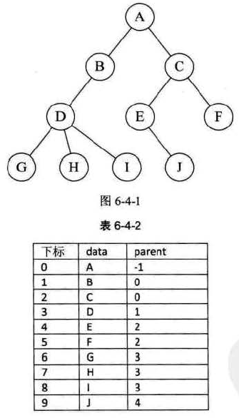

这样的存储结构，可以根据结点的parent指针很容易找到它的双亲结点，但是如果要知道结点的孩子是什么，需要遍历整个结构才行，此时我们可以给结点结构增加一个结点最左边孩子的域，称为长子域，没有孩子的结点就将该值设置为-1。如果很关注各兄弟之间的关系，还可以增加一个右兄弟域。

### 孩子表示法

这种表示方法下，每个结点有多个指针域，其中每个指针指向一颗子树的根结点，这种方法也叫多重链表表示法。

由于每个树结点的度不同，可以细分为下面两种方法解决：

* 树结点结构中，指针域的个数就等于树的度。这样在树种各结点的度相差很大时，是比较浪费空间的
* 按需分配，设计一个字段代表本节点子结点的数量，也就是指针域的个数

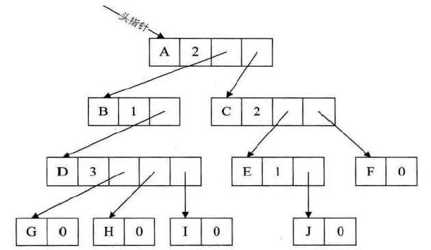

还有一种思路，把每个结点放到一个顺序存储结构的数组中，然后给每个结点的孩子建立一个单链表：

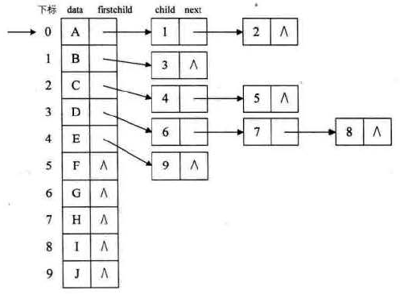

这种表示方法遍历起来、找兄弟结点很简单，但是知道某个结点的双亲是谁比较麻烦，所以可以额外给数组结点额外增加一个parent指针：

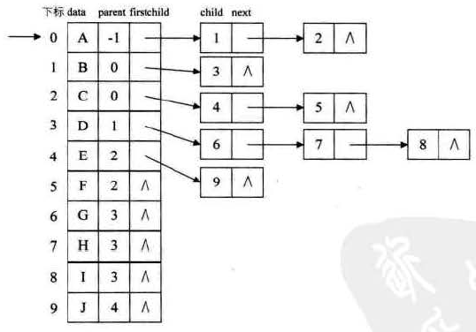

这种表示方法也被称为双亲孩子表示法。

### 孩子兄弟表示法

观察一棵树发现：任意一棵树，它的结点的第一个孩子如果存在就是唯一的，它的右兄弟如果存在也是唯一的。因此我们设置两个指针，分别指向该结点的第一个孩子和此结点的右兄弟。

这种表示方法的结点结构由三部分组成：数据域+第一个孩子的指针+右兄弟的指针

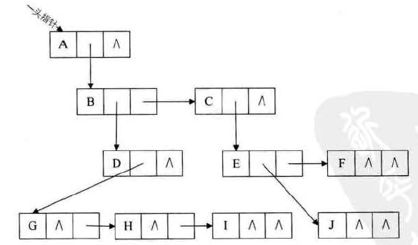

这种表示法查找某个节点的双亲也是比较麻烦的，所以我们可以给结点增加一个parent指针。

这个表示法最大的好处就是将一颗复杂的树变成了一颗二叉树。

## 二叉树的定义

二叉树是n(n>=0)个结点的有限集合，该集合或者为空集（空二叉树），或者由一个根结点和两棵互不相交的、分别称为根结点的左子树和右子树的二叉树组成。

在定义中需要注意：

* 每个结点最多有两棵子树，所以二叉树中不存在度大于2的结点
* 左子树和右子树是有顺序的，不能颠倒，即使结点只有一棵子树，也要区分它是左子树还是右子树

几种特殊的二叉树：

* 斜树

  所有的结点都只有左子树的二叉树叫左斜树；所有的结点都只有右子树的二叉树叫右斜树，这两者统称为斜树。

  斜树的特点就是每层只有一个结点，结点的个数与二叉树的深度相同。其实斜树就是树退化为线性表的形式。

* 满二叉树

  一棵二叉树中，如果所有分支结点都存在左子树和右子树，并且所有叶子都在同一层上，它就是满二叉树。

  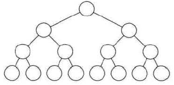

  满二叉树的特点：

  * 叶子只能出现在最后一层
  * 2、非叶子结点的度一定是2
  * 3、在同样深度的二叉树，满二叉树的结点个数最多，叶子数最多

* 完全二叉树

  对一棵具有n个结点的二叉树按层序编号，如果编号为i的结点与同样深度的满二叉树中编号为i的结点在二叉树中位置完全相同，则这棵二叉树称为完全二叉树。

  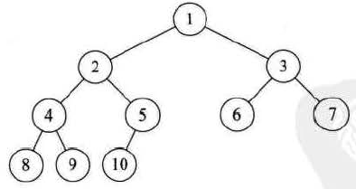

  满二叉树一定是一棵完全二叉树，但完全二叉树不一定是满的。

  完全二叉树的一些特点：

  * 叶子结点只能出现在最下两层
  * 最下层的叶子一定集中在左部连续位置
  * 倒数第二层的叶子结点一定在右部连续位置
  * 如果结点度为1，则该结点只有左孩子，不存在只有右子树的情况
  * 同样结点数的二叉树，完全二叉树的深度最小

## 二叉树的性质

二叉树的重要性质：

* 在二叉树的第i层上，至多有2的i-1次方个结点（i>=1）
* 深度为k的二叉树，总的结点数至多有(2的k次方) - 1个结点（k>=1）
* 对任意一棵二叉树，如果叶子结点数为n（度为0的结点），度为2的结点数为m，则n=m+1
* 具有n个结点的完全二叉树的深度为[logn] + 1 （其中，log是以2为底的，[x]代表不大于x的最大整数）

还有一条性质是针对完全二叉树的。

对于一棵有n个结点的完全二叉树，结点按层序编号，对任一结点i有以下规律：

* 如果i=1，则它是根结点
* 如果i>1，则其双亲是结点[i/2]
* 如果2i>n，则结点i无左孩子，此时结点i是叶子结点；2i<=n时，其左孩子是结点2i
* 如果2i+1>n，则结点无右孩子；如果2i+1<=n，此时其右孩子结点是2i+1

对比下面这张图可以和规律一一对比：

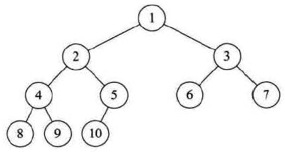

### 寻找后继结点

在二叉树中找到一个结点的后继结点（后继结点就是在中序遍历中某个结点后面的结点就是该节点的后继结点）。假设该node有一个指向父节点的指针，根节点该指针指向null。

解决方法：分为两种情况考虑：

* 如果这个结点有右结点，那么后继结点就是右子树的最左结点
* 如果这个结点没有右结点，那么如果能一直向上找到这样一个结点：该节点的父节点的左孩子是该节点，那么后继结点就是该节点的父节点

~~~java
	class ParentNode{
		ParentNode left;
		ParentNode right;
		ParentNode parent;
		int val;
		ParentNode(int val){
			this.val = val;
		}
	}
	
	public static ParentNode getSuccessorNode(ParentNode node){
		if(node == null){
			return null;
		}
		if(node.right != null){
			return findMostLeftNode(node);
		}else{
			return findnextNode(node);
		}
	}
	
	private static ParentNode findMostLeftNode(ParentNode node){
		ParentNode currentNode = node.right;
		while(currentNode.left != null){
			currentNode = currentNode.left;
		}
		
		return currentNode;
	}
	
	private static ParentNode findnextNode(ParentNode node){
		ParentNode currentNode = node;
		ParentNode parentNode = node.parent;
		while(parentNode != null && parentNode.left != currentNode){
			currentNode = parentNode;
			parentNode = currentNode.parent;
		}
		
		return parentNode;
	}
~~~

### 判断完全二叉树

判断一棵树是不是完全二叉树

具体解决方案是：在二叉树的层序遍历中，如果一个结点只有右结点没有左结点直接返回false，如果一个结点没有孩子结点或者有左结点没有右结点，那么之后的结点必须都是叶子节点，否则不是完全二叉树。层序遍历走到结束还没有出现异常现象就返回true

~~~java
	public static boolean isCBT(BinaryNode<Integer> root){
		
		Queue<BinaryNode<Integer>> queue = new LinkedList<BinaryNode<Integer>>();
		queue.offer(root);
		boolean flag = false;
		while(!queue.isEmpty()){
			BinaryNode<Integer> node = queue.poll();
			if(node.left == null && node.right != null){
				return false;
			}
			if(flag && !(node.left == null && node.right == null)){
				return false;
			}
			if(node.left != null){
				queue.offer(node.left);
			}
			if(node.right != null){
				queue.offer(node.right);
			}else{
				flag = true;
			}
		}
		
		return true;
	}
~~~

本问题还有一个思路是给树结点编号，结点若是k，则左孩子一定是2k，右孩子一定是2k+1，按照这样的规律，完全二叉树的节点一定是一个递增的序列。

### 完全二叉树结点数

求完全二叉树结点数：

~~~java
	//先一直向左结点延伸，求树的深度
	//然后观察结点的右结点，求右结点的深度，如果右结点的深度与当前层数之和等于树的深度
	//说明结点的左子树是一颗满二叉树，总结点个数就等于左子树个数+1+当前结点总个数
	//如果不等于说明右子树是一颗满二叉树，转而求左子树结点个数
	//已知树是满二叉树再知道树的深度可以直接求得结点数
	
	//该算法的时间复杂度分析：每层遍历一个结点，共logn次，每次遍历要求该节点的深度，平均次数logn/2
	//时间复杂度为ologn方
	public static int nodeNum(BinaryNode<Integer> root){
		if(root == null){
			return 0;
		}
		return nodeNum(root, 1, getLength(root));
	}
	
	private static int nodeNum(BinaryNode<Integer> node, int level, int sumLength){
		
		if(node.left == null && node.right == null){
			return 1;
		}
		int length = getLength(node.right);
		if(length + level != sumLength){
			return (1 << length) + nodeNum(node.left, level + 1, sumLength);
		}else{
			return (1 << length) + nodeNum(node.right, level + 1, sumLength);
		}
		
	}
	
	private static int getLength(BinaryNode<Integer> node){
		BinaryNode<Integer> currentNode = node;
		int sumLength = 0;
		while(currentNode != null){
			sumLength++;
			currentNode = currentNode.left;
		}
		return sumLength;
	}
~~~


## 二叉树的存储结构

二叉树的存储结构可以分为顺序存储结构和链式存储结构。

二叉树的顺序存储结构其实就是用一维数组存储二叉树中的结点，一棵完全二叉树的存储：

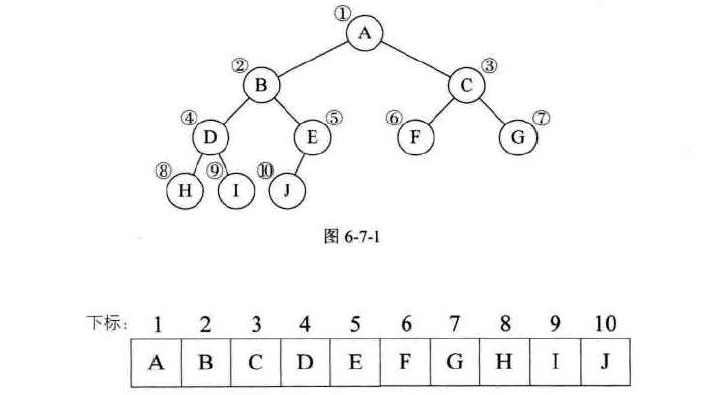

由于完全二叉树的优越性，顺序结构也可以完美的表示二叉树。对于一般的二叉树用顺序结构保存则有浪费，顺序存储结构一般只用于完全二叉树。

二叉树用链式存储结构保存时，给每个结点设置一个数据域和两个指针域，分别指向两个孩子。如果有需要，还可以增加一个parent指针：

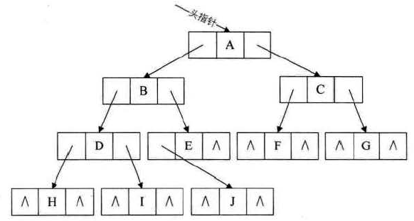

## 遍历二叉树

主要的几种遍历方式：

* 前序遍历

  先访问本节点，然后前序遍历左子树，再前序遍历右子树。如下图二叉树的前序遍历结果是ABDGHCEIF

  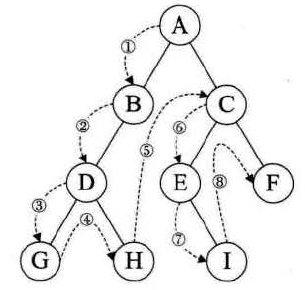

* 中序遍历

  先中序遍历左子树，然后访问本结点，最后中序遍历右子树。如下图遍历的顺序是GDHBAEICF

  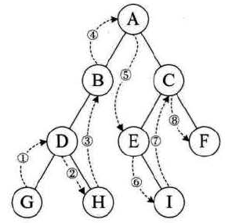

* 后序遍历

  以从左到右，先叶子后结点的方式，遍历访问左右子树，最后访问本结点。如下图遍历的顺序是GHDBIEFCA

  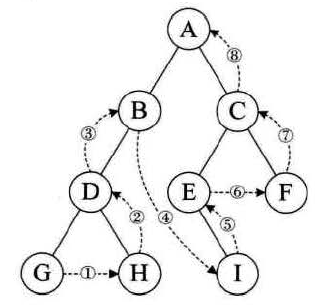

* 层序遍历

  从树的第一层开始，从上而下逐层遍历。在同一层中，按从左到右的顺序遍历。如下图的遍历顺序为ABCDEFGHI

  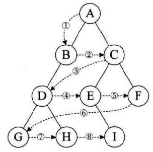

已知前序遍历和中序遍历序列，可以唯一确定一棵二叉树

已知后序遍历和中序遍历序列，可以唯一确定一棵二叉树

前面的几种遍历方式都需要额外空间复杂度，有一种morris遍历实现二叉树的前中后序遍历不需要额外空间复杂度

### 前中后序递归版

~~~java
	//树的前中后序遍历
	//实际上这三种遍历访问结点的顺序都是一致的，每个节点都会被访问3次
	//首次访问结点，左子树结束回到本节点，右子树结束回到本节点
	//前序遍历就是在这个唯一序列里各节点首次出现的序列，中序遍历是第二次出现的序列
	//后序遍历就是序列中最后一次出现的序列
	public static void preOrderRecur(BinaryNode<Integer> node){
		if(node == null){
			return;
		}
		
		System.out.print(node.element+" ");
		preOrderRecur(node.left);
		preOrderRecur(node.right);
	}
	public static void inOrderRecur(BinaryNode<String> node){
		if(node == null){
			return;
		}
		
		inOrderRecur(node.left);
		System.out.print(node.element+" ");
		inOrderRecur(node.right);
	}
	public static void posOrderRecur(BinaryNode<Integer> node){
		if(node == null){
			return;
		}
		
		posOrderRecur(node.left);
		posOrderRecur(node.right);
		System.out.print(node.element+" ");
	}
~~~

### 前序遍历非递归版

树的前序遍历非递归版：建立一个栈，先把根节点压入，弹出每一个节点并将它的右结点、左结点依次压栈，直至栈为空

~~~java
	//压中-》压左-》压右
	public static void preOrderUnRecur(BinaryNode<Integer> root){
		BinaryNode<Integer> node = root;
		if(node != null){
			Stack<BinaryNode<Integer>> stack = new Stack<>();
			stack.push(node);
			while(!stack.isEmpty()){
				node = stack.pop();
				System.out.print(node.element + " ");
				if(node.right != null){
					stack.push(node.right);
				}
				if(node.left != null){
					stack.push(node.left);
				}
			}
		}
	}
~~~

### 中序遍历非递归版

树的中序遍历非递归版：建立一个栈，每次将结点及其左边一列全部压入，然后将右结点压入栈中

每次循环把判断限制在node上，为空弹栈并向右移动，不为空则压栈向左移动

~~~java
	//压左-》压中-》压右
	public static void inOrderUnRecur(BinaryNode<Integer> root){
		BinaryNode<Integer> node = root;
		if(node != null){
			Stack<BinaryNode<Integer>> stack = new Stack<>();
			while((!stack.isEmpty()) || node != null){
				if(node != null){
					stack.push(node);
					node = node.left;
				}else{
					node = stack.pop();
					System.out.print(node.element + " ");
					node = node.right;
				}
			}
		}
	}
~~~

### 后续遍历非递归版

~~~java
	//树的后序遍历非递归版，代码与树的前序遍历非递归版很像，前序是压中-》压左-》压右
	//这里仅仅调整了压入的顺序，改为了压中-》压右-》压左
	//然后把每次的结果再次压入一个栈中再取出
	//最后就能达到后序遍历的效果
	
	//压左-》压右-》压中
	public static void posOrderUnRecur(BinaryNode<Integer> root){
		BinaryNode<Integer> node = root;
		Stack<Integer> intStack = new Stack<>();
		if(node != null){
			Stack<BinaryNode<Integer>> stack = new Stack<>();
			stack.push(node);
			while(!stack.isEmpty()){
				node = stack.pop();
				intStack.push(node.element);
				if(node.left != null){
					stack.push(node.left);
				}
				if(node.right != null){
					stack.push(node.right);
				}
			}
		}
		
		while(!intStack.isEmpty()){
			System.out.print(intStack.pop() + " ");
		}
	}
~~~

### 层序遍历

层序遍历采用BFS，借助队列完成：

~~~java
    public List<List<Integer>> levelOrder(TreeNode root) {
        List<List<Integer>> result = new ArrayList<>();
        if (root == null) {
            return result;
        }
        Queue<TreeNode> queue = new LinkedList<>();
        queue.offer(root);
        int num = 1;
        while (!queue.isEmpty()) {
            List<Integer> list = new ArrayList<>();
            int size = queue.size();
            for (int i = 0; i < size; i++) {
                TreeNode node = queue.poll();
                list.add(node.val);
                if (node.left != null) {
                    queue.offer(node.left);
                }
                if (node.right != null) {
                    queue.offer(node.right);
                }
            }
            result.add(list);
        }
        return result;
    }
~~~

## 二叉树的建立

将二叉树的每个结点的空指针都引出一个虚节点，其值为一个特定值，比如#，这种处理后的二叉树为原二叉树的扩展二叉树。扩展二叉树就可以做到一个遍历序列确定一棵二叉树了，例如下面的树，前序遍历序列就是AB#D##C##

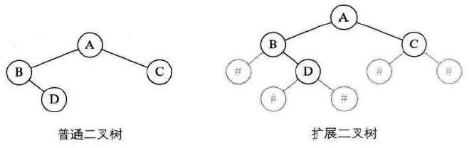

用这个前序遍历的序列就能在内存中生成一棵二叉树了。

序列化还有其他的用处，例如判断一个树是否是另一个树的子树时，可以判断树A的序列化字符串是否是B的字符串的一部分，如果是就代表是子树。

### 用单调栈建立树

下面看一个问题：把一个不含重复元素的数组转换为一颗二叉树，这颗二叉树节点都比它的子节点大，要求构造过程中用的时间复杂度和额外空间复杂度都不超过ON。

要生成这样一棵树要按下列的原则进行建立：每个元素的父节点都是它左边遇见的第一个比它大的数和右边第一个比它大的数

按这样的原则建立树可以构造一颗唯一确定的二叉树，确定了思路之后用单调栈来解决：

~~~java
	//要生成这样一棵树要按下列的原则进行建立：每个元素的父节点都是它左边遇见的第一个比它大的数和右边第一个比它大的数
	//的较小值，如果一个节点是数组中的最大值那么它就是最大值
	//按这样的原则建立树可以构造一颗唯一确定的二叉树
	//如果一个节点有两个左节点那么肯定会导出矛盾的结果
	//确定了思路之后用单调栈来解决
	public static BinaryNode<Integer> getTree(int[] arr){
		Stack<Integer> stack = new Stack<Integer>();
		HashMap<Integer, BinaryNode<Integer>> map = new HashMap<Integer, BinaryNode<Integer>>();
		for(int i = 0; i < arr.length; i++) {
			map.put(arr[i], new BinaryNode<Integer>(arr[i]));
		}
		for(int i = 0; i < arr.length; i++) {
			while((!stack.isEmpty()) && arr[i] > stack.peek()) {
				int num = stack.pop();
				int next = stack.isEmpty() ? Integer.MAX_VALUE : stack.peek();
				if(next > arr[i]) {
					map.get(arr[i]).left = map.get(num);
				}else {
					map.get(next).right = map.get(num);
				}
			}
			stack.push(arr[i]);
		}
		while(!stack.isEmpty()) {
			int num = stack.pop();
			if(!stack.isEmpty()) {
				map.get(stack.peek()).right = map.get(num);
			}else {
				return map.get(num);
			}
		}
		return null;
	}
~~~

### 先序遍历序列化

先序遍历序列化分为递归方式和非递归方式：

~~~java
	//序列化
	//用一个字符串表示一个二叉树，每个节点之间用！隔开，#代表空节点，所有的有值结点的左右孩子都要遍历到
	//组成的字符串就可以代表一个二叉树，顺序是中-》左-》右
	public static String serialByPre(BinaryNode<Integer> root){
		String str = new String();
		if(root == null){
			return "#!";
		}
		str = str + root.element + "!";
		str = str + serialByPre(root.left);
		str = str + serialByPre(root.right);
		return str;
	}
	//序列化先序非递归
	public static String preXu(BinaryNode<Integer> node){
		String str = "";
		if(node != null){
			Stack<BinaryNode<Integer>> stack = new Stack<BinaryNode<Integer>>();
			stack.push(node);
			while(!stack.isEmpty()){
				node = stack.pop();
				if(node == null){
					str = str + "#!";
				}else{
					str = str + node.element + "!";
				}
				if(node != null){
					stack.push(node.right);
					stack.push(node.left);
				}
			}
		}
		return str;
	}
~~~

对应的反序列化方式：

~~~java
	//反序列化:先序遍历
	
	//将字符串用！分成字符串数组，依次装入队列中，传入递归函数
	//在递归函数中将队列的值弹出，如果是#则返回，否则创建节点，递归左结点和右结点
	//如果不借助队列，那么递归数组需要传入数组和下标，现在装入队列后直接传递队列的参数即可
	public static BinaryNode<Integer> reconByPreString(String str){
		if(str.equals("#")){
			return null;
		}
		
		String[] strArray = str.split("!");
		Queue<String> queue = new LinkedList<String>();
		for(int i = 0; i < strArray.length; i++){
			queue.offer(strArray[i]);
		}
		return reconByPreString(queue);
	}
	
	public static BinaryNode<Integer> reconByPreString(Queue<String> queue){
		
		if(!queue.isEmpty()){
			String str = queue.poll();
			if(str.equals("#")){
				return null;
			}else{
				BinaryNode<Integer> node = new BinaryNode<Integer>(new Integer(str));
				node.left = reconByPreString(queue);
				node.right = reconByPreString(queue);
				return node;
			}
		}
	
		return null;
	}
~~~

### 层序遍历序列化

层序遍历序列化其实就是改造了树的层序遍历：

~~~java
	//序列化：层序遍历
	
	//创建一个队列来记录左右结点的次序
	//让根节点入队列，判断出队列的结点左右孩子结点是否为空，如果不为空打印入栈，为空直接加#！
	public static String serialByLevel(BinaryNode<Integer> root){
		String str = new String();
		if(root == null){
			return "#!";
		}
		
		Queue<BinaryNode<Integer>> queue = new LinkedList<>();
		queue.offer(root);
		str = str + root.element + "!";
		while(!queue.isEmpty()){
			BinaryNode<Integer> node = queue.poll();
			if(node.left != null){
				str = str + node.left.element + "!";
				queue.offer(node.left);
			}else{
				str = str + "#!";
			}
			
			if(node.right != null){
				str = str + node.right.element + "!";
				queue.offer(node.right);
			}else{
				str = str + "#!";
			}
		}
		
		return str;
	}
~~~

对应的反序列化方式：

~~~java
	//反序列化：层序遍历
	
	//创建一个队列记录一层结点的次序
	//先将根节点入队列，每次出对列就根据数组创建自己的左右孩子，并判断他们是否为空，如果不为空就加入队列
	public static BinaryNode<Integer> reconByLevelString(String str){
		
		int i = 0;
		String[] strArray = str.split("!");
		BinaryNode<Integer> root = createNode(strArray[i++]);
		BinaryNode<Integer> node;
		Queue<BinaryNode<Integer>> queue = new LinkedList<>();
		if(root != null){
			queue.offer(root);
		}
		
		while(!queue.isEmpty()){
			node = queue.poll();
			node.left = createNode(strArray[i++]);
			node.right = createNode(strArray[i++]);
			if(node.left != null){
				queue.offer(node.left);
			}
			if(node.right != null){
				queue.offer(node.right);
			}
		}
		
		return root;
	}
	
	public static BinaryNode<Integer> createNode(String str){
		if(str.equals("#")){
			return null;
		}
		return new BinaryNode<>(new Integer(str));
	}
~~~

## 线索二叉树

线索二叉树就是在树结点的结构中，加入了指向前驱和后驱结点的指针，这样的二叉树就变成了一个链表，也叫二叉链表，线索链表，响应的二叉树就被称为线索二叉树。这里面说的前驱和后驱都是相对于树的中序遍历而言的。

我们可以把二叉树定义中，指向右孩子结点的指针改为指向它的后继结点：

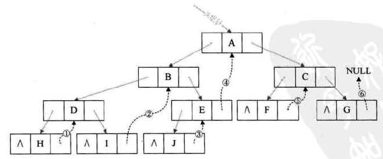

也可以将二叉树定义中，指向左孩子结点的指针，改为指向它的前继结点：

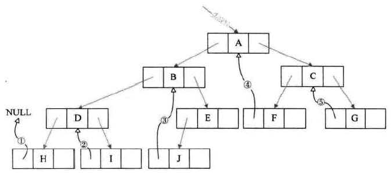

线索二叉树，等于是把二叉树转变成了一个双向链表，对插入删除结点都比较方便，对二叉树以某种次序遍历使其变为线索二叉树的过程称为线索化。

线索二叉树可以有选择性地记录左右孩子结点信息和前驱后驱结点的信息

如果所用的二叉树需要经常遍历或者查找结点，查找前驱和后继，采用线索二叉树会很方便

## 赫夫曼树

在判卷的时候，需要对不同成绩的学生给出评价结果，一个直观的评价方式是这样的：

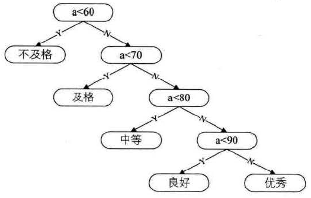

如果我们已知学生的成绩分布，则可以想办法优化这个过程：

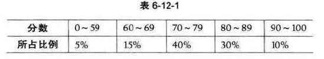

为了让占比多的分数段的同学的成绩，在评价的时候少判断几次，可以对判断流程进行优化：

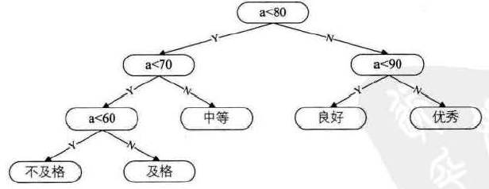

我们可以把上面的两个判断过程，简化为叶子结点带权的二叉树：

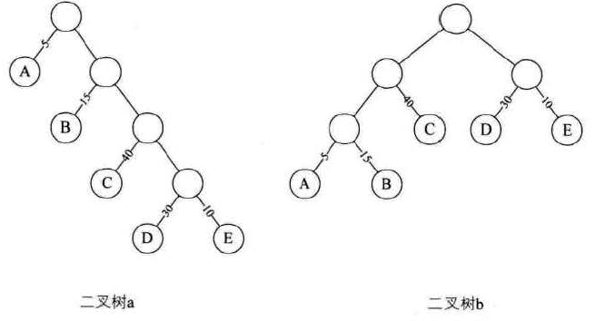

从树中一个结点到另一个结点之间的分支构成两个节点之间的路径，路径上的分支数目称为路径长度。对于二叉树a来说，根结点到结点D的路径长度就为4

树的路径长度就是从树根到每一个结点的路径长度之和。如果考虑到带权的结点，树的带权路径长度就是各路径与权乘积之和。带权路径最小的二叉树称为赫夫曼树，也叫最优二叉树。

生成赫夫曼树的过程，首先把有权值的叶子结点按照从小到大的顺序排列，如A5、E10、B15、D30、C40

然后取最小的两个节点，相对较小的为左孩子，相对较大的为右孩子，生成一个新的节点N1，N1的权值就是两个叶子的权值15：

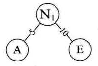

然后接着取一个结点拼装到二叉树中，生成一个新的根结点，依旧按照相对较小的为左孩子，相对较大的为右孩子的原则，合并树：

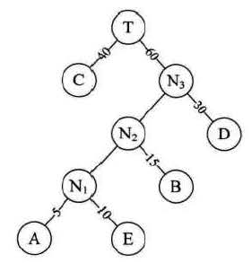

赫夫曼编码可以将一段内容尽可能的压缩到较小的编码方式，大致思路就是根据字母出现的频率生成最优二叉树，二叉树的每个路径都代表0或者1，用从树根到叶子经过的路径的0或1来编码。

# 递归

递归函数的必要组成部分：

- 基线条件base case：函数不再递归调用自己的条件
- 递归条件recursive case：函数递归调用自己的条件

分而治之(divide and conquer，D&C)：一种递归式问题解决思路，它可以逐步缩小问题的规模并解决。分而治之的使用步骤：

- 找出简单的基线条件
- 确定如何缩小问题的规模，使其符合基线条件

归纳证明经常与分而治之协同发挥作用。

快速排序就是一种分而治之算法，按照分而治之的使用步骤：

- 找出基线条件，就是不需要排序的数组，空数组或者只包含一个元素的数组
- 缩小问题规模的过程：从数组中选择一个元素，这个元素被称为基准值，遍历数组，找出比基准值大的元素和比它小的元素，这个过程叫分区。然后对这两个子数组再分别使用排序算法排好序，最后只需要左边数组+基准值+右边数组就是一个排好序的数组了。

## 汉诺塔问题

汉诺塔的游戏是在一块铜板装置上，有三根杆(编号A、B、C)，在A杆自下而上、由大到小按顺序放置64个金盘。游戏的目标：把A杆上的金盘全部移到C杆上，并仍保持原有顺序叠好。操作规则：每次只能移动一个盘子，并且在移动过程中三根杆上都始终保持大盘在下，小盘在上，操作过程中盘子可以置于A、B、C任一杆上。

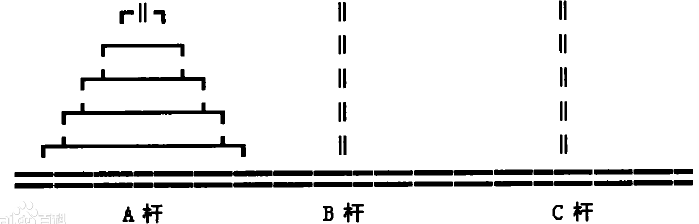

设移动盘子数为n，为了将这n个盘子从A杆移动到C杆，可以做以下三步：

- 以C盘为中介，从A杆将1至n-1号盘移至B杆；
- 将A杆中剩下的第n号盘移至C杆；
- 以A杆为中介；从B杆将1至n-1号盘移至C杆。

第一步和第三步又可以继续分为n-2个盘的移动问题。

下面用代码解决汉诺塔问题，输入n，从上往下号码分别是1-n，展示从第一个杆移动到最后一个杆的过程，要求不能直接从一端移动到另一端，只能先移动到中间再移动

```java
	public static void main(String[] args) {
		// TODO Auto-generated method stub
		hanNuo(3);
	}

	//递归，把n个数从一端移动到另一端，拆解成n-1个数的移动和最后一个数的移动
	public static void hanNuo(int num) {
		hanNuo(num, "left", "right", "mid");
	}
	
	public static void hanNuo(int num, String start, String end, String mid) {
		if(num == 1) {
			System.out.println("take " + num + " from " + start + " to " + mid);
			System.out.println("take " + num + " from " + mid + " to " + end);
		}else {
			hanNuo(num - 1, start, end, mid);
			System.out.println("take " + num + " from " + start + " to " + mid);
			hanNuo(num - 1, end, start, mid);
			System.out.println("take " + num + " from " + mid + " to " + end);
			hanNuo(num - 1, start, end, mid);
		}
	}
```

## 折痕问题

输入一个参数N，给出纸条从下边到上边连续对折N次从上到下所有折痕的方向，例如N=1，down，N=2，down down up

```java
	//模拟树的中序遍历，用布尔变量去控制左右子树，设置两个值，一个是层数一个是当前层数，来模拟树
	//这个递归函数会回到本方法3次，在回到方法第二次打印一个值，与中序遍历相同
	//num是树的深度，i指示走到了第几层，用这种方式去模拟一棵树
	public static void printAllFolds_a(int num){
		printAllFolds_a(1, num ,true);
	}

	private static void printAllFolds_a(int i, int num, boolean b) {
		if(i > num){
			return;
		}
		
		printAllFolds_a(i + 1, num, true);
		System.out.print((b?"down":"up") + " ");
		printAllFolds_a(i + 1, num, false);
	}
```

# 动态规划

## 基本要素

求解动态规划的核心问题是穷举。动态规划的三要素：

* 重叠子问题：正因为问题存在重叠子问题，所以动态规划可以提高穷举的效率
* 最优子结构：动态规划问题⼀定会具备「最优子结构」，才能通过子问题的最值得到原问题的最值。
* 状态转移方程：动态规划依据状态转移方程来正确的穷举

下面通过斐波那契数列问题来说明三要素。

斐波那契的递归解法很低效，下面是它的递归树：

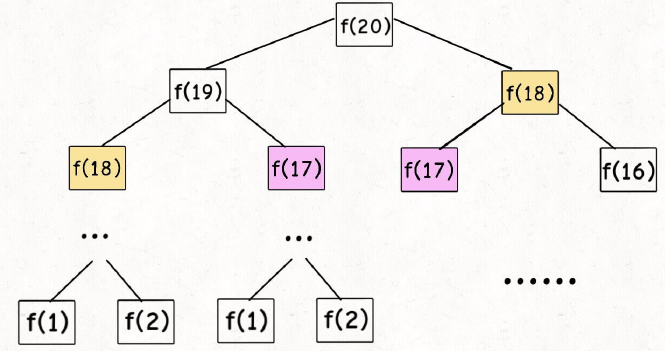

低效的根源在于存在重复计算，想要计算f(20)就必须计算f(19)和f(18)，即使已经计算过f(20)了还是要走一遍重复的流程。递归树中结点的数量为指数级别，所以用递归来解决这个问题的时间复杂度是O2^n

这些被重复计算的子问题就是重叠子问题，要解决这个问题有两种基本方式：

1、带备忘录的递归解法

简单来说就是用一个结构将计算结果存起来，如果某次递归曾经计算过，则直接取结果，无需计算。用带备忘录的递归算法的递归树如下：


带备忘录的递归算法，把一棵存在巨量冗余的递归树通过剪纸，来改造成了一个不存在冗余的递归图，极大地减少了子问题的个数。因为不存在重复计算，相同参数的递归方法只运行一次，可以将时间复杂度降低到On：


这种方式是自顶向下的解法，它是从分解一个较大的原问题出发，最终分解到最小的问题，返回底层的答案，逐层返回到最上面。

2、dp数组的迭代解法

它就是一种自底向上的解法，它从最简单、规模最小的问题开始向上推，直到推导到最顶层的答案：


状态转移方程是描述问题结构的数学形式：


将fn当做一个状态，这个状态是由另外两个状态得到的，这就是状态转移。

如果每次计算新状态时，只依赖少数几个状态，则可以不需要建立那么大的dp数组，而是只用几个变量替代即可。这种思路是动态规划常用的优化空间复杂度的思路。

最优子结构是某些问题的一种特定性质，并不是动态规划独有的。很多问题其实都有最优子结构，但是其中大部分不具有重叠子问题，所以也就不能归纳为动态规划问题。

举一个例子说明最优子结构：假设学校有 10 个班，已经计算出了每个班的最高考试成绩。那么现在要求计算全校最⾼的成绩，对于这个问题不用重新遍历全校学⽣的分数进行比较，⽽是只要在这10 个最高成绩中取最大的就是全校的最高成绩。这个问题就符合最优子结构：可以从子问题的最优结果，推导至更大规模问题的最优结果。

但是如果已知的是每个班的最大分数差，要求全校学生中的最大分数差，它肯定不能通过已知的每个班的最大分数差推导得知，所以该问题就不符合最优子结构。想满足最优子结构，子问题之间必须相互独立，全校最大分数差可能出现在两个班之间，所以子问题并不独立。

对于这种最优子结构失效的情况，一般的策略是改造问题，把求最大分数差，转换为求最大值和最小值。

## 遍历方向

动态规划的一般解题步骤：

* 分析问题，将思路转换为动态规划问题
* 求出状态转移方程
* 求出状态的边界
* 选择遍历方向，从子问题的结果推导到问题结果

其中遍历的过程有几个原则：

* 遍历的过程中，所需状态必须是已经计算出来的
* 遍历的终点必须是存储结果的那个位置

具体的遍历方向，会因为状态转移方程不同而千变万化，求解一个问题时还可以有多种遍历方式：


选择哪种方式，最终的结果都是一样的。

## 0-1背包问题

0-1背包问题：给你⼀个可装载重量为 W 的背包和 N 个物品，每个物品有重量和价值两个属性。其中第 i 个物品的重量为 wt[i] ，价值为 val[i] ，现在让你⽤这个背包装物品，最多能装的价值是多少？


按照动态规划的解题思路，分步分析：

1、明确这个问题的状态是什么？穷举过程中，有多少选择？

几个状态构成了这个问题？答案就是两个：背包的容量、可选择的物品

选择一共也只有两种：对于每件物品，只能选择装入背包，或者不装入背包

一般动态规划的框架就是这样：

~~~
for 状态1 in 状态1的所有取值：
	for 状态2 in 状态2的所有取值：
		for ...
			dp[状态1][状态2][...] = 择优(选择1，选择2...)
~~~

2、明确dp数组的定义

根据前面找到的状态来建立数组，因为有两种状态，所以需要一个二维数组：

dp[i\][w]定义如下：对于前i个物品，当前背包的容量为w，这种情况下可以装的最大价值就是dp[i\][w]

找到dp数组的base case：dp[0\][..] = dp[..\][0] = 0，代表没有物品或者背包没有空间的时候，能装的最大价值是0

细化上面的框架：

~~~
int dp[N+1][W+1]
dp[0][..] = 0
dp[..][0] = 0
for i in [1..N]:
	for w in [1..W]:
		dp[i][w] = max(
			把物品 i 装进背包,
			不把物品 i 装进背包
		)
return dp[N][W]
~~~

3、写出状态转移方程

根据之前列出的选择来分类讨论，当要计算dp[i\][w]时：

* 如果没有把这第i个物品放入背包，那么应该继承之前的结果，可选的物品有i-1的时候，和i个的时候完全一样，有dp[i\][w]=dp[i-1\][w]
* 如果把第i个物品放入背包，i物品的重量是wt[i-1]，剩余的重量只有w-wt[i-1]，此时就要找到可用重量只有w-wt[i-1]，且可用物品有i-1种时，它的最大价值，于是可以得出：dp[i\][w]=dp[i-1\][w-wt[i-1]] + val[i-1]

剩下的问题就简单了，只要处理好边界值就好了。

## 完全背包问题

leetcode518就是完全背包问题，完全背包问题描述如下：

有一个背包，最大容量为amount，有一系列物品coins，每个物品的重量为coins[i]，每个物品的数量无限，请问有多少种方法，能够把背包恰好装满？

这个和之前的背包问题最大区别是：每个物品的数量是无限的。

dp[i\][j]定义如下：若使用前i个物品，当背包容量为j时，有dp[i\][j]种方法可以装满背包。

base case：dp[0\][..] = dp[..\][0] = 1，代表当不使用物品，或者背包没有容量时，有1种方法可以装满，也就是不装

根据不同的选择分类讨论dp[i\][w]：

- 如果没有把这第i个物品放入背包，那么应该继承之前的结果，可选的物品有i-1的时候，和i个的时候完全一样，此时有dp[i-1\][w]
- 如果把第i个物品放入背包，i物品的重量是wt[i-1]，剩余的重量只有w-wt[i-1]，此时就要找到可用重量只有w-wt[i-1]，且可用物品有i种时，它此时有dp[i\][w-wt[i-1]]种方法装满，换句话说，要凑出重量为w的情况，只需要知道w-wt[i-1]有多少种组合，每种组合后面加一个第i种，就是这种情况下的贡献了

最终的方法是两者之和，也就是有dp[i\][w] = dp[i-1\][w] + dp[i\][w-wt[i-1]]

有一种典型的错误方法是在计算后一种贡献的时候，遍历所有的情况，因为物品的数量无限，所以把物品放入1次、放入2次。。放入N次，当做不同的选择，来写状态转移方程。这种思路错误的根本原因是：题目要求的是装满背包有多少种方法，也就是求的是不同装入组合有多少种，例如计算dp[3\][11]的时候，wt[3]=3，之前已经有了下面这些组合，可以在3个物品（注意！这三个物品已经包含了新加入的物品了）的时候凑出8的重量：

* 1,7,1
* 2,2,4
* 2,3,3

那么在把物品放入背包的选择中，该场景的贡献就应该是dp[3\][8] = 3

而不应该再计算物品放入背包两次的场景，该场景的贡献是dp[1\][5]=1，这个场景其实上面已经计算过了，就是2,3的组合，没有必要再加一次。

## 二分搜索优化

在动态规划中，有常用的几种优化降低时间复杂度的优化方式，其中一种是思路转换，也就是改变dp数组的定义，用一种新的思路来进行动态规划，但这种做法非常复杂，概念上可能并不好转换。

下面介绍一种比较容易理解的优化方式：二分搜索优化。

以leetcode887.鸡蛋掉落，为例，它的dp(K,N)的定义是这样的：有K个鸡蛋，面对N层楼，最少需要扔几次。很容易得知，当K固定时，这个函数dp一定随着N的增加而增加。

然后来观察此题的状态转移方程，这里省去推导它的过程：


注意dp(K-1, i-1)和dp(K, N-i)这两个函数，其中i是从1到N递增的，如果固定K和N，那么这两个函数就可以看作是i的函数，前者随着i增加单调递增，后者随着i增加单调递减，这时候求二者的较大值，然后再求这些最大值中的最小值，实际上就是求两个函数的交点：


到这里就可以用二分法优化了，只需要确定i的取值范围，每次取mid，记i=mid这条线和两个函数的交点为K0和K1，根据K0和K1的相对大小，就能得到i下一步的增长方向，因为两条线的交点不一定是严格整数，所以要在计算过程中去取可能存在的最大值，它能将一层循环从On降低到Ologn。

具体代码如下：

~~~java
	public int superEggDrop(int k, int n) {
        int[][] matrix = new int[k + 1][n + 1];
        for (int i = 0; i < matrix.length; i++) {
            for (int j = 0; j < matrix[0].length; j++) {
                if (j == 0) {
                    matrix[i][j] = 0;
                    continue;
                }
                if (i == 0) {
                    matrix[i][j] = 0;
                    continue;
                } else if (i == 1) {
                    matrix[i][j] = j;
                    continue;
                }
                int start = 1;
                int end = j;
                int result = Integer.MAX_VALUE;
                while (start <= end) {
                    int mid = start + (end - start) / 2;
                    int k1 = matrix[i][j - mid];
                    int k2 = matrix[i - 1][mid - 1];
                    if (k1 >= k2) {
                        start = mid + 1;
                        result = Math.min(result, k1);
                    } else {
                        end = mid - 1;
                        result = Math.min(result, k2);
                    }
                }
                matrix[i][j] = result + 1;
            }
        }
        return matrix[matrix.length - 1][matrix[0].length - 1];
    }
~~~

## 博弈问题

博弈问题一般都用动态规划来解决，而且解决的模式比较套路。

以下面的问题为例分析：你和你的朋友⾯前有⼀排⽯头堆，⽤⼀个数组 piles 表⽰，piles[i] 表⽰第 i堆⽯⼦有多少个。你们轮流拿⽯头，⼀次拿⼀堆，但是只能拿⾛最左边或者最右边的⽯头堆。所有⽯头被拿完后，谁拥有的⽯头多，谁获胜。假设两⼈都很聪明，请你设计⼀个算法，返回先⼿和后⼿的最后得分（⽯头总数）之差。

⽐如有三堆⽯头 piles = [1, 100, 3] ，先⼿不管拿 1 还是 3，能够决定胜负的 100 都会被后⼿拿⾛，后⼿会获胜。先⼿能获得 4 分，后⼿会获得 100 分，你的算法应该返回 -96。

在这个问题里，状态有三种：一堆石子的开始位置、结束位置、先手/后手，所以dp数组应该是二维的，每个位置又分为两个状态：先手/后手

* dp[i\][j].first表示，对于piles从i到j这部分石头堆，先手能获得的最高分数
* dp[i\][j].second表示，对于piles从i到j这部分石头堆，后手能获得的最高分数

我们相求的答案是先手和后手最终分数之差，也就是dp[0\][n-1].first - dp[0\][n-1].second，先手最优得分和后手最优得分之差

对于这个问题的每个状态，可以做的选择有两个：选择最左边的那堆石头，或者选择最右边的那堆石头。

推导出转移方程如下：

* dp[i\][j].first = max(piles[i] + dp[i+1\][j].second , piles[j] + dp[i\][j-1].second)

  如果先手选择最左边的，则就相当于后手选择剩余一堆石头的；

* 如果先手选择的是左边的，那么dp[i\][j].second = dp[i+1\][j].first ，否则就是dp[i\][j].second = dp[i\][j-1].first 

可以看到根据状态转移方程，需要斜着遍历数组，最终推出结果：


代码实现：

~~~python
/* 返回游戏最后先⼿和后⼿的得分之差 */
int stoneGame(int[] piles) {
    int n = piles.length;
    // 初始化 dp 数组
    Pair[][] dp = new Pair[n][n];
    for (int i = 0; i < n; i++)
    for (int j = i; j < n; j++)
    dp[i][j] = new Pair(0, 0);
    // 填⼊ base case
    for (int i = 0; i < n; i++) {
        dp[i][i].fir = piles[i];
        dp[i][i].sec = 0;
    }
    // 斜着遍历数组
    for (int l = 2; l <= n; l++) {
        for (int i = 0; i <= n - l; i++) {
            int j = l + i - 1;
            // 先⼿选择最左边或最右边的分数
            int left = piles[i] + dp[i+1][j].sec;
            int right = piles[j] + dp[i][j-1].sec;
            // 套⽤状态转移⽅程
            if (left > right) {
                dp[i][j].fir = left;
                dp[i][j].sec = dp[i+1][j].fir;
            } else {
                dp[i][j].fir = right;
                dp[i][j].sec = dp[i][j-1].fir;
            }
        }
    }
    Pair res = dp[0][n-1];
    return res.fir - res.sec;
}
~~~

博弈问题的前提⼀般都是在两个聪明⼈之间进⾏，编程描述这种游戏的⼀般⽅法是⼆维 dp 数组，数组中通过元组分别表⽰两⼈的最优决策。之所以这样设计，是因为先⼿在做出选择之后，就成了后⼿，后⼿在对⽅做完选择后，就变成了先⼿。这种⾓⾊转换使得我们可以重⽤之前的结果，是典型的动态规划标志。

## 思路转换优化

有时在推导状态转移方程时，要从方程定义入手优化状态转移方程，以达到更高的效率

以四键键盘为例，它假设一个特殊的键盘只包含下面几个按键：

* A：在屏幕上打印一个A
* C-A：选中整个屏幕
* C-C：复制选中区域到缓冲区
* C-V：将缓冲区中的内容输出到上次输入的位置，并显示在屏幕上

现在问：只可以按键N次的情况下，屏幕上最多能显示几个A？

例如N=7时，我们可以通过以下按键序列来输出9个A：A、A、A、C-A、C-C、C-V、C-V

1、第一种思路

选择分为：四种按键的一个

状态分为：剩余的按键次数、当前屏幕上A的个数、剪切板中字符A的数量

几种选择可以用如下方程表示出来

~~~
dp(n - 1, a_num + 1, copy), # A
解释：按下 A 键，屏幕上加⼀个字符
同时消耗 1 个操作数
dp(n - 1, a_num + copy, copy), # C-V
解释：按下 C-V 粘贴，剪切板中的字符加⼊屏幕
同时消耗 1 个操作数
dp(n - 2, a_num, a_num) # C-A C-C
解释：全选和复制必然是联合使⽤的，
剪切板中 A 的数量变为屏幕上 A 的数量
同时消耗 2 个操作数
~~~

注意这里其实不是4种选择，而是3种，因为全选和复制必然是联合使用的，这里其实就是一个根据题意简化状态转移方程的小操作。

最终代码：

~~~python
def maxA(N: int) -> int:
    # 对于 (n, a_num, copy) 这个状态，
    # 屏幕上能最终最多能有 dp(n, a_num, copy) 个 A
    def dp(n, a_num, copy):
        # base case
        if n <= 0: return a_num;
        # ⼏种选择全试⼀遍，选择最⼤的结果
        return max(
            dp(n - 1, a_num + 1, copy), # A
            dp(n - 1, a_num + copy, copy), # C-V
            dp(n - 2, a_num, a_num) # C-A C-C
        )
    # 可以按 N 次按键，屏幕和剪切板⾥都还没有 A
    return dp(N, 0, 0)
~~~

这个算法复杂度是很高的，有On3，而且当前屏幕上A的个数、剪切板中字符A的数量这两个状态数量实在是太多了。这种情况下就要尝试从题意出发，尽量简化状态和选择。

2、第二种思路

观察出现最佳选择的序列，可以得出下面的结论，最优序列一定是下面两种情况之一：

* 一直按A
* 按A按到某种程度后，C-A C-C C-V 。。。 C-A C-C C-V。。。C-C C-V

只定义一个状态：敲击次数n

对于选择一来说：有dp[i] = dp[i - 1] + 1

对于选择二来说，需要遍历之前所有位置计算，例如对于dp[2]来说，需要从第三个按键开始按C-A C-C C-V C-V一直到结束，得到的结果；所有可能位置中的最大值。

最终代码如下：

~~~python
public int maxA(int N) {
    int[] dp = new int[N + 1];
    dp[0] = 0;
    for (int i = 1; i <= N; i++) {
        // 按 A 键
        dp[i] = dp[i - 1] + 1;
        for (int j = 2; j < i; j++) {
            // 全选 & 复制 dp[j-2]，连续粘贴 i - j 次
            // 屏幕上共 dp[j - 2] * (i - j + 1) 个 A
            dp[i] = Math.max(dp[i], dp[j - 2] * (i - j + 1));
        }
    }
    // N 次按键之后最多有⼏个 A？
    return dp[N];
}
~~~

这个算法时间复杂度只有ON2.

根据这个例子可以知道，不同的定义可以产⽣不同的状态转移逻辑，虽然最后都能得到正确的结果，但是效率可能有巨⼤的差异。

有时通过动态规划，重叠⼦问题已经消除了，但是效率还是低，此时要分析低效率的原因，具体到第一种思路来说，它的递归框架如下：

~~~python
def dp(n, a_num, copy):
    dp(n - 1, a_num + 1, copy), # A
    dp(n - 1, a_num + copy, copy), # C-V
    dp(n - 2, a_num, a_num) # C-A C-C
~~~

看这个穷举逻辑，是有可能出现这样的操作序列 C-A C-C，C-A C-C... 或者C-V,C-V,... 。然这种操作序列的结果不是最优的，但是我们并没有想办法规避这些情况的发⽣，从⽽增加了很多没必要的⼦问题计算。

回顾第⼆种解法，我们稍加思考就能想到，最优的序列应该是这种形式： A,A..C-A,C-C,C-V,C-V..C-A,C-C,C-V.. 。

根据这个事实，我们重新定义了状态，重新寻找了状态转移，从逻辑上减少了⽆效的⼦问题个数，从⽽提⾼了算法的效率。

# 一些经典算法

## 位运算

应用位运算相关的技巧可以快速提高程序的计算速度，下面是一些常用技巧：

1、左移/右移

数左移1位相当于乘2，右移1位相当于除以2

Java中提供了两种右移操作符：有符号右移操作符>>和无符号右移操作符>>>。它们的区别在于，有符号右移操作符会将高位填充为符号位（即正数填充0，负数填充1），而无符号右移操作符会将高位填充为0。

* 用1左移可以快速的得到2的幂次方
* 可以使用位运算来实现乘除法，用左移加倍除数，直到2倍的除数已经超过被除数这个时候把被除数替换成两者相减，左移次数就是商，差就是余数

2、按位与

* 利用位与运算n = n&(n-1)每次都能让n最后一位1变成0，根据这个技巧可以很方便的计算1的个数，特殊地，如果一个数只有一个二进制1，那么它是2的整数倍
* 利用位与运算n&(-n)可以取出从右到左第一个1，它的结果只保留n的最后一个1
* 截断，例如n&(0b1111)相当于取出n的最后四个二进制位
* 用来判断某个特定二进制位是否为1，例如判断n是否只有奇数位有1：n&(0b01010101010101010101010101010101) == (0b01010101010101010101010101010101)

3、异或：相同为0，不同为1

* 异或最原始的应用就是检查两个数到底有多少不同的二进制位，先异或，然后再检查有多少个1


* 可以使用位运算来实现加法，方法就是本位运算结果用异或表示，进位用位与左移表示

* 一个数字和自己异或一次会变成0，和自己异或两次会恢复原样

  利用这个性质，可以解决一系列奇数频次的问题，例如一个数组中，1个数字出现了1次，其余数字都出现了2次，那么快速找到这个出现一次的数字的方法，就是求整个数组的异或结果。

  给定一个包含 0, 1, 2, ..., n 中 n 个数的序列，找出 0 .. n 中没有出现在序列中的那个数。快速的解决办法就是循环遍历异或每个数，同时异或当前位置i，这样最后的结果就是没有出现的数，因为出现两次的都会被抵消。

4、按位或

按位或结合左移/右移可以对数字做特殊的变形，以满足具体的要求。

例1：IP地址与int整数的转换。例如ip地址为10.0.3.193，把每段拆分成一个二进制形式组合起来为00001010 00000000 00000011 11000001，然后把这个二进制数转变成十进制整数就是167773121

解法：借助位运算实现。如IP 10.0.3.193，将10左移24位，0左移16位，3左移8位，193左移0位，这四段做或运算，即为结果。

例2：有正整数n，求小于或等于n的2的最大乘方数

解法：此题最简单的解法是利用相与，如有数000101101110，利用相与将其变成000111111111，然后此数加1后变为001000000000，再右移一位即变成要求的结果。至于000101101110到000111111111的过程，就是利用或运算移位后再或：

~~~java
n = (n | (n >> 1));
n = (n | (n >> 2));
n = (n | (n >> 4));
n = (n | (n >> 8));
n = (n | (n >> 16));
~~~

例3：颠倒给定的 32 位无符号整数的二进制位。

解法：利用按位与截取，再利用按位或来拼装，达成互换的目的。首先将数的前16位和后16位互换，然后互换其中各自的前8后8位。。。到最后互换相邻的两位

~~~java
n = ((n & 0b11111111111111110000000000000000) >>> 16) |
 ((n & 0b00000000000000001111111111111111) << 16);
        n = ((n & 0b11111111000000001111111100000000) >>> 8) |
 ((n & 0b00000000111111110000000011111111) << 8);
        n = ((n & 0b11110000111100001111000011110000) >>> 4) |
 ((n & 0b00001111000011110000111100001111) << 4);
        n = ((n & 0b11001100110011001100110011001100) >>> 2) |
 ((n & 0b00110011001100110011001100110011) << 2);
        n = ((n & 0b10101010101010101010101010101010) >>> 1) |
 ((n & 0b01010101010101010101010101010101) << 1);
~~~

5、分32位考虑

有时将一个数字看作单独的32位，可以提供不同的视角，分位考虑，可以加快程序运算速度，因为分位总共最多就是32位，时间复杂度为On的算法放在每一位，最终的复杂度依然是On

例1：一个整型数组里除了两个数字之外，其他的数字都出现了偶数次。请写程序找出这两个只出现一次的数字。要求时间复杂度ON，空间复杂度O1

利用异或两次为原值的性质，先计算数组的异或和，然后找到和从右往左第一个1的位置，把数组按这个位置是不是1分成两部分，两部分异或的结果就是最后要找的值

例2：在一个数组中除了一个数只出现了一次，其余数都出现了三次，找到那个出现了一次的数，要求时间复杂度ON，空间复杂度O1

创建一个大小为32的数组存每一位的值，如果没有要找的元素，各数位相加和应该都是3的倍数，但现在不是，如果哪一位不是3的倍数就说明要找的数该位是1，最后根据二进制还原该数

## 双向BFS

双向BFS可以提高BFS算法的效率。

传统的BFS是从起点开始，扩散到终点就停止；而双向BFS则是从起点和终点同时开始扩散，当两边有交集时停止。两者在最糟糕情况下的复杂度是一样的，但是一般来说双向BFS会快一点。

传统BFS扩散图示：


双向BFS扩散图示：


双向BFS的局限性在于：必须知道终点的位置在哪里。

基本代码框架：

~~~java
Set<String> deads = new HashSet<>();
for (String s : deadends) deads.add(s);
// ⽤集合不⽤队列，可以快速判断元素是否存在
Set<String> q1 = new HashSet<>();
Set<String> q2 = new HashSet<>();
Set<String> visited = new HashSet<>();
int step = 0;
q1.add("0000");
q2.add(target);
while (!q1.isEmpty() && !q2.isEmpty()) {
  	// 哈希集合在遍历的过程中不能修改，⽤ temp 存储扩散结果
  	Set<String> temp = new HashSet<>();
    /* 将 q1 中的所有节点向周围扩散 */
    for (String cur : q1) {
      /* 判断是否到达终点 */
      if (deads.contains(cur))
      	continue;
      if (q2.contains(cur))
      	return step;
      visited.add(cur);
      /* 将⼀个节点的未遍历相邻节点加⼊集合 */
      for (int j = 0; j < 4; j++) {
      	String up = plusOne(cur, j);
      	if (!visited.contains(up))
      		temp.add(up);
      		String down = minusOne(cur, j);
      	if (!visited.contains(down))
      		temp.add(down);
      }
    }
    /* 在这⾥增加步数 */
    step++;
    // temp 相当于 q1
    // 这⾥交换 q1 q2，下⼀轮 while 就是扩散 q2
    q1 = q2;
    q2 = temp;
    }
    return -1;
}

~~~

代码的关键点：

* 不再使⽤队列，⽽是使⽤HashSet ⽅便快速判断两个集合是否有交集。
* while循环最后交换q1和q2，相当于轮流扩散

双向BFS还有一个优化，是在while循环开始时做一个判断，优先扩散更小的那个队列，这样空间增长速度会慢一些。


## 二分法

二分法的思想虽然简单，但实际编程的细节点非常多，很容易因为一个符号导致计算结果错误。

以leetcode69为例：给你一个非负整数 x ，计算并返回 x 的 算术平方根，保留整数部分。

其实就是在求m*m<=x中m的最大值。二分法的解法如下：

~~~java
	public int mySqrt(int x) {
        if (x == 0) {
            return 0;
        }
        int min = 0;
        int max = x;
        int result = 0;
        while (min <= max) {
            int mid = min + (max - min) / 2;
            if ((long)mid * mid <= x) {
                result = Math.max(result, mid);
                min = mid + 1;
            } else {
                max = mid - 1;
            }
        }
        return result;
    }
~~~

二分法通常都有以下要素需要考虑：

* while条件是什么？应不应该带等号？带等号是否会导致无限循环？不带等号是否会漏掉结果？

  具体到此题，while条件必须带等号，若不带等号，当结果正好等于min或max时，就会漏掉结果

* if结构中，对二分法的范围改变具体是什么？到底是min=mid还是应该min=mid+1？min=mid是否会导致无限循环？min=mid+1是否会漏掉结果？

  具体到此题，状态改变应该是min=mid+1，因为它不会漏掉结果。

  假想这样一个场景，当迭代区间范围是从x到y时，正确的结果就是左端点x，程序来到了范围改变阶段。此时分为两种情况讨论：

  * 若mid=x，则之前的检查就已经通过了，因为mid此时就是正确结果，应该已经匹配完成了，二分法结束，不会走到区间范围改变
  * 若x<mid，则x和mid不是同一个数，故此时min=mid+1也不会漏掉结果，只是区间离正确结果x更接近了

此外，涉及到可能超限的位置都要做特殊的处理，以免计算过程中发生溢出

## 牛顿迭代法

有时程序中要解一些复杂的方程，牛顿迭代法是一种计算方程根的数值计算方法。

以leetcode69为例：给你一个非负整数 x ，计算并返回 x 的 算术平方根，保留整数部分。

假设要计算C的平方根，它是方程y = x^2 - C的一个零点，将它绘制在直角坐标系中：


描述一个迭代的过程，取x轴中一个数x0，y=x0与曲线的交点，过此交点做曲线的切线，切线与x轴的交点记为x1，从x0到x1的过程就是牛顿迭代法的一次迭代。只要选择一个适当的初始值，就能快速迭代到结果。

注意：在程序中使用牛顿迭代法是由精度限制的，而且这个精度不会随着程序运行而变得更精准，因为基本的计算类型是有极限的，所以一般是以两次迭代的结果差值的绝对值小于某个较小值，作为迭代的结束条件。

根据上面的方法，可以轻松得到迭代方程，下面是具体代码：

~~~java
    public int mySqrt(int x) {
        if (x == 0) {
            return 0;
        }
        double num = x;
        while (true) {
            double num1 = num / 2 + x / (2 * num);
            if (Math.abs(num1 - num) < 0.0000001d) {
                break;
            }
            num = num1;
        }
        return (int)num;
    }
~~~

## 并查集

实现一个并查集UnionFindSet，提供两个功能，合并两个元素所在的集合，查询两个元素是否在一个集合中，要求平均时间复杂度均为O1

```java
	//这个结构有两个map，一个map装的是结点和它的父节点，另一个map装的是以当前结点为头的集合的总结点个数
	//用map的方式去模拟集合
	//初始化时传入一个list，将list的每个元素单独成一个集合，也就是说在map中每个节点以自己为头结点
	//在Nummap中每个节点对应的集合数是1
	//每次合并两个元素所在的集合，就是比较哪个集合更大，让大集合头结点作为小集合的头结点
	//也就算是合并成功
	//每次判断两个元素是不是在一个集合中时，只需要检查两个元素的头结点是不是一个，是说明是一个集合
	//每次检查一个元素的头结点时要反复取map中的值，这个过程中经过的所有节点在检查完成后都直接以头结点为父节点
	//这样也就缩短了下次检查的时间
	static class UnionFindSet<anyType>{
		HashMap<anyType, anyType> map;
		HashMap<anyType, Integer> Nummap;
		
		UnionFindSet(List<anyType> list){
			map = new HashMap<>();
			Nummap = new HashMap<>();
			for (anyType node : list) {
				map.put(node, node);
				Nummap.put(node, 1);
			}
		}
		
		public boolean isSameSet(anyType node1, anyType node2){
			if(!map.containsKey(node1) || !map.containsKey(node2)){
				throw new NoSuchElementException();
			}
			
			return headNode(node1) == headNode(node2);
			
		}
		
		private anyType headNode(anyType node){
			anyType father = map.get(node);
			if(father != node){
				father = headNode(father);
			}
			map.put(node, father);
			return father;
		}
		
		public void mergeNode(anyType node1, anyType node2){
			if(headNode(node1) != headNode(node2)){
				int num1 = Nummap.get(headNode(node1));
				int num2 = Nummap.get(headNode(node2));
				if(num1 > num2){
					map.put(headNode(node2), headNode(node1));
					Nummap.put(headNode(node1), num1 + num2);
				}else{
					map.put(headNode(node1), headNode(node2));
					Nummap.put(headNode(node2), num1 + num2);
				}
					
			}
		}
	}
```

## Trie树

实现一颗trie树：

- 实现insert方法添加字符串，实现search方法查某个字符串添加过多少次
- 实现delete方法删除一个字符串，实现prefixNumber方法查看多少字符串以输入值为前缀

要求所有方法的复杂度为On

```java
	//每个节点有两个数字域和一个数组
	//当加入abc时，生成一个结点，它的数组0号位置生成一个新的结点，然后新节点的数组1号位置生成新节点
	//新节点数组的2号位置继续生成新节点，也就是说trie树不在结点记录信息，而是在通往另一个结点的路径上
	//结点的times记录有多少字符串从这里经过，当查有多少字符串以abc为前缀时，只要找到c对应的下一个结点
	//该点times就是该数量
	//结点的end记录有多少字符串以此为结尾，当查abc在该结构中出现几次时，只要检查c下一个结点的end即可
	//删除结点就是两个域在遍历中减小的过程，如果其中减小到0那么就放弃余下所有点
	
	//trie树巧妙的把数据存在各结点的路径上，大大压缩了字符串的储存空间
	static class Trie{
		
		TireNode root;
		
		class TireNode{
			int end;
			int times;
			TireNode[] next;
			TireNode(){
				next = new TireNode[26];
			}
		}
		
		public Trie(){
			root = new TireNode();
			root.end = 0;
			root.times = 0;
		}
		
		public void insert(String str){
			if(str == null){
				return;
			}
			char[] charArray = str.toCharArray();
			TireNode currentNode = root;
			int index;
			for(int i = 0; i < charArray.length; i++){
				index = charArray[i] - 'a';
				if(currentNode.next[index] == null){
					currentNode.next[index] = new TireNode();
				}
				currentNode = currentNode.next[index];
				currentNode.times++;
			}
			currentNode.end++;
		}
		
		public int search(String str){
			if(str == null){
				return (Integer)null;
			}
			
			char[] charArray = str.toCharArray();
			TireNode currentNode = root;
			int index;
			for(int i = 0; i < charArray.length; i++){
				index = charArray[i] - 'a';
				if(currentNode.next[index] == null){
					return 0;
				}
				currentNode = currentNode.next[index];
			}
			return currentNode.end;
		}
		
		public void delete(String str){
			if(search(str) > 0){
				char[] charArray = str.toCharArray();
				TireNode currentNode = root;
				int index;
				for(int i = 0; i < charArray.length; i++){
					index = charArray[i] - 'a';
					if(currentNode.next[index].times == 1){
						currentNode.next = null;
						return;
					}
					currentNode = currentNode.next[index];
					currentNode.times--;
				}
				currentNode.end--;
			}
		}
		
		public int prefixNumber(String str){
			
			if(str == null){
				return 0;
			}
			char[] charArray = str.toCharArray();
			TireNode currentNode = root;
			int index;
			for(int i = 0; i < charArray.length; i++){
				index = charArray[i] - 'a';
				if(currentNode.next[index] == null){
					return 0;
				}
				currentNode = currentNode.next[index];
			}
			return currentNode.times;
		}
	}
```

## BFPRT算法

BFPRT算法：在一个数组中找到第k个小的数，要求时间复杂度ON

```java
	//任意选择一个数作为key，进行荷兰国旗分数组，如果k正好落在区间内就说明找到了该数，否则递归左边或者右边
	
	//也可以先用getNum方法先求key，这个方法中将建立一个是原数组五分之一大小的新数组，这个数组每个数都是5个数的中位数组成
	//最后又递归调用BFPRT求该数组的中位数，需要注意的是此时BFPRT一定要给出start = end 时的条件
	//否则会无限递归
	public static int BFPRT(int[] arr, int k){
		if(arr == null || arr.length < k){
			throw new RuntimeException("数组长度不合法");
		}
		return BFPRT(arr, k, 0, arr.length - 1);
	}
	
	private static int BFPRT(int[] arr, int k, int start, int end){
		//swap(arr, start, start + (int)(Math.random() * (end - start)));
		if(start == end){
			return arr[start];
		}
		int num = getNum(arr, start, end);
		int[] flag = heLan(arr, num, start, end);
		//这里不用检查start和end的关系，在调用函数入参时就已经保证了，
		//如果后两个return越界，那么前面的条件也应该满足，应该走的是第一个return
		//所以不会出现越界的情况
		if(flag[0] + 1 <= k && flag[1] + 1 >= k){
			return arr[flag[0]];
		}else if(k < flag[0] + 1){
			return BFPRT(arr, k, start, flag[0] - 1);
		}else{
			return BFPRT(arr, k, flag[1] + 1, end);
		}
	}
	
	private static int[] heLan(int[] arr, int key, int start, int end){
		int small = start - 1, k = start;
		int big = end + 1;
		while(k < big){
			if(arr[k] > key){
				swap(arr, k, big - 1);
				big--;
			}else if(arr[k] < key){
				swap(arr, small + 1, k);
				k++;
				small++;
			}else{
				k++;
			}
		}
		//这里的small+1和big-1一定能唯一的确定至少一个数的区间，因为key就在该数组中，相当于等于区至少有一个数
		return new int[]{small + 1, big - 1};
	}
	
	private static void swap(int[] arr, int start, int end){
		int k = arr[start];
		arr[start] = arr[end];
		arr[end] = k;
	}
	
	private static int getNum(int[] arr, int start, int end){
		int length = end - start + 1;
		int offset = length % 5 == 0 ? 0 : 1;
		int[] numArray = new int[length / 5 + offset];
		for(int i = 0; i < numArray.length; i++){
			int j = start + i * 5;
			int k = start + (i + 1) * 5;
			numArray[i] = getMid(arr, j, Math.min(k, end));
		}
		return BFPRT(numArray, numArray.length/2);
	}
	
	private static int getMid(int[] arr, int start, int end){
		easySort(arr, start, end);
		int length = end - start + 1;
		int mid = start + (length % 2 == 0 ? (length/2 - 1) : (length/2));
		return arr[mid];
	}
	
	private static void easySort(int[] arr, int start, int end){
		for(int i = start; i <= end; i++){
			for(int j = i - 1; j >= 0 && arr[j] > arr[j + 1]; j--){
				swap(arr, j + 1, j);
			}
		}
	}
```

## LRU

设计可以变更的缓存结构

设计一种缓存结构，构造时确定大小k，两个功能put(key, value)和get(key)

要求set和get时间复杂度为O1，当某个key的put和get发生就认定这个key记录成了最常用的

当缓存的大小超过k时，移除最不常使用的记录

```java
//这种缓存结构内部维护着两个hashMap和一个双向链表
//hashMap的键是key，值是value组成的node，这个node就是双向链表的一个结点，另一个hashmap是相反的
//为了互相能够找到所以构造了两个hashmap
//每次存值时如果不存在就存入两个hashmap中，同时将该节点放到双向链表头部，同时判断是否越界，如果越界就处理掉尾结点
//并把要删除的尾结点返回出来，在两个map中删掉，保证两个map和链表数据一致
//如果存在这个结点，就将该节点移动到双向链表头部
class twoNode{
	int val;
	twoNode pre;
	twoNode next;
	public twoNode(int val) {
		super();
		this.val = val;
	}
}

class twoLinkedList{
	twoNode head;
	twoNode tail;
	int capacity;
	int nowSize;
	public twoLinkedList(int capacity) {
		super();
		this.capacity = capacity;
		nowSize = 0;
	}
	
	public void haveNodeUp(twoNode node){
		if(head == node){
			return;
		}else if(node == tail){
			twoNode willmoveNode = tail;
			twoNode preNode = tail.pre;
			tail.pre = null;
			preNode.next = null;
			tail = preNode;
			moveTohead(willmoveNode);
		}else{
			twoNode preNode = node.pre;
			twoNode nextNode = node.next;
			preNode.next = nextNode;
			nextNode.pre = preNode;
			node.pre = null;
			node.next = null;
			moveTohead(node);
		}
	}
	public twoNode noNodeUp(twoNode node){
		if(head == null){
			head = tail = node;
		}else{
			moveTohead(node);
		}
		twoNode willDelNode = null;
		if(nowSize < capacity){
			nowSize++;
		}else{
			willDelNode = tail;
			twoNode preNode = tail.pre;
			tail.pre = null;
			preNode.next = null;
			tail = preNode;
		}
		
		return willDelNode;
	}
	
	public void moveTohead(twoNode node){
		node.next = head;
		head.pre = node;
		head = node;
		head.pre = null;
	}
}

class Cache{
	HashMap<Integer, twoNode> map1;
	HashMap<twoNode, Integer> map2;
	twoLinkedList list;
	int capacity;
	public Cache(int capacity){
		this.capacity = capacity;
		map1 = new HashMap<Integer, twoNode>();
		map2 = new HashMap<twoNode, Integer>();
		list = new twoLinkedList(capacity);
	}
	
	public void put(int key, int value){
		
		if(map1.containsKey(key)){
			map1.get(key).val = value;
			list.haveNodeUp(map1.get(key));
		}else{
			twoNode node = new twoNode(value);
			map1.put(key, node);
			map2.put(node, key);
			twoNode willDelNode = list.noNodeUp(node);
			if(willDelNode != null){
				int delkey = map2.get(willDelNode);
				map2.remove(willDelNode);
				map1.remove(delkey);
			}
		}
	}
	
	public int get(int key){
		if(map1.containsKey(key)){
			list.haveNodeUp(map1.get(key));
			return map1.get(key).val;
		}else{
			throw new RuntimeException("没有这个元素或者已经失效");
		}
	}
}
```

