# 图

## 定义

图（Graph）是由顶点的有穷非空集合和顶点之间边的集合组成，通常表示为G(V,E)，其中G表示一个图，V是图G中顶点的集合，E是图G中边的集合。

定义中几个需要注意的地方：

- 线性表中我们吧数据元素叫元素，树中叫结点，在图中称之为顶点（Vertex）
- 线性表中没有数据元素称为空表；树中没有结点称之为空树；而图中则不允许有顶点，图的定义强调了顶点集合V有穷非空
- 线性表中相邻的元素之间具有线性关系；在树结构中，相邻两层的结点具有层次关系；在图中，任意两个顶点之间都可能有关系，顶点之间的逻辑关系用边来表示，边集可以是空的

## 有向边和无向边

无向边：若顶点vi到vj之间的边没有方向，则称这条边为无向边（edge），用无序偶对(vi,vj)来表示。

如果图中任意两个顶点之间的边都是无向边，则称该图为无向图。

对下面左图的无向图G来说，G={V,E}，其中顶点集合V={A,B,C,D}，边集合E={(A,B),(B,C),(C,D),(D,A),(A,C)}

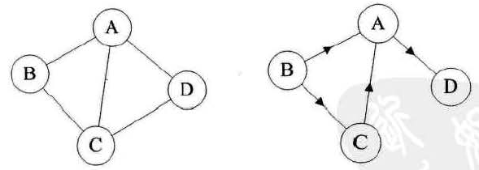

有向边：若从顶点vi到vj的边有方向，则称这条边为有向边，也称为弧(Arc)，用有序偶\<vi,vj>，其中vi称为弧尾，vj称为弧头。

如果图中任意两个顶点之间的边都是有向边，则称该图为有向图。

对上面右图的有向图G来说，G={V,E}，其中顶点集合V={A,B,C,D}，边集合E={\<A,D\>,\<B,A>,\<C,A>,\<B,C>}

在图中，若不存在顶点到其自身的边，且同一条边不重复出现，则称这样的图为简单图。下面两个图就不是简单图：

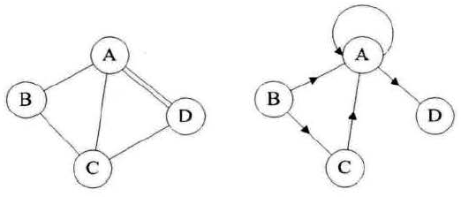

在无向图中，如果任意两个顶点都存在边，则称该图为无向完全图。含有n个顶点的无向完全图有n(n-1)/2条边。下面的就是一个无向完全图，因为每个节点都要与除了它的其他顶点连线，所以共n(n-1)条边，再除以2代表除去重复的边。

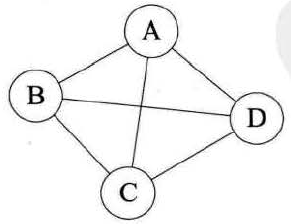

在有向图中，如果任意两个顶点之间都存在方向互为相反的两条弧，则称该图为有向完全图。含有n个顶点的有向完全图有n(n-1)条边：


有很少条边或弧的称为稀疏图，反之称为稠密图。这里的稀疏和稠密是模糊的概念，都是相对而言的。

有些图的边或弧具有与它相关的数字，这种与图的边或弧相关的数叫权（Weight），这种带权的图通常称为网（Network）

如果图A的顶点集和边集同时是图B的顶点集和边集的子集，称A为B的子图。下面有背景的图均是左侧无背景图的子图：

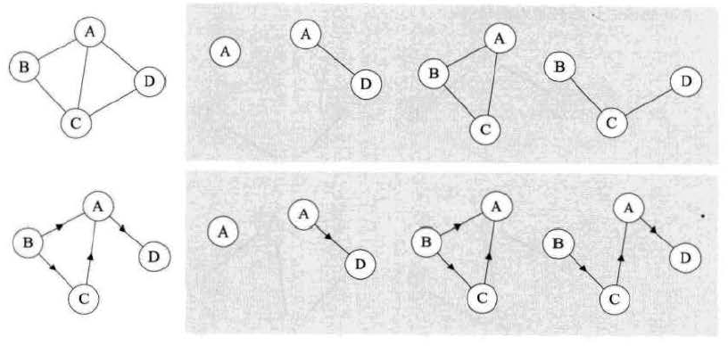

## 顶点与边

对于无向图，一条边上的两个顶点v1、v2称为邻接点，此时称v1和v2相邻接，边(v1,v2)依附于顶点v1和v2，或者说边(v1,v2)与顶点v1、v2相关联。

顶点v的度Degree是和v相关联的边的数目，记为TD(v)。图的边数等于各顶点度数和的一半。

对于有向图，一条有向边\<v1,v2>，称顶点v1邻接到顶点v2，顶点v2邻接自顶点v1，弧\<v1,v2>和顶点v1、v2相关联。

以顶点v为头的弧的数目称为v的入度（InDegree），记为ID(v)；以顶点v为尾的弧的数目称为v的出度（OutDegree），记为OD(v)；顶点v的度等于出度+入度。

在有向图中，各顶点的总出度=总入度

图中从一个顶点到另一个顶点的路径是一个顶点序列，下图就列举了从顶点B到顶点D的四种不同路径：

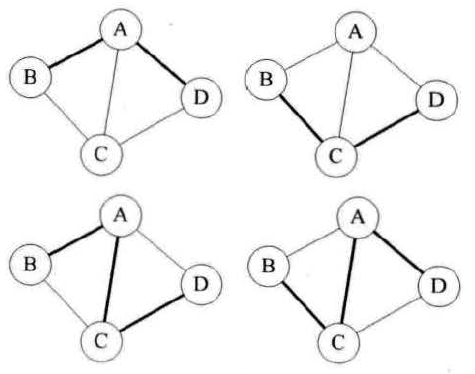

注意，当有向图的时候，路径也是有向的，路径顶点序列中不能出现边集以外的边，例如下面列举了从B到D的路径，而从顶点A到B就不存在路径：

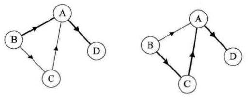

树中根结点到任意结点的路径是唯一的，但是图中顶点与顶点之间的路径却是不唯一的。

路径的长度是路径上边或弧的数目。

第一个顶点到最后一个顶点相同的路径称为环（Cycle）。序列中顶点不重复出现的路径称为简单路径。除了第一个顶点和最后一个顶点之外，其余顶点不重复出现的回路，称为简单回路或简单环。

下面的两个图粗线都构成环，但是右侧因为顶点c在路径中的重复，且不是第一个和最后一个顶点，它就不是简单环了：

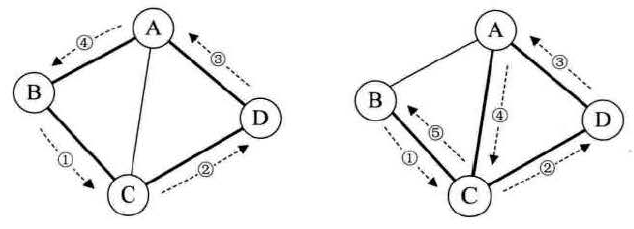

## 连通图

在无向图G中，如果从顶点v1到顶点v2有路径，则称v1和v2是连通的，如果对于图中属于顶点集的任意两个顶点vi、vj都是连通的，则称G是连通图（Connected Graph），下面左图就不是连通图，右图是连通图：

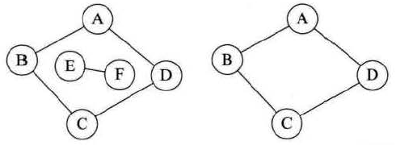

无向图中的极大连通子图称为连通分量，连通子图拥有极大顶点个数。上面的右图就是左图的一个连通分量。

在有向图G中，如果对属于顶点集的任意两个顶点vi、vj，从vi到vj和从vj到vi都存在路径，则称G是强连通图。有向图中的极大强连通子图称做有向图的强连通分量。对于下面的左图来说，它不是强连通图，因为A到D存在路径，而D到A不存在路径。右图就是强连通图，且右图是左图的极大强连通子图：

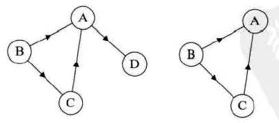

一个连通图的生成树是一个极小的连通子图，它含有图中全部的n个顶点，但只有足以构成一棵树的n-1条边。如果一个图有n个顶点和小于n-1条边，则它是非连通图；如果他多于n-1条边，则它必定构成一个环。

下图的图1 去掉两条边后，得到的图2和图3就是生成树，但有n-1条边不一定是生成树，例如图4：

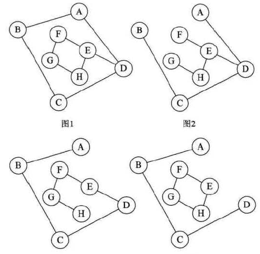

如果一个有向图恰好有一个顶点的入度为0，其余顶点的入度均为1，则它是一棵有向树。

一个有向图的生成森林由若干棵有向树组成，含有图中全部顶点，但只有足以构成若干棵不相交的有向树的弧。例如下面图1是一棵有向树，去掉一些弧后，它可以分解为两棵有向树图2和图3，它们两个就是图1的生成森林：

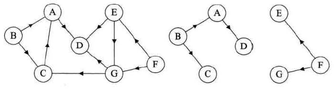

## 图的存储结构

图的存储结构主要描述的是顶点之前的关系，下面四张图仔细观察发现，它们其实就是同一个图，只不过顶点的位置不同，造成了表象不同：

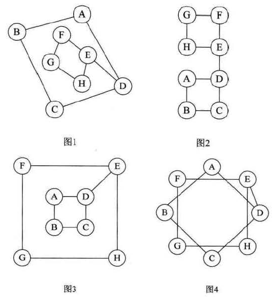

因为任意两个顶点都可能存在联系，所以图不可能用简单的顺序结构来表示，如果用多重链表表示的话，因为各顶点的度不同，则会造成很多指针存储空间的浪费。

### 邻接矩阵

考虑图是由顶点和边或弧两部分组成，合在一起比较困难，所以考虑分别用两个结构来存储。顶点用一维数组来保存，边或弧用一个二维数组来保存，这就是邻接矩阵（Adjacency Matrix）存储方式。

邻接矩阵是这样一个矩阵，它的ij位置为1代表存在vi到vj的边，下面是一个无向图用邻接矩阵的表示方法：

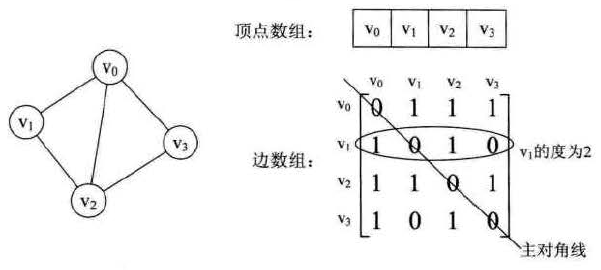

无向图的邻接矩阵的对角线总是0，因为不存在顶点到自身的边。由于是无向图，所以它一定是一个对称矩阵。

顶点vi的度=邻接矩阵第i行的元素之和。顶点vi的所有邻接点其实就是邻接矩阵第i行所有元素值为1对应的列。

下面的一个有向图的邻接矩阵表示案例：

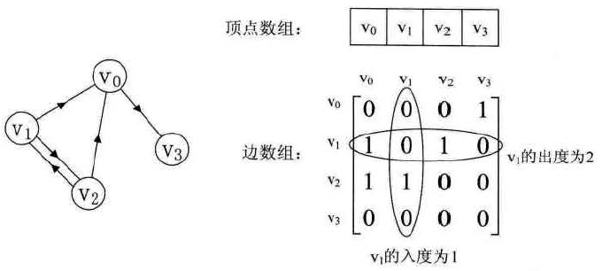

有向图的邻接矩阵并不是对称矩阵。vi的入度=第i列各数之和，vi的出度=第i行各数之和。

每条边上带有权的图是网，下面是一个有向网图用邻接矩阵表示的案例：

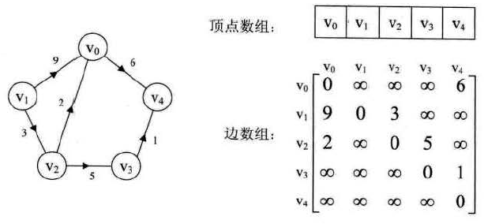

在网的邻接矩阵中，对角线上的值都是0，每个位置的值代表对应边的权值，不存在的边对应位置为一个最大值。

### 邻接表

对于边数相对顶点较少的图，用邻接矩阵表示是非常浪费空间的，此时邻接矩阵中有大量空间是默认值：

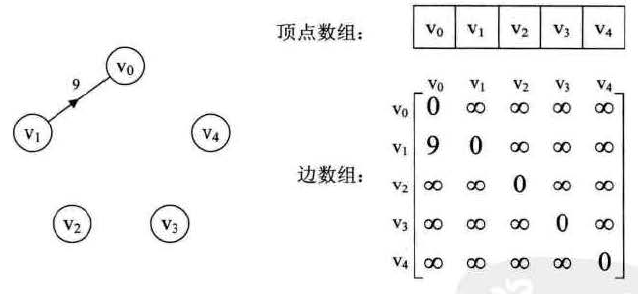

可以考虑用链式结构来保存边的信息以节约空间。

邻接表（Adjacency List）是数组与链表相结合的存储方式。它用一个一维数组来表示顶点，然后每个顶点有指向它邻接点的指针，它的多个邻接点形成一个单链表，无向图称为顶点vi的边表，有向图称为顶点vi作为弧尾的出边表。

下面是一个无向图的邻接表结构：

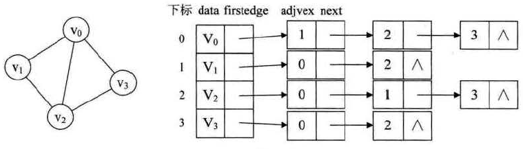

如果想知道某个顶点的度，其实就是查找顶点对应边表中结点的个数。

想判断vi到vj是否存在边，需要去对应边表中确认是否有对应下标的结点。求顶点的所有邻接点，实际上就是对此顶点的边表进行遍历。

有向图的邻接表结构是类似的，不同之处在于有向图由于有方向，所以我们是以顶点为弧尾来存储边表的，这样很容易得到每个顶点的出度，但有时也为了便于确定顶点的入度，建立一个以顶点为弧头的边表，此时称为有向图的逆邻接表。下面就是有向图的邻接表，和对应的逆邻接表：

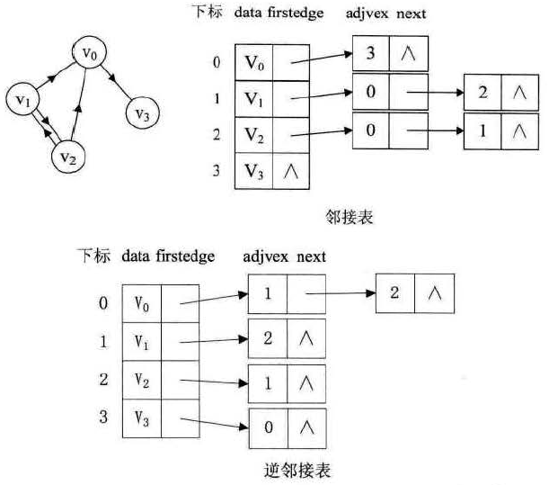

对于带权值的网图，可以在边表结点定义中再增加一个weight的数据域，存储权信息即可：

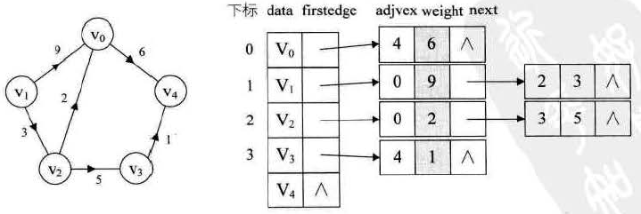

### 十字链表

对于有向图来说，邻接表是由缺陷的，只能解决出度或者入度的问题，不能同时解决两个问题。十字链表（Orthogonal List）将邻接表和逆邻接表结合起来，容易求得顶点的出度和入度。

顶点表结构由三个部分组成：

- data：数据域
- firstin：入边表头指针，指向该顶点入边表中的第一个结点
- firstout：出边表头指针，指向该顶点出边表中的第一个结点

边表结点结构：

- tailvex：弧起点在顶点表的下标
- headvex：弧终点在顶点表的下标，它和tailvex就构成了唯一一条边
- headlink：入边表指针域，指向终点相同的下一条边
- taillink：出边表指针域，指向起点相同的下一条边

下面是一个十字链表案例：

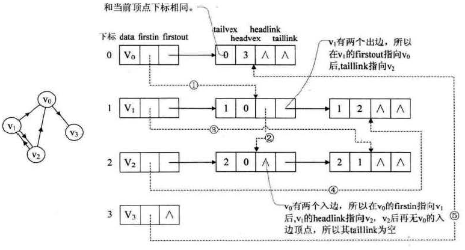

### 邻接多重表

无向图的邻接表存在一个问题，如果要删除一条边，必须找到这条边的两个边表结点进行操作：

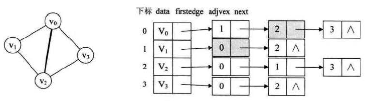

邻接多重表与邻接表的区别就是边表结构不同，它由几个部分组成：

- ivex：边依附的两个顶点其中之一在顶点表中下标
- ilink：指向依附顶点ivex的下一条边
- jvex：边依附的两个顶点其中之一在顶点表中下标
- jlink：指向依附顶点jvex的下一条边

下面是一个邻接多重表案例：

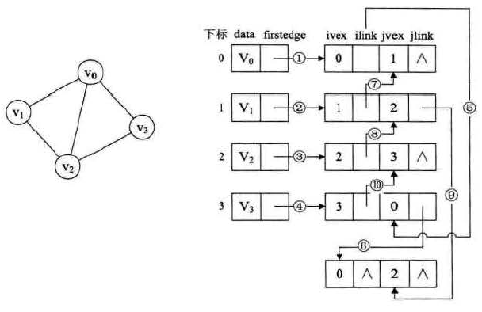

邻接多重表与邻接表的区别：同一条边在邻接表中要用两个结点表示，而在邻接多重表中只有一个结点。这样对边的操作就方便多了，例如要删除一条边v0v2只需要将6、9的链接改为指向空即可。

### 边集数组

边集数组是由两个一维数组组成：

- 一个是存储顶点的信息
- 一个是存储边的信息，这个边数组每个元素由一条边的起点下标、终点下标和权组成

下面是一个边集数组的例子：

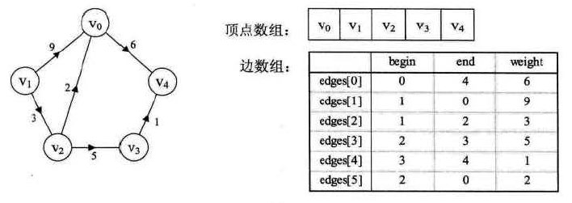

边集数组关注的是边的集合，在边集数组中查找一个顶点的度需要扫描整个数组。它更适合对边依次进行处理的操作，不适合对顶点相关的操作。

## 遍历

图的遍历可分为两种方案：深度优先遍历和广度优先遍历

- 深度优先遍历：Depth First Search，简称DFS，可以用递归或者栈实现
- 广度优先遍历：Breadth First Search，简称BFS，用队列实现

它们在时间复杂度上是一样的，不同之处仅仅在于对顶点访问顺序的不同

## 自定义图代码

### 邻接矩阵实现

基于邻接矩阵表示一个图MatrixGraph类，要实现的类与方法：Vertex、空参构造、addVertex、addEdge、displayVertex、dfs、bfs、degree

```java
class MatrixGraph{
	
	//ver代表顶点集合
	private Vertex[] ver;
	//mat代表边矩阵
	private int[][] mat;
	//顶点集合和边矩阵的初始大小
	private static final int DEFAULT_SIZE = 20;
	//verSize代表实际顶点个数
	private int verSize;
	//dfs用的栈
	private Stack<Integer> stack;
	//bfs用的队列
	private Queue<Integer> queue;
	
	//顶点的嵌套类
	private static class Vertex{
		//分别代表顶点名和指示是否遍历过的标志
		String name;
		boolean wasVisited;
		
		//有参构造，默认结点未被初始化
		public Vertex(String name){
			this.name = name;
			wasVisited = false;
		}
	}
	
	//图的无参构造
	public MatrixGraph(){
		//分别建立边矩阵和顶点集合以默认大小
		ver = new Vertex[DEFAULT_SIZE];
		mat = new int[DEFAULT_SIZE][DEFAULT_SIZE];
		//初始化顶点个数为0
		verSize = 0;
		//遍历边矩阵把各元素初始化为0
		for(int i = 0 ; i < DEFAULT_SIZE ; i++){
			for(int j = 0 ; j < DEFAULT_SIZE ; j++){
				mat[i][j] = 0;
			}
		}
	}
	
	//添加顶点
	public void addVertex(String st){
		//将结点添加进入顶点集合中
		ver[verSize] = new Vertex(st);
		//并将顶点个数加1
		verSize++;
	}
	
	//添加边
	public void addEdge(int begin , int end){
		//不允许添加自己到自己的边
		if(begin == end)return;
		//因为是对称矩阵所以两个数都要初始化
		mat[begin][end] = 1;
		mat[end][begin] = 1;
	}
	
	//打印一个顶点
	public void displayVertex(int i){
		System.out.print(ver[i].name+" ");
	}
	
	//返回顶点的度
	public int degree(int k){
		int degree = 0;
		//遍历边矩阵的一行，对等于1的点计数
		for(int i = 0 ; i < verSize ; i++){
			if(mat[k][i] == 1){
				degree++;
			}
		}
		return degree;
	}
	
	//非递归法借助栈实现dfs
	public void dfs1(){
		//新建栈并把第一个顶点压入栈中
		stack = new Stack<>();
		stack.push(0);
		//打印第一个顶点，也可以做其他操作
		displayVertex(0);
		//把第一个顶点访问标记更新
		ver[0].wasVisited = true;
		
		//循环条件：栈不为空
		//如果栈为空代表遍历结束
		while(!stack.empty()){
			//将栈顶元素拿出放入hasNext方法中获得路径中下一个未访问的顶点
			int j = hasNext(stack.peek());
			//如果该顶点存在
			if(j != -1){
				//将该顶点对应的编号压入栈中
				//打印该顶点并更新标记
				stack.push(j);
				ver[j].wasVisited = true;
				displayVertex(j);
			}else{
				//如果该顶点没有下一个未访问顶点
				//那就将栈弹出，相当于按原路返回寻找新的可能路径
				stack.pop();
			}
		}
		
		//最后更新所有顶点标记做好下一次遍历准备
		for(int k = 0 ; k < verSize ; k++){
			ver[k].wasVisited = false;
		}
	}
	
	//递归法实现dfs
	public void dfs2(){

		//遍历所有顶点调用递归的dfs方法
		//这种递归方式决定了每次找不到下一个点时会尽可能小的寻找新的起始点
		//所以这与栈实现的遍历方式结果不同
		for(int i = 0 ;i < verSize;i++){
			//如果已经遍历过该顶点那么就直接进入下一次循环
			if(ver[i].wasVisited == false){
				dfs(i);
			}
		}
		
		//最后更新所有顶点标记做好下一次遍历准备
		for(int k = 0 ; k < verSize ; k++){
			ver[k].wasVisited = false;
		}
	}
	
	//递归方法
	private void dfs(int i){
		
		//更新标记并打印该顶点
		ver[i].wasVisited = true;
		displayVertex(i);
		
		//获取下一个顶点，如果存在继续递归，不存在结束
		//相当于一条路径走到了尽头，此时返回到上面的for位置
		//继续寻找新顶点
		int j = hasNext(i);
		if(j != -1){
			dfs(j);
		}
	}
	
	//hasNext是判断顶点周围有没有未访问顶点的方法
	private int hasNext(int k){
		
		//遍历周围每一个顶点，相当于遍历边矩阵的一行，如果为1，说明该列号是相邻顶点
		//此时查看该节点，如果没有被访问过，就返回该顶点号
		for(int i = 0;i < verSize;i++){
			if(mat[k][i] == 1 && ver[i].wasVisited == false){
				return i;
			}
		}
		
		//如果遍历结束没有找到未访问顶点，那么返回-1
		return -1;
	}
	
	//bfs遍历图
	public void bfs(){
		//新建一个队列
		queue = new LinkedList<Integer>();
		//将0放入队列中,并将其标志更新
		queue.offer(0);
		ver[0].wasVisited = true;
		
		//循环条件是队列不为空
		while(!queue.isEmpty()){
			//取出队列里的值并打印
			//这里吧更新操作放入了下个方法中
			//因为在更新队列的时候有可能出现重复放入的现象
			//所以要在顶点放入队列的时候把控住
			int j = queue.poll();
			displayVertex(j);
			//将j周围的顶点放入队列中
			queue = takeInQueue(queue , j);
		}
		
		//最后更新所有顶点标记做好下一次遍历准备
		for(int k = 0 ; k < verSize ; k++){
			ver[k].wasVisited = false;
		}
	}
	
	//将周围的顶点放入队列中
	private Queue<Integer> takeInQueue(Queue<Integer> queue , int i){
		
		//遍历边矩阵中的一行，如果有顶点没有被访问就将其放入队列中
		for(int k = 0 ; k < verSize ; k++){
			if(mat[i][k] == 1 && ver[k].wasVisited == false){
				queue.offer(k);
				//同时更新这些顶点的标记
				//这样做是防止重复放入，放入其中的顶点早晚会被访问
				ver[k].wasVisited = true;
			}
		}
		
		//最后返回更新后的队列
		return queue;
	}
}
```

### 邻接表实现

基于邻接表表示一个图ListGraph类。要实现的类与方法：Vertex、ListVex、空参构造、addVertex、addEdge、displayVertex、dfs、bfs、degree

```java
class ListGraph{
	
	//顶点数组
	private Vertex[] ver;
	//顶点数组的默认大小
	private static final int DEFAULT_SIZE = 20;
	//size表示图中的顶点数
	private int size;
	//dfs中用的栈
	private Stack<Integer> stack;
	//bfs中用的队列
	private Queue<Integer> queue;
	
	//顶点类
	private static class Vertex{
		//分别代表号、顶点名、顶点标记、第一个邻接结点
		int id;
		String name;
		boolean wasVisited;
		ListVex firstEdge;
				
		//有参构造，默认结点未被访问
		public Vertex(String name){
			this.name = name;
			wasVisited = false;
		}
	}
	
	//邻接链表结点类
	private static class ListVex{
		//结点号和下一个结点指针
		int id;
		ListVex next;
		//有参构造，默认下个结点为空
		public ListVex(int id){
			this.id = id;
			next = null;
		}
	}
	
	//图的初始化，分配一个默认大小的顶点数组
	public ListGraph(){
		ver = new Vertex[DEFAULT_SIZE];
		//将顶点个数初始化为0
		size = 0;
	}
	
	//添加顶点方法
	public void addVertex(String name){
		//将顶点数组的下一个值赋值为新建顶点
		ver[size] = new Vertex(name);
		//此时的size值就赋值为顶点id
		ver[size].id = size;
		//默认新建顶点的第一个邻接结点为空
		ver[size].firstEdge = null;
		//最后顶点数加1
		size++;
	}
	
	//添加边方法，需提供起始id和终止id
	public void addEdge(int begin , int end){
		
		//创建两个结点类为下方操作做准备
		ListVex node;
		ListVex secondNode;
		
		//若输入的起始和终止相同就抛出一个异常
		if(begin == end){
			throw new IllegalStateException();
		}
		
		//第一部分：将起始id对应的邻接链表更新：添加一个包含end信息的结点
		//第一个邻接结点要单独处理，因为firstEdge不能连续向下推进
		//如果第一个邻接结点为空，那么就新建一个邻接结点并将其作为第一结点
		if(ver[begin].firstEdge == null){
			ver[begin].firstEdge = new ListVex(end);
		}else{
			//如果第一个邻接结点不为空，那么就向下推进结点
			//将第一个邻接结点给node，然后令node作为新的邻接结点
			//这样node就成了新的第一结点
			node = ver[begin].firstEdge;
			ver[begin].firstEdge = node;
			//只要node下还有其他节点，就将node赋值为下一个结点
			while(node.next != null){
				node = node.next;
			}
			//直至node没有下一个结点，此时将下一个结点设置为新建的包含end信息的结点
			node.next = new ListVex(end);
			
		}
		
		//第二部分：将终止end对应的邻接链表更新：添加一个包含begin信息的结点
		//这一部分与上一部分是相似的结构
		//因为一条边添加完成一个结点中的链表要有另一个结点的信息，同时另一个结点也要有这个结点的信息
		//所以同样的操作要进行两次
		if(ver[end].firstEdge == null){
			ver[end].firstEdge = new ListVex(begin);
		}else{
			secondNode = ver[end].firstEdge;
			ver[end].firstEdge = secondNode;
			while(secondNode.next != null){
				secondNode = secondNode.next;
			}
			secondNode.next = new ListVex(begin);
		}
	}
		
	//打印某个结点的name
	public void displayVertex(int id){
		System.out.print(ver[id].name + "-->");
	}
	
	//计算度的方法
	public int degree(int id){
		//初始化度为0
		int count = 0;
		//将code记为第id个结点的第一个邻接结点
		ListVex code = ver[id].firstEdge;
		//只要第一结点不为空就把count加一，并继续向后推进
		while(code != null){
			count++;
			code = code.next;
		}
		//循环结束后此时的count值就是度
		return count;
	}
	
	//dfs遍历图，与邻接矩阵实现的dfs遍历相同
	//不同之处仅在于寻找顶点周围下一个可用的顶点方法构造不同
	public void dfs(){
		stack = new Stack<Integer>();
		stack.push(0);
		displayVertex(0);
		ver[0].wasVisited = true;
		while(!stack.empty()){
			//这个方法构造不同
			int j = findNext(stack.peek());
			if(j != -1){
				stack.push(j);
				displayVertex(j);
				ver[j].wasVisited = true;
			}else{
				stack.pop();
			}
		}
		
		for(int i = 0 ; i < size ; i++){
			ver[i].wasVisited = false;
		}
		
		System.out.println("结束");
	}
	
	//该方法用于寻找某个顶点周围可用的顶点号
	private int findNext(int x){
		
		//如果该顶点邻接链表的第一个结点为空，也就是说周围没有其他节点了
		//此时查找失败直接返回-1
		if(ver[x].firstEdge == null){
			return -1;
		}
		
		//如果该顶点邻接链表第一个结点不为空且该顶点没有访问过
		if(ver[ver[x].firstEdge.id].wasVisited == false){
			//返回该顶点号
			return ver[x].firstEdge.id;
		}
		
		//将邻接链表第一个顶点的下一个顶点记为node
		ListVex node = ver[x].firstEdge.next;
		//如果该点不为空就检查是否被方为过，是就返回结点号
		//不是就推进指针，继续查找
		while(node != null){
			if(ver[node.id].wasVisited == false){
				return node.id;
			}else{
				node = node.next;
			}
		}
		
		//循环后如果还没有运行任何return语句那么最后返回-1，查找失败
		return -1;
	}
	
	//bfs遍历图，步骤与邻接矩阵实现图的方法一致
	//唯一不同之处在于将顶点周围所有可用顶点全加入队列的方法构造不同
	public void bfs(){
		queue = new LinkedList<Integer>();
		queue.offer(0);
		ver[0].wasVisited = true;
		while(!queue.isEmpty()){
			//该方法不同
			allInQueue(queue , queue.peek());
			int j = queue.poll();
			displayVertex(j);
		}
		
		for(int i = 0 ; i < size ; i++){
			ver[i].wasVisited = false;
		}
		
		System.out.println("结束");
	}
	
	//该方法用于将某个顶点周围所有可用顶点全加入队列中
	private void allInQueue(Queue<Integer> queue , int x){
		//如果该顶点第一个邻接结点为空，也就是该顶点周围没有顶点
		//此时直接返回
		if(ver[x].firstEdge == null){
			return;
		}
		
		//如果该顶点的第一个邻接结点不为空，且还没有被访问过，就将其加入队列
		//同时更新该顶点的标记，因为加入队列的顶点早晚会访问到
		if(ver[ver[x].firstEdge.id].wasVisited == false){
			queue.offer(ver[x].firstEdge.id);
			ver[ver[x].firstEdge.id].wasVisited = true;
		}
		
		//将第二个邻接结点称为node
		ListVex node = ver[x].firstEdge.next;
		//node只要不为空，就检查他是否被访问过，如果访问过那么就加入队列并更新标志
		//最后还要推进指针继续循环，无论是否有元素加入都要推进指针
		//因为所有的周围顶点都要检查而不是仅加入一个即可
		while(node != null){
			if(ver[node.id].wasVisited == false){
				queue.offer(node.id);
				ver[node.id].wasVisited = true;
			}
			node = node.next;
		}
	}
}
```

## 最小生成树

假设你是电信的工程师，需要为一个镇九个村庄架设通信网络做设计，村庄位置和村与村之间的距离如下：

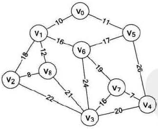

领导要求必须用最小的成本完成这次任务。这就是一个典型的构造连通网的最小代价生成树问题，称为最小生成树。满足要求的一定是一个连通图的生成树，它有n个结点，n-1条边组成。下面是几种连接方案及其代价：

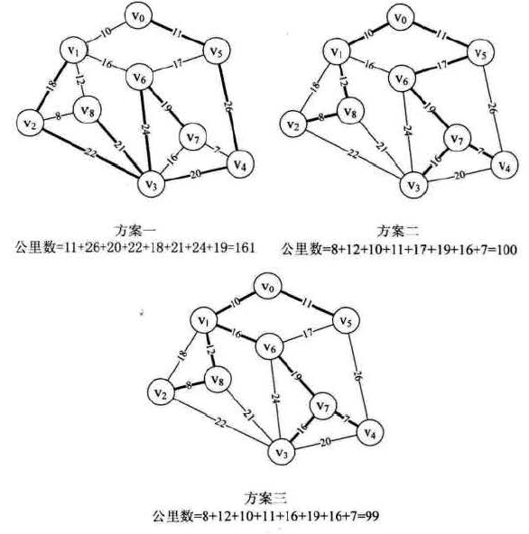

找连通网的最小生成树，经典的有两种算法：普利姆算法和克鲁斯卡尔算法

### Prim算法

Prim算法的核心思想：将点分为两拨，已经加入最小生成树的，和未加入的。找到未加入中距离集合最近的点，添加该点，修改其它点到集合的距离,直到所有结点都加入到最小生成树。

算法描述如下：

1. 以某一个点A开始，将此点加入集合U，并访问其所有经过此点的边。
2. 在这些边寻找权重最小的边，并且要求它的另一个点B没有被访问过。如果 能找到，就将点B加入集合U。接着我们要访问，所有经过点A或点B的边。
3. 重复2的过程，直到所有的点都加入U。
4. 此时由所有边构成的树即为最小生成树。

prim算法的时间复杂度是O(n2)，其中n是顶点数

下面是一个基于邻接矩阵实现的带权的无向图实现prim算法：

```java
//带权的无向图
//与不带权的不同之处：
//1、多了一个域常量，记录边矩阵中的最大值
//2、边矩阵初始化、插入边时有不同
class Weight_MatrixGraph{
	
	//边矩阵中的无穷大
	private static final int INFINITY = 65535;
	//ver代表顶点集合
	private Vertex[] ver;
	//mat代表边矩阵
	private int[][] mat;
	//顶点集合和边矩阵的初始大小
	private static final int DEFAULT_SIZE = 20;
	//verSize代表实际顶点个数
	private int verSize;
	//dfs用的栈
	private Stack<Integer> stack;
	//bfs用的队列
	private Queue<Integer> queue;
	
	//顶点的嵌套类
	private static class Vertex{
		//分别代表顶点名和指示是否遍历过的标志
		String name;
		boolean wasVisited;
		
		//有参构造，默认结点未被初始化
		public Vertex(String name){
			this.name = name;
			wasVisited = false;
		}
	}
	
	//图的无参构造
	public Weight_MatrixGraph(){
		//分别建立边矩阵和顶点集合以默认大小
		ver = new Vertex[DEFAULT_SIZE];
		mat = new int[DEFAULT_SIZE][DEFAULT_SIZE];
		//初始化顶点个数为0
		verSize = 0;
		//遍历边矩阵把各元素初始化
		for(int i = 0 ; i < DEFAULT_SIZE ; i++){
			for(int j = 0 ; j < DEFAULT_SIZE ; j++){
				if(i == j){
					mat[i][j] = 0;
				}else{
					mat[i][j] = INFINITY;
				}
				
			}
		}
	}
	
	//添加顶点
	public void addVertex(String st){
		//将结点添加进入顶点集合中
		ver[verSize] = new Vertex(st);
		//并将顶点个数加1
		verSize++;
	}
	
	//添加边
	public void addEdge(int begin , int end , int weight){
		//不允许添加自己到自己的边
		if(begin == end)return;
		//因为是对称矩阵所以两个数都要初始化
		mat[begin][end] = weight;
		mat[end][begin] = weight;
	}
	
	//打印一个顶点
	public void displayVertex(int i){
		System.out.print(ver[i].name+" ");
	}
	
	//返回顶点的度
	public int degree(int k){
		int degree = 0;
		//遍历边矩阵的一行，对等于1的点计数
		for(int i = 0 ; i < verSize ; i++){
			if(mat[k][i] == 1){
				degree++;
			}
		}
		return degree;
	}
	
	//非递归法借助栈实现dfs
	public void dfs1(){
		//新建栈并把第一个顶点压入栈中
		stack = new Stack<>();
		stack.push(0);
		//打印第一个顶点，也可以做其他操作
		displayVertex(0);
		//把第一个顶点访问标记更新
		ver[0].wasVisited = true;
		
		//循环条件：栈不为空
		//如果栈为空代表遍历结束
		while(!stack.empty()){
			//将栈顶元素拿出放入hasNext方法中获得路径中下一个未访问的顶点
			int j = hasNext(stack.peek());
			//如果该顶点存在
			if(j != -1){
				//将该顶点对应的编号压入栈中
				//打印该顶点并更新标记
				stack.push(j);
				ver[j].wasVisited = true;
				displayVertex(j);
			}else{
				//如果该顶点没有下一个未访问顶点
				//那就将栈弹出，相当于按原路返回寻找新的可能路径
				stack.pop();
			}
		}
		
		//最后更新所有顶点标记做好下一次遍历准备
		for(int k = 0 ; k < verSize ; k++){
			ver[k].wasVisited = false;
		}
	}
	
	//递归法实现dfs
	public void dfs2(){

		//遍历所有顶点调用递归的dfs方法
		//这种递归方式决定了每次找不到下一个点时会尽可能小的寻找新的起始点
		//所以这与栈实现的遍历方式结果不同
		for(int i = 0 ;i < verSize;i++){
			//如果已经遍历过该顶点那么就直接进入下一次循环
			if(ver[i].wasVisited == false){
				dfs(i);
			}
		}
		
		//最后更新所有顶点标记做好下一次遍历准备
		for(int k = 0 ; k < verSize ; k++){
			ver[k].wasVisited = false;
		}
	}
	
	//递归方法
	private void dfs(int i){
		
		//更新标记并打印该顶点
		ver[i].wasVisited = true;
		displayVertex(i);
		
		//获取下一个顶点，如果存在继续递归，不存在结束
		//相当于一条路径走到了尽头，此时返回到上面的for位置
		//继续寻找新顶点
		int j = hasNext(i);
		if(j != -1){
			dfs(j);
		}
	}
	
	//hasNext是判断顶点周围有没有未访问顶点的方法
	private int hasNext(int k){
		
		//遍历周围每一个顶点，相当于遍历边矩阵的一行，如果为1，说明该列号是相邻顶点
		//此时查看该节点，如果没有被访问过，就返回该顶点号
		for(int i = 0;i < verSize;i++){
			if(mat[k][i] == 1 && ver[i].wasVisited == false){
				return i;
			}
		}
		
		//如果遍历结束没有找到未访问顶点，那么返回-1
		return -1;
	}
	
	//bfs遍历图
	public void bfs(){
		//新建一个队列
		queue = new LinkedList<Integer>();
		//将0放入队列中,并将其标志更新
		queue.offer(0);
		ver[0].wasVisited = true;
		
		//循环条件是队列不为空
		while(!queue.isEmpty()){
			//取出队列里的值并打印
			//这里吧更新操作放入了下个方法中
			//因为在更新队列的时候有可能出现重复放入的现象
			//所以要在顶点放入队列的时候把控住
			int j = queue.poll();
			displayVertex(j);
			//将j周围的顶点放入队列中
			queue = takeInQueue(queue , j);
		}
		
		//最后更新所有顶点标记做好下一次遍历准备
		for(int k = 0 ; k < verSize ; k++){
			ver[k].wasVisited = false;
		}
	}
	
	//将周围的顶点放入队列中
	private Queue<Integer> takeInQueue(Queue<Integer> queue , int i){
		
		//遍历边矩阵中的一行，如果有顶点没有被访问就将其放入队列中
		for(int k = 0 ; k < verSize ; k++){
			if(mat[i][k] == 1 && ver[k].wasVisited == false){
				queue.offer(k);
				//同时更新这些顶点的标记
				//这样做是防止重复放入，放入其中的顶点早晚会被访问
				ver[k].wasVisited = true;
			}
		}
		
		//最后返回更新后的队列
		return queue;
	}
	
	//prim方法实现最小生成树
	//该方法以一个顶点为起点，探索它周围的最小权值边，将其纳入生成树中
	//新纳入的节点后再次查找增大范围下最小权边
	//直至所有顶点都纳入最小生成树
	public void prim(){
		//初始化部分，定义变量
		int min , i , j , k = 0;
		//adjvex数组是用来指示下一步位置的数组
		//它的每个值是下一步的起始值，所在位置是下一步的终点值
		int[] adjvex = new int[verSize]; 
		//lowest数组是用来存放每一步可能出现的最小权值的
		//每步其中可能的权值都会更新一次，其中最小的值就是这一步的最优解
		//对应的位置就是下一步的终点值
		int[] lowest = new int[verSize];
		//这个循环用来初始化两个数组，lowest数组被初始化为边矩阵的第一行
		//adjvex数组被全部初始化为0
		//代表第一步我们要从0周围寻找权值最小的结点
		//且此时起始值和终止值都是0
		for(i = 0 ; i < verSize ;i++){
			lowest[i] = mat[0][i];
			adjvex[i] = 0;
		}
		
		
		//循环部分开始，此时两个数组已经完成初始化
		//所以现在只需查找size-1次即可，每一次会打印一个边
		//对应n个结点的最小生成树有n-1条边
		for(i = 1 ; i < verSize ; i++){
			//min值设置为无穷大
			min = INFINITY;
			//这个循环主要用来查找lowest中的最小值，也就是该步的最小权值
			//找到之后把对应的顶点号设置为k，此时k是最小权值边的终点
			//lowest中的0值不能参与最小值比较
			//后面的循环中已经论证了一旦一个元素被设置为0证明其已经加入生成树无需再考虑它了
			//而且一旦lowest中的0值也参与最小值考虑，那么无负权值的情况下每次最小值都是0
			//这个比较也就失去了意义
			for(j = 0 ; j < verSize ; j++){
				if(lowest[j] != 0 && lowest[j] < min){
					min = lowest[j];
					k = j;
				}
			}
			//打印adjvex的k位置和k，也就是最小权值边的起始和终止号
			System.out.print(adjvex[k]+"-->"+k+" ");
			//打印结束后舍弃掉这个最小权值，准备下一次更新
			lowest[k] = 0;
			//这个循环用来寻找k结点周围的最小权值，也就是每增加一个结点都要把它的最小权值更新进lowest
			//同时把k放进adjvex对应更新的位置，这表示从当前情形出发到各位置的最小权值更新了
			//k表示到这个位置是从k结点出发，当然此时adjvex数组中还有出来k以外其他值
			//这些值没有被更新说明k的加入只改变了一部分到各点值的最优权值
			//而adjvex只有size个位置却能记录下下一步的位置是因为
			//就特殊的每一步而言，到每点的最小权值是固定的，随着生成树的增大，
			//权值在降低，出发点在改变
			for(j = 0 ; j < verSize ; j++){
				//lowest为0的位置不能参与更新，这是因为一旦该位置为0就意味着该顶点已经被纳入生成树中
				//无需再计算到达它的最小代价了
				//lowest一开始初始化时0位置就是0，这代表0顶点为起点
				//而后每一次进行下列循环都会不可避免的将边矩阵中的0值覆盖掉lowest中的一个值
				//因为边矩阵中每一行一定有一个元素为0，这代表自己到自己的权值为0
				//这个位置一定是k，表明k结点已加入最小生成树
				if(lowest[j]!= 0 && mat[k][j] < lowest[j]){
					lowest[j] = mat[k][j];
					adjvex[j] = k;
				}
			}
			//lowest到最后是一个全部为0的数组，这代表所有顶点都已经加入生成树
			//最小生成树已经查找完成
		}
	}
}
```

### Kruskal算法

假设一个图有m个节点，n条边。首先，我们需要把m个节点看成m个独立的生成树，并且把n条边按照从小到大的数据进行排列。在n条边中，我们依次取出其中的每一条边，如果发现边的两个节点分别位于两棵树上，那么把两棵树合并成为一颗树；如果树的两个节点位于同一棵树上，那么忽略这条边，继续运行。等到所有的边都遍历结束之后，如果所有的生成树可以合并成一条生成树，那么它就是我们需要寻找的最小生成树，反之则没有最小生成树。

总的来说，Prim算法是以点为对象，挑选与点相连的最短边来构成最小生成树。而Kruskal算法是以边为对象，不断地加入新的不构成环路的最短边来构成最小生成树。

Kruskal算法的时间复杂度是O(eloge)，其中e是边数。Prim算法对于稠密图效果会很好，Kruskal算法更适合稀疏图。

下面是一个基于边集数组的无向图实现kruskal算法：

```java
class Weight_ArrayGraph{
	
	//ver代表顶点集合
	private Vertex[] ver;
	//mat代表边矩阵
	private edge[] edgeArray;
	//顶点集合和边矩阵的初始大小
	private static final int VER_DEFAULT_SIZE = 20;
	//边集数组大小
	private static final int EDGE_DEFAULT_SIZE = 40;
	//verSize代表实际顶点个数
	private int verSize;
	//edgeCount代表边的数量
	private int edgeCount;
	
	//顶点的嵌套类
	private static class Vertex{
		//分别代表顶点名和指示是否遍历过的标志
		String name;
		boolean wasVisited;
		
		//有参构造，默认结点未被初始化
		public Vertex(String name){
			this.name = name;
			wasVisited = false;
		}
	}
	
	//边集数组的边节点类
	private static class edge{
		//域中有起始顶点号、终止顶点号、权
		int beginId;
		int endId;
		int weight;
		public edge(int beginId, int endId, int weight) {
			super();
			this.beginId = beginId;
			this.endId = endId;
			this.weight = weight;
		}
	}
	
	//添加顶点
	public void addVertex(String st){
		//将结点添加进入顶点集合中
		ver[verSize] = new Vertex(st);
		//并将顶点个数加1
		verSize++;
	}
	
	//添加边
	public void addEdge(int begin , int end , int weight){
		
		//如果边的起始或终止顶点还没有添加到顶点集合中就抛出一个异常
		if(begin >= verSize||end >= verSize){
			throw new IllegalStateException();
		}
		
		//将新建的边加入边集数组
		edgeArray[edgeCount] = new edge(begin , end , weight);
		//边数加一
		edgeCount++;
	}

	//图类的无参构造
	//初始化顶点集合和边集数组，并使顶点个数和边个数归零
	public Weight_ArrayGraph() {
		super();
		ver = new Vertex[VER_DEFAULT_SIZE];
		edgeArray = new edge[EDGE_DEFAULT_SIZE];
		verSize = 0;
		edgeCount = 0;
	}
	
	//将边集数组按权值从小到大排序
	public void sortEdgeArray(){
		
		if(edgeCount == 0 || edgeCount == 1){
			return;
		}
		
		edge shift = null;
		for(int i = 0 ; i < edgeCount -1 ;i++){
			for(int j = i ; j < edgeCount - 1 ; j++){
				if(edgeArray[i].weight > edgeArray[j+1].weight){
					shift = edgeArray[i];
					edgeArray[i] = edgeArray[j+1];
					edgeArray[j+1] = shift;
				}
			}
		}
	}
	
	//打印一条边
	public void printEdge(){
		for(int i = 0 ; i < edgeCount ; i++){
			System.out.print(edgeArray[i].weight+" ");
		}
	}
	
	//kruskal算法实现最小生成树
	//这种算法依次将权最小的边纳入生成树中，如果这个过程中形成环则舍弃不要
	//最后有且只有一种结果就是最小生成树
	//形成最小生成树后添加任意的边都会形成环，因为此时树已经包含了全部n个顶点
	//最后方法结束
	public void kruskal(){
		//初始化准备部分，定义m、n
		//endNode是一个记载顶点的终点值的数组，它的大小与顶点数组相同
		//endNode被全部初始化为0
		int m , n;
		int[] endNode = new int[verSize];
		for(int i = 0 ; i < verSize ; i++){
			endNode[i] = 0;
		}
		
		//循环部分开始，循环次数与边的个数相同，每次循环都决定边集数组对应的边到底是
		//加入生成树还是不加入
		for(int i = 0 ; i < edgeCount ; i++){
			//m值代表待判定边begin的终点顶点号
			m = findEnd(endNode , edgeArray[i].beginId);
			//n值代表待判定边end的终点顶点号
			n = findEnd(endNode , edgeArray[i].endId);
			//若m与n不相等，说明该边可以加入生成树，打印该边
			//若m与n相等，说明待判定边的两端拥有同一个终点值，这会形成回环，破坏生成树的结构
			//故此时不加入
			//终点值是指连成树结构的各顶点拥有同一个终点值，这个顶点的号码就是终点值
			//如果待判定的两边拥有同一个终点值，这说明这两端都在已有的生成树中，显然会形成回环
			//如果两端在两个不同的生成树中，if结束后这两个生成树便会合并成一个
			//此时连成一片的新生成树也只有一个终点值
			//当然如果两端都不在已有的生成树中也可以，相当于建立了新的子树
			if(m != n){
				//下一句代表m顶点会以n为下一个终点
				//n自己也可以有终点，n的最后一个终点就是m和n的最终终点
				endNode[m] = n;
				//打印生成树的边，说明该边就是最小生成树的一部分
				System.out.print(edgeArray[i].beginId+"-->"+edgeArray[i].endId+" ");
				//在刚开始endNode全是0，随着各位置数字的更新0逐渐变少
				//最终的endNode只有一个位置是0，在接下来的寻找终点的方法中可以看到
				//0代表查找的终点，也就是最后生成树只能有一个终点，也就是所有的子树已经连成片
				//且其中没有环
				//在0逐渐变少的过程中，endNode数组各点之间逐渐产生联系，最后将终点指向其中一个位置
			}
		}
	}

	//寻找顶点的终点的方法
	private int findEnd(int[] endNode, int Id) {
		//如果endNode对应位置不为0，那么就把该位置的值覆盖到id
		//下次在endNode查找的新id就是上个位置数组的值
		//通过这样的机制使数组各位置形成类似指针的结构
		while(endNode[Id] != 0){
			Id = endNode[Id];
		}
		//直至下个指向0，停止，返回id的值，也就是顶点的终点值
		return Id;
		//这种巧妙的设计使得所有连成片的生成树有且只有一个顶点值
	}
}
```

## 最短路径

在网图和非网图中，最短路径的含义是不同的：

- 非网图的最短路径其实就是指两顶点之间经过的边数最少的路径
- 对于网图来说，最短路径是指两顶点之间经过的边上权值之和最少的路径，并且我们称路径上的第一个顶点是源点，最后一个顶点是终点

非网图完全可以理解为所有边的权值都是1的网图。

### Dijkstra算法

迪杰斯特拉算法的大体思路如下

假设v1为源点，找从v1到其它节点的最短路径：

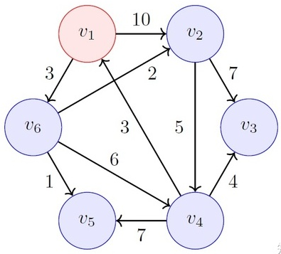

用一个集合S来存储v1到各点的最短路径，最终该算法返回的结果就是集合S。

v1到自己显然最短，故为初始最短路径：

|  步骤  |  S   |  v2  |  v3  |  v4  |  v5  |  v6  |
| :--: | :--: | :--: | :--: | :--: | :--: | :--: |
|  1   |  v1  |      |      |      |      |      |

第一轮：从v1出发，计算v1到其它节点的距离：

|  步骤  |  S   |  v2  |  v3  |  v4  |  v5  |  v6  |
| :--: | :--: | :--: | :--: | :--: | :--: | :--: |
|  1   |  v1  |  10  |      |      |      |  3   |

全表找最小值，发现v1到v6最短为3，然后S中添加一条最短路径：v1——v6，同时到v6的距离已经算出来了，最少就是3（不可能比3更小了），后续也不用更新v6列的距离了。

第二轮：从v1——v6出发，计算v1通过v6到其它节点的距离

已知v1到v6为3；v6可以到v2,v4,v5；因此，v1通过v6到其它节点的距离为3+n，n为6到各节点的距离

|  步骤  |   S    |  v2  |  v3  |  v4  |  v5  |  v6  |
| :--: | :----: | :--: | :--: | :--: | :--: | :--: |
|  1   |   v1   |  10  |      |      |      |  3   |
|  2   | v1——v6 |  5   |      |  9   |  4   |      |

在全表中找最小值（v6列已经删除），此时4为最小值，对应路径v1——v6——v5

添加最短路径v1——v6——v5，同时v5列不再考虑

第三轮：从v1——v6——v5出发，计算v1通过v6及v5到其它节点的距离：发现5不能到任何结点，所以继续找最小值5，对应的路径是v1——v6——v2，添加最短路径v1——v6——v2，同时v2列不再考虑

|  步骤  |     S      |  v2  |  v3  |  v4  |  v5  |  v6  |
| :--: | :--------: | :--: | :--: | :--: | :--: | :--: |
|  1   |     v1     |  10  |      |      |      |  3   |
|  2   |   v1——v6   |  5   |      |  9   |  4   |      |
|  3   | v1——v6——v5 |      |      |      |      |      |
|  4   | v1——v6——v2 |      |  12  |  10  |      |      |

第四轮：遍历全表（v2，v5和v6已经删除）发现，9最小，对应的路径为v1——v6——v4，同时v4列不再考虑

|  步骤  |     S      |  v2  |  v3  |  v4  |  v5  |  v6  |
| :--: | :--------: | :--: | :--: | :--: | :--: | :--: |
|  1   |     v1     |  10  |      |      |      |  3   |
|  2   |   v1——v6   |  5   |      |  9   |  4   |      |
|  3   | v1——v6——v5 |      |      |      |      |      |
|  4   | v1——v6——v2 |      |  12  |  10  |      |      |
|  5   | v1——v6——v4 |      |  13  |      |      |      |

第五轮：遍历全表发现，12是现存的最小值，对应v1——v6——v2——v3路径最短，同时v3列不考虑。由于v3不到任何点，所以最终的表格如下

|  步骤  |       S        |  v2  |  v3  |  v4  |  v5  |  v6  |
| :--: | :------------: | :--: | :--: | :--: | :--: | :--: |
|  1   |       v1       |  10  |      |      |      |  3   |
|  2   |     v1——v6     |  5   |      |  9   |  4   |      |
|  3   |   v1——v6——v5   |      |      |      |      |      |
|  4   |   v1——v6——v2   |      |  12  |  10  |      |      |
|  5   |   v1——v6——v4   |      |  13  |      |      |      |
|  6   | v1——v6——v2——v3 |      |      |      |      |      |

全部列的最小值都已经固定，所以v1到各节点的路径及其最短距离：

v2：v1——v6——v2 = 5
v3：v1——v6——v2——v3 = 12
v4：v1——v6——v4 = 9
v5：v1——v6——v5 = 4
v6：v1——v6 = 3

Dijkstra算法是一种基于贪心策略的算法。每次新扩展一个路程最短的点，更新与其相邻的点的路程。当所有边权都为正时，由于不会存在一个路程更短的没扩展过的点，所以这个点的路程永远不会再被改变，因而保证了算法的正确性。

根据这个原理，用Dijkstra算法求最短路径的图不能有负权边，因为扩展到负权边的时候会产生更短的路径，有可能破坏了已经更新的点路径不会发生改变的性质。

Dijkstra算法解决了从某个源点到其余各顶点的最短路径问题，时间复杂度是On2，其中n是顶点数，而且要得到某一个具体的终点的最短路径，也要遍历所有n个点才可以。如果想要得到任意一个源点到其余所有顶点的最短路径，需要在此基础上再套一层循环，遍历一遍所有顶点，此时时间复杂度为On3

### Floyd算法

它可以求所有顶点到所有顶点的最短路径，时间复杂度是On3

从出发地到目的地的过程中，我们并不是一下子就到达目的地，而是要经过很多的中转站来帮助我们一步一步地到达目的地。例如下面的图中，假设 AB，BC 之间的距离分别为 7 和 2。我们看到，A 和 C 之间不能直接通达，因此，要计算 A 和 C 之间的距离，我们就要借助 B 来作为中转站，因此 A 到 C 的距离为 7 + 2 = 9。


因此，计算所有节点之间的最短距离这个大问题可以分为借助k个中转站的情况下计算各节点之间的最短路径。

下面来谈一下具体的求解过程，我们首先用邻接矩阵来表示这张图，其中无限符号表示两个节点之间不能相互直达，矩阵中每一项的数字代表边的权重，也就是节点之间的距离：

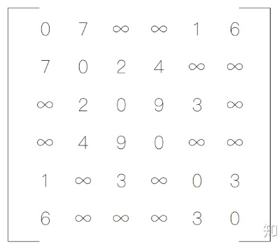

上面的矩阵也可以代表在不借助中转站的情况下（ k=0 ）各节点之间的最短路径。接下来，我们只让节点 A 作为中转站，然后计算各节点的最短路径，然后对于矩阵的每一项，我们比较d\[i][j]和d\[i][1]+d\[1][j]的大小，然后取最小者作为d\[i][j]的值。其中i和j分别代表矩阵的行和列。

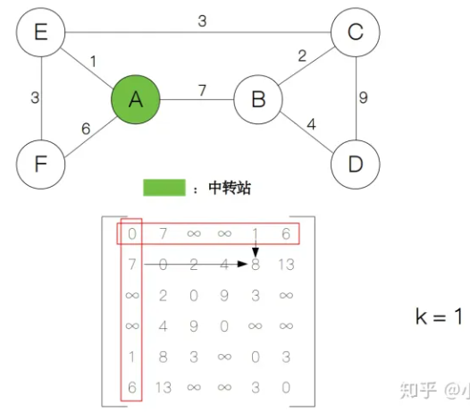

计算后我们发现矩阵中的第 2 行第 5 列变成了8，说明从节点 B 到节点 E 的最短距离在当前状态下为  。接下来，我们逐渐增加中转站的个数，每增加一个中转站的个数，矩阵就更新一次。k从1递增到n，每递增一次，矩阵的值就更新一次，最后我们就得到所有点对的最短距离了。

用代码表示这个过程非常简单，只需要几行就能实现：

```
def Floyd(d):
    n = d.shape[0]
    for k in range(n):
        for i in range(n):
            for j in range(n):
                d[i][j] = min(d[i][j], d[i][k]+d[k][j])
    return d

```

### 代码实现

基于邻接矩阵实现的带权无向图，实现查找最小路径的Dijkstra算法、以及Floyd算法：

```java
//带权的无向图
//与不带权的不同之处：
//1、多了一个域常量，记录边矩阵中的最大值
//2、边矩阵初始化、插入边时有不同
class Weight_MatrixGraph_2{
	
	//边矩阵中的无穷大
	private static final int INFINITY = 65535;
	//ver代表顶点集合
	private Vertex[] ver;
	//mat代表边矩阵
	private int[][] mat;
	//顶点集合和边矩阵的初始大小
	private static final int DEFAULT_SIZE = 20;
	//verSize代表实际顶点个数
	private int verSize;
	//dfs用的栈
	private Stack<Integer> stack;
	//bfs用的队列
	private Queue<Integer> queue;
	
	//顶点的嵌套类
	private static class Vertex{
		//分别代表顶点名和指示是否遍历过的标志
		String name;
		boolean wasVisited;
		
		//有参构造，默认结点未被初始化
		public Vertex(String name){
			this.name = name;
			wasVisited = false;
		}
	}
	
	//图的无参构造
	public Weight_MatrixGraph_2(){
		//分别建立边矩阵和顶点集合以默认大小
		ver = new Vertex[DEFAULT_SIZE];
		mat = new int[DEFAULT_SIZE][DEFAULT_SIZE];
		//初始化顶点个数为0
		verSize = 0;
		//遍历边矩阵把各元素初始化
		for(int i = 0 ; i < DEFAULT_SIZE ; i++){
			for(int j = 0 ; j < DEFAULT_SIZE ; j++){
				if(i == j){
					mat[i][j] = 0;
				}else{
					mat[i][j] = INFINITY;
				}
				
			}
		}
	}
	
	//添加顶点
	public void addVertex(String st){
		//将结点添加进入顶点集合中
		ver[verSize] = new Vertex(st);
		//并将顶点个数加1
		verSize++;
	}
	
	//添加边
	public void addEdge(int begin , int end , int weight){
		//不允许添加自己到自己的边
		if(begin == end)return;
		//因为是对称矩阵所以两个数都要初始化
		mat[begin][end] = weight;
		mat[end][begin] = weight;
	}
	
	//打印一个顶点
	public void displayVertex(int i){
		System.out.print(ver[i].name+" ");
	}
	
	//返回顶点的度
	public int degree(int k){
		int degree = 0;
		//遍历边矩阵的一行，对等于1的点计数
		for(int i = 0 ; i < verSize ; i++){
			if(mat[k][i] == 1){
				degree++;
			}
		}
		return degree;
	}
	
	//非递归法借助栈实现dfs
	public void dfs1(){
		//新建栈并把第一个顶点压入栈中
		stack = new Stack<>();
		stack.push(0);
		//打印第一个顶点，也可以做其他操作
		displayVertex(0);
		//把第一个顶点访问标记更新
		ver[0].wasVisited = true;
		
		//循环条件：栈不为空
		//如果栈为空代表遍历结束
		while(!stack.empty()){
			//将栈顶元素拿出放入hasNext方法中获得路径中下一个未访问的顶点
			int j = hasNext(stack.peek());
			//如果该顶点存在
			if(j != -1){
				//将该顶点对应的编号压入栈中
				//打印该顶点并更新标记
				stack.push(j);
				ver[j].wasVisited = true;
				displayVertex(j);
			}else{
				//如果该顶点没有下一个未访问顶点
				//那就将栈弹出，相当于按原路返回寻找新的可能路径
				stack.pop();
			}
		}
		
		//最后更新所有顶点标记做好下一次遍历准备
		for(int k = 0 ; k < verSize ; k++){
			ver[k].wasVisited = false;
		}
	}
	
	//递归法实现dfs
	public void dfs2(){

		//遍历所有顶点调用递归的dfs方法
		//这种递归方式决定了每次找不到下一个点时会尽可能小的寻找新的起始点
		//所以这与栈实现的遍历方式结果不同
		for(int i = 0 ;i < verSize;i++){
			//如果已经遍历过该顶点那么就直接进入下一次循环
			if(ver[i].wasVisited == false){
				dfs(i);
			}
		}
		
		//最后更新所有顶点标记做好下一次遍历准备
		for(int k = 0 ; k < verSize ; k++){
			ver[k].wasVisited = false;
		}
	}
	
	//递归方法
	private void dfs(int i){
		
		//更新标记并打印该顶点
		ver[i].wasVisited = true;
		displayVertex(i);
		
		//获取下一个顶点，如果存在继续递归，不存在结束
		//相当于一条路径走到了尽头，此时返回到上面的for位置
		//继续寻找新顶点
		int j = hasNext(i);
		if(j != -1){
			dfs(j);
		}
	}
	
	//hasNext是判断顶点周围有没有未访问顶点的方法
	private int hasNext(int k){
		
		//遍历周围每一个顶点，相当于遍历边矩阵的一行，如果为1，说明该列号是相邻顶点
		//此时查看该节点，如果没有被访问过，就返回该顶点号
		for(int i = 0;i < verSize;i++){
			if(mat[k][i] == 1 && ver[i].wasVisited == false){
				return i;
			}
		}
		
		//如果遍历结束没有找到未访问顶点，那么返回-1
		return -1;
	}
	
	//bfs遍历图
	public void bfs(){
		//新建一个队列
		queue = new LinkedList<Integer>();
		//将0放入队列中,并将其标志更新
		queue.offer(0);
		ver[0].wasVisited = true;
		
		//循环条件是队列不为空
		while(!queue.isEmpty()){
			//取出队列里的值并打印
			//这里吧更新操作放入了下个方法中
			//因为在更新队列的时候有可能出现重复放入的现象
			//所以要在顶点放入队列的时候把控住
			int j = queue.poll();
			displayVertex(j);
			//将j周围的顶点放入队列中
			queue = takeInQueue(queue , j);
		}
		
		//最后更新所有顶点标记做好下一次遍历准备
		for(int k = 0 ; k < verSize ; k++){
			ver[k].wasVisited = false;
		}
	}
	
	//将周围的顶点放入队列中
	private Queue<Integer> takeInQueue(Queue<Integer> queue , int i){
		
		//遍历边矩阵中的一行，如果有顶点没有被访问就将其放入队列中
		for(int k = 0 ; k < verSize ; k++){
			if(mat[i][k] == 1 && ver[k].wasVisited == false){
				queue.offer(k);
				//同时更新这些顶点的标记
				//这样做是防止重复放入，放入其中的顶点早晚会被访问
				ver[k].wasVisited = true;
			}
		}
		
		//最后返回更新后的队列
		return queue;
	}
	
	//prim方法实现最小生成树
	//该方法以一个顶点为起点，探索它周围的最小权值边，将其纳入生成树中
	//新纳入的节点后再次查找增大范围下最小权边
	//直至所有顶点都纳入最小生成树
	public void prim(){
		//初始化部分，定义变量
		int min , i , j , k = 0;
		//adjvex数组是用来指示下一步位置的数组
		//它的每个值是下一步的起始值，所在位置是下一步的终点值
		int[] adjvex = new int[verSize]; 
		//lowest数组是用来存放每一步可能出现的最小权值的
		//每步其中可能的权值都会更新一次，其中最小的值就是这一步的最优解
		//对应的位置就是下一步的终点值
		int[] lowest = new int[verSize];
		//这个循环用来初始化两个数组，lowest数组被初始化为边矩阵的第一行
		//adjvex数组被全部初始化为0
		//代表第一步我们要从0周围寻找权值最小的结点
		//且此时起始值和终止值都是0
		for(i = 0 ; i < verSize ;i++){
			lowest[i] = mat[0][i];
			adjvex[i] = 0;
		}
		
		
		//循环部分开始，此时两个数组已经完成初始化
		//所以现在只需查找size-1次即可，每一次会打印一个边
		//对应n个结点的最小生成树有n-1条边
		for(i = 1 ; i < verSize ; i++){
			//min值设置为无穷大
			min = INFINITY;
			//这个循环主要用来查找lowest中的最小值，也就是该步的最小权值
			//找到之后把对应的顶点号设置为k，此时k是最小权值边的终点
			//lowest中的0值不能参与最小值比较
			//后面的循环中已经论证了一旦一个元素被设置为0证明其已经加入生成树无需再考虑它了
			//而且一旦lowest中的0值也参与最小值考虑，那么无负权值的情况下每次最小值都是0
			//这个比较也就失去了意义
			for(j = 0 ; j < verSize ; j++){
				if(lowest[j] != 0 && lowest[j] < min){
					min = lowest[j];
					k = j;
				}
			}
			//打印adjvex的k位置和k，也就是最小权值边的起始和终止号
			System.out.print(adjvex[k]+"-->"+k+" ");
			//打印结束后舍弃掉这个最小权值，准备下一次更新
			lowest[k] = 0;
			//这个循环用来寻找k结点周围的最小权值，也就是每增加一个结点都要把它的最小权值更新进lowest
			//同时把k放进adjvex对应更新的位置，这表示从当前情形出发到各位置的最小权值更新了
			//k表示到这个位置是从k结点出发，当然此时adjvex数组中还有出来k以外其他值
			//这些值没有被更新说明k的加入只改变了一部分到各点值的最优权值
			//而adjvex只有size个位置却能记录下下一步的位置是因为
			//就特殊的每一步而言，到每点的最小权值是固定的，随着生成树的增大，
			//权值在降低，出发点在改变
			for(j = 0 ; j < verSize ; j++){
				//lowest为0的位置不能参与更新，这是因为一旦该位置为0就意味着该顶点已经被纳入生成树中
				//无需再计算到达它的最小代价了
				//lowest一开始初始化时0位置就是0，这代表0顶点为起点
				//而后每一次进行下列循环都会不可避免的将边矩阵中的0值覆盖掉lowest中的一个值
				//因为边矩阵中每一行一定有一个元素为0，这代表自己到自己的权值为0
				//这个位置一定是k，表明k结点已加入最小生成树
				if(lowest[j]!= 0 && mat[k][j] < lowest[j]){
					lowest[j] = mat[k][j];
					adjvex[j] = k;
				}
			}
			//lowest到最后是一个全部为0的数组，这代表所有顶点都已经加入生成树
			//最小生成树已经查找完成
		}
	}
	
	//Dijkstra算法查找最短路径
	//参数pathArray代表一个顶点数为大小的int数组，在完成方法后它是指示路径的数组
	//[0, 0, 1, 4, 2, 4, 3, 6, 7]表示8的前驱结点是7,7的前驱结点是6,6的前驱结点是3，直到0
	//再反过来就是顺序的路径
	//参数weightArray代表一个顶点数为大小的int数组，完成方法后它代表通往各点的最小权重
	//[0, 1, 4, 7, 5, 8, 10, 12, 16]表示0通往各点的最小权重分别是1、4、7、5、8、10、12、16
	//Dijkstra算法的运行过程：从起始结点开始寻找离该节点最近的一个结点，并同时把新增结点的周围路径长度
	//更新一遍，更新后再寻找新组成的复合结点的最近结点，直至所有节点都找到，每次循环在路径中加入一个结点
	//这样最后就能得到最短路径
	public void Dijkstra(int[] pathArray , int[] weightArray){
		//初始化部分，初始化k,min
		int  k = 0 , min = 0;
		//finalSign是一个标记到该节点的最短路径确定还是没确定的标记数组
		//它的大小是结点数
		boolean[] finalSign = new boolean[verSize];
		//用一个循环将三个数组初始化
		//weightArray被初始化为边矩阵的第一行，也就是0结点到其他节点的距离，如果起始点不在0也可以
		//finalSign被初始化全为false，意思是刚开始没有任何结点的最短路径确定了
		//pathArray被初始化为0
		for(int i = 0 ; i < verSize ; i++){
			weightArray[i] = mat[0][i];
			finalSign[i] = false;
			pathArray[i] = 0;
		}
		
		//weightArray的零位置被赋值为0，代表0到0路径长为0，起始点不在0也可以
		weightArray[0] = 0;
		//finalSign的零位置被赋值为true，代表到0结点的最短路径确定了，起始点不在0也可以
		finalSign[0] = true;
		
		//循环开始，共还有n-1个结点待加入，故循环n-1次
		//这个算法一次性把到所有节点的最短路径都确定了，一般不能特定指明求哪个
		//因为算法本身的机制决定了必须循环尽可能多的点，才能获得到某点的路径最小值
		for(int i = 1 ; i < verSize ; i++){
			//初始化最小值min
			min = INFINITY;
			//这个循环用来查找0节点到其他节点的路径里哪条最短
			for(int j = 0 ; j < verSize ; j++ ){
				//finalSign对应位置标记为true不能进入循环，因为此时该路径值已经固定了
				//只在未确定的节点路径长度里选择最小的路径
				if(finalSign[j] == false && weightArray[j] < min){
					min = weightArray[j];
					//用k来记录这个最小值的位置，实际上就是能确定的最短路径的终点
					k = j;
				}
			}
			//此时相当于把到k点的路径长度确定了，此时确定的值一定是到k的最短路径
			//因为此时到其他路径的值都比这个值大，通过走其他路径再绕回的想法不能实现了
			finalSign[k] = true;
			//下面这个循环用来把新加入的k结点可到达的结点路径长度更新一遍
			for(int j = 0 ; j < verSize ; j++){
				//如果k到达他周围的点比原来weightArray数组中到该点的代价更小，那么就用这个更短的路径
				//同样的finalSign对应位置标记为true不能进入循环
				//min + mat[k][j]相当于先到k点在从k到j点的路径长度
				if(finalSign[j] == false && min + mat[k][j] < weightArray[j]){
					weightArray[j] = min + mat[k][j];
					//此时如果被更新说明当前到j的最短路径一定是途径k结点的
					//相当于此时j的前驱结点是k
					//最后pathArray数组记载了到达各结点最短路径的路径信息
					pathArray[j] = k;
					//每次循环都有finalSign都有一个位置被设置为true
					//n-1次后所有的finalSign都为true，也就相当于所有节点的路径最小值都确定了
				}
			}
		}
	}
	
	//Floyd算法计算任意两点的最短路径
	//参数weightArray、pathArray是一个以顶点个数为边长的矩阵
	//运行结束后weightArray存着i结点到j结点的路径最小值,它的第一行就是0到各点的路径最小值
	//pathArray存有各点之间的最短路径，运行后的pathArray矩阵：
	/*[0, 1, 1, 1, 1, 1, 1, 1, 1]
	  [0, 1, 2, 2, 2, 2, 2, 2, 2]
	  [1, 1, 2, 4, 4, 4, 4, 4, 4]
      [4, 4, 4, 3, 4, 4, 6, 6, 6]
	  [2, 2, 2, 3, 4, 5, 3, 3, 3]
	  [4, 4, 4, 4, 4, 5, 7, 7, 7]
	  [3, 3, 3, 3, 3, 7, 6, 7, 7]
	  [6, 6, 6, 6, 6, 5, 6, 7, 8]
	  [7, 7, 7, 7, 7, 7, 7, 7, 8]
	  如果要计算0到8的路径应该这样操作：检查08点是1，再检查18点是2，在检查28点是4，检查48点直至到88点
	  所有的曾经用过的行号就是路径本身*/
	//Floyd算法的机制在于以某点k为中间路径，如果从i到k的距离加k到j的距离比i到j的距离小就替换掉它
	//逐步更新下来最后剩下的路径就都是最小值
	//这种算法一次性把所有点之间的最小路径都算出来了，比Dijkstra更耗时也更强大
	public void Floyd(int[][] weightArray , int[][] pathArray ){
		//初始化两个矩阵
		for(int i = 0; i < verSize ; i++){
			for(int j = 0; j < verSize ; j++){
				//初始化的weightArray矩阵就跟边矩阵完全相同
				weightArray[i][j] =  mat[i][j];
				//这代表初始的pathArray矩阵路径都是直接的，任何点到任何点都是一步到位
				pathArray[i][j] = j;
			}
		}
		//三重嵌套，以中转结点k为第一层，要修改的元素位置也就是路径i、j为第二、三层
		for(int k = 0 ;k < verSize;k++){
			for(int i = 0 ; i < verSize ; i++){
				for(int j = 0 ; j < verSize ; j++){
					if(weightArray[i][j] > weightArray[i][k] + weightArray[k][j]){
						weightArray[i][j] = weightArray[i][k] + weightArray[k][j];
						//如果该路径被更新，那么pathArray也要更新它的值
						//这代表从i到j的路径必须先从i到k
						pathArray[i][j] = pathArray[i][k];
					}
				}
			}
		}
	}
}
```

## 拓扑排序

在一个表示工程的有向图中，用顶点表示活动，用弧表示活动之间的优先关系，这样的有向图为顶点表示活动的网，称为AOV网（Activity On Vertex Network）。

AOV网中的弧表示活动之间存在的某种制约关系，必须完成活动A，才可以完成活动B。

AOV网中不能存在回路，某个活动的开始要以自己完成作为先决条件是不可能的。

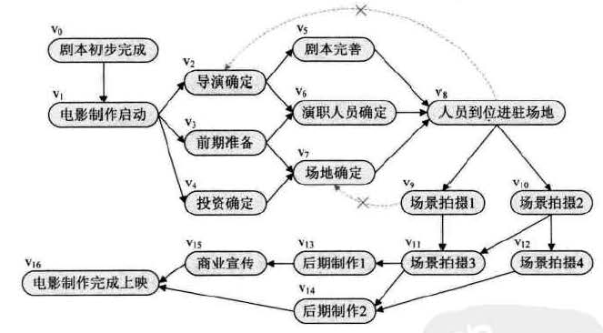

在AOV网中的有序顶点序列就是拓扑序列，AOV网中的拓扑序列不止一条。所谓拓扑排序其实就是对一个有向图构造拓扑序列的过程。

构造拓扑序列时会有两种结果：

- 此网的全部顶点都被输出，则说明它是不存在环的AOV网
- 此网的输出顶点少了，哪怕是少了一个，也说明这个网存在环，不是AOV网

对AOV网进行拓扑排序的思路是：从AOV网中选择一个入度为0的顶点输出，然后删去此顶点，并删除以此顶点为尾的弧，继续重复此步骤，直到输出全部顶点或者AOV网中不存在入度为0的顶点为止。

由于拓扑排序需要删除顶点，所以用邻接表来表示图会更方便。考虑到算法过程中始终要查找入度为0的顶点，所以在节点结构中特意增加了一个入度域。

在算法过程中需要一个栈作为辅助，每次变化时都会将入度为0的结点压入栈中，循环从栈中取，等到栈为空算法也就结束了。

对一个具有n个顶点e条弧的AOV网来说，算法时间复杂度是O(n+e)

```java
//它与寻常链表实现的图不同之处之一在于每个顶点都附加了一个叫入度的域
//每次添加边的时候会将end处的顶点入度加1
//添加边时不在像无向边一样在两头添加，只在一头添加
class AOV_ListGraph{
	
	//顶点数组
	private Vertex[] ver;
	//顶点数组的默认大小
	private static final int DEFAULT_SIZE = 20;
	//size表示图中的顶点数
	private int size;
	//dfs中用的栈
	private Stack<Integer> stack;
	//bfs中用的队列
	private Queue<Integer> queue;
	
	//顶点类
	private static class Vertex{
		//分别代表号、顶点名、顶点标记、第一个邻接结点
		int id;
		String name;
		boolean wasVisited;
		ListVex firstEdge;
		//顶点的入度
		int inDegree;
				
		//有参构造，默认结点未被访问
		public Vertex(String name){
			this.name = name;
			wasVisited = false;
			inDegree = 0;
		}
	}
	
	//邻接链表结点类
	private static class ListVex{
		//结点号和下一个结点指针
		int id;
		ListVex next;
		//有参构造，默认下个结点为空
		public ListVex(int id){
			this.id = id;
			next = null;
		}
	}
	
	//图的初始化，分配一个默认大小的顶点数组
	public AOV_ListGraph(){
		ver = new Vertex[DEFAULT_SIZE];
		//将顶点个数初始化为0 
		size = 0;
	}
	
	//添加顶点方法
	public void addVertex(String name){
		//将顶点数组的下一个值赋值为新建顶点
		ver[size] = new Vertex(name);
		//此时的size值就赋值为顶点id
		ver[size].id = size;
		//默认新建顶点的第一个邻接结点为空
		ver[size].firstEdge = null;
		//最后顶点数加1
		size++;
	}
	
	//添加边方法，需提供起始id和终止id
	public void addEdge(int begin , int end){
		
		//创建两个结点类为下方操作做准备
		ListVex node;
		ListVex secondNode;
		
		//若输入的起始和终止相同就抛出一个异常
		if(begin == end){
			throw new IllegalStateException();
		}
		
		//第一部分：将起始id对应的邻接链表更新：添加一个包含end信息的结点
		//第一个邻接结点要单独处理，因为firstEdge不能连续向下推进
		//如果第一个邻接结点为空，那么就新建一个邻接结点并将其作为第一结点
		if(ver[begin].firstEdge == null){
			ver[begin].firstEdge = new ListVex(end);
		}else{
			//如果第一个邻接结点不为空，那么就向下推进结点
			//将第一个邻接结点给node，然后令node作为新的邻接结点
			//这样node就成了新的第一结点
			node = ver[begin].firstEdge;
			ver[begin].firstEdge = node;
			//只要node下还有其他节点，就将node赋值为下一个结点
			while(node.next != null){
				node = node.next;
			}
			//直至node没有下一个结点，此时将下一个结点设置为新建的包含end信息的结点
			node.next = new ListVex(end);
		}
		//终止顶点的入度加1
		ver[end].inDegree++;
	}
		
	//打印某个结点的name
	public void displayVertex(int id){
		System.out.print(ver[id].name + "-->");
	}
	
	//计算度的方法
	public int degree(int id){
		//初始化度为0
		int count = 0;
		//将code记为第id个结点的第一个邻接结点
		ListVex code = ver[id].firstEdge;
		//只要第一结点不为空就把count加一，并继续向后推进
		while(code != null){
			count++;
			code = code.next;
		}
		//循环结束后此时的count值就是度
		return count;
	}
	
	//dfs遍历图，与邻接矩阵实现的dfs遍历相同
	//不同之处仅在于寻找顶点周围下一个可用的顶点方法构造不同
	public void dfs(){
		stack = new Stack<Integer>();
		stack.push(0);
		displayVertex(0);
		ver[0].wasVisited = true;
		while(!stack.empty()){
			//这个方法构造不同
			int j = findNext(stack.peek());
			if(j != -1){
				stack.push(j);
				displayVertex(j);
				ver[j].wasVisited = true;
			}else{
				stack.pop();
			}
		}
		
		for(int i = 0 ; i < size ; i++){
			ver[i].wasVisited = false;
		}
		
		System.out.println("结束");
	}
	
	//该方法用于寻找某个顶点周围可用的顶点号
	private int findNext(int x){
		
		//如果该顶点邻接链表的第一个结点为空，也就是说周围没有其他节点了
		//此时查找失败直接返回-1
		if(ver[x].firstEdge == null){
			return -1;
		}
		
		//如果该顶点邻接链表第一个结点不为空且该顶点没有访问过
		if(ver[ver[x].firstEdge.id].wasVisited == false){
			//返回该顶点号
			return ver[x].firstEdge.id;
		}
		
		//将邻接链表第一个顶点的下一个顶点记为node
		ListVex node = ver[x].firstEdge.next;
		//如果该点不为空就检查是否被方为过，是就返回结点号
		//不是就推进指针，继续查找
		while(node != null){
			if(ver[node.id].wasVisited == false){
				return node.id;
			}else{
				node = node.next;
			}
		}
		
		//循环后如果还没有运行任何return语句那么最后返回-1，查找失败
		return -1;
	}
	
	//bfs遍历图，步骤与邻接矩阵实现图的方法一致
	//唯一不同之处在于将顶点周围所有可用顶点全加入队列的方法构造不同
	public void bfs(){
		queue = new LinkedList<Integer>();
		queue.offer(0);
		ver[0].wasVisited = true;
		while(!queue.isEmpty()){
			//该方法不同
			allInQueue(queue , queue.peek());
			int j = queue.poll();
			displayVertex(j);
		}
		
		for(int i = 0 ; i < size ; i++){
			ver[i].wasVisited = false;
		}
		
		System.out.println("结束");
	}
	
	//该方法用于将某个顶点周围所有可用顶点全加入队列中
	private void allInQueue(Queue<Integer> queue , int x){
		//如果该顶点第一个邻接结点为空，也就是该顶点周围没有顶点
		//此时直接返回
		if(ver[x].firstEdge == null){
			return;
		}
		
		//如果该顶点的第一个邻接结点不为空，且还没有被访问过，就将其加入队列
		//同时更新该顶点的标记，因为加入队列的顶点早晚会访问到
		if(ver[ver[x].firstEdge.id].wasVisited == false){
			queue.offer(ver[x].firstEdge.id);
			ver[ver[x].firstEdge.id].wasVisited = true;
		}
		
		//将第二个邻接结点称为node
		ListVex node = ver[x].firstEdge.next;
		//node只要不为空，就检查他是否被访问过，如果访问过那么就加入队列并更新标志
		//最后还要推进指针继续循环，无论是否有元素加入都要推进指针
		//因为所有的周围顶点都要检查而不是仅加入一个即可
		while(node != null){
			if(ver[node.id].wasVisited == false){
				queue.offer(node.id);
				ver[node.id].wasVisited = true;
			}
			node = node.next;
		}
	}
	
	//拓扑排序，排序的结果3-->1-->2-->6-->0-->4-->5-->12-->9-->10-->13-->11-->8-->7-->结束
	//它代表了执行了任务的先后次序，它不是唯一的
	//拓扑排序的原理在于寻找入度为0的顶点并将顶点的终点入度更新
	//这样不断寻找入度为0的顶点并打印
	public void aov(){
		//新建一个栈用来存放入度为0的点
		stack = new Stack<Integer>();
		//count用来统计拓扑排序完成个数
		int count = 0;
		
		//为了不使排序破坏每个顶点的域，创建一个数组统计每个点的入度
		int[] inDegreeArray = new int[size];
		//将各顶点的入度装入数组，其中有入度为0的压入栈中
		for(int i = 0 ;i < size ; i++){
			inDegreeArray[i] = ver[i].inDegree;
			if(inDegreeArray[i] == 0){
				stack.push(ver[i].id);
			}
		}
		
		//循环结束的标志是栈为空，此时没有入度为0的顶点也就不能在进行下去了
		while(!stack.empty()){
			//弹栈并将该值打印，排序的计数加1
			int j = stack.pop();
			System.out.print(j+"-->");
			count++;
			//接下来要更新该值对应的顶点的各终点的入度
			if(ver[j].firstEdge == null){
				//如果该顶点没有下一个终点就直接结束循环，此时没有要更新的入度
				continue;
			}else{
				//更新链表第一结点的入度，若入度为0压入栈中
				inDegreeArray[ver[j].firstEdge.id]--;
				if(inDegreeArray[ver[j].firstEdge.id] == 0){
					stack.push(ver[j].firstEdge.id);
				}
			}
			//将指针向后移，不断更新各终点的入度，若入度为0加入栈中
			ListVex edge = ver[j].firstEdge.next;
			while(edge != null){
				inDegreeArray[edge.id]--;
				if(inDegreeArray[edge.id] == 0){
					stack.push(edge.id);
				}
				edge = edge.next;
			}
		}
		//排序结果输出后检查count的值，如果不是全部顶点都输出过说明图存在环不是AOV图
		//如果全部顶点都输出了说明顺利完成了拓扑排序
		System.out.println("结束");
		if(count != size){
			System.out.println("异常");
		}else{
			System.out.println("拓扑排序正常完成");
		}
	}
}
```

## 关键路径

拓扑排序主要是为了解决一个工程能否顺序进行的问题，但有时我们还需要解决工程完成需要的最短时间问题。

在一个表示工程的带权有向图中，用顶点代表事件，用有向边表示活动，用边上的权值表示活动的持续时间，这种有向图的边表示活动的网，我们称之为AOE网（Activity On Edge Network），AOE网中没有入边的顶点称之为始点或源点，没有出边的顶点称为终点或汇点。

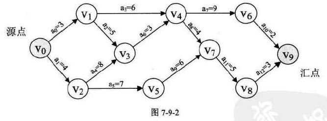

AOE网是表示工程流程的，在某顶点所代表的事件发生后，从该顶点出发的各活动才能开始；只有在进入某顶点的各活动都已经结束，该顶点所代表的事件才能发生。

AOE网和AOV网的区别：

- AOV网是顶点表示活动的网，它只描述活动之间的制约关系
- AOE网是用边表示活动的网，边上的权值表示活动持续的时间

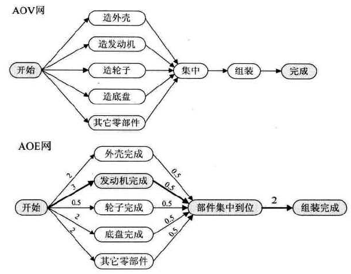

各活动所持续的时间之和称为路径长度，从源点到汇点具有最大长度的路径叫关键路径，在关键路径上的活动称为关键活动。

如果我们需要缩短整个工期，必须缩短关键路径上的关键活动时间才可以减少工期，降低非关键路径上的活动时间是没有用的（但是可以通过减低活动时间让它变成关键路径）

### 核心思想

找出关键路径的核心思想：活动的最早开始时间等于它的最晚开始时间，此时就说明该活动是关键活动，它组成的路径是关键路径。

以下面的AOE网举例说明：

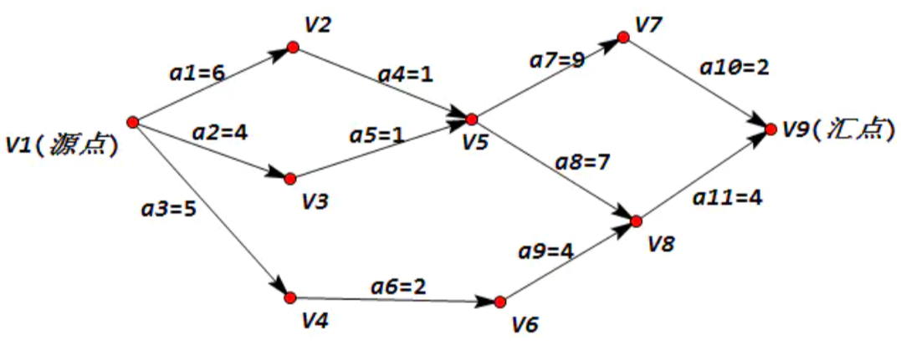

第一步：求出到达各个状态的最早时间（按最大计）

这个过程是要从源点开始向汇点顺推：

- V1是源点，其最早开始时间是0。
- V2、V3、V4最早时间分别是是6、4、5。
- 对于V5而言，V2到V5所花费时间是6+1=7，而V3到V5所花费时间是4+1=5。我们要按最大计，也就是V5最早时间是max{7,5}=7，按最大计是因为只有活动a4和a5同时完成了，才能到达V5状态。V3到V5需要5分钟，但是此时a4活动尚未完成（7分钟），所以都不能算到达V5，故而要按最大计。
- V6只有从V4到达，所以V6的最早完成时间是（5+2=）7。
- 同理，V7最早完成时间是16。
- 对于V8而言，和V5处理方法一致。V8=max{V5+7,V6+4}={7+7,7+4}=14。
- V9可算出是18。

这样，我们可以得到各个状态的最早时间的表：

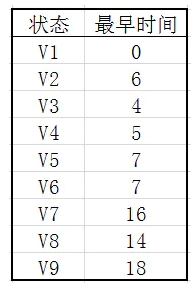

第二步：求出到达各个状态的最晚时间（按最小计）

这个过程是要从汇点开始向源点逆推：

- V9完成时间为18，最V7最迟开始时间是（18-2=）16

  因为活动a10所需时间2。如果V7开始时间比16晚，则V9完成时间就会比18晚，这显然不对。

- 同理，V8最迟开始时间为14。
  对于V5而言，可以从V7、V8两个点开始向前推算，此时要按最小计，即V5(最晚)=min{V7-9,V8-7}=min{16-9,14-7}=7。
  请注意！！，min{V7-9,V8-7}中，V7、V8取的都是前面算出的最迟开始时间（而不是最早开始时间）。

- 同理，可计算出剩下的点

这样，我们可以得到各个状态的最晚时间的表：

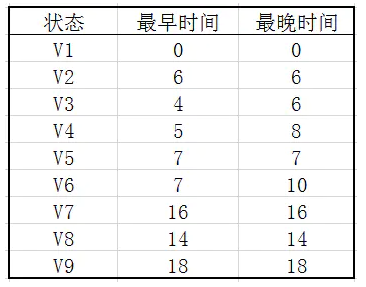

源点和汇点的最晚时间和最早时间必定是相同的。

第三步：求出关键路径

对于a1：

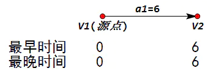

这表明，a1最早只能从0时刻开始，最晚也只能从（6-6=）0时刻开始，因此，a1是关键活动。

对于a2：

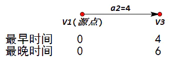

a2最早要从0时刻开始，但是它最晚开始时间却是（6-4=）2。也就是说，从0开始做，4时刻即完成；从2开始做，6时刻恰好完成。从而在[0,2]区间内任意时间开始做a2都能保证按时完成。

（请区别顶点的最早最晚和活动的最早最晚时间。图示中的最早最晚是顶点状态的时间）

由于a2的开始时间是不定的，所以它不能主导工程的进度，从而它不是关键活动。

一般的：


活动用时X时间，它最早要从E1时刻开始（一开始就开始），最晚要从L2-X时刻开始（即恰好完成）。所以，如果它是关键活动，则必然有E1=L2-X，否则它就不是关键活动。

综上：蓝色底纹表示的点即为处于关键路径的点

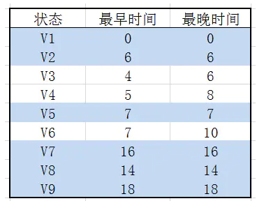

最终的关键路径：


对一个具有n个顶点e条弧的AOE网来说，算法时间复杂度是O(n+e)

有时关键路径是多条，此时必须同时提高多条关键路径上活动的速度，才能缩短整个工期。

### 代码实现

下面是一个基于邻接表实现的有向加权图，其中求关键路径的方法是criticalPath

```java
//与AOV不同之处在于邻接结点都添加了一个权值的域
class AOE_ListGraph{
	
	//顶点数组
	private Vertex[] ver;
	//顶点数组的默认大小
	private static final int DEFAULT_SIZE = 20;
	//size表示图中的顶点数
	private int size;
	//dfs中用的栈
	private Stack<Integer> stack;
	//bfs中用的队列
	private Queue<Integer> queue;
	//用来存放拓扑序列的栈，在查找关键路径时用到
	private Stack<Integer> stack_reverse;
	//etv表示事件（顶点）的最早开始时间
	private int[] etv;
	//ltv表示事件（顶点）的最晚开始时间
	private int[] ltv;
	
 	
	//顶点类
	private static class Vertex{
		//分别代表号、顶点名、顶点标记、第一个邻接结点
		int id;
		String name;
		boolean wasVisited;
		ListVex firstEdge;
		//顶点的入度
		int inDegree;
				
		//有参构造，默认结点未被访问
		public Vertex(String name){
			this.name = name;
			wasVisited = false;
			inDegree = 0;
		}
	}
	
	//邻接链表结点类
	private static class ListVex{
		//结点号和下一个结点指针、边的权值
		int id;
		ListVex next;
		int weight;
		//有参构造，默认下个结点为空
		public ListVex(int id , int weight){
			this.id = id;
			this.weight = weight;
			next = null;
		}
	}
	
	//图的初始化，分配一个默认大小的顶点数组
	public AOE_ListGraph(){
		ver = new Vertex[DEFAULT_SIZE];
		//将顶点个数初始化为0 
		size = 0;
	}
	
	//添加顶点方法
	public void addVertex(String name){
		//将顶点数组的下一个值赋值为新建顶点
		ver[size] = new Vertex(name);
		//此时的size值就赋值为顶点id
		ver[size].id = size;
		//默认新建顶点的第一个邻接结点为空
		ver[size].firstEdge = null;
		//最后顶点数加1
		size++;
	}
	
	//添加边方法，需提供起始id和终止id
	public void addEdge(int begin , int end , int weight){
		
		//创建两个结点类为下方操作做准备
		ListVex node;
		ListVex secondNode;
		
		//若输入的起始和终止相同就抛出一个异常
		if(begin == end){
			throw new IllegalStateException();
		}
		
		//第一部分：将起始id对应的邻接链表更新：添加一个包含end信息的结点
		//第一个邻接结点要单独处理，因为firstEdge不能连续向下推进
		//如果第一个邻接结点为空，那么就新建一个邻接结点并将其作为第一结点
		if(ver[begin].firstEdge == null){
			ver[begin].firstEdge = new ListVex(end , weight);
		}else{
			//如果第一个邻接结点不为空，那么就向下推进结点
			//将第一个邻接结点给node，然后令node作为新的邻接结点
			//这样node就成了新的第一结点
			node = ver[begin].firstEdge;
			ver[begin].firstEdge = node;
			//只要node下还有其他节点，就将node赋值为下一个结点
			while(node.next != null){
				node = node.next;
			}
			//直至node没有下一个结点，此时将下一个结点设置为新建的包含end信息的结点
			node.next = new ListVex(end , weight);
			
		}
		
		//终止顶点的入度加1
		ver[end].inDegree++;
		
	}
		
	//打印某个结点的name
	public void displayVertex(int id){
		System.out.print(ver[id].name + "-->");
	}
	
	//计算度的方法
	public int degree(int id){
		//初始化度为0
		int count = 0;
		//将code记为第id个结点的第一个邻接结点
		ListVex code = ver[id].firstEdge;
		//只要第一结点不为空就把count加一，并继续向后推进
		while(code != null){
			count++;
			code = code.next;
		}
		//循环结束后此时的count值就是度
		return count;
	}
	
	//dfs遍历图，与邻接矩阵实现的dfs遍历相同
	//不同之处仅在于寻找顶点周围下一个可用的顶点方法构造不同
	public void dfs(){
		stack = new Stack<Integer>();
		stack.push(0);
		displayVertex(0);
		ver[0].wasVisited = true;
		while(!stack.empty()){
			//这个方法构造不同
			int j = findNext(stack.peek());
			if(j != -1){
				stack.push(j);
				displayVertex(j);
				ver[j].wasVisited = true;
			}else{
				stack.pop();
			}
		}
		
		for(int i = 0 ; i < size ; i++){
			ver[i].wasVisited = false;
		}
		
		System.out.println("结束");
	}
	
	//该方法用于寻找某个顶点周围可用的顶点号
	private int findNext(int x){
		
		//如果该顶点邻接链表的第一个结点为空，也就是说周围没有其他节点了
		//此时查找失败直接返回-1
		if(ver[x].firstEdge == null){
			return -1;
		}
		
		//如果该顶点邻接链表第一个结点不为空且该顶点没有访问过
		if(ver[ver[x].firstEdge.id].wasVisited == false){
			//返回该顶点号
			return ver[x].firstEdge.id;
		}
		
		//将邻接链表第一个顶点的下一个顶点记为node
		ListVex node = ver[x].firstEdge.next;
		//如果该点不为空就检查是否被方为过，是就返回结点号
		//不是就推进指针，继续查找
		while(node != null){
			if(ver[node.id].wasVisited == false){
				return node.id;
			}else{
				node = node.next;
			}
		}
		
		//循环后如果还没有运行任何return语句那么最后返回-1，查找失败
		return -1;
	}
	
	//bfs遍历图，步骤与邻接矩阵实现图的方法一致
	//唯一不同之处在于将顶点周围所有可用顶点全加入队列的方法构造不同
	public void bfs(){
		queue = new LinkedList<Integer>();
		queue.offer(0);
		ver[0].wasVisited = true;
		while(!queue.isEmpty()){
			//该方法不同
			allInQueue(queue , queue.peek());
			int j = queue.poll();
			displayVertex(j);
		}
		
		for(int i = 0 ; i < size ; i++){
			ver[i].wasVisited = false;
		}
		
		System.out.println("结束");
	}
	
	//该方法用于将某个顶点周围所有可用顶点全加入队列中
	private void allInQueue(Queue<Integer> queue , int x){
		//如果该顶点第一个邻接结点为空，也就是该顶点周围没有顶点
		//此时直接返回
		if(ver[x].firstEdge == null){
			return;
		}
		
		//如果该顶点的第一个邻接结点不为空，且还没有被访问过，就将其加入队列
		//同时更新该顶点的标记，因为加入队列的顶点早晚会访问到
		if(ver[ver[x].firstEdge.id].wasVisited == false){
			queue.offer(ver[x].firstEdge.id);
			ver[ver[x].firstEdge.id].wasVisited = true;
		}
		
		//将第二个邻接结点称为node
		ListVex node = ver[x].firstEdge.next;
		//node只要不为空，就检查他是否被访问过，如果访问过那么就加入队列并更新标志
		//最后还要推进指针继续循环，无论是否有元素加入都要推进指针
		//因为所有的周围顶点都要检查而不是仅加入一个即可
		while(node != null){
			if(ver[node.id].wasVisited == false){
				queue.offer(node.id);
				ver[node.id].wasVisited = true;
			}
			node = node.next;
		}
	}
	
	//拓扑排序，排序的结果3-->1-->2-->6-->0-->4-->5-->12-->9-->10-->13-->11-->8-->7-->结束
	//它代表了执行了任务的先后次序，它不是唯一的
	//拓扑排序的原理在于寻找入度为0的顶点并将顶点的终点入度更新
	//这样不断寻找入度为0的顶点并打印
	
	//与原有的拓扑排序增加了一个存放拓扑排序的栈，在后面计算最晚开始时间时要逆序进行
	//在完成拓扑排序功能的同时计算各顶点的最早开始时间，它的进行是拓扑排序的逆序
	public void aov(){
		//新建一个栈用来存放入度为0的点
		stack = new Stack<Integer>();
		//stack_reverse是用来存拓扑排序顺序的栈
		stack_reverse = new Stack<Integer>();
		//etv是表示各顶点最早开始时间的数组，数组大小与顶点数一致
		etv = new int[size];
		//count用来统计拓扑排序完成个数
		int count = 0;
		
		//为了不使排序破坏每个顶点的域，创建一个数组统计每个点的入度
		int[] inDegreeArray = new int[size];
		//将各顶点的入度装入数组，其中有入度为0的压入栈中
		for(int i = 0 ;i < size ; i++){
			inDegreeArray[i] = ver[i].inDegree;
			if(inDegreeArray[i] == 0){
				stack.push(ver[i].id);
			}
		}
		
		//循环结束的标志是栈为空，此时没有入度为0的顶点也就不能在进行下去了
		while(!stack.empty()){
			//弹栈并将该值打印，排序的计数加1
			int j = stack.pop();
			System.out.print(j+"-->");
			count++;
			//打印完顶点后把值压入stack_reverse栈中
			stack_reverse.push(j);
			
			//接下来要更新该值对应的顶点的各终点的入度
			if(ver[j].firstEdge == null){
				//如果该顶点没有下一个终点就直接结束循环，此时没有要更新的入度
				continue;
			}else{
				//更新链表第一结点的入度，若入度为0压入栈中
				inDegreeArray[ver[j].firstEdge.id]--;
				if(inDegreeArray[ver[j].firstEdge.id] == 0){
					stack.push(ver[j].firstEdge.id);
				}
				//如果原来第一结点的最早开始时间小于j的最早开始时间加j到第一结点的时间就将其替换
				if(etv[ver[j].firstEdge.id] < etv[ver[j].id] + ver[j].firstEdge.weight){
					etv[ver[j].firstEdge.id] = etv[ver[j].id] + ver[j].firstEdge.weight;
				}
			}
			//将指针向后移，不断更新各终点的入度，若入度为0加入栈中
			ListVex edge = ver[j].firstEdge.next;
			while(edge != null){
				inDegreeArray[edge.id]--;
				if(inDegreeArray[edge.id] == 0){
					stack.push(edge.id);
				}
				//如果该节点的最早开始时间小于j的最早开始时间加j到该节点的时间就将其替换
				//这样每个边都操作完成后，剩下的最早开始时间的最大值就是最终的最早开始时间
				//因为该点要想最早开始必须所有前驱结点都完成才行
				if(etv[edge.id] < etv[ver[j].id] + edge.weight){
					etv[edge.id] = etv[ver[j].id] + edge.weight;
				}
				edge = edge.next;
			}
		}
		//排序结果输出后检查count的值，如果不是全部顶点都输出过说明图存在环不是AOV图
		//如果全部顶点都输出了说明顺利完成了拓扑排序
		System.out.println("结束");
		if(count != size){
			System.out.println("异常");
		}else{
			System.out.println("拓扑排序正常完成");
		}
		//打印etv，即各顶点的最早开始时间
		System.out.println(Arrays.toString(etv));
		
	}
	
	//求关键路径，一条边的最早开始时间和最晚开始时间相同的边即为关键边
	//关键边连成路径即为关键路径
	//通过求etv（各顶点的最早开始时间）和ltv（各顶点的最晚开始时间）
	//求ete（各边的最早开始时间）和lte（各边的最晚开始时间）再对比其是否相等
	public void criticalPath(){
		
		//ltv（各顶点的最晚开始时间）大小为顶点个数
		ltv = new int[size];
		//stack_reverse栈顶即为拓扑序列的终点，也是查找ltv算法的起点
		//因为终点一定在关键路径上，它本身的最晚开始时间就等于最早开始时间
		//初始化ltv时把所有最晚时间都设置为与最后一个位置相同，算法进行中会逐步修正它的值
		int k = stack_reverse.peek();
		for(int i = 0 ; i < size ; i++){
			ltv[i] = etv[k];
 		}
		//当stack_reverse为空时就意味着没有要处理的顶点，循环结束
		while(!stack_reverse.empty()){
			//将栈顶弹出
			int j = stack_reverse.pop();
			//判断该元素是否有第一结点，没有直接结束循环
			if(ver[j].firstEdge == null){
				continue;
			}else{
				//如果有第一结点，考虑是否修正栈顶元素的ltv
				//如果本节点的最晚开始时间大于本节点的第一结点的最晚时间与边上权的差就更新它的值
				if(ltv[ver[j].id] > ltv[ver[j].firstEdge.id] - ver[j].firstEdge.weight){
					ltv[ver[j].id] = ltv[ver[j].firstEdge.id] - ver[j].firstEdge.weight;
				}
			}
			//继续向链表深处探索
			ListVex edge = ver[j].firstEdge.next;
			while(edge != null){
				//如果本节点的最晚时间大于本节点的后驱结点的最晚开始时间减去边上权值就更新它的值
				//这样最后所有边都操作一遍后，剩下的应该是最晚时间中的最小值，它就是顶点最终的最晚开始时间
				if(ltv[ver[j].id] > ltv[edge.id] - edge.weight){
					ltv[ver[j].id] = ltv[edge.id] - edge.weight;
				}
				edge = edge.next;
			}
		}
		//输出ltv（各顶点的最晚开始时间）
		System.out.println(Arrays.toString(ltv));
		
		//定义ete（各边的最早开始时间）、lte（各边的最晚开始时间）
		int ete = 0 , lte = 0;
		//开始循环每条边
		for(int i = 0 ; i < size ; i++){
			//首先是第一结点，为空直接开始下一次循环
			if(ver[i].firstEdge == null){
				continue;
			}else{
				//各边的最早开始时间就相当于弧头顶点的最早开始时间
				ete = etv[i];
				//各边的最晚开始时间就相当于弧尾顶点的最晚开始时间减去边上的时间
				lte = ltv[ver[i].firstEdge.id] - ver[i].firstEdge.weight;
				//如果两者相等那么这条弧就是关键路径，打印出来
				if(ete == lte){
					System.out.print(ver[i].id+"-->"+ver[i].firstEdge.id+" ");
				}
			}
			//继续向链表深处推进
			ListVex edge = ver[i].firstEdge.next;
			while(edge != null){
				//各边的最早开始时间就相当于弧头顶点的最早开始时间
				ete = etv[i];
				//各边的最晚开始时间就相当于弧尾顶点的最晚开始时间减去边上的时间
				lte = ltv[edge.id] - edge.weight;
				//如果两者相等那么这条弧就是关键路径，打印出来
				if(ete == lte){
					System.out.print(ver[i].id+"-->"+edge.id+" ");
				}
				edge = edge.next;
			}
		}
	}
}
```

# 查找

查找表按照操作方式分为两大种：静态查找表和动态查找表：

- 静态查找表只是查找某个特定元素是否在查找表中，或者检索某个属性
- 动态查找表可以在查找时插入或者删除元素

查找所基于的数据结构是集合，集合中的记录之间没有本质关系，但是为了获得比较高的查找性能，有时不得不改变数据元素之间的关系，将查找集合组织成表、树等结构

对于静态查找表来说，可以采用线性表来组织数据，使用顺序查找算法，如果对主关键字进行排序还可以使用二分法等方法查找

对于动态查找表来说，因为考虑到更新效率，考虑使用二叉排序树等。

## 顺序查找

顺序查找（Sequential Search）又叫线性查找，是最基本的查找技术，它的查找过程就是简单遍历集合。

它的时间复杂度是On，它算法逻辑简单，n很大时查找效率低下。因为查找概率的不同，可以将容易查找到的记录放在前面，把不常用的记录放置在后面，效率就可以有所提高。

## 有序表查找

### 二分查找

Binary Search，它的时间复杂度是Ologn，每次mid=(low+high)/2

```java
public static int Binary_Search(int[] a , int b){
  int low = 0;
  int high = a.length - 1;

  while(low <= high){
    int mid = (low + high)/2;
    if(a[mid] < b){
      low = mid + 1;
    }else if(a[mid] > b){
      high = mid - 1;
    }else{
      return mid;
    }
  }

  return -1;
}
```

### 插值查找

有时查找时不一定要每次折半，就如同在字典中查找apple的时候，绝对不会从中间开始查找，而是从书的开头开始查找。

对于取值范围0-10000之间100个元素均匀分布的数组中查找5，就会考虑从数组下标较小的开始查找。

在二分查找中，每次mid的取值：mid=(low+high)/2=low+1/2 * (high - low)

插值查找不同的地方就在于将这个1/2进行改进，改为下面的计算方案：
$$
mid = low + (key - a[low]) / (a[high] - a[low]) * (high - low)
$$
这就是插值查找（Interpolation Search），它的时间复杂度也是Ologn，对于分布比较均匀，表比较长的查找表来说，插值查找算法的平均性能要优于二分查找，但是对于极端不均匀的数据，还是二分查找更合适

```java
public static int Interpolation_Search(int[] a , int b){
  int low = 0;
  int high = a.length - 1;

  while(low <= high){
    int mid = low + (b - a[low])*(high - low)/(a[high] - a[low]);
    if(a[mid] < b){
      low = mid + 1;
    }else if(a[mid] > b){
      high = mid - 1;
    }else{
      return mid;
    }
  }

  return -1;
}
```

### 斐波那契查找

斐波那契查找（Fibonacci Search）是利用了黄金分割原理实现的。

斐波那契数列：F(0)=1，F(1)=1, F(n)=F(n - 1)+F(n - 2)（n ≥ 2，n ∈ N*），随着数列项数的增加，前一项与后一项之比越来越逼近黄金分割的数值

斐波那契查找实际上是把mid=(low+high)/2=low+1/2 * (high - low)中的1/2替换为了黄金分隔数。

它的时间复杂度也是Ologn，但就平均性能来说，它要优于二分查找。

## 线性索引查找

索引就是把一个关键字与它对应的记录相关联的过程。

索引按照结构可以分为线性索引、树形索引和多级索引。这里只介绍线性索引，所谓线性索引就是将索引项集合组织成为线性结构，也称为索引表。

这里重点介绍三种索引：稠密索引、分块索引和倒排索引

### 稠密索引

稠密索引是指在线性索引中，将数据集中的每个记录对应一个索引项，如下图所示：


数据项可以是乱序排放的，但是索引项一定是有序的，这样就可以先用有序查找算法找到索引项，然后再根据索引项找到数据记录。

当数据集非常大的时候，索引的规模和就和数据差不多了，如果索引项保存在磁盘中，此时就要反复访问磁盘，性能不好。

### 分块索引

为了减少索引项的个数，可以对数据集进行分块，使其分块有序，然后再对每一个块建立一个索引项。

基本的原则是：块内无序、块间有序

每个索引项包含三种信息：块内最大关键码、块记录数、指向块首数据的指针

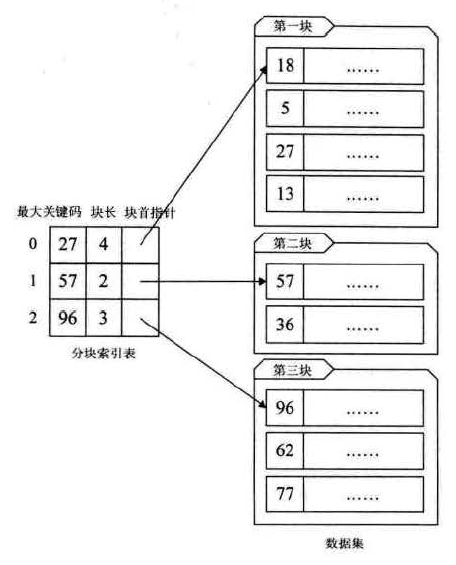

在分块索引表中查找记录，首先要找到块对应的索引，这一步可以使用有序查找加快速度；然后在块中顺序查找。

假设n个记录的数据集被平均分为m块，每个块中有t条记录，此时n=m*t。顺序查找索引表的平均查找长度是(m+1)/2，块中查找记录的平均查找长度是(t+1)/2，这样一次分块查找的平均查找长度是两者相加，等于(n/t+t)/2+1，当m=t时，该值最小，为根号n+1，比On更好，但是比Ologn更差。

### 倒排索引

倒排索引用于搜索引擎，将一个完整的句子进行分词后存入索引表中，每个索引项包含单词（次关键码）和文章编号两个信息：


这种索引不是由记录来确定属性值，而是用属性值来确定记录的位置，因此被称为倒排索引（inverted index）

## 二叉排序树

查找时插入或删除的查找表被称为动态查找表，如果要保持集合的顺序同时进行插入，如果用线性表来实现，插入时还需要移动其他元素，而如果用树来实现，插入时则不需要移动其他元素：

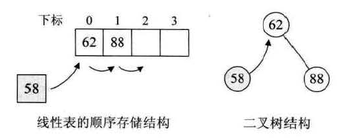

这样的二叉树就是二叉排序树（Binary Sort Tree），对它进行中序遍历时可以得到一个有序的序列，它的定义：

它或者是一棵空树，或者是具有如下性质的二叉树：

- 若它的左子树不空，则左子树上所有结点的值均小于它的根结构的值
- 若它的右子树不空，则右子树上所有结点的值均大于它的根结构的值
- 它的左、右子树也是二叉排序树

它最大的特点就是实现查找的同时，可以快速插入和删除元素。

比较复杂的是二叉排序树的删除，如果要删除的结点是叶子结点，则比较简单，直接删除即可，不会对树的结构由影响：

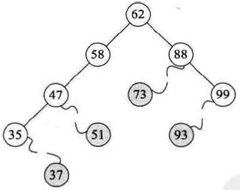

如果要删除的结点只有左子树或者只有右子树，那也比较简单，只需要将它的左子树或者右子树（如果算法中一直指定左子树，或者一直指定右子树，长时间插入删除可能会造成树的不平衡）移动到删除结点的位置即可：

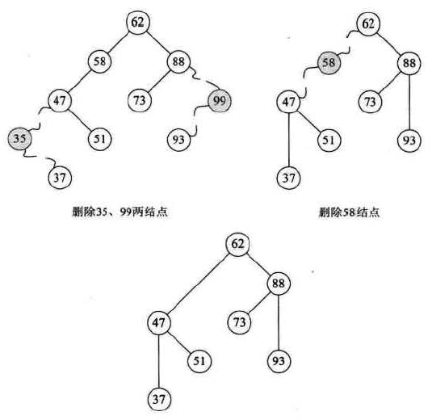

对于要删除的结点既有左子树又有右子树的情况，此时应该找到要删除结点的直接前驱或者直接后驱结点，然后将它移动到要删除结点的位置：

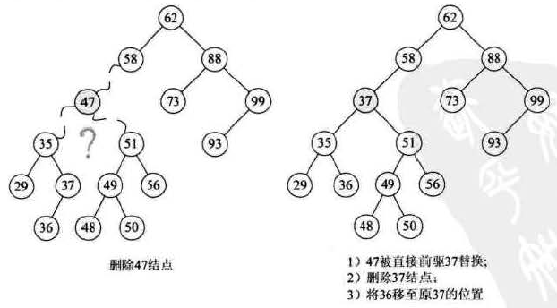

如果删除的次数不多，可以使用懒惰删除，当一个元素要被删除时，它扔留在树中，只是被标记为删除。当树中的实际节点数和被删除的节点数相同，树的深度只会上升一个比较小的常数。而且懒惰删除对于那种刚刚删除又重新插入的场景非常有效，可以避免新单元的分配开销。

二叉排序树的插入、删除、查找的平均时间复杂度都是Ologn，但是有时因为插入的元素都是有序的，结果会导致二叉排序树变成斜树，此时查找的时间复杂度会退化到On，所以保持二叉树的平衡就是保证他的查找性能。

下面是一个普通二叉查找树的例子，实现了makeEmpty、isEmpty、contains、findMax、findMin、insert、remove、printTree方法：

```java
class BinarySearchTree<AnyType extends Comparable<? super AnyType>> {
	
	//唯一的域变量，根节点本身，每次对二叉树进行修改操作实际上都在修改根节点
	BinaryNode<AnyType> root;
	//一个嵌套类，描述节点构造
	

	//二叉树的无参构造，就是给根节点赋null
	public BinarySearchTree() {
		super();
		root = null;
	}
	
	//二叉树的清空
	public void makeEmpty(){
		root = null;
	}
	
	//判断二叉树是否为空
	public boolean isEmpty(){
		return root == null;
	}
	
	//判断二叉树是否包括该元素，因为递归的原因又将它传入一个新的方法中
	public boolean contains(AnyType element){
		return contains(root,element);
	}

	//判断二叉树是否包含该元素
	private boolean contains(BinaryNode<AnyType> x, AnyType element) {
		
		//如果树是null，那么就返回null，查找结束没有元素
		if(x == null){
			return false;
		}
		
		//如果元素比该节点元素大，那么去右子树寻找，否则去左子树
		//直至树为空或两结点相等，返回true
		//这里使用的compareto方法都是因为AnyType实现了Comparable的结果
		if(element.compareTo(x.element) > 0){
			return contains(x.right,element);
		}else if(element.compareTo(x.element) < 0){
			return contains(x.left,element);
		}else{
			return true;
		}
	}
	
	//查找二叉树的最大值
	public AnyType findMax(){
		
		//如果根节点为null，那么就抛出一个异常，无法查找最大值
		if(root == null){
			throw new RuntimeException();
		}
		//将根节点的索引赋给另一个变量，以免之后修改根节点索引
		BinaryNode<AnyType> t = root;
		
		//只要改结点还有右结点就继续向右查找
		while(t.right != null){
			t = t.right; 
		}
		//直至没有右结点了，此时数据即为最大值
		return t.element;
	}
	
	//查找二叉树的最小值，因为后面要实现一个在子树中查找最值的方法
	//故实现那个新的方法并把功能传递过去
	public AnyType findMin(){
		
		if(root == null){
			throw new RuntimeException();
		}
		return findMin(root).element;
	}
	
	private BinaryNode<AnyType> findMin(BinaryNode<AnyType> t){
		while(t.left != null){
			t = t.left; 
		}
		return t;
	}
	
	//插入也需要递归，故重新建立一个函数
	//插入实质上就是更新根节点，故要把新的根节点赋给原根节点
	public void insert(AnyType element){
		root = insert(root,element);
	}

	//插入操作
	private BinaryNode<AnyType> insert(BinaryNode<AnyType> x, AnyType element) {
		
		//如果树为空，那么就返回一个以该元素为数据域的新节点
		//也就是插入新节点
		if(x == null){
			return new BinaryNode<AnyType>(element);
		}
		
		//如果树的数据域比元素的小，那么说明该元素在右子树内
		//也就是说如果该元素存在的话，更新一定发生在右子树内
		//故将右子树的索引更新
		//否则更新左子树的索引
		if(element.compareTo(x.element) > 0){
			x.right = insert(x.right,element);
		}else if(element.compareTo(x.element) < 0){
			x.left = insert(x.left,element);
		}else{
			//若树的数据域与要插入的值相等，那么什么都不做
			;
		}
		//如果递归没有因为子树等于null，也就是插入新节点结束
		//那么就把索引返回，相当于什么都没有做
		return x;
	}
	
	//将二叉树的数据删除
	//因为需要递归操作，故新建了一个同名方法
	public void remove(AnyType element){
		root = remove(root,element);
	}

	private BinaryNode<AnyType> remove(BinaryNode<AnyType> x, AnyType element) {
		
		//如果树节点为空，那么就返回空
		//适用于传入root，且root为空的情况
		//还适用于递归中没有找到该元素的情况
		if(x == null){
			return null;
		}
		
		//将比较的值记录一下，以免多次计算
		int compareTo = element.compareTo(x.element);
		
		//如果树节点的数据域比元素小，那么就更新右子树的索引
		//否则更新左子树
		if(compareTo > 0){
			x.right = remove(x.right , element);
		}else if(compareTo < 0){
			x.left = remove(x.left , element);
			
			//直至找到了要删除的元素，当该节点此时既有左孩子又有右孩子时
			//选取右子树的最小值作为该节点的值，当然也可以选择左子树的最大值更新节点值
			//将值更新后，把对应子树的该元素删除，再次调用递归
		}else if(x.left != null && x.right != null){
			x.element = findMin(x.right).element;
			x.right = remove(x.right , x.element);
		}else{
			//找到了要删除的元素，但是他只有左孩子或只有右孩子
			//如果有左孩子就把连接给左孩子，否则就给右孩子
			//这样的处理也可以应用于叶子节点上，因为此时什么都没有，一定会被赋值为null
			x = (x.right == null ? x.left:x.right);
		}
		return x;
	}
	
	public void printTree(){
		
		if(root == null){
			System.out.println("empty tree");
		}else{
			printTree(root);
		}
	}
	
	//中序遍历树并打印
	private void printTree(BinaryNode<AnyType> x){
		
		//因为每一个结点都要访问它的左右子树
		//势必出现叶子节点或其他节点没有左或右子树的情形
		//此时什么都不做，直接完成方法的调用
		//继续递归
		if(x != null){
			printTree(x.left);
			System.out.print(x.element+" ");
			printTree(x.right);
		}
	}
}
```

## 平衡二叉树

平衡二叉树是一种二叉排序树，其中每一个节点的左子树和右子树的高度差至多等于1.

AVL树是一种典型的平衡二叉树。

二叉树上节点的左子树深度减去右子树深度的值称为平衡因子BF（Balance Factor），平衡二叉树上所有结点的平衡因子只可能是-1、0和1.

距离插入结点最近的，且平衡因子的绝对值大于1的结点为根的子树，称为最小不平衡子树。平衡二叉树构建的基本思想就是在构建树的过程中，每当插入一个结点时，先检查是否因插入破坏了树的平衡性，若是找出最小不平衡子树，然后调整它的结构，进行响应的旋转，使之成为新的平衡子树。

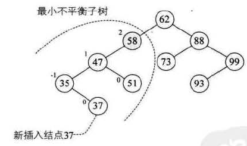


不平衡的情况有四种可能：（重新平衡的节点记为A）

- 对A的左儿子的左子树进行一次插入
- 对A的左儿子的右子树进行一次插入
- 对A的右儿子的左子树进行一次插入
- 对A的右儿子的右子树进行一次插入

其中第一种情况和第四种情况是对称的，需要通过一次单旋转（single rotation）来完成调整。第二和第三是对称的，需要完成双旋转（double rotation）来调整。

单旋转示意图：

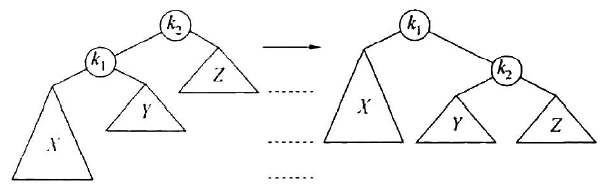

对于第二和第三种场景，单旋转是不够的，此时无法降低它的深度：

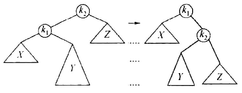

下面是双旋转的示意图：

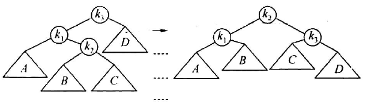

在平衡的过程中，树的深度是一个很重要的值，为此专门为树结点增加一个代表深度的属性。

用一个专门的方法balance来平衡一棵树，方法是递归检查结点左子树和右子树的深度，判断是上面四种模式的哪一种，然后执行对应的旋转。插入和删除操作后执行balance方法就能调整树的结构实现平衡，这样就不用专门设计平衡二叉树的删除方式了。

下面是一个AVL树的代码例子，实现了makeEmpty、isEmpty、contains、findMax、findMin、insert、remove、printTree方法：

```java
class avlSearchTree<AnyType extends Comparable<? super AnyType>> {

	//唯一的域：根节点
	private avlNode<AnyType> root;

	//AVL树的节点构造，比普通二叉树多了一个高度值
	//高度是从本节点到端节点的路径段数
	private static class avlNode<AnyType> {

		avlNode<AnyType> left;
		avlNode<AnyType> right;
		AnyType element;
		int height;

		public avlNode(AnyType element, avlNode<AnyType> left,
				avlNode<AnyType> right) {
			super();
			this.left = left;
			this.right = right;
			this.element = element;
			// 新建立的节点一定是叶子节点，高度一定是0
			height = 0;
		}

		public avlNode(AnyType element) {
			this(element, null, null);
		}
	}

	public void makeEmpty() {
		root = null;
	}

	public boolean isEmpty() {
		return root == null;
	}

	public avlSearchTree() {
		super();
		root = null;
	}

	//contains方法与普通二叉树一致
	public boolean contains(AnyType element) {
		return contains(root, element);
	}

	private boolean contains(avlNode<AnyType> x, AnyType element) {

		if (x == null) {
			return false;
		}

		if (element.compareTo(x.element) > 0) {
			return contains(x.right, element);
		} else if (element.compareTo(x.element) < 0) {
			return contains(x.left, element);
		} else {
			return true;
		}
	}

	//findMax方法与普通二叉树一致
	public AnyType findMax() {
		return findMax(root).element;
	}

	private avlNode<AnyType> findMax(avlNode<AnyType> x) {

		if (x == null) {
			throw new RuntimeException();
		}

		avlNode<AnyType> t = x;
		while (t.right != null) {
			t = t.right;
		}
		return t;
	}

	//findMin方法与普通二叉树一致
	public AnyType findMin() {
		return findMin(root).element;
	}

	private avlNode<AnyType> findMin(avlNode<AnyType> x) {

		if (x == null) {
			throw new RuntimeException();
		}

		avlNode<AnyType> t = x;
		while (t.left != null) {
			t = t.left;
		}
		return t;
	}

	//放回节点的高度值
	//这里将null节点的高度值设置成-1
	private int height(avlNode<AnyType> x) {
		return x == null ? -1 : x.height;
	}

	//插入方法需要递归，故将其传入新购造的方法中
	public void insert(AnyType element) {
		// mid_height = 1;
		root = insert(root, element);
	}

	// private int mid_height = 1;

	//除了最后加上了平衡操作，其余所有操作都与普通二叉树一致
	private avlNode<AnyType> insert(avlNode<AnyType> x, AnyType element) {

		if (x == null) {
			// avlNode<AnyType> y = new avlNode<AnyType>(element);
			// y.height = mid_height;
			return new avlNode<AnyType>(element);
		}

		int compare = element.compareTo(x.element);

		if (compare > 0) {
			x.right = insert(x.right, element);
		} else if (compare < 0) {
			x.left = insert(x.left, element);
		} else {
			;
		}
		//对每个节点都进行平衡操作
		//这里返回的实际上是从插入节点到根节点的所有节点
		//这些节点都有可能产生不平衡
		//即使节点不平衡也要进行高度的更新，因为一旦插入一个新节点
		//这些节点的高度值都要更新一遍
		return balance(x);
	}

	private avlNode<AnyType> balance(avlNode<AnyType> x) {

		//平衡方法首先检查左右子树的高度值是否差大于1，若大于1就是不平衡
		//这里基于平衡操作的四种情形设计了四种分支
		//分别进行对应的单旋转和双旋转
		if ((height(x.left) - height(x.right)) > 1) {
			//这里有一个细节问题：这里的判断用的是大于等于号
			//实际上在进行插入操作时不可能发生相等的情况，因为插入后相等
			//就说明该子树的高度插入前后没有变化，也就不可能产生不平衡
			//只要出现了不平衡情况，就不可能出现等号的情况
			//这里之所以用了等号实际上是考虑到删除后也要进行平衡操作
			//删除一个结点后，因为另一个子树高度比该子树高度大了2
			//且另一个子树本身并没有限定，它完全有可能出现某个子树左右平衡的情况
			//此时依然需要单旋转进行解决，故用等号把上述所有的可能都归于下条语句
			if (height(x.left.left) >= height(x.left.right)) {
				//左-左插入后的结果用单旋转
				//对删除的情况也一样适用
				//因为无论是插入还是删除本质上都是对树结构的改变
				//这里将树传入对它进行结构上的改变，没必要弄清树为什么已经有了这样的结构
				x = rotateWithLeftChild(x);
			} else {
				//左-右插入后的结果用双旋转
				x = doubleRotateWithLeftChild(x);
			}
		} else if ((height(x.right) - height(x.left)) > 1) {
			if (height(x.right.right) >= height(x.right.left)) {
				x = rotateWithRightChild(x);
			} else {
				x = doubleRotateWithRightChild(x);
			}
		}

		//在对x结点，也就是传入子树的根节点，下的各结构进行更新外
		//还需要进行高度的更新
		//在旋转时也对x的高度进行了更新，这里再更新一次是为了让
		//所有的平衡结点也进行高度的更新
		x.height = Math.max(x.left.height, x.right.height) + 1;
		return x;
	}

	//绕左孩子进行单旋转
	private avlNode<AnyType> rotateWithLeftChild(avlNode<AnyType> x) {

		//将左孩子提为根节点，并重新调整结构
		avlNode<AnyType> t = x.left;
		x.left = t.right;
		t.right = x;
		//将修改的两个结点高度进行更新
		//子树的各节点高度不必更新，因为他们到端节点的部分没有改变
		x.height = Math.max(x.left.height, x.right.height);
		t.height = Math.max(x.height, t.left.height);

		return t;
	}

	//绕右孩子进行单旋转
	private avlNode<AnyType> rotateWithRightChild(avlNode<AnyType> x) {

		avlNode<AnyType> t = x.right;
		x.right = t.left;
		t.left = x;
		x.height = Math.max(x.left.height, x.right.height);
		t.height = Math.max(x.height, t.right.height);

		return t;
	}
	
	//绕左孩子进行双旋转
	private avlNode<AnyType> doubleRotateWithLeftChild(avlNode<AnyType> x){
		
		//先对左子树进行单旋转操作，将左子树的右孩子提为根节点
		x.left = rotateWithRightChild(x.left);
		//再对本树进行单旋转操作，将左孩子提为根节点
		//至此，原左子树的右孩子进行两次提拔到达了根节点的位置
		//双旋转完成
		return rotateWithLeftChild(x);
	}
	
	//绕右孩子进行双旋转
	private avlNode<AnyType> doubleRotateWithRightChild(avlNode<AnyType> x){
		
		x.right = rotateWithLeftChild(x.right);
		return rotateWithRightChild(x);
	}
	
	//删除操作除了最后需要平衡外与普通二叉树一样
	public void remove(AnyType element){
		root = remove(root , element);
	}
	
	private avlNode<AnyType> remove(avlNode<AnyType> x , AnyType element){
		
		if(x == null){
			return x;
		}
		
		int compare = element.compareTo(x.element);
		
		if(compare > 0){
			x.right = remove(x.right , element);
		}else if(compare < 0){
			x.left = remove(x.left , element);
		}else if(x.left != null && x.right != null){
			x.element = findMin(x.right).element;
			x.right = remove(x.right , x.element);
		}else{
			x = (x.left == null?x.right:x.left);
		}
		
		return balance(x);
	}
	
	//printTree用来从小到大顺序输出树的值
	//它本身也需要递归去实现
	public void printTree(){
		
		if(root == null){
			System.out.println("empty tree");
		}else{
			printTree(root);
		}
	}
	
	//中序遍历树并打印
	private void printTree(avlNode<AnyType> x){
		
		//因为每一个结点都要访问它的左右子树
		//势必出现叶子节点或其他节点没有左或右子树的情形
		//此时什么都不做，直接完成方法的调用
		//继续递归
		if(x != null){
			printTree(x.left);
			System.out.print(x.element+" ");
			printTree(x.right);
		}
	}
}
```

## 多路查找树

多路查找树（muitl-way search tree），其每一个结点的孩子数可以多于两个，且每一个结点处可以存储多个元素。

### 2-3树

2-3树：树的每一个结点都具有两个孩子（2结点）或三个孩子（3结点）

一个2结点包含一个元素和两个孩子（或者没有孩子），一个3结点包含两个元素和三个孩子（或没有孩子）。

这些节点包含的元素和孩子元素之间是有大小关系的，而且2-3树所有的叶子都在同一层次上：

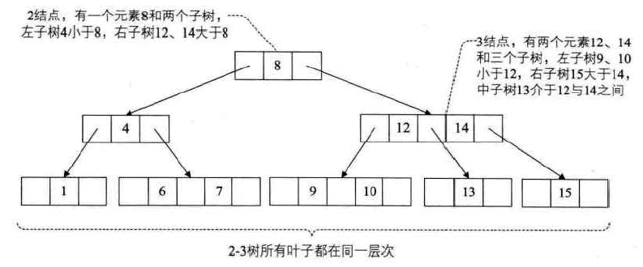

### 2-3-4树

它是2-3树的扩展概念，它包括了4结点的使用，一个4结点包含三个元素及四个孩子（或者没有孩子），它们之间也是由明确的大小关系的。

### B树

B树是一种平衡的多路查找树，前面讲的2-3树和2-3-4树都是B树的特例，结点最大的孩子数目称为B树的阶，2-3树是3阶B树，2-3-4树是4阶B树。

一个m阶的B树具有如下特点：

- 如果根结点不是叶结点，则其至少有两棵子树
- 每一个非根的分支结点都有k-1个元素和k个孩子，其中[m/2]<=k<=m，每一个叶子结点n都有k-1个元素
- 所有叶子结点都位于同一层次
- 结点包含的元素和指针指向的节点是有明确的顺序关系的，结点包含下列信息：n/A0/K1/A1.../Kn/An，其中Ai是指针，Ki是关键字，Ai-1指针指向的子树中的所有结点关键字均小于Ki

由于B树每个结点可以具有比二叉树多得多的元素，所以它减少了必须访问的结点和数据块的数量，从而提高了性能。

对于含有n个关键字的B树上查找时，涉及的节点数不超过：
$$
\log_{[m/2]}{(n+1)/2} + 1
$$

### B+树

B树有一个弊端那就是遍历树的时候并不方便，每次遍历还需要单独访问元素，每单独访问一次都要对结点多次访问。

B+树是为了文件系统创造的一种B树的变形，它其实已经不是严格的树了，它的叶子结点包含全部数据信息，每一个叶子结点都保存指向下个叶子结点的指针，下面就是一棵B+树：

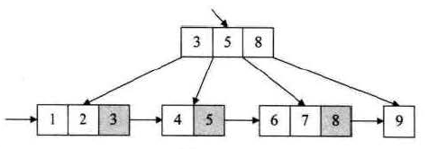

一棵m阶的B+树和B树的差异：

- 有n棵子树的结点包含有n关键字
- 所有叶子结点包含全部关键字的信息，以及指向这些记录的指针，叶子结点本身按照关键字大小链接并顺序排序
- 所有结点可以看作是索引，结点中仅含有其子树中最大或者最小的关键字

对于B+树来说，随机查找和B树是相同的，从根节点出发逐层查找。如果是需要从最小关键字进行从小到大的顺序查找，可以从最左侧的叶子结点出发遍历即可，所以它适合带有范围的查找。

### 数据库应用

B 树也称 B-树,全称为 多路平衡查找树 ，B+ 树是 B 树的一种变体。

两者区别：

- B 树的所有节点既存放键(key) 也存放数据(data)，而 B+树只有叶子节点存放 key 和 data，其他内节点只存放 key。正因为如此，所以B树的检索可能不用检索到叶子结点，而B+树则必须检索到叶子节点，检索效率稳定；这个设计还带来一个变化：相同大小的页，B+树能提供更多的分支。

  因为B+树只有叶子节点存data，所以插入删除的效率更高，只需要修改非叶子节点的索引记录，修正最后一层的指针即可，而B树可能存在结构的变化

- B+树的叶子节点有一条引用链指向与它相邻的叶子节点。所以B+树要遍历所有数据只需要沿着链表遍历即可，更适用于范围查询场景

综上，B+树与 B 树相比，具备更少的 IO 次数、更稳定的查询效率和更适于范围查询这些优势。

B树是有阶数的，2-3树是每个节点都有2孩子或者3孩子，它是3阶B树；2-3-4树是每个节点都有2/3或者4个孩子，它是4阶B树

m阶B树每个分支节点都有k-1个元素和k个孩子，其中[m/2]<=k<=m，每一个叶子结点n都有k-1个元素

如果一棵B树的阶为1001，则1个节点包含1000个关键字，那么高度为1的树就可以存100w个元素，高度为2可以存10亿关键字，查10亿关键字要访问的节点数不超过3

为什么MySQL一页是16k，按一行数据大小1k来算，那么：

- 叶子节点一页可以存16条数据
- 对于非叶子节点，如果key使用的是bigint，则为8字节，指针在mysql中为6字节，一共是14字节。16k能存放 16 * 1024 / 14 = 1170 个索引指针。

综上分析，对于一颗高度为2的B+树，根节点存储索引指针节点，那么它有1170个叶子节点存储数据，每个叶子节点可以存储16条数据，一共 1170 x 16 = 18720 条数据。而对于高度为3的B+树，就可以存放 1170 x 1170 x 16 = 21902400 条数据（两千多万条数据），也就是对于两千多万条的数据，我们只需要高度为3的B+树就可以完成，通过主键查询只需要3次IO操作就能查到对应数据。所以在 InnoDB 中B+树高度一般为3层时，就能满足千万级的数据存储

这也是单表不建议超过2000w的一个原因之一（如果内存充足的话，将表全部缓存在内存，也不会导致查询速度下降）

## 红黑树

红黑树是一颗平衡二叉查找树，它解决了普通二叉查找树在有序数据插入下退化为链表的问题，它的特点：

- 每个节点非红即黑；
- 根节点总是黑色的；
- 每个叶子节点都是黑色的空节点（这里说的叶子结点不是常规的概念，而是叶子节点下面的空节点，NIL 节点）；
- 如果节点是红色的，则它的子节点必须是黑色的（反之不一定，这条特点让从根节点到叶子节点的所有路径上不能有2个连续的红色节点）；
- 从根节点到叶节点或空子节点的每条路径，必须包含相同数目的黑色节点（即相同的黑色高度，注意这里的黑色节点包括空的叶子节点）。

和 AVL 树不同的是，红黑树并不追求严格的平衡，而是大致的平衡，它和AVL比查询效率有所下降，但是插入和删除操作效率大大提高了，在插入和删除节点时只需进行 O(1) 次数的旋转和变色操作，即可保持基本平衡状态，而不需要像 AVL 树一样进行 O(logn) 次数的旋转操作，整体性能略优于AVL树

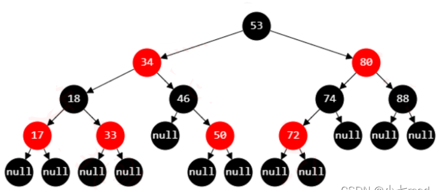

将红黑树中所有的红色节点上移到和他们的父节点同一高度上，就会形成一个4阶B树，即一个结点最多包含三个元素及四个孩子：

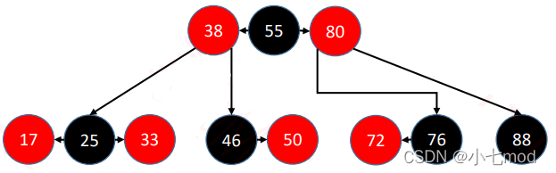

红黑树 和 4阶B树（2-3-4树）具有等价性。且在所有的B树节点中，永远是黑色节点是父节点，红色节点是子节点。黑色节点在中间，红色节点在两边

## 跳表

跳表是一种可以进行二分查找的有序链表，在链表的基础上增加了多级索引，它插入、查询和删除操作都只需要Ologn

跳表其实就是给一个有序链表上层加了多级索引，使其在遍历过程中能一次性跨越多个元素，提高查找的速度：


查找一个元素的时候，先从最高层开始查找，在同一层依次遍历，若下一个元素大于该值或者下一个元素是空，则向下层查找，直到找到最后一层

插入一个元素的过程和查找类似，先用查找的方式找到最后一层，找到它应该插入的位置，然后开始随机层数，一个新元素的层高是随机的，可能是2，也可能是3。下图是新增元素层高为2的状态：


下图是层高为3的状态：


随机出层高后，要与它前面、后面的元素各层都完成指针的连接。

一般来说，随机到第一层的概率是0.5，随机到第二层的概率为0.25，随机到第三层的概率为0.125，可以使每一层的元素数是上一层的2倍，使查找效率大概为logn

删除元素的过程：找到该元素，然后定位到它之前的一个节点和之后的一个节点，将之前节点的指针指向它之后即可，和链表的删除类似，只不过要逐层调整指针。下图是删除元素7之前：


删除元素7之后：


跳表效率和红黑树、AVL不相上下，但跳表原理更简单，实现更容易，而且它可以很方便的序列化为一个有序表，因为它本身就是一个有序链表

此外跳表的结构简单，平均每个节点包含的指针数要小于2，存储占用更少

## 哈希表

散列技术是在记录的存储位置和它的关键字之间建立一个确定的对应关系f，使得每个关键字key对应一个存储位置f(key)，这种对应关系f称为散列函数。

采用散列技术将记录存储在一块连续的存储空间中，这块连续存储空间称为散列表或哈希表，对应的存储位置称为散列地址。

散列技术既是一种存储方法，也是一种查找方法。

散列技术不适用的场景：

- 一个key对应多条记录的情况
- 范围查找

当key1不等于key2，但f(key1)=f(key2)，这种现象称为冲突，key1和key2就是这个散列函数的同义词。

### 散列函数

好的散列函数需要满足的要求：1、计算简单；2、散列地址分布均匀

几种基本的散列函数：

1、直接定址法：f(key) = a * key + b，其中a和b是常数

2、数字分析法：使用关键字的一部分来计算存储位置，如果事先知道关键字的若干位分布均匀可以用这种方法

3、平方折中法：使用关键字的平方，然后抽取一部分，来计算散列地址

4、折叠法：将关键字分割为几个部分，将几部分叠加计算再取一部分作为散列地址

5、除留余数法：f(key) = key mod p (p <= m)，本方法的关键就是选择合适的p，根据经验，若散列表表长为m，通常p为小于等于表长（最好接近m）的最小质数，或者不包含小于20质因子的合数

6、随机数法：f(key) = random(key)，random是随机函数，应该是假随机函数。

应该根据不同的情况来选择合适的散列函数，这些是影响散列函数选择的因素：

- 算法效率
- 关键字长度
- 散列表大小
- 关键字的分布情况
- 查找频率

### 散列冲突

几个常用的处理散列冲突的方法：

- 开放定址法

  一旦发生了冲突，就去寻找下一个空的散列地址，只要散列表足够大，空的散列地址总能找到，并将记录存入

  f(key) = (f(key) + di) mod m ，其中m是散列表的大小，di是1到m-1的递增序列。

  例如f(key)出现冲突的时候，就取f(key)然后填入上面的公式中，计算新的f(key)，每次计算的时候di都在递增，直到找到一个f(key)是有空位的。

  上面解决冲突的方法叫线性探测法，它容易出现堆积，因此我们改进di序列，让它等于1/-1/4/-4,/9/-9，相当于双向寻找可能的空位置，不让关键字都集中在某一个区域，这种方法叫二次探测法。

  还有一种方法是随机探测法，这种方法的di是一个随机函数，相当于一个伪随机函数结果组成的序列。

- 再散列函数法

  事先准备多个散列函数，使用第一个函数计算出现冲突时，就用第二个函数计算，以此类推

- 链地址法

  将同义词存储在一个单链表中，无论有多少冲突都相当于是给单链表增加结点

- 公共溢出区法

  为所有冲突的关键字建立了一个公共的溢出区来存放。查找时如果能在基本表找到则成功，如果找不到则去溢出区寻找。当冲突数据较少时，该方法的效率还是比较高的

### 具体实现

散列表查找的时间复杂度是O1，它的平均查找长度取决于下列因素：

- 散列函数是否均匀，这决定了出现冲突的概率
- 处理冲突的方法，二次探测法在堆积问题上优于线性探测方法，链地址法处理冲突则不会产生堆积，平均查找性能更好
- 装填因子：它等于记录个数/散列表长度，它越大产生冲突的可能就越大

下面是一个用链地址法处理冲突的简单散列表实现：

```java
class SeparateChainingHashTable<AnyType> {
	
	//默认哈希表大小
	private static final int DAUFAULT_TABLE_SIZE = 101;
	//哈希表由一个list（实际上是linkedlist）数组组成
	private List<AnyType> [] list;
	//表示里面实际数据的个数
	private int currentSize;
	
	//空参构造
	public SeparateChainingHashTable() {
		//super();
		this(DAUFAULT_TABLE_SIZE);
	}
	
	//有参构造
	//将list初始化为linkedlist数组，大小是一个经过处理的素数
	//哈希表的最佳状态就是大小是素数时
	public SeparateChainingHashTable(int size){
		list =new LinkedList [ nextPrime( size ) ];
 
		for(int i = 0 ; i < list.length ; i++){
			list[i] = new LinkedList<>();
		}
	}
	
	//插入数据时先获取对应的linkedlist
	//再检查是否有该元素，没有就添加进去
	//同时数据总数加1
	public void insert(AnyType element){
		LinkedList<AnyType> lt = (LinkedList<AnyType>)list[myhash(element)];
		if(!lt.contains(element)){
			lt.add(element);
			currentSize++;
		}
	}
	
	//删除数据时先获取对应的linkedlist
	//再检查是否有该元素，有就删除
	//同时数据总数减1
	public void remove(AnyType element){
		LinkedList<AnyType> lt = (LinkedList<AnyType>)list[myhash(element)];
		if(lt.contains(element)){
			lt.remove(element);
			currentSize--;
		}
	}
	
	//置空：数组每项都置为null
	public void makeEmpty(){
		for(int i = 0 ; i < list.length ; i++){
			list[i] = null;
		}
	}
	
	//检查是否包含时，先获取对应的linkedlist
	//再用list的contain操作
	public boolean contains(AnyType element){
		LinkedList<AnyType> lt = (LinkedList<AnyType>)list[myhash(element)];
		return lt.contains(element);
	}
	
	//散列函数：根据输入的对象得到哈希值
	//根据其已经有的hashcode值，对表大小取余并保证其不为负数即可
	private int myhash(AnyType element){
		int x = element.hashCode();
		
		x %= list.length;
		if(x < 0){
			x += list.length;
		}
		return x;
	}
	
	//经过这个方法得到哈希表的实际大小
	//即选择一个比输入的size稍大一些的离该值最近的
	//素数值
	private int nextPrime(int size){
		if(size % 2 == 0){
			size++;
		}
		
		while(!isPrime(size)){
			size += 2;
		}
		
		return size;
	}
	
	//判断一个数是否为素数
	//这里做了一些改进，在遍历时每次递增2而不是1
	private boolean isPrime(int size){
		if(size == 2 || size == 3){
			return true;
		}
		
		if(size % 2 == 0 || size == 1){
			return false;
		}
		
		for(int i = 3;i * i <= size;i += 2){
			if(size % i == 0){
				return false;
			}
		}
		
		return true;
	}
}
```

### randomPool

设计randomPool结构，要求提供下面几个方法：

- 要求提供insert(key)方法，将某个key加入该结构要求不重复
- 提供delete(key)方法，将某个key移除
- 提供getRandom()方法，等概率随机返回结构中的任何一个key，要求三个方法时间复杂度O1

```java
	//用两个hashmap完成这个功能，如果用一个map根本不可能做到随机返回key，因为一个散列表可能未满，也可以一个桶有多个值
	//无法随机抽取，这里用两个hashmap一个以key为键数字为值，一个以数字为键key为值
	//每次插入往两个表内同时插入
	//随机抽取时只要记录size值随机产生一个数根据键去找值即可
	//删除时要把表的最后一个值填补到该位置，再删除最后一个值
	static class randomPool<anyType>{
		HashMap<Integer, anyType> map1; 
		HashMap<anyType, Integer> map2; 
		int size;
		randomPool(){
			map1 = new HashMap<>();
			map2 = new HashMap<>();
			size = 0;
		}
		
		public void insert(anyType key){
			if(!map2.containsKey(key)){
				map1.put(size, key);
				map2.put(key, size);
				size++;
			}
		}
		
		public void delete(anyType key){
			
			if(map2.containsKey(key)){
				map1.put(map2.get(key), map1.get(size - 1));
				map2.put(key, size - 1);
				map2.remove(map1.get(size - 1));
				map1.remove(size - 1);
				size--;
			}
		}
		
		public anyType getRandom(){
			if(size == 0){
				return null;
			}
			return map1.get((int)(Math.random()*size));
		}
	}
```


# 排序

## 分类

排序方法的稳定性定义：排序前的序列中几个关键字相同的记录的相对位置，排序后仍然保持不变就称排序方法是稳定的，否则就是不稳定的。

根据待排序的记录是否放置在内存中，可以分为内排序和外排序：

- 内排序在排序整个过程中，待排序的所有记录全部被放置在内存中
- 外排序是由于记录过多，不能同时放置在内存，整个排序过程需要在内外存之间多次交换数据才能进行

算法性能的影响因素：

- 时间复杂度
- 辅助存储空间
- 算法本身的复杂性

几种算法的各种指标对比：


从最好情况来看，冒泡和直接插入排序较好，如果待排序的序列总是基本有序，可以选择这两个简单的算法。

从最坏情况来看，堆排序和归并排序又胜过其他排序算法。

归并排序是唯一一个Onlogn算法中稳定的排序算法

简单选择排序的优势：比较次数多，但是移动记录的次数少

## 冒泡排序

冒泡排序是一种交换排序，它的基本思想是：两两比较相邻记录的关键字，如果反序则交换，直到没有反序的记录为之。

冒泡排序的初级版，它并不算是标准的冒泡排序，它并不算两两比较相邻记录，它是最简单的交换排序，它的思路就是让每一个位置，与其之后的每一个位置都比较，如果逆序就交换，这样第一个位置一定在第一次循环后变成最小值。但是它在循环的过程中，没有对其他位置的排序产生帮助，而且还容易把数字换到更远的位置，它效率较低。

```java
	public static void easySort(int[] a){
		
		int t, i, j;
		for(i = 0 ; i < a.length ; i++){
			for(j = i + 1; j < a.length ; j++){
				if(a[i] < a[j]){
					t = a[j];
					a[j] = a[i];
					a[i] = t;
				}
			}
		}
	}
```

正宗的冒泡排序：

```java
	public static void bubbleSort(int[] a){
		int t, i, j;
		for(i = 0;i < a.length ; i++){
			for(j =a.length - 1 ; j > i;j--){
				if(a[j] > a[j - 1]){
					t = a[j];
					a[j] = a[j - 1];
					a[j - 1] = t;
				}
			}
		}
	}
```

优化后的冒泡排序，可以在整体有序后提前退出循环，提高一些性能：

```java
	public static void optBubbleSort(int[] a){
		int t, i, j;
		boolean flag = true;
		for(i = 0 ; i < a.length && flag;i++){
			flag = false;
			for(j = a.length - 1 ; j > i ; j--){
				if(a[j] > a[j - 1]){
					t = a[j];
					a[j] = a[j - 1];
					a[j - 1] = t;
					flag = true;
				}
			}
		}
	}
```

最好的情况下，整个数组是有序的，此时算法需要比较n-1次。在最糟糕的情况下，整个数组是逆序的，此时需要比较1+2+...+(n-1)次，也就是n(n-1)/2次，它的时间复杂度是On2

## 选择排序

冒泡排序中不断在交换位置，选择排序的核心思想就是减少交换次数，每次循环在剩余记录中选出最小的记录，然后放到对应的位置。

它减少了交换次数，因此获得了一定的性能提升，它的性能要优于冒泡排序，它的时间复杂度还是On2

```java
	//选择排序是从第一项开始，寻找除了第一项以外的最大值下标，再把下标对应的值与第一项互换
	//这样每次都从剩下的位置寻找最大值，再交换，而不是次次交换提升了效率
	//选择排序把交换数据次数降低，提升了运行效率，选择排序 》 冒泡排序
	public static void selectionSort(int[] a){
		int t, max, i, j;
		for(i = 0; i < a.length ; i++){
			max = i;
			for(j = i + 1 ; j < a.length ; j++){
				//是赋值给下标，而不是直接影响值
				if(a[max] < a[j]){
					max = j;
				}
			}
			if(max != i){
				t = a[max];
				a[max] = a[i];
				a[i] = t;
			}
		}
	}
```

## 插入排序

插入排序的基本思想是将一个记录插入到已经排好序的有序表中，从而得到一个新的、记录数加1的有序表

这个插入并不是说每次都要进行交换，而是传递式的赋值，这样在一个大小为n的有序表中插入一个元素最多只会进行n+1次赋值

最坏的情况下，数组是逆序的，此时需要比较2+3+..+n=(n+2)(n-1)/2次，记录的移动次数是3+4+...n+1=(n+4)(n-1)/2次，时间复杂度也是On2。它的整体性能要优于选择排序和冒泡排序

```java
	//插入排序，原理是视第一项为有序项，从第二项开始依次使其加入序列
	//如果前方各项都比该值小，那就让各项都向后移位，直到找到正确的位置
	//将值加入该位置即可，全程都没有互换操作，有的只是简单的值传递
	//该方法性能更优越       插入排序 》 选择排序
	public static void insertSort(int[] a){
		int i,j,t;
		//循环从第二项开始，因为试第一项为有序项
		for(i = 1 ; i < a.length ; i++){
			//将a[i]的值记录下来，在后期值传递的过程中，原始的a[i]会被覆盖
			
			//这里吧第一个for循环的判断条件提上来，如果不满足就省去了赋值t和j的时间
			if(a[i - 1] < a[i]){
				t = a[i];
				//j从i-1开始向后递减查找a[j]与t的关系
				//如果t大，说明t值需要前移，前方元素需要向后移
				//在循环中通过值传递来让后一个元素等于前一个元素
				//然后更前方的元素再继续覆盖
				for(j = i - 1;a[j] < t && j >= 0;j--){
					a[j + 1] = a[j];
				}
				//在循环结束时，说明找到了a[i]的插入位置，此时所有元素都已经移动完成
				//只需在对应位置放入原来a[i]的值即可
				a[j + 1] = t;
			}
		}
	}
```

## 希尔排序

希尔排序(Shell Sort)是插入排序的一种，它是针对直接插入排序算法的改进。

它通过比较相距一定间隔的元素来进行，各趟比较所用的距离随着算法的进行而减小，直到只比较相邻元素的最后一趟排序为止。

如果要排序的序列是基本有序的，插入排序的效率就会很高，所谓基本有序，就是小的关键字基本在前面，大的基本在后面，像{2,1,3,6,4,7,5,8,9}就可以称为基本有序。所以希尔排序的思路就是分割待排序记录，减少待排序记录的个数，让整个序列朝基本有序的方向发展。

选择增量 gap=length/2，缩小增量以 gap = gap/2 的方式，用序列 {n/2,(n/2)/2...1} 来表示

1、初始增量第一趟 gap = length/2 = 4

整理各组至有序状态，这里面的各组之间是不连续的：


2、第二趟，增量缩小为 2


3、第三趟，增量缩小为 1,得到最终排序结果


```java
	//希尔排序，本质上是增强的插入排序
	//原理是取一个增量值，把整个序列按照增量值划分成几个部分
	//如增量值为5，则0 5 10 15 20一组，1 6 11 16 21 一组
	//把每组分别按照插入排序进行排序，这样增量值在递减过程中整个序列也趋于某种顺序
	//最后增量值为1，完成后及完成排序
	//希尔排序能把算法平均运行时间降到n的1.5次方
	public static void shellSort(int[] a){
		
		int t, j, d, i;
		//这里选取增量值为数组长的一半，且每次减少一半，增量值总会等于1，这一轮结束后循环结束
		for(d = a.length/2 ; d >= 1;d = d / 2){
			//i从d+1开始，因为属于这个序列的前一个值是1，它本身相当于有序
			//当i越界时循环结束，每次i加一
			for(i = d + 1 ; i < a.length ; i++){
				//如果满足这个表达式说明这一轮无需进行排序
				//待插入的值比前一个值小，说明它比前面的任何值都小，这自然满足要排序的目的
				//实质上这个是把第一次循环的条件提了上来，如果不满足就省去了赋值t和j的时间
				if(a[i] > a[i - d]){
					//把待插入元素值记录，以免被覆盖
					t = a[i];
					//循环开始，向前查找有没有项大于待插入元素，如果有就让整体元素向后移动
					for(j = i - d;j > 0 && t > a[j] ; j = j - d){
						a[j + d] = a[j];
					}
					//移动完毕后把待插入项放到正确的位置
					a[j + d] = t;
				}
			}
		}
	}
```

注意增量序列的最后一个增量值必须等于1才行。

希尔排序时间复杂度是 O(n^(1.3-2))，排序期间它的记录是跳跃式移动，所以它并不算一个稳定的排序算法

## 堆排序

堆排序是选择排序的优化，选择排序每次在对比的时候没有吧之前对比的结果记录下来，导致后一次遍历时无法复用之前的结果，造成一些重复比较。

如果可以在选择到最小记录时，根据比较结果对其他记录进行响应的调整，那整体的排序效率就会提高，这就是堆排序的思路。

下面的两个结构就是堆：


每个结点的值都大于或等于其左右孩子结点的值，称为大顶堆；每个结点的值都小于或者等于其左右孩子结点的值，称为小顶堆。

如果用大顶堆和小顶堆以层序遍历的方式存入数组，就是下面这样的：


这个结构其实就是为了堆排序做准备的。

堆排序会将待排序的序列构造成一个大顶堆，此时整个序列的最大值就是堆顶的根结点，将它与堆数组的末尾元素交换，此时末尾元素就是最大值，然后将剩余元素重新构造成一个堆，然后再取其中的最大值交换，反复执行，最后就能得到一个有序序列。

堆排序的两个重要步骤：

- 如何由无序序列构建成一个堆
- 如何在输出堆元素后，调整剩余元素成为一个新的堆

1、构造堆的过程

从非叶子结点的最后一个值开始调整，如下图的红色结点。完全二叉树有个重要性质，对于第一个非叶子节点的索引是 n/2 取整数得到的索引值，其中 n 是元素个数(前提是数组索引从 1 开始计算)。


索引 5 位置是第一个非叶子节点，我们从它开始逐一向前分别把每个元素作为根节点进行 shift down 操作满足最大堆的性质。

索引 5 位置进行 shift down 操作后，22 和 62 交换位置。


对索引 4 元素进行 shift down 操作。

以此类推，对每个节点都进行shift down 操作，和它的左右节点对比，不断的吧最小的节点和自己互换，直到满足小顶堆的标准。

2、输出堆元素后，调整剩余元素成为一个新的堆

此时相当于堆顶元素是不满足堆定义的，此时只需要仿照前面的 shift down 操作，将结点不断下移即可：


调整完毕的样子：


堆排序中需要知道的完全二叉树知识：

- 堆是一个完全二叉树，结点i的左孩子是2i+1，右结点是2i-1
- 一个结点的父节点是（i-1）/2
- 开始时从i = arr.length/2 - 1开始调整，这是最后一个叶子节点的父节点，也就是最后一个需要调整的结点

代码实现：

```java
	//堆排序，原理是把数组整理成一个堆，这样第一个位置的元素自然是最大值或者最小值
	//把这个最值与数组最后一个位置调换，把前n-1个元素继续整理成一个堆
	//然后继续上面的过程，堆越来越小，直到数组有序
	//它把排序的平方运行时间降到了nlogn
	public static void heapSort(int[] a){
		
		int t, i, j;
		//这个循环的作用是将初始数组整理成一个小顶堆
		//只有整理成小顶堆，然后不断把第一个元素挪到最后一个才能形成从大到小的序列
		//要整理的元素从a.length/2开始，它是需要整理的第一个元素，是非叶子节点的最右值
		//叶子节点全都不用调整，i随着运行递减，直至i为0即调整堆顶元素，结束后即完成堆排序
		//这种整理堆排序的方法是从下至上的，每次运行时它下方的元素都处于满足小顶堆特性的状态
		for(i = a.length/2 - 1 ; i >= 0 ; i--){
			//自始至终处理范围都是a.length，因为初始阶段堆的大小并不变
			adjustDown(a , i , a.length);
		}
		System.out.println("此时已经生成堆"+Arrays.toString(a));
		//System.out.println("整理完毕");
		//真正的排序开始，一共进行n-1次调整即可
		//每次都把堆顶与堆最后一个互换位置，再调整剩下元素使其满足堆的性质
		for(j = 1 ; j < a.length ; j++){
			t = a[0];
			a[0] = a[a.length - j];
			a[a.length - j] = t;
			//随着运行，堆的大小在变小，处理堆的范围在缩小
			//每次互换后只需调用一次这个方法即可，因为除了堆顶元素下方元素都已经满足了堆的要求
			adjustDown(a , 0 , a.length - j);
			System.out.println("转换移动！"+Arrays.toString(a));
		}
	}
	
	//调整堆结构的方法，第二个参数是要调整的位置，第三个参数是堆的大小
	private static void adjustDown(int[] a , int i , int len){
		
		//把要调整的元素大小用t保存起来，防止被覆盖
		int t = a[i], j;
		//循环开始，j值从2i开始，2i正好是要调整元素的左孩子，每次循环之后j要乘2
		//因为调整通常不在一层进行，上下元素互换使原元素小于左右孩子后，
		//因此改变的左右孩子可能和他自己的左右孩子不满足堆的性质，需要再次调整
		//直至j等于数组大小时，一次调整结束
		//System.out.println("我是真的在执行");
		//System.out.println("此时的数组是" + Arrays.toString(a));
		for(j = 2 * i + 1 ; j < len ; j = j * 2 + 1 ){
			//a[j + 1] < a[j]说明右兄弟的值更小，它才是要与父母结点互换的结点
			//此时把j加一这样后面两者互换之后就可以满足小顶堆的性质了
			//j = len - 1 意味着左孩子是整个堆的最后一个元素
			//此时它没有兄弟元素故不必进行下列操作了
			//System.out.println("此时的j是谁？"+j);
			if(j < len - 1 && a[j + 1] < a[j]){
				j = j + 1;
			}
			//如果t > a[j]说明原要调整的结点比孩子结点大，此时把要调整的结点赋值为孩子结点
			//同时改变i为j，记录下最后一个改变的结点位置
			//在多次循环中，因为一次互换导致的子树也不满足堆的要求
			//要不断向下传递值
			if(t > a[j]){
				a[i] = a[j];
				i = j;
			}else{
				//如果本来就满足堆的性质则无需调整
				//直接跳出循环，此时它下方的元素已经全部满足堆的性质
				//无需进行下一步循环了
				break;
			}
		}
		//运行到这里通过一系列值传递，操作的最底层和相邻层一定有两个相同元素
		//此时利用记录下来的值把正确的值赋给它
		a[i] = t;
	}
```

具有n个结点的完全二叉树的深度为[logn] + 1 ，所以无论是重建还是调整，总的来说，堆排序的时间复杂度是Onlogn。空间复杂度上，它只有一个用来交换的暂存单元。由于记录的交换和比较是跳跃式进行，所以它是不稳定的排序算法。

由于初始构建堆所需要的比较次数较多，因此它不适合待排序序列个数较少的情况。

易于理解版：

~~~java
	public int[] sortArray(int[] nums) {
        for (int i = nums.length/2 - 1; i >= 0; i--) {
            goDown(nums, i, nums.length);
        }
        for (int i = 0; i < nums.length; i++) {
            swap(nums, 0, nums.length - 1 - i);
            goDown(nums, 0, nums.length - 1 - i);
        }
        return nums;
    }

    private void goDown(int[] nums, int posi, int limit) {
        while (posi < limit) {
            int leftPosi = posi * 2 + 1;
            int rightPosi = posi * 2 + 2;
            int target = posi;
            if (leftPosi >= limit) {
                return;
            }
            if (rightPosi >= limit) {
                target = nums[leftPosi] > nums[posi] ? leftPosi: posi;
            } else if (nums[rightPosi] >= nums[posi] && nums[rightPosi] >= nums[leftPosi]) {
                target = rightPosi;
            } else if (nums[leftPosi] >= nums[posi] && nums[leftPosi] >= nums[rightPosi]) {
                target = leftPosi;
            }
            if (posi == target) {
                return;
            }
            swap(nums, posi, target);
            posi = target;
        }
    }
~~~

下面介绍一些堆的其他应用：

### 堆与贪婪算法

堆可以方便的求最大最小值，所以它在贪婪算法中有很多应用，例如下面这个案例：

一块金条切成两半需要花费与数值相同的铜板，比如一根长度为20的金条需要20铜板。现给定一个数组[10,20,30]，数组反映了两个信息：

第一，金条长度为数组的和60，第二，要把金条切成3份，每份是10，20，30

要求输入一个数组，返回分割的最小代价（哈夫曼编码）

```java
	//建立一个小顶堆，将数组输入，每次从小顶堆中取出两个数，就是数组的最小的两个数
	//加起来把和再放回去，直至堆中一个数，把生成的所有和都加起来即可
	//对10,20,30，先选出10和20，合成30，再由30和30合成60，总的代价就是90
	//切割的时候反着来，先由60切成两个30，再把其中一个30切成两个一个10一个20
	public static int splitGold(int[] arr){
		PriorityQueue<Integer> heap = new PriorityQueue<>();
		for(int i = 0; i < arr.length; i++){
			heap.add(arr[i]);
		}
		
		int num;
		int sum = 0;
		while(heap.size() > 1){
			num = heap.poll() + heap.poll();
			sum += num;
			heap.add(num);
		}
		
		return sum;
	}
```

### 用堆取中位数

设置一个结构可以随时获得一组数据的中位数

```java
    //设计两个堆，一个堆代表一组数中较小部分的大顶堆，一个堆代表一组数中较大部分的小顶堆
	//两个堆的堆顶分别是较小一半的最大值和较大一半的最小值
	//中位数一定在这两个数之间
	//每次添加数的时候如果数比大顶堆的堆顶还大就放到小顶堆去
	//每次两个堆的大小差超过1之后就进行调整使堆大小平衡
	static class getMid{
		PriorityQueue<Integer> heapMaxInBefore;
		PriorityQueue<Integer> heapMinInAfter;
		
		getMid(){
			heapMaxInBefore = new PriorityQueue<Integer>(10, new BigHeap());
			heapMinInAfter = new PriorityQueue<Integer>();
		}
		
		public void add(int num){
			if(!heapMaxInBefore.isEmpty() && heapMaxInBefore.peek() < num){
				heapMinInAfter.add(num);
			}else{
				heapMaxInBefore.add(num);
			}
			balance();
		}
		
		private void balance(){
			if(heapMinInAfter.size() - heapMaxInBefore.size() > 1){
				heapMaxInBefore.add(heapMinInAfter.poll());
			}else if(heapMaxInBefore.size() - heapMinInAfter.size() > 1){
				heapMinInAfter.add(heapMaxInBefore.poll());
			}else{
				;
			}
		}
		
		public int getMidNum(){
			if(heapMinInAfter.size() > heapMaxInBefore.size()){
				return heapMinInAfter.peek();
			}else{
				return heapMaxInBefore.isEmpty()? (Integer)null : heapMaxInBefore.peek();
			}
		}
	}
	
	static class BigHeap implements Comparator<Integer>{
		@Override
		public int compare(Integer o1, Integer o2) {
			return o2 - o1;
		}
	}
```

## 归并排序

归并排序（Merging Sort）是利用归并的思想实现的排序算法，它把初始序列看作n个有序的子序列，每个子序列只有1个元素，不断两两归并，最后得到一个长度为n的有序序列，这种排序方法称为2路归并排序。

它就像一棵倒置的完全二叉树：


### 递归算法

```java
	//合并排序，原理是将数组分成一半，前一半和后一半再分一半
	//直至分成单个元素，将它们两两排序再合并，2个合并为4个，这样下去直至合并成原数组
	//就像是多个叶子合成二叉树的过程，这里关键就是如何将两个数组合并成一个有序数组
	//合并排序的运行时间是nlogn，运行效果比较稳定
	//但需要n+logn的空间复杂度，不用递归后这个值可以减到n
	public static void mergeSort(int[] a){
		//这里用了另一个封装的函数，因为整个过程用递归完成
		mergeSort(a, 0, a.length - 1);
	}
	
	//mergeSort的第一个参数是数组，第二个参数是排序开始的位置，第三个参数是排序结束的位置
	private static void mergeSort(int[] a , int low , int high){
		
		//基线条件是low < high，只有当两个值相等时才不会继续调用本函数
		if(low < high){
			//计算mid，他是前后排序的分界线
			int mid = (low + high) / 2; 
			
			//将从low到mid排序
			mergeSort(a, low, mid);
			//将mid+1到high排序
			mergeSort(a, mid + 1, high);
			//最后把两者合并
			merge(a, low, mid, high);
		}
		
	}
	
	//合并函数，第一个参数是数组，后三个参数分别指示了待合并数组的位置
	//分别是low到mid和mid+1到high
	private static void merge(int[] a , int low , int mid ,int high){
		
		int i, j, k;
		//新建一个数组b，接下来的合并中，需要从这个数组中取值更改数组a中的值
		int[] b = new int[a.length];
		//把要合并的部分的b和a相等
		for(i = low ; i <= high ; i++){
			b[i] = a[i];
		}
		//循环开始，i和j分别是两个要排序数组的循环起点，k是一个指示a数组位置的变量，表示修改a值的位置
		//当两个待排序部分有一个已经遍历完成时，退出循环
		//最后每次把k加一
		for(i = low , j = mid + 1 , k = low ; i <= mid && j <= high ; k++){
			//两个待排序部分相互比较，较大的那个拿到a数组中，并把原来数的位置加1
			//以便下次继续比较
			if(b[i] >= b[j]){
				a[k] = b[i++];
			}else{
				a[k] = b[j++];
			}
		}
		//运行到这里意味着待排序部分的其中一个所有值都拿到了a数组，另一个还有部分值没有拿到
		//下面的两个循环就是哪个数组还没有运行完就继续把剩余的变量都依次拿到a数组
		while(i <= mid){
			a[k++] = b[i++];
		}
		while(j <= high){
			a[k++] = b[j++];
		}
	}
```

每次归并时都要将数组扫描一遍，耗费On时间，根据完全二叉树的深度可知，整个归并排序需要进行[logn]次，因此总的时间复杂度是Onlogn，而且这是归并排序中最好、最坏、平均的时间性能。

由于归并排序在归并过程中需要创建与原始序列相同大小的辅助数组，以及递归时深度为logn的栈空间，所以空间复杂度是On+logn

归并存在两两比较，但是不存在跳跃，因此归并排序是一种稳定的排序算法。

在实际解决问题时，可以用多定义一个冗余变量的方式来使程序的可读性更好，在上面的归并排序代码中，merge方法有四个参数，下面这个改进版可读性更好，它明确定义了合并时两段区间的起始和末尾：

```java
	//归并排序
	public static void mergeSort(int[] a){
		mergeSort(a, 0, a.length-1);
	}
	
	private static void mergeSort(int[] a, int begin, int end){
		if(begin < end){
			int mid = begin + (end - begin)/2;
			mergeSort(a, begin, mid);
			mergeSort(a, mid + 1, end);
			merge(a, begin, mid, mid + 1, end);
		}
	}
	
	private static void merge(int[] a, int begin_1, int end_1, int begin_2, int end_2){
		int i = begin_1;
		int[] b = new int[a.length];
		for(int j = 0; j < b.length; j++){
			b[j] = a[j];
		}
		while(begin_1 <= end_1 && begin_2 <= end_2){
			if(b[begin_1] <= b[begin_2]){
				a[i++] = b[begin_1++];
			}else{
				a[i++] = b[begin_2++];
			}
		}
		
		while(begin_1 <= end_1){
			a[i++] = b[begin_1++];
		}
		
		while(begin_2 <= end_2){
			a[i++] = b[begin_2++];
		}
		
	}
```

在递归算法中，有一个小的优化点，就是把merge方法中的临时数组单独抽取成一个成员变量，这样就免去了空间分配的消耗

### 非递归算法

递归算法容易理解，但是会造成空间上的消耗，因此可以想办法将递归转换为迭代。

非递归算法其实就是建立了一个大小相同的数组作为辅助数组，每次归并的时候将元素从一个数组转移到另一个数组。

```java
	//非递归的合并排序，将递归的算法空间复杂度进一步降低
	//这种方法创建了一个与a同大小的数组b，刚开始将大小为1的相邻有序序列重新排序
	//从a装入b中，然后取大小为2的相邻有序序列再重新排序从b装入a中
	//这样直到完成排序
	public static void optMergeSort(int[] a){
		//chg就是这个起中转作用的数组
		int[] chg = new int[a.length];
		//k是每次排序的有序序列大小，从1开始每次转换排序k都翻倍
		int k = 1;
		//循环的结束条件是当k大小超出数组大小，当k本身等于数组大小也可以
		while(k < a.length){
			//将a中大小为k的相邻有序序列重新排序，比如a中1,2,3,4，b中就是2,1,4,3
			//这就是k为1的状况
			mergePass(a, chg, k);
			//k翻倍，再将数组chg中的内容弄到a中来
			//k越界也没有关系，在方法内部不会执行任何操作
			k = k * 2;
			mergePass(chg, a, k);
			k = k * 2;
		}
	}
	
	//这个方法代表将a中将大小为k的相邻序列移动到b中，这里的移动有三种基本情况
	private static void mergePass(int[] a, int[] b, int k){
		int i = 0;
		//第一种情况，处理成对的序列
		while(i + 2 * k <= a.length){
			//两组重新排序后将a的值放入b中，每次i的值都加2k，再一次执行相同的操作
			merge(a, b, i, i+k-1, i+2*k-1);
			i = i + 2*k;
		}
		
		//第二种情况，在成对的处理完成之后，还剩一组不足一对的，类似0000 0000 0000 00
		//此时merge处理的两组是不等长的
		if(i + k < a.length){
			merge(a, b, i, i+k-1, a.length - 1);
			//最后一种情况，剩下的连半对都不到，类似0000 0000 00
			//此时直接把对应值复制过去，复制的操作是有必要的，否则最后返回的是另一个拷贝数组
			//这个过程还是要加判断条件，以免越界的情况
		}else{
			for(int j = i ; j < a.length ; j++){
				b[j] = a[j];
			}
		}
	}
	
	//这个merge比之前多了一个数组参数，不需再new一个和初始化数组了
	private static void merge(int[] b, int[] a, int low , int mid ,int high){
		int i, j, k;

		for(i = low , j = mid + 1 , k = low ; i <= mid && j <= high ; k++){

			if(b[i] >= b[j]){
				a[k] = b[i++];
			}else{
				a[k] = b[j++];
			}
		}

		while(i <= mid){
			a[k++] = b[i++];
		}
		while(j <= high){
			a[k++] = b[j++];
		}
	}
```

非递归算法的额外空间复杂度降低到了On

这个非递归算法的精髓在于将递归转换为了循环遍历，一次遍历形成n个连续的，长度为k的小子数组，然后再用归并算法合并。其实没有辅助数组一样可以完成该算法，只要借助这个基本思想即可。

## 快速排序

### 切分数组

给定一个数组arr和一个数num，把小于等于num的数放在数组左边 大于num的数放在数组右边：

```java
	//----------------------------------------------------------------
	//给定一个数组arr和一个数num，把小于等于num的数放在数组左边 大于num的数放在数组右边
	//遍历数组，j为一个小于等于区域的分界线
	//如果i位置的数比num小或等于num，就把它和小于等于区域的下一个数交换，再让j扩大一位
	//被交换过去的数总是大数，而交换回来的一定是小数，这样直到最后，所有的小数都被交换回来了
	public static void splitArr(int[] arr, int num) {
		int i = 0, j = -1;
		while (i < arr.length) {
			if (arr[i] <= num) {
				swap(arr, j + 1, i);
				j++;
			}
			i++;
		}
	}
```

### 荷兰国旗问题

荷兰国旗问题： 给定一个数组arr和一个数num，把小于num的数放在数组左边，等于num的数放在数组中间，大于num的数放在数组右边

```java
	//设置一个小于num区域，一个大于num区域
	//遍历数组，每次如果i位置的数小于num，就把它和最小区域的下一个数交换，同时最小区域扩大一位
	//如果i位置的数等于num，就直接遍历下一个数
	//如果i位置的数大于num，就把它和大区域的最后位置前一个位置互换，同时大区域扩大一位
	//由于被互换回来的数没有访问过，故此时不更新i直接访问原地的值
	public static void dutchFlag(int[] arr, int num) {
		int i = 0, begin = -1, end = arr.length;
		while (i < end) {
			if (arr[i] < num) {
				swap(arr, i, begin + 1);
				i++;
				begin++;
			} else if (arr[i] > num) {
				swap(arr, i, end - 1);
				end--;
			} else {
				i++;
			}
		}
	}
```

### 经典快速排序

快速排序基本思想：通过一趟排序将要排序的数据分割成独立的两部分，其中一部分的所有数据都比另外一部分的所有数据都要小，然后再按此方法对这两部分数据分别进行快速排序，整个排序过程可以递归进行，以此达到整个数据变成有序序列。

希尔排序是直接插入排序的升级，它们都属于插入排序类；

堆排序是简单选择排序的升级，它们都属于选择排序类；

快速排序是冒泡排序的升级，它们都属于交换排序类。快速排序也是通过不断比较和移动交换来实现的，相比冒泡排序，它增大了记录的比较和移动的距离，可以让关键字较大的记录直接移动到数组的后面，较小的记录直接移动到前面，从而减少了总的比较和交换次数。

快速排序是一种比较快速的排序算法，它的平均运行时间是 O(nlogn)，之所以特别快是由于非常精练和高度优化的内部循环，最坏的情形性能为 O(n^2)。像归并一样，快速排序也是一种分治的递归算法。从空间性能上看，快速排序只需要一个元素的辅助空间，但快速排序需要一个栈空间来实现递归，空间复杂度也为O(logn)

快速排序是一种不稳定的排序算法。

在一个数组中选择一个基点，比如第一个位置的 4，然后把4挪到正确位置，使得之前的子数组中数据小于 4，之后的子数组中数据大于 4，然后逐渐递归下去完成整个排序：


```java
	//快速排序，原理是设置一个关键元素，从后往前寻找比关键元素小的值与前面的值交换
	//再从前往后找比关键元素大的值与后面的值交换
	//当两边交替寻找到两个指针相等时，将这个位置设置为关键元素
	//将分割的两部分再通过同样的算法寻找，直到寻找的范围缩小为1个
	//当要排序的数组小于等于7时建议直接使用插入排序，这样效率更高
	public static void quickSort(int[] a){
		//传递给一个递归的方法
		quickSort(a, 0, a.length - 1);
	}
	
	//递归方法
	private static void quickSort(int[] a, int low, int high){
		//当low与high相等时，什么都不做
		if(low < high){

			//用partition方法切割数组，并取到关键元素的位置pivotkey
			int pivotkey = partition(a, low, high);
			//将数组按关键元素位置分别进行排序
			quickSort(a, low, pivotkey - 1);
			
			//这里对语句做了一个简单的优化，让low重新赋值了一下并把判断由if改为了while
			//让一部分循环代替递归工作，一定程度上降低了栈的深度
			quickSort(a, pivotkey + 1, high);
			// low = pivotkey + 1;
			System.out.println(pivotkey + " " + low + " " + high);
		}
	}
	
	//切割函数
	private static int partition(int[] a, int low, int high){
		
		//选取头中尾三个数的中间值作为low位置的值，它作为关键值划分效率比直接选low的值高
		int t, mid = (low + high)/2;
        // 将low和high中较小的数放到low
		if(a[low] > a[high]){
			t = a[low];
			a[low] = a[high];
			a[high] = t;
		}
        // 将mid和high中较小的数放到low
		if(a[mid] > a[high]){
			t = a[mid];
			a[mid] = a[high];
			a[high] = t;
		}
        // 最终再比较一次，这次排序完后，三数中中间的值一定在第一位，可以开始排序了
		if(a[mid] > a[low]){
			t = a[mid];
			a[mid] = a[low];
			a[low] = t;
		}
		
		//设置第一个元素为关键元素，这里的pivotkey是元素值不是位置
		int pivotkey = a[low];
		//当low=high时退出循环
		while(low < high){
			//当后面有元素大时退出循环，并把大元素赋值给low的位置，也就是放到前面
			//这里必须要加low和high的判断关系，因为这两个值是不断变化的
			//即使low已经与high相等，后面的赋值语句也是自己给自己赋值，不会影响结果
			while(low < high && a[high] <= pivotkey){
				high--;
			}
			a[low] = a[high];
			//当前面有元素小时退出循环，并把小元素赋值给high的位置，也就是放到后面
			while(low < high && a[low] >= pivotkey){
				low++;
			}
			a[high] = a[low];
		}
		//最后low与high相等退出了循环，把pivotkey的值放到这个位置，切割排序完成
		a[low] = pivotkey;
		//最后返回pivotkey的位置，为切割子序列做准备
		return low;
	}
```

在快速排序中，枢轴（pivot）的选择是很重要的，如果枢轴是整个序列的中间位置，那么就可以将序列分为小数集合和大数集合。如果pivot总是固定选择第一个关键字，那么对特定排序的序列来说，就非常不合理。

常见的方法有以下几种：

- 随机取low到high之间的树rnd，然后取rnd位置对应的关键字作为pivot。它的总体情况要好于取第一个位置。
- 取low、high、mid之间的中间值作为pivot，这就是三数取中法，它一定不会取到最大或者最小的数，效果较好
- 九数取中，是三数取中的进化版，取九个数中最中间的数

在上面的代码中，使用的是三数取中法，用了三个if来完成，注意最后一个if是逆序的，会将三数中中间的数放到数组第一位来。

在快速排序中，有一个隐藏的设定是：在partition中，不光要将数组分为两份，还要确定下来key的位置，如果key的位置确定不下来，则上面的递归代码中也不能再用pivotkey - 1和pivotkey + 1进行区间再分了，如果key的位置确定不下来就有死循环的可能，因此需要我们在partiton中：

* 记录key的大小
* 记下key的位置

最终一定要将key放到中间位置之后，再返回出去。

快速排序还有一种基于上面切分数组的解法：

~~~java
public int[] sortArray(int[] nums) {
        randomizedQuicksort(nums, 0, nums.length - 1);
        return nums;
    }

    public void randomizedQuicksort(int[] nums, int l, int r) {
        if (l < r) {
            int pos = randomizedPartition(nums, l, r);
            randomizedQuicksort(nums, l, pos - 1);
            randomizedQuicksort(nums, pos + 1, r);
        }
    }

    public int randomizedPartition(int[] nums, int l, int r) {
        int i = new Random().nextInt(r - l + 1) + l; // 随机选一个作为我们的主元
        swap(nums, r, i);
        return partition(nums, l, r);
    }

    public int partition(int[] nums, int l, int r) {
        int pivot = nums[r];
        int i = l - 1;
        for (int j = l; j <= r - 1; ++j) {
            if (nums[j] <= pivot) {
                i = i + 1;
                swap(nums, i, j);
            }
        }
        swap(nums, i + 1, r);
        return i + 1;
    }
~~~

此时的partition是基于切分数组的，在partition数组排序的过程中，key值所在的位置是不排序的，然后最后再将它换到中间位置去，这样依然满足前面提到的partition的隐藏作用：确定好key的位置

### 优化版

在下面的优化版算法中，用荷兰国旗的算法修改partition部分，这样切分后的数组就成了三部分，因此分区的指针也变成了两个。

在每次排序之前进行一次随机交换，然后取第一位为枢轴，相当于实现了随机快排：

```java
	//-------------------------------------------------------
	//随机快排:用荷兰国旗的算法修改partition部分
	//只是将数组划分成了三部分，且设置了前后两个指针来运作
	
	//随机快排在每次排序之前都要把最后一个位置和之前的某个位置交换
	//这样一来作为关键元素的值就不一定了，此时快速排序真正实现了运行时间的长期期望O（nlogn）
	public static void quickSort_c(int[] arr){
		quickSort_c(arr, 0, arr.length-1);
	}
				
	private static void quickSort_c(int[] arr, int i, int j){
		if(i < j){
			swap(arr, (int)Math.random()*(j - i + 1) + i, j);
			//通过partition获得划分的分界点
			int[] key = partition_c(arr, i, j);
			//处理分界点前后的数组
			quickSort_c(arr, key[0]+1, j);
			quickSort_c(arr, 0, key[1]-1);
		}
	}
			
	//将数组划分成了三部分，且设置了前后两个指针来运作
	private static int[] partition_c(int[] arr, int i, int j){
		int begin = i - 1;
		//这里因为num值是arr[j]，所以实际上操作区域就减了一位，从j开始
		//之所以设置arr[j]为关键值，是因为j是始终不动的，自然也就不在需要开辟空间来完成这个工作
		int end = j;
		while(i < end){
			if(arr[i] < arr[j]){
				swap(arr, i, begin+1);
				i++;
				begin++;
			}else if(arr[i] > arr[j]){
				swap(arr, i, end-1);
				end--;
			}else{
				i++;
			}
		}
			
		//最后还要交换end和j，因为此时end位置是大于区域的首位，j是游离在外的num值
		//此时交换结束之后，等于区域的结束点就在end区域了，这样num值就加入了等于区域
		swap(arr, end, j);
		//最后返回了与num相等区的开始和结束
		//此时num区的结束在end位置
		return new int[]{begin + 1, end};
	}	
```

## 桶排序

桶排序是一种特殊的排序算法，它使用较大的额外空间，而且对输入的数据有要求。如果整个数组的最大值和最小值相差不大的话，它的算法复杂度要低于快速排序：

```java
	//桶排序
	//先遍历数组找到数组的最大值和最小值，并建立一个大小为max - min + 1的数组，这个数组与原数组可能出现的数一一对应
	//再次遍历原数组，把新建数组中各位置更新为对应数字出现的次数
	//最后根据各数出现次数往原数组中填数
	public static void BucketSort(int[] arr){
		
		int max = Integer.MIN_VALUE, min = Integer.MAX_VALUE;
		//寻找最小值和最大值
		for(int i = 0; i < arr.length; i++){
			max = arr[i] > max?arr[i]:max;
			min = arr[i] < min?arr[i]:min;
		}
		//建立数组b，b与a中可能出现的所有数都一一对应
		int[] b = new int[max - min + 1];
		for(int i = 0; i < arr.length; i++){
			b[arr[i] - min]++;
		}
		//最后把原来的数组赋予成排序后的值
		int j = 0;
		for(int i = 0; i < arr.length; i++){
			//b数组从0开始，只要等于零就移动到下一个
			while(b[j] == 0){
				j++;
			}
			//直到b数组某个数不为0，把原数组对应的数放回去
			arr[i] = j + min;
			//同时该数的个数减一
			b[j]--;
		}
	}
```

基于桶的排序算法有多种，上面的准确来说叫计数算法，每个桶只保存单一键值。桶排序涵盖的范围很广，只要是将数字映射到桶中的排序算法都叫桶算法，此时一个桶内可能有多个数字。还有一种特殊的基于桶的算法是基数算法，它的桶数固定是10，先按顺序遍历数组，按照个位数大小装入桶中，然后遍历桶中数字，按照10位数再装入桶中，直到排序完成。