面对一个具体的场景设计时，尤其是没有什么思路的时候，可以采用4S分析法：

* Scenario 场景：要设计哪些功能、要设计到什么程度，例如支持多大的用户量（DAU：日活跃用户，去重的），并发有多少等（QPS：每秒访问量）

  对于系统设计类问题，必须先明确场景和用户量有多大

* Service 服务：要设计哪些微服务，将大系统拆分成小服务

  不同的事情设计不同的service，每个service负责不同的事情

* Storage 存储：数据如何存储和访问，是SQL还是NoSQL，具体的schema是什么，涉及的文件等

* Scale 升级：哪里还有空间优化，哪里可能还遇到问题，异常场景、扩展性

  之前设计的缺陷，未来可能面对的挑战如用户数据量暴增

Tradeoff：权衡、折中。在系统设计时经常会有多个方案对比，它们分别适用于不同的场景，有不同的特点。

# 秒杀系统

## 场景分析

场景描述：6月18日0点开始，京东自营限量100台，以4000元的价格，抢购IPhone11 64G版本，先到先得，一人限购一台，售完为止。

QPS分析：平日每秒1000人访问该页面，秒杀时每秒数十万人访问该页面，QPS增加100倍以上。

需要解决的典型问题：

* 瞬时大流量高并发：服务器、数据库等能承载的QPS有限，如数据库一般是单机1000QPS，需要根据业务预估并发量
* 有限库存，不能超卖
* 防止黄牛恶意请求：有些人使用脚本模拟用户购买，模拟出十几万个请求去抢购
* 固定时间开启：0点开始才能购买
* 严格限购：一个用户只能购买一个

这是一个典型的短时间高并发系统，类似的场景还有微信抢红包、抢春运火车票等。

商品购买和下单流程：

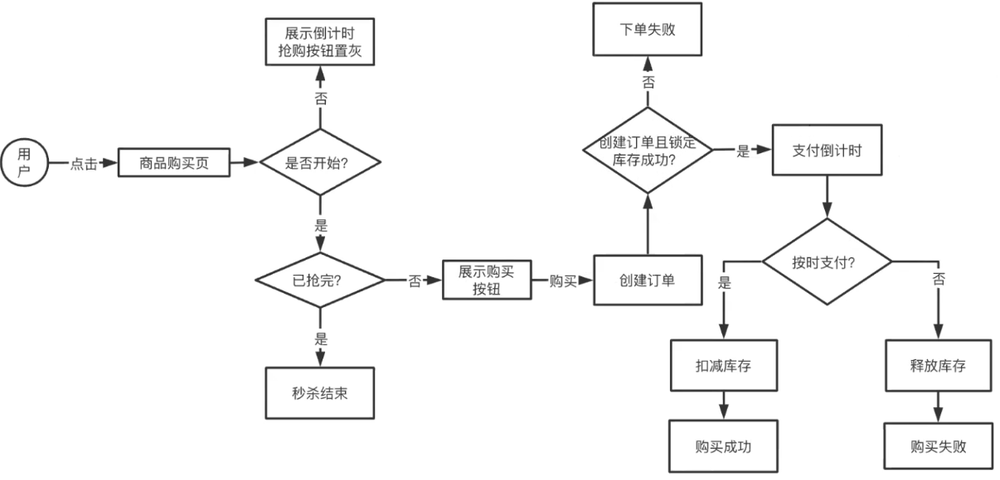

需求拆解：

* 商家侧：需要新建秒杀服务，配置秒杀商品
* 用户侧：需要商品秒杀页面（前端或者客户端）、购买、下单、支付

## 服务分析

1、单体架构

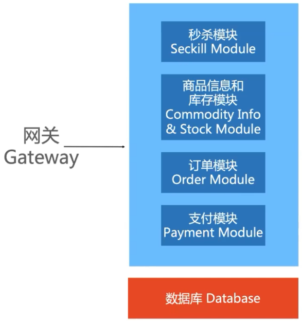

特点：

* 前后端耦合，服务压力较大
* 各功能模块耦合严重
* 系统复杂，一个模块的升级需要导致整个服务升级
* 扩展性差，难以针对某个模块单独扩展
* 开发协作困难，各个部门的人都在开发一个代码仓库
* 级联故障，一个模块的故障导致整个服务不可用
* 陷入某种单一技术和语言中
* 数据库崩溃将导致整个服务崩溃

2、微服务

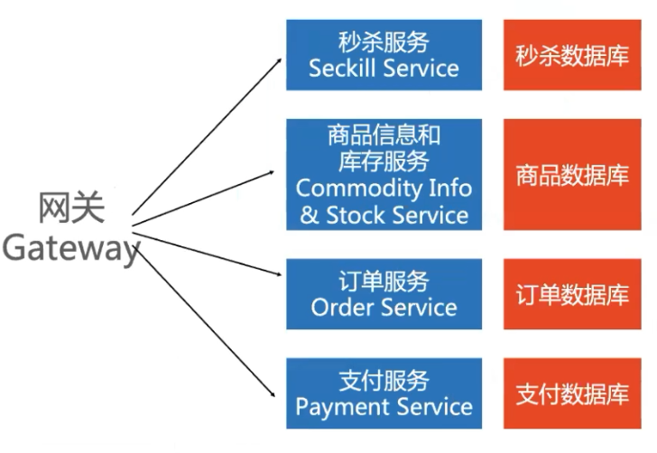

特点：

* 各功能模块解耦，保证单一职责
* 系统简单，升级某个服务不影响其他服务
* 扩展性强，可针对某个服务进行单独扩容或缩容
* 各个部门协作明晰
* 故障隔离，某个服务出现故障不完全影响其他服务
* 可对不同的服务选用更合适的技术架构或者语言
* 数据库独立，互不干扰

## 数据库表设计

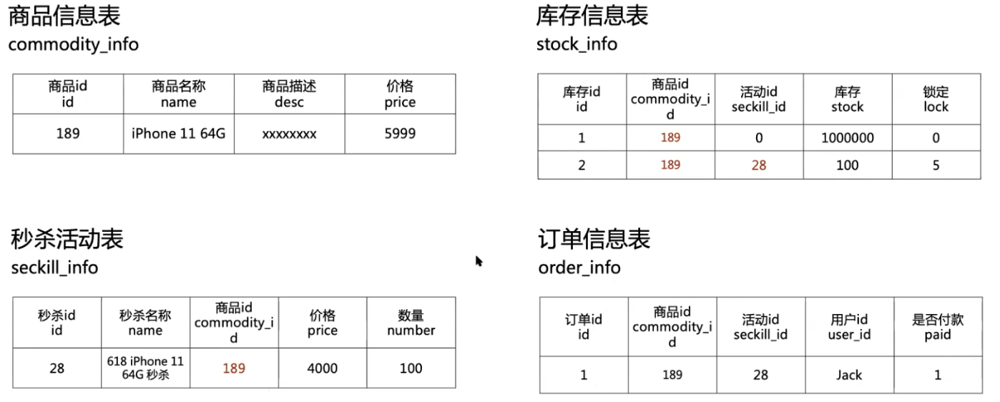

秒杀活动开始前，商家侧会对这几张表的数据进行插入准备。活动开始后，用户侧对这几张表进行查询，然后新增订单表、更新库存表：

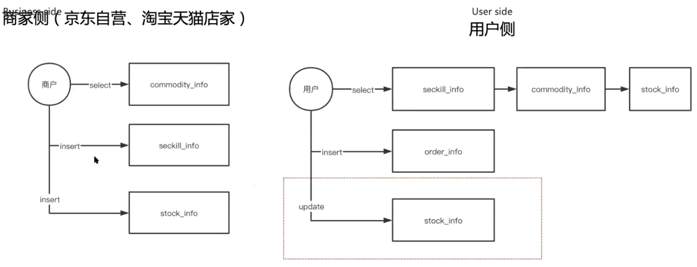

## 秒杀主流程

### 扣减库存

在秒杀时，先查询库存数量，然后再扣减库存，这其中涉及到超卖的并发问题。并发执行的时候可能会出现查询库存数量满足要求，但是扣减的时候，库存数量其实已经被其他线程更新为0了，此时再更新，就有可能将库存更新为-1：

~~~sql
-- 查询库存余量
select stock from stock_info where commodity_id = 189 and seckill_id = 28;
-- 扣减库存
update stock_info set stock = stock - 1 where commodity_id = 189 and seckill_id = 28;
~~~

解决方案1：在读取和更新全过程中，使用同一个数据库事务

在查询库存时使用for update，后面就只能该事务更新库存

~~~sql
-- 事务开始
start transaction;

-- 查询库存余量
select stock from stock_info where commodity_id = 189 and seckill_id = 28 for update;
-- 扣减库存
update stock_info set stock = stock - 1 where commodity_id = 189 and seckill_id = 28;

-- 事务提交
~~~

缺点：事务持续时间较长，期间其他线程无法操作库存表，影响性能

解决方案2：使用update自带的行锁，更新时只更新那些stock>0的记录：

~~~sql
-- 扣减库存
update stock_info set stock = stock - 1 where commodity_id = 189 and seckill_id = 28 and stock > 0;
~~~

上面的扣减库存方案，是直接访问数据库，当并发请求很多的时候，所有请求最终都会操作数据库，可能会导致数据库崩溃。尤其是对于秒杀活动来说，可能几十万人抢几件商品，此时每个请求如果还是需要查一遍数据库，对数据库的压力就很大。

解决方案3：在Redis中扣减库存，这涉及到后面的库存预热

### 库存预热

为了解决每个用户都需要查一遍数据库，在并发请求很多的时候数据库压力大的问题，可以使用提前库存预热的办法。

MySQL数据库单点能支撑1000QPS，但是Redis单点能支撑10万QPS，可以考虑将库存信息加载到Redis中，直接通过Redis来判断并扣减库存。（这里的单点就是单台服务器，以4核CPU、8G内存为标准来衡量）

活动开始前，读取数据库中的商品信息，将商品库存预热至Redis：

~~~
set seckill:28:commodity:189:stock 100
~~~

这样一来，每个请求就不用查询数据库了，而是查询Redis中库存是否大于0，如果大于0再扣减Redis中的库存，然后执行后续操作。扣减库存时使用的是Redis的DECR命令。如果活动商品只有100个，那么理论上来说下沉到MySQL的请求只有100。

因为Redis库存查询和扣减依然是两个操作，还是可能存在超卖问题，解决方案：

* 即使请求下沉到MySQL，还是要检查一遍库存以免超卖。但是无法针对超高并发的场景
* 如果并发量超高，Redis侧实际超卖的量过大，如100万请求同时到达，Redis全部放行，还是会有大量请求下沉到MySQL。为了解决这个问题可以使用Lua脚本，在Redis侧执行原子操作，读取Redis库存并执行扣减，这两个操作就不存在并发问题了

### 消息队列

前面已经保证了和商品相同数量的请求到达MySQL，此时还会面临一个新的问题：如果本身秒杀商品的数量非常大，此时短时间内到达数据库的请求也会非常多，这对数据库压力依然很大。

此时的解决方案是：使用消息队列进行削峰操作，Redis中库存扣减成功后，异步传递消息到订单系统。因为有了消息队列，消费侧可以按照自己的节奏去消费消息，而且还带有重试的功能。

消息队列有投放消息失败的可能，此时的方案：

* 在Redis中设置几倍于真实库存量的数据，这样即使出现少部分投递失败也没有关系，反正数据库侧也会对库存进行进一步校验
* 在投放消息失败后重试，这里要考虑重试的请求数量，如果请求很大也确实不适合直接重试

### 库存扣减时机

在进入消息消费侧后，需要对商品库存、订单表进行创建和更新，并且进行付款操作。这里需要考虑这几个操作的先后顺序问题，有几种选择方案：

* 下单时立即扣减库存

  这样用户体验最好，能保证下单成功了，只要用户肯付款就一定能完成交易。但是有可能被恶意下单，如果存在大量请求支付成功也不付款，这样别人也买不了

* 先下单，不减库存，实际支付成功后减库存

  它可以有效避免恶意下单，但是对用户体验很差，因为下单时不减库存，可能造成用户下单成功但是无法付款

* 下单后锁定库存，支付成功后，减库存；如果超时没有支付再把库存释放掉

  这才是最好的解决方案，可以看到库存表中存在一列：是否锁定。可以避免前面两种方案的问题。采用补偿机制，如果订单未及时支付就发短信给后面的人，让其支付

### 用户限购

为了实现用户限购的方案，需要在下单前校验用户之前是否已经购买过相同商品，解决方案有如下几种：

* 在数据库端进行校验，如果订单表已经存在该用户的记录，则创建订单，否则购买失败。

  这种方式会对数据库压力很大

* 在Redis侧进行校验，在Redis中，针对每个商品设置一个用户集合，如果用户没有买过，才能购买，进行后续操作

### 数据一致性问题

对于订单、库存和付款操作，可能不在一个微服务中进行，此时涉及到一个数据一致性问题，解决方案如下：

* 使用分布式事务，对于存在多个不同数据库的操作，保证要么同时成功，要么同时失败。它主要用于强一致性的保证，性能较差

## 前端优化

1、Redis库存扣减完毕，前端的下单按钮置灰，秒杀活动结束

2、页面访问性能优化：将访问频繁的页面，例如商品页静态资源放到CDN中，它是内容分发网络，通过中心平台的负载均衡、内容分发与调度的功能，使用户就近获取所需资源，提高用户响应速度

3、防刷按钮：点击一次后，按钮短时间内置灰

4、系统限流：将多余的请求跳转到繁忙页

5、秒杀活动倒计时设计，有几种方案：

* 打开页面获取活动开始时间，然后前端页面开始倒计时
* 前端轮询服务器的时间，并获取距离活动开始的时间差。这种方案比较好，这样所有人都能使用服务器时间来秒杀，比较公平

6、防止恶意请求：抢购时需要填写验证码，才能进入对应页面

7、设计限流机制：对于同一个IP地址，或者同一个用户id的频繁请求，可以将这个IP、用户列入黑名单

## 稳定性优化

如果秒杀服务器挂掉，不要影响非秒杀商品的正常购买。使用服务熔断和降级的策略。

# 设计推特

## 场景分析

场景分析主要确定两点：要设计哪些功能？需要承受多大的访问量？

### 访问量估计

访问量相关的指标：

* 日活跃用户DAU：Daily Active Users
* 月活跃用户MAU：Monthly Active Users，一般都用这个指标代表一个网站的用户数

QPS = 日活跃用户 * 每个用户平均请求次数 / 一天有多少秒，例如查询功能，大概一天60次，对于150Million的日活跃用户，查询QPS = 150M*60/86400 = 10w

峰值大概是平均值的三倍，估算为30w，系统设计时，一般用峰值为标准来设计，保证系统足以应对最不利的情况

在考虑访问量的时候，有时还需要考虑产品的发展，对于快速增长的产品来说，可能几个月用户量就翻一番，此时也要在架构设计时预先把这个值考虑进去。

综合以上几点分析：

* 查询功能，大概一个用户一天操作60次，估算峰值QPS为30w
* 写入功能，大概一个用户一天操作1次，估算峰值QPS为5k

QPS就决定了这个系统要怎么设计：

* 当QPS为100时，用笔记本做web服务器就好了，业务并不重要，如果发生故障就重启
* 当QPS为1k时，用一台好一点的web服务器就够了，需要开始考虑单点故障
* 当QPS为1m时，需要建设一个1000台的web服务器集群，需要考虑集群的高可用

不同的模块可以承受的QPS也不同：

* web sever如tomcat，官方宣称几十万的QPS，但是它是基于业务处理简单，机器性能好的前提下的，实际一台机器一秒钟能处理10个请求就已经很不错了（考虑到逻辑处理时间，数据查询、处理的时间），QPS是10。考虑到企业级应用服务器核数比较多，例如几十个核，缓存优化的较好，不是每个请求都需要计算或者去数据库查询，这里web server QPS估算值为1000
* 一个SQL Database可以约可以承受1k的QPS，当查询语句比较复杂时，例如有JOIN，这个值会变更低
* 一个NoSQL Database，基于硬盘的，例如Cassandra，可以承受10k的QPS；基于内存的，例如Memcached，可以承受100k - 1M的QPS

以上的对比，未包含网络开销，只是单机的性能对比。

### 功能分析

在思考要设计哪些功能时，大概分为两步：

第一步：思考推特都有什么功能

* 注册/登录
* 用户信息展示与编辑
* 上传图片和视频
* 搜索
* 发送或者分享一个帖子
* Timeline：自己发的信息流的整合，也就是自己都发过哪些帖子
* News Feed：别人发的信息流的整合，也就是别人都发过哪些帖子
* 关注/取关

第二步：选择其中最重要的，最需要实现的功能，来完成它

##Service拆分

根据上面决定的，要做出来的功能，来对服务进行划分，每一个功能来设计对应的服务：

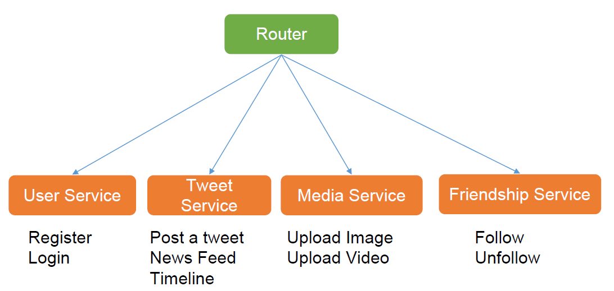

## Storage分析

Storage是非常重要的，如果程序=算法+数据结构，那么系统=服务+数据存储

Storage种类：

* 关系型数据库：适合保存用户信息，因为它支持比较复杂的查询，例如要根据邮箱查询用户，根据电话号码查询用户，根据id查询用户，所以保存用户表应该使用关系型数据库
* 非关系型数据库：适合保存推文、社交图谱，适合保存结构简单的数据，而且非关系型数据库一般自带集群，扩容简单，比较适合增长速度较快的数据
* 文件系统：适合保存图片和视频
* 缓存系统：适合需要快速访问的场景

数据库系统是文件系统的一层包装，它们是依赖的关系，两者的访问速度是差不多的，对于比较常规的查询，数据库优化的较好。

第一步：基于之前分析的Service，要根据不同的功能，分析不同的数据特点，选择不同的存储介质：

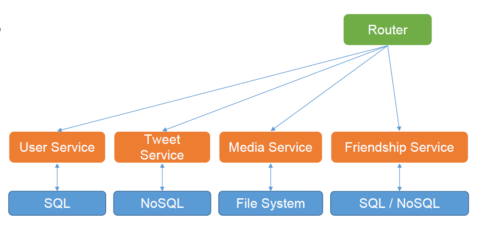

第二步：细化表结构Schema

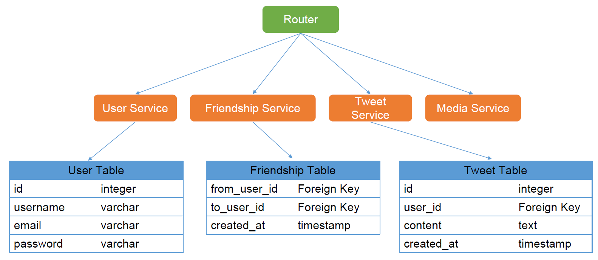

## News Feed 新鲜事系统

新鲜事系统主要分为两种设计方案：Pull Model和Push Model

### Pull Model

在用户查看News Feed时，获取每个好友的前100条推文，合并出前100条推文，使用K路归并算法

复杂度分析：

* 读取News Feed：假如有N个关注对象，则为N次DB Reads的时间 + K路归并时间（在内存中操作，可忽略）

  即使用一条SQL来读取N个关注对象的推文，效率也不会高太多。

* 发出一个推文：一次DB Write

总体执行流程：

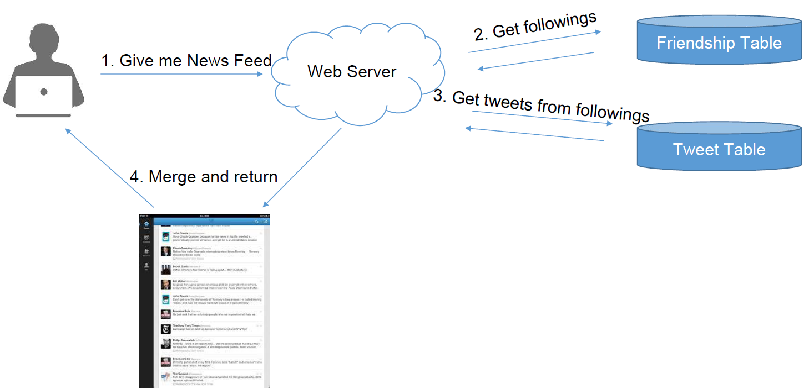

Pull Model的缺陷：性能较差，需要查询、整合完毕才能返回。

为了解决缺陷，可以从以下两个方案入手：

* Cache每个用户的推文，这样就可以把N次DB请求转换为N次读缓存。但是这里面有一个缓存每个用户多少推文的问题，可以缓存所有，缓存前1000条，缓存最近的200条。当内存充足时可以缓存所有，但是内存是比较昂贵的，能省则省，cache1000其实是一个比较大的值了，其实200就能满足一般的命中率了，但是还有一个问题是读取1000条以后的数据会较慢，考虑到该场景较少，其实该方案也是可行的。

* Cache每个用户的News Feed：它不是经常变化的，几分钟之内关注者的帖子一般不会经常变化。

  对于没有Cache News Feed的用户：按照之前的方案，读数据库并且归并，存入缓存

  对于已经做了Cache News Feed的用户：取出缓存存入的时间戳，然后按照时间戳去筛选关注者新增的推文，然后只取新增的推文，与缓存合并，这样就能大大减少要合并的数量

### Push Model

为了解决之前Pull Model的缺陷，我们可以事先把用户的News Feed信息保存好：为每个用户建一个List存储他的News Feed信息。用户发出一个推文后，将该推文逐个推送到每个粉丝用户的News Feed List中，当用户查看时，直接从News Feed List中取出前100条即可。

在Push Model中，为了保存News Feed List，可以设计一个新表：News Feed Table

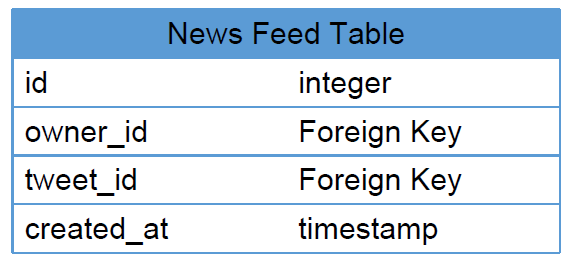

字段解释：

* owner_id：该推文是要推送给谁的
* tweet_id：推文id，根据它可以直接取到推文的内容
* created_at：为了方便取前100条的时候不用连表
* 其他：其实可以把tweet的具体信息直接存在该表中，这样就不用连表查询推文信息了，或者直接把推文信息都放在缓存中，根据id查缓存

复杂度分析：

* 读取News Feed：只需要读取News Feed List，一次DB read
* 发出一个推文：N个粉丝，需要N次DB Writes，但是这里可以用异步任务后台执行，无需等待

总体执行流程：

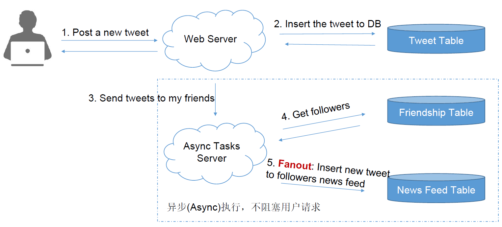

广告的插入应该用Pull Model，因为不可能给所有人的List都添加一条信息，损耗太大，而且不方便编辑广告、顺序优化

Push Model的缺陷：对于粉丝数高的账户，它发一个推文，DB writes的个数是巨大的。

当某个架构面对新问题时，千万不要动不动就推倒重来，而是要尝试在现有架构下做最小的改动来优化

为了解决DB writes巨大的问题，可以使用Push结合Pull的方式：

* 普通用户依然使用Push模式
* 对于粉丝数量巨大的用户，将其标记为明星用户，对于明星用户的推文，不采用Push，而是用户需要的时候，用Pull的方式从明星用户的推文里面取，并且合并到News Feeds中

对于明星用户的标记，不能实时的用粉丝数量去控制逻辑，而是当用户被标记为明星用户后，就不能再修改了，防止身份切换带来的信息丢失。

### 方案对比

目前大多数的社交网站都是主要采用Pull，如果没有很大的流量，Push是最经济省力的做法

Push的特点：

* 使用资源少
* 代码量少
* 对实时性要求不高，即用户发完，粉丝不一定能马上看见
* 适用于用户发帖较少，因为它的写比较耗时
* 适用于双向好友关系，双向好友关系中是没有明星问题的，如朋友圈

Pull的特点：

* 使用资源较多，要利用缓存
* 对实时性的要求较高，用户发完粉丝立马可见
* 适用于用户发帖很多，因为它的写比较简单
* 不存在明星问题

## 关注/取关

关注和取关除了要更新关注表以外，还需要维护与它相关的状态，如：

* News Feed：

  关注一个用户之后，要异步的将他的推文合并到你的News Feeds中；而取关一个用户，需要异步的将他的推文从你的News Feeds中移除。

  这里使用异步是因为这个过程比较慢，采用异步用户可以快速获得反馈，但News Feed会有短时间的不一致。

* 更新粉丝数

## 存储likes

likes其实就是推文中的点赞、评论和转发次数等信息。

这里其实有两个典型的方案：Normalize和Denormalize

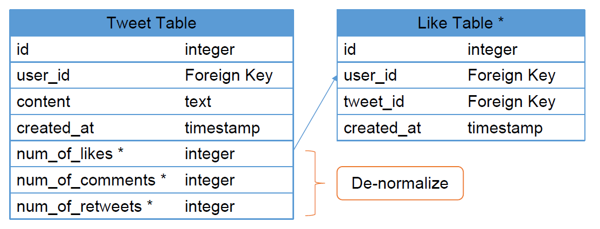

Normalize获得点赞数的方式：

~~~sql
select count(*) from like_table where tweet_id = xxx
~~~

优点：标准化，概念清晰

缺点：每次查询tweet表的时候，都要连带着查一次like_table

Denormalize获得点赞数的方式：直接查询tweet表，无需连表查询

## 惊群现象

有时在社交平台中，某个明星用户发送了一个推文，引起了大量关注，此时可能会造成系统宕机，最大的可能就是因为高并发情况下，缓存失效的瞬间，有大量的请求被发送到数据库，这就是缓存穿透，导致数据库崩溃，影响到其他数据的访问，导致网站崩溃。

解决方案：当检测到短期内，有大量的get来访问缓存，此时就对get做一个排序，第一个get请求cache里面没有之后，去数据库请求，然后回填到缓存。其他get查到缓存没有之后，等待一段时间，例如500ms，再查询一遍缓存，此时缓存已经有数据了，就不会有大量请求到数据库中。

# 用户系统

## 场景与服务分析

用户系统一般需要支持注册、登录、查询或者修改用户信息

假设支持100M DAU，那么：

* 修改QPS，如注册、登录、信息修改，这种操作不会很频繁，按照平均每个用户每天修改0.1次计算，共100M*0.1/86400 = 100

  取峰值QPS为300

* 查询的QPS，按照平均每个用户每天查询（包括查看好友、发信息）100次计算，共100M*100/86400 = 100k

  取峰值QPS为300k

服务分析：按照功能可以分为

* AuthorizationService：负责登录注册
* UserService：负责用户信息存储与查询
* FriendshipService：负责好友关系存储

用户系统的特点：读多写少，这种系统必然会用缓存去优化。

## 缓存简介

常用的Cache：

* Memcached：不支持数据持久化
* Redis：支持数据持久化

Cache不一定是存在内存中的：Cache也可以存在文件系统中，存在文件系统的Cache，适用于比它读取速度更慢的场景，例如计算结果

Cache也不一定指的就是Server Cache：也可能是浏览器的Cache，存在客户端的Cache，如静态资源的缓存

缓存模式可以分为以下两种：

1、Cache Aside

服务器分别与DB和Cache进行沟通，DB和Cache之间不直接沟通，典型代表：Memcached+MySQL

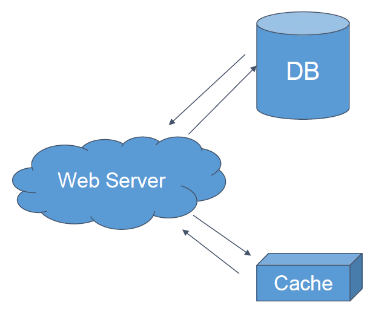

2、Cache Through

Cache和DB之间有沟通，Cache负责将数据持久化

典型代表：Redis，可以理解为Redis里包含了一个Cache和一个DB

缺点：Redis支持单纯的key-value存储结构，无法适应复杂的应用场景。所以业界使用Cache Aside的方式较多，这样可以自由搭配组合

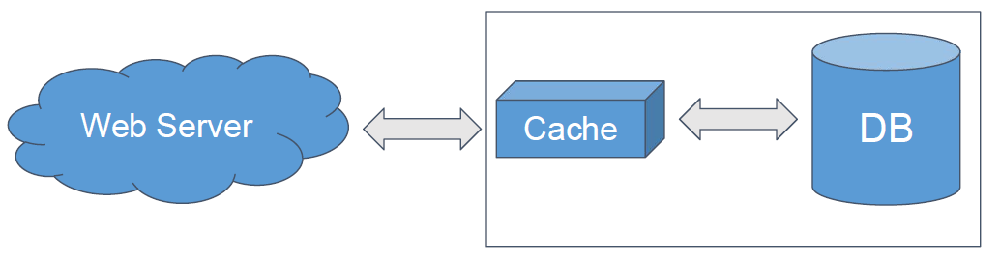

## 数据一致性

用缓存遇到的首要问题就是数据一致性问题，当向服务器发起数据更新请求时，到底应该用什么样的方式来更新数据库和缓存？

几种错误的更新方式，这几种方式的问题都在于：如果第一步成功，第二步失败（不存在第一步失败，第二步成功的情况，因为第一步失败就已经抛出异常了），则会出现数据不一致：

* 先更新数据库，后更新缓存
* 先更新缓存，后更新数据库
* 先更新数据库，后删除缓存

因为并发问题导致数据不一致的方案：先删除缓存，后更新数据库。更新缓存的操作不仅仅是更新请求时候会有，查询时如果没有缓存从数据库回填的时候，也会更新缓存，并发执行更新和查询操作就会有不一致问题，导致缓存中被放入旧数据：

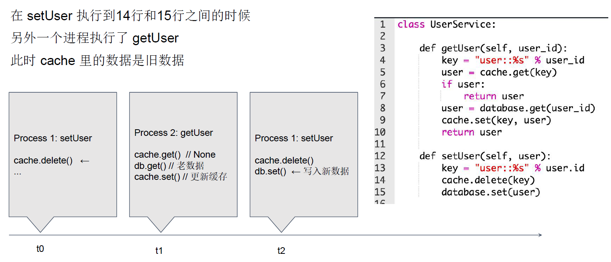

解决方案：加锁。但是数据库和缓存是两套系统，不支持加锁；如果是第三方分布式锁，会导致存取效率降低。

业界最常用的方法：先更新数据库，后删除缓存，理由如下：

* 第一步成功，第二步失败导致数据不一致的问题还是存在

* 并发场景还是会有问题：在更新和查询请求并发执行的时候，查询线程准备回填缓存，此时触发了更新请求，在查询线程可能把缓存中放入旧数据

  但是其实上面两个场景出现的概率是很低的，相比上一个方案，上一个方案（先删缓存，后更新数据库）触发并发问题的概率很高，因为先删缓存时并发查询必然导致缓存不命中，而本方案中，则是需要在缓存不命中的情况下，并发执行更新才可能触发。尤其是对于读多写少的系统来说，缓存命中率通常都是很高的，所以该方案综合起来更好一些

解决一致性问题的兜底方案是：给缓存设置有效期，例如最多让缓存七天有效，即使极端情况下出现数据不一致，也最多就不一致7天，实现系统的最终一致性

## 写多读少场景

因为在每次修改的时候，我们会在cache中删除这个数据，如果写很多，甚至写多读少，那么此时cache是没有任何优化效果的。

解决办法：多加数据库的机器分摊写请求

## 登录场景

用户登录以后，会为他创建一个session对象，并将session_key返回给浏览器，让浏览器存储起来，浏览器将该值记录在浏览器的cookie中。

服务器端程序在设置Cookie时：

* 可以设置Cookie的key和value。Cookie可以理解为一个Client端的hash table。
* response设置完Cookie之后，响应中会带有Set-Cookie的响应头；再次访问服务器请求头中会带有Cookie的请求头
* Cookie默认是会话级的，但也可以通过setMaxAge改变它的存在时间，这样就会使Cookie持久化到浏览器的磁盘文件中
* 可以设置cookie在访问什么路径的时候带上cookie的请求头，默认会在访问产生该cookie的路径下携带cookie信息

用户每次向服务器发送访问请求，都会自动带上该网站所有的cookie，服务器端程序可以通过解析请求头读取cookie中的值，此时服务器拿到cookie中的session_key，在Session Table中检测是否存在，是否过期。

Session Table的结构：

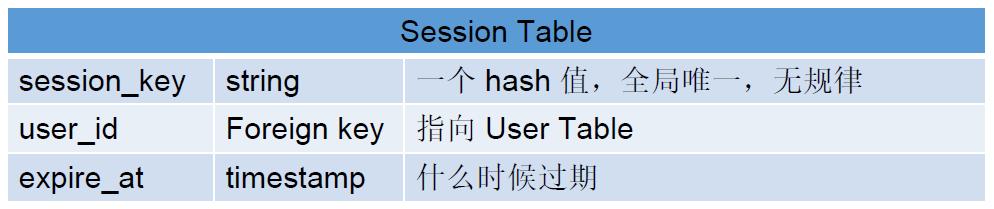

session过期后，服务器不需要主动删除session，而是使用懒惰删除。

同一个用户只支持在一台机器登录的实现：在session table中新增一个device token，记录登录设备的唯一值，登录时需要检测是否该用户只有一个有效session，如果有多个设备，就需要通知其他设备的session过期

同一个用户支持在不同机器登录：新增device token字段，无需特殊处理，一个用户可以对应多个device token

session适合存储在数据库+缓存中，因为session读取是主要的使用场景，所以要提升读取的效率

## 好友关系

### 基于SQL的存储

1、单向好友关系

单向好友关系即关注，类似微博、Twitter

存储单向好友关系的方式，设计from_user_id和to_user_id字段分别代表用户主体和被关注的人：

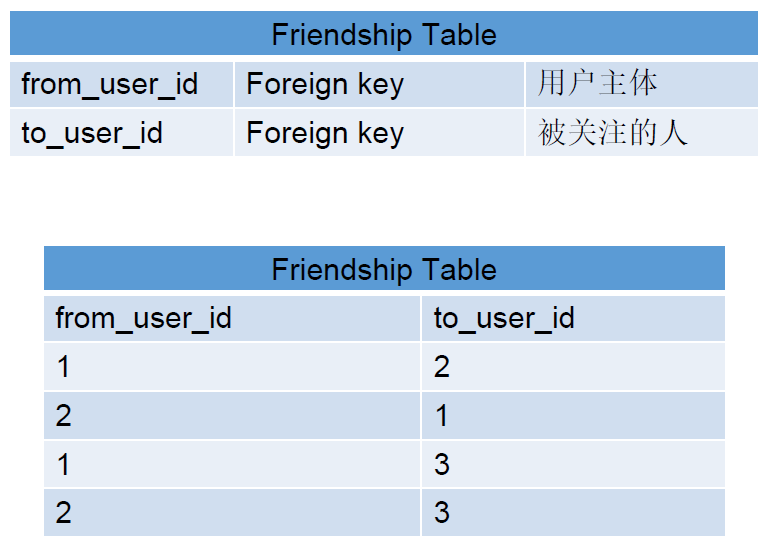

查询x所有的关注对象：

~~~sql
select * from friendship where from_user_id = x
~~~

查询x所有的粉丝：

~~~sql
select * from friendship where to_user_id = x
~~~

2、双向好友关系

双向好友关系类似微信、Facebook

方案一：将一个双向好友关系存储为一条数据，friendship表中分为small_user_id和bigger_user_id两个字段，存储好友关系时，将较小的用户id和较大的用户id分别存在这两个位置。之所以分为大和小两个id，是因为如果不区分的话查询a和b是否是好友关系要查两次，而且新增好友关系的时候也很容易造成重复。

查询好友关系：

~~~sql
select * from friendship where smaller_user_id = x or bigger_user_id = x
~~~

注意这里的两个字段都要添加索引，所以不支持多重索引的NoSQL是不能使用该方案的

方案二：将一个双向好友关系存储为两条数据，依然采用from_user_id和to_user_id的设计，查询好友关系的时候：

~~~sql
select * from friendship where from_user_id = x
~~~

两个方案特点对比：

* 方案一节约硬盘空间，毕竟一条关系只存储一条，但是查询时候因为用的是or，性能较差
* 方案二比较浪费空间，但是查询性能较好，方案二需要想办法保证两条关系数据同时插入和删除，但是如果不是同时插入影响也不会很大。综合来说方案二会好一些

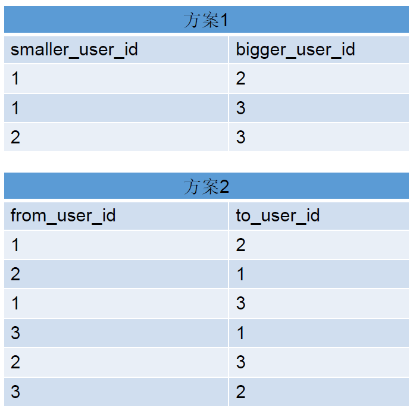

### Cassandra简介

Cassandra是一个三层结构的NoSQL数据库：

* 第一层：row_key
* 第二层：column_key
* 第三层：value

Cassandra的key = row_key+column_key，相同的key只对应一个value。一般来说会将数据结构化为string之后，再存储到value

Row Key又称为Hash Key，Partition Key，Cassandra会根据这个key算一个hash值，然后决定整条数据存储在哪里，不能基于Row Key进行Range Query

Column Key是支持范围查询的（同一个row key下），例如：query(row_key, column_start, column_end)，它可以设置为一个复合值，例如：timestamp+user_id，方便支持范围查询，这是比Redis要好的一点

Cassandra和普通的关系型数据库比较：

* 关系型数据库中column是预先在Schema中指定好的，不能随意添加。一条数据就是一个row

  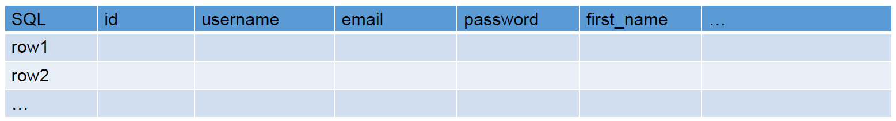

* Cassandra的column是无限大的，是动态的，可以随意添加。一条数据一般以grid为单位，row_key + column_key + value = 一条数据。

  只需要提前定义好column_key本身的格式即可，例如是一个int还是int+string

  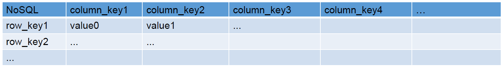

### 基于NoSQL的存储：双向好友

以Cassandra为例，下面是Friendship的存储形式（双向好友）：

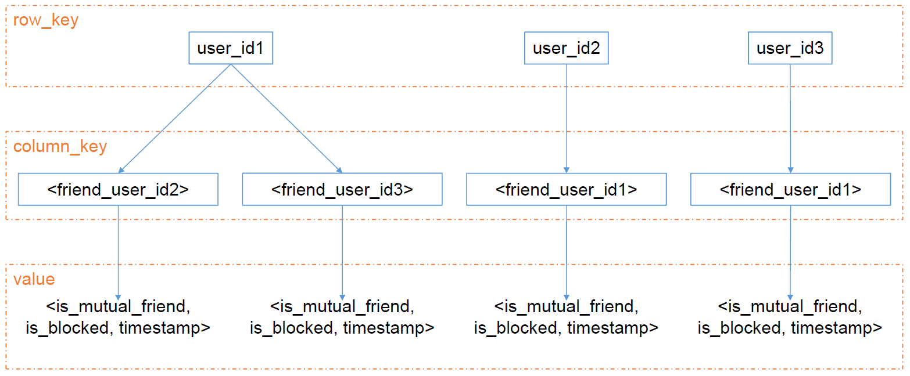

以user_id为row key，以friend_user_id为column key，value就是关系的详细数据，包括是否手动添加，时间戳、是否在黑名单内等。

这样可以方便的查询x的好友有多少，如果要查询最近一天内关注的好友，只需要在column里面加入时间戳信息即可。

下面是使用Cassandra存储NewsFeed的方式：

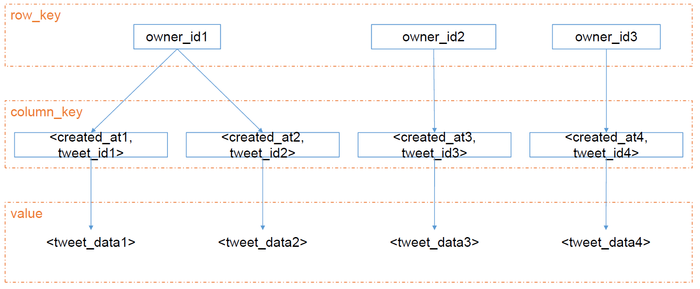

可以将tweet_id放在columnkey里面，因为value值是可以缓存到本地的，读的时候直接指定根据rowkey读columnkey，然后直接取缓存，不用走NoSQL了。

### 基于NoSQL的存储：单向好友

需要两张表单：一张存粉丝，一张存好友

Redis：使用Set结构，key=user_id，value=set of friend_user_id，如果是粉丝表里面就是粉丝id，如果是关注表里面就是关注的用户id

如果查询A是否关注了B，只需要看A的关注表里面是否包含B

Cassandra：rowkey=user_id，columnkey=friend_user_id，如果是粉丝表就是粉丝id，如果是关注表就是关注的用户id，value可以保存一些其他的信息，例如时间戳。如果要查询A是否关注了B，在关注表中查询rowkey=A，columnkey=B的数据是否存在即可

### 让NoSQL支持多索引

如果要让NoSQL存储用户表，如何支持多个索引？例如按照email、username、phone、id来检索用户。

支持的办法就是使用多个数据结构：

Redis的方案是先使用key-value来存储从userid到用户信息的映射，然后针对各种索引建立到userid的映射关系，例如key=email，value=userid，或者key=phone，value=userid

Cassandra也是类似的方案：

* 存储userid到用户信息的映射：rowkey=userid，columnkey=任何信息，value=用户信息
* 存储其他信息到userid的映射：rowkey=email，columnkey=任何信息，value=userid

### 存储方式选择原则

选择SQL和NoSQL的原则：

* 大部分情况下，选择哪一种都是可以的
* 需要事务的时候不能选择NoSQL
* SQL可以方便的存储结构化数据，自由创建索引；NoSQL多半自带分布式，扩展方便，支持副本
* 一般来说一个网站会同时使用多种数据库系统，不同的表单放在不同的数据库里

User Table大部分情况下都使用SQL，因为可以自由创建索引

Friendship大部分情况下都使用NoSQL，因为数据结构比较简单，就两个字段，效率更高

### 共同好友

社交软件一个常用功能是：列举两个人的共同好友

计算方式：分别获得各自的好友列表，然后求交集，总共涉及到对Friendship表的两次查询

因为加好友删好友的频率远小于查询共同好友的频率，所以共同好友是一个读多写少的场景，可以利用缓存优化，将结果缓存起来，或者将好友列表缓存起来

### 六度关系

六度关系理论：世界上任何两个人都可以通过中间5个人认识。如果A和B相互认识，则他们是一度关系；如果可以通过中间某个人认识，则他们是二度关系。

社交软件的一个常见功能：显示你和某人之间是几度关系。

分析需求发现：大于3度关系是没有任何意义的，所以功能聚焦在如何计算二度关系（共同好友）和三度关系。

可以使用双向BFS算法来推导三度关系：A查出他的所有好友、间接好友，B查出他的所有好友、间接好友，然后取两个间接好友的交集

因为这个功能其实也并不常见，好友关系变动不常发生，所以也可以把结果缓存起来，或者提前进行离线计算。

# API设计

## 访问网站的过程

在浏览器输入网址后：

* 访问离你最近的DNS服务器，找到网站域名对应的IP地址
* 浏览器向IP发送http/https请求
* 服务器收到请求，将请求递交给正在80端口监听的HTTP服务器
* HTTP服务器将请求转发到web层框架
* web层框架根据访问路径找到对应的逻辑处理模块，进行对应的业务处理，返回数据或者HTML网页
* 浏览器得到结果，并展示给用户

## API的概念

API，即Application Programming Interface

API的概念范围很广：

* 实际代码中的一个开放出去的方法可以被称为API
* 访问某个网址获得了某种信息，这就是一个Web API

通常来说，只要是提供了一些方法、函数、功能给别人用，别人通过直接的函数调用或者http进行调用等，得到了返回结果，就可以被称为API

## Rest API

用户想要获取LintCode上某个题的所有提交记录，为其设置一个API，以下选项中合适的是：

* /api/users/\<current_user_id>/submissions/?problem_id=1000
* /api/users/me/submissions/?problem_id=1000
* /api/submissions/?problem_id=1000&user_id=\<current_user_id>
* /api/submissions/?problem_id=1000
* /api/problems/1000/submissions

在上面选项中正确的只有第四个选项，这就是Rest API的设计思路：你要获取的数据是什么，路径的主目录就是什么，例如获取problem就是/api/problems，获取submission就是/api/submissions。上面几个选项中，有uri中带上user_id的，这是一种不安全的做法。

REST = Representational State Transfer，满足REST协议的架构和设计，被称为RESTful

RESTful API的通俗定义：

* 每个URL代表某种类型的一个或者多个数据，例如：

  /api/problems/1/表示得到id为1的problem

* 使用HTTP的不同方法：POST/DELETE/GET/PUT，来代表对数据的增删改查，例如：

  创建请求不应该用/api/accounts/create，应该用POST /api/accounts/

* 所有的筛选条件和创建参数，都放到HTTP的参数里面，例如：

  创建转账记录不应该用/api/accounts/1/transfer/500/to/2

  而是用/api/transaction/?from=1&to=2&money=500

## 设计News Feed API

### 请求格式与返回值

按照REST协议进行设计，因为是查询，所以用GET，因为查的是newsfeed，所以URL的一级目录就是newsfeed：

* https://www.facebook/api/newsfeed
* 或者： https://www.facebook/newsfeed

返回值一般用JSON，也可以用XML

### 设计翻页API

翻页API一般有两种设计方案：

方案一：/api/newsfeed/?page=1

该方案的优点是可以直接跳转到第x页，但是缺点是如果有新数据被插入，翻到下一页可能会看到上一页的内容

它比较适用于数据不经常变化的场景，对于Newsfeed这种数据流的场景并不合适

方案二：/api/newsfeed/?max_id=1000

如果没有max_id代表第一页，如果有max_id代表找到所有id<=max_id中最近一页的数据

它适用于数据流的方式，例如朋友圈，它本质上是无限翻页的模式

当response里面为空，代表没有下一页了，但是这种方式会永远多请求一次，正确方法是：每次多请求一个数据，如果取到就把这个数据作为next_max_id返回给前端，如果没有取到，说明没有下一页了

这种方式也有它的扩展，例如通过/api/newsfeed/?min_id=1000，1000就是最新的帖子id，代表获取所有id大于1000的帖子，即获得最新内容

### Mentions的数据格式

当NewsFeed的文本内容里含有Mentions的时候，即可以链接到其他帖子或者人的link，应该如何在文本内容中体现？

方法1：直接返回html格式的链接，该方法不安全，可能被JS注入，而且该格式的数据无法被移动端共享，它可能只能支持浏览器端的跳转，而且NewsFeed的内容可能已经保存在某个数据库中，如果未来url变更，则修改非常不方便

方法2：返回一个自定义链接结构。例如：\<user username="someone">Hello World\</user>，让Web和Mobile分别对该格式进行解析，代表通往用户的链接。

方法3：返回一个结构化的数据，和上面的方法是类似的，在前端对特殊的结构化数据进行解析，在页面上作出对应的变化

# Tiny URL短网址系统

## 场景分析

短网址系统可以将一条长长的网址转换为一个短网址，然后存储起来，实际访问时还能通过映射找到原来的长链接，访问短网址实际上就是访问原来的那个服务器。所以短网址系统的场景主要是两个：

1、根据长链接生成一个短链接

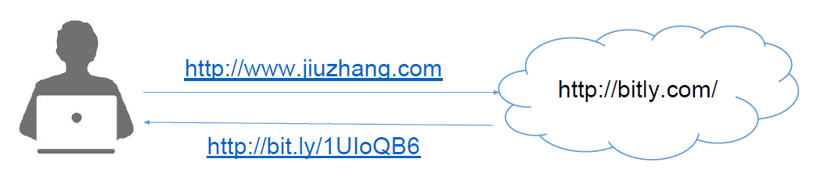

2、访问短链接时，实际访问的是长链接：

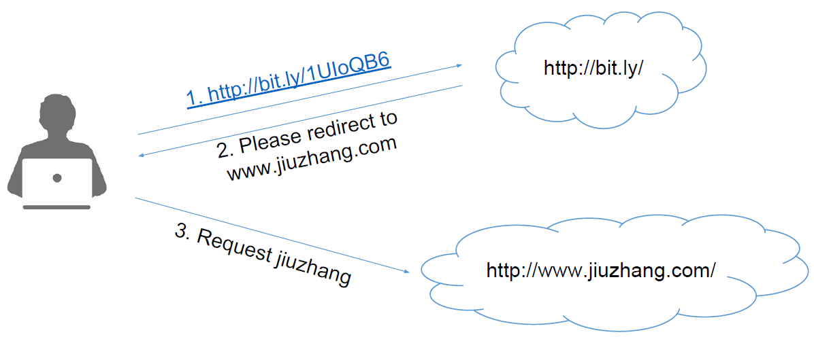

Short Url长时间没有人用，也不能释放，因为它可能已经被存到文档中了，释放之后文档中的短连接访问时会发生错误。

Long Url和Short Url必须是一一对应关系吗？其实都是可以的，一对一来存储更省空间，对于某个常常被映射的长链接，如果每次都创建一个新的短连接会比较浪费。一个Long Url对应多个Short Url不影响用户体验。

QPS分析：

按照微博日活跃用户100M来算：

* 产生一条短链接的QPS：假设每个用户平均每天发0.1条带URL的微博，那么平均写QPS = 100M*0.1/86400 约为100，峰值QPS为200
* 点击一条短链接的QPS：假设每个用户平均一天点击1次短链接，那么平均读QPS约为1000，峰值QPS为2000

综合来说，读取要更频繁，2000的QPS，一台SSD的MySQL完全可以支持。

## 存储分析

存储空间分析：假设每一条URL长度按照100算，那么一天产生10M URL，一天大约使用1G的存储空间，1T的硬盘可以使用3年

使用SQL的好处是：

* 支持事务
* 支持丰富的查询
* 开发比较简单
* 支持自增id

使用NoSQL的好处是：

* 可以承担更高的QPS
* 集群内部自己实现了数据备份和数据分片，适合对数据可靠性高的场景

实际上到底使用什么来存储，取决于生成url的算法到底是什么

## 转换算法

将一个长链接转换为一个短链接有如下几种方案：

1、使用某种哈希函数，例如MD5，取Long URL的MD5的最后6位，作为Short URL

这种方法的优点是设计简单、转换速度快；缺点是可能出现冲突

2、生成Short URL后，进行去重，如果曾经被使用过就再生成一个，如果没有被使用过就使用该Short URL

这种方法的优点是实现简单，缺点是随着短网址越来越多，生成的速度会变得越来越慢（当每次都需要检查几次重复导致效率降低的时候，可以临时给url加一位，这样就能缓解一定的效率低的情况）

3、首先使用数据库的自增id生成一串数字，然后将该串数字转换为一个62进制数（0-9，a-z，A-Z），这个62进制数就是生成的Short URL

5位URL可以表示62的5次方，也就是9亿个URL

6位URL可以表示62的6次方，也就是570亿URL

7位URL可以表示62的7次方，也就是35000亿URL

优点是效率高，缺点是需要依赖全局的自增id

### 随机生成法

根据Short URL生成Long URL后，需要将它们都插入到数据库表中：

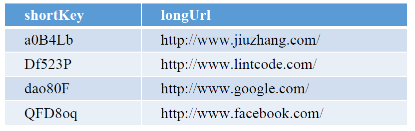

因为既需要根据Long查Short（为了保证一对一，去重的时候需要查询），也需要根据Short查Long，所以需要建两个索引

也可以选用NoSQL数据库，但是因为NoSQL不支持建立多重索引，所以需要建立两张表来支持这两种查询：

以Cassandra为例：

* 第一张表：根据Long查Short：row_key=longURL, column_key=ShortURL, value=null
* 第二张表：根据Short查Long：row_key=ShortURL, column_key=LongURL, value=null

基于随机生成方法的解决方案：生成Short URL和根据Short URL访问

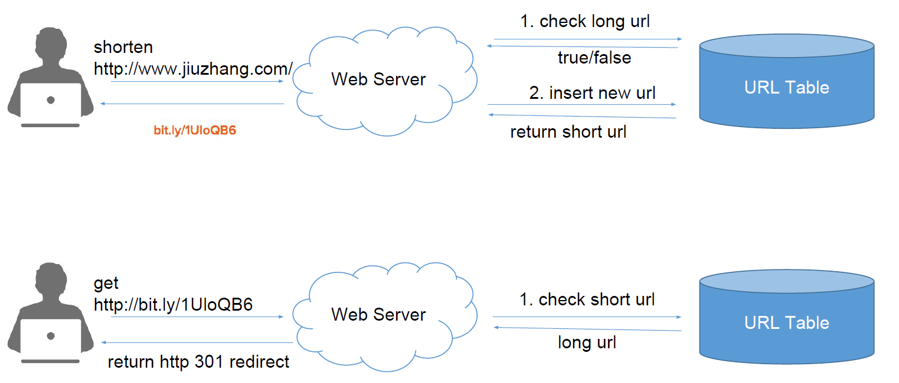

### 基于进制转换的方法

因为需要用到自增id，所以只能用关系型数据库。它的表单结构如下，因为自增id和ShortURL拥有一一对应的关系，所以它可以不保存在表单中：

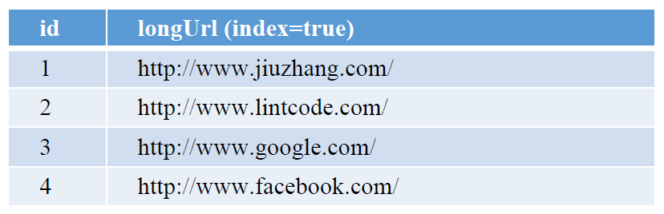

基于进制转换方法的解决方案如下，和随机生成法的区别就是，插入记录后返回一个id：

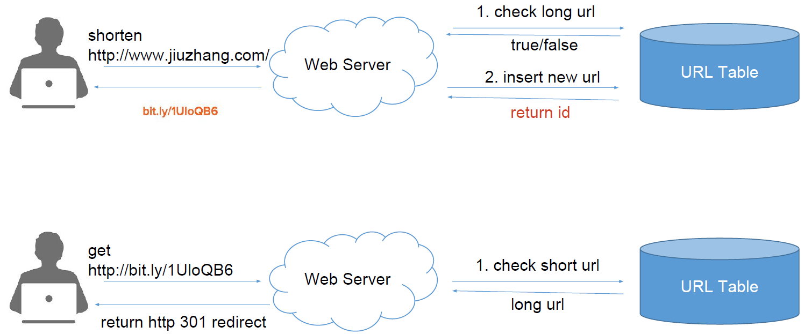

## 优化速度

性能优化思路：

1、利用缓存。把表单存在缓存中，然后先查缓存，缓存中没有再去查数据库：

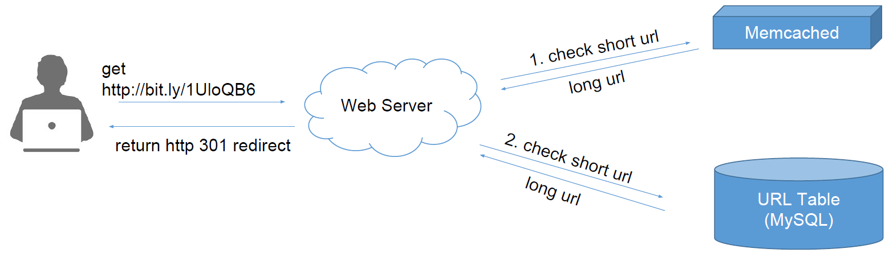

2、利用地理位置信息提速

不同的地区，通过DNS解析不同地区的用户到不同的服务器。多个地区都可以有自己的缓存，但是共用一个MySQL：

因为短网址系统的缓存命中率是很高的，所以大部分的请求可以在局部完成。该架构不适合数据库请求多的业务，因为短网址的业务最多就一次数据库请求，所以最差的时候也可以容忍。

## 数据拆分

如果一开始估算的数据量过低了，一台MySQL搞不定了，则需要给数据库扩容。

数据库扩容的两大目的：解决存不下的问题、解决并发请求忙不过来的问题。在短网址系统中其实后者是更突出的问题。

数据库拆分又包含两种：垂直拆分和水平拆分。因为总共就两列，所以不适用于垂直拆分，后续会详细讨论水平拆分。

水平拆分时，一个关键的问题是用哪一列做Sharding Key：

* 如果用ID/Short URL做Sharding key，那么做long to short查询的时候，只能广播给N台数据库进行查询，如果不需要避免重复创建的场景（可以接受多对一），那么就可以省掉long to short查询，此方案是可行的

  若非要支持long to short查询，可以设置两张表，一张用于支持short to long，一张用于支持long to short

* 如果用Long URL做Sharding key，那么做short to long查询的时候，只能广播给N台数据库查询

  因为short to long的频率远大于long to short，所以如果只能选一个当Sharding key，还是优先选择ID/Short URL

数据拆分场景下，使用进制转换法生成ID的时候会出问题，因为多台机器不能维护一个全局自增的ID，一般的关系型数据库只支持一台机器上维护自增ID，所以需要使用其他办法来获取到全局自增的ID：

* 使用单独的数据库来获取自增ID，为了避免单点失效问题，可能要准备备库
* 使用zk来获取到自增ID

一种特殊的Sharding Key，可以解决上面存在的一个查询方向失效的问题：在基于base62方法下的转换算法中，使用Hash(long_url)%62来作为Sharding key，并将这个值直接放到Short URL中，例如原来的short key是AB1234的话，那么加入Sharding Key的新short key就是0ABA1234。这样就可以同时通过short url和long url得到Sharding Key。这个方法也存在一个缺点：机器数不能超过62

## 根据地理位置信息优化

在之前的架构图中，还有一部分存在优化空间：那就是网站服务器与中央数据库之间的通信，这一段会很慢，例如数据库在美国，那么从中国访问该数据库时就会很慢，而如果在中国和美国各自设置一个数据库，则数据库就存在一致性问题了。

为了解决这个问题，可以按照网站的地域信息进行Sharding，如果是中国的网站就放到中国的数据库这边，如果是美国的网站就放到美国的数据库这边。

如何知道网址是中国还是国外？对常见网站进行识别并标记

这样中国用户访问中国网站时，请求的就是中国的数据库，性能会提升很多，虽然也存在中国用户访问美国网站的情况，但这毕竟是少数，跨境的需求不是特别多，所以慢一点也没关系，优化系统要优化主要的需求。

优化后的架构图：

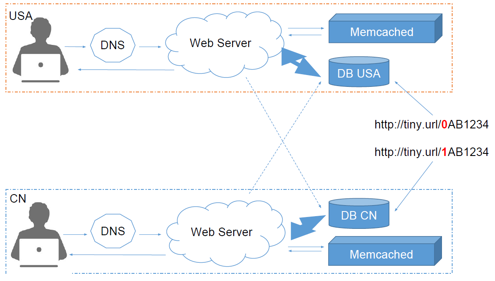

## Custom URL设计

如果用户可以自定义设置Short URL，对于之前提到的两种方案，有不同的修改方法：

* 基于base62的方法：此时直接在URL table增加一列custom url是不可行的，因为大部分时候这一列数据是空的，会浪费存储空间

  所以应该新建一张表来存储Custom URL：

  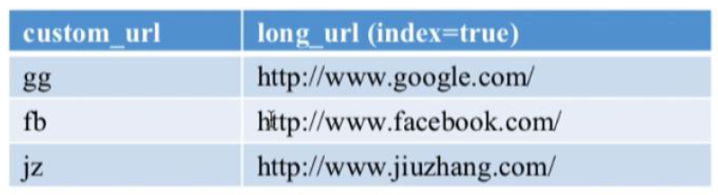

* 基于随机生成的方法：直接把custom url当short url就可以了，完全兼容，随机生成的方法就是把short url存到表中，custom url也是一样

# 优惠券系统

## 场景与服务分析

优惠券是电商系统的一个促销手段。

常见的优惠券有：满减券、直减券、折扣券等，通常还需要限时使用。

优惠券核心流程：

* 发券：方式上分为同步发送/异步发送
* 领券：又可以细分为以下几个问题
  * 谁能领：所有用户 or 指定的用户
  * 领取上限：一个优惠券最多能领多少张
  * 领取方式：用户主动领取 or 被动发放领取
* 用券：又可以分为作用范围（按商品分类、按商户分类、按照商品类目分类）、计算方式（是否互斥、是否达到门槛）等

需求可以拆解为两部分：

* 商家侧：创建优惠券、发送优惠券
* 用户侧：领取优惠券、下单、使用优惠券、支付

服务拆解：

其中触达服务就是发短信、发邮件或者打电话等

优惠券系统的设计难点：

* 券的分布式事务，使用券的过程中会出现的分布式问题分析
* 如何防止超发
* 如何给大批量用户发券
* 如何限制券的使用条件
* 如何防止用户重复领券

## 存储分析

在该系统中，设计三个概念：

* 券批次（券模板）：指一批优惠券的抽象模板，包含优惠券自身的属性，例如使用时间范围、使用商品类别限制
* 券：它指发放到用户的一个实体，是与用户绑定的。券批次和券是一对多的关系
* 规则：它代表优惠券的使用规则和条件限制，例如满100减50

券批次表设计如下：

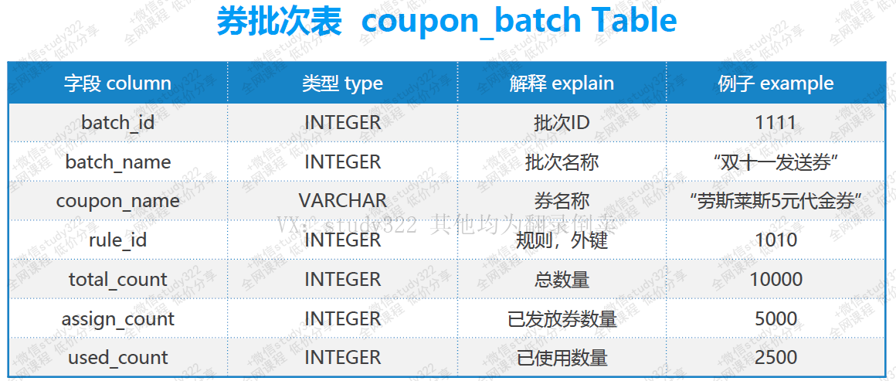

规则表：

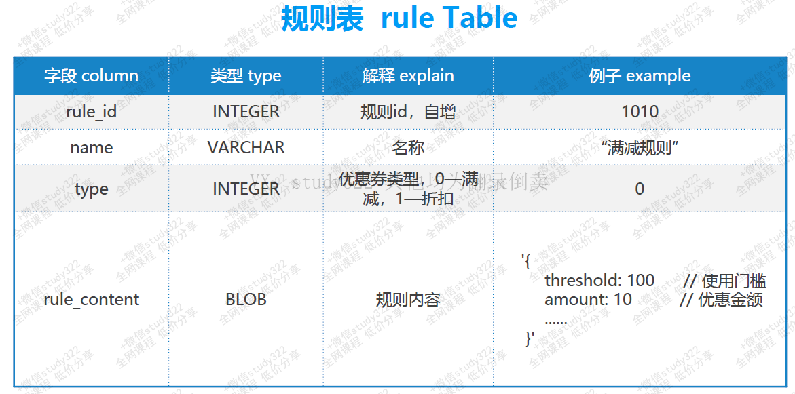

规则内容是一个JSON，因为它包含的内容比较复杂，而且没有根据某个字段查询的需要，所以直接设计为JSON，数据库字段类型BLOB：

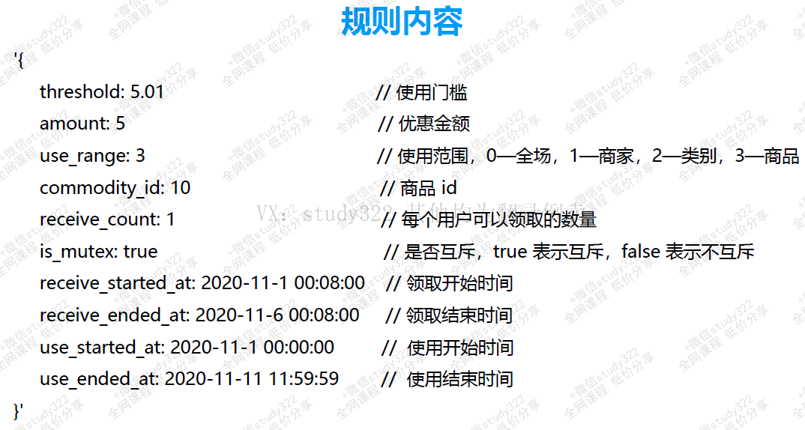

优惠券表：

## 创建优惠券

创建优惠券其实就是新建优惠券批次和新建规则，分别向两张表插入数据：

~~~sql
insert into rule (name, type, rule_content) values (...)
insert into coupon_batch (coupon_name, rule_id, total_count) values ('代金券', 1010, 10000)
~~~

## 发送优惠券

发送优惠券的流程图：

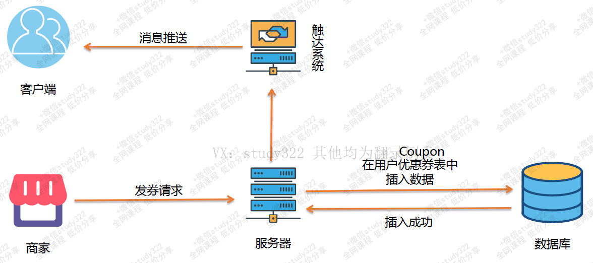

商家每次发券，都会引起数据库中很多次插入用户优惠券表的动作，为了应对用户量很多的时候，可以采用异步发券的形式，商家发起发券请求后，不是立即插入，而是使用消息中间件，每次将发券请求存入消息中间件，下游按照自己的能力处理插入优惠券的过程：

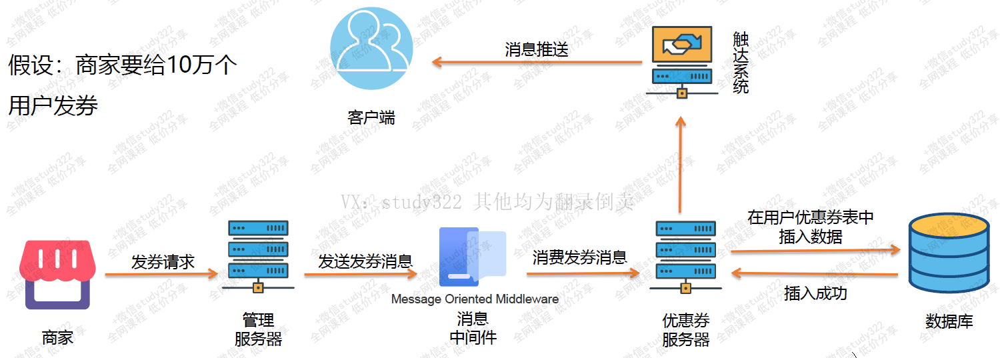

引入消息队列后，可能会用超发的问题，当消息被消费两次时，可能会有超发的问题。超发问题解决：插入时校验数据库表

向用户优惠券表插入数据时，必须同时对发放券总数量减1，二者要在同一个数据库事务中：

~~~sql
insert into coupon (user_id, coupon_id, batch_id) values (1001, 66889, 1111);
update coupon_batch set total_count = total_count - 1, assign_count = assign_count + 1 where batch_id = 1111 and total_count > 0
~~~

## 触达系统设计

触达系统就是通知用户的方式，可以分为短信、邮件、站内信等，下面主要分析站内信的方式。

使用信息表来承载站内信，信息表设计如下：

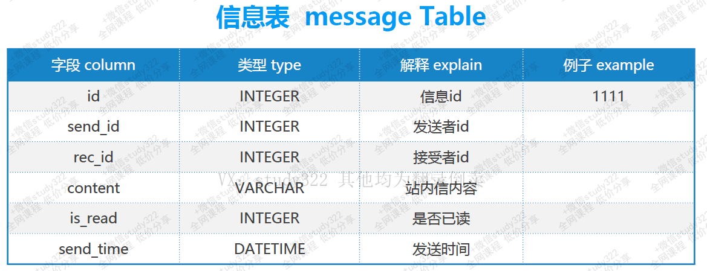

先考虑用户量很少的情况，如果商家要给所有人发站内信，则先遍历用户表，再按照用户表中的用户，依次将站内信插入到message表中。这样，有100个用户，则需要执行100次插入操作。

这些站内信中，其实数据的content是一样的，所以为了优化存储，可以将它拆分为两张表：

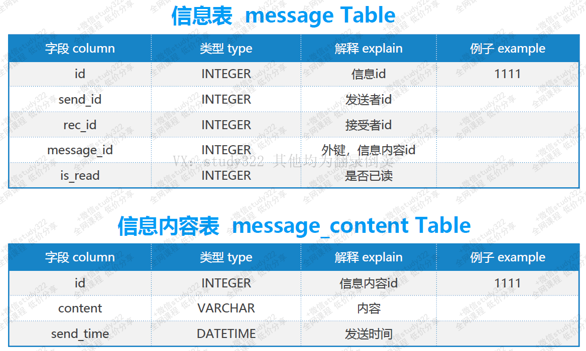

这样发一封站内信时，只需要往message_content表中插入一次，而往message table插入多次。

如果用户数量进一步增加到千万人，可以采取下面的方式进行优化：

* 只筛选活跃用户进行发送，通常来说活跃用户只占总用户的20%，或者用数据分析的方式得出哪些用户是消费的群体，然后再给这些用户发
* 将往message表插入数据的动作延迟到用户登录时，用户登录后再去message_content表中同步内容至message表，这样可以大大减少插入动作

## 领取优惠券

用户领券其实就是抢券的过程，是高并发的。领券其实就是上面的向用户优惠券表插入数据的过程。

用户领券的过程和秒杀很类似，同样地，秒杀出现的问题，领券中也会出现：

* 超领问题：并发量过高时，优惠券可用数量可能被更新为-1；解决办法：将优惠券可用数量预加载到缓存，在缓存中使用Lua脚本校验并更新库存，然后在数据库侧更新时再校验一次，这样既支持高并发，又不会出现超领
* 高并发导致数据库崩溃：将优惠券可用数量预加载到缓存，过滤掉大部分数据库的请求
* 商品数量超多，导致放行到数据库的并发量很大：使用消息队列进行削峰操作，下游根据自己的处理能力拉取数据，操作数据库
* 为了限制并发，在前端的抢券页面设置前端限流，点击一次或者几次后，按钮短时间内置灰；还可以设置后端限流，将超出的部分直接跳转到繁忙页

## 使用优惠券

在使用优惠券阶段：存在一个时机的问题，用户在购买商品分为好几个阶段，到底是在哪个阶段使用优惠券（其实就是优惠券生效，需要对使用规则进行校验）呢？答案是确认订单阶段，因为确认订单页已经有选择优惠券的选项了，如果此时不让用的话用户体验会很差。

对优惠券的使用规则进行的校验分为四步：

* 判断是否过期
* 判断适用范围
* 判断是否达到门槛
* 判断是否互斥

用券具体分为两个动作：查询可用券，选择可用券，这两个动作都需要对规则进行校验：

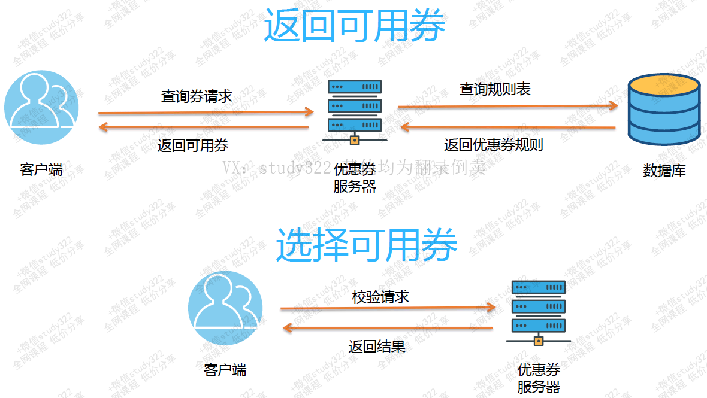

在整个使用优惠券的过程中，同时设计多个数据库系统，例如优惠券系统、订单系统、支付系统，为了做到多个系统的数据一致性，需要使用分布式事务。

TCC是一种常见的分布式事务机制，是“Try-Confirm-Cancel”三个单词的缩写，具体来说，对每个优惠券，都对应着一条优惠券操作记录表：

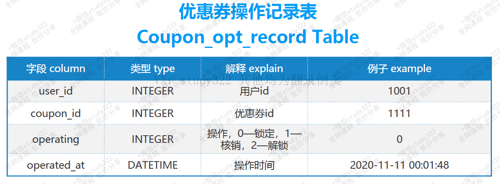

其中的操作状态列就是分布式事务TCC的关键：

实现阶段1：对资源进行冻结，预留业务资源，在创建订单时，将优惠券状态改为冻结

实现阶段2：确认执行业务操作，做真正的提交，将被冻结的资源进行真正扣减，在订单支付成功后，将优惠券状态改为已使用

实现阶段3：取消执行业务操作时，取消预留的业务资源。在支付失败或者超时时，或者订单关闭情况，将优惠券状态改为未使用

整体的时序图如下：

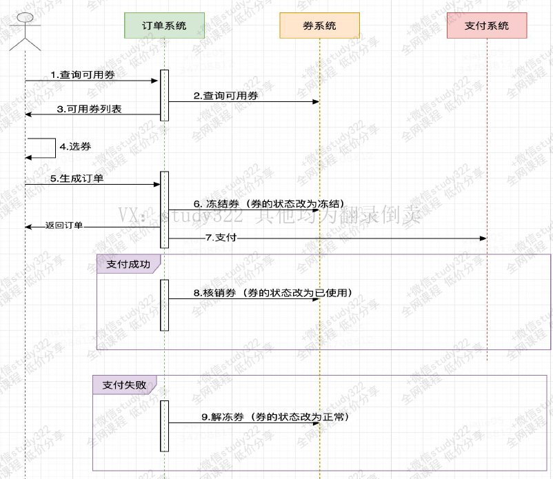

## 过期券提醒

优惠券即将过期的时候，需要将过期提醒推送给用户，设置过期券提醒的方式有以下几种：

* 定时扫描券表：这种方式扫描的数据量太大，随着历史数据越来越多，对数据库的压力会越来越大
* 延时消息：有些券的有效时间太长了，例如30天以上，有可能造成消息队列大量积压
* 新增通知表：扫描的数据量小，效率高，删除无用的已通知的数据记录

通知信息表设计如下：

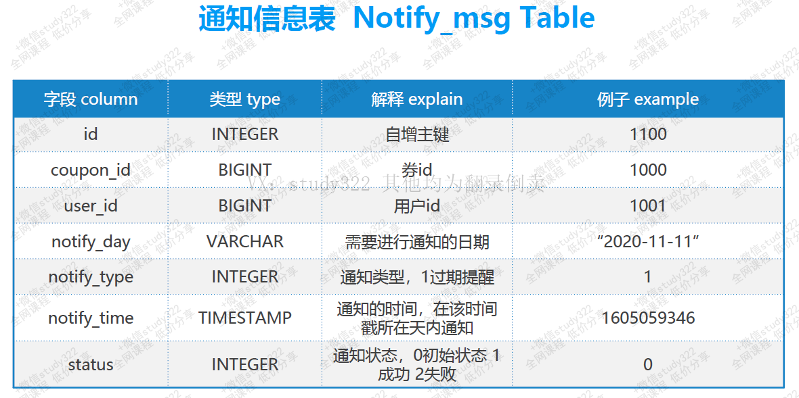

通知表的方式生成过期券提醒：

* 在创建优惠券的时候就需要将提醒记录插入提醒表中
* 把用户ID+批次ID+通知日期，作为唯一索引，防止同一个批次有重复的记录通知，保证每天只会被通知一次
* 给提醒表的通知日期建立时间索引，每日通过该索引扫描当天需要通知的记录
* 通知完成后，使用定时任务将该数据删除

# 数据库拆分

随着用户数量越来越多，业务就需要扩容，很多时候扩容系统就等同于扩容数据库。

扩容的目的有两个：数据拆分和数据复制

数据拆分：按照一定的规则，将数据拆分开存储在不同的实体机器上。这样一台数据库挂了不会导致所有数据都查不到，而且还可以分摊读写流量

数据复制：就是将数据重复存三份，这样一台机器挂了可以用其他机器的数据来恢复，而且还可以分摊读请求

## 数据拆分

大部分的NoSQL已经帮你写好了拆分算法，关系型数据库的拆分需要根据业务侧的特点自己定制。

数据拆分Sharding可以分为两种：纵向拆分和横向拆分

### 纵向拆分

例如User Table中有如下信息：email、username、password、nickname、avatar（头像）

因为email、username、password不会经常变动，而nickname、avatar（头像）相对来说变动频率更高，此时就可以将后两列单独抽出来作为UserProfile Table，然后在UserProfile Table中添加一列user_id指向User表，然后再将两张表放到两台机器上，这样如果UserProfile Table挂了，也不会影响另一个表User的使用

纵向拆分不能解决表单非常大的场景，解决不了只有两列的场景

### 横向拆分

横向拆分有几种简单的方法：

* 新数据放新机器，旧数据放旧机器。例如一台数据库能存下1T的数据，那么超过1T之后就放在第二个数据库中，以此类推

  这种方法的问题是按照新旧程度划分数据，会导致访问量不平衡

* 对机器数目取模，例如按照user_id%3，来将数据均匀的放到3台服务器

  这种方法的问题在于如果要扩容一台机器，那么几乎所有数据都要进行位置大迁移

过多的数据迁移会造成的问题是：

* 迁移进度很慢，容易造成数据的不一致
* 迁移期间，服务器压力很大，容易挂掉

%n的方法是最简单的一种Hash算法，但是这种方法在n变成n+1时，每个key%n和%n+1的结果基本都不一样，所以这个Hash算法也可以称之为不一致hash

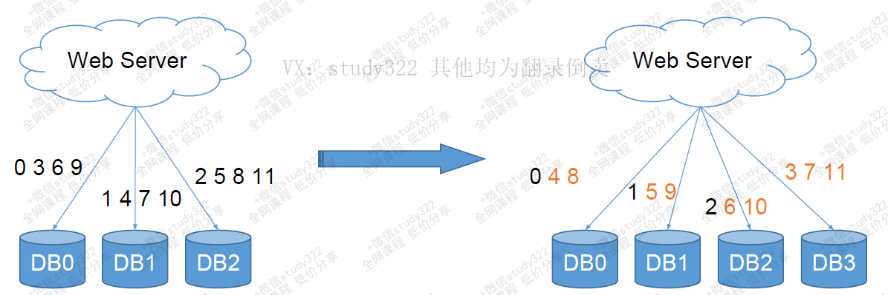

为了解决这个缺陷，引入了一致性哈希算法Consistent Hashing，大部分NoSQL都帮你实现好了这个算法，进行自动Sharding

一个简单的一致性Hash算法：

* 将key模一个很大的数，例如360
* 将360分配给n台机器，每个机器负责一段区间
* 区间分配信息记录为一张表，存储在Web Server上
* 新加一台机器的时候，在表中选择一个位置插入，匀走相邻两台机器的一部分数据

这种情况下n从2变化到3，只有1/3的数据在移动：

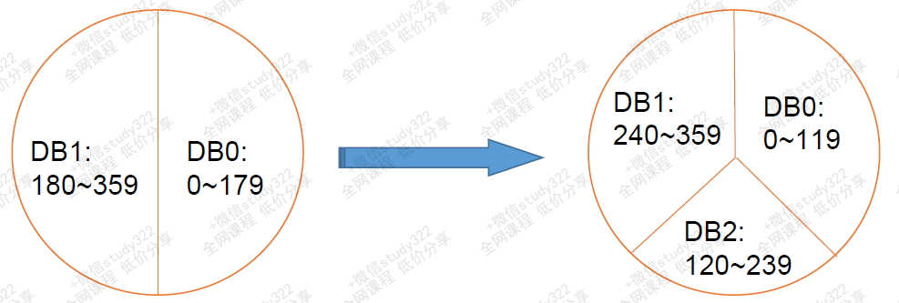

3台机器变成4台的案例：

这种方法依然存在缺点：

* 数据分布不均匀：算法是将数据最多的相邻两台机器均匀分为三台，3台变4台时无法做到4台机器均匀分布
* 迁移压力不均匀：新机器的数据只从两台老机器上获取，导致这两台老机器负载过大

真正的一致性哈希算法如下：

* 将取模的底数从360扩展到2^64

* 将0-2^64看做一个很大的圆环

* 将数据和机器都通过hash function换算到圆环上的一个点：

  数据取key作为hash key，机器取MAC地址，或者机器固定名字，或者固定的ip地址

* 每个数据到底放在哪台机器上，取决于在Consistent Hash Ring上顺时针碰到的下一个机器节点

至此该算法依然存在迁移压力和数据不均匀的问题，为此引入了一个虚拟节点的概念，一个物理节点对应多个虚拟节点，例如物理节点database01对应虚拟节点database01-001 到database01-999，一个物理节点可以通过虚拟节点的方式均匀分散在哈希环的各个部分，解决数据倾斜问题。

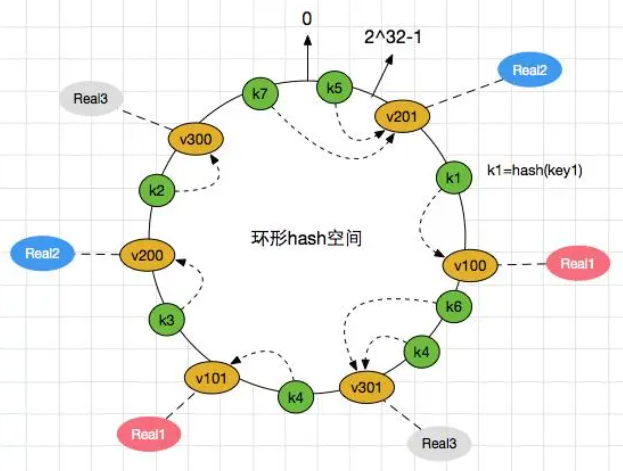

在实际应用中，通常将虚拟节点数设置成 32 甚至更大，这样可以保证即使很少的服务节点也能做到均匀的数据分布。

### Sharding案例

1、User Table Sharding

在将数据拆分时，有一个基本原则是：怎么取数据就怎么拆数据。

因为对于User Table来说，绝大多数请求都是通过user_id来查询数据，所以就按照user_id来分片，如果需要用username进行数据查询，那就建一张中间表，查询时先根据中间表通过name查id，然后再拿着id去查user的信息。

数据拆分后，多台数据库就无法维护一个全局自增的id了，此时最简单的解决办法是：手动创建一个UUID来作为用户的user_id，然后根据consistent_hash(user_id)的结果获得所在的实体数据库信息

如果在数据拆分前，user_id已经采用了自增id了，那么就只能创建一个单独的服务UserIdService，它来专门用户创建用户的ID，负责记录当前id的最大值，然后每次加锁，然后+1，将新id返回。因为创建用户的QPS并不是很大，所以这个做法问题不大。

2、Friendship Table Sharding

在这种场景下，分为两种场景：

* 双向好友关系：不能像之前一样，将较大的id存一列A，较小的id存一列了B，因为需求中既可能用A查询他所有的好友，也可能查询B所有的好友，此时无论用A拆分数据，还是用B拆分，有一个方向的查询总是有问题的，需要将查询请求发送到所有的数据库。

  所以双向好友关系的时候一定要将一条关系存成两条数据，一条以A拆分，一条以B拆分

* 单向好友关系：同样的道理，因为同时存在两种需求：A的关注列表有哪些、A关注了谁。所以单向好友关系也要存成两条，一条以A拆分，一条以B拆分

在数据拆分时需要考虑数据倾斜的问题，例如某个人的关注者实在是太多，就会导致分在某个数据库的数据太多了，但是经过估算，其实每条关系的空间占用不大，总体来说不超过几个G，不会造成太严重的数据倾斜。

3、Session Table Sharding

根据怎么查数据就怎么拆数据的原则，Session Table总是要根据session key来查询，所以就按照session key进行sharding

4、LindCode Submission Table Sharding

对于LindCode Submission Table来说，同时存在两个主要的查询需求：

* 根据problem_id去查询提交记录，代表查询某个题的所有提交记录
* 根据user_id去查询提交记录，代表查询某个人的所有提交记录

所以单纯按照problem_id或者user_id去Sharding都无法同时满足两个查询需求。

解决办法：创建两个表单

* Submission Table就按照userid进行Sharding，因为userid的查询操作频繁一些
* 新建一张表来记录某个题有哪些提交记录，包括problem_id、user_id、submission_id，以problem_id作为Sharding key

## 数据备份

数据备份分为两种：

* Backup：一般是周期性的，比如每天晚上进行一次备份

  当数据丢失的时候，通常只能恢复到之前的某个时间点

  Backup不用作在线的数据服务，不分摊读请求

* Replica：它是实时的，在数据写入的时候，就会以复制品的形式存为多份

  当数据丢失的时候，可以马上通过复制品恢复数据

  Replica可以用作在线的数据服务，可以分摊读请求

并不是每个数据库都有Replica的机制的，可以先尝试实现Backup，保证能恢复之前数据的版本，再去考虑能实现Replica的数据库。

1、MySQL Replica

以MySQL为代表的关系型数据库，通常自带Master Slave的Replica方法，Master负责写，Slave负责读，Slave从Master中同步数据。

原理就是通过Write Ahead Log：

* SQL数据库的任何操作，都会以Log的形式做一份记录
* 比如数据A在B时刻从C改到了D
* Slave被激活后，就会通知Master，然后Master每次有任何操作都会通知Slave来读log，因此Slave上的数据是由延迟的

如果Master挂了，就会将一个Slave升级为Master，然后接受读写操作，所以这可能会导致一定程度的数据丢失和不一致

2、NoSQL Replica

以Cassandra为代表的NoSQL数据库，通常会直接将数据存储多份，顺时针存储在Consistent hashing环上的三个virtual nodes中，这种存储方式也可以应用在没有Replica方案的MySQL数据库中。对于NoSQL来说，一般会有自带的数据备份方案可用。

## RateLimiter设计

RateLimiter是一个限流器，例如给网站设置一个规则：1小时内不能重置密码超过5次

### 4S分析

1、场景分析

首先要明确的是要限制的特征是什么？到底是IP还是user或者是email，一般未登录时可以用IP地址来限制，登录后用user来限制

要限流一般是要在简单的单位上做次数限制，例如2/s、5/m、10/h、100/d，无需做到30秒内多少次，粒度太细没有意义

2、服务分析

它本身就是一个最小粒度的服务了，无需再次拆分

3、存储分析

需要记录某个特征在哪个时刻做了什么事情，这些存储信息的特点有：

* 该数据信息最多保留一天，因为一天前的统计数据已经没有意义了，不会对当前是否超出限制有影响
* 必须是可以高效存取的结构，因为它本来就是为了限制对数据库的读写太多设计的，所以它自身的设计必须高效

综上：选择Memcached作为存储结构

### 算法

分为记录和校验是否超出限制两部分：

1、记录一次访问

用event+feature+timestamp作为memcached的key，例如某个IP经常使用短链接转换，在00:01:12进行了一次转换，那么就可以将key为url_shorten|192.168.0.1|12 存为1，如果同一秒有其他访问，就将该值加1，同时设置过期时间是60s（因为要检测60s内次数是否超时，那么60s前的统计数据已经没有意义了）

2、校验是否超出限制

如果192.168.0.1这个IP在00:02:11试图进行一次url_shorten，那么就可以分60次查询，查询从00:01:11-00:02:10共60个点，将次数累加起来，它们的和就是最近1分钟内的访问次数

这样检查一次，要查询60个memcached的key，因为内存中操作非常快，所以60次也不多，而且memcached有批量查询的功能，可以在一次网络操作中传递多个key值。

上面是检查一分钟内频率的例子，如果是检查一天内的频率，就不能用秒为单位来存储了，这样查询的次数就太多了，应该以小时为单位存储，这就是分级存储的思想：

* 限制以1分钟为单位的时候，每个bucket的大小是1秒，一次查询最多60次读
* 限制以1小时为单位的时候，每个bucket的大小是1分钟，一次查询最多24次读
* 限制以1天为单位的时候，每个bucket以小时为单位存储，一次查询最多24次读

这种统计方式比较简单，但是存在很小的误差（误算半个bucket的场景），该场景一般不需要做到绝对精确

## Datadog设计

Datadog是一种监控系统，例如关键词的搜索曲线变化。

作用：监控健康情况(访问量过低可能是系统出现了问题)，业务分析做决策

1、场景分析

对于用户对某个链接的每次访问，都记录下来。然后可查询某个链接总共的被访问次数、最近x小时/x天/x月/x年的访问曲线图

假设总共的读请求有2k的QPS

2、服务分析

本身就是一个独立的服务，无需进一步拆分

3、存储分析

该业务的特点是基本全是写操作，读操作很少，而且需要持久化存储

业界采用SQL或者NoSQL或者File System的都有，如果用文件的话，就按照时间，粒度，次数来存储：

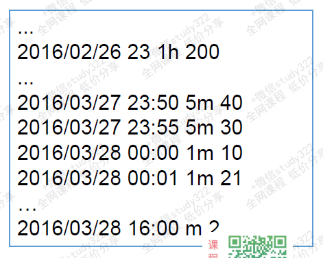

上面图中第一行的意思是2016/02/26这一天的23时的次数是200

当存储今天的数据的时候，以分钟为单位存储；当存储昨天的数据的时候，以5分钟为粒度存储；当存储上个月的数据的时候，可以用1小时为单位存储，当存储去年的数据的时候，就以周为单位存储了。这是因为距离现在越远的数据，意义越小，曲线变化可以越简单，这种多级Bucket的思路和RateLimiter是一样的。

为了应对写很频繁的问题，可以采用下列的解决思路：在每个服务器节点收到一次记录时，不马上更新数据库，而是在本地将请求攒起来，例如10秒向数据库写一次，这样就将整体的写QPS降低到1/10

# 分布式文件系统GFS

## 存储算法

分布式文件系统要解决的问题：用多台机器存储大文件

一个文件分为两个部分：文件内容和Metadata，如果要将文件存在一台机器上，到底是下面两种存储方式的哪一种：

* Metadata和文件内容是分开存储的：metadata1+metadata2+。。。+data1+data2+。。。
* Metadata和文件内容是连续存储的：metadata1+data1+metadata2+data2

答案是第一种比较好，因为打开文件夹时只会访问多个文件的metadata，而不会打开它们，连续存储方便提高访问磁盘的速度

文件是以块为单位存储的，block一般以4k为单位，Metadata中会记录文件是由哪些块组成的，以及这些块的位置：

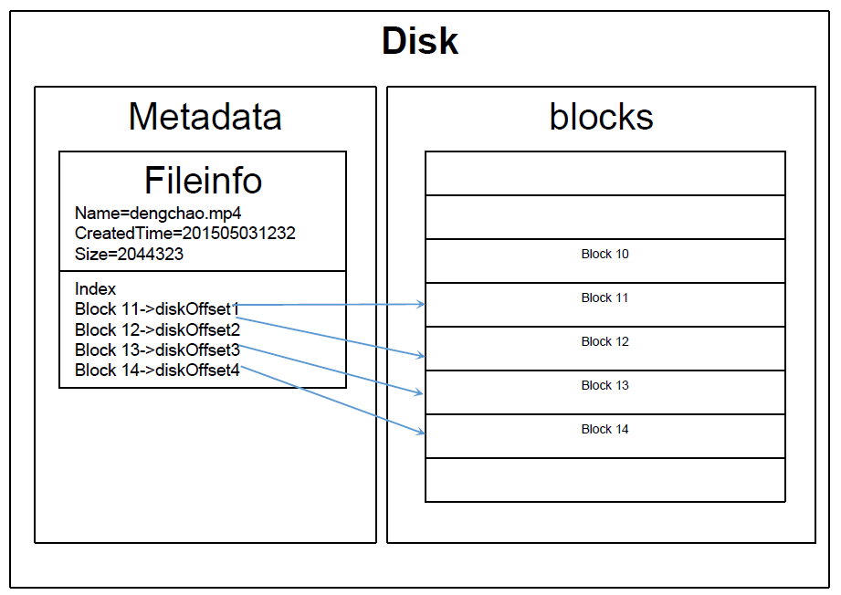

这些块在磁盘上并不是连续存储的，因为连续存储不方便新增文件内容，新增文件内容可能会移动整体文件存储。

为了保存特大文件，将一个块的大小从4kb变成64m，称之为chunk，1chunk=64M。但是劣势是存储不够64m的文件会产生磁盘碎片。

如果要将特大文件保存在多台机器上，那么整个集群就应该分为1个master+多个chunkServer（也就是slave），前者负责存储文件的Metadata，后者负责保存真正的文件内容。这里有一个优化点：那就是master上面没有必要保存所有的chunk信息，而是只需要保存文件存在哪几个节点就可以了，由chunkServer自己存储本结点有多少chunkServer：

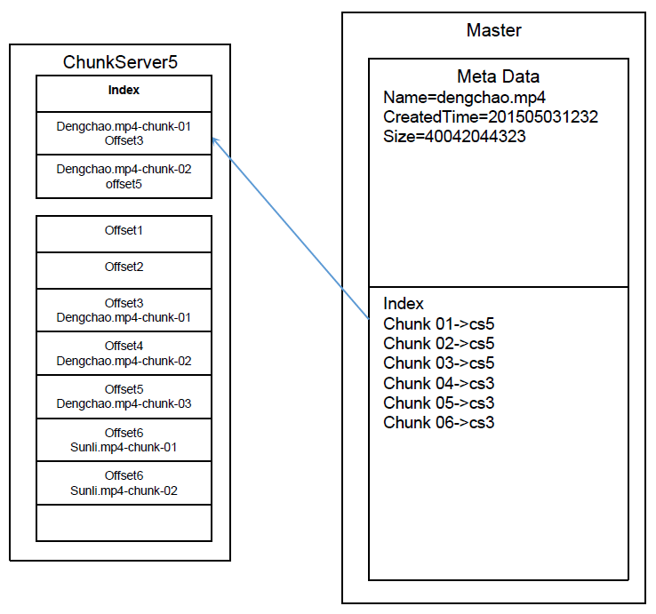

各自的offset没有必要存在master上，因为这样做可以节省master的空间，而且各server自己还可以自由调整各offset的位置，而无需跟master通信。

存储10P的文件需要多少存储空间：

* 10P的文件内容
* Metadata估算：如果1个chunk需要64B的空间，那么一共有10P=16*10^7个chunk，需要约10G的空间来放Metadata

整个GFS集群采用单master的设计，单master简单，系统容易维护和恢复。

## 读写算法

1、写文件

写文件时要将文件拆分为多个chunk然后写入，因为文件是按照chunk来存储的，所以也应该按照chunk来传输。拆分多次写入的好处是：如果写入过程出错了，那么只需要重新传写错的那一小份的文件。

写入文件时，先于master进行通信，master告知各chunk都存在哪些server中，然后由client直接向各server写入：

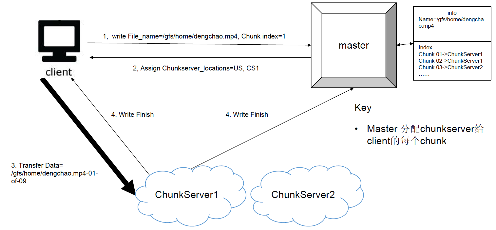

写入的时候，不应该直接把文件传入master，而是直接与各chunkserver通信，这样可以避免master成为性能瓶颈。

修改文件时，GFS采用的方案是：直接将文件删除重写一份，因为如果要以chunk为单位更新，那么整体的设计方案是比较复杂的，GFS设计目标就是一次写入多次读取，所以更新时性能差一些也没关系。

2、读文件

读文件和写类似，也是先去master获取文件的信息，然后去各chunkserver取文件：

## checksum

checksum是一个重要的校验机制，每个chunk都有自己的checksum，它可以感知到系统是否出现文件损坏的情况。

写入checksum的时机：写入数据内容时，顺便写入checksum

检查checksum的时机：读取数据内容时，重新计算checksum，如果发生了变化则说明数据损坏

当出现数据损坏的时候：就需要根据备份来还原文件

备份存放的位置：不能将备份都放在一个节点，避免节点损坏备份全部丢失的情况；如果是三备份的情况，应该将两个备份放在同一个机架内，然后第三份数据放在其他机架，这样部署同机架的数据恢复速度会比较快，不用远程请求。

备份信息的存放：也一样存在Master的Metadata中

引入备份之后：写文件的时候，写一个chunk就要写多份，此时client要向多个chunkserver传输数据，client成为瓶颈，为了解决这个问题，采用下面这个方案：在多个chunkserver中选择一个队长，client只把chunk传输给这个队长，然后这个队长再负责将chunk传输给各队员。chunkserver内部之间传递速度是比较快的，比client传给server要快：

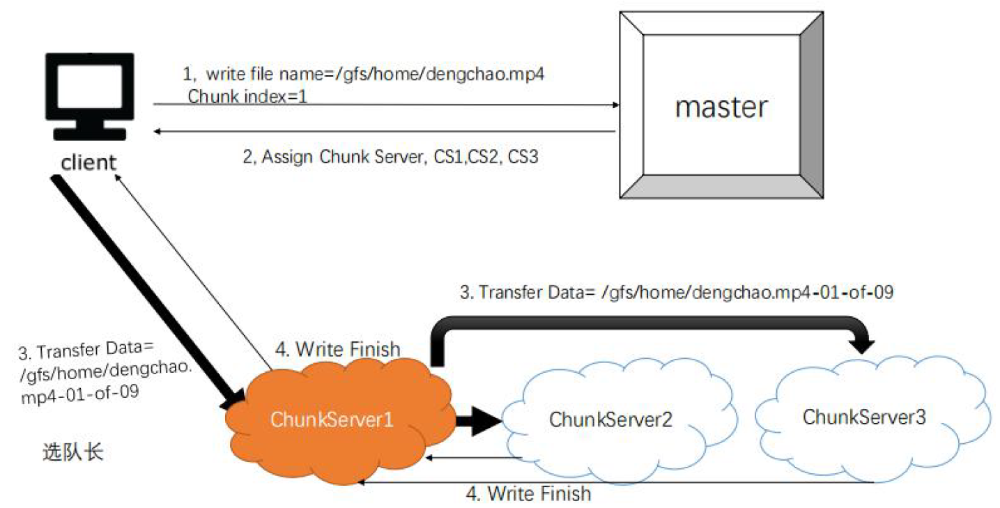

选队长的原则：

* 找离client距离最近的
* 找节点负载最小的

采用这种写入方式之后，写失败重试的时候，也无需client参与了，只需要队长与失败的那个chunkserver通信即可

## 心跳检查

Master要时刻感知各chunkserver的健康情况，心跳算法有两种：

* Master定期向chunkserver发起请求，然后chunkserver向Master返回信息
* 各chunkserver定期向Master汇报

这里应该选择第二个方案，因为选第一个master需要主动问一次，然后各chunkserver再回答一次，要两次通信，第二个只需要一次通信方式

## 存储问题实战

设计一个系统，该系统中的后台数据是10billion个key-value，服务形式是接受用户输入的key，返回对应的value。已知每个key的size是0.1kB，每个value的size是1kB。要求系统QPS>=5000，延迟时间<200ms。每个服务器的配置：8核CPU、32G内存、6T存储空间

一个错误的设计方案：

统计总的key size：10billion*0.1kB=1T，总的value size：10billion\*1kB=10T，所以一台服务器装两块磁盘足以保存下这些数据

延迟时间估算：读value实际上就是读取1kB，读一次磁盘大约10ms的寻轨时间（寻道时间）+读取1kB的传输时间（以磁盘读30M/s的速度估算，读取1kB所需要的时间可以忽略不计）=10ms。在磁盘中使用二分法查找key，每次查找key的时间是log(10billion) * 10ms=100ms

QPS估算：1台server装2块硬盘，读一次需要10ms，那么1s可以完成的操作数是1s/10ms*2=200次，为了达到5000的QPS，需要配置5000/200=25台server

上述算法的错误：

* 10billion是以2为底的，结果应该是30，查找的延迟应该是300ms
* 一台机器的查找时间，包括找到key和读取key，至少需要超过300ms的时间。一个硬盘1s只能做3次，2个硬盘大概只能做6次，所以5000的qps实际上需要1000台左右

正确的思路：在上面的解法中，内存是始终没有用到的。我们可以将查找的这个过程放到内存中，在内存中存放\<key, 硬盘地址>这样的键值对，一个key需要0.1kB，一个硬盘地址需要8B，基本可以忽略不计，这样内存中键值对需要1T，一台机器的内存是32G，故40台机器足够存储这些键值对。

这样的设计中，如果要找到一个key，要先在内存中进行二分查找，然后再读一次磁盘，内存中查找的耗时可以忽略不计，一次读取需要10ms+0.5ms的网络传输时间，共10.5ms，满足200ms的延迟时间。

QPS估算：一台机器装两块磁盘，这样一台机器就能存下所有的数据，每台机器的QPS=2*1s/10ms=200，共40台机器，总共可以达到8000QPS，满足题意。

# 文档协同编辑系统

协同编辑系统主要的功能是：支持多人同时在线编辑同一份文档。类似的产品有Google Docs、飞书

主要功能可以细分为：

* 编辑系统的功能：新建文件、编辑文件、保存文件
* 协同编辑的功能：协同显示、展示正在编辑的人、展示内容修改者、内容锁定

## 同步更新

当同时有两个客户端A和B连接服务器更新文档的时候，要在客户端A显示客户端B的信息，这需要服务器主动给客户端A推送信息，HTTP是不支持这样的操作的。如果客户端A定期去服务器轮询，也可以实现这种功能，但是有两个缺点：1、服务器压力大；2、实时性不高

早期的网络应用都是通过HTTP1.0的方式进行交互的，但是现在的网络应用比之前的更复杂，需要交互的场景很多，客户端与服务端交互频繁。HTTP1.0的特点如下：

* 链接无法复用，不支持长链接。

  http1.0规定浏览器与服务器保持较短时间的链接，浏览器每次请求都和服务器经过三次握手和慢启动，建立一个TCP链接，服务器完成请求处理后立即断开TCP链接

* 线头阻塞：Head of Line Blocking

  请求队列的第一个请求因为服务器正忙，导致后面的请求被阻塞，一个连接就是一个单线程在处理，服务器只能响应我的一次request，后面的请求都会被阻塞。

通过HTTP1.0这种形式，客户端要不断地发送请求给服务器，服务端要不断的去响应请求。这样对服务端和客户端的压力都比较大，而且交互的效率比较低

HTTP1.1在一定程度上解决了上述的问题：

* 支持长链接：一个TCP链接可以传送多个http请求和响应，减少了TCP建立链接和关闭链接的消耗

* 支持HTTP管道：管道可以让我们把FIFO队列从客户端移动到服务器，客户端不再串行，服务器串行处理每个请求

  允许客户端不用等待上一次请求结果返回，就可以发起下一次请求，但服务器必须按照接收到客户端请求的先后顺序依次回送响应结果

HTTP1.0和1.1都不能从服务端给客户端发送消息，服务器只能被动接收。

Websocket非常适用同步更新的场景，它和HTTP一样都是基于TCP的应用层协议，它让浏览器具备实时双向通信的能力，它可以让客户端和服务器建立连接后，保持会话，让服务器可以主动将更改的内容推送到客户端，解决了实时性的问题：

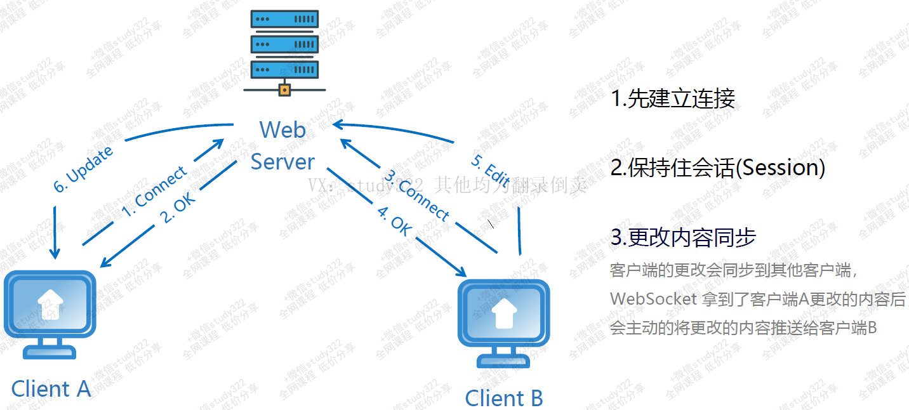

同步更新的时机：不是每敲一个字就同步一次，而是客户端会检测编辑的停顿，在停顿时再去触发同步

## 请求文件

客户端向服务器请求文件时，不能像传统文件系统那样，例如：http://xxx.com/folder1/folder2/..../file_name

原因有：1、文件被分享时，路径中可能包含隐私信息；2、链接太长不利于分享

应该参照短网址的设计，为每一个文件生成一个唯一的key，用于标识这个文件，如http://xxx.com/wwuSA1cs4qts

在文件标识后还可以给每个文件设置一个自定义的标题，增加整个url的可读性，又不至于泄露隐私，例如http://xxx.com/wwuSA1cs4qts/doc-edit

整个请求文件的流程图：

## 文件存储

文件分为两个部分：Metadata和content

* Metadata是一种结构化信息，它适合存在数据库中，因为它会经常被修改
* Content是一种文本信息，它适合存在文件系统中

要思考文件如何存储的问题，就要先思考文件如何更新的问题。如果每次文件更新都以整个文件为粒度进行操作，就会导致修改一点内容都要更新整个文件，这样效率太低，所以要考虑文件存储时要切分后再存，切分形式主要分为两种：

* 以行为粒度切分，如飞书
* 以词为粒度切分，如Google Doc

下面以分行为例，仅仅将文件保存为多行并不够，操作文件时还要支持多个用户在文件的不同位置进行修改和新增，这就需要将整个文件内容存为一个LinkedHashmap。虽然文件在文件服务器上是以文件的形式存储，但是应用服务器中要保存一份文件的缓存，这个缓存是用LinkedHashmap的方式保存的，文件中的每一行匹配链表的每个节点，它的优势在于：

* 可以根据行号或者其他key快速取某一行的内容
* 链表可以在任意位置插入或者删除

下图是一个文件内容和链表的对应关系：

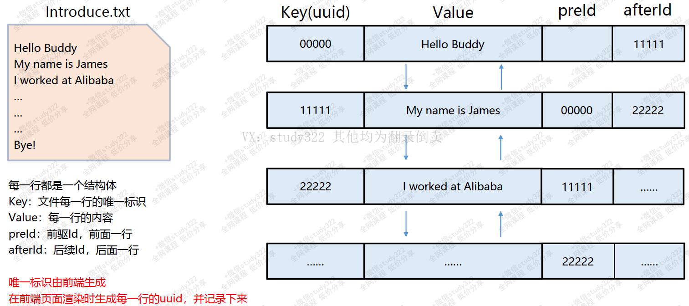

这里面的每个行唯一标识由前端生成，在前端创建一个新行的时候，由客户端来生成本行的唯一标识。

前端每次新增或者变更时，都要将变更信息发送到服务器，发送的信息包括：行号、前后行标识、操作时间、操作类型：

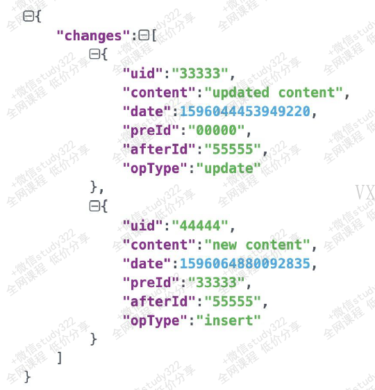

服务器拿到前端的请求后，经过处理，同步给其他在编辑的客户端，其他客户端分别响应，将变化的内容在本地页面进行显示。

创建文件时，要分为两部分，向数据库创建Metadata，向文件系统创建Content：

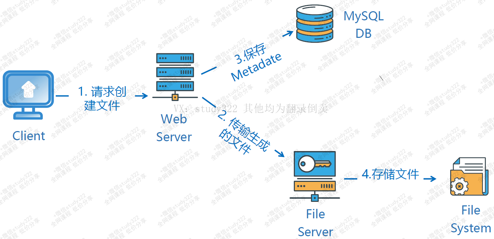

编辑文件时，在保存Content的时候，其实是直接修改Redis内存中的链表+哈希表，通过定时任务合并修改，最终保存到文件中：

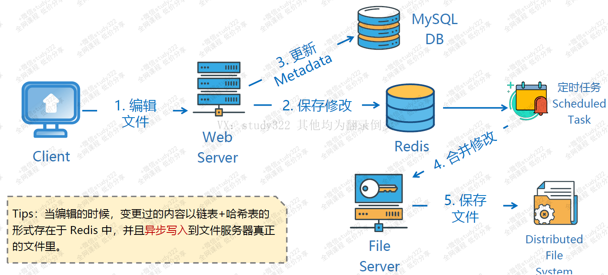

这里的写入文件系统并不是实时写入，而是通过定时任务定期修改。好处是可以将多次更新的结果合并为一次文件写。

如果文件系统是一个分布式系统，那就要在存储文件时，保证每个文件最终存储到一个确定唯一的服务器上（其实这样简单的设计也是存在问题的，至少存在两个问题：1、单点失效，若保存文件的服务器挂了，文件丢失，所以要备份；2、热点数据，若某个文件修改频率很高，则某个服务器的负载就会很高，所以这需要将文件分块存储在多个服务器中，而且还要做备份）

Metadata是存在数据库中，Redis负责存储文件的缓存，这里又可以分为文件概览的缓存和文件内容（链表节点）的缓存：

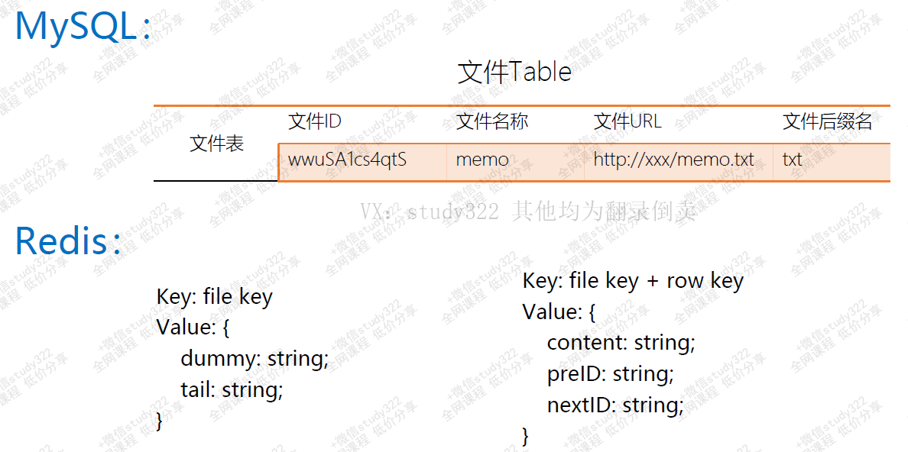

## 显示多人编辑的头像

要在编辑系统显示多人编辑的头像，就必须先考虑把这个头像信息保存下来，这个信息对于不同文档来说是不一样的，也就是说编辑文档A的可能是用户1、用户2、用户3，那编辑文档B的就可能是其他用户了。

考虑到这个编辑同一份文档的用户列表会经常改变，所以建议采用NoSQL来存储，下面是一个可行的方案：

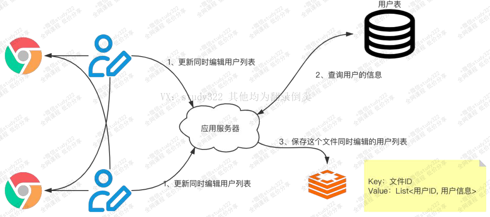

多个客户端在编辑文档时，服务器会把编辑相同文档的用户信息保存在Redis中，每次查询时也是从Redis中查出各用户信息，然后去用户表查到对应用户的头像信息，然后返回给客户端。

心跳机制也可以完成这个功能，客户端要定时向服务器报告自己的编辑动作，服务器就能获知同时编辑该文档的用户信息了。

## 记录行修改者

文档协同编辑系统中有一个常见功能是：可以看到某一行谁在修改

完成这个功能的思路和上面的类似，用户A在编辑某一行的时候，将这个信息保存到Redis中，然后用户B在与服务器交互时，就可以获取这个信息，并显示在自己的浏览器上：

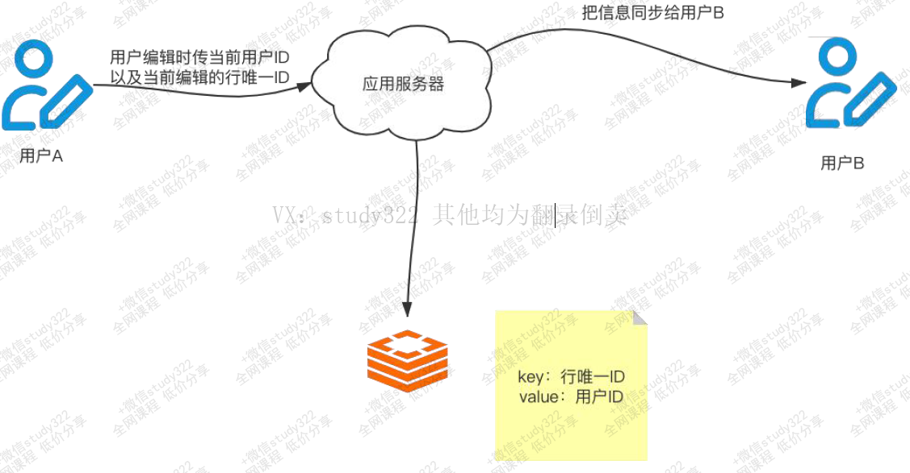

有一个和这个功能很像的功能就是行锁定，在用户编辑时可以右键选择锁定某行，锁定后只能该用户编辑这一行。实现方式也与这类似，锁定后会将这个信息存在Redis中，在其他用户与服务器交互时读取这个锁定信息，客户端会判断锁定该文档的用户名与当前用户是否一致，若不一致则不允许修改。

多人锁定场景，以谁的锁定请求先到达服务端为准，后到达的那个就会显示锁定失败信息。

## 多人编辑场景

多人编辑场景，除了采用行锁定，还能采用不需要锁定的算法，例如OT算法、CRDT算法。下面主要讲解OT算法的基本概念。

下面是一个同时编辑产生冲突的案例：客户端1将ABCD改为了ABCXD，生成一条insert(X,3)的命令发给客户端2；客户端2将ABCD改为了OABCD，生成一条insert(O,0)，发给客户端1。两个客户端应用对方发来的命令后，出现了结果不一致的情况：

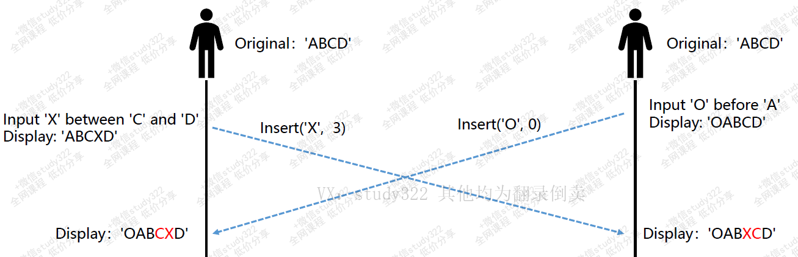

发生冲突的原因在于，客户端在生成命令时，只是基于当前本地的字符串来记录的，对方如果已经修改了内容，就会导致位置的数字错误。

OT算法会对原始的命令进行转换，为了防止出现冲突，OT算法会监视其他各客户端内容的位置有没有发生变化，根据其他客户端的操作将命令进行调整，使命令能够适应当前客户端：

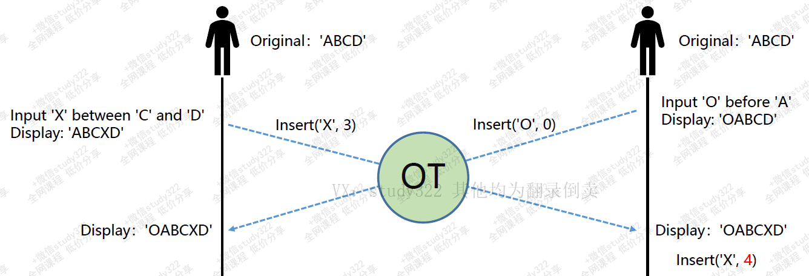

如上图所示，经过OT算法，本来从客户端1发来的insert(X,3)被修正为了insert(X,4)，这样两个客户端显示的内容就是一致的了。

OT算法虽然解决了位置的问题，但是不能解决语义的问题，可能转换后的结果不是两个人同时想要的，经过OT算法的转换后语句可能是不通顺的，还需要人为调整。

考虑到多人编辑的用户体验，应该考虑限制同时编辑的人数。

# 分布式数据库Big Table

## 读写方案初步设计

Big Table是Google的一个分布式NoSQL数据库，它要完成的功能很简单，就是给一个key返回一个value

数据库是在文件系统之上的系统，文件系统提供一些简单的读写文件操作，数据库负责实现有复杂查询的请求。

要查询k-v，那就一定要用文件存储k-v，最终承载数据的是类似下面的文件：

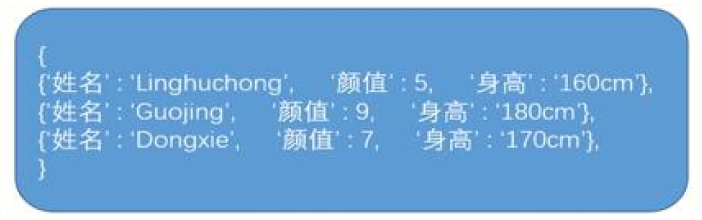

为了更好的支持查询操作，下面是几种备选方案：

* 先把文件内容读取到内容中，然后遍历文件，直到找到key为止：这个算法会把文件内容都遍历一遍，复杂度太高了
* 先把文件内容读到内存中，然后排序+二分查找：因为是分布式数据库，所以数据量是非常大的，全读到内存中不现实
* 文件本身就是有序的，可以直接在文件中二分查找：这种方案较好

如果文件本身是有序的，虽然查询起来简单，但是对于更新/新增操作，则非常不方便。针对一条记录的更新操作，有几种备选方案：

* 直接在文件中将对应记录修改：这种方案存在一个严重问题是，如果修改后记录变大或者变小了，需要将前后的内容都移动，复杂度很高
* 读取整个文件，改好了再把源文件删除，再把新文件写回去：复杂度太高了，对于NoSQL来说不可接受
* 不修改，直接在文件最后追加一条记录，后续再处理无序的问题：好处是特别快，坏处是要再想办法处理维持有序的问题

BigTable为了优化写的速度，选择了最后一种方案，选择该方案需要解决以下两个问题：

* 如何识别哪个是最新的记录？写记录时记下对应的时间戳，时间戳最大的那个就是最近的记录
* 没有顺序怎么二分？存储时分为多块存储，只有最后一块是无序的，新的记录就追加在这一块上，定时将它整理为有序。读取时，先读取无序块查询，然后再二分法读取各有序块（先读新的，再读旧的）。随着写入越来越多，更新比较频繁的时候，最终各有序块中也会存在一些重复记录，定期采用K路归并合并各有序块为一个块

最后这个块是可以直接存在内存中的（具体由跳表来实现），而且每次写的时候都可以直接将其整理为有序内存块（Sorted String Table），如果内存中的一块内容大于256M，就将其序列化到磁盘中。一个初步的写入过程如下图：

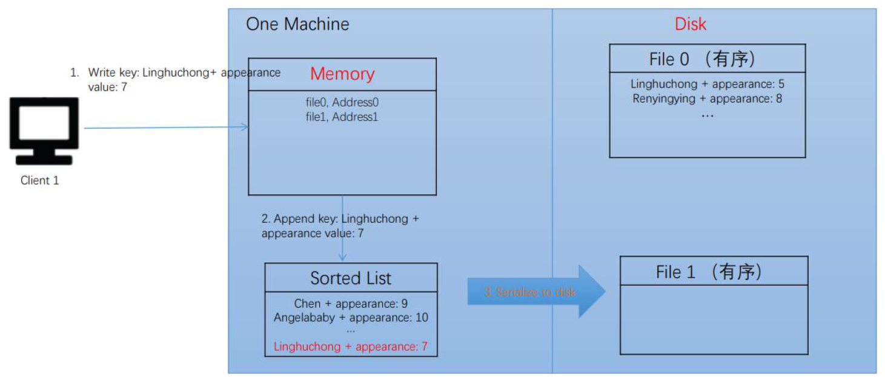

因为写入追加的时候是直接将内容写在内存中，如果此时断电那么内容就丢失了，为了防止这个问题，可以在每次在写内存数据时，先写一次Write Ahead Log，它存在硬盘中，WAL仅仅需要一次append，它是连续写入，速度很快。

一个初步的读取过程如下，先找内存中的最后一个块，如果没找到则用二分法找有序的，从最新的数据开始找（整个数据是有可能存在重复的，所以要从最新的开始找），直到找到为止。

## 读取优化-索引

当读取到一个有序块时，如何快速找到有序块中的某条记录，除了使用二分法还有没有更好的方法？

一个更好的方法是创建索引，例如内存中记录一些索引信息，例如A开头的单词在文件的第几行，D开头的单词在文件的第几行，这样如果寻找L那么只需要在D和S之间用二分搜索即可，大大减小了二分搜索的范围：

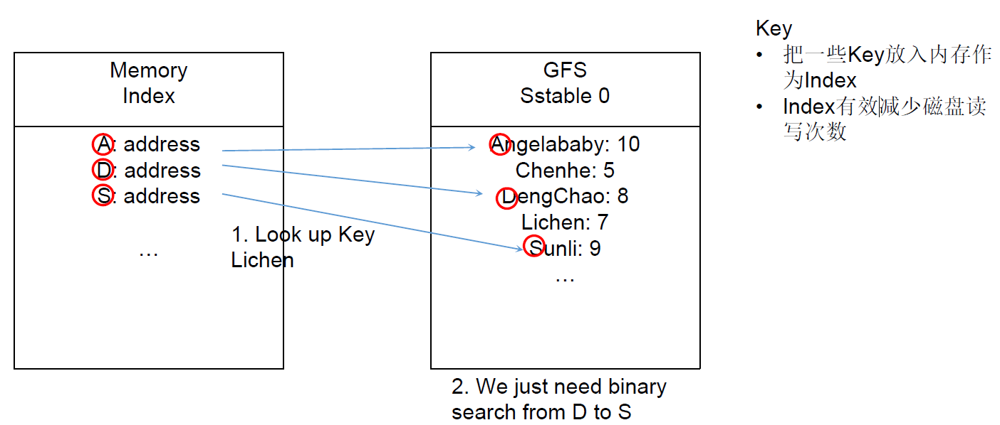

## 读取优化-BloomFilter

读取时需要快速检查一个key是否保存在File里面，这就需要使用BloomFilter

当一个key存入BloomFilter时，需要使用多个hash方法，得到多个value，然后把对应位置的值变为1：

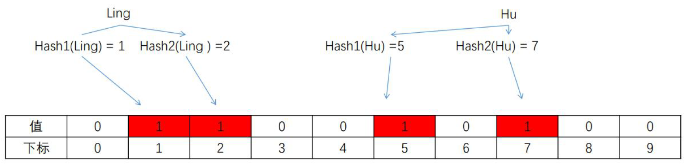

如果要检查某个key是否在BloomFilter中，需要用这些hash函数计算对应的value，然后检查这些value，如果全都是1，则说明这个key在BloomFilter中。

BloomFilter是存在误判率的（判断说在，实际可能不在），一般来说，哈希函数越多误判率越低、位数组长度越长误判率越低、加入的字符串数量越少误判率越低

若哈希函数的个数是15个，位数组大小200w（越24M），加入字符串的个数10w，判断2000w个新字符串的误判率在3-4%

引入BloomFilter后，在读取BigTable时就可以先检查key是否在File中，如果在就查找，如果不在直接返回。

## Sharding

BigTable是分布式数据库，它要存放的数据量是很大的。这就存在一个Sharding的问题，到底是采用水平切分还是垂直切分？

为了可以直接用key读到它的所有属性，所以采用行拆分，不能采用列拆分。如果列拆分的话，不同的列保存在不同的节点，反而增加了读取的步骤：

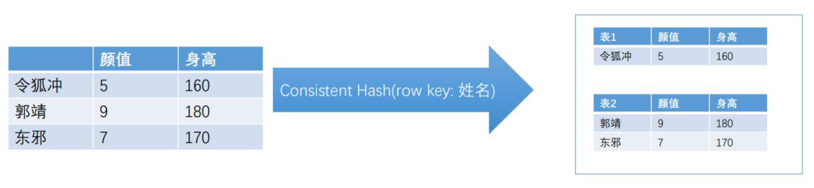

对key进行Consistent Hash，拆分为很多张小表。

所以读写过程也从单机进化为集群，和之前的集群一样，BigTable的集群也是Master+Slave的格式

Master保存着key存在哪个server，server中保存着一张张小表：

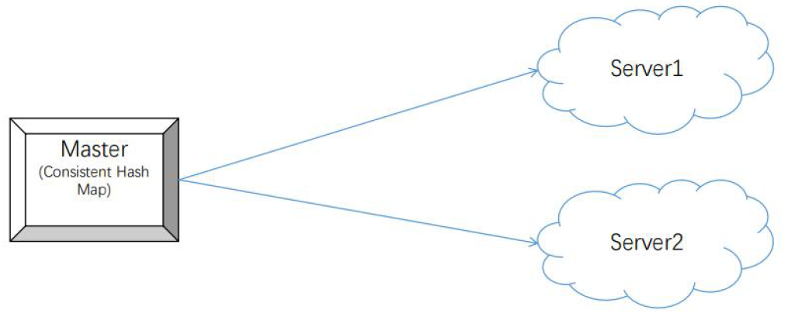

引入数据分区后，读取一个key的完整过程如下：先从Master中取到应该访问哪个server，然后到对应server中读取文件内容，依次经历以下步骤：

* 在内存中：在Skip List中搜索key，然后访问BloomFilter检查文件中是否有key，若文件中有则读取索引信息
* 根据索引信息访问在文件系统中的SSTable

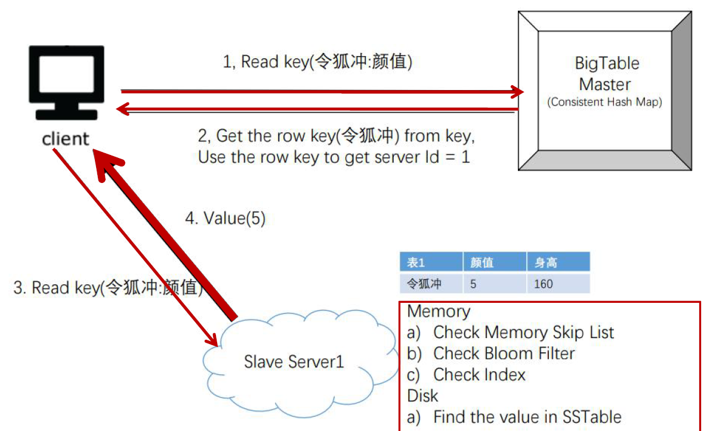

写入一个key的过程如下：先去Master中取到这个key应该存在哪个server中，然后去对应的server中写，写入过程具体分为以下步骤：

* 先往文件系统中写入Write Ahead Log
* 然后再直接将数据存入内存中的Skip List中，如果Skip List满了则写入磁盘

##Big Table与GFS

可以将BigTable所有的数据都存放在GFS上面，好处是：GFS可以存储更多的数据（单个拆分后的表可以更大，比一台单独的节点还大）、GFS提供备份功能、GFS提供一些基本的容错机制。

不建议用一个Master+Slave架构把它们两个都实现了，因为两者是不同性质的应用，一个是数据库，一个是文件系统，不应该耦合在一起。

分片时给拆分出来的每个小表都叫一个Tablet，每个BigTable中的server都存放一个Tablet，所以也叫Tablet server，最终的存储架构如下：

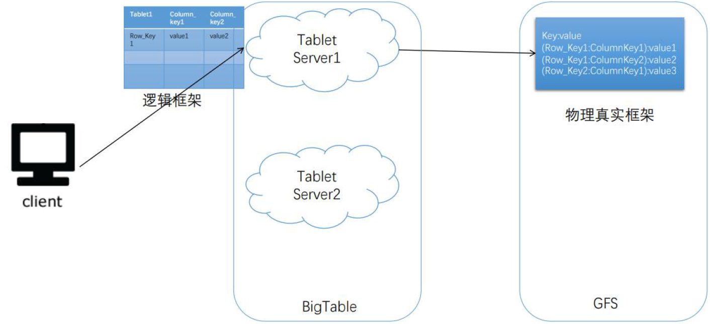

逻辑上，BigTable的Tablet server保存一个Tablet时，最终底层依赖的是GFS，GFS负责存储一个真正的Tablet

## 分布式锁

当读写同时发生时，会发生资源竞争。所以整个系统需要分布式锁来避免这种情况，需要一个锁服务器来完成加锁解锁的操作。

每次进行读或者写的时候，都先向锁服务器发送请求，没有拿到锁只能等待，拿到锁了之后再去进行读或者写操作。

由于每次写都要请求到锁服务器，总要和锁服务器进行一次通信，所以可以直接将分配小弟的职责给锁服务器，由锁服务器来存放key在哪个server的信息。

## 几种数据结构讨论

B-树其实就是将二叉树变成多叉树来降低树高，降低磁盘读取次数：

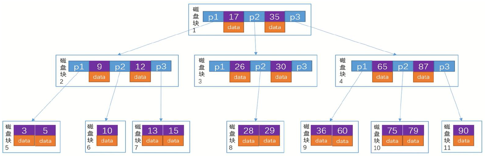

但是它存在缺点：那就是一个节点中的data占用空间太大了，导致一个块没有多少空间给指针用了，这就间接限制了叉数。

为了解决这个问题，才出现B+树，它叶子结点不存data，最大限度的增加了叉数：

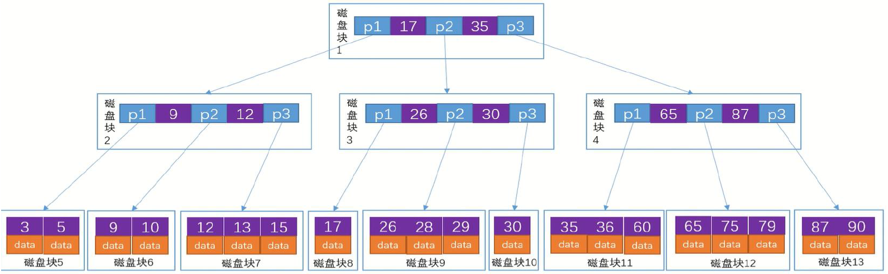

BloomFilter它不仅可以用来查询key有没有出现过，还能查询key出现的次数，具体用法是：每个数组位置不再存0和1了，而是存数字，每次存入具体位置的数字都+1，这样每次查询key出现了几次时，只需要取多个位置的最小值。

BloomFilter和HashTable的区别是：HashTable内部保存着真正的value对象，而BloomFilter没有，所以BloomFilter在扩展的时候，无法像HashTable那样将value取出来重新hash一遍，所以BloomFilter的扩展方式如下：原来的数组不再新增数据，只往新数组放数据，如果两个数组都说不存在，才认为是数据不存在

BigTable使用Skip Table的原因是：简单、Skip Table遍历一遍最下层就能直接得到顺序的结果，方便一次性持久化到磁盘中

# 聊天系统

