# 三大问题

对大多数系统都非常重要的三个问题：

* 可靠性：当出现意外情况，系统仍然可以正常运转
* 可扩展性：随着规模的增长，系统能够合理的扩展
* 可维护性：高效地维护现有功能，或者适配新场景

## 可靠性问题

可靠性问题的场景及基本对策：

* 硬件故障：如硬盘崩溃、内存故障、停电等。以硬盘为例，它的平均无故障时间MTTF在10-50年，因此在大型集群中，硬盘故障经常发生。硬件故障通常的对策是为硬件添加冗余，如RAID、配备双电源、热插拔CPU、备用电源等，采用硬件冗余方案可以降低单机完全失效的概率，但随着集群规模扩大如云平台，强调的是集群总体可靠性而非单机可靠性，有时还是会出现单台机器失效（或者虚拟机实例无法访问）的情况，这种情况下通过软件容错成为一个重要的补充
* 软件错误：如边界场景、共用系统共享资源的进程相互影响、下游服务异常。软件错误没有快速解决办法，只能进行全面的测试，监控并分析生产环境的行为
* 人为失误：现实中有大量问题来自于运维者的配置错误，人是不可靠的。我们可以从下面几个方面降低失误的概率：精心设计系统避免错误操作、使用和生产环境完全隔离的环境测试、全面的测试、提供快速回滚的机制、详细的监控系统、操作流程化并进行培训

## 可扩展性

负载和性能：

* 负载：它取决于系统的体系结构，如服务器每秒请求处理次数、用户数量等。有时平均值很重要，有时系统瓶颈来自于少数峰值

* 性能：批处理系统更关心吞吐量，在线系统通常更看重服务的响应时间（延迟和响应时间是不同的概念，延迟latency=服务器处理请求的时间，响应时间response time=客户端看到的耗时=服务器处理请求的时间+网络延迟+各种排队延迟）

每个请求的响应时间都各不相同，例如有的需要处理的数据更多，即使是完全相同的请求，也会因为一些因素而互不相同，如上下文切换和进程调度、网络包丢失和重传、垃圾回收暂停、缺页中断、磁盘IO。所以描述时通常采用平均数、中位数、更大的百分位数如95/99/99.9（p95、p99、p999，它们常常反应了异常值的极端情况，也代表了总体服务体验），百分位数通常用于描述SLA和SLO

可扩展性更多的是如何在垂直扩展和水平扩展中间做取舍：

* 垂直扩展：升级到更好的机器，这种运行在单机的系统比较简单，但是高端机器可能比较昂贵，且扩展水平有限
* 水平扩展：将负载分布到多个更小的机器，它会是主流的方案

扩展能力好的架构通常会做出一些假设，然后有针对性的优化设计，但可能出现假设错误的情况，所以对于初创公司而言，快速迭代功能比可扩展性设计更重要

## 可维护性

可维护性的重要性：软件的大部分成本不在最初的开发阶段，而是在于整个生命周期的持续投入，例如缺陷修复、维护、故障排查、监控、适配新平台和新场景等。

可维护性的三个方面：

* 可运维性：方便运维来保证系统平稳运行。包括完善的监控系统、高效的故障排查、安全补丁保持更新、方便部署和配置、自动化、操作规范、良好的文档
* 简单性：保持项目有良好的抽象，易于理解
* 可演化性：轻松的修改系统，使其适应不断变化的需求，它与简单性密切相关

# 数据模型

## 哈希索引&LSM

一个最简单的哈希索引设计如下：用CSV文件存储键和值，用一个内存中的hashmap存储每个键在文件中的偏移量：


它的优势：高性能的读和写，尤其是写性能更好

在实现它时需要注意如下细节：

* 日志的最佳格式是二进制，它更快更简单
* 日志需要采取追加而不是原地更新的策略，首先追加是顺序写性能更好，而且并发控制和崩溃恢复更简单，如果是原地更新日志文件则有可能出现重写时发生崩溃的情况，此时新值和旧值混在一个文件中
* 崩溃恢复：内存中的hashmap要做备份，防止丢失
* 并发控制：写入的过程需要以严格的顺序追加到日志，所以写线程一般只有一个
* 部分写入的情况：数据库可能随时崩溃，如果在追加记录时出现崩溃，则需要Bitcask文件来存储校验值，发现损坏的部分并丢弃
* 压缩过程：为了避免文件过大，日志文件需要分段进行，当文件到达一定程度时就新建一个文件继续追加，需要定时合并这些段，在合并的时候只保留key最新的value，在高频更新的场景下，合并可以显著降低磁盘存储的量

它的劣势在于：

* 内存中需要放得下所有数据的key
* 不支持区间查询

SSTable其实就是一个有序的日志段，有序日志段就可以支持区间查询了，此外它还有一些好处：

* 用合并排序来合并段，去重的效率更高了
* 在日志段中查找指定的key时，不需要在内存中保存所有key的偏移量了，可以只保存一部分的，因为日志段是有序的，所以可以很容易找到目标key在哪两个key之间，内存中的hashmap大小降低

为了使日志段有序化需要做出的优化：

* 写入时先将其加入到内存中的树结构中，当内存中的有序数据达到一定大小后，将其写入到磁盘文件中；因为是先写入内存，所以为了防止崩溃时数据丢失，需要给内存结构配备一个追加日志，用于崩溃后的数据恢复
* 读取时先读取内存中的有序结构，然后再读取磁盘文件；因为在读取不存在的数据时需要耗时比较久，所以需要搭配布隆过滤器来使用

这个索引结构被称为日志结构合并树Log-Structured Merge Tree，即LSM树

Lucene是ES等搜索引擎的底层存储引擎，它使用了类似的方法来保存词典：给定搜索查询中的某个单词，找到提及该单词的所有文档，它也是由kv结构实现，k就是单词，v就是包含该单词的文档id列表（倒排表）

## 数仓

事务处理系统OLTP：online transaction processing和分析系统OLAP：online analytic processing

|          |              事务处理系统OLTP              |                        分析系统OLAP                        |
| :------: | :----------------------------------------: | :--------------------------------------------------------: |
| 使用场景 | 与处理业务交易类似，用户通过网络交互式操作 |                  内部分析师为决策提供支持                  |
|  读特征  |        基于键，每次查询返回少量数据        | 需要扫描大量记录，每个记录只读取少数几列，计算汇总统计信息 |
|  写特征  |            低延迟写入用户的输入            |                  批量导入（ETL）或事件流                   |
| 数据表征 |                  最新数据                  |                  随时间变化的所有历史数据                  |
| 数据规模 |                   GB到TB                   |                           TB到PB                           |

一般比较常见的做法是：公司在单独的数据库上运行分析，这就是数据仓库。一般不会同时在一个数据库上执行两种任务，OLAP通常需要扫描大量数据集，会损害并发执行事务的性能

分析型业务的数据模型主要采用星型模式，也叫维度建模。

例如下图代表零售数据仓库的数据模型：

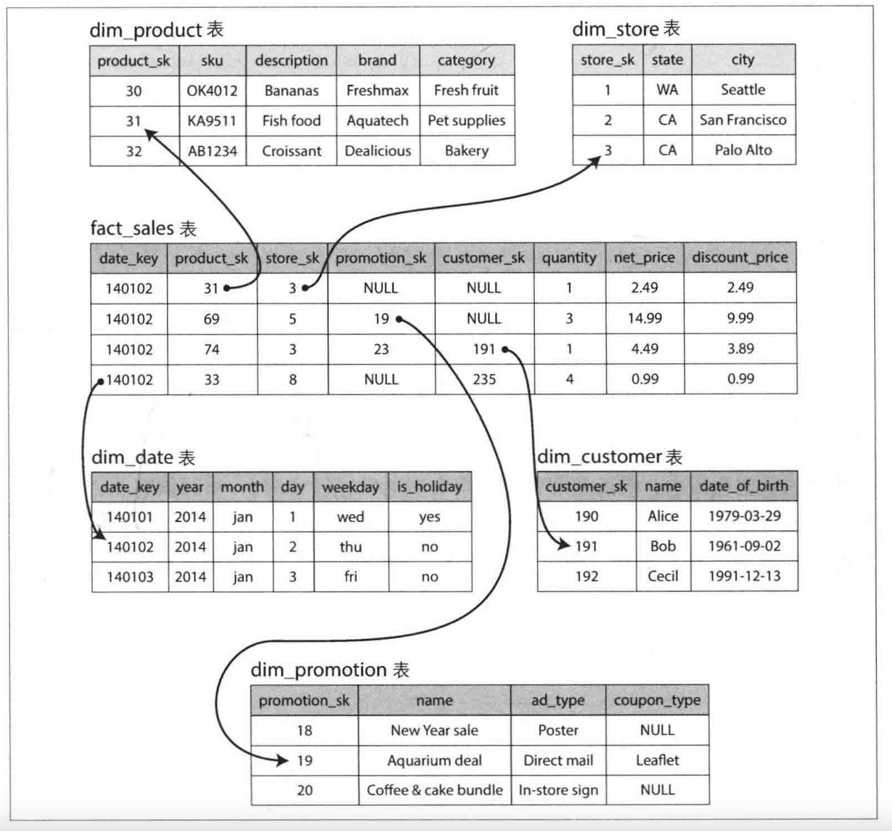

模式的中心fact_sales表是事实表，它的每一行都表示在特定时间发生的事件，即一个零售动作；事实表中每一个列可以是具体的属性，也可以指向其他表的主键，这些表称为维度表，例如发生零售动作的产品、库存、时间等信息。一般来说时间和日期会使用维度表来表示，以便对比假日和非假日的销售情况。

星型模式就是事实表位于中间，被一系列维度表包围。

该模式有一个变体称为雪花模式，即维度表可以进一步划分为子空间，再指向其他的表。雪花模式比星型模式更规范化，但是实际使用时一般选择星型模式，因为它比较简单。

事实表的列数通常超过一百，而一次特定的数仓查询往往只需要泳道其中几个列，所以一般采用列存储，列存储除了仅需加载查询的列以外，还可以通过压缩数据来降低磁盘吞吐量，列存储的数据一般来说非常适合压缩，因为相同列的数据重复率比较高。

# 数据编码

特定语言自带的编解码使用起来非常方便，但是它们只能和特定的编程语言绑定在一起，通用性不好，而且编程语言提供的实例化类的能力，存在安全隐患（攻击者可以实例化任意的类），通常他们的兼容性和性能都不好

JSON、XML和CSV都是文本格式，它们的可读性都很好，它们的缺点：

* 不支持二进制字符串
* 数字编码比较模糊，例如XML和CSV无法区分是数字还是数字类型的字符串，JSON则无法识别浮点数
* XML和JSON都有schema，功能强大且复杂，编解码逻辑和schema有耦合；CSV没有schema，需要增加新列时需要适配新的程序

Apache Thrift和Protocol Buffers(protobuf)是基于相同原理的两种二进制编码库

它们都需要先用schema来定义数据格式，对Thrift来说需要用接口定义语言IDL来描述schema：

~~~idl
struct Person{
	1:required string userName,
	2:optional i64 favoriteNumber,
	3:optional list<string> interests
}
~~~

Thrift有两种不同的二进制编码格式：BinaryProtocol和CompactProtocol。

BinaryProtocol的编码格式如下：

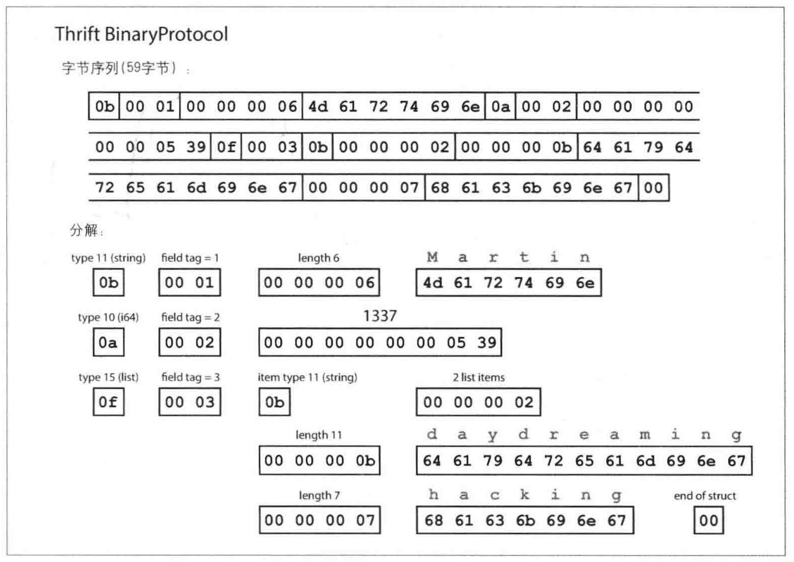

每个字段都指定了类型、位置、长度等信息。它的优势是不需要保存字段名，而采用字段标签（也就是位置编号）来代表内容属于哪个字段，它就像字段别名。

如果字段设置了required，但是实际未填充，则会在运行时检查并报错。

CompactProtocol在此基础上进一步优化：

* 将字段类型和标签打包到单个字节中
* 对于数字不直接使用其二进制，而是将其拆分，使用可变长度整数，例如1337编码为13和37，从8字节缩短到2字节

每当schema发生变化时，为了保证兼容性，需要特别注意：旧的标签号不能更改，更改它会使所有现有编码数据失效，因为数据是由标签号标记的，新的代码总是能读取旧数据，这就实现了向后兼容性；添加一个新字段且赋予一个新标签号，旧的程序依然可以读取新数据，只是新字段会被置为空，保证了向前兼容。此外，删除时只能删除optional的字段，新增也只能增加optional的字段

Avro是另一种二进制编码格式，它一开始是作为Hadoop的子项目启动的。

Avro也必须提前定义schema，它编码后的内容更紧凑，编码后它只存储字段大小和字段值两个部分，也就是说只有当数据和schema完全匹配时才能正常解析。

Avro保持前后兼容的逻辑是在Avro库中实现的，在读取或者写入时会对比数据和schema之间的差异，对新增的字段置为默认值，减少的的字段忽略。这就需要程序在读取数据时，同时解析出数据的schema是什么，通过下面几种方式解析出schema：

* 在存储数据的大文件开头保存schema，这与Hadoop处理的大数据场景很契合
* 在数据库中保留一个版本字段，代表这条数据的schema版本；特别地，可以直接用列名代表schema中的字段名，即Avro能从数据库中直接解析出schema，，即动态生成schema，而无需像Thrift那样指定标签号
* 两个进程通过网络通信时，先互相交换Avro schema，后进行数据传递

# 数据复制

数据复制方案的目的：

* 使数据在地理位置上更接近用户，从而降低访问延迟
* 当部分组件出现故障，系统仍然可以继续工作，从而提高可用性
* 多台机器同时提供数据访问服务，从而提高吞吐量

## 主从复制

主从复制：写请求首先发送给主节点，主节点将数据写入本地后再复制给每个从节点，两者的写入顺序保持相等，读请求既可以在主节点处理也可以在从节点处理


复制又可以分为同步复制和异步复制：

* 同步复制：直到确认从节点复制完成后，才返回写成功；这种方式的优点是主节点故障后，客户端依然能读到最新数据，缺点就是性能不好，某个从节点的延迟可能导致写操作阻塞
* 异步复制：主节点保存完毕后立即返回，无需等待复制完成；它的系统吞吐量更好，但是主节点故障且不可恢复后所有尚未复制完成的数据都会丢失。当节点数量巨大或者跨城市的集群可能会采用这种模式

两种方式是折中方案是半同步：一些节点设置为同步，一些设置为异步，当同步的节点变得不可用或者性能下降，就将另一个异步节点设置为同步，这样集群中至少有超过1个节点拥有最新的数据

新的从节点加入集群：主节点的数据会定时产生数据快照，新的从节点加入集群后，会首先将快照内容保存下来，然后主节点再将快照后的数据更改日志发给从节点，直到两者完全同步

从节点失效的情况：从节点的本地磁盘保存了之前的数据，在故障恢复后它知道故障前处理过的最后一个事务，恢复后可以连接到主节点，请求之后所有的数据变更，直到两者完全同步

主节点失效的情况：需要将某个从节点升级为主节点，这就是故障转移

自动进行故障转移的步骤：

* 确认主节点失效：大多数系统都采用基于超时的机制，节点之间频繁地互相发送心跳消息，如果发现主节点在较长一段时间内没有响应，则认为该节点失效
* 选举新的主节点：通过共识算法或者控制器节点来指定新的主节点，新的主节点一般存着最新的数据
* 重新配置系统使主节点生效：客户端需要将写请求发给新的主节点，其他从节点要接受新主节点的复制，旧的主节点恢复后也要自动完成降级

切换过程中可能出现的问题：

* 如果使用了异步同步，新的主节点的数据不是最新的，旧的主节点恢复后可能受到来自该节点的复制请求，从而出现写请求冲突
* 数据库之外的系统可能与数据库中数据一起协同使用：某个主节点的数据不是最新的，当它处理写请求使使用了数据库自增主键，使用了原主节点分配过的一个主键，该主键恰好被外部Redis引用，造成两者的数据不一致
* 脑裂问题
* 检测主节点的超时时间不好控制，太短可能导致不必要的切换，太长也会导致总体恢复时间变长

上面的问题没有一个简单的处理方案，所以还有大量的运维团队依然愿意手动完成故障转移

复制日志的实现：

* 基于语句的复制：这种方式比较简单，而且日志量也小。但是有一些不适用的场景，如可能在不同机器产生不同效果的NOW函数、update where、自增列、触发器、存储过程、用户自定义函数等。如果将函数结果替换为确定结果复制到从节点，也能解决一部分问题，但是有太多情况需要考虑，所以目前很少使用这种方案
* 基于WAL预写日志的复制：这种日志记录了哪些块的哪些字节需要改变。它的缺点是复制方案和存储引擎紧密耦合，如果存储格式升级，则复制方案就不能正常运行了，这就导致无法做到不停机升级
* 基于行的逻辑日志复制：日志记录了一个行级别的写请求，如插入时日志记录新的行记录，更新时记录id及列新值，删除时记录id。它的兼容性更好，也容易被外部程序解析
* 基于触发器的复制：通过外部程序读取数据库日志来获取数据变更，或者借助触发器和存储过程，将数据更改记录到一个单独的表中，然后用程序访问该表获取变更

读到过期数据的解决办法：

* 区分请求的类型，如果可能读到刚刚更新的数据就读主节点，如果不可能就读从节点，例如一个用户读自己的博客时要读取主节点，因为他可能刚刚编辑过，读别人博客的时候可以读从节点
* 监控各节点的复制进度，选择复制进度更快的节点读取
* 客户端记住更新的时间戳，读取时带着这个时间戳，只读取该时间戳之后更新过的数据
* 如果是多数据中心，则需要将请求路由到主节点所在的数据中心；如果是多设备登录，需要将多个设备路由到同一个数据中心读取

实现单调读（保证用户在多次查询时，不会看到更旧的数据）的方式：确保用户只能从固定的同一个副本进行读取

前缀一致读可以避免因果关系出现混乱，即对于按顺序写入的写请求，读取时也必须按当时写入的顺序读到。这个问题是分区数据库才有的一个特殊问题，许多分布式数据库中，不同的分区独立运行，不存在全局写入顺序，这就导致可能出现因果混乱。一个解决方案是：确保具有因果顺序关系的写入都交给一个分区来完成

## 多主节点复制

多主节点复制（多主多从）：即同时存在多个主节点，写请求可以分发到这些主节点来执行

它的好处：性能更好、主节点发生故障也不会丢失数据

它适用的场景：

* 多数据中心：为了防灾或者让数据更接近用户，可以设置多个数据中心，每个数据中心采用常规的主从复制方案，数据中心之间通过各数据中心的主节点完成数据的交换与更新。数据中心之间的网络比数据中心内部的本地网络更不可靠，所以通常采用异步复制
* 离线客户端操作：网络断开后还需要正常工作，如日历设置、会议安排等，此时每个设备都有一个本地数据库来接受写请求，等网络恢复后再与服务器同步

多主节点复制最大的问题就是：可能发生写冲突。两个主节点同时接到写请求，而这两个写请求是修改同一份数据的：

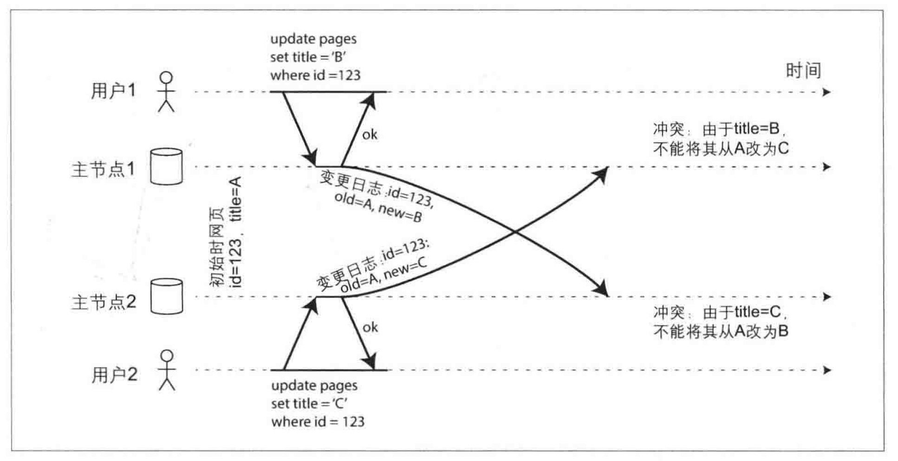

处理写冲突的方案：

* 同步复制：等待写请求完成对所有副本的同步再返回。但这样做会失去多主节点的主要优势
* 避免冲突：应用层来保证对特定记录的写总是通过同一个主节点，如同一个用户的数据就存在一个主节点中，从用户的角度看，这基本等价于主从复制模型。但如果该数据中心发生故障，不得不路由到其他节点，此时就无法避免了
* 收敛于一致：为了让数据最后变得一致，可以给每个写请求分配时间戳或者id，取最近的或者id最高的写入，其他的丢弃；或者以某种方式将他们合并在一起，或者以预定好的格式同时写入两份数据，等待应用层处理冲突
* 应用层处理：可以在写入时处理，如果发现同步时出现冲突则调用应用层的冲突处理程序；也可以在读取时处理，在同步时将所有冲突的数据都保存下来，读取数据时将所有数据返回给应用层，由应用层处理冲突

有的冲突比较简单，如更新同一条记录；有些冲突非常隐蔽，例如预定会议时，每次预定应用程序都要检查是否有冲突，然后再写入，如果两个预定是在不同的主节点进行，还是有冲突的可能。要完美实现冲突处理，要考虑的情况很多，主流数据库的多主复制还并不完善，很多人认为应该谨慎使用多主复制

多主集群超过2个主节点时，就需要考虑如何将写请求传递到其他节点，下面是常用的三种拓扑结构：

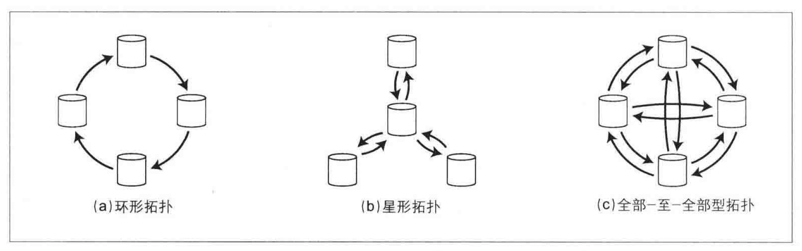

默认MySQL只支持环形拓扑。

环形和星型拓扑中，写请求需要经过多个节点才能达到所有的副本，为防止无限循环，每个节点会有一个唯一标识符，复制日志的每个写请求都会带上已通过的节点标识符，防止重复写入。

环形和星型拓扑的缺陷是：当一个节点发生了故障，会影响其他节点间复制日志的转发。此时一般需要运维人员人工介入修复

全部至全部拓扑则没有这个问题，但是它特有的问题是：有一些网络链路更快，导致一些复制日志之间的顺序会颠倒，例如先执行更新后执行新增。为了使日志消息有序，可以使用版本向量技术

## 无主节点复制

这种集群的所有节点都允许执行写请求。从亚马逊的Dynamo开始，很多系统基于此来设计。

并发读写：客户端会向所有节点都发送写请求，当收到多个副本的成功响应后，即可认为写入成功。当失效的节点重新上线后，它可能会出现和其他节点数据不一致的情况，所以客户端读取数据时也要同时读取多个副本，取其中更新的值返回。这其中涉及到一些版本号技术

当一个失效的节点重新上线时，它如何赶上其他节点的数据？主要通过以下两种方式：

* 读修复：客户端并行读取多个副本时，如果检测到某个副本的值已经过期，可以选择将新值写入该副本，这种方法适合数据被频繁读取的场景
* 反熵过程：有后台进程不断查找副本数据之间的差异，将任何缺少的数据从一个副本复制到另一个副本。这种过程并不保证写入顺序，而且会引入明显的同步滞后；如果没有这个过程，仅仅依靠读修复，则那些不经常被读取的数据，可能一直处于过期状态

在系统中，成功写入w个副本才算写入成功，读取时需要并发读取r个副本，然后取其中最新的值，集群中一共n个副本数，这三个值w、r和n必须满足下面的条件，才能保证读取时能读到最新的值：

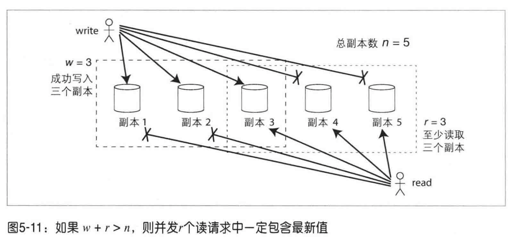

当客户端与集群的网络断开时，客户端仅能连接到一部分节点，此时无法满足w和r的节点数要求，导致无法正常工作，此时的选择是：要么返回错误，要么可以采用sloppy quorum方案，即配置一些冗余的节点，将写请求发送到这些节点上，等网络恢复后，临时节点再将数据转发到原始节点上。这种方式可以提高集群的可用性，但是有可能读到旧值。

无主节点复制可以很好的满足高可用和低延迟的要求，但是它同样面临并发写冲突的问题。这里的解决方案是引入版本变量，首先要明确的是两个操作A和B是否并发，并不是以时间为判断标准的，当一个操作可能影响另一个操作时，那它们就不是并发的；而它们互相并不影响时，就可以认为是并发的。

下图是一个单节点并发写入的例子，系统使用版本来解决并发写冲突的问题，每次客户端写入时都需要先读取，写入时需要传递给服务器几个信息：之前读到的版本号、读到的值、合并后的值。服务器收到写请求后会覆盖所有低于该版本的值，但是高于该版本的值会被保留，因为这些值来自其他的客户端写，属于是并发写。

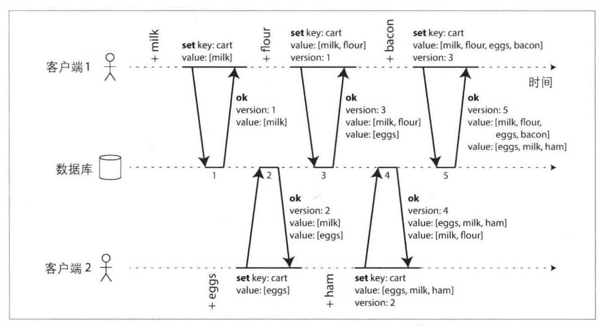

客户端可能会读到多个值，此时需要在客户端内部去解决冲突的问题。

将上面的思路推广到无主节点复制，当每个副本均接收写入时，需要为每个副本和主键都定义一个版本号，每个副本在处理写入时增加自己的版本号，并且处理冲突。所有副本的版本号集合即版本矢量。

当读取数据时，数据库会将版本矢量返回给客户端，由应用程序来读到所有的值并完成合并，该技术可以很好的处理并发写冲突的问题。

# 数据分区

数据分区的目的：突破数据存储瓶颈，增加可扩展性，并且将查询负载分散到多个分区，提升性能

实际应用中，常常把复制和分区结合起来：

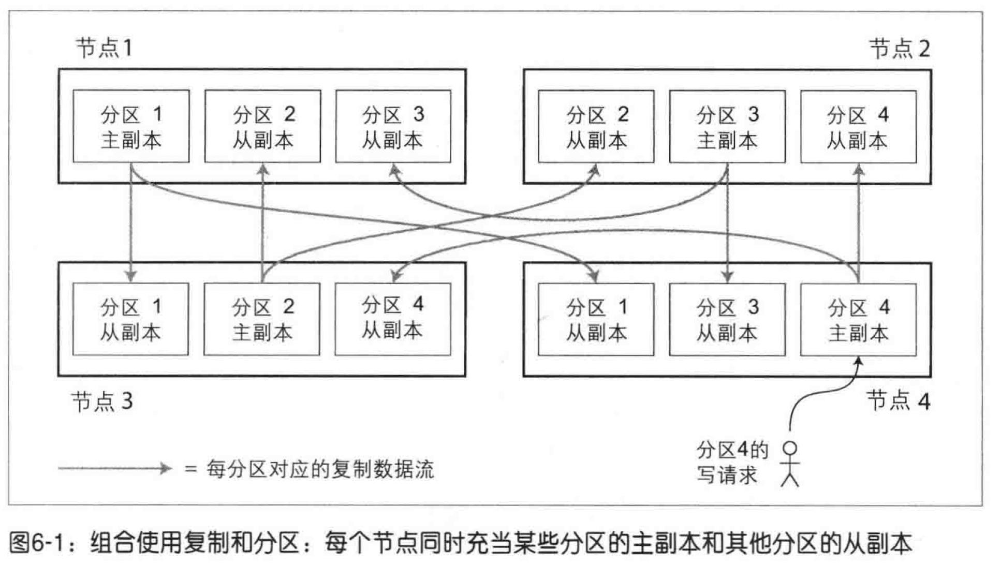

## 分区与二级索引

数据分区的两种基本方式：

* 按区间分区：例如A-N开头放分区1，O-Z开头放分区2，如果每个分区内支持按关键字排序，那么这种方式可以很好的支持区间查询。如果某个分区的数据成为热点，则需要加入其他的影响因素，例如除了首字母外加上时间，平衡负载
* 哈希分区：为每个分区配置一个哈希范围，关键字根据其哈希值所属范围放入对应的分区。这种方法的优点是分布均匀，缺点是区间查询不方便

当出现某个key变成热点的时候，此时会出现所有请求被路由到一个分区的情况。大多数系统无法自动消除这种高度倾斜的负载，一般是通过给热点关键字的开头或者结尾加一个随机数，从而分配到不同的分区，但是这种方式读取时需要合并所有分区的值

二级索引分区的两种形式：基于文档的分区和基于词条的分区

基于文档的分区：各个分区完全独立，各自维护自己的二级索引，它也被称为本地索引。查询时需要查询所有分区的数据然后合并结果

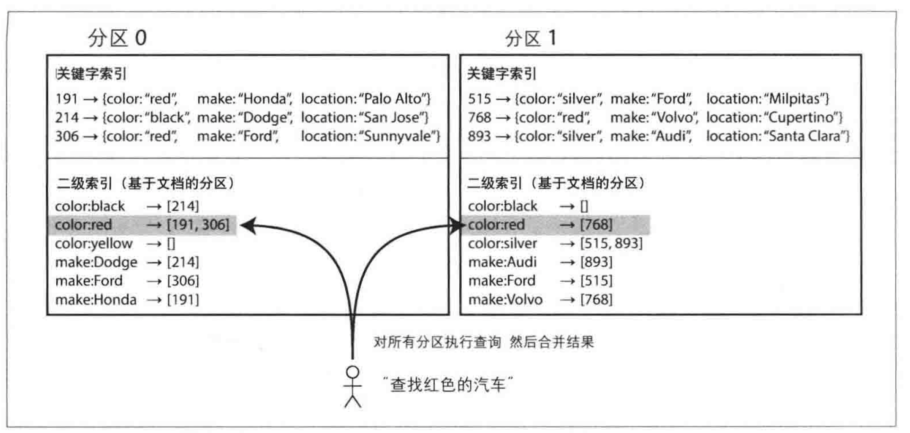

基于词条的分区：即全局二级索引，给二级索引构建全局索引，这些二级索引也需要分区，且可以采用不同的分区策略。它是直接以待查找的关键字建立的索引。它的读取更高效，只需要查询一个分区即可。但是写入时，则需要同时更新多个二级索引的分区，需要分布式事务支持。实际中往往这种更新是异步的，即写入后不能马上从二级索引中查到。

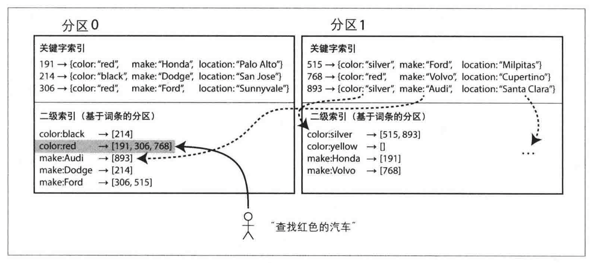

有些数据库仅支持kv类型，此时就需要应用层创建从值到key的映射来实现二级索引。使用这种方式时要注意保证索引和原数据库中的数据一致，如果出现并发或者写入一半，都会导致无法使用。

## 分区再平衡

随着时间推移，或许是查询负载增加，或者数据规模增加，此时需要将数据和请求从一个节点转移到另一个节点，这个过程就是分区再平衡。它需要满足几个条件：

* 平衡后，负载和数据依然保持均匀分布
* 再平衡执行过程中，数据库还能正常地提供读写服务
* 避免不必要的数据迁移，尽量减少网络和磁盘IO的占用

一致性哈希是分区再平衡的经典理论，但是实际应用中效果不是很好，下面介绍几种常用的方式：

1、提前设置大量固定数量的分区。

例如对于一个10节点的集群，一开始就设置1000个分区，让每个节点承担100个分区。如果集群新添加了一个节点，可以从现有的节点中转移几个分区，直到达到全局平衡：


整个过程分区的总数量保持不变，唯一改变的只有key到分区的映射关系。这种方式比较简单，平衡过程中也可以处理读写请求。如果数据集的总规模不确定或者可变，就不太好确定最初的分区数。

2、动态分区

一些数据库支持动态分区。当分区的数据增长到一个阈值时，它就拆分为两个分区；相反，如果分区的数据被删除，它就会与相邻分区进行合并。例如HBase，它完成分区文件的传输主要依赖HDFS。

这种方式的优点是可以自动适配数据总量，但是当初期数据较少的时候，可能仅只有一个分区，其他节点都处于空闲状态，此时需要预制一部分分区。

有些动态分区策略也会按照每个节点具有固定数量的分区来分配。总数据量不变的情况下，当节点数增加时，分区则会调整的更小。

分区再平衡的开销比较大，所以一般需要运维人员手工处理，有些数据库可以生成分配方案，仅需要确认即可。

## 请求路由

请求路由的几种方案：

1、允许客户端直连节点，如果节点恰好保存对应分区则处理，否则将请求转移到其他节点

2、所有的请求都需要先经过路由层，由路由层统一转发到对应节点

3、客户端本身感知分区和节点的关系，请求可以直接发到对应节点

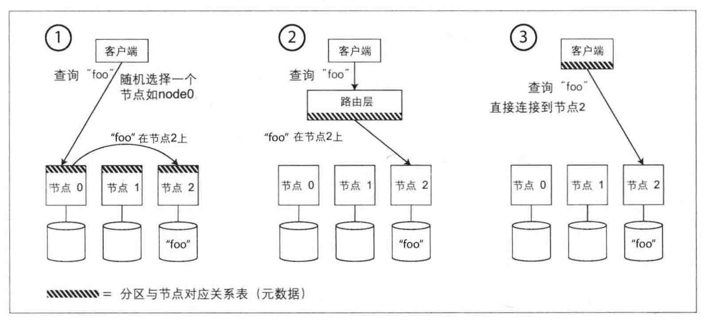

无论哪种方案都需要感知分区和节点之间的关系变化。很多系统都使用zk来存储节点和分区的关系，当关系发生变化时，由zk来主动通知，此时就可以使路由信息保持最新状态。

还有一些系统使用gossip协议来在节点之间同步集群状态的变化，这种方式比较复杂，但是摆脱了对zk外部服务的依赖。

# 事务

事务ACID中比较特殊的是一致性：数据更改应该符合对应应用的恒等条件，如账户的扣减和另一个账户的新增保证相等，事务从开始执行到结束，需要从一个一致性状态过渡到另一个一致性状态，数据库可以提供唯一性约束等保证一致性，但维护一致性主要依赖于应用程序，而不是数据库本身

事务执行失败时重试虽然简单，但是也有缺点：如果事务实际已经执行成功，只是返回给客户端的消息在网络传输时发生意外，在客户端的角度来看是失败，此时重试可能导致重复执行

## Read committed

Read committed是最基本的数据库隔离级别，它能防止脏写和脏读

实现Read committed的方法：

* 防止脏读：数据库维护多个版本数据，在事务提交之前其他读操作读旧值，提交后读新值
* 防止脏写：事务想要修改某行时，先获取行锁，直到事务结束才释放锁

## Repeatable read

Repeatable read可以防止不可重复读，实现在一个事务中所有查询返回相同的结果。不可重复读虽然在一个事务中读到了不同的结果，但是却是数据库最新的值。

Repeatable read的应用场景：

* 备份场景：需要复制整个数据库，要花很长时间完成，这个过程不能得到旧版+新版混合数据，这可能导致数据永久不一致
* 数据分析：需要扫描大半个数据库，如果查询结果来自不同时间点，则毫无意义

Repeatable read的每个事务都从一致性快照中读取，实现Repeatable read的方式通常是MVCC

## 幻读&Serializable

一个幻读的例子：

有一个会议预定系统，要求同一时间、同一个会议室不能被预定两次。当有人想要预定时，必须首先检查是否有冲突的预定，如果没有再提交申请。预定会议时，需要开启一个事务：

* 检查是否有冲突的预定：查询会议表里面是否有该时间范围内的会议

```sql
SELECT COUNT(*) FROM bookings
WHERE room id = 123 AND
end_time >'2015-01-01 12:00' AND start_time <'2015-01-01 :13:00'
```

* 如果没有冲突，则新建会议记录：

```sql
INSERT INTO bookings
(room_id, start_time, end_time, user_id)
VALUES (123, '2015-01-01 12:00', '2015-01-01 13:00', 666);
```

并发执行这个逻辑可能会出现事务1的写入操作影响了事务2查询操作的结果，这种一个事务的写入改变另一个事务的查询的现象，称为幻读。

在这个例子中，即使加锁也无法避免出现并发问题，因为预定会议前，表中没有对应的记录。

一个解决方案是人为引入一些可以加锁的行对象，如新建一个表：时间-房间表，创建好所有可能的最小时间范围如15min和房间的组合，在查询时就可以查到特定记录并加锁。这个表仅仅用于方便加锁，防止重复预定，并没有其他的业务含义。但该方案比较复杂，容易出错。

Serializable可以防止幻读，实现的途径主要有以下几种：

* 串行执行：适用于每个事务执行速度很快，且单核CPU可以满足吞吐量要求的场景
* 两阶段加锁：即使用共享锁和独占锁来控制对同一个对象的访问，第一阶段是在事务执行前获取锁，第二阶段是事务结束时释放锁。使用谓词锁（一种逻辑锁，锁定一组满足特定条件的记录）和next-key lock（锁定某个区间，或者回退到给所有间隙加锁）来防止其他事务影响本事务
* 可串行化的快照隔离：一种乐观并发控制，尚未成熟

# 分布式系统的挑战

## 不可靠的网络

构建大规模系统的几个思路：

* 高性能计算集群：包含成千上万个CPU的超级计算机构成一个庞大的集群，用于计算密集型的任务
* 云计算：通用计算机，用普通网络连接，弹性按需分配资源
* 传统企业构建的集群介于两者之间

高性能计算集群采用专用硬件，每个节点的可靠性很高，节点间主要通过共享内存或者远程内存直接访问RDMA等技术进行通信。通常会定期对任务状态进行快照，然后保存在持久存储上。当某节点出现故障，解决方案就是简单地停止整个集群的任务，等故障恢复后将快照恢复然后继续执行，它更像是单节点系统

云计算则有很多在线系统需要时刻对外提供服务，不能简单的停止集群，而且通用计算机的成本较低，可靠性也较差，大型集群几乎每时每刻都有故障节点存在，需要处理部分失效的情况，一般会支持滚动升级

大多数集群节点之间直接依靠不可靠的网络互相传递数据，由于网络的不可靠，发送者甚至不清楚数据是否已经发送，只能选择让接收方回复消息，但回复也有可能丢失和延迟。一般发送者在等待一段时间后，仍然没有收到回复会认为是数据没有到达，但此时的可能有以下几种情况：

* 远程节点已经处理了请求，但是回复的消息在网络中丢失或者延迟了
* 请求依然在队列中排队，即使发送者放弃了，但最终请求也会发送

现实中无法简单的通过增加冗余网络设备来降低网络故障的几率，因为无法有效防范人为配置错误。

网络上数据延迟的原因可能有以下这些：

* 网络交换机有队列机制，如果网络负载过重，数据包必须排队等待一段时间，数据量过大达到队列上限后，数据包还会被丢弃
* 目标机器比较繁忙，网络数据包会在操作系统层级进行排队，直到它被应用程序处理
* TCP根据网络情况主动调整自己发送数据的速率，所以数据在发送方也需要排队处理。数据传送超时后，TCP还会触发重传
* 在虚拟化环境，CPU核会切换虚拟机，这导致操作系统会暂停几十毫秒，这段时间虚拟机无法从网络中接收任何数据，网络数据包会在虚拟机管理器中排队缓冲

如果网络层可以在规定的时间内保证完成数据包的发送，而不是可能无限延迟，那分布式系统设计就会简单很多，这就引入了同步和异步网络的概念：

* 同步网络：类似传统的固定电话网络，一旦电话通路建立，整个线路上就会为其分配固定大小的通信链路，保证它的通信不会受到影响。由于不存在排队机制，端到端延迟是固定的
* 异步网络：现存的基于TCP/IP的网络，TCP数据包会尝试使用所有可用的网络贷款，能传输任意大小的数据块，尽力在最短的时间内完成传送

异步网络的好处是可以承受突发流量，有很多请求是无法事先预估占用带宽的，如果采用事先分配的方式，分配值的大小难以确定，预估值太低传输速度会太慢，太高就会导致无法分配完成，相比之下TCP动态调整传输速率可以充分利用所有可用的网络带宽。

延迟的确定性是以降低总体资源利用率为代价的，这就是目前大部分网络都是异步网络的原因。

CPU也是类似的情况，多个线程共享CPU，以及为每个线程静态分配固定的CPU执行周期相比，前者能更好的利用硬件，这也就是虚拟化技术背后的原因

## 不可靠的时钟

时间是分布式系统中一个关键的问题。

网络上的每台机器都有自己的时钟硬件设备，通常是石英晶体振荡器，每台机器都维护自己本地的时间版本，它可能比其他机器稍快或者稍慢。常见的做法是使用网络时间协议（Network Time Protocol, NTP），它使机器从一组专门的时间服务器来同步时钟信息，时间服务器则从精度更高的时间源（如GPS接收机）获取高精度时间

计算机内部两种不同的时钟：

* 墙上时钟Wall Clock：根据某个日历返回当前的日期和时间，例如Java中的System.currentTimeMillis返回从1970年1月1日以来的秒数和毫秒数。墙上时钟是需要和时间服务器同步的，如果本地时钟远远快于NTP服务器，强行重置之后会跳回到先前的某个时间点
* 单调时钟Monotonic Clock：它用于测量时间间隔，例如Java中的System.nanoTime，它的绝对值没有任何含义。单调时钟保证它们总是单调递增的。如果服务器有多路CPU，则每个CPU可能有单独的计时器，且不与其他CPU进行同步。由于应用程序的线程可能会调度到不同的CPU上，此时操作系统会补偿多个计时器之间的偏差，从而为应用层提供统一的单调递增计时。如果NTP检测到本地石英比时间服务器上更快或者更慢，NTP会调整本地石英的震动频率，但是不会直接调整单调时钟

墙上时钟是需要根据NTP服务器作出调整的，因为机器中的石英钟不够精确，存在漂移现象，这主要取决于机器温度，谷歌假设每30秒与服务器同步一次的话，最大偏差为6ms；一天同步一次最大误差17s

实践过程可能会出现一些奇怪的问题：

* 本地时钟被重置，在应用程序的视角来看就是时间突然倒退或者跳跃
* NTP同步受限于网络环境，当通过互联网进行同步时，可能会产生至少35ms的误差，最坏时可能超过1s
* NTP服务器本身可能会有故障，所以一般都是部署NTP服务器集群
* 闰秒会产生一分钟59秒或者61秒的奇怪现象
* 在虚拟机中，硬件时钟也是虚拟化的，当多个虚拟机共享一个CPU核时，每个虚拟机可能会出现几十ms的暂停，从应用程序的角度来看，时钟突然向前发生了跳跃
* 用户可能修改时钟时间，为了绕开应用的限制，获取到的时钟可能是过去的时间，也可能是将来的

时钟问题一旦发生，后果可能并不是软件立即崩溃，而更多是分布式系统中事务顺序混乱造成的隐形数据丢失。完全依赖时钟来判断先后发生顺序是不可靠的，两个节点完全可能各自独立的产生一样的时间戳。

时钟读取时，其实不应该是一个精确的时间点，而是一个带有置信区间的时间范围。谷歌在这方面有一些实践，它会精确统计时钟的误差，当A时间点的时间范围完全小于B时间点的时间范围时，此时就可以说A早于B发生，以此来处理分布式系统中的并发事务顺序问题。

在具体实践中，如果应用对时钟比较敏感，可以仔细监控所有节点上的时钟偏差，如果某个节点的时钟漂移超出上限，应该将其从集群中移除，保证在发生问题前尽早处理。

## 进程暂停

机器突然出现的进程暂停，可能也是实际应用开发中比较容易被忽略的一个点。在加锁、故障转移等场景，如果在应用代码中假定某段简单逻辑只需要在x秒内完成，可能就会因为进程突然暂停导致这段代码没有正常生效。

进程暂停的原因可能有：

* 很多编程语言都有垃圾收集器，有时会暂停所有正在运行的线程，甚至暂停几分钟。即使是所谓的并行收集器也不能完全并行，还是需要时不时地停止线程。GC调优可以缓解该问题，但从应用的角度来看，还是需要防范最差的情况
* 虚拟化环境中的实时迁移，这需要暂停虚拟机所有执行进程，并将内存状态保存到硬盘中，然后迁移到另一个主机，重新加载虚拟机并运行
* 用户设备进程暂停也可能是因为设备进入了休眠状态
* 虚拟机管理程序需要在多个虚拟机之间分配CPU时间，以便它们能够共享物理机器的资源。当虚拟机管理程序切换到另一个虚拟机时，这意味着虚拟机管理程序正在停止当前正在运行的虚拟机的执行，并开始执行另一个虚拟机的代码，这个过程需要保存上一个虚拟机的状态，然后加载下一个虚拟机的状态并开始执行，此时正在运行的线程可能会在代码的任意位置被暂停，这种被其他虚拟机中断的CPU时间被称为窃取时间。如果机器负载很高，可能需要等待一段时间后才能运行
* 操作系统执行线程上下文切换
* 如果应用程序执行同步磁盘操作，线程就需要暂停，直到操作完成
* 如果操作系统配置了基于磁盘的内存交换分区，则内存访问引发的缺页中断可能导致需要从磁盘中读取内存页，从应用程序视角来看，线程频繁的因IO操作被暂停
* 信号机制，如shell中按下ctrl+z

综上所述，假定一段程序的执行时间是非常危险的事情。

在某些软件中，如果指定时间内无法响应后果会非常严重，如军事、安全、金融相关系统，这些系统中必须要求软件有一个响应上限值，这就是硬实时系统。提供实时保证需要多个层面的支持：

* 实时操作系统保证进程的调度时间可控
* 软件中引用的库函数必须保证执行时间
* 动态内存分配需要被禁止，不能出现垃圾收集器

综上，这种系统严重限制了编程语言、操作系统、工具的范围，开发成本很高，所以一般只在对安全至关重要的嵌入式设备中。在大多数系统中，保证低延迟会拉低吞吐量，降低整体软件利用率。

垃圾回收方面也有一些思路可以保证性能：

* 将因GC暂停的节点视为临时离线，请求不会发送到该节点
* 只对短期对象进行回收，对长期对象采用定期重启的策略来保证不会暂停线程

## fencing令牌

一个因GC而造成文件并发修改的例子：

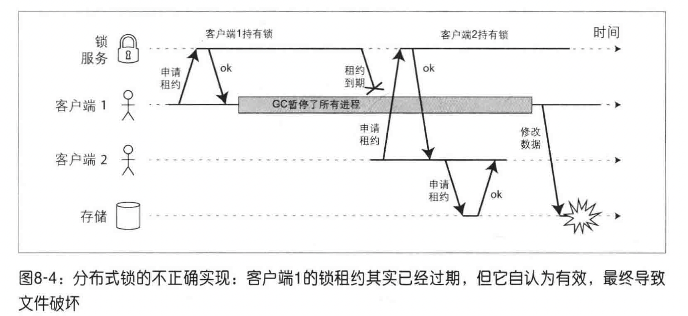

存储系统需要保证同一个时刻，只能有一个客户端访问。在访问存储系统之前，客户端需要从锁服务中获取租约，然后再访问。当持有租约的客户端进程暂停后，另一个客户端已经获取了锁并开始访问存储系统，此时原来的客户端从暂停中醒来，继续访问存储系统，此时就出现了数据被破坏的情况。

这种情况下必须确保过期的节点不能影响其他正常部分。常用的解决方案是fencing令牌：每次锁服务在授予锁的时候，同时还会返回一个令牌，该令牌每获取一次就会递增，客户端每次向存储系统发送写请求时，都必须包含所持有的fencing令牌。当存储服务器发现请求来自更旧的令牌，就会拒绝请求：

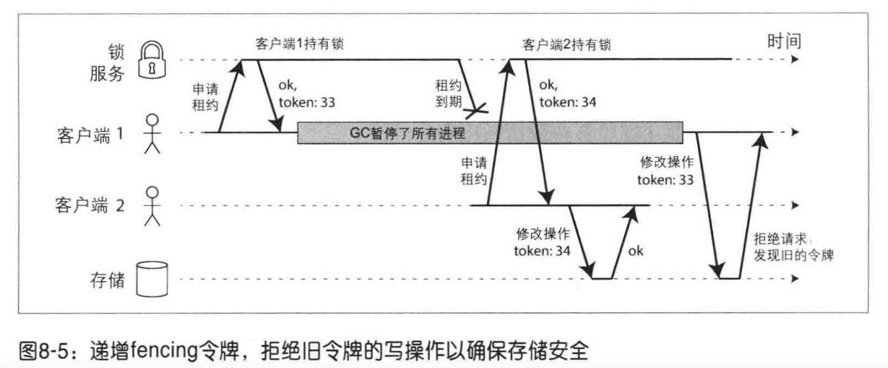

如果资源本身不支持额外的令牌检查，可以采取一些技巧，例如将令牌信息内嵌在文件名中。

# 派生数据系统

存储系统按照层次可以分为两类：

* 源数据系统：新数据进入系统时，首先被记录到源数据系统。如果多个数据副本之前有差异，以源数据系统为准
* 派生数据系统：从源数据系统中获取已有数据并经过转换、处理后的结果。如果派生数据丢失，可以从数据源进行重建，如缓存系统等

派生数据是对现有数据的复制，在构建应用系统时，可以使用户从多个视角来观察数据

存储引擎只是一个工具，如何使用取决于开发者，开发者既可以把同一个存储工具当做源数据系统，也可以将它作为派生数据系统

派生数据系统的写入动作一般是源于对源数据库变更事件的处理，然后按相同的顺序进行插入，一般不会向两个系统先后写入同一个数据，这会导致严重的并发问题，导致数据的永久不一致：

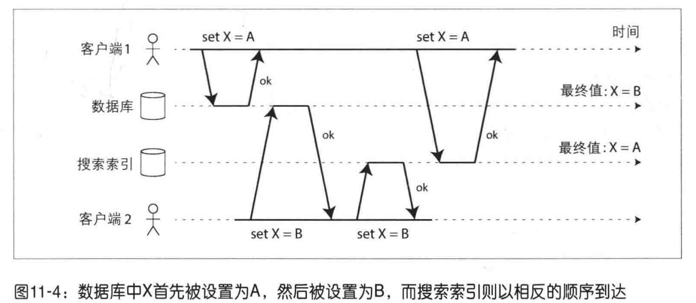

三种不同类型的系统：

* 在线服务：服务等待客户请求或指令的到达，当收到请求或指令时，服务试图尽可能快地处理它，并返回一个响应，响应时间是衡量服务性能的主要指标
* 批处理系统（离线系统）：接收大量的输入数据，运行一个作业并产生输出数据。批量作业通常会定期执行，执行时间从几分钟到几天不等，它的性能主要由吞吐量来衡量
* 流处理系统（近实时系统）：它处理实时数据、无界输入流，实时计算并产生结果

## 批处理

MapReduce作业一般只包含一个map和一个reduce，只有当作业完成时它的输出才算有效。当多个MapReduce任务串联在一起时，作业必须只有在之前的作业完成后才能开始，为了处理这些作业执行的依赖关系，诞生了很多Hadoop工作流调度器，如Oozie、Pig、Hive等

MPPDB是一种大规模并行处理数据库，它和MapReduce的区别：

* MPPDB专注于在一个机器集群上并行执行SQL查询分析，而MapReduce是一个可以运行任意分布式程序的通用系统
* MPPDB存储的数据必须是关系系数据，而与MapReduce结合使用的HDFS中可以存储原始的字节，它可以是任何格式的数据，因此MapReduce也经常被用于实现ETL进行数据清洗
* 在容错方式上，MPPDB针对一个节点的查询崩溃，通常会中止整个查询，这是由于查询通常只运行几秒钟或几分钟，重试的代价较小；MapReduce的重试成本较高，所以它会复用之前任务记录在磁盘上的数据，进行自动重试

MapReduce的主要缺陷就是：它自身任务是无状态的，两个任务之间只能通过前一个任务的输出结果来交互，后一个任务必须等待前一个任务的结束，存在很多无效的mapper和在多节点被复制分发的、不可控的临时数据，这些特点导致处理大型复杂任务时，MapReduce显得非常繁琐

而像Spark、Flink这样的分布式数据流引擎，可以将任务拆解为更细的角色，而不仅仅是mapper和reduce，可以自由选择中间状态的存储和管理，进一步明确数据依赖关系，深度优化计算和存储

## 流处理

消息代理其实就是一种针对处理消息流而优化的数据库：生产者将消息写入代理，消费者通过从消息代理那里读取消息来接收信息。一些消息代理甚至使用两阶段提交的分布式事务，这和数据库非常相似，它们之间的差异有：

* 数据库通常会一直保存数据，直到它被显式删除，而消息代理不适合长期的数据存储，一般有过期时间，或者被消费后就会自动删除
* 数据库通常支持二级索引和各种搜索数据的方式，而消息代理没有那么自由，它只有几种特定的消费模式

流式join的几种形式：

* 流与流join（窗口join）：一个典型的例子是将用户产生的搜索事件流和点击事件流结合在一起，就能对搜索质量进行评估，因为流是无法保存历史所有状态的，所以一般需要限制窗口大小，如搜索和单击的间隔不超过1h。为了实现这种类型的join，还需要维护状态，以便事件流到达时能快速根据索引查询到匹配的结果
* 流与表join：一个典型的例子是用户会源源不断的产生用户事件流，在流处理中join之后，输出追加了用户信息的活动事件流，而用户信息被保存在数据库中。如果直接在流处理中查询数据库，可能会导致数据库过载，常用的方法一般是将数据库副本加载到流处理器中，通过捕获数据库变更流保持副本与源数据的同步，在本地直接进行join操作
* 表与表join：在流处理中动态维护视图，对不同的视图进行join操作
