# 基础架构

## 一些重要概念

架构的定义和几组容易混淆的概念有关：

* 系统与子系统
* 模块与组件
* 框架与架构

### 系统与子系统

系统泛指由一群有关联的个体组成，根据某种规则运作，能完成个别元件不能单独完成的工作的群体。 

其中的关键内容：

* 关联：系统是由一群有关联的个体组成的，没有关联的个体堆在一起不能成为一个系统。 
* 规则：系统内的个体需要按照指定的规则运作，而不是单个个体各自为政。 规则规定了系统内个体分工和协作的方式。 
* 能力：系统能力与个体能力有本质的差别，系统能力不是个体能力之和，而是产生了新的能力。 

子系统也是由一群有关联的个体所组成的系统，多半会是更大系统中的一部分。 

一个系统的架构，只包括顶层这一个层级的架构，而不包括下属子系统层级的架构。所以微信架构，就是指微信系统这个层级的架构。当然，微信的子系统，比如支付系统，也有它自己的架构，同样只包括顶层。

### 模块与组件

模块和组件都是系统的组成部分，只是从不同的角度拆分系统而已：

* 从业务逻辑的角度来拆分系统后，得到的单元就是“模块” ，划分模块的主要目的是职责分离 
* 从物理部署的角度来拆分系统后，得到的单元就是“组件” ，划分组件的主要目的是单元复用

以一个最简单的网站系统来为例。假设我们要做一个学生信息管理系统，这个系统从逻辑的角度来拆分，可以分为“登录注册模块”“个人信息模块”和“个人成绩模块”；从物理的角度来拆分，可以拆分为Nginx、Web服务器和MySQL。 

设计架构时，主要就从这两个方面入手拆分：

* 从业务逻辑的角度把系统拆分成一个个模块角色
* 从物理部署的角度把系统拆分成组件角色

### 框架与架构

软件框架（Software framework）通常指的是为了实现某个业界标准或完成特定基本任务的软件组件规范，也指为了实现某个软件组件规范时，提供规范所要求之基础功能的软件产品。 

其中的关键部分：

* 框架是组件规范：例如，MVC就是一种最常见的开发规范，类似的还有MVP、MVVM、J2EE等框架。
* 框架提供基础功能的产品：例如，Spring MVC是MVC的开发框架，除了满足MVC的规范，Spring提供了很多基础功能来帮助我们实现功能，包括注解（@Controller等）、Spring Security、Spring JPA等很多基础功能。

软件架构指软件系统的“基础结构”，创造这些基础结构的准则，以及对这些结构的描述。 

两者的区别：框架关注的是“规范”，架构关注的是“结构”

有很多时候两个词是可以互换的，原因就在于架构的定义中，有基础结构的概念，它可以从不同角度来分解，例如可以从业务逻辑角度分解，也可以从物理部署的角度分解，当从开发规范的角度分解时，架构和框架的意思就是相同的了。

以学生管理系统为例，如果是从业务逻辑的角度分解，它的架构是这样的：

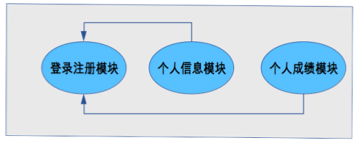

从物理部署的角度分解，“学生管理系统”的架构是： 

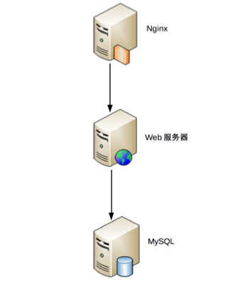

从开发规范的角度分解，“学生管理系统”可以采用标准的MVC框架来开发，因此架构又变成了MVC架构： 

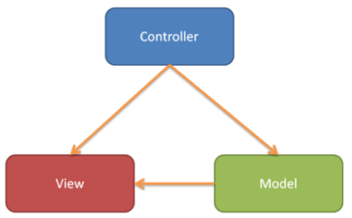

这些“架构”，都是“学生管理系统”正确的架构，只是从不同的角度来分解而已。

综上，框架是一整套开发规范，架构是某一套开发规范下的具体落地方案，包括各个模块之间的组合关系以及它们协同起来完成功能的运作规则。

### 4R架构定义

软件架构指软件系统的顶层（Rank）结构，它定义了系统由哪些角色（Role）组成，角色之间的关系（Relation）和运作规则（Rule）

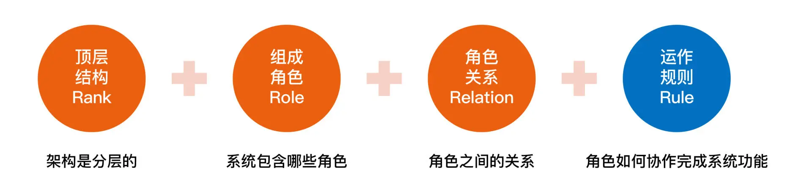

因为这个定义中的4个关键词，都可以用R开头的英文单词来表示，分别是Rank、Role、Relation和Rule，所以把定义简称为“4R架构定义” 

第一个R，Rank。它是指软件架构是分层的，对应“系统”和“子系统”的分层关系。通常情况下，我们只需要关注某一层的架构，最多展示相邻两层的架构，而不需要把每一层的架构全部糅杂在一起。无论是架构设计还是画架构图，都应该采取“自顶向下，逐步细化”的方式。以微信为例，Rank的含义如下所示： 

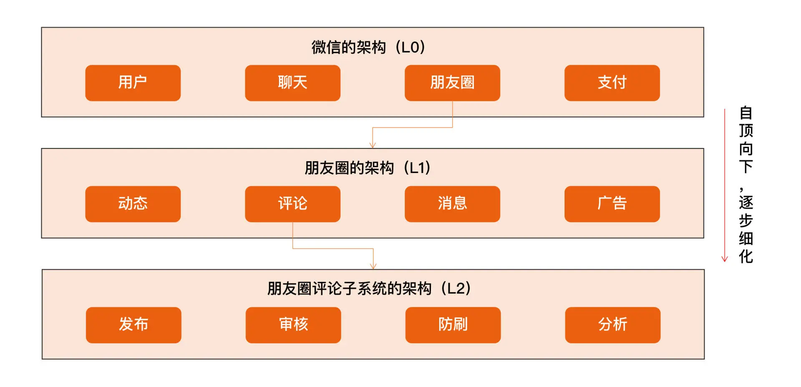

其中L0\L1\L2指层级，一个L0往下可以分解多个L1，一个L1可以往下分解多个L2，以此类推，一般建议不超过5层（L0~L4） 

第二个R，Role。它是指软件系统包含哪些角色，每个角色都会负责系统的一部分功能。架构设计最重要的工作之一就是将系统拆分为多个角色。最常见的微服务拆分其实就是将整体复杂的业务系统按照业务领域的方式，拆分为多个微服务，每个微服务就是系统的一个角色。

第三个R，Relation。它是指软件系统的角色之间的关系，对应到架构图中其实就是连接线，角色之间的关系不能乱连，任何关系最后都需要代码来实现，包括连接方式（HTTP、TCP、UDP和串口等）、数据协议（JSON、XML和二进制等）以及具体的接口等。 

第四个R，Rule。它是指软件系统角色之间如何协作来完成系统功能。 系统能力不是个体能力之和，而是产生了新的能力。 新能力是如何完成的，哪些角色参与了这个新能力，这就是Rule所要表达的内容。在架构设计的时候，核心的业务场景都需要设计Rule。 

在实际工作中，为了方便理解，Rank、Role和Relation是通过系统架构图来展示的，而Rule是通过系统序列图（System Sequence Diagram）来展示的。 

以一个简化的支付系统为例，支付系统架构图如下所示： 

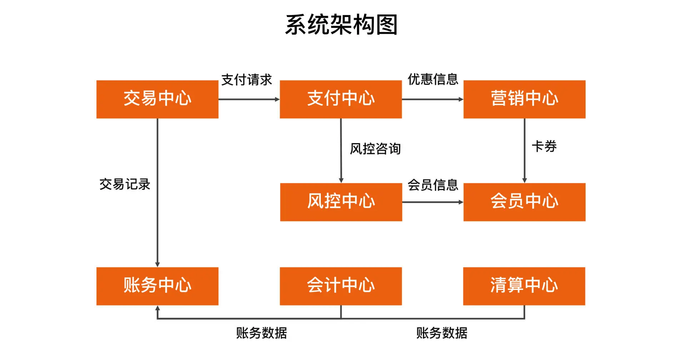

“扫码支付”这个核心场景的系统序列图如下所示：

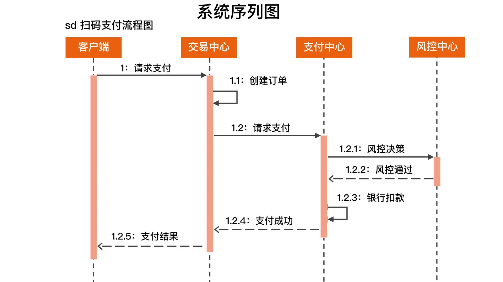

## 架构设计的历史

### 软件开发进化史

1、机器语言（1940年之前）

直接使用二进制码0和1来表示机器可以识别的指令和数据，机器语言的问题：难写、难读、难改

2、汇编语言（20世纪40年代）

汇编语言又叫“符号语言”，用助记符代替机器指令的操作码，用地址符号（Symbol）或标号（Label）代替指令或操作数的地址。

汇编语言和机器语言分别如下：

~~~
机器语言：1000100111011000
汇编语言：mov ax,bx
~~~

mov ax,bx语句基本上就是“将寄存器BX的内容送到AX”的简化版的翻译。

汇编语言虽然解决了机器语言读写复杂的问题，但本质上还是面向机器的，程序员必须了解CPU指令、寄存器、段地址等底层的细节。汇编语言的编写非常复杂，而且不同CPU的汇编指令和结构是不同的。

3、高级语言（20世纪50年代）

高级语言的出现，让程序员不需要关注机器底层的低级结构和逻辑，而只要关注具体的问题和业务即可。 一个简单的加法不再需要十几行的汇编语言。

此外，通过编译程序的处理，高级语言可以被编译为适合不同CPU指令的机器语言。 程序员只要写一次程序，就可以在多个不同的机器上编译运行，无须根据不同的机器指令重写整个程序。 

4、第一次软件危机与结构化程序设计（20世纪60年代~20世纪70年代）

随着软件的规模和复杂度的大大增加，20世纪60年代中期开始爆发了第一次软件危机，典型表现有软件质量低下、项目无法如期完成、项目严重超支等，因为软件而导致的重大事故时有发生。 

第一次软件危机诞生了软件工程和结构化程序设计方法，并产生了第一个结构化的程序语言Pascal。

结构化程序设计的主要特点是抛弃goto语句，采取“自顶向下、逐步细化、模块化”的指导思想。 

结构化程序设计本质上还是一种面向过程的设计思想，但通过“自顶向下、逐步细化、模块化”的方法，将软件的复杂度控制在一定范围内，从而从整体上降低了软件开发的复杂度。 

5、第二次软件危机与面向对象（20世纪80年代）

第一次软件危机的根源在于软件的“逻辑”变得非常复杂，而第二次软件危机主要体现在软件的“扩展”变得非常复杂。 

结构化程序设计虽然能够缓解软件逻辑的复杂性，但是对于业务变化带来的软件扩展却无能为力，在这种背景下，面向对象的思想开始流行起来。

第二次软件危机促进了面向对象的发展。面向对象真正开始流行是在20世纪80年代，主要得益于C++的功劳，后来的Java、C#把面向对象推向了新的高峰。到现在为止，面向对象已经成为了主流的开发思想。

### 软件架构出现

随着软件系统规模的增加，计算相关的算法和数据结构不再构成主要的设计问题；当系统由许多部分组成时，整个系统的组织，也就是所说的“软件架构”，导致了一系列新的设计问题。 

这段话很好地解释了“软件架构”为何先在Rational或者Microsoft这样的大公司开始逐步流行起来。因为只有大公司开发的软件系统才具备较大规模，而只有规模较大的软件系统才会面临软件架构相关的问题，例如： 

- 系统规模庞大，内部耦合严重，开发效率低；
- 系统耦合严重，牵一发动全身，后续修改和扩展困难；
- 系统逻辑复杂，容易出问题，出问题后很难排查和修复。

软件架构的出现有其历史必然性：

* 20世纪60年代第一次软件危机引出了“结构化编程”，创造了“模块”概念 
* 20世纪80年代第二次软件危机引出了“面向对象编程”，创造了“对象”概念 
* 到了20世纪90年代“软件架构”开始流行，创造了“组件”概念。 

“模块”“对象”“组件”本质上都是对达到一定规模的软件进行拆分，差别只是在于随着软件的复杂度不断增加，拆分的粒度越来越粗，拆分的层次越来越高。 

## 架构设计的目的

关于架构设计的目的，常见的误区有： 

* 架构设计是必须的：其实并不是，公司的初始产品可能没有架构设计，上线后运行也还不错
* 架构设计能提升开发效率：其实并不是，架构设计毕竟需要投入时间和人力，这部分投入如果用来尽早编码，项目也许会更快。 
* 架构设计可以促进业务发展：架构和业务没有直接关系
* 为了高性能、高可用、可扩展，所以要做架构设计：有时不管业务场景，盲目追求高性能、高可用、高扩展，可能会造成架构设计无比复杂的情况

架构设计的真正目的：为了解决软件系统复杂度带来的问题。

明确了架构设计的真正目的，就可以回答下列问题：

* 这么多需求，从哪里开始下手进行架构设计呢？ 通过熟悉和理解需求，识别系统复杂性所在的地方，然后针对这些复杂点进行架构设计。 
* 架构设计要考虑高性能、高可用、高扩展？架构设计并不是要面面俱到，不需要每个架构都具备高性能、高可用、高扩展等特点，而是要识别出复杂点然后有针对性地解决问题。 
* 业界A公司的架构是X，B公司的方案是Y，两个差别比较大，该参考哪一个呢？ 理解每个架构方案背后所需要解决的复杂点，然后才能对比自己的业务复杂点，参考复杂点相似的方案。 

有些错误的决策也可以被识别出来：

* 我们的系统一定要做到每秒TPS 10万？如果系统的复杂度不是在性能这部分，TPS做到10万并没有什么用。 
* 淘宝的架构是这么做的，我们也要这么做？淘宝的架构是为了解决淘宝业务的复杂度而设计的，淘宝的业务复杂度并不就是我们的业务复杂度，绝大多数业务的用户量都不可能有淘宝那么大 
* Docker现在很流行，我们的架构应该将Docker应用进来？Docker不是万能的，只是为了解决资源重用和动态分配而设计的，如果我们的系统复杂度根本不是在这方面，引入Docker没有什么意义。 

下面来分析一个简单的案例，一起来看看如何将“架构设计的真正目的是为了解决软件系统复杂度带来的问题”这个指导思想应用到实践中：

假设我们需要设计一个大学的学生管理系统，其基本功能包括登录、注册、成绩管理、课程管理等。

当我们对这样一个系统进行架构设计的时候，首先应识别其复杂度到底体现在哪里：

* 性能：一个学校的学生大约1 ~ 2万人，学生管理系统的访问频率并不高，平均每天单个学生的访问次数平均不到1次，因此性能这部分并不复杂，存储用MySQL完全能够胜任，缓存都可以不用，Web服务器用Nginx绰绰有余。 
* 可扩展性：学生管理系统的功能比较稳定，可扩展的空间并不大，因此可扩展性也不复杂。 
* 高可用：学生管理系统即使宕机2小时，对学生管理工作影响并不大，因此可以不做负载均衡，更不用考虑异地多活这类复杂的方案了。但是，如果学生的数据全部丢失，修复是非常麻烦的，只能靠人工逐条修复，这个很难接受，因此需要考虑存储高可靠，这里就有点复杂了。我们需要考虑多种异常情况：机器故障、机房故障，针对机器故障，我们需要设计MySQL同机房主备方案；针对机房故障，我们需要设计MySQL跨机房同步方案。 
* 安全性：学生管理系统存储的信息有一定的隐私性，但不包含强隐私的信息，因此安全性方面只要做3个事情就基本满足要求了：Nginx提供ACL控制、用户账号密码管理、数据库访问权限控制。 
* 成本：由于系统很简单，基本上几台服务器就能够搞定，对于一所大学来说完全不是问题，可以无需太多关注。 

通过上面的分析，可以看到这个方案的主要复杂性体现在存储可靠性上，需要保证异常的时候，不要丢失所有数据即可（丢失几个或者几十个学生的信息问题不大），对应的架构如下： 

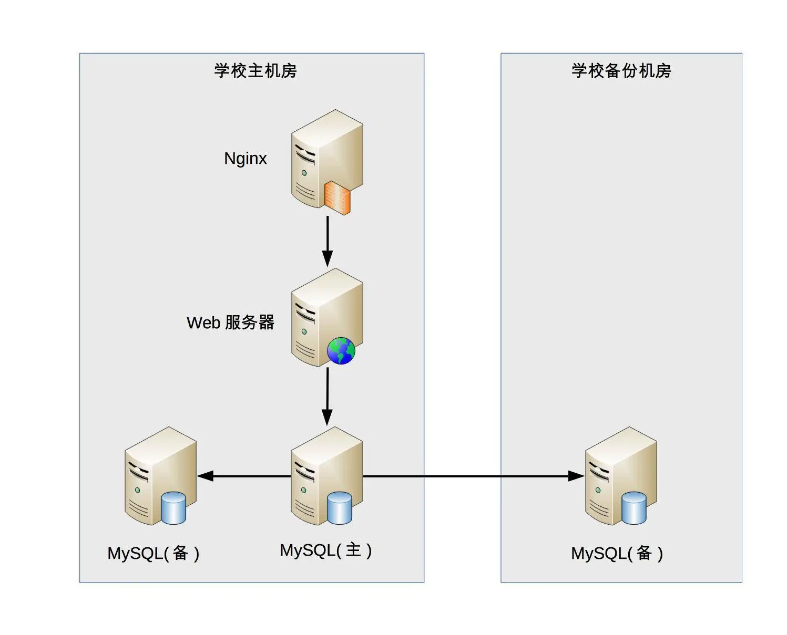

## 架构设计原则

编程和架构设计之间的不同在于：编程是确定的结果，而架构设计是不确定的，同样的一个系统，A公司和B公司做出来的架构可能差异很大，但最后都能正常运转，架构设计并没有像编程语言那样的语法来进行约束，更多的时候是面对多种可能性时进行选择。 

可是一旦涉及“选择”，就很容易让架构师陷入两难的境地，例如：

- 是要选择业界最先进的技术，还是选择团队目前最熟悉的技术？如果选了最先进的技术后出了问题怎么办？如果选了目前最熟悉的技术，后续技术演进怎么办？
- 是要选择Google的Angular的方案来做，还是选择Facebook的React来做？Angular看起来更强大，但React看起来更灵活？
- 是要选MySQL还是MongoDB？团队对MySQL很熟悉，但是MongoDB更加适合业务场景？
- 淘宝的电商网站架构很完善，我们新做一个电商网站，是否简单地照搬淘宝就可以了？

还有很多类似的问题和困惑，关键原因在于架构设计领域并没有一套通用的规范来指导架构师进行架构设计，更多是依赖架构师的经验和直觉。

下面列出的几个原则都要为生存让步，例如有时甲方会不顾业务需要，只要是业界流行的技术就要求在项目中采用，这种情况下可能不满足下面的几个原则，它可以称之为“架构约束”，即这不是架构师能够选择的，而是架构师必须遵守的。业务第一，先把订单签下来，才有后面的架构设计，如果硬要说甲方的要求不合理，不满足“架构设计三原则”，结果订单都拿不到，那是没有意义的。 这种情况下，就要尽可能使用原则来设计了，如在一些小的选型、决策上进行干预。如果是架构的基本需求或者约束必须被满足时，架构师此时的选择是采取什么样的方案能够更好的满足这些需求和约束。 

架构设计有几个重要的原则，有助于你做出最好的选择：

### 合适原则

合适原则简单来说就是：合适优于业界领先

优秀的技术人员都有很强的技术情结，当他们做方案或者架构时，总想不断地挑战自己，想达到甚至优于业界领先水平是其中一个典型表现，因为这样才能够展现自己的优秀，但现实是，大部分这样想和这样做的架构，最后可能都以失败告终。

再好的梦想，也需要脚踏实地实现，主要体现在下面几个方面：

1、将军难打无兵之仗：没那么多人，却想干那么多活，是失败的第一个主要原因。

2、罗马不是一天建成的：业界领先的很多方案，其实并不是一堆天才某个时期灵机一动，然后加班加点就做出来的，而是经过几年时间的发展才逐步完善和初具规模的。 阿里中间件团队2008年成立，发展到现在已经有十年了。我们只知道他们抗住了多少次“双11”，做了多少优秀的系统，但经历了什么样的挑战、踩了什么样的坑，只有他们自己知道，这些挑战和踩坑，都是架构设计非常关键的促进因素，单纯靠拍脑袋或者头脑风暴，是不可能和真正实战相比的。 

没有那么多积累，却想一步登天，是失败的第二个主要原因。

3、业务决定架构：很多人认为业界领先的方案都是天才创造出来的，但更多的时候，业界领先的方案其实都是“逼”出来的，“业务”发展到一定阶段，量变导致了质变，出现了新的问题，已有的方式已经不能应对这些问题，需要用一种新的方案来解决，通过创新和尝试，才有了业界领先的方案。 GFS为何在Google诞生，而不是在Microsoft诞生？Google有那么庞大的数据是一个主要的因素，而不是因为Google的工程师比Microsoft的工程师更加聪明。 

没有那么卓越的业务场景，却幻想灵光一闪成为天才，是失败的第三个主要原因。

综上，真正优秀的架构都是在企业当前人力、条件、业务等各种约束下设计出来的，能够合理地将资源整合在一起并发挥出最大功效，并且能够快速落地。 这也是很多BAT出来的架构师到了小公司或者创业团队反而做不出成绩的原因，因为没有了大公司的平台、资源、积累，只是生搬硬套大公司的做法，失败的概率非常高。 

### 简单原则

简单原则：简单优于复杂

软件架构和建筑架构有一定的相似性，对于建筑架构来说，复杂代表领先；但是对于软件架构来说，复杂代表问题

软件领域的复杂性体现在两个方面： 

1、结构的复杂性

结构复杂的系统几乎毫无例外具备两个特点：

- 组成复杂系统的组件数量更多；
- 同时这些组件之间的关系也更加复杂

结构复杂性存在的问题：

* 组件越多，就越有可能其中某个组件出现故障；如果单个组件的故障概率是固定的，那么组件越多，整个系统的故障率就越高
* 某个组件改动，会影响关联的所有组件，这些被影响的组件同样会继续递归影响更多的组件。 这个问题会影响整个系统的开发效率，因为一旦变更涉及外部系统，需要协调各方统一进行方案评估、资源协调、上线配合。 
* 定位一个复杂系统中的问题总是比简单系统更加困难。首先是组件多，每个组件都有嫌疑，因此要逐一排查；其次组件间的关系复杂，有可能表现故障的组件并不是真正问题的根源。

2、逻辑的复杂性

前面介绍了结构的复杂性，很多人的第一反应是降低组件数量，毕竟组件数量越少，系统结构越简单。最简单的结构当然就是整个系统只有一个组件，即系统本身，所有的功能和逻辑都在这一个组件中实现。 

不幸的是，这样做是行不通的，原因在于除了结构的复杂性，还有逻辑的复杂性，即如果某个组件的逻辑太复杂，一样会带来各种问题。 

逻辑复杂的组件，一个典型特征就是单个组件承担了太多的功能。以电商业务为例，常见的功能有：商品管理、商品搜索、商品展示、订单管理、用户管理、支付、发货、客服……把这些功能全部在一个组件中实现，就是典型的逻辑复杂性。 

逻辑复杂几乎会导致软件工程的每个环节都有问题，假设现在淘宝将这些功能全部在单一的组件中实现，会出现很多的严重问题：

* 代码量非常庞大，引入问题的概率提升，修改一行代码都可能导致整站崩溃
* 维护困难，分支太多；代码冲突多
* 升级困难，需要中断业务
* 故障排查困难

软件系统的复杂不仅仅在设计时带来影响，在投入使用后，后续还有源源不断的需求要实现，因此要不断地修改系统，复杂性在整个系统生命周期中都有很大影响。 

除了职责复杂，还有可能使用了复杂的算法，也会导致逻辑复杂。复杂算法导致的问题主要是难以理解，进而导致难以实现、难以修改，并且出了问题难以快速解决。 以ZooKeeper为例，ZooKeeper本身的功能主要就是选举，为了实现分布式下的选举，采用了ZAB协议，所以ZooKeeper功能虽然相对简单，但系统实现却比较复杂。相比之下，etcd就要简单一些，因为etcd采用的是Raft算法，相比ZAB协议，Raft算法更加容易理解，更加容易实现。 

综上，无论是结构的复杂性，还是逻辑的复杂性，都会存在各种问题，所以架构设计时如果简单的方案和复杂的方案都可以满足需求，最好选择简单的方案。 

### 演化原则

演化原则：演化优于一步到位

软件架构从字面意思理解和建筑结构非常类似，但字面意思上的相似性却掩盖了一个本质上的差异：建筑一旦完成（甚至一旦开建）就不可再变，而软件却需要根据业务的发展不断地变化。例如，对比Windows 8的架构和Windows 1.0的架构，就会发现它们其实是两个不同的系统了。

对于建筑来说，永恒是主题；而对于软件来说，变化才是主题。软件架构需要根据业务的发展而不断变化。设计Windows和Android的人都是顶尖的天才，即便如此，他们也不可能在1985年设计出Windows 8，不可能在2009年设计出Android 6.0。

如果没有把握“软件架构需要根据业务发展不断变化”这个本质，在做架构设计的时候就很容易陷入一个误区：试图一步到位设计一个软件架构，期望不管业务如何变化，架构都稳如磐石。

考虑到软件架构需要根据业务发展不断变化这个本质特点，软件架构设计其实更加类似于大自然“设计”一个生物，通过演化让生物适应环境，逐步变得更加强大：

- 首先，设计出来的架构要满足当时的业务需要。
- 其次，架构要不断地在实际应用过程中迭代，保留优秀的设计，修复有缺陷的设计，改正错误的设计，去掉无用的设计，使得架构逐渐完善。
- 第三，当业务发生变化时，架构要扩展、重构，甚至重写；代码也许会重写，但有价值的经验、教训、逻辑、设计等（类似生物体内的基因）却可以在新架构中延续。

架构师在进行架构设计时需要牢记这个原则，时刻提醒自己不要贪大求全，或者盲目照搬大公司的做法。应该认真分析当前业务的特点，明确业务面临的主要问题，设计合理的架构，快速落地以满足业务需要，然后在运行过程中不断完善架构，不断随着业务演化架构。 

即使是大公司的团队，在设计一个新系统的架构时，也需要遵循演化的原则，而不应该认为团队人员多、资源多，不管什么系统上来就要一步到位，因为业务的发展和变化是很快的，不管多牛的团队，也不可能完美预测所有的业务发展和变化路径。 

研究淘宝和手机QQ的发展路线，可以看出，即使是现在非常复杂、非常强大的架构，也并不是一开始就进行了复杂设计，而是首先采取了简单的方式（简单原则），满足了当时的业务需要（合适原则），随着业务的发展逐步演化而来的（演化原则）。 

# 复杂度来源

## 高性能

技术发展带来了性能上的提升，不一定带来复杂度的提升。例如，硬件存储从纸带→磁带→磁盘→SSD，并没有显著带来系统复杂度的增加。 

新技术会逐步淘汰旧技术，这种情况下我们直接用新技术即可，不用担心系统复杂度会随之提升。只有那些并不是用来取代旧技术，而是开辟了一个全新领域的技术，才会给软件系统带来复杂度，因为软件系统在设计的时候就需要在这些技术之间进行判断选择或者组合。 就像汽车的发明无法取代火车，飞机的出现也并不能完全取代火车，所以我们在出行的时候，需要考虑选择汽车、火车还是飞机，这个选择的过程就比较复杂了，要考虑价格、时间、速度、舒适度等各种因素。 

软件系统中高性能带来的复杂度主要体现在两方面，一方面是单台计算机内部为了高性能带来的复杂度；另一方面是多台计算机集群为了高性能带来的复杂度。

### 单机复杂度

计算机内部复杂度最关键的地方就是操作系统。 操作系统是软件系统的运行环境，操作系统的复杂度直接决定了软件系统的复杂度。 

最早的计算机其实是没有操作系统的，只有输入、计算和输出功能，用户输入一个指令，计算机完成操作，大部分时候计算机都在等待用户输入指令，这样的处理性能很显然是很低效的，因为人的输入速度是远远比不上计算机的运算速度的。 

为了解决手工操作带来的低效，批处理操作系统应运而生。 可以把要执行的指令预先写下来（写到纸带、磁带、磁盘等），形成一个指令清单，然后将任务交给计算机去执行，这样计算机执行的过程中无须等待人工手工操作，这样性能就有了很大的提升。 

批处理程序大大提升了处理性能，但有一个很明显的缺点：计算机一次只能执行一个任务，如果某个任务需要从I/O设备（例如磁带）读取大量的数据，在I/O操作的过程中，CPU其实是空闲的，而这个空闲时间本来是可以进行其他计算的。 

为了解决这个问题，人们发明了进程的概念，用进程来对应一个任务，每个任务都有自己独立的内存空间，进程间互不相关，由操作系统来进行调度。 

为了达到多进程并行运行的目的，采取了分时的方式，即把CPU的时间分成很多片段，每个片段只能执行某个进程中的指令。虽然从操作系统和CPU的角度来说还是串行处理的，但是由于CPU的处理速度很快，从用户的角度来看，感觉是多进程在并行处理。 

为了提高进程间传递信息的效率，进程间通信的各种方式被设计出来了，包括管道、消息队列、信号量、共享存储等。 

多进程让多任务能够并行处理任务，但本身还有缺点，单个进程内部只能串行处理，而实际上很多进程内部的子任务并不要求是严格按照时间顺序来执行的，也需要并行处理。 为了解决这个问题，人们又发明了线程，线程是进程内部的子任务，但这些子任务都共享同一份进程数据。为了保证数据的正确性，又发明了互斥锁机制。有了多线程后，操作系统调度的最小单位就变成了线程，而进程变成了操作系统分配资源的最小单位。 

多进程多线程虽然让多任务并行处理的性能大大提升，但本质上还是分时系统，并不能做到时间上真正的并行。 解决这个问题的方式就是让多个CPU能够同时执行计算任务，从而实现真正意义上的多任务并行。 目前这样的解决方案有3种： 

* SMP（Symmetric Multi-Processor，对称多处理器结构）
* NUMA（Non-Uniform Memory Access，非一致存储访问结构）
* MPP（Massive Parallel Processing，海量并行处理结构） 

其中SMP是我们最常见的，目前流行的多核处理器就是SMP方案。 

操作系统发展到现在，如果我们要完成一个高性能的软件系统，需要考虑如多进程、多线程、进程间通信、多线程并发等技术点，在做架构设计的时候，需要花费很大的精力来结合业务进行分析、判断、选择、组合，这个过程同样很复杂。 

举一个最简单的例子：Nginx可以用多进程也可以用多线程，JBoss采用的是多线程；Redis采用的是单进程，Memcache采用的是多线程，这些系统都实现了高性能，但内部实现差异却很大。 

### 集群的复杂度

要支持支付宝和微信红包这种复杂的业务，单机的性能无论如何是无法支撑的，必须采用机器集群的方式来达到高性能。例如，支付宝和微信这种规模的业务系统，后台系统的机器数量都是万台级别的。 

通过大量机器来提升性能，并不仅仅是增加机器这么简单，让多台机器配合起来达到高性能的目的，是一个复杂的任务。

集群能提升性能的基本方式有两种：1、任务分配；2、任务分解

#### 任务分配

任务分配的意思是指每台机器都可以处理完整的业务任务，不同的任务分配到不同的机器上执行。 

下面从最简单的一台服务器变两台服务器开始，来讲任务分配带来的复杂性，整体架构示意图如下：

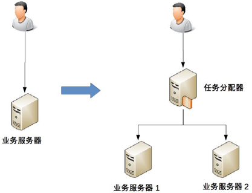

从图中可以看到，1台服务器演变为2台服务器后，架构上明显要复杂多了，主要体现在： 

* 需要增加一个任务分配器，这个分配器可能是硬件网络设备（例如，F5、交换机等），可能是软件网络设备（例如，LVS），也可能是负载均衡软件（例如，Nginx、HAProxy），还可能是自己开发的系统。

  选择合适的任务分配器也是一件复杂的事情，需要综合考虑性能、成本、可维护性、可用性等各方面的因素。

* 任务分配器和真正的业务服务器之间有连接和交互（即图中任务分配器到业务服务器的连接线），需要选择合适的连接方式，并且对连接进行管理。例如，连接建立、连接检测、连接中断后如何处理等。

* 任务分配器需要增加分配算法。例如，是采用轮询算法，还是按权重分配，又或者按照负载进行分配。如果按照服务器的负载进行分配，则业务服务器还要能够上报自己的状态给任务分配器。

上面这个架构只是最简单地增加1台业务机器，我们假设单台业务服务器每秒能够处理5000次业务请求，那么这个架构理论上能够支撑10000次请求，实际上的性能一般按照8折计算，大约是8000次左右。 

如果我们的性能要求继续提高，假设要求每秒提升到10万次，并不是将业务服务器增加到25台就可以了，因为随着性能的增加，任务分配器本身又会成为性能瓶颈，当业务请求达到每秒10万次的时候，单台任务分配器也不够用了，任务分配器本身也需要扩展为多台机器，这时的架构又会演变成这个样子：

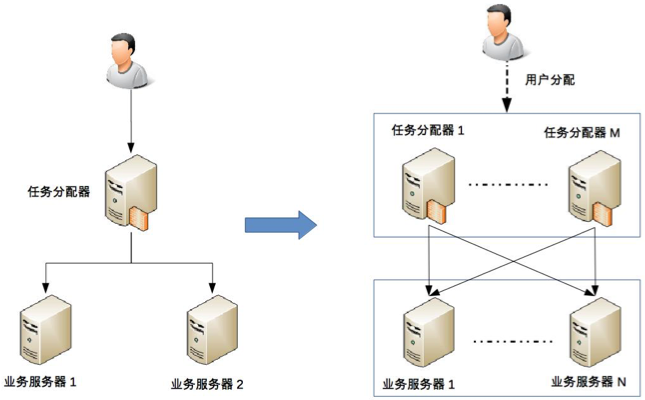

这个架构比2台业务服务器的架构要复杂，主要体现在： 

* 任务分配器从1台变成了多台（对应图中的任务分配器1到任务分配器M），这个变化带来的复杂度就是需要将不同的用户分配到不同的任务分配器上（即图中的虚线“用户分配”部分），常见的方法包括DNS轮询、智能DNS、CDN（Content Delivery Network，内容分发网络）、GSLB设备（Global Server Load Balance，全局负载均衡）等。
* 任务分配器和业务服务器的连接从简单的“1对多”（1台任务分配器连接多台业务服务器）变成了“多对多”（多台任务分配器连接多台业务服务器）的网状结构。
* 机器数量从3台扩展到30台（一般任务分配器数量比业务服务器要少，这里我们假设业务服务器为25台，任务分配器为5台），状态管理、故障处理复杂度也大大增加。

上面这两个例子都是以业务处理为例，实际上“任务”涵盖的范围很广，可以指完整的业务处理，也可以单指某个具体的任务。

例如，“存储”“运算”“缓存”等都可以作为一项任务，因此存储系统、运算系统、缓存系统都可以按照任务分配的方式来搭建架构。此外，“任务分配器”也并不一定只能是物理上存在的机器或者一个独立运行的程序，也可以是嵌入在其他程序中的算法，例如Memcache的集群架构：

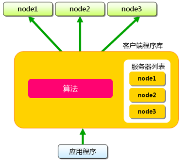

#### 任务分解

通过任务分配的方式，我们能够突破单台机器处理性能的瓶颈，通过增加更多的机器来满足业务的性能需求，但如果业务本身也越来越复杂，单纯只通过任务分配的方式来扩展性能，收益会越来越低。 

例如，业务简单的时候1台机器扩展到10台机器，性能能够提升8倍（需要扣除机器群带来的部分性能损耗，因此无法达到理论上的10倍那么高），但如果业务越来越复杂，1台机器扩展到10台，性能可能只能提升5倍。造成这种现象的主要原因是业务越来越复杂，单台机器处理的性能会越来越低。

为了能够继续提升性能，我们需要采取第二种方式：任务分解。

继续以上面“任务分配”中的架构为例，“业务服务器”如果越来越复杂，我们可以将其拆分为更多的组成部分，以微信的后台架构为例：

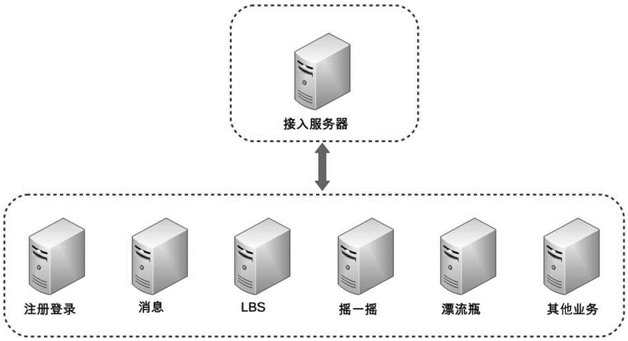

通过上面的架构示意图可以看出，微信后台架构从逻辑上将各个子业务进行了拆分，包括：接入、注册登录、消息、LBS、摇一摇、漂流瓶、其他业务（聊天、视频、朋友圈等）。 

通过这种任务分解的方式，能够把原来大一统但复杂的业务系统，拆分成小而简单但需要多个系统配合的业务系统。 

任务分解带来性能提升的原因：

* 简单的系统更加容易做到高性能

  系统的功能越简单，影响性能的点就越少，就更加容易进行有针对性的优化。 

  系统很复杂的情况下，首先是比较难以找到关键性能点，因为需要考虑和验证的点太多；其次是即使花费很大力气找到了，修改起来也不容易，因为可能将A关键性能点提升了，但却无意中将B点的性能降低了，整个系统的性能不但没有提升，还有可能会下降。 

* 可以针对单个任务进行扩展

  当各个逻辑任务分解到独立的子系统后，整个系统的性能瓶颈更加容易发现，而且发现后只需要针对有瓶颈的子系统进行性能优化或者提升，不需要改动整个系统，风险会小很多。 

  以微信的后台架构为例，如果用户数增长太快，注册登录子系统性能出现瓶颈的时候，只需要优化登录注册子系统的性能（可以是代码优化，也可以简单粗暴地加机器），消息逻辑、LBS逻辑等其他子系统完全不需要改动。 

虽然将一个大一统的系统分解为多个子系统能够提升性能，但是也不是分的越细越好，当拆分的子系统过多时，性能反而还会下降，最主要的原因是如果系统拆分得太细，为了完成某个业务，系统间的调用次数会呈指数级别上升，而系统间的调用通道目前都是通过网络传输的方式，性能远比系统内的函数调用要低得多。 

以下面的图示说明：

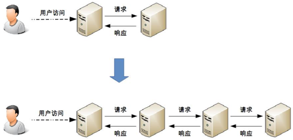

从图中可以看到，当系统拆分2个子系统的时候，用户访问需要1次系统间的请求和1次响应；当系统拆分为4个子系统的时候，系统间的请求次数从1次增长到3次；假如继续拆分下去为100个子系统，为了完成某次用户访问，系统间的请求次数变成了99次。 

虽然系统拆分可能在某种程度上能提升业务处理性能，但提升性能也是有限的，最终决定业务处理性能的还是业务逻辑本身，业务逻辑本身没有发生大的变化下，理论上的性能是有一个上限的，系统拆分能够让性能逼近这个极限，但无法突破这个极限。 

## 高可用

高可用的定义：系统无中断地执行其功能的能力，代表系统的可用性程度，是进行系统设计时的准则之一

定义的关键在于无中断，难点也在无中断上面。因为无论是单个硬件还是单个软件，都不可能做到无中断：

* 硬件有老化、故障
* 软件有bug、越来越庞大和复杂导致的故障

除了硬件和软件本质上无法做到“无中断”，外部环境导致的不可用更加不可避免、不受控制。例如，断电、水灾、地震，这些事故或者灾难也会导致系统不可用，而且影响程度更加严重，更加难以预测和规避。 

系统的高可用方案本质上都是通过冗余来实现的。高可用的“冗余”解决方案，单纯从形式上来看，和之前讲的高性能是一样的，都是通过增加更多机器来达到目的，但其实本质上是有根本区别的：

* 高性能增加机器目的在于“扩展”处理性能
* 高可用增加机器目的在于“冗余”处理单元

通过冗余增强了可用性，但同时也带来了复杂性。

### 计算高可用

这里的“计算”指的是业务的逻辑处理。 

计算有一个特点就是无论在哪台机器上进行计算，同样的算法和输入数据，产出的结果都是一样的，所以将计算从一台机器迁移到另外一台机器，对业务并没有什么影响。

计算高可用的复杂度主要在主备处理上。

下面是一个单机变双机的简单架构示意图：

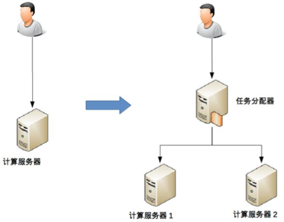

它的复杂度和之前高性能的双机架构是一样的，因此复杂度也是类似的，具体表现为：

* 需要增加一个任务分配器，选择合适的任务分配器也是一件复杂的事情，需要综合考虑性能、成本、可维护性、可用性等各方面因素。
* 任务分配器和真正的业务服务器之间有连接和交互，需要选择合适的连接方式，并且对连接进行管理。例如，连接建立、连接检测、连接中断后如何处理等。
* 任务分配器需要增加分配算法。例如，常见的双机算法有主备、主主，主备方案又可以细分为冷备、温备、热备。

下面是一个复杂一点的高可用集群架构：

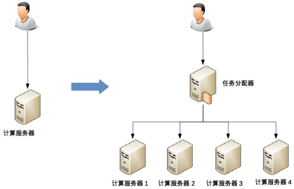

这个高可用集群相比双机来说，分配算法更加复杂，可以是1主3备、2主2备、3主1备、4主0备，具体应该采用哪种方式，需要结合实际业务需求来分析和判断，并不存在某种算法就一定优于另外的算法。例如，ZooKeeper采用的就是1主多备，而Memcached采用的就是全主0备。 

### 存储高可用

对于需要存储数据的系统来说，整个系统的高可用设计关键点和难点就在于“存储高可用”。 

存储与计算相比，有一个本质上的区别：将数据从一台机器搬到到另一台机器，需要经过线路进行传输。

线路传输的速度是毫秒级别，同一机房内部能够做到几毫秒；分布在不同地方的机房，传输耗时需要几十甚至上百毫秒。例如，从广州机房到北京机房，稳定情况下ping延时大约是50ms，不稳定情况下可能达到1s甚至更多。 

虽然毫秒对于人来说几乎没有什么感觉，但是对于高可用系统来说，就是本质上的不同，这意味着整个系统在某个时间点上，数据肯定是不一致的。 

按照“数据+ 逻辑= 业务”这个公式来套的话，数据不一致，即使逻辑一致，最后的业务表现就不一样了。

以最经典的银行储蓄业务为例，假设用户的数据存在北京机房，用户存入了1万块钱，然后他查询的时候被路由到了上海机房，北京机房的数据没有同步到上海机房，用户会发现他的余额并没有增加1万块，所以传输延迟可能导致很严重的问题。

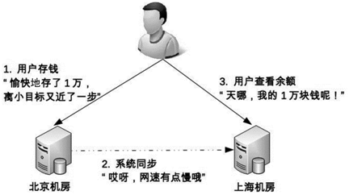

除了物理上的传输速度限制，传输线路本身也存在可用性问题，传输线路可能中断、可能拥塞、可能异常（错包、丢包），并且传输线路的故障时间一般都特别长，短的十几分钟，长的几个小时都是可能的。例如，2015年支付宝因为光缆被挖断，业务影响超过4个小时；2016年中美海底光缆中断3小时等。在传输线路中断的情况下，就意味着存储无法进行同步，在这段时间内整个系统的数据是不一致的。 

综合分析，无论是正常情况下的传输延迟，还是异常情况下的传输中断，都会导致系统的数据在某个时间点或者时间段是不一致的，而数据的不一致又会导致业务问题：

* 如果为了存储高可用做数据冗余，可能会有数据不一致的问题
* 如果完全不做冗余，系统的整体高可用又无法保证

存储高可用的难点不在于如何备份数据，而在于如何减少或者规避数据不一致对业务造成的影响。

分布式领域里面有一个著名的CAP定理，从理论上论证了存储高可用的复杂度。也就是说，存储高可用不可能同时满足“一致性、可用性、分区容错性”，最多满足其中两个，这就要求我们在做架构设计时结合业务进行取舍。 

### 高可用状态决策

无论是计算高可用还是存储高可用，其基础都是“状态决策”，即系统需要能够判断当前的状态是正常还是异常，如果出现了异常就要采取行动来保证高可用。如果状态决策本身都是有错误或者有偏差的，那么后续的任何行动和处理无论多么完美也都没有意义和价值。

在具体实践的过程中，恰好存在一个本质的矛盾：通过冗余来实现的高可用系统，状态决策本质上就不可能做到完全正确。

下面基于几种常见的决策方式进行详细分析：

#### 独裁式

独裁式决策指的是存在一个独立的决策主体，我们姑且称它为“决策者”，负责收集信息然后进行决策；所有冗余的个体，我们姑且称它为“上报者”，都将状态信息发送给决策者。 

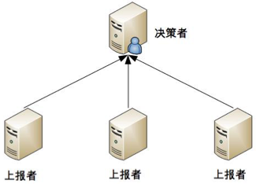

独裁式的决策方式不会出现决策混乱的问题，因为只有一个决策者，但问题也正是在于只有一个决策者。当决策者本身故障时，整个系统就无法实现准确的状态决策。如果决策者本身又做一套状态决策，那就陷入一个递归的死循环了。 

#### 协商式

协商式决策指的是两个独立的个体通过交流信息，然后根据规则进行决策，最常用的协商式决策就是主备决策。

这个架构的基本协商规则可以设计成：

- 2台服务器启动时都是备机。
- 2台服务器建立连接。
- 2台服务器交换状态信息。
- 某1台服务器做出决策，成为主机；另一台服务器继续保持备机身份。

协商式决策的架构不复杂，规则也不复杂，其难点在于，如果两者的信息交换出现问题（比如主备连接中断），此时状态决策应该怎么做。 

1、如果备机在连接中断的情况下认为主机故障，那么备机需要升级为主机，但实际上此时主机并没有故障，那么系统就出现了两个主机，这与设计初衷（1主1备）是不符合的。

2、如果备机在连接中断的情况下不认为主机故障，则此时如果主机真的发生故障，那么系统就没有主机了，这同样与设计初衷（1主1备）是不符合的。

如果为了规避连接中断对状态决策带来的影响，可以增加更多的连接。例如，双连接、三连接。这样虽然能够降低连接中断对状态带来的影响（注意：只能降低，不能彻底解决） 。无论如何，这种解决方案在特定场景下都可能存在问题。 

#### 民主式

民主式决策指的是多个独立的个体通过投票的方式来进行状态决策。例如，ZooKeeper集群在选举leader时就是采用这种方式。 

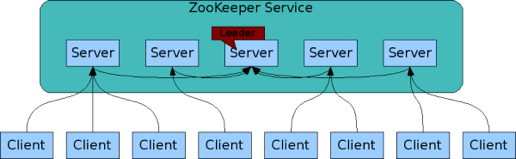

民主式决策和协商式决策比较类似，其基础都是独立的个体之间交换信息，每个个体做出自己的决策，然后按照“多数取胜”的规则来确定最终的状态。

除了算法复杂，民主式决策还有一个固有的缺陷：脑裂。 脑裂的根本原因是，原来统一的集群因为连接中断，造成了两个独立分隔的子集群，每个子集群单独进行选举，于是选出了2个主机，相当于人体有两个大脑了。 

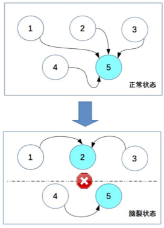

从图中可以看到，正常状态的时候，节点5作为主节点，其他节点作为备节点；当连接发生故障时，节点1、节点2、节点3形成了一个子集群，节点4、节点5形成了另外一个子集群，这两个子集群的连接已经中断，无法进行信息交换。按照民主决策的规则和算法，两个子集群分别选出了节点2和节点5作为主节点，此时整个系统就出现了两个主节点。这个状态违背了系统设计的初衷，两个主节点会各自做出自己的决策，整个系统的状态就混乱了。 

为了解决脑裂问题，民主式决策的系统一般都采用“投票节点数必须超过系统总节点数一半”规则来处理。如图中那种情况，节点4和节点5形成的子集群总节点数只有2个，没有达到总节点数5个的一半，因此这个子集群不会进行选举。 

这种方式虽然解决了脑裂问题，但同时降低了系统整体的可用性，即如果系统不是因为脑裂问题导致投票节点数过少，而真的是因为节点故障（例如，节点1、节点2、节点3真的发生了故障），此时系统也不会选出主节点，整个系统就相当于宕机了，尽管此时还有节点4和节点5是正常的。 

综合分析，无论采取什么样的方案，状态决策都不可能做到任何场景下都没有问题，但完全不做高可用方案又会产生更大的问题，如何选取适合系统的高可用方案，也是一个复杂的分析、判断和选择的过程。

## 可扩展性

可扩展性是指，系统为了应对将来需求变化而提供的一种扩展能力，当有新的需求出现时，系统不需要或者仅需要少量修改就可以支持，无须整个系统重构或者重建。 

由于软件系统固有的多变性，新的需求总会不断提出来，因此可扩展性显得尤其重要。在软件开发领域，面向对象思想的提出，就是为了解决可扩展性带来的问题；后来的设计模式，更是将可扩展性做到了极致。得益于设计模式的巨大影响力，几乎所有的技术人员对于可扩展性都特别重视。 

设计具备良好可扩展性的系统，有两个基本条件：

* 正确预测变化
* 完美应对变化

### 预测变化

软件系统与硬件或者建筑相比，有一个很大的差异：软件系统在发布后，还可以不断地修改和演进。 

在软件迭代的时候，唯一不变的是变化。 如果每个点都考虑可扩展性，架构师会不堪重负，架构设计也会异常庞大且最终无法落地。但架构师也不能完全不做预测，否则可能系统刚上线，马上来新的需求就需要重构，这同样意味着前期很多投入的工作量也白费了。 

综合分析，预测变化的复杂性在于：

1. 不能每个设计点都考虑可扩展性。
2. 不能完全不考虑可扩展性。
3. 所有的预测都存在出错的可能性。

对于架构师来说，如何把握预测的程度和提升预测结果的准确性，是一件很复杂的事情，而且没有通用的标准可以简单套上去，更多是靠自己的经验、直觉。 架构设计评审的时候，经常会因此出现争论。

这里提供一个简单的原则：2年法则，只预测2年内的可能变化，不要试图预测5年甚至10年后的变化。

有的行业变化快，有的行业变化慢，每个行业的预测周期是不同的。对于变化快的行业，能够预测2年已经足够了；而变化慢的行业，本身就变化慢，预测本身的意义不大，预测5年和预测2年的结果是差不多的。所以“2年法则”在大部分场景下都是适用的。 

### 应对变化

应对变化的具体方法有两种

#### 变化层和稳定层

第一种应对变化的常见方案是：将不变的部分封装在一个独立的“稳定层”，将“变化”封装在一个“变化层”（也叫“适配层”）。这种方案的核心思想是通过变化层来隔离变化。

隔离变化的形式主要有上面两种，无论是变化层依赖稳定层，还是稳定层依赖变化层都是可以的：

* 如果系统需要支持XML、JSON、ProtocolBuffer三种接入方式，那么最终的架构就是“形式1”架构 
* 如果系统需要支持MySQL、Oracle、DB2数据库存储，那么最终的架构就变成了“形式2”的架构了 

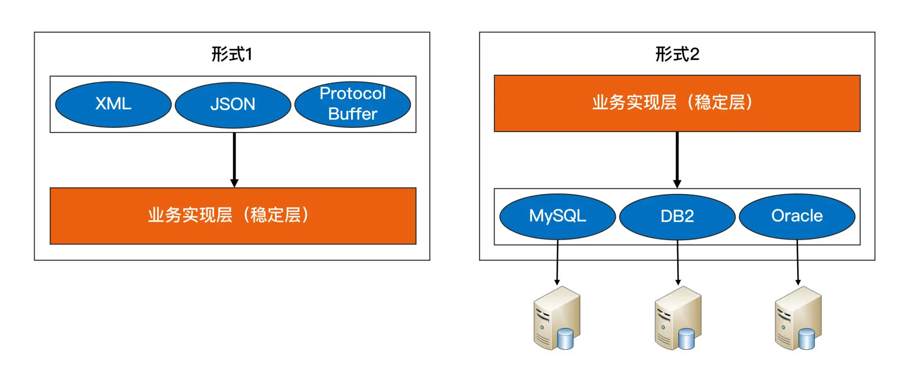

无论采取哪种形式，通过剥离变化层和稳定层的方式应对变化，都会带来两个主要的复杂性相关的问题：

1、变化层和稳定层如何拆分？

对于哪些属于变化层，哪些属于稳定层，很多时候并不是像前面的示例（不同接口协议或者不同数据库）那样明确，不同的人有不同的理解，导致架构设计评审的时候可能吵翻天。 

2、变化层和稳定层之间的接口如何设计？

对于稳定层来说，接口肯定是越稳定越好；但对于变化层来说，在有差异的多个实现方式中找出共同点，并且还要保证当加入新的功能时，原有的接口不需要太大修改，这是一件很复杂的事情，所以接口设计同样至关重要。 

例如，MySQL的REPLACE INTO和Oracle的MERGE INTO语法和功能有一些差异，那么存储层如何向稳定层提供数据访问接口呢？是采取MySQL的方式，还是采取Oracle的方式，还是自适应判断？如果再考虑DB2的情况呢？ 

这里的复杂主要集中在接口的复杂性。

#### 抽象层和实现层

第二种常见的应对变化的方案是：提炼出一个“抽象层”和一个“实现层”。如果说方案一的核心思想是通过变化层来隔离变化，那么方案二的核心思想就是通过实现层来封装变化。

因为抽象层的接口是稳定的不变的，我们可以基于抽象层的接口来实现统一的处理规则，而实现层可以根据具体业务需求定制开发不同的实现细节，所以当加入新的功能时，只要遵循处理规则然后修改实现层，增加新的实现细节就可以了，无须修改抽象层。 

这个方案典型的实践就是设计模式和规则引擎。 例如“装饰者”模式的类关系图：

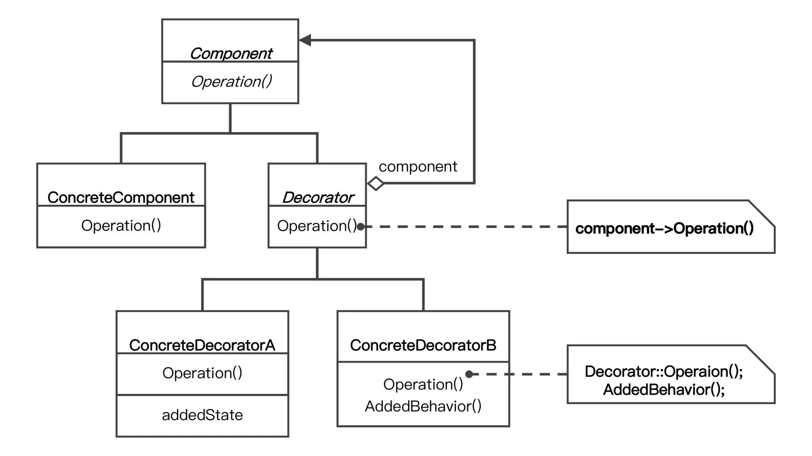

图中的Component和Decorator就是抽象出来的规则，这个规则包括几部分：

1. Component和Decorator类。
2. Decorator类继承Component类。
3. Decorator类聚合了Component类。

这个规则一旦抽象出来后就固定了，不能轻易修改。例如，把规则3去掉，就无法实现装饰者模式的目的了。

装饰者模式相比传统的继承来实现功能，确实灵活很多。 但装饰者模式相对普通的类实现模式，明显要复杂多了。本来一个函数或者一个类就能搞定的事情，现在要拆分成多个类，而且多个类之间必须按照装饰者模式来设计和调用。 

规则引擎和设计模式类似，都是通过灵活的设计来达到可扩展的目的，但“灵活的设计”本身就是一件复杂的事情。

在实际工作中，应该这样来应对变化：事不过三，三则重构，或者叫“1写2抄3重构”，也就是说你不要一开始就考虑复杂的可扩展性应对方法，而是等到第三次遇到类似的实现的时候再来重构，重构的时候采取隔离或者封装的方案。 

举个最简单的例子，假设你们的创新业务要对接第三方钱包，按照这个原则，就可以这样做：

1写：最开始你们选择了微信钱包对接，此时不需要考虑太多可扩展性，直接快速对照微信支付的API对接即可，因为业务是否能做起来还不确定。
2抄：后来你们发现业务发展不错，决定要接入支付宝，此时还是可以不考虑可扩展，直接把原来微信支付接入的代码拷贝过来，然后对照支付宝的API，快速修改上线。
3重构：因为业务发展不错，为了方便更多用户，你们决定接入银联云闪付，此时就需要考虑重构，参考设计模式的模板方法和策略模式将支付对接的功能进行封装。

## 低成本

当我们的架构方案只涉及几台或者十几台服务器时，一般情况下成本并不是我们重点关注的目标，但如果架构方案涉及几百上千甚至上万台服务器，成本就会变成一个非常重要的架构设计考虑点。 

当我们设计“高性能”“高可用”的架构时，通用的手段都是增加更多服务器来满足“高性能”和“高可用”的要求；而低成本正好与此相反，我们需要减少服务器的数量才能达成低成本的目标。 

因此，低成本本质上是与高性能和高可用冲突的，所以低成本很多时候不会是架构设计的首要目标，而是架构设计的附加约束。也就是说，我们首先设定一个成本目标，当我们根据高性能、高可用的要求设计出方案时，评估一下方案是否能满足成本目标，如果不行，就需要重新设计架构；如果无论如何都无法设计出满足成本要求的方案，那就只能找老板调整成本目标了。 

低成本给架构设计带来的主要复杂度体现在，往往只有“创新”才能达到低成本目标。这里的“创新”代表开创新技术，或者引入新技术。

类似的新技术例子很多，例如下面几个例子：

- NoSQL（Memcache、Redis等）的出现是为了解决关系型数据库无法应对高并发访问带来的访问压力。
- 全文搜索引擎（Sphinx、Elasticsearch、Solr）的出现是为了解决关系型数据库like搜索的低效的问题。
- Hadoop的出现是为了解决传统文件系统无法应对海量数据存储和计算的问题。

举几个业界类似的例子：

- Facebook为了解决PHP的低效问题，刚开始的解决方案是HipHop PHP，可以将PHP语言翻译为C++语言执行，后来改为HHVM，将PHP翻译为字节码然后由虚拟机执行，和Java的JVM类似。
- 新浪微博将传统的Redis/MC + MySQL方式，扩展为Redis/MC + SSD Cache + MySQL方式，SSD Cache作为L2缓存使用，既解决了MC/Redis成本过高，容量小的问题，也解决了穿透DB带来的数据库访问压力
- Linkedin为了处理每天5千亿的事件，开发了高效的Kafka消息系统。
- 其他类似将Ruby on Rails改为Java、Lua + redis改为Go语言实现的例子还有很多。

无论是引入新技术，还是自己创造新技术，都是一件复杂的事情：

* 引入新技术的主要复杂度在于需要去熟悉新技术，并且将新技术与已有技术结合起来 
* 创造新技术的主要复杂度在于需要自己去创造全新的理念和技术，并且新技术跟旧技术相比，需要有质的飞跃

相比来说，创造新技术复杂度更高，因此一般中小公司基本都是靠引入新技术来达到低成本的目标；而大公司更有可能自己去创造新的技术来达到低成本的目标，因为大公司才有足够的资源、技术和时间去创造新技术。 

## 安全

安全本身是一个庞大而又复杂的技术领域，并且一旦出问题，对业务和企业形象影响非常大。例如： 信息泄露、DDos攻击

从技术的角度来讲，安全可以分为两类：一类是功能上的安全，一类是架构上的安全。 

### 功能安全

例如，常见的XSS攻击、CSRF攻击、SQL注入、Windows漏洞、密码破解等，本质上是因为系统实现有漏洞，黑客有了可乘之机。黑客会利用各种漏洞潜入系统，这种行为就像小偷一样，黑客和小偷的手法都是利用系统或家中不完善的地方潜入，并进行破坏或者盗取。因此形象地说，功能安全其实就是“防小偷”。

从实现的角度来看，功能安全更多地是和具体的编码相关，与架构关系不大。现在很多开发框架都内嵌了常见的安全功能，能够大大减少安全相关功能的重复开发，但框架只能预防常见的安全漏洞和风险（常见的XSS攻击、CSRF攻击、SQL注入等），无法预知新的安全问题，而且框架本身很多时候也存在漏洞。

所以功能安全是一个逐步完善的过程，我们永远无法预测系统下一个漏洞在哪里，只能在迭代的过程中逐步完善，不可能在系统架构设计的时候一劳永逸地解决。 

### 架构安全

如果说功能安全是“防小偷”，那么架构安全就是“防强盗”。

架构设计时需要特别关注架构安全，尤其是互联网时代，理论上来说系统部署在互联网上时，全球任何地方都可以发起攻击。 

传统的架构安全主要依靠防火墙，防火墙最基本的功能就是隔离网络，通过将网络划分成不同的区域，制定出不同区域之间的访问控制策略来控制不同信任程度区域间传送的数据流。例如，下图是一个典型的银行系统的安全架构：

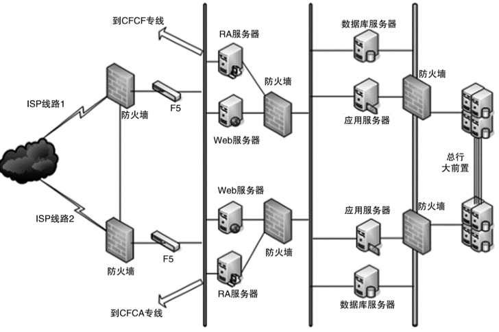

从图中你可以看到，整个系统根据不同的分区部署了多个防火墙来保证系统的安全。 

防火墙的功能虽然强大，但性能一般，所以在传统的银行和企业应用领域应用较多。 

在互联网领域，防火墙的应用场景并不多。因为互联网的业务具有海量用户访问和高并发的特点，防火墙的性能不足以支撑；尤其是互联网领域的DDoS攻击，轻则几GB，重则几十GB。 2016年知名安全研究人员布莱恩·克莱布斯（Brian Krebs）的安全博客网站遭遇DDoS攻击，攻击带宽达665Gbps，是目前在网络犯罪领域已知的最大的拒绝服务攻击。这种规模的攻击，如果用防火墙来防，则需要部署大量的防火墙，成本会很高。 例如，中高端一些的防火墙价格10万元，每秒能抗住大约25GB流量，那么应对这种攻击就需要将近30台防火墙，成本将近300万元，这还不包括维护成本，而这些防火墙设备在没有发生攻击的时候又没有什么作用。也就是说，如果花费几百万元来买这么一套设备，有可能几年都发挥不了任何作用。 

DDoS攻击最大的影响是大量消耗机房的出口总带宽。不管防火墙处理能力有多强，当出口带宽被耗尽时，整个业务在用户看来就是不可用的，因为用户的正常请求已经无法到达系统了。防火墙能够保证内部系统不受冲击，但用户也是进不来的，业务已经受到影响了。

基于上述原因，互联网系统的架构安全目前并没有太好的设计手段来实现，更多地是依靠运营商或者云服务商强大的带宽和流量清洗的能力，较少自己来设计和实现。 

## 规模

很多企业级的系统，既没有高性能要求，也没有双中心高可用要求，也不需要什么扩展性，但这样的系统非常复杂，关键就在于这样的系统往往功能特别多，逻辑分支特别多。特别是有的系统，发展时间比较长，不断地往上面叠加功能。后来的人由于不熟悉整个发展历史，可能连很多功能的应用场景都不清楚，或者细节根本无法掌握，面对的就是一个黑盒系统，看不懂、改不动、不敢改、修不了，复杂度自然就感觉很高了。 

规模带来复杂度的主要原因就是“量变引起质变”，当数量超过一定的阈值后，复杂度会发生质的变化。常见的规模带来的复杂度有：

### 功能多

例如，某个系统开始只有3大功能，后来不断增加到8大功能，虽然还是同一个系统，但复杂度已经相差很大了

以一个简单的抽象模型来计算一下，假设系统间的功能都是两两相关的，系统的复杂度=功能数量+功能之间的连接数量，通过计算我们可以看出：

- 3个功能的系统复杂度= 3 + 3 = 6
- 8个功能的系统复杂度= 8 + 28 = 36

可以看出，具备8个功能的系统的复杂度不是比具备3个功能的系统的复杂度多5，而是多了30，基本是指数级增长的，主要原因在于随着系统功能数量增多，功能之间的连接呈指数级增长。下图形象地展示了功能数量的增多带来了复杂度：

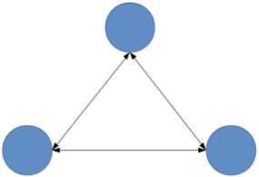

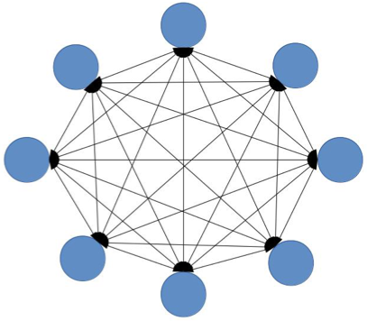

通过肉眼就可以很直观地看出，具备8个功能的系统复杂度要高得多。 综上，功能越来越多，导致系统复杂度指数级上升。

### 数据多

数据越来越多，也会导致系统复杂度发生质变。

最近几年火热的“大数据”就是在这种背景下诞生的。大数据单独成为了一个热门的技术领域，主要原因就是数据太多以后，传统的数据收集、加工、存储、分析的手段和工具已经无法适应，必须应用新的技术才能解决。 

目前的大数据理论基础是Google发表的三篇大数据相关论文，其中Google File System是大数据文件存储的技术理论，Google Bigtable是列式数据存储的技术理论，Google MapReduce是大数据运算的技术理论，这三篇技术论文各自开创了一个新的技术领域。 

即使我们的数据没有达到大数据规模，数据的增长也可能给系统带来复杂性。最典型的例子莫过于使用关系数据库存储数据，我以MySQL为例，MySQL单表的数据因不同的业务和应用场景会有不同的最优值，但不管怎样都肯定是有一定的限度的，一般推荐在5000万行左右。如果因为业务的发展，单表数据达到了10亿行，就会产生很多问题，例如： 

- 添加索引会很慢，可能需要几个小时，这几个小时内数据库表是无法插入数据的，相当于业务停机了。
- 修改表结构和添加索引存在类似的问题，耗时可能会很长。
- 即使有索引，索引的性能也可能会很低，因为数据量太大。
- 数据库备份耗时很长。

因此，当MySQL单表数据量太大时，我们必须考虑将单表拆分为多表，这个拆分过程也会引入更多复杂性，例如： 

* 拆表的规则是什么？以用户表为例：是按照用户id拆分表，还是按照用户注册时间拆表 
* 拆完表后查询如何处理？以用户表为例：假设按照用户id拆表，当业务需要查询学历为“本科”以上的用户时，要去很多表查询才能得到最终结果，怎么保证性能

类似的问题还有很多。

# 架构设计流程

## 识别复杂度

架构设计的本质目的是为了解决软件系统的复杂性，所以在我们设计架构时，首先就要分析系统的复杂性。 

只有正确分析出了系统的复杂性，后续的架构设计方案才不会偏离方向；否则，如果对系统的复杂性判断错误，即使后续的架构设计方案再完美再先进，都是南辕北辙，做的越好，错的越多、越离谱。 

例如，如果一个系统的复杂度本来是业务逻辑太复杂，功能耦合严重，架构师却设计了一个TPS达到50000/秒的高性能架构，即使这个架构最终的性能再优秀也没有任何意义，因为架构没有解决正确的复杂性问题。 

架构的复杂度主要来源于“高性能”“高可用”“可扩展”等几个方面，但架构师在具体判断复杂性的时候，不能生搬硬套，认为任何时候架构都必须同时满足这三方面的要求。实际上大部分场景下，复杂度只是其中的某一个，少数情况下包含其中两个，如果真的出现同时需要解决三个或者三个以上的复杂度，要么说明这个系统之前设计的有问题，要么可能就是架构师的判断出现了失误，即使真的认为要同时满足这三方面的要求，也必须要进行优先级排序。 

当接手一个每个复杂度维度都存在问题的系统，此时应该一个个来解决问题，不要幻想一次架构重构解决所有问题。应该将主要的复杂度问题列出来，然后根据业务、技术、团队等综合情况进行排序，优先解决当前面临的最主要的复杂度问题。

对于按照复杂度优先级解决的方式，存在一个普遍的担忧：如果按照优先级来解决复杂度，可能会出现解决了优先级排在前面的复杂度后，解决后续复杂度的方案需要将已经落地的方案推倒重来。这个担忧理论上是可能的，但现实中几乎是不可能出现的，原因在于软件系统的可塑性和易变性。对于同一个复杂度问题，软件系统的方案可以有多个，总是可以挑出综合来看性价比最高的方案。 

万一出现这种推倒重来的情况，这个新的方案也必须能够同时解决已经被解决的复杂度问题，一般来说能够达到这种理想状态的方案基本都是依靠新技术的引入。例如，Hadoop能够将高可用、高性能、大容量三个大数据处理的复杂度问题同时解决。 

识别复杂度对架构师来说是一项挑战，因为原始的需求中并没有哪个地方会明确地说明复杂度在哪里，需要架构师在理解需求的基础上进行分析。有经验的架构师可能一看需求就知道复杂度大概在哪里；如果经验不足，那只能采取“排查法”，从不同的角度逐一进行分析。 

### 案例分析

下面举一个识别复杂度的例子：

假想一个创业公司，名称叫作“前浪微博”。前浪微博的业务发展很快，系统也越来越多，系统间协作的效率很低，例如： 

- 用户发一条微博后，微博子系统需要通知审核子系统进行审核，然后通知统计子系统进行统计，再通知广告子系统进行广告预测，接着通知消息子系统进行消息推送……一条微博有十几个通知，目前都是系统间通过接口调用的。每通知一个新系统，微博子系统就要设计接口、进行测试，效率很低，问题定位很麻烦，经常和其他子系统的技术人员产生分岐，微博子系统的开发人员不胜其烦。
- 用户等级达到VIP后，等级子系统要通知福利子系统进行奖品发放，要通知客服子系统安排专属服务人员，要通知商品子系统进行商品打折处理……等级子系统的开发人员也是不胜其烦。

新来的架构师在梳理这些问题时，结合自己的经验，敏锐地发现了这些问题背后的根源在于架构上各业务子系统强耦合，而消息队列系统正好可以完成子系统的解耦，于是提议要引入消息队列系统。 经过一分析二讨论三开会四汇报五审批等一系列操作后，消息队列系统终于立项了。其他背景信息还有：

- 中间件团队规模不大，大约6人左右。
- 中间件团队熟悉Java语言，但有一个新同事C/C++很牛。
- 开发平台是Linux，数据库是MySQL。
- 目前整个业务系统是单机房部署，没有双机房。

针对前浪微博的消息队列系统，采用“排查法”来分析复杂度，具体分析过程是： 

1、判断这个消息队列是否需要高性能

假设前浪微博系统用户每天发送1000万条微博，那么微博子系统一天会产生1000万条消息，我们再假设平均一条消息有10个子系统读取，那么其他子系统读取的消息大约是1亿次。 

1000万和1亿看起来很吓人，但对于架构师来说，关注的不是一天的数据，而是1秒的数据，即TPS和QPS。我们将数据按照秒来计算，一天内平均每秒写入消息数为115条，每秒读取的消息数是1150条；再考虑系统的读写并不是完全平均的，设计的目标应该以峰值来计算。峰值一般取平均值的3倍，那么消息队列系统的TPS是345，QPS是3450，这个量级的数据意味着并不要求高性能。 

虽然根据当前业务规模计算的性能要求并不高，但业务会增长，因此系统设计需要考虑一定的性能余量。由于现在的基数较低，为了预留一定的系统容量应对后续业务的发展，我们将设计目标设定为峰值的4倍，因此最终的性能要求是：TPS为1380，QPS为13800。TPS为1380并不高，但QPS为13800已经比较高了，因此高性能读取是复杂度之一。 

注意，这里的设计目标设定为峰值的4倍是根据业务发展速度来预估的，不是固定为4倍，不同的业务可以是2倍，也可以是8倍，但一般不要设定在10倍以上，更不要一上来就按照100倍预估。 

2、判断消息队列是否需要高可用性

对于微博子系统来说，如果消息丢了，导致没有审核，然后触犯了国家法律法规，则是非常严重的事情； 

对于等级子系统来说，如果用户达到相应等级后，系统没有给他奖品和专属服务，则VIP用户会很不满意，导致用户流失从而损失收入，虽然也比较关键，但没有审核子系统丢消息那么严重。 

综合来看，消息队列需要高可用性，包括消息写入、消息存储、消息读取都需要保证高可用性。 

3、这个消息队列是否需要高可扩展性

消息队列的功能很明确，基本无须扩展，因此可扩展性不是这个消息队列的复杂度关键。 

为了方便理解，这里只排查“高性能”“高可用”“扩展性”这3个复杂度，在实际应用中，不同的公司或者团队，可能还有一些其他方面的复杂度分析。例如，金融系统可能需要考虑安全性，有的公司会考虑成本等。 

综合分析下来，消息队列的复杂性主要体现在这几个方面：高性能消息读取、高可用消息写入、高可用消息存储、高可用消息读取。 

## 设计备选方案

确定了系统面临的主要复杂度问题后，方案设计就有了明确的目标，我们就可以开始真正进行架构方案设计了。 架构设计流程的第二步就是设计备选方案。

此时可选的模式有很多，组合的方案更多，往往一个问题的解决方案有很多个；如果再在组合的方案上进行一些创新，解决方案会更多。因此，如何设计最终的方案，并不是一件容易的事情，这个阶段也是很多架构师容易犯错的地方。 

这阶段有两种常见的错误：

* 第一种常见的错误：设计最优秀的方案。 

  根据架构设计原则中“合适原则”和“简单原则“的要求，挑选合适自己业务、团队、技术能力的方案才是好方案；否则要么浪费大量资源开发了无用的系统，要么无法实现

* 第二种常见的错误：只做一个方案 

  很多架构师在做方案设计时，可能心里会简单地对几个方案进行初步的设想，再简单地判断哪个最好，然后就基于这个判断开始进行详细的架构设计了。 

  这样做有很多弊端：

  - 心里评估过于简单，可能没有想得全面，只是因为某一个缺点就把某个方案给否决了，而实际上没有哪个方案是完美的，某个地方有缺点的方案可能是综合来看最好的方案。
  - 架构师再怎么牛，经验知识和技能也有局限，有可能某个评估的标准或者经验是不正确的，或者是老的经验不适合新的情况，甚至有的评估标准是架构师自己原来就理解错了。
  - 单一方案设计会出现过度辩护的情况，即架构评审时，针对方案存在的问题和疑问，架构师会竭尽全力去为自己的设计进行辩护，经验不足的设计人员可能会强词夺理。

  因此，架构师需要设计多个备选方案，但方案的数量可以说是无穷无尽的，架构师也不可能穷举所有方案，合理的做法应该是这样：

  * 备选方案的数量以3 ~ 5个为最佳。少于3个方案可能是因为思维狭隘，考虑不周全；多于5个则需要耗费大量的精力和时间，并且方案之间的差别可能不明显。
  * 备选方案的差异要比较明显。例如，主备方案和集群方案差异就很明显，或者同样是主备方案，用ZooKeeper做主备决策和用Keepalived做主备决策的差异也很明显。但是都用ZooKeeper做主备决策，一个检测周期是1分钟，一个检测周期是5分钟，这就不是架构上的差异，而是细节上的差异了，不适合做成两个方案。
  * 备选方案的技术不要只局限于已经熟悉的技术。设计架构时，架构师需要将视野放宽，考虑更多可能性。很多架构师或者设计师积累了一些成功的经验，出于快速完成任务和降低风险的目的，可能自觉或者不自觉地倾向于使用自己已经熟悉的技术，对于新的技术有一种不放心的感觉。

* 第三种常见的错误：备选方案过于详细。

  有的架构师或者设计师在写备选方案时，错误地将备选方案等同于最终的方案，每个备选方案都写得很细。这样做的弊端显而易见： 

  - 耗费了大量的时间和精力。
  - 将注意力集中到细节中，忽略了整体的技术设计，导致备选方案数量不够或者差异不大。
  - 评审的时候其他人会被很多细节给绕进去，评审效果很差。例如，评审的时候针对某个定时器应该是1分钟还是30秒，争论得不可开交。

  正确的做法是备选阶段关注的是技术选型，而不是技术细节，技术选型的差异要比较明显。例如，采用ZooKeeper和Keepalived两种不同的技术来实现主备，差异就很大；而同样都采用ZooKeeper，一个方案的节点设计是/service/node/master，另一个方案的节点设计是/company/service/master，这两个方案并无明显差异，无须在备选方案设计阶段作为两个不同的备选方案，至于节点路径究竟如何设计，只要在最终的方案中挑选一个进行细化即可。 

### 案例分析

回到“前浪微博”的场景，之前已经通过“排查法”识别了消息队列的复杂性主要体现在：高性能消息读取、高可用消息写入、高可用消息存储、高可用消息读取。接下来进行第2步，设计备选方案。 

列出几个方案的概述：

1、备选方案1：采用开源的Kafka

Kafka是成熟的开源消息队列方案，功能强大，性能非常高，而且已经比较成熟，很多大公司都在使用。

2、备选方案2：集群 + MySQL存储 

首先考虑单服务器高性能。高性能消息读取属于“计算高可用”的范畴，单服务器高性能备选方案有很多种。考虑到团队的开发语言是Java，虽然有人觉得C/C++语言更加适合写高性能的中间件系统，但架构师综合来看，认为无须为了语言的性能优势而让整个团队切换语言，消息队列系统继续用Java开发。由于Netty是Java领域成熟的高性能网络库，因此架构师选择基于Netty开发消息队列系统。 

由于系统设计的QPS是13800，即使单机采用Netty来构建高性能系统，单台服务器支撑这么高的QPS还是有很大风险的，因此架构师选择采取集群方式来满足高性能消息读取，集群的负载均衡算法采用简单的轮询即可。 

同理，“高可用写入”和“高性能读取”一样，可以采取集群的方式来满足。因为消息只要写入集群中一台服务器就算成功写入，因此“高可用写入”的集群分配算法和“高性能读取”也一样采用轮询，即正常情况下，客户端将消息依次写入不同的服务器；某台服务器异常的情况下，客户端直接将消息写入下一台正常的服务器即可。 

整个系统中最复杂的是“高可用存储”和“高可用读取” ：

* “高可用存储”要求已经写入的消息在单台服务器宕机的情况下不丢失； 
* “高可用读取”要求已经写入的消息在单台服务器宕机的情况下可以继续读取。 

架构师第一时间想到的就是可以利用MySQL的主备复制功能来达到“高可用存储“的目的，通过服务器的主备方案来达到“高可用读取”的目的。 

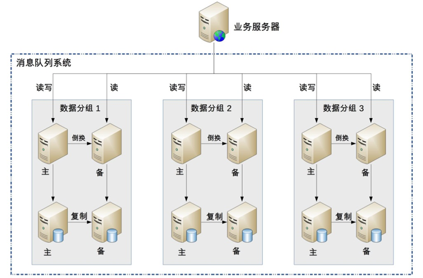

简单描述一下方案：

- 采用数据分散集群的架构，集群中的服务器进行分组，每个分组存储一部分消息数据。
- 每个分组包含一台主MySQL和一台备MySQL，分组内主备数据复制，分组间数据不同步。
- 正常情况下，分组内的主服务器对外提供消息写入和消息读取服务，备服务器不对外提供服务；主服务器宕机的情况下，备服务器对外提供消息读取的服务。
- 客户端采取轮询的策略写入和读取消息。

3、备选方案3：集群 + 自研存储方案 

在备选方案2的基础上，将MySQL存储替换为自研实现存储方案，因为MySQL的关系型数据库的特点并不是很契合消息队列的数据特点，参考Kafka的做法，可以自己实现一套文件存储和复制方案（此处省略具体的方案描述，实际设计时需要给出方案）。 

可以看出，高性能消息读取单机系统设计这部分时并没有多个备选方案可选，备选方案2和备选方案3都采取基于Netty的网络库，用Java语言开发，原因就在于团队的Java背景约束了备选的范围。通常情况下，成熟的团队不会轻易改变技术栈，反而是新成立的技术团队更加倾向于采用新技术。 

上面简单地给出了3个备选方案用来示范如何操作，实践中要比上述方案复杂一些。架构师的技术储备越丰富、经验越多，备选方案也会更多，从而才能更好地设计备选方案。例如，开源方案选择可能就包括Kafka、ActiveMQ、RabbitMQ；集群方案的存储既可以考虑用MySQL，也可以考虑用HBase，还可以考虑用Redis与MySQL结合等；自研文件系统也可以有多个，可以参考Kafka，也可以参考LevelDB，还可以参考HBase等。 

## 评估和选择备选方案

如何挑选出最终的方案也是一个很大的挑战，主要原因有：

- 每个方案都是可行的，如果方案不可行就根本不应该作为备选方案。
- 没有哪个方案是完美的。例如，A方案有性能的缺点，B方案有成本的缺点，C方案有新技术不成熟的风险。
- 评价标准主观性比较强，比如设计师说A方案比B方案复杂，但另外一个设计师可能会认为差不多，因为比较难将“复杂”一词进行量化。因此，方案评审的时候我们经常会遇到几个设计师针对某个方案或者某个技术点争论得面红耳赤。

正因为选择备选方案存在这些困难，所以实践中很多设计师或者架构师就采取了下面几种指导思想： 

* 最简派：设计师挑选一个看起来最简单的方案。 
* 最牛派：最牛派的做法和最简派正好相反，设计师会倾向于挑选技术上看起来最牛的方案。 
* 最熟派：设计师基于自己的过往经验，挑选自己最熟悉的方案。 
* 领导派：设计师自己拿捏不定，然后就让领导来定夺 

上面这些做法都是不合适的，真正评估和选择备选方案的方式是：“360度环评”！具体的操作方式为：列出我们需要关注的质量属性点，然后分别从这些质量属性的维度去评估每个方案，再综合挑选适合当时情况的最优方案。

常见的方案质量属性点有：性能、可用性、硬件成本、项目投入、复杂度、安全性、可扩展性等。在评估这些质量属性时，需要遵循架构设计原则1“合适原则”和原则2“简单原则”，避免贪大求全，基本上某个质量属性能够满足一定时期内业务发展就可以了。 

不要过度设计，导致投入浪费。考虑这个问题的时候，需要遵循架构设计原则3“演化原则”，避免过度设计、一步到位的想法。按照原则3的思想，即使真的出现这种情况，那就算是重新做方案，代价也是可以接受的，因为业务如此迅猛发展，钱和人都不是问题。例如，淘宝和微信的发展历程中，有过多次这样大规模重构系统的经历。 

通常情况下，如果某个质量属性评估和业务发展有关系（例如，性能、硬件成本等），需要评估未来业务发展的规模时，一种简单的方式是将当前的业务规模乘以2 ~4即可，如果现在的基数较低，可以乘以4；如果现在基数较高，可以乘以2。例如，现在的TPS是1000，则按照TPS 4000来设计方案；如果现在TPS是10000，则按照TPS 20000来设计方案。 

当然，最理想的情况是设计一个方案，能够简单地扩容就能够跟上业务的发展。 但现实往往没那么理想，因为量变会引起质变，提前预测这种质变也是不现实的，因为最初的团队无法支撑这种大而全的设计。

完成方案的360度环评后，我们可以基于评估结果整理出360度环评表，一目了然地看到各个方案的优劣点。 有了360度环评表后有以下几种方式选择最终的方案：

* 数量对比法：简单地看哪个方案的优点多就选哪个。 这种方案主要的问题在于把所有质量属性的重要性等同，而没有考虑质量属性的优先级。 

  例如，对于BAT这类公司来说，方案的成本都不是问题，可用性和可扩展性比成本要更重要得多；但对于创业公司来说，成本可能就会变得很重要。 

* 加权法：每个质量属性给一个权重。例如，性能的权重高中低分别得10分、5分、3分，成本权重高中低分别是5分、3分、1分，然后将每个方案的权重得分加起来，最后看哪个方案的权重得分最高就选哪个。

  这种方案主要的问题是无法客观地给出每个质量属性的权重得分。 这个分数是很难确定的，没有明确的标准，甚至会出现为了选某个方案，设计师故意将某些权重分值调高而降低另外一些权重分值，最后方案的选择就变成了一个数字游戏了。 

正确的做法是按优先级选择，即架构师综合当前的业务发展情况、团队人员规模和技能、业务发展预测等因素，将质量属性按照优先级排序，首先挑选满足第一优先级的，如果方案都满足，那就再看第二优先级……以此类推。 理论上可能出现两个或者多个方案，每个质量属性的优缺点都一样，所以在做备选方案设计时，不同的备选方案之间的差异要比较明显，差异明显的备选方案不可能所有的优缺点都是一样的。 

### 案例分析

回到之前的场景“前浪微博”。针对上期提出的3个备选方案，架构师组织了备选方案评审会议，参加的人有研发、测试、运维、还有几个核心业务的主管。 

1.备选方案1：采用开源Kafka方案

- 业务主管倾向于采用Kafka方案，因为Kafka已经比较成熟，各个业务团队或多或少都了解过Kafka。
- 中间件团队部分研发人员也支持使用Kafka，因为使用Kafka能节省大量的开发投入；但部分人员认为Kafka可能并不适合我们的业务场景，因为Kafka的设计目的是为了支撑大容量的日志消息传输，而我们的消息队列是为了业务数据的可靠传输。
- 运维代表提出了强烈的反对意见：首先，Kafka是Scala语言编写的，运维团队没有维护Scala语言开发的系统的经验，出问题后很难快速处理；其次，目前运维团队已经有一套成熟的运维体系，包括部署、监控、应急等，使用Kafka无法融入这套体系，需要单独投入运维人力。
- 测试代表也倾向于引入Kafka，因为Kafka比较成熟，无须太多测试投入。

2.备选方案2：集群 + MySQL存储

- 中间件团队的研发人员认为这个方案比较简单，但部分研发人员对于这个方案的性能持怀疑态度，毕竟使用MySQL来存储消息数据，性能肯定不如使用文件系统；并且有的研发人员担心做这样的方案是否会影响中间件团队的技术声誉，毕竟用MySQL来做消息队列，看起来比较“土”、比较另类。
- 运维代表赞同这个方案，因为这个方案可以融入到现有的运维体系中，而且使用MySQL存储数据，可靠性有保证，运维团队也有丰富的MySQL运维经验；但运维团队认为这个方案的成本比较高，一个数据分组就需要4台机器（2台服务器 + 2台数据库）。
- 测试代表认为这个方案测试人力投入较大，包括功能测试、性能测试、可靠性测试等都需要大量地投入人力。
- 业务主管对这个方案既不肯定也不否定，因为反正都不是业务团队来投入人力来开发，系统维护也是中间件团队负责，对业务团队来说，只要保证消息队列系统稳定和可靠即可。

3.备选方案3：集群 + 自研存储系统

- 中间件团队部分研发人员认为这是一个很好的方案，既能够展现中间件团队的技术实力，性能上相比MySQL也要高；但另外的研发人员认为这个方案复杂度太高，按照目前的团队人力和技术实力，要做到稳定可靠的存储系统，需要耗时较长的迭代，这个过程中消息队列系统可能因为存储出现严重问题，例如文件损坏导致丢失大量数据。
- 运维代表不太赞成这个方案，因为运维之前遇到过几次类似的存储系统故障导致数据丢失的问题，损失惨重。例如，MongoDB丢数据、Tokyo Tyrant丢数据无法恢复等。运维团队并不相信目前的中间件团队的技术实力足以支撑自己研发一个存储系统（这让中间件团队的人员感觉有点不爽）。
- 测试代表赞同运维代表的意见，并且自研存储系统的测试难度也很高，投入也很大。
- 业务主管对自研存储系统也持保留意见，因为从历史经验来看，新系统上线肯定有bug，而存储系统出bug是最严重的，一旦出bug导致大量消息丢失，对系统的影响会严重。

针对3个备选方案的讨论初步完成后，架构师列出了3个方案的360度环评表：

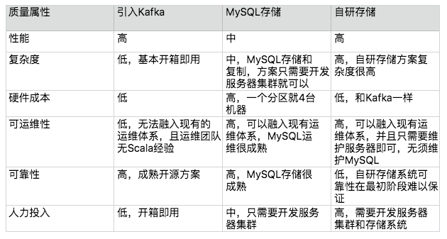

架构师经过思考后，给出了最终选择备选方案2，原因有：

- 排除备选方案1的主要原因是可运维性，因为再成熟的系统，上线后都可能出问题，如果出问题无法快速解决，则无法满足业务的需求；并且Kafka的主要设计目标是高性能日志传输，而我们的消息队列设计的主要目标是业务消息的可靠传输。
- 排除备选方案3的主要原因是复杂度，目前团队技术实力和人员规模（总共6人，还有其他中间件系统需要开发和维护）无法支撑自研存储系统（参考架构设计原则2：简单原则）。
- 备选方案2的优点就是复杂度不高，也可以很好地融入现有运维体系，可靠性也有保障。

针对备选方案2的缺点，架构师解释是：

- 备选方案2的第一个缺点是性能，业务目前需要的性能并不是非常高，方案2能够满足，即使后面性能需求增加，方案2的数据分组方案也能够平行扩展进行支撑（参考架构设计原则3：演化原则）。
- 备选方案2的第二个缺点是成本，一个分组就需要4台机器，支撑目前的业务需求可能需要12台服务器，但实际上备机（包括服务器和数据库）主要用作备份，可以和其他系统并行部署在同一台机器上。
- 备选方案2的第三个缺点是技术上看起来并不很优越，但我们的设计目的不是为了证明自己（参考架构设计原则1：合适原则），而是更快更好地满足业务需求。

通过这个案例可以看出，备选方案的选择和很多因素相关，并不单单考虑性能高低、技术是否优越这些纯技术因素。业务的需求特点、运维团队的经验、已有的技术体系、团队人员的技术水平都会影响备选方案的选择。因此，同样是上述3个备选方案，有的团队会选择引入Kafka（例如，很多创业公司的初创团队，人手不够，需要快速上线支撑业务），有的会选择自研存储系统（例如，阿里开发了RocketMQ，人多力量大，业务复杂是主要原因）。 

## 详细方案设计

因为整个架构设计最难的一步已经完成了，但整体方案尚未完成，需要将最终确定的备选方案进行细化，使得备选方案变成一个可以落地的设计方案。 

简单来说，详细方案设计就是将方案涉及的关键技术细节给确定下来：

- 假如我们确定使用Elasticsearch来做全文搜索，那么就需要确定Elasticsearch的索引是按照业务划分，还是一个大索引就可以了；副本数量是2个、3个还是4个，集群节点数量是3个还是6个等。
- 假如我们确定使用MySQL分库分表，那么就需要确定哪些表要分库分表，按照什么维度来分库分表，分库分表后联合查询怎么处理等。
- 假如我们确定引入Nginx来做负载均衡，那么Nginx的主备怎么做，Nginx的负载均衡策略用哪个（权重分配？轮询？ip_hash？）等。

可以看到，详细设计方案里面其实也有一些技术点和备选方案类似。例如，Nginx的负载均衡策略，备选有轮询、权重分配、ip_hash、fair、url_hash五个，具体选择的方式和备选方案阶段面临的问题类似，但实际上这里的技术方案选择是很轻量级的，我们无须像备选方案阶段那样操作，而只需要简单根据这些技术的适用场景选择就可以了。

例如，Nginx的负载均衡策略，简单按照下面的规则选择就可以了：

* 轮询（默认）：每个请求按时间顺序逐一分配到不同的后端服务器，后端服务器分配的请求数基本一致，如果后端服务器“down掉”，能自动剔除。 
* 加权轮询：根据权重来进行轮询，权重高的服务器分配的请求更多，主要适应于后端服务器性能不均的情况，如新老服务器混用。 
* ip_hash：每个请求按访问IP的hash结果分配，这样每个访客固定访问一个后端服务器，主要用于解决session的问题，如购物车类的应用。 
* fair：按后端服务器的响应时间来分配请求，响应时间短的优先分配，能够最大化地平衡各后端服务器的压力，可以适用于后端服务器性能不均衡的情况，也可以防止某台后端服务器性能不足的情况下还继续接收同样多的请求从而造成雪崩效应。 
* url_hash：按访问URL的hash结果来分配请求，每个URL定向到同一个后端服务器，适用于后端服务器能够将URL的响应结果缓存的情况。 

这几个策略的适用场景区别还是比较明显的，根据我们的业务需要，挑选一个合适的即可。例如，比如一个电商架构，由于和session比较强相关，因此如果用Nginx来做集群负载均衡，那么选择ip_hash策略是比较合适的。 

详细设计方案阶段可能遇到的一种极端情况就是在详细设计阶段发现方案不可行，一般情况下主要的原因是备选方案设计时遗漏了某个关键技术点或者关键的质量属性。例如，某项目，在备选方案阶段确定是可行的，但在详细方案设计阶段，发现由于细节点太多，方案非常庞大，整个项目可能要开发长达1年时间，最后只得废弃原来的备选方案，重新调整项目目标、计划和方案。这个项目的主要失误就是在备选方案评估时忽略了开发周期这个质量属性。 

这种情况可以通过下面方式有效避免：

* 架构师不但要进行备选方案设计和选型，还需要对备选方案的关键细节有较深入的理解。

  例如，架构师选择了Elasticsearch作为全文搜索解决方案，前提必须是架构师自己对Elasticsearch的设计原理有深入的理解，比如索引、副本、集群等技术点；而不能道听途说Elasticsearch很牛，所以选择它，更不能成为把“细节我们不讨论”这句话挂在嘴边的“PPT架构师”。

* 通过分步骤、分阶段、分系统等方式，尽量降低方案复杂度，方案本身的复杂度越高，某个细节推翻整个方案的可能性就越高，适当降低复杂性，可以减少这种风险。

* 如果方案本身就很复杂，那就采取设计团队的方式来进行设计，博采众长，汇集大家的智慧和经验，防止只有1~2个架构师可能出现的思维盲点或者经验盲区。

### 案例分析

之前在消息队列的架构设计中挑选了一个方案作为最终方案，但备选方案设计阶段的方案粒度还比较粗，无法真正指导开发人员进行后续的设计和开发，因此需要在备选方案的基础上进一步细化。 

下面列出一些备选方案2典型的需要细化的点供参考：

1.细化设计点1：数据库表如何设计？

- 数据库设计两类表，一类是日志表，用于消息写入时快速存储到MySQL中；另一类是消息表，每个消息队列一张表。
- 业务系统发布消息时，首先写入到日志表，日志表写入成功就代表消息写入成功；后台线程再从日志表中读取消息写入记录，将消息内容写入到消息表中。
- 业务系统读取消息时，从消息表中读取。
- 日志表表名为MQ_LOG，包含的字段：日志ID、发布者信息、发布时间、队列名称、消息内容。
- 消息表表名就是队列名称，包含的字段：消息ID（递增生成）、消息内容、消息发布时间、消息发布者。
- 日志表需要及时清除已经写入消息表的日志数据，消息表最多保存30天的消息数据。

2.细化设计点2：数据如何复制？

直接采用MySQL主从复制即可，只复制消息存储表，不复制日志表。

3.细化设计点3：主备服务器如何倒换？

采用ZooKeeper来做主备决策，主备服务器都连接到ZooKeeper建立自己的节点，主服务器的路径规则为“/MQ/server/分区编号/master”，备机为“/MQ/server/分区编号/slave”，节点类型为EPHEMERAL。

备机监听主机的节点消息，当发现主服务器节点断连后，备服务器修改自己的状态，对外提供消息读取服务。

4.细化设计点4：业务服务器如何写入消息？

- 消息队列系统设计两个角色：生产者和消费者，每个角色都有唯一的名称。
- 消息队列系统提供SDK供各业务系统调用，SDK从配置中读取所有消息队列系统的服务器信息，SDK采取轮询算法发起消息写入请求给主服务器。如果某个主服务器无响应或者返回错误，SDK将发起请求发送到下一台服务器。

5.细化设计点5：业务服务器如何读取消息？

- 消息队列系统提供SDK供各业务系统调用，SDK从配置中读取所有消息队列系统的服务器信息，轮流向所有服务器发起消息读取请求。
- 消息队列服务器需要记录每个消费者的消费状态，即当前消费者已经读取到了哪条消息，当收到消息读取请求时，返回下一条未被读取的消息给消费者。

6.细化设计点6：业务服务器和消息队列服务器之间的通信协议如何设计？

考虑到消息队列系统后续可能会对接多种不同编程语言编写的系统，为了提升兼容性，传输协议用TCP，数据格式为ProtocolBuffer。

# 高性能架构

虽然近十年来各种存储技术飞速发展，但关系数据库由于其ACID的特性和功能强大的SQL查询，目前还是各种业务系统中关键和核心的存储系统，很多场景下高性能的设计最核心的部分就是关系数据库的设计。 

互联网业务兴起之后，海量用户加上海量数据的特点，单个数据库服务器已经难以满足业务需要，必须考虑数据库集群的方式来提升性能。 

高性能数据库集群有两种基本方式：

* 第一种方式是“读写分离”，其本质是将访问压力分散到集群中的多个节点，但是没有分散存储压力 
* 第二种方式是“分库分表”，既可以分散访问压力，又可以分散存储压力

## 读写分离

读写分离的基本原理是将数据库读写操作分散到不同的节点上，下面是其基本架构图：

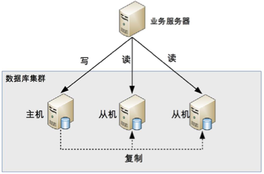

读写分离的基本实现是：

- 数据库服务器搭建主从集群，一主一从、一主多从都可以。
- 数据库主机负责读写操作，从机只负责读操作。
- 数据库主机通过复制将数据同步到从机，每台数据库服务器都存储了所有的业务数据。
- 业务服务器将写操作发给数据库主机，将读操作发给数据库从机。

需要注意的是，这里用的是“主从集群”，而不是“主备集群” ，从和备是有区别的：

* “从机”的“从”可以理解为“仆从”，仆从是要帮主人干活的，“从机”是需要提供读数据的功能的； 
* “备机”一般被认为仅仅提供备份功能，不提供访问功能。 

读写分离的实现逻辑并不复杂，但有两个细节点将引入设计复杂度：主从复制延迟和分配机制。

### 主从复制延迟

以MySQL为例，主从复制延迟可能达到1秒，如果有大量数据同步，延迟1分钟也是有可能的。 

主从复制延迟会带来一个问题：如果业务服务器将数据写入到数据库主服务器后立刻（1秒内）进行读取，此时读操作访问的是从机，主机还没有将数据复制过来，到从机读取数据是读不到最新数据的，业务上就可能出现问题。例如，用户刚注册完后立刻登录，业务服务器会提示他“你还没有注册”，而用户明明刚才已经注册成功了。 

解决主从复制延迟有几种常见的方法： 

* 写操作后的读操作指定发给数据库主服务器

  例如，注册账号完成后，登录时读取账号的读操作也发给数据库主服务器。 

  这种方式和业务强绑定，对业务的侵入和影响较大，如果哪个新来的程序员不知道这样写代码，就会导致一个bug。 

* 读从机失败后再读一次主机

  这就是通常所说的“二次读取”，二次读取和业务无绑定，只需要对底层数据库访问的API进行封装即可，实现代价较小，不足之处在于如果有很多二次读取，将大大增加主机的读操作压力。 

  例如，黑客暴力破解账号，会导致大量的二次读取操作，主机可能顶不住读操作的压力从而崩溃。 

* 关键业务读写操作全部指向主机，非关键业务采用读写分离 

  例如，对于一个用户管理系统来说，注册+登录的业务读写操作全部访问主机，用户的介绍、爱好、等级等业务，可以采用读写分离，因为即使用户改了自己的自我介绍，在查询时却看到了自我介绍还是旧的，业务影响与不能登录相比就小很多，还可以忍受。 

### 分配机制

分配机制就是决定到底哪个节点负责读，哪个节点负责写。一般有两种方式：程序代码封装和中间件封装。

1、程序代码封装 

程序代码封装指在代码中抽象一个数据访问层（也成为中间层封装），实现读写操作分离和数据库服务器连接的管理。例如，基于Hibernate进行简单封装，就可以实现读写分离，基本架构是： 

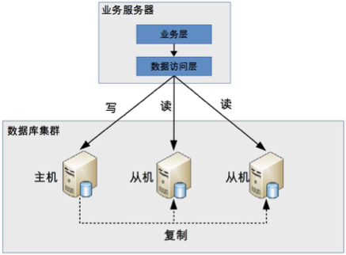

程序代码封装的方式具备几个特点：

- 实现简单，而且可以根据业务做较多定制化的功能。
- 每个编程语言都需要自己实现一次，无法通用，如果一个业务包含多个编程语言写的多个子系统，则重复开发的工作量比较大。
- 故障情况下，如果主从发生切换，则可能需要所有系统都修改配置并重启。

目前开源的实现方案中，淘宝的TDDL（Taobao Distributed Data Layer，外号:头都大了）是比较有名的。它是一个通用数据访问层，所有功能封装在jar包中提供给业务代码调用。其基本原理是一个基于集中式配置的 jdbc datasource实现，具有主备、读写分离、动态数据库配置等功能，基本架构是： 

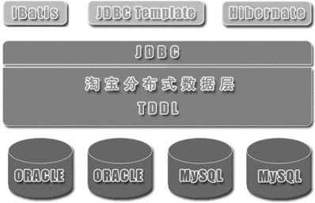

2、中间件封装 

中间件封装指的是独立一套系统出来，实现读写操作分离和数据库服务器连接的管理。中间件对业务服务器提供SQL兼容的协议，业务服务器无须自己进行读写分离。对于业务服务器来说，访问中间件和访问数据库没有区别，事实上在业务服务器看来，中间件就是一个数据库服务器。其基本架构是： 

数据库中间件的方式具备的特点是：

- 能够支持多种编程语言，因为数据库中间件对业务服务器提供的是标准SQL接口。
- 数据库中间件要支持完整的SQL语法和数据库服务器的协议（例如，MySQL客户端和服务器的连接协议），实现比较复杂，细节特别多，很容易出现bug，需要较长的时间才能稳定。
- 数据库中间件自己不执行真正的读写操作，但所有的数据库操作请求都要经过中间件，中间件的性能要求也很高。
- 数据库主从切换对业务服务器无感知，数据库中间件可以探测数据库服务器的主从状态。例如，向某个测试表写入一条数据，成功的就是主机，失败的就是从机。

由于数据库中间件的复杂度要比程序代码封装高出一个数量级，一般情况下建议采用程序语言封装的方式，或者使用成熟的开源数据库中间件。 

如果是大公司，可以投入人力去实现数据库中间件，因为这个系统一旦做好，接入的业务系统越多，节省的程序开发投入就越多，价值也越大。 

目前的开源数据库中间件方案中，MySQL官方先是提供了MySQL Proxy，但MySQL Proxy一直没有正式GA，现在MySQL官方推荐MySQL Router。MySQL Router的主要功能有读写分离、故障自动切换、负载均衡、连接池等，其基本架构如下： 

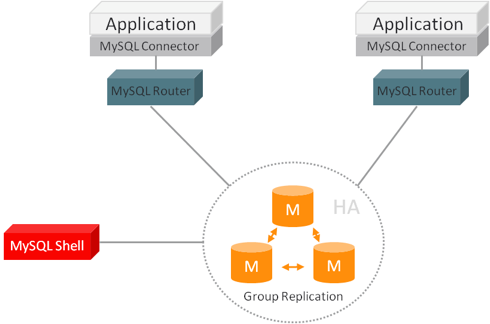

奇虎360公司也开源了自己的数据库中间件Atlas，Atlas是基于MySQL Proxy实现的。Atlas是一个位于应用程序与MySQL之间中间件。在后端DB看来，Atlas相当于连接它的客户端，在前端应用看来，Atlas相当于一个DB。Atlas作为服务端与应用程序通信，它实现了MySQL的客户端和服务端协议，同时作为客户端与MySQL通信。它对应用程序屏蔽了DB的细节，同时为了降低MySQL负担，它还维护了连接池。 

## 分库分表

读写分离分散了数据库读写操作的压力，但没有分散存储压力，当数据量达到千万甚至上亿条的时候，单台数据库服务器的存储能力会成为系统的瓶颈，主要体现在这几个方面：

- 数据量太大，读写的性能会下降，即使有索引，索引也会变得很大，性能同样会下降。
- 数据文件会变得很大，数据库备份和恢复需要耗费很长时间。
- 数据文件越大，极端情况下丢失数据的风险越高（例如，机房火灾导致数据库主备机都发生故障）

基于上述原因，单个数据库服务器存储的数据量不能太大，需要控制在一定的范围内。为了满足业务数据存储的需求，就需要将存储分散到多台数据库服务器上。 

### 分库

业务分库指的是按照业务模块将数据分散到不同的数据库服务器。例如，一个简单的电商网站，包括用户、商品、订单三个业务模块，我们可以将用户数据、商品数据、订单数据分开放到三台不同的数据库服务器上，而不是将所有数据都放在一台数据库服务器上。

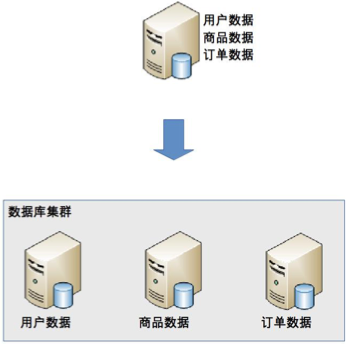

虽然业务分库能够分散存储和访问压力，但同时也带来了新的问题：

1、业务分库后，原本在同一个数据库中的表分散到不同数据库中，导致无法使用SQL的join查询。 

例如：“查询购买了化妆品的用户中女性用户的列表”这个功能，虽然订单数据中有用户的ID信息，但是用户的性别数据在用户数据库中，如果在同一个库中，简单的join查询就能完成；但现在数据分散在两个不同的数据库中，无法做join查询，只能采取先从订单数据库中查询购买了化妆品的用户ID列表，然后再到用户数据库中查询这批用户ID中的女性用户列表，这样实现就比简单的join查询要复杂一些。 

2、事务问题 

原本在同一个数据库中不同的表可以在同一个事务中修改，业务分库后，表分散到不同的数据库中，无法通过事务统一修改。虽然数据库厂商提供了一些分布式事务的解决方案（例如，MySQL的XA），但性能实在太低，与高性能存储的目标是相违背的。 

例如，用户下订单的时候需要扣商品库存，如果订单数据和商品数据在同一个数据库中，我们可以使用事务来保证扣减商品库存和生成订单的操作要么都成功要么都失败，但分库后就无法使用数据库事务了，需要业务程序自己来模拟实现事务的功能。例如，先扣商品库存，扣成功后生成订单，如果因为订单数据库异常导致生成订单失败，业务程序又需要将商品库存加上；而如果因为业务程序自己异常导致生成订单失败，则商品库存就无法恢复了，需要人工通过日志等方式来手工修复库存异常。 

3、成本问题

因为数据要存到其他服务器，必然会导致服务器数量的增加。本来1台服务器搞定的事情，现在要3台，如果考虑备份，那就是2台变成了6台。 

基于上述原因，对于小公司初创业务，并不建议一开始就这样拆分，主要有几个原因： 

- 初创业务存在很大的不确定性，业务不一定能发展起来，业务开始的时候并没有真正的存储和访问压力，业务分库并不能为业务带来价值。
- 业务分库后，表之间的join查询、数据库事务无法简单实现了。
- 业务分库后，因为不同的数据要读写不同的数据库，代码中需要增加根据数据类型映射到不同数据库的逻辑，增加了工作量。而业务初创期间最重要的是快速实现、快速验证，业务分库会拖慢业务节奏。

按照之前的架构设计原则，不建议在最初设计分库，首先业务发展起来的概率较低，没有必要设计复杂的架构，其次如果业务真的发展很快，后面进行业务分库也不迟。因为业务发展好，相应的资源投入就会加大，可以投入更多的人和更多的钱。而且单台数据库服务器的性能其实也没有想象的那么弱，一般来说，单台数据库服务器能够支撑10万用户量量级的业务，初创业务从0发展到10万级用户，并不是想象得那么快。 

而对于业界成熟的大公司来说，由于已经有了业务分库的成熟解决方案，并且即使是尝试性的新业务，用户规模也是海量的，这与前面提到的初创业务的小公司有本质区别，因此最好在业务开始设计时就考虑业务分库。例如，在淘宝上做一个新的业务，由于已经有成熟的数据库解决方案，用户量也很大，需要在一开始就设计业务分库甚至接下来介绍的分表方案。

### 分表

将不同业务数据分散存储到不同的数据库服务器，能够支撑百万甚至千万用户规模的业务，但如果业务继续发展，同一业务的单表数据也会达到单台数据库服务器的处理瓶颈。例如，淘宝的几亿用户数据，如果全部存放在一台数据库服务器的一张表中，肯定是无法满足性能要求的，此时就需要对单表数据进行拆分。 

单表数据拆分有两种方式：垂直分表和水平分表。示意图如下：

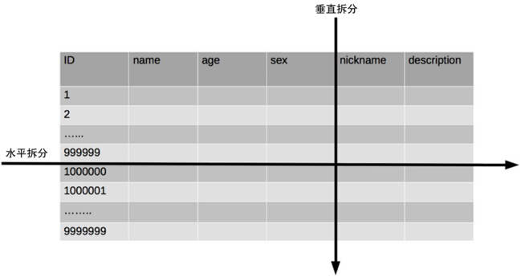

单表进行切分后，是否要将切分后的多个表分散在不同的数据库服务器中，可以根据实际的切分效果来确定，并不强制要求单表切分为多表后一定要分散到不同数据库中。 原因在于单表切分为多表后，新的表即使在同一个数据库服务器中，也可能带来可观的性能提升，如果性能能够满足业务要求，是可以不拆分到多台数据库服务器的，比较分库可能带来架构上的复杂性。如果单表拆分为多表后，单台服务器依然无法满足性能要求，那就不得不再次进行业务分库的设计了。

分表能够有效地分散存储压力和带来性能提升，但和分库一样，也会引入各种复杂性：

1、垂直分表 

垂直分表适合将表中某些不常用且占了大量空间的列拆分出去。例如，前面示意图中的nickname和description字段。

假设我们是一个婚恋网站，用户在筛选其他用户的时候，主要是用age和sex两个字段进行查询，而nickname和description两个字段主要用于展示，一般不会在业务查询中用到。description本身又比较长，因此我们可以将这两个字段独立到另外一张表中，这样在查询age和sex时，就能带来一定的性能提升。 

垂直分表引入的复杂性主要体现在表操作的数量要增加。例如，原来只要一次查询就可以获取name、age、sex、nickname、description，现在需要两次查询，一次查询获取name、age、sex，另外一次查询获取nickname、description。 

2、水平分表

水平分表适合表行数特别大的表，有的公司要求单表行数超过5000万就必须进行分表，这个数字可以作为参考，但并不是绝对标准，关键还是要看表的访问性能：

* 对于一些比较复杂的表，可能超过1000万就要分表了； 
* 对于一些简单的表，即使存储数据超过1亿行，也可以不分表。 

不管怎样，当看到表的数据量达到千万级别时，作为架构师就要警觉起来，因为这很可能是架构的性能瓶颈或者隐患。 

水平分表相比垂直分表，会引入更多的复杂性：

* 路由

  水平分表后，某条数据具体属于哪个切分后的子表，需要增加路由算法进行计算，这个算法会引入一定的复杂性。 

  常见的路由算法有： 

  * 范围路由：选取有序的数据列（例如，整形、时间戳等）作为路由的条件，不同分段分散到不同的数据库表中。以最常见的用户ID为例，路由算法可以按照1000000的范围大小进行分段，1 ~ 999999放到数据库1的表中，1000000 ~ 1999999放到数据库2的表中，以此类推。

    范围路由设计的复杂点主要体现在分段大小的选取上，分段太小会导致切分后子表数量过多，增加维护复杂度；分段太大可能会导致单表依然存在性能问题，一般建议分段大小在100万至2000万之间，具体需要根据业务选取合适的分段大小。

    范围路由的优点是可以随着数据的增加平滑地扩充新的表。例如，现在的用户是100万，如果增加到1000万，只需要增加新的表就可以了，原有的数据不需要动。

    范围路由的一个比较隐含的缺点是分布不均匀，假如按照1000万来进行分表，有可能某个分段实际存储的数据量只有1000条，而另外一个分段实际存储的数据量有900万条。

  * 选取某个列（或者某几个列组合也可以）的值进行Hash运算，然后根据Hash结果分散到不同的数据库表中。同样以用户ID为例，假如我们一开始就规划了10个数据库表，路由算法可以简单地用user_id % 10的值来表示数据所属的数据库表编号，ID为985的用户放到编号为5的子表中，ID为10086的用户放到编号为6的字表中。

    Hash路由设计的复杂点主要体现在初始表数量的选取上，表数量太多维护比较麻烦，表数量太少又可能导致单表性能存在问题。而用了Hash路由后，增加子表数量是非常麻烦的，所有数据都要重分布。

    Hash路由的优缺点和范围路由基本相反，Hash路由的优点是表分布比较均匀，缺点是扩充新的表很麻烦，所有数据都要重分布。

  * 配置路由：配置路由就是路由表，用一张独立的表来记录路由信息。同样以用户ID为例，我们新增一张user_router表，这个表包含user_id和table_id两列，根据user_id就可以查询对应的table_id。

    配置路由设计简单，使用起来非常灵活，尤其是在扩充表的时候，只需要迁移指定的数据，然后修改路由表就可以了。

    配置路由的缺点就是必须多查询一次，会影响整体性能；而且路由表本身如果太大（例如，几亿条数据），性能同样可能成为瓶颈，如果我们再次将路由表分库分表，则又面临一个死循环式的路由算法选择问题。

* join操作：水平分表后，数据分散在多个表中，如果需要与其他表进行join查询，需要在业务代码或者数据库中间件中进行多次join查询，然后将结果合并。 

* count()操作：水平分表后，虽然物理上数据分散到多个表中，但某些业务逻辑上还是会将这些表当作一个表来处理。例如，获取记录总数用于分页或者展示，水平分表前用一个count()就能完成的操作，在分表后就没那么简单了。常见的处理方式有下面两种： 

  * count()相加：具体做法是在业务代码或者数据库中间件中对每个表进行count()操作，然后将结果相加。这种方式实现简单，缺点就是性能比较低。例如，水平分表后切分为20张表，则要进行20次count(*)操作，如果串行的话，可能需要几秒钟才能得到结果。

  * 记录数表：具体做法是新建一张表，假如表名为“记录数表”，包含table_name、row_count两个字段，每次插入或者删除子表数据成功后，都更新“记录数表”。

    这种方式获取表记录数的性能要大大优于count()相加的方式，因为只需要一次简单查询就可以获取数据。缺点是复杂度增加不少，对子表的操作要同步操作“记录数表”，如果有一个业务逻辑遗漏了，数据就会不一致；且针对“记录数表”的操作和针对子表的操作无法放在同一事务中进行处理，异常的情况下会出现操作子表成功了而操作记录数表失败，同样会导致数据不一致。 

    此外，记录数表的方式也增加了数据库的写压力，因为每次针对子表的insert和delete操作都要update记录数表 

  * 定时更新：对于一些不要求记录数实时保持精确的业务，也可以通过后台定时更新记录数表。定时更新实际上就是“count()相加”和“记录数表”的结合，即定时通过count()相加计算表的记录数，然后更新记录数表中的数据。 

* order by操作：水平分表后，数据分散到多个子表中，排序操作无法在数据库中完成，只能由业务代码或者数据库中间件分别查询每个子表中的数据，然后汇总进行排序。 

分表的实现方法和和数据库读写分离类似，也是“程序代码封装”和“中间件封装”，但实现会更复杂。 

读写分离实现时只要识别SQL操作是读操作还是写操作，通过简单的判断SELECT、UPDATE、INSERT、DELETE几个关键字就可以做到，而分库分表的实现除了要判断操作类型外，还要判断SQL中具体需要操作的表、操作函数（例如count函数)、order by、group by操作等，然后再根据不同的操作进行不同的处理。例如order by操作，需要先从多个库查询到各个库的数据，然后再重新order by才能得到最终的结果。 

## NoSQL

关系数据库经过几十年的发展后已经非常成熟，强大的SQL功能和ACID的属性，使得关系数据库广泛应用于各式各样的系统中，但这并不意味着关系数据库是完美的，关系数据库存在如下缺点：

* 关系数据库存储的是行记录，无法存储数据结构

  以微博的关注关系为例，“我关注的人”是一个用户ID列表，使用关系数据库存储只能将列表拆成多行，然后再查询出来组装，无法直接存储一个列表。 

* 关系数据库的schema扩展很不方便

  关系数据库的表结构schema是强约束，操作不存在的列会报错，业务变化时扩充列也比较麻烦，需要执行DDL（data definition language，如CREATE、ALTER、DROP等）语句修改，而且修改时可能会长时间锁表（例如，MySQL可能将表锁住1个小时）。 

* 关系数据库在大数据场景下I/O较高

  如果对一些大量数据的表进行统计之类的运算，关系数据库的I/O会很高，因为即使只针对其中某一列进行运算，关系数据库也会将整行数据从存储设备读入内存。 

* 关系数据库的全文搜索功能比较弱

  关系数据库的全文搜索只能使用like进行整表扫描匹配，性能非常低，在互联网这种搜索复杂的场景下无法满足业务要求。 

针对上述问题，分别诞生了不同的NoSQL解决方案，这些方案与关系数据库相比，在某些应用场景下表现更好。 NoSQL方案带来的优势，本质上是牺牲ACID中的某个或者某几个特性，NoSQL是SQL的一个有力补充，NoSQL != No SQL，而是NoSQL = Not Only SQL。 

常见的NoSQL方案分为4类：

* K-V存储：解决关系数据库无法存储数据结构的问题，以Redis为代表。
* 文档数据库：解决关系数据库强schema约束的问题，以MongoDB为代表。
* 列式数据库：解决关系数据库大数据场景下的I/O问题，以HBase为代表。
* 全文搜索引擎：解决关系数据库的全文搜索性能问题，以Elasticsearch为代表。

### K-V存储

K-V存储的全称是Key-Value存储，其中Key是数据的标识，和关系数据库中的主键含义一样，Value就是具体的数据。 

Redis是K-V存储的典型代表，它是一款开源（基于BSD许可）的高性能K-V缓存和存储系统。Redis的Value是具体的数据结构，包括string、hash、list、set、sorted set、bitmap和hyperloglog，所以常常被称为数据结构服务器。 

以List数据结构为例，Redis提供了下面这些典型的操作：

* LPOP key从队列的左边出队一个元素。
* LINDEX key index获取一个元素，通过其索引列表。
* LLEN key获得队列（List）的长度。
* RPOP key从队列的右边出队一个元素。

以上这些功能，如果用关系数据库来实现，就会变得很复杂。例如，LPOP操作是移除并返回 key对应的list的第一个元素。如果用关系数据库来存储，为了达到同样目的，需要进行下面的操作： 

- 每条数据除了数据编号（例如，行ID），还要有位置编号，否则没有办法判断哪条数据是第一条。注意这里不能用行ID作为位置编号，因为我们会往列表头部插入数据。
- 查询出第一条数据。
- 删除第一条数据。
- 更新从第二条开始的所有数据的位置编号。

可以看出关系数据库的实现很麻烦，而且需要进行多次SQL操作，性能很低。 

Redis的缺点主要体现在并不支持完整的ACID事务，Redis虽然提供事务功能，但Redis的事务和关系数据库的事务不可同日而语，Redis的事务只能保证隔离性和一致性（I和C），无法保证原子性和持久性（A和D）。 

虽然Redis并没有严格遵循ACID原则，但实际上大部分业务也不需要严格遵循ACID原则。以上面的微博关注操作为例，即使系统没有将A加入B的粉丝列表，其实业务影响也非常小，因此我们在设计方案时，需要根据业务特性和要求来确定是否可以用Redis，而不能因为Redis不遵循ACID原则就直接放弃。 

### 文档数据库

为了解决关系数据库schema带来的问题，文档数据库应运而生。 

文档数据库最大的特点就是no-schema，可以存储和读取任意的数据。目前绝大部分文档数据库存储的数据格式是JSON（或者BSON），因为JSON数据是自描述的，无须在使用前定义字段，读取一个JSON中不存在的字段也不会导致SQL那样的语法错误。 

文档数据库的no-schema特性，给业务开发带来了几个明显的优势：

* 新增字段简单 

  业务上增加新的字段，无须再像关系数据库一样要先执行DDL语句修改表结构，程序代码直接读写即可。 

* 历史数据不会出错 

  对于历史数据，即使没有新增的字段，也不会导致错误，只会返回空值，此时代码进行兼容处理即可。 

* 可以很容易存储复杂数据 

  JSON是一种强大的描述语言，能够描述复杂的数据结构。例如，我们设计一个用户管理系统，用户的信息有ID、姓名、性别、爱好、邮箱、地址、学历信息。其中爱好是列表（因为可以有多个爱好）；地址是一个结构，包括省市区楼盘地址；学历包括学校、专业、入学毕业年份信息等。如果我们用关系数据库来存储，需要设计多张表，包括基本信息（列：ID、姓名、性别、邮箱）、爱好（列：ID、爱好）、地址（列：省、市、区、详细地址）、学历（列：入学时间、毕业时间、学校名称、专业），而使用文档数据库，一个JSON就可以全部描述。 

  使用JSON来描述数据，比使用关系型数据库表来描述数据方便和容易得多，而且更加容易理解。 

  文档数据库的这个特点，特别适合电商和游戏这类的业务场景。以电商为例，不同商品的属性差异很大。例如，冰箱的属性和笔记本电脑的属性差异非常大。即使是同类商品也有不同的属性。例如，LCD和LED显示器，两者有不同的参数指标。这种业务场景如果使用关系数据库来存储数据，就会很麻烦，而使用文档数据库，会简单、方便许多，扩展新的属性也更加容易。 

文档数据库no-schema的特性带来的这些优势也是有代价的，最主要的代价就是不支持事务。例如，使用MongoDB来存储商品库存，系统创建订单的时候首先需要减扣库存，然后再创建订单。这是一个事务操作，用关系数据库来实现就很简单，但如果用MongoDB来实现，就无法做到事务性。异常情况下可能出现库存被扣减了，但订单没有创建的情况。因此某些对事务要求严格的业务场景是不能使用文档数据库的。 

文档数据库另外一个缺点就是无法实现关系数据库的join操作。例如，我们有一个用户信息表和一个订单表，订单表中有买家用户id。如果要查询“购买了苹果笔记本用户中的女性用户”，用关系数据库来实现，一个简单的join操作就搞定了；而用文档数据库是无法进行join查询的，需要查两次：一次查询订单表中购买了苹果笔记本的用户，然后再查询这些用户哪些是女性用户。 

### 列式数据库

列式数据库就是按照列来存储数据的数据库，与之对应的传统关系数据库被称为“行式数据库”，因为关系数据库是按照行来存储数据的。 

关系数据库按照行式来存储数据，主要有以下几个优势： 

- 业务同时读取多个列时效率高，因为这些列都是按行存储在一起的，一次磁盘操作就能够把一行数据中的各个列都读取到内存中。
- 能够一次性完成对一行中的多个列的写操作，保证了针对行数据写操作的原子性和一致性；否则如果采用列存储，可能会出现某次写操作，有的列成功了，有的列失败了，导致数据不一致。

行式存储的优势是在特定的业务场景下才能体现，如果不存在这样的业务场景，那么行式存储的优势也将不复存在，甚至成为劣势，典型的场景就是海量数据进行统计。 例如，计算某个城市体重超重的人员数据，实际上只需要读取每个人的体重这一列并进行统计即可，而行式存储即使最终只使用一列，也会将所有行数据都读取出来。如果单行用户信息有1KB，其中体重只有4个字节，行式存储还是会将整行1KB数据全部读取到内存中，这是明显的浪费。而如果采用列式存储，每个用户只需要读取4字节的体重数据即可，I/O将大大减少。 

除了节省I/O，列式存储还具备更高的存储压缩比，能够节省更多的存储空间。普通的行式数据库一般压缩率在3:1到5:1左右，而列式数据库的压缩率一般在8:1到30:1左右，因为单个列的数据相似度相比行来说更高，能够达到更高的压缩率。 

同样，如果场景发生变化，列式存储的优势又会变成劣势：

* 当需要频繁地更新多个列。因为列式存储将不同列存储在磁盘上不连续的空间，导致更新多个列时磁盘是随机写操作；而行式存储时同一行多个列都存储在连续的空间，一次磁盘写操作就可以完成，列式存储的随机写效率要远远低于行式存储的写效率。 
* 列式存储高压缩率在更新场景下也会成为劣势，因为更新时需要将存储数据解压后更新，然后再压缩，最后写入磁盘。 

基于上述列式存储的优缺点，一般将列式存储应用在离线的大数据分析和统计场景中，因为这种场景主要是针对部分列单列进行操作，且数据写入后就无须再更新删除。 

### 全文搜索引擎

传统的关系型数据库通过索引来达到快速查询的目的，但是在全文搜索的业务场景下，索引也无能为力，主要体现在： 

- 全文搜索的条件可以随意排列组合，如果通过索引来满足，则索引的数量会非常多。（这是因为搜索条件的组合有很多种，不可能用特定的索引完成任务）
- 全文搜索的模糊匹配方式，索引无法满足，只能用like查询，而like查询是整表扫描，效率非常低。

全文搜索引擎的技术原理被称为“倒排索引”（Inverted index），也常被称为反向索引、置入档案或反向档案，是一种索引方法，其基本原理是建立单词到文档的索引。之所以被称为“倒排”索引，是和“正排“索引相对的，“正排索引”的基本原理是建立文档到单词的索引。 

假设我们有一个技术文章的网站，里面收集了各种技术文章，用户可以在网站浏览或者搜索文章。 

正排索引示例： 

| 文章 ID |    文章名称     |                 文章内容                  |
| :---: | :---------: | :-----------------------------------: |
|   1   |  敏捷架构设计原则   |      省略具体内容，文档内容包含：架构、设计、架构师等单词       |
|   2   | Java 编程必知必会 | 省略具体内容，文档内容包含：Java、编程、面向对象、类、架构、设计等单词 |
|   3   | 面向对象葵花宝典是什么 |   省略具体内容，文档内容包含：设计、模式、对象、类、Java 等单词   |

正排索引适用于根据文档名称来查询文档内容。例如，用户在网站上单击了“面向对象葵花宝典是什么”，网站根据文章标题查询文章的内容展示给用户。 

倒排索引示例： 

|  单词  | 文档 ID 列表 |
| :--: | :------: |
|  架构  |   1，2    |
|  设计  |  1，2，3   |
| Java |   2，3    |

倒排索引适用于根据关键词来查询文档内容。例如，用户只是想看“设计”相关的文章，网站需要将文章内容中包含“设计”一词的文章都搜索出来展示给用户。 

全文搜索引擎的索引对象是单词和文档，而关系数据库的索引对象是键和行，两者的术语差异很大，不能简单地等同起来。因此，为了让全文搜索引擎支持关系型数据的全文搜索，需要做一些转换操作，即将关系型数据转换为文档数据。

目前常用的转换方式是将关系型数据按照对象的形式转换为JSON文档，然后将JSON文档输入全文搜索引擎进行索引。

全文搜索引擎能够基于JSON文档建立全文索引，然后快速进行全文搜索。 

以Elasticsearch为例，其索引基本原理如下：

> Elastcisearch是分布式的文档存储方式。它能存储和检索复杂的数据结构——序列化成为JSON文档——以实时的方式。

> 在Elasticsearch中，每个字段的所有数据都是默认被索引的。即每个字段都有为了快速检索设置的专用倒排索引。而且，不像其他多数的数据库，它能在相同的查询中使用所有倒排索引，并以惊人的速度返回结果。

## 缓存

虽然我们可以通过各种手段来提升存储系统的性能，但在某些复杂的业务场景下，单纯依靠存储系统的性能提升不够的，典型的场景有： 

- 需要经过复杂运算后得出的数据，存储系统无能为力

  例如，一个论坛需要在首页展示当前有多少用户同时在线，如果使用MySQL来存储当前用户状态，则每次获取这个总数都要“count(*)”大量数据，这样的操作无论怎么优化MySQL，性能都不会太高。如果要实时展示用户同时在线数，则MySQL性能无法支撑。 

- 读多写少的数据，存储系统有心无力

  绝大部分在线业务都是读多写少。例如，微博、淘宝、微信这类互联网业务，读业务占了整体业务量的90%以上。以微博为例：一个明星发一条微博，可能几千万人来浏览。如果使用MySQL来存储微博，用户写微博只有一条insert语句，但每个用户浏览时都要select一次，即使有索引，几千万条select语句对MySQL数据库的压力也会非常大。 

缓存就是为了弥补存储系统在这些复杂业务场景下的不足，其基本原理是将可能重复使用的数据放到内存中，一次生成、多次使用，避免每次使用都去访问存储系统。 

缓存能够带来性能的大幅提升，以Memcache为例，单台Memcache服务器简单的key-value查询能够达到TPS 50000以上，其基本的架构是： 

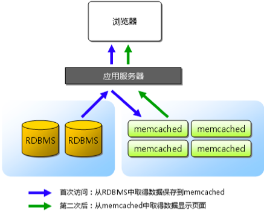

缓存虽然能够大大减轻存储系统的压力，但同时也给架构引入了更多复杂性。架构设计时如果没有针对缓存的复杂性进行处理，某些场景下甚至会导致整个系统崩溃。 

缓存方案通常情况下都是集成在存储访问方案中，可以采用“程序代码实现”的中间层方式，也可以采用独立的中间件来实现。 

### 缓存穿透

缓存穿透是指缓存没有发挥作用，业务系统虽然去缓存查询数据，但缓存中没有数据，业务系统需要再次去存储系统查询数据。通常情况下有两种情况：

1、存储数据不存在

第一种情况是被访问的数据确实不存在。一般情况下，如果存储系统中没有某个数据，则不会在缓存中存储相应的数据，这样就导致用户查询的时候，在缓存中找不到对应的数据，每次都要去存储系统中再查询一遍，然后返回数据不存在。缓存在这个场景中并没有起到分担存储系统访问压力的作用。 

通常情况下，业务上读取不存在的数据的请求量并不会太大，但如果出现一些异常情况，例如被黑客攻击，故意大量访问某些读取不存在数据的业务，有可能会将存储系统拖垮。 

这种情况的解决办法比较简单，如果查询存储系统的数据没有找到，则直接设置一个默认值（可以是空值，也可以是具体的值）存到缓存中，这样第二次读取缓存时就会获取到默认值，而不会继续访问存储系统。 

2、缓存数据生成耗费大量时间或者资源 

第二种情况是存储系统中存在数据，但生成缓存数据需要耗费较长时间或者耗费大量资源。如果刚好在业务访问的时候缓存失效了，那么也会出现缓存没有发挥作用，访问压力全部集中在存储系统上的情况。 

典型的就是电商的商品分页，假设我们在某个电商平台上选择“手机”这个类别查看，由于数据巨大，不能把所有数据都缓存起来，只能按照分页来进行缓存，由于难以预测用户到底会访问哪些分页，因此业务上最简单的就是每次点击分页的时候按分页计算和生成缓存。通常情况下这样实现是基本满足要求的，但是如果被竞争对手用爬虫来遍历的时候，系统性能就可能出现问题。 

具体的场景有：

- 分页缓存的有效期设置为1天，因为设置太长时间的话，缓存不能反应真实的数据。
- 通常情况下，用户不会从第1页到最后1页全部看完，一般用户访问集中在前10页，因此第10页以后的缓存过期失效的可能性很大。
- 竞争对手每周来爬取数据，爬虫会将所有分类的所有数据全部遍历，从第1页到最后1页全部都会读取，此时很多分页缓存可能都失效了。
- 由于很多分页都没有缓存数据，从数据库中生成缓存数据又非常耗费性能（order by limit操作），因此爬虫会将整个数据库全部拖慢。

这种情况并没有太好的解决方案，因为爬虫会遍历所有的数据，而且什么时候来爬取也是不确定的，可能是每天都来，也可能是每周，也可能是一个月来一次，我们也不可能为了应对爬虫而将所有数据永久缓存。 通常的应对方案：

* 识别爬虫然后禁止访问，但这可能会影响SEO和推广 
* 做好监控，发现问题后及时处理，因为爬虫不是攻击，不会进行暴力破坏，对系统的影响是逐步的，监控发现问题后有时间进行处理。 

### 缓存雪崩

缓存雪崩是指当缓存失效（过期）后引起系统性能急剧下降的情况。

当缓存过期被清除后，业务系统需要重新生成缓存，因此需要再次访问存储系统，再次进行运算，这个处理步骤耗时几十毫秒甚至上百毫秒。而对于一个高并发的业务系统来说，几百毫秒内可能会接到几百上千个请求。由于旧的缓存已经被清除，新的缓存还未生成，并且处理这些请求的线程都不知道另外有一个线程正在生成缓存，因此所有的请求都会去重新生成缓存，都会去访问存储系统，从而对存储系统造成巨大的性能压力。这些压力又会拖慢整个系统，严重的会造成数据库宕机，从而形成一系列连锁反应，造成整个系统崩溃。 

缓存雪崩的常见解决方法有两种：更新锁机制和后台更新机制。

* 更新锁 

  对缓存更新操作进行加锁保护，保证只有一个线程能够进行缓存更新，未能获取更新锁的线程要么等待锁释放后重新读取缓存，要么就返回空值或者默认值。

  对于采用分布式集群的业务系统，由于存在几十上百台服务器，即使单台服务器只有一个线程更新缓存，但几十上百台服务器一起算下来也会有几十上百个线程同时来更新缓存，同样存在雪崩的问题。因此分布式集群的业务系统要实现更新锁机制，需要用到分布式锁，如ZooKeeper。

* 后台更新机制

  由后台线程来更新缓存，而不是由业务线程来更新缓存，缓存本身的有效期设置为永久，后台线程定时更新缓存。 

  后台定时机制需要考虑一种特殊的场景，当缓存系统内存不够时，会“踢掉”一些缓存数据，从缓存被“踢掉”到下一次定时更新缓存的这段时间内，业务线程读取缓存返回空值，而业务线程本身又不会去更新缓存，因此业务上看到的现象就是数据丢了。解决的方式有两种： 

  * 后台线程除了定时更新缓存，还要频繁地去读取缓存（例如，1秒或者100毫秒读取一次），如果发现缓存被“踢了”就立刻更新缓存，这种方式实现简单，但读取时间间隔不能设置太长，因为如果缓存被踢了，缓存读取间隔时间又太长，这段时间内业务访问都拿不到真正的数据而是一个空的缓存值，用户体验一般。
  * 业务线程发现缓存失效后，通过消息队列发送一条消息通知后台线程更新缓存。可能会出现多个业务线程都发送了缓存更新消息，但其实对后台线程没有影响，后台线程收到消息后更新缓存前可以判断缓存是否存在，存在就不执行更新操作。这种方式实现依赖消息队列，复杂度会高一些，但缓存更新更及时，用户体验更好。

  后台更新既适应单机多线程的场景，也适合分布式集群的场景，相比更新锁机制要简单一些。 

  后台更新机制还适合业务刚上线的时候进行缓存预热。缓存预热指系统上线后，将相关的缓存数据直接加载到缓存系统，而不是等待用户访问才来触发缓存加载。 

### 缓存热点

虽然缓存系统本身的性能比较高，但对于一些特别热点的数据，如果大部分甚至所有的业务请求都命中同一份缓存数据，则这份数据所在的缓存服务器的压力也很大。例如，某明星微博发布“我们”来宣告恋爱了，短时间内上千万的用户都会来围观。 

缓存热点的解决方案就是复制多份缓存副本，将请求分散到多个缓存服务器上，减轻缓存热点导致的单台缓存服务器压力。以微博为例，对于粉丝数超过100万的明星，每条微博都可以生成100份缓存，缓存的数据是一样的，通过在缓存的key里面加上编号进行区分，每次读缓存时都随机读取其中某份缓存。

缓存副本设计有一个细节需要注意，就是不同的缓存副本不要设置统一的过期时间，否则就会出现所有缓存副本同时生成同时失效的情况，从而引发缓存雪崩效应。正确的做法是设定一个过期时间范围，不同的缓存副本的过期时间是指定范围内的随机值。

## 单服务器高性能模式

高性能架构设计主要集中在两方面：

- 尽量提升单服务器的性能，将单服务器的性能发挥到极致。
- 如果单服务器无法支撑性能，设计服务器集群方案。

单服务器高性能的关键之一就是服务器采取的并发模型，并发模型有如下两个关键设计点：

* 服务器如何管理连接。
* 服务器如何处理请求。

以上两个设计点最终都和操作系统的I/O模型及进程模型相关：

- I/O模型：阻塞、非阻塞、同步、异步。
- 进程模型：单进程、多进程、多线程。

### PPC

PPC是Process Per Connection的缩写，其含义是指每次有新的连接就新建一个进程去专门处理这个连接的请求，这是传统的UNIX网络服务器所采用的模型。基本的流程图是： 

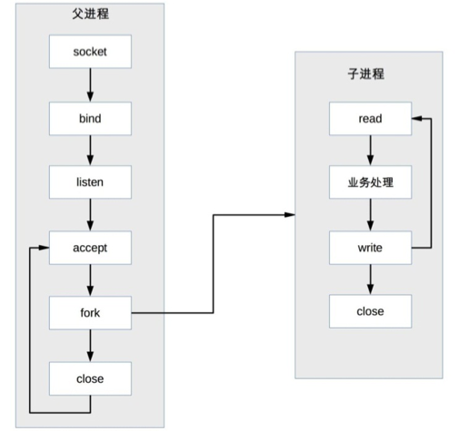

处理流程：

- 父进程接受连接（图中accept）。
- 父进程“fork”子进程（图中fork）。
- 子进程处理连接的读写请求（图中子进程read、业务处理、write）。
- 子进程关闭连接（图中子进程中的close）。

图中有一个小细节，父进程“fork”子进程后，直接调用了close，看起来好像是关闭了连接，其实只是将连接的文件描述符引用计数减一，真正的关闭连接是等子进程也调用close后，连接对应的文件描述符引用计数变为0后，操作系统才会真正关闭连接，更多细节请参考《UNIX网络编程：卷一》。 

PPC模式实现简单，比较适合服务器的连接数没那么多的情况，例如数据库服务器。 

对于普通的业务服务器，在互联网兴起之前，由于服务器的访问量和并发量并没有那么大，这种模式其实运作得也挺好，世界上第一个web服务器CERN httpd就采用了这种模式。互联网兴起后，服务器的并发和访问量从几十剧增到成千上万，这种模式的弊端就凸显出来了，主要体现在这几个方面： 

- fork代价高：站在操作系统的角度，创建一个进程的代价是很高的，需要分配很多内核资源，需要将内存映像从父进程复制到子进程。即使现在的操作系统在复制内存映像时用到了Copy on Write（写时复制）技术，总体来说创建进程的代价还是很大的。
- 父子进程通信复杂：父进程“fork”子进程时，文件描述符可以通过内存映像复制从父进程传到子进程，但“fork”完成后，父子进程通信就比较麻烦了，需要采用IPC（Interprocess Communication）之类的进程通信方案。例如，子进程需要在close之前告诉父进程自己处理了多少个请求以支撑父进程进行全局的统计，那么子进程和父进程必须采用IPC方案来传递信息。
- 支持的并发连接数量有限：如果每个连接存活时间比较长，而且新的连接又源源不断的进来，则进程数量会越来越多，操作系统进程调度和切换的频率也越来越高，系统的压力也会越来越大。因此，一般情况下，PPC方案能处理的并发连接数量最大也就几百。

### prefork

PPC模式中，当连接进来时才fork新进程来处理连接请求，由于fork进程代价高，用户访问时可能感觉比较慢，prefork模式的出现就是为了解决这个问题。 

顾名思义，prefork就是提前创建进程（pre-fork）。系统在启动的时候就预先创建好进程，然后才开始接受用户的请求，当有新的连接进来的时候，就可以省去fork进程的操作，让用户访问更快、体验更好。prefork的基本示意图是： 

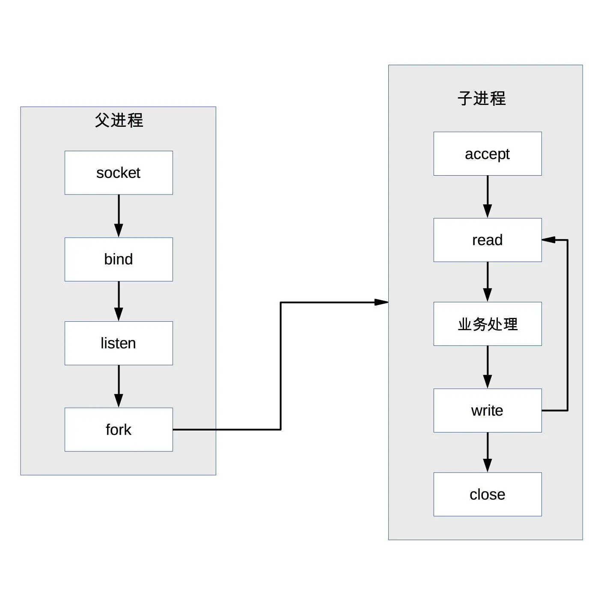

prefork的实现关键就是多个子进程都accept同一个socket，当有新的连接进入时，操作系统保证只有一个进程能最后accept成功。但这里也存在一个小小的问题：“惊群”现象，就是指虽然只有一个子进程能accept成功，但所有阻塞在accept上的子进程都会被唤醒，这样就导致了不必要的进程调度和上下文切换了。幸运的是，操作系统可以解决这个问题，例如Linux 2.6版本后内核已经解决了accept惊群问题。 

prefork模式和PPC一样，还是存在父子进程通信复杂、支持的并发连接数量有限的问题，因此目前实际应用也不多。Apache服务器提供了MPM prefork模式，推荐在需要可靠性或者与旧软件兼容的站点时采用这种模式，默认情况下最大支持256个并发连接。 

### TPC

TPC是Thread Per Connection的缩写，其含义是指每次有新的连接就新建一个线程去专门处理这个连接的请求。 

与进程相比，线程更轻量级，创建线程的消耗比进程要少得多；同时多线程是共享进程内存空间的，线程通信相比进程通信更简单。因此，TPC实际上是解决或者弱化了PPC fork代价高的问题和父子进程通信复杂的问题。 

TPC的基本流程是： 

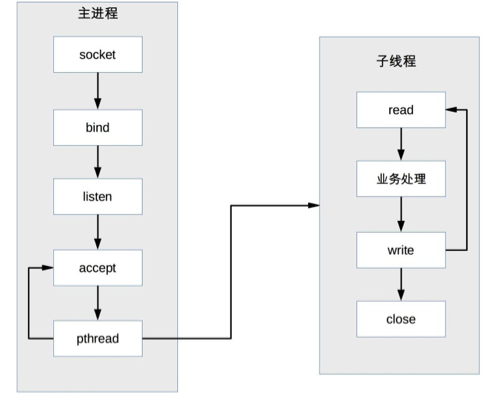

这个过程分为以下几步：

- 父进程接受连接（图中accept）。
- 父进程创建子线程（图中pthread）。
- 子线程处理连接的读写请求（图中子线程read、业务处理、write）。
- 子线程关闭连接（图中子线程中的close）。

注意，和PPC相比，主进程不用“close”连接了。原因是在于子线程是共享主进程的进程空间的，连接的文件描述符并没有被复制，因此只需要一次close即可。 

TPC虽然解决了fork代价高和进程通信复杂的问题，但是也引入了新的问题，具体表现在：

- 创建线程虽然比创建进程代价低，但并不是没有代价，高并发时（例如每秒上万连接）还是有性能问题。
- 无须进程间通信，但是线程间的互斥和共享又引入了复杂度，可能一不小心就导致了死锁问题。
- 多线程会出现互相影响的情况，某个线程出现异常时，可能导致整个进程退出（例如内存越界）。

除了引入了新的问题，TPC还是存在CPU线程调度和切换代价的问题。因此，TPC方案本质上和PPC方案基本类似，在并发几百连接的场景下，反而更多地是采用PPC的方案，因为PPC方案不会有死锁的风险，也不会多进程互相影响，稳定性更高。 

### prethread

TPC模式中，当连接进来时才创建新的线程来处理连接请求，虽然创建线程比创建进程要更加轻量级，但还是有一定的代价，而prethread模式就是为了解决这个问题。 

和prefork类似，prethread模式会预先创建线程，然后才开始接受用户的请求，当有新的连接进来的时候，就可以省去创建线程的操作，让用户感觉更快、体验更好。 

由于多线程之间数据共享和通信比较方便，因此实际上prethread的实现方式相比prefork要灵活一些，常见的实现方式有下面几种：

- 主进程accept，然后将连接交给某个线程处理。
- 子线程都尝试去accept，最终只有一个线程accept成功，方案的基本示意图如下：

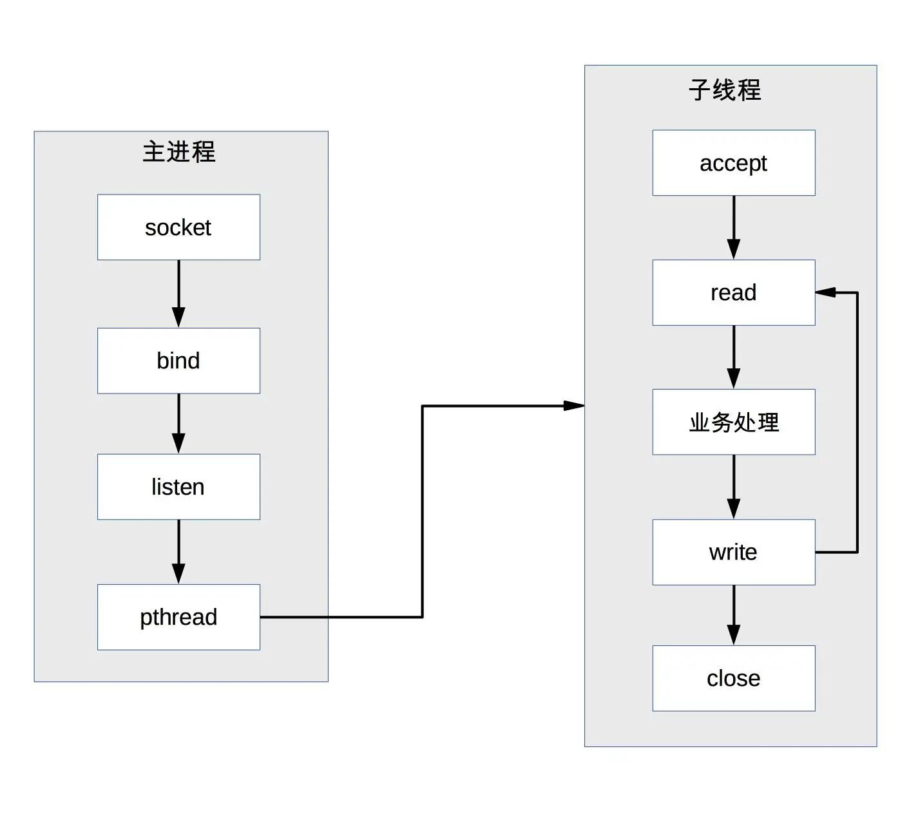

Apache服务器的MPM worker模式本质上就是一种prethread方案，但稍微做了改进。Apache服务器会首先创建多个进程，每个进程里面再创建多个线程，这样做主要是为了考虑稳定性，即：即使某个子进程里面的某个线程异常导致整个子进程退出，还会有其他子进程继续提供服务，不会导致整个服务器全部挂掉。 

prethread理论上可以比prefork支持更多的并发连接，Apache服务器MPM worker模式默认支持16 × 25 = 400 个并发处理线程。 

### Reactor

PPC和TPC模式的优点是实现简单，缺点是都无法支撑高并发的场景，尤其是互联网发展到现在，各种海量用户业务的出现，PPC和TPC完全无能为力。

PPC模式最主要的问题就是每个连接都要创建进程（为了描述简洁，这里只以PPC和进程为例，实际上换成TPC和线程，原理是一样的），连接结束后进程就销毁了，这样做其实是很大的浪费。 为了解决这个问题，一个自然而然的想法就是资源复用，即不再单独为每个连接创建进程，而是创建一个进程池，将连接分配给进程，一个进程可以处理多个连接的业务。 

资源池的处理方式有一个问题：当一个连接一个进程时，进程可以采用“read -> 业务处理 -> write”的处理流程，如果当前连接没有数据可以读，则进程就阻塞在read操作上。这种阻塞的方式在一个连接一个进程的场景下没有问题，但如果一个进程处理多个连接，进程阻塞在某个连接的read操作上，此时即使其他连接有数据可读，进程也无法去处理，很显然这样是无法做到高性能的。 

解决这个问题的最简单的方式是将read操作改为非阻塞，然后进程不断地轮询多个连接。这种方式能够解决阻塞的问题，但还是存在几个问题：

* 首先，轮询是要消耗CPU的 
* 其次，如果一个进程处理几千上万的连接，则轮询的效率是很低的。 

为了更好的解决上面的问题，应该只有当连接上有数据的时候进程才去处理，这就是I/O多路复用技术的来源。 

I/O多路复用技术归纳起来有两个关键实现点：

- 当多条连接共用一个阻塞对象后，进程只需要在一个阻塞对象上等待，而无须再轮询所有连接，常见的实现方式有select、epoll、kqueue等。
- 当某条连接有新的数据可以处理时，操作系统会通知进程，进程从阻塞状态返回，开始进行业务处理。

I/O多路复用结合线程池，完美地解决了PPC和TPC的问题， 它就是Reactor模式，中文的意思是反应，可以理解为《来了一个事件Reactor就有相应的反应》，具体的反应就是我们写的代码，Reactor会根据事件类型来调用相应的代码进行处理。Reactor模式也叫Dispatcher模式（在很多开源的系统里面会看到这个名称的类，其实就是实现Reactor模式的），更加贴近模式本身的含义，即I/O多路复用统一监听事件，收到事件后分配（Dispatch）给某个进程。 

Reactor模式的核心组成部分包括Reactor和处理资源池（进程池或线程池），其中Reactor负责监听和分配事件，处理资源池负责处理事件。 

结合不同的业务场景，Reactor模式的具体实现方案灵活多变，主要体现在： 

- Reactor的数量可以变化：可以是一个Reactor，也可以是多个Reactor。
- 资源池的数量可以变化：以进程为例，可以是单个进程，也可以是多个进程（线程类似）。

将上面两个因素排列组合一下，理论上可以有4种选择，但由于“多Reactor单进程”实现方案相比“单Reactor单进程”方案，既复杂又没有性能优势，因此“多Reactor单进程”方案仅仅是一个理论上的方案，实际没有应用。

最终Reactor模式有这三种典型的实现方案：

- 单Reactor单进程/线程。
- 单Reactor多线程。
- 多Reactor多进程/线程。

以上方案具体选择进程还是线程，更多地是和编程语言及平台相关。例如，Java语言一般使用线程（例如，Netty），C语言使用进程和线程都可以。例如，Nginx使用进程，Memcache使用线程。 

1、单Reactor单进程/线程 

单Reactor单进程/线程的方案示意图如下（以进程为例）： 

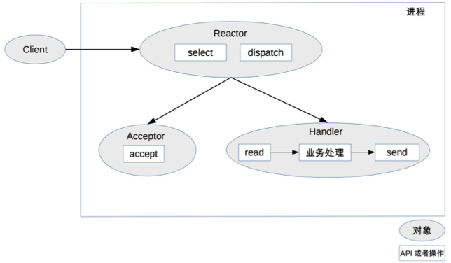

注意，select、accept、read、send是标准的网络编程API，dispatch和“业务处理”是需要完成的操作，其他方案示意图类似。 

详细说明一下这个方案：

- Reactor对象通过select监控连接事件，收到事件后通过dispatch进行分发。
- 如果是连接建立的事件，则由Acceptor处理，Acceptor通过accept接受连接，并创建一个Handler来处理连接后续的各种事件。
- 如果不是连接建立事件，则Reactor会调用连接对应的Handler（第2步中创建的Handler）来进行响应。
- Handler会完成read->业务处理->send的完整业务流程。

单Reactor单进程的模式优点就是很简单，没有进程间通信，没有进程竞争，全部都在同一个进程内完成。但其缺点也是非常明显，具体表现有： 

- 只有一个进程，无法发挥多核CPU的性能；只能采取部署多个系统来利用多核CPU，但这样会带来运维复杂度，本来只要维护一个系统，用这种方式需要在一台机器上维护多套系统。
- Handler在处理某个连接上的业务时，整个进程无法处理其他连接的事件，很容易导致性能瓶颈。

因此，单Reactor单进程的方案在实践中应用场景不多，只适用于业务处理非常快速的场景，目前比较著名的开源软件中使用单Reactor单进程的是Redis。

需要注意的是，C语言编写系统的一般使用单Reactor单进程，因为没有必要在进程中再创建线程；而Java语言编写的一般使用单Reactor单线程，因为Java虚拟机是一个进程，虚拟机中有很多线程，业务线程只是其中的一个线程而已。 

2、单Reactor多线程 

为了克服单Reactor单进程/线程方案的缺点，引入多进程/多线程是显而易见的，这就产生了第2个方案：单Reactor多线程。

单Reactor多线程方案示意图是：

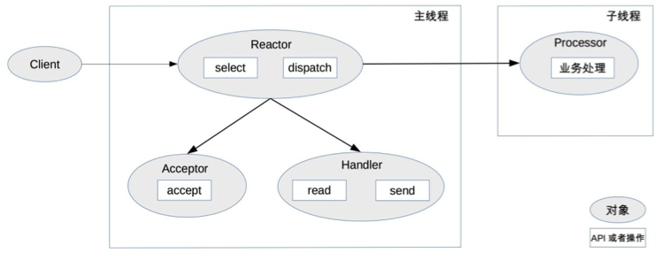

在这种模式下：

- 主线程中，Reactor对象通过select监控连接事件，收到事件后通过dispatch进行分发。
- 如果是连接建立的事件，则由Acceptor处理，Acceptor通过accept接受连接，并创建一个Handler来处理连接后续的各种事件。
- 如果不是连接建立事件，则Reactor会调用连接对应的Handler（第2步中创建的Handler）来进行响应。
- Handler只负责响应事件，不进行业务处理；Handler通过read读取到数据后，会发给Processor进行业务处理。
- Processor会在独立的子线程中完成真正的业务处理，然后将响应结果发给主进程的Handler处理；Handler收到响应后通过send将响应结果返回给client。

单Reator多线程方案能够充分利用多核多CPU的处理能力，但同时也存在下面的问题： 

- 多线程数据共享和访问比较复杂。例如，子线程完成业务处理后，要把结果传递给主线程的Reactor进行发送，这里涉及共享数据的互斥和保护机制。以Java的NIO为例，Selector是线程安全的，但是通过Selector.selectKeys()返回的键的集合是非线程安全的，对selected keys的处理必须单线程处理或者采取同步措施进行保护。
- Reactor承担所有事件的监听和响应，只在主线程中运行，瞬间高并发时会成为性能瓶颈。

一般来说，只存在“单Reactor多线程”方案 ，没有“单Reactor多进程”方案 ，这是因为如果采用多进程，子进程完成业务处理后，将结果返回给父进程，并通知父进程发送给哪个client，这是很麻烦的事情。 父进程只是通过Reactor监听各个连接上的事件然后进行分配，子进程与父进程通信时并不是一个连接。如果要将父进程和子进程之间的通信模拟为一个连接，并加入Reactor进行监听，则是比较复杂的。 而采用多线程时，因为多线程是共享数据的，因此线程间通信是非常方便的。虽然要额外考虑线程间共享数据时的同步问题，但这个复杂度比进程间通信的复杂度要低很多。 

3、多Reactor多进程/线程

为了解决单Reactor多线程的问题，最直观的方法就是将单Reactor改为多Reactor，这就产生了第3个方案：多Reactor多进程/线程。 

多Reactor多进程/线程方案示意图是（以进程为例）： 

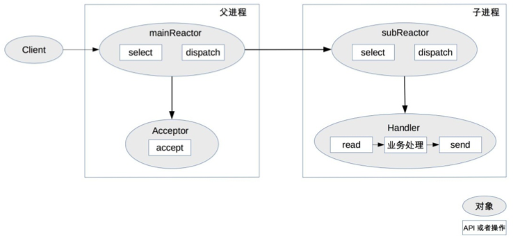

方案详细说明如下：

- 父进程中mainReactor对象通过select监控连接建立事件，收到事件后通过Acceptor接收，将新的连接分配给某个子进程。
- 子进程的subReactor将mainReactor分配的连接加入连接队列进行监听，并创建一个Handler用于处理连接的各种事件。
- 当有新的事件发生时，subReactor会调用连接对应的Handler（即第2步中创建的Handler）来进行响应。
- Handler完成read→业务处理→send的完整业务流程。

多Reactor多进程/线程的方案看起来比单Reactor多线程要复杂，但实际实现时反而更加简单，主要原因是：

- 父进程和子进程的职责非常明确，父进程只负责接收新连接，子进程负责完成后续的业务处理。
- 父进程和子进程的交互很简单，父进程只需要把新连接传给子进程，子进程无须返回数据。
- 子进程之间是互相独立的，无须同步共享之类的处理（这里仅限于网络模型相关的select、read、send等无须同步共享，“业务处理”还是有可能需要同步共享的）。

目前著名的开源系统Nginx采用的是多Reactor多进程，采用多Reactor多线程的实现有Memcache和Netty。 

虽然Nginx采用的是多Reactor多进程的模式，但方案与标准的多Reactor多进程有差异。具体差异表现为主进程中仅仅创建了监听端口，并没有创建mainReactor来“accept”连接，而是由子进程的Reactor来“accept”连接，通过锁来控制一次只有一个子进程进行“accept”，子进程“accept”新连接后就放到自己的Reactor进行处理，不会再分配给其他子进程 

### Proactor

Reactor是非阻塞同步网络模型，因为真正的read和send操作都需要用户进程同步操作。这里的“同步”指用户进程在执行read和send这类I/O操作的时候是同步的，如果把I/O操作改为异步就能够进一步提升性能，这就是异步网络模型Proactor。 

Proactor中文翻译为“前摄器”比较难理解，与其类似的单词是proactive，含义为“主动的” ，翻译为主动器更好理解，Reactor可以理解为“来了事件我通知你，你来处理”，而Proactor可以理解为“来了事件我来处理，处理完了我通知你”。这里的“我”就是操作系统内核，“事件”就是有新连接、有数据可读、有数据可写的这些I/O事件，“你”就是我们的程序代码。

Proactor模型示意图是： 

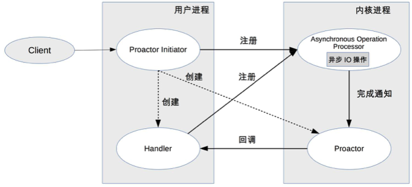

详细介绍一下Proactor方案：

- Proactor Initiator负责创建Proactor和Handler，并将Proactor和Handler都通过Asynchronous Operation Processor注册到内核。
- Asynchronous Operation Processor负责处理注册请求，并完成I/O操作。
- Asynchronous Operation Processor完成I/O操作后通知Proactor。
- Proactor根据不同的事件类型回调不同的Handler进行业务处理。
- Handler完成业务处理，Handler也可以注册新的Handler到内核进程。

理论上Proactor比Reactor效率要高一些，异步I/O能够充分利用DMA特性，让I/O操作与计算重叠，但要实现真正的异步I/O，操作系统需要做大量的工作。 

目前Windows下通过IOCP实现了真正的异步I/O，而在Linux系统下的AIO并不完善，因此在Linux下实现高并发网络编程时都是以Reactor模式为主。所以即使Boost.Asio号称实现了Proactor模型，其实它在Windows下采用IOCP，而在Linux下是用Reactor模式（采用epoll）模拟出来的异步模型。 

## 负载均衡系统

单服务器无论如何优化，无论采用多好的硬件，总会有一个性能天花板，当单服务器的性能无法满足业务需求时，就需要设计高性能集群来提升系统整体的处理性能。 高性能集群的复杂性主要体现在需要增加一个任务分配器，以及为任务选择一个合适的任务分配算法。

对于任务分配器，现在更流行的通用叫法是“负载均衡器”。但这个名称有一定的误导性，会让人潜意识里认为任务分配的目的是要保持各个计算单元的负载达到均衡状态。而实际上任务分配并不只是考虑计算单元的负载均衡，不同的任务分配算法目标是不一样的，有的基于负载考虑，有的基于性能（吞吐量、响应时间）考虑，有的基于业务考虑。 

常见的负载均衡系统包括3种：DNS负载均衡、硬件负载均衡和软件负载均衡。 

### DNS负载均衡

DNS是最简单也是最常见的负载均衡方式，一般用来实现地理级别的均衡。 

例如，北方的用户访问北京的机房，南方的用户访问深圳的机房。DNS负载均衡的本质是DNS解析同一个域名可以返回不同的IP地址。例如，同样是www.baidu.com，北方用户解析后获取的地址是61.135.165.224（这是北京机房的IP），南方用户解析后获取的地址是14.215.177.38（这是深圳机房的IP）。 

下面是DNS负载均衡的简单示意图： 

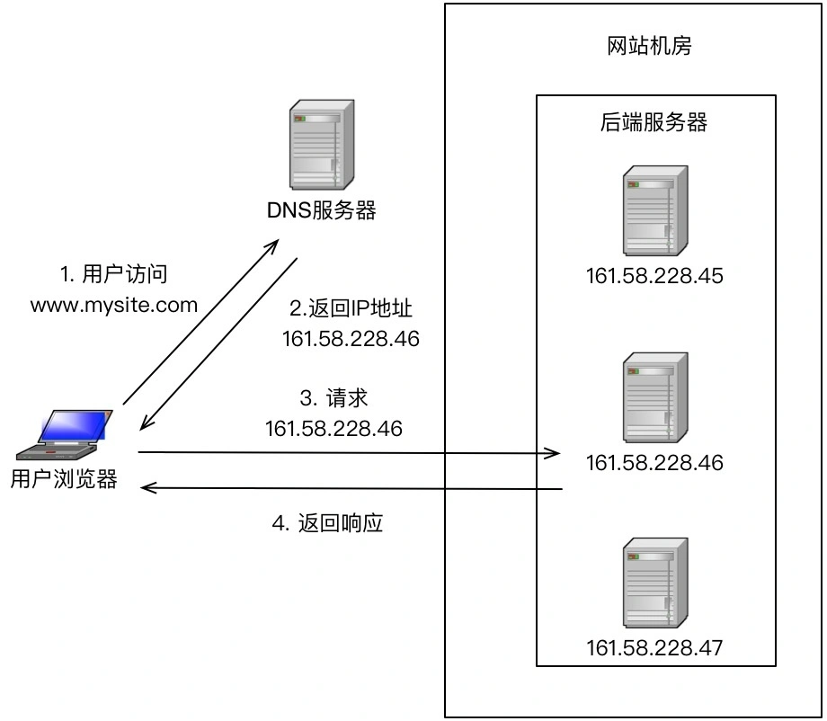

DNS负载均衡实现简单、成本低，但也存在粒度太粗、负载均衡算法少等缺点。仔细分析一下优缺点，其优点有： 

- 简单、成本低：负载均衡工作交给DNS服务器处理，无须自己开发或者维护负载均衡设备。
- 就近访问，提升访问速度：DNS解析时可以根据请求来源IP，解析成距离用户最近的服务器地址，可以加快访问速度，改善性能。

缺点有：

- 更新不及时：DNS缓存的时间比较长，修改DNS配置后，由于缓存的原因，还是有很多用户会继续访问修改前的IP，这样的访问会失败，达不到负载均衡的目的，并且也影响用户正常使用业务。
- 扩展性差：DNS负载均衡的控制权在域名商那里，无法根据业务特点针对其做更多的定制化功能和扩展特性。
- 分配策略比较简单：DNS负载均衡支持的算法少；不能区分服务器的差异（不能根据系统与服务的状态来判断负载）；也无法感知后端服务器的状态。

针对DNS负载均衡的一些缺点，对于时延和故障敏感的业务，有一些公司自己实现了HTTP-DNS的功能，也就是使用HTTP协议实现一个私有的DNS系统。这样的方案和通用的DNS优缺点正好相反。 

### 硬件负载均衡

硬件负载均衡是通过单独的硬件设备来实现负载均衡功能，这类设备和路由器、交换机类似，可以理解为一个用于负载均衡的基础网络设备。目前业界典型的硬件负载均衡设备有两款：F5和A10。这类设备性能强劲、功能强大，但价格都不便宜，一般只有“土豪”公司才会考虑使用此类设备。普通业务量级的公司一是负担不起，二是业务量没那么大，用这些设备也是浪费。 

硬件负载均衡的优点是：

- 功能强大：全面支持各层级的负载均衡，支持全面的负载均衡算法，支持全局负载均衡。
- 性能强大：对比一下，软件负载均衡支持到10万级并发已经很厉害了，硬件负载均衡可以支持100万以上的并发。
- 稳定性高：商用硬件负载均衡，经过了良好的严格测试，经过大规模使用，稳定性高。
- 支持安全防护：硬件均衡设备除具备负载均衡功能外，还具备防火墙、防DDoS攻击等安全功能。

硬件负载均衡的缺点是：

- 价格昂贵：最普通的一台F5就是一台“马6”，好一点的就是“Q7”了。
- 扩展能力差：硬件设备，可以根据业务进行配置，但无法进行扩展和定制。

### 软件负载均衡

软件负载均衡通过负载均衡软件来实现负载均衡功能，常见的有Nginx和LVS（Linux virtual server），其中Nginx是软件的7层负载均衡，LVS是Linux内核的4层负载均衡。 

4层和7层的区别就在于协议和灵活性，Nginx支持HTTP、E-mail协议；而LVS是4层负载均衡，和协议无关，几乎所有应用都可以做，例如，聊天、数据库等。

软件和硬件的最主要区别就在于性能，硬件负载均衡性能远远高于软件负载均衡性能：

* Nginx的性能是万级，一般的Linux服务器上装一个Nginx大概能到5万/秒； 
* LVS的性能是十万级，据说可达到80万/秒； 
* F5性能是百万级，从200万/秒到800万/秒都有 

软件负载均衡的最大优势是便宜，一台普通的Linux服务器批发价大概就是1万元左右，相比F5的价格，那就是自行车和宝马的区别了。 

除了使用开源的系统进行负载均衡，如果业务比较特殊，也可能基于开源系统进行定制（例如，Nginx插件），甚至进行自研。 

下面是Nginx的负载均衡架构示意图： 

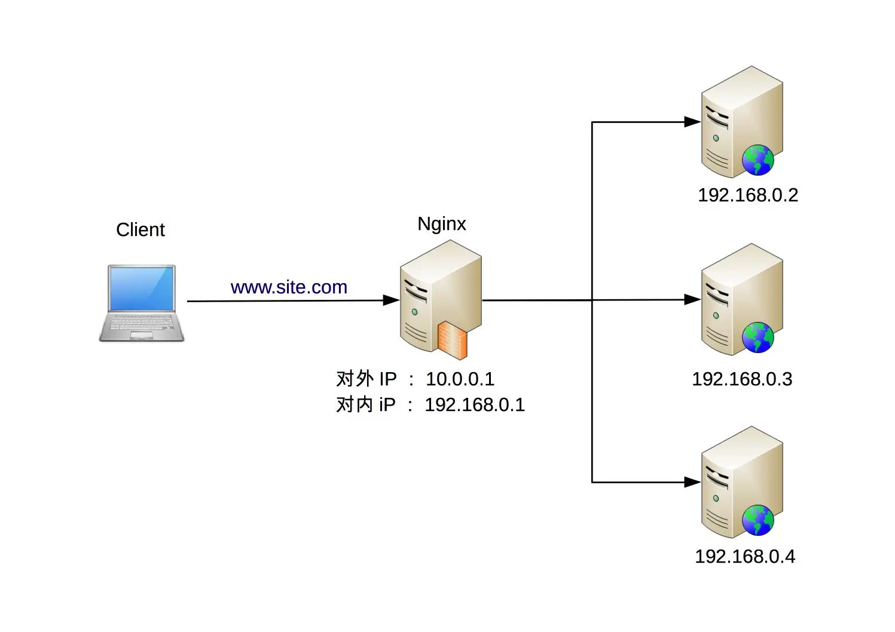

软件负载均衡的优点：

- 简单：无论是部署还是维护都比较简单。
- 便宜：只要买个Linux服务器，装上软件即可。
- 灵活：4层和7层负载均衡可以根据业务进行选择；也可以根据业务进行比较方便的扩展，例如，可以通过Nginx的插件来实现业务的定制化功能。

其实下面的缺点都是和硬件负载均衡相比的，并不是说软件负载均衡没法用。

- 性能一般：一个Nginx大约能支撑5万并发。
- 功能没有硬件负载均衡那么强大。
- 一般不具备防火墙和防DDoS攻击等安全功能。

### 负载均衡典型架构

前面介绍的3种常见的负载均衡机制并不是说非此即彼的选择，而是基于它们的优缺点进行组合使用。 

组合的基本原则为：

* DNS负载均衡用于实现地理级别的负载均衡；
* 硬件负载均衡用于实现集群级别的负载均衡；
* 软件负载均衡用于实现机器级别的负载均衡。 

例如下面的架构：

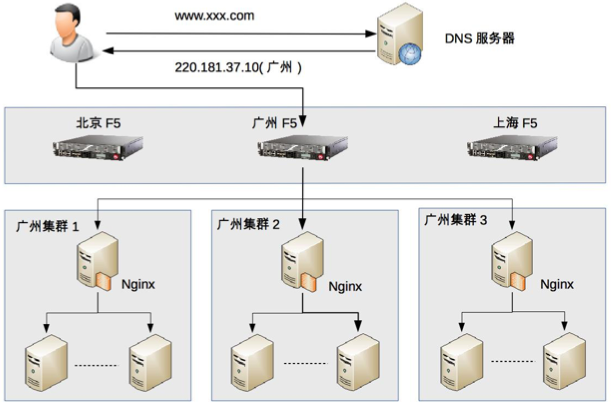

整个系统的负载均衡分为三层：

- 地理级别负载均衡：www.xxx.com部署在北京、广州、上海三个机房，当用户访问时，DNS会根据用户的地理位置来决定返回哪个机房的IP，图中返回了广州机房的IP地址，这样用户就访问到广州机房了。
- 集群级别负载均衡：广州机房的负载均衡用的是F5设备，F5收到用户请求后，进行集群级别的负载均衡，将用户请求发给3个本地集群中的一个，我们假设F5将用户请求发给了“广州集群2”。
- 机器级别的负载均衡：广州集群2的负载均衡用的是Nginx，Nginx收到用户请求后，将用户请求发送给集群里面的某台服务器，服务器处理用户的业务请求并返回业务响应。

需要注意的是，上图只是一个示例，一般在大型业务场景下才会这样用，如果业务量没这么大，则没有必要严格照搬这套架构。例如，一个大学的论坛，完全可以不需要DNS负载均衡，也不需要F5设备，只需要用Nginx作为一个简单的负载均衡就足够了。 

## 负载均衡算法

大体上负载均衡算法分为以下几类：

- 任务平分类：负载均衡系统将收到的任务平均分配给服务器进行处理，这里的“平均”可以是绝对数量的平均，也可以是比例或者权重上的平均。
- 负载均衡类：负载均衡系统根据服务器的负载来进行分配，这里的负载并不一定是通常意义上我们说的“CPU负载”，而是系统当前的压力，可以用CPU负载来衡量，也可以用连接数、I/O使用率、网卡吞吐量等来衡量系统的压力。
- 性能最优类：负载均衡系统根据服务器的响应时间来进行任务分配，优先将新任务分配给响应最快的服务器。
- Hash类：负载均衡系统根据任务中的某些关键信息进行Hash运算，将相同Hash值的请求分配到同一台服务器上。常见的有源地址Hash、目标地址Hash、session id hash、用户ID Hash等。

### 轮询

负载均衡系统收到请求后，按照顺序轮流分配到服务器上。 

轮询是最简单的一个策略，无须关注服务器本身的状态，例如： 

- 某个服务器当前因为触发了程序bug进入了死循环导致CPU负载很高，负载均衡系统是不感知的，还是会继续将请求源源不断地发送给它。
- 集群中有新的机器是32核的，老的机器是16核的，负载均衡系统也是不关注的，新老机器分配的任务数是一样的。

需要注意的是负载均衡系统无须关注“服务器本身状态” ，只要服务器在运行，运行状态是不关注的。但如果服务器直接宕机了，或者服务器和负载均衡系统断连了，这时负载均衡系统是能够感知的，也需要做出相应的处理。例如，将服务器从可分配服务器列表中删除，否则就会出现服务器都宕机了，任务还不断地分配给它，这明显是不合理的。

总而言之，“简单”是轮询算法的优点，也是它的缺点。 

### 加权轮询

负载均衡系统根据服务器权重进行任务分配，这里的权重一般是根据硬件配置进行静态配置的，采用动态的方式计算会更加契合业务，但复杂度也会更高。 

加权轮询是轮询的一种特殊形式，其主要目的就是为了解决不同服务器处理能力有差异的问题。

例如，集群中有新的机器是32核的，老的机器是16核的，那么理论上我们可以假设新机器的处理能力是老机器的2倍，负载均衡系统就可以按照2:1的比例分配更多的任务给新机器，从而充分利用新机器的性能。 

加权轮询解决了轮询算法中无法根据服务器的配置差异进行任务分配的问题，但同样存在无法根据服务器的状态差异进行任务分配的问题。 

### 负载最低优先

负载均衡系统将任务分配给当前负载最低的服务器，这里的负载根据不同的任务类型和业务场景，可以用不同的指标来衡量。 

选择什么指标跟具体的场景有关：

- LVS这种4层网络负载均衡设备，可以以“连接数”来判断服务器的状态，服务器连接数越大，表明服务器压力越大。
- Nginx这种7层网络负载系统，可以以“HTTP请求数”来判断服务器状态（Nginx内置的负载均衡算法不支持这种方式，需要进行扩展）。
- 如果我们自己开发负载均衡系统，可以根据业务特点来选择指标衡量系统压力。如果是CPU密集型，可以以“CPU负载”来衡量系统压力；如果是I/O密集型，可以以“I/O负载”来衡量系统压力。

负载最低优先的算法解决了轮询算法中无法感知服务器状态的问题，由此带来的代价是复杂度要增加很多。例如： 

- 最少连接数优先的算法要求负载均衡系统统计每个服务器当前建立的连接，其应用场景仅限于负载均衡接收的任何连接请求都会转发给服务器进行处理，否则如果负载均衡系统和服务器之间是固定的连接池方式，就不适合采取这种算法。例如，LVS可以采取这种算法进行负载均衡，而一个通过连接池的方式连接MySQL集群的负载均衡系统就不适合采取这种算法进行负载均衡。
- CPU负载最低优先的算法要求负载均衡系统以某种方式收集每个服务器的CPU负载，而且要确定是以1分钟的负载为标准，还是以15分钟的负载为标准，不存在1分钟肯定比15分钟要好或者差。不同业务最优的时间间隔是不一样的，时间间隔太短容易造成频繁波动，时间间隔太长又可能造成峰值来临时响应缓慢。

负载最低优先算法基本上能够比较完美地解决轮询算法的缺点，因为采用这种算法后，负载均衡系统需要感知服务器当前的运行状态。 

其代价是复杂度大幅上升。通俗来讲，轮询可能是5行代码就能实现的算法，而负载最低优先算法可能要1000行才能实现，甚至需要负载均衡系统和服务器都要开发代码。负载最低优先算法如果本身没有设计好，或者不适合业务的运行特点，算法本身就可能成为性能的瓶颈，或者引发很多莫名其妙的问题。所以负载最低优先算法虽然效果看起来很美好，但实际上真正应用的场景反而没有轮询（包括加权轮询）那么多。 

### 性能最优类

负载最低优先类算法是站在服务器的角度来进行分配的，而性能最优优先类算法则是站在客户端的角度来进行分配的，优先将任务分配给处理速度最快的服务器，通过这种方式达到最快响应客户端的目的。 

和负载最低优先类算法类似，性能最优优先类算法本质上也是感知了服务器的状态，只是通过响应时间这个外部标准来衡量服务器状态而已。因此性能最优优先类算法存在的问题和负载最低优先类算法类似，复杂度都很高，主要体现在： 

* 负载均衡系统需要收集和分析每个服务器每个任务的响应时间，在大量任务处理的场景下，这种收集和统计本身也会消耗较多的性能。
* 为了减少这种统计上的消耗，可以采取采样的方式来统计，即不统计所有任务的响应时间，而是抽样统计部分任务的响应时间来估算整体任务的响应时间。采样统计虽然能够减少性能消耗，但使得复杂度进一步上升，因为要确定合适的采样率，采样率太低会导致结果不准确，采样率太高会导致性能消耗较大，找到合适的采样率也是一件复杂的事情。
* 无论是全部统计还是采样统计，都需要选择合适的周期：是10秒内性能最优，还是1分钟内性能最优，还是5分钟内性能最优……没有放之四海而皆准的周期，需要根据实际业务进行判断和选择，这也是一件比较复杂的事情，甚至出现系统上线后需要不断地调优才能达到最优设计。

### Hash类

负载均衡系统根据任务中的某些关键信息进行Hash运算，将相同Hash值的请求分配到同一台服务器上，这样做的目的主要是为了满足特定的业务需求。例如： 

- 源地址Hash

将来源于同一个源IP地址的任务分配给同一个服务器进行处理，适合于存在事务、会话的业务。例如，当我们通过浏览器登录网上银行时，会生成一个会话信息，这个会话是临时的，关闭浏览器后就失效。网上银行后台无须持久化会话信息，只需要在某台服务器上临时保存这个会话就可以了，但需要保证用户在会话存在期间，每次都能访问到同一个服务器，这种业务场景就可以用源地址Hash来实现。

- ID Hash

将某个ID标识的业务分配到同一个服务器中进行处理，这里的ID一般是临时性数据的ID（如session id）。例如，上述的网上银行登录的例子，用session id hash同样可以实现同一个会话期间，用户每次都是访问到同一台服务器的目的。