# 高可用

## CAP

CAP定理（CAP theorem）又被称作布鲁尔定理（Brewer's theorem），是加州大学伯克利分校的计算机科学家埃里克·布鲁尔（Eric Brewer）在2000年的ACM PODC上提出的一个猜想。2002年，麻省理工学院的赛斯·吉尔伯特（Seth Gilbert）和南希·林奇（Nancy Lynch）发表了布鲁尔猜想的证明，使之成为分布式计算领域公认的一个定理。 

### 基本概念

Robert Greiner对CAP的理解也经历了一个过程，他写了两篇文章来阐述CAP理论，第一篇被标记为“outdated”（有一些中文翻译文章正好参考了第一篇） ，下面将对比两篇的差异点：

两篇的链接：

新版：<http://robertgreiner.com/2014/06/cap-theorem-explained/> 

旧版：<http://robertgreiner.com/2014/08/cap-theorem-revisited/> 

1、CAP的基本概念

|      | 英文描述                                     | 中文翻译                                     |
| ---- | ---------------------------------------- | ---------------------------------------- |
| 第一版  | Any distributed system cannot guaranty C, A, and P simultaneously. | 对于一个分布式计算系统，不可能同时满足一致性（Consistence）、可用性（Availability）、分区容错性（Partition Tolerance）三个设计约束 |
| 第二版  | In a distributed system (a collection of interconnected nodes that share data.), you can only have two out of the following three guarantees across a write/read pair: Consistency, Availability, and Partition Tolerance - one of them must be sacrificed. | 在一个分布式系统（指互相连接并共享数据的节点的集合）中，当涉及读写操作时，只能保证一致性（Consistence）、可用性（Availability）、分区容错性（Partition Tolerance）三者中的两个，另外一个必须被牺牲。 |

对比两个版本的定义，有几个很关键的差异点： 

* 第二版定义了什么才是CAP理论探讨的分布式系统，强调了两点：interconnected和share data

  因为分布式系统并不一定会互联和共享数据。最简单的例如Memcache的集群，相互之间就没有连接和共享数据，因此Memcache集群这类分布式系统就不符合CAP理论探讨的对象；而MySQL集群就是互联和进行数据复制的，因此是CAP理论探讨的对象。

* 第二版强调了write/read pair，这点其实是和上一个差异点一脉相承的。也就是说，CAP关注的是对数据的读写操作，而不是分布式系统的所有功能。例如，ZooKeeper的选举机制就不是CAP探讨的对象。

2、一致性Consistency的基本概念

|      | 英文描述                                     | 中文翻译                           |
| ---- | ---------------------------------------- | ------------------------------ |
| 第一版  | All nodes see the same data at the same time. | 所有节点在同一时刻都能看到相同的数据。            |
| 第二版  | A read is guaranteed to return the most recent write for a given client. | 对某个指定的客户端来说，读操作保证能够返回最新的写操作结果。 |

第一版解释和第二版解释的主要差异点表现在： 

* 第一版从节点node的角度描述，第二版从客户端client的角度描述。

  相比来说，第二版更加符合我们观察和评估系统的方式，即站在客户端的角度来观察系统的行为和特征。 

* 第一版的关键词是see，第二版的关键词是read。

  第一版解释中的see，其实并不确切，因为节点node是拥有数据，而不是看到数据，即使要描述也是用have；第二版从客户端client的读写角度来描述一致性，定义更加精确。 

* 第一版强调同一时刻拥有相同数据（same time + same data），第二版并没有强调这点。

  这就意味着实际上对于节点来说，可能同一时刻拥有不同数据（same time + different data） 。这是因为对于系统执行事务来说，在事务执行过程中，系统其实处于一个不一致的状态，不同的节点的数据并不完全一致。

  第二版强调client读操作能够获取最新的写结果就没有问题，因为事务在执行过程中，client是无法读取到未提交的数据的，只有等到事务提交后，client才能读取到事务写入的数据，而如果事务失败则会进行回滚，client也不会读取到事务中间写入的数据。 

3、可用性Availability的基本概念

|      | 英文描述                                     | 中文翻译                              |
| ---- | ---------------------------------------- | --------------------------------- |
| 第一版  | Every request gets a response on success/failure. | 每个请求都能得到成功或者失败的响应。                |
| 第二版  | A non-failing node will return a reasonable response within a reasonable amount of time (no error or timeout). | 非故障的节点在合理的时间内返回合理的响应（不是错误和超时的响应）。 |

第一版解释和第二版解释主要差异点表现在： 

* 第一版是every request，第二版强调了A non-failing node。

  第一版的every request是不严谨的，因为只有非故障节点才能满足可用性要求，如果节点本身就故障了，发给节点的请求不一定能得到一个响应。 

* 第一版的response分为success和failure，第二版用了两个reasonable：reasonable response 和reasonable time，而且特别强调了no error or timeout。

  第一版的success/failure的定义太泛了，几乎任何情况，无论是否符合CAP理论，我们都可以说请求成功和失败，因为超时也算失败、错误也算失败、异常也算失败、结果不正确也算失败；即使是成功的响应，也不一定是正确的。例如，本来应该返回100，但实际上返回了90，这就是成功的响应，但并没有得到正确的结果。 

  相比之下，第二版的解释明确了不能超时、不能出错，结果是合理的，注意没有说“正确”的结果。例如，应该返回100但实际上返回了90，肯定是不正确的结果，但可以是一个合理的结果。

4、分区容忍性（Partition Tolerance） 的基本概念

|      | 英文描述                                     | 中文翻译                   |
| ---- | ---------------------------------------- | ---------------------- |
| 第一版  | System continues to work despite message loss or partial failure. | 出现消息丢失或者分区错误时系统能够继续运行。 |
| 第二版  | The system will continue to function when network partitions occur. | 当出现网络分区后，系统能够继续“履行职责”。 |

第一版解释和第二版解释主要差异点表现在： 

* 第一版用的是work，第二版用的是function 

  work强调“运行”，只要系统不宕机，我们都可以说系统在work，返回错误也是work，拒绝服务也是work； 

  而function强调“发挥作用”“履行职责”，这点和可用性是一脉相承的。也就是说，只有返回reasonable response才是function。相比之下，第二版解释更加明确。 

* 第一版描述分区用的是message loss or partial failure，第二版直接用network partitions。

  对比两版解释，第一版是直接说原因，即message loss造成了分区，但message loss的定义有点狭隘，因为通常我们说的message loss（丢包），只是网络故障中的一种；第二版直接说现象，即发生了分区现象，不管是什么原因，可能是丢包，也可能是连接中断，还可能是拥塞，只要导致了网络分区，就通通算在里面。

### CP和AP

虽然CAP理论定义是三个要素中只能取两个，但放到分布式环境下来思考，我们会发现必须选择P（分区容忍）要素，因为网络本身无法做到100%可靠，有可能出故障，所以分区是一个必然的现象。 

如果我们选择了CA而放弃了P，那么当发生分区现象时，为了保证C，系统需要禁止写入，当有写入请求时，系统返回error（例如，当前系统不允许写入），这又和A冲突了，因为A要求返回no error和no timeout。因此，分布式系统理论上不可能选择CA架构，只能选择CP或者AP架构。 

1、CP - Consistency/Partition Tolerance 

为了保证一致性，当发生分区现象后，N1节点上的数据已经更新到y，但由于N1和N2之间的复制通道中断，数据y无法同步到N2，N2节点上的数据还是x。这时客户端C访问N2时，N2需要返回Error，提示客户端C“系统现在发生了错误”，这种处理方式违背了可用性（Availability）的要求，因此CAP三者只能满足CP。 

2、AP - Availability/Partition Tolerance 

为了保证可用性，当发生分区现象后，N1节点上的数据已经更新到y，但由于N1和N2之间的复制通道中断，数据y无法同步到N2，N2节点上的数据还是x。这时客户端C访问N2时，N2将当前自己拥有的数据x返回给客户端C了，而实际上当前最新的数据已经是y了，这就不满足一致性（Consistency）的要求了，因此CAP三者只能满足AP。 

注意：这里N2节点返回x，虽然不是一个“正确”的结果，但是一个“合理”的结果，因为x是旧的数据，并不是一个错乱的值，只是不是最新的数据而已。 

### 几个关键细节

埃里克·布鲁尔（Eric Brewer）在《CAP理论十二年回顾：“规则”变了》（<http://www.infoq.com/cn/articles/cap-twelve-years-later-how-the-rules-have-changed>）一文中详细地阐述了理解和应用CAP的一些细节点，下面叙述一些文中的重要细节：

1、CAP关注的粒度是数据，而不是整个系统。

原文是：C与A之间的取舍可以在同一系统内以非常细小的粒度反复发生，而每一次的决策可能因为具体的操作，乃至因为牵涉到特定的数据或用户而有所不同。 

但这句话是理解和应用CAP理论非常关键的一点。CAP理论的定义和解释中，用的都是system、node这类系统级的概念，这就给很多人造成了很大的误导，认为我们在进行架构设计时，整个系统要么选择CP，要么选择AP。但在实际设计过程中，每个系统不可能只处理一种数据，而是包含多种类型的数据，有的数据必须选择CP，有的数据必须选择AP。而如果我们做设计时，从整个系统的角度去选择CP还是AP，就会发现顾此失彼，无论怎么做都是有问题的。 

以一个最简单的用户管理系统为例，用户管理系统包含用户账号数据（用户ID、密码）、用户信息数据（昵称、兴趣、爱好、性别、自我介绍等）。通常情况下，用户账号数据会选择CP，而用户信息数据会选择AP，如果限定整个系统为CP，则不符合用户信息数据的应用场景；如果限定整个系统为AP，则又不符合用户账号数据的应用场景。 

所以在CAP理论落地实践时，我们需要将系统内的数据按照不同的应用场景和要求进行分类，每类数据选择不同的策略（CP还是AP），而不是直接限定整个系统所有数据都是同一策略。 

2、CAP是忽略网络延迟的。

这是一个非常隐含的假设，布鲁尔在定义一致性时，并没有将延迟考虑进去。也就是说，当事务提交时，数据能够瞬间复制到所有节点。 

但实际情况下，从节点A复制数据到节点B，总是需要花费一定时间的。如果是相同机房，耗费时间可能是几毫秒；如果是跨地域的机房，例如北京机房同步到广州机房，耗费的时间就可能是几十毫秒。这就意味着，CAP理论中的C在实践中是不可能完美实现的，在数据复制的过程中，节点A和节点B的数据并不一致。 

不要小看了这几毫秒或者几十毫秒的不一致，对于某些严苛的业务场景，例如和金钱相关的用户余额，或者和抢购相关的商品库存，技术上是无法做到分布式场景下完美的一致性的。 有些业务要求强一致性，单个用户的余额、单个商品的库存，理论上要求选择CP而实际上CP都做不到，只能选择CA，因为只能单点写入，其他节点做备份，无法做到分布式情况下多点写入。 

需要注意的是，这并不意味着这类系统无法应用分布式架构，只是说“单个用户余额、单个商品库存”无法做分布式，但系统整体还是可以应用分布式架构的。例如，下面的架构图是常见的将用户分区的分布式架构：

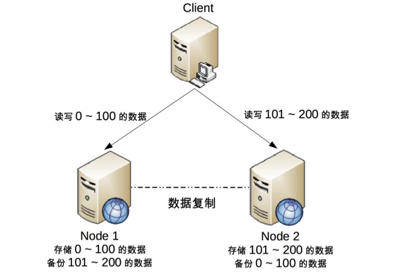

我们可以将用户id为0 ~ 100的数据存储在Node 1，将用户id为101 ~ 200的数据存储在Node 2，Client根据用户id来决定访问哪个Node。对于单个用户来说，读写操作都只能在某个节点上进行；对所有用户来说，有一部分用户的读写操作在Node 1上，有一部分用户的读写操作在Node 2上。 

这样的设计有一个很明显的问题就是某个节点故障时，这个节点上的用户就无法进行读写操作了，但站在整体上来看，这种设计可以降低节点故障时受影响的用户的数量和范围，毕竟只影响20%的用户肯定要比影响所有用户要好。这也是为什么挖掘机挖断光缆后，支付宝只有一部分用户会出现业务异常，而不是所有用户业务异常的原因。 

3、正常运行情况下，不存在CP和AP的选择，可以同时满足CA

CAP理论告诉我们分布式系统只能选择CP或者AP，但其实这里的前提是系统发生了“分区”现象。如果系统没有发生分区现象，也就是说P不存在的时候（节点间的网络连接一切正常），我们没有必要放弃C或者A，应该C和A都可以保证，这就要求架构设计的时候既要考虑分区发生时选择CP还是AP，也要考虑分区没有发生时如何保证CA。

同样以用户管理系统为例，即使是实现CA，不同的数据实现方式也可能不一样：用户账号数据可以采用“消息队列”的方式来实现CA，因为消息队列可以比较好地控制实时性，但实现起来就复杂一些；而用户信息数据可以采用“数据库同步”的方式来实现CA，因为数据库的方式虽然在某些场景下可能延迟较高，但使用起来简单。 

4、放弃并不等于什么都不做，需要为分区恢复后做准备。

CAP理论告诉我们三者只能取两个，需要“牺牲”（sacrificed）另外一个，这里的“牺牲”是有一定误导作用的，因为“牺牲”让很多人理解成什么都不做。实际上，CAP理论的“牺牲”只是说在分区过程中我们无法保证C或者A，但并不意味着什么都不做。 

系统整个运行周期中，大部分时间都是正常的，发生分区现象的时间并不长。例如，99.99%可用性（俗称4个9）的系统，一年运行下来，不可用的时间只有50分钟；99.999%（俗称5个9）可用性的系统，一年运行下来，不可用的时间只有5分钟。分区期间放弃C或者A，并不意味着永远放弃C和A，我们可以在分区期间进行一些操作，从而让分区故障解决后，系统能够重新达到CA的状态。 

最典型的就是在分区期间记录一些日志，当分区故障解决后，系统根据日志进行数据恢复，使得重新达到CA状态。 

以用户管理系统为例：对于用户账号数据，假设我们选择了CP，则分区发生后，节点1可以继续注册新用户，节点2无法注册新用户（这里就是不符合A的原因，因为节点2收到注册请求后会返回error），此时节点1可以将新注册但未同步到节点2的用户记录到日志中。当分区恢复后，节点1读取日志中的记录，同步给节点2，当同步完成后，节点1和节点2就达到了同时满足CA的状态。 

而对于用户信息数据，假设我们选择了AP，则分区发生后，节点1和节点2都可以修改用户信息，但两边可能修改不一样。例如，用户在节点1中将爱好改为“旅游、美食、跑步”，然后用户在节点2中将爱好改为“美食、游戏”，节点1和节点2都记录了未同步的爱好数据，当分区恢复后，系统按照某个规则来合并数据。例如，按照“最后修改优先规则”将用户爱好修改为“美食、游戏”，按照“字数最多优先规则”则将用户爱好修改为“旅游，美食、跑步”，也可以完全将数据冲突报告出来，由人工来选择具体应该采用哪一条。 

### ACID

ACID是数据库管理系统为了保证事务的正确性而提出来的一个理论，ACID包含四个约束：

1.Atomicity（原子性）

一个事务中的所有操作，要么全部完成，要么全部不完成，不会在中间某个环节结束。事务在执行过程中发生错误，会被回滚到事务开始前的状态，就像这个事务从来没有执行过一样。

2.Consistency（一致性）

在事务开始之前和事务结束以后，数据库的完整性没有被破坏。

3.Isolation（隔离性）

数据库允许多个并发事务同时对数据进行读写和修改的能力。隔离性可以防止多个事务并发执行时由于交叉执行而导致数据的不一致。事务隔离分为不同级别，包括读未提交（Read uncommitted）、读提交（read committed）、可重复读（repeatable read）和串行化（Serializable）。

4.Durability（持久性）

事务处理结束后，对数据的修改就是永久的，即便系统故障也不会丢失。

可以看到，ACID中的A（Atomicity）和CAP中的A（Availability）意义完全不同，而ACID中的C和CAP中的C名称虽然都是一致性，但含义也完全不一样：ACID中的C是指数据库的数据完整性，而CAP中的C是指分布式节点中的数据一致性。 

### BASE

BASE是指基本可用（Basically Available）、软状态（ Soft State）、最终一致性（ Eventual Consistency），核心思想是即使无法做到强一致性（CAP的一致性就是强一致性），但应用可以采用适合的方式达到最终一致性。 

几个关键的部分：

1、基本可用（Basically Available）

分布式系统在出现故障时，允许损失部分可用性，即保证核心可用。

这里的关键词是“部分”和“核心”，具体选择哪些作为可以损失的业务，哪些是必须保证的业务，是一项有挑战的工作。

例如，对于一个用户管理系统来说，“登录”是核心功能，而“注册”可以算作非核心功能。因为未注册的用户本来就还没有使用系统的业务，注册不了最多就是流失一部分用户，而且这部分用户数量较少。如果用户已经注册但无法登录，那就意味用户无法使用系统。例如，充了钱的游戏不能玩了、云存储不能用了……这些会对用户造成较大损失，而且登录用户数量远远大于新注册用户，影响范围更大。 

2、软状态（Soft State） 

允许系统存在中间状态，而该中间状态不会影响系统整体可用性。这里的中间状态就是CAP理论中的数据不一致。 

3、最终一致性（Eventual Consistency） 

系统中的所有数据副本经过一定时间后，最终能够达到一致的状态。 

这里的关键词是“一定时间” 和 “最终”，“一定时间”和数据的特性是强关联的，不同的数据能够容忍的不一致时间是不同的，举一个微博系统的例子：

*  用户账号数据最好能在1分钟内就达到一致状态，因为用户在A节点注册或者登录后，1分钟内不太可能立刻切换到另外一个节点，但10分钟后可能就重新登录到另外一个节点了 
*  而用户发布的最新微博，可以容忍30分钟内达到一致状态，因为对于用户来说，看不到某个明星发布的最新微博，用户是无感知的，会认为明星没有发布微博。 

“最终”的含义就是不管多长时间，最终还是要达到一致性的状态。 

BASE理论本质上是对CAP的延伸和补充，更具体地说，是对CAP中AP方案的一个补充。CAP理论中和BASE相关的点：

* CAP理论是忽略延时的，而实际应用中延时是无法避免的 

  这一点就意味着完美的CP场景是不存在的，即使是几毫秒的数据复制延迟，在这几毫秒时间间隔内，系统是不符合CP要求的。因此CAP中的CP方案，实际上也是实现了最终一致性，只是“一定时间”是指几毫秒而已。 

* AP方案中牺牲一致性只是指分区期间，而不是永远放弃一致性。

  这一点其实就是BASE理论延伸的地方，分区期间牺牲一致性，但分区故障恢复后，系统应该达到最终一致性。 

## FMEA

FMEA（Failure mode and effects analysis，故障模式与影响分析）又称为失效模式与后果分析、失效模式与效应分析、故障模式与后果分析等，故障模式与影响分析这个翻译更准确。FMEA是一种在各行各业都有广泛应用的可用性分析方法，通过对系统范围内潜在的故障模式加以分析，并按照严重程度进行分类，以确定失效对于系统的最终影响。 FMEA是一套分析和思考的方法，而不是某个领域的技能或者工具。 

### 具体方法

在架构设计领域，FMEA的具体分析方法是：

- 给出初始的架构设计图。
- 假设架构中某个部件发生故障。
- 分析此故障对系统功能造成的影响。
- 根据分析结果，判断架构是否需要进行优化。

FMEA分析的方法其实很简单，就是一个FMEA分析表，常见的FMEA分析表格包含下面部分：

1、功能点

当前的FMEA分析涉及的功能点，注意这里的“功能点”指的是从用户角度来看的，而不是从系统各个模块功能点划分来看的。例如，对于一个用户管理系统，使用FMEA分析时 “登录”“注册”才是功能点，而用户管理系统中的数据库存储功能、Redis缓存功能不能作为FMEA分析的功能点。

2、故障模式

故障模式指的是系统会出现什么样的故障，包括故障点和故障形式。 

需要特别注意的是，这里的故障模式并不需要给出真正的故障原因，我们只需要假设出现某种故障现象即可，例如MySQL响应时间达到3秒。 

造成MySQL响应时间达到3秒可能的原因很多：磁盘坏道、慢查询、服务器到MySQL的连接网络故障、MySQL bug等，我们并不需要在故障模式中一一列出来，而是在后面的“故障原因”一节中列出来。因为在实际应用过程中，不管哪种原因，只要现象是一样的，对业务的影响就是一样的。 

此外，故障模式的描述要尽量精确，多使用量化描述，避免使用泛化的描述。例如，推荐使用“MySQL响应时间达到3秒”，而不是“MySQL响应慢”。 

3、故障影响

当发生故障模式中描述的故障时，功能点具体会受到什么影响。常见的影响有：功能点偶尔不可用、功能点完全不可用、部分用户功能点不可用、功能点响应缓慢、功能点出错等。 

故障影响也需要尽量准确描述。例如，推荐使用“20%的用户无法登录”，而不是“大部分用户无法登录”。 

4、严重程度

严重程度指站在业务的角度故障的影响程度，一般分为“致命/高/中/低/无”五个档次。 

严重程度按照这个公式进行评估：严重程度 = 功能点重要程度 × 故障影响范围 × 功能点受损程度。 

以用户管理系统为例：登录功能比修改用户资料要重要得多，80%的用户比20%的用户范围更大，完全无法登录比登录缓慢要更严重。 

几种故障的严重程度：

- 致命：超过70%用户无法登录。
- 高：超过30%的用户无法登录。
- 中：所有用户登录时间超过5秒。
- 低：10%的用户登录时间超过5秒。
- 中：所有用户都无法修改资料。
- 低：20%的用户无法修改头像。

对于某个故障的影响到底属于哪个档次，有时会出现一些争议。例如，“所有用户都无法修改资料”，有的人认为是高，有的人可能认为是中，这个没有绝对标准，一般建议相关人员讨论确定即可。也不建议花费太多时间争论，争执不下时架构师裁定即可。 

5、故障原因

单独列出故障原因是基于下面的考虑：

- 不同的故障原因发生概率不相同

  例如，导致MySQL查询响应慢的原因可能是MySQL bug，也可能是没有索引。很明显“MySQL bug”的概率要远远低于“没有索引”；而不同的概率又会影响我们具体如何应对这个故障。

- 不同的故障原因检测手段不一样

  例如，磁盘坏道导致MySQL响应慢，那我们需要增加机器的磁盘坏道检查，这个检查很可能不是当前系统本身去做，而是另外运维专门的系统；如果是慢查询导致MySQL慢，那我们只需要配置MySQL的慢查询日志即可。 

- 不同的故障原因的处理措施不一样

  例如，如果是MySQL bug，我们的应对措施只能是升级MySQL版本；如果是没有索引，我们的应对措施就是增加索引。 

也就是说不同的故障原因，在分析表中是不同的记录。

6、故障概率

这里的概率就是指某个具体故障原因发生的概率。例如，磁盘坏道的概率、MySQL bug的概率、没有索引的概率。一般分为“高/中/低”三档即可，具体评估的时候需要有以下几点需要重点关注：

* 硬件：硬件随着使用时间推移，故障概率会越来越高。例如，新的硬盘坏道几率很低，但使用了3年的硬盘，坏道几率就会高很多。 
* 开源系统：成熟的开源系统bug率低，刚发布的开源系统bug率相比会高一些；自己已经有使用经验的开源系统bug率会低，刚开始尝试使用的开源系统bug率会高。 
* 自研系统：和开源系统类似，成熟的自研系统故障概率会低，而新开发的系统故障概率会高。 

高中低是相对的，只是为了确定优先级以决定后续的资源投入，没有必要绝对量化，因为绝对量化是需要成本的，而且很多时候都没法量化。例如，XX开源系统是3个月故障一次，还是6个月才故障一次，是无法评估的。 

7、风险程度

风险程度就是综合严重程度和故障概率来一起判断某个故障的最终等级，风险程度 = 严重程度 × 故障概率。 

同样的故障影响，不同的故障原因有不同的概率，最终得到的风险级别就是不同的。 

因此可能出现某个故障影响非常严重，但其概率很低，最终来看风险程度就低。“某个机房业务瘫痪”对业务影响是致命的，但如果故障原因是“地震”，那概率就很低。例如，广州的地震概率就很低，5级以上地震的20世纪才1次（1940年）；如果故障的原因是“机房空调烧坏”，则概率就比地震高很多了，可能是2年1次；如果故障的原因是“系统所在机架掉电”，这个概率比机房空调又要高了，可能是1年1次。 

8、已有措施

针对具体的故障原因，系统现在是否提供了某些措施来应对，包括：检测告警、容错、自恢复等：

* 检测告警：最简单的措施就是检测故障，然后告警，系统自己不针对故障进行处理，需要人工干预。 
* 容错：检测到故障后，系统能够通过备份手段应对。例如，MySQL主备机，当业务服务器检测到主机无法连接后，自动连接备机读取数据。 
* 自恢复：检测到故障后，系统能够自己恢复。例如，Hadoop检测到某台机器故障后，能够将存储在这台机器的副本重新分配到其他机器。当然，这里的恢复主要还是指“业务”上的恢复，一般不太可能将真正的故障恢复。例如，Hadoop不可能将产生了磁盘坏道的磁盘修复成没有坏道的磁盘。 

9、规避措施

规避措施指为了降低故障发生概率而做的一些事情，可以是技术手段，也可以是管理手段。例如：

- 技术手段：为了避免新引入的MongoDB丢失数据，在MySQL中冗余一份。
- 管理手段：为了降低磁盘坏道的概率，强制统一更换服务时间超过2年的磁盘。

10、解决措施

解决措施指为了能够解决问题而做的一些事情，一般都是技术手段。例如：

- 为了解决密码暴力破解，增加密码重试次数限制。
- 为了解决拖库导致数据泄露，将数据库中的敏感数据加密保存。
- 为了解决非法访问，增加白名单控制。

一般来说，如果某个故障既可以采取规避措施，又可以采取解决措施，那么我们会优先选择解决措施，毕竟能解决问题当然是最好的。但很多时候有些问题是系统自己无法解决的，例如磁盘坏道、开源系统bug，这类故障只能采取规避措施；系统能够自己解决的故障，大部分是和系统本身功能相关的。 

11、后续规划

综合前面的分析，就可以看出哪些故障我们目前还缺乏对应的措施，哪些已有措施还不够，针对这些不足的地方，再结合风险程度进行排序，给出后续的改进规划。这些规划既可以是技术手段，也可以是管理手段；可以是规避措施，也可以是解决措施。同时需要考虑资源的投入情况，优先将风险程度高的系统隐患解决。 

例如：

- 地震导致机房业务中断：这个故障模式就无法解决，只能通过备份中心规避，尽量减少影响；而机柜断电导致机房业务中断：可以通过将业务机器分散在不同机柜来规避。
- 敏感数据泄露：这个故障模式可以通过数据库加密的技术手段来解决。
- MongoDB断电丢数据：这个故障模式可以通过将数据冗余一份在MySQL中，在故障情况下重建数据来规避影响。

### 实战案例

下面以一个用户管理系统来模拟一次FMEA分析，它包含登录和注册两个功能，其初始架构是： 

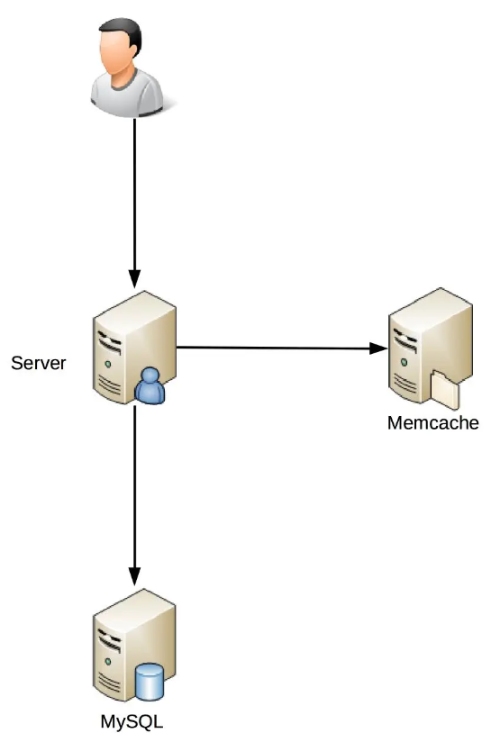

初始架构很简单：MySQL负责存储，Memcache（以下简称MC）负责缓存，Server负责业务处理。 

下面是针对这一个架构进行FMEA分析后的结果：

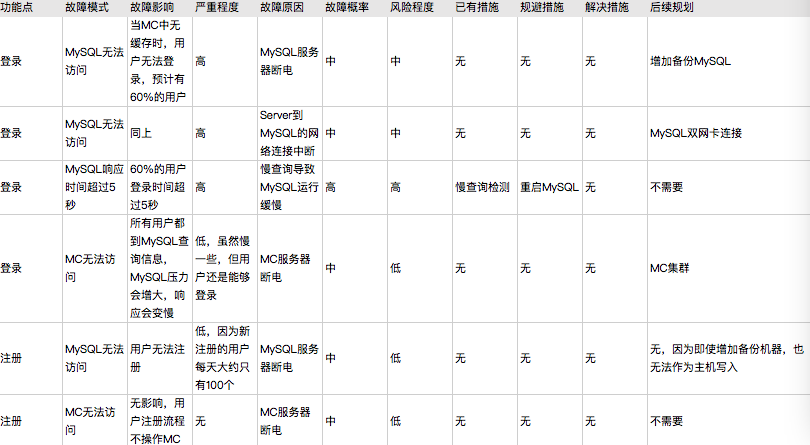

经过上表的FMEA分析，将“后续规划”列的内容汇总一下，我们最终得到了下面几条需要改进的措施：

- MySQL增加备机。
- MC从单机扩展为集群。
- MySQL双网卡连接。

改进后的架构如下： 

## 存储高可用：双机高可用架构 

存储高可用方案的本质都是通过将数据复制到多个存储设备，通过数据冗余的方式来实现高可用，其复杂性主要体现在如何应对复制延迟和中断导致的数据不一致问题。 因此，对任何一个高可用存储方案，我们需要从以下几个方面去进行思考和分析：

- 数据如何复制？
- 各个节点的职责是什么？
- 如何应对复制延迟？
- 如何应对复制中断？

常见的高可用存储架构有主备、主从、主主、集群、分区，每一种又可以根据业务的需求进行一些特殊的定制化功能，由此衍生出更多的变种。 

下面介绍几种常见的高可用架构：主备、主从、主备/主从切换和主主。 

### 主备复制

主备复制是最常见也是最简单的一种存储高可用方案，几乎所有的存储系统都提供了主备复制的功能，例如MySQL、Redis、MongoDB等。 

下面是标准的主备方案结构图： 

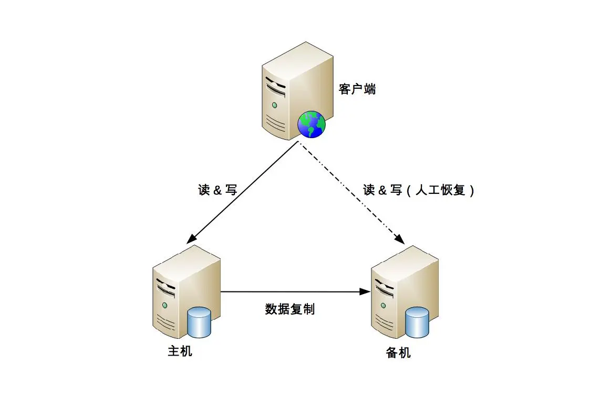

其整体架构比较简单，主备架构中的“备机”主要还是起到一个备份作用，并不承担实际的业务读写操作，如果要把备机改为主机，需要人工操作。 

主备复制架构的优点就是简单，表现有：

- 对于客户端来说，不需要感知备机的存在，即使灾难恢复后，原来的备机被人工修改为主机后，对于客户端来说，只是认为主机的地址换了而已，无须知道是原来的备机升级为主机。
- 对于主机和备机来说，双方只需要进行数据复制即可，无须进行状态判断和主备切换这类复杂的操作。

主备复制架构的优点就是简单，表现有：

- 对于客户端来说，不需要感知备机的存在，即使灾难恢复后，原来的备机被人工修改为主机后，对于客户端来说，只是认为主机的地址换了而已，无须知道是原来的备机升级为主机。
- 对于主机和备机来说，双方只需要进行数据复制即可，无须进行状态判断和主备切换这类复杂的操作。

主备复制架构的缺点主要有：

- 备机仅仅只为备份，并没有提供读写操作，硬件成本上有浪费。
- 故障后需要人工干预，无法自动恢复。人工处理的效率是很低的，可能打电话找到能够操作的人就耗费了10分钟，甚至如果是深更半夜，出了故障都没人知道。人工在执行恢复操作的过程中也容易出错，因为这类操作并不常见，可能1年就2、3次，实际操作的时候很可能遇到各种意想不到的问题。

综合主备复制架构的优缺点，内部的后台管理系统使用主备复制架构的情况会比较多，例如学生管理系统、员工管理系统、假期管理系统等，因为这类系统的数据变更频率低，即使在某些场景下丢失数据，也可以通过人工的方式补全。 

### 主从复制

主从复制和主备复制只有一字之差，“从”意思是“随从、仆从”，“备”的意思是备份。我们可以理解为仆从是要帮主人干活的，这里的干活就是承担“读”的操作。也就是说，主机负责读写操作，从机只负责读操作，不负责写操作。 

下面是标准的主从复制架构： 

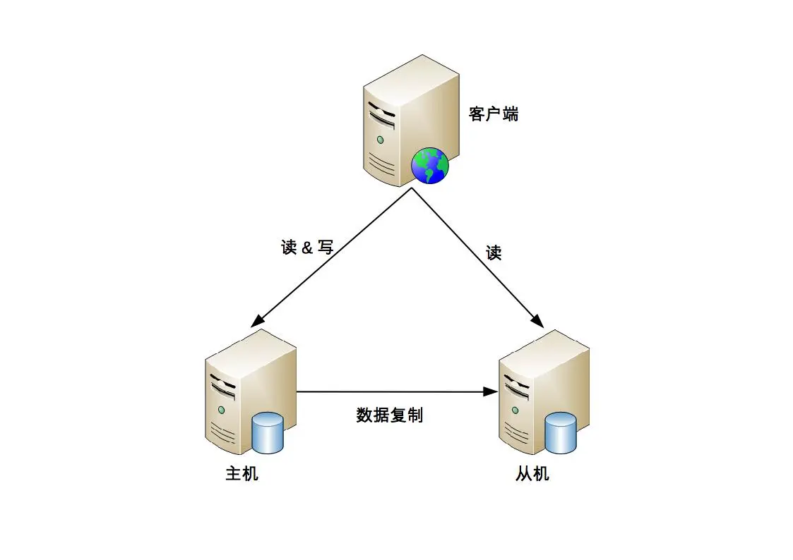

与主备复制架构比较类似，主要的差别点在于从机正常情况下也是要提供读的操作。 

主从复制与主备复制相比，优点有：

- 主从复制在主机故障时，读操作相关的业务可以继续运行。
- 主从复制架构的从机提供读操作，发挥了硬件的性能。

缺点有：

- 主从复制架构中，客户端需要感知主从关系，并将不同的操作发给不同的机器进行处理，复杂度比主备复制要高。
- 主从复制架构中，从机提供读业务，如果主从复制延迟比较大，业务会因为数据不一致出现问题。
- 故障时需要人工干预。

综合主从复制的优缺点，一般情况下，写少读多的业务使用主从复制的存储架构比较多。例如，论坛、BBS、新闻网站这类业务，此类业务的读操作数量是写操作数量的10倍甚至100倍以上。 

### 双机切换

主备复制和主从复制方案存在两个共性的问题：

- 主机故障后，无法进行写操作。
- 如果主机无法恢复，需要人工指定新的主机角色。

双机切换就是为了解决这两个问题而产生的，包括主备切换和主从切换两种方案。简单来说，这两个方案就是在原有方案的基础上增加“切换”功能，即系统自动决定主机角色，并完成角色切换。 

主从切换在切换的设计上没有差别，下面以主备切换为例，阐述双机切换架构的实现。

要实现一个完善的切换方案，必须考虑这几个关键的设计点： 

* 主备间状态判断

  主要包括两方面：状态传递的渠道，以及状态检测的内容：

  * 状态传递的渠道：是相互间互相连接，还是第三方仲裁？
  * 状态检测的内容：例如机器是否掉电、进程是否存在、响应是否缓慢等。

* 切换决策

  主要包括几方面：切换时机、切换策略、自动程度：

  * 切换时机：什么情况下备机应该升级为主机？是机器掉电后备机才升级，还是主机上的进程不存在就升级，还是主机响应时间超过2秒就升级，还是3分钟内主机连续重启3次就升级等。
  * 切换策略：原来的主机故障恢复后，要再次切换，确保原来的主机继续做主机，还是原来的主机故障恢复后自动成为新的备机？
  * 自动程度：切换是完全自动的，还是半自动的？例如，系统判断当前需要切换，但需要人工做最终的确认操作（例如，单击一下“切换”按钮）。

* 数据冲突解决

  当原有故障的主机恢复后，新旧主机之间可能存在数据冲突。例如，用户在旧主机上新增了一条ID为100的数据，这个数据还没有复制到旧的备机，此时发生了切换，旧的备机升级为新的主机，用户又在新的主机上新增了一条ID为100的数据，当旧的故障主机恢复后，这两条ID都为100的数据，应该怎么处理？ 

以上设计点并没有放之四海而皆准的答案，不同的业务要求不一样，所以切换方案比复制方案不只是多了一个切换功能那么简单，而是复杂度上升了一个量级。 

根据状态传递渠道的不同，常见的主备切换架构有三种形式：互连式、中介式和模拟式。 

#### 互连式

故名思议，互连式就是指主备机直接建立状态传递的渠道：

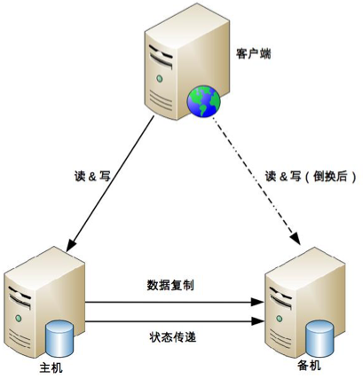

在主备复制的架构基础上，主机和备机多了一个“状态传递”的通道，这个通道就是用来传递状态信息的。这个通道的具体实现可以有很多方式： 

- 可以是网络连接（例如，各开一个端口），也可以是非网络连接（用串口线连接）。
- 可以是主机发送状态给备机，也可以是备机到主机来获取状态信息。
- 可以和数据复制通道共用，也可以独立一条通道。
- 状态传递通道可以是一条，也可以是多条，还可以是不同类型的通道混合（例如，网络+串口）。

为了充分利用切换方案能够自动决定主机这个优势，客户端这里也会有一些相应的改变，常见的方式有： 

- 为了切换后不影响客户端的访问，主机和备机之间共享一个对客户端来说唯一的地址。例如虚拟IP，主机需要绑定这个虚拟的IP。
- 客户端同时记录主备机的地址，哪个能访问就访问哪个；备机虽然能收到客户端的操作请求，但是会直接拒绝，拒绝的原因就是“备机不对外提供服务”。

互连式主备切换主要的缺点在于： 

- 如果状态传递的通道本身有故障（例如，网线被人不小心踢掉了），那么备机也会认为主机故障了从而将自己升级为主机，而此时主机并没有故障，最终就可能出现两个主机。
- 虽然可以通过增加多个通道来增强状态传递的可靠性，但这样做只是降低了通道故障概率而已，不能从根本上解决这个缺点，而且通道越多，后续的状态决策会更加复杂，因为对备机来说，可能从不同的通道收到了不同甚至矛盾的状态信息。

#### 中介式

中介式指的是在主备两者之外引入第三方中介，主备机之间不直接连接，而都去连接中介，并且通过中介来传递状态信息，其架构图如下： 

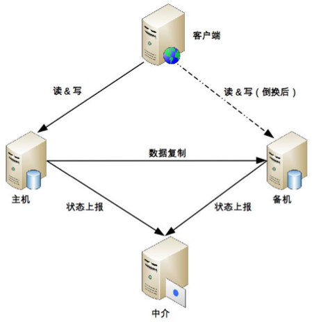

对比一下互连式切换架构，我们可以看到，主机和备机不再通过互联通道传递状态信息，而是都将状态上报给中介这一角色。单纯从架构上看，中介式似乎比互连式更加复杂了，首先要引入中介，然后要各自上报状态。然而事实上，中介式架构在状态传递和决策上却更加简单了，原因在于：

* 连接管理更简单：主备机无须再建立和管理多种类型的状态传递连接通道，只要连接到中介即可，实际上是降低了主备机的连接管理复杂度。

  例如，互连式要求主机开一个监听端口，备机来获取状态信息；或者要求备机开一个监听端口，主机推送状态信息到备机；如果还采用了串口连接，则需要增加串口连接管理和数据读取。采用中介式后，主备机都只需要把状态信息发送给中介，或者从中介获取对方的状态信息。无论是发送还是获取，主备机都是作为中介的客户端去操作，复杂度会降低。 

* 状态决策更简单：主备机的状态决策简单了，无须考虑多种类型的连接通道获取的状态信息如何决策的问题，只需要按照下面简单的算法即可完成状态决策

  - 无论是主机还是备机，初始状态都是备机，并且只要与中介断开连接，就将自己降级为备机，因此可能出现双备机的情况。
  - 主机与中介断连后，中介能够立刻告知备机，备机将自己升级为主机。
  - 如果是网络中断导致主机与中介断连，主机自己会降级为备机，网络恢复后，旧的主机以新的备机身份向中介上报自己的状态。
  - 如果是掉电重启或者进程重启，旧的主机初始状态为备机，与中介恢复连接后，发现已经有主机了，保持自己备机状态不变。
  - 主备机与中介连接都正常的情况下，按照实际的状态决定是否进行切换。例如，主机响应时间超过3秒就进行切换，主机降级为备机，备机升级为主机即可。

虽然中介式架构在状态传递和状态决策上更加简单，但并不意味着这种优点是没有代价的，其关键代价就在于如何实现中介本身的高可用。如果中介自己宕机了，整个系统就进入了双备的状态，写操作相关的业务就不可用了。这就陷入了一个递归的陷阱：为了实现高可用，我们引入中介，但中介本身又要求高可用，于是又要设计中介的高可用方案……如此递归下去就无穷无尽了。 

MongoDB的Replica Set采取的就是这种方式，其基本架构如下： 

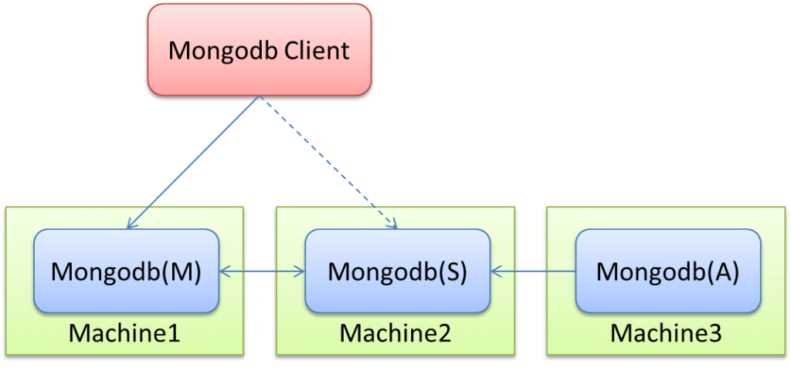

MongoDB(M)表示主节点，MongoDB(S)表示备节点，MongoDB(A)表示仲裁节点。主备节点存储数据，仲裁节点不存储数据。客户端同时连接主节点与备节点，不连接仲裁节点。 

幸运的是，开源方案已经有比较成熟的中介式解决方案，例如ZooKeeper和Keepalived。ZooKeeper本身已经实现了高可用集群架构，因此已经帮我们解决了中介本身的可靠性问题，在工程实践中推荐基于ZooKeeper搭建中介式切换架构。 

#### 模拟式

模拟式指主备机之间并不传递任何状态数据，而是备机模拟成一个客户端，向主机发起模拟的读写操作，根据读写操作的响应情况来判断主机的状态。其基本架构如下： 

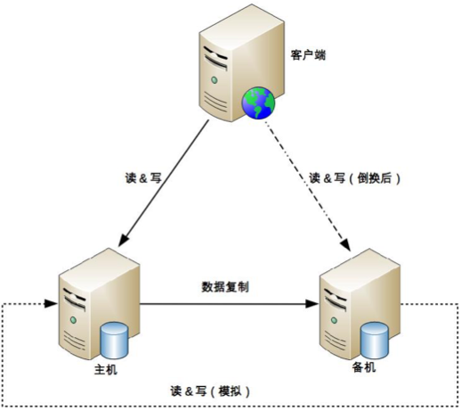

对比一下互连式切换架构，我们可以看到，主备机之间只有数据复制通道，而没有状态传递通道，备机通过模拟的读写操作来探测主机的状态，然后根据读写操作的响应情况来进行状态决策。 

模拟式切换与互连式切换相比，优点是实现更加简单，因为省去了状态传递通道的建立和管理工作。

简单既是优点，同时也是缺点。因为模拟式读写操作获取的状态信息只有响应信息（例如，HTTP 404，超时、响应时间超过3秒等），没有互连式那样多样（除了响应信息，还可以包含CPU负载、I/O负载、吞吐量、响应时间等），基于有限的状态来做状态决策，可能出现偏差。

### 主主复制

主主复制指的是两台机器都是主机，互相将数据复制给对方，客户端可以任意挑选其中一台机器进行读写操作，下面是基本架构图：

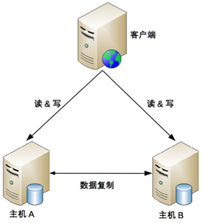

相比主备切换架构，主主复制架构具有如下特点：

- 两台都是主机，不存在切换的概念。
- 客户端无须区分不同角色的主机，随便将读写操作发送给哪台主机都可以。

从上面的描述来看，主主复制架构从总体上来看要简单很多，无须状态信息传递，也无须状态决策和状态切换。然而事实上主主复制架构也并不简单，而是有其独特的复杂性，具体表现在：如果采取主主复制架构，必须保证数据能够双向复制，而很多数据是不能双向复制的。例如： 

- 用户注册后生成的用户ID，如果按照数字增长，那就不能双向复制，否则就会出现X用户在主机A注册，分配的用户ID是100，同时Y用户在主机B注册，分配的用户ID也是100，这就出现了冲突。
- 库存不能双向复制。例如，一件商品库存100件，主机A上减了1件变成99，主机B上减了2件变成98，然后主机A将库存99复制到主机B，主机B原有的库存98被覆盖，变成了99，而实际上此时真正的库存是97。类似的还有余额数据。

因此，主主复制架构对数据的设计有严格的要求，一般适合于那些临时性、可丢失、可覆盖的数据场景。例如，用户登录产生的session数据（可以重新登录生成）、用户行为的日志数据（可以丢失）、论坛的草稿数据（可以丢失）等。 

## 存储高可用：数据集群

主备、主从、主主架构本质上都有一个隐含的假设：主机能够存储所有数据，但主机本身的存储和处理能力肯定是有极限的。 

以PC为例，Intel 386时代服务器存储能力只有几百MB，Intel 奔腾时代服务器存储能力可以有几十GB，Intel 酷睿多核时代的服务器可以有几个TB。单纯从硬件发展的角度来看，似乎发展速度还是挺快的，但如果和业务发展速度对比，那就差得远了。早在2013年，Facebook就有2500亿张上传照片，当时这些照片的容量就已经达到了250 PB字节（250 × 1024TB），平均一天上传的图片有3亿5000万张。如此大量的数据，单台服务器肯定是无法存储和处理的，我们必须使用多台服务器来存储数据，这就是数据集群架构。 

简单来说，集群就是多台机器组合在一起形成一个统一的系统，这里的“多台”，数量上至少是3台；相比而言，主备、主从都是2台机器。根据集群中机器承担的不同角色来划分，集群可以分为两类：数据集中集群、数据分散集群。 

### 数据集中集群 

数据集中集群与主备、主从这类架构相似，我们也可以称数据集中集群为1主多备或者1主多从。无论是1主1从、1主1备，还是1主多备、1主多从，数据都只能往主机中写，而读操作可以参考主备、主从架构进行灵活多变。下图是读写全部到主机的一种架构： 

虽然架构上是类似的，但由于集群里面的服务器数量更多，导致复杂度整体更高一些，具体体现在： 

* 主机如何将数据复制给备机

  主备和主从架构中，只有一条复制通道，而数据集中集群架构中，存在多条复制通道。多条复制通道首先会增大主机复制的压力，某些场景下我们需要考虑如何降低主机复制压力，或者降低主机复制给正常读写带来的压力。 

  其次，多条复制通道可能会导致多个备机之间数据不一致，某些场景下我们需要对备机之间的数据一致性进行检查和修正。 

* 备机如何检测主机状态

  主备和主从架构中，只有一台备机需要进行主机状态判断。在数据集中集群架构中，多台备机都需要对主机状态进行判断，而不同的备机判断的结果可能是不同的，如何处理不同备机对主机状态的不同判断，是一个复杂的问题。 

* 主机故障后，如何决定新的主机

  主从架构中，如果主机故障，将备机升级为主机即可；而在数据集中集群架构中，有多台备机都可以升级为主机，但实际上只能允许一台备机升级为主机，那么究竟选择哪一台备机作为新的主机，备机之间如何协调，这也是一个复杂的问题。 

目前开源的数据集中集群以ZooKeeper为典型，ZooKeeper通过ZAB算法来解决上述提到的几个问题，但ZAB算法的复杂度是很高的。 

### 数据分散集群

数据分散集群指多个服务器组成一个集群，每台服务器都会负责存储一部分数据；同时，为了提升硬件利用率，每台服务器又会备份一部分数据。 

数据分散集群的复杂点在于如何将数据分配到不同的服务器上，算法需要考虑这些设计点： 

* 均衡性

  算法需要保证服务器上的数据分区基本是均衡的，不能存在某台服务器上的分区数量是另外一台服务器的几倍的情况。

* 容错性

  当出现部分服务器故障时，算法需要将原来分配给故障服务器的数据分区分配给其他服务器。 

* 可伸缩性

  当集群容量不够，扩充新的服务器后，算法能够自动将部分数据分区迁移到新服务器，并保证扩容后所有服务器的均衡性。 

当集群容量不够，扩充新的服务器后，算法能够自动将部分数据分区迁移到新服务器，并保证扩容后所有服务器的均衡性。

数据分散集群和数据集中集群的不同点在于，数据分散集群中的每台服务器都可以处理读写请求，因此不存在数据集中集群中负责写的主机那样的角色。但在数据分散集群中，必须有一个角色来负责执行数据分配算法，这个角色可以是独立的一台服务器，也可以是集群自己选举出的一台服务器。如果是集群服务器选举出来一台机器承担数据分区分配的职责，则这台服务器一般也会叫作主机，但我们需要知道这里的“主机”和数据集中集群中的“主机”，其职责是有差异的。

Hadoop的实现就是独立的服务器负责数据分区的分配，这台服务器叫作Namenode。Hadoop的数据分区管理架构如下： 

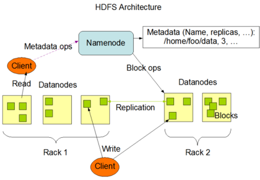

下面是Hadoop官方的解释，能够说明集中式数据分区管理的基本方式：

* HDFS采用master/slave架构。一个HDFS集群由一个Namenode和一定数目的Datanodes组成。
* Namenode是一个中心服务器，负责管理文件系统的名字空间（namespace），以及客户端对文件的访问。 
* 集群中的Datanode一般是一个节点一个，负责管理它所在节点上的存储。HDFS暴露了文件系统的名字空间，用户能够以文件的形式在上面存储数据。从内部看，一个文件其实被分成一个或多个数据块，这些块存储在一组Datanode上。
* Namenode执行文件系统的名字空间操作，比如打开、关闭、重命名文件或目录。它也负责确定数据块到具体Datanode节点的映射。Datanode负责处理文件系统客户端的读写请求。在Namenode的统一调度下进行数据块的创建、删除和复制操作。 

与Hadoop不同的是，Elasticsearch集群通过选举一台服务器来做数据分区的分配，叫作master node，其数据分区管理架构是： 

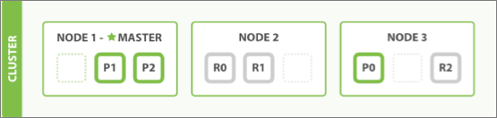

其中master节点的职责如下：

> The master node is responsible for lightweight cluster-wide actions such as creating or deleting an index, tracking which nodes are part of the cluster, and deciding which shards to allocate to which nodes. It is important for cluster health to have a stable master node.

来源：<https://www.elastic.co/guide/en/elasticsearch/reference/current/modules-node.html>

数据集中集群架构中，客户端只能将数据写到主机；数据分散集群架构中，客户端可以向任意服务器中读写数据。正是因为这个关键的差异，决定了两种集群的应用场景不同。一般来说，数据集中集群适合数据量不大，集群机器数量不多的场景。例如，ZooKeeper集群，一般推荐5台机器左右，数据量是单台服务器就能够支撑；而数据分散集群，由于其良好的可伸缩性，适合业务数据量巨大、集群机器数量庞大的业务场景。例如，Hadoop集群、HBase集群，大规模的集群可以达到上百台甚至上千台服务器。

## 存储高可用：数据分区

前面讨论的存储高可用架构都是基于硬件故障的场景去考虑和设计的，主要考虑当部分硬件可能损坏的情况下系统应该如何处理，但对于一些影响非常大的灾难或者事故来说，有可能所有的硬件全部故障。 例如，新奥尔良水灾、美加大停电、洛杉矶大地震等这些极端灾害或者事故，可能会导致一个城市甚至一个地区的所有基础设施瘫痪，这种情况下基于硬件故障而设计的高可用架构不再适用，我们需要基于地理级别的故障来设计高可用架构，这就是数据分区架构产生的背景。 

数据分区指将数据按照一定的规则进行分区，不同分区分布在不同的地理位置上，每个分区存储一部分数据，通过这种方式来规避地理级别的故障所造成的巨大影响。采用了数据分区的架构后，即使某个地区发生严重的自然灾害或者事故，受影响的也只是一部分数据，而不是全部数据都不可用；当故障恢复后，其他地区备份的数据也可以帮助故障地区快速恢复业务。 

设计一个良好的数据分区架构，需要从多方面去考虑：

1、数据量

数据量的大小直接决定了分区的规则复杂度。例如，使用MySQL来存储数据，假设一台MySQL存储能力是500GB，那么2TB的数据就至少需要4台MySQL服务器；而如果数据是200TB，并不是增加到800台的MySQL服务器那么简单。如果按照4台服务器那样去平行管理800台服务器，复杂度会发生本质的变化，具体表现为： 

- 800台服务器里面可能每周都有一两台服务器故障，从800台里面定位出2台服务器故障，很多情况下并不是一件容易的事情，运维复杂度高。
- 增加新的服务器，分区相关的配置甚至规则需要修改，而每次修改理论上都有可能影响已有的800台服务器的运行，不小心改错配置的情况在实践中太常见了。
- 如此大量的数据，如果在地理位置上全部集中于某个城市，风险很大，遇到了水灾、大停电这种灾难性的故障时，数据可能全部丢失，因此分区规则需要考虑地理容灾。

因此，数据量越大，分区规则会越复杂，考虑的情况也越多。 

2、分区规则 

地理位置有近有远，因此可以得到不同的分区规则，包括洲际分区、国家分区、城市分区。具体采取哪种或者哪几种规则，需要综合考虑业务范围、成本等因素。 

通常情况下，洲际分区主要用于面向不同大洲提供服务，由于跨洲通讯的网络延迟已经大到不适合提供在线服务了，因此洲际间的数据中心可以不互通或者仅仅作为备份；国家分区主要用于面向不同国家的用户提供服务，不同国家有不同语言、法律、业务等，国家间的分区一般也仅作为备份；城市分区由于都在同一个国家或者地区内，网络延迟较低，业务相似，分区同时对外提供服务，可以满足业务异地多活之类的需求。 

3、复制规则

数据分区指将数据分散在多个地区，在某些异常或者灾难情况下，虽然部分数据受影响，但整体数据并没有全部被影响，本身就相当于一个高可用方案了。但仅仅做到这点还不够，因为每个分区本身的数据量虽然只是整体数据的一部分，但还是很大，这部分数据如果损坏或者丢失，损失同样难以接受。因此即使是分区架构，同样需要考虑复制方案。 

常见的分区复制规则有三种：集中式、互备式和独立式 

### 集中式备份

集中式备份指存在一个总的备份中心，所有的分区都将数据备份到备份中心，其基本架构如下： 

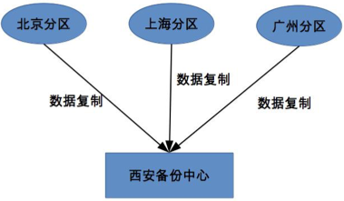

集中式备份架构的优缺点是：

- 设计简单，各分区之间并无直接联系，可以做到互不影响。
- 扩展容易，如果要增加第四个分区（例如，武汉分区），只需要将武汉分区的数据复制到西安备份中心即可，其他分区不受影响。
- 成本较高，需要建设一个独立的备份中心。

### 互备式备份

互备式备份指每个分区备份另外一个分区的数据，其基本架构如下： 

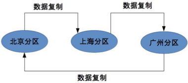

互备式备份架构的优缺点是：

- 设计比较复杂，各个分区除了要承担业务数据存储，还需要承担备份功能，相互之间互相关联和影响。
- 扩展麻烦，如果增加一个武汉分区，则需要修改广州分区的复制指向武汉分区，然后将武汉分区的复制指向北京分区。而原有北京分区已经备份了的广州分区的数据怎么处理也是个难题，不管是做数据迁移，还是广州分区历史数据保留在北京分区，新数据备份到武汉分区，无论哪种方式都很麻烦。
- 成本低，直接利用已有的设备。

### 独立式备份

独立式备份指每个分区自己有独立的备份中心，其基本架构如下： 

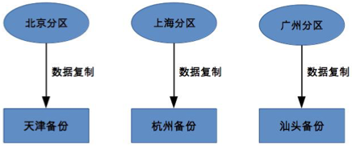

有一个细节需要特别注意，各个分区的备份并不和原来的分区在一个地方。例如，北京分区的备份放到了天津，上海的放到了杭州，广州的放到了汕头，这样做的主要目的是规避同城或者相同地理位置同时发生灾难性故障的极端情况。如果北京分区机房在朝阳区，而备份机房放在通州区，整个北京停电的话，两个机房都无法工作。 

独立式备份架构的优缺点是：

- 设计简单，各分区互不影响。
- 扩展容易，新增加的分区只需要搭建自己的备份中心即可。
- 成本高，每个分区需要独立的备份中心，备份中心的场地成本是主要成本，因此独立式比集中式成本要高很多。

## 计算高可用架构

计算高可用的主要设计目标是当出现部分硬件损坏时，计算任务能够继续正常运行。因此计算高可用的本质是通过冗余来规避部分故障的风险，单台服务器是无论如何都达不到这个目标的。所以计算高可用的设计思想很简单：通过增加更多服务器来达到计算高可用。 

计算高可用架构从形式上和存储高可用架构看上去几乎一样，但是存储高可用包含一个数据一致性的问题; 存储高可用复杂度会相对高

计算高可用架构的设计复杂度主要体现在任务管理方面，即当任务在某台服务器上执行失败后，如何将任务重新分配到新的服务器进行执行。因此，计算高可用架构设计的关键点有下面两点：

1、哪些服务器可以执行任务 

第一种方式和计算高性能中的集群类似，每个服务器都可以执行任务。例如，常见的访问网站的某个页面。

第二种方式和存储高可用中的集群类似，只有特定服务器（通常叫“主机”）可以执行任务。当执行任务的服务器故障后，系统需要挑选新的服务器来执行任务。例如，ZooKeeper的Leader才能处理写操作请求。

2、任务如何重新执行

第一种策略是对于已经分配的任务即使执行失败也不做任何处理，系统只需要保证新的任务能够分配到其他非故障服务器上执行即可。

第二种策略是设计一个任务管理器来管理需要执行的计算任务，服务器执行完任务后，需要向任务管理器反馈任务执行结果，任务管理器根据任务执行结果来决定是否需要将任务重新分配到另外的服务器上执行。

需要注意的是：“任务分配器”是一个逻辑的概念，并不一定要求系统存在一个独立的任务分配器模块。例如： 

- Nginx将页面请求发送给Web服务器，而CSS/JS等静态文件直接读取本地缓存。这里的Nginx角色是反向代理系统，但是承担了任务分配器的职责，而不需要Nginx做反向代理，后面再来一个任务分配器。
- 对于一些后台批量运算的任务，可以设计一个独立的任务分配系统来管理这些批处理任务的执行和分配。
- ZooKeeper中的Follower节点，当接收到写请求时会将请求转发给Leader节点处理，当接收到读请求时就自己处理，这里的Follower就相当于一个逻辑上的任务分配器。

常见的计算高可用架构：主备、主从和集群：

###主备

主备架构是计算高可用最简单的架构，和存储高可用的主备复制架构类似，但是要更简单一些，因为计算高可用的主备架构无须数据复制，其基本的架构示意图如下： 

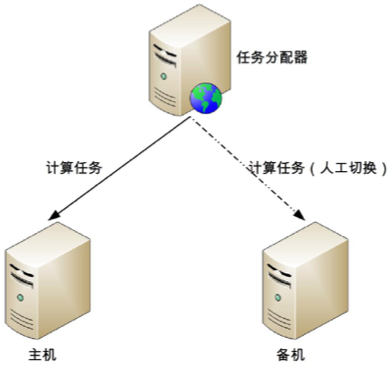

主备方案的详细设计：

- 主机执行所有计算任务。例如，读写数据、执行操作等。
- 当主机故障（例如，主机宕机）时，任务分配器不会自动将计算任务发送给备机，此时系统处于不可用状态。
- 如果主机能够恢复（不管是人工恢复还是自动恢复），任务分配器继续将任务发送给主机。
- 如果主机不能够恢复（例如，机器硬盘损坏，短时间内无法恢复），则需要人工操作，将备机升为主机，然后让任务分配器将任务发送给新的主机（即原来的备机）；同时，为了继续保持主备架构，需要人工增加新的机器作为备机。

根据备机状态的不同，主备架构又可以细分为冷备架构和温备架构：

* 冷备：备机上的程序包和配置文件都准备好，但备机上的业务系统没有启动（注意：备机的服务器是启动的），主机故障后，需要人工手工将备机的业务系统启动，并将任务分配器的任务请求切换发送给备机。
* 温备：备机上的业务系统已经启动，只是不对外提供服务，主机故障后，人工只需要将任务分配器的任务请求切换发送到备机即可。冷备可以节省一定的能源，但温备能够大大减少手工操作时间，因此一般情况下推荐用温备的方式。

主备架构的优点就是简单，主备机之间不需要进行交互，状态判断和切换操作由人工执行，系统实现很简单。而缺点正好也体现在“人工操作”这点上，因为人工操作的时间不可控，可能系统已经发生问题了，但维护人员还没发现，等了1个小时才发现。发现后人工切换的操作效率也比较低，可能需要半个小时才完成切换操作，而且手工操作过程中容易出错。例如，修改配置文件改错了、启动了错误的程序等。 

和存储高可用中的主备复制架构类似，计算高可用的主备架构也比较适合与内部管理系统、后台管理系统这类使用人数不多、使用频率不高的业务，不太适合在线的业务。 

### 主从

和存储高可用中的主从复制架构类似，计算高可用的主从架构中的从机也是要执行任务的。任务分配器需要将任务进行分类，确定哪些任务可以发送给主机执行，哪些任务可以发送给备机执行，其基本的架构示意图如下： 

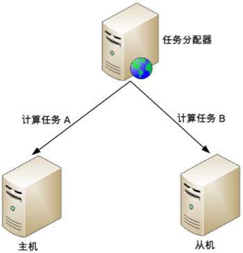

主从方案详细设计：

- 正常情况下，主机执行部分计算任务（如图中的“计算任务A”），备机执行部分计算任务（如图中的“计算任务B”）。
- 当主机故障（例如，主机宕机）时，任务分配器不会自动将原本发送给主机的任务发送给从机，而是继续发送给主机，不管这些任务执行是否成功。
- 如果主机能够恢复（不管是人工恢复还是自动恢复），任务分配器继续按照原有的设计策略分配任务，即计算任务A发送给主机，计算任务B发送给从机。
- 如果主机不能够恢复（例如，机器硬盘损坏，短时间内无法恢复），则需要人工操作，将原来的从机升级为主机（一般只是修改配置即可），增加新的机器作为从机，新的从机准备就绪后，任务分配器继续按照原有的设计策略分配任务。

主从架构与主备架构相比，优缺点有：

- 优点：主从架构的从机也执行任务，发挥了从机的硬件性能。
- 缺点：主从架构需要将任务分类，任务分配器会复杂一些。

### 集群

主备架构和主从架构通过冗余一台服务器来提升可用性，且需要人工来切换主备或者主从。这样的架构虽然简单，但存在一个主要的问题：人工操作效率低、容易出错、不能及时处理故障。因此在可用性要求更加严格的场景中，我们需要系统能够自动完成切换操作，这就是高可用集群方案。 

高可用计算的集群方案根据集群中服务器节点角色的不同，可以分为两类： 

* 一类是对称集群，即集群中每个服务器的角色都是一样的，都可以执行所有任务； 
* 另一类是非对称集群，集群中的服务器分为多个不同的角色，不同的角色执行不同的任务，例如最常见的Master-Slave角色。 

需要注意的是，计算高可用集群包含2台服务器的集群，这点和存储高可用集群不太一样。存储高可用集群把双机架构和集群架构进行了区分；而在计算高可用集群架构中，2台服务器的集群和多台服务器的集群，在设计上没有本质区别，因此不需要进行区分。 

1、对称集群

对称集群更通俗的叫法是负载均衡集群，架构示意图如下： 

负载均衡集群详细设计：

- 正常情况下，任务分配器采取某种策略（随机、轮询等）将计算任务分配给集群中的不同服务器。
- 当集群中的某台服务器故障后，任务分配器不再将任务分配给它，而是将任务分配给其他服务器执行。
- 当故障的服务器恢复后，任务分配器重新将任务分配给它执行。

负载均衡集群的设计关键点在于两点：

- 任务分配器需要选取分配策略。
- 任务分配器需要检测服务器状态。

任务分配策略比较简单，轮询和随机基本就够了。状态检测稍微复杂一些，既要检测服务器的状态，例如服务器是否宕机、网络是否正常等；同时还要检测任务的执行状态，例如任务是否卡死、是否执行时间过长等。常用的做法是任务分配器和服务器之间通过心跳来传递信息，包括服务器信息和任务信息，然后根据实际情况来确定状态判断条件。 

不同业务场景的状态判断条件差异很大，实际设计时要根据业务需求来进行设计和调优：

* 例如，一个在线页面访问系统，正常情况下页面平均会在500毫秒内返回，那么状态判断条件可以设计为：1分钟内响应时间超过1秒（包括超时）的页面数量占了80%时，就认为服务器有故障。 
* 例如，一个后台统计任务系统，正常情况下任务会在5分钟内执行完成，那么状态判断条件可以设计为：单个任务执行时间超过10分钟还没有结束，就认为服务器有故障。 

2、非对称集群

非对称集群中不同服务器的角色是不同的，不同角色的服务器承担不同的职责。以Master-Slave为例，部分任务是Master服务器才能执行，部分任务是Slave服务器才能执行。非对称集群的基本架构示意图如下： 

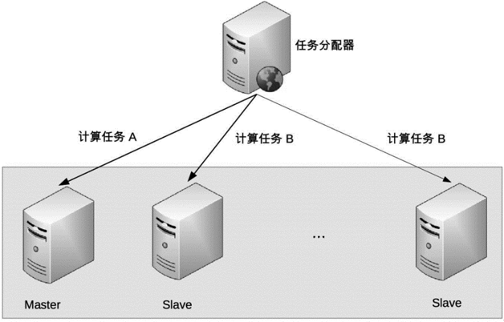

非对称集群架构详细设计：

- 集群会通过某种方式来区分不同服务器的角色。例如，通过ZAB算法选举，或者简单地取当前存活服务器中节点ID最小的服务器作为Master服务器。
- 任务分配器将不同任务发送给不同服务器。例如，图中的计算任务A发送给Master服务器，计算任务B发送给Slave服务器。
- 当指定类型的服务器故障时，需要重新分配角色。例如，Master服务器故障后，需要将剩余的Slave服务器中的一个重新指定为Master服务器；如果是Slave服务器故障，则并不需要重新分配角色，只需要将故障服务器从集群剔除即可。

非对称集群相比负载均衡集群，设计复杂度主要体现在两个方面：

- 任务分配策略更加复杂：需要将任务划分为不同类型并分配给不同角色的集群节点。
- 角色分配策略实现比较复杂：例如，可能需要使用ZAB、Raft这类复杂的算法来实现Leader的选举。

以ZooKeeper为例：

- 任务分配器：ZooKeeper中不存在独立的任务分配器节点，每个Server都是任务分配器，Follower收到请求后会进行判断，如果是写请求就转发给Leader，如果是读请求就自己处理。
- 角色指定：ZooKeeper通过ZAB算法来选举Leader，当Leader故障后，所有的Follower节点会暂停读写操作，开始进行选举，直到新的Leader选举出来后才继续对Client提供服务。

## 异地多活架构

无论是高可用计算架构，还是高可用存储架构，其本质的设计目的都是为了解决部分服务器故障的场景下，如何保证系统能够继续提供服务。 

但在一些极端场景下，有可能所有服务器都出现故障。例如，典型的有机房断电、机房火灾、地震、水灾……这些极端情况会导致某个系统所有服务器都故障，或者业务整体瘫痪，而且即使有其他地区的备份，把备份业务系统全部恢复到能够正常提供业务，花费的时间也比较长，可能是半小时，也可能是12小时。因为备份系统平时不对外提供服务，可能会存在很多隐藏的问题没有发现。如果业务期望达到即使在此类灾难性故障的情况下，业务也不受影响，或者在几分钟内就能够很快恢复，那么就需要设计异地多活架构。 

### 基本概念

顾名思义，异地多活架构的关键点就是异地、多活：

* 异地就是指地理位置上不同的地方，类似于“不要把鸡蛋都放在同一篮子里”； 
* 多活就是指不同地理位置上的系统都能够提供业务服务，这里的“活”是活动、活跃的意思。 

判断一个系统是否符合异地多活，需要满足两个标准： 

- 正常情况下，用户无论访问哪一个地点的业务系统，都能够得到正确的业务服务。
- 某个地方业务异常的时候，用户访问其他地方正常的业务系统，能够得到正确的业务服务。

与“活”对应的是字是“备”，备是备份，正常情况下对外是不提供服务的，如果需要提供服务，则需要大量的人工干预和操作，花费大量的时间才能让“备”变成“活”。 

异地多活很强大，能够保证在灾难的情况下业务都不受影响，但实现异地多活架构的代价很高，具体表现为：

- 系统复杂度会发生质的变化，需要设计复杂的异地多活架构。
- 成本会上升，毕竟要多在一个或者多个机房搭建独立的一套业务系统。

因此不是所有业务都要使用异地多活架构：

* 常见的新闻网站、企业内部的IT系统、游戏、博客站点等，如果无法承受异地多活带来的复杂度和成本，是可以不做异地多活的，只需要做异地备份即可。因为这类业务系统即使中断，对用户的影响并不会很大，例如，A新闻网站看不了，用户换个新闻网站即可。 
* 共享单车、滴滴出行、支付宝、微信这类业务，就需要做异地多活了，这类业务系统中断后，对用户的影响很大。例如，支付宝用不了，就没法买东西了；滴滴用不了，用户就打不到车了。 

如果业务规模很大，能够做异地多活的情况下还是尽量，原因如下：

* 能够在异常的场景下给用户提供更好的体验； 
* 业务规模很大肯定会伴随衍生的收入，例如广告收入，异地多活能够减少异常场景带来的收入损失。 

### 分类

根据地理位置上的距离来划分，异地多活架构可以分为同城异区、跨城异地、跨国异地。 

1、同城异区

同城异区指的是将业务部署在同一个城市不同区的多个机房。例如，在北京部署两个机房，一个机房在海淀区，一个在通州区，然后将两个机房用专用的高速网络连接在一起。 

一些极端场景（例如，美加大停电、新奥尔良水灾），同城异区似乎没什么作用，它的优势就在于同城。

同城的两个机房，距离上一般大约就是几十千米，通过搭建高速的网络，同城异区的两个机房能够实现和同一个机房内几乎一样的网络传输速度。这就意味着虽然是两个不同地理位置上的机房，但逻辑上我们可以将它们看作同一个机房，这样的设计大大降低了复杂度，减少了异地多活的设计和实现复杂度及成本。 

如果采用了同城异区架构，发生极端灾害是无能为力的，它发生的概率也很低，可能几年或者十几年才发生一次。 发生概率高的通常是机房火灾、机房停电、机房空调故障这类问题，这些问题同城异区架构都可以很好解决。

因此，结合复杂度、成本、故障发生概率来综合考虑，同城异区是应对机房级别故障的最优架构。 

2、跨城异地

跨城异地指的是业务部署在不同城市的多个机房，而且距离最好要远一些。例如，将业务部署在北京和广州两个机房，而不是将业务部署在广州和深圳的两个机房。 

跨城异地需要足够远，才可以抵御类似新奥尔良水灾这种极端灾难。

跨城异地虽然能够有效应对极端灾难事件，但“距离较远”这点并不只是一个距离数字上的变化，而是量变引起了质变，导致了跨城异地的架构复杂度大大上升。 距离增加带来的最主要问题是两个机房的网络传输速度会降低，这不是以人的意志为转移的，而是物理定律决定的。

除了距离上的限制，中间传输各种不可控的因素也非常多。例如，挖掘机把光纤挖断、中美海底电缆被拖船扯断、骨干网故障等，这些线路很多是第三方维护，针对故障我们根本无能为力也无法预知。 例如，广州机房到北京机房，正常情况下RTT大约是50毫秒左右，遇到网络波动之类的情况，RTT可能飙升到500毫秒甚至1秒，更不用说经常发生的线路丢包问题，那延迟可能就是几秒几十秒了。 

以上描述的问题，虽然同城异区理论上也会遇到，但由于同城异区距离较短，中间经过的线路和设备较少，问题发生的概率会低很多。而且同城异区距离短，即使是搭建多条互联通道，成本也不会太高，而跨城异区距离太远，搭建或者使用多通道的成本会高不少。 

跨城异地距离较远带来的网络传输延迟问题，给异地多活架构设计带来了复杂性，如果要做到真正意义上的多活，业务系统需要考虑部署在不同地点的两个机房，在数据短时间不一致的情况下，还能够正常提供业务。 

但跨城异地和数据一致性是互相矛盾的，例如一个互联网金融的业务，用户余额支持跨城异地多活，我们的系统分别部署在广州和北京，那么如果挖掘机挖断光缆后，会出现如下场景：

- 用户A余额有10000元钱，北京和广州机房都是这个数据。
- 用户A向用户B转了5000元钱，这个操作是在广州机房完成的，完成后用户A在广州机房的余额是5000元。
- 由于广州和北京机房网络被挖掘机挖断，广州机房无法将余额变动通知北京机房，此时北京机房用户A的余额还是10000元。
- 用户A到北京机房又发起转账，此时他看到自己的余额还有10000元，于是向用户C转账10000元，转账完成后用户A的余额变为0。
- 用户A到广州机房一看，余额怎么还有5000元？于是赶紧又发起转账，转账5000元给用户D；此时广州机房用户A的余额也变为0了。

所以支付宝等金融相关的系统，对余额这类数据，一般不会做跨城异地的多活架构，而只能采用同城异区这种架构。 

而对数据一致性要求不那么高，或者数据不怎么改变，或者即使数据丢失影响也不大的业务，跨城异地多活就能够派上用场了。例如，用户登录（数据不一致时用户重新登录即可）、新闻类网站（一天内的新闻数据变化较少）、微博类网站（丢失用户发布的微博或者评论影响不大），这些业务采用跨城异地多活，能够很好地应对极端灾难的场景。 

3、跨国异地

跨国异地指的是业务部署在不同国家的多个机房。相比跨城异地，跨国异地的距离就更远了，因此数据同步的延时会更长，正常情况下可能就有几秒钟了。 

这种程度的延迟已经无法满足异地多活标准的第一条：“正常情况下，用户无论访问哪一个地点的业务系统，都能够得到正确的业务服务”。例如，假设有一个微博类网站，分别在中国的上海和美国的纽约都建了机房，用户A在上海机房发表了一篇微博，此时如果他的一个关注者B用户访问到美国的机房，很可能无法看到用户A刚刚发表的微博。虽然跨城异地也会有此类同步延时问题，但正常情况下几十毫秒的延时对用户来说基本无感知的；而延时达到几秒钟就感觉比较明显了。 

因此，跨国异地的“多活”，和跨城异地的“多活”，实际的含义并不完全一致。跨国异地多活的主要应用场景一般有这几种情况： 

* 为不同地区用户提供服务

  例如，亚马逊中国是为中国用户服务的，而亚马逊美国是为美国用户服务的，亚马逊中国的用户如果访问美国亚马逊，是无法用亚马逊中国的账号登录美国亚马逊的。 

* 只读类业务做多活

  例如，谷歌的搜索业务，由于用户搜索资料时，这些资料都已经存在于谷歌的搜索引擎上面，无论是访问英国谷歌，还是访问美国谷歌，搜索结果基本相同，并且对用户来说，也不需要搜索到最新的实时资料，跨国异地的几秒钟网络延迟，对搜索结果是没有什么影响的。 

### 设计重点

#### 保证核心业务的异地多活

“异地多活”是为了保证业务的高可用，但很多架构师在考虑这个“业务”时，会不自觉地陷入一个思维误区：我要保证所有业务都能“异地多活” 

以一个例子来说明，假设我们需要做一个“用户子系统”，这个子系统负责“注册”“登录”“用户信息”三个业务。为了支持海量用户，我们设计了一个“用户分区”的架构，即正常情况下用户属于某个主分区，每个分区都有其他数据的备份，用户用邮箱或者手机号注册，路由层拿到邮箱或者手机号后，通过Hash计算属于哪个中心，然后请求对应的业务中心。基本的架构如下： 

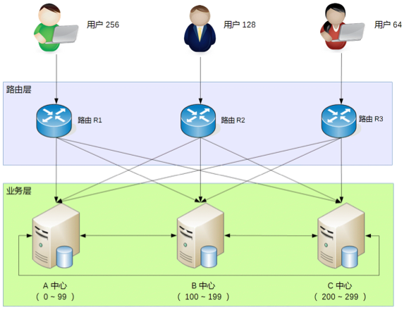

这样一个系统，如果3个业务要同时实现异地多活，会发现这些难以解决的问题： 

* 注册问题

  A中心注册了用户，数据还未同步到B中心，此时A中心宕机，为了支持注册业务多活，可以挑选B中心让用户去重新注册。 这样的重复注册会产生一个问题：一个手机号只能注册一个账号，A中心的数据没有同步过来，B中心无法判断这个手机号是否重复，如果B中心让用户注册，后来A中心恢复了，发现数据有冲突，怎么解决？实际上是无法解决的，因为同一个手机号注册的账号不能以后一次注册为准；而如果B中心不支持本来属于A中心的业务进行注册，注册业务的多活又成了空谈。 

  修改业务规则，允许一个手机号注册多个账号，这个方案也是不可行的。类似一个手机号只能注册一个账号这种规则，是核心业务规则，修改核心业务规则的代价非常大，几乎所有的业务都要重新设计，为了架构设计去改变业务规则（而且是这么核心的业务规则）是得不偿失的。 

* 用户信息修改问题

  用户信息的修改和注册有类似的问题，即A、B两个中心在异常的情况下都修改了用户信息，如何处理冲突？ 

  由于用户信息并没有账号那么关键，一种简单的处理方式是按照时间合并，即最后修改的生效。业务逻辑上没问题，但实际操作也有一个很关键的“坑”：怎么保证多个中心所有机器时间绝对一致？在异地多中心的网络下，这个是无法保证的，即使有时间同步也无法完全保证，只要两个中心的时间误差超过1秒，数据就可能出现混乱，即先修改的反而生效。 

  还有一种方式是生成全局唯一递增ID，这个方案的成本很高，因为这个全局唯一递增ID的系统本身又要考虑异地多活，同样涉及数据一致性和冲突的问题。 

综合上面的简单分析可以发现，如果“注册”“登录”“用户信息”全部都要支持异地多活，实际上是挺难的，有的问题甚至是无解的。

这种情况下应该这样考虑异地多活的架构设计：优先实现核心业务的异地多活架构：

对于这个模拟案例来说，“登录”才是最核心的业务，“注册”和“用户信息”虽然也是主要业务，但并不一定要实现异地多活，主要原因在于业务影响不同。对于一个日活1000万的业务来说，每天注册用户可能是几万，修改用户信息的可能还不到1万，但登录用户是1000万，很明显我们应该保证登录的异地多活。 

几种场景的取舍：

* 对于新用户来说，注册不了的影响并不明显，因为他还没有真正开始使用业务。 
* 用户信息修改也类似，暂时修改不了用户信息，对于其业务不会有很大影响。 
* 如果有几百万用户登录不了，就相当于几百万用户无法使用业务，对业务的影响就非常大了 

而登录实现“异地多活”恰恰是最简单的，因为每个中心都有所有用户的账号和密码信息，用户在哪个中心都可以登录。用户在A中心登录，A中心宕机后，用户到B中心重新登录即可。 

异地多活设计的核心理念：采用多种手段，保证绝大部分用户的核心业务异地多活

#### 保证核心数据最终一致性

异地多活本质上是通过异地的数据冗余，来保证在极端异常的情况下业务也能够正常提供给用户，因此数据同步是异地多活架构设计的核心。 

在考虑数据同步方案的时候，也不能不分业务一律要求实时同步。

数据冗余是要将数据从A地同步到B地，从业务的角度来看是越快越好，最好和本地机房一样的速度最好。 但在异地多活中，这个同步速度不可能很快，因为这是物理定律决定的。

因此异地多活架构面临一个无法彻底解决的矛盾：业务上要求数据快速同步，物理上正好做不到数据快速同步，因此所有数据都实时同步，实际上是一个无法达到的目标。 

既然是无法彻底解决的矛盾，那就只能想办法尽量减少影响。有几种方法可以参考： 

* 尽量减少异地多活机房的距离，搭建高速网络

  和同城异区架构类似，但搭建跨城异地的高速网络成本远远超过同城异区的高速网络，成本巨大，一般只有巨头公司才能承担。 

* 尽量减少数据同步，只同步核心业务相关的数据

  简单来说就是不重要的数据不同步，同步后没用的数据不同步，只同步核心业务相关的数据。 

  以前面的“用户子系统”为例，用户登录所产生的token或者session信息，数据量很大，但其实并不需要同步到其他业务中心，因为这些数据丢失后重新登录就可以再次获取了。 虽然丢失数据会影响用户体验，至少要弹出登录界面让用户点击一次，但相比为了同步所有数据带来的代价，这个影响完全可以接受。 

* 保证最终一致性，不保证实时一致性

  业务不依赖数据同步的实时性，只要数据最终能一致即可。 例如，A机房注册了一个用户，业务上不要求能够在50毫秒内就同步到所有机房，正常情况下要求5分钟同步到所有机房即可，异常情况下甚至可以允许1小时或者1天后能够一致。 

  最终一致性在具体实现时，还需要根据不同的数据特征，进行差异化的处理，以满足业务需要：

  * 例如，对“账号”信息来说，如果在A机房新注册的用户5分钟内正好跑到B机房了，此时B机房还没有这个用户的信息，为了保证业务的正确，B机房就需要根据路由规则到A机房请求数据。 
  * 对“用户信息”来说，5分钟后同步也没有问题，也不需要采取其他措施来弥补，但还是会影响用户体验，即用户看到了旧的用户信息 

#### 采用多种手段同步数据

数据同步是异地多活架构设计的核心，幸运的是基本上存储系统本身都会有同步的功能。例如，MySQL的主备复制、Redis的Cluster功能、Elasticsearch的集群功能。这些系统本身的同步功能已经比较强大，能够直接拿来就用，但这也无形中将我们引入了一个思维误区：只使用存储系统的同步功能。虽然绝大部分场景下，存储系统本身的同步功能基本上也够用了，但在某些比较极端的情况下，存储系统本身的同步功能可能难以满足业务需求。 比如下面的案例：

* MySQL 5.1版本的复制是单线程的复制，在网络抖动或者大量数据同步时，经常发生延迟较长的问题，短则延迟十几秒，长则可能达到十几分钟。而且即使我们通过监控的手段知道了MySQL同步时延较长，也难以采取什么措施，只能干等。 
* Redis 3.0之前没有Cluster功能，只有主从复制功能，而为了设计上的简单，Redis 2.8之前的版本，主从复制有一个比较大的隐患：从机宕机或者和主机断开连接都需要重新连接主机，重新连接主机都会触发全量的主从复制。这时主机会生成内存快照，主机依然可以对外提供服务，但是作为读的从机，就无法提供对外服务了，如果数据量大，恢复的时间会相当长。 

综合上面的案例可以看出，存储系统本身自带的同步功能，在某些场景下是无法满足业务需要的。尤其是异地多机房这种部署，各种各样的异常情况都可能出现，当我们只考虑存储系统本身的同步功能时，就会发现无法做到真正的异地多活。 

解决的方案就是拓开思路，避免只使用存储系统的同步功能，可以将多种手段配合存储系统的同步来使用，甚至可以不采用存储系统的同步方案，改用自己的同步方案。还是以前面的“用户子系统”为例，我们可以采用如下几种方式同步数据： 

* 消息队列方式

  对于账号数据，由于账号只会创建，不会修改和删除（假设我们不提供删除功能），我们可以将账号数据通过消息队列同步到其他业务中心。 

* 二次读取方式

  某些情况下可能出现消息队列同步也延迟了，用户在A中心注册，然后访问B中心的业务，此时B中心本地拿不到用户的账号数据。为了解决这个问题，B中心在读取本地数据失败时，可以根据路由规则，再去A中心访问一次（这就是所谓的二次读取，第一次读取本地，本地失败后第二次读取对端），这样就能够解决异常情况下同步延迟的问题。 

* 存储系统同步方式

  对于密码数据，由于用户改密码频率较低，而且用户不可能在1秒内连续改多次密码，所以通过数据库的同步机制将数据复制到其他业务中心即可，用户信息数据和密码类似。 

* 回源读取方式

  对于登录的session数据，由于数据量很大，我们可以不同步数据；但当用户在A中心登录后，然后又在B中心登录，B中心拿到用户上传的session id后，根据路由判断session属于A中心，直接去A中心请求session数据即可；反之亦然，A中心也可以到B中心去获取session数据。 

* 重新生成数据方式

  对于“回源读取”场景，如果异常情况下，A中心宕机了，B中心请求session数据失败，此时就只能登录失败，让用户重新在B中心登录，生成新的session数据。 

综合上述的各种措施，最后“用户子系统”同步方式整体如下： 

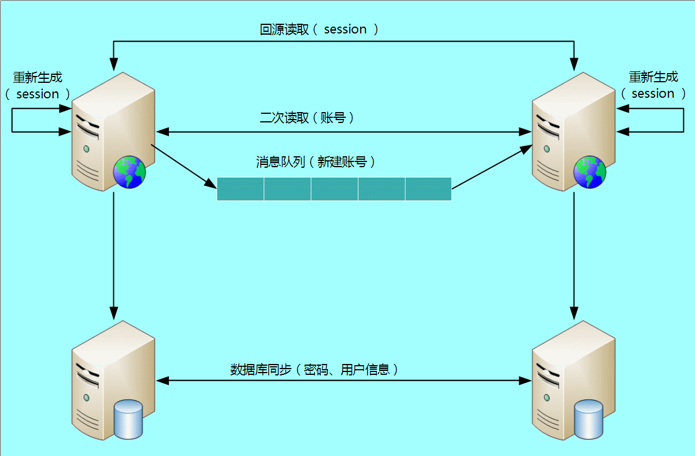

#### 只保证绝大部分用户的异地多活

某些场景下我们无法保证100%的业务可用性，总是会有一定的损失。例如，密码不同步导致无法登录、用户信息不同步导致用户看到旧的信息等。

其实这个问题涉及异地多活架构设计中一个典型的思维误区： 保证业务100%可用。但极端情况下就是会丢一部分数据，就是会有一部分数据不能同步，这是由物理规律决定的，光速和网络的传播速度、硬盘的读写速度、极端异常情况的不可控等，都是无法100%解决的。 

我们要忍受这一小部分用户或者业务上的损失，否则本来想为了保证最后的0.01%的用户的可用性，做一个完美方案，结果却发现99.99%的用户都保证不了了。 

对于某些实时强一致性的业务，实际上受影响的用户会更多，甚至可能达到1/3的用户。以银行转账这个业务为例，假设小明在北京XX银行开了账号，如果小明要转账，一定要北京的银行业务中心才可用，否则就不允许小明自己转账。如果不这样的话，假设在北京和上海两个业务中心实现了实时转账的异地多活，某些异常情况下就可能出现小明只有1万元存款，他在北京转给了张三1万元，然后又到上海转给了李四1万元，两次转账都成功了。这种漏洞如果被人利用，后果不堪设想。 

针对银行转账这个业务，虽然无法做到“实时转账”的异地多活，但可以通过特殊的业务手段让转账业务也能实现异地多活。例如，转账业务除了“实时转账”外，还提供“转账申请”业务，即小明在上海业务中心提交转账请求，但上海的业务中心并不立即转账，而是记录这个转账请求，然后后台异步发起真正的转账操作，如果此时北京业务中心不可用，转账请求就可以继续等待重试；假设等待2个小时后北京业务中心恢复了，此时上海业务中心去请求转账，发现余额不够，这个转账请求就失败了。小明再登录上来就会看到转账申请失败，原因是“余额不足”。 

“转账申请”的这种方式虽然有助于实现异地多活，但其实还是牺牲了用户体验的，对于小明来说，本来一次操作的事情，需要分为两次：一次提交转账申请，另外一次是要确认是否转账成功。 

虽然我们无法做到100%可用性，但并不意味着我们什么都不能做，为了让用户心里更好受一些，我们可以采取一些措施进行安抚或者补偿，例如： 

* 挂公告：说明现在有问题和基本的问题原因，如果不明确原因或者不方便说出原因，可以发布“技术哥哥正在紧急处理”这类比较轻松和有趣的公告。 
* 事后对用户进行补偿：例如，送一些业务上可用的代金券、小礼包等，减少用户的抱怨。 
* 补充体验：对于为了做异地多活而带来的体验损失，可以想一些方法减少或者规避。以“转账申请”为例，为了让用户不用确认转账申请是否成功，我们可以在转账成功或者失败后直接给用户发个短信，告诉他转账结果，这样用户就不用时不时地登录系统来确认转账是否成功了。 

### 设计步骤

#### 业务分级

按照一定的标准将业务进行分级，挑选出核心的业务，只为核心业务设计异地多活，降低方案整体复杂度和实现成本。 

常见的分级标准有下面几种： 

* 访问量大的业务

  以用户管理系统为例，业务包括登录、注册、用户信息管理，其中登录的访问量肯定是最大的。 

* 核心业务

  以QQ为例，QQ的主场景是聊天，QQ空间虽然也是重要业务，但和聊天相比，重要性就会低一些，如果要从聊天和QQ空间两个业务里面挑选一个做异地多活，那明显聊天要更重要 

* 产生大量收入的业务：例如充值业务

以我们一直在举例的用户管理系统为例，“登录”业务符合“访问量大的业务”和“核心业务”这两条标准，因此我们将登录业务作为核心业务。 

#### 数据分类

挑选出核心业务后，需要对核心业务相关的数据进一步分析，目的在于识别所有的数据及数据特征，这些数据特征会影响后面的方案设计。 

常见的数据特征分析维度有： 

* 数据量

  这里的数据量包括总的数据量和新增、修改、删除的量。对异地多活架构来说，新增、修改、删除的数据就是可能要同步的数据，数据量越大，同步延迟的几率越高，同步方案需要考虑相应的解决方案。 

* 唯一性

  唯一性指数据是否要求多个异地机房产生的同类数据必须保证唯一。例如用户ID，如果两个机房的两个不同用户注册后生成了一样的用户ID，这样业务上就出错了。 

  数据的唯一性影响业务的多活设计，如果数据不需要唯一，那就说明两个地方都产生同类数据是可能的；如果数据要求必须唯一，要么只能一个中心点产生数据，要么需要设计一个数据唯一生成的算法。 

* 实时性

  实时性指如果在A机房修改了数据，要求多长时间必须同步到B机房，实时性要求越高，对同步的要求越高，方案越复杂。 

* 可丢失性

  可丢失性指数据是否可以丢失。例如，写入A机房的数据还没有同步到B机房，此时A机房机器宕机会导致数据丢失，那这部分丢失的数据是否对业务会产生重大影响。 

  例如，登录过程中产生的session数据就是可丢失的，因为用户只要重新登录就可以生成新的session；而用户ID数据是不可丢失的，丢失后用户就会失去所有和用户ID相关的数据，例如用户的好友、用户的钱等。 

* 可恢复性

  可恢复性指数据丢失后，是否可以通过某种手段进行恢复，如果数据可以恢复，至少说明对业务的影响不会那么大，这样可以相应地降低异地多活架构设计的复杂度。 

  例如，用户的微博丢失后，用户重新发一篇一模一样的微博，这个就是可恢复的；或者用户密码丢失，用户可以通过找回密码来重新设置一个新密码，这也算是可以恢复的；而用户账号如果丢失，用户无法登录系统，系统也无法通过其他途径来恢复这个账号，这就是不可恢复的数据。 

以用户管理系统的登录业务为例，简单分析如下表所示：

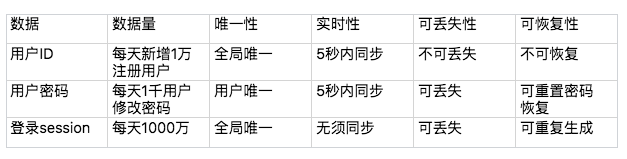

#### 数据同步

确定数据的特点后，我们可以根据不同的数据设计不同的同步方案。常见的数据同步方案有： 

* 存储系统同步

  这是最常用也是最简单的同步方式。例如，使用MySQL的数据主从数据同步、主主数据同步。 

  这类数据同步的优点是使用简单，因为几乎主流的存储系统都会有自己的同步方案；缺点是这类同步方案都是通用的，无法针对业务数据特点做定制化的控制。例如，无论需要同步的数据量有多大，MySQL都只有一个同步通道。因为要保证事务性，一旦数据量比较大，或者网络有延迟，则同步延迟就会比较严重。 

* 消息队列同步

  采用独立消息队列进行数据同步，常见的消息队列有Kafka、ActiveMQ、RocketMQ等。 

  消息队列同步适合无事务性或者无时序性要求的数据。例如，用户账号，两个用户先后注册了账号A和B，如果同步时先把B同步到异地机房，再同步A到异地机房，业务上是没有问题的。而如果是用户密码，用户先改了密码为m，然后改了密码为n，同步时必须先保证同步m到异地机房，再同步n到异地机房；如果反过来，同步后用户的密码就不对了。因此，对于新注册的用户账号，我们可以采用消息队列同步了；而对于用户密码，就不能采用消息队列同步了。 

* 重复生成

  数据不同步到异地机房，每个机房都可以生成数据，这个方案适合于可以重复生成的数据。例如，登录产生的cookie、session数据、缓存数据等。 

以用户管理系统的登录业务为例，针对不同的数据特点设计不同的同步方案，如下表所示：

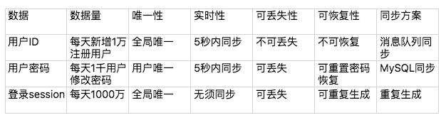

#### 异常处理

无论数据同步方案如何设计，一旦出现极端异常的情况，总是会有部分数据出现异常的。例如，同步延迟、数据丢失、数据不一致等。异常处理就是假设在出现这些问题时，系统将采取什么措施来应对。异常处理主要有以下几个目的： 

- 问题发生时，避免少量数据异常导致整体业务不可用。
- 问题恢复后，将异常的数据进行修正。
- 对用户进行安抚，弥补用户损失。

常见的异常处理措施有这几类： 

1、多通道同步

多通道同步的含义是采取多种方式来进行数据同步，其中某条通道故障的情况下，系统可以通过其他方式来进行同步，这种方式可以应对同步通道处故障的情况。 

以用户管理系统中的用户账号数据为例，我们的设计方案一开始挑选了消息队列的方式进行同步，考虑异常情况下，消息队列同步通道可能中断，也可能延迟很严重；为了保证新注册账号能够快速同步到异地机房，我们再增加一种MySQL同步这种方式作为备份。这样针对用户账号数据同步，系统就有两种同步方式：MySQL主从同步和消息队列同步。除非两个通道同时故障，否则用户账号数据在其中一个通道异常的情况下，能够通过另外一个通道继续同步到异地机房，如下图所示 ：

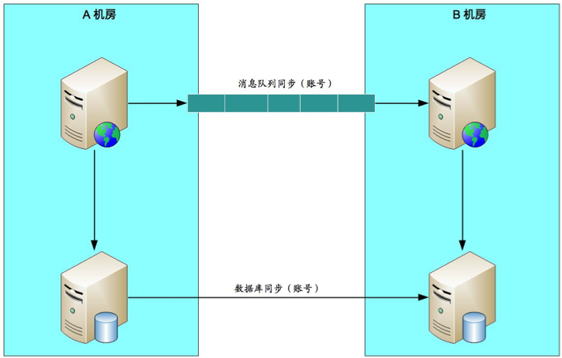

多通道同步设计的方案关键点有： 

- 一般情况下，采取两通道即可，采取更多通道理论上能够降低风险，但付出的成本也会增加很多。
- 数据库同步通道和消息队列同步通道不能采用相同的网络连接，否则一旦网络故障，两个通道都同时故障；可以一个走公网连接，一个走内网连接。
- 需要数据是可以重复覆盖的，即无论哪个通道先到哪个通道后到，最终结果是一样的。例如，新建账号数据就符合这个标准，而密码数据则不符合这个标准。

2、同步和访问结合 

这里的访问指异地机房通过系统的接口来进行数据访问。例如业务部署在异地两个机房A和B，B机房的业务系统通过接口来访问A机房的系统获取账号信息，如下图所示：

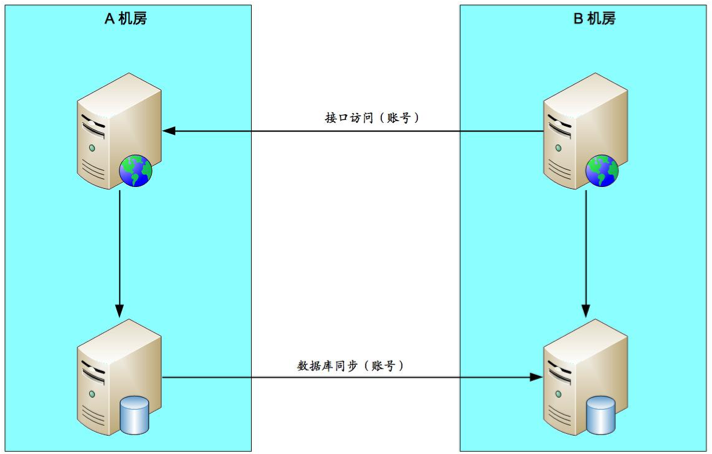

同步和访问结合方案的设计关键点有：

- 接口访问通道和数据库同步通道不能采用相同的网络连接，不能让数据库同步和接口访问都走同一条网络通道，可以采用接口访问走公网连接，数据库同步走内网连接这种方式。
- 数据有路由规则，可以根据数据来推断应该访问哪个机房的接口来读取数据。例如，有3个机房A、B、C，B机房拿到一个不属于B机房的数据后，需要根据路由规则判断是访问A机房接口，还是访问C机房接口。
- 由于有同步通道，优先读取本地数据，本地数据无法读取到再通过接口去访问，这样可以大大降低跨机房的异地接口访问数量，适合于实时性要求非常高的数据。

3、日志记录 

日志记录主要用于用户故障恢复后对数据进行恢复，其主要方式是每个关键操作前后都记录相关一条日志，然后将日志保存在一个独立的地方，当故障恢复后，拿出日志跟数据进行对比，对数据进行修复。 

为了应对不同级别的故障，日志保存的要求也不一样，常见的日志保存方式有：

- 服务器上保存日志，数据库中保存数据，这种方式可以应对单台数据库服务器故障或者宕机的情况。
- 本地独立系统保存日志，这种方式可以应对某业务服务器和数据库同时宕机的情况。例如，服务器和数据库部署在同一个机架，或者同一个电源线路上，就会出现服务器和数据库同时宕机的情况。
- 日志异地保存，这种方式可以应对机房宕机的情况。

上面不同的日志保存方式，应对的故障越严重，方案本身的复杂度和成本就会越高，实际选择时需要综合考虑成本和收益情况。 

4、用户补偿

无论采用什么样的异常处理措施，都只能最大限度地降低受到影响的范围和程度，无法完全做到没有任何影响。例如，双同步通道有可能同时出现故障、日志记录方案本身日志也可能丢失。因此，无论多么完美的方案，故障的场景下总是可能有一小部分用户业务上出问题，系统无法弥补这部分用户的损失。但我们可以采用人工的方式对用户进行补偿，弥补用户损失，培养用户的忠诚度。 

简单来说，系统的方案是为了保证99.99%的用户在故障的场景下业务不受影响，人工的补偿是为了弥补0.01%的用户的损失。

常见的补偿措施有送用户代金券、礼包、礼品、红包等，有时为了赢得用户口碑，付出的成本可能还会比较大，但综合最终的收益来看还是很值得的。

## 接口级故障

异地多活主要用来应对系统级的故障，例如机器宕机、机房故障和网络故障等问题。这些系统级的故障虽然影响很大，但发生概率较小。在实际业务运行过程中，还有另外一种故障影响可能没有那么大，但发生的概率较高，这就是接口级故障。

接口级故障的典型表现就是，系统并没有宕机、网络也没有中断，但业务却出现问题了，例如业务响应缓慢、大量访问超时和大量访问出现异常（给用户弹出提示“无法连接数据库”）。 

这类问题的主要原因在于系统压力太大、负载太高，导致无法快速处理业务请求，由此引发更多的后续问题。最常见的情况就是，数据库慢查询将数据库的服务器资源耗尽，导致读写超时，业务读写数据库时要么无法连接数据库、要么超时，最终用户看到的现象就是访问很慢，一会儿访问抛出异常，一会儿访问又是正常结果。 

导致接口级故障的原因可以分为两大类： 

* 内部原因：包括程序bug导致死循环，某个接口导致数据库慢查询，程序逻辑不完善导致耗尽内存等。
* 外部原因：包括黑客攻击，促销或者抢购引入了超出平时几倍甚至几十倍的用户，第三方系统大量请求，第三方系统响应缓慢等。

解决接口级故障的核心思想和异地多活基本类似，都是优先保证核心业务和优先保证绝大部分用户。常见的应对方法有四种，降级、熔断、限流和排队

### 降级

降级指系统将某些业务或者接口的功能降低，可以是只提供部分功能，也可以是完全停掉所有功能。 

例如，论坛可以降级为只能看帖子，不能发帖子；也可以降级为只能看帖子和评论，不能发评论；而App的日志上传接口，可以完全停掉一段时间，这段时间内App都不能上传日志。 

降级的核心思想就是丢车保帅，优先保证核心业务。

例如，对于论坛来说，90%的流量是看帖子，那我们就优先保证看帖的功能；对于一个App来说，日志上传接口只是一个辅助的功能，故障时完全可以停掉。

常见的实现降级的方式有两种： 

1、系统后门降级

简单来说，就是系统预留了后门用于降级操作。例如，系统提供一个降级URL，当访问这个URL时，就相当于执行降级指令，具体的降级指令通过URL的参数传入即可。这种方案有一定的安全隐患，所以也会在URL中加入密码这类安全措施。 

系统后门降级的方式实现成本低，但主要缺点是如果服务器数量多，需要一台一台去操作，效率比较低，这在故障处理争分夺秒的场景下是比较浪费时间的。 

2、独立降级系统

为了解决系统后门降级方式的缺点，我们可以将降级操作独立到一个单独的系统中，实现复杂的权限管理、批量操作等功能。

其基本架构如下：

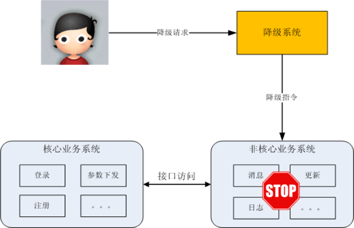

### 熔断

熔断是指按照规则停掉外部接口的访问，防止某些外部接口故障导致自己的系统处理能力急剧下降或者出故障。 

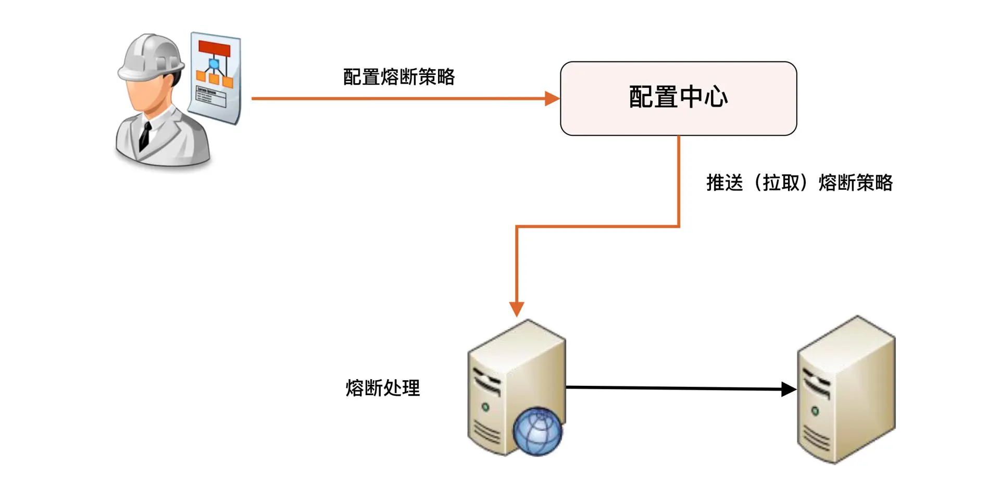

熔断和降级是两个比较容易混淆的概念，因为单纯从名字上看，好像都有禁止某个功能的意思。但它们的内涵是不同的，因为降级的目的是应对系统自身的故障，而熔断的目的是应对依赖的外部系统故障的情况。 

假设一个这样的场景：A服务的X功能依赖B服务的某个接口，当B服务的接口响应很慢的时候，A服务的X功能响应肯定也会被拖慢，进一步导致A服务的线程都被卡在X功能处理上，于是A服务的其他功能都会被卡住或者响应非常慢。 

这时就需要熔断机制了：A服务不再请求B服务的这个接口，A服务内部只要发现是请求B服务的这个接口就立即返回错误，从而避免A服务整个被拖慢甚至拖死。 

实现熔断机制有两个关键点： 

* 一是需要有一个统一的API调用层，由API调用层来进行采样或者统计。如果接口调用散落在代码各处，就没法进行统一处理了。
* 二是阈值的设计，例如1分钟内30%的请求响应时间超过1秒就熔断，这个策略中的“1分钟”“30%”“1秒”都对最终的熔断效果有影响。实践中，一般都是先根据分析确定阈值，然后上线观察效果，再进行调优。

### 限流

降级是从系统功能优先级的角度考虑如何应对故障，而限流则是从用户访问压力的角度来考虑如何应对故障。限流指只允许系统能够承受的访问量进来，超出系统访问能力的请求将被丢弃。 

虽然“丢弃”这个词听起来让人不太舒服，但保证一部分请求能够正常响应，总比全部请求都不能响应要好得多。 

限流一般都是系统内实现的，常见的限流方式可以分为两类：基于请求限流和基于资源限流。 

1、基于请求限流

基于请求限流指从外部访问的请求角度考虑限流，常见的方式有两种：

* 第一种是限制总量，也就是限制某个指标的累积上限，常见的是限制当前系统服务的用户总量，例如：某个直播间限制总用户数上限为100万，超过100万后新的用户无法进入；某个抢购活动商品数量只有100个，限制参与抢购的用户上限为1万个，1万以后的用户直接拒绝。
* 第二种是限制时间量，也就是限制一段时间内某个指标的上限，例如1分钟内只允许10000个用户访问；每秒请求峰值最高为10万。

无论是限制总量还是限制时间量，共同的特点都是实现简单，但在实践中面临的主要问题主要是：

* 难以找到合适的阈值，可能是阈值设定过高导致系统崩溃，或者业务出现部分异常
* 根据不同的硬件情况也会影响到阈值的选取，例如简单根据硬件指标进行数学运算是不行的，例如64核的机器比32核的机器，业务处理性能并不是2倍的关系，可能是1.5倍，甚至可能是1.1倍。 

为了找到合理的阈值，通常情况下可以采用性能压测来确定阈值，但性能压测也存在覆盖场景有限的问题，这些没有覆盖的功能可能就会导致隐患。另外一种方式是逐步优化：先设定一个阈值然后上线观察运行情况，发现不合理就调整阈值。 

基于上述的分析，根据阈值来限制访问量的方式更多的适应于业务功能比较简单的系统，例如负载均衡系统、网关系统、抢购系统等。 

2、基于资源限流

基于请求限流是从系统外部考虑的，而基于资源限流是从系统内部考虑的，也就是找到系统内部影响性能的关键资源，对其使用上限进行限制。常见的内部资源包括连接数、文件句柄、线程数和请求队列等。 

例如，采用Netty来实现服务器，每个进来的请求都先放入一个队列，业务线程再从队列读取请求进行处理，队列长度最大值为10000，队列满了就拒绝后面的请求；也可以根据CPU的负载或者占用率进行限流，当CPU的占用率超过80%的时候就开始拒绝新的请求。 

基于资源限流相比基于请求限流能够更加有效地反映当前系统的压力，但实际设计时也面临两个主要的难点：如何确定关键资源，以及如何确定关键资源的阈值。 

通常情况下，这也是一个逐步调优的过程：设计的时候先根据推断选择某个关键资源和阈值，然后测试验证，再上线观察，如果发现不合理，再进行优化。 

### 限流算法

为了更好地实现前面描述的各种限流方式，通常情况下我们会基于限流算法来设计方案。 

一、时间窗

时间窗算法会限制一定时间窗口内的请求量或者资源消耗量，根据实现方式又可以细分为“固定时间窗”和“滑动时间窗”。 

固定时间窗指的是统计窗口固定且连续的窗口内的请求量或者资源消耗量，超过限额就会启动限流，它实现简单，但是存在临界点问题，可能存在某个跨窗口的区间已经超出了实际的限制。例如下面图中的红蓝两点只间隔了短短10秒，期间的请求数却已经达到200，超过了算法规定的限额（1分钟内处理100）。但是因为这些请求分别来自两个统计窗口，从单个窗口来看还没有超出限额，所以并不会启动限流，结果可能导致系统因为压力过大而挂掉。 

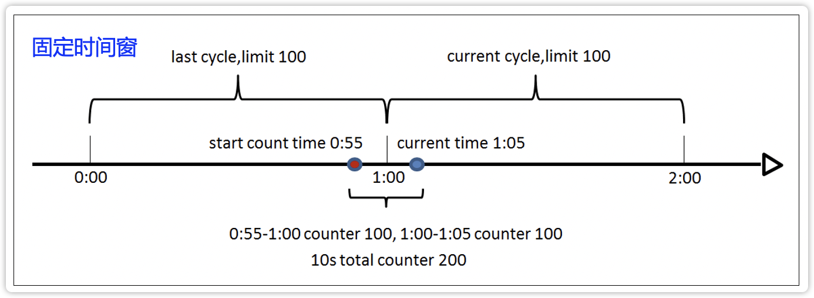

为了解决临界点问题，滑动时间窗算法应运而生，它的实现原理是，两个统计周期部分重叠，从而避免短时间内的两个统计点分属不同的时间窗的情况，如下图所示： 

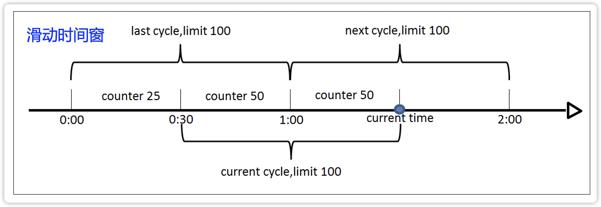

总体上来看，滑动时间窗的限流效果要比固定时间窗更好，但是实现也会稍微复杂一些。 

二、桶算法

用一个虚拟的“桶”来临时存储一些东西。根据桶里面放的东西，又可以细分为“漏桶”和“令牌桶” 

漏桶算法的实现原理是，将请求放入“桶”（消息队列等），业务处理单元（线程、进程和应用等）从桶里拿请求处理，桶满则丢弃新的请求，如下图所示： 

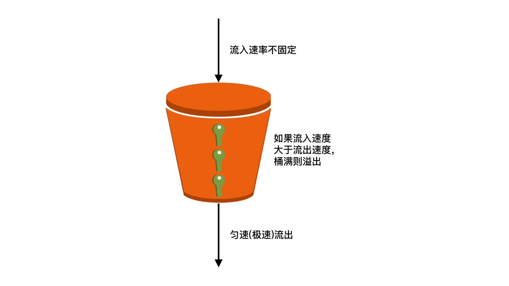

可以看到漏桶算法的三个关键实现点： 

1. 流入速率不固定：可能瞬间流入非常多的请求，例如0点签到、整点秒杀。
2. 匀速(极速)流出：这是理解漏桶算法的关键，也就是说即使大量请求进入了漏桶，但是从漏桶流出的速度是匀速的，速度的最大值就是系统的极限处理速度（对应图中的“极速”）。这样就保证了系统在收到海量请求的时候不被压垮，这是第一层的保护措施。需要注意的是：如果漏桶没有堆积，那么流出速度就等于流入速度，这个时候流出速度就不是匀速的。
3. 桶满则丢弃请求：这是第二层保护措施，也就是说漏桶不是无限容量，而是有限容量，例如漏桶最多存储100万个请求，桶满了则直接丢弃后面的请求。

漏桶算法的技术本质是总量控制，桶大小是设计关键，具体的优缺点如下：

* 突发大量流量时丢弃的请求较少，因为漏桶本身有缓存请求的作用。
* 桶大小动态调整比较困难（例如 Java BlockingQueue），需要不断的尝试才能找到符合业务需求的最佳桶大小。
* 无法精确控制流出速度，也就是业务的处理速度。

漏桶算法主要适用于瞬时高并发流量的场景（例如刚才提到的0点签到、整点秒杀等）。在短短几分钟内涌入大量请求时，为了更好的业务效果和用户体验，即使处理慢一些，也要做到尽量不丢弃用户请求。 

令牌桶算法和漏桶算法的不同之处在于，桶中放入的不是请求，而是“令牌”，这个令牌就是业务处理前需要拿到的“许可证”。也就是说，当系统收到一个请求时，先要到令牌桶里面拿“令牌”，拿到令牌才能进一步处理，拿不到就要丢弃请求：

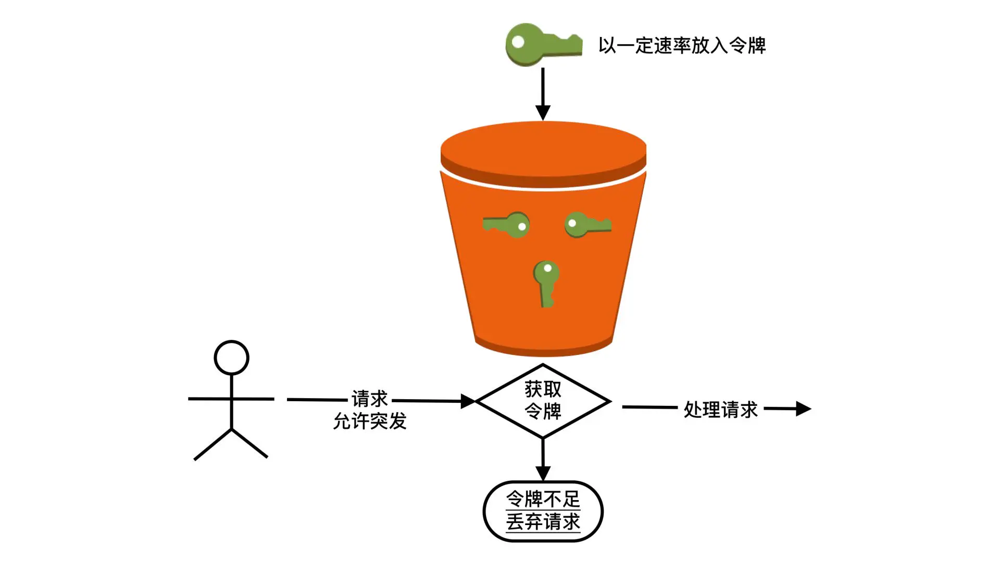

我们可以看到令牌桶算法的三个关键设计点：

1. 有一个处理单元往桶里面放令牌，放的速率是可以控制的。
2. 桶里面可以累积一定数量的令牌，当突发流量过来的时候，因为桶里面有累积的令牌，此时的业务处理速度会超过令牌放入的速度。
3. 如果令牌不足，即使系统有能力处理，也会丢弃请求。

令牌桶算法的技术本质是速率控制，令牌产生的速率是设计关键，具体的优缺点如下：

* 可以动态调整处理速率，实现更加灵活。
* 突发大量流量的时候可能丢弃很多请求，因为令牌桶不能累积太多令牌。
* 实现相对复杂。

令牌桶算法主要适用于两种典型的场景：

* 一种是需要控制访问第三方服务的速度，防止把下游压垮，例如支付宝需要控制访问银行接口的速率； 
* 另一种是需要控制自己的处理速度，防止过载，例如压测结果显示系统最大处理TPS是100，那么就可以用令牌桶来限制最大的处理速度。 

令牌桶的“允许突发”实际上只是“允许一定程度的突发”，比如系统处理能力是每秒100 TPS，突发到120 TPS是可以的，但如果突发到1000 TPS的话，系统大概率就被压垮了。所以处理秒杀时高并发流量，还是得用漏桶算法。 

令牌桶的算法原本是用于网络设备控制传输速度的，而且它控制的目的是保证一段时间内的平均传输速度。之所以说令牌桶适合突发流量，是指在网络传输的时候，可以允许某段时间内（一般就几秒）超过平均传输速率，这在网络环境下常见的情况就是“网络抖动”。 

短时间的突发流量并不会导致雪崩效应，网络设备也能够处理得过来。对应到令牌桶应用到业务处理的场景，就要求即使有突发流量来了，系统自己或者下游系统要真的能够处理的过来，否则令牌桶允许突发流量进来，结果系统或者下游处理不了，那还是会被压垮。 

因此，令牌桶在实际设计的时候，桶大小不能像漏桶那样设计很大，需要根据系统的处理能力来进行仔细的估算。例如，漏桶算法的桶容量可以设计为100万，但是一个每秒30 TPS的令牌桶，桶的容量可能只能设计成40左右。海外有的银行给移动钱包提供的接口TPS上限是30，压测到了40就真的挂了。 

### 排队

排队实际上是限流的一个变种，限流是直接拒绝用户，排队是让用户等待一段时间，全世界最有名的排队当属12306网站排队了。

排队虽然没有直接拒绝用户，但用户等了很长时间后进入系统，体验并不一定比限流好。

由于排队需要临时缓存大量的业务请求，单个系统内部无法缓存这么多数据，一般情况下，排队需要用独立的系统去实现，例如使用Kafka这类消息队列来缓存用户请求。 

下图是1号店的“双11”秒杀排队系统架构： 

它的基本实现如下：

* 排队模块：负责接收用户的抢购请求，将请求以先入先出的方式保存下来。每一个参加秒杀活动的商品保存一个队列，队列的大小可以根据参与秒杀的商品数量（或加点余量）自行定义。
* 调度模块：负责排队模块到服务模块的动态调度，不断检查服务模块，一旦处理能力有空闲，就从排队队列头上把用户访问请求调入服务模块，并负责向服务模块分发请求。这里调度模块扮演一个中介的角色，但不只是传递请求而已，它还担负着调节系统处理能力的重任。我们可以根据服务模块的实际处理能力，动态调节向排队系统拉取请求的速度。
* 服务模块：负责调用真正业务来处理服务，并返回处理结果，调用排队模块的接口回写业务处理结果。

# 可扩展性

软件系统与硬件和建筑系统最大的差异在于软件是可扩展的，一个硬件生产出来后就不会再进行改变、一个建筑完工后也不会再改变其整体结构。 相比之下，软件系统就完全相反，如果一个软件系统开发出来后，再也没有任何更新和调整，反而说明了这套软件系统没有发展、没有生命力。真正有生命力的软件系统，都是在不断迭代和发展的，典型的如Windows操作系统。

软件系统的这种天生和内在的可扩展的特性，既是魅力所在，又是难点所在。魅力体现在我们可以通过修改和扩展，不断地让软件系统具备更多的功能和特性，满足新的需求或者顺应技术发展的趋势。而难点体现在如何以最小的代价去扩展系统，因为很多情况下牵一发动全身，扩展时可能出现到处都要改，到处都要推倒重来的情况。这样做的风险不言而喻：改动的地方越多，投入也越大，出错的可能性也越大。因此，如何避免扩展时改动范围太大，是软件架构可扩展性设计的主要思考点。 

## 可扩展方式

可扩展性架构的设计方法很多，但万变不离其宗，所有的可扩展性架构设计，背后的核心思想只有一个：拆分，就是将原本大一统的系统拆分成多个规模小的部分，扩展时只修改其中一部分即可，无须整个系统到处都改，通过这种方式来减少改动范围，降低改动风险。 

在一个理想的环境，你的团队都是高手，每个程序员都很厉害，对业务都很熟悉，新来的同事很快就知晓所有的细节……那确实不拆分也没有问题。但现实却是：团队有菜鸟程序员，到底是改A处实现功能还是改B处实现功能，完全取决于他觉得哪里容易改。有时粗心或者状态不好，或者一个小小的优化就可能导致问题，此时合理的拆分，能够强制保证即使程序员出错，出错的范围也不会太广，影响也不会太大。 

按照不同的思路来拆分软件系统，就会得到不同的架构。常见的拆分思路有如下三种：

- 面向流程拆分：将整个业务流程拆分为几个阶段，每个阶段作为一部分。
- 面向服务拆分：将系统提供的服务拆分，每个服务作为一部分。
- 面向功能拆分：将系统提供的功能拆分，每个功能作为一部分。

理解这三种思路的关键就在于如何理解“流程”“服务”“功能”三者的联系和区别。从范围上来看，从大到小依次为：流程>服务>功能 

以TCP/IP协议栈为例，来说明“流程”“服务”“功能”的区别和联系，TCP/IP协议栈和模型图如下图所示：

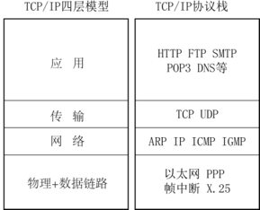

几种层次的概念：

* 流程：对应TCP/IP四层模型，因为TCP/IP网络通信流程是：应用层 → 传输层 → 网络层 → 物理+数据链路层，不管最上层的应用层是什么，这个流程都不会变。 
* 服务：对应应用层的HTTP、FTP、SMTP等服务，HTTP提供Web服务，FTP提供文件服务，SMTP提供邮件服务，以此类推。 
* 功能：每个服务都会提供相应的功能。例如，HTTP服务提供GET、POST功能，FTP提供上传下载功能，SMTP提供邮件发送和收取功能。 

以一个简单的学生信息管理系统为例来说明几种拆分方式：

1、面向流程拆分 

展示层 → 业务层 → 数据层 → 存储层，各层含义是： 

- 展示层：负责用户页面设计，不同业务有不同的页面。例如，登录页面、注册页面、信息管理页面、安全设置页面等。
- 业务层：负责具体业务逻辑的处理。例如，登录、注册、信息管理、修改密码等业务。
- 数据层：负责完成数据访问。例如，增删改查数据库中的数据、记录事件到日志文件等。
- 存储层：负责数据的存储。例如，关系型数据库MySQL、缓存系统Memcache等。

最终的架构如下： 

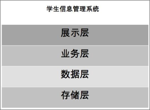

2、面向服务拆分 

将系统拆分为注册、登录、信息管理、安全设置等服务，最终架构示意图如下： 

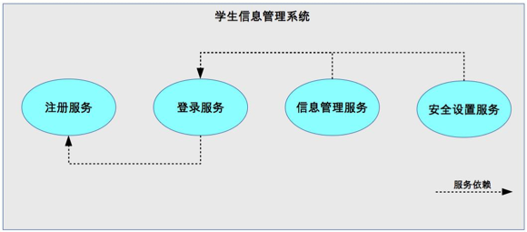

3、面向功能拆分 

每个服务都可以拆分为更多细粒度的功能，例如：

- 注册服务：提供多种方式进行注册，包括手机号注册、身份证注册、学生邮箱注册三个功能。
- 登录服务：包括手机号登录、身份证登录、邮箱登录三个功能。
- 信息管理服务：包括基本信息管理、课程信息管理、成绩信息管理等功能。
- 安全设置服务：包括修改密码、安全手机、找回密码等功能。

最终架构图如下： 

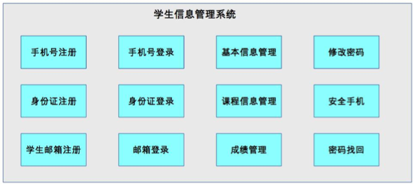

通过学生信息管理系统的案例可以发现，不同的拆分方式，架构图差异很大。 

不同的拆分方式，本质上决定了系统的扩展方式。

下面是不同拆分方式应对扩展时的优势：

* 面向流程拆分

  扩展时大部分情况只需要修改某一层，少部分情况可能修改关联的两层，不会出现所有层都同时要修改。例如学生信息管理系统，如果我们将存储层从MySQL扩展为同时支持MySQL和Oracle，那么只需要扩展存储层和数据层即可，展示层和业务层无须变动。 

* 面向服务拆分 

  对某个服务扩展，或者要增加新的服务时，只需要扩展相关服务即可，无须修改所有的服务。同样以学生管理系统为例，如果我们需要在注册服务中增加一种“学号注册”功能，则只需要修改“注册服务”和“登录服务”即可，“信息管理服务”和“安全设置”服务无须修改。 

* 面向功能拆分 

  对某个功能扩展，或者要增加新的功能时，只需要扩展相关功能即可，无须修改所有的服务。同样以学生管理系统为例，如果我们增加“学号注册”功能，则只需要在系统中增加一个新的功能模块，同时修改“登录功能”模块即可，其他功能都不受影响。 

不同的拆分方式，将得到不同的系统架构，典型的可扩展系统架构有：

- 面向流程拆分：分层架构。
- 面向服务拆分：SOA、微服务。
- 面向功能拆分：微内核架构。

这几个系统架构并不是非此即彼的，而是可以在系统架构设计中进行组合使用的。以学生管理系统为例，我们最终可以这样设计架构： 

- 整体系统采用面向服务拆分中的“微服务”架构，拆分为“注册服务”“登录服务”“信息管理服务”“安全服务”，每个服务是一个独立运行的子系统。
- 其中的“注册服务”子系统本身又是采用面向流程拆分的分层架构。
- “登录服务”子系统采用的是面向功能拆分的“微内核”架构。

## 分层架构

分层架构是很常见的架构模式，它也叫N层架构，通常情况下，N至少是2层。例如，C/S架构、B/S架构。常见的是3层架构（例如，MVC、MVP架构）、4层架构，5层架构的比较少见，一般是比较复杂的系统才会达到或者超过5层，比如操作系统内核架构。

按照分层架构进行设计时，根据不同的划分维度和对象，可以得到多种不同的分层架构。

1、C/S架构、B/S架构

划分的对象是整个业务系统，划分的维度是用户交互，即将和用户交互的部分独立为一层，支撑用户交互的后台作为另外一层。例如，下面是C/S架构结构图：

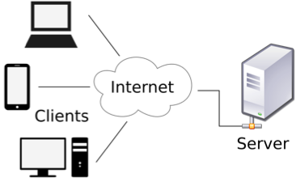

2、MVC架构、MVP架构

划分的对象是单个业务子系统，划分的维度是职责，将不同的职责划分到独立层，但各层的依赖关系比较灵活。例如，MVC架构中各层之间是两两交互的： 

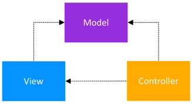

3、逻辑分层架构

划分的对象可以是单个业务子系统，也可以是整个业务系统，划分的维度也是职责。虽然都是基于职责划分，但逻辑分层架构和MVC架构、MVP架构的不同点在于，逻辑分层架构中的层是自顶向下依赖的。典型的有操作系统内核架构、TCP/IP架构。例如，下面是Android操作系统架构图：

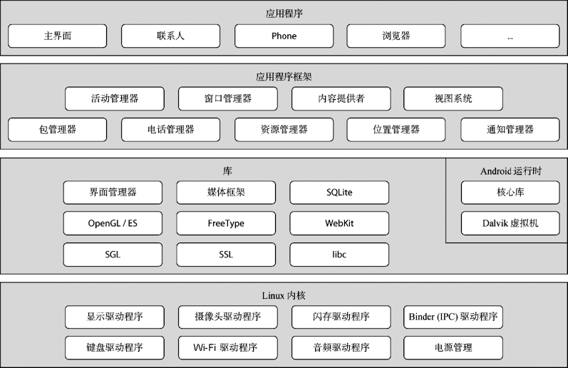

典型的J2EE系统架构也是逻辑分层架构，架构图如下： 

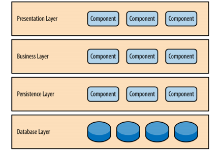

针对整个业务系统进行逻辑分层的架构图如下： 

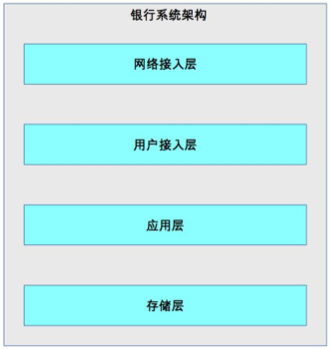

无论采取何种分层维度，分层架构设计最核心的一点就是需要保证各层之间的差异足够清晰，边界足够明显，让人看到架构图后就能看懂整个架构，这也是分层不能分太多层的原因。否则如果两个层的差异不明显，就会出现程序员小明认为某个功能应该放在A层，而程序员老王却认为同样的功能应该放在B层，这样会导致分层混乱。如果这样的架构进入实际开发落地，则A层和B层就会乱成一锅粥，也就失去了分层的意义。

分层架构之所以能够较好地支撑系统扩展，本质在于隔离关注点（separation of concerns），即每个层中的组件只会处理本层的逻辑。比如说，展示层只需要处理展示逻辑，业务层中只需要处理业务逻辑，这样我们在扩展某层时，其他层是不受影响的，通过这种方式可以支撑系统在某层上快速扩展。例如，Linux内核如果要增加一个新的文件系统，则只需要修改文件存储层即可，其他内核层无须变动。

并不是简单地分层就一定能够实现隔离关注点从而支撑快速扩展，分层时要保证层与层之间的依赖是稳定的，才能真正支撑快速扩展。例如，Linux内核为了支撑不同的文件系统格式，抽象了VFS文件系统接口，架构图如下： 

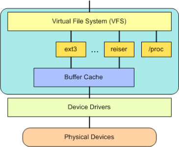

如果没有VFS，只是简单地将ext2、ext3、reiser等文件系统划为“文件系统层”，那么这个分层是达不到支撑可扩展的目的的。因为增加一个新的文件系统后，所有基于文件系统的功能都要适配新的文件系统接口；而有了VFS后，只需要VFS适配新的文件系统接口，其他基于文件系统的功能是依赖VFS的，不会受到影响。 

对于操作系统这类复杂的系统，接口本身也可以成为独立的一层。例如，我们把VFS独立为一层是完全可以的。而对于一个简单的业务系统，接口可能就是Java语言上的几个interface定义，这种情况下如果独立为一层，看起来可能就比较重了。例如，经典的J2EE分层架构中，Presentation Layer和Business Layer之间如果硬要拆分一个独立的接口层，则显得有点多余了。 

分层结构的另外一个特点就是层层传递，也就是说一旦分层确定，整个业务流程是按照层进行依次传递的，不能在层之间进行跳跃。最简单的C/S结构，用户必须先使用C层，然后C层再传递到S层，用户是不能直接访问S层的。传统的J2EE 4层架构，收到请求后，必须按照下面的方式传递请求： 

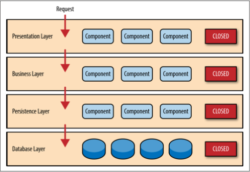

分层结构的这种约束，好处在于强制将分层依赖限定为两两依赖，降低了整体系统复杂度。例如，Business Layer被Presentation Layer依赖，自己只依赖Persistence Layer。但分层结构的代价就是冗余，也就是说，不管这个业务有多么简单，每层都必须要参与处理，甚至可能每层都写了一个简单的包装函数。 

而且这种约束是不能简单绕过的，分层架构的优势就体现在通过分层强制约束两两依赖，一旦自由选择绕过分层，时间一长，架构就会变得混乱。例如，Presentation Layer直接访问Persistence Layer，Business Layer直接访问Database Layer，这样做就失去了分层架构的意义，也导致后续扩展时无法控制受影响范围，牵一发动全身，无法支持快速扩展。 而且冗余大多数情况下只是简单的方法封装，不会特别复杂。

分层架构另外一个典型的缺点就是性能，因为每一次业务请求都需要穿越所有的架构分层，有一些事情是多余的，多少都会有一些性能的浪费。当然，这里所谓的性能缺点只是理论上的分析，实际上分层带来的性能损失，如果放到20世纪80年代，可能很明显；但到了现在，硬件和网络的性能有了质的飞越，其实分层模式理论上的这点性能损失，在实际应用中，绝大部分场景下都可以忽略不计。 

## SOA

SOA的全称是Service Oriented Architecture，中文翻译为“面向服务的架构”，诞生于上世纪90年代。SOA更多是在传统企业（例如，制造业、金融业等）落地和推广，在互联网行业并没有大规模地实践和推广。 

SOA出现 的背景是企业内部的IT系统重复建设且效率低下，主要体现在： 

- 企业各部门有独立的IT系统，比如人力资源系统、财务系统、销售系统，这些系统可能都涉及人员管理，各IT系统都需要重复开发人员管理的功能。例如，某个员工离职后，需要分别到上述三个系统中删除员工的权限。
- 各个独立的IT系统可能采购于不同的供应商，实现技术不同，企业自己也不太可能基于这些系统进行重构。
- 随着业务的发展，复杂度越来越高，更多的流程和业务需要多个IT系统合作完成。由于各个独立的IT系统没有标准的实现方式（例如，人力资源系统用Java开发，对外提供RPC；而财务系统用C#开发，对外提供SOAP协议），每次开发新的流程和业务，都需要协调大量的IT系统，同时定制开发，效率很低。

为了应对传统IT系统存在的问题，SOA提出了3个关键概念：

1、服务

所有业务功能都是一项服务，服务就意味着要对外提供开放的能力，当其他系统需要使用这项功能时，无须定制化开发。 

服务可大可小，可简单也可复杂。例如，人力资源管理可以是一项服务，包括人员基本信息管理、请假管理、组织结构管理等功能；而人员基本信息管理也可以作为一项独立的服务，组织结构管理也可以作为一项独立的服务。到底是划分为粗粒度的服务，还是划分为细粒度的服务，需要根据企业的实际情况进行判断。 

2、ESB

ESB的全称是Enterprise Service Bus，中文翻译为“企业服务总线”。从名字就可以看出，ESB参考了计算机总线的概念。计算机中的总线将各个不同的设备连接在一起，ESB将企业中各个不同的服务连接在一起。因为各个独立的服务是异构的，如果没有统一的标准，则各个异构系统对外提供的接口是各式各样的。SOA使用ESB来屏蔽异构系统对外提供各种不同的接口方式，以此来达到服务间高效的互联互通。 

3、松耦合 

松耦合的目的是减少各个服务间的依赖和互相影响。因为采用SOA架构后，各个服务是相互独立运行的，甚至都不清楚某个服务到底有多少对其他服务的依赖。如果做不到松耦合，某个服务一升级，依赖它的其他服务全部故障，这样肯定是无法满足业务需求的。 

但实际上真正做到松耦合并没有那么容易，要做到完全后向兼容，是一项复杂的任务。 

典型的SOA架构样例如下： 

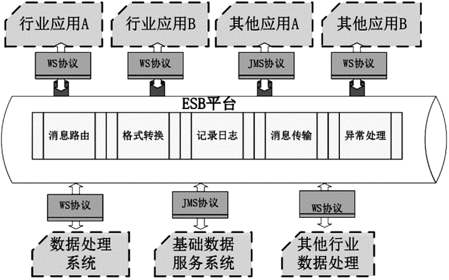

SOA架构是比较高层级的架构设计理念，一般情况下我们可以说某个企业采用了SOA的架构来构建IT系统，但不会说某个独立的系统采用了SOA架构。例如，某企业采用SOA架构，将系统分为“人力资源管理服务”“考勤服务”“财务服务”，但人力资源管理服务本身通常不会再按照SOA的架构拆分更多服务，也不会再使用独立的一套ESB，因为这些系统本身可能就是采购的，ESB本身也是采购的，如果人力资源系统本身重构为多个子服务，再部署独立的ESB系统，成本很高，也没有什么收益。 

SOA解决了传统IT系统重复建设和扩展效率低的问题，但其本身也引入了更多的复杂性。SOA最广为人诟病的就是ESB，ESB需要实现与各种系统间的协议转换、数据转换、透明的动态路由等功能。例如，下图中ESB将JSON转换为Java （摘自《Microservices vs. Service-Oriented Architecture》） ：

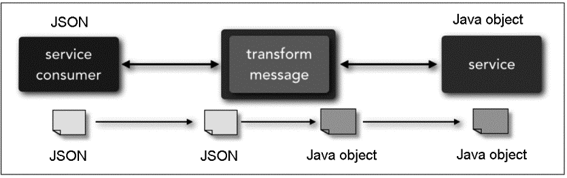

下图中ESB将REST协议转换为RMI和AMQP两个不同的协议： 

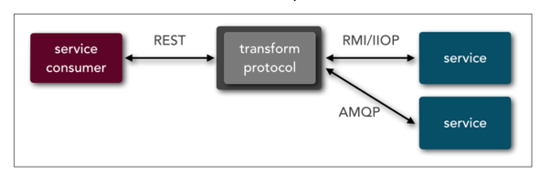

ESB虽然功能强大，但现实中的协议有很多种，如JMS、WS、HTTP、RPC等，数据格式也有很多种，如XML、JSON、二进制、HTML等。ESB要完成这么多协议和数据格式的互相转换，工作量和复杂度都很大，而且这种转换是需要耗费大量计算性能的，当ESB承载的消息太多时，ESB本身会成为整个系统的性能瓶颈。 

SOA的ESB设计也是无奈之举。回想一下SOA的提出背景就可以发现，企业在应用SOA时，各种异构的IT系统都已经存在很多年了，完全重写或者按照统一标准进行改造的成本是非常大的，只能通过ESB方式去适配已经存在的各种异构系统。 

## 微服务

微服务是近几年非常火热的架构设计理念，大部分人认为是Martin Fowler提出了微服务概念，但事实上微服务概念的历史要早得多，也不是Martin Fowler创造出来的，Martin只是将微服务进行了系统的阐述，不过不能否认Martin在推动微服务起到的作用，微服务能火，Martin功不可没。 

微服务架构是面向服务拆分架构的一种变体，它将程序变为松耦合、细粒度的服务的集合，通过轻量级协议进行通信。

微服务不是分层架构中的一层，而是一个独立的业务功能模块，它对外具有清晰的接口，内部可以实现分层架构。

### 微服务与SOA

关于SOA和微服务的关系和区别，大概分为下面几个典型的观点：

1、微服务是SOA的实现方式

这种观点认为SOA是一种架构理念，而微服务是SOA理念的一种具体实现方法。例如，“微服务就是使用HTTP RESTful协议来实现ESB的SOA”“使用SOA来构建单个系统就是微服务”和“微服务就是更细粒度的SOA” 

2、微服务是去掉ESB后的SOA

这种观点认为传统SOA架构最广为人诟病的就是庞大、复杂、低效的ESB，因此将ESB去掉，改为轻量级的HTTP实现，就是微服务。 

3、微服务是一种和SOA相似但本质上不同的架构理念

这种观点认为微服务和SOA只是有点类似，但本质上是不同的架构设计理念。相似点在于下图中交叉的地方，就是两者都关注“服务”，都是通过服务的拆分来解决可扩展性问题。本质上不同的地方在于几个核心理念的差异：是否有ESB、服务的粒度、架构设计的目标等。 

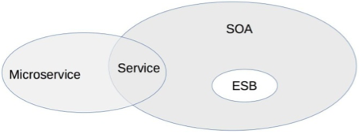

对比一下SOA和微服务的一些具体做法就可以知道第三种观点是正确的：

1、服务粒度

整体上来说，SOA的服务粒度要粗一些，而微服务的服务粒度要细一些。例如，对一个大型企业来说，“员工管理系统”就是一个SOA架构中的服务；而如果采用微服务架构，则“员工管理系统”会被拆分为更多的服务，比如“员工信息管理”“员工考勤管理”“员工假期管理”和“员工福利管理”等更多服务。 

2、服务通信

SOA采用了ESB作为服务间通信的关键组件，负责服务定义、服务路由、消息转换、消息传递，总体上是重量级的实现。微服务推荐使用统一的协议和格式，例如，RESTful协议、RPC协议，无须ESB这样的重量级实现。 ESB太强大了，既知道每个服务的协议类型（例如，是RMI还是HTTP），又知道每个服务的数据类型（例如，是XML还是JSON），还知道每个数据的格式（例如，是2017-01-01还是01/01/2017），而微服务通信仅仅做消息传递，对消息格式和内容一无所知。

3、服务交付

SOA对服务的交付并没有特殊要求，因为SOA更多考虑的是兼容已有的系统； 

微服务的架构理念要求“快速交付”，相应地要求采取自动化测试、持续集成、自动化部署等敏捷开发相关的最佳实践。如果没有这些基础能力支撑，微服务规模一旦变大（例如，超过20个微服务），整体就难以达到快速交付的要求，这也是很多企业在实行微服务时踩过的一个明显的坑，就是系统拆分为微服务后，部署的成本呈指数上升。 

4、应用场景

SOA更加适合于庞大、复杂、异构的企业级系统，这也是SOA诞生的背景。这类系统的典型特征就是很多系统已经发展多年，采用不同的企业级技术，有的是内部开发的，有的是外部购买的，无法完全推倒重来或者进行大规模的优化和重构。因为成本和影响太大，只能采用兼容的方式进行处理，而承担兼容任务的就是ESB。 

微服务更加适合于快速、轻量级、基于Web的互联网系统，这类系统业务变化快，需要快速尝试、快速交付；同时基本都是基于Web，虽然开发技术可能差异很大（例如，Java、C++、.NET等），但对外接口基本都是提供HTTP RESTful风格的接口，无须考虑在接口层进行类似SOA的ESB那样的处理。 

综合上述分析，SOA和微服务对比如下：

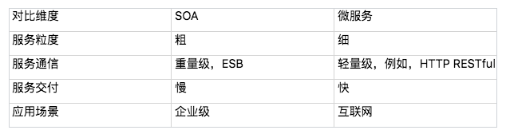

SOA和微服务是两种不同理念的架构模式，并不存在孰优孰劣，只是应用场景不同而已。我们介绍SOA时候提到其产生历史背景是因为企业的IT服务系统庞大而又复杂，改造成本很高，但业务上又要求其互通，因此才会提出SOA这种解决方案。如果我们将微服务的架构模式生搬硬套到企业级IT服务系统中，这些IT服务系统的改造成本可能远远超出实施SOA的成本。 

微服务的三个特征：small（细服务粒度）、lightweight（轻量级服务通信）、automated （自动化测试、持续集成、自动化部署等）

### 微服务的陷阱

单纯从上面的对比来看，似乎微服务大大优于SOA，这也导致了很多团队在实践时不加思考地采用微服务——既不考虑团队的规模，也不考虑业务的发展，也没有考虑基础技术的支撑，只是觉得微服务很牛就赶紧来实施，以为实施了微服务后就什么问题都解决了，而一旦真正实施后才发现掉到微服务的坑里面去了。 

具体来说，微服务有以下几种坑：

1、服务划分过细，服务间关系复杂

服务划分过细，单个服务的复杂度确实下降了，但整个系统的复杂度却上升了，因为微服务将系统内的复杂度转移为系统间的复杂度了。 

从理论的角度来计算，n个服务的复杂度是n×(n-1)/2，整体系统的复杂度是随着微服务数量的增加呈指数级增加的。下图形象了说明了整体复杂度： 

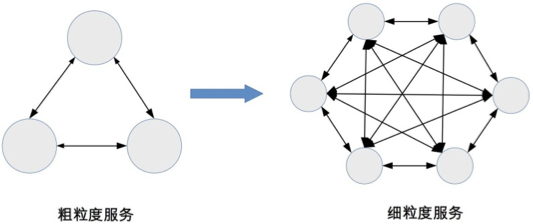

粗粒度划分服务时，系统被划分为3个服务，虽然单个服务较大，但服务间的关系很简单；细粒度划分服务时，虽然单个服务小了一些，但服务间的关系却复杂了很多。 

2、服务数量太多，团队效率急剧下降

微服务的“微”字，本身就是一个陷阱，很多团队看到“微”字后，就想到必须将服务拆分得很细，有的团队人员规模是5 ~ 6个人，然而却拆分出30多个微服务，平均每个人要维护5个以上的微服务。 

这样做给工作效率带来了明显的影响，一个简单的需求开发就需要涉及多个微服务，光是微服务之间的接口就有6 ~ 7个，无论是设计、开发、测试、部署，都需要工程师不停地在不同的服务间切换。 

- 开发工程师要设计多个接口，打开多个工程，调试时要部署多个程序，提测时打多个包。
- 测试工程师要部署多个环境，准备多个微服务的数据，测试多个接口。
- 运维工程师每次上线都要操作多个微服务，并且微服务之间可能还有依赖关系。

3、调用链太长，性能下降

由于微服务之间都是通过HTTP或者RPC调用的，每次调用必须经过网络。一般线上的业务接口之间的调用，平均响应时间大约为50毫秒，如果用户的一起请求需要经过6次微服务调用，则性能消耗就是300毫秒，这在很多高性能业务场景下是难以满足需求的。为了支撑业务请求，可能需要大幅增加硬件，这就导致了硬件成本的大幅上升。 

4、调用链太长，问题定位困难

系统拆分为微服务后，一次用户请求需要多个微服务协同处理，任意微服务的故障都将导致整个业务失败。然而由于微服务数量较多，且故障存在扩散现象，快速定位到底是哪个微服务故障是一件复杂的事情。下面是一个典型样例：

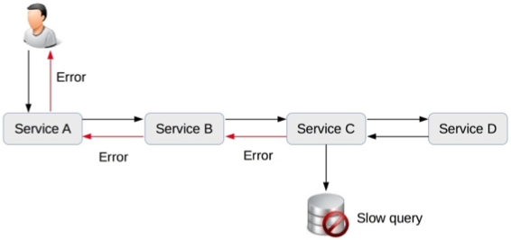

Service C的数据库出现慢查询，导致Service C给Service B的响应错误，Service B 给Service A的响应错误，Service A给用户的响应错误。我们在实际定位时是不会有样例图中这么清晰的，最开始是用户报错，这时我们首先会去查Service A。导致Service A故障的原因有很多，我们可能要花半个小时甚至1个小时才能发现是Service B返回错误导致的。于是我们又去查Service B，这相当于重复Service A故障定位的步骤……如此循环下去，最后可能花费了几个小时才能定位到是Service C的数据库慢查询导致了错误。 

如果多个微服务同时发生不同类型的故障，则定位故障更加复杂，如下图所示 ：

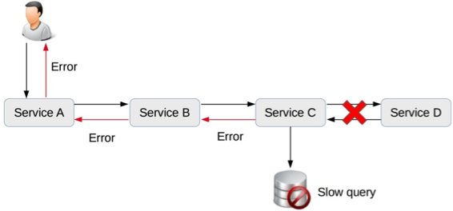

Service C的数据库发生慢查询故障，同时Service C到Service D的网络出现故障，此时到底是哪个原因导致了Service C返回Error给Service B，需要大量的信息和人力去排查。 

5、没有自动化支撑，无法快速交付

如果没有相应的自动化系统进行支撑，都是靠人工去操作，那么微服务不但达不到快速交付的目的，甚至还不如一个大而全的系统效率高。例如：

- 没有自动化测试支撑，每次测试时需要测试大量接口。
- 没有自动化部署支撑，每次部署6 ~ 7个服务，几十台机器，运维人员敲shell命令逐台部署，手都要敲麻。
- 没有自动化监控，每次故障定位都需要人工查几十台机器几百个微服务的各种状态和各种日志文件。

6、没有服务治理，微服务数量多了后管理混乱

信奉微服务理念的设计人员总是强调微服务的lightweight特性，并举出ESB的反例来证明微服务的优越之处。但具体实践后就会发现，随着微服务种类和数量越来越多，如果没有服务治理系统进行支撑，微服务提倡的lightweight就会变成问题。主要问题有： 

- 服务路由：假设某个微服务有60个节点，部署在20台机器上，那么其他依赖的微服务如何知道这个部署情况呢？
- 服务故障隔离：假设上述例子中的60个节点有5个节点发生故障了，依赖的微服务如何处理这种情况呢？
- 服务注册和发现：同样是上述的例子，现在我们决定从60个节点扩容到80个节点，或者将60个节点缩减为40个节点，新增或者减少的节点如何让依赖的服务知道呢？

如果以上场景都依赖人工去管理，整个系统将陷入一片混乱，最终的解决方案必须依赖自动化的服务管理系统，这时就会发现，微服务所推崇的“lightweight”，最终也发展成和ESB几乎一样的复杂程度。 

这些陷阱简单整理为：

- 微服务拆分过细，过分强调“small”。
- 微服务基础设施不健全，忽略了“automated”。
- 微服务并不轻量级，规模大了后，“lightweight”不再适应。

### 服务粒度

针对微服务拆分过细导致的问题，建议基于团队规模进行拆分，类似贝索斯在定义团队规模时提出的“两个披萨”理论（每个团队的人数不能多到两张披萨都不够吃的地步） ，这里推荐一种微服务拆分粒度的“三个火枪手”原则：即一个微服务三个人负责开发。 

当我们在实施微服务架构时，根据团队规模来划分微服务数量，如果业务规继续发展，团队规模扩大，我们再将已有的微服务进行拆分。例如，团队最初有6个人，那么可以划分为2个微服务，随着业务的发展，业务功能越来越多，逻辑越来越复杂，团队扩展到12个人，那么我们可以将已有的2个微服务进行拆分，变成4个微服务。 

使用3个人开发一个微服务的好处：

* 首先，从系统规模来讲，3个人负责开发一个系统，系统的复杂度刚好达到每个人都能全面理解整个系统，又能够进行分工的粒度；如果是2个人开发一个系统，系统的复杂度不够，开发人员可能觉得无法体现自己的技术实力；如果是4个甚至更多人开发一个系统，系统复杂度又会无法让开发人员对系统的细节都了解很深。 
* 其次，从团队管理来说，3个人可以形成一个稳定的备份，即使1个人休假或者调配到其他系统，剩余2个人还可以支撑；如果是2个人，抽调1个后剩余的1个人压力很大；如果是1个人，这就是单点了，团队没有备份，某些情况下是很危险的，假如这个人休假了，系统出问题了怎么办？ 
* 最后，从技术提升的角度来讲，3个人的技术小组既能够形成有效的讨论，又能够快速达成一致意见；如果是2个人，可能会出现互相坚持自己的意见，或者2个人经验都不足导致设计缺陷；如果是1个人，由于没有人跟他进行技术讨论，很可能陷入思维盲区导致重大问题；如果是4个人或者更多，可能有的参与的人员并没有认真参与，只是完成任务而已。 

“三个火枪手”的原则主要应用于微服务设计和开发阶段，如果微服务经过一段时间发展后已经比较稳定，处于维护期了，无须太多的开发，那么平均1个人维护1个微服务甚至几个微服务都可以。当然考虑到人员备份问题，每个微服务最好都安排2个人维护，每个人都可以维护多个微服务。 

### 拆分方法

基于“三个火枪手”的理论，我们可以计算出拆分后合适的服务数量，具体的拆分方式有以下几种：

1、基于业务逻辑拆分

这是最常见的一种拆分方式，将系统中的业务模块按照职责范围识别出来，每个单独的业务模块拆分为一个独立的服务。 

基于业务逻辑拆分虽然看起来很直观，但在实践过程中最常见的一个问题就是团队成员对于“职责范围”的理解差异很大，经常会出现争论，难以达成一致意见。例如：假设我们做一个电商系统，第一种方式是将服务划分为“商品”“交易”“用户”3个服务，第二种方式是划分为“商品”“订单”“支付”“发货”“买家”“卖家”6个服务，哪种方式更合理，是不是划分越细越正确？ 

导致这种困惑的主要根因在于从业务的角度来拆分的话，规模粗和规模细都没有问题，因为拆分基础都是业务逻辑，要判断拆分粒度，不能从业务逻辑角度，而要根据前面介绍的“三个火枪手”的原则，计算一下大概的服务数量范围，然后再确定合适的“职责范围”，否则就可能出现划分过粗或者过细的情况，而且大部分情况下会出现过细的情况。 

例如：如果团队规模是10个人支撑业务，按照“三个火枪手”规则计算，大约需要划分为4个服务，那么“登录、注册、用户信息管理”都可以划到“用户服务”职责范围内；如果团队规模是100人支撑业务，服务数量可以达到40个，那么“用户登录“就是一个服务了；如果团队规模达到1000人支撑业务，那“用户连接管理”可能就是一个独立的服务了。 

2、基于可扩展拆分 

将系统中的业务模块按照稳定性排序，将已经成熟和改动不大的服务拆分为稳定服务，将经常变化和迭代的服务拆分为变动服务。稳定的服务粒度可以粗一些，即使逻辑上没有强关联的服务，也可以放在同一个子系统中，例如将“日志服务”和“升级服务”放在同一个子系统中；不稳定的服务粒度可以细一些，但也不要太细，始终记住要控制服务的总数量。

这样拆分主要是为了提升项目快速迭代的效率，避免在开发的时候，不小心影响了已有的成熟功能导致线上问题。

3、基于可靠性拆分 

将系统中的业务模块按照优先级排序，将可靠性要求高的核心服务和可靠性要求低的非核心服务拆分开来，然后重点保证核心服务的高可用。具体拆分的时候，核心服务可以是一个也可以是多个，只要最终的服务数量满足“三个火枪手”的原则就可以。 

这样拆分带来下面几个好处：

- 避免非核心服务故障影响核心服务

例如，日志上报一般都属于非核心服务，但是在某些场景下可能有大量的日志上报，如果系统没有拆分，那么日志上报可能导致核心服务故障；拆分后即使日志上报有问题，也不会影响核心服务。

- 核心服务高可用方案可以更简单

核心服务的功能逻辑更加简单，存储的数据可能更少，用到的组件也会更少，设计高可用方案大部分情况下要比不拆分简单很多。

- 能够降低高可用成本

将核心服务拆分出来后，核心服务占用的机器、带宽等资源比不拆分要少很多。因此，只针对核心服务做高可用方案，机器、带宽等成本比不拆分要节省较多。

4、基于性能拆分

基于性能拆分和基于可靠性拆分类似，将性能要求高或者性能压力大的模块拆分出来，避免性能压力大的服务影响其他服务。常见的拆分方式和具体的性能瓶颈有关，可以拆分Web服务、数据库、缓存等。例如电商的抢购，性能压力最大的是入口的排队功能，可以将排队功能独立为一个服务。

以上几种拆分方式不是多选一，而是可以根据实际情况自由排列组合，例如可以基于可靠性拆分出服务A，基于性能拆分出服务B，基于可扩展拆分出C/D/F三个服务，加上原有的服务X，最后总共拆分出6个服务（A/B/C/D/F/X）。

### 基础设施

大部分人主要关注的是微服务的“small”和“lightweight”特性，但实际上真正决定微服务成败的，恰恰是那个被大部分人都忽略的“automated”。 

因为服务粒度即使划分不合理，实际落地后如果团队遇到麻烦，自然会想到拆服务或者合服务；如果“automated”相关的基础设施不健全，那微服务就是焦油坑，让研发、测试、运维陷入忙碌中。微服务基础设施如下图所示： 

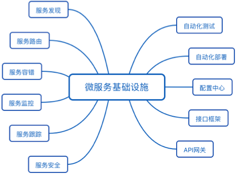

微服务并不是很多人认为的那样又简单又轻量级。要做好微服务，这些基础设施都是必不可少的，否则微服务就会变成一个焦油坑，让业务和团队在里面不断挣扎且无法自拔。因此也可以说，微服务并没有减少复杂度，而只是将复杂度从ESB转移到了基础设施。你可以看到，“服务发现”“服务路由”等其实都是ESB的功能，只是在微服务中剥离出来成了独立的基础系统。 

虽然建设完善的微服务基础设施是一项庞大的工程，但也不用太过灰心，认为自己团队小或者公司规模不大就不能实施微服务了：

* 第一个原因是已经有开源的微服务基础设施全家桶了，例如大名鼎鼎的Spring Cloud项目，涵盖了服务发现、服务路由、网关、配置中心等功能； 

* 第二个原因是如果微服务的数量并不是很多的话，并不是每个基础设施都是必须的。通常情况下，我建议按照下面优先级来搭建基础设施： 

  1.服务发现、服务路由、服务容错：这是最基本的微服务基础设施。

  2.接口框架、API网关：主要是为了提升开发效率，接口框架是提升内部服务的开发效率，API网关是为了提升与外部服务对接的效率。

  3.自动化部署、自动化测试、配置中心：主要是为了提升测试和运维效率。

  4.服务监控、服务跟踪、服务安全：主要是为了进一步提升运维效率。

  以上3和4两类基础设施，其重要性会随着微服务节点数量增加而越来越重要，但在微服务节点数量较少的时候，可以通过人工的方式支撑，虽然效率不高，但也基本能够顶住。

每项微服务基础设施都是一个平台、一个系统、一个解决方案，如果要自己实现，其过程和做业务系统类似，都需要经过需求分析、架构设计、开发、测试、部署上线等步骤，下面简单介绍一下每个基础设施的主要作用：

1、自动化测试

微服务将原本大一统的系统拆分为多个独立运行的“微”服务，微服务之间的接口数量大大增加，并且微服务提倡快速交付，版本周期短，版本更新频繁。如果每次更新都靠人工回归整个系统，则工作量大，效率低下，达不到“快速交付”的目的，因此必须通过自动化测试系统来完成绝大部分测试回归的工作。

自动化测试涵盖的范围包括代码级的单元测试、单个系统级的集成测试、系统间的接口测试，理想情况是每类测试都自动化。如果因为团队规模和人力的原因无法全面覆盖，至少要做到接口测试自动化。

2、自动化部署

相比大一统的系统，微服务需要部署的节点增加了几倍甚至十几倍，微服务部署的频率也会大幅提升（例如，我们的业务系统70%的工作日都有部署操作），综合计算下来，微服务部署的次数是大一统系统部署次数的几十倍。这么大量的部署操作，如果继续采用人工手工处理，需要投入大量的人力，且容易出错，因此需要自动化部署的系统来完成部署操作。

自动化部署系统包括版本管理、资源管理（例如，机器管理、虚拟机管理）、部署操作、回退操作等功能。

3、配置中心

微服务的节点数量非常多，通过人工登录每台机器手工修改，效率低，容易出错。特别是在部署或者排障时，需要快速增删改查配置，人工操作的方式显然是不行的。除此以外，有的运行期配置需要动态修改并且所有节点即时生效，人工操作是无法做到的。综合上面的分析，微服务需要一个统一的配置中心来管理所有微服务节点的配置。

配置中心包括配置版本管理（例如，同样的微服务，有10个节点是给移动用户服务的，有20个节点给联通用户服务的，配置项都一样，配置值不一样）、增删改查配置、节点管理、配置同步、配置推送等功能。

4、接口框架

微服务提倡轻量级的通信方式，一般采用HTTP/REST或者RPC方式统一接口协议。但在实践过程中，光统一接口协议还不够，还需要统一接口传递的数据格式。例如，我们需要指定接口协议为HTTP/REST，但这还不够，还需要指定HTTP/REST的数据格式采用JSON，并且JSON的数据都遵循如下规范。

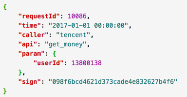

如果我们只是简单指定了HTTP/REST协议，而不指定JSON和JSON的数据规范，那么就会出现这样混乱的情况：有的微服务采用XML，有的采用JSON，有的采用键值对；即使同样都是JSON，JSON数据格式也不一样。这样每个微服务都要适配几套甚至几十套接口协议，相当于把曾经由ESB做的事情转交给微服务自己做了，这样做的效率显然是无法接受的，因此需要统一接口框架。

接口框架不是一个可运行的系统，一般以库或者包的形式提供给所有微服务调用。例如，针对上面的JSON样例，可以由某个基础技术团队提供多种不同语言的解析包（Java包、Python包、C库等）。

5、API网关

系统拆分为微服务后，内部的微服务之间是互联互通的，相互之间的访问都是点对点的。如果外部系统想调用系统的某个功能，也采取点对点的方式，则外部系统会非常“头大”。因为在外部系统看来，它不需要也没办法理解这么多微服务的职责分工和边界，它只会关注它需要的能力，而不会关注这个能力应该由哪个微服务提供。

除此以外，外部系统访问系统还涉及安全和权限相关的限制，如果外部系统直接访问某个微服务，则意味着每个微服务都要自己实现安全和权限的功能，这样做不但工作量大，而且都是重复工作。

综合上面的分析，微服务需要一个统一的API网关，负责外部系统的访问操作。

API网关是外部系统访问的接口，所有的外部系统接⼊系统都需要通过API网关，主要包括接入鉴权（是否允许接入）、权限控制（可以访问哪些功能）、传输加密、请求路由、流量控制等功能。

6、服务发现

微服务种类和数量很多，如果这些信息全部通过手工配置的方式写入各个微服务节点，首先配置工作量很大，配置文件可能要配几百上千行，几十个节点加起来后配置项就是几万几十万行了，人工维护这么大数量的配置项是一项灾难；其次是微服务节点经常变化，可能是由于扩容导致节点增加，也可能是故障处理时隔离掉一部分节点，还可能是采用灰度升级，先将一部分节点升级到新版本，然后让新老版本同时运行。不管哪种情况，我们都希望节点的变化能够及时同步到所有其他依赖的微服务。如果采用手工配置，是不可能做到实时更改生效的。因此，需要一套服务发现的系统来支撑微服务的自动注册和发现。 

服务发现主要有两种实现方式：自理式和代理式：

（1）自理式

自理式结构如下： 

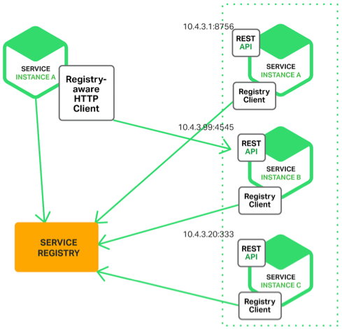

自理式结构就是指每个微服务自己完成服务发现。例如，图中SERVICE INSTANCE A访问SERVICE REGISTRY获取服务注册信息，然后直接访问SERVICE INSTANCE B。 

自理式服务发现实现比较简单，因为这部分的功能一般通过统一的程序库或者程序包提供给各个微服务调用，而不会每个微服务都自己来重复实现一遍；并且由于每个微服务都承担了服务发现的功能，访问压力分散到了各个微服务节点，性能和可用性上不存在明显的压力和风险。 

（2）代理式

代理式结构如下： 

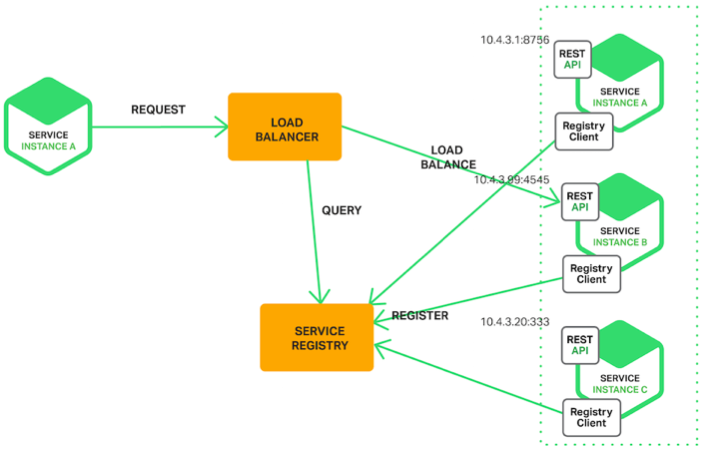

代理式结构就是指微服务之间有一个负载均衡系统（图中的LOAD BALANCER节点），由负载均衡系统来完成微服务之间的服务发现。 

代理式的方式看起来更加清晰，微服务本身的实现也简单了很多，但实际上这个方案风险较大。第一个风险是可用性风险，一旦LOAD BALANCER系统故障，就会影响所有微服务之间的调用；第二个风险是性能风险，所有的微服务之间的调用流量都要经过LOAD BALANCER系统，性能压力会随着微服务数量和流量增加而不断增加，最后成为性能瓶颈。因此LOAD BALANCER系统需要设计成集群的模式，但LOAD BALANCER集群的实现本身又增加了复杂性。 

不管是自理式还是代理式，服务发现的核心功能就是服务注册表，注册表记录了所有的服务节点的配置和状态，每个微服务启动后都需要将自己的信息注册到服务注册表，然后由微服务或者LOAD BALANCER系统到服务注册表查询可用服务。 

7、服务路由

有了服务发现后，微服务之间能够方便地获取相关配置信息，但具体进行某次调用请求时，我们还需要从所有符合条件的可用微服务节点中挑选出一个具体的节点发起请求，这就是服务路由需要完成的功能。

服务路由和服务发现紧密相关，服务路由一般不会设计成一个独立运行的系统，通常情况下是和服务发现放在一起实现的。对于自理式服务发现，服务路由是微服务内部实现的；对于代理式服务发现，服务路由是由LOAD BALANCER系统实现的。无论放在哪里实现，服务路由核心的功能就是路由算法。常见的路由算法有：随机路由、轮询路由、最小压力路由、最小连接数路由等。

8、服务容错

系统拆分为微服务后，单个微服务故障的概率变小，故障影响范围也减少，但是微服务的节点数量大大增加。从整体上来看，系统中某个微服务出故障的概率会大大增加。 

微服务具有故障扩散的特点，如果不及时处理故障，故障扩散开来就会导致看起来系统中很多服务节点都故障了，因此需要微服务能够自动应对这种出错场景，及时进行处理。否则，如果节点一故障就需要人工处理，投入人力大，处理速度慢；而一旦处理速度慢，则故障就很快扩散，所以我们需要服务容错的能力。 

常见的服务容错包括请求重试、流控和服务隔离。通常情况下，服务容错会集成在服务发现和服务路由系统中。 

9、服务监控

系统拆分为微服务后，节点数量大大增加，导致需要监控的机器、网络、进程、接口调用数等监控对象的数量大大增加；同时，一旦发生故障，我们需要快速根据各类信息来定位故障。这两个目标如果靠人力去完成是不现实的。 

举个简单例子：我们收到用户投诉说业务有问题，如果此时采取人工的方式去搜集、分析信息，可能把几十个节点的日志打开一遍就需要十几分钟了，因此需要服务监控系统来完成微服务节点的监控。

服务监控的主要作用有：

- 实时搜集信息并进行分析，避免故障后再来分析，减少了处理时间。
- 服务监控可以在实时分析的基础上进行预警，在问题萌芽的阶段发觉并预警，降低了问题影响的范围和时间。

通常情况下，服务监控需要搜集并分析大量的数据，因此建议做成独立的系统，而不要集成到服务发现、API网关等系统中。

10、服务跟踪

服务监控可以做到微服务节点级的监控和信息收集，但如果我们需要跟踪某一个请求在微服务中的完整路径，服务监控是难以实现的。因为如果每个服务的完整请求链信息都实时发送给服务监控系统，数据量会大到无法处理。 

服务监控和服务跟踪的区别可以简单概括为宏观和微观的区别。例如，A服务通过HTTP协议请求B服务10次，B通过HTTP返回JSON对象，服务监控会记录请求次数、响应时间平均值、响应时间最高值、错误码分布这些信息；而服务跟踪会记录其中某次请求的发起时间、响应时间、响应错误码、请求参数、返回的JSON对象等信息。 

目前无论是分布式跟踪还是微服务的服务跟踪，绝大部分请求跟踪的实现技术都基于Google的Dapper论文《Dapper, a Large-Scale Distributed Systems Tracing Infrastructure》。 

11、服务安全

系统拆分为微服务后，数据分散在各个微服务节点上。从系统连接的角度来说，任意微服务都可以访问所有其他微服务节点；但从业务的角度来说，部分敏感数据或者操作，只能部分微服务可以访问，而不是所有的微服务都可以访问，因此需要设计服务安全机制来保证业务和数据的安全性。 

服务安全主要分为三部分：接入安全、数据安全、传输安全。通常情况下，服务安全可以集成到配置中心系统中进行实现，即配置中心配置微服务的接入安全策略和数据安全策略，微服务节点从配置中心获取这些配置信息，然后在处理具体的微服务调用请求时根据安全策略进行处理。由于这些策略是通用的，一般会把策略封装成通用的库提供给各个微服务调用。基本架构如下： 

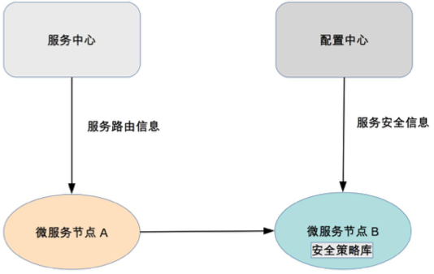

## 微内核架构

微内核架构（Microkernel Architecture），也被称为插件化架构（Plug-in Architecture），是一种面向功能进行拆分的可扩展性架构，通常用于实现基于产品（原文为product-based，指存在多个版本、需要下载安装才能使用，与web-based相对应）的应用。例如Eclipse这类IDE软件、UNIX这类操作系统、淘宝App这类客户端软件等，也有一些企业将自己的业务系统设计成微内核的架构，例如保险公司的保险核算逻辑系统，不同的保险品种可以将逻辑封装成插件。 

很多流程管理系统、调度系统、监控系统都可以用微内核实现。SPI和微内核的关系：微内核可以基于SPI来实现 

### 基本架构

微内核架构包含两类组件：核心系统（core system）和插件模块（plug-in modules） ：

* 核心系统负责和具体业务功能无关的通用功能，例如模块加载、模块间通信等； 
* 插件模块负责实现具体的业务逻辑，例如专栏前面经常提到的“学生信息管理”系统中的“手机号注册”功能。 

微内核的基本架构示意图如下： 

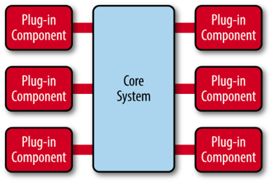

上面这张图中核心系统Core System功能比较稳定，不会因为业务功能扩展而不断修改，插件模块可以根据业务功能的需要不断地扩展。微内核的架构本质就是将变化部分封装在插件里面，从而达到快速灵活扩展的目的，而又不影响整体系统的稳定。 

微内核的核心系统设计的关键技术有：插件管理、插件连接和插件通信：

* 插件管理 

  核心系统需要知道当前有哪些插件可用，如何加载这些插件，什么时候加载插件。常见的实现方法是插件注册表机制。 

  核心系统提供插件注册表（可以是配置文件，也可以是代码，还可以是数据库），插件注册表含有每个插件模块的信息，包括它的名字、位置、加载时机（启动就加载，还是按需加载）等。 

* 插件连接 

  插件连接指插件如何连接到核心系统。通常来说，核心系统必须制定插件和核心系统的连接规范，然后插件按照规范实现，核心系统按照规范加载即可。

  常见的连接机制有OSGi（Eclipse使用）、消息模式、依赖注入（Spring使用），甚至使用分布式的协议都是可以的，比如RPC或者HTTP Web的方式。

* 插件通信 

  插件通信指插件间的通信。虽然设计的时候插件间是完全解耦的，但实际业务运行过程中，必然会出现某个业务流程需要多个插件协作，这就要求两个插件间进行通信。由于插件之间没有直接联系，通信必须通过核心系统，因此核心系统需要提供插件通信机制。 

  这种情况和计算机类似，计算机的CPU、硬盘、内存、网卡是独立设计的配件，但计算机运行过程中，CPU和内存、内存和硬盘肯定是有通信的，计算机通过主板上的总线提供了这些组件之间的通信功能。微内核的核心系统也必须提供类似的通信机制，各个插件之间才能进行正常的通信。 

### OSGi架构

它是一种微内核具体实现。

OSGi的全称是Open Services Gateway initiative，本身其实是指OSGi Alliance。这个联盟是Sun Microsystems、IBM、爱立信等公司于1999年3月成立的开放的标准化组织，最初名为Connected Alliance。它是一个非盈利的国际组织，旨在建立一个开放的服务规范，为通过网络向设备提供服务建立开放的标准，这个标准就是OSGi specification。现在我们谈到OSGi，如果没有特别说明，一般都是指OSGi的规范。 

OSGi联盟的初始目标是构建一个在广域网和局域网或设备上展开业务的基础平台，所以OSGi的最早设计也是针对嵌入式应用的，诸如机顶盒、服务网关、手机、汽车等都是其应用的主要环境。 

由于OSGi具备动态化、热插拔、高可复用性、高效性、扩展方便等优点，它被应用到了PC上的应用开发。尤其是Eclipse这个流行软件采用OSGi标准后，OSGi更是成为了首选的插件化标准。现在我们谈论OSGi，已经和嵌入式应用关联不大了，更多是将OSGi当作一个微内核的架构模式。 

Eclipse从3.0版本开始，抛弃了原来自己实现的插件化框架，改用了OSGi框架。需要注意的是，OSGi是一个插件化的标准，而不是一个可运行的框架，Eclipse采用的OSGi框架称为Equinox，类似的实现还有Apache的Felix、Spring的Spring DM。 

OSGi框架的逻辑架构图如下： 

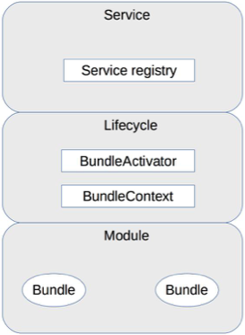

1、模块层（Module层）

模块层实现插件管理功能。OSGi中，插件被称为Bundle，每个Bundle是一个Java的JAR文件，每个Bundle里面都包含一个元数据文件MANIFEST.MF，这个文件包含了Bundle的基本信息。例如，Bundle的名称、描述、开发商、classpath，以及需要导入的包和输出的包等，OSGi核心系统会将这些信息加载到系统中用于后续使用。 

一个简单的MANIFEST.MF样例如下： 

~~~
// MANIFEST.MF 
	Bundle-ManifestVersion: 2 
	Bundle-Name:UserRegister
	Bundle-SymbolicName: com.test.userregister 
	Bundle-Version: 1.0 
	Bundle-Activator: com.test.UserRegisterActivator
	 
	Import-Package: org.log4j;version="2.0", 
	..... 
	Export-Package: com.test.userregister;version="1.0", 
~~~

2、生命周期层（Lifecycle层）

生命周期层实现插件连接功能，提供了执行时模块管理、模块对底层OSGi框架的访问。生命周期层精确地定义了Bundle生命周期的操作（安装、更新、启动、停止、卸载），Bundle必须按照规范实现各个操作。例如： 

~~~java
public class UserRegisterActivator implements BundleActivator { 
	 
	 public void start(BundleContext context) { 
	     UserRegister.instance = new UserRegister (); 
	 } 
	 
	 public void stop(BundleContext context) { 
	     UserRegister.instance = null; 
	 } 
	} 
~~~

3、服务层（Service层）

服务层实现插件通信的功能。OSGi提供了一个服务注册的功能，用于各个插件将自己能提供的服务注册到OSGi核心的服务注册中心，如果某个服务想用其他服务，则直接在服务注册中心搜索可用服务中心就可以了。 

例如：

~~~java
// 注册服务
public class UserRegisterActivator implements BundleActivator {
//在start()中用BundleContext.registerService()注册服务
public void start(BundleContext context) {
context.registerService(UserRegister.class.getName(), new UserRegisterImpl(), null);
}
//无须在stop()中注销服务，因为Bundle停止时会自动注销该Bundle中已注册的服务
public void stop(BundleContext context) {}
}
// 检索服务
public class Client implements BundleActivator {
public void start(BundleContext context) {
// 1. 从服务注册表中检索间接的“服务引用”
ServiceReference ref = context.getServiceReference(UserRegister.class.getName());
// 2. 使用“服务引用”去访问服务对象的实例
((UserRegister) context.getService(ref)).register();
}
public void stop(BundleContext context) {}
}
~~~

注意：这里的服务注册不是插件管理功能中的插件注册，实际上是插件间通信的机制。 

### 规则引擎架构

规则引擎从结构上来看也属于微内核架构的一种具体实现，其中执行引擎可以看作是微内核，执行引擎解析配置好的业务流，执行其中的条件和规则，通过这种方式来支持业务的灵活多变。 

规则引擎在计费、保险、促销等业务领域应用较多。例如电商促销，常见的促销规则有：

- 满100送50
- 3件立减50
- 3件8折
- 第3件免费
- 跨店满200减100
- 新用户立减50

以上仅仅列出来常见的几种，实际上完整列下来可能有几十上百种，再加上排列组合，促销方案可能有几百上千种，这样的业务如果完全靠代码来实现，开发效率远远跟不上业务的变化速度，而规则引擎却能够很灵活的应对这种需求，主要原因在于： 

1.可扩展

通过引入规则引擎，业务逻辑实现与业务系统分离，可以在不改动业务系统的情况下扩展新的业务功能。

2.易理解

规则通过自然语言描述，业务人员易于理解和操作，而不像代码那样只有程序员才能理解和开发。

3.高效率

规则引擎系统一般提供可视化的规则定制、审批、查询及管理，方便业务人员快速配置新的业务。

规则引擎的基本架构如下： 

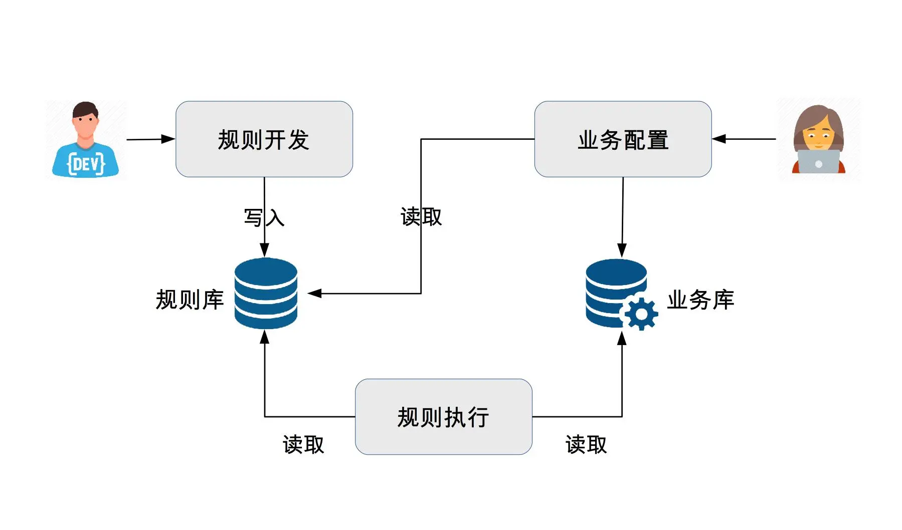

简单介绍一下：

- 开发人员将业务功能分解提炼为多个规则，将规则保存在规则库中。
- 业务人员根据业务需要，通过将规则排列组合，配置成业务流程，保存在业务库中。
- 规则引擎执行业务流程实现业务功能。

规则引擎具体实现规则：

1.插件管理

规则引擎中的规则就是微内核架构的插件，引擎就是微内核架构的内核。规则可以被引擎加载和执行。规则引擎架构中，规则一般保存在规则库中，通常使用数据库来存储。

2.插件连接

类似于程序员开发的时候需要采用Java、C++等语言，规则引擎也规定了规则开发的语言，业务人员需要基于规则语言来编写规则文件，然后由规则引擎加载执行规则文件来完成业务功能，因此，规则引擎的插件连接实现机制其实就是规则语言。

3.插件通信

规则引擎的规则之间进行通信的方式就是数据流和事件流，由于单个规则并不需要依赖其他规则，因此规则之间没有主动的通信，规则只需要输出数据或者事件，由引擎将数据或者事件传递到下一个规则。

目前最常用的规则引擎是开源的JBoss Drools，采用Java语言编写，基于Rete算法。Drools具有下面这些优点： 

- 非常活跃的社区支持，以及广泛的应用。
- 快速的执行速度。
- 与Java Rule Engine API（JSR-94）兼容。
- 提供了基于Web的BRMS——Guvnor，Guvnor提供了规则管理的知识库，通过它可以实现规则的版本控制，以及规则的在线修改与编译，使得开发人员和系统管理人员可以在线管理业务规则。

虽然Drools号称简单易用，但实际上其规则语言还是和编程语言比较类似，在实际应用的时候普通业务人员面对这样的规则语言，学习成本和理解成本还是比较高的。因此，通常情况下需要基于Drools进行封装，将规则配置做成可视化的操作。

## 技术演进

### 演进方向

随着新技术层出不穷，对于技术人员来说，这意味着又多了更多的可选工具，同时也可以通过学习业界先进的技术来提升自己的技术实力。 但对架构师来说应该采取什么样的策略？架构师可能经常会面临下面这些诱惑或者挑战：

- 现在Docker虚拟化技术很流行，我们要不要引进，引入Docker后可以每年节省几十万元的硬件成本呢？
- 竞争对手用了阿里的云计算技术，听说因为上了云，业务增长了好几倍呢，我们是否也应该尽快上云啊？
- 我们的技术和业界顶尖公司（例如，淘宝、微信）差距很大，应该投入人力和时间追上去，不然招聘的时候没有技术影响力！
- 公司的技术发展现在已经比较成熟了，程序员都觉得在公司学不到东西，我们可以尝试引入Golang来给大家一个学习新技术的机会。

类似的问题还有很多，本质上都可以归纳总结为一个问题：架构师应该如何判断技术演进的方向？ 

关于这个问题的答案，基本上可以分为几个典型的派别： 

1、潮流派

潮流派的典型特征就是对于新技术特别热衷，紧跟技术潮流，当有新的技术出现时，迫切想将新的技术应用到自己的产品中。 

这种处理方式容易踩一些新技术的坑，而且新技术需要一定的时间去掌握，这个也是比较大的成本。

2、保守派

保守派的典型特征和潮流派正好相反，对于新技术抱有很强的戒备心，稳定压倒一切，已经掌握了某种技术，就一直用这种技术打天下。就像有句俗语说的，“如果你手里有一把锤子，那么所有的问题都变成了钉子”，保守派就是拿着一把锤子解决所有的问题。 

保守派的主要问题是不能享受新技术带来的收益，因为新技术很多都是为了解决以前技术存在的固有缺陷。 

3、跟风派

跟风派与潮流派不同，这里的跟风派不是指跟着技术潮流，而是指跟着竞争对手的步子走。

简单来说，判断技术的发展就看竞争对手，竞争对手用了咱们就用，竞争对手没用咱们就等等看。

跟风派最大的问题在于如果没有风可跟的时候怎么办。如果你是领头羊怎么办，其他人都准备跟你的风呢？另外一种情况就是竞争对手的这些信息并不那么容易获取，即使获取到了一些信息，大部分也是不全面的，一不小心可能就变成邯郸学步了。 

即使有风可跟，其实也存在问题。有时候适用于竞争对手的技术，并不一定适用于自己，盲目模仿可能带来相反的效果。

真正正确的答案是：基于业务发展阶段判断。

这是因为技术发展主要的驱动力是业务发展，这个观点的陈述可以看下一节。

所以，对于架构师来说，判断业务当前和接下来一段时间的主要复杂度是什么就非常关键。判断不准确就会导致投入大量的人力和时间做了对业务没有作用的事情，判断准确就能够做到技术推动业务更加快速发展，这也是为什么架构师必须具备业务理解能力的原因。不同的行业业务发展路径、轨迹、模式不一样，架构师必须能够基于行业发展和企业自身情况做出准确判断。 

举例说明：

假设你是一个银行IT系统的架构师：

- 90年代主要的业务复杂度可能就是银行业务范围逐渐扩大，功能越来越复杂，导致内部系统数量越来越多，单个系统功能越来越复杂。
- 2004年以后主要的复杂度就是银行业务从柜台转向网上银行，网上银行的稳定性、安全性、易用性是主要的复杂度，这些复杂度主要由银行IT系统自己解决。
- 2009年以后主要的复杂度又变化为移动支付复杂度，尤其是“双11”这种海量支付请求的情况下，高性能、稳定性、安全性是主要的复杂度，而这些复杂度需要银行和移动支付服务商（支付宝、微信）等一起解决。

而如果你是淘宝这种互联网业务的架构师，业务发展又会是另外一种模式：

- 2003年，业务刚刚创立，主要的复杂度体现为如何才能快速开发各种需求，淘宝团队采取的是买了一个PHP写的系统来改。
- 2004年，上线后业务发展迅速，用户请求数量大大增加，主要的复杂度体现为如何才能保证系统的性能，淘宝的团队采取的是用Oracle取代MySQL。
- 用户数量再次增加，主要的复杂度还是性能和稳定性，淘宝的团队采取的是Java替换PHP。
- 2005年，用户数量继续增加，主要的复杂度体现为单一的Oracle库已经无法满足性能要求，于是进行了分库分表、读写分离、缓存等优化。
- 2008年，淘宝的商品数量在1亿以上，PV2.5亿以上，主要的复杂度又变成了系统内部耦合，交易和商品耦合在一起，支付的时候又和支付宝强耦合，整个系统逻辑复杂，功能之间跳来跳去，用户体验也不好。淘宝的团队采取的是系统解耦，将交易中心、类目管理、用户中心从原来大一统的系统里面拆分出来。

### 演进动力

演进方向的问题之所以让人困惑，是因为之前的一些观点都是站在技术本身的角度来考虑问题的，只有跳出技术的范畴，从一个更广更高的角度来考虑这个问题，这个角度就是企业的业务发展。 

无论是代表新兴技术的互联网企业，还是代表传统技术的制造业；无论是通信行业，还是金融行业的发展，归根到底就是业务的发展。而影响一个企业业务的发展主要有3个因素：市场、技术、管理，这三者构成支撑业务发展的铁三角，任何一个因素的不足，都可能导致企业的业务停滞不前：

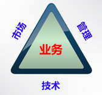

在这个铁三角中，业务处于三角形的中心，毫不夸张地说，市场、技术、管理都是为了支撑企业业务的发展。 

我们可以简单地将企业的业务分为两类：一类是产品类，一类是服务类：

1、产品类

360的杀毒软件、苹果的iPhone、UC的浏览器等都属于这个范畴，这些产品本质上和传统的制造业产品类似，都是具备了某种“功能”，单个用户通过购买或者免费使用这些产品来完成自己相关的某些任务，用户对这些产品是独占的。 

对于产品类的业务，是技术创新推动业务发展。例如：

- 苹果开发智能手机，将诺基亚推下王座，自己成为全球手机行业的新王者。
- 2G时代，UC浏览器独创的云端架构，很好地解决了上网慢的问题；智能机时代，UC浏览器又自主研发全新的U3内核，兼顾高速、安全、智能及可扩展性，这些技术创新是UC浏览器成为了全球最大的第三方手机浏览器最强有力的推动力。 

用户选择一个产品的根本驱动力在于产品的功能是否能够更好地帮助自己完成任务。用户会自然而然地选择那些功能更加强大、性能更加先进、体验更加顺畅、外观更加漂亮的产品，而功能、性能、体验、外观等都需要强大的技术支撑。例如，iPhone手机的多点触摸操作、UC浏览器的U3内核等。 

2、服务类

百度的搜索、淘宝的购物、新浪的微博、腾讯的IM等都属于这个范畴，大量用户使用这些服务来完成需要与其他人交互的任务，单个用户“使用”但不“独占”某个服务。事实上，服务的用户越多，服务的价值就越大。服务类的业务符合互联网的特征和本质：“互联”+“网”。 

对于服务类的业务，答案和产品类业务正好相反：业务发展推动技术的发展

这是因为用户选择服务的根本驱动力与选择产品不同。用户选择一个产品的根本驱动力是其“功能”，而用户选择一个服务的根本驱动力不是功能，而是“规模”。 

例如，选择UC浏览器还是选择QQ浏览器，更多的人是根据个人喜好和体验来决定的；而选择微信还是Whatsapp，就不是根据它们之间的功能差异来选择的，而是根据其规模来选择的，就像我更喜欢Whatsapp的简洁，但我的朋友和周边的人都用微信，那我也不得不用微信。 

当“规模”成为业务的决定因素后，服务模式的创新就成为了业务发展的核心驱动力，而产品只是为了完成服务而提供给用户使用的一个载体。 例如淘宝提供的“网络购物”是一种新的服务，随便一个软件公司，如果只是模仿开发出类似的产品也是没有意义的，因为用户选择的是淘宝的整套网络购物服务，并且这个服务已经具备了一定的规模，其他公司不具备这种同等规模服务的能力。即使开发出完全一样的产品，用户也不会因为产品功能更加强大而选择新的类似产品。 

因此，服务类的业务发展路径是这样的：提出一种创新的服务模式→吸引了一批用户→业务开始发展→吸引了更多用户→服务模式不断完善和创新→吸引越来越多的用户，如此循环往复。在这个发展路径中，技术并没有成为业务发展的驱动力，反过来由于用户规模的不断扩展，业务的不断创新和改进，对技术会提出越来越高的要求，因此是业务驱动了技术发展。 

即使是产品类业务，在技术创新开创了一个新的业务后，后续的业务发展也会反向推动技术的发展。例如，第一代iPhone缺少对3G的支持，且只能通过Web发布应用程序，第二代iPhone才开始支持3G，并且内置GPS；UC浏览器随着功能越来越强大，原有的技术无法满足业务发展的需求，浏览器的架构需要进行更新，先后经过UC浏览器7.0版本、8.0版本、9.0版本等几个技术差异很大的版本。 

综合这些分析，除非是开创新的技术能够推动或者创造一种新的业务，其他情况下，都是业务的发展推动了技术的发展。 

### 演进模式

由于各行业的业务发展轨迹并不完全相同，无法给出一个统一的模板让所有的架构师拿来就套用。下面以互联网的业务发展为案例，谈谈互联网技术演进的模式，其他行业可以参考分析方法对自己的行业进行分析。 

互联网业务千差万别，但由于它们具有“规模决定一切”的相同点，其发展路径也基本上是一致的。互联网业务发展一般分为几个时期：初创期、发展期、竞争期、成熟期。 

不同时期的差别主要体现在两个方面：复杂性、用户规模。

#### 业务复杂性

互联网业务发展第一个主要方向就是“业务越来越复杂”，我们来看看不同时期业务的复杂性的表现:

1、初创期

互联网业务刚开始一般都是一个创新的业务点，这个业务点的重点不在于“完善”，而在于“创新”，只有创新才能吸引用户；而且因为其“新”的特点，其实一开始是不可能很完善的。只有随着越来越多的用户的使用，通过快速迭代试错、用户的反馈等手段，不断地在实践中去完善，才能继续创新。 

初创期的业务对技术就一个要求：“快”，但这个时候却又是创业团队最弱小的时期，可能就几个技术人员，所以这个时候十八般武艺都需要用上：能买就买，有开源的就用开源的。 

2、发展期

当业务推出后经过市场验证如果是可行的，则吸引的用户就会越来越多，此时原来不完善的业务就进入了一个快速发展的时期。业务快速发展时期的主要目的是将原来不完善的业务逐渐完善，因此会有越来越多的新功能不断地加入到系统中。对于绝大部分技术团队来说，这个阶段技术的核心工作是快速地实现各种需求，只有这样才能满足业务发展的需要。 

如何做到“快”，一般会经历下面几个阶段：

* 堆功能期

  业务进入快速发展期的初期，此时团队规模也不大，业务需求又很紧，最快实现业务需求的方式是继续在原有的系统里面不断地增加新的功能，重构、优化、架构等方面的工作即使想做，也会受制于人力和业务发展的压力而放在一边。 

* 优化期

  “堆功能”的方式在刚开始的时候好用，因为系统还比较简单，但随着功能越来越多，系统开始变得越来越复杂，后面继续堆功能会感到越来越吃力，速度越来越慢。一种典型的场景是做一个需求要改好多地方，一不小心就改出了问题。直到有一天，技术团队或者产品人员再也受不了这种慢速的方式，终于下定决定要解决这个问题了。 

  如何解决这个问题，一般会分为两派：一派是优化派，一派是架构派：

  * 优化派的核心思想是将现有的系统优化。例如，采用重构、分层、优化某个MySQL查询语句，将机械硬盘换成SSD，将数据库从MySQL换成Oracle，增加Memcache缓存等。 

    优化派的优势是对系统改动较小，优化可以比较快速地实施；缺点就是可能过不了多久，系统又撑不住了。 

  * 架构派的核心思想是调整系统架构，主要是将原来的大系统拆分为多个互相配合的小系统。例如，将购物系统拆分为登录认证子系统、订单系统、查询系统、分析系统等。架构派的优势是一次调整可以支撑比较长期的业务发展，缺点是动作较大、耗时较长，对业务的发展影响也比较大。 

  相信在很多公司都遇到这种情况，大部分情况下都是“优化派”会赢，主要的原因还是因为此时“优化”是最快的方式。至于说“优化派”支撑不了多久这个问题，其实也不用考虑太多，因为业务能否发展到那个阶段还是个未知数，保证当下的竞争力是最主要的问题。 

* 架构期

  经过优化期后，如果业务能够继续发展，慢慢就会发现优化也顶不住了，毕竟再怎么优化，系统的能力总是有极限的。Oracle再强大，也不可能一台Oracle顶住1亿的交易量；小型机再好，也不可能一台机器支持100万在线人数。此时已经没有别的选择，只能进行架构调整。

  架构期可以用的手段很多，但归根结底可以总结为一个字“拆” ：

  * 拆功能：例如，将购物系统拆分为登录认证子系统、订单系统、查询系统、分析系统等。
  * 拆数据库：MySQL一台变两台，2台变4台，增加DBProxy、分库分表等。
  * 拆服务器：服务器一台变两台，2台变4台，增加负载均衡的系统，如Nginx、HAProxy等。

3、竞争期

当业务继续发展，已经形成一定规模后，一定会有竞争对手开始加入行业来竞争，毕竟谁都想分一块蛋糕，甚至有可能一不小心还会成为下一个BAT。当竞争对手加入后，大家互相学习和模仿，业务更加完善，也不断有新的业务创新出来，而且由于竞争的压力，对技术的要求是更上一层楼了。 

新业务的创新给技术带来的典型压力就是新的系统会更多，同时，原有的系统也会拆得越来越多。两者合力的一个典型后果就是系统数量在原来的基础上又增加了很多。架构拆分后带来的美好时光又开始慢慢消逝，技术工作又开始进入了“慢”的状态。系统数量越来越多，到了一个临界点后就产生了质变，即系统数量的量变带来了技术工作的质变。主要体现在下面几个方面： 

* 重复造轮子

  系统越来越多，各系统相似的工作越来越多。例如，每个系统都有存储，都要用缓存，都要用数据库。新建一个系统，这些工作又要都做一遍，即使其他系统已经做过了一遍 

* 系统交互一团乱麻

  系统越来越多，各系统的交互关系变成了网状。系统间的交互数量和系统的数量成平方比的关系。例如，4个系统的交互路径是6个，10个系统的交互路径是45个。每实现一个业务需求，都需要几个甚至十几个系统一起改，然后互相调用来调用去，联调成了研发人员的灾难、联测成了测试人员的灾难、部署成了运维的灾难。 

针对这个时期业务变化带来的问题，技术工作主要的解决手段有： 

* 平台化

  目的在于解决“重复造轮子”的问题。 又可以细分为以下几种形式：

  * 存储平台化：淘宝的TFS、京东JFS。
  * 数据库平台化：百度的DBProxy、淘宝TDDL。
  * 缓存平台化：Twitter的Twemproxy，豆瓣的BeansDB、腾讯TTC。

* 服务化

  目的在于解决“系统交互”的问题，常见的做法是通过消息队列来完成系统间的异步通知，通过服务框架来完成系统间的同步调用。 例如：

  * 消息队列：淘宝的Notify、MetaQ，开源的Kafka、ActiveMQ等。
  * 服务框架：Facebook的thrift、当当网的Dubbox、淘宝的HSF等。

4、成熟期

当企业熬过竞争期，成为了行业的领头羊，或者整个行业整体上已经处于比较成熟的阶段，市场地位已经比较牢固后，业务创新的机会已经不大，竞争压力也没有那么激烈，此时求快求新已经没有很大空间，业务上开始转向为“求精”：我们的响应时间是否比竞争对手快？我们的用户体验是否比竞争对手好？我们的成本是否比竞争对手低…… 

此时技术上其实也基本进入了成熟期，该拆的也拆了，该平台化的也平台化了，技术上能做的大动作其实也不多了，更多的是进行优化。但有时候也会为了满足某个优化，系统做很大的改变。例如，为了将用户响应时间从200ms降低到50ms，可能就需要从很多方面进行优化：CDN、数据库、网络等。这个时候的技术优化没有固定的套路，只能按照竞争的要求，找出自己的弱项，然后逐项优化。在逐项优化时，可以采取之前各个时期采用的手段。 

#### 用户规模

互联网业务的发展第二个主要方向就是“用户量越来越大”。互联网业务的发展会经历“初创期、发展期、竞争期、成熟期”几个阶段，不同阶段典型的差别就是用户量的差别，用户量随着业务的发展而越来越大。 

用户量增大对技术的影响主要体现在两个方面：性能要求越来越高、可用性要求越来越高。 

1、性能

用户量增大给技术带来的第一个挑战就是性能要求越来越高。以互联网企业最常用的MySQL为例，再简单的查询，再高的硬件配置，单台MySQL机器支撑的TPS和QPS最高也就是万级，低的可能是几千，高的也不过几万。当用户量增长后，必然要考虑使用多台MySQL，从一台MySQL到多台MySQL不是简单的数量的增加，而是本质上的改变，即原来集中式的存储变为了分布式的存储。

稍微有经验的工程师都会知道，分布式将会带来复杂度的大幅度上升。以MySQL为例，分布式MySQL要考虑分库分表、读写分离、复制、同步等很多问题。

2、可用性

用户量增大对技术带来的第二个挑战就是可用性要求越来越高。当你有1万个用户的时候，宕机1小时可能也没有很大的影响；但当你有了100万用户的时候，宕机10分钟，投诉电话估计就被打爆了，这些用户再到朋友圈抱怨一下你的系统有多烂，很可能你就不会再有机会发展下一个100万用户了。

除了口碑的影响，可用性对收入的影响也会随着用户量增大而增大。1万用户宕机1小时，你可能才损失了几千元；100万用户宕机10分钟，损失可能就是几十万元了。

#### 总结

通过前面的分析，我们可以看到互联网业务驱动技术发展的两大主要因素是复杂性和用户规模，而这两个因素的本质其实都是“量变带来质变”。

究竟用户规模发展到什么阶段才会由量变带来质变，虽然不同的业务有所差别，但基本上可以按照下面这个模型去衡量：

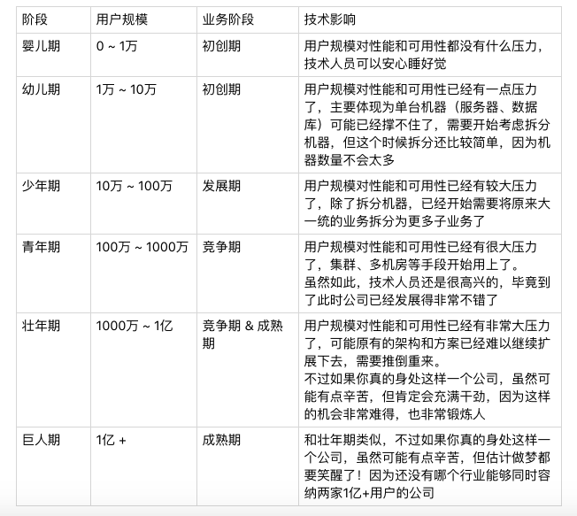

应对业务质变带来的技术压力，不同时期有不同的处理方式，但不管什么样的方式，其核心目标都是为了满足业务“快”的要求，当发现你的业务快不起来的时候，其实就是技术的水平已经跟不上业务发展的需要了，技术变革和发展的时候就到了。更好的做法是在问题还没有真正暴露出来就能够根据趋势预测下一个转折点，提前做好技术上的准备，这对技术人员的要求是非常高的。 

## 架构重构

系统的架构是不断演化的，少部分架构演化可能需要推倒重来进行重写，但绝大部分的架构演化都是通过架构重构来实现的。 

相比全新的架构设计来说，架构重构对架构师的要求更高，主要体现在： 

* 业务已经上线，不能停下来

  架构重构时，业务已经上线运行了，重构既需要尽量保证业务继续往前发展，又要完成架构调整，这就好比“给飞行中的波音747换引擎”；而如果是新设计架构，业务还没有上线，则即使做砸了对业务也不会有太大影响。 

* 关联方众多，牵一发动全身

  架构重构涉及的业务关联方很多，不同关联方的资源投入程度、业务发展速度、对架构痛点的敏感度等有很大差异，如何尽量减少对关联方的影响，或者协调关联方统一行动，是一项很大的挑战；而如果是新设计架构，则在新架构上线前，对关联方没有影响。 

* 旧架构的约束

  架构重构需要在旧的架构基础上进行，这是一个很强的约束，会限制架构师的技术选择范围；而如果是新设计架构，则架构师的技术选择余地大得多。 

  即使是我们决定推倒到重来，完全抛弃旧的架构而去设计新的架构，新架构也会受到旧架构的约束和影响，因为业务在旧架构上产生的数据是不能推倒重来的，新架构必须考虑如何将旧架构产生的数据转换过来。 

因此，架构重构对架构师的综合能力要求非常高，业务上要求架构师能够说服产品经理暂缓甚至暂停业务来进行架构重构；团队上需要架构师能够与其他团队达成一致的架构重构计划和步骤；技术上需要架构师给出让技术团队认可的架构重构方案。 

总之，架构重构需要架构师既要说得动老板，也要镇得住同事；既要技术攻关，又要协调资源；既要保证业务正常发展，又要在指定时间内完成目标。

架构师正是需要在原来一团乱麻中找到线索，然后重新穿针引线，帮助业务进一步腾飞发展。 

### 有的放矢

通常情况下，当系统架构不满足业务的发展时，其表现形式是系统不断出现各种问题，轻微一点的如系统响应慢、数据错误、某些用户访问失败等，严重的可能是宕机、数据库瘫痪、数据丢失等，或者系统的开发效率很低。开始的时候，技术团队可能只针对具体的问题去解决，解决一个算一个，但如果持续时间较长，例如持续了半年甚至一年情况都不见好转，此时可能有人想到了系统的架构是否存在问题，讨论是否是因为架构原因导致了各种问题。一旦确定需要进行架构重构，就会由架构师牵头来进行架构重构的分析。 

当架构师真正开始进行架构重构分析时，就会发现自己好像进了一个迷雾森林，到处都是问题，每个问题都需要解决，不知道出路在哪里，感觉如果要解决所有这些问题，架构重构其实也无能为力。有的架构师一上来搜集了系统当前存在的问题，然后汇总成一个100行的Excel表格，看到这样一个表格就懵了：这么多问题，要到猴年马月才能全部解决完啊？ 

期望通过架构重构来解决所有问题当然是不现实的，所以架构师的首要任务是从一大堆纷繁复杂的问题中识别出真正要通过架构重构来解决的问题，集中力量快速解决，而不是想着通过架构重构来解决所有的问题。否则就会陷入人少事多头绪乱的处境，团队累死累活弄个大半年，最后发现好像什么都做了，但每个问题都依然存在。尤其是对于刚接手一个新系统的架构师或者技术主管来说，一定要控制住“新官上任三把火”的冲动，避免摊大饼式或者运动式的重构和优化。 

下面举几个实际的重构案例：

1、后台系统重构：解决不合理的耦合

M系统是一个后台管理系统，负责管理所有游戏相关的数据，重构的主要原因是因为系统耦合了P业务独有的数据和所有业务公用的数据，导致可扩展性比较差。其大概架构如下图所示： 

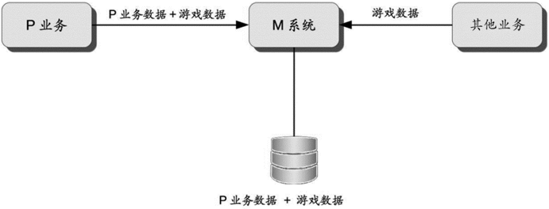

举一个简单的例子：数据库中的某张表，一部分字段是所有业务公用的“游戏数据”，一部分字段是P业务系统“独有的数据”，开发时如果要改这张表，代码和逻辑都很复杂，改起来效率很低。

针对M系统存在的问题，重构目标就是将游戏数据和业务数据拆分，解开两者的耦合，使得两个系统都能够独立快速发展。重构的方案如下图所示：

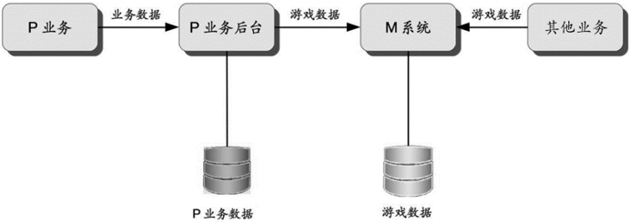

重构后的效果非常明显，重构后的M系统和P业务后台系统每月上线版本数是重构前的4倍。

2、游戏接入系统重构：解决全局单点的可用性问题

S系统是游戏接入的核心系统，一旦S系统故障，大量游戏玩家就不能登录游戏。而S系统并不具备多中心的能力，一旦主机房宕机，整个S系统业务就不可用了。其大概架构如下图所示，可以看出数据库主库是全局单点，一旦数据库主库不可用，两个集群的写业务都不可用了：

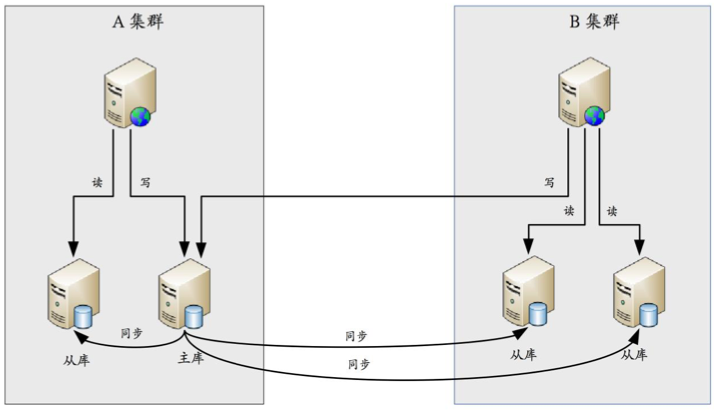

针对S系统存在的问题，重构目标就是实现双中心，使得任意一个机房都能够提供完整的服务，在某个机房故障时，另外一个机房能够全部接管所有业务。重构方案如下图所示： 

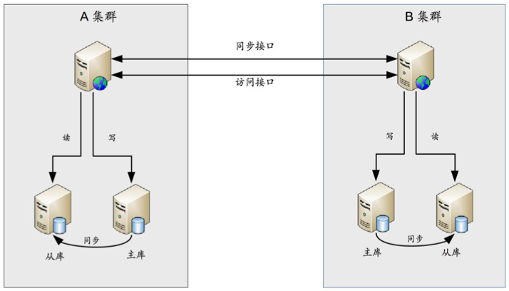

重构后系统的可用性从3个9提升到4个9，重构前最夸张的一个月有4次较大的线上故障，重构后虽然也经历了机房交换机宕机、运营商线路故障、机柜断电等问题，但对业务都没有什么大的影响。 

3、X系统：解决大系统带来的开发效率问题

X系统是创新业务的主系统，之前在业务快速尝试和快速发展期间，怎么方便怎么操作，怎么快速怎么做，系统设计并未投入太多精力和时间，很多东西都“塞”到同一个系统中，导致到了现在已经改不动了。做一个新功能或者新业务，需要花费大量的时间来讨论和梳理各种业务逻辑，一不小心就踩个大坑。X系统的架构如下图所示： 

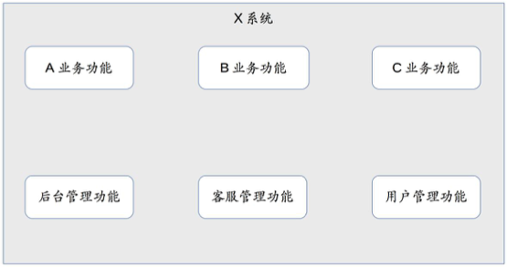

X系统的问题看起来和M系统比较类似，都是可扩展性存在问题，但其实根本原因不一样： M系统是因为耦合了不同业务的数据导致系统可扩展性不足，而X系统是因为将业务相关的所有功能都放在同一个系统中，导致系统可扩展性不足；同时，所有功能都在一个系统中，也可能导致一个功能出问题，整站不可用。比如说某个功能把数据库拖慢了，整站所有业务跟着都慢了。 

针对X系统存在的问题，重构目标是将各个功能拆分到不同的子系统中，降低单个系统的复杂度。重构后的架构如下图所示：

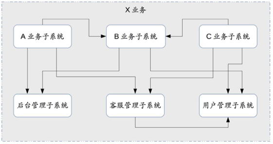

重构后各个系统之间通过接口交互，虽然看似增加了接口的工作量，但整体来说，各系统的发展和开发速度比原来快了很多，系统也相对更加简单，也不会出现某个子系统有问题，所有业务都有问题。 

这三个系统重构的方案，现在回过头来看，感觉是理所当然的，但实际上当时做分析和决策时，远远没有这么简单。 

以M系统为例，当时接手后遇到的问题有很多，例如：  

- 数据经常出错。
- M系统是单机，单机宕机后所有后台操作就不能进行了。
- 性能比较差，有的操作耗时好久。
- 界面比较丑，操作不人性化。
- 历史上经过几手转接，代码比较混乱。
- 业务数据和游戏数据耦合，开发效率很低。

从这么多问题中识别出重构的目标，并不是一目了然的；而如果想一下全部解决所有这些问题，人力和时间又不够！所以架构师需要透过问题表象看到问题本质，找出真正需要通过架构重构解决的核心问题，从而做到有的放矢，既不会耗费大量的人力和时间投入，又能够解决核心问题。

这对架构师的分析和判断能力要求非常高，既不能看到问题就想到要架构重构，也不能只是针对问题进行系统优化，判断到底是采取架构重构还是采取系统优化，可能不同的架构师和团队都有不同的看法。这里分享一个简单的做法：假设我们现在需要从0开始设计当前系统，新架构和老架构是否类似？如果差异不大，说明采取系统优化即可；如果差异很大，那可能就要进行系统重构了。 

对于那些非架构重构问题，也不能放任不管，以M系统为例，我们在重构完成后，又启动了多个优化的项目去优化这些问题，但此时的优化主要由团队内部完成即可，和其他团队没有太多关联，优化的速度是很快的。 如果单独进行优化，可能代价是很大的，可以恰好借着重构的机会尽可能多的进行优化，如果没有重构就进行优化，则每次优化都要拉一大堆关联业务的团队来讨论方案，效率非常低下。

### 合纵连横

合纵：是从上游思维下认可需要做这件事情

连横：是从共同的利益出发，把相关的人联系在一起做 

1、合纵

架构重构是大动作，持续时间比较长，而且会占用一定的研发资源，包括开发和测试，因此不可避免地会影响业务功能的开发。因此，要想真正推动一个架构重构项目启动，需要花费大量的精力进行游说和沟通。注意这里不是指办公室政治，而是指要和利益相关方沟通好，让大家对于重构能够达成一致共识，避免重构过程中不必要的反复和争执。 

这里要讲究和非技术人员沟通的技巧，要少讲专业术语，多用通俗语言；凭数据说话，以事实、以数据说话。

例如：

* 把可扩展性转换为“版本开发速度很慢，每次设计都要考虑是否对门户有影响，是否要考虑对其他业务有影响” ，并且收集了1个月里的版本情况，发现有几个版本设计阶段讨论1周甚至2周时间，但开发只有2天时间；而且一个月才做了4个版本，最极端的一个版本讨论2周，开发2天，然后等了1个月才和门户系统一起上线 
* 把可用性转换为线上故障的次数、每次影响的时长，影响的用户，客服的反馈意见等，然后再拿其他系统的数据进行对比 

2、连横

除了上面讨论的和上下游沟通协调，有的重构还需要和其他相关或者配合的系统的沟通协调。 

来自相关系统的阻力主要来自于“这对我有什么好处”和“这部分我这边现在不急”。

* 针对“这对我有什么好处”的阻力，可以换位思考，站在对方的角度思考，重构对他有什么好处，能够帮他解决什么问题，带来什么收益。 

  当然如果真的出现了对公司或者部门有利，对某个小组不利的情况，那可能需要协调更高层级的管理者才能够推动，平级推动是比较难的。 

* 针对“这部分我这边现在不急”，对方可能是在找借口拒绝，此时按照上一条处理。如果对方真的是因为有其他更重要的业务，可以采取等待的策略，但要明确正式启动的时间。 例如，3个月后开始、6月份开始，千万不能说“以后”“等不忙的时候”这种无法明确的时间点。

  除了计划上灵活一点，方案上也可以灵活一点：我们可以先不做这个系统相关的重构，先把其他需要重构的做完。因为大部分需要重构的系统，需要做的事情很多，分阶段处理，在风险规避、计划安排等方面更加灵活可控。

### 运筹帷幄

到了真正要开始重构的时候，架构师识别出系统关键的复杂度问题后，如果只针对这个复杂度问题进行架构重构，可能会发现还是无法落地，因为很多条件不具备或者有的问题没解决的情况下就是不能做架构重构。因此，架构师在识别系统关键的复杂度问题后，还需要识别为了解决这个问题，需要做哪些准备事项，或者还要先解决哪些问题。 

经过分析和思考，我们可能从最初的100个问题列表，挑选出其中50个是需要在架构重构中解决的，其中一些是基础能力建设或者准备工作，而另外一些就是架构重构的核心工作。有了这样一个表格后，那我们应该怎么去把这50个问题最终解决呢？ 

最简单的做法是每次从中挑一个解决，最终总会把所有的问题都解决。这种做法操作起来比较简单，但效果会很差，原因在于：

* 第一个原因是没有区分问题的优先级，所有问题都一视同仁，没有集中有限资源去解决最重要或者最关键的问题，导致最后做了大半年，回头一看好像做了很多事情，但没取得什么阶段性的成果。
* 第二个原因是没有将问题分类，导致相似问题没有统筹考虑，方案可能出现反复，效率不高。
* 第三个原因是会迫于业务版本的压力，专门挑容易做的实施，到了稍微难一点的问题的时候，就因为复杂度和投入等原因被搁置，达不到重构的真正目的。

有些时候，又要做架构重构，又要系统处于一个比较稳定的状态，不要经常出线上问题。 因此整个重构过程可以按以下步骤进行：

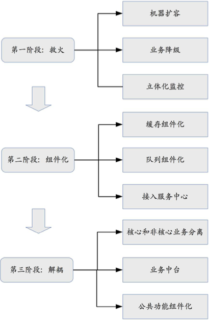

可以看到，真正的架构重构在第三阶段，第一阶段和第二阶段都是为了第三阶段做准备而已，但如果没有第一阶段和第二阶段的铺垫，直接开始第三阶段的架构重构工作，架构重构方案需要糅合第一阶段和第二阶段的一些事项（例如，业务降级、接入服务中心等），会导致架构重构方案不聚焦，而且异常复杂。 

采用上述策略的原因在于：为了集中有限的资源，某个阶段集中解决某一类问题。

* 这样做首先是效率高，因为阶段目标比较明确，做决策和方案的时候无须进行太多选择； 
* 每个阶段都能看到明显的成果，给团队很大的信心。比如说第一阶段的“救火”，做完之后，系统很少有因为机器过载、缓存响应慢、虚拟机挂死等问题导致的故障了；完成第二阶段的事项后，因为组件、外部系统故障导致系统故障的问题也很少了。完成前两个阶段后，我们就可以安心地做第三阶段的“服务化”工作了。 

总结一下重构的做法，其实就是“分段实施”，将要解决的问题根据优先级、重要性、实施难度等划分为不同的阶段，每个阶段聚焦于一个整体的目标，集中精力和资源解决一类问题。这样做有几个好处：

* 每个阶段都有明确目标，做完之后效果明显，团队信心足，后续推进更加容易。
* 每个阶段的工作量不会太大，可以和业务并行。
* 每个阶段的改动不会太大，降低了总体风险。

制定“分段实施”的策略的步骤：

1、优先级排序

将明显且又比较紧急的事项优先落地，解决目前遇到的主要问题。例如，扩容在S系统和X系统中都是最优先实施的，因为如果不扩容，系统隔三差五一会出现响应超时报警，一会来个过载报警，一会来个大面积不可用……这些问题耗费大量的人力和精力，也就没法做其他事情了。 

2、问题分类

将问题按照性质分类，每个阶段集中解决一类问题。例如，X系统的第二阶段，我们将多个底层系统切换到公司统一的公共组件，提升整体可用性。 

3、先易后难

这点与很多人的直觉不太一样，有的人认为应该先攻克最难的问题，所谓“擒贼先擒王”，解决最难的问题后其他问题就不在话下。这样看起来很美好，但实际上不可行，具体不可行的原因有：

* 首先，一开始就做最难的部分，会发现想要解决这个最难的问题，要先解决其他容易的问题。
* 其次，最难的问题解决起来耗时都比较长，占用资源比较多，如果一开始做最难的，可能做了一两个月还没有什么进展和成果，会影响相关人员对项目的评价和看法，也可能影响团队士气。
* 第三，刚开始的分析并不一定全面，所以一开始对最难的或者最关键的事项的判断可能会出错。

采取“先易后难”的策略，能够很大程度上避免“先难后易”策略的问题，具体原因有：

* 首先，随着项目的推进，一些相对简单的问题逐渐解决，会发现原来看起来很难的问题已经不那么难了，甚至有的问题可能都消失了。
* 其次，先易后难能够比较快地看到成果，虽然成果可能不大，但至少能看到一些成效了，对后续的项目推进和提升团队士气有很大好处。
* 第三，随着项目的进行，原来遗漏的一些点，或者分析和判断错误的点，会逐渐显示出来，及时根据实际情况进行调整，能够有效地保证整个重构的效果。

4、循序渐进

按照前3个步骤划分了架构重构的实施阶段后，就需要评估每个阶段所需要耗费的时间，很可能会出现有的阶段耗时可能只要1个月，而有的却需要6个月，虽然这可能确实是客观事实，但通常情况下，按照固定的步骤和节奏，更有利于项目推进。我的经验是每个阶段最少1个月，最长不要超过3个月，如果评估超过3个月的，那就再拆分为更多阶段。就像X项目，我们先划分了阶段，每个阶段又分了任务子集，当任务子集比较小的时候，多个任务子集可以并行；当任务子集比较大的时候，就当成一个独立的里程碑推进。

# 补充

“PPT架构师”的口头禅是“细节不讨论”，一个优秀的架构师，需要对细节有多少考虑？

这里以学习Elasticsearch为例，具体的做法是： 

1. 搭建一个单机伪集群，搭建完成后看看安装路径下的文件和目录，看看配置文件有哪些配置项，不同的配置项会有什么样的影响。
2. 执行常用的操作，例如创建索引，插入、删除、查询文档，查看一下各种输出。
3. 研究其基本原理，例如索引、分片、副本等，研究的时候要多思考，例如索引应该如何建，分片数量和副本数量对系统有什么影响等。
4. 和其他类似系统对比，例如Solr、Sphinx，研究其优点、缺点、适用场景。
5. 模拟一个案例看看怎么应用。例如，假设我用Elasticsearch来存储淘宝的商品信息，我应该如何设计索引和分片。
6. 查看业界使用的案例，思考一下别人为何这么用；看看别人测试的结果，大概了解性能范围。
7. 如果某部分特别有兴趣或者很关键，可能去看源码，例如Elasticsearch的选举算法（我目前还没看^_^）。
8. 如果确定要引入，会进行性能和可用性测试。

完成上面的步骤后，基本上能够满足在架构设计时进行选型判断，而且花费的时间也不多。 

## 开源项目

### 学习

对于开源项目，不能简单的采取“拿来主义”，而要比较深入的去学习开源项目，做到“知其然，知其所以然”，一方面是为了更好地应用这些开源项目，另一方面也是为了通过学习优秀的开源项目来提升自己的能力。 

很多技术同学确实也想深入学习一些业界成熟和优秀的开源项目，例如Nginx、Redis、Netty等，但是在具体实践的时候，常常因为一些不正确的观点而误入歧途，例如：

- 只有开发这些开源项目的人才能真正理解，我没法参与这个项目开发，因此我很难深入理解。
- 我的项目没有用Redis，不用的话很难深入理解。
- 数据结构和算法很重要，所以我只要研究其数据结构和算法就够了，例如Nginx用的红黑树。
- “Talk is cheap, show me the code”，一头扎进源码逐行阅读。

学习开源项目的几个原则：

* 首先，需要树立正确的观念：不管你是什么身份，都可以从开源项目中学到很多东西。

  例如，要理解Redis的网络模型，我们不需要成为Redis的开发者，也不需要一定要用到Redis，只要具备一定的网络编程基础，再通过阅读Redis的源码，都可以学习Redis这种单进程的Reactor模型。 

* 其次，不要只盯着数据结构和算法，事实上这两点在学习开源项目的时候并没有那么重要。

  例如，Nginx使用红黑树来管理定时器，对于绝大部分人来说，只要知道这点就够了，并不需要去研究Nginx实现红黑树的源码是如何写的，除非你需要修改这部分，但我认为极少人会有这个需求。 

* 第三，采取“自顶向下”的学习方法，源码不是第一步，而是最后一步。

  不要一上来就去看源码，而是要基本掌握了功能、原理、关键设计之后再去看源码，看源码的主要目的是为了学习其代码的写作方式，以及关键技术的实现。 

  例如，Redis的RDB持久化模式“会将当前内存中的数据库快照保存到磁盘文件中”，那这里所谓的“数据库快照”到底是怎么做的呢？在Linux平台上其实就是fork一个子进程来保存就可以了；那为何fork子进程就生成了数据库快照了呢？这又和Linux的父子进程机制以及copy-on-write技术相关了。

  通过这种方式，既能够快速掌握系统设计的关键点（Redis的RDB模式），又能够掌握具体的编程技巧（内存快照）。

具体步骤其实是一个自顶向下的过程：

1、安装

很多人看到“安装”这个步骤都可能会觉得有点不以为然：“不就是对照手册执行一下命令么，没什么技术含量，用的时候装一下就可以了”。事实上，安装步骤远远不止这么简单，通过具体的安装过程，你可以获取到如下一些关键信息： 

* 这个系统的依赖组件，而依赖的组件是系统设计和实现的基础

  以Nginx为例，源码安装Nginx依赖的库有pcre、pcre-devel、openssl、openssl-devel、zlib，光从名字上看都能够了解一些信息，例如openssl可能和https有关，zlib可能和压缩有关。 

  再以Memcache为例，最大的依赖就是libevent，而根据libevent是一个高性能的网络库，我们就能大概推测Memcache的网络实现应该是Reactor模型的。 

* 安装目录也能够提供一些使用和运行的基本信息

  例如，Nginx安装完成后，目录如下： 

  

  这个目录提供的信息有：conf是存放配置文件的，logs是存放日志的，sbin是运行程序，但是html是什么呢？这个疑问会促使你继续去研究和学习。

  再来看看Redis，安装完成后，目录下只有一个bin目录，具体如下：

  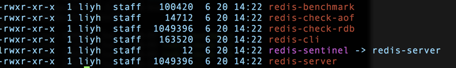

  大部分人看到这目录都会感到有点惊讶：这也太简单了吧，尤其是与Nginx相比！因此也会自然而然的有一些疑问，例如Redis如何配置？Redis日志保存在哪里？这些疑问同样会促使你继续去研究和学习，带着问题去学习效率是最高的。

* 系统提供了哪些工具方便我们使用

  同样以Redis为例，你可以看到redis-benchmark、redis-check-aof等程序，从名字能够大概猜出这些工具的基本使用场景，而这些工具在后面故障定位和处理、性能测试等场景可能非常方便。 

2、运行

安装完成后，我们需要真正将系统运行起来，运行系统的时候有两个地方要特别关注：命令行和配置文件，它们主要提供了两个非常关键的信息：系统具备哪些能力和系统将会如何运行。这些信息是我们窥视系统内部运行机制和原理的一扇窗口。

例如，下面是Memcache的启动参数一部分： 

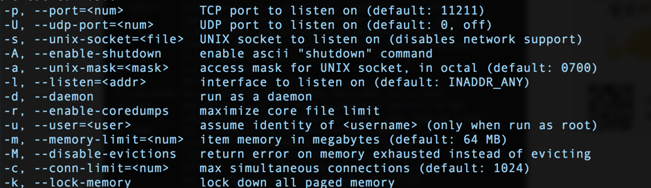

通过这几个启动参数，你可以获取如下一些信息：

- Memcache支持UNIX socket通信和TCP通信。
- Memcache可以指定内存大小。
- lock memory看起来和内存有关，但具体是什么意思？配置和不配置有什么区别么？

通常情况下，如果我们将每个命令行参数和配置项的作用和原理都全部掌握清楚了的话，基本上对系统已经很熟悉了。我的一个习惯是不管三七二十一，先把所有的配置项全部研究一遍，包括配置项的原理、作用、影响，并且尝试去修改配置项然后看看系统会有什么变化。例如，将Memcache的“–conn-limit”改为1后，查看多个连接请求时Memecache会返回什么错误、记录什么日志等。 

3、原理研究

完成前两个步骤后，我们对系统已经有了初步的感觉和理解，此时可以更进一步去研究其原理。其实在研究命令行和配置项的时候已经涉及一部分原理了，但是还不系统，因此我们要专门针对原理进行系统性的研究。这里的关键就是“系统性”三个字，怎么才算系统性呢？主要体现在如下几个方面：

* 关键特性的基本实现原理

  每个流行的开源项目之所以能够受到大众的欢迎，肯定是有一些卖点的，常见的有高性能、高可用、可扩展等特性，那到底这些项目是如何做到其所宣称的那么牛的呢？这些牛X的技术实现就是我们要学习的地方。 

  例如，Memcache的高性能具体是怎么做到的呢？首先是基于libevent实现了高性能的网络模型，其次是内存管理Slab Allocator机制。为了彻底理解Memcache的高性能网络模型，我们需要掌握很多知识：多路复用、Linux epoll、Reactor模型、多线程等，通过研究Memcache的高性能网络模型，我们能够学习一个具体的项目中如何将这些东西全部串起来实现了高性能。 

  再以React为例，Virtual DOM的实现原理是什么、为何要实现Virtual DOM、React是如何构建Virtual DOM树、Virtual DOM与DOM什么关系等，通过研究学习Virtual DOM，即使不使用React，我们也能够学习如何写出高性能的前端的代码。 

* 优缺点对比分析

  这是非常重要的一点，只有清楚掌握技术方案的优缺点后才算真正的掌握这门技术，也只有掌握了技术方案的优缺点后才能在架构设计的时候做出合理的选择。

  优缺点主要通过对比来分析，即：我们将两个类似的系统进行对比，看看它们的实现差异，以及不同的实现优缺点都是什么。

  典型的对比有Memcache和Redis，例如（仅举例说明，实际上对比的点很多），Memcache用多线程，Redis用单进程，各有什么优缺点？Memcache和Redis的集群方式，各有什么优缺点？

  即使是Redis自身，我们也可以对比RDB和AOF两种模式的优缺点。

原理研究的具体手段有：

* 通读项目的设计文档：例如Kafka的设计文档，基本涵盖了消息队列设计的关键决策部分；Disruptor的设计白皮书，详细的阐述了Java单机高性能的设计技巧。
* 阅读网上已有的分析文档：通常情况下比较热门的开源项目，都已经有非常多的分析文档了，我们可以站在前人的基础上，避免大量的重复投入。但需要注意的是，由于经验、水平、关注点等差异，不同的人分析的结论可能有差异，甚至有的是错误的，因此不能完全参照。一个比较好的方式就是多方对照，也就是说看很多篇分析文档，比较它们的内容共同点和差异点。
* Demo验证：如果有些技术点难以查到资料，自己又不确定，则可以真正去写Demo进行验证，通过打印一些日志或者调试，能清晰的理解具体的细节。例如，写一个简单的分配内存程序，然后通过日志和命令行（jmap、jstat、jstack等）来查看Java虚拟机垃圾回收时的具体表现。

4、测试

如果真的准备在实际项目中使用某个开源项目的话，必须进行测试。 不能随便找一个网上的分析和测试文档。如果只是自己学习和研究，这样做是可以的，因为构建完整的测试用例既需要耗费较多时间，又需要较多机器资源，如果每个项目都这么做的话，投入成本有点大；但如果是要在实践项目中使用，必须自己进行测试，因为网上搜的测试结果，不一定与自己的业务场景很契合，如果简单参考别人的测试结果，很可能会得出错误的结论。例如，开源系统的版本不同，测试结果可能差异较大。同样是K-V存储，别人测试的value是128字节，而你的场景value都达到了128k字节，两者的测试结果也差异很大，不能简单照搬。 

测试阶段需要特别强调的一点就是：测试一定要在原理研究之后做，不能安装完成立马就测试！原因在于如果对系统不熟悉，很可能出现命令行、配置参数没用对，或者运行模式选择不对，导致没有根据业务的特点搭建正确的环境、没有设计合理的测试用例，从而使得最终的测试结果得出了错误结论，误导了设计决策。曾经有团队安装完成MySQL 5.1后就进行性能测试，测试结果出来让人大跌眼镜，经过定位才发现innodb_buffer_pool_size使用的是默认值8M。

5、源码研究

源码研究的主要目的是学习原理背后的具体编码如何实现，通过学习这些技巧来提升我们自己的技术能力。例如Redis的RDB快照、Nginx的多Reactor模型、Disruptor如何使用volatile以及CAS来做无锁设计、Netty的Zero-Copy等，这些技巧都很精巧，掌握后能够大大提升自己的编码能力。 

通常情况下，不建议通读所有源码，因为想掌握每行代码的含义和作用还是非常耗费时间的，尤其是MySQL、Nginx这种规模的项目，即使是他们的开发人员，都不一定每个人都掌握了所有代码。带着明确目的去研究源码，做到有的放矢，才能事半功倍，这也是源码研究要放在最后的原因。

对于一些基础库，除了阅读源码外，还可以自己写个Demo调用基础库完成一些简单的功能，然后通过调试来看具体的调用栈，通过调用栈来理解基础库的处理逻辑和过程，这比单纯看代码去理解逻辑要高效一些。例如，下面是Netty 4.1版本的telnet服务器样例调试的堆栈，通过堆栈我们可以看到完整的调用栈： 

通常情况下，以上5个步骤的前3个步骤，不管是已经成为架构师的技术人员，还是立志成为架构师的技术人员，在研究开源项目的时候都必不可少；

第四步可以在准备采用开源项目的时候才实施，第五步可以根据你的时间来进行灵活安排。这里的“灵活安排”不是说省略不去做，而是在自己有一定时间和精力的时候做，因为只有这样才能真正理解和学到具体的技术。 

如果感觉自己时间和精力不够，与其蜻蜓点水每个开源项目都去简单了解一下，还不如集中精力将一个开源项目研究通透，就算是每个季度只学习一个开源项目，积累几年后这个数量也是很可观的；而且一旦你将一个项目研究透以后，再去研究其他类似项目，你会发现自己学习的非常快，因为共性的部分你已经都掌握了，只需要掌握新项目差异的部分即可。 

### 选择

软件开发领域有一个流行的原则：DRY，Don’t repeat yourself。翻译过来更通俗易懂：不要重复造轮子。开源项目的主要目的是共享，其实就是为了让大家不要重复造轮子，尤其是在互联网这样一个快速发展的领域，速度就是生命，引入开源项目可以节省大量的人力和时间，大大加快业务的发展速度。

然而现实往往没有那么美好，开源项目虽然节省了大量的人力和时间，但带来的问题也不少，相信绝大部分技术人员都踩过开源软件的坑，小的影响可能是宕机半小时，大的问题可能是丢失几十万条数据，甚至灾难性的事故是全部数据都丢失。

除此以外，虽然DRY原则摆在那里，但实际上开源项目反而是最不遵守DRY原则的，重复的轮子好多，你有MySQL，我有PostgreSQL；你有MongoDB，我有Cassandra；你有Memcached，我有Redis；你有Gson，我有Jackson；你有Angular，我有React……总之放眼望去，其实相似的轮子很多！相似轮子太多，如何选择就成了让人头疼的问题了。

完全不用开源项目几乎是不可能的，架构师需要更加聪明地选择和使用开源项目。 有以下几个原则：

1、聚焦是否满足业务

架构师在选择开源项目时，一个头疼的问题就是相似的开源项目较多，而且后面的总是要宣称比前面的更加优秀。有的架构师在选择时有点无所适从，总是会担心选择了A项目而错过了B项目。这个问题的解决方式是聚焦于是否满足业务，而不需要过于关注开源项目是否优秀。

在开发一个社交类业务时，我们使用了TT（Tokyo Tyrant）开源项目，觉得既能够做缓存取代Memcached，又有持久化存储功能，还可以取代MySQL，觉得很强大，于是就在业务里面大量使用了。但后来的使用过程让人很郁闷，主要表现为： 

- 不能完全取代MySQL，因此有两份存储，设计时每次都要讨论和决策究竟什么数据放MySQL，什么数据放TT。
- 功能上看起来很高大上，但相应的bug也不少，而且有的bug是致命的。例如所有数据不可读，后来是自己研究源码写了一个工具才恢复了部分数据。
- 功能确实强大，但需要花费较长时间熟悉各种细节，不熟悉随便用很容易踩坑。

后来我们反思和总结，其实当时的业务Memcached + MySQL完全能够满足，而且大家都熟悉，其实完全不需要引入TT。 

简单来说：如果你的业务要求1000 TPS，那么一个20000 TPS 和50000 TPS的项目是没有区别的。 如果后续TPS不断上涨，也可以进行架构重构解决，这里的设计决策遵循架构设计原则中的“合适原则”和”演化原则”。 

2、聚焦是否成熟

很多新的开源项目往往都会声称自己比以前的项目更加优秀：性能更高、功能更强、引入更多新概念……看起来都很诱人，但实际上都有意无意地隐藏了一个负面的问题：更加不成熟！不管多优秀的程序员写出来的项目都会有bug，千万不要以为作者历害就没有bug，Windows、Linux、MySQL的开发者都是顶级的开发者，系统一样有很多bug。 

不成熟的开源项目应用到生产环境，风险极大：轻则宕机，重则宕机后重启都恢复不了，更严重的是数据丢失都找不回来。以上面提到的TT为例：我们真的遇到异常断电后，文件被损坏，重启也恢复不了的故障。还好当时每天做了备份，于是只能用1天前的数据进行恢复，但当天的数据全部丢失了。后来我们花费了大量的时间和人力去看源码，自己写工具恢复了部分数据，还好这些数据不是金融相关的数据，丢失一部分问题也不大，否则就有大麻烦了。 

所以在选择开源项目时，尽量选择成熟的开源项目，降低风险。

你可以从这几个方面考察开源项目是否成熟：

- 版本号：除非特殊情况，否则不要选0.X版本的，至少选1.X版本的，版本号越高越好。
- 使用的公司数量：一般开源项目都会把采用了自己项目的公司列在主页上，公司越大越好，数量越多越好。
- 社区活跃度：看看社区是否活跃，发帖数、回复数、问题处理速度等。

3、聚焦运维能力

大部分架构师在选择开源项目时，基本上都是聚焦于技术指标，例如性能、可用性、功能这些评估点，而几乎不会去关注运维方面的能力。但如果要将项目应用到线上生产环境，则运维能力是必不可少的一环，否则一旦出问题，运维、研发、测试都只能干瞪眼，求菩萨保佑了！

你可以从这几个方面去考察运维能力：

- 开源项目日志是否齐全：有的开源项目日志只有寥寥启动停止几行，出了问题根本无法排查。
- 开源项目是否有命令行、管理控制台等维护工具，能够看到系统运行时的情况。
- 开源项目是否有故障检测和恢复的能力，例如告警、切换等。

如果是开源库，例如Netty这种网络库，本身是不具备运维能力的，那么就需要在使用库的时候将一些关键信息通过日志记录下来，例如在Netty的Handler里面打印一些关键日志。 

### 应用

当学习好某个开源项目后，应用的时候也要注意以下几点：

1、小心应用，灰度发布

即使你的研究再深入，测试再仔细，还是要小心为妙，因为再怎么深入地研究，再怎么仔细地测试，都只能降低风险，但不可能完全覆盖所有线上场景。 

还是以TT为例，其实我们在应用之前专门安排一个高手看源码、做测试，做了大约1个月，但最后上线还是遇到各种问题。线上生产环境的复杂度，真的不是测试能够覆盖的，必须小心谨慎。

所以，不管研究多深入、测试多仔细、自信心多爆棚，时刻对线上环境和风险要有敬畏之心，小心驶得万年船。我们的经验就是先在非核心的业务上用，然后有经验后慢慢扩展。

2、做好应急，以防万一

即使我们前面的工作做得非常完善和充分，也不能认为万事大吉，尤其是刚开始使用一个开源项目，运气不好可能遇到一个之前全世界的使用者从来没遇到的bug，导致业务都无法恢复，尤其是存储方面，一旦出现问题无法恢复，可能就是致命的打击。 

以MongoDB丢失数据为例，某个业务使用了MongoDB，结果宕机后部分数据丢失，无法恢复，也没有其他备份，人工恢复都没办法，只能接一个用户投诉处理一个，导致DBA和运维从此以后都反对我们用MongoDB，即使是尝试性的。 

虽然因为一次故障就完全反对尝试是有点反应过度了，但确实故障也给我们提了一个醒：对于重要的业务或者数据，使用开源项目时，最好有另外一个比较成熟的方案做备份，尤其是数据存储。例如，如果要用MongoDB或者Redis，可以用MySQL做备份存储。这样做虽然复杂度和成本高一些，但关键时刻能够救命

### 二次开发

有时需要基于开源项目做二次开发。

一般有两种场景：

1、只需要在开源项目上层进行封装

当我们发现开源项目有的地方不满足我们的需求时，自然会有一种去改改的冲动，但是怎么改是个大学问。一种方式是投入几个人从内到外全部改一遍，将其改造成完全符合我们业务需求。但这样做有几个比较严重的问题：

- 投入太大，一般来说，Redis这种级别的开源项目，真要自己改，至少要投入2个人，搞1个月以上。
- 失去了跟随原项目演进的能力：改的太多，即使原有开源项目继续演进，也无法合并了，因为差异太大。

所以建议是不要改动原系统，而是要开发辅助系统：监控、报警、负载均衡、管理等。以Redis为例，如果我们想增加集群功能，则不要去改动Redis本身的实现，而是增加一个proxy层来实现。Twitter的Twemproxy就是这样做的，而Redis到了3.0后本身提供了集群功能，原有的方案简单切换到Redis 3.0即可。

如果实在想改到原有系统，建议是直接给开源项目提需求或者bug，但弊端就是响应比较缓慢，这个就要看业务紧急程度了，如果实在太急那就只能自己改了；如果不是太急，建议做好备份或者应急手段即可。

2、发明你要的轮子 

选与不选开源项目，核心还是一个成本和收益的问题，并不是说选择开源项目就一定是最优的项目，最主要的问题是：没有完全适合你的轮子

开源项目为了能够大规模应用，考虑的是通用的处理方案，而不同的业务其实差异较大，通用方案并不一定完美适合具体的某个业务。比如说Memcached，通过一致性Hash提供集群功能，但是我们的一些业务，缓存如果有一台宕机，整个业务可能就被拖慢了，这就要求我们提供缓存备份的功能。但Memcached又没有，而Redis当时又没有集群功能，于是我们投入2~4个人花了大约2个月时间基于LevelDB的原理，自己做了一套缓存框架支持存储、备份、集群的功能，后来又在这个框架的基础上增加了跨机房同步的功能，很大程度上提升了业务的可用性水平。如果完全采用开源项目，等开源项目来实现，是不可能这么快速的，甚至开源项目完全就不支持我们的需求。 

# 技术点

互联网的标准技术架构如下图所示，这张图基本上涵盖了互联网技术公司的大部分技术点，不同的公司只是在具体的技术实现上稍有差异，但不会跳出这个框架的范畴：

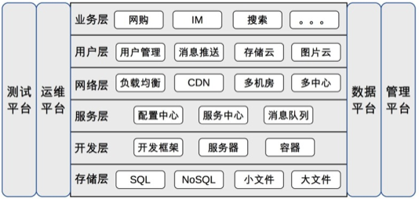

后面将逐层介绍每个技术点的产生背景、应用场景、关键技术，主要是将关键技术点分门别类，进而形成一张架构大图，让架构师对一个公司的整体技术架构有一个完整的全貌认知。 

## 存储层技术

### SQL

SQL即我们通常所说的关系数据。前几年NoSQL火了一阵子，很多人都理解为NoSQL是完全抛弃关系数据，全部采用非关系型数据。但经过几年的试验后，大家发现关系数据不可能完全被抛弃，NoSQL不是No SQL，而是Not Only SQL，即NoSQL是SQL的补充。 

互联网行业也必须依赖关系数据，一般情况下互联网行业都是用MySQL、PostgreSQL这类开源数据库。这类数据库的特点是开源免费，拿来就用；但缺点是性能相比商业数据库要差一些。 随着互联网业务的发展，性能要求越来越高，必然要面对一个问题：将数据拆分到多个数据库实例才能满足业务的性能需求。

数据库拆分满足了性能的要求，但带来了复杂度的问题：数据如何拆分、数据如何组合？这个复杂度的问题解决起来并不容易，如果每个业务都去实现一遍，重复造轮子将导致投入浪费、效率降低，业务开发想快都快不起来。 

互联网公司流行的做法是业务发展到一定阶段后，就会将这部分功能独立成中间件，例如百度的DBProxy、淘宝的TDDL。不过这部分的技术要求很高，将分库分表做到自动化和平台化，不是一件容易的事情，所以一般是规模很大的公司才会自己做。中小公司建议使用开源方案，例如MySQL官方推荐的MySQL Router、360开源的数据库中间件Atlas。

假如公司业务继续发展，规模继续扩大，SQL服务器越来越多，如果每个业务都基于统一的数据库中间件独立部署自己的SQL集群，就会导致新的复杂度问题，具体表现在：

- 数据库资源使用率不高，比较浪费。
- 各SQL集群分开维护，投入的维护成本越来越高。

因此，实力雄厚的大公司此时一般都会在SQL集群上构建SQL存储平台，以对业务透明的形式提供资源分配、数据备份、迁移、容灾、读写分离、分库分表等一系列服务，例如淘宝的UMP（Unified MySQL Platform）系统。 

### NoSQL

NoSQL在数据结构上与传统的SQL的不同：例如典型的Memcache的key-value结构、Redis的复杂数据结构、MongoDB的文档数据结构； 

NoSQL无一例外地都会将性能作为自己的一大卖点。 

NoSQL的这两个特点很好地弥补了关系数据库的不足，因此在互联网行业NoSQL的应用基本上是基础要求。 

由于NoSQL方案一般自己本身就提供集群的功能，例如Memcache的一致性Hash集群、Redis 3.0的集群，因此NoSQL在刚开始应用时很方便，不像SQL分库分表那么复杂。一般公司也不会在开始时就考虑将NoSQL包装成存储平台，但如果公司发展很快，例如Memcache的节点有上千甚至几千时，NoSQL存储平台就很有意义了：

* 首先是存储平台通过集中管理能够大大提升运维效率； 
* 其次是存储平台可以大大提升资源利用效率，2000台机器，如果利用率能提升10%，就可以减少200台机器，一年几十万元就节省出来了。 

所以，NoSQL发展到一定规模后，通常都会在NoSQL集群的基础之上再实现统一存储平台，统一存储平台主要实现这几个功能：

- 资源动态按需动态分配：例如同一台Memcache服务器，可以根据内存利用率，分配给多个业务使用。
- 资源自动化管理：例如新业务只需要申请多少Memcache缓存空间就可以了，无需关注具体是哪些Memcache服务器在为自己提供服务。
- 故障自动化处理：例如某台Memcache服务器挂掉后，有另外一台备份Memcache服务器能立刻接管缓存请求，不会导致丢失很多缓存数据。

要发展到这个阶段，一般也是大公司才会这么做，简单来说就是如果只有几十台NoSQL服务器，做存储平台收益不大；但如果有几千台NoSQL服务器，NoSQL存储平台就能够产生很大的收益。 

### 小文件存储

除了关系型的业务数据，互联网行业还有很多用于展示的数据。例如，淘宝的商品图片、商品描述；Facebook的用户图片；新浪微博的一条微博内容等。这些数据具有三个典型特征：一是数据小，一般在1MB以下；二是数量巨大，Facebook在2013年每天上传的照片就达到了3.5亿张；三是访问量巨大，Facebook每天的访问量超过10亿。 

由于互联网行业基本上每个业务都会有大量的小数据，如果每个业务都自己去考虑如何设计海量存储和海量访问，效率自然会低，重复造轮子也会投入浪费，所以自然而然就要将小文件存储做成统一的和业务无关的平台。 

和SQL和NoSQL不同的是，小文件存储不一定需要公司或者业务规模很大，基本上认为业务在起步阶段就可以考虑做小文件统一存储。得益于开源运动的发展和最近几年大数据的火爆，在开源方案的基础上封装一个小文件存储平台并不是太难的事情。例如，HBase、Hadoop、Hypertable、FastDFS等都可以作为小文件存储的底层平台，只需要将这些开源方案再包装一下基本上就可以用了。 

典型的小文件存储有：淘宝的TFS、京东JFS、Facebook的Haystack。

下图是淘宝TFS的架构：

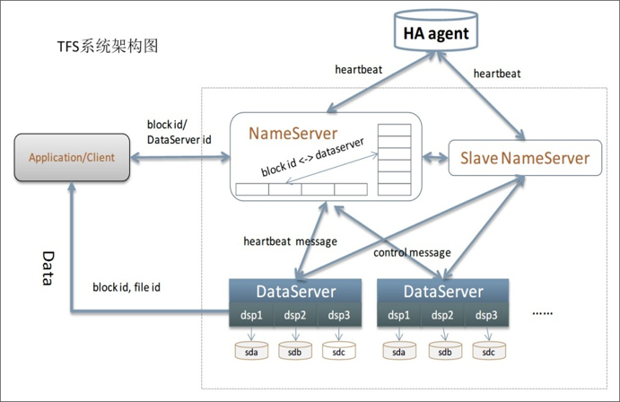

### 大文件存储

互联网行业的大文件主要分为两类：一类是业务上的大数据，例如Youtube的视频、电影网站的电影；另一类是海量的日志数据，例如各种访问日志、操作日志、用户轨迹日志等。和小文件的特点正好相反，大文件的数量没有小文件那么多，但每个文件都很大，几百MB、几个GB都是常见的，几十GB、几TB也是有可能的，因此在存储上和小文件有较大差别，不能直接将小文件存储系统拿来存储大文件。 

说到大文件，特别要提到Google和Yahoo，Google的3篇大数据论文（Bigtable/Map- Reduce/GFS）开启了一个大数据的时代，而Yahoo开源的Hadoop系列（HDFS、HBase等），基本上垄断了开源界的大数据处理。 对照Google的论文构建一套完整的大数据处理方案的难度和成本实在太高，而且开源方案现在也很成熟了，所以大数据存储和处理这块反而是最简单的，因为你没有太多选择，只能用这几个流行的开源方案，例如，Hadoop、HBase、Storm、Hive等。实力雄厚一些的大公司会基于这些开源方案，结合自己的业务特点，封装成大数据平台，例如淘宝的云梯系统、腾讯的TDW系统。

下面是Hadoop的生态圈：

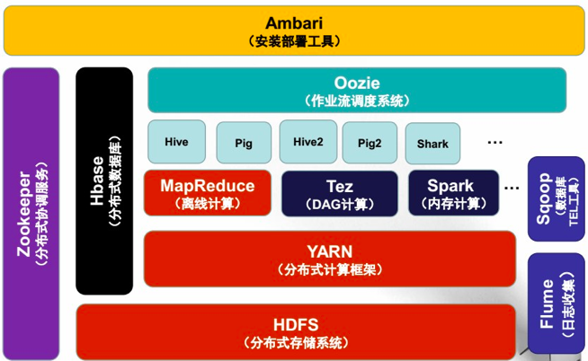

## 开发层技术

### 开发框架

互联网业务发展的一个特点是：复杂度越来越高。复杂度增加的典型现象就是系统越来越多，不同的系统由不同的小组开发。 

如果每个小组用不同的开发框架和技术，则会带来很多问题，典型的问题有：

- 技术人员之间没有共同的技术语言，交流合作少。
- 每类技术都需要投入大量的人力和资源并熟练精通。
- 不同团队之间人员无法快速流动，人力资源不能高效的利用。

所以，互联网公司都会指定一个大的技术方向，然后使用统一的开发框架。例如，Java相关的开发框架SSH、SpringMVC、Play，Ruby的Ruby on Rails，PHP的ThinkPHP，Python的Django等。使用统一的开发框架能够解决上面提到的各种问题，大大提升组织和团队的开发效率。 

对于框架的选择，有一个总的原则：优选成熟的框架，避免盲目追逐新技术。

原因是：

* 首先，成熟的框架资料文档齐备，各种坑基本上都有人踩过了，遇到问题很容易通过搜索来解决。
* 其次，成熟的框架受众更广，招聘时更加容易招到合适的人才。
* 第三，成熟的框架更加稳定，不会出现大的变动，适合长期发展。

### web服务器

开发框架只是负责完成业务功能的开发，真正能够运行起来给用户提供服务，还需要服务器配合。 

独立开发一个成熟的Web服务器，成本非常高， 一般来说都是挑选一个流行的开源服务器即可。大一点的公司，可能会在开源服务器的基础上，结合自己的业务特点做二次开发，例如淘宝的Tengine，但一般公司基本上只需要将开源服务器摸透，优化一下参数，调整一下配置就差不多了。 

选择一个服务器主要和开发语言相关，例如，Java的有Tomcat、JBoss、Resin等，PHP/Python的用Nginx，当然最保险的就是用Apache了，什么语言都支持。

你可能会担心Apache的性能之类的问题，其实不用过早担心这个，等到业务真的发展到Apache撑不住的时候再考虑切换也不迟，那时候你有的是钱，有的是人，有的是时间。

### 容器

容器是最近几年才开始火起来的，其中以Docker为代表，在BAT级别的公司已经有较多的应用。例如，腾讯万台规模的Docker应用实践、新浪微博红包的大规模Docker集群等。

传统的虚拟化技术是虚拟机，解决了跨平台的问题，但由于虚拟机太庞大，启动又慢，运行时太占资源，在互联网行业并没有大规模应用；而Docker的容器技术，虽然没有跨平台，但启动快，几乎不占资源，推出后立刻就火起来了，预计Docker类的容器技术将是技术发展的主流方向。 

千万不要以为Docker只是一个虚拟化或者容器技术，它将在很大程度上改变目前的技术形势：

- 运维方式会发生革命性的变化：Docker启动快，几乎不占资源，随时启动和停止，基于Docker打造自动化运维、智能化运维将成为主流方式。
- 设计模式会发生本质上的变化：启动一个新的容器实例代价如此低，将鼓励设计思路朝“微服务”的方向发展。

例如，一个传统的网站包括登录注册、页面访问、搜索等功能，没有用容器的情况下，除非有特别大的访问量，否则这些功能开始时都是集成在一个系统里面的；有了容器技术后，一开始就可以将这些功能按照服务的方式设计，避免后续访问量增大时又要重构系统。 

## 服务层技术

互联网业务的不断发展带来了复杂度的不断提升，业务系统也越来越多，系统间相互依赖程度加深。比如说为了完成A业务系统，可能需要B、C、D、E等十几个其他系统进行合作。从数学的角度进行评估，可以发现系统间的依赖是呈指数级增长的：3个系统相互关联的路径为3条，6个系统相互关联的路径为15条。

服务层的主要目标其实就是为了降低系统间相互关联的复杂度。

### 配置中心

故名思议，配置中心就是集中管理各个系统的配置。

当系统数量不多的时候，一般是各系统自己管理自己的配置，但系统数量多了以后，这样的处理方式会有问题：

- 某个功能上线时，需要多个系统配合一起上线，分散配置时，配置检查、沟通协调需要耗费较多时间。
- 处理线上问题时，需要多个系统配合查询相关信息，分散配置时，操作效率很低，沟通协调也需要耗费较多时间。
- 各系统自己管理配置时，一般是通过文本编辑的方式修改的，没有自动的校验机制，容易配置错误，而且很难发现。

例如，将IP地址的数字0误敲成了键盘的字母O，肉眼非常难发现，但程序检查其实就很容易。 

实现配置中心主要就是为了解决上面这些问题，将配置中心做成通用的系统的好处有：

- 集中配置多个系统，操作效率高。
- 所有配置都在一个集中的地方，检查方便，协作效率高。
- 配置中心可以实现程序化的规则检查，避免常见的错误。比如说检查最小值、最大值、是否IP地址、是否URL地址，都可以用正则表达式完成。
- 配置中心相当于备份了系统的配置，当某些情况下需要搭建新的环境时，能够快速搭建环境和恢复业务。

整机磁盘坏掉、机器主板坏掉……遇到这些不可恢复的故障时，基本上只能重新搭建新的环境。程序包肯定是已经有的，加上配置中心的配置，能够很快搭建新的运行环境，恢复业务。否则几十个配置文件重新一个个去Vim中修改，耗时很长，还很容易出错。

下面是配置中心简单的设计，其中通过“系统标识 + host + port”来标识唯一一个系统运行实例是常见的设计方法。

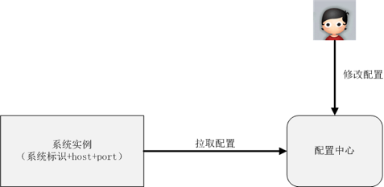

### 服务中心

当系统数量不多的时候，系统间的调用一般都是直接通过配置文件记录在各系统内部的，但当系统数量多了以后，这种方式就存在问题了。 

比如说总共有10个系统依赖A系统的X接口，A系统实现了一个新接口Y，能够更好地提供原有X接口的功能，如果要让已有的10个系统都切换到Y接口，则这10个系统的几十上百台机器的配置都要修改，然后重启，可想而知这个效率是很低的。

除此以外，如果A系统总共有20台机器，现在其中5台出故障了，其他系统如果是通过域名访问A系统，则域名缓存失效前，还是可能访问到这5台故障机器的；如果其他系统通过IP访问A系统，那么A系统每次增加或者删除机器，其他所有10个系统的几十上百台机器都要同步修改，这样的协调工作量也是非常大的。

服务中心就是为了解决上面提到的跨系统依赖的“配置”和“调度”问题。

服务中心的实现一般来说有两种方式：服务名字系统和服务总线系统。

1、服务名字系统（Service Name System）

看到这个翻译，相信你会立刻联想到DNS，即Domain Name System。没错，两者的性质是基本类似的。

DNS的作用将域名解析为IP地址，主要原因是我们记不住太多的数字IP，域名就容易记住。服务名字系统是为了将Service名称解析为“host + port + 接口名称”，但是和DNS一样，真正发起请求的还是请求方。

基本的设计如下：

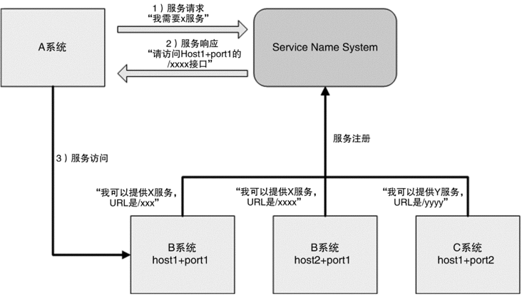

2、服务总线系统（Service Bus System）

相比服务名字系统，服务总线系统更进一步了：由总线系统完成调用，服务请求方都不需要直接和服务提供方交互了：

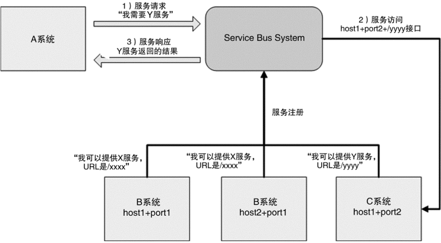

“服务名字系统”和“服务总线系统”简单对比如下表所示： 

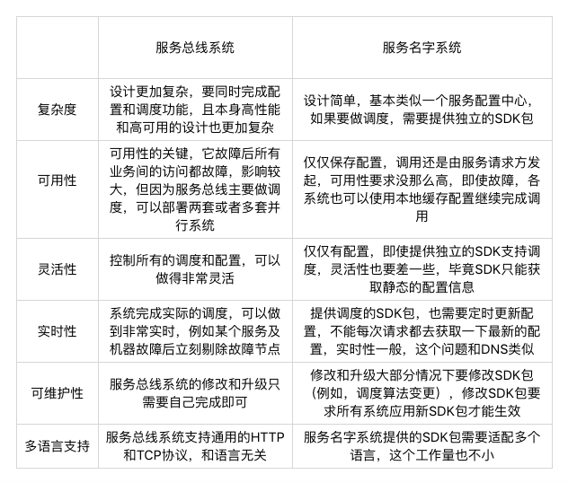

### 消息队列

互联网业务的一个特点是“快”，这就要求很多业务处理采用异步的方式。例如，大V发布一条微博后，系统需要发消息给关注的用户，我们不可能等到所有消息都发送给关注用户后再告诉大V说微博发布成功了，只能先让大V发布微博，然后再发消息给关注用户。

传统的异步通知方式是由消息生产者直接调用消息消费者提供的接口进行通知的，但当业务变得庞大，子系统数量增多时，这样做会导致系统间交互非常复杂和难以管理，因为系统间互相依赖和调用，整个系统的结构就像一张蜘蛛网，如下图所示：

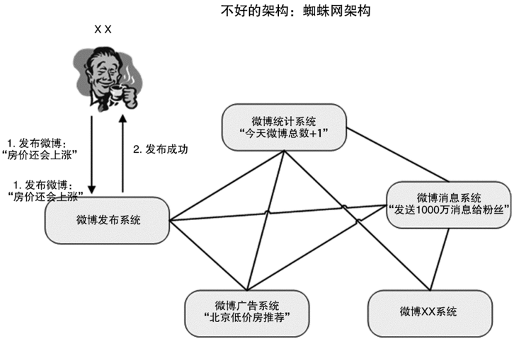

消息队列就是为了实现这种跨系统异步通知的中间件系统。消息队列既可以“一对一”通知，也可以“一对多”广播。以微博为例，可以清晰地看到异步通知的实现和作用，如下图所示：

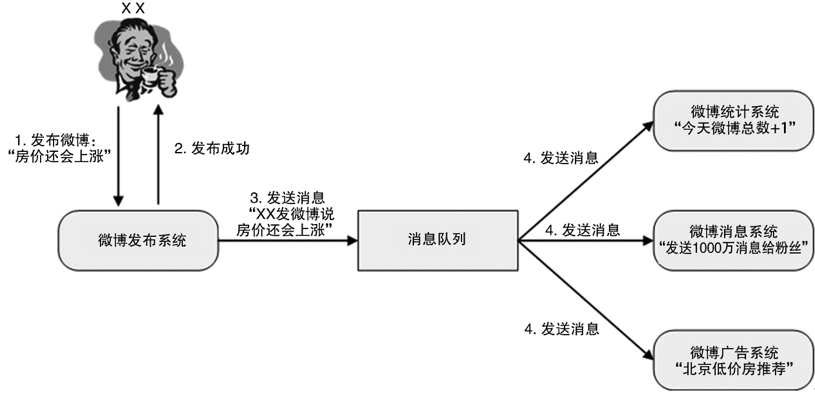

对比前面的蜘蛛网架构，可以清晰地看出引入消息队列系统后的效果：

- 整体结构从网状结构变为线性结构，结构清晰；
- 消息生产和消息消费解耦，实现简单；
- 增加新的消息消费者，消息生产者完全不需要任何改动，扩展方便；
- 消息队列系统可以做高可用、高性能，避免各业务子系统各自独立做一套，减轻工作量；
- 业务子系统只需要聚焦业务即可，实现简单。

消息队列系统基本功能的实现比较简单，但要做到高性能、高可用、消息时序性、消息事务性则比较难。业界已经有很多成熟的开源实现方案，如果要求不高，基本上拿来用即可，例如，RocketMQ、Kafka、ActiveMQ等。但如果业务对消息的可靠性、时序、事务性要求较高时，则要深入研究这些开源方案，否则很容易踩坑。

开源的用起来方便，但要改就很麻烦了。由于其相对比较简单，很多公司也会花费人力和时间重复造一个轮子，这样也有好处，因为可以根据自己的业务特点做快速的适配开发。

## 网络层技术

除了复杂度，互联网业务发展的另外两个关键特点是“高性能”和“高可用”。通常情况下，我们在设计高可用和高性能系统的时候，主要关注点在系统本身的复杂度，然后通过各种手段来实现高可用和高性能的要求。

但是当我们站在一个公司的的角度来思考架构的时候，单个系统的高可用和高性能并不等于整体业务的高可用和高性能，互联网业务的高性能和高可用需要从更高的角度去设计，这个高点就是“网络” 。注意这里的网络层和通常理解的如何搭建一个局域网这种概念不一样，这里强调的是站在网络层的角度整体设计架构，而不是某个具体网络的搭建。 

### 负载均衡

顾名思议，负载均衡就是将请求均衡地分配到多个系统上。使用负载均衡的原因也很简单：每个系统的处理能力是有限的，为了应对大容量的访问，必须使用多个系统。例如，一台32核64GB内存的机器，性能测试数据显示每秒处理Hello World的HTTP请求不超过2万，实际业务机器处理HTTP请求每秒可能才几百QPS，而互联网业务并发超过1万是比较常见的，遇到双十一、过年发红包这些极端场景，每秒可以达到几十万的请求。 

1、DNS

DNS是最简单也是最常见的负载均衡方式，一般用来实现地理级别的均衡。例如，北方的用户访问北京的机房，南方的用户访问广州的机房。一般不会使用DNS来做机器级别的负载均衡，因为太耗费IP资源了。例如，百度搜索可能要10000台以上机器，不可能将这么多机器全部配置公网IP，然后用DNS来做负载均衡。 

DNS负载均衡的优点是通用（全球通用）、成本低（申请域名，注册DNS即可），但缺点也比较明显，主要体现在： 

- DNS缓存的时间比较长，即使将某台业务机器从DNS服务器上删除，由于缓存的原因，还是有很多用户会继续访问已经被删除的机器。
- DNS不够灵活。DNS不能感知后端服务器的状态，只能根据配置策略进行负载均衡，无法做到更加灵活的负载均衡策略。比如说某台机器的配置比其他机器要好很多，理论上来说应该多分配一些请求给它，但DNS无法做到这一点。

所以对于时延和故障敏感的业务，有实力的公司可能会尝试实现HTTP-DNS的功能，即使用HTTP协议实现一个私有的DNS系统。HTTP-DNS主要应用在通过App提供服务的业务上，因为在App端可以实现灵活的服务器访问策略，如果是Web业务，实现起来就比较麻烦一些，因为URL的解析是由浏览器来完成的，只有Javascript的访问可以像App那样实现比较灵活的控制。

HTTP-DNS的优缺点有：

- 灵活：HTTP-DNS可以根据业务需求灵活的设置各种策略。
- 可控：HTTP-DNS是自己开发的系统，IP更新、策略更新等无需依赖外部服务商。
- 及时：HTTP-DNS不受传统DNS缓存的影响，可以非常快地更新数据、隔离故障。
- 开发成本高：没有通用的解决方案，需要自己开发。
- 侵入性：需要App基于HTTP-DNS进行改造。

2、Nginx 、LVS 、F5 

DNS用于实现地理级别的负载均衡，而Nginx、LVS、F5用于同一地点内机器级别的负载均衡。其中Nginx是软件的7层负载均衡，LVS是内核的4层负载均衡，F5是硬件的4层负载均衡。 

软件和硬件的区别就在于性能，硬件远远高于软件，Ngxin的性能是万级，一般的Linux服务器上装个Nginx大概能到5万/秒；LVS的性能是十万级，没有具体测试过，据说可达到80万/秒；F5性能是百万级，从200万/秒到800万/秒都有。硬件虽然性能高，但是单台硬件的成本也很高，一台最便宜的F5都是几十万，但是如果按照同等请求量级来计算成本的话，实际上硬件负载均衡设备可能会更便宜，例如假设每秒处理100万请求，用一台F5就够了，但用Nginx，可能要20台，这样折算下来用F5的成本反而低。因此通常情况下，如果性能要求不高，可以用软件负载均衡；如果性能要求很高，推荐用硬件负载均衡。 

4层和7层的区别就在于协议和灵活性。Nginx支持HTTP、E-mail协议，而LVS和F5是4层负载均衡，和协议无关，几乎所有应用都可以做，例如聊天、数据库等。 

目前很多云服务商都已经提供了负载均衡的产品，例如阿里云的SLB、UCloud的ULB等，中小公司直接购买即可。 

### CDN

CDN是为了解决用户网络访问时的“最后一公里”效应，本质上是一种“以空间换时间”的加速策略，即将内容缓存在离用户最近的地方，用户访问的是缓存的内容，而不是站点实时的内容。 

下面是简单的CDN请求流程示意图： 

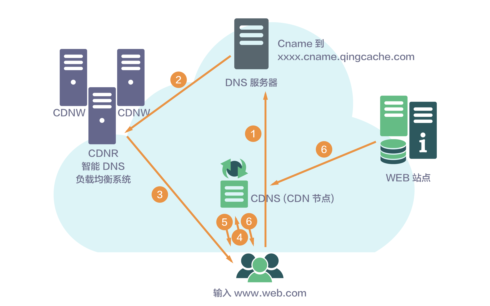

CDN经过多年的发展，已经变成了一个很庞大的体系：分布式存储、全局负载均衡、网络重定向、流量控制等都属于CDN的范畴，尤其是在视频、直播等领域，如果没有CDN，用户是不可能实现流畅观看内容的。

幸运的是，大部分程序员和架构师都不太需要深入理解CDN的细节，因为CDN作为网络的基础服务，独立搭建的成本巨大，很少有公司自己设计和搭建CDN系统，从CDN服务商购买CDN服务即可，目前有专门的CDN服务商，例如网宿和蓝汛；也有云计算厂家提供CDN服务，例如阿里云和腾讯云都提供CDN的服务。

### 多机房

从架构上来说，单机房就是一个全局的网络单点，在发生比较大的故障或者灾害时，单机房难以保证业务的高可用。例如，停电、机房网络中断、地震、水灾等都有可能导致一个机房完全瘫痪。 

多机房设计最核心的因素就是如何处理时延带来的影响，常见的策略有： 

* 同城多机房

  同一个城市多个机房，距离不会太远，可以投入重金，搭建私有的高速网络，基本上能够做到和同机房一样的效果。

  这种方式对业务影响很小，但投入较大，如果不是大公司，一般是承受不起的；而且遇到极端的地震、水灾等自然灾害，同城多机房也是有很大风险的。

* 跨城多机房

  在不同的城市搭建多个机房，机房间通过网络进行数据复制（例如，MySQL主备复制），但由于跨城网络时延的问题，业务上需要做一定的妥协和兼容，比如不需要数据的实时强一致性，只是保证最终一致性。

  例如，微博类产品，B用户关注了A用户，A用户在北京机房发布了一条微博，B在广州机房不需要立刻看到A用户发的微博，等10分钟看到也可以。

  这种方式实现简单，但和业务有很强的相关性，微博可以这样做，支付宝的转账业务就不能这样做，因为用户余额是强一致性的。

* 跨国多机房

  和跨城多机房类似，只是地理上分布更远，时延更大。由于时延太大和用户跨国访问实在太慢，跨国多机房一般仅用于备份和服务本国用户。 

### 多中心

多中心必须以多机房为前提，但从设计的角度来看，多中心相比多机房是本质上的飞越，难度也高出一个等级。 

简单来说，多机房的主要目标是灾备，当机房故障时，可以比较快速地将业务切换到另外一个机房，这种切换操作允许一定时间的中断（例如，10分钟、1个小时），而且业务也可能有损失（例如，某些未同步的数据不能马上恢复，或者要等几天才恢复，甚至永远都不能恢复了）。因此相比多机房来说，多中心的要求就高多了，要求每个中心都同时对外提供服务，且业务能够自动在多中心之间切换，故障后不需人工干预或者很少的人工干预就能自动恢复。 

多中心设计的关键就在于“数据一致性”和“数据事务性”如何保证，这两个难点都和业务紧密相关，目前没有很成熟的且通用的解决方案，需要基于业务的特性进行详细的分析和设计。以淘宝为例，淘宝对外宣称自己是多中心的，但是在实际设计过程中，商品浏览的多中心方案、订单的多中心方案、支付的多中心方案都需要独立设计和实现。 

正因为多中心设计的复杂性，不一定所有业务都能实现多中心，目前国内的银行、支付宝这类系统就没有完全实现多中心，不然也不会出现挖掘机一铲子下去，支付宝中断4小时的故障。 

## 用户层技术

### 用户管理

互联网业务的一个典型特征就是通过互联网将众多分散的用户连接起来，因此用户管理是互联网业务必不可少的一部分。

稍微大一点的互联网业务，肯定会涉及多个子系统，这些子系统不可能每个都管理这么庞大的用户，由此引申出用户管理的第一个目标：单点登录（SSO），又叫统一登录。单点登录的技术实现手段较多，例如cookie、JSONP、token等，目前最成熟的开源单点登录方案当属CAS，其架构如下：

除此之外，当业务做大成为了平台后，开放成为了促进业务进一步发展的手段，需要允许第三方应用接入，由此引申出用户管理的第二个目标：授权登录。现在最流行的授权登录就是OAuth 2.0协议，基本上已经成为了事实上的标准，如果要做开放平台，则最好用这个协议，私有协议漏洞多，第三方接入也麻烦。

用户管理系统面临的主要问题是用户数巨大，一般至少千万级，QQ、微信、支付宝这种巨无霸应用都是亿级用户。不过也不要被这个数据给吓倒了，用户管理虽然数据量巨大，但实现起来并不难，因为用户数据量虽然大，但是不同用户之间没有太强的业务关联，A用户登录和B用户登录基本没有关系。因此虽然数据量巨大，但我们用一个简单的负载均衡架构就能轻松应对。 

用户管理的基本架构如下： 

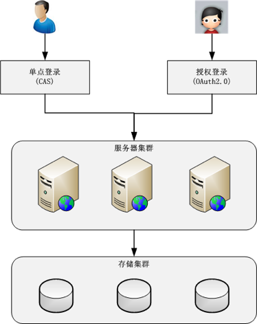

### 消息推送

消息推送根据不同的途径，分为短信、邮件、站内信、App推送。除了App，不同的途径基本上调用不同的API即可完成，技术上没有什么难度。例如，短信需要依赖运营商的短信接口，邮件需要依赖邮件服务商的邮件接口，站内信是系统提供的消息通知功能。 

App目前主要分为iOS和Android推送，iOS系统比较规范和封闭，基本上只能使用苹果的APNS；但Android就不一样了，在国外，用GCM和APNS差别不大；但是在国内，情况就复杂多了：首先是GCM不能用；其次是各个手机厂商都有自己的定制的Android，消息推送实现也不完全一样。因此Android的消息推送就五花八门了，大部分有实力的大厂，都会自己实现一套消息推送机制，例如阿里云移动推送、腾讯信鸽推送、百度云推送；也有第三方公司提供商业推送服务，例如友盟推送、极光推送等。 

通常情况下，对于中小公司，如果不涉及敏感数据，Android系统上推荐使用第三方推送服务，因为毕竟是专业做推送服务的，消息到达率是有一定保证的。 

如果涉及敏感数据，需要自己实现消息推送，这时就有一定的技术挑战了。消息推送主要包含3个功能：设备管理（唯一标识、注册、注销）、连接管理和消息管理，技术上面临的主要挑战有： 

- 海量设备和用户管理
   消息推送的设备数量众多，存储和管理这些设备是比较复杂的；同时，为了针对不同用户进行不同的业务推广，还需要收集用户的一些信息，简单来说就是将用户和设备关联起来，需要提取用户特征对用户进行分类或者打标签等。
- 连接保活
   要想推送消息必须有连接通道，但是应用又不可能一直在前台运行，大部分设备为了省电省流量等原因都会限制应用后台运行，限制应用后台运行后连接通道可能就被中断了，导致消息无法及时的送达。连接保活是整个消息推送设计中细节和黑科技最多的地方，例如应用互相拉起、找手机厂商开白名单等。
- 消息管理
   实际业务运营过程中，并不是每个消息都需要发送给每个用户，而是可能根据用户的特征，选择一些用户进行消息推送。由于用户特征变化很大，各种排列组合都有可能，将消息推送给哪些用户这部分的逻辑要设计得非常灵活，才能支撑花样繁多的业务需求，具体的设计方案可以采取规则引擎之类的微内核架构技术。

### 存储云/图片云

互联网业务场景中，用户会上传多种类型的文件数据，例如微信用户发朋友圈时上传图片，微博用户发微博时上传图片、视频，优酷用户上传视频，淘宝卖家上传商品图片等，这些文件具备几个典型特点： 

* 数据量大：用户基数大，用户上传行为频繁，例如2016年的时候微信朋友圈每天上传图片就达到了10亿张 
* 文件体积小：大部分图片是几百KB到几MB，短视频播放时间也是在几分钟内。
* 访问有时效性：大部分文件是刚上传的时候访问最多，随着时间的推移访问量越来越小。

为了满足用户的文件上传和存储需求，需要对用户提供文件存储和访问功能。简单来说，存储云和图片云通常的实现都是“CDN + 小文件存储”，现在有了“云”之后，除非BAT级别，一般不建议自己再重复造轮子了，直接买云服务可能是最快也是最经济的方式。 

既然存储云和图片云都是基于“CDN + 小文件存储”的技术，为何不统一一套系统，而将其拆分为两个系统呢？这是因为“图片”业务的复杂性导致的，普通的文件基本上提供存储和访问就够了，而图片涉及的业务会更多，包括裁剪、压缩、美化、审核、水印等处理，因此通常情况下图片云会拆分为独立的系统对用户提供服务。 

### 业务层技术

互联网的业务千差万别，不同的业务分解下来有不同的系统，所以业务层没有办法提炼一些公共的系统或者组件。抛开业务上的差异，各个互联网业务发展最终面临的问题都是类似的：业务复杂度越来越高。也就是说，业务层面对的主要技术挑战是“复杂度”。 

复杂度越来越高的一个主要原因就是系统越来越庞大，业务越来越多。主要的解决方法就是拆分，化整为零、分而治之，将整体复杂性分散到多个子业务或者子系统里面去。 

以一个简单的电商系统为例，如下图所示： 

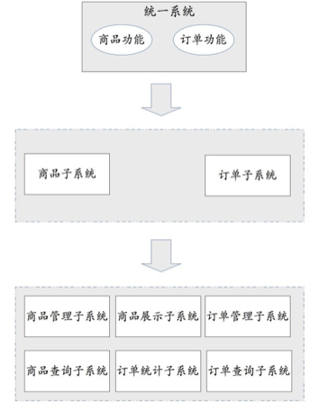

这个模拟的电商系统经历了3个发展阶段：

- 第一阶段：所有功能都在1个系统里面。
- 第二阶段：将商品和订单拆分到2个子系统里面。
- 第三阶段：商品子系统和订单子系统分别拆分成了更小的6个子系统。

上面只是个样例，实际上随着业务的发展，子系统会越来越多，据说淘宝内部大大小小的已经有成百上千的子系统了。 

随着子系统数量越来越多，如果达到几百上千，另外一个复杂度问题又会凸显出来：子系统数量太多，已经没有人能够说清楚业务的调用流程了，出了问题排查也会特别复杂。此时应该怎么处理呢，总不可能又将子系统合成大系统吧？最终答案还是“合”，正所谓“合久必分、分久必合”，但合的方式不一样，此时采取的“合”的方式是按照“高内聚、低耦合”的原则，将职责关联比较强的子系统合成一个虚拟业务域，然后通过网关对外统一呈现，类似于设计模式中的Facade模式。同样以电商为样例，采用虚拟业务域后，其架构如下：

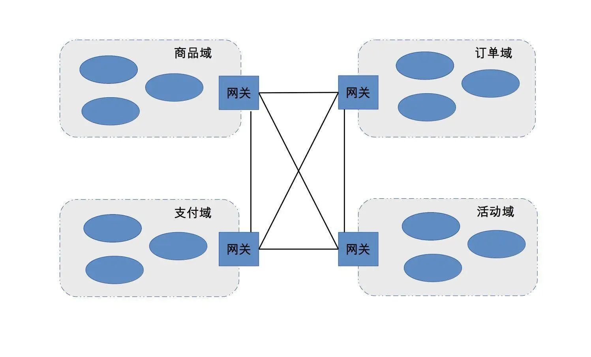

## 平台技术

当业务规模比较小、系统复杂度不高时，运维、测试、数据分析、管理等支撑功能主要由各系统或者团队独立完成。随着业务规模越来越大，系统复杂度越来越高，子系统数量越来越多，如果继续采取各自为政的方式来实现这些支撑功能，会发现重复工作非常多。因此我们自然而然就会想到将这些支撑功能做成平台，避免重复造轮子，减少不规范带来的沟通和协作成本。 

### 运维平台

运维平台核心的职责分为四大块：配置、部署、监控、应急，每个职责对应系统生命周期的一个阶段，如下图所示： 

- 配置：主要负责资源的管理。例如，机器管理、IP地址管理、虚拟机管理等。
- 部署：主要负责将系统发布到线上。例如，包管理、灰度发布管理、回滚等。
- 监控：主要负责收集系统上线运行后的相关数据并进行监控，以便及时发现问题。
- 应急：主要负责系统出故障后的处理。例如，停止程序、下线故障机器、切换IP等。

运维平台的核心设计要素是“四化”：标准化、平台化、自动化、可视化。 

1、标准化

需要制定运维标准，规范配置管理、部署流程、监控指标、应急能力等，各系统按照运维标准来实现，避免不同的系统不同的处理方式。标准化是运维平台的基础，没有标准化就没有运维平台。

如果某个系统就是无法改造自己来满足运维标准，此时可以不改造系统，由中间方来完成规范适配。例如，某个系统对外提供了RESTful接口的方式来查询当前的性能指标，而运维标准是性能数据通过日志定时上报，那么就可以写一个定时程序访问RESTful接口获取性能数据，然后转换为日志上报到运维平台。 

2、平台化

传统的手工运维方式需要投入大量人力，效率低，容易出错，因此需要在运维标准化的基础上，将运维的相关操作都集成到运维平台中，通过运维平台来完成运维工作。 

运维平台的好处有：

- 可以将运维标准固化到平台中，无须运维人员死记硬背运维标准。
- 运维平台提供简单方便的操作，相比之下人工操作低效且容易出错。
- 运维平台是可复用的，一套运维平台可以支撑几百上千个业务系统。

3、自动化

传统手工运维方式效率低下的一个主要原因就是要执行大量重复的操作，运维平台可以将这些重复操作固化下来，由系统自动完成。

例如，一次手工部署需要登录机器、上传包、解压包、备份旧系统、覆盖旧系统、启动新系统，这个过程中需要执行大量的重复或者类似的操作。有了运维平台后，平台需要提供自动化的能力，完成上述操作，部署人员只需要在最开始单击“开始部署”按钮，系统部署完成后通知部署人员即可。

类似的还有监控，有了运维平台后，运维平台可以实时收集数据并进行初步分析，当发现数据异常时自动发出告警，无须运维人员盯着数据看，或者写一大堆“grep + awk + sed”来分析日志才能发现问题。

4、可视化

运维平台有非常多的数据，如果全部通过人工去查询数据再来判断，则效率很低。尤其是在故障应急时，时间就是生命，处理问题都是争分夺秒，能减少1分钟的时间就可能挽回几十万元的损失，可视化的主要目的就是为了提升数据查看效率。

可视化的原理和汽车仪表盘类似，如果只是一连串的数字显示在屏幕上，相信大部分人一看到一连串的数字，第一感觉是眼花，而且也很难将数据与具体的情况联系起来。而有了仪表盘后，通过仪表盘的指针偏离幅度及指针指向的区域颜色，能够一目了然地看出当前的状态是低速、中速还是高速。

可视化相比简单的数据罗列，具备下面这些优点：

- 能够直观地看到数据的相关属性，例如，汽车仪表盘中的数据最小值是0，最大是100，单位是MPH。
- 能够将数据的含义展示出来，例如汽车仪表盘中不同速度的颜色指示。
- 能够将关联数据整合一起展示，例如汽车仪表盘的速度和里程。

### 测试平台

测试平台核心的职责是测试，包括单元测试、集成测试、接口测试、性能测试等，都可以在测试平台来完成。 

测试平台的核心目的是提升测试效率，从而提升产品质量，其设计关键就是自动化。传统的测试方式是测试人员手工执行测试用例，测试效率低，重复的工作多。通过测试平台提供的自动化能力，测试用例能够重复执行，无须人工参与，大大提升了测试效率。 

为了达到“自动化”的目标，测试平台的基本架构如下图所示： 

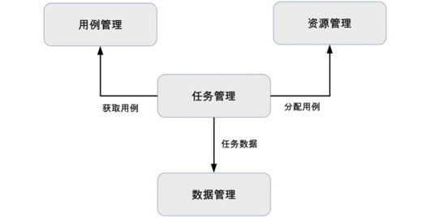

1、用例管理

测试自动化的主要手段就是通过脚本或者代码来进行测试，例如单元测试用例是代码、接口测试用例可以用Python来写、可靠性测试用例可以用Shell来写。为了能够重复执行这些测试用例，测试平台需要将用例管理起来，管理的维度包括业务、系统、测试类型、用例代码。例如，网购业务的订单系统的接口测试用例。 

2、资源管理

测试用例要放到具体的运行环境中才能真正执行，运行环境包括硬件（服务器、手机、平板电脑等）、软件（操作系统、数据库、Java虚拟机等）、业务系统（被测试的系统）。

除了性能测试，一般的自动化测试对性能要求不高，所以为了提升资源利用率，大部分的测试平台都会使用虚拟技术来充分利用硬件资源，如虚拟机、Docker等技术。

3、任务管理

任务管理的主要职责是将测试用例分配到具体的资源上执行，跟踪任务的执行情况。任务管理是测试平台设计的核心，它将测试平台的各个部分串联起来从而完成自动化测试。 

4、数据管理

测试任务执行完成后，需要记录各种相关的数据（例如，执行时间、执行结果、用例执行期间的CPU、内存占用情况等），这些数据具备下面这些作用：

- 展现当前用例的执行情况。
- 作为历史数据，方便后续的测试与历史数据进行对比，从而发现明显的变化趋势。例如，某个版本后单元测试覆盖率从90%下降到70%。
- 作为大数据的一部分，可以基于测试的任务数据进行一些数据挖掘。例如，某个业务一年执行了10000个用例测试，另外一个业务只执行了1000个用例测试，两个业务规模和复杂度差不多，却差异很大，可以探究下原因

### 数据平台

数据平台的核心职责主要包括三部分：数据管理、数据分析和数据应用。每一部分又包含更多的细分领域，详细的数据平台架构如下图所示： 

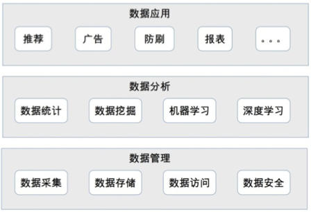

1、数据管理

数据管理包含数据采集、数据存储、数据访问和数据安全四个核心职责，是数据平台的基础功能。

- 数据采集：从业务系统搜集各类数据。例如，日志、用户行为、业务数据等，将这些数据传送到数据平台。
- 数据存储：将从业务系统采集的数据存储到数据平台，用于后续数据分析。
- 数据访问：负责对外提供各种协议用于读写数据。例如，SQL、Hive、Key-Value等读写协议。
- 数据安全：通常情况下数据平台都是多个业务共享的，部分业务敏感数据需要加以保护，防止被其他业务读取甚至修改，因此需要设计数据安全策略来保护数据。

2、数据分析

数据分析包括数据统计、数据挖掘、机器学习、深度学习等几个细分领域。

- 数据统计：根据原始数据统计出相关的总览数据。例如，PV、UV、交易额等。
- 数据挖掘：数据挖掘这个概念本身含义可以很广，为了与机器学习和深度学习区分开，这里的数据挖掘主要是指传统的数据挖掘方式。例如，有经验的数据分析人员基于数据仓库构建一系列规则来对数据进行分析从而发现一些隐含的规律、现象、问题等，经典的数据挖掘案例就是沃尔玛的啤酒与尿布的关联关系的发现。
- 机器学习、深度学习：机器学习和深度学习属于数据挖掘的一种具体实现方式，由于其实现方式与传统的数据挖掘方式差异较大，因此数据平台在实现机器学习和深度学习时，需要针对机器学习和深度学习独立进行设计。

3、数据应用

数据应用很广泛，既包括在线业务，也包括离线业务。例如，推荐、广告等属于在线应用，报表、欺诈检测、异常检测等属于离线应用。

数据应用能够发挥价值的前提是需要有“大数据”，只有当数据的规模达到一定程度，基于数据的分析、挖掘才能发现有价值的规律、现象、问题等。如果数据没有达到一定规模，通常情况下做好数据统计就足够了，尤其是很多初创企业，无须一开始就参考BAT来构建自己的数据平台。

### 管理平台

管理平台的核心职责就是权限管理，无论是业务系统（例如，淘宝网）、中间件系统（例如，消息队列Kafka），还是平台系统（例如，运维平台），都需要进行管理。如果每个系统都自己来实现权限管理，效率太低，重复工作很多，因此需要统一的管理平台来管理所有的系统的权限。

权限管理主要分为两部分：身份认证、权限控制，其基本架构如下图所示：

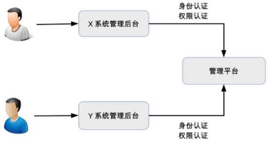

1、身份认证

确定当前的操作人员身份，防止非法人员进入系统。例如，不允许匿名用户进入系统。为了避免每个系统都自己来管理用户，通常情况下都会使用企业账号来做统一认证和登录。 

2、权限控制

根据操作人员的身份确定操作权限，防止未经授权的人员进行操作。例如，不允许研发人员进入财务系统查看别人的工资。 
