# 面向对象基础

## 对象和类

面向对象程序设计（Object-Oriented Programming， 缩写为OOP）是一种范式，其基本理念是将数据块及与数据相关的行为封装成为特殊的、名为对象的实体，同时对象实体的生成工作则是基于程序员给出的一系列“蓝图”，这些“蓝图”就是类。

下面就是一个URL类图：

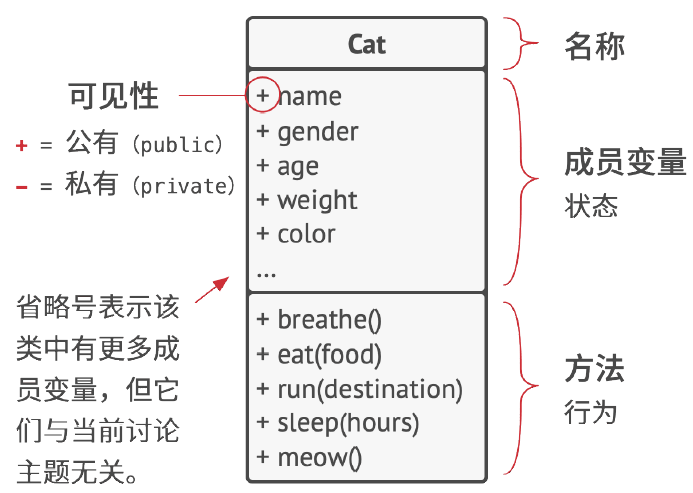

猫的各种基本属性组成这个类的成员变量，猫的行为组成这个类的方法。成员变量和方法可以统称为类的成员。存储在对象成员变量中的数据通常被称为状态，对象中的所有方法则定义了其行为。

对象是类的实例，下面就是两个对象，类就是定义对象结构的蓝图，对象是类的具体实例：

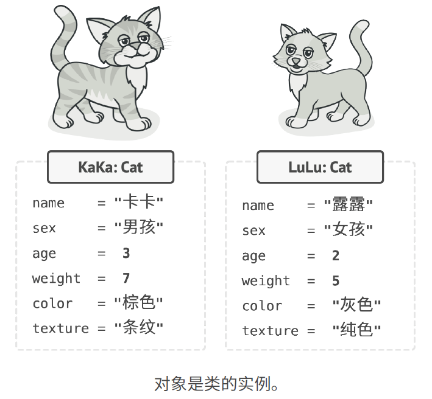

## 类层次结构

一个实际的程序可能包含多个类，一些类可能会组织起来形成类层次结构。

我们可定义一个动物Animal 基类来列出猫和狗所共有的属性和行为，这个类被称为超类，继承它的类被称为子类。子类会继承其父类的状态和行为，其中只需定义不同于父类的属性或行为。下面是一个类层次结构的UML图：

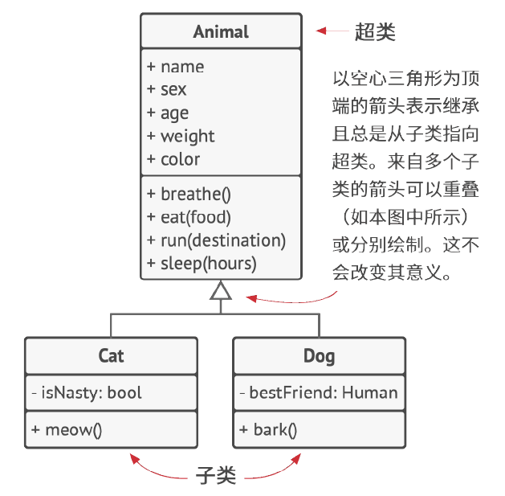

假如我们接到一个相关的业务需求，那就可以继续为所有活的生物体Organisms 抽取出一个更通用的类， 并将其作为动物和植物Plants 类的超类。这种由各种类组成的金字塔就是层次结构。在这个层次结构中， 猫类将继承动物和生物体类的全部内容。

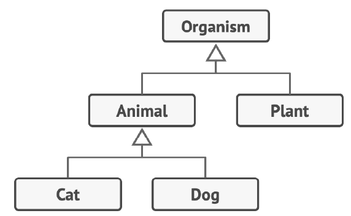

上图中没有展示类的具体属性和方法，如果展示类之间的关系比展示其内容更重要的话，那可对UML 图中的类进行简化。

子类可以对从父类中继承而来的方法的行为进行重写。子类可以完全替换默认行为，也可以仅提供额外内容来对其进行加强。

## 四个基本概念

面向对象程序设计的四个基本概念使其区别于其他程序设计范式。

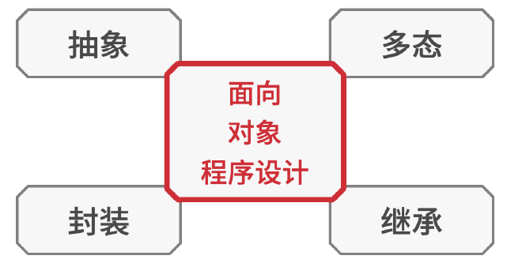

### 抽象

当使用面向对象程序设计的理念开发一款程序时，你会将大部分时间用于根据真实世界对象来设计程序中的对象。但是，程序中的对象并不需要能够百分之百准确地反映其原型（极少情况下才需要做到这一点）。实际上， 你的对象只需模拟真实对象的特定属性和行为即可，其他内容可以忽略。

例如， 飞行模拟器和航班预订程序中都可能会包含一个飞机Airplane 类。但是前者需包含与实际飞行相关的详细信息，而后者则只关心座位图和哪些座位可供预订，这就是同一个真实世界对象的不同模型：

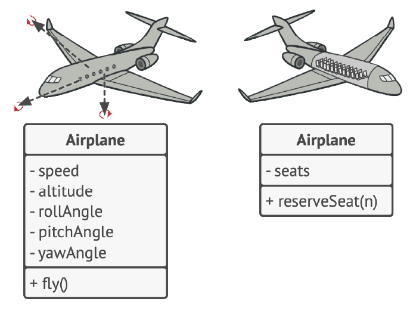

抽象是一种反映真实世界对象或现象中特定内容的模型，它能高精度地反映所有与特定内容相关的详细信息，同时忽略其他内容。

### 封装

如果想要启动一辆车的发动机，你只需转动钥匙或按下按钮即可，无需打开引擎盖手动接线、转动曲轴和气缸并启动发动机的动力循环。这些细节都隐藏在引擎盖下，你只会看到一些简单的接口：启动开关、方向盘和一些踏板。该示例讲述了什么是对象的接口——它是对象的公有部分， 能够同其他对象进行交互。

封装是指一个对象对其他对象隐藏其部分状态和行为，而仅向程序其他部分暴露有限的接口的能力。

绝大部分编程语言的接口和抽象类（或方法）都基于抽象和封装的概念。在现代面向对象的编程语言中，接口机制（通常使用interface 或protocol 关键字来声明）允许你定义对象之间的交互协议。接口仅关心对象行为，所以接口中不包含属性，不能声明成员变量。

接口（interface）这个词代表对象的公有部分，而在绝大部分编程语言中又有interface 类型，因此很容易造成混淆。

举一个例子说明编程语言中的interface 类型：

假如你的航空运输FlyingTransport 接口中有一个fly(origin, destination, passengers) 方法（即以起点、终点以及乘客为参数的飞行方法）。在设计航空运输模拟器时， 你可以对机场Airport 类做出限制， 使其仅与实现了航空运输接口的对象进行交互。此后， 你可以确保传递给机场对象的任何对象——无论是飞机、直升机Helicopter，还是可怕的家养狮鹫DomesticatedGryphon ——都能到达或离开这种类型的机场。

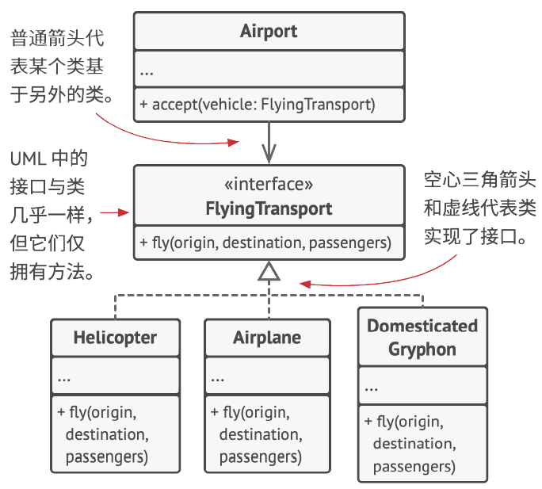

你可以任何方式更改这些类中fly 方法的实现方式。只要方法签名与接口中的声明保持一致，那么所有机场类的实例都能与飞行对象进行交互。

### 继承

继承是指在根据已有类创建新类的能力。继承最主要的好处是代码复用。如果你想要创建的类与已有的类差异不大，那也没必要重复编写相同的代码。你只需扩展已有的类并将额外功能放入生成的子类（它会继承父类的成员变量和方法）中即可。

使用继承后，子类将拥有与其父类相同的接口。如果父类中声明了某个方法，那么你将无法在子类中隐藏该方法。

你还必须实现所有的抽象方法，即使它们对于你的子类而言没有意义。

继承单个类和同时实现多个接口的 UML 图：

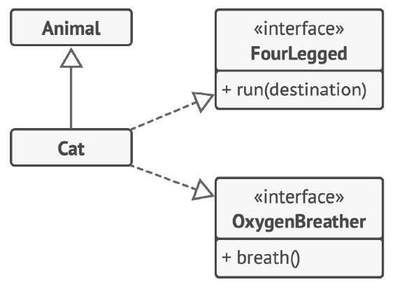

在绝大多数编程语言中，子类仅能对一个父类进行扩展。另一方面，任何类都可以同时实现多个接口。

### 多态

多态是指程序能够检测对象所属的实际类，并在当前上下文不知道其真实类型的情况下调用其实现的能力。

例如有下列这样的类关系：

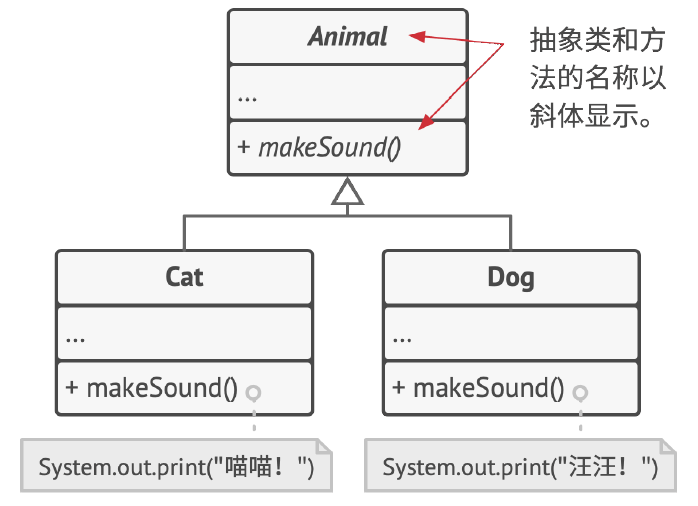

对于下列代码：

~~~
ag = [new Cat(), new Dog()];
foreach (Animal a : bag)
	a.makeSound()
~~~

程序并不知道a 变量中所包含的对象的具体类型， 但幸亏有被称为多态的特殊机制，程序可以追踪对象的子类并调用其方法，从而执行恰当的行为。

## 对象之间的关系

除了之前我们已见到的继承和实现之外，对象之间还有其他我们尚未提及的关系。

### 依赖

依赖是类之间最基础的、也是最微弱的关系类型。如果修改一个类的定义可能会造成另一个类的变化，那么这两个类之间就存在依赖关系。当你在代码中使用具体类的名称时，通常意味着存在依赖关系。例如在指定方法签名类型时，或是通过调用构造函数对对象进行初始化时等。通过让代码依赖接口或抽象类（而不是具体类），你可以降低其依赖程度。

通常情况下，UML 图不会展示所有依赖——它们在真实代码中的数量太多了。为了不让依赖关系破坏UML 图， 你必须对其进行精心选择，仅展示那些对于沟通你的想法来说重要的依赖关系。

### 关联

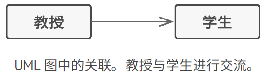

关联是一个对象使用另一对象或与另一对象进行交互的关系。在UML 图中， 关联关系用起始于一个对象并指向其所使用的对象的简单箭头来表示。顺带一提，双向关联也是完全正常的，这种情况就用双向箭头来表示。关联可视为一种特殊类型的依赖，即一个对象总是拥有访问与其交互的对象的权限，而简单的依赖关系并不会在对象间建立永久性的联系。

一般来说，你可以使用关联关系来表示类似于类成员变量的东西。这个关系将一直存在，因此你总能通过“订单”来获取其“顾客”。但是它并非一定是成员变量。如果你根据接口来创建类，它也可以表示为一个可返回“订单”的“顾客”的方法。

下面看一个讲解关联和依赖的例子，假设我们有一个名为教授（Professor）的类：

~~~
class Professor is
	field Student student
	// ...
	method teach(Course c) is
		// ...
		this.student.remember(c.getKnowledge())
~~~

对于teach （教授知识） 方法， 它将接收一个来自课程（Course）类的参数。如果有人修改了课程类的getKnowledge （获取知识） 方法（修改方法名或添加一些必须的参数等），代码将会崩溃。这就是依赖关系。

Professor内部有一个名为student的成员变量，在teach中还用了它的remember方法，我们可以肯定学生（Student） 类是教授类的依赖： 如果remember （记住）方法被修改， 教授的代码也将崩溃。但由于教授的所有方法总能访问student 成员变量，所以学生类就不仅是依赖，而也是关联了。

### 聚合

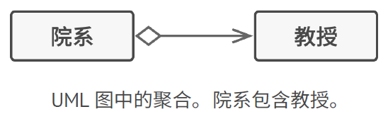

聚合是一种特殊类型的关联，用于表示多个对象之间的“一对多”、“多对多”或“整体对部分”的关系。通常在聚合关系中，一个对象“拥有”一组其他对象，并扮演着容器或集合的角色。组件可以独立于容器存在，也可以同时连接多个容器。在UML 图中， 聚合关系使用一端是空心菱形， 另一端指向组件的箭头来表示。

尽管我们在此讨论的是对象之间的关系，但请记住UML 图表示的是类之间的关系。这意味着大学对象可能是由多个院系构成的，即便图中的每个实体只用一个“方框”来表示。你可以使用UML 符号在关系两端标明数量， 但如果可从上下文明确数量的话，则可以省略此类标注。

### 组合

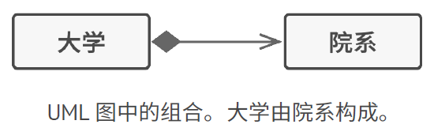

组合是一种特殊类型的聚合，其中一个对象由一个或多个其他对象实例构成。组合与其他关系的区别在于组件仅能作为容器的一部分存在。在UML 图中， 组合与聚合关系的符号相同，但箭头起始处的菱形是实心的。

### 总结

对象和类之间的关系：从弱到强

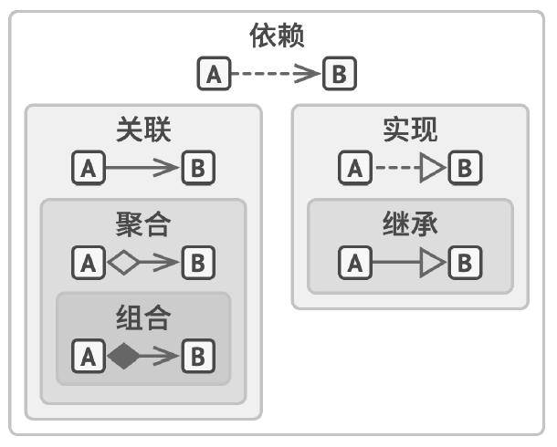

依赖：对类 B 进行修改会影响到类 A 。

关联：对象 A 知道对象 B。类 A 依赖于类 B。

聚合：对象 A 知道对象 B 且由 B 构成。类 A 依赖于类 B。B可以独立于A存在

组合：对象A 知道对象B、由B 构成而且管理着B 的生命周期。类 A 依赖于类 B。B无法独立于A存在

实现：类A 定义的方法由接口B 声明。对象A 可被视为对象B。类 A 依赖于类 B。

继承： 类A 继承类B 的接口和实现， 但是可以对其进行扩展。对象 A 可被视为对象 B。类 A 依赖于类 B。

# 软件设计原则

## 优秀设计的特征

### 代码复用

代码复用是减少开发成本时最常用的方式之一。其意图非常明显：与其反复从头开发，不如在新对象中重用已有代码。

复用有三个层次：

* 复用类：可能是类库、容器
* 复用设计模式：对一组类的关系及其互动方式的描述
* 复用框架：框架有自己的运行规则，可以构建类与框架建立联系

### 扩展性

变化是程序员生命中唯一不变的事情。

代码修改的原因有很多：

* 完成第一版程序后，对整个应用理解加深，想要重构代码
* 技术的更新被迫，例如依赖的技术更新，如在网络应用中使用Flash 的开发者都必须重新开发或移植代码， 因为不断地有浏览器停止对 Flash 格式的支持。
* 需求的改变

在设计程序架构时，所有有经验的开发者会尽量选择支持未来任何可能变更的方式。

## 设计原则

### 封装变化的内容

找到程序中的变化内容并将其与不变的内容区分开。

该原则的主要目的是将变更造成的影响最小化。

封装具体可分为方法层面的封装（将部分职责独立的代码抽取出一个方法）、类层面的封装（将代码提取到一个新类中，让职责变得更清晰）

### 面向接口，而不是面向实现

面向接口进行开发， 而不是面向实现； 依赖于抽象类型，而不是具体类。通过接口与对象交互要比依赖于其具体类的好处更多。

这个原则的好处是：提升设计的灵活性，如果无需修改已有代码就能轻松对类进行扩展

当你需要两个类进行合作时，可以让其中一个类依赖于另一个类。但是，你可用另外一种更灵活的方式来设置对象之间的合作关系：

* 确定一个对象对另一对象的确切需求：它需执行哪些方法？
* 在一个新的接口或抽象类中描述这些方法。
* 让被依赖的类实现该接口。
* 现在让有需求的类依赖于这个接口， 而不依赖于具体的类。你仍可与原始类中的对象进行互动，但现在其连接将会灵活得多。

例如下面的例子，：一只可以吃任何食物的猫Cat 要比只吃香肠的猫更加灵活。无论如何你都可给第一只猫喂香肠，因为香肠是“任何食物”的一个子集；当然，你也可以喂这只猫任何食物。

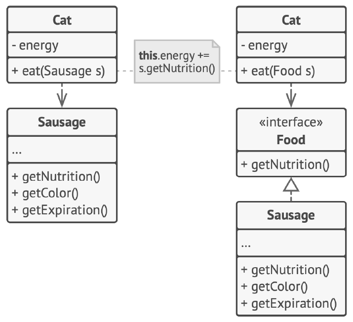

观察上图抽取接口前后的对比，右侧的代码要比左侧更加灵活，但也更加复杂。

假设你正在开发一款软件开发公司模拟器，而且使用了不同的类来代表各种类型的雇员。此时在公司类的createSoftware方法中，必须手动创建所有类，然后调用各自的方法，所有类都紧密耦合：

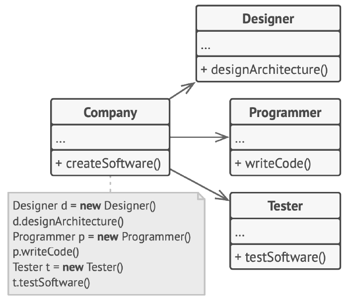

刚开始时， 公司Company 类与具体雇员类紧密耦合。尽管各个雇员的实现不尽相同，但我们还是可以归纳出几个与工作相关的方法，并且将其抽取为所有雇员的通用接口。此后， 我们可在公司类内应用多态机制， 通过雇员Employee 接口来处理各类雇员对象。

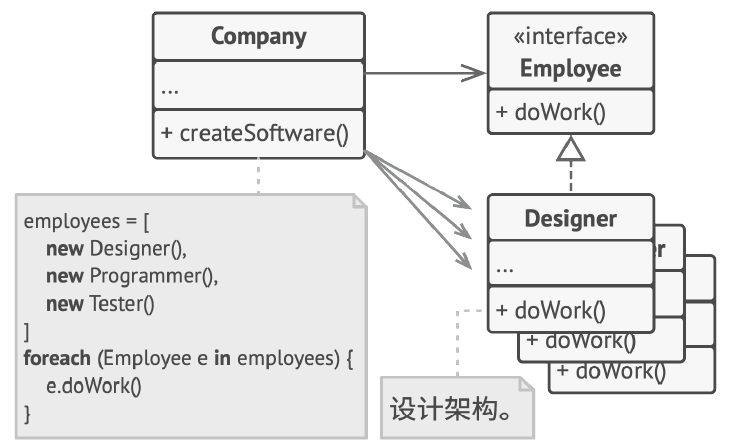

虽然多态机制能帮助我们简化代码，但是公司类的其他部分依然依赖于具体的实现类，如果引入包含其他类型雇员的公司类型的话，还是要修改公司类。

为了解决这个问题，我们可以声明一个抽象方法来获取雇员。每个具体公司都将以不同方式实现该方法，从而创建自己所需的雇员。

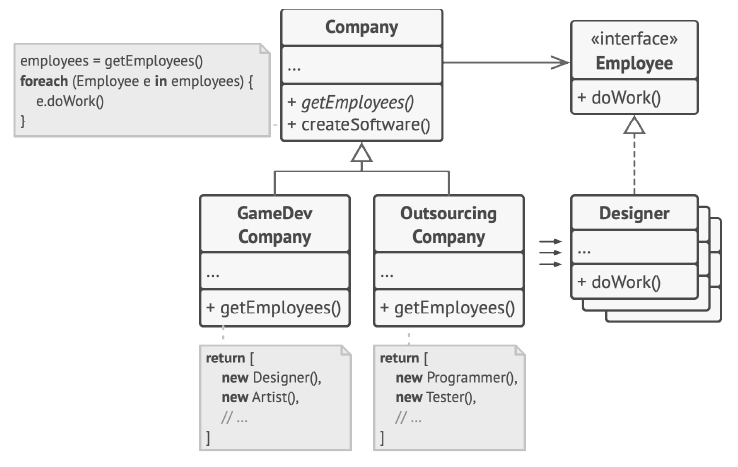

修改后，公司类将独立于各种雇员类。现在你可以对该类进行扩展，并在复用部分公司基类的情况下引入新的公司和雇员类型。对公司基类进行扩展时无需修改任何依赖于基类的已有代码。

上面的这个例子其实就是对设计模式的应用，这就是工厂方法模式的一个示例。

### 组合优于继承

继承可能是类之间最明显、最简便的代码复用方式。如果你有两个代码相同的类， 就可以为它们创建一个通用的基类，然后将相似的代码移动到其中。

不过，继承这件事通常只有在程序中已包含大量类，且修改任何东西都非常困难时才会引起关注。继承存在很多问题：

* 子类不能减少超类的接口：你必须实现父类中所有的抽象方法，即使它们没什么用。
* 在重写方法时，你需要确保新行为与其基类中的版本兼容
* 继承打破了超类的封装：因为子类拥有访问父类内部详细内容的权限。此外还可能会有相反的情况出现，那就是程序员为了进一步扩展的方便而让超类知晓子类的内部详细内容，两个方向都会破坏封装
* 子类与超类紧密耦合：超类中的任何修改都可能会破坏子类的功能
* 通过继承复用代码可能导致平行继承体系的产生。继承通常仅发生在一个维度中。只要出现了两个以上的维度，你就必须创建数量巨大的类组合，从而使类层次结构膨胀到不可思议的程度。

组合是代替继承的一种方法。继承代表类之间的“是”关系（汽车是交通工具），而组合则代表“有”关系（汽车有一个引擎）。

这个原则也能应用于聚合（一种更松弛的组合变体，一个对象可引用另一个对象，但并不管理其生命周期）。例如： 一辆汽车上有司机， 但是司机也可能会使用另一辆汽车，或者选择步行而不使用汽车。

假如你需要为汽车制造商创建一个目录程序。该公司同时生产汽车Car 和卡车Truck ， 车辆可能是电动车Electric 或汽油车Combustion ； 所有车型都配备了手动控制manual control 或自动驾驶Autopilot 功能。如果使用继承关系来描述，就要在多个维度上扩展子类，使类的数量激增：

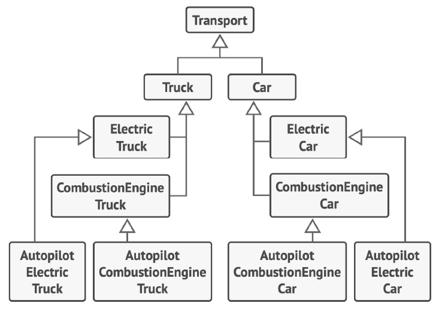

每个额外参数都将使子类数量倍增。子类中将有大量的重复代码，因为子类不能同时继承两个类。

你可以使用组合来解决这个问题，好处是：

* 汽车对象可将行为委派给其他对象，而不是自行实现。
* 可以在运行时对行为进行替换。例如，你可以通过重新为汽车对象分配一个不同的引擎对象来替换已连接至汽车的引擎。

下图就代表了组合，将不同“维度”的功能抽取到各自的类层次结构中：

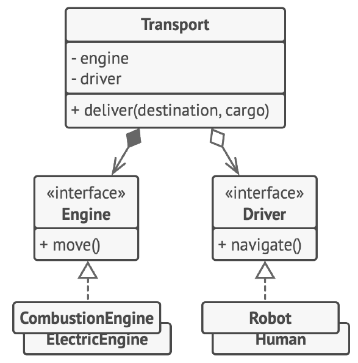

上述类的结构类似于策略模式。

## SOLID 原则

这五条原则是在罗伯特·马丁的著作《敏捷软件开发：原则、模式与实践1》中首次提出的。

SOLID 是让软件设计更易于理解、更加灵活和更易于维护的五个原则的简称。

与生活中所有事情一样，盲目遵守这些原则可能会弊大于利。在程序架构中应用这些原则可能会使其变得过于复杂。

### 单一职责原则

Single Responsibility Principle

修改一个类的原因只能有一个。尽量让每个类只负责软件中的一个功能，并将该功能完全封装（你也可称之为隐藏）在该类中。

这条原则的主要目的是减少复杂度。你不需要费尽心机地去构思如何仅用200 行代码来实现复杂设计，实际上完全可以使用十几个清晰的方法。

当类的规模越来越大的时候：

* 可读性变差，查找代码会变得非常缓慢
* 如果类负责的东西太多，那么当其中任何一件事发生改变时，你都必须对类进行修改

例如对下面的类而言，我们有几个理由来对雇员Employee 类进行修改。第一个理由与该类的主要工作（管理雇员数据）有关。但还有另一个理由：时间表报告的格式可能会随着时间而改变，从而使你需要对类中的代码进行修改。

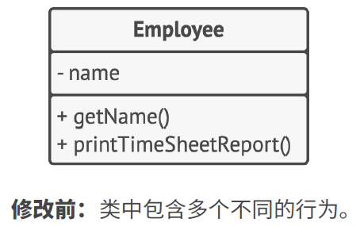

此时类中包含多个不同的行为，解决该问题的方法是将与打印时间表报告相关的行为移动到一个单独的类中。这个改变让你能将其他与报告相关的内容移动到一个新的类中。

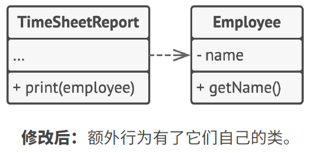

### 开闭原则

Open/closed Principle

对于扩展， 类应该是“开放”的； 对于修改， 类则应是“封闭”的。根据这条原则，一个类可以同时是“开放（对于扩展而言）”和“封闭（对于修改而言）”的。

本原则的主要理念是在实现新功能时能保持已有代码不变。

如果你可以对一个类进行扩展，可以创建它的子类并对其做任何事情（如新增方法或成员变量、重写基类行为等）， 那么它就是开放的。有些编程语言允许你通过特殊关键字（例如final ） 来限制对于类的进一步扩展， 这样类就不再是“开放”的了。

如果某个类已做好了充分的准备并可供其他类使用的话（即其接口已明确定义且以后不会修改）， 那么该类就是封闭（你可以称之为完整）的。

如果一个类已经完成开发、测试和审核工作，而且属于某个框架或者可被其他类的代码直接使用的话，对其代码进行修改就是有风险的。你可以创建一个子类并重写原始类的部分内容以完成不同的行为，而不是直接对原始类的代码进行修改。这样你既可以达成自己的目标，但同时又无需修改已有的原始类客户端。

例如你的电子商务程序中包含一个计算运输费用的订单Order类，该类中所有运输方法都以硬编码的方式实现。如果你需要添加一个新的运输方式，那就必须承担对订单类造成破坏的可能风险来对其进行修改：

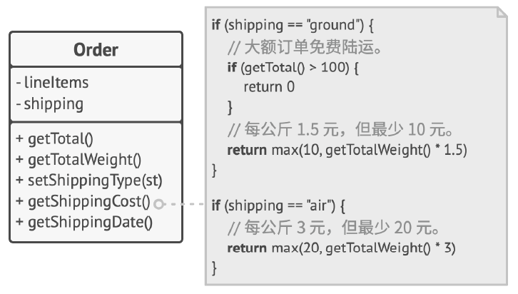

针对这个问题，应对办法是使用策略模式，首先将运输方法抽取到拥有同样接口的不同类中：

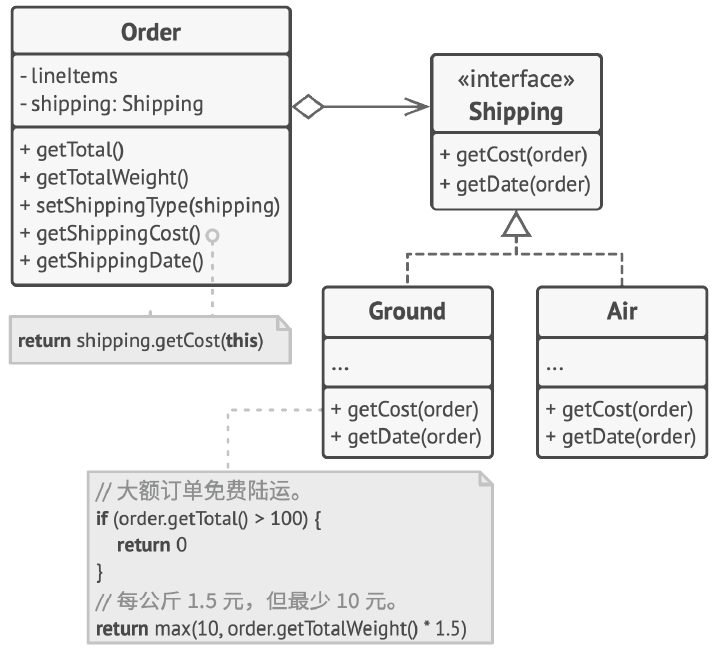

现在， 当需要实现一个新的运输方式时， 你可以通过扩展运输方式Shipping 接口来新建一个类， 无需修改任何订单类的代码。当用户在UI 中选择这种运输方式时，订单类客户端代码会将订单链接到新类的运输方式对象。

此外，根据单一职责原则，这个解决方案能够让你将运输时间的计算代码移动到与其相关度更高的类中。

### 里氏替换原则

Liskov Substitution Principle

当你扩展一个类时， 记住你应该要能在不修改客户端代码的情况下将子类的对象作为父类对象进行传递。

这意味着子类必须保持与父类行为的兼容。在重写一个方法时，你要对基类行为进行扩展，而不是将其完全替换。

替换原则是用于预测子类是否与代码兼容，以及是否能与其超类对象协作的一组检查。这一概念在开发程序库和框架时非常重要， 因为其中的类将会在他人的代码中使用。

替代原则包含一组对子类（特别是其方法）的形式要求：

* 子类方法的参数类型必须与其超类的参数类型相匹配或更加抽象

  例如，假设某个类有个方法用于给猫咪喂食： feed(Cat c) 。客户端代码总是会将“猫（cat）”对象传递给该方法。

  好的方式：创建子类重写了feed方法，使其能够给任何“动物（animal， 即‘猫’的超类）”喂食： feed(Animal c) 。如果现在你将一个子类对象而非超类对象传递给客户端代码，程序仍将正常工作。该方法可用于给任何动物喂食，因此它仍然可以用于给传递给客户端的任何“猫”喂食。

  不好的方式：创建子类重写了feed方法，限制喂食方法仅接受“孟加拉猫（BengalCat， 一个‘猫’ 的子类）”：feed(BengalCat c)  。如果用它来替代父类引用的地方，会破坏相关的功能

  实际上对Java而言，不同的参数类型（即使参数是子类和父类的关系）对应的是不同的方法，不会出现相互覆盖的情况

* 子类方法的返回值类型必须与超类方法的返回值类型或是其子类别相匹配。

  简单来说就是：子类重写父类的同名方法时，方法的返回值范围要更小。更糟糕的是，子类和父类相同方法的返回值类型截然不同，例如数字和字符串。

  实际上对Java而言，这一条规则已经内置其中，如果不满足都无法编译通过

* 子类中的方法不应抛出基础方法预期之外的异常类型。

  即：子类方法声明抛出的异常类应比父类方法声明抛出的异常类更小或相等，这也是Java的语法规则之一

  这一条的目的主要是保证客户端代码中针对父类异常声明的try-catch对子类也同样适用，不至于存在没有catch住的异常

* 子类不应该加强其前置条件。

  例如，基类的方法有一个int类型的参数。如果子类重写该方法时，要求传递给该方法的参数值必须为正数（如果该值为负则抛出异常）， 这就是加强了前置条件。客户端代码之前将负数传递给该方法时程序能够正常运行，但现在使用子类的对象时会使程序出错。

* 子类不能削弱其后置条件。

  和前一项相反，假如你的某个类中有个方法需要使用数据库，该方法应该在接收到返回值后关闭所有活跃的数据库连接。

  此时如果创建了一个子类并对其进行了修改，使得数据库保持连接以便重用。那客户端使用这段代码时就会出现问题，由于它认为该方法会关闭所有的连接，因此可能会在调用该方法后就马上关闭程序

* 超类的不变量必须保留

  不变量是让对象有意义的条件。例如，猫的不变量是有四条腿、一条尾巴和能够喵喵叫等。不变量既可以通过接口契约或者方法中的断言来明确，也可能暗含在特定的单元测试和客户代码预期中

  不变量的规则是最容易违反的，因为你可能会误解或没有意识到一个复杂类中的所有不变量。因此，扩展一个类的最安全做法是引入新的成员变量和方法，而不要去招惹超类中已有的成员。

* 子类不能修改超类中私有成员变量的值。

  有些编程语言允许通过反射机制来访问类的私有成员。还有一些语言（Python 和JavaScript）没有对私有成员进行任何保护。

下面是一个违反替换原则的文档类层次结构例子：

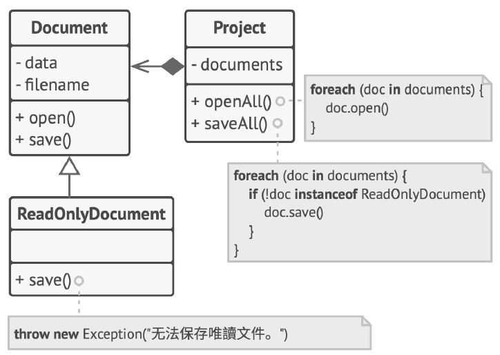

此时只读文件ReadOnlyDocuments 子类中的save 保存方法会在被调用时抛出一个异常。基础方法则没有这个限制。这意味着如果我们没有在保存前检查文档类型，客户端代码将会出错。代码也将违反开闭原则，因为客户端代码将依赖于具体的文档类。如果你引入了新的文档子类，则需要修改客户端代码才能对其进行支持。

修改后：

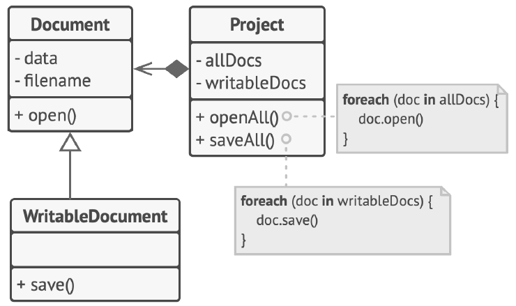

可以通过重新设计类层次结构来解决这个问题，让更强大的可写文件来继承文件类，并扩展save方法，save方法就不必定义在父类中了。

### 接口隔离原则

Interface Segregation Principle

客户端不应被强迫依赖于其不使用的方法。

根据接口隔离原则，应该将接口中多余的方法拆分出去生成新的接口，客户端按照各自需求实现不同的接口。否则客户端实现接口时可能被迫实现不需要的方法，导致程序出错。

假如你创建了一个程序库，它能让程序方便地与多种云计算供应商进行整合。尽管最初版本仅支持阿里云服务，但它也覆盖了一套完整的云服务和功能。假设所有云服务供应商都与阿里云一样提供相同种类的功能。但当你着手为其他供应商提供支持时，程序库中绝大部分的接口会显得过于宽泛。其他云服务供应商没有提供部分方法所描述的功能。

此时不是所有客户端能满足复杂接口的要求。尽管你仍然可以去实现这些方法并放入一些桩代码，但这绝不是优良的解决方案。更好的方法是将接口拆分为多个部分。能够实现原始接口的类现在只需改为实现多个精细的接口即可。其他类则可仅实现对自己有意义的接口。

修改后的方案如下，一个复杂的接口被拆分为一组颗粒度更小的接口。

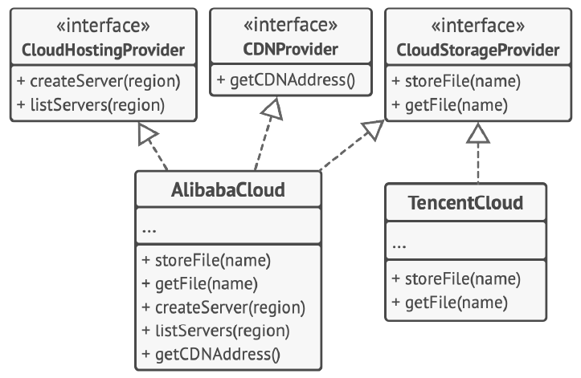

不要过度使用这条原则，不要进一步划分已经非常具体的接口。创建的接口越多，代码就越复杂。

### 依赖倒置原则

Dependency Inversion Principle

高层次的类不应该依赖于低层次的类。两者都应该依赖于抽象接口。抽象接口不应依赖于具体实现。具体实现应该依赖于抽象接口。

通常在设计软件时，你可以辨别出不同层次的类：

* 低层次的类实现基础操作（例如磁盘操作、传输网络数据和连接数据库等）。
* 高层次类包含复杂业务逻辑以指导低层次类执行特定操作。

有时人们会先设计低层次的类， 然后才会开发高层次的类。当你在新系统上开发原型产品时，这种情况很常见，因为此时还无法确定高层次类需要实现的功能，如果采用这种方式，业务逻辑类可能会更依赖于低层原语类。

依赖倒置原则建议改变这种依赖方式。依赖倒置原则通常和开闭原则共同发挥作用：你无需修改已有类就能用不同的业务逻辑类扩展低层次的类。

下面的例子中，高层次的预算报告类（BudgetReport）使用低层次的数据库类（MySQLDatabase）来读取和保存其数据。这意味着低层次类中的任何改变（例如当数据库服务器发布新版本时）都可能会影响到高层次的类，但高层次的类不应关注数据存储的细节。此时，高层次的类依赖于低层次的类。

要解决这个问题，你可以创建一个描述读写操作的高层接口，并让报告类使用该接口代替低层次的类。然后你可以修改或扩展低层次的原始类来实现业务逻辑声明的读写接口。修改后的方案如下，此时低层次的类依赖于高层次的抽象。

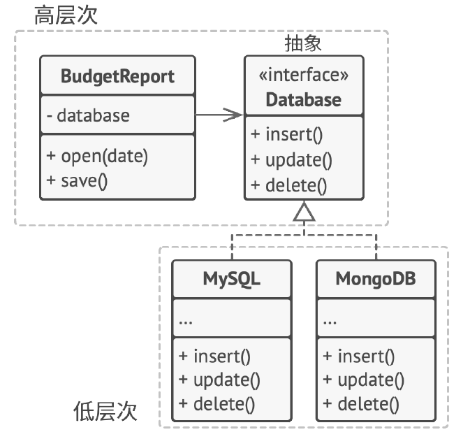

## 面向对象的七大设计原则

面向对象的七大设计原则：SOLID原则+合成复用原则+迪米特法则

合成复用原则：尽量使用聚合和组合来达到复用，少用继承

迪米特法则：一个软件实体应该尽可能少的和其他实体发生相互作用，这一条强调的是降低类之间的耦合

# 设计模式

设计模式是软件设计中常见问题的典型解决方案。它们就像能根据需求进行调整的预制蓝图，可用于解决代码中反复出现的设计问题。

模式并不是一段特定的代码，而是解决特定问题的一般性概念。你可以根据模式来实现符合自己程序实际所需的解决方案。

人们常常会混淆模式和算法，因为两者在概念上都是已知特定问题的典型解决方案。但算法总是明确定义达成特定目标所需的一系列步骤，而模式则是对解决方案的更高层次描述。同一模式在两个不同程序中的实现代码可能会不一样。

算法更像是菜谱：提供达成目标的明确步骤。而模式更像是蓝图：你可以看到最终的结果和模式的功能，但需要自己确定实现步骤。

设计模式是面向对象设计中常见问题的典型解决方案。同样的解决方案在各种项目中得到了反复使用，所以最终有人给它们起了名字，并对其进行了详细描述。

模式的概念是由克里斯托佛·亚历山大在其著作《建筑模式语言》中首次提出的。本书介绍了城市设计的“语言”，而该语言的基本单元就是模式。

埃里希·伽玛、约翰·弗利赛德斯、拉尔夫·约翰逊和理查德·赫尔姆这四位作者接受了模式的概念。1994 年， 他们出版了《设计模式： 可复用面向对象软件的基础1》一书， 将设计模式的概念应用到程序开发领域中。该书提供了23 个模式来解决面向对象程序设计中的各种问题，很快便成为了畅销书。由于书名太长， 人们将其简称为“四人组（Gang of Four，GoF）的书”，并且很快进一步简化为“GoF 的书”。

大部分模式的描述都会遵循特定的形式，以便在不同情况下使用。模式的描述通常会包括以下部分：

* 意图部分简要地描述问题和解决方案。
* 动机部分进一步解释问题并说明模式会如何提供解决方案。
* 结构部分展示模式的各个部分和它们之间的关系。
* 在不同语言中的实现提供流行编程语言的代码，让读者更好地理解模式背后的思想。

设计模式的三种主要模式类别：

* 创建型模式提供创建对象的机制，增加已有代码的灵活性和可复用性。
* 结构型模式介绍如何将对象和类组装成较大的结构，并同时保持结构的灵活和高效。
* 行为模式负责对象间的高效沟通和职责委派。

# 创建型模式

创建型模式提供了创建对象的机制，能够提升已有代码的灵活性和可复用性。

## 工厂方法模式

### 核心思想

工厂方法也被称为：虚拟构造函数、Virtual Constructor、Factory Method

工厂方法模式是一种创建型设计模式， 其在父类中提供一个创建对象的方法， 允许子类决定实例化对象的类型。

假设你正在开发一款物流管理应用。 最初版本只能处理卡车运输， 因此大部分代码都在位于名为 卡车的类中。一段时间后， 这款应用变得极受欢迎。 你每天都能收到十几次来自海运公司的请求， 希望应用能够支持海上物流功能。 

要兼容新的功能并不容易，因为目前大部分代码都与 卡车类相关。 在程序中添加 轮船类需要修改全部代码。 更糟糕的是， 如果你以后需要在程序中支持另外一种运输方式， 很可能需要再次对这些代码进行大幅修改。最后， 你将不得不编写繁复的代码， 根据不同的运输对象类， 在应用中进行不同的处理。

工厂方法模式建议使用特殊的工厂方法代替对于对象构造函数的直接调用，对象仍将通过 new运算符创建， 只是该运算符改在工厂方法中调用罢了。采用这种模式，可以在子类中重写工厂方法， 从而改变其创建产品的类型：

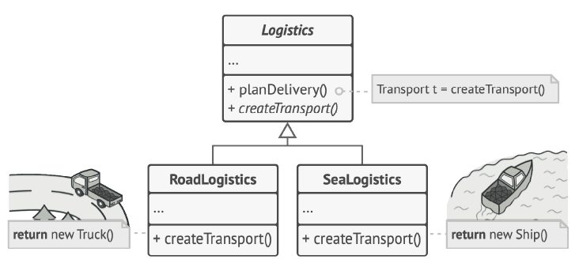

但有一点需要注意:仅当这些产品具有共同的基类或者接口时， 子类才能返回不同类型的产品， 同时基类中的工厂方法还应将其返回类型声明为这一共有接口：

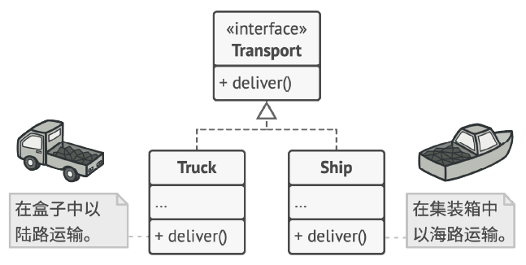

举例来说，卡车Truck和 轮船Ship类都必须实现 运输Transport接口， 该接口声明了一个名为 deliver交付的方法。 每个类都将以不同的方式实现该方法： 

* 卡车走陆路交付货物
* 轮船走海路交付货物 

陆路运输Road­Logistics类中的工厂方法返回卡车对象， 而 海路运输Sea­Logistics类则返回轮船对象。

调用工厂方法的代码 （通常被称为客户端代码） 无需了解不同子类返回实际对象之间的差别。 客户端将所有产品视为抽象的 运输 （Transport接口）。 客户端知道所有运输对象都提供 交付方法（deliver方法）， 但是并不关心其具体实现方式。

### 模式结构

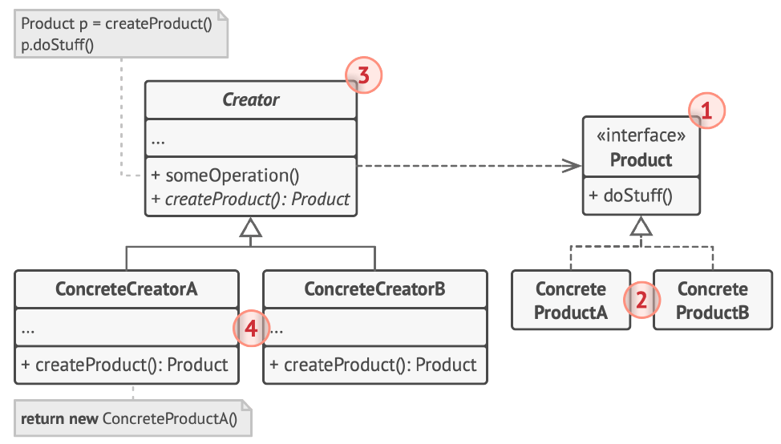

1、产品 （Product） 将会对接口进行声明。 对于所有由创建者及其子类构建的对象， 这些接口都是通用的。

2、具体产品 （Concrete Products） 是产品接口的不同实现。

3、创建者 （Creator） 类声明返回产品对象的工厂方法。 该方法的返回对象类型必须与产品接口相匹配。可以将工厂方法声明为抽象方法， 强制要求每个子类以不同方式实现该方法。 或者， 你也可以在基础工厂方法中返回默认产品类型。 

注意， 尽管它的名字是创建者， 但它最主要的职责并不是创建产品。一般来说， 创建者类包含一些与产品相关的核心业务逻辑。 工厂方法将这些逻辑处理从具体产品类中分离出来。 打个比方， 大型软件开发公司拥有程序员培训部门。 但是， 这些公司的主要工作还是编写代码， 而非生产程序员。 

4、具体创建者 （Concrete Creators） 将会重写基础工厂方法， 使其返回不同类型的产品。

注意， 并不一定每次调用工厂方法都会创建新的实例。 工厂方法也可以返回缓存、 对象池或其他来源的已有对象。

### 实现方式

1. 让所有产品都遵循同一接口。 该接口必须声明对所有产品都有意义的方法。

2. 在创建类中添加一个空的工厂方法。 该方法的返回类型必须遵循通用的产品接口。

3. 在创建者代码中找到对于产品构造函数的所有引用。 将它们依次替换为对于工厂方法的调用， 同时将创建产品的代码移入工厂方法。 

   你可能需要在工厂方法中添加临时参数来控制返回的产品类型。 

   工厂方法的代码看上去可能非常糟糕。 其中可能会有复杂的 switch分支运算符， 用于选择各种需要实例化的产品类。 

4. 为工厂方法中的每种产品编写一个创建者子类， 然后在子类中重写工厂方法， 并将基本方法中的相关创建代码移动到工厂方法中。 

5. 如果应用中的产品类型太多， 那么为每个产品创建子类并无太大必要， 这时你也可以在子类中复用基类中的控制参数。 

   ​例如， 设想你有以下一些层次结构的类。 基类 邮件及其子类 航空邮件和 陆路邮件 ；  运输及其子类 飞机, 卡车和 火车 。  航空邮件仅使用 飞机对象， 而 陆路邮件则会同时使用 卡车和 火车对象。 你可以编写一个新的子类 （例如 火车邮件 ） 来处理这两种情况， 但是还有其他可选的方案。 客户端代码可以给 陆路邮件类传递一个参数， 用于控制其希望获得的产品。

6. 如果代码经过上述移动后， 基础工厂方法中已经没有任何代码， 你可以将其转变为抽象类。 如果基础工厂方法中还有其他语句， 你可以将其设置为该方法的默认行为。

### 代码示例

核心 Java 程序库中有该模式的应用： 

* java.util.Calendar#getInstance()
* java.util.ResourceBundle#getBundle()
* java.text.NumberFormat#getInstance()
* java.nio.charset.Charset#forName()
* java.net.URLStreamHandlerFactory#createURLStreamHandler(String) （根据协议返回不同的单例对象）
* java.util.EnumSet#of()
* javax.xml.bind.JAXBContext#createMarshaller() 及其他类似的方法。

识别方法： 工厂方法可通过构建方法来识别， 它会创建具体类的对象， 但以抽象类型或接口的形式返回这些对象。

以下示例演示了如何使用工厂方法开发跨平台 UI （用户界面） 组件， 并同时避免客户代码与具体 UI 类之间的耦合。

基础对话框类使用不同的 UI 组件渲染窗口。 在不同的操作系统下， 这些组件外观或许略有不同， 但其功能保持一致。 Windows 系统中的按钮在 Linux 系统中仍然是按钮。 如果使用工厂方法， 就不需要为每种操作系统重写对话框逻辑。 如果我们声明了一个在基本对话框类中生成按钮的工厂方法， 那么我们就可以创建一个对话框子类， 并使其通过工厂方法返回 Windows 样式按钮。 子类将继承对话框基础类的大部分代码， 同时在屏幕上根据 Windows 样式渲染按钮。 

如需该模式正常工作， 基础对话框类必须使用抽象按钮 （例如基类或接口）， 以便将其扩展为具体按钮。 这样一来， 无论对话框中使用何种类型的按钮， 其代码都可以正常工作。 

通用产品接口Button：

~~~java
/**
 * Common interface for all buttons.
 */
public interface Button {
    void render();
    void onClick();
}
~~~

具体产品：HtmlButton和WindowsButton 

~~~java
/**
 * HTML button implementation.
 */
public class HtmlButton implements Button {

    public void render() {
        System.out.println("<button>Test Button</button>");
        onClick();
    }

    public void onClick() {
        System.out.println("Click! Button says - 'Hello World!'");
    }
}
~~~

~~~java
/**
 * Windows button implementation.
 */
public class WindowsButton implements Button {
    JPanel panel = new JPanel();
    JFrame frame = new JFrame();
    JButton button;

    public void render() {
        frame.setDefaultCloseOperation(JFrame.EXIT_ON_CLOSE);
        JLabel label = new JLabel("Hello World!");
        label.setOpaque(true);
        label.setBackground(new Color(235, 233, 126));
        label.setFont(new Font("Dialog", Font.BOLD, 44));
        label.setHorizontalAlignment(SwingConstants.CENTER);
        panel.setLayout(new FlowLayout(FlowLayout.CENTER));
        frame.getContentPane().add(panel);
        panel.add(label);
        onClick();
        panel.add(button);

        frame.setSize(320, 200);
        frame.setVisible(true);
        onClick();
    }

    public void onClick() {
        button = new JButton("Exit");
        button.addActionListener(new ActionListener() {
            public void actionPerformed(ActionEvent e) {
                frame.setVisible(false);
                System.exit(0);
            }
        });
    }
}
~~~

基础创建者Dialog：

~~~java
/**
 * Base factory class. Note that "factory" is merely a role for the class. It
 * should have some core business logic which needs different products to be
 * created.
 */
public abstract class Dialog {

    public void renderWindow() {
        // ... other code ...

        Button okButton = createButton();
        okButton.render();
    }

    /**
     * Subclasses will override this method in order to create specific button
     * objects.
     */
    public abstract Button createButton();
}
~~~

具体创建者：HtmlDialog和WindowsDialog

~~~java
/**
 * HTML Dialog will produce HTML buttons.
 */
public class HtmlDialog extends Dialog {

    @Override
    public Button createButton() {
        return new HtmlButton();
    }
}
~~~

~~~java
/**
 * Windows Dialog will produce Windows buttons.
 */
public class WindowsDialog extends Dialog {

    @Override
    public Button createButton() {
        return new WindowsButton();
    }
}
~~~

客户端代码：

~~~java
/**
 * Demo class. Everything comes together here.
 */
public class Demo {
    private static Dialog dialog;

    public static void main(String[] args) {
        configure();
        runBusinessLogic();
    }

    /**
     * The concrete factory is usually chosen depending on configuration or
     * environment options.
     */
    static void configure() {
        if (System.getProperty("os.name").equals("Windows 10")) {
            dialog = new WindowsDialog();
        } else {
            dialog = new HtmlDialog();
        }
    }

    /**
     * All of the client code should work with factories and products through
     * abstract interfaces. This way it does not care which factory it works
     * with and what kind of product it returns.
     */
    static void runBusinessLogic() {
        dialog.renderWindow();
    }
}
~~~

### 适用场景

1、编写代码的过程中， 如果无法预知对象确切类别及其依赖关系时， 可使用工厂方法。

工厂方法将创建产品的代码与实际使用产品的代码分离， 从而能在不影响其他代码的情况下扩展产品创建部分代码。 例如， 如果需要向应用中添加一种新产品， 你只需要开发新的创建者子类， 然后重写其工厂方法即可。 

2、如果你希望用户能扩展你软件库或框架的内部组件， 可使用工厂方法。

框架中的代码都是固定的，扩展的方法就是适用工厂方法，将各框架中构造组件的代码集中到单个工厂方法中， 并在继承该组件之外允许任何人对该方法进行重写。 

假设你使用开源 UI 框架编写自己的应用。 你希望在应用中使用圆形按钮， 但是原框架仅支持矩形按钮。 你可以使用 圆形按钮Round­Button子类来继承标准的 按钮Button类。 但是， 你需要告诉 UI框架UIFramework类使用新的子类按钮代替默认按钮。为了实现这个功能， 你可以根据基础框架类开发子类 圆形按钮 UIUIWith­Round­Buttons ， 并且重写其 create­Button创建按钮方法。 基类中的该方法返回 按钮对象， 而你开发的子类返回 圆形按钮对象。 现在， 你就可以使用 圆形按钮 UI类代替 UI框架类。 

3、希望复用现有对象来节省系统资源， 而不是每次都重新创建对象， 可使用工厂方法。

在处理大型资源密集型对象 （比如数据库连接、 文件系统和网络资源） 时， 会经常碰到这种资源需求，考虑复用现有对象的方法： 

* 首先， 你需要创建存储空间来存放所有已经创建的对象。
* 当他人请求一个对象时， 程序将在对象池中搜索可用对象。
* … 然后将其返回给客户端代码。
* 如果没有可用对象， 程序则创建一个新对象 （并将其添加到对象池中）。

这些代码最好处于同一处，这样才能确保重复代码不会污染程序。 最方便的方式， 就是将这些代码放置在我们试图重用的对象类的构造函数中。 但是从定义上来讲， 构造函数始终返回的是新对象， 其无法返回现有实例。因此， 你需要有一个既能够创建新对象， 又可以重用现有对象的普通方法。 这听上去和工厂方法非常相像。 

### 优缺点

优点：

* 可以避免创建者和具体产品之间的紧密耦合。 
* 单一职责原则。 你可以将产品创建代码放在程序的单一位置， 从而使得代码更容易维护。
* 开闭原则。 无需更改现有客户端代码， 你就可以在程序中引入新的产品类型。

缺点：

* 应用工厂方法模式需要引入许多新的子类， 代码可能会因此变得更复杂。 最好的情况是将该模式引入创建者类的现有层次结构中。

### 与其他模式的关系

* 工厂方法模式和其他创建型模式的关系：

  在许多设计工作的初期都会使用工厂方法模式 （较为简单， 而且可以更方便地通过子类进行定制）， 随后演化为使用抽象工厂模式、 原型模式或生成器模式 （更灵活但更加复杂）。

* 工厂方法模式和迭代器模式的结合：可以同时使用工厂方法和迭代器模式来让子类集合返回不同类型的迭代器， 并使得迭代器与集合相匹配。
* 工厂方法模式和原型模式的对比：
  * 原型并不基于继承， 因此没有继承的缺点。 另一方面， 原型需要对被复制对象进行复杂的初始化。 
  * 工厂方法基于继承， 但是它不需要初始化步骤。
* 工厂方法模式和模板方法模式的对比：工厂方法是模板方法模式的一种特殊形式。 同时， 工厂方法可以作为一个大型模板方法中的一个步骤。

## 抽象工厂模式

### 核心思想

也被称为Abstract Factory ，抽象工厂模式是一种创建型设计模式， 它能创建一系列相关的对象， 而无需指定其具体类。

抽象工厂定义了用于创建不同产品的接口， 但将实际的创建工作留给了具体工厂类。 每个工厂类型都对应一个特定的产品变体。 客户端代码仅通过其抽象接口与工厂和产品进行交互。 该接口允许同一客户端代码与不同产品进行交互。 你只需创建一个具体工厂类并将其传递给客户端代码即可。 

假设你正在开发一款家具商店模拟器。 你的代码中包括一些类， 用于表示： 

* 一系列相关产品， 例如 椅子Chair 、 沙发Sofa和 咖啡桌Coffee­Table 。
* 系列产品的不同变体。 例如， 你可以使用 现代Modern 、维多利亚Victorian 、 装饰风艺术Art­Deco等风格生成 椅子 、 沙发和 咖啡桌 。

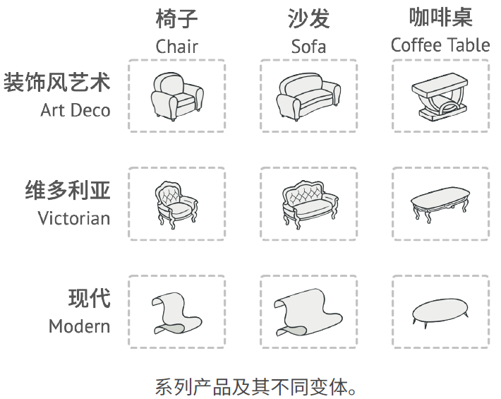

需要设法单独生成每件家具对象， 这样才能确保其风格一致。  此外， 你也不希望在添加新产品或新风格时修改已有代码。 家具供应商对于产品目录的更新非常频繁，每次更新时去修改核心代码非常繁琐。

抽象工厂模式建议为系列中的每件产品明确声明接口 （例如椅子、 沙发或咖啡桌）。 然后， 确保所有产品变体都继承这些接口。 例如， 所有风格的椅子都实现 椅子接口； 所有风格的咖啡桌都实现 咖啡桌接口， 以此类推。同一对象的所有变体都必须放置在同一个类层次结构之中。 

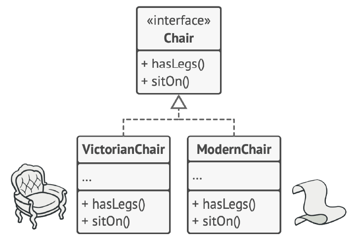

接下来， 我们需要声明抽象工厂——包含系列中所有产品构造方法的接口。 例如 create­Chair创建椅子 、create­Sofa创建沙发和 create­Coffee­Table创建咖啡桌 。这些方法必须返回抽象产品类型， 即我们之前抽取的那些接口：椅子 ，沙发和 咖啡桌等等。每个具体工厂类都对应一个特定的产品变体。

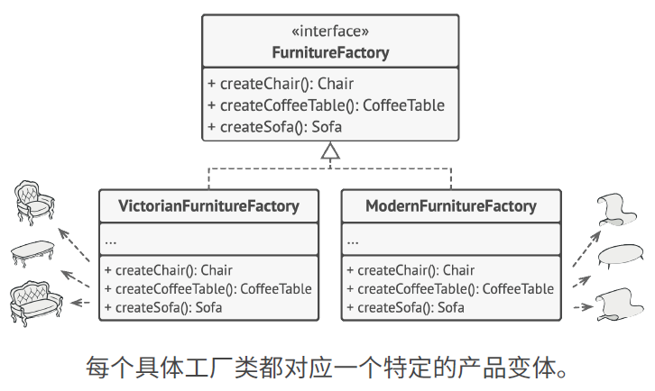

对于系列产品的每个变体， 我们都将基于抽象工厂接口创建不同的工厂类。每个工厂类都只能返回特定类别的产品，例如， 现代家具工厂ModernFurnitureFactory 只能创建现代椅子ModernChair 、现代沙发ModernSofa 和现代咖啡桌ModernCoffeeTable 对象。

客户端代码可以通过相应的抽象接口调用工厂和产品类。你无需修改实际客户端代码，无需了解其所调用工厂的具体类信息，就能更改传递给客户端的工厂类，也能更改客户端代码接收的产品变体。

假设客户端想要工厂创建一把椅子。客户端无需了解工厂类，也不用管工厂类创建出的椅子类型。无论是现代风格，还是维多利亚风格的椅子，对于客户端来说没有分别，它只需调用抽象椅子接口就可以了。这样一来，客户端只需知道椅子以某种方式实现了sitOn 坐下方法就足够了。此外，无论工厂返回的是何种椅子变体，它都会和由同一工厂对象创建的沙发或咖啡桌风格一致。

如果客户端仅接触抽象接口，那么谁来创建实际的工厂对象呢？一般情况下，应用程序会在初始化阶段创建具体工厂对象。而在此之前，应用程序必须根据配置文件或环境设定选择工厂类别。

### 模式结构

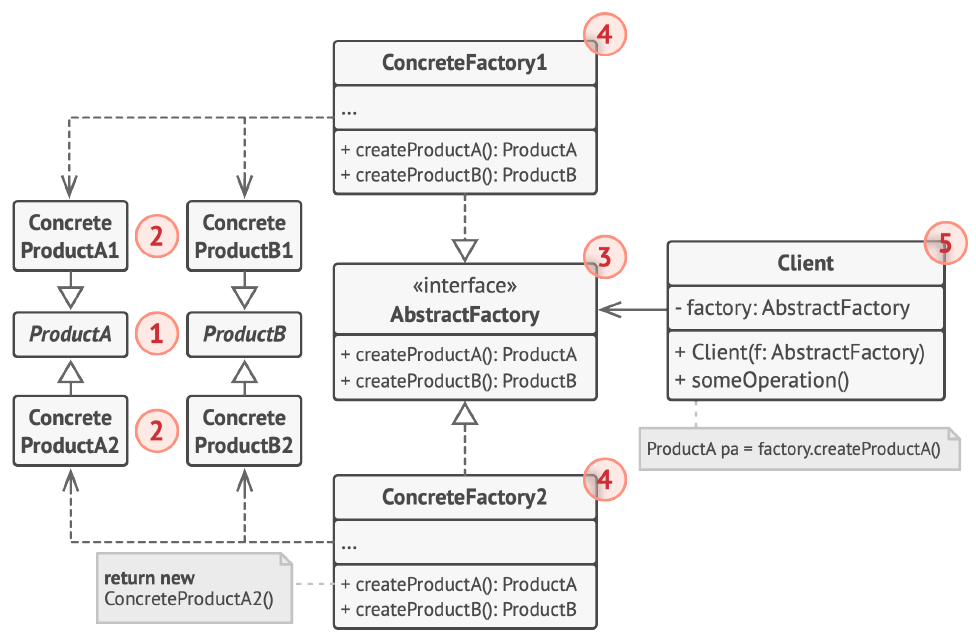

1、抽象产品（Abstract Product）为构成系列产品的一组不同但相关的产品声明接口。

2、具体产品（Concrete Product）是抽象产品的多种不同类型实现。所有变体（维多利亚/现代）都必须实现相应的抽象产品（椅子/沙发）。

3、抽象工厂（Abstract Factory）接口声明了一组创建各种抽象产品的方法。

4、具体工厂（Concrete Factory）实现抽象工厂的构建方法。每个具体工厂都对应特定产品变体，且仅创建此种产品变体。

5、尽管具体工厂会对具体产品进行初始化，其构建方法签名必须返回相应的抽象产品。这样，使用工厂类的客户端代码就不会与工厂创建的特定产品变体耦合。客户端（Client）只需通过抽象接口调用工厂和产品对象，就能与任何具体工厂/产品变体交互。

### 实现方式

1. 以不同的产品类型与产品变体为维度绘制矩阵。
2. 为所有产品声明抽象产品接口。 然后让所有具体产品类实现这些接口。
3. 声明抽象工厂接口， 并且在接口中为所有抽象产品提供一组构建方法。
4. 为每种产品变体实现一个具体工厂类。
5. 在应用程序中开发初始化代码。 该代码根据应用程序配置或当前环境， 对特定具体工厂类进行初始化。 然后将该工厂对象传递给所有需要创建产品的类。
6. 找出代码中所有对产品构造函数的直接调用， 将其替换为对工厂对象中相应构建方法的调用。

### 代码示例

抽象工厂模式在 Java 代码中很常见。 许多框架和程序库会将它作为扩展和自定义其标准组件的一种方式。 

以下是来自核心 Java 程序库的一些示例： 

* javax.xml.parsers.DocumentBuilderFactory#newInstance()
* javax.xml.transform.TransformerFactory#newInstance()
* javax.xml.xpath.XPathFactory#newInstance()

识别方法： 我们可以通过方法来识别该模式——其会返回一个工厂对象。 接下来， 工厂将被用于创建特定的子组件。

下面例子通过应用抽象工厂模式，使得客户端代码无需与具体UI 类耦合，就能创建跨平台的UI 元素，同时确保所创建的元素与指定的操作系统匹配。

跨平台应用中的相同UI 元素功能类似，但是在不同操作系统下的外观有一定差异。此外， 你需要确保UI 元素与当前操作系统风格一致。抽象工厂接口声明一系列构建方法，客户端代码可调用它们生成不同风格的UI 元素。每个具体工厂对应特定操作系统，并负责生成符合该操作系统风格的 UI 元素。

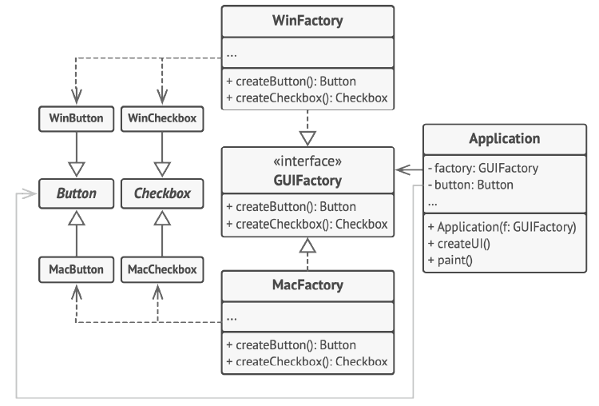

其运作方式如下：应用程序启动后检测当前操作系统。根据该信息，应用程序通过与该操作系统对应的类创建工厂对象。其余代码使用该工厂对象创建UI 元素。这样可以避免生成错误类型的元素。使用这种方法，客户端代码只需调用抽象接口，而无需了解具体工厂类和UI 元素。此外， 客户端代码还支持未来添加新的工厂或 UI 元素。这样一来， 每次在应用程序中添加新的UI 元素变体时， 你都无需修改客户端代码。你只需创建一个能够生成这些UI 元素的工厂类，然后稍微修改应用程序的初始代码，使其能够选择合适的工厂类即可。

第一个产品层次结构：Button及其实现类MacOSButton、WindowsButton

~~~java
/**
 * Abstract Factory assumes that you have several families of products,
 * structured into separate class hierarchies (Button/Checkbox). All products of
 * the same family have the common interface.
 *
 * This is the common interface for buttons family.
 */
public interface Button {
    void paint();
}
~~~

~~~java
/**
 * All products families have the same varieties (MacOS/Windows).
 *
 * This is a MacOS variant of a button.
 */
public class MacOSButton implements Button {

    @Override
    public void paint() {
        System.out.println("You have created MacOSButton.");
    }
}
~~~

~~~java
/**
 * All products families have the same varieties (MacOS/Windows).
 *
 * This is another variant of a button.
 */
public class WindowsButton implements Button {

    @Override
    public void paint() {
        System.out.println("You have created WindowsButton.");
    }
}
~~~

第二个产品层次结构：Checkbox接口和它的实现类MacOSCheckbox、WindowsCheckbox

~~~java
/**
 * Checkboxes is the second product family. It has the same variants as buttons.
 */
public interface Checkbox {
    void paint();
}
~~~

~~~java
/**
 * All products families have the same varieties (MacOS/Windows).
 *
 * This is a variant of a checkbox.
 */
public class MacOSCheckbox implements Checkbox {

    @Override
    public void paint() {
        System.out.println("You have created MacOSCheckbox.");
    }
}
~~~

~~~java
/**
 * All products families have the same varieties (MacOS/Windows).
 *
 * This is another variant of a checkbox.
 */
public class WindowsCheckbox implements Checkbox {

    @Override
    public void paint() {
        System.out.println("You have created WindowsCheckbox.");
    }
}
~~~

抽象工厂GUIFactory：

~~~java
/**
 * Abstract factory knows about all (abstract) product types.
 */
public interface GUIFactory {
    Button createButton();
    Checkbox createCheckbox();
}
~~~

具体工厂MacOSFactory和WindowsFactory：

~~~java
/**
 * Each concrete factory extends basic factory and responsible for creating
 * products of a single variety.
 */
public class MacOSFactory implements GUIFactory {

    @Override
    public Button createButton() {
        return new MacOSButton();
    }

    @Override
    public Checkbox createCheckbox() {
        return new MacOSCheckbox();
    }
}
~~~

~~~java
/**
 * Each concrete factory extends basic factory and responsible for creating
 * products of a single variety.
 */
public class WindowsFactory implements GUIFactory {

    @Override
    public Button createButton() {
        return new WindowsButton();
    }

    @Override
    public Checkbox createCheckbox() {
        return new WindowsCheckbox();
    }
}
~~~

客户端代码：

~~~java
/**
 * Factory users don't care which concrete factory they use since they work with
 * factories and products through abstract interfaces.
 */
public class Application {
    private Button button;
    private Checkbox checkbox;

    public Application(GUIFactory factory) {
        button = factory.createButton();
        checkbox = factory.createCheckbox();
    }

    public void paint() {
        button.paint();
        checkbox.paint();
    }
}

/**
 * Demo class. Everything comes together here.
 */
public class Demo {

    /**
     * Application picks the factory type and creates it in run time (usually at
     * initialization stage), depending on the configuration or environment
     * variables.
     */
    private static Application configureApplication() {
        Application app;
        GUIFactory factory;
        String osName = System.getProperty("os.name").toLowerCase();
        if (osName.contains("mac")) {
            factory = new MacOSFactory();
        } else {
            factory = new WindowsFactory();
        }
        app = new Application(factory);
        return app;
    }

    public static void main(String[] args) {
        Application app = configureApplication();
        app.paint();
    }
}
~~~

### 适用场景

* 如果代码需要与多个不同系列的相关产品交互， 但是由于无法提前获取相关信息， 或者出于对未来扩展性的考虑， 你不希望代码基于产品的具体类进行构建， 在这种情况下， 你可以使用抽象工厂。

  抽象工厂为你提供了一个接口， 可用于创建每个系列产品的对象。 只要代码通过该接口创建对象， 那么你就不会生成与应用程序已生成的产品类型不一致的产品。 

* 抽象工厂为你提供了一个接口， 可用于创建每个系列产品的对象。 只要代码通过该接口创建对象， 那么你就不会生成与应用程序已生成的产品类型不一致的产品。

  在设计良好的程序中， 每个类仅负责一件事。 如果一个类与多种类型产品交互， 就可以考虑将工厂方法抽取到独立的工厂类或具备完整功能的抽象工厂类中。

### 优缺点

它的优缺点和工厂方法模式相同，只是它比工厂方法模式更强大，它还可以确保同一工厂生成的产品相互匹配，它引入众多接口和类， 代码可能会比之前更加复杂。

### 与其他模式的关系

* 抽象工厂模式和生成器模式的对比：
  * 生成器重点关注如何分步生成复杂对象。 抽象工厂专门用于生产一系列相关对象。
  * 抽象工厂会马上返回产品， 生成器则允许你在获取产品前执行一些额外构造步骤。
* 抽象工厂模式、工厂方法模式和原型模式：抽象工厂模式就是在工厂方法模式的基础上，每个具体工厂类可以创建多种产品。抽象工厂模式通常基于一组工厂方法， 但你也可以使用原型模式来生成这些类的方法。
* 用抽象工厂模式代替外观模式：当只需对客户端代码隐藏子系统创建对象的方式时， 你可以使用抽象工厂来代替外观模式。
* 抽象工厂模式和桥接模式搭配使用：可以将抽象工厂和桥接模式搭配使用。 如果由桥接定义的抽象只能与特定实现合作， 这一模式搭配就非常有用。 在这种情况下， 抽象工厂可以对这些关系进行封装， 并且对客户端代码隐藏其复杂性。

## 工厂模式比较

工厂是一个含义模糊的术语， 表示可以创建一些东西的函数、 方法或类。 最常见的情况下， 工厂创建的是对象。 但是它们也可以创建文件和数据库记录等其他东西。

几个工厂模式相关的术语解释

### 构建方法

在实际中， 构建方法只是构造函数调用的封装器。 它可能只是一个能更好地表达意图的名称。 此外， 它可以让你的代码独立于构造函数的改动， 甚至还可以包含一些特殊的逻辑， 返回已有对象以而不是创建新对象。 

许多人会仅仅因为这些方法创建了新对象而称之为 “工厂方法”， 因为该方法会创建对象，但这和工厂方法模式不是一个概念

在下面的示例中，next是一个构建方法：

~~~
class Number {
    private $value;

    public function __construct($value) {
        $this->value = $value;
    }

    public function next() {
        return new Number ($this->value + 1);
    }
}
~~~

### 静态构建方法

静态构建方法是被声明为static的构建方法。 换句话说， 你无需创建对象就能在某个类上调用该方法。

不要将静态构建方法称为静态工厂方法，因为工厂方法是一种依赖于继承的设计模式。 如果将它设置为 static，你就不能在子类中对其进行扩展， 这就破坏了该模式的目的。

下列情况是使用静态构建方法的场景：

* 针对不同的目的提供多个不同的构造函数， 但是其签名相同时 
* 希望复用已有对象而不是初始化新对象时 （参考单例模式）。 绝大多数编程语言的构造函数必须都返回一个新的类实例。 静态构建方法是应对该限制的变通方法。 在静态方法内部， 你的代码会决定是调用构造函数创建一个全新实例， 还是返回一个在缓存中已有的对象。

### 简单工厂模式

简单工厂模式描述了一个工厂类，它拥有一个包含大量条件语句的构建方法， 可根据方法的参数来选择对何种产品进行初始化并将其返回。 

人们通常会将简单工厂与普通的工厂或其它创建型设计模式混淆。 在绝大多数情况下， 简单工厂是引入工厂方法或抽象工厂模式时的一个中间步骤。

简单工厂通常没有子类。 但当从一个简单工厂中抽取出子类后， 它看上去就会更像经典的工厂方法模式了。但是如果将一个简单工厂声明为 abstract类型， 它并不会变成抽象工厂模式。

下面是一个简单工厂的例子：

~~~java
class UserFactory {
    public static function create($type) {
        switch ($type) {
            case 'user': return new User();
            case 'customer': return new Customer();
            case 'admin': return new Admin();
            default:
                throw new Exception('传递的用户类型错误。');
        }
    }
}
~~~

### 工厂方法模式

工厂方法是一种创建型设计模式， 其在父类中提供一个创建对象的方法， 允许子类决定实例化对象的类型。 如果在基类及其扩展的子类中都有一个构建方法的话， 那它可能就是工厂方法。 

~~~
abstract class Department {
    public abstract function createEmployee($id);

    public function fire($id) {
        $employee = $this->createEmployee($id);
        $employee->paySalary();
        $employee->dismiss();
    }
}

class ITDepartment extends Department {
    public function createEmployee($id) {
        return new Programmer($id);
    }
}

class AccountingDepartment extends Department {
    public function createEmployee($id) {
        return new Accountant($id);
    }
}
~~~

### 抽象工厂模式

抽象工厂模式是一种创建型设计模式， 它能创建一系列相关或相互依赖的对象， 而无需指定其具体类。 

系列对象就是这样一组对象：运输工具+ 引擎+ 控制器。它可能会有几个变体：

* 汽车+ 内燃机+ 方向盘
* 飞机+ 喷气式发动机+ 操纵杆

如果程序中不涉及产品系列，那就不需要抽象工厂。 

##生成器模式

### 核心思想

它又叫建造者模式、Builder。生成器模式是一种创建型设计模式， 使你能够分步骤创建复杂对象。 该模式允许你使用相同的创建代码生成不同类型和形式的对象。与其他创建型模式不同， 生成器不要求产品拥有通用接口。 这使得用相同的创建过程生成不同的产品成为可能。 

假设有这样一个复杂对象，在对其进行构造时需要对诸多成员变量和嵌套对象进行繁复的初始化工作。这些初始化代码通常深藏于一个包含众多参数且让人基本看不懂的构造函数中；甚至还有更糟糕的情况，那就是这些代码散落在客户端代码的多个位置。

例如，要构造一个非常复杂的对象House类，它包含多个要素：墙、地板、房门、窗户、房顶等，有下面几种方法：

* 扩展房屋基类，创建一系列涵盖所有参数组合的子类，最终子类数量将非常庞大，任何新增的参数都让这个层次结构更加复杂
* 在房屋基类中创建一个包括所有可能参数的超级构造函数，并用它来控制房屋对象。缺点是构造函数将非常复杂，而且重载的方法很多，通常情况下，绝大部分的参数都没有使用，这使得对于构造函数的调用十分不简洁。

正确的方式是使用生成器模式，它建议将对象构造代码从产品类中抽取出来，并将其放在一个名为生成器的独立对象中。生成器模式让你能够分步骤创建复杂对象。生成器不允许其他对象访问正在创建中的产品。

该模式会将对象构造过程划分为一组步骤， 比如buildWalls 创建墙壁和buildDoor 创建房门创建房门等。每次创建对象时，你都需要通过生成器对象执行一系列步骤。重点在于你无需调用所有步骤，而只需调用创建特定对象配置所需的那些步骤即可。

当你需要创建不同形式的产品时，其中的一些构造步骤可能需要不同的实现。例如，木屋的房门可能需要使用木头制造，而城堡的房门则必须使用石头制造。在这种情况下，你可以创建多个不同的生成器，用不同方式实现一组相同的创建步骤。然后你就可以在创建过程中使用这些生成器（例如按顺序调用多个构造步骤）来生成不同类型的对象。

可以进一步将用于创建产品的一系列生成器步骤调用抽取成为单独的主管类，主管知道需要哪些创建步骤才能获得可正常使用的产品。主管类可定义创建步骤的执行顺序，而生成器则提供这些步骤的实现。严格来说，你的程序中并不一定需要主管类（一般需要多种生成器时，拥有多个固定的生成步骤，才需要主管类）。客户端代码可直接以特定顺序调用创建步骤。不过，主管类中非常适合放入各种例行构造流程，以便在程序中反复使用。

对于客户端代码来说，主管类完全隐藏了产品构造细节。客户端只需要将一个生成器与主管类关联，然后使用主管类来构造产品，就能从生成器处获得构造结果了。

### 模式结构

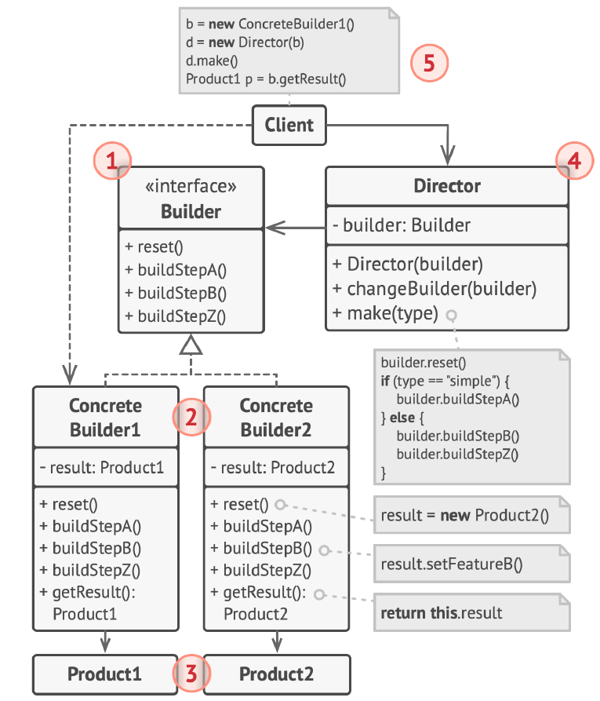

1、生成器（Builder）接口声明在所有类型生成器中通用的产品构造步骤。

2、具体生成器（Concrete Builders）提供构造过程的不同实现。具体生成器也可以构造不遵循通用接口的产品。

3、产品（Products）是最终生成的对象。由不同生成器构造的产品无需属于同一类层次结构或接口。

4、主管（Director）类定义调用构造步骤的顺序，这样你就可以创建和复用特定的产品配置。

5、客户端（Client）必须将某个生成器对象与主管类关联。一般情况下，你只需通过主管类构造函数的参数进行一次性关联即可。此后主管类就能使用生成器对象完成后续所有的构造任务。

客户端将生成器对象传递给主管类制造方法时还有另一种方式。在这种情况下，你在使用主管类生产产品时每次都可以使用不同的生成器。

### 代码示例

生成器模式是 Java 世界中的一个著名模式。 当你需要创建一个可能有许多配置选项的对象时， 该模式会特别有用。 

生成器在 Java 核心程序库中得到了广泛的应用： 

* java.lang.StringBuilder#append() （ 非同步 ）
* java.lang.StringBuffer#append() （ 同步 ）
* java.nio.ByteBuffer#put() （还有 Char­Buffer、 Short­Buffer、 Int­Buffer、 Long­Buffer、 Float­Buffer 和 Double­Buffer）
* javax.swing.GroupLayout.Group#addComponent()
* java.lang.Appendable的所有实现

识别方法： 生成器模式可以通过类来识别， 它拥有一个构建方法和多个配置结果对象的方法。 生成器方法通常支持方法链 （例如 someBuilder.setValueA(1).setValueB(2).create()）。

下面关于生成器模式的例子演示了你可以如何复用相同的对象构造代码来生成不同类型的产品——例如汽车 （Car）——及其相应的使用手册 （Manual）。

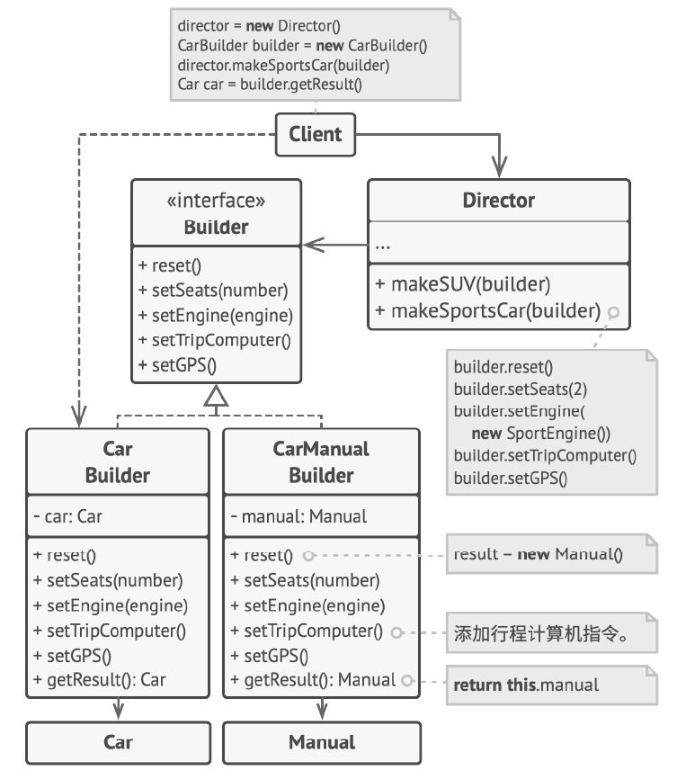

在本例中， 生成器模式允许你分步骤地制造不同型号的汽车，以及如何使用相同的生产过程制造不同类型的产品 （汽车手册） 

主管类控制着构造顺序。 它知道制造各种汽车型号需要调用的生产步骤。 它仅与汽车的通用接口进行交互。 这样就能将不同类型的生成器传递给主管了。 

通用生成器接口Builder：

~~~java
/**
 * Builder interface defines all possible ways to configure a product.
 */
public interface Builder {
    void setCarType(CarType type);
    void setSeats(int seats);
    void setEngine(Engine engine);
    void setTransmission(Transmission transmission);
    void setTripComputer(TripComputer tripComputer);
    void setGPSNavigator(GPSNavigator gpsNavigator);
}
~~~

生成器的实现类，CarBuilder和CarManualBuilder：

~~~java
/**
 * Concrete builders implement steps defined in the common interface.
 */
public class CarBuilder implements Builder {
    private CarType type;
    private int seats;
    private Engine engine;
    private Transmission transmission;
    private TripComputer tripComputer;
    private GPSNavigator gpsNavigator;

    public void setCarType(CarType type) {
        this.type = type;
    }

    @Override
    public void setSeats(int seats) {
        this.seats = seats;
    }

    @Override
    public void setEngine(Engine engine) {
        this.engine = engine;
    }

    @Override
    public void setTransmission(Transmission transmission) {
        this.transmission = transmission;
    }

    @Override
    public void setTripComputer(TripComputer tripComputer) {
        this.tripComputer = tripComputer;
    }

    @Override
    public void setGPSNavigator(GPSNavigator gpsNavigator) {
        this.gpsNavigator = gpsNavigator;
    }

    public Car getResult() {
        return new Car(type, seats, engine, transmission, tripComputer, gpsNavigator);
    }
}
~~~

~~~java
/**
 * Unlike other creational patterns, Builder can construct unrelated products,
 * which don't have the common interface.
 *
 * In this case we build a user manual for a car, using the same steps as we
 * built a car. This allows to produce manuals for specific car models,
 * configured with different features.
 */
public class CarManualBuilder implements Builder{
    private CarType type;
    private int seats;
    private Engine engine;
    private Transmission transmission;
    private TripComputer tripComputer;
    private GPSNavigator gpsNavigator;

    @Override
    public void setCarType(CarType type) {
        this.type = type;
    }

    @Override
    public void setSeats(int seats) {
        this.seats = seats;
    }

    @Override
    public void setEngine(Engine engine) {
        this.engine = engine;
    }

    @Override
    public void setTransmission(Transmission transmission) {
        this.transmission = transmission;
    }

    @Override
    public void setTripComputer(TripComputer tripComputer) {
        this.tripComputer = tripComputer;
    }

    @Override
    public void setGPSNavigator(GPSNavigator gpsNavigator) {
        this.gpsNavigator = gpsNavigator;
    }

    public Manual getResult() {
        return new Manual(type, seats, engine, transmission, tripComputer, gpsNavigator);
    }
}
~~~

两种不同类型的产品：Car和Manual

~~~java
/**
 * Car is a product class.
 */
public class Car {
    private final CarType carType;
    private final int seats;
    private final Engine engine;
    private final Transmission transmission;
    private final TripComputer tripComputer;
    private final GPSNavigator gpsNavigator;
    private double fuel = 0;

    public Car(CarType carType, int seats, Engine engine, Transmission transmission,
               TripComputer tripComputer, GPSNavigator gpsNavigator) {
        this.carType = carType;
        this.seats = seats;
        this.engine = engine;
        this.transmission = transmission;
        this.tripComputer = tripComputer;
        if (this.tripComputer != null) {
            this.tripComputer.setCar(this);
        }
        this.gpsNavigator = gpsNavigator;
    }

    public CarType getCarType() {
        return carType;
    }

    public double getFuel() {
        return fuel;
    }

    public void setFuel(double fuel) {
        this.fuel = fuel;
    }

    public int getSeats() {
        return seats;
    }

    public Engine getEngine() {
        return engine;
    }

    public Transmission getTransmission() {
        return transmission;
    }

    public TripComputer getTripComputer() {
        return tripComputer;
    }

    public GPSNavigator getGpsNavigator() {
        return gpsNavigator;
    }
}
~~~

~~~java
/**
 * Car manual is another product. Note that it does not have the same ancestor
 * as a Car. They are not related.
 */
public class Manual {
    private final CarType carType;
    private final int seats;
    private final Engine engine;
    private final Transmission transmission;
    private final TripComputer tripComputer;
    private final GPSNavigator gpsNavigator;

    public Manual(CarType carType, int seats, Engine engine, Transmission transmission,
                  TripComputer tripComputer, GPSNavigator gpsNavigator) {
        this.carType = carType;
        this.seats = seats;
        this.engine = engine;
        this.transmission = transmission;
        this.tripComputer = tripComputer;
        this.gpsNavigator = gpsNavigator;
    }

    public String print() {
        String info = "";
        info += "Type of car: " + carType + "\n";
        info += "Count of seats: " + seats + "\n";
        info += "Engine: volume - " + engine.getVolume() + "; mileage - " + engine.getMileage() + "\n";
        info += "Transmission: " + transmission + "\n";
        if (this.tripComputer != null) {
            info += "Trip Computer: Functional" + "\n";
        } else {
            info += "Trip Computer: N/A" + "\n";
        }
        if (this.gpsNavigator != null) {
            info += "GPS Navigator: Functional" + "\n";
        } else {
            info += "GPS Navigator: N/A" + "\n";
        }
        return info;
    }
}
~~~

一些组成产品的其他要素：CarType、Engine、GPSNavigator、Transmission、TripComputer等，此处略

主管类，它用来控制生成器：

~~~java
/**
 * Director defines the order of building steps. It works with a builder object
 * through common Builder interface. Therefore it may not know what product is
 * being built.
 */
public class Director {

    public void constructSportsCar(Builder builder) {
        builder.setCarType(CarType.SPORTS_CAR);
        builder.setSeats(2);
        builder.setEngine(new Engine(3.0, 0));
        builder.setTransmission(Transmission.SEMI_AUTOMATIC);
        builder.setTripComputer(new TripComputer());
        builder.setGPSNavigator(new GPSNavigator());
    }

    public void constructCityCar(Builder builder) {
        builder.setCarType(CarType.CITY_CAR);
        builder.setSeats(2);
        builder.setEngine(new Engine(1.2, 0));
        builder.setTransmission(Transmission.AUTOMATIC);
        builder.setTripComputer(new TripComputer());
        builder.setGPSNavigator(new GPSNavigator());
    }

    public void constructSUV(Builder builder) {
        builder.setCarType(CarType.SUV);
        builder.setSeats(4);
        builder.setEngine(new Engine(2.5, 0));
        builder.setTransmission(Transmission.MANUAL);
        builder.setGPSNavigator(new GPSNavigator());
    }
}
~~~

客户端代码：

~~~java
/**
 * Demo class. Everything comes together here.
 */
public class Demo {

    public static void main(String[] args) {
        Director director = new Director();

        // Director gets the concrete builder object from the client
        // (application code). That's because application knows better which
        // builder to use to get a specific product.
        CarBuilder builder = new CarBuilder();
        director.constructSportsCar(builder);

        // The final product is often retrieved from a builder object, since
        // Director is not aware and not dependent on concrete builders and
        // products.
        Car car = builder.getResult();
        System.out.println("Car built:\n" + car.getCarType());

        CarManualBuilder manualBuilder = new CarManualBuilder();

        // Director may know several building recipes.
        director.constructSportsCar(manualBuilder);
        Manual carManual = manualBuilder.getResult();
        System.out.println("\nCar manual built:\n" + carManual.print());
    }

}
~~~

### 适用场景

1、使用生成器模式可避免 “重叠构造函数 （telescoping constructor）” 的出现。

假设你的构造函数中有十个可选参数， 那么调用该函数会非常不方便； 因此， 你需要重载这个构造函数， 新建几个只有较少参数的简化版。 但这些构造函数仍需调用主构造函数， 传递一些默认数值来替代省略掉的参数。 

生成器模式让你可以分步骤生成对象， 而且允许你仅使用必须的步骤。 应用该模式后， 你再也不需要将几十个参数塞进构造函数里了。 

2、当你希望使用代码创建不同形式的产品 （例如石头或木头房屋） 时， 可使用生成器模式。

如果你需要创建的各种形式的产品， 它们的制造过程相似且仅有细节上的差异， 此时可使用生成器模式。 

基本生成器接口中定义了所有可能的制造步骤， 具体生成器将实现这些步骤来制造特定形式的产品。 同时， 主管类将负责管理制造步骤的顺序。 

3、使用生成器构造组合树或其他复杂对象。

生成器模式让你能分步骤构造产品。 你可以延迟执行某些步骤而不会影响最终产品。 你甚至可以递归调用这些步骤， 这在创建对象树时非常方便。 

生成器在执行制造步骤时， 不能对外发布未完成的产品。 这可以避免客户端代码获取到不完整结果对象的情况。 

### 优缺点

优点：

* 可以分步创建对象， 暂缓创建步骤或递归运行创建步骤。 
* 生成不同形式的产品时， 你可以复用相同的制造代码。 
* 单一职责原则。 你可以将复杂构造代码从产品的业务逻辑中分离出来。

缺点：该模式需要新增多个类， 因此代码整体复杂程度会有所增加。 

### 与其他模式的关系

* 生成器模式和抽象工厂模式的对比：
  * 生成器重点关注如何分步生成复杂对象。 抽象工厂专门用于生产一系列相关对象。 
  * 抽象工厂会马上返回产品， 生成器则允许你在获取产品前执行一些额外构造步骤。
* 生成器模式和组合模式共同使用：可以在创建复杂组合模式树时使用生成器， 因为这可使其构造步骤以递归的方式运行。
* 生成器模式和桥接模式共同使用：可以结合使用生成器和桥接模式： 主管类负责抽象工作， 各种不同的生成器负责实现工作。

## 原型模式

### 核心思想

又称为克隆、Clone、Prototype。原型模式是一种创建型设计模式， 使你能够复制已有对象， 而又无需使代码依赖它们所属的类。

如果你有一个对象，并希望生成与其完全相同的一个复制品，你该如何实现呢？首先，你必须新建一个属于相同类的对象。然后，你必须遍历原始对象的所有成员变量，并将成员变量值复制到新对象中。但是上面的做法存在几个问题：

* 并非所有对象都能通过这种方式进行复制，因为有些对象可能拥有私有成员变量，它们在对象本身以外是不可见的。
* 为你必须知道对象所属的类才能创建复制品，所以代码必须依赖该类。
* 有时你只知道对象所实现的接口，而不知道其所属的具体类，此时就无法复制。

一个好的解决方案就是原型模式，原型模式将克隆过程委派给被克隆的实际对象。模式为所有支持克隆的对象声明了一个通用接口，该接口让你能够克隆对象， 同时又无需将代码和对象所属类耦合。通常情况下，这样的接口中仅包含一个克隆方法。

所有的类对克隆方法的实现都非常相似。该方法会创建一个当前类的对象，然后将原始对象所有的成员变量值复制到新建的类中。当克隆过程被委派给要克隆的对象本身的时候，就可以复制私有成员变量，因为绝大部分编程语言都允许对象访问其同类对象的私有成员变量。

支持克隆的对象即为原型。当你的对象有几十个成员变量和几百种类型时，对其进行克隆甚至可以代替子类的构造。

### 模式结构

原型模式的结构如下：

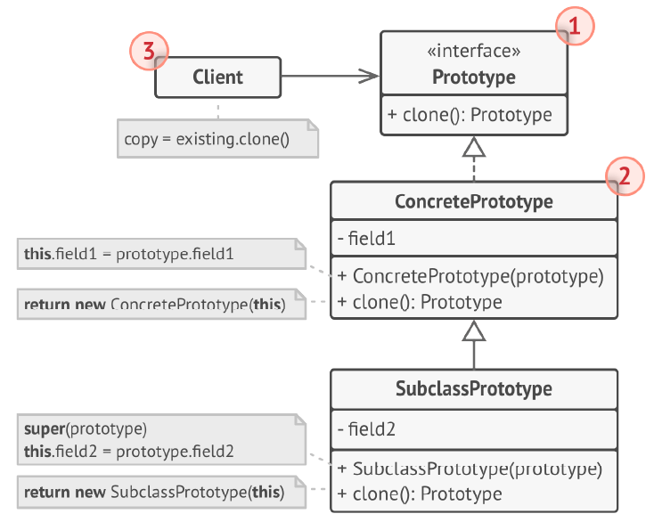

1、原型（Prototype）接口将对克隆方法进行声明。在绝大多数情况下，其中只会有一个名为clone 克隆的方法。

2、具体原型（Concrete Prototype）类将实现克隆方法。除了将原始对象的数据复制到克隆体中之外，该方法有时还需处理克隆过程中的极端情况，例如克隆关联对象和梳理递归依赖等等。

3、客户端（Client）可以复制实现了原型接口的任何对象。

原型注册表（Prototype Registry）提供了一种访问常用原型的简单方法，其中存储了一系列可供随时复制的预生成对象。最简单的注册表原型是一个名称 → 原型的哈希表，还可以引入名称以外的匹配条件，可以创建更完善的注册表版本。

下面是原型注册表的实现：

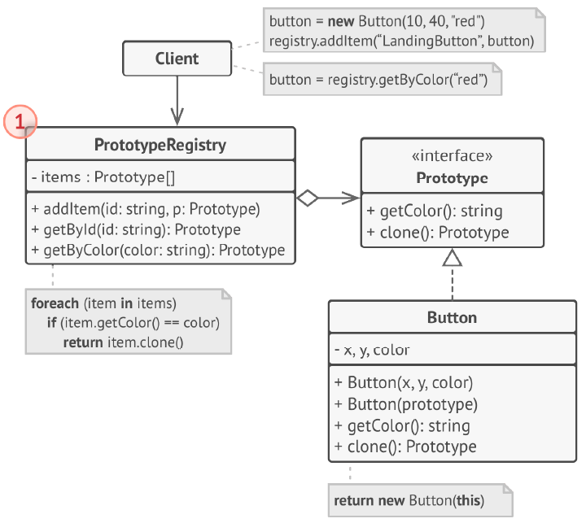

### 实现方式

1、创建原型接口，并在其中声明克隆方法。如果你已有类层次结构，则只需在其所有类中添加该方法即可。

2、原型类必须另行定义一个以该类对象为参数的构造函数。构造函数必须复制参数对象中的所有成员变量值到新建实体中。如果你需要修改子类，则必须调用父类构造函数，让父类复制其私有成员变量值。

如果编程语言不支持方法重载，那么你可能需要定义一个特殊方法来复制对象数据。在构造函数中进行此类处理比较方便，因为它在调用new 运算符后会马上返回结果对象。

3、克隆方法通常只有一行代码： 使用new 运算符调用原型版本的构造函数。注意，每个类都必须显式重写克隆方法并使用自身类名调用new 运算符。否则， 克隆方法可能会生成父类的对象。

4、你还可以创建一个中心化原型注册表，用于存储常用原型。

可以新建一个工厂类来实现注册表，或者在原型基类中添加一个获取原型的静态方法。该方法必须能够根据客户端代码设定的条件进行搜索。搜索条件可以是简单的字符串，或者是一组复杂的搜索参数。找到合适的原型后，注册表应对原型进行克隆，并将复制生成的对象返回给客户端。

最后还要将对子类构造函数的直接调用替换为对原型注册表工厂方法的调用。

### 代码示例

在Java中，Cloneable  （可克隆） 接口就是立即可用的原型模式。在Java中使用原型模式非常简单，无需抽取原型接口和clone方法就可以直接使用，在Object中已经定义好了clone方法了。

任何类都可通过实现该接口来实现可被克隆的性质。 需要先实现Cloneable接口，然后重写clone方法，可以直接调用Object类的clone方法来实现一个浅拷贝，深拷贝则还需逐个clone每个成员变量。

识别方法： 原型可以简单地通过 clone或 copy等方法来识别。

下面是一个例子：在不使用标准 Cloneable接口的情况下实现原型模式。

通用形状接口Shape：

~~~java
public abstract class Shape {
    public int x;
    public int y;
    public String color;

    public Shape() {
    }

    public Shape(Shape target) {
        if (target != null) {
            this.x = target.x;
            this.y = target.y;
            this.color = target.color;
        }
    }

    public abstract Shape clone();

    @Override
    public boolean equals(Object object2) {
        if (!(object2 instanceof Shape)) return false;
        Shape shape2 = (Shape) object2;
        return shape2.x == x && shape2.y == y && Objects.equals(shape2.color, color);
    }
}
~~~

形状的具体类Circle、Rectangle：

~~~java
public class Circle extends Shape {
    public int radius;

    public Circle() {
    }

    public Circle(Circle target) {
        super(target);
        if (target != null) {
            this.radius = target.radius;
        }
    }

    @Override
    public Shape clone() {
        return new Circle(this);
    }

    @Override
    public boolean equals(Object object2) {
        if (!(object2 instanceof Circle) || !super.equals(object2)) return false;
        Circle shape2 = (Circle) object2;
        return shape2.radius == radius;
    }
}
~~~

~~~java
public class Rectangle extends Shape {
    public int width;
    public int height;

    public Rectangle() {
    }

    public Rectangle(Rectangle target) {
        super(target);
        if (target != null) {
            this.width = target.width;
            this.height = target.height;
        }
    }

    @Override
    public Shape clone() {
        return new Rectangle(this);
    }

    @Override
    public boolean equals(Object object2) {
        if (!(object2 instanceof Rectangle) || !super.equals(object2)) return false;
        Rectangle shape2 = (Rectangle) object2;
        return shape2.width == width && shape2.height == height;
    }
}
~~~

克隆示例：

~~~java
public class Demo {
    public static void main(String[] args) {
        List<Shape> shapes = new ArrayList<>();
        List<Shape> shapesCopy = new ArrayList<>();

        Circle circle = new Circle();
        circle.x = 10;
        circle.y = 20;
        circle.radius = 15;
        circle.color = "red";
        shapes.add(circle);

        Circle anotherCircle = (Circle) circle.clone();
        shapes.add(anotherCircle);

        Rectangle rectangle = new Rectangle();
        rectangle.width = 10;
        rectangle.height = 20;
        rectangle.color = "blue";
        shapes.add(rectangle);

        cloneAndCompare(shapes, shapesCopy);
    }

    private static void cloneAndCompare(List<Shape> shapes, List<Shape> shapesCopy) {
        for (Shape shape : shapes) {
            shapesCopy.add(shape.clone());
        }

        for (int i = 0; i < shapes.size(); i++) {
            if (shapes.get(i) != shapesCopy.get(i)) {
                System.out.println(i + ": Shapes are different objects (yay!)");
                if (shapes.get(i).equals(shapesCopy.get(i))) {
                    System.out.println(i + ": And they are identical (yay!)");
                } else {
                    System.out.println(i + ": But they are not identical (booo!)");
                }
            } else {
                System.out.println(i + ": Shape objects are the same (booo!)");
            }
        }
    }
}
~~~

可以实现中心化的原型注册站 （或工厂）， 其中包含一系列预定义的原型对象。 这样一来， 你就可以通过传递对象名称或其他参数的方式从工厂处获得新的对象。 工厂将搜索合适的原型， 然后对其进行克隆复制， 最后将副本返回给你。 下面是一个原型注册站的例子：

~~~java
public class BundledShapeCache {
    private Map<String, Shape> cache = new HashMap<>();

    public BundledShapeCache() {
        Circle circle = new Circle();
        circle.x = 5;
        circle.y = 7;
        circle.radius = 45;
        circle.color = "Green";

        Rectangle rectangle = new Rectangle();
        rectangle.x = 6;
        rectangle.y = 9;
        rectangle.width = 8;
        rectangle.height = 10;
        rectangle.color = "Blue";

        cache.put("Big green circle", circle);
        cache.put("Medium blue rectangle", rectangle);
    }

    public Shape put(String key, Shape shape) {
        cache.put(key, shape);
        return shape;
    }

    public Shape get(String key) {
        return cache.get(key).clone();
    }
}
~~~

使用原型注册站克隆对象的案例：

~~~java
public class Demo {
    public static void main(String[] args) {
        BundledShapeCache cache = new BundledShapeCache();

        Shape shape1 = cache.get("Big green circle");
        Shape shape2 = cache.get("Medium blue rectangle");
        Shape shape3 = cache.get("Medium blue rectangle");

        if (shape1 != shape2 && !shape1.equals(shape2)) {
            System.out.println("Big green circle != Medium blue rectangle (yay!)");
        } else {
            System.out.println("Big green circle == Medium blue rectangle (booo!)");
        }

        if (shape2 != shape3) {
            System.out.println("Medium blue rectangles are two different objects (yay!)");
            if (shape2.equals(shape3)) {
                System.out.println("And they are identical (yay!)");
            } else {
                System.out.println("But they are not identical (booo!)");
            }
        } else {
            System.out.println("Rectangle objects are the same (booo!)");
        }
    }
}
~~~

### 适用场景

1、需要复制一些对象， 同时又希望代码独立于这些对象所属的具体类， 可以使用原型模式。

这一点要求通常出现在代码需要处理第三方代码通过接口传递过来的对象时。原型模式为客户端代码提供一个通用接口， 客户端代码可通过这一接口与所有实现了克隆的对象进行交互， 它也使得客户端代码与其所克隆的对象具体类独立开来。 

2、如果子类的区别仅在于其对象的初始化方式， 那么你可以使用该模式来减少子类的数量。

在原型模式中， 你可以使用一系列预生成的、 各种类型的对象作为原型。 客户端不必根据需求对子类进行实例化， 只需找到合适的原型并对其进行克隆即可。 

### 优缺点

优点：

* 可以克隆对象， 而无需与它们所属的具体类相耦合。 
* 可以克隆预生成原型， 避免反复运行初始化代码。 
* 可以更方便地生成复杂对象。 
* 可以用继承以外的方式来处理复杂对象的不同配置。 

缺点：克隆包含循环引用的复杂对象可能会非常麻烦。 

### 与其他模式的关系

* 原型模式和抽象工厂模式共同使用：抽象工厂模式通常基于一组工厂方法， 但你也可以使用原型模式来生成这些类的方法。
* 原型模式和命令模式共同使用：原型可用于保存命令模式的历史记录。
* 原型模式和组合模式、装饰模式共同使用：大量使用组合模式和装饰模式的设计通常可从对于原型的使用中获益。 你可以通过该模式来复制复杂结构， 而非从零开始重新构造。
* 原型模式和工厂方法模式对比：
  * 原型并不基于继承， 因此没有继承的缺点。 另一方面， 原型需要对被复制对象进行复杂的初始化。
  * 工厂方法基于继承， 但是它不需要初始化步骤。
* 原型模式替代备忘录模式：有时候原型可以作为备忘录模式的一个简化版本， 其条件是你需要在历史记录中存储的对象的状态比较简单， 不需要链接其他外部资源， 或者链接可以方便地重建。

## 单例模式

### 核心思想

又被称为单件模式、Singleton。单例模式是一种创建型设计模式， 让你能够保证一个类只有一个实例， 并提供一个访问该实例的全局节点。

单例模式同时解决了两个问题，所以违反了单一职责原则：

* 保证一个类只有一个实例。

  有时需要控制某些共享资源（例如数据库或文件）的访问权限时，就需要控制一个类所拥有的实例数量。此时如果你创建了一个对象，同时过一会儿后你决定再创建一个新对象，此时你会获得之前已创建的对象，而不是一个新对象。

  注意，普通构造函数无法实现上述行为，因为构造函数的设计决定了它必须总是返回一个新对象。

* 为该实例提供一个全局访问节点.

  有些存储重要对象的全局变量使用起来非常方便，但是同时也非常不安全，因为任何代码都有可能覆盖掉那些变量的内容，从而引发程序崩溃。

  和全局变量一样，单例模式也允许在程序的任何地方访问特定对象。但是它可以保护该实例不被其他代码覆盖。此外，解决同一个问题的代码不应该分散在程序各处，更好的方式是将其放在同一个类中。

所有单例的实现都包含以下两个相同的步骤：

* 将默认构造函数设为私有， 防止其他对象使用单例类的new 运算符。
* 新建一个静态构建方法作为构造函数。该函数会“偷偷”调用私有构造函数来创建对象，并将其保存在一个静态成员变量中。此后所有对于该函数的调用都将返回这一缓存对象。

### 实现方式

1、懒汉式-线程不安全

~~~java
public class Singleton {

    private static Singleton uniqueInstance;

    private Singleton() {
    }

    public static Singleton getUniqueInstance() {
        if (uniqueInstance == null) {
            uniqueInstance = new Singleton();
        }
        return uniqueInstance;
    }
}
~~~

2、饿汉式-线程安全

直接用私有静态变量来初始化类：

~~~java
private static Singleton uniqueInstance = new Singleton();
~~~

类似地，还可以用静态代码块来初始化，这样可以捕获其中的异常：

~~~java
	private static StaticBlockSingleton instance;    

	// static block initialization for exception handling
    static {
        try {
            instance = new StaticBlockSingleton();
        } catch (Exception e) {
            throw new RuntimeException("Exception occurred in creating singleton instance");
        }
    }
~~~

3、懒汉式-线程安全

该方式可以保证线程安全，避免了多次实例化，但是它有明显的性能问题

~~~java
public static synchronized Singleton getUniqueInstance() {
    if (uniqueInstance == null) {
        uniqueInstance = new Singleton();
    }
    return uniqueInstance;
}
~~~

4、双重校验锁

~~~java
public class Singleton {

    private volatile static Singleton uniqueInstance;

    private Singleton() {
    }

    public static Singleton getUniqueInstance() {
        if (uniqueInstance == null) {
            synchronized (Singleton.class) {
                if (uniqueInstance == null) {
                    uniqueInstance = new Singleton();
                }
            }
        }
        return uniqueInstance;
    }
}
~~~

uniqueInstance 采用 volatile 关键字修饰也是很有必要的， uniqueInstance = new Singleton(); 这段代码其实是分为三步执行：

1. 为 uniqueInstance 分配内存空间
2. 初始化 uniqueInstance
3. 将 uniqueInstance 指向分配的内存地址

但是由于 JVM 具有指令重排的特性，执行顺序有可能变成 1>3>2。指令重排在单线程环境下不会出现问题，但是在多线程环境下会导致一个线程获得还没有初始化的实例。例如，线程 T1 执行了 1 和 3，此时 T2 调用 getUniqueInstance() 后发现 uniqueInstance 不为空，因此返回 uniqueInstance，但此时 uniqueInstance 还未被初始化。 使用 volatile 可以禁止 JVM 的指令重排，保证在多线程环境下也能正常运行。 

5、静态内部类实现

~~~java
public class Singleton {

    private Singleton() {
    }

    private static class SingletonHolder {
        private static final Singleton INSTANCE = new Singleton();
    }

    public static Singleton getUniqueInstance() {
        return SingletonHolder.INSTANCE;
    }
}
~~~

当 Singleton 类被加载时，静态内部类 SingletonHolder 没有被加载进内存。只有当调用 getUniqueInstance() 方法从而触发 SingletonHolder.INSTANCE 时 SingletonHolder 才会被加载，此时初始化 INSTANCE 实例，并且 JVM 能确保 INSTANCE 只被实例化一次。

这种方式不仅具有延迟初始化的好处，而且由 JVM 提供了对线程安全的支持。 

6、枚举实现

~~~java
public enum Singleton {

    INSTANCE;

    private String objName;

    public String getObjName() {
        return objName;
    }

    public void setObjName(String objName) {
        this.objName = objName;
    }

    public static void main(String[] args) {

        // 单例测试
        Singleton firstSingleton = Singleton.INSTANCE;
        firstSingleton.setObjName("firstName");
        System.out.println(firstSingleton.getObjName());
        Singleton secondSingleton = Singleton.INSTANCE;
        secondSingleton.setObjName("secondName");
        System.out.println(firstSingleton.getObjName());
        System.out.println(secondSingleton.getObjName());

        // 反射获取实例测试
        try {
            Singleton[] enumConstants = Singleton.class.getEnumConstants();
            for (Singleton enumConstant : enumConstants) {
                System.out.println(enumConstant.getObjName());
            }
        } catch (Exception e) {
            e.printStackTrace();
        }
    }
}
~~~

运行结果：

~~~
firstName
secondName
secondName
secondName
~~~

该实现可以防止反射攻击。在其它实现中，通过 setAccessible() 方法可以将私有构造函数的访问级别设置为 public，然后调用构造函数从而实例化对象，如果要防止这种攻击，需要在构造函数中添加防止多次实例化的代码。该实现是由 JVM 保证只会实例化一次，因此不会出现上述的反射攻击。 

但是枚举不太灵活，不允许惰性初始化。

7、单例和序列化

有时需要在单例类中实现Serializable，以便其可以正常初始化：

~~~java
package com.journaldev.singleton;

import java.io.Serializable;

public class SerializedSingleton implements Serializable {

    private static final long serialVersionUID = -7604766932017737115L;

    private SerializedSingleton(){}

    private static class SingletonHelper {
        private static final SerializedSingleton instance = new SerializedSingleton();
    }

    public static SerializedSingleton getInstance() {
        return SingletonHelper.instance;
    }

}
~~~

序列化单例类的问题在于，每当我们反序列化它时，它都会创建该类的一个新实例，下面就是一个例子：

~~~java
public class SingletonSerializedTest {

    public static void main(String[] args) throws FileNotFoundException, IOException, ClassNotFoundException {
        SerializedSingleton instanceOne = SerializedSingleton.getInstance();
        ObjectOutput out = new ObjectOutputStream(new FileOutputStream(
                "filename.ser"));
        out.writeObject(instanceOne);
        out.close();

        // deserialize from file to object
        ObjectInput in = new ObjectInputStream(new FileInputStream(
                "filename.ser"));
        SerializedSingleton instanceTwo = (SerializedSingleton) in.readObject();
        in.close();

        System.out.println("instanceOne hashCode="+instanceOne.hashCode());
        System.out.println("instanceTwo hashCode="+instanceTwo.hashCode());

    }

}
~~~

此时instanceOne和instanceTwo两个就是不同的实例，此时就破坏了单例模式，为了克服这种情况需要提供readResolve方法：

~~~java
protected Object readResolve() {
    return getInstance();
}
~~~

### 优缺点

优点：

* 可以保证一个类只有一个实例。 
* 获得了一个指向该实例的全局访问节点。 
* 仅在首次请求单例对象时对其进行初始化。 （有的实现方式做不到这一点）

缺点：

* 违反了单一职责原则。 该模式同时解决了两个问题。
* 单例模式可能掩盖不良设计， 比如程序各组件之间相互了解过多等。
* 该模式在多线程环境下需要进行特殊处理， 避免多个线程多次创建单例对象。 
* 单例的客户端代码单元测试可能会比较困难， 因为许多测试框架以基于继承的方式创建模拟对象，单例类的构造函数是私有的， 而且绝大部分语言无法重写静态方法 

### 与其他模式的关系

* 单例模式和外观模式共同使用：外观模式类通常可以转换为单例模式类， 因为在大部分情况下一个外观对象就足够了。

* 单例模式和享元模式的对比：如果你能将对象的所有共享状态简化为一个享元对象， 那么享元模式就和单例类似了。 

  但这两个模式有两个根本性的不同：

  * 只会有一个单例实体， 但是享元类可以有多个实体， 各实体的内在状态也可以不同。
  * 单例对象可以是可变的。 享元对象是不可变的。

* 单例模式和其他创建型设计模式共同使用：抽象工厂模式、 生成器模式和原型模式都可以用单例来实现。

# 结构型模式

结构型模式介绍如何将对象和类组装成较大的结构，并同时保持结构的灵活和高效。

## 适配器模式

### 核心思想

又称为封装器模式、Wrapper、Adapter。适配器模式是一种结构型设计模式， 它能使接口不兼容的对象能够相互合作。

适配器可担任两个对象间的封装器， 它会接收对于一个对象的调用， 并将其转换为另一个对象可识别的格式和接口。 

假如你正在开发一款股票市场监测程序， 它会从不同来源下载 XML 格式的股票数据， 然后向用户呈现出美观的图表。 在开发过程中， 你决定在程序中整合一个第三方智能分析函数库。 但是遇到了一个问题， 那就是分析函数库只兼容 JSON 格式的数据。 

你无法“直接”使用分析函数库，因为它所需的输入数据格式与你的程序不兼容。你可以修改程序库来支持XML。但是，这可能需要修改部分依赖该程序库的现有代码。更糟的情况是可能根本没有程序库的源代码，从而无法对其进行修改。

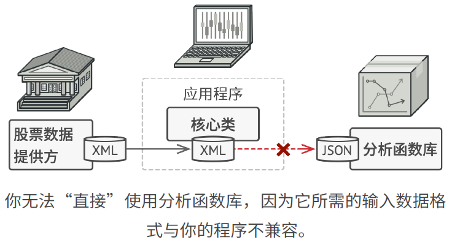

解决办法是创建一个适配器。这是一个特殊的对象，能够转换对象接口，使其能与其他对象进行交互。

适配器模式通过封装对象将复杂的转换过程隐藏于幕后。被封装的对象甚至察觉不到适配器的存在。例如，你可以使用一个将所有数据转换为英制单位（如英尺和英里）的适配器封装运行于米和千米单位制中的对象。

适配器不仅可以转换不同格式的数据，其还有助于采用不同接口的对象之间的合作。它的运作方式如下：

* 适配器实现与其中一个现有对象兼容的接口。
* 现有对象可以使用该接口安全地调用适配器方法。
* 适配器方法被调用后将以另一个对象兼容的格式和顺序将请求传递给该对象。

有时你甚至可以创建一个双向适配器来实现双向转换调用：

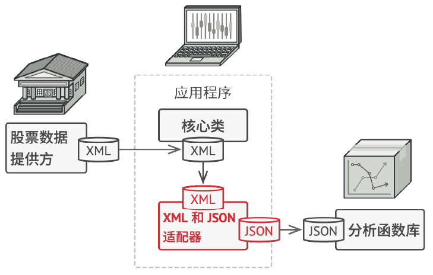

回到股票市场程序。为了解决数据格式不兼容的问题，你可以为分析函数库中的每个类创建将XML 转换为JSON 格式的适配器，然后让客户端仅通过这些适配器来与函数库进行交流。当某个适配器被调用时，它会将传入的XML 数据转换为 JSON 结构，并将其传递给被封装分析对象的相应方法。

### 模式结构

适配器模式可以分为对象适配器和类适配器两种：

一、对象适配器：适配器实现了其中一个对象的接口，并对另一个对象进行封装。

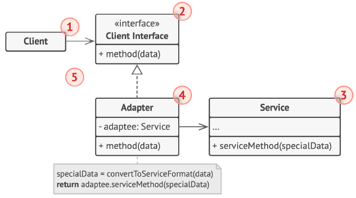

1、客户端（Client）是包含当前程序业务逻辑的类。

2、客户端接口（Client Interface） 描述了其他类与客户端代码合作时必须遵循的协议。

3、服务（Service）中有一些功能类（通常来自第三方或遗留系统）。客户端与其接口不兼容，因此无法直接调用其功能。

4、适配器（Adapter） 是一个可以同时与客户端和服务交互的类：它在实现客户端接口的同时封装了服务对象。适配器接受客户端通过适配器接口发起的调用，并将其转换为适用于被封装服务对象的调用。

5、客户端代码只需通过接口与适配器交互即可，无需与具体的适配器类耦合。因此，你可以向程序中添加新类型的适配器而无需修改已有代码。这在服务类的接口被更改或替换时很有用：你无需修改客户端代码就可以创建新的适配器类。

二、类适配器

这一实现使用了继承机制：适配器同时继承两个对象的接口。请注意， 这种方式仅能在支持多重继承的编程语言中实现，例如 C++。

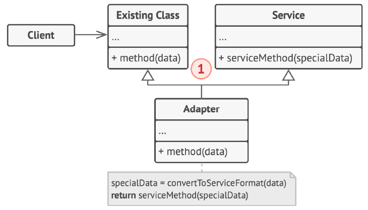

类适配器不需要封装任何对象，因为它同时继承了客户端和服务的行为。适配功能在重写的方法中完成。最后生成的适配器可替代已有的客户端类进行使用。

### 代码示例

适配器模式在 Java 代码中很常见。 基于一些遗留代码的系统常常会使用该模式。 在这种情况下， 适配器让遗留代码与现代的类得以相互合作。 

Java 核心程序库中有一些标准的适配器： 

* java.util.Arrays#asList()
* java.util.Collections#list()
* java.util.Collections#enumeration()
* java.io.InputStreamReader(InputStream) （返回 Reader对象）
* java.io.OutputStreamWriter(OutputStream) （返回 Writer对象）
* javax.xml.bind.annotation.adapters.XmlAdapter#marshal() 和 #unmarshal()

识别方法： 适配器可以通过以不同抽象或接口类型实例为参数的构造函数来识别。 当适配器的任何方法被调用时， 它会将参数转换为合适的格式， 然后将调用定向到其封装对象中的一个或多个方法。

下列适配器模式演示基于经典的“方钉和圆孔”问题，目标就是将方订打入圆孔内。适配器假扮成一个圆钉（RoundPeg）， 其半径等于方钉（SquarePeg）横截面对角线的一半（即能够容纳方钉的最小外接圆的半径）。

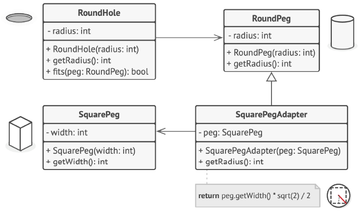

圆孔类RoundHole：

~~~java
/**
 * RoundHoles are compatible with RoundPegs.
 */
public class RoundHole {
    private double radius;

    public RoundHole(double radius) {
        this.radius = radius;
    }

    public double getRadius() {
        return radius;
    }

    public boolean fits(RoundPeg peg) {
        boolean result;
        result = (this.getRadius() >= peg.getRadius());
        return result;
    }
}
~~~

圆钉类和方钉类：

~~~java
/**
 * RoundPegs are compatible with RoundHoles.
 */
public class RoundPeg {
    private double radius;

    public RoundPeg() {}

    public RoundPeg(double radius) {
        this.radius = radius;
    }

    public double getRadius() {
        return radius;
    }
}
~~~

~~~java
/**
 * SquarePegs are not compatible with RoundHoles (they were implemented by
 * previous development team). But we have to integrate them into our program.
 */
public class SquarePeg {
    private double width;

    public SquarePeg(double width) {
        this.width = width;
    }

    public double getWidth() {
        return width;
    }

    public double getSquare() {
        double result;
        result = Math.pow(this.width, 2);
        return result;
    }
}
~~~

方钉到圆孔的适配器，因为它要适配圆孔，所以继承圆孔类（也可以实现圆孔的接口，如果有接口的话）

~~~java
/**
 * Adapter allows fitting square pegs into round holes.
 */
public class SquarePegAdapter extends RoundPeg {
    private SquarePeg peg;

    public SquarePegAdapter(SquarePeg peg) {
        this.peg = peg;
    }

    @Override
    public double getRadius() {
        double result;
        // Calculate a minimum circle radius, which can fit this peg.
        result = (Math.sqrt(Math.pow((peg.getWidth() / 2), 2) * 2));
        return result;
    }
}
~~~

在客户端代码中，将方钉传入适配器，因为适配器是圆孔的子类，所以它就可以代替圆孔工作：

~~~java
/**
 * Somewhere in client code...
 */
public class Demo {
    public static void main(String[] args) {
        // Round fits round, no surprise.
        RoundHole hole = new RoundHole(5);
        RoundPeg rpeg = new RoundPeg(5);
        if (hole.fits(rpeg)) {
            System.out.println("Round peg r5 fits round hole r5.");
        }

        SquarePeg smallSqPeg = new SquarePeg(2);
        SquarePeg largeSqPeg = new SquarePeg(20);
        // hole.fits(smallSqPeg); // Won't compile.

        // Adapter solves the problem.
        SquarePegAdapter smallSqPegAdapter = new SquarePegAdapter(smallSqPeg);
        SquarePegAdapter largeSqPegAdapter = new SquarePegAdapter(largeSqPeg);
        if (hole.fits(smallSqPegAdapter)) {
            System.out.println("Square peg w2 fits round hole r5.");
        }
        if (!hole.fits(largeSqPegAdapter)) {
            System.out.println("Square peg w20 does not fit into round hole r5.");
        }
    }
}
~~~

### 适用场景

1、当你希望使用某个类，但是其接口与其他代码不兼容时，可以使用适配器类。

适配器模式允许你创建一个中间层类，其可作为代码与遗留类、第三方类或提供怪异接口的类之间的转换器。

2、如果您需要复用这样一些类，他们处于同一个继承体系，并且他们又有了额外的一些共同的方法，但是这些共同的方法不是所有在这一继承体系中的子类所具有的共性。

应对这种场景，可以扩展每个子类，将缺少的功能添加到新的子类中。但是，你必须在所有新子类中重复添加这些代码，这样会使得代码有坏味道。

一个好的方式是：将缺失功能添加到一个适配器类，从而动态地获取所需功能。此时目标类必须要有通用接口，适配器的成员变量应当遵循该通用接口。这种方式同装饰模式非常相似。

### 优缺点

优点：

* 单一职责原则：可以将接口或数据转换代码从程序主要业务逻辑中分离。
* 开闭原则。只要客户端代码通过客户端接口与适配器进行交互，你就能在不修改现有客户端代码的情况下在程序中添加新类型的适配器。

缺点：代码整体复杂度增加，因为你需要新增一系列接口和类。有时直接更改服务类使其与其他代码兼容会更简单。

### 与其他模式的关系

* 适配器模式和桥接模式的对比：

  * 桥接模式通常会于开发前期进行设计， 使你能够将程序的各个部分独立开来以便开发
  * 适配器模式通常在已有程序中使用， 让相互不兼容的类能很好地合作。

* 适配器模式和装饰者模式的对比：

  * 适配器可以对已有对象的接口进行修改， 装饰模式则能在不改变对象接口的前提下强化对象功能。 
  * 此外， 装饰还支持递归组合， 适配器则无法实现。

* 适配器模式、代理模式、装饰者模式使用接口方式的对比：

  * 适配器能为被封装对象提供不同的接口
  * 代理模式能为对象提供相同的接口
  * 装饰则能为对象提供加强的接口。

* 适配器模式和外观模式的对比：

  * 外观模式为现有对象定义了一个新接口， 适配器则会试图运用已有的接口。 
  * 适配器通常只封装一个对象， 外观通常会作用于整个对象子系统上。

* 适配器模式是基于组合模式的：

  桥接、 状态模式和策略模式 （在某种程度上包括适配器） 模式的接口非常相似。 实际上， 它们都基于组合模式——即将工作委派给其他对象， 不过也各自解决了不同的问题。

## 桥接模式

### 核心思想

又称为Bridge。桥接模式是一种结构型设计模式， 可将一个大类或一系列紧密相关的类拆分为抽象和实现两个独立的层次结构， 从而能在开发时分别使用。

层次结构中的第一层 （通常称为抽象部分） 将包含对第二层 （实现部分） 对象的引用。 抽象部分将能将一些 （有时是绝大部分） 对自己的调用委派给实现部分的对象。 所有的实现部分都有一个通用接口， 因此它们能在抽象部分内部相互替换。 

假如你有一个几何形状Shape 类， 从它能扩展出两个子类： 圆形Circle 和方形Square 。你希望对这样的类层次结构进行扩展以使其包含颜色， 所以你打算创建名为红色Red 和蓝色Blue 的形状子类。但是，由于你已有两个子类，所以总共需要创建四个类才能覆盖所有组合，例如蓝色圆形BlueCircle 和红色方RedSquare

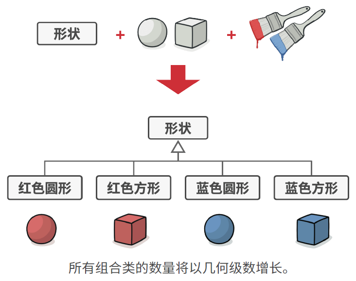

在层次结构中新增形状和颜色将导致代码复杂程度指数增长。例如添加三角形状，你需要新增两个子类，也就是每种颜色一个；此后新增一种新颜色需要新增三个子类，即每种形状一个。如此以往，情况会越来越糟糕。

问题的根本原因是我们试图在两个独立的维度——形状与颜色——上扩展形状类。这在处理类继承时是很常见的问题。

桥接模式通过将继承改为组合的方式来解决这个问题。具体来说，就是抽取其中一个维度并使之成为独立的类层次，这样就可以在初始类中引用这个新层次的对象，从而使得一个类不必拥有所有的状态和行为。将一个类层次转化为多个相关的类层次，避免单个类层次的失控。

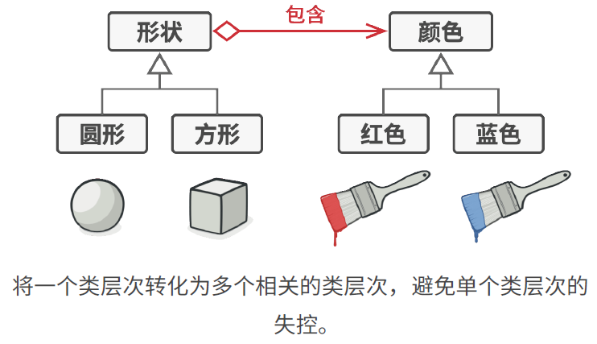

根据该方法，我们可以将颜色相关的代码抽取到拥有红色和蓝色两个子类的颜色类中，然后在形状类中添加一个指向某一颜色对象的引用成员变量。现在，形状类可以将所有与颜色相关的工作委派给连入的颜色对象。这样的引用就成为了形状和颜色之间的桥梁。此后，新增颜色将不再需要修改形状的类层次，反之亦然。

设计模式四人组的著作《设计模式：可复用面向对象软件的基础》中，在桥接定义中提出了抽象部分和实现部分两个术语：抽象部分（也被称为接口）是一些实体的高阶控制层。该层自身不完成任何具体的工作，它需要将工作委派给实现部分层（也被称为平台）。注意， 这里提到的内容与编程语言中的接口或抽象类无关。它们并不是一回事。

例如用图形用户界面（GUI）和底层操作系统代码（API）来代表桥接模式中的两个类层次，可以在两个独立方向上扩展这种应用：

* 开发多个不同的GUI（例如面向普通用户和管理员进行分别配置）
* 支持多个不同的API（例如， 能够在Windows、Linux 和macOS 上运行该程序）。

此时GUI 层调用API 层来对用户的各种操作做出响应，所以GUI 层就是抽象部分（调用另一个层次的部分），API 层就是实现部分（被调用的部分，真正干活的部分），这样无需改动与API 相关的类就可以修改GUI类。此外如果想支持一个新的操作系统，只需在实现部分层次中创建一个子类即可。

### 模式结构

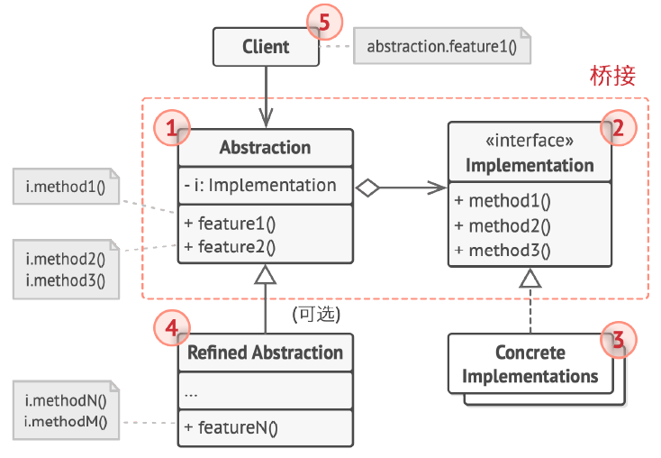

1、抽象部分（Abstraction）提供高层控制逻辑， 依赖于完成底层实际工作的实现对象。

2、实现部分（Implementation）为所有具体实现声明通用接口。抽象部分仅能通过在这里声明的方法与实现对象交互。

抽象部分可以列出和实现部分一样的方法，但是抽象部分通常声明一些复杂行为，这些行为依赖于多种由实现部分声明的原语操作。

3、具体实现（Concrete Implementations）中包括特定于平台的代码。

4、精确抽象（Refined Abstraction）提供控制逻辑的变体。与其父类一样，它们通过通用实现接口与不同的实现进行交互。

5、通常情况下，客户端（Client）仅关心如何与抽象部分合作。但是，客户端需要将抽象对象与一个实现对象连接起来。

### 代码示例

桥接模式在处理跨平台应用、 支持多种类型的数据库服务器或与多个特定种类 （例如云平台和社交网络等） 的 API 供应商协作时会特别有用。 

识别方法： 桥接可以通过一些控制实体及其所依赖的多个不同平台之间的明确区别来进行识别。

下面的例子演示了桥接模式如何拆分程序中同时管理设备及其遥控器的庞杂代码。设备Device 类作为实现部分， 而遥控器Remote 类则作为抽象部分。

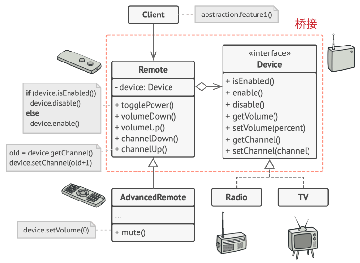

最初类层次结构被拆分为两个部分：设备和遥控器。

遥控器基类声明了一个指向设备对象的引用成员变量。所有遥控器通过通用设备接口与设备进行交互，使得同一个遥控器可以支持不同类型的设备。

你可以开发独立于设备类的遥控器类，只需新建一个遥控器子类即可。例如，基础遥控器可能只有两个按钮，但你可在其基础上扩展新功能，比如额外的一节电池或一块触摸屏。

客户端代码通过遥控器构造函数将特定种类的遥控器与设备对象连接起来。桥接模式允许在不改动另一层次代码的前提下修改已有类， 甚至创建新类。 

设备的通用接口Device，及设备的两个实现Radio和Tv：

~~~java
public interface Device {
    boolean isEnabled();

    void enable();

    void disable();

    int getVolume();

    void setVolume(int percent);

    int getChannel();

    void setChannel(int channel);

    void printStatus();
}
~~~

~~~java
public class Radio implements Device {
    private boolean on = false;
    private int volume = 30;
    private int channel = 1;

    @Override
    public boolean isEnabled() {
        return on;
    }

    @Override
    public void enable() {
        on = true;
    }

    @Override
    public void disable() {
        on = false;
    }

    @Override
    public int getVolume() {
        return volume;
    }

    @Override
    public void setVolume(int volume) {
        if (volume > 100) {
            this.volume = 100;
        } else if (volume < 0) {
            this.volume = 0;
        } else {
            this.volume = volume;
        }
    }

    @Override
    public int getChannel() {
        return channel;
    }

    @Override
    public void setChannel(int channel) {
        this.channel = channel;
    }

    @Override
    public void printStatus() {
        System.out.println("------------------------------------");
        System.out.println("| I'm radio.");
        System.out.println("| I'm " + (on ? "enabled" : "disabled"));
        System.out.println("| Current volume is " + volume + "%");
        System.out.println("| Current channel is " + channel);
        System.out.println("------------------------------------\n");
    }
}
~~~

~~~java
public class Tv implements Device {
    private boolean on = false;
    private int volume = 30;
    private int channel = 1;

    @Override
    public boolean isEnabled() {
        return on;
    }

    @Override
    public void enable() {
        on = true;
    }

    @Override
    public void disable() {
        on = false;
    }

    @Override
    public int getVolume() {
        return volume;
    }

    @Override
    public void setVolume(int volume) {
        if (volume > 100) {
            this.volume = 100;
        } else if (volume < 0) {
            this.volume = 0;
        } else {
            this.volume = volume;
        }
    }

    @Override
    public int getChannel() {
        return channel;
    }

    @Override
    public void setChannel(int channel) {
        this.channel = channel;
    }

    @Override
    public void printStatus() {
        System.out.println("------------------------------------");
        System.out.println("| I'm TV set.");
        System.out.println("| I'm " + (on ? "enabled" : "disabled"));
        System.out.println("| Current volume is " + volume + "%");
        System.out.println("| Current channel is " + channel);
        System.out.println("------------------------------------\n");
    }
}
~~~

远程控制器的通用接口Remote，及其两个具体实现BasicRemote和AdvancedRemote，在基类BasicRemote中声明了一个指向设备Device的成员变量：

~~~java
public interface Remote {
    void power();

    void volumeDown();

    void volumeUp();

    void channelDown();

    void channelUp();
}
~~~

~~~java
public class BasicRemote implements Remote {
    protected Device device;

    public BasicRemote() {}

    public BasicRemote(Device device) {
        this.device = device;
    }

    @Override
    public void power() {
        System.out.println("Remote: power toggle");
        if (device.isEnabled()) {
            device.disable();
        } else {
            device.enable();
        }
    }

    @Override
    public void volumeDown() {
        System.out.println("Remote: volume down");
        device.setVolume(device.getVolume() - 10);
    }

    @Override
    public void volumeUp() {
        System.out.println("Remote: volume up");
        device.setVolume(device.getVolume() + 10);
    }

    @Override
    public void channelDown() {
        System.out.println("Remote: channel down");
        device.setChannel(device.getChannel() - 1);
    }

    @Override
    public void channelUp() {
        System.out.println("Remote: channel up");
        device.setChannel(device.getChannel() + 1);
    }
}
~~~

~~~java
public class AdvancedRemote extends BasicRemote {

    public AdvancedRemote(Device device) {
        super.device = device;
    }

    public void mute() {
        System.out.println("Remote: mute");
        device.setVolume(0);
    }
}
~~~

客户端代码：

~~~java
public class Demo {
    public static void main(String[] args) {
        testDevice(new Tv());
        testDevice(new Radio());
    }

    public static void testDevice(Device device) {
        System.out.println("Tests with basic remote.");
        BasicRemote basicRemote = new BasicRemote(device);
        basicRemote.power();
        device.printStatus();

        System.out.println("Tests with advanced remote.");
        AdvancedRemote advancedRemote = new AdvancedRemote(device);
        advancedRemote.power();
        advancedRemote.mute();
        device.printStatus();
    }
}
~~~

### 适用场景

1、想要拆分或重组一个具有多重功能的庞杂类（例如能与多个数据库服务器进行交互的类），可以使用桥接模式。

类的代码行数越多，弄清其运作方式就越困难，对其进行修改所花费的时间就越长。一个功能上的变化可能需要在整个类范围内进行修改，而且常常会产生错误，甚至还会有一些严重的副作用。

桥接模式可以将庞杂类拆分为几个类层次结构。此后，你可以修改任意一个类层次结构而不会影响到其他类层次结构。这种方法可以简化代码的维护工作，并将修改已有代码的风险降到最低。

2、在几个独立维度上扩展一个类，可使用该模式。

桥接建议将每个维度抽取为独立的类层次。初始类将相关工作委派给属于对应类层次的对象，无需自己完成所有工作。

3、需要在运行时切换不同实现方法，可使用桥接模式。

桥接模式可替换抽象部分中的实现对象，具体操作就和给成员变量赋新值一样简单。这一点是很多人混淆桥接模式和策略模式的主要原因，设计模式并不仅是一种对类进行组织的方式，它还能用于沟通意图和解决问题。

### 优缺点

优点：

* 可以创建与平台无关的类和程序。
* 客户端代码仅与高层抽象部分进行互动，不会接触到平台的详细信息。
* 开闭原则。你可以新增抽象部分和实现部分，且它们之间不会相互影响。
* 单一职责原则。抽象部分专注于处理高层逻辑，实现部分处理平台细节。

缺点：对高内聚的类使用该模式可能会让代码更加复杂。

### 与其他模式的关系

* 桥接模式和抽象工厂模式共同使用：如果由桥接定义的抽象只能与特定实现合作， 这一模式搭配就非常有用。 在这种情况下， 抽象工厂可以对这些关系进行封装， 并且对客户端代码隐藏其复杂性。
* 桥接模式和生成器模式共同使用：主管类负责抽象工作， 各种不同的生成器负责实现工作。

## 组合模式

### 核心思想

又称为对象树、Object Tree、Composite。组合模式是一种结构型设计模式， 你可以使用它将对象组合成树状结构， 并且能像使用独立对象一样使用它们。组合最主要的功能是在整个树状结构上递归调用方法并对结果进行汇总。 

如果应用的核心模型能用树状结构表示，可以考虑使用组合模式。

例如，你有两类对象： 产品和盒子。一个盒子中可以包含多个产品或者几个较小的盒子。这些小盒子中同样可以包含一些产品或更小的盒子，以此类推。

假设你希望在这些类的基础上开发一个定购系统。订单中可以包含无包装的简单产品，也可以包含装满产品的盒子……以及其他盒子。此时计算总价格就变成一个困难问题：

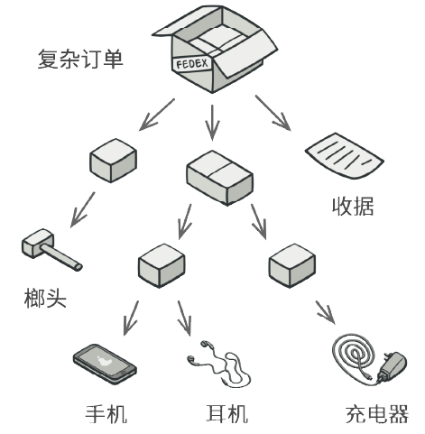

因为订单中可能包括各种产品，这些产品放置在盒子中，然后又被放入一层又一层更大的盒子中。整个结构看上去像是一棵倒过来的树。

你可以尝试直接计算：打开所有盒子，找到每件产品，然后计算总价。这在真实世界中或许可行，但在程序中，你并不能简单地使用循环语句来完成该工作。你必须事先知道所有产品和盒子的类别， 所有盒子的嵌套层数以及其他繁杂的细节信息。因此，直接计算极不方便，甚至完全不可行。

组合模式建议使用一个通用接口来与产品和盒子进行交互，并且在该接口中声明一个计算总价的方法。对于一个产品，该方法直接返回其价格；对于一个盒子，该方法遍历盒子中的所有项目，询问每个项目的价格，然后返回该盒子的总价格。组合模式以递归方式处理对象树中的所有项目。

该方式的最大优点在于你无需了解构成树状结构的对象的具体类。你也无需了解对象是简单的产品还是复杂的盒子。你只需调用通用接口以相同的方式对其进行处理即可。当你调用该方法后，对象会将请求沿着树结构传递下去。

### 模式结构

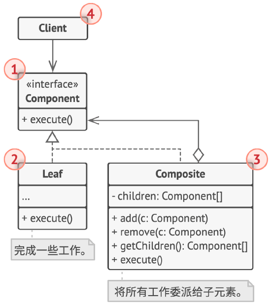

1、组件（Component）接口描述了树中简单项目和复杂项目所共有的操作。

2、叶节点（Leaf）是树的基本结构，它不包含子项目。一般情况下，叶节点最终会完成大部分的实际工作，因为它们无法将工作指派给其他部分。

3、容器（Container）——又名“组合（Composite）”——是包含叶节点或其他容器等子项目的单位。容器不知道其子项目所属的具体类，它只通过通用的组件接口与其子项目交互。容器接收到请求后会将工作分配给自己的子项目，处理中间结果，然后将最终结果返回给客户端。

4、客户端（Client）通过组件接口与所有项目交互。因此， 客户端能以相同方式与树状结构中的简单或复杂项目交互。

### 代码示例

组合模式在 Java 代码中很常见,常用于表示与图形打交道的用户界面组件或代码的层次结构。 

下面是一些来自 Java 标准程序库中的组合示例： 

* java.awt.Container#add(Component) （几乎广泛存在于 Swing 组件中）
* javax.faces.component.UIComponent#getChildren() （几乎广泛存在于 JSF UI 组件中）

识别方法： 组合可以通过将同一抽象或接口类型的实例放入树状结构的行为方法来轻松识别。

抽象组件Component：

~~~java
public abstract class Component {
    protected String name;

    public Component(String name) {
        this.name = name;
    }

    public void print() {
        print(0);
    }

    abstract void print(int level);

    abstract public void add(Component component);

    abstract public void remove(Component component);
}
~~~

叶子类Leaf：

~~~java
public class Leaf extends Component {
    public Leaf(String name) {
        super(name);
    }

    @Override
    void print(int level) {
        for (int i = 0; i < level; i++) {
            System.out.print("--");
        }
        System.out.println("left:" + name);
    }

    @Override
    public void add(Component component) {
        throw new UnsupportedOperationException(); // 牺牲透明性换取单一职责原则，这样就不用考虑是叶子节点还是组合节点
    }

    @Override
    public void remove(Component component) {
        throw new UnsupportedOperationException();
    }
}
~~~

复合对象，它既可以包含其他复合对象，又能包含叶子对象：

~~~java
public class Composite extends Component {

    private List<Component> child;

    public Composite(String name) {
        super(name);
        child = new ArrayList<>();
    }

    @Override
    void print(int level) {
        for (int i = 0; i < level; i++) {
            System.out.print("--");
        }
        System.out.println("Composite:" + name);
        for (Component component : child) {
            component.print(level + 1);
        }
    }

    @Override
    public void add(Component component) {
        child.add(component);
    }

    @Override
    public void remove(Component component) {
        child.remove(component);
    }
}
~~~

客户端使用的时候，可以直接调用抽象类中的方法，而无需关心对象具体的类型：

~~~java
public class Client {
    public static void main(String[] args) {
        Composite root = new Composite("root");
        Component node1 = new Leaf("1");
        Component node2 = new Composite("2");
        Component node3 = new Leaf("3");
        root.add(node1);
        root.add(node2);
        root.add(node3);
        Component node21 = new Leaf("21");
        Component node22 = new Composite("22");
        node2.add(node21);
        node2.add(node22);
        Component node221 = new Leaf("221");
        node22.add(node221);
        root.print();
    }
}
~~~

### 适用场景

1、如果你需要实现树状对象结构， 可以使用组合模式。

组合模式为你提供了两种共享公共接口的基本元素类型： 简单叶节点和复杂容器。 容器中可以包含叶节点和其他容器。 这使得你可以构建树状嵌套递归对象结构。 

2、如果你希望客户端代码以相同方式处理简单和复杂元素， 可以使用该模式。

组合模式中定义的所有元素共用同一个接口。 在这一接口的帮助下， 客户端不必在意其所使用的对象的具体类。 

### 优缺点

优点：

* 可以利用多态和递归机制更方便地使用复杂树结构。 
* 开闭原则。 无需更改现有代码， 你就可以在应用中添加新元素， 使其成为对象树的一部分。

缺点：

* 对于功能差异较大的类， 提供公共接口或许会有困难。 在特定情况下， 你需要过度一般化组件接口， 使其变得令人难以理解。 
* 在容器中定义添加和删除子元素的方法时，如果这些操作在接口中声明，可能会违反接口隔离原则，因为叶节点类中的这些方法为空。 但是， 这可以让客户端无差别地访问所有元素， 即使是组成树状结构的元素。 

### 与其他模式的关系

* 组合模式和生成器模式共同使用：可以在创建复杂组合树时使用生成器模式， 因为这可使其构造步骤以递归的方式运行。

* 组合模式和责任链模式共同使用：责任链模式通常和组合模式结合使用。 在这种情况下， 叶组件接收到请求后， 可以将请求沿包含全体父组件的链一直传递至对象树的底部。

* 组合模式和迭代器模式共同使用：可以使用迭代器模式来遍历组合树。

* 组合模式和访问者模式共同使用：可以使用访问者模式对整个组合树执行操作。

* 组合模式和享元模式共同使用：可以使用享元模式实现组合树的共享叶节点以节省内存。

* 组合模式和装饰者模式的对比：组合和装饰模式的结构图很相似， 因为两者都依赖递归组合来组织无限数量的对象。

  装饰类似于组合， 但其只有一个子组件。 此外还有一个明显不同： 装饰为被封装对象添加了额外的职责， 组合仅对其子节点的结果进行了 “求和”。

  两者可以共同使用：模式也可以相互合作： 你可以使用装饰来扩展组合树中特定对象的行为。

* 组合模式和装饰者模式、原型模式共同使用：大量使用组合和装饰的设计通常可从对于原型模式的使用中获益。 你可以通过该模式来复制复杂结构， 而非从零开始重新构造。

## 装饰模式

### 核心思想

又称装饰者模式、装饰器模式、Wrapper、Decorator 。装饰模式是一种结构型设计模式， 允许你通过将对象放入包含行为的特殊封装对象中来为原对象绑定新的行为。由于目标对象和装饰器遵循同一接口， 因此你可用装饰来对对象进行无限次的封装。 结果对象将获得所有封装器叠加而来的行为。 

假设你正在开发一个提供通知功能的库，其他程序可使用它向用户发送关于重要事件的通知。

库的最初版本基于通知器Notifier 类，其中只有很少的几个成员变量，一个构造函数和一个send 发送方法。该方法可以接收来自客户端的消息参数，并将该消息发送给一系列的邮箱，邮箱列表则是通过构造函数传递给通知器的。作为客户端的第三方程序仅会创建和配置通知器对象一次，然后在有重要事件发生时对其进行调用。

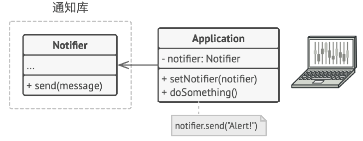

此后某个时刻，你会发现库的用户希望使用除邮件通知之外的功能。许多用户会希望接收关于紧急事件的手机短信，还有些用户希望在微信上接收消息， 而公司用户则希望在QQ上接收消息。为了应对这个变化，首先扩展通知器类，然后在新的子类中加入额外的通知方法。现在客户端要对所需通知形式的对应类进行初始化，然后使用该类发送后续所有的通知消息。每种通知类型都将作为通知器的一个子类得以实现。

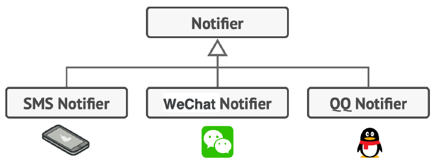

后续如果又有人希望同时使用多种通知形式，可以尝试创建一个特殊子类来将多种通知方法组合在一起以解决该问题。但这种方式会使得代码量迅速膨胀，不仅仅是程序库代码，客户端代码也会如此。

当你需要更改一个对象的行为时，第一个跳入脑海的想法就是扩展它所属的类。但是，你不能忽视继承可能引发的几个严重问题：

* 继承是静态的。你无法在运行时更改已有对象的行为，只能使用由不同子类创建的对象来替代当前的整个对象。
* 子类只能有一个父类。大部分编程语言不允许一个类同时继承多个类的行为。

其中一种方法是用聚合或组合， 而不是继承。两者的工作方式几乎一模一样：

* 聚合或组合：一个对象包含指向另一个对象的引用，并将部分工作委派给引用对象
* 继承：继承中的对象则继承了父类的行为，它们自己能够完成这些工作。

聚合（或组合）组合是许多设计模式背后的关键原则（包括装饰在内）。

封装器是装饰模式的别称，这个称谓明确地表达了该模式的主要思想。“封装器”是一个能与其他“目标”对象连接的对象。封装器包含与目标对象相同的一系列方法，它会将所有接收到的请求委派给目标对象。但是，封装器可以在将请求委派给目标前后对其进行处理，所以可能会改变最终结果。

光是有简单的封装器还不能被称为真正的装饰，还需要封装器实现了与其封装对象相同的接口。从客户端的角度来看，这些对象是完全一样的。封装器中的引用成员变量可以是遵循相同接口的任意对象。这使得你可以将一个对象放入多个封装器中，并在对象中添加所有这些封装器的组合行为。

比如在消息通知示例中，我们可以将简单邮件通知行为放在基类通知器中，但将所有其他通知方法放入装饰中。

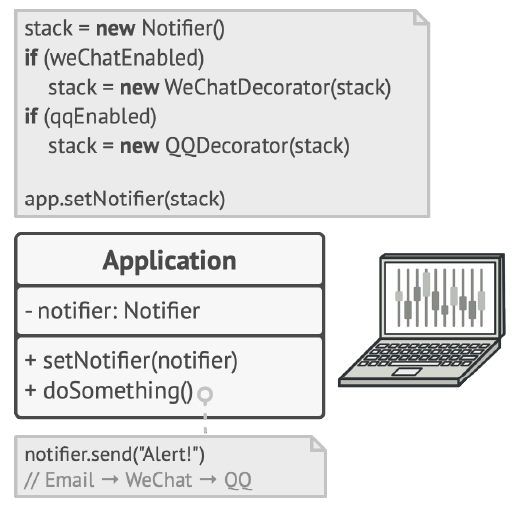

客户端代码必须将基础通知器放入一系列自己所需的装饰中。因此最后的对象将形成一个栈结构。实际与客户端进行交互的对象将是最后一个进入栈中的装饰对象。由于所有的装饰都实现了与通知基类相同的接口，客户端的其他代码并不在意自己到底是与“纯粹”的通知器对象，还是与装饰后的通知器对象进行交互。

我们可以使用相同方法来完成其他行为（例如设置消息格式或者创建接收人列表）。只要所有装饰都遵循相同的接口，客户端就可以使用任意自定义的装饰来装饰对象。

### 模式结构

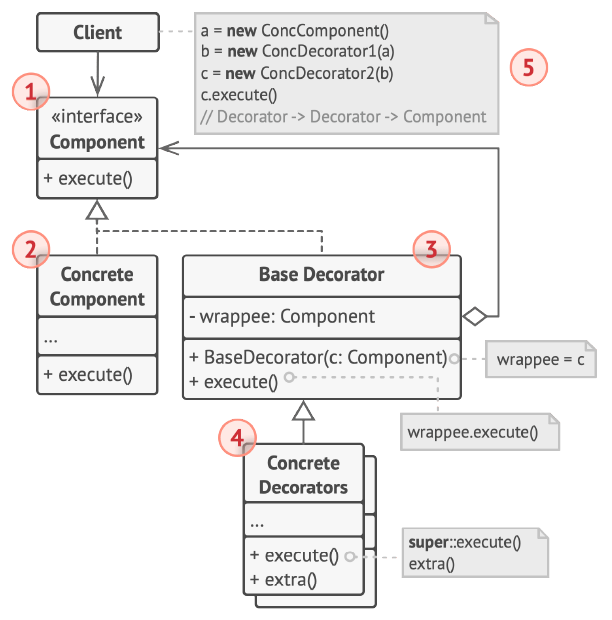

1、部件（Component）声明封装器和被封装对象的公用接口。

2、具体部件（Concrete Component）类是被封装对象所属的类。它定义了基础行为，但装饰类可以改变这些行为。

3、基础装饰（Base Decorator）类拥有一个指向被封装对象的引用成员变量。该变量的类型应当被声明为通用部件接口，这样它就可以引用具体的部件和装饰。装饰基类会将所有操作委派给被封装的对象。

4、具体装饰类（Concrete Decorators） 定义了可动态添加到部件的额外行为。具体装饰类会重写装饰基类的方法，并在调用父类方法之前或之后进行额外的行为。

5、客户端（Client）可以使用多层装饰来封装部件， 只要它能使用通用接口与所有对象互动即可。

### 代码示例

在Java中，装饰模式很常见，尤其是在与流式加载相关的代码中。 

Java 核心程序库中有一些关于装饰的示例： 

* java.io.InputStream、 Output­Stream、 Reader 和 Writer 的所有代码都有以自身类型的对象作为参数的构造函数。
* java.util.Collections； checked­XXX()、 synchronized­XXX() 和 unmodifiable­XXX() 方法。
* javax.servlet.http.HttpServletRequestWrapper 和 Http­Servlet­Response­Wrapper

识别方法： 装饰可通过以当前类或对象为参数的创建方法或构造函数来识别。

在下面的例子中，装饰模式能够对敏感数据进行压缩和加密，从而将数据从使用数据的代码中独立出来。

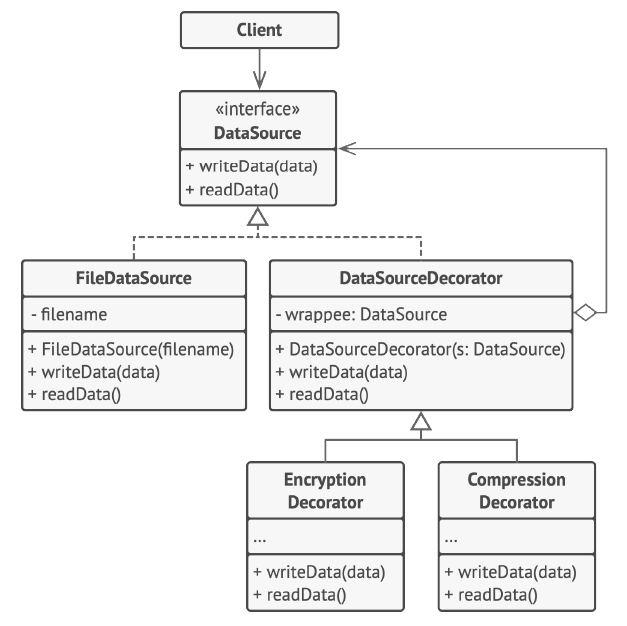

程序使用一对装饰来封装数据源对象。这两个封装器都改变了从磁盘读写数据的方式：

* 当数据即将被写入磁盘前，装饰对数据进行加密和压缩。在原始类对改变毫无察觉的情况下，将加密后的受保护数据写入文件。
* 当数据刚从磁盘读出后，同样通过装饰对数据进行解压和解密。装饰和数据源类实现同一接口，从而能在客户端代码中相互替换。

最初的业务逻辑类仅能读取和写入纯文本的数据。 此后， 我们创建了几个小的封装器类， 以便在执行标准操作后添加新的行为。

第一个封装器负责加密和解密数据， 而第二个则负责压缩和解压数据。

你甚至可以让这些封装器嵌套封装以将它们组合起来。

通用数据接口DataSource：

~~~java
public interface DataSource {
    void writeData(String data);

    String readData();
}
~~~

简单数据读写器FileDataSource，它是最终要装饰的对象，可以完成最基本的功能：

~~~java
public class FileDataSource implements DataSource {
    private String name;

    public FileDataSource(String name) {
        this.name = name;
    }

    @Override
    public void writeData(String data) {
        File file = new File(name);
        try (OutputStream fos = new FileOutputStream(file)) {
            fos.write(data.getBytes(), 0, data.length());
        } catch (IOException ex) {
            System.out.println(ex.getMessage());
        }
    }

    @Override
    public String readData() {
        char[] buffer = null;
        File file = new File(name);
        try (FileReader reader = new FileReader(file)) {
            buffer = new char[(int) file.length()];
            reader.read(buffer);
        } catch (IOException ex) {
            System.out.println(ex.getMessage());
        }
        return new String(buffer);
    }
}
~~~

抽象装饰类：

~~~java
public class DataSourceDecorator implements DataSource {
    private DataSource wrappee;

    DataSourceDecorator(DataSource source) {
        this.wrappee = source;
    }

    @Override
    public void writeData(String data) {
        wrappee.writeData(data);
    }

    @Override
    public String readData() {
        return wrappee.readData();
    }
}
~~~

两个具体的装饰类：一个是加密装饰类，一个是压缩装饰类

~~~java
public class EncryptionDecorator extends DataSourceDecorator {

    public EncryptionDecorator(DataSource source) {
        super(source);
    }

    @Override
    public void writeData(String data) {
        super.writeData(encode(data));
    }

    @Override
    public String readData() {
        return decode(super.readData());
    }

    private String encode(String data) {
        byte[] result = data.getBytes();
        for (int i = 0; i < result.length; i++) {
            result[i] += (byte) 1;
        }
        return Base64.getEncoder().encodeToString(result);
    }

    private String decode(String data) {
        byte[] result = Base64.getDecoder().decode(data);
        for (int i = 0; i < result.length; i++) {
            result[i] -= (byte) 1;
        }
        return new String(result);
    }
}
~~~

~~~java
public class CompressionDecorator extends DataSourceDecorator {
    private int compLevel = 6;

    public CompressionDecorator(DataSource source) {
        super(source);
    }

    public int getCompressionLevel() {
        return compLevel;
    }

    public void setCompressionLevel(int value) {
        compLevel = value;
    }

    @Override
    public void writeData(String data) {
        super.writeData(compress(data));
    }

    @Override
    public String readData() {
        return decompress(super.readData());
    }

    private String compress(String stringData) {
        byte[] data = stringData.getBytes();
        try {
            ByteArrayOutputStream bout = new ByteArrayOutputStream(512);
            DeflaterOutputStream dos = new DeflaterOutputStream(bout, new Deflater(compLevel));
            dos.write(data);
            dos.close();
            bout.close();
            return Base64.getEncoder().encodeToString(bout.toByteArray());
        } catch (IOException ex) {
            return null;
        }
    }

    private String decompress(String stringData) {
        byte[] data = Base64.getDecoder().decode(stringData);
        try {
            InputStream in = new ByteArrayInputStream(data);
            InflaterInputStream iin = new InflaterInputStream(in);
            ByteArrayOutputStream bout = new ByteArrayOutputStream(512);
            int b;
            while ((b = iin.read()) != -1) {
                bout.write(b);
            }
            in.close();
            iin.close();
            bout.close();
            return new String(bout.toByteArray());
        } catch (IOException ex) {
            return null;
        }
    }
}
~~~

客户端代码：

~~~java
public class Demo {
    public static void main(String[] args) {
        String salaryRecords = "Name,Salary\nJohn Smith,100000\nSteven Jobs,912000";
        DataSourceDecorator encoded = new CompressionDecorator(
                                         new EncryptionDecorator(
                                             new FileDataSource("out/OutputDemo.txt")));
        encoded.writeData(salaryRecords);
        DataSource plain = new FileDataSource("out/OutputDemo.txt");

        System.out.println("- Input ----------------");
        System.out.println(salaryRecords);
        System.out.println("- Encoded --------------");
        System.out.println(plain.readData());
        System.out.println("- Decoded --------------");
        System.out.println(encoded.readData());
    }
}
~~~

### 适用场景

1、希望在无需修改代码的情况下即可使用对象，且希望在运行时为对象新增额外的行为，可以使用装饰模式。

装饰能将业务逻辑组织为层次结构，你可为各层创建一个装饰，在运行时将各种不同逻辑组合成对象。由于这些对象都遵循通用接口，客户端代码能以相同的方式使用这些对象。

2、如果用继承来扩展对象行为的方案难以实现或者根本不可行，你可以使用该模式。

许多编程语言使用final 最终关键字来限制对某个类的进一步扩展。复用最终类已有行为的唯一方法是使用装饰模式：用封装器对其进行封装。

### 优缺点

优点：

* 无需创建新子类即可扩展对象的行为。
* 可以在运行时添加或删除对象的功能。
* 可以用多个装饰封装对象来组合几种行为。
* 单一职责原则。你可以将实现了许多不同行为的一个大类拆分为多个较小的类。

缺点：

* 在封装器栈中删除特定封装器比较困难。
* 实现行为不受装饰栈顺序影响的装饰比较困难。
* 各层的初始化配置代码看上去可能会很糟糕。

### 与其他模式的关系

* 装饰模式和责任链模式对比：责任链模式和装饰模式的类结构非常相似。 两者都依赖递归组合将需要执行的操作传递给一系列对象。 但是， 两者有几点重要的不同之处。
  * 责任链的管理者可以相互独立地执行一切操作， 还可以随时停止传递请求。
  * 各种装饰可以在遵循基本接口的情况下扩展对象的行为。 此外， 装饰无法中断请求的传递。
* 装饰模式和策略模式的对比：
  * 装饰可让你更改对象的外表
  * 策略模式则让你能够改变其本质。
* 装饰模式和代理模式的对比：这两个模式的构建都基于组合原则， 也就是说一个对象应该将部分工作委派给另一个对象。 
  * 代理通常自行管理其服务对象的生命周期
  * 装饰的生成则总是由客户端进行控制。

## 外观模式

### 核心思想

又称Facade，外观模式是一种结构型设计模式， 能为程序库、 框架或其他复杂类提供一个简单的接口。

外观模式降低了程序的整体复杂度， 同时也有助于将不需要的依赖移动到同一个位置。 

假设你必须在代码中使用某个复杂的库或框架中的众多对象。正常情况下，你需要负责所有对象的初始化工作、管理其依赖关系并按正确的顺序执行方法等。最终，程序中类的业务逻辑将与第三方类的实现细节紧密耦合，使得理解和维护代码的工作很难进行。

外观类为包含许多活动部件的复杂子系统提供一个简单的接口。与直接调用子系统相比，外观提供的功能可能比较有限，但它却包含了客户端真正关心的功能。如果你的程序需要与包含几十种功能的复杂库整合，但只需使用其中非常少的功能，那么使用外观模式会非常方便。

例如， 上传猫咪搞笑短视频到社交媒体网站的应用可能会用到专业的视频转换库， 但它只需使用一个包含encode(filename, format) 方法（以文件名与文件格式为参数进行编码的方法）的类即可。

当你通过电话给商店下达订单时，接线员就是该商店的所有服务和部门的外观。接线员为你提供了一个同购物系统、支付网关和各种送货服务进行互动的简单语音接口。

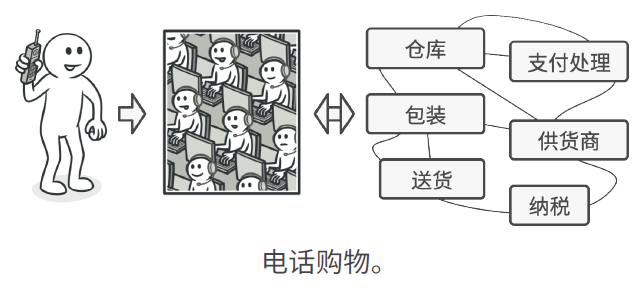

### 模式结构

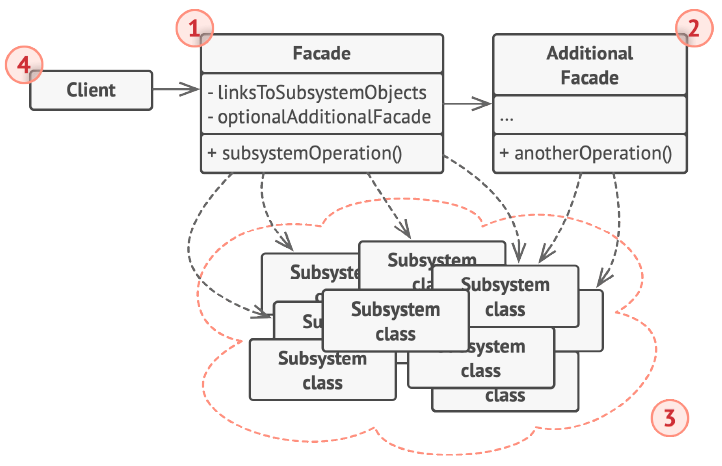

1、外观（Facade）提供了一种访问特定子系统功能的便捷方式，其了解如何重定向客户端请求，知晓如何操作一切活动部件。

2、创建附加外观（Additional Facade） 类可以避免多种不相关的功能污染单一外观，使其变成又一个复杂结构。客户端和其他外观都可使用附加外观。

3、复杂子系统（Complex Subsystem）由数十个不同对象构成。如果要用这些对象完成有意义的工作，你必须深入了解子系统的实现细节，比如按照正确顺序初始化对象和为其提供正确格式的数据。子系统类不会意识到外观的存在，它们在系统内运作并且相互之间可直接进行交互。

4、客户端（Client）使用外观代替对子系统对象的直接调用。

### 代码示例

使用 Java 开发的程序中经常会使用外观模式。 它在与复杂程序库和 API 协作时特别有用。 

下面是一些核心 Java 程序库中的外观示例： 

* javax.faces.context.FacesContext 在底层使用了 Life­Cycle、 View­Handler 和 Navigation­Handler 这几个类， 但绝大多数客户端不知道。
* javax.faces.context.ExternalContext 在内部使用了 Servlet­Context、 Http­Session、 Http­Servlet­Request、 Http­Servlet­Response 和其他一些类。

识别方法： 外观可以通过使用简单接口， 但将绝大部分工作委派给其他类的类来识别。 通常情况下， 外观管理着其所使用的对象的完整生命周期。

在本例中， 外观模式简化了客户端与复杂视频转换框架之间的交互。外观提供了仅包含一个方法的类， 可用于处理对框架中所需类的配置与以正确格式获取结果的复杂工作。 

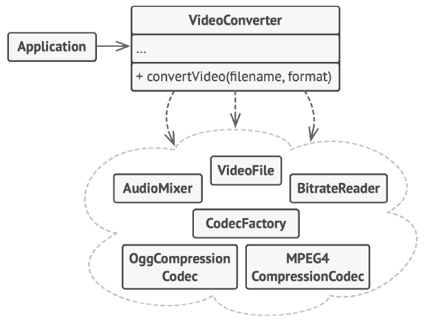

可以创建一个封装所需功能并隐藏其他代码的外观类，从而无需使全部代码直接与数十个框架类进行交互。该结构还能将未来框架升级或更换所造成的影响最小化，因为你只需修改程序中外观方法的实现即可。

外观类VideoConversionFacade，它提供了进行视频转换的简单接口，整合了复杂的逻辑：

~~~java
public class VideoConversionFacade {
    public File convertVideo(String fileName, String format) {
        System.out.println("VideoConversionFacade: conversion started.");
        VideoFile file = new VideoFile(fileName);
        Codec sourceCodec = CodecFactory.extract(file);
        Codec destinationCodec;
        if (format.equals("mp4")) {
            destinationCodec = new MPEG4CompressionCodec();
        } else {
            destinationCodec = new OggCompressionCodec();
        }
        VideoFile buffer = BitrateReader.read(file, sourceCodec);
        VideoFile intermediateResult = BitrateReader.convert(buffer, destinationCodec);
        File result = (new AudioMixer()).fix(intermediateResult);
        System.out.println("VideoConversionFacade: conversion completed.");
        return result;
    }
}
~~~

客户端代码仅仅需要与外观类交互，不需要管理复杂的对象：

~~~java
public class Demo {
    public static void main(String[] args) {
        VideoConversionFacade converter = new VideoConversionFacade();
        File mp4Video = converter.convertVideo("youtubevideo.ogg", "mp4");
        // ...
    }
}
~~~

### 适用场景

1、如果你需要一个指向复杂子系统的直接接口，且该接口的功能有限，则可以使用外观模式。

子系统通常会随着时间的推进变得越来越复杂。即便是应用了设计模式，通常你也会创建更多的类。尽管在多种情形中子系统可能是更灵活或易于复用的，但其所需的配置和样板代码数量将会增长得更快。为了解决这个问题，外观将会提供指向子系统中最常用功能的快捷方式，能够满足客户端的大部分需求。

2、如果需要将子系统组织为多层结构，可以使用外观。

创建外观来定义子系统中各层次的入口。你可以要求子系统仅使用外观来进行交互，以减少子系统之间的耦合。

回到视频转换框架的例子。该框架可以拆分为两个层次：音频相关和视频相关。你可以为每个层次创建一个外观，然后要求各层的类必须通过这些外观进行交互。这种方式看上去与中介者模式非常相似。

### 优缺点

优点：可以让自己的代码独立于复杂子系统。

缺点：外观可能成为与程序中所有类都耦合的上帝对象

### 与其他模式的关系

* 外观模式和享元模式对比：

  * 享元模式展示了如何生成大量的小型对象
  * 外观则展示了如何用一个对象来代表整个子系统。

* 外观模式和中介者模式对比：外观和中介者模式的职责类似： 它们都尝试在大量紧密耦合的类中组织起合作。

  * 外观为子系统中的所有对象定义了一个简单接口， 但是它不提供任何新功能。 子系统本身不会意识到外观的存在。 子系统中的对象可以直接进行交流。
  * 中介者将系统中组件的沟通行为中心化。 各组件只知道中介者对象， 无法直接相互交流。

* 外观模式和代理模式对比：外观与代理模式的相似之处在于它们都缓存了一个复杂实体并自行对其进行初始化。 

  代理与其服务对象遵循同一接口， 使得自己和服务对象可以互换， 在这一点上它与外观不同。

## 享元模式

### 核心思想

又称缓存、Cache、Flyweight。享元模式是一种结构型设计模式， 它摒弃了在每个对象中保存所有数据的方式， 通过共享多个对象所共有的相同状态， 让你能在有限的内存容量中载入更多对象。模式通过共享多个对象的部分状态来实现上述功能。 换句话来说， 享元会将不同对象的相同数据进行缓存以节省内存。 

享元模式只是一种优化。在应用该模式之前，你要确定程序中存在与大量类似对象同时占用内存相关的内存消耗问题，并且确保该问题无法使用其他更好的方式来解决。享元模式只有一个目的： 将内存消耗最小化。 如果你的程序没有遇到内存容量不足的问题， 则可以暂时忽略该模式。 

如果开发了一款游戏：玩家们在地图上移动并相互射击，大量的子弹、导弹和爆炸弹片会在整个地图上穿行。游戏的最初版本经常在长时间游戏后出现崩溃，导致游戏崩溃的原因是内存容量不足。真正的问题与粒子系统有关。每个粒子（一颗子弹、一枚导弹或一块弹片）都由包含完整数据的独立对象来表示：

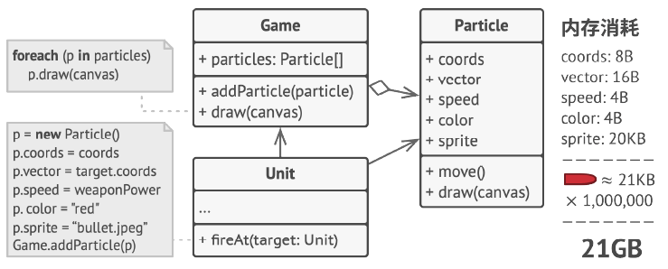

仔细观察粒子Particle 类， 你可能会注意到颜色（color）和精灵图（sprite）这两个成员变量所消耗的内存要比其他变量多得多。更糟糕的是，对于所有的粒子来说，这两个成员变量所存储的数据几乎完全一样（比如所有子弹的颜色和精灵图都一样）。每个粒子的另一些状态（坐标、移动矢量和速度）则是不同的。因为这些成员变量的数值会不断变化。这些数据代表粒子在存续期间不断变化的情景，但每个粒子的颜色和精灵图则会保持不变。

对象的常量数据通常被称为内在状态，其位于对象中，其他对象只能读取但不能修改其数值。而对象的其他状态常常能被其他对象“从外部”改变，因此被称为外在状态。

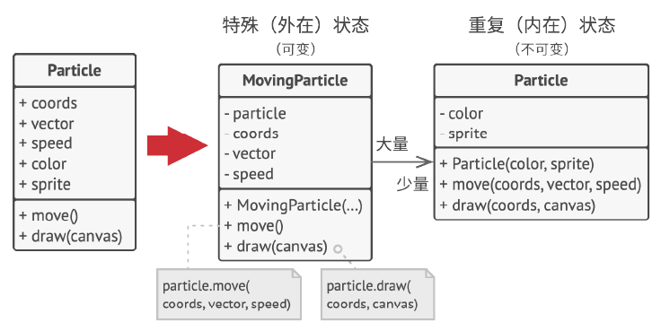

实现时，将需要改写为享元的类成员变量拆分为两个部分：

- 内在状态： 包含不变的、 可在许多对象中重复使用的数据的成员变量。
- 外在状态： 包含每个对象各自不同的情景数据的成员变量

享元模式建议不在对象中存储外在状态，而是将其传递给依赖于它的一个特殊方法。程序只在对象中保存内在状态，以方便在不同情景下重用。这些对象的区别仅在于其内在状态（与外在状态相比，内在状态的变体要少很多），因此你所需的对象数量会大大削减。

假如能从粒子类中抽出外在状态，那么我们只需三个不同的对象（子弹、导弹和弹片）就能表示游戏中的所有粒子。这样一个仅存储内在状态的对象称为享元。

外在状态会被存储在容器对象中，也就是我们应用享元模式前的聚合对象中。容器对象粒子除了需要创建多个数组成员变量来存储每个粒子的坐标、方向矢量和速度（它们是可变的，是外在状态），还需要另一个数组来存储指向代表粒子的特定享元的引用（享元中保存的数据是不变的，是内在状态），这两部分构成某个粒子的所有数据。更优雅的解决方案是创建独立的情景类来存储外在状态和对享元对象的引用。

由于享元对象可在不同的情景中使用，你必须确保其状态不能被修改。享元类的状态只能由构造函数的参数进行一次性初始化，它不能对其他对象公开其设置器或公有成员变量。

为了能更方便地访问各种享元，你可以创建一个工厂方法来管理已有享元对象的缓存池，这就是享元工厂，工厂方法从客户端处接收目标享元对象的内在状态作为参数，如果它能在缓存池中找到所需享元，则将其返回给客户端；如果没有找到，它就会新建一个享元，并将其添加到缓存池中。可以选择在程序的不同地方放入该函数。最简单的选择就是将其放置在享元容器中。除此之外，你还可以新建一个工厂类，或者创建一个静态的工厂方法并将其放入实际的享元类中。

### 模式结构

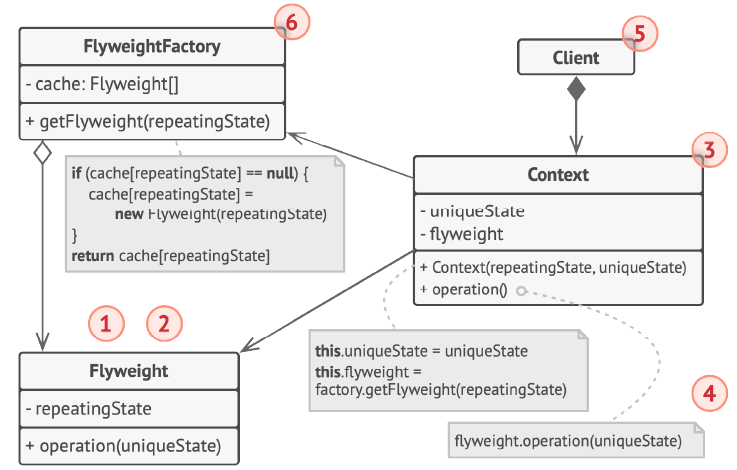

1/2、享元（Flyweight）类包含原始对象中部分能在多个对象中共享的状态。同一享元对象可在许多不同情景中使用。享元中存储的状态被称为“内在状态”。传递给享元方法的状态被称为“外在状态”。

3、情景（Context）类包含原始对象中各不相同的外在状态。情景与享元对象组合在一起就能表示原始对象的全部状态。

4、通常情况下，原始对象的行为会保留在享元类中。因此调用享元方法必须提供部分外在状态作为参数。但你也可将行为移动到情景类中，然后将连入的享元作为单纯的数据对象。

5、客户端（Client）负责计算或存储享元的外在状态。在客户端看来，享元是一种可在运行时进行配置的模板对象，具体的配置方式为向其方法中传入一些情景数据参数。

6、享元工厂（Flyweight Factory） 会对已有享元的缓存池进行管理。有了工厂后，客户端就无需直接创建享元，它们只需调用工厂并向其传递目标享元的一些内在状态即可。工厂会根据参数在之前已创建的享元中进行查找，如果找到满足条件的享元就将其返回；如果没有找到就根据参数新建享元。

### 代码示例

享元模式在核心 Java 程序库中的示例： 

java.lang.Integer#valueOf(int) （以及 Boolean、 Byte、 Character、 Short、 Long 和 Big­Decimal）

识别方法： 享元可以通过构建方法来识别， 它会返回缓存对象而不是创建新的对象。

本例中， 我们将渲染一片森林 （1,000,000 棵树）！ 每棵树都由包含一些状态的对象来表示 （坐标和纹理等）。 尽管程序能够完成其主要工作， 但很显然它需要消耗大量内存。

原因很简单： 太多树对象包含重复数据 （名称、 纹理和颜色）。 因此我们可用享元模式来将这些数值存储在单独的享元对象中 （ Tree­Type类）。 现在我们不再将相同数据存储在数千个 Tree对象中， 而是使用一组特殊的数值来引用其中一个享元对象。

客户端代码不会知道任何事情， 因为重用享元对象的复杂机制隐藏在了享元工厂中。

Tree类：包含每棵树的独特状态

~~~java
public class Tree {
    private int x;
    private int y;
    private TreeType type;

    public Tree(int x, int y, TreeType type) {
        this.x = x;
        this.y = y;
        this.type = type;
    }

    public void draw(Graphics g) {
        type.draw(g, x, y);
    }
}
~~~

TreeType类：包含多棵树共享的状态

~~~java
public class TreeType {
    private String name;
    private Color color;
    private String otherTreeData;

    public TreeType(String name, Color color, String otherTreeData) {
        this.name = name;
        this.color = color;
        this.otherTreeData = otherTreeData;
    }

    public void draw(Graphics g, int x, int y) {
        g.setColor(Color.BLACK);
        g.fillRect(x - 1, y, 3, 5);
        g.setColor(color);
        g.fillOval(x - 5, y - 10, 10, 10);
    }
}
~~~

享元工厂TreeFactory：

~~~java
public class TreeFactory {
    static Map<String, TreeType> treeTypes = new HashMap<>();

    public static TreeType getTreeType(String name, Color color, String otherTreeData) {
        TreeType result = treeTypes.get(name);
        if (result == null) {
            result = new TreeType(name, color, otherTreeData);
            treeTypes.put(name, result);
        }
        return result;
    }
}
~~~

森林类：

~~~java
public class Forest extends JFrame {
    private List<Tree> trees = new ArrayList<>();

    public void plantTree(int x, int y, String name, Color color, String otherTreeData) {
        TreeType type = TreeFactory.getTreeType(name, color, otherTreeData);
        Tree tree = new Tree(x, y, type);
        trees.add(tree);
    }

    @Override
    public void paint(Graphics graphics) {
        for (Tree tree : trees) {
            tree.draw(graphics);
        }
    }
}
~~~

客户端代码：

~~~java
public class Demo {
    static int CANVAS_SIZE = 500;
    static int TREES_TO_DRAW = 1000000;
    static int TREE_TYPES = 2;

    public static void main(String[] args) {
        Forest forest = new Forest();
        for (int i = 0; i < Math.floor(TREES_TO_DRAW / TREE_TYPES); i++) {
            forest.plantTree(random(0, CANVAS_SIZE), random(0, CANVAS_SIZE),
                    "Summer Oak", Color.GREEN, "Oak texture stub");
            forest.plantTree(random(0, CANVAS_SIZE), random(0, CANVAS_SIZE),
                    "Autumn Oak", Color.ORANGE, "Autumn Oak texture stub");
        }
        forest.setSize(CANVAS_SIZE, CANVAS_SIZE);
        forest.setVisible(true);

        System.out.println(TREES_TO_DRAW + " trees drawn");
        System.out.println("---------------------");
        System.out.println("Memory usage:");
        System.out.println("Tree size (8 bytes) * " + TREES_TO_DRAW);
        System.out.println("+ TreeTypes size (~30 bytes) * " + TREE_TYPES + "");
        System.out.println("---------------------");
        System.out.println("Total: " + ((TREES_TO_DRAW * 8 + TREE_TYPES * 30) / 1024 / 1024) +
                "MB (instead of " + ((TREES_TO_DRAW * 38) / 1024 / 1024) + "MB)");
    }

    private static int random(int min, int max) {
        return min + (int) (Math.random() * ((max - min) + 1));
    }
}
~~~

### 适用场景

仅在程序必须支持大量对象且没有足够的内存容量时使用享元模式。

应用该模式所获的收益大小取决于使用它的方式和情景。 它在下列情况中最有效： 

- 程序需要生成数量巨大的相似对象
- 这将耗尽目标设备的所有内存
- 对象中包含可抽取且能在多个对象间共享的重复状态。

### 优缺点

优点：如果程序中有很多相似对象， 那么你将可以节省大量内存。 

缺点：

* 可能需要牺牲执行速度来换取内存， 因为他人每次调用享元方法时都需要重新计算部分情景数据。 
* 代码会变得更加复杂，可读性变差。

## 代理模式

### 核心思想

也称Proxy，代理模式是一种结构型设计模式， 让你能够提供对象的替代品或其占位符。 代理控制着对于原对象的访问， 并允许在将请求提交给对象前后进行一些处理。代理对象拥有和服务对象相同的接口， 这使得当其被传递给客户端时可与真实对象互换。 

有这样一个消耗大量系统资源的巨型对象， 你只是偶尔需要使用它，并非总是需要。你可以实现延迟初始化：在实际有需要时再创建该对象。对象的所有客户端都要执行延迟初始代码，但这样直接改造可能会带来很多重复代码。在理想情况下，我们希望将代码直接放入对象的类中，但这并非总是能实现：比如类可能是第三方封闭库的一部分。

代理模式建议新建一个与原服务对象接口相同的代理类，然后更新应用以将代理对象传递给所有原始对象客户端。代理类接收到客户端请求后会创建实际的服务对象，并将所有工作委派给它。

例如下面的图，代理将自己伪装成数据库对象，可在客户端或实际数据库对象不知情的情况下处理延迟初始化和缓存查询结果的工作。

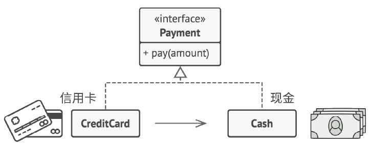

如果需要在类的主要业务逻辑前后执行一些工作，你无需修改类就能完成这项工作。由于代理实现的接口与原类相同，因此你可将其传递给任何一个使用实际服务对象的客户端。

### 模式结构

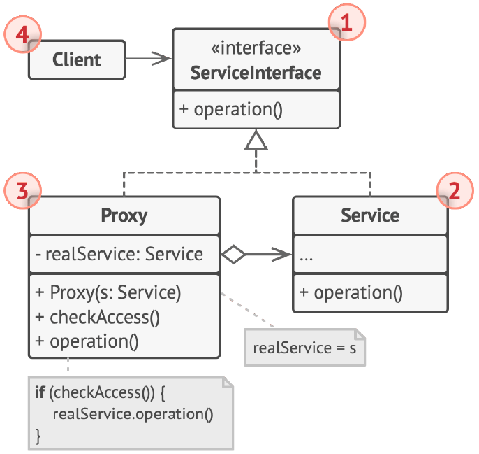

1、服务接口（Service Interface）声明了服务接口。代理必须遵循该接口才能伪装成服务对象。

2、服务（Service）类提供了一些实用的业务逻辑。

3、代理（Proxy）类包含一个指向服务对象的引用成员变量。代理完成其任务（例如延迟初始化、记录日志、访问控制和缓存等）后会将请求传递给服务对象。通常情况下，代理会对其服务对象的整个生命周期进行管理。

4、客户端（Client） 能通过同一接口与服务或代理进行交互，所以你可在一切需要服务对象的代码中使用代理。

### 代码示例

使用示例： 尽管代理模式在绝大多数 Java 程序中并不常见， 但它在一些特殊情况下仍然非常方便。 当你希望在无需修改客户代码的前提下于已有类的对象上增加额外行为时， 该模式是无可替代的。

Java 标准程序库中的一些代理模式的示例：

* java.lang.reflect.Proxy
* java.rmi.*
* javax.ejb.EJB 
* javax.inject.Inject 
* javax.persistence.PersistenceContext

识别方法： 代理模式会将所有实际工作委派给一些其他对象。 除非代理是某个服务的子类， 否则每个代理方法最后都应该引用一个服务对象。

本例演示如何使用代理模式在第三方腾讯视频 （TencentVideo， 代码示例中记为 TV） 程序库中添加延迟初始化和缓存。

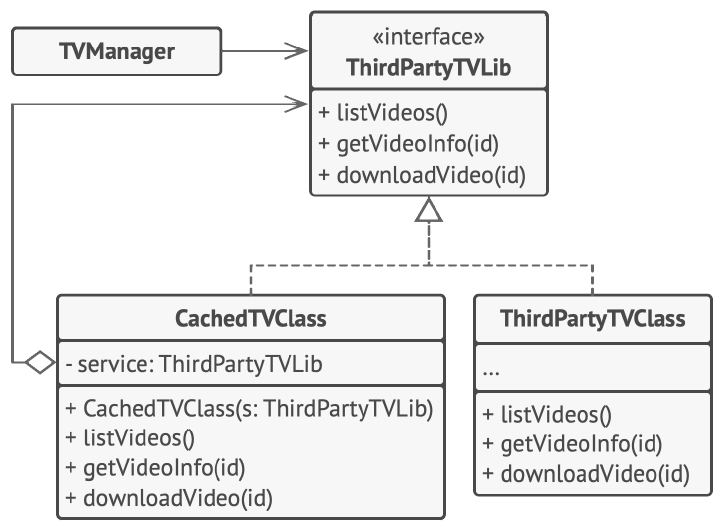

程序库提供了视频下载类。但是该类的效率非常低。如果客户端程序多次请求同一视频，程序库会反复下载该视频，而不会将首次下载的文件缓存下来复用。

代理类实现和原下载器相同的接口，并将所有工作委派给原下载器。不过，代理类会保存所有的文件下载记录，如果程序多次请求同一文件，它会返回缓存的文件。

公共接口ThirdPartyYouTubeLib，它是远程服务接口：

~~~java
public interface ThirdPartyYouTubeLib {
    HashMap<String, Video> popularVideos();

    Video getVideo(String videoId);
}
~~~

服务实现ThirdPartyYouTubeClass：

~~~java
public class ThirdPartyYouTubeClass implements ThirdPartyYouTubeLib {

    @Override
    public HashMap<String, Video> popularVideos() {
        connectToServer("http://www.youtube.com");
        return getRandomVideos();
    }

    @Override
    public Video getVideo(String videoId) {
        connectToServer("http://www.youtube.com/" + videoId);
        return getSomeVideo(videoId);
    }

    // -----------------------------------------------------------------------
    // Fake methods to simulate network activity. They as slow as a real life.

    private int random(int min, int max) {
        return min + (int) (Math.random() * ((max - min) + 1));
    }

    private void experienceNetworkLatency() {
        int randomLatency = random(5, 10);
        for (int i = 0; i < randomLatency; i++) {
            try {
                Thread.sleep(100);
            } catch (InterruptedException ex) {
                ex.printStackTrace();
            }
        }
    }

    private void connectToServer(String server) {
        System.out.print("Connecting to " + server + "... ");
        experienceNetworkLatency();
        System.out.print("Connected!" + "\n");
    }

    private HashMap<String, Video> getRandomVideos() {
        System.out.print("Downloading populars... ");

        experienceNetworkLatency();
        HashMap<String, Video> hmap = new HashMap<String, Video>();
        hmap.put("catzzzzzzzzz", new Video("sadgahasgdas", "Catzzzz.avi"));
        hmap.put("mkafksangasj", new Video("mkafksangasj", "Dog play with ball.mp4"));
        hmap.put("dancesvideoo", new Video("asdfas3ffasd", "Dancing video.mpq"));
        hmap.put("dlsdk5jfslaf", new Video("dlsdk5jfslaf", "Barcelona vs RealM.mov"));
        hmap.put("3sdfgsd1j333", new Video("3sdfgsd1j333", "Programing lesson#1.avi"));

        System.out.print("Done!" + "\n");
        return hmap;
    }

    private Video getSomeVideo(String videoId) {
        System.out.print("Downloading video... ");

        experienceNetworkLatency();
        Video video = new Video(videoId, "Some video title");

        System.out.print("Done!" + "\n");
        return video;
    }

}
~~~

缓存代理类YouTubeCacheProxy：

~~~java
public class YouTubeCacheProxy implements ThirdPartyYouTubeLib {
    private ThirdPartyYouTubeLib youtubeService;
    private HashMap<String, Video> cachePopular = new HashMap<String, Video>();
    private HashMap<String, Video> cacheAll = new HashMap<String, Video>();

    public YouTubeCacheProxy() {
        this.youtubeService = new ThirdPartyYouTubeClass();
    }

    @Override
    public HashMap<String, Video> popularVideos() {
        if (cachePopular.isEmpty()) {
            cachePopular = youtubeService.popularVideos();
        } else {
            System.out.println("Retrieved list from cache.");
        }
        return cachePopular;
    }

    @Override
    public Video getVideo(String videoId) {
        Video video = cacheAll.get(videoId);
        if (video == null) {
            video = youtubeService.getVideo(videoId);
            cacheAll.put(videoId, video);
        } else {
            System.out.println("Retrieved video '" + videoId + "' from cache.");
        }
        return video;
    }

    public void reset() {
        cachePopular.clear();
        cacheAll.clear();
    }
}
~~~

下载器，入参是接口类型：

~~~java
public class YouTubeDownloader {
    private ThirdPartyYouTubeLib api;

    public YouTubeDownloader(ThirdPartyYouTubeLib api) {
        this.api = api;
    }

    public void renderVideoPage(String videoId) {
        Video video = api.getVideo(videoId);
        System.out.println("\n-------------------------------");
        System.out.println("Video page (imagine fancy HTML)");
        System.out.println("ID: " + video.id);
        System.out.println("Title: " + video.title);
        System.out.println("Video: " + video.data);
        System.out.println("-------------------------------\n");
    }

    public void renderPopularVideos() {
        HashMap<String, Video> list = api.popularVideos();
        System.out.println("\n-------------------------------");
        System.out.println("Most popular videos on YouTube (imagine fancy HTML)");
        for (Video video : list.values()) {
            System.out.println("ID: " + video.id + " / Title: " + video.title);
        }
        System.out.println("-------------------------------\n");
    }
}
~~~

初始化代码：

~~~java
public class Demo {

    public static void main(String[] args) {
        YouTubeDownloader naiveDownloader = new YouTubeDownloader(new ThirdPartyYouTubeClass());
        YouTubeDownloader smartDownloader = new YouTubeDownloader(new YouTubeCacheProxy());

        long naive = test(naiveDownloader);
        long smart = test(smartDownloader);
        System.out.print("Time saved by caching proxy: " + (naive - smart) + "ms");

    }

    private static long test(YouTubeDownloader downloader) {
        long startTime = System.currentTimeMillis();

        // User behavior in our app:
        downloader.renderPopularVideos();
        downloader.renderVideoPage("catzzzzzzzzz");
        downloader.renderPopularVideos();
        downloader.renderVideoPage("dancesvideoo");
        // Users might visit the same page quite often.
        downloader.renderVideoPage("catzzzzzzzzz");
        downloader.renderVideoPage("someothervid");

        long estimatedTime = System.currentTimeMillis() - startTime;
        System.out.print("Time elapsed: " + estimatedTime + "ms\n");
        return estimatedTime;
    }
}
~~~

### 适用场景

使用代理模式的方式多种多样，其中最常用的几种：

* 延迟初始化（虚拟代理）。如果你有一个偶尔使用的重量级服务对象，一直保持该对象运行会消耗系统资源时，可使用代理模式。

  你无需在程序启动时就创建该对象，可将对象的初始化延迟到真正有需要的时候。

* 访问控制（保护代理）。如果你只希望特定客户端使用服务对象，这里的对象可以是操作系统中非常重要的部分，而客户端则是各种已启动的程序（包括恶意程序），此时可使用代理模式。

  代理可仅在客户端凭据满足要求时将请求传递给服务对象。

* 本地执行远程服务（远程代理）。适用于服务对象位于远程服务器上的情形。

  在这种情形中，代理通过网络传递客户端请求，负责处理所有与网络相关的复杂细节。

* 记录日志请求（日志记录代理）。适用于当你需要保存对于服务对象的请求历史记录时。代理可以在向服务传递请求前进行记录。

* 缓存请求结果（缓存代理）。适用于需要缓存客户请求结果并对缓存生命周期进行管理时，特别是当返回结果的体积非常大时。

* 智能引用。 可在没有客户端使用某个重量级对象时立即销毁该对象。

  代理会将所有获取了指向服务对象或其结果的客户端记录在案。 代理会时不时地遍历各个客户端， 检查它们是否仍在运行。 如果相应的客户端列表为空， 代理就会销毁该服务对象， 释放底层系统资源。 

  代理还可以记录客户端是否修改了服务对象。 其他客户端还可以复用未修改的对象。 

### 实现方式

1、如果没有现成的服务接口， 你就需要创建一个接口来实现代理和服务对象的可交换性。  

从服务类中抽取接口并非总是可行的， 因为你需要对服务的所有客户端进行修改， 让它们使用接口。 

备选计划是将代理作为服务类的子类， 这样代理就能继承服务的所有接口了。 

2、创建代理类， 其中必须包含一个存储指向服务的引用的成员变量。 通常情况下， 代理负责创建服务并对其整个生命周期进行管理。 在一些特殊情况下， 客户端会通过构造函数将服务传递给代理。

3、根据需求实现代理方法。 在大部分情况下， 代理在完成一些任务后应将工作委派给服务对象。

4、可以考虑新建一个构建方法来判断客户端可获取的是代理还是实际服务。 你可以在代理类中创建一个简单的静态方法， 也可以创建一个完整的工厂方法。

5、可以考虑为服务对象实现延迟初始化。

### 优缺点

优点：

* 可以在客户端毫无察觉的情况下控制服务对象。 
* 如果客户端对服务对象的生命周期没有特殊要求， 你可以对生命周期进行管理。 
* 即使服务对象还未准备好或不存在， 代理也可以正常工作。 
* 开闭原则。 你可以在不对服务或客户端做出修改的情况下创建新代理。

缺点：

* 代码可能会变得复杂， 因为需要新建许多类。 
* 服务响应可能会延迟。 

# 行为模式

行为模式负责对象间的高效沟通和职责委派。 

## 责任链模式

### 核心思想

又称为职责链模式、命令链、CoR、Chain of Command、Chain of Responsibility 。责任链模式是一种行为设计模式， 允许你将请求沿着处理者链进行发送。 收到请求后， 每个处理者均可对请求进行处理， 或将其传递给链上的下个处理者。

该模式允许多个对象来对请求进行处理， 而无需让发送者类与具体接收者类相耦合。 链可在运行时由遵循标准处理者接口的任意处理者动态生成。 

假如你正在开发一个在线订购系统。你希望对系统访问进行限制，只允许认证用户创建订单。此外，拥有管理权限的用户也拥有所有订单的完全访问权限。

简单规划后，你会意识到这些检查必须依次进行。只要接收到包含用户凭据的请求，应用程序就可尝试对进入系统的用户进行认证。但如果由于用户凭据不正确而导致认证失败，那就没有必要进行后续检查了。请求必须经过一系列检查后才能由订购系统来处理：

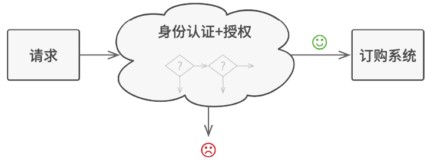

后续随着检查步骤变多，代码变得越来越多，也越来越混乱。修改某个检查步骤有时会影响其他的检查步骤。最糟糕的是，当你希望复用这些检查步骤来保护其他系统组件时，你只能复制部分代码，因为这些组件只需部分而非全部的检查步骤。

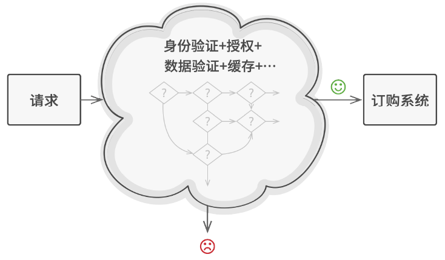

在责任链模式中，每个检查步骤都可被抽取为仅有单个方法的类，并执行检查操作，这就是处理者。

模式建议你将这些处理者连成一条链。链上的每个处理者都有一个成员变量来保存对于下一处理者的引用。除了处理请求外， 处理者还负责沿着链传递请求。请求会在链上移动，直至所有处理者都有机会对其进行处理。处理者可以决定不再沿着链传递请求，这可高效地取消所有后续处理步骤。

在订购系统示例中，处理者会在进行请求处理工作后决定是否继续沿着链传递请求。如果请求中包含正确的数据，所有处理者都将执行自己的主要行为，无论该行为是身份验证还是数据缓存。

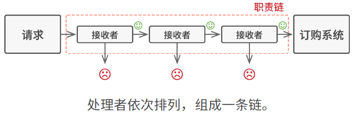

不过还有一种稍微不同的方式（也是更经典一种）， 那就是处理者接收到请求后自行决定是否能够对其进行处理。如果自己能够处理，处理者就不再继续传递请求。因此在这种情况下，每个请求要么最多有一个处理者对其进行处理，要么没有任何处理者对其进行处理。在处理图形用户界面元素栈中的事件时，这种方式非常常见。

例如，当用户点击按钮时，按钮产生的事件将沿着GUI 元素链进行传递， 最开始是按钮的容器（如窗体或面板）， 直至应用程序主窗口。链上第一个能处理该事件的元素会对其进行处理。此外，该例还有另一个值得我们关注的地方：它表明我们总能从对象树中抽取出链来。

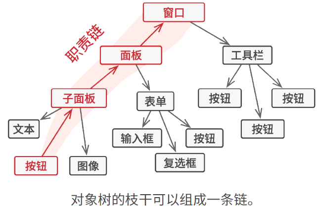

所有处理者类均实现同一接口是关键所在。每个具体处理者仅关心下一个包含execute 执行方法的处理者。这样一来，你就可以在运行时使用不同的处理者来创建链，而无需将相关代码与处理者的具体类进行耦合。

### 模式结构

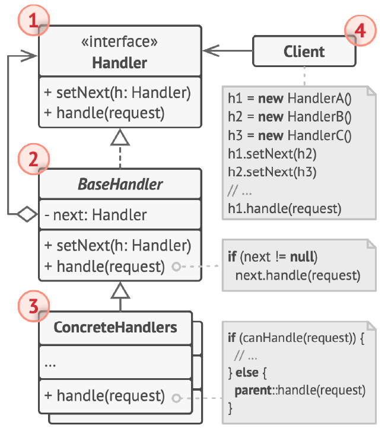

1、处理者（Handler）声明了所有具体处理者的通用接口。该接口通常仅包含单个方法用于请求处理，但有时其还会包含一个设置链上下个处理者的方法。

2、基础处理者（Base Handler）是一个可选的类， 你可以将所有处理者共用的样本代码放置在其中。

通常情况下，该类中定义了一个保存对于下个处理者引用的成员变量。客户端可通过将处理者传递给上个处理者的构造函数或设定方法来创建链。该类还可以实现默认的处理行为：确定下个处理者存在后再将请求传递给它。

3、具体处理者（Concrete Handlers）包含处理请求的实际代码。每个处理者接收到请求后，都必须决定是否进行处理，以及是否沿着链传递请求。

处理者通常是独立且不可变的，需要通过构造函数一次性地获得所有必要地数据。

4、客户端（Client）可根据程序逻辑一次性或者动态地生成链。值得注意的是，请求可发送给链上的任意一个处理者，而非必须是第一个处理者。

### 代码示例

责任链模式在 Java 程序中并不常见， 因为它仅在代码与对象链打交道时才能发挥作用。 

该模式最流行的使用案例之一是在 GUI 类中将事件向上传递给父组件。 另一个值得注意的使用案例是依次访问过滤器。 

下面是该模式在核心 Java 程序库中的一些示例： 

* javax.servlet.Filter#doFilter()
* java.util.logging.Logger#log()

识别方法： 该模式可通过一组对象的行为方法间接调用其他对象的相同方法来识别， 而且所有对象都会遵循相同的接口。

本例展示了包含用户数据的请求如何依次通过处理者链来执行各种不同的行为 （例如认证、 授权与验证）。 绝大多数模式示例都会寻找正确的处理者， 并在处理后退出链。 但在这里我们会执行每个处理者， 直至某个处理者无法处理请求。 请注意， 尽管流程略有不同， 但这仍是责任链模式。

基础验证接口：

~~~java
/**
 * Base middleware class.
 */
public abstract class Middleware {
    private Middleware next;

    /**
     * Builds chains of middleware objects.
     */
    public static Middleware link(Middleware first, Middleware... chain) {
        Middleware head = first;
        for (Middleware nextInChain: chain) {
            head.next = nextInChain;
            head = nextInChain;
        }
        return first;
    }

    /**
     * Subclasses will implement this method with concrete checks.
     */
    public abstract boolean check(String email, String password);

    /**
     * Runs check on the next object in chain or ends traversing if we're in
     * last object in chain.
     */
    protected boolean checkNext(String email, String password) {
        if (next == null) {
            return true;
        }
        return next.check(email, password);
    }
}
~~~

验证接口的具体实现：ThrottlingMiddleware用来限制请求数量、UserExistsMiddleware用来检查用户登录信息、RoleCheckMiddleware用来检查用户角色

~~~java
/**
 * ConcreteHandler. Checks whether there are too many failed login requests.
 */
public class ThrottlingMiddleware extends Middleware {
    private int requestPerMinute;
    private int request;
    private long currentTime;

    public ThrottlingMiddleware(int requestPerMinute) {
        this.requestPerMinute = requestPerMinute;
        this.currentTime = System.currentTimeMillis();
    }

    /**
     * Please, not that checkNext() call can be inserted both in the beginning
     * of this method and in the end.
     *
     * This gives much more flexibility than a simple loop over all middleware
     * objects. For instance, an element of a chain can change the order of
     * checks by running its check after all other checks.
     */
    public boolean check(String email, String password) {
        if (System.currentTimeMillis() > currentTime + 60_000) {
            request = 0;
            currentTime = System.currentTimeMillis();
        }

        request++;
        
        if (request > requestPerMinute) {
            System.out.println("Request limit exceeded!");
            Thread.currentThread().stop();
        }
        return checkNext(email, password);
    }
}
~~~

~~~java
/**
 * ConcreteHandler. Checks whether a user with the given credentials exists.
 */
public class UserExistsMiddleware extends Middleware {
    private Server server;

    public UserExistsMiddleware(Server server) {
        this.server = server;
    }

    public boolean check(String email, String password) {
        if (!server.hasEmail(email)) {
            System.out.println("This email is not registered!");
            return false;
        }
        if (!server.isValidPassword(email, password)) {
            System.out.println("Wrong password!");
            return false;
        }
        return checkNext(email, password);
    }
}
~~~

~~~java
/**
 * ConcreteHandler. Checks a user's role.
 */
public class RoleCheckMiddleware extends Middleware {
    public boolean check(String email, String password) {
        if (email.equals("admin@example.com")) {
            System.out.println("Hello, admin!");
            return true;
        }
        System.out.println("Hello, user!");
        return checkNext(email, password);
    }
}
~~~

服务器类：

~~~java
/**
 * Server class.
 */
public class Server {
    private Map<String, String> users = new HashMap<>();
    private Middleware middleware;

    /**
     * Client passes a chain of object to server. This improves flexibility and
     * makes testing the server class easier.
     */
    public void setMiddleware(Middleware middleware) {
        this.middleware = middleware;
    }

    /**
     * Server gets email and password from client and sends the authorization
     * request to the chain.
     */
    public boolean logIn(String email, String password) {
        if (middleware.check(email, password)) {
            System.out.println("Authorization have been successful!");

            // Do something useful here for authorized users.

            return true;
        }
        return false;
    }

    public void register(String email, String password) {
        users.put(email, password);
    }

    public boolean hasEmail(String email) {
        return users.containsKey(email);
    }

    public boolean isValidPassword(String email, String password) {
        return users.get(email).equals(password);
    }
}
~~~

客户端代码：

~~~java
/**
 * Demo class. Everything comes together here.
 */
public class Demo {
    private static BufferedReader reader = new BufferedReader(new InputStreamReader(System.in));
    private static Server server;

    private static void init() {
        server = new Server();
        server.register("admin@example.com", "admin_pass");
        server.register("user@example.com", "user_pass");

        // All checks are linked. Client can build various chains using the same
        // components.
        Middleware middleware = Middleware.link(
            new ThrottlingMiddleware(2),
            new UserExistsMiddleware(server),
            new RoleCheckMiddleware()
        );

        // Server gets a chain from client code.
        server.setMiddleware(middleware);
    }

    public static void main(String[] args) throws IOException {
        init();

        boolean success;
        do {
            System.out.print("Enter email: ");
            String email = reader.readLine();
            System.out.print("Input password: ");
            String password = reader.readLine();
            success = server.logIn(email, password);
        } while (!success);
    }
}
~~~

### 适用场景

1、当程序需要使用不同方式处理不同种类请求，而且请求类型和顺序预先未知时，可以使用责任链模式。

该模式能将多个处理者连接成一条链。接收到请求后，它会“询问”每个处理者是否能够对其进行处理。这样所有处理者都有机会来处理请求。

2、当必须按顺序执行多个处理者时，可以使用该模式。

无论你以何种顺序将处理者连接成一条链，所有请求都会严格按照顺序通过链上的处理者。

3、如果所需处理者及其顺序必须在运行时进行改变，可以使用责任链模式。

如果在处理者类中有对引用成员变量的设定方法，你将能动态地插入和移除处理者，或者改变其顺序。

### 实现方式

1、声明处理者接口。将请求转换为对象，然后将其以参数的形式传递给处理函数。

2、为了在具体处理者中消除重复的样本代码，你可以根据处理者接口创建抽象处理者基类。

该类需要有一个成员变量来存储指向链上下个处理者的引用。你可以将其设置为不可变类。但如果你打算在运行时对链进行改变，则需要定义一个设定方法来修改引用成员变量的值。

为了使用方便，你还可以实现处理方法的默认行为。

3、依次创建具体处理者子类并实现其处理方法。每个处理者在接收到请求后都必须做出两个决定：

* 是否自行处理这个请求。
* 是否将该请求沿着链进行传递。

4、客户端可以自行组装链，或者从其他对象处获得预先组装好的链，此时你必须实现工厂类以根据配置或环境设置来创建链。

5、客户端可以触发链中的任意处理者，而不仅仅是第一个。请求将通过链进行传递，直至某个处理者拒绝继续传递，或者请求到达链尾。

6、由于链的动态性，客户端需要准备好处理以下情况：

- 链中可能只有单个链接。
- 部分请求可能无法到达链尾。
- 其他请求可能直到链尾都未被处理。

### 优缺点

优点：

* 可以控制请求处理的顺序。
* 单一职责原则。你可对发起操作和执行操作的类进行解耦。
* 开闭原则。你可以在不更改现有代码的情况下在程序中新增处理者。

缺点：部分处理者可能没有起作用

### 与其他模式的关系

* 责任链模式、 命令模式、 中介者模式和观察者模式对比：它们都用于处理请求发送者和接收者之间的不同连接方式 

  * 责任链按照顺序将请求动态传递给一系列的潜在接收者， 直至其中一名接收者对请求进行处理。
  * 命令在发送者和请求者之间建立单向连接。
  * 中介者清除了发送者和请求者之间的直接连接， 强制它们通过一个中介对象进行间接沟通。
  * 观察者允许接收者动态地订阅或取消接收请求。

* 责任链模式和命令模式共同使用：责任链的管理者可使用命令模式实现。 在这种情况下， 你可以对由请求代表的同一个上下文对象执行许多不同的操作。

  还有另外一种实现方式， 那就是请求自身就是一个命令对象。 在这种情况下， 你可以对由一系列不同上下文连接而成的链执行相同的操作。

## 命令模式

### 核心思想

又称为动作、事务、Action、Transaction、Command。命令模式是一种行为设计模式， 它可将请求转换为一个包含与请求相关的所有信息的独立对象。 该转换让你能根据不同的请求将方法参数化、 延迟请求执行或将其放入队列中， 且能实现可撤销操作。

假如你正在开发一款新的文字编辑器，当前的任务是创建一个包含多个按钮的工具栏，并让每个按钮对应编辑器的不同操作。你创建了一个非常简洁的按钮类，它不仅可用于生成工具栏上的按钮，还可用于生成各种对话框的通用按钮。

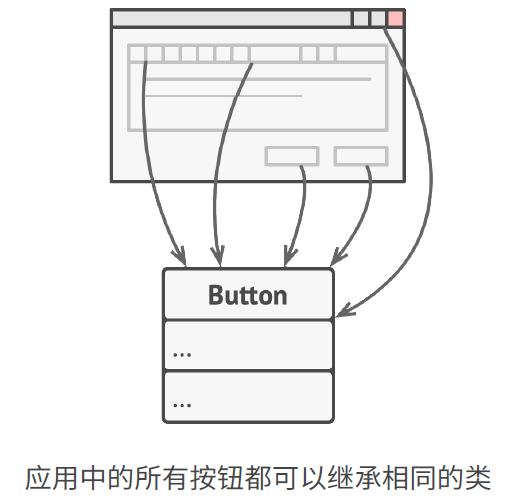

对于完成不同操作的按钮，让它们实现接口，生成大量的按钮子类：

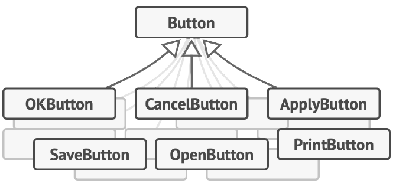

这种实现方式很快遇到以下问题：

* 创建了大量的子类，当每次修改基类按钮功能时，你都有可能需要修改所有子类的代码。
* 有些功能可能同时在多个子类调用，例如复制/粘贴文字等操作可能会在多个地方被调用

优秀的软件设计通常会将关注点进行分离，而这往往会导致软件的分层。最常见的例子：一层负责用户图像界面；另一层负责业务逻辑。GUI 层负责在屏幕上渲染美观的图形， 捕获所有输入并显示用户和程序工作的结果。当需要完成一些重要内容时（比如计算月球轨道或撰写年度报告），GUI 层则会将工作委派给业务逻辑底层。

这在代码中看上去就像这样：一个GUI 对象传递一些参数来调用一个业务逻辑对象。这个过程通常被描述为一个对象发送请求给另一个对象。

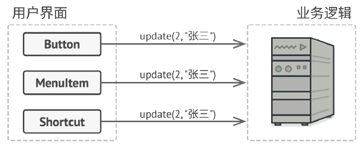

命令模式建议GUI 对象不直接提交这些请求。你应该将请求的所有细节（例如调用的对象、方法名称和参数列表）抽取出来组成命令类，该类中仅包含一个用于触发请求的方法。

命令对象负责连接不同的GUI 和业务逻辑对象。此后，GUI对象无需了解业务逻辑对象是否获得了请求，也无需了解其对请求进行处理的方式。GUI 对象触发命令即可， 命令对象会自行处理所有细节工作。

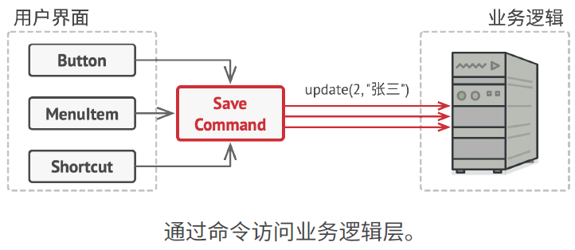

使用命令模式时，应该让所有命令实现相同的接口。该接口通常只有一个没有任何参数的执行方法，让你能在不和具体命令类耦合的情况下使用同一请求发送者执行不同命令。此外还有额外的好处，现在你能在运行时切换连接至发送者的命令对象，以此改变发送者的行为。

回到文本编辑器的问题，应用命令模式后，我们不再需要任何按钮子类来实现点击行为。我们只需在按钮Button 基类中添加一个成员变量来存储对于命令对象的引用，并在点击后执行该命令即可。你需要为每个可能的操作实现一系列命令类，并且根据按钮所需行为将命令和按钮连接起来。

最后，命令成为了减少GUI 和业务逻辑层之间耦合的中间层。

### 模式结构

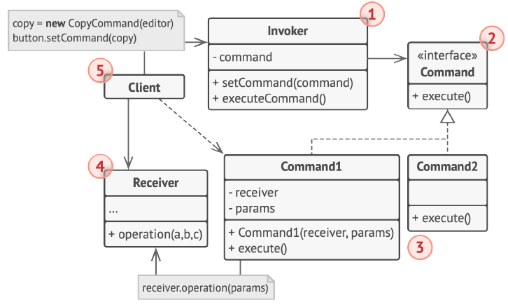

1、发送者（Sender）——亦称“触发者（Invoker）”——类负责对请求进行初始化，其中必须包含一个成员变量来存储对于命令对象的引用。发送者触发命令，而不向接收者直接发送请求。注意，发送者并不负责创建命令对象：它通常会通过构造函数从客户端处获得预先生成的命令。

2、命令（Command）接口通常仅声明一个执行命令的方法。

3、具体命令（Concrete Commands） 会实现各种类型的请求。具体命令自身并不完成工作，而是会将调用委派给一个业务逻辑对象。但为了简化代码，这些类可以进行合并。

接收对象执行方法所需的参数可以声明为具体命令的成员变量。你可以将命令对象设为不可变，仅允许通过构造函数对这些成员变量进行初始化。

4、接收者（Receiver）类包含部分业务逻辑。几乎任何对象都可以作为接收者。绝大部分命令只处理如何将请求传递到接收者的细节，接收者自己会完成实际的工作。

5、客户端（Client）会创建并配置具体命令对象。客户端必须将包括接收者实体在内的所有请求参数传递给命令的构造函数。此后，生成的命令就可以与一个或多个发送者相关联了。

### 代码示例

命令模式在 Java 代码中很常见。 大部分情况下， 它被用于代替包含行为的参数化 UI 元素的回调函数， 此外还被用于对任务进行排序和记录操作历史记录等。 

以下是在核心 Java 程序库中的一些示例：

* java.lang.Runnable 的所有实现
* javax.swing.Action 的所有实现

识别方法： 命令模式可以通过抽象或接口类型 （发送者） 中的行为方法来识别， 该类型调用另一个不同的抽象或接口类型 （接收者） 实现中的方法， 该实现则是在创建时由命令模式的实现封装。 命令类通常仅限于一些特殊行为。

在本例中，命令模式会记录已执行操作的历史记录，以在需要时撤销操作。

本例中的文字编辑器在每次用户与其互动时， 都会创建一个新的命令对象。 命令执行其行为后会被压入历史堆栈。 当程序执行撤销操作时， 它就需要从历史记录中取出最近执行的命令， 然后执行反向操作或者恢复由该命令保存的编辑器历史状态。 

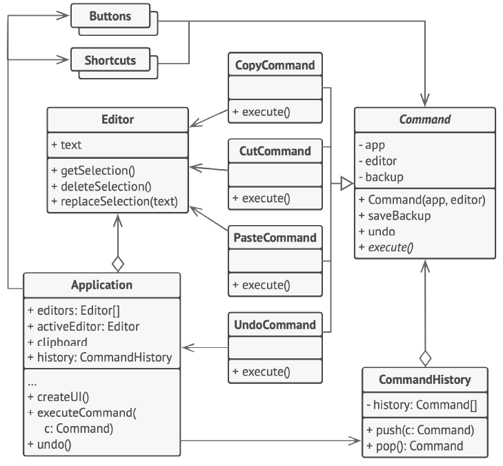

抽象基础命令Command，它的入参editor是真正干活的对象。抽象命令中抽取了一些命令执行都需要的公共逻辑，如备份、回滚。

~~~java
public abstract class Command {
    public Editor editor;
    private String backup;

    Command(Editor editor) {
        this.editor = editor;
    }

    void backup() {
        backup = editor.textField.getText();
    }

    public void undo() {
        editor.textField.setText(backup);
    }

    public abstract boolean execute();
}
~~~

具体命令，它们都是上面的命令类子类，具体有：CopyCommand（将所选文字复制到剪贴板）、PasteCommand（从剪贴板粘贴文字）、CutCommand（将文字剪切到剪贴板），它们的真正操作都是通过editor来完成的：

~~~java
public class CopyCommand extends Command {

    public CopyCommand(Editor editor) {
        super(editor);
    }

    @Override
    public boolean execute() {
        editor.clipboard = editor.textField.getSelectedText();
        return false;
    }
}
~~~

~~~java
public class PasteCommand extends Command {

    public PasteCommand(Editor editor) {
        super(editor);
    }

    @Override
    public boolean execute() {
        if (editor.clipboard == null || editor.clipboard.isEmpty()) return false;

        backup();
        editor.textField.insert(editor.clipboard, editor.textField.getCaretPosition());
        return true;
    }
}
~~~

~~~java
public class CutCommand extends Command {

    public CutCommand(Editor editor) {
        super(editor);
    }

    @Override
    public boolean execute() {
        if (editor.textField.getSelectedText().isEmpty()) return false;

        backup();
        String source = editor.textField.getText();
        editor.clipboard = editor.textField.getSelectedText();
        editor.textField.setText(cutString(source));
        return true;
    }

    private String cutString(String source) {
        String start = source.substring(0, editor.textField.getSelectionStart());
        String end = source.substring(editor.textField.getSelectionEnd());
        return start + end;
    }
}
~~~

命令历史，借助它可以完成回滚操作：

~~~java
public class CommandHistory {
    private Stack<Command> history = new Stack<>();

    public void push(Command c) {
        history.push(c);
    }

    public Command pop() {
        return history.pop();
    }

    public boolean isEmpty() { return history.isEmpty(); }
}
~~~

Editor类，调用各种命令：

~~~java
public class Editor {
    public JTextArea textField;
    public String clipboard;
    private CommandHistory history = new CommandHistory();

    public void init() {
        JFrame frame = new JFrame("Text editor (type & use buttons, Luke!)");
        JPanel content = new JPanel();
        frame.setContentPane(content);
        frame.setDefaultCloseOperation(WindowConstants.EXIT_ON_CLOSE);
        content.setLayout(new BoxLayout(content, BoxLayout.Y_AXIS));
        textField = new JTextArea();
        textField.setLineWrap(true);
        content.add(textField);
        JPanel buttons = new JPanel(new FlowLayout(FlowLayout.CENTER));
        JButton ctrlC = new JButton("Ctrl+C");
        JButton ctrlX = new JButton("Ctrl+X");
        JButton ctrlV = new JButton("Ctrl+V");
        JButton ctrlZ = new JButton("Ctrl+Z");
        Editor editor = this;
        ctrlC.addActionListener(new ActionListener() {
            @Override
            public void actionPerformed(ActionEvent e) {
                executeCommand(new CopyCommand(editor));
            }
        });
        ctrlX.addActionListener(new ActionListener() {
            @Override
            public void actionPerformed(ActionEvent e) {
                executeCommand(new CutCommand(editor));
            }
        });
        ctrlV.addActionListener(new ActionListener() {
            @Override
            public void actionPerformed(ActionEvent e) {
                executeCommand(new PasteCommand(editor));
            }
        });
        ctrlZ.addActionListener(new ActionListener() {
            @Override
            public void actionPerformed(ActionEvent e) {
                undo();
            }
        });
        buttons.add(ctrlC);
        buttons.add(ctrlX);
        buttons.add(ctrlV);
        buttons.add(ctrlZ);
        content.add(buttons);
        frame.setSize(450, 200);
        frame.setLocationRelativeTo(null);
        frame.setVisible(true);
    }

    private void executeCommand(Command command) {
        if (command.execute()) {
            history.push(command);
        }
    }

    private void undo() {
        if (history.isEmpty()) return;

        Command command = history.pop();
        if (command != null) {
            command.undo();
        }
    }
}
~~~

### 适用场景

1、如果你需要通过操作来参数化对象，可使用命令模式。

命令模式可将特定的方法调用转化为独立对象。这一改变也带来了许多有趣的应用：你可以将命令作为方法的参数进行传递、将命令保存在其他对象中，或者在运行时切换已连接的命令等。

2、如果你想要将操作放入队列中、操作的执行或者远程执行操作，可使用命令模式。

同其他对象一样，命令也可以实现序列化，从而能方便地写入文件或数据库中。将命令变成字符串可以延迟或计划命令的执行、将命令放入队列、记录命令或者通过网络发送命令。

3、想要实现操作回滚功能，可使用命令模式。

为了能够回滚操作，你需要实现已执行操作的历史记录功能。命令历史记录是一种包含所有已执行命令对象及其相关程序状态备份的栈结构。

这种方法有两个缺点：

* 首先，程序状态的保存功能并不容易实现，因为部分状态可能是私有的。你可以使用备忘录模式来在一定程度上解决这个问题。
* 其次，备份状态可能会占用大量内存。所以有时要用执行反向操作来实现回滚，但是反向操作比较复杂

### 实现方式

1. 声明仅有一个执行方法的命令接口。
2. 抽取请求并使之成为实现命令接口的具体命令类。 每个类都必须有一组成员变量来保存请求参数和对于实际接收者对象的引用。 所有这些变量的数值都必须通过命令构造函数进行初始化。
3. 找到担任发送者职责的类。 在这些类中添加保存命令的成员变量。 发送者只能通过命令接口与其命令进行交互。 发送者自身通常并不创建命令对象， 而是通过客户端代码获取。
4. 修改发送者使其执行命令， 而非直接将请求发送给接收者。
5. 客户端必须按照以下顺序来初始化对象：
   - 创建接收者。
   - 创建命令， 如有需要可将其关联至接收者。
   - 创建发送者并将其与特定命令关联。

### 优缺点

优点：

* 单一职责原则。 你可以解耦触发和执行操作的类。
* 开闭原则。 你可以在不修改已有客户端代码的情况下在程序中创建新的命令。
* 可以实现撤销和恢复功能。 
* 可以实现操作的延迟执行。 
* 可以将一组简单命令组合成一个复杂命令。

缺点：代码可能会变得更加复杂， 因为你在发送者和接收者之间增加了一个全新的层次。 

### 与其他模式的关系

* 命令模式和备忘录模式共同使用：可以同时使用命令和备忘录模式来实现 “撤销”。 在这种情况下， 命令用于对目标对象执行各种不同的操作， 备忘录用来保存一条命令执行前该对象的状态。
* 命令模式和策略模式对比：命令和策略模式看上去很像， 因为两者都能通过某些行为来参数化对象。 但是， 它们的意图有非常大的不同。
  * 你可以使用命令来将任何操作转换为对象。 操作的参数将成为对象的成员变量。 你可以通过转换来延迟操作的执行、 将操作放入队列、 保存历史命令或者向远程服务发送命令等。
  * 另一方面， 策略通常可用于描述完成某件事的不同方式， 让你能够在同一个上下文类中切换算法。
* 命令模式和原型模式共同使用：原型模式可用于保存命令的历史记录。
* 命令模式和访问者模式对比：可以将访问者模式视为命令模式的加强版本， 其对象可对不同类的多种对象执行操作。

## 迭代器模式

### 核心思想

也称为Iterator。迭代器模式是一种行为设计模式， 让你能在不暴露集合底层表现形式 （列表、 栈和树等） 的情况下遍历集合中所有的元素。

集合是编程中最常使用的数据类型之一。大部分集合使用简单列表存储元素。但有些集合还会使用栈、树、图和其他复杂的数据结构。无论集合的构成方式如何，它都必须提供某种访问元素的方式，便于其他代码使用其中的元素。集合应提供一种能够遍历元素的方式，且保证它不会周而复始地访问同一个元素。而且有时需要使用不同的方式去遍历集合。

遍历集合的逻辑不应该放在集合中，因为集合的主要职责是高效存储数据，而且使用多种集合的客户端代码可能并不关心存储数据的方式。

迭代器模式的主要思想是将集合的遍历行为抽取为单独的迭代器对象。迭代器可实现多种遍历算法。多个迭代器对象可同时遍历同一个集合。

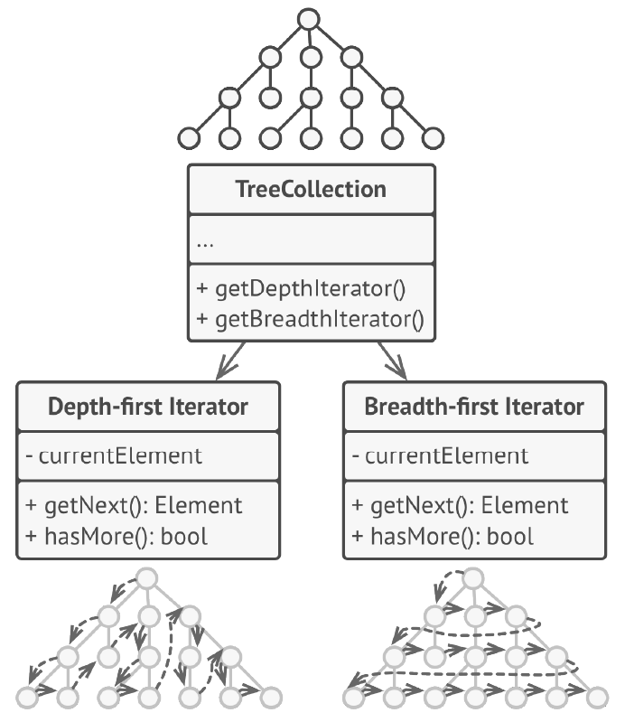

除实现自身算法外， 迭代器还封装了遍历操作的所有细节，例如当前位置和末尾剩余元素的数量。因此，多个迭代器可以在相互独立的情况下同时访问集合。

迭代器通常会提供一个获取集合元素的基本方法。客户端可不断调用该方法直至它不返回任何内容，这意味着迭代器已经遍历了所有元素。

所有迭代器必须实现相同的接口。这样一来，只要有合适的迭代器， 客户端代码就能兼容任何类型的集合或遍历算法。如果你需要采用特殊方式来遍历集合，只需创建一个新的迭代器类即可，无需对集合或客户端进行修改。

### 模式结构

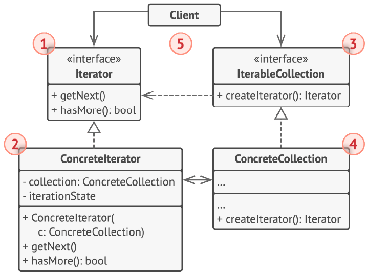

1、迭代器（Iterator）接口声明了遍历集合所需的操作：获取下一个元素、获取当前位置和重新开始迭代等。

2、具体迭代器（Concrete Iterators） 实现遍历集合的一种特定算法。迭代器对象必须跟踪自身遍历的进度。这使得多个迭代器可以相互独立地遍历同一集合。

3、集合（Collection）接口声明一个或多个方法来获取与集合兼容的迭代器。请注意，返回方法的类型必须被声明为迭代器接口，因此具体集合可以返回各种不同种类的迭代器。

4、具体集合（Concrete Collections） 会在客户端请求迭代器时返回一个特定的具体迭代器类实体。

5、客户端（Client）通过集合和迭代器的接口与两者进行交互。这样一来客户端无需与具体类进行耦合，允许同一客户端代码使用各种不同的集合和迭代器。

客户端通常不会自行创建迭代器，而是会从集合中获取。特殊情况的时候，客户端可以直接创建一个迭代器（例如当客户端需要自定义特殊迭代器时）。

### 代码示例

集合接口，它可以创建一个迭代器：

~~~java
public interface Aggregate {
    Iterator createIterator();
}
~~~

具体集合：

~~~java
public class ConcreteAggregate implements Aggregate {

    private Integer[] items;

    public ConcreteAggregate() {
        items = new Integer[10];
        for (int i = 0; i < items.length; i++) {
            items[i] = i;
        }
    }

    @Override
    public Iterator createIterator() {
        return new ConcreteIterator<Integer>(items);
    }
}
~~~

迭代器接口：

~~~java
public interface Iterator<Item> {

    Item next();

    boolean hasNext();
}
~~~

具体迭代器：

~~~java
public class ConcreteIterator<Item> implements Iterator {

    private Item[] items;
    private int position = 0;

    public ConcreteIterator(Item[] items) {
        this.items = items;
    }

    @Override
    public Object next() {
        return items[position++];
    }

    @Override
    public boolean hasNext() {
        return position < items.length;
    }
}
~~~

客户端执行迭代：

~~~java
public class Client {

    public static void main(String[] args) {
        Aggregate aggregate = new ConcreteAggregate();
        Iterator<Integer> iterator = aggregate.createIterator();
        while (iterator.hasNext()) {
            System.out.println(iterator.next());
        }
    }
}
~~~

### 适用场景

1、当集合背后为复杂的数据结构， 且你希望对客户端隐藏其复杂性时 （出于使用便利性或安全性的考虑）， 可以使用迭代器模式。

迭代器封装了与复杂数据结构进行交互的细节， 为客户端提供多个访问集合元素的简单方法。 这种方式不仅对客户端来说非常方便， 而且能避免客户端在直接与集合交互时执行错误或有害的操作， 从而起到保护集合的作用。 

2、 使用该模式可以减少程序中重复的遍历代码。

重要迭代算法的代码往往体积非常庞大。 当这些代码被放置在程序业务逻辑中时， 它会让原始代码的职责模糊不清， 降低其可维护性。 因此， 将遍历代码移到特定的迭代器中可使程序代码更加精炼和简洁。 

3、如果你希望代码能够遍历不同的甚至是无法预知的数据结构， 可以使用迭代器模式。

该模式为集合和迭代器提供了一些通用接口。 如果你在代码中使用了这些接口， 那么将其他实现了这些接口的集合和迭代器传递给它时， 它仍将可以正常运行。 

### 优缺点

优点：

* 单一职责原则。通过将体积庞大的遍历算法代码抽取为独立的类，你可对客户端代码和集合进行整理。
* 开闭原则。你可实现新型的集合和迭代器并将其传递给现有代码，无需修改现有代码。
* 可以并行遍历同一集合，因为每个迭代器对象都包含其自身的遍历状态。
* 可以暂停遍历并在需要时继续。

缺点：

* 如果你的程序只与简单的集合进行交互，应用该模式可能会矫枉过正。
* 对于某些特殊集合，使用迭代器可能比直接遍历的效率低。

### 与其他模式的关系

*  迭代器模式和备忘录模式共同使用：可以同时使用备忘录模式和迭代器来获取当前迭代器的状态， 并且在需要的时候进行回滚。
*  迭代器模式和访问者模式共同使用：可以同时使用访问者模式和迭代器来遍历复杂数据结构， 并对其中的元素执行所需操作， 即使这些元素所属的类完全不同。

## 中介者模式

### 核心思想

又称为调解人、控制器、Intermediary、Controller、Mediator 。中介者模式是一种行为设计模式， 能让你减少对象之间混乱无序的依赖关系。 该模式会限制对象之间的直接交互， 迫使它们通过一个中介者对象进行合作。中介者能使得程序更易于修改和扩展， 而且能更方便地对独立的组件进行复用， 因为它们不再依赖于很多其他的类。 

假如你有一个创建和修改客户资料的对话框，它由各种控件组成， 例如文本框（TextField）、复选框（Checkbox） 和按钮（Button）等。某些表单元素可能会直接进行互动：

* 选中“我有一只狗”复选框后可能会显示一个隐藏文本框用于输入狗狗的名字。
* 提交按钮必须在保存数据前校验所有输入内容。

元素间存在许多关联。因此，对某些元素进行修改可能会影响其他元素。

如果直接在表单元素代码中实现业务逻辑，你将很难在程序其他表单中复用这些元素类。例如，由于复选框类与狗狗的文本框相耦合，所以将无法在其他表单中使用它。

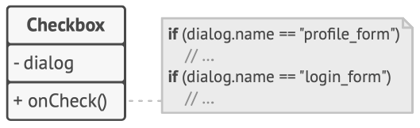

中介者模式建议你停止组件之间的直接交流并使其相互独立。这些组件必须调用特殊的中介者对象，通过中介者对象重定向调用行为，以间接的方式进行合作。最终，组件仅依赖于一个中介者类，无需与多个其他组件相耦合。使用中介者模式可以将复杂的依赖结构变成星形结构。

在资料编辑表单的例子中， 对话框（Dialog）类本身将作为中介者，其很可能已知自己所有的子元素，因此你甚至无需在该类中引入新的依赖关系。

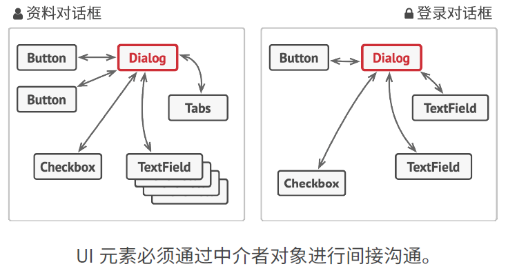

你还可以为所有类型的对话框抽取通用接口，进一步削弱其依赖性。接口中将声明一个所有表单元素都能使用的通知方法， 可用于将元素中发生的事件通知给对话框。这样一来，所有实现了该接口的对话框都能使用这个提交按钮了。

采用这种方式，中介者模式让你能在单个中介者对象中封装多个对象间的复杂关系网。类所拥有的依赖关系越少，就越易于修改、扩展或复用。

### 模式结构

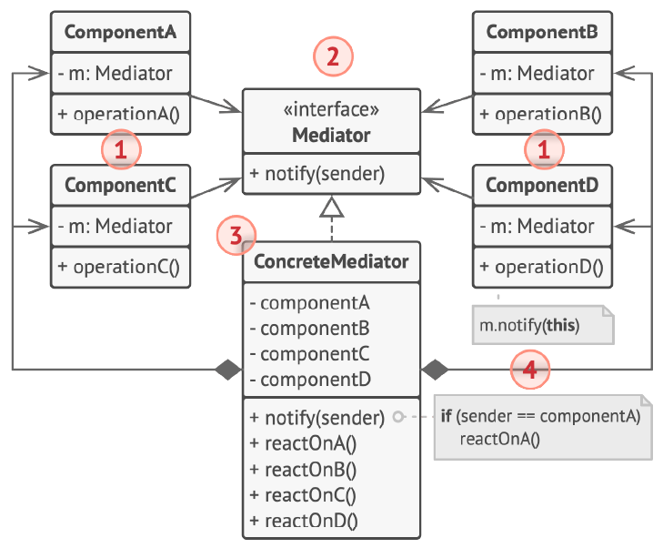

1、组件（Component）是各种包含业务逻辑的类。每个组件都有一个指向中介者的引用，该引用被声明为中介者接口类型。组件不知道中介者实际所属的类，因此你可通过将其连接到不同的中介者以使其能在其他程序中复用。

2、中介者（Mediator）接口声明了与组件交流的方法， 但通常仅包括一个通知方法。组件可将任意上下文（包括自己的对象）作为该方法的参数，只有这样接收组件和发送者类之间才不会耦合。

3、具体中介者（Concrete Mediator）封装了多种组件间的关系。具体中介者通常会保存所有组件的引用并对其进行管理，甚至有时会对其生命周期进行管理。

4、组件并不知道其他组件的情况。如果组件内发生了重要事件，它只能通知中介者。对于组件来说，中介者看上去完全就是一个黑箱。发送者不知道最终会由谁来处理自己的请求，接收者也不知道最初是谁发出了请求。

### 代码示例

中介者模式在 Java 代码中最常用于帮助程序 GUI 组件之间的通信。 在 MVC 模式中， 控制器是中介者的同义词。 

下面是核心 Java 程序库中该模式的一些示例： 

* java.util.Timer （所有 schedule­XXX()方法）
* java.util.concurrent.Executor#execute()
* java.util.concurrent.ExecutorService （ invoke­XXX()和 submit­()方法）
* java.util.concurrent.ScheduledExecutorService （所有 schedule­XXX()方法）
* java.lang.reflect.Method#invoke()

组件类Colleague：

~~~java
public abstract class Colleague {
    public abstract void onEvent(Mediator mediator);
}
~~~

具体组件：

~~~java
public class Alarm extends Colleague {

    @Override
    public void onEvent(Mediator mediator) {
        mediator.doEvent("alarm");
    }

    public void doAlarm() {
        System.out.println("doAlarm()");
    }
}
~~~

~~~java
public class CoffeePot extends Colleague {
    @Override
    public void onEvent(Mediator mediator) {
        mediator.doEvent("coffeePot");
    }

    public void doCoffeePot() {
        System.out.println("doCoffeePot()");
    }
}
~~~

~~~java
public class Calender extends Colleague {
    @Override
    public void onEvent(Mediator mediator) {
        mediator.doEvent("calender");
    }

    public void doCalender() {
        System.out.println("doCalender()");
    }
}
~~~

~~~java
public class Sprinkler extends Colleague {
    @Override
    public void onEvent(Mediator mediator) {
        mediator.doEvent("sprinkler");
    }

    public void doSprinkler() {
        System.out.println("doSprinkler()");
    }
}
~~~

中介者接口：

~~~java
public abstract class Mediator {
    public abstract void doEvent(String eventType);
}
~~~

具体中介者，中介者和组件类相互依赖，可以更进一步，让中介者负责组件对象的创建和销毁。此后，中介者可能会与工厂或外观类似。

~~~java
public class ConcreteMediator extends Mediator {
    private Alarm alarm;
    private CoffeePot coffeePot;
    private Calender calender;
    private Sprinkler sprinkler;

    public ConcreteMediator(Alarm alarm, CoffeePot coffeePot, Calender calender, Sprinkler sprinkler) {
        this.alarm = alarm;
        this.coffeePot = coffeePot;
        this.calender = calender;
        this.sprinkler = sprinkler;
    }

    @Override
    public void doEvent(String eventType) {
        switch (eventType) {
            case "alarm":
                doAlarmEvent();
                break;
            case "coffeePot":
                doCoffeePotEvent();
                break;
            case "calender":
                doCalenderEvent();
                break;
            default:
                doSprinklerEvent();
        }
    }

    public void doAlarmEvent() {
        alarm.doAlarm();
        coffeePot.doCoffeePot();
        calender.doCalender();
        sprinkler.doSprinkler();
    }

    public void doCoffeePotEvent() {
        // ...
    }

    public void doCalenderEvent() {
        // ...
    }

    public void doSprinklerEvent() {
        // ...
    }
}
~~~

客户端使用时：

~~~java
public class Client {
    public static void main(String[] args) {
        Alarm alarm = new Alarm();
        CoffeePot coffeePot = new CoffeePot();
        Calender calender = new Calender();
        Sprinkler sprinkler = new Sprinkler();
        Mediator mediator = new ConcreteMediator(alarm, coffeePot, calender, sprinkler);
        // 闹钟事件到达，调用中介者就可以操作相关对象
        alarm.onEvent(mediator);
    }
}
~~~

### 适用场景

1、当一些对象和其他对象紧密耦合以致难以对其进行修改时，可使用中介者模式。

该模式让你将对象间的所有关系抽取成为一个单独的类，以使对于特定组件的修改工作独立于其他组件。

2、当组件因过于依赖其他组件而无法在不同应用中复用时，可使用中介者模式。

应用中介者模式后，每个组件不再知晓其他组件的情况。尽管这些组件无法直接交流，但它们仍可通过中介者对象进行间接交流。如果你希望在不同应用中复用一个组件，则需要为其提供一个新的中介者类。

3、如果为了能在不同情景下复用一些基本行为，导致你需要被迫创建大量组件子类时，可使用中介者模式。

由于所有组件间关系都被包含在中介者中，因此你无需修改组件就能方便地新建中介者类以定义新的组件合作方式。

### 优缺点

优点：

* 单一职责原则。你可以将多个组件间的交流抽取到同一位置，使其更易于理解和维护。
* 开闭原则。你无需修改实际组件就能增加新的中介者。
* 可以减轻应用中多个组件间的耦合情况。
* 可以更方便地复用各个组件。

缺点：一段时间后，中介者可能会演化成为上帝对象。上帝对象是职责过多的例子。

### 与其他模式的关系

* 中介者模式和观察者模式对比：中介者和观察者之间的区别往往很难记住。 在大部分情况下， 你可以使用其中一种模式， 而有时可以同时使用。 
  * 中介者的主要目标是消除一系列系统组件之间的相互依赖。 这些组件将依赖于同一个中介者对象。 观察者的目标是在对象之间建立动态的单向连接， 使得部分对象可作为其他对象的附属发挥作用。
  * 有一种流行的中介者模式实现方式依赖于观察者。 中介者对象担当发布者的角色， 其他组件则作为订阅者， 可以订阅中介者的事件或取消订阅。 当中介者以这种方式实现时， 它可能看上去与观察者非常相似。
  * 假设有一个程序， 其所有的组件都变成了发布者， 它们之间可以相互建立动态连接。 这样程序中就没有中心化的中介者对象， 而只有一些分布式的观察者。

## 备忘录模式

### 核心思想

也被称为快照、Snapshot、Memento。备忘录模式是一种行为设计模式， 允许在不暴露对象实现细节的情况下保存和恢复对象之前的状态。

如果要开发一款文字编辑器应用，在实现撤销操作时，如果采用这种方式实现：程序在执行任何操作前会记录所有的对象状态， 并将其保存下来。当用户此后需要撤销某个操作时，程序将从历史记录中获取最近的快照，然后使用它来恢复所有对象的状态。

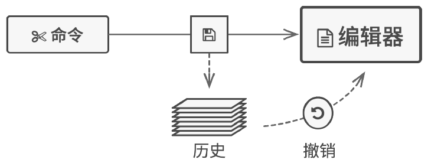

采用这种方式实现面临两个问题：

* 生成快照需要访问对象的私有成员变量，此时无法复制
* 如果对象的成员变量都是公开的，则会暴露其内部细节，未来修改成员变量时必须考虑到外部类的兼容性

此时就可以用备忘录模式来解决此问题，备忘录模式的几个关键角色：

* 备忘录（Memento）对象：它保存对象状态的副本。除了创建备忘录的对象外， 任何对象都不能访问备忘录的内容。其他对象必须使用受限接口与备忘录进行交互，它们可以获取快照的元数据（创建时间和操作名称等），但不能获取快照中原始对象的状态。

  备忘录实际上有两个接口：

  * 一个是提供给 Caretaker 的窄接口：它只能将备忘录传递给其它对象； 
  * 一个是提供给 Originator 的宽接口，允许它访问到先前状态所需的所有数据。理想情况是只允许 Originator 访问本备忘录的内部状态。 

* 原发器（Originator）对象：原始对象，实际状态的拥有者，它负责创建状态快照（Snapshot）。因为创建快照的是对象本身，所以其他对象也不需要再从外部复制状态了。原发器拥有对备忘录所有成员的访问权限，从而能随时恢复其以前的状态。
* 负责人（Caretakers）对象：备忘录保存在负责人对象中，由于负责人仅通过受限接口与备忘录互动，故其无法修改存储在备忘录内部的状态。

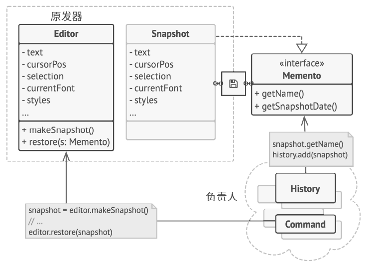

在文字编辑器的示例中， 我们可以创建一个独立的历史（History）类作为负责人。编辑器每次执行操作前， 存储在负责人中的备忘录栈都会生长。你甚至可以在应用的UI 中渲染该栈，为用户显示之前的操作历史。

当用户触发撤销操作时，历史类将从栈中取回最近的备忘录，并将其传递给编辑器以请求进行回滚。由于编辑器拥有对备忘录的完全访问权限，因此它可以使用从备忘录中获取的数值来替换自身的状态。

### 模式结构

备忘录模式的实现有几种：

一、基于嵌套类的实现

该模式的经典实现方式依赖于许多流行编程语言（例如C++、C# 和 Java）所支持的嵌套类。

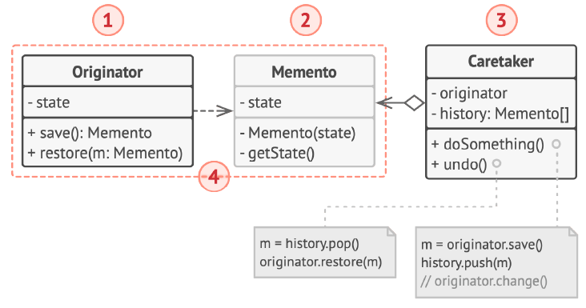

1、原发器（Originator）可以生成自身状态的快照，也可以在需要时通过快照恢复自身状态。

2、备忘录（Memento） 是原发器状态快照的值对象（valueobject）。通常做法是将备忘录设为不可变的，并通过构造函数一次性传递数据。

3、负责人（Caretaker）仅知道“何时”和“为何”捕捉原发器的状态，以及何时恢复状态。

负责人通过保存备忘录栈来记录原发器的历史状态。当原发器需要回溯历史状态时，负责人将从栈中获取最顶部的备忘录，并将其传递给原发器的恢复（restoration）方法。

4、在该实现方法中，备忘录类将被嵌套在原发器中。这样原发器就可访问备忘录的成员变量和方法，即使这些方法被声明为私有。另一方面，负责人对于备忘录的成员变量和方法的访问权限非常有限：它们只能在栈中保存备忘录，而不能修改其状态。

二、基于中间接口的实现

另外一种实现方法适用于不支持嵌套类的编程语言，如PHP

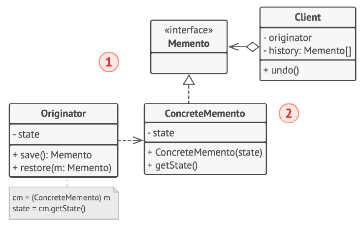

1、在没有嵌套类的情况下，你可以规定负责人仅可通过明确声明的中间接口与备忘录互动，该接口仅声明与备忘录元数据相关的方法，限制其对备忘录成员变量的直接访问权限。

2、另一方面，原发器可以直接与备忘录对象进行交互，访问备忘录类中声明的成员变量和方法。这种方式的缺点在于你需要将备忘录的所有成员变量声明为公有。

三、封装更加严格的实现

如果不想让其他类有任何机会通过备忘录来访问原发器的状态，那么还有另一种可用的实现方式。

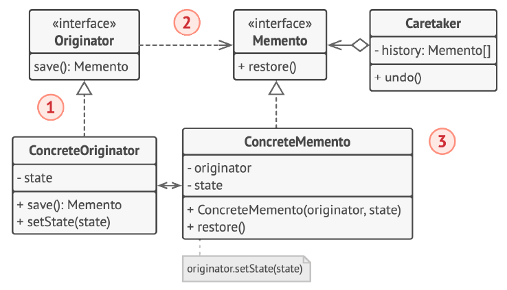

1、这种实现方式允许存在多种不同类型的原发器和备忘录。每种原发器都和其相应的备忘录类进行交互。原发器和备忘录都不会将其状态暴露给其他类。

2、负责人此时被明确禁止修改存储在备忘录中的状态。但负责人类将独立于原发器，因为此时恢复方法被定义在了备忘录类中。

3、每个备忘录将与创建了自身的原发器连接。原发器会将自己及状态传递给备忘录的构造函数。由于这些类之间的紧密联系，只要原发器定义了合适的设置器（setter），备忘录就能恢复其状态。

### 代码示例

备忘录的基本原则可通过序列化来实现， 这在 Java 语言中很常见。 尽管备忘录不是生成对象状态快照的唯一或最有效方法， 但它能在保护原始对象的结构不暴露给其他对象的情况下保存对象状态的备份。 

下面是核心 Java 程序库中该模式的一些示例： 

* 所有 java.io.Serializable 的实现都可以模拟备忘录。
* 所有 javax.faces.component.StateHolder 的实现。

以下实现了一个简单计算器程序，可以输入两个值，然后计算这两个值的和。备忘录模式允许将这两个值存储起来，然后在某个时刻用存储的状态进行恢复。 

本例采用的是接口的实现方式。

计算器类，实际上是一个原发器对象：

~~~java
/**
 * Originator Interface
 */
public interface Calculator {

    // Create Memento
    PreviousCalculationToCareTaker backupLastCalculation();

    // setMemento
    void restorePreviousCalculation(PreviousCalculationToCareTaker memento);

    int getCalculationResult();

    void setFirstNumber(int firstNumber);

    void setSecondNumber(int secondNumber);
}
~~~

具体计算器类，也就是具体的原发器：

~~~java
/**
 * Originator Implementation
 */
public class CalculatorImp implements Calculator {

    private int firstNumber;
    private int secondNumber;

    @Override
    public PreviousCalculationToCareTaker backupLastCalculation() {
        // create a memento object used for restoring two numbers
        return new PreviousCalculationImp(firstNumber, secondNumber);
    }

    @Override
    public void restorePreviousCalculation(PreviousCalculationToCareTaker memento) {
        this.firstNumber = ((PreviousCalculationToOriginator) memento).getFirstNumber();
        this.secondNumber = ((PreviousCalculationToOriginator) memento).getSecondNumber();
    }

    @Override
    public int getCalculationResult() {
        // result is adding two numbers
        return firstNumber + secondNumber;
    }

    @Override
    public void setFirstNumber(int firstNumber) {
        this.firstNumber = firstNumber;
    }

    @Override
    public void setSecondNumber(int secondNumber) {
        this.secondNumber = secondNumber;
    }
}
~~~

备忘录提供给原发器的接口，它可以访问到所有的状态：

~~~java
/**
 * Memento Interface to Originator
 *
 * This interface allows the originator to restore its state
 */
public interface PreviousCalculationToOriginator {
    int getFirstNumber();
    int getSecondNumber();
}
~~~

备忘录提供给负责人的接口，仅通过受限接口与备忘录互动：

~~~java
/**
 *  Memento interface to CalculatorOperator (Caretaker)
 */
public interface PreviousCalculationToCareTaker {
    // no operations permitted for the caretaker
}
~~~

备忘录的实现类，它能保存原始对象的状态：

~~~java
/**
 * Memento Object Implementation
 * 

 * Note that this object implements both interfaces to Originator and CareTaker
 */
public class PreviousCalculationImp implements PreviousCalculationToCareTaker,
        PreviousCalculationToOriginator {

    private int firstNumber;
    private int secondNumber;

    public PreviousCalculationImp(int firstNumber, int secondNumber) {
        this.firstNumber = firstNumber;
        this.secondNumber = secondNumber;
    }

    @Override
    public int getFirstNumber() {
        return firstNumber;
    }

    @Override
    public int getSecondNumber() {
        return secondNumber;
    }
}
~~~

客户端使用：

~~~java
/**
 * CareTaker object
 */
public class Client {

    public static void main(String[] args) {
        // program starts
        Calculator calculator = new CalculatorImp();

        // assume user enters two numbers
        calculator.setFirstNumber(10);
        calculator.setSecondNumber(100);

        // find result
        System.out.println(calculator.getCalculationResult());

        // Store result of this calculation in case of error
        PreviousCalculationToCareTaker memento = calculator.backupLastCalculation();

        // user enters a number
        calculator.setFirstNumber(17);

        // user enters a wrong second number and calculates result
        calculator.setSecondNumber(-290);

        // calculate result
        System.out.println(calculator.getCalculationResult());

        // user hits CTRL + Z to undo last operation and see last result
        calculator.restorePreviousCalculation(memento);

        // result restored
        System.out.println(calculator.getCalculationResult());
    }
}
~~~

### 适用场景

1、需要创建对象状态快照来恢复其之前的状态时，可以使用备忘录模式。

备忘录模式允许你复制对象中的全部状态（包括私有成员变量）， 并将其独立于对象进行保存。尽管大部分人因为“撤销”这个用例才记得该模式，但其实它在处理事务（比如需要在出现错误时回滚一个操作）的过程中也必不可少。

2、当直接访问对象的成员变量、获取器或设置器将导致封装被突破时，可以使用该模式。

备忘录让对象自行负责创建其状态的快照。任何其他对象都不能读取快照，这有效地保障了数据的安全性。

### 实现方式

1、确定担任原发器角色的类，它是原始对象。重要的是明确程序使用的一个原发器中心对象，还是多个较小的对象。

2、创建备忘录类，它是保存状态的类。逐一声明对应每个原发器成员变量的备忘录成员变量。

3、将备忘录类设为不可变。备忘录只能通过构造函数一次性接收数据。该类中不能包含设置器。

4、分两种情况讨论：

* 如果你所使用的编程语言支持嵌套类，则可将备忘录嵌套在原发器中；
* 如果不支持，那么你可从备忘录类中抽取一个空接口，然后让其他所有对象通过接口来引用备忘录。你可在该接口中添加一些元数据操作，但不能暴露原发器的状态。

5、在原发器中添加一个创建备忘录的方法。原发器必须通过备忘录构造函数的一个或多个实际参数来将自身状态传递给备忘录。该方法返回结果的类型必须是你在上一步中抽取的接口。实际上， 创建备忘录的方法必须直接与备忘录类进行交互。

6、在原发器类中添加一个用于恢复自身状态的方法。该方法接受备忘录对象作为参数。如果你在之前的步骤中抽取了接口，那么可将接口作为参数的类型。在这种情况下，你需要将输入对象强制转换为备忘录，因为原发器需要拥有对该对象的完全访问权限。

7、无论负责人是命令对象、历史记录或其他完全不同的东西，它都必须要知道何时向原发器请求新的备忘录、如何存储备忘录以及何时使用特定备忘录来对原发器进行恢复。

8、负责人与原发器之间的连接可以移动到备忘录类中。

### 优缺点

优点：

* 可以在不破坏对象封装情况的前提下创建对象状态快照。
* 可以通过让负责人维护原发器状态历史记录来简化原发器代码。

缺点：

* 如果客户端过于频繁地创建备忘录，程序将消耗大量内存。
* 负责人必须完整跟踪原发器的生命周期，这样才能销毁弃用的备忘录。
* 绝大部分动态编程语言（例如PHP、Python 和JavaScript）不能确保备忘录中的状态不被修改。

## 观察者模式

### 核心思想

又称为事件订阅者、监听者、Event-Subscriber、Listener、Observer 。

观察者模式是一种行为设计模式， 允许你定义一种订阅机制， 可在对象事件发生时通知多个 “观察” 该对象的其他对象。观察者模式提供了一种作用于任何实现了订阅者接口的对象的机制， 可对其事件进行订阅和取消订阅。 

观察者模式中的关键角色：

* 拥有一些值得关注的状态的对象通常被称为目标，由于它要将自身的状态改变通知给其他对象，我们也将其称为发布者（publisher）。
* 所有希望关注发布者状态变化的其他对象被称为订阅者（subscribers）。

观察者模式建议你为发布者类添加订阅机制，让每个对象都能订阅或取消订阅发布者事件流。每个订阅者应该包含两部分功能：

* 一个用于存储订阅者对象引用的列表成员变量
* 几个用于添加或删除该列表中订阅者的公有方法。

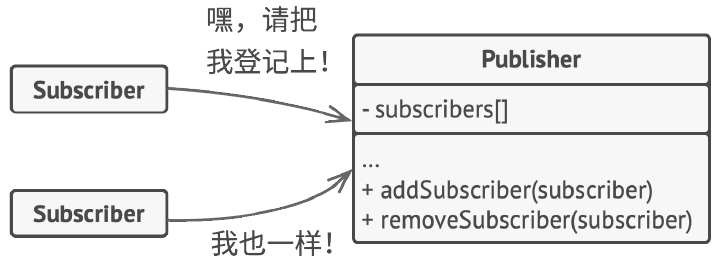

无论何时发生了重要的发布者事件，它都要遍历订阅者并调用其对象的特定通知方法。

实际应用中可能会有十几个不同的订阅者类跟踪着同一个发布者类的事件，为了让这些发布者和这些类解耦，所有订阅者都必须实现同样的接口，发布者仅通过该接口与订阅者交互。接口中必须声明通知方法及其参数，这样发布者在发出通知时还能传递一些上下文数据。

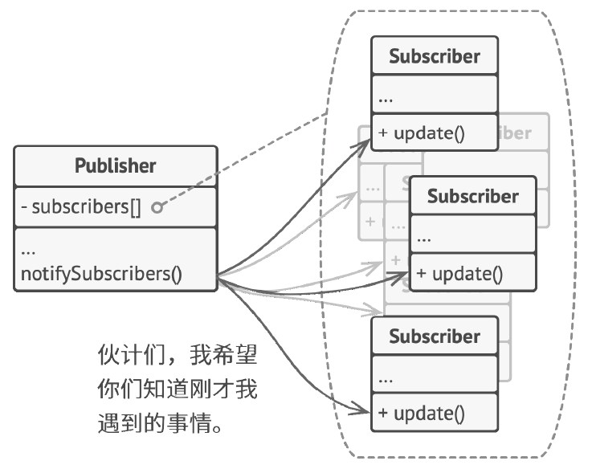

如果你的应用中有多个不同类型的发布者，且希望订阅者可兼容所有发布者，那么你甚至可以进一步让所有订阅者遵循同样的接口。该接口仅需描述几个订阅方法即可。这样订阅者就能在不与具体发布者类耦合的情况下通过接口观察发布者的状态。

### 模式结构

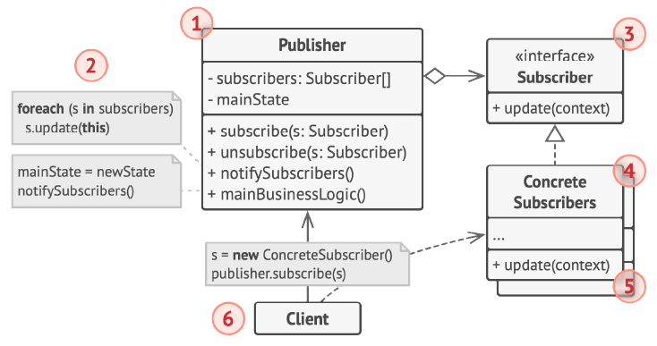

1、发布者（Publisher）会向其他对象发送值得关注的事件。事件会在发布者自身状态改变或执行特定行为后发生。发布者中包含一个允许新订阅者加入和当前订阅者离开列表的订阅构架。

2、当新事件发生时，发送者会遍历订阅列表并调用每个订阅者对象的通知方法。该方法是在订阅者接口中声明的。

3、订阅者（Subscriber） 接口声明了通知接口。在绝大多数情况下，该接口仅包含一个update 更新方法。该方法可以拥有多个参数，使发布者能在更新时传递事件的详细信息。

4、具体订阅者（Concrete Subscribers）可以执行一些操作来回应发布者的通知。所有具体订阅者类都实现了同样的接口，因此发布者不需要与具体类相耦合。

5、订阅者通常需要一些上下文信息来正确地处理更新。因此，发布者通常会将一些上下文数据作为通知方法的参数进行传递。发布者也可将自身作为参数进行传递，使订阅者直接获取所需的数据。

6、客户端（Client）会分别创建发布者和订阅者对象， 然后为订阅者注册发布者更新。

### 代码示例

观察者模式在 Java 代码中很常见， 特别是在 GUI 组件中。 它提供了在不与其他对象所属类耦合的情况下对其事件做出反应的方式。 

* java.util.Observer/java.util.Observable （极少在真实世界中使用）
* java.util.EventListener的所有实现 （几乎广泛存在于 Swing 组件中）
* javax.servlet.http.HttpSessionBindingListener
* javax.servlet.http.HttpSessionAttributeListener
* javax.faces.event.PhaseListener

识别方法： 该模式可以通过将对象存储在列表中的订阅方法， 和对于面向该列表中对象的更新方法的调用来识别。

在本例中， 观察者模式在文本编辑器的对象之间建立了间接的合作关系。 每当编辑器（Editor）对象改变时， 它都会通知其订阅者。  邮件通知监听器  （Email­Notification­Listener） 和 日志开启监听器  （Log­Open­Listener） 都将通过执行其基本行为来对这些通知做出反应。订阅者类不与编辑器类相耦合， 且能在需要时在其他应用中复用。  编辑器类仅依赖于抽象订阅者接口。 这样就能允许在不改变编辑器代码的情况下添加新的订阅者类型。

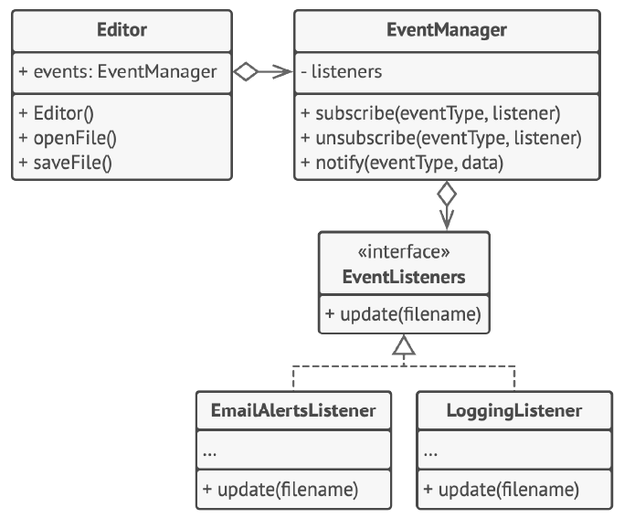

订阅者列表是动态生成的：对象可在运行时根据程序需要开始或停止监听通知。

在本实现中，编辑器类自身并不维护订阅列表。它将工作委派给专门从事此工作的一个特殊帮手对象。你还可将该对象升级为中心化的事件分发器，允许任何对象成为发布者。只要发布者通过同样的接口与所有订阅者进行交互，那么在程序中新增订阅者时就无需修改已有发布者类的代码。

发布者，它提供了基本的订阅、取消订阅和通知功能：

~~~java
public class EventManager {
    Map<String, List<EventListener>> listeners = new HashMap<>();

    public EventManager(String... operations) {
        for (String operation : operations) {
            this.listeners.put(operation, new ArrayList<>());
        }
    }

    public void subscribe(String eventType, EventListener listener) {
        List<EventListener> users = listeners.get(eventType);
        users.add(listener);
    }

    public void unsubscribe(String eventType, EventListener listener) {
        List<EventListener> users = listeners.get(eventType);
        users.remove(listener);
    }

    public void notify(String eventType, File file) {
        List<EventListener> users = listeners.get(eventType);
        for (EventListener listener : users) {
            listener.update(eventType, file);
        }
    }
}
~~~

具体发布者，它提供具体的发布逻辑：

~~~java
public class Editor {
    public EventManager events;
    private File file;

    public Editor() {
        this.events = new EventManager("open", "save");
    }

    public void openFile(String filePath) {
        this.file = new File(filePath);
        events.notify("open", file);
    }

    public void saveFile() throws Exception {
        if (this.file != null) {
            events.notify("save", file);
        } else {
            throw new Exception("Please open a file first.");
        }
    }
}
~~~

观察者接口：

~~~java
public interface EventListener {
    void update(String eventType, File file);
}
~~~

具体观察者，包括接到事件后发送邮件、记录日志类：

~~~java
public class EmailNotificationListener implements EventListener {
    private String email;

    public EmailNotificationListener(String email) {
        this.email = email;
    }

    @Override
    public void update(String eventType, File file) {
        System.out.println("Email to " + email + ": Someone has performed " + eventType + " operation with the following file: " + file.getName());
    }
}
~~~

~~~java
public class LogOpenListener implements EventListener {
    private File log;

    public LogOpenListener(String fileName) {
        this.log = new File(fileName);
    }

    @Override
    public void update(String eventType, File file) {
        System.out.println("Save to log " + log + ": Someone has performed " + eventType + " operation with the following file: " + file.getName());
    }
}
~~~

客户端执行：

~~~java
public class Demo {
    public static void main(String[] args) {
        Editor editor = new Editor();
        editor.events.subscribe("open", new LogOpenListener("/path/to/log/file.txt"));
        editor.events.subscribe("save", new EmailNotificationListener("admin@example.com"));

        try {
            editor.openFile("test.txt");
            editor.saveFile();
        } catch (Exception e) {
            e.printStackTrace();
        }
    }
}
~~~

### 适用场景

1、当一个对象状态的改变需要改变其他对象，或实际对象是事先未知的或动态变化的时，可使用观察者模式。

观察者模式允许任何实现了订阅者接口的对象订阅发布者对象的事件通知。例如spring提供了很多事件，对于开发者来说，要监听这些事件以触发一些业务逻辑，此时就可以自定义一些监听器。

2、需要变化的订阅关系

因为订阅列表是动态的，因此订阅者可随时加入或离开该列表。

### 优缺点

优点：

* 开闭原则。你无需修改发布者代码就能引入新的订阅者类（如果是发布者接口则可轻松引入发布者类）。
* 可以在运行时建立对象之间的联系。

缺点：订阅者的通知顺序是随机的。

## 状态模式

### 核心思想

也被称为State。状态模式是一种行为设计模式， 让你能在一个对象的内部状态变化时改变其行为， 使其看上去就像改变了自身所属的类一样。

该模式将与状态相关的行为抽取到独立的状态类中， 让原对象将工作委派给这些类的实例， 而不是自行进行处理。 

状态模式与有限状态机的概念紧密相关。

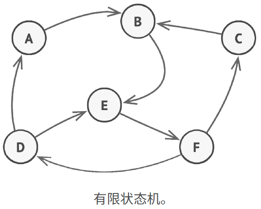

其主要思想是程序在任意时刻仅可处于几种有限的状态中。在任何一个特定状态中，程序的行为都不相同，且可瞬间从一个状态切换到另一个状态。

根据当前状态，程序可能会切换到另外一种状态，也可能会保持当前状态不变。这些数量有限且预先定义的状态切换规则被称为转移。

还可将该方法应用在对象上。假如你有一个文档Document 类。文档可能会处于草稿Draft 、审阅中Moderation 和已发布Published 三种状态中的一种。文档的publish 发布方法在不同状态下的行为略有不同：

* 处于草稿状态时，它会将文档转移到审阅中状态。
* 处于审阅中状态时，如果当前用户是管理员，它会公开发布文档。
* 处于已发布状态时，它不会进行任何操作。

下面这张图显示了文档对象的全部状态和转移：

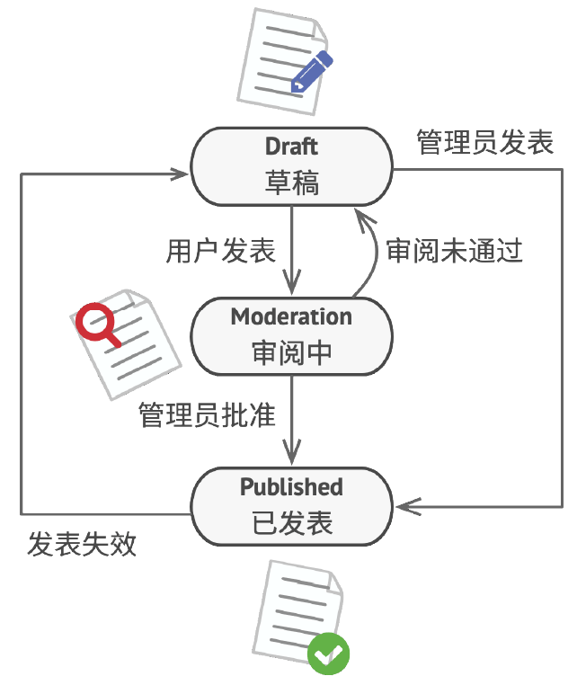

状态机通常由众多条件运算符（ if 或switch ）实现，可根据对象的当前状态选择相应的行为。

当我们逐步在文档类中添加更多状态和依赖于状态的行为后，方法就会越来越复杂，修改其转换逻辑可能会涉及到修改所有方法中的状态条件语句，导致代码的维护工作非常艰难。

状态模式建议为对象的所有可能状态新建一个类，然后将所有状态的对应行为抽取到这些类中。

原始对象被称为上下文（context）， 它并不会自行实现所有行为，而是会保存一个指向表示当前状态的状态对象的引用，且将所有与状态相关的工作委派给该对象。

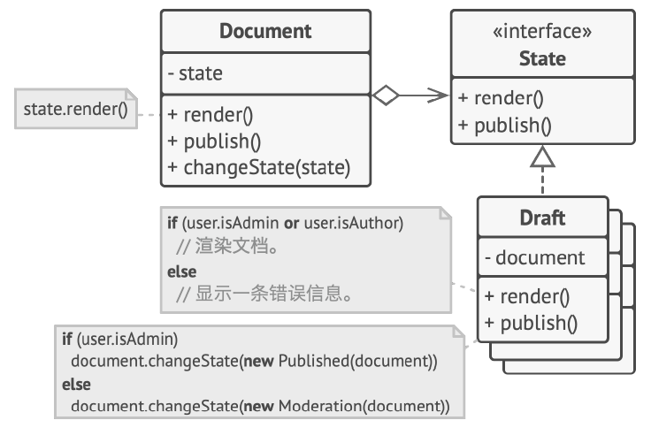

如需将上下文转换为另外一种状态，则需将当前活动的状态对象替换为另外一个代表新状态的对象。采用这种方式是有前提的：所有状态类都必须遵循同样的接口，而且上下文必须仅通过接口与这些对象进行交互。

这个结构可能看上去与策略模式相似，但有一个关键性的不同——在状态模式中， 特定状态知道其他所有状态的存在，且能触发从一个状态到另一个状态的转换；策略则几乎完全不知道其他策略的存在。

### 模式结构

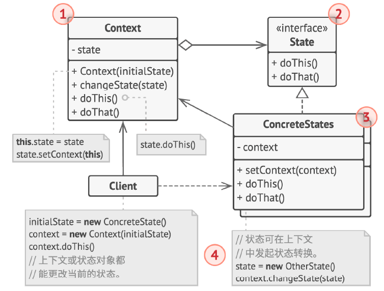

1、上下文（Context）保存了对于一个具体状态对象的引用，并会将所有与该状态相关的工作委派给它。上下文通过状态接口与状态对象交互，且会提供一个设置器用于传递新的状态对象。

2、状态（State）接口会声明特定于状态的方法。这些方法应能被其他所有具体状态所理解，因为你不希望某些状态所拥有的方法永远不会被调用。

3、具体状态（Concrete States）会自行实现特定于状态的方法。为了避免多个状态中包含相似代码，你可以提供一个封装有部分通用行为的中间抽象类。

状态对象可存储对于上下文对象的反向引用。状态可以通过该引用从上下文处获取所需信息，并且能触发状态转移。具体状态和context是相互引用的

4、上下文和具体状态都可以设置上下文的下个状态，并可通过替换连接到上下文的状态对象来完成实际的状态转换。

### 代码示例

在 Java 语言中， 状态模式通常被用于将基于 switch语句的大型状态机转换为对象。

这里是核心 Java 程序库中一些状态模式的示例：

* javax.faces.lifecycle.LifeCycle#execute() （由Faces­Servlet控制： 行为依赖于当前 JSF 生命周期的阶段 （状态））

识别方法： 状态模式可通过受外部控制且能根据对象状态改变行为的方法来识别。

下面的例子模拟了糖果销售机的多种状态，每种状态下销售机有不同的行为，状态可以发生转移，使得销售机的行为也发生改变。 

状态接口：

~~~java
public interface State {
    /**
     * 投入 25 分钱
     */
    void insertQuarter();

    /**
     * 退回 25 分钱
     */
    void ejectQuarter();

    /**
     * 转动曲柄
     */
    void turnCrank();

    /**
     * 发放糖果
     */
    void dispense();
}
~~~

几种具体的状态，在具体状态类中，因为包含context的引用，可以通过它完成状态的变化：

~~~java
public class HasQuarterState implements State {

    private GumballMachine gumballMachine;

    public HasQuarterState(GumballMachine gumballMachine) {
        this.gumballMachine = gumballMachine;
    }

    @Override
    public void insertQuarter() {
        System.out.println("You can't insert another quarter");
    }

    @Override
    public void ejectQuarter() {
        System.out.println("Quarter returned");
        gumballMachine.setState(gumballMachine.getNoQuarterState());
    }

    @Override
    public void turnCrank() {
        System.out.println("You turned...");
        gumballMachine.setState(gumballMachine.getSoldState());
    }

    @Override
    public void dispense() {
        System.out.println("No gumball dispensed");
    }
}
~~~

~~~java
public class NoQuarterState implements State {

    GumballMachine gumballMachine;

    public NoQuarterState(GumballMachine gumballMachine) {
        this.gumballMachine = gumballMachine;
    }

    @Override
    public void insertQuarter() {
        System.out.println("You insert a quarter");
        gumballMachine.setState(gumballMachine.getHasQuarterState());
    }

    @Override
    public void ejectQuarter() {
        System.out.println("You haven't insert a quarter");
    }

    @Override
    public void turnCrank() {
        System.out.println("You turned, but there's no quarter");
    }

    @Override
    public void dispense() {
        System.out.println("You need to pay first");
    }
}
~~~

~~~java
public class SoldOutState implements State {

    GumballMachine gumballMachine;

    public SoldOutState(GumballMachine gumballMachine) {
        this.gumballMachine = gumballMachine;
    }

    @Override
    public void insertQuarter() {
        System.out.println("You can't insert a quarter, the machine is sold out");
    }

    @Override
    public void ejectQuarter() {
        System.out.println("You can't eject, you haven't inserted a quarter yet");
    }

    @Override
    public void turnCrank() {
        System.out.println("You turned, but there are no gumballs");
    }

    @Override
    public void dispense() {
        System.out.println("No gumball dispensed");
    }
}
~~~

~~~java
public class SoldState implements State {

    GumballMachine gumballMachine;

    public SoldState(GumballMachine gumballMachine) {
        this.gumballMachine = gumballMachine;
    }

    @Override
    public void insertQuarter() {
        System.out.println("Please wait, we're already giving you a gumball");
    }

    @Override
    public void ejectQuarter() {
        System.out.println("Sorry, you already turned the crank");
    }

    @Override
    public void turnCrank() {
        System.out.println("Turning twice doesn't get you another gumball!");
    }

    @Override
    public void dispense() {
        gumballMachine.releaseBall();
        if (gumballMachine.getCount() > 0) {
            gumballMachine.setState(gumballMachine.getNoQuarterState());
        } else {
            System.out.println("Oops, out of gumballs");
            gumballMachine.setState(gumballMachine.getSoldOutState());
        }
    }
}
~~~

context类，它包含state：

~~~java
public class GumballMachine {

    private State soldOutState;
    private State noQuarterState;
    private State hasQuarterState;
    private State soldState;

    private State state;
    private int count = 0;

    public GumballMachine(int numberGumballs) {
        count = numberGumballs;
        soldOutState = new SoldOutState(this);
        noQuarterState = new NoQuarterState(this);
        hasQuarterState = new HasQuarterState(this);
        soldState = new SoldState(this);

        if (numberGumballs > 0) {
            state = noQuarterState;
        } else {
            state = soldOutState;
        }
    }

    public void insertQuarter() {
        state.insertQuarter();
    }

    public void ejectQuarter() {
        state.ejectQuarter();
    }

    public void turnCrank() {
        state.turnCrank();
        state.dispense();
    }

    public void setState(State state) {
        this.state = state;
    }

    public void releaseBall() {
        System.out.println("A gumball comes rolling out the slot...");
        if (count != 0) {
            count -= 1;
        }
    }

    public State getSoldOutState() {
        return soldOutState;
    }

    public State getNoQuarterState() {
        return noQuarterState;
    }

    public State getHasQuarterState() {
        return hasQuarterState;
    }

    public State getSoldState() {
        return soldState;
    }

    public int getCount() {
        return count;
    }
}
~~~

客户端使用：

~~~java
public class Client {

    public static void main(String[] args) {
        GumballMachine gumballMachine = new GumballMachine(5);

        gumballMachine.insertQuarter();
        gumballMachine.turnCrank();

        gumballMachine.insertQuarter();
        gumballMachine.ejectQuarter();
        gumballMachine.turnCrank();

        gumballMachine.insertQuarter();
        gumballMachine.turnCrank();
        gumballMachine.insertQuarter();
        gumballMachine.turnCrank();
        gumballMachine.ejectQuarter();

        gumballMachine.insertQuarter();
        gumballMachine.insertQuarter();
        gumballMachine.turnCrank();
        gumballMachine.insertQuarter();
        gumballMachine.turnCrank();
        gumballMachine.insertQuarter();
        gumballMachine.turnCrank();
    }
}
~~~

### 适用场景

1、如果对象需要根据自身当前状态进行不同行为，同时状态的数量非常多且与状态相关的代码会频繁变更的话，可使用状态模式。

模式建议你将所有特定于状态的代码抽取到一组独立的类中。这样一来，你可以在独立于其他状态的情况下添加新状态或修改已有状态，从而减少维护成本。

2、如果某个类需要根据成员变量的当前值改变自身行为，从而需要使用大量的条件语句时，可使用该模式。

状态模式会将这些条件语句的分支抽取到相应状态类的方法中。同时，你还可以清除主要类中与特定状态相关的临时成员变量和帮手方法代码。

3、当相似状态和基于条件的状态机转换中存在许多重复代码时，可使用状态模式。

状态模式让你能够生成状态类层次结构，通过将公用代码抽取到抽象基类中来减少重复。

### 优缺点

优点：

* 单一职责原则。将与特定状态相关的代码放在单独的类中。
* 开闭原则。无需修改已有状态类和上下文就能引入新状态。
* 通过消除臃肿的状态机条件语句简化上下文代码。

缺点：如果状态机只有很少的几个状态，或者很少发生改变，那么应用该模式可能会显得小题大作。

### 与其他模式的关系

* 桥接模式、 状态模式和策略模式 （在某种程度上包括适配器模式） 模式的接口非常相似。 实际上， 它们都基于组合模式——即将工作委派给其他对象， 不过也各自解决了不同的问题。 
* 状态模式和策略模式的关系：状态可被视为策略的扩展。 两者都基于组合机制： 它们都通过将部分工作委派给 “帮手” 对象来改变其在不同情景下的行为。
  * 策略使得这些对象相互之间完全独立， 它们不知道其他对象的存在。 
  * 但状态模式没有限制具体状态之间的依赖， 且允许它们自行改变在不同情景下的状态。

## 策略模式

### 核心思想

也叫Strategy 。策略模式是一种行为设计模式， 它能让你定义一系列算法， 并将每种算法分别放入独立的类中， 以使算法的对象能够相互替换。

策略模式建议找出负责用许多不同方式完成特定任务的类，然后将其中的算法抽取到一组被称为策略的独立类中。

名为上下文的原始类必须包含一个成员变量来存储对于每种策略的引用。上下文并不执行任务，而是将工作委派给已连接的策略对象。

上下文不负责选择符合任务需要的算法——客户端会将所需策略传递给上下文。实际上，上下文并不十分了解策略，它会通过同样的通用接口与所有策略进行交互，而该接口只需暴露一个方法来触发所选策略中封装的算法即可。

因此，上下文可独立于具体策略。这样你就可在不修改上下文代码或其他策略的情况下添加新算法或修改已有算法了。

在导游应用中， 每个路线规划算法都可被抽取到只有一个buildRoute 生成路线方法的独立类中。该方法接收起点和终点作为参数，并返回路线中途点的集合。

客户端可以使用不同的策略生成不同的路线。

### 模式结构

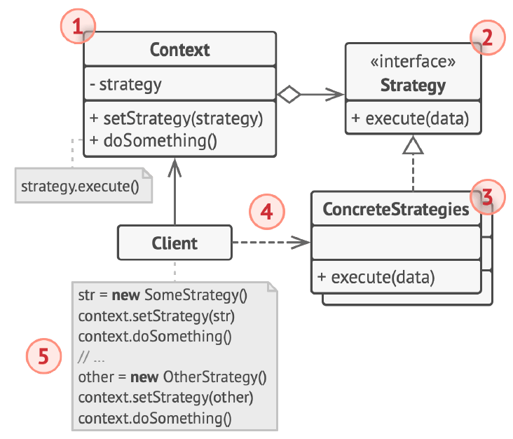

1、上下文（Context）维护指向具体策略的引用，且仅通过策略接口与该对象进行交流。

2、策略（Strategy）接口是所有具体策略的通用接口， 它声明了一个上下文用于执行策略的方法。

3、具体策略（Concrete Strategies）实现了上下文所用算法的各种不同变体。

4、当上下文需要运行算法时，它会在其已连接的策略对象上调用执行方法。上下文不清楚其所涉及的策略类型与算法的执行方式。

5、客户端（Client） 会创建一个特定策略对象并将其传递给上下文。上下文则会提供一个设置器以便客户端在运行时替换相关联的策略。

### 代码示例

策略模式在 Java 代码中很常见。 它经常在各种框架中使用， 能在不扩展类的情况下向用户提供改变其行为的方式。 

Java 8 开始支持 lambda 方法， 它可作为一种替代策略模式的简单方式。

这里有一些核心 Java 程序库中策略模式的示例：

* 对 java.util.Comparator#compare() 的调用来自 Collections#sort().
* ​javax.servlet.http.HttpServlet：  service­()方法， 还有所有接受 Http­Servlet­Request和 Http­Servlet­Response对象作为参数的 do­XXX()方法。
* javax.servlet.Filter#doFilter()

识别方法： 策略模式可以通过允许嵌套对象完成实际工作的方法以及允许将该对象替换为不同对象的设置器来识别。

在本例中， 策略模式被用于在电子商务应用中实现各种支付方法。 客户选中希望购买的商品后需要选择一种支付方式： Paypal 或者信用卡。

具体策略不仅会完成实际的支付工作， 还会改变支付表单的行为， 并在表单中提供相应的字段来记录支付信息。

策略的通用接口：

~~~java
/**
 * Common interface for all strategies.
 */
public interface PayStrategy {
    boolean pay(int paymentAmount);
    void collectPaymentDetails();
}
~~~

具体的策略类：

~~~java
/**
 * Concrete strategy. Implements PayPal payment method.
 */
public class PayByPayPal implements PayStrategy {
    private static final Map<String, String> DATA_BASE = new HashMap<>();
    private final BufferedReader READER = new BufferedReader(new InputStreamReader(System.in));
    private String email;
    private String password;
    private boolean signedIn;

    static {
        DATA_BASE.put("amanda1985", "amanda@ya.com");
        DATA_BASE.put("qwerty", "john@amazon.eu");
    }

    /**
     * Collect customer's data.
     */
    @Override
    public void collectPaymentDetails() {
        try {
            while (!signedIn) {
                System.out.print("Enter the user's email: ");
                email = READER.readLine();
                System.out.print("Enter the password: ");
                password = READER.readLine();
                if (verify()) {
                    System.out.println("Data verification has been successful.");
                } else {
                    System.out.println("Wrong email or password!");
                }
            }
        } catch (IOException ex) {
            ex.printStackTrace();
        }
    }

    private boolean verify() {
        setSignedIn(email.equals(DATA_BASE.get(password)));
        return signedIn;
    }

    /**
     * Save customer data for future shopping attempts.
     */
    @Override
    public boolean pay(int paymentAmount) {
        if (signedIn) {
            System.out.println("Paying " + paymentAmount + " using PayPal.");
            return true;
        } else {
            return false;
        }
    }

    private void setSignedIn(boolean signedIn) {
        this.signedIn = signedIn;
    }
}
~~~

~~~java
/**
 * Concrete strategy. Implements credit card payment method.
 */
public class PayByCreditCard implements PayStrategy {
    private final BufferedReader READER = new BufferedReader(new InputStreamReader(System.in));
    private CreditCard card;

    /**
     * Collect credit card data.
     */
    @Override
    public void collectPaymentDetails() {
        try {
            System.out.print("Enter the card number: ");
            String number = READER.readLine();
            System.out.print("Enter the card expiration date 'mm/yy': ");
            String date = READER.readLine();
            System.out.print("Enter the CVV code: ");
            String cvv = READER.readLine();
            card = new CreditCard(number, date, cvv);

            // Validate credit card number...

        } catch (IOException ex) {
            ex.printStackTrace();
        }
    }

    /**
     * After card validation we can charge customer's credit card.
     */
    @Override
    public boolean pay(int paymentAmount) {
        if (cardIsPresent()) {
            System.out.println("Paying " + paymentAmount + " using Credit Card.");
            card.setAmount(card.getAmount() - paymentAmount);
            return true;
        } else {
            return false;
        }
    }

    private boolean cardIsPresent() {
        return card != null;
    }
}
~~~

实体类：信用卡类和订单类

~~~java
/**
 * Dummy credit card class.
 */
public class CreditCard {
    private int amount;
    private String number;
    private String date;
    private String cvv;

    CreditCard(String number, String date, String cvv) {
        this.amount = 100_000;
        this.number = number;
        this.date = date;
        this.cvv = cvv;
    }

    public void setAmount(int amount) {
        this.amount = amount;
    }

    public int getAmount() {
        return amount;
    }
}
~~~

~~~java
/**
 * Order class. Doesn't know the concrete payment method (strategy) user has
 * picked. It uses common strategy interface to delegate collecting payment data
 * to strategy object. It can be used to save order to database.
 */
public class Order {
    private int totalCost = 0;
    private boolean isClosed = false;

    public void processOrder(PayStrategy strategy) {
        strategy.collectPaymentDetails();
        // Here we could collect and store payment data from the strategy.
    }

    public void setTotalCost(int cost) {
        this.totalCost += cost;
    }

    public int getTotalCost() {
        return totalCost;
    }

    public boolean isClosed() {
        return isClosed;
    }

    public void setClosed() {
        isClosed = true;
    }
}
~~~

客户端，负责制定具体的策略类：

~~~java
/**
 * World first console e-commerce application.
 */
public class Demo {
    private static Map<Integer, Integer> priceOnProducts = new HashMap<>();
    private static BufferedReader reader = new BufferedReader(new InputStreamReader(System.in));
    private static Order order = new Order();
    private static PayStrategy strategy;

    static {
        priceOnProducts.put(1, 2200);
        priceOnProducts.put(2, 1850);
        priceOnProducts.put(3, 1100);
        priceOnProducts.put(4, 890);
    }

    public static void main(String[] args) throws IOException {
        while (!order.isClosed()) {
            int cost;

            String continueChoice;
            do {
                System.out.print("Please, select a product:" + "\n" +
                        "1 - Mother board" + "\n" +
                        "2 - CPU" + "\n" +
                        "3 - HDD" + "\n" +
                        "4 - Memory" + "\n");
                int choice = Integer.parseInt(reader.readLine());
                cost = priceOnProducts.get(choice);
                System.out.print("Count: ");
                int count = Integer.parseInt(reader.readLine());
                order.setTotalCost(cost * count);
                System.out.print("Do you wish to continue selecting products? Y/N: ");
                continueChoice = reader.readLine();
            } while (continueChoice.equalsIgnoreCase("Y"));

            if (strategy == null) {
                System.out.println("Please, select a payment method:" + "\n" +
                        "1 - PalPay" + "\n" +
                        "2 - Credit Card");
                String paymentMethod = reader.readLine();

                // Client creates different strategies based on input from user,
                // application configuration, etc.
                if (paymentMethod.equals("1")) {
                    strategy = new PayByPayPal();
                } else {
                    strategy = new PayByCreditCard();
                }
            }

            // Order object delegates gathering payment data to strategy object,
            // since only strategies know what data they need to process a
            // payment.
            order.processOrder(strategy);

            System.out.print("Pay " + order.getTotalCost() + " units or Continue shopping? P/C: ");
            String proceed = reader.readLine();
            if (proceed.equalsIgnoreCase("P")) {
                // Finally, strategy handles the payment.
                if (strategy.pay(order.getTotalCost())) {
                    System.out.println("Payment has been successful.");
                } else {
                    System.out.println("FAIL! Please, check your data.");
                }
                order.setClosed();
            }
        }
    }
}
~~~

### 适用场景

1、当你想使用对象中各种不同的算法变体，并希望能在运行时切换算法时，可使用策略模式。

策略模式让你能够将对象关联至可以不同方式执行特定子任务的不同子对象，从而以间接方式在运行时更改对象行为。

2、当你有许多仅在执行某些行为时略有不同的相似类时，可使用策略模式。

策略模式让你能将不同行为抽取到一个独立类层次结构中，并将原始类组合成同一个，从而减少重复代码。

3、如果算法在上下文的逻辑中不是特别重要，使用该模式能将类的业务逻辑与其算法实现细节隔离开来。

策略模式让你能将各种算法的代码、内部数据和依赖关系与其他代码隔离开来。不同客户端可通过一个简单接口执行算法，并能在运行时进行切换。

4、当类中使用了复杂条件运算符以在同一算法的不同变体中切换时，可使用该模式。

策略模式将所有继承自同样接口的算法抽取到独立类中，因此不再需要条件语句

### 优缺点

优点：

* 可以在运行时切换对象内的算法。
* 可以将算法的实现和使用算法的代码隔离开来。
* 可以使用组合来代替继承。
* 开闭原则。你无需对上下文进行修改就能够引入新的策略。

缺点：

* 如果你的算法极少发生改变，那么没有任何理由引入新的类和接口。使用该模式只会让程序过于复杂。
* 客户端必须知晓策略间的不同——它需要选择合适的策略。
* 许多现代编程语言支持函数类型功能，允许你在一组匿名函数中实现不同版本的算法。这样，你使用这些函数的方式就和使用策略对象时完全相同，无需借助额外的类和接口来保持代码简洁。

### 与其他模式的关系

* 策略模式和模板方法模式的区别：
  * 模板方法模式基于继承机制： 它允许你通过扩展子类中的部分内容来改变部分算法。 策略基于组合机制： 你可以通过对相应行为提供不同的策略来改变对象的部分行为。 
  * 模板方法在类层次上运作， 因此它是静态的。 策略在对象层次上运作， 因此允许在运行时切换行为。

## 模板方法模式

### 核心思想

也称为Template Method。模板方法模式是一种行为设计模式， 它在超类中定义了一个算法的框架， 允许子类在不修改结构的情况下重写算法的特定步骤。

模板方法模式建议将算法分解为一系列步骤，然后将这些步骤改写为方法， 最后在“模板方法” 中依次调用这些方法。步骤可以是抽象的，也可以有一些默认的实现。为了能够使用算法，客户端需要自行提供子类并实现所有的抽象步骤。如有必要还需重写一些步骤（但这一步中不包括模板方法自身）。

模板方法将算法分解为步骤，并允许子类重写这些步骤，而非重写实际的模板方法，例如一个导出系统支持PDF导出：

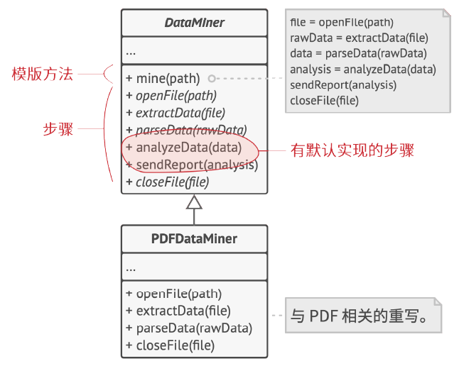

首先，我们将所有步骤声明为抽象类型，强制要求子类自行实现这些方法。在我们的例子中，子类中已有所有必要的实现，因此我们只需调整这些方法的签名，使之与超类的方法匹配即可。

对于不同的数据格式，打开和关闭文件以及抽取和解析数据的代码都不同，因此无需修改这些方法。但分析原始数据和生成报告等其他步骤的实现方式非常相似，因此可将其提取到基类中，以让子类共享这些代码。

在实际业务中，存在两种不同的步骤：

* 抽象步骤必须由各个子类来实现
* 可选步骤已有一些默认实现，但仍可在需要时进行重写

还有另一种名为钩子的步骤。钩子是内容为空的可选步骤。即使不重写钩子，模板方法也能工作。钩子通常放置在算法重要步骤的前后，为子类提供额外的算法扩展点。

### 模式结构

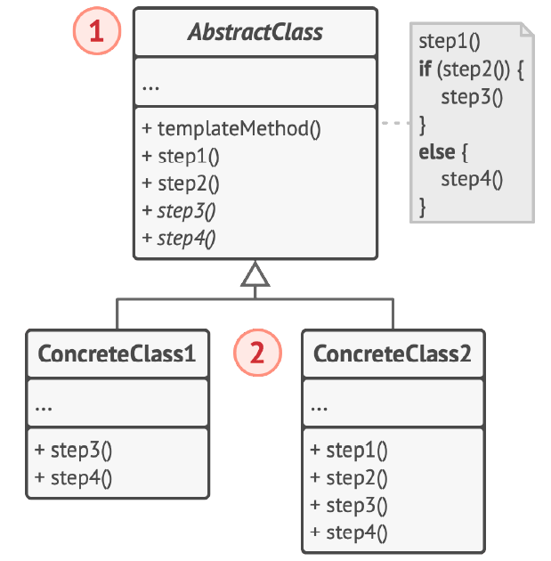

1、抽象类（AbstractClass） 会声明作为算法步骤的方法， 以及依次调用它们的实际模板方法。算法步骤可以被声明为抽象类型，也可以提供一些默认实现。

2、具体类（ConcreteClass）可以重写所有步骤，但不能重写模板方法自身。

### 代码示例

模版方法模式在 Java 框架中很常见。 开发者通常使用它来向框架用户提供通过继承实现的、 对标准功能进行扩展的简单方式。 

这里是一些核心 Java 程序库中模版方法的示例： 

* java.io.InputStream、 java.io.OutputStream、 java.io.Reader 和 java.io.Writer 的所有非抽象方法。
* java.util.AbstractList、 java.util.AbstractSet 和 java.util.AbstractMap 的所有非抽象方法。
* javax.servlet.http.HttpServlet， 所有默认发送 HTTP 405 “方法不允许” 错误响应的 do­XXX()方法。 你可随时对其进行重写。

识别方法： 模版方法可以通过行为方法来识别， 该方法已有一个在基类中定义的 “默认” 行为。

具体代码略

### 适用场景

1、当你只希望客户端扩展某个特定算法步骤，而不是整个算法或其结构时，可使用模板方法模式。

模板方法将整个算法转换为一系列独立的步骤，以便子类能对其进行扩展，同时还可让超类中所定义的结构保持完整。

2、当多个类的算法除一些细微不同之外几乎完全一样时，你可使用该模式。但其后果就是，只要算法发生变化，你就可能需要修改所有的类。

在将算法转换为模板方法时，你可将相似的实现步骤提取到超类中以去除重复代码。子类间各不同的代码可继续保留在子类中。

### 优缺点

优点：

* 你可仅允许客户端重写一个大型算法中的特定部分，使得算法其他部分修改对其所造成的影响减小。
* 你可将重复代码提取到一个超类中。

缺点：

* 部分客户端可能会受到算法框架的限制。
* 通过子类抑制默认步骤实现可能会导致违反里氏替换原则
* 模板方法中的步骤越多，其维护工作就可能会越困难

## 访问者模式

### 核心思想

又称为Visitor。访问者模式是一种行为设计模式， 它能将算法与其所作用的对象隔离开来。

当想要访问一个类，但访问它的代码比较繁琐，直接将访问的代码加在类中会破坏类本身的职责，此时可以使用访问者模式。

访问者模式建议将新行为放入一个名为访问者的独立类中，而不是试图将其整合到已有类中。现在，需要执行操作的原始对象将作为参数被传递给访问者中的方法，让方法能访问对象所包含的一切必要数据。

方法重载解决不了访问的问题，看下面的例子。

下面是几何图形类的层次结构：

~~~java
interface Graphic is
    method draw()

class Shape implements Graphic is
    field id
    method draw()
    // ……

class Dot extends Shape is
    field x, y
    method draw()
    // ……

class Circle extends Dot is
    field radius
    method draw()
    // ……

class Rectangle extends Shape is
    field width, height
    method draw()
    // ……

class CompoundGraphic implements Graphic is
    field children: array of Graphic
    method draw()
    // ……
~~~

这些代码运行正常且程序处于开发阶段。 但某天你决定开发导出功能。 如果将导出功能的代码放入这些类中， 它们看上去会很奇怪。 因此， 你决定不在层次结构里的类中添加导出功能， 而是在层次结构外创建一个包含所有导出逻辑的新类。 该类将包含将每个对象的公有状态导出为 XML 字符串的方法。 

~~~java
class Exporter is
    method export(s: Shape) is
        print("导出形状")
    method export(d: Dot)
        print("导出点")
    method export(c: Circle)
        print("导出圆形")
    method export(r: Rectangle)
        print("导出矩形")
    method export(cs: CompoundGraphic)
        print("导出组合图形")
~~~

但是运行这段代码就会出现一个问题：

~~~java
class App() is
    method export(shape: Shape) is
        Exporter exporter = new Exporter()
        exporter.export(shape);

app.export(new Circle());
// 不幸的是，这里将输出“导出形状”。
~~~

这是因为传入的类型虽然是Circle，但是引用类型是父类Shape，所以编译器只会执行到Shape为入参的方法。

但是，访问者模式可以解决这个问题。它使用了一种名为双分派的技巧，不使用累赘的条件语句也可下执行正确的方法。

双分派是一个允许在重载时使用动态绑定的技巧。 下面是其实现方式：

~~~java
class Visitor is
    method visit(s: Shape) is
        print("访问形状")
    method visit(d: Dot)
        print("访问点")

interface Graphic is
    method accept(v: Visitor)

class Shape implements Graphic is
    method accept(v: Visitor)
        // 编译器明确知道 `this` 的类型是 `Shape`。
        // 因此可以安全地调用 `visit(s: Shape)`。
        v.visit(this)

class Dot extends Shape is
    method accept(v: Visitor)
        // 编译器明确知道 `this` 的类型是 `Dot`。
        // 因此可以安全地调用 `visit(s: Dot)`。
        v.visit(this)

Visitor v = new Visitor();
Graphic g = new Dot();

// `accept` 方法是重写而不是重载的。编译器可以进行动态绑定。
// 因此在对象调用某个方法时，将执行其所属类中的 `accept`
// 方法（在本例中是 `Dot` 类）。
g.accept(v);

// 输出："访问点"
~~~

尽管访问者模式基于双分派的原则创建， 但这并不是其主要目的。 访问者的目的是让你能为整个类层次结构添加 “外部” 操作， 而无需修改这些类的已有代码。

与其让客户端来选择调用正确版本的方法，不如将选择权委派给作为参数传递给访问者的对象。由于该对象知晓其自身的类，因此能更自然地在访问者中选出正确的方法。它们会“接收”一个访问者并告诉其应执行的访问者方法。

最终还是修改了节点类，但毕竟改动很小，且使得我们能够在后续进一步添加行为时无需再次修改代码。现在，如果我们抽取出所有访问者的通用接口，所有已有的节点都能与我们在程序中引入的任何访问者交互。如果需要引入与节点相关的某个行为，你只需要实现一个新的访问者类即可。

### 模式结构

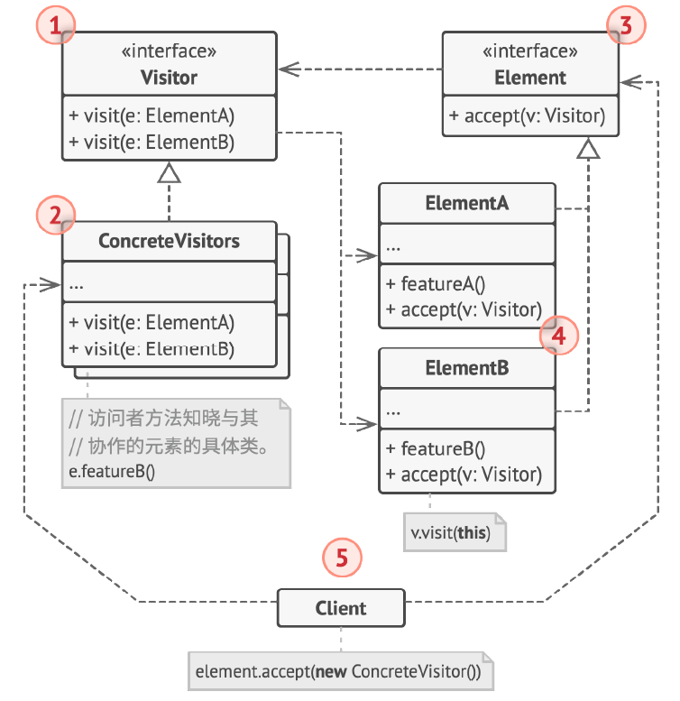

1、访问者（Visitor）接口声明了一系列以对象结构的具体元素为参数的访问者方法。如果编程语言支持重载，这些方法的名称可以是相同的，但是其参数一定是不同的。

2、具体访问者（Concrete Visitor）会为不同的具体元素类实现相同行为的几个不同版本。

3、元素（Element） 接口声明了一个方法来“接收” 访问者。该方法必须有一个参数被声明为访问者接口类型。

4、具体元素（Concrete Element） 必须实现接收方法。该方法的目的是根据当前元素类将其调用重定向到相应访问者的方法。请注意，即使元素基类实现了该方法，所有子类都必须对其进行重写并调用访问者对象中的合适方法。

5、客户端（Client） 通常会作为集合或其他复杂对象（例如一个组合树）的代表。客户端通常不知晓所有的具体元素类，因为它们会通过抽象接口与集合中的对象进行交互。

### 代码示例

这里是 Java 程序库代码中该模式的一些示例：

* javax.lang.model.element.AnnotationValue 和 Annotation­Value­Visitor
* javax.lang.model.element.Element 和 Element­Visitor
* javax.lang.model.type.TypeMirror 和 Type­Visitor
* java.nio.file.FileVisitor 和 Simple­File­Visitor
* javax.faces.component.visit.VisitContext 和 Visit­Callback

在本例中， 我们希望将一系列几何形状导出为 XML 文件。 重点在于我们不希望直接修改形状代码， 或者至少能确保最小程度的修改。

最终， 访问者模式建立了一个框架， 允许我们在不修改已有类的情况下向形状层次结构中添加新的行为。

通用形状接口，它包含了一个给访问者预留的accept方法：

~~~java
public interface Shape {
    void move(int x, int y);
    void draw();
    String accept(Visitor visitor);
}
~~~

几个具体形状：

~~~java
public class Dot implements Shape {
    private int id;
    private int x;
    private int y;

    public Dot() {
    }

    public Dot(int id, int x, int y) {
        this.id = id;
        this.x = x;
        this.y = y;
    }

    @Override
    public void move(int x, int y) {
        // move shape
    }

    @Override
    public void draw() {
        // draw shape
    }

    @Override
    public String accept(Visitor visitor) {
        return visitor.visitDot(this);
    }

    public int getX() {
        return x;
    }

    public int getY() {
        return y;
    }

    public int getId() {
        return id;
    }
}
~~~

~~~java
public class Circle extends Dot {
    private int radius;

    public Circle(int id, int x, int y, int radius) {
        super(id, x, y);
        this.radius = radius;
    }

    @Override
    public String accept(Visitor visitor) {
        return visitor.visitCircle(this);
    }

    public int getRadius() {
        return radius;
    }
}
~~~

~~~java
public class Rectangle implements Shape {
    private int id;
    private int x;
    private int y;
    private int width;
    private int height;

    public Rectangle(int id, int x, int y, int width, int height) {
        this.id = id;
        this.x = x;
        this.y = y;
        this.width = width;
        this.height = height;
    }

    @Override
    public String accept(Visitor visitor) {
        return visitor.visitRectangle(this);
    }

    @Override
    public void move(int x, int y) {
        // move shape
    }

    @Override
    public void draw() {
        // draw shape
    }

    public int getId() {
        return id;
    }

    public int getX() {
        return x;
    }

    public int getY() {
        return y;
    }

    public int getWidth() {
        return width;
    }

    public int getHeight() {
        return height;
    }
}
~~~

~~~java
public class CompoundShape implements Shape {
    public int id;
    public List<Shape> children = new ArrayList<>();

    public CompoundShape(int id) {
        this.id = id;
    }

    @Override
    public void move(int x, int y) {
        // move shape
    }

    @Override
    public void draw() {
        // draw shape
    }

    public int getId() {
        return id;
    }

    @Override
    public String accept(Visitor visitor) {
        return visitor.visitCompoundGraphic(this);
    }

    public void add(Shape shape) {
        children.add(shape);
    }
}
~~~

访问者接口：

~~~java
public interface Visitor {
    String visitDot(Dot dot);

    String visitCircle(Circle circle);

    String visitRectangle(Rectangle rectangle);

    String visitCompoundGraphic(CompoundShape cg);
}
~~~

具体访问者，针对不同类型的访问做出不同的访问逻辑：

~~~java
public class XMLExportVisitor implements Visitor {

    public String export(Shape... args) {
        StringBuilder sb = new StringBuilder();
        sb.append("<?xml version=\"1.0\" encoding=\"utf-8\"?>" + "\n");
        for (Shape shape : args) {
            sb.append(shape.accept(this)).append("\n");
        }
        return sb.toString();
    }

    public String visitDot(Dot d) {
        return "<dot>" + "\n" +
                "    <id>" + d.getId() + "</id>" + "\n" +
                "    <x>" + d.getX() + "</x>" + "\n" +
                "    <y>" + d.getY() + "</y>" + "\n" +
                "</dot>";
    }

    public String visitCircle(Circle c) {
        return "<circle>" + "\n" +
                "    <id>" + c.getId() + "</id>" + "\n" +
                "    <x>" + c.getX() + "</x>" + "\n" +
                "    <y>" + c.getY() + "</y>" + "\n" +
                "    <radius>" + c.getRadius() + "</radius>" + "\n" +
                "</circle>";
    }

    public String visitRectangle(Rectangle r) {
        return "<rectangle>" + "\n" +
                "    <id>" + r.getId() + "</id>" + "\n" +
                "    <x>" + r.getX() + "</x>" + "\n" +
                "    <y>" + r.getY() + "</y>" + "\n" +
                "    <width>" + r.getWidth() + "</width>" + "\n" +
                "    <height>" + r.getHeight() + "</height>" + "\n" +
                "</rectangle>";
    }

    public String visitCompoundGraphic(CompoundShape cg) {
        return "<compound_graphic>" + "\n" +
                "   <id>" + cg.getId() + "</id>" + "\n" +
                _visitCompoundGraphic(cg) +
                "</compound_graphic>";
    }

    private String _visitCompoundGraphic(CompoundShape cg) {
        StringBuilder sb = new StringBuilder();
        for (Shape shape : cg.children) {
            String obj = shape.accept(this);
            // Proper indentation for sub-objects.
            obj = "    " + obj.replace("\n", "\n    ") + "\n";
            sb.append(obj);
        }
        return sb.toString();
    }

}
~~~

客户端代码：

~~~java
public class Demo {
    public static void main(String[] args) {
        Dot dot = new Dot(1, 10, 55);
        Circle circle = new Circle(2, 23, 15, 10);
        Rectangle rectangle = new Rectangle(3, 10, 17, 20, 30);

        CompoundShape compoundShape = new CompoundShape(4);
        compoundShape.add(dot);
        compoundShape.add(circle);
        compoundShape.add(rectangle);

        CompoundShape c = new CompoundShape(5);
        c.add(dot);
        compoundShape.add(c);

        export(circle, compoundShape);
    }

    private static void export(Shape... shapes) {
        XMLExportVisitor exportVisitor = new XMLExportVisitor();
        System.out.println(exportVisitor.export(shapes));
    }
}
~~~

### 适用场景

1、如果你需要对一个复杂对象结构（例如对象树）中的所有元素执行某些操作，可使用访问者模式。

访问者模式通过在访问者对象中为多个目标类提供相同操作的变体，让你能在属于不同类的一组对象上执行同一操作。

2、可使用访问者模式来清理辅助行为的业务逻辑。

该模式会将所有非主要的行为抽取到一组访问者类中，使得程序的主要类能更专注于主要的工作。

3、当某个行为仅在类层次结构中的一些类中有意义，而在其他类中没有意义时，可使用该模式。

你可将该行为抽取到单独的访问者类中，只需实现接收相关类的对象作为参数的访问者方法并将其他方法留空即可。

### 优缺点

优点：

* 开闭原则。你可以引入在不同类对象上执行的新行为，且无需对这些类做出修改。
* 单一职责原则。可将同一行为的不同版本移到同一个类中。
* 访问者对象可以在与各种对象交互时收集一些有用的信息。当你想要遍历一些复杂的对象结构（例如对象树）， 并在结构中的每个对象上应用访问者时，这些信息可能会有所帮助。

缺点：

* 每次在元素层次结构中添加或移除一个类时，你都要更新所有的访问者。
* 在访问者同某个元素进行交互时，它们可能没有访问元素私有成员变量和方法的必要权限。

### 与其他模式的关系

* 访问者模式和命令模式：可以将访问者模式视为命令模式的加强版本， 其对象可对不同类的多种对象执行操作。
* 访问者模式和组合模式配合：可以使用访问者对整个组合模式树执行操作。
* 访问者模式和迭代器模式配合：可以同时使用访问者和迭代器模式来遍历复杂数据结构， 并对其中的元素执行所需操作， 即使这些元素所属的类完全不同。

